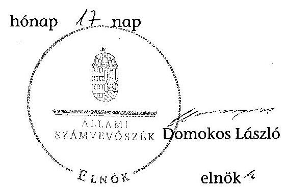

# ÁLLAMI   SZÁMVEVŐSZÉK 

## JELENTÉS

az önkormányzatok belső kontrollrendszere kialakításának, egyes kontrolltevékenységek és a belső ellenőrzés
működésének ellenőrzéséről
Koroncó
14064
2014. április

---

# Állami Számvevőszék 

Iktatószám: V-0342-052/2014.
Témaszám: 1372
Vizsgálat-azonosító szám: V064932

## Az ellenőrzést felügyelte:

dr. Benedek Mária
felügyeleti vezető
Az ellenőrzést vezette és az ellenőrzés végrehajtásáért felelős:
dr. Veress Tiborné
ellenőrzésvezető
A számvevőszéki jelentés összeállításában közremüködtek:
Tóth Béla
számvevő
Pető Krisztina
számvevő tanácsos
Az ellenőrzést végezték:
Szakmányné Bilik Mária Tóth Béla
számvevő tanácsos számvevő

---

# TARTALOMJEGYZÉK 

BEVEZETÉS ..... 5
I. ÖSSZEGZŐ MEGÁLLAPÍTÁSOK, KÖVETKEZTETÉSEK, JAVASLATOK ..... 9
II. RÉSZLETES MEGÁLLAPÍTÁSOK ..... 18

1. Az önkormányzat belső kontrollrendszerének kialakítása ..... 18
1.1. A kontrollkörnyezet ..... 18
1.2. A kockázatkezelési rendszer ..... 19
1.3. A kontrolltevékenységek ..... 20
1.4. Az információs és kommunikációs rendszer ..... 22
1.5. A monitoring rendszer ..... 22
2. A pénzügyi folyamatokban kulcsszerepet betöltő teljesítésigazolás és érvényesítés belső kontrollok múködése ..... 23
3. A belső ellenőrzés múködése ..... 26

## FÜGGELÉKEK

1. számú Értelmező szótár
2. számú Az értékelés módja és szempontjai

---

.

---

# RÖVIDÍTÉSEK JEGYZÉKE 

## Törvények

Áfa tv.
Áht.
ÁSZ tv.
Htv.

Info tv.
Ktv.
Kttv.
Ltv.
Mötv.
Mvtv.
Nvtv.
Ötv.
Számv. tv.
Tvtv.
Vagyonnyilatkozat-
tételről szóló tv.

## Rendeletek

Áhsz.
államháztartási számviteli kormányrendelet
Ávr.
Bkr.
Ikr.
önkormányzati SZMSZ
vagyongazdálkodási rendelet
2007. évi CXXVII. törvény az általános forgalmi adóról
2011. évi CXCV. törvény az államháztartásról
2011. évi LXVI. törvény az Állami Számvevőszékről
1991. évi XX. törvény a helyi önkormányzatok és szerveik, a köztársasági megbízottak, valamint egyes centrális alárendeltségủ szervek feladat- és hatásköreiről
2011. évi CXII. törvény az információs önrendelkezési jogról és az információszabadságról
1992. évi XXIII. törvény a köztisztviselők jogállásáról (hatálytalan 2012. március 1-jétől)
2011. évi CXCIX. törvény a közszolgálati tisztviselők ről (hatályos 2012. március 1-jétől)
1995. évi LXVI. törvény a köziratokról, a közlevéltárakról és a magánlevéltári anyag védelméről
2011. évi CLXXXIX. törvény Magyarország helyi önkormányzatairól
1993. évi XCIII. törvény a munkavédelemről
2011. évi CXCVI. törvény a nemzeti vagyonról
1990. évi LXV. törvény a helyi önkormányzatokról
2000. évi C. törvény a számvitelről
1996. évi XXXI. törvény a tűz elleni védekezésről, a műszaki mentésről és a tűzoltóságról
2007. évi CLII. törvény egyes vagyonnyilatkozat-tételi kötelezettségekről

249/2000. (XII. 24.) Korm. rendelet az államháztartás szervezetei beszámolási és könyvvezetési kötelezettségének sajátosságairól
4/2013. (I. 11.) Korm. rendelet az államháztartás számviteléről
368/2011. (XII. 31.) Korm. rendelet az államháztartásról szóló törvény végrehajtásáról
370/2011. (XII. 31.) Korm. rendelet a költségvetési szervek belső kontrollrendszeréről és belső ellenőrzéséről
335/2005. (XII. 29.) Korm. rendelet a közfeladatot ellátó szervek iratkezelésének általános követelményeiről
Koroncó Község Önkormányzata Képviselő-testületének 4/2011. (IV. 1.) számú rendelete a Képviselő-testület és szervei szervezeti és müködési szabályzatáról
Koroncó Község Önkormányzata Képviselő-testületének 14/2012. (XI. 30.) számú rendelete az önkormányzat vagyonáról és a vagyonnal való gazdálkodás szabályairól (hatályos 2012. december 1-jétől)

---

## Szórövidítések

alapító okirat ${ }_{1}$
alapító okirat $_{2}$
ÁSZ
belső ellenőrzési kézikönyv
gazdálkodási jogkörök szabályzata
hivatali SZMSZ ${ }_{1}$
hivatali SZMSZ $_{2}$
INTOSAI
iratkezelési szabályzat

ISSAI
jegyzö
Képviselő-testület
Kormányhivatal
közérdekú adatok igénylése és közzétételi rend

Levéltár
NGM
Önkormányzat
polgármester
Polgármesteri Hivatal
stratégiai ellenőrzési
terv
Társulás
ügyrend

Koroncó Község Önkormányzat Polgármesteri Hivatala alapító okirata (hatályos 2009. július 1-jétől 2013. október 2-ig)
Koroncói Polgármesteri Hivatal alapító okirata (hatályos 2013. október 3-tól)

Állami Számvevőszék
Győri Többcélú Kistérségi Társulás Belső ellenőrzési kézikönyve, 2012. év
Koroncó Község Jegyzőjének Kötelezettségvállalás, utalványozás, ellenjegyzés, érvényesítés, teljesítés igazolás rendjének szabályzata (hatályos 2012. január 2-tól)
Koroncó Község Önkormányzat Polgármesteri Hivatalának Szervezeti és múködési szabályzata (hatályos 2011. április 22-től 2013. október 2-ig)
Koroncói Polgármesteri Hivatal Szervezeti és múködési szabályzata (hatályos 2013. október 3-tól)
International Organization of Supreme Audit Institutions (Legfőbb Ellenőrző Intézmények Nemzetközi Szervezete)
Koroncó Község Önkormányzat Polgármesteri Hivatalának Iratkezelési szabályzata (hatályos 2011. július 1jétől)
International Standards of Supreme Audit Institutions (Legfőbb Ellenőrző Intézmények Nemzetközi Standardjai)
Koroncó Község Önkormányzat jegyzője
Koroncó Község Önkormányzatának Képviselő-testülete
Győr-Moson-Sopron Megyei Kormányhivatal
Koroncó Község Jegyzőjének szabályzata a közérdekú adatok igénylésének és közzétételének rendjéről (hatályos 2012. április 1-jétől)

Magyar Nemzeti Levéltár Győr-Moson-Sopron Megyei Levéltára
Nemzetgazdasági Minisztérium
Koroncó Község Önkormányzata
Koroncó Község Önkormányzat polgármestere
Koroncó Község Önkormányzat Polgármesteri Hivatala
Koroncó Község Önkormányzat és költségvetési szervei 2011-2014. évi ellenőrzési stratégiai terve
Győri Többcélú Kistérségi Társulás
Koroncó Község Polgármesteri Hivatal Gazdasági szervezetének ügyrendje (hatályos 2012. január 2-tól)

---

# JELENTÉS 

## az önkormányzatok belsó kontrollrendszere kialakításának, egyes kontrolltevékenységek és a belső ellenőrzés múködésének ellenőrzéséről Koroncó

## BEVEZETÉS

Koroncó község állandó lakosainak száma 2012. január 1-jén 2096 fő volt. Az Önkormányzat héttagú Képviselő-testületének munkáját kettő állandó bizottság segítette. Az Önkormányzat az önállóan múködő és gazdálkodó Polgármesteri Hivatalon kívül egy önállóan múködő intézményt múködtetett, többségi tulajdoni hányadú gazdasági társasággal nem rendelkezett. A polgármester a 2010. évi önkormányzati választások óta tölti be tisztségét. A jegyző 2011. március 16 -tól látja el a jegyzői feladatokat. A Polgármesteri Hivatal szervezeti egységekre nem tagolódott, elkülönített gazdasági szervezettel nem rendelkezett, a foglalkoztatott köztisztviselők száma 2012. január 1-jén négy fő volt. A Polgármesteri Hivatalnál 2013. január 1-jétől szervezeti változás nem volt. Az Önkormányzat a 2012. évi költségvetési beszámolója szerint 352859 ezer Ft költségvetési bevételt ért el, valamint 287390 ezer Ft költségvetési kiadást teljesített. A 2012. december 31-i könyvviteli mérleg szerint 888475 ezer Ft értékű eszközvagyonnal rendelkezett, a rövid lejáratú kötelezettség állománya 5190 ezer Ft, a hosszú lejáratú kötelezettsége 8046 ezer Ft volt (pályázati önrész, melynek megfizetését 2020-ig vállalta az Önkormányzat). Az adósságkonszolidáció során kapott állami támogatást 2012 decemberében 43357 ezer Ft hitel visszafizetésére fordították.

A demokratikus társadalmakban alapvető igény, hogy a közpénzeket, a közvagyont használók tevékenységükről elszámoljanak, ahhoz egyértelmú és érvényesíthető felelősségi szabályok társuljanak. Ennek a jogos igénynek az érvényesítéséhez meg kell teremteni azokat a folyamatokat, rendszereket, amelyek nélkülözhetetlenek az elszámoltatáshoz. Az elszámoltatás eredményes múködtetéséhez szükség van a megfelelő információs, kontroll, értékelési és beszámolási rendszerek kialakítására.

Magyarországon az uniós csatlakozási tárgyalások idejére nyúlnak vissza a belső kontrollrendszer szabályozásának gyökerei. Az uniós elvárásoknak megfelelő új terminológia szerinti államháztartási belső pénzügyi ellenőrzési (ÁBPE) rendszer területén a jogharmonizáció 2003-ban teljes körűen megvalósult, míg az önkormányzati alrendszerre vonatkozó, az Ötv.-ben megjelenített speciális szabályozás 2005-ben lépett hatályba. Az államháztartási belső kontrollrendszer koncepciója 2009-ben továbbfejlődött. A változások irányát mutat-

---

ja, hogy a költségvetési szervek belső kontrollrendszere már magában foglalja a korszerű, felelős szervezetirányítás elemeit (kontrollkörnyezet, kockázatkezelés, kontrolltevékenység, információ és kommunikáció, monitoring) is. E kontrollrendszer szabályozása háromszintű, a törvényi előírásokat az Áht. és a Mötv., a rendeleti szintű szabályozást az Ávr. és a Bkr. tartalmazza, amelyeket útmutatói szinten az NGM által kiadott standardok és kézikönyvek támogatnak.

A belső kontrollrendszer azt a célt szolgálja, hogy a költségvetési szervek múködésük és gazdálkodásuk során a tevékenységeket szabályszerűen, gazdaságosan, hatékonyan és eredményesen hajtsák végre, teljesítsék elszámolási kötelezettségeiket és megvédjék az erőforrásokat a veszteségektől, a károktól és a nem rendeltetésszerű használattól. A belső kontrollrendszer magában foglalja mindazon szabályokat, eljárásokat, gyakorlati módszereket és szervezeti struktúrákat, kockázatkezelési technikákat, kontrolltevékenységeket, amelyek segítséget nyújtanak a szervezetnek céljai eléréséhez.

Az ÁSZ a 2011-2015. évekre szóló stratégiájában hangsúlyos szerepet szánt annak, hogy szilárd szakmai alapon álló, értékteremtő ellenőrzéseivel előmozdítsa a közpénzügyek átláthatóságát, rendezettségét. A számvevőszéki ellenőrzés nemzetközi alapelvei is rögzítik, hogy a megfelelő belső kontrollrendszer minimálisra csökkenti a hibák és szabálytalanságok kockázatát.

Az ellenőrzés célja annak megállapítása volt, hogy a belső kontrollrendszer elemeinek kialakítása, a pénzügyi folyamatokban kulcsszerepet betöltő teljesítésigazolás és érvényesítés, és a belső ellenőrzés szabályos működése biztosítot-ta-e az Önkormányzatnál a közpénzfelhasználás szabályosságát, hozzájárult-e az értéket teremtő rend követelményének érvényesüléséhez.

Ennek keretében értékeltük, hogy:

- a jogszabályi előírásoknak megfelelően alakították-e ki a belső kontrollrendszer elemeit;
- a gazdálkodás folyamatában kulcsszerepet betöltő teljesítésigazolás és érvényesítés kontrolltevékenységeit megfelelően működtették-e;
- biztosították-e a belső ellenőrzés szabályos múködését;
- amennyiben az ÁSZ tett javaslatot a 2008-2011. évek közötti ellenőrzése kapcsán az Önkormányzatnak, intézkedtek-e azok végrehajtására.

Az ellenőrzés várható hasznosulását négy szinten tervezzük. A törvényalkotás számára összegzett tapasztalatok állnak rendelkezésre a belső kontrollrendszer önkormányzati területen való kialakításáról, működéséről és hatásairól, a belső ellenőrzés működéséről. Ennek alapján következtetést lehet levonni arról, hogy a belső kontrollrendszer kialakítására és működtetésére vonatkozó jelenlegi, differenciálás nélküli - jogszabályi előírások reális követelményeket támasztanak-e az eltérő adottságú települési önkormányzatok esetében, illetve indokolt-e esetleges jogszabályi módosítás kezdeményezése. Az ellenőrzés az ellenőrzött számára visszajelzést ad a belső kontrollrendszer kialakításában és múködésében fellépő hiányosságokról, javaslataival hozzájárul azok kikü-

---

szöböléséhez, amely csökkentheti a későbbi ellenőrzések gyakoriságát. Az ellenőrzés megállapításait és javaslatait más szervezetek is hasznosíthatják a rendezett gazdálkodási keretek kialakításához. A társadalom számára jelzi, hogy közpénz nem maradhat ellenőrizetlenül, az ÁSZ értékteremtő rend kialakításához és megőrzéséhez hozzájáruló tevékenysége pozitív hatással lesz a szervezetről kialakított összkép formálásában. A szervezeten belül lehetőség nyílik arra, hogy a megállapítások szintetizálásával az ÁSZ a hozzáadott értéket teremtő elemző tevékenységét és tanácsadó szerepét is erősítse.

Az önkormányzatok belső kontrollrendszere kialakításának, egyes kontrolltevékenységek és a belső ellenőrzés működésének ellenőrzéséről szóló jelentés I. fejezetének összegző része az ellenőrzés céljára ad rövid, szintetizáló összefoglalót, és tartalmazza a következtetéseket a II. fejezet részletes megállapításain alapulóan. A jelentés intézkedést igénylő megállapításait és javaslatait az ellenőrzés során feltárt, a jelentés II. fejezetében rögzített részletes megállapítások alapozzák meg. A helyszíni ellenőrzés lezárásáig a helyi szabályozás változásait nyomon követtük. Az ÁSZ az ellenőrzés megállapításait az ellenőrzött időszakban hatályos, az intézkedést igénylő megállapításokra tett javaslatokat a jelenleg hatályos jogszabályok alapján fogalmazta meg.

Az ellenőrzés típusa: szabályszerűségi ellenőrzés.
Az ellenőrzött időszak: a belső kontrollrendszer kialakításának megfelelősége esetében a 2012. évre, a pénzügyi folyamatokban kulcsszerepet betöltő teljesítésigazolás és érvényesítés belső kontrollok múködésének megfelelőségét és a belső ellenőrzés szabályszerű működését a 2012. január 1. és december 31-e közötti időszak eseményeit figyelembe véve értékeltük, míg az ÁSZ javaslatainak utóellenőrzése a 2008-2011. években végzett ellenőrzések nyilvánosságra hozott jelentéseiben tett javaslatok áttekintésére terjedt ki.

# Az ellenőrzött szervezet: az Önkormányzat. 

Az ellenőrzés jogszabályi alapját az ÁSZ tv. 1. § (3) bekezdése, az 5. § (2) és (6) bekezdése, valamint az Áht. 61. § (2) bekezdésének előírásai képezik.

Az ellenőrzés szakmai módszertana az ÁSZ hivatalos honlapján (www.asz.hu) közzétett szakmai szabályokon alapult, amely az INTOSAI által kiadott ISSAI figyelembevételével készült.

Az ellenőrzés lefolytatásához az Önkormányzat a kimutatások és a tanúsítvány elektronikus kitöltésével, valamint az ÁSZ által kért dokumentumok elektronikus megküldésével szolgáltatott adatokat. Az így rendelkezésre bocsátott adatok, információk kontrollja és a munkalapok kitöltése a helyszíni ellenőrzés keretében történt. A jelentésben használt fogalmak magyarázatát az 1. számú függelék, az ellenőrzés egyes területeinek értékelésénél alkalmazott egységes minősítési szempontokat a 2. számú függelék tartalmazza.

A belső kontrollrendszer kialakításának ellenőrzése során értékeltük a kontrollkörnyezet, a kockázatkezelési rendszer, a kontrolltevékenységek, az információs és kommunikációs rendszer, valamint a monitoring rendszer szabályozottságának megfelelőségét. A pénzügyi folyamatokban kulcsszerepet betöltő teljesí-

---

tésigazolás és érvényesítés kontrollok múködése megfelelőségének minősítéséhez az állományba nem tartozók megbízási díjai, a külső szolgáltatók által végzett karbantartási, kisjavítási munkák, az egyéb üzemeltetési és fenntartási szolgáltatások, a rendszeres szociális segélyek, valamint az államháztartáson kívülre teljesített múködési és felhalmozási célú pénzeszközátadások közül kockázatelemzéssel választottuk ki az ellenőrzött kiadási jogcímeket. Az egyszerű véletlen mintavétellel kiválasztott tételek ellenőrzését többlépcsős megfelelőségi tesztek útján addig végeztük, amíg elegendő és megfelelő bizonyítékot szereztünk a vizsgált folyamatok kulcskontrolljai múködésének megfelelő vagy nem megfelelő voltáról. Értékeltük az Önkormányzatnál a belső ellenőrzés múködésének szabályosságát. Utóellenőrzésre nem került sor, mivel az ÁSZ az Önkormányzatnál a 2008-2011. évek között ellenőrzést nem végzett.

Az ÁSZ tv. 29. § (1) bekezdése szerint a jelentéstervezetet megküldtük a polgármester részére, aki az ÁSZ tv. 29. § (2) bekezdésében foglalt észrevételezési jogával nem élt, a jelentéstervezetre észrevételt nem tett.

---

# I. ÖSSZEGZŐ MEGÁLLAPÍTÁSOK, KÖVETKEZTETÉSEK, JAVASLATOK 

A belső kontrollrendszeren belül 2012-ben a kontrollkörnyezet, a kockázatkezelési rendszer, a kontrolltevékenységek, az információs és kommunikációs rendszer, valamint a monitoring rendszer kialakítását külön-külön és együttesen is értékeltük. A belső kontrollrendszer kialakítása az összesített értékelés alapján nem felelt meg a jogszabályi előírásoknak.

A belső kontrollrendszer egyes területei kialakításának minősítése a következő:

| Kontrollterïlet | Minősités |  |
| :-- | :-- | :-- |
| Kontrollkörnyezet |  | nem   megfelelő |
| Kockázatkezelési rendszer |  | nem   megfelelő |
| Kontrolltevékenységek | részben   megfelelő |  |
| Információs és kommuni-   kációs rendszer |  | nem   megfelelő |
| Monitoring rendszer |  | nem   megfelelő |

Részben megfelelőnek értékeltük a kontrolltevékenységek kialakítását, mivel az ellenőrzésünk által megállapított szabályozásbeli hiányosságok nem veszélyeztették a Polgármesteri Hivatal, ezáltal az Önkormányzat céljainak elérését.

Nem megfelelőnek értékeltük a kontrollkörnyezet, a kockázatkezelési rendszer, az információs és kommunikációs rendszer és a monitoring rendszer kialakítását, mivel az ellenőrzésünk során megállapított szabályozásbeli hiányosságok magukban hordozzák a szabálytalan múködés és gazdálkodás, valamint a korrupció kockázatát.

A kockázatkezelési rendszer kialakításával kapcsolatban a közszolgálatban nem álló személyek vagyonnyilatkozat-tételi kötelezettsége teljesítésének ellenőrzése során feltárt hibák, hiányosságok kijavítása, megszüntetése érdekében az ÁSZ levélben hívta fel a polgármestert a jogszabálysértő gyakorlat mielőbbi megszüntetésére.

A belső kontrollrendszer nem megfelelő kialakítása kockázatot jelent az Önkormányzat feladatainak szabályszerű, gazdaságos, hatékony és eredményes végrehajtása során.

Az állományba nem tartozók megbízási díjaival, valamint a külső szolgáltatók által végzett karbantartási, kisjavítási munkákkal kapcsolatos kifizetések során

---

a pénzügyi folyamatokban kulcsszerepet betöltő teljesítésigazolás és érvényesítés belső kontrollok múködése gyenge volt. Gyengének értékeltük a két kulcskontroll együttes múködését, mert azok nem biztosították az ellenőrzésünk által feltárt hiányosságok bekövetkezésének megelőzését.

A számvevőszéki ellenőrzés az ellenőrzött kifizetésekkel összefüggésben a rendelkezésre bocsátott dokumentumok alapján kár bekövetkeztére utaló adatot, tényt nem állapított meg, azonban a gazdálkodásban kulcsszerepet betöltő kontrollok gyenge működése miatt fennáll a hibák bekövetkezésének lehetősége. A nem megfelelően szabályozott és múködtetett belső kontrollok korrupciós kockázatot hordoznak.

Az Önkormányzat a belső ellenőrzési feladatokat - képviselő-testületi döntés alapján - a Társulás útján látta el. A belső ellenőrzés múködése a jogszabályi előírásoknak ugyan megfelelt, azonban az ellenőrzés szűk területre korlátozódott, és emiatt nem volt pozitív visszahatással a kontrollrendszer elemeire. A belső ellenőrzés nem tárta fel a számvevőszéki ellenőrzés által megállapított hiányosságokat a kontrollkörnyezet, a kockázatkezelési rendszer, az információs és kommunikációs, illetve a monitoring rendszer kialakításánál, valamint a pénzügyi folyamatokban kulcsszerepet betöltő teljesítésigazolás és érvényesítés belső kontrollok múködésénél.

Az ÁSZ tv. 33. § (1) bekezdésében foglaltak értelmében az ellenőrzött szervezet vezetője köteles a jelentésben foglalt megállapításokhoz kapcsolódó intézkedési tervet összeállítani, és azt a jelentés kézhezvételétől számított 30 napon belül az ÁSZ részére megküldeni. Amennyiben az intézkedési tervet határidőre nem küldi meg a szervezet, vagy az ÁSZ tv. 33. § (2) bekezdésében foglalt póthatáridő elteltével megküldött intézkedési terv továbbra sem elfogadható, az ÁSZ elnöke a hivatkozott törvény 33. § (3) bekezdés a)-b) pontjaiban foglaltakat érvényesítheti.

Az ellenőrzés intézkedést igénylő megállapításai és javaslatai:

# a polgármesternek 

1. A Képviselő-testület bizottságainak nem helyi önkormányzati képviselő tagjai a Va-gyonnyilatkozat-tételről szóló tv. 5. § (1) bekezdés c) pontjának előírása ellenére nem tettek vagyonnyilatkozatot.

Javaslat:
Intézkedjen soron kívül arról, hogy a bizottságok nem helyi önkormányzati képviselő tagjai a Vagyonnyilatkozat-tételről szóló tv. 5. § (1) bekezdés c) pontja előírásainak megfelelően tegyenek vagyonnyilatkozatot.
2. Az Áht. 37. § (1) és az Ávr. 55. § (1) bekezdései ellenére az Önkormányzat nevében történt kötelezettségvállalásokra pénzügyi ellenjegyzés nélkül került sor.

---

Javaslat:
Intézkedjen, hogy az Önkormányzat nevében történt kötelezettségvállalásra az Áht. 37. § (1) bekezdésében és az Ávr. 55. § (1) bekezdésében foglaltaknak megfelelően - az Ávr. 53. §-ában meghatározott kivételekkel - kizárólag a pénzügyi ellenjegyzés után, a pénzügyi teljesítés esedékességét megelőzően, írásban kerüljön sor.
3. A számvevőszéki ellenőrzés megállapításai alapján az Önkormányzatnál a belső kontrollrendszer kialakítása összefoglalóan értékelve nem felelt meg a jogszabályi előírásoknak a kulcskontrollok múködése gyenge volt, a belső ellenőrzés müködése ugyan megfelelt a jogszabályi előírásoknak, azonban nem tárta fel, ezáltal nem is javíttatta ki a feltárt hiányosságokat. A megállapított szabályozásbeli és müködésbeli hiányosságok magukban hordozzák a szabálytalan müködés kockázatát.

Javaslat:
A Mötv. 115. § (1) bekezdésében foglaltak alapján kísérje figyelemmel az Önkormányzat gazdálkodásának szabályszerűségét. A Mötv. 67. § f) pontja alapján gondoskodjon a belső kontrollrendszer müködésére vonatkozó jogszabályi rendelkezések be nem tartása, valamint a teljesítésigazolás, illetve az érvényesítés kontrollokkal öszszefüggésben feltárt hiányosságok, szabálytalanságok tekintetében az esetleges munkajogi felelősséggel kapcsolatos körülmények kivizsgálásáról, majd a vizsgálat eredményének függvényében tegye meg a szükséges intézkedéseket.

# a jegyzőnek 

1. a kontrollkörnyezettel kapcsolatban:

A jegyző a hivatali SZMSZ,-ben - az Ávr. 13. § (1) bekezdés c) pontjában foglaltak ellenére - nem rögzítette az ellátandó, és a szakfeladat rend szerint szakfeladat számmal és megnevezéssel besorolt alaptevékenységek, valamint az alaptevékenységet szabályozó jogszabályok megjelölését.

A jegyző - a Htv. 140. §. (1) bekezdés c) pontjában foglaltak ellenére - az Önkormányzat intézményének számviteli rendjét nem alakította ki.

A jegyző - az Mvtv. 2. § (3) bekezdésében foglaltak ellenére - a képernyő előtti munkavégzés kivételével nem határozta meg a Polgármesteri Hivatalban az egészséget nem veszélyeztető és biztonságos munkavégzés követelményei megvalósításának módját.

A jegyző - a Tvtv. 19. § (1) bekezdésében foglaltak ellenére - nem készítette el a Polgármesteri Hivatal tűzvédelmi szabályzatát.

A jegyző - a Bkr. 6. § (3) bekezdésében foglaltak ellenére - a Polgármesteri Hivatal ellenőrzési nyomvonalának rendszeres aktualizálásáról nem gondoskodott.

A Képviselő-testület a Kttv. 231. § (1) bekezdése ellenére nem állapította meg - a Kttv. 83. §-ában meghatározott - a köztisztviselőkkel szembeni hivatásetikai alapelvek részletes tartalmát, valamint az etikai eljárás szabályait, mivel a jegyző - az Ötv.

---

36. § (2) bekezdés a) pontjában előírt feladata ellenére - nem készítette elő ennek dokumentumát.

Javaslat:
a) Készítse el a hivatali SZMSZ ${ }_{2}$ módosítását annak érdekében, hogy az tartalmazza az Ávr. 13. § (1) bekezdésében előírt valamennyi tartalmi elemet, és kezdeményezze az Áht. 9. § (1) bekezdés a) pontjában foglaltakra tekintettel a Képviselőtestület elé terjesztését.
b) Alakítsa ki a Htv. 140. §. (1) bekezdés c) pontjában foglaltak alapján az önkormányzat intézményeinek számviteli rendjét.
c) Határozza meg az egészséget nem veszélyeztető és biztonságos munkavégzés követelményei megvalósításának módját az Mvtv. 2. § (3) bekezdése alapján.
d) Készítse el a tűzvédelmi szabályzatot a Tvtv. 19. § (1) bekezdésében foglalt előírásnak megfelelően.
e) Aktualizálja rendszeresen a Bkr. 6. § (3) bekezdésében előírtaknak megfelelően az ellenőrzési nyomvonalat.
f) Készítse elő a Mötv. 81. § (3) bekezdés c) pontjában foglalt feladatkörében a köztisztviselőkkel szembeni - a Kttv. 83. §-a szerinti - hivatásetikai alapelvek részletes tartalmának, valamint az etikai eljárás szabályainak dokumentumait, és a Kttv. 231. § (1) bekezdésében foglaltakra tekintettel kezdeményezze azok Kép-viselő-testület elé terjesztését.
2. a kockázatkezelési rendszerrel kapcsolatban:

A jegyző - a Bkr. 7. § (2) bekezdésében foglaltak ellenére - nem mérte fel és nem állapította meg a Polgármesteri Hivatal tevékenységében, gazdálkodásában rejlő kockázatokat, mivel nem határozta meg azok bekövetkezésének valószínűségét és költségvetési szervre gyakorolt hatását, továbbá nem határozta meg az egyes kockázatokkal kapcsolatban szükséges intézkedéseket, valamint azok teljesítésének folyamatos nyomon követési módját.

Nem rögzítették - a Vagyonnyilatkozat-tételről szóló tv. 4. § d) pontjában foglaltak ellenére - a képviselő-testületi bizottságok nem helyi önkormányzati képviselő tagjainak a 3. § (3) bekezdés e) pontja szerinti vagyonnyilatkozat-tételi kötelezettségét az önkormányzati SZMSZ-ben, mivel a jegyző nem gondoskodott az Ötv. 36. § (2) bekezdés a) pontjában foglalt feladatkörében az önkormányzati SZMSZ vagyonnyilat-kozat-tételi kötelezettséggel kapcsolatos módosításának előkészítéséről. Az önkormányzati SZMSZ 7. számú mellékletében az Ötv. 22. § (3) bekezdésében előírtaknak megfelelően az Ügyrendi és Szociális Bizottság feladat- és hatáskörében határozták meg, hogy a polgármester és a képviselők vagyonnyilatkozatait nyilvántartja és ellenőrzi, azonban a bizottság feladataként nem rögzítették a vagyonnyilatkozatok őrzésének kötelezettségét. A Képviselő-testület bizottságainak nem helyi önkormányzati képviselő tagjaira a szabályozás nem terjedt ki. A bizottság nem helyi önkormányzati képviselő tagjaira vonatkozó szabályozás és az őrzésért felelős meghatározásának hiányában a Vagyonnyilatkozat-tételről szóló tv. 8. § (4) bekezdés előírása ellenére a bizottság nem helyi önkormányzati képviselő tagjait a vagyonnyilatkozat-

---

tételi kötelezettség fennállásáról és esedékességének időpontjáról az esedékességet legalább 30 nappal megelőzően nem tájékoztatták. Az ÁSZ levélben hívta fel a polgármestert a jogszabálysértő gyakorlat mielőbbi megszüntetésére.

Javaslat:
a) Mérje fel és állapítsa meg a Bkr. 7. § (2) bekezdésében foglaltak alapján a Polgármesteri Hivatal tevékenységében, gazdálkodásában rejlő kockázatokat, határozza meg az egyes kockázatokkal kapcsolatban szükséges intézkedéseket, valamint azok teljesítése folyamatos nyomon követésének módját.
b) Készítse elő a Mötv. 81. § (3) bekezdés c) pontjában foglalt feladatkörében az önkormányzati SZMSZ módosítását annak érdekében, hogy az tartalmazza a Va-gyonnyilatkozat-tételről szóló törvény 4. § d) pontjában előírtak szerint a va-gyonnyilatkozat-tételre kötelezettek teljes körét, valamint a Mötv. 57. § (2) bekezdésének megfelelően a vagyonnyilatkozatok vizsgálatát végző bizottságnak az őrzéssel kapcsolatos feladatait, köztük a tájékoztatási kötelezettséget is, és kezdeményezze annak Képviselő-testület elé terjesztését.
3. a kontrolltevékenységekkel kapcsolatban:

A jegyző a Bkr. 8. § (2) bekezdés a) pontjában foglaltak ellenére nem biztosította a pénzügyi döntések - köztük a támogatásokkal való elszámolások - dokumentumainak elkészítésével kapcsolatban a folyamatba épített, előzetes, utólagos és vezetői ellenőrzést.

A jegyző - az Ávr. 13. § (2) bekezdés a) pontjában és az Ávr. 53. § (2) bekezdésében foglaltakat figyelmen kívül hagyva - annak ellenére nem határozta meg az előzetes írásbeli kötelezettségvállalást nem igénylő kifizetések rendjét, hogy belső szabályozásban lehetővé tette a 100 ezer Ft alatti kifizetések előzetes írásbeli kötelezettségvállalás nélküli teljesítését.

A jegyző - az lkr. 8. § (1) bekezdésében foglalt előírást figyelmen kívül hagyva nem gondoskodott az iratkezelési szoftver által kezelt adatok biztonságáról, nem alakította ki az üzembiztonsági, adatvédelmi szabályok érvényre juttatásához szükséges eljárási szabályokat.

A jegyző - az Info tv. 7. § (2)-(3) bekezdéseiben foglalt előírásokat figyelmen kívül hagyva - az informatikai rendszer szabályozása során nem tette meg azokat a technikai és szervezési intézkedéseket és nem alakította ki azokat a szervezetre szabott eljárási részletszabályokat, amelyek biztosítják az adatok biztonságát és védelmét.

A jegyző - a Bkr. 8. § (4) bekezdés b) pontjában foglaltak ellenére - belső szabályzatban nem határozta meg a dokumentumokhoz és információkhoz való hozzáférésre vonatkozóan a felelősségi köröket.

Javaslat:
a) Biztosítsa a támogatásokkal való elszámolások dokumentumainak elkészítésére vonatkozóan a folyamatba épített, előzetes, utólagos és vezetői ellenőrzést a Bkr. 8. § (2) bekezdése alapján.

---

b) Rögzítse belső szabályzatban - az Ávr. 13. § (2) bekezdés a) pontjában és az Ávr. 53. § (2) bekezdésében foglaltak alapján - az előzetes írásbeli kötelezettségvállalást nem igénylő kifizetések rendjét.
c) Gondoskodjon az lkr. 8. § (1) bekezdésének megfelelően az iratkezelési szoftver által kezelt adatok biztonságáról, és alakítsa ki az üzembiztonsági, adatvédelmi szabályok érvényre juttatásához szükséges eljárási szabályokat.
d) Gondoskodjon az Info tv. 7. § (2)-(3) bekezdésében foglaltaknak megfelelően az informatikai rendszer adatainak biztonságáról.
e) Szabályozza belső szabályzatban a felelősségi körök meghatározásával a Bkr. 8. § (4) bekezdés b) pontjának megfelelően a dokumentumokhoz és információkhoz való hozzáférést.
4. az információs és kommunikációs rendszerrel kapcsolatban:

A jegyző - Bkr. 3. § d) pontjában és 9. § (1) bekezdésében foglaltak ellenére - nem alakított ki olyan rendszert, amely biztosítja, hogy a megfelelő információk a megfelelő időben eljutnak az illetékes szervezethez, szervezeti egységhez, személyhez.

A jegyző - az Ltv. 10. § (1) bekezdés c) pontjának előírását figyelmen kívül hagyva a Polgármesteri Hivatal egyedi iratkezelési szabályzatát nem a Levéltár és a Kormányhivatal egyetértésével adta ki.

A jegyző - az Info tv. 33. § (1) és (3) bekezdésében, a 37. § (1) bekezdésében és az 1. mellékletében, valamint a közérdekű adatok igénylése és közzétételi rendben foglaltak ellenére - a szervezeti adatok kivételével nem gondoskodott az Önkormányzat elektronikus közzétételi kötelezettségének teljesítéséről a 2012. évben.

A jegyző - az lkr. 14. § (4) bekezdésében foglaltak ellenére - az iratok iktatásának, az iratforgalom dokumentálásának elmulasztásával nem biztosította az ügyintézés folyamatának, az iratok szervezeten belüli útjának pontos követhetőségét és ellenőrizhetőségét, az iratok hollétének naprakész megállapíthatóságát.

Javaslat:
a) Alakítson ki és múködtessen a Bkr. 3. § d) pontjában és a 9. § (1) bekezdésében foglaltaknak megfelelően olyan rendszert, amely biztosítja, hogy a megfelelő információk a megfelelő időben eljutnak az illetékes szervezethez, szervezeti egységhez, illetve személyhez.
b) Az iratkezelési szabályzatot az Ltv. 10. § (1) bekezdés c) pontjának előírásának megfelelően a Levéltár és a Kormányhivatal egyetértésével adja ki.
c) Tegyen eleget az Info tv. 33. § (1) és (3) bekezdésében, a 37. § (1) bekezdésében és az 1. mellékletében, valamint a közérdekú adatok igénylése és közzétételi rendben foglaltnak megfelelően az Önkormányzat elektronikus közzétételi kötelezettségének.

---

d) Biztosítsa az lkr. 14. § (4) bekezdésében foglaltaknak megfelelően az iratok iktatásával és az iratforgalom dokumentálásával, hogy az iratok szervezeten belüli útja pontosan követhető és ellenőrizhető legyen.
5. a monitoring rendszerrel kapcsolatban:

A jegyző - a Bkr. 3. § e) pontjában és 10. §-ában foglaltak ellenére - nem alakította ki a Polgármesteri Hivatal tevékenységének, a célok megvalósításának nyomon követését biztosító rendszert.

Javaslat:
Alakítsa ki és múködtesse a Bkr. 3. § e) pontjában és 10. §-ában foglaltak alapján a Polgármesteri Hivatal tevékenységének, a célok megvalósításának nyomon követését biztosító rendszert.
6. a pénzügyi folyamatokban kulcsszerepet betöltő kontrollokkal kapcsolatban:

A kifizetéseket megelőzően a teljesítés igazolását az Ávr. 57. § (1) és (3) bekezdésében foglaltak ellenére nem, vagy azt nem a belső szabályzatban előírt tartalommal végezték el, továbbá a szerződésben foglaltak teljesítésének igazolásához ellenőrizhető dokumentumok nem álltak rendelkezésre, így a kiadások jogosságának, összegszerűségének és az ellenszolgáltatás teljesítésének igazolása nem szabályszerűen történt.

A teljesítésigazoló jogosultsága nem volt megállapítható, mivel aláírás mintája az Ávr. 60. § (3) bekezdésben előírt teljesítés igazolására jogosultak nyilvántartásában nem szerepelt.

Az érvényesítés során az Ávr. 58. § (1) bekezdésben foglalt ellenőrzési feladatokat nem végezték el, mert a kifizetés összegszerűségét, a fedezet meglétét szabályszerű teljesítésigazolás hiányában nem ellenőrizték.

Az érvényesítés során az Ávr. 58. § (2) bekezdés előírása ellenére nem jelezték az utalványozónak, hogy a megelőző ügymenetben nem tartották be az Áht. 37. § (1) és az Ávr. 55. § (1) bekezdésében foglaltakat, mivel kötelezettségvállalásra pénzügyi ellenjegyzés nélkül került sor, valamint azt, hogy a Számv. tv. 167. § (1) bekezdés h) pontjában és a gazdálkodási jogkörök szabályzatban előírtak ellenére az utalványlapon nem tüntették fel a főkönyvi számla számát és az Ávr. 59. § (3) bekezdésében előírt adatokat. Az érvényesítő nem jelezte továbbá, hogy az Áhsz. 48. § (2) bekezdésében hivatkozott 9. számú mellékletében foglaltak ellenére a főkönyvi számlát nem a gazdasági esemény tartalmának megfelelően jelölték ki, hogy a számla az Áfa tv. 169. § e) pont előírása ellenére hibásan tartalmazta a vevő nevét, valamint, azt, hogy az Ávr. 56. § (1) bekezdés előírása ellenére a kötelezettségvállalást követően nem gondoskodtak annak nyilvántartásba vételéről, mert nem vezettek a jogszabályban és a gazdálkodási jogkörök szabályzatában előírt tartalmú kötelezettségvállalási nyilvántartást.

Az érvényesítő jogosultsága nem volt megállapítható, mert aláírás mintája az Ávr. 60. § (3) bekezdésben előírt érvényesítésre jogosultak nyilvántartásában nem szerepelt, továbbá az Ávr. 60. § (1) bekezdésében meghatározott összeférhetetlenségi szabályok ellenére azonos volt a teljesítést igazolóval.

---

A jegyző „adóügyi feladatok" ellátására megbízási szerződést kötött annak ellenére, hogy a Kttv. 8. § (1)-(2) bekezdések előírása alapján a közigazgatási szerv közhatalmi hatáskörének gyakorlásával közvetlenül összefüggő, valamint ügyviteli feladat ellátására kizárólag közszolgálati jogviszony létesíthető.

Javaslat:
Intézkedjen - a teljesítésigazolás és az érvényesítés vonatkozásában feltárt hiányosságok megszüntetése, illetve az operatív gazdálkodás során a müködésbeli hibák megelőzése, feltárása és kijavítása érdekében - arról, hogy
a) a teljesítésigazolásra kijelölt, és az Ávr. 60. § (3) bekezdésében előírtak szerint nyilvántartott személyek az Áht. 38. § (1) és az Ávr. 57. § (1) bekezdésében foglaltaknak megfelelően, ellenőrizhető okmányok alapján ellenőrizzék és az Ávr. 57. § (3) bekezdésében foglalt módon igazolják a kiadások teljesítésének jogosságát, összegszerűségét, ellenszolgáltatást is magában foglaló kötelezettségvállalás esetében az ellenszolgáltatás teljesítését;
b) az érvényesítésre kijelölt, az Ávr. 60. § (3) bekezdésében előírtak szerinti nyilvántartásban szereplő személyek az Ávr. 60. § (1) bekezdésében foglalt összeférhetetlenségi szabályokat betartva - a kifizetéseket megelőzően teljesítésigazolás alapján, az Ávr. 57. § (3) bekezdése szerinti esetben annak hiányában is - az Ávr. 58. § (1)-(3) bekezdése alapján ellenőrizzék az összegszerűségnek, a fedezet meglétének és a megelőző ügymenetben az Áht., az államháztartási számviteli kormányrendelet, az Ávr. és a belső szabályzatokban foglaltaknak a betartását;
c) az Áht. 37. § (1) és az Ávr. 55. § (1) bekezdésében foglaltaknak megfelelően kötelezettségvállalásra - az Ávr. 53. §-ában meghatározott kivételekkel - kizárólag a pénzügyi ellenjegyzés után, a pénzügyi teljesítés esedékességét megelőzően, írásban kerüljön sor;
d) a bizonylaton tüntessék fel a Számv.tv. 167. § (1) bekezdés h) pontjában előírt, a könyvelés módjára és az érintett könyvviteli számlákra történő hivatkozást, továbbá a könyvviteli elszámolásra utaló főkönyvi számlát az államháztartási számviteli kormányrendelet 51. § (1) bekezdésében hivatkozott 16. számú mellékletében foglaltak alapján a gazdasági esemény tartalmának megfelelően jelöljék ki, valamint kifizetést az Áfa tv. 169. §-ában előírt adattartalommal benyújtott számla esetén teljesítsenek;
e) a kötelezettségvállalások nyilvántartását az Ávr. 56. § (1) bekezdésében foglalt előírásnak megfelelően vezessék, és az utalványrendeleten az Ávr. 59. § (3) bekezdésében foglalt kötelező tartalmi elemeket tüntessék fel;
f) a Polgármesteri Hivatal közhatalmi hatáskörének gyakorlásával közvetlenül összefüggő, valamint ügyviteli feladatainak ellátására a Kttv. 8. § (1)-(2) bekezdések előírása alapján kizárólag közszolgálati jogviszonyt létesítsen.
7. a belső ellenőrzés működésével kapcsolatban:

A Képviselő-testület a 2013. évi ellenőrzési tervet nem a Bkr. 31. § (4) bekezdésében foglalt tartalommal hagyta jóvá, mivel csak a tervezett ellenőrzés tárgyát és ütemezését tartalmazta. A belső ellenőrzési vezető által 2013. január 24-én - az előírt tar-

---

talmi követelményeknek megfelelően - elkészített 2013. évi belső ellenőrzési tervet a jegyző jóváhagyta, azonban azt a Képviselő-testületnek jóváhagyásra nem terjesztette elő.

A 2013. évi ellenőrzési terv összeállítása - a Bkr. 56. § (2) bekezdésében foglalt előírás ellenére, az ellenőrzés témakijelölésének kivételével - nem a jegyző írásos véleményének figyelembevételével történt, mivel a jegyző véleményt, javaslatot nem fogalmazott meg.

A belső ellenőrzési vezető által az elvégzett ellenőrzésekről vezetett nyilvántartás - a Bkr. 50. § (2) bekezdés b), f) és g) pontjában előírtak ellenére - nem tartalmazta az ellenőrzött szerv megnevezését, a vizsgált időszakot, valamint az intézkedési terv készítésének szükségességét.

A belső ellenőrzési vezető - a Bkr. 21. § (2) bekezdés d) pontjában és a 47. § (1) bekezdésében foglaltak ellenére - a belső ellenőrzési jelentésekben tett megállapításokról, javaslatokról, a vonatkozó intézkedési tervekről nyilvántartást nem vezetett, azok végrehajtásának nyomon követését elmulasztotta.

A Társulás munkaszervezetének vezetője a Bkr. 56. § (8) bekezdésében előírtak ellenére a 2011. évre vonatkozó éves ellenőrzési jelentést a jegyző részére határidőre nem küldte meg. A polgármester a zárszámadással egyidejűleg a 2011. évben elvégzett egy belső ellenőrzésről készített ellenőrzési jelentést terjesztette a Képviselőtestület elé jóváhagyásra, amely nem felelt meg a Bkr. 48. §-ban előírt éves ellenőrzési jelentés tartalmi követelményeinek.

Javaslat:
a) Kezdeményezze az éves ellenőrzési terv Képviselő-testület elé terjesztését annak érdekében, hogy azt a Képviselő-testület a Mötv. 119. § (5) és a Bkr. 32. § (4) bekezdésében előírt határidőn belül és a 31. § (4) bekezdésében előírt tartalommal hagyja jóvá.
b) Kezdeményezze, hogy az éves ellenőrzési tervet a belső ellenőrzési vezető a Bkr. 56. § (2) bekezdés előírásainak megfelelően a jegyző írásos véleményének figyelembevételével készítse el.
c) Kezdeményezze, hogy a belső ellenőrzési vezető a Bkr. 50. §-ában foglalt előírásnak megfelelően vezessen az elvégzett ellenőrzésekről nyilvántartást.
d) Kezdeményezze, hogy a belső ellenőrzési vezető a Bkr. 21. § (2) bekezdés d) pontjában és a 47. § (1) bekezdésben foglalt előírás alapján vezessen nyilvántartást az ellenőrzési jelentésekben tett megállapításokról, javaslatokról, a vonatkozó intézkedési tervekről, és kövesse nyomon azok végrehajtását.
e) Kezdeményezze, hogy a Bkr. 49. § (1) bekezdés szerint elkészített, és a Bkr. 48. $\S$-ában előírt tartalmi elemeket tartalmazó éves ellenőrzési jelentést a Társulás munkaszervezetének vezetője az 56. § (8) bekezdésében előírt határidőre küldje meg a jegyző részére.

---

# II. RÉSZLETES MEGÁLLAPÍTÁSOK 

## 1. AZ ÖNKORMÁNYZAT BELSŐ KONTROLLRENDSZERÉNEK KIALAKÍTÁSA

A belső kontrollrendszeren belül 2012-ben a kontrollkörnyezet, a kockázatkezelési rendszer, a kontrolltevékenységek, az információs és kommunikációs rendszer, valamint a monitoring rendszer kialakítását külön-külön és együttesen is értékeltük. A belső kontrollrendszer kialakítása az összesített értékelés alapján nem felelt meg a jogszabályi előírásoknak.

### 1.1. A kontrollkörnyezet

A kontrollkörnyezet kialakítása - a 2. számú függelékben részletezett kritériumrendszer alapján végzett értékelés szerint - a jogszabályi előírásoknak nem felelt meg, mert:

| Sorszám ${ }^{1}$ | Megállapítás | Megjegyzés |
| :--: | :--: | :--: |
| 1. | Az alapító okirat ${ }_{1}$ az - Ávr. 5. § (1) bekezdésének c) pontjában foglaltak ellenére - nem tartalmazta a Polgármesteri Hivatal alaptevékenységeinek felsorolását, azok államháztartás szak-feladatrendje szerinti megjelölését. | Az alapító okirat ${ }_{2}$ az alaptevékenységek felsorolását, azok szak-feladatrend szerinti megjelölését a jogszabály előírásainak megfelelően tartalmazza. |
| 4. | A Képviselő-testület - a Ktv. 34. § (3) bekezdésében foglaltak ellenére - nem döntött a teljesítményértékelés alapját képező célokról. | A Ktv.-t hatályon kívül helyezte a 2012. évi V. törvény 59. § (1) bekezdés a) pontja, hatálytalan 2012. március 1 -tól. |
| 7. | A jegyző a hivatali SZMSZ ${ }_{1}$-ben - az Ávr. 13. § (1) bekezdés c) pontjában foglaltak ellenére - nem rögzítette az ellátandó, és a szakfeladat rend szerint szakfeladat számmal és megnevezéssel besorolt alaptevékenységek, valamint az alaptevékenységet szabályozó jogszabályok megjelölését. | A hivatali SZMSZ ${ }_{2}$-ben a hiányosságokat részben pótolták, de az alaptevékenységet szabályozó jogszabályok megjelölését továbbra sem tartalmazza. |
| 16. | A jegyző az - Ötv. 36. § (2) bekezdés a) pontjában ${ }^{2}$ foglaltak ellenére - nem készítette elő megfelelő időben a vagyongazdálkodási rendelet módosítását annak érdekében, | Az Önkormányzat a hatályos jogszabályi rendelkezéseknek megfelelő vagyongazdálkodási rende- |

[^0]
[^0]:    ${ }^{1}$ A megállapítás számozása az Önkormányzat által az adatszolgáltatás során kitöltött kimutatások kérdéseinek sorszámával azonos.
    ${ }^{2}$ 2013. január 1-jétől a Mötv. 81. § (3) bekezdés c) pontja.

---

|  | hogy az megfeleljen az Nvtv. 3. § (1) bekezdés 6. pontja, 5. §-a, 11. § (16) bekezdése, 13. § (1) bekezdése, 18. § (1) és (12) bekezdése, valamint az Mötv. 109. § (4) bekezdése előírásainak, ezért a Képviselö-testület a jogszabályban meghatározott határidőt túllépve fogadta el a vagyongazdálkodási rendeletet. | letének tervezetét a jegyző előkészítette és a Képvise-lö-testület a 2012. november 29-1 ülésén döntött annak elfogadásáról. |
| :--: | :--: | :--: |
| 18. | A jegyző - a Htv. 140. §. (1) bekezdés c) pontjában foglaltak ellenére - az Önkormányzat intézményének számviteli rendjét nem alakította ki. |  |
| 32. | A jegyző - az Mvtv. 2. § (3) bekezdésében foglaltak ellenére - a képernyő előtti munkavégzés kivételével nem határozta meg a Polgármesteri Hivatalban az egészséget nem veszélyeztető és biztonságos munkavégzés követelményei megvalósitásának módját. |  |
| 33. | A jegyző - a Tvtv. 19. § (1) bekezdésében foglaltak ellenére - nem készítette el a Polgármesteri Hivatal túzvédelmi szabályzatát. |  |
| 44. | A jegyző - a Bkr. 6. § (3) bekezdésében foglaltak ellenére - a Polgármesteri Hivatal ellenőrzési nyomvonalának rendszeres aktualizálásáról nem gondoskodott. |  |
| 47. | A Képviselő-testület a Kttv. 231. § (1) bekezdés előirása ellenére nem állapította meg - a Kttv. 83. §-ában meghatározott - a köztisztviselökkel szembeni hivatásetikai alapelvek részletes tartalmát, valamint az etikai eljárás szabályait, mivel a jegyző - az Ötv. 36. § (2) bekezdés a) pontjában előírt feladata ellenére - nem készítette elő ennek dokumentumát. |  |

# 1.2. A kockázatkezelési rendszer 

A kockázatkezelési rendszer kialakítása - a 2. számú függelékben részletezett kritériumrendszer alapján végzett értékelés szerint - a jogszabályi előírásoknak nem felelt meg, mert:

| Sorszám | Megállapítás | Megjegyzés |
| :--: | :--: | :--: |
| 4., 5.,   8., 10. | A jegyző - a Bkr. 7. § (2) bekezdésében foglaltak ellenére - nem mérte fel és nem állapította meg a Polgármesteri Hivatal tevékenységében, gazdálkodásában rejlő kockázatokat, mivel nem határozta meg azok bekövetkezésének valószínúségét és költségvetési szervre gyakorolt hatását, továbbá nem határozta meg az egyes kockázatokkal kapcsolatban szükséges intézkedéseket, va- |  |

---

|  | lamint azok teljesítésének folyamatos nyomon követési módját. |
| :--: | :--: |
| 13. | A jegyző a Vagyonnyilatkozat-tételről szóló tv. 4. § a) pontjában foglaltak ellenére a vagyonnyilatkozat-tételre kötelezettek körét a hivatali SZMSZ ${ }_{1}$-ben nem rögzítette.   Nem rögzítették a Vagyonnyilatkozattételről szóló tv. 4. § d) pontjában foglaltak ellenére a bizottságok nem helyi önkormányzati képviselő tagjainak 3. § (3) bekezdés e) pontja szerinti vagyonnyilatkozattételi kötelezettségét az önkormányzati SZMSZ-ben, mivel a jegyző nem gondoskodott az Ötv. 36. § (2) bekezdés a) pontjában foglalt feladatkörében az önkormányzati SZMSZ vagyonnyilatkozat-tételi kötelezettséggel kapcsolatos módosításának előkészítéséről. |
|  | A Vagyonnyilatkozat-tételről szóló tv. 5. § (1) bekezdés b) pont előírása ellenére nem tett vagyonnyilatkozatot az a köztisztviselő, akinek jogviszonya a 2012. évben megszűnt, a vagyonnyilatkozat-tételre a jegyző nem szólította fel.   Az önkormányzati SZMSZ 7. számú mellékletében az Ötv. 22. § (3) bekezdésében előírtaknak megfelelően az Úgyrendi és Szociális Bizottság feladat- és hatáskörében határozták meg, hogy a polgármester és a képviselők vagyonnyilatkozatait nyilvántartja és ellenőrzi, a Képviselő-testület bizottságainak nem helyi önkormányzati képviselő tagjaira a szabályozás nem terjedt ki.   A bizottság nem helyi önkormányzati képviselő tagjaira vonatkozó szabályozás és az őrzésért felelős meghatározásának hiányában a Vagyonnyilatkozat-tételről szóló tv. 8. § (4) bekezdés előírása ellenére a bizottság nem helyi önkormányzati képviselő tagjait a va-gyonnyilatkozat-tételi kötelezettség fennállásáról és esedékességének időpontjáról az esedékességet legalább 30 nappal megelőzően nem tájékoztatták. A Képviselő-testület bizottságainak nem helyi önkormányzati képviselő tagjai a Vagyonnyilatkozat-tételről szóló tv. 5. § (1) bekezdés c) pontja előírása ellenére nem tettek vagyonnyilatkozatot. |

### 1.3. A kontrolltevékenységek

A kontrolltevékenységek kialakítása - a 2. számú függelékben részletezett kritériumrendszer alapján végzett értékelés szerint - a jogszabályi előírásoknak részben felelt meg.

A hivatali SZMSZ 18. § előírása szerint minden köztisztviselő köteles va-gyonnyilatkozat-tételre.

Az Mötv. 2013. január 1jétől hatályos 57. § (2) bekezdése előírja, hogy a vagyonnyilatkozatok vizsgálatát a szervezeti és müködési szabályzatban meghatározott bizottság végzi, amely gondoskodik azok nyilvántartásáról, kezeléséről és őrzéséről.
A jegyző munkaköri leírásában rögzítették, hogy gondoskodik a képviselők vagyonnyilatkozat tételi kötelezettségével kapcsolatos ügyviteli feladatok ellátásáról. A jegyző 2013. november 12-i nyilatkozata szerint a bizottság nem helyi önkormányzati képviselő tagjait nem hívta fel vagyonnyilatkozattételére.

---

A jegyző a kontrolltevékenység részeként előírta a folyamatba épített, előzetes, utólagos és vezetői ellenőrzést a költségvetés tervezése, a beszerzések lebonyolítása, a vagyonhasznosítási tevékenység vonatkozásában.

A jegyző a gazdálkodási jogkörök szabályzatában az írásbeli kötelezettségvállalások esetén szabályozta a kötelezettségvállalás pénzügyi ellenjegyzésének és a kiadások teljesítésigazolásának módját, az érvényesítés és utalványozás rendjét, és a jogszabályok előírásainak megfelelően jelölt ki pénzügyi ellenjegyzési és érvényesítési feladatra előírt szakképzettséggel rendelkező, a hivatal állományába tartozó köztisztviselőt.

Az ügyrendben a jegyző meghatározta az időközi és éves beszámolók elkészítésének feladatait, a beszámolási eljárásokhoz kapcsolódó felelősségi köröket, és a helyettesítés rendjét. A költségvetési beszámoló elkészítésével megbízott személy rendelkezett a jogszabályban előírt iskolai végzettséggel, a tevékenység ellátására jogosító engedéllyel.

A polgármester adott felhatalmazást kötelezettségvállalásra és utalványozásra, és a jogszabályi előírásoknak megfelelően tájékoztatta a Képviselő-testületet az Önkormányzat 2012. évi gazdálkodásának első félévi és háromnegyedévi helyzetéről. A jegyző szabályozta jogviszony megszűnése esetére a munkavállaló folyamatban lévő feladatai átadásának rendjét.

A kontrolltevékenységek kialakítása az alábbi kisebb hiányosságok miatt részben felelt meg a jogszabályi előírásoknak:

| Sorszám | Megállapítás |
| :--: | :--: |
| 5. | A jegyző a Bkr. 8. § (2) bekezdés a) pontjában foglaltak ellenére nem biztosította a pénzügyi döntések - köztük a támogatásokkal való elszámolások - dokumentumainak elkészítésével kapcsolatban a folyamatba épített, előzetes, utólagos és vezetői ellenőrzést. |
| 8., 9. | A jegyző - az Ávr. 13. § (2) bekezdés a) pontjában és az Ávr. 53. § (2) bekezdésében foglaltakat figyelmen kívül hagyva - annak ellenére nem határozta meg az előzetes írásbeli kötelezettségvállalást nem igénylő kifizetések rendjét, hogy belső szabályozásban lehetővé tette a 100 ezer Ft alatti kifizetések előzetes írásbeli kötelezettségvállalás nélküli teljesítését. |
| 10. | A jegyző az Ávr. 57. § (4) bekezdésében foglaltak ellenére 2012. március 30 -át megelőzően írásban nem jelölte ki, míg a polgármester - 2012. január 2-a és március 30-a között - jogosulatlanul jelölte ki az Önkormányzat kiadási előirányzatai vonatkozásában a teljesítésigazolásra jogosult személyeket. |
| 13. | A jegyző - az Ikr. 8. § (1) bekezdésében foglalt előírást figyelmen kívül hagyva - nem gondoskodott az iratkezelési szoftver által kezelt adatok biztonságáról, nem alakította ki az üzembiztonsági, adatvédelmi szabályok érvényre juttatásához szükséges eljárási szabályokat. |

---

A jegyző - az Info tv. 7. § (2)-(3) bekezdéseiben foglalt előírásokat figyelmen kívül hagyva - az informatikai rendszer szabályozása során nem tette meg azokat a technikai és szervezési intézkedéseket és nem alakította ki azokat a szervezetre szabott eljárási részletszabályokat, amelyek biztosítják az adatok biztonságát és védelmét.

A jegyző - a Bkr. 8. § (4) bekezdés b) pontjában foglaltak ellenére - belső szabályzatban nem határozta meg a dokumentumokhoz és információkhoz való hozzáférésre vonatkozóan a felelősségi köröket.

# 1.4. Az információs és kommunikációs rendszer 

Az információs és kommunikációs rendszer kialakítása - a 2. számú függelékben részletezett kritériumrendszer alapján végzett értékelés szerint nem felelt meg a jogszabályi előírásoknak, mert:

| Sorszám | Megállapítás |
| :--: | :--: |
| 1., 2. | A jegyző - Bkr. 3. § d) pontjában és 9. § (1) bekezdésében foglaltak ellenére   - nem alakított ki olyan rendszert, amely biztosítja, hogy a megfelelő információk a megfelelő időben eljutnak az illetékes szervezethez, szervezeti egységhez, személyhez. |
| 9. | A jegyző - az Ltv. 10. § (1) bekezdés c) pontjának előírását figyelmen kívül hagyva - a Polgármesteri Hivatal egyedi iratkezelési szabályzatát nem a Levéltár és a Kormányhivatal egyetértésével adta ki. |
| 7. | A jegyző - az Info tv. 33. § (1) és (3) bekezdésében, a 37. § (1) bekezdésében és 1. számú mellékletében, valamint a közérdekú adatok igénylése és közzétételi rendben foglaltak ellenére - a szervezeti adatok kivételével nem gondoskodott az Önkormányzat elektronikus közzétételi kötelezettségének teljesítéséről a 2012. évben. |
| 16. | A jegyző - az lkr. 14. § (4) bekezdésében foglaltak ellenére - az iratok iktatásának, az iratforgalom dokumentálásának elmulasztásával nem biztosította az ügyintézés folyamatának, az iratok szervezeten belüli útjának pontos követhetőségét és ellenőrizhetőségét, az iratok hollétének naprakész megállapíthatóságát. |

### 1.5. A monitoring rendszer

A monitoring rendszer kialakítása - a 2. számú függelékben részletezett kritériumrendszer alapján végzett értékelés szerint - nem felelt meg a jogszabályi előírásoknak, mert:

| Sorszám | Megállapítás | Megjegyzés |
| :--: | :--: | :--: |
| 1. | A jegyző - a Bkr. 3. § e) pontjában és 10. §ában foglaltak ellenére - nem alakította ki a Polgármesteri Hivatal tevékenységének, a célok megvalósításának nyomon követését biztosító rendszert. |  |

---

A jegyző a Bkr. 11. § (1) bekezdésében foglalt kötelezettsége ellenére - a Bkr. 1. mellékletében előírt nyilatkozatban - nem értékelte a 2011. évre vonatkozóan a Polgármesteri Hi vatal belső kontrollrendszerének minőségét.

A jegyző a belső kontrollrendszer minőségét a 2012. évre vonatkozóan - a Bkr. 1. melléklete szerinti nyilatkozatban -értékelte.

A helyi önkormányzatok törvényességi felügyeletét ellátó Kormányhivatal a 2012. évben nem élt törvényességi felhívással, vagy más törvényességi felügyeleti eszközzel a Képviselő-testület által alkotott rendeletekre, határozatokra vonatkozóan.

# 2. A PÉNZÜGYI FOLYAMATOKBAN KULCSSZEREPET BETÖLTŐ TELJESÍTÉSIGAZOLÁS ÉS ÉRVÉNYESÍTÉS BELSŐ KONTROLLOK MÜKÖDÉSE 

Az állományba nem tartozók megbízási díjaival, valamint a külső szolgáltatók által végzett karbantartással, kisjavítással kapcsolatos kifizetések során - összefoglalóan értékelve - a pénzügyi folyamatokban kulcsszerepet betöltő teljesítésigazolás és érvényesítés belső kontrollok müködésének megfelelősége gyenge volt, mert:

| Kulcskontroll | Megállapítás |
| :--: | :--: |
| Teljesítésigazolás | A kifizetéseket megelőzően a teljesítés igazolását az Ávr. 57. § (1) és (3) bekezdésében foglaltak ellenére nem, vagy azt nem a belső szabályzatban előírt tartalommal végezték el, továbbá a szerződésben foglaltak teljesítésének igazolásához ellenőrizhető dokumentumok nem álltak rendelkezésre, így a kiadások jogosságának, összegszerűségének és az ellenszolgáltatás teljesítésének igazolása nem szabályszerűen történt. |
|  | A teljesítésigazoló jogosultsága nem volt megállapítható, mivel aláírás mintája az Ávr. 60. § (3) bekezdésben előírt teljesítés igazolására jogosultak nyilvántartásában nem szerepelt. |
|  | Az érvényesítés során az Ávr. 58. § (1) bekezdésben foglalt ellenőrzési feladatokat nem végezték el, mert a kifizetés összegszerűségét, a fedezet meglétét szabályszerű teljesítésigazolás hiányában nem ellenőrizték, továbbá az Ávr. 58. § (2) bekezdés előírása ellenére nem jelezték az utalványozónak, hogy a megelőző ügymenetben nem tartották be az Áht. 37. § (1) és az Ávr. 55. § (1) bekezdésében foglaltakat, mivel kötelezettségvállalásra pénzügyi ellenjegyzés nélkül került sor, valamint a Számv. tv. 167. § (1) bekezdés h) pontjában és a gazdálkodási jogkörök szabályzatban előírtak ellenére az utalványlapon nem tüntették fel a fókönyvi számla számát és az Ávr. 59. § (3) bekezdésében előírt adatokat. Az érvényesítő nem jelezte továbbá, hogy az Áhsz. 48. § (2) bekezdésében hivatkozott 9. számú mellékletben foglaltak ellenére a főkönyvi számlát nem a gazdasági esemény tartalmának megfelelően jelölték ki, azt, hogy az Áfa tv. 169. § e) pont előírása ellenére hibásan tartalmazta a vevő nevét. |
|  | Az Ávr. 56. § (1) bekezdés előírása ellenére a kötelezettségvállalást követően nem gondoskodtak annak nyilvántartásba vételéről, mert nem vezettek a jogszabályban és a gazdálkodási jogkörök szabályzatában előírt tartalmú kötelezettségvállalási nyilvántartást. |

---

Az érvényesítő jogosultsága nem volt megállapítható, mert aláírásmintája az Ávr. 60. § (3) bekezdésben előírt érvényesítésre jogosultak nyilvántartásában nem szerepelt, továbbá az Ávr. 60. § (1) bekezdésében meghatározott összeférhetetlenségi szabályok ellenére az érvényesítő azonos volt a teljesítést igazolóval.

Az állományba nem tartozók megbízási díjainak kifizetése során a teljesítésigazolás és az érvényesítés kulcskontrollok müködésének megfelelősége gyenge volt, mert:

- a teljesítésigazoló a takarítói, a védőnői és adóügyi feladatok ellátásával összefüggő megbízási díjak számfejtését, illetve kifizetését megelőzően a belső szabályzatban előírt tartalmú teljesítésigazolás azonosító adatait nem rögzítette, továbbá a szerződésben foglaltak teljesítésének igazolásához ellenőrizhető dokumentumok nem álltak rendelkezésre, ezért az Ávr. 57. § (1) bekezdésének előírása ellenére a kifizetés jogosságának, összegszerűségének és a megbízás szerződés szerinti teljesítésének igazolását - aláírása ellenére a teljesítésigazoló nem szabályszerűen végezte;
- az érvényesítő jogosultsága nem volt megállapítható, mert aláírás mintája az Ávr. 60. § (3) bekezdés szerinti - az érvényesítésre jogosultak nyilvántartásában nem szerepelt;
- az érvényesítés során a takarítói, a védőnői és adóügyi feladatok ellátásával összefüggő megbízási díjak kifizetése esetén az Ávr. 58. § (1) bekezdése szerinti ellenőrzési feladatokat nem végezték el, mert a kifizetés összegszerűségét, a fedezet meglétét nem ellenőrizték, továbbá az Ávr. 58. § (2) bekezdés előírása ellenére nem jelezték az utalványozónak, hogy a megelőző ügymenetben nem tartották be az Áht. 37. § (1) és az Ávr. 55. § (1) bekezdésében foglaltakat, mivel a megbízási szerződések megkötésekor a kötelezettségvállalásra pénzügyi ellenjegyzés nélkül került sor, valamint a Számv. tv. 167. § (1) bekezdés h) pontjában és a gazdálkodási jogkörök szabályzatában előírtak ellenére, a könyvelés módjára és az érintett könyvviteli számlákra történő hivatkozást elmulasztották az utalványlapon feltüntetni;
- az érvényesítő nem kifogásolta, hogy az Ávr. 56. § (1) bekezdés előírása ellenére a kötelezettségvállalást követően nem gondoskodtak annak nyilvántartásba vételéről és nem vezettek a hivatkozott jogszabályban és a gazdálkodási szabályzatban előírt tartalmú kötelezettségvállalási nyilvántartást.

A jegyző „adóügyi feladatok" ellátására megbízási szerződést kötött annak ellenére, hogy a Kttv. 8. § (1)-(2) bekezdések előírása alapján a közigazgatási szerv közhatalmi hatáskörének gyakorlásával közvetlenül összefüggő, valamint ügyviteli feladat ellátására kizárólag közszolgálati jogviszony létesíthető. A megbízási szerződésben a munkavégzéssel kapcsolatos részletes feladatokat nem határozták meg. A megbízási szerződést felek 2013. március 31. napjával közös megegyezéssel megszüntették, a megbízott - az elvégzett adóügyi feladatokat alátámasztó dokumentumok, valamint a jegyző írásos nyilatkozata szerint - a megbízási szerződés hatálya alatt hatósági feladatokat nem végzett, ügyintézői feladatokat látott el, nyilvántartásokat vezetett.

---

A 2012. évben a külső szolgáltatók által végzett karbantartási, kisjavítási munkák kifizetése során a teljesítésigazolás és érvényesítés kulcskontrollok múködésének megfelelősége gyenge volt, mert:

- a teljesítésigazoló a kazánkarbantartás díjának kifizetését megelőzően az Ávr. 57. § (1) és (3) bekezdésében előírtak ellenére a teljesítés igazolását nem végezte el, mert nem ellenőrizte és aláírásával nem igazolta a kiadás teljesítésének jogosságát, összegszerűségét, valamint az ellenszolgáltatás teljesítését;
- a teljesítésigazoló jogosultsága nem volt megállapítható a szünetmentes tápegység javítás, az internet szolgáltatás helyreállítás és a készbeton vásárlás kiadási tételeinél, mert aláírás mintája az Ávr. 60. § (3) bekezdés szerinti teljesítés igazolására jogosultak nyilvántartásában nem szerepelt, aláírása nem volt azonosítható, továbbá az Ávr. 57. § (1) bekezdésének előírása ellenére a kifizetés jogosságának, összegszerűségének és a szerződésben foglaltak teljesítésének igazolását - aláírása ellenére - nem szabályszerűen végezte, mivel a kifizetéseket megelőzően nem a belső szabályzatban előírt tartalmú teljesítésigazolást alkalmazták, a szünetmentes áramkör javításánál a számla összegét a szerződéses egységárakkal nem lehetett megfeleltetni, illetve a megrendelések az ellenszolgáltatás összegét nem tartalmazták, és nem rendelkeztek az ellenszolgáltatások teljesítésének ellenőrzésére alkalmas dokumentumokkal;
- az érvényesítő jogosultsága nem volt megállapítható, mert aláírás mintája az Ávr. 60. § (3) bekezdés szerinti - az érvényesítésre jogosultak nyilvántartásában nem szerepelt, továbbá a készbeton vásárlás kiadási tételnél - az Ávr. 60. § (1) bekezdésében meghatározott összeférhetetlenségi szabályok ellenére - az érvényesítő azonos volt a teljesítést igazolóval;
- az érvényesítő - az Ávr. 58. § (1) bekezdésében előírtak és aláírása ellenére szabályszerű teljesítésigazolás hiányában nem ellenőrizte a kiadások összegszerűségét, és az Ávr. 58. § (2) bekezdésében előírtak ellenére nem jelezte az utalványozónak, hogy a megelőző ügymenetben a teljesítésigazolás elmaradt, vagy nem szabályszerűen történt, továbbá az Önkormányzat (internet szolgáltatás, készbeton), valamint a Polgármesteri Hivatal (szünetmentes tápegység) kiadási előirányzatára vonatkozó kötelezettségvállalásra az Áht. 37. § (1) és az Ávr. 55. § (1) bekezdésében foglaltaktól eltérően pénzügyi ellenjegyzés nélkül került sor;
- az érvényesítő a fedezet meglétét nem ellenőrizte, továbbá nem kifogásolta, hogy az Ávr. 56. § (1) bekezdés előírása ellenére a kötelezettségvállalást követően nem gondoskodtak annak nyilvántartásba vételéről és nem vezettek a hivatkozott jogszabályban és a gazdálkodási jogkörök szabályzatban előírt tartalmú kötelezettségvállalási nyilvántartást;
- az érvényesítő nem ellenőrizte és nem jelezte az utalványozónak a jogszabályok és a belső szabályzatok betartását, mert az utalványrendelet az Ávr. 59. § (3) bekezdésében és a gazdálkodási jogkörök szabályzatban foglaltaktól eltérően nem tartalmazta az előírt adatokat, továbbá a készbeton beszerzés kiadási tételnél a könyvviteli elszámolásra utaló főkönyvi számlaszámot az Áhsz. 48. § (2) bekezdésében és a 9. számú mellékletében foglaltak ellené-

---

re - anyagbeszerzés helyett külső szolgáltató által végzett karbantartási, kisjavítási munkák főkönyvi számlára jelölték ki, és a számla összegét annak ellenére kifizették, hogy a számla az Áfa tv. 169. § e) pont előirása ellenére hibásan tartalmazta a termék beszerzőjének nevét és címét, mivel azt, az Önkormányzat helyett a Polgármesteri Hivatal nevére állították ki.

A számvevőszéki ellenőrzés az ellenőrzött kifizetésekkel összefüggésben a rendelkezésre bocsátott dokumentumok alapján kár bekövetkeztére utaló adatot, tényt nem állapított meg, azonban a gazdálkodásban kulcsszerepet betöltő kontrollok gyenge múködése miatt fennáll a hibák bekövetkezésének kockázata.

# 3. A BELSŐ ELLENŐRZÉS MÜKÖDÉSE 

Az Önkormányzat a belső ellenőrzési feladatokat - képviselő-testületi döntés alapján - a Társulás útján látta el.

A belső ellenőrzés múködése - a 2. számú függelékben részletezett kritériumrendszer alapján végzett értékelés szerint - az Önkormányzatnál megfelelt a jogszabályi előírásoknak.

A Társulás rendelkezett a jegyző által megismert és a munkaszervezet vezetője által jóváhagyott, a jogszabályi előírásoknak megfelelő tartalmú belső ellenőrzési kézikönyvvel. A kijelölt belső ellenőrzési vezető megfelelt a jogszabályban előírt képesítési és szakmai gyakorlati követelményeknek.

A belső ellenőrzési vezető elkészítette az ellenőrzések tervezését megalapozó, a jogszabályi előírásoknak megfelelő tartalmú, kockázatelemzésen alapuló stratégiai ellenőrzési tervet, valamint az Önkormányzatra vonatkozó 2013. évi ellenőrzési tervet. A 2012. évben tervezett és végrehajtott ellenőrzéshez a belső ellenőrzési vezető elkészítette az ellenőrzési programot, majd az elvégzett ellenőrzésről a jogszabályban előírt tartalmú jelentés készült.

Az Önkormányzatnál a belső ellenőrzés múködése az alábbi kisebb hiányosságok mellett megfelelt a jogszabályi előírásoknak.

| Sorszám | Megállapítás |
| :--: | :--: |
| 9. | A Képviselő-testület a 2013. évi ellenőrzési tervet nem a Bkr. 31. § (4) bekezdésében foglalt tartalommal hagyta jóvá, mivel az csak a tervezett ellenőrzés tárgyát és ütemezését tartalmazta. A belső ellenőrzési vezető által 2013. január 24-én - az előírt tartalmi követelményeknek megfelelően elkészített 2013. évi belső ellenőrzési tervet a jegyző jóváhagyta, azonban azt a Képviselő-testületnek jóváhagyásra nem terjesztette elő. |
| 10. | A 2013. évi ellenőrzési terv összeállítása - a Bkr. 56. § (2) bekezdésében foglalt előírás ellenére, az ellenőrzés témakijelölésének kivételével - nem a jegyző írásos véleményének figyelembevételével történt, mivel a jegyző véleményt, javaslatot nem fogalmazott meg. |

---

| 25. | A belső ellenőrzési vezető által az elvégzett ellenőrzésekről vezetett nyilvántartás - a Bkr. 50. § (2) bekezdés b), f) és g) pontjában előírtak ellenére - nem tartalmazta az ellenőrzött szerv megnevezését, a vizsgált időszakot, valamint az intézkedési terv készitésének szükségességét. |
| :--: | :--: |
| $\begin{aligned} & 24 . \ & 26 . \end{aligned}$ | A belső ellenőrzési vezető - a Bkr. 21. § (2) bekezdés d) pontjában és a 47. § (1) bekezdésében foglaltak ellenére - a belső ellenőrzési jelentésekben tett megállapításokról, javaslatokról, a vonatkozó intézkedési tervekről nyilvántartást nem vezetett, azok végrehajtásának nyomon követését elmulasztotta. |
| 27. | A Társulás munkaszervezetének vezetője - a Bkr. 56. § (8) bekezdésében előírtak ellenére - a 2011. évre vonatkozó éves ellenőrzési jelentést nem küldte meg határidőre a jegyző részére. A polgármester a zárszámadással egyidejűleg a 2011. évben elvégzett egy belső ellenőrzésről készített ellenőrzési jelentést terjesztette a Képviselő-testület elé jóváhagyásra, amely nem felelt meg a Bkr. 48. §-ban előírt éves ellenőrzési jelentés tartalmi követelményeinek. |

Az Önkormányzat az ÁSZ-tól a 2011., 2012. és 2013. években integritás kérdőív kitöltésére kapott felkérést, amelynek nem tett eleget. A belső kontrollrendszer szabályozása, kialakítása során feltárt hibák, ezen belül a köztisztviselőkkel szembeni hivatásetikai alapelvek meghatározásának, az etikai eljárás szabályainak, a vagyonnyilatkozat-tételi kötelezettség teljes körű teljesítésének, a szervezeten belüli és kívüli információátadás rendjének, továbbá a jogszabályi követelményeknek megfelelő iratkezelési szabályzat hiánya arra utalnak, hogy az Önkormányzatnak az integritási szemlélet érvényesítésében még fejlődést kell elérnie.

Budapest, 2014.

Függelék: $\quad 2 \mathrm{db}$

---

.

---

# ÉRTELMEZŐ SZÓTÁR 

belső ellenőrzés
belső kontrollrendszer
belső kontrollrendszer területei
egyszerű véletlen mintavétel
integritás
kockázat
kockázatkezelési rendszer

Független, tárgyilagos bizonyosságot adó és tanácsadó tevékenység, amelynek célja, hogy az ellenőrzött szervezet múködését fejlessze és eredményességét növelje, az ellenőrzött szervezet céljai elérése érdekében rendszerszemléletű megközelítéssel és módszeresen értékeli, illetve fejleszti az ellenőrzött szervezet irányítási és belső kontrollrendszerének hatékonyságát. (Forrás: Bkr. 2. § b) pontja)
A belső kontrollrendszer a kockázatok kezelése és tárgyilagos bizonyosság megszerzése érdekében kialakított folyamatrendszer, amely azt a célt szolgálja, hogy a múködés és gazdálkodás során a tevékenységeket szabályszerűen, gazdaságosan, hatékonyan, eredményesen hajtsák végre, az elszámolási kötelezettségeket teljesítsék, megvédjék az erőforrásokat a veszteségektől, károktól és nem rendeltetésszerű használattól. (Forrás: Áht. 69. § (1) bekezdése)
A kontrollkörnyezet, a kockázatkezelési rendszer, a kontrolltevékenységek, az információs és kommunikációs rendszer, valamint a nyomon követési (monitoring) rendszer. (Forrás: Bkr. 3. §-a)

Az alapsokaságból egyszerű véletlen kiválasztással képzett részsokaság. (Forrás: Az ÁSZ ellenőrzési mintavételezés támogatásához készült segédletének 4.1.1. pontja)
Az integritás elvek, értékek, cselekvések, módszerek, intézkedések konzisztenciáját jelenti: olyan magatartásmódot, amely meghatározott értékeknek felel meg. Az integritás a közszféra esetében a társadalom által elvárt nyilvánossági, átláthatósági, illetve jogi/etikai normáknak történő megfelelést jelenti. (Forrás: a http://integritas.asz.hu honlapon közzétett „A 2012. évi integritás felmérés eredményeinek összefoglalója" címú dokumentum 3. oldal 1. bekezdése)
A kockázat annak a valószínűségét jelenti, hogy egy vagy több esemény vagy intézkedés nem kívánt módon befolyásolja a rendszer múködését, céljainak megvalósulását. (Forrás: Javaslatok a korrupciós kockázatok kezelésére - Kockázatkezelési és ellenőrzési módszertan 35. oldal, ÁSZ)
Olyan irányítási eszközök és módszerek összessége, melynek elemei a szervezeti célok elérését veszélyeztető tényezők (kockázatok) azonosítása, elemzése, csoportosítása, nyomon követése, valamint szükség esetén a kockázati kitettség mérséklése. (Forrás: Bkr. 2. § m) pontja)

---

kontrollkörnyezet
kontrolltevékenységek
kommunikáció
korrupció
kulcskontrollok
lényegesség
megfelelőségi teszt

A kontrollkörnyezet alakítja ki a szervezet belső kontrollrendszerhez való viszonyát, hozzáállását, befolyásolja az alkalmazottak belső kontrollal kapcsolatos tudatosságát, magatartását. Elemei a személyes és szakmai elkötelezettség és a vezetés, valamint az alkalmazottak által vallott erkölcsi értékek; a szakmai hozzáértés iránti elkötelezettség; a felső vezetés hozzáállása - a vezetés filozófiája és tevékenységének stílusa; a szervezeti struktúra; a humánerőforrás-politika és gazdálkodási gyakorlat.
A kontrolltevékenységek azok a politikák és eljárások, amelyeket a kockázatok megoldására hoznak létre a szervezet céljainak teljesítése érdekében.
Az a tevékenység, melynek során információ továbbítása valósul meg. A kommunikációs folyamat résztvevői között tájékoztatás történik, mely során tényeket, ezek magyarázatát közlik. „A szervezetben eredményes kommunikációnak kell áramlania lefelé, horizontálisan és felfelé, a szervezet egészében és annak valamennyi elemében."
Azok a cselekmények, amelyek során a köz érdekében való eljárással megbízott és döntéshozatali felelősséggel felruházott személy a köz érdeke helyett önös vagy részérdekeket követve, mástól jogtalan vagy etikátlan előnyt elfogadva és őt jogtalan vagy etikátlan előnyhöz juttatva jár el, illetve amikor valaki a köz érdekében való eljárással megbízott és döntéshozatali felelősséggel felruházott személynek jogtalan vagy etikátlan előnyt nyújtva vagy felajánlva jogtalan vagy etikátlan előnyt kér. (Forrás: A Kormány korrupció megelőzési programja 2012-2014.)
Az azonosított kockázatok mérséklése érdekében kialakított kontrollok közül azok, amelyek elégtelen múködése esetén a szervezetet jelentős veszteség érheti, vagy a múködésükben bekövetkező hiba/hiányosság más kontrollok eredményességét csökkenti. Ezek ellenőrzése, értékelése elegendő bizonyítékot szolgáltat adott területen a kontrollrendszer értékeléséhez. Az önkormányzatok kontrollrendszere kialakításának ellenőrzése során a pénzügyi folyamatokban kulcsszerepet betöltő belső kontrollok a teljesítésigazolás és az érvényesítés.
Egy információ akkor lényeges, ha hiánya vagy téves állítása befolyásolhatja ezen információkat felhasználók döntéseit, véleményét. Az ellenőrzés során a lényegesség három szempontból értelmezhető: érték, jelleg és összefüggés szerint.
Az ellenőrzés során alkalmazott módszer - szekvenciális (megállásos) megfelelőségi teszt - lényege, hogy a kiválasztott minta ellenőrzését csak addig végezzük, amíg elegendő és megfelelő bizonyítékot nem szerzünk az ellenőrzött kulcskontroll (teljesítésigazolás, érvényesítés) múködésének megfelelő vagy nem megfelelő voltáról.

---

monitoring (nyomon követési rendszer)
utóellenőrzés

A monitoring a különböző szintű szervezeti célok megvalósításának folyamatát kíséri figyelemmel, melynek során a releváns eseményekről és tevékenységekről (együtt: folyamatokról) rendszeres jelleggel, strukturált, döntéstámogató információkhoz jutnak a szervezet vezetői.
Az intézkedések nyomon követése érdekében elrendelt ellenőrzés, amelynek célja, hogy a belső ellenőrzés bizonyosságot szerezzen az elfogadott intézkedések végrehajtásáról vagy arról a tényről, hogy ha az ellenőrzött szerv, illetve az ellenőrzött szervezeti egység vezetője nem, vagy nem az elfogadott intézkedésnek megfelelően hajtja végre az intézkedéseket, továbbá meggyőződni arról, hogy a végrehajtott intézkedésekkel a megállapított kockázat ténylegesen megszűnt, vagy a kockázati tűréshatár alá csökkent. (Forrás: Bkr. 2. § s) pontja)

---

.

---

# Az értékelés módja és szempontjai 

## A belső kontrollrendszer kialakítása megfelelőségének értékelése az öt területre vonatkoztatva

Megfelelő a belső kontrollrendszer kialakítása, amennyiben az öt területen (kontrollkörnyezet, kockázatkezelési rendszer, kontrolltevékenységek, információs és kommunikációs rendszer, monitoring rendszer kialakítása) összesen elért és elérhető pontok százalékban kifejezett hányadosa eléri a $81 \%$-ot, és egyik terület sem kapott nem megfelelő értékelést.

Részben megfelelő a kontrollrendszer kialakítása, ha az önkormányzat teljesíti a meghatározott valamennyi főbb kritériumot (amelyeket - 10 kritérium - a program 5. számú melléklete tartalmazza), és az öt munkalapon összesen elért és elérhető pontok százalékban kifejezett hányadosa a $61 \%$-ot meghaladja, és legfeljebb egy terület értékelése nem megfelelő volt.

Nem megfelelő a belső kontrollrendszer kialakítása, amennyiben az önkormányzat nem teljesíti a meghatározott bármelyik főbb kritériumot, vagy az öt munkalapon összesen elért és elérhető pontok százalékban kifejezett hányadosa $0-60 \%$ közötti, vagy egynél több terület értékelése nem megfelelő volt.

A megfelelőség minősítése a következők szerint történik:
A minősítés - részben automatizált - a belső kontrollrendszer kialakítására vonatkozó kérdéseket tartalmazó munkalapokon, az elérhető és az elért pontszámok alapján az alábbi képlettel, számítógépes program segítségével történt, melynek összefüggése:

$$
\frac{\text { Elért pont }}{\text { Elérhető pont }} \quad \times 100=\ldots \ldots . \%
$$

A belső kontrollrendszer egyes területei kialakítása megfelelőségénél alkalmazandó minősítés:

- nem megfelelő 0-60\%-ig;
- részben megfelelő 61-80\%-ig;
- megfelelő 81\% fölött.

---

# Az ellenőrzött önkormányzat belső kontrollrendszere kialakítása megfelelőségének főbb kritériuma 

| Sorszám | Kérdés: | Szempont: |
| :--: | :--: | :--: |
|  | A kontrollkörnyezet kialakítása (2. számú munkalap, kimutatás) |  |
| 1. | A polgármesteri hiva-   tal ${ }^{1}$ rendelkezik-e alapító okirattal? | A polgármesteri hivatal alapító okirata az Áht. 8. § (4) bekezdésében előírtaknak megfelelően elkészült, tartalmazza az Ávr. 5. § (1) bekezdésében előírtakat, kiemelten a c) pont szerinti alaptevékenységeit. |
| 2. | A polgármesteri hiva-   tal rendelkezik-e szervezeti és müködési szabályzattal? | A polgármesteri hivatal rendelkezik az Áht. 10. § (5) bekezdésben elöírt - 2010. január 1-jét követően jóváhagyott vagy módosított - SZMSZ-szel. A költségvetési szerv feladatai ellátásának részletes belső rendjét és módját - törvényben vagy kormányrendeletben meghatározott módon és tartalommal - szervezeti és müködési szabályzata állapítja meg. |
| 3. | Meghatározták-e a vagyongazdálkodás szabályait önkormányzati rendeletben? | Az önkormányzat a vagyongazdálkodás szabályait önkormányzati rendeletben meghatározta, és az összhangban van az Mótv. 109. § (4) bekezdése, a Nemzeti vagyonról szóló 2011. évi CXCVI. tv. 18. § (1) bekezdése tartalmával, és a 18. § (12) bekezdésében meghatározottak szerint az 5. § (5)-(7) bekezdéseiben foglaltaknak megfelelően 2012. október 31-ig azt módosították. |
| 4. | A polgármesteri hiva-   tal rendelkezik-e számviteli politikával? | A polgármesteri hivatal rendelkezik az Ahsz. 8. § (3) bekezdésben előírt - 2010. január 1-jét követően hatályba helyezett vagy aktualizált - számviteli politikával. A jogszabályhely rögzíti, hogy a Számv. tv. és az e rendeletben foglaltak szerint az államháztartás szervezetének szakmai feladatai és sajátosságai figyelembevételével ki kell alakítania és írásban szabályoznia számviteli politikáját. |
| 5. | A polgármesteri hiva-   tal rendelkezik-e pénz-   kezelési szabályzattal? | A polgármesteri hivatal rendelkezik az Ahsz. 8. § (4) bekezdés d) pontjában előírt - 2010. január 1-jét követően hatályba helyezett vagy aktualizált - pénzkezelési szabályzattal. A jogszabályhely előírja, hogy a számviteli politika keretében el kell készíteni a pénzkezelési szabályzatot. |
| 6. | A polgármesteri hiva-   tal rendelkezik-e leltá-   rozási és leltárkészítési   szabályzattal? | A polgármesteri hivatal rendelkezik az Ahsz. 8. § (4) bekezdés a) pontjában előírt - 2008. január 1-jét követően hatályba helyezett vagy aktualizált - eszközök és források leltározási és leltárkészítési szabályzatával. |

[^0]
[^0]:    ${ }^{1}$ Polgármesteri hivatal alatt a polgármesteri hivatalt, a főpolgármesteri hivatalt, a megyei önkormányzati hivatalt és a körjegyzöséget is érteni kell.

---

| Sor-   szám | Kérdés: | Szempont: |
| :--: | :--: | :--: |
| 7. | A polgármesteri hiva-   tal gazdasági szervezetének van-e ügyrendje? | A polgármesteri hivatal rendelkezik a gazdasági szervezet ügyrendjével vagy az azzal egyenértékủ szabályozással (Avr. 9. § (5) bekezdés), vagy az Avr. 13. § (5) bekezdésében foglaltakat az SZMSZ-ben vagy más belső szabályzatban szabályozta (Áht. 10. § (5) bekezdés), és a szabályozást 2010. január 1-jét követően felülvizsgálták, aktualizálták. Elfogadható az is, ha a gazdasági feladatokat a polgármesteri hivatalon belül több szervezeti egység látja el, és azoknak önálló ügyrendjük van, illetve ha a polgármesteri hivatal nem tagolódik szervezeti egységekre, és ezért önálló gazdasági szervezettel nem rendelkezik, azonban az SZMSZben vagy más belső szabályozásban rögzítik az ügyrend kötelező elemeit. |
| 8. | A polgármesteri hiva-   tal rendelkezik-e ellen-   őrzési nyomvonallal? | Az ellenőrzési nyomvonal, folyamatleírás a polgármesteri hivatal tevékenységeire vonatkozóan elkészült, és azt 2010. január 1-jét követően felülvizsgálták, aktualizálták. A szabályzat minta megtalálható a Pénzügyminisztérium Belső kontroll kézikönyv, 2010. 18. és a 19. számú mellékletében. A Bkr. 6. § (3) bekezdésében előírtak szerint a költségvetési szerv vezetője köteles elkészíteni és rendszeresen aktualizálni a költségvetési szerv ellenőrzési nyomvonalát, amely a költségvetési szerv múködési folyamatainak szöveges vagy táblázatba foglalt vagy folyamatábrákkal szemléltetett leírása, amely tartalmazza különösen a felelősségi és információs szinteket és kapcsolatokat, irányítási és ellenőrzési folyamatokat, lehetővé téve azok nyomon követését és utólagos ellenőrzését. |
|  | Az információ és kommunikáció szabályozása és kialakítása (5. számú munkalap, kimutatás) |  |
| 9. | Az önkormányzat eleget tett-e az elektronikus közzétételi kötelezettségének? | Az Önkormányzat az Info tv. 33. § (1) és (3) bekezdésében foglaltaknak megfelelően, saját vagy közösen múködtetett honlapon elektronikus formában bárki számára hozzáférhetően közzé tette az Info tv. 1. számú mellékletében felsoroltak közül legalább az éves költségvetését, a költségvetési beszámolóját és a Képviselő-testület rendeleteit. |
| 10. | A polgármesteri hivatal rendelkezik-e iratkezelési szabályzattal? | A polgármesteri hivatal rendelkezik az Ltv. 10. § (1) bek. c) pontjában előírt iratkezelési szabályzattal. |

# A két kulcskontroll minősítése 

A kulcskontrollok - teljesítésigazolás, érvényesítés - múködésének értékelése megfelelőségi tesztek segítségével történt. A kontrollok múködésének megfelelőségére vonatkozó következtetést az értékelő táblázatban elért súlyozott pontszám, továbbá az eredendő kockázat minősítésétől függően két vagy három kiadási jogcím alapján fogalmaztuk meg. Az értékeléshez alkalmazandó arányszámok kialakítását számítógépes program segítségével központilag az ellenőrzésben közreműködő informatikai támogató végezte az önkormányzatok által elektronikus úton megadott adatokból.

---

A minősítés automatizált, a megfelelőségi tesztek kitöltésével számítógépes program segítségével történik, melynek összefüggése:

| Elérhető pontszám: | Elért súlyozott pontszám értékelése: |
| :--: | :--: |
| $0-70$ | „gyenge" |
| $71-90$ | „jó" |
| $91-100$ | "kiváló" |

kiváló"a kontrollok múködése, ha megfelel a szabályozásoknak és a legmagasabb szintű elvárásoknak a múködésbeli hibák megelőzése, feltárása és kijavítása tekintetében; amennyiben a kontrollok múködésének megfelelőségét a helyszíni ellenőrzési munkalap értékelése alapján kiválónak minősítettük, azonban esetleges kisebb - az egységesen meghatározott követelményrendszerben foglalt $10 \%$-ot el nem érő mértékű - hiányosságokat tártunk fel, az összességében kiváló minősítést alátámasztó pozitív megállapításon túl ezeket a hiányosságokat a jelentésben ismertetjük a javaslataink megalapozása érdekében;
„jó" a kontrollok múködésének megfelelősége, ha azok a megállapított kisebb (tolerálható mértékű) hiányosságok mellett kielégítik az elvárásokat a múködésbeli hibák megelőzése, feltárása, és kijavítása tekintetében, a megállapított hiányosságok nem veszélyeztették a hibák megelőzését, feltárását és kijavítását, továbbá ismertetjük azokat a területeket is, ahol az előírt ellenőrzési, egyeztetési feladatokat nem végezték el;
„gyenge" a kontrollok múködése, ha a kontrollok múködésében túl sok hiányosság fordul elő ahhoz, hogy megbízhatónak lehessen azokat minősíteni. Ismertetjük a jelentésben azokat a területeket, ahol az előírt ellenőrzési, egyeztetési feladatokat nem végezték el, amely hiányosságok a belső kontrollok megfelelőségének „gyenge" minősítését okozták.

# A belső ellenőrzés szabályszerú múködésének értékelése 

A belső ellenőrzés múködését a 2012. évben történt ellenőrzés tervezési és végrehajtási tevékenységének tapasztalatai alapján értékeljük a munkalapok (kimutatások) kérdéseire adott válaszok alapján, melynek megállapítása az elérhető és az elért pontokból az alábbi képlettel, számítógépes program segítségével történt:

$$
\frac{\text { Elért pont }}{\text { Elérhető pont }} \times 100=\ldots \ldots . \%
$$

A belső ellenőrzés múködésének megfelelőségénél alkalmazandó minősítés:

- nem felelt meg 0-60\%-ig;
- megfelel
$61-80 \%$-ig;
- jól megfelel
$81 \%$ fölött.