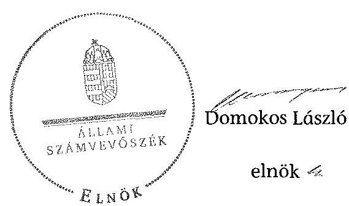

ÁLLAMI
SZÁMVEVÔSZÉK

# JELENTÉS 

az önkormányzatok belső kontrollrendszere kialakításának, egyes kontrolltevékenységek és a belső ellenőrzés
müködésének ellenőrzéséről
Gyöngyössolymos

---

# Állami Számvevőszék 

Iktatószám: V-0343-104/2014.
Témaszám: 1372
Vizsgálat-azonosító szám: V064931
Az ellenőrzést felügyelte:
dr. Benedek Mária
felügyeleti vezető
Az ellenőrzést vezette és az ellenőrzés végrehajtásáért felelős:
dr. Veress Tiborné
ellenőrzésvezető
A számvevőszéki jelentés összeállításában közremúködtek:
Szarka Péterné
számvevő, vezető főtanácsos
Pető Krisztina
számvevő tanácsos
Az ellenőrzést végezték:
Sipos Attila
Szarka Péterné
számvevő
számvevő, vezető főtanácsos

---

# TARTALOMJEGYZÉK 

BEVEZETÉS ..... 7
I. ÖSSZEGZŐ MEGÁLLAPÍTÁSOK, KÖVETKEZTETÉSEK, JAVASLATOK ..... 11
II. RÉSZLETES MEGÁLLAPÍTÁSOK ..... 20

1. Az önkormányzat belső kontrollrendszerének kialakítása ..... 20
1.1. A kontrollkörnyezet ..... 20
1.2. A kockázatkezelési rendszer ..... 22
1.3. A kontrolltevékenységek ..... 23
1.4. Az információs és kommunikációs rendszer ..... 24
1.5. A monitoring rendszer ..... 24
2. A pénzügyi folyamatokban kulcsszerepet betöltő teljesítésigazolás és érvényesítés belső kontrollok múködése ..... 25
3. A belső ellenőrzés múködése ..... 27
FÜGGELÉKEK
4. számú Értelmező szótár
5. számú Az értékelés módja és szempontjai

---

.

---

# RÖVIDÍTÉSEK JEGYZÉKE 

## Törvények

Áht.
ÁSZ tv.
Info tv.
Htv.

Kttv.

Ktv.

Mötv.

Ötv.
Számv. tv.
Vagyonnyilatkozat-
tételről szóló tv.

## Rendeletek

Áhsz.
államháztartási számviteli kormányrendelet
Ávr.
Bkr.
Ikr.
önkormányzati SZMSZ
vagyongazdálkodási rendelet

## Szórövidítések

ÁSZ
belső ellenőrzési kézikönyv ${ }_{1}$

2011. évi CXCV. törvény az államháztartásról
2011. évi LXVI. törvény az Állami Számvevőszékről
2011. évi CXII. törvény az információs önrendelkezési jogról és az információszabadságról
1991. évi XX. törvény a helyi önkormányzatok és szerveik, a köztársasági megbizottak, valamint egyes centrális alárendeltségủ szervek feladat- és hatásköreiről
2011. évi CXCIX. tv. a közszolgálati tisztviselők ről (hatályos 2012. március 1-jétől)
1992. évi XXIII. törvény a köztisztviselők jogállásáról (hatálytalan 2012. március 1-jétől)
2011. évi CLXXXIX. törvény Magyarország helyi önkormányzatairól
1990. évi LXV. törvény a helyi önkormányzatokról
2000. évi C. törvény a számvitelről
2007. évi CLII. törvény egyes vagyonnyilatkozat-tételi kötelezettségekről

249/2000. (XII. 24.) Korm. rendelet az államháztartás szervezetei beszámolási és könyvvezetési kötelezettségének sajátosságairól
4/2013. (I.11.) Korm. rendelet az államháztartás számviteléről
368/2011. (XII. 31.) Korm. rendelet az államháztartásról szóló törvény végrehajtásáról
370/2011. (XII. 31.) Korm. rendelet a költségvetési szervek belső kontrollrendszeréről és belső ellenőrzéséről
335/2005. (XII. 29.) Korm. rendelet a közfeladatot ellátó szervek iratkezelésének általános követelményeiről
Gyöngyössolymos Községi Önkormányzat Szervezeti és Müködési Szabályzata (Gyöngyössolymos Községi Önkormányzat Képviselő-testületének 1/2011. (II. 14.) számú rendelete, hatályos 2011. február 15-étől)
Gyöngyössolymos Községi Önkormányzat vagyonáról, a vagyonhasznosítás rendjéről és a vagyontárgyak feletti tulajdonosi jogok gyakorlásáról (Gyöngyössolymos Községi Önkormányzat Képviselő-testületének 5/2012. (V. 21.) számú rendelete, hatályos 2012. május 22-étől)

Állami Számvevőszék
Gyöngyös Körzete Kistérség Többcélú Társulása Belső ellenőrzési kézikönyve (hatályos 2012. január 10-től)

---

belső ellenőrzési kézikönyv ${ }_{2}$
bizonylati rend
ellenőrzési nyomvonal ${ }_{1}$
ellenőrzési nyomvonal ${ }_{2}$
2012. évi ellenőrzési terv
értékelési szabályzat

FEUVE szabályzat
hivatali SZMSZ

INTOSAI
ISSAI
jegyzó
Képviselő-testület
kockázatkezelési szabályzat

Kormányhivatal
Közös hivatal
közös hivatali SZMSZ

Gyöngyös Körzete Kistérség Többcélú Társulása Belső ellenőrzési kézikönyve (hatályos 2013. január 1-jétől)
Gyöngyössolymos Községi Önkormányzat Bizonylati rend 2007. (hatályos 2007. január 1-jétől)

Gyöngyössolymos Községi Önkormányzat Folyamatba épített előzetes és utólagos vezetői ellenőrzés rendszere II. Fejezete (hatályos 2006. január 1-jétől)
Gyöngyössolymos Községi Önkormányzat Polgármesteri Hivatalának Ellenőrzési nyomvonala 2013. (hatályos 2013. január 1-jétől)
Gyöngyössolymos Községi Önkormányzat 2012. évi belső ellenőrzési terve (Gyöngyössolymos Községi Önkormányzat Képviselő-testületének 64/2011. (XII. 1.) számú határozatta)
Gyöngyössolymos Községi Önkormányzat 2013. évi belső ellenőrzési terve (Gyöngyössolymos Községi Önkormányzat Képviselő-testületének 61/2011. (XII. 29.) számú határozatta)
Gyöngyössolymos Községi Önkormányzat Eszközök és források értékelési szabályzata 2007. (hatályos 2007. január 1-jétől)
Gyöngyössolymos Községi Önkormányzat Folyamatba épített előzetes és utólagos vezetői ellenőrzés rendszere (hatályos 2006. január 1-jétől)
Gyöngyössolymos Községi Önkormányzat Polgármesteri Hivatal Szervezeti és Müködési Szabályzata (Gyöngyössolymos Községi Önkormányzat Képviselőtestületének 7/2011. (II. 12.) számú határozata, hatályos 2011. február 13-ától)

International Organization of Supreme Audit Institutions (Legfőbb Ellenőrző Intézmények Nemzetközi Szervezete)
International Standards of Supreme Audit Institutions (Legfőbb Ellenőrző Intézmények Nemzetközi Standardjai)
Gyöngyössolymos Községi Önkormányzat jegyzője (2005. január 16-ától 2012. december 31-jéig)
Gyöngyössolymos Községi Önkormányzat Képviselőtestülete
Gyöngyössolymos Községi Önkormányzat Polgármesteri Hivatalának kockázatkezelése (hatályos 2013. január 1jétől)
Heves Megyei Kormányhivatal
Gyöngyössolymos Községi Önkormányzat Mátraszentimre Önkormányzatával közös Polgármesteri hivatalt hozott létre (Gyöngyössolymos Községi Önkormányzat Képviselőtestületének 59/2012. (XII. 1.) számú határozata)
Gyöngyössolymosi Közös Önkormányzati Hivatal Szervezeti és Müködési Szabályzata (Gyöngyössolymos Községi Önkormányzat Képviselő-testületének 33/2013. (X. 8.) számú

---

|  | határozata) |
| :--: | :--: |
| leltározási és leltárkészítési szabályzat | Gyöngyössolymos Községi Önkormányzat Leltározási, leltárkészítési szabályzat 2007. (hatályos 2007. január 1jétől) |
| NGM | Nemzetgazdasági Minisztérium |
| Önkormányzat | Gyöngyössolymos Községi Önkormányzat |
| pénzkezelési szabályzat | Gyöngyössolymos Községi Önkormányzat Pénzkezelési szabályzat 2007. (hatályos 2007. január 1-jétől) |
| polgármester | Gyöngyössolymos Községi Önkormányzat polgármestere |
| Polgármesteri Hivatal | Gyöngyössolymos Községi Önkormányzat Polgármesteri Hivatala |
| stratégiai ellenőrzési | Gyöngyös Körzete Kistérség Többcélú Társulása és Tagön- |
|  | kormányzatai Stratégiai ellenőrzési terv 2010-2015. |
| számviteli politika | Községi Önkormányzat Gyöngyössolymos Számviteli politika 2007. (hatályos 2007. január 1-jétől) |
| számlarend | Gyöngyössolymos Községi Önkormányzat Számlarend 2007. (hatályos 2007. január 1-jétől) |
| Társulás | Gyöngyös Körzete Kistérség Többcélú Társulása |

---

.

---

# JELENTÉS 

## az önkormányzatok belsó kontrollrendszere kialakításának, egyes kontrolltevékenységek és a belső ellenőrzés múködésének ellenőrzéséről Gyöngyössolymos

## BEVEZETÉS

Gyöngyössolymos község állandó lakosainak száma 2012. január 1-jén 3107 fő volt. Az Önkormányzat héttagú Képviselő-testületének munkáját két állandó bizottság segítette. Az Önkormányzat az önállóan működő és gazdálkodó Polgármesteri Hivatalon kívül hat önállóan működő intézményt múködtetett, egy többségi tulajdoni hányadú gazdasági társasággal rendelkezett. A polgármester 2006. október 1-jétől tölti be tisztségét. A helyszíni ellenőrzés idején hivatalban lévő jegyző 2013. április 15-étől látja el feladatait. Az ellenőrzött időszakban hivatalban lévő jegyző 2005. január 16-ától 2012. december 31-éig látta el a jegyzői feladatokat ${ }^{1}$. A Polgármesteri Hivatal szervezeti egységekre nem tagolódott, elkülönített gazdasági szervezettel nem rendelkezett. A Polgármesteri Hivatalban foglalkoztatott köztisztviselők száma 2012. január 1-jén 4 fő volt. Gyöngyössolymos Községi Önkormányzat Mátraszentimre Önkormányzatával 2013. január 1-jétől Közös hivatalt hozott létre. Az Önkormányzat a 2012. évi költségvetési beszámolója szerint 930952 ezer Ft költségvetési bevételt ért el, valamint 880475 ezer Ft költségvetési kiadást teljesített. A 2012. december 31-i könyvviteli mérleg szerint 1757897 ezer Ft értékű eszközvagyonnal rendelkezett, rövid és hosszú lejáratú kötelezettsége nem volt.

A demokratikus társadalmakban alapvető igény, hogy a közpénzeket, a közvagyont használók tevékenységükről elszámoljanak, ahhoz egyértelmű és érvényesíthető felelősségi szabályok társuljanak. Ennek a jogos igénynek az érvényesítéséhez meg kell teremteni azokat a folyamatokat, rendszereket, amelyek nélkülözhetetlenek az elszámoltatáshoz. Az elszámoltatás eredményes múködtetéséhez szükség van a megfelelő információs, kontroll, értékelési és beszámolási rendszerek kialakítására.

Magyarországon az uniós csatlakozási tárgyalások idejére nyúlnak vissza a belső kontrollrendszer szabályozásának gyökerei. Az uniós elvárásoknak megfelelő új terminológia szerinti államháztartási belső pénzügyi ellenőrzési (ÁBPE) rendszer területén a jogharmonizáció 2003-ban teljes körűen megvalósult, míg az önkormányzati alrendszerre vonatkozó, az Ötv.-ben megjelenített

[^0]
[^0]:    ${ }^{1}$ 2013. január 1-jétől 2013. április 14-éig helyettes jegyző látta el a jegyzői feladatokat.

---

speciális szabályozás 2005-ben lépett hatályba. Az államháztartási belső kontrollrendszer koncepciója 2009-ben továbbfejlődött. A változások irányát mutatja, hogy a költségvetési szervek belső kontrollrendszere már magában foglalja a korszerű, felelős szervezetirányítás elemeit (kontrollkörnyezet, kockázatkezelés, kontrolltevékenység, információ és kommunikáció, monitoring) is. E kontrollrendszer szabályozása háromszintű, a törvényi előírásokat az Áht. és a Mötv., a rendeleti szintű szabályozást az Ávr. és a Bkr. tartalmazza, amelyeket útmutatói szinten az NGM által kiadott standardok és kézikönyvek támogatnak.

A belső kontrollrendszer azt a célt szolgálja, hogy a költségvetési szervek működésük és gazdálkodásuk során a tevékenységeket szabályszerűen, gazdaságosan, hatékonyan és eredményesen hajtsák végre, teljesítsék elszámolási kötelezettségeiket és megvédjék az erőforrásokat a veszteségektől, a károktól és a nem rendeltetésszerű használattól. A belső kontrollrendszer magában foglalja mindazon szabályokat, eljárásokat, gyakorlati módszereket és szervezeti struktúrákat, kockázatkezelési technikákat, kontrolltevékenységeket, amelyek segítséget nyújtanak a szervezetnek céljai eléréséhez.

Az ÁSZ a 2011-2015. évekre szóló stratégiájában hangsúlyos szerepet szánt annak, hogy szilárd szakmai alapon álló, értékteremtő ellenőrzéseivel előmozdítsa a közpénzügyek átláthatóságát, rendezettségét. A számvevőszéki ellenőrzés nemzetközi alapelvei is rögzítik, hogy a megfelelő belső kontrollrendszer minimálisra csökkenti a hibák és szabálytalanságok kockázatát.

Az ellenőrzés célja annak megállapítása volt, hogy a belső kontrollrendszer elemeinek kialakítása, a pénzügyi folyamatokban kulcsszerepet betöltő teljesítésigazolás és érvényesítés, és a belső ellenőrzés szabályos működése biztosítot-ta-e az Önkormányzatnál a közpénzfelhasználás szabályosságát, hozzájárult-e az értéket teremtő rend követelményének érvényesüléséhez.

Ennek keretében értékeltük, hogy:

- a jogszabályi előírásoknak megfelelően alakították-e ki a belső kontrollrendszer elemeit;
- a gazdálkodás folyamatában kulcsszerepet betöltő teljesítésigazolás és érvényesítés kontrolltevékenységeit megfelelően működtették-e;
- biztosították-e a belső ellenőrzés szabályos működését;
- amennyiben az ÁSZ tett javaslatot a 2008-2011. évek közötti ellenőrzése kapcsán az Önkormányzatnak, intézkedtek-e azok végrehajtására.

Az ellenőrzés várható hasznosulását négy szinten tervezzük. A törvényalkotás számára összegzett tapasztalatok állnak rendelkezésre a belső kontrollrendszer önkormányzati területen való kialakításáról, működéséről és hatásairól, a belső ellenőrzés működéséről. Ennek alapján következtetést lehet levonni arról, hogy a belső kontrollrendszer kialakítására és működtetésére vonatkozó jelenlegi, differenciálás nélküli - jogszabályi előírások reális követelményeket támasztanak-e az eltérő adottságú települési önkormányzatok esetében, illetve indokolt-e esetleges jogszabályi módosítás kezdeményezése. Az ellenőrzés az el-

---

lenőrzött számára visszajelzést ad a belső kontrollrendszer kialakításában és működésében fellépő hiányosságokról, javaslataival hozzájárul azok kiküszöböléséhez, amely csökkentheti a későbbi ellenőrzések gyakoriságát. Az ellenőrzés megállapításait és javaslatait más szervezetek is hasznosíthatják a rendezett gazdálkodási keretek kialakításához. A társadalom számára jelzi, hogy közpénz nem maradhat ellenőrizetlenül, az ÁSZ értékteremtő rend kialakításához és megőrzéséhez hozzájáruló tevékenysége pozitív hatással lesz a szervezetről kialakított összkép formálásában. A szervezeten belül lehetőség nyílik arra, hogy a megállapítások szintetizálásával az ÁSZ a hozzáadott értéket teremtő elemző tevékenységét és tanácsadó szerepét is erősítse.

Az önkormányzatok belső kontrollrendszere kialakításának, egyes kontrolltevékenységek és a belső ellenőrzés működésének ellenőrzéséről szóló jelentés I. fejezetének összegző része az ellenőrzés céljára ad rövid, szintetizáló összefoglalót, és tartalmazza a következtetéseket a II. fejezet részletes megállapításain alapulóan. A jelentés intézkedést igénylő megállapításait és javaslatait az ellenőrzés során feltárt, a jelentés II. fejezetében rögzített részletes megállapítások alapozzák meg. A helyszíni ellenőrzés lezárásáig a helyi szabályozás változásait nyomon követtük. Az ÁSZ az ellenőrzés megállapításait az ellenőrzött időszakban hatályos, az intézkedést igénylő megállapításokra tett javaslatokat a jelenleg hatályos jogszabályok alapján fogalmazta meg.

Az ellenőrzés típusa: szabályszerűségi ellenőrzés.
Az ellenőrzött időszak: a belső kontrollrendszer kialakításának megfelelősége esetében a 2012. évre, a pénzügyi folyamatokban kulcsszerepet betöltő teljesítésigazolás és érvényesítés belső kontrollok múködésének megfelelőségét és a belső ellenőrzés szabályszerű működését a 2012. január 1. és december 31-e közötti időszak eseményeit figyelembe véve értékeltük, míg az ÁSZ javaslatainak utóellenőrzése a 2008-2011. években végzett ellenőrzések nyilvánosságra hozott jelentéseiben tett javaslatok áttekintésére terjedt ki.

# Az ellenőrzött szervezet: az Önkormányzat. 

Az ellenőrzés jogszabályi alapját az ÁSZ tv. 1. § (3) bekezdése, az 5. § (2) és (6) bekezdése, valamint az Áht. 61. § (2) bekezdésének előírásai képezik.

Az ellenőrzés szakmai módszertana az ÁSZ hivatalos honlapján (www.asz.hu) közzétett szakmai szabályokon alapult, amely az INTOSAI által kiadott ISSAI figyelembevételével készült.

Az ellenőrzés lefolytatásához az Önkormányzat a kimutatások és a tanúsítvány elektronikus kitöltésével, valamint az ÁSZ által kért dokumentumok elektronikus megküldésével szolgáltatott adatokat. Az így rendelkezésre bocsátott adatok, információk kontrollja és a munkalapok kitöltése a helyszíni ellenőrzés keretében történt. A jelentésben használt fogalmak magyarázatát az 1. számú függelék, az ellenőrzés egyes területeinek értékelésénél alkalmazott egységes minősítési szempontokat a 2. számú függelék tartalmazza.

A belső kontrollrendszer kialakításának ellenőrzése során értékeltük a kontrollkörnyezet, a kockázatkezelési rendszer, a kontrolltevékenységek, az információs

---

és kommunikációs rendszer, valamint a monitoring rendszer szabályozottságának megfelelőségét. A pénzügyi folyamatokban kulcsszerepet betöltő teljesítésigazolás és érvényesítés kontrollok múködése megfelelőségének minősítéséhez az állományba nem tartozók megbízási díjai, a külső szolgáltatók által végzett karbantartási, kisjavítási munkák, az egyéb üzemeltetési és fenntartási szolgáltatások, a rendszeres szociális segélyek, valamint az államháztartáson kívülre teljesített múködési és felhalmozási célú pénzeszközátadások közül kockázatelemzéssel választottuk ki az ellenőrzött kiadási jogcímeket. Az egyszerű véletlen mintavétellel kiválasztott tételek ellenőrzését többlépcsős megfelelőségi tesztek útján addig végeztük, amíg elegendő és megfelelő bizonyítékot szereztünk a vizsgált folyamatok kulcskontrolljai múködésének megfelelő vagy nem megfelelő voltáról. Értékeltük az Önkormányzatnál a belső ellenőrzés múködésének szabályosságát. Utóellenőrzésre nem került sor, mivel az ÁSZ az Önkormányzatnál a 2008-2011. évek között ellenőrzést nem végzett.

Az ÁSZ tv. 29. § (1) bekezdése szerint a jelentéstervezetet megküldtük a polgármester részére, aki az ÁSZ tv. 29. § (2) bekezdésében foglalt észrevételezési jogával nem élt, a jelentéstervezetre észrevételt nem tett.

---

# I. ÖSSZEGZŐ MEGÁLLAPÍTÁSOK, KÖVETKEZTETÉSEK, JAVASLATOK 

A belső kontrollrendszeren belül 2012-ben a kontrollkörnyezet, a kockázatkezelési rendszer, a kontrolltevékenységek, az információs és kommunikációs rendszer, valamint a monitoring rendszer kialakítását külön-külön és együttesen is értékeltük. A belső kontrollrendszer kialakítása az összesített értékelés alapján nem felelt meg a jogszabályi előírásoknak.

A belső kontrollrendszer egyes területei kialakításának minősítése a következő:

| Kontrollterület | Minősítés |
| :-- | :--: |
| Kontrollkörnyezet | nem   megfelelő |
| Kockázatkezelési rendszer | nem   megfelelő |
| Kontrolltevékenységek | nem   megfelelő |
| Információs és kommuni-   kációs rendszer | nem   megfelelő |
| Monitoring rendszer | nem   megfelelő |

Nem megfelelőnek értékeltük a kontrollkörnyezet, a kockázatkezelési rendszer, a kontrolltevékenységek, az információs és kommunikációs rendszer, valamint a monitoring rendszer kialakítását, mivel az ellenőrzésünk során megállapított szabályozásbeli hiányosságok magukban hordozzák a szabálytalan működés, valamint a korrupció kockázatát.

A belső kontrollrendszer nem megfelelő kialakítása kockázatot jelent az Önkormányzat feladatainak szabályszerű, gazdaságos, hatékony és eredményes végrehajtása során.

Az állományba nem tartozók megbízási díjaival és a külső szolgáltatók által végzett karbantartási, kisjavítási munkákkal kapcsolatos kifizetések során a pénzügyi folyamatokban kulcsszerepet betöltő teljesítésigazolás és érvényesítés belső kontrollok múködése gyenge volt. Gyengének értékeltük a két kulcskontroll együttes működését, mert azok nem biztosították az ellenőrzésünk által feltárt hiányosságok bekövetkezésének megelőzését.

A számvevőszéki ellenőrzés az ellenőrzött kifizetésekkel összefüggésben a rendelkezésre bocsátott dokumentumok alapján kár bekövetkeztére utaló adatot, tényt nem állapított meg, azonban a gazdálkodásban kulcsszerepet betöltő kontrollok gyenge múködése miatt fennáll a hibák bekövetkezésének lehetősége. A nem megfelelően szabályozott és múködtetett belső kontrollok korrupciós kockázatot hordoznak.

---

Az Önkormányzat a belső ellenőrzési feladatokat - képviselő-testületi döntés alapján - a Társulás útján látta el. A belső ellenőrzés müködése a jogszabályi előírásoknak megfelelt. A belső ellenőrzés azonban nem tárta fel a számvevőszéki ellenőrzés által megállapított hiányosságokat a kontrollrendszer kialakításánál, a pénzügyi folyamatokban kulcsszerepet betöltő teljesítésigazolás és érvényesítés belső kontrollok müködésénél.

Az ÁSZ tv. 33. § (1) bekezdésében foglaltak értelmében az ellenőrzött szervezet vezetője köteles a jelentésben foglalt megállapításokhoz kapcsolódó intézkedési tervet összeállítani, és azt a jelentés kézhezvételétől számított 30 napon belül az ÁSZ részére megküldeni. Amennyiben az intézkedési tervet határidőre nem küldi meg a szervezet, vagy az ÁSZ tv. 33. § (2) bekezdésében foglalt póthatáridő elteltével megküldött intézkedési terv továbbra sem elfogadható, az ÁSZ elnöke a hivatkozott törvény 33. § (3) bekezdés a)-b) pontjaiban foglaltakat érvényesítheti.

Az ellenőrzés intézkedést igénylő megállapításai és javaslatai:

# a polgármesternek 

1. Az Áht. 37. § (1) és az Ávr. 55. § (1) bekezdése ellenére az Önkormányzat nevében történt kötelezettségvállalásokra pénzügyi ellenjegyzés nélkül került sor.

Javaslat:
Intézkedjen, hogy az Önkormányzat nevében történt kötelezettségvállalásra az Áht. 37. § (1) bekezdésében és az Ávr. 55. § (1) bekezdésében foglaltaknak megfelelően - az Ávr. 53. §-ában meghatározott kivételekkel - kizárólag a pénzügyi ellenjegyzés után, a pénzügyi teljesítés esedékességét megelőzően, írásban kerüljön sor.
2. A számvevőszéki ellenőrzés megállapításai alapján az Önkormányzatnál a belső kontrollrendszer kialakítása összefoglalóan értékelve nem felelt meg a jogszabályi előírásoknak, a kulcskontrollok müködése gyenge volt, a belső ellenőrzés müködése ugyan megfelelt a jogszabályi előírásoknak, azonban nem tárta fel, ezáltal nem is javíttatta ki a feltárt hiányosságokat. A megállapított szabályozásbeli és müködésbeli hiányosságok magukban hordozzák a szabálytalan müködés kockázatát.

Javaslat:
A Mötv. 115. § (1) bekezdésében foglaltak alapján kísérje figyelemmel az Önkormányzat gazdálkodásának szabályszerűségét. A Mötv. 67. § f) pontja alapján gondoskodjon a belső kontrollrendszer müködésére vonatkozó jogszabályi rendelkezések be nem tartása, valamint a teljesítésigazolás, illetve az érvényesítés kontrollokkal öszszefüggésben feltárt hiányosságok, szabálytalanságok tekintetében az esetleges munkajogi felelősséggel kapcsolatos körülmények kivizsgálásáról, majd a vizsgálat eredményének függvényében tegye meg a szükséges intézkedéseket.
3. A polgármester - az Áht. 87. § (1) bekezdésében foglaltak ellenére - az előírt határidő́t túllépve tájékoztatta a Képviselő-testületet az Önkormányzat 2012. évi gazdálkodásának első félévi helyzetéről.

---

Javaslat:
Az Áht. 87. § (1) bekezdésében előírt határidőig tájékoztassa a Képviselő-testületet az Önkormányzat gazdálkodásának első félévi helyzetéről.

# a jegyzőnek Gyöngyössolymos Községi Önkormányzat vonatkozásában 

1. a kontrollkörnyezettel kapcsolatban:

A hivatali SZMSZ-ben a jegyző - az Ávr. 13. § (1) bekezdés c) és i) pontjában foglaltak ellenére - nem rögzítette az alaptevékenységet szabályozó jogszabályok megjelölését és az irányító szerv által az Ávr. 10. § (1)-(3) bekezdése szerint a költségvetési szervhez rendelt más költségvetési szervek felsorolását.

A jegyző az Ötv. 36. § (2) bekezdés a) pontjában foglalt feladatkörében előkészítette az önkormányzati vagyonnal való gazdálkodás szabályairól szóló vagyongazdálkodási rendelet tervezetet, amely alapján a Képviselő-testület megalkotta a vagyongazdálkodási rendeletet, azonban az nem felelt meg az Mötv. 109. § (4) bekezdése előírásainak.

A jegyző - a Számv. tv. 14. § (11) bekezdésében előírtak ellenére - az ellenőrzés idején hatályos számviteli politikát, az értékelési szabályzatot, a leltározási és leltárkészítési, valamint a pénzkezelési szabályzatot nem aktualizálta.

A jegyző - a Htv. 140. §. (1) bekezdés c) pontjában foglaltak ellenére - az Önkormányzat intézményeinek számviteli rendjét nem alakította ki.

A jegyző a Számv. tv. 161. § (4)-(5) bekezdéseiben előírtak ellenére a számlarendet nem aktualizálta.

A jegyző a számlarend részét képező bizonylati rend szükséges módosítását - a Számv. tv. 161. § (5) bekezdésében foglaltak ellenére - a törvényi változás hatálybalépését követő 90 napon belül nem végezte el.

A jegyző - a Kttv. 75. § (1) bekezdés d) pontjában foglaltak ellenére - nem készítette el a Polgármesteri Hivatalban adminisztrátor, titkársági asszisztens munkakörben dolgozó köztisztviselő munkaköri leírását.

A jegyző - a Bkr. 6. § (3) bekezdésében és a FEUVE szabályzatban foglaltak ellenére a Polgármesteri Hivatal ellenőrzési nyomvonalának rendszeres aktualizálásáról nem gondoskodott.

A Képviselő-testület - a Kttv. 231. § (1) bekezdése ellenére - nem állapította meg a Kttv. 83. §-ában előírt, a köztisztviselőkkel szembeni hivatásetikai alapelvek részletes tartalmát, valamint az etikai eljárás szabályait, mivel a jegyző - az Ötv. 36. § (2) bekezdés a) pontjában előírt feladata ellenére - nem készítette elő ennek dokumentumát.

---

Javaslat:
a) Módosítsa a közös hivatali SZMSZ-t annak érdekében, hogy az tartalmazza az Ávr. 13. § (1) bekezdésében előírt valamennyi tartalmi elemet, és kezdeményezze az Áht. 9. § (1) bekezdés a) pontjában foglaltak alapján a módosítás Képvise-lő-testület elé terjesztését.
b) Készítse elő a Mötv. 81. § (3) bekezdés c) pontjában foglalt feladatkörében a vagyongazdálkodási rendelet módosításának tervezetét, és kezdeményezze a Kép-viselő-testület elé terjesztését annak érdekében, hogy az megfeleljen az Mötv. 109. § (4) bekezdésében foglaltaknak.
c) Aktualizálja a Számv. tv. 14. § (11) bekezdésében foglaltak alapján számviteli politikát, az eszközök és források értékelési szabályzatát, a leltározási és leltárkészítési, valamint a pénzkezelési szabályzatot.
d) Alakítsa ki a Htv. 140. §. (1) bekezdés c) pontjában foglaltak alapján az önkormányzat intézményeinek számviteli rendjét.
e) Aktualizálja a Számv. tv. 161. § (4)-(5) bekezdéseiben foglaltak alapján a számlarendet, módosítsa az annak részét képező bizonylati rendet.
f) Készítse el a Kttv. 75. § (1) bekezdés d) pontja alapján a Közös hivatal adminisztrátor, titkársági asszisztens munkakörben dolgozó köztisztviselőjének munkaköri leírását.
g) Gondoskodjon a Bkr. 6. § (3) bekezdésében és a FEUVE szabályzatban foglaltak alapján a Közös hivatal ellenőrzési nyomvonalának rendszeres aktualizálásáról.
h) Készítse elő a Mötv. 81. § (3) bekezdés c) pontjában foglalt feladatkörében a Kttv. 83. §-ában foglaltaknak megfelelően a köztisztviselőkkel szembeni hivatásetikai alapelvek részletes tartalmának, valamint az etikai eljárás szabályainak dokumentumait és kezdeményezze a Kttv. 231. § (1) bekezdésében foglaltak megvalósulása érdekében annak Képviselő-testület elé terjesztését.
2. a kockázatkezelési rendszerrel kapcsolatban:

A Vagyonnyilatkozat-tételről szóló tv. 4. § d) pontjában foglaltak ellenére a vagyon-nyilatkozat-tételre kötelezettek körét (többek között a polgármester, a képviselőtestületi tagok, az önkormányzati bizottságok nem helyi önkormányzati képviselő tagjai) az önkormányzati SZMSZ-ben nem rögzítették.

Javaslat:
Készítse elő a Mötv. 81. § (3) c) pontjában foglalt feladatkörében az önkormányzati SZMSZ módosítását annak érdekében, hogy a Vagyonnyilatkozat-tételről szóló tv. 4. § d) pontjában előírtak alapján az tartalmazza a Vagyonnyilatkozat-tételről szóló tv. 3. § e) pontja figyelembevételével meghatározott kötelezettek körét, és kezdeményezze annak Képviselő-testület elé terjesztését.

---

3. a kontrolltevékenységekkel kapcsolatban:

A jegyző - a Bkr. 8. § (2) bekezdése a) pontjában foglaltak ellenére - nem biztosította a pénzügyi döntések - köztük a költségvetés tervezése, a kötelezettségvállalások, a szerződések és a támogatásokkal való elszámolás - dokumentumainak elkészítésével kapcsolatban a folyamatba épített, előzetes, utólagos és vezetői ellenőrzést.

A jegyző - az Ávr. 13. § (2) bekezdésének a) pontjában foglaltak ellenére - belső szabályzatban nem rendezte a jogszabályban szabályozott kérdéseken felül a pénzügyi ellenjegyzés és a teljesítésigazolás gyakorlásának módjával, eljárási és dokumentációs részletszabályaival, valamint az ezeket végző személyek kijelölésének rendjével kapcsolatos belső előírásokat, feltételeket.

A jegyző az - Ávr. 53. § (2) bekezdésében foglaltakat figyelmen kívül hagyva - annak ellenére nem határozta meg az előzetes írásbeli kötelezettségvállalást nem igénylő kifizetések rendjét, hogy belső szabályozásban lehetővé tette az 50 ezer Ft alatti kifizetések előzetes írásbeli kötelezettségvállalás nélküli teljesítését.

A jegyző - az Info tv. 7. § (2)-(3) bekezdéseiben foglalt előírásokat figyelmen kívül hagyva - az informatikai rendszer szabályozása során elmulasztotta az adatbiztonság érvényre juttatásához szükséges intézkedések megtételét, továbbá - a Bkr. 8. § (4) bekezdés b) és c) pontjaiban foglaltak ellenére - belső szabályzatban nem határozta meg a dokumentumokhoz és információkhoz való hozzáférésre vonatkozóan és a beszámolási eljárásokhoz kapcsolódó felelősségi köröket.

Javaslat:
a) Biztosítsa minden tevékenységre vonatkozóan a Bkr. 8. § (2) bekezdése alapján a folyamatba épített, előzetes, utólagos és vezetői ellenőrzést.
b) Rendezze belső szabályzatban az Ávr. 13. § (2) bekezdés a) pontjában foglaltak alapján a tervezéssel, gazdálkodással - különösen a pénzügyi ellenjegyzés és a teljesítésigazolás gyakorlásának módjával, eljárási és dokumentációs részletszabályaival, valamint az ezeket végző személyek kijelölésének rendjével - kapcsolatos belső előírásokat, feltételeket.
c) Rögzítse belső szabályzatban az Ávr. 53. § (2) bekezdése alapján az előzetes írásbeli kötelezettségvállalást nem igénylő kifizetések rendjét.
d) Gondoskodjon az Info tv. 7. § (2)-(3) bekezdéseiben foglaltaknak megfelelően az adatok biztonságáról, határozza meg belső szabályzatban a Bkr. 8. § (4) bekezdés b) és c) pontjának megfelelően a dokumentumokhoz és információkhoz való hozzáférésre vonatkozóan, valamint a beszámolási eljárásokhoz kapcsolódó felelősségi köröket.
4. az információs és kommunikációs rendszerrel kapcsolatban:

A jegyző - az Info tv. 24. § (3) bekezdésében foglaltak ellenére - nem készítette el a Polgármesteri Hivatal adatvédelmi és adatbiztonsági szabályzatát.

---

A jegyző - az Info tv. 30. § (6) bekezdésében, a 35. § (3) bekezdésében, valamint az Ávr. 13. § (2) bekezdés h) pontjában foglaltak ellenére - belső szabályzatban nem szabályozta a közérdekű adatok megismerésére irányuló igények teljesítésének és a kötelezően közzéteendő adatok nyilvánosságra hozatalának a rendjét.

A jegyző - az Info tv. 33. § (1) és (3) bekezdésében, a 37. § (1) bekezdésében, valamint az 1. mellékletében foglaltak ellenére - nem gondoskodott az Önkormányzat elektronikus közzétételi kötelezettségének teljesítéséről a 2012. évben.

A jegyző - az lkr. 14. § (4) bekezdésében foglaltak ellenére - az iratforgalom dokumentálásának elmulasztásával nem biztosította az ügyintézés folyamatának, az iratok szervezeten belüli útjának pontos követhetőségét és ellenőrizhetőségét, az iratok hollétének naprakész megállapíthatóságát.

Javaslat:
a) Készítsen adatvédelmi és adatbiztonsági szabályzatot az Info tv. 24. § (3) bekezdésének megfelelően.
b) Állapítsa meg - az Info tv. 30. § (6) és az Info tv. 35. § (3) bekezdésében, valamint az Ávr. 13. § (2) bekezdés h) pontjában foglaltaknak megfelelően - a közérdekű adatok megismerésére irányuló igények teljesítésének és a kötelezően közzéteendő adatok nyilvánosságra hozatalának rendjét.
c) Gondoskodjon az Info tv. 33. § (1) és (3) bekezdésében, a 37. § (1) bekezdésében és az 1. számú mellékletében foglaltaknak megfelelően az Önkormányzat elektronikus közzétételi kötelezettségének teljesítéséről.
d) Biztosítsa az lkr. 14. § (4) bekezdésében foglaltaknak megfelelően az iratforgalom dokumentálásával, hogy az iratok szervezeten belüli útja pontosan követhető és ellenőrizhető legyen.
5. a monitoring rendszerrel kapcsolatban:

A jegyző - a Bkr. 3. § e) pontjában és 10. §-ában foglaltak ellenére - nem alakította ki a Polgármesteri Hivatal tevékenységének, a célok megvalósításának nyomon követését biztosító rendszert.

A jegyző a Bkr. 11. § (1) bekezdésében foglalt kötelezettsége ellenére - a Bkr. 1. mellékletében előírt nyilatkozatban - nem értékelte a 2011. évre vonatkozóan a Polgármesteri Hivatal belső kontrollrendszerének minőségét.

Javaslat:
a) Alakítsa ki és múködtesse a Bkr. 3. § e) pontjában és 10. §-ában foglaltak alapján a Közös hivatal tevékenységének, a célok megvalósításának nyomon követését biztosító rendszert.
b) Értékelje a Bkr. 11. § (1) bekezdésében foglalt kötelezettségének megfelelően a jogszabályban meghatározott keretek között a Közös hivatal belső kontrollrendszerének minőségét a Bkr. 1. melléklete szerinti nyilatkozatban.

---

6. a pénzügyi folyamatokban kulcsszerepet betöltő kontrollokkal kapcsolatban:

A teljesítésigazolást - az Áht. 38. § (1) bekezdésében és az Ávr. 57. § (1) és (3) bekezdésében foglaltak ellenére - nem végezték el, vagy a teljesítésigazolás nem volt szabályszerű, mivel az Ávr. 60. § (3) bekezdése szerint vezetett nyilvántartás (aláírásminta) alapján nem volt megállapítható, hogy a keltezéssel ellátott aláírás a teljesítésigazolásra kijelölt személytől származott.

Az érvényesítést az Ávr. 58. § (1) és (3) bekezdésében foglaltak ellenére nem végezték el, vagy az érvényesítés nem volt szabályszerű, mivel az Ávr. 60. § (3) bekezdése szerint vezetett nyilvántartás (aláírás-minta) alapján nem volt megállapítható, hogy a keltezéssel ellátott aláírás az érvényesítésre kijelölt személytől származott. Az érvényesítő - az Ávr. 58. § (2) bekezdés előírása ellenére - nem jelezte az utalványozónak, hogy az Áht. 37. § (1) és az Ávr. 55. § (1) bekezdése ellenére az Önkormányzat és a Polgármesteri Hivatal kiadási előirányzatai terhére történt kötelezettségvállalásokra pénzügyi ellenjegyzés nélkül került sor, valamint, hogy az utalványrendelet nem felelt meg az Ávr. 59. § (3) bekezdés c), d), e) és f) pontjában foglalt előírásoknak, továbbá, hogy a kötelezettségvállalásról vezetett nyilvántartás adattartalma nem felelt meg az Ávr. 56. § (1) bekezdésében foglalt előírásoknak, illetve a kötelezettségvállalást követően nem gondoskodtak annak nyilvántartásba vételéről. A főkönyvi számlakijelölés nem felelt meg az Áhsz. 48. § (2) bekezdésében hivatkozott 9. számú mellékletben foglaltaknak.

Javaslat:
Intézkedjen - a teljesítésigazolás és az érvényesítés vonatkozásában feltárt hiányosságok megszüntetése, illetve az operatív gazdálkodás során a müködésbeli hibák megelőzése, feltárása és kijavítása érdekében - arról, hogy
a) a teljesítésigazolásra kijelölt személyek az Áht. 38. § (1) bekezdésében és az Ávr. 57. § (1) bekezdésében foglaltaknak megfelelően, ellenőrizhető okmányok alapján ellenőrizzék a kiadások teljesítésének jogosságát, összegszerűségét, ellenszolgáltatást is magában foglaló kötelezettségvállalás esetében az ellenszolgáltatás teljesítését és azt az Ávr. 57. § (3) bekezdésében foglalt módon igazolják;
b) az érvényesítésre kijelölt személyek az Ávr. 58. § (1)-(3) bekezdésében foglaltaknak megfelelően a kifizetéseket megelőzően, a teljesítésigazolás alapján - az Ávr. 57. § (3) bekezdése szerinti esetben annak hiányában is - ellenőrizzék az összegszerűséget, a fedezet meglétét és a megelőző ügymenetben az államháztartási számviteli kormányrendelet, az Ávr. előírásai és a belső szabályzatokban foglaltak betartását;
c) az érvényesítő az Ávr. 58. § (2) bekezdésében foglaltak alapján jelezze az utalványozónak, ha az Áht., az államháztartási számviteli kormányrendelet, az Ávr. vagy a belső szabályzatokban foglaltak megsértését tapasztalja;
d) az érvényesítőnek az utalványrendeleten szereplő, az Ávr. 58. § (3) bekezdésében előírt aláírása beazonosítható legyen az Ávr. 60. § (3) bekezdésében foglaltak szerint vezetett nyilvántartásban szereplő aláírás-mintával;
e) kötelezettségvállalásra az Áht. 37. § (1) és az Ávr. 55. § (1) bekezdésében foglaltaknak megfelelően - az Ávr. 53. §-ában meghatározott kivételekkel - kizárólag

---

pénzügyi ellenjegyzés után, a pénzügyi teljesítés esedékességét megelőzően írásban kerüljön sor;
f) a főkönyvi számlák kijelölését az államháztartási számviteli kormányrendelet 51. § (1) bekezdésében hivatkozott 16. számú mellékletében foglaltakkal összhangban végezzék;
g) a kötelezettségvállalásokat az Ávr. 56. § (1) bekezdésében foglalt előírásnak megfelelően vegyék nyilvántartásba, és a kiadási pénztárbizonylaton, valamint az utalványon az Ávr. 59. § (3) bekezdésében foglalt kötelező tartalmi elemeket tüntessék fel.
7. a belső ellenőrzés működésével kapcsolatban:

A belső ellenőrzési kézikönyv ${ }_{1}$ - a Bkr. 17. § (2) bekezdés a) pontjában foglaltak ellenére - nem tartalmazta a bizonyosságot adó tevékenységre vonatkozó eljárási szabályokat.

A Bkr. 56. § (3) bekezdés a) pontjában foglaltak ellenére a Képviselő-testület által elfogadott stratégiai ellenőrzési tervvel az Önkormányzat nem rendelkezett.

A 2013. évi ellenőrzési terv - a Bkr. 31. § (4) bekezdés a), c), d) és e) pontjában foglaltak ellenére - nem tartalmazta az ellenőrzési tervet megalapozó elemzések és a kockázatelemzés eredményének összefoglaló bemutatását, az ellenőrzések célját, az ellenőrizendő időszakot, a rendelkezésre álló és a szükséges ellenőrzési kapacitás meghatározását.

A 2013. évi ellenőrzési terv összeállítása - a Bkr. 56. § (2) bekezdésében foglalt előírás ellenére - nem a jegyző írásos véleményének figyelembe vételével történt, mivel a jegyző véleményt, javaslatot nem fogalmazott meg.

A 2013. évi ellenőrzési terv - a Bkr. 31. § (2) bekezdésének előírása ellenére -a kockázatelemzés alapján felállított prioritásokat figyelmen kívül hagyva készült el.

A 2012. évi ellenőrzési tervben foglalt ellenőrzéseket nem hajtották végre, ellenőrzést az éves ellenőrzési tervben foglaltakhoz képest - a Bkr. 56. § (5) bekezdésében foglaltak ellenére - az ellenőrzési terv módosítása nélkül hagytak el.

A Társulás munkaszervezetének vezetője - a Bkr. 56. § (8) bekezdésében előírtak ellenére - a 2011. évre vonatkozó éves ellenőrzési jelentést nem küldte meg határidőre a jegyző részére.

Javaslat:
a) Intézkedjen arról, hogy a Belső ellenőrzési kézikönyv tartalmazza a Bkr. 17. § (2) bekezdésében előírt tartalmi elemeket, köztük a bizonyosságot adó tevékenységre vonatkozó eljárási szabályokat.
b) Kezdeményezze, hogy a Bkr. 22. § (1) bekezdés b) pontjában és a 29. § (1) bekezdésében foglaltaknak megfelelően készítsék el a stratégiai ellenőrzési tervet és azt a Képviselő-testület a Bkr. 56. § (3) bekezdésében előírtak alapján hagyja jóvá.

---

c) Intézkedjen, hogy a belső ellenőrzési vezető által készített éves ellenőrzési terv a Bkr. 22. § (1) bekezdés b) pontjában és a Bkr. 31. § (2) bekezdésében foglaltak figyelembevételével kockázatelemzés alapján felállított prioritásokon is alapuljon.
d) Kezdeményezze, hogy az éves ellenőrzési terv tartalmazza a Bkr. 31. § (4) bekezdésében előírt tartalmi elemeket.
e) Kezdeményezze, hogy az éves ellenőrzési terv a Bkr. 56. § (2) bekezdés előírásainak megfelelően a jegyző írásos véleményének figyelembevételével készüljön el.
f) Intézkedjen, hogy a Bkr. 56. § (5) bekezdésében foglaltak szerint az éves ellenőrzési tervben jóváhagyott ellenőrzés elhagyására, vagy új ellenőrzés indítására az éves terv módosítását követően kerüljön sor, továbbá kezdeményezze, hogy az éves ellenőrzési terv módosítására a Bkr. 31. § (5) bekezdésében foglalt előírásnak megfelelően a jegyző egyetértésével történjen.
g) Kezdeményezze, hogy az éves ellenőrzési jelentéseket a Társulás munkaszervezetének vezetője a Bkr. 56. § (8) bekezdésében foglalt határidőben küldje meg a jegyzőnek, hogy azt a polgármester a zárszámadással egyidejűleg a Képviselőtestület elé terjeszthesse.

---

# II. RÉSZLETES MEGÁLLAPÍTÁSOK 

## 1. AZ ÖNKORMÁNYZAT BELSŐ KONTROLLRENDSZERÉNEK KIALAKÍTÁSA

A belső kontrollrendszeren belül 2012-ben a kontrollkörnyezet, a kockázatkezelési rendszer, a kontrolltevékenységek, az információs és kommunikációs rendszer, valamint a monitoring rendszer kialakítását külön-külön és együttesen is értékeltük. A belső kontrollrendszer kialakítása az összesített értékelés alapján nem felelt meg a jogszabályi előírásoknak.

### 1.1. A kontrollkörnyezet

A kontrollkörnyezet kialakítása - a 2. számú függelékben részletezett kritériumrendszer alapján végzett értékelés szerint - a jogszabályi előírásoknak nem felelt meg, mert:

| Sor-   szám $^{2}$ | Megállapítás | Megjegyzés |
| :--: | :--: | :--: |
| 4. | A Képviselő-testület a Ktv. 34. § (3) bekezdésében foglaltak ellenére nem döntött a teljesítményértékelés alapját képező célokról. | A Ktv.-t hatályon kívül helyezte a 2012. évi V. törvény 59. § (1) bekezdés a) pontja, hatálytalan 2012. március 1-től. |
| 7., 12. | A hivatali SZMSZ-ben a jegyző - az Ávr. 13. § (1) bekezdés c) és i) pontjában foglaltak ellenére - nem rögzítette az alaptevékenységet szabályozó jogszabályok megjelölését, és az irányító szerv által az Ávr. 10. § (1)-(3) bekezdése szerint a költségvetési szervhez rendelt más költségvetési szervek felsorolását. | A hivatali SZMSZ ugyan tartalmazta az ellátandó, és a szak-feladatrend szerint szakfeladat számmal és megnevezéssel besorolt alaptevékenységeket, azonban a hivatali SZMSZ-ben felsorolt 42 db alapfeladat közül 23 esetében nem volt a vonatkozó jogszabály megjelölve, továbbá a felsorolt szakfeladat számok és a megnevezés nem minden esetben felelt meg az 56/2011. (XII. 31.) NGM rendeletben foglaltaknak. A közös hivatali SZMSZ sem tartalmazta a jogszabályi hivatkozásokat. A hivatali |

[^0]
[^0]:    ${ }^{2}$ A megállapítás számozása az Önkormányzat által - az adatszolgáltatás során kitöltött kimutatások kérdéseinek sorszámával azonos.

---

|  |  | SZMSZ hiányosan tartalmazta a Polgármesteri Hivatalhoz rendelt költségvetési szervek felsorolását, Gyöngyössolymos Községi és Iskolai Könyvtár hiányzott a felsorolásból. A Közös hivatali SZMSZ nem tartalmazta a Közös hivatalhoz rendelt költségvetési szervek felsorolását. |
| :--: | :--: | :--: |
| 16. | A jegyző az Ötv. 36. § (2) bekezdés a) pontjában foglalt feladatkörében előkészítette az önkormányzati vagyonnal való gazdálkodás szabályairól szóló vagyongazdálkodási rendelet tervezetet, amely alapján a Képviselőtestület megalkotta a vagyongazdálkodási rendeletet, azonban az nem felelt meg a Mötv. 109. § (4) bekezdése előírásainak. | A vagyongazdálkodási rendelet nem tartalmazta a vagyonkezelői jog ellenértékét, a vagyonkezelői jog gyakorlásának, valamint a vagyonkezelés ellenőrzésének részletes szabályait. |
| $\begin{aligned} & 17 . \\ & 19,24 \\ & 29 . \end{aligned}$ | A jegyző - a Számv. tv. 14. § (11) bekezdésében előírtak ellenére - az ellenőrzés idején hatályos számviteli politikát, az értékelési szabályzatot, a leltározási és leltárkészítési, valamint a pénzkezelési szabályzatot nem aktualizálta. |  |
| 18. | A jegyző - a Htv. 140. §. (1) bekezdés c) pontjában foglaltak ellenére - az Önkormányzat intézményeinek számviteli rendjét nem alakította ki. | A jegyző az intézmények tekintetében nem teljes körűen alakította ki a számviteli rendet, mert annak hatálya nem terjedt ki Gyöngyössolymos Községi és Iskolai Könyvtárra. A Számv. tv. 161. § (5) bekezdésében előírtak ellenére nem aktualizálta az intézmények - 2007. évben kiadott - számlarendjét. |
| 30. | A jegyző a Számv. tv. 161. § (4)-(5) bekezdéselben elöírtak ellenére a számlarendet nem aktualizálta. |  |
| 31. | A jegyző a számiarend részét képezö - a Számv. tv. 161. § (2) bekezdés d) pontjában előírt - bizonylati rend szükséges módosítását - a Számv. tv. 161. § (5) bekezdésében foglaltak ellenére - a törvényi változás hatálybalépését követő 90 napon belül nem végezte el. |  |

---

| 37. | A jegyző - a Kttv. 75. § (1) bekezdés d) pontjában foglaltak ellenére - nem készítette el a Polgármesteri Hivatalban adminisztrátor, titkársági asszisztens munkakörben dolgozó köztisztviselő munkaköri leírását. |  |
| :--: | :--: | :--: |
| 44. | A jegyző - a Bkr. 6. § (3) bekezdésében és a FEUVE szabályzatban foglaltak ellenére - a Polgármesteri Hivatal ellenőrzési nyomvonalának ${ }_{1}$ rendszeres aktualizálásáról nem gondoskodott. | A jegyző 2013. január 1jei hatállyal elkészítette a Közös hivatal ellenőrzési nyomvonalát ${ }_{2}$. |
| 47. | A Képviselő-testület - a Kttv. 231. § (1) bekezdése ellenére - nem állapította meg a Kttv. 83. §-ában előírt, a köztisztviselőkkel szembeni hivatásetikai alapelvek részletes tartalmát, valamint az etikai eljárás szabályait, mivel a jegyző - az Ötv. 36. § (2) bekezdés a) pontjában előírt feladata ellenére - nem készítette elő ennek dokumentumát. |  |

# 1.2. A kockázatkezelési rendszer 

A kockázatkezelési rendszer kialakítása - a 2. számú függelékben részletezett kritériumrendszer alapján végzett értékelés szerint - a jogszabályi előírásoknak nem felelt meg, mert:

| Sorszám | Megállapítás | Megjegyzés |
| :--: | :--: | :--: |
| 4., 5.,   8., 10. | A jegyző - a Bkr. 7. § (2) bekezdésében foglaltak ellenére - nem mérte fel és nem állapította meg a Polgármesteri Hivatal tevékenységében, gazdálkodásában rejlő kockázatokat, továbbá nem határozta meg az egyes kockázatokkal kapcsolatban szükséges intézkedéseket, valamint azok teljesítése folyamatos nyomon követésének módját. | A 2013. január 1-jétől hatályos kockázatkezelési szabályzatban rögzítettek alapján a Bkr. 7. § (2) bekezdésének megfelelően felmérték és megállapították a Polgármesteri Hivatal tevékenységében, gazdálkodásában rejlő kockázatokat, meghatározták az egyes kockázatokkal kapcsolatban szükséges intézkedéseket, valamint azok teljesítése folyamatos nyomon követésének módját. |
| 13. | A Vagyonnyilatkozat-tételről szóló tv. 4. § d) pontjában foglaltak ellenére a vagyonnyilatkozat-tételre kötelezettek körét az önkormányzati SZMSZ-ben nem rögzítették. |  |

---

# 1.3. A kontrolltevékenységek 

A kontrolltevékenységek kialakítása - a 2. számú függelékben részletezett kritériumrendszer alapján végzett értékelés szerint - a jogszabályi előírásoknak nem felelt meg, mert:

| Sor-   szám | Megállapítás | Megjegyzés |
| :--: | :--: | :--: |
| $2-5$. | A jegyző - a Bkr. 8. § (2) bekezdése a) pontjában foglaltak ellenére - nem biztosította a pénzügyi döntések - köztük a költségvetés tervezése, a kötelezettségvállalások, a szerződések és a támogatásokkal való elszámolás - dokumentumainak elkészítésével kapcsolatban a folyamatba épített, előzetes, utólagos és vezetői ellenőrzést. |  |
| 6., 9. | A jegyző - az Ávr. 13. § (2) bekezdésének a) pontjában foglaltak ellenére - belső szabályzatban nem rendezte a jogszabályban szabályozott kérdéseken felül a pénzügyi ellenjegyzés és a teljesítésigazolás gyakorlásának módjával, eljárási és dokumentációs részletszabályaival, valamint az ezeket végző személyek kijelölésének rendjével kapcsolatos belső előírásokat, feltételeket. | A pénzkezelési szabályzat ugyan tartalmazott a pénzügyi ellenjegyzésre vonatkozó előírásokat, azonban sem a pénzkezelési szabályzat, sem más belső szabályzat nem tartalmazta a pénzügyi ellenjegyzés gyakorlásának módjával, eljárási és dokumentációs részletszabályaival kapcsolatos belső előírásokat, feltételeket. |
| 8. | A jegyző az - Ávr. 53. § (2) bekezdésében foglaltakat figyelmen kívül hagyva - annak ellenére nem határozta meg az előzetes írásbeli kötelezettségvállalást nem igénylő kifizetések rendjét, hogy belső szabályozásban lehetővé tette az 50 ezer Ft alattl kifizetések előzetes írásbeli kötelezettségvállalás nélküli teljesítését. |  |
| 16., 17., 20. | A jegyző - az Info tv. 7. § (2)-(3) bekezdéseiben foglalt előírásokat figyelmen kívül hagyva - az informatikai rendszer szabályozása során elmulasztotta az adatbiztonság érvényre juttatásához szükséges intézkedések megtételét, továbbá - a Bkr. 8. § (4) bekezdés b) és c) pontjaiban foglaltak ellenére - belső szabályzatban nem határozta meg a dokumentumokhoz és információkhoz való hozzáférésre vonatkozó és a beszámolási eljárásokhoz kapcsolódó felelősségi köröket. |  |

---

| 24. | A polgármester - az Áht. 87. § (1) bekezdésében foglaltak ellenére - az előírt határidőt tüllépve tájékoztatta a Képviselő-testületet az Önkormányzat gazdálkodásának 2012. első félévi helyzetéről. | A polgármester a 2012. november 12 -ei ülésén tájékoztatta a Képviselötestületet az Önkormányzat gazdálkodásának 2012. első félévi helyzetéről. |
| :--: | :--: | :--: |

# 1.4. Az információs és kommunikációs rendszer 

Az információs és kommunikációs rendszer kialakítása - a 2. számú függelékben részletezett kritériumrendszer alapján végzett értékelés szerint - a jogszabályi előírásoknak nem felelt meg, mert:

| Sorszám | Megállapítás |
| :--: | :--: |
| 5. | A jegyző - az Info tv. 24. § (3) bekezdésében foglaltak ellenére - nem készítette el a Polgármesteri Hivatal adatvédelmi és adatbiztonsági szabályzatát. |
| 6., 8. | A jegyző - az Info tv. 30. § (6) bekezdésében, az Info tv. 35. § (3) bekezdésben, valamint az Ávr. 13. § (2) bekezdés h) pontjában foglaltak ellenére belső szabályzatban nem szabályozta a közérdekú adatok megismerésére irányuló igények teljesítésének és a kötelezően közzéteendő adatok nyilvánosságra hozatalának a rendjét. |
| 7. | A jegyző - az Info tv. 33. § (1) és (3) bekezdésében, 37. § (1) bekezdésében és 1. mellékletében foglaltak ellenére - nem gondoskodott az Önkormányzat elektronikus közzétételi kötelezettségének teljesítéséről a 2012. évben. |
| 16. | A jegyző - az Ikr. 14. § (4) bekezdésében foglaltak ellenére - az iratforgalom dokumentálásának elmulasztásával nem biztosította az ügyintézés folyamatának, az iratok szervezeten belüli útjának pontos követhetőségét és ellenőrizhetőségét, az iratok hollétének naprakész megállapíthatóságát. |

### 1.5. A monitoring rendszer

A monitoring rendszer kialakítása - a 2. számú függelékben részletezett kritériumrendszer alapján végzett értékelés szerint - a jogszabályi előírásoknak nem felelt meg, mert:

| Sorszám | Megállapítás |
| :--: | :--: |
| 1. | A jegyző - a Bkr. 3. § e) pontjában és 10. §-ában foglaltak ellenére - nem alakította ki a Polgármesteri Hivatal tevékenységének, a célok megvalósításának nyomon követését biztosító rendszert. |
| 9. | A jegyző a Bkr. 11. § (1) bekezdésében foglalt kötelezettsége ellenére - a Bkr. 1. mellékletében előírt nyilatkozatban - nem értékelte a 2011. évre vonatkozóan a Polgármesteri Hivatal belső kontrollrendszerének minőségét. |

A helyi önkormányzatok törvényességi felügyeletét ellátó Kormányhivatal a 2012. évben nem élt törvényességi felhívással, vagy más törvényességi felügye-

---

leti eszközzel a Képviselő-testület által alkotott rendeletekre, határozatokra vonatkozóan.

# 2. A PÉNZÜGYI FOLYAMATOKBAN KULCSSZEREPET BETÖLTŐ TELJESÍTÉSIGAZOLÁS ÉS ÉRVÉNYESÍTÉS BELSŐ KONTROLLOK MÜKÖDÉSE 

Az állományba nem tartozók megbízási díjaival, a külső szolgáltatók által végzett karbantartási, kisjavítási munkákkal kapcsolatos kifizetések során - összefoglalóan értékelve - a pénzügyi folyamatokban kulcsszerepet betöltő teljesítésigazolás és érvényesítés belső kontrollok müködésének megfelelősége gyenge volt, mert:

| Kulcskontroll | Megállapítás |
| :--: | :--: |
| Teljesítésigazolás | A teljesítésigazolást - az Áht. 38. § (1) bekezdésében és az Ávr. 57. § (1) és (3) bekezdésében foglaltak ellenére - nem végezték el, vagy nem volt szabályszerű, mivel az Ávr. 60. § (3) bekezdése szerint vezetett nyilvántartás (aláírás-minta) alapján nem volt megállapítható, hogy a keltezéssel ellátott aláírás a teljesítésigazolásra kijelölt személytől származott. |
| Érvényesítés | Az érvényesítést az Ávr. 58. § (1) és (3) bekezdéseiben foglaltak ellenére nem végezték el, vagy nem volt szabályszerű, mivel az Ávr. 60. § (3) bekezdése szerint vezetett nyilvántartás (aláírás-minta) alapján nem volt megállapítható, hogy a keltezéssel ellátott aláírás az érvényesítésre kijelölt személytől származott. Az érvényesítő - az Ávr. 58. § (2) bekezdés előírása ellenére - nem jelezte az utalványozónak, hogy az Áht. 37. § (1) és az Ávr. 55. § (1) bekezdése ellenére az Önkormányzat és a Polgármesteri Hivatal kiadási előirányzatal terhére történt kötelezettségvállalásokra pénzügyi ellenjegyzés nélkül került sor, valamint, hogy az utalványrendelet nem felelt meg az Ávr. 59. § (3) bekezdés c), d), e) és f) pontjában foglalt előírásoknak, továbbá, hogy a kötelezettségvállalásról vezetett nyilvántartás adattartalma nem felelt meg az Ávr. 56. § (1) bekezdésében foglalt előírásoknak, illetve a pénzkezelési szabályzatban foglalt előírás ellenére az 50 ezer Ft feletti, de a 100 ezer Ft-ot el nem érő kifizetések esetében a kötelezettségvállalást követően nem gondoskodtak annak nyilvántartásba vételéről. A főkönyvi számlakijelölés nem felelt meg Áhsz. 48. § (2) bekezdésében hivatkozott 9. számú mellékletben foglaltaknak. |

---

A 2012. évben az állományba nem tartozók megbízási díjaival kapcsolatos - az Önkormányzatra vonatkozó - kifizetések során a teljesítésigazolás és az érvényesítés kulcskontrollok múködésének megfelelősége gyenge volt, mert:

- a teljesítésigazolás ${ }^{3}$, az Ávr. 57. § (1) és (3) bekezdésében előírtak ellenére nem volt szabályszerű a szabályzatok elkészítésére kötött megbízási szerződés vonatkozásában felmerült kifizetés esetében, mivel az Ávr. 60. § (3) bekezdése szerint vezetett nyilvántartás (aláírás-minta) alapján nem volt beazonosítható, hogy a keltezéssel ellátott aláírás a teljesítésigazolásra kijelölt személytől származott;
- az érvényesítés, az Ávr. 58. § (3) bekezdésében előírtak ellenére nem volt szabályszerű a szabályzatok elkészítésére kötött megbízási szerződés vonatkozásában felmerült kifizetés esetében, mivel az Ávr. 60. § (3) bekezdése szerint vezetett nyilvántartás (aláírás-minta) alapján nem volt beazonosítható, hogy a keltezéssel ellátott aláírás az érvényesítésre kijelölt személytől származott;
- az érvényesítő az Ávr. 58. § (2) bekezdésében rögzített kötelezettsége ellenére nem jelezte az utalványozónak, hogy a megelőző ügymenetben az utalványrendeleten a kötelezettségvállalás nyilvántartási számát nem tüntették fel, mivel az Ávr. 56. § (1) bekezdés előírása ellenére a kötelezettségvállalást követően nem gondoskodtak annak nyilvántartásba vételéről, nem jelezte továbbá, hogy az utalványrendelet nem felelt meg a vele szemben támasztott alaki követelményeknek, mert az Ávr. 59. § (3) bekezdés d) pontjában foglaltak ellenére nem tartalmazta a fizetés időpontját.

A 2012. évben a külső szolgáltatók által végzett karbantartási, kisjavítási munkákkal kapcsolatos - a Polgármesteri Hivatalra és az Önkormányzatra vonatkozó - kifizetések során a teljesítésigazolás és az érvényesítés kulcskontrollok müködésének megfelelősége gyenge volt, mert:

- a teljesítésigazolás, az Ávr. 57. § (1) és (3) bekezdésében előírtak ellenére nem volt szabályszerű a kataszteri nyilvántartás aktualizálása szolgáltatás és a síkosság-mentesítés kifizetései esetében, mivel az Ávr. 60. § (3) bekezdése szerint vezetett nyilvántartás (aláírás-minta) alapján nem volt beazonosítható, hogy a keltezéssel ellátott aláírás a teljesítésigazolásra kijelölt személytől származott, az útszóró só vásárlása esetében az Áht. 38. § (1) bekezdésében foglaltak ellenére nem történt meg a teljesítésigazolás;
- az érvényesítés, az Ávr. 58. § (1) és (3) bekezdésében előírtak ellenére nem volt szabályszerű a kataszteri nyilvántartás aktualizálása szolgáltatás és a síkosság-mentesítés kifizetései esetében, mivel az Ávr. 60. § (3) bekezdése szerint vezetett nyilvántartás (aláírás-minta) alapján nem volt beazonosítható, hogy a keltezéssel ellátott aláírás az érvényesítésre kijelölt személytől szár-

[^0]
[^0]:    ${ }^{3}$ A 2013. április 15-től hatályos „Aláírási címpéldány" tartalmazta a kötelezettségvállalásra, a teljesítésigazolására, a pénzügyi ellenjegyzésre, az érvényesítésre és az utalványozásra jogosult személyek rövidített aláírás (szignó) mintáit is.

---

mazott, az útszóró só vásárlása esetében az Áht. 38. § (1) bekezdésében foglaltak ellenére nem történt meg az érvényesítés;

- az érvényesítő - az Ávr. 58. § (2) bekezdésében rögzített kötelezettsége ellenére - nem jelezte az utalványozónak, hogy az Ávr. 59. § (3) bekezdésében foglaltak ellenére az „Utalvány" nem tartalmazta a kataszteri nyilvántartás aktualizálása szolgáltatás kifizetése esetében a kedvezményezett címét, a fizetés időpontját, a síkosság-mentesítés kifizetése esetében a kedvezményezett megnevezését, címét, a fizetés időpontját, módját, a megterhelendő fizetési számla számát, valamint annak megnevezését, és mindkét esetben hiányzott a kötelezettségvállalás sorszáma;
- az érvényesítő az Ávr. 58. § (2) bekezdésben rögzített kötelezettsége ellenére azt sem jelezte az utalványozónak, hogy a megelőző ügymenetben a kötelezettségvállalásokról vezetett nyilvántartást nem az Ávr. 56. § (1) bekezdésében foglalt tartalommal vezették, mivel a kataszteri nyilvántartás aktualizálása szolgáltatás kifizetése esetében nem tartalmazta a kötelezettségvállalást tanúsító dokumentum megnevezését, iktatószámát, keltét, a kötelezettségvállaló nevét, évek és előirányzatok szerinti megoszlását, a kifizetési határidőket, továbbá a teljesítési adatokat, a jogosult azonosító adatait pedig hiányosan tartalmazta, továbbá az útszóró só vásárlás és a síkosság mentesítés kifizetései esetében nem gondoskodtak a kötelezettségvállalások nyilvántartásba vételéről;
- a kataszteri nyilvántartás aktualizálása szolgáltatás kifizetése esetében az érvényesítő az Ávr. 58. § (2) bekezdésében foglaltak ellenére a megelőző ügymenetben nem jelezte az utalványozónak, hogy az Áht. 37. § (1) és az Ávr. 55. § (1) bekezdéseiben foglaltak ellenére az írásbeli kötelezettségvállalásra pénzügyi ellenjegyzés nélkül került sor, továbbá a főkönyvi számlaszám kijelölése nem felelt meg az Áhsz. 48. § (2) bekezdésében hivatkozott 9. számú mellékletben foglaltaknak.

A számvevőszéki ellenőrzés az ellenőrzött kifizetésekkel összefüggésben, a rendelkezésre bocsátott dokumentumok alapján kár bekövetkeztére utaló adatot, tényt nem állapított meg, azonban a gazdálkodásban kulcsszerepet betöltő kontrollok gyenge működése miatt fennáll a hibák bekövetkezésének kockázata.

# 3. A Belső ELLENŐRZÉS MŰKÖDÉSE 

Az Önkormányzat a belső ellenőrzési feladatokat - képviselő-testületi döntés alapján - Társulás útján látta el.

A belső ellenőrzés múködése - a 2. számú függelékben részletezett kritériumrendszer alapján végzett értékelés szerint - az Önkormányzatnál megfelelt a jogszabályi előírásoknak.

Az Önkormányzat rendelkezett belső ellenőrzési kézikönyvvel, amely a bizonyosságot adó tevékenységre vonatkozó eljárási szabályokat kivéve tartalmazta a jogszabály által előírt követelményeket. A belső ellenőrzést végzők megfelelő iskolai végzettséggel és szakképzettséggel rendelkeztek.

---

A belső ellenőrzési vezető elkészítette az Önkormányzatra vonatkozó 2013. évi ellenőrzési tervet, a belső ellenőrzés a 2012. évi ellenőrzési tervben foglalt ellenőrzéseket részben hajtotta végre, mivel a tervezett két ellenőrzésből egy ellenőrzést végeztek el. A belső ellenőrzés elkészítette az ellenőrzési programot és az ellenőrzési jelentést, intézkedési terv készítésének szükségességét tartalmazó javaslatot nem fogalmazott meg. A belső ellenőrzési vezető nyilvántartást vezetett a belső ellenőrzésekről és az intézkedések nyomon követéséről.

A belső ellenőrzés múködése az alábbi hiányosságok mellett megfelelt a jogszabályi előírásoknak:

| Sorszám | Megállapítás | Megjegyzés |
| :--: | :--: | :--: |
| 3. a) | A belső ellenőrzési kézikönyv ${ }_{1}$ - a Bkr. 17. § (2) bekezdés a) pontjában foglaltak ellenére - nem tartalmazta a bizonyosságot adó tevékenységre vonatkozó eljárási szabályokat. | A belső ellenőrzési kézikönyv ${ }_{2}$ - a Bkr. 17. § (2) bekezdés a) pontjában foglaltak ellenére - sem tartalmazta a bizonyosságot adó tevékenységre vonatkozó eljárási szabályokat. |
| 7. | A Bkr. 56. § (3) bekezdés a) pontjában foglaltak ellenére a Képviselő-testület által elfogadott stratégiai ellenőrzési tervvel az Önkormányzat nem rendelkezett. |  |
| 8. a),   c), d),   e) | A 2013. évi ellenőrzési terv - a Bkr. 31. § (4) bekezdés a), c), d) és e) pontjában foglaltak ellenére - nem tartalmazta az ellenőrzési tervet megalapozó elemzések és a kockázatelemzés eredményének összefoglaló bemutatását, az ellenőrzések célját, az ellenőrizendő időszakot, a rendelkezésre álló és a szükséges ellenőrzési kapacitás meghatározását. |  |
| 10. | A 2013. évi ellenőrzési terv összeállítása - a Bkr. 56. § (2) bekezdésében foglalt előírás ellenére - nem a jegyző írásos véleményének figyelembe vételével történt, mivel a jegyző véleményt, javaslatot nem fogalmazott meg. |  |
| 12. | A 2013. évi ellenőrzési terv - a Bkr. 31. § (2) bekezdésének előírása ellenére - a kockázatelemzés alapján felállított prioritásokat figyelmen kívül hagyva készült el. |  |
| 13,15. | A 2012. évi ellenőrzési tervben foglalt ellenőrzéseket nem hajtották végre, ellenőrzést az éves ellenőrzési tervben foglaltakhoz képest - a Bkr. 56. § (5) bekezdésében foglaltak ellenére - az ellenőrzési terv módosítása nélkül hagytak el. |  |

---

A Társulás munkaszervezetének vezetője a 2011. évre vonatkozó éves ellenőrzési jelentést a Bkr. 56. § (8) bekezdésében előírt határidőre a jegyző részére nem küldte meg.

Az Önkormányzat az ÁSZ-tól a 2011-2013. években integritás kérdőív kitöltésére kapott felkérést, amelyeknek nem tett eleget. A kontrollkörnyezet kialakítása, a feladatkörök szétválasztása, az információs rendszer szabályozása és kialakítása során feltárt hibák, a köztisztviselőkkel szembeni hivatásetikai alapelvek meghatározásának, valamint az etikai eljárás szabályainak hiánya arra utalnak, hogy az Önkormányzatnak az integritási szemlélet érvényesítésében még fejlődést kell elérnie.

Budapest, 2014. 04 hónap 17 nap

Függelék: $\quad 2 \mathrm{db}$

---

.

---

# ÉRTELMEZŐ SZÓTÁR 

belső ellenőrzés
belső kontrollrendszer
belső kontrollrendszer területei
egyszerű véletlen mintavétel
integritás
kockázat
kockázatkezelési rendszer

Független, tárgyilagos bizonyosságot adó és tanácsadó tevékenység, amelynek célja, hogy az ellenőrzött szervezet múködését fejlessze és eredményességét növelje, az ellenőrzött szervezet céljai elérése érdekében rendszerszemléletű megközelítéssel és módszeresen értékeli, illetve fejleszti az ellenőrzött szervezet irányítási és belső kontrollrendszerének hatékonyságát. (Forrás: Bkr. 2. § b) pontja)
A belső kontrollrendszer a kockázatok kezelése és tárgyilagos bizonyosság megszerzése érdekében kialakított folyamatrendszer, amely azt a célt szolgálja, hogy a múködés és gazdálkodás során a tevékenységeket szabályszerűen, gazdaságosan, hatékonyan, eredményesen hajtsák végre, az elszámolási kötelezettségeket teljesítsék, megvédjék az erőforrásokat a veszteségektől, károktól és nem rendeltetésszerű használattól. (Forrás: Áht. 69. § (1) bekezdése)
A kontrollkörnyezet, a kockázatkezelési rendszer, a kontrolltevékenységek, az információs és kommunikációs rendszer, valamint a nyomon követési (monitoring) rendszer. (Forrás: Bkr. 3. §-a)

Az alapsokaságból egyszerű véletlen kiválasztással képzett részsokaság. (Forrás: Az ÁSZ ellenőrzési mintavételezés támogatásához készült segédletének 4.1.1. pontja)
Az integritás elvek, értékek, cselekvések, módszerek, intézkedések konzisztenciáját jelenti: olyan magatartásmódot, amely meghatározott értékeknek felel meg. Az integritás a közszféra esetében a társadalom által elvárt nyilvánossági, átláthatósági, illetve jogi/etikai normáknak történő megfelelést jelenti.
(Forrás: a http://integritas.asz.hu honlapon közzétett „A 2012. évi integritás felmérés eredményeinek összefoglalója dokumentum 3. oldal 1. bekezdése)
A kockázat annak a valószínűségét jelenti, hogy egy vagy több esemény vagy intézkedés nem kívánt módon befolyásolja a rendszer múködését, céljainak megvalósulását. (Forrás: Javaslatok a korrupciós kockázatok kezelésére - Kockázatkezelési és ellenőrzési módszertan 35. oldal, ÁSZ)
Olyan irányítási eszközök és módszerek összessége, melynek elemei a szervezeti célok elérését veszélyeztető tényezők (kockázatok) azonosítása, elemzése, csoportosítása, nyomon követése, valamint szükség esetén a kockázati kitettség mérséklése. (Forrás: Bkr. 2. § m) pontja)

---

kontrollkörnyezet
kontrolltevékenységek
kommunikáció
korrupció
kulcskontrollok
lényegesség
megfelelőségi teszt

A kontrollkörnyezet alakítja ki a szervezet belső kontrollrendszerhez való viszonyát, hozzáállását, befolyásolja az alkalmazottak belső kontrollal kapcsolatos tudatosságát, magatartását. Elemei a személyes és szakmai elkötelezettség és a vezetés, valamint az alkalmazottak által vallott erkölcsi értékek; a szakmai hozzáértés iránti elkötelezettség; a felső vezetés hozzáállása - a vezetés filozófiája és tevékenységének stílusa; a szervezeti struktúra; a humánerőforrás-politika és gazdálkodási gyakorlat.
A kontrolltevékenységek azok a politikák és eljárások, amelyeket a kockázatok megoldására hoznak létre a szervezet céljainak teljesítése érdekében.
Az a tevékenység, melynek során információ továbbítása valósul meg. A kommunikációs folyamat résztvevői között tájékoztatás történik, mely során tényeket, ezek magyarázatát közlik. „A szervezetben eredményes kommunikációnak kell áramlania lefelé, horizontálisan és felfelé, a szervezet egészében és annak valamennyi elemében."
Azok a cselekmények, amelyek során a köz érdekében való eljárással megbízott és döntéshozatali felelősséggel felruházott személy a köz érdeke helyett önös vagy részérdekeket követve, mástól jogtalan vagy etikátlan előnyt elfogadva és őt jogtalan vagy etikátlan előnyhöz juttatva jár el, illetve amikor valaki a köz érdekében való eljárással megbízott és döntéshozatali felelősséggel felruházott személynek jogtalan vagy etikátlan előnyt nyújtva vagy felajánlva jogtalan vagy etikátlan előnyt kér. (Forrás: A Kormány korrupció megelőzési programja 2012-2014.)
Az azonosított kockázatok mérséklése érdekében kialakított kontrollok közül azok, amelyek elégtelen működése esetén a szervezetet jelentős veszteség érheti, vagy a működésükben bekövetkező hiba/hiányosság más kontrollok eredményességét csökkenti. Ezek ellenőrzése, értékelése elegendő bizonyítékot szolgáltat adott területen a kontrollrendszer értékeléséhez. Az önkormányzatok kontrollrendszere kialakításának ellenőrzése során a pénzügyi folyamatokban kulcsszerepet betöltő belső kontrollok a teljesítésigazolás és az érvényesítés.
Egy információ akkor lényeges, ha hiánya vagy téves állítása befolyásolhatja ezen információkat felhasználók döntéseit, véleményét. Az ellenőrzés során a lényegesség három szempontból értelmezhető: érték, jelleg és összefüggés szerint.
Az ellenőrzés során alkalmazott módszer - szekvenciális (megállásos) megfelelőségi teszt - lényege, hogy a kiválasztott minta ellenőrzését csak addig végezzük, amíg elegendő és megfelelő bizonyítékot nem szerzünk az ellenőrzött kulcskontroll (teljesítésigazolás, érvényesítés) müködésének megfelelő, vagy nem megfelelő voltáról.

---

monitoring (nyomon követési rendszer)
utóellenőrzés

A monitoring a különböző szintű szervezeti célok megvalósításának folyamatát kíséri figyelemmel, melynek során a releváns eseményekről és tevékenységekről (együtt: folyamatokról) rendszeres jelleggel, strukturált, döntéstámogató információkhoz jutnak a szervezet vezetői.
Az intézkedések nyomon követése érdekében elrendelt ellenőrzés, amelynek célja, hogy a belső ellenőrzés bizonyosságot szerezzen az elfogadott intézkedések végrehajtásáról, vagy arról a tényről, hogy ha az ellenőrzött szerv, illetve az ellenőrzött szervezeti egység vezetője nem, vagy nem az elfogadott intézkedésnek megfelelően hajtja végre az intézkedéseket, továbbá meggyőződni arról, hogy a végrehajtott intézkedésekkel a megállapított kockázat ténylegesen megszûnt, vagy a kockázati tűréshatár alá csökkent. (Forrás: Bkr. 2. § s) pontja)

---

.

---

# Az értékelés módja és szempontjai 

## A belső kontrollrendszer kialakítása megfelelő́ségének értékelése az öt területre vonatkoztatva

Megfelelő a belső kontrollrendszer kialakítása, amennyiben az öt területen (kontrollkörnyezet, kockázatkezelési rendszer, kontrolltevékenységek, információs és kommunikációs rendszer, monitoring rendszer kialakítása) összesen elért és elérhető pontok százalékban kifejezett hányadosa eléri a $81 \%$-ot, és egyik terület sem kapott nem megfelelő értékelést.

Részben megfelelő a kontrollrendszer kialakítása, ha az önkormányzat teljesíti a meghatározott valamennyi főbb kritériumot (amelyeket - 10 kritérium - a program 5. számú melléklete tartalmazza), és az öt munkalapon összesen elért és elérhető pontok százalékban kifejezett hányadosa a $61 \%$-ot meghaladja, és legfeljebb egy terület értékelése nem megfelelő volt.

Nem megfelelő a belső kontrollrendszer kialakítása, amennyiben az önkormányzat nem teljesíti a meghatározott bármelyik főbb kritériumot, vagy az öt munkalapon összesen elért és elérhető pontok százalékban kifejezett hányadosa $0-60 \%$ közötti, vagy egynél több terület értékelése nem megfelelő volt.

A megfelelőség minősítése a következők szerint történik:
A minősítés - részben automatizált - a belső kontrollrendszer kialakítására vonatkozó kérdéseket tartalmazó munkalapokon, az elérhető és az elért pontszámok alapján az alábbi képlettel, számítógépes program segítségével történt, melynek összefüggése:

$$
\frac{\text { Elért pont }}{\text { Elérhető pont }} \quad \times 100=\ldots \ldots . . \%
$$

A belső kontrollrendszer egyes területei kialakítása megfelelőségénél alkalmazandó minősítés:

- nem megfelelő 0-60\%-ig;
- részben megfelelő 61-80\%-ig;
- megfelelő 81\% fölött.

---

# Az ellenőrzött önkormányzat belső kontrollrendszere kialakítása megfelelőségének főbb kritériuma 

| Sorszám | Kérdés: | Szempont: |
| :--: | :--: | :--: |
|  | A kontrollkörnyezet kialakítása (2. számú munkalap, kimutatás) |  |
| 1. | A polgármesteri hiva-   tal ${ }^{1}$ rendelkezik-e alapító okirattal? | A polgármesteri hivatal alapító okirata az Áht. 8. § (4) bekezdésében előírtaknak megfelelően elkészült, tartalmazza az Ávr. 5. § (1) bekezdésében előírtakat, kiemelten a c) pont szerinti alaptevékenységeit. |
| 2. | A polgármesteri hiva-   tal rendelkezik-e szervezeti és müködési szabályzattal? | A polgármesteri hivatal rendelkezik az Áht. 10. § (5) bekezdésben elöírt - 2010. január 1-jét követően jóváhagyott vagy módosított - SZMSZ-szel. A költségvetési szerv feladatai ellátásának részletes belső rendjét és módját - törvényben vagy kormányrendeletben meghatározott módon és tartalommal - szervezeti és müködési szabályzata állapítja meg. |
| 3. | Meghatározták-e a vagyongazdálkodás szabályait önkormányzati rendeletben? | Az önkormányzat a vagyongazdálkodás szabályait önkormányzati rendeletben meghatározta, és az összhangban van az Mötv. 109. § (4) bekezdése, a Nemzeti vagyonról szóló 2011. évi CXCVI. tv. 18. § (1) bekezdése tartalmával, és a 18. § (12) bekezdésében meghatározottak szerint az 5. § (5)-(7) bekezdéseiben foglaltaknak megfelelően 2012. október 31 -ig azt módosították. |
| 4. | A polgármesteri hivatal rendelkezik-e számviteli politikával? | A polgármesteri hivatal rendelkezik az Áhsz. 8. § (3) bekezdésben előírt - 2010. január 1-jét követően hatályba helyezett vagy aktualizált - számviteli politikával. A jogszabályhely rögzíti, hogy a Számv. tv. és az e rendeletben foglaltak szerint az államháztartás szervezetének szakmai feladatai és sajátosságai figyelembevételével ki kell alakítania és írásban szabályoznia számviteli politikáját. |
| 5. | A polgármesteri hiva-   tal rendelkezik-e pénz-   kezelési szabályzattal? | A polgármesteri hivatal rendelkezik az Áhsz. 8. § (4) bekezdés d) pontjában előírt - 2010. január 1-jét követően hatályba helyezett vagy aktualizált - pénzkezelési szabályzattal. A jogszabályhely előírja, hogy a számviteli politika keretében el kell készíteni a pénzkezelési szabályzatot. |
| 6. | A polgármesteri hiva-   tal rendelkezik-e leltá-   rozási és leltárkészítési   szabályzattal? | A polgármesteri hivatal rendelkezik az Áhsz. 8. § (4) bekezdés a) pontjában előírt - 2008. január 1-jét követően hatályba helyezett vagy aktualizált - eszközök és források leltározási és leltárkészítési szabályzatával. |

[^0]
[^0]:    ${ }^{1}$ Polgármesteri hivatal alatt a polgármesteri hivatalt, a főpolgármesteri hivatalt, a megyei önkormányzati hivatalt és a körjegyzőséget is érteni kell.

---

| Sorszám | Kérdés: | Szempont: |
| :--: | :--: | :--: |
| 7. | A polgármesteri hivatal gazdasági szervezetének van-e ügyrendje? | A polgármesteri hivatal rendelkezik a gazdasági szervezet ügyrendjével vagy az azzal egyenértékủ szabályozással (Avr. 9. § (5) bekezdés), vagy az Avr. 13. § (5) bekezdésében foglaltakat az SZMSZ-ben vagy más belső szabályzatban szabályozta (Áht. 10. § (5) bekezdés), és a szabályozást 2010. január 1-jét követően felülvizsgálták, aktualizálták. Elfogadható az is, ha a gazdasági feladatokat a polgármesteri hivatalon belül több szervezeti egység látja el, és azoknak önálló ügyrendjük van, illetve ha a polgármesteri hivatal nem tagolódik szervezeti egységekre, és ezért önálló gazdasági szervezettel nem rendelkezik, azonban az SZMSZben vagy más belső szabályozásban rögzítik az ügyrend kötelező elemeit. |
| 8. | A polgármesteri hiva-tal rendelkezik-e ellenőrzési nyomvonallal? | Az ellenőrzési nyomvonal, folyamatleírás a polgármesteri hivatal tevékenységeire vonatkozóan elkészült, és azt 2010. január 1-jét követően felülvizsgálták, aktualizálták. A szabályzat minta megtalálható a Pénzügyminisztérium Belső kontroll kézikönyv, 2010. 18. és a 19. számú mellékletében. A Bkr. 6. § (3) bekezdésében előírtak szerint a költségvetési szerv vezetője köteles elkészíteni és rendszeresen aktualizálni a költségvetési szerv ellenőrzési nyomvonalát, amely a költségvetési szerv múködési folyamatainak szöveges vagy táblázatba foglalt vagy folyamatábrákkal szemléltetett leírása, amely tartalmazza különösen a felelősségi és információs szinteket és kapcsolatokat, irányítási és ellenőrzési folyamatokat, lehetővé téve azok nyomon követését és utólagos ellenőrzését. |
|  | Az információ és kommunikáció szabályozása és kialakítása (5. számú munkalap, kimutatás) |  |
| 9. | Az önkormányzat eleget tett-e az elektronikus közzétételi kötelezettségének? | Az Önkormányzat az Info tv. 33. § (1) és (3) bekezdésében foglaltaknak megfelelően, saját vagy közösen müködtetett honlapon elektronikus formában bárki számára hozzáférhetően közzé tette az Info tv. 1. számú mellékletében felsoroltak közül legalább az éves költségvetését, a költségvetési beszámolóját és a Képviselő-testület rendeleteit. |
| 10. | A polgármesteri hivatal rendelkezik-e iratkezelési szabályzattal? | A polgármesteri hivatal rendelkezik az Ltv. 10. § (1) bek. c) pontjában előírt iratkezelési szabályzattal. |

# A két kulcskontroll minősítése 

A kulcskontrollok - teljesítésigazolás, érvényesítés - múködésének értékelése megfelelőségi tesztek segítségével történt. A kontrollok müködésének megfelelőségére vonatkozó következtetést az értékelő táblázatban elért súlyozott pontszám, továbbá az eredendő kockázat minősítésétől függően két vagy három kiadási jogcím alapján fogalmaztuk meg. Az értékeléshez alkalmazandó arányszámok kialakítását számítógépes program segítségével központilag az ellenőrzésben közreműködő informatikai támogató végezte az önkormányzatok által elektronikus úton megadott adatokból.

---

A minősítés automatizált, a megfelelőségi tesztek kitöltésével számítógépes program segítségével történik, melynek összefüggése:

| Elérhető pontszám: | Elért súlyozott pontszám értékelése: |
| :--: | :--: |
| $0-70$ | "gyenge" |
| $71-90$ | "jó" |
| $91-100$ | "kiváló" |

kiváló"a kontrollok múködése, ha megfelel a szabályozásoknak és a legmagasabb szintű elvárásoknak a múködésbeli hibák megelőzése, feltárása és kijavítása tekintetében; amennyiben a kontrollok múködésének megfelelőségét a helyszíni ellenőrzési munkalap értékelése alapján kiválónak minősítettük, azonban esetleges kisebb - az egységesen meghatározott követelményrendszerben foglalt $10 \%$-ot el nem érő mértékű - hiányosságokat tártunk fel, az összességében kiváló minősítést alátámasztó pozitív megállapításon túl ezeket a hiányosságokat a jelentésben ismertetjük a javaslataink megalapozása érdekében;
„jó" a kontrollok múködésének megfelelősége, ha azok a megállapított kisebb (tolerálható mértékű) hiányosságok mellett kielégítik az elvárásokat a múködésbeli hibák megelőzése, feltárása, és kijavítása tekintetében, a megállapított hiányosságok nem veszélyeztették a hibák megelőzését, feltárását és kijavítását, továbbá ismertetjük azokat a területeket is, ahol az előírt ellenőrzési, egyeztetési feladatokat nem végezték el;
„gyenge" a kontrollok múködése, ha a kontrollok múködésében túl sok hiányosság fordul elő ahhoz, hogy megbízhatónak lehessen azokat minősíteni. Ismertetjük a jelentésben azokat a területeket, ahol az előírt ellenőrzési, egyeztetési feladatokat nem végezték el, amely hiányosságok a belső kontrollok megfelelőségének „gyenge" minősítését okozták.

# A belső ellenőrzés szabályszerű múködésének értékelése 

A belső ellenőrzés múködését a 2012. évben történt ellenőrzés tervezési és végrehajtási tevékenységének tapasztalatai alapján értékeljük a munkalapok (kimutatások) kérdéseire adott válaszok alapján, melynek megállapítása az elérhető és az elért pontokból az alábbi képlettel, számítógépes program segítségével történt:

$$
\frac{\text { Elért pont }}{\text { Elérhető pont }} \times 100=\ldots \ldots . \%
$$

A belső ellenőrzés múködésének megfelelőségénél alkalmazandó minősítés:

- nem felelt meg 0-60\%-ig;
- megfelel
$61-80 \%$-ig;
- jól megfelel
$81 \%$ fölött.