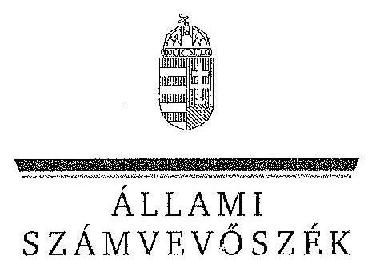
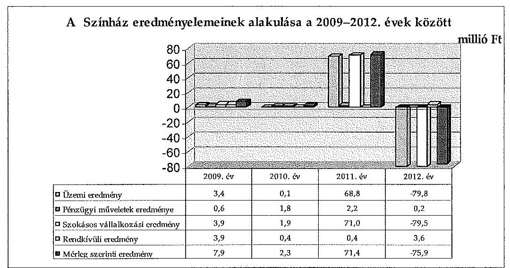
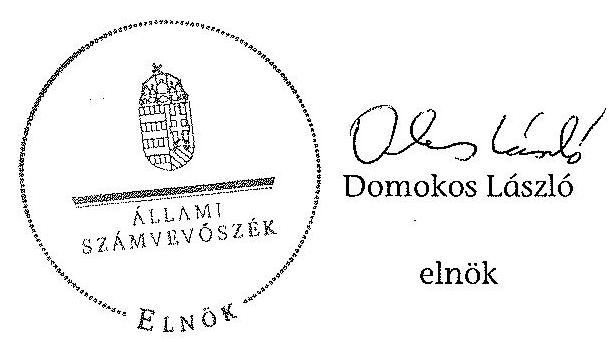
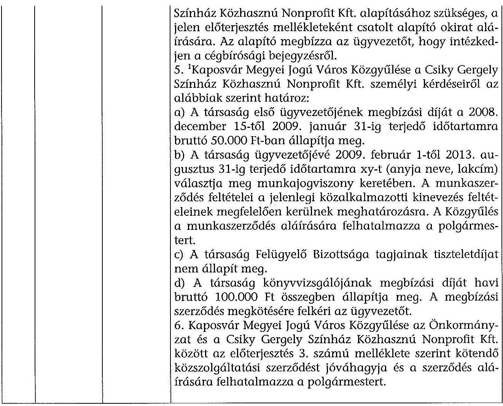
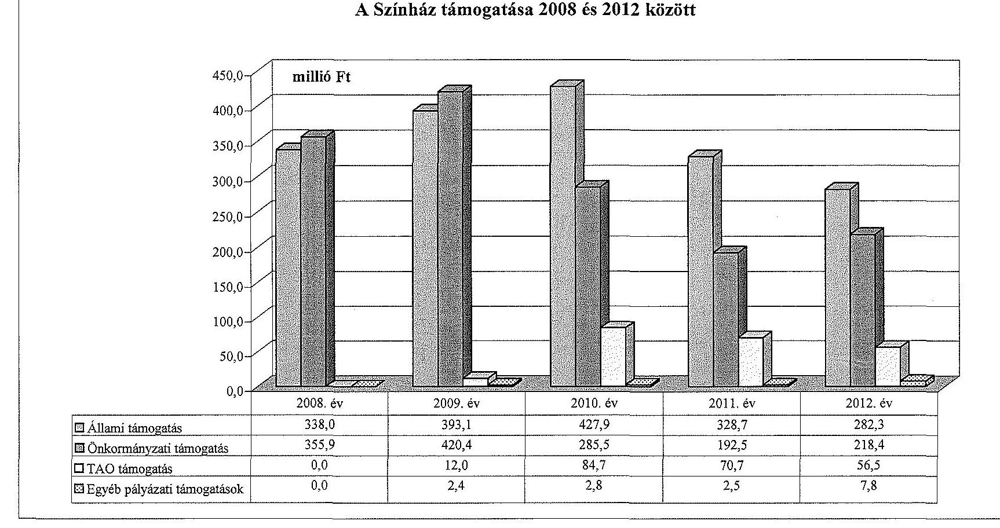
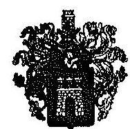
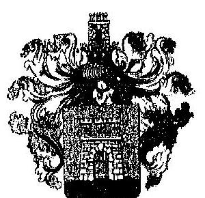
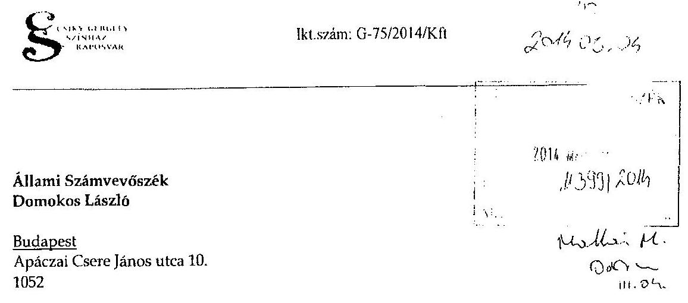
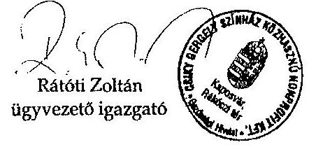

ÁLLAMI
SZÁMVEVŐSZÉK

# JELENTÉS 

az önkormányzatok többségi tulajdonában lévő gazdasági társaságok közfeladat-ellátásának ellenőrzéséről Csiky Gergely Színház Közhasznú Nonprofit Kft.

---

# Állami Számvevőszék 

Iktatószám: V-0305-063/2014.
Témaszám: 1338
Vizsgálat-azonosító szám: V06530215

## Az ellenőrzést felügyelte:

## Makkai Mária

felügyeleti vezető
Az ellenőrzést vezette és az ellenőrzés végrehajtásáért felelős:
Klinga László
ellenőrzésvezető
A számvevőszéki jelentés összeállításában közremúködött:
Kántor Ilona
számvevő tanácsos

## Az ellenőrzést végezték:

| Dr. Baloghné | Kámán Edina | Kántor Ilona |
| :-- | :-- | :-- |
| Sebestyén Éva | számvevő | számvevő tanácsos |
| számvevő |  |  |

A témához kapcsolódó eddig készített számvevőszéki jelentések:
címe
sorszáma
Jelentés Kaposvár Megyei Jogú Város Önkormányzata gazdálkodá- 1026 si rendszerének 2010. évi ellenőrzéséről

Jelentés Kaposvár Megyei Jogú Város Önkormányzata pénzügyi 1137 helyzetének ellenőrzéséről (43/3)

Jelentés a színházak állami támogatásának és gazdálkodásának 1039 ellenőrzéséről

---

# TARTALOMJEGYZÉK 

BEVEZETÉS ..... 9
I. ÖSSZEGZŐ MEGÁLLAPÍTÁSOK, KÖVETKEZTETÉSEK, JAVASLATOK ..... 12
II. RÉSZLETES MEGÁLLAPÍTÁSOK ..... 18

1. Az Önkormányzat közfeladat-ellátásának megszervezése ..... 18
1.1. A közfeladat meghatározása, a feladat ellátásának választott módja ..... 18
1.2. Az Önkormányzat tulajdonosi irányításának megítélése ..... 22
2. A Színház közfeladat-ellátással kapcsolatos tevékenysége ..... 24
2.1. A Színház szervezeti kialakítása, szabályozottsága ..... 24
2.2. A Színház vagyonnyilvántartása ..... 26
2.3. A gazdasági évek ráfordításainak és bevételeinek alakulása ..... 27
2.4. A Színház eredményének alakulása ..... 30
2.5. A Színház folyamatos üzemmenetének, likviditásának biztosítása ..... 33
3. Az Önkormányzat tulajdonosi jogainak és kötelezettségeinek érvényesítése ..... 36
3.1. A Színháztól származó információk hasznosítása ..... 36
3.2. Az Önkormányzat tulajdonosi intézkedései ..... 37
4. Az ÁSZ korábbi, a többségi tulajdonú gazdasági társaságok közfeladat ellátását, gazdálkodását, pénzügyi helyzetét érintő javaslataira tett intézkedések ..... 39
4.1. Az Önkormányzat intézkedési terve és a javaslatok hasznosulása ..... 39

---

# MELLÉKLETEK 

1. számú Kaposvár Megyei Jogú Város Önkormányzatának határozata a Csiky Gergely Színház Közhasznú Nonprofit Kft. alapítására vonatkozóan
2. számú A Színház szakmai tevékenységének mutatói 2008 és 2012 között
3. számú A Színház támogatása 2008 és 2012 között
4. számú A Színház vagyonának főbb adatai 2008. december 31. és 2012. december 31. között
5. számú Kaposvár Megyei Jogú Város Polgármesterének észrevétele
6. számú A Csiky Gergely Színház Közhasznú Nonprofit Kft. ügyvezető igazgatójának észrevétele

---

# RÖVIDÍTÉSEK JEGYZÉKE 

## Törvények

ÁSZ tv.
Civil tv.

Emtv.

Gt. tv.
Htv.

Kbt. $_{1}$
Kbt. $_{2}$
Közhasznúsági tv.
Mötv.

Nvtv.

Ötv.

Ptk.
Számv. tv.
Taktv.
Tao. tv.
2009. évi költségvetési tv.

## Rendeletek

Áhsz.
az Állami Számvevőszékről szóló 2011. évi LXVI. törvény az egyesülési jogról, a közhasznú jogállásról, valamint a civil szervezetek múködéséről és támogatásáról szóló 2011. évi CLXXV. törvény (hatályos: 2012. január 1-jétől) az előadó-művészeti szervezetek támogatásáról és sajátos foglalkoztatási szabályairól szóló 2008. évi XCIX. törvény a gazdasági társaságokról szóló 2006. évi IV. törvény a helyi önkormányzatok és szerveik, a köztársasági megbízottak, valamint egyes centrális alárendeltségú szervek feladat és hatásköreiről szóló 1991. évi XX. törvény a közbeszerzésekről szóló 2003. évi CXXIX. törvény a közbeszerzésekről szóló 2011. évi CVIII. törvény a közhasznú szervezetekről szóló 1997. évi CLVI törvény (hatálytalan: 2012. január 1-jétől)
Magyarország helyi önkormányzatairól szóló 2011. évi CLXXXIX. törvény (hatályos: 2012. január 1-jétől, kivéve a 144. § (2) bekezdésben meghatározott paragrafusok, amelyek 2012. április 15-én, a (3) bekezdésben meghatározott paragrafusok, amelyek 2013. január 1-jén léptek hatályba, a (4) bekezdésben meghatározott paragrafusok a 2014. évi általános önkormányzati választások napján lépnek hatályba)
a nemzeti vagyonról szóló 2011. évi CXCVI. törvény (hatályos: 2011. december 31-étől, kivéve a 20. § (2) bekezdésben meghatározott paragrafusok, amelyek 2012. január 1-jétől, a (3) bekezdésben meghatározott paragrafusok 2013. január 1-jétől, a (4) bekezdésben meghatározott paragrafus 2012. március 2-ától léptek hatályba)
a helyi önkormányzatokról szóló 1990. évi LXV. törvény (hatálytalan: a 2014. évi általános önkormányzati választások napjától)
a Polgári Törvénykönyvről szóló 1959. évi IV. törvény a számvitelről szóló 2000. évi C. törvény a köztulajdonban álló gazdasági társaságok takarékosabb múködéséről szóló 2009. évi CXXII. törvény a társasági adóról és az osztalékadóról szóló 1996. évi LXXXI. törvény
a Magyar Köztársaság 2009. évi költségvetéséről szóló 2008. évi CII. törvény
az államháztartás szervezetei beszámolási és könyvvezetési kötelezettségének sajátosságairól szóló 249/2000. (XII. 24.) Korm. rendelet

---

gazdasági program ${ }_{1} \quad$ Kaposvár Megyei Jogú Város Önkormányzatának 328/2006. (XI. 16.) számú rendelete a 2006-2010. évek várospolitikai és városfejlesztési céljait megfogalmazó gazdasági programjáról
gazdasági program ${ }_{2} \quad$ Kaposvár Megyei Jogú Város Önkormányzatának 187/2010. (X. 14.) számú határozata a 2010-2014 közötti időszakra elfogadott gazdasági programjáról
SZMSZ $_{1} \quad$ Kaposvár Megyei Jogú Város Önkormányzatának 4/1997. (I. 21.) számú rendelete a Közgyűlés és Szervei Szervezeti és Müködési Szabályzatáról (hatálytalan: 2013. január 1jétől)
SZMSZ $_{2} \quad$ Kaposvár Megyei Jogú Város Önkormányzatának 85/2012. (XII. 17.) számú rendelete a Közgyűlés és Szervei Szervezeti és Múködési Szabályzatáról (hatályos: 2013. január 1-jétől)
vagyongazdálkodási rendelet ${ }_{1} \quad$ Kaposvár Megyei Jogú Város Önkormányzatának 34/2005. (VI. 24.) számú rendelete az önkormányzat vagyonáról, a vagyongazdálkodás szabályairól, valamint a nem lakáscélú helyiségek bérletéről (hatálytalan: 2011. március 1-jétől)
vagyongazdálkodási rendelet ${ }_{2} \quad$ Kaposvár Megyei Jogú Város Önkormányzatának 9/2011. (II. 25.) számú rendelete az önkormányzat vagyonáról, a vagyongazdálkodás szabályairól, valamint a nem lakáscélú helyiségek bérletéről (hatálytalan: 2012. október 15től)
vagyongazdálkodási rendelet ${ }_{3} \quad$ Kaposvár Megyei Jogú Város Önkormányzatának 59/2012. (X. 03.) számú rendelete az önkormányzat vagyongazdálkodásáról (hatályos: 2012. október 15-től)
6/2010. (II. 4.) OKM az előadó-művészeti szervezetek beszámolójának formai rendelet és tartalmi követelményeiről, a benyújtásával és elfogadásával kapcsolatos részletes szabályokról, továbbá az elszámolható költségekről szóló 6/2010. (II. 4.) OKM rendelet (hatályos: 2010. február 7-től)
350/2011. (XII. 30.) a civil szervezetek gazdálkodása, az adománygyűjtés és a
Korm. rendelet közhasznúság egyes kérdéseiről szóló 350/2011. (XII. 30.) Korm. rendelet
14/2012. NEFMI rendelet az előadó-művészeti szervezetek és az előadó-művészeti érdekképviseleti szervezetek müködésével kapcsolatos hatósági eljárások és adatszolgáltatások részletes szabályairól szóló 14/2012. (III. 6.) NEFMI rendelet (alapvető rendelkezéseit tekintve hatályos: 2012. március 31-től)

## Szórövidítések

Alapító
Kaposvár Megyei Jogú Város Önkormányzatának Közgyűlése
Alapító Okirat
a Csiky Gergel ${ }_{j}$ : Színház Közhasznú Nonprofit Korlátolt
Felelősségű Társaság Alapító Okirata
áfa
általános forgalmi adó
ÁSZ
Állami Számvevőszék

---

| Ellenőrzési iroda | Kaposvár Megyei Jogú Város Polgármesteri Hivatal Humánszolgáltatási és Titkársági Igazgatóság Ellenőrzési Iroda |
| :--: | :--: |
| EMMI | Emberi Erőforrások Minisztériuma |
| EU | Európai Unió |
| FB | Csiky Gergely Színház Közhasznú Nonprofit Kft. Felügyeló Bizottsága |
| Fenntartói megállapodás | Kaposvár Megyei Jogú Város Önkormányzata és a Csiky Gergely Színház Közhasznú Nonprofit Kft. között létrejött fenntartói megállapodás (hatályos a 2013. január 1. és a 2015. december 31. közötti időszakra) |
| föjegyzö | Kaposvár Megyei Jogú Város Önkormányzatának Címzetes Főjegyzöje |
| javadalmazási szabály-   zat | Csiky Gergely Színház Közhasznú Nonprofit Korlátolt Felelősségú Társaság javadalmazási szabályzata (hatályos: 2010. február 26-tól) |
| Közgyúlés | Kaposvár Megyei Jogú Város Önkormányzatának Közgyúlése |
| Közszolgáltatási szerződés | Kaposvár Megyei Jogú Város Önkormányzata és a Csiky Gergely Színház Közhasznú Nonprofit Kft. között 2009. február 1-jén aláírt, többször módosított Közszolgáltatási szerződés |
| kulturális stratégia | Kaposvár Város Kulturális Stratégiája |
| NEFMI | Nemzeti Erőforrás Minisztérium |
| NKA | Nemzeti Kulturális Alap |
| OKM | Oktatási és Kulturális Minisztérium |
| Önkormányzat | Kaposvár Megyei Jogú Város Önkormányzata |
| Pénzügyi és Vagyongazdálkodási bizottság polgármester | Kaposvár Megyei Jogú Város Önkormányzat Közgyűlésének Pénzügyi és Vagyongazdálkodási Bizottsága |
|  | Kaposvár Megyei Jogú Város Önkormányzatának polgármestere |
| Polgármesteri Hivatal | Kaposvár Megyei Jogú Város Önkormányzatának Polgármesteri Hivatala |
| Színház | Csiky Gergely Színház (Kaposvár Megyei Jogú Város Önkormányzatának önállóan gazdálkodó költségvetési szerve) 2009. január 31-ig; Csiky Gergely Színház Közhasznú Nonprofit Korlátolt Felelősségú Társaság (Kaposvár Megyei Jogú Város Önkormányzat által alapított gazdasági társaság) 2009. február 1-től |
| Színház leltározási szabályzata | Csiky Gergely Színház Közhasznú Nonprofit Kft. Leltározási Szabályzata (hatályos 2009. február 1-jétől) |
| Színház SZMSZ-e | Csiky Gergely Színház Közhasznú Nonprofit Kft. Szervezeti és Múködési Szabályzata (hatályos 2009. február 1-jétől) |
| ügyvezető | Csiky Gergely Színház Közhasznú Nonprofit Korlátolt Felelősségű Társaság ügyvezető igazgatója |
| városfejlesztési stratégia | Kaposvár Megyei Jogú Város Integrált Városfejlesztési Stratégiája |

---

.

---

# FOGALOMTÁR 

eredménytartalék
közfeladat
mérleg szerinti eredmény
tulajdonosi joggyakorló
üzemi eredmény

A saját tőke változó eleme, elsősorban a tárgyévet megelőző évek mérleg szerinti eredményének a halmozott összegét mutatja.
Jogszabályban meghatározott állami vagy önkormányzati feladat, amit az arra kötelezett közérdekből, jogszabályban meghatározott követelményeknek és feltételeknek megfelelve végez, ideértve a lakosság közszolgáltatásokkal való ellátását, továbbá az állam nemzetközi szerződésekben vállalt kötelezettségeiből adódó közérdekủ feladatokat, valamint e feladatok ellátásához szükséges infrastruktúra biztosítását is (Nvtv. 3. § (1) bekezdés 7. pont).

A mérleg szerinti eredmény az osztalékra, részesedésre, a kamatozó részvények kamatára igénybe vett eredménytartalékkal növelt, a jóváhagyott osztalékkal, részesedéssel, a kamatozó részvények kamatával csökkentett tárgyévi adózott eredmény, egyezően az eredménykimutatásban ilyen címen kimutatott összeggel (Számv. tv. 39. § (2) bekezdés).
Aki a nemzeti vagyon felett az államot vagy a helyi önkormányzatot megillető tulajdonosi jogok és kötelezettségek összességének gyakorlására jogosult (Nvtv. 3. § (1) bekezdés 17. pont).
Az üzemi tevékenység eredménye kétféle módon állapítható meg:
a) összköltség eljárással: az üzleti évben elszámolt értékesítés nettó árbevételének, az eszközök között állományba vett saját teljesítmények értékének, az egyéb bevételeknek, valamint az üzleti évben elszámolt anyagjellegű ráfordítások, személyi jellegű ráfordítások, értékcsökkenési leírás és egyéb ráfordítások együttes összegének különbözeteként;
b) forgalmi költség eljárással: az üzleti évben elszámolt értékesítés nettó árbevételének és az értékesítés közvetlen költségei, az értékesítés közvetett költségei különbözetének, valamint az egyéb bevételek és az egyéb ráfordítások különbözetének összevont értékeként (Számv. tv. 71. § (1) bekezdés a)-b) pontok).

---

.

---

# JELENTÉS 

## az önkormányzatok többségi tulajdonában lévő gazdasági társaságok közfeladatellátásának ellenőrzéséről Csiky Gergely Színház Közhasznú Nonprofit Kft.

## BEVEZETÉS

Az Önkormányzat kulturális közfeladat-ellátással kapcsolatos hosszú távú céljait kulturális stratégiában, valamint városfejlesztési stratégiájában foglalta össze. A 2006-2010. évekre szóló gazdasági program ${ }_{1}$-ban a szakmai elvárások között teret kapott a rendszeressé vált gyermekszínházi találkozó fenntartásának igénye, valamint a színházépület felújítása. A 2010-2014 közötti időszakra elfogadott gazdasági program $_{2}$-ban a szakmai elvárások mellett az Önkormányzat ismét megfogalmazta a színházépület felújításának igényét.

A Csiky Gergely Színház (egykori nevén: Nemzeti Színház) Kaposvár jelképe, az ország egyik legnagyobb és leghíresebb színháza 1911-ben nyitotta meg kapuit. A Csiky Gergely Színház önálló társulattal rendelkezik, két saját játszóhelyen működik, alaptevékenysége az előadó-művészet. A repertoár kialakításában jellemző a műfaji sokszínűségre törekvés. Jelen van a musical, a zenés vígjáték, a klasszikus múfaj, valamint a kortárs drámairodalom, de jelentős hangsúlyt kapnak a gyermek és ifjúsági előadások is. A közönségdarabok mellett törekednek az új művészeti értékek bemutatására, illetve új közönségrétegek meghódítására. Az ellenőrzött időszakban a nagyszínpad 540 fő, a stúdiószínpad 90 fő néző befogadására volt képes. A színházlátogatók száma a 2008. évi 90143 fơről a 2012. évre 32,9\%-kal, 60518 főre, az előadások száma 250 -ről $6,0 \%$-kal, 235 -re csökkent.

A Csiky Gergely Színház 2009. január 31-ig önállóan gazdálkodó költségvetési szervként múködött. Jogutód nélküli megszüntetéséről, megszüntető okiratának elfogadásáról a Közgyűlés a 282/2008. (XII. 11.) számú határozatával döntött. Egyúttal határozott - az előterjesztéshez csatolt, 2008. december 15-én aláírt alapító okirat elfogadásával - Csiky Gergely Színház Közhasznú Nonprofit Korlátolt Felelősségű Társaság névvel 100\%-os önkormányzati tulajdonban lévő társaság alapításáról, az alapító okiratban megfogalmazott feltételek szerint.

A közfeladat-ellátás feltételeit, módját határozatlan időtartamra kötött, 2009. február 1-jén aláírt Közszolgáltatási szerződésben, 2013. évtől Fenntartói megállapodásban rögzítették.

Az Önkormányzat gazdálkodási és művészeti feladatok ellátására intézményfinanszírozást, majd 2009. február 1-jétől Közszolgáltatási szerződés alapján,

---

támogatási szerződésekbe foglalt feltételekkel összesen 3113,9 millió Ft állami és önkormányzati müködési, valamint 128,8 millió Ft felhalmozási támogatást biztosított. A Színház emellett 2009-2012 között 223,9 millió Ft összegű társasági adóból származó támogatást tudott igénybe venni.

A Színháznál 2008. július 1-jén, majd 2010. szeptember 1-jén történt igazgató váltás. Az ellenőrzött időszakban a Színház ügyvezetőjének személye négy alkalommal változott. A Színháznál három tagból álló FB működött.

A Színház főbb szakmai mutatószámait a 2. számú melléklet tartalmazza.
Az ellenőrzés várható eredménye: a jelentés nyilvánossága a társadalom széles körével ismerteti meg a Színház gazdálkodására vonatkozó megállapításainkat, továbbá a megállapítások alapján megfogalmazott számvevőszéki javaslatok hasznosítása elősegíti a feltárt hibák megszüntetését, az ellenőrzött szervezet jobb feladatellátását. A társadalom számára jelzi, hogy közpénz nem maradhat ellenőrizetlenül, az ÁSZ értékteremtő rend kialakításához és megőrzéséhez hozzájáruló tevékenysége pozitív hatással lesz a szervezetről kialakított összkép formálásában. A szervezeten belül lehetőség nyílik arra, hogy a megállapítások szintetizálásával az ÁSZ a hozzáadott értéket teremtő, elemző tevékenységét és tanácsadó szerepét is erősítse. A jó gyakorlatok bemutatásával az ÁSZ hozzájárul a követendő megoldások megismertetéséhez, terjesztéséhez.

# Az ellenőrzés célja annak értékelése, hogy 

- az Önkormányzat a jogszabályi előírások figyelembevételével döntött-e az ellenőrzésre kerülő közfeladat megszervezéséről, az ellátás módjáról, a tulajdonostól elvárható gondossággal felügyelte-e a társaság feladatellátását, a gazdasági társaság rendelkezésére bocsátotta-e a közfeladat ellátásához a szükséges közvagyont, és biztosította-e a tulajdonosi jogok afeletti érvényesülését, a társaság vagyonvesztése esetén intézkedett-e a további vagyonvesztés megakadályozásáról;
- a Színház teljesítette-e a tulajdonos önkormányzat részéről meghatározott célokat és feladatokat a rendelkezésre álló erőforrások felhasználásával, vég-rehajtotta-e a közfeladat-ellátási szerződés előírásait, betartotta-e a vagyonnal történő gazdálkodásra vonatkozó jogszabályi rendelkezéseket.

Az ellenőrzés hatóköre: az önkormányzatok közfeladat-ellátásának ellenőrzése, amely kiterjed az önkormányzatok és a közfeladatot ellátó, az önkormányzatok többségi tulajdonában lévő gazdasági társaságok közötti feladatmegosztásra, az önkormányzatok tulajdonosi jogainak gyakorlására, a nemzeti vagyon kezelésének ellenőrzése keretében a közfeladat-ellátáshoz rendelt vagyonra és a vagyont érintő szerződésekre. A jelen ellenőrzés kiterjed az önkormányzatok többségi tulajdonában lévő gazdasági társaságok közfeladatellátására, vagyongazdálkodási tevékenységére, a kapcsolódó nyilvántartások, elszámolások szabályszerűségére és megbízhatóságára. Az ellenőrzött tételek kiválasztása véletlen mintavétellel történt.

Az ellenőrzés típusa: szabályszerűségi ellenőrzés

---

Az ellenőrzött időszak: A 2008-2012. évek, valamint a helyszíni ellenőrzés befejezéséig - 2013. november 5-ig - bekövetkezett változások figyelemmel kísérése.

Ellenőrzött szervezet: Csiky Gergely Színház 2009. január 31-ig; Csiky Gergely Színház Közhasznú Nonprofit Korlátolt Felelősségű Társaság 2009. február 1-től, valamint Kaposvár Megyei Jogú Város Önkormányzata

Az ellenőrzés végrehajtásának jogszabályi alapját az ÁSZ tv. 5. § (3)-(5) bekezdései képezték.

Az ÁSZ a 2011. évi LXVI. törvény 29. §-a szerint a jelentéstervezetet megküldte Kaposvár Megyei Jogú Város Polgármesterének és a Csiky Gergely Színház Közhasznú Nonprofit Kft. ügyvezető igazgatójának egyeztetésre. Kaposvár Megyei Jogú Város Polgármestere és a Csiky Gergely Színház Közhasznú Nonprofit Kft. ügyvezető igazgatója nem tett észrevételt. A nemleges észrevételeket a jelentés 5. és 6. számú mellékletei tartalmazzák.

---

# I. ÖSSZEGZŐ MEGÁLLAPÍTÁSOK, KÖVETKEZTETÉSEK, JAVASLATOK 

Kaposvár Megyei Jogú Város Önkormányzat Közgyűlése (Közgyűlés) az Ötv.ben és a Htv.-ben meghatározott, a művészeti tevékenység támogatásával öszszefüggő közfeladatát 2009. január 31-ig előadó-művészeti alaptevékenységet ellátó, önállóan gazdálkodó költségvetési szerv fenntartásával, ezt követően előadó művészeti feladatellátásra létrehozott gazdasági társaság támogatásával hajtotta végre.

A költségvetési szervként működő Színház a 2008. évben feladatát ellátta. Az Önkormányzat által kiadott útmutatók szerint eljárva, az államháztartás szervezeteire vonatkozó szabályoknak megfelelően állította össze az éves költségvetését, gazdálkodásáról költségvetési beszámolót készített.

A gazdasági társaságként működő Színház közfeladat-ellátásának feltételeit, módját rögzítő Közszolgáltatási szerződés a közfeladat-ellátás tartalmát, szakmai követelményeit általánosságban határozta meg. A Fenntartói megállapodás az Emtv.-nek megfelelő tartalommal rögzítette a Színháztól elvárt teljesítményt, az adott területre jellemző mutatókat, a követelmények leírását, továbbá költség-nemenként a feladatteljesítéshez rendelt forrást.

Az Önkormányzat a közfeladat-ellátáshoz szükséges közvagyont, a közfel-adat-ellátás feltételeit 0,5 millió Ft törzstőke rendelkezésre bocsátásával, 602,3 millió Ft ingó- és ingatlanvagyon ingyenes használatba adásával, 1770,0 millió Ft állami támogatás, valamint saját forrásaiból összesen 1472,7 millió Ft működési és fejlesztési célú támogatás nyújtásával biztosította.

A Színház 2008-2012 közötti mérleg szerinti eredménye alapján nem volt szükség tulajdonosi intézkedésre a Gt. tv. szerint a veszteség rendezése, illetve a saját tőke/jegyzett tőke előírt szintjének biztosítása érdekében. Az önkormányzati vagyon, a közpénzek nem célszerinti hasznosítása, a pazarló felhasználással kapcsolatos veszteség megszüntetése, a lejárt kötelezettségek csökkentése, a Színház által jelzett csődveszély elhárítása érdekében tulajdonosi intézkedés megtételére nem volt szükség.

A gazdasági társasági formában működő Színház működési célú támogatása elsősorban a központi költségvetésből és az önkormányzati saját forrásból nyújtott múködési célú támogatás mérséklődésének együttes eredményeként a 2009. évet követően - a 2010. évben az előző évhez képest 191,7 millió Ft-tal, a 2011. évben 89,6 millió Ft-tal, a 2012. évben 20,5 millió Ft-tal - csökkent. Az Önkormányzat a Színház részére 2008-2010 között összesen 128,8 millió Ft felhalmozási célú támogatást nyújtott. A Színház a 2011. és a 2012. évben felhalmozási támogatásban nem részesült.

Az Önkormányzat tulajdonosi jogainak gyakorlása a vagyongazdálkodási rendelet ${ }_{1,2,3}$-ben, az Alapítói Okiratban, valamint az SZMSZ ${ }_{1,2}$-ben rögzített szabályok szerint történt. A vagyongazdálkodási rendelet ${ }_{1,2}$-nek megfelelően a tu-

---

lajdonosi képviseletet a polgármester látta el, a Gt. tv.-ben meghatározott, a szavazatok legalább háromnegyedes többségét igénylő kérdésekben, valamint a gazdasági társaság vezető tisztségviselőivel és az FB tagjaival kapcsolatos személyi kérdésekben a Közgyűlés vonatkozó határozatai alapján, az egyéb tulajdonosi döntéseket önállóan hozta meg. Az FB és a könyvvizsgáló feladatát a szabályozásnak megfelelően látta el. A Színház 2009. évi üzleti tervének elfogadásáról az Alapító Okiratban, valamint a vagyongazdálkodási rendelet,-ben foglaltak ellenére a tulajdonos képviseletében eljáró polgármester nem hozott határozatot.

A Közgyűlés a bérlet- és jegyárakat a 2009/2010. évad műsortervének ismeretében felülvizsgálta, a 2010/2011. és a 2011/2012. évadokra kidolgozott javaslatot elfogadta. Az árak megállapítása a 2012. évtől a polgármesterrel történő egyeztetést követően az ügyvezető feladata volt.

A Színház ügyvezetőjére, FB tagjaira és könyvvizsgálójára vonatkozó javadalmazási szabályzattal összhangban az ügyvezetők személyi alapbérét a Közgyűlés határozatban állapította meg. A polgármester az üzleti tervek elfogadásával egyidejűleg az ügyvezetők számára prémium feltételeket nem határozott meg. Az ügyvezetők részére prémiumot nem fizettek ki.

A számlarendet, az eszközök és források értékelési szabályzatát, a pénzkezelési szabályzatot a Számv. tv-ben a jogszabály változásához illeszkedő módosítások végrehajtására vonatkozó követelmény ellenére nem aktualizálták.

A Színház számlarendjét a Számv. tv.-ben, valamint az Alapító Okiratban foglaltak ellenére a Színház képviseletére jogosult ügyvezető helyett a gazdasági igazgató hagyta jóvá. A Színház a Számv. tv.-ben és a számlarendben foglaltak ellenére bizonylati rendet nem készített.

A Színház a Számv. tv., valamint a számviteli politikájában foglaltak ellenére önköltségszámítás rendjére vonatkozó szabályzatot nem készített, az árképzéshez szükséges elő-, és utókalkuláció szabályait, tartalmát, módját és időszakait nem határozta meg. A produkciók színrevitelével kapcsolatban készített elő- és utókalkulációk azok létrehozásának költségeit nem teljes körüén tartalmazták, mert nem vették figyelembe a közvetlenül elszámolható személyi juttatásokat, azok járulékait, a dologi, közüzemi, bérleti díjakat, az értékcsökkenést.

Az önkormányzati vagyon megőrzése, védelme érdekében a Színház részére ingyenes használatba adott vagyon leltározását a Közszolgáltatási szerződés és az Önkormányzat leltározási szabályzatainak megfelelően évente végrehajtották. A Színház mérlegét leltárral alátámasztotta, saját tulajdonú vagyonának évenkénti leltározását végrehajtotta.

Az ingyenes használatba adott vagyon nettó értéke a selejtezések és az elszámolt értékcsökkenés következtében a 2009. évről a 2012. évre 19,1\%-kal, 275,5 millió Ft-ra csökkent. A Színház mérlegében kimutatott saját vagyona a 2009. február 1-jei 0,6 millió Ft-ról 2012. december 31-re 129,3 millió Ft-ra nőtt. A Színház saját eszközállományának 2011-ig tartó emelkedését a fejlesztési kiadások, a pénzeszközök, a követelések növekedése, 2012. évi csökkenését az elszámolt értékcsökkenés, valamint a pénzeszközök mérséklődése okozta. A saját

---

tőke a 2012. évi veszteséges gazdálkodás következtében 6,2 millió Ft-ra csökkent. A rövid lejáratú kötelezettségek állománya a 2009. évről 2012. évre $39,2 \%$-kal, 50,8 millió Ft-ra emelkedett.

A gazdasági társasági formában múködő Színház bevételei a 2009. évi 697,0 millió Ft-ról a 2012. évre 10,4\%-kal csökkentek, elsősorban az állami és az önkormányzati támogatás mérséklődése miatt. A támogatások jelentős hatást gyakoroltak az eredmény alakulására, mert a központi költségvetésből származó összes támogatás a 2009. évi 393,1 millió Ft-ról a 2012. évben 282,3 millió Ft-ra, az önkormányzati támogatás a 2009. évi 420,4 millió Ft-ról 218,4 millió Ft-ra csökkent.

A Színház a Kaposvár Kártyához kapcsolódóan a bérletek és jegyek árából az Önkormányzat rendeletében meghatározott mértékű kedvezményt nyújtott. A kedvezmény alkalmazásából származó nettó árbevétel-kiesést - a Közgyűlés határozata értelmében - az Önkormányzat ellentételezi. Az Önkormányzat 2010. október 31-ig megtérítette a Kaposvár Kártyához kapcsolódóan a Színház által a lakosságnak adott bérlet és jegyár kedvezményt, az ezt követő időszakban keletkezett árbevétel kiesést a működési támogatás részeként tervezte biztosítani. A Színház a 2009-2012. években a kártyatulajdonosoknak összesen 13,5 millió Ft kedvezményt nyújtott. A 2010. november 1. és 2012. december 31. közötti időszakban keletkezett bevételkiesésből az Önkormányzat 2,4 millió Ft-ot nem térített meg.

A Színház társasági adókedvezménnyel igénybe vehető támogatásának mértéke a 2009-2012. években a nettó jegybevételtől függött. A Kaposvár Kártya kedvezményrendszerének 2010. október 31-től történt átalakítása, azaz a Kaposvár Kártyával nyújtott kedvezmény nem jegybevételként, hanem támogatásként történt elszámolása következtében a Színház 5,1 millió Ft, a Tao. tv. alapján társasági adóból igénybe vehető támogatást nem érvényesíthetett.

A Színház összes ráfordítása a 2010. évi 797,6 millió Ft-tal szemben a 2011. évre 755,2 millió Ft-ra, a 2012. évre 697,2 millió Ft-ra csökkent, egyrészt a források csökkenése, másrészt az eredményesség javítása érdekében tett intézkedések miatt. A színházépület felújításának előkészítésére 30,8 millió Ft kiadást teljesítettek. A teljes rekonstrukció megvalósításához szükséges forrásokkal nem rendelkeztek.

A produkciókhoz vásárolt díszleteket, jelmezeket a beszerzéskor közvetlen költségként számolták el, mert azokat kizárólag évadon belül használták fel. A produkciók befejezését követően az ügyvezető engedélyével a jelmezek a jelmezraktárba kerültek, a díszleteket elemekre bontották és a még használható elemeket raktározták. A jelmezeket, díszleteket a Számlarendben foglaltaknak megfelelően mennyiségben tartották nyilván, leltározásukat a Színház leltározási szabályzata szerint évente végrehajtották.

A pénzügyi egyensúly javítása érdek/ben hozott intézkedések eredményeként a bérköltség a 2010. évi 374,2 millió Ft-ról a 2012. évre 329,2 millió Ft-ra, 12,0\%-kal csökkent. A megbízási díjak 2012. évi emelkedését gyermekszereplők, idős karakter színészek, kórustagok foglalkoztatását igénylő darabok bemutatása okozta. A jutalom jogcímen kifizetett összegek a 2009. évi

---

2,4 millió Ft-ról 2012-re 6,8 millió Ft-ra emelkedtek a jubileumi jutalom, illetve a sikeres produkciókban való munkavégzés elismerése kapcsán. Prémium kifizetés a Színháznál nem történt.

A Színház az eredményessége és pénzügyi egyensúlyának javítása érdekében a 2009-2012. években a takarítással, a nézőtéri foglalkoztatással, a férfi varrodai tevékenységgel, a zenekari alkalmazottak foglalkoztatásával kapcsolatos kiadások, az egy produkcióra fordítható átlagos kiadások csökkentése, valamint a nézőszám növelése érdekében intézkedéseket tett.

A Színház a 2009-2010. évek üzleti terveiben mérleg szerinti eredményt nem terezett, 2011-ben 1,0 millió Ft nyereséggel, a 2012. évben 57,6 millió Ft veszteséggel számolt. A Színház a 2009. évi átmeneti likviditási problémáinak kezelésére 34,0 millió Ft kölcsönt vett igénybe, amelynek visszafizetése az éven belül megtörtént. A 2012. évben a központi költségvetésből származó támogatás csökkenése miatt az Önkormányzat a Színház részére 20,0 millió Ft többlettámogatást nyújtott. A Színház figyelemmel kísérte a kötelezettségek teljesítését, azokat az éves beszámoló kiegészítő mellékletében bemutatta, azonban alakulásukat nem elemezte.

A Színház mérleg szerinti eredményét a 2009-2012. években alapvetően az üzemi tevékenység eredménye határozta meg. A 2011. évi 68,8 millió Ft üzemi tevékenységből származó eredményt a színházépület rekonstrukciójára elhatárolt bevétel feloldása, valamint az Önkormányzatnak visszautalt egy havi támogatás és Kaposvár Kártya miatti bevételkiesés kompenzáció elszámolása határozta meg. A 2012. évi 79,8 millió Ft üzemi tevékenységből származó veszteséget az előző évben visszautalt 40,9 millió Ft egy havi támogatás és kompenzáció 2012. évi elszámolása, az állami és az önkormányzati támogatás 102,3 millió Ft-os csökkenése, továbbá a saját bevételek 14,4 millió Ft-os elmaradása befolyásolta. A veszteség okait a 2012. évi beszámolóban értékelték, kezelését a polgármester alapítói határozatában az eredménytartalékból való finanszírozással határozta meg.

A Színház közhasznú tevékenységéből, illetve vállalkozási tevékenységéből származó bevételeit és ráfordításait elkülönítetten tartotta nyilván. A Színház a 2009-2011. éves gazdálkodásáról szóló beszámoló elkészítésével egyidejűleg közhasznúsági jelentéseket készített. A közhasznúsági jelentések a Közhasznúsági tv.-ben előírt tartalmi követelmények ellenére nem tartalmazták a költségvetési támogatás felhasználását, a vagyon felhasználásával, valamint a cél szerinti juttatásokkal kapcsolatos kimutatást. A Színház a 2012. évi beszámolója elkészítésével egyidejűleg a Civil tv.-ben előírt közhasznúsági melléklet készítési kötelezettség ellenére a korábbi évekhez hasonlóan közhasznúsági jelentést készített, amely nem felelt meg a 350/2011. (XII. 30.) Korm. rendeletben meghatározott tartalmi követelményeknek.

A Színház vállalkozási tevékenysége az ellenőrzött időszakban a 2010. év kivételével veszteséges volt, amely a közhasznú tevékenységét nem veszélyeztette. A 2010. évi 3,1 millió Ft vállalkozási eredmény az eredménytartalékot növelte.

A Színház Közszolgáltatási szerződésbe, majd 2013. évtől Fenntartói megállapodásba foglalt szakmai, vagyongazdálkodási feladatait ellátta. A közfeladat-

---

ellátásáról üzleti terveket, éves beszámolókat, évadbeszámolókat, a vagyon változásáról, pénzügyi helyzetéről adatszolgáltatást készített. Az Önkormányzat ezek tartalmi felülvizsgálatával, elemzésével, értékelésével, pénzügyi helyzetének 2012. év 1. negyedévétől kezdődően negyedéves kontrolljával ellenőrizte a vagyon, a közpénzek felhasználását, érvényesítette tulajdonosi jogait. Az FB és a könyvvizsgáló munkája segítette a polgármestert, mint a tulajdonosi jogok gyakorlóját az üzleti tervek és az éves beszámolók elfogadásában.

A 2008. évben a költségvetési szervként működő Színháznál végrehajtott belső ellenőrzés hét javaslata közül egy hasznosult, a további hat a megváltozott szervezeti forma miatt aktualitását vesztette. Az Önkormányzat belső ellenőrzése az Ötv.-ben foglalt lehetőséggel nem élt, a gazdasági társasági formában működő Színház tevékenységét nem ellenőrizte.

Az ÁSZ az Önkormányzat pénzügyi helyzetét a 2011. évben ellenőrizte. Az ellenőrzésről készített jelentésben megfogalmazott kettő javaslat hasznosult. A 2012. év I. negyedévtől negyedévente teljesített adatszolgáltatás alapján az Önkormányzat a féléves és az éves beszámolók tárgyalása során értékelte a Színház pénzügyi helyzetét.

Az Állami Számvevőszékről szóló 2011. évi LXVI. törvény 33. § (1) bekezdésében foglaltak értelmében a jelentésben foglalt megállapításokhoz kapcsolódó intézkedési tervet köteles az ellenőrzött szervezet vezetője összeállítani, és azt a jelentés kézhezvételétől számított 30 napon belül az ÁSZ részére megküldeni. Amennyiben az intézkedési tervet határidőben nem küldi meg a szervezet, vagy az nem elfogadható, az ÁSZ elnöke a hivatkozott törvény 33. § (3) bekezdés a)-b) pontjaiban foglaltakat érvényesítheti.

Az ellenőrzés intézkedést igénylő megállapításai és javaslatai:

# a Színház ügyvezető igazgatójának 

1. A Színháznál a vagyonnal történő gazdálkodás kereteinek, felelőseinek, eljárási szabályainak ellenőrzése során az alábbi, a vagyon megőrzésében, a vagyonvédelem biztosításában kockázatot jelentő, szabályozási hiányosságokat tártunk fel:
a) a Színház a Számv. tv. 14. § (5) bekezdés c) pontjában, valamint a számviteli politikában foglaltak ellenére önköltségszámítás rendjére vonatkozó szabályzatot nem készített, az árképzéshez szükséges elő-, és utókalkuláció szabályait, tartalmát, módját és időszakait nem határozta meg;
b) a Számv. tv. 14. § (11) bekezdésben foglaltak ellenére a Színház számviteli politikáját, ennek keretében a leltározási szabályzatát, a selejtezési szabályzatát az eszközök és források értékelési szabályzatát, a pénzkezelési szabályzatot nem aktualizálták;
c) a Színház a bizonylati rend készítési kötelezettségnek az ellenőrzött időszakban a Számv. tv. 161. § (2) bekezdés d) pontjának előírása és a számlarendben foglaltak ellenére nem tett eleget;

---

d) a számlarendet a Számv. tv. 161. § (4) bekezdésében, valamint az Alapító Okiratban foglaltak ellenére a Színház képviseletére jogosult ügyvezető helyett a gazdasági igazgató hagyta jóvá;
e) az ingyenesen használatba vett eszközök számviteli nyilvántartási módjának változása, továbbá a Számv. tv. 161. § (5) bekezdésében a jogszabály változásához illeszkedő módosítások végrehajtásának előirása ellenére a számlarendet az ellenőrzött időszakban nem aktualizálták.

Javaslat:
Intézkedjen a hiányzó szabályzatok elkészítéséről és a meglévő szabályzatok aktualizálásáról.
2. A Színház a 2009-2011. éves gazdálkodásáról szóló beszámoló elkészítésével egyidejűleg készített közhasznúsági jelentései a Közhasznúsági tv. 19. § (3) bekezdés b), c), d), pontjaiban előírt tartalmi követelmények ellenére nem tartalmazták a költségvetési támogatás felhasználását, a vagyon felhasználásával, valamint a cél szerinti juttatásokkal kapcsolatos kimutatást. A Színház a 2012. évi beszámolója elkészítésével egyidejűleg a Civil tv. 46. § (1) bekezdésében előírt közhasznúsági melléklet készítési kötelezettség ellenére, a korábbi évekhez hasonlóan közhasznúsági jelentést készített, amely nem felelt meg a 350/2011. (XII. 30.) Korm. rendelet 12. § (1) bekezdésében meghatározott tartalmi követelményeknek.

Javaslat:
Intézkedjen annak érdekében, hogy a Színház éves beszámolóinak elkészítésével egyidejűleg a Civil tv. 46. § (1) bekezdésében, valamint a 350/2011. (XII. 30.) Korm. rendelet 12. § (1) bekezdésében előírt közhasznúsági melléklet készítési kötelezettségét teljesítse.

---

# II. RÉSZLETES MEGÁLLAPÍTÁSOK 

## 1. Az ÖNKORMÁNYZAT KÖZFELADAT-ELLÁTÁSÁNAK MEGSZERVEZÉSE

### 1.1. A közfeladat meghatározása, a feladat ellátásának választott módja

A múvészeti tevékenység támogatása az Ötv. 8. § (1)-(2) bekezdés ${ }^{1}$ és a Htv. 121. § b) pontja alapján az Önkormányzat feladata. Az Önkormányzat e feladatát 2009. január 31-ig előadó-művészeti alaptevékenységet ellátó, önálló gazdálkodási jogkörrel rendelkező költségvetési szerv fenntartásával, ezt követően előadó művészeti feladatellátásra létrehozott gazdasági társaság támogatásával valósította meg.

Az Önkormányzat az ellátott kötelező és önként vállalt feladatait - ezen belül az előadó-művészeti tevékenységgel összefüggő feladatait - SZMSZ ${ }_{1,2}$-ében nem határozta meg. Az Önkormányzat a 2009-2013. évi költségvetési rendeleteiben önként vállalt feladataként tervezte a Színháznak saját bevételeiből nyújtott támogatást.

Az Önkormányzat kulturális közfeladat-ellátással kapcsolatos hosszú távú céljait a 2004. évben hosszú távú kulturális stratégiában, valamint a 2008. évben városfejlesztési stratégiájában foglalta össze. A kulturális stratégiában célként fogalmazták meg a Színház már elért szakmai sikereinek, eredményeinek továbbvitelét, a nemzetközi együttmúködésre törekvést annak érdekében, hogy Kaposvár a gyermekszínház egyik jelentős európai központjává válhasson. A városfejlesztési stratégia a fejlesztési projektek között nevesítette, kiemelt feladatnak tekintette a színházépület felújítását.

A stratégiákban megfogalmazott célok figyelembe vételével elkészített, a 20062010. évekre szóló gazdasági program ${ }_{1}$-ban a szakmai elvárások között teret kapott a Színház rendezésével rendszeressé vált gyermekszínházi találkozó fenntartásának igénye, valamint a színházépület felújítása. A gazdasági program ${ }_{1}$ első három évének értékeléséről 2010-ben a Közgyűlésnek készített beszámoló a Színház szakmai munkáját nem értékelte. A színházépület felújításával kapcsolatban kitűzött cél nem teljesült, mert a források megszerzésére irányuló pályázatokat elutasították. A felújítási tervek elkészültek, a megvalósításra a pályázati lehetőségek függvényében kerülhet sor. A 2010-2014 közötti időszakra elfogadott gazdasági program ${ }_{2}$-ban a szakmai elvárások mellett az Önkormányzat ismét megfogalmazta a színházépület felújításának igényét, változatlanul bízva a 2010. évi állapot szerint mintegy 7,0 milliárd Ft bekerülési költséggel tervezett beruházás megvalósításában. Az Önkormányzat a 2010. évtől a Színházra vonatkozó szakmai elvárásait az igazgatói pályázati kiírásában szerepeltette.

[^0]
[^0]:    ${ }^{1}$ 2013. január 1-jétől az Mötv. 13. § (1) bekezdése tartalmazza.

---

A Közgyűlés 282/2008. (XII. 11.) számú határozatával az önállóan gazdálkodó költségvetési szerv 2009. január 31-ei jogutód nélküli megszüntetéséről, egyúttal 100\%-os tulajdonában lévő gazdasági társaság alapításáról döntött. Az intézmény feladatait 2009. február 1-jétől a gazdasági társasági formában működő Színház látja el (1. számú melléklet).

A közfeladat ellátási forma változását megelőzően más ellátási formákkal dokumentált - a költségvetési szerv és a gazdasági társasági forma múködését, előnyeit és hátrányait összegző - összehasonlító elemzés nem készült. A múködési forma váltásának célja a kulturális feladatok hatékonyabb ellátása, a pénzügyi források felkutatása, a költségvetési források takarékosabb felhasználása és az önkormányzati vagyon gazdaságosabb hasznosítása, valamint a művészek foglalkoztatási formájának jobb illeszkedése a művészeti tevékenységhez volt. A Közgyűlés úgy ítélte meg, hogy a társasági forma alkalmas arra, hogy a feladat ellátásáért felelős Önkormányzat megfelelő befolyással lehessen a közszolgáltatási feladatok feltételeinek meghatározásában, végrehajtásának biztosításában, ellenőrzésében.

A közfeladat-ellátás feltételeit, módját határozatlan időtartamra kötött, 2009. február 1-jén aláírt Közszolgáltatási szerződésben, 2013. évtől az Emtv. 16. § (2) bekezdésében foglalt előírások alapján Fenntartói megállapodásban rögzítették. A Közszolgáltatási szerződésben a közfeladat tartalmának - kulturális közszolgáltatási feladatok ellátása - meghatározása megtörtént.

A Közszolgáltatási szerződés a feladatok tekintetében három alkalommal módosult. A 2009. évi kettő módosítással az Önkormányzat ingyenes használatába adta a jegyiroda épületét, továbbá hozzájárult ahhoz, hogy a használatba adott vagyontárgyakon a Színház saját forrása, illetve felelőssége terhére felújítási, beruházási munkát végezzen előzetes egyeztetést követően. A 2012. évi módosítás a belépődíjak, jegy- és bérletárak megállapításának rendszerét érintette.

Az Önkormányzat a Közszolgáltatási szerződésben a Színház közfeladat ellátásának tartalmát az Emtv. 13. § (2) bekezdésben foglaltak szerint, szakmai követelményeit általánosságban határozta meg. A Közszolgáltatási szerződésben a Színház vállalta, hogy az éves üzleti tervekben megfogalmazott kereteken belül évadonként külön meghatározott számú bemutatóval és előadással teljesíti közszolgáltatási feladatait. A szerződésben az Emtv. 16. § (3)-(4) bekezdéseiben a szakmai feladatellátás mérésére, értékelésére alkalmas kritériumrendszert, mutatószámokat, az ellátás értékeléséhez szükséges követelményeket nem rögzítettek. A konkrét elvárásokat az éves üzleti tervekben, 2013. évtől a Fenntartói megállapodásban fogalmazták meg. A 2013. január 1. és 2015. december 31. közötti időszakra kötött Fenntartói megállapodásban rögzítette a Színháztól elvárt teljesítményt, az adott területre jellemző mutatókat. A szerződésben követelmény leírással, továbbá költség-nemenként határozták meg a feladatteljesítéshez rendelt forrást. A megállapodás megfelelt az Emtv. 16. § (3)-(4) bekezdéseiben foglalt tartami követelményeknek.

Az Önkormányzat a közfeladat-ellátáshoz szükséges vagyont, a közfel-adat-ellátás feltételeit a Színház 0,5 millió Ft összegű törzstőkéjének rendelkezésre bocsátásával, az ingó- és ingatlanvagyon ingyenes használatba adásával, valamint évi rendszerességgel nyújtott támogatással biztosította.

---

A Közszolgáltatási szerződés megkötésekor még nem, csak 2009. április végén álltak rendelkezésre az átadott ingó- és ingatlan vagyontárgyak tételes, teljes felsorolását, az átadáskor aktuális, összesített értékét tartalmazó összesítő kimutatások ${ }^{2}$. Az átadó leltár azonban nem volt teljes, mert az átadáskor hatályban lévő leltározási szabályzatban előírtak ellenére a leltár kiértékelések alapján a hiányok és többletek dokumentált rendezése nem történt meg, továbbá nem készült a szabályzat 6 . számú mellékletében előírt tartalommal leltározást lezáró jegyzőkönyv.

Az Önkormányzat nyilvántartásai szerint a költségvetési szervként működő Színház beszámolójában kimutatott befektetett eszköz állomány ${ }^{3}$ bruttó értéke és a gazdasági társasági formában múködő Színház nyitó mérlege szerinti befektetett eszköz állomány bruttó értéke azonos összegű - 602,3 millió Ft - volt. Az Önkormányzat a színészlakásokat (és azok földterületét) vagyonkezelésre a Vagyonkezelő Zrt.-nek átadta, ezért a 2009-2010. években azok értékét a Színház részére üzemeltetésre átadott eszközök köréből kivezették. A kivezetések, továbbá a végrehajtott selejtezések ${ }^{4}$ miatt az ingyenes használatba adott befektetett eszközök bruttó értéke 2009. év végén 594,8 millió Ft-ra, 2012. év végén 588,7 millió Ft-ra, nettó értéke 340,7 millió Ft-ról 275,5 millió Ft-ra, 19,1\%-kal csökkent. A színházépület 2006 óta folyamatosan tervezett teljes rekonstrukciója forráshiány miatt elmaradt. A felújítási dokumentumok alapján az épület jelenlegi állapotában korszerűtlen, erősen leromlott műszaki állapotban van.

Az ellenőrzött időszakban a Közszolgáltatási szerződésben elírtaknak megfelelően az ingyenes használatba adott vagyon körében végrehajtott selejtezésekről az Önkormányzat értesítést kapott, azok értékét számviteli nyilvántartásaiból kivezette. A selejtezett eszközöket - egy kivétellel ${ }^{5}$ - szétbontották, megsemmisítették, ezért önkormányzati döntésre nem volt szükség.

A Közszolgáltatási szerződés a vagyon védelme érdekében a Színház számára jogokat és kötelezettségeket határozott meg a vagyon birtoklásával, rendeltetés szerinti, és szerződésellenes használatával, a vagyontárgyak műszaki állagának biztosításával kapcsolatban. A szerződés rendezte továbbá a vagyontárgyaknak a szerződés megszűnését követő helyzetét.

A szerződés megszűnésével az ingyenes használatban lévő eszközök nem kerülnek át a Színház tulajdonába, azok rendeltetésszerü használatra alkalmas állapotban, átadás-átvételi eljárás útján az Önkormányzatnak visszajárnak.

[^0]
[^0]:    ${ }^{2}$ a Közszolgáltatási szerződés 1. számú melléklete
    ${ }^{3}$ vagyoni értékủ jogok 2,9 millió Ft, földterület, épület, építmény 469,4 milliót Ft, gépek, járművek 130,0 milliót Ft
    ${ }^{4}$ Az értékben nyilvántartott Önkormányzati tulajdonban lévő eszközök közül összesen 3,3 millió Ft bruttó értékủ teljesen leírt gép selejtezése történt meg.
    ${ }^{5}$ Érték nélkül nyilvántartott berendezések értékesítésére tett javaslatot a Színház gazdasági vezetője, amelyhez az Önkormányzat jegyzője hozzájárulást adott.

---

A Közszolgáltatási szerződésnek megfelelően az Önkormányzat az ellenőrzött időszakban a Színház által használt ingó- és ingatlan vagyontárgyakra vonatkozó vagyon- és felelősségbiztosítással rendelkezett.

Az Önkormányzat a költségvetési szervként működő Színház által készletként nyilvántartott 2,9 millió Ft értékű készletet (anyagokat) a gazdasági társaságként működő Színház számára ingyenes használatba adta, amelyet azonban saját készletként tartott nyilván. A helytelen főkönyvi számla kijelölésével az Önkormányzat nem tett eleget az Áhsz. 9. számú mellékletének, a számlaosztályok tartalmára vonatkozó rész $1 / \mathrm{f}$ ) pontjában foglalt előírásának, amely szerint az üzemeltetésre, kezelésre adott eszközök számlacsoportján belül elkülönítetten kell kimutatni az átadott eszközök értékét. A hiányosság rendezése 2010. évben megtörtént, amikor a Színház ingyenes használatába átadott készletek (anyagok) nyilvántartási értékét az Önkormányzat számviteli nyilvántartásaiban átvezették a készletek állományából az üzemeltetésre átadott eszközök közé.

Az Önkormányzat a Színház múködőképességének fenntartása, az önkormányzati vagyon karbantartása érdekében, illetve állagvédelme, valamint szakmai feladatainak ellátására intézményfinanszírozásként, majd 2009. február 1-jétől Közszolgáltatási szerződés alapján, támogatási szerződésekbe foglalt feltételekkel támogatást biztosított.

A közfeladat ellátása érdekében nyújtott múködési célú támogatás a 2008. évben 678,7 millió Ft, a 2009. évben 802,5 millió Ft volt, amely az előző évhez viszonyítva a 2010. évben $23,9 \%$-kal, 610,8 millió Ft-ra, a 2011. évben $14,7 \%$ kal, 521,2 millió Ft-ra, a 2012. évben 3,9\%-kal, 500,7 millió Ft-ra csökkent.

A Színház múködési célú központi támogatása 2008-tól 2010-ig évente átlagosan az egyszeri kiadásokhoz biztosított központi támogatások, valamint a művészeti kiadásokhoz nyújtott 2010. évi támogatás miatt 12,6\%-kal, 45,0 millió Ft-tal növekedett, majd 2010 és 2012 között - elsősorban a működtetési célú központi hozzájárulás jelentős csökkenése miatt - 18,7\%-kal, 72,8 millió Ft-tal mérséklődött.

Az Önkormányzat saját forrásaiból nyújtott támogatás összegét a Színház üzleti tervében megfogalmazottak, a tervezett bemutatók, előadások száma, valamint az Önkormányzat pénzügyi helyzete együttesen határozta meg. Az Önkormányzat saját forrásaiból a Színháznak nyújtott múködési célú támogatások együttes összege ${ }^{6}$, többnyire a múködési forma változása, valamint az Önkormányzat pénzügyi lehetőségei miatt, 2008-ról 2009-re 20,2\%-kal - 340,7 millió Ft-ról 409,4 millió Ft-ra - növekedett. Ezt követően 2010-ben 55,3\%-kal, 226,5 millió Ft-tal csökkent, 2011-ben 5,5\%-kal, 9,6 millió Ft-tal, 2012. évben 13,5\%-kal, 25,9 millió Ft-tal nőtt az előző évhez viszonyítva. A 2012. évi támogatás azonban csak az előző évi kiutalatlan 40,9 millió Ft múködési támogatás miatt mutat emelkedést.

[^0]
[^0]:    ${ }^{6}$ fenntartói múködési hozzájárulás, müködési pénzmaradvány, valamint az Önkormányzatnál felmerült átszervezési kiadások

---

Az Önkormányzat a 2008. évben 15,2 millió Ft, a 2009. évben 11,0 millió Ft felhalmozási célú támogatást nyújtott a Színháznak. A 2010. évben a Színház 102,6 millió Ft-os felhalmozási támogatása a támogatási szerződés szerint folyósított múködési támogatásból fejlesztésre elkülönített összeg volt. Az Önkormányzat a 2011-2012. évek között felhalmozási célú támogatást nem nyújtott a Színháznak.

Az Önkormányzat a Színház fejlesztési céljai megvalósítása érdekében garanciát, kezességet nem vállalt.

# 1.2. Az Önkormányzat tulajdonosi irányításának megítélése 

Az Önkormányzat a Színház vonatkozásában a tulajdonosi jogok gyakorlásának rendjét a vagyongazdálkodási rendelet ${ }_{1,2,3}$-ben, az Alapítói Okiratban, valamint az SZMSZ ${ }_{1,3}$-ben határozta meg, a tulajdonosi jogok gyakorlása a szabályozással összhangban történt.

A vagyongazdálkodási rendelet ${ }_{1,2} 8$. § (3) bekezdéseinek megfelelően a tulajdonosi képviseletet a polgármester látta el, a Gt. tv.-ben meghatározott, a szavazatok legalább háromnegyedes többségét igénylő kérdésekben, valamint a gazdasági társaság vezető tisztségviselőivel és az FB tagjaival kapcsolatos személyi kérdésekben (megbízás és visszahívás) a Közgyűlés vonatkozó határozatai alapján, az egyéb tulajdonosi döntéseket önállóan hozta meg. A tulajdonosi jogok gyakorlására vonatkozó szabályozás - vagyongazdálkodási rendelet ${ }_{3}$ - 2012. október 15 -től bekövetkezett változása következtében az Önkormányzat kizárólagos tulajdonában álló gazdasági társaság esetében a Közgyűlés dönt a vezető tisztségviselő és FB tag kinevezéséről és visszahívásáról, a Gt. tv.-ben meghatározott, a szavazatok legalább háromnegyedes többségét igénylő kérdésekben, a gazdasági társaság általi gazdálkodó szervezet alapításának, vagy megszüntetésének engedélyezéséről, valamint más gazdálkodó szervezetben történő részesedés megszerzésének, vagy meglévő részesedés átruházásának engedélyezéséről. Más esetekben az önkormányzati tulajdonrésszel működő gazdasági társasággal kapcsolatos tulajdonosi kérdésekben a polgármestert illette meg a döntés joga.

Az FB tagjainak, valamint az ügyvezetőnek, továbbá a könyvvizsgálónak a megválasztása, megbízása, díjazása a Közgyűlés hatáskörébe tartozott. Az FB tagok személyének változásáról, feladatuk díjazás nélküli ellátásáról a Közgyűlés határozataival összhangban a polgármester hozott tulajdonosi döntést. Az FB ügyrendjének megfelelően feladatainak végrehajtásáról és eredményéről 2009-2012 között éves beszámolókat készített, amelyeket a Pénzügyi és Vagyongazdálkodási bizottság - a polgármester által benyújtott előterjesztés alapján - az SZMSZ ${ }_{1,2} 6$. számú mellékletében meghatározott átruházott hatáskörében eljárva megtárgyalt és tudomásul vett. A Pénzügyi és Vagyongazdálkodási bizottság az átruházott hatáskörben ellátott tevékenységéről a Közgyűlésnek rendszeresen beszámolt az ellenőrzött időszakban.

A könyvvizsgáló megbízása 2011. május 31-én lejárt. Ezt követően ismételt megbízást kapott, díjazásának változatlanul hagyásával, 2011. június 1. és

---

2015. május 31. közötti időszakra a Közgyűlés határozatát követően, a polgármester által hozott alapítói határozattal.

A gazdasági társasági formában múködő Színház éves beszámolóinak, végleges üzleti terveinek elfogadásáról a vagyongazdálkodási rendelet ${ }_{1,3,3}$-ben foglaltaknak megfelelően a polgármester a könyvvizsgálói jelentések tartalmának ismeretében, alapítói határozatokban döntött. A Színház 2009. évi üzleti tervének elfogadásáról azonban az Alapító Okirat 1.5.17. pontjában, amely szerint az Alapító hatásköre az üzleti terv jóváhagyása, valamint a vagyongazdálkodási rendelet ${ }_{1} 8 . \S$ (3) bekezdésében - az egyéb tulajdonosi döntésekre vonatkozóan - megfogalmazottak ellenére a tulajdonos képviseletében eljáró polgármester nem hozott határozatot.

Az Alapító Okirat az ügyvezetők személyének, megbízatásának változása miatt három alkalommal módosult.

Egy további, 2011. évben végrehajtott módosítás a Gt. tv. 25. § (2) bekezdésének megfelelően lehetővé tette, hogy az Alapító hozzájárulásával az ügyvezető részesedéssel rendelkezhessen, vezető tisztségviselő lehessen, saját nevében, vagy javára ügyletet köthessen a Színházzal azonos főtevékenységet végző más gazdálkodó szervezetben.

A gazdasági társasági formában működő Színház ügyvezetőjére, FB tagjaira és könyvvizsgálójára vonatkozó javadalmazási szabályzatról, a Taktv. 5. § (3) bekezdésében foglalt előírásnak megfelelően, a Közgyűlés korábbi határozatával összhangban a polgármester alapítói határozattal döntött. Az ügyvezetők személyi alapbérét a Közgyűlés határozatban állapította meg.

A javadalmazási szabályzat szerint az ügyvezetők prémiumfeltételeinek meghatározására az üzleti tervek elfogadásával egyidejűleg kerülhetett sor. A polgármester az üzleti tervek elfogadásával egyidejűleg az ügyvezetők számára prémium feltételeket nem határozott meg. Az ügyvezetők részére prémiumot nem kifizettek ki.

A Színháznál az ellenőrzött időszakban a jegy- és bérlet árakat az előző évi jegy- és bérletárak alapján, az infláció és a fizetőképesség figyelembevételével alakították ki. A Közszolgáltatási szerződés szerint eljárva a Közgyűlés a bér-let- és jegyárakat a 2009/2010. évad műsortervének ismeretében felülvizsgálta, majd a díjak módosítását követően hozott határozatot. A Közgyűlés a 2010/2011. és a 2011/2012. évadokra a Színház által kidolgozott javaslatot elfogadva határozta meg a bérlet- és jegyárakat. A Közszolgáltatási szerződés 5.3. pontjának módosítását követően a belépődíjak, jegy- és bérletárak megállapítása a 2012. évtől a polgármesterrel történő egyeztetést követően az ügyvezető feladata volt.

---

# 2. A SzíNHÁZ KÖZFELADAT-ELLÁTÁSSAL KAPCSOLATOS TEVÉKENYSÉGE 

### 2.1. A Színház szervezeti kialakítása, szabályozottsága

A költségvetési szervként működő Színház a 2008. évben feladatát ellátta. Az Önkormányzat által kiadott útmutatók szerint eljárva, az államháztartás szervezeteire vonatkozó szabályoknak megfelelően állította össze az éves költségvetését, gazdálkodásáról költségvetési beszámolót készített.

A gazdasági társasági formában történő tevékenységének megkezdésével egyidejűleg az ügyvezető jóváhagyta a Színház SZMSZ-ét, amelyet az ellenőrzött időszakban nem módosítottak ${ }^{7}$.

A gazdasági társasági formában működő Színház a Számv. tv. 14. § (11) bekezdésben előírt határidőben - a gazdasági társaság megalakulását követő 90 napon belül - a vagyonnal történő gazdálkodás kereteit, a felelősöket, értékhatárokat és eljárási szabályokat az Alapító Okiratban, a Színház SZMSZ-ében, a Közszolgáltatási szerződésben, az eszközök és források leltározási szabályzatában, az eszközök és források értékelési szabályzatában és az eszközök selejtezési szabályzatában határoztta meg.

A Színház a Számv. tv. 14. § (3) bekezdésben előírtaknak megfelelően hatályba léptette számviteli politikáját. A Számv. tv. 14. § (5) bekezdés a) pontjában előírtak alapján elkészítették a Színház leltározási szabályzatát, azonban abban nem határozták meg a leltározás bizonylati rendjét, a leltározási utasítás elkészítésével kapcsolatos előírásokat. A szabályzat nem tartalmazta a leltárfelelős és leltárellenőr kivételével a leltározásban közreműködők - ügyvezető, leltárvezető - feladatait és felelősségét.

A szabályozási hiányosságok ellenére a Színháznál a Számv. tv. 69. § (1) bekezdésben előírtaknak megfelelően az év végi mérlegtételeket leltárral alátámasztották, a saját tulajdonú vagyon évenkénti leltározását végrehajtották.

Az önkormányzati vagyon megőrzése, védelme érdekében a Színház részére ingyenes használatba adott vagyon leltározásának rendszerét a Közszolgáltatási szerződés és az Önkormányzat leltározási szabályzatai határozták meg. A szabályozásnak megfelelően évente végrehajtott leltározás leltározási utasítás szerint, leltározási ütemtervben foglaltaknak megfelelően történt, a leltározás előtt és után (záró) jegyzőkönyv felvételével.

A Színház 2009. február 1-jétől hatályos selejtezési szabályzatában előírták, hogy a leltározást megelőzően a feleslegessé vált, értékesítésre, hasznosításra nem alkalmas vagyontárgyakat selejtezni kell. A szabályzat nem terjedt ki a Színház ingyenes használatában lévő vagyontárgyak selejtezésére, azt a Közszolgáltatási szerződésben szabályozták, majd hajtották végre.

[^0]
[^0]:    ${ }^{7}$ Az ügyvezető 2013. augusztus 1-jétől új SZMSZ-t hagyott jóvá.

---

A Színház saját tulajdonában lévő, nullára leírt eszközök közül egy alkalommal, a 2012. évben 0,4 millió Ft bruttó értékű selejtezését hajtották végre. A selejtezett eszközöket a jegyzőkönyvben foglaltaknak megfelelően megsemmisítették.

A Számv. tv. 14. § (5) bekezdés b) pontjában előírtaknak megfelelően a Színház elkészítette az eszközök és források értékelési szabályzatát, amely azonban nem tartalmazta a vevő és adós minősítésének, az értékvesztés elszámolásának, a behajthatatlan követelés leírásának részletszabályait.

A Színház a Számv. tv. 14. § (5) bekezdés c) pontjában, valamint a számviteli politikában foglaltak ellenére önköltségszámítás rendjére vonatkozó szabályzatot nem készített, az árképzéshez szükséges elő-, és utókalkuláció szabályait, tartalmát, módját és időszakait nem határozta meg.

A Színház az ellenőrzött időszakban a produkciók színrevitelével kapcsolatban készített elő- és utókalkulációt. Az elő- és utókalkulációk egy-egy produkció létrehozásának költségeit nem teljes körűen tartalmazták, mert azokban nem vették figyelembe a színrevitelhez szorosan kapcsolódó közvetlenül elszámolható személyi juttatásokat, azok járulékait, a dologi, közüzemi, bérleti díjakat, az értékcsökkenést.

A Színház a Számv. tv. 14. § (5) bekezdés d) pontjában előírt pénzkezelési szabályzatkészítési kötelezettségének eleget tett, amely a Számv. tv. 14. § (8) bekezdésében előírtaknak megfelelt.

Az ellenőrzött időszakban a Számv. tv. 14. § (11) bekezdésben a jogszabály változásához illeszkedő módosítások végrehajtására vonatkozó követelmény ellenére az eszközök és források értékelési szabályzatát, valamint a pénzkezelési szabályzatot nem aktualizálták.

A Színház a $\mathrm{Kbt}_{1}$. 6. §. (1) bekezdésében előírtak figyelembevételével, a gazdasági társaság létrehozását követő 90 napon belül elkészítette közbeszerzési szabályzatát, amelyet a $\mathrm{Kbt}_{-2}$ hatályba lépése, valamint az ügyvezető személyében bekövetkezett változás ellenére az ellenőrzött időszakban nem aktualizáltak ${ }^{8}$.

A Színház rendelkezett a Számv. tv. 161. § (1) bekezdése által előírt - 2009. februárban készített - számlarenddel, amelyet a Számv. tv. 161. § (4) bekezdésében, valamint az Alapító Okiratban foglaltak ellenére a Színház képviseletére jogosult ügyvezető helyett a gazdasági igazgató hagyott jóvá. A Színház által kialakított számlarendből az ellátott közfeladat bevételei és ráfordításai meghatározhatóak voltak.

A Színház az ingyenes használatba vett, tulajdonában nem lévő önkormányzati vagyont a 2009. évben mérlegében a Számv. tv. 23. § (1) bekezdés ellenére saját eszközként tartotta nyilván. A 2010. évben - a 2009. évi beszámoló mérlegét érintő - önrevízió során az önkormányzati tulajdonban lévő, ingyenes

[^0]
[^0]:    ${ }^{8}$ A helyszíni ellenőrzést megelőzően a $\mathrm{Kbt}_{2}$. 22. §. (1) bekezdésében foglaltaknak megfelelve 2013 júliusában az ügyvezető új közbeszerzési szabályzatot léptetett hatályba.

---

használatba vett vagyontárgyakat a főkönyvi nyilvántartásból kivezették, ezt követően a Színház az Önkormányzat vagyonát analitikusan tartotta nyilván. Az ingyenesen használatba vett eszközök számviteli nyilvántartási módjának változása, továbbá a Számv. tv. 161. § (5) bekezdésében a jogszabály változásához illeszkedő módosítások végrehajtásának előirása ellenére a számlarendet az ellenőrzött időszakban nem aktualizálták. A Színház a bizonylati rend készítési kötelezettségnek az ellenőrzött időszakban a Számv. tv. 161. § (2) bekezdés d) pontjának előírása és a számlarendben foglaltak ellenére nem tett eleget.

A Színház tájékoztatási kötelezettségének az éves üzleti terv, az éves beszámoló, a közhasznúsági jelentés, szakmai feladatainak ellátásáról készített évadbeszámoló megküldésével, az ingyenes használatba vett eszközök értékcsökkenésének, valamint a 2012. év I. negyedévtől előírt, a hosszú és rövid lejáratú állományának negyedéves alakulását, pénzügyi helyzetét bemutató adatszolgáltatással tett eleget.

A Színház közfeladat-ellátásra vonatkozó szakmai koncepcióját az igazgatói pályázatok fogalmazták meg, amelyek az Önkormányzat szakmai elvárásaival összhangban álltak.

Szakmai elvárként fogalmazódott meg többek között a Színház I. kategóriába sorolás feltételeinek folyamatos fenntartása; a múködtetés optimális megvalósítása; a nézőszám megtartása, illetve növelése az árbevétel növelése mellett.

# 2.2. A Színház vagyonnyilvántartása 

A gazdasági társasági formában múködő Színház saját tulajdonú vagyonát, annak értékét és változásait a Számv. tv. 161. § (1) bekezdés előírásának megfelelően az éves beszámoló készítését biztosító számlarendben foglaltak alapján tartotta nyilván.

A Színház mérleg szerinti saját eszközállományának 2011-ig tartó emelkedését a tető felújítás, a színházépület rekonstrukciójához kapcsolódó tervdokumentációk elkészítése, valamint eszközbeszerzések miatt növekvő befektetett eszközállomány, a pénzeszközök, a követelések és a saját termelésű befejezetlen készletállomány, 2012. évi csökkenését az elszámolt értékcsökkenés, valamint a pénzeszközök jelentős mérséklődése okozta. A forgóeszköz állomány csökkenéséhez a követelések, valamint a befejezetlen produkciók költségeinek csökkenése is hozzájárult.

A 2011. évben az Önkormányzat számára visszautalt összesen 40,9 millió Ft támogatást a Színház a 2011. évi mérlegben aktív időbeli elhatárolásként számolta el. Az ellenőrzött időszakban a Színháznál a saját tőke 2011-re a nyereséges gazdálkodás miatt 82,1 millió Ft-ra emelkedett, majd a 2012. évi veszteséges gazdálkodás következtében 2012. december 31-re 6,2 millió Ft-ra csökkent. A Színháznak hosszú lejáratú kötelezettsége nem volt, a rövid lejáratú kötelezettségek állománya a 2009. évi 36,5 millió Ft-ról a 2012. évre $39,2 \%$-kal, 50,8 millió Ft-ra emelkedett. A passzív időbeli elhatárolások 2010. évi kiugrón magas - 142,1 millió Ft - összegét az Önkormányzattól a

---

színházépület rekonstrukciójára kapott 102,6 millió Ft támogatás halasztott bevételként történt kimutatása okozta (4. számú melléklet).

# 2.3. A gazdasági évek ráfordításainak és bevételeinek alakulása 

A gazdasági társasági formában múködő Színház összes ráfordítása a 2010. évi 797,6 millió Ft-tal szemben a 2011. évre 5,3\%-kal, 755,2 millió Ft-ra, a 2012. évre az előző évhez képest $7,7 \%$-kal, 697,2 millió Ft-ra csökkent, egyrészt a források csökkenése, másrészt az eredményesség javítása érdekében tett intézkedések hatására.

Az anyagjellegú ráfordítások a 2009. évi 293,0 millió Ft-ról a 2012. évre $16,6 \%$-kal, 244,4 millió Ft-ra csökkentek, amelyek nagyságrendjét a produkciók díszlet és jelmezköltségei határozták meg.

A Színház tényleges anyagjellegú ráfordításainak összege 2009-ben 10,0\%-kal, 2010-ben $25,8 \%$-kal haladta meg a tervezettet, amelyet a társasági adókedvezménnyel nyújtható támogatás tervezetthez képest kedvezőbb alakulása tett lehetővé. A 2011. évben az önkormányzati támogatás december havi részletének visszautalása miatt, a tervezett összeg $80,6 \%$-át használták fel.

A Színház 2009. február 1-jétől hatályban lévő saját hatáskörű beszerzési eljárások szabályainak megfelelően járt el a díszletek beszerzésekor. Költségvetést készítettek, amelyben meghatározták az egyes produkciókra fordítható anyagjellegú ráfordítások összegét. A díszletek beszerzésére - legalább három pályázó közül - a legalacsonyabb árajánlatot tévő vállalkozóval kötöttek szerződést. Az anyag és készletbeszerzések indokoltságát a produkciók költségvetési tervei alapján ellenőrizte a Színház.

A produkciókhoz vásárolt díszleteket, jelmezeket a beszerzéskor közvetlen költségként számolták el, mert - a Színház tájékoztatása szerint - azokat kizárólag évadon belül használták fel, a produkciók évadon túli játszására személyi, műszaki, művészi kapacitás hiányában nem volt lehetőség. A színházi évad és a naptári év eltérése miatt, az év végén futó produkciókhoz felhasznált díszletek és jelmezek értékét a Színház éves beszámolójának mérlegében a befejezetlen saját termelésú készletek között mutatták ki. A produkciók befejezését követően az ügyvezető által kiadott bontási engedély alapján a jelmezek a jelmezraktárba kerültek, a díszleteket elemekre bontották és a még használható elemek a díszletraktárba kerültek. A jelmezeket, díszleteket a bontási engedély megadását követően a Számlarendben foglaltaknak megfelelően mennyiségben tartották nyilván, leltározásukat a Színház leltározási szabályzata szerint évente végrehajtották.

A Színháznál a személyi jellegú kifizetések az előző évhez képest a 2011. évre $4,0 \%$-kal, 457,9 millió Ft-ra, a 2012. évre $5,5 \%$-kal, 432,7 millió Ft-ra csökkentek az eredményesség javítása érdekében tett intézkedések hatására. A Színháznál a foglalkoztatottak száma a 2009-2010. években 133 fő, a 2011. évben 127 fő, a 2012. évben 131 fő volt.

---

A pénzügyi egyensúly javítása érdekében hozott intézkedések eredményeként a bérköltség a 2010. évtől 374,2 millió Ft-ról a 2012. évre 329,2 millió Ft-ra, 12,0\%-kal csökkent. A Színháznál az ellenőrzött időszakban a munkabérek nettó értékének megőrzéséhez szükséges munkabéremelés 2012. évi elvárt mértékéről és a béren kívüli juttatás ennek keretében figyelembe vehető mértékéről szóló 299/2011. (XII. 22.) Korm. rendeletben foglaltak végrehajtásán kívül béremelés nem történt. A megbízási díjak a 2009. évi 22,2 millió Ftról a 2011. évre $45,5 \%$-kal, 12,1 millió Ft-ra csökkentek, majd a 2012. évre az előző évhez viszonyítva $28,9 \%$-kal, 15,6 millió Ft-ra emelkedtek, mivel kettő gyermekszereplő, kettő idős karakter színész, egy kórustag foglalkoztatását igénylő darabot mutattak be.

A személyi jellegű egyéb kifizetések a 2009. évi 13,9 millió Ft-ról 2012-re 9,2 millió Ft-ra csökkentek, elsősorban az étkezési utalványhoz kapcsolódó kifizetések megszűntetése miatt.

A jutalom jogcímen kifizetett összegek - a Színház kimutatása alapján - a 2009. évi 2,4 millió Ft-ról 2012-re 6,8 millió Ft-ra emelkedtek. A kifizetések jubileumi jutalomhoz, illetve a sikeres produkciókban való munkavégzés elismeréséhez kapcsolódtak. Prémium kifizetés a Színháznál az ellenőrzött időszakban nem történt. A 2009. évben egy fő részmunkaidős nézőtéri foglalkoztatott, a 2012. évben két fő művész létszámcsökkentése valósult meg, amelyhez kapcsolódóan a Színház 2009-ben 0,1 millió Ft, 2012-ben 1,4 millió Ft végkielégítést fizetett.

A Színház az eszközeire vonatkozó értékcsökkenés elszámolásának módját a számviteli politikájában rögzítette, évenkénti alakulását az éves beszámolók kiegészítő mellékletében bemutatta. A Színház a közfeladatainak ellátása érdekében az ellenőrzött időszakban biztosította az eszközei elhasználódásának arányában történő felújítását, pótlását. A 2009-2011. években végrehajtott összesen 90,6 millió Ft fejlesztési kiadással szemben a 2009-2012. években elszámolt (terv szerinti) értékcsökkenés 40,2 millió Ft volt.

A Színház egyéb ráfordításainak nagyságrendje az összes ráfordítás 1,0\%-a alatt maradt, a 2009. évi 3,5 millió Ft-ról a 2010. évre 1,4 millió Ft-ra, a 2011. évre 1,3 millió Ft-ra csökkent, a 2012. évben 3,3 millió Ft-ra emelkedett. Az egyéb ráfordítás elmaradt produkció miatti kártérítésből, önellenőrzési-, késedelmi pótlékból, behajthatatlan követelés leírásából, értékvesztés elszámolásából, cégautó adóból, gépjárműadóból származott, elszámolásuk a szálarendben előírt szabályoknak megfelelt. A 2009-2012. években a Színház pénzügyi műveletekhez kapcsoló, valamint rendkívüli ráfordítást nem számolt el.

A Színház bevételei a 2009. évi 697,0 millió Ft-ról a 2012. évre 10,4\%-kal, 624,2 millió Ft-ra csökkentek, elsősorban állami és az önkormányzati támogatás mérséklődése miatt. Az értékesítés nettó árbevétele a 2009. évben 56,7 millió Ft volt, mivel a 2009. évi szervezeti forma váltás miatt, az árbevétel nem tartalmazott előző évi elhatárolt bérletbevételeket. A 2010. évi 121,3 millió Ft értékesítés nettó árbevétele a 2012. évre $25,3 \%$-kal 90,6 millió Ft-ra csökkent, elsősorban az értékesített jegyek és bérletek számának mérséklődése miatt.

---

A 2010. évi árbevétel 6,9\%-a, 8,4 millió Ft, a 2012. évi árbevétel 5,4\%-a, 4,9 millió Ft származott a vállalkozási tevékenységből.

A Színház egyéb bevételek között számolta el az Önkormányzat és központi költségvetésből nyújtott támogatásokat, valamint a társasági adókedvezménnyel nyújtott támogatást. Az egyéb bevételek összege a 2009. évi 635,8 millió Ft-ról a 2011. évre 721,2 millió Ft-ra emelkedett, majd a 2012. évre az előző évhez viszonyítva $26,5 \%$-kal, 529,8 millió Ft-ra csökkent a támogatások jelentős mérséklődése miatt. (A társasági adó kedvezmény miatti támogatás évente 12,0 millió Ft és 84,7 millió Ft között változott, az éves bevételnek átlagosan 7,5\%-át tette ki.) Az ellenőrzött időszakban a bevételek 87,1\%-a támogatásokból, 12,6\%-a az értékesítés nettó árbevételéből, 0,3\%-a a pénzügyi műveletek bevételeiből és egyéb bevételekből származott, ezért a támogatások jelentős hatást gyakoroltak az eredmény alakulására (3. számú melléklet).

A Színház a Kaposvár Kártyához ${ }^{9}$ kapcsolódóan a bérletek és jegyek árából az Önkormányzat rendeletében meghatározott mértékű kedvezményt nyújtott ${ }^{10}$. A kedvezmény alkalmazásából származó nettó árbevétel-kiesést - a Közgyűlés 192/2010. (X. 18.) önkormányzati határozata értelmében - Önkormányzat ellentételezi. Az Önkormányzat 2010. október 31-ig a Színház elszámolása alapján a kieső árbevételt - megállapodás szerint, a támogatáson felül - rendszeresen megtérítette, ezt követően a keletkezett árbevétel kiesést a működési támogatás részeként tervezte biztosítani. A Színház a 2009-2012. években a kártyatulajdonosoknak összesen 13,5 millió Ft kedvezményt nyújtott. A 2010. november 1. és 2012. december 31. közötti időszakban keletkezett bevételkiesésböl a Színház kimutatása szerint - az Önkormányzat 2,4 millió Ft-ot nem térített meg. A Kaposvár Kártya kedvezményrendszerének 2010. évi átalakítása kedvezőtlenül érintette a Színház társasági adókedvezménnyel igénybe vehető támogatásának összegét is, mivel annak mértéke az adott évi nettó jegybevételtől ${ }^{11}$ függött. A Színház - kimutatása szerint - a Kaposvár Kártya szolgáltatás keretében nyújtott kedvezmény nem jegybevételként, hanem támogatásként történt elszámolása miatt 2010. november 1-jétől 2012. december 31-ig összesen 5,1 millió Ft - a Tao. tv. 4. § 38. pontja alapján - társasági adóból igénybe vehető támogatást nem érvényesíthetett.

A Színház éves beszámolójának mérlegében 2009-ben 15,3 millió Ft, 2010-ben 21,6 millió Ft, 2011-ben 24,9 millió Ft, 2012-ben 11,5 millió Ft értékű követelést mutatott ki, amelyeknek átlagosan 17,6\%-a származott áruszállításból és szolgáltatásból (vevők). Egyéb követelésként a következő időszakot érintő áfa-t, visszaigényelhető áfa-t, munkabérre, szolgáltatásra adott előlegeket és egyéb adójellegű követeléseket mutattak ki.

[^0]
[^0]:    ${ }^{9}$ Az Önkormányzat 5/2005. (III. 4.) számú rendeletével kedvezményes belépőjegy/bérlet vásárlásra jogosító kártya.
    ${ }^{10}$ A Kaposvár Kártya 2012. február 25-ig a kártya tulajdonosának az alap, ifjúsági és nyugdíjas bérlet vásárlásakor a bérlet árából $20,0 \%$, azt követően $10,0 \%$ kedvezményt biztosított.
    ${ }^{11}$ a nettó jegybevétel $80,0 \%-a$

---

Az ellenőrzött időszakban a Számv. tv. 55. § (1)-(3) bekezdésének, valamint az eszközök és források értékelési szabályzatának előírásai ellenére az üzleti év mérleg-fordulónapján fennálló és a mérlegkészítés időpontjáig pénzügyileg nem rendezett - lejárt - követelések közül mindössze egy esetben 0,04 millió Ft értékben számoltak el értékvesztést. A 365 napon túli kisösszegű követelések esetében 2010-ben 0,02 millió Ft, 2011-ben 0,1 millió Ft, a felszámoló nyilatkozata alapján 2012-ben 0,4 millió Ft-ot számoltak el behajthatatlan követelésként.

# 2.4. A Színház eredményének alakulása 

A gazdasági társasági formában múködő Színház az ellenőrzött időszakban az eredményessége és pénzügyi egyensúlyának javítása érdekében a takarítással, a nézőtéri foglalkoztatással, a férfi varrodai tevékenységgel, a zenekari alkalmazottak foglalkoztatásával kapcsolatos kiadásokkal, az egy produkcióra fordítható átlagos kiadásokkal, valamint a nézőszám növelésével összefüggően intézkedéseket tett:

- a 2009. évben a Színháznál a takarítást saját foglalkoztatottak mellett külső szolgáltatóval, a szolgáltatási szerződés felmondását követően szeptembertől közcélú munkavállalók végezték, így a várható 12,0 millió Ft-os kiadás 9,2 millió Ft-ban realizálódott. A 2010. évben két fő, a 2011. évben három fő alkalmazotton túl további kilenc, illetve nyolc fő közcélú munkavállalót alkalmaztak a takarítási feladatok ellátására, amelynek hatására 2010-ben 3,6 millió Ft, 2011-ben 7,3 millió Ft volt a feladatellátás éves költsége. A 2012. évben közcélú foglalkoztatásra - pályázati lehetőség hiányában - a Színháznak nem volt lehetősége, ezért a feladat ellátására öt főt egyszerűsített foglalkoztatás keretében, két főt közfoglalkoztatás keretében foglalkoztattak, így a takarítás éves költsége 8,8 millió Ft-ban realizálódott. Az elért megtakarítás 2009-2012 között összességében 3,2 millió Ft volt;
- a nézőtéri foglalkoztatás területén 2010 szeptemberétől 2011. év végéig közcélú munkavállalókkal, 2012. évben megváltozott munkaképességűekkel, önkéntes munkavégzőkkel (diákokkal) látták el a feladatot. A költségek szempontjából kedvező foglalkoztatási formák alkalmazása miatt a 20102012. években összességében 4,3 millió Ft volt a megtakarítás. A megváltozott munkaképességű munkavállalók foglalkoztatása miatt a rehabilitációs hozzájárulás 2012. évi csökkenése következtében elért megtakarítás 6,2 millió Ft volt;
- a külső szolgáltató igénybevételét felváltva a férfi varrodai tevékenységet 2010 augusztusától saját alkalmazottakkal végezték, amelynek eredményeként az éves költség a 2009. évi 17,4 millió Ft-tal szemben 2012-re 6,3 millió Ft-ra csökkent, így az elért megtakarítás összességében 11,1 millió Ft volt;
- az ellenőrzött időszakban a zenész alkalmazottak és a vendég művészek számának csökkentése következtében - a 2009/2010-es évadban felmerült 57,9 millió Ft kiadáshoz képest - a 2010/2011-es évadban 36,5 millió Ft, a 2011/2012-es évadban 10,3 millió Ft összegben realizálódott, ami összességében 46,8 millió Ft megtakarítást eredményezett;

---

- a 2012. évtől meghatározták az egy produkcióra fordítható átlagos kiadást. A szigorítás eredményeként a produkciók összes bekerülési költsége a 2011. évi 121,0 millió Ft-hoz viszonyítva a 2012. évre 18,3 millió Ft-tal csökkent;
- a nézőszám növelése érdekében jegy és bérletértékesítést a jegyirodán kívül a különböző helyszíneken megrendezett programok alkalmával is végeztek. A 2011/2012-es, illetve a 2012/2013-as évadtól kezdődően gyermekbérleteket vezettek be, amelyek értékesítéséből elért többletbevétel - a 2010. évhez viszonyítva - 2011-ben 6,0 millió Ft, 2012-ben 5,4 millió Ft volt. Az eladott bérletek száma - elsősorban a gyermekbérletek miatt - 2009. évi 7673 db-ról a 2013. évre 5436 db-bal emelkedett, azonban a tett intézkedések ellenére az összes jegy- és bérletbevétel a 2010. évi 108,4 millió Ft-ról 2011re 14,4 millió Ft-tal, 2012-re további 18,3 millió Ft-tal csökkent, elsősorban a drágább felnőtt és ifjúsági bérletek számának mérséklődése miatt.

Az eredményesség javítása érdekében hozott intézkedések megalapozottak voltak, az eredmények évközi alakulását folyamatosan nyomon követték. Az intézkedésekről az Önkormányzatot az éves beszámoló keretében tájékoztatták.

A Színház a 2009-2010. évek üzleti terveiben mérleg szerinti eredményt nem tervezett, 2011-ben 1,0 millió Ft nyereséggel, a 2012. évben 57,6 millió Ft veszteséggel számolt.

A 2012. évben 46,4 millió Ft-tal, 14,1\%-kal alacsonyabb állami támogatással, valamint 55,9 millió Ft-tal, $24,0 \%$-kal alacsonyabb önkormányzati támogatással számoltak a 2011. évhez viszonyítva. A ráfordításokat nem csökkentették a bevételekkel azonos mértékben.

A 2009-2011. években mérleg szerinti nyereséget értek el, 2012-ben viszont a tervezettet $31,8 \%$-kal meghaladó veszteség keletkezett. A Színház az üzleti tervek teljesítéséről készített tájékoztatókban értékelte az üzleti tervekben meghatározott, illetve elért mérleg szerinti eredmények eltérésének okait.

A gazdasági társasági formában működő Színház eredménykimutatásának főbb adatait a következő ábra tartalmazza:

---

A Színház mérleg szerinti eredményét alapvetően az üzemi tevékenység eredménye határozta meg. A 2009. évi kedvező mérleg szerinti eredmény oka, hogy a társasági adókedvezménnyel nyújtható támogatást nem terveztek, ezzel szemben a vállalkozásoktól 12,0 millió Ft támogatáshoz jutottak. A 2010. évi üzemi eredményt alapvetően a pénzügyi műveletek eredménye növelte.

A 2011. évben elért mérleg szerinti eredményt a színházépület rekonstrukciójára 2010. évben elhatárolt bevétel - 73,1 millió Ft - feloldása határozta meg. Az eredmény alakulásához hozzájárult továbbá, hogy a kiutalt december havi támogatást és a Kaposvár Kártya rendszerében nyújtott szolgáltatással kapcsolatos bevételkiesés kompenzációját (együttesen 40,9 millió Ft-ot) az Önkormányzat visszakérte, majd 2012. januárban visszautalta a Színháznak. A 2011. évben visszautalt összeget a Színház a 2011. évi eredmény kimutatásban aktív időbeli elhatárolásként számolta el, amely a 2011. évi mérleg szerinti eredményt pozitívan befolyásolta, ugyanakkor az elszámolás a 2012. évben a veszteséget növelte.

A 2012. év végén realizált üzemi tevékenység veszteségét a pénzügyi műveletek eredménye és a rendkívüli eredmény 75,9 millió Ft-ra mérsékelt. A veszteséget a 2011. évben visszautalt 40,9 millió Ft önkormányzati támogatás elszámolása, az állami és az önkormányzati támogatás nagymértékű 46,4 millió Ft, illetve 55,9 millió Ft - csökkenése, továbbá a saját bevételek 14,4 millió Ft-os elmaradása okozta.

A veszteség okait a 2012. évi beszámolóban értékelték, kezelését a polgármester alapítói határozatában az eredménytartalékból való finanszírozással határozta meg. A veszteség finanszírozása az alapítói döntésnek megfelelően az előző években felhalmozott 81,6 millió Ft, korábban eredménytartalékba helyezett nyereségből történt.

A Színház a 2009-2011. éves gazdálkodásáról szóló beszámoló elkészítésével egyidejűleg a Közhasznúsági tv. 19. § (1) bekezdésnek megfelelően közhasznúsági jelentéseket készített. A közhasznúsági jelentések azonban a Közhasznúsági tv. 19. § (3) bekezdés b), c), d), pontjaiban előírt tartalmi követelmények ellenére nem tartalmazták a költségvetési támogatás felhasználását,

---

a vagyon felhasználásával, valamint a cél szerinti juttatásokkal kapcsolatos kimutatást. A Színház a 2012. évi beszámolója elkészítésével egyidejűleg a Civil tv. 46. § (1) bekezdésében előírt közhasznúsági melléklet készítési kötelezettség ellenére, a korábbi évekhez hasonlóan közhasznúsági jelentést készített, amely nem felelt meg a 350/2011. (XII. 30.) Korm. rendelet 12. § (1) bekezdésében meghatározott tartalmi követelményeknek.

A Színház közhasznú tevékenységéből, illetve vállalkozási tevékenységéből származó bevételeit és ráfordításait elkülönítetten tartotta nyilván.

A Színház vállalkozási tevékenysége az ellenőrzött időszakban - a 2010. év kivételével - veszteséges volt ${ }^{12}$, amely a közhasznú tevékenységét nem veszélyeztette ${ }^{13}$. A 2010. évi 3,1 millió Ft vállalkozási eredmény a Közhasznúsági tv. 4. § (1) bekezdés c) pontjának előírása szerint a Színház eredménytartalékát növelte.

A Színház éves beszámolóiban kimutatott pénzügyi műveletek eredménye az átmenetileg szabad pénzeszközök folyószámla vezető banknál történő lekötéséből elért kamatbevételből ( 4,8 millió Ft) származott. A kizárólag rendkívüli bevételből elért rendkívüli eredmény az ellenőrzött időszak minden évében pozitív volt. A rendkívüli bevételeket 2009-ben a tetőfelújítással kapcsolatban visszaigényelt áfa és az eszközök elszámolt értékcsökkenése ( 3,9 millió Ft), 2010-2012-ben a tetőfelújítás értékcsökkenésével azonos összegben feloldott halasztott bevételek ( 0,4 millió Ft), 2012. évben térítésmentesen átvett eszközök, és a fellelt méteráru ( 3,6 millió Ft) értékéből állt.

# 2.5. A Színház folyamatos üzemmenetének, likviditásának biztosítása 

A gazdasági társasági formában múködő Színház a 2009-2012. években az éves üzleti tervekhez igazodóan - a folyamatos fizetőképesség biztosítása érdekében likviditási tervet készített. A 2009. évben a likviditási tervet a művészeti, valamint a létszámcsökkentési pályázat támogatása miatt aktualizálták. A 2012. évben a központi költségvetésből származó támogatás csökkentése miatt 20,0 millió Ft többlettámogatás igénybevételére volt szükség, a likviditási terv aktualizálása azonban elmaradt.

A Színház az ellenőrzött időszakban gazdálkodásához idegen forrásokat nem vett igénybe. A Színház 2009. évi üzleti tervének készítésekor nem volt ismert, hogy a művészeti tevékenység kiadásaihoz való hozzájárulás címén milyen összegű támogatásban részesül. Ezért a várható likviditási problémák kezelésére az Önkormányzat 50,0 millió Ft összegű kamatmentes kölcsönt nyújtott. A művészeti tevékenység kiadásaihoz biztosított támogatás nagyságrend-

[^0]
[^0]:    ${ }^{12}$ A 2009. évi -0,3 millió Ft veszteség a szolgálati lakások berendezéseire fordított költségekhez, a 2011. és a 2012. évi -0,3 millió Ft és -1,0 millió Ft a szolgálati lakások kihasználatlanságához kapcsolódott.
    ${ }^{13}$ A vállalkozási tevékenységhez kapcsolódó ráfordítások aránya az összes ráfordáshoz képest 2009-ben $0,8 \%, 2011$-ben $0,6 \%, 2012$-ben $0,8 \%$ volt.

---

jének ismeretében 34,0 millió Ft kölcsönt vett igénybe a Színház, amelynek visszafizetése - az önkormányzati támogatásba történt beszámítással - az év során megtörtént.

A Színház az átmenetileg szabad pénzeszközeit a folyószámla vezető bankjánál, a biztonságos hasznosítás mellett döntve kötötte le. A lekötött betétek után a 2009-2012. évben 4,8 millió Ft kamatbevételt ért el, amely 2009-2011-ben az eredményt növelte, 2012-ben a veszteséget mérsékelte.

A színházépület rekonstrukciója érdekében a 2006. évben készült építési engedélyezési terveket - az eredeti tervdokumentáció szerzői jogvédelme miatt tárgyalásos közbeszerzési lejárást követően - a 2006. évi közbeszerzési eljárás nyertesével felülvizsgáltatták. Az épület felújításához 2010 májusától, majd 2013 júliusától jogerős építési engedéllyel rendelkeztek. A módosítás elkészítésére, az építési engedélyeztetés lefolytatása érdekében a Színház a 2010. évben 29,5 millió Ft, a 2013. évben 1,3 millió Ft fejlesztési célú kiadást teljesített. A költségbecslések alapján a színházépület teljes rekonstrukciójának bekerülési költsége mintegy 7,0 milliárd Ft. A rekonstrukció utáni várható éves üzemeltetési költségeket nettó 59,3 millió Ft-ban állapították meg. A helyszíni ellenőrzés befejezéséig a teljes rekonstrukció megvalósításához szükséges forrásokkal nem rendelkeztek.

A Színház az Önkormányzat 2009-2013. évi költségvetési koncepciónak összeállításához nyújtott adatszolgáltatásában bemutatta a szükségesnek ítélt fejlesztéseket, a megvalósítás várható költségeit. Üzleti terveiben kizárólag az Önkormányzat által egyeztetett fejlesztésekkel számolt. A 2009-2012. években az üzleti tervektől eltérően a színházépület műszaki állapota miatt nélkülözhetetlen beruházásokat és felújításokat hajtottak végre.

Önkormányzati támogatásból a 2009. évben a színházépület tető felújítását végezték el 11,0 millió Ft ráfordítással. A 2013. évben a nézőtéri székek és a kazán cseréjéhez, valamint a stúdiószínház tetőfelújítására 23,4 millió Ft kiadást teljesítettek. Saját forrásból 2009-ben 15,4 millió Ft-ot, 2010-ben 22,2 millió Ft-ot, 2011ben 42,0 millió Ft-ot, 2012-ben 3,2 millió Ft-ot költöttek a színészlakásokra, technikai eszközök beszerzésére, a parkoló sorompó vásárlására, öltöző felújításra.

A 2009-2013. években megvalósított fejlesztések megtérülésére és üzemeltetésére - a színházépület üzemeltetési költségeinek számítását kivéve számításokat, elemzéseket nem végeztek.

A tárgyi eszközök beszerzése, nyilvántartásba vétele szabályosságának megítéléséhez három beszerzés ${ }^{14}$ szabályosságát tekintette át az ellenőrzés. A szerződések előkészítése, a szerződéskötés, a számlák elszámolása, az üzembe helyezés, valamint a gazdasági események könyvelése szabályszerű volt. Az eszközök minősítését, az amortizációs kulcs meghatározását a számviteli politika előírásai szerint végezték el.

[^0]
[^0]:    ${ }^{14}$ a színházépület tetőfelújítását, a színpadi világítástechnikai eszközök beszerzését, valamint a színpadi videotechnikai eszközök beszerzését

---

Az Önkormányzat által a gazdasági társasági formában múködő Színház részére nyújtott múködési célú támogatás - a központi költségvetésből származó forrással együtt - 2009-2012. években folyamatos csökkenést mutatott. A 2009. évben teljesített 619,4 millió Ft - amely nem tartalmazta a január hónapban még költségvetési intézményként működő Színház 152,4 millió Ft működési célú finanszírozását - a 2012. évre 19,2\%-kal 500,7 millió Ft-ra csökkent.

Az Önkormányzat saját forrásaiból nyújtott múködési célú támogatás aránya az összes támogatáson belül a 2009. évi 44,8\%-ról a 2010. évre 29,8\%ra csökkent, 2011. évre 36,9\%-ra, 2012. évre 43,6\%-ra változott. A 2010. évi támogatás csökkenést elsősorban a 102,6 millió Ft müködési célú támogatás fejlesztési célú támogatássá minősítése, a 2011. évit a december havi támogatás és a Kaposvár Kártya kompenzáció Önkormányzat számára visszautalása eredményezte. A 2012. évi fenntartói támogatás összege a 2009. évi 430,2 millió Ft-ról ${ }^{15} 49,2 \%$-kal, 218,4 millió Ft-ra csökkent.

A központi költségvetésből a gazdasági társasági formában múködő Színház múködtetéséhez biztosított hozzájárulás - fenntartói ösztönző részhozzájárulás - a 2009-2013. években folyamatos csökkenést mutatott. A múködtetési hozzájárulás a 2009. évi 291,8 millió Ft-ról a 2012. évre 48,4\%-kal, 150,7 millió Ft-ra csökkent egyrészt a 2010. évtől bevezetett új támogatási rendszer, másrészt a fenntartói saját támogatás összegének csökkenése miatt.

A művészeti tevékenység kiadásaihoz való hozzájárulás - művészeti ösztönző részhozzájárulás - a 2009. évi 80,8 millió Ft-ról a 2010. évre jelentősen 79,5\%-kal 145,0 millió Ft-ra emelkedett az Emtv. szerinti új támogatási rendszer bevezetésének eredményeként. A 2010. évtől évtől évre csökkent, a 2012. évben 131,6 millió Ft volt.

A Színház a központi költségvetésből pályázat révén a 2009. évben kiemelkedő színház projektek megvalósításához 3,5 millió Ft, valamint a magyar szerzők műveinek bemutatásának, repertoáron tartása érdekében 3,0 millió Ft - a központi költségvetési és önkormányzati hozzájáruláson felül - támogatásban részesült.

A központi költségvetésből származó összes támogatás a 2009. évben 393,1 millió Ft, a 2010. évben 427,9 millió Ft, a 2011. évben 328,7 millió Ft, a 2012. évben 282,3 millió Ft volt, amely a 2010. évre az előző évhez viszonyítva a $8,9 \%$-kal emelkedett, majd ezt követően a 2012. évre a 2010. évhez viszonyítva $34,0 \%$-kal csökkent. Az ellenőrzött időszakban a Színház a központi költségvetésből biztosított forrásokat szabályszerűen használta fel.

A Színház a központi költségvetési és önkormányzati támogatáson felül hazai finanszírozású pályázatokon jutott további forrásokhoz. A 2009-2012. évben sikeres, összesen kilenc pályázat eredményeként 17,5 millió Ft támogatást kaptak. A 2013. évben nyolc pályázattal összesen 11,2 millió Ft támoga-

[^0]
[^0]:    ${ }^{15}$ Tartalmazza a költségvetési szervként müködő Színháznak biztosított 152,4 millió Ft intézményfinanszírozást is.

---

tásban részesültek, további kettő - 2,1 millió Ft támogatás tartalmú - pályázat elbírálása folyamatban volt. A Színháznak a támogatások elszámolást követően visszafizetési kötelezettsége nem keletkezett.

Az ellenőrzött időszakban a Színház a közfeladat-ellátás fejlesztési költségeihez, ráfordításaihoz hazai és EU-s pályázatok útján megszerezhető fejlesztési forrásokra nem pályázott, fejlesztési célú támogatásban csak az Önkormányzattól részesült.

A Színháznak hosszú lejáratú kötelezettsége nem volt, a rövid lejáratú kötelezettségek állománya a 2009. évi 36,5 millió Ft-ról a 2012. évre $39,2 \%$-kal, 50,8 millió Ft-ra emelkedett.

A szállítói állomány a Színház pénzügyi helyzetének kedvezőtlen alakulása ellenére a 2009. évről a 2012. évre 11,0\%-kal 17,0 millió Ft-ra csökkent, a lejárt szállítói állomány a 2009. évi 1,0 millió Ft-ról a 2012. év végére 50,0\%-kal 1,5 millió Ft-ra emelkedett. A 2009-2012. években a lejárt szállítói tartozásokon belül meghatározó - 2009-ben 67,3\%, 2011-ben 91,4\%, 2012-ben 97,8\% volt a 30 nap alatti elmaradás. A szállítói kötelezettségek teljesítésnek késedelme a Színház folyamatos múködését nem befolyásolta, szállítói kitettséget nem jelentett. A lejárt szállítói tartozások elsősorban a művészeti tevékenység kiadásaihoz kapcsolódtak.

A döntően munkabérhez kapcsolódó egyéb rövid lejáratú kötelezettségek a 2009. évi 16,4 millió Ft-ról a 2012. évre 33,8 millió Ft-ra emelkedtek.

A Színház figyelemmel kísérte a kötelezettségek határidőben történő teljesítését, az éves beszámoló kiegészítő mellékletében a mérlegben szereplő kötelezettségeit bemutatta, azonban annak alakulását az előző időszakhoz viszonyítva nem elemezte.

# 3. AZ ÖNKORMÁNYZAT TULAJDONOSI JOGAINAK ÉS KÖTELEZETTSÉGEINEK ÉRVÉNYESÍTÉSE 

### 3.1. A Színháztól származó információk hasznosítása

Az Önkormányzat éves költségvetéséhez, beszámolójához igazodóan határozták meg a Színház üzleti terve, éves beszámolója elfogadási, az elfogadást megelőző felülvizsgálati feladatokat, az ingyenes használatba adott vagyon évi rendszerességgel történő leltározásának rendjét, az adatszolgáltatás tartalmát és határidejét.

Az ellenőrzött időszakban a Színház gazdálkodásának elemzése, értékelése az üzleti tervek és az éves beszámolók elfogadását megelőzően rendszeresen megtörtént, pénzügyi helyzetének negyedéves kontrollja a 2012. év I. negyedévétől kezdődően folyamatos volt.

A könyvvizsgáló Alapító Okiratban meghatározott feladata szerint hajtotta végre a Színház könyvvizsgálatát. Tevékenységének eredményéről könyvvizsgá-

---

lói jelentést készített. Az ellenőrzött időszakban a Színház éves beszámolóit auditálta, azokat korlátozás nélküli hitelesítő záradékkal látta el.

Az FB az általa jóváhagyott ügyrend alapján rendszeresen - a könyvvizsgáló jelenlétében, véleményének meghallgatása mellett - megtárgyalta, értékelte a Színház előzetes és végleges üzleti terveit, éves beszámolóit, új elképzeléseit, a saját bevételek alakulását, az eseti és tartós megbízási szerződések tartalmát, az eredményességre ható tényezőket.

A Színház a 14/2012. NEFMI rendelet 11. és 12. §-aiban előírt, a központi költségvetésből folyósított támogatás mértékének megállapításához szükséges adatszolgáltatást - e rendelet 6 . és 8 . számú mellékleteinek megfelelő adattartalommal - megküldte az Önkormányzatnak. Ennek alapján az Önkormányzat adatszolgáltatási kötelezettségének eleget tett. A Színház a társasági adókedvezményre jogosító támogatási igazolás kiadásához a 14/2012. NEFMI rendelet 16. § (3) bekezdése szerinti adatszolgáltatási kötelezettségét teljesítette.

A Színház az ellenőrzött időszakban eleget tett a 6/2010. (II. 4.) OKM rendelet 1. § (1) bekezdésében előírt, e rendelet mellékletében meghatározott tartalmú, a támogatások felhasználására vonatkozó beszámolási kötelezettségének. A Színház az Emtv. 11. § (3) bekezdésben foglaltak alapján kiemelt előadóművészeti szervezetnek minősül.

A Közszolgáltatási szerződés 7.3 pontjában foglaltaknak megfelelően a Színház szakmai feladatainak ellátásáról értékelést, évadbeszámolót készített.

Az Önkormányzat a Színház által ellátott közszolgáltatási feladatok végrehajtásához, fejlesztéséhez felhasználható szakértői anyagokat nem készíttetett az ellenőrzött időszakban.

A Színház a Taktv. 2. § (1)-(3) bekezdéseinek megfelelően közzétette a vezető tisztségviselők, bankszámla feletti rendelkezésre jogosultak adatait és az egyszerű közbeszerzési értékhatárt elérő értékű szerződéseit.

# 3.2. Az Önkormányzat tulajdonosi intézkedései 

Az Önkormányzat a Színház által teljesített adatszolgáltatások, beszámolók, üzleti tervek tartalmi felülvizsgálatával, elemzésével, értékelésével, a Közszolgáltatási szerződésben foglaltaknak megfelelően ellenőrizte a vagyon, a közpénzek felhasználását, érvényesítette tulajdonosi jogait.

A 2012. év I. féléve óta negyedéves rendszerességgel teljesített adatszolgáltatás alapján az Önkormányzat által ellenőrzött a Színház pénzügyi helyzetének, követeléseinek, kötelezettségének alakulása. Negyedéves adatszolgáltatás alapján a Közgyűlés 2012. év I. félévétől félévente értékeli a Színház pénzügyi helyzetét.

A támogatási szerződések szerint az Önkormányzat által nyújtott támogatás felhasználásáról a Színház éves („üzleti") beszámolójában volt köteles elszámolni. Az éves beszámolókat a tulajdonos képviseletében eljáró polgármester elfogadta.

---

Az önkormányzati vagyon, a közpénzek nem célszerinti hasznosítása, a pazarló felhasználással kapcsolatos veszteség megszüntetése, a lejárt kötelezettségek csökkentése, a Színház által jelzett csődveszély elhárítása érdekében tulajdonosi intézkedés megtételére nem volt szükség.

Az FB feladatainak végrehajtásáról és eredményéről a polgármester tájékoztatást kapott. Az FB munkája segítette a polgármestert, mint a tulajdonosi jogok gyakorlóját az üzleti tervek és az éves beszámolók elfogadásában.

Az Önkormányzat a tulajdonostól elvárható gondossággal, a vagyonvédelem érdekében a Közszolgáltatási szerződésben és 2013. évtől Fenntartói megállapodásban szabályozta a Színház múködését befolyásoló rendkívüli események felmerülése esetén a részéről történő azonnali tájékoztatási kötelezettséget. A Színház múködése során a tájékoztatás körébe tartozó rendkívüli események nem következtek be, így az Önkormányzatnak sem volt intézkedési kötelezettsége.

Az Önkormányzat belső ellenőrzési terveit az Ötv. 92. § (6) bekezdésében előírt határidőben - a tárgyévet megelőző év november 15-ig -, a belső ellenőrzés éves jelentéseit az Ötv. 92. § (10) bekezdésében előírtaknak megfelelően, az SZMSZ $2_{1,2}{ }^{16}$ alapján átruházott hatáskörben a Pénzügyi és Vagyongazdálkodási bizottság hagyta jóvá. Az Önkormányzat a költségvetési szervek belső ellenőrzését 2004. július 1-jétől a Polgármesteri Hivatal szervezeti keretein belül kialakított Ellenőrzési iroda útján látta el, a kockázatelemzésen alapuló éves ellenőrzési tervek végrehajtásával.

A 2008. évi ellenőrzési tervhez készített kockázatértékelés a költségvetési szervként működő Színház selejtezési és leltározási feladatait ítélte magas kockázatúnak. A 2008. évi ellenőrzési tervnek megfelelően a 2007-2008 közötti időszakra vonatkozóan végzett ellenőrzésről készített jelentés hét javaslatot tartalmazott, amelynek végrehajtására a Színház intézkedési tervet készített.

Az intézkedési terv a javaslatoknak megfelelően a selejtezési és leltározási szabályzat átdolgozására és jóváhagyására, a selejtezés és leltározás lebonyolítására és dokumentálására, a színészlakások és egyik raktár leltározására, az éves rendszerességgel végrehajtott leltározásra, az alleltárak közötti átvezetések és a selejtezési jegyzőkönyv alapján a selejtek leltár előtti kivezetésére, a megsemmisítési jegyzőkönyv készítésére, a leltárfelvételt követően a leltárkiértékelés elkészítésére vonatkozóan tartalmazott tervezett intézkedéseket.

A 2008. évi ellenőrzéseket összefoglaló éves ellenőrzési jelentés a költségvetési szervként múködő Színház esetében egy javaslat - selejtezési és leltározási szabályzat elkészítése - végrehajtásáról adott számot. A további hat javaslat a költségvetési szerv jogutód nélküli megszűntetése, majd gazdasági társaságként való múködése miatt aktualitását vesztette, ezért a tett javaslatokra, a gazdasági társasági formában múködő Színház által tett intézkedések végrehajtásáról nem kellett számot adni. Az Önkormányzat belső ellenőrzése az Ötv.

[^0]
[^0]:    ${ }^{16}$ SZMSZ 16 . számú mellékletének 6., 7. pontjai, valamint az SZMSZ 26 . számú mellékletének a) 3., 4. pontjai

---

92. § (11) bekezdés b) pontjában foglalt lehetőséggel nem élt, a gazdasági társasági formában múködő Színház tevékenységét nem ellenőrizte.

Az NKA a 2010. évben egy produkcióhoz nyújtott 2,4 millió Ft támogatás elszámolását, kulturális hasznosulását ellenőrizte. Az ellenőrzés végrehajtandó javaslatot nem fogalmazott meg, ezért intézkedési terv készítésére sem volt szükség.

A Színház közhasznú tevékenységet végző gazdasági társaság, eredménye a Közhasznúsági tv. 14. § (1) és Civil tv. 42. § (1) bekezdése szerint nem osztható fel, azt a közhasznú tevékenysége érdekében veheti igénybe. A polgármester a 2010. évi üzleti tervet nulla Ft, a 2011. évit 1,0 millió Ft, 2013. évit nulla Ft mérleg szerinti eredmény-tervvel fogadta el. A jogszabályokban foglaltaknak megfelelően eljárva a Színház - a 2008. évi nulla Ft, a 2009. évi 7,9 millió Ft, a 2010. évi 2,3 millió Ft, a 2011. évi 71,4 millió Ft mérleg szerinti eredményének eredménytartalékba helyezéséről határozott. A 2012. évi üzleti terv 57,6 millió Ft mérleg szerinti veszteség tartalma miatt a polgármester alapítói határozatában felhívta az ügyvezető figyelmét arra, hogy a továbbiakban a veszteséges gazdálkodás nem fogadható el. A 2012. évi 75,9 millió Ft mérleg szerinti veszteség eredménytartalékból történő rendezéséről döntött az alapítói jogot gyakorló polgármester. A rendelkezésre álló eredménytartalék a veszteségre fedezetet biztosított.

A Színház 2008 és 2012 közötti mérleg szerinti eredménye alapján nem volt szükség tulajdonosi intézkedésre a Gt. tv. 143. § szerint a veszteség rendezése, illetve a saját tőke/jegyzett tőke előírt szintjének biztosítása érdekében.

# 4. Az ÁSZ KorÁbbi, a TöbbsÉGi TULAJDONÚ GAZDASÁGI TÁRSASÁGOK KÖZFELADAT ELLÁTÁSÁT, GAZDÁLKODÁSÁT, PÉNZÜGYI HELYZETÉT ÉRINTŐ JAVASLATAIRA TETT INTÉZKEDÉSEK 

### 4.1. Az Önkormányzat intézkedési terve és a javaslatok hasznosulása

Az ÁSZ a 2010. évben az Önkormányzat gazdálkodási rendszerét, valamint a Színház állami támogatását és gazdálkodását, a 2011. évben pénzügyi helyzetét ellenőrizte. A 2010. évben végrehajtott ellenőrzések a többségi tulajdonú gazdasági társaságok - köztük a Színház - közfeladat-ellátásával, gazdálkodásával, pénzügyi helyzetével kapcsolatos javaslatot nem fogalmaztak meg.

Az Önkormányzat pénzügyi helyzetét tárgyaló jelentés a többségi tulajdonú gazdasági társaságok közfeladat-ellátásával, gazdálkodásával, pénzügyi helyzetével összefüggésben kettő javaslatot fogalmazott meg. A polgármesternek címzett javaslat az Önkormányzat és minősített többségi tulajdonú gazdasági társaságai aktuális pénzügyi helyzetének, az Önkormányzat gazdasági társaságai felé fennálló követeléseinek, nyújtott kölcsöneinek félévenkénti, a szokásos beszámoló keretében történő bemutatását határozta meg. További javaslatként fogalmazódott meg a főjegyző számára a minősített többségi tulajdonú gazdasági társaságok kötelezettségei alakulásának, az Ön-

---

kormányzat likviditására, pénzügyi egyensúlyi helyzetére gyakorolt hatásának figyelemmel kísérése a tulajdonosi jogkört gyakorlók közremúködésével.

A Közgyűlés által elfogadott intézkedési tervben rögzített intézkedések, ÁSZ által tett javaslatok hasznosultak. A 2012. év I. negyedévtől negyedéves adatszolgáltatási kötelezettséget határoztak meg a többségi tulajdonban lévő gazdasági társaságok - köztük a Színház - számára. Az adatszolgáltatás alapján az Önkormányzat a féléves és az éves beszámolók tárgyalása során értékelte a többségi tulajdonában álló gazdasági társaságok - köztük a Színház pénzügyi helyzetét.

Budapest, 2014. 04. hó 04 . nap

Melléklet: $\quad 6 \mathrm{db}$

---

# Kaposvár Megyei Jogú Város Önkormányzatának határozata a Csiky Gergely Színház Közhasznú Nonprofit Kft. alapítására vonatkozóan 

| $\begin{gathered} \text { Sor- } \\ \text { szá } \\ \text { m } \end{gathered}$ | Döntés   száma | Határo-   zat | Határozat szövege |
| :--: | :--: | :--: | :--: |
| 1. | 282/2008.   (XII. 11.) | önkor-   mányzati   határozat | 1. Kaposvár Megyei Jogú Város Közgyűlése 2009. január 31-ei hatállyal megszünteti a Csiky Gergely Színházat, az intézmény megszüntető okiratát elfogadja.   2. A Közgyűlés felkéri a Polgármestert, hogy a Csiky Gergely Színház, mint megszűnő intézmény a gazdasági társaságnál továbbfoglalkoztatást nem vállaló közalkalmazottai részére kifizetendő járandóságok finanszírozása érdekében nyújtson be pályázatot.   Kaposvár Megyei Jogú Város Közgyűlése nyilatkozik, hogy az intézmények tevékenységi körébe tartozó feladatok változatlansága mellett azok változatlan színvonalú ellátását a tárgyévben és az azt követő években is biztosítani tudja. A Közgyűlés nyilatkozik, hogy az önkormányzat költségvetési szerveinél a meglévő üres álláshelyeken, az előreláthatólag megüresedő álláshelyeken, vagy a tervezett új álláshelyeken, illetve szervezeti változás, feladatátadás következtében az önkormányzat fenntartói körén kívüli munkáltatónál az érintett munkavállalók - munkaviszonyban töltött ideje folyamatosságának megszakítás nélküli - foglalkoztatására nincs lehetőség. A megszűntetett álláshely legalább 5 évig nem állítható vissza, kivéve, ha a jogszabályból adódó többletfeladatok ezt indokolttá teszik.   3. A Közgyűlés úgy határozott, hogy a továbbfoglalkoztatást nem vállaló, határozott idejű kinevezéssel rendelkező közalkalmazottak munkaviszonyának megszüntetése kapcsán felmerülő, a létszámcsökkentési pályázatban nem érvényesíthető költségeket a Színház viseli a várható megtakarítás terhére. Az Önkormányzat a kifizetéshez szükség esetén előfinanszírozást biztosít.   4. A Közgyűlés gazdasági társasági formában kíván gondoskodni a színház múködtetéséről, így az előterjesztéshez 2. számú mellékletként csatolt alapító okirat elfogadásával 2008. december 15-ei hatállyal Csiky Gergely Színház Közhasznú Nonprofit Kft. néven 100\%-os önkormányzati tulajdonban lévő társaságot alapít az alapító okiratban megfogalmazott feltételek szerint.   A társaság alapításához szükséges 500 e Ft pénzbeli betétet a 2008. évi költségvetési rendeletében a költségvetési hiány terhére biztosítja.   A Közgyűlés felhatalmazza a Polgármestert a Csiky Gergely |

---

${ }^{1}$ A delegálásokról szóló rendelkezést visszavonta a 277/ 2010. (XII. 9.) önkormányzati határozat 1.) pontja, módosult delegálási szabályokat állapított meg e határozat 3. pontja.

---

# A Színház szakmai tevékenységének mutatói 2008 és 2012 között

|  Sor
szá
m | Megnevezés | 2008. év |  | 2009. év |  | 2010. év |  | 2011. év |  | 2012. év |   |
| --- | --- | --- | --- | --- | --- | --- | --- | --- | --- | --- | --- |
|   |  | Terv | Tény | Terv | Tény | Terv | Tény | Terv | Tény | Terv | Tény  |
|  1. | Színházlátogatók száma (ezer fö) | - | 90,1 | - | 85,3 | - | 81,0 | - | 71,3 | - | 60,5  |
|  2. | Fizetőnéző-szám (ezer fö) | - | 87,6 | - | 83,0 | - | 78,9 | - | 69,3 | - | 60,3  |
|  3. | Ebből a bérlettel rendelkezők száma (ezer fö) | - | 65,2 | - | 60,5 | - | 41,8 | - | 39,0 | - | 42,1  |
|  4. | Jegyárkedvezménnyel értékesített jegyek
száma (ezer fö) | - | 1,8 | - | 2,4 | - | 6,5 | - | 6,8 | - | 3,2  |
|  5. | Előadások száma (db)* | $0^{ *** }$ | 250 | $190^{ }$ | 223 | $245^{ *** }$ | 298 | 206 | 230 | $216^{ *** }$ | 235  |
|  6. | Férőhelyek száma (nagyszínpad/ stúdió
színpad) db | $540 / 90$ | $540 / 90$ | $540 / 90$ | $540 / 90$ | $540 / 90$ | $540 / 90$ | $540 / 90$ | $540 / 90$ | $540 / 90$ | $540 / 90$  |

- székhelyi, táj és idegen fogadott előadások együtt ** 2009. február 1-től december 31-ig *** A számadat nem tartalmazza a Gyermekbiennálé előadásait.

---

# A Színház támogatása 2008 és 2012 között

|  Állami támogatás | 2008. év | 2009. év | 2010. év | 2011. év | 2012. év  |
| --- | --- | --- | --- | --- | --- |
|  Önkormányzati támogatás | 338.0 | 393.1 | 427.9 | 328.7 | 282.3  |
|  TAO támogatás | 0.0 | 12.0 | 84.7 | 70.7 | 56.5  |
|  Egyéb pályázati támogatások | 0.0 | 2.4 | 2.8 | 2.5 | 7.8  |

---

A Színház vagyonának föbb adatai 2008. december 31. és 2012. december 31. között

|  Mérlegsor megnevezése | 2008.dec. 31.(millió Ft) | 2009. febr.1. (millió Ft) | 2009.dec.31. (millió Ft) | 2010. dec. 31. (millió Ft) | 2011. dec. 31. (millió Ft) | 2012. dec. 31. (millió Ft)  |
| --- | --- | --- | --- | --- | --- | --- |
|  Immateriális javak | 0,1 | 0,1 | 0,2 | 0,8 | 0,6 | 0,3  |
|  Tárgyi eszközök | 0,0 | 0,0 | 22,5 | 67,0 | 95,9 | 83,0  |
|  Ebből: Ingatlanok | 0,0 | 0,0 | 12,0 | 11,4 | 12,8 | 12,5  |
|  Gépek, berendezések | 0,0 | 0,0 | 9,0 | 24,5 | 52,5 | 39,9  |
|  Egyéb felszerelések, jármüvek | 0,0 | 0,0 | 1,5 | 1,3 | 0,9 | 0,4  |
|  Beruházások, felújítások | 0,0 | 0,0 | 0,0 | 29,8 | 29,7 | 30,2  |
|  Befektetett eszközök összesen | 0,1 | 0,1 | 22,7 | 67,8 | 96,5 | 83,3  |
|  Forgóeszközök összesen | 0,5 | 0,5 | 84,9 | 134,3 | 68,7 | 46,0  |
|  Készletek: | 0,0 | 0,0 | 67,8 | 34,4 | 26,7 | 26,9  |
|  Ebből: Anyagok | 0,0 | 0,0 | 0,0 | 0,0 | 0,0 | 3,1  |
|  Befektetlen termelés és félkész termékek | 0,0 | 0,0 | 67,8 | 34,4 | 26,7 | 23,8  |
|  Aktív időbeli elhatárolások | 0,0 | 0,0 | 0,3 | 0,0 | 40,9 | 0,0  |
|  Eszközök összesen | 0,6 | 0,6 | 107,9 | 202,1 | 206,1 | 129,3  |
|  Saját tőke összesen | 0,5 | 0,5 | 8,4 | 10,7 | 82,1 | 6,2  |
|  Ebből: Jegyzett tőke | 0,5 | 0,5 | 0,5 | 0,5 | 0,5 | 0,5  |
|  Jegyzett, de még be nem fizetett tőke | 0,0 | 0,0 | 0,0 | 0,0 | 0,0 | 0,0  |
|  Eredménytartalék | $-0,1$ | $-0,1$ | $-0,1$ | 7,8 | 10,2 | 81,6  |
|  Lekötött tartalék | 0,1 | 0,1 | 0,1 | 0,0 | 0,0 | 0,0  |
|  Mérleg szerinti eredmény | 0,0 | 0,0 | 7,9 | 2,3 | 71,4 | $-75,9$  |
|  Tartalékok | 0,0 | 0,0 | 0,0 | 0,0 | 0,0 | 0,0  |
|  Céltartalék | 0,0 | 0,0 | 0,0 | 0,0 | 0,0 | 0,0  |
|  Kötelezettségek összesen | 0,1 | 0,1 | 36,5 | 49,3 | 54,4 | 50,8  |
|  Passzív időbeli elhatárolások | 0,0 | 0,0 | 63,0 | 142,1 | 69,6 | 72,3  |
|  Források összesen: | 0,6 | 0,6 | 107,9 | 202,1 | 206,1 | 129,3  |
|  Onkormányzattól átvett eszközök összesen | 0,0 | 0,0 | 340,7 | 314,5 | 293,8 | 275,5  |
|  Ebből: immateriális javak | - | - | 2,2 | 1,8 | 1,3 | 0,9  |
|  ingatlanok | - | - | 291,7 | 281,0 | 272,6 | 264,1  |
|  gépek, berendezések | - | - | 46,8 | 31,7 | 19,9 | 10,5  |
|  Saját és átvett eszközök összesen | 0,6 | 0,6 | 448,6 | 516,6 | 499,9 | 404,8  |

---

# Kaposvár Megyei Jogú Város Polgármestere 

- 7400 Kaposvár, Kosauth tdr 1. Telefőes: (36) 82/501-501, 501-503 Fax: (36) 82/501-500
E-mail: polgarmester@kaposvar.hu
$14 / 25 / 2017$
ikt. sz.: G/432-5/14

Állami Számvevőszék
Domokos László
clnök

Budapest 4.
Pf. 54
Tárgy: észrevétel

Tisztelt Elnök Úr!

Kaposvár Város Önkormányzatának tulajdonában álló Csiky Gergely Színház Közhasznú Nonprofit Kft közfeladat-ellátása, illetve a tulajdonosi joggyakorlás ellenőrzéséről szóló jelentéstervezetet köszönettel megkaptuk, ahhoz észrevétel nem kívánunk tenni.

Kaposvár, 2014. február 25.

Tisztelettel:

## Szita Károly

---

levelezési cím: 1364 Budapest 4. Pf. 54.

Tisztelt Domokos László Úr!

A V-0305-054/2014. iktatószámú „Jelentéstervezet az önkormányzatok többségi tulajdonában lévő gazdasági társaságok közfeladat-ellátásának ellenőrzéséről - Csíky Gergely Színház Nonprofit Kft" címmel készített számvevôszéki jelentéstervezethez írásbeli észrevételt nem kívánok tenni.

Kaposvár, 2014. február 25.

Tisztelettel:
