# ÁLLAMI   SZÁMVEVŐSZÉK 

## JELENTÉS

az önkormányzatok többségi tulajdonában lévő gazdasági társaságok közfeladat-ellátásának ellenőrzéséről
Miskolci Operafesztivál Kulturális Szolgáltató Nonprofit Kft.

---

# Állami Számvevöszék 

Iktatószám: V-0307-105/2014.
Témaszám: 1340
Vizsgálat-azonosító szám: V06530217

## Az ellenőrzést felügyelte:

## Makkai Mária

felügyeleti vezető
Az ellenőrzést vezette és az ellenőrzés végrehajtásáért felelős:
Klinga László
ellenőrzésvezető
A számvevőszéki jelentés összeállításában közremüködött:
Budai Éva
számvevő

## Az ellenőrzést végezték:

## Budai Éva   Ujvári Jizsefné

számvevő
számvevő tanácsos
A témához kapcsolódó eddig készített számvevőszéki jelentések:
címe
sorszáma
Miskolc Megyei Jogú Város Önkormányzata pénzügyi helyzetének 1139
ellenőrzése
Jelentés az önkormányzatok többségi tulajdonában lévő gazdasági 13061
társaságok közfeladat-ellátásának ellenőrzéséről - Miskolc Városi
Közlekedési Zrt.

---

# TARTALOMJEGYZÉK 

BEVEZETÉS ..... 7
I. ÖSSZEGZŐ MEGÁLLAPÍTÁSOK, KÖVETKEZTETÉSEK, JAVASLATOK ..... 10
II. RÉSZLETES MEGÁLLAPÍTÁSOK ..... 16

1. Az Önkormányzat közfeladat-ellátásának megszervezése ..... 16
1.1. A közfeladat meghatározása, a feladat ellátásának választott módja ..... 16
1.2. Az Önkormányzat tulajdonosi irányításának megítélése ..... 17
2. A MOF közfeladat-ellátással kapcsolatos tevékenysége ..... 18
2.1. A MOF szervezeti kialakítása, szabályozottsága ..... 18
2.2. A MOF vagyonnyilvántartása ..... 21
2.3. A gazdasági évek ráfordításainak és bevételeinek alakulása ..... 22
2.4. A MOF eredményének alakulása ..... 25
2.5. A MOF folyamatos üzemmenetének, likviditásának biztosítása ..... 26
3. Az Önkormányzat tulajdonosi jogainak és kötelezettségeinek érvényesítése ..... 28
3.1. A MOF-tól származó információk hasznosítása ..... 28
3.2. Az Önkormányzat tulajdonosi intézkedései ..... 30
4. Az ÁSZ korábbi, a többségi tulajdonú gazdasági társaságok közfeladat- ellátását, gazdálkodását, pénzügyi helyzetét érintő javaslataira tett intézkedések ..... 32
4.1. Az Önkormányzat intézkedési terve és a javaslatok hasznosulása ..... 32

---

# MELLÉKLETEK 

1. számú A MOF támogatása a 2008. és a 2012. évek között
2. számú A MOF vagyonának főbb adatai 2008. január 1-je és 2012. december 31-e között
3. számú Miskolc Megyei Jogú Város Polgármesterének észrevétele
4. számú Miskolc Megyei Jogú Város Polgármesterének észrevételére adott válasz
5. számú A Miskolci Operafesztivál Kulturális Szoláltató Nonprofit Kft. ügyvezető igazgatójának észrevétele
6. számú Miskolci Operafesztivál Kulturális Szoláltató Nonprofit Kft. ügyvezető igazgatójának észrevételére adott válasz

---

# RÖVIDÍTÉSEK JEGYZÉKE 

## Törvények

Áht. 1

Áht. 2

ÁSZ tv.
Civil tv.

Emtv.

Gt. tv.
Htv.

Közhasznúsági tv.
Mötv.

Nvtv.

Ötv.

Számv. tv.
Taktv.
Tao. tv.

## Rendeletek

SZMSZ 1
az államháztartásról szóló 1992. évi XXXVIII. törvény (hatálytalan: 2012. január 1-jétől)
az államháztartásról szóló 2011. évi CXCV. törvény (hatályos: 2012. január 1-jétől)
az Állami Számvevőszékről szóló 2011. évi LXVI. törvény az egyesülési jogról, a közhasznú jogállásról, valamint a civil szervezetek múködéséről és támogatásáról szóló 2011. évi CLXXV. törvény (hatályos: 2012. január 1-jétől) az előadó-művészeti szervezetek támogatásáról és sajátos foglalkoztatási szabályairól szóló 2008. évi XCIX. törvény (hatályos: 2009. március 1-jétől)
a gazdasági társaságokról szóló 2006. évi IV. törvény
a helyi önkormányzatok és szerveik, a köztársasági megbízottak, valamint egyes centrális alárendeltségủ szervek feladat és hatásköreiről szóló 1991. évi XX. törvény
a közhasznú szervezetekről szóló 1997. évi CLVI. törvény (hatálytalan: 2012. január 1-jétől)
Magyarország helyi önkormányzatairól szóló 2011. évi CLXXXIX. törvény (hatályos: 2012. január 1-jétől, kivéve a 144. § (2) bekezdésben meghatározott paragrafusok, amelyek 2012. április 15 -én, a (3) bekezdésben meghatározott paragrafusok, amelyek 2013. január 1-jén léptek hatályba, a (4) bekezdésben meghatározott paragrafusok a 2014. évi általános önkormányzati választások napján lépnek hatályba)
a nemzeti vagyonról szóló 2011. évi CXCVI. törvény (hatályos: 2011. december 31-étől, kivéve a 20. § (2) bekezdésben meghatározott paragrafusok, amelyek 2012. január 1-jétől, a (3) bekezdésben meghatározott paragrafusok 2013. január 1-jétől, a (4) bekezdésben meghatározott paragrafus 2012. március 2-ától léptek hatályba)
a helyi önkormányzatokról szóló 1990. évi LXV. törvény (hatálytalan: a 2014. évi általános önkormányzati választások napjától)
a számvitelről szóló 2000 . évi C. törvény
a köztulajdonban álló gazdasági társaságok takarékosabb müködéséről szóló 2009. évi CXXII. törvény
a társasági adóról és az osztalékadóról szóló 1996. évi LXXXI. törvény

Miskolc Megyei Jogú Város Önkormányzatának 7/2007. (III. 7.) számú rendelete az Önkormányzat Szervezeti és Müködési Szabályzatáról (hatályos: 2007. március 7-től)

---

SZMSZ $_{2}$

## vagyongazdálkodási

rendelet $_{1}$
vagyongazdálkodási rendelet $_{2}$

## Szórövidítések

Alapító Okirat
áfa
ÁSZ
EU
FB
Gazdasági bizottság
javadalmazási szabályzat
jegyzö
Közgyűlés
Közszolgáltatási szerződés

MOF
MOF SZMSZ-e

NAV
NKA
Operafesztivál
Önkormányzat
polgármester
szja
ügyvezető
Városgazdálkodási- és Üzemeltetési bizottság

Miskolc Megyei Jogú Város Önkormányzatának 7/2011. (III. 16.) számú rendelete az Önkormányzat Szervezeti és Müködési Szabályzatáról (hatályos: 2011. március 17-től) Miskolc Megyei Jogú Város Önkormányzatának 1/2005. (II. 10.) számú rendelete az Önkormányzat vagyonának meghatározásáról, a vagyon feletti rendelkezési és tulajdonosi jogok gyakorlásának szabályairól, a vagyongazdálkodás rendjéről, valamint a vagyon-kimutatási rendszer kialakításáról (hatályos: 2005. szeptember 1-jétől)
Miskolc Megyei Jogú Város Önkormányzatának 42/2012. (XII. 15.) számú rendelete az Önkormányzat vagyonáról és vagyongazdálkodásáról (hatályos: 2012. december 16tól)
a Miskolci Operafesztivál Nonprofit Korlátolt Felelősségű Társaság Alapító Okirata
általános forgalmi adó
Állami Számvevőszék
Európai Unió
Miskolci Operafesztivál Nonprofit Kft. Felügyelőbizottsága
Miskolc Megyei Jogú Város Önkormányzata Közgyűlésének Gazdasági Bizottsága
a Miskolci Operafesztivál Nonprofit Kft. javadalmazási szabályzata, amely két alkalommal módosult (hatályos: 2005. augusztus 9-étől)
Miskolc Megyei Jogú Város Önkormányzatának jegyzője
Miskolc Megyei Jogú Város Önkormányzatának Közgyűlése
Miskolc Megyei Jogú Város Önkormányzata és a MOF között létrejött, 2013. január 1-jétől hatályos Közszolgáltatási Szerződés
Miskolci Operafesztivál Nonprofit Kft.
Miskolci Operafesztivál Nonprofit Kft. Szervezeti és Müködési Szabályzata, amely 2008-2012 között két alkalommal módosult
Nemzeti Adó- és Vámhivatal
Nemzeti Kulturális Alap
„Bartók+..." Miskolci Nemzetközi Operafesztivál
Miskolc Megyei Jogú Város Önkormányzata
Miskolc Megyei Jogú Város Önkormányzatának polgármestere
személyi jövedelemadó
a Miskolci Operafesztivál Kulturális Szolgáltató Nonprofit Korlátolt Felelősségű Társaság ügyvezető igazgatója
Miskolc Megyei Jogú Város Önkormányzata Közgyűlésének Városgazdálkodási- és Üzemeltetési Bizottsága

---

# FOGALOMTÁR 

eredménytartalék
közfeladat
mérleg szerinti eredmény
tulajdonosi joggyakorló
üzemi eredmény

A saját tőke változó eleme, elsősorban a tárgyévet megelőző évek mérleg szerinti eredményének a halmozott összegét mutatja.
Jogszabályban meghatározott állami vagy önkormányzati feladat, amit az arra kötelezett közérdekből, jogszabályban meghatározott követelményeknek és feltételeknek megfelelve végez, ideértve a lakosság közszolgáltatásokkal való ellátását, továbbá az állam nemzetközi szerződésekben vállalt kötelezettségeiből adódó közérdekủ feladatokat, valamint e feladatok ellátásához szükséges infrastruktúra biztosítását is (Vagyon tv. 3. § (1) bekezdés 7 . pont).
A mérleg szerinti eredmény az osztalékra, részesedésre, a kamatozó részvények kamatára igénybe vett eredménytartalékkal növelt, a jóváhagyott osztalékkal, részesedéssel, a kamatozó részvények kamatával csökkentett tárgyévi adózott eredmény, egyezően az eredménykimutatásban ilyen címen kimutatott összeggel (Számv. tv. 39. § (2) bekezdés).
Aki a nemzeti vagyon felett az államot vagy a helyi önkormányzatot megillető tulajdonosi jogok és kötelezettségek összességének gyakorlására jogosult (Vagyon tv. 3. § (1) bekezdés 17. pont).

Az üzemi tevékenység eredménye kétféle módon állapítható meg:
a) összköltség eljárással: az üzleti évben elszámolt értékesítés nettó árbevételének, az eszközök között állományba vett saját teljesítmények értékének, az egyéb bevételeknek, valamint az üzleti évben elszámolt anyagjellegű ráfordítások, személyi jellegű ráfordítások, értékcsökkenési leírás és egyéb ráfordítások együttes összegének különbözeteként;
b) forgalmi költség eljárással: az üzleti évben elszámolt értékesítés nettó árbevételének és az értékesítés közvetlen költségei, az értékesítés közvetett költségei különbözetének, valamint az egyéb bevételek és az egyéb ráfordítások különbözetének összevont értékeként (Számv. tv. 71. § (1) bekezdés a)-b) pontok).

---

|  1 | 2 | 3 | 4 | 5 | 6 | 7 | 8 | 9 | 10 | 11 | 12 | 13 | 14 | 15 | 16 | 17 | 18 | 19 | 20 | 21 | 22 | 23 | 24 | 25 | 26 | 27 | 28 | 29 | 30 | 31 | 32 | 33 | 34 | 35 | 36 | 37 | 38 | 39 | 40 | 41 | 42 | 43 | 44 | 45 | 46 | 47 | 48 | 49 | 50 | 51 | 52 | 53 | 54 | 55 | 56 | 57 | 58 | 59 | 60 | 61 | 62 | 63 | 64 | 65 | 66 | 67 | 68 | 69 | 70 | 71 | 72 | 73 | 74 | 75 | 76 | 77 | 78 | 79 | 80 | 81 | 82 | 83 | 84 | 85 | 86 | 87 | 88 | 89 | 90 | 91 | 92 | 93 | 94 | 95 | 96 | 97 | 98 | 99 | 100 | 101 | 102 | 103 | 104 | 105 | 106 | 107 | 108 | 109 | 110 | 111 | 112 | 113 | 114 | 115 | 116 | 117 | 118 | 119 | 120 | 121 | 122 | 123 | 124 | 125 | 126 | 127 | 128 | 129 | 130 | 131 | 132 | 133 | 134 | 135 | 136 | 137 | 138 | 139 | 140 | 141 | 142 | 143 | 144 | 145 | 146 | 147 | 148 | 149 | 150 | 151 | 152 | 153 | 154 | 155 | 156 | 157 | 158 | 159 | 160 | 161 | 162 | 163 | 164 | 165 | 166 | 167 | 168 | 169 | 170 | 171 | 172 | 173 | 174 | 175 | 176 | 177 | 178 | 179 | 180 | 181 | 182 | 183 | 184 | 185 | 186 | 187 | 188 | 189 | 190 | 191 | 192 | 193 | 194 | 195 | 196 | 197 | 198 | 199 | 200 | 201 | 202 | 203 | 204 | 205 | 206 | 207 | 208 | 209 | 210 | 211 | 212 | 213 | 214 | 215 | 216 | 217 | 218 | 219 | 220 | 221 | 222 | 223 | 224 | 225 | 226 | 227 | 228 | 229 | 230 | 231 | 232 | 233 | 234 | 235 | 236 | 237 | 238 | 239 | 240 | 241 | 242 | 243 | 244 | 245 | 246 | 247 | 248 | 249 | 250 | 251 | 252 | 253 | 254 | 255 | 256 | 257 | 258 | 259 | 260 | 261 | 262 | 263 | 264 | 265 | 266 | 267 | 268 | 269 | 270 | 271 | 272 | 273 | 274 | 275 | 276 | 277 | 278 | 279 | 280 | 281 | 282 | 283 | 284 | 285 | 286 | 287 | 288 | 289 | 290 | 291 | 292 | 293 | 294 | 295 | 296 | 297 | 298 | 299 | 300 | 301 | 302 | 303 | 304 | 305 | 306 | 307 | 308 | 309 | 310 | 311 | 312 | 313 | 314 | 315 | 316 | 317 | 318 | 319 | 320 | 321 | 322 | 323 | 324 | 325 | 326 | 327 | 328 | 329 | 330 | 331 | 332 | 333 | 334 | 335 | 336 | 337 | 338 | 339 | 340 | 341 | 342 | 343 | 344 | 345 | 346 | 347 | 348 | 349 | 350 | 351 | 352 | 353 | 354 | 355 | 356 | 357 | 358 | 359 | 360 | 361 | 362 | 363 | 364 | 365 | 366 | 367 | 368 | 369 | 370 | 371 | 372 | 373 | 374 | 375 | 376 | 377 | 378 | 379 | 380 | 381 | 382 | 383 | 384 | 385 | 386 | 387 | 388 | 389 | 390 | 391 | 392 | 393 | 394 | 395 | 396 | 397 | 398 | 399 | 400 | 401 | 402 | 403 | 404 | 405 | 406 | 407 | 408 | 409 | 410 | 411 | 412 | 413 | 414 | 415 | 416 | 417 | 418 | 419 | 420 | 421 | 422 | 423 | 424 | 425 | 426 | 427 | 428 | 429 | 430 | 431 | 432 | 433 | 434 | 435 | 436 | 437 | 438 | 439 | 440 | 441 | 442 | 443 | 444 | 445 | 446 | 447 | 448 | 449 | 450 | 451 | 452 | 453 | 454 | 455 | 456 | 457 | 458 | 459 | 460 | 461 | 462 | 463 | 464 | 465 | 466 | 467 | 468 | 469 | 470 | 471 | 472 | 473 | 474 | 475 | 476 | 477 | 478 | 479 | 480 | 481 | 482 | 483 | 484 | 485 | 486 | 487 | 488 | 489 | 490 | 491 | 492 | 493 | 494 | 495 | 496 | 497 | 498 | 499 | 500 | 501 | 502 | 503 | 504 | 505 | 506 | 507 | 508 | 509 | 510 | 511 | 512 | 513 | 514 | 515 | 516 | 517 | 518 | 519 | 520 | 521 | 522 | 523 | 524 | 525 | 526 | 527 | 528 | 529 | 530 | 531 | 532 | 533 | 534 | 535 | 536 | 537 | 538 | 539 | 540 | 541 | 542 | 543 | 544 | 545 | 546 | 547 | 548 | 549 | 550 | 551 | 552 | 553 | 554 | 555 | 556 | 557 | 558 | 559 | 560 | 561 | 562 | 563 | 564 | 565 | 566 | 567 | 568 | 569 | 570 | 571 | 572 | 573 | 574 | 575 | 576 | 577 | 578 | 579 | 580 | 581 | 582 | 583 | 584 | 585 | 586 | 587 | 588 | 589 | 590 | 591 | 592 | 593 | 594 | 595 | 596 | 597 | 598 | 599 | 600 | 601 | 602 | 603 | 604 | 605 | 606 | 607 | 608 | 609 | 610 | 611 | 612 | 613 | 614 | 615 | 616 | 617 | 618 | 619 | 620 | 621 | 622 | 623 | 624 | 625 | 626 | 627 | 628 | 629 | 630 | 631 | 632 | 633 | 634 | 635 | 636 | 637 | 638 | 639 | 640 | 641 | 642 | 643 | 644 | 645 | 646 | 647 | 648 | 649 | 650 | 651 | 652 | 653 | 654 | 655 | 656 | 657 | 658 | 659 | 660 | 661 | 662 | 663 | 664 | 665 | 666 | 667 | 668 | 669 | 670 | 671 | 672 | 673 | 674 | 675 | 676 | 677 | 678 | 679 | 680 | 681 | 682 | 683 | 684 | 685 | 686 | 687 | 688 | 689 | 690 | 691 | 692 | 693 | 694 | 695 | 696 | 697 | 698 | 699 | 700 | 701 | 702 | 703 | 704 | 705 | 706 | 707 | 708 | 709 | 710 | 711 | 712 | 713 | 714 | 715 | 716 | 717 | 718 | 719 | 720 | 721 | 722 | 723 | 724 | 725 | 726 | 727 | 728 | 729 | 730 | 731 | 732 | 733 | 734 | 735 | 736 | 737 | 738 | 739 | 740 | 741 | 742 | 743 | 744 | 745 | 746 | 747 | 748 | 749 | 750 | 751 | 752 | 753 | 754 | 755 | 756 | 757 | 758 | 759 | 760 | 761 | 762 | 763 | 764 | 765 | 766 | 767 | 768 | 769 | 770 | 771 | 772 | 773 | 774 | 775 | 776 | 777 | 778 | 779 | 780 | 781 | 782 | 783 | 784 | 785 | 786 | 787 | 788 | 789 | 790 | 791 | 792 | 793 | 794 | 795 | 796 | 797 | 798 | 799 | 800 | 801 | 802 | 803 | 804 | 805 | 806 | 807 | 808 | 809 | 810 | 811 | 812 | 813 | 814 | 815 | 816 | 817 | 818 | 819 | 820 | 821 | 822 | 823 | 824 | 825 | 826 | 827 | 828 | 829 | 830 | 831 | 832 | 833 | 834 | 835 | 836 | 837 | 838 | 839 | 840 | 841 | 842 | 843 | 844 | 845 | 846 | 847 | 848 | 849 | 850 | 851 | 852 | 853 | 854 | 855 | 856 | 857 | 858 | 859 | 860 | 861 | 862 | 863 | 864 | 865 | 866 | 867 | 868 | 869 | 870 | 871 | 872 | 873 | 874 | 875 | 876 | 877 | 878 | 879 | 880 | 881 | 882 | 883 | 884 | 885 | 886 | 887 | 888 | 889 | 890 | 891 | 892 | 893 | 894 | 895 | 896 | 897 | 898 | 899 | 900 | 901 | 902 | 903 | 904 | 905 | 906 | 907 | 908 | 909 | 910 | 911 | 912 | 913 | 914 | 915 | 916 | 917 | 918 | 919 | 920 | 921 | 922 | 923 | 924 | 925 | 926 | 927 | 928 | 929 | 930 | 931 | 932 | 933 | 934 | 935 | 936 | 937 | 938 | 939 | 940 | 941 | 942 | 943 | 944 | 945 | 946 | 947 | 948 | 949 | 950 | 951 | 952 | 953 | 954 | 955 | 956 | 957 | 958 | 959 | 960 | 961 | 962 | 963 | 964 | 965 | 966 | 967 | 968 | 969 | 970 | 971 | 972 | 973 | 974 | 975 | 976 | 977 | 978 | 979 | 980 | 981 | 982 | 983 | 984 | 985 | 986 | 987 | 988 | 989 | 990 | 991 | 992 | 993 | 994 | 995 | 996 | 997 | 998 | 999 | 1000 | 1001 | 1002 | 1003 | 1004 | 1005 | 1006 | 1007 | 1008 | 1009 | 1010 | 1011 | 1012 | 1013 | 1014 | 1015 | 1016 | 1017 | 1018 | 1019 | 1020 | 1021 | 1022 | 1023 | 1024 | 1025 | 1026 | 1027 | 1028 | 1029 | 1030 | 1031 | 1032 | 1033 | 1034 | 1035 | 1036 | 1037 | 1038 | 1039 | 1040 | 1041 | 1042 | 1043 | 1044 | 1045 | 1046 | 1047 | 1048 | 1049 | 1050 | 1051 | 1052 | 1053 | 1054 | 1055 | 1056 | 1057 | 1058 | 1059 | 1060 | 1061 | 1062 | 1063 | 1064 | 1065 | 1066 | 1067 | 1068 | 1069 | 1070 | 1071 | 1072 | 1073 | 1074 | 1075 | 1076 | 1077 | 1078 | 1079 | 1080 | 1081 | 1082 | 1083 | 1084 | 1085 | 1086 | 1087 | 1088 | 1089 | 1090 | 1091 | 1092 | 1093 | 1094 | 1095 | 1096 | 1097 | 1098 | 1099 | 1100 | 1101 | 1102 | 1103 | 1104 | 1105 | 1106 | 1107 | 1108 | 1109 | 1110 | 1111 | 1112 | 1113 | 1114 | 1115 | 1116 | 1117 | 1118 | 1119 | 1120 | 1121 | 1122 | 1123 | 1124 | 1125 | 1126 | 1127 | 1128 | 1129 | 1130 | 1131 | 1132 | 1133 | 1134 | 1135 | 1136 | 1137 | 1138 | 1139 | 1140 | 1141 | 1142 | 1143 | 1144 | 1145 | 1146 | 1147 | 1148 | 1149 | 1150 | 1151 | 1152 | 1153 | 1154 | 1155 | 1156 | 1157 | 1158 | 1159 | 1160 | 1161 | 1162 | 1163 | 1164 | 1165 | 1166 | 1167 | 1168 | 1169 | 1170 | 1171 | 1172 | 1173 | 1174 | 1175 | 1176 | 1177 | 1178 | 1179 | 1180 | 1181 | 1182 | 1183 | 1184 | 1185 | 1186 | 1187 | 1188 | 1189 | 1190 | 1191 | 1192 | 1193 | 1194 | 1195 | 1196 | 1197 | 1198 | 1199 | 1200 | 1201 | 1202 | 1203 | 1204 | 1205 | 1206 | 1207 | 1208 | 1209 | 1210 | 1211 | 1212 | 1213 | 1214 | 1215 | 1216 | 1217 | 1218 | 1219 | 1220 | 1221 | 1222 | 1223 | 1224 | 1225 | 1226 | 1227 | 1228 | 1229 | 1230 | 1231 | 1232 | 1233 | 1234 | 1235 | 1236 | 1237 | 1238 | 1239 | 1240 | 1241 | 1242 | 1243 | 1244 | 1245 | 1246 | 1247 | 1248 | 1249 | 1250 | 1251 | 1252 | 1253 | 1254 | 1255 | 1256 | 1257 | 1258 | 1259 | 1260 | 1261 | 1262 | 1263 | 1264 | 1265 | 1266 | 1267 | 1268 | 1269 | 1270 | 1271 | 1272 | 1273 | 1274 | 1275 | 1276 | 1277 | 1278 | 1279 | 1280 | 1281 | 1282 | 1283 | 1284 | 1285 | 1286 | 1287 | 1288 | 1289 | 1290 | 1291 | 1292 | 1293 | 1294 | 1295 | 1296 | 1297 | 1298 | 1299 | 1300 | 1301 | 1302 | 1303 | 1304 | 1305 | 1306 | 1307 | 1308 | 1309 | 1310 | 1311 | 1312 | 1313 | 1314 | 1315 | 1316 | 1317 | 1318 | 1319 | 1320 | 1321 | 1322 | 1323 | 1324 | 1325 | 1326 | 1327 | 1328 | 1329 | 1330 | 1331 | 1332 | 1333 | 1334 | 1335 | 1336 | 1337 | 1338 | 1339 | 1340 | 1341 | 1342 | 1343 | 1344 | 1345 | 1346 | 1347 | 1348 | 1349 | 1350 | 1351 | 1352 | 1353 | 1354 | 1355 | 1356 | 1357 | 1358 | 1359 | 1360 | 1361 | 1362 | 1363 | 1364 | 1365 | 1366 | 1367 | 1368 | 1369 | 1370 | 1371 | 1372 | 1373 | 1374 | 1375 | 1376 | 1377 | 1378 | 1379 | 1380 | 1381 | 1382 | 1383 | 1384 | 1385 | 1386 | 1387 | 1388 | 1389 | 1390 | 1391 | 1392 | 1393 | 1394 | 1395 | 1396 | 1397 | 1398 | 1399 | 1310 | 1311 | 1312 | 1313 | 1314 | 1315 | 1316 | 1317 | 1318 | 1319 | 1320 | 1321 | 1322 | 1323 | 1324 | 1325 | 1326 | 1327 | 1328 | 1329 | 1330 | 1331 | 1332 | 1333 | 1334 | 1335 | 1336 | 1337 | 1338 | 1339 | 1340 | 1341 | 1342 | 1343 | 1344 | 1345 | 1346 | 1347 | 1348 | 1349 | 1350 | 1351 | 1352 | 1353 | 1354 | 1355 | 1356 | 1357 | 1358 | 1359 | 1360 | 1361 | 1362 | 1363 | 1364 | 1365 | 1366 | 1367 | 1368 | 1369 | 1370 | 1371 | 1372 | 1373 | 1374 | 1375 | 1376 | 1377 | 1378 | 1379 | 1380 | 1381 | 1382 | 1383 | 1384 | 1385 | 1386 | 1387 | 1388 | 1389 | 1390 | 1391 | 1392 | 1393 | 1394 | 1395 | 1396 | 1397 | 1398 | 1399 | 1310 | 1311 | 1312 | 1313 | 1314 | 1315 | 1316 | 1317 | 1318 | 1319 | 1320 | 1321 | 1322 | 1323 | 1324 | 1325 | 1326 | 1327 | 1328 | 1329 | 1330 | 1331 | 1332 | 1333 | 1334 | 1335 | 1336 | 1337 | 1338 | 1339 | 1340 | 1341 | 1342 | 1343 | 1344 | 1345 | 1346 | 1347 | 1348 | 1349 | 1350 | 1351 | 1352 | 1353 | 1354 | 1355 | 1356 | 1357 | 1358 | 1359 | 1360 | 1361 | 1362 | 1363 | 1364 | 1365 | 1366 | 1367 | 1368 | 1369 | 1370 | 1371 | 1372 | 1373 | 1374 | 1375 | 1376 | 1377 | 1378 | 1379 | 1380 | 1381 | 1382 | 1383 | 1384 | 1385 | 1386 | 1387 | 1388 | 1389 | 1390 | 1391 | 1392 | 1393 | 1394 | 1395 | 1396 | 1397 | 1398 | 1399 | 1310 | 1311 | 1312 | 1313 | 1314 | 1315 | 1316 | 1317 | 1318 | 1319 | 1320 | 1321 | 1322 | 1323 | 1324 | 1325 | 1326 | 1327 | 1328 | 1329 | 1330 | 1331 | 1332 | 1333 | 1334 | 1335 | 1336 | 1337 | 1338 | 1339 | 1340 | 1341 | 1342 | 1343 | 1344 | 1345 | 1346 | 1347 | 1348 | 1349 | 1350 | 1351 | 1352 | 1353 | 1354 | 1355 | 1356 | 1357 | 1358 | 1359 | 1360 | 1361 | 1362 | 1363 | 1364 | 1365 | 1366 | 1367 | 1368 | 1369 | 1370 | 1371 | 1372 | 1373 | 1374 | 1375 | 1376 | 1377 | 1378 | 1379 | 1380 | 1381 | 1382 | 1383 | 1384 | 1385 | 1386 | 1387 | 1388 | 1389 | 1390 | 1391 | 1392 | 1393 | 1394 | 1395 | 1396 |1397 |1398 | 1399 | 1400 | 1401 | 1402 | 1403 | 1404 | 1405 | 1406 | 1407 | 1408 | 1409 | 1410 | 1411 | 1412 | 1413 | 1414 | 1415 | 1416 | 1417 | 1418 | 1419 | 1420 | 1422 | 1423 | 1424 | 1425 | 1426 | 1427 | 1428 | 1429 | 1430 | 1431 | 1432 | 1433 | 1434 | 1435 | 1436 | 1437 | 1438 | 1439 | 1440 | 1441 | 1442 | 1443 | 1444 | 1445 | 1446 | 1447 | 1448 | 1449 | 1450 | 1451 | 1452 | 1453 | 1454 | 1455 | 1456 | 1457 | 1458 | 1459 | 1460 | 1461 | 1462 | 1463 | 1464 | 1465 | 1466 | 1467 | 1468 | 1469 | 1470 | 1471 | 1472 | 1473 | 1474 | 1475 | 1476 | 1477 | 1478 | 1479 | 1480 | 1481 | 1482 | 1483 | 1484 | 1485 | 1486 | 1487 | 1488 | 1489 | 1490 | 1491 | 1492 | 1493 | 1494 | 1495 | 1496 |1497 | 1498 | 1499 | 1500 | 1501 | 1502 | 1503 | 1504 | 1505 | 1506 | 1507 | 1508 | 1509 | 1510 | 1511 | 1512 | 1513 | 1514 | 1515 | 1516 | 1517 | 1518 | 1519 | 1520 | 1521 | 1522 | 1523 | 1524 | 1525 | 1526 | 1527 | 1528 | 1529 | 1530 | 1531 | 1532 | 1533 | 1534 | 1535 | 1536 | 1537 | 1538 | 1539 | 1540 | 1542 | 1543 | 1544 | 1545 | 1546 | 1547 | 1548 | 1549 | 1550 | 1551 | 1552 | 1553 | 1554 | 1555 | 1556 | 1557 | 1558 | 1559 | 1560 | 1561 | 1562 | 1563 | 1564 | 1565 | 1566 | 1567 | 1568 | 1569 | 1570 | 1571 | 1572 | 1573 | 1574 | 1575 | 1576 | 1577 | 1578 | 1579 | 1580 | 1582 | 1583 | 1584 | 1585 | 1586 | 1587 | 1588 | 1588 | 1589 | 1590 | 1591 | 1592 | 1592 | 1593 | 1594 | 1595 | 1596 | 1597 | 1598 | 1599 | 1600 | 1600 | 1601 | 1602 | 1603 | 1604 | 1605 | 1606 | 1607 | 1608 | 1609 | 1610 | 1611 | 1612 | 1613 | 1614 | 1615 | 1616 | 1617 | 1618 | 1619 | 1620 | 1621 | 1622 | 1623 | 1624 | 1625 | 1627 | 1622 | 1623 | 1625 | 1627 | 1628 | 1629 | 1630 | 1631 | 1632 | 1633 | 1634 | 1635 | 1637 | 1638 | 1639 | 1640 | 1641 | 1642 | 1643 | 1644 | 1645 | 1646 | 1647 | 1648 | 1649 | 1650 | 1651 | 1652 | 1652 | 1653 | 1653 | 1654 | 1655 | 1656 | 1657 | 1658 | 1659 | 1660 | 1670 | 1671 | 1672 | 1673 | 1674 | 1675 | 1676 | 1677 | 1678 | 1679 | 1680 | 1681 | 1682 | 1683 | 1684 | 1685 | 1682 | 1683 | 1684 | 1686 | 1687 | 1683 | 1685 | 1686 | 1687 | 1687 | 1690 | 1691 | 1692 | 1700 | 1701 | 1702 | 1703 | 1704 | 1705 | 1706 | 1707 | 1708 | 1710 | 1711 | 1712 | 1713 | 1714 | 1715 | 1717 | 1718 | 1720 | 1721 | 1722 | 1723 | 1724 | 1725 | 1727 | 1728 | 1730 | 1731 | 1732 | 1733 | 1734 | 1735 | 1737 | 1733 | 1734 | 1735 | 1737 | 1738 | 1740 | 1741 | 1742 | 1743 | 1744 | 1745 | 1747 | 1750 | 1751 | 1752 | 1753 | 1752 | 1753 | 1754 | 1755 | 1757 | 1760 | 1761 | 1762 | 1763 | 1763 | 1777 | 1778 | 1790 | 1791 | 1792 | 1800 | 1801 | 1802 | 1803 | 1804 | 1805 | 1806 | 1807 | 1808 | 1807 | 1810 | 1811 | 1812 | 1813 | 1814 | 1815 | 1817 | 1813 | 1816 | 1817 | 1818 | 1817 | 1818 | 1819 | 1820 | 1817 | 1818 | 1819 | 1821 | 1822 | 1823 | 18218 | 1822 | 1824 | 1822 | 1823 | 1825 | 1821 | 1823 | 1825 | 1824 | 1826 | 1823 | 1827 | 1827 | 1827 | 1827 | 1827 | 1828 | 1828 | 18283 | 1828 | 1828 | 18284 | 18284 | 18285 | 18286 | 1829 | 1830 | 1831 | 1832 | 1833 | 1833 | 1834 | 1835 | 1837 | 1833 | 1835 | 1837 | 18387 | 18387 | 18386 | 18385 | 18386 | 183887 | 183887 | 1839 | 1840 | 1839 | 1841 | 1840 | 1841 | 1842 | 1842 | 1843 | 1843 | 1843 | 1843 | 1843 | 1843 | 1844 | 1844 | 1844 | 1844 | 1845 | 1845 | 1845 | 1845 | 1847 | 1847 | 1847 | 1850 | 1847 | 1850 | 1851 | 1852 | 1852 | 1853 | 1853 | 1853 | 1853 | 1853 | 1854 | 1854 | 1855 | 1855 | 1857 | 1857 | 1857 | 1858 | 1857 | 1860 | 1858 | 1861 | 1858 | 1861 | 1858 | 1862 | 1862 | 1863 | 1863 | 1863 | 1863 | 1863 | 1864 | 1864 | 1864 | 1870 | 1870 | 1871 | 1878 | 1878 | 1877 | 1878 | 1878 | 1878 | 1879 | 1879 | 1879 | 1879 | 18879 | 18871 | 18877 | 18879 | 18887 | 18887 | 18887 | 18887 | 18887 | 188887 | 18888 | 188887 | 188888 | 189 | 188888889 | 1890 | 1890 | 1890 | 1890 | 1891 | 1891 | 1892 | 1891 | 1892 | 1892 | 1893 | 1893 | 1893 | 1893 | 1893 | 1894 | 1894 | 1894 | 1894 | 1894 | 1895 | 1895 | 1895 | 1894 | 1895 | 1895 | 1895 | 1895 | 1896 | 1896 | 1896 | 1896 | 1896 | 1897 | 1897 | 1897 | 1897 | 189897 | 189898 | 189898 | 189898 | 189898 | 189898 | 189899 | 18999 | 18999 | 18999 | 18999 | 18999 | 18999 | 18999 | 18999 | 18999 | 18999 | 18999 | 1999 | 18999 | 18999 | 1999 | 18999 | 18999 | 1999 | 1999 | 1999 | 1999 | 1999 | 1999 | 1999 | 1999 | 1999 | 1999 | 1999 | 1999 | 1999 | 1999 | 1999 | 1999 | 1999 | 1999 | 1999 | 1999 | 1999 | 1999 | 1999 | 1999 | 1999 | 1999 | 1999 | 1999 | 1999 | 1999 | 1999 | 1999 | 1999 | 1999 | 1999 | 199 | 1999 | 1999 | 1999 | 1999 | 1999 | 1999 | 1999 | 1999 | 1999 | 1999 | 1999 | 1999 | 1999 | 1999 | 1999 | 1999 | 1999 | 1999 | 1999 | 1999 | 1999 | 1999 | 1999 | 1999 | 1999 | 1999 | 1999 | 1999 | 1999 | 199 | 1999 | 1999 | 1999 | 1999 | 1999 | 1999 | 1999 | 1999 | 1999 | 1999 | 1999 | 1999 | 1999 | 1999 | 1999 | 1999 | 1999 | 1999 | 1999 | 1999 | 1999 | 1999 | 1999 | 1999 | 1999 | 1999 | 1999 | 1999 | 1999 | 1999 | 1999 | 1999 | 1999 | 1999 | 1999 | 1999 | 1999 | 1999 | 1999 | 1999 | 1999 | 1999 | 1999 | 1999 | 1999 | 1999 | 1999 | 1999 | 1999 | 1999 | 1999 | 1999 | 1999 | 1999 | 1999 | 1999 | 1999 | 1999 | 1999 | 1999 | 1999 | 1999 | 1999 | 1999 | 1999 | 1999 | 1999 | 1999 | 1999 | 1999 | 1999 | 1999 | 1999 | 1999 | 1999 | 1999 | 1999 | 1999 | 1999 | 1999 | 1999 | 1999 | 1999 | 1999 | 1999 | 19

---

# JELENTÉS 

## az önkormányzatok többségi tulajdonában lévő gazdasági társaságok közfeladatellátásának ellenőrzéséről Miskolci Operafesztivál Kulturális Szolgáltató Nonprofit Kft.

## BEVEZETÉS

Az Önkormányzat 2004-től rendelkezett hatályos kulturális stratégiával, továbbá 2007-2010. évre és 2011-2014. évre szóló gazdasági programokkal. A kulturális stratégia célként fogalmazta meg az Operafesztivál megszervezését és lebonyolítását. A 2011-2014. évi gazdasági program célkitűzései között szerepelt egy egész évet lefedő rendezvénysorozat kialakítására való törekvés, amelynek egyik állomása az Operafesztivál volt.

A MOF-ot 2000. május 17 -én Miskolci Operafesztivál Kulturális Szolgáltató Közhasznú Társaság névvel, 100\%-os tulajdoni hányaddal alapította az Önkormányzat. A MOF közhasznú alaptevékenysége alkotó és előadó-művészet, művészeti kiegészítő tevékenység volt. Az évenként ismétlődő nemzetközi ope-ra- és zenei fesztivál megrendezése mellett vállalkozási tevékenységet is folytatott, amelynek bevétele reklám és hirdetési szolgáltatásból, továbbá 2008-ban CD kiadásból származott.

Az Operafesztivál 2008-ban a „Bartók+Szlávok" nevet viselte. Az 58 opera-, kon-cert-, kamarazenei és egyéb előadásokon 20 ezer néző vett részt. Az öt helyszínnel megrendezett „Bartók+Bécs 2009" fesztiválon 65 opera-, balett- és kon-cert-, kamarazenei és egyéb előadásokon közel 18 ezer néző volt. A külső helyszíneken zajló, közel 200 kiegészítő eseményre több tízezren látogattak ki.

A „Bartók+Európa 2010" elnevezésű fesztivál öt helyszínén megtartott 60 opera-, balett- és koncert-, kamarazenei és egyéb előadásokon közel 17 ezer fő látogató volt. A külső helyszíneken zajlott kiegészítő eseményekre megközelítőleg 150 ezer érdeklődő volt kíváncsi. A MOF az Operafesztivál mellett 2010-ben még az „Adventtől Karácsonyig" elnevezésű programsorozatot és a szilveszteri programokat szervezte meg. A „Bartók+Verdi 2011" rendezvénysorozat keretein belül a 44 opera-, koncert-, kamarazenei, szóló- és egyéb előadásokon közel kilencezer fő néző vett részt. A külső helyszíneken zajlott kiegészítő eseményekre megközelítőleg 170 ezer érdeklődő volt kíváncsi. Az Operafesztivál mellett a MOF 2011-ben karácsonyi jótékonysági koncertet és a „Miskolci Szalon-czukor" eseménysorozatot szervezete meg.

---

A „Bartók+Puccini 2012" fesztiválon a 17 opera-, koncert-, kamarazenei, szólóés egyéb előadásokon közel ötezer fő néző volt. A külső helyszíneken zajlott kiegészítő eseményekre megközelítőleg 130 ezren látogattak ki. Az Operafesztivál mellett a MOF 2012-ben még az „Avasi Borangolás" Borfesztivált és a „Miskolci Szalon-czukor" eseménysorozat szervezte meg.

A MOF Alapító Okirata az ellenőrzött időszakban három alkalommal módosult. A közhasznú társaság a Gt. tv.-ben előírtak értelmében 2007. július 1-jét követő két éven belül, társasági szerződésének módosításával nonprofit korlátolt felelősségű társaságként múködhetett tovább, ezért az Önkormányzat 2009. január 1-jével a Miskolci Operafesztivál Kulturális Szolgáltató Kht. Alapító Okiratának módosításával létrehozta a Miskolci Operafesztivál Kulturális Szolgáltató Nonprofit Kft-t. Az Önkormányzat döntése következtében az Operafesztivál 2011. október 9-étől MKSZ Miskolci Kulturális Szövetség Nonprofit Kft. néven múködött tovább, majd 2012. december 13-án visszakapta a Miskolci Operafesztivál Kulturális Szolgáltató Nonprofit Kft. elnevezést.

Az Önkormányzat a MOF közfeladat-ellátását 2008-2012 között az Alapító Okiratban és a támogatási megállapodásokban, 2013. január 1-jétől Közszolgáltatási szerződésben írta elő. Az Önkormányzat 2008-2012 között 530,2 millió Ft múködési célú támogatást biztosított. A MOF az ellenőrzött időszakban társasági adóból származó támogatást nem vett igénybe.

Az ellenőrzött időszakban a MOF ügyvezetőjének személye két alkalommal változott.

Az ellenőrzés várható eredménye: a jelentés nyilvánossága a társadalom széles körével ismerteti meg a Miskolci Operafesztivál Nonprofit Kft. gazdálkodására vonatkozó megállapításainkat, továbbá a megállapítások alapján megfogalmazott számvevőszéki javaslatok hasznosítása elősegíti a feltárt hibák megszüntetését, az ellenőrzött szervezet jobb feladatellátását. A társadalom számára jelzi, hogy közpénz nem maradhat ellenőrizetlenül, az ÁSZ értékteremtő rend kialakításához és megőrzéséhez hozzájáruló tevékenysége pozitív hatással lesz a szervezetről kialakított összkép formálásában. A szervezeten belül lehetőség nyílik arra, hogy a megállapítások szintetizálásával az ÁSZ a hozzáadott értéket teremtő, elemző tevékenységét és tanácsadó szerepét is erősítse. A jó gyakorlatok bemutatásával az ÁSZ hozzájárul a követendő megoldások megismertetéséhez, terjesztéséhez.

# Az ellenőrzés célja annak értékelése volt, hogy 

- az Önkormányzat a jogszabályi előírások figyelembevételével döntött-e az ellenőrzésre kerülő közfeladat megszervezéséről, az ellátás módjáról a tulajdonostól elvárható gondossággal felügyelte-e a társaság feladatellátását, a gazdasági társaság rendelkezésére bocsátotta-e a közfeladat-ellátásához a szükséges közvagyont, és biztosította-e a tulajdonosi jogok afeletti érvényesülését, a társaság vagyonvesztése esetén intézkedett-e a további vagyonvesztés megakadályozásáról;
- a MOF teljesítette-e a tulajdonos čnkormányzat részéről meghatározott célokat és feladatokat a rendelkezésre álló erőforrások felhasználásával, végre-

---

hajtotta-e a közfeladat-ellátási szerződés előírásait, betartotta-e a vagyonnal történő gazdálkodásra vonatkozó jogszabályi rendelkezéseket.

Az ellenőrzés hatóköre: az önkormányzatok közfeladat-ellátásának ellenőrzése, amely kiterjed az önkormányzatok és a közfeladatot ellátó, az önkormányzatok többségi tulajdonában lévő gazdasági társaságok közötti feladatmegosztásra, az önkormányzatok tulajdonosi jogainak gyakorlására, a nemzeti vagyon kezelésének ellenőrzése keretében a közfeladat-ellátáshoz rendelt vagyonra és a vagyont érintő szerződésekre. A jelen ellenőrzés kiterjed az önkormányzatok többségi tulajdonában lévő gazdasági társaságok közfeladatellátására, vagyongazdálkodási tevékenységére, a kapcsolódó nyilvántartások, elszámolások szabályszerűségére és megbízhatóságára. Az ellenőrzött tételek kiválasztása véletlen mintavétellel történt.

Az ellenőrzés típusa: szabályszerűségi ellenőrzés
Az ellenőrzött időszak: A 2008-2012. évek, valamint a helyszíni ellenőrzés befejezéséig - 2013. november 15 -ig - bekövetkezett változások figyelemmel kísérése.

Ellenőrzött szervezet: a Miskolci Operafesztivál Kulturális Szolgáltató Nonprofit Kft. és jogelődje, valamint Miskolc Megyei Jogú Város Önkormányzata.

Az ellenőrzés jogalapját az Állami Számvevőszékről szóló 2011. évi LXVI. törvény 5. § (3)-(5) bekezdése képezi.

Az ÁSZ a 2011. évi LXVI. törvény 29. §-a szerint a jelentéstervezetet megküldte a Miskolc Megyei Jogú Város Polgármesterének és a Miskolci Operafesztivál Kulturális Szoláltató Nonprofit Kft. ügyvezető igazgatójának egyeztetésre. Miskolc Megyei Jogú Város Polgármestere és a Miskolci Operafesztivál Kulturális Szolgáltató Nonprofit Kft. ügyvezető igazgatója észrevételt tett. A beérkezett észrevételeket és az arra adott választ a jelentés 3-6. számú mellékletei tartalmazzák.

---

# I. ÖSSZEGZŐ MEGÁLLAPÍTÁSOK, KÖVETKEZTETÉSEK, JAVASLATOK 

Miskolc Megyei Jogú Város Önkormányzat Közgyűlése (Közgyűlés) az SZMSZ ${ }_{1,2}{ }^{-}$ ben az Önkormányzat feladataként, az Ötv. és a Htv. szabályaival összhangban meghatározta a művészeti tevékenység támogatását.

Az Önkormányzat a MOF közfeladatát 2008-2012 között az Alapító Okiratban és a támogatási megállapodásokban meghatározta, amelyek azonban nem tartalmazták a feladatellátás módját és mértékét. Az Önkormányzat az Operafesztivál - 2017. december 15-ig - évente történő megszervezésének feladatát 2013. január 1-jétől Közszolgáltatási szerződésben írta elő. A Közszolgáltatási szerződés rögzítette az ellátandó feladat részletes leírását, azonban nem tartalmazta az Emtv. szerint a szolgáltatások helyének meghatározását, a szolgáltatások mutatószámait, a jegyrendszerre vonatkozó előírásokat és a kötelezettségek megszegése esetére vonatkozó jogkövetkezményeket.

Az Önkormányzat a MOF-ot három millió Ft pénzbeli hozzájárulással alapította, 2008-2012 között a közfeladat-ellátáshoz szükséges közvagyont működési célú pénzeszköz átadással biztosította. Az Önkormányzat vagyont apportba, térítés nélkül, üzemeltetésre, kezelésre, vagyonkezelésbe nem adott át.

A Gazdasági bizottság 2005. szeptember 1-jétől, a Városgazdálkodási- és Üzemeltetési bizottság 2012. december 16-ától gyakorolta a MOF esetében a tulajdonosi jogok közül a számviteli beszámoló jóváhagyását, a pótbefizetés elrendelését és visszatérítését, a javadalmazási szabályzat és az üzleti tervek jóváhagyását, a törzstőke leszállítását és ezzel összefüggésben szükségessé vált társasági szerződés módosítását, valamint a könyvvizsgáló által történő ellenőrzés elrendelését. Az Önkormányzat az átruházott hatáskörök gyakorlásáról évenkénti beszámolási kötelezettséget írt elő az SZMSZ ${ }_{1,2}$-ben, azonban a beszámolási kötelezettség módjára, tartalmára vonatkozó előírást nem határozott meg. A MOF tulajdonosi jogainak gyakorlásáról a Gazdasági bizottság, illetve a Városgazdálkodási- és Üzemeltetési bizottság a Közgyűlésnek beszámolt. Az Önkormányzat tulajdonosi jogainak érvényesítése érdekében háromtagú FB-t hozott létre. Az FB a MOF egyszerűsített éves beszámolóját, közhasznúsági jelentését, szakmai beszámolóját írásban értékelte, a véleményét a Gazdasági bizottság, illetve Városgazdálkodási- és Üzemeltetetési bizottság rendelkezésére bocsátotta.

A jegyárak kialakítását a 2013. január 1-jétől hatályos Közszolgáltatási szerződés a MOF feladataként határozta meg. A MOF az árkalkuláció módját, szabályait a 2008-2012. években belső szabályozásban nem írta elő, produkciónkénti árkalkulációt nem készített. A jegyárak megállapítását az ügyvezető végezte.

Az ügyvezető javadalmazására, ösztönzésére a Gazdasági bizottság tett javaslatot a polgármester részére. Az FB 2011-ben a kitűzött és teljesített prémium feladatok ellenére, a veszteséges gazdasági évet követően prémium kifizetését

---

nem javasolta, így prémium kifizetésére az ellenőrzött időszakban nem került sor.

A MOF a vagyonnal történő gazdálkodás szabályait, a felelősöket, értékhatárokat és a döntéshez kapcsolódó eljárás rendet az Alapító Okiratban, a MOF SZMSZ-ében, a leltárkészítési és leltározási szabályzatban, az eszközök és források értékelési szabályzatában, valamint a felesleges vagyontárgyak hasznosításának és selejtezésének szabályzatában meghatározta. A Számv. tv. előírása ellenére, amely legalább háromévente kötelező mennyiségi leltárfelvételt írt elő, a MOF leltárkészítési és leltározási szabályzatában a 100 ezer Ft alatti tárgyi eszközök és a használatra kiadott eszközök esetében az öt évenkénti leltározási kötelezettséget nem módosította. A MOF a beszámoló elkészítéséhez szükséges leltározási kötelezettségének az ellenőrzött időszakban eleget tett, a leltározását alátámasztó leltározási jegyzőkönyvek és leltárfelvételi ívek a 2011. évi dokumentumok kivételével rendelkezésre álltak, a készletek évenkénti mennyiségi leltározását elvégezték.

A MOF 2009-től rendelkezett közbeszerzési szabályzattal, azonban a közbeszerzési szabályzatot a jogszabály változásakor nem módosították. Az ügyvezető nyilatkozata alapján közbeszerzési eljárást az ellenőrzési időszakban nem folytattak le. A MOF a gazdasági események elszámolásának szabályozottságát a számviteli politika, a számlarend és a pénzkezelési szabályzat biztosította. A MOF bizonylati rend készítési kötelezettségének az ellenőrzött időszakban a Számv. tv. előírása ellenére nem tett eleget. A MOF a számviteli politikáját és az eszközök és források értékelési szabályzatát a 2013. január 1-jétől hatályos MOF SZMSZ-ében megszüntetett munkakörökhöz kapcsolódó felelősségi körök tekintetében nem aktualizálta.

A MOF a Számv. tv. alapján mentesült az önköltségszámítás rendjére vonatkozó szabályzatkészítési kötelezettség alól, ennek ellenére 2013. január 1-jétől rendelkezett önköltségszámítási szabályzattal. A MOF a vállalkozási és a közhasznú tevékenység keretében felmerült költségfelosztást és elkülönített nyilvántartást az Alapító Okirat és a Közhasznúsági tv. előírása ellenére nem szabályozta. A szabályozás hiánya mellett a MOF minden év végén kimutatta a közhasznú és a vállalkozási bevételnek az összes bevételhez viszonyított arányát, amely alapján 2008. év végén elvégezte a költségek és ráfordítások bevételarányos felosztását. A MOF egyszerúsített éves beszámolójában 2009-2010 között a közhasznú és a vállalkozási ráfordítások bevételarányos felosztását nem mutatta be, a 2011. és a 2012. években a közhasznú tevékenység ráfordításainak tárgyévi és előző évi összegét közzétette. A MOF a 2012. december 13ától hatályos Alapító Okiratában, a Közhasznúsági tv.-ben és a Civil tv.-ben előírt, a közhasznú és a vállalkozási tevékenységből származó ráfordítások elkülönített nyilvántartási kötelezettségének 2008-2012 között nem tett eleget.

A MOF mérlegfőösszege 2008. január 1-jei 33,4 millió Ft-ról 2012. december 31-re 20,8 millió Ft-ra csökkent, a feladatellátásra rendelkezésre álló források csökkenése miatt. A MOF a Számv. tv. előírásának megfelelően a tárgyi eszközök között tartotta nyilván az Operafesztivál előadásaihoz beszerzett azon eszközöket, amelyek a múködést tartósan, legalább egy éven túl szolgálták.

---

A MOF összes bevétele a 2008. évi 329,7 millió Ft-ról 2012-re 154,6 millió Ftra csökkent, amit a támogatási összegek és a jegyárbevételek csökkenése okozott. Az értékesítés nettó árbevétele a 2008. évi 64,1 millió Ft-ról 2012-re 32,8 millió Ft-ra csökkent. A MOF egyéb bevételei között tartotta nyilván az alaptevékenységén túl megrendezett eseményekre kapott támogatásokat és az szja 1\%-os felajánlásokból származó bevételeket. Rendkívüli bevétele 2008-ban volt, amely szállítói kötelezettségének az elengedéséhez kapcsolódott. A MOF összes ráfordítása a 2008. évi 329,7 millió Ft-ról 2012-re 154,5 millió Ft-ra csökkent. A MOF a számlarendjének előírásait figyelembe véve, a közhasznú tevékenység vásárolt anyagköltségei között számolta el az ellenőrzött időszakban a díszleteket és jelmezeket, az Operafesztivál rövid időtartama és az évenként változó fesztiválprogram figyelembevételével. A 2008-2012-es időszakban részben mennyiségi, részben értékbeli adatokkal, 2013-tól mennyiségi adatokkal nyilvántartották a produkciókban felhasznált jelmezeket, díszleteket.

A MOF átlagos statisztikai létszáma 2008. évi három főről 2013. január 1-jére egy főre csökkent. Az Operafesztivál megszervezésében és lebonyolításában részt vevő, de állományba nem tartozó munkavállalói létszám 2008. évi 12 fơről 2012. december 31-re 18 főre nőtt. A MOF személyi jellegű ráfordításai a 2008. évi 25,4 millió Ft-ról 2010-re 30,2 millió Ft-ra nőttek, majd 2012-re 25,2 millió Ft-ra csökkentek. A megbízási díjak a 2008. évi 12,7 millió Ft-ról 2012-re 4,8 millió Ft-ra csökkentek. A személyi jellegű ráfordítások változásait az állományba tartozó és az állományba nem tartozó munkavállalói létszámváltozások okozták. Jutalom kifizetésére 2008-2011 között 6,6 millió Ft értékben került sor, végkielégítés az ügyvezető személyében bekövetkezett változás miatt egy alkalommal, a javadalmazási szabályzatnak megfelelően, bruttó 400 ezer Ft összegben volt.

A MOF számviteli politikájában a lineáris értékcsökkenési leírás módszerét és évenkénti elszámolásának gyakoriságát határozta meg. Az ellenőrzött időszakban a beruházásokra fordított 7,8 millió Ft elmaradt a halmozott értékcsökkenési leírás 12,5 millió Ft összegétől.

A MOF gazdálkodása és annak eredményessége 2008-2012 között az önkormányzati és az egyéb támogatások összegétől függött. A MOF gazdálkodása során 2008-ban, 2009-ben, 2011-ben és 2012-ben eredménye nem képződött, az adott évben kapott támogatások költségekkel nem ellentételezett, fel nem használt részét a Számv. tv.-ben előírtakat figyelembe véve elhatárolta. A MOF mérleg szerinti eredménye a 2010. évben 21,1 millió Ft veszteség volt. A saját tőke két egymást követő évben nem érte el a társasági formára kötelezően előírt jegyzett tőkének megfelelő összeget, ezért az Önkormányzatnak intézkedési kötelezettsége keletkezett. A tulajdonosi pótbefizetés szükségességére a könyvvizsgáló és az FB is felhívta az Önkormányzat figyelmét, amely következtében 2012-ben 21,1 millió Ft pótbefizetésre került sor.

A MOF a 2008-2012. évi egyszerűsített éves beszámolók kiegészítő mellékleteiben bemutatta likviditási helyzetének előző évi és tényadatait, azonban a mutatók tartalmát, változását és azok okait a Számv. tv. előírása ellenére nem értékelte. A központi támogatások igényléséhez szükséges pályázati kiírás késedelmes megjelenése miatt, fizetési kötelezettségeinek teljesítéséhez a 2009. évben 23,0 millió Ft, 2010-ben 73,0 millió Ft kölcsönt kapott az Önkormányzat-

---

tól. A MOF a 2008-2013. évek üzleti terveiben a bevételeket és a költségeket, ráfordításokat egyensúlyban tervezte, az üzleti terveiben hiányt nem mutatott ki. Pénzintézettől finanszírozási forrást 2008-2012 között nem vett igénybe, átmenetileg szabad pénzeszközeit a számlavezető pénzintézeténél hasznosította.

Az Alapító Okirat értelmében az ügyvezető köteles volt az Önkormányzat részére tárgyévet követő év április 30 -áig egyszerűsített éves beszámolót és közhasznúsági jelentést beterjeszteni, továbbá 2012. december 13-ától köteles volt munkájáról félévente beszámolni. A MOF 2012-től a beszámoló jóváhagyásával egyidejúleg közhasznúsági mellékletet készített. A 2013. január 1-jétől hatályos Közszolgáltatási szerződés a MOF számára előírta, hogy az üzleti tervet és az előző évre vonatkozó üzleti jelentést, valamint a mérleget a FB véleményével és a független könyvvizsgálói jelentéssel együtt, az Önkormányzatnak küldje meg. Az Önkormányzat a 2013. évtől kezdődően monitoring rendszert múködtetett, amely keretében a MOF számára heti, havi és negyedéves rendszerességgel írtak elő adatszolgáltatási kötelezettséget. A MOF a beszámolási és tájékoztatási kötelezettségének az ellenőrzési időszakban eleget tett, az Önkormányzat által meghatározott közfeladatát ellátta.

A MOF az Operafesztivál lebonyolítására az Önkormányzattól kapott támogatás felhasználásáról a főkönyvi kivonat megküldésével, az egyéb rendezvények támogatásának felhasználásáról számlamásolatok, szakmai beszámoló átadásával határidőben elszámolt. A MOF a 2008-2012. évi önkormányzati támogatások felhasználásáról szóló elszámolását az Önkormányzat elfogadta, nem kifogásolta, hogy a főkönyvi kivonattal való elszámolási mód nem felelt meg az Áht. ${ }_{1}$-ben és a támogatási szerződésekben foglalt követelményeknek, amely hitelesített számlamásolatokkal, számviteli bizonylatokkal ellátott elszámolási kötelezettséget írt elő.

A MOF az adott évben kapott támogatások költségekkel nem ellentételezett, fel nem használt részét elhatárolta. A passzív elhatárolások közé a Számv. tv. előírása alapján a visszafizetési kötelezettség nélkül kapott, egyéb bevételként elszámolt támogatások sorolhatók át. Az Önkormányzat támogatási szerződéseiben, a támogatásokból fel nem használt összegekre, az Áht. ${ }_{1}$ előírásaival összhangban visszafizetési kötelezettséget írt elő. Az Önkormányzat részére átadott főkönyvi kivonatból nem volt megállapítható, hogy az elhatárolt támogatás önkormányzati, vagy egyéb forrásból származott-e. A MOF és az Önkormányzat között alkalmazott elszámolási rend és a ráfordítások elkülönített nyilvántartásának hiánya következtében, nem volt számszerúsíthető az önkormányzati támogatás felhasznált és elhatárolt összegét.

Az Önkormányzat belső ellenőrzése az Ötv. adta lehetőséggel nem élt, az Operafesztivál tevékenységét 2008-2012 között nem ellenőrizte.

Az ÁSZ a 2011. évben a „Miskolc Megyei Jogú Város Önkormányzata pénzügyi helyzetének ellenőrzéséről" készült számvevőszéki jelentésben a többségi tulajdonú gazdasági társaságokra vonatkozóan a polgármesternek és a jegyzőnek egyegy célszerűségi javaslatot fogalmazott meg. Az Önkormányzat a javaslatok realizálása érdekében - a felelősöket és határidőket tartalmazó - intézkedési tervet készített, és az abban foglaltakat végrehajtotta.

---

Az Állami Számvevőszékről szóló 2011. évi LXVI. törvény 33. § (1) bekezdésében foglaltak értelmében a jelentésben foglalt megállapításokhoz kapcsolódó intézkedési tervet köteles az ellenőrzött szervezet vezetője összeállítani, és azt a jelentés kézhezvételétől számított 30 napon belül az ÁSZ részére megküldeni. Amennyiben az intézkedési tervet határidőben nem küldi meg a szervezet, vagy az nem elfogadható, az ÁSZ elnöke a hivatkozott törvény 33. § (3) bekezdés a)-b) pontjaiban foglaltakat érvényesítheti.

Az ellenőrzés intézkedést igénylő megállapításai és javaslatai:

# a jegyzönek 

1. A Közszolgáltatási szerződés rögzítette az ellátandó feladat részletes leírását, azonban nem tartalmazta az Emtv. 13. § (2) bekezdés szerint a szolgáltatások helyének meghatározását, a szolgáltatások mutatószámait, a jegyrendszerre vonatkozó előírásokat és a kötelezettségek megszegése esetére vonatkozó jogkövetkezményeket.

Javaslat:
Intézkedjen a Közszolgáltatási szerződés módosításának előkészítéséről és kezdeményezze annak beterjesztését a Közgyűlésnek jóváhagyásra annak érdekében, hogy a Közszolgáltatási szerződés megfeleljen az Emtv. 13. § (2) bekezdésében előírtaknak.
2. A 2008-2012. évi önkormányzati támogatások felhasználásáról szóló elszámolást az Önkormányzat elfogadta, azonban nem kifogásolta azt, hogy a megítélt pénzösszeg felhasználásáról szóló elszámolást nem hitelesített számlamásolatokkal, számviteli bizonylatokkal támasztották alá.

Javaslat:
Intézkedjen, hogy a támogatási szerződésekben foglalt, a megítélt pénzeszköz felhasználásáról hitelesített számlamásolatokkal és számviteli bizonylatokkal ellátott elszámolási kötelezettséget teljesítsék.

## a MOF ügyvezetőjének

1. A Számv. tv. 2012. január 1-jétől hatályos 69. § (3) bekezdése ellenére, amely legalább háromévente kötelező mennyiségi leltárfelvételt írt elő, a MOF leltárkészítési és leltározási szabályzatában a 100 ezer Ft alatti tárgyi eszközök és a használatra kiadott eszközök esetében az öt évenkénti leltározási kötelezettséget nem módosította.

Javaslat:
Intézkedjen, hogy a MOF leltárkészítési és leltározási szabályzata a Számv. tv. 69. § (3) bekezdésében meghatározott, legalább háromévente kötelező mennyiségi leltárfelvétel kötelezettségnek megfeleljen.
2. A MOF bizonylati rend készítési kötelezettségének az ellenőrzött időszakban a Számv. tv. 161. § (2) bekezdés d) pontjának előírása ellenére nem tett eleget.

---

Javaslat:
Készíttessen a Számv. tv. 161. § (2) bekezdés d) pontjában foglalt előírásnak megfelelően bizonylati rendet.
3. A MOF a számviteli politikáját és az eszközök és források értékelési szabályzatát a 2013. január 1-jétől hatályos MOF SZMSZ-ében megszüntetett munkakörökhöz kapcsolódó felelősségi körök tekintetében nem aktualizálta.

Javaslat:
Intézkedjen, hogy a számviteli politikát, valamint az eszközök és források értékelési szabályzatát vizsgálják felül, azokban a hatás- és felelősségi körökre vonatkozó szabályozást a MOF hatályos SZMSZ-ének megfelelően módosítsák.
4. A MOF 2012. december 13-ától hatályos Alapító Okiratának 15/1.2. pontjában, a Közhasznúsági tv. 18. § (1) bekezdésében és a Civil tv. 20. §-ában előírt, a közhasznú és a vállalkozási tevékenységhez kapcsolódó ráfordítások elkülönített nyilvántartási kötelezettségének 2008-2012 között nem tett eleget.

Javaslat:
Intézkedjen a 2012. december 13-ától hatályos Alapító Okirat 15/1.2. pontja és a Civil tv. 20. § által előírt, a közhasznú és a vállalkozási tevékenységből származó ráfordítások elkülönített nyilvántartásának kialakításáról.
5. A Közszolgáltatási szerződés rögzítette az ellátandó feladat részletes leírását, azonban nem tartalmazta az Emtv. 13. § (2) bekezdés szerint a szolgáltatások helyének meghatározását, a szolgáltatások mutatószámait, a jegyrendszerre vonatkozó előírásokat és a kötelezettségek megszegése esetére vonatkozó jogkövetkezményeket.

Javaslat:
Működjön közre a Közszolgáltatási szerződés módosításában annak érdekében, hogy a Közszolgáltatási szerződés megfeleljen az Emtv. 13. § (2) bekezdésében előírtaknak.

---

# II. RÉSZLETES MEGÁLLAPÍTÁSOK 

## 1. Az ÖNKORMÁNYZAT KÖZFELADAT-ELLÁTÁSÁNAK MEGSZERVEZÉSE

### 1.1. A közfeladat meghatározása, a feladat ellátásának választott módja

A Közgyűlés az SZMSZ ${ }_{1,2}$-ben az Ötv. 8. § (1)-(2) bekezdése ${ }^{1}$ és a Htv. 121. § b) pontjával összhangban, a művészeti tevékenység támogatását az Önkormányzat feladataként meghatározta és közművelődési, valamint előadó-művészeti feladatellátásra létrehozott gazdasági társaság támogatásával valósította meg.

Az Önkormányzat rendelkezett 2004-től hatályos kulturális stratégiával, továbbá 2007-2010. évi és 2011-2014. évi gazdasági programokkal. A kulturális stratégia célként fogalmazta meg az Operafesztivál megszervezését és lebonyolítását. A 2011-2014. évi gazdasági program célkitűzései között szerepelt egy egész évet lefedő rendezvénysorozat kialakítására való törekvés, amelynek egyik állomása az Operafesztivál volt.

Az Önkormányzat a MOF közfeladatát a 2008-2012 között az Alapító Okiratban és a támogatási megállapodásokban meghatározta, amelyek azonban nem tartalmazták a feladatellátás módját és mértékét.

Az Önkormányzat az Operafesztivál - 2017. december 15-ig - évente történő megszervezésének feladatát 2013. január 1-jétől Közszolgáltatási szerződésben írta elő. A Közszolgáltatási szerződés rögzítette az ellátandó feladat részletes leírását, azonban nem tartalmazta az Emtv. 13. § (2) bekezdés szerint a szolgáltatások helyének meghatározását, a szolgáltatások mutatószámait, a jegyrendszerre vonatkozó előírásokat és a kötelezettségek megszegése esetére vonatkozó jogkövetkezményeket.

Az Önkormányzat a MOF-ot három millió Ft pénzbeli hozzájárulással alapította, 2008-2012 között a közfeladat-ellátáshoz szükséges közvagyont 530,2 millió Ft működési célú pénzeszköz átadással biztosította.

Az Operafesztivál megrendezésére 2008-ban 145,4 millió Ft, 2009-ben 125,0 millió Ft, 2010-ben 100,0 millió Ft, 2011-ben 68,0 millió Ft, 2012-ben 63,5 millió Ft támogatást nyújtott az Önkormányzat. A 2013. évre tervezett pénzeszközátadás összege 60,0 millió Ft volt, amit az Önkormányzat az ügyvezető 2013. október 10-én benyújtott kérelmére 13,0 millió Ft-tal megemelt. Az Önkormányzat vagyont apportba, térítés nélkül, üzemeltetésre, kezelésre, vagyonkezelésbe nem adott át.

[^0]
[^0]:    ${ }^{1}$ 2013. január 1-jétől az Mötv. 13. § (1) bekezdése tartalmazza.

---

A MOF 2010-ben az Operafesztivál rendezése mellett az „Adventtől karácsonyig" és a „Városi szilveszter" elnevezésű programok megszervezésére 2,0 millió Ft, illetve 4,5 millió Ft támogatásban részesült. A 2012. évi borfesztivál megrendezésére 0,7 millió Ft-ot biztosított az Önkormányzat.

Az Önkormányzat előadó-művészeti tevékenységgel kapcsolatos közfeladatellátásának módja összhangban volt az Ötv. 9. § (4) bekezdésében ${ }^{2}$ a köz-feladat-ellátásra előírt szervezeti formával.

# 1.2. Az Önkormányzat tulajdonosi irányításának megítélése 

Az Önkormányzat az SZMSZ ${ }_{1,2}$-ben meghatározta az állandó bizottságok részletes feladat- és hatásköreit, továbbá döntött a bizottságokra átruházott jogkörökről, a vagyongazdálkodási rendelet ${ }_{1,2}$-ben pedig előírta a bizottságok gazdasági társaságokkal kapcsolatban ellátandó feladatait.

A 2005. szeptember 1-jétől hatályos vagyongazdálkodási rendelet ${ }_{1}$ a Gazdasági bizottság hatáskörébe sorolta a MOF számviteli beszámoló jóváhagyását, a pótbefizetés elrendelését és visszatérítését, a javadalmazási szabályzat és az üzleti tervek jóváhagyását, a törzstőke leszállítását és ezzel összefüggésben szükségessé vált társasági szerződés módosítását, valamint a könyvvizsgáló által történő ellenőrzés elrendelését.

A 2012. december 16-tól hatályos vagyongazdálkodási rendelet ${ }_{2}$ szerint az egyszemélyes gazdasági társaságok tekintetében, ahol a gazdasági társaság az Önkormányzat kizárólagos tulajdona, az adott gazdasági társaság legfőbb szervének hatáskörébe tartozó jogokat a Gazdasági bizottság helyett a Város-gazdálkodási- és Üzemeltetési bizottság gyakorolta, a vezető tisztségviselők, az FB tagjainak és a könyvvizsgáló megválasztásának, visszahívásának és díjazásának kivételével.

Az Önkormányzat az átruházott hatáskörök gyakorlásáról évenkénti beszámolási kötelezettséget írt elő az SZMSZ ${ }_{1,2}$-ben, azonban a beszámolási kötelezettség módjára, tartalmára vonatkozó előírást nem határozott meg. A MOF tulajdonosi jogainak - átruházott hatáskörben történő - gyakorlásáról a Gazdasági bizottság, illetve a Városgazdálkodási- és Üzemeltetési bizottság beszámolt, azokat a Közgyűlés határozatban elfogadta.

Az Önkormányzat tulajdonosi jogainak érvényesítése érdekében háromtagú FB-t hozott létre. Az FB az Alapító Okiratban meghatározott feladatának eleget tett. A MOF egyszerűsített éves beszámolóját, közhasznúsági jelentését, szakmai beszámolóját írásban értékelte, a véleményét a Gazdasági bizottság, illetve Városgazdálkodási- és Üzemeltetetési bizottság rendelkezésére bocsátotta. Az FB 2013. évben ellenőrzési tervet készített és fogadott el a MOF tevékenységének, gazdálkodásának ellenőrzése érdekében.

A MOF a Taktv. 5. § (3) bekezdésében foglaltaknak megfelelően elkészítette, a Gazdasági bizottság pedig jóváhagyta javadalmazási szabályzatát.

[^0]
[^0]:    ${ }^{2}$ 2013. január 2-től az Mötv. 41. § (8) bekezdésében

---

A 2010. március 20-ától hatályos javadalmazási szabályzat tárgyi hatálya az ügyvezető, az FB és a vezető állású munkavállalók javadalmazásának módjára, mértékére, tovább azok főbb elveinek és rendszerének szabályozására terjedt ki. A szabályzat meghatározta a prémium és végkielégítés fizetési feltételeit, a költségtérítés szabályait, a döntési szinteket és az értékhatárokat.

Az ügyvezető javadalmazására, ösztönzésére a Gazdasági bizottság tett javaslatot a polgármester részére. Az FB 2011-ben a kitűzött és teljesített prémium feladatok ellenére, a veszteséges gazdasági évet követően prémium kifizetését nem javasolta, így prémium kifizetésére az ellenőrzött időszakban nem került sor.

# 2. A MOF KÖZFELADAT-ELLÁTÁSSAL KAPCSOLATOS TEVÉKENYSÉGE 

### 2.1. A MOF szervezeti kialakítása, szabályozottsága

A MOF SZMSZ-e a szervezeti átalakítások következtében az ellenőrzött időszakban két alkalommal módosult. A MOF szervezeti formája a közfel-adat-ellátás követelményeinek megfelelt, folyamatosan biztosította a főtevékenységként meghatározott előadó-művészeti szolgáltatást.

Az Önkormányzat 2008-2012 között két alkalommal vizsgálta felül a MOF múködését. Az Önkormányzat 2011. szeptember 9-én bővítette a MOF tevékenységi körét Miskolc város kulturális nagyrendezvényeinek, fesztiváljainak minőségi megújítása és az erőforrások hatékonyabb kihasználása érdekében. A MOF átszervezésétől az Önkormányzat az évi több rendezvény szervezési feladatainak összevonásával megvalósítható költséghatékonyabb múködést, és felszabaduló források keletkezését várta.

A Közgyűlés az átalakítás után szerzett működési tapasztalatok figyelembevételével 2012. december 13-án a MOF feladatainak szükítéséról döntött. A MOF kiemelt alapfeladata kizárólag az Operafesztivál megszervezése lett.

A MOF szervezeti felépítésének megfelelősségét az ügyvezető 2013. január 1jével tekintette át, és döntött annak változtatásáról. A 2009-2012 közötti öt fő munkaszerződéssel foglalkoztatott munkavállalói létszám ügyvezetői utasítással, költségcsökkentési jogcímen egy főre csökkent.

A szervezeti felépítésben szereplő művészeti vezetői feladatkört 2013. január 1-től az ügyvezető megbízási szerződéssel, a produkciós koordinátori, a kommunikációs és marketing feladatokat folyamatos megbízással külső vállalkozás látta el. A MOF egy fő projekt menedzsert foglalkoztatott munkaszerződéssel.

A MOF taggyűlési hatáskörét az ellenőrzött időszakban, az Önkormányzat nevében a Közgyűlés gyakorolta. A MOF ügyvezetőjét az Önkormányzat határozott időre, legfeljebb ötévi időtartamra választhatta, aki a határozott időtartam lejárta után ismételten újraválasztható volt. A MOF a 2012-es év kivételével a könyvviteli szolgáltatást, valamint 2008-2012 között jogi feladatainak ellátását megbízási szerződés keretében végeztette. A MOF gazdasági, számviteli és pénzügyi feladatait 2013. január 17-étől a Miskolci Nemzeti Színház látta el szerződéses formában.

---

A MOF a vagyonnal történő gazdálkodás szabályait, a felelősöket, értékhatárokat és a döntéshez kapcsolódó eljárás rendet az Alapító Okiratban, a MOF SZMSZ-ében, a leltárkészítési és leltározási szabályzatban, az eszközök és források értékelési szabályzatában, valamint a felesleges vagyontárgyak hasznosításának és selejtezésének szabályzatában meghatározta.

A MOF a Számv. tv. 14. § (5) bekezdésének a) pontjában előírt leltározási és b) pontjában előírt értékelési szabályzatkészítési kötelezettségeinek eleget tett. Vagyonvédelme érdekében 2008. április 1-től hatályba helyezte felesleges vagyontárgyak hasznosításának és selejtezésének szabályzatát.

A 2008. április 1-től hatályban lévő leltárkészítési és leltározási szabályzat előírta a mérlegkészítéshez a nyilvántartások leltárral történő egyeztetésének kötelezettségét. A szabályzat meghatározta továbbá, a 100 ezer Ft alatti, csak mennyiségben nyilvántartott tárgyi eszközök és a munkahelyre vagy személyi használatra kiadott eszközök öt évenkénti, valamint a gépek, berendezések és raktári készletek évenkénti mennyiségi leltározását.

A Számv. tv. 2012. január 1-jétől hatályos 69. § (3) bekezdése ellenére, amely legalább háromévente kötelező mennyiségi leltárfelvételt írt elő, a MOF leltárkészítési és leltározási szabályzatában a 100 ezer Ft alatti tárgyi eszközök és a használatra kiadott eszközök esetében az öt évenkénti leltározási kötelezettséget nem módosították.

A MOF az üzleti év zárásához, a beszámoló elkészítéséhez szükséges leltározási kötelezettségének eleget tett. A tárgyi eszközök évenkénti, mennyiségi számbavétellel történő leltározását alátámasztó leltározási jegyzőkönyvek és leltárfelvételi ívek a 2011. évi dokumentumok kivételével rendelkezésre álltak, a készletek évenkénti mennyiségi leltározását elvégezték. A leltárkészítési és leltározási szabályzat a leltározás előkészítésének lépéseként a leltározás vezetőjének előírta az éves leltározási ütemterv elkészítését, amely kötelezettségnek a MOF az ellenőrzött időszakban nem tett eleget.

A MOF eszközök és források értékelési szabályzata a Számv. tv. és a számviteli politika előírásaival összhangban biztosította a vagyon értékének meghatározását.

A felesleges vagyontárgyak hasznosításának és selejtezésének szabályzata írta elő a MOF selejtezési folyamatát. Az ellenőrzött időszakban selejtezésre három alkalommal került sor a selejtezési szabályzatban előírtaknak megfelelően, összesen 0,2 millió Ft értékben.

A MOF a közbeszerzésekről szóló 2003. évi CXXIX. tv. 6. § (1) bekezdésében meghatározott kötelezettségének eleget téve, megalkotta közbeszerzési szabályzatát, amelyet a Gazdasági bizottság 28/2009. számú határozatával elfogadott. A szabályzat előírta az ügyvezető közbeszerzési eljárások előkészítése során elvégzendő feladatait, továbbá a közbeszerzési eljárások lefolytatásának, dokumentálásának és felelősségvállalásának rendjét. A MOF ügyvezetőjének nyilatkozata alapján közbeszerzési eljárást az ellenőrzési időszakban nem foly-

---

tattak le, a közbeszerzési szabályzatot a jogszabály változásakor ${ }^{3}$ nem módosították.

A MOF a gazdasági események elszámolásának szabályozottságát a számviteli politika, a számlarend, az eszközök és források értékelési és a pénzkezelési szabályzat biztosította.

A MOF számviteli politikája a Számv. tv. 14. § (3)-(4) bekezdés előírásainak megfelelt. A MOF a Számv. tv. 14. § (5) bekezdés d) pontjában előírt pénzkezelési szabályzatkészítési kötelezettségének eleget tett, amely a Számv. tv. 14. § (8) bekezdés előírásainak megfelelt.

A leltárkészítési és leltározási szabályzatot és a felesleges vagyontárgyak hasznosításának és selejtezésének szabályzatát a 2009. évtől bekövetkezett többszöri névváltozást követően nem módosították, a 2008. április 1-től hatályos szabályzatokon szereplő cégnév Miskolci Operafesztivál Kht.

A MOF rendelkezett a Számv. tv. 161. § (1) bekezdése által előírt, a könyvvezetés és a beszámoló készítését biztosító számlarenddel, amely nem tartalmazta a bizonylati rendet. A MOF bizonylati rend készítési kötelezettségének az ellenőrzött időszakban a Számv. tv. 161. § (2) bekezdés d) pontjának előírása ellenére nem tett eleget.

A MOF a számviteli politikáját és az eszközök és források értékelési szabályzatát a 2013. január 1-jétől hatályos MOF SZMSZ-ében megszűntetett munkakörökhöz kapcsolódó felelősségi körök tekintetében nem aktualizálta.

A számviteli politikában előírták a vásárolt készletek felülvizsgálatát az értékvesztés összegének meghatározása során, amelyről a gazdasági vezetőnek írásos dokumentációt kellett készíteni az értékvesztés okát és mértékét feltüntetve. A számviteli politikában előírták továbbá, hogy az adósok, vevők után elszámolt értékvesztésről a pénzügyi asszisztensnek tételes kimutatás kell készítenie. A 2010. március 10 -től hatályban lévő eszközök és források értékelési szabályzata 3.4 pontja értelmében a térítés nélkül átvett eszköz, illetve az ajándékként, hagyatékként kapott eszköz, továbbá a többletként fellelt eszköz piaci értékének meghatározását dokumentálni kell, amely elkészítéséért a gazdasági vezető volt a felelős.

A MOF az Alapító Okirat előírása értelmében köteles volt a közhasznú tevékenységéből és a vállalkozási tevékenységéből származó bevételeit és ráfordításait elkülönítetten nyilvántartani, amelynek a bevételek tekintetében az ellenőrzött időszakban eleget tett. A MOF a vállalkozási és a közhasznú tevékenység keretében felmerült költségfelosztását és elkülönített nyilvántartását az Alapító Okirat és a Közhasznúsági tv. előírása ellenére nem szabályozta.

[^0]
[^0]:    ${ }^{3}$ 2011. augusztus 21-én hatályba lépett a közbeszerzésről szóló 2011. évi CVIII. tv., az 1-179. §-a, a 180. § (3)-(6) bekezdései, a 181. § (1) bekezdése, a 182-183. §-a, valamint az 1-4. mellékletei kivételével

---

A szabályozás hiánya mellett a MOF minden év végén kimutatta a közhasznú és a vállalkozási bevételének az összes bevételhez viszonyított arányát, amely alapján 2008. év végén elvégezte a költségek és ráfordítások bevételarányos felosztását. A MOF egyszerúsített éves beszámolójában 2009-2010 között a közhasznú és a vállalkozási ráfordítások bevétel arányos felosztását nem mutatta be, a 2011. és 2012. évben a közhasznú tevékenység ráfordításainak tárgyévi és előző évi összegét közzétette. A MOF a 2012. december 13-ától hatályos Alapító Okiratának 15/1.2. pontjában, a Közhasznúsági tv. 18. § (1) és a Civil tv. 20. §-ában előírt bekezdésében előírt, a közhasznú és a vállalkozási tevékenységből származó ráfordítások elkülönített nyilvántartási kötelezettségének 2008-2012 között nem tett eleget.

A Számv. tv. 14. § (6) bekezdése alapján az egyszerúsített éves beszámolót készítő MOF mentesült az önköltségszámítás rendjére vonatkozó szabályzatkészítési kötelezettség alól. Ennek ellenére 2013. január 1-jétől rendelkezett önköltségszámítási szabályzattal, amelyben meghatározta az önköltségszámítási fogalmakat, a kalkulációs egységet, a közvetlen önköltség tételeit, a kalkulációs időszakot, valamint az utókalkuláció és a főkönyv egyeztetésének kötelezettségét, azonban nem szabályozta a közhasznú és a vállalkozási tevékenység keretében felmerült költségfelosztást.

A jegyárak kialakítását a 2013. január 1-jétől hatályos Közszolgáltatási szerződés a MOF feladataként határozta meg, a belépő jegyek árának kialakítását az ellenőrzött időszakban az ügyvezető végezte. A MOF az árkalkuláció módját, szabályait a 2008-2013. években belső szabályozásban nem írta elő, produkciónkénti árkalkulációt nem készített.

A MOF az ellenőrzött időszakban évenként elkészítette üzleti tervét. Az Önkormányzat az üzleti terv készítésének és elfogadásának rendjére vonatkozó szabályokat nem határozott meg. A MOF vállalati stratégiával és beruházási programmal nem rendelkezett, múködésének célja az Operafesztivál megszervezése volt.

# 2.2. A MOF vagyonnyilvántartása 

A MOF saját tulajdonú vagyonát, annak értékét és változásait az éves beszámoló készítését biztosító számlarendjében foglaltak alapján tartotta nyilván.

A MOF mérlegfőösszege 2008. január 1-jei 33,4 millió Ft-ról 2012. december 31-re 20,8 millió Ft-ra, 37,7\%-kal csökkent, a feladatellátásra rendelkezésre álló források csökkenése miatt. A befektetett eszközök 2008-ról 2012-re 1,1 millió Ft-tal, a forgóeszközök 9,6 millió Ft-tal, az aktív időbeli elhatárolások 1,9 millió Ft-tal csökkentek.

A tárgyi eszközök a 2008. évi 3,6 millió Ft-ról 2012-re 2,4 millió Ft-ra, 33,3\%kal csökkentek, amelyet a támogatások csökkenése eredményezett. A MOF a Számv. tv. előírásának megfelelően a tárgyi eszközök között tartotta nyilván az Operafesztivál előadásaihoz beszerzett azon eszközöket, amelyek a müködést tartósan, legalább egy éven túl szolgálták. Ilyen eszközbeszerzés volt a pianínó, a színpadi hidraulika és a rönkszínpad vásárlás. A forgóeszközök csökkenését a

---

pénzeszközállomány csökkenése okozta. A MOF az Európai Közösségek Bíróságának C-704/08. számú ügyében 2009. április 23-án kihirdetett, az államháztartási támogatások felhasználásával megvalósított beszerzések áfa tartalma levonási tilalmával kapcsolatos ítélete alapján 43,5 millió Ft áfa visszatérítési igénnyel lépett fel, amelyet a NAV 2009. október 28-án teljesített.

A 2010-es üzleti évben az NKA támogatása 7,0 millió Ft-tal, az Önkormányzat támogatása 10,0 millió Ft-tal a terv alatt teljesült. A MOF ezt a bevételkiesést, az Operafesztivál már leszervezett programjai mellett, reklámbevétellel nem tudta ellensúlyozni, így a 21,1 millió Ft veszteség következtében a saját tőke a jegyzett tőke alá csökkent. A MOF saját tőkéjének összege két egymást követő évben nem érte el a társasági formára kötelezően előírt jegyzett tőkének megfelelő összeget, így az Önkormányzat 2012-ben a Gt. tv. 51. § (1) bekezdés előírásának megfelelő tőkepótlást hajtott végre.

A MOF kötelezettségei a 2008. évi 3,8 millió Ft-ról 2012-re 10,5 millió Ft-ra nőttek, amelyet a szállítói állomány növekedése okozott. A szállítók 6,7 millió Ft-os növekedését a támogatások csökkenéséből eredő likviditási nehézségek eredményezték.

Az adott évben kapott támogatások költségekkel nem ellentételezett, fel nem használt részét a MOF a passzív időbeli elhatárolások közé sorolta. A passzív időbeli elhatárolások a 2008. évi 26,6 millió Ft-ról 2012-re 7,3 millió Ft-ra, $72,6 \%$-kal csökkentek. A 19,3 millió Ft-os csökkenést a támogatási összegek csökkenése okozta (2. számú melléklet).

A MOF mérlegen kívüli kötelezettséggel az ellenőrzött időszakban nem rendelkezett.

# 2.3. A gazdasági évek ráfordításainak és bevételeinek alakulása 

A MOF összes ráfordítása a 2008. évi 329,7 millió Ft-ról 2012-re 154,5 millió Ft-ra, $53,1 \%$-kal csökkent.

A készletállomány a 2008. évi 0,8 millió Ft-ról 2012-re 0,6 millió Ft-tal, $75,0 \%$-kal csökkent. A csökkenést a támogatások csökkenésével járó megtakarítási lépések okozták. A MOF készletei között érmék, kitűzők és képeslapok szerepeltek, amelyek leltározása az ellenőrzött időszak minden évében sor került.

A MOF anyagjellegú ráfordításai a 2008. évi 288,3 millió Ft-ról 2012-re 162,4 millió Ft-tal, $56,3 \%$-kal csökkentek. A MOF, a számlarendjének előírásait figyelembe véve, a közhasznú tevékenység vásárolt anyagköltségei között számolta el az Operafesztiválhoz kapcsolódó díszleteket és jelmezeket, a fesztivál rövid időtartamának és az évenként változó fesztiválprogram figyelembevételével. A 2008-2012-es időszakban készített díszlet és jelmezlisták részben mennyiségi, részben értékbeli adatokkal tartalmazták a produkciókban felhasznált jelmezeket, díszleteket. A MOF 2013-tól

---

rendelkezett az Operafesztivál színdarabjaihoz kapcsolódóan vásárolt jelmezek mennyiségi nyilvántartásával.

A MOF átlagos statisztikai létszáma 2008-ban három fő, 2009-2012 között öt fö volt, amely 2013. január 1-jétől egy főre csökkent. A tevékenység megtartása mellett végrehajtott létszámcsökkentést a kiadások visszafogása érdekében hajtották végre. A munkaszerződéssel foglalkoztatott munkavállalói létszám csökkentése mellett, az Operafesztivál megszervezésében és lebonyolításában részt vevő, állományba nem tartozó munkavállalói létszám a 2008. évi 12 fơről 2012. december 31-re 18 főre nőtt.

A MOF személy jellegű ráfordításai a 2008. évi 25,4 millió Ft-ról 2010-re 30,2 millió Ft-ra nőttek, majd 2012-re 25,2 millió Ft-ra csökkentek. A bérköltség 2008. évi 8,1 millió Ft-ról 2012-re 15,2 millió Ft-ra, 87,7\%-kal nőtt, amelyet a létszámváltozásokhoz kapcsolódó személyi alapbérek növekedése okozott. A megbízási díjak a 2008. évi 12,7 millió Ft-ról 2012-re 4,8 millió Ft-ra, $62,2 \%$-kal csökkentek. A személyi jellegű ráfordítások változásait az állományba tartozó és az állományba nem tartozó munkavállalói létszámváltozások okozták.

A jutalom kifizetésére 2008-2011 között 6,6 millió Ft értékben került sor, amelyből 5,0 millió Ft az ügyvezetőt illetett meg. Jutalomként kifizetett összeg 2012-ben nem volt. Végkielégítés jogcímen történő kifizetés egy alkalommal, 2011-ben a javadalmazási szabályzat 2.3 pontjában előírtaknak megfelelően, bruttó 400 ezer Ft összegben volt, az ügyvezető személyében bekövetkezett változás következtében. Prémium kifizetésére az ellenőrzött időszakban nem került sor.

A MOF számviteli politikájában a lineáris értékcsökkenési leírás módszerét és évenkénti elszámolásának gyakoriságát határozta meg, amely előírás az ellenőrzött időszakban nem változott. A 100 ezer Ft egyedi beszerzési érték alatti tárgyi eszközök beszerzési árát használatba vételkor egy összegben számolták el értékcsökkenési leírásként. Az ellenőrzött időszakban a beruházásokra fordított 7,8 millió Ft elmaradt a halmozott értékcsökkenési leírás 12,5 millió Ft összegétől.

A MOF egyéb ráfordításai a 2008. évi 8,6 millió Ft-ról 2012-re 6,8 millió Fttal, $79,1 \%$-kal csökkentek. Az üzleti tervben szereplő összegekhez képest az egyéb ráfordítások 2008-ban 330,8\%-on, 2009-ben 166,7\%-on, 2010-ben 185,7\%-on, 2011-ben 170,0\%-on és 2012-ben 41,9\%-on teljesültek. Az alultervezést a gazdasági bizonytalanságból adódó, kiszámíthatatlan támogatási bevételekkel való tervezés eredményezte. A MOF eredmény-kimutatásának pénzügyi műveletek ráfordításai és a rendkívüli ráfordítások során 2008-2010-es időszakban nem szerepelt adat. A pénzügyi műveletek ráfordításaként 2011-ben és 2012-ben 0,1 millió Ft, rendkívüli ráfordításként 2011-ben 0,3 millió Ft, 2012-ben 0,37 millió Ft került kifizetésre. A pénzügyi műveletek ráfordításai kamatfizetésekből, a rendkívüli ráfordítások adományozó nyilatkozattal adott felajánlásokból származtak.

Az egyéb és a rendkívüli ráfordítások tételes meghatározását a számviteli politikában nem szabályozták, elszámolásuk a számlarendben előírt szabályoknak

---

a 2008. és 2009. évet kivéve megfelelt. A MOF a Számv. tv. 85. § (3) bekezdés f) pontjával és a számlarendjében megfogalmazottakkal ellentétesen a 2008. és a 2009. években árfolyam különbözetet könyvelt a pénzügyi műveletek ráfordításai helyett az egyéb ráfordítások között.

A Számv. tv. 85. § (3) bekezdés f) pontja értelmében, a deviza- és valutakészletek forintra átváltásával kapcsolatos árfolyamveszteséget a pénzügyi műveletek egyéb ráfordításai között kell kimutatni.

A MOF jogszabályon alapuló és az Önkormányzat által meghatározott kedvezményeket és díjmentességeket az ellenőrzött időszakban nem alkalmazott.

A MOF közhasznú és vállalkozási tevékenységével kapcsolatos bevételeit, az Alapító Okirat előírásának eleget téve, a számlarendjében foglalt előírásoknak megfelelően elkülönített fókönyvi számokon tartotta nyilván. A MOF összes bevétele a 2008. évi 329,7 millió Ft-ról 2012-re 154,6 millió Ft-ra, $53,1 \%$-kal csökkent. A 175,1 millió Ft-os bevétel csökkenést a támogatási öszszegek és a jegyárbevételek csökkenése okozta.

Az értékesítés nettó árbevétele a 2008. évi 64,1 millió Ft-ról 2012-re 32,8 millió Ft-ra, $48,8 \%$-kal csökkent. A MOF főkönyvi nyilvántartásában az értékesítés nettó árbevétele között tartotta nyilván 2008-2012 között az alaptevékenységére alapítótól, államháztartás alrendszerétől és az egyéb kapott támogatásokat, valamint a vállalkozási tevékenységéből származó jegybevételeket és a hirdetésekből befolyt bevételeket.

A MOF az Önkormányzattól, az NKA-tól kapott és az egyéb támogatásokat az eredménykimutatásban 2008-2012 között az egyéb bevételek között mutatta be. A főkönyvi nyilvántartás és az eredménykimutatás az alaptevékenységhez kapott támogatások tekintetében a 2008-2012-es időszakban egyezőséget nem mutatott a Számv. tv. 164. § (2) és 69. § (2) bekezdéseivel ellentétben. Az alaptevékenységre kapott támogatások főkönyvi nyilvántartása 2013. január 1-jétől az egyéb bevételek között történt.

A MOF számlarendje a belföldi értékesítés árbevételeként határozta meg a „teljesített és a belföldi vevő által elismert a tárgyévben belföldön értékesített, saját előállítású termékek, teljesített szolgáltatások, továbbá vásárolt anyagok, áruk számlázott vagy készpénzben ellenértékét".

Az egyéb bevételek a 2008. évi 264,6 millió Ft-ról 2012-re 121,7 millió Ft-ra, $54,0 \%$-kal csökkentek. A MOF egyéb bevételei között tartotta nyilván az alaptevékenységén túl megrendezett eseményekre kapott támogatásokat és az szja $1 \%$-os felajánlásokból származó bevételeket. A MOF pénzügyi műveletek bevételei a 2008. évi 0,7 millió Ft-ról 2012-re 0,1 millió Ft-ra, $85,7 \%$-kal csökkentek, a lekötött betétek összegének csökkenése miatt. Rendkívüli bevétel a MOF eredmény-kimutatásában csak 2008-ban szerepelt 0,3 millió Ft összegben, amely szállítói kötelezettségének az elengedéséhez kapcsolódott.

A MOF követelései a 2008. évi 6,8 millió Ft-ról 2012-re 8,7 millió Ft-ra, 27,9\%kal nőttek. A követeléseken belül a vevőállomány a 2008. évi 0,8 millió Ft-ról 2012-re 1,4 millió Ft-ra nőtt. A MOF kinnlevőségeit egyenlegközlők kiküldésével egyeztette, behajtás elindítására az ellenőrzött időszakban nem került sor.

---

# 2.4. A MOF eredményének alakulása 

A MOF gazdálkodása és annak eredményessége 2008-2012 között az önkormányzati és az egyéb támogatások összegétől függött. A feladatellátás fejlesztéséhez, az eredményesség, hatékonyság javítását célzó hatástanulmányok, szakértői vélemények a MOF-nál az ellenőrzött időszakban nem készültek.

A MOF üzleti terveiben üzemi eredményt nem tervezett, üzemi tevékenységének eredménye a 2012-es év kivételével negatív volt. A 2008. évi 1,0 millió Ft veszteséggel szemben a 2012. évi üzemi tevékenység eredménye 0,5 millió Ft volt. A MOF az ellenőrzött időszakban kiegészítő mellékletében bemutatta az elért üzemi eredmény alakulását, valamint az előző évhez viszonyított változását.

A MOF vállalkozási tevékenységéből származó bevételeinek eredményre gyakorolt hatását közhasznúsági jelentéseiben közzétette. A MOF vállalkozási tevékenységének bevétele az ellenőrzött időszakban reklám és hirdetési szolgáltatásból származott, amely 2008-ban CD kiadással egészült ki.

A Tao. tv 6. § (1) bekezdése értelmében a társasági adó alapja belföldi illetékességủ adózó estén az adózás előtti eredmény, módosítva a Tao. tv. 7., 8., 16., 18. és a 28. §-okban foglaltakkal. A Tao. tv. 9. § (7) bekezdése értelmében a kedvezményezett vállalkozási tevékenység mértéke közhasznú szervezet esetében az összes bevétel $15 \%$-a. A törvényi előírás alapján ezt az arányt a kezdeményezett vállalkozási tevékenység mértékét meghaladóan elért vállalkozási bevétel és a vállalkozási tevékenység összes bevételének hányadosaként kell számítani.

A MOF vállalkozási tevékenységéből származó bevételének az összes bevételhez viszonyított aránya 2008-ban 9,1\%, 2009-ben 8,7\%, 2010-ben $8,7 \%$, 2011-ben $15,1 \%$, 2012-ben $10,9 \%$ volt. A MOF 2011. évi 0,3 millió Ft vállalkozási tevékenységéből származó bevételével szemben 0,3 millió Ft összegű adományt számolt el rendkívüli ráfordításként, amelynek következtében vállalkozási tevékenységéből származó eredménye nem keletkezett.

A pénzügyi műveletek eredménye 2008-ban 0,7 millió Ft, 2009-ben 14,4 millió Ft, 2010-ben 0,8 millió és 2011-ben 0,7 millió Ft volt. A MOF 2012ben pénzügyi műveletek eredményt nem realizált, a lekötött betétek után járó és az egyéb kamatbevételekből álló bevételek csökkenése miatt.

A MOF rendkívüli eredménye a 2008. évi 0,3 millió Ft-ról 2012-re 0,7 millió Ft-tal csökkent, ami 0,4 millió Ft veszteséget eredményezett. Rendkívüli bevételt csak 2008-ban, rendkívüli ráfordítást a 2011-2012. években mutatott ki eredmény-kimutatásában. A MOF rendkívüli ráfordításai vállalkozási bevételéből adományozó nyilatkozattal adott felajánlásokhoz, rendkívüli bevétele szállítói kötelezettségének az elengedéséhez kapcsolódott.

A MOF 2011-ben a Miskolci Lelkisegély Telefonszolgálatért Alapítvány részére 0,3 millió Ft-ot ajánlott fel visszafizetési kötelezettség nélkül. A 2012. évi rendkívüli ráfordítások az Avasi Református Egyházközség részére adományozott 60 ezer Ft-ból, a Miskolci Pincék Asztaltársasága Egyesület részére adott 60 ezer Ft-ból és a Fráter György Gimnáziumért Alapítványnak felajánlott 250 ezer Ft-ból tevődött össze.

---

A MOF gazdálkodása során 2008-ban, 2009-ben, 2011-ben és 2012-ben adózás előtti eredménye nem képződött. A MOF az adott évben kapott támogatások költségekkel nem ellentételezett, fel nem használt részét a Számv. tv. 44. § (2) bekezdésében előírtakat figyelembe véve elhatárolta.

A MOF mérleg szerinti eredménye a 2010. évben 21,1 millió Ft veszteség volt. A saját tőke két egymást követő évben nem érte el a társasági formára kötelezően előírt jegyzett tőkének megfelelő összeget, így az Önkormányzatnak intézkedési kötelezettsége keletkezett. A tulajdonosi pótbefizetés szükségességére a könyvvizsgáló és az FB is felhívta az Önkormányzat figyelmét, amely következtében 2012-ben 21,1 millió Ft pótbefizetésre került sor.

A MOF egyszerűsített éves beszámolójának kiegészítő mellékletében a Számv. tv. 88. § (2) bekezdésében előírtak ellenére, a 2010. év kivételével jövedelmi helyzetének értékelését nem mutatta be.

# 2.5. A MOF folyamatos üzemmenetének, likviditásának biztosítása 

A MOF 2008-2012 között az éves üzleti tervek alapján részletes költségtervet készítették, amelyek tartalma évenként eltérő volt. Az üzleti tervben elfogadott bevételek és költségek várható időbeli teljesítését, ütemezését nem tervezték, a MOF a 2008-2012. években likviditási tervet nem készített. Az Önkormányzat által a 2013-től bevezetett adatszolgáltatási kötelezettség kötelező tartalmi eleme volt a havi szintre lebontva elkészített likviditási terv és a negyedévenként elkészített likviditási mérleg.

A központi támogatások igényléséhez szükséges pályázati kiírás késedelmes megjelenése miatt, fizetési kötelezettségeinek teljesítéséhez a 2009. évben 23,0 millió Ft, 2010-ben 73,0 millió Ft kölcsönt kapott az Önkormányzattól. A MOF a 2009. évi kölcsönt 2009. évben visszafizette, azonban a 2010. évben likviditási nehézségek miatt kérte az Önkormányzattól a határidő módosítását, amely következtében az 2011. július 27-re módosult.

A MOF a 73,0 millió Ft kölcsönből 2010-ben 56,0 millió Ft-ot, 2011-ben 15,0 millió Ft-ot, 2012-ben 2,0 millió Ft-ot fizetett vissza az Önkormányzatnak.

A MOF a 2008-2012. évi egyszerűsített éves beszámolók kiegészítő mellékleteiben bemutatta a likviditási helyzetének előző évi és tényadatait, azonban a mutatók tartalmát, változását és azok okait a Számv. tv. 88. § (2) bekezdésében foglalt előírás ellenére nem értékelte. A likviditási helyzet romlásának oka, a feladatellátáshoz rendelkezésre álló források csökkenése volt.

A MOF a 2008-2013. évek üzleti terveiben a bevételeket és a költségeket, ráfordításokat egyensúlyban tervezte, az üzleti terveiben hiányt nem mutatott ki. A MOF pénzintézettől finanszírozási forrást a 2008-2012 között nem vett igénybe, az ellenőrzést megelőző időszakból fennálló hiteltartozással nem rendelkezett. A MOF átmenetileg szabad pénzeszközeit a számlavezető pénzintézeténél hasznosította.

---

A forintban és devizában lévő szabad pénzeszközöket különböző időtartamokra betétekben kötötték le, figyelemmel a feladatellátás zavartalanságának biztosítására és a kamatbevétel optimális mértékének elérésére. A lekötött betétek után 2008-ban 0,63 millió Ft, 2009-ben 0,29 millió Ft, 2010-ben 0,18 millió Ft, 2011ben 0,02 millió Ft, 2012-ben 0,05 millió Ft kamatbevételt realizáltak.

A MOF számviteli nyilvántartásaiban a 2009. évi a kamatbevételt a NAV-tól kapott 13,4 millió Ft késedelmi kamatbevétel növelte, amit - a Számv. tv. 77. § (2) bekezdés b) pontjában foglaltak ellenére - pénzügyi műveletek bevételeként számoltak el.

A Számv. tv. 77. § (2) bekezdés b) pontja értelmében a kapott késedelmi kamatot az egyéb bevételek között kell elszámolni.

A MOF közfeladat-ellátása az ellenőrzött időszakban fejlesztési célú támogatásban nem részesült, fejlesztési célú kölcsönt, hitelt nem vett igénybe, továbbá tulajdonosi garancia és kezességvállalásra nem került sor.

A MOF által bevételként elszámolt központi költségvetésből kapott támogatás összege a 2008. évi 116,0 millió Ft-ról 2012-re 35,7 millió Ft-ra, 69,2\%-kal csökkent. A felhasznált önkormányzati támogatás a 2008. évi 139,1 millió Ft-ról 2012-re 84,2 millió Ft-ra, 39,5\%-kal csökkent. A pályázatokon elnyert támogatások a 2008. évi 2,0 millió Ft-ról 2011-re 22,9 millió Ft-ra nőttek. A MOF bevételeinek növelése érdekében európai uniós és egyéb hazai támogatásokért pályázott, a 2008-2011. években pályázati úton elnyert támogatások múködési célokat szolgáltak. A MOF 2012-ben pályázati forrást nem nyert.

A 2008. évben a Regionális Turisztikai pályázaton 2,0 millió Ft-ot, a Brüsszeli Oktatási Audiovizuális és Kulturális Ügynökségtől (EACEA) a „Kultúra program 20072013 Támogatás Európai Kulturális Fesztiváloknak" pályázatán 2009. évben 5,2 millió Ft-ot, a 2010. évben 2,7 millió Ft-ot nyert. A MOF. 2010-ben további 2,7 millió Ft támogatásban részesült a Visegrádi Alap pályázatán. A 2011. évben az Európai Bizottság „Education, Audiovisual \& Culture Executive Agency" pályázatán elnyert támogatás összesen 22,9 millió Ft volt.

A gazdálkodó szervezetektől és magánszemélyektől kapott támogatások a 2008. évi 7,5 millió Ft-ról 2012-re 0,5 millió Ft-ra, 93,3\%-kal csökkentek (1. számú melléklet). A támogatásokból származó bevételek csökkenése likviditási problémákat okozott a MOF múködésében, feladatellátásában.

A MOF az NKA-tól kapott támogatás felhasználásáról szabályszerűen, a költségeket, ráfordításokat tételesen tartalmazó kimutatással számoltak el. A 2011. évi támogatás felhasználásának szabályszerűségét az NKA ellenőrizte, az elszámolást elfogadta. A hazai és európai uniós egyéb támogatásokkal való elszámolása, a támogatási szerződésekben foglalt előírásoknak megfelelően történt.

A MOF által bevételként elszámolt központi költségvetési támogatás összes támogatáson belüli aránya a 2008. évi 43,8\%-ról 2012-re 29,7\%-ra csökkent. Az önkormányzati támogatás részaránya az összes támogatáson belül a 2008. évi 52,6\%-ról 2012-re 69,9\%-ra nőtt, a központi támogatás jelentős mértékű csökkenése és az egyéb támogatási formák elmaradása következtében.

---

A MOF kötelezettségei a 2008. évi 5,8 millió Ft-ról 2012. december 31-re 10,5 millió Ft-ra, 81,0\%-kal nőttek. A 4,7 millió Ft-os növekedést a szállítói tartozások 2008-ról 2012-re történő 6,6 millió Ft-os növekedésének, továbbá a fizetendő adók és egyéb rövid lejáratú kötelezettségek csökkenésének együttes hatása okozta. A támogatásokból és a jegyértékesítésekből származó bevételek csökkenésével nem csökkentek azonos ütemben a vállalt kötelezettségek, ami a szállítói állomány növekedését eredményezte.

A MOF az ellenőrzött időszakban készült beszámolóiban szereplő szállítói tartozások lejárt szállítói tartozások voltak.

A 2008-2009. években a szállítói állomány teljes összege 30 nap alatti tartozás volt. A 2010. évben a 14,9 millió Ft-os szállítói tartozásból 13,4 millió Ft 30 nap alatti, 1,5 millió Ft 91 és 365 nap közötti tartozás volt. A 2011. december 31-én fennálló szállítói tartozásból 0,8 millió Ft 30 nap alatti, 1,1 millió Ft 91 és 365 nap közötti, 2,6 millió Ft éven túli tartozás volt. A 2012. évi záró adatok között szereplő szállítói állományból 1,5 millió Ft 30 nap alatti, 1,1 millió Ft 61 és 90 nap közötti, 6,9 millió Ft 91 és 365 nap közötti tartozás volt.

A MOF egyéb rövid lejáratú kötelezettségei a 2010. évben az Önkormányzattal kötött 73,0 millió Ft kamatmentes kölcsönből fennmaradt összegeket tartalmazta. A kölcsönből 2010. december 31-én 17,0 millió Ft, 2011. december 31én 2,0 millió Ft tartozás állt fenn.

A MOF pénzügyi kötelezettségeinek határidőre történő teljesítését féléves adatszolgáltatásai során, egyszerúsített éves beszámolóiban, valamint a 2013. január 1-jétől monitoring rendszerben előírt adatszolgáltatása keretében figyelemmel kísérte.

# 3. Az ÖNKORMÁNYZAT TULAJDONOSI JOGAINAK ÉS KÖTELEZETTSÉGEINEK ÉRVÉNYESÍTÉSE 

### 3.1. A MOF-tól származó információk hasznosítása

A MOF által az Önkormányzat részére készítendő tájékoztatást az Alapító Okirat, a MOF SZMSZ-e és a 2013. január 1-jétől hatályos Közszolgáltatási szerződés szabályozta.

Az Alapító Okiratban meghatározott beszámolási szabályok szerint a MOF ügyvezetője tárgyévet követő év április 30-áig köteles volt az egyszerúsített éves beszámolót az Önkormányzat részére beterjeszteni. Az ügyvezető részére az Alapító Okirat 2012. december 13-ai módosítása előírta továbbá, hogy munkájáról az Önkormányzatnak félévente, írásbeli jelentés formájában beszámoljon, azonban a beszámoló tartalmával, határidejével kapcsolatos követelményt nem fogalmazott meg. Az ügyvezető az ellenőrzött időszakban beszámolási kötelezettségének eleget tett.

A MOF SZMSZ-e az ügyvezető feladatai közé sorolta a MOF mérlegbeszámolójának, vagyonkimutatásának és közhasznúsági jelentésének elkészítését és az Önkormányzat elé terjesztését. A közhasznúsági jelentés kötelezố tartalmi elemei az Alapító Okirat értelmében 2011. december 31-ig megegyeztek a Köz-

---

hasznúsági tv. 19. § (3) bekezdésben előírtakkal. A MOF által évenként elkészített közhasznúsági jelentés a jogszabályi előírásoknak megfelelt.

A Közhasznúsági tv. 19. § (3) bekezdése értelmében a közhasznúsági jelentés tartalmazta a számviteli beszámolót, a költségvetési támogatás felhasználását, a vagyon felhasználásával kapcsolatos kimutatást, a cél szerinti juttatások kimutatását, a kapott támogatás mértékét, a vezető tisztségviselőknek nyújtott juttatások értékét és összegét, valamint a közhasznú tevékenységről szóló rövid tartalmi beszámolót.

A MOF 2012-től a beszámoló jóváhagyásával egyidejűleg közhasznúsági mellékletet készített, amely megegyezett a civil szervezetek gazdálkodása, adománygyűjtés és a közhasznúság egyes kérdéseiről szóló 350/2011. (XII.30.) Korm. rendelet mellékletében előírtakkal.

A 2013. január 1-jétől hatályos Közszolgáltatási szerződés előírása alapján a szerződésben vállalt feladatok megvalósítása az évenkénti üzleti tervben került meghatározásra. A Közszolgáltatási szerződés a MOF számára előírta, hogy az üzleti tervet és az előző évre vonatkozó üzleti jelentést, valamint a mérleget a FB véleményével és a független könyvvizsgálói jelentéssel együtt, az Önkormányzatnak előre meghatározott időpontig küldje meg. A MOF a Számv. tv. 96. § (1) bekezdését figyelembe véve üzleti jelentés készítésére nem kötelezett.

A Számv. tv. 96. § (1) bekezdése értelmében üzleti jelentést az egyszerüsített éves beszámolóhoz kapcsolódóan nem kell készíteni.

A könyvvizsgáló a 2008-2012. évek mindegyikében az egyszerüsített éves beszámolót elfogadó záradékkal látta el, megállapította, hogy az a MOF vagyoni, pénzügyi és jövedelmi helyzetéről megbízható és valós képet ad.

A MOF egyszerüsített éves beszámolóját az FB véleményével és a könyvvizsgálói jelentéssel együtt 2008-2012. években a Gazdasági bizottság megtárgyalta. A MOF feladatai mérhető és ellenőrizhető módon, az üzleti tervben és egyéb dokumentumban nem voltak meghatározva, így a Gazdasági bizottság ezek hiányában fogadta el a MOF feladatellátásáról, szakmai tevékenységéről szóló éves beszámolókat.

Az Önkormányzat a 2013. évtől kezdődően a nonprofit gazdasági társaságok gazdálkodási folyamatainak nyomon követése, üzleti terv teljesítésének figyelemmel kísérése érdekében monitoring rendszert müködtetett. A gazdasági társaságok elemzésének, értékelésének célja a hatékony takarékos gazdálkodás elősegítése, a közfeladat-ellátás magasabb színvonalra való emelése volt. Ennek érdekében a gazdasági társaságoknak heti, havi és negyedéves rendszerességgel írtak elő adatszolgáltatási kötelezettséget.

Az adatszolgáltatás kiterjedt a gazdálkodási alapadatokra, szerződésekre, a gazdasági társaság múködési bevételeire és kiadásaira, létszámadatalra és likviditási terv összeállítására. A MOF időszaki teljesítési adatait a Gazdálkodási Főosztály vezetője értékelte, elemezte, eredményét a támogatás igénylésével kapcsolatos döntéshozatal során figyelembe vették.

---

A MOF a beszámolási és tájékoztatási kötelezettségének az ellenőrzési időszakban eleget tett, az Önkormányzat által meghatározott közfeladatát ellátta. Bevételeinek és ráfordításainak évközi és év végi alakulásáról az egyszerűsített éves beszámolóiban tájékoztatta az Önkormányzatot. A MOF a 2008-2009. években negyedévente, a 2010. évben félévente készített kimutatást terv-tény adatainak eltéréséről. A félévenkénti mérleg és eredmény-kimutatás készítésére a 2011. év I. félévtől került sor, amely a 2012. év I. félévkor kiegészült a szöveges beszámolóval is, az Alapító Okirat előírásának megfelelően. A MOF félévente elkészített beszámolójában tájékoztatta az Önkormányzatot a lejárt kötelezettségek évközi alakulásáról.

Az Önkormányzat a MOF feladatellátásának, gazdálkodásának elemzésére, értékelésére külső szakértőt nem bízott meg, külső szervezettel felméréseket nem készítetett.

# 3.2. Az Önkormányzat tulajdonosi intézkedései 

Az Önkormányzat a 2008-2012. években a MOF vagyonnal való gazdálkodását, a közpénzek felhasználásának szabályszerűségét a támogatási szerződésekben előírt - az önkormányzati támogatások felhasználásáról szóló - beszámoló tartalmának, valamint az egyszerúsített éves beszámolók felülvizsgálatával ellenőrizte, érvényesítette tulajdonosi jogait.

A támogatási szerződések hitelesített számlamásolatokkal alátámasztott elszámolást, továbbá a fel nem használt támogatások az Önkormányzat részére történő visszafizetését írták elő. A MOF az Operafesztivál lebonyolítására kapott támogatás felhasználásáról az éves gazdálkodás adatait tartalmazó főkönyvi kivonat megküldésével, az egyéb rendezvények támogatásának felhasználásáról számlamásolatok, szakmai beszámoló átadásával, határidőben elszámolt.

A MOF az Önkormányzattól, a NKA-tól és más szervezetektől kapott támogatással együtt, összevont elszámolást készített az Önkormányzat részére. A MOF a költségekkel nem ellentételezett, fel nem használt támogatásokat időbeli elhatárolásként kezelte, az Önkormányzat részére átadott főkönyvi kivonatból pedig nem volt megállapítható, hogy az elhatárolt támogatás önkormányzati vagy egyéb forrásból származott-e. Az átláthatatlan elszámolási rend és a ráfordítások elkülönített nyilvántartásának hiánya következtében, nem lehetett számszerüsíteni az önkormányzati támogatás felhasznált és elhatárolt összegét.

A passzív elhatárolások közé a Számv. tv. 44. § (2) bekezdés előírása alapján a visszafizetési kötelezettség nélkül kapott, egyéb bevételként elszámolt támogatások sorolhatók át. Az Önkormányzat támogatási szerződéseiben a támogatásokból fel nem használt összegekre - az Áht., 13/A. § (2) bekezdésének megfelelően - visszafizetési kötelezettséget írt elő.

Az elhatárolt támogatás összege 2008-ban 29,5 millió Ft, 2009-ben 29,1 millió Ft, 2011-ben 24,4 millió Ft, 2012-ben 6,4 millió Ft volt.

---

A 2008-2012. évi önkormányzati támogatások felhasználásáról szóló elszámolást az Önkormányzat elfogadta, nem kifogásolta, hogy a főkönyvi kivonattal való elszámolási mód nem felelt meg az Áht., 13/A. § (2) bekezdésében ${ }^{4}$ és a támogatási szerződésekben foglalt követelményeknek. A támogatási szerződések a megítélt pénzösszeg felhasználásáról hitelesített számlamásolatokkal, számviteli bizonylatokkal ellátott elszámolási kötelezettséget írtak elő a MOF számára.

Az Áht. ${ }_{1,2}$ értelmében, ha a kedvezményezett a beszámolási kötelezettségének nem megfelelő módon tesz eleget, a költségvetési támogatás folyósítását fel kell függeszteni.

Az Önkormányzat a közpénzek cél szerinti felhasználásával kapcsolatban és a MOF lejárt kötelezettségeinek kiegyenlítése és csökkentése érdekében intézkedést nem tett.

Az Önkormányzat a 2008-2012. években Közszolgáltatási szerződést nem kötött, az FB az Alapító Okiratban és a támogatási szerződésekben meghatározott feladatellátást és a vagyoni helyzet alakulását az éves beszámolók felülvizsgálatával, a 2013. évben az ügyvezető beszámoltatásával ellenőrizte. Az FB az egyszerúsített éves beszámolóról alkotott véleményét írásba foglalta és azt a beszámoló elfogadásáról döntést hozó Gazdasági bizottság részére megküldte. Az FB a beszámolók felülvizsgálata és ellenőrzései során olyan megállapítást nem tett, amely a tulajdonos részéről intézkedést igényelt volna.

Az Önkormányzat a 2008-2012. években nem élt az Ötv. 92. § (11) bekezdés b) pontjában ${ }^{5}$ adta lehetőséggel, a MOF-nál ellenőrzést nem végzett, belső ellenőrzés keretében nem ellenőrizte a MOF közfeladat-ellátását, gazdálkodását. Az Önkormányzat 2013. évi belső ellenőrzési terve tartalmazta a MOF belső ellenőrzését. Az ellenőrzés célja annak megállapítása volt, hogy a MOF feladatellátása megfelelt-e az Alapító Okiratban foglaltaknak, gazdálkodása során, törekedett-e a takarékos, hatékony feladatellátásra. Az ÁSZ által végzett helyszíni ellenőrzés befejezéséig, az önkormányzat belső ellenőrzésére nem került sor.

Az Önkormányzat a 2008-2013. években a MOF tevékenységének eredményességét, szabályszerűségét külső szakértővel nem ellenőrizte. A MOF-nál függetlenített belső ellenőrzés nem múködött. A tulajdonosi ellenőrzés az FB ellenőrzésén keresztül érvényesült.

[^0]
[^0]:    ${ }^{4}$ 2012. január 1-jétől az Áht. ${ }_{2} 53$. § (1) bekezdésében
    ${ }^{5}$ 2013. január 1-jétől az Áht. ${ }_{2}$ 70. § (1) bekezdés d) pontja rögzíti, az Ötv. 92. §-a ezen időponttól hatálytalan.

---

# 4. Az ÁSZ korábBi, a TöbbsÉGi tulaJdONÚ GAZDASÁGi TÁrsasÁGOK KÖZFELADAT-ELLÁTÁSÁT, GAZDÁLKODÁSÁT, PÉNZÜGYI HELYZETÉT ÉRINTŐ JAVASLATAIRA TETT INTÉZKEDÉSEK 

### 4.1. Az Önkormányzat intézkedési terve és a javaslatok hasznosulása

Az ÁSZ Miskolc Megyei Jogú Város Önkormányzata pénzügyi helyzetének ellenőrzését 2011-ben, az önkormányzatok többségi tulajdonában levő gazdasági társaságok közfeladatának ellátását - Miskolc Városi Közlekedési Zrt.-nél 2013. évben ellenőrizte.

A Miskolc Megyei Jogú Város Önkormányzata pénzügyi helyzetének ellenőrzéséről készített ÁSZ jelentés a minősített többségi tulajdonú gazdasági társaságok aktuális pénzügyi helyzetének és az Önkormányzat gazdasági társaságai felé fennálló követeléseinek, feltételes követeléseinek bemutatására vonatkozó javaslatok hasznosítása érdekében intézkedési tervet készítettek.

Az önkormányzatok többségi tulajdonában levő gazdasági társaságok közfeladatának ellenőrzéséről készített 2013. évi ÁSZ jelentés az Önkormányzat számára nem fogalmazott meg javaslatot. Az ellenőrzés intézkedést igénylő javaslatokat Miskolc Városi Közlekedési Zrt. vezérigazgatója számára tett, aki azok hasznosítása érdekében intézkedési tervet készített.

Az ÁSZ által 2011. évben az Önkormányzat többségi tulajdonú gazdasági társaságaihoz kapcsolódóan, a polgármester és a jegyző részére megfogalmazott egy-egy javaslat az intézkedési tervben foglaltak végrehajtásával hasznosult, a javaslatok alapján félévenként benyújtott - a gazdasági társágok pénzügyi helyzetéről szóló - beszámolót a Közgyűlés megtárgyalta és határozatban fogadta el.

Budapest, 2014. 04. hó Ư, nap
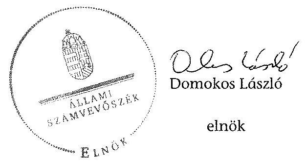

Melléklet: $\quad 6 \mathrm{db}$

---

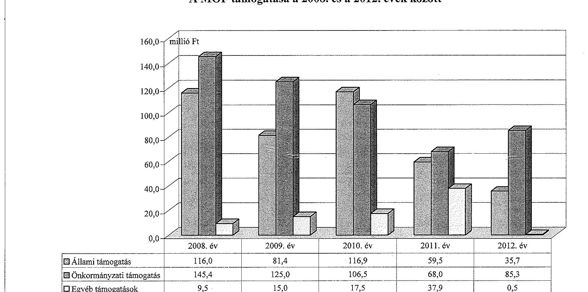

# A MOF támogatása a 2008. és a 2012. évek között

|  Állami támogatás | 116,0 | 81,4 | 116,9 | 59,5 | 35,7  |
| --- | --- | --- | --- | --- | --- |
|  Önkormányzati támogatás | 145,4 | 125,0 | 106,5 | 68,0 | 85,3  |
|  Egyéb támogatások | 9,5 | 15,0 | 17,5 | 37,9 | 0,5  |

---

# A MOF vagyonának főbb adatai 2008. január 1-je és 2012. december 31-e között

|  Mérlegsor megnevezése | 2008. jan. 1. (millió Ft) | 2008. dec. 31. (millió Ft) | 2009. dec. 31. (millió Ft) | 2010. dec. 31. (millió Ft) | 2011. dec. 31. (millió Ft) | 2012. dec. 31. (millió Ft)  |
| --- | --- | --- | --- | --- | --- | --- |
|  Immateriális javak | 0,1 | 0,2 | 0,2 | 0,5 | 0,3 | 0,2  |
|  Tárgyi eszközök | 3,6 | 5,9 | 5,0 | 4,5 | 3,3 | 2,4  |
|  Ebből: Ingatlanok | - | 2,3 | 1,9 | 1,5 | 1,1 | 0,7  |
|  Gépek, berendezések | - | 3,7 | 3,1 | 3,0 | 2,2 | 1,7  |
|  Befektetett eszközök összesen | 3,7 | 6,1 | 5,2 | 5,0 | 3,6 | 2,6  |
|  Forgóeszközök összesen | 20,6 | 32,6 | 27,6 | 12,4 | 13,7 | 11,0  |
|  Aktív időbeli elhatárolások | 9,1 | 9,4 | 10,7 | 7,1 | 0,0 | 7,2  |
|  Eszközök összesen | 33,4 | 48,1 | 43,5 | 24,5 | 17,3 | 20,8  |
|  Saját tőke összesen | 3,0 | 3,0 | 3,0 | $-18,1$ | $-18,1$ | 3,0  |
|  Ebből:Jegyzett tőke | 3,0 | 3,0 | 3,0 | 3,0 | 3,0 | 3,0  |
|  Eredménytartalék | $-80,9$ | $-80,9$ | $-80,9$ | $-80,9$ | $-102,0$ | $-102,0$  |
|  Lekötött tartalék | 80,9 | 80,9 | 80,9 | 80,9 | 80,9 | 102,0  |
|  Mérleg szerinti eredmény | 0,0 | 0,0 | 0,0 | $-21,1$ | 0,0 | 0,0  |
|  Tartalékok | 0,0 | 0,0 | 0,0 | 0,0 | 0,0 | 0,0  |
|  Céltartalék | 0,0 | 0,0 | 0,0 | 0,0 | 0,0 | 0,0  |
|  Kötelezettségek összesen | 3,8 | 5,8 | 6,0 | 34,2 | 8,0 | 10,5  |
|  Passzív időbeli elhatárolások | 26,6 | 39,3 | 34,5 | 8,4 | 27,4 | 7,3  |
|  Források összesen: | 33,4 | 48,1 | 43,5 | 24,5 | 17,3 | 20,8  |
|  Onkormányzattól átvett eszközök összesen | 0,0 | 0,0 | 0,0 | 0,0 | 0,0 | 0,0  |
|  Ebből: immateriális javak |  |  |  |  |  |   |
|  ingatlanok |  |  |  |  |  |   |
|  gépek, berendezések |  |  |  |  |  |   |
|  Saját és átvett eszközök összesen | 33,4 | 48,1 | 43,5 | 24,5 | 17,3 | 20,8  |

---

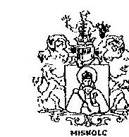

LEVÉLCIM: 3825 Miskolc, Városház lér 8.

Kult.: 879.095-1/2014
Ea: Benedek Piroska
Állami Számvevőszék
Domokos László
elnök úr részére
e-mail: gt_szinhazak@asz.hu

Tárgy: ÁSZ ellenőrzési program

# Tisztelt Elnök Úr! 

Köszönettel vettem a jelentéstervezet megküldését az önkormányzatok többségi tulajdonában lévő gazdasági társaságok közfeladat-ellátásának ellenőrzéséről, Miskolc Megyei Jogú Város Önkormányzata és a Miskolci Operafesztivál Kulturális Szolgáltató Nonprofit Kft. ellenőrzésével kapcsolatban.
Miskolc Megyei Jogú Város Önkormányzata részéről - élve a 2011. évi LXVI. iv szerinti lehetőségeci - az alábbi észrevételt teszem:
Az ellenőrzés intézkedést igénylő megállapításai és javaslatai: a jegyzőnek címzett 1. pontban hivatkozott Emtv. 13 § (2) bekezdése a nyilvántartásba vett előadó-művészeti szervezetekre vonatkozik, a Miskolci Operafesztivál Kulturális Szolgáltató Nonprofit Kft. nem előadóművészeti szervezet. A jelentéstervezet több pontjában utalnak a vizsgált gazdasági társaságra, mint előadó-művészeti szervezetre, hivatkoznak a 2008. évi XCIX. törvényre, vagy a bevezetésben pl. színházként említik a szervezetet, és ez a megállapításokban is félrevezető. Kérem, szíveskedjenek fenti észrevételt felülvizsgálni.

Miskolc, 2014. február. 11.
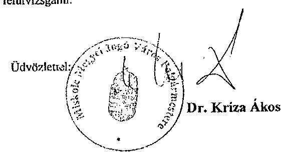

---

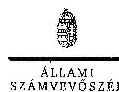

ELNÖK

fkt.szám: V-0307-103/2014.

Dr. Kriza Ákos Úr
polgármester
Miskolc Megyei Jogú Város Polgármesteri |Iivatal

Miskolc

Tisztelt Polgármester Úr!

A „Jelentéstervezet az önkormányzatok többségi tulajdonában lévő gazdasági társaságok közfeladat-ellátásának ellenőrzéséről – Miskolci Operafezztivál Kulturális Szolgáltató Nonprofit Kft.” című jelentéstervezetre tett észrevételeit köszönettel megkaptam.

Az Állami Számvevőszék észrevételekre vonatkozó álláspontjáról a felügyeleti vezető által készített részletes tájékoztatást csatoltan megküldöm.

Tájékoztatom Polgármester Urat, hogy a számvevőszéki jelentés szövegezése az elfogadott észrevételei figyelembevételével készül.

Budapest, 2014.  04.

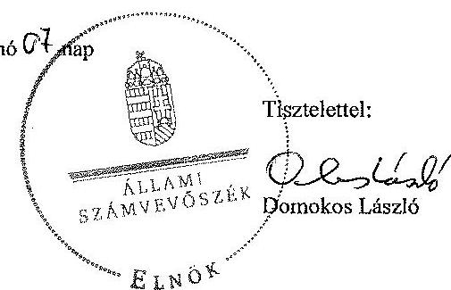

Melléklet: Tájékoztatás az elfogadott és el nem fogadott észrevételekről

1052 BUDAPEST, KARZON CSZÁS JÁNOS UTCA 12. 1364 Budapest 4. Pl. 54 telefon: 484 9101 fax: 484 9701

---

# Tájékoztatás   az elfogadott és el nem fogadott észrevételekröl 

A ,,Jelentéstervezet az önkormányzatok többségi tulajdonában lévő gazdasági társaságok közfeladat-ellátásának ellenörzéséről - Miskolci Operafesztivál Kulturális Szolgáltató Nonprofit Kft." címü jelentéstervezetre tett észrevételeit áttekintettük, azok kezelésével kapcsolatban a következő tájékoztatást adom.

## Bevezető

A bevezető 8. oldal 5 bekezdés első mindatában a „színház" kifejezést az ellenőrzési programmal összhangban szerepeltettük, at sály keretprogram és a társasági formában müködő színházak ellenőrzési szempontjait tartalmazza. Az egyértelműség érdekében a "színház" kifejezés helyett a „Miskolci Operafesztivál Nonprofit Kft." elnevezést szerepeltetjük.

## 16. oldal első bekezdés

Az egyértelműség érdekében a részletes megállapítások 16. oldal első bekezdésében szereplő „elöadó-müvészeti" szövegrészt az alábbiak szerint egészítjük ki:
„.....és közmüvelödési, valamint előadó-müvészeti feladatellátásra létrehozott gazdasági társaság támogatásával valósította meg."

## Jegyzönek címzett 1. számú javaslat

A jegyzőnek címzett 1. pontban tett megállapítást és javaslatot változatlanul fenntartjuk az alábbiakra tekintettel.

A Miskolci Operafesztivál Nonprofit Kft. 2013. március 7 -től hatályos Alapító Okiratának 4.1 pontja szerint - illetve az ellenőrzött időszakban hatályos alapító okirat szerint - a Társaság főtevékenysége előadó-művészet, ezen tevékenységet a Társaság - az Alapító Okirat 9.7 pontja alapján - az előadó-művészeti szervezetek tóraogatásáról és sajátos foglalkoztatási szabályairól szóló 2008. évi XCIX. törvény (továbbiakban Emtv.) 3. §-a szerint ellátja.

Az Alapító Okirat emellett hivatkozik a közmüvelődési feladatok ellátására is, továbbá - az Alapító Okirat 9.7 pontja - felsorolja a muzeális intézményekről, a nyilvános könyvtári ellátásról és közmüvelődésről szóló 1997. évi CXL. törvény (Közművelődési tv.) 76. § (2) bekezdésében szereplő közmüvelődési feladatokat. A Közművelődési tv. 79. § (1) bekezdésében foglaltak alapján a települési önkormányzat a közmüvelődési feladatok megvalósitására közmüvelődési megállapodást köthet.

Az előadó-művészeti tevékenységhez kapcsolódóan az Emtv. 13. § (1) bekezdése alapján az állam, illetve az önkormányzat az előadó-művészeti szolgáltatások biztosítására nyilvántartott szervezettel előadó-művészeti közszolgáltatási szerződést köthet. Az Önkormányzat a Társasággal a 2013. január 1-jétől hatályos közszolgáltatási szerződést megkötötte.

---

Az önkormányzat, mint fenntartó nem kérte a társaság nyilvántartásba vételét, azonban a közszolgáltatási szerződést megkötötte, melynek tartalmi elemeit az Emtv.13. § (2) bekezdése írja elő, ezért megállapításunkat és a javaslatot fenntartjuk.

Tájékoztatom Polgármester urat, hogy a számverőszéki jelentés mellékleteként szerepeltetjük a jelentéstervezethez tett észrevételeit, valamint az azokra adott válaszunkat.

Budapest, 2014. év 0h. hó 01. nap

Makkai Mária
felügyeleti vezető

---

# ÁLLAMI SZÁMVEVÖSZÉK   Domokos László úr részére 1052 Budapest   Apáczal Csere János u.10. 

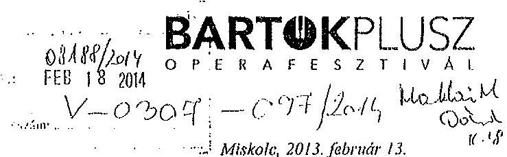

Tárgy: Észrevétel az Állami Számvevőszék Jelentéstervezetéhez (vá: V-0307-092/2014)
Tisztelt Domokos László Úr!
Hivatkozva a V06530217 vizsgálat-azonosító számú Jelentéstervezetben foglaltakra, az alábbi észre-vételeket kívánjuk tenni:
A Miskolci Nemzeti Színház Nonprofit Kft 2013. január 01.-től végez számviteli szolgáltatást a Miskolci Operafesztivál NKft részére, ezért a 2008.-2012. időszakban az Operafesztivál tevékenységét nem ismerte, a könyvelést nem végezte, csak a rendelkezésre álló dokumentumokból és a 2012. évben lezárt könyvelési program segítségével tudta a vizsgálatot kiszolgálni, így lehet, hogy nem tudott minden kérdésre körültekintő, hiteles választ adni.
Az alábbiakban csatoljuk a Könyvvizsgáló jel: stéstervezethez kapcsolódó észrevételeit:
Fekete Tibor könyvvizsgáló 001717:

1) 20. oldal második bekezdéshez:

A számviteli törvény 14. §-a rögzíti, hogy a számviteli politikának mit kell tartalmazni. A hivatkozott jogszabályhely nem határoz meg olyan előírást, hogy az egyéb és rendkívüli ráfordítások tételes meghatározását tartalmaznia kell a számviteli politikának. Azt hogy mit kell egyéb ráfordításként elszámolni a számviteli törvény 81. §-a, azt pedig, hogy mit kell a rendkívüli ráfordítások között elszámolni, a számviteli törvény 867. § (6), (7) és (9) bekezdése határozza meg tételesen. Abban a kérdésben, hogy mit kell illetve lehet egyébvagy rendkívüli ráfordításként elszámolni a gazdálkodónak nincs mérlegelési, döntési lehetősége, azt a számviteli törvény tételesen felsorolja a hivatkozott §-okban.
2.) Álláspontom szerint az anyagban leírtakkal ellentétben mind a bevételeket, mind a költségeket aszerint különítettük el, hogy az közhasznú tevékenységből vagy vállalkozási tevékenységből származik, illetve ahhoz kapcsolódik. Csak a mindkét tevékenység (közhasznú, vállalkozási) érdekében felmerült költség lett a bevételek arányában megosztva.

Ezúton kérnénk tisztelettel, hogy az Állami Számvevőszék a végleges jelentés elkészítésekor észrevételeinket figyelembe venni szíveskedjen.

Köszönettel
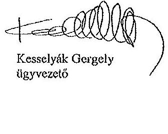

Kesselyák Gergely
ügyvezető
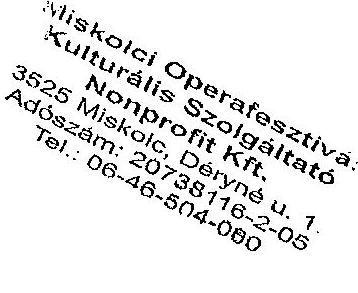

Fesztiválnude:
Miskolci Operafesztivál
Nonprofit Kft.
2020 Miskolc
Dénysé u. 1.
Levahozási cére
2001 Miskolc, PL 634.
Tel.: +36 46504060
Fax: +36 46504068
Központi e-mail:
operatv@tt-online.hu
Hozdap: www.operafesztivallu

---

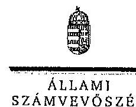

Ikt.szám: V-0307-098/2014.

# Kesselyák Gergely 

ügyvezető igazgató
Miskolcí Operafesztivál Kulturális Szolgáltató Nonprofit Kft.

## Miskolc

## Tisztelt Ügyvezető Igazgató Úr!

A „Jelentéstervezet az önkormányzatak többségi tulajdonában lévő gazdasági társaságok közfeladat-ellátásának ellenőrzéséről - Miskolci Operafesztivál Kulturális Szolgáltató Nonprofit Kft." címmel készített számvevőszéki jelentéstervezetre tett észrevételeit köszönettel megkaptam.

Az Állami Számvevőszék észrevételekro vonatkozó álláspontjáról a felügyeleti vezető által készített részletes tájékoztatást csatoltan megküldöm.

Tájékoztatom Ügyvezető Igazgató urat, hogy a számvevőszéki jelentés szövegezése az elfogadott észrevételi figyelembevételével készül.

Budapest, 2014. i) hó i̇ nap
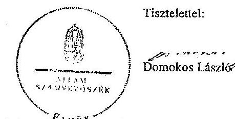

Melléklet: Tájékoztatás az elfogadott és el nem fogadót észrevételekről

---

# Tájékoztatás 

az elfogadott és el nem fogadott észrevételekről

A „Jelentéstervezet az önkormányzatok többségi tulajdonában lévő gazdasági társaságok közfeladat-ellátásának ellenőrzéséről - Miskolci Operafesztivál Kulturális Szolgáltató Nonprofit Kft." című jelentéstervezetre érkezett észrevételeit átlekintettük, azok kezelésével kapcsolatban a következő tájékoztatást adom.
$1 . / 20$. oldal második bekezdés
A számviteli politikával kapcsolatban a jelentéstervezet nem tartalmazott olyan megállapítást, hogy az nem felel meg a számviteli törvény előírásainak. Az egyértelműség érdekében a második bekezdés első mondatát a következőre pontosítjuk:
„A MOF számviteli politikája a Számv. tv. 14. - (3)-(4) bekezdés elöirásainak megfelelit."
2./ A jelentéstervezetnek az a megállapítása, miszerint „, A MOF ....a közhasznú és a vállalkozási tevékenységből származó ráforditások elkülönltett nyilvántartást kötelezettségének 2008-2012 között nem tett eleget." helytálló. Az ellenőrzés rendelkezésére bocsátott főkönyvi kivonatok szerint nincs elkülönítve a közhasznú és a vállalkozási tevékenység ráfordítása. Más - az elkülönítést tartalmazó - nyilvántartást sem bocsátottak az ellenőrzés rendelkezésére, ezért a megállapítás módosítása nem indokolt.

Tájékoztatom Ügyvezető Igazgató urat, hogy a számvevőszéki jelentés mellékleteként szerepeltetjük a jelentéstervezethez tett észrevételeit, valamint az azokra adott válaszunkat.

Budapest, 2014, 03. hó 6. nap

Makkai Mária
felügyeleti vezető