# JELENTÉS 

az önkormányzatok többségi tulajdonában lévő gazdasági társaságok közfeladat-ellátásának ellenőrzéséről
Várszínház és Kultúrmozgó Esztergom Nonprofit Kft.

---

# Állami Számvevőszék 

Iktatószám: V-0306-060/2014.
Témaszám: 1339
Vizsgálat-azonosító szám: V06530216

## Az ellenőrzést felügyelte:

## Makkai Mária

felügyeleti vezető

## Az ellenőrzést vezette és az ellenőrzés végrehajtásáért felelős:

## Klinga László

ellenőrzésvezető
A számvevőszéki jelentés összeállításában közreműködött:

## Bozsik Tamás

számvevő

## Az ellenőrzést végezték:

| Bozsik Tamás | Jenei Zoltán Béláné | Dr. Zsombori Beáta |
| :-- | :-- | :-- |
| számvevő | számvevő | számvevő |

A témához kapcsolódó eddig készített számvevőszéki jelentések:
címe
sorszáma
Jelentés a színházak állami támogatásának és gazdálkodásának 1039 ellenőrzéséről

---

# TARTALOMJEGYZÉK 

BEVEZETÉS ..... 9
I. ÖSSZEGZŐ MEGÁLLAPÍTÁSOK, KÖVETKEZTETÉSEK, JAVASLATOK ..... 12
II. RÉSZLETES MEGÁLLAPÍTÁSOK ..... 22

1. Az Önkormányzat közfeladat-ellátásának megszervezése ..... 22
1.1. A közfeladat meghatározása, a feladat-ellátásának választott módja ..... 22
1.2. Az Önkormányzat tulajdonosi irányításának megítélése ..... 27
2. A Várszínház közfeladat-ellátással kapcsolatos tevékenysége ..... 28
2.1. A Várszínház szervezeti kialakítása, szabályozottsága ..... 28
2.2. A Várszínház vagyonnyilvántartása ..... 30
2.3. A gazdasági évek ráfordításainak és bevételeinek alakulása ..... 31
2.4. A Várszínház eredményének alakulása ..... 32
2.5. A Várszínház folyamatos üzemmenetének, likviditásának biztosítása ..... 35
3. Önkormányzat tulajdonosi jogainak és kötelességeinek érvényesítése ..... 37
3.1. A Várszínháztól származó információk hasznosítása ..... 37
3.2. Az Önkormányzat tulajdonosi intézkedései ..... 38
4. Az ÁSZ korábbi, a többségi tulajdonú gazdasági társaságok közfeladat-ellátását, gazdálkodását, pénzügyi helyzetét érintő javaslataira tett intézkedések ..... 41
4.1. Az Önkormányzat intézkedési terve és a javaslatok hasznosulása ..... 41

## MELLÉKLETEK

1. számú A Várszínház támogatása a 2008. és 2012. évek között
2. számú A Várszínház vagyonának főbb adatai 2008. január 1-je és 2012. december 31-e között
3. számú Esztergom Város Polgármesterének észrevétele
4. számú Esztergom Város Polgármesterének észrevételére adott válasz
5. számú A Várszínház és Kultúrmozgó Esztergom Nonprofit Kft. ügyvezetőjének észrevétele
6. számú A Várszínház és Kultúrmozgó Esztergom Nonprofit Kft. ügyvezetőjének észrevételére adott válasz

---

.

---

# RÖVIDÍTÉSEK JEGYZÉKE 

## Törvények

A helyi önkormányzatok adósságrendezési eljárásról szóló tv.
$\AA_{1}$.
$\AA_{2}$.
ÁSZ tv.
Emtv.
Gt. tv.
Htv.

Közhasznúsági tv.
Közművelődési tv.
Mötv.

Nvtv.

Ötv.

Számv. tv.
Taktv.
Tao. tv.

## Rendeletek

Áhsz. 1
a helyi önkormányzatok adósságrendezési eljárásáról szóló 2006. évi XXV. Törvény, hatályos 1996. június 11-étől
az államháztartásról szóló 1992. évi XXXVIII. Törvény, hatálytalan 2012. január 1-jétől
az államháztartásról szóló 2011. évi CXCV. Törvény, hatályos 2012. január 1-jétől
az Állami Számvevőszékről szóló 2011. évi LXVI. törvény
az előadó-művészeti szervezetek támogatásáról és sajátos foglalkoztatási szabályairól szóló 2008. évi XCIX. törvény
a gazdasági társaságokról szóló 2006. évi IV. törvény
a helyi önkormányzatok és szerveik, a köztársasági megbízottak, valamint egyes centrális alárendeltségű szervek feladat- és hatásköreiről szóló 1991. évi XX. törvény
a közhasznú szervezetekről szóló 1997. évi CLVI. törvény, hatálytalan 2012. január 1-jétől
a muzeális intézményekről, a nyilvános könyvtári ellátásról és a közművelődésről szóló 1997. évi CXL. törvény
Magyarország helyi önkormányzatairól szóló 2011. évi CLXXXIX. törvény (hatályos: 2012. január 1-jétől, kivéve a 144. § (2) bekezdésben meghatározott paragrafusok, amelyek 2012. április 15-én, a (3) bekezdésben meghatározott paragrafusok, amelyek 2013. január 1-jén léptek hatályba, a (4) bekezdésben meghatározott paragrafusok a 2014. évi általános önkormányzati választások napján lépnek hatályba)
a nemzeti vagyonról szóló 2011. évi CXCVI. törvény (hatályos 2011. december 31-étől, kivéve a 20. § (2) bekezdésben meghatározott paragrafusok, amelyek 2012. január 1-jétől, a (3) bekezdésben meghatározott paragrafusok 2013. január 1-jétől, a (4) bekezdésben meghatározott paragrafus 2012. március 2-ától léptek hatályba)
a helyi önkormányzatokról szóló 1990. évi LXV. Törvény, hatálytalan a 2014. évi általános önkormányzati választások napjától
a számvitelről szóló 2000. évi C. törvény
a köztulajdonban álló gazdasági társaságok takarékosabb működéséről szóló 2009. évi CXXII. törvény
a társasági adóról és az osztalékadóról szóló 1996. évi LXXXI. törvény
az államháztartás szervezetei beszámolási és könyvvezetési kötelezettségének sajátosságairól szóló 249/2000. (XII. 24.) Korm. rendelet

---

Áhsz. 2
helyiségek bérbeadásáról szóló rendelet
kitüntetési rendelet
reorganizációs programról szóló rendelet

SZMSZ
vagyongazdálkodási rendelet
vagyonkezelési megállapodás

## Szórövidítések

Alapító Okirat
aljegyző
áfa
ÁSZ
FB
Javadalmazási szabályzat
jegyző
Képviselő-testület
Közszolgáltatási szerződés
az államháztartás számviteléről szóló 4/2013. (I. 11) Korm. rendelet
Esztergom Város Önkormányzatának tulajdonában álló a nem lakás céljára szolgáló helyiségek bérbeadásának feltételeiről szóló 75/2006. (XII. 22.) számú rendelet, valamint az Esztergom Város Önkormányzatának tulajdonában álló nem lakás céljára szolgáló helyiségek bérbeadásának feltételeiről szóló 46/2012. (VII. 10.) számú rendelet Esztergom Város Önkormányzata 47/2005. (XI. 9.) számú rendelete a városi kitüntetések adományozásáról, amit a 4/2011. (II. 23.) számú rendelettel módosítottak
Esztergom Város Önkormányzata többször módosított 16/2011. (IV. 15.) számú rendelete Esztergom Város reorganizációs programjáról, hatályos 2011. április 15-étől
Esztergom Város Önkormányzata módosításokkal egységes szerkezetbe foglalt 18/2004. (IV. 29.) számú rendelete a Képviselő-testület és szervei Szervezeti és Működési Szabályzatáról, hatályos 2004. április 29-étől
Esztergom Város Önkormányzata 16/2001. (V. 24.) számú többször módosított egységes szerkezetű rendelete az Önkormányzat vagyonáról és a vagyontárgyak feletti tulajdonosi jog gyakorlásáról, hatályos 2001. május 24-étől
Esztergom Város Önkormányzata és a Várszínház és Kultúrmozgó Esztergom Nonprofit Korlátolt Felelősségű Társaság között létrejött, 2008. december 11-étől hatályos vagyonkezelési megállapodás
a Várszínház és Kultúrmozgó Esztergom Nonprofit Korlátolt Felelősségű Társaság Alapító Okirata, amit az ellenőrzött időszak alatt 11 alkalommal módosítottak. A módosítások során egyszer Társasági Szerződésként, 10-szer Alapító Okiratként jelölték meg. A jelentésben egységesen Alapító Okiratként szerepel.
Esztergom Város Önkormányzatának aljegyzője
általános forgalmi adó
Állami Számvevőszék
a Várszínház és Kultúrmozgó Esztergom Nonprofit Korlátolt Felelősségű Társaság Felügyelő Bizottsága
Esztergom Város Önkormányzata 828/2007. (XI. 23.) számú határozata a Várszínház és Kultúrmozgó Esztergom Nonprofit Kft. vezető tisztségviselői, felügyelő bizottsági tagjai és a vezető állású munkavállalók javadalmazásának főbb elveiről
Esztergom Város Önkormányzatának jegyzője
Esztergom Város Önkormányzatának Képviselő-testülete
Esztergom Város Önkormányzata és a Várszínház és Kultúrmozgó Esztergom Nonprofit Kft. között 2009. december 19-én megkötött szerződés

---

| Megállapodás | a közfeladat-ellátás pénzügyi fedezetéről - a Közszolgáltatási Szerződés előírása szerint - Esztergom Város Önkormányzata és a Várszínház és Kultúrmozgó Esztergom Nonprofit Kft. között évente kötött megállapodás |
| :--: | :--: |
| NKA | Nemzeti Kulturális Alap |
| Önkormányzat polgármestere | Esztergom Város Önkormányzata   Esztergom Város Önkormányzatának Polgármestere |
| Polgármesteri Hivatal | Esztergom Város Önkormányzatának Polgármesteri Hivatala |
| ügyvezető | a Várszínház és Kultúrmozgó Esztergom Nonprofit Korlátolt Felelősségű Társaság ügyvezető igazgatója |
| Várszínház | Várszínház és Kultúrmozgó Esztergom Nonprofit Kft. |
| Várszínház SZMSZ-e | Várszínház és Kultúrmozgó Esztergom Nonprofit Kft. Szervezeti és Működési Szabályzata |

---

.

---

# FOGALOMTÁR 

eredménytartalék
közfeladat
mérleg szerinti eredmény
tulajdonosi joggyakorló
üzemi eredmény

A saját tőke változó eleme, elsősorban a tárgyévet megelőző évek mérleg szerinti eredményének a halmozott összegét mutatja.
Jogszabályban meghatározott állami vagy önkormányzati feladat, amit az arra kötelezett közérdekből, jogszabályban meghatározott követelményeknek és feltételeknek megfelelve végez, ideértve a lakosság közszolgáltatásokkal való ellátását, továbbá az állam nemzetközi szerződésekben vállalt kötelezettségeiből adódó közérdekű feladatokat, valamint e feladatok ellátásához szükséges infrastruktúra biztosítását is (Nvtv. 3. § (1) bekezdés 7. pont).

A mérleg szerinti eredmény az osztalékra, részesedésre, a kamatozó részvények kamatára igénybe vett eredménytartalékkal növelt, a jóváhagyott osztalékkal, részesedéssel, a kamatozó részvények kamatával csökkentett tárgyévi adózott eredmény, egyezően az eredménykimutatásban ilyen címen kimutatott összeggel (Számv. tv. 39. § (2) bekezdés).
Aki a nemzeti vagyon felett az államot vagy a helyi önkormányzatot megillető tulajdonosi jogok és kötelezettségek összességének gyakorlására jogosult (Nvtv. 3. § (1) bekezdés 17. pont).
Az üzemi tevékenység eredménye kétféle módon állapítható meg:
a) összköltség eljárással: az üzleti évben elszámolt értékesítés nettó árbevételének, az eszközök között állományba vett saját teljesítmények értékének, az egyéb bevételeknek, valamint az üzleti évben elszámolt anyagjellegű ráfordítások, személyi jellegű ráfordítások, értékcsökkenési leírás és egyéb ráfordítások együttes összegének különbözeteként;
b) forgalmi költség eljárással: az üzleti évben elszámolt értékesítés nettó árbevételének és az értékesítés közvetlen költségei, az értékesítés közvetett költségei különbözetének, valamint az egyéb bevételek és az egyéb ráfordítások különbözetének összevont értékeként (Számv. tv. 71. § (1) bekezdés a)-b) pontok).

---

.

---

# JELENTÉS 

## az önkormányzatok többségi tulajdonában lévő gazdasági társaságok közfeladat-ellátásának ellenőrzéséről Várszínház és Kultúrmozgó Esztergom Nonprofit Kft.

## BEVEZETÉS

Az Önkormányzat az ellenőrzött időszakban a művészeti tevékenység ellátásával összefüggő stratégiával, koncepcióval nem rendelkezett. A 2007-2010. évekre vonatkozó gazdasági program a Várszínház színpadával kapcsolatos fejlesztési elképzelést tartalmazott, amelynek megvalósítására az ellenőrzött időszakban nem került sor.

Az esztergomi Várszínház 1986-ban alakult és 1990 óta az Esztergomi Bazilika mellett - $80 \mathrm{~m}^{2}$ alapterületű színpaddal és 250 fő befogadóképességű nézőtérrel - szabadtéri színházként működött. A színházi szezon júniustól augusztus végéig tartott, amely során az előadásokat szerdánként és hétvégenként mutatták be. A színház nagy hangsúlyt fektetett a különböző nemzetek kultúrájának bemutatására, ezért évente határon túli magyar színházakat, együtteseket, társulatokat hívott vendégszerepelni.

A Várszínház 2007. október 4-én az Esztergom Nyári Fesztivál Kht. átalakulásával, annak jogutódjaként jött létre, ezért a vagyoni jogok és kötelezettségek tekintetében is jogutóddá vált. A Képviselő-testület a 656/2007. (IX. 20.) számú határozatával alapította meg az Önkormányzat 100%-os tulajdonában álló Várszínház és Kultúrmozgó Esztergom Nonprofit Korlátolt Felelősségű Társaságot, amelynek feladata Esztergom Város kulturális, idegenforgalmi hagyományainak megőrzése, fejlesztése, a közművelődési tevékenység és szolgáltatások ellátása, a zenés nyári fesztivál intézményesítése és szervezése, valamint a vár színházi programok szervezése volt. A Várszínház főtevékenysége a közművelődési feladatok, valamint a színházi tevékenység, rendezvényszervezés ellátása volt.

Az Önkormányzat a közszolgáltatások ellátására 2007. december 19-én, határozatlan időre a Várszínházzal Közszolgáltatási szerződést kötött. A Várszínházzal - a Közszolgáltatási szerződésben foglaltak alapján - az évente megkötött Megállapodásokban határozták meg a közművelődési, a rendezvényszervezési, illetve a várszínházi feladatokra fordítható támogatások összegét. Az Önkormányzattal szemben 2010. november 25-én adósságrendezési eljárás indult, amelynek következtében a 2011. évtől csak a kötelezően ellátandó önkormányzati feladatokra lehetett költségvetési forrást biztosítani. A Várszínház

---

így a 2011. évtől nem szervezett színházi előadásokat. Az Önkormányzat saját forrásból a 2008-2012. években 311,3 millió Ft összegű működési célú támogatást nyújtott a Várszínháznak. Az ellenőrzött időszakban a Várszínház nem vett igénybe társasági adóból származó támogatást.

A Várszínháznál három tagból álló FB működött, és az ellenőrzött időszakban három alkalommal történt ügyvezető váltás.

Az ellenőrzés várható eredménye: a jelentés nyilvánossága a társadalom széles körével ismerteti meg a Színház gazdálkodására vonatkozó megállapításainkat, továbbá a megállapítások alapján megfogalmazott számvevőszéki javaslatok hasznosítása elősegíti a feltárt hibák megszüntetését, az ellenőrzött szervezet jobb feladatellátását. A társadalom számára jelzi, hogy közpénz nem maradhat ellenőrizetlenül, az ÁSZ értékteremtő rend kialakításához és megőrzéséhez hozzájáruló tevékenysége pozitív hatással lesz a szervezetről kialakított összkép formálásában. A szervezeten belül lehetőség nyílik arra, hogy a megállapítások szintetizálásával az ÁSZ a hozzáadott értéket teremtő, elemző tevékenységét és tanácsadó szerepét is erősítse. A jó gyakorlatok bemutatásával az ÁSZ hozzájárul a követendő megoldások megismertetéséhez, terjesztéséhez.

# Az ellenőrzés célja annak értékelése, hogy 

- az Önkormányzat a jogszabályi előírások figyelembevételével döntött-e az ellenőrzésre kerülő közfeladat megszervezéséről, az ellátás módjáról, a tulajdonostól elvárható gondossággal felügyelte-e a társaság feladatellátását, a gazdasági társaság rendelkezésére bocsátotta-e a közfeladat ellátásához a szükséges közvagyont, és biztosította-e a tulajdonosi jogok érvényesülését, a társaság vagyonvesztése esetén intézkedett-e a további vagyonvesztés megakadályozásáról;
- a Várszínház teljesítette-e a tulajdonos önkormányzat részéről

 meghatározott célokat és feladatokat a rendelkezésre álló erőforrások felhasználásával, végrehajtotta-e a közfeladat-ellátási szerződés előírásait, betartotta-e a vagyonnal történő gazdálkodásra vonatkozó jogszabályi rendelkezéseket.

Az ellenőrzés hatóköre: az önkormányzatok közfeladat-ellátásának ellenőrzése, amely kiterjed az önkormányzatok és a közfeladatot ellátó, az önkormányzat többségi tulajdonában lévő gazdasági társaságok közötti feladatmegosztásra, az önkormányzatok tulajdonosi jogainak gyakorlására, a nemzeti vagyon kezelésének ellenőrzése keretében a közfeladat-ellátáshoz rendelt vagyonra és a vagyont érintő szerződésekre. A jelen ellenőrzés kiterjed az önkormányzatok többségi tulajdonában lévő gazdasági társaságok közfeladat-ellátására, vagyongazdálkodási tevékenységére, a kapcsolódó nyilvántartások, elszámolások szabályszerűségére és megbízhatóságára. Az ellenőrzött tételek kiválasztása véletlen mintavétellel történt.

Az ellenőrzés típusa: szabályszerűségi ellenőrzés
Az ellenőrzött időszak: A 2008-2012. évek, valamint a helyszíni ellenőrzés befejezéséig - 2013. november 5-ig - bekövetkezett változások figyelemmel kísérése.

---

Ellenőrzött szervezet: A Várszínház és Kultúrmozgó Esztergom Nonprofit Kft., valamint Esztergom Város Önkormányzata.

Az ellenőrzés végrehajtásának jogszabályi alapját az ÁSZ tv. 5. § (3)-(5) bekezdéseiben foglaltak képezik.

Az ÁSZ a 2011. évi LXVI. törvény 29. §-a szerint a jelentéstervezetet megküldte Esztergom Város Polgármesterének és a Várszínház és Kultúrmozgó Esztergom Nonprofit Kft. ügyvezetőjének egyeztetésre. Esztergom Város Polgármestere és a Kultúrmozgó Esztergom Nonprofit Kft. ügyvezetője észrevételt tett. A beérkezett észrevételeket és az arra adott választ a jelentés 3-6. számú mellékletei tartalmazzák.

---

# I. ÖSSZEGZŐ MEGÁLLAPÍTÁSOK, KÖVETKEZTETÉSEK, JAVASLATOK 

Esztergom Város Önkormányzatának Képviselő-testülete az Ötv.-ben és a Htv.-ben meghatározott művészeti tevékenységgel összefüggő közfeladatát előadó-művészeti feladatellátásra létrehozott gazdasági társaság támogatásával valósította meg. A Várszínház a 2010. év utolsó negyedévétől színházi tevékenységet nem, csak a Közművelődési tv. alapján kötelezően ellátandó közművelődési feladatokat végezte az Önkormányzattal szemben kezdeményezett adósságrendezési eljárás miatt. A színházi tevékenység fedezetét a 2011. évi költségvetési rendeletben már nem biztosították.

Az Önkormányzat a közművelődési és művészeti tevékenység, mint közszolgáltatások ellátásának módját és mértékét a 2007. december 19-én, határozatlan időre, a Várszínházzal kötött Közszolgáltatási szerződésben és a hozzá kapcsolódó évente megkötött Megállapodásokban határozta meg. A Közszolgáltatási szerződést az ellenőrzött időszakban nem módosították. A Közszolgáltatási szerződésben meghatározták a Várszínház közművelődési, színházi és rendezvény-szervezési feladatait. A Közszolgáltatási szerződés tartalmazta az Önkormányzat ellenőrzési jogosultságát a feladat teljesítésére vonatkozóan, továbbá a Várszínháznak a minden év március 15-ig történő beszámolási kötelezettségét az átvett feladatok tekintetében. Biztosította továbbá az Önkormányzat számára az azonnali hatállyal történő felmondás lehetőségét szerződésszegés esetére, továbbá a rendkívüli felmondás lehetőségeit. Az Önkormányzatnak a Várszínházzal a közfeladat-ellátás pénzügyi fedezetéről - a Közszolgáltatási szerződés előírása szerint - minden évben, a tárgyév január 31. napjáig írásbeli megállapodást kellett kötni, amit a 2010. év kivételével késedelmesen kötöttek meg.

Az Önkormányzat a Várszínház megalapításához 3,0 millió Ft törzstőke rendelkezésre bocsátásával járult hozzá, a közfeladat-ellátáshoz szükséges közvagyont ingó vagyontárgyak térítésmentes átadásával, ingatlan bérbeadásával, támogatás nyújtásával biztosította. A 2008-2012. években az Önkormányzat saját forrásból nyújtott működési célú támogatása (311,3 millió Ft) 89,1 millió Ft-tal volt alacsonyabb a Megállapodásokban rögzítetteknél. Az adósságrendezési eljárás során nyilvántartásba vett hitelezői listán a Várszínháznak 95,0 millió Ft-os - támogatás elmaradásból származó - hitelezői igénye szerepelt az Önkormányzattal szemben, ami az Önkormányzat nyilvántartásában 89,1 millió Ft volt. Az 5,9 millió Ft különbség okát nem vizsgálták.

Az Önkormányzat 2008-ban rendezvényszervezéssel kapcsolatos feladatokra 13 darab megbízási szerződést kötött a Várszínházzal, amely feladatok a Közszolgáltatási szerződés melléklete alapján kötelezően ellátandóak voltak. Ezért fennáll annak a gyanúja, hogy az Önkormányzat ugyanazt a rendezvényszervezési feladatot kétszeresen finanszírozta, egyrészt a Közszolgáltatási szerződés alapján támogatásként, másrészt a megbízási szerződések alapján szolgáltatás vásárlásaként. A megbízási szerződések összértéke bruttó 19,8 millió Ft volt, ami a Várszínház 2008. évi árbevételének 24,5%-át jelentette. A megbízási

---

szerződésekben szereplő feladatok ellenértékének kifizetésével gyaníthatóan károkozás következett be, tekintettel arra, hogy az Önkormányzat a támogatási szerződés alapján az elvégzett feladatok ellátásáért a Várszínházat támogatásban részesítette, így a megbízási szerződések alapján történt kifizetések mögött nem állhatott szerződésszerű teljesítés.

Az Önkormányzat az Alapító Okiratban szabályozta a tulajdonosi joggyakorlás szabályait, amely alapján a Várszínház feletti tulajdonosi jogokat a Képviselő-testület gyakorolta.

Az Önkormányzat a Gt. tv. előírásának megfelelően gondoskodott az FB létrehozásáról, amelynek létszámát három főben határozta meg. Az ellenőrzött időszakban a Gt. tv. előírását figyelmen kívül hagyva az FB nem rendelkezett ügyrenddel. Az Önkormányzatnál és a Várszínháznál nem álltak rendelkezésre az FB évközi ellenőrzéseinek, elrendelt intézkedéseinek dokumentumai, jegyzőkönyvei, határozatai. Az Önkormányzat nem írt elő az FB számára az ellenőrzési tevékenységéről való beszámolási kötelezettséget, az FB nem számolt be a 2008-2012. évek között a tevékenységéről és a feladatainak végrehajtásáról. Az FB a Gt. tv-ben előírtak ellenére nem csatolt írásbeli véleményt a 2008-2010. évi mérlegbeszámolóhoz, a 2011-2012. évi mérlegbeszámolót az FB tárgyalta és elfogadta.

Az Önkormányzat az ellenőrzött időszakban a Taktv.-ben előírt tartalmú javadalmazási szabályzattal rendelkezett. Az ellenőrzött időszakban a Várszínház ügyvezetőjének prémium célokat nem tűztek ki, prémiumban nem részesült.

A Várszínház SZMSZ-ét a Képviselő-testület 2008-ban jóváhagyta. A Várszínház SZMSZ-ének a polgármester általi aláírása a helyszíni ellenőrzés lezárásáig nem történt meg, továbbá az SZMSZ nem tartalmazza a hatálybaléptetést. A Várszínház a Számv. tv.-ben előírtaknak megfelelően kialakította a számviteli politikáját, a leltározási, valamint a pénzkezelési szabályzatát, azonban a Számv. tv.-ben előírtak ellenére az eszközök és források értékelési szabályzatát és a számlarendet a helyszíni ellenőrzés időpontjáig nem készítették el. A számviteli politika, a leltározási, valamint a pénzkezelési szabályzat Alapító Okiratban meghatározott - Képviselő-testület általi - jóváhagyása nem történt meg, ezért az ellenőrzött időszakban a Várszínház érvényes, a gazdálkodás rendjére vonatkozó számviteli szabályzatokkal nem rendelkezett. Az elkészített számviteli szabályzatok a Képviselő-testület jóváhagyásának hiányában nem minősülnek hatályos belső szervezetszabályzó eszköznek. A Várszínház önköltségszámítási szabályzat készítésére nem volt kötelezett, mivel egyszerűsített éves beszámolót készített.

Az Önkormányzat a 2008-2009. évek között az Áhsz. ¹-ben előírtak ellenére a Várszínháznak térítésmentesen vagyonkezelésbe adott ingóságokat nem leltározta. A vagyonkezelésbe adott eszközök leltározásával összefüggésben 2010-től az Önkormányzat a vagyonkezelő részére vagyonkezelésbe adott ingóságokkal kapcsolatban a vagyonkezelő általi leltárkészítésre, azoknak az Önkormányzat részére történő megküldése rendjének előírásával kapcsolatban nem határozott meg szabályokat.

---

A Várszínház a vagyonkezelésébe vett vagyontárgyakat a nullás számlaosztályban, illetve analitikusan nem tartotta nyilván. Ezzel a Várszínház nem tett eleget a Számv. tv.-ben foglaltaknak. Az ellenőrzött időszakban évente mennyiségi felvétellel végezték a saját tulajdonban lévő tárgyi eszközök számbavételét, azonban a leltárt - a 2009. év kivételével - nem értékelték ki. A mennyiségi felvétel során feltárt hiány vagy többlet leltárra gyakorolt hatását nem értékelték. Az értékkel nyilvántartott vagyonelemek - pénzeszközök, követelések, kötelezettségek - leltározása az ellenőrzött időszakban nem történt meg.

A Várszínház a saját tulajdonú vagyonát, annak értékét és változásait az ellenőrzött időszakban a Számv. tv. által kötelezően előírt, érvényes belső szabályozás nélkül, a főkönyvi könyvelésében nyilvántartotta. A Várszínház eszközállománya 2008-ról a 2012. évre 110,2 millió Ft-tal 133,7 millió Ft-ra emelkedett. A növekedést elsősorban - a hibásan - az aktív időbeli elhatárolásként elszámolt az Önkormányzat által nem teljesített támogatás összege okozta. A 2008-2012. években a befektetett eszközök 99,9%-a tárgyi eszköz volt, amelyek beszerzése döntően a jogelőd intézményeknél történt. A Várszínháznak hosszú lejáratú kötelezettsége nem volt, a rövid lejáratú kötelezettségek állománya a 2008. január 1-jei 18,1 millió Ft-ról a 2012. év végére 66,1 millió Ft-ra emelkedett.

A Várszínház összes ráfordítása a 2008. évi 200,2 millió Ft-ról 2012-re 29,6 millió Ft-ra csökkent. Az anyagjellegű ráfordítások a 2008. évről a 2012. évre 152,1 millió Ft-tal, 7,1 millió Ft-ra csökkentek, mivel a Várszínház a 2011. évtől előadó-művészeti tevékenységet nem végzett. A 2011. évet megelőzően a Várszínház befogadó színházként működött, ezért díszlet- és jelmezköltsége nem volt, az anyagbeszerzések elsősorban az üzemeltetéshez kapcsolódtak.

A személyi jellegű ráfordítások a 2008. évi 29,0 millió Ft-ról a 2012. évre 19,1 millió Ft-ra csökkentek, elsődlegesen a foglalkoztatottak létszámának csökkenése miatt. A december 31-én foglalkoztatott munkavállalók száma 2008-ban nyolc fő, 2009-ben kilenc fő, 2010-ben nyolc fő, 2011-ben négy fő, 2012-ben négy fő volt. A megbízási díjak a 2008. évi 7,4 millió Ft-ról a 2012. évre 0,6 millió Ft-ra csökkentek, mivel a Várszínház 2011. évtől előadó-művészeti tevékenységet nem végzett.

A Várszínház egyéb ráfordításai a 2008. évi 5,3 millió Ft-ról a 2012. évre 1,7 millió Ft-ra csökkentek. A Várszínháznak az ellenőrzött időszakban érvényes számviteli politikája nem volt, így az értékcsökkenési módok, az értékcsökkenési leírási kulcsok, a terven felüli értékcsökkenés elszámolása, az esetleges visszaírás lehetőségei nem voltak szabályozva. Ennek ellenére a 2008-2012. évi beszámolók kiegészítő melléklete az értékcsökkenési leírás elszámolásának bemutatásakor hivatkozott a számviteli politika előírásaira. A saját tulajdonú eszközök értékcsökkenési leírása a Tao. tv.-ben meghatározott értékcsökkenési kulcsok alkalmazásával történt.

A Várszínház bevételei a 2008. évi 209,6 millió Ft-ról a 2012. évre 27,8 millió Ft-ra csökkentek, elsősorban az önkormányzati támogatások mérséklődése miatt. A bevételek alakulását befolyásolta, hogy a 2010. évet követően a Várszínház nem végzett előadó-művészeti tevékenységet, ezért az értékesítés nettó árbevétele a 2008. évi 80,6 millió Ft-ról 2012-re 2,4 millió Ft-ra csökkent.

A 2008-2009. évben elszámolt rendkívüli bevételek alapdokumentumai a Várszínháznál nem álltak rendelkezésre, az elszámolásokat a főkönyvi nyilvántartás tartalmazta. A Várszínháznak az ellenőrzött időszakot megelőző évekről 4,5 millió Ft kölcsöntartozása keletkezett az Önkormányzat felé, amit számviteli nyilvántartásban kimutattak, azonban a kölcsönszerződés nem volt fellelhető. A Várszínház nem tett eleget a Számv. tv.-ben foglalt bizonylatok megőrzésére vonatkozó rendelkezésnek, amely szerint a könyvviteli elszámolást közvetlenül és közvetetten alátámasztó számviteli bizonylatokat legalább nyolc évig olvasható formában, a könyvelési feljegyzések hivatkozása alapján visszakereshető módon kell megőrizni.

A Várszínház a nyilvántartásaiban nem különítette el az alaptevékenység, valamint vállalkozási tevékenységéből származó ráfordításait 2008-2011 között a Közhasznúsági tv. előírásai ellenére, ezért a 2008-2012. évi beszámolókban az alap, illetve vállalkozási tevékenységek között felosztott eredmény nem volt megalapozott.

Az Önkormányzat az Alapító Okiratban éves gazdálkodási terv készítését írta elő, amely alapján a Várszínház a 2008-2010. években a Képviselő-testület által is elfogadott üzleti tervet készített. A 2011-2013. években az Alapító Okiratban előírt kötelezettség ellenére a Várszínház az éves gazdálkodási - üzleti tervét nem készítette el. A Várszínház a 2008-2010. évi üzleti tervek teljesítését dokumentáltan nem elemezte és nem értékelte az üzleti tervekben meghatározott, illetve elért mérleg szerinti eredmények eltérésének okait.

A Várszínháznak az auditált beszámolók szerint a 2008-2010. években mérleg szerinti nyeresége, a 2011-2012. években vesztesége keletkezett. A Várszínház mérlege és eredménykimutatása a 2009-2012. években jelentős, a mérlegfőösszeg 2%-át meghaladó mértékű hibát tartalmazott. A Várszínház a Számv. tv.-ben foglaltak ellenére a 2009-2012. években az Önkormányzat által pénzügyileg nem teljesített támogatási összegeket egyéb bevételként és aktív időbeli elhatárolásként számolta el.
 el, ami a 2010. évben 89,1 millió Ft volt a pénzügyi gondnok által nyilvántartásba vett 95,0 millió Ft-tal ellentétben. Az Önkormányzat által nyújtott működési támogatást a pénzügyi teljesítéskor kell egyéb bevételként elszámolni. Az Önkormányzat az adósságrendezési eljárásban az általa ki nem utalt támogatások után 3,1 millió Ft késedelmi kamatot ismert el, amelyet a helyszíni ellenőrzés befejezéséig nem teljesített. A Várszínház a meg nem térített késedelmi kamatot a 2012. évi beszámolójában a Számv. tv-ben foglaltak ellenére a pénzügyi műveletek bevételeként mutatta ki, figyelmen kívül hagyva az összemérés számviteli alapelvét, ami meghatározza, hogy a támogatást tényleges felmerülésekor kell bevételként elszámolni. A 2009-2012. évi beszámolók mérleg szerinti eredménye a jelentős összegű hibák miatt nem valós eredményt tartalmazott. A Várszínház az önkormányzati és állami támogatások, továbbá pályázati támogatások teljes összegét az ellenőrzött időszakban a pénzügyi teljesítés évében mutatta ki eredményként, azt a felhasználás arányában a Számv. tv-ben előírtakkal ellentétben az évek között nem határolták el.

---

A Várszínház a 2008-2013. években pénzintézeti hitelt nem vett fel. A Számv. tv-ben foglaltak ellenére a 2009-2012. években a Várszínház beszámolóinak részét képező kiegészítő mellékletekben nem mutatták be a likviditás és fizetőképesség, továbbá a kötelezettségek tételeinek alakulását. A Várszínház az ellenőrzött időszakban a Taktv.-ben foglaltak ellenére nem tette közzé a vezető tisztségviselők, bankszámla feletti rendelkezésre jogosultak adatait és az egyszerű közbeszerzési eljárás értékhatárt elérő vagy azt meghaladó értékű szerződéseit. A Gt. tv. előírását figyelmen kívül hagyva, az Alapító Okiratban nem határozták meg azt a legmagasabb összeget, amelynek befizetésére a tag kötelezhető, továbbá a pótbefizetés teljesítésének módját, gyakoriságát, ütemezését, valamint a visszafizetés rendjét.

Az Önkormányzat a Várszínháznak a Közszolgáltatási szerződésben és éves támogatási megállapodásokban előírt szakmai és pénzügyi elszámoláson kívül egyéb adatszolgáltatási kötelezettséget nem írt elő. A Várszínház a közhasznúsági jelentést, illetve közhasznúsági mellékletet elkészítette. A könyvvizsgáló az ellenőrzött időszakban az éves számviteli beszámolókat auditálta, azokat - a 2011. évi beszámoló kivételével - korlátozás nélküli hitelesítő záradékkal ellátta. A Képviselő-testület a Várszínház 2008-2012. évi számviteli beszámolóit - a 2008-2010. évi FB vélemények hiánya ellenére - elfogadta.

Az Önkormányzat éves belső ellenőrzési terveiben a 2008-2012. években tervezték az önkormányzati tulajdonú gazdasági társaságok átfogó ellenőrzését, azonban az ellenőrzést egyik évben sem hajtották végre. Az Önkormányzat belső ellenőrzése a 2009. évben az „Esztergomi Csillagváró" elnevezésű rendezvénysorozat számláinak felülvizsgálatát végezte el a Várszínháznál.

Az Önkormányzat és a Várszínház között 2008. december 11-én aláírt vagyonkezelési megállapodás mellékletét képező leltári íven szereplő ingóságokat az ellenőrzés ideje alatt három helyszínen tárolták. A Medicor raktár őrzésére 2010. június 26. és 2012. május 20. között, a Granvisus raktár őrzésére 2010. szeptember 21. és 2011. november 14. között az Önkormányzat szerződéssel nem rendelkezett, a raktárakban lévő ingóságok őrzéséről nem gondoskodott, annak ellenére, hogy a raktárakban tároltak önkormányzati tulajdonú ingóságokat is. A vagyonkezelési megállapodás szerint az eszközök állagmegóvása, értékének megőrzése a Várszínház feladata és felelőssége volt. A Várszínház ügyvezetője 2012. június 12-én rendőrségi feljelentést tett ismeretlen tettes ellen, mivel 2012. március 1. és 2012. május 1. közötti időszakban a Medicor épületéből színpadi és díszlet elemeket, valamint szobrot tulajdonítottak el, a lopási kár kb. 1,0 millió Ft volt. Az ügyvezető 2011. március 11-én újabb levelet írt a polgármesternek, amelyben jelezte, hogy megtette a rendőrségi feljelentést ismeretlen tettes ellen az Önkormányzat tulajdonában lévő, Széchenyi téren álló kisszínpad 48 darab alumínium lábának eltulajdonítása miatt, a lopási kár 0,24 millió Ft volt. A rendőrség a nyomozást felfüggesztette, mert az elkövető kiléte nem volt megállapítható. Az Önkormányzat tudomásul vette az ügyvezető tájékoztatóit, de 2012. május 21.éig nem intézkedett a Medicor raktár őrzésével kapcsolatban, és a rendőrségi feljelentések kapcsán leltározást nem folytatott le.

A Képviselő-testület 2009. szeptember 24-én a nagypavilon, a faház, a rendezői szék és az asztalok a Várszínháznak történő bérbeadásáról döntött öt év határozott időtartamra. A bérleti díj összege 0,15 millió Ft + áfa volt. A bérleti szerződést 2010. február 3-án kötötték meg és 2011. szeptember 5-én képviselőtestületi döntés alapján közös megegyezéssel a Várszínház ügyvezetőjének kérelmére megszüntették. A Várszínház a támogatás csökkenéséből adódó pénzügyi nehézségei miatt nem fizetett bérleti díjat az Önkormányzatnak, így 2010. május 20. és 2011. szeptember 19. között 3,0 millió Ft tartozása keletkezett.

Az Önkormányzat Vagyongazdálkodási Irodája 2011. november 15-én felszólította a Várszínház ügyvezetőjét, hogy a Széchenyi téren a rendezvényszervezés céljaira tételesen bérbe adott vagyontárgyakból hiányzó 142 db szék és 39 db asztal mindösszesen 3,1 millió Ft értékű tárgyi eszközt pótolja, illetve az okozott kárt térítse meg, miután a bérleti szerződés 5. pontja szerint a bérlő felelős minden olyan kárért, amely a rendeltetésellenes használat, illetőleg az elégtelen őrzés következménye. Az ügyvezető a felszólításban foglaltaknak nem tett eleget és az Önkormányzat részéről sem történt további lépés az üggyel kapcsolatban. A Várszínház azzal, hogy a bérleti szerződés 2011. szeptember 5-ei megszüntetése után az Önkormányzat 2011. november 15-i felszólítására a bérbe adott ingóságok egy részével nem tudott elszámolni, kárt okozott az Önkormányzatnak.

Az elmaradt bérleti díj és a Várszínház által visszaadni elmulasztott ingóságok értéke vonatkozásában az Önkormányzatnak összesen 6,2 millió Ft összegű polgári jogi úton érvényesíthető jogos kárigénye keletkezett. Az Önkormányzat nem tett intézkedést jogos igényének érvényesítésére annak ellenére, hogy az Áht. ${ }_{1,2}$ szerint az államháztartás alrendszereinek követeléseiről lemondani csak törvényben, a helyi önkormányzatnál a helyi önkormányzat rendeletében meghatározott módon és esetekben lehet.

Az Állami Számvevőszékről szóló 2011. évi LXVI. törvény 33. § (1) bekezdésében foglaltak értelmében a jelentésben foglalt megállapításokhoz kapcsolódó intézkedési tervet köteles az ellenőrzött szervezet vezetője összeállítani, és azt a jelentés kézhezvételétől számított 30 napon belül az ÁSZ részére megküldeni. Amennyiben az intézkedési tervet határidőben nem küldi meg a szervezet, vagy az nem elfogadható, az ÁSZ elnöke a hivatkozott törvény 33. § (3) bekezdés a)-b) pontjaiban foglaltakat érvényesítheti.

Az ellenőrzés intézkedést igénylő megállapításai és javaslatai:

# a polgármesternek 

1. A gazdasági társasági formában történő tevékenység megkezdésével egyidejűleg az ügyvezető elkészítette a Várszínház SZMSZ-ét, amelyet az Önkormányzat a 175/2008. (III. 6.) számú határozatával hagyott jóvá. A Várszínház SZMSZ-ének a polgármester általi aláírása a helyszíni ellenőrzés lezárásáig nem történt meg, továbbá az SZMSZ nem tartalmazza a hatálybaléptetést. A Várszínház a Számv. tv. 14. § (3) bekezdésben, valamint a 14. § (5) bekezdés a) és d) pontjaiban előírtaknak megfelelően kialakította a számviteli politikáját, ennek keretében a leltározási, valamint a pénzkezelési szabályzatát. A számviteli politika, a leltározási, valamint a pénzkezelési szabályzat Alapító Okiratban meghatározott - Képviselő-testület általi - jóváhagyása nem történt meg, ennek hiányában a számviteli szabályzatok nem minősülnek hatályos belső szervezetszabályzó eszköznek.

Javaslat:
a) Intézkedjen a számvevőszéki jelentésben szereplő, a belső szervezetszabályozó eszközöknél feltárt hiányosságok tekintetében a személyes felelősséggel kapcsolatos körülmények kivizsgálása iránt, és amennyiben a vizsgálat eredménye indokolja, hozza meg a szükséges munkajogi intézkedéseket.
b) Intézkedjen a Várszínház SZMSZ-ének polgármester általi aláírásáról, valamint arról, hogy az SZMSZ tartalmazza a hatálybaléptetést.
c) Intézkedjen a számviteli szabályzatok Alapító Okiratban előírtaknak megfelelő - Képviselő-testület általi - jóváhagyásáról majd azt követően annak hatálybaléptetéséről.
2. Az Önkormányzat a 2008-2010. évek között a Várszínháznak térítésmentesen vagyonkezelésbe adott ingóságokat nem leltározta, azt követően pedig - az Áhsz.; 37. § (4) bekezdésében előírtak ellenére - a vagyonkezelő által készített, hitelesített leltár nem állt az Önkormányzat rendelkezésére.

Javaslat:
Intézkedjen a számvevőszéki jelentésben szereplő, a leltározás elmaradásával összefüggésben feltárt hiányosságok tekintetében a személyes felelősséggel kapcsolatos körülmények kivizsgálása iránt, és amennyiben a vizsgálat eredménye indokolja, hozza meg a szükséges munkajogi intézkedéseket.
3. Az ellenőrzött időszakban a Gt. tv. 34. § (4) bekezdését figyelmen kívül hagyva az FB nem rendelkezett ügyrenddel. Az Önkormányzatnál és a Várszínháznál nem álltak rendelkezésre az FB évközi ellenőrzéseinek, elrendelt intézkedéseinek dokumentumai, jegyzőkönyvei, határozatai. Az Önkormányzat nem írt elő az FB számára az ellenőrzési tevékenységéről való beszámolási kötelezettséget, az FB nem számolt be a 2008-2012. évek között a tevékenységéről és a feladatainak végrehajtásáról.

Javaslat:
Intézkedjen arról, hogy a Képviselő-testület által megbízott FB készítse el ügyrendjét, továbbá számoltassa be meghatározott időközönként a tevékenysége és feladatainak ellátásáról.
4. A Gt. tv. 120. § (1) bekezdését figyelmen kívül hagyva, az Alapító Okiratban nem határozták meg azt a legmagasabb összeget, amelynek befizetésére a tag kötelezhető, továbbá a pótbefizetés teljesítésének módját, gyakoriságát, ütemezését, valamint a visszafizetés rendjét.

Javaslat:
Intézkedjen az Alapító Okiratban a Gt. tv. 120. § (1) bekezdésében előírtaknak megfelelően annak a legmagasabb összegnek a meghatározásáról, amelynek befizetésére a tag kötelezhető, továbbá a pótbefizetés teljesítésének módjáról, gyakoriságáról, ütemezéséről, valamint a visszafizetés rendjéről.

# a jegyzőnek 

Az Önkormányzat a 2008-2010. évek között a Várszínháznak térítésmentesen vagyonkezelésbe adott ingóságokat nem leltározta, azt követően pedig - az Áhsz., 37. § (4) bekezdésében előírtak ellenére - a vagyonkezelő által készített, hitelesített leltár nem állt az Önkormányzat rendelkezésére.

Javaslat:
Intézkedjen arról, hogy a Várszínháznak térítésmentesen vagyonkezelésbe adott ingóságokról, valamint bérbe adott eszközökről - az Áhsz., 22. § (2) bekezdésében előírtaknak megfelelően - a vagyonkezelő által készített, hitelesített leltár a mérleg alátámasztásához rendelkezésre álljon.

## a Várszínház ügyvezetőjének

1. A Számv. tv. 14. § (5) bekezdés b) pontjában, valamint a Számv. tv. 161. § (1) bekezdésében előírtak ellenére az eszközök és források értékelési szabályzatát és a számlarendet a helyszíni ellenőrzés időpontjáig nem készítették el.

Javaslat:
Intézkedjen az eszközök és források értékelési szabályzata és a számlarend elkészítéséről.
2. A Számv. tv. 69. § (1) bekezdésében előírtak szerint a könyvek üzleti év végi zárásához, a beszámoló elkészítéséhez, a mérleg tételeinek alátámasztásához olyan leltárt kell összeállítani és megőrizni, amely tételesen, ellenőrizhető módon tartalmazza a vállalkozónak a mérleg fordulónapján meglévő eszközeit és forrásait mennyiségben és értékben. A Számv. tv. 69. § (2) bekezdése alapján a leltározási kötelezettség teljesítése keretében a főkönyvi könyvelés és az analitikus nyilvántartások adatai közötti egyeztetést az üzleti év mérlegfordulónapjára vonatkozóan el kell végeznie. Az ellenőrzött időszakban évente mennyiségi felvétellel végezték a saját tulajdonban lévő tárgyi eszközök számbavételét, azonban a leltárt - a 2009. év kivételével - nem értékelték ki. A mennyiségi felvétel során feltárt hiány vagy többlet leltárra gyakorolt hatását nem értékelték. Az értékkel nyilvántartott vagyonelemek - pénzeszközök, követelések, kötelezettségek - leltározása az ellenőrzött időszakban nem történt meg.

Javaslat:
Intézkedjen a saját tulajdonban lévő vagyonelemek leltározásáról, a leltár kiértékeléséről, továbbá végeztesse el a főkönyvi könyvelés és az analitikus nyilvántartások adatai közötti egyeztetést az üzleti év mérleg fordulónapjára vonatkozóan.
3. A Várszínház a vagyonkezelésébe vett vagyontárgyakat a nullás számlaosztályban, illetve analitikusan nem tartotta nyilván.
 Ezzel a Várszínház nem tett eleget a Számv. tv. 160. § (5) bekezdésében foglaltaknak.

---

Javaslat:
Intézkedjen a vagyonkezelésbe átvett eszközöknek a 0-s számlaosztályban történő nyilvántartásáról.
4. A 2011-2013. évekre vonatkozóan az Alapító Okiratban előírt kötelezettség ellenére a Várszínház az éves gazdálkodási-üzleti-tervét nem készítette el.

Javaslat:
Intézkedjen az Alapító Okiratban előírtaknak megfelelően az éves gazdálkodási-üzleti-terv elkészítéséről.
5. A Várszínház a Számv. tv. 77. § (2) bekezdés d) pontjában foglaltak ellenére a 2009-2012. években az Önkormányzat által pénzügyileg nem teljesített támogatási összegeket egyéb bevételként és aktív időbeli elhatárolásként számolta el. Az Önkormányzat az adósságrendezési eljárásban az általa ki nem utalt támogatások után 3,1 millió Ft késedelmi kamatot ismert el, amelyet a helyszíni ellenőrzés befejezéséig nem teljesített. A Várszínház a bevételként nem teljesült késedelmi kamatot a 2012. évi beszámolójában a Számv. tv. 77 § (2) bekezdés b) pontjában foglaltak ellenére a pénzügyi műveletek bevételeként mutatta ki.

Javaslat:
Intézkedjen az Önkormányzat által pénzügyileg nem teljesített támogatások Számv. tv. 77. § (2) bekezdés d) pontjában és azok késedelmi kamatainak a Számv. tv. 77 § (2) bekezdés b) pontjában előírtak szerinti könyveléséről.
6. A Várszínház az önkormányzati színházak állami támogatása, az önkormányzati támogatás, továbbá a hazai finanszírozású pályázati támogatások teljes összegét az ellenőrzött időszakban a pénzügyi teljesítés évében mutatta ki eredményként, azt a felhasználás arányában az évek között nem határolták el. Az elszámolás ellentétes volt a Számv. tv. 44. § (2) bekezdésében foglaltakkal, mivel a passzív időbeli elhatárolások között kell kimutatni a költségek (ráfordítások) ellentételezésére - visszafizetési kötelezettség nélkül - kapott, pénzügyileg rendezett, egyéb bevételként elszámolt támogatás összegéből az üzleti évben költséggel, ráfordítással nem ellentételezett összeget. A Számv. tv. 15. § (7) bekezdésében megfogalmazott összemérés elvét figyelembe véve a támogatást a tényleges felmerülésekor kell bevételként elszámolni.

Javaslat:
Intézkedjen a támogatások, pályázatok a Számv. tv. 44. § (2) bekezdésében és a Számv. tv. 15. § (7) bekezdésében előírtaknak megfelelő könyveléséről és az évek közötti felhasználás arányos kimutatásáról.
7. A 2008-2009. években elszámolt rendkívüli bevételek alapdokumentumai a Várszínháznál nem álltak rendelkezésre, az elszámolásokat a főkönyvi nyilvántartás tartalmazta. A Várszínháznak az ellenőrzött időszakot megelőző évekről 4,5 millió Ft kölcsöntartozása keletkezett az Önkormányzat felé, amit a számviteli nyilvántartásban kimutattak, azonban a kölcsönszerződés nem volt fellelhető. A Várszínház nem tett eleget a Számv. tv. 169. § (2) bekezdésében foglalt bizonylatok megőrzésére vonatkozó rendelkezésnek, amely szerint a könyvviteli elszámolást közvetlenül és közvetetten alátámasztó számviteli bizonylatokat legalább nyolc évig olvasható formában, a könyvelési feljegyzések hivatkozása alapján visszakereshető módon kell megőrizni.

Javaslat:
Intézkedjen a Számv. tv. 169. § (2) bekezdésében foglaltaknak megfelelően a bizonylatok megőrzésére vonatkozó rendelkezések betartásáról.
8. A Számv. tv. 88. § (2) bekezdésében foglaltak ellenére a 2009-2012. évek beszámolóinak részét képező kiegészítő mellékletekben nem mutatták be a likviditás és fizetőképesség, továbbá a kötelezettségek tételeinek alakulását.

Javaslat:
Intézkedjen az éves beszámolók részét képező kiegészítő mellékletekben a likviditás és fizetőképesség, továbbá a kötelezettségek tételeinek bemutatásáról.
9. A Várszínház az ellenőrzött időszakban a Taktv. 2. § (1)-(3) bekezdéseiben foglaltak ellenére nem tette közzé a vezető tisztségviselők, bankszámla feletti rendelkezésre jogosultak adatait és az egyszerű közbeszerzési eljárás értékhatárát elérő vagy azt meghaladó értékű szerződések adatait.

Javaslat:
Intézkedjen a vezető tisztségviselők, a bankszámla feletti rendelkezésre jogosultak adataival és az egyszerű közbeszerzési eljárás értékhatárt elérő, vagy azt meghaladó értékű szerződések adataival kapcsolatos közzétételi kötelezettségének teljesítéséről.

---

# II. RÉSZLETES MEGÁLLAPÍTÁSOK 

## 1. Az ÖNKORMÁNYZAT KÖZFELADAT-ELLÁTÁSÁNAK MEGSZERVEZÉSE

### 1.1. A közfeladat meghatározása, a feladat-ellátásának választott módja

Esztergom Város Önkormányzatának Képviselő-testülete az Ötv. 8. § (1)-(2) bekezdése ${ }^{1}$ és a Htv. 121. § b) pontja alapján a művészeti tevékenységgel összefüggő közfeladatát előadó-művészeti feladat ellátásra létrehozott gazdasági társaság támogatásával valósította meg, amelynek főtevékenysége a közművelődési feladatok, valamint rendezvényszervezés, továbbá 2010-ig az előadóművészeti tevékenység ellátása volt.

A Képviselő-testület az SZMSZ 1. számú függelékében határozta meg a közművelődési tevékenységének ellátását és a művészeti szolgáltatást, mint közszolgáltatási feladatot. A várszínházi előadó művészeti tevékenység támogatásáról az SZMSZ-ben nem rendelkeztek.

Az ellenőrzött időszakban az Önkormányzat a 2007-2010. évre vonatkozóan rendelkezett, azt követően nem rendelkezett az Ötv. 91. § (6) bekezdésében előírt gazdasági programmal. A Képviselő-testület - az Ötv. 91. § (7) bekezdésének megfelelően - az 508/2006. (XII. 14.) számú határozatával fogadta el az „Önkormányprogramot", mint az Önkormányzat 2007-2010. évekre vonatkozó gazdasági programját. A gazdasági program tartalmazta a Várszínház színpadával kapcsolatos fejlesztési elképzelést, amelynek megvalósítására az ellenőrzött időszakban nem került sor. A Várszínház 2007. október 4-én az Esztergom Nyári Fesztivál Kht. átalakulásával, annak jogutódjaként jött létre, ezért a vagyoni jogok és kötelezettségek tekintetében is jogutóddá vált. A Várszínház feladataként Esztergom Város kulturális, idegenforgalmi hagyományainak megőrzését, fejlesztését, a közművelődési tevékenység és szolgáltatások ellátását, a zenés nyári fesztivál intézményes szervezését, valamint a várszínházi programok megszervezését jelölték meg. A Várszínházat a cégbíróság 2008. január 7-én jegyezte be a cégjegyzékbe.

Az Alapító Okiratban, illetve a Közszolgáltatási szerződésben foglaltaknak megfelelően a Várszínház a megalakulásakor átvette az Önkormányzat által megszüntetett két szervezet - a Bajor Ágost Művelődési Ház és Kultúrmozgó Esztergom költségvetési intézmény, valamint a Közalapítvány a Várszínházi Nyári Játékok Támogatására elnevezésű közalapítvány - feladatait is.

[^0]
[^0]:    ${ }^{1}$ 2013. január 1-jétől az Mötv. 13. § (1) bekezdése tartalmazza

---

A Képviselő-testület 2007. december 31. napjával megszüntette ${ }^{2}$ a Bajor Ágost Művelődési Ház és Kultúrmozgó Esztergom intézményt, illetve a Várszínház Nyári Játékok Támogatására Közalapítványt, amely megszűnésének időpontjaként a Várszínház bejegyzésének napját határozta meg ${ }^{3}$.

A közfeladat-ellátási forma változását megelőzően a költségvetési szerv és a gazdasági társasági forma működését, előnyeit és hátrányait összegző összehasonlító elemzés nem készült. A Művelődési Ház megszüntető okiratában foglaltak szerint a szervezeti átalakítás alapelve az volt, hogy a szervezeti egyszerűsítés révén a közfeladatok teljesítése átláthatóbbá, hatékonyabbá és eredményesebbé váljon.

Az Önkormányzat az ellenőrzött időszakban a művészeti tevékenység ellátásával összefüggő stratégiával, koncepcióval nem rendelkezett.

A 2011. évben a Képviselő-testület Várszínház és Művelődési Központ Esztergom néven közművelődési költségvetési szerv alapításáról döntött azzal a céllal, hogy az a Várszínháztól a közfeladatok ellátását az ahhoz rendelt vagyonnal együtt átvegye. A helyszíni ellenőrzés befejezéséig az intézményt forráshiány miatt nem hozták létre.

Az Önkormányzat a közművelődési és művészeti tevékenység, mint közszolgáltatások ellátásának módját és mértékét a 2007. december 19-én, határozatlan időre, a Várszínházzal kötött Közszolgáltatási szerződésben és a hozzá kapcsolódó évente megkötött megállapodásokban határozta meg. A Közszolgáltatási szerződést az ellenőrzött időszakban nem módosították.

A Közszolgáltatási szerződésben meghatározták a Várszínház közművelődési, színházi és rendezvény szervezési feladatait. Az Önkormányzat a Várszínház által ellátott feladatok közötti keresztfinanszírozás szabályairól nem rendelkezett, elkülönített nyilvántartás vezetését nem írta elő. Az Önkormányzat a Várszínház közfeladat-ellátásával kapcsolatban nem fogalmazott meg annak mérésére, értékelésére alkalmas kritériumrendszert, mutatószámokat. A Közszolgáltatási szerződés tartalmazta az Önkormányzat ellenőrzési jogosultságát a feladat teljesítésére vonatkozóan, továbbá a Várszínháznak a minden év március 15-ig történő beszámolási kötelezettségét az átvett feladatok tekintetében. A Közszolgáltatási szerződésben az Önkormányzat számára biztosították az azonnali hatállyal történő felmondás lehetőségét szerződésszegés esetére.

Az Önkormányzatnak a Várszínházzal a közfeladat-ellátás pénzügyi fedezetéről - a Közszolgáltatási szerződés előírása szerint - minden évben, a tárgyév január 31. napjáig írásbeli megállapodást kellett kötni. A 2010. év kivételével a megállapodást késedelmesen kötötték meg.

[^0]
[^0]:    ${ }^{2}$ a Képviselő-testület 734/2007. (X. 18.) számú határozata, amelynek 2. számú melléklete a megszüntető okirat
    ${ }^{3}$ a Képviselő-testület 735/2007. (X. 18.) számú határozata

---

A 2008. évben február 11-én, a 2009. évben január 19-én és április 8-án, a 2010. évben január 7-én, a 2011. évben február 17-én, a 2012. évben március 29-én, a 2013. évben január 29-én és április 26-án kötötték meg a megállapodásokat.

A Várszínház a 2010. év utolsó negyedévétől csak a kötelezően ellátandó közművelődési feladatokat látta el az Önkormányzat kedvezőtlenebbé vált pénzügyi helyzete miatt.

A Várszínház keretein belül az utolsó várszínházi előadás 2010. július 20-án, az utolsó fesztivál „az Esztergomi Nyár 2010 Összművészeti Fesztivál" 2010. május 30. - augusztus 29. között volt.

A polgármester 2010 novemberében a helyi önkormányzatok adósságrendezési eljárásáról szóló tv. alapján az Önkormányzattal szembeni adósságrendezési eljárást kezdeményezett a 90 napnál régebben lejárt, ki nem fizetett tartozásai miatt. A Komárom-Esztergom Megyei Bíróság 2010. november 25-én az adósságrendezési eljárás megindítását elrendelte és pénzügyi gondnokot jelölt ki. A Képviselő-testület 2011. április 15-én elfogadta a Reorganizációs Programról szóló rendeletét, amely 5. § (2) bekezdése alapján az Önkormányzat kizárólag a kötelezően ellátandó feladatait finanszírozza. Az önként vállalt feladatok körébe tartozó színházi tevékenység fedezetét a 2011. évi költségvetési rendeletben már nem biztosították.

Az Önkormányzat a Várszínház megalapításához 3,0 millió Ft törzstőke rendelkezésre bocsájtásával járult hozzá, a közfeladat-ellátásához szükséges közvagyont ingó vagyontárgyak térítésmentes átadásával, ingatlan bérbeadásával, támogatás nyújtásával biztosította. Az Önkormányzat saját forrásból a 2008-2012. években 311,3 millió Ft összegű működési célú támogatást nyújtott a Várszínháznak, ami 89,1 millió Ft-tal volt alacsonyabb a Megállapodásokban rögzítetteknél.

Az Önkormányzat és a Várszínház között létrejött vagyonkezelési megállapodást ${ }^{4}$, az ellenőrzött időszakban egyszer módosítottak ${ }^{5}$. A vagyonkezelési megállapodásban az Önkormányzat - a vagyongazdálkodási rendeletnek megfelelően - térítésmentesen vagyonkezelésbe adta a Várszínháznak a vagyonkezelési megállapodás mellékletében, a 2008. október 21-én felvett leltári íveken szereplő ingó vagyontárgyakat.

A vagyonkezelési megállapodásban a vagyonvédelem érdekében meghatározták, hogy a Várszínház kötelessége a vagyontárgyak érték és állagmegóvása, továbbá rendelkeztek az Önkormányzat ellenőrzési jogáról. Meghatározták továbbá a vagyonkezelő jogait a vagyontárgyak birtoklására, használatára, illetve felelősségét a nem kellő gondossággal végzett vagyonkezelés következtében a vagyontárgyakban esett károkért.

[^0]
[^0]:    ${ }^{4}$ a Képviselő-testület 815/2008. (XI. 27.) számú határozata
    ${ }^{5}$ a Képviselő-testület 591/2009. (IX. 24.) számú határozata

---

A Képviselő-testület döntése ${ }^{6}$ alapján - a közfeladat-ellátása érdekében - 2008. augusztus 3-án bérbe adták a Várszínház részére az Esztergom Imaház u. 2/a szám alatt található $1216 \mathrm{~m}^{2}$ alapterületű műemlék ingatlant öt év határozott időtartamra, 2008. január 1. napjától. A bérleti díjat a helyiségek bérbeadásáról szóló rendelet 3. § (11) bekezdésére hivatkozva kedvezményesen $1,0 \mathrm{Ft}$+áfa/m²/hó összegben állapították meg. A bérleti szerződést további öt évre 2018. január 16-ig meghosszabbították, havi $1216 \mathrm{Ft}$+áfa összegben.

A bérleti szerződésben meghatározták a vagyonra vonatkozóan a Várszínház és az Önkormányzat jogait és kötelezettségeit. Az Önkormányzat a vagyon védelme érdekében a bérleti szerződésben garanciális követelményként fogalmazta meg a kötelezettségek megszegésének jogkövetkezményét, valamint a szerződés megszűnésének esetére az átadott vagyontárgyak visszaszolgáltatási kötelezettségét. Az építési munkák elvégzéséhez a tulajdonos hozzájárulását kötötték ki.

A bérleti
 szerződésben meghatározták, hogy a Közszolgáltatási szerződés megszűnésekor a szerződés hatályát veszti, megszűnés után 30 napon belül az ingatlant tiszta, kiürített, rendeltetésszerű használatra alkalmas állapotban kell a leltárban meghatározott funkciójú, működőképes berendezési tárgyakkal visszaszolgáltatni. Az ellenőrzött időszakban kötelezettség megszegésére, illetve szerződés megszűnésére nem került sor.

A Várszínház, mint bérlő a bérleményt saját költségén elemi károk ellen 2013. május 4-étől biztosította és kedvezményezettként az Önkormányzatot jelölte meg. A Várszínház a saját tulajdonú, illetve a bérleti szerződés alapján a vagyonkezelésébe adott ingóságok vonatkozásában nem kötött vagyonbiztosítást.

Az önkormányzati vagyon megőrzése, védelme érdekében az ellenőrzött időszakban a Várszínház kezelésébe, illetve bérletébe adott vagyon leltározásának szabályait nem határozták meg, az Áhsz. 37. § (4) bekezdésében foglaltak ellenére.

Az Önkormányzat a Várszínház szakmai feladatainak ellátására Közszolgáltatási szerződés alapján, éves megállapodásba foglalt feltételekkel támogatást biztosított.

Az Önkormányzat a 2008. évi tervezett 53,0 millió Ft-ot és a 2012. évre a tervezett 20,0 millió Ft-ot teljesítette, a 2009. évi tervezett 193,0 millió Ft helyett 120,5 millió Ft-ot, a 2010. évre tervezett 120,0 millió Ft helyett 101,0 millió Ft-ot, a 2011. évre tervezett 14,5 millió Ft helyett 16,8 millió Ft-ot utalt át a Várszínháznak. Az Önkormányzat a 2008-2012. években összesen 89,1 millió Ft-tal kevesebb forrást biztosított a feladatok ellátására, mint amennyi a Megállapodásokban szerepelt.

Az adósságrendezési eljárás során nyilvántartásba vett hitelezői listán a Várszínháznak 95,0 millió Ft-os hitelezői igénye szerepelt az Önkormányzattal

[^0]
[^0]:    ${ }^{6}$ a Képviselő-testület 304/2008. (IV. 17.) számú határozata

---

szemben, melyet a Képviselő-testület az egyezségi javaslat keretében jóváhagyott ${ }^{7}$. A Komárom-Esztergom Megyei Bíróság 2011. július 29-én végzésével ${ }^{8}$ jóváhagyta az egyezséget és az adósságrendezési eljárást befejezettnek nyilvánította. A nyilvántartásba vett 95,0 millió Ft hitelezői igény és az Önkormányzat által kimutatott 89,1 millió Ft közötti 5,9 millió Ft különbség okát nem vizsgálták.

Az Önkormányzatnak a hitelezőkkel - az adósságrendezési eljárás részeként megkötött egyezség alapján, az abban foglalt ütemtervnek megfelelően kellett volna a Várszínház 95,0 millió Ft-os elmaradt támogatását kifizetni. Az Alkotmánybíróság 2011 decemberében megállapította ${ }^{9}$, hogy a reorganizációs programról szóló rendelet alkotmányellenes, ezért azt kihirdetése napjára visszamenőleges hatállyal megsemmisítette. Az Önkormányzat nyilatkozata szerint az Alkotmánybíróság döntését követően, az Önkormányzat az adósságrendezési eljárást lezáró hitelezői egyezség szerint járt el, azonban a helyszíni ellenőrzés végéig nem fizették ki a 95,0 millió Ft-ot. Az eredeti hitelezői egyezséget és az eredeti bírósági végzést mindaddig hatályosnak kell tekinteni, amíg az esetleges perújítás kezdeményezését követően az illetékes bíróság új jogerős bírósági végzést nem bocsát ki.

A Várszínház 2008-ban a korábbi jogelőd intézményekkel kapcsolatos két perköltség átvállalásából adódóan, továbbá a 2008-2009. években 28 darab megbízási szerződés alapján összesen 90,2 millió Ft-ot kapott az Önkormányzattól.

A Közszolgáltatási szerződés melléklete meghatározta mindazon feladatokat, amelyeket annak értelmében a Várszínház önállóan gazdálkodva folyamatosan köteles volt biztosítani. A Várszínház feladata egyrészt a Közszolgáltatási szerződés mellékletében tételesen felsorolt rendezvények megvalósítása, másrészt az Önkormányzat kitüntetési rendeletében szereplő díjak, kitüntetések átadási ünnepségének teljes körű megszervezése, lebonyolítása. Mindezen közszolgáltatások fedezete a Közszolgáltatási szerződésben megállapított támogatás volt. Az Önkormányzat 2008-ban rendezvényszervezéssel kapcsolatos feladatokra kötött 13 darab megbízási szerződést a Várszínházzal, amely feladatok a Közszolgáltatási szerződés melléklete alapján kötelezően ellátandóak voltak. Ezért fennáll annak a gyanúja, hogy az Önkormányzat ugyanazt a feladatot kétszeresen finanszírozta, egyrészt a Közszolgáltatási szerződés alapján támogatásként, másrészt a megbízási szerződések alapján szolgáltatás vásárlásaként. A rendezvényszervezéssel kapcsolatos 13 megbízási szerződés összértéke bruttó 19,8 millió Ft volt, ami a Várszínház 2008. évi árbevételének 24,5%-át jelentette. A Várszínház a programokhoz kapcsolódó önköltséget nem határozta meg, a programokra fordítandó tervezett, illetve ténylegesen fordított összegeket sem az üzleti tervben, sem

[^0]
[^0]:    ${ }^{7}$ a Képviselő-testület 179/2011. (IV. 18.) számú határozata az elfogadott egyezségi javaslatról
    ${ }^{8}$ 4. APK. 11-10000003/131. számú jogerős végzés
    ${ }^{9}$ 145/2011. (XII. 2.) AB határozat

---

az éves beszámolóban nem részletezték. A 2008. évi szakmai beszámoló nem állt az ellenőrzés rendelkezésére.

Az Önkormányzat 2008-ban nyolc esetben a kitüntetési rendeletben szereplő díjátadó teljes körű lebonyolításával, továbbá a Közszolgáltatási szerződésben feltüntetett öt esetben városi rendezvények szervezésével bízta meg a Várszínházat. A Közszolgáltatási szerződés alapján kötött éves megállapodásokban, valamint a rendezvényszervezéssel kapcsolatos megbízási szerződésekben nem választották szét, nem bontották meg adott rendezvénnyel kapcsolatban elvégzendő feladatokat. A megbízási szerződések a városi rendezvényekkel kapcsolatban teljes körű szervezést, lebonyolítást tartalmaztak.

A megbízási szerződésekben szereplő feladatok ellenértékének kifizetésével gyaníthatóan károkozás következett be, tekintettel arra, hogy az Önkormányzat a támogatási szerződés alapján az elvégzett feladatok ellátásáért a Várszínházat támogatásban részesítette, így a megbízási szerződések alapján történt kifizetések mögött nem állhatott szerződésszerű teljesítés.

Az Önkormányzat a 2008-2012. évek között felhalmozási célú támogatást nem nyújtott a Várszínháznak, továbbá garanciát, kezességet nem vállalt.

# 1.2. Az Önkormányzat tulajdonosi irányításának megítélése 

Az Önkormányzat az Alapító Okiratban ${ }^{10}$ - a Gt. tv 19. §-ának előírásaival összhangban - meghatározta a tulajdonosi joggyakorlás szabályait. A Várszínház feletti tulajdonosi jogokat a Képviselő-testület gyakorolta.

Az Önkormányzat a Gt. tv. 33. § (1) bekezdés c) pontja előírásának megfelelően gondoskodott az FB létrehozásáról, a Taktv. 4. § (2) bekezdésének megfelelően a társasági törzstőke összegéhez igazodva három főben határozta meg az FB létszámát. Az Alapító Okirat rendelkezett az ügyvezető, az FB tagok, a könyvvizsgáló kijelölésének szabályairól és a Várszínház gazdálkodása során elért eredmény felhasználásáról.

A Képviselő-testület a Várszínház ügyvezetőjének és az FB tagjainak megválasztásáról, valamint a könyvvizsgáló megbízásáról az Alapító Okirat előírásainak megfelelően határozatokban döntött.

Az ellenőrzött időszakban a Képviselő-testület döntött az ügyvezetésről. Az ügyvezető személyének 2010. évi változásakor a munkakör dokumentált átadás-átvétele a Munka Törvénykönyvéről szóló 1992. évi XXII. törvény 97. § (1) bekezdése ${ }^{11}$ előírása ellenére nem történt meg.

[^0]
[^0]:    ${ }^{10}$ Az önkormányzati tulajdonú gazdasági társaságokkal kapcsolatos tulajdonosi joggyakorlásról a vagyonrendelet nem tartalmaz előírásokat.
    ${ }^{11}$ 2012. július 1-jétől a munka törvénykönyvéről szóló 2012. évi I. törvény 80. § (1) bekezdése

---

Az ellenőrzött időszakban az egymást követő három ügyvezető mellett 2011. május 31-ig művészeti vezető is dolgozott. A helyszíni ellenőrzés idején az a 2010. november 4-én megválasztott ${ }^{12}$ ügyvezető képviselte a Várszínházat.

Az ellenőrzött időszakban a Gt. tv. 34. § (4) bekezdését figyelmen kívül hagyva az FB nem rendelkezett ügyrenddel. Az Önkormányzatnál és a Várszínháznál nem álltak rendelkezésre az FB évközi ellenőrzéseinek, elrendelt intézkedéseinek dokumentumai, jegyzőkönyvei, határozatai. Az Önkormányzat nem írt elő az FB számára az ellenőrzési tevékenységéről való beszámolási kötelezettséget, az FB nem számolt be a 2008-2012. évek között a tevékenységéről és a feladatainak végrehajtásáról. Az FB a Gt. tv. 35. § (3) bekezdésében foglaltak ellenére nem csatolt írásbeli véleményt a Várszínház 2008-2010. évi mérlegbeszámolóihoz. A Várszínház 2011-2012. évi mérlegbeszámolóját az FB tárgyalta és elfogadta ${ }^{13}$.

A Várszínház alapításakor az Alapító Okirat elfogadásával egyidejűleg az Önkormányzat döntött a könyvvizsgáló személyéről, megbízási idejéről és díjazásáról.

Az Alapító Okiratot az ellenőrzött időszakban 11 alkalommal módosították. A módosításokra az ügyvezető, az FB tagok személyében történt változások, illetve az összeférhetetlenségi szabályok kiegészítése miatt volt szükség. A közhiteles cégnyilvántartás nem a valós állapotot tükrözi, mivel az Alapító Okirat szerint a Várszínház fő tevékenysége előadó-művészet, a valóságban azonban a 2011. évtől színházi feladatot nem lát el.

A Képviselő-testület a 2007 novemberétől a javadalmazási szabályzatban határozta meg a Várszínház vezető tisztségviselői, felügyelő bizottsági tagjai és a vezető állású munkavállalói javadalmazásának főbb elveiről szóló szabályzatát. A javadalmazási szabályzat megfelelt a Taktv. 5. § (3) bekezdésében meghatározott előírásoknak. Az ellenőrzött időszakban a Várszínház ügyvezetőjének prémium célokat nem tűztek ki, prémiumban nem részesült.

A Javadalmazási szabályzat tárgyi hatálya az ügyvezető, az FB és a vezető állású munkavállalók javadalmazásának módjára, mértékére, továbbá azok főbb elveinek és rendszerének szabályozására terjedt ki. A szabályzat meghatározta a prémium és végkielégítés fizetési feltételeit, a döntési szinteket és az értékhatárokat.

# 2. A Várszínház közfeladat-ellátással kapcsolatos tevékenysége 

### 2.1. A Várszínház szervezeti kialakítása, szabályozottsága

A Várszínháznál az ellenőrzött időszakban nem voltak funkcionálisan elkülönülő egységek, az alá-fölérendeltségi viszonyok, illetve a döntési szintek nem voltak egyértelműen meghatározottak. A Várszínháznál az ügyvezetőnek önálló képviseleti joga volt, és gyakorolta a munkáltatói jogokat a munkavállalók felett. A Várszínház szervezeti struktúráját nem vizsgálták, a működési tapasztalatokról elemzések nem készültek.

A gazdasági társasági formában történő tevékenység megkezdésével egyidejűleg az ügyvezető elkészítette a Várszínház SZMSZ-ét, amelyet az Önkormányzat a 175/2008. (III. 6.) számú határozatával hagyott jóvá. A Várszínház SZMSZ-ének a polgármester általi aláírása a helyszíni ellenőrzés lezárásáig nem történt meg, továbbá az SZMSZ nem tartalmazza a hatálybaléptetést.

A Várszínház a Számv. tv. 14. § (3) bekezdésben, valamint a 14. § (5) bekezdés a) és d) pontjaiban előírtaknak megfelelően kialakította a számviteli politikáját, a leltározási, valamint a pénzkezelési szabályzatát. Ugyanakkor a Számv. tv. 14. § (5) bekezdés b) pontjában, valamint a Számv. tv. 161. § (1) bekezdésében előírtak ellenére az eszközök és források értékelési szabályzatát és a számlarendet a helyszíni ellenőrzés időpontjáig nem készítették el. A számviteli politika, a leltározási, valamint a pénzkezelési szabályzat Alapító Okiratban meghatározott - Képviselő-testület általi - jóváhagyása nem történt meg, ezért az ellenőrzött időszakban a Várszínház érvényes, a gazdálkodás rendjére vonatkozó számviteli szabályzatokkal nem rendelkezett. Az elkészített számviteli szabályzatok a Képviselőtestületi jóváhagyás hiánya miatt nem minősülnek hatályos belső szervezetszabályozónak.

Az Önkormányzat a 2008-2009. évek között - az Áhsz. 37. § (4) bekezdésében előírtak ellenére - a Várszínháznak térítésmentesen vagyonkezelésbe adott ingóságokat nem leltározta. A vagyonkezelésbe adott eszközök leltározásával összefüggésben 2010-től az Áhsz. 37. § (4) bekezdésében előírtak ellenére az Önkormányzat a vagyonkezelő részére vagyonkezelésbe adott ingóságokkal kapcsolatban a vagyonkezelő általi leltárkészítésre, azoknak az Önkormányzat részére történő megküldése rendjének előírásával kapcsolatban nem határozott meg szabályokat. Az Önkormányzat a 2008-2012. évek között nem ellenőrizte, hogy a közfeladatellátáshoz rendelkezésre bocsátott vagyont a vagyonátadásról készült dokumentumban meghatározottak szerint vette-e nyilvántartásba és használta fel a Várszínház. A Várszínház a vagyonkezelésébe vett vagyontárgyakat a nullás számlaosztályban, illetve analitikusan nem tartotta nyilván. Ezzel a Várszínház nem tett eleget a Számv. tv. 160. § (5) bekezdésében foglaltaknak.

Az Önkormányzat a 2008-2009. évek között az Áhsz.-ben előírtak ellenére a Várszínháznak térítésmentesen vagyonkezelésbe adott ingóságokat nem leltározta. A vagyonkezelésbe adott eszközök leltározásával összefüggésben 2010-től az Önkormányzat a

[^0]
[^0]:    ${ }^{12}$ a Képviselő-testület 500/2010. (XI. 4.) számú határozata
    ${ }^{13}$ 11/2012. (V. 24.) számú FB határozat, 15/2012. (XII. 20.) számú FB határozat

---
 vagyonkezelő részére vagyonkezelésbe adott ingóságokkal kapcsolatban a vagyonkezelő általi leltárkészítésre, azoknak az Önkormányzat részére történő megküldése rendjének előírásával kapcsolatban nem határozott meg szabályokat.

Az ellenőrzött időszakban évente mennyiségi felvétellel végezték a saját tulajdonban lévő tárgyi eszközök számbavételét, azonban a leltárt - a 2009.

---

év kivételével - nem értékelték ki. A mennyiségi felvétel során feltárt hiány vagy többlet leltárra gyakorolt hatását nem értékelték. Az értékkel nyilvántartott vagyonelemek - pénzeszközök, követelések, kötelezettségek - leltározása az ellenőrzött időszakban nem történt meg. A Számv. tv. 69. § (1) bekezdésében előírtak szerint a könyvek üzleti év végi zárásához, a beszámoló elkészítéséhez, a mérleg tételeinek alátámasztásához olyan leltárt kell összeállítani és megőrizni, amely tételesen, ellenőrizhető módon tartalmazza a vállalkozónak a mérleg fordulónapján meglévő eszközeit és forrásait mennyiségben és értékben. A Számv. tv. 69. § (2) bekezdése alapján a leltározási kötelezettség teljesítése keretében a főkönyvi könyvelés és az analitikus nyilvántartások adatai közötti egyeztetést az üzleti év mérleg fordulónapjára vonatkozóan el kell végeznie.

A Várszínháznál a vagyon védelme szempontjából kockázatot jelentett, hogy a 2008-2012. évek között az Önkormányzat a térítésmentesen vagyonkezelésbe adott eszközöket nem leltározta, továbbá a Várszínház saját tulajdonában lévő pénzeszközök, követelések, kötelezettségek leltározását nem végezte el és a tárgyi eszközök számbavételét a 2009. év kivételével nem értékelte ki.

A 2011. év kivételével évente végeztek selejtezést, amelyről jegyzőkönyv és - a szükséges esetekben - szakvélemény készült.

A Várszínház könyvelését az ellenőrzött időszakban egy kizárólagos önkormányzati tulajdonú gazdasági társaság végezte. A gazdasági események könyvelését a gazdasági társaságok részére egységesen kialakított számlatükör alapján folytatták.

A Várszínház - a Számv. tv. 14. § (5)-(6) bekezdései alapján - önköltségszámítás rendjére vonatkozó szabályzat készítésére nem volt kötelezett, mivel egyszerűsített éves beszámolót készített. A produkciók színrevitelével kapcsolatosan elő- és utókalkulációt nem készítettek.

A közbeszerzési eljárások bonyolításának szabályait nem határozták meg, az ellenőrzött időszakban közbeszerzési eljárást nem folytattak le.

A Várszínház tájékoztatási kötelezettségének az éves beszámoló, a közhasznúsági jelentés, a szakmai feladatainak ellátásáról készített beszámolók megküldésével tett eleget. Az Önkormányzat az Alapító Okiratban éves gazdálkodási (üzleti) tervkészítési kötelezettséget írt elő.

A Várszínház az ellenőrzött időszakban középtávú fejlesztési tervvel nem rendelkezett, közfeladat-ellátására vonatkozó szakmai koncepciót nem határozott meg.

# 2.2. A Várszínház vagyonnyilvántartása 

A Várszínház a saját tulajdonú vagyonát, annak értékét és változásait az ellenőrzött időszakban - a Számv. tv. által kötelezően előírt, érvényes belső szabályozás nélkül - a főkönyvi könyvelésében nyilvántartotta. A vagyoni helyzetet jellemző főbb, könyvviteli mérleg szerinti adatokat 2008. január 1-je és 2012. december 31-e között a 2. számú melléklet tartalmazza.

---

A Várszínház eszközállománya 2008. január 1-jéről 2012. december 31-ére 110,2 millió Ft-tal 469,2 %-kal 133,7 millió Ft-ra emelkedett. A növekedést elsősorban - a hibásan - az aktív időbeli elhatárolásként elszámolt az Önkormányzat által nem teljesített támogatás összege okozta. A 2008-2012. években a befektetett eszközök 99,9 %-a tárgyi eszköz volt, amelyek beszerzése döntően a jogelőd intézményeknél történt.

A Várszínháznak hosszú lejáratú kötelezettsége - a helyszíni ellenőrzés befejezéséig - nem volt, a rövid lejáratú kötelezettségek állománya a 2008. január 1-jei 18,1 millió Ft-ról a 2012. év végére 365,2 %-kal 66,1 millió Ft-ra emelkedett.

Passzív időbeli elhatárolásként elsősorban egy 2005-ben üzembe helyezett, pályázati forrásból beszerzett eszköz támogatási összegét mutatták ki.

# 2.3. A gazdasági évek ráfordításainak és bevételeinek alakulása 

A Várszínház összes ráfordítása a 2008. évi 200,2 millió Ft-ról 2012-re 85,2%-kal 29,6 millió Ft-ra csökkent. A Várszínház a ráfordításait az ellenőrzött időszakban a közszolgáltatási tevékenységei között nem osztotta fel. Az anyagjellegű ráfordítások a 2008. évről a 2012. évre 95,5%-kal 152,1 millió Ft-tal, 7,1 millió Ft-ra csökkentek, mivel a Várszínház a 2011. évtől előadó művészeti tevékenységet nem végzett. A 2011. évet megelőzően a Várszínház befogadó színházként működött, ezért díszlet- és jelmezköltsége nem volt, az anyagbeszerzések elsősorban az üzemeltetéshez kapcsolódtak.

A személyi jellegű ráfordítások a 2008. évi 29,0 millió Ft-ról 34,1%-kal a 2012. évre 19,1 millió Ft-ra csökkentek, elsődlegesen a foglalkoztatottak létszámának csökkenése miatt. A december 31-én foglalkoztatott munkavállalók száma 2008-ban nyolc fő, 2009-ben kilenc fő, 2010-ben nyolc fő, 2011-ben négy fő, 2012-ben négy fő volt. A Várszínháznál az ellenőrzött időszakban a munkabérek nettó értékének megőrzéséhez szükséges munkabéremelés 2012. évi elvárt mértékéről és a béren kívüli juttatás ennek keretében figyelembe vehető mértékéről szóló 299/2011. (XII. 22.) Korm. rendeletben foglaltak végrehajtásán kívül béremelés nem történt.

A megbízási díjak a 2008. évi 7,4 millió Ft-ról a 2012. évre 91,9%-kal 0,6 millió Ft-ra csökkentek, mivel a 2011. évtől a Várszínház előadó művészeti tevékenységet nem végzett. Az ellenőrzött időszakban saját munkavállalók részére megbízási díj kifizetés nem történt.

Jutalom, prémium kifizetés a Várszínháznál az ellenőrzött időszakban nem volt.

A Várszínház egyéb ráfordításai a 2008. évi 5,3 millió Ft-ról a 2012. évre 1,7 millió Ft-ra csökkentek.

A Várszínháznak az ellenőrzött időszakban érvényes számviteli politikája nem volt, így az értékcsökkenési módok, az értékcsökkenési leírási kulcsok, a terven felüli értékcsökkenés elszámolása, az esetleges visszaírás lehetőségei nem voltak

---

szabályozva. Ennek ellenére a 2008-2012. évi beszámolók kiegészítő melléklete az értékcsökkenési leírás elszámolásának bemutatásakor hivatkozott a számviteli politika előírásaira. A saját tulajdonú eszközök értékcsökkenési leírása a Tao. tv-ben meghatározott értékcsökkenési kulcsok alkalmazásával történt.

A Várszínház bevételei a 2008. évi 209,6 millió Ft-ról a 2012. évre 86,7%-kal 27,8 millió Ft-ra csökkentek, elsősorban az önkormányzati támogatások mérséklődése miatt. A bevételek alakulását befolyásolta, hogy a 2010. évet követően a Várszínház nem végzett előadó művészeti tevékenységet, ezért az értékesítés árbevétele a 2008. évi 80,6 millió Ft-ról 2012-re 97,0 %-kal 2,4 millió Ft-ra csökkent. A Várszínház egyéb bevételek között számolta el az Önkormányzat és a központi költségvetés által nyújtott támogatásokat, amelyeknek összege a 2008. évi 83,3 millió Ft-ról a 2012. évre 20,9 millió Ft-ra csökkent.

Az éves beszámoló mérlegében kimutatott követelés a 2008. évi 14,9 millió Ft-ról a 2012. évre 23,1 millió Ft-ra emelkedett, a 2012. évben az egyéb követelések között kimutatott 20,0 millió Ft visszaigényelhető áfa összege miatt.

# 2.4. A Várszínház eredményének alakulása 

A Várszínház az Alapító Okiratban meghatározott szakmai feladatait a 2009. év első félévéig tudta teljes körűen ellátni. A 2009. évtől kezdődően az Önkormányzat kedvezőtlen pénzügyi helyzete negatívan befolyásolta a Várszínház gazdálkodását, amelynek következtében az ellátott közfeladatok is módosultak. A 2010-2012. években az Ötv. 8 § (1) bekezdésében és a Közművelődési tv. 76 §-ában előírt közművelődési intézményi tevékenységek mellett, rendezvények lebonyolításának szervezésével próbálták Esztergom kulturális program lehetőségeit bővíteni.

A kiemelt fontosságú országos rendezvényeken - Múzeumok éjszakája, Műemlékvédelmi hónap, Csillagászati hónap - kívül a Várszínház a 2010-2012. években a városi rendezvények szervezésében is részt vett.

A 2009. évtől kezdődően a Várszínháznál - az önkormányzati támogatás jelentős mértékű csökkenése miatt - kialakult kedvezőtlen pénzügyi helyzetben a csőd és felszámolási eljárást csak szigorú költséggazdálkodás bevezetésével valamint a szállítói tartozások átütemezésével tudták elkerülni.

A Várszínház az ellenőrzött időszakban eredményessége és pénzügyi egyensúlyának javítása érdekében a 2012. évtől kezdődően a takarítást, a karbantartást, a reklám és szórólapok kihelyezését saját erőből oldották meg. A vezetékes telefonszerződést kedvezőbb díjcsomagra módosították, a mobil telefon használatot korlátozták. A megtakarításokat nem számszerűsítették.

Az Önkormányzat az Alapító Okiratban éves gazdálkodási terv készítését írta elő, amely alapján a Várszínház a 2008-2010. években - a Képviselő-testület által is elfogadott - üzleti tervet készített. A 2011-2013. években az Alapító Okiratban előírt kötelezettség ellenére a Várszínház az éves gazdálkodási üzleti tervét nem készítette el. A Várszínház a 2008-2010. évi üzleti tervek teljesítését dokumentáltan nem elemezte és nem értékelte az üzleti tervekben meghatározott, illetve elért mérleg szerinti eredmé-

---

nyek eltérésének okait. Az ellenőrzött időszakban a 2012. és 2013. évi Képviselő-testület által kért takarékossági intézkedésekről készített tájékoztató kivételével szervezeti átalakításra, illetve a közfeladat ellátás hatékonyságának javítására vonatkozó elemzések nem készültek.

A Várszínháznak az auditált beszámolók szerint a 2008-2010. években mérleg szerinti nyeresége, a 2011-2012. években vesztesége keletkezett.

A Várszínház eredménykimutatásának főbb adatait a következő ábra tartalmazza:
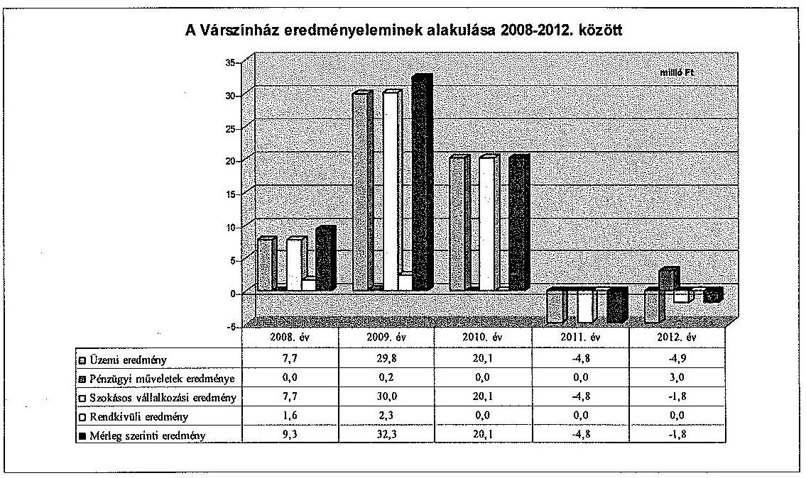

A Várszínház mérleg és eredménykimutatása a 2009-2012. években jelentős, a mérlegfőösszeg 2%-át meghaladó mértékű hibát tartalmazott.

A Várszínház a Számv. tv. 77. § (2) bekezdés d) pontjában foglaltak ellenére a 2009-2012. években az Önkormányzat által pénzügyileg nem teljesített támogatási összegeket egyéb bevételként és aktív időbeli elhatárolásként számolta el.

Az előírás szerint az egyéb bevételek között kell elszámolni a költségek (ráfordítások) ellentételezésére - visszafizetési kötelezettség nélkül - belföldi gazdálkodótól szerződés alapján kapott támogatások összegét, ezért az Önkormányzat által nyújtott működési támogatást a pénzügyi teljesítéskor kell egyéb bevételként elszámolni. A támogatási megállapodásban meghatározott, de ki nem utalt támogatási összegek bevételként és követelésként nem írhatók elő.

Az elhatárolás mértéke a 2009. évben 68,0 millió Ft volt, amely a 2010. évben 20,0 millió Ft-tal 89,1 millió Ft-ra emelkedett. Az aktív időbeli elhatárolással a Várszínház megnövelte egyrészt a mérleg eszköz oldalát, másrészt - az egyéb bevétel mérleg szerinti eredményt növelő hatásaként - az elhatárolt összeggel a mérleg forrás oldalát. A 2009-2010. évi ki nem utalt támogatásokat a Várszínház a 2011-2012. években sem kapta meg, ezért a ki nem utalt támogatás összegét ezen évek mérlegében is szerepeltette. A 2011-2012. évi mérlegben kimutatott összeg azonban 88,0 millió Ft helyett 95,0 millió Ft volt, mivel az Önkormányzathoz kirendelt pénzügyi gondnok 2011. áprilisában 95,0 millió Ft összegben vette nyilvántartásba a Várszínház hitelezői igényével összefüggő tőkekövetelést.

Az Önkormányzat az adósságrendezési eljárásban az általa ki nem utalt támogatások után 3,1 millió Ft késedelmi kamatot ismert el, amelyet a helyszíni ellenőrzés befejezéséig nem teljesített. A Várszínház a bevételként nem teljesült késedelmi kamatot a 2012. évi beszámolójában a Számv. tv. 77 § (2) bekezdés b) pontjában foglaltak ellenére a pénzügyi műveletek bevételeként mutatta ki.

A Várszínház az önkormányzati színházak állami támogatása az önkormányzati támogatás, továbbá a hazai finanszírozású pályázati támogatások teljes összegét az ellenőrzött időszakban a pénzügyi teljesítés évében mutatta ki eredményként, azt a felhasználás arányában az évek között nem határolták el. Az elszámolás ellentétes volt a Számv. tv. 44. § (2) bekezdésében foglaltakkal, mivel a passzív időbeli elhatárolások között kell kimutatni a költségek (ráfordítások) ellentételezésére - visszafizetési kötelezettség nélkül - kapott, pénzügyileg rendezett, egyéb bevételként elszámolt támogatás összegéből az üzleti évben költséggel, ráfordítással nem ellentételezett összeget. A Számv. tv. 15. § (7) bekezdésében megfogalmazott összemérés elvét figyelembe véve a támogatást tényleges felmerülésekor kell bevételként elszámolni.

A hazai finanszírozású pályázatokon elnyert támogatások felhasználásáról dokumentumok nem álltak az ellenőrzés rendelkezésére, ezért az elszámolások szabályszerűsége - különösen a támogatások passzív időbeli elhatárolására - az ellenőrzött időszakra vonatkozóan
 teljes körűen nem volt megállapítható. Emiatt a támogatások egyes évekre gyakorolt eredményrontó vagy javító hatása nem határozható meg.

A könyvvezetésben a szabálytalan – ki nem utalt támogatások, késedelmi kamat – elszámolások miatt megsértették a Számv. tv. 15. § (3) bekezdésében szabályozott valódiság számviteli alapelvét. A 2009–2012. években, a mérlegben és az eredménykimutatásban szabálytalanul szerepeltetett könyvelési tételek mértéke a Számv. tv. 3. § (3) bekezdés 3) pontja értelmében jelentős összegű hibának minősülnek, mivel a hibák összege meghaladta az üzleti év mérlegfőösszegének 2%-át. A 2009–2012. évi beszámolók mérleg szerinti eredménye a jelentős összegű hibák miatt nem valós eredményt tartalmazott.

A Várszínház a számviteli nyilvántartásaiban nem különítette el az alaptevékenység, valamint vállalkozási tevékenységéből ${ }^{14}$ származó ráfordításait 2008–2011 között a Közhasznúsági tv. 18. § (3) bekezdése előírásai ellenére, annak szabályait nem alakította ki, ezért a 2008–2012. évi beszámolókban az alap, illetve vállalkozási tevékenységek között felosztott eredmény nem volt megalapozott.

A pénzügyi műveletek bevételei a Várszínház folyószámláján lévő szabad pénzeszközök után kapott kamatokat, ráfordításai a számlavezető pénzintézetnek fizetett számlavezetési díjat, és a 2009. évben felvett kölcsön után fizetett kamatot tartalmazta. A pénzügyi műveletek eredménye a 2008. évi 100 ezer Ft-ról 2011-re 36 ezer Ft-ra csökkent. A 2012. évben a pénzügyi műveletek eredménye – hibás elszámolás következtében – 3,1 millió Ft volt.

A rendkívüli ráfordítások összege 2008-ban 0,2 millió Ft volt, a Babits szobor felállításához adott hozzájárulás összege miatt. Rendkívüli bevételként a 2008. évben 1,8 millió Ft-ot számoltak el elévült szállítói tartozások leírásaként. A 2009. évben rendkívüli bevételként elszámolt összeg 2,3 millió Ft volt, amely 2,1 millió Ft térítés nélkül átvett eszközök és szolgáltatások értékét, valamint 0,2 millió Ft elévült kötelezettségek összegét tartalmazta. A 2008–2009. évben elszámolt rendkívüli bevételek alapdokumentumai a Várszínháznál nem álltak rendelkezésre, az elszámolásokat a főkönyvi nyilvántartás tartalmazta. A Várszínház ez által nem tett eleget a Számv. tv. 169. (2) bekezdésében foglalt bizonylatok megőrzésére vonatkozó rendelkezésnek, amely szerint a könyvviteli elszámolást közvetlenül és közvetetten alátámasztó számviteli bizonylatokat legalább nyolc évig olvasható formában, a könyvelési feljegyzések hivatkozása alapján visszakereshető módon kell megőrizni. A Várszínház a 2010–2012. években rendkívüli bevételt és ráfordítást nem számolt el.

# 2.5. A Várszínház folyamatos üzemmenetének, likviditásának biztosítása 

A Várszínháznak a 2009–2012. években gazdálkodási nehézségei voltak, mivel az önkormányzati támogatás összege jelentősen csökkent. A Várszínház az ellenőrzött időszakban pénzintézeti hitelt nem vett fel.

A Várszínháznak az ellenőrzött időszakot megelőző évekről 4,5 millió Ft kölcsöntartozása keletkezett az Önkormányzat felé, amit számviteli nyilvántartásban kimutattak. A kölcsönszerződés nem volt fellelhető, így a Várszínház nem tett eleget a Számv. tv. 169. (2) bekezdésében foglalt bizonylatok megőrzésére vonatkozó rendelkezésnek. A Várszínház 2009. szeptember 1-jén további 1,0 millió Ft kölcsönt vett fel egy kizárólagos önkormányzati tulajdonú gazdasági társaságtól, amelyből 2009. november 10-én 0,5 millió Ft-ot törlesztett. A fennmaradó 0,5 millió Ft kölcsönt a 2013. évben fizették vissza. A Várszínház az 1,0 millió Ft kölcsön után a főkönyvi kivonatok alapján a 2009–2013. években összesen 0,1 millió Ft kamatot fizetett.

Az átmenetileg szabad pénzeszközöket nem kötötték le, azt a folyószámlán tartották, amely után a 2008–2012. években 36,6 ezer Ft kamatot realizáltak. A Várszínház likviditási nehézségeiről a 2011–2013. években az ügyvezető öt alkalommal a polgármesternek, további egy alkalommal a Képviselőtestületnek címezve figyelemfelhívó levelet küldött, amelyre azonban intézkedés nem történt.

A Számv. tv. 88. § (2) bekezdésében foglaltak ellenére a 2009–2012. évek beszámolóinak részét képező kiegészítő mellékletekben nem mutatták be a likviditás és fizetőképesség, továbbá a kötelezettségek tételeinek alakulását.

Az Önkormányzat által a Várszínház részére nyújtott működési célú támogatás – a központi költségvetésből származó forrással együtt – a 2008–2012. években folyamatos csökkenést mutatott. A 2008. évben teljesített 83,3 millió Ft a 2012. évre 76,0%-kal 20,0 millió Ft-ra csökkent.

Az Önkormányzat saját forrásaiból nyújtott működési célú támogatás aránya az összes támogatáson belül a 2008. évi 63,6%-ról a 2009. évre 77,0%-ra, a 2010. évre 78,3%-ra, a 2011. évre 92,8%-ra, a 2012. évre 95,7%-ra változott.

A központi költségvetésből a Várszínház működtetéséhez biztosított hozzájárulás a 2008. évi 20,0 millió Ft-ról a 2009. évre 35,0%-kal, 27,0 millió Ft-ra nőtt, a 2010. évre az előző évhez viszonyítva 29,7%-kal 19,0 millió Ft-ra csökkent. A 2011–2012. években a Várszínház központi költségvetésből támogatásban nem részesült, mivel előadóművészeti tevékenységet nem végzett.

A Várszínház a központi költségvetési és önkormányzati támogatáson felül hazai finanszírozású pályázatokon jutott további forrásokhoz. Az NKA és a Szülőföld Alap a 2008. évben összesen 10,3 millió Ft, a 2009. évben 6,0 millió Ft, valamint az Igazságügyi és Rendészeti Minisztérium 3,0 millió Ft támogatásban részesítette a Várszínházat. Az NKA a 2010. évben 9,0 millió Ft, a 2011. évben 0,7 millió Ft, a 2012. évben 0,9 millió Ft támogatást biztosított, míg a Bethlen Gábor Alap által nyújtott támogatás 2011-ben 0,6 millió Ft volt.

A támogatásokat bemutató adatokat az 1. számú melléklet tartalmazza.
A Várszínháznak hosszú lejáratú kötelezettsége nem volt, a rövid lejáratú kötelezettségek állománya – a 2009. évtől kialakult kedvezőtlen pénzügyi helyzet miatt – a 2008. évi 14,6 millió Ft-ról a 2012. évre 66,1 millió Ft-ra emelkedett. A lejárt szállítói állomány a 2008. évi 8,3 millió Ft-ról a 2012. évre közel 7,2-szeresére 59,4 millió Ft-ra nőtt. A 2008. évben a lejárt szállítói állomány 0,2%-a, a 2012. évben 98,1%-a volt 360 napon túli lejárt tartozás.

A szállítók a Várszínház ellen a 2009–2012. években a lejárt számlatartozások miatt közjegyzői, ügyvédi felszólítást, illetve végrehajtási eljárást kezdeményeztek. Az ügyvezető a hitelezőkkel folyamatosan egyeztetett a felszámolás elkerülése érdekében, amelynek eredményeként a helyszíni ellenőrzés lezárásáig a Várszínház ellen csőd, illetve felszámolási eljárást nem kezdeményeztek. A 2013. évben a közüzemi szolgáltatók felé a számlatartozásokat kifizették.

A szállítókkal az egyeztetések során a tartozások átütemezésében, továbbá részlet törlesztésekben állapodtak meg. A ki nem egyenlített szállítói tartozásokkal kapcsolatos peres eljárások miatt a 2011. évben 0,08 millió Ft, a 2012. évben 0,4 millió Ft, a 2013. év első félévében 0,4 millió Ft végrehajtással kapcsolatos többletköltséget fizetett ki a Várszínház.

Az Önkormányzat tájékoztatási kötelezettséget a szállítói tartozások, illetve egyéb kötelezettségek alakulásának bemutatásáról nem írt elő, és a Várszínház pénzügyi helyzetét, szabályszerű gazdálkodását az ellenőrzött időszakban nem ellenőrizte.

# 3. ÖNKORMÁNYZAT TULAJDONOSI JOGAINAK ÉS KÖTELEZETTSÉGEINEK ÉRVÉNYESÍTÉSE 

### 3.1. A Várszínháztól származó információk hasznosítása

Az Alapító Okiratban rögzítették az ügyvezető beszámolási kötelezettségét, amely az éves gazdálkodási terv, valamint a mérleg és eredménykimutatás elkészítését tartalmazta.

Az Önkormányzat a Várszínháznak a Közszolgáltatási szerződésben megfogalmazott követelmények teljesítésének értékeléséhez a Közszolgáltatási szerződésben és éves támogatási megállapodásokban előírt szakmai és pénzügyi elszámoláson kívül egyéb adatszolgáltatási kötelezettséget nem írt elő.

A Várszínház a 2008. évben az I. negyedévről és az I–X. havi gazdálkodásról évközi beszámolókat készített.

A Várszínház a 2008–2011. években a Közhasznúsági tv. 19. § (3) bekezdés a) pontjában előírt tartalmú közhasznúsági jelentést, illetve közhasznúsági mellékletet elkészítette.

A Várszínház a 2008–2012. évi számviteli beszámolóit határidőre elkészítette. A könyvvizsgáló az ellenőrzött időszakban az éves számviteli beszámolókat auditálta, azokat – a 2011. évi beszámoló kivételével – korlátozás nélküli hitelesítő záradékkal ellátta. Megállapította, hogy a beszámolók megfelelnek az érvényes jogszabályi rendelkezéseknek, megbízható, valós képet nyújtanak a Várszínház pénzügyi és jövedelmi helyzetről.

A 2011. évi beszámolót a könyvvizsgáló korlátozó záradékkal látta el, mert a Várszínház az aktív időbeli elhatárolások között mutatta ki az Önkormányzattal szembeni 2010. évre szerződés szerint járó, de ki nem fizetett követelését, amelyet az Önkormányzat adósságrendezési eljárására kijelölt pénzügyi gondnok a hitelezői igény bejelentésekor visszalégalazott. A könyvvizsgálói jelentésben foglaltak szerint nem volt megállapítható, hogy az aktív időbeli elhatárolások értéke a beszámoló összeállításakor megfelelt-e a bejelentett értéknek, mert a pénzügyi gondnok a követelés állomány év végi értékeléséhez nem szolgáltatott információt.

A Képviselő-testület a Várszínház 2008–2012. évi számviteli beszámolóit – a 2008–2010. évi FB vélemények hiánya ellenére – elfogadta, azonban azokat nem elemezték, megalapozottságát, valódiságát nem ellenőrizték.

A Várszínház 2009. évi Emtv. szerinti besorolásához, nyilvántartásba vételéhez kapcsolódó dokumentum az Önkormányzatnál nem állt rendelkezésre. Az Önkormányzat az Emtv.-ben előírt – szabadtéri színház V. kategóriába történő – besorolásához szükséges adatszolgáltatási kötelezettségének a 2010. évben eleget tett. A 2011–2012. években előadóművészeti tevékenységet nem végeztek, így a minősítéshez szükséges adatszolgáltatást nem kellett teljesíteni.

Az Önkormányzat a Várszínház által ellátott közszolgáltatási feladatok végrehajtásához, fejlesztéséhez felhasználható szakértői anyagokat nem készíttetett az ellenőrzött időszakban.

A Várszínház az ellenőrzött időszakban a Taktv. 2. § (1)–(3) bekezdéseiben foglaltak ellenére nem tette közzé a vezető tisztségviselők, bankszámla feletti rendelkezésre jogosultak adatait és az egyszerű közbeszerzési eljárás értékhatárt elérő vagy azt meghaladó értékű szerződéseit.

# 3.2. Az Önkormányzat tulajdonosi intézkedései 

A Várszínház 2011–2012. évi veszteséges működése miatt, a Képviselő-testület a 187/2012. (V. 31.) számú határozatában felkérte a Várszínház ügyvezetőjét, hogy dolgozzon ki javaslatot a bevételek növelésére és a költségek csökkentésére a fizetőképesség megőrzése érdekében. Az ügyvezető határidőre elkészítette a javaslatot, azonban a Képviselő-testület azt nem tárgyalta.

Az Önkormányzat éves ellenőrzési terveiben a 2008–2012. években tervezték az önkormányzati tulajdonú gazdasági társaságok átfogó ellenőrzését, azonban az ellenőrzést egyik évben sem hajtották végre.

Az Önkormányzat belső ellenőrzése a 2009. évben az „Esztergomi Csillagváró” elnevezésű rendezvénysorozat megrendezésére vonatkozó számlák felülvizsgálatát végezte el a Várszínháznál.

A belső ellenőrzés javasolta, hogy a tulajdonostól kapott támogatási források jövőbeni felhasználása során, ahol a tulajdonos előírja a támogatási összegek egyéb pénzeszközöktől való elkülönített nyilvántartását, az erre szolgáló analitikus nyilvántartás oly módon kerüljön kialakításra, hogy a rendezvények elszámolásához és a tulajdonos információs igényeinek kielégítéséhez elegendő információt nyújtson és tegyen eleget a Számv. tv. 165. § (4) bekezdésében foglaltaknak. Továbbá javasolta, hogy az ügyvezető tartsa be a pénzkezelés során a hatályos pénzkezelési szabályzatban előírtakat és gondoskodjon arról, hogy érvényesüljön a Számv. tv. 165. § (3) bekezdés a) pontjában foglalt előírás.

Az FB a 2008–2012. években a Várszínháznál ellenőrzést nem végzett. A Várszínház jogelődjénél a veszteséges gazdálkodás miatt tulajdonosi intézkedésre volt szükség a Gt. tv. 143. § (2)–(3) bekezdésében foglaltak szerint a veszteség rendezése, illetve a saját tőke/jegyzett tőke előírt szintjének biztosítása érdekében.

A jogelőd Esztergom Nyári Fesztivál Kht. az átalakulást megelőző 2006. és 2007. évben veszteséges volt, a saját tőke a Gt. tv. 51. § (1) bekezdésében meghatározott szint alá csökkent, nem rendelkezett a társasági formájára kötelezően előírt jegyzett tőkének megfelelő összegű saját tőkével. Az Önkormányzat a 2007–2008. években
 pótbefizetés teljesítéséről döntött az Esztergom Nyári Fesztivál Kht., illetve a Várszínház veszteségrendezése és a vagyonvesztés megelőzése érdekében. A Képviselő-testület a 390/2007. (VI. 14.) számú határozatában 12,0 millió Ft, a 368/2008. (V. 22.) számú határozatában 13,0 millió Ft pótbefizetésről döntött, amelynek fedezete az adott évi költségvetési rendelet beruházási tartalék sora volt. A pótbefizetések mellett a nonprofit kft.-vé átalakult Várszínházzal az Önkormányzat Közszolgáltatási szerződést, illetve ahhoz kapcsolódóan éves támogatási megállapodásokat kötött a pénzügyi fedezet biztosítására, ennek következtében 2008-ban a Várszínház tőkehelyzete rendeződött, és megfelelt a Gt. tv. szabályainak.

A Gt. tv. 120. § (1) bekezdését figyelmen kívül hagyva, az Alapító Okiratban nem határozták meg azt a legmagasabb összeget, amelynek befizetésére a tag kötelezhető, továbbá a pótbefizetés teljesítésének módját, gyakoriságát, ütemezését, valamint a visszafizetés rendjét.

A Várszínház közhasznú tevékenységet végző gazdasági társaság, eredménye a Közhasznúsági tv. 14. § (1) bekezdése szerint nem osztható fel. A jogszabályokban foglaltaknak megfelelően eljárva az ellenőrzött időszak minden évében a Képviselő-testület szabályszerűen határozott a Várszínház mérleg szerinti eredményének elfogadásáról, a 2008-2010. között keletkezett nyereség eredménytartalékba helyezéséről, a 2011-2012. években keletkezett veszteség eredménytartalék terhére történő elszámolásáról.

Az Önkormányzat és a Várszínház között 2008. december 11-én aláírt vagyonkezelési megállapodás mellékletét képező leltári íven szereplő ingóságokat az ellenőrzés ideje alatt három helyszínen tárolták. Két raktárban (volt Medicor épülete, volt Granvisus épülete) és a Várszínház székhelyén, a bérbe adott Imaház u. 2. sz. alatt. A Medicor raktár őrzésére 2010. június 26-a és 2012. május 20-a között, a Granvisus raktár őrzésére 2010. szeptember 21-e és 2011. november 14-e között az Önkormányzat szerződéssel nem rendelkezett, a raktárakban lévő ingóságok őrzéséről nem gondoskodott, annak ellenére, hogy a raktárakban tároltak önkormányzati tulajdonú ingóságokat is. A vagyonkezelési megállapodás szerint az eszközök állagmegóvása, értékének megőrzése a Várszínház feladata és felelőssége volt.

A Várszínház ügyvezetője 2011. január 25-én levélben jelezte a polgármesternek, hogy a Medicor raktárépületben tárolt, részben a Várszínház, részben az Önkormányzat tulajdonában lévő értékek őrzése nem megoldott, likviditási helyzetükre hivatkozva nem áll módjukban az értékek megóvása.

A Várszínház ügyvezetője 2012. június 12-én rendőrségi feljelentést tett ismeretlen tettes ellen, mivel 2012. március 1-je és 2012. május 1-je közötti időszakban a Medicor épületéből színpadi és díszlet elemeket, valamint szobrot tulajdonítottak el, a lopási kár kb. 1,0 millió Ft volt.

A Várszínház képviselője 2010. november 3-án levélben tájékoztatta a polgármestert arról, hogy az Önkormányzat tulajdonában álló színpadok és pavilonok őrzésével megbízott cég a Várszínház fennálló 13,8 millió Ft felhalmozott adóssága miatt nem gondoskodik a Széchenyi téren álló színpadok és pavilonok további őrzéséről. A Széchenyi téren álló pavilonok és a színpadok őrzése a Várszínház és az Önkormányzat között kötött külön szerződés értelmében a Várszínház feladata volt.

Az ügyvezető 2011. március 11-én újabb levelet írt a polgármesternek, amelyben jelezte, hogy megtette a rendőrségi feljelentést ismeretlen tettes ellen az Önkormányzat tulajdonában lévő, Széchenyi téren álló kisszínpad 48 darab alumínium lábának eltulajdonítása miatt, a lopási kár 0,24 millió Ft volt. A rendőrség a nyomozást felfüggesztette, mert az elkövető kiléte nem volt megállapítható. Az Önkormányzat tudomásul vette az ügyvezető tájékoztatóit, de 2012. május 21-én nem intézkedett a Medicor raktár őrzésével kapcsolatban, és a rendőrségi feljelentések kapcsán leltározást nem folytatott le.

A Képviselő-testület 2009. szeptember 24-én ${ }^{15}$ a nagypavilon, a faház, a rendezői szék és az asztalok a Várszínháznak történő bérbeadásáról döntött öt év határozott időtartamra. A bérleti díj összege 0,15 millió Ft + áfa volt. A bérleti szerződést 2010. február 3-án kötötték meg és 2011. szeptember 5-én képviselő-testületi döntés alapján ${ }^{16}$ közös megegyezéssel a Várszínház ügyvezetőjének kérelmére megszüntették.

A megszüntetési kérelem oka az volt, hogy 2011-ben rendezvények szervezésére forráshiány miatt nem kaptak megbízást, így a pavilonok bérlése indokolatlaná vált és a bérleti díjat az ötödére csökkentett támogatásból már nem tudták fizetni.

A Várszínház a támogatás csökkenéséből adódó pénzügyi nehézségei miatt nem fizetett bérleti díjat az Önkormányzatnak, így 2010. május 20. és 2011. szeptember 19. között 3,0 millió Ft tartozása keletkezett.

Az Önkormányzat Vagyongazdálkodási Irodája 2011. november 15-én felszólította a Várszínház ügyvezetőjét, hogy a Széchenyi téren a rendezvényszervezés céljaira tételesen bérbe adott vagyontárgyakból hiányzó 142 db szék és 39 db asztal mindösszesen 3,1 millió Ft értékű tárgyi eszközt pótolja, illetve az okozott kárt térítse meg, miután a bérleti szerződés 5. pontja szerint a bérlő felelős minden olyan kárért, amely a rendeltetésellenes használat, illetőleg az elégtelen őrzés következménye. Az ügyvezető a felszólításban foglaltaknak nem tett eleget és az Önkormányzat részéről sem történt további lépés az üggyel kapcsolatban.

A Várszínház azzal, hogy a bérleti szerződés 2011. szeptember 5-i megszüntetése után az Önkormányzat 2011. november 15-i felszólítására a bérbe adott ingóságok egy részével nem tudott elszámolni, kárt okozott az Önkormányzatnak.

Az elmaradt bérleti díj és a Várszínház által visszaadni elmulasztott ingóságok értéke vonatkozásában az Önkormányzatnak összesen 6,2 millió Ft összegű polgári jogi úton érvényesíthető jogos kárigénye keletkezett. Az Önkormányzat nem tett intézkedést jogos igényének érvényesítésére annak ellenére, hogy az

[^0]
[^0]:    ${ }^{15}$ a Képviselő-testület 592/2009. (IX. 24.) számú határozata
    ${ }^{16}$ a Képviselő-testület 307/2011. (VIII. 5.) számú határozata

---

Áht ${ }_{1}$. 108. § (2) bekezdésében ${ }^{17}$ előírtak szerint az államháztartás alrendszereinek követeléseiről lemondani csak törvényben, a helyi önkormányzatnál a helyi önkormányzat rendeletében meghatározott módon és esetekben lehet.

# 4. Az ÁSZ korábbi, a többségi tulajdonú gazdasági társaságok közfeladat-ellátását, gazdálkodását, pénzügyi helyzetét érintő javaslataira tett intézkedések 

### 4.1. A Önkormányzat intézkedési terve és a javaslatok hasznosulása

Az Önkormányzat a Várszínházat érintően tanúsítványi adatszolgáltatást teljesített és kérdőívet töltött ki az ÁSZ 2010. évi, a színházak állami támogatásának és gazdálkodásának ellenőrzése során.

Budapest, 2014. 04. hó 04. nap
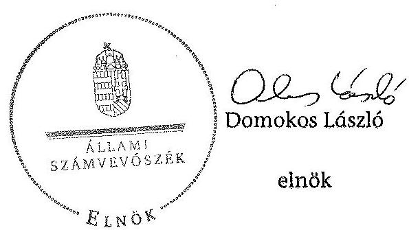

Melléklet: $\quad 6 \mathrm{db}$

[^0]
[^0]:    ${ }^{17}$ 2013. január 1-jétől az Áht ${ }_{2}$ 97. § (2) bekezdése tartalmazza

---

.

---

1. SZÁMÚ MELLÉKLET A V-0306-060/2013. SZÁMÚ JELENETÉSHEZ

A Várszínház támogatása a 2008. és a 2012. évek között

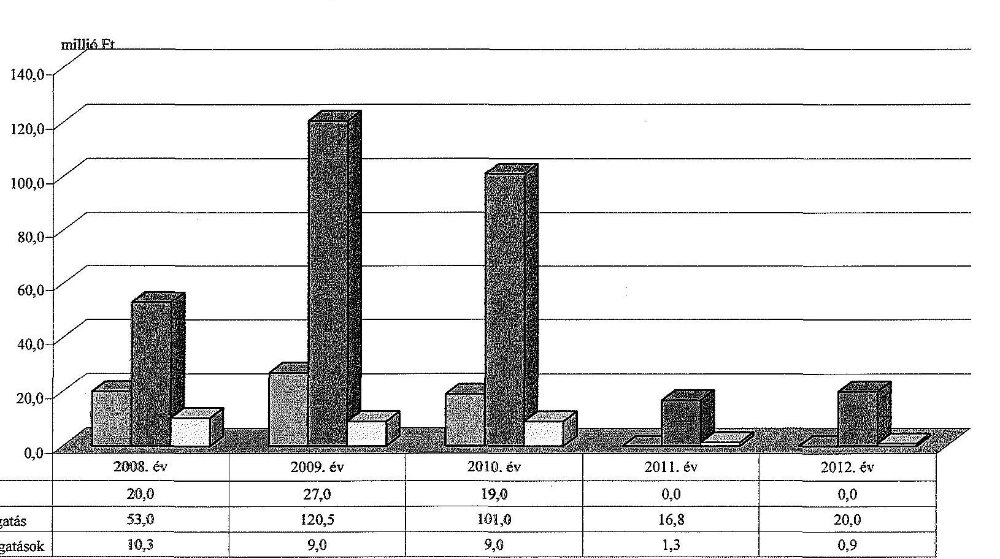

|   | 2008. év | 2009. év | 2010. év | 2011. év | 2012. év  |
| --- | --- | --- | --- | --- | --- |
|  **Állami támogatás** | 20,0 | 27,0 | 19,0 | 0,0 | 0,0  |
|  **Önkormányzati támogatás** | 53,0 | 120,5 | 101,0 | 16,8 | 20,0  |
|  **Egyéb pályázati támogatások** | 10,3 | 9,0 | 9,0 | 1,3 | 0,9  |

---

# A Várszínház vagyonának főbb adatai 2008. január 1-je és 2012. december 31-e között

|  Méregesor megnevezése | 2008. jan. 1. (millió Ft) | 2008. dec. 31. (millió Ft) | 2009. dec. 31. (millió Ft) | 2010. dec. 31. (millió Ft) | 2011. dec. 31. (millió Ft) | 2012. dec. 31. (millió Ft)  |
| --- | --- | --- | --- | --- | --- | --- |
|  Immateriális javak | 0,0 | 0,0 | 0,0 | 0,0 | 0,0 | 0,0  |
|  Tárgyi eszközök | 20,2 | 19,2 | 17,1 | 14,7 | 12,5 | 10,8  |
|  Ebből: Ingatlanok |  |  |  |  |  |   |
|  Gépek, berendezések |  |  |  |  |  |   |
|  Befektetett eszközök összesen | 20,2 | 19,2 | 17,1 | 14,7 | 12,6 | 10,8  |
|  Forgóeszközök összesen | 3,3 | 25,7 | 28,5 | 41,6 | 32,9 | 27,8  |
|  Aktív időbeli elhatárolások | 0,0 | 0,0 | 68,0 | 88,0 | 95,0 | 95,0  |
|  Eszközök összesen | 23,5 | 44,9 | 113,6 | 144,3 | 140,5 | 133,6  |
|  Saját tőke összesen | $-11,9$ | 10,4 | 42,8 | 62,9 | 58,1 | 56,3  |
|  Ebből:Jegyzett tőke | 3,0 | 3,0 | 3,0 | 3,0 | 3,0 | 3,0  |
|  Töketartalék | 54,0 | 54,0 | 54,0 | 54,0 | 0,0 | 0,0  |
|  Eredménytartalék | $-70,5$ | $-84,9$ | 75,6 | $-43,3$ | $-23,1$ | $-27,9$  |
|  Lekötött tartalék | 16,1 | 29,0 | 29,0 | 29,0 | 83,0 | 83,0  |
|  Mérleg szerinti eredmény | $-14,5$ | 9,4 | 32,3 | 20,1 | $-4,8$ | $-1,8$  |
|  Tartalékok |  |  |  |  |  |   |
|  Céltartalék |  |  |  |  |  |   |
|  Kötelezettségek összesen | 18,1 | 14,6 | 51,9 | 64,4 | 66,8 | 66,1  |
|  Passzív időbeli elhatárolások | 17,3 | 19,9 | 18,9 | 17,0 | 15,6 | 11,2  |
|  Források összesen: | 23,5 | 44,9 | 113,6 | 144,3 | 140,5 | 133,6  |
|  |   |   |   |   |   |   |
|  Önkormányzattól átvett eszközök összesen |  |  |  |  |  |   |
|  Ebből: immateriális javak |  |  |  |  |  |   |
|  ingatlanok |  |  |  |  |  |   |
|  gépek, berendezések |  |  |  |  |  |   |
|  Saját és átvett eszközök összesen | 23,5 | 44,9 | 113,6 | 144,3 | 140,5 | 133,6  |

---

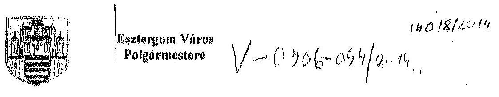

Demokos László Úr
elnök részére

Budapest
Apáczai Csere János u. 10.
1052

Tisztelt Elnök Úr!

Az Állami Számvevőszék által megküldött, „Jelentéstervezet az önkormányzatok többségi tulajdonában lévő gazdasági társaságok közfeladat-ellátásának ellenőrzéseiről – Várszínház és Kultúrmozgó Esztergom Nonprofit Kft.” címmel készített számvevőszéki jelentéstervezettel kapcsolatban az Állami Számvevőszékről szóló 2011. évi törvény 29. §. (2) bekezdése alapján észrevételt kívánok tenni az alábbiak szerint:

Észrevétel az 1. Összegző megállapítások, következtetések, javaslatok fejezetben található, az önkormányzati ingatlanok őrzésére vonatkozó megállapításokkal kapcsolatban:

A Simor János utca 41. szám alatti ingatlan (Granvisus épület) őrzése a teljes vizsgált időszakban megvalósult, szerződéssel alátámasztott, kivéve a 2010. szeptember 21. és 2011. február 2. közötti időszakot, amikor a szerződéskötés az időközben megindult adósságrendezési eljárás következtében késedelmet szenvedett,
 ugyanakkor az őrzési tevékenységet a Védvár 2008. Zrt. ellátta.

A Szent István tér 1-11. szám alatti ingatlan (Medicor épület) őrzése a 2008. december 18-án Esztergom Város Önkormányzata és a Pázmány Péter Katolikus Egyetem között kötött megállapodás, valamint az Esztergom Város Önkormányzata és a Reneszánsz-Esztergom Fürdő Konzorcium között kötött vállalkozási szerződés értelmében a kezdődő beruházásra tekintettel valóban kikerült az őrzéssel érintett ingatlanok köréből. A munkaterület átadására a vállalkozási szerződés aláírásától számított 3 napon belül került sor.

Esztergom Város Önkormányzata többször felszólította (első ízben 2009. május 28-án) a Várszínház és Kultúrmozgó Esztergom Nonprofit Kft-t arra, hogy a vagyonvédelem érdekében a Medicor főépülete mögötti raktárépületben tárolt eszközöket, berendezéseket – tekintettel arra, hogy a 2008. december 11-én létrejött vagyonkezelési megállapodás alapján az ingóságok állagmegóvása, értékének megőrzése a Kft. feladata – szállíttassa el, mert a beruházás megkezdésével az ott lévő ingóságok védelme nem biztosított.

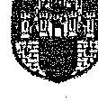

ESZTERGOM VÁROS POLGÁRMESTERE
Esztergom Város Önkormányzati Hivatal, 15-2300 Esztergom, Százhnyi tér 1. Tel.:+36-(33) 542-005, Fax: (33) 413-808, E-mail: versekera@esztergom.hu

---

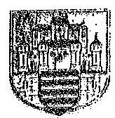

# Esztergom Város   Polgármestere 

Esztergom Város Önkormányzata levelében másik önkormányzati tulajdonú ingatlant is felajánlott a Kft-nek az ingóságok elhelyezésére.

Kérem, hogy a végleges jelentés elkészítésénél fenti észrevételeket figyelembe venni szíveskedjenek.
Esztergom, 2014. március 4.
Tisztelettel:
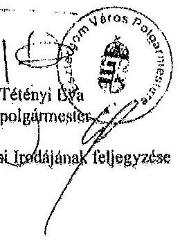

Melléklet: Esztergomi Közös Önkormányzati Hivatal Vagyongazdálkodási Irodájának feljegyzése
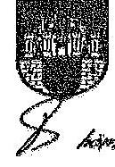

---

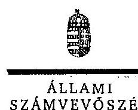

ELKÉK

Ikt.szám: V-0306-057/2014.

Tétényi Éva úrhölgy
polgármester
Esztergom Város Polgármesteri Hivatala

Esztergom

Tisztelt Polgármester Úrhölgy!

A „Jelentéstervezet az önkormányzatok többségi tulajdonában lévő gazdasági társaságok közfeladat-ellátásának ellenőrzéséről - Várszínház és Kultúrmozgó Esztergom Nonprofit Kft.” című jelentéstervezetre tett észrevételeit köszönettel megkaptam.

Az Állami Számvevőszék észrevételekre vonatkozó álláspontjáról a felügyeleti vezető által készített részletes tájékoztatást csatoltan megküldöm.

Tájékoztatom Polgármester úrhölgyet, hogy a számvevőszéki jelentés szövegezése az elfogadott észrevételek figyelembevételével készül.

Budapest, 2014. 04. hó 07. nap

Tisztelettel:

Dómokos László

elnök

Melléklet: Tájékoztatás az elfogadott és el nem fogadott észrevételekről

1052 BUDAPEST, AFRICZNI CIRÉ SÁNOS UTCA 10. 1364 Budapest 4. Pf. 54 telefon. 484 9101 fax 484 9201

---

# Tájékoztatás   az elfogadott és el nem fogadott észrevételekről 

A „Jelentéstervezet az önkormányzatok többségi tulajdonában lévő gazdasági társaságok közfeladat-ellátásának ellenőrzéséről - Várszínház és Kultúrmozgó Esztergom Nonprofit Kft." című jelentéstervezetre 2014. március 12-én érkezett észrevételeit áttekintettük, azok kezelésével kapcsolatban a következő tájékoztatást adom.

Az összegző megállapítások, következtetések, javaslatok fejezet önkormányzati ingatlanok őrzésére vonatkozó megállapítással kapcsolatos észrevétel

A polgármester a teljességi nyilatkozatában kijelentette, hogy az ellenőrzés keretében átadott dokumentumok teljes körűek. Az észrevételükhöz csatolt feljegyzés mellékletének 4. pontjában szereplő - Védvár 2008 Biztonságtechnikai, Informatikai, és Vagyonvédelmi Szolgáltató Zrt.vel kötött, 2011.02.03-tól 60 hónapon át hatályos - szolgáltatási szerződést a helyszíni ellenőrzés során nem bocsátották az ellenőrzés rendelkezésére és az észrevételekhez sem csatolták, így azt nem tudjuk figyelembe venni. A megállapításaink helytállóak, azonban a helyszíni ellenőrzés során átadott őrzésre, védésre vonatkozó szerződések ismételt áttekintését követően mindkét esetben módosítjuk azt a dátumot, melytől kezdődően az önkormányzat az őrzésre vonatkozóan szerződéssel nem rendelkezett. A jelentéstervezet 14. oldal 4. bekezdésének 2. mondatát az alábbiak szerint pontosítjuk:
„A Medicor raktár őrzésére 2010. június 26-a és 2012. május 20-a között, a Granvisus raktár őrzésére 2010. szeptember 21-e és 2011. november 14-e között az Önkormányzat szerződéssel nem rendelkezett, a raktárakban lévő ingóságok őrzéséről nem gondoskodott, annak ellenére, hogy a raktárakban tároltak önkormányzati tulajdonú ingóságokat is."

Az ingatlanok és ingóságok is önkormányzati tulajdonban vannak, a Vagyonkezelési megállapodás szerint kizárólag az ingóságok kerültek a Színház kezelésébe. A Vagyonkezelési megállapodás szerint a vagyontárgyak értékét és állagát meg kell óvni, az ingatlanokról azonban nem tartalmaz rendelkezést, továbbá azt sem mondja ki, hogy az érték és állag megóvásba az őrzés beletartozik. Az előbbiekre tekintettel, az önkormányzattal kapcsolatos őrzésre vonatkozó megállapításunk helytálló.

Tájékoztatom Polgármester úrhölgyet, hogy a számvevőszéki jelentés mellékleteként szerepeltetjük a jelentéstervezethez tett észrevételeit, valamint az azokra adott válaszunkat.

Budapest, 2014. 04. hó 07. nap

Makkai Mária
felügyeleti vezető

---

# Várszínház ${ }_{n}$ Kultúrmozgó Esztergom Nonprofit Kft 

Állami Számvevőszék
1052 Budapest Apáczai Csere János utca 10.
Domonkos László elnök Úr.r.
Tárgy: válasz, észrevétel a V-0306045/2014 iktszámú „Jelentéstervezet"-ben foglaltakra a Várszínház és Kultúrmozgó Esztergomi Nonprofit Kft. 2500 Esztergom, Imaház u. 364 - adószám:21881335-2-11/.
Az Állami Számvevőszékről szóló 2011. évi LXVI. törvény 29.§.(2) bekezdés szerint az ellenőrzés megállapításaira történő ügyvezetői észrevétel határidőn belül.

Észrevételek:

1. A bevezetőben megjelölt „Várszínház „1962-ben alakult” nem valós. 1986-ban alakult a MNM Esztergomi Vármúzeuma előtti téren. 1990-2010-ig működött a jelenlegi helyén. Önkormányzati-alapítványi, majd gazdasági formákban. A 2011. év közszolgáltatási megállapodásból vették ki mint tevékenységet, tehát nem tartozott, tartozik ebben a formában a mi feladataink közé. Jelenleg egyéni vállalkozóként Horányi László színész működteti.
II. Fontos megjegyzés, hogy a Várszínház és Kultúrmozgó Esztergom Nonprofit Kft 2010.XI.25-től a törvényes adósságrendezési eljárásban kihelyezett gondnok mellett működött. A kötelező, közfeladatok ellátását a minimális életben maradás mellett gyakorolhatta szűkített létszámmal. A korábbi megszüntetett Bajor Ágost Művelődési Ház a kulturális tevékenységeit igyekeztünk pótlólag ellátni, azonban az adósságrendezés miatt minimálisra csökkentett költségvetés, az elmaradt támogatások, a meglévő kifizetetlen számlák „határéleti” állapotot idéztek elő. Mint ügyvezetőt 2010. november 04-től a képviselőtestület választott meg. Hivatalos átadás-átvétel nem történt. (iratok, leltár, pénzügyi, számviteli stb) Annak tudatában készültem a munkára, hogy egy korábbi rendezetlen, de a város számára fontos közfeladatot kell végezni, amihez megkapom a szükséges segítséget. Ez így nem történt meg. Az adósságrendezésből adódó törvényes hitelezői igényeket mély közfelháborodások mellett kellene rendezni. Sajnos ez a mai napig nem oldódott meg. Az eljárás részleteibe, annak módosításába, lehetőségeibe nem vontak be. Mint az önkormányzat 100%-os tulajdonú kötelező, közfeladatokat ellátó cége a felszámolás, a végrehajtás elkerülése végett egyezkedünk a hitelezőkkel. Nem kívántunk a város számára további beláthatatlan károkat okozni a felszámolási módozattal. Természetesen ez azt eredményezte, hogy 2010. évtől minden évben a minimális létszámmal, költségvetéssel, teljesítjük a törvényben meghatározott feladatokat és közben a különböző eljárási szakba kerülő hitelezők számára törlesztünk. Mint vezető én is elküldtem az ügyvédi felszólítást az önkormányzat felé a rendezési hajlandóság vonatkozásában. Sajnos ennek nincs még érzékelhető megoldása! Minden évben a vezetésemtől készítünk kulturális programtervet költségvetési tervezettel. Az anyagot a FEB, a kulturális bizottság tárgyalása után adjuk át az előterjesztőnek, hogy a testület dönthessen a költségvetésről. Ennek jóváhagyásával a megszületett közhasznúsági megállapodás ütemében kaphatjuk az összegeket. Sajnos ezek hónapos csúszással érkeznek, meg ami további likviditási gondokat okoz. A jelen esetben 2014. évében sem kaptunk még egy fillért sem! Közben a bér, és járulék, a közüzemi költségek feszítenek. Minden évben a mérlegforduló időpontjában beszámolót készítünk, majd a mérleg elfogadásához szükséges szakanyagokat átadjuk az önkormányzat részére. Az anyagunkat a FEB

---

# Várszínház Kultúrmozgó

És kulturális bizottság is megkapja a testületi ülést megelőzően. Természetesen könyvvizsgálói ellenőrzés, ellenjegyzéssel (minden kifogás nélkül) történt a mai napig.

- **III. A költségvetési beterjesztés** elfogadást követően beszélhetünk a felelős, kötelező, közfeladatok mentén végzett kulturális feladatokról. Nagyon nehéz ügyet tervezni, hogy számtalan művészeti szolgáltatói ágnak tartozunk (színészek, színházak, hang és fénytechnika, nyomdák, szolgáltatók, szállásadók, stb.). A költségeink javát jelentik az eljárási illetékek, az utazások, telefonok stb. Engem személy szerint, - volt olyan év hogy mérlegelfogadási időszakban még nem sikerült a cégbíróságnál bejegyezni. Ezzel egy sor törvényes akadály keletkezett. Nem volt felelős aláíró stb. Volt úgy hogy ez a mulasztás egy évben háromszor is előfordult. Most 2014. május 31-ig szól a megbízásom, a szerződésünk évente kerül meghosszabbításra, a műemlék épület bérleti szerződése (melyben tartózkodunk) pedig 2018-ig szól.

- **IV. A jelentésben megjelölt belső szabályzatokkal** kapcsolatban szeretném jelezni, hogy rendelkeztünk a szabályzatokkal, csak számomra ismeretlen okok miatt még akkor nem került testületi ülés elé elfogadás, ellenjegyzés miatt.

- **V. A Kft minden évben** elkészítette a leltárt mely a mérleg részét képezi. A korábbi időszakból az átszervezésekkel összevont vagyonleltárakról nem volt tudomásom. A külön listában szereplő tételeket 2012-ben az önkormányzati pénzügyi munkatársakkal leltároztuk. A feltárt raktározási, és selejtezési gondokat jeleztem, bizonyos esetekben rendőrségi feljelentéssel éltem. Az ott feltüntetett értékek és leírási kulcsokat nem ismertem.

- **VI. A könyvelési feladatokat megbízási szerződés keretében** a Strigonium Zrt. végzi, abban a formában, ahogy a számvevőszéki munkatársak tapasztalták. Jelenleg is azon vagyunk, hogy a forduló időponttal új könyvelőt keressünk. A meglévő **NOVITAX** könyvelői programban is az önállósodás útját választjuk 2014-ben. Természetesen szeretnénk a város jelenlegi gondjai mellett is a lehető legjobban teljesíteni a kötelező feladatunkat a közművelődésben.

A jelentéstervezetben megfogalmazottakat a fenti kiegészítéssel köszönjük, és azon leszünk, hogy az ott megfogalmazottaknak maradéktalanul eleget tehessünk. Az ellenőrzést végző munkatársaknak az áldozatos munkájukat ez úton is köszönjük.

**Esztergom, 2014. 02. 26.**

**Marmika Csilla**

**ügyvezető**

**VÁRSZÍNHÁZ ÉS KULTÚRMOZGÓ**

**ESZTERGOM NONPROFIT KFT.**

**2500 Esztergom, bevezetőna, 10.14.2014.**

**Adószám: 21093326-2-11**

---

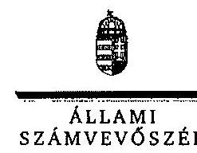

# Maronka Csilla úrhölgy 

ügyvezető
Várszínház és Kultúrmozgó
Esztergom Nonprofit Kft.

## Esztergom

## Tisztelt Ügyvezető Úrhölgy!

A „Jelentéstervezet az önkormányzatok többségi tulajdonában lévő gazdasági társaságok közfeladat-ellátásának ellenőrzéséről - Várszínház és Kultúrmozgó Esztergom Nonprofit Kft." című jelentéstervezetre tett észrevételeit köszönettel megkaptam.

Az Állami Számvevőszék észrevételekre vonatkozó álláspontjáról a felügyeleti vezető által készített részletes tájékoztatást csatoltan megküldöm.
Tájékoztatom Ügyvezető úrhölgyet, hogy a számvevőszéki jelentés szövegezése az elfogadott észrevételek figyelembevételével készül.
Budapest, 2014. 04. hó 04. nap
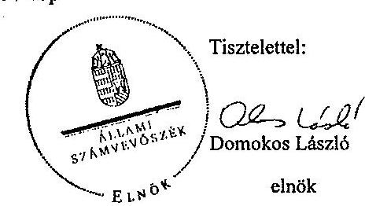

Melléklet: Tájékoztatás az elfogadott és el nem fogadott észrevételekről

---

# Tájékoztatás   az elfogadott és el nem fogadott észrevételekről 

A „Jelentéstervezet az önkormányzatok többségi tulajdonában lévő gazdasági társaságok közfeladat-ellátásának ellenőrzéséről - Várszínház és Kultúrmozgó Esztergom Nonprofit Kft." című jelentéstervezetre 2014. március 3-án érkezett észrevételeit áttekintettük. Az észrevétellel kapcsolatban általánosságban kijelenthető, hogy nem tartalmaz a jelentéstervezet oldalára és bekezdésére vonatkozóan konkrét megjelöléseket, ezért a leírtak tartalmából valószínűsítettük, hogy a jelentéstervezet mely részéhez kapcsolódik. Az észrevételek kezelésével kapcsolatban a következő tájékoztatást adom.

## I. észrevétel

A jelentéstervezet 7. oldal 2. bekezdésében szereplő alapítás dátumát „1962"-ről „1986"-ra módosítjuk.

## II. észrevétel

Az észrevételükben jelzett adósságrendezéssel kapcsolatos részletes tájékoztatást köszönjük. A jelentéstervezet 10. oldal 3. bekezdése és 22. oldal 4. bekezdése kitér az adósságrendezési eljárásra, azzal kapcsolatban tényszerű megállapításokat tesz. A tájékoztatásuk nem vitatja a jelentéstervezetben foglalt megállapításokat, ezért annak módosítása nem indokolt.

## III. észrevétel

Az észrevételükben foglalt, a tervezés nehézségeivel kapcsolatos tájékoztatást köszönjük. A tájékoztatás nem vitatja a jelentéstervezet 13. oldal 4. és a 30. oldal utolsó bekezdésében foglalt megállapításokat, ezért annak módosítása nem indokolt.

## IV. észrevétel

Az észrevételében foglaltak megerősítik a jelentéstervezet 11. oldal 5. bekezdésében és 27. oldal 3. bekezdésében foglalt megállapításokat, melyek szerint a szabályzatok nem kerültek Képviselő-testület által jóváhagyásra, így azok nem minősülnek hatályos belső szervezetszabályzó eszköznek. Az előbbiekre tekintettel a jelentéstervezetben foglalt megállapításainkat továbbra is fenntartjuk.

## V. észrevétel

Az észrevétel összhangban áll a jelentéstervezet leltározásra vonatkozó megállapításaival, mely szerint az ellenőrzött időszakban évente mennyiségi felvételek végezték a saját tulajdonban lévő tárgyi eszközök számbavételét.

---

Az észrevételében foglaltak megerősítik a jelentéstervezet 14. oldal 4. bekezdésében, valamint a 37. oldal utolsó két bekezdésében és
 A 38. oldal első két bekezdésében foglalt rendőrségi feljelentésre vonatkozó megállapításainkat.

Mindezekre tekintettel a jelentéstervezet módosítása nem indokolt.

# VI. észrevétel 

Az észrevételükben foglalt könyvelési feladatok ellátásával kapcsolatos tájékoztatásukat köszönjük. A tájékoztatás nem vitatja a jelentéstervezetben foglalt megállapításokat, ezért annak módosítása nem indokolt.

Tájékoztatom Ügyvezető Úr/Hölgyet, hogy a számvevőszéki jelentés mellékleteként szerepeltetjük a jelentéstervezethez tett észrevételeiket, valamint az azokra adott válaszunkat.

Budapest, 2014. 9. hó 9. nap

Makkai Mária
felügyeleti vezető
