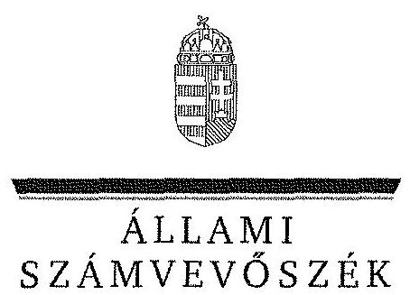

ÁLLAMI
SZÁMVEVŐSZÉK

# JELENTÉS 

az önkormányzatok többségi tulajdonában lévő gazdasági társaságok közfeladat-ellátásának ellenőrzéséről

Weöres Sándor Színház Nonprofit Kft.
(Szombathely)
14069
2014. április

---

# Állami Számvevőszék 

Iktatószám: V-0304-080/2014.
Témaszám: 1337
Vizsgálat-azonosító szám: V06530214
Az ellenőrzést felügyelte:
Makkai Mária
felügyeleti vezető
Az ellenőrzést vezette és az ellenőrzés végrehajtásáért felelős:
Klinga László
ellenőrzésvezető
A számvevőszéki jelentés összeállításában közreműködött:
Renner Andrea
számvevő
Az ellenőrzést végezték:

| Farkas László | Fekete Gábor | Renner Andrea |
| :-- | :-- | :-- |
| számvevő tanácsos | számvevő tanácsos | számvevő |

A témához kapcsolódó eddig készített számvevőszéki jelentések:
címe
sorszáma
Jelentés a színházak állami támogatásának és gazdálkodásának ellenőrzéséről 1039
Jelentés Szombathely Megyei Jogú Város Önkormányzata pénzügyi helyzetének ellenőrzéséről 1149

---

# TARTALOMJEGYZÉK 

BEVEZETÉS ..... 9
I. ÖSSZEGZŐ MEGÁLLAPÍTÁSOK, KÖVETKEZTETÉSEK, JAVASLATOK ..... 11
II. RÉSZLETES MEGÁLLAPÍTÁSOK ..... 18

1. Az Önkormányzat közfeladat-ellátásának megszervezése ..... 18
1.1. A közfeladat meghatározása, a feladatellátásának választott módja ..... 18
1.2. Az Önkormányzat tulajdonosi irányításának megítélése ..... 21
2. A Színház közfeladat-ellátással kapcsolatos tevékenysége ..... 23
2.1. A Színház szervezeti kialakítása, szabályozottsága ..... 23
2.2. A Színház vagyonnyilvántartása ..... 25
2.3. A gazdasági évek ráfordításainak és bevételeinek alakulása ..... 26
2.4. A Színház eredményének alakulása ..... 29
2.5. A Színház folyamatos üzemmenetének, likviditásának biztosítása ..... 31
3. Az Önkormányzat tulajdonosi jogainak és kötelezettségeinek érvényesítése ..... 32
3.1. A Színháztól származó információk hasznosítása ..... 32
3.2. Az Önkormányzat tulajdonosi intézkedései ..... 34
4. Az ÁSZ korábbi, a többségi tulajdonú gazdasági társaságok közfeladat-ellátását, gazdálkodását, pénzügyi helyzetét érintő javaslataira tett intézkedések ..... 35
4.1. Az Önkormányzat intézkedési terve és a javaslatok hasznosulása ..... 35

---

# MELLÉKLETEK 

1. számú A Színház szakmai tevékenységének mutatói 2008 és 2012 között
2. számú A Színház támogatása 2008 és 2012 között
3. számú A Színház vagyonának főbb adatai 2008. január 1-je és 2012. december 31-e között
4. számú Szombathely Megyei Jogú Város Polgármesterének észrevétele
5. számú Szombathely Megyei Jogú Város Polgármesterének észrevételére adott válasz
6. számú A Weöres Sándor Színház Nonprofit Kft. ügyvezető igazgatójának észrevétele
7. számú A Weöres Sándor Színház Nonprofit Kft. ügyvezető igazgatójának észrevételére adott válasz

---

# RÖVIDÍTÉSEK JEGYZÉKE 

## Törvények

ÁSZ tv.
Civil tv.

Emtv.

Gt. tv.
Htv.

Közhasznúsági tv.
Mötv.

Nvtv.

Ötv.

Számv. tv.
Taktv.
Tao. tv.
2010. évi költségvetési tv.

## Rendeletek

SZMSZ $_{1}$
az Állami Számvevőszékről szóló 2011. évi LXVI. törvény
az egyesülési jogról, a közhasznú jogállásról, valamint a civil szervezetek működéséről és támogatásáról szóló 2011. évi CLXXV. törvény (hatályos: 2012. január 1-jétől)
az előadó-művészeti szervezetek támogatásáról és sajátos foglalkoztatási szabályairól szóló 2008. évi XCIX. törvény
a gazdasági társaságokról szóló 2006. évi IV. törvény
a helyi önkormányzatok és szerveik, a köztársasági megbízottak, valamint egyes centrális alárendeltségű szervek feladat- és hatásköréről szóló 1991. évi XX. törvény
a közhasznú szervezetekről szóló 1997. évi CLVI. törvény (hatálytalan: 2012. január 1-jétől)
Magyarország helyi önkormányzatairól szóló 2011. évi CLXXXIX. törvény (hatályos: 2012. január 1-jétől, kivéve a 144. § (2) bekezdésben meghatározott paragrafusok, amelyek 2012. április 15-én, a (3) bekezdésben meghatározott paragrafusok, amelyek 2013. január 1-jén léptek hatályba, a (4) bekezdésben meghatározott paragrafusok a 2014. évi általános önkormányzati választások napján lépnek hatályba)
a nemzeti vagyonról szóló 2011. évi CXCVI. törvény (hatályos: 2011. december 31-étől, kivéve a 20. § (2) bekezdésben meghatározott paragrafusok, amelyek 2012. január 1-jétől, a (3) bekezdésben meghatározott paragrafusok 2013. január 1-jétől, a (4) bekezdésben meghatározott paragrafus 2012. március 2-ától léptek hatályba)
a helyi önkormányzatokról szóló 1990. évi LXV. törvény (hatálytalan: a 2014. évi általános önkormányzati választások napjától)
a számvitelről szóló 2000. évi C. törvény
a köztulajdonban álló gazdasági társaságok takarékosabb működéséről szóló 2009. évi CXXII. törvény
a társasági adóról és az osztalékadóról szóló 1996. évi LXXXI. törvény
A Magyar Köztársaság 2010. évi költségvetéséről szóló 2009. évi CXXX. törvény

Szombathely Megyei Jogú Város Önkormányzatának 27/2007. (XI. 29.) számú rendelete az Önkormányzat Szervezeti és Működési Szabályzatáról (hatályos: 2008. január 1-jétől)

---

| SZMSZ $_{2}$ | Szombathely Megyei Jogú Város Önkormányzatának 15/2011. (VI. 8.) számú rendelete az Önkormányzat Szervezeti és Működési Szabályzatáról (hatályos: 2009. augusztus 1-jétől) |
| :--: | :--: |
| vagyongazdálkodási rendelet | Szombathely Megyei Jogú Város Önkormányzatának 29/2004. (VI. 30.) számú rendelete a Szombathely Megyei Jogú Város Önkormányzatának vagyonáról, a vagyontárgyak feletti tulajdonosi jogok gyakorlásáról (hatályos: 2004. június 30-ától) |
| 7/2009. OKM rendelet | 7/2009. (III. 4.) OKM rendelet az előadó-művészeti szervezetek működésével kapcsolatos hatósági eljárások részletes szabályairól, továbbá a zenekarok és énekkarok tevékenységéhez szükséges tárgyi feltételekről, valamint a fizető nézőszám alsó határáról |
| 14/2012. NEFMI rendelet | a nemzeti erőforrás miniszter 14/2012. (III. 6.) NEFMI rendelete az előadó-művészeti szervezetek és az előadóművészeti érdekképviseleti szervezetek működésével kapcsolatos hatósági eljárások és adatszolgáltatások részletes szabályairól |
| 350/2011. Korm. rendelet | 350/2011. (XII. 30.) Korm. rendelet a civil szervezetek gazdálkodása, az adománygyűjtés és a közhasznúság egyes kérdéseiről |
| Szórövidítések |  |
| Alapító Okirat | a Weöres Sándor Színház Nonprofit Korlátolt Felelősségű Társaság Alapító Okirata |
| áfa | általános forgalmi adó |
| ÁsZ | Állami Számvevőszék |
| Bérleti szerződés | Szombathely Megyei Jogú Város Önkormányzata és a Weöres Sándor Színház között létrejött bérleti szerződés (A 44/2010. (I. 28.) számú határozatban jóváhagyott (hatályos: 2011. január 13-ától) |
| értékelési szabályzat | Weöres Sándor Színház Nonprofit Korlátolt Felelősségű Társaság eszközök és források értékelési szabályzata (hatályos: 2008. január 14-étől) |
| FB | a Weöres Sándor Színház Nonprofit Korlátolt Felelősségű Társaság Felügyelő Bizottsága |
| Fenntartói szerződés | Szombathely Megyei Jogú Város Önkormányzata és a Weöres Sándor Színház Nonprofit Korlátolt Felelősségű Társaság között létrejött fenntartói szerződés (hatályos: 2013. január 1-jétől) |
| Gazdasági bizottság | Szombathely Megyei Jogú Város Pénzügyi és Gazdasági Bizottsága, 2011. február 1-jétől Pénzügyi, Gazdasági és Jogi Bizottsága |
| HEMO | Helyőrségi Művelődési Otthon (a Weöres Sándor Színház által használt épület) |
| javadalmazási szabály$\mathrm{zat}_{1}$ | Javadalmazási Szabályzat (hatályos: 2008. január 1-jétől) |

---

javadalmazási szabály$\mathrm{zat}_{2}$
jegyző
kötelezettségvállalási szabályzat
közbeszerzési szabályzat

Közgyűlés
Közszolgáltatási szerződés
leltározási szabályzat

Mediawave
MMIK
munkaszerződés ${ }_{1}$
munkaszerződés ${ }_{2}$

OKM
Önkormányzat
pénzkezelési szabályzat ${ }_{1}$
pénzkezelési szabályzat ${ }_{2}$
pénzkezelési szabályzat ${ }_{3}$
polgármester
Polgármesteri Hivatal
selejtezési szabályzat

Javadalmazási Szabályzat (hatályos: 2010. május 1-jétől)
Szombathely Megyei Jogú Város Önkormányzatánál a 2008-2012. években a jegyzői feladatokat ellátók
Weöres Sándor Színház Nonprofit Korlátolt Felelősségű Társaság kötelezettségvállalási és utalványozási szabályzata (hatályos: 2008. augusztus 16-ától)
Weöres Sándor Színház Nonprofit Korlátolt Felelősségű Társaság közbeszerzési szabályzata (hatályos: 2008. november 27-étől)
Szombathely Megyei Jogú Város Önkormányzatának Közgyűlése
Szombathely Megyei Jogú Város Önkormányzata és a Weöres Sándor Színház Nonprofit Korlátolt Felelősségű Társaság között létrejött megállapodás színházi feladatok ellátására (hatályos 2008. január 11-étől)
14/2010. (X. 27.) számú Jegyzői Utasítás Szombathely Megyei Jogú Város Polgármesteri Hivatala, valamint a hozzá tartozó önállóan működő intézmények és kisebbségi önkormányzatok Leltározási Szabályzatáról
Nemzetközi Film és Zenei Fesztivál
Megyei Művelődési és Ifjúsági Központ
Weöres Sándor Színház Nonprofit Korlátolt Felelősségű Társaság ügyvezetőjének 2007. október 1-je és 2012. szeptember 30-a között érvényes munkaszerződése
Weöres Sándor Színház Nonprofit Korlátolt Felelősségű Társaság ügyvezetőjének 2012. október 1-je és 2017. szeptember 30-a között érvényes munkaszerződése
Oktatási és Kulturális Minisztérium
Szombathely Megyei Jogú Város Önkormányzata
Weöres Sándor Színház Nonprofit Korlátolt Felelősségű Társaság pénzkezelési szabályzata (hatálytalan: 2008. augusztus 5-étől)
Weöres Sándor Színház Nonprofit Korlátolt Felelősségű Társaság pénzkezelési szabályzata (hatálytalan: 2011. december 31-étől)
Weöres Sándor Színház Nonprofit Korlátolt Felelősségű Társaság pénzkezelési szabályzata (hatályos: 2012. január 31-étől)
Szombathely Megyei Jogú Város Önkormányzatának polgármestere
Szombathely Megyei Jogú Város Önkormányzatának Polgármesteri Hivatala
Weöres Sándor Színház Nonprofit Korlátolt Felelősségű Társaság selejtezési szabályzata (hatályos: 2008. január 14-étől)

---

| számviteli politika | Weöres Sándor Színház Nonprofit Korlátolt Felelősségű Társaság számviteli politikája (hatályos: 2008. szeptember 30-ától) |
| :--: | :--: |
| Színház | Weöres Sándor Színház Nonprofit Korlátolt Felelősségű Társaság |
| Színház leltározási szabályzata | Weöres Sándor Színház Nonprofit Korlátolt Felelősségű Társaság leltározási szabályzata (hatályos: 2008. január 14-étől) |
| Színház SZMSZ-e | Weöres Sándor Színház Nonprofit Korlátolt Felelősségű Társaság Szervezeti és Működési Szabályzata (hatályos: 2008. december 18-ától) |
| SZOVA | SZOVA Szombathelyi Vagyonhasznosító és Vagyongazdálkodási Zártkörűen Működő Részvénytársaság |
| ügyvezető | Weöres Sándor Színház Nonprofit Korlátolt Felelősségű Társaság ügyvezető igazgatója |
| versenyszabályzat | Weöres Sándor Színház Nonprofit Korlátolt Felelősségű Társaság Versenyszabályzata (hatályos: 2010. február 16-ától) |

---

# FOGALOMTÁR 

eredménytartalék
közfeladat
mérleg szerinti eredmény
tulajdonosi joggyakorló
üzemi eredmény

A saját tőke változó eleme, elsősorban a tárgyévet megelőző évek mérleg szerinti eredményének a halmozott összegét mutatja.
Jogszabályban meghatározott állami vagy önkormányzati feladat, amit az arra kötelezett közérdekből, jogszabályban meghatározott követelményeknek és feltételeknek megfelelve végez, ideértve a lakosság közszolgáltatásokkal való ellátását, továbbá az állam nemzetközi szerződésekben vállalt kötelezettségeiből adódó közérdekű feladatokat, valamint e feladatok ellátásához szükséges infrastruktúra biztosítását is (Nvtv. 3. § (1) bekezdés 7. pont).

A mérleg szerinti eredmény az osztalékra, részesedésre, a kamatozó részvények kamatára igénybe vett eredménytartalékkal növelt, a jóváhagyott osztalékkal, részesedéssel, a kamatozó részvények kamatával csökkentett tárgyévi adózott eredmény, egyezően az eredménykimutatásban ilyen címen kimutatott összeggel (Számv. tv. 39. § (2) bekezdés).
Aki a nemzeti vagyon felett az államot vagy a helyi önkormányzatot megillető tulajdonosi jogok és kötelezettségek összességének gyakorlására jogosult (Nvtv. 3. § (1) bekezdés 17. pont).
Az üzemi, üzleti tevékenység eredménye a társaság termelési és szolgáltatási eredményét jelenti, azt mutatja, hogy a fő és mellék tevékenységek mekkora eredményt hoztak.

---

.

---

# JELENTÉS 

## az önkormányzatok többségi tulajdonában lévő gazdasági társaságok közfeladat-ellátásának ellenőrzéséről Weöres Sándor Színház Nonprofit Kft. (Szombathely)

## BEVEZETÉS

Az Önkormányzat 2007-2010. évi gazdasági programja célul tűzte ki a városi színház megalapítását, a színház infrastrukturális és szervezeti feltételeinek megteremtését. A Közgyűlés 2007 októberében alkotó és előadó-művészeti alaptevékenység ellátására alapította a Színházat, az állandó társulat 2008 augusztusában alakult meg. Az Alapító Okirat előírása szerint a Színház célja, hogy Szombathelyen megszilárdítsa a színházi életet, állandó társulatot hozzon létre, valamint meghívott művészekkel magas színvonalú színházi működést valósítson meg. A Színház feladata, hogy céljai elérése érdekében közönségtoborzást végezzen, a lakosok minél szélesebb körének érdeklődésére számot tartó produkciókat szerepeltessen.

Az Önkormányzat a 460/2007. (IX. 27.) számú határozatával döntött a Színház alapításáról, az alapító okiratban meghatározott 15,0 millió Ft jegyzett tőkét pénzbeli betétként biztosította. A Színház az ellenőrzött időszakban az Önkormányzat 100%-os tulajdonában volt. A Színház főbb vállalkozási tevékenysége az ingatlan bérbeadás és üzemeltetés, valamint a hirdetés volt.

Az Önkormányzat a Színházzal a közfeladat ellátásának biztosítására 2008. január 11-én Közszolgáltatási szerződést, majd 2013. január 1-jei hatálybalépéssel Fenntartói megállapodást kötött. A Színház a közfeladat ellátása érdekében az ellenőrzött időszakban összesen 1579,2 millió Ft állami és önkormányzati működési, valamint 106,0 millió Ft fejlesztési támogatást kapott. Emellett a 2009-2012. évek között 152,8 millió Ft társasági adóból származó támogatást tudott igénybe venni.

A Színház a működését a HEMO épületében kezdte meg 2008-ban, amit az Önkormányzat a 2010. évben felújított. A 2011. évtől az Önkormányzat a Színházzal az épület használatra bérleti szerződést kötött. A Színház épületének felújítása során négy játszóhelyet, közösségi tereket, valamint modern hang-, fény- és színpadtechnikát alakítottak ki. A Színházban a 2012. évben 349 előadást tartottak, a fizető nézők
 száma meghaladta az 54 ezer főt (1. számú melléklet).

A Színház ügyvezetőjének személye az ellenőrzött időszakban nem változott.
Az ellenőrzés várható eredménye: a jelentés nyilvánossága a társadalom széles körével ismerteti meg a Színház gazdálkodására vonatkozó megállapítá-

---

sainkat, továbbá a megállapítások alapján megfogalmazott számvevőszéki javaslatok hasznosítása elősegíti a feltárt hibák megszüntetését, az ellenőrzött szervezet jobb feladatellátását. A társadalom számára jelzi, hogy közpénz nem maradhat ellenőrizhetetlenül, az ÁSZ értékteremtő rend kialakításához és megőrzéséhez hozzájáruló tevékenysége pozitív hatással lesz a szervezetről kialakított összkép formálásában. A szervezeten belül lehetőség nyílik arra, hogy a megállapítások szintetizálásával az ÁSZ a hozzáadott értéket teremtő, elemző tevékenységét és tanácsadó szerepét is erősítse. A jó gyakorlatok bemutatásával az ÁSZ hozzájárul a követendő megoldások megismertetéséhez, terjesztéséhez.

# Az ellenőrzés célja annak értékelése volt, hogy 

- az Önkormányzat a jogszabályi előírások figyelembevételével döntött-e az ellenőrzésre kerülő közfeladat megszervezéséről, az ellátás módjáról, a tulajdonostól elvárható gondossággal felügyelte-e a társaság feladatellátását, a gazdasági társaság rendelkezésére bocsátotta-e a közfeladat ellátásához a szükséges közvagyont, és biztosította-e a tulajdonosi jogok érvényesülését, a társaság vagyonvesztése esetén intézkedett-e a további vagyonvesztés megakadályozásáról;
- a Színház teljesítette-e a tulajdonos önkormányzat részéről meghatározott célokat és feladatokat a rendelkezésre álló erőforrások felhasználásával, végrehajtotta-e a közfeladat-ellátási szerződés előírásait, betartotta-e a vagyonnal történő gazdálkodásra vonatkozó jogszabályi rendelkezéseket.

Az ellenőrzés hatóköre: az önkormányzatok közfeladat-ellátásának ellenőrzése, amely kiterjed az önkormányzatok és a közfeladatot ellátó, az önkormányzat többségi tulajdonában lévő gazdasági társaságok közötti feladatmegosztásra, az önkormányzatok tulajdonosi jogainak gyakorlására, a nemzeti vagyon kezelésének ellenőrzése keretében a közfeladat-ellátáshoz rendelt vagyonra és a vagyont érintő szerződésekre. A jelen ellenőrzés kiterjed az önkormányzatok többségi tulajdonában lévő gazdasági társaságok közfeladatellátására, vagyongazdálkodási tevékenységére, a kapcsolódó nyilvántartások, elszámolások szabályszerűségére és megbízhatóságára. Az ellenőrzött tételek kiválasztása véletlen mintavétellel történt.

Az ellenőrzés típusa: szabályszerűségi ellenőrzés
Az ellenőrzött időszak: A 2008-2012. évek, valamint a helyszíni ellenőrzés befejezéséig - 2013. november 5-éig - bekövetkezett változások figyelemmel kísérése.

Ellenőrzött szervezet: Weöres Sándor Színház Nonprofit Kft., valamint Szombathely Megyei Jogú Város Önkormányzata

Az ellenőrzés végrehajtásának jogszabályi alapját az ÁSZ tv. 5. § (3)-(5) bekezdéseiben foglaltak képezik.

Az ÁSZ a 2011. évi LXVI. törvény 29. §-a szerint a jelentéstervezetet megküldte Szombathely Megyei Jogú Város polgármesterének és a Weöres Sándor Színház Nonprofit Kft. ügyvezető igazgatójának egyeztetésre. A beérkezett észrevételeket és az azokra adott választ a jelentés 4-7. számú mellékletei tartalmazzák.

---

# I. ÖSSZEGZŐ MEGÁLLAPÍTÁSOK, KÖVETKEZTETÉSEK, JAVASLATOK 

Szombathely Megyei Jogú Város Önkormányzatának Közgyűlése (Közgyűlés) az SZMSZ ${ }_{1,2}$-ben - az Ötv. és a Htv. szabályaival összhangban - a művészeti tevékenység támogatását az Önkormányzat feladataként előírta.

A Közgyűlés a 2008-2012. években a közfeladat megszervezéséről, az ellátás módjáról az Alapító Okirattal összhangban lévő, határozatlan időre szóló, a Színházzal kötött Közszolgáltatási szerződésben gondoskodott. A Közszolgáltatási szerződés tartalmazta a közfeladat tartalmát, ellátásának módját, ellátási területét, a Színház és az Önkormányzat kötelezettségeit, a támogatás mértékét, finanszírozásának ütemezését, a szerződés felmondásának szabályait, azonban nem tartalmazta a közfeladat ellátásának mértékét. Az Önkormányzat 2013. január 1-jétől a feladat-ellátás mértékét és teljesítménymutatóit tartalmazó Fenntartói szerződést kötött három év határozott időre a Színházzal a Közszolgáltatási szerződés hatályban maradása mellett. A Közszolgáltatási szerződés és a Fenntartói szerződés nincs összhangban egymással. A két szerződés a támogatás mértékét nem egységesen határozta meg, mivel a Közszolgáltatási szerződésben előírt fenntartói támogatási összeg az üzleti tervben tervezett összes bevételhez viszonyított aránya és a Fenntartói szerződés szerinti, a Színház működtetéséhez szükséges források aránya nem egyezik meg.

Az Önkormányzat a közfeladat ellátásához szükséges közvagyont a Színház rendelkezésére bocsátotta. A Közgyűlés a Színház megalapításakor az Alapító Okiratban meghatározott 15,0 millió Ft alaptőkét pénzbeli hozzájárulásként biztosította a Színháznak. Az Önkormányzatnak a vagyonvesztés megelőzése, az esetleges veszteség megszüntetése érdekében, a gazdasági társaság lejárt kötelezettségeinek kiegyenlítése és a csődveszély elkerülése érdekében az ellenőrzött időszakban intézkedési kötelezettsége nem volt.

A Közgyűlés az Önkormányzat tulajdonában lévő HEMO épületet 2008. augusztus 25. napjától a Színház kezelésébe adta. Az épületet a 2010. évben az Önkormányzat 1,9 milliárd Ft állami támogatásból felújította. A Színház a HEMO felújításának időtartama alatt bérleti jogviszony keretében az MMIK-ban működött. Az Önkormányzat az MMIK-nak fizetett bérleti díjat a Színháznak megtérítette. A felújítást követően - 2011. január 13-án - az Önkormányzat a HEMO épületét az épülettartozékokkal együtt a Színháznak bérbe adta. Az Önkormányzat időszakosan a közfeladat ellátása érdekében további ingatlanokat adott a Színház ingyenes használatába.

A bérleti szerződésben meghatározott leltározási rend nem volt összhangban az Önkormányzat leltározási szabályzatában foglaltakkal. A leltározási szabályzatban foglaltak szerint minden év végén a Polgármesteri Hivatal küldi ki a Színháznak a kezelésre, használatra adott eszközök analitikus nyilvántartását leltározás céljából, a bérleti szerződés rendelkezése alapján azonban a Színház elkészíti a leltáríveket, a leltár kiértékelését és azokat megküldi a Polgármesteri Hivatalnak. A 2012. év végén tételes eszközleltár nem készült, mivel a Színház

---

a bérleti szerződés előírása ellenére a kezelésében lévő tárgyi eszközökről leltáríveket az Önkormányzatnak nem küldött, valamint az Önkormányzat a leltározási szabályzat rendelkezése ellenére az eszközökről készült analitikus nyilvántartást a Színháznak egyeztetésre nem küldte meg.

Az Önkormányzat a Színháznak a 2008-2012. években összesen 1579,2 millió Ft működési támogatást folyósított, amely tartalmazta a 786,5 millió Ft központi költségvetési támogatást. A Színház az éves és féléves beszámolóiban a támogatás felhasználásáról a Közszolgáltatási szerződésben foglaltaknak megfelelően beszámolt. Az Önkormányzat az ellenőrzött időszakban összesen 106,0 millió Ft felhalmozási támogatást biztosított a Színháznak épület felújításra, valamint hang- és fénytechnikai eszközök beszerzésére.

Az Önkormányzat a gazdasági társaságok feletti tulajdonosi jogok gyakorlásának szabályait a vagyongazdálkodási rendeletben határozta meg. A Közgyűlés a tulajdonosi jogait az ellenőrzött időszakban a vagyongazdálkodási rendeletben foglaltaknak megfelelően gyakorolta. A vagyongazdálkodási rendeletben megjelölt esetekben a tulajdonosi jogok gyakorlására a polgármester volt jogosult. A 2008-2012. években a polgármester a vagyongazdálkodási rendeletben foglalt felhatalmazás ellenére a Színházra vonatkozó döntést nem hozott, az Önkormányzatnál döntésnek a Gazdasági bizottság határozatát tekintették. Az Önkormányzat a Színház Alapító Okiratában a Gt. tv. rendelkezéseivel és a vagyonrendelettel összhangban meghatározta a társaság legfőbb szerve hatáskörébe tartozó ügyeket, az ügyvezető és az FB feladatait.

A Színház - a Számv. tv. rendelkezései alapján - az önköltségszámítás rendjére vonatkozó szabályzat készítésére nem volt kötelezett. A Színház a nettó jegyárak és a színházi bérlet árak megállapításához produkciónként árkalkulációt nem készített, azt az éves kiadások, valamint a fizetőképes kereslet figyelembe vételével határozta meg.

Az Önkormányzat az ellenőrzött időszakban javadalmazási szabályzattal rendelkezett ${ }_{1, x}$, amelyben meghatározta a gazdasági társaságai vezetőinek és FB tagjainak díjazására, premizálására, javadalmazásának egyéb elemeire vonatkozó előírásokat. A Színház ügyvezetőjének a 2008-2012. években prémium célokat nem tűztek ki és prémiumban nem részesült.

A Színháznál a vagyonnal történő gazdálkodás kereteit, a felelősöket, értékhatárokat és eljárási szabályokat az Alapító Okiratban, a Színház SZMSZ-ében, a számviteli politikában, a leltározási, az értékelési és a selejtezési szabályzatban meghatározták. A Színház leltározási szabályzatának öt évenkénti leltározási kötelezettségre vonatkozó előírása ellentétes volt a Számv. tv. 2012. január 1-jétől hatályos, három éves leltározási kötelezettséget tartalmazó rendelkezésével. A Színház a tárgyi eszközökről a mennyiségi leltárfelvételt a 2009. és a 2012. években elkészítette, azonban a 2009. évi leltárt nem értékelték ki. A Színház értékelési szabályzata nem tartalmazta a vevő és adós minősítésének, az értékvesztés elszámolásának, a behajthatatlan követelés leírásának részletszabályait, azonban a 2011. évben a követelések után 0,8 millió Ft értékvesztést számoltak el, amelyből 2012-ben 0,1 millió Ft-ot visszaírtak, továbbá 2010-ben és 2012-ben összesen 124,6 ezer Ft összegben behajthatatlan követelést írtak le. A Színháznál a gazdasági események elszámolásának szabályozottságát a

---

számviteli politika, a számlarend, az eszközök értékelési, a kötelezettségvállalási és a pénzkezelési szabályzat biztosította. A Színház a szabályzatait a 2008. évben készítette el és helyezte hatályba, azokat a Számv. tv. rendelkezései ellenére - a pénzkezelési szabályzat, kivételével - nem aktualizálta, ezért például az értékelési szabályzatban a 2012. évtől a bekerülési érték meghatározása nem felelt meg a Számv. tv. előírásainak. A számviteli politikában a Színház székhelyének megjelölését az Alapító Okirat változásával együtt nem módosították.

A Színház a saját tulajdonú vagyonát, annak értékét és változásait a számlarendben foglaltak alapján tartotta nyilván. A Színház eszközállománya a 2008. év elejéről 18,3 millió Ft-ról a 2010. évre 165,7 millió Ft-ra emelkedett, 2010-ről 2012-re 121,2 millió Ft-ra csökkent. A 2010-ig tartó növekedést a tárgyi eszközök értékének 141,0 millió Ft-os, az épület felújításából, a hang- és fénytechnikai eszközök, valamint a díszletek és egyéb eszközök beszerzéséből származó emelkedése eredményezte. A 2011-2012. évi csökkenést a díszletek összesen 38,4 millió Ft értékben történő selejtezése, illetve a terven felüli értékcsökkenés elszámolása okozta.

A Színház a díszleteket, jelmezeket a tárgyi eszközök között tartotta nyilván. A Színháznál egy előadás díszletét a 2010. évben 1,0 millió Ft + áfa összegért értékesítették, a 2011. évben a már nem játszott produkciók díszleteit 13,1 millió Ft értékben leselejtezték és szétbontották. A 2012. évben 25,3 millió Ft terven felüli értékcsökkenést számoltak el a továbbiakban rendeltetésszerűen nem használható, a műsorról lekerült előadások díszletei esetében. Ezek közül azokat a díszletelemeket, amelyeket változatlan formában, a jövőben hasznosíthatónak ítéltek 1,3 millió Ft értéken, a többi eszközt érték nélkül a tárgyi eszközök között a továbbiakban is nyilvántartották.

A Színház összes bevétele a 2008. évben 157,5 millió Ft volt, a 2009. évi 498,8 millió Ft-ról a 2011. évre 601,4 millió Ft-ra, 20,5%-kal növekedett, 2012-re 563,6 millió Ft-ra, az előző évhez képest 6,3%-kal csökkent. Az ellenőrzött időszakban a bevételek 80,3%-a támogatásokból, 17,8%-a az értékesítés nettó árbevételéből, 1,9%-a a pénzügyi műveletek bevételeiből és egyéb bevételekből származott, ezért a támogatások nagysága jelentős hatást gyakorolt az eredmény alakulására.

A Színház összes ráfordítása a 2008. évben 157,6 millió Ft volt, 2009-ről 2011-re 496,4 millió Ft-ról 591,7 millió Ft-ra 19,2%-kal emelkedett, majd 2012-re 557,7 millió Ft-ra mérséklődött. A ráfordítások összege a bemutatott saját színdarabok száma és azok költségének nagysága szerint változott. Az ellenőrzött időszakban a ráfordítások 53,4%-át a személyi juttatások, 33,2%-át az anyagjellegű ráfordítások, 9,6%-át az értékcsökkenési leírás, 3,8%-át az egyéb ráfordítások alkották.

A személyi jellegű ráfordítások összege a 2008. évben 102,2 millió Ft volt, a 2009. évtől a 2011. évre a költségmegtakarítási intézkedések hatására 302,0 millió Ft-ról 269,2 millió Ft-ra 10,9%-kal csökkent, a 2012. évre 273,8 millió Ft-ra 1,7%-kal emelkedett, az átlagos állományi létszám 65 főről 68 főre történő növekedése mellett. A Színháznál jutalmat, illetve prémiumot az ellenőrzött időszakban nem fizettek.

---

A Színház a 2010. évtől a likviditási helyzet javítása érdekében költségcsökkentő intézkedéseket hajtott végre. A Színházban 2010 júliusától kezdődően a
 foglalkoztatottak számát csökkentették, az egyik raktár bérletét felmondták, a bankköltségeket visszaszorították. A 2011. évben a villamos energia költségeket csökkentették, az étkezési utalványt megszüntették, februáritól a béreket 5,0%-kal csökkentették, a lakhatási támogatás kivezetését megkezdték. A 2012. évben egy fő munkakörét megszüntették. A 2013. évtől az asztali vonalas telefonok kimenő hívásait letiltották, továbbá a bankkártya használat és a jegyeladási rendszer tranzakciós díját csökkentették. A Színház a bevételeit - a felújított épület adottságait kihasználva - terembérleti díj és reklámbevételekkel, széksorok értékesítésével, technikai eszközök bérbeadásával növelte. A költségcsökkentő és bevételnövelő intézkedések hatására a Színház likviditási helyzete javult, valamint a 2010. évi veszteséges működés a 2011. évre nyereségesre változott.

A Színház üzemi eredménye a 2008. évben 2,4 millió Ft, a 2010. évben 3,5 millió Ft veszteség, a 2009. évben 1,7 millió Ft, a 2011. évben 9,6 millió Ft és a 2012. évben 5,7 millió Ft nyereség volt. Az eredmény alakulását befolyásolta, hogy a Színház a 2008. év második felében kezdte meg tevékenységét, valamint a 2010. évben az épület felújítása miatt az MMIK-ban működött.

A Színház a ráfordítások közhasznú és vállalkozási tevékenységek közötti elkülönítésének szabályait nem határozta meg. A Színház - az Alapító Okiratban foglaltak ellenére - a közvetett költségeket a közhasznú tevékenységek közvetlen költségei között tartotta nyilván. Az utólag analitikusan kigyűjtött közvetett költségeket bevételarányosan osztották fel a közhasznú és a vállalkozási tevékenységek között. A Színház vállalkozási tevékenységének eredménye az ellenőrzött időszak minden évében pozitív volt és meghaladta az üzemi eredményt. A vállalkozási tevékenység eredménye biztosította a 2009., 2011-2012. években a Színház nyereséges gazdálkodását.

A Színház a 2010. évtől havi bontásban készített az üzleti tervre alapozott likviditási tervet, amelyet havonta felülvizsgált. A likviditási helyzet a 2010. évben volt a legrosszabb, a mutató értéke 29,6% volt, azonban a takarékossági és bevételnövelő intézkedések hatására a 2012. évre elérte a 64,0%-ot. A Színház az ellenőrzött időszakban hitelt nem vett fel.

A Színház az ellenőrzött időszak minden évében elkészítette üzleti terveit. A polgármester a vagyongazdálkodási rendelet előírása ellenére a Színház üzleti tervének elfogadásáról nem döntött, ezért a Színház jóváhagyott üzleti tervvel a 2008-2012. években nem rendelkezett.

A Közszolgáltatási szerződés előírásának megfelelve a Színház az ellenőrzött időszakban a féléves és éves szakmai és számviteli beszámolókat elkészítette. A Színház a beszámolók alapján az Önkormányzat által meghatározott közszolgáltatási feladatait teljesítette. A 2008-2012. években a Színház éves számviteli beszámolóit, a könyvvizsgálói jelentéseket, a szakmai beszámolókat és a közhasznúsági jelentéseket a vagyongazdálkodási rendelet előírásainak megfelelően a Közgyűlés elfogadta. A 2008-2012. években a féléves beszámoló elfogadásáról a vagyongazdálkodási rendeletben foglaltak ellenére a Gazdasági bizottság állásfoglalását követően a polgármester nem döntött. A Színház

---

2008. évi közhasznúsági jelentése nem felelt meg a Közhasznúsági tv.-ben foglaltaknak, mivel nem tartalmazta a közhasznú szervezet vezető tisztségviselőinek nyújtott juttatások összegét, valamint a közhasznú tevékenységről szóló rövid tartalmi beszámolót. A Színház a 2012. évben a Civil tv. rendelkezései ellenére közhasznúsági jelentést készített, amely tartalmában és szerkezetében nem felelt meg a 350/2011. Korm. rendeletben közzétett, kötelezően alkalmazandó közhasznúsági mellékletnek. A Színház a számviteli politikában üzleti jelentés készítésének kötelezettségét írta elő, azonban azokat az ellenőrzött időszakban nem készítette el.

A Színház az előadó-művészeti szervezetekről vezetett nyilvántartásba vételhez az adatokat az Önkormányzat rendelkezésére bocsátotta, ennek alapján az Önkormányzat az Emtv.-ben meghatározott adatszolgáltatási kötelezettségének eleget tett. A 14/2012. NEFMI rendeletben előírt, a központi költségvetésből folyósított támogatás mértékének megállapításához szükséges adatszolgáltatást a Színház az Önkormányzatnak határidőben elküldte. A Tao. tv.-ben meghatározott adókedvezményre jogosító támogatási igazolás kiadásához a 14/2012. NEFMI rendelet szerinti adatszolgáltatási kötelezettségének a Színház eleget tett.

A munkaszerződés$_{2}$-ben előírt beszámolási kötelezettségét a Színház elektronikus formában teljesítette, azonban a munkaszerződés$_{2}$-ben foglalt rendelkezés ellenére egy nyomtatott példányban a Kulturális és Sport Irodának nem küldte meg.

Az Önkormányzat az Ötv.-ben biztosított lehetősége ellenére a Színház gazdálkodására, vagyoni helyzetére, a közfeladatok ellátására vonatkozóan belső ellenőrzést a 2008-2012. években nem végzett. Az Önkormányzat a támogatás felhasználását annak ellenére nem ellenőrizte, hogy arra a Közszolgáltatási szerződésben foglaltak lehetőséget adtak. Az FB 2012 decemberében szúrópróbaszerűen, személyes ellenőrzés keretében ellenőrizte a Színház leltárát, amely során szabálytalanságot nem tárt fel.

Az ÁSZ a 2011. évben a „Szombathely Megyei Jogú Város Önkormányzata pénzügyi helyzetének ellenőrzéséről" készült számvevőszéki jelentésben a többségi tulajdonú gazdasági társaságokra vonatkozóan a polgármesternek két célszerűségi javaslatot fogalmazott meg. Az Önkormányzat a javaslatok realizálása érdekében - a felelősöket és határidőket tartalmazó - intézkedési tervet készített, és az abban foglaltakat végrehajtotta.

Az Állami Számvevőszékről szóló 2011. évi LXVI. törvény 33. § (1) bekezdésében foglaltak értelmében a jelentésben foglalt megállapításokhoz kapcsolódó intézkedési tervet köteles az ellenőrzött szervezet vezetője összeállítani, és azt a jelentés kézhezvételétől számított 30 napon belül az ÁSZ részére megküldeni. Amennyiben az intézkedési tervet határidőben nem küldi meg a szervezet, vagy az nem elfogadható, az ÁSZ elnöke a hivatkozott törvény 33. § (3) bekezdés a)-b) pontjaiban foglaltakat érvényesítheti.

---

Az ellenőrzés intézkedést igénylő megállapításai és javaslatai:

# a polgármesternek 

1. A 2008-2012. években a polgármester a vagyongazdálkodási rendelet 26. § (2) bekezdésében foglalt felhatalmazás ellenére nem döntött a 2008-2012. években a féléves beszámoló, továbbá az üzleti terv elfogadásáról. Ennek következtében a Színház nem rendelkezett elfogadott féléves beszámolóval és jóváhagyott üzleti tervvel.

Javaslat:
Tegyen eleget a vagyongazdálkodási rendelet 26. § (2) bekezdésében foglalt felhatalmazás alapján döntési kötelezettségének, annak érdekében, hogy a Színház rendelkezzen jóváhagyott üzleti jelentéssel és elfogadott féléves beszámolóval.
2. A 2012. év végén tételes eszközleltár nem készült, mivel a Színház a bérleti szerződés 6.3.3. pontjában foglalt előírás ellenére a kezelésében lévő tárgyi eszközökről leltáríveket az Önkormányzatnak nem küldött.

Javaslat:
Követelje meg a Színháztól az Önkormányzat az éves beszámolója alátámasztottsága érdekében a bérleti szerződésnek megfelelő év végi leltár elkészítését, és annak az Önkormányzat részére való megküldését.

## a Színház ügyvezetőjének

1. A Színház leltározási szabályzata 6. b) pontjában foglalt öt évenkénti leltározási kötelezettségre vonatkozó előírás a 2012. évtől ellentétes volt a Számv. tv. 69. § (3) bekezdése 2012. január 1-jétől hatályos rendelkezésével, amely szerint a tárgyi eszközöket legalább háromévente mennyiségi felvétellel kell leltározni.

Javaslat:
Intézkedjen a Színház leltározási szabályzatának módosítására, hogy az a Számv. tv. 69. § (3) bekezdésével összhangban háromévenkénti leltározási kötelezettséget írjon elő.
2. A Színház az Alapító Okirat 4.10. pontjában foglaltak ellenére az összes közvetett költségét a közhasznú tevékenységek közvetlen költségei között tartotta nyilván. Az utólag analitikusan kigyűjtött közvetett költségeket bevételarányosan osztották fel a közhasznú és a vállalkozási tevékenységek között.

Javaslat:
Intézkedjen arról, hogy a Színház a kiadásait az Alapító Okirat 4.10. pontjában foglalt előírásoknak megfelelően elkülönítetten tartsa nyilván.
3. A Színház a számviteli politikában üzleti jelentés készítésének kötelezettségét írta elő, azonban azokat az ellenőrzött időszakban nem készítette el.

---

Javaslat:
Intézkedjen a számviteli politika előírásának megfelelően az éves üzleti jelentések elkészítéséről.
4. A Színház a szabályzatait a 2008. évben készítette el és helyezte hatályba, azokat - a pénzkezelési szabályzat, kivételével - a Számv. tv. 14. § (11) bekezdése ellenére nem aktualizálta, ezért például az értékelési szabályzatban a bekerülési érték meghatározása a 2012. évtől nem felelt meg a Számv. tv. 47. § (4) bekezdés e) pontjában foglaltaknak. A számviteli politikában a Színház székhelyének megjelölését az Alapító Okirat változásával együtt nem módosították.

Javaslat:
Intézkedjen a szabályzatainak aktualizálásáról, annak érdekében, hogy azok megfeleljenek a Számv. tv. vonatkozó előírásainak.
5. A Színház a 2012. évben a Civil tv. 46. § (1) bekezdésének rendelkezése ellenére nem közhasznúsági mellékletet, hanem közhasznúsági jelentést készített, amely tartalmában és szerkezetében nem felelt meg a 350/2011. Korm. rendelet 1. számú mellékletében közzétett, kötelezően alkalmazandó közhasznúsági mellékletnek.

Javaslat:
Intézkedjen annak érdekében, hogy a Színház éves beszámolóinak elkészítésével egyidejűleg a Civil tv. 46. § (1) bekezdésében előírt közhasznúsági melléklet készítési kötelezettségét teljesítse.

---

# II. RÉSZLETES MEGÁLLAPÍTÁSOK 

## 1. Az ÖNKORMÁNYZAT KÖZFELADAT-ELLÁTÁSÁNAK MEGSZERVEZÉSE

### 1.1. A közfeladat meghatározása, a feladatellátásának választott módja

A Közgyűlés a művészeti tevékenység támogatását az Ötv. 8. § (1)-(2) bekezdése$^{1}$ és a Htv. 121. § b) pontja alapján az Önkormányzat önként vállalt az SZMSZ$_{1,2}$-ben előírta.

Az Önkormányzat 2007-2010. évi gazdasági programja$^{2}$ célul tűzte ki a városi színház megalapítását, az infrastrukturális és szervezeti feltételek megteremtését. A kitűzött célokat megvalósították, a Közgyűlés a 2007. évben - a társasági forma kiválasztására készített előzetes elemzés alapján nonprofit kft.-ként megalapította a Színházat. Az Önkormányzat a Színház működéséhez épületet biztosított, amelyet a 2010. évben felújítottak.

A 2011. évi társadalmi-gazdasági programban$^{3}$ a Színház környékének rendezését, továbbá - Szombathely Oberwart kulturális-oktatási-tudományos központjává válása érdekében - egy részben német nyelvű, részben nyelv-független bérletsorozat összeállítását tervezték. A Színház környékének rendezése megtörtént, a német nyelvű, illetve részben nyelvfüggetlen színházi bérletsorozat összeállításáról tárgyalások folytak, azonban megvalósítására a helyszíni ellenőrzés végéig nem került sor.

A Közgyűlés a 2008-2012. években a közfeladat ellátásáról az Alapító Okirattal összhangban lévő, határozatlan időre szóló Közszolgáltatási szerződésben gondoskodott. A Közszolgáltatási szerződés tartalmazta a közfeladat tartalmát, ellátásának módját, ellátási területét, a Színház és az Önkormányzat kötelezettségeit, a támogatás mértékét, finanszírozásának ütemezését és a szerződés felmondásának szabályait, azonban nem tartalmazta a közfeladat ellátásának mértékét.

Az Önkormányzat a feladat-ellátási szerződésben fő feladatként kulturális, ezen belül alkotó és előadó-művészeti tevékenység végzését határozta meg. A Színház feladata a színházi élet kialakítása, széles körben hozzáférhetővé tétele Szombathelyen és Vas megyében, valamint a felnövekvő generációk körében a színházművészet vonzóvá és elérhetővé tétele. Fő tevékenységének ellátása mellett további feladata volt, hogy a város egyik szellemi központjává váljon.

[^0]
[^0]:    $^{1}$ 2013. január 1-jétől az Mötv. 13. § (1) bekezdése tartalmazza
    $^{2}$ Szombathely Megyei Jogú Város gazdasági programja 2007-2010.
    $^{3}$ Szombathely a XXI. század második évtizedében - Szombathely Megyei Jogú Város Társadalmi-Gazdasági Programja 2011.

---

A Közszolgáltatási szerződés jogosultságot biztosított az Önkormányzatnak a támogatás felhasználásának ellenőrzésére, a nem cél szerinti felhasználás esetére a támogatás elvonásának szankcióját határozta meg. A Közszolgáltatási szerződést a 2008-2012. években hat alkalommal módosították, ötször a támogatás éves összegének meghatározása, egyszer a szerződés megszűnésének szabályainak változása miatt.

Az Önkormányzat 2013. január 1-jétől a feladat-ellátás mértékét és teljesítménymutatóit tartalmazó Fenntartói szerződést kötött három év határozott időre a Színházzal a Közszolgáltatási szerződés hatályban maradása mellett.

#### Abstract

A Fenntartói szerződésben foglaltak szerint a Színház kötelezettsége, hogy évadonként legalább hét új bemutatót, a gyermekközönség számára legfeljebb két új bemutatót tart, amelyek 90%-a saját tőkével megrendezett előadás, ezen belül legalább 25 darab az élő zenekarral, énekkarral teljesített előadások száma, és legalább 75
 darab a stúdió előadások száma. A Színház további kötelezettsége, hogy előadásai lehetőség szerint teltházzal működjenek, a nézőtéri befogadó képességhez képest a fizető-nézőszám a 70%-ot, az összes nézőszám évadonként a 42 ezer főt, a fizető nézőszám a 40 ezer főt elérje, valamint a kiemelt minőségű besorolást megkapja.

A Közszolgáltatási szerződés VI. számú módosításának 4. pontja nincs összhangban a Fenntartói szerződés 5.2. pontjával, amely szerint a 2013. évben a Színház működtetéséhez szükséges források 34,0%-át az Önkormányzat, 31,6%-át a központi költségvetés biztosítja. A Színház módosított üzleti terve szerint a 2013. évi bevétel 531,7 millió Ft, a Közszolgáltatási szerződés 4. pontja és az Önkormányzat 2013. évi költségvetési rendelete szerint a fenntartói támogatás 165,0 millió Ft (31,0%), a központi költségvetéstől kapott támogatás 198,6 millió Ft (37,3%).

Az Önkormányzat a közfeladat ellátásához szükséges közvagyont a Színház rendelkezésére bocsátotta. A Közgyűlés a Színház megalakításakor az Alapító Okiratban meghatározott 15,0 millió Ft alaptőkét pénzbeli betétként biztosította a Színháznak. A határozatlan időre kötött Közszolgáltatási szerződésben az Önkormányzat kötelezettséget vállalt arra, hogy a Színház folyamatos működésének feltételeit biztosítja, a HEMO épület bérleti díját, valamint működéshez szükséges támogatást a Színház rendelkezésére bocsátja.

A Közgyűlés a 463/2008. (XI. 27.) számú határozatával az Önkormányzat tulajdonában lévő - és addig a SZOVA kezelésében álló - HEMO épületet visszamenőleges hatállyal, 2008. augusztus 25. napjától a Színház kezelésébe adta. Az épület kezelésbe adására vonatkozó megbízás nem tartalmazta a kezelésbe adó és a kezelő jogait és kötelezettségeit, nem rendelkezett a vagyonvédelem és a leltározás szabályairól.

A Színház kezelésében lévő HEMO épületet a 2010. évben az Önkormányzat 1,9 milliárd Ft állami támogatásból felújította. A Színház a 2010. évben, a HEMO felújításának időtartama alatt bérleti jogviszony keretében az MMIK-ban működött. Az Önkormányzat az MMIK-nak fizetett bérleti díjat a Színháznak megtérítette.

---

A felújítást követően - 2011. január 13-án - az Önkormányzat a HEMO épületét a Színháznak bérbe adta. A bérleti szerződés tartalmazta a bérlő jogait és kötelezettségeit, a felújításra, átalakításra vonatkozó egyeztetési kötelezettségét, a vagyon biztosításának szabályait, a leltározás és adatszolgáltatás rendjét. Az Önkormányzat a szerződésben - előzetes értékbecslés alapján - havi 3,0 millió Ft + áfa bérleti díjat határozott meg. Az Önkormányzat az épülettel együtt épülettartozékokat és tárgyi eszközöket is a Színház kezelésébe adott.

A kezelésbe adott tárgyi eszközök között az öltözők bútorzata, a hangtechnikához, a világításhoz és a színpadgépészethez tartozó gépek, berendezések, felszerelések, valamint az ügyviteli eszközök voltak.

Az Önkormányzat a közfeladat ellátása érdekében további - önkormányzati tulajdonban lévő és a SZOVA vagyonkezelésében, üzemeltetésében álló - ingatlanokat adott a Színház ingyenes használatába. Az ingyenes használatba adásból származó áfa fizetési kötelezettség a Színházat terhelte, a szerződés tartalmazta a bérbe adással történő hasznosítás során alkalmazott, az áfa fizetés alapjául szolgáló bérleti díjat.

A Fő tér 40. szám alatt található ingatlant 2008. augusztus 1-jétől 2008. december 31-éig, valamint 2010. február 1-jétől 2010. december 31-éig - az épület felújítása alatt - próbák és előadások megtartására használta a Színház.

A Király utca 11. fsz. 3. szám alatti ingatlant a Színház 2008. július 1-jétől évente hosszabbítva a szerződést - 2013. december 31-éig jegyirodaként használja.

A Fő tér 23-2. szám alatti ingatlant a Színház 2008. február 15-étől 2008. december 31-éig irodaként használta.

A Kisfaludy S. utca 1. szám alatt található ingatlant a Színház - a 2008. június 3-án kelt szerződés szerint - raktározási célra 2008. december 31-éig használhatta.

Az Önkormányzat a használatba, kezelésbe adott eszközök leltározásának rendjét a leltározási szabályzatban írta elő. A bérleti szerződésben meghatározott leltározási rend nem volt összhangban a leltározási szabályzatban foglaltakkal. A leltározási szabályzat VIII. fejezet A) rész IV. pontja szerint minden év végén a Polgármesteri Hivatal küldi ki a Színháznak a kezelésre, használatra adott eszközök analitikus nyilvántartását leltározás céljából, a bérleti szerződés 6.3.3. pontjában foglaltak alapján azonban a Színház elkészíti a leltáríveket, a leltár kiértékelését és azokat megküldi a Polgármesteri Hivatalnak.

A Színház a 2008-2012. években negyedévente eszközfajtánként adatot szolgáltatott az Önkormányzatnak a kezelésében lévő eszközök bruttó nyilvántartási értékéről, negyedéves értékcsökkenéséről és nettó értékéről. Az Önkormányzat az adatokat a főkönyvi nyilvántartással egyeztette.

A Színház a 2011. évben a bérleti szerződés szerint a kezelésébe vett eszközökről tételes leltárt készített, amelyet kiértékelt és az Önkormányzatnak átadott. Az Önkormányzat a beküldött leltáríveket egyeztetés nélkül elfogadta. A 2012. év végén tételes eszközleltár nem készült, mivel a Színház a bérleti szerződés 6.3.3. pontjában foglalt előírás ellenére a kezelésében lévő tárgyi eszközökről

---

leltáríveket az Önkormányzatnak nem küldött, valamint az Önkormányzat a leltározási szabályzat VIII. fejezet A) rész IV. pontjában foglaltak ellenére az eszközökről készült analitikus nyilvántartást a Színháznak egyeztetésre nem küldte meg.

Mivel a 2008-2010. években - az Önkormányzat nyilvántartásában szereplő eszközök közül - a Színház kezelésében kizárólag a HEMO épülete és a telek volt, az év végi eszközfajtánként történő adatszolgáltatás megegyezett a tételes leltárral.

A vagyon védelme érdekében az Önkormányzat a Színház épületére általános vagyonbiztosítást kötött, továbbá a bérleti szerződésben a Színháznak az ingóságokra felelősségbiztosítás kötésének kötelezettségét írta elő, amelynek a Színház eleget tett.

Az Önkormányzat a 2008-2012. években összesen 1579,2 millió Ft működési támogatást folyósított, amely tartalmazta a 786,5 millió Ft központi költségvetési támogatást. Az éves támogatási összeget, a részletek nagyságát és utalásának időpontját a Közszolgáltatási szerződés éves módosításai tartalmazták. Az Önkormányzat a Színház támogatását a 2008. évben az előző évi 15,4 millió Ft pénzmaradvánnyal megnövelte, a 2010. évben az állami támogatás Színházhoz történő közvetlen folyósítása miatt 112,6 millió Ft-tal, a 2012. évben költségvetési átcsoportosítás következtében 5,0 millió Ft-tal csökkentette.

Az Önkormányzat a 2010. évben a Színháznak - likviditási nehézségek miatt - 20,0 millió Ft támogatást megelőlegezett, amelynek tényét szerződésben nem rögzítették. Az Önkormányzat a támogatás visszafizetéséből származó bevételt a 2011. évi költségvetési rendeletében tervezte. A Színház a megelőlegezett támogatást két azonos részletben a 2011. és 2012. években az Önkormányzatnak visszafizette.

A Színház az éves és féléves beszámolóiban a támogatás felhasználásáról a Közszolgáltatási szerződésben foglaltaknak megfelelően beszámolt.

Az Önkormányzat az ellenőrzött időszakban összesen 106,0 millió Ft felhalmozási támogatást biztosított a Színháznak, 2008-ban 10,0 millió Ft-ot épület felújításra, 2009-ben 96,0 millió Ft-ot fény- és hangtechnikai eszközök beszerzésére. A Színház a támogatások felhasználásáról minden esetben elszámolt az Önkormányzatnak.

# 1.2. Az Önkormányzat tulajdonosi irányításának megítélése 

Az Önkormányzat a gazdasági társaságok feletti tulajdonosi jogok gyakorlásának szabályait a vagyongazdálkodási rendeletben határozta meg. A tulajdonosi jogok gyakorlása az ellenőrzött időszakban a vagyongazdálkodási rendelet 26. § (1) bekezdésében meghatározott esetekben a Közgyűlés hatásköre volt.

A vagyongazdálkodási rendelet előírásai szerint a Közgyűlésnek volt joga dönteni a társaság alapításáról, megszűnéséről, átalakulásáról, a törzstőke felemeléséről és leszállításáról, pótbefizetés elrendeléséről, az ügyvezető és az FB tagok megválasztásáról, díjazásáról, a társasági szerződés módosításáról, az SZMSZ és a számviteli beszámoló elfogadásáról és az adózott eredmény felhasználásáról.

---

# A Közgyűlés a tulajdonosi jogait az ellenőrzött időszakban a vagyongazdálkodási rendeletben foglaltaknak megfelelően gyakorolta. 

A vagyongazdálkodási rendelet 26. § (1) bekezdésében fel nem sorolt esetekben a tulajdonosi jogok gyakorlására a polgármester volt jogosult, a 27. § (1) bekezdésében felsorolt esetekben a döntés előtt a polgármester köteles volt kikérni a Gazdasági bizottság állásfoglalását.

A polgármester a Gazdasági bizottság állásfoglalását követően dönthetett 1030 millió Ft értékhatár közötti ingatlan, ingatlanrész elidegenítéséről, az ügyvezetők javadalmazásáról a díjazás megválasztáskor történő megállapítása kivételével, a törzstőke egynegyedét meghaladó értékű szerződés kötéséről. A polgármester az üzleti terv elfogadásáról a szakmailag illetékes bizottság (kulturális bizottság) véleményét követő Gazdasági bizottsági állásfoglalás alapján dönthetett.

A 2008-2012. években a polgármester a vagyongazdálkodási rendelet 26. § (2) bekezdésében foglalt felhatalmazás ellenére a Színházra vonatkozó döntést nem hozott, az Önkormányzatnál döntésnek a Gazdasági bizottság határozatát tekintették.

Az SZMSZ$_{1,2}$-ben foglaltak alapján a Gazdasági bizottságnak ciklusonként egy alkalommal kellett beszámolnia tevékenységéről a Közgyűlésnek. A Gazdasági bizottság beszámolási kötelezettségének a 2010. évben eleget tett.

Az Önkormányzatnál az ellenőrzött időszakban kulturális bizottság is működött, amely az SZMSZ$_{1,2}$-ben meghatározott feladatainak a Színház vonatkozásában eleget tett. A kulturális bizottság ülésein a tanácsnok véleményezési, javaslattételi joggal vett részt.

A kulturális bizottság feladata volt például a javaslattétel kulturális és művészeti rendezvényekre, a költségvetésben szereplő kulturális előirányzat felhasználására, az önkormányzat által kiírt, a város művészeti, kulturális életének gazdagítását szolgáló pályázatok véleményezése, az önkormányzat kulturális gazdasági társaságai szakmai munkájának ellenőrzése és koordinálása, a civil szervezetekkel kötendő kulturális megállapodások előkészítése.

Az ellenőrzött időszakban a Színház igazgatói feladatait egy fő ügyvezető látta el. Az FB tagjainak száma az Alapító Okirat 2010. február 25-ei változásáig öt fő, ezt követően - a Taktv. 4. § (2) bekezdésének megfelelően - három fő volt. A Színház FB tagjait a vagyongazdálkodási rendelet előírásainak megfelelően a Közgyűlés választotta meg$^4$. A Közgyűlés az FB ügyrendjét határozatában$^5$ jóváhagyta.

Az Önkormányzat az Alapító Okiratban a Gt. tv. rendelkezéseivel és a vagyonrendelettel összhangban meghatározta a Színház legfőbb szerve hatáskörébe tartozó ügyeket, az ügyvezető és az FB feladatait. A Közgyűlés az FB tagok részére az alapítóval szembeni beszámolási kötelezettséget nem írt elő.

[^0]
[^0]: $^4$ 462/2007. (IX. 27.) számú határozat
    $^5$ 543/2007. (XI. 29.) számú határozat

---

Az ügyvezető beszámolási kötelezettségéről a Közszolgáltatási szerződés, a Fenntartói szerződés és a munkaszerződés$_{1,2}$ rendelkezett.

Az Önkormányzat a 2008. évtől a javadalmazási szabályzat$_{1}$-ban határozta meg gazdasági társaságai ügyvezetőinek és FB tagjainak díjazására, prémiálására, javadalmazásának egyéb elemeire vonatkozó előírásokat. A Taktv. 5. § (3) bekezdése alapján a Közgyűlés 2010. április 29-én fogadta el a javadalmazási szabályzat$_{2}$-t, amely tartalmazta az ügyvezetők személyi alapbérének felső határát és a gazdasági társaságok vezető állású munkavállalóinak javadalmazását is. A 2008-2012. években a Színház ügyvezetőjének és az FB tagjainak megválasztásáról és bérezéséről - a vagyongazdálkodási rendelet szabályozásának megfelelően - a Közgyűlés döntött. A Színház ügyvezetőjének a 2008-2012. években prémium célokat nem tűztek ki és prémiumban nem részesült.

# 2. A SZÍNHÁZ KÖZFELADAT-ELLÁTÁSSAL KAPCSOLATOS TEVÉKENYSÉGE 

### 2.1. A Színház szervezeti kialakítása, szabályozottsága

A Színház SZMSZ-ét a Közgyűlés az 517/2008. (XII. 18.) számú határozattal jóváhagyta, azt az ellenőrzött időszakban nem módosították.

A Színház SZMSZ-e tartalmazta a szervezeti felépítést, az ügyvezető és a szervezeti egységek vezetőinek jogállását és feladatkörét, a szervezeti egységek feladatait, a Színház működési rendjét, a működést támogató koordinációs mechanizmusokat, a munkavállalók és vezetők általános jogait és kötelezettségeit, valamint a vagyonnyilatkozat-tételi kötelezettség teljesítésének rendjét.

A Színháznál a vagyonnal történő gazdálkodás kereteit, a felelősöket, értékhatárokat és eljárási szabályokat
 az Alapító Okiratban, a Színház SZMSZ-ében, a számviteli politikában, a leltározási, az értékelési és a selejtezési szabályzatban meghatározták.

A Színház a Számv. tv. 14. § (5) bekezdés a) pontjában foglaltaknak megfelelően rendelkezett leltározási szabályzattal. A Színház leltározási szabályzata 6. b) pontjában foglalt öt évenkénti leltározási kötelezettségre vonatkozó előírás ellentétes volt a Számv. tv. 69. § (3) bekezdése ${ }^{6}$ rendelkezésével, amely szerint ha a vállalkozó a számviteli alapelveknek megfelelő folyamatos mennyiségi nyilvántartást vezet, akkor a leltárba kerülő adatok valódiságáról leltározással köteles meggyőződni, és azt az eszközök és források leltározási szabályzatában meghatározott időszakonként, de legalább háromévente mennyiségi felvétellel, illetve minden üzleti év fordulónapjára vonatkozóan a csak értékben kimutatott eszközöknél és kötelezettségeknél egyeztetéssel kell elvégeznie. A Színház a saját tulajdonában lévő tárgyi eszközökről

[^0]
[^0]:    ${ }^{6}$ A Számv. tv. 69. § (3) bekezdése 2012. január 1-jétől írja elő a legalább három évenkénti mennyiségi felvétellel történő leltározási kötelezettséget.

---

mennyiségi leltárfelvételt a 2009. és a 2012. években készített, azonban a 2009. évi leltárt nem értékelték ki.

A Számv. tv. 14. § (5) bekezdés b) pontjában előírtaknak megfelelően a Színház elkészítette az értékelési szabályzatát. A Színház értékelési szabályzata nem tartalmazta a vevő és adós minősítésének, az értékvesztés elszámolásának, a behajthatatlan követelés leírásának részletszabályait, azonban a 2011. évben követelései után 0,8 millió Ft értékvesztést számolt el, amelyből 2012-ben 0,1 millió Ft-ot visszaírt, továbbá 2010-ben és 2012-ben összesen 124,6 ezer Ft összegben behajthatatlan követelést írt le.

A Színház a tulajdon védelme érdekében a selejtezési szabályzatban meghatározta a feleslegessé vált vagyontárgyak hasznosításának szabályait.

A Színház a beruházások, az áruk és szolgáltatások beszerzésének szabályait a közbeszerzési szabályzatban, a közbeszerzési értékhatárt el nem érő beszerzésekre vonatkozó előírásokat a versenyszabályzatban meghatározta.

A Színháznál a gazdasági események elszámolásának szabályozottságát a számviteli politika, a számlarend, az eszközök értékelési, a kötelezettségvállalási és a pénzkezelési szabályzat biztosította.

A Színház rendelkezett a Számv. tv. 161. § (1) bekezdése által előírt számlarenddel, bizonylati rend készítési kötelezettségének a Számv. tv. 161. § (2) bekezdés d) pontja előírásának megfelelően eleget tett.

A pénzkezelési szabályzat ${ }_{1,2,3}$ megfelelt a Számv. tv. 14. § (8) bekezdésében megfogalmazott követelményeknek.

A pénzkezelési szabályzatban rendelkeztek a pénzkezelés személyi és tárgyi feltételeiről, felelősségi szabályairól, a készpénzben és a bankszámlán tartott pénzeszközök közötti forgalomról, a készpénzállományt érintő pénzmozgások jogcímeiről, a napi készpénz záró állományának maximális mértékéről, a készpénzállomány ellenőrzésekor követendő eljárásról, az ellenőrzés gyakoriságáról, a pénzszállítás feltételeiről, a pénzkezeléssel kapcsolatos bizonylatok rendjéről és a pénzforgalommal kapcsolatos nyilvántartási szabályokról.

A Színház a szabályzatait a 2008. évben készítette el és helyezte hatályba, azokat - a pénzkezelési szabályzat ${ }_{1}$ kivételével - a Számv. tv. 14. § (11) bekezdése ellenére nem aktualizálta, ezért például az értékelési szabályzatban a bekerülési érték meghatározása a 2012. évtől nem felelt meg a Számv. tv. 47. § (4) bekezdés e) pontjában foglaltaknak. A számviteli politikában a Színház székhelyének megjelölését az Alapító Okirat változásával együtt nem módosították.

A Színház a jegyárak kalkulációjának módját, szabályait a 2008-2012. években belső szabályozásban nem határozta meg. A Színház - a Számv. tv. 14. § (5)-(6) bekezdései alapján - az önköltségszámítás rendjére vonatkozó szabályzat készítésére nem volt kötelezett, mivel egyszerűsített éves beszámolót készített.

---

A Színház az üzleti terveit megalapozó számításokban a kiadások között bemutatta a működés általános költségeit és az értékcsökkenési leírást, a közvetlen költségeket produkciónként elkülönítette. A bevételek között meghatározta a várható támogatásokat, a bérbeadásból származó és egyéb bevételeket, valamint a tervezett színházi bérlet bevételt és produkciónként a jegybevételt. A színházi bérletből származó bevételt a bérletek darabszáma, míg a jegyekből származó bevételt produkciónként a nettó jegyár, az előadásszám és a néző szám szorzataként tervezték.

A Színház a nettó jegyárak és a színházi bérlet árak megállapításához produkciónként árkalkulációt nem készített, azt az éves kiadások, valamint a fizetőképes kereslet figyelembe vételével határozta meg.

A Színház az ellenőrzött időszak minden évében elkészítette az üzleti tervet, amely összhangban volt az Alapító Okiratban megfogalmazott célokkal és feladatokkal.

Az üzleti tervekben bemutatták a tervezett produkciókat, a gazdálkodás sajátosságait, a bevételek és kiadások, valamint az eredmény várható alakulását, a munkaerő gazdálkodás tervszámait, valamint a várható vagyonnövekményt.

A Színház a 2012. évet megelőzően a közfeladat ellátására stratégiával nem rendelkezett. Az ügyvezető 2012. évi pályázata tartalmazta a színház eredményes működésének stratégiai céljait, amely összhangban volt a Közszolgáltatási szerződésben és az Alapító Okiratban meghatározott célokkal, feladatokkal.

Az ügyvezető pályázatában célként tűzte ki, hogy a Színház a magyar színházi életben jelentős szerepet érjen el, a bérletes és fizető nézők számának növelését, a működőképesség fenntartása mellett a takarékos gazdálkodást, a fiatalok színházi életre nevelését és a gyerekelőadások számának növelését, a kortárs magyar drámairodalom szolgálatát, valamint az önkormányzati támogatás mellett egyéb támogatási források bevonását.

# 2.2. A Színház vagyonnyilvántartása 

A Színház a saját tulajdonú vagyonát, annak értékét és változásait - a Számv. tv. 161. § (1) bekezdés előírásának megfelelően elkészített - számlarendben foglaltak alapján tartotta nyilván.

A Színház eszközállománya a 2008. év elejéről 18,3 millió Ft-ról a 2010. évre 165,7 millió Ft-ra emelkedett, 2010-ről 2012-re 121,2 millió Ft-ra csökkent. A 2010-ig tartó növekedést a tárgyi eszközök értékének 141,0 millió Ft-os, az épület felújításából, a hang- és fénytechnikai eszközök, valamint a díszletek és egyéb eszközök beszerzéséből származó emelkedése eredményezte. A 2011-2012. évi csökkenést a díszletek összesen 38,4 millió Ft értékben történő selejtezése, illetve a terven felüli értékcsökkenés elszámolása okozta (3. számú melléklet).

A Színház a díszleteket, jelmezeket a tárgyi eszközök között tartotta nyilván. A Színháznál egy előadás díszletét a 2010. évben 1,0 millió Ft + áfa összegért értékesítették, a 2011. évben a már nem játszott produkciók díszleteit 13,1 millió Ft értékben leselejtezték és szétbontották. A 2012. évben

---

25,3 millió Ft terven felüli értékcsökkenést számoltak el a továbbiakban rendeltetésszerűen nem használható, a műsorról lekerült előadások díszletei esetében. Ezek közül azokat a díszletelemeket, amelyeket változatlan formában, a jövőben hasznosíthatónak ítéltek 1,3 millió Ft értéken, a többi eszközt érték nélkül a tárgyi eszközök között a továbbiakban is nyilvántartották.

A saját tőke értéke a 2008. évről a 2012. évre 15,0 millió Ft-tal, kétszeresére emelkedett a 2011-2012. évi pozitív eredmény hatására.

A Színháznak hosszú lejáratú kötelezettsége nem volt. A rövid lejáratú kötelezettségek állománya a 2008. évi 106,6 millió Ft-ról a 2012. évre 72,4%-kal, 29,4 millió Ft-ra csökkent a szállítói tartozás állományának 98,9 millió Ft-ról 16,9 millió Ft-ra történő, 82,9%-os csökkenése miatt. A 2008. évi szállítói állományt a fény- és hangtechnikai eszközök beszerzésének 96,0 millió Ft értékű kiegyenlítetlen számlái okozták.

A Közgyűlés 415/2008. (X. 30.) számú határozatában arról döntött, hogy a Színház eszközbeszerzését az épület felújítására kapott állami támogatás terhére számolják el, és felhatalmazta a polgármestert, hogy kezdeményezzen tárgyalásokat a támogatóval a kiadás elszámolhatóságáról. A fény- és hangtechnikai eszközöket 2008. december végén szállították ki a Színháznak. A tárgyalások elhúzódása miatt az Önkormányzat a támogatást a Színháznak 2009. március 26-án folyósította. A számlák fizetési határidőn túli kiegyenlítése miatt a Színházat 1,7 millió Ft késedelmi kamat megfizetése terhelte.

A passzív időbeli elhatárolások értéke 2008-ról 2009-re 31,3 millió Ft-ról 109,2 millió Ft-ra 348,9%-kal emelkedett, 2009-ről 2012-re 61,8 millió Ft-ra, 43,4%-kal csökkent. A Színház passzív időbeli elhatárolásként a beruházások pénzügyileg rendezett, de értékcsökkenésként el nem számolható részét, valamint a támogatások fel nem használt összegét mutatta be.

A Színház a mérlegen kívüli tételek között, a nullás számlaosztályban - a számlarendben foglalt előírásnak megfelelően - nyilvántartotta az Önkormányzattól üzemeltetésre átvett eszközöket, amelyek nettó értéke az épület felújítás miatt a 2008. évi 258,8 millió Ft-ról a 2012. évre 1648,5 millió Ft-ra emelkedett.

# 2.3. A gazdasági évek ráfordításainak és bevételeinek alakulása 

A Színház összes ráfordítása a 2008. évben 157,6 millió Ft volt, 2009-ről 2011-re 496,4 millió Ft-ról 591,7 millió Ft-ra 19,2%-kal emelkedett, majd 2012-re 557,7 millió Ft-ra mérséklődött. ${ }^{7}$ A ráfordítások összege a bemutatott saját színdarabok száma ${ }^{8}$ és azok költségének nagysága szerint változott. Az ellenőr-

[^0]
[^0]:    ${ }^{7}$ A Színház társulata 2008 augusztusában alakult, a 2009. év volt működésének első teljes éve. A Színház a 2010. évben az MMIK-ban működött, a felújított épületbe 2011 januárjában költözött vissza.
    ${ }^{8}$ A bemutatott színdarabok száma 2009-ben 14 darab, 2010-ben 8 darab, 2011-ben 14 darab, 2012-ben 13 darab volt.

---

zött időszakban az összes ráfordítás 53,4%-át a személyi juttatások, 33,2%-át az anyagjellegű ráfordítások, 9,6%-át az értékcsökkenési leírás, 3,8%-át az egyéb ráfordítások alkották.

A Színház a 2008. évben a színházi fénytechnikai rendszer és alumínium tartószerkezetek, továbbá a színházi hang- és videótechnikai eszközök beszerzésére összesen 96,0 millió Ft értékben, a 2010. évben színházi helyiségek bérletére 32,0 millió Ft értékben folytatott le közbeszerzési eljárást. A Színház a közbeszerzési eljárások szabályszerű végrehajtását közbeszerzési tanácsadó igénybe vételével biztosította.

A Színház a fénytechnikai rendszert a Lysis Fényrendszer Zrt.-től, a hang- és videótechnikai eszközöket a Chromatica Kft.-től szerezte be, a színházi helyiségeket az MMIK-tól bérelte.

Az anyagjellegű ráfordítások a 2009. évi 144,1 millió Ft-ról 2011-re 222,6 millió Ft-ra 54,5%-kal emelkedtek, 2012-re az előző évhez képest 7,6%-kal 205,7 millió Ft-ra csökkentek. Ezen belül a fellépőknek fizetett és egyéb művészi közreműködői díjak a 2009. évi 45,3 millió Ft-ról 2011-re 108,5 millió Ft-ra 139,5%-kal emelkedtek, 2011-ről 2012-re 98,0 millió Ft-ra 9,7%-kal csökkentek a bemutatók számának csökkenése következtében. Az anyagköltség a 2009. évi 36,0 millió Ft-ról 2012-re 15,2 millió Ft-ra 57,8%-kal csökkent, mivel az energiaköltségek az épület felújítás és a villamos energia szolgáltató váltása miatt a 2009. évi 21,8 millió Ft-ról 2012-re 10,7 millió Ft-ra 50,9%-kal mérséklődtek, továbbá a művészeti anyagok költsége a 2009. évi 7,9 millió Ft-ról 2012-re 1,3 millió Ft-ra csökkent. A 2009. évi magas értéket az első bérletkampány költsége okozta.

A személyi jellegű ráfordítások összege a 2008. évben 102,2 millió Ft volt, a 2009. évről a 2011. évre 302,0 millió Ft-ról 269,2 millió Ft-ra 10,9%-kal csökkent, a 2012. évre 273,8 millió Ft-ra az előző évhez képest 1,7%-kal emelkedett. A Színháznál a bérköltség a 2009. évi 204,2 millió Ft-ról 2010-re 214,2 millió Ft-ra 4,9%-kal emelkedett, a 2010. évtől kezdődő megtakarítási intézkedések hatására a 2011. évre 188,2 millió Ft-ra mérséklődött. A 2012. évre az előző évhez képest a bérköltség 4,1%-kal 196,0 millió Ft-ra növekedett, az átlagos állományi létszám 65 főről 68 főre történő emelkedése mellett.

A megbízási díjak összege az új színházi produkciók számának változásához
 igazodva a 2009. évi 16,7 millió Ft-ról 2010-re 6,3 millió Ft-ra csökkent, majd 2011-re 11,5 millió Ft-ra, 2012-re 12,6 millió Ft-ra emelkedett.

A Színházban a művészeti feladatokat ellátó személyeket három formában: munkaviszonyban, megbízási szerződés, illetve vállalkozási szerződés keretében foglalkoztatták.

A személyi jellegű kifizetések a 2009. évről a 2010. évre 12,8 millió Ft-ról 18,0 millió Ft-ra, 40,6%-kal emelkedtek, mivel az egyéb költségtérítés 2009-ről 2010-re 5,4 millió Ft-ról 77,8%-kal 9,6 millió Ft-ra emelkedett. Az egyéb költségtérítés a művészek lakhatási támogatását tartalmazta. A személyi jellegű kifizetések 2010-ről 2012-re harmadára, 6,1 millió Ft-ra estek vissza az étkezési hozzájárulás megszüntetése és az egyéb költségtérítés 7,9 millió Ft-os

---

csökkenése miatt. A Színháznál jutalmat, illetve prémiumot az ellenőrzött időszakban nem fizettek.

A Színház az értékcsökkenés leírása során lineáris módszert alkalmazott, a 100 ezer Ft egyedi beszerzési érték alatti immateriális javak és tárgyi eszközök bekerülési értékét használatba vételkor egy összegben számolta el. A tárgyi eszközöket az értékcsökkenési leírást meghaladóan pótolták, mivel a befektetett eszközök bruttó értékének 2008. január 1-jéről a 2012. évre történő 338,1 millió Ft-os emelkedése meghaladta az eszközök után elszámolt 223,5 millió Ft terv szerinti és 25,3 millió Ft terven felüli értékcsökkenés 248,8 millió Ft-os együttes összegét.

Az egyéb ráfordítások összege a 2009. évi 2,7 millió Ft-ról a 2010. évre 28,0 millió Ft-ra, tízszeresére emelkedett, a 2010-2012. években szinten maradt. Az egyéb ráfordítások tartalmazták a Mediawave 2010. évi 20,0 millió Ft, 2011. évi 15,0 millió Ft támogatásait, az értékesített, selejtezett, használhatatlannak nyilvánított eszközök kivezetési értékét 2010-ben 4,4 millió Ft, 2011-ben 13,1 millió Ft, 2012-ben 25,3 millió Ft összegben, valamint az eredményt terhelő adókat.

A Színháznak pénzügyi és rendkívüli ráfordítása nem volt.
A Színház összes bevétele a 2008. évben 157,5 millió Ft volt, a 2009. évi 498,8 millió Ft-ról a 2011. évre 601,4 millió Ft-ra, 20,5%-kal növekedett, 2012-re 563,6 millió Ft-ra, az előző évhez képest 6,3%-kal csökkent. Az ellenőrzött időszakban a bevételek 80,3%-a támogatásokból, 17,8%-a az értékesítés nettó árbevételéből, 1,9%-a a pénzügyi műveletek bevételeiből és egyéb bevételekből származott, ezért a támogatások nagysága jelentős hatást gyakorolt az eredmény alakulására.

Az értékesítés nettó árbevétele az ellenőrzött időszakban folyamatosan nőtt, a 2009. évi 59,4 millió Ft-ról 2012-re 116,3 millió Ft-ra emelkedett. Ezen belül a közhasznú tevékenység bevétele a 2009. évi 50,9 millió Ft-ról a 2011. évre 97,0 millió Ft-ra, 90,6%-kal növekedett, a 2012. évre 92,8 millió Ft-ra, az előző évhez képest 4,3%-kal csökkent. A vállalkozási tevékenység bevétele a 2009. évi 8,5 millió Ft-ról a 2010. évre 5,0 millió Ft-ra csökkent, mivel a bérleti díjakból származó bevételek összege az épület felújítása miatt 8,0 millió Ft-ról 0,7 millió Ft-ra mérséklődött. A HEMO felújított épületébe történő visszaköltözés eredményeképpen a vállalkozási tevékenység bevétele 2012-re 23,4 millió Ft-ra emelkedett.

Pályázati úton a Színház az ellenőrzött időszakban összesen 175,0 millió Ft állami támogatást nyert el, amelyből 40,4 millió Ft-ot az önkormányzaton keresztül kapott, 134,6 millió Ft-ot közvetlenül a támogató folyósított a Színháznak. Társas vállalkozóktól, magánszemélyektől 3,3 millió Ft támogatást kaptak. A társasági adókedvezményre jogosító támogatás összege 152,8 millió Ft volt. (2. számú melléklet)

A Színház pénzügyi műveletek bevételeinek összege a 2008. évben 2,3 millió Ft volt, a 2010-2012. évek között 0,7 millió Ft alatt maradt. A pénz-

---

ügyi műveletek bevétele a Színház szabad pénzeszközeinek lekötéséből származott.

A Színház az ellenőrzött időszakban a lejárt követelések behajtására két alkalommal kezdeményezett jogi intézkedést. Ennek eredményeképpen a díszlet elkészítésére adott 0,9 millió Ft előleget 2013 májusában visszafizették, a 0,1 millió Ft munkavállalói tartozás a helyszíni ellenőrzés végén végrehajtás alatt állt.

# 2.4. A Színház eredményének alakulása 

A Színház a 2010. évben a korábbi évek veszteséges működésének megszüntetésére és a likviditási helyzet javítására költségcsökkentő intézkedéseket tervezett. A tervben 2010 júliusától 5,0%-os általános bércsökkentés és nyolc fő foglalkoztatásának megszüntetése, az egyik raktár bérleti szerződésének felmondása, a honlap saját munkaerővel történő szerkesztése és a stúdiósok költségeinek csökkentése szerepelt.

A Színházban 2010 júliusától kezdődően a nyolc fő foglalkoztatását fokozatosan megszüntették, a stúdiósok számát csökkentették, a raktár bérletét felmondták, a bankköltségeket visszaszorították. A 2011. évben a villamos energia lekötött teljesítményt és az egységárat csökkentették, az étkezési utalványt megszüntették, februártól a béreket 5,0%-kal csökkentették, a lakhatási támogatás kivezetését megkezdték. A 2012. évben egy fő műsorszervező munkakörét megszüntették, járulékköltség megtakarítás céljából csökkent munkaképességű munkavállalókat alkalmaztak. A 2013. évtől az asztali vonalas telefonok kimenő hívásait letiltották, ösztönözve a dolgozókat az ingyenes mobiltelefon használatára, a kártyás tranzakciók költségeinek csökkentését kezdeményezték a számlavezető banknál, továbbá a jegyeladási rendszer tranzakciós díját csökkentették.

Az intézkedések hatására a Színház személyi jellegű ráfordításai a 2009. évről a 2010. évre 3,2 millió Ft-tal, a 2011. évre további 29,6 millió Ft-tal csökkentek, az energiaköltség a 2009. évhez viszonyítva az épület felújítás és a költségmegtakarítás együttes hatására 7,6 millió Ft-tal csökkent. A személyi jellegű ráfordítások a 2012. évre a foglalkoztatottak átlagos állományi létszámának a 2011. évről történő háromfős, 4,6%-os emelkedése ellenére 1,7%-kal, 4,6 millió Ft-tal emelkedtek.

A Színház a bevételeit - a felújított Színház épület adottságait kihasználva - terembérleti díj és reklám bevételekkel, székszékek értékesítésével, technikai eszközök bérbeadásával növelte. Ennek következtében a vállalkozási tevékenység bevétele a 2009. évi 8,5 millió Ft-ról 2011-re 18,9 millió Ft-ra 222,3%-kal emelkedett.

A költségcsökkentő és a vállalkozási bevételeket növelő intézkedések hatására a Színház likviditási helyzete javult, a 2010. évi veszteséges működés a 2011. évre nyereségesre változott.

---

A Színház a feladat-ellátás eredményessége, hatékonysága javítására szakértői véleményt két alkalommal készíttetett. A 2010. évben a villamos energia lekötött teljesítmény kalkulációjára készült szakvélemény $^{9}$, az ebben javasoltak végrehajtása energiaköltség megtakarítást eredményezett. A felújított színházépület használatba vételét követően, a helyiségek hasznosítására, a bérleti díjak megállapítására a 2011. évben készíttetett szakértői vélemény $^{10}$ alapján kötötték meg a bérleti szerződéseket.

Az üzleti tervekben az ellenőrzött időszakban - a 2008. év és a 2010. évi módosított üzleti terv kivételével - eredményt nem terveztek. A Színház tényleges üzemi bevételei és kiadásai - a 2008. év kivételével - meghaladták a tervezettet. A Színház üzemi eredménye a 2008. évben 2,4 millió Ft, a 2010. években 3,5 millió Ft veszteség, a 2009. évben 1,7 millió Ft, a 2011. évben 9,6 millió Ft és a 2012. évben 5,7 millió Ft nyereség volt. Az eredmény alakulását befolyásolta, hogy a Színház a 2008. év második felében kezdte meg tevékenységét, valamint a 2010. évben az épület felújítása miatt az MMIK-ba költözött.

A Színház eredménykimutatásának főbb adatait a következő ábra tartalmazza:
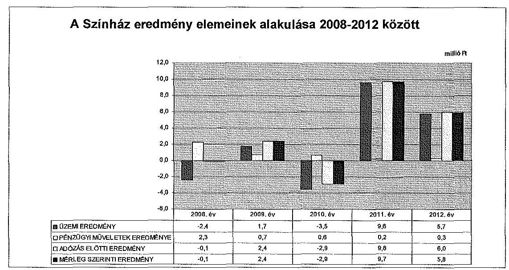

A Színház a bevételeit a főkönyvi számlák közhasznú és vállalkozási tevékenységre történő alábontásával tartotta nyilván. A Színház a ráfordítások közhasznú és vállalkozási tevékenységek közötti elkülönítésének szabályait nem határozta meg. A Színház - az Alapító Okirat 4.10. pontjában foglaltak ellenére - a közvetett költségeket a közhasznú tevékenységek közvetlen költségei között tartotta nyilván. Az utólag analitikusan kigyűj-

[^0]
[^0]:    $^{9}$ Villamos energia lekötött teljesítmény kalkuláció (készült: 2010. október 27.)
    $^{10}$ Ingatlanforgalmi szakvélemény: Javaslat 9700 Szombathely, Akacs Mihály u. 7. szám alatti Weöres Sándor Színházban kialakításra kerülő, filmstúdió, próbaterem, Márkus Emilia terem és a színházterem óradíjaira (bérleti) díjaira (2011. január 17.).

---

tött közvetett költségeket bevételarányosan osztották fel a közhasznú és a vállalkozási tevékenységek között.

A Színház vállalkozási tevékenységből származó bevételeinek $^{11}$ az összes bevételhez viszonyított aránya a 2008-2012. években 0,6% és 4,2% között változott. A vállalkozási tevékenység eredménye $^{12}$ az ellenőrzött időszak minden évében pozitív volt és meghaladta az üzemi eredményt. A vállalkozási tevékenység eredménye biztosította a 2009., 2011-2012. években a Színház nyereséges gazdálkodását.

A Színháznál a pénzügyi műveletek eredménye a 2008. évi 2,3 millió Ft-ról a 2011. évre 0,2 millió Ft-ra csökkent, a 2012. évre 0,3 millió Ft-ra nőtt, amely a Színház kamatbevételeiből származott. A Színháznak rendkívüli eredménye nem volt.

# 2.5. A Színház folyamatos üzemmenetének, likviditásának biztosítása 

A Színház a 2010. évtől készített havi bontásban az üzleti tervre alapozott likviditási tervet, amelyet havonta felülvizsgált.

A számviteli beszámoló kiegészítő mellékletében bemutatott likviditási mutató értéke $^{13}$ alapján a Színház készleteinek, követeléseinek és pénzeszközeinek együttes összege az ellenőrzött időszak egyetlen évének végén sem nyújtott fedezetet a rövid lejáratú kötelezettségekre. A likviditási helyzet a 2010. évben volt a legrosszabb - a mutató értéke 29,6% volt -, azonban a takarékossági és bevételnövelő intézkedések hatására a 2012. évre elérte a 64,0%-ot.

A Színház az ellenőrzött időszakban pénzintézettől hitelt nem vett fel. Az Önkormányzat a 2010. évi likviditási helyzet javítására 20,0 millió Ft támogatáselőleget biztosított, amit a Színház a 2011. és 2012. években két egyenlő részletben visszafizetett. A Színház a 2013. évben rövid időszakokra szabad pénzeszközzel rendelkezett, amit a számlavezető pénzintézetnél nyitott, a folyószámlánál magasabb kamatozású bankszámlán helyezett el.

A Színház a 2010. évben az OKM-től 40,0 millió Ft működési támogatásban $^{14}$ részesült. A támogatás biztosításának oka az volt, hogy a Színház 2009-ben nem tudta teljesíteni a nyilvántartásba vételi és besorolási követel-

[^0]
[^0]:    $^{11}$ A Színház vállalkozási tevékenységből származó bevétele a 2008. évben 1,0 millió Ft, a 2009. évben 8,5 millió Ft, a 2010. évben 5,0 millió Ft, a 2011. évben 18,9 millió Ft, a 2012. évben 23,4 millió Ft volt.
    $^{12}$ A Színház vállalkozási tevékenységének eredménye a 2008. évben 0,6 millió Ft, a 2009. évben 6,9 millió Ft, a 2010. évben 1,3 millió Ft, a 2011. évben 13,4 millió Ft, a 2012. évben 16,6 millió Ft volt.
    $^{13}$ A likviditási mutató értéke a 2008. évben 47,3%, a 2009. évben 68,1%, a 2010. évben 29,6%, a 2011. évben 36,0% és a 2012. évben 64,0% volt.
    $^{14}$ Az OKM és a Színház között 2010. március 30-án kötött 6048-1/2010 iktatószámú Támogatási Szerződés

---

ményeket, mivel 2008-ban alakult, és ennek következtében az Önkormányzat elesett a 2010. évi költségvetési törvény 7. számú mellékletében részletezett állami támogatástól. A szerződés tartalmazta a támogatás felhasználásának szabályait és a beszámolási kötelezettséget, amelyeket a Színház teljesített.

A Színház a 2009. évben Csehov Cseresznyéskert című darabjának bemutatásához 0,9 millió Ft, a 2010. évben a műsortervben szereplő előadások színpadra állításához 73,7 millió Ft, a 2011. évben Madách Imre Az ember tragédiája című művének színre viteléhez 20,0 millió Ft támogatást kapott a Nemzeti Kulturális Alaptól. A Színház a támogatási szerződésekben
 megjelölt kötelezettségeinek eleget tett, a támogatásokkal elszámolt.

A Színháznak hosszú lejáratú kötelezettségei nem voltak. A rövid lejáratú kötelezettségek változását - a likviditáshoz kapcsolódóan - a 2010. évtől havonta figyelemmel kísérték. A takarékossági intézkedések hatására a kötelezettségek állománya a 2010. évi 55,7 millió Ft-ról 2012-re 29,4 millió Ft-ra csökkent. A Színház 60 napon túli kötelezettségének állománya a 2011. évben 1,0 millió Ft, a 2012. évben 0,3 millió Ft volt.

# 3. AZ ÖNKORMÁNYZAT TULAJDONOSI JOGAINAK ÉS KÖTELEZETTSÉGEINEK ÉRVÉNYESÍTÉSE 

### 3.1. A Színháztól származó információk hasznosítása

Az Alapító Okirat rendelkezései alapján az üzleti terv elkészítése az ügyvezető feladata volt. A Színház az ellenőrzött időszakban elkészítette az üzleti terveket, amelyet a 2009. évben háromszor, a 2010., 2011. és 2013. években egyszer módosítottak az önkormányzati támogatás változása miatt.

Az üzleti terv elfogadásának rendjét a Közgyűlés a vagyongazdálkodási rendeletben határozta meg. Az ellenőrzött időszakban a Színház üzleti terveit és annak módosításait a kulturális bizottság tárgyalta, ezt követően a Gazdasági bizottság véleményezte és elfogadta azokat. A polgármester a vagyongazdálkodási rendelet 26. § (2) bekezdése előírása ellenére a Színház üzleti tervének elfogadásáról nem döntött, ezért a Színház jóváhagyott üzleti tervvel a 2008-2012. években nem rendelkezett.

A Közszolgáltatási szerződés előírásának megfelelve a Színház az ellenőrzött időszakban a féléves és éves szakmai és számviteli beszámolókat elkészítette. A Színház - a beszámolók alapján - az Önkormányzat által meghatározott közszolgáltatási feladatait teljesítette. Az éves számviteli beszámoló tartalmazta az egyszerűsített mérleget és eredménykimutatást, a kiegészítő mellékletet, a közhasznúsági jelentést, valamint a könyvvizsgáló véleményét. A szakmai és számviteli beszámolók alapján a Színház a közszolgáltatási feladatainak eleget tett.

---

A könyvvizsgáló ${ }^{15}$ a 2008-2012. években az egyszerűsített éves beszámolót elfogadó ${ }^{16}$ záradékkal látta el, megállapította, hogy az a Színház vagyoni, pénzügyi és jövedelmi helyzetéről megbízható és valós képet ad.

A Színház 2008. évi közhasznúsági jelentése nem felelt meg a Közhasznúsági tv. 19. § (3) bekezdés f)-g) pontjában foglaltaknak, mivel nem tartalmazta a közhasznú szervezet vezető tisztségviselőinek nyújtott juttatások értékét, illetve összegét, valamint a közhasznú tevékenységről szóló rövid tartalmi beszámolót. A Színház a 2012. évben a Civil tv. 46. § (1) bekezdésének rendelkezése ellenére nem közhasznúsági mellékletet, hanem közhasznúsági jelentést készített, amely tartalmában és szerkezetében nem felelt meg a 350/2011. Korm. rendelet 1. számú mellékletében közzétett, kötelezően alkalmazandó közhasznúsági mellékletnek.

A 2008-2012. években a Színház éves számviteli beszámolóit, a könyvvizsgálói jelentéseket, a szakmai beszámolókat és a közhasznúsági jelentéseket a vagyongazdálkodási rendelet előírásainak megfelelően a Közgyűlés elfogadta. A 2008-2012. években a féléves beszámoló elfogadásáról a vagyongazdálkodási rendelet 26. § (2) bekezdésében foglaltak ellenére a Gazdasági bizottság állásfoglalását követően a polgármester nem döntött.

A Színház a számviteli politikában üzleti jelentés készítésének kötelezettségét írta elő, azonban azokat az ellenőrzött időszakban nem készítette el. ${ }^{17}$

A Színház az előadó-művészeti szervezetekről vezetett nyilvántartásba vételhez az adatokat az Önkormányzat rendelkezésére bocsátotta, ennek alapján az Önkormányzat az Emtv.-ben meghatározott adatszolgáltatási kötelezettségének eleget tett.

A 14/2012. NEFMI rendelet 11. és 12. §-aiban előírt, a központi költségvetésből folyósított támogatás mértékének megállapításához szükséges adatszolgáltatást és annak módosítását a Színház a rendelet 6. és 8. számú mellékleteinek megfelelően az Önkormányzatnak határidőben megküldte. Ennek alapján az Önkormányzat adatszolgáltatási kötelezettségének a jogszabályban meghatározott határidőben és tartalommal eleget tett.

A 14/2012. NEFMI rendelet 11. § (1) bekezdése szerint a minősített színház fenntartójának a központi költségvetésből folyósított támogatás - az adatszolgáltatást követő költségvetési évre meghatározott mértékének - megállapítása érdekében a rendelet 6. számú melléklete szerinti évadbeszámolót kell benyújtania. A (4) bekezdés értelmében a minősített előadó-művészeti szervezet fenntartójának a létesítménygazdálkodási célú működési támogatás mértékének megállapításához szükséges adatokat a 8. számú melléklet szerinti adattartalommal kell benyújtania.

[^0]
[^0]:    ${ }^{15}$ A Színház könyvvizsgálója a 2008-2012. években a Rating & Audit Kft. volt.
    ${ }^{16}$ korlátozás nélküli hitelesítő
    ${ }^{17}$ A Színház a Számv. tv. 96. § (1) bekezdése alapján üzleti jelentés készítésére nem volt kötelezett, mivel egyszerűsített éves beszámolót készít.

---

A Tao. tv.-ben meghatározott adókedvezményre jogosító támogatási igazolás kiadásához a 14/2012. NEFMI rendelet 16. § (3) bekezdése szerinti adatszolgáltatási kötelezettségének a Színház eleget tett.

Az Önkormányzat az időszaki jelentések rendjét és gyakoriságát a Közszolgáltatási szerződésben, a Fenntartói szerződésben és az ügyvezető munkaszerződés-ében határozta meg.

A munkaszerződés 2.4. pontja alapján az ügyvezetőnek az évadterv, a produkció és minden egyéb rendezvény részletes elszámolása, a vendégművészek honoráriumáról és egyéb juttatásáról, a Színházban foglalkoztatott művészek előadásszámáról készített kimutatások, a Karneválszínház elszámolása, a következő évi részletes terv vonatkozásában éves adatszolgáltatási kötelezettsége volt az Önkormányzat felé. A Színház előző havi működéséről az írásos szakmai beszámolót és a következő hónap műsortervét havonta kellett megküldenie az Önkormányzatnak. A munkaszerződésben előírt beszámolási kötelezettségét az ügyvezető elektronikus formában - elektronikus levélben, illetve az Önkormányzat honlapján - teljesítette, azonban a munkaszerződés 2.4. pontjában foglalt rendelkezés ellenére egy nyomtatott példányban a Kulturális és Sport Irodának nem küldte meg.

Az Önkormányzat az épület felújítással összefüggésben a 2010. évben a színház épületének bérleti díjára vonatkozó értékbecslést készíttetett külső szakértővel 180 ezer Ft + áfa összegben. Az Önkormányzat a szakértői anyagot hasznosította, mivel a bérleti szerződésben az értékbecslés alapján határozta meg a Színház épület bérleti díját.

# 3.2. Az Önkormányzat tulajdonosi intézkedései 

Az Alapító Okirat az FB részére, az általa elrendelt ellenőrzésekről jelentéstételi, tájékoztatási kötelezettséget nem írt elő. Az Önkormányzat az FB-be a Közgyűlés képviselői közül tagot delegált, ezzel biztosította a gazdasági társaság működéséről és vagyoni helyzetéről történő tájékozódást.

Az FB a 2008-2012. években elfogadta a Színház üzleti terveit, valamint éves és féléves beszámolóit. Az FB 2012 decemberében szúrópróbaszerűen, személyes ellenőrzés keretében ellenőrizte a Színház leltárát, amelynek során szabálytalanságot nem tárt fel, ezért 8/2012. (XII. 17.) FEB határozatával a Színház tárgyi eszköz leltárát elfogadta. Az FB határozatát az Önkormányzatnak megküldték, de azt a Közgyűlés és a bizottságok nem tárgyalták.

Az Önkormányzat 2008-2012 évi belső ellenőrzési tervét megalapozó kockázatelemzések a Színházra nem terjedtek ki. Az Önkormányzat az Ötv. 92. § (1) bekezdés b) pontjában meghatározott lehetősége ellenére a Színház gazdálkodására, vagyoni helyzetére, a közfeladatok ellátására vonatkozóan belső ellenőrzést a 2008-2012. években nem végzett.

Az Önkormányzat nem élt a Közszolgáltatási szerződés szerinti lehetőségével, a Színháznál a támogatás felhasználását nem ellenőrizte.

---

A Színház megbízásából külső szakértő egy alkalommal, a 2009. évben végzett belső ellenőrzést, ami a szabályzatokra vonatkozóan fogalmazott meg javaslatokat.

Az Civil tv. előírásai és az Alapító Okirat 4.6. pontja szerint a nonprofit társaság a gazdálkodás során elért eredményét nem oszthatja fel, azt a létesítő okiratában meghatározott tevékenységére kell fordítania, ezért a Színház javaslata és az Önkormányzat döntése alapján az eredmény minden évben az eredménytartalékba került.

A Színháznak a 2011. évben 1,0 millió Ft, a 2012. évben 0,3 millió Ft 60 napon túli lejárt szállítói tartozása volt. A Színház a 2011. és 2012. évi mérleg szerinti eredménye meghaladta a 60 napon túl lejárt szállítói tartozásának értékét. Az Önkormányzatnak a vagyonvesztés megelőzése, az esetleges veszteség megszüntetése érdekében, a gazdasági társaság lejárt kötelezettségeinek kiegyenlítése és a csődveszély elkerülése érdekében az ellenőrzött időszakban intézkedési kötelezettsége nem volt.

A Színház az ellenőrzött időszak minden évében rendelkezett a társasági formájára kötelezően előírt jegyzett tőkének megfelelő összegű saját tőkével ${ }^{18}$. Az Önkormányzatnak a Gt. tv. 51. §-a szerinti intézkedési kötelezettsége nem keletkezett.

# 4. Az ÁSZ KORÁBBI, A TÖBBSÉGI TULAJDONÚ GAZDASÁGI TÁRSASÁGOK KÖZFELADAT-ELLÁTÁSÁT, GAZDÁLKODÁSÁT, PÉNZÜGYI HELYZETÉT ÉRINTŐ JAVASLATAIRA TETT INTÉZKEDÉSEK 

### 4.1. Az Önkormányzat intézkedési terve és a javaslatok hasznosulása

Az ÁSZ a 2011. évben a „Szombathely Megyei Jogú Város Önkormányzata pénzügyi helyzetének ellenőrzéséről" készült számvevőszéki jelentésben a többségi tulajdonú gazdasági társaságokra vonatkozóan a polgármesternek két célszerűségi javaslatot fogalmazott meg.

Az ÁSZ javasolta a polgármesternek, hogy a féléves beszámoló keretében mutassa be a Közgyűlésnek az Önkormányzat és a minősített többségi tulajdonú gazdasági társaságai aktuális pénzügyi helyzetét, az Önkormányzat gazdasági társaságai-nak nyújtott kölcsöneit. Javasolta továbbá, hogy a polgármester kísérje folyamatosan figyelemmel a minősített többségi tulajdonú gazdasági társaságok kötelezettségeinek alakulását, az Önkormányzat likviditására, pénzügyi egyensúlyi helyzetére gyakorolt hatását.

Az Önkormányzat a javaslatok realizálása érdekében - a felelősöket és határidőket tartalmazó - intézkedési tervet készített, amelyet az ÁSZ elnöke elfogadott.

[^0]
[^0]:    ${ }^{18}$ A saját tőke/jegyzett tőke mutató értéke a 2008. és 2010. évben 1,0, a 2009. évben 1,2, a 2011. évben 1,6, a 2012. évben 2,0 volt.

---

Az Önkormányzatnál a 2011. évben végzett ÁSZ ellenőrzés során tett javaslatokra készített intézkedési tervben foglaltakat végrehajtották.

A színházak állami támogatásának és gazdálkodásának 2010. évi ÁSZ ellenőrzése során a Színházzal kapcsolatban adatszolgáltatás történt.

Budapest, 2014. Ol. hó 04. nap

Melléklet: 7 db
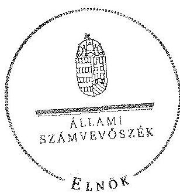

Domokos László
elnök

---

# A Színház szakmai tevékenységének mutatói 2008 és 2012 között

|  Sorszám | Megnevezés | 2008. év |  | 2009. év |  | 2010. év |  | 2011. év |  | 2012. év |   |
| --- | --- | --- | --- | --- | --- | --- | --- | --- | --- | --- | --- |
|   |  | Terv | Tény | Terv | Tény | Terv | Tény | Terv | Tény | Terv | Tény  |
|  1 | Színházlátogatók száma (ezer fő) | - | 4,7 | - | 33,8 | 19,8 | 28,3 | 37,2 | 54,4 | 45,7 | 54,6  |
|  2 | Fizetőnéző-szám (ezer fő) | - | 4,7 | - | 33,8 | 19,8 | 28,3 | 37,2 | 54,4 | 45,7 | 54,6  |
|  - | Ebből a bérlettel rendelkezők száma (ezer fő) | - | 0,0 | - | 18,2 | 9,0 | 7,9 | 24,0 | 26,2 | 27,8 | 29,1  |
|  3 | Jegyárkedvezménnyel értékesített jegyek száma (ezer fő) | - | 0,0 | - | 4,8 |  | 3,6 |  | 6,0 |  | 7,3  |
|  4 | Előadások száma (db) | - | 34 | - | 237 | 159 | 196 | 195 | 351 | 237 | 349  |
|  5 | Férőhelyek száma (db) | - | 450 | - | 510 |  | 510 |  | 598 |  | 598  |

---

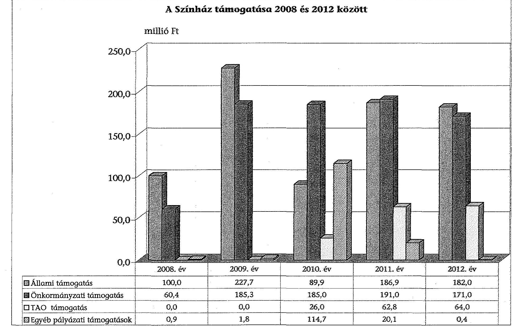

# A Színház támogatása 2008 és 2012 között

|  Állami támogatás |

 100,0 | 227,7 | 89,9 | 186,9 | 182,0  |
| --- | --- | --- | --- | --- | --- |
|  Önkormányzati támogatás | 60,4 | 185,3 | 185,0 | 191,0 | 171,0  |
|  TAO támogatás | 0,0 | 0,0 | 26,0 | 62,8 | 64,0  |
|  Egyéb pályázati támogatások | 0,9 | 1,8 | 114,7 | 20,1 | 0,4  |

---

# A Színház vagyonának főbb adatai 2008. január 1-je és 2012. december 31-e között

|  Mérlegsor megnevezése | 2008. jan. 1. (millió Ft) | 2008. dec. 31. (millió Ft) | 2009. dec. 31. (millió Ft) | 2010. dec. 31. (millió Ft) | 2011. dec. 31. (millió Ft) | 2012. dec. 31. (millió Ft)  |
| --- | --- | --- | --- | --- | --- | --- |
|  Immateriális javak | 0,2 | 2,9 | 1,8 | 0,8 | 0,0 | 0,0  |
|  Tárgyi eszközök | 0,7 | 98,9 | 131,4 | 141,6 | 127,2 | 102,1  |
|  Ebből: Ingatlanok | 0,0 | 10,1 | 8,7 | 5,5 | 8,7 | 7,0  |
|  Gépek, berendezések | 0,7 | 88,8 | 122,7 | 136,1 | 118,5 | 95,1  |
|  Befektetett eszközök összesen | 0,9 | 101,8 | 133,2 | 142,4 | 127,2 | 102,1  |
|  Forgóeszközök összesen | 10,7 | 50,4 | 21,7 | 16,5 | 15,0 | 18,8  |
|  Aktív időbeli elhatárolások | 6,7 | 0,6 | 3,5 | 6,8 | 0,2 | 0,3  |
|  Eszközök összesen | 18,3 | 152,8 | 158,4 | 165,7 | 142,4 | 121,2  |
|  Saját tőke összesen | 15,0 | 14,9 | 17,4 | 14,5 | 24,2 | 30,0  |
|  Ebből/jegyzett tőke | 15,0 | 15,0 | 15,0 | 15,0 | 15,0 | 15,0  |
|  Eredménytartalék | -0,8 | 0,0 | 0,1 | 2,4 | -0,5 | 9,2  |
|  Mérleg szerinti eredmény | 0,8 | -0,1 | 2,5 | -2,9 | 9,7 | 5,8  |
|  Tartalékok | 0,0 | 0,0 | 0,0 | 0,0 | 0,0 | 0,0  |
|  Céltartalék | 0,0 | 0,0 | 0,0 | 0,0 | 0,0 | 0,0  |
|  Kötelezettségek összesen | 1,2 | 106,6 | 31,8 | 55,7 | 41,7 | 29,4  |
|  Passzív időbeli elhatárolások | 2,1 | 31,3 | 109,2 | 95,5 | 76,5 | 61,8  |
|  Források összesen: | 18,3 | 152,8 | 158,4 | 165,7 | 142,4 | 121,2  |
|  összesen | 0,0 | 256,8 | 254,8 | 219,1 | 1698,8 | 1648,6  |
|  Ebből: Immateriális javak | 0,0 | 0,0 | 0,0 | 0,0 | 0,0 | 0,0  |
|  ingatlanok | 0,0 | 256,8 | 254,8 | 219,1 | 1583,9 | 1553,4  |
|  gépek, berendezések | 0,0 | 0,0 | 0,0 | 0,0 | 114,9 | 95,2  |
|  Saját és átvett eszközök összesen | 18,3 | 409,6 | 413,2 | 384,8 | 1841,2 | 1769,8  |

---

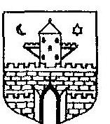

Szombathely MEGYEI JOGÚ VÁROS POLGÁRMESTERE
80.120……………12014.
Ül.: Dr. Szabó Viktória

Domokos László elnök úr részére Állami Számvevőszék

# Budapest 

Apáczai Csere János u. 10.
1364

## Tisztelt Elnök Úr!

A „Jelentéstervezet az önkormányzatok többségi tulajdonában lévő gazdasági társaságok közfeladat-ellátásának ellenőrzéséről - Weöres Sándor Színház Nonprofit Kft." címmel elkészített számvevőszéki jelentéstervezetet megkaptam, köszönöm.

A jelentéstervezet 15-16. oldalain található a részemre és a jegyző részére tett megállapításai és javaslatai, melyre az Állami Számvevőszékről szóló 2011. évi LXVI. törvény 29. § (2) bekezdése alapján az alábbi észrevételeket teszem.

1. A 2008-2012. években a polgármester a vagyongazdálkodási rendelet 26. § (2) bekezdésében foglalt felhatalmazás ellenére nem döntött a 2008-2012. években a féléves beszámoló, továbbá az üzleti terv elfogadásáról. Ennek következtében a Színház nem rendelkezett elfogadott féléves beszámolóval és jóváhagyott üzleti tervvel.

## Javaslat:

Tegyen eleget a vagyongazdálkodási rendelet 26. § (2) bekezdésében foglalt felhatalmazás alapján döntési kötelezettségének, annak érdekében, hogy a Színház rendelkezzen jóváhagyott üzleti jelentéssel és elfogadott féléves beszámolóval.

Szombathely Megyei Jogú Város Önkormányzata vagyonáról, a vagyontárgyak feletti tulajdonosi jogok gyakorlásáról szóló 29/2004. (VI.30.) önkormányzati rendelet (a továbbiakban: vagyonrendelet) 22-27. §-ai szabályozzák önkormányzatunk testületei közötti hatáskörmegosztást az önkormányzati tulajdonban lévő gazdasági társaságokat érintő döntéshozatalban. A vagyonrendeletünk alapján a polgármesterre átruházott hatáskörök kétirányúak. Vannak azok a hatáskörök, melyekben a polgármester önállóan jogosult dönteni, a szakmai jellegű kérdéskörök esetében viszont köteles a Pénzügyi,

Tandathány száma:
Telefon : 06 94/520 - 124 Fax: 06 94/313-172
Honlap: www.szombathely.hu

---

Gazdasági és Jogi Bizottság (a továbbiakban: Bizottság) állásfoglalását kikérni a döntést megelőzően. A vagyonrendelet megalkotásakor és elfogadásakor az üzleti tervek jóváhagyásának a Bizottság előzetes állásfoglalásához való kötése mögött azon jogalkotói szándék fogalmazódott meg, hogy az üzleti tervekben foglaltak megítéléséhez és megfelelő elbírálásához elengedhetetlen a szakmai bizottság hozzáértése. Ennek okán az üzleti terveket érintően kialakított döntésem a Bizottság által hozott határozat tartalmával megegyezően fogalmazódott meg. Önkormányzatunknál így az a gyakorlat alakult, hogy polgármesteri döntésként a bizottsági határozatok kerültek megküldésre a társaság részére, mely gyakorlat álláspontom szerint nem áll ellentétben a vagyonrendeletünk vonatkozó rendelkezésével. Ugyanezt a tendenciát követtük a féléves beszámolókkal kapcsolatos döntés meghozatalánál. Álláspontom szerint így a társaság a kizárólagos tulajdonosa által elfogadott üzleti tervvel és féléves beszámolóval az ellenőrzött időszakban rendelkezett.

Tekintettel arra, hogy a helyszíni ellenőrzés során is felvetődött, valamint a megküldött jelentéstervezet is aggályosnak tartja a polgármesteri hatáskörbe utalt, de a bizottság előzetes állásfoglalásához kötött kérdésköröket érintő szabályozás helyes értelmezését és a döntéshozatalnak a gyakorlatban való helyes alkalmazását, ezért javaslatot tettem a vagyonrendeletünkben megfogalmazott, többféle értelmezési lehetőséget is magában hordozó rendelkezések módosítására. Ezen javaslatomat Szombathely Megyei Jogú Város Közgyűlése a soron következő, 2014. februári ülésén fogja tárgyalni. A módosítás alapján az eddig polgármesteri hatáskörbe utalt, de a Bizottság előzetes állásfoglalásának kikéréséhez kötött tárgykörök teljes egészében bizottsági hatáskörbe kerülnek. Amennyiben a Közgyűlésünk a módosítási javaslatot támogatja, úgy a kihirdetett rendelet módosítását megküldjük a Tisztelt Elnök Úr részére.
2. A 2012. év végén tételes eszközleltár nem készült, mivel a Színház a bérleti szerződés 6.3.3. pontjában foglalt előírás ellenére a kezelésében lévő tárgyi eszközökről leltáríveket az Önkormányzatnak nem küldött.

# Javaslat: 

Követelje meg a Színháztól az önkormányzat az éves beszámolója alátámasztottsága érdekében a bérleti szerződésnek megfelelő év végi leltár elkészítését, és annak az önkormányzat részére való megküldését.

Önkormányzatunk a bérleti szerződés módosításával nagyobb összhangot kíván teremteni a bérleti szerződés és a Leltározási szabályzat között úgy, hogy abban már figyelembevételre kerülne a Leltározási Szabályzat olyan irányú tervezett módosítása, amely figyelembe venné a 4/2013. (I.11.) Kormányrendelet leltárra vonatkozó részét, miszerint legalább 3 évente kell mennyiségi leltárral alátámasztani a mérleget.
3. A Közszolgáltatási szerződés „Az eljárásra vonatkozó szabályok:" 3. pontja és a Fenntartói szerződés 4.7. pontja nincs összhangban egymással, mivel a Közszolgáltatási szerződés szerint a támogatás felhasználásáról a teljes körű szakmai beszámolót a tárgyévet követő május 31-ig, a Fenntartói szerződés szerint a feladatok teljesítésének szakmai igazolásaként a beszámolót évente, legkésőbb a költségvetés elfogadását követően 30 nappal kell a Színháznak benyújtania az Önkormányzathoz.

---

# Javaslat: 

Intézkedjen a Közszolgáltatási szerződés és a Fenntartói szerződés módosításának előkészítéséről és kezdeményezze annak beterjesztését a Közgyűlésnek jóváhagyásra annak érdekében, hogy a Közszolgáltatási szerződés és a Fenntartói szerződés szabályozása a beszámolók benyújtását érintően összhangban legyen.

A Színházzal kötött fenntartói szerződés 4.7. pontja szerint a színház a tőle elvárt feladatok teljesítésének szakmai igazolásaként évente (legkésőbb a költségvetés elfogadását követően 30 nappal) az önkormányzat Közgyűlésének illetékes bizottsága (Kulturális és Sport Bizottság) számára írásos beszámolót készít, és a Kulturális és Sport Bizottság ülésén szóban értékeli az előző naptári év teljesítési adatait, valamint ismerteti a tárgyév művészeti, közönségszervezési és marketing munkatervét. A Kulturális és Sport Bizottság a teljesítési adatok alapján határozatot hoz a beszámoló és a munkatervről szóló tájékoztató elfogadásáról.
A színházi feladatok ellátásáról szóló megállapodásban a Színház az önkormányzattól kapott támogatás felhasználásáról teljes körű szakmai és pénzügyi beszámolót készít a tárgyévet követő év május 31. napjáig az önkormányzat részére, elfogadásáról a Közgyűlés dönt. Az éves beszámolón túl a Színház köteles félövente beszámolót készíteni az önkormányzat részére.

A két beszámoló azért nincs összhangban, mert két különböző dolgot kér.

- A Fenntartói szerződés teljesítménymutatókkal alátámasztott szakmai beszámolót, míg a színházi feladatok ellátásáról szóló megállapodás - a számviteli törvényben foglalt beszámolási határidőre tekintettel - teljes körű szakmai beszámolót kér pénzügyi adatokkal kiegészítve.
- A Fenntartói szerződés szakmai beszámolójának elfogadása a Kulturális és Sport Bizottság kompetenciája, míg a színházi feladatok ellátásáról szóló megállapodás teljes körű szakmai és pénzügyi beszámolójának elfogadása a Közgyűlés kompetenciája.

Álláspontom szerint nem szükséges a két szerződés módosítása tekintettel arra, hogy nem azonos dokumentumok benyújtására vonatkozik a hivatkozott két pont.

A fentiekre tekintettel kérem a Tisztelt Elnök Urat, hogy az általam tett észrevételeket figyelembe venni szíveskedjék.

Szombathely, 2014. február „:..."

Tisztelettel:
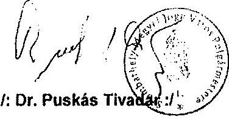

---

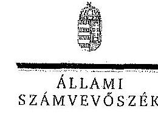

ELNÖK

Ikt.szám: V-0304-077/2014.

Dr. Puskás Tivadar úr
polgármester
Szombathely Megyei Jogú Város Polgármesteri Hivatala

Szombathely

Tisztelt Polgármester Úr!

A „Jelentéstervezet az önkormányzatok többségi tulajdonában lévő gazdasági társaságok közfeladat-ellátásának ellenőrzéséről – Weöres Sándor Színház Nonprofit Kft.” című jelentéstervezetre tett észrevételeit köszönettel megkaptam.

Az Állami Számvevőszék észrevételekre vonatkozó álláspontjáról a felügyeleti vezető által készített részletes tájékoztatást csatoltan megküldöm.

Tájékoztatom Polgármester urat, hogy a számvevőszéki jelentés szövegezése az elfogadott észrevételek figyelembevételével készül.

Budapest, 2014. öt, hó öt nap

Tisztelettel:

ÁLLAMI Számvevőszék Domokos László

ELNÖK

Melléklet: Tájékoztatás az elfogadott és el nem fogadott észrevételekről

1052 BUDAPEST, KÖZÖNSÉG CSERE HÁZ U. 10. 1354 Budapest 4. Pf. 54 Iskola u. 494 8101 (or. 494 8201

---

# Tájékoztatás 

az elfogadott és el nem fogadott észrevételekről

A „Jelentéstervezet az önkormányzatok többségi tulajdonában lévő gazdasági társaságok közfeladat-ellátásának ellenőrzéséről - Weöres Sándor Színház Nonprofit Kft." című jelentéstervezetre 2014. március 3-án érkezett észrevételeket áttekintettük, azok kezelésével kapcsolatban a következő tájékoztatást adom.
Az észrevételükben jelzett, szabályozással kapcsolatos és a leltározással összefüggő tájékoztatásukat köszönjük. Kérem, hogy az észrevételben szereplő intézkedéseket az ÁSZ tv. 33. § (1) bekezdésében foglaltaknak megfelelően - a jelentés közhezvételétől számított 30 napon belül intézkedési tervet köteles az ellenőrzött szervezet vezetője összeállítani, és azt az ÁSZ részére megküldeni - intézkedési tervben szerepeltessék.

## 1. észrevétel

A jelentéstervezetben foglalt megállapításaink helytállóak. Az ellenőrzés szabályszerűségi ellenőrzés volt, amely a hatályos jogszabályok és belső szabályzatok betartását ellenőrizte. Az

 önkormányzatnál kialakult gyakorlat, melyet az észrevételben is bemutatnak, nem felel meg a vagyonrendelletben foglalt előírásoknak. A vagyonrendellet előírása értelmében az üzleti terv és a beszámoló elfogadásáról a polgármester dönt. A bizottság határozata nem egyenértékű a polgármesteri döntéssel. Az észrevétel is a megállapításunkat erősíti meg, miszerint az üzleti tervek és a fülbemászó beszámolók elfogadása bizottsági határozattal és nem polgármesteri döntéssel történt. Az előbbiekre tekintettel a jelentéstervezet módosítása nem indokolt.

## 2. észrevétel

A leltárkészítéssel kapcsolatos polgármesternek szóló 2. számú megállapítás és az ahhoz kapcsolódó javaslat helytálló, amelyet az észrevételben leírtak sem vitatnak, így annak módosítása nem indokolt.

## 3. észrevétel

A Közszolgáltatási szerződés és a Fenntartói szerződés ismételt áttekintése alapján a kapcsolódó, jegyzőnek szóló megállapítást és az ahhoz kapcsolódó javaslatot töröljük.

Tájékoztatom Polgármester urat, hogy a számvevőszéki jelentés mellékleteként szerepeltetjük a jelentéstervezethez tett észrevételeit, valamint az azokra adott válaszunkat.

Budapest, 2014.
$\%$ hó $\%$ nap

Makkai Mária
felügyeleti vezető

---

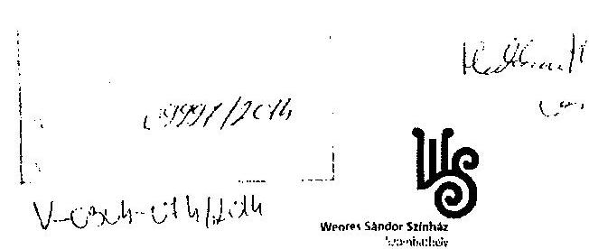

Állami Számvevőszék
1052 Budapest Apáczai Csere János utca 10.
Domokos László úr
elnök

# Tárgy: jelentéstervezethez kapcsolódó észrevételek 

## Tisztelt Elnök Úr!

Az Állami Számvevőszék V-0304-068/2014 iktatószámú levele és Jelentéstervezete (az önkormányzati többségi tulajdonában lévő gazdasági társaságok közfeladat-ellátásának ellenőrzéséről - Weöres Sándor Színház Nonprofit Kft.) 2014. február 10-én került közbesítésre a Weöres Sándor Színház részére.
A jelentéstervezettel kapcsolatos észrevételeinket, javaslatainkat a jelen levélben foglaltuk össze.

## 12. oldal első bekezdés és 22. oldal 2. bekezdés:

Fontosnak tartanánk megemlíteni, hogy 2011-ben és 2013-ban is készült tételes leltár az önkormányzati tulajdonú eszközökről.

## 12. oldal utolsó bekezdés:

„A Színház értékelési szabályzata nem tartalmazta a vevő és adós minősítésének, az értékvesztés elszámolásának, a behajthatatlan követelés elírásának részletes szabályait."
A színház számviteli politikája rögzíti ezeket, ezért az értékelési szabályzatban csak utaltunk rá.
Természetesen az értékelési szabályzatot annyival bővíteni fogjuk, hogy a vevők, adósok tekintetében jelentős összeg mértéke, az értékvesztéssel kapcsolatosan pedig az, hogy tartós az ami az egy évet meghaladja.

## 14. oldal harmadik bekezdés és Javaslatok 2. pont.

„ráfordítások közhasznú és vállalkozási tevékenységek közötti elkülönítése"
Továbbra is az a véleményünk, hogy a színház gyakorlata is megfelelő.
A bevételeket külön könyveljük, a költségeket pedig mivel nem lehet sem időben sem egyéb naturálában meghatározni, hisz nincs külön alkalmazottunk illetve olyan tevékenység ami kimondottan vállalkozás, ezért bevételeirányosan kell meghatározni.
A számviteli törvény erről nem rendelkezik külön, a nonprofit szervezetekkel kapcsolatos valamennyi rendelkezés pedig a színház által alkalmazott módszert is tartalmazza.
Amit tudok tenni és tenni is fogunk a jövőben, hogy évvégén amikor ez kiszámításra kerül, akkor át is könyveljük a megnyitott főkönyvi számlákra, melyeket a számla tükör már most is tartalmaz.

## 15. oldal 1. bekezdés és javaslatok. 5. pont.

„a Színház 2012-ben a Civil tv. rendelkezései ellenére közhasznúsági jelentést készített, amely tartalmában nem felelt meg a 350/2011. Korm. rendeletben foglalt, kötelezően alkalmazandó közhasznúsági mellékletnek."
A Színház a Civil törvény előírásai szerint a 2012-es év közhasznúsági mellékletét 2013. novemberben már elkészítette, melyet Szombathely Megyei Jogú Város Közgyűlése 2013. november 28-án 582/2013. (XI.28) kgy. sz. határozatában elfogadott. Így ezt a pontot a javaslatok közül kérjük kivonni.

---

# 15. oldal 3. bekezdés és 35 . oldal 8. bekezdés 

A Fenntartói szerződéssel kapcsolatosan az alábbi észrevételeket tennénk.
Az értelmezésünk szerint, mivel a szerződés 2013-tól hatályos, így az első adatszolgáltatási kötelezettségei a színháznak 2014-ben jelentkeznek a 2013-as évre és a 2014-es tervekre vonatkozóan.
A munkaszerződésben foglalt beszámolási kötelezettségek elektronikus formában történő teljesítését előzetesen a fenntartó önkormányzat Kulturális és Sport irodájának vezetőjével egyeztettük, aki részére az előírt jelentések elektronikus úton is elküldésre kerültek.
Ennek ellenére természetesen az észrevételük helytálló.

## 15. oldal 4. bekezdés

Az önkormányzati ellenőrzésekkel kapcsolatosan az alábbi kiegészítést tesszük.
A FB nem csak 2012-ben, hanem 2011-ben is végzett ellenőrzést, amikor is a Színház hosszútávú szerződéseit tekintették át. Erről a jegyzőkönyvet a FB az önkormányzat részére átadta.

## Javaslatok 3. pont

„A Számvitel politikában rögzített üzleti jelentés elkészítésének elmulasztása."
A jelentés megállapítása helytálló. Viszont a vizsgálat során jeleztük a vizsgálatot folytató számvevőknek, hogy folyamatban van a számviteli politika aktualizálása, mely azóta meg is történt. Az új számviteli politika szerint az üzleti jelentés már nem képezi részét az éves beszámolónak, így a jövőre nézve további intézkedést ebben a tárgyban a színháznak véleményünk szerint már nem kell tennie.

## Javaslatok 4. pont

„A szabályzatok törvényi változások miatti aktualizálásáról"
A 775 és 815 a kerekítési szabályokról szóló előírásait mi a pénzkezelési szabályzatunkban leszabályoztuk.
A 47.§ 4. bekezdés előírásai pedig az értékelési szabályzatunkban eddig is szerepeltek.
Továbbá a vizsgálat óta aktualizált számviteli politikában a színház székhelye már helyesen került feltüntetésre.

## 30. oldal 4. bekezdés

Itt elírás történt, mivel a 0,1 millió Ft tartozás nem munkavállalói tartozás, hanem egy kaució miatti követelés. A tartozás megfizetéséről a megállapodás azóta megszületett, a béréből (nem színház) kerülnek a részletfizetések letiltásra és a színház részére átutalásra.

## 30. oldal 5. bekezdés

Itt egy elírás van a szövegben. A bércsökkentés mértéke 5% volt.

Ezúton is köszönjük a vizsgálatuk alapján tett tárgyilagos és javító szándékú javaslataikat, melyek figyelembevételével fogjuk folytatni a Weöres Sándor Színház Nonprofit Kft. működését.

Szombathely, 2014. február 24.
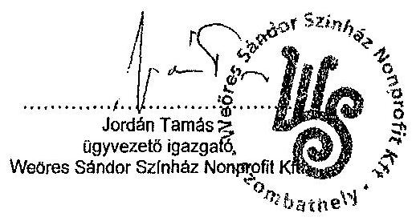

---

# 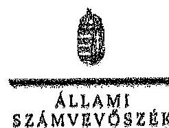 

Ikt.szám: V-0304-076/2014.

Jordán Tamás úr
ügyvezető Igazgató
Weöres Sándor Színház Nonprofit Kft.

## Szombathely

## Tisztelt Ügyvezető Igazgató Úr!

A „Jelentéstervezet az önkormányzatok többségi tulajdonában lévő gazdasági társaságok közfeladat-ellátásának ellenőrzéséről - Weöres Sándor Színház Nonprofit Kft." című jelentéstervezetre tett észrevételeit köszönettel megkaptam.

Az Állami Számvevőszék észrevételekre vonatkozó álláspontjáról a felügyeleti vezető által készített részletes tájékoztatást csatolt levélben megküldöm.
Tájékoztatom Ügyvezető Igazgató urat, hogy a számvevőszéki jelentés szövegezése az elfogadott észrevételek figyelembevételével készül.
Budapest, 2014.
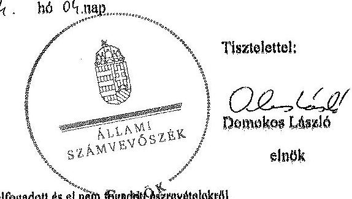

Melléklet: Tájékoztatás az elfogadott és el nem fogadott észrevételekről

---

# Tájékoztatás   az elfogadott és el nem fogadott észrevételekről 

A „Jelentéstervezet az önkormányzatok többségi tulajdonában lévő gazdasági társaságok közfeladat-ellátásának ellenőrzéséről - Weöres Sándor Színház Nonprofit Kft." című jelentéstervezetre érkezett észrevételeit áttekintettük, azok kezelésével kapcsolatban a következő tájékoztatást adom.

## 12. oldal 1. bekezdés és 22. oldal 2. bekezdés

A jelentéstervezet 22. oldal 2. bekezdése tartalmazza, hogy a Színház a 2011. évben a bérleti szerződés szerint a kezelésbe vett eszközökről tételes leltárt készített, ezért nem indokolt ennek a 12. oldal 1. bekezdésében történő ismételt szerepeltetése. A jelentéstervezet a 2013. évre vonatkozóan a leltárkészítéssel kapcsolatban nem tartalmaz megállapítást, tekintettel arra, hogy az az ellenőrzött időszakot követően történt.

## 12. oldal utolsó bekezdés

A jelentéstervezetben foglalt megállapításaink helytállóak. A Színház értékelési szabályzata, és az ellenőrzés rendelkezésére bocsátott számviteli politika sem tartalmazza a vevő és adós minősítésének, az értékvesztés elszámolásának, a behajthatatlan követelés elszámolásának részletes szabályait, ezért a jelentéstervezet kiegészítése nem indokolt.

## 14. oldal 3. bekezdés és a javaslatok 2. pontja

A jelentéstervezetben foglalt megállapításaink helytállóak. A Színház nem tett eleget az Alapító Okirat 4.10. pontjában foglalt rendelkezésnek, amely szerint a nonprofit társaság, mint közhasznú szervezet cél szerinti tevékenységéből, illetve vállalkozói tevékenységéből származó bevételeit és ráfordításait elkülönítetten tartja nyilván. Az előbbiekre tekintettel a javaslat és az azt megalapozó megállapítások módosítása nem indokolt.

## 15. oldal 1. bekezdés és a javaslatok 5. pontja

A jelentéstervezetben az ezzel összefüggő megállapításaink, valamint a kapcsolódó javaslat helytálló, az ellenőrzött időszakra vonatkozik. Az észrevételben foglaltak szerint a Közgyűlés által 2013. november 28-án elfogadott 2012. évi közhasznúsági melléklet kívül esik az ellenőrzött időszakon. Az észrevételükben jelzett intézkedésekről adott tájékoztatásukat köszönjük, azokat az intézkedési tervben kérjük majd szerepeltetni.

## 15. oldal 3. bekezdés és 35. oldal 8. bekezdés

Az egyértelműség érdekében a 15. oldal 3. bekezdés első mondatát és a 35. oldal 8. bekezdését töröljük.

---

# 15. oldal 4. bekezdés 

A Felügyelő Bizottság által lefolytatott ellenőrzéssel kapcsolatban tett megállapításunk helytálló, annak kiegészítése nem indokolt. Megállapításunk az ellenőrzés rendelkezésére bocsátott dokumentumain alapul, olyan irat, mely az észrevételben leírtakat támasztaná alá, nem került átadásra.

## Javaslat 3. pont

A számviteli politikával kapcsolatban tett megállapításaink és javaslatunk helytálló, melyet az észrevételben leírtak sem vitatnak. A megállapítások a rendelkezésünkre bocsátott dokumentumokon alapulnak. Az észrevételükben jelzett intézkedésekről adott tájékoztatásukat köszönjük, azokat az intézkedési tervben kérjük majd szerepeltetni.

## Javaslat 4. pont

A színház ügyvezetőjének tett 4. számú javaslatot megalapozó megállapítást, valamint a 26. oldal 1. bekezdését a következők szerint módosítjuk:
„A Színház a szabályzatait a 2008. évben készítette el és helyezte hatályba, azokat - a pénzkezelési szabályzat kivételével - a Számv. tv. 14. § (11) bekezdése ellenére nem aktualizálta, ezért például az értékelési szabályzatban a bekerülési érték meghatározása a 2012. évtől nem felelt meg a Számv. tv. 47. § (4) bekezdés e) pontjában foglaltaknak. A számviteli politikában a Színház székhelyének megjelölését az Alapító Okirat változásával együtt nem módosították."

Ezzel összefüggésben a 13. oldal 1. bekezdését a következők szerint módosítjuk:
„A Színház a szabályzatait a 2008. évben készítette el és helyezte hatályba, azokat a Számv. tv. rendelkezései ellenére - a pénzkezelési szabályzat kivételével - nem aktualizálta, ezért például az értékelési szabályzatban a 2012. évtől a bekerülési érték meghatározása nem felelt meg a Számv. tv. előírásainak."

Az értékelési szabályzatra vonatkozó megállapításunk helytálló, melyet továbbra is fenntartunk. A Számv. tv. 2012. január 1-jén módosult, többek közt a 47. § (4) bekezdés kiegészült az e) ponttal. Az értékelési szabályzat kapcsolódó része a 2012. előtti állapot szerint került kialakításra, a Számv. tv. 47. § (4) bekezdés e) pontjának megfelelő rendelkezéseket nem tartalmaz.

A számviteli politika aktualizálására vonatkozó tájékoztatást köszönjük, az azzal kapcsolatban megtett intézkedéseket az intézkedési tervben kérjük majd szerepeltetni.

## 30. oldal 4. bekezdés

A Színház kaució miatti követelése a munkavállalói tartozás része. A jelentéstervezetben ennek megfelelően munkavállalói tartozásként került szerepeltetésre, a munkavállalói tartozás belüli további alábontás nem indokolt. Az ezzel kapcsolatosan megtett intézkedéseiről adott tájékoztatását köszönjük. A jelentéstervezetben

---

foglalt megállapítások módosítása nem indokolt, tekintettel arra, hogy a hivatkozott intézkedés megtételére a helyszíni ellenőrzést követően került sor.

# 30. oldal 5. bekezdés 

A jelentéstervezet 30. oldal 5. bekezdésének 2. mondatát a következők szerint pontosítjuk:
„A tervben 2010 júliusától 5,0%-os általános bércsökkentés és nyolc fő foglalkoztatásának megszüntetése, az egyik raktár bérleti szerződésének felmondása, a honlap saját munkaerővel történő szerkesztése és a stúdiósok költségeinek csökkentése szerepelt."

Tájékoztatom ügyvezető igazgató urat, hogy a számvevőszéki jelentés mellékleteként szerepeltetjük a jelentéstervezethez tett észrevételeit, valamint az azokra adott válaszunkat.

Budapest, 2014. 04. hó 04. nap

Makkai Mária
felügyeleti vezető

