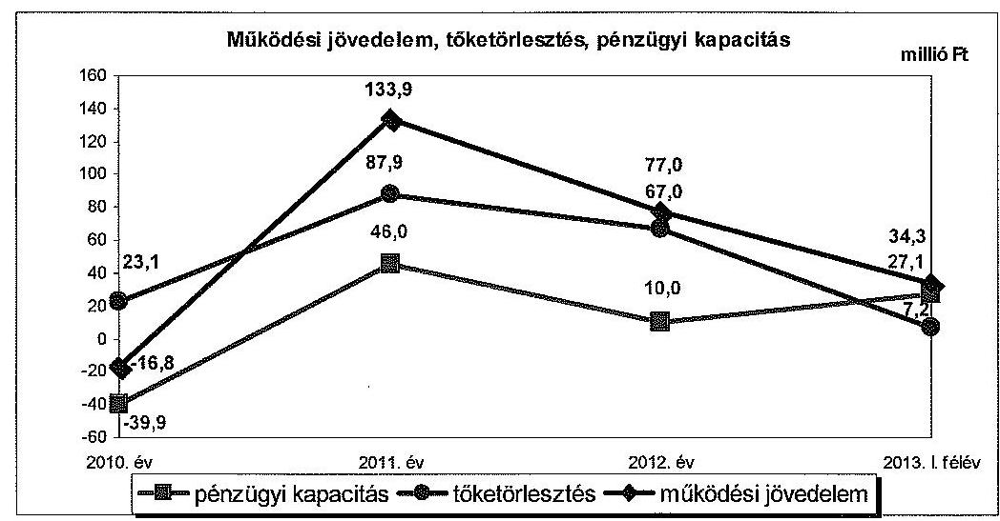
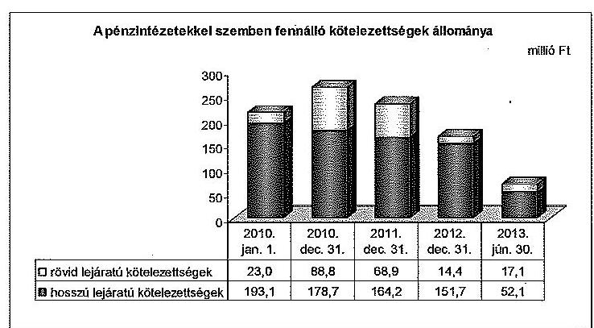
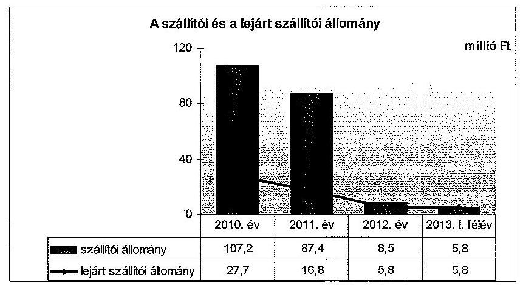
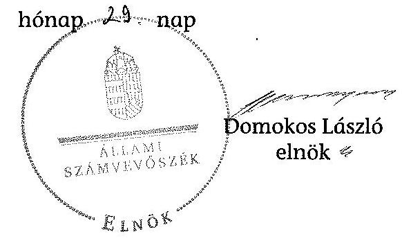

# ÁLLAMI   SZÁMVEVŐSZÉK 

## JELENTÉS

az önkormányzatok pénzügyi gazdálkodási helyzete értékelésének, és gazdálkodása szabályosságának ellenőrzéséről

Encs
14070
2014. április

---

# Állami Számvevőszék 

Iktatószám: V-0318-047/2014.
Témaszám: 23
Vizsgálat-azonosító szám: V065007

## Az ellenőrzést felügyelte:

## Renkó Zsuzsanna

felügyeleti vezető
Az ellenőrzést vezette és az ellenőrzés végrehajtásáért felelős:
Mohl Anna
ellenőrzésvezető
A számvevőszéki jelentés összeállításában közreműködött:
Baksa Anikó
számvevő tanácsos
Az ellenőrzést végezték:
Dr. Szima Mária Várkonyi Zsolt Kristóf
számvevő tanácsos
számvevő tanácsos

---

# TARTALOMJEGYZÉK 

BEVEZETÉS ..... 3
I. ÖSSZEGZŐ MEGÁLLAPÍTÁSOK, KÖVETKEZTETÉSEK, JAVASLATOK ..... 6
II. RÉSZLETES MEGÁLLAPÍTÁSOK ..... 12

1. Az Önkormányzat kötelező és önként vállalt feladatai, a feladatellátás szervezeti kereteinek változása ..... 12
2. A pénzügyi egyensúlyt fenntartását veszélyeztető pénzügyi kockázatok, ezek csökkentése érdekében tett intézkedések ..... 14
3. Az Önkormányzat kötelezettségeinek állománya, azok összetételének változása, az adósságkonszolidáció hatása ..... 21
4. Az Önkormányzat pénzügyi gazdálkodása során érvényesített integritási szempontok ..... 26

---

# MELLÉKLETEK 

1/A. számú Az Önkormányzat bevételei és kiadásai, valamint adósságszolgálata a 2010-2013. év I. féléve közötti időszakban (a CLF módszer szerint, a Kvtv. 72. § (1) bekezdésében foglalt adósságátvállaláshoz kapcsolódó pénzügyi teljesítések nélkül)
1/B. számú Az Önkormányzat bevételei és kiadásai a Kvtv. 72. § (1) bekezdésében foglalt adósságátvállaláshoz kapcsolódó pénzügyi teljesítések nélkül a 2013. év I. félévében (a CLF módszer szerint)
2. számú Az Önkormányzat által a 2010. és a 2013. év I. félév között megvalósított fejlesztési feladatok érdekében teljesített felhalmozási kiadások és az ezekhez vállalt kötelezettségek összegzése
3. számú Az önkormányzati feladatok ellátásában résztvevő gazdasági társaságok egyes kiemelt adatai
4. számú Az Önkormányzat 2013. június 30-án fennálló, hosszú lejáratú adósságot keletkeztető kötelezettségvállalásai
5. számú Az Önkormányzat kötelezettségeinek és egyes kötelezettségvállalásainak 2010. december 31-ei és 2013. június 30-ai állománya, valamint a 2013. év II. félévében és az azt követő években várható kötelezettségek, kötelezettségvállalások miatti kiadások

## FÜGGELÉKEK

1. számú Rövidítések jegyzéke
2. számú Fogalomtár

---

# JELENTÉS 

## az önkormányzatok pénzügyi gazdálkodási helyzete értékelésének, és gazdálkodása szabályosságának ellenőrzéséről Encs

## BEVEZETÉS

Az ÁSZ a stratégiájában célul tűzte ki, hogy az önkormányzatok ellenőrzése során azok pénzügyi-gazdasági helyzetét értékeli, kockázatait feltárja, valamint az ellenőrzések helyszíneit objektív mutatószámrendszer alapján választja ki.

Az államháztartás önkormányzati alrendszerében az utóbbi években megjelenő gazdálkodási nehézségek, a pénzforgalmi hiány növekedése, az eladósodás az ÁSZ figyelmét az önkormányzatok pénzügyi helyzetére irányította. Az elkövetkezendő évek költségvetési hiánycéljainak tarthatósága érdekében indokolt, hogy az önkormányzatok pénzügyi helyzetelemzése és az egyensúlyi helyzetet befolyásoló kockázatok feltárása továbbra is kiemelt hangsúlyt kapjon az ÁSZ tevékenységében.

A közigazgatás átalakításának keretében - a helyi igazgatás és önkormányzás hatékonyabbá tétele érdekében - az önkormányzatokra vonatkozóan 2012-ben újraszabályozták mind a sarkalatos, mind az önkormányzatok mindennapi működését rendező törvényeket és a feladatok végrehajtását biztosító előírásokat. Az önkormányzati feladatellátást érintő átalakítások jelentős része 2013-ban következett be azzal, hogy az igazgatási, az oktatási és a szociális ellátásban a feladatok jelentős hányadát átvette az állam. Ahhoz, hogy az önkormányzatok meg tudjanak felelni a számukra meghatározott - szigorúbb gazdálkodási szabályoknak, és az új feltételek mellett is biztosítható legyen a közszolgáltatások megfelelő színvonalú ellátása, szükséges volt a pénzügyigazdasági rendszerük alapjainak megszilárdítása. Ezt a célt szolgálja az adósságkonszolidáció, amely az önkormányzatok működését és fejlesztését segítő, de korábban az állam által nem fedezett kiadásokkal kapcsolatos kötelezettségvállalások differenciált mértékű átvállalását jelenti.

Az ÁSZ a 2013. év II. félévi ellenőrzési tervében a 23. számú, az önkormányzatok pénzügyi gazdálkodási helyzete értékelésének, és gazdálkodása szabályosságának - 2013. évben induló - ellenőrzésével az önkormányzatok 2011. évben megkezdett helyzetelemzését folytatja. Az adósságkonszolidáció az önkormányzatok pénzügyi egyensúlyi helyzetére egyértelműen kedvező hatást gyakorolt. Az önkormányzati alrendszerben a 2013-tól bevezetett új feladatfinanszírozási rendszer keretein belül az adott települési önkormányzat feladata a pénzügyi egyensúly megteremtése, hosszú távú fenntartása. Az adósságkonszolidáció, a feladat-ellátási és finanszírozási rendszer változásának 2013. év

---

I. félévet követő hatása az ellenőrzött időszak alapján - az intézkedések bevezetése óta eltelt idő rövidségére tekintettel - még nem állapítható meg. A pénzügyi-egyensúlyi helyzet jövőbeni alakulása - figyelemmel az adósságkonszolidáció folytatására - a törvényi rendelkezések hosszabb távú érvényesülése után elemezhető, értékelhető.

Erre tekintettel kiemelt fontosságú az önkormányzatok pénzügyi egyensúlyi helyzetére ható kockázatok feltárása, az ezzel kapcsolatos folyamatok, trendek bemutatása. Az ÁSZ ennek megfelelően a jövőben is tovább folytatja az önkormányzatok pénzügyi gazdálkodási helyzetét értékelő témacsoportos ellenőrzéseit.

Az ellenőrzések kockázatalapú megközelítése keretében megtörténik az önkormányzatok adósságkezelési és likviditási helyzetének értékelése, a pénzügyi egyensúly minősítése, továbbá az alrendszerben 2013-ban bekövetkezett változások hatásának értékelése.

Az ellenőrzés - eredményének várható hatásaként - megállapításaival segítséget nyújthat a pénzügyi helyzet értékeléséhez, a pénzügyi egyensúly helyreállítása érdekében szükségessé váló önkormányzati intézkedések megtételéhez. Az ellenőrzés során továbbra is célunk az államháztartás önkormányzati alrendszerére jellemző információk összegzésével támogatni az Országgyűlés munkáját a törvényalkotásban, a források elosztásában.

Az ellenőrzés célja: az Önkormányzat pénzügyi helyzetének, szabályosságának értékelése, a pénzügyi egyensúly alakulására hatással lévő folyamatoknak és a pénzügyi egyensúly alakulására ható kockázatoknak a feltárása.

# Ennek keretében értékeltük, hogy: 

- a kötelező és önként vállalt feladatok ellátása, ezen belül az ellátott feladatok körének, az ellátást biztosító szervezeti formáknak a változása milyen hatást gyakorolt a pénzügyi egyensúlyi helyzetre;
- az Önkormányzat pénzügyi - működési és felhalmozási - egyensúlya milyen irányban változott, a változást milyen okok idézték elő, továbbá milyen intézkedéseket tettek az egyensúly biztosítása, illetve javítása érdekében, az intézkedések hatására javult-e az Önkormányzat pénzügyi helyzete;
- a költségvetési kiadások finanszírozása érdekében vállalt, pénzintézetekkel szembeni kötelezettségek, a szállítói és egyéb kötelezettségek hogyan alakultak, az adósságkonszolidáció után fennmaradt kötelezettségek teljesítésének kockázatai miként befolyásolják a jövőbeli pénzügyi egyensúlyi helyzetet.

Az önkormányzatok korrupcióval szembeni veszélyeztetettségének csökkentése érdekében új feladatként felmértük az integritási szemlélet érvényesülését a pénzügyi gazdálkodási folyamatokban.

Utóellenőrzésre nem került sor, mivel az ÁSZ az ellenőrzött időszakban az Önkormányzatnál számvevőszéki jelentéssel lezárt ellenőrzést nem végzett.

---

Az ellenőrzési célokban megfogalmazott kérdések értékelési kritériumai a gazdálkodásra vonatkozó jogszabályok és a pénzügyi egyensúly biztosításának, valamint a pénzügyi helyzettel és gazdálkodással kapcsolatos kockázatok kezelésének követelménye. Az ellenőrzés az ellenőrzési célok eléréséhez elemző, értékelő, a pénzügyi helyzet kockázatát is minősítő eljárásokat alkalmazott.

Az ellenőrzés típusa: szabályszerűségi ellenőrzés

# Ellenőrzött szervezet: Encs Város Önkormányzata 

Az ellenőrzött időszak: a 2010. január 1-jétől 2013. június 30-ig terjedő időszak, figyelemmel az ellenőrzés célja vonatkozásában megfogalmazottakra. A pénzintézetekkel szembeni kötelezettségek állományának vizsgálatakor az ellenőrzött időszakban fennálló kötelezettségeket vette figyelembe az ellenőrzés.

Az ellenőrzés szakmai módszertana az ÁSZ hivatalos honlapján (www.asz.hu) közzétett szakmai szabályokon alapult, amely a Legfőbb Ellenőrző Intézmények Nemzetközi Szervezete (INTOSAI) által kiadott nemzetközi standardok (ISSAI) figyelembevételével készült.

Az ellenőrzés jogszabályi alapját az ÁSZ tv. 1. § (3) bekezdésének, 5. § (2)-(6) bekezdésének, valamint az Áht. 61. § (2) bekezdésének előírása képezte.

Az ellenőrzés során használt rövidítéseket az 1. számú, az egyes fogalmak magyarázatát a 2. számú függelék tartalmazza.

Encs város állandó lakosainak száma 2010. január 1-jén 6740 fő volt, 2012. január 1-jén 109 fővel kevesebb, 6631 fő volt. Az Önkormányzat beszámolója alapján a 2012. évben 2079,9 millió Ft költségvetési bevételt ért el, és 2003,9 millió Ft költségvetési kiadást teljesített. A 2012. december 31-i könyvviteli mérleg szerint az Önkormányzat 4877,4 millió Ft értékű vagyonnal rendelkezett, összes kötelezettsége 181,4 millió Ft volt. Az Önkormányzat 2013. június 30-án a Társaság (Encs Városgazda Nonprofit Közhasznú Kft.) 100,0%-os tulajdonosa volt, a Borsodvíz Zrt. 5,8%-os, az Észak-Magyarországi MÉH Zrt. 4,4%-os érdekeltségével rendelkezett. A jegyző 2000. április 1-jétől látja el feladatait. A Polgármesteri Hivatalban a foglalkoztatott köztisztviselők száma 2013. január 1-jén 23 fő volt.

Az ÁSZ tv. 29. (1) bekezdése szerint a jelentéstervezetet megküldtük a polgármester részére, aki az ÁSZ tv. 29. § (2) bekezdésében foglalt észrevételezési jogával nem élt, a jelentéstervezetre észrevételt nem tett.

---

# I. ÖSSZEGZŐ MEGÁLLAPÍTÁSOK, KÖVETKEZTETÉSEK, JAVASLATOK 

Encs Város Önkormányzata folyó költségvetésének egyensúlya az ellenőrzött időszakban - a 2010. év és 2013. év I. félév kivételével - döntően a működőképesség megőrzésére kapott költségvetési támogatások eredményeként volt biztosított. A működési költségvetés egyenlege a 2013. év I. félévében 34,3 millió Ft többletet mutatott. A 2013. évi 60,0%-os mértékű, 100,3 millió Ft - tőketartozás és annak járulékai - átvállalására vonatkozó adósságkonszolidáció hatására az Önkormányzat pénzügyi egyensúlyi helyzete javult. Az Önkormányzat pénzügyi egyensúlya az ellenőrzött időszakra vonatkozóan feltárt kockázatok alapján rövid távon biztosított volt, azonban középtávon már nem látszik biztosítottnak, mert a fennálló jövőbeni kötelezettségek teljesítésére elkülönített tartalék nem áll rendelkezésre.

Az Önkormányzat költségvetésének elemzését a CLF módszerrel számított mutatók alapján végeztük. A pénzügyi kapacitás 2010-2013. év I. félév közötti változását - a 2013. évi adósságkonszolidáció pénzforgalmi hatása nélkül számítva - a következő ábra mutatja be:

Az Önkormányzat az ellenőrzött időszakban összesen 7877,5 millió Ft összegű költségvetési bevételt ért el és 7722,7 millió Ft összegű költségvetési kiadást teljesített. A folyó bevételek a 2010. évben nem biztosítottak fedezetet a folyó kiadásokra. Az ellenőrzött időszakban összességében 228,4 millió Ft működési többlet keletkezett. Az Önkormányzat a 2010. évben 8,0 millió Ft, a 2011. évben 103,3 millió Ft, a 2012. évben 73,3 millió Ft ÖNHIKI támogatásban, a 2013. év I. félévében 11,0 millió Ft szerkezetátalakítási tartalékból folyósított támogatásban részesült.

A 2010. évben bevételi kitettséget jelentett, hogy a folyó költségvetés egyenlege az ÖNHIKI támogatás ellenére sem volt pozitív, e támogatás nélkül még nagyobb összegű hiány (24,8 millió Ft) jelentkezett volna. A működési

---

többlet alakulásában a 2011-2012. években döntő szerepe volt a kiegészítő támogatásoknak.

A 2010-2012. években az alacsony jövedelemtermelő képesség kockázatot jelentett, mivel a működőképesség megőrzését szolgáló kiegészítő támogatások nélkül számított működési jövedelem az ellenőrzött időszakban 32,8 millió Ft volt.

A felhalmozási költségvetés egyenlege a 2010. évben 76,5 millió Ft többletet, 2011-2013. év I. félévében 149,9 millió Ft forráshiányt mutatott, amelynek finanszírozására az előző években képződött pénzmaradványok, valamint nettó működési jövedelmek nyújtottak fedezetet. A fejlesztések során megvalósult létesítmények jövőbeni üzemeltetése miatti kockázat jelentkezik, mivel számításokkal alátámasztottan nem mutatták be a megvalósított fejlesztések jövőbeni üzemeltetésével kapcsolatos kiadások várható hatását.

Az Önkormányzat adatszolgáltatása alapján a megvalósított fejlesztések értéke 924,3 millió Ft, ebből az önként vállalt feladatokra fordított felhalmozási kiadások összege 88,6 millió Ft (9,6%) volt. Az ellenőrzött időszakban az önként vállalt feladatokhoz kapcsolódó fejlesztésekre fordított kiadások nagyságrendje, illetve részaránya felhalmozási kockázatot nem jelentett.

Az Önkormányzat - ellenőrzött időszakban - befejezett beruházásai (a 10,0 millió Ft-ot meghaladó összegű fejlesztések közül) az óvoda és a csapadékvíz hálózat építéséhez, az „Encs város közigazgatási és kereskedelmi központ rehabilitációjához”, a határon átnyúló „Történelmi körút kerékpáron” kialakításához, informatikai eszközök beszerzéséhez kapcsolódtak, továbbá kisebb volumenű beruházásokat jelentettek. A 2013. június 30-a utáni kötelezettségvállalások a járóbeteg-szakellátás és a gyermekorvosi rendelő fejlesztéséhez, továbbá a „Családi napközi kialakítása és szociális alapszolgáltatás fejlesztése” projektekhez kapcsolódtak. A
 2013. június 30-a utáni időszakra vállalt 439,2 millió Ft kötelezettség forrását 423,6 millió Ft (96,5%) EU-s támogatásból, 15,0 millió Ft (3,4%) egyéb központi támogatásból és 0,6 millió Ft (0,1%) saját bevételből tervezik biztosítani.

A nettó működési jövedelem (pénzügyi kapacitás) az ellenőrzött időszakban eltérő képet mutatott. A 2010. évi negatív 39,9 millió Ft-os egyenleg a 2011. évben pozitív irányban változott, 46,0 millió Ft-ra növekedett, a 2012. évben pozitív egyenlegét megtartva 10,0 millió Ft-ra csökkent, 2013. év I. félévben 27,1 millió Ft volt. A működőképesség megőrzését szolgáló központi támogatás nélkül a nettó működési jövedelem - 2013. I. félév kivételével - negatív lett volna.

A finanszírozási igény 2011-ben 73,8 millió Ft, a 2013. év I. félévében 2,0 millió Ft volt, amelynek forrását az előző évben keletkezett pénzmaradványok és az igénybe vett folyószámlahitel biztosították. Az Önkormányzatnak 2010-ben 36,6 millió Ft, 2012-ben 9,0 millió Ft finanszírozási többlete keletkezett.

Az önként vállalt feladatokra teljesített kiadások aránya az összes működési kiadáson belül a 2010. évi 15,8%-ról 2012. évre 16,6%-ra nőtt, összege a 2010. évi 368,3 millió Ft-ról 2012. évre 316,2 millió Ft-ra csökkent. A 2013. év I.

---

félévében az önként vállalt feladatokra teljesített kiadás 46,8 millió Ft (a működési kiadások 7,6%-a) volt. Az Önkormányzat 2010-ben keletkező negatív működési jövedelemére tekintettel az önként vállalt feladatokra fordított kiadások összegének és arányának változása miatt az ellenőrzött időszakon belül a 2010. évben állt fenn működési kockázat.

Az állami és saját hatáskörben történt feladatátadások a pénzügyi egyensúlyi helyzet alakulására kedvező hatásúak voltak. Az ellenőrzött időszakban megvalósult állami feladatátadások - az Önkormányzat adatszolgáltatása alapján - összességében 50,8 millió Ft megtakarítást eredményeztek.

A saját hatáskörben 2012 szeptemberétől végrehajtott, az egyháznak történő 1-8. osztályos általános iskolai telephely átadása következtében - az Önkormányzat adatszolgáltatása szerint - a működési jövedelem az ellenőrzött időszakban összesen 39,9 millió Ft-tal javult. Az ellenőrzött időszakban saját hatáskörben végrehajtott bevételnövelő és kiadáscsökkentő intézkedések hatására az Önkormányzat 67,8 millió Ft bevételnövekedést, továbbá 164,5 millió Ft kiadáscsökkenést ért el. A saját hatáskörben megtett intézkedésekből származó megtakarításokon belül az önként vállalt feladatokhoz 2,8 millió Ft kapcsolódott, amely a mozgókönyvtári feladatok és a tourinform iroda támogatásának megszüntetésével összefüggésben jelentkezett.

Az Önkormányzat pénzintézeti kötelezettsége 2010. január 1-jén 216,1 millió Ft volt, amely az ellenőrzött időszak végére 69,2 millió Ft-ra (68,0%-kal) csökkent. A 2013. év I. félévében a Ktv. alapján végrehajtott 60,0%-os adósságkonszolidáció hatására 99,7 millió Ft-tal csökkent a pénzintézeti kötelezettség. Az Önkormányzat fennálló négy hosszú lejáratú hitelszerződéséből a tőketartozás 2012. december 28-i állapot szerint 166,1 millió Ft volt. A 2013. év I. félévében (három hitelt érintő konszolidációt követően) 59,3 millió Ft hosszú lejáratú felhalmozási célú hitel, valamint a 2013-ban felvett és a 2013. június 30-án fennálló 9,9 millió Ft folyószámlahitel maradt fenn pénzintézeti kötelezettségként. Banki kitettség miatti kockázatot jelentett, hogy az Önkormányzat likviditását folyószámlahitel folyamatos igénybevételével biztosította. Az Önkormányzatnak devizában fennálló pénzintézeti kötelezettsége nem volt, kötvényt nem bocsátott ki.

Az adósságkonszolidációt követően fennmaradt hosszú távú pénzintézeti kötelezettségek teljesítésére a fedezet az elkülönített tartalék hiánya miatt nem látszik biztosítottnak.

Az ellenőrzött időszakban nemfizetési kockázatot és szállítói kitettséget jelentett a szállítókkal szemben fennálló kötelezettségek 2010-2011 években fennálló magas állománya, amely folyamatosan csökkenő tendenciát mutatott. A 2010. év végén 107,2 millió Ft volt szállítói állomány, amelynek 94,6%-os csökkenésében (2013. év I. félév végén 5,8 millió Ft) az általános iskola kiegyenlítetlen számláinak az ÖNHIKI támogatásból történő kifizetése, valamint a szállítói finanszírozások megszűnése játszott döntő szerepet. A lejárt szállítói állomány 2010. év végi 27,7 millió Ft-os összege a kötelezettségek átütemezésére a szolgáltatókkal kötött szerződések, valamint a kifizetések hatására 2013. év I. félévére 5,8 millió Ft-ra csökkent. A lejárt szállítói kötelezettség-

---

ek között 2012-ben és 2013. év I. félév végén már csak 30 napon belüli kötelezettségek voltak.

Mérlegen kívüli tételek miatti kockázatot jelentett, hogy az Önkormányzat 90,0 millió Ft összegű pénzintézeti kötelezettséghez kapcsolódó kezességet vállalt az Encsi Többcélú Kistérségi Társulás javára (utófinanszírozású EU-s projekthez). Az Önkormányzatot terhelő fizetési kötelezettség nem keletkezett, mivel a társulás a kötelezettségének eleget tett.

Az Önkormányzatnak a pénzügyi gazdálkodás során figyelmet kell fordítania az integritási szemlélet teljes körű érvényesítésére.

Az ellenőrzés során a gazdálkodási feladatok ellátásával kapcsolatban az alábbi szabályszerűségi hibákat tártuk fel:

- az Önkormányzat a kötelező feladatok ellátására a kizárólagos tulajdonában lévő Társasággal 2013. június 27-én határozatlan időre szóló közszolgáltatási szerződést kötött, amely ellentétes a Kbt. 2-ben foglalt előírással, mely szerint a szerződések határozott időre, legfeljebb öt évre köthetők;
- az Önkormányzat a 2013. évi költségvetési rendeletében a Mötv. szerinti működési költségvetési egyensúly megteremtése érdekében 88,1 millió Ft működőképesség megőrzését szolgáló, kiegészítő támogatást is figyelembe vett, ezáltal a bevételi előirányzatok tervezése az Áht.-ben előírtak ellenére közgazdaságilag nem volt megalapozott.

Az ÁSZ tv. 33. § (1) bekezdésében foglaltak értelmében az ellenőrzött szervezet vezetője köteles a jelentésben foglalt megállapításokhoz kapcsolódó intézkedési tervet összeállítani, és azt a jelentés kézhezvételétől számított harminc napon belül az ÁSZ részére megküldeni. Amennyiben az intézkedési tervet határidőn belül nem küldi meg a szervezet vezetője, vagy az továbbra sem elfogadható, az ÁSZ elnöke a hivatkozott törvény 33. § (3) bekezdés a-b) pontjában foglaltakat érvényesítheti.

# Az ellenőrzés intézkedést igénylő megállapításai és javaslatai: 

## a polgármesternek

1. Az Önkormányzat folyó költségvetésének egyensúlya az ellenőrzött időszakban - a 2010. év és a 2013. év I. félév kivételével - főként a működőképesség megőrzésére kapott költségvetési támogatások eredményeként volt biztosított. A 2010. évben az ÖNHIKI támogatás ellenére 16,8 millió Ft működési hiány jelentkezett. A folyó költségvetésben 2011-2012 között 210,9 millió Ft többlet képződött, amelyhez döntően hozzájárult a 176,6 millió Ft működőképesség megőrzését szolgáló támogatás. A 2013. év I. félévében a szerkezetátalakítási tartalékból folyósított 11,0 millió Ft támogatás nélkül a működési jövedelem 23,3 millió Ft többletet mutatott. A 2011. évtől a működési jövedelem fedezetet nyújtott a tőketörlesztési kötelezettségekre. A saját hatáskörben tett bevételnövelő és kiadáscsökkentő intézkedések nem teremtettek elegendő forrást a pénzügyi egyensúly hosszú távú fenntartásához. A likviditás biztosítására igénybe vett folyószámlahitel az ellenőrzött időszakban tartóssá vált. A 2013. év I. félév végén - az adósságkonszolidációt követően - fennálló pénzintézeti kötelezettség 69,2 millió Ft volt. A működési és felhalmozási egyensúly hosszú távú fenn-

---

tartásához szükséges elkülönített tartalék nem áll rendelkezésre. A 2010-2011. években szállítói kitettséget és nemfizetési kockázatot jelentett a szállítókkal szembeni kötelezettségek magas állománya. A 2013. június 30-án fennálló 5,8 millió Ft szállítói tartozás egésze 30 napon belüli lejárt esedékességű volt. Az önként vállalt feladatok ellátása a 2010. évben működési kockázatot jelentett.

Javaslat:
A működési jövedelemtermelő képesség és a feladatellátás összhangjának, valamint a pénzügyi egyensúly hosszú távú fenntarthatósága érdekében felelősök és határidők megjelölésével kezdeményezzen intézkedéseket, melyek keretében:
a) a költségvetési rendelettervezet, valamint annak évközi módosítása előterjesztését megelőzően mérjék fel a bevételszerző, kiadáscsökkentő lehetőségeket, és terjessze a Képviselő-testület elé a bevételek növelését, a kiadások csökkentését célzó intézkedések bevezetéséhez szükséges - a Htv. 140. § (1) bekezdés a) pontja alapján a jegyző által elkészített - döntési javaslatát;
b) terjesszen a Képviselő-testület elé jóváhagyásra - a Htv. 140. § (1) bekezdés a) pontja alapján a jegyző által elkészített - az Önkormányzat gazdasági helyzetének elemzésén alapuló, a pénzügyi egyensúlyi helyzet hosszú távú fenntartását, valamint az adósságállomány újratermelődésének elkerülését biztosító intézkedéseket tartalmazó stabilizációs programot;
c) terjesszen a Képviselő-testület elé az adósságkonszolidációs folyamat lezárultát követően - a Htv. 140. § (1) bekezdés a) pontja alapján a jegyző által elkészített - döntési javaslatot, amelyben a gazdálkodás biztonsága, a fizetőképesség megőrzése érdekében meghatározzák a működési és felhalmozási egyensúly hosszú távú fenntartásához szükséges elkülönített tartalék nagyságát, képzésének, felhasználásának szabályait;
d) a szállítói kitettség és az Adósságrendezési tv. 4. § (2) bekezdés a-b) pontjában megjelölt helyzet kialakulásának elkerülése érdekében, meghatározott gyakorisággal számoljon be a Képviselő-testületnek az Önkormányzat lejárt szállítói állománya alakulásáról, intézkedjen a szállítói számlák esedékesség szerinti kiegyenlítéséről vagy a lejárt szállítói tartozások átütemezéséről;
e) vizsgálja felül az önként vállalt feladatok finanszírozhatóságát a kötelező feladatellátás elsődlegességének biztosítása érdekében, és ennek függvényében tegyen javaslatot a Képviselő-testületnek a feladatellátás racionalizálására.
2. Az Önkormányzat a kötelező feladatok ellátására a kizárólagos tulajdonában lévő Társasággal 2013. június 27-én határozatlan időre szóló közszolgáltatási szerződést kötött, amely ellentétes a Kbt. 2 9. § (3) bekezdésével, mely szerint a szerződések határozott időre, legfeljebb öt évre köthetők.

Javaslat:
A közbeszerzési eljárásról szóló törvényben foglaltak maradéktalan betartása érdekében intézkedjen, hogy az Önkormányzatnál a közszolgáltatási szerződéseket - a Kbt. 2 9. § (3) bekezdésében foglalt előírás alapján - határozott időre, legfeljebb öt évre kössék meg.

---

# a jegyzőnek 

1. Az Önkormányzat a 2013. évi jóváhagyott költségvetési rendeletében a működési költségvetés Mötv. 111. § (4) bekezdésében előírt egyensúlyát oly módon biztosította, hogy a költségvetési támogatásból származó bevételek eredeti előirányzatai között 88,1 millió Ft működőképesség megőrzését szolgáló, kiegészítő támogatásból származó bevételt is figyelembe vett, ezáltal a bevételi előirányzatok tervezése az Áht. 12. § (1) bekezdésében előírtak ellenére közgazdaságilag nem megalapozott módon történt.

Javaslat:
Intézkedjen, hogy a költségvetési rendelettervezetben a működési költségvetés Mötv. 111. § (4) bekezdésében előírt egyensúlyának biztosításakor a bevételeket az Áht. 12. § (1) bekezdésének megfelelően, közgazdaságilag megalapozottan határozzák meg.

---

# II. RÉSZLETES MEGÁLLAPÍTÁSOK 

## 1. Az ÖNKORMÁNYZAT KÖTELEZŐ ÉS ÖNKÉNT VÁLLALT FELADATAI, A FELADATELLÁTÁS SZERVEZETI KERETEINEK VÁLTOZÁSA

Az Önkormányzat a kötelező és az önként vállalt feladatok ellátását a 2010-2013. év I. félév közötti időszakban az SZMSZ-ében, az önkormányzati intézmények alapító okirataiban, a közszolgáltatási és támogatási szerződésekben, valamint a 2011-2013. évi költségvetési rendeleteiben határozta meg. Az Önkormányzat önként vállalt feladatai körébe sorolta a nevelési tanácsadó működtetését, az alapfokú művészeti oktatást, a szakiskola fenntartását, az ösztöndíjpályázat támogatását, a támogató szolgálatot, a jelzőrendszeres házi segítségnyújtást, az idősek otthona működtetését, szabad kapacitása terhére étkeztetés nyújtását, a bölcsődei ellátást, a városi sportegyesület támogatását, a helyi újság és televízió üzemeltetésének támogatását, a tourinform iroda, a mozgókönyvtári ellátás kistérségi működtetését és civil szervezetek támogatását, a járóbeteg szakellátást, a kéményseprő-ipari közszolgáltatás nyújtásának megszervezését.

Az Mötv. 13. §-a (1) bekezdésének 15. pontja előírásait megsértve az önként vállalt feladatok körében az SZMSZ-ben nevesítésre került a sporttámogatások nyújtása¹, holott a sport ügyek, így ezen belül a nyújtott támogatások a Sport tv. 55. § (1)-(2) bekezdésében meghatározott feltételek fennállása esetén a helyben biztosítandó közfeladatok körében kötelező önkormányzati feladatnak minősülnek.

A kötelező feladatok körében biztosították az óvodai ellátást, az általános iskolai oktatást, a szociális
 alapellátás keretében az ápoló-, gondozó ellátást, a gyermekjóléti feladatokat, az egészségügyi alapellátási feladatokat, a helyi utak, a köztemető, a piac fenntartását, az ivóvízellátást, a katasztrófavédelmet, a művelődési ház és a könyvtár, a sportközpont és a tűzoltóság működtetését.

A háziorvosi ellátást és az orvosi ügyeletet vállalkozási formában biztosították. Az Önkormányzat egyes kötelező feladatait (köztisztaság, köztemető fenntartás, településrendezés) közszolgáltatási szerződések alapján a Társaság látta el. A Borsodvíz Zrt. működtette az ivóvíz- és szennyvízhálózatot. A feladatellátásban részt vevő társaságok egyes adatait a 3. számú melléklet tartalmazza.

Az Önkormányzat feladatait 2010. január 1-jén nyolc költségvetési szervvel, 28 telephelyen látta el. Az ellenőrzött időszak végén az önkormányzati fenntartású költségvetési szervek száma hatra, a telephelyek száma 20-ra csökkent.

A 2012. évben a működési kiadások összege 1878,7 millió Ft volt, 19,5%-kal (454,3 millió Ft-tal) kevesebb a 2010. évi teljesített működési kiadások összegé-

[^0]
[^0]:    ${ }^{1}$ A téves besorolás 2012. december 31-ig az Ötv. 8. § (1) bekezdésében rögzítettekkel volt ellentétes.

---

nél. A működési kiadások mérséklődését a közoktatási feladatokból az általános iskola egyik telephelyének (1-8 osztály) 2012-ben egyháznak történő átadása, a tűzoltóság állami fenntartásba adása, a dolgozói létszám és személyi juttatások csökkenésének együttes hatása okozta.

Az Önkormányzat által szolgáltatott adatok szerint a 2010. évről a 2012. évre a kötelező feladatokra fordított működési kiadások aránya az összes működési kiadáshoz viszonyítva 84,2%-ról 83,4%-ra, összege 1967,6 millió Ft-ról 1584,7 millió Ft-ra csökkent. A 2013. év I. félévében a teljesített működési kiadások 92,4%-a (567,4 millió Ft) kapcsolódott kötelező feladatellátáshoz. A kiadások csökkenését az általános iskola állami fenntartásba adása és egyes államigazgatási feladatok (Gyámhivatal, Okmányiroda) Járási Hivatalhoz való átadása okozta.

Az Önkormányzat feladatainak bővülését jelentette, hogy a Gyermekvédelmi tv. 151. § (2) bekezdése értelmében 2013. január 1-jétől az intézmények fenntartójától függetlenül, a város közigazgatási területén lévő valamennyi oktatási intézmény esetében az Önkormányzat vált a gyermekétkeztetés kötelező ellátójává.

Az önként vállalt feladatokra teljesített kiadások aránya - az Önkormányzat adatszolgáltatása szerint - az összes működési kiadáson belül a 2010. évi 15,8%-ról 2012. évre 16,6%-ra nőtt, összege a 2010. évi 368,3 millió Ft-ról 2012. évre 316,2 millió Ft-ra csökkent. A 2013. év I. félévében az önként vállalt feladatokra teljesített kiadás 46,8 millió Ft (a működési kiadások 7,6%-a) volt. Az önként vállalt feladatok köre 2013. év I. félévében csökkent az alapfokú művészeti oktatás, a nevelési tanácsadó és a szakiskola Klebelsberg Intézményfenntartó Központ részére történő 2013. január 1-jei átadásával, a mozgókönyvtári feladatok és a tourinform iroda támogatásának megszüntetésével.

Az Önkormányzat működési jövedelmének alakulására tekintettel az önként vállalt feladatokra fordított kiadások összegének és arányának változása miatt az ellenőrzött időszakon belül a működési kockázat a 2010. évben állt fenn.

Az Önkormányzat adatszolgáltatása alapján a megvalósított fejlesztések értéke 924,3 millió Ft, ebből az önként vállalt feladatokra fordított felhalmozási kiadások összege 88,6 millió Ft (9,6%) volt. Az ellenőrzött időszakban az önként vállalt feladatokhoz kapcsolódó fejlesztésekre fordított kiadások nagyságrendje, illetve részaránya felhalmozási kockázatot nem jelentett.

Az Önkormányzat a kötelező feladatok ellátására az Encs Városgazda Nonprofit Közhasznú Kft.-vel 2009. szeptember 19-én feladat-ellátási szerződést, 2013. június 27-én közszolgáltatási szerződést kötött. A közszolgáltatási szerződés - annak 8. pontja alapján - határozatlan időre szól, amely ellentétes a Kbt. 39. § (3) bekezdésében foglalt előírással, amely szerint a szerződések határozott időre, legfeljebb öt évre köthetők.

A kötelező és önként vállalt feladatokra fordított kiadások arányának, mértékének és azok változásának a pénzügyi egyensúlyi helyzetre gyakorolt hatását az Önkormányzat az ellenőrzött időszakban nem értékelte.

---

Az Önkormányzat a közoktatási ágazatban 2012. szeptember 1-jétől az általános iskola egyik telephelyét (1-8 osztályát) egyházi fenntartásba adta, amelynek hatását az Önkormányzat számszerűsítette: a működési jövedelem 2012-ben 17,8 millió Ft-tal, 2013-ban 22,1 millió Ft-tal, az ellenőrzött időszakban összesen 39,9 millió Ft-tal javult.

A kulturális, közművelődési szolgáltatások körében a mozgó könyvtári ellátás a megyei könyvtár feladatává vált, valamint a tourinform iroda támogatását megszüntették, a megtakarítás 2,8 millió Ft volt.

Az ellenőrzött időszakban megvalósult állami feladatátadások - az Önkormányzat adatszolgáltatása alapján - összességében 50,8 millió Ft megtakarítást eredményeztek. A 2012. évben a tűzoltóság állami feladattá vált, amely a működési jövedelem alakulására nem volt hatással. Az Önkormányzat a feladatra kapott központi támogatáson felül a tűzoltóság kiadásaihoz nem járult hozzá. A tűzoltóság átadása 2012-ben 290,0 millió Ft kiadás és bevételcsökkenést okozott az Önkormányzat költségvetésében.

Központi intézkedés hatására 2013. január 1-jétől az általános iskolát és a szakiskolát az Önkormányzat állami működtetésbe és fenntartásba adta át, továbbá nem látja el a pedagógiai szakszolgálat működtetését. Ennek költségvetési hatása 34,5 millió Ft megtakarítást jelentett az ellenőrzött időszak végéig.

Az Okmányiroda és a Gyámhivatal feladatait 2013. január 1-jétől a járási kormányhivatal vette át, a tíz fős létszámcsökkenés 16,3 millió Ft-tal csökkentette a személyi juttatásokon és járulékain a 2013. év I. félévében jelentkező kiadásokat. A hivatali feladatok ellátására ténylegesen alkalmazott létszámot a Polgármesteri Hivatal működésének támogatására Kvtv. 2. számú melléklet I. 1. a) pont alapján - megállapított alaplétszámra figyelemmel, közel azonos mértékben alakították ki. Az Önkormányzat adatszolgáltatása alapján a Polgármesteri Hivatalban a betöltött álláshelyek száma 2013. január 1-jén 26 fő (23 fő köztisztviselő, 3 fő technikai), a Kvtv. alapján elismert létszám 25,6 fő volt.

Az Önkormányzat feladatátadásai a pénzügyi egyensúlyi helyzet alakulására kedvező hatást gyakoroltak.

# 2. A PÉNZÜGYI EGYENSÚLY FENNTARTÁSÁT VESZÉLYEZTETŐ PÉNZÜGYI KOCKÁZATOK, EZEK CSÖKKENTÉSE ÉRDEKÉBEN TETT INTÉZKEDÉSEK 

Az Önkormányzat költségvetésének elemzését a CLF módszer szerint hajtottuk végre. A 2013. év I. félévi valós jövedelemtermelő képesség bemutatása érdekében az elemzés során nem vettük figyelembe az adósságkonszolidációhoz kapcsolódó bevételeket és kiadásokat.

Az adósságkonszolidációra vonatkozóan az Önkormányzat 2013. év I. félévi beszámolója 100,3 millió Ft felhalmozási költségvetési támogatást, 99,7 millió Ft hiteltörlesztést és 0,6 millió Ft kamatkiadást tartalmazott.

---

A CLF módszer szerinti önkormányzati részletes adatokat 2010-2013. év I. félév között az 1/A. számú melléklet, az adósságkonszolidációhoz kapcsolódó bevételek és kiadások pénzügyi egyensúlyi helyzetre gyakorolt hatását az 1/B. számú melléklet, a főbb önkormányzati adatokat a következő tábla mutatja be:

| Megnevezés | 2010. év | 2011. év | 2012. év | millió Ft   2013. I.   félév |
| :-- | --: | --: | --: | --: |
| Folyó bevételek | 2316,2 | 2265,2 | 1955,7 | 645,9 |
| Folyó kiadások | 2333,0 | 2131,3 | 1878,7 | 611,6 |
| Működési jövedelem | $\mathbf{- 1 6 , 8}$ | $\mathbf{1 3 3 , 9}$ | $\mathbf{7 7 , 0}$ | $\mathbf{3 4 , 3}$ |
| Felhalmozási bevételek | 161,8 | 408,5 | 124,2 | 0,0 |
| Felhalmozási kiadások | 85,4 | 528,3 | 125,3 | 29,1 |
| Felhalmozási költségvetés egyenlege | $\mathbf{7 6 , 5}$ | $\mathbf{- 1 1 9 , 8}$ | $\mathbf{- 1 , 0}$ | $\mathbf{- 2 9 , 1}$ |
| Folyó és felhalmozási bevételek összesen | 2478,0 | 2673,7 | 2079,9 | 645,9 |
| Folyó és felhalmozási kiadások összesen | 2418,4 | 2659,6 | 2003,9 | 640,7 |
| Finanszírozási műveletek nélküli pozíció | $\mathbf{5 9 , 6}$ | $\mathbf{1 4 , 1}$ | $\mathbf{7 6 , 0}$ | $\mathbf{5 , 2}$ |
| Finanszírozási műveletek egyenlege | -16,3 | -34,9 | -23,0 | $-5,6$ |
| Tárgyévi pénzügyi pozíció | $\mathbf{4 3 , 4}$ | $\mathbf{- 2 0 , 8}$ | $\mathbf{5 3 , 0}$ | $\mathbf{- 0 , 4}$ |
| Hiteltörlesztés, értékpapír beváltás | 23,1 | 87,9 | 67,0 | 7,2 |
| Nettó működési jövedelem | $\mathbf{- 3 9 , 9}$ | $\mathbf{4 6 , 0}$ | $\mathbf{1 0 , 0}$ | $\mathbf{2 7 , 1}$ |

Az Önkormányzat a 2010. év és a 2013. év I. félév között - a 2013. évi adósságkonszolidációs támogatás nélkül számítva - összesen 7877,5 millió Ft költségvetési bevételt ért el, és 7722,6 millió Ft költségvetési kiadást teljesített. Az ellenőrzött időszakban a működési jövedelem változóan alakult. A működési jövedelem a 2010. évi -16,8 millió Ft-ról 2011. évre 133,9 millió Ft-ra nőtt. A működési jövedelem kedvező változását nagy részben az ÖNHIKI támogatás 95,3 millió Ft-tal², a helyi adóbevételek 15,6 millió Ft-tal történő növekedése okozták. A 2010. évi -16,8 millió Ft működési jövedelem keletkezésében szerepet játszott, hogy 2009-ről 20,0 millió Ft kifizetetlen, lejárt határidejű és következő évben kiegyenlített szállítói tartozás pénzügyi teljesítése 2010. évben történt meg, valamint 7,4 millió Ft költségvetési befizetési kötelezettség keletkezett. A 2012. évben a működési jövedelem 77,0 millió Ft-ra csökkent, mivel az előző évhez képest a működőképesség megőrzésére kapott költségvetési támogatás 30,0 millió Ft-tal, az átengedett bevétel 15,0 millió Ft-tal csökkent, továbbá a magánszemélyeknek nyújtott támogatások 6,8 millió Ft-tal emelkedtek.

Az Önkormányzat az ellenőrzött időszakban összesen 174,7 millió Ft ÖNHIKI támogatásban részesült, továbbá 9,9 millió Ft-ot kapott a 60/2011. (XII. 23.) BM rendelet alapján a helyi önkormányzatok rövid lejáratú hiteltörlesztését szolgáló támogatásból. A működőképesség megőrzését szolgáló kiegészítő támogatásból 2010. évben 8,0 millió Ft (4,6%), 2011. évben 93,4 millió Ft (53,5%), 2012. évben 73,3 millió Ft (41,9%) állt rendelkezésre. Szerkezetátalakítási tartalékból folyósított támogatásként 2013. év I. félévében az Önkormányzat 11,0 millió Ft költségvetési támogatásban részesült.

A 2010. évben bevételi kitettséget jelentett, hogy a folyó költségvetés egyenlege az ÖNHIKI támogatás ellenére sem volt pozitív, e támogatás nélkül

[^0]
[^0]:    ${ }^{2}$ Az ÖNHIKI támogatás tartalmazza a helyi önkormányzatok rövid lejáratú hiteleinek törlesztése jogcímen kapott 9,9 millió Ft támogatást is.

---

még nagyobb összegű hiány (24,8 millió Ft) jelentkezett volna. A 2011-2012. években a működési többlet alakulásában döntő szerepe volt a kiegészítő támogatásoknak ${ }^{3}$.

A 2010-2012. években az alacsony jövedelemtermelő képesség miatti kockázat fennállt, mivel a működőképesség megőrzését szolgáló kiegészítő támogatások és a szerkezetátalakítási támogatás nélkül számított működési jövedelem az ellenőrzött időszakban 32,8 millió Ft volt.

A nettó működési jövedelem az ellenőrzött időszakban változóan alakult. A 2010. évi -39,9 millió Ft 2011. évben 46,0 millió Ft-ra növekedett, 2012. évben pozitív egyenlegét megtartva 10,0 millió Ft volt. 2013. év I. félévben a 27,1 millió Ft nettó működési jövedelem a 34,3 millió Ft működési jövedelem és a 7,2 millió Ft tőketörlesztés egyenlegeként keletkezett. A működőképességet megőrzését szolgáló támogatások nélkül - a 2013. év I. félév kivételével - az Önkormányzat nettó működési jövedelme minden évben negatív lett volna (2010-ben -47,9 millió Ft, 2011-ben -57,3 millió Ft, 2012-ben -63,3 millió Ft).

Az Önkormányzatnak az ellenőrzött időszakban az adósságszolgálatból származó - adósságkonszolidáció nélkül
 számított hiteltörlesztése 185,2 millió Ft volt, amelyből 48,9 millió Ft kapcsolódott a hosszú lejáratú hitelek törlesztéséhez. A hiteltörlesztések teljesítésében a működőképesség megőrzéséhez, valamint a 2011-ben a rövidlejáratú hiteltörlesztéshez kapott támogatások 184,6 millió Ft-os együttes összegének jelentős szerepe volt.

A felhalmozási bevételek és kiadások egyenlege ${ }^{4}$ a 2010. évben 76,5 millió Ft többletet, 2011-2013. év I. félév között összesen 149,9 millió Ft forráshiányt mutatott, amelynek finanszírozására az előző években képződött pénzmaradványok, valamint a nettó működési jövedelem nyújtottak fedezetet.

Az encsi és az északi lakórész csapadékcsatorna beruházáshoz 2010-ben 30,9 millió Ft támogatás értékű bevétel érkezett, amelyből a tárgyévben 4,2 millió Ft, a 2011. évben 26,7 millió Ft kiadást finanszíroztak. Az „Encs város közigazgatási és kereskedelmi központjának funkcionális rehabilitációja" beruházáshoz kapcsolódó pályázati támogatásból származó bevétel 66,3 millió Ft volt 2010-ben, amelyből 13,2 millió Ft realizálódott tárgyévben, a többi 2011-ben teljesült. A határon átnyúló „Történelmi körút kerékpáron" projekt előkészítési munkálataira 20,1 millió Ft került kifizetésre, amelyet saját forrásból előlegezett meg az Önkormányzat. A pályázati támogatás összegéből 2011. évben 2,5 millió Ft, 2012. évben pedig 15,6 millió Ft érkezett meg. Az Önkormányzat által értékesített forgalomképes ingatlan (telek) elkülönített számlájának egyenlege - amely működési célra nem használható fel - 2010-ben 5,1 millió Ft volt, amit 2011-ben használtak fel a felhalmozási kiadások finanszírozásához.

[^0]
[^0]:    ${ }^{3}$ A működőképesség megőrzését szolgáló kiegészítő támogatás nélkül a működési jövedelem a 2011. évben 30,6 millió Ft, a 2012. évben mindössze 3,7 millió Ft többletet mutatott. A 2013. év I. félévében kapott 11,0 millió Ft-os szerkezetátalakítási támogatás nélkül 23,3 millió Ft működési jövedelem keletkezett volna féléves szinten.
    ${ }^{4}$ A felhalmozási költségvetés egyenlegére hatott, hogy a bevételi és kiadási tételek nem egy időszakban jelentek meg, illetve a CLF módszer nem számol az előző évi maradvány igénybevételével.

---

A finanszírozási igény 2011-ben 73,8 millió Ft, a 2013. év I. félévében 2,0 millió Ft volt, amelynek forrását az előző évben keletkezett pénzmaradványok és az igénybe vett folyószámlahitel biztosították. Az Önkormányzatnak 2010-ben 36,6 millió Ft, 2012-ben 9,0 millió Ft finanszírozási többlete keletkezett.

A folyó bevételek 2010. évben 2316,2 millió Ft-ot tettek ki, 2011. évben 51,0 millió Ft-tal, 2012. évben 309,5 millió Ft-tal csökkentek az előző évhez képest. A folyó bevételeken belül 2010. évben (54,5%) és 2013. év I. félévében (52,0%) meghatározó részt képviseltek a költségvetési támogatások, a személyi jövedelemadó és egyéb átengedett központi bevételek, de 2011. évben (46,9%) és 2012. évben (41,6%) is jelentős volt az arányuk. A 2013. év I. félévben a folyó bevétel 645,9 millió Ft volt.

A 2011. évben a folyó bevételeken belül az ÖNHIKI nélküli költségvetési támogatás 199,5 millió Ft-tal csökkent, amely nagyrészt a lakosságszámhoz kötött támogatás 12,0 millió Ft, a feladatalapú támogatás 8,1 millió Ft, a központosított támogatások 15,0 millió Ft, a szociális támogatások 132,0 millió Ft összegű csökkenésével összefüggésben jelentkezett. További bevételkiesést okozott az átengedett bevételek 11,5 millió Ft-os, valamint az államháztartáson kívülről kapott támogatások 14,4 millió Ft-os csökkenése. A folyó bevételek 2011. évi növekedésében az ÖNHIKI, valamint a hiteltörlesztési támogatás 95,3 millió Ft-os emelkedése, továbbá az államháztartáson belülről átvett támogatások 83,0 millió Ft-os növekedése játszott szerepet. Ez utóbbi növekedésében elsősorban a közfoglalkoztatáshoz kapott központi támogatás (26,9 millió Ft), a tűzoltóságnak nyújtott egyszeri támogatás (29,2 millió Ft), a gondozási feladatokhoz (6,5 millió Ft), az iskolatej programhoz (6,5 millió Ft), valamint az ösztöndíj programhoz, az otthonteremtési támogatáshoz kapott központi források, valamint az OEP finanszírozás növekedése játszott szerepet. A 2012. évben és a 2013. év I. félévében a folyó bevételek csökkenését a feladatellátásban bekövetkezett változásokhoz kapcsolódó bevételek csökkenése okozta.

A helyi adóbevételek (adók és pótlékok) összege 2010. évben 110,3 millió Ft, ami 2011-ben 16,3%-kal emelkedett (128,6 millió Ft-ra), 2012-ben 1,2%-kal csökkent (127,0 millió Ft-ra) előző évhez képest, 2013. év I. félévben 56,9 millió Ft volt. Az Önkormányzat az ellenőrzött időszakban négy adónemet, a helyi iparűzési adót, a magánszemélyek kommunális adóját, a vállalkozások kommunális adóját és az építményadót vetette ki. Az adóbevételek növekedésének oka a behajtás hatékonyságának növekedése, illetve 2013. január 1-jétől a talajterhelési díj összegének emelkedése volt. A helyi adókból származó bevétel az Önkormányzatnál nem jelentett bevételi kitettséget, mivel az ellenőrzött időszakban az egyes adónemekhez tartozó realizált adóbevétel 75,0%-a több, mint három adóalanytól származott. Az Önkormányzat tájékoztatása szerint a bevezetett helyi adók mértéke - az iparűzési adó és a 2010. december 31-ével megszűnt vállalkozók kommunális adója kivételével - nem érte el a törvényi maximumot. ${ }^{5}$

[^0]
[^0]:    ${ }^{5}$ A magánszemélyek kommunális adója 2013-ban adótárgyanként 4000 Ft, az építményadó kereskedelmi egység és szállás épület esetén $300 \mathrm{Ft} / \mathrm{m}^{2}$, és egyéb nem lakás céljára szolgáló építmény esetén $250 \mathrm{Ft} / \mathrm{m}^{2}$ volt.

---

A fejlesztések megvalósítását biztosító források között az EU-s támogatások voltak meghatározók, amely az ellenőrzött időszakban realizált összes felhalmozási bevétel (694,5 millió Ft) 69,3%-át jelentette (481,0 millió Ft). Az ellenőrzött időszakban az EU-s támogatásokat 63,1 millió Ft saját felhalmozási bevétel, 20,1 millió Ft egyéb költségvetési támogatás egészítette ki. Az államháztartáson belülről kapott támogatások összege 121,7 millió Ft, az államháztartáson kívülről kapott támogatások összege 8,7 millió Ft volt.

A folyó kiadások (2010. évben 2333,0 millió Ft, a 2011. évben az előző évhez képest 8,6%-kal kevesebb, 2131,3 millió Ft, a 2012. évben 11,9%-kal kevesebb 1878,7 millió Ft, a 2013. év I. félévben 611,6 millió Ft) az ellenőrzött időszakban történő csökkentésében a törvényi rendelkezések és helyi intézkedések hatására történő változás játszott szerepet. A kamatkiadások nélkül számított működési kiadások évenkénti összege az évek sorrendjében 2002,5 millió Ft, 1794,6 millió Ft, 1538,7 millió Ft és 452,7 millió Ft volt. A kamatkiadások nélküli működési kiadásokat a személyi juttatások és a munkaadót terhelő járulékok csökkenése (helyi és központi intézkedések hatására), valamint a dologi kiadások változó irányú alakulása alakította.

A személyi juttatások és munkaadót terhelő járulékok 2010-ben 1394,4 millió Ft-ot tettek ki, amelyek a 2011. évben 10,1%-kal (1253,3 millió Ft-ra), a 2012. évben 21,4%-kal (985,6 millió Ft-ra) csökkentek az előző évhez képest, a 2013. év I. félévében 257,5 millió Ft-ot tettek ki.

A személyi juttatások és járulékok 2011. évi 141,1 millió Ft-os csökkenéséből közel 100,0 millió Ft a közfoglalkoztatásra fordított személyi juttatások csökkenéséből adódott, továbbá önkormányzati intézkedés következtében az intézmények előirányzatának 15%-os visszatartásából (11,8 millió Ft), valamint az általános iskola nem engedélyezett álláshelyeinek megtakarításából (mintegy 30,0 millió Ft) származott.

A dologi kiadások 2010-ben 539,1 millió Ft-ot tettek ki. A 2011. évben 5,1%-kal (27,7 millió Ft-tal) csökkentek, a 2012. évben pedig 8,2%-kal (41,7 millió Ft) növekedtek az előző évhez képest. A 2013. év I. félévében 195,2 millió Ft-ban realizálódtak. A központi és saját hatáskörben megtett intézkedések mellett a változó alakulás oka elsősorban az volt, hogy 2010-2011 között a folyamatosan magas szállítóállomány csökkentése az Önkormányzat pénzügyi helyzete alakulásának függvényében került év végén kiegyenlítésre.

Az államháztartáson belülre átadott pénzeszközök összege 2010-ben 28,4 millió Ft, előző évhez képest 2011-ben 39,4%-kal kevesebb, 17,2 millió Ft, 2012-ben 37,2%-kal kevesebb 10,8 millió Ft, 2013. év I. félévében 35,2 millió Ft volt.

Jelentősebb pénzeszközátadások voltak: tagóvodai feladatellátásra és a 36 települést ellátó nyilvános könyvtárak működtetéséhez 35,3 millió Ft, a társult önkormányzatok által közösen ellátott gondozási feladatok ellátására 19,2 millió Ft, 2013-ban az államnak átadott intézmények működtetési hozzájárulása havi 5,1 millió Ft, a Hernád Völgye és térsége Szilárdhulladék kezelési önkormányzati Társulásnak 6,6 millió Ft.

---

A transzferkiadások összege 2010. évben 291,6 millió Ft, előző évhez képest 2011. évben 6,4%-kal több, 310,3 millió Ft, 2012. évben 2,1%-kal több, 317,0 millió Ft, 2013. év I. félévben 122,6 millió Ft volt.

A felhalmozási kiadások aránya az összes kiadáson belül 2010. évben (85,4 millió Ft) 3,5%, 2011. évben (528,3 millió Ft) 19,9%, 2012. évben (125,3 millió Ft) 6,3%, 2013. év I. félévben (29,1 millió Ft) 4,5% volt. A 2011. évi arányeltolódás oka az encsi és az északi lakórész csapadékcsatorna beruházáshoz, az „Encs Város közigazgatási és kereskedelmi központjának funkcionális rehabilitációja" beruházáshoz kapcsolódó kiadások teljesítése volt.

Az ellenőrzött időszakban a felhalmozási kiadásokra teljesített kifizetések 768,1 millió Ft-ot tettek ki, amelyből a kötelező feladatellátáshoz 687,0 millió Ft kapcsolódott. A 2010-2013. év I. félévében pénzügyileg befejezett beruházások és felújítások bekerülési költsége ${ }^{6}$ 911,1 millió Ft volt, amelyből a kötelező feladatellátáshoz 825,4 millió Ft kapcsolódott. Az Önkormányzat adatszolgáltatása alapján a 2013. június 30-ig teljesített ${ }^{7}$ 924,3 millió Ft felhalmozási kiadás forrásának 56,0%-a EU-s és egyéb központi támogatás, (517,6 millió Ft) 44,0%-a (406,7 millió Ft) saját bevétel ${ }^{8}$ volt. A 2010-2013. év I. félév között megvalósított fejlesztési feladatok érdekében teljesített felhalmozási kiadásokat és az ezekhez vállalt kötelezettségeket a 2. számú melléklet mutatja be.

A 2013. június 30-a utáni időszakra vállalt 439,2 millió Ft kötelezettség forrását 423,6 millió Ft (96,5%) EU-s támogatásból, 15,0 millió Ft (3,4%) egyéb központi támogatásból és 0,6 millió Ft (0,1%) saját bevételből tervezték biztosítani.

Az Önkormányzat által végrehajtott fejlesztések száma kilenc volt, amelynek értéke meghaladta a 10,0 millió Ft bekerülési értéket, és 2010-2013. év I. félév között valósult meg, illetve megvalósítása folyamatban van.

A 10,0 millió Ft feletti öt befejezett beruházás bekerülési költsége összesen 579,2 millió Ft volt. A Fügöd Óvoda építése 16,3 millió Ft saját forrásból, az encsi és az északi lakórész csapadékcsatorna hálózata 2010-2012 között 135,3 millió Ft EU-s támogatás és 15,1 millió Ft saját forrás terhére valósították meg. Az „Encs város közigazgatási és kereskedelmi központjának funkcionális rehabilitációja" beruházás 2009-2012. években 294,1 millió Ft EU-s támogatás és 44,9 millió Ft saját forrás felhasználásával készült. 2011-ben 53,4 millió Ft önerő szükséglet nélküli EU-s forrást fordítottak elsősorban informatikai eszközök (pl.: számítógép, nyomtató, interaktív tábla) vásárlására. A „Történelmi körút kerékpáron", határon átnyúló projektet 2009-2012. évben valósították meg 18,1 millió Ft EU-s támogatás és 2,0 millió Ft saját bevétel felhasználásával.

[^0]
[^0]:    ${ }^{6}$ Az ellenőrzött időszakot megelőző kifizetésekkel együtt.
    ${ }^{7}$ A folyamatban lévő beruházásokkal együtt.
    ${ }^{8}$ Az adatszolgáltatásban az Önkormányzat a saját bevételek között vette figyelembe az államháztartáson belülről kapott 121,7 millió Ft, az államháztartáson kívülről
 kapott 8,7 millió Ft támogatást, valamint a 2010. év előtt képződött, felhalmozási célú kiadások teljesítésére felhasznált pénzmaradvány összegét.

---

Az Önkormányzatnak négy folyamatban lévő beruházása volt, amelyre 13,2 millió Ft-ot fordítottak. A 2013-ban EU-s pályázatként benyújtott Energetikai korszerűsítési program megvalósításához az ellenőrzési időszak végéig 7,5 millió Ft saját forrást használtak fel. A pályázat elutasításra került, ezért megvalósítása bizonytalanná vált. Az Encsi Területi Egészségügyi Központ járóbeteg szakellátásának fejlesztését 297,1 millió Ft EU-s támogatással tervezik megvalósítani. A „Gyermekorvosi rendelő fejlesztése Encsen" feladatra a tervezett kiadás EU-s forrásból 60,0 millió Ft. A „Családi napközi kialakítása és szociális alapszolgáltatás fejlesztése" 95,0%-ban támogatott fejlesztés, amelynek befejezéséhez az eddigi 2,9 millió Ft saját forrás felhasználásán túl, további 0,6 millió Ft saját bevétel és 66,5 millió Ft EU-s forrás szükséges.

A folyamatban lévő és pályázatokkal érintett fejlesztések finanszírozásának - figyelembe véve az Önkormányzat működési jövedelemtermelő képességét, valamint a pályázati célokra a pénzmaradványból elkülönített 10,0 millió Ft-ot, illetve a magas támogatás intenzitással elnyert támogatásokat előreláthatóan - nincs kockázata.

A rendelkezésre bocsátott dokumentumok alapján a döntéshozók számára a fejlesztések során megvalósult, megvalósuló létesítmények jövőbeni üzemeltetés miatti kockázatot számításokkal alátámasztottan nem mutatták be. Az Önkormányzat számára a megvalósított fejlesztések (fügődi óvoda építés, eszközbeszerzés) működtetése nem teremtett forrást, illetve kiadási megtakarítást 2011. évben, ez kockázatot jelent, mivel az üzemeltetési kiadások módosulásával nem számoltak.

Az Önkormányzat a 100,0%-os tulajdoni részesedésével működő Társaság részére működési célú pénzeszköz átadása (2010-2013. év I. félévben 98,8 millió Ft) során szerződésben határozták meg a feladatellátás célját, a szabálytalan felhasználás szankcióit, az elszámolási kötelezettséget, amelynek a költségvetés benyújtásával egyidejűleg tettek eleget.

A saját hatáskörben végrehajtott intézkedések hatására az ellenőrzött időszakban az Önkormányzat 67,8 millió Ft bevétel növekedést, továbbá 164,5 millió Ft kiadáscsökkenést számszerűsített. A bevétel növekedés 71,5%-a az eszközök hasznosítása révén a bérleti díjak növekedéséből származott, további 21,3%-a egyéb eszközhasznosításból származó bevétel. A saját hatáskörben végrehajtott kiadáscsökkentő intézkedések 40,5%-a (66,7 millió Ft) az elrendelt létszámcsökkentések, valamint az adható juttatások csökkentéséből származott, 59,5%-a (97,8 millió Ft) pedig a beszerzések területén elrendelt megtakarítási intézkedések eredményeként jelentkezett.

A bevételnövelés hatására a helyi adókkal kapcsolatos intézkedések következtében 0,8 millió Ft, eszközhasznosításból (elsősorban ingatlanok bérbeadásából) 67,0 millió Ft többletbevétel származott. A kiadáscsökkentő intézkedések eredményeként 164,5 millió Ft összegű megtakarításból 66,7 millió Ft a személyi jellegű kiadásokhoz, 97,8 millió Ft a beszerzésekhez kapcsolódott. A személyi jellegű kiadásokat érintően a köztisztviselők cafetéria juttatásai a jogszabályi minimumon lettek megállapítva, a közalkalmazottak étkezési támogatását csökkentették, az adható juttatások körét megszüntették. A megüresedő álláshelyek csak külön engedéllyel voltak betölthetőek. Az intézményeket érintő egységes 15,0%-os költségvetési elvonás, mint helyi intézkedés hatására a személyi juttatásokat és dologi kiadásokat érintően 43,9 millió Ft megtakarítás keletkezett. Ezen

---

belül az önként vállalt feladatokat érintő saját hatáskörű intézkedésekből származó megtakarítás 2,8 millió Ft volt, amely mozgókönyvtári feladatok és a tourinform iroda támogatásának megszüntetésével kapcsolatban jelentkezett a bevételek és kiadások egyenlegének eredményeként.

Az Önkormányzat a pályázati lehetőségek tükrében felmérte az eszközök műszaki állapotát, azonban nem mutatták be az elszámolt értékcsökkenés és az elhasználódott eszközök felújítására, pótlására fordított kiadások arányának alakulását. Az Önkormányzat a 2010-2012. évben összesen 448,1 millió Ft értékcsökkenést számolt el, ezzel szemben eszközpótlásra 107,1 millió Ft-ot fordított. Eszközpótlásra szolgáló elkülönített tartalékot nem képeztek. Ugyanezen időszakban a befejezett fejlesztések teljes bekerülési értéke (911,1 millió Ft) növelte az eszközállomány bruttó értékét. A tűzoltóság eszközeinek állami tulajdonba történő adása miatt az eszközállomány bruttó értéke 766,9 millió Ft-tal csökkent. Az eszközök használhatósági foka 2010-ben 75,5%, 2011-ben 75,4%, 2012-ben 76,1% volt.

# 3. Az ÖNKORMÁNYZAT KÖTELEZETTSÉGEINEK ÁLLOMÁNYA, AZOK ÖSSZETÉTELÉNEK VÁLTOZÁSA, AZ ADÓSSÁGKONSZOLIDÁCIÓ HATÁSA 

Az Önkormányzat pénzintézeti kötelezettsége 2010. január 1-jén 216,1 millió Ft volt, amely az ellenőrzött időszak végére 69,2 millió Ft-ra (68,0%-kal) csökkent. A 2013. év I. félévében a Kvtv. 72. § (1) bekezdése alapján végrehajtott 60,0%-os adósságkonszolidáció hatására 99,7 millió Ft-tal csökkent a pénzintézeti kötelezettség. Az Önkormányzat négy hosszú lejáratú hitelszerződéséből fennálló tőketartozás 2012. december 28-i állapot szerint 166,1 millió Ft volt, amelyből a 2013. év I. félévében a három hitelt érintő konszolidációt követően 59,3 millió Ft hosszú lejáratú felhalmozási célú hitel, valamint a 2013-ban felvett és a 2013. június 30-án fennálló 9,9 millió Ft folyószámlahitel maradt fenn pénzintézeti kötelezettségként.

Az Önkormányzatnak devizában fennálló pénzintézeti kötelezettsége nem volt, kötvényt nem bocsátott ki.

Az Önkormányzat pénzintézetekkel szemben 2010-2013. év I. félévben fennálló kötelezettségeit az alábbi ábra mutatja be:

---

Az ellenőrzött időszakban az Önkormányzat mérlegében kimutatott pénzintézeti kötelezettségek összegének alakulását hitelfelvételei (összesen 137,8 millió Ft, amely a folyószámlahitel felvételéből származott) és törlesztései (összesen 185,2 millió Ft, amelyből 48,9 millió Ft kapcsolódott a hosszú lejáratú hitelek törlesztéséhez) határozták meg. Az Önkormányzat 2013. június 30-án fennálló, hosszú lejáratú adósságot keletkeztető kötelezettségvállalásait a 4. számú melléklet részletezi.

Az Önkormányzat az ellenőrzött időszakot megelőzően négy, forintalapú, hosszú lejáratú, fejlesztési célú hitelt vett igénybe, amelyek közül három a Sikeres Magyarországért Hitelprogram keretében történt. Az ellenőrzött időszakban kizárólag folyószámlahitel felvételére került sor.

Az Önkormányzat 2026. szeptember 26-ai lejárattal, 2006. december 6-án 50,0 millió Ft, 2016. december 31-ei lejárattal 2007. június 28-án 35,0 millió Ft összegű beruházási hitelszerződést kötött közbeszerzési eljárás mellőzésével. Tekintettel arra, hogy az Önkormányzat a Kbt-1 22. § (1) bekezdés d) pontja alapján 9 a Kbt-1 hatálya alá tartozó szervezet, az Önkormányzat a szerződések megkötésével megsértette a Kbt-1 240. § (1) bekezdésében 10 előírt közbeszerzési eljárás lefolytatásának kötelezettségét. A jogvesztő határidő eltelte miatt az ÁSZ-nak nem állt módjában jogorvoslati eljárást kezdeményezni.

Az adósságkonszolidáció során az önkormányzati kötelezettségek 60,0%-át vállalta át az állam. A tőkekötelezettséghez és a járulékos költségekhez 100,3 millió Ft összegű költségvetési támogatást nyújtott, amelyből 99,7 millió Ft hiteltörlesztés, 0,6 millió Ft kamat volt.

Az állami adósságátvállalás a sportcsarnok épület rekonstrukciójára felvett 50,0 millió Ft-ból még fennálló 36,9 millió Ft, a Bérlakás Hitelprogram keretében felvett 119,0 millió Ft-ból még fennálló 98,3 millió Ft, valamint az Önkormányzat által 2007. június 28-án igénybe vett 35,0 millió Ft-ból még fennálló 16,1 millió Ft összegű kötelezettséget érintette. A Sikeres Magyarországért Önkormányzati Infrastruktúra Fejlesztési Hitelprogramban a Művelődési Központ és Könyvtár felújítására felvett 20,0 millió Ft összegű hitelből még fennálló 14,9 millió Ft kötelezettségre az adósságkonszolidáció nem terjedt ki.

Az ellenőrzött időszakban fennálló hitelekkel kapcsolatosan az Önkormányzatnál betartották az Ötv. 88. § (2) bekezdése szerinti adósságot keletkeztető kötelezettség felső határát, továbbá az Ötv. 88. § (1) bekezdés b) pontjában a törzsvagyonba tartozó ingatlanok felajánlásának tilalmára vonatkozó előírást.

A 2010-2012. évi független könyvvizsgálói jelentések alátámasztották a könyvvizsgálatra kötelezett Önkormányzat mérlegében szereplő kötelezettségek értékének valódiságát. A könyvvizsgálói jelentéseket a Képviselő-testület elfogadta, számviteli hiányosságok, szabálytalanságok nem kerültek megállapításra.

[^0]
[^0]:    9 Hatálytalan 2012. január 1-jétől. A 2012. január 1-jétől hatályos előírás: Kbt-2 6. § (1) bekezdés b) pontja.
    10 Hatálytalan 2012. január 1-jétől. A 2012. január 1-jétől hatályos előírás: Kbt-2 119. § és 120. § k) pontja.

---

Az Önkormányzat 2010-2013. év I. félév között minden évben igénybe vett folyószámlahitelt. A folyószámlahitel igénybevételét a 2010-2013. év I. félévben az alábbi tábla mutatja be:

| Megnevezés | 2010. év | 2011. év | 2012. év | 2013. I.   félév |
| :-- | --: | --: | --: | --: |
| Folyószámlahitel |  |  |  |  |
| Keretösszeg január 1-jén (millió Ft) | 57,0 | 77,0 | 77,0 | 77,0 |
| Átlagos, napi állomány (millió Ft) | 38,6 | 71,1 | 41,1 | 26,3 |
| Hitellel zárt napok száma (nap) | 336 | 365 | 352 | 148 |
| Egyenleg állomány az időszak végén (millió Ft) | 74,4 | 53,5 | 0,0 | 9,9 |
| Teljesített kamat és egyéb kiadás (millió Ft) | 2,5 | 5,6 | 4,0 | 1,2 |

Az ellenőrzött időszakban az Önkormányzat folyószámlahitel tartozása szinte folyamatosan fennállt. Az átlagos napi állománya 2010-ről 2011-re növekedett, majd folyamatosan csökkent a 2011. évi 71,1 millió Ft-ról 2013. június 30-ára 26,3 millió Ft-ra. A 2011. évi hitelállomány növekedést a beruházásokhoz kapcsolódó támogatások megelőlegezése okozta. A hitel igénybevételéhez kapcsolódó kamat és egyéb költség 13,3 millió Ft-ot tett ki, ami a pénzügyi egyensúlyi helyzetre negatívan hatott. Az Önkormányzatnál a folyószámlahitel tartóssá válása és átlagos napi állományának szintje banki kitettséget jelentett.

Az adósságkonszolidáció az eladósodottságot és az ebből eredő banki kitettséget ugyan csökkentette, de az nem szűnt meg, mivel a folyószámlahitelt a 2013. év I. félévében 148 napon keresztül 26,3 millió Ft átlagos napi állománnyal fennállt, a félév végén 9,9 millió Ft volt. A 2013. évi adósságkonszolidáció miatt a Képviselő-testület a hitelkeret összegét a 2013. júniusában 50,0 millió Ft-ra csökkentette.

A beruházásokhoz kapcsolódó hitelek kamata változó volt, amely kamatkockázatot jelentett. Az Önkormányzat pénzintézetekkel szemben fennálló kötelezettségeinek állománya 2013. év I. félév végén 69,2 millió Ft tőkekötelezettség volt. A 2013. évi adósságkonszolidáció az Önkormányzat pénzügyi helyzetét javította, azonban a 2013. július 1. és 2015. december 31. közötti időszakban a pénzintézeti kötelezettségekből várhatóan esedékessé váló 35,8 millió Ft, valamint a 2016. évtől 50,4 millió Ft összegű tőketörlesztési és kamatfizetési kötelezettség teljesíthetőségének kockázata fennáll. Az Önkormányzat elkülönített tartalékkal nem rendelkezik, a meglévő pénzmaradvány egyrészt kötelezettségvállalással terhelt, másrészt a tervezett költségvetési hiányra és az esetlegesen elmaradó ÖNHIKI támogatás pótlására felhasználásra kerülhet. Az Önkormányzat kötelezettségeinek és egyes kötelezettségvállalásainak 2010. december 31-ei és 2013. június 30-ai állományát, valamint a 2013. év II. félévben és az azt követő években várható kötelezettségeket, kötelezettségvállalások miatti kiadásokat az 5. számú melléklet mutatja be.

Az Önkormányzatnak 2012-2013. év I. félév közötti időszakban a Stabilitási törvény 10. § (1) bekezdésében meghatározott, a Kormány engedélyéhez kötött adósságot keletkeztető ügylete nem volt.

---

Az Önkormányzat 2010-2013. év I. félév közötti szállítói és lejárt szállítói állományát a következő ábra mutatja be:

A szállítókkal szembeni kötelezettségek az összes kötelezettséghez viszonyítva csökkentek, 2013. év I. félév kivételével: 2010. évben 28,2%-ot, 2011. évben 26,6%-ot, 2012. évben 4,7%-ot tettek ki. A 2013. év I. félévében a részarány 7,0%-ra emelkedett. A szállító állomány magas szintjének kialakulásában szerepet játszott az is, hogy 2010-ben 28,7 millió Ft, 2011-ben 37,0 millió Ft kötelezettség a támogatott beruházások szállítói finanszírozása miatt állt fenn.

Az Önkormányzat 2011. és 2012. évben a tartozások átütemezésére a szállítókkal megállapodásokat kötött a
 múködés finanszírozhatósága érdekében, amelynek összege 26,7 millió Ft volt. Az intézkedések ellenére a szállítói kötelezettségek miatti nemfizetési kockázat fennállt.

A szállítói tartozáson belül a lejárt esedékességű állomány aránya 2010-2012 között évenként fokozatosan csökkent, 2010. évben 25,8% (27,7 millió Ft), 2011. évben 19,2% (16,8 millió Ft), 2012. évben 68,2% (5,8 millió Ft), 2013. év I. félévben (5,8 millió Ft) 100,0% volt. A lejárt esedékességű szállítói kötelezettség miatt az Önkormányzatnál a szállítói kitettség fennállt. Az általános iskola tartozásai miatt kialakult magas szállítói állomány, továbbá lejárt határidejű szállítói tartozás csökkentésében a kapott ÖNHIKI támogatásoknak volt kiemelkedő szerepe, mivel az Önkormányzat ebből biztosított többlettámogatást az iskolának.

A 30 napon belül lejárt szállítói tartozások aránya a lejárt szállítói tartozásokon belül, a 2010. évi 68,9%-ról 2011-ben 61,3%-ra csökkent, majd kedvezően alakult és 2012-ben és a 2013. év I. félévében egyaránt 100,0% volt. A 31-60 napi szállítói tartozások aránya 2010-ben 15,9%, 2011-ben 23,2%, a 61-90 napi szállítói tartozás aránya 2010-ben 6,1%, 2011-ben 7,1% volt. 91 és 365 nap közötti szállítói tartozás 9,0%, 2011-ben 8,3% volt, éven túli szállítói tartozása az Önkormányzatnak nem volt. Az év végi szállítói tartozások jellemzően az élelmezéshez, közüzemi számlákhoz kapcsolódtak. A 2010. december 31-ei lejárt szállítói tartozás oka, hogy az Önkormányzat egyik intézménye nem a lejárat szerinti sorrendben tett eleget fizetési kötelezettségének, így 60 illetve 90 napon túli lejárt tartozás állomány is keletkezett.

---

Az Önkormányzatnak az ellenőrzött időszakban egyéb kiadási elmaradása nem volt, 20,3 millió Ft bevétel visszafizetési kötelezettsége (adófizetéssel kapcsolatos) keletkezett.

Az Önkormányzat 90,0 millió Ft összegű pénzintézeti kötelezettséghez kapcsolódó készfizető kezességet vállalt az Encsi Többcélú Kistérségi Társulás javára (utófinanszírozású EU-s projekthez). Az Önkormányzatot terhelő fizetési kötelezettség nem keletkezett, mivel a társulás kötelezettségének eleget tett, azonban ez mérlegen kívüli tételek miatti kockázatot jelentett.

A Képviselő-testület 2013. június 26-án döntött a forgalomképes lakóingatlanok közül tíz lakás jelzáloggal való megterheléséről 99,0 millió Ft értékben a folyószámlahitel biztosítékaként. A helyszíni ellenőrzés lezárásáig a jelzálogjog bejegyzése nem történt meg. Az Önkormányzat 26,1 millió Ft összegű lejárt jelzálogjogot a helyszíni ellenőrzést követően töröltetett (amely a korlátozottan forgalomképes vagyonába tartozó orvosi rendelő épületére volt bejegyezve, támogatáshoz kapcsolódó elvárásként).

Az Önkormányzatnál és költségvetési szerveinél 2010. január 1-jén engedélyezett létszáma 433 fő volt, 3 álláshely nem volt betöltve, a foglalkoztatottak száma 430 fő volt. A 138 fős létszámcsökkenés és 6 fős létszámnövekedés hatására a 2012. december 31-ei záró létszám 298 fő volt.

Az Önkormányzat 2013. évi költségvetési rendeletében 1470,3 millió Ft költségvetési bevétellel, 1515,1 millió Ft költségvetési kiadással és 44,8 millió Ft költségvetési hiánnyal állapította meg, amelynek forrásaként a 2012. évi pénzmaradványt jelölte meg. A költségvetési hiányból 38,1 millió Ft a működési, 6,7 millió Ft a felhalmozási feladatokhoz kötődött. Az Önkormányzat a 2013. évi költségvetési rendeletében az Mtötv. 111. § (4) bekezdése szerinti működési költségvetési egyensúly megteremtése érdekében 88,1 millió Ft működőképesség megőrzését szolgáló, kiegészítő támogatást is figyelembe vett, amelynek év közbeni realizálása a központi támogatásról szóló döntéstől függ, ezáltal a bevételi előirányzatok tervezése az Áht. 12. § (1) bekezdésében előírtak ellenére közgazdaságilag nem volt megalapozott ${ }^{11}$.

Az Önkormányzatnak az ellenőrzött időszakban egy olyan gazdasági társasága volt, amelyben minősített többségi befolyással rendelkezett, amelynek jegyzett tőkéje 3,0 millió Ft. Az Önkormányzatnak a Társasággal kapcsolatosan tőkepótlási kötelezettsége az ellenőrzött időszakban nem keletkezett. A Társaság 2012. december 31-én 7,1 millió Ft mérleg szerinti rövid lejáratú kötelezettséggel rendelkezett, amelyből lejárt szállítói tartozás 0,2 millió Ft, a 2012. december 31-én még nem esedékes szállítói állomány 3,2 millió Ft, a személyi juttatások és adók, járulékok és illetékek 3,7 millió Ft volt. A Társaság kötelezettségállományának alacsony szintje miatt az Önkormányzatnál a mérlegen kívüli tételek kockázata e tekintetben nem jelentős.

[^0]
[^0]:    ${ }^{11}$ Az Önkormányzat vissza nem térítendő támogatást a feladatfinanszírozással nem fedezett szociális, közművelődési és településüzemeltetési célokra 2013 decemberben két ütemben összesen 13,5 millió Ft támogatásban részesült.

---

# 4. Az ÖNKORMÁNYZAT PÉNZÜGYI GAZDÁLKODÁSA SORÁN ÉRVÉNYESÍTETT INTEGRITÁSI SZEMPONTOK 

A pénzügyi gazdálkodás során - a „négy szem elvének" alkalmazása, az etikai elvárások és az összeférhetetlenség szabályozása tekintetében - érvényesült az integritási szemlélet. Az egyéb eszközök használata és a pénzügyi helyzetet, az adósságterheket befolyásoló döntések előtti kockázatok szabályozásának és a közérdekű bejelentések kezelésére alkalmas rendszernek a hiánya azonban arra utal, hogy az Önkormányzatnak figyelmet kell fordítania az integritási szemlélet teljes körű érvényesítésére. Integritás kérdőívet az ellenőrzött időszakban az Önkormányzat nem töltött ki annak ellenére, hogy erre a 2012. és a 2013. évben is felkérést kapott. A Polgármesteri Hivatal 2011-2013-ig minden évben kapott felkérést Integritás kérdőív kitöltésére, amelyre a 2011. év kivételével válaszolt.

Az Önkormányzatnál pénzügyi gazdálkodását érintő folyamatokban a „négy szem elvének" alkalmazását a gazdálkodási szabályzatokban előírták. Az Önkormányzat munkatársai részére kiadott munkaköri leírások tartalmazták a munkavégzésre vonatkozó etikai elvárásokat. A 2013. május 15-től érvényes Belső kontrollrendszer szabályzat tartalmazza a teljes szervezetre vonatkozó etikai előírásokat.

Az Önkormányzat az összeférhetetlenség eseteit a kötelezettségvállalás, utalványozás, ellenjegyzés, érvényesítés rendjéről szóló szabályzatban, illetve a közbeszerzési szabályzatban meghatározta.

A 2013. május 15-től érvényes Kockázatkezelési szabályzat tartalmazza a kockázatok kezelésének általános szabályait, azonban a szabályzat nem terjed ki az Önkormányzat pénzügyi helyzetét, adósságterheit befolyásoló döntések előtt azok kockázatainak felmérésére, a döntéshozó számára történő bemutatására.

Az Önkormányzat tulajdonában, kezelésében lévő eszközök magáncélú használatát a gépjárművek, ill. a vezetékes és a mobiltelefonok esetében szabályzatban rögzítették, azonban egyéb, a munkáltató tulajdonában, kezelésében lévő eszköz (pl.: internet) magáncélú használatának korlátozására vonatkozó szabályokat nem határoztak meg. Az Önkormányzat nem alakított ki és nem működtetett a szervezeten kívülről, illetve belülről érkező közérdekű bejelentések kezelésére alkalmas rendszert.

Budapest, 2014.

Melléklet: 6 db
Függelék: 2 db

---

Az Önkormányzat bevételei és kiadásai, valamint adósságazolgálata a 2010–2013. év I. félévig kizárólag időszakban (a CLF módszer szerint, a Kvtv. 72. § (1) bekezdésében foglalt adósságátváltatáshoz kapcsolódó pénzügyi teljesítések nélkül)

|   |  |  |  |  |  |  |  |  |  |  |  |  |  |  |  |  |  |  |  |  |  |  |  |  |  |  |  |  |  |  |  |  |  |  |  |  |  |   |
| --- | --- | --- | --- | --- | --- | --- | --- | --- | --- | --- | --- | --- | --- | --- | --- | --- | --- | --- | --- | --- | --- | --- | --- | --- | --- | --- | --- | --- | --- | --- | --- | --- | --- | --- | --- | --- | --- | --- | --- | --- | --- |
|  1. FOLYÓ KÖLTSEGVETÉS* |  |  |  |  |  |  |  |  |  |  |  |  |  |  |  |  |  |  |  |  |  |  |  |  |  |  |  |  |  |  |  |  |  |  |  |  |  |  |  |   |
|  1.1.1. Saját működési bevételek |  |  |  |  |  |  |  |  |  |  |  |  |  |  |  |  |  |  |  |  |  |  |  |  |  |  |  |  |  |  |  |  |  |  |  |  |  |  |  |   |
|  1.1.2. Kötségvetési támogatások (Bázist) támogatások nélkül** |  |  |  |  |  |  |  |  |  |  |  |  |  |  |  |  |  |  |  |  |  |  |  |  |  |  |  |  |  |  |  |  |  |  |  |  |  |  |  |   |
|  1.1.3. Állomásdí bevételek |  |  |  |  |  |  |  |  |  |  |  |  |  |  |  |  |  |  |  |  |  |  |  |  |  |  |  |  |  |  |  |  |  |  |  |  |  |  |  |   |
|  1.1.4. Állomásdíban beülteti kapott támogatások |  |  |  |  |  |  |  |  |  |  |  |  |  |  |  |  |  |  |  |  |  |  |  |  |  |  |  |  |  |  |  |  |  |  |  |  |  |  |  |   |
|  1.1.5. Elvűli és külföldi kapott bevételek |  |  |  |  |  |  |  |  |  |  |  |  |  |  |  |  |  |  |  |  |  |  |  |  |  |  |  |  |  |  |  |  |  |  |  |  |  |  |  |   |
|  1.1.6. Elvűli és külföldi kapott bevételek | 
 |  |  |  |  |  |  |  |  |  |  |  |  |  |  |  |  |  |  |  |  |  |  |  |  |  |  |  |  |  |  |  |  |  |  |  |  |  |  |  |   |
|  1.1.7. Hitel- és kamatbevételek |  |  |  |  |  |  |  |  |  |  |  |  |  |  |  |  |  |  |  |  |  |  |  |  |  |  |  |  |  |  |  |  |  |  |  |  |  |  |  |  |   |
|  1.1.8. Állományadatok visszaélése, igénybevétele |  |  |  |  |  |  |  |  |  |  |  |  |  |  |  |  |  |  |  |  |  |  |  |  |  |  |  |  |  |  |  |  |  |  |  |  |  |  |  |  |   |
|  1.1.9. Előző évi adószámlás csekk átvétel |  |  |  |  |  |  |  |  |  |  |  |  |  |  |  |  |  |  |  |  |  |  |  |  |  |  |  |  |  |  |  |  |  |  |  |  |  |  |  |   |
|  1.1.10. A működésbevétel megértéséhez szükséges támogatások |  |  |  |  |  |  |  |  |  |  |  |  |  |  |  |  |  |  |  |  |  |  |  |  |  |  |  |  |  |  |  |  |  |  |  |  |  |  |  |  |   |
|  1.1.2. Folyó bevételek +1.1.1.+1.1.2.+1.1.3.+1.1.4.+1.1.5.+1.1.6.+1.1.7.+1.1.8.+1.1.9.+1.1.10. |  |  |  |  |  |  |  |  |  |  |  |  |  |  |  |  |  |  |  |  |  |  |  |  |  |  |  |  |  |  |  |  |  |  |  |  |  |  |  |  |  |   |
|  1.2.1. Működési kiadások kamatozásunk nélkül |  |  |  |  |  |  |  |  |  |  |  |  |  |  |  |  |  |  |  |  |  |  |  |  |  |  |  |  |  |  |  |  |  |  |  |  |  |  |  |  |  |   |
|  1.2.2. Állományadatokban belülre átadott pénzeszközök |  |  |  |  |  |  |  |  |  |  |  |  |  |  |  |  |  |  |  |  |  |  |  |  |  |  |  |  |  |  |  |  |  |  |  |  |  |  |  |  |  |   |
|  1.2.3. A vállalkozásoknak |  |  |  |  |  |  |  |  |  |  |  |  |  |  |  |  |  |  |  |  |  |  |  |  |  |  |  |  |  |  |  |  |  |  |  |  |  |  |  |  |  |   |
|  1.2.3.2. Előfizetések, illetve külföldre |  |  |  |  |  |  |  |  |  |  |  |  |  |  |  |  |  |  |  |  |  |  |  |  |  |  |  |  |  |  |  |  |  |  |  |  |  |  |  |  |  |   |
|  1.2.4. A megelőző számlás évünk |  |  |  |  |  |  |  |  |  |  |  |  |  |  |  |  |  |  |  |  |  |  |  |  |  |  |  |  |  |  |  |  |  |  |  |  |  |  |  |  |  |   |
|  1.2.5. A megelőző szervnek |  |  |  |  |  |  |  |  |  |  |  |  |  |  |  |  |  |  |  |  |  |  |  |  |  |  |  |  |  |  |  |  |  |  |  |  |  |  |  |  |  |   |
|  1.2.6. Törlesztőknek (=1.2.3.1.+1.2.3.2.+1.2.3.3.+1.2.3.4.) |  |  |  |  |  |  |  |  |  |  |  |  |  |  |  |  |  |  |  |  |  |  |  |  |  |  |  |  |  |  |  |  |  |  |  |  |  |  |  |  |  |   |
|  1.2.4. Kamatkiadások |  |  |  |  |  |  |  |  |  |  |  |  |  |  |  |  |  |  |  |  |  |  |  |  |  |  |  |  |  |  |  |  |  |  |  |  |  |  |  |  |  |   |
|  1.2.5. Kötvények módosítása, törlesztése |  |  |  |  |  |  |  |  |  |  |  |  |  |  |  |  |  |  |  |  |  |  |  |  |  |  |  |  |  |  |  |  |  |  |  |  |  |  |  |  |   |
|  1.2.6. Előző évi adószámlás csekk átvétel |  |  |  |  |  |  |  |  |  |  |  |  |  |  |  |  |  |  |  |  |  |  |  |  |  |  |  |  |  |  |  |  |  |  |  |  |  |  |  |  |   |
|  1.3. Folyó kiadások = 1.3.1.+1.3.2.+1.3.3.+1.3.4.+1.3.5.+1.3.6. |  |  |  |  |  |  |  |  |  |  |  |  |  |  |  |  |  |  |  |  |  |  |  |  |  |  |  |  |  |  |  |  |  |  |  |  |  |  |  |  |  |   |
|  1.3.7. Folyó költségvetés egyenlege, működési eredmény (1.1. - 1.3.) |  |  |  |  |  |  |  |  |  |  |  |  |  |  |  |  |  |  |  |  |  |  |  |  |  |  |  |  |  |  |  |  |

  |  |  |  |  |  |  |  |  |   |
|  2. FELHALMOZÁSI KÖLTSEGVETÉS*** |  |  |  |  |  |  |  |  |  |  |  |  |  |  |  |  |  |  |  |  |  |  |  |  |  |  |  |  |  |  |  |  |  |  |  |  |  |  |  |  |  |   |
|  2.1.1. Saját többletbevétele |  |  |  |  |  |  |  |  |  |  |  |  |  |  |  |  |  |  |  |  |  |  |  |  |  |  |  |  |  |  |  |  |  |  |  |  |  |  |  |  |   |
|  2.1.2. Kötvényvetési támogatások |  |  |  |  |  |  |  |  |  |  |  |  |  |  |  |  |  |  |  |  |  |  |  |  |  |  |  |  |  |  |  |  |  |  |  |  |  |  |  |  |   |
|  2.1.3. Állomásidőszakban belülről kapott támogatások |  |  |  |  |  |  |  |  |  |  |  |  |  |  |  |  |  |  |  |  |  |  |  |  |  |  |  |  |  |  |  |  |  |  |  |  |  |  |  |   |
|  2.1.4. Elvi és külföldi kapott támogatások |  |  |  |  |  |  |  |  |  |  |  |  |  |  |  |  |  |  |  |  |  |  |  |  |  |  |  |  |  |  |  |  |  |  |  |  |  |  |  |   |
|  2.1.5. Állomásidőszakban kívülről kapott bevételek |  |  |  |  |  |  |  |  |  |  |  |  |  |  |  |  |  |  |  |  |  |  |  |  |  |  |  |  |  |  |  |  |  |  |  |  |  |  |  |   |
|  2.1.6. Hitel- és kamatbevételek |  |  |  |  |  |  |  |  |  |  |  |  |  |  |  |  |  |  |  |  |  |  |  |  |  |  |  |  |  |  |  |  |  |  |  |  |  |  |  |   |
|  2.1.7. Kötvények visszaélése, igénybevétel |  |  |  |  |  |  |  |  |  |  |  |  |  |  |  |  |  |  |  |  |  |  |  |  |  |  |  |  |  |  |  |  |  |  |  |  |  |  |  |   |
|  2.1.8. Előző évi adószámlás csekk átvétel |  |  |  |  |  |  |  |  |  |  |  |  |  |  |  |  |  |  |  |  |  |  |  |  |  |  |  |  |  |  |  |  |  |  |  |  |  |  |  |   |
|  2.2.1. Értékcsökkenés bekövetkeznek |  |  |  |  |  |  |  |  |  |  |  |  |  |  |  |  |  |  |  |  |  |  |  |  |  |  |  |  |  |  |  |  |  |  |  |  |  |  |  |   |
|  2.2.2. Felhalmozási kiadások = 2.2.1.+2.2.2.+2.2.3.+2.2.4.+2.2.5.+2.2.6.+2.2.7.+2.2.8.+2.2.9.+2.2.10. |  |  |  |  |  |  |  |  |  |  |  |  |  |  |  |  |  |  |  |  |  |  |  |  |  |  |  |  |  |  |  |  |  |  |  |  |  |  |  |   |
|  2.3. Felhalmozási költségvetés egyenlege (2.1. - 2.2.) |  |  |  |  |  |  |  |  |  |  |  |  |  |  |  |  |  |  |  |  |  |  |  |  |  |  |  |  |  |  |  |  |  |  |  |  |  |  |  |   |
|  2.3.1. Hitel- és kamatbevétel |  |  |  |  |  |  |  |  |  |  |  |  |  |  |  |  |  |  |  |  |  |  |  |  |  |  |  |  |  |  |  |  |  |  |  |  |  |  |  |   |
|  2.3.2. Hitel- és kamatbevétel |  |  |  |  |  |  |  |  |  |  |  |  |  |  |  |  |  |  |  |  |  |  |  |  |  |  |  |  |  |  |  |  |  |  |  |  |  |  |  |   |
|  2.3.3. Előző évi adószámlás csekk átvétel |  |  |  |  |  |  |  |  |  |  |  |  |  |  |  |  |  |  |  |  |  |  |  |  |  |  |  |  |  |  |  |  |  |  |  |  |  |  |  |   |
|  2.3.4. Elvi és külföldi |  |  |  |  |  |  |  |  |  |  |  |  |  |  |  |  |  |  |  |  |  |  |  |  |  |  |  |  |  |  |  |  |  |  |  |  |  |  |  |   |
|  2.4. Felhalmozási kiadások = 2.4.1.+2.4.2.+2.4.3.+2.4.4.+2.4.5.+2.4.6.+2.4.7.+2.4.8.+2.4.9.+2.4.10. |  |  |  |  |  |  |  |  |  |  |  |  |  |  |  |  |  |  |  |  |  |  |  |  |  |  |  |  |  |  |  |  |  |  |  |  |  |  |   |
|  2.5. Felhalmozási költségvetés egyenlege (2.1. - 2.2.) |  |  |  |  |  |  |  |  |  |  |  |  |  |  |  |  |  |  |  |  |  |  |  | 

 |  |  |  |  |  |  |  |  |  |  |  |  |  |  |  |  |   |
|  2.6. Feltámozási költségvetés egyenlege (2.1. - 2.2.) |  |  |  |  |  |  |  |  |  |  |  |  |  |  |  |  |  |  |  |  |  |  |  |  |  |  |  |  |  |  |  |  |  |  |  |  |  |  |  |  |   |
|  2.7. Folyó kiadások |  |  |  |  |  |  |  |  |  |  |  |  |  |  |  |  |  |  |  |  |  |  |  |  |  |  |  |  |  |  |  |  |  |  |  |  |  |  |  |  |   |
|  2.8. Folyó kiadások |  |  |  |  |  |  |  |  |  |  |  |  |  |  |  |  |  |  |  |  |  |  |  |  |  |  |  |  |  |  |  |  |  |  |  |  |  |  |  |  |   |
|  2.9. Folyó kiadások |  |  |  |  |  |  |  |  |  |  |  |  |  |  |  |  |  |  |  |  |  |  |  |  |  |  |  |  |  |  |  |  |  |  |  |  |  |  |  |  |   |
|  3. 1. Tervezett |  |  |  |  |  |  |  |  |  |  |  |  |  |  |  |  |  |  |  |  |  |  |  |  |  |  |  |  |  |  |  |  |  |  |  |  |  |  |  |  |   |
|  3.1.1. Tervezett |  |  |  |  |  |  |  |  |  |  |  |  |  |  |  |  |  |  |  |  |  |  |  |  |  |  |  |  |  |  |  |  |  |  |  |  |  |  |  |  |   |
|  3.1.2. Tervezett |  |  |  |  |  |  |  |  |  |  |  |  |  |  |  |  |  |  |  |  |  |  |  |  |  |  |  |  |  |  |  |  |  |  |  |  |  |  |  |  |   |
|  3.1.3. Tervezett |  |  |  |  |  |  |  |  |  |  |  |  |  |  |  |  |  |  |  |  |  |  |  |  |  |  |  |  |  |  |  |  |  |  |  |  |  |  |  |  |   |
|  3.1.4. Tervezett |  |  |  |  |  |  |  |  |  |  |  |  |  |  |  |  |  |  |  |  |  |  |  |  |  |  |  |  |  |  |  |  |  |  |  |  |  |  |  |  |   |
|  3.1.5. Tervezett |  |  |  |  |  |  |  |  |  |  |  |  |  |  |  |  |  |  |  |  |  |  |  |  |  |  |  |  |  |  |  |  |  |  |  |  |  |  |  |  |   |
|  3.1.6. Tervezett |  |  |  |  |  |  |  |  |  |  |  |  |  |  |  |  |  |  |  |  |  |  |  |  |  |  |  |  |  |  |  |  |  |  |  |  |  |  |  |  |   |
|  3.1.7. Tervezett |  |  |  |  |  |  |  |  |  |  |  |  |  |  |  |  |  |  |  |  |  |  |  |  |  |  |  |  |  |  |  |  |  |  |  |  |  |  |  |  |   |
|  3.1.8. Tervezett |  |  |  |  |  |  |  |  |  |  |  |  |  |  |  |  |  |  |  |  |  |  |  |  |  |  |  |  |  |  |  |  |  |  |  |  |  |  |  |  |   |
|  3.1.9. Tervezett |  |  |  |  |  |  |  |  |  |  |  |  |  |  |  |  |  |  |  |  |  |  |  |  |  |  |  |  |  |  |  |  |  |  |  |  |  |  |  |  |   |
|  3.1.10. Tervezett |  |  |  |  |  |  |  |  |  |  |  |  |  |  |  |  |  |  |  |  |  |  |  |  |  |  |  |  |  |  |  |  |  |  |  |  |  |  |  |  |   |
|  3.1.11. Tervezett |  |  |  |  |  |  |  |  |  |  |  |  |  |  |  |  |  |  |  |  |  |  |  |  |  |  |  |  |  |  |  |  |  |  |  |  |  |  |  |  |   |
|  3.1.12. Tervezett |  |  |  |  |  |  |  |  |  |  |  |  |  |  |  |  |  |  |  |  |  |  |  |  |  |  |  |  |  |  |  |  |  |  |  |  |  |  |  |  |   |
|  3.1.13. Tervezett |  |  |  |  |  |  |  |  |  |  |  |  |  |  |  |  |  |  |  |  |  |  |  |  |  |  |  |  |  |  |  |  |  |  |  |  |

 |  |  |  |  |   |
|  3.1.14. Tervezett |  |  |  |  |  |  |  |  |  |  |  |  |  |  |  |  |  |  |  |  |  |  |  |  |  |  |  |  |  |  |  |  |  |  |  |  |  |  |  |  |   |
|  3.1.15. Tervezett |  |  |  |  |  |  |  |  |  |  |  |  |  |  |  |  |  |  |  |  |  |  |  |  |  |  |  |  |  |  |  |  |  |  |  |  |  |  |  |  |   |
|  3.1.16. Tervezett |  |  |  |  |  |  |  |  |  |  |  |  |  |  |  |  |  |  |  |  |  |  |  |  |  |  |  |  |  |  |  |  |  |  |  |  |  |  |  |  |   |
|  3.1.17. Tervezett |  |  |  |  |  |  |  |  |  |  |  |  |  |  |  |  |  |  |  |  |  |  |  |  |  |  |  |  |  |  |  |  |  |  |  |  |  |  |  |  |   |
|  3.1.18. Tervezett |  |  |  |  |  |  |  |  |  |  |  |  |  |  |  |  |  |  |  |  |  |  |  |  |  |  |  |  |  |  |  |  |  |  |  |  |  |  |  |  |   |
|  3.1.19. Tervezett |  |  |  |  |  |  |  |  |  |  |  |  |  |  |  |  |  |  |  |  |  |  |  |  |  |  |  |  |  |  |  |  |  |  |  |  |  |  |  |  |   |
|  3.1.20. Tervezett |  |  |  |  |  |  |  |  |  |  |  |  |  |  |  |  |  |  |  |  |  |  |  |  |  |  |  |  |  |  |  |  |  |  |  |  |  |  |  |  |   |
|  3.1.21. Tervezett |  |  |  |  |  |  |  |  |  |  |  |  |  |  |  |  |  |  |  |  |  |  |  |  |  |  |  |  |  |  |  |  |  |  |  |  |  |  |  |  |   |
|  3.1.22. Tervezett |  |  |  |  |  |  |  |  |  |  |  |  |  |  |  |  |  |  |  |  |  |  |  |  |  |  |  |  |  |  |  |  |  |  |  |  |  |  |  |  |   |
|  3.1.23. Tervezett |  |  |  |  |  |  |  |  |  |  |  |  |  |  |  |  |  |  |  |  |  |  |  |  |  |  |  |  |  |  |  |  |  |  |  |  |  |  |  |  |   |
|  3.1.24. Tervezett |  |  |  |  |  |  |  |  |  |  |  |  |  |  |  |  |  |  |  |  |  |  |  |  |  |  |  |  |  |  |  |  |  |  |  |  |  |  |  |  |   |
|  3.1.25. Tervezett |  |  |  |  |  |  |  |  |  |  |  |  |  |  |  |  |  |  |  |  |  |  |  |  |  |  |  |  |  |  |  |  |  |  |  |  |  |  |  |  |   |
|  3.1.26. Tervezett |  |  |  |  |  |  |  |  |  |  |  |  |  |  |  |  |  |  |  |  |  |  |  |  |  |  |  |  |  |  |  |  |  |  |  |  |  |  |  |  |   |
|  3.1.27. Tervezett |  |  |  |  |  |  |  |  |  |  |  |  |  |  |  |  |  |  |  |  |  |  |  |  |  |  |  |  |  |  |  |  |  |  |  |  |  |  |  |  |   |
|  3.1.28. Tervezett |  |  |  |  |  |  |  |  |  |  |  |  |  |  |  |  |  |  |  |  |  |  |  |  |  |  |  |  |  |  |  |  |  |  |  |  |  |  |  |  |   |
|  3.1.29. Tervezett |  |  |  |  |  |  |  |  |  |  |  |  |  |  |  |  |  |  |  |  |  |  |  |  |  |  |  |  |  |  |  |  |  |  |  |  |  |  |  |  |   |
|  3.1.30. Tervezett |  |  |  |  |  |  |  |  |  |  |  |  |  |  |  |  |  |  |  |  |  |  |  |  |  |  |  |  |  |  |  |  |  |  |  |  |  |  |  |  |   |
|  3.1.31. Tervezett |  |  |  |  |  |  |  |  |  |  |  |  |  |  |

 |  |  |  |  |  |  |  |  |  |  |  |  |  |  |  |  |  |  |  |  |  |  |  |  |  |  |  |  |  |  |  |   |
|  3.1.32. Tervezett |  |  |  |  |  |  |  |  |  |  |  |  |  |  |  |  |  |  |  |  |  |  |  |  |  |  |  |  |  |  |  |  |  |  |  |  |  |  |  |  |  |  |  |  |  |  |  |  |  |  |  |  |   |
|  3.1.33. Tervezett |  |  |  |  |  |  |  |  |  |  |  |  |  |  |  |  |  |  |  |  |  |  |  |  |  |  |  |  |  |  |  |  |  |  |  |  |  |  |  |  |  |  |  |  |  |  |  |  |  |  |  |  |   |
|  3.1.34. Tervezett |  |  |  |  |  |  |  |  |  |  |  |  |  |  |  |  |  |  |  |  |  |  |  |  |  |  |  |  |  |  |  |  |  |  |  |  |  |  |  |  |  |  |  |  |  |  |  |  |  |  |  |  |   |
|  3.1.35. Tervezett |  |  |  |  |  |  |  |  |  |  |  |  |  |  |  |  |  |  |  |  |  |  |  |  |  |  |  |  |  |  |  |  |  |  |  |  |  |  |  |  |  |  |  |  |  |  |  |  |  |  |  |  |   |
|  3.1.36. Tervezett |  |  |  |  |  |  |  |  |  |  |  |  |  |  |  |  |  |  |  |  |  |  |  |  |  |  |  |  |  |  |  |  |  |  |  |  |  |  |  |  |  |  |  |  |  |  |  |  |  |  |  |  |   |
|  3.1.37. Tervezett |  |  |  |  |  |  |  |  |  |  |  |  |  |  |  |  |  |  |  |  |  |  |  |  |  |  |  |  |  |  |  |  |  |  |  |  |  |  |  |  |  |  |  |  |  |  |  |  |  |  |  |  |   |
|  3.1.38. Tervezett |  |  |  |  |  |  |  |  |  |  |  |  |  |  |  |  |  |  |  |  |  |  |  |  |  |  |  |  |  |  |  |  |  |  |  |  |  |  |  |  |  |  |  |  |  |  |  |  |  |  |  |  |   |
|  3.1.39. Tervezett |  |  |  |  |  |  |  |  |  |  |  |  |  |  |  |  |  |  |  |  |  |  |  |  |  |  |  |  |  |  |  |  |  |  |  |  |  |  |  |  |  |  |  |  |  |  |  |  |  |  |  |  |   |
|  3.1.40. Tervezett |  |  |  |  |  |  |  |  |  |  |  |  |  |  |  |  |  |  |  |  |  |  |  |  |  |  |  |  |  |  |  |  |  |  |  |  |  |  |  |  |  |  |  |  |  |  |  |  |  |  |  |  |   |
|  3.1.41. Tervezett |  |  |  |  |  |  |  |  |  |  |  |  |  |  |  |  |  |  |  |  |  |  |  |  |  |  |  |  |  |  |  |  |  |  |  |  |  |  |  |  |  |  |  |  |  |  |  |  |  |  |  |  |   |
|  3.1.42. Tervezett |  |  |  |  |  |  |  |  |  |  |  |  |  |  |  |  |  |  |  |  |  |  |  |  |  |  |  |  |  |  |  |  |  |  |  |  |  |  |  |  |  |  |  |  |  |  |  |  |  |  |  |  |   |
|  3.1.43. Tervezett |  |  |  |  |  |  |  |  |  |  |  |  |  |  |  |  |  |  |  |  |  |  |  |  |  |  |  |  |  |  |  |  |  |  |  |  |  |  |  |  |  |  |  |  |  |  |  |  |  |  |  |  |   |
|  3.1.44. Tervezett |  |  |  |  |  |  |  |  |  |  |  |  |  |  |  |  |  |  |  |  |  |  |  |  |  |  |  |  |  |  |  |  |  |  |  |  |  |  |  |  |  |  |  |  |  |  |  |  |  |  |  |  |   |
|  3.1.45. Tervezett |  |  |  |  |  |  |  |  |  |  |  |  |  |  |  |  |  |  |

  |  |  |  |  |  |  |  |  |  |  |  |  |  |  |  |  |  |  |  |  |  |  |  |  |  |  |  |  |  |  |  |  |  |  |  |  |  |  |  |  |  |  |  |  |  |  |  |   |
|  3.1.46. Tervezett |  |  |  |  |  |  |  |  |  |  |  |  |  |  |  |  |  |  |  |  |  |  |  |  |  |  |  |  |  |  |  |  |  |  |  |  |  |  |  |  |  |  |  |  |  |  |  |  |  |  |  |  |  |  |  |  |  |  |  |  |  |   |
|  3.1.47. Tervezett |  |  |  |  |  |  |  |  |  |  |  |  |  |  |  |  |  |  |  |  |  |  |  |  |  |  |  |  |  |  |  |  |  |  |  |  |  |  |  |  |  |  |  |  |  |  |  |  |  |  |  |  |  |  |  |  |  |  |  |  |  |  |  |  |  |  |  |  |  |  |  |  |  |  |  |  |  |  |  |  |  |  |  |  |  |  |

---

Az Önkormányzat bevételei és kiadásai a Kvtv. 72. § (1) bekezdésében foglalt adósságátvállaláshoz kapcsolódó pénzügyi teljesítések nélkül a 2013. év I. félévében (a CLF módszer szerint)

|  1. FOLYÓ KÖLTSÉGVETÉS* | beszámoló szerinti adatok | az adósság átvállaláshoz kapcsolódó bevételek III. kiadások | módosított adatok  |
| --- | --- | --- | --- |
|   | 1. | 2. | 1.+2.  |
|  1.1.1. Saját működési bevételek | 160,3 |  | 160,3  |
|  1.1.2. Költségvetési támogatások Önköltségi támogatások nélkül** | 335,8 |  | 335,8  |
|  1.1.3. Átengedett bevételek | 7,4 |  | 7,4  |
|  1.1.4. Államháztartáson belülről kapott támogatások | 115,8 |  | 115,8  |
|  1.1.5. EU-tól és külföldről kapott bevételek | 23,9 |  | 23,9  |
|  1.1.6. Államháztartáson kívülről kapott bevételek | 0,1 |  | 0,1  |
|  1.1.7. Hozam- és kamatbevételek | 2,6 |  | 2,6  |
|  1.1.8. Közelmúlt visszatérülése, igénybevétele | 0,0 |  | 0,0  |
|  1.1.9. Előző évi pénzmaradvány átvétel | 0,0 |  | 0,0  |
|  1.1.10. A működőképesség megőrzését szolgáló kiegészítő támogatások | 0,0 |  | 0,0  |
|  1.1. Folyó bevételek =1.1.1.+1.1.2.+1.1.3.+1.1.4.+1.1.5.+1.1.6.+1.1.7.+1.1.8.+1.1.9.+1.1.10. | 645,9 | 0,0 | 645,9  |
|  1.2.1. Működési kiadások kamatkiadások nélkül | 452,7 |  | 452,7  |
|  1.2.2. Államháztartáson belülre átadott pénzeszközök | 35,2 |  | 35,2  |
|  1.2.3.1. vállalkozásoknak | 34,7 |  | 34,7  |
|  1.2.3.2. EU-nak, illetve külföldre | 0,0 |  | 0,0  |
|  1.2.3.3. magánszemélyeknek | 71,0 |  | 71,0  |
|  1.2.3.4. más önkormányzati szerveknek | 17,4 |  | 17,4  |
|  1.2.3. Transzferkiadások (=1.2.3.1.+1.2.3.2.+1.2.3.3.+1.2.3.4.) | 122,6 | 0,0 | 122,6  |
|  1.2.4. Kamatkiadások | 1,2 |  | 1,2  |
|  1.2.5. Közelmúlt nyújtása, törlesztése | 0,0 |  | 0,0  |
|  1.2.6. Előző évi pénzmaradvány átadás | 0,0 |  | 0,0  |
|  1.2. Folyó kiadások = 1.2.1.+1.2.2.+1.2.3.+1.2.4.+1.2.5.+1.2.6. | 611,6 | 0,0 | 611,6  |
|  1.3. Folyó költségvetés egyenlege, működési jövedelem (1.1.- 1.2.) | 34,3 | 0,0 | 34,3  |
|  2. FELHALMOZÁSI KÖLTSÉGVETÉS*** |  |  |   |
|  2.1.1. Saját tőkebevételek | 0,0 |  | 0,0  |
|  2.1.2. Költségvetési támogatások | 100,3 | $-100,3$ | 0,0  |
|  2.1.3. Államháztartáson belülről kapott támogatások | 0,0 |  | 0,0  |
|  2.1.4. EU-tól és külföldről kapott támogatások | 0,0 |  | 0,0  |
|  2.1.5. Államháztartáson kívülről kapott bevételek | 0,0 |  | 0,0  |
|  2.1.6. Hozam- és kamatbevételek | 0,0 |  | 0,0  |
|  2.1.7. Közelmúlt visszatérülése, igénybevétele | 0,0 |  | 0,0  |
|  2.1.8. Előző évi pénzmaradvány átvétel | 0,0 |  | 0,0  |
|  2.1. Felhalmozási bevételek =2.1.1.+2.1.2.+2.1.3.+2.1.4.+2.1.5.+2.1.6.+2.1.7.+2.1.8. | 100,3 | $-100,3$ | 0,0  |
|  2.2.1. Saját beruházási kiadás állomány | 15,7 |  | 15,7  |
|  2.2.2. Saját felújítási kiadás állomány | 11,4 |  | 11,4  |
|  2.2.3. Államháztartáson belülre átadott pénzeszközök | 0,0 |  | 0,0  |
|  2.2.4. EU-nak és külföldnek adott pénzeszközök | 0,0 |  | 0,0  |
|  2.2.5. Államháztartáson kívülre adott pénzeszközök | 0,0 |  | 0,0  |
|  2.2.6. Befektetési célú részesedések vásárlása | 0,0 |  | 0,0  |
|  2.2.7. Kamatkiadások | 2,5 | $-0,8$ | 1,9  |
|  2.2.8. Közelmúlt nyújtása, törlesztése | 0,0 |  | 0,0  |
|  2.2.9. Előző évi pénzmaradvány átadás | 0,0 |  | 0,0  |
|  2.2.10. ÁFA befizetések | 0,0 |  | 0,0  |
|  2.2. Felhalmozási kiadások = 2.2.1.+2.2.2.+2.2.3.+2.2.4.+2.2.5.+2.2.6.+2.2.7.+2.2.8.+2.2.9.+2.2.10. | 29,7 | $-0,8$ | 29,1  |
|  2.3. Felhalmozási költségvetés egyenlege (2.1. - 2.2.) | 70,6 | $-99,7$ | $-29,1$  |
|  3. FINANSZÍROZÁSI MŰVELETEK NÉLKÜLI (GFS) POZÍCIÓ (1.3.+2.3.) | 104,9 | $-99,7$ | 5,2  |
|  4. FINANSZÍROZÁSI MŰVELETEK |  |  |   |
|  4.1. Hitelfelvétel | 9,9 |  | 9,9  |
|  4.2. Hitelförlesztés | 106,9 | $-99,7$ | 7,3  |
|  4.3. Forgatási és befektetési célú értékpapírok kibocsátása | 0,0 |  | 0,0  |
|  4.4. Forgatási és befektetési célú értékpapírok beváltása | 0,0 |  | 0,0  |
|  4.5. Forgatási és befektetési célú értékpapírok értékesítése | 0,0 |  | 0,0  |
|  4.6. Forgatási és befektetési célú értékpapírok vásárlása | 0,0 |  | 0,0  |
|  4.7. Egyéb finanszírozási bevételek (függő, átfutó, kiegyenülő) | 4,6 |  | 4,6  |
|  4.8. Egyéb finanszírozási kiadások (függő, átfutó, kiegyenülő) | 12,9 |  | 12,9  |
|  4.9. Finanszírozási műveletek egyenlege (4.1.-4.3.+4.3.-4.4.+4.5.-4.6.+4.7.-4.8.) | $-105,3$ | 99,7 | $-5,6$  |
|  5. TÁRGYÉVI PÉNZÜGYI POZÍCIÓ (1.3.+ 2.3.+4.9.) | $-0,4$ | 0,0 | $-0,4$  |
|  6. NETTÓ MŰKÖDÉSI JÖVEDELEM = működési jövedelem (1.3.) - tőketörlesztés (4.2.+4.4.) | $-72,6$ | 99,7 | 27,1  |

- A költségvetési szerveknél a számviteli szabályoknak megfelelően a bevételekben nem térül, a kiadásokban nem jelenik meg az amortizáció, a vagyoni helyzetet az egyenleg befolyásolja. ** A költségvetési támogatásból a felhalmozási célú részt az Önkormányzat adatszolgáltatása szerinti mértékben vettük figyelembe a 2.1.2., a 2.1.6., illetve a 2.2.7. sorokon. *** Bevételekben vagyonmegőrzésre és -bővítésre fordítható források.

---

### Az Önkormányzat által a 2010. és a 2013. év I. félév között megvalósított fejlesztési feladatok érdekében teljesített felhalmozási kiadások és az ezekhez vállalt kötelezettségek összegzése

|  Sorszám | Fejlesztési feladat típusa |  |  |  |  |  |  |  |  |  |  |  |  |  |  |  |  |  |  |  |  |  |  |   |
| --- | --- | --- | --- | --- | --- | --- | --- | --- | --- | --- | --- | --- | --- | --- | --- | --- | --- | --- | --- | --- | --- | --- | --- | --- |
|   |  |  |  |  |  |  |  |  |  |  |  |  |  |  |  |  |  |  |  |  |  |  |  |   |
|   |  |  |  |  |  |  |  |  |  |  |  |  |  |  |  |  |  |  |  |  |  |  |  |   |
|   |  |  |  |  |  |  |  |  |

 |  |  |  |  |  |  |  |  |  |  |  |  |  |  |   |
|   |  |  |  |  |  |  |  |  |  |  |  |  |  |  |  |  |  |  |  |  |  |  |  |   |
|   |  |  |  |  |  |  |  |  |  |  |  |  |  |  |  |  |  |  |  |  |  |  |  |   |
|   |  |  |  |  |  |  |  |  |  |  |  |  |  |  |  |  |  |  |  |  |  |  |  |   |
|   |  |  |  |  |  |  |  |  |  |  |  |  |  |  |  |  |  |  |  |  |  |  |  |   |
|   |  |  |  |  |  |  |  |  |  |  |  |  |  |  |  |  |  |  |  |  |  |  |  |   |
|   |  |  |  |  |  |  |  |  |  |  |  |  |  |  |  |  |  |  |  |  |  |  |  |   |
|   |  |  |  |  |  |  |  |  |  |  |  |  |  |  |  |  |  |  |  |  |  |  |  |   |
|   |  |  |  |  |  |  |  |  |  |  |  |  |  |  |  |  |  |  |  |  |  |  |  |   |
|   |  |  |  |  |  |  |  |  |  |  |  |  |  |  |  |  |  |  |  |  |  |  |  |   |
|   |  |  |  |  |  |  |  |  |  |  |  |  |  |  |  |  |  |  |  |  |  |  |  |   |
|   |  |  |  |  |  |  |  |  |  |  |  |  |  |  |  |  |  |  |  |  |  |  |  |   |
|   |  |  |  |  |  |  |  |  |  |  |  |  |  |  |  |  |  |  |  |  |  |  |  |   |
|   |  |  |  |  |  |  |  |  |  |  |  |  |  |  |  |  |  |  |  |  |  |  |  |   |
|   |  |  |  |  |  |  |  |  |  |  |  |  |  |  |  |  |  |  |  |  |  |  |  |   |
|   |  |  |  |  |  |  |  |  |  |  |  |  |  |  |  |  |  |  |  |  |  |  |  |   |
|   |  |  |  |  |  |  |  |  |  |  |  |  |  |  |  |  |  |  |  |  |  |  |  |   |
|   |  |  |  |  |  |  |  |  |  |  |  |  |  |  |  |  |  |  |  |  |  |  |  |   |
|   |  |  |  |  |  |  |  |  |  |  |  |  |  |  |  |  |  |  |  |  |  |  |  |   |
|   |  |  |  |  |  |  |  |  |  |  |  |  |  |  |  |  |  |  |  |  |  |  |  |   |
|   |  |  |  |  |  |  |  |  |  |  |  |  |  |  |  |  |  |  |  |  |  |  |  |   |
|   |  |  |  |  |  |  |  |  |  |  |  |  |  |  |  |  |  |  |  |  |  |  |  |   |
|   |  |  |  |  |  |  |  |  |  |  |  |  |  |  |  |  |  |  |  |  |  |  |  |   |
|   |  |  |  |  |  |  |  |  |  |  |  |  |  |  |  |  |  |  |  |  |  |  |  |   |
|   |  |  |  |  |  |  |  |  |  |  |  |  |  |  |  |  |  |  |  |  |  |  |  |   |
|   |  |  |  |  |  |  |  |  |  |  |  |  |  |  |  |  |  |  |  |  |  |  |  |   |
|   |  |  |  |  |  |  |  |  |  |  |  |  |  |  |  |  |  |  |  |  |  |  |  |   |
|   |  |  |  |  |  |  |  |  |  |  |  |  |  |  |  |  |  |  |  |  |  |  |  |   |
|   |

---

# Az önkormányzati feladatok ellátásában résztvevő gazdasági társaságok egyes kiemelt adatai

|  Gazdasági társaság megnevezése | 2013. június 30-án | a gazdasági társaságnak szerződéses kötelezettségre, feladatellátási szerződésre alapozottan az Önkormányzat költségvetéséből nyújtott  |
| --- | --- | --- |
|   | önkormányzati | önkormányzat által nyújtott (száz) ezer |  támogatás |
|   | tulajdoni hányada (%) |  |   |
|  I. 100%-os tulajdoni hányadú gazdasági társaságok |  |  |   |
|  Ércbánya Vagyongazda Nonprofit Kft. | 100,0 | 146,7 | 2,4  |
|  100%-os tulajdoni hányadú gazdasági társaságok összesen | x | x | 2,4

  |
|  II. 75-99%-os tulajdoni hányadú gazdasági társaságok |  |  |   |
|  75-99%-os tulajdoni hányadú gazdasági társaságok összesen | x | x | 0,0  |
|  I. + II. együtt (75-100%-os tulajdoni hányadú gazdasági társaságok) |  |  |   |
|  minősített befolyásszerző tulajdoni hányadú gazdasági társaságok összesen | x | x | 2,4  |
|  III. 51-74%-os tulajdoni hányadú gazdasági társaságok |  |  |   |
|  51-74%-os tulajdoni hányadú gazdasági társaságok összesen | x | x | 0,0  |
|  IV. egyéb, közfeladatot ellátó gazdasági társaságok |  |  |   |
|  Borsodvíz Zrt. | 5,8 | na | na  |
|  Észak-Magyarországi MÉH Sz | 4,4 | na | na  |
|  Egyéb, közfeladatot ellátó gazdasági társaságok összesen | x | x | 0,0  |
|  Összesen | x | x | 2,4  |

---

# Az Önkormányzat 2013. június 30-án fennálló, hosszú lejáratú adósságot keletkeztető kötelezettségvállalásai

|  Megnevezés | Szerződéskötés/
Kibocsátás időpontja | Összeg
millió Ft-ban | Kamat
(referencia kamat + kamatfelár) | Felhasználás célja  |
| --- | --- | --- | --- | --- |
|  Sikeres Magyarországért -
Sportcsarnok
épület rekonstrukciója; végső
lejárat: 2026.09.30 | 2006.12.06 | 50,0 | 3 HAVI EURIBOR+ $2 \%$ | hőszigetelés, tetőcsere  |
|  Sikeres Magyarországért -
Művelődési Központ és
Könyvtár felújítása; végső
lejárat: 2026.09.30 | 2006.12.06 | 20,0 | 3 HAVI EURIBOR + $2 \%$ | hőszigetelés, nyílászárók cseréje, nagyterem-
kisterem-vizesblokk felújítása,  |
|  Sikeres Magyarországért -
Bérlakás állomány
növelése; végső lejárat:
2018.09.15 | 2007.05.10 | 119,0 | 3 HAVI EURIBOR + 1,17\% | Földhivatal feletti bérlakások építése  |

---

Az Önkormányzat kötelezettségeinek és egyes kötelezettségvállalásainak 2010. december 31-ei és 2013. június 30-ai állománya, valamint 2013. II. félévben és az azt követő években várható kötelezettségek, kötelezettségvállalások miatti kiadások

|  Megnevezés | Állomány 2010. december 31-én | Állomány 2013. június 30-án | A 2013. év I. félév végén fennálló kötelezettségek, kötelezettségvállalások alapján várható kiadások* |   |
| --- | --- | --- | --- | --- |
|   |  |  | a 2013. július 1. és 2015. december 31. közötti időszakban | a 2016. évtől  |
|  Sikeres Magyarországért - Sportcsarnok épület rekonstrukciója | 41,5 | 9,0 | 3,8 | 8,2  |
|  Sikeres Magyarországért - Művelődési Központ és Könyvtár felújítása | 16,8 | 14,4 | 3,5 | 15,2  |
|  Sikeres Magyarországért - Bérlakás állomány növelése | 112,1 | 35,9 | 18,6 | 27,0  |
|  Beruházási, fejlesztési hitel - Többfunkciós épület kialakítása | 22,7 | 0,0 | 0,0 | 0,0  |
|  Folyószámla hitel | 74,4 | 9,9 | 9,9 | 0,0  |
|  Pénzintézeti kötelezettségek összesen | 267,5 | 69,2 | 35,8 | 50,4  |
|  Szállítói kötelezettség | 107,2 | 5,8 | 5,8 | 0,0  |
|  Kötelezettségek összesen: | 374,7 | 75,0 | 41,6 | 50,4  |

- A 2013. év I. félév végén fennálló kötelezettségek, kötelezettségvállalások alapján a tőketörlesztés a várható kamatkiadásokkal együtt számítva.

---

# RÖVIDÍTÉSEK JEGYZÉKE 

## Törvények

Adósságrendezési tv.
Áht.
ÁSZ tv.
Gyermekvédelmi tv.
Htv.

Kvtv.
Mötv.
Ötv.
$\mathrm{Kbt}_{11}$
$\mathrm{Kbt}_{2}$
Stabilitási tv.

## Rendeletek

2011. évi költségvetési rendelet
2012. évi költségvetési rendelet
2013. évi költségvetési rendelet
60/2011. (XII. 23.) BM rendelet
SZMSZ

## Szórövidítések

általános iskola
ÁSZ
BM
EU
jegyző
Képviselő-testület
OEP
ÖNHIKI
Önkormányzat
a helyi önkormányzatok adósságrendezési eljárásáról szóló 1996. évi XXV. törvény
az államháztartásról szóló 2011. évi CXCV. törvény
az Állami Számvevőszékről szóló 2011. évi LXVI. törvény
a gyermekek védelméről és a gyámügyi igazgatásról szóló 1997. évi XXXI. törvény
a helyi önkormányzatok és szerveik, a köztársasági megbízottak, valamint egyes centrális alárendeltségű szervek feladat- és hatásköreiről szóló 1991. évi XX. törvény
Magyarország 2013. évi központi költségvetéséről szóló 2012. évi CCIV. törvény
Magyarország helyi önkormányzatairól szóló 2011. évi CLXXXIX. törvény
a helyi önkormányzatokról szóló 1990. évi LXV. törvény
a közbeszerzésekről szóló 2003. évi CXXIX. törvény (hatályos 2004. május 1-jétől 2012. január 1-jéig)
a közbeszerzésekről szóló 2011. évi CVIII. törvény (hatályos 2012. január 1-jétől)
Magyarország gazdasági stabilitásáról szóló 2011. évi CXCIV. törvény (hatályos 2012. január 1-jétől)
2/2011. (II. 22.) önkormányzati rendelet az Önkormányzat 2011. évi költségvetéséről
2/2012. (II. 21.) önkormányzati rendelet az Önkormányzat 2012. évi költségvetéséről
3/2013. (II. 26.) önkormányzati rendelet az Önkormányzat 2013. évi költségvetéséről
a helyi önkormányzatok rövid lejáratú hiteltörlesztési támogatásáról szóló 60/2011. (XII. 23.) BM rendelet
Encs Város 18/2010. (XII. 21.) Önkormányzati rendelete a Szervezeti és Működési Szabályzatról

Zrínyi Ilona Általános és Alapfokú Művészeti Iskola
Állami Számvevőszék
Belügyminisztérium
Európai Unió
Encs Város Önkormányzatának jegyzője
Encs Város Önkormányzatának Képviselő-testülete
Országos Egészségbiztosítási Pénztár
Önhibájukon kívül hátrányos helyzetben lévő helyi önkormányzatok támogatása
Encs Város Önkormányzata

---

ösztöndíjpályázat
polgármester
Polgármesteri Hivatal szakiskola
Társaság
TIOP
tüzoltóság

Bursa Hungarica Felsőoktatási Ösztöndíjpályázat
Encs Város Önkormányzatának polgármestere
Encs Város Önkormányzatának Polgármesteri Hivatala Aba Sámuel Szakiskola
Encs Városgazda Nonprofit Közhasznú Kft.
Társadalmi Infrastruktúra Operatív Program
Hivatásos Önkormányzati Tűzoltóság

---

# FOGALOMTÁR 

adósságszolgálat
banki kitettség
bevételi kitettség

CLF módszer
felhalmozási kockázat
használhatósági fok
integritás

Az adósság tőkerészének és az esedékes kamat együttes összegének törlesztése.
Olyan függőségi viszony, ahol egy szervezet pénzügyi helyzete olyan külső körülmények hatására változhat, amely kizárólag a bank egyoldalú döntésén múlik.
Olyan függőségi viszony, ahol egy szervezet pénzügyi helyzetét meghatározó bevételek nagysága külső körülmények hatására azonnal és kedvezőtlen irányba változhat.
Az önkormányzatok költségvetése elemzésének módszere, amely a pénzügyi kapacitás (más néven a nettó működési jövedelem) fogalmát helyezi a középpontba. A módszer következetesen elkülöníti a folyó és a felhalmozási költségvetés bevételeit és kiadásait, azok költségvetési egyenlegeit. Bizonyos mértékig a vállalati gazdálkodás logikai elemeit érvényesíti az önkormányzatok pénzügyi, jövedelmi helyzetének vizsgálata során.
Annak kockázata, hogy a folyamatban lévő felhalmozási feladatok finanszírozásához szükséges pénzügyi forrás nem fog rendelkezésre állni.

A tárgyi eszközállomány állagának elemzéséhez használt mutató, amely megmutatja, hogy a le nem írt (nettó) érték milyen hányadát képezi az aktiválási (bekerülési) értéknek. Számításakor a tárgyi eszköz könyv szerinti nettó értékét viszonyítják a tárgyi eszköz bruttó (beszerzési/létesítési) értékéhez.
Az „integritás" - egyik gyakran használt jelentése szerint - az elvek, értékek, cselekvések, módszerek, intézkedések konzisztenciáját jelenti, vagyis olyan magatartásmódot, amely meghatározott értékeknek megfelel. Integritásirányítási rendszer bevezetése a szervezetben a szervezethez rendelt közfeladatok integritás szempontú ellátását, az érték alapú működéssel (integritással) összefüggő szervezeti követelmények következetes érvényesítését jelenti. (Forrás: „Magyarországi államháztartási belső kontroll standardok Útmutató", kiadta az NGM 2012. decemberében)

---

jövőbeni kötelezettségek kifizethetőségének kockázata
kezességvállalás
kezességvállalás kockázata
készfizető kezesség
kötelező közszolgáltatás (az önkormányzati feladatokat érintően)
kötvény

Annak kockázata, hogy a kötelezett jövőbeni kötelezettségeit nem tudja teljesíteni, mert nem rendelkezik szabad pénzeszköz tartalékkal, nem intézkedett annak érdekében, hogy bevételeit növelje, kiadásait csökkentse, a követelésállományból a kétes kintlévőségek nagysága számottevő, a fedezetként felhasználható ingatlanállomány forgalmi értéke csökkent és értékesítésének lehetősége piaci oldalról korlátozott.
Szerződésben vállalt olyan kötelezettség, amelyben a kezes arra vállal kötelezettséget, hogy ha a szerződés kötelezettje nem teljesít, a kezes maga fog helyette teljesíteni a jogosultnak. (Forrás: Ptk. 272. §)
Annak kockázata, hogy a szerződés kötelezettje a szerződésben vállalt kötelezettségeit nem teljesíti a jogosultnak, azokért a kezes köteles helytállni. A kezes kötelezettsége nem válhat terhesebbé, mint amit a szerződés megkötésekor elvállalt. Nem köteles helytállni a kezes a kötelezettségért, amíg a teljesítés a kötelezettől vagy olyan kezesektől behajtható, akik őt megelőzően, reá tekintet nélkül vállaltak kezességet. A kezes, amennyiben teljesíteni köteles, mintegy az eredeti kötelezett helyébe lép, érvényesítheti azokat a kifogásokat, amelyeket a kötelezett érvényesíthet a jogosulttal szemben. Amennyiben teljesít, a kezességgel biztosított jogok (ideértve a kezességvállalást megelőzően keletkezett jogokat és a végrehajtási jogot is) átszállnak a kezesre.
Olyan kezességtípus, amelynél a szerződés kötelezettje nemfizetése esetén a hitelező közvetlenül a kezeshez fordulhat a hitel törlesztése érdekében.
Az önkormányzat kötelezően vállalt feladatkörébe tartozó, a köztisztasággal és a településtisztasággal, valamint az élet- és vagyonbiztonsággal összefüggő egyes - közszolgáltatás útján megvalósuló - közfeladatok ellátása, amelyeket külön jogszabály (törvény, helyi önkormányzati rendelet) határoz meg.
Hosszabb lejáratra szóló, hitelviszonyt megtestesítő kamatozó értékpapír. A kötvényben a kibocsátó arra kötelezi magát, hogy a kötvényben megjelölt pénzösszegnek az előre meghatározott kamatát vagy egyéb jutalékait, továbbá az adott pénzösszeget a kötvény mindenkori

---

közfeladat
mérlegen kívüli tétel
mérlegen kívüli tétel
mérlegen kívüli tétel kockázata
működési kockázat
nemfizetési kockázat
nettó működési jövedelem

ÖNHIKI támogatás
önkormányzat felhalmozási bevételei
önkormányzat felhalmozási kiadásai
önkormányzat folyó bevételei
önkormányzat folyó kiadásai
tulajdonosának, illetve jogosultjának a megjelölt időben és módon megfizeti.
Jogszabályban meghatározott állami vagy önkormányzati feladat, amit az arra kötelezett közérdekből, a jogszabályban meghatározott követelményeknek és feltételeknek megfelelve végez, ideértve a lakosság közszolgáltatásokkal való ellátását, továbbá az állam nemzetközi szerződésekben vállalt kötelezettségeiből adódó közérdekű feladatokat, valamint e feladatok ellátásakor szükséges infrastruktúra biztosítását is.
(Forrás: 2011. évi CXCVI. törvény 3. § 7. pontja) A mérlegen kívüli tétel olyan, szerződés alapján fennálló mérlegen kívüli [függő vagy biztos (jövőbeni)] kötelezettség, illetve követelés, amely pénzeszköz vagy egyéb eszköz átadására, illetve átvételére vonatkozik, a mérleg fordulónapján már fennáll, de mérlegtételkénti szerepeltetése egy jövőbeni esemény bekövetkezésétől vagy a szerződés teljesítésétől függ.
(Forrás: Számv. tv. 3. § (7) bekezdés 16. pont)
Annak kockázata, hogy a mérlegben ki nem mutatható kötelezettségvállalásból fizetési kötelezettség keletkezik.
Annak kockázata, hogy nem megfelelő működésből, emberi hibákból, rendszerhibákból vagy külső eseményekből adódik veszteség.
Annak kockázata, hogy a kötelezett fennálló kötelezettségét átmenetileg vagy véglegesen nem tudja határidőre megfizetni.
A nettó működési jövedelem a jövedelemtermelő képességet méri. Megmutatja a működési bevételekből a működési kiadások és a hitelek tőketörlesztésének kifizetése után fennmaradó jövedelmet.
Az önkormányzatok működőképességét szolgáló, önhibájukon kívül hátrányos helyzetben levő települési önkormányzatok támogatása.
Az önkormányzatok tárgyévi felhalmozási célú költségvetési bevételei.
Az önkormányzatok tárgyévi felhalmozási célú költségvetési kiadásai.
Az önkormányzatok tárgyévi működési célú költségvetési bevételei.
Az önkormányzatok tárgyévi működési célú költségvetési kiadásai.

---

önkormányzat folyó költségvetés egyenlege
önkormányzat gazdasági társasága miatti kockázatot jelentő tényezők
önkormányzat gazdasági társasága miatti kockázatot jelentő tényezők
önkormányzat többségi tulajdonában lévő gazdasági társaságok

A folyó költségvetés egyenlege, azaz a működési jövedelem megmutatja, hogy az Önkormányzat éves folyó bevétele fedezetet biztosít-e a kötelező és önként vállalt feladatellátáshoz kapcsolódó éves folyó kiadásaira. A működési jövedelem negatív értéke pénzügyileg fenntarthatatlan helyzetet jelez. A mutató pozitív értéke megtakarítást mutat, amely forrásul szolgálhat az Önkormányzat fennálló kötelezettségei megfizetéséhez, valamint fejlesztéseihez.
Az önkormányzat gazdasági társaságának kedvezőtlen pénzügyi döntései következtében az önkormányzat pénzügyi egyensúlyi helyzetét veszélyeztető tényezők:

- az önkormányzat az önként vállalt és/vagy a kötelező feladatot ellátó társaságának a tevékenység ellátásához pénzeszközt ad át;
- az önkormányzat nem vizsgálja a feladatellátás választott szervezeti megoldásának hatékonyságát;
- a kötelező feladatellátást biztosító gazdasági társaság tevékenységének ágazati szabályozása változik (vízi közművagyon üzemeltetése);
- a kizárólagos vagy többségi tulajdonú társaságok pénzügyi helyzete nem stabil, amely az alapítóra kötelezettségeket háríthat;
- az önkormányzat a társaságok tevékenységét nem kísérte figyelemmel, nem élt az alapítói (irányítói) jogok gyakorlásával, a társaságok gazdálkodásának önkormányzati szintű konszolidálása nem biztosított;
- az önkormányzat garanciát vagy kezességet vállal a gazdasági

 társaság kötelezettségeire;
- a társaságoknak átadott pénzeszköz uniós elvárásoknak megfelelő kezelése.
Azok a gazdasági társaságok, amelyekben az önkormányzat a szavazatok több mint ötven százalékával vagy a Ptk. 685/B. § (2)-(3) bekezdésében rögzített meghatározó befolyással rendelkezik. A befolyással rendelkező akkor rendelkezik egy jogi személyben meghatározó befolyással, ha annak tagja, illetve részvényese, és jogosult e jogi személy vezető tisztségviselői vagy felügyelő-bizottsága tagjainak többségének megválasztására, illetve visszahívására, vagy a jogi személy más tagjaival, illetve részvényesével kötött megállapodás alapján egyedül ren-

---

pénzügyi kapacitás
pénzügyi kockázat
szállítói kitettség
delkezik a szavazatok több mint ötven százalékával. A meghatározó befolyás akkor is fennáll, ha a befolyással rendelkező számára e jogosultságok közvetett módon (köztes vállalkozásain keresztül) biztosítottak.
(Forrás: Ptk. 685/B. § (2)-(4) bekezdése)
A pénzügyi kapacitás az adósok hitelfelvételi képességének azon mértéke, ahol még növelni tudják az adósságot anélkül, hogy a fizetőképtelenség elkerülése érdekében csökkenteniük kellene akár az aktuális, akár a jövőben esedékes kiadásaikat.
A pénzügyi kockázat magában foglalja mindazon kockázatokat, amelyek a szervezet pénzügyi helyzetére hatással vannak. Pl.: az adósságszolgálat miatti kockázatot, árfolyamkockázatot, felhalmozási kockázatot, fizetőképességi kockázatot, jövőbeni kötelezettségek kifizethetőségének kockázatát, kamatkockázatot, kezességvállalás kockázatát, likviditási kockázatot, mérlegen kívüli tételek kockázatát, nemfizetési kockázatot stb.
Olyan függőségi viszony, ahol egy szervezet pénzügyi helyzete a szállítói tartozások rendezése érdekében foganatosított intézkedések hatására azonnal és kedvezőtlen irányba változhat.
