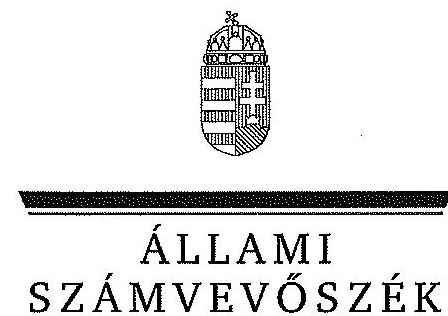

ÁLLAMI
SZÁMVEVŐSZÉK

# JELENTÉS 

az önkormányzatok pénzügyi gazdálkodási
helyzete értékelésének, és gazdálkodása
szabályosságának ellenőrzéséről
Csákvár
14071
2014. április

---

# Állami Számvevőszék 

Iktatószám: V-0316-050/2014.
Témaszám: 1349
Vizsgálat-azonosító szám: V065006

## Az ellenőrzést felügyelte:

## Renkó Zsuzsanna

felügyeleti vezető
Az ellenőrzést vezette és az ellenőrzés végrehajtásáért felelős:
Mohl Anna
ellenőrzésvezető
A számvevőszéki jelentés összeállításában közremüködött:
Baksa Anikó
számvevő tanácsos
Az ellenőrzést végezték:

## Szabó Zsuzsanna

számvevő

## Vitányi István

számvevő tanácsos

---

# TARTALOMJEGYZÉK 

BEVEZETÉS ..... 3
I. ÖSSZEGZŐ MEGÁLLAPÍTÁSOK, KÖVETKEZTETÉSEK, JAVASLATOK ..... 6
II. RÉSZLETES MEGÁLLAPÍTÁSOK ..... 16

1. Az önkormányzat kötelező és önként vállalt feladatai, a feladatellátás szervezeti kereteinek változása ..... 16
2. A pénzügyi egyensúly fenntartását veszélyeztető pénzügyi kockázatok, ezek csökkentése érdekében tett intézkedések ..... 19
3. Az önkormányzat kötelezettségeinek állománya, azok összetételének változása, az adósságkonszolidáció hatása ..... 24
4. Az önkormányzat pénzügyi gazdálkodása során érvényesített integritási szempontok ..... 29

---

# MELLÉKLETEK 

1/A. számú Az Önkormányzat bevételei és kiadásai, valamint adósságszolgálata a 2010-2013. év I. félév közötti időszakban (a CLF módszer szerint, a Kvtv. 72. § (1) bekezdésében foglalt adósságátvállaláshoz kapcsolódó pénzügyi teljesítések nélkül)
1/B. számú Az Önkormányzat bevételei és kiadásai a Kvtv. 72. § (1) bekezdésében foglalt adósság átvállaláshoz kapcsolódó pénzügyi teljesítések nélkül 2013. év I. félévében (a CLF módszer szerint)
2. számú Az Önkormányzat által a 2010. és a 2013. év I. félév között megvalósított fejlesztési feladatok érdekében teljesített felhalmozási kiadások és az ezekhez vállalt kötelezettségek összegzése
3. számú Az önkormányzati feladatok ellátásában résztvevő gazdasági társaságok egyes kiemelt adatai
4. számú Az Önkormányzat 2013. június 30 -án fennálló, hosszú lejáratú adósságot keletkeztető kötelezettségvállalásai
5. számú Az Önkormányzat kötelezettségeinek és egyes kötelezettségvállalásainak 2010. december 31-ei és 2013. június 30 -ai állománya, valamint a 2013. év II. félévben és az azt követő években várható kötelezettségek, kötelezettségvállalások miatti kiadások
6. számú Csákvár Város Önkormányzata Polgármesterének a jelentéstervezethez tett észrevétele
7. számú Az ÁSZ válasza Csákvár Város Önkormányzata Polgármesterének a jelentéstervezethez tett észrevételére

## FÜGGELÉKEK

1. számú Rövidítések jegyzéke
2. számú Fogalomtár

---

# JELENTÉS 

## az önkormányzatok pénzügyi gazdálkodási helyzete értékelésének, és gazdálkodása szabályosságának ellenőrzéséről Csákvár

## BEVEZETÉS

Az ÁSZ stratégiájában célul tűzte ki, hogy az önkormányzatok ellenőrzése során azok pénzügyi-gazdasági helyzetét értékeli, kockázatait feltárja, valamint az ellenőrzések helyszíneit objektív mutatószámrendszer alapján választja ki.

Az államháztartás önkormányzati alrendszerében az utóbbi években megjelenő gazdálkodási nehézségek, a pénzforgalmi hiány növekedése, az eladósodás az ÁSZ figyelmét az önkormányzatok pénzügyi helyzetére irányította. Az elkövetkezendő évek költségvetési hiánycéljainak tarthatósága érdekében indokolt, hogy az önkormányzatok pénzügyi helyzetelemezése és az egyensúlyi helyzetet befolyásoló kockázatok feltárása továbbra is kiemelt hangsúlyt kapjon az ÁSZ tevékenységében.

A közigazgatás átalakításának keretében - a helyi igazgatás és önkormányzás hatékonyabbá tétele érdekében - az önkormányzatokra vonatkozóan 2012-ben újraszabályozták mind a sarkalatos, mind az önkormányzatok mindennapi múködését rendező törvényeket és a feladatok végrehajtását biztosító előírásokat. Az önkormányzati feladatellátást érintő átalakítások jelentős része 2013-ban következett be azzal, hogy az igazgatási, az oktatási és a szociális ellátásban a feladatok jelentős hányadát átvette az állam. Ahhoz, hogy az önkormányzatok meg tudjanak felelni a számukra meghatározott - szigorúbb gazdálkodási szabályoknak és az új feltételek mellett is biztosítható legyen a közszolgáltatások megfelelő színvonalú ellátása, szükséges volt a pénzügyigazdasági rendszerük alapjainak megszilárdítása. Ezt a célt szolgálja az adósságkonszolidáció, amely az önkormányzatok múködését és fejlesztését segítő, de korábban az állam által nem fedezett kiadásokkal kapcsolatos kötelezettségvállalások differenciált mértékű átvállalását jelenti.

Az ÁSZ a 2013. év II. félévi ellenőrzési tervében a 23. számú, az önkormányzatok pénzügyi gazdálkodási helyzete értékelésének, és gazdálkodása szabályosságának - 2013. évben induló - ellenőrzésével az önkormányzatok 2011 évben megkezdett helyzetelemzését folytatja. Az adósságkonszolidáció az önkormányzatok pénzügyi egyensúlyi helyzetére egyértelműen kedvező hatást gyakorolt. A 2013-tól bevezetett új feladatfinanszírozási rendszer keretein belül az adott települési önkormányzat feladata a pénzügyi egyensúly megteremtése, hosszú távú fenntartása. Az adósságkonszolidáció, a feladat-ellátási és finanszírozási rendszer változásának 2013. év I. félévet követő hatása az ellenőrzött

---

időszak alapján - az intézkedések bevezetése óta eltelt idő rövidségére tekintettel - még nem állapítható meg. A pénzügyi-egyensúlyi helyzet jövőbeni alakulása - figyelemmel az adósságkonszolidáció folytatására - a törvényi rendelkezések hosszabb távú érvényesülése után elemezhető, értékelhető. Erre tekintettel kiemelt fontosságú az önkormányzatok pénzügyi egyensúlyi helyzetére ható kockázatok feltárása, az ezzel kapcsolatos folyamatok, trendek bemutatása. Az ÁSZ ennek megfelelően a jövőben is tovább folytatja az önkormányzatok pénzügyi gazdálkodási helyzetét értékelő témacsoportos ellenőrzéseit.

Az ellenőrzések kockázatalapú megközelítése keretében megtörténik az önkormányzatok adósságkezelési és likviditási helyzetének értékelése, a pénzügyi egyensúly minősítése, továbbá az alrendszerben 2013-ban bekövetkezett változások hatásának értékelése.

Az ellenőrzés - eredményének várható hatásaként - megállapításalval segítséget nyújthat a pénzügyi helyzet értékeléséhez, a pénzügyi egyensúly helyreállítása érdekében szükségessé váló önkormányzati intézkedések megtételéhez. Az ellenőrzés során továbbra is célunk az államháztartás önkormányzati alrendszerére jellemző információk összegzésével támogatni az Országgyúlés munkáját a törvényalkotásban, a források elosztásában.

Az ellenőrzés célja: az Önkormányzat pénzügyi helyzetének, szabályosságának értékelése, a pénzügyi egyensúly alakulására hatással lévő folyamatoknak és a pénzügyi egyensúly alakulására ható kockázatoknak a feltárása.

# Ennek keretében értékeltük, hogy: 

- a kötelező és önként vállalt feladatok ellátása, ezen belül az ellátott feladatok körének, az ellátást biztosító szervezeti formáknak a változása milyen hatást gyakorolt a pénzügyi egyensúlyi helyzetre;
- az Önkormányzat pénzügyi - múködési és felhalmozási - egyensúlya milyen irányban változott, a változást milyen okok idézték elő, továbbá milyen intézkedéseket tettek az egyensúly biztosítása, illetve javítása érdekében, az intézkedések hatására javult-e az Önkormányzat pénzügyi helyzete;
- a költségvetési kiadások finanszírozása érdekében vállalt pénzintézetekkel szembeni kötelezettségek, a szállítói és egyéb kötelezettségek hogyan alakultak, az adósságkonszolidáció után fennmaradt kötelezettségek teljesítésének kockázatai miként befolyásolják a jövőbeli pénzügyi egyensúlyi helyzetet.

Az önkormányzatok korrupcióval szembeni veszélyeztetettségének csökkentése érdekében új feladatként felmértük az integritási szemlélet érvényesülését a pénzügyi gazdálkodási folyamatokban.

Utóellenőrzésre nem került sor, mivel az ÁSZ az ellenőrzött időszakban az Önkormányzatnál számvevőszéki jelentéssel lezárt ellenőrzést nem végzett.

---

Az ellenőrzési célokban megfogalmazott kérdések értékelési kritériumai a gazdálkodásra vonatkozó jogszabályok, a pénzügyi egyensúly biztosításának, valamint a pénzügyi helyzettel és gazdálkodással kapcsolatos kockázatok kezelésének követelménye. Az ellenőrzés az ellenőrzési célok eléréséhez elemző, értékelő, a pénzügyi helyzet kockázatát is minősítő eljárásokat alkalmazott.

Az ellenőrzés típusa: szabályszerűségi ellenőrzés

# Ellenőrzött szervezet: Csákvár Város Önkormányzata 

Az ellenőrzött időszak: a 2010. január 1-jétől 2013. június 30-ig terjedő időszak, figyelemmel az ellenőrzés célja vonatkozásában megfogalmazottakra. A pénzintézetekkel szembeni kötelezettségek állományának vizsgálatakor az ellenőrzött időszakban fennálló kötelezettségeket vette figyelembe az ellenőrzés.

Az ellenőrzés szakmai módszertana az ÁSZ hivatalos honlapján (www.asz.hu) közzétett szakmai szabályokon alapult, amely a Legfőbb Ellenőrző Intézmények Nemzetközi Szervezete (INTOSAI) által kiadott nemzetközi standardok (ISSAI) figyelembevételével készült.

Az ellenőrzés jogszabályi alapját az ÁSZ tv. 1. § (3) bekezdésének, 5. § (2)-(6) bekezdéseinek, valamint az Áht. 61. § (2) bekezdésének előírásai képezik.

Az ellenőrzés során használt rövidítéseket az 1. számú, az egyes fogalmak magyarázatát a 2 . számú függelék tartalmazza.

Csákvár Nagyközség 2013. július 15 -én városi címet kapott. A város állandó lakosainak száma 2010. január 1-jén 5282 fő, 2012. január 1-jén 5237 fő volt. Az Önkormányzat a 2012. évben 767,6 millió Ft költségvetési bevételt ért el, és 730,1 millió Ft költségvetési kiadást teljesített. A 2012. december 31-i könyvviteli mérleg szerint 1360,1 millió Ft értékű vagyonnal rendelkezett, a rövid lejáratú kötelezettségállomány 23,3 millió Ft, a hosszú lejáratú kötelezettségállománya 22,7 millió Ft volt. Az Önkormányzat 2013. június 30 -án a Nonprofit Kft.-ben 100,0\%-os, a Fejérvíz Zrt.-ben 0,01\%-os tulajdoni hányaddal rendelkezett, más társaságban nem volt érdekeltsége. A jegyző 2011. február 15-től látja el feladatait. A foglalkoztatott köztisztviselők száma 2013. január 1-jén 17 fő volt.

Az ÁSZ tv. 29. § (1) bekezdése szerint a jelentéstervezetet megküldtük a polgármester részére, aki az ÁSZ tv. 29. § (2) bekezdésében foglalt észrevételezési jogával élt, a jelentéstervezetre észrevételt tett.

---

# I. ÖSSZEGZŐ MEGÁLLAPÍTÁSOK, KÖVETKEZTETÉSEK, JAVASLATOK 

Az Önkormányzat pénzügyi egyensúlyának helyreállítása az ellenőrzött időszakra vonatkozóan feltárt kockázatok alapján, azonnali intézkedést igényel. Az Önkormányzat folyó költségvetési egyenlege a 2012. évi 18,8 millió Ft-os ÖNHIKI támogatással átmenetileg javult, azonban a következő időszakban a jövedelemtermelő képesség alapján a várhatóan képződő bevételek a feladatok ellátásához szükséges kiadásokat nem fedezik, a múködést rövid távon korlátozzák.

Az Önkormányzat költségvetésének elemzését a CLF módszerrel számított mutatók alapján végeztük. A pénzügyi kapacitás 2010-2013. év I. félév közötti változását - a 2013. évi adósságkonszolidáció pénzforgalmi hatása nélkül számítva - a következő ábra mutatja be:
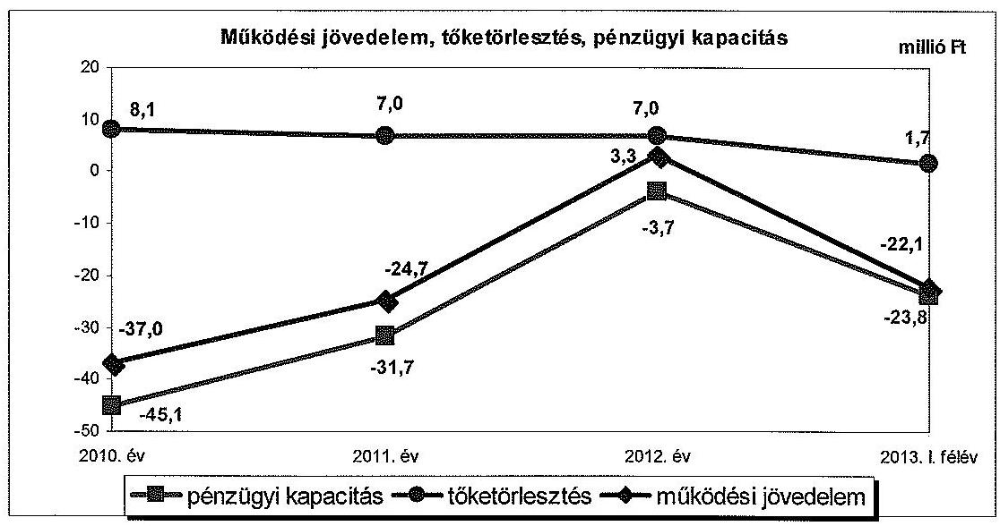

Az Önkormányzat az ellenőrzött időszakban összesen 2464,4 millió Ft költségvetési bevételt ért el és 2506,6 millió Ft költségvetési kiadást teljesített. A folyó bevételek 2010., 2011. és 2013. év I. félévben nem biztosítottak fedezetet a folyó kiadásokra, az ellenőrzött időszakban összességében 80,5 millió Ft múködési hiány keletkezett. A 2012. évi pozitív működési jövedelem kialakulását alapvetően a 2012-ben kapott 18,8 millió Ft vissza nem térítendő ÖNHIKI támogatás eredményezte. Müködési jövedelemtermelő képesség miatti kockázatot és egyben bevételi kitettséget jelez, hogy a múködőképesség megőrzését szolgáló kiegészítő támogatás nélkül a müködési jövedelem 2012. évben is hiányt ( 15,5 millió Ft) mutatott volna. Az Önkormányzat 2013. év I. félévben 1,2 millió Ft vis maior támogatásban részesült.

A felhalmozási költségvetés ellenőrzött időszaki egyenlege 38,3 millió Ft volt. A 2010-ben kimutatott 5,4 millió Ft hiánnyal szemben, az Önkormányzatnak 2011-2013. év I. félév között 43,7 millió Ft felhalmozási for-

---

rástöbblete keletkezett, amely részben fedezetet nyújtott a keletkező működési hiányra, valamint a teljesítendő adósságszolgálat megfizetésére. A felhalmozási bevételek múködési hiány finanszírozásához történő tartós igénybevétele - a jövőbeni fejlesztésre, eszközpótlásra fordítható tartalékok hiányára tekintettel kockázatot jelent. A 2013. június 30 -át követő időszakra vállalt 99,6 millió Ft felhalmozási célú kötelezettség - települési vízrendezés fejlesztése projekthez kapcsolódó kiadások - fedezetét $90,9 \%$-ban ( 90,5 millió Ft összegben) EU-s támogatás jelenti. A további 9,1\%-os saját forrást ( 9,1 millió Ft összegben) - az eszközhasználati díjból évenként realizálódó - felhalmozási bevétel biztosíthatja.

A nettó múködési jövedelem (pénzügyi kapacitás) folyamatosan negatív volt, az ellenőrzött időszakban összesen -104,3 millió Ft nettó múködési jövedelem keletkezett. Az Önkormányzat 2010-2011. években és a 2013. év I. félévben képződött finanszírozási igénye 96,5 millió Ft volt, amelyre a korábbi években képződött tartalékok felhasználása nyújtott fedezetet.

Az Önkormányzat észrevétele szerint tartalékok feléléséről - különösen, amelyek három és fél éven keresztül át kitartottak volna a 2010-2013. év I. félév közötti időszakban - nem beszélhetünk. Az előző önkormányzati ciklusban történt nagy értékủ ingatlan értékesítés legfeljebb 2011. év I. félévében éreztette még a hatását, egy évvel később azonban már strukturális átalakítások előterjesztésére került sor. Az ellenőrzött időszakban minden évben képződött pénzmaradvány az Önkormányzatnál, ezért a finanszírozási igényre az évente képződött tartalékok felhasználása nyújtott fedezetet.

Az észrevételben foglaltakat nem fogadjuk el. A megállapítás annyiban pontosítható, hogy a kérdéses összegű finanszírozási igény 2010-2011 között és a 2013. év I. félév során jelentkezett. Tekintettel arra, hogy az ellenőrzött időszakban kizárólag folyószámlahitelt vettek igénybe, melyet minden naptári év végéig viszszafizettek, a nettó múködési jövedelem és a felhalmozási költségvetés összevont negatív egyenlegének fedezetét az előző év(ek)ben képződött pénzmaradvány felhasználásával biztosították. Polgármester Úrhölgy is elismerte észrevételében, hogy a 2010. január 1-jét megelőzően képződött pénzmaradvány még a 2011. évben is felhasználásra került. A 2010-2011. években és a 2013. év I. félév során a tárgyévben teljesített kiadások összege meghaladta a tárgyévben realizált összeses bevételt, emiatt pénzmaradvány nem képződhetett. A tartalék megfogalmazás helytálló, a könyvviteli mérlegben ugyanis a tartalékok között kell kimutatni a tárgyévben, illetve az azt megelőző években képződött pénzmaradványból rendelkezésre álló forrást.

Az ellenőrzött időszakban az Önkormányzat működési kiadásain belül az önként vállalt feladatok kiadásainak részaránya a 2010. évi 10,0\%-ról ( 73,3 millió Ft-ról) a 2013. év I. félév végére 13,1\%-ra ( 37,5 millió Ft-ra) növekedett, mivel bővült az önként vállalt feladatok köre, továbbá a kötelező feladatok ellátására fordított kiadások csökkentek. A múködési célú kiadások önként vállalt feladatokra felhasznált mértéke miatt - figyelembe véve az Önkormányzat múködési jövedelemtermelő képességének színvonalát - a müködési kockázat az ellenőrzött időszakban fennállt.

A 2010-2013. év I. félév között az Önkormányzat adatszolgáltatása alapján a kötelező és az önként vállalt feladatok ellátásának szervezeti kereteiben jelentős változás történt. Feladatbővülést eredményezett 2011. szeptember-

---

től a bölcsődei ellátás biztosítása, továbbá, hogy 2012. január 1-jétől Vértesboglár település igazgatási feladatait is a Polgármesteri Hivatal látta el. 2013. január 1-jével az általános iskola állami fenntartásba vétele, továbbá a járási rendszer kialakítása következtében egyes államigazgatási feladatok a Bicskei Járási Hivatalhoz kerültek. Az ellenőrzött időszakban megvalósult feladatátadások - az Önkormányzat adatszolgáltatása alapján - összességében 64,5 millió Ft megtakarítást eredményeztek. A saját hatáskörben végrehajtott intézkedések hatására a múködési jövedelem az ellenőrzött időszakban 27,5 millió Ft-tal javult, azonban a pénzügyi egyensúly helyreállításához nem nyújtott elégséges fedezetet.

A pénzintézetekkel szemben 2010. január 1-jén fennálló kötelezettségek 55,2 millió Ft-os állománya 71,7\%-kal (39,6 millió Ft-tal) csökkent az ellenőrzött időszakban. Az Önkormányzat a 2007. évben felvett két forint alapú, 2008-ban EUR alapú hitellé alakított változó kamatozású, hosszú lejáratú hitellel, valamint folyószámlahitellel rendelkezett. Az adósságkonszolidáció keretében a Magyar Állam - a 2013 februárjában kötött megállapodás szerint - a hosszú lejáratú hitelekből fennálló tőketartozás és járulékai összegének 50,0\%-át (17,2 millió Ft-ot) vállalta át. A 2013. július 1. és 2015. december 31. közötti időszakban a tőketörlesztési és kamatfizetési kötelezettségek összege várhatóan 12,7 millió Ft-ot, 2016. évtől pedig várhatóan 4,5 millió Ft-ot tesz ki. A jövőbeni kötelezettségek kifizethetőségéhez a fedezet - az Önkormányzat múködési jövedelemtermelő képességére, elkülönített tartalék hiányára tekintettel - nem látszik biztosítottnak, amely kockázatot hordoz. A 2012. évben a folyószámlahitel banki kitettséget jelentett a hitellel zárt napok számának, valamint az átlagos napi állományának jelentős emelkedése miatt.

Az ellenőrzött időszakban a változó kamatozású devizában nyilvántartott adósságot keletkeztető kötelezettségvállalások kamat- és árfolyamkockázatot jelentettek.

Az Önkormányzat szállítói kötelezettségének állománya az ellenőrzött időszakban 16,4 millió Ft-ról 7,9 millió Ft-ra csökkent. 2011-ben a lejárt szállítói tartozás 1,2 millió Ft volt, amely 2013. év I. félév végére csekély összegűre ( 5 ezer Ft) csökkent. A 30 napon belüli lejárt szállítói állomány 2011-ben 0,5 millió Ft-ot, a 90 napon túli 0,7 millió Ft-ot tett ki, amely az óvoda, étkezési térítési díjak más önkormányzat részére meg nem térített összegéből adódott. Erre tekintettel, továbbá nagyságrendjük miatt a lejárt szállítói kötelezettségek pénzügyi kockázatot nem jelentettek, a szállítói kötelezettségek miatti nemfizetési kockázat alacsony volt.

Az elengedett követelés az ellenőrzött időszakban 2010-ben 1,9 millió Ft öszszeget tett ki. Az Önkormányzatnak behajthatatlan követelése 2010-ben nem, 2011-ben 40,8 millió Ft, 2012-ben 1,6 millió Ft összegben volt. Az Önkormányzat jegyzője - jegyzői határozatok alapján - a helyi adóból származó követelések 2011. évi nyitó adatából behajthatatlanság címén négy gazdasági társaság helyi adótartozásához kapcsolódóan 40,8 millió Ft követelést törölt 2011-ben.

---

Az Önkormányzatnak a pénzügyi gazdálkodás során az integritási szemlélet teljes körű érvényesítése érdekében az összeférhetetlenség és a pénzügyi helyzetet, az adósságterheket befolyásoló döntések előtti kockázatok szabályozásának hiányára tekintettel még fejlődést kell elérnie.

Az ellenőrzés során a gazdálkodási feladatok ellátásával kapcsolatban az alábbi szabályszerűségi hibákat tártuk fel:

- az Önkormányzat az Áht. előírásai ellenére a 2013. évi költségvetési rendelet mellékletében a kötelező és önként vállalt feladataira tervezett költségvetési bevételeket és kiadásokat, nem a Mötv.-ben és a Sport tv.-ben foglaltak figyelembevételével különítette el, mivel a Polgármesteri Hivatalnál kizárólag a kötelező feladatellátáshoz kapcsolódó bevételeket és kiadásokat jelöltek meg, miközben abban a polgármester és a jegyző nyilatkozata szerint önként vállalt feladatok is voltak;
- az Önkormányzat a 2013. évi költségvetési rendeletében a múködési költségvetés Mötv.-ben előírt egyensúlyát oly módon biztosította, hogy a költségvetési támogatásból származó bevételek eredeti előirányzatai között 70,2 millió Ft múködőképesség megőrzését szolgáló, kiegészítő támogatásból származó bevételt is figyelembe vett, ehhez képest 13,3 millió Ft támogatásban részesült, ezáltal a bevételi előirányzatok tervezése az Áht.-ben foglalt előírás ellenére közgazdaságilag nem megalapozott módon történt;
- az Önkormányzat a 2013. évi költségvetési rendeletében a költségvetési bevételek és kiadások előirányzatának főösszegét az Áht.-ben foglalt előírások ellenére finanszírozási célú kiadásnak minősülő hiteltörlesztéssel együtt állapította meg, továbbá az Áht.-t megsértve költségvetési bevételként és költségvetési kiadásként tüntette fel a finanszírozási célú bevételnek és kiadásnak minősülő irányító szervi támogatás kiutalását és intézményi számlán történő jóváírását;
- a mérlegtételek év végi értékelése során az árfolyamveszteség elszámolásának elmulasztásával az Önkormányzat megsértette az Áhsz.1-ben (2014. január 1-jétől Áhsz.2-ben) foglaltakat, mivel a külföldi pénzértékre szóló kötelezettséget nem a költségvetési év mérleg fordulónapjára vonatkozó - az Sztv. szerinti - devizaárfolyamon átszámított forintértéken mutatta ki;
- a hosszú lejáratú hitelszerződések aláírásával megsértette az Ötv.-ben, az Ámr.1-2-ben (2012. január 1-jétől az Ávr.-ben, 2012. március 31-től az Áht.-ban) foglaltakat. A folyósító pénzintézet részére beszámítás jogot biztosított, ezáltal a bank jogosult előzetes értesítés nélkül az Önkormányzatnak a banknál vezetett bármely bankszámláját megterhelni;
- az Önkormányzat 2010-2012. években az Áhsz. 1 (2014. január 1-jétől Áhsz.2) előírásai ellenére a szállítói kötelezettségek év végi állománya értékében a mérlegben nem mutatta ki a mérleg fordulónapig teljesített azon szállítói kötelezettségeket, amelyekről a számlák a számviteli politikában megjelölt mérlegkészítés időpontjáig, február 28-ig beérkeztek. Az Önkormányzat a szállítókról az analitikus nyilvántartást nem az Áhsz. 1 előírásainak megfelelően vezette;

---

- az Önkormányzat jegyzője 2011-ben a behajthatatlan követelések törlésénél, valamint a számviteli elszámolások elrendelésekor nem vette figyelembe az Áhsz.1-ben (2014. január 1-jétől Áhsz.2-ben) foglalt az államháztartás szervezeteire vonatkozó sajátos szabályokat. A behajthatatlan követeléssé nyilvánítás feltételei 39,0 millió Ft helyi adótartozás esetében nem álltak fenn, mivel három felszámolás alatt álló társaságnál a jegyző nem rendelkezett a behajthatatlanná minősítéshez szükséges dokumentummal.

Az ÁSZ tv. 33. § (1) bekezdésében foglaltak értelmében az ellenőrzött szervezet vezetője köteles a jelentésben foglalt megállapításokhoz kapcsolódó intézkedési tervet összeállítani, és azt a jelentés kézhezvételétől számított harminc napon belül az ÁSZ részére megküldeni. Amennyiben az intézkedési tervet határidőn belül nem küldi meg a szervezet vezetője, vagy az továbbra sem elfogadható, az ÁSZ elnöke a hivatkozott törvény 33. § (3) bekezdés a-b) pontjaiban foglaltakat érvényesítheti.

# Az ellenőrzés intézkedést igénylő megállapításai és javaslatai: 

## a polgármesternek

1. Az Önkormányzat pénzügyi egyensúlya az ellenőrzött időszakban rövid távon nem volt biztosított. A 2010-2013. év I. félév között - az adósságkonszolidáció pénzforgalmi hatása nélkül - összesen 80,5 millió Ft működési hiány keletkezett. A folyó költségvetés egyenlege kizárólag a 2012. évben volt pozitív, a működőképesség megőrzését szolgáló 18,8 millió Ft ÖNHIKI támogatás nélkül azonban 15,5 millió Ft müködési hiány jelentkezett volna. A 2013. év I. félévében az adósságkonszolidáció keretében kapott 17,2 millió Ft müködési célú törlesztési támogatás nélkül a folyó költségvetés egyenlege 22,1 millió Ft hiányt mutatott. Az ellenőrzött időszakban képződött müködési jövedelem egyik évben sem nyújtott fedezetet a tőketörlesztési kötelezettségre. A saját hatáskörben tett bevételnövelő és kiadáscsökkentő intézkedések nem biztosítottak elegendő forrást a pénzügyi egyensúly helyreállításához. A likviditás biztosítására igénybe vett folyószámlahitel a 2012. évben vált tartóssá. A 2013. év I. félév végén - a lezárult adósságkonszolidációt követően - fennálló pénzintézeti kötelezettség 15,6 millió Ft volt. Az adósságszolgálat teljesítéséhez elkülönített tartalék nem áll rendelkezésre. Az önként vállalt feladatok ellátása az ellenőrzött időszakban müködési kockázatot jelentett.

Javaslat:
A müködési jövedelemtermelő képesség és a feladatellátás összhangjának megteremtése, valamint a pénzügyi egyensúly helyreállítása, hosszú távú fenntarthatósága érdekében felelősök és határidők megjelölésével kezdeményezzen intézkedéseket, melyek keretében:
a) a költségvetési rendelettervezet, valamint annak évközi módosítása előterjesztését megelőzően mérjék fel a bevételszerző, kiadáscsökkentő lehetőségeket, és terjessze a Képviselő-testület elé a bevételek növelését, a kiadások csökkentését célzó intézkedések bevezetéséhez szükséges - a Htv. 140. § (1) bekezdés a) pontja alapján a jegyző által elkészített - döntési javaslatát;

---

b) terjesszen a Képviselő-testület elé jóváhagyásra - a Htv. 140. § (1) bekezdés a) pontja alapján a jegyző által elkészített - az Önkormányzat gazdasági helyzetének elemzésén alapuló, a pénzügyi egyensúlyi helyzet gyors helyreállítását, hoszszú távú fenntartását, valamint az adósságállomány újratermelődésének elkerülését biztosító intézkedéseket tartalmazó reorganizációs programot;
c) a kötelezettségek jövőbeni teljesítése, a fizetőképesség megőrzése érdekében terjesszen a Képviselő-testület elé - a Htv. 140. § (1) bekezdés a) pontja alapján a jegyző által elkészített - döntési javaslatot, amelyben a Képviselő-testület kötelezettséget vállal arra, hogy előre meghatározott összegben és módon a realizált többletbevételeket, a jövőben képződő tartalékokat mindaddig a kötelezettségek rendezésére fordítja, azt nem használja más célra, amíg az Önkormányzat pénzügyi egyensúlya rövid távon veszélyeztetett;
d) vizsgálja felül az önként vállalt feladatok finanszírozhatóságát a kötelező feladatellátás elsődlegességének biztosítása érdekében, és ennek függvényében tegyen javaslatot a Képviselő-testületnek a feladatellátás racionalizálására.
2. Az Önkormányzat által a 2007. évben 55,4 millió Ft összegben felvett, két hosszú lejáratú hitel szerződései biztosítékként tartalmazták a beszámítás jogát, amely szerint az Önkormányzat a teljes tartozásának, vagy annak egy részének esedékes törlesztését nem teljesíti, a bank előzetes értesítés nélkül jogosult az Önkormányzat bármely bankszámláját megterhelni. Az Önkormányzat ezáltal - az Ötv. 88. § (1) bekezdés b) pontjában ${ }^{1}$ és az Ámr. ${ }_{1}$ 103. § (11) bekezdésében ${ }^{2}$ foglaltakat megsértve a központi költségvetésből származó bevételeit a hitel fedezeteként ajánlotta fel.

Javaslat:
A pénzintézeti kötelezettségvállalásokkal kapcsolatos jogszerú biztosíték, illetve fedezet felajánlás érdekében:
a) intézkedjen, hogy jövőbeni hitelfelvétel és kötvénykibocsátás fedezeteként az Áht. 84. § (4) bekezdésében előírtak szerint az Önkormányzat általános müködésének és ágazati feladatainak támogatása és a költségvetési támogatás ne kerüljön felhasználásra. Az Ávr. 145. § (2) bekezdésében előírtak szerint a költségvetési támogatások folyósítására szolgáló elkülönített bankszámla - az Áht. 84. § (4) bekezdésében foglalt kivételekkel - hitelen, kötvényen alapuló fizetési kötelezettség teljesítésének alapjául ne szolgáljon;
b) a jogellenes állapot megszüntetése érdekében vizsgálják meg a biztosíték kiváltásának lehetőségét, és terjesszen javaslatot a Képviselő-testület elé a jogszerűen biztosítékba adható önkormányzati bevételekkel való kiváltásról.
3. A jegyző a 2011. évben három, felszámolás alatti gazdasági társasággal szembeni, összesen 39,0 millió Ft helyiadó-tartozásból fennálló követelést - az Áhsz. 1 5. §

[^0]
[^0]:    ${ }^{1}$ Hatálytalan 2012. január 1-jétől, a 2012. március 31-től hatályos új jogszabályi előírás: az Áht. 84. § (4) bekezdése.
    ${ }^{2}$ Hatálytalan 2010. január 1-jétől, az ellenőrzött időszak végén hatályos új jogszabályi előírás: Ávr. 145. § (2) bekezdése.

---

(3) bekezdés b) pontjában ${ }^{3}$ foglalt előírás ellenére, a felszámolás eljárás befejezéskor készített vagyonfelosztási javaslat hiányában - minősített behajthatatlanná és történt meg e követelések hitelezési veszteségként történő leírása. A 2010. évben egy felszámolási eljárást követően megszűnt gazdasági társasággal szembeni 1,8 millió Ft összegű követelést - az Áhsz. 5. § (3) bekezdés b) pontjában előírtak ellenére - a rendelkezésre álló vagyonfelosztási javaslatban foglaltak ellenére nem minősített behajthatatlanná, a behajthatatlan követelést a 2010. évi könyvviteli mérlegben szerepeltették.

Javaslat:
Intézkedjen az ÁSZ által feltárt, a követelések behajthatatlanná minősítése és a hitelezési veszteségként történő leírás jogszabályi előírással ellentétes számviteli elszámolása tekintetében az esetleges munkajogi felelősséggel kapcsolatos körülmények kivizsgálásáról, és a vizsgálat eredményének függvényében hozza meg a szükséges intézkedéseket.

# a jegyzőnek 

1. Az Önkormányzat a 2013. évi jóváhagyott költségvetési rendeletében a múködési költségvetés Mötv. 111. § (4) bekezdésében előírt egyensúlyát oly módon biztosította, hogy a költségvetési támogatásból származó bevételek eredeti előirányzatai között 70,2 millió Ft működőképesség megőrzését szolgáló, kiegészítő támogatásból származó bevételt is figyelembe vett, ezáltal a bevételi előirányzatok tervezése az Áht. 12. § (1) bekezdésében előírtak ellenére közgazdaságilag nem megalapozott módon történt.

Javaslat:
Intézkedjen, hogy a költségvetési rendelettervezetben a müködési költségvetés Mötv. 111. § (4) bekezdésében előírt egyensúlyának biztosításakor a bevételeket az Áht. 12. § (1) bekezdésének megfelelően, közgazdaságilag megalapozottan határozzák meg.
2. Az Önkormányzat a 2013. évi költségvetési rendeletében a költségvetési bevételek és költségvetési kiadások eredeti előirányzatának főösszegét - az Áht. 5. § (1)-(2) bekezdéseiben foglalt előírások ellenére - az Áht. 73. § (1) bekezdés ab) és ae) pontja szerinti - irányítószervi támogatásként folyósított támogatás kiutalása és jóváírása, valamint hitel tőkeösszegének törlesztése jogcímekhez tartozó - finanszírozási célú bevételekkel és kiadásokkal együtt állapította meg.

Javaslat:
Intézkedjen, hogy a költségvetési rendelettervezet összeállítása során a költségvetési bevételeket és a költségvetési kiadásokat az Áht. 5. § (1)-(2) bekezdésében foglalt előírások szerint határozzák meg.

[^0]
[^0]:    ${ }^{3}$ Hatálytalan 2014. január 1-jétől, a 2014. január 1-étől hatályos új jogszabályi előírás: az Áhsz. 1. § (1) bekezdés 1. a) pontja és az Sztv. 3. § (4) bekezdés 10. pont c-d) alpontjai.

---

3. Az Önkormányzat 2013. évi költségvetési rendeletében - az Áht. 23. § (2) bekezdés a-b) pontjaiban foglalt előírások ellenére - az Önkormányzat, ezen belül Polgármesteri Hivatal költségvetési szervnél kimutatott költségvetési kiadások és költségvetési bevételek kötelező és önként vállalt feladatokhoz történő elkülönítését nem a jogszabályi előírásoknak megfelelően végezték el. A költségvetési bevételek és kiadások bemutatása során a Mötv. 13. § (1) bekezdésében előírtak ellenére kötelező feladatként sorolták be a helyi televízió és rádió üzemeltetéséhez és a lapkiadáshoz kapcsolódó tételeket, továbbá a mentőállomás építéséhez felvett hitel kamatát. A Mötv. 13. § (1) bekezdés 15. pontja és a Sport tv. 55. § (1) bekezdés c-d) pontjaiban foglalt előírás ellenére a sportcsarnok üzemeltetési kiadásait nem teljes körűen kötelező feladatellátáshoz kapcsolódó kiadásként mutatták ki.

Javaslat:
Intézkedjen, hogy az Áht. 23. § (2) bekezdés a-b) pontjaiban foglalt előírások szerint a költségvetési rendelet - a Mötv. 13. § (1) bekezdésében előírtak figyelembe vételével - tartalmazza az Önkormányzat és az általa irányított költségvetési szervek költségvetési bevételeit és költségvetési kiadásait kötelező feladatok, önként vállalt feladatok, állami (államigazgatási) feladatok szerinti bontásban, valamint a kötelező feladatellátáshoz kapcsolódó kiadásokat teljeskörűen mutassák ki.
4. A jegyző a 2011. évben az Önkormányzat két, folyamatban lévő felszámolási eljárás alatt álló gazdasági társasággal szemben fennálló, 16,5 millió Ft összegű helyiadótartozásból származó követelését - az Áhsz., 5. § 3. b) pontjában foglalt előírás ${ }^{4}$ ellenére - a felszámolási eljárás jogerős befejezésekor készítendő vagyonfelosztási javaslat nélkül, a felszámolási eljárás során készített közbenső mérleg alapján hozott határozatában behajthatatlanságra tekintettel törölte. A követeléseket a 2011. évi mérleg készítése során hitelezési veszteségként leírták, annak ellenére, hogy az Áhsz., 31. § (1)-(2) bekezdésében ${ }^{5}$ foglaltak szerint a közbenső mérleg alapján a követelések várható megtérülésére tekintettel értékvesztés elszámolására volt lehetőség. Egy felszámolási eljárást követően megszűnt gazdasági társaság 1,8 millió Ft helyiadó-tartozását a 2010. évi mérlegkészítéskor rendelkezésre álló, a behajthatatlanságot bizonyító, vagyonfelosztási javaslatban foglaltak ellenére hitelezési veszteségként nem írták le, az Áhsz., 34. § (10) bekezdésében foglalt előírás ${ }^{6}$ ellenére a behajthatatlan követelést a 2010. évi mérlegben szerepeltették, a követelést a 2011. évi mérlegkészítéskor vezették ki a számviteli nyilvántartásokból. A 2011. évi mérlegkészítéskor további egy felszámolási eljárás alatt álló gazdasági társaság 22,5 millió Ft helyiadó-tartozásának kétes beszedhetőségét bizonyító dokumentum ellenére az Áhsz., 31. § (1)-(2) bekezdése ${ }^{7}$ szerinti értékvesztést nem számolták el, a követelést az Áhsz., 5. § 3. b) pontjában foglaltakat megsértve, a vagyonfelosztási

[^0]
[^0]:    ${ }^{4}$ Hatálytalan 2014. január 1-jétől, a 2014. január 1-étől hatályos új jogszabályi előírás: az Áhsz. 1. § (1) bekezdés 1. a) pontja és a Sztv. 3. § (4) bekezdés 10. pont c-d) alpontjai.
    ${ }^{5}$ Hatálytalan 2014. január 1-jétől, a 2014. január 1-étől hatályos új jogszabályi előírás: az Áhsz. 18. § (1) bekezdése, és a Sztv. 55. § (1) bekezdése.
    ${ }^{6}$ Hatálytalan 2014. január 1-jétől, a 2014. január 1-étől hatályos új jogszabályi előírás: az Áhsz. 13. § (5) bekezdése.
    ${ }^{7}$ Hatálytalan 2014. január 1-jétől, a 2014. január 1-étől hatályos új jogszabályi előírás: az Áhsz. 18. § (1) bekezdése, és a Sztv. 55. § (1) bekezdése.

---

javaslat hiányában behajthatatlannak minősítették és a számviteli nyilvántartásokból kivezették.

Javaslat:
Az Önkormányzat követeléseinek jogszerű minősítése, és azok számviteli nyilvántartásokban való, jogszabályi előírásoknak megfelelő kimutatása érdekében:
a) intézkedjen, hogy az Önkormányzatnál Áhsz. 2 43. § (2) bekezdésében foglaltak alapján behajthatatlan követelés leírása esetén a behajthatatlanság ténye és mértéke bizonyított legyen. A felszámolási eljárással érintett adóssal szembeni azon követelést - az Áhsz. 2 1. § (1) bekezdés 1. a) pontjában és a Sztv. 3. § (4) bekezdés 10. pont c-d) alpontjaiban előírtak szerint - minősítsék behajthatatlannak, amelyre a felszámoló által adott írásbeli igazolás (nyilatkozat) szerint nincs fedezet, valamint amelyre a felszámolás befejezésekor a vagyonfelosztási javaslat szerinti értékben átvett eszköz nem nyújt fedezetet;
b) biztosítsa, hogy az Önkormányzat mérlegében az Áhsz. 2 13. § (5) bekezdésében előírtak szerint behajthatatlan követelést ne mutassanak ki. A behajthatatlanná minősített követelés leírt összegét az Áhsz. 2 26. § (11) bekezdés e) pontjában előírtak szerint a különféle egyéb ráfordítások között számolják el;
c) intézkedjen, hogy az adós minősítése alapján a fordulónapon fennálló és a mérlegkészítés időpontjáig pénzügyileg nem rendezett követelésnél - az Áhsz. 2 18. § (1) bekezdésében és a Sztv. 55. § (1) bekezdésében előírtak szerint - értékvesztést számoljanak el - a mérlegkészítés időpontjában rendelkezésre álló információk alapján - a követelés könyv szerinti értéke és annak várhatóan megtérülő összege közötti, veszteségjellegű különbözet összegében, ha ez a különbözet tartósnak mutatkozik és jelentős összegű. A követelések értékvesztésének összegét az Áhsz. 2 26. § (11) bekezdés d) pontja szerint a különféle egyéb ráfordítások között számolják el.
5. Az Önkormányzatnál - a Sztv. 60. § (2) bekezdésében, valamint az Áhsz. 33. § (1) bekezdésében és a (2) bekezdés c) pontjában foglalt előírások ${ }^{8}$ ellenére - a 2010-2012. évi mérleg készítése során nem végezték el a devizában fennálló kötelezettségek év végi értékelését, a számviteli nyilvántartásokban a devizában fennálló kötelezettségeket nem a mérleg fordulónapjára vonatkozó devizaárfolyamon átszámított forintértéken mutatták ki, továbbá nem számolták el a - 2010. évre 4,2 millió Ft, a 2011. évre 8,2 millió Ft és a 2012. évre utólag meghatározott 4,3 millió Ft összegű - nem realizált árfolyamveszteség összegét.

Javaslat:
Intézkedjen, hogy a külföldi pénzértékre szóló kötelezettségek mérlegben szereplő értékét a Sztv. 60. § (2) bekezdésében, valamint az Áhsz. 2 21. § (10) bekezdésében foglalt előírás szerint a mérleg fordulónapjára vonatkozó, az Áhsz. 2 20. § (3) és (4) bekezdése szerinti árfolyamon átszámított forintértéken határozzák meg. A külföldi pénzértékre szóló kötelezettség jövőbeni mérlegfordulónapi értékelésekor összevon-

[^0]
[^0]:    ${ }^{8}$ Hatálytalan 2014. január 1-jétől. A 2014. január 1-jétől hatályos előírás: Áhsz. 2 27. § (8) bekezdés h) pontja.

---

tan elszámolt árfolyamveszteséget az Áhsz. 227. § (8) bekezdés h) pontja és a Sztv. 85. § (3) bekezdés g) pontja alapján a pénzügyi műveletek egyéb ráfordításai, az összevontan elszámolt árfolyamnyereséget az Áhsz. 227. § (4) bekezdés d) pontjában és a Sztv. 84. § (7) bekezdés g) pontjában foglaltaknak megfelelően a pénzügyi műveletek egyéb eredményszemléletű bevételei között számolják el.
6. A 2010-2012. évi könyvviteli mérlegek készítése során a szállítókkal szembeni kötelezettségek összegének meghatározásakor - az Áhsz. 26. § (1) bekezdésében foglalt előírással ${ }^{9}$ ellentétben - a mérleg fordulónapját megelőzően már teljesített, az Önkormányzat által elismert, a mérlegkészítés időpontjáig beérkezett szállítói számlák szerinti kötelezettség összegét teljes körűen nem vették figyelembe, ezáltal a szállítói tartozások összegét a mérlegben 2010-ben 0,6 millió Ft-tal, 2011-ben 1,4 millió Fttal és 2012-ben 2,1 millió Ft-tal alacsonyabb összegben mutatták ki. Az Önkormányzatnál a szállítói számlákkal kapcsolatos évközi analitikus nyilvántartás vezetése nem felelt meg az Áhsz. 1 9. számú melléklet 4. pont db) alpontjában foglalt előírásoknak ${ }^{10}$.

Javaslat:
A szállítókkal szembeni tartozások mérlegben kimutatott kötelezettségek összegében történő, jogszabályi előírásoknak megfelelő kimutatása érdekében:
a) intézkedjen, hogy az Áhsz. 14. § (8) bekezdésében foglalt előírásnak megfelelően a mérlegben a kötelezettségek között az egységes rovatrend szerinti rovatokhoz kapcsolódóan vezetett nyilvántartási számlákon nyilvántartott végleges kötelezettségvállalásokat, más fizetési kötelezettségeket mutassák ki mindaddig, amíg azokat pénzügyileg ki nem egyenlítették, el nem engedték vagy egyéb módon nem rendezték;
b) biztosítsa, hogy az Áhsz. 1. § (1) bekezdés 9. pontjában előírtak szerint végleges kötelezettségvállalásként, más fizetési kötelezettségként a pénzértékben kifejezett, jogszabályból, jogerős bírói ítéletből vagy hatósági határozatból, szerződésből - ideértve az átvállalt kötelezettségeket is - jogszerűen eredő elismert tartozást mutassák ki, amely kifizetésének feltételeit a másik fél már teljesítette. Ilyennek minősül többek között - a jogszabályban felsorolt jogcímek közül - a teljesítésigazolással ellátott számlázott termékértékesítésért vagy szolgáltatásnyújtásért fizetendő ellenérték;
c) intézkedjen a kötelezettségvállalások, más fizetési kötelezettségek (ideértve a szállítókkal szembeni tartozások) jogszabályi előírásoknak megfelelő számviteli nyilvántartása érdekében az Áhsz. 14. számú melléklete II. pontjában előírt tartalmi követelményeknek megfelelő részletező nyilvántartás vezetéséről.

[^0]
[^0]:    ${ }^{9}$ Hatálytalan 2014. január 1-jétől. A 2014. január 1-jétől hatályos előírás: Áhsz. 14. § (8) bekezdése és az 1. § (1) bekezdés 9. pontja
    ${ }^{10}$ Hatálytalan 2014. január 1-jétől. A 2014. január 1-jétől hatályos előírás: Áhsz. 14. számú melléklet II. pontja

---

# II. RÉSZLETES MEGÁLLAPÍTÁSOK 

## 1. Az önkORMÁNYZAT KÖTELEZŐ ÉS ÖNKÉNT VÁLlALT FELADATAI, A FELADATELLÁTÁS SZERVEZETI KERETEINEK VÁLIOZÁSA

Az Önkormányzat a kötelező és önként vállalt feladatainak körét az SZMSZ-ben, valamint a 2010-2012. évi költségvetési rendeleteiben nem határozta meg. A 2013. évi költségvetési rendelet mellékletében - az Áht. 23. § (2) bekezdés a-b) pontjaiban előírtak ellenére - az Önkormányzat, ezen belül a Polgármesteri Hivatalnál kimutatott költségvetési kiadások és költségvetési bevételek kötelező és önként vállalt feladatokhoz történő elkülönítését nem a jogszabályi előírásoknak megfelelően végezték el. A Polgármesteri Hivatal bevételeit és kiadásait kötelező feladatként jelölték meg, miközben abban a polgármester és a jegyző nyilatkozata ${ }^{11}$ szerint - önként vállalt feladatok is voltak. A Mötv. 13. § (1) bekezdésében előírtak ellenére kötelező feladatként sorolták be a tv-, rádiószolgáltatáshoz és a lapkiadáshoz kapcsolódó tételeket, továbbá a mentőállomáshoz felvett hitel kamatát. A Mötv. 13. § (1) bekezdés 15. pontjában és a Sport tv. 55. § (1) bekezdés c-d) pontjaiban leírtak ellenére a sportcsarnok üzemeltetési kiadásait nem teljes körűen kötelező feladatellátáshoz kapcsolódó kiadásként mutatták ki.

#### Abstract

A nyilatkozat szerint az Önkormányzat tulajdonában lévő sportcsarnok üzemeltetésével kapcsolatos kiadások 72,0\%-át önként vállalt feladatnak minősítették ${ }^{12}$. A sportcsarnok fenntartása érdekében felmerült kiadásokat - 2010-2012 között az Ötv. 8. § (1) bekezdésében, 2013. január 1-jétől a Mötv. 13. § (1) bekezdés 15. pontjában, valamint a Sport. tv. 55. § (1) bekezdés c) és d) pontjaiban foglaltakkal ellentétben - a használati jogcím arányában különítették el ${ }^{13}$.

A polgármester és a jegyző írásbeli nyilatkozata alapján az Önkormányzat kötelező feladatai az óvodai ellátás, általános iskolai oktatás, szociális étkeztetés, idősek nappali ellátása, házi segítségnyújtás, családsegítő, gyermekjóléti szolgálat, könyvtár, diák- és tömegsport biztosítása, építésügyi hatósági, körjegyzőségi, illetve közös önkormányzati hivatal múködtetése, gyámügyi igazgatási, közgyógyellátás, ápolási díj, időskorúak járadéka, egészségügyi szolgáltatásra való jogosultság megállapítása, háziorvosi ellátás, védőnői szolgálat, fogorvosi ellátás, ügyelet, víz- és csatornaszolgáltatás, szilárd hulladék szállítás, -kezelés, folyékony hulladék szállítás, -kezelés, köztemető fenntartás, közvilágítás, lakásgazdálkodás, vagyonüzemeltetés, park- és közterület fenntartás, gyermekélelmezés voltak. Az önként vállalt feladatok körében az Önkormányzat az alapfokú művészeti oktatást, a bölcsődei és szociális otthoni ellá-

[^0]
[^0]:    ${ }^{11}$ A polgármester és a jegyző 2013. november 6-án tett nyilatkozata szerint.
    ${ }^{12}$ Az Önkormányzat a kötelező és önként vállalt feladatok bevételeinek és kiadásainak megbontásakor a nyilatkozatban rögzítettek alapján készítette el adatszolgáltatását.
    ${ }^{13}$ Kötelező feladatnak az iskolai testnevelésórák miatti használatot és a diáksportot tekintették. Önként vállalt feladatnak minősítették a verseny- illetve tömegsportot.

---

tást, a versenysport támogatásához kapcsolódó kiadásokat, tv-, rádiószolgáltatást és lapkiadást, a civil szervezetek támogatását biztosította, továbbá önként vállalt feladathoz kapcsolódó kiadásnak tekintette a mentőállomás létesítéséhez igénybevett hitel kamatának összegét.

Az ellenőrzött időszakban az Önkormányzatnál az önként vállalt feladatok köre - a bölcsődei csoport indítása révén ${ }^{14}$ - bővült, ugyanakkor csökkentek a kötelező feladatok ellátására fordított kiadások. Ennek következtében a múködési kiadásokon belül az önként vállalt feladatok kiadásainak részaránya ${ }^{15}$ a 2010. évi 10,0\%-ról ( 73,3 millió Ft-ról) a 2013. év I. félév végére 13,1\%-ra ( 37,5 millió Ft-ra) növekedett, éves összegében közel azonos nagyságrendű maradt. A múködési célú kiadások önként vállalt feladatokra felhasznált mértéke miatt - figyelembe véve az Önkormányzat múködési jövedelemtermelő képességét - a múködési kockázat az ellenőrzött időszakban fennállt.

Az Önkormányzat az ellenőrzött időszakban 62,0 millió Ft felhalmozási kiadást teljesített, amelyet $95,8 \%$-ban ( 59,4 millió Ft ) kötelező, $4,2 \%$-ban ( 2,6 millió Ft ) önként vállalt feladatokhoz kapcsolódó fejlesztésekre fordított. Az önként vállalt feladatokra teljesített felhalmozási kiadások alacsony részaránya a 2010-2013. év I. félév időszakban - tekintettel a pozitív felhalmozási egyenlegre - felhalmozási kockázatot nem jelentett.

Az Önkormányzat a feladatait 2010. január 1-jén hét költségvetési szervével, 10 telephelyen látta el. Az ellenőrzött időszak végén az önkormányzati fenntartású költségvetési szervek száma nem változott, a telephelyek száma 9-re csökkent az általános iskola gazdaságtalanabb üzemeltetésű és rosszabb kihasználtságú telephelyének megszüntetése miatt.

A közoktatási feladatok ellátására fordított kiadások részaránya a 2010. évi $47,5 \%$-ról ( 349,1 millió Ft-ról) a 2013. év I. félév végére $30,8 \%$-ra ( 88,1 millió Ft-ra) csökkent. A közoktatási ágazatban a múködési kiadások csökkenését 2013. január 1-jétől az általános iskola állami átvétele okozta. Az intézkedések hatására éves szinten a személyi juttatások és járulékai 144,1 millió Ft-tal, a dologi kiadások 5,2 millió Ft-tal, amíg a költségvetési támogatások összege 93,5 millió Ft-tal csökkent, amely összesen 55,8 millió Ft megtakarítást jelentett. Az általános iskola állami fenntartásba vétele mellett a múködtetést továbbra is az Önkormányzat végzi. Az Önkormányzat az óvodai ellátást Csákvár - Gánt Közoktatási Intézményi Társulás keretében, gesztorként látta el. Az Önkormányzat önként vállalt feladatellátás keretében minden évben ${ }^{16}$ támogatta az alapítványi formában múködtetett DALLAM Alapfokú Művészetoktatási Intézményt, amely részére teljesített múködési célú pénzeszközátadás 2010-ben 4,1 millió Ft, a 2011-ben 4,1 millió Ft, a 2012-ben 3,4 millió Ft, 2013. év I. félévben 2,0 millió Ft volt.

A szociális és gyermekjóléti feladatokra fordított kiadások részaránya a 2010. évi $16,6 \%$-ról ( 122,1 millió Ft-ról) a 2013. év I. félév végére $24,4 \%$-ra

[^0]
[^0]:    ${ }^{14}$ A csoportot 2011. szeptember 1-jétől indították.
    ${ }^{15}$ Az Önkormányzat által a helyszíni ellenőrzés során készített tanúsítvány szerint.
    ${ }^{16}$ A feladat állami átvételét követően is.

---

(70,0 millió Ft-ra) növekedett. Az Önkormányzat a szociális feladatok biztosítását a Gondozási Központ és Idősek Otthona költségvetési szervvel látta el. Feladatbővülésre a gyermekjóléti feladatok esetében került sor, az Önkormányzat önként vállalt feladatként 2011. szeptember 1-jétől a bölcsődei ellátást is biztosította. ${ }^{17}$

A közmúvelődési és sport feladatokra fordított kiadások részaránya a 2010. évi 5,0\%-ról ( 37,1 millió Ft-ról) a 2013. év I. félév végére 3,7\%-ra ( 10,5 millió Ft-ra) csökkent a könyvtár kiadásainak, valamint a Nonprofit Kft.-nek átadott pénzeszközök csökkenése miatt. Az egészségügyi feladatokra fordított kiadások részaránya a 2010. évi 5,8\%-ról ( 42,3 millió Ft-ról) a 2013. év I. félévben $6,6 \%$-ra ( 19,0 millió Ft-ra) növekedett, amely aránynövekedésben a kötelező kiadások csökkenése játszott szerepet.

Az igazgatási és egyéb feladatokra fordított kiadások részaránya a 2010. évi $25,0 \%$-ról ( 184,3 millió Ft-ról) a 2013. év I. félév végére $34,5 \%$-ra (a félév során teljesített 98,7 millió Ft kiadás időarányosan számított összege alapján) növekedett, melyben szerepe volt a kötelező feladatokra fordított kiadások csökkenésének, másrészt annak, hogy 2012. január 1-jétől a Polgármesteri Hivatal látja el Vértesboglár település igazgatási feladatait is. A feladatbővülés ${ }^{18}$ 3,7 millió Ft többlet kiadást jelentett az Önkormányzatnak a 2012. évben. A járási rendszer kialakítása miatt 2013. január 1-jétől az építésügyi hatósági és a gyámügyi igazgatási feladatok, továbbá a közgyógyellátásra, az ápolási díjra, az időskorúak járadékára, valamint az egészségügyi szolgáltatásra való jogosultság megállapítása átkerültek a Bicskei Járási Hivatalhoz. A feladatmegszűnés 8,7 millió Ft-os kiadási csökkenését eredményezett.

A hivatali feladatok ellátására ténylegesen alkalmazott létszámot nem a Polgármesteri Hivatal múködésének támogatására - Kvtv. 2. számú melléklet I. 1. a pont alapján - megállapított alaplétszámra figyelemmel alakították ki. Az Önkormányzat adatszolgáltatása alapján a Polgármesteri Hivatalban a köztisztviselői álláshelyek száma 2013. január 1-jén 17, a Kvtv. alapján elismert létszám 15,88 fő volt.

Az ellenőrzött időszakban megvalósult állami feladatátadások - az Önkormányzat adatszolgáltatása alapján - összességében 64,5 millió Ft megtakarítást eredményeztek.

A kötelező és az önként vállalt feladatokra fordított kiadások arányának, mértékének és azok változásának a pénzügyi egyensúlyi helyzetre gyakorolt hatását az Önkormányzat a 2010-2012. években és 2013. év I. félévben nem értékelte.

[^0]
[^0]:    ${ }^{17}$ a Képviselő-testület 259/2011. (VII. 28.) számú határozata
    ${ }^{18}$ az Önkormányzat adatszolgáltatása szerint

---

# 2. A PÉNZÜGYI EGYENSÚLY FENNTARTÁSÁT VESZÉLYEZTETŐ PÉNZÜGYI KOCKÁZATOK, EZEK CSÖKKENTÉSE ÉRDEKÉBEN TETT INTÉZKEDÉSEK 

Az Önkormányzat költségvetésének elemzését a CLF módszer szerint hajtottuk végre. A 2013. év I. félévi valós jövedelemtermelő képesség bemutatása érdekében az elemzés során nem vettük figyelembe az adósságkonszolidációhoz kapcsolódó bevételeket és kiadásokat. Az adósságkonszolidációra vonatkozóan az Önkormányzat 2013. év I. félévi beszámolója 17,2 millió Ft múködési költségvetési támogatást, ebből 14,9 millió Ft hiteltörlesztést, 2,2 millió Ft müködési kiadást (realizált árfolyamveszteséget) és 0,1 millió Ft kamatkiadás tartalmazott.

A CLF módszer szerinti önkormányzati részletes adatokat 2010-2013. év I. félév között az 1/A. számú melléklet, az adósságkonszolidációhoz kapcsolódó bevételek és kiadások pénzügyi egyensúlyi helyzetre gyakorolt hatását az 1/B. számú melléklet, a főbb önkormányzati adatokat a következő tábla mutatja be: millió Ft

| Megnevezés | 2010. év | 2011. év | 2012. év | 2013. I.   félév |
| :-- | --: | --: | --: | --: |
| Folyó bevételek | 697,9 | 676,3 | 726,3 | 263,6 |
| Folyó kiadások | 734,9 | 701,0 | 723,0 | 285,7 |
| Müködési jövedelem | $\mathbf{- 3 7 , 0}$ | $\mathbf{- 2 4 , 7}$ | $\mathbf{3 , 3}$ | $\mathbf{- 2 2 , 1}$ |
| Felhalmozási bevételek | 31,0 | 20,7 | 41,3 | 7,3 |
| Felhalmozási kiadások | 36,4 | 15,5 | 7,1 | 3,0 |
| Felhalmozási költségvetés egyenlege | $\mathbf{- 5 , 4}$ | $\mathbf{5 , 2}$ | $\mathbf{3 4 , 2}$ | $\mathbf{4 , 3}$ |
| Folyó és felhalmozási bevételek összesen | 728,9 | 697,0 | 767,6 | 270,9 |
| Folyó és felhalmozási kiadások összesen | 771,3 | 716,5 | 730,1 | 288,7 |
| Finanszírozási múveletek nélküli pozíció | $\mathbf{- 4 2 , 4}$ | $\mathbf{- 1 9 , 5}$ | $\mathbf{3 7 , 5}$ | $\mathbf{- 1 7 , 8}$ |
| Finanszírozási műveletek egyenlege | -41,6 | 13,4 | -3,6 | 7,4 |
| Tárgyévi pénzügyi pozíció | $\mathbf{- 8 4 , 0}$ | $\mathbf{- 6 , 1}$ | $\mathbf{3 3 , 9}$ | $\mathbf{- 1 0 , 4}$ |
| Hiteltörlesztés, értékpapír beváltás | 8,1 | 7,0 | 7,0 | 1,7 |
| Nettó müködési jövedelem | $\mathbf{- 4 5 , 1}$ | $\mathbf{- 3 1 , 7}$ | $\mathbf{- 3 , 7}$ | $\mathbf{- 2 3 , 8}$ |

Az Önkormányzat az ellenőrzött időszakban összesen 2464,4 millió Ft költségvetési bevételt ért el és 2506,6 millió Ft költségvetési kiadást teljesített. A 2010-2013. év I. félévben elért folyó bevétel 2364,1 millió Ft, a teljesített folyó kiadás 2444,6 millió Ft volt. A múködési kiadások és bevételek egyenlege a 2010. és a 2011. években negatív értéket mutatott, a 2012. évben csekély mértékú ( 3,3 millió Ft) múködési többlet keletkezett, amelyben döntő szerepet játszott a 18,8 millió Ft vissza nem térítendő ÖNHIKI támogatás. 2013. év I. félévben ismét múködési hiány keletkezett 22,1 millió Ft értékben.

Múködési jövedelemtermelő képesség miatti kockázatot és egyben bevételi kitettséget jelez, hogy az ÖNHIKI támogatás nélkül a múködési jövedelem 2012. évben is hiányt ( 15,5 millió Ft) mutatott volna. Az Önkormányzat 2013. év I. félévben 1,2 millió Ft vis maior támogatásban részesült (a 2013. március 14-16. közötti időjárási katasztrófahelyzetre tekintettel), amelyhez kapcsolódóan 1,7 millió Ft dologi kiadást teljesített.

---

Az ellenőrzött időszakban az Önkormányzat felhalmozási költségvetésének egyenlege - 2010. év kivételével - pozitív volt, összességében 38,3 millió Ft felhalmozási forrástöbblet keletkezett. A felhalmozási költségvetés egyenlege 2010-ben 5,4 millió Ft hiányt mutatott, az Önkormányzatnak 2011-2013. év I. félév között 43,7 millió Ft felhalmozási forrástöbblete keletkezett, amely részben fedezetet nyújtott a keletkező múködési hiány, valamint teljesítendő adósságszolgálat megfizetésére. A felhalmozási bevételek múködési hiány finanszírozásához történő tartós igénybevétele - a jövőbeni fejlesztésre, eszközpótlásra fordítható tartalékok hiányára tekintettel - kockázatot jelent.

A pénzügyi kapacitás (nettó múködési jövedelem) az ellenőrzött időszakban folyamatosan negatív volt (összesen -104,3 millió Ft). Az Önkormányzatnál az ellenőrzött időszakban finanszírozási igény 2010-ben 50,5 millió Ft-ban, 2011-ben 26,5 millió Ft-ban, 2013. év I. félévében 19,5 millió Ft-ban keletkezett, amelyekre a korábbi években képződött tartalékok felhasználása nyújtott fedezetet. A 2012. évben az Önkormányzatnál a nettó múködési jövedelem és a felhalmozási költségvetés egyenlege pozitív volt ( 30,5 millió Ft), ezért finanszírozási igény nem jelentkezett. ${ }^{19}$

Az Önkormányzat az adósságszolgálat alakulását és a felmerülő kockázatokat, valamint a jövedelemtermelő képesség és az adósságszolgálat összefüggéseit nem értékelte.

A folyó bevételek a 2010. évi 697,9 millió Ft-ról a 2012. évre 4,1\%-kal ( 28,4 millió Ft) emelkedtek. A folyó bevételek között a legnagyobb arányt a múködési költségvetési támogatások képviselték, ez 2010-ben 37,5\% (261,4 millió Ft) ${ }^{20}$, 2011-ben 36,6\% (247,8 millió Ft) 2012-ben 36,8\% ( 267,8 millió Ft) ${ }^{21}$, a 2013. év I. félévben 50,9\% (134,1 millió Ft) volt. A 2013. év I. félévben a költségvetési támogatás összege az előző évhez képest - a feladat átadások ellenére - időarányosan számítva jelentősen nem csökkent, mert az egyéb költségvetési támogatások 11,3 millió Ft értékben (vis maior, bérkompenzáció, szerkezet-átalakítási és egyéb központosított bevételek) növelték a költségvetési támogatást.

A helyi adóból származó bevétel nem jelentett bevételi kitettséget, mivel az ellenőrzött időszakban az egyes adónemekhez tartozó realizált adóbevétel 75,0\%-a több mint három adóalanytól származott. Az iparűzési adóbevétel 2012. évről ( 64,5 millió Ft) 2013. év I. félévre ( 29,3 millió Ft) (az időarányosságot is figyelembe véve) $9,1 \%$-kal csökkent, mivel egy vállalkozó tevékenységi köre szűkült a játék automatákkal kapcsolatos jogszabályi változás miatt. Az Önkormányzatnak új adónemek (telekadó és magánszemélyek kommunális adója) bevezetésére van lehetősége, a lakosság adóképességének figyelembevételével. Az Önkormányzat gazdasági programja szerint további adónemek

[^0]
[^0]:    ${ }^{19}$ a nettó múködési jövedelem és a felhalmozási költségvetés összevont negatív egyenlege
    ${ }^{20}$ 2010. évben a múködési költségvetési támogatást növelte a 30,7 millió Ft TÁMOP pályázat, mely „A kompetencia alapú nevelés bevezetése Csákváron" címú projekthez kapcsolódott.
    ${ }^{21}$ ÖNHIKI támogatás nélkül

---

bevezetését nem tervezi. A kivetett adók mértéke nem éri el a törvényben meghatározott felső határt ${ }^{22}$.

Az Önkormányzat felhalmozási bevételei között a víz- és szennyvíz rendszer eszközhasználati diját szerepeltette, amely az ellenőrzött időszakban realizált összes felhalmozási bevételének ( 100,3 millió Ft) 67,9\%-át ( 68,1 millió Ft) tette ki. A 2012. évben az államháztartáson belülről kapott támogatás 7,6 millió Ft összege a települési vízrendezési projektre kapott EU-s támogatás értéke volt.

A víziközművek az Önkormányzat tulajdonában vannak, amelyekért bérleti és üzemeltetési szerződés alapján az ingatlanokra befolyó és mért vízmennyiség alapján a szolgáltató eszközhasználati díjat fizet.

A folyó kiadások a 2011. évben 4,6\%-kal (33,9 millió Ft-tal) csökkentek, 2012. évben 3,1\%-kal (22,0 millió Ft-tal) növekedtek az előző évhez képest. A transzferkiadások a 2010. évi 67,3 millió Ft-ról a 2011. évre 37,9\%-kal ( 25,5 millió Ft-tal) emelkedtek a nonprofit szervezeteknek és magánszemélyeknek átadott pénzeszközök növekedése miatt. A Nonprofit Kft. feladata volt a sportközpont üzemeltetése továbbá a parkok, terek takarítása, hó eltakarítása, közterületen lévő növényzetek ápolása.

Az Önkormányzat az ellenőrzött időszakban a kizárólagos tulajdonában lévő Nonprofit Kft.-nek összesen 45,5 millió Ft pénzeszközt adott át múködési célra. ${ }^{23}$

Az összes költségvetési kiadáson belül a felhalmozási kiadások aránya a 2010-2012. években folyamatosan csökkent, a 2010. évben 4,7\% ( 36,4 millió Ft), a 2011. évben 2,1\% ( 15,5 millió Ft), a 2012. évben mindössze 1,0\% ( 7,1 millió Ft) volt. A 2010. évben jelentős kiadás volt az útfelújítási munkákra fordított 11,5 millió Ft. 2011. évben a Gondozási Központ és Idősek Otthona energetikai korszerűsítése ( 3,9 millió Ft), valamint a Település Szabályozási terv felülvizsgálata ( 3,9 millió Ft) jelentette a kiemelt felhalmozási feladatokat.

Az ellenőrzött időszakban pénzügyileg befejezett beruházások és felújítások értéke 11,5 millió Ft volt (útfelújítások), amelyeket saját bevételből finanszírozott az Önkormányzat. Ezek jövőbeni üzemeltetésével kapcsolatos kockázat alacsony mértékű.

Az Önkormányzatnak 2013. június 30 -án egy tíz millió Ft bekerülési értéket meghaladó folyamatban lévő fejlesztése volt KDOP-os pályázat keretében, a „Csákvár Nagyközség települési vízrendezésének fejlesztése" címen. A beruházásra az Önkormányzat 9,6 millió Ft-ot fizetett ki, amelynek forrása 1,9 millió Ft saját pénzeszköz és 7,7 millió Ft EU-s támogatás volt. A fejlesztéshez kapcsolódó 2013. év I. félévét követően esedékes kötelezettségek teljesítését 90,5 millió Ft EU-s támogatásból ( $90,9 \%$ ), illetve 9,1 millió Ft ( $9,1 \%$ ) saját bevé-

[^0]
[^0]:    ${ }^{22}$ A helyi iparúzési adó mértéke $1,8 \%$; az építményadó mértéke - az ingatlan fekvése szerinti besorolástól függően - 100, 400, $500 \mathrm{Ft} / \mathrm{m}^{2}$; idegenforgalmi adó $200 \mathrm{Ft} / \mathrm{nap}$.
    ${ }^{23} 2010$-ben 11,4 millió Ft, 2011-ben 23,7 millió Ft, 2012-ben 10,4 millió Ft müködési célú pénzeszköz átadás történt.

---

telből tervezi az Önkormányzat megvalósítani az eszközhasználati díjbevételből.

Az Önkormányzatnak 2013 októberében egy elbírálás alatt lévő pályázata volt. Az ÁROP-os pályázat - „Csákvár Város Önkormányzatának szervezetfejlesztése" - támogatási szerződést még nem kötötték meg, de a pályázatot támogatásra érdemesnek ítélte a Magyar Gazdaságfejlesztési Központ Zrt. 22,0 millió Ft összegben. Az Önkormányzat ellenőrzött időszakban teljesített felhalmozási kiadásait és azok forrásösszetételét a 2. számú melléklet tartalmazza.

Az Önkormányzatnál a 2010-2011. években az Ámr 2 . 158. § (1) bekezdésében, a 2012. évtől a Bkr. 8. § (1)-(2) bekezdésében előírtak ellenére nem alakították ki a pénzeszközátadások feltételrendszerét, nem rögzítették a döntési jogosultságot, a cél szerinti felhasználás, az elszámolási kötelezettség előírásait, valamint a szabálytalan felhasználás esetére szankció előírását.

Az Önkormányzat rendelkezett gazdasági programmal, amelyben meghatározták a pénzügyi egyensúly biztosítása, illetve helyreállítása, a fizetőképesség megőrzése - ingatlanvagyon hasznosítása, létszám és bérgazdálkodás áttekintése, pályázatfigyelő rendszer kiépítése - érdekében hosszú távon elérni kívánt célokat.

Az ellenőrzött időszakban kiadáscsökkentő és bevételnövelő intézkedések - az Önkormányzat adatszolgáltatása alapján - összesen 27,5 millió Ft összegben történtek. A pénzügyi egyensúlyi helyzet biztosítására, a kockázatok csökkentésére tett intézkedések azonban nem voltak eredményesek, mivel a vizsgált időszakban a pénzügyi egyensúlyt nem sikerült helyreállítani. A nettó múködési jövedelem a 2010-2013. év I. félévben folyamatosan negatív értéket mutatott ${ }^{24}$.

A 2010-2013. év I. félév közötti bevételnövelő intézkedések: az intézményi térítési díjak emelése 1,7 millió Ft, lakbéremelés 0,2 millió Ft, egyéb bérleti díj és terembérlet emelés 3,8 millió Ft bevételt eredményeztek. A kiadáscsökkentő intézkedések: a személyi jellegű kiadásokhoz kapcsolódó megtakarítás 16,2 millió Ft, civil szervezetek részére átadott pénzeszköz csökkenése 2,3 millió Ft, Csákvár-Móricmajor közötti személyszállítás olcsóbbá tétele 1,2 millió Ft, Dallam Alapfokú Művészetoktatás támogatás csökkentése 2,1 millió Ft volt.

Az Önkormányzat észrevétele szerint a bevételnövelő és kiadáscsökkentő intézkedések eredményeként képződött 27,5 millió Ft megtakarítás a korábban kimutatott költségvetési hiányhoz képest reálisan jelentősnek értékelhető, bár ezen felül is szükség volt a müködést segítő kiegészítő támogatásra. .

Az észrevételben foglaltakat nem fogadjuk el. Az elért megtakarítások ellenére a működési egyensúlyt nem sikerült helyreállítani, kizárólag a 2012. évben képződött a folyó költségvetésben többlet az ÖNHIKI támogatás eredményeként. Erre tekintettel a saját hatáskörben megtett intézkedések pozitív hatásuk ellenére nem érték el a kívánt eredményt

[^0]
[^0]:    ${ }^{24}$ A vizsgált időszakban 104,3 millió Ft negatív nettó müködési jövedelem keletkezett az Önkormányzatnál.

---

Az Önkormányzat 2013. évi költségvetési rendelete 812,3 millió Ft költségvetési bevétellel, 818,6 millió Ft költségvetési kiadással került elfogadásra a Képviselőtestület által. Ettől eltérően a 2013. évi elemi költségvetésben kimutatott költségvetési bevételek főösszege 571,6 millió Ft volt, amíg költségvetési kiadásként 570,9 millió Ft szerepelt. Az Önkormányzat a 2013. évi költségvetési rendeletét - az Áht. 5. § (1)-(2) bekezdéseiben foglalt előírások ellenére - az Áht. 73. § (1) bekezdés ab) pontja szerinti finanszírozási célú kiadásokkal ( 7,0 millió Ft-os hiteltörlesztés) együtt állapította meg, továbbá az Áht. 5. § (1)-(2) bekezdésében, valamint 73. § (1) bekezdés ae) pontjában foglaltakkal ellentétben költségvetési bevételként mutatta ki az önkormányzati intézmények irányító szervtől kapott támogatását, és költségvetési kiadásként tüntette fel az általa irányított költségvetési szerveknek nyújtott támogatást, amelyek finanszírozási célú bevételnek és kiadásnak minősülnek. Ez halmozódást okozott a költségvetési kiadásokban és bevételekben.

Az Önkormányzat 2013. évi költségvetési rendeletében múködési többletet 9,6 millió Ft-ban, a felhalmozási hiányt 15,9 millió Ft-ban, így a költségvetési hiányt 6,3 millió Ft-ban hagyták jóvá. A költségvetés szerint a 15,9 millió Ft felhalmozási hiány összegének fedezete az előző évi felhalmozási pénzmaradványból 6,3 millió $\mathrm{Ft}^{25}$, és a tervezett 9,6 millió Ft-os múködési többlet volt. A 2013. évi költségvetési rendelet módosításában ${ }^{26}$, az 5,2 millió Ft múködési hiány és a 39,2 millió Ft felhalmozási hiány fedezeteként a 44,4 millió Ft pénzmaradványt jelölték meg.

Az Önkormányzat a 2013. évi költségvetési rendeletében az Mötv. 111. § (4) bekezdésében előírt feltétel megteremtése érdekében ${ }^{27}$ 70,2 millió Ft működőképesség megőrzését szolgáló, kiegészítő támogatást tervezett ${ }^{28}$. Ezáltal a bevételi előirányzatok tervezése az Áht. 12. § (1) bekezdésében előírtak ellenére közgazdaságilag nem volt megalapozott.

Az Önkormányzatnál nem végeztek felmérést az eszközök műszaki állapotára vonatkozóan, és az elhasználódott eszközök felújításához, pótlásához szükséges forrásigény számbavétele nem történt meg. Az ellenőrzött időszakban nem mérték fel az eszközök használhatósági fokának alakulását. Az elszámolt értékcsökkenési leírás összegéből nem különítettek el eszközök pótlására, felújítására szolgáló pénzeszközöket ${ }^{29}$.

Az eszközök használthatósági foka a vizsgált időszakban folyamatosan csökkent. A 2010. évi 75,5\%-hoz képest a 2011. évben 2,1 százalékponttal, a

[^0]
[^0]:    ${ }^{25}$ Az Önkormányzat 2013. évi költségvetési rendeletében 6,3 millió Ft előirányzattal számolt, miközben a zárszámadási rendelettel egyidejűleg jóváhagyott pénzmaradványa 44,4 millió Ft volt.
    ${ }^{26}$ az Önkormányzat 12/2013. (VIII. 12.) számú rendelete
    ${ }^{27}$ „A költségvetési rendeletben müködési hiány nem tervezhető."
    ${ }^{28}$ Az Önkormányzat a 2013. évi költségvetési rendeletben tervezett 70,2 millió Ft-tal szemben, az ellenőrzött időszakot követően, 2013. december 3-án 13,3 millió Ft ÖNHIKI támogatásban részesült.
    ${ }^{29}$ A hatályos jogszabályok az eszközpótlásra szolgáló alap képzésére nem írtak elő kötelezettséget.

---

2012. évben további 2,4 százalékponttal, $71,0 \%$-ra esett vissza. Az elszámolt értékcsökkenés a 2010-2012. években 130,5 millió Ft volt, az eszközök pótlására az önkormányzat adatszolgáltatása alapján ezzel szemben mindössze 9,7 millió Ft-ot fordítottak.

# 3. Az ÖNKORMÁNYZAT KÖTELEZETTSÉGEINEK ÁllomÁnya, AZOK ÖSSZETÉTELÉNEK VÁLTOZÁSA, AZ ADÓSSÁGKONSZOLIDÁCIÓ HATÁSA 

Az Önkormányzat pénzintézetekkel szemben 2010. január 1-jén fennálló kötelezettségeinek 55,2 millió Ft-os állománya 71,7\%-kal (39,6 millió Ft) csökkent az ellenőrzött időszakban. Az Önkormányzat - kizárólag hosszú lejáratú hitelszerződésekből fennálló - pénzintézeti kötelezettségállományának alakulását a következő ábra mutatja be:
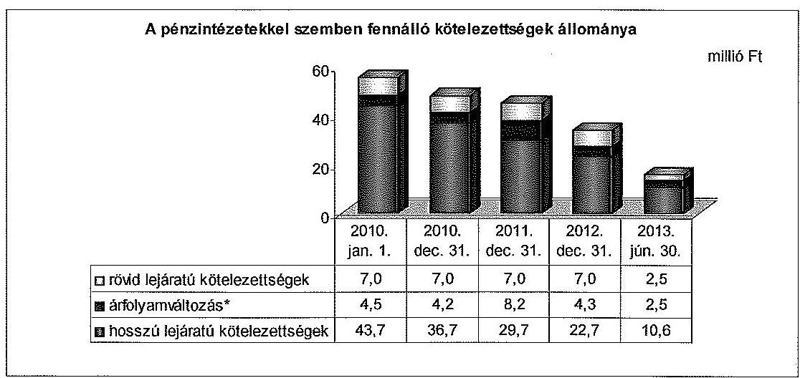

* az árfolyamváltozás hatását a helyszíni ellenőrzés során tett megállapítás alapján tüntettük fel.

Az Önkormányzat pénzintézetekkel szembeni kötelezettsége 2010. január 1-jén 55,2 millió Ft volt, amely az ellenőrzött időszakot megelőzően felvett összesen 55,4 millió Ft összegű két forint alapú, változó kamatozású, hosszú lejáratú, hitelből származott. Az Önkormányzat év végén rövid lejáratú kötelezettségként a hosszú lejáratú hitelek következő évi törlesztő részletét mutatta ki.

A Kvtv. 72. § (1) bekezdése alapján a 2013. év I. félévben végrehajtott adósságkonszolidáció keretében 2013. február 28-án kötött megállapodás szerint, a Magyar Állam 17,1 millió Ft összegű adósságot és ezen adósságnak az átvállalás időpontjáig számított járulékai ( 0,1 millió Ft) összegét vállalta át. Az Önkormányzat 50,0\%-os mértékű 14,9 millió Ft tőketartozást érintő adósságkonszolidációt követően fennállt pénzintézetekkel szembeni tartozása 2013. június 30-án 13,1 millió Ft volt, amelynek az árfolyamvesztesége ebben az időpontban 2,5 millió Ft-ot jelentett. Az Önkormányzat pénzügyi egyensúlyi helyzetét javította az adósságkonszolidáció.

---

A 2013. július 1. és 2015. december 31. közötti időszakban a pénzintézeti kötelezettségek és járulékos költségeik várhatóan 12,7 millió Ft-ot, 2016. évtől pedig 4,5 millió Ft-ot tesznek ki. Az Önkormányzat 2013. június 30 -án fennálló, hoszszú lejáratú adósságot keletkeztető kötelezettségvállalásait a 4. számú, az önkormányzat kötelezettségeit és egyes kötelezettségvállalásainak állományát, és a várható kiadásokat az 5. számú melléklet mutatja be. A jövőbeni kötelezettségek teljesítéséhez szükséges fedezet az Önkormányzat múködési jövedelemtermelő képességére, elkülönített tartalék hiányára tekintettel nem látszik biztosítottnak. Ezáltal az Önkormányzatnál fennáll a jövőbeni kötelezettségek kifizethetőségének a kockázata.

Az Önkormányzat 2007. év áprilisában igénybe vett mindkét hosszú lejáratú hitelét 2008. október 29-én képviselő-testületi döntés alapján forintról EUR alapúra váltotta át, ezért tartozását azóta EUR-ban fizeti. A hosszú távú kötelezettségvállalások pénzügyi egyensúlyra gyakorolt hatását a Képviselőtestület részére nem mutatták be.

Az Önkormányzat által megkötött hitelszerződések biztosítékként tartalmazták a beszámítás jogát, amely szerint a törlesztés elmaradása esetén a bank jogosult előzetes értesítés nélkül az Önkormányzat banknál vezetett bármely bankszámláját megterhelni. A beszámítás jogát a bank a lekötött pénzeszközre, betétre is alkalmazhatja, az Önkormányzat kamatveszteség megtérítését nem követelheti. Az Önkormányzat ezáltal - az Ötv. 88. § (1) bekezdés b) pontjában ${ }^{30}$, valamint a 2007-2009. években az Ámr. ${ }_{1}$ 103. § (11) bekezdésében, a 2010-2011. években az Ámr. ${ }_{2}$ 174. § (11) bekezdésében ${ }^{31}$ foglaltakat megsértve - a központi költségvetésböl származó bevételeit a hitel fedezeteként ajánlotta fel.

Az ellenőrzött időszakban a deviza alapú hosszú lejáratú hitelek törlesztéséhez kapcsolódóan összesen 5,0 millió Ft realizált árfolyamveszteség keletkezett ${ }^{32}$. Az Önkormányzat a realizált árfolyamveszteséget év közben elszámolta, az éves beszámolókban szerepeltette. Az Önkormányzatnál - a Sztv. 60. § (2) bekezdésében, valamint az Áhsz. ${ }_{1} 33 . \S$ (1) bekezdésében és a (2) bekezdés c) pontjában foglalt előírások ${ }^{33}$ ellenére - a 2010-2012. évi mérleg készítése során nem végezték el a devizában fennálló kötelezettségek év végi értékelését. A számviteli nyilvántartásokban a devizában fennálló kötelezettségeket nem a mérleg fordulónapjára vonatkozó devizaárfolyamon átszámított forintértéken mutatták ki, továbbá nem számolták el a - 2010. évre 4,2 millió Ft, a 2011. évre 8,2 millió Ft és a 2012. évre utólag meghatározott 4,3 millió Ft összegű - nem realizált árfolyamveszteség összegét.

[^0]
[^0]:    ${ }^{30}$ Hatálytalan 2012. január 1-jétől, a 2012. március 31-től hatályos új jogszabályi előírás: az Áht. 84. § (4) bekezdése.
    ${ }^{31}$ Hatálytalan 2012. január 1-jétől, a 2012. január 1-jétől hatályos előírás az Ávr. 145. § (2) bekezdése.
    ${ }^{32}$ 2010-ben 0,7 millió Ft, 2011-ben 0,8 millió Ft, 2012-ben 1,0 millió Ft, a 2013. év I. félévben 2,5 millió Ft.
    ${ }^{33}$ Hatálytalan 2014. január 1-jétől. A 2014. január 1-jétől hatályos előírás: Áhsz. ${ }_{2}$ 27. § (8) bekezdés h) pontja.

---

Az ellenőrzött időszakban az Önkormányzat éves beszámolóiról készült könyvvizsgálói jelentések nem tértek ki a kötelezettségek év végi értékelésére, a jelentések nem kifogásolták a kötelezettségek év végi értékeléséből adódó árfolyamveszteségek elszámolásának hiányát. A könyvvizsgálói vélemények számviteli hiányosságokat nem állapítottak meg, a számviteli hiányosságok, szabálytalanságok megszüntetésére vonatkozó intézkedéseket nem írtak elő.

A változó kamatozású adósságot keletkeztető kötelezettségvállalások kamatkockázatot, a devizában fennálló hitelek árfolyamkockázatot jelentettek az Önkormányzatnak. Az Önkormányzat az adósságot keletkeztető pénzintézeti kötelezettségvállalások kockázatainak csökkentésére nem intézkedett.

Az Önkormányzat évközi likviditási nehézségei áthidalására az ellenőrzött időszak minden évében folyószámlahitelt vett igénybe. A folyószámlahitel igénybevételét 2010-2013. év I. félévben a következő tábla szemlélteti:

| Megnevezés | 2010. év | 2011. év | 2012. év* | 2013. év   I. félév |
| :-- | --: | --: | --: | --: |
| Folyószámlahitel |  |  |  |  |
| Keretösszeg január 1-jén (millió Ft) | 20,0 | 0,0 | 20,0 | 20,0 |
| Átlagos, napi állomány (millió Ft) | 0,5 | 0,9 | 8,0 | 0,0 |
| Hitellel zárt napok száma (nap) | 37 | 78 | 287 | 1 |
| Egyenleg állomány az időszak végén (millió Ft) | 0,0 | 0,0 | 0,0 | 0,0 |
| Tellesített kamat és egyéb kiadás (millió Ft) | 0,1 | 0,1 | 1,1 | 0,0 |

* 2011. márciustól egész évben a folyószámlahitel keretösszege 20,0 millió Ft volt.

A 2010-2012. évben igénybe vett folyószámlahitel átlagos napi állománya folyamatosan emelkedett, a 2012. évi átlagos érték 8,0 millió Ft, a 2011. évi közel kilencszerese volt. Az ellenőrzött időszakban az Önkormányzatnak év végén nem volt folyószámlahitel egyenlege. A folyószámlahitellel zárt napok száma is évről évre emelkedett, 2012-ben a 2010. évinek közel 7,8-szerese volt. 2012. évben a folyószámlahitel banki kitettséget jelentett a hitellel zárt napok számának, valamint az átlagos napi állományának jelentős emelkedése miatt. Az ellenőrzött időszakban az Önkormányzat munkabér-megelőlegezési hitelt, egyéb likvid hitelt nem vett igénybe, kötvényt nem bocsátott ki.

---

Az Önkormányzat 2010-2013. év I. félév közötti szállítói és lejárt szállítói állományát a következő ábra mutatja be:
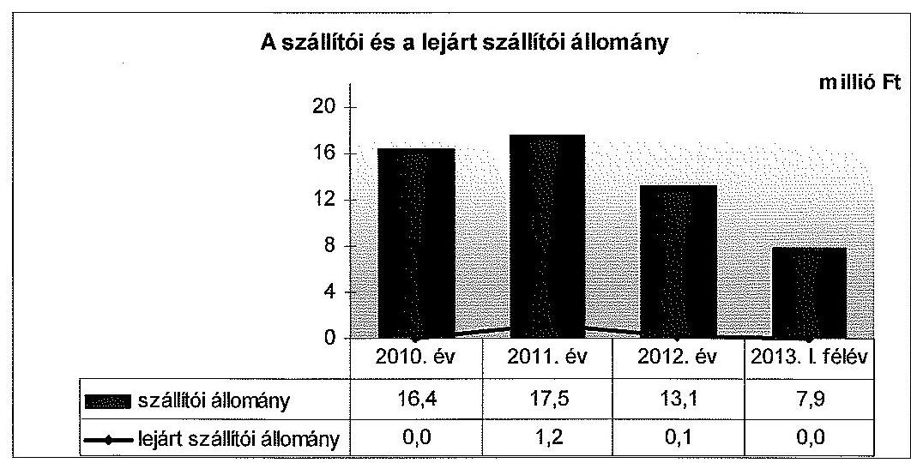

A szállítói kötelezettségek összegét korrigáltuk a helyszíni ellenőrzés során megállapított hiányzó szállítói állománnyal.

Az Önkormányzat szállítói kötelezettségének állománya 2010. évről 2011. évre 6,7\%-kal ( 1,1 millió Ft) nőtt. A 2011. évben az összes lejárt szállítói kötelezettség 1,2 millió Ft volt, amelynek $41,7 \%$-a ( 0,5 millió Ft) 30 napon belüli, $58,3 \%$-a ( 0,7 millió Ft) 90 napon túli tartozás volt, amely az óvoda, iskola étkezési díjainak másik önkormányzat részére meg nem térített összegéből adódott. 2013. év I. félévben a szállítói állomány a 2012. évi állomány közel $60,3 \%$-ára csökkent, és a lejárt szállítói kötelezettség csak 5 ezer Ft volt. Az Önkormányzat számára a lejárt szállítói kötelezettségek - a más Önkormányzat felé fennálló tartozásra és a nagyságrendjükre tekintettel - pénzügyi kockázatot nem jelentettek, a szállítói kötelezettségek miatti nemfizetési kockázat az ellenőrzött időszakban - a 2011. évet kivéve - alacsony volt.

Az Önkormányzatnál a szállítói kötelezettségek év végi állományában a mérlegben nem mutatták ki a mérleg fordulónapig teljesített azon szállítói kötelezettségeket, amelyekről a számlák a számviteli politikában megjelölt mérlegkészítés időpontjáig, február 28-ig beérkeztek. Az Önkormányzat a szállítókról az analitikus nyilvántartást nem az Áhsz. 26. § (1) bekezdésében foglaltaknak ${ }^{34}$, valamint az Áhsz. 1 9. számú melléklete 4. pontja db) ${ }^{35}$ előírásának megfelelően vezette. Abban nem szerepeltette elkülönítetten a következő évben esedékes azon szállítói kötelezettségeket, amelyek számlái a mérleg fordulónapját követően érkeztek az Önkormányzathoz, de teljesítésük időpontja a tárgyévben volt. Az Önkormányzat a helyszíni ellenőrzés során meghatározta a mérlegekben nem szerepeltetett szállítói állományt, amelynek eredmé-

[^0]
[^0]:    ${ }^{34}$ Hatálytalan 2014. január 1-jétől. A 2014. január 1-jétől hatályos előírás az Áhsz ${ }_{2}$ 14. § (8) bekezdése, valamint 1. § (1) bekezdésének 9. pontja és 14. mellékletének II. pontja.
    ${ }^{35}$ Hatálytalan 2014. január 1-jétől. A 2014. január 1-jétől hatályos előírás az Áhsz 14. § (8) bekezdése, valamint 1. § (1) bekezdésének 9. pontja és 14. mellékletének II. pontja.

---

nyeként megállapításra került a korrigált, mérlegben kimutatandó szállítói kötelezettségek állománya ${ }^{36}$ ( 4,1 millió Ft). A mérlegben a szállítói kötelezettség hiányos feltüntetésével az Önkormányzat megsértette az Sztv. 15. § (2) és (7) bekezdéseiben rögzített teljesség és összemérés számviteli alapelveket ${ }^{37}$.

Az Önkormányzat a követelésekről való lemondás módját és feltételeit a vagyonrendeletében ${ }^{38}$ határozta meg. Elengedett követelése az ellenőrzött időszakban csak 2010-ben volt, 2,0 millió Ft összegben, a döntések a helyi rendelet szabályainak betartásával történtek. Az elengedett követelésekből 0,4 millió Ft a térítési díjakat, 0,1 millió Ft a gépjármúadókat, 0,8 millió Ft a pótlékokat, és 0,7 millió Ft a bírságokat érintette.

A jegyző a 2011. évben az Önkormányzat két, folyamatban lévő felszámolási eljárás alatt álló gazdasági társasággal szemben fennálló, 16,5 millió Ft összegű helyiadó-tartozásból származó követelését - az Áhsz. 5. § 3. b) pontjában foglalt előírás ${ }^{39}$ ellenére - a felszámolási eljárás jogerős befejezésekor készítendő vagyonfelosztási javaslat nélkül, a felszámolási eljárás során készített közbenső mérleg alapján hozott határozatában behajthatatlanságra tekintettel törölte. A követeléseket a 2011. évi mérleg készítése során hitelezési veszteségként leírták, annak ellenére, hogy az Áhsz. ${ }_{1}$ 31. § (1)-(2) bekezdésében ${ }^{40}$ foglaltak szerint a közbenső mérleg alapján a követelések várható megtérülésére tekintettel értékvesztés elszámolására volt lehetőség. Egy felszámolási eljárást követően megszűnt gazdasági társaság 1,8 millió Ft helyiadótartozását a 2010. évi mérlegkészítéskor rendelkezésre álló, a behajthatatlanságot bizonyító, vagyonfelosztási javaslatban foglaltak ellenére hitelezési veszteségként nem írták le, az Áhsz. ${ }_{1} 34 . \S$ (10) bekezdésében foglalt előírás ${ }^{41}$ ellenére a behajthatatlan követelést a 2010. évi mérlegben szerepeltették, a követelést a 2011. évi mérlegkészítéskor vezették ki a számviteli nyilvántartásokból. A 2011. évi mérlegkészítéskor további egy felszámolási eljárás alatt álló gazdasági társaság 22,5 millió Ft helyiadó-tartozásának kétes beszedhetőségét bizonyító dokumentum ellenére az Áhsz. ${ }_{1} 31 . \S$ (1)-(2) bekezdése szerinti értékvesztést nem számolták el, a követelést az Áhsz. ${ }_{1} 5 . \S 3$. b) pontjában foglaltakat megsértve,

[^0]
[^0]:    ${ }^{36}$ A szállítói állomány 2010. évben 16,4 millió Ft (mérleg: 15,8 millió Ft, korrekció: 0,6 millió Ft) 2011. évben 17,5 millió Ft (mérleg: 16,1 millió Ft, korrekció: 1,4 millió Ft), 2012. évben 13,1 millió Ft (mérleg: 11 millió Ft, korrekció: 2,1 millió Ft), 2013. év I. félévben 7,9 millió Ft volt.
    ${ }^{37}$ Az Önkormányzat számviteli politikájában nem határozta meg, hogy a szállítói kötelezettségek tekintetében mi minősül jelentős összegű hibának.
    ${ }^{38}$ az Önkormányzat 16/2008. (XII. 17.) számú rendelete
    ${ }^{39}$ Hatálytalan 2014. január 1-jétől, a 2014. január 1-jétől hatályos új jogszabályi előírás: az Áhsz. ${ }_{2} 1 . \S$ (1) bekezdés 1. a) pontja és a Sztv. 3. § (4) bekezdés 10. pont c-d) alpontjai.
    ${ }^{40}$ Hatálytalan 2014. január 1-jétől, a 2014. január 1-étől hatályos új jogszabályi előírás: az Áhsz. ${ }_{2} 18 . \S$ (1) bekezdése, és a Sztv. 55. § (1) bekezdése.
    ${ }^{41}$ Hatálytalan 2014. január 1-jétől, a 2014. január 1-jétől hatályos új jogszabályi előírás: az Áhsz. ${ }_{2} 13 . \S$ (5) bekezdése.

---

a vagyonfelosztási javaslat hiányában behajthatatlannak minősítették és a számviteli nyilvántartásokból kivezették.

Az Önkormányzatnak az ellenőrzött időszakban lízing kötelezettsége, garan-cia- és kezességvállalása, PPP konstrukcióban megkötött szerződése nem volt, kölcsönt nem nyújtott, illetve kölcsönt nem vett fel.

Az Önkormányzatnak 2012. december 31-én jelzáloggal, elidegenítési és terhelési tilalommal megterhelt ingatlanja nem volt. Az ellenőrzött időszakban kötelezettséget keletkeztető peres eljárása nem volt.

Az ellenőrzött időszakban az Önkormányzat a Nonprofit Kft.-ben rendelkezett minősített többségi befolyással, 100,0\%-os tulajdonosi részesedéssel. A Nonprofit Kft.-t 2010. február 16-án alapították sportlétesítmény múködtetésére, 0,5 millió Ft jegyzett tőkével.

Az Önkormányzat múködési célú pénzeszközt adott át a múködéséhez összességében 45,5 millió Ft összegben. Az Önkormányzatnak a Nonprofit Kft. pénzügyi helyzete miatt tőkepótlási kötelezettsége nem keletkezett. A gazdasági társaságnál osztalék, osztalékelőleg fizetésére nem került sor. A Nonprofit Kft. öszszes rövid lejáratú kötelezettsége (szállítói kötelezettség, egyéb rövid lejáratú kötelezettség) 2010-ben 3,3 millió Ft volt, amely 2011-ben 60,6\%-kal (1,3 millió Ft-ra) csökkent, egyéb rövid lejáratú kötelezettsége 2012-ben csekély összegű volt ( 27 ezer Ft). A Nonprofit Kft-nek 2010-2012. években hosszú lejáratú kötelezettsége nem volt. Az Önkormányzat pénzügyi egyensúlyi helyzetére a minősített többségi befolyás alatt álló gazdasági társaság (Nonprofit Kft.) és nem minősített többségi befolyás alatt álló gazdasági társaság pénzintézeti és egyéb kötelezettségei állományának alakulása kockázatot nem jelentett, mérlegen kívüli tételek miatti kockázatot nem hordoz (a gazdasági társaságokra vonatkozó adatokat a 3. számú melléklet mutatja be).

# 4. AZ ÖNKORMÁNYZAT PÉNZÜGYI GAZDÁLKODÁSA SORÁN ÉRVÉNYESÍTETT INTEGRITÁSI SZEMPONTOK 

A pénzügyi gazdálkodás során - a „négy szem elvének" alkalmazása, az önkormányzati eszközök használata és a közérdekú bejelentések tekintetében - érvényesült az integritási szemlélet. Az összeférhetetlenség és a pénzügyi helyzetet, az adósságterheket befolyásoló döntések előtti kockázatok szabályozásának hiánya azonban arra utal, hogy az Önkormányzatnak még fejlődést kell elérnie az integritási szemlélet teljes körú érvényesítése érdekében. Integritás Kérdőívet az ellenőrzött időszakban az Önkormányzat nem töltött ki.

A Polgármesteri Hivatalban a köztisztviselőkre vonatkozóan az etikai elvárásokat, szabályokat a Belső kontrollrendszer szabályzatban általánosságban határozták meg, amelynek hatálya a Polgármesteri Hivatal minden dolgozójára és vezetőjére kiterjedt.

---

Az Önkormányzat az összeférhetetlenség eseteit konkrétan nem határozta meg, az összeférhetetlenség esetén követendő eljárásokat nem szabályozták, csak a jogszabályi előírások betartási kötelezettségét rögzítették ${ }^{42}$.

Az Önkormányzat a tulajdonában, illetve kezelésében lévő eszközök (telefon, fénymásolók) magáncélú használatának módját a Számviteli politikában határozták meg, amely szerint az eszközök használatáért térítést kell fizetni az igénybe vevőknek. Az Önkormányzatnál a szervezeten kívülről, illetve belülről érkező közérdekü bejelentések kezelésével kapcsolatos szabályokat az Iratkezelési szabályzatban ${ }^{43}$ rögzítették.

Az Önkormányzat Belső kontrollrendszer szabályzata ${ }^{44}$ a pénzügyi gazdálkodást érintő folyamatokban tartalmazta „a négy szem elvének" alkalmazását. Rögzítésre került, hogy az „irat, pénzügyi dokumentumok, beszámolók, jelentések, állásfoglalások tekintetében minimum két ember általi áttekintési kötelezettség" javasolt.

Az Önkormányzatnál a pénzügyi helyzetet, az adósságterheket befolyásoló döntések elötti kockázatok felmérését nem írták elő, nem szabályozták. Rendelkezést csak az SZMSZ 13. §-a tartalmazott a testületi előterjesztések költség haszon elemzésére vonatkozóan. A Pénzügyi és Jogi Bizottság feladat- és hatáskörében figyelemmel kíséri a költségvetés bevételek alakulását, (különös tekintettel a saját bevételeket), a vagyonváltozás (vagyonnövekedés, csökkenés) alakulását, továbbá vizsgálja és ellenőrzi a hitelfelvétel indokait és gazdasági megalapozottságát, a hitelfelvételét.

Budapest, 2014. 84 . hónap 16 . nap

Melléklet: 8 db
Függelék: 2 db
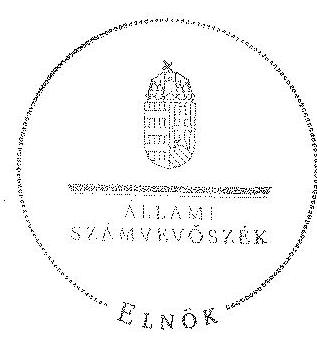

Domokos László
elnök

[^0]
[^0]:    ${ }^{42}$ A Közszolgálati Szabályzat szerint „a köztisztviselői törvényben, illetve egyéb jogszabályokban megfogalmazott összeférhetetlenség elkerülése, illetve maradéktalan betartása elvárás".
    ${ }^{43}$ Csákvár Nagyközség Polgármesteri Hivatal Egyedi Iratkezelési szabályzata (2006. 11. 22. és a 2011. 12. 21. számú szabályzatok).
    ${ }^{44}$ Csákvár Nagyközség Polgármesteri Hivatal Belső kontrollrendszer (5/2011. számú szabályzat).

---

Az Önkormányzat bevételei és kiadásai, valamint adósságszolgálata a 2010-2013. év I. félév közötti időszakban (a CLF módszer szerint, a Kvtv. 72. § (1) bekezdésében foglalt adósság átvállaláshoz kapcsolódó pénzügyi teljesítések nélkül)

|  1. FOLYÓ KÖLTSÉGVETÉS* | 2010. év | 2011. év | 2012. év | 2013. év
I. félév  |
| --- | --- | --- | --- | --- |
|  1.1.1. Saját működési bevételek | 154,7 | 171,4 | 182,9 | 93,1  |
|  1.1.2. Költségvetési támogatások ÖNINIKI támogatások nélkül** | 261,4 | 242,9 | 267,9 | 134,1  |
|  1.1.3. Alategetett bevételek | 164,1 | 164,6 | 163,7 | 7,5  |
|  1.1.4. Államháztartáson belülről kapott támogatások | 63,8 | 67,6 | 64,1 | 25,4  |
|  1.1.5. EU-öli és különböző kapott bevételek | 0,0 | 0,0 | 0,0 | 0,0  |
|  1.1.6. Államháztartáson kívülről kapott bevételek | 1,0 | 4,2 | 1,4 | 0,0  |
|  1.1.7. Hozam- és kamatbevételek | 2,4 | 0,3 | 0,2 | 0,2  |
|  1.1.8. Kölcsönök visszatérítése, igénybevétele | 0,0 | 0,0 | 0,0 | 0,0  |
|  1.1.9. Előző évi pénzmaradvány átvétel | 0,0 | 0,0 | 7,4 | 3,3  |
|  1.1.10. A működőközesség megőrzését szolgáló kiegészítő támogatások | 0,0 | 0,0 | 18,9 | 0,0  |
|  1.1. Folyó bevételek +1.1.1.+1.1.2.+1.1.3.+1.1.4.+1.1.5.+1.1.6.+1.1.7.+1.1.8.+1.1.9.+1.1.10. | 697,9 | 676,3 | 726,3 | 263,6  |
|  1.2.1. Működési kiadások kamatkiadások nélkül | 664,2 | 604,8 | 634,2 | 251,2  |
|  1.2.2. Államháztartáson belülre átadott pénzeszközök | 1,6 | 1,6 | 2,3 | 4,9  |
|  1.2.3.1. vállalkozásoknak | 4,0 | 3,2 | 2,4 | 28,0  |
|  1.2.3.2. EU-nak, illetve külföldre | 0,0 | 0,0 | 0,0 | 0,0  |
|  1.2.3.3. megánszemélyeknek | 48,2 | 88,2 | 88,7 | 0,0  |
|  1.2.3.4. nonprofit szervezeteknek | 18,0 | 30,3 | 14,7 | 3,4  |
|  1.2.4. Transferkiválások (+1.2.3.1.+1.2.3.2.+1.2.3.3.+1.2.3.4.) | 67,3 | 92,8 | 77,2 | 29,4  |
|  1.2.5. Kismatkiadások | 1,0 | 1,5 | 1,9 | 0,2  |
|  1.2.6. Kölcsönök nyújtása, törlesztése | 0,0 | 0,0 | 0,0 | 0,0  |
|  1.2.7. Előző évi pénzmaradvány átadás | 0,0 | 0,0 | 1,4 | 0,6  |
|  1.2. Folyó kiadások + 1.2.1.+1.2.2.+1.2.3.+1.2.4.+1.2.5.+1.2.6. | 734,9 | 701,0 | 723,0 | 265,7  |
|  1.3. Folyó költségvetés egyenlege, működési jövedelem (1.1. - 1.2.) | $-37,0$ | $-24,7$ | $-3,3$ | $-22,1$  |
|  2. FELHAL MOZÁSI KÖLTSÉGVETÉS*** |  |  |  |   |
|  2.1.1. Saját többbevételek | 30,6 | 19,1 | 28,0 | 3,2  |
|  2.1.2. Költségvetési támogatások | 0,0 | 0,0 | 0,0 | 1,2  |
|  2.1.3. Államháztartáson belülről kapott támogatások | 0,0 | 0,0 | 7,9 | 0,0  |
|  2.1.4. EU-öli és különböző kapott támogatások | 0,0 | 0,0 | 0,0 | 0,0  |
|  2.1.5. Államháztartáson kívülről kapott bevételek | 0,4 | 1,0 | 0,7 | 2,9  |
|  2.1.6. Hozam- és kamatbevételek | 0,0 | 0,0 | 0,0 | 0,0  |
|  2.1.7. Kölcsönök visszatérítése, igénybevétele | 0,0 | 0,0 | 0,0 | 0,0  |
|  2.1.8. Előző évi pénzmaradvány átvétel | 0,0 | 0,0 | 0,0 | 0,0  |
|  2.1. Felhalmozási bevételek +2.1.1.+2.1.2.+2.1.3.+2.1.4.+2.1.5.+2.1.6.+2.1.7.+2.1.8. | 31,0 | 20,7 | 41,3 | 7,3  |
|  2.2.1. Saját beruházási kiadás átfaval | 17,0 | 15,3 | 6,5 | 2,9  |
|  2.2.2. Saját területén kiadás átfaval | 17,8 | 2,5 | 0,0 | 0,0  |
|  2.2.3. Államháztartáson belülre átadott pénzeszközök | 0,0 | 0,0 | 0,0 | 0,0  |
|  2.2.4. EU-nak és külföldnek adott pénzeszközök | 0,0 | 0,0 | 0,0 | 0,0  |
|  2.2.5. Államháztartáson kívülre adott pénzeszközök | 0,2 | 0,0 | 0,0 | 0,0  |
|  2.2.6. Befektetési célú részesedések vásárlása | 0,5 | 0,0 | 0,0 | 0,0  |
|  2.2.7. Kamatkiadások | 0,8 | 0,7 | 0,6 | 0,1  |
|  2.2.8. Kölcsönök nyújtása, törlesztése | 0,0 | 0,0 | 0,0 | 0,0  |
|  2.2.9. Előző évi pénzmaradvány átadás | 0,0 | 0,0 | 0,0 | 0,0  |
|  2.2.10. ÁFA befezelések | 0,0 | 0,0 | 0,0 | 0,0  |
|  2.3. Felhalmozási kiadások + 2.2.1.+2.2.2.+2.2.3.+2.2.4.+2.2.5.+2.2.6.+2.2.7.+2.2.8.+2.2.9.+2.2.10. | 36,4 | 16,5 | 7,1 | 3,0  |
|  2.4. Felhalmozási költségvetés egyenlege (2.1. - 2.2.) | $-5,8$ | $-5,2$ | $-34,2$ | 4,3  |
|  3. FINANSZÍROZÁSI MÜVELETEK NÉLKÜLI (GFS) POZÍCIO (1.3.+2.3.) | $-42,4$ | $-19,5$ | $-37,5$ | $-17,6$  |
|  4. FINANSZÍROZÁSI MÜVELETEK |  |  |  |   |
|  4.1. Hitelhetvétel | 0,0 | 0,0 | 0,0 | 0,0  |
|  4.2. Hiteltörlesztés | 6,1 | 7,0 | 7,0 | 1,1  |
|  4.3. Forgalási és befektetési célú értékpapírok kibocsátása | 0,0 | 0,0 | 0,0 | 0,0  |
|  4.4. Forgalási és befektetési célú értékpapírok beváltása | 0,0 | 0,0 | 0,0 | 0,0  |
|  4.5. Forgalási és befektetési célú értékpapírok értékesítése | 0,0 | 0,0 | 0,0 | 0,0  |
|  4.6. Forgalási és befektetési célú értékpapírok vásárlása | 0,0 | 0,0 | 0,0 | 0,0  |
|  4.7. Egyéb finanszírozási bevételek (függő, átfutó, kiegyenlítő) | $-24,5$ | 0,4 | 0,0 | 5,9  |
|  4.8. Egyéb finanszírozási kiadások (függő, átfutó, kiegyenlítő) | 5,0 | 20,0 | $-3,4$ | $-3,2$  |
|  4.9. Finanszírozási műveletek egyenlege (4.1.-4.2.+4.3.-4.4.+4.5.-4.6.+4.7.-4.8.) | $-41,6$ | 15,4 | 3,6 | 7,4  |
|  5. TÁRGYÉVI PÉNZÜGYI POZÍCIO (1.3.+ 2.3.+4.9.) | $-54,0$ | $-6,1$ | $-33,9$ | $-10,4$  |
|  6. NETTÓ MÜKÖDÉSI JÖVEDELEM = működési jövedelem (1.3.) - főketörlesztés (4.2.+4.4.) | $-42,1$ | $-31,7$ | $-3,7$ | $-23,8$  |
|  TÁJÉKOZTATÓ ADATOK |  |  |  |   |
|  Összes kötelezettség | 53,2 | 57,0 | 46,0 | 26,9  |
|  ebből rövid lejárata | 27,0 | 27,2 | 23,3 | 16,2  |
|  Összes szállítói kötelezettség**** | 16,4 | 17,5 | 13,1 | 7,9  |
|  ebből lejárt (tanúsítványból) | 0,0 | 1,2 | 0,1 | 0,0  |
|  Pénz- és tőkepapí kötelezettség (adóssági)**** | 47,9 | 44,3 | 34,0 | 15,5  |
|  ebből rövid lejáratú | 7,0 | 7,0 | 7,0 | 2,5  |
|  ebből hossza lejáratú kötelezettségek következő évet terhelő törlesztő részletet (anultikából) | 1,0 | 7,0 | 7,0 | 2,5  |
|  PPP szerződéses állomány jelenértéken (tanúsítványból) | 0,0 | 0,0 | 0,0 | 0,0  |
|  ebből lejárt szolgáltatási díj mœlti kötelezettség | 0,0 | 0,0 | 0,0 | 0,0  |
|  Folyószámla-, likvid- és munkabár hitel papi állapos állománya (tanúsítványból) | 0,5 | 0,9 | 8,0 | 0,0  |
|  Keresség és panemlevkötelecek (tanúsítványból) | 0,0 | 0,0 | 0,0 | 0,0  |
|  Jogerős (a)risági ítéleteltölt adódó kötelezettségek (tanúsítványból) | 0,0 | 0,0 | 0,0 | 0,0  |
|  Finanszírozásba bevonható eszközök | 10,1 | 4,0 | 37,9 | 27,5  |
|  Tartós köteírásomyt megtestesítő értékpapírok | 0,0 | 0,0 | 0,0 | 0,0  |
|  Hosszú lejáratú bankkettétek | 0,0 | 0,0 | 0,0 | 0,0  |
|  Értékpapírok | 0,0 | 0,0 | 0,0 | 0,0  |
|  Pénzeszközök (idegen nélkül) | 10,1 | 4,0 | 37,9 | 27,5  |

- A költségvetési szerveknéi a számvétel szabályoknak megfelelően a bevételekben nem térül, a kiadásokban nem jelenik meg az amortizáció, a vagyoni helyzetet az egyenleg befolyásolja. ** A költségvetési támogatásból a felhalmozási célú részt az Önkormányzat adatszolgáltatása szerinti mértékben vettük figyelembe a 2.1.2., a 2.1.6., illetve a 2.2.7. sorokon. *** Bevételekben vagyonmegőrzésre és -bővítésre fordítható források. **** A szállítói kötelezettséget korrigáltuk a helyszíni ellenőrzés során megállapított hiányzó szállítói állomány értékével. ***** A pénz- és tőkepapí kötelezettséget korrigáltuk a helyszíni ellenőrzés során megállapított árfolyamváltozással.

---

Az Önkormányzat bevételei és kiadásai a Kvtv. 72. § (1) bekezdésében foglalt adósság átvállaláshoz kapcsolódó pénzügyi teljesítések nélkül 2013. év I. félévben (a CLF módszer szerint)

|  1. FOLYÓ KÖLTSÉGVETÉS* |  |  |  |  |  |  |  |  |  |  |  |  |  |  |  |  |  |  |  |  |  |  |  |  |  |  |  |  |   |
| --- | --- | --- | --- | --- | --- | --- | --- | --- | --- | --- | --- | --- | --- | --- | --- | --- | --- | --- | --- | --- | --- | --- | --- | --- | --- | --- | --- | --- | --- |
|   |  |  |  |  |  |  |  |  |  |  |  |  |  |  |  |  |  |  |  |  |  |  |  |  |  |  |  |  |   |
|   |  |  |  |  |  |  |  |  |  |  |  |  |  |  |  |  |  |  |  |  |  |  |  |  |  |  |  |  |   |
|   |  |  |  |  |  |  |  |  |  |  |  |  |  |  |  |  |  |  |  |  |  |  |  |  |  |  |  |  |   |
|   |  |  |  |  |  |  |  |  |  |  |  |  |  |  |  |  |  |  |  |  |  |  |  |  |  |  |  |  |   |
|   |  |  |  |  |  |  |  |  |  |  |  |  |  |  |  |  |  |  |  |  |  |  |  |  |  |  |  |  |  |   |
|   |  |  |  |  |  |  |  |  |  |  |  |  |  |  |  |  |  |  |  |  |  |  |  |  |  |  |  |  |  |   |
|   |  |  |  |  |  |  |  |  |  |  |  |  |  |  |  |  |  |  |  |  |  |  |  |  |  |  |  |  |  |   |
|   |  |  |  |  |  |  |  |  |  |  |  |  |  |  |  |  |  |  |  |  |  |  |  |  |  |  |  |  |  |   |
|   |  |  |  |  |  |  |  |  |  |  |  |  |  |  |  |  |  |  |  |  |  |  |  |  |  |  |  |  |  |   |
|   |  |  |  |  |  |  |  |  |  |  |  |  |  |  |  |  |  |  |  |  |  |  |  |  |  |  |  |  |  |   |
|   |  |  |  |  |  |  |  |  |  |  |  |  |  |  |  |  |  |  |  |  |  |  |  |  |  |  |  |  |  |   |
|   |  |  |  |  |  |  |  |  |  |  |  |  |  |  |  |  |  |  |  |  |  |  |  |  |  |  |  |  |  |   |
|   |  |  |  |  |  |  |  |  |  |  |  |  |  |  |  |  |  |  |  |  |  |  |  |  |  |  |  |  |  |   |
|   |  |  |  |  |  |  |  |  |  |  |  |  |  |  |  |  |  |  |  |  |  |  |  |  |  |  |  |  |  |  |   |
|   |  |  |  |  |  |  |  |  |  |  |  |  |  |  |  |  |  |  |  |  |  |  |  |  |  |  |  |  |  |  |   |
|   |  |  |  |  |  |  |  |  |  |  |  |  |  |  |  |  |  |  |  |  |  |  |  |  |  |  |  |  |  |  |   |
|   |  |  |  |  |  |  |  |  |  |  |  |  |  |  |  |  |  |  |  |  |  |  |  |  |  |  |  |  |  |  |   |
|   |  |  |  |  |  |  |  |  |  |  |  |  |  |  |  |  |  |  |  |  |  |  |  |  |  |  |  |  |  |  |   |
|   |  |  |  |  |  |  |  |  |  |  |  |  |  |  |  |  |  |  |  |  |  |  |  |  |  |  |  |  |  |  |   |
|   |  |  |  |  |  |  |  |  |  |  |  |  |  |  |  |  |  |  |  |  |  |  |  |  |  |  |  |  |  |  |   |
|   |  |  |  |  |  |  |  |  |  |  |  |  |  |  |  |  |  |  |  |  |  |  |  |  |  |  |  |  |  |  |   |
|   |  |  |  |  |  |  |  |  |  |  |  |  |  |  |  |  |  |  |  |  |  |  |  |  |  |  |  |  |  |  |   |
|   |  |  |  |  |  |  |  |  |  |  |  |  |  |  |  |  |  |  |  |  |  |  |  |  |  |  |  |  |  |  |   |
|   |  |  |  |  |  |  |  |  |  |  |  |  |  |  |  |  |  |  |  |  |  |  |  |  |  |  |  |  |  |  |   |
|   |  |  |  |  |  |  |  |  |  |  |  |  |  |  |  |  |  |  |  |  |  |  |  |  |  |  |  |  |  |  |   |
|   |  |  |  |  |  |  |  |  |  |  |  |  |  |  |  |  |  |  |  |  |  |  |  |  |  |  |  |  |  |  |   |
|   |  |  |  |  |  |  |  |  |  |  |  |  |  |  |  |  |  |  |  |  |  |  |  |  |  |  |  |  |  |  |   |
|   |  |  |  |  |  |  |  |  |  |  |  |  |  |  |  |  |  |  |  |  |  |  |  |  |  |  |  |  |  |  |   |
|   |  |  |  |  |  |  |  |  |  |  |  |  |  |  |  |  |  |  |  |  |  |  |  |  |  |  |  |  |  |  |   |
|   |  |  |  |  |  |  |  |  |  |  |  |  |  |  |  |  |  |  |  |  |  |  |  |  |  |  |  |  |  |  |   |
|   |  |  |  |  |  |  |  |  |  |  |  |  |  |  |  |  |  |  |  |  |  |  |  |  |  |  |  |  |  |  |   |
|   |  |  |  |  |  |  |  |  |  |  |  |  |  |  |  |  |  |  |  |  |  |  |  |  |  |  |  |  |  |  |   |
|   |  |  |  |  |  |  |  |  |  |  |  |  |  |  |  |  |  |  |  |  |  |  |  |  |  |  |  |  |  |  |   |
|   |  |  |  |  |  |  |  |  |  |  |  |  |  |  |  |  |  |  |  |  |  |  |  |  |  |  |  |  |  |  |   |
|   |  |  |  |  |  |  |  |  |  |  |  |  |  |  |  |  |  |  |  |  |  |  |  |  |  |  |  |  |  |  |   |
|   |  |  |  |  |  |  |  |  |  |  |  |  |  |  |  |  |  |  |  |  |  |  |  |  |  |  |  |  |  |  |   |
|   |  |  |  |  |  |  |  |  |  |  |  |  |  |  |  |  |  |  |  |  |  |  |  |  |  |  |  |  |  |  |   |
|   |  |  |  |  |  |  |  |  |  |  |  |  |  |  |  |  |  |  |  |  |  |  |  |  |  |  |  |  |  |  |   |
|   |  |  |  |  |  |  |  |  |  |  |  |  |  |  |  |  |  |  |  |  |  |  |  |  |  |  |  |  |  |  |   |
|   |  |  |  |  |  |  |  |  |  |  |  |  |  |  |  |  |  |  |  |  |  |  |  |  |  |  |  |  |  |  |   |
|   |  |  |  |  |  |  |  |  |  |  |  |  |  |  |  |  |  |  |  |  |  |  |  |  |  |  |  |  |  |  |   |
|   |  |  |  |  |  |  |  |  |  |  |  |  |  |  |  |  |  |  |  |  |  |  |  |  |  |  |  |  |  |  |   |
|   |  |  |  |  |  |  |  |  |  |  |  |  |  |  |  |  |  |  |  |  |  |  |  |  |  |  |  |  |  |  |   |
|   |  |  |  |  |  |  |  |  |  |  |  |  |  |  |  |  |  |  |  |  |  |  |  |  |  |  |  |  |  |  |   |
|   |

---

### Az Önkormányzat által a 2010. és a 2013. év I. félév között megvalósított fejlesztési feladatok érdekében teljesített felhalmozási kiadások és az ezekhez vállalt kötelezettségek összegzése

|  Sorszám | Fejlesztési feladat típusa |  |  |  |  |  |  |  |  |  |  |  |  |  |  |  |  |  |  |  |  |  |  |  |  |  |  |  |  |  |  |  |  |  |  |  |  |  |  |  |  |  |  |  |  |  |  |  |  |  |  |  |  |  |  |  |  |  |  |  |  |  |  |  |  |  |  |  |  |  |  |  |  |  |  |  |  |  |  |  |  |  |  |  |  |  |  |  |  |  |  |  |  |  |  |  |  |  |  |  |  | 

---

### Az önkormányzati feladatok ellátásában résztvevő gazdasági társaságok egyes kiemelt adatai

|  Gazdasági társaság
megnevezése |  |  |  |  |  |  |  |  |  |  | a gazdasági társaságnak szerződéses kötelezettségre, feladatellátási szerződésre alapozottan az
Önkormányzati költségvetéséből nyújtott |  |  |  |  |  |  |  |  |  |  |  |  |  |  |   |
| --- | --- | --- | --- | --- | --- | --- | --- | --- | --- | --- | --- | --- | --- | --- | --- | --- | --- | --- | --- | --- | --- | --- | --- | --- | --- |
|   | önkormányzat | önkormányzat
gazdasági
társaságának | saját tőke,
jegyzett tőke
aránya | kötelező
feladathoz | önként vállalt
feladathoz | hosszú lejáratú
tételből,
kötvényből | tízingből | lejárt szállító
állományból | működési célú pénzeszközátadás | felhalmozási célú pénzeszközátadás |  |  |  |  |  |  |  |  |  |  |  |  |  |  |   |
|   | tulajdoni hányada (%) |  |  |  |  |  |  |  | rendelt nettó vagyon | fennálló kötelezettség |  |  |  | 2010. év | 2011. év | 2012. év | 2013. év
L félév | 2016. év | 2011. év | 2012. év | 2013. év
L félév |  |  |  |   |
|  I. 100%-os tulajdoni hányadú gazdasági társaságok |  |  |  |  |  |  |  |  |  |  |  |  |  |  |  |  |  |  |  |  |  |  |  |  |   |
|  Csákvár Kulturális Sport és
Klemellen Közhasznú
Nonprofit Kft. | 100,0 | 0,0 | 3,0 | 0,0 | 1,3 | 0,0 | 0,0 | 0,0 | 11,4 | 23,7 | 10,4 | 0,0 | 0,0 | 0,0 | 0,0 | 0,0 | 0,0 | 0,0 | 0,0 |  |  |  |  |  |   |
|  100%-os tulajdoni
hányadú gazdasági
társaságok összesen | × | × | × | 0,0 | 1,3 | 0,0 | 0,0 | 0,0 | 11,4 | 23,7 | 10,4 | 0,0 | 0,0 | 0,0 | 0,0 | 0,0 | 0,0 | 0,0 | 0,0 |  |  |  |  |  |   |
|  II. 75-99%-os tulajdoni hányadú gazdasági társaságok |  |  |  |  |  |  |  |  |  |  |  |  |  |  |  |  |  |  |  |  |  |  |  |  |   |
|   | 0,0 | 0,0 | 0,0 | 0,0 | 0,0 | 0,0 | 0,0 | 0,0 | 0,0 | 0,0 | 0,0 | 0,0 | 0,0 | 0,0 | 0,0 | 0,0 | 0,0 | 0,0 | 0,0 |  |  |  |  |  |   |
|  75-99%-os tulajdoni
hányadú gazdasági
társaságok összesen | × | × | × | 0,0 | 0,0 | 0,0 | 0,0 | 0,0 | 0,0 | 0,0 | 0,0 | 0,0 | 0,0 | 0,0 | 0,0 | 0,0 | 0,0 | 0,0 | 0,0 |  |  |  |  |  |   |
|  I. + II. együtt (75-100%-os tulajdoni hányadú gazdasági társaságok) |  |  |  |  |  |  |  |  |  |  |  |  |  |  |  |  |  |  |  |  |  |  |  |  |   |
|  minősített befolyásszerző
tulajdoni hányadú
gazdasági társaságok
összesen | × | × | × | 0,0 | 1,3 | 0,0 | 0,0 | 0,0 | 11,4 | 23,7 | 10,4 | 0,0 | 0,0 | 0,0 | 0,0 | 0,0 | 0,0 | 0,0 |  |  |  |  |  |  |   |
|  III. 51-74%-os tulajdoni hányadú gazdasági társaságok |  |  |  |  |  |  |  |  |  |  |  |  |  |  |  |  |  |  |  |  |  |  |  |  |   |
|   | 0,0 | 0,0 | 0,0 | 0,0 | 0,0 | 0,0 | 0,0 | 0,0 | 0,0 | 0,0 | 0,0 | 0,0 | 0,0 | 0,0 | 0,0 | 0,0 | 0,0 | 0,0 | 0,0 |  |  |  |  |  |   |
|  51-74%-os tulajdoni
hányadú gazdasági
társaságok összesen | × | × | × | 0,0 | 0,0 | 0,0 | 0,0 | 0,0 | 0,0 | 0,0 | 0,0 | 0,0 | 0,0 | 0,0 | 0,0 | 0,0 | 0,0 | 0,0 | 0,0 |  |  |  |  |  |   |
|  IV. egyéb, közfeladatot ellátó gazdasági társaságok |  |  |  |  |  |  |  |  |  |  |  |  |  |  |  |  |  |  |  |  |  |  |  |  |   |
|  FEJÉRVÍZ Fejér Magyar
Önkormányzatok Víz-és
Csatornarmú Zrt. | 0,01 | 0,0 | n.a. | n.a. | n.a. | n.a. | n.a. | n.a. | n.a. | n.a. | n.a. | n.a. | n.a. | n.a. | n.a. | n.a. | n.a. | n.a. | n.a. |  |  |  |  |  |   |
|  egyéb, közfeladatot ellátó
gazdasági társaságok
összesen | × | × | × | 0,0 | 0,0 | 0,0 | 0,0 | 0,0 | 0,0 | 0,0 | 0,0 | 0,0 | 0,0 | 0,0 | 0,0 | 0,0 | 0,0 | 0,0 | 0,0 |  |  |  |  |  |   |
|  Összesen | × | × | × | 0,0 | 1,3 | 0,0 | 0,0 | 0,0 | 11,4 | 23,7 | 10,4 | 0,0 | 0,0 | 0,0 | 0,0 | 0,0 | 0,0 | 0,0 | 0,0 |  |  |  |  |  |   |

---

Az Önkormányzat 2013. június 30-án fennálló, hosszú lejáratú adósságot keletkeztető kötelezettségvállalásai

|  Megnevezés | Szerződéskötés/
Kibocsátás
időpontja | Összeg
millió Ft-ban | Kamat
(referencia kamat + kamatfelár) | Felhasználás célja  |
| --- | --- | --- | --- | --- |
|  FKMC-2/2007 számú
Multicurrency /fejlesztési
célú hitel/ | 2007.04 .25 | 17,0 | referencia-kamatláb (BUBOR) +
évi $0,8 \%$ * | mentőállomás beruházása  |
|  FKMC-1/2007 számú
Multicurrency
/müködési célú hitel/ | 2007.04 .26 | 38,4 | referencia-kamatláb (BUBOR) +
évi $0,8 \%$ * | korábbi hitelek kiváltása  |

- 2009. április 1-i hitelszerződés módosítás szerint a kamatfelár 3,1 \%-ra növekedett

---

Az Önkormányzat kötelezettségeinek és egyes kötelezettségvállalásainak 2010. december 31-ei és 2013. június 30-ai állománya, valamint 2013. év II. félévben és az azt követő években várható kötelezettségek, kötelezettségvállalások miatti kiadások

|  Megnevezés | Állomány 2010. december 31-én |  |  | Állomány 2013. június 30-án |  |  | A 2013. év I. félév végén fennálló kötelezettségek, kötelezettségvállalások alapján várható kiadások* |  |   |
| --- | --- | --- | --- | --- | --- | --- | --- | --- | --- |
|   |  |  |  |  |  |  | a 2013. július 1. és 2015. december 31. közötti időszakban |  | a 2016. évtől  |
|   | (millió Ft-ban) | Devizában (ezer EURban) | Devizánem | (millió Ft-ban) | Devizában (ezer EURban) | Devizánem | (millió Ft-ban) | Devizában (ezer EUR-ban) | (millió Ft-ban)  |
|  FKMC-2/2007 számú Multicurrency kölcsönszerződés (fejlesztési hitel) | 16,0 | 57,6 | EUR | 9,4 | 36,9 | EUR | 9,1 | 37,7 | 3,2  |
|  FKMC-1/2007 számú Multicurrency kölcsönszerződés (működési hitel) | 31,9 | 137,2 | EUR | 3,7 | 14,7 | EUR | 3,6 | 14,9 | 1,3  |
|  Pénzintézeti kötelezettségek összesen Ft-ban** | 47,9 | - | - | 13,1 | - | - | 12,7 | - | 4,5  |
|  Pénzintézeti kötelezettségek összesen devizában | - | 194,8 | - | - | 51,6 | - | - | 52,6 | -  |
|  Szállítói kötelezettségek összesen Ft-ban | 16,4 | - | - | 7,9 | - | - | 7,9 | - | -  |

- A 2013. év I. félév végén fennálló kötelezettségek, kötelezettségvállalások alapján a tőketörlesztés a várható kamatkiadásokkal együtt számítva. **: a hitelfelvételkori árfolyamon számítva

---

CSÁKVÁR VÁROS ÖNKORMÁNYZATA

Székhely: 8083 Csákvár, Szabadság tér 9.

Tel./Fax: 22 / 582-310
Mail: titkarsag@csakvar.hu
Web: www.csakvar.hu

## 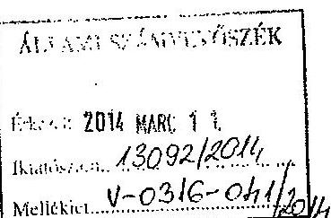

Ikt.sz.: 102-11/2014.
Ügyintéző: Katonáné dr. V.B.
Hiv.sz.: V-0316-038/2014
Dátum: Csákvár, 2014.03.03.

Tárgy: Észrevétel jelentéstervezetre

## Állami Számvevőszék

## Domokos László

elnök úr
részére

Tisztelt Elnök Úr!

Az Állami Számvevőszék által küldött, önkormányzatunkn vonatkozó jelentéstervezettel kapcsolatban az alábbi észrevételt teszem:

1.) A tervezet 7. oldalának 2.bekezdésében a következő olvasható: "Az Önkormányzat 2010-2013.év I.félévben képződött finanszirozdai igénye 96,5 millió Ft volt, amelyre a korábbi években képződött tartalékok felhasználása nyújtott fedezetet." A 6. oldal 3.bekezdésében ezzel szemben megállapítják, hogy müködőképesség megőrzését szolgáló kiegészítő támogatás nélkül minden évben eladósodottabbá vált volna önkormányzatunk. Én az utóbbival teljes mértékben egyetértek, az ÖNHIKI támogatások nélkül nem tudnuk volna a gazdálkodásunkat megfelelően vinni. Tartalékok feléléséről azonban - különösen olyan tartalékokról, amelyek 3 és fél éven át kitartottak volna 2010.-2013.I.félév közötti időszakban - semmiként sem beszélhetünk. Javaslom, hogy a dőlt betűvel szedett mondatot szíveskedjenek átfogalmazni a jelentésben, mivel az olvasóban azt a látszatot keltheti, hogy a korábbi önkormányzati ciklusban képződött tartalékok felhéséből élt az önkormányzat. Az előző önkormányzati ciklusban történt nagy értékủ ingatlan értékesítés legfeljebb 2011.I.félévében éreztette még hatását, egy évvel később azonban strukturala átalakításokat terjesztettem elő annak érdekében, hogy gazdálkodásunk rendtábilisabb legyen. A jelentés nyilvánvalóan a pénzmaradványra gondol, amely minden évben képződött a vizsgált időszakban, vagyis az évente képződött tartalékok felhasználása nyújtott fedezetet a következö év finanszirozdai igényére.
2.) A tervezet 19. oldalának utolsó bekezdésében olvasható, hogy 2013.I.félévben 1,2 millió Ft vis maior támogatásban részesült az önkormányzat, amelyhez kapcsolódóan 1,7 millió Ft dologi kiadást teljesített. Pontosítani szeretném, hogy nem hoolvadást követő beivizkárok helyreállítására kaptuk az összeget, hanem a 2013.március 14. 16.közötti idöjárási katasztrófahelyzetre tekintettel, mivel mintegy 165 befogadottat kellett ellátnunk a hóviharban a külvilágtól teljesen elzárt településünkön.
3.) A tervezet 22. oldalának 4.bekezdésében az általunk eszközölt 27,5 millió Ft összegủ kiadáscsökkentő és bevételnövclő intézkedést nem tartotta credményesnek. Véleményem szerint reálisan jelentőenek értékelhető a korábban kimutatott költségvetési hiányhoz képest a mintegy 30 millió Ft értékủ csökkentő intézkedés, bár tény, hogy ezen felül is rászorult az önkormányzat a müködését segitő kiegészitő támogatásra.

A polgármester számára leírt intézkedési javaslatokra az alábbiakat nyilatkozom:

---

## CSÁKVÁR VÁROS ÖNKORMÁNYZATA

Székhely: 8083 Csákvár, Szabadság tér 9,

Tel./Fax: 22 / 582-310
Mail: titkarsag@csakvar.hu
Web: www.csakvar.hu
1.) Egyetértek azzal, hogy az önkormányzat pénzügyi egyensúlya helyreállítása érdekében ismét intézkedéseket szükséges tenni, a 2012.évben megtett intézkedések megtartásán felül. Már dolgozok a pénzügyi egyensúly helyreállítását és hosszú távú fenntarthatóságát biztosító intézkedés tervezet kidolgozásán. Amíg ezek hatása be nem áll, hosszabb távú, a gazdálkodást megterhelő pénzügyi kötelezettséget az önkormányzat nem vállalhat. Az önként vállalt feladatok felülvizsgálata és fenntarthatóságának vizsgálata is meg fog történni.
2.) Az Önkormányzat által felvett 55,4 millió Ft összegủ hittel konszolidálása részben megtörtént a vizsgált időszakban, a második részével kapcsolatos adósságkonszolidáció pedig folyamatban van. Így meglátásom szerint a biztosíték kiváltását már nem kell vizsgálnom a jövőben, hiszen a Magyar Állam átvállalja a fennmaradt kötelezettségeket. Arra azonban ügyelni kell, hogy a jövőben a biztosíték adás szabályszerű legyen.
3.) A követelések behajthatatlanná minősítése és a hitelezési veszteségként történtő leírás jogszabályi ellőirással ellentétes számviteli elszámolása tekintetében részletesebb vizsgálatot fogok folytatni, melynek eredményéről tájékoztatom Önt.
A jegyzövel konzultálva, a jegyzönek írt összegyő megállapításokra az alábbi észrevételt teszem:
4.) A jelentéstervezet 12.oldal 1.pontjában megfogalmazott megállapítás tartalma: Az Önkormányzat a 2013. évi jöváhagyott költségvetésének elkészitése és elfogadásá közgazdaságilag nem megalapozott módon történt, 70.2 millió Ft müködőképesség megörzését szolgáló, kiegészitő támogatásból származó bevétel lett betervezve.
A kötelező feladatok ellátása, a müködőképesség biztosítása 2013. évi költségvetés tervezésekor is elsődleges feladat volt. A korábbi években is pályáztunk soron kívüli központi támogatásra, (pl. un. önhibájukon kívül hátrányos helyzetbe került települések támogatása) továbbá kaptunk olyan, előre nem látható "müködési célú" központi támogatást, amely alapján 2013. évben is bízhattunk müködőképesség megörzését szolgáló kiegészítő támogatás érkezésében. 2013.évben indult a feladatfinanszirozási rendszer, az új rendszerrel kapcsolatos előadásokon a Nemzetgazdasági Minisztérium munkatársai hangsúlyozták, hogy a rendszer „finomhangolása" meg fog történni, több feladatfinanszirozási tételt felül fognak vizsgálni. Kérték az önkormányzatok türelmét az ügyben, és elmondták, hogy a felülvizsgálatra 64 milliárd Ft van a költségvetésben elkülönítve. Tehát nem arra kérték az önkormányzatokat, hogy zárjanak be intézményeket, ha nem bírták az új rendszerből adódó hiányt kigazdálkodni, hanem türelmünket kérték, és a tartalékot emlílették meg mint segítséget, melyet fel fognak szabadítani a rendszer felülvizsgálata során. A 2013.év során valóban megtörtént a feladatfinanszirozási rendszer felülvizsgálata, önkormányzatunk ugyanúgy részesült a kiegészítő forrásokban, mint más önkormányzatok (pl. gyermekétkezetés stb. kapcsán). A 2013.január elején induló rendszer felülvizsgálatáig azonban a finanszirozási igényünket be kellett terveznünk, és ki kellett mutatnunk, továbbá részletvezve elküldük az illetékes tárcához is annak érdekében, hogy az elégtelen finanszírozás miatt a rendszer „finomhangolásában" segítséget nyújthassunk. Ez az oka a kifogásolt költségvetési sornak.
5.) A jelentéstervezet 12.oldal 2.pontjában megfogalmazott megállapítás tartalma: Önkormányzatunk a 2013. évi költségvetési rendeletben a költségvetési bevételek és költségvetési kiadások elöirányzatai között tüntette fel a finanszirozási célú kiadásnak minősülő hiteltörlesztést, valamint költségvetési kiadások és bevételek elöirányzatai között jelölte meg az irányitó szervi támogatást.
A 2013. évi zárszámadásról szóló rendeletet megelőző költségvetés módosításában önkormányzatunk a költségvetési bevételektől és költségvetési kiadásoktól elkülönítette, az Ábt. előírásainak megfelelően finanszírozási kiadásként, illetve bevételeköt fogja mind a hiteltörlesztés kiadásait, mind az irányító szervi támogatást feltüntetni. Csákvár Város Önkormányzatának 2014. évi költségvetési rendelet már helyesen tartalmazza az Ábt-ban foglalt előírások szerinti megbontást.

---

## CSÁKVÁR VÁROS ÖNKORMÁNYZATA

Székhely: 8083 Csákvár, Szabadság tér 9.
Tel/Fax: 22 / 582-310
Mail: titkarsag@csakvar.hu
Web: www.csakvar.hu
3.) A jelentéstervezet 12.oldal 3.pontjában megfogalmazott megállapítás tartalma: Csákvár Város Önkormányzatának 2013. évi költségvetési rendeletében a kötelező és önként vállalt feladatokat nem teljesörüen határozta meg. Kötelezö feladatként tüntette fel a civil szervezetek támogatását, helyi televizió és rádió üzemeltetésének költségeit, valamint a mentöállomás épitéséhez felvett hitel kamatát.
A 2013. évi zámcámadásról szóló rendeletet megcölzö költségvetés módosításában önkormányzatunk a civil szervezetek támogatásait, a helyi televizióval kapcsolatos, valamint a mentőállomás hitelfelvételével kapcsolatos kamatot is az önként vállalt feladatok között fogja feltüntetni. A 2014. évi költségvetési rendeletünkben már igyekeztünk az ellenőrzés kapcsán szerzett információk alapján a kötelező, illetve önként vállalt feladatok megbontását teljes körüen meghatározni.
4.) A jelentéstervezet 13.oldal 4.pontjában megfogalmazott megállapítás tartalma: 2011. évben felszámolási eljárás alatt álló gazdasági társaságok 16,5 millió és 22,5 millió Ft helyi adó tartozása a jogerés bírósági végzés elött törölve lett, míg 1,8 millió Ft helyi adó tartozást behaijthatatlanság címén már 2010-ben törölni kellett volna, illetve értékvesztés nem lett elszámolva.
A 2011. évi költségvetés elkészitésekre az önkormányzat vagyoni, gazdálkodási, pénzügyi helyzetének átfogó áttekintését követően a valós pénzügyi helyzet kialakítása céljából került sor a már felszámolt, illetve felszámolás alatt álló gazdasági társaságok hátralékainak behaijthatatlanság miatti törlésére, figyelembe véve a több éven keresztül eredménytelen behajtási kísérleteket.
A 22,5 millió Ft helyi adókátralékkal rendelkező gazdasági társaság felszámolási eljárása 2013-ban jogerősen befejeződött, a céget 2013. március 12-i hatállyal a cégjegyzékből törölték. A törlés jogerőssé válását igazoló dokumentumokat levelemhez mellékelcm.
A felszámolási biztos azóbeli tájékoztatása szerint a 16,5 millió Ft adókátralékkal kapcsolatos felszámolási eljárás az idei évben hamarosan jogerősen befejeződik. A felszámolónál természetesen be van jelentkezve hitelezönél önkormányzatunk.
A felszámolási eljárás során az önkormányzat felé fennálló helyi adó tartozás pontos összege mindvégig ismert volt, a felszámolási eljárás jogerős befejezése előtti törlés az önkormányzatnak veszteséget nem okozott tekintettel arra, hogy eredményes behajtás esetén az adókátralék az önkormányzatnak átutalásra kerül.
Az ügyet az idö rövidsége ( 15 nsp ) miatt a fimleknél részletesebben nem tudtuk kivizsgálni, a részletes vizsgálatról tájékoztatom Önt.
5.) A jelentéstervezet 14.oldal 5.pontjában megfogalmazott megállapítás tartalma: A 2010-2012. évi mérleg készitése során nem lett elvégezve a devizában fennálló kötelezettségek év végi értékelése, a számviteli nyilvántartásokban a devizában fennálló kötelezettségek nem a mérleg fordulónapjára vonatkozó devizaárfolyamon átszámított forintértéken lett kimutatva, illetve nem lett elszámolva árfolyamveszteség.
A hitel adósságkonszolidáció keretében történő átvállalása folyamatban van, tehát a jöveöben ezzel kapcsolatban teendőnk nem lesz.
6.) A jelentéstervezet 14.oldal 6.pontjában megfogalmazott megállapítás: A 2010-2012. évi könnyviteli mérlegben nem a számviteli politikában megjelölt mérlegkészités idöpontjáig beérkezett szállitó kötelezettségek kerültek kimutatásra, ezért a szállitókkal szembeni kötelezettségek ezen idöszak mérlegében nem teljes körüu kerültek kimutatásra.
Önkormányzatunk az „államháztartás számviteléröl" szóló 4/2013 (L11) Korm. rendelet (Áhsz) 14.§ (8) bekezdésében elöírtaknak megfelelően a mérlegben teljes körüen kimutatjuk a kötelezettségek között az rovatrend szerinti rovatokban kapcsolódóan vezetett nyilvántartási számlákon nyilvánítatott végleges kötelezettségvállasokat, más fizetési kötelezettséget, amíg azokat pénzügyileg nem egyenlítették ki, vagy egyéb módon nem rendezték.

---

## CSÁKVÁR VÁROS ÖNKORMÁNYZATA

Székhely: 9083 Csákvár, Szabadság tér 9.

Tel./Fax: 22 / 582-310
Mail: titkarsag@csakvar.hu
Web: www.csakvar.hu

Csákvár Város Önkormányzata végleges kötelezettségvállalásként az Áhsz 1.§ (1) 9 pontjában rögzített értelmezö rendelkezésben foglaltak szerint, valamint a 14. számú melléklet II. pontjában elöírtoknak megfelelő nyilvántartást fog vezetni.

Ezúton szeretném megköszönni iránymutató segítségüket, munkájukat. Kérem észrevételeim szíves figyelembe vételét.
Észrevételeiket már az ellenörzés során kapott információk alapján, illetve a tervezet megérkezésétól kezdve figyelembe vettük, és haladéktalanul megkereltük a vizsgálatokat, átvezetéseket, az intézkedések kidolgozását, egyszerübb intézkedések megvalósítását.
Várom a végleges jelentést, melyet a soron következö képviselö-testületi ülés elé fogok terjeszteni.

Tisztelettel:
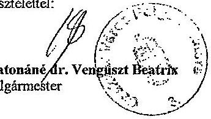

Katonáné dr. Vengiszt Beatrix
polgármester

---

1809108424
MEATROPOLIS Kereskedelmi és Szolgáltató Korlátult Felelősségủ Társaság "felszámolás alatt" (9700 Szombathely, Rumi út 20.; [13974811-2-18])*

A(s) MEATROPOLIS Kereskedelmi és Szolgáltató Korlátult Felelősségủ Társaság "felszámolás alatt" (9700 Szombathely, Rumi út 20.; adószáma: 13974811-2-18)ségügyében a Szombathelyi Törvényszék Gazdasági Kollégiuma Felszámolási Cseportja LPpk:07-08-000429/84, számú végzésével a felszámolási eljárást befejezte és a céget megszintette. Ezért a Szombathelyi Törvényszék Cégbizósága a céget a cégjegyzékből törli 2013. március 12. hatállyal.
28. A felszámolás kezdete és befejezése
28/2. A felszámolás befejezésének időpontja: 2013. március 12.
A Gazdasági Kollégium figyezésre: Ppk. 07-08-000429
A változás időpontja:2013/03/12
Bejegyzés kelte:2013/04/24
Végzés kelte: Vas megyei Bíróság 2013.04.24

---

20/5. 13974811-4632-113-18.

Törlés kelte:2013/03/12
21. A cég adószáma
21/5. Adószám:13974811-2-18.
Adószám státusza: érvényes adószám
Státusz kezdete:2007/05/31
Törlés kelte:2013/03/12
28. A felszámolás kezdete és befolyásbe
28/1. A felszámolás kezdetének időpontja: 2009. május 20.
A Gazdasági Kollégium tégyszáma: Fpk. 07-08-000429
Törlés kelte:2013/03/12
28/2. A felszámolás befejezéseinek időpontja: 2013. március 12.
A Gazdasági Kollégium tégyszáma: Fpk. 07-08-000429
Törlés kelte:2013/03/12
32. A cég pénzforgalmi jelzészáma
32/1. 10918001-00000031-06310008
A számla megnyitásának dátuma: 2007/06/18.
A pénzforgalmi jelzészámot az UniCredit Bank Hungary Zrt. SZABADSÁG TÉRI FJÓK(1054 BUDAPEST, SZABADSÁG tér 5-6.) kezeli.Cégjegyzékszám: 01-10-041348
Törlés kelte:2013/03/12
32/2. 10918001-00000031-06310015
A számla megnyitásának dátuma: 2007/06/18.
A pénzforgalmi jelzészámot az UniCredit Bank Hungary Zrt. SZABADSÁG TÉRI FJÓK(1054 BUDAPEST, SZABADSÁG tér 5-6.)kezeli.Cégjegyzékszám: 01-10-041348
Törlés kelte:2013/03/12
32/4. 10300002-10367913-48820013
A számla megnyitásának dátuma: 2007/10/05.
A pénzforgalmi jelzészámot a MKB BANK ZRT(1051 BUDAPEST, VÁCI utca 38)kezeli.Cégjegyzékszám: 01-10-040952
Törlés kelte:2013/03/12
32/5. 10300002-10367913-49020010
A számla megnyitásának dátuma: 2007/10/02.
A pénzforgalmi jelzészámot a MKB BANK ZRT(1051 BUDAPEST, VÁCI utca 38)kezeli.Cégjegyzékszám: 01-10-040952
Törlés kelte:2013/03/12
49. A cég cégjegyzékszámai
49/3. Cégjegyzékszám: 18-09-108424 Vezetve a Szombathelyi Törvényszék Cégbírósága nyilvántartásában.
Törlés kelte:2013/03/12
1. A tagijok) adatai
1/4. Barracuda-M Kereskedelmi és Szolgáltató Betéti Társaság
HU-1121 Budapest, Csillagvölgyi út 8/b.Cégjegyzékszám: 01-06-753830
A mavaszai jog mértéke mindazirat többségú befolyást biztosít.
A tagiági jogviszony kezdete: 2007/06/14
Törlés kelte:2013/03/12
1/5. Sziljeon Gyöngy(na.: Arnold Éva)
2800 Tatabánya, Kós Károly utca 27.
A tagiági jogviszony kezdete: 2007/07/20
Törlés kelte:2013/03/12

Vas megyei Bíróság

KIM Jogi beformatikai Pőszmály
Törlések (Megszintések, Egyszerücített végelszámolások)

---

Székesfehérvári Törvényszék
1.Fpk.07-08-000429/50/I. szám

# VÉGZÉS 

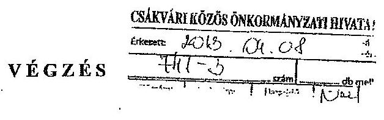

A bíróság közli, hogy a(z) MEATROPOLIS Kereskedelmi és Szolgáltató Kft., fa" (9700 Szombathely, Rumi u. 20.) adós elleni felszámolási eljárás lefolytatása iránti ügyében a 2012. szeptember 18. napján kelt 1.Fpk.07-08-000429/50. sorszámú végzése

## 2013. március 12. napján jogerőre emelkedett

Székesfehérvár, 2013. március 28.

Tatai Erzsébet sk. bírósági ügyintéző

A kisdmányhíteléül:
Tömösközi Margit
tisztriselő
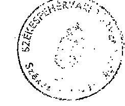

---

Csákvár Nagyközség Jegyzöje
8083 Csákvár, Szabadság tér 9. 9: 22/582-300 fax: 22/354-135
jegyzog@csakvaronkomanyzat.axelero.net www.csakvar.hu

Szám: 631-5 /2011. Tárgy: Behajthatatlan követelés törlése

# HATÁROZAT 

MEATROPOLIS KFT. 9700. Szombathely, Rumi u. 20. (adószám: 13974811-218) székhelyủ adózö adószámláján 2011. március 3. napjáig fennálló
16.538.685,- Ft. iparüzési adó
5.918.873,- Ft. késedelmi pótlék

Összesen:
22.457.558,- Ft. adótartozás törlését rendelem el behajthatatlanság jogcímén.

Az adózás rendjéről szóló 2003. évi XCII. törvény 162. § (2) bekezdése szerint a törölt adótartozást újból elő kell írni, ha a végrehajtáshoz való jog elévülési idején belül az adótartozás végrehajthatóvá válik. Ennek érdekében a törölt adótartozás nyilvántartását egyidejűleg elrendelem.

A határozatról az ügyfél nem értesül.

## INDOKOLÁS

A MEATROPOLIS Kft-vel szemben indított 246/2009., 583/2009., 1987/2009., 255/2010., 431/2011. számú végrehajtási eljárás nem vezetett eredményre. Adózóval szemben indult felszámolási eljárásba hitelezöként 2009. október 6. napján 2091/2009. számon kapcsolódtunk be. A felszámolási eljárás közbenső mérlege és a a TM-LINE Felszámoló és Gazdasági Tanácsadó Zrt. nyilatkozata szerint a követelésünk megtérülése nem várható.
A fentiek alapján az adótartozást behajthatatlannak minősítettem és az elévülési időn belül végrehajthatóságáig nyilvántartásba vételéről rendelkeztem.

Határozatomat az adózás rendjéről szóló 2003. évi XCII. törvény 162. §-a alapján hoztam meg.

Csákvár, 2011. március 3.
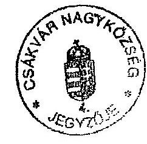

Tóth Jánosné
jegyzö
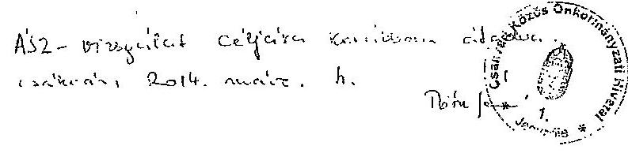

---

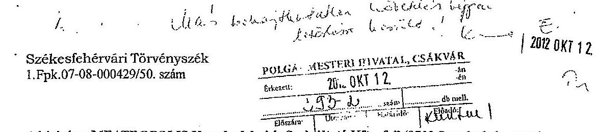

A bíróság a MEATROPOLIS Kereskedelmi és Szolgáltató Kft. „fa" (9700 Szombathely, Rumi u. 20.) adós felszámolása iránti eljárásban meghozta az alábbi

# VÉGZÉST: 

A bíróság a MEATROPOLIS Kereskedelmi és Szolgáltató Kft. „fa" (9700 Szombathely, Rumi u. 20.) gazdálkodó szervezetet megszünteti.

Felhívja a Székesfehérvári Törvényszék Cégbíróságát, hogy a határozat jogerőre emelkedését követően a gazdálkodó szervezetet a cégnyilvántartásból törölje.

A TM-LINE Felszámoló és Gazdasági Tanácsadó Zrt. (1092 Budapest, Ferenc krt. 40. 11/16.) felszámoló diját 300.000.- (azaz Háromszázezer) forint + ÁFA, azaz összesen 381.000.- (azaz Háromszáznyolcvanegyezer) forint összegben állapítja meg.

Felhívja a Székesfehérvári Törvényszék Gazdasági Hivatalát, hogy a végzés jogerőre emelkedését követően az elkülönített számlán rendelkezése álló összegből 381.000.- (azaz Háromszáznyolcvanegyezer) forintot 15 nap alatt utaljon át a felszámoló Raiffeisen Bank Zrt-nél vezetett 12072507-00370600-00100009 számú bankszámlájára, 1.000.- (azaz Egyezer) forintot utaljon vissza Harmati István letevőnek, illetve 2.053.- (azaz Kétezer-ötvenhárom) forintot utaljon vissza az Allianz Hungária Magánnyugdíjpénztár letevőnek.

A bíróság felhívja a Székesfehérvári Törvényszék Gazdasági Hivatalát, hogy a fenti utalásokat követően az elkülönített számlán még fennmaradó 484.698.- (azaz Négyszáznyolcvannégyezer-hatszázkilencvennyolc) forint összegű regisztrációs díjat az alábbiak szerint utalja vissza a letevő hitelezőknek:

NAV Fejér Megyei Adóigazgatósága
55.989 .-
(azaz Ötvenötezer-kilencszáznyolcvankilenc) forint
Erinum Capital Zrt.
4.187.-
(azaz Négyczer-száznyolcvanhét) forint
ATEV Zrt.
10.494 .-
(azaz Tizezer-négyszázkilencvennégy) forint
Pegaon-Pig Kft. „fa"
55.989 .-
(azaz Ötvenötezer-kilencszáznyolcvankilenc) forint
Alcar Agrogumi Kft.
4.676 .-
(azaz Négyczer-balszázhetvenhat) forint

---

Aranykor Országos Magánnyugdijpénztár (azaz Egyezzer-kétszáznyolcvannyole) forint
OTP Magánnyugdijpénztár (azaz Hatezer-ötszáztizennégy) forint
AIR Liquide Kft.
6.113 .- (azaz Hatezer-száztizenhárom) forint

Lindström Kft.
731.-
(azaz Hétszázharmincegy) forint
Sealed Air Kft.
33.395 .- (azaz Harmincháromezer-háromszázkilencvenöt) forint

Nyugat-Magyarországi Húsipari Kft. 10.806 .(azaz Tizezer-nyolcszázhat) forint

Carrier Trasicold Kft.
6.509 .-(azaz Hatezer-ötszázkilenc) forint

Unicredit Leasing Zrt. 55.989 .-(azaz Ötvenötezer-kilencszáznyolcvankilenc) forint

Metro Kereskedelmi Kft. 560 .(azaz Ötszázhatvan) forint

ASA MKH Kft. 3.815 .(azaz Háromezer-nyolcszáztizenőt) forint

AEGON Magánnyugdijpénztár (azaz Négyezer-háromszázhatvanhat) forint

Banküzlet Zrt. 55.989 .(azaz Ötvenötezer-kilencszáznyolcvankilenc) forint

Évgyürük Magánnyugdijpénztár (azaz Ötszázhatvan) forint

Bácsalmás Agráripari Zrt. 52.554 .(azaz Ötvenkétezer-ötszázötvennégy) forint

Hungaro Casing Kft. 705 .(azaz Hétszázöt) forint

Bizerba Kft.
1.621 .(azaz Egyezer-hatszázhuszonegy) forint

---

ING Magánnyugdijpénztár
(azaz Ötezer-ötszáztizenkilenc) forint

PICK Szeged Zrt.
35.329 .-
(azaz Harmincötezer-háromszázhuszonkilenc) forint
Vám- és Pénzügyőri Hivatal
3.718 .-
(azaz Háromezer-hétszáztizennyolc) forint
AXA Magánnyugdijpénztár
560 .-
(azaz Ötszázhatvan) forint
Tóth Autó Kft.
1.506 .-
(azaz Egyezer-ötszázhat) forint
Styron Kft.
7.031 .-
(azaz Hétezer-harmincegy) forint
Vonalkód Kft.
2.195 .-
(azaz Kétezer-százkilencvenőt) forint
Csákvár Nagyközség Önkormányzata
55.989 .-
(azaz Ötvenötezer-kilencszáznyolcvankilenc) forint

A bíróság megállapítja, hogy egyéb hitelezői igényekre nincs fedezet.
A bíróság a felszámolási eljárást befejezi.
E határozat jogerőre emelkedését követően a bíróság annak egy példányát közzététel végett megküldi a Cégközlőnynek.

Felhívja a felszámolót, hogy a gazdálkodó szervezet történeti értékủ iratait a területileg illetékes levéltárnak adja át, míg az irattári anyag fennmaradó részének selejtezéséről, illetve jogszabályban meghatározott ideig történő örzéséről gondoskodjon.

A végzés ellen a kézhezvételtől számított 15 napon belül a Fővárosi Ítélőtáblához címzett, de a Székesfehérvári Törvényszéknél írásban benyújtható fellebbezéssel lehet élni.

# INDOKOLÁS:

---

A bíróság az adós felszámolását a Cégközlőny 2009. május 20-i számában tette közzé, így a felszámolás kezdő időpontja 2009. május 20. napja.

A bíróság felszámolóként a TM-LINE Felszámoló és Gazdasági Tanácsadó Zrt-t (1092 Budapest, Ferenc krt. 40. II/16.) jelölte ki.

A felszámoló kérelmet terjesztett elő az eljárás egyszerüsített felszámolással történő befejezése iránt, tekintettel arra, hogy a gazdálkodó szervezet vagyona a felszámolás költségeit sem fedezi.

A hitelezők a felszámoló kérelmét nem kifogásolták.
A bíróság az úgy irataiból, valamint a felszámoló által benyújtott záróiratokból az alábbiakat állapította meg.

Az adós kötelezettségei:

1. MKK Magyar Követeléskezelő Zrt. (Budapest)
2. NAV Fejér Megyei Adóigazgatósága (Székesfehérvár)
3. ERINUM CAPITAL Zrt. (Budapest)
4. ATEV Fehérjefeldolgozó Zrt. (Budapest)
5. Harmati István (Budapest)
6. Botos Rita Orsolya (Békéscsaba)
7. Mezőné Implom Eszter (Encs)
8. Kovácsné Zelensi Ildikó (Budapest)
9. PEGANO-PIG Kft. „fa" (képv.: Dr. Felső Kft., Budapest)
$61.553 .880 .-\mathrm{Ft}, \mathrm{e}^{\text {" }}$
137.915.314.- Ft ,, $\mathrm{e}^{\text {" }}$
$909.400 .-\mathrm{Ft}, \mathrm{s}^{\text {" }}$
4.904.952.- Ft ,,a" 100.000 .- Ft ,fr"
746.527.- Ft ,,d" 89.153.- Ft ,,g" 8.829.- Ft ,,f" 7.479.- Ft ,,fr"
1.874.235.- Ft ,,f" 18.742.- Ft ,,fr"
11.104.489.- Ft ,,a"
$125.259 .-\mathrm{Ft}, \mathrm{a}^{\text {" }}$
2.046.354.- Ft ,,a"
$68.789 .-\mathrm{Ft}, \mathrm{a}^{\text {" }}$
423.901.152.- Ft ,,f" 100.000 .- Ft ,,fr"

---

10. ALCAR AGROGUMI Kft.
(Képv.: Könnyid és Czink Ügyvédi Iroda, Budapest)
11. Aranykor Országos Önkéntes és Magánnyugdijpénztár (Budapest)
12. OTP Magánnyugdijpénztár (Budapest)
13. AIR LIQUIDE Hungary Kft.
(képv.: Zsigmond és Nagy Ưgyvédi Iroda, Budapest)
14. Lindström Kft.
(képv.: Dr. Bódó Adrienn, Székesfehérvár)
15. Sealed Air Magyarország Kft.
(képv.: Pankotai Ügyvédi Iroda, Budapest)
16. Nyugat-magyarországi Húsipari Kft.
(képv.: Dr. Lengyel Andrea, Budapest)
17. Carrier Trasicold Hungária Kft. (Győr)
18. Unicredit Leasing Hungary Zrt. (Budapest)
19. METRO Kereskedelmi Kft.
(képv.: Dr. Mihók Zsófia, Budaörs)
20. A.S.A. MKH Kft.
(képv.: COFACE Hungary CMS Kft., Budapest)
21. AEGON Magyarország Önkéntes és Magánnyugdijpénztár (Budapest)
22. BANKÜZLET Zrt.
706.079.-Ft „f"
128.993.- Ft ,,g"
8.351,- Ft ,,fr"
204.301.- Ft ,, ${ }^{\text {e }}$
$13.368 .-\mathrm{Ft}, \mathrm{g}^{\text {e }}$
2.301.- Ft ,,fr"
892.159.- Ft ,, ${ }^{\text {e }}$
271.269.- Ft ,, ${ }^{\text {e }}$
$11.634 .-\mathrm{Ft}, \mathrm{ff}^{\text {et }}$
1.091.754.- Ft ,f ${ }^{\text {et }}$
10.918.- Ft ,,fr ${ }^{\text {et }}$
130.445.- Ft ,, ${ }^{\text {et }}$
$1.305 .-\mathrm{Ft}, \mathrm{ff}^{\text {et }}$
5.964.649.- Ft ,, ${ }^{\text {et }}$
$59.646 .-\mathrm{Ft}, \mathrm{ff}^{\text {et }}$
1.766.235.- Ft ,,f ${ }^{\text {et }}$
154.003.- Ft ,, ${ }^{\text {et }}$
19.300.- Ft ,,fr ${ }^{\text {et }}$
1.162.615.- Ft ,, ${ }^{\text {et }}$
$11.626 .-\mathrm{Ft}, \mathrm{ff}^{\text {et }}$
13.498.154.- Ft ,, ${ }^{\text {et }}$
97.695.203.- Ft ,, ${ }^{\text {et }}$
$100.000 .-\mathrm{Ft}, \mathrm{ff}^{\text {et }}$
73.620.- Ft ,,f ${ }^{\text {et }}$
1.000.- Ft ,,fr ${ }^{\text {et }}$
681.396.- Ft ,,f ${ }^{\text {et }}$
6.814.- Ft ,,fr ${ }^{\text {et }}$
779.819.- Ft ,, ${ }^{\text {et }}$
7.798.- Ft ,,f ${ }^{\text {et }}$
17.809.240.- Ft ,,f"

---

1.Fpk.07-08-000429/50. szám
(Budapest)
23. Évgyürük Magánnyugdijpénztár (Budapest)
24. Bácsalmás Agráripari Zrt. (Bácsalmás)
25. Hungaro Casing Kft. (Budapest)
26. BIZERBA Hungária Kft. (Budapest)
27. ING Önkéntes és Magánnyugdijpénztár (Budapest)
28. PICK Szeged Szalámigyár és Húsüzem Zrt. (Szeged)
29. Vám- és Pénzügyöri Hivatal (Székesfehérvár)
30. AXA Önkéntes és Magánnyugdijpénztár (Budapest)
31. Vas Megyei Kormányhivatal Munkaügyi Központ (Szombathely)
32. Tóth Autó Kft.
(képv.: Dr. Redl Péter, Vác)
33. Styron Kft.
(képv.: Dr. Gál János,
Nagykáta)
34. VONALKÓD RENDSZERHÁZ Kft.
(Budapest)
35. Csákvár Nagyközség Önkormányzatának

6.958.890.- Ft „g" 223.094.- Ft „f" 336.800 .- Ft „f" 100.000 .- Ft „fr"
58.224.- Ft „e" 1.000 .- Ft „fr"
9.386.435.- Ft „f" 93.864.- Ft „fr"
126.619.- Ft „f" 1.260 .- Ft „fr"
289.523.- Ft „f" 2.895 .- Ft „fr"
985.650.- Ft „e" 9.587 .- Ft „fr"
5.788.925.- Ft „f" 518.674.- Ft „g" 63.100 .- Ft „fr"
664.000 .- Ft „e" 6.640 .- Ft „fr"
53.398.- Ft „e" 1.000 .- Ft „fr"
12.327.023.- Ft „a"
268.462.- Ft „f" 2.690 .- Ft „fr"
1.255.680.- Ft „f" 219.761 .- Ft „g" 39.240 .- Ft „f" 12.557 .- Ft „fr"
324.000 .- Ft „f" 48.545 .- Ft „g" 19.520 .- Ft „f" 3.921 .- Ft „fr"
16.538.685.- Ft „e"

---

# 6. SZÁMÚ MELLÉKLET A V-0316-050/2014. SZÁMÚ JELENTÉSHEZ 

-1.Fpk.07-08-000429/50. szám

Polgármesteri Hivatala
(Csákvár)
$3.222 .272 .-\mathrm{Ft}, \mathrm{g}^{\prime \prime}$
$100.000 .-\mathrm{Ft}, \mathrm{fr}^{\prime \prime}$

A felszámoló 2010. július 15-i fordulónappal készített közbenső mérlegét a bíróság 27. sorszámú végzésével jóváhagyta.

A felszámoló 2012. május 15-i fordulónappal felszámolási zárómérleget terjesztett elő, melyben foglaltak szerint az adós felosztható vagyonnal nem rendelkezik.

A közbenső mérleg fordulónapja utáni időszakban a felszámoló a mérlegből az adós Barrakuda M Bt-ben meglévő üzletrészét kivezette, miután többször sikertelenül próbálta meg felvenni a kapcsolatot ezen bt-vel szemben törvényességi felügyeleti eljárás lefolytatását kérte. A bt. végelszámolását 2012. március 14-én elrendelték.

A követelések közül a Kunság Kft-vel szemben a felszámoló felszámolási eljárást kezdeményezett. Ennek hatására a Kunság Kft. egyeztetésbe kezdett az adós felszámolójával, az adós követelése egy részének korábbi teljesítését a Kunság Kft. igazolta, a fennmaradó összeget pedig áttalta az adós számlájára. Más követelésekkel kapcsolatos további egyeztetések nem vezettek eredményre dokumentumok hiányában.

A IV. és XV. Kerületi Bíróság előtt folyamatban volt pert a bíróság áttette a Szombathelyi Munkaügyi Bíróság. A Szombathelyi Munkaügyi Bíróság előtt 8.M.605/2011. számon folyt ügyben jogerős ítélet született. Az alperesi munkavállalót a bíróság ítélete pénz megfizetésére kötelezte, azonban miután az adós ezen alperesi munkavállaló felé tartozott elmaradt munkabérekkel, ezen összeg a volt munkavállaló követelésébe beszámításra került az ítéletben foglaltak alapján.

Az eljárás során az adós az alábbi bevételekre tett szert: követelésbehajtásból 1.538.920.- Ft, bérgarancia, támogatás 12.327.023.- Ft.

Az eljárás során az adósnak az alábbi kiadásai keletkeztek: nyomtatványköltség 44.100.- Ft, posta, telefonköltség 84.270.- Ft, saját gépkocsihasználat 46.770.- Ft, névaláírás, hitelesítés 5.000 .- Ft, bér-, személyjellegú költségek és járulékai 12.119.325.- Ft, ügyvédi költség 43.695 .- Ft, iratanyagok archiválása 462.500 .- Ft, bérgarancia-visszafizetés 912.483 .- Ft, „a" kategóriás követelés kifizetése $150.000 .-\mathrm{Ft}$.

Figyelembe véve a nyitó pénzkészlet 2.200.- Ft-os összegét, a záró pénzkészlet 0.- Ft.
A hitelezök az eljárás során összesen 865.698.- Ft összegủ regisztrációs díjat fizettek be (az alaptalan befizetések visszautalását követően).

Az 1991. évi XLIX. törvény (Cstv.) 63/B. § (1) bekezdése értelmében, ha a vagyon a várható felszámolási költségek fedezetére sem elegendő, a bíróság a felszámoló kérelmére és írásbeli előkészítése alapján elrendeli az adós vagyonának, illetve be nem hajlott követeléseinek a hitelezők közötti felosztását, valamint az adós megszüntetését.

A bíróság megállapította, hogy a vagyon a várható felszámolási költségek fedezetére sem elegendő, ezért az eljárást egyszerüsített felszámolással befejezte, a gazdálkodó szervezetet megszüntette.

---

1.Fyk.07-08-000429/50. szám

A felszámoló diját a bíróság a Cstv. 59. §-a alapján állapította meg, a bíróság gazdasági hivatalát a Cstv. 60. § (4), illetve (6) bekezdése alapján értesítette.

Az irattározásra vonatkozó rendelkezés a Cstv. 53. §-án, a határozat Cégközlönyben történő közzététele pedig a Cstv. 60. § (3) bekezdésén alapul.

Székeafchérvár, 2012. szeptember 18.

A kiadnány hiteléül:
Karafiné tisztviselő

Dr. Kaifis László sk. bíró

---

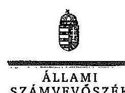

ELR $\mathbf{K}$
Ikt.szám: V-0316-043/2014.

# Katonáné dr. Venguszt Beatrix úrhölgy 

polgármester

Csákvár Város Önkormányzata

## Csákvár

## Tisztelt Polgármester Úrhölgy!

Köszönettel megkaptam ,,Az önkormányzatok pénzügyi gazdálkodást helyzete értékelésének, és gazdálkodása szabályosságának ellenôrzésérôl - Csákvár" címü jelentéstervezetre tett észrevételét. Örömmel értesültem az Állami Számvevőszék javaslatainak hasznosítása érdekében már megtett intézkedéseiröl.

A jelentéstervezet megállapításaira vonatkozó észrevételeit az Állami Számvevőszékről szóló 2011. évi LXVI. törvény (továbbiakban: ÁSZ tv.) 29. § (2) bekezdésében meghatározott tizenöt napos határidőn belül küldte meg. Az Állami Számvevőszék észrevétellel kapcsolatos álláspontját a mellékletként csatolt, a felügyeleti vezető által készített indokolás tartalmazza.

Tájékoztatom Polgármester Úrhölgyet, hogy az ÁSZ tv. 29. § (3) bekezdése alapján a számvevőszéki jelentésben az el nem fogadott észrevételeket az elutasítás indokolásával szerepelhetjük.

Budapest, 2014.
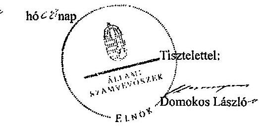

Melléklet: Észrevételekre adott válasz

---

# Az észrevételekre adott válasz 

| Észrevétel: | jelentéstervezet 7. oldal 2. bekezdése:   Az Önkormányzat 2010-2013. év I. félévben képződött finanszirozási igénye 96,5 millió Ft volt, amelyre a korábbi években képződött tartalékok felhasználása nyújtott fedezetet.   Az észrevétel szerint tartalékok feléléséről - különösen, amelyek 3 és fél éven keresztül át kitartottak volna a 2010-2013. év I. félév közötti időszakban - nem beszélhetünk. Az előző önkormányzati ciklusban történt nagy értékủ ingatlan értékesítés legfeljebb 2011. év I. félévében éreztette még a hatását, egy évvel később azonban már strukturális átalakítások előterjesztésére került sor. Az ellenőrzött időszakban minden évben képződött pénzmaradvány az Önkormányzatnál, ezért Polgármester Úrhölgy szerint az évente képződött tartalékok felhasználása nyújtott fedezetet a következő év finanszírozási igényére. |
| :--: | :--: |
| Válasz: | Az Állami Számvevőszék az észrevételt nem fogadja el. |
| Indoklás: | A megállapítás annyiban pontosítható, hogy a kérdéses összegű finanszírozási igény 2010-2011 között és a 2013. év I. félév során jelentkezett. Tekintettel arra, hogy az ellenőrzött időszakban kizárólag folyószámlahitelt vettek igénybe, melyet minden naptári év végéig visszafizettek, a nettó müködési jövedelem és a felhalmozási költségvetés összevont negatív egyenlegének fedezetét az előző év(ek)ben képződött pénzmaradvány felhasználásával biztosították. Polgármester Úrhölgy is elismerte észrevételében, hogy a 2010. január 1-jét megelőzően képződött pénzmaradvány még a 2011. évben is felhasználásra került. A 2010-2011. években és a 2013. év I. félév során a tárgyévben teljesített kiadások összege meghaladta a tárgyévben realizált összes bevételt, emiatt pénzmaradvány nem képződhetett. A tartalék megfogalmazás helytálló, a könyvviteli mérlegben ugyanis a tartalékok között kell kimutatni a tárgyévben, illetve az azt megelőző években képződött pénzmaradványból rendelkezésre álló forrást. |
| Észrevétel: | jelentéstervezet 19. oldal utolsó bekezdése:   Az Önkormányzat 2013. év I. félévben 1,2 millió Ft vis maior támogatásban részesült (hóolvadást követő belvízkárok helyreállítására), amelyhez kapcsolódóan 1,7 millió Ft dologi kiadást teljesített. |

---

|   | Az észrevétel szerint a támogatást nem hóolvadást követő belvizkárok helyreállítására kapták, hanem a 2013. március 14-16. közötti időjárási katasztrófahelyzetre tekintettel, mivel mintegy 165 befogadott ellátásáról kellett gondoskodni a hóviharban a külvilágtól teljesen elzárt településen.  |
| --- | --- |
|  Válasz: | Az Állami Számvevőszék az észrevételt elfogadja, a megállapítást pontosítja.  |
|  Indoklás: | -  |
|  Észrevétel: | jelentéstervezet 22. oldal 4. bekezdése
A pénzügyi egyensúlyi helyzet biztosítására, a kockázatok csökkentésére tett intézkedések azonban nem voltak eredményesek, mivel a vizsgált időszakban a pénzügyi egyensúlyt nem sikerült helyreállítani. A nettó müködési jövedelem a 2010-2013. év I. félévben folyamatosan negatív értéket mutatott.
Az észrevétel szerint a bevételnövelő és kiadáscsökkentő intézkedések eredményeként képződött 27,5 millió Ft megtakarítás a korábban kimutatott költségvetési hiányhoz képest reálisan jelentősnek értékelhető, bár ezen felül is szükség volt a müködést segítő kiegészítő támogatásra.  |
|  Válasz: | Az Állami Számvevőszék az észrevételt nem fogadja el.  |
|  Indoklás | Az észrevétel a megállapítás helytállóságát nem befolyásolja. Az elért megtakarítások ellenére a müködési egyensúlyt nem sikerült helyreállítani, kizárólag a 2012. év képződött a folyó költségvetésben többlet az ÖNHIKI támogatás eredményeként. Erre tekintettel a saját hatáskörben megtett intézkedések pozitív hatásuk ellenére nem érték el a kívánt eredményt.  |
|  Észrevétel: | Jelentéstervezet 10. oldal polgármesternek címzett 1. számú javaslat
A müködési jövedelemtermelő képesség és a feladatellátás összhangjának megteremtése, valamint a pénzügyi egyensúly helyreállítása, hosszú távú fenntarthatósága érdekében felelősök és határidők megjelölésével kezdeményezzen az a-d) pontokban megjelölt intézkedéseket.
Az észrevétel szerint Polgármester Úrhölgy egyetért azzal, hogy az Önkormányzat pénzügyi helyreállítása érdekében ismét intézkedéseket szükséges tenni, az intézkedés tervezet kidolgozását már megkezdte. Az önként vállalt feladatok felülvizsgálata és fenntarthatóságának vizsgálata is meg fog történni.  |
|  Válasz: | Az Állami Számvevőszék az észrevételben foglaltakat tájékoztatásként kezeli.  |
|  Indoklás: | Az észrevételben foglaltak a javaslat megalapozottságát jelentő megállapításokat nem módosítják, ezért a javaslatot továbbra is fenntartom.  |
|  Észrevétel: | Jelentéstervezet 11. oldal polgármesternek címzett 2. b) számú javaslat
A jogellenes állapot megszüntetése érdekében vizsgálják meg a biztosíték kiváltásának lehetőségét, és terjesszen javaslatot a Képviselő-testület elé a jogszerűen biztosítékba adható önkormányzati bevételekkel való kiváltásról.  |

---

|  | Az észrevétel szerint az Önkormányzat által felvett 55,4 millió Ft összegü hitel konszolidálása részben megtörtént a vizsgált időszakban, a második részével kapcsolatos adósságkonszolidáció pedig folyamatban van. Így meglátása szerint a biztosíték kiváltását már nem kell vizsgálni a jövőben, hiszen a Magyar Állam átvállalja a fennmaradt kötelezettségeket. Arra azonban ügyelni kell, hogy a jövőben a biztosíték adása szabályszerű legyen. |
| :--: | :--: |
| Válasz: | Az Állami Számvevőszék az észrevételben foglaltakat tájékoztatásként kezeli. |
| Indoklás: | A számvevőszéki jelentéstervezetben szereplő, a polgármesternek címzett javaslattal kapcsolatosan Polgármester Ürhölgynek a jogszabályi előírások mérlegelési jogkört nem biztosítanak, azokhoz kapcsolódóan az ÁSZ tv. 33. § (1) bekezdése szerint intézkedési terv készittési kötelezettsége van.   Amennyiben az intézkedési terv összeállításáig a 2014. évi adósságkonszolidációs intézkedések következtében a kifogásolt hitelszerződések megszünnek, értelemszerủen okafogyottá válik a hitelbiztosíték kiváltásának feltülvizsgálata. |
| Észrevétel: | Jelentéstervezet 11. oldal polgármesternek címzett 3. számú javaslat   Intézkedjen az ÁSZ által feltárt, a követelések behajthatatlanná minősítése és a hitelezési veszteségként történő leírás jogszabályi előírással ellentétes számviteli elszámolása tekintetében az esetleges munkajogi felelősséggel kapcsolatos körülmények kivizsgálásáról, és a vizsgálat eredményének függvényében hozza meg a szükséges intézkedéseket.   Az észrevétel szerint a követelések behajthatatlanná minősítése és a hitelezési veszteségként történő leírás jogszabályi előírással ellentétes számviteli elszámolása tekintetében Polgármester Ürhölgy részletesebb vizsgálatot fog folytatni, melynek eredményéről tájékoztatást ad. |
| Válasz: | Az Állami Számvevőszék az észrevételben foglaltakat tájékoztatásként kezeli. |
| Indoklás: | Az észrevételben foglaltak a javaslat megalapozottságát jelentő megállapításokat nem módosítják, ezért a javaslatot továbbra is fenntartom. |
| Észrevétel: | Jelentéstervezet 12. oldal jegyzönek címzett 1. számú javaslat   Az Önkormányzat a 2013. évi jóváhagyott költségvetési rendeletében a müködési költségvetés a Magyarország helyi önkormányzatairól szóló 2011. évi CLXXXIX. törvény (továbbiakban: Mötv.) 111. § (4) bekezdésében előírt egyensúlyát oly módon biztosította, hogy a költségvetési támogatásból származó bevételek eredeti előirányzatai között 70,2 millió Ft müködőképesség megőrzését szolgáló, kiegészítő támogatásból származó bevételt is figyelembe vett, ezáltal a bevételi előirányzatok tervezése az államháztartásról szóló 2011. évi CXCV. törvény (továbbiakban: Áht.) 12. § (1) bekezdésében előírtak ellenére közgazdaságilag nem megalapozott módon történt. |

---

|  | Az észrevétel szerint a 2013. évi költségvetés összeállítása során a működőképesség biztosítása elsődleges feladat volt. A korábbi években is pályáztak soron kívüli költségvetési támogatásra, továbbá kaptak olyan, előre nem látható müködési célú központi támogatást, amely alapján a 2013. évben is bízhattak a müködőképesség megőrzését szolgáló kiegészítő támogatás érkezésében. A 2013. évtől bevezetésre került feladatfinanszírozási rendszerrel kapcsolatos finomhangolás még folyamatban volt, az Önkormányzat év közben részesült kiegészítő forrásban. A rendszer felülvizsgálatáig azonban a finanszírozási igényüket más módon kimutatni nem tudták. |
| :--: | :--: |
| Válasz: | Az Állami Számvevőszék az észrevételben foglaltakat tájékoztatásként kezeli. |
| Indoklás: | A számvevőszéki jelentéstervezetben szereplő, a jegyzőnek címzett javaslattal kapcsolatosan Polgármester Ürbölgynek a jogszabályi előírások mérlegelési jogkört nem biztosítanak, azokhoz kapcsolódóan az ÁSZ tv. 33. § (1) bekezdése szerint intézkedési terv készítési kötelezettsége van. Az észrevételben foglaltak a javaslat megalapozottságát jelentő megállapításokat nem módosítják, ezért a javaslatot továbbra is fenntartom.   A költségvetés összeállítása során a Mötv.-ben előírt müködési egyensúly biztosítása céljából nem vehető figyelembe olyan bevétel, melynek pénzügyi realizálása tekintetében az Önkormányzat hatáskörrel nem rendelkezik. Az Áht. 4 § (2) bekezdése alapján a bevételi előirányzatok azok teljesítésének kötelezettségét jelentik. A központi költségvetésből folyósított müködőképesség megőrzését szolgáló, kiegészítő támogatás közgazdaságilag megalapozott módon a kormányzati jóváhagyó döntést követően válik az Önkormányzat költségvetésében figyelembe vehető bevételi előirányzattá. A Mötv.-ben előírt müködési egyensúly biztosításához a müködési jövedelemtermelö képesség és a feladatellátás összhangjának megteremtésére van szükség. |
| Észrevétel: | Jelentéstervezet 12. oldal jegyzönek címzett 2. számú javaslat   Az Önkormányzat a 2013. évi költségvetési rendeletében a költségvetési bevételek és költségvetési kiadások eredeti előirányzatának föösszegét - az Áht. 5. § (1)-(2) bekezdéseiben foglalt előírások ellenére - az Áht. 73. § (1) bekezdés ab) és ae) pontja szerinti - irányítószervi támogatásként folyóstott támogatás kiutalása és jóváírása, valamint hitel tökeösszegének törlesztése jogcímekhez tartozó - finanszírozási célú bevételekkel és kiadásokkal együtt állapította meg.   Az észrevétel szerint a 2013. évi zározzámadáskor már hasznosítani fogják a javaslatot, az Önkormányzat 2014. évi költségvetési rendelete már a javaslatban hivatkozott jogszabályi előírások szerint készült. |
| Válasz: | Az Állami Számvevőszék az észrevételben foglaltakat tájékoztatásként kezeli. |
| Indoklás: | Az észrevételben foglaltak a javaslat megalapozottságát jelentő megállapításokat nem módosítják, ezért a javaslatot továbbra is fenntartom. |

---

| Eszrevétel: | Jelentéstervezet 12. oldal jegyzönek címzett 3. számú javaslat   Az Önkormányzat 2013. évi költségvetési rendeletében - az Áht. 23. § (2) bekezdés a-b) pontjaiban foglalt elöírások ellenére - az Önkormányzat, ezen belül Polgármesteri Hivatal költségvetési szervnél kimutatott költségvetési kiadások és költségvetési bevételek kötelező és önként vállalt feladatokhoz történő elkülönítését nem a jogszabályi előírásoknak megfelelően végezték el. A költségvetési bevételek és kiadások bemutatása során a Mötv. 13. § (1) bekezdésében előírtak ellenére kötelező feladatként sorolták be a helyi televízió és rádió üzemeltetéséhez és a lapkiadáshoz kapcsolódó tételeket, továbbá a mentőállomás építéséhez felvett hitel kamatát. A Mötv. 13. § (1) bekezdés 15. pontja és a Sport tv. 55. § (1) bekezdés c-d) pontjaiban foglalt előírás ellenére a sportcsarnok üzemeltetési kiadásait nem teljes körűen kötelező feladatellátáshoz kapcsolódó kiadásként mutatták ki.   Az észrevétel szerint a 2013. évi zárszámadásról szóló rendeletet megelőző költségvetés módosításában a civil szervezetek támogatását, a helyi televízióval kapcsolatos, valamint a mentőállomás hitelfelvételével kapcsolatos kamatot is az önként vállalt feladatok között fogja feltüntetni. A 2014. évi költségvetési rendeletben már igyekeztek az ellenőrzés kapcsán szerzett információk alapján a kötelező, illetve az önként vállalt feladatok megbontását teljes körűen meghatározni. |
| :--: | :--: |
| Válasz: | Az Állami Számvevőszék az észrevételben foglaltakat tájékoztatásként kezeli. |
| Indoklás: | Az észrevételben foglaltak a javaslat megalapozottságát jelentő megállapításokat nem módosítják, ezért a javaslatot továbbra is fenntartom. |
| Eszrevétel: | Jelentéstervezet 13. oldal jegyzönek címzett 4. számú javaslat   A javaslat szerint a 2011. évben két, folyamatban lévő felszámolási eljárás alatt álló gazdasági társasággal szemben fennálló, 16,5 millió Ft összegủ helyiadótartozásból származó követelést - a vonatkozó jogszabályi előírás ellenére - a felszámolási eljárás jogerős befejezésekor készítendő vagyonfelosztási javaslat nélkül a jegyző törölte. A követeléseket hitelezési veszteségként leírták annak ellenére, hogy a közbenső mérleg alapján értékvesztés elszámolására volt lehetőség. Egy felszámolási eljárást követően megszűnt gazdasági társaság 1,8 millió Ft helyiadó-tartozását a 2010. évi mérlegkészítéskor rendelkezésre álló, a behajthatatlanságot bizonyító, vagyonfelosztási javaslatban foglaltak ellenére hitelezési veszteségként nem írták le, a behajthatatlan követelést a 2010. év helyett a 2011. évi mérlegkészítéskor vezették ki a számviteli nyilvántartásokból. A 2011. évi mérlegkészítéskor további egy felszámolási eljárás alatt álló gazdasági társaság 22,5 millió Ft helyiadó-tartozásának kétes beszedhetőségét bizonyító dokumentum ellenére értékvesztést nem számolták el, a követelést a jogszabályi előírások ellenére a vagyonfelosztási javaslat hiányában behajthatatlannak minősítették és a számviteli nyilvántartásokból kivezették. |

---

|  | Az észrevétel szerint a 2011. évi költségvetés elkészitésekor az Önkormányzat vagyoni, gazdálkodási helyzetének átfogó áttekintését követően a valós pénzügyi helyzet kialakítása céljából került sor a már felszámolt, illetve felszámolás alatt álló gazdasági társaságok hátralékainak behajthatatlanság miatti törlésére, figyelembe véve a több éven keresztül eredménytelen behajtási kísérleteket. Az észrevétel szerint az egyik adós felszámolási eljárása 2013-ban fejeződött be, a jogerőre emelkedett végzés szerint. A másik adós esetében a felszámolótól származó szóbeli információ alapján várhatóan az idei évben fejeződik be jogerősen a felszámolási eljárás. Polgármester Úrhölgy szerinta követelések leírása az Önkormányzatnak veszteséget nem okozott. |
| :--: | :--: |
| Válasz: | Az Állami Számvevőszék az észrevételben foglaltakat tájékoztatásként kezeli. |
| Indoklás: | A számvevőszéki jelentéstervezetben szereplő, a jegyzőnek címzett javaslattal kapcsolatosan Polgármester Úrhölgynek a jogszabályi előírások mérlegelési jogkört nem biztosítanak, azokhoz kapcsolódóan az ÁSZ tv. 33. § (1) bekezdése szerint intézkedési terv készítési kötelezettsége van. Az észrevételben foglaltak a javaslat megalapozottságát jelentő megállapításokat nem módosítják, ezért a javaslatot továbbra is fenntartom.   Az észrevételben foglaltak megerősítik a javaslatot megalapozó megállapítás helytállóságát, mely szerint a mérlegkészítés időpontjáig nem állt rendelkezésükre a követelések behajthatatlanságát bizonyító, jogszabályban meghatározott írásbeli dokumentum. A vagyoni kár esetleges keletkezésétől függetlenül a követelések behajthatatlanság miatti törlésére és azok számviteli nyilvántartásokból való leírására csak a jogszabályi előírások betartásával kerülhet sor. |
| Észrevétel: | Jelentéstervezet 14. oldal jegyzőnek címzett 5. számú javaslat   Az Önkormányzatnál a javaslatban hivatkozott jogszabályi előírások ellenére a 2010-2012. évi mérleg készítése során nem végezték el a devizában fennálló kötelezettségek év végi értékelését. A számviteli nyilvántartásokban a devizában fennálló kötelezettségeket nem a mérleg fordulónapjára vonatkozó devizaárfolyamon átszámított forintértéken mutatták ki, továbbá nem számolták el a - 2010. évre 4,2 millió Ft, a 2011. évre 8,2 millió Ft és a 2012. évre utólag meghatározott 4,3 millió Ft összegủ - nem realizált árfolyamveszteség összegét.   Az észrevétel szerint a hitel adósságkonszolidáció keretében történő átvállalása folyamatban van, tehát a jövőben ezzel kapcsolatosan teendő nem lesz. |
| Válasz: | Az Állami Számvevőszék az észrevételben foglaltakat tájékoztatásként kezeli. |
| Indoklás: | A számvevőszéki jelentéstervezetben szereplő, a jegyzőnek címzett javaslattal kapcsolatosan Polgármester Úrhölgynek a jogszabályi előírások mérlegelési jogkört nem biztosítanak, azokhoz kapcsolódóan az ÁSZ tv. 33. § (1) bekezdése szerint intézkedési terv készítési kötelezettsége van. Az észrevételben foglaltak a javaslat megalapozottságát jelentő megállapításokat nem módosítják, ezért a javaslatot továbbra is fenntartom. |

---

|  | A javaslat jövőbeni hasznosításával kapcsolatos álláspontját, mely szerint az adósságkonszolidáció keretében a két devizaalapú hitelszerződés 2014. évben várható megszünését követöen e tárgykörben további teendöje nem lesz, nem fogadom el. A jövőben is sor kerülhet devizaalapú adósságot keletkeztető kötelezettségvállalásra, ezért annak jogszabályi előírásoknak megfelelő nyilvántartásával kapcsolatosan az intézkedési tervben feladat előirása indokolt. |
| :--: | :--: |
| Észrevétel: | Jelentéstervezet 14. oldal jegyzönek cimzett 6. számú javaslat   A 2010-2012. évi könyvviteli mérlegek készítése során a szállítókkal szembeni kötelezettségek összegének meghatározásakor - a javaslatban hivatkozott jogszabályi elöirással ellentétben - a mérleg fordulónapját megelözően már teljesített, az Önkormányzat által elismert, a mérlegkészités időpontjáig beérkezett szállítói számlák szerinti kötelezettség összegét teljes körűen nem vették figyelembe, ezáltal a szállítói tartozások összegét a mérlegben 2010-ben 0,6 millió Ft-tal, 2011-ben 1,4 millió Ft-tal és 2012-ben 2,1 millió Ft-tal alacsonyabb összegben mutatták ki. Az Önkormányzatnál a szállítói számlákkal kapcsolatos évközi analitikus nyilvántartás vezetése nem felelt meg a javaslatban megjelölt jogszabályi előírásoknak.   Az észrevétel szerint a javaslatot a 2014. január 1-jétől hatályba lépett jogszabályi előírások alapján fogják hasznosítani. |
| Válasz: | Az Állami Számvevőszék az észrevételben foglaltakat tájékoztatásként kezeli. |
| Indoklás: | Az észrevételben foglaltak a javaslat megalapozottságát jelentő megállapításokat nem módosítják, ezért a javaslatot továbbra is fenntartom. |

Tájékoztatom Polgármester Úrhölgyet, hogy a számvevőszéki jelentés mellékleteként szerepeltetjük a jelentéstervezethez tett észrevételeit, valamint az azokra adott válaszunkat.

Budapest, 2014. síor. hó $4^{2}$ nap

Renkó Zauzsanna
Felügyeleti vezető

---

# RÖVIDÍTÉSEK JEGYZÉKE 

## Törvények

Áht.
Az államháztartásról szóló 2011. évi CXCV. törvény (hatályos 2012. január 1-jétől)
ÁSZ tv.
Az Állami Számvevőszékről szóló 2011. évi LXVI. törvény a helyi önkormányzatok és szerveik, a köztársasági megbízottak, valamint egyes centrális alárendeltségű szervek feladat- és hatásköreiről szóló 1991. évi XX. törvény

Kvtv.
Mötv.
Möty.
Magyarország helyi önkormányzatairól szóló 2011. évi CLXXXIX. törvény
Ötv.
a helyi önkormányzatokról szóló 1990. évi LXV. törvény
Sport tv.
a sportról szóló 2004. évi I. törvény
Sztv.
a számvitelről szóló 2000 . évi C. törvény
Rendeletek
Áhsz. 1
az államháztartás szervezetei beszámolási és könyvvezetési kötelezettségének sajátosságairól szóló 249/2000. (XII. 24.) Korm. rendelet (hatálytalan 2014. január 1-jétől)
Áhsz. ${ }_{2}$
Az államháztartás számviteléről szóló 4/2013. (I. 11.) Korm. rendelet (hatályos 2014. január 1-jétől)
Ámr. 1
az államháztartás múködési rendjéről szóló 217/1998. (XII. 30.) Korm. rendelet (hatálytalan 2010. január 1jétől)
Ámr. 2
az államháztartás múködési rendjéről szóló 292/2009. (XII. 19.) Korm. rendelet (hatálytalan 2012. január 1-jétől)
Ávr.
az államháztartásról szóló törvény végrehajtásáról szóló 368/2011. (XII. 31.) Korm. rendelet
Bkr.
a költségvetési szervek belső kontrollrendszeréről és belső ellenőrzéséről szóló 370/2011. (XII. 31.) Korm. rendelet (hatályos 2012. január 1-jétől)
2013. évi költségvetési
csákvár Nagyközség Önkormányzata Képviselő-
rendelet
testületének 2/2013. (II. 25.) sz. önkormányzati rendelete az Önkormányzat és intézményei 2013. évi költségvetéséről
SZMSZ
Csákvár Nagyközség Önkormányzata Képviselőtestületének 1/2007. (I. 10.) számú rendelete a Szervezeti és Müködési Szabályzatról

## Szórövidítések

ÁROP
ÁSZ
Államreform Operatív Program
Állami Számvevőszék

---

| EU | Európai Unió |
| :--: | :--: |
| EUR | euró |
| Fejérvíz Zrt. | FEJÉRVÍZ Fejér Megyei Önkormányzatok Víz- és Csatornamú Zrt. |
| jegyző | Csákvár Város Önkormányzatának címzetes főjegyzöje |
| Képviselő-testület | Csákvár Önkormányzatának Képviselö-testülete |
| KDOP | Közép-Dunántúli Operatív Program |
| Nonprofit Kft. | Csákvári Kulturális és Sport Kiemelten Közhasznú Nonprofit Kft. |
| ÖNHIKI | önhibáján kívül hátrányos helyzetben lévő önkormányzatok támogatása |
| Önkormányzat polgármester | Csákvár Város Önkormányzata   Csákvár Város Önkormányzatának polgármestere |
| Polgármesteri Hivatal | Csákvár-Bodmér Körjegyzősége (2011. december 31-ig)   Csákvár-Bodmér-Vértesboglár Körjegyzősége (2012. december 31 -ig)   Csákvári Közös Önkormányzati Hivatal (2013. január 1-jétől) |
| Számviteli politika | Számviteli politika, számlarend, bizonylati rend (hatályos: 2008. október 15 -től)   9/2011 Számviteli politika, számlarend, bizonylati rend (hatályos: 2011. október 1-jétől) |
| TÁMOP | Társadalmi Megújulás Operatív Program |

---

# FOGALOMTÁR 

adósságszolgálat
adósságszolgálat miatti kockázat
árfolyamkockázat
banki kitettség
bevételi kitettség

CLF módszer
felhalmozási kockázat
garanciavállalás
integritás

Az adósság tőkerészének és az esedékes kamat együttes összegének törlesztése.
Annak kockázata, hogy az adós az adósság tőkerészének és az esedékes kamat együttes öszszegének határidőben történő törlesztését csak újabb hitel felvételével tudja teljesíteni.
Annak kockázata, hogy a külföldi devizában fennálló pénzügyi eszközök hazai fizetőeszközben kifejezett értéke az árfolyam elmozdulásával megváltozik.
Olyan függőségi viszony, ahol egy szervezet pénzügyi helyzete olyan külső körülmények hatására változhat, amely kizárólag a bank egyoldalú döntésén múlik.
Olyan függőségi viszony, ahol egy szervezet pénzügyi helyzetét meghatározó bevételek nagysága külső körülmények hatására azonnal és kedvezőtlen irányba változhat.
Az önkormányzatok költségvetése elemzésének módszere, amely a pénzügyi kapacitás (más néven a nettó múködési jövedelem) fogalmát helyezi a középpontba. A módszer következetesen elkülöníti a folyó és a felhalmozási költségvetés bevételeit és kiadásait, azok költségvetési egyenlegeit. Bizonyos mértékig a vállalati gazdálkodás logikai elemeit érvényesíti az önkormányzatok pénzügyi, jövedelmi helyzetének vizsgálata során.
Annak kockázata, hogy a folyamatban lévő felhalmozási feladatok finanszírozásához szükséges pénzügyi forrás nem fog rendelkezésre állni.
Olyan kötelezettségvállalás, ahol a garanciát vállaló valamely jövőbeni esemény bekövetkezésekor, a szerződésben meghatározott feltételek beálltakor a garancia kedvezményezettje számára meghatározott összegig, meghatározott időpontig, felszólításra azonnal fizet.
Az „integritás" - egyik gyakran használt jelentése szerint - az elvek, értékek, cselekvések, módszerek, intézkedések konzisztenciáját jelenti, vagyis olyan magatartásmódot, amely meghatározott értékeknek megfelel. Integritásirányitási rendszer bevezetése a szervezetben a szervezethez rendelt közfeladatok integritás szempontú ellátását, az érték alapú múködéssel

---

jövőbeni kötelezettségek kifizethetőségének kockázata
kamatkockázat
kezességvállalás
kezességvállalás kockázata
likviditási kockázat
működési kockázat
nemfizetési kockázat
(integritással) összefüggő szervezeti követelmények következetes érvényesítését jelenti. (Forrás: „Magyarországi államháztartási belső kontroll standardok Útmutató", kiadta az NGM 2012. decemberében)
Annak kockázata, hogy a kötelezett jövőbeni kötelezettségeit nem tudja teljesíteni, mert nem rendelkezik szabad pénzeszköz tartalékkal, nem intézkedett annak érdekében, hogy bevételeit növelje, kiadásait csökkentse, a követelésállományból a kétes kintlévőségek nagysága számottevő, a fedezetként felhasználható ingatlanállomány forgalmi értéke csökkent és értékesítésének lehetősége piaci oldalról korlátozott.
Annak kockázata, hogy a változó kamatozású forint-, vagy a devizahitel futamideje alatt kedvezőtlen irányban változhat a hitel kamata és így a törlesztő részlete is.
Szerződésben vállalt olyan kötelezettség, amelyben a kezes arra vállal kötelezettséget, hogy ha a szerződés kötelezettje nem teljesít a kezes maga fog helyette teljesíteni a jogosultnak. (Forrás: Ptk. 272. §)
Annak kockázata, hogy a szerződés kötelezettje a szerződésben vállalt kötelezettségeit nem teljesíti a jogosultnak azokért a kezes köteles helytállni. A kezes kötelezettsége nem válhat terhesebbé, mint amit a szerződés megkötésekor elvállalt. Nem köteles helytállni a kezes a kötelezettségért, amíg a teljesítés a kötelezettől vagy olyan kezesektől behajtható, akik őt megelőzően, reá tekintet nélkül vállaltak kezességet. A kezes, amennyiben teljesíteni köteles, mintegy az eredeti kötelezett helyébe lép, érvényesítheti azokat a kifogásokat, amelyeket a kötelezett érvényesíthet a jogosulttal szemben. Amennyiben teljesít, a kezességgel biztosított jogok (ideértve a kezességvállalást megelőzően keletkezett jogokat és a végrehajtási jogot is) átszállnak a kezesre.
Annak kockázata, hogy a kötelezett fél nem vagy csak késve tudja kiegyenlíteni tartozásait.
Annak kockázata, hogy nem megfelelő működésből, emberi hibákból, rendszerhibákból vagy külső eseményekből adódik veszteség.
Annak kockázata, hogy a kötelezett fennálló kötelezettségét átmenetileg vagy véglegesen nem tudja határidőre megfizetni.

---

nettó múködési jövedelem

ÖNHIKI támogatás
önkormányzat felhalmozási bevétele
önkormányzat felhalmozási kiadásai
önkormányzat folyó bevétele
önkormányzat folyó kiadása
önkormányzat folyó költségvetés egyenlege
önkormányzat gazdasági társasága miatti kockázatot jelentő tényezők

A nettó múködési jövedelem a jövedelemtermelő képességet méri. Megmutatja a múködési bevételekből a múködési kiadások és a hitelek tőketörlesztésének kifizetése után fennmaradó jövedelmet.
Az önkormányzatok múködőképességét szolgáló, önhibájukon kívül hátrányos helyzetben levő települési önkormányzatok támogatása.
Az önkormányzatok tárgyévi felhalmozási célú költségvetési bevételei.
Az önkormányzatok tárgyévi felhalmozási célú költségvetési kiadásai.
Az önkormányzatok tárgyévi működési célú költségvetési bevételei.
Az önkormányzatok tárgyévi múködési célú költségvetési kiadásai.
A folyó költségvetés egyenlege, azaz a múködési jövedelem megmutatja, hogy az Önkormányzat éves folyó bevétele fedezetet biztosít-e a kötelező és önként vállalt feladatellátáshoz kapcsolódó éves folyó kiadására. A múködési jövedelem negatív értéke pénzügyileg fenntarthatatlan helyzetet jelez. A mutató pozitív értéke megtakarítást mutat, amely forrásul szolgálhat az Önkormányzat fennálló kötelezettségei megfizetéséhez, valamint fejlesztéseihez.
Az önkormányzat gazdasági társaságának kedvezőtlen pénzügyi döntései következtében az önkormányzat pénzügyi egyensúlyi helyzetét veszélyeztető tényezők:

- az önkormányzat az önként vállalt és/vagy a kötelező feladatot ellátó társaságának a tevékenység ellátásához pénzeszközt ad át;
- az önkormányzat nem vizsgálja a feladatellátás választott szervezeti megoldásának hatékonyságát;
- a kötelező feladatellátást biztosító gazdasági társaság tevékenységének ágazati szabályozása változik (vízi közmúvagyon üzemeltetése);
- a kizárólagos vagy többségi tulajdonú társaságok pénzügyi helyzete nem stabil, amely az alapítóra kötelezettségeket háríthat;
- az önkormányzat a társaságok tevékenységét nem kísérte figyelemmel, nem élt az alapítói (irányítói) jogok gyakorlásával, a társaságok gazdálkodásának önkormányzati szintű konszolidálása nem biztosított;

---

önkormányzat többségi tulajdonában lévő gazdasági társaságok
pénzügyi kapacitás
pénzügyi kockázat

PPP

- az önkormányzat garanciát, vagy kezességet vállal a gazdasági társaság kötelezettségeire;
- a társaságoknak átadott pénzeszköz uniós elvárásoknak megfelelő kezelése.
Azok a gazdasági társaságok, amelyekben az önkormányzat a szavazatok több mint ötven százalékával vagy a Ptk. 685/B. § (2)-(3) bekezdéseiben rögzített meghatározó befolyással rendelkezik. A befolyással rendelkező akkor rendelkezik egy jogi személyben meghatározó befolyással, ha annak tagja, illetve részvényese és jogosult e jogi személy vezető tisztségviselői vagy felügyelő-bizottsága tagjai többségének megválasztására, illetve visszahívására, vagy a jogi személy más tagjaival, illetve részvényeseivel kötött megállapodás alapján egyedül rendelkezik a szavazatok több mint ötven százalékával. A meghatározó befolyás akkor is fennáll, ha a befolyással rendelkező számára e jogosultságok közvetett módon (köztes vállalkozásain keresztül) biztosítottak.
(Forrás: Ptk. 685/B. § (2)-(4) bekezdések)
A pénzügyi kapacitás az adósok hitelfelvételi képességének azon mértéke, ahol még növelni tudják az adósságot anélkül, hogy a fizetőképtelenség elkerülése érdekében csökkenteniük kellene akár az aktuális, akár a jövőben esedékes kiadásaikat.
A pénzügyi kockázat magában foglalja mindazon kockázatokat, amelyek a szervezet pénzügyi helyzetére hatással vannak. Pl.: az adósságszolgálat miatti kockázatot, árfolyamkockázatot, felhalmozási kockázatot, fizetőképességi kockázatot, jövőbeni kötelezettségek kifizethetőségének kockázatát, kamatkockázatot, kezességvállalás kockázatát, likviditási kockázat, mérlegen kívüli tételek kockázata, nemfizetési kockázat stb.
A köz- és a magánszféra együttmúködésén alapuló fejlesztési konstrukció. Az állami és a magánszféra együttmúködésének egyik formáját jelöli a PPP. A rövidítés a „köz- és magánszféra partnersége" angol nyelvű megfelelője. A PPP keretében a közcél a magánszféra jelentős mértékű közreműködésével valósul meg. Az állam (önkormányzat) a közszolgáltatások létrehozását a tradicionálisnál komplexebb módon bízza a magánszférára. Az együttmúködés keretében megvalósuló közszolgáltatás hosszú távra szól.

---

szállítói kockázat

Annak kockázata, hogy a kötelezett a szállítókkal szemben fennálló, már elismert kötelezettségét átmenetileg vagy véglegesen nem tudja határidőre teljesíteni.

---

.