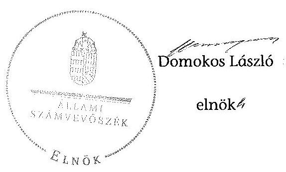
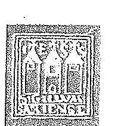
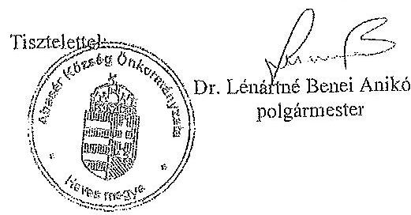
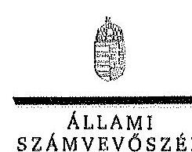

ÁLLAMI
SZÁMVEVŐSZÉK

# JELENTÉS 

az önkormányzatok belső kontrollrendszere kialakításának, egyes kontrolltevékenységek és a belső ellenőrzés
müködésének ellenőrzéséről
Abasár

---

# Állami Számvevőszék 

Iktatószám: V-0339-077/2014
Témaszám: 1372
Vizsgálat-azonosító szám: V064929

## Az ellenőrzést felügyelte:

## dr. Benedek Mária

felügyeleti vezető
Az ellenőrzést vezette és az ellenőrzés végrehajtásáért felelős:
dr. Veress Tiborné
ellenőrzésvezető
A számvevőszéki jelentés összeállításában közremúködött:
Szakmányné Bilik Mária
számvevő tanácsos
Az ellenőrzést végezték:
Sipos Attila
Számvevő

Szakmányné Bilik Mária
számvevő tanácsos

---

# TARTALOMJEGYZÉK 

BEVEZETÉS ..... 5
I. ÖSSZEGZŐ MEGÁLLAPÍTÁSOK, KÖVETKEZTETÉSEK, JAVASLATOK ..... 9
II. RÉSZLETES MEGÁLLAPÍTÁSOK ..... 14

1. Az önkormányzat belső kontrollrendszerének kialakítása ..... 14
1.1. A kontrollkörnyezet ..... 14
1.2. A kockázatkezelési rendszer ..... 15
1.3. A kontrolltevékenységek ..... 16
1.4. Az információs és kommunikációs rendszer ..... 17
1.5. A monitoring rendszer ..... 18
2. A pénzügyi folyamatokban kulcsszerepet betöltő teljesítésigazolás és érvényesítés belső kontrollok múködése ..... 18
3. A belső ellenőrzés múködése ..... 22

## MELLÉKLETEK

1. számú Észrevételt tartalmazó polgármesteri levél
2. számú Észrevételre vonatkozó elnöki válaszlevél

## FÜGGELÉKEK

1. számú Értelmező szótár
2. számú Az értékelés módja és szempontjai

---

.

---

# RÖVIDÍTÉSEK JEGYZÉKE 

## Törvények

Áht.
ÁSZ tv.
Kttv.
Ktv.
Mötv.
Nvtv.
Ötv.
Ptk.
Számv. tv.
Vagyonnyilatkozattételről szóló tv.

## Rendeletek

Áhsz. 1

Áhsz. 2
Ávr.
Bkr.
önkormányzati SZMSZ
vagyongazdálkodási rendelet

## Szórövidítések

adatvédelmi és adatbiztonsági szabályzat alapító okirat

ÁSZ
belső ellenőrzési kézikönyv
2011. évi CXCV. törvény az államháztartásról
2011. évi LXVI. törvény az Állami Számvevőszékről
2011. évi CXCIX. törvény a közszolgálati tisztviselökről (hatályos 2012. március 1-jétől)
1992. évi XXIII. törvény a köztisztviselők jogállásáról (hatálytalan 2012. március 1-jétől)
2011. évi CLXXXIX. törvény Magyarország helyi önkormányzatairól
2011. évi CXCVI. törvény a nemzeti vagyonról
1990. évi LXV. törvény a helyi önkormányzatokról
1959. évi IV. törvény a Polgári Törvénykönyvről
2000. évi C. törvény a számvitelről
2007. évi CLII. törvény egyes vagyonnyilatkozat-tételi kötelezettségekről

249/2000. (XII. 24.) Korm. rendelet az államháztartás szervezetei beszámolási és könyvvezetési kötelezettségének sajátosságairól
4/2013. (I. 11.) Korm. rendelet az államháztartás számviteléről (hatályos 2014. január 1-jétől)
368/2011. (XII. 31.) Korm. rendelet az államháztartásról szóló törvény végrehajtásáról
370/2011. (XII. 31.) Korm. rendelet a költségvetési szervek belső kontrollrendszeréről és belső ellenőrzéséről
Abasár Község Önkormányzata Képviselő-testületének 16/2010 (XII. 08.) rendelete a Képviselő-testület és szervei szervezeti és múködési szabályzatáról (hatályos 2011. január 1-jétől)
Abasár Község Önkormányzata Képviselő-testületének 7/2013. (VI. 27.) rendelettel módosított
5/2013. (III. 28.) rendelete az önkormányzat vagyonáról, a vagyonhasznosítás rendjéről és a vagyontárgyak feletti tulajdonosi jogok gyakorlásának szabályairól

5/2012. számú jegyzői normatív utasítás Adatvédelmi és adatbiztonsági szabályzat (hatályos 2012. április 15-től)
Abasár Község Polgármesteri Hivatal 35/2009. (V. 28.) KT határozattal jóváhagyott alapító okirata (hatályos 2009. június 1-jétől)
Állami Számvevőszék
Gyöngyös Körzete Kistérség Többcélú Társulása Belső ellenőrzési kézikönyve (hatályos 2012. január 10-től)

---

gazdálkodási jogkörök szabályzata
hivatali SZMSZ
INTOSAI
iratkezelési szabályzat
ISSAI
jegyzö
Képviselő-testület
Kormányhivatal
Önkormányzat
polgármester
Polgármesteri Hivatal
stratégiai ellenőrzési
terv
szabálytalanságkezelési
eljárásrend
Társulás
ügyrend
2012. évi ellenőrzési terv
2013. évi ellenőrzési terv
1/2012. jegyzői normatív utasítás a kötelezettségvállalás, utalványozás, pénzügyi ellenjegyzés, teljesítésigazolás, érvényesítés, adatszolgáltatás rendjéről (hatályos 2012. január 2-tól)
8/2012. normatív utasítás az Abasári Polgármesteri Hivatal Szervezeti és múködési szabályzatáról
International Organization of Supreme Audit Institutions (Legfőbb Ellenőrző Intézmények Nemzetközi Szervezete)
Abasár Község Önkormányzat Egyedi iratkezelési szabályzata (hatályos 2010. április 11-től)
International Standards of Supreme Audit Institutions (Legfőbb Ellenőrző Intézmények Nemzetközi Standardjai)
Abasár Község Önkormányzat jegyzője
Abasár Község Önkormányzatának Képviselő-testülete
Heves Megyei Kormányhivatal
Abasár Község Önkormányzata
Abasár Község Önkormányzat polgármestere
Abasár Község Önkormányzat Polgármesteri Hivatala
Gyöngyös Körzete Kistérség Többcélú Társulása és Tagönkormányzatai Stratégiai ellenőrzési terv 2010-2015.
Abasár Község Önkormányzata Szabálytalanságok kezelésnek eljárásrendje (hatályos 2012. január 25-től)
Gyöngyös Körzete Kistérség Többcélú Társulása
9/2012. jegyzői normatív utasítás a pénzügyigazdálkodási csoport ügyrendjéről (hatályos 2012. május 1-jétől)
92/2011. (11. 23.) számú határozattal elfogadott 2012. évi ellenőrzési terv
108/2012. (11. 28.) számú határozattal elfogadott 2013. évi ellenőrzési terv

---

# JELENTÉS 

## az önkormányzatok belső kontrollrendszere kialakításának, egyes kontrolltevékenységek és a belső ellenőrzés múködésének ellenőrzéséről Abasár

## BEVEZETÉS

Abasár község állandó lakosainak száma 2012. január 1-jén 2511 fő volt. Az Önkormányzat héttagú Képviselő-testületének munkáját kettő állandó bizottság segítette. Az Önkormányzat az önállóan működő és gazdálkodó Polgármesteri Hivatalon kívül két önállóan működő intézményt múködtetett, valamint két 100\%-os tulajdoni hányadú gazdasági társasággal rendelkezett. A polgármester a 2002. évi önkormányzati választások óta tölti be tisztségét. A jegyző 2011. június 15 -től látja el jegyzői feladatait. A Polgármesteri Hivatal szervezeti egységekre nem tagolódott, elkülönített gazdasági szervezettel nem rendelkezett, a foglalkoztatott köztisztviselők száma 2012. január 1-jén hét fő volt. A Polgármesteri Hivatalnál 2013. január 1-jétől szervezeti változás nem volt. Az Önkormányzat a 2012. évi költségvetési beszámolója szerint 1052132 ezer Ft költségvetési bevételt ért el, valamint 956143 ezer Ft költségvetési kiadást teljesített. A 2012. december 31-i könyvviteli mérleg szerint 1390595 ezer Ft értékű eszközvagyonnal rendelkezett, a rövid lejáratú kötelezettségállománya 20284 ezer Ft, a hosszú lejáratú kötelezettségállománya 124 ezer Ft volt, amely az adósságkonszolidáció hatálya alá nem tartozó lízing összegét jelentette. Az adósságkonszolidáció során kapott állami támogatást 2012 decemberében 99655 ezer Ft hitel visszafizetésére fordították.

A demokratikus társadalmakban alapvető igény, hogy a közpénzeket, a közvagyont használók tevékenységükről elszámoljanak, ahhoz egyértelmű és érvényesíthető felelősségi szabályok társuljanak. Ennek a jogos igénynek az érvényesítéséhez meg kell teremteni azokat a folyamatokat, rendszereket, amelyek nélkülözhetetlenek az elszámoltatáshoz. Az elszámoltatás eredményes múködtetéséhez szükség van a megfelelő információs, kontroll, értékelési és beszámolási rendszerek kialakítására.

Magyarországon az uniós csatlakozási tárgyalások idejére nyúlnak vissza a belső kontrollrendszer szabályozásának gyökerei. Az uniós elvárásoknak megfelelő új terminológia szerinti államháztartási belső pénzügyi ellenőrzési (ÁBPE) rendszer területén a jogharmonizáció 2003-ban teljes körűen megvalósult, míg az önkormányzati alrendszerre vonatkozó, az Ötv.-ben megjelenített speciális szabályozás 2005-ben lépett hatályba. Az államháztartási belső kontrollrendszer koncepciója 2009-ben továbbfejlődött. A változások irányát mutat-

---

ja, hogy a költségvetési szervek belső kontrollrendszere már magában foglalja a korszerű, felelős szervezetirányítás elemeit (kontrollkörnyezet, kockázatkezelés, kontrolltevékenység, információ és kommunikáció, monitoring) is. E kontrollrendszer szabályozása háromszintú, a törvényi előírásokat az Áht. és az Mötv., a rendeleti szintű szabályozást az Ávr. és a Bkr. tartalmazza, amelyeket útmutatói szinten az NGM által kiadott standardok és kézikönyvek támogatnak.

A belső kontrollrendszer azt a célt szolgálja, hogy a költségvetési szervek múködésük és gazdálkodásuk során a tevékenységeket szabályszerűen, gazdaságosan, hatékonyan és eredményesen hajtsák végre, teljesítsék elszámolási kötelezettségeiket és megvédjék az erőforrásokat a veszteségektől, a károktól és a nem rendeltetésszerű használattól. A belső kontrollrendszer magában foglalja mindazon szabályokat, eljárásokat, gyakorlati módszereket és szervezeti struktúrákat, kockázatkezelési technikákat, kontrolltevékenységeket, amelyek segítséget nyújtanak a szervezetnek céljai eléréséhez.

Az ÁSZ a 2011-2015. évekre szóló stratégiájában hangsúlyos szerepet szánt annak, hogy szilárd szakmai alapon álló, értékteremtő ellenőrzéseivel előmozdítsa a közpénzügyek átláthatóságát, rendezettségét. A számvevőszéki ellenőrzés nemzetközi alapelvei is rögzítik, hogy a megfelelő belső kontrollrendszer minimálisra csökkenti a hibák és szabálytalanságok kockázatát.

Az ellenőrzés célja annak megállapítása volt, hogy a belső kontrollrendszer elemeinek kialakítása, a pénzügyi folyamatokban kulcsszerepet betöltő teljesítésigazolás és érvényesítés, és a belső ellenőrzés szabályos múködése biztosítot-ta-e az Önkormányzatnál a közpénzfelhasználás szabályosságát, hozzájárult-e az értéket teremtő rend követelményének érvényesüléséhez.

Ennek keretében értékeltük, hogy:

- a jogszabályi előírásoknak megfelelően alakították-e ki a belső kontrollrendszer elemeit;
- a gazdálkodás folyamatában kulcsszerepet betöltő teljesítésigazolás és érvényesítés kontrolltevékenységeit megfelelően működtették-e;
- biztosították-e a belső ellenőrzés szabályos működését;
- amennyiben az ÁSZ tett javaslatot a 2008-2011. évek közötti ellenőrzése kapcsán az Önkormányzatnak, intézkedtek-e azok végrehajtására.

Az ellenőrzés várható hasznosulását négy szinten tervezzük. A törvényalkotás számára összegzett tapasztalatok állnak rendelkezésre a belső kontrollrendszer önkormányzati területen való kialakításáról, múködéséről és hatásairól, a belső ellenőrzés múködéséről. Ennek alapján következtetést lehet levonni arról, hogy a belső kontrollrendszer kialakítására és múködtetésére vonatkozó jelenlegi, differenciálás nélküli - jogszabályi előírások reális követelményeket támasztanak-e az eltérő adottságú települési önkormányzatok esetében, illetve indokolt-e esetleges jogszabályi módosítás kezdeményezése. Az ellenőrzés az ellenőrzött számára visszajelzést ad a belső kontrollrendszer kialakításában és múködésében fellépő hiányosságokról, javaslataival hozzájárul azok kikü-

---

szöböléséhez, amely csökkentheti a későbbi ellenőrzések gyakoriságát. Az ellenőrzés megállapításait és javaslatait más szervezetek is hasznosíthatják a rendezett gazdálkodási keretek kialakításához. A társadalom számára jelzi, hogy közpénz nem maradhat ellenőrizetlenül, az ÁSZ értékteremtő rend kialakításához és megőrzéséhez hozzájáruló tevékenysége pozitív hatással lesz a szervezetről kialakított összkép formálásában. A szervezeten belül lehetőség nyílik arra, hogy a megállapítások szintetizálásával az ÁSZ a hozzáadott értéket teremtő elemző tevékenységét és tanácsadó szerepét is erősítse.

Az önkormányzatok belső kontrollrendszere kialakításának, egyes kontrolltevékenységek és a belső ellenőrzés működésének ellenőrzéséről szóló jelentés I. fejezetének összegző része az ellenőrzés céljára ad rövid, szintetizáló összefoglalót, és tartalmazza a következtetéseket a II. fejezet részletes megállapításain alapulóan. A jelentés intézkedést igénylő megállapításait és javaslatait az ellenőrzés során feltárt, a jelentés II. fejezetében rögzített részletes megállapítások alapozzák meg. A helyszíni ellenőrzés lezárásáig a helyi szabályozás változásait nyomon követtük. Az ÁSZ az ellenőrzés megállapításait az ellenőrzött időszakban hatályos, az intézkedést igénylő megállapításokra tett javaslatokat a jelenleg hatályos jogszabályok alapján fogalmazta meg.

Az ellenőrzés típusa: szabályszerűségi ellenőrzés.
Az ellenőrzött időszak: a belső kontrollrendszer kialakításának megfelelősége esetében a 2012. évre, a pénzügyi folyamatokban kulcsszerepet betöltő teljesítésigazolás és érvényesítés belső kontrollok múködésének megfelelőségét és a belső ellenőrzés szabályszerű működését a 2012. január 1. és december 31-e közötti időszak eseményeit figyelembe véve értékeltük, míg az ÁSZ javaslatainak utóellenőrzése a 2008-2011. években végzett ellenőrzések nyilvánosságra hozott jelentéseiben tett javaslatok áttekintésére terjedt ki.

# Az ellenőrzött szervezet: az Önkormányzat. 

Az ellenőrzés jogszabályi alapját az ÁSZ tv. 1. § (3) bekezdése, az 5. § (2) és (6) bekezdése, valamint az Áht. 61. § (2) bekezdésének előírásai képezik.

Az ellenőrzés szakmai módszertana az ÁSZ hivatalos honlapján (www.asz.hu) közzétett szakmai szabályokon alapult, amely az INTOSAI által kiadott ISSAI figyelembevételével készült.

Az ellenőrzés lefolytatásához az Önkormányzat a kimutatások és a tanúsítvány elektronikus kitöltésével, valamint az ÁSZ által kért dokumentumok elektronikus megküldésével szolgáltatott adatokat. Az így rendelkezésre bocsátott adatok, információk kontrollja és a munkalapok kitöltése a helyszíni ellenőrzés keretében történt. A jelentésben használt fogalmak magyarázatát az 1. számú függelék, az ellenőrzés egyes területeinek értékelésénél alkalmazott egységes minősítési szempontokat a 2. számú függelék tartalmazza.

A belső kontrollrendszer kialakításának ellenőrzése során értékeltük a kontrollkörnyezet, a kockázatkezelési rendszer, a kontrolltevékenységek, az információs és kommunikációs rendszer, valamint a monitoring rendszer szabályozottságának megfelelőségét. A pénzügyi folyamatokban kulcsszerepet betöltő teljesí-

---

tésigazolás és érvényesítés kontrollok múködése megfelelőségének minősítéséhez az állományba nem tartozók megbízási díjai, a külső szolgáltatók által végzett karbantartási, kisjavítási munkák, az egyéb üzemeltetési és fenntartási szolgáltatások, a rendszeres szociális segélyek, valamint az államháztartáson kívülre teljesített múködési és felhalmozási célú pénzeszközátadások közül kockázatelemzéssel választottuk ki az ellenőrzött kiadási jogcímeket. Az egyszerű véletlen mintavétellel kiválasztott tételek ellenőrzését többlépcsős megfelelőségi tesztek útján addig végeztük, amíg elegendő és megfelelő bizonyítékot szereztünk a vizsgált folyamatok kulcskontrolljai múködésének megfelelő vagy nem megfelelő voltáról. Értékeltük az Önkormányzatnál a belső ellenőrzés működésének szabályosságát. Utóellenőrzésre nem került sor, mivel az ÁSZ az Önkormányzatnál a 2008-2011. évek között ellenőrzést nem végzett.

---

# I. ÖSSZEGZŐ MEGÁLLAPÍTÁSOK, KÖVETKEZTETÉSEK, JAVASLATOK 

A belső kontrollrendszeren belül 2012-ben a kontrollkörnyezet, a kockázatkezelési rendszer, a kontrolltevékenységek, az információs és kommunikációs rendszer, valamint a monitoring rendszer kialakítását külön-külön és együttesen is értékeltük. A belső kontrollrendszer kialakítása az összesített értékelés alapján nem felelt meg a jogszabályi előírásoknak.

A belső kontrollrendszer egyes területei kialakításának minősítése a következő:

| Kontrollteruilet | Minősités |  |
| :--: | :--: | :--: |
| Kontrollkörnyezet |  | nem megfelelő |
| Kockázatkezelési rendszer |  | részben megfelelő |
| Kontrolltevékenységek |  | részben megfelelő |
| Információs és kommunikációs rendszer | megfelelő |  |
| Monitoring rendszer |  | nem   megfelelő |

Megfelelőnek értékeltük az információs és kommunikációs rendszer kialakítását, mivel a jegyző a jogszabályi előírásokban foglaltakat figyelembe véve a kisebb hiányosságok mellett is megteremtette e kontrollterületen a szabályszerű működés lehetőségét.

Részben megfelelőnek értékeltük a kockázatkezelési rendszer és a kontrolltevékenységek kialakítását, mivel az ellenőrzésünk által megállapított szabályozásbeli hiányosságok nem veszélyeztették a Polgármesteri Hivatal, ezáltal az Önkormányzat céljainak elérését.

Nem megfelelőnek értékeltük a kontrollkörnyezet és a monitoring rendszer kialakítását, mivel az ellenőrzésünk során megállapított szabályozásbeli hiányosságok magukban hordozzák a szabálytalan múködés és gazdálkodás, valamint a korrupció kockázatát.

A belső kontrollrendszer nem megfelelő kialakítása kockázatot jelent az Önkormányzat feladatainak szabályszerű, gazdaságos, hatékony és eredményes végrehajtása során.

Az állományba nem tartozók megbízási díjaival, valamint a külső szolgáltatók által végzett karbantartási, kisjavítási munkákkal kapcsolatos kifizetések során a pénzügyi folyamatokban kulcsszerepet betöltő teljesítésigazolás és érvényesítés belső kontrollok múködése gyenge volt. Gyengének értékeltük a

---

két kulcskontroll együttes múködését, mert azok nem biztosították az ellenőrzésünk által feltárt hiányosságok bekövetkezésének megelőzését.

A számvevőszéki ellenőrzés az ellenőrzött kifizetésekkel összefüggésben a rendelkezésre bocsátott dokumentumok alapján kár bekövetkeztére utaló adatot, tényt nem állapított meg, azonban a gazdálkodásban kulcsszerepet betöltő kontrollok gyenge működése hozzájárult mind a személyi, mind a dologi kiemelt előirányzatok túllépéséhez, és fennáll további hibák bekövetkezésének lehetősége. A nem megfelelően szabályozott és múködtetett belső kontrollok korrupciós kockázatot hordoznak.

Az Önkormányzat a belső ellenőrzési feladatokat a Társulás útján látta el. A belső ellenőrzés múködése a jogszabályi előírásoknak ugyan megfelelt, azonban nem tárta fel a számvevőszéki ellenőrzés által megállapított hiányosságokat a kontrollkörnyezet, a monitoring rendszer kialakításánál, valamint a pénzügyi folyamatokban kulcsszerepet betöltő teljesítésigazolás és érvényesítés belső kontrollok múködésénél.

Az ÁSZ tv. 33. § (1) bekezdésében foglaltak értelmében az ellenőrzött szervezet vezetője köteles a jelentésben foglalt megállapításokhoz kapcsolódó intézkedési tervet összeállítani, és azt a jelentés kézhezvételétől számított 30 napon belül az ÁSZ részére megküldeni. Amennyiben az intézkedési tervet határidőre nem küldi meg a szervezet, vagy az ÁSZ tv. 33. § (2) bekezdésében foglalt póthatáridő elteltével megküldött intézkedési terv továbbra sem elfogadható, az ÁSZ elnöke a hivatkozott törvény 33. § (3) bekezdés a)-b) pontjaiban foglaltakat érvényesítheti.

Az ellenőrzés intézkedést igénylő megállapításai és javaslatai:

# a polgármesternek 

1. Az Áht. 37. § (1) és az Ávr. 55. § (1) bekezdései ellenére az Önkormányzat nevében történt kötelezettségvállalásokra pénzügyi ellenjegyzés nélkül került sor.

Javaslat:
Intézkedjen, hogy az Önkormányzat kiadási előirányzatai terhére történt kötelezettségvállalásokra az Áht. 37. § (1) bekezdésében és az Ávr. 55. § (1) bekezdésében foglaltaknak megfelelően - az Ávr. 53. §-ában meghatározott kivételeket figyelembe véve - kizárólag a pénzügyi ellenjegyzés után, a pénzügyi teljesítés esedékességét megelőzően, írásban kerüljön sor.
2. A polgármester, mint kötelezettségvállaló - az Ávr. 57. § (4) bekezdésében foglaltak ellenére - nem jelölte ki 2012. március 30 -át követően írásban az Önkormányzat kiadási előirányzatai vonatkozásában a teljesítésigazolására jogosult személyeket.

Javaslat:
Gondoskodjon az Ávr. 57. § (4) bekezdésében foglaltak szerint az Önkormányzat kiadási előirányzatai vonatkozásában a teljesítésigazolására jogosult személyek írásban történő kijelöléséről.

---

3. A személyi juttatás, valamint a dologi kiadás kiemelt előirányzatát az Áht. 36. § (1) bekezdésben foglaltakat megsértve túllépték. A számvevőszéki ellenőrzés megállapításai alapján az Önkormányzatnál a belső kontrollrendszer kialakítása összefoglalóan értékelve nem felelt meg a jogszabályi előírásoknak a kulcskontrollok működése gyenge volt, a belső ellenőrzés működése ugyan megfelelt a jogszabályi előírásoknak, azonban nem tárta fel, ezáltal nem is javíttatta ki a számvevőszéki ellenőrzés által megállapított hiányosságokat. A szabályozásbeli és működésbeli hiányosságok magukban hordozzák a szabálytalan működés kockázatát.

Javaslat:
Az Mötv. 115. § (1) bekezdésében foglaltak alapján kísérje figyelemmel az Önkormányzat gazdálkodásának szabályszerűségét. Az Mötv. 67. § f) pontja alapján gondoskodjon a belső kontrollrendszer működésére vonatkozó jogszabályi rendelkezések be nem tartása, az Áht. 36. § (1) bekezdésében foglaltak - az előirányzatot meghaladó kötelezettségvállalás - megsértése, valamint a teljesítésigazolás, illetve az érvényesítés kontrollokkal összefüggésben feltárt hiányosságok, szabálytalanságok tekintetében az esetleges munkajogi felelősséggel kapcsolatos körülmények kivizsgálásáról, majd a vizsgálat eredményének függvényében tegye meg a szükséges intézkedéseket.

# a jegyzőnek 

1. a kontrollkörnyezettel kapcsolatban:

A hivatali SZMSZ-t az Áht. előírása ellenére Képviselő-testület nem hagyta jóvá. A jegyző a Kttv.-ben foglaltak ellenére nem kezdeményezte a köztisztviselőkkel szembeni hivatásetikai alapelvek részletes tartalmának, valamint az etikai eljárás szabályainak, dokumentumainak Képviselő-testület elé terjesztését. [II. Részletes megállapítások, 1.1. A kontrollkörnyezet, 5. és 47. sorszámú megállapítás]

Javaslat:
Intézkedjen az Áht. 69. § (2) bekezdése a Bkr. 3. § a) pontja és 6. §-a, valamint a Kttv.-ben foglaltak alapján a jelentés II. Részletes megállapítások, 1.1. A kontrollkörnyezet 5. és 47. sorszámú megállapításaiban foglalt hibák, hiányosságok kijavításáról, megszüntetéséről az ott megjelölt jogszabályi rendelkezéseknek megfelelően.
2. a kockázatkezelési rendszerrel kapcsolatban:

A jegyző a Bkr.-ben foglaltak ellenére nem határozta meg az egyes kockázatokkal kapcsolatban szükséges intézkedések teljesítésének folyamatos nyomon követési módját. A Vagyonnyilatkozat-tételről szóló tv.-ben foglaltak ellenére a vagyonnyilat-kozat-tételre kötelezettek körét a hivatali SZMSZ-ben nem, továbbá az önkormányzati SZMSZ-ben részben rögzítették. [II. Részletes megállapítások, 1.2. A kockázatkezelési rendszer, 10. és 13. sorszámú megállapítás].

Javaslat:
Intézkedjen az Áht. 69. § (2) bekezdése, a Bkr. 3. § b) pontja és 7. §-a, valamint Va-gyonnyilatkozat-tételről szóló tv. alapján a jelentés II. Részletes megállapítások, 1.2.

---

A kockázatkezelési rendszer 10. és 13. sorszámú megállapításaiban foglalt hibák, hiányosságok kijavításáról, megszüntetéséről az ott megjelölt jogszabályi rendelkezéseknek megfelelően
3. a kontrolltevékenységekkel kapcsolatban:

A jegyző a Bkr.-ben foglaltak ellenére nem biztosította a pénzügyi döntések dokumentumainak elkészítésével kapcsolatban a folyamatba épített, előzetes, utólagos és vezetői ellenőrzést, valamint a dokumentumokhoz és információkhoz való hozzáférésre vonatkozóan a felelősségi köröket. [II. Részletes megállapítások, 1.3. A kontrolltevékenységek, 4., 5. és 17. sorszámú megállapítás]

A jegyző az Ávr.-ben foglaltak ellenére nem határozta meg az előzetes írásbeli kötelezettségvállalást nem igénylő kifizetések rendjét; a jogszabályban szabályozott kérdéseken felül a teljesítésigazolás dokumentációs részletszabályaival kapcsolatos belső előírásokat, feltételeket. Az Áht. és az Ávr.-ben foglaltaktól eltérően szabályozta az utalványozás rendjét. A Kttv.-ben foglaltak ellenére jogviszony megszűnése (megszüntetése) esetére nem szabályozta a munkáltatóval való elszámolás rendjét [II. Részletes megállapítások, 1.3. A kontrolltevékenységek, 8., 9., 12. és 32. sorszámú megállapítás].

Javaslat:
Intézkedjen az Áht. 69. § (2) bekezdése, a Bkr. 3. § c) pontja és 8. §-a, a Kttv. 74. § (1) bekezdése alapján a jelentés II. Részletes megállapítások, 1.3. A kontrolltevékenységek 4., 5., 8., 9., 12., 17. és 32. sorszámú megállapításaiban foglalt hibák, hiányosságok kijavításáról, megszüntetéséről az ott megjelölt jogszabályi rendelkezéseknek megfelelően.
4. az információs és kommunikációs rendszerrel kapcsolatban:

A jegyző a Bkr.-ben foglaltak ellenére nem alakított ki olyan rendszert, amely biztosítja, hogy a megfelelő információk a megfelelő időben eljutnak az illetékes személyhez. [II. Részletes megállapítások, 1.4. Az információs és kommunikációs rendszer, 1. sorszámú megállapítás].

Javaslat:
Intézkedjen az Áht. 69. § (2), a Bkr. 3. § d) pontjában és a 9. §-a alapján a jelentés II. Részletes megállapítások, 1.4. Az információs és kommunikációs rendszer 1. sorszámú megállapításában foglalt hibák, hiányosságok kijavításáról, megszüntetéséről az ott megjelölt jogszabályi rendelkezéseknek megfelelően.
5. a monitoring rendszerrel kapcsolatban:

A jegyző a Bkr.-ben foglaltak ellenére nem értékelte a Bkr. 1. melléklete szerinti nyilatkozatban a 2011. évre vonatkozóan a Polgármesteri Hivatal belső kontrollrendszerének minőségét, valamint az ellenőrzött szervezet vezetője az intézkedési tervben meghatározott egyes feladatok végrehajtásáról szóló írásbeli beszámolót elmulasztotta elkészíteni és tájékoztatásul megküldeni a belső ellenőrzési vezető részére. [II. Részletes megállapítások, 1.5. A monitoring rendszer, 9. és 18.. sorszámú megállapítás]

---

Javaslat:
Intézkedjen az Áht. 69. § (2) bekezdése, a Bkr. 3. § e) pontja és 10. §-a alapján a jelentés II. Részletes megállapítások, 1.5. A monitoring rendszer 9. és 18. sorszámú megállapításában foglalt hibák, hiányosságok kijavításáról, megszüntetéséről az ott megjelölt jogszabályi rendelkezéseknek megfelelően.
6. a pénzügyi folyamatokban kulcsszerepet betöltő kontrollokkal kapcsolatban:

A teljesítésigazolás és az érvényesítés az Áht.-ban és az Ávr.-ben foglaltaknak, a gazdasági események könyvelése az Áhsz ${ }_{1}$ és a Számv.tv.-ben foglaltaknak továbbá az eredménykötelmeket tartalmazó jogügyletek tekintetében a megkötött szerződések a Ptk-ban foglaltaknak nem feleltek meg. [II. Részletes megállapítások, 2. A pénzügyi folyamatokban kulcsszerepet betöltő teljesítésigazolás és érvényesítés belső kontrollok müködése, 1), 2) és 3) pontban foglalt megállapítás].

Javaslat:
Intézkedjen az Áht. 36-38. §-ában, az Ávr. 55-59. §-ában, Áhsz 51. §-ában és a Számv. tv. 165. §-ában, továbbá a Ptk. 389. §-ában foglaltak alapján arról, hogy az előirányzatok betartásával a teljesítésigazolás és az érvényesítés vonatkozásában azok ellenőrzése során a kötelezettségvállalással, a pénzügyi ellenjegyzéssel, az utalványozással, a kötelezettségvállalások nyilvántartásba vételével, a gazdasági események könyvelésével, továbbá az eredménykötelmeket tartalmazó jogügyletek tekintetében a megkötött szerződésekkel kapcsolatban feltárt, a jelentés II. Részletes megállapítások, 2. A pénzügyi folyamatokban kulcsszerepet betöltő teljesítésigazolás és érvényesítés belső kontrollok működése 1., 2. és 3) pontjában szereplő megállapításában foglalt hibák, hiányosságok kijavítása, megszüntetése az ott megjelölt jogszabályi rendelkezéseknek megfelelően történjen meg.
7. a belső ellenőrzés működésével kapcsolatban:

A belső ellenőrzés működésében a Számvevőszéki ellenőrzés kisebb hiányosságokat tárt fel, amely nem felelt meg a Bkr.-ben foglalt rendelkezéseknek. [II. Részletes megállapítások, 3. A belső ellenőrzés müködése, 3. a), 7., 8. a), c)- f), 11., 13., 15., 23., 24. és 26. sorszámú megállapítása].

Javaslat:
Intézkedjen az Áht. 70. § (1) bekezdése, a Bkr. 3. § e) pontja és a 10. §-a alapján a jelentés II. Részletes megállapítások, 3. A belső ellenőrzés müködése 3. a), 7., 8. a), c)- f), 11., 13., 15., 23., 24. és 26. sorszámú megállapításában foglalt hibák, hiányosságok kijavításáról, megszüntetéséről az ott megjelölt jogszabályi rendelkezéseknek megfelelően.

---

# II. RÉSZLETES MEGÁLLAPÍTÁSOK 

## 1. Az ÖNKORMÁNYZAT BELSŐ KONTROLLRENDSZERÉNEK KIALAKÍTÁSA

A belső kontrollrendszeren belül 2012-ben a kontrollkörnyezet, a kockázatkezelési rendszer, a kontrolltevékenységek, az információs és kommunikációs rendszer, valamint a monitoring rendszer kialakítását külön-külön és együttesen is értékeltük. A belső kontrollrendszer kialakítása az összesített értékelés alapján nem felelt meg a jogszabályi előírásoknak.

### 1.1. A kontrollkörnyezet

A kontrollkörnyezet kialakítása - a 2. számú függelékben részletezett kritériumrendszer alapján végzett értékelés szerint - a jogszabályi előírásoknak nem felelt meg, mert:

| Sorszám ${ }^{1}$ | Megállapítás | Megjegyzés |
| :--: | :--: | :--: |
| 5. | A hivatali SZMSZ-t - az Áht. 9. § (1) bekezdés e) pontjában foglaltak ellenére - a Képviselőtestület nem hagyta jóvá.   A polgármester és a jegyző a 8/2012. számú normatív utasításban határozta meg a Polgármesteri Hivatal szervezetét, múködését. A jegyző nem kezdeményezte a hivatali SZMSZ Képviselő-testület elé terjesztését, ezért nem rendelkeztek érvényes hivatali SZMSZ-szel. | 2013. 1. 1-jétől a költségvetési szerv szervezeti és müködési szabályzatának jóváhagyását az Áht. 9. § (1) bekezdés a) pontja írja elő. |
| 16. | A jegyző - az Ötv. 36. § (2) bekezdés a) pontjában foglaltak ellenére - a jogszabályváltozásokhoz kapcsolódóan nem készítette elő határidőben a vagyongazdálkodási rendelet módosítását annak érdekében, hogy az megfeleljen az Nvtv. 3. § (1) bekezdés 6. pontja, 5. §-a, 11. § (16) bekezdése, 13. § (1) bekezdése, 18. § (1) és (12) bekezdése, valamint az Mötv. 109. § (4) bekezdése előírásainak, ezért a Képviselőtestület a jogszabályban meghatározott határidőt túllépve fogadta el a vagyongazdálkodási rendeletet. | A 2013. március 28-án elfogadott vagyonrendeletben az önkormányzati vagyon ingyenes átengedésére vonatkozó szabályozás nem felelt meg az Nvtv. előírásának. A jegyző - a Kormányhivatal szóbeli jelzésére a hatályos jogszabályi rendelkezéseknek megfelelő vagyongazdálkodási rendelet- |

[^0]
[^0]:    ${ }^{1}$ A megállapítás számozása az Önkormányzat által az adatszolgáltatás során kitöltött kimutatások kérdéseinek sorszámával azonos.

---

|  | módostásának tervezetét előkészítette és a Képviselő-testület a 2013. június 27-i ülésén döntött annak elfogadásáról. |
| :--: | :--: |
|  | A jegyző ugyan elkészítette az Ötv. 36. § (2) bekezdés a) pontjában előírt feladataként a köztisztviselőkkel szembeni hivatáserikai alapelvek részletes tartalmát, valamint az etikai eljárás szabályait tartalmazó dokumentumot, azonban - a Kttv. 231. § (1) bekezdése ellenére - nem kezdeményezte annak Képviselő-testület elé terjesztését, ezért a Képviselő-testület nem hagyta jóvá. |

# 1.2. A kockázatkezelési rendszer 

A kockázatkezelési rendszer kialakítása - a 2. számú függelékben részletezett kritériumrendszer alapján végzett értékelés szerint - a jogszabályi előírásoknak részben felelt meg.

A Polgármesteri Hivatal tevékenységeiben rejlő kockázatokat beazonosították, felmérték az azonosított kockázatok bekövetkezési valószínűségét és hatását, meghatározták a kockázati tűréshatárokat illetve a tevékenységeket kockázati érték alapján rangsorolták, a kockázati tényezőkre meghatározták a szükséges intézkedéseket. A kockázatkezelés során értékelték a csalás és korrupció kockázatát, a Vagyonnyilatkozat-tételről szóló tv. szerinti kötelezettek teljesítették vagyonnyilatkozat-tételi kötelezettségüket, a szabálytalanságkezelési eljárásrend tartalmazta a súlyosabb szabálytalanságok kezelésének módját.

A kockázatkezelési rendszer kialakítása az alábbi hiányosságok miatt részben felelt meg a jogszabályi előírásoknak, mert:

| Sorszám | Megállapítás |
| :--: | :--: |
| 10. | A jegyző - a Bkr. 7. § (2) bekezdésében foglaltak ellenére - nem határozta meg az egyes kockázatokkal kapcsolatban szükséges intézkedések teljesítésének folyamatos nyomon követési módját. |
| 13. | A jegyző a Vagyonnyilatkozat-tételről szóló tv. 4. § a) pontjában foglaltak ellenére a vagyonnyilatkozat-tételre kötelezett köztisztviselők köréről érvényes hivatali SZMSZ hiányában nem rendelkezett. |
|  | A Vagyonnyilatkozat-tételről szóló tv. 4. § d) pontjában foglaltak ellenére a 3. § (3) bekezdés e) pontja szerinti bizottságok nem helyi önkormányzati képviselő tagjainak vagyonnyilatkozat-tételi kötelezettségét az önkormányzati SZMSZ-ben nem rögzítették. |

---

# 1.3. A kontrolltevékenységek 

A kontrolltevékenységek kialakítása - a 2. számú függelékben részletezett kritériumrendszer alapján végzett értékelés szerint - a jogszabályi előírásoknak részben felelt meg.

A jegyző a kontrolltevékenység részeként előírta a folyamatba épített, előzetes, utólagos és vezetői ellenőrzést a költségvetés tervezése és a beszerzési folyamatok vonatkozásában.

A jegyző az írásbeli kötelezettségvállalás igénylő kifizetések esetére szabályozta a kötelezettségvállalás pénzügyi ellenjegyzésének és a kiadások teljesítésigazolásának módját, az érvényesítés és az utalványozás rendjét. Az iratkezelési szabályzatban előírták az iratok és adatok védelmét. Szabályozták az üzemeltetés és adatbiztonság feladatait, és meghatározták az ehhez kapcsolódó hatásköröket, biztosították az adatbiztonság érvényesülését. Az ügyrendben a jegyző meghatározta az időközi és éves beszámolók elkészítésének feladatait, a beszámolási eljárásokhoz kapcsolódó felelősségi köröket, és a helyettesítés rendjét. A költségvetési beszámoló elkészítésével megbízott személy rendelkezett a tevékenység ellátására jogosító engedéllyel.

A polgármester adott felhatalmazást kötelezettségvállalásra és utalványozásra. A jegyző a jogszabályok előírásainak megfelelően jelölt ki pénzügyi ellenjegyzési és érvényesítési feladatra a hivatal állományába tartozó köztisztviselőt. Szabályozták a jogviszony megszűnése esetére a munkakör átadása rendjét.

A kontrolltevékenységek kialakítása az alábbi hiányosságok miatt részben felelt meg a jogszabályi előírásoknak:

| Sorszám | Megállapítás |
| :--: | :--: |
| 4., 5. | A jegyző a Bkr. 8. § (2) bekezdése a) pontjában foglaltak ellenére nem biztosította a pénzügyi döntések - köztük a vagyonhasznosítási tevékenység és a támogatásokkal való elszámolás - dokumentumainak elkészítésével kapcsolatban a folyamatba épített, előzetes, utólagos és vezetői ellenőrzést. |
| 8. | A jegyző - az Ávr. 53. § (2) bekezdésében foglaltakat figyelmen kívül hagyva - annak ellenére nem határozta meg az előzetes írásbeli kötelezettségvállalást nem igénylő kifizetések rendjét, hogy belső szabályozásban lehetővé tette a 100 ezer Ft alatti kifizetések előzetes írásbeli kötelezettségvállalás nélküli teljesítését. |
| 9. | A jegyző az Ávr. 13. § (2) bekezdés a) pontjában foglaltak ellenére - figyelemmel az 57. § (1) és (3) bekezdésében előírtakra - belső szabályzatban nem határozta meg a pénzügyi kihatással bíró, jogszabályban nem szabályozott teljesítésigazolás dokumentációs részletszabályaival kapcsolatos belső előírásokat, feltételeket. |
| 10. | A polgármester, mint kötelezettségvállaló - az Ávr. 57. § (4) bekezdésében foglaltak ellenére - nem jelölte ki 2012. március 30 -át követően írásban az Önkormányzat kiadási előirányzatai vonatkozásában a teljesítésigazolására jogosult személyeket. |

---

A jegyző az Ávr. 13. § (2) bekezdés a) pontjának előirása alapján belső szabályzatban - a gazdálkodási jogkörök szabályzatában - meghatározta az utalványozás külön írásbeli rendelkezésének kötelező tartalmi elemeit, amely azonban nem volt összhangban az Ávr. 59. § (3) bekezdés c), d) és h) pontban foglaltakkal, mert abban nem írta elő, hogy az utalványnak tartalmaznia kell a befizető, kedvezményezett megnevezését, címét, a fizetés módját, valamint az Ávr. 58. § (3) bekezdése szerinti érvényesítést.

A jegyző - a Bkr. 8. § (4) bekezdés b) pontjában foglaltak ellenére - belső szabályzatban nem határozta meg a dokumentumokhoz és információkhoz való hozzáférésre vonatkozóan a felelősségi köröket.

A jegyző - a Kttv. 74. § (1) bekezdésében foglaltak ellenére - nem szabályozta a Polgármesteri Hivatalban a közlisztviselők jogviszonya megszüntetése (megszünése) esetére a munkáltatóval való elszámolás rendjét.

# 1.4. Az információs és kommunikációs rendszer 

Az információs és kommunikációs rendszer kialakítása - a 2. számú függelékben részletezett kritériumrendszer alapján végzett értékelés szerint megfelel a jogszabályi előírásoknak.

A jegyző meghatározta a külső feleknek történő információ átadásának, a szervezeten kívülről érkező információk kezelésének rendjét. A Polgármesteri Hivatal rendelkezett adatvédelmi és adatbiztonsági szabályzattal, szabályozták a kötelezően közzéteendő adatok nyilvánosságra hozatalának, valamint a közérdekú adatok megismerésére irányuló igények teljesítésének a rendjét, és megfelelő tartalommal elkészítették az iratkezelési szabályzatot.

A közzétételi kötelezettségének az Önkormányzat eleget tett. A Polgármesteri Hivatalban szabályozott az ügyintézés folyamata, a határidők rögzítése.

Az információs és kommunikációs rendszer kialakítása az alábbi kisebb hiányosság mellett megfelelt a jogszabályi előírásoknak:

| Sorszám | Megállapítás |
| :--: | :--: |

1. A jegyző - a Bkr. 3. § d) pontjában és a 9. § (1) bekezdésében foglaltak ellenére - nem alakított ki olyan rendszert, amely biztosítja, hogy a megfelelő információk a megfelelő időben eljutnak az illetékes személyhez.

---

# 1.5. A monitoring rendszer 

A monitoring rendszer kialakítása - a 2. számú függelékben részletezett kritériumrendszer alapján végzett értékelés szerint - a jogszabályi előírásoknak nem felelt meg, mert:

| Sorszám | Megállapítás | Megjegyzés |
| :--: | :--: | :--: |
| 9. | A jegyző a Bkr. 11. § (1) bekezdésében foglalt kötelezettsége ellenére - a Bkr. 1. mellékletében előírt nyilatkozatban - nem értékelte a 2011. évre vonatkozóan a Polgármesteri Hivatal belső kontrollrendszerének minőségét. |  |
| 18. | Az ellenőrzött szervezet vezetője - a Bkr. 46. § (1) bekezdésében foglalt előírás ellenére - az intézkedési tervben meghatározott egyes feladatok végrehajtásáról szóló írásbeli beszámolót elmulasztotta elkészíteni és tájékoztatásul megküldeni a belső ellenőrzési vezető részére. | A Közös Igazgatású Nevelési-Oktatási és Közgyűjteményi Intézménynél az eszközgazdálkodás és leltározás tárgyában végzett a Társulás szabályszerűségi ellenőrzést. |

A helyi önkormányzatok törvényességi felügyeletét ellátó Kormányhivatal a 2012. évben két alkalommal élt törvényességi felhívással, a képviselő-testületi és bizottsági jegyzőkönyvek határidőben történő megküldésének elmulasztása tárgyában. A törvényességi felhívásra valamennyi jegyzőkönyv a felhívásban előírt határidőn belül megküldésére került.

## 2. A PÉNZÜGYI FOLYAMATOKBAN KULCSSZEREPET BETÖLTŐ TELJESÍTÉSIGAZOLÁS ÉS ÉRVÉNYESÍTÉS BELSŐ KONTROLLOK MŰKÖDÉSE

Az állományba nem tartozók megbízási díjaival és a külső szolgáltatók által végzett karbantartással, kisjavítással kapcsolatos kifizetések során - összefoglalóan értékelve - a pénzügyi folyamatokban kulcsszerepet betöltő teljesítésigazolás és érvényesítés belsö kontrollok müködésének megfelelősége gyenge volt, mert:

| Kont-   rollok   sor-   száma | Megállapítás | Megjegyzés |
| :-- | :-- | :-- |

## Teljesítésigazolás

A kifizetést megelőzően a teljesítésigazolást - az Áht. 38. § (1) bekezdésében és az Ávr. 57. § (1) és
1. (3) bekezdésben foglaltak ellenére - nem, vagy nem szabályszerűen végezték el, mert az előzetes írásbeli kötelezettségvállalást nem igénylő kifizetések rendjének szabályozása, illetve ellenőrizhető okmányok hiányában igazolták a kiadások teljesítésének jogosságát, összegszerűségét. Továbbá a

---

teljesítésigazolást az Ávr. 57. § (4) bekezdésében foglaltak ellenére a kötelezettségvállaló (polgármester) kijelölésével nem rendelkező személy végezte.

## Érvényesítés

Az érvényesítő - az Áht. 38. § (1) bekezdésében és az Ávr. 58. § (1) bekezdésben foglaltak ellenére az ellenőrzési feladatát a kifizetést megelőzően nem, vagy nem szabályszerűen végezte, mert a kiadások összegszerűségének ellenőrzése szabályszerű teljesítésigazolás hiányában történt, valamint nem ellenőrizte - nyilvántartás hiányában a fedezet meglétét.

Az érvényesítő - az Ávr. 58. § (2) bekezdés előírása ellenére - nem jelezte az utalványozónak, hogy a megelőző ügymenetben a teljesítésigazolást nem, vagy nem szabályszerűen végezték, valamint nem tartották be az Áht. 37. § (1) és az Ávr. 55. § (1) bekezdésben foglaltakat, mivel az Önkormányzat és a Polgármesteri Hivatal kiadási előirányzatai terhére történt kötelezettségvállalásokra pénzügyi ellenjegyzés nélkül került sor. Továbbá nem jelezte, hogy az Ávr. 56. § (1) bekezdés előírása ellenére a kötelezettségvállalást követően nem gondoskodtak annak nyilvántartásba vételéről és nem vezettek a hivatkozott jogszabályban és a gazdálkodási jogkörök szabályzatban előirt tartalmú kötelezettségvállalási nyilvántartást. Az utalványrendelet az Ávr. 59. § (3) bekezdés c), d), f) és h) pont előirása ellenére nem tartalmazta a kedvezményezett megnevezését, címét, a fizetés módját, a kötelezettségvállalás nyilvántartási számát, valamint az Ávr. 58. § (3) bekezdése szerinti érvényesítést.

Az érvényesítés ellenőrzése során feltárt egyéb hiányosságok
A polgármester különböző kőművesmunkákra eredménykötelmeket tartalmazó jogügyletekre vállalkozási szerződések helyett a Ptk. 474. § szerinti megbízási szerződéseket kötött annak ellenére, hogy a megbízási szerződések a Ptk. 389. §-a szerinti vállalkozási szerződés alapján elérni kívánt eredmény létrehozására irányultak.
3. Az Áhsz., 48. § (2) bekezdésében és a 9. számú melléklet 9. pontjában foglaltak ellenére nem a gazdasági esemény tartalmának megfelelő főkönyvi számlára jelölték ki és számolták el a kifizetést. A Számv. tv. 165. § (2) bekezdésben foglaltak ellenére nem a számlán szereplő összeggel rögzítették a gazdasági eseményt a számviteli nyilvántartásban.
A nem szabályszerűen érvényesített kifizetések hozzájárultak ahhoz, hogy az Áht 36. § (1) bekezdésben foglaltakat megsértve mind az önkormányzati,

Az érvényesítetlmeket tartalmazó jogügyletek vonatkozásában a Ptk. 389. § szerinti vállalkozási szerződés megkötésével vállalható kötelezettség.
Az Áhsz., 48. § (2) bekezdés és a 9. számú melléklet 9. pontja 2014. 1. 1-jétől Áhsz. 51. § 16. számú melléklet.

---

mind a polgármesteri hivatali személyi juttatások, valamint az önkormányzati dologi kiadások kiemelt előirányzatát túllépték.

Az állományba nem tartozók megbízási díjainak kifizetése során a teljesítésigazolás és az érvényesítés kulcskontrollok múködésének megfelelősége gyenge volt, mert:

- a teljesítésigazoló - az Ávr. 57. § (1) bekezdésében foglaltak ellenére - a vakolás, díszburkolat készítés és a burkolási munkák esetében a megbízási díjak kifizetését megelőzően az összegszerűséget ellenőrizhető okmányok hiányában igazolta, az élőzenei szolgáltatásra vonatkozó 2012. augusztus 22én történt megbízási díj kifizetése előtt a kifizetés jogosságát aláírása ellenére nem ellenőrizte, ezért a teljesítésigazolást nem szabályszerűen végezte;

A vakolás, díszburkolat készítés és a burkolási munkák esetében a megbízási szerződések nem tartalmazták a megbízási díj összegét. Az élőzenei szolgáltatás dokumentumain az adóazonosító megegyezett, azonban a megbízási szerződésben és a számfejtés dokumentumán a megbízott/jogosult utóneve eltért.

- a 2012. október 15 -én kifizetett burkolási munka, valamint az élő zenei szolgáltatás megbízási díjának kifizetésére az Áht. 38. § (1) bekezdésében foglaltak ellenére teljesítésigazolás és érvényesítés nélkül került sor;
- az érvényesítés nem volt szabályszerű, mivel az Ávr. 58. § (3) bekezdés előírása ellenére nem tartalmazta az érvényesítésre utaló megjelölést;
- az érvényesítő az Ávr. 58. § (1) bekezdésben előírtak ellenére nem ellenőrizte, hogy a kifizetésekhez a fedezet rendelkezésre áll-e, mivel a kötelezettségvállalás nyilvántartásba vételének elmaradása miatt a fedezet megléte nem volt ellenőrizhető;
- az érvényesítő az Ávr. 58. § (2) bekezdésében rögzített kötelezettsége ellenére nem jelezte az utalványozónak, hogy a megelőző ügymenetben a teljesítésigazolást nem szabályszerűen végezték, az Ávr. 56. § (1) bekezdés előírása ellenére a kötelezettségvállalást követően nem gondoskodtak annak nyilvántartásba vételéről és nem vezettek a hivatkozott jogszabályban és a gazdálkodási jogkörök szabályzatban előírt tartalmú kötelezettségvállalási nyilvántartást, továbbá az utalványrendelet az Ávr. 59. § (3) bekezdés c), d), f) és h) pontjában foglaltak ellenére nem tartalmazta a kedvezményezett megnevezését, címét, a fizetés módját, a kötelezettségvállalás nyilvántartási számát, valamint az Ávr. 58. § (3) bekezdése szerinti érvényesítést. Továbbá nem jelezte, hogy az Áht. 37. § (1) és az Ávr. 55. § (1) bekezdésben foglaltak ellenére, a megbízási szerződések megkötésekor az Önkormányzat és a Polgármesteri Hivatal kiadási előirányzatai terhére történt kötelezettségvállalásokra pénzügyi ellenjegyzés nélkül került sor.

A külső szolgáltatók által végzett karbantartási, kisjavítási munkák kifizetése során a teljesítésigazolás és érvényesítés kulcskontrollok müködésének megfelelősége gyenge volt, mert:

- a teljesítésigazolást a fúkasza- és traktorjavítás kifizetését megelőzően a bizonylaton az Ávr. 57. § (4) bekezdésében foglaltak ellenére a polgármester

---

által kijelöléssel nem rendelkező személy végezte, ezért - az Ávr. 57. § (1) és (3) bekezdés előírása ellenére - a kiadások teljesítése jogosságának, összegszerűségének, valamint az ellenszolgáltatás teljesítésének igazolása nem szabályszerűen történt;

Az utalványrendeleten az arra jogosult, a bizonylaton kijelöléssel nem rendelkező személy végezte a teljesítésigazolást.

- a teljesítésigazoló - a gumiszerelés, a fűkasza- és traktorjavítás, valamint a nyomtatójavítás kifizetéseket megelőzően - az előzetes írásbeli kötelezettségvállalást nem igénylő kifizetések rendjének szabályozása, illetve - a nyomtatójavítás kivételével - az Ávr. 57. § (1) bekezdésében előírtak ellenére ellenőrizhető okmányok hiányában igazolta a kifizetés jogosságát, összegszerűségét, az ellenszolgáltatás teljesítését, a számítógép karbantartás díjának kifizetését megelőzően az ellenszolgáltatás teljesítését, ezért nem szabályszerűen végezte feladatát;
- az érvényesítés nem volt szabályszerű, mert az Ávr. 58. § (3) bekezdés előírása ellenére nem tartalmazta az érvényesítésre utaló megjelölést;
- az érvényesítő - az Ávr. 58. § (1) bekezdésében előírtak ellenére - szabályszerű teljesítésigazolás hiányában ellenőrizte a kiadások összegszerűségét, valamint nem ellenőrizte a fedezet meglétét, mivel kötelezettségvállalási nyilvántartást nem vezettek, és azt, hogy a megelőző ügymenetben az Áht. az Áhsz.,, az Ávr. és a belső szabályzatokban foglalt előírásokat betartották-e;
- az érvényesítő az Ávr. 58. § (2) bekezdésében foglaltak ellenére nem jelezte az utalványozónak, hogy a megelőző ügymenetben a teljesítésigazolás nem szabályszerűen történt, a számítógép karbantartási feladatok ellátására kötött vállalkozói szerződés esetén az Áht. 37. § (1) és az Ávr. 55. § (1) bekezdésében előírtak ellenére a kötelezettségvállalásra pénzügyi ellenjegyzés nélkül került sor, továbbá az Ávr. 56. § (1) bekezdés előírása ellenére a kötelezettségvállalást követően nem gondoskodtak annak nyilvántartásba vételéről és nem vezettek a hivatkozott jogszabályban és a gazdálkodási jogkörök szabályzatában előírt tartalmú kötelezettségvállalási nyilvántartást, az utalványrendelet az Ávr. 59. § (3) bekezdés c), d), f) és h) pontjaiban foglaltak ellenére nem tartalmazta a kedvezményezett megnevezését, címét, a fizetés módját, a kötelezettségvállalás nyilvántartási számát, valamint az Ávr. 58. § (3) bekezdése szerinti érvényesítést.

Az Áhsz., 48. § (2) bekezdésében és a 9. számú melléklet 9. pontjában foglaltak ellenére nem a gazdasági esemény tartalmának megfelelő főkönyvi számlára jelölték ki és számolták el a kifizetést, mert irodaszer, nyomtatvány beszerzést számoltak el karbantartási, kisjavítási főkönyvi számlán. A számítógép karbantartási feladatokra vonatkozó gazdasági műveletnél a Számv. tv. 165. § (2) bekezdésben foglaltak ellenére nem a számlán szereplő összeggel rögzítették a gazdasági eseményt a számviteli nyilvántartásban.

A Polgármesteri Hivatal nevére szóló számla összegének felét számolták el hivatali kiadásként, és az összeg másik felét - szabályozás és a szervezetek nevére kiállított bizonylat nélkül - az Önkormányzat és az intézménye kiadásai között tartották nyilván.

---

A nem szabályszerűen érvényesített kifizetések hozzájárultak ahhoz, hogy az Áht. 36. § (1) bekezdésben foglaltakat megsértve mind az önkormányzati, mind a polgármesteri hivatali személyi juttatások, valamint az önkormányzati dologi kiadások kiemelt előirányzatát túllépték.

Az Önkormányzat személyi juttatás kiemelt előirányzatát a módosított 14611 ezer Ft előirányzathoz képest 18935 ezer Ft-ra, a Polgármesteri Hivatalét a módosított 32076 ezer Ft előirányzathoz képest 33621 ezer Ft-ra teljesítették. Az Önkormányzat kiemelt dologi előirányzatát a módosított 39051 ezer Ft előirányzathoz képest 84588 ezer Ft-ra teljesítették.

A számvevőszéki ellenőrzés az ellenőrzött kifizetésekkel összefüggésben a rendelkezésre bocsátott dokumentumok alapján kár bekövetkeztére utaló adatot, tényt nem állapított meg, azonban a gazdálkodásban kulcsszerepet betöltő kontrollok gyenge múködése miatt fennáll a hibák bekövetkezésének kockázata. A nem megfelelően múködtetett belső kontrollok korrupciós kockázatot hordoznak.

# 3. A BELSŐ ELLENŐRZÉS MÜKÖDÉSE 

Az Önkormányzat a belső ellenőrzési feladatokat - képviselő-testületi döntés alapján - a Társulás útján látta el. ${ }^{2}$

A belső ellenőrzés múködése - a 2. számú függelékben részletezett kritériumrendszer alapján végzett értékelés szerint - az Önkormányzatnál megfelelt a jogszabályi előírásoknak.

Az Önkormányzat rendelkezett belső ellenőrzési kézikönyvvel, amely a bizonyosságot adó tevékenységre vonatkozó eljárási szabályokat kivéve tartalmazta a jogszabály által előírt követelményeket. A belső ellenőrzést végzők rendelkeztek a belső ellenőrzési tevékenység végzéséhez szükséges engedéllyel.

Az Önkormányzatra vonatkozó, képviselő-testületi jóváhagyással rendelkező 2013. évi ellenőrzési tervet a belső ellenőrzési vezető helyett a jegyző készítette el. A belső ellenőrzés elkészítette az ellenőrzési programokat és az ellenőrzési jelentéseket. A belső ellenőrzési vezető nyilvántartást vezetett a belső ellenőrzésekről.

A belső ellenőrzés múködése az alábbi kisebb hiányosságok mellett megfelelt a jogszabályi előírásoknak:

| Sorszám | Megállapítás |
| :--: | :--: |
| 3. a) | A belső ellenőrzési kézikönyv - a Bkr. 17. § (2) bekezdés a) pontjában foglaltak ellenére - nem tartalmazta a bizonyosságot adó tevékenységre vonatkozó eljárási szabályokat. |

[^0]
[^0]:    ${ }^{2}$ A Képviselő-testület a 102/2012. (10. 24.) számú határozatában döntött a belső ellenőrzés vonatkozásában a Társulásból való kilépésről 2013. január 1-jei hatállyal.

---

| 7. | A Bkr. 56. § (3) bekezdés a) pontjában foglaltak ellenére stratégiai ellenőrzési tervvel az Önkormányzat nem rendelkezett. |
| :--: | :--: |
| 8. a),   c), d),   e), f) | A 2013. évi ellenőrzési terv - a Bkr. 31. § (4) bekezdés a), c), d), e) és f) pontjában foglaltak ellenére - nem tartalmazta az ellenőrzési tervet megalapozó elemzések és a kockázatelemzés eredményének összefoglaló bemutatását, az ellenőrzések célját, az ellenőrizendő időszakot, a rendelkezésre álló és a szükséges ellenőrzési kapacitás meghatározását és az ellenőrzés típusát. |
| 11. | A 2013. évi ellenőrzési terv összeállítását megelőzően a belső ellenőrzési vezető - a Bkr. a 29. § (1) bekezdésében előírtak ellenére - kockázatelemzést nem készített. |
| 13.,   15. | A 2012. évi ellenőrzési tervben jóváhagyott három ellenőrzés közül az egyik ellenőrzést - a Bkr. 56. § (5) bekezdésében és a Bkr. 31. § (5) bekezdésében foglalt előírásokat megsértve - az ellenőrzési terv módosítása, valamint a jegyző egyetértése nélkül hagyták el. |
| 23. | Az ellenőrzött szervezet vezetője a belső ellenőrzés javaslatainak végrehajtása érdekében - a Bkr. 28. § c) pontjában és 45. § (1)-(3) bekezdésében foglaltak ellenére - nem készített határidőn belül megfelelő tartalmú intézkedési tervet. |
| 24.,   26. | A belső ellenőrzési vezető a Bkr. 47. § (1) bekezdésében foglaltak ellenére figyelemmel a Bkr. 21. § (2) bekezdés d) pontja előírására - a belső ellenőrzési jelentések megállapításai, javaslatai alapján megtett intézkedések nyilvántartását és nyomon követését elmulasztotta. |

Az Önkormányzat az ÁSZ-tól a 2011., 2012. és 2013. években integritás kérdőív kitöltésére kapott felkérést, amelynek 2013. évben eleget tett. A belső kontrollrendszer kialakítása során feltárt hibák, ezen belül a köztisztviselőkkel szembeni hivatásetikai alapelvek meghatározásának, az etikai eljárás szabályainak, a nem helyi önkormányzati képviselő bizottsági tagok vagyonnyilatkozat-tételi kötelezettsége szabályozásának, a szervezeten belüli és kívüli információ átadás rendjének hiánya, továbbá a 2013. évi ellenőrzési terv megalapozását biztosító kockázatelemzés elmaradása arra utalnak, hogy az Önkormányzatnak az integritási szemlélet érvényesítésében még fejlődést kell elérnie.

Budapest, 2014. 05. hónap 05. nap

|  |  |
| :-- | --: |
| Melléklet | 2 db |
| Függelék | 2 db |

---

.

---

# Abasár Községi Önkormányzata 3261 ABASÁR, Fő tér 1.   Tel: (37) $560-400$, Fax: (37) $560-400$   E-mail: abasar@abasar.hu 

Iratszám: $\quad 712 / 2014$.
Tárgy: Észrevétel
Hiv, szám: V-0339-073/2014.

Állami Számvevőszék
Domokos László elnök är részére
Budapest
Apáczai Csere János utca 10.
1052

Tisztelt Elnők úr!

A „Jelentéstervezet az önkormányzatok belsö kontrollrendszere kialakitásának, egyes kontrolltevékenységek kialakításának, egyes kontrolltevékenységek és a belső ellenörzés müködésének ellenörzéséről - Abasár" címü számvevőszéki jelentéstervezethez az alábbi észrevétellel élek:

1) A II. Részletes megállapítások, 1.3. A kontrolltevékenységek, 32. sorszámú megállapítás szerint a jegyző - a Kttv. 74. § (1) bekezdésében foglaltak ellenére - nem szabályozta a Polgármesteri Hivatalban a köztisztviselők jogviszonya megszüntetése (megszünése) esetére a munkáltatóval való elszámolás rendjét.

Az Abasári Polgármesteri Hivatal Szervezeti és Müködési Szabályzatáról kiadott 8/2012. normatív utasítás 7. melléklete szabályozza a helyettesítés és munkakör átadás rendjét. Álláspontunk szerint ez a rész rögzíti a munkáltatóval való elszámolás rendjét, az alábbiak szerint:
„Munkakör átadás-átvételre a jegyző által meghatározott körben és személyi változás, valamint tartós távollét - betegség, kiküldetés stb. - esetén kerül sor.

Munkakört az új vezetönek, illetve munkatársnak, hatáskört az átrubázással feladatot kapott munkatársnak, ezek hiányában a jegyzőnek, vagy a jegyző által kijelölt ügyintézőnek kell átadni.
„A munkakör átadás-átvételt jegyzőkönyvben kell rögzíteni az alábbiak szerint:

- az átadásra kerülő munkakör szakmai feladatai, munkaköri leírása,
- a folyamatban lévő (további intézkedési igénylö) fontosabb feladatok felsorolása, végrehajtásuk helyzetéről, eredményekről, szükséges teendőkről tájékoztatás,
- átadásra kerülő iratok, utasitások, tervek, szabályzatok, nyilvántartások stb. jegyzéke,

---

- az ótadónak és az ótvevőnek a jegyzökönye tartalmával kapcsolatos észrevételei, megállapításai,
- az ótackis helye, ideje, aláírások."

2) A. II. Részletes megállapítások, 1.4. Az információs és kommunikációs rendszer, 1. sorszámú megállapítás szerint a jegyző a Bkr. 3. § d) pontjában és a 9. § (1) bekezdésében foglaltak ellenére nem alakított ki olyan rendszeri, amely biztosítja, hogy a megfelelő információk a megfelelő időben eljutnak az illetékes személyhez.

Az Abasári Polgármesteri Hivatal Szervezeti és Mékődési Szabályzatáról kiadott 8/2012. normatív utasítás 23. §-a rendelkezik az ügyintézők együttmúködési kötelezettségéről, a 2425. § szabályozza a belső kapcsolatúartást, a 26-27. § a külső kapcsolattartásról szól.

Álláspontunk szerint a megjelölt kapcsolattartási módok alkalmasak a megfelelő információáramlás biztosítására. Az Abasári Polgármesteri Hivatal apparátusának az általa biztosított feladatellátáshoz képest alacsony létszáma miatt nincs elegendő kapacitás, hogy a munkaértekezlet helyszínen bemutatott dokumentálásához képest (kijelölt munkatárs, kézírással rögzíti egy jegyzettömbben a munkaértekezleteken ellangzott legfontosabb információkat, ismertetett jogszabályváltozásokat, megállapításokat, feladatokat, felvetéseket, problémákat).

Az ellenőrzés lefolytatása során végzett munkájukat és megtett értékes megállapításaikat, melyekre a további munkavégzésünk során figyelemmel leszünk, és hasznosítani fogunk, ezúton is köszönöm!

Abasár, 2014. március 21.

---

ELHök

Ikt. szám: V-0339-075/2014

Dr. Lénártné Benei Anikó asszony
polgármester
Abasár Községi Önkormányzat

Abasár

Tisztelt Polgármester Asszony!

Köszönettel megkaptam az Állami Számvevőszékhez 2014. március 31. napján érkezett, az Abasár Községi Önkormányzat belső kontrollrendszere kialakításának, egyes kontrolltevékenységek és a belső ellenőrzés működésének ellenőrzéséről készült jelentéstervezetben foglalt megállapításokra tett észrevételeit.

Tájékoztatom Polgármester asszonyt, hogy a jelentésben – az Állami Számvevőszékről szóló 2011. évi LXVI. törvény 29. § (3) bekezdése alapján – az el nem fogadott észrevételeket szerepeltetjük az elutasítás indokának feltüntetésével együtt.

Az Állami Számvevőszék észrevételekre vonatkozó álláspontjáról a felügyeleti vezető által készített részletes tájékoztatást csatoltan megküldöm.

Budapest, 2014. 06. 06 07 nap

Tisztelettel:

Domokos László

Melléklet: Tájékoztatás az el nem fogadott észrevételekről és azok indokairól

LOUZ BUDAPEST, AFÁGZÁN CSÉRE JÁNOS UTGA 10. 1364 Budapest 4. Pl. 54 telefon: 484 9101 fax: 484 9201

---

# Tájékoztatás 

az el nem fogadott észrevételekröl és azok indokairól

| 1. | „A II. Részletes megállapítások, 1.3. A kontrolitevékenységek, 32. sorszámú megállapítás szerint a jegyzö a Kttv. 74. § (1) bekezdésében foglaltak ellenére - nem szabályozta a Polgármesteri Hivatalban a köztisziviselök jogviszonya megszüntetése (megszünése) esetére a munkáltatóval való elszámolás rendjét.   Az Abasári Polgármesteri Hivatal Szervezeti és Müködési Szabályzatáról kiadott 8/2012, normatív utasitás 7. melléklete szabályozza a helyettesités és munkakör átadás rendjét. Alláspontunk szerint ez a rész rögziti a munkáltatóval való elszámolás rendjét, az alábbiak szerint:   Munkakör átadás-átvételre a jegyző által meghatározott körben és személyi változás, valamint tartós távollét - betegség, kiküldetés stb. - esetén kerül sor. |
| :--: | :--: |
| 1. | Munkaköri az új vezetönek, illetve munkatársnak, hatásköri az átruházással feladatot kapott munkatársnak, ezek hiányában a jegyzőnek, vagy a jegyző által kijelölt ügyintézőnek kell átadni.   A munkakör átadás-átvételt jegyzökönyvben kell rögzíteni az alábbiak szerint:   - az átadásra kerülő munkakör szakmai feladatai, munkaköri leírása,   - a folyamatban lévő (további intézkedést igénylő) fontosabb feladatok felsorolása, végrehajtásuk helyzetéről, eredményekről, szükséges teendökröl tájékoztatás,   - átadásra kerülő iratok, utasitások, tervek, szabályzatok, nyilvántartások stb. jegyzéke,   - az átadónak és az átvevőnek a jegyzökönyv tartalmával kapcsolatos észrevételei, megállapításai,   az átadás helye, ideje, aláírások." |
|  | Válasz: Az Állami Számvevőszék az észrevételt nem fogadja el. |
|  | Indoklás:   Az észrevétel nem megalapozott. A számvevőszéki jelentéstervezet intézkedést igénylő megállapítása arra vonatkozik, hogy a jegyző - a közszolgálati tisztviselőkről szóló 2011. évi CXCIX. törvény (Kttv.) 74. § (1) |

---

|  |  | bekezdésében foglaltak ellenére - nem szabályozta a Polgármesteri Hivatalban a köztisztviselők jogviszonya megszüntetése (megszünése) esetére a munkáltatóval való elszámolás rendjét. A polgármesteri észrevétel azonban a köztisztviselő jogviszonya megszüntetése (megszünése) esetére a munkakör átadás-átvételének szabályozására vonatkozik. A Kttv.74. § (1) bekezdése alapján a köztisztviselők jogviszonya megszüntetésekor (megszünésekor) munkakörét az cióirt rendben köteles átadni és a munkáltatóval elszámolni. E jogszabályi rendelkezés alapján a munkáltató köteles szabályozni mind a munkakör átadás-átvételének, mind a munkáltatóval való elszámolásnak a rendjét. A két szabályozási tárgykör tartalmában elválik egymástól. A munkakör átadás-átvételének szabályozása minden folyamatban lévő ügure, aktára, az elintézéshez szükséges információkra, adatokra és határidőkre vonatkozik, míg a munkáltatóval való elszámolás szabályozása kiterjed a távozó köztisztviselő dokumentált elszámolására minden rábízott eszközzel, kintlévőégével, az öt megillető járandóságok kiadásával (pl. tanulmányi szerződésből eredő tartozás, lakáskölcsön tartozás, mobiltelefon, notebook és tartozékai, személyre szóló leltárba felvett eszközökkel való elszámolás, továbbá a jogszabályban meghatározott vagyonnyilatkozat-tétellel kapcsolatos kötelezettséggel, időarányos szabadságnapok számba vételével, a munkába járás költségtérítésével, a cafeteria-keret felhasználással kapcsolatos elszámolás stb.).
A fentiek figyelembevételével az Állami Számvevőszék fenntartja az e pontban foglalt észrevételhez kapcsolódóan a jelentéstervezetben tett megállapítását. |
| :--: | :--: | :--: |
| 2. | Észrevétel: | „A II. Részletes megállapítások, 1.4. Az információs és kommunikációs rendszer, 1. sorszámú megállapítás szerint a jegyzö a Bkr. 3. § d) pontjában és a 9. § (1) bekezdésében foglaltak ellenére nem alakitott ki olyan rendszert, amely biztositja, hogy a megfelelő információk a megfelelő idöben eljutnak az illetékes személyhez.   Az Abasári Polgármesteri Hivatal Szervezeti és Müködési Szabályzatáról kiadott 8/2012. normativ utasitás 23. §-a rendelkezik az ügyintézők együttmüködési kötelezettségéről, a 24-25. § szabályozza a belső kapcsolattartást, a 26-27. § a külső kapcsolattartásról szól.   Álláspontunk szerint a megjelölt kapcsolattartási módok alkalmasak a megfelelő információáramlás biztositására. Az Abasári Polgármesteri Hivatal apparátusának az általa biztositott feladatellátáshoz képest alacsony létszáma miatt nincs elegendő kapacitás, hogy a munkaértekezlet helyszínen bemutatott dokumentálásához képest |

---

|  | (kijelölt munkatárs, kézirással rögziti egy jegyzettümbben a munkaértekezleteken elhunggati legfontosabb információkat, ismertetett jogszabályváltozásokat, megállapításokat, feladatokat, felvetéseket, problémákat)." |
| :--: | :--: |
| Válasz: | Az Állami Számvevôszék az észrevételt nem fogadja el. |
|  | Az észrevétel nem megalapozott. A polgármester által a számvevőszéki ellenôrzéskor már ismert - az Abasári Polgármesteri Hivatal Szervezeti és Müködési Szabályzatáról szóló 8/2012. normatív utasítás észrevételben hivatkozott szakaszai kizárólag a jegyző által összehivott munkaértekezletet rögzíti, mint belső kapcsolattartási módot. A költségvetési szervek belső kontrollrendszeréröl és belső ellenőrzéséről szóló 370/2011. (XII. 31.) Korm. rendelet (Bkr.) 9. § (1) bekezdése alapján a jegyzőnek olyan rendszert kell kialakítania, amely biztosítja, hogy a megfelelő információk a megfelelő időben eljutnak az illetékes személyhez. Rendkívül fontos, hogy a vezetők, csoportok és a beosztottak a munkavégzésükhöz szükséges megfelelő információkhoz megfelelő időben, mennyiségben és minőségben hozzáférhessenek. Ennek érdekében szükséges olyan rendszert kialakítani és olyan szabályozást rögzíteni, amelyben a jegyző meghatározza az egyes munkakörök ellátásához szükséges információk eljuttatásának módját és az ezekhez való hozzáférés szabályait.   A fentiek figyelembevételével az Állami Számvevőszék fenntartja az e pontban foglalt észrevételhez kapcsolódóan a jelentéstervezetben tett megállapítását. |

Budapest, 2014. április hó $H$. nap

Dr. Benedek Mária
felügyeleti vezetö

---

# ÉRTELMEZŐ SZÓTÁR 

belső ellenőrzés
belső kontrollrendszer
belső kontrollrendszer területei
egyszerű véletlen mintavétel
integritás
kockázatkezelési rendszer

Független, tárgyilagos bizonyosságot adó és tanácsadó tevékenység, amelynek célja, hogy az ellenőrzött szervezet múködését fejlessze és eredményességét növelje, az ellenőrzött szervezet céljai elérése érdekében rendszerszemléletű megközelítéssel és módszeresen értékeli, illetve fejleszti az ellenőrzött szervezet irányítási és belső kontrollrendszerének hatékonyságát. (Forrás: Bkr. 2. § b) pontja)
A belső kontrollrendszer a kockázatok kezelése és tárgyilagos bizonyosság megszerzése érdekében kialakított folyamatrendszer, amely azt a célt szolgálja, hogy a múködés és gazdálkodás során a tevékenységeket szabályszerűen, gazdaságosan, hatékonyan, eredményesen hajtsák végre, az elszámolási kötelezettségeket teljesítsék, megvédjék az erőforrásokat a veszteségektől, károktól és nem rendeltetésszerű használattól. (Forrás: Áht. 69. § (1) bekezdése)
A kontrollkörnyezet, a kockázatkezelési rendszer, a kontrolltevékenységek, az információs és kommunikációs rendszer, valamint a nyomon követési (monitoring) rendszer. (Forrás: Bkr. 3. §-a)

Az alapsokaságból egyszerű véletlen kiválasztással képzett részsokaság. (Forrás: Az ÁSZ ellenőrzési mintavételezés támogatásához készült segédletének 4.1.1. pontja)
Az integritás elvek, értékek, cselekvések, módszerek, intézkedések konzisztenciáját jelenti: olyan magatartásmódot, amely meghatározott értékeknek felel meg. Az integritás a közszféra esetében a társadalom által elvárt nyilvánossági, átláthatósági, illetve jogi/etikai normáknak történő megfelelést jelenti.
(Forrás: a http://integritas.asz.hu honlapon közzétett „A 2012. évi integritás felmérés eredményeinek összefoglalója dokumentum 3. oldal 1. bekezdése)
A kockázat annak a valószínűségét jelenti, hogy egy vagy több esemény vagy intézkedés nem kívánt módon befolyásolja a rendszer múködését, céljainak megvalósulását. (Forrás: Javaslatok a korrupciós kockázatok kezelésére - Kockázatkezelési és ellenőrzési módszertan 35. oldal, ÁSZ)
Olyan irányítási eszközök és módszerek összessége, melynek elemei a szervezeti célok elérését veszélyeztető tényezők (kockázatok) azonosítása, elemzése, csoportosítása, nyomon követése, valamint szükség esetén a kockázati kitettség mérséklése. (Forrás: Bkr. 2. § m) pontja)

---

kontrollkörnyezet
kontrolltevékenységek
kommunikáció
korrupció
kulcskontrollok
lényegesség
megfelelőségi teszt

A kontrollkörnyezet alakítja ki a szervezet belső kontrollrendszerhez való viszonyát, hozzáállását, befolyásolja az alkalmazottak belső kontrollal kapcsolatos tudatosságát, magatartását. Elemei a személyes és szakmai elkötelezettség és a vezetés, valamint az alkalmazottak által vallott erkölcsi értékek; a szakmai hozzáértés iránti elkötelezettség; a felső vezetés hozzáállása - a vezetés filozófiája és tevékenységének stílusa; a szervezeti struktúra; a humánerőforrás-politika és gazdálkodási gyakorlat.
A kontrolltevékenységek azok a politikák és eljárások, amelyeket a kockázatok megoldására hoznak létre a szervezet céljainak teljesítése érdekében.
Az a tevékenység, melynek során információ továbbítása valósul meg. A kommunikációs folyamat résztvevői között tájékoztatás történik, mely során tényeket, ezek magyarázatát közlik. „A szervezetben eredményes kommunikációnak kell áramlania lefelé, horizontálisan és felfelé, a szervezet egészében és annak valamennyi elemében."
Azok a cselekmények, amelyek során a köz érdekében való eljárással megbízott és döntéshozatali felelősséggel felruházott személy a köz érdeke helyett önös vagy részérdekeket követve, mástól jogtalan vagy etikátlan előnyt elfogadva és őt jogtalan vagy etikátlan előnyhöz juttatva jár el, illetve amikor valaki a köz érdekében való eljárással megbízott és döntéshozatali felelősséggel felruházott személynek jogtalan vagy etikátlan előnyt nyújtva vagy felajánlva jogtalan vagy etikátlan előnyt kér. (Forrás: A Kormány korrupció megelőzési programja 2012-2014.)
Az azonosított kockázatok mérséklése érdekében kialakított kontrollok közül azok, amelyek elégtelen működése esetén a szervezetet jelentős veszteség érheti, vagy a működésükben bekövetkező hiba/hiányosság más kontrollok eredményességét csökkenti. Ezek ellenőrzése, értékelése elegendő bizonyítékot szolgáltat adott területen a kontrollrendszer értékeléséhez. Az önkormányzatok kontrollrendszere kialakításának ellenőrzése során a pénzügyi folyamatokban kulcsszerepet betöltő belső kontrollok a teljesítésigazolás és az érvényesítés.
Egy információ akkor lényeges, ha hiánya vagy téves állítása befolyásolhatja ezen információkat felhasználók döntéseit, véleményét. Az ellenőrzés során a lényegesség három szempontból értelmezhető: érték, jelleg és összefüggés szerint.
Az ellenőrzés során alkalmazott módszer - szekvenciális (megállásos) megfelelőségi teszt - lényege, hogy a kiválasztott minta ellenőrzését csak addig végezzük, amíg elegendő és megfelelő bizonyítékot nem szerzünk az ellenőrzött kulcskontroll (teljesítésigazolás, érvényesítés) működésének megfelelő, vagy nem megfelelő voltáról.

---

monitoring (nyomon követési rendszer)
utóellenőrzés

A monitoring a különböző szintű szervezeti célok megvalósításának folyamatát kíséri figyelemmel, melynek során a releváns eseményekről és tevékenységekről (együtt: folyamatokról) rendszeres jelleggel, strukturált, döntéstámogató információkhoz jutnak a szervezet vezetői.
Az intézkedések nyomon követése érdekében elrendelt ellenőrzés, amelynek célja, hogy a belső ellenőrzés bizonyosságot szerezzen az elfogadott intézkedések végrehajtásáról, vagy arról a tényről, hogy ha az ellenőrzött szerv, illetve az ellenőrzött szervezeti egység vezetője nem, vagy nem az elfogadott intézkedésnek megfelelően hajtja végre az intézkedéseket, továbbá meggyőződni arról, hogy a végrehajtott intézkedésekkel a megállapított kockázat ténylegesen megszűnt, vagy a kockázati tűréshatár alá csökkent. (Forrás: Bkr. 2. § s) pontja)

---

!
!
!
!
!
!
!
!
!
!
!
!
!
!
!
!
!
!
!
!
!
!
!
!
!
!
!
!
!
!
!
!
!
!
!
!
!
!
!
!
!
!
!
!
!
!
!
!
!
!
!
!
!
!
!
!
!
!
!
!
!
!
!
!
!
!
!
!
!
!
!
!
!
!
!
!
!
!
!
!
!
!
!
!
!
!
!
!
!
!
!
!
!
!
!
!
!
!
!
!
!
!
!
!
!
!
!
!
!
!
!
!
!
!
!
!
!
!
!
!
!
!
!
!
!
!
!
!
!
!
!
!
!
!
!
!
!
!
!
!
!
!
!
!
!
!
!
!
!
!
!
!
!
!
!
!
!
!
!
!
!
!
!
!
!
!
!
!
!
!
!
!
!
!
!
!
!
!
!
!
!
!
!
!
!
!
!
!
!
!
!
!
!
!
!
!
!
!
!
!
!
!
!
!
!

---

# Az értékelés módja és szempontjai 

## A belső kontrollrendszer kialakítása megfelelőségének értékelése az öt területre vonatkoztatva

Megfelelő a belső kontrollrendszer kialakítása, amennyiben az öt területen (kontrollkörnyezet, kockázatkezelési rendszer, kontrolltevékenységek, információs és kommunikációs rendszer, monitoring rendszer kialakítása) összesen elért és elérhető pontok százalékban kifejezett hányadosa eléri a $81 \%$-ot, és egyik terület sem kapott nem megfelelő̉ értékelést.

Részben megfelelő a kontrollrendszer kialakítása, ha az önkormányzat teljesíti a meghatározott valamennyi főbb kritériumot (amelyeket - 10 kritérium - a program 5. számú melléklete tartalmazza), és az öt munkalapon összesen elért és elérhető pontok százalékban kifejezett hányadosa a $61 \%$-ot meghaladja, és legfeljebb egy terület értékelése nem megfelelő volt.

Nem megfelelő a belső kontrollrendszer kialakítása, amennyiben az önkormányzat nem teljesíti a meghatározott bármelyik főbb kritériumot, vagy az öt munkalapon összesen elért és elérhető pontok százalékban kifejezett hányadosa $0-60 \%$ közötti, vagy egynél több terület értékelése nem megfelelő volt.

A megfelelőség minősítése a következők szerint történik:
A minősítés - részben automatizált - a belső kontrollrendszer kialakítására vonatkozó kérdéseket tartalmazó munkalapokon, az elérhető és az elért pontszámok alapján az alábbi képlettel, számítógépes program segítségével történt, melynek összefüggése:

| Elért pont |  |
| :--: | :--: |
| Elérhető pont | $\times 100=\ldots \ldots . \%$ |

A belső kontrollrendszer egyes területei kialakítása megfelelőségénél alkalmazandó minősítés:

- nem megfelelő 0-60\%-ig;
- részben megfelelő 61-80\%-ig;
- megfelelő 81\% fölött.

---

# Az ellenőrzött önkormányzat belső kontrollrendszere kialakítása megfelelőségének főbb kritériumai 

| Sorszám | Kérdés: | Szempont: |
| :--: | :--: | :--: |
|  | A kontrollkörnyezet kialakítása (2. számú munkalap, kimutatás) |  |
| 1. | A polgármesteri hivatal ${ }^{1}$ rendelkezike alapító okirattal? | A polgármesteri hivatal alapító okirata az Áht. 8. § (4) bekezdésében előírtaknak megfelelően elkészült, tartalmazza az Ávr. 5. § (1) bekezdésében előírtakat, kiemelten a c) pont szerinti alaptevékenységeit. |
| 2. | A polgármesteri hivatal rendelkezik-e szervezeti és müködési szabályzattal? | A polgármesteri hivatal rendelkezik az Áht. 10. § (5) bekezdésben előírt - 2010. január 1-jét követően jóváhagyott vagy módosított - SZMSZ-szel. A költségvetési szerv feladatai ellátásának részletes belső rendjét és módját - törvényben vagy kormányrendeletben meghatározott módon és tartalommal - szervezeti és müködési szabályzata állapítja meg. |
| 3. | Meghatározták-e a vagyongazdálkodás szabályait önkormányzati rendeletben? | Az önkormányzat a vagyongazdálkodás szabályait önkormányzati rendeletben meghatározta, és az összhangban van az Mötv. 109. § (4) bekezdése, a Nemzeti vagyonról szóló 2011. évi CXCVI. tv. 18. § (1) bekezdése tartalmával, és a 18. § (12) bekezdésében meghatározottak szerint az 5. § (5)-(7) bekezdéseiben foglaltaknak megfelelően 2012. október 31-ig azt módosították. |
| 4. | A polgármesteri hivatal rendelkezik-e számviteli politikával? | A polgármesteri hivatal rendelkezik az Áhsz. 8. § (3) bekezdésben előírt - 2010. január 1-jét követően hatályba helyezett vagy aktualizált - számviteli politikával. A jogszabályhely rögzíti, hogy a Számv. tv. és az e rendeletben foglaltak szerint az államháztartás szervezetének szakmai feladatai és sajátosságai figyelembevételével ki kell alakítania és írásban szabályoznia számviteli politikáját. |
| 5. | A polgármesteri hivatal rendelkezik-e pénzkezelési szabályzattal? | A polgármesteri hivatal rendelkezik az Áhsz. 8. § (4) bekezdés d) pontjában előírt - 2010. január 1-jét követően hatályba helyezett vagy aktualizált - pénzkezelési szabályzattal. A jogszabályhely előírja, hogy a számviteli politika keretében el kell készíteni a pénzkezelési szabályzatot. |
| 6. | A polgármesteri hivatal rendelkezik-e leltározási és leltárkészítési szabályzattal? | A polgármesteri hivatal rendelkezik az Áhsz. 8. § (4) bekezdés a) pontjában előírt - 2008. január 1-jét követően hatályba helyezett vagy aktualizált - eszközök és források leltározási és leltárkészítési szabályzatával. |

[^0]
[^0]:    ${ }^{1}$ Polgármesteri hivatal alatt a polgármesteri hivatalt, a főpolgármesteri hivatalt, a megyei önkormányzati hivatalt és a körjegyzőséget is érteni kell.

---

| Sor-   szám | Kérdés: | Szempont: |
| :--: | :--: | :--: |
| 7. | A polgármesteri hívatal gazdasági szervezetének van-e ügyrendje? | A polgármesteri hivatal rendelkezik a gazdasági szervezet ügyrendjével vagy az azzal egyenértékủ szabályozással (Ávr. 9. § (5) bekezdés), vagy az Ávr. 13. § (5) bekezdésében foglaltakat az SZMSZ-ben vagy más belső szabályzatban szabályozta (Áht. 10. § (5) bekezdés), és a szabályozást 2010. január 1-jét követően felülvizsgálták, aktualizálták. Elfogadható az is, ha a gazdasági feladatokat a polgármesteri hivatalon belül több szervezeti egység látja el, és azoknak önálló ügyrendjük van, illetve ha a polgármesteri hivatal nem tagolódik szervezeti egységekre, és ezért önálló gazdasági szervezettel nem rendelkezik, azonban az SZMSZ-ben vagy más belső szabályozásban rögzítik az ügyrend kötelező elemeit. |
| 8. | A polgármesteri hivatal rendelkezik-e ellenőrzési nyomvonallal? | Az ellenőrzési nyomvonal, folyamatleírás a polgármesteri hivatal tevékenységeire vonatkozóan elkészült, és azt 2010. január 1-jét követően felülvizsgálták, aktualizálták. A szabályzat minta megtalálható a Pénzügyminisztérium Belső kontroll kézikönyv, 2010. 18. és a 19. számú mellékletében. A Bkr. 6. § (3) bekezdésében előírtak szerint a költségvetési szerv vezetője köteles elkészíteni és rendszeresen aktualizálni a költségvetési szerv ellenőrzési nyomvonalát, amely a költségvetési szerv müködési folyamatainak szöveges vagy táblázatba foglalt vagy folyamatábrákkal szemléltetett leírása, amely tartalmazza különösen a felelősségi és információs szinteket és kapcsolatokat, irányítási és ellenőrzési folyamatokat, lehetővé téve azok nyomon követését és utólagos ellenőrzését. |
|  | Az információ és kommunikáció szabályozása és kialakítása (5. számú munkalap, kimutatás) |  |
| 9. | Az önkormányzat eleget tett-e az elektronikus közzétételi kötelezettségének? | Az Önkormányzat az Info tv. 33. § (1) és (3) bekezdésében foglaltaknak megfelelően, saját vagy közösen müködtetett honlapon elektronikus formában bárki számára hozzáférhetően közzé tette az Info tv. 1. számú mellékletében felsoroltak közül legalább az éves költségvetését, a költségvetési beszámolóját és a Képviselő-testület rendeleteit. |
| 10. | A polgármesteri hiva-   tal rendelkezik-e irat-   kezelési szabályzattal? | A polgármesteri hivatal rendelkezik az Ltv. 10. § (1) bek. c) pontjában előírt iratkezelési szabályzattal. |

# A két kulcskontroll minősítése 

A kulcskontrollok - teljesítésigazolás, érvényesítés - müködésének értékelése megfelelőségi tesztek segítségével történt. A kontrollok müködésének megfelelőségére vonatkozó következtetést az értékelő táblázatban elért súlyozott pontszám, továbbá az eredendő kockázat minősítésétől függően két vagy három kiadási jogcím alapján fogalmaztuk meg. Az értékeléshez alkalmazandó arányszámok kialakítását számítógépes program segítségével köz-

---

pontilag az ellenőrzésben közreműködő informatikai támogató végezte az önkormányzatok által elektronikus úton megadott adatokból.

A minősités automatizált, a megfelelőségi tesztek kitöltésével számítógépes program segítségével történik, melynek összefüggése:

| Elérhető pontszám: | Elért súlyozott pontszám értékelése: |
| :--: | :--: |
| $0-70$ | "gyenge" |
| $71-90$ | "jó" |
| $91-100$ | "kiváló" |

- „kiváló"a kontrollok múködése, ha megfelel a szabályozásoknak és a legmagasabb szintű elvárásoknak a múködésbeli hibák megelőzése, feltárása és kijavítása tekintetében; amennyiben a kontrollok múködésének megfelelőségét a helyszíni ellenőrzési munkalap értékelése alapján kiválónak minősítettük, azonban esetleges kisebb - az egységesen meghatározott követelményrendszerben foglalt $10 \%$-ot el nem érő mértékű - hiányosságokat tártunk fel, az összességében kiváló minősítést alátámasztó pozitív megállapításon túl ezeket a hiányosságokat a jelentésben ismertetjük a javaslataink megalapozása érdekében;
- „jó" a kontrollok múködésének megfelelősége, ha azok a megállapított kisebb (tolerálható mértékű) hiányosságok mellett kielégítik az elvárásokat a múködésbeli hibák megelőzése, feltárása, és kijavítása tekintetében, a megállapított hiányosságok nem veszélyeztették a hibák megelőzését, feltárását és kijavítását, továbbá ismertetjük azokat a területeket is, ahol az előírt ellenőrzési, egyeztetési feladatokat nem végezték el;
- "gyenge" a kontrollok múködése, ha a kontrollok múködésében túl sok hiányosság fordul elő ahhoz, hogy megbízhatónak lehessen azokat minősíteni. Ismertetjük a jelentésben azokat a területeket, ahol az előírt ellenőrzési, egyeztetési feladatokat nem végezték el, amely hiányosságok a belső kontrollok megfelelőségének „gyenge" minősitését okozták.

# A belső ellenőrzés szabályszerú múködésének értékelése 

A belső ellenőrzés múködését a 2012. évben történt ellenőrzés tervezési és végrehajtási tevékenységének tapasztalatai alapján értékeljük a munkalapok (kimutatások) kérdéseire adott válaszok alapján, melynek megállapítása az elérhető és az elért pontokból az alábbi képlettel, számítógépes program segítségével történt:

$$
\frac{\text { Elért pont }}{\text { Elérhető pont }} \times 100=\ldots \ldots . \%
$$

A belső ellenőrzés múködésének megfelelőségénél alkalmazandó minősítés:

- nem felelt meg
$0-60 \%$-ig;
- megfelel
$61-80 \%$-ig;
- jól megfelel
$81 \%$ fölött.