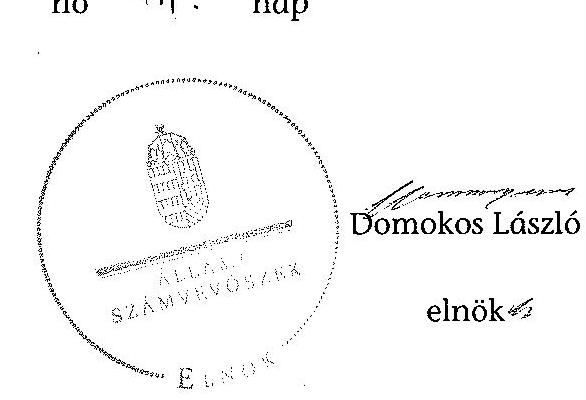
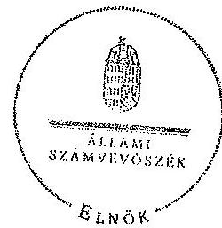
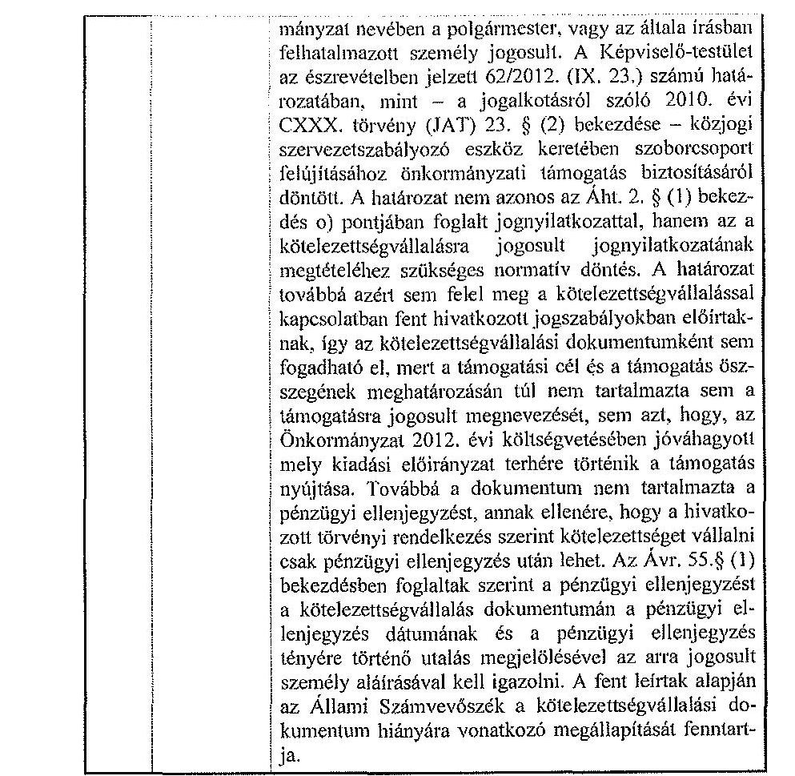
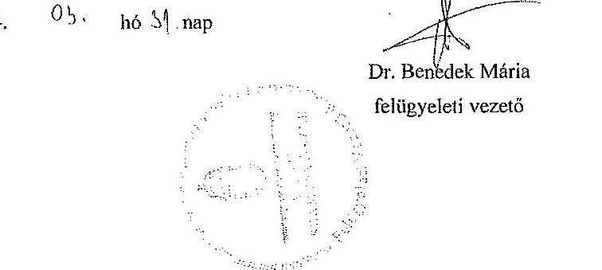

# ÁLLAMI   SZÁMVEVŐSZÉK 

## JELENTÉS

az önkormányzatok belső kontrollrendszere kialakításának, egyes kontrolltevékenységek és a belső ellenőrzés működésének ellenőrzéséről
Fertőszéplak

---

# Állami Számvevőszék 

Iktatószám: V-0341-115/2014.
Témaszám: 1372
Vizsgálat-azonosító szám: V064930

## Az ellenőrzést felügyelte:

dr. Benedek Mária
felügyeleti vezető
Az ellenőrzést vezette és az ellenőrzés végrehajtásáért felelős:
dr. Veress Tiborné
ellenőrzésvezető
A számvevőszéki jelentés összeállításában közreműködtek:
Pálfiné Pusztai Magdolna
számvevő tanácsos
Pető Krisztina
számvevő tanácsos
Az ellenőrzést végezték:
Nagyné Lakhézi Éva
Pálfiné Pusztai Magdolna
számvevő tanácsos
számvevő tanácsos

---

# TARTALOMJEGYZÉK 

BEVEZETÉS ..... 7
I. ÖSSZEGZŐ MEGÁLLAPÍTÁSOK, KÖVETKEZTETÉSEK, JAVASLATOK ..... 11
II. RÉSZLETES MEGÁLLAPÍTÁSOK ..... 19

1. Az önkormányzat belső kontrollrendszerének kialakítása ..... 19
1.1. A kontrollkörnyezet ..... 19
1.2. A kockázatkezelési rendszer ..... 21
1.3. A kontrolltevékenységek ..... 21
1.4. Az információs és kommunikációs rendszer ..... 23
1.5. A monitoring rendszer ..... 23
2. A pénzügyi folyamatokban kulcsszerepet betöltő teljesítésigazolás és érvényesítés belső kontrollok működése ..... 24
3. A belső ellenőrzés működése ..... 28

## MELLÉKLETEK

1. számú Az észrevételt tartalmazó polgármesteri levél
2. számú Az észrevételre vonatkozó elnöki válaszlevél

## FÜGGELÉKEK

1. számú Értelmező szótár
2. számú Az értékelés módja és szempontjai

---

.

---

# RÖVIDÍTÉSEK JEGYZÉKE 

## Törvények

Áht.
ÁSZ tv.
Info tv.
Kttv.
Ltv.
Mötv.
Nvtv.
Ötv.
Számv. tv.
Vagyonnyilatkozat-
tételről szóló tv.

## Rendeletek

Áhsz.
államháztartási számviteli kormányrendelet
Ávr.
Bkr.
Ikr.
önkormányzati SZMSZ
vagyongazdálkodási rendelet

## Szórövidítések

2012. évi ellenőrzési terv

2013. évi ellenőrzési terv

ÁSZ
Belső ellenőrzési kézikönyv

2011. évi CXCV. törvény az államháztartásról
2011. évi LXVI. törvény az Állami Számvevőszékről
2011. évi CXII. törvény az információs önrendelkezési jogról és az információszabadságról
2011. évi CXCIX. törvény a közszolgálati tisztviselőkről (hatályos 2012. március 1-jétől)
1995. évi LXVI. törvény a köziratokról, a közlevéltárakról és a magánlevéltári anyag védelméről
2011. évi CLXXXIX. törvény Magyarország helyi önkormányzatairól
2011. évi CXCVI. törvény a nemzeti vagyonról
1990. évi LXV. törvény a helyi önkormányzatokról
2000. évi C. törvény a számvitelről
2007. évi CLII. törvény az egyes vagyonnyilatkozat-tételi kötelezettségekről

249/2000. (XII. 24.) Korm. rendelet az államháztartás szervezetei beszámolási és könyvvezetési kötelezettségének sajátosságairól
4/2013. (I. 11.) Korm. rendelet az államháztartás számviteléről
368/2011. (XII. 31.) Korm. rendelet az államháztartásról szóló törvény végrehajtásáról
370/2011. (XII. 31.) Korm. rendelet a költségvetési szervek belső kontrollrendszeréről és belső ellenőrzéséről
335/2005. (XII. 29.) Korm. rendelet a közfeladatot ellátó szervek iratkezelésének általános követelményeiről
Fertőszéplak Községi Önkormányzat Képviselőtestületének 6/2011. (IV. 26) számú rendelete a Képviselőtestület Szervezeti és Működési Szabályzatáról
Fertőszéplak Községi Önkormányzat Képviselőtestületének 4/2012. (III. 2.) számú rendelete az önkormányzati vagyonról

Fertőszéplak Községi Önkormányzat 2012. évi belső ellenőrzési terve (a Képviselő-testület 81/2011. (XI. 24.) számú határozata)
Fertőszéplak Községi Önkormányzat 2013. évi belső ellenőrzési terve (a Képviselő-testület 87/2012. (XI. 27.) számú határozata)
Állami Számvevőszék
Sopron, Fertőd Kistérségi Többcélú Társulás Belső Ellenőrzési Kézikönyv (hatályos 2011. január 1-jétől)

---

ellenőrzési nyomvonal ${ }_{1}$ ellenőrzési nyomvonal ${ }_{2}$ éves ellenőrzési jelentés
gazdálkodási jogkörök szabályzata ${ }_{1}$
gazdálkodási jogkörök szabályzata ${ }_{2}$

Hivatal
hivatali alapító okirat
hivatali SZMSZ

INTOSAI
iratkezelési szabályzat ${ }_{1}$
iratkezelési szabályzat ${ }_{2}$

ISSAI
jegyző
Képviselő-testület
körjegyző
Körjegyzőség
körjegyzőségi alapító okirat
körjegyzőségi SZMSZ

Kormányhivatal
Levéltár

Fertőszéplak-Sarród Körjegyzőség ellenőrzési nyomvonala (hatályos 2012. július 15-től - 2013. február 28-ig)
Fertőszéplaki Közös Önkormányzati Hivatal ellenőrzési nyomvonala (hatályos 2013. március 1-jétől)
Fertőszéplak Községi Önkormányzat 2011. évi éves ellenőrzési jelentése, éves értékelés a belső ellenőrzés tárgyi és személyi feltételeiről
Fertőszéplak Községi Önkormányzat pénzgazdálkodásával kapcsolatos kötelezettségvállalás, utalványozás, érvényesítés és ellenjegyzés hatásköri rendjéről (hatályos 2012. január 1-jétől, módosítva 2012. július 2-ától, hatályos 2013. január 6-ig)
Fertőszéplak Községi Önkormányzat pénzgazdálkodásával kapcsolatos kötelezettségvállalás, utalványozás, érvényesítés és ellenjegyzés hatásköri rendjéről (hatályos 2013. január 7-étől)

Fertőszéplaki Közös Önkormányzati Hivatal
Fertőszéplaki Közös Önkormányzati Hivatal alapító okirata (hatályos 2013. március 1-jétől)
Fertőszéplaki Közös Önkormányzati Hivatal Szervezeti és Működési Szabályzata (hatályos 2013. november 26-tól)
International Organization of Supreme Audit Institutions (Legfőbb Ellenőrző Intézmények Nemzetközi Szervezete)
Fertőszéplak-Sarród Körjegyzőség Körjegyzőjének intézkedése Fertőszéplak-Sarród Körjegyzőség iratkezelési szabályzatáról (hatályos 2011. szeptember 1-jétől 2013. február 28-ig)
Fertőszéplaki Közös Önkormányzati Hivatal jegyzőjének intézkedése a Fertőszéplaki Közös Önkormányzati Hivatal iratkezelésének szabályzatáról (hatályos 2013. március 1-jétől)
International Standards of Supreme Audit Institutions (Legfőbb Ellenőrző Intézmények Nemzetközi Standardjai)
Fertőszéplaki Közös Önkormányzati Hivatal jegyzője (2013. március 1-jétől)
Fertőszéplak Községi Önkormányzat Képviselő-testülete

Fertőszéplak-Sarród Körjegyzőség körjegyzője (2011. szeptember 1-jétől 2013. február 28-ig)
Fertőszéplak-Sarród Körjegyzőség
Fertőszéplak-Sarród Körjegyzőség alapító okirata (hatályos 2011. szeptember 1-jétől 2013. február 28-ig)

Fertőszéplak-Sarród Körjegyzőség Szervezeti és Működési Szabályzata (hatályos 2012. január 1-jétől - 2013. február 28-ig)
Győr-Moson-Sopron Megyei Kormányhivatal
Magyar Nemzeti Levéltár Győr-Moson-Sopron Megyei Levéltára

---

NGM
Önkormányzat
polgármester
stratégiai ellenőrzési
terv

Társulás

Nemzetgazdasági Minisztérium
Fertőszéplak Községi Önkormányzat
Fertőszéplak Községi Önkormányzat polgármestere
Fertőszéplak Községi Önkormányzat Stratégiai Ellenőrzési
Terve (a Képviselő-testület a 81/2011. (XI. 24.) számú határozatával jóváhagyta)
Sopron-Fertőd Kistérség Többcélú Társulás

---

.

---

# JELENTÉS 

## az önkormányzatok belső kontrollrendszere kialakításának, egyes kontrolltevékenységek és a belső ellenőrzés működésének ellenőrzéséről Fertőszéplak

## BEVEZETÉS

Fertőszéplak község állandó lakosainak száma 2012. január 1-jén 1303 fő volt. Az Önkormányzat héttagú Képviselő-testületének munkáját egy állandó bizottság (ügyrendi bizottság) segítette. Az Önkormányzat az önállóan működő és gazdálkodó Körjegyzőségen kívül két önállóan működő intézményt működtetett, egy többségi tulajdoni hányadú gazdasági társasággal rendelkezett. A polgármester a 2010. évi önkormányzati választások óta tölti be tisztségét. A körjegyző 2011. március 1-jétől látta el feladatait. A Körjegyzőség szervezeti egységekre nem tagolódott, elkülönített gazdasági szervezettel nem rendelkezett. A foglalkoztatott köztisztviselők száma 2012. január 1-jén hat fő volt. A Körjegyzőség jogutódjaként hozták létre 2013. március 1-jétől a Hivatalt, a jegyző személyében és a társult önkormányzatok számában nem történt változás. Az Önkormányzat a 2012. évi költségvetési beszámolója szerint 243588 ezer Ft költségvetési bevételt ért el, valamint 260402 ezer Ft költségvetési kiadást teljesített. A 2012. december 31-i könyvviteli mérleg szerint 956480 ezer Ft értékű eszközvagyonnal rendelkezett, a rövid lejáratú kötelezettségállománya 8403 ezer Ft volt, hosszú lejáratú kötelezettségállománya nem volt.

A demokratikus társadalmakban alapvető igény, hogy a közpénzeket, a közvagyont használók tevékenységükről elszámoljanak, ahhoz egyértelmű és érvényesíthető felelősségi szabályok társuljanak. Ennek a jogos igénynek az érvényesítéséhez meg kell teremteni azokat a folyamatokat, rendszereket, amelyek nélkülözhetetlenek az elszámoltatáshoz. Az elszámoltatás eredményes működtetéséhez szükség van a megfelelő információs, kontroll, értékelési és beszámolási rendszerek kialakítására.

Magyarországon az uniós csatlakozási tárgyalások idejére nyúlnak vissza a belső kontrollrendszer szabályozásának gyökerei. Az uniós elvárásoknak megfelelő új terminológia szerinti államháztartási belső pénzügyi ellenőrzési (ÁBPE) rendszer területén a jogharmonizáció 2003-ban teljes körűen megvalósult, míg az önkormányzati alrendszerre vonatkozó, az Ötv.-ben megjelenített speciális szabályozás 2005-ben lépett hatályba. Az államháztartási belső kontrollrendszer koncepciója 2009-ben továbbfejlődött. A változások irányát mutatja, hogy a költségvetési szervek belső kontrollrendszere már magában foglalja a korszerű, felelős szervezetirányítás elemeit (kontrollkörnyezet, kockázatkezelés, kontrolltevékenység, információ és kommunikáció, monitoring) is. E kontrollrendszer szabályozása háromszintú, a törvényi előírásokat az Áht. és a Mötv., a rendeleti szintű szabályozást az Ávr. és a Bkr. tartalmazza, amelyeket útmutatói szinten az NGM által kiadott standardok és kézikönyvek támogatnak.

A belső kontrollrendszer azt a célt szolgálja, hogy a költségvetési szervek működésük és gazdálkodásuk során a tevékenységeket szabályszerűen, gazdaságosan, hatékonyan és eredményesen hajtsák végre, teljesítsék elszámolási kötelezettségeiket és megvédjék az erőforrásokat a veszteségektől, a károktól és a nem rendeltetésszerű használattól. A belső kontrollrendszer magában foglalja mindazon szabályokat, eljárásokat, gyakorlati módszereket és szervezeti struktúrákat, kockázatkezelési technikákat, kontrolltevékenységeket, amelyek segítséget nyújtanak a szervezetnek céljai eléréséhez.

Az ÁSZ a 2011-2015. évekre szóló stratégiájában hangsúlyos szerepet szánt annak, hogy szilárd szakmai alapon álló, értékteremtő ellenőrzéseivel előmozdítsa a közpénzügyek átláthatóságát, rendezettségét. A számvevőszéki ellenőrzés nemzetközi alapelvei is rögzítik, hogy a megfelelő belső kontrollrendszer minimálisra csökkenti a hibák és szabálytalanságok kockázatát.

Az ellenőrzés célja annak megállapítása volt, hogy a belső kontrollrendszer elemeinek kialakítása, a pénzügyi folyamatokban kulcsszerepet betöltő teljesítésigazolás és érvényesítés, és a belső ellenőrzés szabályos működése biztosította-e az Önkormányzatnál a közpénzfelhasználás szabályosságát, hozzájárult-e az értéket teremtő rend követelményének érvényesüléséhez.

Ennek keretében értékeltük, hogy:

- a jogszabályi előírásoknak megfelelően alakították-e ki a belső kontrollrendszer elemeit;
- a gazdálkodás folyamatában kulcsszerepet betöltő teljesítésigazolás és érvényesítés kontrolltevékenységeit megfelelően működtették-e;
- biztosították-e a belső ellenőrzés szabályos működését;
- amennyiben az ÁSZ tett javaslatot a 2008-2011. évek közötti ellenőrzése kapcsán az Önkormányzatnak, intézkedtek-e azok végrehajtására.

Az ellenőrzés várható hasznosulását négy szinten tervezzük. A törvényalkotás számára összegzett tapasztalatok állnak rendelkezésre a belső kontrollrendszer önkormányzati területen való kialakításáról, működéséről és hatásairól, a belső ellenőrzés működéséről. Ennek alapján következtetést lehet levonni arról, hogy a belső kontrollrendszer kialakítására és működtetésére vonatkozó jelenlegi, differenciálás nélküli jogszabályi előírások reális követelményeket támasztanak-e az eltérő adottságú települési önkormányzatok esetében, illetve indokolt-e esetleges jogszabályi módosítás kezdeményezése. Az ellenőrzés az ellenőrzött számára visszajelzést ad a belső kontrollrendszer kialakításában és működésében fellépő hiányosságokról, javaslataival hozzájárul azok kiküszöböléséhez, amely csökkentheti a későbbi ellenőrzések gyakoriságát. Az ellenőrzés megállapításait és javaslatait más szervezetek is hasznosíthatják a rendezett gazdálkodási keretek kialakításához. A társadalom számára jelzi, hogy közpénz nem maradhat ellenőrizetlenül, az ÁSZ értékteremtő rend kialakításához és megőrzéséhez hozzájáruló tevékenysége pozitív hatással lesz a szervezetről kialakított összkép formálásában. A szervezeten belül lehetőség nyílik arra, hogy a megállapítások szintetizálásával az ÁSZ a hozzáadott értéket teremtő elemző tevékenységét és tanácsadó szerepét is erősítse.

Az önkormányzatok belső kontrollrendszere kialakításának, egyes kontrolltevékenységek és a belső ellenőrzés működésének ellenőrzéséről szóló jelentés I. fejezetének összegző része az ellenőrzés céljára ad rövid, szintetizáló összefoglalót, és tartalmazza a következtetéseket a II. fejezet részletes megállapításain alapulóan. A jelentés, intézkedést igénylő megállapításait és javaslatait az ellenőrzés során feltárt, a jelentés II. fejezetében rögzített részletes megállapítások alapozzák meg. A helyszíni ellenőrzés lezárásáig a helyi szabályozás változásait nyomon követtük. Az ÁSZ az ellenőrzés megállapításait az ellenőrzött időszakban hatályos, az intézkedést igénylő megállapításokra tett javaslatokat a jelenleg hatályos jogszabályok alapján fogalmazta meg.

Az ellenőrzés típusa: szabályszerűségi ellenőrzés.
Az ellenőrzött időszak: a belső kontrollrendszer kialakításának megfelelősége esetében a 2012. évre, a pénzügyi folyamatokban kulcsszerepet betöltő teljesítésigazolás és érvényesítés belső kontrollok működésének megfelelőségét és a belső ellenőrzés szabályszerű működését a 2012. január 1. és december 31-e közötti időszak eseményeit figyelembe véve értékeltük, míg az ÁSZ javaslatainak utóellenőrzése a 2008-2011. években végzett ellenőrzések nyilvánosságra hozott jelentéseiben tett javaslatok áttekintésére terjedt ki.

# Az ellenőrzött szervezet: az Önkormányzat. 

Az ellenőrzés jogszabályi alapját az ÁSZ tv. 1. § (3) bekezdése, az 5. § (2) és (6) bekezdése, valamint az Áht. 61. § (2) bekezdésének előírásai képezik.

Az ellenőrzés szakmai módszertana az ÁSZ hivatalos honlapján (www.asz.hu) közzétett szakmai szabályokon alapult, amely az INTOSAI által kiadott ISSAI figyelembevételével készült.

Az ellenőrzés lefolytatásához az Önkormányzat a kimutatások és a tanúsítvány elektronikus kitöltésével, valamint az ÁSZ által kért dokumentumok elektronikus megküldésével szolgáltatott adatokat. Az így rendelkezésre bocsátott adatok, információk kontrollja és a munkalapok kitöltése a helyszíni ellenőrzés keretében történt. A jelentésben használt fogalmak magyarázatát az 1. számú függelék, az ellenőrzés egyes területeinek értékelésénél alkalmazott egységes minősítési szempontokat a 2. számú függelék tartalmazza.

A belső kontrollrendszer kialakításának ellenőrzése során értékeltük a kontrollkörnyezet, a kockázatkezelési rendszer, a kontrolltevékenységek, az információs és kommunikációs rendszer, valamint a monitoring rendszer szabályozottságának megfelelőségét. A pénzügyi folyamatokban kulcsszerepet betöltő teljesítésigazolás és érvényesítés kontrollok működése megfelelőségének minősítéséhez az állományba nem tartozók megbízási díjai, a külső szolgáltatók által végzett karbantartási, kisjavítási munkák, az egyéb üzemeltetési és fenntartási szolgáltatások, a rendszeres szociális segélyek, valamint az államháztartáson kívülre
 teljesített működési és felhalmozási célú pénzeszközátadások közül kockázatelemzéssel választottuk ki az ellenőrzött kiadási jogcímeket. Az egyszerű véletlen mintavétellel kiválasztott tételek ellenőrzését többlépcsős megfelelőségi tesztek útján addig végeztük, amíg elegendő és megfelelő bizonyítékot szereztünk a vizsgált folyamatok kulcskontrolljai működésének megfelelő vagy nem megfelelő voltáról. Értékeltük az Önkormányzatnál a belső ellenőrzés működésének szabályosságát. Utóellenőrzésre nem került sor, mivel az ÁSZ az Önkormányzatnál a 2008-2011. évek között ellenőrzést nem végzett.

Az Ász tv. 29. § (1) bekezdése szerint a jelentéstervezetet megküldtük a polgármester részére, aki az ÁSZ tv. 29. § (2) bekezdésében foglalt észrevételezési jogával élt, a jelentéstervezetre észrevételt tett (1. számú melléklet). Az ÁSZ tv. 29. § (3) bekezdésében előírtaknak megfelelően a figyelembe nem vett észrevételeket és annak indokairól szóló tájékoztatást a jelentés tartalmazza (2. számú melléklet).

---

# I. ÖSSZEGZŐ MEGÁLLAPÍTÁSOK, KÖVETKEZTETÉSEK, JAVASLATOK 

A belső kontrollrendszeren belül 2012-ben a kontrollkörnyezet, a kockázatkezelési rendszer, a kontrolltevékenységek, az információs és kommunikációs rendszer, valamint a monitoring rendszer kialakítását külön-külön és együttesen is értékeltük. A belső kontrollrendszer kialakítása az összesített értékelés alapján nem felelt meg a jogszabályi előírásoknak.

A belső kontrollrendszer egyes területei kialakításának minősítése a következő:

| Kontrollterület | Minősítés |  |
| :-- | :-- | :-- |
| Kontrollkörnyezet |  | nem   megfelelő |
| Kockázatkezelési rendszer |  | nem   megfelelő |
| Kontrolltevékenységek | részben   megfelelő |  |
| Információs és kommunikációs rendszer |  | nem   megfelelő |
| Monitoring rendszer |  | nem   megfelelő |

Részben megfelelőnek értékeltük a kontrolltevékenységek kialakítását, mivel az ellenőrzésünk által megállapított szabályozásbeli hiányosságok nem veszélyeztették a Körjegyzőség, ezáltal az Önkormányzat céljainak elérését.

Nem megfelelőnek értékeltük a kontrollkörnyezet, a kockázatkezelési rendszer, az információs és kommunikációs, valamint a monitoring rendszer kialakítását, mivel az ellenőrzésünk során megállapított szabályozásbeli hiányosságok magukban hordozzák a szabálytalan működés és gazdálkodás, valamint a korrupció kockázatát.

A belső kontrollrendszer nem megfelelő kialakítása kockázatot jelent az Önkormányzat feladatainak szabályszerű, gazdaságos, hatékony és eredményes végrehajtása során.

Az állományba nem tartozók megbízási díjaival és a külső szolgáltatók által végzett karbantartási, kisjavítási munkákkal kapcsolatos kifizetések, valamint a működési és a felhalmozási célú pénzeszközátadások államháztartáson kívülre teljesített kifizetései során a pénzügyi folyamatokban kulcsszerepet betöltő teljesítésigazolás és érvényesítés belső kontrollok működése gyenge volt. Gyengének értékeltük a két kulcskontroll együttes működését, mert azok nem biztosították az ellenőrzésünk által feltárt hiányosságok bekövetkezésének megelőzését.

---

A számvevőszéki ellenőrzés az ellenőrzött kifizetésekkel összefüggésben a rendelkezésre bocsátott dokumentumok alapján kár bekövetkeztére utaló adatot, tényt nem állapított meg, azonban a gazdálkodásban kulcsszerepet betöltő kontrollok gyenge működése miatt fennáll a hibák bekövetkezésének lehetősége. A nem megfelelően szabályozott és működtetett belső kontrollok korrupciós kockázatot hordoznak.

Az Önkormányzat a belső ellenőrzési feladatokat - képviselő-testületi döntés alapján - a Társulás útján látta el. A belső ellenőrzés működése a jogszabályi előírásoknak megfelelt, azonban nem volt pozitív visszahatással a kontrollrendszer elemeire. A belső ellenőrzés nem tárta fel a számvevőszéki ellenőrzés által megállapított hiányosságokat a kontrollkörnyezet, kockázatkezelési rendszer, információs és kommunikációs és a monitoring rendszer kialakításánál, a pénzügyi folyamatokban kulcsszerepet betöltő teljesítésigazolás és érvényesítés belső kontrollok működésénél.

Az ÁSZ tv. 33. § (1) bekezdésében foglaltak értelmében az ellenőrzött szervezet vezetője köteles a jelentésben foglalt megállapításokhoz kapcsolódó intézkedési tervet összeállítani, és azt a jelentés kézhezvételétől számított 30 napon belül az ÁSZ részére megküldeni. Amennyiben az intézkedési tervet határidőre nem küldi meg a szervezet, vagy az ÁSZ tv. 33. § (2) bekezdésében foglalt póthatáridő elteltével megküldött intézkedési terv továbbra sem elfogadható, az ÁSZ elnöke a hivatkozott törvény 33. § (3) bekezdés a)-b) pontjaiban foglaltakat érvényesítheti.

Az ellenőrzés intézkedést igénylő megállapításai és javaslatai:

# a polgármesternek 

1. Az Áht. 37. § (1) és az Ávr. 55. § (1) bekezdése ellenére az Önkormányzat nevében történt kötelezettségvállalásokra pénzügyi ellenjegyzés nélkül került sor.

Javaslat:
Intézkedjen, hogy az Önkormányzat nevében történt kötelezettségvállalásra az Áht. 37. § (1) bekezdésében és az Ávr. 55. § (1) bekezdésében foglaltaknak megfelelően - az Ávr. 53. §-ában meghatározott kivételekkel - kizárólag a pénzügyi ellenjegyzés után, a pénzügyi teljesítés esedékességét megelőzően, írásban kerüljön sor.
2. A számvevőszéki ellenőrzés megállapításai alapján az Önkormányzatnál a belső kontrollrendszer kialakítása összefoglalóan értékelve nem felelt meg a jogszabályi előírásoknak, a kulcskontrollok működése gyenge volt, a belső ellenőrzés működése ugyan megfelelt a jogszabályi előírásoknak, azonban nem tárta fel a számvevőszéki ellenőrzés során megállapított hiányosságokat. A szabályozásbeli és működésbeli hiányosságok magukban hordozzák a szabálytalan működés kockázatát.

Javaslat:
A Mötv. 115. § (1) bekezdésében foglaltak alapján kísérje figyelemmel az Önkormányzat gazdálkodásának szabályszerűségét. A Mötv. 67. § f) pontja alapján gondoskodjon a belső kontrollrendszer működésére vonatkozó jogszabályi rendelkezések

---

be nem tartása, valamint a teljesítésigazolás, illetve az érvényesítés kontrollokkal összefüggésben feltárt hiányosságok, szabálytalanságok tekintetében az esetleges munkajogi felelősséggel kapcsolatos körülmények kivizsgálásáról, majd a vizsgálat eredményének függvényében tegye meg a szükséges intézkedéseket.

# a jegyzőnek (Fertőszéplak Község Önkormányzata vonatkozásában) 

1. a kontrollkörnyezettel kapcsolatban:

A körjegyzőségi alapító okiratban az alaptevékenységek, ezek államháztartási szakfeladatrendje szerinti megjelölése az Ávr. 5. § (1) bekezdés c) pontjában és az 56/2011. (XII. 31.) NGM rendeletben foglaltaknak nem felelt meg. A hivatali alapító okirat a 841126 szakfeladat szám megnevezésének kivételével a jogszabályi előírásoknak megfelelt.

A hivatali SZMSZ - az Ávr. 13. § (1) bekezdés c), g) és i) pontjaiban foglaltak ellenére - nem tartalmazta az alaptevékenységet szabályozó jogszabályok megjelölését, a valamennyi munkakörhöz tartozó hatásköröket, a hatáskörök gyakorlásának módját és az ehhez kapcsolódó felelősségi szabályokat, valamint az Ávr. 10. § (1)-(3) bekezdései szerint a költségvetési szervhez rendelt más költségvetési szervek felsorolását.

A körjegyző az Ötv. 36. § (2) bekezdés a) pontjában foglalt feladatkörében előkészítette és a Képviselő-testület megalkotta a vagyongazdálkodási rendeletet, azonban az nem felelt meg az Nvtv. 3. § (1) bekezdés 6. pontja, az 5. § (1)-(3) és (5)-(9) bekezdései, a 11. § (16) bekezdése, valamint a Mötv. 109. § (4) bekezdése előírásainak.

A körjegyző - a Számv. tv. 161. § (1) bekezdésében és az Áhsz. 49. § (1) bekezdésében foglalt előírásai ellenére - nem készítette el a Körjegyzőség számlarendjét.

A körjegyző - az Ávr. 13. § (5) bekezdésében foglaltak ellenére - belső szabályzatban nem rendelkezett a Körjegyzőség vezetőjének és alkalmazottainak feladat-és hatásköréről, a helyettesítés rendjéről, továbbá a költségvetési szerven belüli belső és azon kívüli külső kapcsolattartásának módjáról, szabályairól.

A Képviselő-testület a Kttv. 231. § (1) bekezdése ellenére nem állapította meg a Kttv. 83. §-ában meghatározott, a köztisztviselőkkel szembeni hivatásetikai alapelvek részletes tartalmát, valamint az etikai eljárás szabályait, mivel a körjegyző - az Ötv. 36. § (2) bekezdés a) pontjában előírt feladata ellenére - nem készítette elő ennek dokumentumát.

Javaslat:
a) Készítse elő a Mötv. 81. § (3) bekezdés c) pontjában foglalt feladatkörében a hivatali alapító okirat módosítását annak érdekében, hogy az az Ávr. 5. § (1) bekezdésében előírtaknak megfelelően tartalmazza az alaptevékenységek kormányzati funkció szerinti megjelölését, és kezdeményezze az Áht. 9. § (1) bekezdés a) pontjában foglaltakra tekintettel annak Képviselő-testület elé terjesztését.
b) Készítse el a hivatali SZMSZ módosítását annak érdekében, hogy az tartalmazza az Ávr. 13. § (1) bekezdésében előírt valamennyi tartalmi elemet, és kezdemé-

---

nyezze az Áht. 9. § (1) bekezdés a) pontjában foglaltakra tekintettel a Képviselőtestület elé terjesztését.
c) Készítse elő a Mötv. 81. § (3) bekezdés c) pontjában foglalt feladatkörében a vagyongazdálkodási rendelet módosítását, és kezdeményezze a módosítás Képviselő-testület elé terjesztését annak érdekében, hogy az megfeleljen a Nvtv. 3. § (1) bekezdés 6. pontja, az 5. § (1)-(3) és (5)-(9) bekezdései, a 11. § (16) bekezdése, valamint a Mötv. 109. § (4) bekezdése előírásainak.
d) Készítse el a Számv. tv. 161. § (1) bekezdésében és az államháztartási számviteli kormányrendelet 51. § (2) bekezdésében foglaltaknak megfelelően a Hivatal számlarendjét.
e) Határozza meg az Ávr. 13. § (5) bekezdésében foglaltak alapján belső szabályzatban a Hivatal vezetőjének és alkalmazottainak hatáskörét, a költségvetési szerven belüli belső kapcsolattartás módját, szabályait
f) Készítse elő a Mötv. 81. § (3) bekezdés c) pontjában foglalt feladatkörében a köztisztviselőkkel szembeni - a Kttv. 83. §-a szerinti - hivatásetikai alapelvek részletes tartalmának, valamint az etikai eljárás szabályainak dokumentumait, és a Kttv. 231. § (1) bekezdésében foglaltakra tekintettel kezdeményezze azok Képviselő-testület elé terjesztését.
2. a kockázatkezelési rendszerrel kapcsolatban:

A körjegyző - Bkr. 7. § (2) bekezdésében foglaltak ellenére - nem határozta meg az egyes kockázatokkal kapcsolatban a szükséges intézkedéseket.

A Vagyonnyilatkozat-tételről szóló tv. 4. § a) és d) pontjában foglaltak ellenére a vagyonnyilatkozat-tételre kötelezettek körét az önkormányzati és a körjegyzőségi SZMSZ-ben nem rögzítették.

A körjegyző - a Vagyonnyilatkozat-tételről szóló tv. 8. § (4) bekezdésében foglaltak ellenére - a kötelezetteket nem tájékoztatta a kötelezettség fennállásáról és esedékességének időpontjáról, továbbá a 10. § (1) bekezdésében előírtak ellenére a kötelezettségüket nem teljesítőket (akiknek a köztisztviselői jogviszonya 2013. december 31-én már nem állt fenn) nem szólította fel írásban az elmulasztott kötelezettségük teljesítésére.

Javaslat:
a) Határozza meg a Bkr. 7. § (2) bekezdésében foglaltak alapján az egyes kockázatokkal kapcsolatban szükséges intézkedéseket.
b) Készítse elő a Mötv. 81. § (3) c) pontjában foglalt feladatkörében az önkormányzati SZMSZ módosítását annak érdekében, hogy a Vagyonnyilatkozat-tételről szóló tv. 4. § d) pontjában előírtak alapján az tartalmazza a Vagyonnyilatkozattételről szóló tv. 3. § e) pontja figyelembevételével meghatározott kötelezettek körét, és kezdeményezze annak Képviselő-testület elé terjesztését.
c) A Vagyonnyilatkozat-tételről szóló tv. 8. §. (4) bekezdésben előírtak szerint tájékoztassa a vagyonnyilatkozat-tételre kötelezetteket a vagyonnyilatkozat-tételi kö-

---

telezettség fennállásáról és esedékességének időpontjáról, valamint a vagyonnyilatkozat-tételi kötelezettség nem teljesítése esetén a Vagyonnyilatkozat-tételről szóló tv. 10. § (1) bekezdésében előírtak szerint írásban szólítsa fel a kötelezetteket a kötelezettségük teljesítésére.
3. a kontrolltevékenységekkel kapcsolatban:

A körjegyző - a Bkr. 8. § (4) bekezdés b) pontjában foglaltak ellenére - belső szabályzatban nem határozta meg a dokumentumokhoz és információkhoz való hozzáférés tekintetében a felelősségi köröket.

Javaslat:
Szabályozza belső szabályzatban a Bkr. 8. § (4) bekezdés b) pontja alapján a dokumentumokhoz és információkhoz való hozzáférés esetében a felelősségi köröket.
4. az információs és kommunikációs rendszerrel kapcsolatban:

A körjegyző - a Bkr. 3. § d) pontjában és a 9. § (1) bekezdésében foglaltak ellenére nem alakított ki olyan rendszert, amely biztosítja, hogy a megfelelő információk a megfelelő időben eljutnak az illetékes szervezethez, szervezeti egységhez, illetve személyhez.

A körjegyző - az Info tv. 33. § (1) és (3) bekezdésében, a 37. § (1) bekezdésében és az 1. mellékletében foglaltak ellenére - a 2012. évre vonatkozó éves költségvetés és a 2011. évre vonatkozó költségvetési beszámoló tekintetében - nem
 gondoskodott az Önkormányzat elektronikus közzétételi kötelezettségének teljesítéséről a 2012. évben.

A körjegyző - az Ltv. 10. § (1) bekezdés c) pontjának előírását figyelmen kívül hagyva - az iratkezelési szabályzat${ }_{1}$-et nem a Levéltár és a Kormányhivatal egyetértésével adta ki.

A körjegyző - az lkr. 14. § (4) bekezdésében foglaltak ellenére - az iratok iktatásának, az iratforgalom dokumentálásának elmulasztásával nem biztosította az ügyintézés folyamatának, az iratok szervezeten belüli útjának pontos követhetőségét és ellenőrizhetőségét, az iratok hollétének naprakész megállapíthatóságát.

Javaslat:
a) Alakítson ki és működtessen a Bkr. 3. § d) pontjában és a 9. § (1) bekezdésében foglaltaknak megfelelően olyan rendszert, amely biztosítja, hogy a megfelelő információk a megfelelő időben eljutnak az illetékes szervezethez, szervezeti egységhez, illetve személyhez.
b) Tegyen eleget az Info tv. 33. § (1), (3) és a 37.§ (1) bekezdésében, valamint az 1. mellékletében foglaltaknak megfelelően az Önkormányzat elektronikus közzétételi kötelezettségének.
c) Intézkedjen az Ltv. 10. § (1) bekezdés c) pontjának előírását figyelembe véve, hogy az iratkezelési szabályzat${ }_{2}$ a Levéltár és a Kormányhivatal egyetértésével kerüljön kiadásra.

---

d) Alakítsa ki az lkr. 14.§ (4) bekezdésében előírtak figyelembevételével az iratforgalom dokumentálásának szabályait, határozza meg az iratok szervezeten belüli útjának, az ügyintézés folyamatának nyomon követését.
5. a monitoring rendszerrel kapcsolatban:

A körjegyző - a Bkr. 3. § e) pontjában és 10. §-ában foglaltak ellenére - nem alakította ki - a Körjegyzőség tevékenységének, a célok megvalósításának nyomon követését biztosító rendszert.

A körjegyző a Bkr. 11. § (1) bekezdésében foglalt kötelezettsége ellenére - a Bkr. 1. mellékletében előírt nyilatkozatban - nem értékelte a 2011. évre vonatkozóan a Körjegyzőség belső kontrollrendszerének minőségét.

Javaslat:
a) Alakítsa ki és működttesse a Bkr. 3. § e) pontjában és 10. §-ában foglaltak alapján a Hivatal tevékenységének, a célok megvalósításának nyomon követését biztosító rendszert.
b) Értékelje a Bkr. 11. § (1) bekezdésében foglalt kötelezettségének megfelelően a jogszabályban meghatározott keretek között a Hivatal belső kontrollrendszerének minőségét a Bkr. 1. melléklete szerinti nyilatkozatban.
6. a pénzügyi folyamatokban kulcsszerepet betöltő kontrollokkal kapcsolatban:

A teljesítésigazolást - az Áht. 38. § (1) bekezdésében és az Ávr. 57. § (1) és (3)-(4) bekezdéseiben foglaltak ellenére - nem végezték el, vagy ellenőrizhető okmányok hiányában nem szabályszerűen végezték, továbbá nem az arra jogosult személy végezte.

Az érvényesítés során az Ávr. 58. § (1) bekezdésének előírása ellenére a kifizetést megelőzően a kiadások összegszerűségét ellenőrizhető okmányok hiányában nem ellenőrizték, továbbá a fedezet meglétének ellenőrzését nem végezték el. Az érvényesítés az Ávr. 58. § (3) bekezdésében előírtak ellenére nem volt szabályszerű, mivel az Ávr. 60. § (3) bekezdése szerint vezetett nyilvántartás (aláírás-minta) alapján nem volt megállapítható, hogy a keltezéssel ellátott aláírás az érvényesítésre kijelölt személytől származott. Az érvényesítő - az Ávr. 58. § (1)-(2) bekezdéseiben előírtak ellenére - nem ellenőrizte és nem jelezte az utalványozónak, hogy a megelőző ügymenetben a teljesítésigazolás elmaradt, vagy nem szabályszerűen történt, vagy nem a kijelölt személy végezte, továbbá hogy az Önkormányzat kiadási előirányzatai terhére történt kötelezettségvállalásokra - az Áht. 37. § (1) bekezdésében és az Ávr. 55. § (1) bekezdésében foglaltak ellenére - pénzügyi ellenjegyzés nélkül került sor. Nem jelezte az utalványozónak továbbá, hogy a bizonylatokon nem tüntették fel az Ávr. 59. (3) bekezdés f) pontjában előírtak ellenére - a kötelezettségvállalás nyilvántartási számát, mivel az Ávr. 56. § (1) bekezdés előírása ellenére a kötelezettségvállalást követően nem gondoskodtak annak egyedileg azonosítható módon történő nyilvántartásba vételéről. Nem jelezte továbbá, hogy a gazdasági eseményeket az Áhsz. 9. § (11) bekezdésében foglaltak ellenére nem a valóságnak megfelelően könyvelték.

---

Javaslat:
Intézkedjen - a teljesítésigazolás és az érvényesítés vonatkozásában feltárt hiányosságok megszüntetése, illetve az operatív gazdálkodás során a működésbeli hibák megelőzése, feltárása és kijavítása érdekében - arról, hogy
a) az Ávr. 57. § (4) bekezdésében foglaltak alapján teljesítésigazolásra kijelölt személyek az Áht. 38. § (1) bekezdésében és az Ávr. 57. § (1) bekezdésében foglaltaknak megfelelően, ellenőrizhető okmányok alapján ellenőrizzék a kiadások teljesítésének jogosságát, összegszerűségét, ellenszolgáltatást is magában foglaló kötelezettségvállalás esetében az ellenszolgáltatás teljesítését és azt az Ávr. 57. § (3) bekezdésében foglalt módon igazolják;
b) az Ávr. 58. § (4) bekezdésében foglalt előírás alapján érvényesítésre kijelölt személyek az Ávr. 58. § (1)-(3) bekezdései szerint a kifizetéseket megelőzően, teljesítésigazolás alapján ellenőrizzék - az Ávr. 57. § (3) bekezdése szerinti esetben annak hiányában is - az összegszerűséget, a fedezet meglétét és a megelőző ügymenetben az Áht., az államháztartási számviteli kormányrendelet, az Ávr. előírásai és a belső szabályzatokban foglaltak betartását;
c) kötelezettségvállalásra az Áht. 37. § (1) és az Ávr. 55. § (1) bekezdésében foglaltaknak megfelelően - az Ávr. 53. §-ában meghatározott kivételekkel - kizárólag pénzügyi ellenjegyzés után, a pénzügyi teljesítés esedékességét megelőzően írásban kerüljön sor;
d) a kötelezettségvállalásokat az Ávr. 56. § (1) bekezdésében foglalt előírásnak megfelelően vegyék nyilvántartásba, és az Ávr. 59. (3) bekezdés f) pontjában előírtak szerint a kötelezettségvállalás nyilvántartási számát a bizonylatokon tüntessék fel;
e) az érvényesítőnek az utalványrendeleten szereplő, az Ávr. 58. § (3) bekezdésében előírt aláírása beazonosítható legyen az Ávr. 60. § (3) bekezdésében foglaltak szerint vezetett nyilvántartásban szereplő aláírás-mintával;
f) az érvényesítő az Ávr. 58. § (2) bekezdésében foglalt előírásnak megfelelően jelezze az utalványozónak, ha az Áht., vagy az államháztartási számviteli kormányrendelet, az Ávr. és a belső szabályzatokban foglaltak megsértését tapasztalja;
g) a könyvvitelben rögzített tételek a Számv. tv. 15. § (3) bekezdésében és az államháztartási számviteli kormányrendelet 4. § (1) bekezdésében foglaltaknak megfelelően a valóságban is megtalálhatók legyenek.
7. a belső ellenőrzés működésével kapcsolatban:

A stratégiai ellenőrzési terv - a Bkr. 30. § (1) bekezdés b), c), d) e) és f) pontjában foglalt előírási ellenére - nem tartalmazta a belső kontrollrendszer általános értékelését, a kockázati tényezőket és értékelésüket, a belső ellenőrzésre vonatkozó fejlesztési és képzési tervet, a szükséges erőforrások felmérését, elsősorban a létszám, képzettség, tárgyi feltételek tekintetében, továbbá az ellenőrzési gyakoriságot.

---

A 2013. évi ellenőrzési terv - a Bkr. 31. § (4) bekezdés a) pontjában foglaltak ellenére - nem tartalmazta az ellenőrzési tervet megalapozó elemzések és a kockázatelemzés eredményének összefoglaló bemutatását.

A belső ellenőrzési vezető a 2013. évi ellenőrzési tervet a Bkr. 29. § (1) bekezdésében a foglaltak ellenére - a 22. § (1) bekezdés b) pontjára és a 31. § (2) bekezdésére is figyelemmel - nem kockázatelemzés alapján készítette el.

A végrehajtott ellenőrzéshez a Bkr. 33. § (2) bekezdésében foglalt előírás ellenére nem készítettek ellenőrzési programot.

A belső ellenőrzési vezető - a Bkr. 22. § (2) bekezdés e) pontjában és az 50. §-ban foglalt előírást figyelmen kívül hagyva - az elvégzett ellenőrzésekről nyilvántartást nem vezetett.

A belső ellenőrzési vezető - a Bkr. 21. § (2) bekezdés d) pontjában és a 47. § (1) bekezdésében foglaltak ellenére - a belső ellenőrzési jelentésekben tett megállapításokat, javaslatokat, a vonatkozó intézkedési terveket és azok végrehajtását nyomon követő nyilvántartást nem vezetett.

Javaslat:
a) Kezdeményezze, hogy a stratégiai ellenőrzési terv tartalmazza a Bkr. 30. § (1) bekezdésében előírt tartalmi elemeket.
b) Intézkedjen, hogy az éves ellenőrzési tervek tartalmazzák a Bkr. 31. § (4) bekezdésében előírt tartalmi elemeket.
c) Intézkedjen, hogy a belső ellenőrzési vezető az éves ellenőrzési tervet a Bkr. 29. § (1) bekezdése szerint - a 22. § (1) bekezdés b) pontjára és a 31. § (2) bekezdés előírásaira is figyelemmel - kockázatelemzést is figyelembe véve készítse el.
d) Kezdeményezze, hogy a belső ellenőrzést a Bkr. 33. § (2) bekezdésében foglaltaknak megfelelően a belső ellenőrzési vezető által jóváhagyott ellenőrzési program alapján végezzék.
e) Kezdeményezze, hogy a belső ellenőrzési vezető a Bkr. 22. § (2) bekezdés e) pontjában és az 50. §-ban foglalt előírásnak megfelelően vezessen nyilvántartást az elvégzett ellenőrzésekről.
f) Kezdeményezze, hogy a belső ellenőrzési vezető a Bkr. 21. § (2) d) pontjában és a 47. § (1) bekezdésben foglalt előírás alapján vezessen nyilvántartást, amellyel az ellenőrzési jelentésekben tett megállapításokat, javaslatokat, a vonatkozó intézkedési terveket, és azok végrehajtását nyomon követi.

---

# II. RÉSZLETES MEGÁLLAPÍTÁSOK 

## 1. Az ÖNKORMÁNYZAT BELSŐ KONTROLLRENDSZERÉNEK KIALAKÍTÁSA

A belső kontrollrendszeren belül 2012-ben a kontrollkörnyezet, a kockázatkezelési rendszer, a kontrolltevékenységek, az információs és kommunikációs rendszer, valamint a monitoring rendszer kialakítását külön-külön és együttesen is értékeltük. A belső kontrollrendszer kialakítása az összesített értékelés alapján nem felelt meg a jogszabályi előírásoknak.

### 1.1. A kontrollkörnyezet

A kontrollkörnyezet kialakítása - a 2. számú függelékben részletezett kritériumrendszer alapján végzett értékelés szerint - a jogszabályi előírásoknak nem felelt meg, mert:

| Sor-   szám $^{1}$ | Megállapítás | Megjegyzés |
| :--: | :--: | :--: |
| 1. | A körjegyzőségi alapító okiratban az alaptevékenységek, ezek államháztartási szakfeladatrendje szerinti megjelölése az Ávr. 5. § (1) bekezdés c) pontjában és az 56/2011. (XII. 31.) NGM rendeletben foglaltaknak nem felelt meg. | A hivatali alapító okirat a 841126 szakfeladat megnevezésének kivételével a jogszabályi előírásoknak megfelelt. |
| 5. | A körjegyzőségi SZMSZ-t - az Áht. 9. § (1) bekezdés e) pontjában foglaltak ellenére - a Képviselő-testület nem hagyta jóvá. | A hivatali SZMSZ-t a Képviselő-testület az Áht. 9. § (1) bekezdés a) pontjában foglaltakat figyelembe véve 2013. november 26-án jóváhagyta. A hivatali SZMSZ - az Ávr. 13. § (1) bekezdés c), g) és i) pontjaiban foglaltak ellenére nem tartalmazta az alaptevékenységet szabályozó jogszabályok megjelölését, valamennyi munkakörhöz tartozó hatásköröket, a hatáskörök gyakorlásának módját és az ehhez kapcsolódó felelősségi szabályokat, valamint az Ávr. 10. § (1)-(3) bekezdé- |

[^0]
[^0]:    ${ }^{1}$ A megállapítás számozása az Önkormányzat által az adatszolgáltatás során kitöltött kimutatások kérdéseinek sorszámával azonos.

---

|  |  | sei szerint a költségvetési szervhez rendelt más költségvetési szervek felsorolását. |
| :--: | :--: | :--: |
| 16. | A körjegyző az Ötv. 36. § (2) bekezdés a) pontjában ${ }^{2}$ foglalt feladatkörében előkészítette és a Képviselő-testület megalkotta a vagyongazdálkodási rendeletet, azonban az nem felelt meg az Nvtv. 3. § (1) bekezdés 6. pontja, az 5. § (1)-(3) és (5)-(9) bekezdései, a 11. § (16) bekezdése, valamint a Mötv. 109. § (4) bekezdése előírásainak. | A vagyongazdálkodási rendelet nem tartalmazta a korlátozottan forgalomképes vagyont, az önkormányzat törzsvagyonát és az önkormányzati vagyon elidegenítésére vonatkozó rendelkezéseket, továbbá a vagyonkezelői jog ellenértékét, a vagyonkezelői jog gyakorlásának, valamint a vagyonkezelés ellenőrzésének részletes szabályait. |
| 30. | A körjegyző - a Számv. tv. 161. § (1) bekezdésében és az Áhsz. 49. § (1) bekezdésében foglalt előírási ellenére - nem készítette el a Körjegyzőség számlarendjét.

 |  |
| 35. | A körjegyző - az Ávr. 13. § (5) bekezdésében foglaltak ellenére - belső szabályzatban nem rendelkezett a Körjegyzőség vezetőjének és alkalmazottainak feladat- és hatásköréről, a helyettesítés rendjéről, továbbá a költségvetési szerven belüli belső és azon kívüli külső kapcsolattartásának módjáról, szabályairól. | A hivatali SZMSZ továbbra sem tartalmazta a Hivatal vezetőjének és alkalmazottainak hatáskörét, a költségvetési szerven belüli belső kapcsolattartás módját, szabályait. |
| 47. | Képviselő-testület a Kttv. 231. § (1) bekezdése ellenére nem állapította meg a Kttv. 83. §-ában előírt, a köztisztviselőkkel szembeni hivatásetikai alapelvek részletes tartalmát, valamint az etikai eljárás szabályait, mivel a körjegyző - az Ötv. 36. § (2) bekezdés a) pontjában előírt feladata ellenére - nem készítette elő ennek dokumentumát. |  |

[^0]
[^0]:    ${ }^{2}$ 2013. január 1-jétől Mötv. 81. § (3) bekezdés c) pont

---

# 1.2. A kockázatkezelési rendszer 

A kockázatkezelési rendszer kialakítása - a 2. számú függelékben részletezett kritériumrendszer alapján végzett értékelés szerint - a jogszabályi előírásoknak nem felelt meg, mert:

| Sor-   szám | Megállapítás | Megjegyzés |
| :--: | :--: | :--: |
| 8. | A körjegyző - a Bkr. 7. § (2) bekezdésében foglaltak ellenére - nem határozta meg az egyes kockázatokkal kapcsolatban a szükséges intézkedéseket. |  |
| 13. | A Vagyonnyilatkozat-tételről szóló tv. 4. § a) és d) pontjában foglaltak ellenére a vagyonnyilatkozat-tételre kötelezettek körét az önkormányzati és a körjegyzőségi SZMSZ-ben nem rögzítették. | A hivatali SZMSZ-ben a jegyző rögzítette a pénzügyi és az adóügyi területen dolgozók, valamint a jegyző vagyonnyilatkozattételi kötelezettségét. |
| 14. | A Vagyonnyilatkozat-tételről szóló tv. 3. § (1) bekezdésében foglaltak szerinti kötelezettek közül két kötelezett nem tett vagyonnyilatkozatot a 2012. évben. A körjegyző - a Vagyonnyilatkozat-tételről szóló tv. 8. § (4) bekezdésében foglaltak ellenére - a kötelezetteket nem tájékoztatta a kötelezettség fennállásáról és esedékességének időpontjáról, továbbá a 10. § (1) bekezdésében előírtak ellenére a kötelezettségüket nem teljesítőket (akiknek a köztisztviselői jogviszonya 2013. december 31-én már nem állt fenn) nem szólította fel írásban az elmulasztott kötelezettségük teljesítésére. |  |

### 1.3. A kontrolltevékenységek

A kontrolltevékenységek kialakítása - a 2. számú függelékben részletezett kritériumrendszer alapján végzett értékelés szerint - részben felelt meg a jogszabályi előírásoknak.

A körjegyző a kontrolltevékenység részeként 2012. július 15-től előírta a folyamatba épített, előzetes, utólagos és vezetői ellenőrzést a költségvetés tervezése és a támogatások elszámolása vonatkozásában. A gazdálkodási jogkörök szabályzat${ }_{1}$-ben rendezték a kötelezettségvállalás pénzügyi ellenjegyzés és a teljesítésigazolás módját, valamint szabályozták az érvényesítés és utalványozás rendjét. Az iratkezelés szabályozása során előírták az iratok és az adatok védelmét. Szabályozták az üzemeltetés és az adatbiztonság feladatait és meghatározták az ezekhez kapcsolódó hatásköröket, biztosították az adatbiztonság érvényesülését. Meghatározták a beszámolási eljáráshoz kapcsolódó felelősségi köröket.

---

A polgármester kötelezettségvállalásra és az utalványozásra írásbeli felhatalmazást adott, a körjegyző a jogszabályi előírásoknak megfelelően jelölte ki a pénzügyi ellenjegyzési, illetve érvényesítési feladatra a Körjegyzőség állományába tartozó köztisztviselőt, akik rendelkeztek a jogszabályban előírt szakképzettséggel.

A körjegyző kialakította a jogviszony megszűnése esetére vonatkozóan a munkavállaló folyamatban lévő feladatai átadásának rendjét.

A kontrolltevékenységek kialakítása az alábbi kisebb hiányosság miatt részben felelt meg a jogszabályi előírásoknak:

| Sorszám | Megállapítás | Megjegyzés |
| :--: | :--: | :--: |
| 8. | A körjegyző - az Ávr. 53. § (2) bekezdésében foglaltakat figyelmen kívül hagyva - annak ellenére nem határozta meg az előzetes írásbeli kötelezettségvállalást nem igénylő kifizetések rendjét, hogy a gazdálkodási jogkörök szabályzata ${ }_{1}$-ben lehetővé tette a 100 ezer Ft alatti kifizetések előzetes írásbeli kötelezettségvállalás nélküli teljesítését. | A 2013. évben hatályos gazdálkodási jogkörök szabályzata ${ }_{2}$-ben nem tette lehetővé a jegyző a 100 ezer Ft alatti kifizetések előzetes írásbeli kötelezettségvállalás nélküli teljesítését. |
| 10. | A polgármester, mint kötelezettségvállaló az Ávr. 57. § (4) bekezdésében foglaltak ellenére - nem jelölte ki 2012. március 30-át követően írásban az Önkormányzat kiadási előirányzatai vonatkozásában a teljesítésigazolására jogosult személyeket. | A polgármester kijelölte a teljesítésigazolására jogosultakat a 2013. évben hatályos gazdálkodási jogkörök szabályzat ${ }_{2}$-ben az Önkormányzat kiadási előirányzatai vonatkozásában |
| 17. | A körjegyző - a Bkr. 8. § (4) bekezdés b) pontjában foglaltak ellenére - belső szabályzatban nem határozta meg a dokumentumokhoz és információkhoz való hozzáférés tekintetében a felelősségi köröket. |  |
| 19. | A körjegyző - az Ávr. 13. § (2) bekezdés a) pontjában foglaltak ellenére - belső szabályzatban nem határozta meg a beszámolási feladatok (időközi és éves beszámolók) teljesítésével kapcsolatos belső előírásokat, feltételeket. | A hivatali SZMSZ a hatályos jogszabályi előírásoknak megfelelt, tartalmazta az időközi és éves beszámolók elkészítésének feladatait. |
| 21. | A körjegyző az Ávr. 13. § (5) bekezdésében foglaltak ellenére nem határozta meg a gazdasági feladatot ellátó vezető és alkalmazottak helyettesítésének rendjét. | A hivatali SZMSZ a hatályos jogszabályi előírásoknak megfelelt, tartalmazta a helyettesítés rendjét. |

---

# 1.4. Az információs és kommunikációs rendszer 

Az információs és kommunikációs rendszer kialakítása - a 2. számú függelékben részletezett kritériumrendszer alapján végzett értékelés szerint nem felelt meg a jogszabályi előírásoknak, mert:

| Sor-   szám | Megállapítás | Megjegyzés |
| :--: | :--: | :--: |
| 1., 2. | A körjegyző - a Bkr. 3. § d) pontjában és a 9. § (1) bekezdésében foglaltak ellenére - nem alakított ki olyan rendszert, amely biztosítja, hogy a megfelelő információk a megfelelő időben eljutnak az illetékes szervezethez, szervezeti egységhez, illetve személyhez. |  |
| 7. | A körjegyző - az Info tv. 33. § (1) és (3) bekezdésében, a 37. § (1) bekezdésében és az 1. mellékletében foglaltak ellenére - a 2012. évre vonatkozó éves költségvetés és a 2011. évre vonatkozó költségvetési beszámoló tekintetében - nem gondoskodott az Önkormányzat elektronikus közzétételi kötelezettségének teljesítéséről a 2012. évben. |  |
| 9. | A körjegyző - az Ltv. 10. § (1) bekezdés c) pontjának előírását figyelmen kívül hagyva - az iratkezelési szabályzat ${ }_{1}$-et nem a Levéltár és a Kormányhivatal egyetértésével adta ki. | A jegyző a 2013. március 1-jétől érvényes iratkezelési szabályzat ${ }_{2}$-t sem a Levéltár és a Kormányhivatal egyetértésével adta ki. |
| 16. | A körjegyző - az lkr. 14. § (4) bekezdésében foglaltak ellenére - az iratok iktatásának, az iratforgalom dokumentálásának elmulasztásával nem biztosította az ügyintézés folyamatának, az iratok szervezeten belüli útjának pontos követhetőségét és ellenőrizhetőségét, az iratok hollétének naprakész megállapíthatóságát. |  |

### 1.5. A monitoring rendszer

A monitoring rendszer kialakítása - a 2. számú függelékben részletezett kritériumrendszer alapján végzett értékelés szerint - nem felelt meg a jogszabályi előírásoknak, mert:

| Sor-   szám | Megállapítás | Megjegyzés |
| :--: | :--: | :--: |
| 1. | A körjegyző - a Bkr. 3. § e) pontjában és a 10. §-ában foglaltak ellenére - nem alakította ki a Körjegyzőség tevékenységének, a célok megvalósításának nyomon követését biztosító rendszert. |  |

---

A körjegyző a Bkr. 11. § (1) bekezdésében foglalt kötelezettsége ellenére - a Bkr. 1. mellékletében előírt nyilatkozatban - nem értékelte a 2011. évre vonatkozóan a Körjegyzőség belső kontrollrendszerének minőségét.

A helyi önkormányzatok törvényességi felügyeletét ellátó Kormányhivatal a 2012. évben nem élt törvényességi felhívással, vagy más törvényességi felügyeleti eszközzel a Képviselő-testület által alkotott rendeletekre, határozatokra vonatkozóan.

# 2. A PÉNZÜGYI FOLYAMATOKBAN KULCSSZEREPET BETÖLTŐ TELJESÍTÉSIGAZOLÁS ÉS ÉRVÉNYESÍTÉS BELSŐ KONTROLLOK MŰKÖDÉSE 

Az állományba nem tartozók megbízási díjaival, a külső szolgáltatók által végzett karbantartási, kisjavítási munkákkal kapcsolatos kifizetések, valamint a működési, illetve felhalmozási célú pénzeszközátadások államháztartáson kívülre teljesített kifizetései során a pénzügyi folyamatokban kulcsszerepet betöltő teljesítésigazolás és érvényesítés belső kontrollok működésének megfelelősége gyenge volt, mert:

Kulcskontroll Megállapítás

Teljesítésigazolás

Érvényesítés

A teljesítésigazolást - Ávr. 57. § (1) és (3)-(4) bekezdéseiben foglaltak ellenére - nem végezték el, vagy ellenőrizhető okmányok hiányában nem szabályszerűen végezték, továbbá nem az arra jogosult személy végezte.

Az érvényesítés során az Ávr. 58. § (1) bekezdésének előírása ellenére a kifizetést megelőzően a kiadások összegszerűségét ellenőrizhető okmányok hiányában, továbbá a fedezet meglétének ellenőrzését nem látták el. Az érvényesítés az Ávr. 58. § (3) bekezdésében előírtak ellenére nem volt szabályszerű, mivel az Ávr. 60. § (3) bekezdése szerint vezetett nyilvántartás (aláírás-minta) alapján nem volt megállapítható, hogy a keltezéssel ellátott aláírás az érvényesítésre kijelölt személytől származott. Az érvényesítő - az Ávr. 58. § (1)-(2) bekezdéseiben előírtak ellenére - nem ellenőrizte és nem jelezte az utalványozónak, hogy a megelőző ügymenetben a teljesítésigazolás elmaradt, vagy nem szabályszerűen történt, vagy nem a kijelölt személy végezte, továbbá hogy az Önkormányzat kiadási előirányzatai terhére történt kötelezettségvállalásokra - az Áht. 37. § (1) bekezdése és az Ávr. 55. § (1) bekezdésében foglaltak ellenére - pénzügyi ellenjegyzés nélkül került sor. Nem jelezte az utalványozónak továbbá, hogy a bizonylatokon nem tüntették fel - az Ávr. 59. (3) bekezdés f) pontjában előírtak ellenére - a kötelezettségvállalás nyilvántartási számát, mivel az Ávr. 56. § (1) bekezdés előírása ellenére a kötelezettségvállalást követően nem gondoskodtak annak egyedileg azonosítható módon történő nyilvántartásba vételéről. Nem jelezte továbbá, hogy a gazdasági eseményeket az Áhsz. 9. § (11) bekezdésében foglaltak ellenére nem a valóságnak megfelelően könyvelték.

---

Az állományba nem tartozók megbízási díjaival kapcsolatos - az Önkormányzatra vonatkozó - kifizetések során a teljesítésigazolás és az érvényesítés kulcskontrollok működésének megfelelősége gyenge volt, mert:

- a teljesítésigazoló a néptánc oktatási munkára, valamint a pénzügyi és gazdálkodási feladatok ellenőrzésének lefolytatására kötött megbízási szerződések esetében a kifizetést megelőzően az Áht. 38. § (1) és az Ávr. 57. § (1) bekezdésében előírtak ellenére a teljesítés igazolását nem végezte el, nem ellenőrizte és aláírásával nem igazolta a kiadás teljesítésének jogosságát, összegszerűségét, valamint az ellenszolgáltatás teljesítését;
- az érvényesítés az ellenőrzött tételeknél az Ávr. 58. § (3) bekezdésében előírtak ellenére nem volt szabályszerű, mivel az Ávr. 60. § (3) bekezdése szerint vezetett nyilvántartás (aláírás-minta) alapján nem volt megállapítható, hogy a keltezéssel ellátott aláírás az érvényesítésre kijelölt személytől származott;
- az érvényesítő a néptánc-oktatási munka és a pénzügyi és gazdálkodási feladatok ellenőrzésének lefolytatására történt kifizetések során - az Ávr. 58. § (1)-(3) bekezdéseiben rögzített kötelezettsége ellenére - nem ellenőrizte és nem jelezte az utalványozónak, hogy a megelőző ügymenetben a teljesítésigazolást az Ávr. 57. § (3) bekezdésében foglaltak ellenére nem végezték el, az utalványrendeleten a kötelezettségvállalás nyilvántartási számát nem tüntették fel, mivel az Ávr.

 56. § (1) bekezdés előírása ellenére a kötelezettségvállalást követően nem gondoskodtak annak nyilvántartásba vételéről, továbbá, hogy az Áht. 37. § (1) és az Ávr. 55. § (1) bekezdésében foglaltak ellenére az írásbeli kötelezettségvállalásokra pénzügyi ellenjegyzés nélkül került sor.

A külső szolgáltatók által végzett karbantartási, kisjavítási munkákkal kapcsolatos - az Önkormányzatra vonatkozó - kifizetések során a teljesítésigazolás és az érvényesítés kulcskontrollok működésének megfelelősége gyenge volt, mert:

- a teljesítésigazolást az Ávr. 57. § (4) bekezdésében foglaltak ellenére 2012. március 30-tól nem a kötelezettségvállalásra jogosult által kijelölt személy végezte az Önkormányzat nevében vállalt, az üvegezés, a villanyszerelés és a fénymásoló gép karbantartás kifizetések esetében, ezért - az Ávr. 57. § (1) és (3) bekezdésében foglaltak ellenére - a kiadások teljesítésének jogosságának, összegszerűségének, valamint az ellenszolgáltatás teljesítésének elvégzése nem szabályszerűen történt;
- a teljesítésigazoló az üvegezés, a fénymásoló gép karbantartás, a hídáteresz tisztítása gazdasági eseményeknél a kifizetést megelőzően a teljesítésigazolást - az Ávr. 53. § (2) bekezdésében előírt, az előzetes írásbeli kötelezettségvállalást nem igénylő kifizetésekre vonatkozó szabályozás hiányában - az Ávr. 57. § (1) bekezdésében foglaltak ellenére ellenőrizhető okmányok hiányában végezte;
- az érvényesítés az ellenőrzött tételeknél az Ávr. 58. § (3) bekezdésében előírtak ellenére nem volt szabályszerű, mivel az Ávr. 60. § (3) bekezdése szerint vezetett nyilvántartás (aláírás-minta) alapján nem volt megállapítható,

---

hogy a keltezéssel ellátott aláírás az érvényesítésre kijelölt személytől származott;

- az érvényesítő az üvegezés, a fénymásoló gép karbantartás, a hídáteresz tisztítás és a villanyszerelés kifizetéseket - az Ávr. 58. § (1) és (2) bekezdésében rögzített kötelezettsége ellenére - szabálytalanul érvényesítette, mivel feladatát ellenőrizhető okmányok hiányában végezte, továbbá nem jelezte az utalványozónak, hogy a megelőző ügymenetben a teljesítésigazolást az Ávr. 57. § (4) bekezdésében foglaltak ellenére 2012. március 30-tól nem a kötelezettségvállalásra jogosult által kijelölt személy végezte az Önkormányzat nevében vállalt - üvegezés, villanyszerelés, fénymásoló gép karbantartás kifizetések esetében. Az érvényesítő nem jelezte továbbá, hogy a bizonylatokon, az utalványrendeleten nem tüntették fel - az Ávr. 59. (3) bekezdés f) pontjában előírtak ellenére - a kötelezettségvállalás nyilvántartási számát, mivel az Ávr. 56. § (1) bekezdés előírása ellenére a kötelezettségvállalást követően nem gondoskodtak annak nyilvántartásba vételéről. Nem jelezte továbbá, hogy nem tartották be az Áht. 37. § (1) és az Ávr. 55. § (1) bekezdésében foglaltakat, mivel a fénymásoló gép karbantartási munkára szóló megbízási szerződés megkötésére pénzügyi ellenjegyzés, a villanyszerelési munka esetében írásbeli kötelezettségvállalás nélkül került sor.

Az állambáztartáson kívülre teljesített működési és a felhalmozási célú pénzeszközátadások során az Önkormányzat az egyéb működési célú támogatások kiemelt előirányzatát az Áht. 34. § (1) bekezdésében és a 36. §. (1) bekezdésében előírtakat megsértve 12370 ezer Ft-tal túllépte, mert a körjegyző az Ötv. 36. § (2) bekezdés c) pontjában előírt feladata ellenére az egyéb működési célú támogatások előirányzatának módosítását nem készítette elő, így a polgármester nem terjesztette a Képviselő-testület elé a költségvetés módosításáról szóló előterjesztést.

A működési és a felhalmozási célú pénzeszközátadások államháztartáson kívülre teljesített - az Önkormányzatra vonatkozó - kifizetések során a teljesítésigazolás és az érvényesítés kulcskontrollok működésének megfelelősége gyenge volt, mert:

- a teljesítésigazoló a Vöröskereszt Fertőszéplak és a Horgász Egyesület Fertőszéplak részére nyújtott támogatások kifizetését megelőzően az Ávr. 57. § (1) és (3) bekezdésében előírtak ellenére a teljesítés igazolását nem végezte el, ezért nem ellenőrizte és aláírásával nem igazolta a kiadás teljesítésének jogosságát, valamint összegszerűségét;
- a teljesítés igazolását a szoborcsoport felújítás kifizetését megelőzően az Ávr. 57. § (3) bekezdésben foglaltak ellenére a kötelezettségvállaló által kijelöléssel nem rendelkező személy végezte, a pénzeszközátadáshoz a kötelezettségvállalási bizonylat hiányzott, továbbá nem az Önkormányzat nevére kiállított számla kifizetését igazolta, ezért a kiadások jogosságának, összegszerűségének ellenőrzése az Ávr. 57. § (1) bekezdésének előírása ellenére nem szabályszerűen történt;
- az érvényesítés az Ávr. 58. § (3) bekezdésében előírtak ellenére nem volt szabályszerű a Vöröskereszt Fertőszéplak és a Horgász Egyesület Fertőszéplak részére nyújtott támogatások, valamint a szoborcsoport felújítás kifizetéseinél,

---

mivel az Ávr. 60. § (3) bekezdése szerint vezetett nyilvántartás (aláírásminta) alapján nem volt megállapítható, hogy a keltezéssel ellátott aláírás az érvényesítésre kijelölt személytől származott;

- az érvényesítő a Vöröskereszt Fertőszéplak és a Horgász Egyesület Fertőszéplak részére nyújtott támogatások, valamint a szoborcsoport felújítás kifizetései esetében - az Ávr. 58. § (1)-(2) bekezdéseiben foglalt előírás ellenére - nem ellenőrizte és nem jelezte az utalványozónak, hogy a megelőző ügymenetben a teljesítésigazolás nem történt meg, valamint azt, hogy a teljesítés igazolását a kötelezettségvállalásra jogosult általi kijelöléssel nem rendelkező személy végezte, továbbá az utalványrendeleten a kötelezettségvállalás nyilvántartási számát nem tüntették fel, mivel az Ávr. 56. § (1) bekezdés előírása ellenére a kötelezettségvállalást követően nem gondoskodtak annak nyilvántartásba vételéről;
- az érvényesítő, a szoborcsoport felújítás kifizetés esetében az Ávr. 58. § (1) bekezdésében foglalt ellenőrzési feladatait nem látta el, mert nem ellenőrizte, hogy a kifizetéshez az előirányzat rendelkezésre áll-e, mivel a kötelezettségvállalás nyilvántartásba vételének elmaradása miatt a rendelkezésre álló fedezet megléte nem volt ellenőrizhető. Ennek következtében a szabálytalanul érvényesített kifizetéssel az Áht. 34. § (1) és 36. § (1) bekezdésében foglaltakat megsértve az előirányzatot túllépték;
- az érvényesítő az Ávr. 58. § (2) bekezdésében foglaltak ellenére az érvényesítés során nem jelezte a megelőző ügymenetben az utalványozónak, hogy az Áht. 37. § (1) és az Ávr. 55. § (1) bekezdéseiben foglaltak ellenére ellenőrizhető kötelezettségvállalási bizonylat hiányában nyújtottak 3851 ezer Ft támogatást a szoborcsoport felújításához, valamint a Vöröskereszt és a Horgász Egyesület támogatási szerződések megkötésekor a kötelezettségvállalásra pénzügyi ellenjegyzés nélkül került sor. A szoborcsoport felújítására a vállalkozási szerződést az Önkormányzat is és a Fertőszéplaki Római Katolikus Egyházközség is - azonos tartalommal - megkötötte a vállalkozóval, ebből adódóan két hatályos szerződés volt érvényben és az Önkormányzat nem kezdeményezte az általa kötött szerződés felmondását. Az Önkormányzat a vállalkozónak a vállalkozási szerződéssel összefüggésben kifizetést nem teljesített;
- az érvényesítő az Ávr. 58. § (1) bekezdésében foglaltak ellenére nem ellenőrizte, hogy a megelőző ügymenetben a szoborcsoport fejlesztéséhez nyújtott támogatás esetében az Áhsz. 9. § (11) bekezdésében foglaltak ellenére nemcsak az Önkormányzat által átadott pénzeszközt (3851 ezer Ft) vették nyilvántartásba a kiadások között, hanem a szoborcsoport teljes felújításának összegét (8001 ezer Ft).

A számvevőszéki ellenőrzés az ellenőrzött kifizetésekkel összefüggésben a rendelkezésre bocsátott dokumentumok alapján kár bekövetkeztére utaló adatot, tényt nem állapított meg, azonban a gazdálkodásban kulcsszerepet betöltő kontrollok gyenge működése miatt fennáll a hibák bekövetkezésének kockázata.

---

# 3. A BELSŐ ELLENŐRZÉS MŰKÖDÉSE 

Az Önkormányzat a belső ellenőrzési feladatokat - képviselő-testületi döntés alapján - a Társulás útján látta el.

A belső ellenőrzés működése - a 2. számú függelékben részletezett kritériumrendszer alapján végzett értékelés szerint - az Önkormányzatnál megfelelt a jogszabályi előírásoknak.

Az Önkormányzat rendelkezett a jogszabályi előírásoknak megfelelő tartalmú Belső ellenőrzési kézikönyvvel. A belső ellenőrzést végző személyek a jogszabályban előírt iskolai végzettséggel, szakmai képesítéssel rendelkeztek.

A Társulás elkészítette az ellenőrzések tervezését részben megalapozó stratégiai ellenőrzési tervét, amely a jogszabályi előírások közül a hosszú távú célkitűzéseket és stratégiai célokat tartalmazta. A belső ellenőrzési vezető elkészítette a 2013. évi ellenőrzési tervet, melyet a Képviselő-testület jóváhagyott. A belső ellenőrzés a 2012. évi ellenőrzési tervben foglalt ellenőrzéseket végrehajtotta, elkészítette az ellenőrzési jelentést, a javaslatok alapján intézkedési terv készült. A belső ellenőrzési vezető elkészítette az éves ellenőrzési jelentést és azt megküldte a körjegyzőnek.

A belső ellenőrzés működése az alábbi kisebb hiányosságok mellett megfelelt a jogszabályi előírásoknak.

| Sorszám | Megállapítás |
| :--: | :--: |
| 7. b),   c), d),   e), f) | A stratégiai ellenőrzési terv - a Bkr. 30. § (1) bekezdés b), c), d), e) és f) pontjaiban foglalt előírásai ellenére - nem tartalmazta a belső kontrollrendszer általános értékelését, a kockázati tényezőket és értékelésüket, a belső ellenőrzésre vonatkozó fejlesztési és képzési tervet, a szükséges személyi (létszám, képzettség) és tárgyi erőforrások felmérését, valamint az ellenőrzési gyakoriságot. |
| 8. a) | A 2013. évi ellenőrzési terv - a Bkr. 31. § (4) bekezdés a) pontjában foglaltak ellenére - nem tartalmazta az ellenőrzési tervet megalapozó elemzések és a kockázatelemzés eredményének összefoglaló bemutatását. |
| 11. | A belső ellenőrzési vezető a 2013. évi ellenőrzési tervet a Bkr. 29. § (1) bekezdésében foglaltak ellenére - a Bkr. 22. § (1) bekezdés b) pontjában, és a 31. § (2) bekezdésére figyelemmel - nem kockázatelemzés alapján készítette el. |
| 18. | A végrehajtott ellenőrzéshez a Bkr. 33. § (2) bekezdésében foglalt előírás ellenére nem készítettek ellenőrzési programot. |
| 25. | A belső ellenőrzési vezető - a Bkr. 22. § (2) bekezdés e) pontjában és az 50. §-ban foglalt előírást figyelmen kívül hagyva - az elvégzett ellenőrzésekről nyilvántartást nem vezetett. |
| 26. | A belső ellenőrzési vezető - a Bkr. 21. § (2) bekezdés d) pontjában és a 47. § (1) bekezdésében foglaltak ellenére - a belső ellenőrzési jelentésekben tett megállapításokat, javaslatokat, a vonatkozó intézkedési terveket és azok végrehajtását nyomon követő nyilvántartást nem vezetett. |

---

Az Önkormányzat az ÁSZ-tól a 2011., 2012. és 2013. években integritás kérdőív kitöltésére kapott felkérést, amelynek nem tett eleget. A belső kontrollrendszer szabályozása, kialakítása során feltárt hibák, a köztisztviselőkkel szembeni hivatásetikai alapelvek meghatározásának, az etikai eljárás, a vagyonnyilatkozat-tételi kötelezettség teljes körű teljesítésének, és a szervezeten belüli és kívüli információ átadás rendjének, továbbá a jogszabályi követelményeknek megfelelő iratkezelési szabályzat hiánya, valamint a 2013. évi ellenőrzési terv megalapozását szolgáló kockázatelemzés elmaradása arra utalnak, hogy az Önkormányzatnak az integritási szemlélet érvényesítésében még fejlődést kell elérnie.

Budapest, 2014.

Melléklet 2 db
Függelék: 2 db

---

.

---

# Fertőszéplak Község Önkormányzata 9436 Fertőszéplak, Petőfi u. 2. 

2014

Tél./fax: 06-99-537-160
E-mail: polgarmester@fertoszeplak.ku

Fertőszéplak Polgármestere

Szám: 114-1/2014/F.

Tárgy: észrevétel ellenőrzéssel kapcsolatban Hiv. szám: V-0341-112/2014.

Állami Számvevőszék
Domokos László Elnök részére

## Budapest

Apáczai Csere János u. 10.
1052

Tisztelt Elnök Úr!

A részemre megküldött V-0341-111/2014. számú jelentéstervezettel kapcsolatosan az alábbi észrevételt kívánom tenni:

1. A jelentéstervezet II. Részletes megállapítások 2. A pénzügyi folyamatokban kulcsszerepet betöltő teljesítésigazolás és érvényesítés belső kontrollok működése pontban kifejtik, hogy az államháztartáson kívülre teljesített működési és a felhalmozási célú pénzeszközátadások során az Önkormányzat az egyéb működési célú támogatások kiemelt előirányzatát az Áht. 34. § (1) bekezdésében előírtakat megsértve 12.370 ezer Ft-tal túllépte, mert a körjegyző az Ötv. 36. § (2) bekezdés c) pontjában előírt feladata ellenére az egyéb működési célú támogatások előirányzatának módosítását nem készítette elő, így a polgármester nem terjesztette a Képviselő-testület elé a költségvetés módosításáról szóló előterjesztést.

Fertőszéplak Község Önkormányzata
 Képviselő-testületének az önkormányzat 2012. évi költségvetéséről szóló 1/2012. (II. 10.) önkormányzati rendeletet módosító 5/2013. (IV. 29.) önkormányzati rendelete valóban nem tartalmazta a fent említett módosítást, azonban az előirányzat túllépése téves könyvelésből, nem a körjegyző feladatának nem teljesítéséből eredt.
2. Ugyancsak ennél a pontnál jelzik, hogy az érvényesítő az Ávr. 58. § (2) bekezdésében foglaltak ellenére az érvényesítés során nem jelezte a megelőző ügymenetben az utalványozónak, hogy az Áht. 37. § (1) és az Ávr. 55. § (1) bekezdésében foglaltak ellenére ellenőrizhető kötelezettségvállalási bizonylat hiányában nyújtottak 3.851 e Ft támogatást a szoborcsoport felújítására ...

A szoborcsoport támogatásáról a Képviselő-testület 62/2012. (IX. 13.) képviselő-testületi határozatával döntött, így a kötelezettségvállalás megvalósult.

---

1. SZAMÚ MELLÉKLET

A V-0341-115/2014. SZAMÚ JELENTÉSHEZ

2

A jelentés-tervezettel kapcsolatosan egyéb észrevételt nem kívánok tenni.

Fertőszéplak, 2014. február 28.

Tisztelettel:

Kóbor Attila
polgármester

---

# Kóbor Attila úr   polgármester 

Fertőszéplak Községi Önkormányzat

## Fertőszéplak

## Tisztelt Polgármester Úr!

Köszönettel megkaptam a 2014. március 6. napján az Állami Számvevőszékhez érkezett, a Fertőszéplak Községi Önkormányzat belső kontrollrendszere kialakításának, egyes kontrolltevékenységek és a belső ellenőrzés működésének ellenőrzéséről készült jelentéstervezetben foglalt megállapításokra tett észrevételeit.

Tájékoztatom Polgármester urat, hogy a jelentésben - az Állami Számvevőszékről szóló 2011. évi LXVI. törvény 29. § (3) bekezdése alapján - az el nem fogadott észrevételeket szerepeltetjük az elutasítás indokának feltüntetésével együtt.

Az Állami Számvevőszék észrevételekre vonatkozó álláspontjáról a felügyeleti vezető által készített részletes tájékoztatást csatoltan megküldöm.

Budapest, 2014. 03. hó 31. nap

Tisztelettel:

## 02   Domokos László

Melléklet: Tájékoztatás az el nem fogadott észrevételekről és azok indokairól

---

# Tájékoztatás 

az el nem fogadott észrevételekről és azok indokairól

| 1. | Észrevétel: | „A jelentéstervezet II. Részletes megállapítások 2. A pénzügyi folyamatokban kulcsszerepet betöltő teljesítésigazolás és érvényesítés belső kontrollok működése pontban kifejtik, hogy az államháztartáson kívülre teljesített működési és felhalmazási célú pénzeszközátadások során az Önkormányzat az egyéb működési célú támogatások kiemelt előirányzatát az Áht. 34. § (1) bekezdésben előírtakat megsértive 12370 e Ft-tal túllépte, mert a körjegyző az Ötv. 36. § (2) bekezdés c) pontjában előírt feladata ellenére az egyéb működési célú támogatások előirányzatának módosítását nem készítette elő, így a polgármester nem terjesztette a Képviselőtestület elé a költségvetés módosításáról szóló előterjesztést.   Fertőszéplak Község Önkormányzata Képviselőtestületének az önkormányzat 2012. évi költségvetéséről szóló 1/2012. (II. 10.) önkormányzati rendeletet módosító 5/2013. (IV. 29.) önkormányzati rendelete valóban nem tartalmazta a fent említett módosítást, azonban az előirányzat túllépése téves könyvelésből, nem a körjegyző feladatának nem teljesítéséből eredt." |
| :--: | :--: | :--: |
|  | Válasz: | Az Állami Számvevőszék az észrevételt nem fogadja el. |
|  | Indoklás: | Az észrevétel nem megalapozott. A polgármesteri észrevétel sem vitatja, hogy az egyéb működési célú támogatások előirányzatának módosítását nem tartalmazta a 2012. évi költségvetés módosításáról szóló 5/2013. (IV. 29.) önkormányzati rendelet, továbbá azt sem, hogy a 2012. évi költségvetésben jóváhagyott egyéb működési célú támogatások előirányzatát túllépték. Az észrevétel szerint nem a körjegyző feladatának nem teljesítéséből eredt az előirányzat túllépése, hanem azt téves könyveléssel magyarázzák, azonban a téves könyvelés tényét, körülményeit, valamint annak összegét alátámasztó dokumentumot nem bocsátottak az ÁSZ rendelkezésére sem a helyszíni ellenőrzés során (teljességi nyilatkozattal átadott dokumentumok között nem szerepelt), sem az észrevétel megküldésekor. Az Állami Számvevőszék álláspontja szerint a nem megfelelő jogcímre történt könyvviteli elszámolás (téves könyvelés) miatt is fenn- |

---

|  | áll a körjegyző felelőssége, mivel a számvitelről szóló 2000. évi C. törvény (Számv. tv.) 161.§ (4) bekezdésében és a 2012-ben hatályban lévő, az államháztartási szervezetek beszámolási és könyvvezetési kötelezettségéről szóló 249/2000. (XII. 24.) Korm. rendelet (Áhsz.) 49. § (6) bekezdésében foglaltak szerint a költségvetési szerv vezetője felelős a naprakész könyvvezetés helyességéért. A fent leírtak alapján az Állami Számvevőszék az előirányzat túllépésére vonatkozó megállapítását fenntartja. |
| :--: | :--: |
|  | „Ugyancsak ennél a pontnál jelzik, hogy az érvényesítő az Ávr. 58.§ (2) bekezdésében foglaltak ellenére az érvényesítés során nem jelezte a megelőző ügymenetben az utalványozónak, hogy az Áht. 37. § (1) és az Ávr. 55. § (1) bekezdésében foglaltak ellenére ellenőrizhető kötelezettségvállalási bizonylat hiányában nyújtottak 3851 e Ft támogatást a szoborcsoport felújítására...   A szoborcsoport támogatásáról a képviselő-testület 62/2012. (IX. 13.) képviselő-testületi határozatával döntött, így a kötelezettségvállalás megvalósult" |
|  | Válasz: Az Állami Számvevőszék az észrevételt nem fogadja el. |
| 2. | Az észrevétel nem megalapozott. Az államháztartásról szóló 2011. évi CXCV. törvény (továbbiakban: Ált.) 2. § (1) bekezdés o) pontja definiálja a kötelezettségvállalás fogalmát. E szerint a kötelezettségvállalás tulajdonképpen a kiadási előirányzatok terhére fizetési kötelezettség vállalásáról szóló, szabályszerűen megtett jognyilatkozat. Az Áht. 36. § (7) bekezdése akként rendelkezik, hogy a kötelezettségvállalásra jogosult személyek körét a Kormány rendeletben határozza meg. Ennek megfelelően az államháztartásról szóló törvény végrehajtásáról szóló 368/2011. (XII. 31.) Korm. rendelet (továbbiakban: Ávr.) 52. § (6) bekezdése a következőket határozza meg: „A helyi önkormányzat kiadási előirányzatai terhére a polgármester, vagy az általa írásban felhatalmazott személy vállalhat kötelezettséget." Az Áht. 37. § (1) bekezdése alapján „kötelezettséget vállalni a Kormány rendeletében foglalt kivételekkel csak pénzügyi ellenjegyzés után, a pénzügyi teljesítés esedékességét megelőzően, írásban lehet". A pénzügyi ellenjegyzőnek meg kell győződni arról, hogy a szabad előirányzat rendelkezésre áll, a tervezett kifizetési időpontokban a pénzügyi fedezet biztosított, és a kötelezettségvállalás nem sérti a gazdálkodásra vonatkozó szabályokat. A hivatkozott rendelkezések alapján az Áht. által meghatározott kötelezettségvállalásra, azaz jelen esetben az Önkormányzat kiadási előirányzatai terhére fizetési kötelezettség vállalására a helyi önkor- |

---

Budapest, 2014.

---

# ÉRTELMEZŐ SZÓTÁR 

belső ellenőrzés
belső kontrollrendszer
belső kontrollrendszer területei
egyszerű véletlen mintavétel
integritás
kockázat
kockázatkezelési rendszer

Független, tárgyilagos bizonyosságot adó és tanácsadó tevékenység, amelynek célja, hogy az ellenőrzött szervezet működését fejlessze és eredményességét növelje, az ellenőrzött szervezet céljai elérése érdekében rendszerszemléletű megközelítéssel és módszeresen értékeli, illetve fejleszti az ellenőrzött szervezet irányítási és belső kontrollrendszerének hatékonyságát. (Forrás: Bkr. 2. § b) pontja)
A belső kontrollrendszer a kockázatok kezelése és tárgyilagos bizonyosság megszerzése érdekében kialakított folyamatrendszer, amely azt a célt szolgálja, hogy a működés és gazdálkodás során a tevékenységeket szabályszerűen, gazdaságosan, hatékonyan, eredményesen hajtsák végre, az elszámolási kötelezettségeket teljesítsék, megvédjék az erőforrásokat a veszteségektől, károktól és nem rendeltetésszerű használattól. (Forrás: Áht. 69. § (1) bekezdése)
A kontrollkörnyezet, a kockázatkezelési rendszer, a kontrolltevékenységek, az információs és kommunikációs rendszer, valamint a nyomon követési (monitoring) rendszer. (Forrás: Bkr. 3. §-a)

Az alapsokaságból egyszerű véletlen kiválasztással képzett részsokaság. (Forrás: Az ÁSZ ellenőrzési mintavételezés támogatásához készült segédletének 4.1.1. pontja)
Az integritás elvek, értékek, cselekvések, módszerek, intézkedések konzisztenciáját jelenti: olyan magatartásmódot, amely meghatározott értékeknek felel meg. Az integritás a közszféra esetében a társadalom által elvárt nyilvánossági, átláthatósági, illetve jogi/etikai normáknak történő megfelelést jelenti.
(Forrás: a http://integritas.asz.hu honlapon közzétett „A 2012. évi integritás felmérés eredményeinek összefoglalója dokumentum 3. oldal 1. bekezdése)
A kockázat annak a valószínűségét jelenti, hogy egy vagy több esemény vagy intézkedés nem kívánt módon befolyásolja a rendszer működését, céljainak megvalósulását. (Forrás: Javaslatok a korrupciós kockázatok kezelésére - Kockázatkezelési és ellenőrzési módszertan 35. oldal, ÁSZ)
Olyan irányítási eszközök és módszerek összessége, melynek elemei a szervezeti célok elérését veszélyeztető tényezők (kockázatok) azonosítása, elemzése, csoportosítása, nyomon követése, valamint szükség esetén a kockázati kitettség mérséklése. (Forrás: Bkr. 2. § m) pontja)

---

kontrollkörnyezet
kontrolltevékenységek
kommunikáció
korrupció
kulcskontrollok
lényegesség
megfelelőségi teszt

A kontrollkörnyezet alakítja ki a szervezet belső kontrollrendszerhez való viszonyát, hozzáállását, befolyásolja az alkalmazottak belső kontrollal kapcsolatos tudatosságát, magatartását. Elemei a személyes és szakmai elkötelezettség és a vezetés, valamint az alkalmazottak által vallott erkölcsi értékek; a szakmai hozzáértés iránti elkötelezettség; a felső vezetés hozzáállása - a vezetés filozófiája és tevékenységének stílusa; a szervezeti struktúra; a humánerőforrás-politika és gazdálkodási gyakorlat.
A kontrolltevékenységek azok a politikák és eljárások, amelyeket a kockázatok megoldására hoznak létre a szervezet céljainak teljesítése érdekében.
Az a tevékenység, melynek során információ továbbítása valósul meg. A kommunikációs folyamat résztvevői között tájékoztatás történik, mely során tényeket, ezek magyarázatát közlik. „A szervezetben eredményes kommunikációnak kell áramlania lefelé, horizontálisan és felfelé, a szervezet egészében és annak valamennyi elemében."
Azok a cselekmények, amelyek során a köz érdekében való eljárással megbízott és döntéshozatali felelősséggel felruházott személy a köz érdeke helyett önös vagy részérdekeket követve, mástól jogtalan vagy etikátlan előnyt elfogadva és őt jogtalan vagy etikátlan előnyhöz juttatva jár el, illetve amikor valaki a köz érdekében való eljárással megbízott és döntéshozatali felelősséggel felruházott személynek jogtalan vagy etikátlan előnyt nyújtva vagy felajánlva jogtalan vagy etikátlan előnyt kér. (Forrás: A Kormány korrupció megelőzési programja 2012-2014.)
Az azonosított kockázatok mérséklése érdekében kialakított kontrollok közül azok, amelyek elégtelen működése esetén a szervezetet jelentős veszteség érheti, vagy a működésükben bekövetkező hiba/hiányosság más kontrollok eredményességét csökkenti. Ezek ellenőrzése, értékelése elegendő bizonyítékot szolgáltat adott területen a kontrollrendszer értékeléséhez. Az önkormányzatok kontrollrendszere kialakításának ellenőrzése során a pénzügyi folyamatokban kulcsszerepet betöltő belső kontrollok a teljesítésigazolás és az érvényesítés.
Egy információ akkor lényeges, ha hiánya vagy téves állítása befolyásolhatja ezen információkat felhasználók döntéseit, véleményét. Az ellenőrzés során a lényegesség három szempontból értelmezhető: érték, jelleg és összefüggés szerint.
Az ellenőrzés során alkalmazott módszer - szekvenciális (megállásos) megfelelőségi teszt - lényege, hogy a kiválasztott minta ellenőrzését csak addig végezzük, amíg elegendő és megfelelő bizonyítékot nem szerzünk az ellenőrzött kulcskontroll (teljesítésigazolás, érvényesítés) működésének megfelelő, vagy nem megfelelő voltáról.

---

monitoring (nyomon követési rendszer)
utóellenőrzés

A monitoring a különböző szintű szervezeti célok megvalósításának folyamatát kíséri figyelemmel, melynek során a releváns eseményekről és tevékenységekről (együtt: folyamatokról) rendszeres jelleggel, strukturált, döntéstámogató információkhoz jutnak a szervezet vezetői.
Az intézkedések nyomon követése érdekében elrendelt ellenőrzés, amelynek célja, hogy a belső ellenőrzés bizonyosságot szerezzen az elfogadott intézkedések végrehajtásáról, vagy arról a tényről, hogy ha az ellenőrzött szerv, illetve az ellenőrzött szervezeti egység vezetője nem, vagy nem az elfogadott intézkedésnek megfelelően hajtja végre az intézkedéseket, továbbá meggyőződni arról, hogy a végrehajtott intézkedésekkel a megállapított kockázat ténylegesen megszűnt, vagy a kockázati túréshatár alá csökkent. (Forrás: Bkr. 2. § s) pontja)

---

.

---

# Az értékelés módja és szempontjai 

## A belső kontrollrendszer kialakítása megfelelőségének értékelése az öt területre vonatkoztatva

Megfelelő a belső kontrollrendszer kialakítása, amennyiben az öt területen (kontrollkörnyezet, kockázatkezelési rendszer, kontrolltevékenységek, információs és kommunikációs rendszer, monitoring rendszer kialakítása) összesen elért és elérhető pontok százalékban kifejezett hányadosa eléri a 81%-ot, és egyik terület sem kapott nem megfelelő értékelést.

Részben megfelelő a kontrollrendszer kialakítása, ha az önkormányzat teljesíti a meghatározott valamennyi főbb kritériumot (amelyeket - 10 kritérium - a program 5. számú melléklete tartalmazza), és az öt munkalapon összesen elért és elérhető pontok százalékban kifejezett hányadosa a 61%-ot meghaladja, és legfeljebb egy
 terület értékelése nem megfelelő volt.

Nem megfelelő a belső kontrollrendszer kialakítása, amennyiben az önkormányzat nem teljesíti a meghatározott bármelyik főbb kritériumot, vagy az öt munkalapon összesen elért és elérhető pontok százalékban kifejezett hányadosa 0-60% közötti, vagy egynél több terület értékelése nem megfelelő volt.

A megfelelőség minősítése a következők szerint történik:
A minősítés - részben automatizált - a belső kontrollrendszer kialakítására vonatkozó kérdéseket tartalmazó munkalapokon, az elérhető és az elért pontszámok alapján az alábbi képlettel, számítógépes program segítségével történt, melynek összefüggése:

$$
\frac{\text { Elért pont }}{\text { Elérhető pont }} \quad \mathrm{x} 100=\ldots \ldots . . \%
$$

A belső kontrollrendszer egyes területei kialakítása megfelelőségénél alkalmazandó minősítés:

- nem megfelelő 0-60%-ig;
- részben megfelelő 61-80%-ig;
- megfelelő 81% fölött.

---

# Az ellenőrzött önkormányzat belső kontrollrendszere kialakítása megfelelőségének főbb kritériuma 

| Sorszám | Kérdés: | Szempont: |
| :--: | :--: | :--: |
|  | A kontrollkörnyezet kialakítása (2. számú munkalap, kimutatás) |  |
| 1. | A polgármesteri hiva-   tal¹ rendelkezik-e alapító okirattal? | A polgármesteri hivatal alapító okirata az Áht. 8. § (4) bekezdésében előírtaknak megfelelően elkészült, tartalmazza az Ávr. 5. § (1) bekezdésében előírtakat, kiemelten a c) pont szerinti alaptevékenységeit. |
| 2. | A polgármesteri hiva-   tal rendelkezik-e szervezeti és működési szabályzattal? | A polgármesteri hivatal rendelkezik az Áht. 10. § (5) bekezdésben előírt - 2010. január 1-jét követően jóváhagyott vagy módosított - SZMSZ-szel. A költségvetési szerv feladatai ellátásának részletes belső rendjét és módját - törvényben vagy kormányrendeletben meghatározott módon és tartalommal - szervezeti és működési szabályzata állapítja meg. |
| 3. | Meghatározták-e a vagyongazdálkodás szabályait önkormányzati rendeletben? | Az önkormányzat a vagyongazdálkodás szabályait önkormányzati rendeletben meghatározta, és az összhangban van az Mötv. 109. § (4) bekezdése, a Nemzeti vagyonról szóló 2011. évi CXCVI. tv. 18. § (1) bekezdése tartalmával, és a 18. § (12) bekezdésében meghatározottak szerint az 5. § (5)-(7) bekezdésében foglaltaknak megfelelően 2012. október 31-ig azt módosították. |
| 4. | A polgármesteri hiva-   tal rendelkezik-e számviteli politikával? | A polgármesteri hivatal rendelkezik az Áhsz. 8. § (3) bekezdésben előírt - 2010. január 1-jét követően hatályba helyezett vagy aktualizált - számviteli politikával. A jogszabályhely rögzíti, hogy a Számv. tv. és az e rendeletben foglaltak szerint az államháztartás szervezetének szakmai feladatai és sajátosságai figyelembevételével ki kell alakítania és írásban szabályoznia számviteli politikáját. |
| 5. | A polgármesteri hiva-   tal rendelkezik-e pénz-   kezelési szabályzattal? | A polgármesteri hivatal rendelkezik az Áhsz. 8. § (4) bekezdés d) pontjában előírt - 2010. január 1-jét követően hatályba helyezett vagy aktualizált - pénzkezelési szabályzattal. A jogszabályhely előírja, hogy a számviteli politika keretében el kell készíteni a pénzkezelési szabályzatot. |
| 6. | A polgármesteri hiva-   tal rendelkezik-e leltá-   rozási és leltárkészítési   szabályzattal? | A polgármesteri hivatal rendelkezik az Áhsz. 8. § (4) bekezdés a) pontjában előírt - 2008. január 1-jét követően hatályba helyezett vagy aktualizált - eszközök és források leltározási és leltárkészítési szabályzatával. |

[^0]
[^0]: ¹ Polgármesteri hivatal alatt a polgármesteri hivatalt, a főpolgármesteri hivatalt, a megyei önkormányzati hivatalt és a körjegyzőséget is érteni kell.

---

| Sor-   szám | Kérdés: | Szempont: |
| :--: | :--: | :--: |
| 7. | A polgármesteri hivatal gazdasági szervezetének van-e ügyrendje? | A polgármesteri hivatal rendelkezik a gazdasági szervezet ügyrendjével vagy az azzal egyenértékű szabályozással (Avr. 9. § (5) bekezdés), vagy az Avr. 13. § (5) bekezdésében foglaltakat az SZMSZ-ben vagy más belső szabályzatban szabályozta (Áht. 10. § (5) bekezdés), és a szabályozást 2010. január 1-jét követően felülvizsgálták, aktualizálták. Elfogadható az is, ha a gazdasági feladatokat a polgármesteri hivatalon belül több szervezeti egység látja el, és azoknak önálló ügyrendjük van, illetve ha a polgármesteri hivatal nem tagolódik szervezeti egységekre, és ezért önálló gazdasági szervezettel nem rendelkezik, azonban az SZMSZ-ben vagy más belső szabályozásban rögzítik az ügyrend kötelező elemeit. |
| 8. | A polgármesteri hivatal rendelkezik-e ellenőrzési nyomvonallal? | Az ellenőrzési nyomvonal, folyamatleírás a polgármesteri hivatal tevékenységeire vonatkozóan elkészült, és azt 2010. január 1-jét követően felülvizsgálták, aktualizálták. A szabályzat minta megtalálható a Pénzügyminisztérium Belső kontroll kézikönyv, 2010. 18. és a 19. számú mellékletében. A fikr. 6. § (3) bekezdésében előírtak szerint a költségvetési szerv vezetője köteles elkészíteni és rendszeresen aktualizálni a költségvetési szerv ellenőrzési nyomvonalát, amely a költségvetési szerv működési folyamatainak szöveges vagy táblázatba foglalt vagy folyamatábrákkal szemléltetett leírása, amely tartalmazza különösen a felelősségi és információs szinteket és kapcsolatokat, irányítási és ellenőrzési folyamatokat, lehetővé téve azok nyomon követését és utólagos ellenőrzését. |
|  | Az információ és kommunikáció szabályozása és kialakítása (5. számú munkalap, kimutatás) |  |
| 9. | Az önkormányzat eleget tett-e az elektronikus közzétételi kötelezettségének? | Az Önkormányzat az Info tv. 33. § (1) és (3) bekezdésében foglaltaknak megfelelően, saját vagy közösen működtetett honlapon elektronikus formában bárki számára hozzáférhetően közzé tette az Info tv. 1. számú mellékletében felsoroltak közül legalább az éves költségvetését, a költségvetési beszámolóját és a Képviselő-testület rendeleteit. |
| 10. | A polgármesteri hivatal rendelkezik-e iratkezelési szabályzattal? | A polgármesteri hivatal rendelkezik az Ltv. 10. § (1) bek. c) pontjában előírt iratkezelési szabályzattal. |

# A két kulcskontroll minősítése 

A kulcskontrollok - teljesítésigazolás, érvényesítés - működésének értékelése megfelelőségi tesztek segítségével történt. A kontrollok működésének megfelelőségére vonatkozó következtetést az értékelő táblázatban elért súlyozott pontszám, továbbá az eredendő kockázat minősítésétől függően két vagy három kiadási jogcím alapján fogalmaztuk meg. Az értékeléshez alkalmazandó arányszámok kialakítását számítógépes program segítségével központilag az ellenőrzésben közreműködő informatikai támogató végezte az önkormányzatok által elektronikus úton megadott adatokból.

---

A minősítés automatizált, a megfelelőségi tesztek kitöltésével számítógépes program segítségével történik, melynek összefüggése:

| Elérhető pontszám: | Elért súlyozott pontszám értékelése: |
| :--: | :--: |
| $0-70$ | "gyenge" |
| $71-90$ | "jó" |
| $91-100$ | "kiváló" |

"kiváló" a kontrollok működése, ha megfelel a szabályozásoknak és a legmagasabb szintű elvárásoknak a működésbeli hibák megelőzése, feltárása és kijavítása tekintetében; amennyiben a kontrollok működésének megfelelőségét a helyszíni ellenőrzési munkalap értékelése alapján kiválónak minősítettük, azonban esetleges kisebb - az egységesen meghatározott követelményrendszerben foglalt 10%-ot el nem érő mértékű - hiányosságokat tártunk fel, az összességében kiváló minősítést alátámasztó pozitív megállapításon túl ezeket a hiányosságokat a jelentésben ismertetjük a javaslataink megalapozása érdekében;
„jó" a kontrollok működésének megfelelősége, ha azok a megállapított kisebb (tolerálható mértékű) hiányosságok mellett kielégítik az elvárásokat a működésbeli hibák megelőzése, feltárása, és kijavítása tekintetében, a megállapított hiányosságok nem veszélyeztették a hibák megelőzését, feltárását és kijavítását, továbbá ismertetjük azokat a területeket is, ahol az előírt ellenőrzési, egyeztetési feladatokat nem végezték el;
„gyenge" a kontrollok működése, ha a kontrollok működésében túl sok hiányosság fordul elő ahhoz, hogy megbízhatónak lehessen azokat minősíteni. Ismertetjük a jelentésben azokat a területeket, ahol az előírt ellenőrzési, egyeztetési feladatokat nem végezték el, amely hiányosságok a belső kontrollok megfelelőségének „gyenge" minősítését okozták.

# A belső ellenőrzés szabályszerű működésének értékelése 

A belső ellenőrzés működését a 2012. évben történt ellenőrzés tervezési és végrehajtási tevékenységének tapasztalatai alapján értékeljük a munkalapok (kimutatások) kérdéseire adott válaszok alapján, melynek megállapítása az elérhető és az elért pontokból az alábbi képlettel, számítógépes program segítségével történt:

$$
\frac{\text { Elért pont }}{\text { Elérhető pont }} \quad \times 100=\ldots \ldots . \%
$$

A belső ellenőrzés működésének megfelelőségénél alkalmazandó minősítés:

- nem felelt meg 0-60%-ig;
- megfelel 61-80%-ig;
- jól megfelel 81% fölött.
