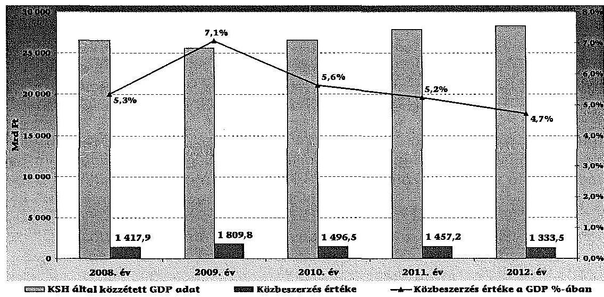
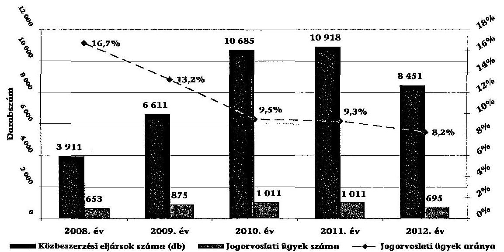
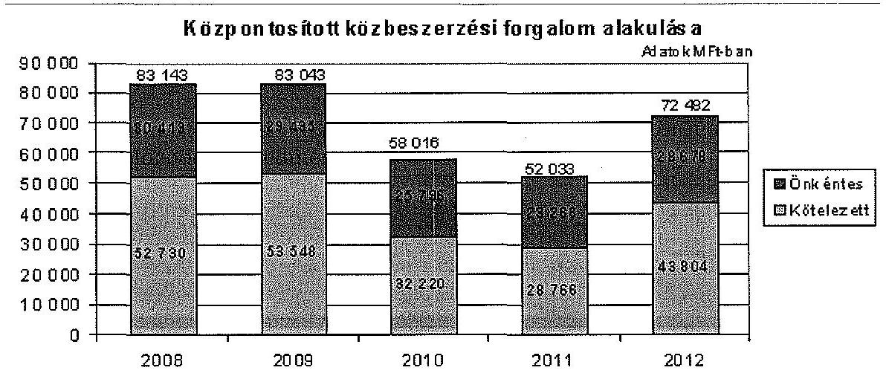
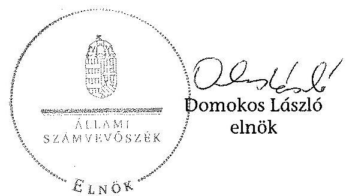
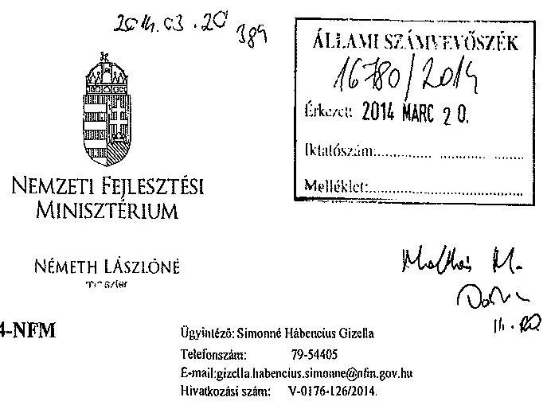
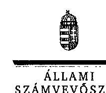
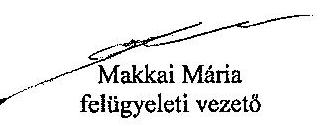
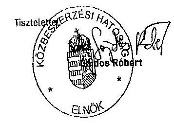
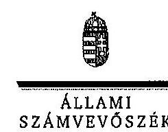
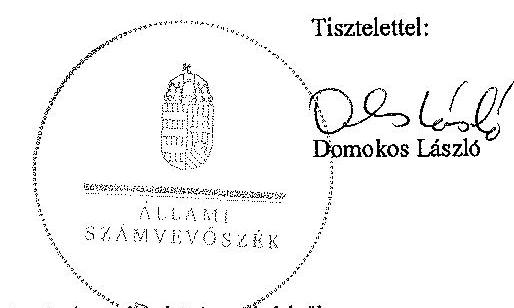

# ÁLLAMI   SZÁMVEVŐSZÉK 

## JELENTÉS

a korábbi és a megújult közbeszerzési rendszer működésének ellenőrzéséről

---

# Állami Számvevőszék 

Iktatószám: V-0176-143/2014.
Témaszám: 1211
Vizsgálat-azonosító szám: V0616

## Az ellenőrzést felügyelte:

Makkai Mária
felügyeleti vezető

Az ellenőrzést vezette és az ellenőrzés végrehajtásáért felelős:
Barta József
ellenőrzésvezető

A számvevői munkaanyagok feldolgozásában és a jelentés összeállításában közreműködtek:
dr. Fekete Andrea Oláh Róbert
számvevő számvevő tanácsos

Az ellenőrzést végezték:

Kováts Tibor Balázs
számvevő
dr. Tóth Viktória
számvevő
Oláh Róbert
számvevő tanácsos
Zagyi Judit
számvevő tanácsos

Az ellenőrzés végrehajtásában közreműködött:
Teski Norbert
számvevő gyakornok

A témához kapcsolódó eddig készített számvevőszéki jelentések:
címe
sorszáma
Jelentés a közbeszerzési rendszer működésének ellenőrzéséről 0831

---

# TARTALOMJEGYZÉK 

BEVEZETÉS ..... 9
I. ÖSSZEGZŐ MEGÁLLAPÍTÁSOK, KÖVETKEZTETÉSEK, JAVASLATOK ..... 13
II. RÉSZLETES MEGÁLLAPÍTÁSOK ..... 23

1. A közbeszerzési rendszer szervezeteinek együttműködése a jogalkotás folyamatában ..... 23
2. A közbeszerzések jogszabályi környezetének változásai ..... 24
2.1. A jogi környezet egyszerűsítése ..... 24
2.1.1. Az eljárásokra vonatkozó előírások alapvető változásai ..... 26
2.1.2. Az ajánlatok értékelési szempontjai ..... 27
2.2. A kkv-k közbeszerzési eljárásokban történő részvételét elősegítő jogszabályváltozások ..... 28
2.2.1. A kkv-k adminisztratív terheinek csökkentése ..... 30
2.2.2. Az ajánlattétel feltételeinek egyszerűsítése ..... 31
2.2.3. Az ellenszolgáltatás kifizetési feltételeinek változása ..... 32
2.3. Az átláthatóbb közpénzfelhasználás elősegítése ..... 33
2.3.1. A közbeszerzési információk nyilvánossága ..... 34
2.3.2. A tisztességtelen piaci magatartás megakadályozására tett intézkedések ..... 35
2.3.3. A jogorvoslati eljárásokra vonatkozó előírások változása ..... 36
3. A közbeszerzések központi intézményeinek működése ..... 37
3.1. A Közbeszerzési Hatóság (Közbeszerzések Tanácsa) közreműködése a közbeszerzési politika alakításában ..... 37
3.1.1. A jogalkalmazás elősegítése érdekében tett intézkedések ..... 37
3.1.2. A KH (KT) részvétele a jogalkotási feladatokban ..... 39
3.1.3. A KH (KT) éves beszámolási kötelezettségének teljesítése ..... 40
3.1.4. Az ellenőrzési, nyilvántartási és adatszolgáltatási rendszerek kiépítése, működtetése ..... 41
3.2. A Közbeszerzési Döntőbizottság tevékenysége ..... 43
3.2.1. A KDB jogorvoslati tevékenysége ..... 43
3.2.2. A hirdetmény közzététele nélküli közbeszerzési eljárások jogszerűségének ellenőrzése ..... 46
3.2.3. Az egységes jogértelmezési gyakorlat megvalósítása ..... 47
3.3. A Közbeszerzési és Ellátási Főigazgatóság működése ..... 48
3.3.1. A feladatellátás szabályozottsága ..... 48
3.3.2. A központosított közbeszerzési portál működtetése ..... 51

---

3.3.3. A KEF együttműködése a központosított közbeszerzési rendszer szervezeteivel ..... 54
4. A közbeszerzések központi ellenőrzését végző szervezet működésének szabályozottsága ..... 55
4.1. A közbeszerzések központi ellenőrzésének és engedélyezésének szabályozottsága ..... 55
4.2. Az ellenőrzési, nyilvántartási és adatszolgáltatási rendszerek kiépítettsége ..... 57
5. Az előző ellenőrzés megállapításaira tett intézkedések ..... 59
5.1. A nemzeti közbeszerzési politikához és a közbeszerzési rendszer fejlesztéséhez kapcsolódó feladatok meghatározottsága ..... 59
5.2. A közbeszerzések monitoring rendszere ..... 59
5.3. Az elektronikus közbeszerzések feltételrendszerének kialakítása ..... 61
5.4. A KH (KT) működésének pénzügyi feltételei ..... 64
5.5. A központosított közbeszerzéseket érintően a szabályozások célszerűségi felülvizsgálata ..... 65
5.6. A biztonsági, nemzetbiztonsági érdeket érintő, vagy különleges biztonsági intézkedést igénylő beszerzések közbeszerzési törvénytől eltérést engedő szabályozásának módosítása ..... 66
5.7. A közbeszerzési szabályok PPP konstrukciók sajátosságait kifejező korrekciója ..... 67
5.8. A Közbeszerzések Tanács részére tett ÁSZ javaslat utóellenőrzése ..... 68
MELLÉKLETEK

1. számú A közbeszerzési rendszer kapcsolati térképe
2. számú Közbeszerzési eljárások statisztikai adatai (2008-2012)
3. számú Közbeszerzési rendszerrel kapcsolatban készített kérdőíves felmérések eredményei
4. számú A Nemzeti Fejlesztési Minisztérium Miniszterének észrevétele
5. számú A Nemzeti Fejlesztési Minisztérium Miniszterének észrevételére adott vá-lasz
6. számú A Közbeszerzési Hatóság Elnökének észrevétele
7. számú A Közbeszerzési Hatóság Elnökének észrevételére adott válasz

---

# RÖVIDÍTÉSEK JEGYZÉKE 

## Jogszabályok

168/2004. (V. 25.) Korm. a központosított közbeszerzési rendszerről, valamint a rendelet
2008. évi módosítás
2010. évi módosítás
új Kbt.
régi Kbt.

## Szórövidítések

| ÁSZ | Állami Számvevőszék |
| :-- | :-- |
| EKOP | Elektronikus Közigazgatás Operatív Program |
| GVH | Gazdasági Versenyhivatal |
| KDB | Közbeszerzési Döntőbizottság |
| KEF | Közbeszerzési és Ellátási Főigazgatóság |
| KFEF | Nemzeti Fejlesztési Minisztérium Közbeszerzési Felügyeleti |
|  | és Ellenőrzési Főosztálya |
| KH | Közbeszerzési Hatóság |
| KHÁT | Nemzeti Fejlesztési Minisztérium Közbeszerzésért Felelős |
|  | Helyettes Államtitkársága |
| KIM | Közigazgatási és Igazságügyi Minisztérium |
| kkv | mikro-, kis-és középvállalkozás |
| KT | Közbeszerzések Tanácsa |
| KSZF | Központi Szolgáltatási Főigazgatóság |
| Munkacsoport | Közbeszerzési Monitoring Munkacsoport |
| NFM | Nemzeti Fejlesztési Minisztérium |
| NFÜ | Nemzeti Fejlesztési Ügynökség |
| NGM | Nemzetgazdasági Minisztérium |
| PPP | Public Private Partnership - a köz- és magánszféra |
|  | együttműködése |
| SZMSZ | Szervezeti és Működési Szabályzat |

---

.

---

# ÉRTELMEZŐ SZÓTÁR 

ajánlatkérő
ajánlattevő
becsült érték
elektronikus árlejtés
gazdasági szereplő
generálklauzula

A minisztériumok, a Miniszterelnökség, a központosított közbeszerzés során ajánlatkérésre feljogosított szervezet, az állam, a helyi önkormányzat és minden költségvetési szerv, a közalapítvány, a helyi és országos nemzetiségi önkormányzat, a helyi önkormányzatok társulása, továbbá a régi Kbt. 22. § (1)-(2) bekezdésében, illetve az új Kbt. 6. § (1) bekezdésben felsorolt további szervezetek.
Természetes személy, jogi személy, jogi személyiség nélküli gazdasági társaság, egyéni cég, vagy személyes joga szerint jogképes szervezet, vagy külföldi székhelyű vállalkozás magyarországi fióktelepe, aki, illetőleg amely a közbeszerzési eljárásban ajánlatot tesz. (régi Kbt. 4. § (1) bekezdés a) pont)
Az a gazdasági szereplő, aki (amely) a közbeszerzési eljárásban ajánlatot nyújt be. (új Kbt. 4. § 1.)
A közbeszerzés értéke; a közbeszerzés megkezdésekor annak tárgyáért általában kért vagy kínált - általános forgalmi adó nélkül számított - legmagasabb összegű ellenszolgáltatás.
(régi Kbt. 35. § (1) bekezdés, illetve új Kbt. 11. § (1) bekezdés)
A közbeszerzési eljárás részét képező olyan ismétlődő folyamat, amely az ajánlatok értékelését követően új, az ellenszolgáltatás mértékére, és az ajánlatnak az értékelési részszempontok szerinti egyes tartalmi elemeire vonatkozó kedvezőbb ajánlat megtételét, és az ajánlatok rangsorolását elektronikus eszköz segítségével, automatizáltan teszi lehetővé. (régi Kbt. 4. § 3/A. illetve új Kbt. 4. § 5. pont)
Bármely természetes személy, jogi személy, jogi személyiség nélküli gazdasági társaság, egyéni cég vagy személyes joga szerint jogképes szervezet, aki, illetve amely a piacon építési beruházások kivitelezését, és/vagy építését, áruk szállítását vagy szolgáltatások nyújtását kínálja. (új Kbt. 4. § 9. pont)
Olyan általános védelmi szabály, amely az adott jogszabályt áthatja, az alapelvek megsértése közvetlen jogorvoslatot biztosít annak elkövetőjével szemben.

---

három ajánlattevős eljárás
keretmegállapodás
mikro-, kis- és középvállalkozás
monitoring
projekttársaság
tervpályázati eljárás
(2011. december 31-ig:
tervpályázat)

A tárgyalásos eljárás 94. § (2) bekezdés b) pontja és (4) bekezdés a) pontja szerinti esetében, valamint ha a rendkívüli sürgősséget előidéző helyzetben az ésszerűen lehetséges, a 94. § (2) bekezdés d) pontja szerinti esetben az ajánlatkérőnek lehetőség szerint legalább három ajánlattevőt kell ajánlattételre felhívnia. (Új Kbt. 95. § (4) bekezdés)
Ha az árubeszerzés vagy szolgáltatás becsült értéke nem éri el a huszonöt millió forintot, vagy az építési beruházás becsült értéke nem éri el a nyolcvan millió forintot (2011. október 11-étől a százötven millió forintot), az ajánlatkérő a 249. § (1) bekezdése szerinti közzététel helyett legalább három ajánlattevőnek köteles egyidejűleg, közvetlenül írásbeli - a 249. § (2) bekezdésében foglaltakat tartalmazó - ajánlattételi felhívást küldeni. (Régi Kbt. 251. § (2) bekezdés)

Meghatározott egy vagy több ajánlatkérő, és egy vagy több ajánlattevő között létrejött olyan megállapodás, amelynek célja, hogy rögzítse egy adott időszakban közbeszerzésekre irányuló, egymással meghatározott módon kötendő szerződések lényeges feltételeit, különösen az ellenszolgáltatás mértékét, és ha lehetséges, az előirányzott mennyiséget. (régi Kbt. 4. § 12. illetve új Kbt. 4. § 12. pont)
Olyan vállalkozás, amelynek összes foglalkoztatotti létszáma 250 főnél kevesebb, és éves nettó árbevétele legfeljebb 50 millió eurónak megfelelő forintösszeg, vagy mérlegfőösszege legfeljebb 43 millió eurónak megfelelő forintösszeg (2004. évi XXXIV. törvény a kis- és középvállalkozásokról, fejlődésük támogatásáról 3. § (1) bekezdés).
Különböző szintű szervezeti célok megvalósításának folyamatát kíséri figyelemmel, melynek során a releváns folyamatokról rendszeres jelleggel, strukturált, döntéstámogató információkhoz jutnak a szervezet vezetői.
A közbeszerzési eljárásban nyertes ajánlattevő(k) kizárólagos részesedésével létrehozott gazdálkodó szervezet.
(a régi Kbt. 304. § (1) bekezdés és az új Kbt. 128. § (1) bekezdés)
Sajátos, külön jogszabályban részletesen szabályozott tervezési versenyforma, amely tervezési feladatok előkészítésére szolgál, illetőleg pályamű alapján a tervező kiválasztásának egyik módja. (régi Kbt. 4. § 36. pont)

---

PPP
versenypárbeszéd
„Public Private Partnerhip", a köz- és magánszféra partnerségét, az állam és a magánszféra együttműködését jelenti, amelyben az állam nemcsak a közszolgáltatások létrehozását, hanem azok ellátását bízza a magánszférára, azaz komplex szolgáltatást vásárol. A projektmegvalósítási konstrukcióban a magánszféra viseli az építési és üzemeltetési kockázatok többségét.
Olyan közbeszerzési eljárás, amelyben az ajánlatkérő a Kbt. szerint kiválasztott részvételre jelentkezőkkel párbeszédet folytat a közbeszerzés tárgyának, a szerződés típusának és feltételeinek pontos meghatározása érdekében, majd ajánlatot kér. (régi Kbt. 4. § 36/A, új Kbt. 101. § (1)(2) bekezdés)

---

# JELENTÉS 

## a korábbi és a megújult közbeszerzési rendszer működésének ellenőrzéséről

## BEVEZETÉS

A közbeszerzések kiemelt szerepet töltenek be a közpénzek és a köztulajdon törvényes és ésszerű módon történő felhasználásában, működésében és ellenőrzésének garancia-rendszerében, ezért a közbeszerzések jogi szabályozása és intézményi rendszere kiemelt jelentőségű a közpénzekkel való gazdálkodás átláthatósága szempontjából.

A közbeszerzéseket a közösségi jog irányelvek útján szabályozza ${ }^{1}$. A magyar közbeszerzési rendszer jogszabályi környezetének kialakítása a jogharmonizáció keretében biztosította a közösségi követelmények érvényre jutását. A közbeszerzésekről szóló 2003. évi CXXIX. törvényt (a továbbiakban: régi Kbt.) az Országgyűlés 2003. decemberben fogadta el, főszabályként 2004. májustól lépett hatályba. A törvény - preambulumában deklarált - célja volt, hogy áttekinthetőbbé, nyilvánossá tegye a közpénzek felhasználását.

A nemzeti és uniós tapasztalatok, a közbeszerzési eljárással szemben támasztott követelmények érvényre juttatása, ezáltal az elérni kívánt célok minél teljesebb körű megvalósítása a törvény többszöri módosításához vezetett.

Az ellenőrzött időszakban a törvény átfogó módosításaira, valamint egy új törvény hatályba léptetésére a következők szerint került sor:

- a régi Kbt. módosításáról szóló 2008. évi CVIII. törvény rendelkezései többségében 2009. április 1-jétől, néhány rendelkezése 2010. január 1-től,

[^0]
[^0]:    ${ }^{1}$ Legfontosabb közösségi jogforrások:

    1. az Európai Parlament és a Tanács 2004/18/EK irányelve (2004. március 31.) az építési beruházásra, az árubeszerzésre és a szolgáltatásnyújtásra irányuló közbeszerzési szerződések odaítélési eljárásainak összehangolásáról
    2. az Európai Parlament és a Tanács 2004/17/EK irányelve (2004. március 31.) a vízügyi, energiaipari, közlekedési és postai ágazatban működő ajánlatkérők beszerzési eljárásainak összehangolásáról
    3. az Európai Parlament és a Tanács 2007/66/EK irányelve (2007. december 11.) a 89/665/EGK és a 92/13/EGK tanácsi irányelvnek a közbeszerzési szerződések odaítélésére vonatkozó jogorvoslati eljárások hatékonyságának javítása tekintetében történő módosításáról
    4. Az Európai Unió Tanácsa 2014. február 11-én új közbeszerzési irányelveket hagyott jóvá.

---

- a régi Kbt. módosításáról szóló 2010. évi LXXXVIII. törvény 2010. szeptember 15-től,
- a közbeszerzésekről szóló 2011. évi CVIII. törvény (a továbbiakban: új Kbt.) 2012. január 1-től lépett hatályba.

A törvénymódosítások egy része alapvető szabályokat érintett (eljárások szereplői, tárgyai, becsült érték, egybeszámítási kötelezettség, az ajánlatkérő eljárási kötelezettségei, ajánlatok formai és tartalmi követelményei, jogsértő szerződések megkötésének megakadályozása, illetve szankcionálása, stb.). A régi Kbt. módosításait, illetve az új törvény megalkotását a jogszabályalkotó összetett célrendszer
 mentén valósította meg.

A régi és az új Kbt. legfontosabb célkitűzéseinek érvényre juttatását a közbeszerzések központi intézményrendszere hivatott biztosítani. Ennek része - a közbeszerzési rendszer fennállása óta az új Kbt. 2012. évi hatályba lépéséig - a Közbeszerzések Tanácsa (a továbbiakban: KT) volt. Az új Kbt. rendelkezik a Közbeszerzési Hatóság (a továbbiakban: KH) működéséről, amely az Országgyűlésnek alárendelt, önállóan működő és gazdálkodó központi költségvetési szerv. A KH keretében működik a Tanács és a Közbeszerzési Döntőbizottság (a továbbiakban: KDB).

A Tanács feladatai közé tartozik a Kbt. szabályai érvényesülésének figyelemmel kísérése, kezdeményezi az arra jogosultnál a közbeszerzésekkel kapcsolatos jogszabályok megalkotását, módosítását, a jogszabály-tervezetek véleményezésével elősegíti a jogalkalmazást, közzétételi kötelezettségeket teljesít, hirdetményellenőrzési feladatokat lát el, figyelemmel kíséri a szerződések módosítását és teljesítését.

A KDB országos hatáskörrel a közbeszerzésekkel kapcsolatos jogorvoslati tevékenység ellátását végzi. Fő feladatai - a közbeszerzésekkel és a tervpályázati eljárásokkal kapcsolatos jogsértő, vagy vitás ügyek miatti jogorvoslat - a jogszabály-módosítások ellenére alapvetően nem változtak.

A közbeszerzési eljárások egy része a hatékonyabb közpénzfelhasználás érdekében központosított közbeszerzések formájában valósul meg. A központosított közbeszerzések végrehajtására kijelölt Közbeszerzési és Ellátási Főigazgatóság ${ }^{2}$ (a továbbiakban: KEF) önállóan működő és gazdálkodó országos hatáskörű költségvetési szerv, amelynek felügyeletét 2010 júliusától ${ }^{3}$ a Nemzeti Fejlesztési Minisztérium (a továbbiakban: NFM) látja el. A szervezet feladata ${ }^{4}$ a központosított közbeszerzési rendszer működtetése, valamint a központosított közbeszerzési rendszer keretén belül megvalósítandó közbeszerzések lebonyolítása. A szervezetek közötti együttműködést bemutató ábrát az 1. sz. melléklet tartalmazza.

[^0]
[^0]:    ${ }^{2}$ A Kormány az 53/2011. (III. 31.) rendeletével a Központi Szolgáltatási Főigazgatóság (KSZF) nevét Közbeszerzési és Ellátási Főigazgatóságra (KEF) változtatta.
    ${ }^{3}$ A Főigazgatóságot korábban a Miniszterelnöki Hivatalt vezető miniszter irányította.
    ${ }^{4}$ 168/2004. (V. 25.) Korm. rendelet a központosított közbeszerzési rendszerről, valamint a központi beszerző szervezet feladat- és hatásköréről.

---

A közbeszerzések jogszabályi előírásai, folyamatos módosításai alapvetően befolyásolták a gazdaságfejlesztési folyamatokat, a közpénz felhasználásának átláthatóságát, ezért a téma a társadalom részéről kiemelt érdeklődéssel bír.

Az Állami Számvevőszék (a továbbiakban: ÁSZ) 2008. évben átfogóan, teljesítményellenőrzés keretében ellenőrizte a közbeszerzési rendszer működését. Az ellenőrzés megállapításaihoz és javaslataihoz kapcsolódóan még nem volt törvény által előírt intézkedési kötelem. Az ellenőrzés óta a közbeszerzési törvényt kétszer módosították átfogó jelleggel, illetve új Kbt. lépett hatályba, melyek tartalmához hozzájárulhattak az számvevőszéki ellenőrzés javaslatai.

Jelen ellenőrzést az ÁSZ a szabályszerűségi ellenőrzés szakmai szabályai szerint végezte el.

Az ellenőrzés célja annak értékelése volt, hogy:

- a korábbi és a megújult közbeszerzési rendszer kialakításában, működtetésében részt vevő szervezetek együttműködtek-e az ellenőrzés hatókörébe vont célkitűzések megvalósításában;
- a közbeszerzések központi intézményei szabályszerű működésükkel hozzájárultak-e az ellenőrzés hatókörébe vont célkitűzések megvalósulásához;
- a közbeszerzések központi ellenőrzését végző szervezet működése szabályszerű volt-e;
- a Kbt. ellenőrzendő időszakban végrehajtott átfogó módosításai, valamint az új törvény rendelkezései elősegítették-e az elérni kívánt, az ellenőrzés hatókörébe vont célkitűzések megvalósulását;
- hasznosították-e az ÁSZ 2008-ban közzétett 0831 számú jelentésében megfogalmazott intézkedést igénylő megállapításokat, javaslatokat.

A közbeszerzési törvény átfogó módosításai, és az új közbeszerzési törvény - az ellenőrzés hatókörébe vont - három célkitűzése:

- a jogszabályi rendelkezések egyszerűbbé, átláthatóbbá tétele, egyes eljárási fajták világosabb szabályozása;
- a kis- és középvállalkozások (kkv-k) közbeszerzésekben való részvételének elősegítése, adminisztratív terheik csökkentése;
- a közpénzek hatékonyabb, átláthatóbb felhasználása.

Az ellenőrzés típusa: szabályszerűségi ellenőrzés
Az ellenőrzés nem terjedt ki a Nemzeti Fejlesztési Ügynökség, illetve az EUTAF európai uniós forrásból támogatott közbeszerzésekkel kapcsolatos ellenőrzési tevékenységének ellenőrzésére. Az EUTAF működésének és gazdálkodásának ellenőrzését az ÁSZ külön ellenőrzés keretében végzi el.

Az ellenőrzés a 2008-2012. közötti évekre terjedt ki.

---

Az ellenőrzés a Közigazgatási és Igazságügyi Minisztérium (a továbbiakban: KIM), a NFM, a KH - 2012. január 1. előtt KT - és a KEF közbeszerzéssel kapcsolatos tevékenységére irányult.

Az ellenőrzés képet ad az ellenőrzött időszakban végrehajtott, a módosítások főbb indokainak megvalósításával kapcsolatos átfogó törvénymódosítások előkészítéséről, valamint a törvényi szabályozás és a közbeszerzés intézményei belső szabályozásának, feladatellátásának erősségeire és gyengeségeire, megjelölve a fejlesztendő területeket is. Az ellenőrzöttek az ÁSZ jelentés hatására a fejlesztendő területeken olyan intézkedéseket hozhatnak, amelyekkel további előrelépések érhetők el a közbeszerzések szabályozásában és az intézményrendszer működésében.

Az ellenőrzés végrehajtására Magyarország Alaptörvénye 43. cikk (1) bekezdése, továbbá az Állami Számvevőszékről szóló 2011. évi LXVI. törvény 5. § (3), (6) és (9) bekezdésében foglaltak adtak jogalapot.

Az ÁSZ a 2011. évi LXVI. törvény 29. §-a szerint a jelentéstervezetet megküldte a Közigazgatási és Igazságügyi Minisztérium Miniszterének, a Nemzeti Fejlesztési Minisztérium Miniszterének, a Közbeszerzési Hatóság Elnökének és a Közbeszerzési és Ellátási Főigazgatóság Főigazgatójának egyeztetésre. A Közigazgatási és Igazságügyi Minisztérium Minisztere és a Közbeszerzési Ellátási Főigazgatóság Főigazgatója nem élt észrevételezési jogával. A Nemzeti Fejlesztési Minisztérium Miniszterének és a Közbeszerzési Hatóság Elnökének beérkezett észrevételét és az azokra adott választ a jelentés 4-7. számú mellékletei tartalmazzák.

---

# I. ÖSSZEGZŐ MEGÁLLAPÍTÁSOK, KÖVETKEZTETÉSEK, JAVASLATOK 

A közbeszerzési rendszer célja a közpénzek ésszerű, hatékony, átlátható felhasználásának és a verseny tisztaságának biztosítása, továbbá a gazdaság fejlődésének és a gazdaságpolitikai célkitűzések teljesülésének az elősegítése. A közbeszerzési rendszer kiemelt fontossága miatt annak fejlesztése, átalakítása a 2010-2012. időszakban kidolgozott kormányprogramokban (pl.: Széll Kálmán Terv 1-2) is megjelent, az eljárások egyszerűsítését, az adminisztrációs terhek csökkentését és az átláthatóság javítását jelölve meg feladatként.

A közbeszerzési eljárások száma Magyarországon az elmúlt időszakban jelentősen megemelkedett, 2008-2012. években 156,6%-kal nőtt. Az ellenőrzött években a legtöbb beszerzést (átlagosan 71,8%-ban) uniós értékhatár alatt, a nemzeti értékhatár feletti beszerzések tették ki.

Az ellenőrzött időszakban Magyarországon a közbeszerzések éves összértéke a GDP 5-7%-át, az államháztartás kiadásainak 8-9%-át tették ki. A közbeszerzési eljárások száma 2008-ról 2011-re csaknem háromszorosára (3911 db-ról 10918 db-ra) nőtt, majd 2012-re 22,6%-kal (8451 db-ra) csökkent. Az összes közbeszerzési eljárás számának és értékének alakulását a 2. sz. melléklet tartalmazza.

Közbeszerzési eljárások értékének alakulása a GDP tükrében (2008-2012)

A közbeszerzések értéke a GDP-hez viszonyítva a 2008-2012. évek közötti időszakban átlagosan 5,6% volt, ami az OECD tagországok átlagos adataival megegyezik.

A 407 szakaszból álló régi Kbt. 32 alkalommal módosult 2008-2011. évek között, a változások a törvény szinte teljes egészét érintették, ennek ellenére nem gondoskodtak a jogszabály újraalkotásáról. A gyakori jogszabályváltozás a tör-

---

vény átláthatóságát negatívan befolyásolta, a jogalkalmazást pedig megnehezítette.

A régi Kbt. 2008. évi átfogó módosítása a közbeszerzési eljárásokhoz kapcsolódó adminisztratív terhek csökkentését, a közbeszerzési eljárás átláthatóságának, nyilvánosságának, a verseny tisztaságának elősegítését, a közbeszerzési rendszer egyszerűsítését célozta. A 2010. évi átfogó módosítás célja az volt, hogy a közbeszerzési eljárásokat akadályozó, lassító, az eredménytelen közbeszerzési eljárások számát növelő előírásokat módosítsa, növelje a mikro-, kis- és középvállalkozások (a továbbiakban: kkv-k) részvételi, illetve nyerési esélyeit.

A régi Kbt. átfogó módosításai és az új Kbt. előírásai egyszerűsítették a közbeszerzési rendszert, az ajánlattétel feltételeit, új rendelkezéseket vezettek be az ellenszolgáltatás kifizetési feltételeinek javítása érdekében.

A közbeszerzési eljárás gyorsabbá tétele érdekében a 2008. évi módosítás 2010. január 1-től - a közösségi értékhatárokat elérő értékű közbeszerzések esetében - bevezette a közbeszerzési hirdetmények elektronikus úton történő feladását, továbbá azt a szabályt, amely szerint az ajánlatkérő nem kérheti azon tények, adatok igazolását, amelyek ellenőrzésére közhiteles elektronikus nyilvántartásból ingyenesen jogosult.

A 2010. évi módosítás a közbeszerzési eljárások gyorsabbá és olcsóbbá tétele érdekében megváltoztatta a hirdetmények nemzeti eljárásrendben történő közzétételét szabályozó rendelkezéseket. A módosítás az egyszerű eljárásban is kötelezővé tette a hirdetmények elektronikus feladását, illetve a hirdetmények Szerkesztőbizottsággal történő ellenőriztetése a közösségi értékhatárokat elérő általános közbeszerzési eljárások esetében csak akkor vált kötelezővé, ha a közbeszerzést uniós támogatásból valósították meg, és nem hivatalos közbeszerzési tanácsadó küldte meg a Szerkesztőbizottságnak. A közösségi értékhatárokat elérő különös közbeszerzési eljárás (közszolgáltatók közbeszerzési eljárása) esetében nem volt kötelező a hirdetményellenőrzés.

A 2010. évi módosítás biztosította továbbá, hogy kisebb formai hibák miatt ne lehessen az ajánlatot érvénytelenné nyilvánítani. Az igazolások benyújtását felváltotta a nyilatkozatok alkalmazása, a hiteles másolat helyett az egyszerű másolat elfogadása, ami jelentős könnyítést jelentett az ajánlattevők, azon belül is különösen a kisebb erőforrásokkal rendelkező kkv-k számára.

A közbeszerzési eljárások gyorsabbá és olcsóbbá tételét segítette elő annak lehetővé tétele az ajánlatkérő számára, hogy hirdetmény helyett kiegészítő tájékoztatás alkalmazásával közölje, hogy a dokumentáció melyik eleme semmis.

Az új Kbt. hatására a közbeszerzési rendszer áttekinthetőbbé, egyszerűbbé, a szabályozás rugalmasabbá vált. Csökkent az eljárások lefolytatási ideje, az ajánlatok értékelési szempontjai egyértelműbbé, egyszerűbbé és átláthatóbbá váltak. A törvény megalkotását a Bevezetőben felsorolt hármas cél (egyszerűbbé tétel, kkv-k részvételének elősegítése, a közpénzfelhasználás átláthatóbbá tétele) megvalósítása indokolta. A közbeszerzés központi intézményi és ellenőrzési szervezeteinek tapasztalatait a jogszabály előkészítők a jogalkotási folyamat egyeztetési szakaszaiban kikérték, a jogcélok elérésének kritériumai szerint figyelembe vették, az egyeztetés a koncepció kidolgozási szakaszától kezdődően végigkísérte a folyamatot.

A régi Kbt-re jellemző túlszabályozással szemben az új Kbt. bevezetésével az alapelvek szerepe megnőtt a közbeszerzési jogalkalmazás területén, ami leszűkítette a visszaélésszerű magatartások lehetőségét.

Az új Kbt. megszüntette a nyílt eljárás szabályainál rögzített alapvető rendelkezésekre történő számos visszahivatkozást, a közzétételre és kommunikációra vonatkozó szabályokat pedig az átláthatóság érdekében külön fejezetben tartalmazza.

Az új Kbt. a nemzeti eljárásrendben gyökeres változásokat hozott az eljárástípusok tekintetében, megszüntette a korábbi nemzeti eljárásrendet, és egy új, egyszerűbb eljárást alakított ki.

Az új nemzeti eljárásrendben árubeszerzés és szolgáltatás megrendelése esetén az ajánlatkérő saját eljárásrendet alkalmazhat, amely jelentős egyszerűsítést jelentett, csökkent a benyújtandó igazolások és nyilatkozatok száma, az eljárásokat rövidebbé tette, az ajánlattevők egyetlen forrásból értesültek a feltételekről. Megszűnt az eredményhirdetés intézménye, amely addig sem volt jogszerűségi garanciát adó rendelkezés, hiszen az ajánlatkérő csupán az átadandó írásbeli összegzést olvasta fel.

A Kbt. átfogó módosításai, illetve az új Kbt. több olyan jogszabályi előírást vezetett be, amelyek alkalmasak a kkv-k közbeszerzési eljárásokban történő nagyobb számú részvételének elősegítésére. Ennek hatására egyre több kkv tudott csökkentett adminisztratív teherrel részt venni közbeszerzési eljárásokban. A kkv-k a nemzeti értékhatár feletti eljárástípusokat tekintve az úgynevezett három ajánlattevős eljárásokban voltak a legsikeresebbek.

A kkv-k által elnyert eljárások száma 2009-ről (4895 db) 2010-re (8473 db) közel duplájára nőtt, azonban az elnyert közbeszerzések értéke jelentős mértékben nem növekedett (707,3 Mrd Ft-ról 715,4 Mrd Ft-ra). A kkv-k az összes közbeszerzéshez viszonyítva az ellenőrzött időszakban minden évben az eljárások 70,8-80,4%-a közötti arányban nyertek, az elnyert munkák, szállítások értéke az összes közbeszerzés értékéhez viszonyítva 34,5-47,8% körül mozgott. Ez az arány 2011-2012. között folyamatosan csökkent, 2010-ben 47,8%, 2011-ben 41,7%, 2012-ben pedig 34,5% volt.

Az új Kbt. bevezetése után, 2012-ben javult a kkv-k teljesítménye mind az elnyert eljárások számának (80,40%-ról 84,16%-ra változott),
 mind az értékének ( $41,68 \%$-ról $49,95 \%$-ra változott) vonatkozásában. A javulást főként a kkv-k által a nemzeti eljárásrendben elnyert közbeszerzések arányának növekedése eredményezte.

A régi Kbt. 2008. évi módosítása bevezette a részajánlattétel lehetőségét annak érdekében, hogy a kkv-k a közbeszerzési eljárások során ne kerüljenek indokolatlan versenyhátrányba.

---

A 2010. évi módosítás az árubeszerzés és szolgáltatás esetén 100 M Ft-ra szállította le azt az értéket, amelyet meghaladó árbevételű cégeknek a közbeszerzési eljárásban való ajánlattételét az ajánlatkérő kizárhatja. A korábbi szabályozás szerint az ajánlatkérő az egyszerű közbeszerzési eljárásban való részvétel jogát az éves nettó 1 Mrd Ft árbevételt el nem érő ajánlattevők számára tarthatta fenn. Bővítette továbbá a nagy árbevételű cégek közbeszerzési eljárásokból való kizárásának lehetőségét, ezzel elősegítve a kkv-k nagyobb arányú szereplésének lehetőségét.

A kkv-k részvételének elősegítését szolgálta a Kbt. 2011. október 8-ától hatályos módosítása, amely amellett, hogy a közbeszerzési eljárás útján megvalósítandó építési beruházás becsült értékének alsó határát - ami alatt ún. három ajánlattevős eljárás alkalmazandó - 80 M Ft-ról 150 M Ft-ra emelte, bevezette, hogy az ajánlatkérő köteles olyan gazdasági szereplők részére ajánlattételi felhívást küldeni, amelyek kkv-knak minősülnek.

A 2010. évi módosítás a pénzügyi alkalmasság igazolása körében egyszerűbb szabályokat vezetett be és a teljesítési biztosíték szabályait részletesen meghatározta, megkönnyítve a kkv-k részvételét a közbeszerzési eljárásokban.

Az új Kbt. a kkv-k esélyeit és teljesítési képességeit javította az építési beruházás és az uniós értékhatárt elérő értékű szolgáltatás megrendelése esetén, az ajánlattevők előlegre vonatkozó jogosultságának rögzítésével.

Az új Kbt. az adminisztrációs terheket csökkentő rendelkezéseket vezetett be, lehetővé vált az eljárási cselekmények elektronikus gyakorlása, egyszerűsödtek a közbeszerzési eljárás során a jegyzőkönyv készítésére vonatkozó előírások, továbbá az ajánlatkérő a nem magyar nyelven benyújtott dokumentumok ajánlattevő általi fordítását is köteles elfogadni.

Az új Kbt. egyszerűsítette az egybeszámítási kötelezettség számítási szabályait, amelynek hatására több közbeszerzés valósítható meg az egyszerűbb nemzeti eljárásrend keretei között.

Az átláthatóbb közpénzfelhasználás elősegítése érdekében a nyilvánosságra vonatkozó részletesebb előírásokat léptettek hatályba. Szigorúbbak lettek a szerződések nyilvánosságával összefüggő, valamint a tisztességtelen piaci magatartás megakadályozására vonatkozó jogszabályi előírások.

A 2008. évi módosítás új, „a közbeszerzési eljárás nyilvánossága" alcímmel egészítette ki a törvényt. Előírta, hogy a közbeszerzési eljárással kapcsolatos információt az ajánlatkérőnek a honlapján közzé kell tennie. Kötelezővé tette az ajánlatkérők számára azon szerződések közzétételét, amelyeket a közbeszerzési szerződés megkötését követő öt éven belül megkötöttek a nyertes ajánlattevőkkel.

Előírta, hogy az eredményhirdetés után az ajánlatkérőnek lehetőséget kell biztosítania az ajánlatokba történő betekintésre.

A 2008. évi módosítás bevezette annak lehetőségét, hogy amennyiben az ajánlatkérőnek gyanúja merült fel, hogy az ajánlattevők versenykorlátozó megállapodást kötöttek, az ajánlatkérő jelzéssel élhet a Gazdasági Versenyhivatal (a

---

továbbiakban: GVH) felé, amely a bejelentés alapján versenyfelügyeleti eljárását hivatalból indíthatja meg. Az ellenőrzött időszakban a GVH nem állapította meg magatartás törvénybe ütközését, és bírságot sem szabott ki.

A 2010. évi módosítás egyértelművé tette, hogy az erőforrást nyújtó szervezetnek is igazolnia kell alkalmasságát. Előírták, hogy az ajánlatok bontásán lehetőséget kell adni a felolvasó lap megtekintésére, az össze nem füzött ajánlat eredeti példányát a bontáskor az adott ajánlattevő fűzze össze.

Az új Kbt. új szabályként vezette be, hogy az ajánlatkérő a bontást megelőzően köteles nyilvánosan ismertetni a szerződés teljesítéséhez rendelkezésre álló fedezet nagyságát. Módosította az összeférhetetlenségi szabályokat, azt a konkrét eset körülményei szerint kell megítélni, szabályozta továbbá a hiánypótlással és az ajánlatokkal kapcsolatos felvilágosítás körét is.

A korábbi előírások szerinti szerződés teljesítéséről szóló tájékoztatót tartalmazó hirdetmény helyett az új Kbt. részletesebb információk közzétételét írta elő.

Az új Kbt. az összefonódások tilalmára vonatkozó, a versenyt korlátozó megállapodások megakadályozása érdekében korlátozza, hogy a közbeszerzési eljárásban az ajánlattevők (részvételre jelentkezők) között milyen kapcsolat engedhető meg.

A jogorvoslati eljárásokra vonatkozó szabályok egyszerűbbek, ugyanakkor szigorúbbak is lettek. Meghosszabbították a jogsértő felhívások és dokumentációk megtámadási határidejét, lehetővé vált továbbá a jogorvoslati eljárás megindítása akkor is, ha a kérelmező nem kért előzetes vítarendezést. Kiemelendő szigorodás a kérelemre indult eljárásért fizetendő igazgatási szolgáltatási díjak jelentős mértékű megemelése, amely hozzájárult az alaptalan kérelmek benyújtásának visszaszorításához. A megalapozott jogorvoslati kérelmet benyújtó kérelmező számára a befizetett jogorvoslati díj a 2011. évtől visszajár.

A közbeszerzésekre szakosodott önálló szervezet, a KH (KT) az ellenőrzött években a közbeszerzési politika alakításában szerepet vállalt, a jogalkalmazók tevékenységének megkönnyítése érdekében aktívan közreműködött. A KH (KT) elnöki tájékoztatók és útmutatók kiadásával, a közérdekű bejelentések kezelésével, ezek alapján kezdeményezett jogorvoslati eljárásokkal segítette a közbeszerzési eljárások lefolytatását, a folyamatok egyszerűbbé és átláthatóbbá tételét. A jogalkalmazók tevékenységének megkönnyítése érdekében szakmai tájékoztatást nyújtott a közbeszerzésekkel kapcsolatos jogszabályok gyakorlati alkalmazásáról.

A KH (KT) a régi és az új Kbt-ben előírt, a közbeszerzésekben résztvevők oktatásával összefüggő feladatellátása során a referens szakképesítés tekintetében az NFM Közbeszerzésért Felelős Helyettes Államtitkárságával együtt felügyelte és koordinálta a közbeszerzési képzéseket. A KH (KT) tevékenysége során figyelemmel kísérte a régi és az új Kbt. szabályainak érvényesülését és módosítási javaslatokat terjesztett elő a jogszabály előkészítő szervezetnél.

A KH (KT) a 2008-2012. évek között a régi és az új Kbt. által meghatározott feladatainak megfelelően a - részére megküldött - közbeszerzésekkel és a KH (KT)

---

működésével kapcsolatos jogszabálytervezeteket, és a hozzájuk kapcsolódó végrehajtási rendeletek módosításait véleményezte. 2011-ben a KT részt vett az új közbeszerzési rendszer kialakítása érdekében indított kodifikációs munkában.

A KH (KT) a törvényi előírásoknak megfelelően az ellenőrzött időszakban évente beszámolót készített a tevékenységéről, melyek tartalmazták a közbeszerzések tisztaságával és átláthatóságával kapcsolatos tapasztalatokat, a jogorvoslatok tapasztalatait, valamint megállapításokat a közbeszerzési eljárások számának és értékének alakulásáról, a kkv-k helyzetéről. A törvényi előírásokkal ellentétben azonban csak korlátozottan tartalmaztak megállapításokat a hazai ajánlattevőkről. ${ }^{5}$

A KH (KT) a törvényi előírásoknak megfelelően - két adatbázistól eltekintve - naprakészen vezette és honlapján közzétette a törvény által előírt adatbázisokat, információkat. A törvényi előírások ellenére KH (KT) a KDB által hozott határozatok bírósági felülvizsgálata esetén a bíróság döntését tartalmazó határozatok adatbázisát nem vezette, és nem tette közzé a honlapján. A KH (KT) az egyes ágazatokban szokásos vagy megállapított béreket és kapcsolódó közterheket tartalmazó adatbázis közzétételére vonatkozóan kötelezettségének részben tett eleget, a helyszíni ellenőrzés időtartama alatt csak egy szakmai kamara által kidolgozott számítási segédletet tett közzé az ágazatra vonatkozó bérekről, vállalkozói díjakról és a kapcsolódó közterhekről. Az információnak a Kbt. szerinti, aránytalanul alacsony ár megítélése szempontjából van jelentősége. A hiányossághoz hozzájárult, hogy a Kbt. 2010. szeptemberi és 2012. januári módosításaival az ágazati bérinformációk összegyűjtését biztosító jogszabályi előírások megszűntek. A szükséges információk egy része azonban továbbra is nyilvános, elérhető.

A közbeszerzésekkel kapcsolatos jogorvoslati tevékenységet ellátó KDB eljárásainak száma 2008-2011. években nőtt, illetve stagnált. A jogorvoslati eljárások számában jelentős csökkenés ( $1011 \mathrm{db}$-ról $695 \mathrm{db}$-ra ) az új Kbt. és a Közbeszerzési Döntőbizottság által kiszabható szankciókról és alkalmazásuk részletes szabályairól, valamint a Közbeszerzési Döntőbizottság eljárásáért fizetendő igazgatási szolgáltatási díjról szóló 288/2011. (XII. 22.) Korm. rendelet hatályba lépését követően 2011. évről 2012. évre figyelhető meg.

A csökkenéshez hozzájárultak az új Kbt. által bevezetett egyszerűsítések, az eljárásért fizetendő igazgatási szolgáltatási díjak emelkedése, továbbá a közbeszerzések központi ellenőrzéséről és engedélyezéséről szóló 46/2011. (III. 25.) és a 4/2011. (I. 28.) Korm. rendelettel bevezetett felügyeleti tevékenység.

[^0]
[^0]:    ${ }^{5}$ A Közbeszerzési Hatóság T/507/2/2014. sz. levelében közölt észrevétele szerint, „A Hatóság éves beszámolói tartalmaznak az ajánlattevőkre vonatkozó adatokat, a mikro-kis- és középvállalkozásokra és a külföldi székhelyű vállalkozásokra tekintettel, például: a „A közbeszerzések számokban", a „Külföldi székhelyű ajánlattevők részvétele", a „Mikro-, kis- és középvállalkozások (kkv-k részvétele) fejezetekben ezen speciális ajánlattevői csoportok tekintetében."

---

# Közbeszerzési jogorvoslati ügyek száma és aránya a KDB-nél (2008-2012) 

A 2008-2010. évek között a KDB-nél megtámadott jogorvoslati ügyeknek a lefolytatott közbeszerzési eljárásokhoz viszonyított aránya jelentősen csökkent ( $16,7 \%$-ról $9,5 \%$-ra), majd ezt követően is tovább mérséklődött, legalacsonyabb értékét 2012-ben érte el $(8,2 \%)$.

A KDB által megállapított jogsértések száma az ellenőrzött időszak első négy évében növekedett, 2012-ben mind a jogsértések száma, mind az egy jogsértésre jutó bírság összege csökkent. 2008-ban az egy jogsértésre jutó bírság összege meghaladta a 2 M Ft-ot, míg 2012-re a kiszabott összeg már nem érte el az 1 M Ft-ot sem.

Az új Kbt. az egységes jogorvoslati gyakorlat biztosítása érdekében a KDB részére bevezette az elvi döntés intézményét. Ennek elsődleges célja az volt, hogy minimálisra csökkentse a Kbt. egyes szabályainak a KDB eljárása során történő sokfelé ágazó értelmezési lehetőségeit, és egyúttal azt a bizonytalansági tényezőt is, melyet a múltban sorra keletkező, egymásnak sok esetben ellentmondó indokolású határozatok megalkotása okozott. Az új Kbt. előírásának megfelelően 2012. évben a KDB - a közbeszerzési biztosokat magában foglaló - összkollégiumot működtetett, amely elemezte a KDB gyakorlatát és véleményt nyilvánított jogalkalmazási kérdésekben.

A KDB Szervezeti és Működési Szabályzata (a továbbiakban: SZMSZ) rögzíti, hogy a KDB elnöke az egységes döntőbizottsági jogértelmezés kialakítása érdekében legalább háromhavonta munkaértekezletet tart a kialakult joggyakorlat elemzése tárgyában. A KDB 2008-2011. évek közötti működése során nem tartotta be a gyakoriságra vonatkozó előírást. 2012. évben a KDB az új Kbt-nek és az SZMSZ-ben leírtaknak megfelelő gyakorisággal, összesen hétszer tartott összkollégiumi ülést.

---

A központosított közbeszerzés célja az állami ráfordítások csökkentése, a költségvetési előirányzatok tervszerű felhasználása, valamint a központi beszerzési rendszerben rejlő előnyök közigazgatási célú hasznosítása. ${ }^{6}$

A Közbeszerzési és Ellátási Főigazgatóságról szóló 53/2011. (III. 31.) Korm. rendelet határozza meg a KEF feladatait és működésének rendjét. A kormányrendelet a szervezet feladatainak meghatározásakor ${ }^{7}$, a 2011-ben hatályát vesztett, régi Kbt-re hivatkozik. A jogi koherencia-zavar a helyszíni ellenőrzés időszakában is fennállt.

Az ellenőrzött időszakban a központosított közbeszerzéshez való csatlakozás, és az eljárások lebonyolításának rendjét KEF (KSZF) főigazgatói utasítások szabályozták. A KEF az ellenőrzött időszakban nem alakított ki a működéséhez szükséges kockázatkezelési rendszert, az ellenőrzési nyomvonalak kialakítására 2012. november 3-án, a tevékenységek kockázatának felmérésére 2013. április 30-án került sor.

A KEF által működtetett központosított közbeszerzések értéke a 2009-2011. időszakban $37,3 \%$-kal csökkent. A visszaesést elsősorban a kormányzati kiadáscsökkentő intézkedések eredményezték. A központosított közbeszerzés forgalmának nagyobb részét ( $55-64 \%$-át) a rendszer használatára kötelezett intézmények adták. Az előző évhez képest 2012-ben mindkét kategóriában (kötelezett és önként csatlakozott intézmények) bővülés volt megfigyelhető, a központosított közbeszerzési rendszer forgalma $39,3 \%$-kal nőtt.

A Közbeszerzési Portál 2004-ben kezdte meg működését, melynek célja a központosított közbeszerzés számítógépes támogatása. Az intézményi adatok tekintetében a központosított közbeszerzési rendszerről, valamint a központi beszerző szervezet feladat és hatásköréről szóló 168/2004. (V. 25.) Korm. rendelet ${ }^{8}$ (a továbbiakban: 168/2004. (V. 25.) Korm. rendelet)
 által előírt adatszolgáltatások alacsony szinten teljesültek, ami akadályozta a beszerzési igények megalapozott előrejelzését.

A 168/2004. (V. 25.) Korm. rendelet a központosított közbeszerzésre kötelezett intézmények számára előírta a központi elektronikus szolgáltató rendszer részét képező ügyfélkapun keresztül történő bejelentkezést. A KEF portál és az ügyfélkapu közötti kapcsolat nem került kialakításra, így az intézményeknek nem volt lehetőségük az ügyfélkapun keresztül történő bejelentkezésre.

A 168/2004. (V. 25.) Korm. rendelet előírja a KEF számára az együttműködési kötelezettséget a központosított közbeszerzési rendszer keretében feladatot ellátó egyéb szervezetekkel, valamint a kötelezettségvállalásokat nyilvántartó államháztartási szervekkel. Az ellenőrzött időszakban a KEF az NFM-mel, továbbá a 2010. és 2011. években az Informatikai Vállalkozások Szövetségével folytatott együttműködést, más szervezetekkel együttműködés kialakítására nem került sor.

[^0]
[^0]:    ${ }^{6}$ 168/2004. (V.25.) Korm. rendelet
    ${ }^{7}$ 53/2011. (III. 31.) Korm. rendelet 3. § (1) bekezdés e) pontja
    ${ }^{8}$ 168/2004. (V. 25.) Korm. rendelet 16. § (1) bekezdés

---

Az NFM-en belül a közbeszerzések ellenőrzési és engedélyezési, továbbá a jogszabály-előkészítő feladatokat a Közbeszerzésért Felelős Helyettes Államtitkárság (a továbbiakban: KHÁT) végezte. Az NFM-nél a jogszabályi előírásnak megfelelően kialakították és működtették a közbeszerzések központi ellenőrzésének és engedélyezésének eljárási rendszerét, valamint az ehhez szükséges nyilvántartási és adatszolgáltatási rendszert (KKITI), amely a 168/2004. (V. 25.) Korm. rendelet hatálya alá tartozó intézményi kör közbeszerzési eljárásairól a KH honlapjára feltöltött adatoknál szélesebb körű és a közbeszerzési eljárásokhoz rendelt felügyelők által ellenőrzött információkat és dokumentumokat kezel.

A KHÁT az ellenőrzési feladatainak ellátása keretében vizsgálta a beszerzéseket kezdeményező szervezetek által megküldött dokumentációkat, 2011. évben 1242 db eljárás, 2012. évben összesen 2328 db eljárás ellenőrzését végezte el. Az NFM által ellenőrzött eljárások közül 2012-ben ${ }^{9}$ a KDB-nél 48 esetben kezdeményeztek jogorvoslati eljárást, és a KDB 12 esetben találta megalapozottnak a kérelmet. Ez az eljárások 0,5%-a, ami a többi közbeszerzési eljárásra jellemző arányszámnál ( $3,8 \%$ ) kedvezőbb. Az ellenőrzési és felügyeleti rendszer hozzájárult a közbeszerzési eljárások előkészítése és lebonyolítása során a jogszabályi előírások érvényesítéséhez, az eljárások szabályosságának és indokoltságának vizsgálatán keresztül elősegítette a felelős közpénzfelhasználást.

A közbeszerzési rendszer központi intézményei a közbeszerzési rendszer működtetésével, felügyeletével és központi ellenőrzésével összefüggő feladataikat - a jelentésben bemutatott kivételektől eltekintve - a jogszabályi előírásoknak megfelelően látták el és működésükkel hozzájárultak az ellenőrzés hatókörébe vont célkitűzések teljesüléséhez.

Az ÁSZ 2008-ban átfogóan, teljesítmény-ellenőrzés keretében ellenőrizte a közbeszerzési rendszer működését. Az ÁSZ jelentésben megfogalmazott javaslatok közül a közbeszerzési rendszer kormányzati felelősének kijelölésére vonatkozó javaslata hasznosult. Az NFM KHÁT 2011. évi létrehozásával a közbeszerzésre vonatkozó jogszabályok előkészítésével, egyeztetésével, a közbeszerzési folyamatok felügyeletével és ellenőrzésével kapcsolatos kormányzati szintű feladatok és felelősségek rendezetté váltak.

A központosított közbeszerzéseket érintő szabályozások célszerűségi felülvizsgálatára vonatkozó ÁSZ javaslat részben hasznosult. A beszerzési eljárások egyszerűsítésére vonatkozó javaslatok közül az elektronikus árlejtés kötelező előírása - az ÁSZ javaslatnak megfelelően - megszűnt.

Az egységes közbeszerzési rendszer kialakítására vonatkozó ÁSZ javaslat részben hasznosult. A KH (KT) 2010-2012. időszakban végrehajtott informatikai fejlesztései az ÁSZ javaslat szempontjából előremutatóak, hozzájárulnak ahhoz, hogy a közbeszerzési rendszer fejlesztését célzó döntések a korábbi időszaknál mélyebb statisztikai elemzéseken alapuljanak. A közbeszerzési rendszerről összegyűjtött információkat teljes körűen és egységes rendszerben kezelő, közbeszerzési monitoring rendszer kialakítása nem valósult meg.

[^0]
[^0]:    ${ }^{9}$ 2012. szeptember 15-ig

---

Az Állami Számvevőszékről szóló 2011. évi LXVI. törvény 33. § (1) bekezdésében foglaltak értelmében a jelentésben foglalt megállapításokhoz kapcsolódó intézkedési tervet köteles az ellenőrzött szervezet vezetője összeállítani, és azt a jelentés kézhezvételétől számított 30 napon belül az ÁSZ részére megküldeni. Amennyiben az intézkedési tervet határidőben nem küldi meg a szervezet, vagy az nem elfogadható, az ÁSZ elnöke a hivatkozott törvény 33. § (3) bekezdés a)-b) pontjaiban foglaltakat érvényesítheti.

Az ellenőrzés intézkedést igénylő megállapításai és javaslatai:

# A nemzeti fejlesztési miniszternek 

A KEF-ről szóló 53/2011. (III. 31.) Korm. rendelet a közbeszerzésekről szóló 2003. évi CXXIX. törvényre hivatkozik, amely 2012. január 1-ével hatályát vesztette. A hibás jogszabályi hivatkozás jogi koherencia-zavart okoz.

Javaslat:
Kezdeményezze az 53/2011. (III. 31.) Korm. rendelet módosítását a koherencia-zavar megszüntetése céljából.

## A Közbeszerzési Hatóság elnökének

A KH (KT) az egyes ágazatokban szokásos vagy megállapított béreket és kapcsolódó közterheket tartalmazó adatbázis közzétételére vonatkozóan kötelezettségének részben tett eleget. A helyszíni ellenőrzés időtartama alatt csak egy szakmai kamara által kidolgozott számítási segédletet tett közzé az ágazatra vonatkozó bérekről, vállalkozói díjakról és a kapcsolódó közterhekről. Az információnak a régi és az új Kbt. szerinti, aránytalanul alacsony ár megítélése szempontjából van jelentősége.

Javaslat:
Gondoskodjon az egyes ágazatokban szokásos vagy megállapított bérekre és a kapcsolódó közterhekre vonatkozó információk összegyűjtéséről és közzétételéről.

## A Közbeszerzési és Ellátási Főigazgatóság főigazgatójának

A 168/2004. (V. 25.) Korm. rendelet a központosított közbeszerzésre kötelezett intézmények számára előírta a központi elektronikus szolgáltató rendszer részét képező ügyfélkapun keresztül történő bejelentkezést. A KEF portál és az ügyfélkapu közötti kapcsolat nem került kialakításra, így az intézményeknek nem volt lehetőségük az ügyfélkapun keresztül történő bejelentkezésre.

Javaslat:
Intézkedjen a KEF Portál továbbfejlesztéséről vagy új rendszer kialakításáról annak érdekében, hogy a rendszer támogassa az ügyfélkapun keresztül történő bejelentkezést.

---

# II. RÉSZLETES MEGÁLLAPÍTÁSOK 

## 1. A KÖZBESZERZÉSI RENDSZER SZERVEZETEINEK EGYÜTTMŰKÖDÉSE A JOGALKOTÁS FOLYAMATÁBAN

A közbeszerzési rendszer jogalkotási feladatait a közbeszerzésért felelős helyettes államtitkár irányításával az NFM vagyonpolitikáért felelős államtitkársága végezte. A kodifikáció és a jogharmonizációnak történő megfelelőség ellenőrzése a KIM igazságügyért felelős államtitkársága hatáskörébe tartozott. A jogalkalmazás irányító és ellenőrző szervezete KH (KT), amely az Országgyűlésnek alárendelve látta el feladatát.

A jogszabályok alkotását, változtatását a jogalkotásról szóló 1987. évi XI. törvény, majd 2011. január 1-jétől a jogalkotásról szóló 2010. évi. CXXX. törvényben, valamint a jogszabályok előkészítésében való társadalmi részvételről szóló 2010. évi CXXXI. törvény előírásai alapján kellett elvégezni.

A közbeszerzési rendszer működését és felügyeletét biztosító központi intézmény az új Kbt. hatálybalépéséig a KT volt, ezután a feladatot kiegészített hatáskörrel, jogfolytonosan a KH látta el. A központosított közbeszerzés feladatait ellátó központi intézmény 2012. január 1-ig a KSZF, ezt követően a KEF volt. A szervezetek az elődszervezetek jogutódlásával, megújított jogszabályi keretek között alakultak meg.

Az ellenőrzés időszaka alatt 2008-tól a régi Kbt., 2012. január 1-jétől az új Kbt. volt hatályban. A 407 szakaszból álló régi Kbt. 2008-2011. évek között 32 alkalommal módosult, a változások a törvény teljes egészét érintették. Ennek ellenére nem gondoskodtak a jogszabály újraalkotásáról, a gyakori jogszabályváltozások a törvény átláthatóságát akadályozták, a jogalkalmazást megnehezítették.

A jogszabály 2008-ban kilenc helyen, 2009-ben 1066 helyen, 2010 évben 509 helyen módosult.

A törvény változásai egy új jogszabály létrehozásának szükségességét vetítették előre. Az új Kbt. megalkotásának és elfogadásának feladatát az első „Széll Kálmán Terv" 2011. július 1-jei határidővel írta elő, amely kiemelte, hogy a törvény alkalmazásának egyszerűnek, gyorsnak és átláthatónak kellett lennie. A törvénytervezet koncepciója 2011 márciusában elkészült, és elindították a szakmai egyeztetést a törvényelőkészítő munkaanyag kiadása érdekében.

Előzetes társadalmi, gazdasági, költségvetési és adminisztratív hatásvizsgálatokra az időkorlátok szűkössége miatt nem került sor. A jogalkotási törvény értelmében, rendkívüli sürgősség és kiemelt gazdasági érdek esetén a hatásvizsgálatok mellőzhetők. Az NFM KHÁT által kidolgozott koncepció egyeztetésében a KT, az ÉVOSZ és a Nemzetgazdasági Minisztérium (a továbbiakban: NGM) vett részt.

---

Az új Kbt. hatálybalépésének időpontja 2012. január 1., néhány szabálya esetében 2011. augusztus 21. volt. A végrehajtási rendeletek esetében minden rendelettervezet előkészítését előzetes hatásvizsgálat előzte meg, a szakági egyeztetések lezajlottak.

Az NFM a törvény előkészítés folyamata során egyeztetést folytatott - a közbeszerzés központi intézményei mellett - a jogalkalmazók képviselőivel. A beérkezett észrevételeket a jogszabállyal szemben támasztott alapvető kormányzati cél szerint kialakított kontroll alapján szűrték, a fennmaradó javaslatokat beépítették a törvénytervezetbe. Az egyeztetésekről emlékeztetők készültek.

A jogszabályok előkészítésében való társadalmi részvételről szóló 2010. évi CXXXI. törvény a törvényalkotási folyamatban a jogszabály előkészítéséért felelős miniszter számára lehetőséget biztosított stratégiai partnerségi megállapodások kötésére az érdekelt szakmai szervezetekkel. Az ellenőrzött időszakban az új Kbt. kidolgozásához kapcsolódóan az együttműködés kereteit az NFM stratégiai partnerségi megállapodásokban nem rögzítette.

Az ellenőrzés időszakában több közbeszerzésekkel foglalkozó kutatás készült, amelyeket a Budapesti Corvinus Egyetem, a Gazdaságkutató Zrt., M.Á.S.T. Pi-ac- és Közvéleménykutató Társaság, illetve az NFM végzett.

A Budapesti Corvinus Egyetem által végzett felmérések célja az etikai és hatékonysági, valamint a fenntartható közbeszerzéshez kapcsolódó kérdések vizsgálata volt. A válaszadók többsége úgy vélte, hogy kevéssé, vagy csak közepesen felel meg a közbeszerzési szabályozás annak az igénynek, hogy milyen mértékben hagyja érvényesülni a piaci folyamatokat. A fenntarthatósággal kapcsolatban a hatékony közpénzköltést, a túlszabályozás mérséklését, a korrupció elleni küzdelmet és a kkv-k támogatását várták elsősorban.

Az NFM 2012 augusztusában kérdőíves felmérést készített, amelyre az új Kbt-ben meghatározott célok teljesülésének vizsgálata érdekében került sor. A megkérdezettek az új Kbt. pozitív intézkedésének értékelték, hogy csökkent az ajánlattételhez szükséges adminisztráció, csökkentek az ajánlattétel költségei, az alkalmasság igazolása több szempontból könnyebbé vált. A témával kapcsolatban készült kutatások, valamint az ÁSZ „Korrupciós kockázatok feltérképezése Integritás alapú közigazgatási kultúra terjesztése" című projektjének összegzését a 3. sz. melléklet tartalmazza.

# 2. A KÖZBESZERZÉSEK JOGSZABÁLYI KÖRNYEZETÉNEK VÁLTOZÁSAI 

### 2.1. A jogi környezet egyszerűsítése

A közbeszerzéseket 2011. december 31-ig a régi Kbt. szabályozta, amelyet 2003-ban az Országgyűlés a közpénzek átláthatóságának és széles körű nyilvános ellenőrizhetőségének megteremtése, a verseny tisztaságának biztosítása érdekében fogadott el. A törvény hatálybalépése óta számos alkalommal módosult, amely megnehezítette a jogalkalmazást.

---

2008-2011. években a 407 szakaszból álló régi Kbt. 32 alkalommal módosult, a változások a törvény szinte teljes egészét érintették, ennek ellenére nem gondoskodtak a jogszabály újraalkotásáról. A gyakori jogszabályváltozás a törvény átláthatóságát negatívan befolyásolta, a jogalkalmazást megnehezítette.

A régi Kbt. első átfogó módosítására 2008. évben került sor. A módosítás a közbeszerzési eljárásokhoz kapcsolódó adminisztratív terhek csökkentését, a közbeszerzési eljárás átláthatóságának, nyilvánosságának, a verseny tisztaságának elősegítését, a közbeszerzési rendszer egyszerűsítését célozta.

A Kbt. második átfogó módosítására 2010. évben került sor, amely a közbeszerzési eljárásokat akadályozó, az eredménytelen közbeszerzési eljárások számát növelő előírásokat módosította, növelni kívánta a kkv-k részvételi, illetve nyerési esélyeit, továbbá a közpénzfelhasználás átláthatóságát növelő intézkedéseket vezetett be.

A szabályozási környezet egyszerűsítése 2008-tól az új Kbt. megalkotásáig folyamatosan jelenlévő jogalkotói törekvés volt. A Kormány 2011 márciusában a Széll Kálmán tervben követelményként jelölte meg, hogy az átláthatatlan és lassú közbeszerzési rendszer helyett az egyszerű, gyors és átlátható közbeszerzésre való áttérést.

A régi Kbt. hatályon kívül helyezésével egyidejűleg 2012. január 1-től az új Kbt. hatályos. A régi Kbt. 407 paragrafusával szemben az új Kbt. 183 paragrafust tartalmaz, amely átláthatóbb szabályozást eredményezett.

Az új Kbt. új, alapelvi szintű szemléletet vezetett be, amely alapján
 nem minden magatartás tilos alapvetően, amit a törvény nem szabályoz kifejezetten, feltéve, hogy az a törvénnyel és annak alapelveivel nem ellentétes. Nem lehetséges minden élethelyzetet lefedő szabályokat alkotni, ezért az új szabályozás alapja, hogy a jogalkalmazónak a törvény céljára és alapelveire figyelemmel kell eljárnia.

Az új Kbt. bevezetésével a - generálklauzulaként ${ }^{10}$ működő - alapelvek szerepe megnőtt a közbeszerzési jogalkalmazás területén, amely a túlszabályozás ellen, a visszaélésszerű magatartásokkal szemben nyújt megoldást. Új alapelveket vezetett be, úgy mint a közpénzek ésszerű és hatékony felhasználása és nyilvános ellenőrizhetőségének megteremtése, a mikro-, kis- és középvállalkozások részvételének elősegítése, a jóhiszeműség és tisztesség, a rendeltetésszerű joggyakorlás, a közpénzek hatékony és felelős felhasználásának az elve.

Az ellenőrzött időszak alatt a közbeszerzés szabályozása jelentős változásokon esett át, amelyek hatására a közbeszerzési rendszer fokozatosan áttekinthetőbbé, egyszerűbbé, a szabályozás rugalmasabbá vált.

[^0]
[^0]:    ${ }^{10}$ Generálklauzula: azokra a szereplők jogot alapíthatnak, az alapelvek megsértése önmagában is jogsértést valósít meg, amellyel szemben jogorvoslattal lehet élni a KDB előtt

---

# 2.1.1. Az eljárásokra vonatkozó előírások alapvető változásai 

A 2008. évi módosítás az alvállalkozótól való elkülönülés érdekében definiálta az erőforrást nyújtó szervezetet. Az új Kbt. 55. §-a azonban megszüntette e fogalmat, amely a kkv-k közbeszerzési eljárásokban való nagyobb számú részvételének elősegítéséhez is hozzájárult. Megszüntette továbbá a nyílt eljárás szabályainál rögzített alapvető rendelkezésre történő számos visszahivatkozást, a közzétételre és kommunikációra vonatkozó szabályokat pedig külön fejezetben szabályozta.

Az új Kbt. a nemzeti eljárásrendben gyökeres változásokat hozott az eljárástípusok tekintetében, megszüntette a korábbi nemzeti eljárásrendet, és egy új, egyszerűbb eljárást alakított ki.

A módosítást megelőző időszakban a közbeszerzés értékéhez igazodó három eljárási rezsim - közösségi, nemzeti és egyszerű - közül a nemzeti eljárásrend átalakítása és az egyszerű eljárás megszüntetése az egyszerűsítés és az átlátható közbeszerzési rendszer kialakítását szolgálta. A közösségi értékhatárt el nem érő közbeszerzésekre a módosítás egy új egyszerű közbeszerzési eljárást ${ }^{11}$ vezetett be.

Az új nemzeti eljárásrendben árubeszerzés és szolgáltatás megrendelése esetén az ajánlatkérő - választása szerint - saját eljárásrendet alkalmazhat, amely az ajánlatkérők számára kötetlenebb eljárást tesz lehetővé. Ez jelentős egyszerűsödést jelentett, hiszen az ajánlatkérő a saját eljárási szabályainak kialakításakor csökkentheti a benyújtandó igazolások és nyilatkozatok számát, az eljárásokat a határidők rövidítésével rövidebbé teheti. Az ajánlattevő kisvállalkozásoknak kedvezőbb helyzetet teremtett, hogy az így kialakított eljárás szabályait az ajánlatkérő köteles az eljárást megindító felhívásban közzétenni, ezáltal az ajánlattevők egyetlen forrásból értesülnek a feltételekről.

Megszüntette az eredményhirdetés intézményét, amely addig sem volt jogszerűségi garanciát adó rendelkezés, hiszen az ajánlatkérő csupán az átadandó írásbeli összegzést olvasta fel.

Az eredményhirdetés helyett az új Kbt. szerint az ajánlatkérőnek az eljárást (vagy a részvételi szakaszt) lezáró döntésének meghozatalát követően egyidejűleg kell minden ajánlattevő (részvételre jelentkező) számára megküldenie az írásbeli összegzést.

A közbeszerzési eljárás gyorsabbá tétele érdekében a 2008. évi módosítás - 2010. január 1-től - a közösségi értékhatárokat elérő értékű közbeszerzések esetében bevezette a közbeszerzési hirdetmények elektronikus úton történő feladását.

Továbbra is fennmaradt azonban az a lehetőség, hogy a KT a nem, vagy nem megfelelő elektronikus formátumban megküldött hirdetményeket az ajánlatkérő kérelmére megfelelő elektronikus formátumúvá átalakítja.

[^0]
[^0]:    ${ }^{11}$ Az új egyszerű eljárás főszabály szerint nyilvánosan, hirdetmény közzétételével indul, emellett lehetőség van az eljárás közvetlen, ajánlattételi felhívással történő megindítására is.

---

A 2010. évi módosítás a közbeszerzési eljárások gyorsabbá és olcsóbbá tétele érdekében megváltoztatta a hirdetmények nemzeti eljárásrendben történő közzétételét szabályozó rendelkezéseket.

Az egyszerű eljárásban is kötelezővé tette a hirdetmények elektronikus feladását, illetve kötelezettség helyett csak lehetőségként írta elő az ajánlatkérők számára a hirdetmények Szerkesztőbizottsággal történő ellenőriztetését, csak az ellenőrzés kérése esetén kellett azért díjat fizetni. A hirdetmények ellenőrzése csak akkor vált kötelezővé, ha a közbeszerzést uniós támogatásból valósították meg, és nem hivatalos közbeszerzési tanácsadó küldte meg a Szerkesztőbizottságnak.

A hirdetmények elektronikus feladására vonatkozó előíráson az új Kbt. ${ }^{12}$ nem változtatott, az új Kbt. 124. § (8) bekezdése továbbá a szerződéskötés gyorsabbá tétele érdekében a szerződéskötési moratórium alóli kivételeket tartalmazza.

# 2.1.2. Az ajánlatok értékelési szempontjai 

Az átláthatóság érdekében az értékelési szempontok egyértelműbbé és egyszerűbbé váltak.

A 2008-as módosítás az eljárás eredménytelenné nyilváníthatósága körében új elemként vezette be, hogy a kiíró eredménytelennek nyilváníthatja az eljárást abban az esetben, ha csak egyetlen érvényes ajánlat érkezett. Az ajánlatkérő beszerzési igényének realizálása érdekében bevezették, hogy amennyiben az ajánlatkérő előző eljárása azért volt eredménytelen, mert csak egy érvényes ajánlat érkezett, és az eljárást az ajánlatkérő ugyanazon beszerzési tárgyra folytatja le úgy, hogy az eljárást megindító felhívás és dokumentáció tartalma az előző eljáráshoz képest nem változott, a második eljárásában ugyanezen ok miatt már nem nyilvánítható az eljárás eredménytelennek.

A 2010. évi módosítás során a Kbt. 88. §-ának módosítása biztosította, hogy kisebb formai hibák miatt ne lehessen az ajánlatot érvénytelenné nyilvánítani. ${ }^{13}$

A 2010. évi módosítás - a 2008. évi módosítás által bevezetett azon szabály, amely szerint az ajánlatkérő nem kérheti azon tények, adatok igazolását, amelyek ellenőrzésére közhiteles elektronikus nyilvántartásból ingyenesen jogosult már nemcsak a kizáró okokkal kapcsolatos igazolásokra vonatkozott, hanem bármely, a közbeszerzési eljárásokban megkövetelt igazolásra is.

A közbeszerzési eljárások gyorsabbá és olcsóbbá tételét segítette elő a Kbt. 54. §-ának módosítása, amely lehetővé tette az ajánlatkérő számára az ajánlattételi dokumentáció - ajánlattevőknek megküldött - kiegészítő tájékoztatásban történő módosítását abban az esetben, ha az ajánlati felhívástól eltérő információkat vagy többlet előírásokat tartalmaz. A dokumentációt korábban csak hirdetménnyel lehetett módosítani, amelyben legalább 45 napos új ajánlattételi

[^0]
[^0]:    ${ }^{12}$ 30. § (5) bekezdés
    ${ }^{13}$ A korábbi szabályozás szerint, ha nem volt megfelelő a hiánypótlás, akkor az eredeti ajánlatot kellett elbírálni, amely a hiányosság miatt érvénytelen lett.

---

határidőt kellett meghatározni, jelentős késedelmet és többletköltséget okozva a közbeszerzési eljárások lebonyolítása során. Ennek kiküszöbölése érdekében az ajánlatkérő jogosult lett hirdetmény helyett kiegészítő tájékoztatással közölni, hogy a dokumentáció melyik eleme semmis.

# 2.2. A kkv-k közbeszerzési eljárásokban történő részvételét elősegítő jogszabályváltozások 

A 2008. évi módosítás szigorította az alkalmasság igazolását. A régi Kbt. 65. §-a kiegészült a (3) és (4) bekezdésekkel, amelyek elősegítették, hogy az alkalmasság igazolása ne legyen kikerülhető. Az ajánlattevő a szerződés teljesítéséhez szükséges alkalmasság igazolása érdekében más szervezet(ek) erőforrására is támaszkodhat. Ebben az esetben köteles igazolni azt is, hogy a szerződés teljesítéséhez szükséges erőforrások rendelkezésre állnak majd a szerződés teljesítésének időtartama alatt. Meghatározta továbbá az igénybe vett erőforrások tekintetében a rendelkezésre állás igazolásait.

A 2010. évi módosítás és az új Kbt. több jogszabályi előírást vezetett be, amely a kkv-k közbeszerzési eljárásokban történő nagyobb számú részvételének elősegítésére alkalmasak. A jogszabályváltozások a részvétel adminisztratív terheit csökkentették, az ajánlattétel feltételeit egyszerűsítették.

A kkv-k által elnyert eljárások száma 2009-ről (4895 db) 2010-re (8473 db) közel duplájára nőtt, azonban az elnyert közbeszerzések értéke jelentős mértékben nem növekedett (707,3 Mrd Ft-ról 715,4Mrd Ft-ra). A kkv-k az összes közbeszerzéshez viszonyítva az ellenőrzött időszakban minden évben az eljárások 70,8-80,4%-a közötti arányban nyertek, az elnyert munkák, szállítások értéke az összes közbeszerzés értékéhez viszonyítva 34,5-47,8% körül mozgott. Ez az arány 2010-2012. között folyamatosan csökkent, 2010-ben 47,8%, 2011-ben 41,7%, 2012-ben pedig 34,5% volt. Kivételt a 2010. év jelentett, amikor az előző évi 39,1%-hoz képest a kkv-k által elnyert munkák, szállítások értéke 47,8%-ra nőtt.

A KT 2010. január 1. és december 31. közötti időszakban végzett tevékenységéről készített beszámolója szerint ez a Kbt. két átfogó módosításával bevezetett jogszabályi rendelkezések következménye. Ilyenek a részajánlattétel kötelező biztosításának bevezetése, az egyszerű eljárásoknál a meghatározott éves árbevételt el nem érő vállalkozások számára a közbeszerzések fenntartása, az ellenszolgáltatás kifizetésével kapcsolatos rendelkezések módosítása, az adminisztratív terhek csökkentése.

A 2010. évi módosítás több olyan jogszabályi előírást vezetett be, amelyek célja a kkv-k közbeszerzési eljárásokban történő nagyobb számú részvételének elősegítése volt. Az árubeszerzés és szolgáltatás esetén (253. §) 100 M Ft-ra szállította le azt az értéket, amelyet meghaladó előző évi árbevételű cégeknek a közbeszerzési eljárásban való ajánlattételét az ajánlatkérő kizárhatja. A korábbi szabályozás szerint az ajánlatkérő az egyszerű közbeszerzési eljárásban való részvétel jogát az éves nettó 1 Mrd Ft árbevételt el nem érő ajánlattevők számára tarthatta fenn. A módosítás egyértelműbb, pontosabb szabályozást eredményezett. Bővítette továbbá a nagy árbevételű cégek közbeszerzési eljárásokból való

---

kizárásának lehetőségét, ezzel elősegítve a kkv-k nagyobb arányú szereplésének lehetőségét.

A 2010. évi módosítás (69. §) lehetővé tette, hogy az ajánlatkérő az alkalmasságát 10% alatti alvállalkozóval is igazolja, amely szintén a kkv-k versenybe hozását kívánta előmozdítani.

A 2010. évi Kbt. módosítást követően, a 2010-2012. években nem figyelhető meg a nyertes kkv-k számának, illetve az általuk elnyert munkák, szállítások értékének számottevő emelkedése. A nyertes kkv-k részvétele a nemzeti értékhatár feletti (de európai uniós értékhatár alatti) közbeszerzési eljárásokban volt hangsúlyosabb, amely 2010-2012. között minden évben meghaladta a 80%-ot. Az uniós értékhatár feletti közbeszerzési eljárások esetében a nyertes kkv-k száma és közbeszerzéseik értéke évről évre csökkent.

Más nyerési arányokat kapunk a kkv-k esetében, ha a régi és új Kbt. szerint különítjük el a 2012-ben lezárt közbeszerzési eljárásokat. Ebben az évben ugyanis a lezárt eljárások egy része az előző évekről húzódott át 2012-re, és még a régi Kbt. szabályai szerint került lebonyolításra.

# A kkv-k által elnyert eljárások részesedése az új Kbt. hatálybalépése előtt és után 

A kkv-k által elnyert közbeszerzési eljárások arányai

|  | 2011. |  | 2012. (csak az új Kbt. szerinti eljárásokban) ${ }^{14}$ |  |
| :--: | :--: | :--: | :--: | :--: |
| Eljárásrend | Kkv-   eljárásszám | érték | eljárásszám | érték |
| Nemzeti | 85,39% | 79,45% | 90,17% | 85,56% |
| Uniós | 60,97% | 28,53% | 48,29% | 29,53% |
| Összesen | 80,40% | 41,68% | 84,16% | 49,95% |

Forrás: KH 2012. évi beszámolója
Az új Kbt. bevezetése után, 2012-ben javult a kkv-k teljesítménye az általuk nyert eljárások arányait illetően mind az elnyert eljárások számának (80,40%-ról 84,16%-ra változott), mind az értékének (41,68%-ról 49,95%-ra változott) vonatkozásában. A javulást főként a kkv-k által a nemzeti eljárásrendben elnyert közbeszerzések arányának növekedése eredményezte.

Az új Kbt. a kkv-k részvételi arányának növelése érdekében bevezette, hogy az ajánlatkérő köteles olyan gazdasági szereplők részére ajánlattételi felhívást küldeni, amelyek kkv-nak minősülnek, és amelyek a szerződés teljesítésére való alkalmasság feltételeit megítélése szerint feltehetőleg teljesíteni tudják.

[^0]
[^0]:    ${ }^{14}$ Az előző
 években, a régi Kbt. szerinti indított, de 2012-ben lezárt eljárások nélkül

---

Az új Kbt. 2013. július 1-től hatályos módosítása törölte a 2011. október 8-tól bevezetett kkv-kat segítő fenti rendelkezést. A törlésre az Európai Bizottsággal történt konzultáció eredményeként került sor, a törvény azonban továbbra is rögzíti, hogy az ajánlattételre felhívandó gazdasági szereplők kiválasztásakor az egyenlő bánásmód elvének megfelelően és lehetőleg különösen a kkv-k részvételét biztosítva kell eljárni.

Az új Kbt. 131. §-a a kkv-k esélyeit és teljesítési képességeit javította az építési beruházás és az uniós értékhatárt elérő értékű szolgáltatás megrendelése esetén, az ajánlattevők előlegre vonatkozó jogosultságának rögzítésével.

# 2.2.1. A kkv-k adminisztratív terheinek csökkentése 

A 2010. módosítás nagy hangsúlyt helyezett az igazolásokkal kapcsolatos könnyítésekre, az igazolások magas száma ugyanis nehezítette a kkv-k közbeszerzési eljárásban való részvételét. Az igazolások benyújtását felváltotta a nyilatkozatok alkalmazása.

A módosítás előtt az ajánlatkérők eredeti, vagy hiteles másolati igazolásokat követeltek meg, azonban a közösségi, valamint a nemzeti értékhatárokat elérő vagy meghaladó értékű közbeszerzések esetében az ajánlatkérő előírhatta az igazolás hiteles másolatban történő benyújtását is. A módosítás hatására ez utóbbi rendelkezést hatálytalanná vált. A módosítás megszüntetette a kizáró okok körében a részvételre jelentkező előzetes igazolási kötelezettségét ${ }^{15}$, amelyek ellenőrzésére az ajánlatkérő közhiteles elektronikus nyilvántartásból ingyenesen jogosult.

2011 novemberében kormányhatározat ${ }^{16}$ alapján a nemzeti fejlesztési miniszter és a nemzetgazdasági miniszter részére kötelezettségként került meghatározásra a közbeszerzésekhez kapcsolódó vállalkozói adminisztratív terhek csökkentésére irányuló intézkedések teljes körű végrehajtása.

Az új Kbt. az adminisztrációs terheket csökkentő rendelkezéseket vezetett be.
Lehetővé vált az eljárási cselekmények elektronikus gyakorlása, amelynek módját már 2007. óta kormányrendelet szabályozta ${ }^{17}$. Az új Kbt. szintén biztosít lehetőséget egyes eljárási cselekmények elektronikus módon történő elvégzésére.

Egyszerűsítette a közbeszerzési eljárás során a jegyzőkönyv készítésére vonatkozó előírásokat, amely alapján nem szükséges jegyzőkönyvet kiállítani azon el-

[^0]
[^0]:    ${ }^{15}$ Nem kell a részvételre jelentkezőnek, az ajánlattevőnek, a 10\% feletti alvállalkozójának, illetve az erőforrást biztosító szervezetnek az ajánlatával együtt igazolásokat is benyújtania
    ${ }^{16}$ A vállalkozói adminisztratív költségek csökkentésére irányuló, Egyszerű Állam címú középtávú kormányzati programról szóló 1405/2011. (XI. 25.) Korm. határozat 9. pontja
    ${ }^{17}$ 257/2007. (X. 4.) Korm. rendelet a közbeszerzési eljárásokban elektronikusan gyakorolható eljárási cselekmények szabályairól, valamint az elektronikus árlejtés alkalmazásáról

---

járási cselekményekről, amelyek közjegyző jelenlétében folytak és arról közokirat készült.

Bevezette, hogy az ajánlatkérő a nem magyar nyelven benyújtott dokumentumok ajánlattevő általi fordítását is köteles elfogadni.

# 2.2.2. Az ajánlattétel feltételeinek egyszerűsítése 

A 2008. évi módosítás 50. § (3) bekezdése bevezette a részajánlattétel lehetőségét annak érdekében, hogy a kkv-k a közbeszerzési eljárások során ne kerüljenek indokolatlan versenyhátrányba.

A módosítást megelőzően nem minden ajánlatkérő számára volt kötelező, hogy tegye lehetővé a beszerzés egy részére történő ajánlattételt.

A 2010. évi módosítás enyhítette az ajánlati felhívások követelményeit, azzal hogy a pénzügyi alkalmasság igazolása körében egyszerűbb szabályokat vezetett be és a teljesítési és jólteljesítési biztosíték szabályait részletesen meghatározta, megkönnyítve a kkv-k részvételét a közbeszerzési eljárásokban.

Az ajánlattevő vagy a 10\% feletti alvállalkozó pénzügyi alkalmassága igazolása céljából beadandó, pénzügyi intézménytől származó nyilatkozatot az ajánlatkérő legfeljebb az ajánlati felhívás feladásától visszaszámított 2 évre vonatkozóan kérheti. Lehetővé vált, hogy a részvételre jelentkező cég a jogelődje számviteli beszámolójával is igazolja az alkalmassági minimum követelménynek való megfelelést.

A módosítás egyértelműbbé tette, hogy a Kbt. szerinti biztosítékok nem azonosak olyan - a Ptk. szerinti - szerződés teljesítését biztosító mellékkötelezettségekkel mint pl. a kötbér. A módosítás meghatározta továbbá a biztosítékok maximális mértékét ${ }^{18}$, amely szintén a kkv-k közbeszerzési eljárásokban való részvételének elősegítését szolgálta. A túlzott mértékű biztosítékok megakadályozása érdekében a módosítás bevezette, hogy teljesítési biztosítékot és  meghátrulási kötbért egy közbeszerzési eljárásban vagy - részajánlat tétele esetén - a beszerzés adott részéről szóló szerződésben nem lehet egyszerre kikötni.

A biztosítékot ténylegesen csak a nyertes ajánlattevőnek kell rendelkezésre bocsátania, a biztosítékok rendelkezésre bocsátásáról az ajánlattevőnek az ajánlatban csak nyilatkoznia kell. Szabályozta, hogy a teljesítési biztosítéknak a szerződéskötéskor, a jólteljesítési biztosítéknak a jótállási kötelezettség kezdetének időpontjában kell rendelkezésre bocsátani.

Az új Kbt. egyszerűsítette az egybeszámítási kötelezettség számítási szabályait (új Kbt. 13. § és 16. §), amelynek hatására több közbeszerzés valósítható meg az egyszerűbb nemzeti eljárásrend keretei között, amelyekre korábban az uniós eljárásrendet kellett alkalmazni.

A régi Kbt-től eltérően az egybeszámítás referencia időszakaként nem jelöli meg sem a 12 hónapot, sem a költségvetési évet, hanem az egy időben megkezdett beszerzéseket kell egybeszámítani.

[^0]
[^0]:    ${ }^{18}$ A teljesítési biztosíték és a jól teljesítési biztosíték mértéke egyaránt legfeljebb a szerződés szerinti, ÁFA nélkül számított ellenszolgáltatás 5-5\%-át érheti el.

---

# 2.2.3. Az ellenszolgáltatás kifizetési feltételeinek változása 

Az ellenszolgáltatás kifizetési feltételeinek szabályozásában változtatást jelentett az építőipari kivitelezési tevékenységről szóló 191/2009. (IX. 15.) Korm. rendelet 2010. július 25-i módosítása, amelynek következtében az építtetői fedezetkezelés alkalmazásának kötelező esetei közé már nem tartozott a közbeszerzési törvény hatálya alá tartozó, 90 M Ft értékhatárt elérő vagy meghaladó építési beruházás. Ennek következtében a jogszabályi előírások már nem biztosítják, hogy az alvállalkozói nyilvántartó rendszerben regisztrált valamennyi alvállalkozó hozzájusson az elvégzett munkája ellenértékéhez, ugyanis a régi Kbt. 305. § (3) bekezdésében (jelenleg az építési beruházások közbeszerzésének részletes szabályairól szóló 306/2011. (XII. 23.) Korm. rendelet 14. §-ában) foglalt, az ellenszolgáltatás teljesítésének rendjét szabályozó jogszabályi rendelkezések az építési beruházásoknál nem annyira szigorúak, mint a 191/2009. (IX. 15.) Korm. rendeletben szabályozott építtetői fedezetkezelői rendszer szabályai. ${ }^{19}$

Az új Kbt. hatályba lépésével egyidejűleg a Kbt. módosított 305. § (3) bekezdésében szereplő, az ellenszolgáltatás teljesítésének rendjét szabályozó jogszabályi rendelkezések alacsonyabb szintű jogszabályba kerültek át. Jelenleg is az építési beruházások közbeszerzésének részletes szabályairól szóló 306/2011. (XII. 23.) Korm. rendelet 14. §-a rendelkezik az ellenszolgáltatás teljesítésének rendjéről.

Az ellenőrzött időszak alatti jogszabályváltozás pontosította a kifizetési feltételek szabályait.

A régi Kbt. már 2009. november 1-jétől bevezette (99. § (1) bekezdése), hogy az eredményes közbeszerzési eljárás alapján megkötött szerződésnek tartalmaznia kell az ajánlatkérő részéről a pénzforgalmi szolgáltatójának adott, a beszedési megbízás teljesítésére vonatkozó hozzájárulását, felhatalmazó nyilatkozatát. A 2010. évi módosítás az inkasszó szabályaiban is változást jelentett, azt ugyanis csak az ellenszolgáltatás azon része tekintetében lehet benyújtani, amit az ajánlatkérő nem fizetett ki. Az új Kbt. nem tartalmazza az inkasszóra vonatkozó felhatalmazással kapcsolatos rendelkezéseket.

Az ajánlattevő bejelentési kötelezettsége csak az ajánlattevővel közvetlenül szerződő vállalkozókra vonatkozik, ezeken kívül az ajánlattevő alatt második, harmadik és további szinteken közreműködő alvállalkozók kifizetését a Kbt. 305. § (3) bekezdése nem biztosította.

A 2010. évi módosítás új, kizáró okként vezette be, hogy az eljárásban nem lehet ajánlattevő, alvállalkozó vagy erőforrást nyújtó szervezet, aki korábbi közbeszerzési eljárásban 2010. szeptember 15-ét követően kötött szerződésével kapcsolatban meghatározott alvállalkozó felé fennálló fizetési kötelezettsége 10\%-ot meghaladó részét nem teljesítette, vagy fizetési késedelme meghaladta a fizetési határidőt követő 15 napot annak ellenére, hogy az ajánlatkérőként szerződést kötő fél a részére határidőben fizetett.

Az új Kbt. előírásaiban nem szerepel az ajánlatkérőtől és az ajánlattevőtől független harmadik fél, az ajánlatkérő nem vezet elektronikus alvállalkozói nyilvántartást, amelynek következményeként az ajánlatkérő az igénybe vett alvállalkozók köréről nem tud meggyőződni (akkor sem, ha akar). A Kbt. előírása csak azon alvállalkozók jogszerű kifizetésének kikényszerítésére vonatkozik, amely alvállalkozókat az ajánlattevő az ajánlatkérőnek bejelentett és az ajánlattevővel közvetlenül szerződött.

[^0]
[^0]:    ${ }^{19}$ Az NFM V-0176-126/2014. sz. levelében kiemelte, hogy „...a fedezetkezelői rendszer a közbeszerzések tekintetében teljességgel alkalmazhatatlan volt, az uniós támogatásból megvalósuló beszerzések esetében pedig a támogatási összegek kifizetését meghiúsította."

---

# 2.3. Az átláthatóbb közpénzfelhasználás elősegítése 

Az ellenőrzött időszakban mind a törvény átfogó módosításai, mind az új törvény megalkotása során a jogalkotók törekedtek az átláthatóbb közpénzfelhasználás, a visszaélések visszaszorítását elősegítő szabályok alkotására.

A visszaélések lehetőségének csökkentését szolgálta például a rendelkezésre álló fedezet bontás előtti ismertetése, az előzetes vitarendezés lehetőségének minden eljárási cselekményre való kiterjesztése, az ún. off-shore kizáró ok bevezetése, továbbá, azon előírás bevezetése, hogy az ajánlatkérő nem nyilváníthatja eredménytelennek az eljárást, ha a jogszerűtlen eljárást lezáró döntés megsemmisítését követően jogszerű döntés meghozatalával az eljárás jogszerűsége helyreállítható.

A 2010. évi módosítás a visszaélések elleni harc eszközeként jelölte meg a közbeszerzési eljárások egyszerűbbé tételét, a nem kívánt ajánlattevők ajánlatának nehezebb érvénytelenné nyilvánítását, illetve a feleslegesen szigorú alkalmassági feltételek előírásainak korlátozását.

Szigorúbbak lettek a szerződések nyilvánosságával összefüggő, valamint a tisztességtelen piaci magatartás megakadályozására vonatkozó jogszabályi előírások.

Az irreálisan alacsony ellenszolgáltatás megítélése körében a 2008. évi módosítás bevezette, hogy az ajánlatkérő az indokolást, és az ajánlati elemre vonatkozó adatokat köteles kérni akkor, ha az ajánlati ár alapján kalkulálható bérköltség nem éri el az ágazatban általában szokásos béreket, illetve a szerződés teljesítésével összefüggő egyéb költségek (beszerzési értékek) nem érik el az ágazatban általában szokásos árszintet (86. §).

Az új Kbt. hatékonyabb fellépést tett lehetővé a visszaélésszerű magatartásokkal szemben. Alapelvi szinten vezette be az átláthatóság, a jóhiszeműség és tisztesség, a rendeltetésszerű joggyakorlás, a közpénzek hatékony és felelős felhasználásának elvét.

Az új Kbt. 69. §-a a „kirívóan alacsony ár" kifejezést „aránytalanul alacsony ár" kifejezésre változtatta annak érdekében, hogy kifejezze, az ajánlatoknak a túl alacsony összegét nem egymáshoz, hanem a szerződés tárgyának értékéhez viszonyítva lehet megítélni. Bevezette, hogy az ajánlatkérő összehasonlítás céljából a többi ajánlattevőtől is kérhet be meghatározott ajánlati elemeket megalapozó adatokat (69. §).

---

# 2.3.1. A közbeszerzési információk nyilvánossága 

A 2008. évi módosítás új, „a közbeszerzési eljárás nyilvánossága" alcímmel egészítette ki a törvényt.

Előírta, hogy a közbeszerzési eljárással kapcsolatos információt közbeszerzési eljárásonként csoportosítva az ajánlatkérőnek a honlapján közzé kell tennie. A korábbi szabályozás csak az ajánlati felhívás és az eredményről szóló tájékoztató közzétételét írta elő.

A 2008. évi módosítás kötelezővé tette az ajánlatkérők számára azon szerződések közzétételét, amelyeket a közbeszerzési szerződés megkötését követő öt éven belül megkötöttek a nyertes ajánlattevőkkel vagy azon gazdálkodó szervezetekkel, amelyek felett a nyertes ajánlattevők többségi befolyást gyakorolnak, szerződéseket.

Előírta, hogy az eredményhirdetés után az ajánlatkérőnek lehetőséget kell biztosítania az ajánlatokba történő betekintésre, így az ajánlatkérő és adott ajánlattevő közötti összejátszás egyes formái tetten érhetővé váltak.

A korábbi előírások szerinti szerződés teljesítéséről szóló tájékoztatót tartalmazó hirdetmény helyett az új Kbt. 31. § (1) bekezdés f) pontja részletesebb információk közzétételét írja elő.

A visszaélések visszaszorítására hivatott jogszabályi rendelkezések a 2010. évi módosítás, illetőleg az új Kbt. hatálybalépésével jelentettek változást.

A 2010. évi módosítás egyértelművé tette, hogy az erőforrást nyújtó szervezetnek is igazolnia kell alkalmasságát. Előírták, hogy az ajánlatok bontásán lehetőséget kell adni a felolvasó lap megtekintésére ${ }^{20}$, amit
 a korábbi szabályozás tiltott. Szabályozták, hogy az össze nem füzött ajánlat eredeti példányát a bontáskor az adott ajánlattevő - vagy ha nincs ott - az ajánlatkérő fűzze össze.

Az új Kbt. új szabályként vezette be, hogy az ajánlatkérő a bontást megelőzően köteles nyilvánosan ismertetni a szerződés teljesítéséhez rendelkezésre álló fedezet nagyságát ${ }^{21}$. Módosította az összeférhetetlenségi szabályokat, azt a korábbi objektív feltételek helyett a konkrét eset körülményei szerint kell megítélni, szabályozta továbbá a hiánypótlással és az ajánlatokkal kapcsolatos felvilágosítás körét is.

[^0]
[^0]:    ${ }^{20}$ Ezzel a törvény az olyan eseteket kívánta kivédeni, amikor az ajánlattevő az ajánlatkérővel összejátszva adja be az ajánlatát, az ajánlatkérő azt bontja fel utoljára és olyan ellenszolgáltatást olvas fel, amivel az ajánlattevő biztosan nyerhet, utólag pedig kijavítják az ajánlatot.
    ${ }^{21}$ Így minden ajánlattevő számára kiszámíthatóvá vált azon az eredménytelenségi oknak az alkalmazása, amikor egyik ajánlattevő sem, vagy az összességében legelőnyösebb ajánlatot tevő sem tett a fedezet mértékéhez mérten megfelelő ajánlatot. Ezen eredménytelenségi ok nem használható fel abban az esetben, ha ennek útján szeretné az ajánlatkérő elkerülni, hogy ne egy általa preferált ajánlattevővel kössön szerződést.

---

# 2.3.2. A tisztességtelen piaci magatartás megakadályozására tett intézkedések 

A 2008. évi törvénymódosítás bevezette, hogy amennyiben az ajánlatkérőnek felmerül az a gyanúja, hogy az általa lefolytatott eljárásban az ajánlattevők versenykorlátozó megállapodást (kartell) kötöttek, az ajánlatkérő jelzéssel éljen a Gazdasági Versenyhivatalhoz. A GVH a bejelentés (panasz) alapján - ha a gyanút beigazolódni látja - hivatalból indíthatja meg saját (versenyfelügyeleti) eljárását.

A régi Kbt. 20/A. §-ának új (2) bekezdése az előző átfogó módosítással bevezetett előírást bővítette, hogy mikor következhet be olyan ajánlatkérői tisztességtelen piaci magatartás, amikor a versenykorlátozás tilalmáról szóló 1996. évi LVII. törvény megsértése esetén a GVH-hoz kell fordulni.

A 2010. évi módosítás alapján, amennyiben az ajánlatkérő az általa lefolytatott eljárás során a tisztességtelen piaci magatartás és versenykorlátozás tilalmáról szóló 1996. évi LVII. törvény megsértését észleli vagy azt alapos okkal feltételezi, köteles azt jelezni a GVH-nak. Az új Kbt. a verseny biztosítása körében szintén tartalmazza fenti előírást.

A 2009-2012. közötti időszakban lebonyolított 36665 közbeszerzési eljárásból a GVH adatai alapján mindössze 54 bejelentés érkezett a GVH-hoz, amelyből 29 bejelentés alapult a tisztességtelen piaci magatartás megakadályozására.

Az ellenőrzött időszakban a GVH nem állapította meg magatartás törvénybe ütközését, és bírságot sem szabott ki.

Az új Kbt. az összefonódások tilalmára vonatkozó, a versenyt korlátozó megállapodások megakadályozása érdekében korlátozza, hogy a közbeszerzési eljárásban az ajánlattevők (részvételre jelentkezők) között milyen kapcsolat engedhető meg.

Nem indulhat egyúttal másik ajánlatban ugyanabban az eljárásban közös ajánlattevőként az a gazdasági szereplő, aki a közbeszerzési eljárásban egy ajánlatban már ajánlattevőként szerepelt. Nem szerepelhet más ajánlattevő alvállalkozójaként az eljárásban, és nem igazolhatja egy másik ajánlat ajánlattevőjének szerződés teljesítésére való alkalmasságát.

Az új Kbt. megújította a szerződésmódosítás szabályait, így a felek nem módosíthatják a közbeszerzési szerződésnek a felhívás, a dokumentáció feltételei, illetve az ajánlat tartalma alapján meghatározott részét, ha az a verseny tisztaságával nem összeegyeztethető, vagy ha a szerződés gazdasági egyensúlyát a nyertes ajánlattevő javára megváltoztatja.

---

# 2.3.3. A jogorvoslati eljárásokra vonatkozó előírások változása 

Az új Kbt. a jogorvoslatra vonatkozó szabályok módosítását az Európai Unió irányelveinek ${ }^{22}$, rendelkezéseinek való megfelelés indokolta. A módosítások a jogorvoslati eljárások hatékonyságára irányulnak.

A jogorvoslati eljárásokra vonatkozó szabályok egyszerűbbek, ugyanakkor szigorúbbak lettek. Az alaptalan kérelmek benyújtását próbálta visszaszorítani a kérelemre indult eljárásért fizetendő igazgatási szolgáltatási díjak ${ }^{23}$ - 2012. január 1-től hatályos - megemelése.

Az új Kbt. alapján változatlanul kezdeményezhető jogorvoslat nemcsak a törvény rendelkezéseibe, de a törvény felhatalmazása alapján alkotott végrehajtási jogszabályokba ütköző magatartásokkal szemben is, és továbbra is biztosított a jogorvoslat lehetősége minden olyan beszerzéssel kapcsolatban, amely a törvény értelmében közbeszerzésnek minősül, és igénybe vehető bármely közbeszerzés (közbeszerzési eljárás) esetén.

Az új Kbt. továbbá a KDB által kiszabható szankciókról és alkalmazásuk részletes szabályairól, valamint a KDB eljárásáért fizetendő igazgatási szolgáltatási díjról szóló 288/2011. (XII. 22.) Korm. rendelet hatályba lépése előtt a régi Kbt. módosításai nem eredményeztek jelentős változást a jogorvoslati eljárások számában. Az új Kbt. alapján a KDB-nek már nemcsak lehetősége, hanem kötelezettsége a közbeszerzési jogsértés miatti érvénytelenségi per megindítása.

A jogorvoslati eljárások száma 2008-2011. között nőtt, illetve stagnált. 2011. évről 2012. évre jelentősen csökkent (1011 db-ról 695 db-ra), amely különösen a kérelemre indult eljárásért fizetendő igazgatási szolgáltatási díjakban bekövetkezett emelkedés következménye, de hatással volt rá a közbeszerzések központi ellenőrzésének a 46/2011. (III. 25.) és a 4/2011. (I. 28.) Korm. rendelettel való bevezetése is. A 288/2011. (XII. 22.) Korm. rendelet rendelkezése alapján a megalapozott jogorvoslati kérelmet benyújtó kérelmező számára a befizetett jogorvoslati díj a 2011. évtől visszajár. A kérelemre induló jogorvoslati eljárások számában 36,3%-os csökkenés következett be (2011. évi 810 db-hoz képest 2012-re 516 db-ra csökkent).
2010. január 1. óta a döntőbizottsági kérelem beadásának határideje nem a jogsértő esemény tudomásra jutásától kezdődött. Különösen fontos volt a jogsértő felhívások és dokumentációk megtámadási határidejének meghosszabbítása, mivel általában az ajánlati felhívásban vagy dokumentációban fordul elő jogsértés. A 2010. évi módosítással lehetővé vált a jogorvoslati eljárás megindítása akkor is, ha a jogsértés vagy annak egy része miatt a kérelmező nem kért előzetes vitarendezést.

[^0]
[^0]:    ${ }^{22}$ A 89/665/EGK és a 92/13/EGK tanácsi irányelvnek a közbeszerzési szerződések odaítélésére vonatkozó jogorvoslati eljárások hatékonyságának javítása tekintetében történő módosításáról szóló 2007/66/EK irányelv
    ${ }^{23}$ A KDB által kiszabható szankciókról és alkalmazásuk részletes szabályairól, valamint a KDB eljárásáért fizetendő igazgatási szolgáltatási díjról a 288/2011. (XII. 22.) Korm. rendelet

---

# 3. A KÖZBESZERZÉSEK KÖZPONTI INTÉZMÉNYEINEK MŰKÖDÉSE 

### 3.1. A Közbeszerzési Hatóság (Közbeszerzések Tanácsa) közremüködése a közbeszerzési politika alakításában

A régi Kbt. 379. § (1) bekezdése és az új Kbt. 172. § (1) bekezdése alapján a KH (KT) feladata, hogy hatékonyan - a közérdeket, az ajánlatkérők és az ajánlattevők érdekeit figyelembe véve - közreműködjön a közbeszerzési politika alakításában, a jogszerű közbeszerzési magatartások kialakításában és elterjesztésében, elősegítve a közpénzek nyilvános és átlátható módon történő elköltését.

### 3.1.1. A jogalkalmazás elősegítése érdekében tett intézkedések

A KH (KT) az ellenőrzött években a Kbt. vonatkozó előírásának ${ }^{24}$ megfelelően elnöki tájékoztatók, útmutatók és ajánlások kiadásával támogatta a közbeszerzési eljárások jogszabályoknak megfelelő lefolytatását.

A Hatóság elnöke 2008-ban 8 db, 2009-ben 17 db, 2010-ben 12 db, 2011-ben 15 db és 2012-ben 6 db tájékoztatót adott ki, amiket honlapján tett közzé. Elnöki tájékoztató került kiadásra például az irányadó közbeszerzési értékhatárokról, a közbeszerzések tárgyát képező különböző termékekkel és szolgáltatásokkal kapcsolatos követelményekről, a minősített ajánlattevők hivatalos jegyzékének pályázati feltételeiről.

A KH (KT) 2008-ban két ajánlást tett közzé, 2009-ben kettő, 2010-ben tizenegy, 2011-ben kettő és 2012-ben kilenc útmutatót adott ki, melyeket honlapján tett közzé. Az ellenőrzött időszakban kiadott jogalkalmazást elősegítő anyagok a közpénzek hatékonyabb, átláthatóbb felhasználását, továbbá a kkv-k közbeszerzésekben való részvételét segítették elő.

A KH (KT) a jogalkalmazók tevékenységének megkönnyítése érdekében az ellenőrzött időszakban szakmai tájékoztatást nyújtott a jogszabályok gyakorlati alkalmazására vonatkozó megkeresésekre.

A Hatósághoz évente 400-500 megkeresés érkezett. A leggyakrabban felmerült problémakörök a régi Kbt. módosításaihoz kötődtek, a gyakori jogszabályváltozások számos eljárás eredménytelenségét okozták és megnehezítették a beszerzések időben történő lefolytatását.

A közbeszerzési eljárások résztvevőitől érkező kérdések és felvetések fontos szerepet játszottak a jogalkalmazók munkáját segítő elnöki tájékoztatók, útmutatók elkészítésében. A megkeresések gyakran kötődtek a közbeszerzési eljárásokkal kapcsolatos törvények módosításával életbe lépő új szabályozások alkalmazásához. A KH (KT) rendszeresen adott ki jogszabályváltozásokkal kapcsolatos útmutatókat, illetve elnöki tájékoztatásokat.

[^0]
[^0]:    ${ }^{24}$ A KH (KT) elnöke a régi Kbt. 378. § (1) c) bekezdése és az új Kbt. 171. § (1) bekezdés c) pontja szerint a közbeszerzésekkel kapcsolatos gyakorlati tudnivalókról elnöki tájékoztatót ad ki. A KH (KT) a Kbt. 379. § (2) bekezdés k) pontja és az új Kbt. 172. § (2) bekezdés k) pontja szerint a közbeszerzési jogszabályok alkalmazását elősegítendő útmutatót készít, melyet honlapján és a Közbeszerzési Értesítőben tett közzé. A Kbt. 2009. április 1-től tartalmazta az útmutató kategóriát, 2008. évben még ajánlás kiadására került sor.

---

A KH (KT) a jogalkalmazók munkáját támogatva telefonos ügyfélszolgálatot tartott fenn. A Hatósághoz naponta körülbelül 30-50 telefonos megkeresés érkezett.

A KH (KT) elnöke közbeszerzési törvényben biztosított jogkörében eljárva ${ }^{25}$ eleget tett a közérdekű bejelentések kezelésével, és az ezek alapján kezdeményezett jogorvoslati eljárásokkal kapcsolatos kötelezettségének.

A közérdekű bejelentések alakulása (2008-2012)

|  | 2008. év | 2009. év | 2010. év | 2011. év | 2012. év |
| :--: | :--: | :--: | :--: | :--: | :--: |
| Közérdekű bejelentésekkel, javaslatokkal, panaszokkal kapcsolatos bejelentések száma (db) | 75 | 72 | 163 | 141 | 73 |
| KH (KT) elnöke által kezdeményezett jogorvoslati eljárások száma (db) | 18 | 8 | 29 | 24 | 12 |
| KH (KT) elnöke által kezdeményezett jogorvoslati eljárások aránya (%) | $24,0 \%$ | $11,1 \%$ | $17,8 \%$ | $17,0 \%$ | $16,4 \%$ |

Forrás: KH (KT) éves beszámolói
A KH (KT) a nemzetközi kapcsolatok ápolására ${ }^{26}$ és a közbeszerzésben résztvevők oktatására és továbbképzésére ${ }^{27}$ vonatkozó - törvényben meghatározott feladatainak eleget tett.

A szervezet munkatársai közbeszerzési tárgyú nemzetközi konferenciákon és az Európai Unió közbeszerzéssel foglalkozó munkacsoportjának munkájában vettek részt.

A KH (KT) 2008-ban egy, 2009-ben négy, 2010-ben öt, 2011-ben hat és 2012-ben öt közbeszerzési tárgyú konferenciát szervezett Magyarországon. A konferenciákon foglalkoztak többek között az Európai Unióhoz történt csatlakozás óta született közbeszerzési vonatkozású ítéletek bemutatásával; az elektronikus közbeszerzések jogszabályi hátterével és a közbeszerzés elektronikus támogatásának lehetőségeivel; a kkv-k közbeszerzési eljárásokba bekapcsolódásának elősegítésével.

A KH (KT) a Kbt. előírásaival összhangban szerepet vállalt a közbeszerzésekben résztvevők oktatásának felügyeletében és koordinálásában. Az ellenőrzött időszakban a KH (KT) bekapcsolódott a közbeszerzési referens szakképesítés szakmai és vizsgakövetelményeinek kidolgozásába és aktualizálásába. A KH (KT) elnöke a referens-szakképesítéshez kapcsolódó feladatok zökkenőmentes elvégzése érdekében 2011-től együttműködési megállapodást kötött az NFM-mel és NSZFI-vel.

A KH a felsőfokú végzettséggel rendelkezők számára indított közbeszerzési szakirányú továbbképzéséhez szükséges feltételek megteremtése érdekében együttműködési megállapodást kötött az Nemzeti Közszolgálati Egyetemmel és az Eötvös

[^0]
[^0]:    ${ }^{25}$ Régi Kbt. 327. § (1) bekezdés a) pontja, új Kbt. 140. § (1) bekezdés a) pontja
    ${ }^{26}$ Régi Kbt. 379. § (2) bekezdés o) pontja, új Kbt. 172 § (2) bekezdés o) pontja
    ${ }^{27}$ Régi Kbt.
 379. § (2) bekezdés n) pontja, új Kbt. 172. § (2) bekezdés n) pontja

---

Loránd Tudományegyetemmel. Ennek keretében segítséget nyújtott a képzési tematika, a tantárgyak szakmai tartalmának kialakításában, valamint oktatókat delegált a képzésekhez. A KH konzultációs és szakmai gyakorlati lehetőséget is biztosított a hallgatók részére.

# 3.1.2. A KH (KT) részvétele a jogalkotási feladatokban 

A KH (KT) feladata ${ }^{28}$ a közbeszerzési törvény érvényesülésének figyelemmel kísérése, a közbeszerzésekkel kapcsolatos jogszabályok megalkotásának és módosításának kezdeményezése, továbbá a közbeszerzésekkel és a KH (KT) működésével kapcsolatos jogszabálytervezetek, koncepciók véleményezése.

A KH (KT) az ellenőrzött időszakban a közbeszerzés gyakorlati tapasztalatai alapján két alkalommal terjesztett be önállóan jogszabály-módosítási indítványt a jogalkotó felé.

A KT 2010. első félévében a közbeszerzésben érintett szervezetek bevonása mellett - a közbeszerzések hatékonyabbá, egyszerűbbé és tisztábbá tétele érdekében - műhelymunkát kezdeményezett. A műhelymunka eredményeként létrejött jogszabály-módosítási javaslatokat átadták az NFM részére. 2011. február 2-án a KT a régi Kbt. 2010. szeptember 15-ei hatállyal történt átfogó módosításának gyakorlati tapasztalatait is figyelembe véve jogszabály-módosítási javaslatokat tett az NFM felé.

A KH (KT) 2008-2012. között törvényi feladatainak megfelelően véleményezte a részére megküldött - közbeszerzésekkel és a KH (KT) működésével kapcsolatos jogszabálytervezeteket és a hozzájuk kapcsolódó végrehajtási rendeletek módosításait. A KH (KT) az ellenőrzött időszakban a jogszabály által előírt feladatának csak részben tudott megfelelni, mivel a jogalkotók nem minden alkalommal küldték meg véleményezésre a közbeszerzésekkel és a szervezet működésével kapcsolatos jogszabálytervezeteket.

A közbeszerzésekkel és a KT működésével összefüggő jogszabálytervezetek, koncepciók előkészítői 2009-ben a közbeszerzésekkel kapcsolatos jogszabálytervezetek esetében nem, vagy csak informálisan adtak lehetőséget a KT részére észrevételeinek kifejtésére. A 2009. április 1-jével átfogóan módosított Kbt. még hét alkalommal módosult, azonban a KT részére mindössze öt jogszabály és végrehajtási rendelettervezetet küldtek meg véleményezésre.

A KT 2010-ben véleményezte a közbeszerzési törvénytervezet módosításait és a hozzá kapcsolódó végrehajtási rendeletek módosításainak tervezetét.

A KT a Kbt. módosítás-tervezetének egyeztetése során több javaslatot tett például az alvállalkozó és az erőforrást nyújtó szervezet fogalmának elhatárolására, az összeférhetetlenségi szabályok pontosítására, a részajánlattétel feltételeinek egyértelműbbé tételére, a körbetartozások és a közbeszerzési eljárás eredményeként kötött szerződésekhez kapcsolódó fizetések szabályainak átgondolására, a kizáró okok igazolási rendszerének újraszabályozására, valamint az előzetes vitarendezés intézményének és a jogorvoslati szabályozásnak az összhangba hozására. A javaslatok egy részét a jogalkotó figyelembe vette, azok a törvény módosítása során elfogadásra kerültek (pl. hirdetményt elektronikus úton kötelező megküldése).

A KT 2011-ben az NFM felkérésére részt vett az új Kbt. kidolgozásához kapcsolódó feladatokban, továbbá véleményezte a végrehajtási rendeletek módosításait.

A 2012. január 1-jével hatályba lépett új Kbt. módosításainak tervezetét - amelyek csak pontosításokat tartalmaztak - a jogalkotó nem küldte meg a KH részére véleményezésre. A KH a 2012. évben a közbeszerzéssel összefüggő végrehajtási rendeleteket és a KH tevékenységével kapcsolatos jogszabálytervezeteket véleményezte.

# 3.1.3. A KH (KT) éves beszámolási kötelezettségének teljesítése 

A KH (KT) a közbeszerzési törvényben előírt éves beszámolási kötelezettségének ${ }^{29}$ eleget tett, beszámolóit az Országgyűlés részére benyújtotta, azokat honlapján elérhetővé tette. A szervezet az éves beszámolási kötelezettsége ellátása céljából nem alakított ki belső szempontrendszert, nem határozta meg a beszámolók pontos tartalmi és formai követelményeit, valamint a beszámolók elkészítéséhez szükséges adatszolgáltatási kötelezettségeket.

A törvény nem tartalmaz részletes szabályozást arra vonatkozóan, hogy a beszámolási kötelezettségét a KH-nak milyen formában és meddig kell elkészítenie az Országgyűlés részére. Jogszabályi előírások és a beszámolókészítés belső szabályozásának hiányában nem biztosított az éves beszámolók egységessége és a beszámolókészítés átláthatósága.

A közbeszerzési törvény alapján az éves beszámolónak megállapításokat kell tartalmaznia a közbeszerzési eljárások számának és értékének alakulásáról, a hazai ajánlattevők és ezen belül a kkv-k helyzetéről. A KH (KT) éves beszámolói a tartalmi követelmények közül nem felelt meg a hazai ajánlattevők helyzetének bemutatásának, a 2008-2012. évi beszámolók nem tartalmaztak megállapításokat a hazai ajánlattevőkkel kapcsolatban.

A KH (KT) az ellenőrzött időszakban az Országgyűlés részére készítendő éves beszámolóiban a Kbt. vonatkozó előírásainak megfelelően bemutatta a közbeszerzések tisztaságával és átláthatóságával kapcsolatban tapasztaltakat.

A KH 2012-ben közbeszerzési területre érvényes etikai kódexet állított össze azzal a céllal, hogy az etikus magatartással kapcsolatos iránymutatást adjon a közbeszerzési eljárások résztvevőinek.

[^0]
[^0]:    ${ }^{29}$ A KH (KT) a Kbt. 379. § (3) és az új Kbt. 172. § (3) bekezdése alapján tevékenységéről évente beszámolót készít az Országgyűlés részére.

---

# 3.1.4. Az ellenőrzési, nyilvántartási és adatszolgáltatási rendszerek kiépítése, működtetése 

## A KH (KT) a Kbt-ben előírt adatbázisokat és nyilvántartásokat ${ }^{30}$ - két kivételtől eltekintve - naprakészen vezette és honlapján közzétette.

#### Abstract

A KH (KT) vezette és honlapján elérhetővé tette a törvény hatálya alá tartozó ajánlatkérők listáját, a minősített ajánlattevők hivatalos jegyzékét, a minősítési szempontokat, a hivatalos közbeszerzési tanácsadók névjegyzékét, eltiltott ajánlattevők listáját, valamint nyilvántartást vezetett a közbeszerzésekről. Amennyiben az ellenőrzés kötelező volt vagy azt az ajánlatkérő kérte, a megküldött közbeszerzési és a tervpályázati eljárásokkal kapcsolatos hirdetményeket ellenőrizte és gondoskodott az ellenőrzött hirdetmények TED-adatbankban vagy az Értesítőben történő közzétételéről.

A KH (KT) a honlapján közzétette a KDB eljárását kezdeményezők kérelmét, a hivatalból indított kezdeményezések adatait, az érdemi és a jogerős határozatokat. A KH (KT) a törvény előírása ${ }^{31}$ ellenére, a KDB által hozott határozat bírósági felülvizsgálata esetén a bírósági döntést tartalmazó határozatokat a törvényi előírás ellenére nem tette közzé honlapján.

A KIM az új Kbt. véleményezésekor jelezte, hogy a bírósági határozatok nyilvánosságáról, azok Bírósági Határozatok Gyűjteményében való közzétételéről az elektronikus információszabadságról szóló 2005. évi XC. törvény 16-20. §-ai rendelkeznek, amelyek meghatározzák a kötelezően közzéteendő bírósági határozatok körét. A KIM véleménye szerint a bírósági határozatok tekintetében nem indokolt két párhuzamos nyilvántartás fenntartása.

A közbeszerzési törvény előírása alapján a KH (KT) feladat- és hatáskörébe tartozik az egyes ágazatokban szokásos vagy megállapított bérek és kapcsolódó közterhek adatainak folyamatos karbantartása és a honlapján való közzététele ${ }^{32}$. A KH (KT) az egyes ágazatokban szokásos vagy megállapított béreket és kapcsolódó közterheket tartalmazó adatbázis közzétételére vonatkozóan kötelezettségének részben tett eleget.

A helyszíni ellenőrzés időtartama alatt a KH honlapja az ágazati bérekről, vállalkozói díjakról és a kapcsolódó közterhekről mindössze a Személy-, Vagyonvédelmi és Magánnyomozói szakmai kamara által kidolgozott számítási segédletet tette közzé.

A hiányossághoz hozzájárult, hogy a közbeszerzési törvény 2010. szeptemberi és 2012. januári módosításaival az ágazati bérinformációk összegyűjtését biztosító jogszabályi előírások megszűntek.

A KT-t a 2009. április 1-től 2010. szeptember 14-ig hatályos szabályozás (Kbt. 86. § (8)-(9) bekezdései) alapján a szokásos bérekről, eszköz- és anyagárakról a közbeszerzés tárgya szerinti szakmai szervezetek tájékoztatták. Az adott ágazatért felelős miniszter a Kbt. 86. § (6) bekezdése szerinti külön jogszabályok, illetve kollektív szerződések vagy a miniszter által az ágazatra, alágazatra kiterjesztett szerződések köréről, továbbá az azokban megállapított munkabérről és a kapcsolódó közterhekről tájékoztatta a KT-t.
2010. szeptember 15-től kikerült a törvény hatálya alól a 86. § (8) bekezdése, így a szakmai szervezeteket a Kbt. már nem kötelezte arra, hogy az általában szokásos bérekről, eszköz- és anyagárakról tájékoztatást küldjön a KT részére. A 2012. január 1-től hatályos szabályozás már az adott ágazatért felelős miniszterek számára sem írja elő a külön jogszabályok, illetve kollektív szerződések vagy a miniszter által az ágazatra, alágazatra kiterjesztett szerződések köréről és az azokban foglalt munkabérekről, kapcsolódó közterhekről a KH felé történő tájékoztatási kötelezettséget.

Az NFM álláspontja szerint az új Kbt. idézett jogszabályi helye és az új Kbt. 69. § (6) bekezdése alapján a KH feladata az, hogy tegyen erőfeszítéseket és amennyire tudja, lássa el ezt a feladatát, eszerint a törvényi kötelességének tegyen eleget. Az NFM fontosnak tartja a szokásos vagy megállapított bérekről és közterhekről szóló adatok közzétételét, ezért ezt a törvényi előírást továbbra is meg kívánja tartani.

A szükséges információkat jogszabályok, kollektív szerződések, illetve a miniszter által adott ágazatra, vagy alágazatra kiterjesztett szerződések tartalmazzák, amelyek nyilvánosan (pl. jogtár) elérhetőek.

A Kbt. által előírt kötelezettségek teljesítése céljából a KT 2009-ben megkezdte az informatikai rendszereinek korszerűsítését, új alapokra helyezését. A projekt eredményeként 2012 szeptemberében átadásra került Közbeszerzési Adatbázis, lehetővé tette az ajánlatkérők számára a közbeszerzési eljárásokhoz kapcsolódó - Kbt-ben előírt - dokumentumok és információk feltöltését és karbantartását.

A Közbeszerzési Adatbázis egyik moduljaként kialakított Központi Bejelentkezési Rendszer (KBER) az ajánlatkérők és a meghatalmazott szervezetek adatainak központi nyilvántartását biztosította. A rendszer lehetővé tette, hogy a Közbeszerzési Adatbázis rendszerben a közbeszerzések adatai az ajánlatkérők szerint csoportosítva jelenjenek meg.

A KDB feladatellátását támogató informatikai fejlesztések keretében kialakításra került az EJOG (e-jogorvoslat) modul, amelynek feladata a KDB-nél kezdeményezett jogorvoslati eljárások elektronikus úton történő lebonyolításának támogatása. A rendszerek megújításának további eredménye a hirdetmény nélküli eljárások ügyvitelét támogató modul. E két rendszer éles üzembe helyezése a helyszíni ellenőrzés befejezéséig nem valósult meg. A közbeszerzési törvény módosításai miatt e modulok jogszabályi megfelelőségének biztosításához további fejlesztések szükségesek.

Az informatikai fejlesztések a feladatellátás hatékonyságának és a KH (KT) által nyújtott szolgáltatások körének és színvonalának javítása mellett biztosították a közbeszerzésekhez kapcsolódó információk egy rendszerben történő, strukturált (közbeszerzési eljáráshoz vagy ajánlatkérőhöz rendelt) kezelését és elérhetőségét. A közbeszerzési információk elemzési lehetőségeinek kibővítését célzó fejlesztések (adattárház, statisztikai modulok, üzleti intelligencia eszköz bevezetése) a Közbeszerzési Adatbázis rendszer kialakításával

---

egyszerre kezdődtek meg, azonban az új rendszerek bevezetése a helyszíni ellenőrzés befejezéséig nem fejeződött be.

A helyszíni ellenőrzés idején folyamatban volt az elkészült fejlesztések tesztelése és a bevezetéshez szükséges kisebb fejlesztések végrehajtása, a rendszer éles üzembe helyezése a helyszíni ellenőrzést követő időszakra ütemezett feladat volt.

A KH statisztikái az ajánlatkérők által kitöltött hirdetménymintákon alapulnak. A statisztikák megbízhatóságát korlátozta, hogy a teljes körű és pontos adatrögzítés kikényszerítésére a KH-nak nem volt eszköze, illetve az adatszolgáltatási kötelezettség teljesítésének teljes körűségét sem tudta ellenőrizni. Megfelelő kontrollok hiányában fennáll a kockázata annak, hogy a KH statisztikáiban megjelenő közbeszerzési eljárásokra vonatkozó információk nem teljes körűek.

A hirdetményadatokon alapuló statisztikák megbízhatóságát rontja az is, hogy a hirdetményminták mezőinek jelentését nem definiálja pontosan sem a vonatkozó NFM rendelet, sem a KH
 honlapja. A definíció hiánya egyes mezők esetében (pl. az ajánlatkérő közjogi szervezet-e) megnehezíti és bizonytalanná teszi a beszerző szervezetek besorolását.

A hirdetményfeladáshoz kötött eljárások esetén az eljárás eredményéről szóló hirdetmény feladásának nyomon követése (illetve az elmaradásának jelzése) a hirdetményadatok alapján megvalósítható lenne, azonban az informatikai rendszer nem rendelkezett ilyen funkcióval.

Az új Kbt. 31. §-ának 2013. július 1-től hatályos módosítása, a közbeszerzésekkel összefüggő hirdetmények - KH által működtetett - Közbeszerzési Adatbázisban való közzétételét írja elő, megteremtve a közbeszerzési információk központi nyilvántartásának és elemzésének jogszabályi alapját. A jogszabályi előírás a KH által megkezdett informatikai fejlesztésekkel kiegészítve tovább javítja a közbeszerzésekkel összefüggő információk elemezhetőségét és elősegíti a közbeszerzések szakmai és civil kontrolljának feltételeit.

A közbeszerzési információk elemzési lehetőségeit korlátozza, hogy a közbeszerzés központi intézményei (KH, KEF, KHÁT) által működtetett közbeszerzési rendszerek és nyilvántartások közötti adatcsere feltételei és szabályai nincsenek kialakítva, ezért a közbeszerzési rendszerek adatai együtt, összevontan nem elemezhetőek. A jelenlegi gyakorlat szerint a központosított közbeszerzések adatai a KH adataitól elkülönítetten a beszámoló külön fejezetében jelennek meg.

# 3.2. A Közbeszerzési Döntőbizottság tevékenysége 

### 3.2.1. A KDB jogorvoslati tevékenysége

A KDB előtt a közbeszerzési törvény rendelkezéseinek megsértése, továbbá a végrehajtási jogszabályok megsértése miatt volt kezdeményezhető jogorvoslati eljárás, a jogviták eldöntése bírósági hatáskörbe tartozott. Az új Kbt. a KDB hatáskörébe utalta - speciális jogorvoslati eljárásként - a közbeszerzési eljárás alapján megkötött szerződésnek a törvény kógens szabályaiba ütköző módosítása vagy teljesítése miatti eljárás lefolytatását.

---

A jogorvoslati ügyek száma 2011-ig folyamatosan nőtt, ami a gyakori jogszabályi változások okozta jogbizonytalanság hatását, illetve a jogalkalmazás nehézségét mutatja. Az új Kbt. bevezetését követő első évben a két évvel korábbi szintre esett vissza a jogorvoslati ügyek száma, 2012-ben 31,1%-kal csökkent, az aránya pedig az ellenőrzött időszakban a legalacsonyabb volt (8,2%). A jogorvoslati ügyek közbeszerzési eljárásokhoz viszonyított aránya 2008-2012. között évről évre folyamatosan csökkent, összességében mintegy a felére (16,7%-ról, 8,2%-ra) esett.

A jogorvoslati ügyek számának és a közbeszerzési eljárásokhoz viszonyított arányának 2012. évben jelentkező csökkenésében szerepet játszott a szabályozási környezet egyszerűbbé és átláthatóbbá tétele, valamint a jogorvoslati eljárások díjainak változása, továbbá az átfogó, folyamatba épített ellenőrzési rendszer kialakítása. Az egyszerűbb, és alkalmazhatóbb jogszabály csökkentette a jogorvoslatok számát, amely a szabálykövetés javulását támasztja alá.

Jogorvoslati ügyek megoszlásának változása (2008-2012)

|  | 2008. év | 2009. év | 2010. év | 2011. év | 2012. év |
| :-- | --: | --: | --: | --: | --: |
| Jogorvoslati ügyek száma | 653 | 875 | 1011 | 1011 | 695 |
| Ebből: |  |  |  |  |  |
| - Jogorvoslati kérelmek | 487 | 669 | 695 | 810 | 516 |
| - Hivatalból kezdeményezett | 77 | 58 | 156 | 130 | 84 |
| - Döntöbizottság Elnöke által megindított | 72 | 134 | 145 | 44 | 65 |
| - Bíróság által új eljárásra kötelezés | 17 | 14 | 15 | 27 | 30 |

2008-2011. között 68,8%-kal nőtt a hivatalból indított eljárások száma, átlagosan évente 101 db kérelmet adtak be, a legtöbb kérelmet (156 db-ot) 2010-ben nyújtották be. Az eljárások száma 2011-ről 2012-re a 35,4%-kal csökkent. A hivatalból kezdeményezett jogorvoslati eljárások 9,7%-át (49 db-ot) az ÁSZ kezdeményezte.

A Döntőbizottság előtti jogorvoslati eljárás kérelemre, illetőleg hivatalból indulhat meg. Jogorvoslati kérelmet nyújthatnak be a közbeszerzési eljárás közvetlen résztvevői (ajánlatkérő, részvételre jelentkező, közös részvételi jelentkezés esetén bármelyik részvételre jelentkező, ajánlattevő, közös ajánlattétel esetén bármelyik ajánlattevő), másrészt pedig az ajánlati, ajánlattételi vagy részvételi felhívással, a dokumentációval, illetve ezek módosításával kapcsolatban a közbeszerzés tárgyával összefüggő tevékenységű kamarák, vagy érdekképviseleti szervek.

---

# A KDB által a jogorvoslati eljárások során hozott döntések megoszlása (2008-2012) 

|  | 2008. év |  | 2009. év |  | 2010. év |  | 2011. év |  | 2012. év |  |
| :--: | :--: | :--: | :--: | :--: | :--: | :--: | :--: | :--: | :--: | :--: |
|  | db | % | db | % | db | % | db | % | db | % |
| Jogsértés megállapítása | 268 | 38,5% | 366 | 40,0% | 462 | 42,0% | 487 | 43,0% | 321 | 40,8% |
| Elutasítás | 233 | 33,5% | 308 | 33,7% | 336 | 30,6% | 321 | 28,3% | 244 | 31,0% |
| Megszüntetés | 185 | 26,6% | 233 | 25,5% | 297 | 27,0% | 320 | 28,2% | 215 | 27,4% |
| Felfüggesztés | 2 | 0,3% | 2 | 0,2% | 0 | 0,0% | 2 | 0,2% | 2 | 0,3% |
| Hatáskör hiánya | 8 | 1,1% | 6 | 0,7% | 4 | 0,4% | 3 | 0,3% | 4 | 0,5% |
| Összesen | 696 | 100,0% | 915 | 100,0% | 1099 | 100,0% | 1133 | 100,0% | 786 | 100,0% |

Forrás: 2008-2012. évi KH (KT) beszámolók.
A KDB a lefolytatott jogorvoslati eljárások során az ellenőrzött időszakban átlagosan az esetek 40,9%-ában jogsértést állapított meg, az esetek átlag 31,4%-ában elutasította, 26,9%-ában megszüntette a jogorvoslati eljárást, az esetek elenyésző számában felfüggesztette az eljárást vagy hatáskör hiányát állapította meg. A megállapított jogsértések száma 2008-2011 között 219 db-bal (81,7%-kal) nőtt, majd 2012-re 166 db-bal (34,1%-kal) csökkent.

A kérelmezők az esetek többségében az ajánlatkérők jogsértő magatartását támadták meg, ebből következően a megállapított jogsértések nagyrészt az ajánlatkérőket érintették. A jogszabály módosítások pozitív hatása kiemelten jelentkezett az alkalmassági előírások, a hiánypótlás, valamint a kirívóan alacsony ellenszolgáltatás vizsgálata körében. A jogorvoslati eljárások során a KDB által leggyakrabban megállapított jogsértéseket az alábbi táblázat mutatja be.

## A KDB által leggyakrabban megállapított jogsértések

|  | 2008. év | 2009. év | 2010. év | 2011. év | 2012. év |
| :-- | --: | --: | --: | --: | --: |
| Közbeszerzési eljárás mellőzése | 65 | 22 | 50 | 26 | 22 |
| Alapelvi jogsértés | 18 | 23 | 48 | 80 | 26 |
| Kbt. alkalmassági előírásainak megsértése | 30 | 36 | 43 | 82 | 24 |
| Kiegészítő tájékoztatás | 14 | 11 | 21 | 33 | n.a |
| Hiánypótlás megsértése | 23 | 54 | 72 | 247 | 102 |
| Ajánlat jogsértő érvénytelenítése | 76 | 117 | 131 | 126 | 144 |
| Kirívóan alacsony ellenszolgáltatás vizsgálata | - | 21 | 32 | 113 | 37 |
| Ajánlatkérő jogsértő döntése a nyertesről | 22 | 40 | 56 | 53 | 19 |
| Eljárás jogsértő eredménytelenné nyilvánítása | 9 | 17 | 5 | 22 | 7 |

Forrás: 2008-2012. évi KH (KT) beszámolók.
Az eljáró tanács a Kbt-ben meghatározott esetekben köteles volt eljárása során bírságot kiszabni, egyéb esetekben a jogszabály a bírság kiszabását tanács mérlegelési jogkörébe utalja. Az ellenőrzött időszakban a kiszabott bírságok összege és a bírságok átlagos összege egyaránt csökkent.

---

# A KDB által kiszabott bírságok összege 

|  | 2008. év | 2009. év | 2010. év | 2011. év | 2012. év |
| :-- | --: | --: | --: | --: | --: |
| Jogsértés megállapítása során kiszabott   bírságok száma (db) | 172 | 171 | 176 | 107 | 89 |
| Kiszabott bírságok az összes jogsértés   arányában (%) | 64,2% | 46,7% | 38,1% | 22,0% | 27,7% |
| Kiszabott bírságok összege (ezer Ft) | 389350 | 346000 | 307670 | 104670 | 82650 |
| Egy jogsértésre jutó bírság összege (ezer Ft) | 2264 | 2023 | 1748 | 978 | 929 |
| Megsemmisített döntések száma (db) | 136 | 247 | 317 | 345 | 214 |

Forrás: 2008-2012. évi KH (KT) beszámolók.
A KDB jogorvoslati eljárását lezáró döntései ellen jogorvoslatra közigazgatási úton nem volt lehetőség. A régi Kbt. 345-349. §-ai és az új Kbt. 156-160. §-ai alapján a KDB döntésének kizárólag bírósági felülvizsgálata lehetséges. A KDB határozatainak felülvizsgálata közigazgatási perben valósult meg, míg a végzések megtámadását nem peres eljárásban bírálták el. Az érdemi döntések bírósági felülvizsgálata az új Kbt. hatályba lépésével alapvetően megváltozott: az elsőfokú bírósági döntés ellen fellebbezésnek nem volt helye, kivéve, ha a bíróság az eljáró tanács határozatát megváltoztatta. A határozatok bírósági felülvizsgálatának egyfokúvá tétele azt a célt szolgálta, hogy a jogorvoslati eljárások az eddigieknél rövidebb idő alatt befejeződjenek.

A KDB és a bíróságok jogorvoslati eljárást lezáró döntései

|  | 2008. év | 2009. év | 2010. év | 2011. év | 2012. év |
| :-- | --: | --: | --: | --: | --: |
| jogorvoslati ügyek száma | 653 | 875 | 1011 | 1011 | 695 |
| bírósági jogorvoslatok száma | 141 | 193 | 196 | 164 | 130 |
| bírósági jogorvoslatok aránya | 21,6% | 22,1% | 19,4% | 16,2% | 18,7% |

A 2008-2012. közötti időszakban évente átlagosan 165 db KDB által hozott határozat bírósági felülvizsgálatát kérték, ami a KDB által lefolytatott összes jogorvoslati eljárás 19,6%-ának felelt meg. A megtámadott jogorvoslati ügyek átlag 75,2%-ában a bíróság elutasította a keresetet, illetve megszüntette az eljárást. A KDB határozatának bírósági felülvizsgálata során átlag 20,6%-ban az eljáró bíróság megváltoztatta és hatályon kívül helyezte a KDB döntését, illetve új eljárás lefolytatására kötelezte a KDB-t.

### 3.2.2. A hirdetmény közzététele nélküli közbeszerzési eljárások jogszerűségének ellenőrzése

A hirdetmény közzététele nélküli tárgyalásos eljárás a Kbt. 132. §-a és az új Kbt. 100. §-a alapján - az eljárás speciális jellegére tekintettel, valamint a visszaélések visszaszorítása érdekében - a KDB elnökének törvényességi kontrollja mellett volt megindítható.

---

# A hirdetmény közzététele nélküli tárgyalásos eljárások esetén a KDB elnö- 

kének törvényességi kontrollja számokban (2008-2012)

|  | 2008. év | 2009. év | 2010. év |

 2011. év | 2012. év |
| :--: | :--: | :--: | :--: | :--: | :--: |
| A hirdetmény közzététele nélküli eljárásokról megküldött tájékoztatások | 1054 | 1609 | 2082 | 1359 | 1044 |
| A KDB által megindított eljárások | 72 | 134 | 145 | 44 | 65 |
| Jogsértés megállapítása | 39 | 78 | 99 | 26 | 39 |
| - jogsértés | 3 | 10 | 21 | 5 | 5 |
| - jogsértés + bíróg | 12 | 17 | 9 | 1 | 2 |
| - jogsértés + Döntés megsemmisítése | 17 | 36 | 56 | 18 | 32 |
| - jogsértés + Bíróg+Döntés megsemmisítése | 7 | 15 | 13 | 2 | 0 |
| Megszüntetés | 18 | 36 | 26 | 13 | 18 |
| Jogsértés hiányát állapították meg | 15 | 20 | 20 | 5 | 8 |

Forrás: KH (KT) 2008-2012. évi jelentései.
A KDB elnöke az ellenőrzött időszakban a hirdetmény közzététele nélküli tárgyalásos eljárások 3-8%-ában indított hivatalból jogorvoslati eljárást, a lefolytatott eljárások átlagosan 60%-ában állapított meg jogsértést. 2008-2012. között a megállapított jogsértések átlagosan 71,1%-ában a KDB elnöke megsemmisítette a hirdetmény közzététele nélküli eljárások eredményét és 25,5%-ban bírság kiszabására is sor került.

A KDB által biztosított törvényességi kontroll eredményeként az ellenőrzött időszakban összesen 281 jogsértés megállapítására került sor, a megállapított jogsértések az eljárások 2-5%-át érintették. A KDB törvényességi kontrollja hozzájárult a hirdetmény nélküli tárgyalásos eljárások átlátható és jogszerű lefolytatásához.

### 3.2.3. Az egységes jogértelmezési gyakorlat megvalósítása

2012. január 1-től az alapelveknek nagyobb szerepet szánó új szabályozás mellett jelentős szerepe lett a mértékadó jogorvoslati döntéseknek. A KDB működése során - a bírósági gyakorlathoz hasonlóan - új jogintézményként bevezetésre került az elvi döntés intézménye. A helyszíni ellenőrzés lezárásáig elvi jelentőségű kérdéssel kapcsolatban nem került sor iránymutatás kiadására.

Az új Kbt. előírásának ${ }^{23}$ megfelelően 2012. évben a jogorvoslati gyakorlat egységességének biztosítása érdekében a KDB - a közbeszerzési biztosokat magában foglaló - összkollégiumot működtetett, amely elemezte a KDB gyakorlatát és véleményt nyilvánított jogalkalmazási kérdésekben. A KDB az összkollégium jogértelmezései közül egyet sem nyilvánított elvi jelentőségűnek, így az egységes jogértelmezési gyakorlat elősegítése céljából az elvi döntés jogintézményét nem alkalmazta.

A közbeszerzési döntőbiztost a jogorvoslati eljárás során, illetőleg a határozathozatal vonatkozásában uniós irányelv alapján nem lehet utasítani. Ezt az

[^0]
[^0]:    ${ }^{23}$ Új Kbt. 155. § (1) bekezdése

---

uniós irányelvet ültette át a magyar joggyakorlatba a Kbt. 179. § (10) bekezdése.

A KDB SZMSZ-e alapján a KDB elnöke az egységes döntőbizottsági jogértelmezés kialakítása érdekében legalább háromhavonta munkaértekezletet tart. A rendelkezésre álló jegyzőkönyvek alapján megállapítható, hogy a KDB a jogorvoslati gyakorlat egységének biztosítása érdekében 2008-2011. évek vonatkozásában nem tartotta be az SZMSZ-ben előírtakat. A 2012. évben a KDB az összkollégiumi ülések vonatkozásában - betartotta a jogszabályban és a hatályos SZMSZ-ben előírtakat.

Az SZMSZ 2009. évi változását követően a jogorvoslati gyakorlat egységének biztosítása érdekében összkollégium működött, amelynek szükség szerint, de legalább háromhavonta ülést kell tartania. A KDB elnöke 2008-ban kétszer tartott munkaértekezletet. 2009-ben kilencszer, 2010-ben kétszer tartott összkollégiumi ülést. 2011. évben összkollégiumi ülés tartásáról az ÁSZ nem talált dokumentációt. 2012. évben a KDB az új Kbt-nek és az SZMSZ-ben leírtaknak megfelelően hétszer tartott összkollégiumi ülést.

# 3.3. A Közbeszerzési és Ellátási Főigazgatóság működése 

### 3.3.1. A feladatellátás szabályozottsága

A közbeszerzési törvény előírása alapján ${ }^{34}$ a Kormány a közbeszerzések központosított eljárás keretében történő lefolytatását rendelheti el az általa irányított vagy felügyelt költségvetési szervek, alapított közalapítványok, valamint az állami tulajdonú gazdálkodó szervezetek vonatkozásában.

A KEF (KSZF) 2008-tól a Miniszterelnöki Hivatalt vezető miniszter, illetve a jogutód KIM, majd 2010. július 3-tól a nemzeti fejlesztési miniszter irányítása alá tartozó, önállóan működő és gazdálkodó költségvetési szervként működött, A KSZF feladatait a Központi Szolgáltatási Főigazgatóságról szóló 272/2003. (XII. 24.) Korm. rendelet, majd az azt hatályon kívül helyező Közbeszerzési és Ellátási Főigazgatóságról szóló 53/2011. (III. 31.) Korm. rendelet határozta meg. Az 53/2011. (III. 31.) Korm. rendelet a Központi Szolgáltatási Főigazgatóság elnevezését Közbeszerzési és Ellátási Főigazgatóságra módosította.

A Közbeszerzési és Ellátási Főigazgatóságról szóló 53/2011. (III. 31.) Korm. rendelet a szervezet feladatainak meghatározásakor ${ }^{35}$, a 2011-ben hatályát vesztett, régi Kbt-re hivatkozik. A jogi koherencia zavar a helyszíni ellenőrzés időszakában is fennállt.

A központosított közbeszerzési rendszerről, valamint a központi beszerző szervezet feladat- és hatásköréről a 168/2004. (V. 25.) Korm. rendelet (a továbbiakban: 168/2004. (V. 25.) Korm. rendelet) rendelkezett. A KEF a 168/2004. (V. 25.) Korm. rendelettel szabályozott eljárásait a közbeszerzés tárgya szerint, főosztályi szintre lebontva hajtotta végre. Az ajánlatkérő nevében eljáró, eljárásba bevont személyek, illetőleg szervezetek felelősségi körét a KEF meghatározta.

[^0]
[^0]:    ${ }^{34}$ Régi Kbt. 17. § (1) bekezdése, új Kbt. 23. § (1) bekezdése
    ${ }^{35}$ 53/2011. (III. 31.) Korm. rendelet 3. § (1) e) pontja

---

Az ellenőrzött időszakban a központosított közbeszerzéshez való csatlakozás eljárási rendjét az 1/2000. sz. főigazgatói utasítás, majd a központosított közbeszerzési eljárások lebonyolítási rendjéről szóló 17/2009. számú KSZF főigazgatói utasítás szabályozta. A KEF a vonatkozó jogszabályi rendelkezésnek ${ }^{36}$ megfelelően rendelkezett a központosított közbeszerzési eljárások lebonyolítási rendjéről, a szerződések megkötését és nyilvántartását főigazgatói utasításban szabályozta (KEF 12/2012. számú főigazgatói utasítás).

A KEF (KSZF) által lebonyolított közbeszerzési eljárások közül a vizsgált időszakban összesen 26 esetben indult jogorvoslati eljárás, amelyből a KDB öt esetben állapított meg jogsértést 2008. és 2010. között. Az NFM felügyeleti tevékenységének 2011. április 1-i kezdetétől jogsértés megállapítására nem került sor.

A központosított közbeszerzési eljárások során a KEF portállal kapcsolatos adatok archiválását nem szabályozták, csak a közbeszerzések dokumentumainak selejtezési idejét a 11/2013. számú főigazgatói utasításban a „Közbeszerzési és Ellátási Főigazgatóság Egyedi Iratkezelési Szabályzata”.

A KEF az ellenőrzött időszakban nem alakította ki kockázatkezelési eljárásrendjét. Az ellenőrzési nyomvonalak kialakítása 2012. november 3-án, a tevékenységek kockázatának felmérésére 2013. április 30-án fejeződött be.

A 168/2004. (V. 25.) Korm. rendeletben ${ }^{37}$ meghatározott intézményi kör ${ }^{38}$ számára a rendelet kötelezővé tette a központosított közbeszerzési rendszer használatát a központosított közbeszerzési rendszer hatálya alá tartozó beszerzéseik vonatkozásában. A kormányrendelet egyben lehetőséget biztosított a nem kötelezett intézmények számára, hogy beszerzéseiket a központosított közbeszerzési rendszeren keresztül bonyolítsák le.

A Korm. rendelet előírása szerint az önként csatlakozott szervezetek igénybejelentésének jóváhagyása során a központi beszerző szervezet köteles volt figyelemmel lenni arra, hogy a központosított közbeszerzésre kötelezett intézmények folyamatos ellátottsága biztosított legyen. Ennek érdekében az önként csatlakozott szervetek beszerzési igényeit csak akkor lehetett teljesíteni, ha azok a kötelezettek folyamatos ellátását nem veszélyeztették. A KEF Portál adatai alapján az igény beérkezésének napján került meghatározásra a keretmegállapodás teljesülésének mértéke és ezen adatok alapján került elfogadásra vagy elutasításra az igénybejelentés.

# A központosított közbeszerzési eljárások során ajánlatkérő intézmények száma 

|  | $\mathbf{2008.}$   év | $\mathbf{2009.}$   év | $\mathbf{2010.}$   év | $\mathbf{2011.}$   év | $\mathbf{2012.}$   év |
| :-- | :--: | :--: | :--: | :--: | :--: |
| Kötelezett intézmények száma | 1159 | 1008 | 1026 | 1100 | 1248 |

[^0]
[^0]:    ${ }^{36}$ Régi Kbt. 6. § (1) bekezdés, új Kbt. 22. § (1) bekezdés
    ${ }^{37}$ 168/2004. (V. 25.) Korm. rendelet 16. § (1) bekezdés
    ${ }^{38}$ 168/2004. (V. 25.) Korm. rendelet 1. § (1) bekezdés

---

| Önként csatlakozó intézmények   száma | 7595 | 3941 | 4047 | 4147 | 4272 |
| :-- | :-- | :-- | :-- | :-- | :-- |
| Összes csatlakozó intézmény | $\mathbf{8754}$ | $\mathbf{4949}$ | $\mathbf{5073}$ | $\mathbf{5247}$ | $\mathbf{5520}$ |

A kiugró értékeket mutató 2008. évet követően 2009. és 2012. évek között a kötelezett intézmények száma 23,8%-kal, az önként csatlakozó intézmények számában 8,4%-kal nőtt.

A csatlakozó intézmények számának alakulását több tényező együttesen befolyásolja: a hatályos keretmegállapodások száma, időtartama, az Európai Unióból támogatott beszerzések száma, a források felhasználásának időszükséglete, a központosított közbeszerzési rendszerben beszerezhető termékek ára és műszaki megfelelősége, valamint az adott beszerzések megvalósítására rendelkezésre álló időtartam.

Az ellenőrzött időszakban a 2008. évi kiemelkedő számú csatlakozást indokolták az ebben az évben elindult EU-s pályázatok, továbbá a kártyás üzemanyag vásárlás, és a tartálykocsis üzemanyag beszerzés tekintetében jelentkező többletigény, ami a 2008. évi önként csatlakozó intézmények által realizált forgalom megduplázódását eredményezte.

Az önként csatlakozó intézmények száma 2009-re visszaesett (7595 intézményről 3941 intézményre), ami részben azért következett be, mert - szemben a korábbi évek gyakorlatával - 2009. évben csak azok az önként csatlakozó intézmények maradhattak a rendszerben, akiknek az adott évben is voltak beszerzései. Az önként csatlakozó és a kötelezett intézmények száma 2009-től évi 2-5%-kal, folyamatosan nőtt.

A központosított közbeszerzések értéke a 2008-2011. időszakban csökkent. A 2010. 2011. években jelentkező mintegy 30%-os visszaesést elsősorban a kormányzati kiadáscsökkentő intézkedések eredményezték. A központosított közbeszerzések értékének a teljes közbeszerzési fogalomhoz viszonyított aránya 3,6 és 5,9% között alakult az ellenőrzött időszakban.

---

A központosított közbeszerzési rendszer forgalmi adatai alapján ${ }^{39}$ megállapítható, hogy annak nagyobb részét a rendszer használatára kötelezett intézmények adták. A vizsgált időszakban az önként csatlakozó intézmények beszerzéseinek összege nem nőtt, a központosított közbeszerzés, mint szolgáltatás igénybevétele a 2008-2011. időszakban folyamatosan csökkent. Az előző évhez képest 2012. évben mindkét kategóriában bővülés volt megfigyelhető, a központosított közbeszerzési rendszer együttes forgalma 39,3%-kal nőtt.

A központosított közbeszerzési eljárásért fizetendő díj maximális mértékét a 168/2004. (V. 25.) Korm. rendelet határozta meg, hatálybalépése óta változatlan formában. Arra vonatkozóan azonban nem történt számítás, hogy a szolgáltatásért fizetendő díj fedezi-e az eljárás költségét ${ }^{40}$. A rendeletben a díj befizetésének technikai részletei nem voltak szabályozva, a közbeszerzési díj mértékét a keret-megállapodások tartalmazták.

# 3.3.2. A központosított közbeszerzési portál működtetése 

A 2004-ben kifejlesztett KSZF Portál (később KEF Portál) feladata a központosított közbeszerzések keretében végrehajtott közbeszerzési eljárások támogatása, továbbá az azok eredményeként megkötött szerződésekkel kapcsolatos tájékoztatás és adatszolgáltatás volt. A KEF Portálra feltöltendő információk és dokumentumok körét a 168/2004. (V. 25.) Korm. rendelet határozta meg.

A KEF Portál főbb adatköreit a szállítói, az intézményi (megrendelői), a
 keretszerződésekkel és keretmegállapodásokkal, illetve az azokból végrehajtott lehívásokkal kapcsolatos adatok, valamint a szállítók időszaki és eseti adatközléseiből származó információk jelentették.

A KEF Portál adatainak megbízhatóságát alapvetően meghatározzák azok a kontrollok, amelyek biztosítják az egyes adatkörök ellenőrzését, a teljes körű és pontos adatszolgáltatás kikényszerítését. Az intézményi adatok tekintetében a KEF a vizsgált időszakban nem rendelkezett eszközökkel az intézményi adatszolgáltatások teljes körűségének ellenőrzésére, sem szankcionálási lehetőséggel az előírt adatszolgáltatások kikényszerítésére. Ennek következtében a 168/2004. (V. 25.) Korm. rendeletben előírt intézményi adatszolgáltatások (pl. intézményi adatok aktualizálása, közbeszerzési tervek feltöltése) alacsony szinten teljesültek. A KEF Portál intézményi adatainak teljes körűsége és naprakészsége nem volt biztosított, ami korlátozta a rendszer adatainak felhasználhatóságát.

A KEF Portálon regisztrált beszerzők közül a közbeszerzési tervet feltöltő intézmények aránya a vizsgált időszakban 2,6% és 5,4% között alakult. A közpon-

[^0]
[^0]:    ${ }^{39}$ Forrás: KEF 2013. szeptember 10-ei adatszolgáltatása.
    ${ }^{40}$ 168/2004. (V. 25.) Korm. rendelet 12. § A központi beszerző szervezet által a 11. § (3) bekezdésében ellátott feladatokért az intézmény a központi beszerző szervezet részére központosított közbeszerzési díjat köteles fizetni. A központosított közbeszerzési díj kizárólag a 11. § (3) bekezdése szerinti feladatok ellátásával kapcsolatban ténylegesen felmerült költségek mértékéig terjedhet. A központosított közbeszerzési díj mértéke a központosított közbeszerzések keretében megvalósított közbeszerzések áfa nélkül számított értékének legfeljebb 2%-a.

---

tosított közbeszerzésre kötelezett intézményeken belül a közbeszerzési terveiket feltöltő intézmények aránya 13,8% és 24,8% között változott. Az adatszolgáltatás alacsony szintű teljesülése következtében a KEF Portálon rögzített tervek és igények nem voltak alkalmasak a beszerzési igények előrejelzésére.

A központi beszerzés rendszerében nem jelent meg az összes bejelentkezésre kötelezett intézmény száma, így nem képes követni a bejelentkezési kötelezettség teljesítését. Nem volt ellenőrizhető továbbá az sem, hogy az intézmények jelzik-e az adataikban vagy a közbeszerzési terveikben bekövetkezett változásokat. A KH és a KEF között erre vonatkozó adategyeztetésre volt kezdeményezés, azonban az információk egyeztetésére nem született gyakorlati megoldás.

Az ajánlatkérők beszerzési terveinek és igényeinek alacsony szintű feltöltöttségéhez - az ellenőrzési-szankcionálási eszközök hiánya mellett - az is hozzájárult, hogy a rendszer a beszerzési igények rögzítését csak az élő keretmegállapodáshoz kapcsoltan tette lehetővé. Ennek következtében az éves beszerzési tervekkel le nem fedett termékekre vonatkozóan a központi beszerző szervezet csak az éves beszerzési tervekből szerezhetett információt. Az önként csatlakozó intézmények esetében az igénybejelentések rendszeren belül történő beküldése és elbírálása nem volt megoldott.

Az önként csatlakozó intézmények Portálon rögzített, kinyomtatott és beküldött igénybejelentését a KEF a rendelkezésre álló szabad keretösszeg alapján hagyta jóvá. Az intézmény lehívást csak a KEF írásos jóváhagyásának megfelelően kezdeményezhetett.

Az intézményi adatszolgáltatások alacsony szintű teljesülése akadályozta a beszerzési igények megalapozott előrejelzését és az új keretmegállapodások tervezését. A gyakorlatban a közbeszerzési igények előrejelzése nem az intézményi igények, hanem a korábbi forgalmi adatok alapján történt.

A központosított közbeszerzések előkészítése során a korábbi szerződések teljesülési adataiból kiindulva készítették elő a beszerzéseket. Az új termékköröknél, ahol nem volt a korábbi évekre vonatkozó forgalom, a központi beszerző szervezet az intézményi igények felmérésére figyelemmel készítette elő a beszerzéseket.

A központosított közbeszerzésekről rendelkezésre álló információk teljes körűsége és megbízhatósága szempontjából előrelépést jelentett 168/2004. (V. 25.) Korm. rendelet 2013. évi módosítása, amely megteremtette a szankciók alkalmazásának lehetőségét az adatszolgáltatási kötelezettségeket elmulasztó intézményekkel szemben.

A szállítói adatokra, a szállítói adatszolgáltatásokra vonatkozóan a keretmegállapodásokba beépített garanciális elemek (adatszolgáltatások előírása és azok elmaradásának szankcionálása) lehetőséget biztosítottak a KEF számára a jogszabályban előírt adatszolgáltatások kikényszerítésére. A vizsgált időszakban a szállítói adatszolgáltatások képezték a központosított közbeszerzéshez kapcsolódó díjak elszámolásának alapját.

A keretmegállapodásokból történő lehívások során - a jogszabályi előírások alapján - a megrendelésnek nem volt feltétele, azok KEF Portálon történő előzetes rögzítése. Így a megrendelések adminisztrációja és a szállítás igazolása nem

---

kizárólag a KEF Portálon keresztül történt, az adatok berögzítésére gyakran utólag, a szállítást követően került sor.

A vonatkozó szabályozás lehetőséget biztosított arra, hogy a megrendeléseket, annak visszaigazolását és a teljesítés igazolását a felek KEF Portálon kívül bonyolítsák le. A 168/2004. (V. 25.) Korm. rendelet (28. § (4) bekezdés) előírása alapján az intézmény az eljárás eredményeként megkötött szerződés előírt adatait a megrendelést követő 5 napon belül köteles megküldeni a KEF részére. A rendszer lehetőséget biztosított arra, hogy a megrendelés adatait maga a szállító rögzítse be.

A keretmegállapodások terhére végrehajtott lehívások rögzítése a megrendelő intézmény feladata volt, és a KEF-nek nem volt eszköze a rögzítés elmaradásának szankcionálására. A megrendelések szabályozási és informatikai feltételei nem biztosították a keretmegállapodások forgalmi adatainak és így azok teljesülésének naprakész nyomon követését.

A KEF Portál - központosított közbeszerzések elvárt eredményeinek érvényesülését korlátozó - hiányossága volt, hogy nem rendelkezett felhasználóbarát funkciókkal a termékek keresésének, a termékkosarak összeállításának és összehasonlításának támogatására. Az ellenőrzött időszakban a jogszabályi környezet lehetőséget biztosított az intézmények számára a keretmegállapodások terhére történő megrendelésre a szállítók versenyeztetése nélkül. A megrendelhető termékek magas száma és az informatikai rendszer korlátai miatt fennállt a kockázata annak, hogy a megrendelő nem a legelőnyösebb terméket vagy termékkosarat rendeli meg a keretmegállapodás szállítói ajánlatai közül.

Az ellenőrzött időszakban a Kbt. és a 168/2004. (V. 25.) Korm. rendelet (28. § (3) bekezdés) lehetőséget biztosított arra, hogy az intézmények a beszerzést a keretmegállapodás terhére kibocsátott megrendeléssel bonyolítsák le. A Korm. rendelet e pontja 2013. július 1-i hatállyal törlésre került, ezt követően az intézményeknek verseny újranyitását kell kezdeményezniük. E jogszabályi változás az adminisztrációs terhek növekedése mellett csökkentette azt korábban fennálló kockázatot, hogy a keretmegállapodás terhére történő közvetlen lehívás során az intézmény nem a legelőnyösebb ajánlatot választja ki.

A KEF Portál fejlesztésére vonatkozó igény a vizsgált időszakban többször felmerült, azonban - a kisebb fejlesztések végrehajtása mellett - a továbbfejlesztésre vonatkozó átfogó fejlesztési terv nem készült. A fejlesztések elmaradása miatt a KEF Portál technológiai szempontból elavulttá vált, a rendszer nem volt alkalmas a központosított közbeszerzések tervezésének, lebonyolításának és naprakész nyomon követésének hatékony támogatására.

A technikai alapot biztosító három szerver üzembeállítása 2006-ban történt. Az ellenőrzött időszakban az eszközök elöregedése a Portál üzemszerű működésére és az adatbiztonságra jelentős veszélyt jelentett. A Portál és más rendszerek (ügyfélkapu, KH portál, KEF portál) közötti automatizált kommunikáció nem volt megoldott.

A rendszer funkcionális korlátai és az alkalmazott technológia elavultsága következtében 2011-ben az NFM megkezdte az új központosított közbeszerzési rendszer kialakítását is magában foglaló informatikai fejlesztés előkészítését.

---

A közbeszerzések központi intézményei (NFM, KH, KEF) bevonásával elindított fejlesztést a Kormány 2012-ben az Elektronikus Közigazgatás Operatív Program (EKOP) egyik kiemelt projektjeként nevesítette ${ }^{41}$. Az EKOP 1.2.22 pontja keretében 1 Mrd Ft keretösszeggel meghirdetett felhívásra kidolgozott projektjavaslat nem nyerte el a Kormány támogatását így a forrás visszavonásra került.

A fejlesztés az új KEF portál kialakítása mellett magában foglalta a KH informatikai rendszereinek továbbfejlesztését, valamint a védelmi beszerzésekhez kapcsolódó fejlesztéseket is. A kidolgozott koncepció az NFM értékelése szerint „túlságosan elméleti és szakmapolitikai jellegű volt, s nem volt meggyőző a gyakorlati módszereket, a kereskedelmi részletkérdéseket illetően", ezért az NFM a projektjavaslatot nem támogatta.

A pályázat sikertelenségét követően az NFM megkezdte az eredeti célkitűzésnél szűkebb körű, alapvetően a központosított közbeszerzési KEF portál kialakítását célzó informatikai fejlesztés előkészítését.

A fejlesztésre a „Központosított kormányzati informatikai rendszer kiterjesztése (KKIR2)" nevű program keretén belül kerül sor ${ }^{42}$. A helyszíni ellenőrzés lezárásakor folyamatban volt az informatikai fejlesztésre kiírt, 95,5 M Ft forint becsült értékű közbeszerzési eljárás lebonyolítása.

A 168/2004. (V. 25.) Korm. rendelet ${ }^{43}$ a központosított közbeszerzésre kötelezett intézmények számára előírta a központi elektronikus szolgáltató rendszer részét képező ügyfélkapun keresztül történő bejelentkezést. A portál és az ügyfélkapu közötti kapcsolat nem került kialakításra, így az intézményeknek nem volt lehetőségük - a Korm. rendeletben előírt - ügyfélkapun keresztül történő bejelentkezésre.

# 3.3.3. A KEF együttműködése a központosított közbeszerzési rendszer szervezeteivel 

A 168/2004. (V. 25.) Korm. rendelet 2012. március 8-ától hatályos 27/A. § előírása szerint, központi beszerző szervezet és az Nemzeti Fejlesztési Ügynökség (a továbbiakban NFÜ) együttműködést alakíthat ki az uniós forrásból támogatott közbeszerzésekre vonatkozóan, annak érdekében, hogy keretmegállapodásos eljárásban a közbeszerzési dokumentumok minőségellenőrzésére és a közbeszerzési eljárások ellenőrzésére a 2007-2013. programozási időszakban az Európai Regionális Fejlesztési Alapból, az Európai Szociális Alapból és a Kohéziós

[^0]
[^0]:    ${ }^{41}$ Az Elektronikus Közigazgatás Operatív Program 2011-2013. közötti időszakra szóló akciótervének elfogadásáról, az Elektronikus Közigazgatás Operatív Program 2009-2010. közötti időszakra szóló akciótervében szereplő egyes konstrukciók törléséről, és egyes kiemelt projektek nevesítéséről szóló 1422/2012. (X. 4.) Korm. határozat.
    ${ }^{42}$ A KEF Portál fejlesztésének a KKIR2 projektbe történő beemeléséről a 1422/2012. (X. 4.) Korm. határozatot hatályon kívül helyező „Az Elektronikus Közigazgatás Operatív Program 2011-2013. közötti időszakra szóló akciótervének megállapításáról, egyes kiemelt projektjei akciótervi nevesítéséről és az Elektronikus Közigazgatás Operatív Program tartaléklistájának jóváhagyásáról szóló" 1122/2013. (III. 11.) Korm. határozat döntött. ${ }^{43}$ 168/2004. (V. 25.) Korm. rendelet 16. § (1) bekezdés.

---

Alapból származó támogatások felhasználásának rendjéről szóló jogszabályban meghatározott eljárásrendet alkalmazzák.

A KEF által 2008. és 2012. közötti időszakban lefolytatott központosított közbeszerzési eljárások alapján kötött keretmegállapodásokból számos kötelezett és önként csatlakozó intézmény valósított meg uniós forrásból támogatott beszerzést, azonban a KEF nem rendelkezett pontos adatokkal e forrásból támogatott intézményi beszerzésekről. Az intézményi beszerzések egységesítése érdekében már 2010. január 29-én az NFÜ és a KEF közösen kialakított tájékoztatást tett közzé a honlapján.

A KEF az NFÜ a közbeszerzési dokumentumok minőségellenőrzésére és a közbeszerzési eljárások ellenőrzésére vonatkozó eljárásrend alkalmazásáról az együttműködést az előírásokat követően kezdeményezte, az egyeztetések a helyszíni ellenőrzés befejezéséig nem zárultak le.

Az együttműködés kialakítása érdekében a KEF 2012. június 20-án, majd 2012. október 18-án hivatalosan megkereste az NFÜ-t. A központosított közbeszerzési eljárások ellenőrzését utólagosan, az eljárás lefolytatását követő ellenőrzés keretében fogják elvégezni.

A KEF által lefolytatott eljárások ellenőrzése utólagos, az intézményi beszerzések ellenőrzését az NFÜ végzi 2013. áprilisa követően. A KEF és az NFM között, a minisztérium felügyeleti feladatainak ellátása miatt szoros együttműködés alakult ki a központosított közbeszerzés területén.

A 168/2004. (V. 25.) Korm. rendelet 11. § (3) bekezdés i) pontja a KEF számára az együttműködési kötelezettséget írta elő a központosított közbeszerzési rendszer keretében feladatot ellátó egyéb szervezetekkel, valamint a kötelezettségvállalásokat nyilvántartó államháztartási szervekkel. Az ellenőrzött időszakban a KEF 2010. és 2011. években az infokommunikáció területén együttműködést folytatott az Informatikai Vállalkozások Szövetségével, más szervezetekkel azonban együttműködés kialakítására nem került sor.

# 4. A KÖZBESZERZÉSEK KÖZPONTI ELLENŐRZÉSÉT VÉGZŐ SZERVEZET MŰKÖDÉSÉNEK SZABÁLYSZERŰSÉGE 

### 4.1. A közbeszerzések központi ellenőrzésének és
 engedélyezésének szabályozottsága

A közbeszerzések kormányzati szintű, központi ellenőrzésének első elemét a 1132/2009. (VIII. 7.) Korm. határozattal ${ }^{44}$ létrehozott Monitoring Munkacsoport (a továbbiakban: Munkacsoport) létrehozása jelentette. A Munkacsoport feladata az 50 M Ft értéket meghaladó közbeszerzések időszerűségének előzetes vizsgálata volt a közpénzek hatékony felhasználása érdekében. A közbeszerzési szakmai szempontok ekkor még nem jelentek meg az ellenőrzés elemeként.

[^0]
[^0]:    ${ }^{44}$ A jelentős értékű közbeszerzések megindításának egyes kérdéseiről szóló 1132/2009. (VIII. 7.) Korm. határozat

---

A közbeszerzések központi ellenőrzésének kiszélesítését eredményezte a 46/2011. (III. 25.) Korm. rendelet ${ }^{45}$ elfogadása, amely a Munkacsoport megszüntetése mellett, az ellenőrzési feladatokat az NFM-hez rendelte. A Korm. rendelet a Munkacsoport által ellátott feladatoknál szélesebb körű ellenőrzési feladatokat határozott meg, mind az ellenőrzött eljárások és tevékenységek, mind az ellenőrzési szempontok tekintetében.

A Korm. rendelet által meghatározott ellenőrzési és engedélyeztetési kötelezettség az 50 M Ft alatti közbeszerzések, továbbá a keretmegállapodásokból történő lehívások ellenőrzését is magában foglalta. Az NFM Korm. rendeletben meghatározott feladatai illetve lehetőségei a közbeszerzések előzetes engedélyezésén túl a beszerzési eljárások lebonyolítására, a szerződések esetleges módosítására és azok teljesítésére is kiterjedtek.

Az NFM miniszter Korm. rendeletben meghatározott döntési jogkörét az NFM vagyonpolitikai államtitkárára ruházta. A közbeszerzések központi ellenőrzési feladatait a Közbeszerzésért Felelős Helyettes Államtitkárság látta el.

Az NFM a 46/2011. (III. 25.) Korm. rendelet előírásával összhangban kialakította és működtette a közbeszerzések központi ellenőrzésének és engedélyezésének eljárási rendszerét, és az ehhez szükséges nyilvántartási és adatszolgáltatási rendszert.

A KHÁT feladatkörébe tartozott a KEF tevékenységének irányítása és felügyelete, a KEF igényfelméréseinek és a KEF által megkötött szerződések teljesülésének ellenőrzése. Ellenőrizte továbbá a 46/2011. (III. 25.) Korm. rendelet hatálya alá tartozó intézmények közbeszerzési eljárásait, szerződéseit. Gyűjtötte és nyilvántartotta az intézmények közbeszerzési terveit és statisztikai adatszolgáltatásait, és a rendelet hatálya alá tartozó közbeszerzési eljárásokkal kapcsolatos adatokat és dokumentumokat.

Az NFM hatályos SZMSZ-e szabályozta a közbeszerzésért felelős helyettes államtitkár által irányított szervezeti egységek feladatait, ami alapján a fenti feladatokat a Közbeszerzési Felügyeleti és Ellenőrzési Főosztály látta el. A főosztály feladatellátását és belső tagozódását ügyrend szabályozta. A Korm. rendeletben foglalt feladatok végrehajtását az NFM minisztere a 26/2011. (V. 6.) számú utasításban szabályozta.

A Korm. rendelet a hatálya alá tartozó intézmények közbeszerzési eljárásainak és szerződéseinek előzetes ellenőrzését írta elő, a közbeszerzési eljárások lebonyolításának és a szerződések teljesítésének utólagos ellenőrzésére pedig lehetőséget biztosított. Az ellenőrzött időszakban a kötelezően előírt ellenőrzési feladatokat a KHÁT végrehajtotta, a jogszabályban lehetőségként fennálló ellenőrzési tevékenységeket azonban nem végezte. Az NFM közbeszerzési eljárásba megfigyelőt nem delegált, utólagos ellenőrzést nem végzett. ${ }^{46}$

[^0]
[^0]:    ${ }^{45}$ A közbeszerzések központi ellenőrzéséről és engedélyezéséről szóló 46/2011. (III. 25.) Korm. rendelet
    ${ }^{46}$ Az NFM V-176-126/2014. sz. levelében kiemelte, hogy „Megfigyelő delegálására nem gyakran került sor, de volt már rá példa." Dokumentumot erről nem csatoltak.

---

A KHÁT tájékoztatása szerint a közbeszerzési eljárások eredményének egyeztetése során a KHÁT észrevételeit, javaslatait az intézmények figyelembe veszik, ezért nem került sor az eredmények érvénytelenítésének kezdeményezésére.

Az ellenőrzés hatálya alá 2011-ben hozzávetőlegesen 391 intézmény tartozott, ami 2012. első felére 363-ra változott, 2012 végére 540-re nőtt. A KHÁT 2011-ben 1242 db, 2012-ben 2328 db eljárás ellenőrzését végezte el.

A 46/2011. (III. 25.) Korm. rendelet által bevezetett ellenőrzési és felügyeleti rendszer hozzájárult a közbeszerzési eljárások előkészítése és lebonyolítása során a jogszabályi előírások érvényesítéséhez, az eljárások szabályosságának és indokoltságának vizsgálatán keresztül elősegítette a felelős közpénzfelhasználást.

A KFEF ellenőrzési-felügyeleti tevékenységének a beszerzési eljárások szabályszerűségére gyakorolt pozitív hatását mutatja, hogy 2012-ben ${ }^{47}$ az ellenőrzött eljárásokból 48-nál kezdeményeztek jogorvoslati eljárást, és mindössze 12 esetben találta a KDB megalapozottnak a kérelmet (0,5%). Ez az arány a többi közbeszerzési eljárásra jellemző arányszámnál kedvezőbb.

A KH 2012. évi beszámolója alapján 2012-ben 8451 közbeszerzési eljárás indult, 695 esetben kezdeményeztek jogorvoslati eljárást a KDB-nél, amely 321 (3,8%) esetben állapított meg jogsértést.

Az NFM ellenőrzési feladatai kiterjedtek az indokolatlan, valamint az indokolatlanul magas tervezett becsült értékű, túlárazott beszerzések kiszűrésére, a jogszabályi követelményeknek nem megfelelő közbeszerzési eljárások azonosítására.

Az ellenőrzött közbeszerzési eljárások becsült értéke 2011. évben 210 974,8 M Ftot tett ki, az engedélyezett közbeszerzési eljárások szerződés szerinti értéke 167 169,2 M Ft volt, a nem engedélyezett érték 43 805,6 M Ft volt, ami költségvetési megtakarításként jelentkezett.

A Korm. rendelet szerződésmódosítások és szerződések megkötésének jóváhagyására is kiterjedt. A szerződések megkötésére vagy módosítására irányuló előterjesztések száma 2011-ben összesen 74, 2012-ben 93 volt. A feltétel nélküli vagy feltételekkel történt jóváhagyást követően miniszteri jóváhagyásra 2011-ben 66,2%-ban, 2012-ben 69,8%-ban került sor.

Az NFM jóváhagyására volt szükség a 10%-ot meghaladó mértékű szerződésmódosításokhoz, illetve az 50 M Ft értékhatár feletti, nem közbeszerzési eljárás keretében megkötött szerződések megkötéséhez.

# 4.2. Az ellenőrzési, nyilvántartási és adatszolgáltatási rendszerek kiépítettsége 

A közbeszerzési eljárások ellenőrzése, koordinálása és naprakész nyilvántartása érdekében kialakításra került a közbeszerzések központi irányítását támogató informatikai rendszer (a továbbiakban KKITI). A rendszer a 46/2011. (III. 25.)

[^0]
[^0]:    ${ }^{47}$ 2012. szeptember 15-ig.

---

Korm. rendelet végrehajtásának belső adatbázisát és a folyamatirányítási követési szolgáltatását biztosította.

A KKITI rendszer a Korm. rendelet hatálya alá tartozó intézményi kör közbeszerzési eljárásairól a KH honlapjára feltöltött adatoknál szélesebb körű és a közbeszerzés eljárásokhoz rendelt felügyelők által ellenőrzött információkat és dokumentumokat kezelt. A KKITI rendszer és a kapcsolódó dokumentumtár a beszerzési eljárások lebonyolításának és a szerződések teljesítésének dokumentumait is tárolta, lehetővé téve a beszerzési eljárások NFM általi utólagos ellenőrzését, elemzését.

Az egységes nyilvántartás vezetése és kezelése érdekében az érintett szervezetek kötelesek voltak az NFM-nek megküldeni az éves közbeszerzési terveiket, tájékoztatást azok módosításáról, a döntést követő 3 munkanapon belül. Az érintett szervezetek negyedévente statisztikai adatszolgáltatást kellett teljesíteniük az NFM felé a folyamatban lévő és az előző tájékoztatás óta befejezett közbeszerzési eljárásaikról és a megkötött, a rendelet hatálya alá tartozó szerződéseikről. Kötelesek voltak közbeszerzési szabályzatukat e rendelettel összhangban elkészíteni és az NFM részére megküldeni.

Az ellenőrzési feladatainak ellátása során a NFM - a jogszabályoknak megfelelően - a beszerzéseket kezdeményező szervezetek által megküldött dokumentációkat vizsgálta, azt nem ellenőrizte, hogy a jogszabályban kötelezett valamennyi szervezet megküldi-e jóváhagyásra a közbeszerzés dokumentumait. A teljes körűség ellenőrzését elősegíthetnék a KH hirdetmény adatbázis adatai, azonban a KH rendszerével ilyen adatkapcsolat nem került kialakításra. Az ajánlatkérőknek a közbeszerzéshez kapcsolódó dokumentumok egy részét mind a KH mind az NFM részére meg kellett küldeniük, ami nem felelt meg az adminisztrációs terhek csökkentésére vonatkozó kormányzati célkitűzésnek. A rendszernek a központosított közbeszerzési rendszerrel nem volt adatkapcsolata.

A Kormányrendelet kötelezővé tette a közbeszerzési tervek, és módosításaiknak a bejelentését, azonban a rendelet hatálya alá tartozó intézmények közül nem minden szervezet készített közbeszerzési tervet. Az NFM 2011. és 2012. években bekérte a Korm. rendelet hatálya alá tartozóktól a közbeszerzési terveket. A nemzeti fejlesztési miniszter az elektronikus úton történő benyújtás és adatfeldolgozás megkönnyítése érdekében 2012. évre egységes benyújtási metodikát, valamint a benyújtandó adatok és közbeszerzési tervek vonatkozásában kötelező formai és tartalmi elemeket határozott meg.

---

# 5. Az előző ellenőrzés megállapításaira tett intézkedések 

### 5.1. A nemzeti közbeszerzési politikához és a közbeszerzési rendszer fejlesztéséhez kapcsolódó feladatok meghatározottsága

Az ÁSZ 2008. évi jelentésében ${ }^{48}$ javaslatként fogalmazta meg a Kormánynak, hogy határozza meg a nemzeti közbeszerzési politika, a közbeszerzési rendszer fejlesztésének, ezen belül az elektronikus közbeszerzéshez kapcsolódó állami feladatok kormányzati felelősét, annak hatáskörét és feladatait.

A 2008-2010. közötti időszakban nem került sor a közbeszerzési rendszerhez kapcsolódó állami feladatok kormányzati felelősének és feladatainak meghatározására. A nemzeti közbeszerzési fejlesztési irányok meghatározásának kidolgozása nem kezdődött el. Az e-közbeszerzési rendszer állami feladatainak ellátására nem jelöltek ki önálló kormányzati felelőst.

A közbeszerzések kormányzati ellenőrzésének területén a javaslat részbeni teljesítéseként értékelhető a 2009-ben létrehozott Közbeszerzési Monitoring Bizottság, valamint a 2010-ben a feladatokat átvevő Közbeszerzési Monitoring Munkacsoport működése, melyeknek feladata az 50 M Ft értékhatár feletti szerződések engedélyezésére és ellenőrzésére korlátozódott.

A közbeszerzések jogi környezetének kialakítása és fejlesztése során létrehozták az NFM KHÁT-ot, amely a közbeszerzések szakmai szempontok érvényesülését biztosította. Az NFM KHÁT 2011-ben történő létrehozásával mind a közbeszerzésre vonatkozó jogszabályok előkészítésével, egyeztetésével, mind a közbeszerzési folyamatok felügyeletével és ellenőrzésével kapcsolatos kormányzati szintű felelősség rendezetté vált.

### 5.2. A közbeszerzések monitoring rendszere

Az ÁSZ 2008 szeptemberében közzétett jelentésében javaslatként fogalmazta meg a Kormány számára, hogy gondoskodjon a közbeszerzési rendszer eredményességének, hatékonyságának mérésére alkalmas monitoring rendszer szervezéséről, a közbeszerzési szabálytalanságok és korrupciós kockázatok feltárását biztosító ellenőrző - jelző rendszer feltételeinek kialakításáról, az ezekhez kapcsolódó szabályozások pontosításáról és összhangjáról.

A KH (KT) 2010-2012. években végrehajtott informatikai fejlesztései az ÁSZ javaslat szempontjából előremutatóak és hozzájárultak ahhoz, hogy a közbeszerzési rendszer fejlesztését célzó döntések az eddigieknél mélyebb statisztikai elemzéseken alapuljanak ${ }^{49}$. A statisztikák nagyrészt a szereplők önkéntes adatközlésén alapulnak és a KH-nak nincs lehetősége a teljes körű és pontos adatszolgáltatások kikényszerítésére. A közbeszerzési információk elemzési lehető-

[^0]
[^0]:    ${ }^{48}$ Jelentés a közbeszerzési rendszer működésének ellenőrzéséről (0831)
    ${ }^{49}$ A KH ellenőrzött időszakban megkezdett informatikai fejlesztéseit a jelentés 3.1.4 fejezete mutatja be.

---

ségeit korlátozza, hogy a közbeszerzés központi intézményei (KH, KEF, KHÁT) által működtetett közbeszerzési rendszerek és nyilvántartások közötti adatcsere feltételei nincsenek kialakítva, ezért a közbeszerzési rendszerek által kezelt információk összevontan nem elemezhetőek.

A KHÁT által kialakított KKITI rendszer támogatja a közbeszerzésre vonatkozó információk és dokumentumok - a közbeszerzések központi ellenőrzéséről és engedélyezéséről szóló 46/2011. Korm. rendeletben előírt - ellenőrzését az eljárás előkészítése, lebonyolítása és a beszerzés megvalósítása során. A rendszer fenti kormányrendelet hatálya alá tartozó intézményi kör közbeszerzési eljárásairól a KH honlapjára feltöltött adatoknál szélesebb körű és a közbeszerzés eljárásokhoz rendelt felügyelők által ellenőrzött információkat és dokumentumokat kezel. Az ellenőrzési feladatainak ellátása során a KHÁT a beszerzéseket kezdeményező szervezetek által megküldött dokumentációkat vizsgálta, arra vonatkozóan nem végzett ellenőrzést, hogy a jogszabályban kötelezett valamennyi szervezet közbeszerzési dokumentumait megküldi-e jóváhagyásra. A teljes körűség ellenőrzését elősegíthetnék a KH hirdetmény adatbázis adatai, azonban a KH rendszerével ilyen adatkapcsolat nem került kialakításra.
 követését, továbbá a legelőnyösebb termékek és termékkosarak kiválasztását sem ${ }^{50}$. Az új központosított közbeszerzési rendszer kialakítását célzó projektjavaslat sikertelenségét követően, a helyszíni ellenőrzés időszakában folyamatban volt az új informatikai rendszer fejlesztésére kiírt közbeszerzési eljárás.

Az ÁSZ által javasolt, a közbeszerzési rendszerről összegyűjtött információkat teljes körűen és egységes rendszerben kezelő, közbeszerzési monitoring rendszer kialakítása nem valósult meg. Ugyanakkor a közbeszerzés központi szervezetei által végrehajtott, illetve megkezdett informatikai fejlesztések várhatóan hozzájárulnak a közbeszerzésekről rendelkezésre álló információbázis és a kapcsolódó elemzési lehetőségek kiszélesítéséhez. Az egyes szervezetek által végrehajtott fejlesztések közös jellemzője volt, hogy azok az adott szervezet feladatellátásának támogatására fókuszáltak, és a fejlesztési célok között a többi szervezet informatikai rendszereivel való együttműködés nem, vagy csak korlátozott mértéken jelent meg. E szervezetek által működtetett informatikai rendszerek egymást részben átfedő, részben kiegészítő információkat kezeltek, így a rendszerek közötti együttműködés és adatcsere kialakításával (pl. kontroll adatként) azok eredményessége tovább javítható.

[^0]
[^0]:    ${ }^{50}$ A KEF Portál működtetésének értékelését a jelentés 2.2 fejezete mutatja be részletesen.

---

# 5.3. Az elektronikus közbeszerzések feltételrendszerének kialakítása 

A 2008. évi ÁSZ jelentés javaslatként fogalmazta meg a Kormány számára, hogy gondoskodjon az elektronikus közbeszerzés további fejlesztéseinek koordinált, helyzetértékelésen alapuló meghatározásáról, a közbeszerzési alapelvekkel együtt az informatikai biztonság követelményeinek érvényesülése érdekében az elektronikus úton gyakorolható eljárási cselekmények jogszabályi környezetének felülvizsgálatáról, az elektronikus közbeszerzés működőképes akkreditációs rendszere feltételeinek teljes körű kialakításáról.

Az Európai Bizottság a tagországok közbeszerzési rendszereivel összefüggő egyik célkitűzése az elektronikus közbeszerzés minél szélesebb körű elterjedésének előmozdítása az e-közbeszerzéstől elvárt előnyök (jobb átláthatóság, költséghatékonyság, gyorsaság, közbeszerzési piacok integrációja) miatt. A Bizottság a 2004-ben elfogadott közbeszerzési irányelvében új eszközöket és módszereket vezetett be (elektronikus árlejtés, dinamikus beszerzési rendszer stb.). Emellett társfinanszírozott kutatással és módszertani kezdeményezésekkel segített a határokon átnyúló e-közbeszerzés egységesítésében (pl. PEPPOL ${ }^{51}$ kezdeményezés, e-CERTIS eszköz ${ }^{52}$ ).

A kezdeményezések ellenére az e-közbeszerzés Európai Unión belüli elterjedtsége elmaradt az eredeti célkitűzésektől. Az Európai Bizottság által 2010 októberében kiadott „Zöld könyv ${ }^{53}$ megállapítása szerint az Európai Unió minisztereinek 2005-ben megfogalmazott célkitűzése az volt, hogy 2010-re a beszerzések 50\%-a elektronikusan valósuljon meg. Ugyanakkor az elektronikus beszerzések közbeszerzéseken belüli aránya 2010-ben az egyes tagországokban 5\% alatt maradt ${ }^{54}$. A tagországok jogszabályi környezetének és technológiai feltételeinek eltérései miatt a vonatkozó uniós irányelv ${ }^{55}$ nem teszi kötelezővé az elektronikus közbeszerzési rendszerek bevezetését.

A helyszíni ellenőrzés lezárásakor javaslat formájában rendelkezésre álló, Európai Tanács tervezett irányelve az elektronikus közbeszerzésekkel kapcsolatban az elektronikus hirdetményfeladás, a dokumentumok elektronikus formában történő elérhetősége és az elektronikus kommunikáció területén javasolja kötelező előírások bevezetését.

[^0]
[^0]:    ${ }^{51}$ Az „iEuropa2010" célkitűzések megvalósítását támogató és az Unió elektronikus kormányzati akcióterve keretében zajló „Enabling EU wide public eProcurement - PanEuropean Public Procurement On-Line" - PEPPOL projekt célja, hogy az egyes tagországok elektronikus közbeszerzések vonatkozásában elért eredményeinek határokon átnyúló megosztása révén valósítsa meg az egységes uniós gyakorlat kialakítását.
    ${ }^{52}$ Az e-CERTIS online eszköz tagállamonként tartalmazza a különböző igazolási módokat, tartalmukat és formájukat tekintve a kizáró okokkal és az alkalmassági követelményekkel kapcsolatosan.
    ${ }^{53}$ Zöld Könyv az elektronikus közbeszerzés Európai Unión belüli alkalmazásának kiterjesztéséről (2010. október 14.)
    ${ }^{54}$ Portugália kivételével.
    ${ }^{55}$ 2004/18/EK 33. cikk

---

Az elektronikus közbeszerzések széles körű alkalmazásának szükségességére a 2008-as ÁSZ jelentés is felhívta a figyelmet, egyben javaslatot tett az elektronikus közbeszerzések feltételrendszerének kialakítására.

Az elektronikus közbeszerzési eljárási cselekmények, illetve a kapcsolódó szolgáltatások általános jogszabályi feltételei a közbeszerzési eljárásokban elektronikusan gyakorolható eljárási cselekmények szabályairól, valamint az elektronikus árlejtés alkalmazásáról szóló 257/2007. (X. 4.) Korm. rendeletben meghatározásra kerültek. A kormányrendelet rögzíti az elektronikus eljárási cselekmények különös szabályait, valamint az általános adatvédelmi és informatikai követelményeket, amelyek az elektronikus közbeszerzési szolgáltatások nyújtásához kapcsolódnak. A kormányrendeletben meghatározott modell szerint a közbeszerzési törvény hatálya alá tartozó szervezetek elektronikus eljárási cselekményeiket szolgáltató igénybevételével, annak informatikai rendszerén, vagy szolgáltató igénybevétele nélkül, a saját informatikai rendszerükön folytathatják le.

Az elektronikus közbeszerzések széles körű alkalmazása céljából a közbeszerzési törvény 2008. évi módosítása elektronikus közbeszerzés kötelező alkalmazását írta elő az ajánlatkérők számára 2010. január 1-től a közösségi eljárási rendbe tartozó közbeszerzések, 2010. július 1-től a nemzeti eljárásrendbe tartozó beszerzésekre vonatkozóan ${ }^{56}$. A Kbt. fenti módosítását az ajánlatkérők és ajánlattevők felkészültségére vonatkozó hatásvizsgálat nem előzte meg.

A 2008. évi közbeszerzési törvény módosításának hatálybalépésekor az elektronikus közbeszerzések kizárólagos alkalmazásának informatikai és szervezetiszabályozási feltételei még nem álltak rendelkezésre sem az ajánlatkérőknél, sem az ajánlattevőknél. Ennek következtében a törvénymódosítás elvárt hatása - az elektronikus közbeszerzések széles körű alkalmazása - nem jelentkezett, sőt a törvénymódosítás hatályba lépése súlyos gondokat okozott a közbeszerzések megvalósításában. A nem kellően megalapozott jogszabályi előírás 2010. március 1-i hatállyal törlésre került ${ }^{57}$.

Az ellenőrzött időszakban az elektronikus közbeszerzések területén előrelépést jelentett az elektronikus hirdetményfeladás teljes körűvé tétele, valamint a közbeszerzésekkel összefüggő jogorvoslati eljárások elektronikus formában történő lebonyolítása. Az ellenőrzött időszakban az elektronikus hirdetményfeladás és az e-jogorvoslat bevezetésén kívül nem történt további intézkedés az elektronikus közbeszerzések széles körű alkalmazásának elősegítésére. Nem került kialakításra az elektronikus közbeszerzési szolgáltatások jogszabályi megfelelőségéhez kapcsolódó tanúsítási vagy ellen-

[^0]
[^0]:    ${ }^{56}$ A közbeszerzésekről szóló 2003. évi CXXIX. törvény módosításáról szóló 2008. évi CVIII. törvény a Kbt. 21. §-át módosította, amely szerint a közösségi értékhatárt meghaladó közbeszerzéseket az ajánlatkérőknek - külön jogszabályban meghatározott elektronikus úton kell lefolytatniuk.
    ${ }^{57}$ A közbeszerzési törvény elektronikus közbeszerzések kötelező alkalmazását előíró bekezdését az egyes pénzügyi tárgyú törvényeknek az új Polgári Törvénykönyvvel összefüggő módosításáról szóló 2010. évi XII. törvény 53. § (10) bekezdés a.) helyezte hatályon kívül

---

őrzési-felügyeleti rendszer. Ennek hiányában a - szükséges informatikai és jogi ismeretekkel nem rendelkező - ajánlatkérők felelőssége, hogy a közbeszerzési szolgáltatást nyújtó vállalkozás alkalmasságáról meggyőződjön. Nem határozták meg az elektronikus közbeszerzési szolgáltatások nyújtásához szükséges részletes technológiai és adatbiztonsági feltételeket, és nem kerültek bevezetésre az elektronikus szolgáltatások elterjedését elősegítő érdemi ösztönzők vagy kormányzati szolgáltatások sem.

A közbeszerzési törvény a közbeszerzési eljárások teljes dokumentációjának ingyenes és elektronikus rendelkezésre bocsátása esetén az ajánlatkérő számára határidő kedvezményt biztosít, ami elősegítheti az adminisztrációs terhek csökkenését, de az elektronikus közbeszerzések elterjedését érdemben nem befolyásolta.

Az ellenőrzött időszakban nem készült középtávú kormányzati stratégia az elektronikus közbeszerzések jogszabályi, technológiai feltételeinek kialakítására illetve fejlesztésére vonatkozóan, így nincsenek meghatározva az elektronikus közbeszerzés elterjesztéséhez kapcsolódó feladatok és felelősségek sem.

Az elektronikus közbeszerzés alkalmazásáról és elterjedtségéről a közbeszerzési rendszer központi intézményei nem rendelkeznek pontos adatokkal, mivel nem került kialakításra az elektronikus közbeszerzések elterjedtségének mérésére alkalmas monitoring rendszer.

A központosított közbeszerzésre kötelezett intézmények az elektronikus közbeszerzési szolgáltatásokat a központosított közbeszerzésből történő lehívással vehetik igénybe. Az igénybe vett elektronikus közbeszerzési szolgáltatások értékét ${ }^{58}$ az alábbi táblázat mutatja:

Adatok M Ft-ban

|  | $\mathbf{2 0 0 8}$ | $\mathbf{2 0 0 9}$ | $\mathbf{2 0 1 0}$ | $\mathbf{2 0 1 1}$ | $\mathbf{2 0 1 2}$ |
| :-- | :--: | :--: | :--: | :--: | :--: |
| Elektronikus közbeszerzési szolgáltatások   értéke | 1,2 | 6,3 | 1,7 | 0,1 | 0 |

A táblázat az igénybevett elektronikus közbeszerzési szolgáltatások alacsony, 2009-től folyamatosan csökkenő mértékét mutatja. A közbeszerzésre kötelezett intézményi körben az elektronikus közbeszerzési szolgáltatások igénybevétele 2009-től folyamatosan csökkent, majd 2012-re megszűnt.

Az elektronikus közbeszerzés előnyeire, az elektronikus közbeszerzés széles körű alkalmazásának indokoltságára és a vonatkozó kormányzati stratégia hiányára a KH (KT) - éves jelentéseiben - rendszeresen felhívta a figyelmet. A KHÁT álláspontja szerint a közbeszerzési eljárások hazai működési modelljével és fejlesztésével kapcsolatos stratégia és feladatterv kidolgozása az Európai Unió új közbeszerzési irányelveinek elfogadását követően lesz időszerű feladat. Az új irányelvek tervezete az elektronikus közbeszerzésre vonatkozó szabályok átültetésére 2,5 éves átmeneti időszakot határoz meg.

[^0]
[^0]:    ${ }^{58}$ Forrás: KH 2012. évi beszámolója

---

A helyszíni ellenőrzés befejezésekor folyamatban lévő új KEF Portál fejlesztés várhatóan elősegíti a központosított közbeszerzések során az elektronikus eljárási cselekmények alkalmazását.

# 5.4. A KH (KT) működésének pénzügyi feltételei 

Az ÁSZ 2008. évi jelentésében a KT és a KDB működésével kapcsolatban kockázatként azonosította, hogy az adminisztratív terhek csökkentése irányába ható törvénymódosítási javaslatok elfogadása a szervezetek saját bevételeinek csökkenését fogja eredményezni, veszélyeztetve e szervezetek működésének pénzügyi feltételeit. Az ÁSZ javaslatként fogalmazta meg a Kormány számára, hogy gondoskodjon e szervezetek kieső bevételeinek pótlásáról.

A 2008. és a 2010. években a KT saját bevételei elegendő fedezetet biztosítottak a működéshez, a feladatellátáshoz és a szükséges beruházások finanszírozásához. A 2008-2010. közötti időszakban az éves kiadások kevesebb, mint 14\%-át tette ki az állami támogatás. A jogszabályi környezet 2010 szeptemberétől hatályos változása 2011-től a saját bevételek 100 M Ft-os nagyságrendű csökkenését eredményezte.

A közbeszerzési törvény 2010. szeptember 15-én hatályba lépett módosítása megszüntette a hirdetmények kötelező ellenőrzését, ezzel az eljárásért fizetendő díjat is. A módosítást követően kizárólag azon ajánlatkérők fizettek ellenőrzési díjat, akik kérték az ellenőrzést. A jogszabályváltozás hatása először 2011-ben jelentkezett, amikor a 1112 M Ft eredeti előirányzatként megtervezett hirdetményellenőrzési díj mindösszesen 736,2 M Ft-ra (66%-ra) teljesült. A jogszabályváltozás eredményeként a szervezet 2010. évi 4,1 Mrd Ft-os saját bevétele, 2011-re 1,3 Mrd Ft-ra esett vissza.

A KH (KT) fő bevételi és kiadási adatai (2008-2012)

|  |  |  |  | Adatok M Ft-ban |  |
| :-- | :--: | :--: | :--: | :--: | :--: |
|  | $\mathbf{2 0 0 8}$ | $\mathbf{2 0 0 9}$ | $\mathbf{2 0 1 0}$ | $\mathbf{2 0 1 1}$ | $\mathbf{2 0 1 2}$ |
| Saját bevétel | 1951,5 | 2477,5 | 4115,6 | 1269,6 | 1516,1 |
| Költségvetési támogatás | 255,3 | 186,3 | 183,6 | 147,1 | 423,4 |
| Működési költség | 1806,2 | 2602,6 | 2454,2 | 1384,2 | 1276,1 |

A kieső bevételek pótlására a KT 2010. évi pénzmaradvány felhasználása mellett takarékossági, folyamatszervezési és racionalizálási intézkedések bevezetésével működési kiadásait 1 Mrd Ft-ot meghaladó mértékben csökkentette.

A KH (KT) által végrehajtott racionalizálási intézkedések voltak a szerződések felülvizsgálata (pl. karbantartási és postaköltségek vonatkozásában), a többszörös feladatvégzés megszüntetése és a feladatellátás folyamatokba szervezése a gazdálkodás területén, továbbá új informatikai rendszerek bevezetésével egyes folyamatok automatizálása.

A KH és a NGM közötti tárgyalások eredményeként a KH 2012-ben a korábbi évek támogatását 276 M Ft-tal meghaladó támogatásban részesült, továbbá
 a saját bevételek növekedését eredményező jogszabály-módosítások léptek hatályba. A jogszabály-módosítások (kötelező hirdetményellenőrzés kibővítése, KDB igazgatási szolgáltatási díj értékének változása) eredményeként a KH saját bevételei 2012-re az előző évhez képest közel 250 M Ft-tal nőttek, összességében 1,52 Mrd Ft-ra emelkedtek.

---

A KH tájékoztatása szerint a szervezetben bevezetett takarékossági, racionalizálási intézkedések, és a költségvetés által biztosított többlettámogatás eredményeként az ellenőrzött időszakban a működés pénzügyi feltételei biztosítottak voltak, a feladatellátás szempontjából fontos beruházás forráshiány miatt nem maradt el.

# 5.5. A központosított közbeszerzéseket érintően a szabályozások célszerűségi felülvizsgálata 

Az ÁSZ 2008. évi jelentésében a központosított közbeszerzéseket érintően a szabályozások célszerűségi felülvizsgálatára tett javaslatot a Kormány számára, egyfelől a keretmegállapodásos eljárások és az elektronikus árlejtés alkalmazásának tapasztalataira, másfelől a közbeszerzések lebonyolításával kapcsolatos szolgáltatási díjak költségvetési szervek közötti elszámolására figyelemmel. Az ÁSZ a központosított közbeszerzéssel összefüggően javasolta a közbeszerzések forgalmi adataihoz kapcsolódó adatgyűjtés új alapokra helyezését a közbeszerzések monitoring rendszeréhez illeszkedően.

A Miniszterelnöki Hivatal által kidolgozott - ÁSZ által elfogadott - intézkedési terv a fenti javaslattal kapcsolatban nem határozott meg feladatot, azzal az indoklással, hogy a jelzett problémákkal kapcsolatos munkálatok már korábban megkezdődtek.

Az ÁSZ jelentésében megállapította, hogy a KSZF a keretmegállapodások megkötése során is kötelezett volt elektronikus árlejtés alkalmazására, ami jelentős megtakarítással nem járt, de az eljárás lebonyolításának költségeit és időigényét megnövelte.

A 168/2004. (V. 25.) Korm. rendelet az elektronikus árlejtés kötelező alkalmazását előíró rendelkezését a központosított közbeszerzési rendszerről, valamint a központi beszerző szervezet feladat- és hatásköréről szóló 168/2004. (V. 25.) Korm. rendelet módosításáról szóló 33/2012. (III. 7.) Korm. rendelet hatályon kívül helyezte, így az elektronikus árlejtés kötelező alkalmazásának ÁSZ által kifogásolt előírása megszűnt.

A központosított közbeszerzések lebonyolítására vonatkozó jogszabályi előírások ${ }^{59}$ a központosított közbeszerzési díj megállapítása és mértéke tekintetében nem változtak. A központosított közbeszerzési díj továbbra is a központosított közbeszerzési rendszer működtetéséhez kapcsolódóan ténylegesen felmerült költségek mértékéig terjedhet, azzal a feltétellel, hogy a díj mértéke a közbeszerzések általános forgalmi adó nélküli értékének legfeljebb 2%-a lehet. A KEF által a gyakorlatban alkalmazott díj a közbeszerzés nettó értékének 2%-a, verseny újranyitás esetében a 1,5%-a. A KEF Portál adatai a keretmegállapodásokból történő lehívások tekintetében nem naprakészek, ezért az elszámolások alapját a szállítók havi adatszolgáltatásai adják.

Az új KEF Portál fejlesztésére kiírt közbeszerzési eljárás ajánlattételi dokumentációja új fejlesztési feladatként fogalmazza meg a szállítói számlavezetés kifejlesztését és adatkapcsolat kialakítását a KEF számítógépes pénzügyi rendszerével a közbeszerzési díjfizetés támogatására. A fejlesztés megvalósulása várhatóan hozzájárul a közbeszerzési díjak, KEF Portál forgalmi adatain alapuló, automatizmusokkal támogatott elszámolásához.

Az ÁSZ 2008-as jelentésében a központosított közbeszerzéssel összefüggően javasolta a közbeszerzések forgalmi adataihoz kapcsolódó adatgyűjtés új alapokra helyezését a közbeszerzések monitoring rendszeréhez illeszkedően. A javaslat nem teljesült, a központosított közbeszerzést támogató informatikai rendszerrel kapcsolatban a központosított közbeszerzéssel kapcsolatos információk gyűjtésének és feldolgozásának új alapokra helyezése nem valósult meg. A KEF Portál az informatikai rendszer korlátai és az adatrögzítés jellemzői miatt nem alkalmas a központosított közbeszerzéshez kapcsolódó információk (pl. egyes keretmegállapodásokból teljesített lehívások) teljes körű és naprakész nyomon követésére. Nem valósult meg a KEF Portál adatainak átvétele vagy összekapcsolása a közbeszerzési rendszer központi nyilvántartásaival (pl. KH informatikai rendszerei). A KEF Portál kiváltásának előkészítése 2012-ben megkezdődött, azonban az új rendszerrel kapcsolatos követelmények között a KH közbeszerzési rendszereivel való együttműködés vagy adatcsere nem szerepel.

# 5.6. A biztonsági, nemzetbiztonsági érdeket érintő, vagy különleges biztonsági intézkedést igénylő beszerzések közbeszerzési törvénytől eltérést engedő szabályozásának módosítása 

A 2008. évi ÁSZ jelentés a biztonsági, nemzetbiztonsági érdeket érintő, vagy különleges biztonsági intézkedést igénylő beszerzések közbeszerzési törvénytől eltérést engedő szabályozása területén hiányosságként állapította meg, hogy nem egyértelmű az iránymutatás a mentességek indoklására és a kérelem elbírálásánál az illetékes országgyűlési bizottság meghatározására.

Az ÁSZ javaslatára készült intézkedési tervben a miniszterelnöki hivatalt vezető miniszter az igazságügyi és rendészeti miniszter felelőssége mellett, 2009. július 30-i határidővel a közbeszerzések biztonsági és nemzetbiztonsági kockázatairól szóló elemzés elkészítéséről döntött. Az intézkedési tervben meghatározott további feladatként szerepelt a szükséges jogszabály-módosítások végrehajtása az elemzés javaslatai alapján.

A Közigazgatási és Igazságügyi Minisztérium tájékoztatása szerint az intézkedési tervben meghatározott elemzés nem készült el. Az ellenőrzött időszakban a vonatkozó jogszabályok ÁSZ által javasolt kiegészítése nem valósult meg.

Az ellenőrzött időszakban 2011. december 31-ig a mentesítés feltételeit és a beszerzések lebonyolításának szabályait az államtitkot vagy szolgálati titkot, illetőleg alapvető biztonsági, nemzetbiztonsági érdeket érintő vagy különleges biztonsági intézkedést igénylő beszerzések sajátos szabályairól szóló 143/2004. (IV. 29.) Korm. rendelet határozta meg. A 2012. január 1-től hatályos, a minősített adatot, az ország alapvető biztonsági, nemzetbiztonsági érdekeit érintő vagy a különleges biztonsági intézkedést igénylő beszerzések sajátos szabályairól szóló 218/2011. (X. 19.) Korm. rendelet a mentesítés indoklása

---

és az illetékes országgyűlési bizottság meghatározása tekintetében a 143/2004. Korm. rendelethez képest nem nyújt többlet információt a jogalkalmazók számára. A hatályos jogszabályok nem adnak egyértelmű eligazítást a közbeszerzési törvény alóli mentesítések indoklása és - a kérelem elbírálása tekintetében - az illetékesség megállapítására vonatkozóan.

A Korm. rendelet szövege a hatályosság tekintetében annyiban változott, hogy az „államtitkot, szolgálati titkot, illetőleg alapvető biztonsági, nemzetbiztonsági érdeket" érintő, illetve „különleges biztonsági intézkedést" igénylő beszerzések helyett a minősített adatot tartalmazó, alapvető biztonsági, vagy nemzetbiztonsági érdeket érintő, vagy különleges biztonsági intézkedést igénylő beszerzésekre terjed ki. Mindkét kormányrendelet az illetékes országgyűlési bizottság előzetes engedélyéhez köti a rendelet előírásainak alkalmazását az uniós közbeszerzési értékhatárt meghaladó fejlesztések esetében. Az illetékes országgyűlési bizottság meghatározásához azonban egyik kormányrendelet sem nyújt iránymutatást.

# 5.7. A közbeszerzési szabályok PPP konstrukciók sajátosságait kifejező korrekciója 

A 2008-ban közzétett ÁSZ jelentés javaslatot fogalmazott meg az állami és a magánszektor közötti fejlesztési, szolgáltatási együttműködés szabályainak kiegészítéséről a koordinációs, monitoring és ellenőrzési értékelési feladatokra és ezek felelőseinek kijelölésére vonatkozóan. A jelentésben az ÁSZ javasolta továbbá a közbeszerzési szabályok PPP konstrukciók sajátosságait figyelembe vevő korrekcióját. A Miniszterelnöki Hivatal intézkedési terve az ÁSZ jelentés e javaslatára vonatkozó intézkedést nem határozott meg.

Az ellenőrzött időszakban a közbeszerzési törvény PPP sajátosságait figyelembe vevő korrekciója nem valósult meg, így az ÁSZ javaslatában megfogalmazott intézkedések nem teljesültek. A javaslat aktualitását csökkenti ugyanakkor, hogy e szerződéses konstrukciók jelentősége megváltozott. A 2010-től kidolgozott kormányprogramok új PPP szerződések megkötésével már nem számoltak, sőt a Széll Kálmán Terv és a 2011-2015. időszakra vonatkozó Konvergencia Program már egyes PPP szerződések kiváltását határozták meg feladatként. Tekintettel arra, hogy az ÁSZ 2008-ban megfogalmazott javaslata új PPP szerződések megkötése esetén hasznosult volna, e javaslat aktualitását vesztette.

A PPP konstrukciók csökkenő szerepét indokolták a 2012-ben közzétett ÁSZ jelentés ${ }^{60}$ megállapításai is, amelyek szerint az ellenőrzött beruházások (MÚPA és a felsőoktatási intézmények kollégiumi beruházási programja) esetében nem volt igazolható a PPP konstrukciók gazdaságossága.

# 5.8. A Közbeszerzések Tanács részére tett ÁSZ javaslat utóellenőrzése 

A 2008. évi ÁSZ jelentés a KT részére javaslatként fogalmazta meg, hogy gondoskodjon a központi közbeszerzés intézményrendszerére vonatkozóan a működés erősségeinek és gyengeségeinek bemutatásáról annak érdekében, hogy aktívan járuljon hozzá a nemzeti közbeszerzési politika kormányzati racionalizálásához, a közbeszerzési rendszer fejlesztési irányának kijelöléséhez.

Az ÁSZ által elfogadott intézkedési terv nem határidőhöz kötött, konkrét feladatokat határozott meg, hanem részben fejlesztési célokat, részben olyan területeket, amelyre a KT működése során hangsúlyt kívánt fektetni:

- aktívan közreműködik a közbeszerzési politika formálásában résztvevő szervezetek tevékenységében;
- informatikai fejlesztéseivel megteremti a közbeszerzésekkel kapcsolatban összegyűjtött információk mélyebb elemzésének lehetőségét;
- jelentős hangsúlyt helyez a közbeszerzésben résztvevő szakemberek és tanácsadók oktatásának felügyeletére;
- a parlamenti beszámolók készítése során kiemelt figyelmet fordít a közbeszerzési folyamatok ÁSZ által jelzett szempontok szerinti elemzésére.

Az intézkedési tervben meghatározott célok, feladatok és szakmai prioritások a KT (KH) működése során érvényesültek ${ }^{61}$, ezzel a szervezet hozzájárult a közbeszerzés jogszabályi környezetének, valamint az intézményi és szakértelmi feltételeinek fejlődéséhez.

Budapest, 2014. 04. hó 4. nap

Melléklet: $\quad 7 \mathrm{db}$

# A közbeszerzési rendszer kapcsolati térképe

## A JÁNLATKERŐK

- **Hazai költségvetési forrás, a 46/2011. Kr. személyi hatálya alá tartozók ellenőrzése**
- **Kitöltő, a 46/2011. Kr. személyi hatálya alá tartozók ellenőrzése**
- **Kitöltő, a 46/2011. Kr. személyi hatálya alá tartozók ellenőrzése**
- **Kitöltő, a 46/2011. Kr. személyi hatálya alá tartozók ellenőrzése**
- **Kitöltő, a 46/2011. Kr. személyi hatálya alá tartozók ellenőrzése**
- **Kitöltő, a 46/2011. Kr. személyi hatálya alá tartozók ellenőrzése**
- **Kitöltő, a 46/2011. Kr. személyi hatálya alá tartozók ellenőrzése**
- **Kitöltő, a 46/2011. Kr. személyi hatálya alá tartozók ellenőrzése**
- **Kitöltő, a 46/2011. Kr. személyi hatálya alá tartozók ellenőrzése**
- **Kitöltő, a 46/2011. Kr. személyi hatálya alá tartozók ellenőrzése**
- **Kitöltő, a 46/2011. Kr. személyi hatálya alá tartozók ellenőrzése**
- **Kitöltő, a 46/2011. Kr. személyi hatálya alá tartozók ellenőrzése**
- **Kitöltő, a 46/2011. Kr. személyi hatálya alá tartozók ellenőrzése**
- **Kitöltő, a 46/2011. Kr. személyi hatálya alá tartozók ellenőrzése**
- **Kitöltő, a 46/2011. Kr. személyi hatálya alá tartozók ellenőrzése**
- **Kitöltő, a 46/2011. Kr. személyi hatálya alá tartozók ellenőrzése**

**Közbeszerzési Hatóság:** egyes hirdetményes eljárásokban hirdetmény-ellenőrzést végez — KEF (központi beszerző szervezet): összesíti az intézmények működéséhez szükséges termék- és szolgáltatásigényeket, majd ezeknek megfelelően keretmegállapodásokat köt az ajánlattevőkkel (1. rész). A keretmegállapodások alapján az intézmények vagy közvetlenül rendelnek a szállítóktól, vagy a keretmegállapodásban részt vevő, zárt szállítói kört versenyeztetik meg újra verseny újranyitás vagy konzultáció útján (2. rész) — A 46/2011. Kr. ellenőrzési körébe nem tartoznak bele az önkormányzatok hazai forrásból történő beszerzései. Az uniós forrást felhasználók beszerzései az NFÜ ellenőrzési mechanizmusán mennek keresztül.

# Közbeszerzési eljárások statisztikai adatai (2008-2012) 

## 1. KÖZBESZERZÉSI ELJÁRÁSOK SZÁMÁNAK ALAKULÁSA

|  | 2008. év | 2009. év | 2010. év | 2011. év | 2012. év |
| :--: | :--: | :--: | :--: | :--: | :--: |
| Összes lefolytatott közbeszerzés száma | 3911 | 6611 | 10685 | 10918 | 8451 |
| Ebből: |  |  |  |  |  |
| EU-s értékhatár feletti beszerzések | 1552 | 2196 | 2804 | 2211 | 1827 |
| EU-s értékhatár alatt, de nemzeti értékhatár feletti beszerzések | 2359 | 4415 | 7881 | 8707 | 6624 |
| Nyílt eljárás | 2124 | 2364 | 1848 | 1522 | 2070 |
| Meghívásos eljárás | 276

 | 316 | 178 | 129 | 70 |
| Tárgyalásos eljárás | 1217 | 1209 | 944 | 608 | 517 |
| Hirdetmény nélküli tárgyalásos eljárások | - | - | - | - | 3602 |
| Hirdetmény közzétételével induló tárgyalásos | - | - | - | - | 75 |
| Gyorsított tárgyalásos | - | - | - | - | 4 |
| Egyszerűsített eljárás | 278 | 192 | - | - | - |
| Versenypárbeszéd | 1 | 3 | 2 | - | - |
| Nem besorolható | 15 | 20 | - | 14 | 17 |
| Egyszerű eljárások | - | 2507 | 7713 | 8645 | 2050 |
| Szabadon kialakított eljárások | - | - | - | - | 46 |
| Központi költségvetési szervek | 1270 | 1577 | 1823 | 2294 | 1876 |
| Helyi önkormányzatok és intézmények | 1329 | 3442 | 6141 | 5663 | 3851 |
| Közjogi szervek | 685 | 639 | 1179 | 1407 | 1523 |
| Közszolgáltatók | 486 | 618 | 746 | 476 | 432 |
| Egyéb beszerzők | 141 | 335 | 796 | 1078 | 769 |
| Árubeszerzés | 1124 | 1601 | 3224 | 3443 | 2310 |
| Építési beruházás | 1162 | 2353 | 4115 | 3797 | 2779 |
| Szolgáltatás | 1611 | 2647 | 3323 | 3670 | 3360 |
| Építési koncesszió | 4 | 3 | 4 | 5 | 1 |
| Szolgáltatási koncesszió | 10 | 7 | 19 | 3 | 1 |
| Mikro vállalkozások | 563 | 1398 | 2859 | 3350 | 2804 |
| Kisvállalkozások | 1110 | 2039 | 3810 | 3781 | 2730 |
| Középvállalkozások | 1095 | 1458 | 1804 | 1652 | 1160 |
| KKV-k összesen | 2768 | 4895 | 8473 | 8783 | 6694 |
| Egyéb vállalkozás, nem megadott, nem besorolható | 1143 | 1716 | 2212 | 2135 | 1757 |

Forrás: KH (KT) által az Országgyűlésnek írt 2008-2012. évi beszámolók és ellenőrzés részére átadott tanúsítványok.

---

# 2. KÖZBESZERZÉSI ELJÁRÁSOK ÉRTÉKÉNEK ALAKULÁSA 

Adatok Mrd Ft-ban

|  | 2008. év | 2009. év | 2010. év | 2011. év | 2012. év |
| :--: | :--: | :--: | :--: | :--: | :--: |
| Összes lefolytatott közbeszerzés értéke | 1417,9 | 1809,8 | 1496,5 | 1457,2 | 1333,5 |
| Ebből: |  |  |  |  |  |
| EU-s értékhatár feletti beszerzések | 1202,1 | 1454,4 | 1099,3 | 1080,9 | 1026,5 |
| EU-s értékhatár alatt, a nemzeti értékhatár feletti beszerzések | 215,8 | 355,5 | 397,1 | 376,3 | 307,1 |
| Nyílt eljárás | 594,0 | 811,4 | 707,2 | 714,1 | 749,9 |
| Meghívásos eljárás | 70,1 | 70,8 | 56,5 | 36,0 | 61,3 |
| Tárgyalásos eljárás | 690,2 | 714,2 | 347,1 | 332,7 | 289,6 |
| Hirdetmény nélküli tárgyalásos eljárások | - | - | - | - | 104,3 |
| Hirdetmény közzétételével induló tárgyalásos | - | - | - | - | 12,3 |
| Gyorsított tárgyalásos | - | - | - | - | 0,1 |
| Egyszerűsített eljárás | 63,0 | 49,3 | - | - | - |
| Versenypárbeszéd | 0,3 | 11,4 | 2,0 | - | - |
| Nem besorolható | 0,3 | 0,3 | - | 2,5 | 4,6 |
| Egyszerű eljárások | - | 152,3 | 383,7 | 372,0 | 110,2 |
| Szabadon kialakított eljárások | - | - | - | - | 1,2 |
| Központi költségvetési szervek | 423,4 | 403,9 | 231,7 | 295,7 | 272,1 |
| Helyi önkormányzatok és intézmények | 263,4 | 383,7 | 316,2 | 455,0 | 396,3 |
| Közjogi szervek | 264,7 | 286,9 | 383,1 | 324,0 | 385,9 |
| Közszolgáltatók | 427,1 | 481,8 | 257,9 | 313,7 | 207,6 |
| Egyéb beszerzők | 37,3 | 53,5 | 107,5 | 68,9 | 71,7 |
| Árubeszerzés | 389,4 | 350,9 | 337,8 | 475,6 | 353,3 |
| Építési beruházás | 489,8 | 868,9 | 786,7 | 680,5 | 737,3 |
| Szolgáltatás | 399,5 | 586,3 | 353,3 | 297,8 | 242,6 |
| Építési koncesszió | 119,7 | 0,4 | 11,8 | 2,9 | 0,3 |
| Szolgáltatási koncesszió | 19,4 | 3,4 | 7,0 | 0,5 | 0,0 |
| Mikro vállalkozások | 81,8 | 110,7 | 117,6 | 130,0 | 103,5 |
| Kisvállalkozások | 198,8 | 247,6 | 322,3 | 230,7 | 194,3 |
| Középvállalkozások | 273,6 | 349,0 | 275,5 | 246,8 | 162,5 |
| KKV-k összesen | 554,1 | 707,3 | 715,4 | 607,4 | 460,4 |
| Egyéb vállalkozás, nem megadott, nem besorolható | 863,8 | 1102,5 | 781,0 | 849,8 | 873,2 |

Forrás: KH (KT) által az Országgyűlésnek írt 2008-2012. évi beszámolók és ellenőrzés részére átadott tanúsítványok.

---

# 3. KKV-K ÁLTAL ELNYERT KÖZBESZERZÉSI ELJÁRÁSOK SZÁMÁNAK ALAKULÁSA 

|  | 2008. év | 2009. év | 2010. év | 2011. év | 2012. év |
| :--: | :--: | :--: | :--: | :--: | :--: |
| Összes lefolytatott kkv-s közbeszerzés száma Ebből: | 2768 | 4895 | 8473 | 8783 | 6694 |
| Mikro vállalkozások | 563 | 1398 | 2859 | 3350 | 2804 |
| Kisvállalkozások | 1110 | 2039 | 3810 | 3781 | 2730 |
| Középvállalkozások | 1095 | 1458 | 1804 | 1652 | 1160 |
| EU-s értékhatár feletti beszerzések Ebből: | 997 | 1417 | 1881 | 1348 | 771 |
| - Mikro vállalkozások | 223 | 355 | 472 | 294 | 176 |
| - Kisvállalkozások | 378 | 540 | 819 | 584 | 328 |
| - Középvállalkozások | 396 | 522 | 590 | 470 | 267 |
| EU-s értékhatár alatt, a nemzeti értékhatár feletti beszerzések Ebből: | 1771 | 3478 | 6592 | 7435 | 5923 |
| - Mikro vállalkozások | 340 | 1043 | 2387 | 3056 | 2628 |
| - Kisvállalkozások | 732 | 1499 | 2991 | 3197 | 2402 |
| - Középvállalkozások | 699 | 936 | 1214 | 1182 | 893 |
| Nyílt eljárás | 1550 | 1697 | 1325 | 1031 | 1121 |
| Meghívásos eljárás | 197 | 228 | 126 | 67 | 37 |
| Tárgyalásos eljárás | 807 | 820 | 569 | 303 | 209 |
| Hirdetmény nélküli tárgyalásos eljárások | - | - | - | - | 3425 |
| Hirdetmény közzétételével induló tárgyalásos | - | - | - | - | 53 |
| Gyorsított tárgyalásos | - | - | - | - | 2 |
| Egyszerűsített eljárás | 214 | 124 | - | - | - |
| Versenypárbeszéd | - | 1 | - | - | - |
| Nem besorolható | - | 1 | - | - | 9 |
| Egyszerű eljárások | - | 2024 | 6453 | 7382 | 1807 |
| Szabadon kialakított eljárások | - | - | - | - | 31 |
| Központi költségvetési szervek | 879 | 1151 | 1381 | 1838 | 1434 |
| Helyi önkormányzatok és intézményeik | 953 | 2590 | 5015 | 4625 | 3215 |
| Közjogi szervek | 492 | 438 | 880 | 1080 | 1087 |
| Közszolgáltatók | 331 | 447 | 514 | 297 | 240 |
| Egyéb beszerzők | 113 | 269 | 683 | 943 | 718 |

Forrás: KH (KT) által az Országgyűlésnek írt 2008-2012. évi beszámolók és ellenőrzés részére átadott tanúsítványok.

---

# 4. KKV-K ÁLTAL ELNYERT KÖZBESZERZÉSI ELJÁRÁSOK ÉRTÉKÉNEK ALAKULÁSA 

Adatok Mrd Ft-ban

|  | 2008. év | 2009. év | 2010. év | 2011. év | 2012. év |
| :--: | :--: | :--: | :--: | :--: | :--: |
| Összes lefolytatott közbeszerzés értéke | 554,1 | 707,3 | 715,4 | 607,4 | 460,4 |
| Ebből: |  |  |  |  |  |
| Mikro vállalkozások | 81,8 | 110,7 | 117,6 | 130,0 | 103,5 |
| Kisvállalkozások | 198,8 | 247,6 | 322,3 | 230,7 | 194,3 |
| Középvállalkozások | 273,6 | 349,0 | 275,5 | 246,8 | 162,5 |
| EU-s értékhatár feletti beszerzések | 404,8 | 446,5 | 410,7 | 308,4 | 205,5 |
| Ebből: |  |  |  |  |  |
| - Mikro vállalkozások | 67,9 | 73,8 | 44,0 | 48,9 | 30,8 |
| - Kisvállalkozások | 133,5 | 137,6 | 177,5 | 91,3 | 83,2 |
| - Középvállalkozások | 203,3 | 235,2 | 189,2 | 168,2 | 91,4 |
| EU-s értékhatár alatt, a nemzeti értékhatár feletti beszerzések | 149,3 | 260,8 | 304,8 | 299,0 | 254,9 |
| Ebből: |  |  |  |  |  |
| - Mikro vállalkozások | 13,9 | 37,0 | 73,5 | 81,1 | 72,7 |
| - Kisvállalkozások | 65,2 | 110,0 | 144,9 | 139,4 | 111,1 |
| - Középvállalkozások | 70,2 | 113,8 | 86,4 | 78,5 | 71,1 |
| Nyílt eljárás | 254,8 | 306,5 | 258,8 | 183,9 | 180,3 |
| Meghívásos eljárás | 34,8 | 47,3 | 35,2 | 19,1 | 15,7 |
| Tárgyalásos eljárás | 215,1 | 210,5 | 127,3 | 109,5 | 64,9 |
| Hirdetmény nélküli tárgyalásos eljárások | - | - | - | - | 99,2 |
| Hirdetmény közzétételével induló tárgyalásos | - | - | - | - | 9,7 |
| Gyorsított tárgyalásos | - | - | - | - | 0,1 |
| Egyszerűsített eljárás | 49,5 | 26,9 | - | - | - |
| Versenypárbeszéd | - | 0,1 | - | - | - |
| Nem besorolható | - | 0,0 | - | - | 3,1 |
| Egyszerű eljárások | - |

 116,0 | 294,1 | 294,9 | 86,7 |
| Szabadon kiolukított eljárások | - | - | - | - | 0,8 |
| Központi költségvetési szervek | 122,0 | 161,9 | 98,3 | 126,9 | 87,3 |
| Helyi önkormányzatok és intézményeik | 152,1 | 330,4 | 351,3 | 247,2 | 193,9 |
| Közjogi szervek | 129,0 | 81,2 | 88,8 | 82,7 | 96,4 |
| Közszolgáltatók | 122,2 | 92,4 | 103,6 | 94,8 | 57,9 |
| Egyéb beszerzők | 28,8 | 41,4 | 73,5 | 55,8 | 24,8 |

Forrás: KH (KT) által az Országgyűlésnek írt 2008-2012. évi beszámolók és ellenőrzés részére átadott tanúsítványok.

---

# Közbeszerzési rendszerrel kapcsolatban készített kérdőíves felmérések eredményei 

Az ellenőrzés időszakában több közbeszerzés témájú kutatás készült, amiket a Budapesti Corvinus Egyetem, a KH (KT) megbízásából a Gazdaságkutató Zrt., M.Á.S.T. Piac- és Közvéleménykutató Társaság, illetve az NFM végzett.

Az elektronikus közbeszerzéssel kapcsolatos tapasztalatok felmérése céljából 2010. július 1. - szeptember 5. között a hazai vállalkozások körében készült egy kutatás. Közel 3000 vállalkozó került a mintába, aminek a visszaérkezési aránya elérte a $10 \%$-ot, ami lehetővé tette a mintavétel statisztikai elemzését.

A közbeszerzési eljárásokban jártas hazai vállalkozások és a közbeszerzési szakértők egyaránt súlyos gondnak tartották a közbeszerzési eljárások területén a pontos jogszabályi környezet hiányát. Az akkori közbeszerzési törvény 2010. december 31-ig volt hatályos, a következő év elejétől érvényes közbeszerzési feltételekkel a vállalkozások nem voltak tisztában, de még ezzel a tématerülettel foglalkozó szakértők sem. Ez bizonytalanságot és tanácstalanságot okozott, ami nagyban nehezítette a rövidtávú és középtávú vállalati stratégiák tervezését, illetve beruházási tervek megvalósítását és kivitelezését akár vállalkozói, akár állami/önkormányzati oldalon.

A cégek képviselőinek $78 \%$-a azt nyilatkozta, hogy alapvetően előnyben részesítette az elektronikus eljárást, azonban az ajánlatkérők erre való felkészületlensége miatt rendszerint nem állt módjába ezt választani. A cégek $80 \%$-a szerint a közigazgatási és egyéb költségvetési szervezetek elmaradottak az elektronikus kommunikáció és dokumentumkezelés területén, így kénytelenek velük papíralapon levelezni és papírdokumentumokat cserélni.

A cégek közbeszerzéssel foglalkozó alkalmazottainak fele úgy látta, hogy az elektronikus közbeszerzés megkönnyítette, meggyorsította volna a saját dolgát a vállalkozáson belül, és $17 \%$-uk szerint pedig megnehezítette volna a helyzetüket az e-közbeszerzés.

A vállalkozások többsége úgy vélte, hogy a kkv-k számára a jövőben is nehezen hozzáférhetőek lesznek a közbeszerzési eljárások, akkor is, ha bevezetik az elektronikus közbeszerzési rendszert. Valamint költséghatékonysági aggályaik voltak a komoly technikai beruházással és fejlesztéssel, illetve a képzések jelentős anyagi terheivel kapcsolatban.

A Budapesti Corvinus Egyetem, a Budapesti Kereskedelmi és Iparkamara, valamint a Transparency International támogatásával a 2009. évben végzett kutatást „Etika és hatékonyság a közbeszerzésben" címmel. A válaszadók a közbeszerzési piac szereplői, klasszikus ajánlatkérők (minisztériumok, önkormányzatok stb.), közszolgáltatók, ajánlattevők, tanácsadók, jogalkotók voltak. A kérdőíves felmérés célja az etikai és hatékonysági kérdések vizsgálata volt a közbeszerzési piacon.

A válaszadók többsége úgy vélte, hogy kevéssé, vagy csak közepesen felel meg a közbeszerzési szabályozás annak az igénynek, hogy milyen mértékben hagyja érvényesülni a piaci folyamatokat. A hatékonyság növelésének kérdésében a korrupció visszaszorítását helyezték előtérbe. A hatékonyság mérése során a válaszadók a legfontosabbnak az eljárások rugalmasságát, majd kockázatát, hosszát, adminisztrációját és végül költségét tekintették. A szereplők etikusságára vonatkozóan kiderült, hogy mind a klasszikus, mind a

---

közszolgáltató ajánlatkérőket, valamint az ajánlattevőket kevéssé, vagy közepesen etikusnak tekintették. Korrupciós fertőzöttség szempontjából egyértelműen az építési beruházások, illetve a nagy becsült értékű beszerzések esetében volt kiemelkedően negatív a válaszok aránya.

A Budapesti Corvinus Egyetem 2011. évben folytatta közbeszerzés-kutatását, aminek a célja a fenntartható közbeszerzéshez kapcsolódó kérdések vizsgálata volt a közbeszerzési piacon. A kérdőív kifejezetten a közbeszerzési mindennapokat és gyakorlatot ismerő szakemberek számára készült, erre utalt, hogy a válaszadók fele több mint 5 éve foglalkozott közbeszerzéssel (56%). 150-en töltötték ki a kérdőíveket és teljes mértékben elfogadható és kutatható válasz az adatok tisztítását követően 106 darab érkezett.

A közbeszerzés versenyre gyakorolt hatását tekintve érzékelhető javulás, ugyanakkor az innovációs, a zöld szempontok, a szociális szempontok térnyerése egyáltalán nem volt érzékelhető. A túlszabályozott közbeszerzési környezetnek nem használt a szétaprózott kormányrendeleti szintű részlet-szabály rendszer. A válaszadók hatékony közpénzköltést, korrupció elleni küzdelmet és a kkv-k támogatását várták elsősorban, nem a válság megoldását a közbeszerzésben. Az intézményrendszerrel való elégedettség közepes volt. A felméréskor már nem az alapvető ismeretek hiánya okozott problémát, hanem a bizonytalan jogi környezet, a válság hatása, valamint érzékelhető módon a projektkultúra hiánya a közbeszerzési piacon.

A Budapesti Corvinus Egyetem és a Transparency International jelenleg is végez kérdőíves felmérést, amelynek célja a minél hatékonyabb, versenyképesebb, a hazai közbeszerzési piac szereplői számára kulturált közbeszerzési piaci körülményeket biztosító, fenntartható környezet teremtése. A mostani kérdőíves felmérésük a közbeszerzésekről szóló 2011. évi CVIII. törvény (új Kbt.) rendelkezéseinek figyelembe vételével készült.

A KH (KT) megbízásából GKI Gazdaságkutató Zrt., valamint a M.Á.S.T. Piac- és Közvéleménykutató Társaság egymástól függetlenül készített elemzést a hazai közbeszerzések területén tapasztalható korrupcióról. A GKI szakértői áttekintették a témában megjelent szakirodalmat, valamint a hazai sajtóközleményeket. A kutatás szakirodalmi és empirikus tapasztalatai alapján a korrupció gyakorisága a magyar gazdaságban „közepes", a fejlett országokban lévőnél lényegesen nagyobb volt. A korrupció a hazai közbeszerzési eljárásoknak, mintegy 65-75%-át befolyásolhatja.

Az elkészült tanulmány több ajánlást is tett a közbeszerzési eljárások érintettjeinek, például a közbeszerzések egyszerűsítésének kidolgozásával, felhasználóbarát nyilvántartások vezetésével, a nemzetgazdasági korrupcióellenes stratégia felülvizsgálatával, valamint az eljárások monitoring-rendszerének kialakításával kapcsolatban.

A M.Á.S.T. Piac- és Közvéleménykutató Társaság országosan reprezentatív kutatást végzett a közbeszerzési korrupcióról az ajánlatkérők és az ajánlattevők körében. A kutatás, úgynevezett „face to face" megkérdezésen alapuló strukturált kérdőív lekérdezése révén készült. A felmérés elsődlegesen a közbeszerzési eljárások megkérdezett résztvevőinek a közbeszerzések során előforduló korrupcióval kapcsolatos attitűdjeinek, percepcióinak és tapasztalatainak feltérképezésére irányult.

A megkérdezett szakemberek $82 \%$-a tudott nyilatkozni arról, hogy intézményénél az összes beszerzésen belül értékben milyen arányt képviselnek a közbeszerzések. Az általuk meghatározott adatok szerint a közbeszerzési törvény hatálya alá tartozó szervezeteknél a

---

beszerzések fele (50,7%) valósul meg közbeszerzések révén. A kutatás kimutatta, hogy az ajánlatkérők korrupciós érzékenysége szignifikánsan alacsonyabb, mint az ajánlattevőké.

Általános vonásként kiemelték, hogy a korrupciós attitűd és az eljárásrendek, eljárások között nem mutatható ki szoros összefüggés, nem differenciálja lényegesen a megkérdezettek értékítéletét. Az eljárásokban szerzett gyakorlat viszont növeli a korrupciós érzékenységet. A kutatási adatok szerint ajánlattevők minden állítás esetében nagyobb arányban feltételezték a korrupciót, mint az ajánlatkérők.

A leginkább elfogadott eszközöket tartalmazó csoport struktúráját vizsgálva egyértelműen kijelenthetjük, hogy a közbeszerzési korrupció visszaszorítására leginkább alkalmas eszköznek a megkérdezettek az ellenőrzést tartják. Az ellenőrzésnek gyakorlatilag a teljes közbeszerzési folyamatra ki kell terjednie, de a szerződés szerinti teljesítés ellenőrzésének mindenképpen kulcsszerepe van.

Az NFM által készített kérdőíves felmérésre 2012 augusztusában került sor, amelyben kifejezetten a közbeszerzésekről szóló 2011. évi CVIII. törvényben (új Kbt.) meghatározott célok teljesülésének vizsgálata érdekében került sor. A kérdőív az MKIK és az ÉVOSZ részére került megküldésre. A szervezetek a tagságuktól beérkezett észrevételek alapján adtak választ a kérdőívben feltett kérdésekre.

Az MKIK a törvényt, mint kerettörvényt jónak ítélte. Véleménye szerint az új törvény szelleme és jogelvei növelték az átláthatóságot, a közpénzek hatékonyabb felhasználását, a kkv-k pályázati lehetőségeit.

Az új Kbt. pozitív intézkedéseinek értékelték, hogy csökkent az ajánlattételhez szükséges adminisztráció, csökkentek az ajánlattétel költségei, az alkalmasság igazolása több szempontból könnyebbé vált, számos eljárásban az igazolások nagy része tekintetében az ajánlatkérők elfogadták az elektronikus nyilvántartásokból nyerhető igazolásokat.

Az Állami Számvevőszék (ÁSZ) a Holland Királyság Számvevőszékének együttműködésével 2007 és 2008 között egy európai uniós twinning projekt keretében ismerte meg az integritás alapú közigazgatási működés követelményeit érvényesítő korrupciós kockázatfelmérés nemzetközileg is elismert holland gyakorlatát. Az ÁSZ az elsajátított ismeretek birtokában, a magyar közszféra sajátosságainak figyelembe vételével 2009-ben indította el a „Korrupciós kockázatok feltérképezése - Integritás alapú közigazgatási kultúra terjesztése" című, európai uniós forrásból megvalósított projektjét. A projekt keretében a 2011. és 2012. években került sor a közszféra intézményei körében országos adatfelmérésre. Az ÁSZ a 2017-ig terjedő fenntartási szakaszában évente elvégzi az integritási felmérést a közszférában. Ennek keretében az ÁSZ 2013-ban újabb adatfelvételt hajtott végre.

A projektnek nem feladata, hogy felmérje az államháztartás körébe tartozó szervek tisztségviselőinek felfogását, ismereteit vagy percepcióit a korrupcióval kapcsolatban, amelyek a személyi integritás körébe tartozó kérdések. A projekt célja, hogy felmérje a közszféra intézményei korrupciós kockázatoknak való kitettségét, illetőleg az azok mérséklésére hivatott kontrollok szintjét. Az ÁSZ a projekt révén egyúttal az integritás szemlélet minél szélesebb körben történő megismertetését és gyakorlati alkalmazását is kiemelt célnak tekinti.

A 155 kérést tartalmazó kérdőív kiemelten kezeli a közbeszerzések témakörét, mint a korrupciós veszélyeztetettséget növelő tényezőt, és számos kérdést szentelve ennek a témakör-

---

nek rákérdez a közbeszerzések szabályosságát erősítő kontrollok meglétére, működésére is. A projekt a kérdőíves felmérés adatai alapján minden intézményre három indexet számol: Az Eredendő Veszélyeztetettségi Tényezők index a szervezetek jogállásától és feladatköreitől függő eredendő veszélyeztetettség összetevőit teszi mérhetővé. A Korrupciós Veszélyeket Növelő Tényezők index az egyes intézmények folyamatos működésétől függő - az eredendő veszélyeztetettséget növelő - összetevőket jeleníti meg. A Kockázatokat Mérséklő Kontrollok Tényezője ${ }^{1}$ index azt tükrözi, hogy az adott szervezetnél léteznek-e intézményesült kontrollok, illetőleg, hogy ezek ténylegesen működnek-e, betöltik-e rendeltetésüket.

Az egyes szervezetekre és szervezetcsoportokra a projekt eredményeként számított indexek alapján kockázati sorrend állítható fel, így azon szervezetcsoportok is megállapíthatók, amelyeknek a legtöbb tennivalójuk van a korrupciós kockázatok kezelése terén. Az ÁSZ minden adatfelvételt követően a honlapján (http://integritas.asz.hu/), illetőleg a felmérés eredményeit bemutató rendezvényeken közzéteszi a részletes elemzéseit és megállapításait. Tapasztalatait - a korrupció elleni munkájukban történő hasznosítás érdekében - a kormányzati szervekkel és más független állami szervezetekkel is megosztja.

[^0]
[^0]:    ${ }^{1}$ A korábbi felmérésekben kontrollok hiányából eredő veszélyeztetettség indexe volt a megnevezése, és az említett kontrollok hiányára koncentrált, míg a 2013-as felmérés során alkalmazott új index már a kontrollok meglétét helyezi a vizsgálat fókuszpontjába.

---

# Iktatószám: EFO/5040-2/2014-NFM 

Ügyintéző: Simornd Hűkersön Oizsfa
Telefonszám: $\quad 79-54405$
E-mail: gistfis.haberciar.simonow@ofo.gov.hu
Nevakoszkóp szám: $\quad 9-0176-12633014$

## Domokos László

elnök
részére

## Állami Számvevőszék

Budapest
Apáczai Csere János u. 10.
1052

Tárgy: Jelentés-tervezet véleményezése

## Tisztelt Elnök Úr!

Köszönettel vettük „a korábbi és a megújult közbeszerzési rendszer működésének ellenőrzése" című ÁSZ vizsgálat jelentéstervezetét, mellyel kapcsolatosan az alábbiakban fogalmaztuk meg észrevételeinket és jelezzük pontosító javaslatainkat:

## 1.) Tervezet 5. oldal, Értelmező szótár

Javaslat: Minden fogalomnál mindkét - a régi és az új - Kbt. vonatkozó rendelkezéseinek/rendelkezéseinek a feltüntetése.

Indokolás: A fogalmak esetében a magyarázat egyes esetekben a közbeszerzésekről szóló 2003. évi CXXIX. törvény (régi Kbt.), más esetekben a közbeszerzésekről szóló 2011. évi CVIII. törvény
 (új Kbt.) rendelkezéseire utal, illetve van olyan fogalom is, ahol a magyarázat mindkét Kbt. vonatkozó rendelkezését tartalmazza.

## 2.) Tervezet 7. oldal, Bevezetés

Javaslat: Az időközben elfogadott új uniós közbeszerzési irányelvek feltüntetése.

---

A szóban forgó irányelvek az alábbiak:

- az Európai Parlament és a Tanács 2013/23/EU irányelve a koncessziós szerződésekről
- az Európai Parlament és a Tanács 2013/24/EU irányelve a közbeszerzésről és a 2004/18/EK irányelv hatályon kívül helyezéséről
- az Európai Parlament és a Tanács 2013/25/EU irányelve a vízügyi, energiaipari, közlekedési és postai szolgáltatási ágazatban működő ajánlatkérők beszerzéseiről és a 2004/17/EK irányelv hatályon kívül helyezéséről

# 3.) Tervezet 13. oldal, utolsó bekezdés 

Javaslat: Szöveg pontosítása az alábbiaknak megfelelően.
Indokolás: A hivatkozott szövegben - figyelemmel a régi Kbt. 251. § (2) bekezdésére - nem értelmezhető a „közbeszerzési eljárás útján megvalósítandó építési beruházás becsült értékének alsó határa" kifejezés. A régi Kbt. hivatkozott rendelkezése nem arra vonatkozik, hogy a 150 millió forint összegű értékhatár alatt nem kell közbeszerzési eljárást lefolytatni, hanem arra, hogy ezen értékhatár alatt - építési beruházások esetében - ún. három ajánlattevős eljárás alkalmazható [lásd ezzel összefüggésben a Kbt. 12. § (7) bekezdés a) pontját, illetve 122/A. §-át].
4.) Tervezet 15. oldal, második bekezdés (utolsó mondat) és 34. oldal, ötödik bekezdése

Javaslat: A szövegben kiemelni, hogy a megalapozott jogorvoslati kérelmet benyújtó kérelmező számára a befizetett jogorvoslati díj visszajár.

Indokolás: A 288/2011. Korm. rendelet irányadó rendelkezései értelmében a megalapozott jogorvoslati kérelmet benyújtó kérelmező számára a befizetett jogorvoslati díj visszajár. Ez lényegesen enyhíti a korábbinál magasabb jogorvoslati díj hátrányos következményeit és nagyban hozzájárul az alaptalan jogorvoslati kérelmek benyújtásának visszaszorításához.

## 5.) Tervezet 15. oldal, negyedik bekezdés

Javaslat: Szöveg javítása a szerint, hogy a közbeszerzésekben résztvevők oktatását a Közbeszerzési Hatóság (KH) a Nemzeti Fejlesztési Minisztérium Közbeszerzésért Felelős Helyettes Államtitkárságával együtt felügyelte és koordinálta.
6.) Tervezet 16. oldal, harmadik bekezdése és 34. oldal, negyedik bekezdése

Javaslat: A jogorvoslati eljárások számának csökkentését indokoló tényezők körében a szöveg utaljon - a teljes (rendszer-szintű) kép érdekében - a

---

Nemzeti Fejlesztési Ügynökség (NFÜ - jelenleg Miniszterelnökség) keretében működő Közbeszerzési Felügyeleti Főosztály (KFF) általi, 4/2011. Korm. rendelet alapján végzett ellenőrzésre is.

Indokolás: Ismert előttünk, hogy a jelen ÁSZ ellenőrzés az uniós támogatásból megvalósuló beszerzések, illetve az ahhoz kapcsolódó fejlesztéspolitikai intézményrendszer vizsgálatára nem terjed ki. Azonban az a tény, hogy a vizsgált időszakban megvalósított beszerzések nagy része uniós támogatásból valósult meg, és ezek a beszerzések - az eljárás lezárása előtt, az NFM KHÁT Közbeszerzési Felügyeleti és Ellenőrzési Főosztálya (KFEF) által végzett ellenőrzéshez hasonlóan - átestek egy átfogó szabályossági ellenőrzésen, lényegesen hozzájárult ahhoz, hogy a jogorvoslati eljárások száma csökkent.

# 7.) Tervezet 21. oldal, negyedik bekezdése és a 22. oldal, első bekezdése 

Javaslat: Az új Kbt. hatályba lépésének időpontját javítani szükséges.
Indokolás: Az új Kbt. fő szabály szerint 2012. január 1-jével lépett hatályba. A 2011. augusztus 21-ei hatályba lépés csak törvény néhány rendelkezését érintette.

## 8.) Tervezet 21. oldal, hatodik bekezdése

Javaslat: Javítani szükséges, hogy a Széll Kálmán Terv 2011. július 1-jei határidővel nem az új Kbt. hatályba lépését írta elő, hanem annak elfogadását.
9.) Tervezet 25. oldal, második és harmadik bekezdése

Javaslat: Javítás szükséges az alábbiak szerint.
Indokolás: Az új Kbt. nem tartotta meg a régi Kbt. azon rendelkezését, mely szerint a hirdetmények ellenőrzése csak akkor kötelező, ha közbeszerzés támogatásból valósul meg és a hirdetményt nem hivatalos közbeszerzési tanácsadó küldi meg a KH Hirdetményellenőrzési Főosztályának.
10.) Tervezet 30. oldal, 2.3.3. pont

Javaslat: Megítélésünk szerint lényegesen kiegészítésre szorul az építőipari fedezetkezelő működésének bemutatása az alábbiak szerint.

Indokolás: A Tervezet egyáltalán nem szól a fedezetkezelő működésének azon anomáliáiról, amelyek miatt a fedezetkezelői rendszer a közbeszerzések tekintetében teljességgel alkalmazhatatlan volt, az uniós támogatásból

---

megvalósuló beszerzések esetében pedig a támogatási összegek kifizetését meghiúsította.

A teljesség igénye nélkül a fedezetkezelő működésével kapcsolatban az alábbi problémákra hívjuk fel ismételten a figyelmet:

- Támogatásból megvalósuló beruházások esetén a támogató szervezet nem biztosítja fizikailag a rendelkezésre álló forrást előre, így azt a fedezetkezelőhöz előre átutalni nem lehet, hanem azt a támogató szervezet folyamatosan, a leigazolt számlák alapján folyósítja, szállítói finanszírozás esetén közvetlenül a gazdasági szereplőnek.
- Az éven túl áthúzódó beruházások esetében irreális elvárás volt, hogy az ajánlatkérő a beruházás megkezdésekor - egy összegben, vagy több szakaszra bontott építkezés esetén szakaszonként - annak teljes kivitelezési költségét előre a fedezetkezelő rendelkezésére bocsássa.
- A fedezetkezelő a lánctartozások problémáját nem oldja meg, mivel nem kezeli az állami, önkormányzati oldal késedelmes fizetését, nem megoldás a forráshiány kezelésére sem.
- A fedezetkezelő növeli az ajánlatkérők adminisztrációs terheit, működése költséges és lassú.
- A fedezetkezelő szervezet sok esetben a megkötött szerződések módosításához, kiegészítésének kötötte az ellenszolgáltatás kifizetést, és nem volt tekintettel arra, hogy a közbeszerzési eljárások eredményeként kötött szerződések módosítása csak korlátozottan lehetséges.
- A fedezetkezelő ellehetetleníti a fővállalkozói réteg finanszírozását, és ezáltal áttételesen az alvállalkozói lánc likviditását.
- A fedezetkezelő intézményének bevezetését sem a közbeszerzésekben érintett szakmai szervezetek (pl. NFÜ, KH), sem maguk az építőipari érdekképviseletek (pl. ÉVOSZ) nem támogatták, működését aggályosnak találták, és a közbeszerzésekre való kiterjesztését teljes mértékben elutasították.
- A 2009-ben már bevezetésre került rendszer a fentiekben is kifejtett problémák miatt rövid idő alatt elbukott.

A fentiekhez kapcsolódóan a Tervezet 2.3.3. pontjának utolsó bekezdése (31. oldal) kapcsán külön felhívjuk a figyelmet arra, hogy a közbeszerzési eljárás a megrendelővel (ajánlatkérővel) szerződő partner (kivitelező, vállalkozó, ajánlattevő) kiválasztásának folyamata (azaz az ajánlatkérő szerződéses partnerének kiválasztására irányuló versenyeztetési eljárás), amely folyamat a szerződés megkötésével lezárul. Egyértelműen látható, hogy a közbeszerzési eljárás lefolytatása és a szerződés teljesítése (és ennek során az alvállalkozók nyomon követése) két, egymást követő és egymástól jól elkülönülő folyamat. Erre tekintettel tévesnek és félrevezetőnek tartjuk a Tervezet hivatkozott bekezdésének utolsó mondatát, amely a

---

# 5 

közbeszerzési eljárások, a közbeszerzési szabályok rovására írja a szerződés teljesítése során az alvállalkozók nyomon követhetőségének hiányát.
11.) Tervezet 34. oldal, ötödik bekezdése

Javaslat: A „döntőbíróság" kifejezés helyett a „Közbeszerzési Döntőbizottság" vagy „Döntőbizottság" kifejezés alkalmazását.
12.) Tervezet 41. oldal, utolsó bekezdése

Javaslat: A szöveg utaljon a jogorvoslati eljárások számának csökkentését indokoló tényezők körében az átfogó, folyamatba épített ellenőrzési rendszer (NFM/KFEF és NFÜ/KFF) kialakításának hatásaira.

Lásd a 6. pontban kifejtetteket is.
13.) Tervezet 54. oldal, 4.1 pont

Javaslat: A szöveg pontosítása az alábbiak szerint.

- A 46/2011 (III.25.) Kormányrendelet (Kr.) alapján a közbeszerzési eljárások lebonyolítása folyamán két ponton történik a kötelező ellenőrzés: az eljárás megindítása és az eredményhirdetés előtt.
- A szerződések teljesítésének ellenőrzésére a Kr. 2013. július 1. napjától tartalmaz konkrét előírást akként, hogy az ajánlatkérők által beküldött teljesítésigazolásokat a KFEF kezeli.
- Megfigyelő delegálására nem gyakran kerül sor, de volt már rá példa. (Ennek oka egyrészről a kapacitás hiány, másrészt a dokumentum alapú ellenőrzés a legtöbb esetben elegendő.) Így ennek ellenkezője kategorikusan nem jelenthető ki.
- Az ellenőrzött időszakban az NFM nem adta meg 100%-ban a hozzájárulásokat, voltak példák megtagadásra is. Ezzel kapcsolatban az 55. oldalon taglalt „nem engedélyezett" eljárások összegszerűségével való ellentmondás is feloldásra szorul.

## 14.) Tervezet 56. oldal

Javaslat: A szöveg pontosítása indokolt az alábbiak szerint.
Indokolás:

- A Kr. szerint az NFM-KFEF-nek nem feladata - és egyebekben kapacitása sem lenne - valamennyi szervezet vonatkozásában annak leellenőrzésére, hogy mindenki eleget tett-e a jogszabályban meghatározott kötelezettségének és

---

benyújtotta-e ellenőrzésre az eljárásait, szerződéseit. Az NFM részéről rendszeresen felhívtuk az ajánlatkérők figyelmét az új Kbt.-ben és a Kr.-ben foglalt kötelezettségeikre. Álláspontunk szerint ez alapvetően intézményi kötelezettség.

- A KH és NFM ellenőrzés nem egyidejűleg, párhuzamosan történik - a jogszabályi környezet ezt jelenleg így tudta és tudja kezelni. A gyakorlatban ugyanis az ajánlatkérők szükség esetén és adott esetben - így különösen az NFM általi feltételek előírása esetén - változtatnak az NFM-hez benyújtott dokumentumokon, így nem lenne működőképes az, hogy az NFM által ellenőrzött dokumentumokat automatikusan megküldjük a KH részére. A jelenlegi ellenőrzési rendszer próbálja rugalmasan kezelni az eljárások során szükséges változásokat. Ez ugyanakkor véleményünk szerint nem ellentétes az adminisztratív egyszerűsítést célzó kormányzati célkitűzésekkel. Ez vonatkozik a „közbeszerzési monitoring rendszer kialakításának hiányára" vonatkozó megállapításra is az 58. oldalon.

# 15.) Tervezet 61. oldal, ötödik bekezdése 

Javaslat: A szöveg pontosítása az alábbiak szerint.
Indokolás: Az új közbeszerzési irányelvek alapján nem a teljes folyamat elektronizálása az elvárás, hanem csak a következő eljárási cselekményeket kell majd elektronikusan végezni: hirdetmények feladása, a közbeszerzési dokumentumok közzététele, elérhetőségének biztosítása (pl.: ajánlattételi dokumentáció, kiegészítő iratok), az ajánlattevők (jelentkezők) és az ajánlatkérő közötti kommunikáció, ajánlatok elektronikus beadásának biztosítása.

Mindezzel kapcsolatban megemlítendő továbbá, hogy Magyarországon a hirdetmények feladása évek óta elektronikus úton történik; további fejlesztések nem szükségesek. A KH portál fejlesztésével a dokumentumok közzétételének biztosítása részben már szintén megvalósult, de a honlap további fejlesztésével (ami folyamatban van) a jövőben megfelelően biztosítható a dokumentációk és kiegészítő iratok közzététele.

Budapest, 2014. március „., jJ. „

## Üdvözlettel:

Németh Lászlóné
(P. H.)

---

ELKÖK

Ikt.szám: V-0176-135/2014.

Németh Lászlóné úrhölgy
miniszter

Nemzeti Fejlesztési Minisztérium

Budapest

Tisztelt Miniszter Úrhölgy!

A „Jelentéstervezet a korábbi és a megújult közbeszerzési rendszer működésének ellenőrzéséről” című jelentéstervezetre tett észrevételeit köszönettel megkaptam.

Az Állami Számvevőszék észrevételekre vonatkozó álláspontjáról a felügyeleti vezető által készített részletes tájékoztatást csatoltan megküldöm.

Tájékoztatom Miniszter úrhölgyet, hogy a számvevőszéki jelentés szövegezése az elfogadott észrevételei figyelembevételével készül.

Budapest, 2014. Ült. hó 14. nap

Tisztelettel:

BELAMF
SZÁMVEVŐSZÉK

Dómokos László

Melléklet: Tájékoztatás az elfogadott és el nem fogadott észrevételekről

1052 BUDAPEST, APÁCZAI CSERJÉ JÁNOS STCÁ 10. 1354 Budapest 4. Pl. 24 telefon. 454 5151 fax. 454 5201

---

# Tájékoztatás   az elfogadott és el nem fogadott észrevételekről 

A „Jelentéstervezet a korábbi és a megújult közbeszerzési rendszer működésének ellenőrzéséről" című jelentéstervezetre érkezett észrevételeit áttekintettük, azok kezelésével kapcsolatban a következő tájékoztatást adom.

## 5. oldal Értelmező szótár

Az Értelmező szótárban szereplő fogalmakat áttekintettük, az ajánlatkérő, a három ajánlattevős eljárás, a projekttársaság és a tervpályázati eljárás vonatkozásában szerepeltetett fogalommeghatározást az egyértelműség érdekében az alábbiak szerint pontosítjuk.

Ajánlatkérő: „....továbbá a régi Kbt. 22. § (1)-(2) bekezdéseiben, illetve ...."
A három ajánlattevős eljárás: „A tárgyalásos eljárás 94. § (2) bekezdés b) pontja és (4) bekezdés a) pontja szerinti esetében, valamint ha a rendkívüli sürgősséget előidéző helyzetben az ésszerűen lehetséges, a 94. § (2) bekezdés d) pontja szerinti esetben az ajánlatkérőnek lehetőség szerint legalább három ajánlattevőt kell ajánlattételre felhívnia." (Új Kbt. 95. § (4) bekezdés) „Ha az árubeszerzés vagy szolgáltatás becsült értéke nem éri el a huszonöt millió forintot, vagy az építési beruházás becsült értéke nem éri el a nyolcvan millió forintot (2011. október 11-étől a százötven millió forintot), az ajánlatkérő a 249. § (1) bekezdése szerinti közzététel helyett legalább három ajánlattevőnek köteles egyidejűleg, közvetlenül írásbeli - a 249.
 § (2) bekezdésében foglaltakat tartalmazó - ajánlattételi felhívást küldeni." (Régi Kbt. 251. § (2) bekezdés)

Projekttársaság: „....gazdálkodó szervezet. (a régi Kbt. 304. § (1) bekezdés és az új Kbt. 128. § (1) bekezdés)

Tervpályázati eljárás (2011. december 31-ig tervpályázat): „....egyik módja. (régi Kbt. 4. § 36. pont)

## 7 oldal második bekezdés

A szövegrész az ellenőrzött időszakban hatályos jogszabályokat helyesen tartalmazza. Az irányelvek tételes felsorolása nem indokolt. Az egyértelműség érdekében a 7. oldal 2. bekezdés második mondatát a jelentéstervezetből töröljük, a 7. oldal második bekezdés első lábjegyzetszövegét az alábbiak szerint egészítjük ki:
„4. Az Európai Unió Tanácsa 2014. február 11-én új közbeszerzési irányelveket hagyott jóvá."

---

# 13. oldal 8. bekezdés 

A jelentéstervezet 13. oldal 8. bekezdését a következők szerint pontosítjuk:
„... építési beruházás becsült értékének alsó határát - ami alatt ún. három ajánlattevős eljárás alkalmazandó - 80 M Ft-ról 150 M Ft-ra emelte, ..."
15. oldal második bekezdés utolsó mondat

A jelentéstervezet 15. oldal 2. bekezdését a következők szerint egészítjük ki:
„....amely hozzájárult az alaptalan kérelmek benyújtásának visszaszorításához. A megalapozott jogorvoslati kérelmet benyújtó kérelmező számára a befizetett jogorvoslati díj a 2011. évtől visszajár."

Fentiekkel összefüggésben a 34. oldal 4. részbekezdését a következők szerint egészítjük ki:
„...A 288/2011. (XII. 22.) Korm. rendelet rendelkezése alapján a megalapozott jogorvoslati kérelmet benyújtó kérelmező számára a befizetett jogorvoslati díj a 2011. évtől visszajár."

## 15. oldal 4. bekezdés

A jelentéstervezet 15. oldal 4. bekezdését az egyértelműség érdekében az alábbiak szerint pontosítjuk:
„.... a referens szakképesítés tekintetében az NFM Közbeszerzésért Felelős Helyettes Államtitkárságával együtt felügyelte és koordinálta a közbeszerzési képzéseket."

## 16. oldal 3. bekezdés és 34. oldal negyedik bekezdés

A jelentéstervezet 16. oldal 3. bekezdésében szereplő jogszabályi hivatkozást a következők szerint egészítjük ki:
„....és engedélyezéséről szóló 46/2011. (III. 25.) és a 4/2011. (I. 28.) Korm. rendelettel bevezetett felügyeleti és ellenőrzési tevékenység."

Fentiekkel összefüggésben a 34. oldal 4. részbekezdését a következők szerint egészítjük ki:
„....a 46/2011. (III. 25.) és a 4/2011. (I. 28.) Korm. rendelettel való bevezetése is."

## 21. oldal 4. bekezdés és a 22. oldal első bekezdés

A jelentéstervezet 21. oldal 4. bekezdés első mondatát a következők szerint egészítjük ki:
„Az ellenőrzés időszaka alatt 2008-tól a régi Kbt., 2012. január 1-jétől az új Kbt. volt hatályban."

Fentiekkel összefüggésben a 22. oldal első bekezdését a következők szerint egészítjük ki:

---

„Az új Kbt. hatálybalépésének időpontja 2012. január 1., néhány szabálya esetében 2011. augusztus 21. volt."

# 21. oldal 6. bekezdés 

A jelentéstervezet 21. oldal 6. bekezdés második mondatát az egyértelműség érdekében az alábbiak szerint pontosítjuk:
„Az új Kbt. megalkotásának és elfogadásának feladatát az első ....."
25. oldal 2-3. bekezdés

A jelentéstervezet 25. oldal 2-3. bekezdésében szereplő megállapítás helytálló, azonban a 3. bekezdés első mondatát az egyértelműség érdekében az alábbiak szerint pontosítjuk:
„A hirdetmények elektronikus feladására vonatkozó előírásban az új Kbt. nem változtatott, ...."
30. oldal 2.3.3. pont

A jelentéstervezet 30. oldal első bekezdés utolsó mondat végét az alábbi lábjegyzet szövegrésszel egészítjük ki.
„Az NFM V-0176-126/2014. sz. levelében kiemelte, hogy „,..a fedezetkezelői rendszer a közbeszerzések tekintetében teljességgel alkalmazhatatlan volt, az uniós támogatásból megvalósuló beszerzések esetében pedig a támogatási összegek kifizetését meghiúsította."

A jelentéstervezet 30. oldal utolsó bekezdéséből az alábbi szövegrészt töröljük:
„Az új Kbt. hatálya alá tartozó építési beruházásoknál elektronikus alvállalkozói nyilvántartás hiányában az ajánlatkérő nem tudja nyomon követni, ellenőrizni az igénybe vett alvállalkozókat."

## 34. oldal 5. bekezdés

A 34. oldal 5. bekezdés első mondatát az egyértelműség érdekében az alábbiak szerint pontosítjuk:
„2010. január 1. óta a döntőbizottsági kérelem beadásának ...."

---

# 41. oldal utolsó bekezdés 

A 41. oldal utolsó bekezdés első mondatát az egyértelműség érdekében az alábbiak szerint egészítjük ki:
„.... valamint a jogorvoslati eljárások díjainak változása, továbbá az átfogó, folyamatba épített ellenőrzési rendszer kialakítása."

## 54. oldal 4.1. pont

Az 54. oldal 4. bekezdésében tett megállapítás helytálló. Az ellenőrzési rendszer részletes ismertetése nem indokolt.

Az 54. oldal 4.1. pont második bekezdéséhez tett, 2013. évre vonatkozó kiegészítő javaslatát a jelentésben nem szerepeltetjük, mivel az ellenőrzési időszak 2008-2012 közötti évekre terjedt ki.

Az 54. oldal 7. bekezdés utolsó mondat végét (,...nem delegált, utólagos ellenőrzést nem végzett.") az egyértelműség érdekében az alábbi lábjegyzettel egészítjük ki.
„Az NFM V-0176-126/2014. sz. levelében kiemelte, hogy „Megfigyelő delegálására nem gyakran került sor, de volt már rá példa." Dokumentumot erről nem csatoltuk."

Az 54. oldal 8. bekezdését töröljük.

## 56. oldal

Az 56. oldal harmadik bekezdés első mondatában szereplő megállapítás tényszerű. Az egyértelműség érdekében a mondatot az alábbi szövegrésszel kiegészítjük:
„...az NFM - a jogszabályoknak megfelelően - a beszerzéseket ......"
A bekezdés további része arra vonatkozik, hogy az ellenőrzést elősegíthetné, ha az NFM-nek lenne elérhetősége a KH hirdetmény adatházis adataihoz. A bekezdés 3. mondatát a következőre pontosítjuk:
„Az ajánlatkérőknek a közbeszerzéshez kapcsolódó dokumentumok egy részét mind a KH, mind az NFM részére meg kellett küldeniük, ami nem felelt meg az adminisztrációs terhek csökkentésére vonatkozó kormányzati célkitűzésnek."

A tényszerű megállapításhoz az 58. oldal 3. bekezdés 3. mondata is kapcsolódik, miszerint „Az egyes szervezetek által végrehajtott fejlesztések közös jellemzője volt, hogy azok az adott szervezet feladatellátásának támogatására fókuszáltak, és a fejlesztési célok között a többi

---

szervezet informatikai rendszereivel való együttműködés nem, vagy csak korlátozott mértében jelent meg."

# 61. oldal 5. bekezdés 

A 61. oldal 5. bekezdés utolsó mondatban szereplő megállapítás helytálló, az - az észrevétellel ellentétben - nem tartalmazza, hogy elvárás a teljes folyamat elektronizálása. A hivatkozott bekezdést követő részbekezdés pedig - az észrevétellel megegyezően - tartalmazza, hogy „A helyszíni ellenőrzés befejezésekor folyamatban lévő új KEF Portál fejlesztés várhatóan elősegíti a központosított közbeszerzések során az elektronikus eljárási cselekmények alkalmazását." Minderre tekintettel a szövegrész módosítása nem indokolt.

Tájékoztatom Miniszter úrhölgyet, hogy a számvevőszéki jelentés mellékleteként szerepeltetjük a jelentéstervezethez tett észrevételeit, valamint az azokra adott válaszunkat.

Budapest, 2014. 04. hó 4. nap

---

# KÖZBESZERZÉSI   HATÓSÁG 

ELNÖK

## Állami Számvevőszék

1052 Budapest
Apáczai Csere János utca 10.

## Domokos László úr

elnök részére

Tárgy: Jelentés tervezet véleményezése

## Tisztelt Elnök Úr!

Hivatkozva az Állami Számvevőszék (a továbbiakban: ÁSZ) 2014. február 20-án kelt, a korábbi és a megújult közbeszerzési rendszer működésének ellenőrzéséről szóló jelentés tervezetével (a továbbiakban: Jelentés tervezet) kapcsolatban az alábbi észrevételeket teszem:

## A Jelentés tervezet

5. oldalán, az „Értelmező szótár" ajánlatköről fogalmát javasoljuk pontosítani: a régi Kbt. 22. § (1)-(2) bekezdésére való utalással (a Jelentéstervezet csak a Kbt. 22. § (1) bekezdésére hivatkozik);
5. oldalán utal a 3 ajánlattevős eljárásra, azonban a hatályos Kbt.-re nem tartalmaz utalást. Ezen felül célszerű lenne a Jelentésben arra is kitérni, hogy a jogalkotó már a régi Kbt. hatályban léte alatt, 2011. október 8-ától felemelte az építési beruházás tárgyában alkalmazott 3 ajánlattevős eljárás értékhatárát 150 millió forintra;
6. oldalán szereplő fogalom-meghatározások között tartalmazza a projekttársaság definícióját, ugyanakkor a projekttársaság fogalmát az új Kbt. is tartalmazza (128. § (1) bekezdés), amelyre a Jelentés nem utal. Ezt célszerű lenne beépíteni a fogalom-meghatározások körébe;
Bevezetés" 2. bekezdése (7. oldal) utal az új irányelvekre:
„Az Európai Unió új közbeszerzési irányelvei előkészítés alatt vannak, azok kibocsátását 2014. évre tervezik."
Tájékoztatásul jelezzük, hogy időközben az Európai Unió Tanácsa 2014. február 11-én jóváhagyta az új közbeszerzési irányelveket, melyeket a Parlament 2014. január 15. napján fogadott el. (Az Európai Bizottság 2011. december 20-án fogadta el a közbeszerzési jogszabály-csomagot, amely három elemből áll: a két új - a klasszikus és a közszolgáltató szektorra vonatkozó - közbeszerzési irányelv, amelyek a jelenleg hatályos 2004/17/EK és 2004/18/EK irányelveket váltják fel, valamint az új, a koncessziós szerződések odaítéléséről szóló tervezet. Az új irányelvek az Európai Unió Hivatalos Lapjában történő közzétételt követően 20 nappal lépnek hatályba, majd ezt követően a tagállamoknak főszabály szerint 24 hónapon belül kell azokat átültetniük nemzeti jogukba.)

1026 Budapest. Riedő utca 5. Telefon: +361 338-7743
1525 Budapest. Pf. 186. +36 1 330-7744/4567 m.
www.kosbeszerzes.hu Fax: +36 1 882-8511
E-mail: elnok@kt.hu Mobil: +36 20 1234-000

---

Megfontolásra javasoljuk a szöveg fent jelzett változások szerinti aktualizálását:

- 7. oldalán az alábbi megállapításokat tartalmazza:
" „Az új Kbt. 2012. január 1-i hatályba léptetésével a KH keretében működik a Tanács és a Közbeszerzési Döntőbizottság (a továbbiakban: KDB)."

Ezen megállapítás alapján - tévesen - arra lehetne következtetni, hogy 2012. január 1-jét megelőzően a Tanács és a KDB nem a KH (akkor Közbeszerzések Tanácsa) keretein belül működött.
Javasoljuk ezen szöveges rész előzőeknek megfelelő pontosítását;

- „A Tanács feladatai közé tartozik az új Kbt. szabályai érvényesülésének figyelemmel kísérése, ..."
Javasoljuk ezen szöveges rész pontosítását, mivel a Hatóság (Tanács) feladata a közbeszerzési törvény szabályai érvényesülésének figyelemmel kísérése (tehát a mindenkori közbeszerzési törvénye, nemcsak az új Kbt. szabályaié).
" „Az új Kbt. hatályba lépését megelőzően a KDB nem volt része a közigazgatási szervezetrendszernek, eljárásait azonban a Kbt. és a közigazgatási hatósági eljárás szabályai szerint folytatta le."
Előző megállapítás téves, kérjük ennek javítását.
12. oldal 4. bekezdésében szereplő megállapítás hiányos, ezért azt az alábbi szövegre javasoljuk módosítani: „A 2010. évi módosítás a közbeszerzési eljárások gyorsabbá és olcsóbbá tétele érdekében megváltoztatta a hirdetmények nemzeti eljárásrendben történő közzétételét szabályozó rendelkezéseket. A módosítás az egyszerű eljárásban is kötelezővé tette a hirdetmények elektronikus feladását, illetve a hirdetmények Szerkesztőbizottsággal történő ellenőriztetése a közösségi értékhatárokat elérő általános közbeszerzési eljárások esetében csak akkor vált kötelezővé, ha a közbeszerzést uniós támogatásból valósították meg, és nem hivatalos közbeszerzési tanácsadó küldte meg a Szerkesztőbizottságnak, míg a közösségi értékhatárokat elérő különös közbeszerzési eljárás (közszolgáltatók közbeszerzési eljárása) esetében nem volt kötelező a hirdetményellenőrzés."
15. oldalának első bekezdése nem értelmezhető, tekintettel arra, hogy nem a kartellek megelőzését és visszaszorítását célozzák az alkalmassági szabályok, továbbá azokat nem az új Kbt. vezette be;
15. oldalán, az „Összegező megállapítások" fejezet az alábbi megállapítást tartalmazza:
„A KH (KT) a törvényi előírásoknak megfelelően az ellenőrzött időszakban évente beszámolót készített a tevékenységéről, melyek tartalmazták a közbeszerzések tisztaságával és átláthatóságával kapcsolatos tapasztalatokat, a jogorvoslatok tapasztalatait, valamint megállapításokat a közbeszerzési eljárások számának és értékének alakulásáról, a kkv-k helyzetéről. A törvény előírásaival ellentétben azonban nem tartalmaztak megállapításokat a hazai ajánlattevőkről."
Álláspontunk szerint ezen megállapítás (és a Jelentés tervezet ugyanezen megállapítást elemző, pontosító további részei) az alábbiakra tekintettel pontosításra szorul:
A Hatóság éves beszámolói tartalmaznak az ajánlattevőkre vonatkozó adatokat, a mikro-, kis- és középvállalkozásokra és a külföldi székhelyű vállalkozásokra tekintettel, például: a „A közbeszerzések számokban", a „Külföldi székhelyű ajánlattevők részvétele", a „Mikro-, kis- és középvállalkozások (kkv-k) részvétele" fejezetekben ezen speciális ajánlattevő csoportok tekintetében. Kérjük a Jelentés tervezet előzőekre tekintettel történő pontosítását;
15-16. oldalain szereplő, az ágazatban szokásos bérek közzétételére vonatkozó megállapítások tekintetében észrevételeinket a 39. oldalhoz írva tesszük meg;

---

- a 22. oldalán az alábbi megállapítás olvasható:
„Az új Kbt. hatálybalépésének időpontja 2011.
 augusztus 21. a gazdasági évzárást, felkészülést igénylő szakaszok esetében 2012. január 1. volt."
Az új Kbt. csupán néhány szabálya lépett hatályba 2011. augusztus 21-én, a szabályozás lényegi rendelkezései 2012. január 1-jétől hatályosak, ahogyan ezt a megállapítást a Jelentés tervezet több helyütt is írja. Javasoljuk ezen ellentmondás feloldását;
- 24. oldalán szereplő megállapítással összefüggésben, a nemzeti eljárásrend önálló, ajánlatkérő által kialakított eljárási szabályai [123. §] kapcsán - bár a változás az ellenőrzési időszakon kívül esik - célszerű lenne utalni rá, hogy 2013. július 1-tól átlátható beruházás esetében is élhet az ajánlatkérő a saját eljárási szabályok kialakításának lehetőségével;
- 25. oldal második bekezdésében szereplő szöveg eltér a jogszabály szövegétől, ezért azt az alábbiak szerint javasoljuk módosítani: „Az egyszerű eljárásban is kötelezővé tette a hirdetmények elektronikus feladását, illetve kötelezettség helyett csak lehetőségként írta elő az ajánlatkérők számára a hirdetmények Szerkesztőbizottsággal történő ellenőriztetését, csak az ellenőrzés kérése esetén kellett azért díjat fizetni. A hirdetmények ellenőrzése csak akkor vált kötelezővé, ha az ajánlatkérő - a Kbt. 241. § b) pont szerinti - támogatott szervezet volt, és nem hivatalos közbeszerzési tanácsadó küldte meg a Szerkesztőbizottságnak. Ezen az előíráson az új Kbt. nem változtatott, az új Kbt. 124. § [8] bekezdése továbbá a szerződéskötés gyorsabbá tétele érdekében a szerződéskötési moratórium alól kivételeket tartalmazza." Ezen megállapítással összefüggésben kiemelést érdemel, hogy a hirdetmények kötelező ellenőrzésének eseteit jelenleg is meghatározza a 90/2011. Korm. rendelet, amelyre érdemes lenne utalni [ezzel együtt a hirdetmények kötelező ellenőrzése vonatkozásában a Jelentés 26. oldalának 3. bekezdésében szereplő, az új Kbt.-re utaló kitétel nem helytálló];
A hivatkozott szöveg második bekezdése utal az első bekezdésre: „Ezen az előíráson az új Kbt. nem változtatott". Nem egyértelmű, hogy az „Ezen" szó melyik megállapításra utal. A hirdetmények kötelező elektronikus feladása valóban nem változott, azonban a hirdetmények ellenőrzési rendszere igen. Javasoljuk pontosítani, hogy mely szabályozás változatlanságára utal a második bekezdés;
- 26. oldal 2.2. pont 3. bekezdésében: 2010-ben a kkv-k nem 8783 db, hanem 8473 db eljárást nyertek el.
Fontos hangsúlyozni, hogy a Hatóság által e tárgyban szolgáltatott adatok nem a nyertes kkv-k számát jelentik, amint az a Jelentés tervezetben szerepel, hanem a kkv-k által elnyert eljárások számát. A két szám nem feltétlenül egyezik meg, hiszen adott kkv természetesen több eljárásban is nyertes ajánlatot tehet.
- 29. oldalán az egybeszámítási szabályok említése kapcsán mindenképp célszerűnek tartjuk kitérni arra, hogy a Kbt. 2013. július 1-jei módosítása ennek jogintézményét megszüntette és a részekre bontás tilalmával váltotta fel;
- 30. oldalán, a kifizetésre vonatkozó rendelkezések között javasoljuk megemlíteni, hogy az új Kbt. már nem tartalmazza az inkasszóra vonatkozó felhatalmazással kapcsolatos rendelkezéseket;
- 32. oldalán, a közbeszerzési információk nyilvánossága körében indokoltnak tartjuk megemlíteni a KH által vezetett Közbeszerzési Adatbázis szerepét és funkcióját;
- 33. oldalának 6. bekezdése nem értelmezhető [,Az új Kbt. 28. § [1] bek, az összefonódások tilalmára vonatkozó, a versenyt korlátozó megállapodások megakadályozása érdekében szabályozta a szerződés teljesítésére való alkalmasságot.");

---

- 35. oldalán, a 3.1.1. pont 3. bekezdésében célszerűbb lenne az „sjántások" helyett „jogalkalmazást elősegítő anyagok" elnevezést használni, mert a megállapítás mindegyik típusú, a KH által közzétett jogalkalmazást elősegítő anyagra vonatkozik;
- 36. oldalán az alábbi megállapítás olvasható:
„A KH a felsőfokú képzésben résztvevő diákok közbeszerzési szakirányú továbbképzéséhez szükséges feltételek megteremtése érdekében együttműködési megállapodást kötött az Nemzeti Közszolgálati Egyetemmel és az Eötvös Lóránt Tudományegyetemmel. Ennek keretében segítséget nyújtott a képzési tematika, a tantárgyak szakmai tartalmának kialakításában, valamint oktatókat delegált a képzésekhez. A KH konzultációs és szakmai gyakorlati lehetőséget biztosított a hallgatók részére."
A KH felsőfokú végzettségűek számára indított közbeszerzési szakirányú továbbképzéssel kapcsolatban kötött megállapodást az egyetemekkel, tehát nem azoknak, akik most vesznek részt felsőfokú képzésben (azaz még nincs diplomájuk). A szakmai gyakorlatnak a hallgatók számára történő biztosítása pedig egy külön pontja a megállapodásnak, ez nincs összefüggésben a felsőfokú végzettségűek részére indított közbeszerzési szakirányú továbbképzéssel.
Javasoljuk a bekezdést pontosítani és két részre tagolni az alábbiak szerint:
A KH a felsőfokú végzettséggel rendelkezők számára indított közbeszerzési szakirányú továbbképzéshez szükséges feltételek megteremtése érdekében együttműködési megállapodást kötött a Nemzeti Közszolgálati Egyetemmel és az Eötvös Loránd Tudományegyetemmel. Ennek keretében segítséget nyújtott a képzési tematika, a tantárgyak szakmai tartalmának kialakításában, valamint oktatókat delegált a képzésekhez. A KH továbbá a hivatkozott Egyetemek hallgatói számára szakmai gyakorlati lehetőséget is biztosított. Továbbá a hivatkozott szövegrészben elírás szerepel, az ELTE neve helyesen: Eötvös Loránd Tudományegyetem - nem Lóránt;
- 38. oldalán javasoljuk megemlíteni a KH által vezetett nyilvántartások körében a hamis adatszolgáltatás miatt kizárt gazdasági szereplők nyilvántartását is;
- 39. oldalának megállapítása - hivatkozva a 15-16. oldalon írtakhoz - az építőiparban szokásos bérek közzétételére vonatkozóan pontatlan. A KH ugyanis az adatszolgáltatás érdekében megkeresett minden érintett szervet. Ugyanakkor az adatszolgáltatás elmulasztása nem róható a KH terhére. A 18. oldalon szereplő, ehhez kapcsolódó javaslat nem értelmezhető, tekintettel arra is, hogy a nem megfelelő jogszabályi környezetre reagálva a jogalkotó az említett kötelezettséget megszüntette.
E körben a Jelentés-tervezet 39. oldalának utolsó bekezdése - „az NFM ennek a kötelezettségnek a fenntartását továbbra is fontosnak tartja" - számunkra szintén nem értelmezhető, mert maga a jogalkotó szüntette meg a KH említett kötelezettségét.
- 40. oldal alján - 41. oldal elején található megállapítás („A hirdetményadatokon alapuló statisztikák megbízhatóságát rontja az is, hogy a hirdetményminták mezőinek jelölését nem definiálja pontosan sem a vonatkozó NFM rendelet, sem a KH honlapja") téves következtetés levonására ad okot, a definiálás ugyanis nem a Hatóság hatásköre.
Tapasztalataink szerint a hirdetményekben szereplő ajánlatkérő típusok (pl. a nemzeti hirdetménymintákban: központi költségvetési szervek, helyi önkormányzatok és intézményeik, közjogi szervek stb.) kiválasztása okoz gondot az ajánlatkérőknek, mivel a jogszabályi környezetből hiányzik a kategóriák definiálása, azaz - a nemzeti mintákban szereplő támogatott szervezetek kivételével - nincs meghatározva, hogy a Kbt. 6. § (1) bekezdése mely pontja szerint ajánlatkérők tartoznak az egyes hirdetményi besorolásokba (Korábban a hirdetményminta rendelet indoklásában szerepelt ez a definiálás]. A problémára többször felhívtuk a jogalkotó figyelmét.

---

- Z. sz. mellékletének 4. táblázatában az "összes lefolytatott közbeszerzés értéke" címet „a kkv-k által elnyert eljárások összértéké"-re célszerű módosítani a félreérthetőség elkerülése végett;
- a Közbeszerzési Döntőbizottságot érintő 41-44-oldal megállapításai körében pontosítani szeretnénk a megállapításokat, hogy a levont következtetések helytállóbbak legyenek:
"A Döntőbizottság a jogalkalmazás egységességét a vizsgálati időszakban nem elvi döntéssel, hanem a Kbt. szerinti egységes kollégiumi álláspont kialakításával szabályozta, illetve belső iránymutatásokat adott ki, állást foglalt a konkrét ügyekben mutatkozó ellentmondások feloldása körében, így a feladatát teljesítette.
A közbeszerzési döntőbizottság függetlensége már a Kbt. 1995-ös bevezetése és a Döntőbizottság megalakítása óta alapelv, nem áll ellentétben semmilyen mértékben az egységes joggyakorlat kialakításának elvével. A tevékenysége körében történő utasítás kizártsága megfelel a másik - független jogorvoslati fórum biztosításának ugyancsak irányelvben rögzített - követelményének." Így a Jelentés tervezet e körben tett megállapítása álláspontunk szerint nem igényel további átgondolást.

Egyebekben a Jelentésben foglaltakat elfogadjuk, a végleges javaslatok tekintetében a jogszabályban meghatározott határidőn belül intézkedési tervet készítünk.

Budapest, 2014. március 7.

---

.

---

ELKÖK

Ikt.szám: V-0176-139/2014.

Dr. Gajdos Róbert úr
elnök
Közbeszerzési Hatóság

Budapest

# Tisztelt Elnök Úr! 

A „Jelentéstervezet a korábbi és a megújult közbeszerzési rendszer működésének ellenőrzéséről" című jelentéstervezetre tett észrevételeit köszönettel megkaptam.

Az Állami Számvevőszék észrevételekre vonatkozó álláspontjáról a felügyeleti vezető által készített részletes tájékoztatást csatoltán megküldöm.

Tájékoztatom Elnök urat, hogy a számvevőszéki jelentés szövegezése az elfogadott észrevételek figyelembevételével készül.

Budapest, 2014. 04. hó 14. nap

Melléklet: Tájékoztatás az elfogadott és el nem fogadott észrevételekről

---

# Tájékoztatás   az elfogadott és el nem fogadott észrevételekről 

A „Jelentéstervezet a korábbi és a megújult közbeszerzési rendszer működésének ellenőrzéséről" című jelentéstervezetre 2014. március 14-én érkezett észrevételeit áttekintettük, azok kezelésével kapcsolatban a következő tájékoztatást adom.

## 5-6. oldal Értelmező szótár

Az Értelmező szótárban szereplő fogalmakat áttekintettük, az ajánlatkérő, a három ajánlattevős eljárás, a projekttársaság vonatkozásában szerepeltetett fogalommeghatározást az egyértelműség érdekében az alábbiak szerint pontosítjuk.

Ajánlatkérő: „....továbbá a régi Kbt. 22. § (1)-(2) bekezdéseiben, illetve ....."
A három ajánlattevős eljárás: „A tárgyalásos eljárás 94. § (2) bekezdés b) pontja és (4) bekezdés a) pontja szerinti esetében, valamint ha a rendkívüli sürgősséget előidéző helyzetben az ésszerűen lehetséges, a 94. § (2) bekezdés d) pontja szerinti esetben az ajánlatkérőnek lehetőség szerint legalább három ajánlattevőt kell ajánlattételre felhívnia." (Új Kbt. 95. § (4) bekezdés) „Ha az árubeszerzés vagy szolgáltatás becsült értéke nem éri el a huszonöt millió forintot, vagy az építési beruházás becsült értéke nem éri el a nyolcvan millió forintot (2011. október 11-étől a százötven millió forintot), az ajánlatkérő a 249. § (1) bekezdése szerinti közzététel helyett legalább három ajánlattevőnek köteles egyidejűleg, közvetlenül írásbeli - a 249. § (2) bekezdésében foglaltakat tartalmazó - ajánlattételi felhívást küldeni." (Régi Kbt. 251. § (2)bekezdés)"

Projekttársaság: „....gazdálkodó szervezet. (a régi Kbt. 304. § (1) bekezdés és az új Kbt. 128. § (1) bekezdés)

## 7. oldal második bekezdés

A szövegrész az ellenőrzött időszakban hatályos jogszabályokat helyesen tartalmazza. Az irányelvek tételes felsorolása nem indokolt. Az egyértelműség érdekében a 7. oldal 2. bekezdés második mondatát a jelentéstervezetből töröljük, a 7. oldal második bekezdés első lábjegyzetszövegét az alábbiak szerint egészítjük ki:
„4. Az Európai Unió Tanácsa 2014. február 11-én új közbeszerzési irányelveket hagyott jóvá."

## 8. oldal 2-4. bekezdés

A jelentéstervezet 8. oldal 2. bekezdés utolsó mondatát az egyértelműség érdekében az alábbiak szerint pontosítjuk:

---

# 7. SZÁMÚ MELLÉKLET 

A V-0176-143/2014. SZÁMÚ JELENTÉSHEZ
„A KH keretében működik a Tanács és a Közbeszerzési Döntőbizottság (a továbbiakban: KDB)."

A jelentéstervezet 8. oldal 3. bekezdés utolsó mondatát az egyértelműség érdekében az alábbiak szerint pontosítjuk:
„A Tanács feladatai közé tartozik a Kbt. szabályai érvényesülésének figyelemmel kísérése, ..."

A jelentéstervezet 8. oldal 4. bekezdés utolsó mondatát töröltük.

## 12. oldal 4. bekezdés

A jelentéstervezet 12. oldal 4. bekezdés utolsó mondatát az egyértelműség érdekében az alábbiak szerint pontosítjuk:
„.....illetve a hirdetmények Szerkesztőbizottsággal történő ellenőriztetése a közösségi értékhatárokat elérő általános közbeszerzési eljárások esetében csak akkor vált kötelezővé, ha a közbeszerzést uniós támogatásból valósították meg, és nem hivatalos közbeszerzési tanácsadó küldte meg a Szerkesztőbizottságnak. A közösségi értékhatárokat elérő különös közbeszerzési eljárás (közüzemi szolgáltatók közbeszerzési eljárása) esetében nem volt kötelező a hirdetményellenőrzés."

## 15. oldal 1. bekezdés

A jelentéstervezet 15. oldal első bekezdését az egyértelműség érdekében az alábbiak szerint pontosítjuk:
„Az új Kbt. az összefonódások tilalmára vonatkozó, a versenyt korlátozó megállapodások megakadályozása érdekében korlátozza, hogy a közbeszerzési eljárásban az ajánlattevők (részvételre jelentkezők) között milyen kapcsolat engedhető meg."

## 15. oldal 6. bekezdés

A jelentéstervezet 15. oldal 6. bekezdés utolsó mondatát az egyértelműség érdekében az pontosítjuk és egészítjük
 ki lábjegyzettel az alábbiak szerint:
„A törvényi előírásokkal ellentétben azonban csak korlátozottan tartalmaztak megállapításokat a hazai ajánlattevőkről. ${ }^{5}$”

Lábjegyzetszöveg: „5A Közbeszerzési Hatóság 7/507/2/2014. sz. levelében közölt észrevétele szerint, „A Hatóság éves beszámolói tartalmaznak az ajánlattevőkre vonatkozó adatokat, a mikro-, kis- és középvállalkozásokra és a külföldi székhelyű vállalkozásokra tekintettel, például: a „A közbeszerzések számokban”, a „Külföldi székhelyű ajánlattevők részvétele”, a „Mikro-, kis- és középvállalkozások (kkv-k részvétele) fejezetekben ezen speciális ajánlattevői csoportok tekintetében.”

---

# 15-16. oldal 

Az észrevételre adott válaszunkat jelen válaszlevél 39. oldal 1-3. bekezdés pontjában szerepeltetjük.

## 22. oldal 1. bekezdés

A jelentéstervezet 22. oldal 1. bekezdés első mondatát a következők szerint pontosítjuk:
„Az új Kbt. hatálybalépésének időpontja 2012. január 1., néhány szabálya esetében 2011. augusztus 21. volt.”

## 24. oldal 3. bekezdés

A 24. oldal 3. bekezdéséhez tett, 2013. évre vonatkozó jogszabályi változáshoz kapcsolódó kiegészítő javaslatát a jelentésben nem szerepeltetjük, mivel az ellenőrzési időszak 2008-2012 közötti évekre terjedt ki.

## 25. oldal 2-3. bekezdés

A jelentéstervezet 25. oldal 2-3. bekezdésében szereplő megállapítás helytálló, azonban a 3. bekezdés első mondatát az egyértelműség érdekében az alábbiak szerint pontosítjuk:
„A hirdetmények elektronikus feladásra vonatkozó előírásban az új Kbt. nem változtatott, ....”

## 26. oldal 3. bekezdés

A jelentéstervezet 26. oldal 3. bekezdés első mondatát a következők szerint pontosítjuk:
„A kkv-k által elnyert eljárások száma 2009-ről (4895 db) 2010-re (8473 db) közel duplájára nőtt,....”

## 29. oldal 4. bekezdés

A 29. oldal 4. bekezdéséhez tett, 2013. évre vonatkozó jogszabályi változáshoz kapcsolódó kiegészítő javaslatát a jelentésben nem szerepeltetjük, mivel az ellenőrzési időszak 2008-2012 évekre terjedt ki.

## 30. oldal 4. részbekezdés

A 30. oldal 4. részbekezdését a következő mondattal egészítjük ki:
„Az új Kbt. nem tartalmazza az inkasszóra vonatkozó felhatalmazással kapcsolatos rendelkezéseket.”

---

# 31-32. oldal 2.3.1. pont 

A 31. oldal 2.3.1. pontjához tett kiegészítő javaslatát a jelentés 2.3.1. pontjában nem szerepeltetjük, mivel e pontban a szabálymódosítások hatásainak bemutatása szerepel.

## 33. oldal 6. bekezdés

Az egyértelműség érdekében a 33. oldal 6. bekezdését az alábbiak szerint pontosítjuk:
„Az új Kbt. az összefonódások tilalmára vonatkozó, a versenyt korlátozó megállapodások megakadályozása érdekében korlátozza, hogy a közbeszerzési eljárásban az ajánlattevők (részvételre jelentkezők) között milyen kapcsolat engedhető meg.”

## 35. oldal 3. bekezdés

A pontosabb meghatározás érdekében a 35. oldal 3. bekezdésében szereplő „ajánlások” szó helyett a „jogalkalmazást elősegítő anyagok” kifejezést szerepeltetjük.

## 36. oldal 5. bekezdés

A 36. oldal 5. bekezdését az alábbiak szerint pontosítjuk:
„A KH a felsőfokú végzettséggel rendelkezők számára indított közbeszerzési szakirányú továbbképzéséhez szükséges feltételek megteremtése érdekében együttműködési megállapodást kötött a Nemzeti Közigazgatási Egyetemmel és az Eötvös Loránd Tudományegyetemmel. Ennek keretében segítséget nyújtott a képzési tematika, a tantárgyak szakmai tartalmának kialakításában, valamint oktatókat delegált a képzésekhez. A KH konzultációs és szakmai gyakorlati lehetőséget is biztosított a hallgatók részére.”

## 38. oldal

A jelentéstervezetben a jogszabály által előírt adatbázisok és nyilvántartások értékelése szerepel, ezért a jelentéstervezet kiegészítése nem indokolt.

## 39. oldal

A hivatkozott - jelentéstervezet 39. oldal, 15-16. és 19. oldalon szereplő - ÁSZ megállapítás helytálló. Az észrevételben leírtakkal ellentétben az ÁSZ nem rótta fel az adatszolgáltatás elmaradását a KH-nak. Tévesen állítják, hogy a hivatkozott jogszabályhelyet (Kbt. 172. § (2) p. pont) hatályon kívül helyezték, az továbbra is érvényben van. Az észrevételben kifogásolt NFM álláspont hivatalos iratban, az NFM és az ÁSZ képviselői között 2013. október 25-én tartott, a közbeszerzési rendszer ellenőrzéséhez kapcsolódó fókuszcsoport megbeszélésről felvett, és mindkét fél által aláírt emlékeztetőben szerepel.

A 15. oldal 7. bekezdés utolsó mondatában és a 16. oldal első bekezdésben szereplő megállapítás helytálló. Az észrevétel nem vitatja az adatszolgáltatás részben történő teljesítését,

---

továbbá a jelentéstervezet kitér arra, hogy az említett hiányossághoz az ellenőrzési időszakban bekövetkezett Kbt. változása is hozzájárult.

A 39. oldal 3. bekezdés második mondatát az összhang megteremtése érdekében a 15. oldal utolsó mondatában leírtaknak megfelelően pontosítjuk:
„A KH (KT) az egyes ágazatokban szokásos vagy megállapított béreket és kapcsolódó közterheket tartalmazó adatbázis közzétételére vonatkozóan kötelezettségének részben tett eleget.”

# 40. oldal utolsó bekezdés 

A hivatkozott bekezdés tényszerű megállapításokat tartalmaz, és nem állítja, hogy a definiálás a Hatóság hatásköre, ezért a módosítás nem indokolt.

## A jelentéstervezet 2. számú melléklet 4. táblázata

Az észrevételben jelzett, a közbeszerzés értékére vonatkozó pontosítás nem indokolt, tekintettel arra, hogy a táblázat főcíme tartalmazza a hiányolt információt.

## 41-44. oldal megállapításai

Az egyértelműség érdekében a jelentéstervezet 45. oldal 4. bekezdés utolsó mondatát töröljük.
Tájékoztatom elnök urat, hogy a számvevőszéki jelentés mellékleteként szerepeltetjük a jelentéstervezethez tett észrevételeit, valamint az azokra adott válaszunkat.

Budapest, 2014. 04. hó 14. nap
Makkai Mária
felügyeleti vezető
