# ÁLLAMI   SZÁMVEVŐSZÉK 

## JELENTÉS

az önkormányzatok pénzügyi gazdálkodási helyzete értékelésének, és gazdálkodása szabályosságának ellenőrzéséről

Herend

---

# Állami Számvevőszék 

Iktatószám: V-0319-050/2014.
Témaszám: 1349
Vizsgálat-azonosító szám: V065008

## Az ellenőrzést felügyelte:

## Renkó Zsuzsanna

felügyeleti vezető
Az ellenőrzést vezette és az ellenőrzés végrehajtásáért felelős:
Mohl Anna
ellenőrzésvezető
A számvevőszéki jelentés összeállításában közremüködött:
Baksa Anikó
számvevő tanácsos
Az ellenőrzést végezték:
Dr. Halmné Harsányi Zsuzsa Érsek Edit Tamás László
számvevő tanácsos
számvevő

---

# TARTALOMJEGYZÉK 

BEVEZETÉS ..... 3
I. ÖSSZEGZŐ MEGÁLLAPÍTÁSOK, KÖVETKEZTETÉSEK, JAVASLATOK ..... 6
II. RÉSZLETES MEGÁLLAPÍTÁSOK ..... 12

1. Az Önkormányzat kötelező és önként vállalt feladatai, a feladatellátás szervezeti kereteinek változása ..... 12
2. A pénzügyi egyensúly fenntartását veszélyeztető pénzügyi kockázatok, ezek csökkentése érdekében tett intézkedések ..... 15
3. Az Önkormányzat kötelezettségeinek állománya, azok összetételének változása, az adósságkonszolidáció hatása ..... 20
4. Az Önkormányzat pénzügyi gazdálkodása során érvényesített integritási szempontok ..... 26

---

# MELLÉKLETEK 

1/A. számú Az Önkormányzat bevételei és kiadásai, valamint adósságszolgálata a 2010-2013. év I. féléve közötti időszakban a CLF módszer szerint (a 2012. év a Kvtv. 76/C. § (1) bekezdésében foglalt adósságátvállaláshoz kapcsolódó pénzügyi teljesítések nélkül)
1/B. számú Az Önkormányzat bevételei és kiadásai a Kvtv. 76/C. § (1) bekezdésében foglalt adósságátvállaláshoz kapcsolódó pénzügyi teljesítések nélkül a 2012. évben (a CLF módszer szerint)
2. számú Az Önkormányzat által a 2010. és a 2013. év I. félév között megvalósított fejlesztési feladatok érdekében teljesített felhalmozási kiadások és az ezekhez vállalt kötelezettségek összegzése
3. számú Az önkormányzati feladatok ellátásában résztvevő gazdasági társaságok egyes kiemelt adatai
4. számú Az Önkormányzat kötelezettségeinek és egyes kötelezettségvállalásainak 2010. december 31-ei és 2013. június 30 -ai állománya, valamint a 2013. év II. félévében és az azt követő években várható kötelezettségek, kötelezettségvállalások miatti kiadások
5. számú Herend Város Önkormányzata Polgármesterének a jelentéstervezethez tett észrevétele
6. számú Az ÁSZ válasza Herend Város Önkormányzata Polgármesterének a jelentéstervezethez tett észrevételére

## FÜGGELÉKEK

1. számú Rövidítések jegyzéke
2. számú Fogalomtár

---

# JELENTÉS 

## az önkormányzatok pénzügyi gazdálkodási helyzete értékelésének, és gazdálkodása szabályosságának ellenőrzéséről Herend

## BEVEZETÉS

Az ÁSZ a stratégiájában célul tűzte ki, hogy az önkormányzatok ellenőrzése során azok pénzügyi-gazdasági helyzetét értékeli, kockázatait feltárja, valamint az ellenőrzések helyszíneit objektív mutatószámrendszer alapján választja ki.

Az államháztartás önkormányzati alrendszerében az utóbbi években megjelenő gazdálkodási nehézségek, a pénzforgalmi hiány növekedése, az eladósodás az ÁSZ figyelmét az önkormányzatok pénzügyi helyzetére irányította. Az elkövetkezendő évek költségvetési hiánycéljainak tarthatósága érdekében indokolt, hogy az önkormányzatok pénzügyi helyzetelemzése és az egyensúlyi helyzetet befolyásoló kockázatok feltárása továbbra is kiemelt hangsúlyt kapjon az ÁSZ tevékenységében.

A közigazgatás átalakításának keretében - a helyi igazgatás és önkormányzás hatékonyabbá tétele érdekében - az önkormányzatokra vonatkozóan 2012-ben újraszabályozták mind a sarkalatos, mind az önkormányzatok mindennapi múködését rendező törvényeket és a feladatok végrehajtását biztosító előírásokat. Az önkormányzati feladatellátást érintő átalakítások jelentős része 2013-ban következett be azzal, hogy az igazgatási, az oktatási és a szociális ellátásban a feladatok jelentős hányadát átvette az állam. Ahhoz, hogy az önkormányzatok meg tudjanak felelni a számukra meghatározott - szigorúbb gazdálkodási szabályoknak, és az új feltételek mellett is biztosítható legyen a közszolgáltatások megfelelő színvonalú ellátása, szükséges volt a pénzügyigazdasági rendszerük alapjainak megszilárdítása. Ezt a célt szolgálja az adósságkonszolidáció, amely az önkormányzatok múködését és fejlesztését segítő, de korábban az állam által nem fedezett kiadásokkal kapcsolatos kötelezettségvállalások differenciált mértékű átvállalását jelenti.

Az ÁSZ a 2013. év II. félévi ellenőrzési tervében a 23. számú, az önkormányzatok pénzügyi gazdálkodási helyzete értékelésének, és gazdálkodása szabályosságának - 2013. évben induló - ellenőrzésével az önkormányzatok 2011. évben megkezdett helyzetelemzését folytatja. Az adósságkonszolidáció az önkormányzatok pénzügyi egyensúlyi helyzetére egyértelműen kedvező hatást gyakorolt. Az önkormányzati alrendszerben a 2013-tól bevezetett új feladatfinanszírozási rendszer keretein belül az adott települési önkormányzat feladata a pénzügyi egyensúly megteremtése, hosszú távú fenntartása. Az adósságkonszolidáció, a feladat-ellátási és finanszírozási rendszer változásának 2013. év

---

I. félévet követő hatása az ellenőrzött időszak alapján - az intézkedések bevezetése óta eltelt idő rövidségére tekintettel - még nem állapítható meg. A pénz-ügyi-egyensúlyi helyzet jövőbeni alakulása - figyelemmel az adósságkonszolidáció folytatására - a törvényi rendelkezések intézkedések hosszabb távú érvényesülése után elemezhető, értékelhető. Erre tekintettel kiemelt fontosságú az önkormányzatok pénzügyi egyensúlyi helyzetére ható kockázatok feltárása, az ezzel kapcsolatos folyamatok, trendek bemutatása. Az ÁSZ ennek megfelelően a jövőben is tovább folytatja az önkormányzatok pénzügyi gazdálkodási helyzetét értékelő témacsoportos ellenőrzéseit.

Az ellenőrzések kockázatalapú megközelítése keretében megtörténik az önkormányzatok adósságkezelési és likviditási helyzetének értékelése, a pénzügyi egyensúly minősítése, továbbá az alrendszerben 2013-ban bekövetkezett változások hatásának értékelése.

Az ellenőrzés - eredményének várható hatásaként - megállapításaival segítséget nyújthat a pénzügyi helyzet értékeléséhez, a pénzügyi egyensúly helyreállítása érdekében szükségessé váló önkormányzati intézkedések megtételéhez. Az ellenőrzés során továbbra is célunk az államháztartás önkormányzati alrendszerére jellemző információk összegzésével támogatni az Országgyúlés munkáját a törvényalkotásban, a források elosztásában.

Az ellenőrzés célja: az Önkormányzat pénzügyi helyzetének, szabályosságának értékelése, a pénzügyi egyensúly alakulására hatással lévő folyamatoknak és a pénzügyi egyensúly alakulására ható kockázatoknak a feltárása.

# Ennek keretében értékeltük, hogy: 

- a kötelező és önként vállalt feladatok ellátása, ezen belül az ellátott feladatok körének, az ellátást biztosító szervezeti formáknak a változása milyen hatást gyakorolt a pénzügyi egyensúlyi helyzetre;
- az Önkormányzat pénzügyi - múködési és felhalmozási - egyensúlya milyen irányban változott, a változást milyen okok idézték elő, továbbá milyen intézkedéseket tettek az egyensúly biztosítása, illetve javítása érdekében, az intézkedések hatására javult-e az Önkormányzat pénzügyi helyzete;
- a költségvetési kiadások finanszírozása érdekében vállalt, pénzintézetekkel szembeni kötelezettségek, a szállítói és egyéb kötelezettségek hogyan alakultak, az adósságkonszolidáció után fennmaradt kötelezettségek teljesítésének kockázatai miként befolyásolják a jövőbeli pénzügyi egyensúlyi helyzetet.

Az önkormányzatok korrupcióval szembeni veszélyeztetettségének csökkentése érdekében új feladatként felmértük az integritási szemlélet érvényesülését a pénzügyi gazdálkodási folyamatokban.

Utóellenőrzésre nem került sor, mivel az ÁSZ az ellenőrzött időszakban az Önkormányzatnál számvevőszéki jelentéssel lezárt ellenőrzést nem végzett.

Az ellenőrzési célokban megfogalmazott kérdések értékelési kritériumai a gazdálkodásra vonatkozó jogszabályok és a pénzügyi egyensúly biztosításának, valamint a pénzügyi helyzettel és gazdálkodással kapcsolatos kockázatok keze-

---

lésének követelménye. Az ellenőrzés az ellenőrzési célok eléréséhez elemző, értékelő, a pénzügyi helyzet kockázatát is minősítő eljárásokat alkalmazott.

Az ellenőrzés típusa: szabályszerűségi ellenőrzés

# Ellenőrzött szervezet: Herend Város Önkormányzata 

Az ellenőrzött időszak: a 2010. január 1-jétől 2013. június 30-ig terjedő időszak, figyelemmel az ellenőrzés célja vonatkozásában megfogalmazottakra. A pénzintézetekkel szembeni kötelezettségek állományának vizsgálatakor az ellenőrzött időszakban fennálló kötelezettségeket vette figyelembe az ellenőrzés.

Az ellenőrzés szakmai módszertana az ÁSZ hivatalos honlapján (www.asz.hu) közzétett szakmai szabályokon alapult, amely a Legfőbb Ellenőrző Intézmények Nemzetközi Szervezete (INTOSAI) által kiadott nemzetközi standardok (ISSAI) figyelembevételével készült.

Az ellenőrzés jogszabályi alapját az ÁSZ tv. 1. § (3) bekezdésének, 5. § (2)-(6) bekezdéseinek, valamint az Áht. 61. § (2) bekezdésének előírásai képezik.

Az ellenőrzés során használt rövidítéseket az 1. számú, az egyes fogalmak magyarázatát a 2 . számú függelék tartalmazza.

Herend város állandó lakosainak száma 2012. január 1-jén 3520 fő volt. Az Önkormányzat a 2012. évben 806,6 millió Ft költségvetési bevételt ért el, és 528,4 millió Ft költségvetési kiadást teljesített. Az Önkormányzat pénzintézetekkel szembeni adósságát a Magyar Állam 2012-ben 100,0\%-ban konszolidálta, amelyhez - a költségvetési bevételek összegét növelve - 259,7 millió Ft törlesztési célú támogatást nyújtott. Az adósságkonszolidációból eredő bevételi és kiadási adatok nélkül 2012-ben az Önkormányzat 547,0 millió Ft költségvetési bevételt és 515,1 millió Ft költségvetési kiadást teljesített. A 2012. december 31-i könyvviteli mérleg szerint 1630,5 millió Ft értékű vagyonnal rendelkezett, a rövid lejáratú kötelezettségállomány 2,9 millió Ft volt, a hosszú lejáratú kötelezettségek az adósságkonszolidáció hatására megszűntek. Az Önkormányzatnak többségi tulajdonú részesedése 2013. június 30 -án nem volt, a Bakonykarszt Zrt.-ben 2,03\%-os tulajdoni hányaddal rendelkezett, más társaságban nem volt érdekeltsége. A jegyző 2003-tól látja el feladatait. A foglalkoztatott köztisztviselők száma 2013. január 1-jén 14 fő volt.

Az ÁSZ tv. 29. § (1) bekezdése szerint a jelentéstervezetet megküldtük a polgármester részére, aki az ÁSZ tv. 29. § (2) bekezdésében foglalt észrevételezési jogával élt, a jelentéstervezetre észrevételt tett.

---

# I. ÖSSZEGZŐ MEGÁLLAPÍTÁSOK, KÖVETKEZTETÉSEK, JAVASLATOK 

Herend Város Önkormányzata pénzügyi egyensúlyának fenntartása - az ellenőrzött időszakra feltárt kockázatok, kiemelten a helyi adó miatti bevételi kitettség alapján - középtávon ható intézkedéseket igényel. A saját hatáskörben végrehajtott intézkedések eredményeként a 2013. év I. félévében a folyó költségvetés ÖNHIKI támogatás nélküli 20,0 millió Ft-os egyenleggel zárt. A 2012. évi 100,0\%-os mértékű ( 246,4 millió Ft tőketartozás és annak járulékai) átvállalására vonatkozó adósságkonszolidáció hatására a pénzügyi egyensúlyi helyzet jelentősen javult. Az ellenőrzött időszak végén az összes kötelezettség 3,9 millió Ft volt, lejárt szállítói tartozással az Önkormányzat 2010-2013. év I. félév során nem rendelkezett. A pénzmaradványból képviselő-testületi döntés alapján a jövőbeni fejlesztésekhez tartalék áll rendelkezésre, azonban a múködési és felhalmozási egyensúly hosszú távú fenntartásához szükséges elkülönített tartalék képzése érdekében további intézkedések indokoltak.

Az Önkormányzat költségvetésének elemzését a CLF módszerrel számított mutatók alapján végeztük. A pénzügyi kapacitás 2010-2013. év I. félév közötti változását - a 2012. évi adósságkonszolidáció pénzforgalmi hatása nélkül számítva - a következő ábra mutatja be:
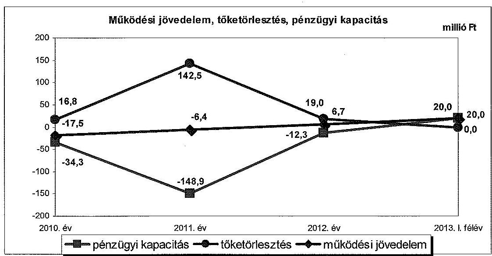

Az Önkormányzat az ellenőrzött időszakban összesen 1810,7 millió Ft összegű költségvetési bevételt ért el, és 1805,0 millió Ft összegű költségvetési kiadást teljesített, egyenlege 5,7 millió Ft többletet mutatott.

A folyó bevételek a 2010. és 2011. években nem biztosítottak fedezetet a folyó kiadásokra, a múködési jövedelem negatív volt. A 2012. évi pozitív múködési jövedelem kialakulását alapvetően a működőképesség megőrzését szolgáló támogatás eredményezte. Az Önkormányzat a 2010. évben 3,7 millió Ft, a 2011. évben 22,9 millió Ft, a 2012. évben 29,7 millió Ft vissza nem térítendő ÖNHIKI támogatásban részesült. Az ellenőrzött időszakban a működőképesség

---

megőrzéshez kapott támogatásokkal együtt összességében 2,8 millió Ft múködési többlet keletkezett, amely a tőketörlesztési kötelezettségek fedezetét nem biztosította. Múködési jövedelemtermelő képesség miatti kockázatot és egyben bevételi kitettséget jelez, hogy a múködőképesség megőrzését szolgáló kiegészítő támogatások nélkül a múködési jövedelem 2012. évben is hiányt ( 23,0 millió Ft) mutatott volna. A helyi adókból származó bevétel bevételi kitettséget jelent az Önkormányzat számára, mivel az iparúzési adóbevétel a 2010. évben $63,2 \%-a$, 2011. évben $55,1 \%-a$, 2012. évben $63,7 \%$-a egy adóalanytól keletkezett.

A felhalmozási költségvetés egyenlege az ellenőrzött időszakban - a 2012. év kivételével - hiányt mutatott. A felhalmozási hiány 2010. évben 17,9 millió Ft, a 2011. évben 1,8 millió Ft és a 2013. év I. félévben 2,6 millió Ft volt, amelyeknek finanszírozására hosszú lejáratú hitelek, folyószámlahitel, támogatás megelőlegezési hitel és fejlesztési célú kötvénykibocsátás, 2013-ban a pozitív működési jövedelem nyújtott fedezetet. A 2012. évben az Önkormányzatnak 25,2 millió Ft felhalmozási forrástöbblete keletkezett ingatlan kisajátításból származó bevételekből. A 2013. június 30 -át követő időszakra az Önkormányzat nem vállalt felhalmozási célú kötelezettséget.

A nettó múködési jövedelem (pénzügyi kapacitás) a 2010-2012 közötti években folyamatosan negatív volt. Az adósságkonszolidáció nélkül a 2010-2012 között hiteltörlesztésre kifizetett 178,3 millió Ft-ból 74,8 millió Ft kapcsolódott a hosszú lejáratú hitelek törlesztéséhez. A 2012. évi 100,0\%-os adósságkonszolidáció hatására azonban 2013-ban már nem volt törlesztési kötelezettsége az Önkormányzatnak. Az 2010-2011. években 203,0 millió Ft finanszírozási igény jelentkezett, amelyre a forrásokat 2010-ben a tartóssá vált folyószámlahitelből, munkabér-megelőlegezési hitelből, továbbá likvid-, és fejlesztési hitel felvételével, 2011-ben kötvénykibocsátással teremtették meg. Az Önkormányzatnál adósságszolgálat miatti kockázatot jelentett, hogy a múködési jövedelem nem nyújtott fedezetet a tőketörlesztési kötelezettségek teljesítésére, továbbá finanszírozásra fordítható tartalékkal sem rendelkezett.

Az ellenőrzött időszakban az Önkormányzat adatszolgáltatása alapján a múködési kiadásokon belül az önként vállalt feladatok kiadásainak részaránya a 2010. évi $1,2 \%$-ról ( 6,4 millió Ft-ról) a 2013. év I. félév végére $3,7 \%$-ra ( 7,0 millió Ft-ra) növekedett. A növekedést azonban az okozta, hogy a bölcsődei ellátás és a képviselői tiszteletdíjak kiadásait 2010-ben a kötelező, majd az önként vállalt feladatok között szerepeltették. Az Önkormányzatnál az önként vállalt feladatokra fordított kiadások miatt 2010-2012 között - figyelembe véve a múködőképesség megőrzéshez kapott támogatás nélkül folyamatosan fennálló negatív múködési jövedelmet - múködési kockázat mutatkozott. A kötelező és önként vállalt feladatokra fordított kiadások arányának, mértékének és azok változásának a pénzügyi egyensúlyi helyzetre gyakorolt hatását az Önkormányzat a 2010-2012. években és a 2013. év I. félévben nem értékelte.

Az ellenőrzött időszakban az Önkormányzat adatszolgáltatása alapján a feladatellátás szervezeti kereteiben jelentős változás történt. Törvényi rendelkezések hatására 2013. január 1-jétől egyes államigazgatási feladatok a Veszprémi Járási Hivatalhoz kerültek. Az általános iskolai oktatás az épület-

---

üzemeltetés további önkormányzati finanszírozása mellett állami feladatellátásba került. Az ellenőrzött időszakban megvalósult feladatátadások - az Önkormányzat adatszolgáltatása alapján - összességében 43,7 millió Ft megtakarítást eredményeztek. A saját hatáskörben végrehajtott kiadáscsökkentő intézkedések összességében 12,0 millió Ft-tal javították a múködési jövedelmet. Bevételnöveléshez kapcsolódó, egyensúlyjavító intézkedések nem történtek. Az állami feladatátvételek miatti megtakarítás, valamint a kiadáscsökkentő intézkedések kedvező hatással voltak a pénzügyi egyensúlyi helyzetre, mivel a 2013. év I. félévére a múködési jövedelem pozitívvá vált.

A pénzintézeti kötelezettségek állománya a hitelfelvételek és törlesztések, továbbá az adósságkonszolidáció együttes hatására a 2010. év elejéről (113,4 millió Ft-ról) a 2012. év végére megszűnt. Az Önkormányzatnál a 2013. év I. félévben adósságot keletkeztető kötelezettségvállalás nem történt, likvid hitelt sem vettek igénybe. A banki kitettség miatti kockázatot jelzi, hogy az ellenőrzött időszakban 2011. január 1-jétől a rendelkezésre álló folyószámla hitelkeret 60,0\%-kal 80,0 millió Ft-ra növekedett, ezen túl a likviditást 2010-ben 352, 2012-ben 335 napon keresztül a folyószámlahitel igénybevételével tudták biztosítani. Adósságkonszolidáció nélkül a jövőbeni kötelezettségek kifizethetősége újabb források bevonása nélkül veszélybe kerülhetett volna. Az Önkormányzat az adósságszolgálat alakulását és a felmerülő kockázatokat, valamint a jövedelemtermelő képesség és az adósságszolgálat összefüggéseit nem értékelte.

A szállítókkal szembeni kötelezettség 2010 végén 4,0 millió Ft, 2013. június 30-án 2,2 millió Ft volt, az Önkormányzatnak az ellenőrzött időszakban lejárt szállítói tartozása nem volt, így pénzügyi kockázatot nem jelentett.

Az Önkormányzatnak a pénzügyi gazdálkodás során figyelmet kell fordítania az integritási szemlélet teljes körű érvényesítésére.

Az ellenőrzés során a gazdálkodási feladatok ellátásával kapcsolatban az alábbi szabályszerúségi hibákat tártuk fel:

- az SZMSZ. ${ }_{2}$-ben - a Mötv. előírásait megsértve - az önként vállalt feladatok körében nevesítették a sporttámogatások nyújtását, holott a sport ügyek, így ezen belül a nyújtott támogatások a Sport tv.-ben meghatározott feltételek fennállása esetén a helyben biztosítandó közfeladatok körében kötelező önkormányzati feladatnak minősülnek;
- a 2013. évi költségvetési rendelet nem felelt meg az Áht.-ban előírtaknak, mivel nem tartalmazta az Önkormányzat, és az általa irányított költségvetési szervek költségvetési bevételeinek kötelező feladatok, önként vállalt és állami (államigazgatási) feladatok szerinti megbontását, valamint a költségvetési bevételek és a költségvetési kiadások előirányzat-csoportok, kiemelt előirányzatok szerinti részletezését;
- a 2011-2012. évi könyvviteli mérlegek készítése során - az Áhsz. ${ }_{1}$-ben (a 2014 évtől Áhsz. ${ }_{2}$-ben) foglalt előírással ellentétben - a mérleg fordulónapját megelőzően már teljesített, az Önkormányzat által elismert, a mérlegkészítés időpontjáig beérkezett szállítói számlák szerinti kötelezettség összegét nem vették figyelembe, ezáltal a mérlegben 2011-ben 3,0 millió Ft, 2012-ben

---

1,2 millió Ft szállítókkal szembeni kötelezettséget nem mutattak ki. Az Önkormányzatnál a szállítói számlákkal kapcsolatos évközi analitikus nyilvántartás vezetése nem felelt meg az Áhsz.,-ben foglalt előírásoknak.

Az ÁSZ tv. 33. § (1) bekezdésében foglaltak értelmében az ellenőrzött szervezet vezetője köteles a jelentésben foglalt megállapításokhoz kapcsolódó intézkedési tervet összeállítani, és azt a jelentés kézhezvételétől számított harminc napon belül az ÁSZ részére megküldeni. Amennyiben az intézkedési tervet határidőn belül nem küldi meg a szervezet vezetője, vagy az továbbra sem elfogadható, az ÁSZ elnöke a hivatkozott törvény 33. § (3) bekezdés a-b) pontjaiban foglaltakat érvényesítheti.

# Az ellenőrzés intézkedést igénylő megállapításai és javaslatai: 

## a polgármesternek

1. Az Önkormányzat pénzügyi egyensúlyának fenntartása az ellenőrzött időszak vonatkozásában feltárt kockázatok, kiemelten a helyi adó miatti bevételi kitettség alapján középtávon ható intézkedéseket igényel. A folyó költségvetés egyenlege a 2010-2011. években a működőképesség fenntartására kapott 26,6 millió Ft támogatás ellenére 23,9 millió Ft hiányt mutatott. A bevételi kitettség 2012-ben is fennállt, a 29,7 millió Ft ÖNHIKI támogatás nélkül a működési jövedelem -23,0 millió Ft volt. A 2010-2012 között képződött működési jövedelem nem nyújtott fedezetet a tőketörlesztési kötelezettségekre. A 2013. év I. félévben az Önkormányzat szerkezetátalakítási tartalékból folyósított támogatásban nem részesült, azonban a saját hatáskörben végrehajtott intézkedések eredményeként a folyó költségvetésben 20,0 millió Ft többlet képződött. Az Önkormányzat 2012-ben az adósságkonszolidáció keretében kapott 259,7 millió Ft törlesztési célú támogatásból kiegyenlítette a kötvénykibocsátásból, fejlesztési és folyószámlahitel igénybevételéből származó kötelezettségeit. A 2012. év végétől az Önkormányzatnak pénzintézettel szembeni tartozása nem keletkezett. A saját hatáskörben tett kiadáscsökkentő intézkedések fedezetet biztosítottak a pénzügyi egyensúly helyreállításához, azonban a működési és felhalmozási egyensúly hosszú távú fenntartásához szükséges elkülönített tartalék képzése érdekében további intézkedések indokoltak.

Javaslat:
A működési jövedelemtermelő képesség és a feladatellátás összhangjának, valamint a pénzügyi egyensúly hosszú távú fenntarthatósága érdekében felelősök és határidők megjelölésével kezdeményezzen intézkedéseket, melyek keretében:
a) a költségvetési rendelettervezet, valamint annak évközi módosítása előterjesztését megelőzően mérjék fel a bevételszerző, kiadáscsökkentő lehetőségeket, és terjessze a Képviselő-testület elé a bevételek növelését, a kiadások csökkentését célzó intézkedések bevezetéséhez szükséges - a Htv. 140. § (1) bekezdés a) pontja alapján a jegyző által elkészített - döntési javaslatát;
b) terjesszen a Képviselő-testület elé jóváhagyásra - a Htv. 140. § (1) bekezdés a) pontja alapján a jegyző által elkészített - az Önkormányzat gazdasági helyzetének elemzésén alapuló, a pénzügyi egyensúlyi helyzet hosszú távú fenntartását,

---

valamint az adósságállomány újratermelődésének elkerülését biztosító intézkedéseket tartalmazó stabilizációs programot;
c) az adósságkonszolidációs folyamat lezárultát követően terjesszen a Képviselőtestület elé - a Htv. 140. § (1) bekezdés a) pontja alapján a jegyző által elkészített - döntési javaslatot, amelyben a gazdálkodás biztonsága, a fizetőképesség megőrzése érdekében meghatározzák a működési és felhalmozási egyensúly hosszú távú fenntartásához szükséges elkülönített tartalék nagyságát, képzésének, felhasználásának szabályait.
2. Az Önkormányzat SZMSZ. ${ }_{2}$-ében - a Mötv. 13. § (1) bekezdés 15. pontjában foglalt előírást megsértve - az önként vállalt feladatok körében nevesítették a sporttámogatások nyújtását, holott a sport ügyek, így ezen belül a nyújtott támogatások a Sport tv. 55. § (1)-(2) bekezdéseiben meghatározott feltételek fennállása esetén a helyben biztosítandó közfeladatok körében kötelező önkormányzati feladatnak minősülnek.

Javaslat:
Terjessze a Képviselő-testület elé az Önkormányzat SZMSZ. ${ }_{2}$-ének a Mötv. 13. § (1) bekezdés 15. pontjában foglalt előírásnak megfelelő - a jegyző által előkészített módosítását, melyben a sporttal kapcsolatos önkormányzati feladatok körébe tartozó sporttámogatások nyújtása besorolását a Sport tv. 55. § (1)-(2) bekezdésében foglalt feltételek szerint határozzák meg.

# a jegyzőnek 

1. A 2013. évi költségvetési rendelet - az Áht. 23. § (2) bekezdés a-b) pontjaiban foglalt előírások ellenére - nem tartalmazta az Önkormányzat, és az általa irányított költségvetési szervek költségvetési bevételeinek és költségvetési kiadásainak előirány-zat-csoportok és kiemelt előirányzatok szerinti bontását, továbbá nem mutatták be a költségvetési bevételeket kötelező feladatok, önként vállalt feladatok és állami (államigazgatási) feladatok szerinti elkülönítésben.

Javaslat:
Intézkedjen, hogy a költségvetési rendelet az Áht. 23. § (2) bekezdés a-b) pontjaiban foglalt előírások szerint tartalmazza az Önkormányzat és az általa irányított költségvetési szervek költségvetési bevételeit és költségvetési kiadásait előirányzatcsoportok, kiemelt előirányzatok, és kötelező feladatok, önként vállalt feladatok, állami (államigazgatási) feladatok szerinti bontásban.
2. Az Önkormányzat a 2011-2012. évi könyvviteli mérlegeiben a szállítókkal szemben fennálló tartozását nem szerepeltette. A mérleg készítése során - az Áhsz., 26. § (1) bekezdésében foglalt előírással ${ }^{1}$ ellentétben - a mérleg fordulónapját megelőzően már teljesített, az Önkormányzat által elismert, a mérlegkészítés időpontjáig beérkezett szállítói számlák szerinti kötelezettség összegét nem vették figyelembe, ezáltal a mérlegben 2011-ben 3,0 millió Ft, 2012-ben 1,2 millió Ft szállítókkal szembeni

[^0]
[^0]:    ${ }^{1}$ Hatálytalan 2014. január 1-jétől. A 2014. január 1-jétől hatályos előírás: Áhsz., 14. § (8) bekezdése és az 1. § (1) bekezdés 9. pontja

---

kötelezettséget nem mutattak ki. Az Önkormányzatnál a szállítói számlákkal kapcsolatos évközi analitikus nyilvántartás vezetése nem felelt meg az Áhsz. 1 9. számú melléklet 4. pont db) alpontjában foglalt előírásoknak².

Javaslat:
A szállítókkal szembeni tartozások mérlegben kimutatott kötelezettségek összegében történő, jogszabályi előírásoknak megfelelő kimutatása érdekében:
a) intézkedjen, hogy az Áhsz. 1 14. § (8) bekezdésében foglalt előírásnak megfelelően a mérlegben a kötelezettségek között az egységes rovatrend szerinti rovatokhoz kapcsolódóan vezetett nyilvántartási számlákon nyilvántartott végleges kötelezettségvállalásokat, más fizetési kötelezettségeket mutassák ki mindaddig, amíg azokat pénzügyileg ki nem egyenlítették, el nem engedték vagy egyéb módon nem rendezték;
b) biztosítsa, hogy az Áhsz. 1. § (1) bekezdés 9. pontjában előírtak szerint végleges kötelezettségvállalásként, más fizetési kötelezettségként a pénzértékben kifejezett, jogszabályból, jogerős bírói ítéletből vagy hatósági határozatból, szerződésből - ideértve az átvállalt kötelezettségeket is - jogszerűen eredő elismert tartozást mutassák ki, amely kifizetésének feltételeit a másik fél már teljesítette. Ilyennek minősül többek között - a jogszabályban felsorolt jogcímek közül - a teljesítésigazolással ellátott számlázott termékértékesítésért vagy szolgáltatásnyújtásért fizetendő ellenérték;
c) intézkedjen a kötelezettségvállalások, más fizetési kötelezettségek (ideértve a szállítókkal szembeni tartozások) jogszabályi előírásoknak megfelelő számviteli nyilvántartása érdekében az Áhsz. 1 14. számú melléklete II. pontjában előírt tartalmi követelményeknek megfelelő részletező nyilvántartás vezetéséről.

[^0]
[^0]:    ${ }^{2}$ Hatálytalan 2014. január 1-jétől. A 2014. január 1-jétől hatályos előírás: Áhsz. 14. számú melléklet II. pontja

---

# II. RÉSZLETES MEGÁLLAPÍTÁSOK 

## 1. Az ÖNKORMÁNYZAT KÖTELEZŐ ÉS ÖNKÉNT VÁLlALT FELADATAI, A FELADATELLÁTÁS SZERVEZETI KERETEINEK VÁLTOZÁSA

Az Önkormányzat a kötelezö és önként vállalt feladatainak körét az SZMSZ. ${ }_{1,2}$-ben ${ }^{3}$ határozta meg. Az SZMSZ. ${ }_{1}$-ben önként vállalt feladatként sorolták be a városi közszolgálati TV csatorna múködtetését, az alapfokú művészeti oktatást, a helyi lapkiadást, a helytörténeti emlékek gyüjtését, a német nemzetiségi kultúra ápolásának elősegittését, a fogorvosi szolgáltatást és a település közéleti eseményeinek megörökítését, a testvér-települési kapcsolatok létrehozását és ápolását, valamint a támogatás nyújtását önszerveződő közösségek és nonprofit szervezetek számára. Az SZMSZ. ${ }_{2}$-ben kikerült az önként vállalt feladatok köréből az alapfokú művészetoktatás, valamint kiegészítésre került a rendezvények, közösségi programok szervezésével, közművelődési, kulturális programok támogatásával, a szilárd hulladék szelektív gyűjtésének szervezésével, a logopédiai szolgáltatással, a kitüntetések adományozásával, az ipari eredetű állati eredetű melléktermék elszállításával, ártalmatlanná tételével. Az Önkormányzat a Gyvtv. 94. § (3) bekezdés a) pontjában foglaltakkal ellentétesen az SZMSZ. ${ }_{1}$-ben a bölcsődei ellátást is kötelezően ellátandó feladatok közé sorolta. A 2013. április 1-jétől hatályban lévő SZMSZ. ${ }_{2}$ a Gyvtv.-nek megfelelően a bölcsődei ellátást önként vállalt önkormányzati feladatként nevesíti.

Az Mötv. 13. §-a (1) bekezdésének 15. pontja előírásait megsértve az SZMSZ. ${ }_{2}$-ben az önként vállalt feladatok körében nevesítésre került a sporttámogatások nyújtása, holott a sport ügyek, így ezen belül a nyújtott támogatások a Sport tv. 55. § (1)-(2) bekezdésében meghatározott feltételek fennállása esetén a helyben biztosítandó közfeladatok körében kötelező önkormányzati feladatnak minősülnek.

A 2013. évi költségvetési rendelet nem felelt meg az Áht. 23. § (2) bekezdés a)-b) pontjaiban elöírtaknak, mivel nem tartalmazta az Önkormányzat, és az általa irányított költségvetési szervek költségvetési bevételeinek kötelező feladatok, önként vállalt és állami (államigazgatási) feladatok szerinti megbontását, valamint a költségvetési bevételek és a költségvetési kiadások előirányzat-csoportok, kiemelt előirányzatok szerinti részletezését.

Az észrevétel szerint az Önkormányzat 2013. évi költségvetéséről szóló rendelet tartalmazta az Önkormányzat és az általa irányított költségvetési szervek költségvetési bevételeit, az Önkormányzat és a költségvetési szervek kiadásait kiemelt

[^0]
[^0]:    ${ }^{3}$ A kötelező és önként vállalt feladatok elkülönítése az ellenőrzött időszakra vonatkozóan 2013. március 31-ig a többször módosított SZMSZ., 2009. április 23-tól hatályos 2. számú mellékletében meghatározottak szerint történt. A 2013. április 1-jétől az SZMSZ. 1. és 2. számú mellékletében határozták meg a kötelező és az önként vállalt feladatokat.

---

előirányzatonként is, valamint a kötelező és önként vállalt feladatok és állami (államigazgatási) feladatok szerinti bontást is. Fentiek igazolásául megküldték a 2013. évi költségvetési rendelet 5., 6. és 21. számú mellékletét.

Az észrevételt nem fogadjuk el, mert az abban foglaltak az intézkedést igényió megállapítások megalapozottságát nem befolyásolják. Az észrevétel mellékleteként megküldött dokumentumok felülvizsgálata alapján megállapítható, hogy a 2013. évi költségvetési rendelet az Áht. 23. § (2) bekezdés a-b) pontjaiban foglalt előírás ellenére az Önkormányzat és az általa irányított költségvetési szervek költségvetési bevételeit nem az Ávr. 2. §-ában ${ }^{4}$ megjelölt kiemelt előirányzati jogcímek szerinti bontásban, a költségvetési kiadásokat pedig nem az Áht. 6. § (2) bekezdése szerinti előirányzat-csoportok, illetve a 6. § (3) bekezdés szerinti kiemelt előirányzatok szerinti bontásban tartalmazta. Az észrevétel mellékleteként megküldött kimutatás a kiadási előirányzatok kötelező, önként vállalt és államigazgatási feladatok szerinti megbontását mutatja be. A megállapítás a költségvetési bevételi előirányzatok hasonló megbontásban történő bemutatásának hiányára vonatkozott, a költségvetési kiadásokkal kapcsolatosan e tekintetben az ellenőrzés hibát nem tárt fel.

Az Önkormányzat által szolgáltatott adatok szerint az ellenőrzött időszakban változott a kötelezö és az önként vállalt feladatokhoz kapcsolódó múködési kiadások összes működési kiadáshoz viszonyított aránya. Az adatszolgáltatás szerint a kötelező feladatokra fordított összes folyó kiadás 2010-ben 532,1 millió Ft ( $98,8 \%$ ), amíg 2013. év I. félévében 181,1 millió Ft $(96,3 \%)$ volt. Az önként vállalt feladatokra fordított kiadások összege 2010-ben 6,4 millió Ft-ot ( $1,2 \%$-ot), a 2013. év I. félévében 7,0 millió Ft-ot ( $3,7 \%$-ot) tett ki. Az önként vállalt feladatok arányának - adatszolgáltatás szerinti - kedvezőtlen változását az okozta, hogy 2010-ben a bölcsődei ellátásra, valamint a képviselői tiszteletdíjakra és járulékaira fordított kiadásokat a kötelező, amíg 2013-ban az önként vállalt feladatok között szerepeltették. Az önként vállalt feladatokra fordított kiadások miatt 2010-2012 között - figyelembe véve a működőképesség megőrzéshez kapott támogatás nélkül folyamatosan fennálló negatív múködési jövedelmet - a múködési kockázat fennállt.

Önként vállalt feladatra az Önkormányzat az ellenőrzött időszakban egy alkalommal, a 2010. évben - az alapfokú művészeti oktatási feladatokra - felhalmozási kiadásként 128,0 ezer Ft-ot teljesített, amely az összes felhalmozási kiadás $0,1 \%$-a volt, ezért felhalmozási kockázatot nem jelentett.

Az Önkormányzat adatszolgáltatása szerint a közoktatási feladatok ellátására fordított múködési kiadások összes múködési kiadáson belüli aránya a 2010. évi ( 250,7 millió Ft-ról) 46,6\%-ról, 2013. év I. félévében ( 72,7 millió Ft-ra) $38,6 \%$-ra csökkent. Az önként vállalt feladatok aránya ${ }^{5}$ a közoktatási feladatokra fordított összes múködési kiadáson belül 2010-ben ( 5,9 millió Ft) 2,4\% volt. A közoktatásban az önként vállalt feladatok közül az alapfokú művészetoktatás állami átvételre került, ezáltal 2013-ban a közoktatási feladatokon belül az önként vállalt feladat megszűnt. A közoktatási feladatokra fordított kiadások között 2013-tól az óvoda kiadásai és az iskolaépület üzemeltetésének

[^0]
[^0]:    ${ }^{4}$ Hatálytalan 2014. január 1-jétől, a 2014. január 1-jétől hatályos előírás: Áht. 6. § (4)-(5) bekezdései
    ${ }^{5}$ Az alapfokú múvészeti oktatásra fordított kiadások jelentkezése miatt.

---

kiadásai jelentkeznek. Az iskolaépület üzemeltetése állami múködtetésbe kerülése esetén az Önkormányzatnak havi 3,5 millió Ft-ot kellett volna hozzájárulásként fizetnie, ezért a Képviselő-testület az iskola múködtetésének további felvállalásáról döntött.

A szociális és gyermekjóléti feladatok ellátására 2010-ben az összes múködési kiadás 6,8\%-át fordították ( 36,8 millió Ft), amelynek aránya a kiadások nominális csökkenése mellett a 2013. év I. félévére ( 17,9 millió Ft-ra változott) 9,5\%-ra nőtt a kötelező feladatokra fordított kiadások csökkenése miatt.

A közmúvelődési és sport feladatok ellátására 2010-ben az összes múködési kiadás 2,5\%-át ( 13,4 millió Ft) fordították, amelynek aránya 2013. év I. félévére 3,6\%-ra nőtt, miközben időarányos féléves teljesítés mellett volumenében a kiadások szinten tartása ( 6,7 millió Ft) következett be. Az önként vállalt feladatokra fordított költségvetési kiadások a közművelődési és sport feladatok között nem voltak ${ }^{6}$.

Az egészségügyi feladatokra fordított kiadások összege 2010-ben az összes múködési kiadás 6,0\%-át ( 32,2 millió Ft) tette ki, amely 2013. év I. félévére $6,5 \%$-ra nőtt, miközben ez nominális csökkenést jelentett (a teljesített féléves költségvetési kiadások összege 12,3 millió Ft volt). Az egészségügyi feladatokra fordított kiadások csökkenésének oka az volt, hogy a védőnői szolgálatot 2012. december 31. napjáig az Önkormányzat saját szervezeti keretein belül látta el, 2013-tól társulási megállapodás alapján a Szentgáli Önkormányzat múködteti.

Az igazgatási és egyéb feladatok ellátására fordított kiadások összege 2010-ben az összes múködési kiadás 38,1\%-a volt (205,4 millió Ft), amely 2013. év I. félév végére $41,7 \%$-ra ( 78,5 millió Ft) nőtt, miközben összege csökkent. Ennek oka, hogy az építésigazgatási, gyámhivatali és okmányirodai feladatok 2013. január 1-jétől átkerültek a Veszprémi Járási Hivatalhoz, amely egyúttal négy fős létszámcsökkenéssel járt együtt.

Az Önkormányzat feladatait - a Polgármesteri Hivatallal együtt - 2010-ben nyolc, 2012-ben hét, 2013. év I. félév végére hat telephelyen látta el. 2010-2012 között öt ${ }^{7}$, 2013-tól négy ${ }^{8}$ költségvetési szervvel és három gazdasági társasággal biztosították az önkormányzati feladatok ellátását.

A takarékossági intézkedések részeként a hivatali feladatok ellátására ténylegesen alkalmazott létszám kevesebb, mint a Polgármesteri Hivatal múködésének támogatására - Kvtv. 2 . számú melléklet I. 1. a pont alapján - megállapított alaplétszám. A Polgármesteri Hivatalban a betöltött álláshelyek száma 2013. január 1-jén 14, a Kvtv. ${ }_{2}$ alapján elismert létszám 19 fő volt.

[^0]
[^0]:    ${ }^{6}$ Sporttámogatást az Önkormányzat a 2013. évi költségvetési rendeletében nem tervezett.
    ${ }^{7}$ Egy önállóan múködő és gazdálkodó és négy önállóan múködő költségvetési szerv.
    ${ }^{8}$ Egy önállóan múködő és gazdálkodó és három önállóan múködő költségvetési szerv.

---

Az ellenőrzött időszakban megvalósult feladatátadások - az Önkormányzat adatszolgáltatása alapján - összességében 43,7 millió Ft megtakarítást jelentettek, melynek eredményeként a múködési jövedelem a 2013. év I. félévében javult. Az Önkormányzatnál az ellenőrzött időszakban a múködési bevételekre és kiadásokra, továbbá a pénzügyi egyensúlyi helyzetre hatással levő feladat átadásokra az alábbiak szerint került sor:

- az általános iskolai és az alapfokú múvészeti oktatási feladatok állami átvétele az épületüzemeltetés megtartása mellett 41,3 millió Ft megtakarítást jelentett az Önkormányzat számára. A gyermekek étkeztetését a térítési díj és az állami támogatás fedezi, az Önkormányzatot az üzemeltetési költségek terhelik;
- az egyes államigazgatási feladatok járási hivatalhoz történő átadása miatt 2,4 millió Ft megtakarítás keletkezett.

A kötelezö és az önként vállalt feladatokra fordított kiadások arányának, mértékének és azok változásának a pénzügyi egyensúlyi helyzetre gyakorolt hatását az Önkormányzat a 2010-2012. években és 2013. év I. félévben nem értékelte.

# 2. A PÉNZÜGYI EGYENSÚLY FENNTARTÁSÁT VESZÉLYEZTETŐ PÉNZÜGYI KOCKÁZATOK, EZEK CSÖKKENTÉSE ÉRDEKÉBEN TETT INTÉZKEDÉSEK 

Az Önkormányzat költségvetésének elemzését a CLF módszer szerint hajtottuk végre. A 2012. évi valós jövedelemtermelő képesség bemutatása érdekében az elemzés során nem vettük figyelembe az adósságkonszolidációhoz kapcsolódó bevételeket és kiadásokat.

Az adósságkonszolidációra az Önkormányzat 2012. évi 259,7 millió Ft költségvetési támogatást kapott, ezzel szemben 96,4 millió Ft hiteltörlesztést, 150,0 millió Ft kötvénybeváltást, továbbá 10,5 millió Ft múködési kiadást (realizált árfolyamveszteséget), és 2,8 millió Ft kamatkiadást kellett volna számviteli nyilvántartásaiban elszámolnia. A könyvvitelben árfolyamveszteséget nem számoltak el, helyette 0,5 millió Ft múködési és 12,8 millió Ft felhalmozási kamatkiadást rögzítettek. Az Önkormányzat a számviteli kimutatásaiban 2012-ben az Áhsz-1 9. számú melléklet 9. pontja c) alpontjában foglalt előírásokkal ellentétesen a realizált árfolyamveszteséghez kapcsolódó kiadást az egyéb kiadások helyett ${ }^{9}$ kamatként rögzítette.

[^0]
[^0]:    ${ }^{9}$ Hatálytalan: 2014. január 1-jétől. A 2014. január 1-jétől hatályos előírás: Áhsz-2 27. § (8) bekezdés a) pontja, és a 44. § (3) bekezdése.

---

A CLF módszer szerinti önkormányzati részletes adatokat 2010-2013. év I. félév között az 1/A. számú melléklet, az adósságkonszolidációhoz kapcsolódó bevételek és kiadások pénzügyi egyensúlyi helyzetre gyakorolt hatását az 1/B. számú melléklet, a főbb önkormányzati adatokat a következő tábla mutatja be:

| Megnevezés | 2010. év | 2011. év | 2012. év | millió Ft   2013. I.   félév |
| :-- | --: | --: | --: | --: |
| Folyó bevételek | 512,2 | 503,8 | 508,5 | 193,6 |
| Folyó kiadások | 529,7 | 510,2 | 501,9 | 173,6 |
| Múködési jövedelem | $\mathbf{- 1 7 , 5}$ | $\mathbf{- 6 , 4}$ | $\mathbf{6 , 7}$ | $\mathbf{2 0 , 0}$ |
| Felhalmozási bevételek | 16,5 | 32,9 | 38,4 | 4,7 |
| Felhalmozási kiadások | 34,4 | 34,7 | 13,2 | 7,3 |
| Felhalmozási költségvetés egyenlege | $\mathbf{- 1 7 , 9}$ | $\mathbf{- 1 , 8}$ | $\mathbf{2 5 , 2}$ | $\mathbf{- 2 , 6}$ |
| Folyó és felhalmozási bevételek összesen | 528,7 | 536,7 | 547,0 | 198,3 |
| Folyó és felhalmozási kiadások összesen | 564,1 | 544,9 | 515,1 | 180,9 |
| Finanszírozási múveletek nélküli pozíció | $\mathbf{- 3 5 , 4}$ | $\mathbf{- 8 , 3}$ | $\mathbf{3 1 , 9}$ | $\mathbf{1 7 , 4}$ |
| Finanszírozási műveletek egyenlege | 32,7 | 61,2 | -3,5 | -44,8 |
| Tárgyévi pénzügyi pozíció | $\mathbf{- 2 , 8}$ | $\mathbf{5 3 , 0}$ | $\mathbf{2 8 , 4}$ | $\mathbf{- 2 7 , 4}$ |
| Hiteltörlesztés, értékpapír beváltás | 16,8 | 142,5 | 19,0 | 0,0 |
| Nettó múködési jövedelem | $\mathbf{- 3 4 , 3}$ | $\mathbf{- 1 4 8 , 9}$ | $\mathbf{- 1 2 , 3}$ | $\mathbf{2 0 , 0}$ |

Az Önkormányzat a 2010. év és 2013. év I. félév között - a 2012. évi adósságkonszolidációs támogatás nélkül számítva - összesen 1810,7 millió Ft költségvetési bevételt ért el, és 1805,0 millió Ft költségvetési kiadást teljesített. A múködési jövedelem - az ÖNHIKI támogatásokkal együtt - az ellenőrzött időszakban évről évre javuló tendenciát mutatott. A folyó költségvetésben 2010. és 2011. évben összesen 23,9 millió Ft forráshiány, 2012. évben, valamint 2013. év I. félévében együttesen 26,7 millió Ft többlet keletkezett. A múködési jövedelem 2012. évre történő pozitív irányba történő változása az ÖNHIKI támogatás előző évitől magasabb összegéből adódik. A folyó kiadások 2010. évhez képest 27,8 millió Ft összeggel mérséklődtek, amelyet a saját hatáskörben meghozott intézkedések személyi jellegű kiadásokra gyakorolt hatása okozott.

Múködési jövedelemtermelő képesség miatti kockázatot és egyben bevételi kitettséget jelez, hogy a folyó költségvetés egyensúlya 2010-2011 között az ÖNHIKI támogatás ellenére sem volt biztosított. Az ÖNHIKI támogatás nélkül a múködési jövedelem - 2013. év kivételével - hiányt mutatott volna. Az Önkormányzat a 2010. évben 3,7 millió Ft, a 2011. évben 22,9 millió Ft, a 2012. évben 29,7 millió Ft múködőképesség megőrzését szolgáló kiegészítő ÖNHIKI támogatásban részesült. E nélkül évenként a működési jövedelem a 2010. évben 21,2 millió Ft, a 2011. évben 29,4 millió Ft, a 2012. évben 23,0 millió Ft hiány lett volna. A 2013. év I. félévében az Önkormányzat szerkezetátalakítási tartalékból folyósított támogatásban nem részesült ${ }^{10}$.

A nettó múködési jövedelem (pénzügyi kapacitás) értéke 2010-2012 években folyamatosan a negatív tartományban (2010-ben -34,3 millió Ft, 2011-ben -148,9 millió Ft, 2012. évben -12,3 millió Ft) mozgott. A 2011. évi

[^0]
[^0]:    ${ }^{10}$ 2013. év II. félévében 3,8 millió Ft vissza nem térítendő szerkezetátalakítási támogatást kapott az Önkormányzat.

---

kiugróan magas törlesztési kötelezettség a Herend Városért kötvény kibocsátásának következtében jelentkezett, mivel a kötvény bevételből 98,0 millió Ft-ot a korábban felvett hitelek törlesztésére fordítottak ${ }^{11}$. E nélkül törlesztési kötelezettségét az Önkormányzat nem tudta volna teljesíteni. Az ellenőrzött időszakban - az adósságkonszolidáció, mint egyszeri állami pénzügyi támogatás hatását figyelmen kívül hagyva - összességében a pénzügyi kapacitás -175,5 millió Ft volt a 2,8 millió Ft pozitív működési jövedelem és a 178,3 millió Ft tőketörlesztés egyenlegeként. Az adósságkonszolidáció nélkül a 2010-2012 között hiteltörlesztésre kifizetett 178,3 millió Ft-ból 74,8 millió Ft kapcsolódott a hosszú lejáratú hitelek törlesztéséhez.

Az Önkormányzat számára 2010-2012 között kockázatot jelentett, hogy a múködési jövedelem nem nyújtott fedezetet a tőketörlesztési kötelezettségek teljesítésére, valamint az Önkormányzat egyéb finanszírozásra tartalékolt forrásokkal sem rendelkezett ${ }^{12}$, amiből törlesztési kötelezettségeit teljesíteni tudta volna.

Az Önkormányzat részéről az ellenőrzött időszakban finanszírozási igény ${ }^{13}$ 2010-ben 52,2 millió Ft, 2011-ben 150,7 millió Ft összegben keletkezett. 2012-ben és 2013. év I. félévében a nettó múködési jövedelem és a felhalmozási költségvetés összevont egyenlege pozitív volt (2012-ben 12,9 millió Ft, 2013. év I. félévében 17,4 millió Ft), ezért finanszírozási többlet jelentkezett. A 2011. évben felmerült finanszírozási igényt a 2011. évben kibocsátott Herend Városért elnevezésű kötvényből fedezte az Önkormányzat. A 2010. évben fennálló finanszírozási igényét az Önkormányzat a tartóssá vált folyószámlahiteléből, munkabér-megelőlegezési hitelből, továbbá likvid-, és fejlesztési hitel felvételével biztosította.

Az ellenőrzött időszakban a felhalmozási költségvetés egyenlege - a 2012. év kivételével - negatív volt, e forráshiányos években összesen 22,3 millió Ft hiány keletkezett, amelynek finanszírozására hosszú lejáratú hitelek, folyószámlahitel, támogatás megelőlegezési hitel és fejlesztési célú kötvénykibocsátás, 2013-ban a pozitív múködési jövedelem nyújtott fedezetet. Az adósságkonszolidáció keretében kapott, felhalmozási bevételként jelentkező 181,5 millió Ft költségvetési támogatás hatását kiszűrve a felhalmozási költségvetésben a 2012. évben 25,2 millió Ft összegű többlet realizálódott, amelyet legfőképpen a 8. számú fơút fejlesztéséhez kapcsolódó ingatlan kisajátításokból származó 33,4 millió Ft összegű bevétel okozott. Az ellenőrzött időszakban összességében 2,9 millió Ft felhalmozási forrástöbblet keletkezett. A 2013. június 30 -át követő időszakra az Önkormányzat nem vállalt felhalmozási célú kötelezettséget. Az Önkormányzat által a 2010. és a 2013. év I. félév között megvalósított fejlesztési feladatok érdekében teljesített felhalmozási kiadások és az ezekhez vállalt kötelezettségek összegzését a 2 . számú melléklet mutatja be.

[^0]
[^0]:    ${ }^{11}$ A kötvény kibocsátási ideje 2011. február 24. A 2010. december 31-jén fennálló pénzintézeti kötelezettség 165,3 millió Ft volt.
    ${ }^{12}$ A pénzmaradvány részét képező óvadéki betét nem jelentett valósan rendelkezésre álló forrást, mivel az a kötvény fedezeteként volt zárolva.
    ${ }^{13}$ A nettó múködési jövedelem és a felhalmozási költségvetés összevont negatív egyenlege.

---

A folyó bevételek nagyságrendje a 2010. és 2012. években közel azonos volt, 2011-ben 1,6\%-kal ( 8,4 millió Ft-tal) csökkent, majd 2012-ben egy százalékot meg nem haladó növekedés következett be az előző évhez viszonyítva. A 2013. év I. félévi időarányos folyó bevételek ( 193,6 millió Ft) csökkenésére alapvetően az átengedett bevételek, az államháztartáson belülről kapott támogatások és az ÖNHIKI támogatások negatív összegű változásai voltak hatással. Az Önkormányzat ÖNHIKI támogatást a 2013. év I. félévben nem kapott a finanszírozási rendszer változása miatt ${ }^{14}$. A folyó bevételeket leginkább meghatározó költségvetési támogatások és saját működési bevételek aránya az ellenőrzött időszakban lényegesen - 2013. év I. félév kivételével - nem változott. A saját múködési bevételek és a költségvetési támogatások a 2010. évben az összes folyó bevétel $30,1 \%$ és $35,9 \%$-át, 2011. évben $31,0 \%$ és $33,7 \%$-át, 2012. évben $34,0 \%$ és $33,9 \%$-át, amíg 2013. év I. félévben $41,4 \%$ és $46,6 \%$-át képezték.

Bevételi kitettséget jelentett az Önkormányzat számára az ellenőrzött időszakban a helyi adóbevétel meghatározó részét jelentő iparüzési adóbevétel, mivel annak jelentős része (2010. évben 63,2\%, 2011. évben 55,1\%, 2012. évben 63,7\%) egy adóalanytól származott. A Képviselő-testület új adónemek bevezetését nem támogatta, továbbá a meglévő helyi adók mértékének növelését nem szavazta meg. Az Önkormányzat által bevezetett magánszemélyek kommunális adójának mértéke 6,0 ezer Ft (a 2011. szeptember 30-ig hatályos szabályozás alapján a törvényi maximum $50 \%$-a, majd ezt követően $35,3 \%$-a) volt, az iparúzési adó mértéke az ellenőrzött időszak minden évében elérte a törvényi maximumot.

Az átengedett bevételek folyamatos csökkenést mutattak az ellenőrzött időszakban, a 2010. évi 97,6 millió Ft-ról 2012. évre 78,2 millió Ft-ra (19,9\%-kal) mérséklődtek. A gépjármúadó helyben maradó részének további mérséklése és az átengedett szja bevétel megszünése miatt 2013. év I. félévére mindössze 4,6 millió Ft-ra csökkent az összege.

A felhalmozási bevételek a 2010-2012. években növekvő tendenciát mutattak, összegük az ellenőrzött időszakban 92,5 millió Ft volt, amely az összes költségvetési bevétel 5,1\%-át jelentette. A 2010. évi 16,5 millió Ft összegű bevétel a 2011. évben közel megduplázódott, $98,5 \%$-kal ( 16,3 millió Ft-tal) emelkedett, amely a fejlesztési pályázatokhoz kapcsolódó támogatásokkal volt összefüggésben. Ezt követően a 2012. évben az ingatlan kisajátításokból származó bevételek hatására 38,4 millió Ft-ra ( $17,0 \%$-kal) növekedtek a felhalmozási bevételek. A 2013. év I. félév adata az előző évi felhalmozási bevétel 12,2\%-ának ( 4,7 millió Ft) felelt meg, mert az ingatlan kisajátítások után 2012. évben kiszámlázott tételekből 15,0 millió Ft összeg nem folyt be az ellenőrzött időszak végéig. A felhalmozási bevételeken belül 2010-2011. években meghatározó volt az államháztartáson belülről kapott - KDOP és TIOP pályázatok támogatások összege. Az államháztartáson belülről kapott támogatások amelyek $89,9 \%$-a származott ebből - összege 44,4 millió Ft-ot tett ki. A saját felhalmozási bevételek összes felhalmozási bevételen belüli aránya a

[^0]
[^0]:    ${ }^{14}$ Az Önkormányzat múködőképessége megőrzését szolgáló kiegészítő támogatást a 2013. év II. félévében sem kapott.

---

2010. évben $14,2 \%$ (2,3 millió Ft), a 2011. évben $6,4 \%$ (2,1 millió Ft), a 2012. évben $88,7 \%$ ( 34,1 millió Ft ) volt.

A folyó kiadások (a 2010. évben 529,7 millió Ft, a 2011. évben 510,2 millió Ft, a 2012. évben 501,9 millió Ft) az ellenőrzött időszakban folyamatosan csökkenő tendenciát mutattak. Az időszakban bekövetkezett változást alapvetően a 2010. évről 2012. évre mérséklődött személyi juttatások és a munkaadói járulékok 28,7 millió Ft-os, a kamatkiadások 3,0 millió Ft-os csökkenése, valamint a transzferkiadások 7,6 millió Ft-os növekedése eredményezte. A személyi jellegű kiadások csökkenése a Herendi idősek klubja fenntartási és irányítási jogának a Veszprémi Kistérség Többcélú Társulásának átadása miatt következett be. A kötvényből időközben visszafizetett forinthitelek kamatai magasabbak voltak, azt követően a kisebb kamat mértékek okozták a kamatkiadások csökkenését. A transzferkiadások összege (a 2010. évben 17,7 millió Ft, a 2011. évben 20,6 millió Ft, a 2012. évben 25,2 millió Ft) az otthonteremtési támogatások miatt növekedett. A 2013. év I. félévben a folyó kiadások összege 173,6 millió Ft volt, az előző évhez viszonyított időarányos elmaradás az államnak történt feladatátadás kiadásokra gyakorolt hatásának következménye.

Az ellenőrzött időszakban megvalósított fejlesztésekre teljesített kifizetések együttesen 101,9 millió Ft-ot tettek ki. Az Önkormányzat visszafogta az ellenőrzött időszakban a fejlesztéseket, mert pénzügyi helyzete alapján további hiteleket nem tudott igénybe venni és nem rendelkeztek szabad saját forrással. A 2010. és 2011. évben közel azonos összegűek voltak a teljesített felhalmozási kiadások (2010. évben 34,4 millió Ft, 2011. évben 34,7 millió Ft), az összes kiadáson belüli aránya mindössze $6,1 \%$ és $6,4 \%$ volt. Ezt követően a felhalmozási kiadás tovább csökkent, 2012. évben 13,2 millió Ft, 2013. év I. félévben 7,3 millió Ft összegű, aránya 2012. évben 2,6\%, 2013. év I. félévében 4,0\% volt.

A 2010. és 2011. évben megvalósított Rákóczi utca fejlesztés (11,3 millió Ft) 90,0\%-át hosszú lejáratú hitelből fedezte az Önkormányzat. Az Önkormányzat, a „Játszótér és park fejlesztése Herenden" című fejlesztésre 15,2 millió Ft-ot fordított, amit a saját forrás mellett $90,0 \%$-os KDOP-os támogatás finanszírozott. A saját forrást mindkét fejlesztéshez a folyószámla-hitelkeret növelésével teremtette elő az Önkormányzat. Az „Informatikai Infrastruktúra fejlesztése a Herendi Általános Iskolában" című fejlesztés ( 17,9 millió Ft) 100,0\%-ban TIOP támogatásból valósult meg.

Az ellenőrzött időszakban megvalósított fejlesztések jövőbeni üzemeltetése nem jelent kockázatot. Az Önkormányzatnak folyamatban lévő beruházása 2013. június 30 -án nem volt. A Képviselő-testület döntése alapján azonban a szabad pénzmaradványból tartalékot képeznek a jövőbeni fejlesztések fedezetére.

A pénzeszközátadások feltételrendszerét - a 2010-2011. években az Ámr. 158. § (1) bekezdésében, a 2012. évtől a Bkr. 8. § (1) bekezdésében előírtaknak ellenére - az Önkormányzatnál nem alakították ki. Nem rögzítették a döntési jogosultságot, a cél szerinti felhasználás, az elszámolási kötelezettség előírásait, valamint a szabálytalan felhasználás esetére szankció előírását. Az Önkormányzatnál az ellenőrzött időszakban összesen 23,4 millió Ft mértékű mű-

---

ködési célú, államháztartáson belüli pénzeszközátadás történt. A feladat ellátásban részt vevő gazdasági társaságoknak nem adtak át pénzeszközt.

Az Önkormányzat az adósságszolgálat alakulását és a felmerüló kockázatokat, valamint a jövedelemtermelő képesség és az adósságszolgálat összefüggéseit nem értékelte.

Az ellenőrzött időszakban - az Önkormányzat adatszolgáltatása alapján - a saját hatáskörben végrehajtott kiadáscsökkentő intézkedések összességében 12,0 millió Ft-tal javították a múködési jövedelmet. Bevételnöveléshez kapcsolódó, egyensúlyt javító intézkedések nem történtek. A kiadáscsökkentő intézkedések az óvodai közalkalmazotti létszám csökkentésének következtében a személy jellegű kiadásokban 2012-2013. év I. félévben ( 9,3 millió Ft), továbbá a civil szervezetek számára nyújtott támogatások 2011. évi 2,7 millió Ft csökkenést eredményeztek. Az intézkedések tartós kiadási megtakarítást jelentettek az Önkormányzat számára, amelynek szerepe volt a pénzügyi helyzet 2013. év I. félévi kedvező elmozdulásában.

Az Önkormányzatnál nem végeztek felmérést az eszközök műszaki állapotára vonatkozóan, és az elhasználódott eszközök felújításához, pótlásához szükséges forrásigény számbavétele nem történt meg. Az elszámolt értékcsökkenés összegéhez igazodó, pótlásra, illetve felújításra szolgáló pénzeszközöket ${ }^{15}$ nem különítettek el. Az Önkormányzat a 2010-2012. évek között összesen 90,2 millió Ft értékcsökkenést számolt el, ezzel szemben adatszolgáltatása szerint eszközpótlásra és az eszközök átlagos műszaki állapotának javítására 51,3 millió Ft-ot fordított. A 2010-2012. években az eszközök használhatósági foka az elszámolt értékcsökkenés hatására a 2010. évi 83,0\%-ról a 2012. évre $80,0 \%$-ra csökkent.

# 3. Az ÖNKORMÁNYZAT KÖTELEZETTSÉGEINEK ÁllomÁnya, AZOK ÖSSZETÉTELÉNEK VÁLTOZÁSA, AZ ADÓSSÁGKONSZOLIDÁCIO HATÁSA 

Az Önkormányzat pénzintézeti kötelezettségállománya 2010. január 1-jén 113,4 millió Ft volt, amely az ellenőrzési időszakot megelőzően felvett forintalapú, hosszú lejáratú fejlesztési hitelek ${ }^{16}$ alapján fennálló kötelezettségből ( 83,3 millió Ft), valamint a folyószámlahitel nyitó egyenlegéből ( 30,1 millió Ft) származott. A hosszú lejáratú hitel egy részéből ingatlanvásárlások valósultak meg, amelyeken lakótelkek kialakítására került sor. Ezek értékesítéséből tervezték a hitelt törleszteni, azonban a gazdasági válság hatására ez meghiúsult. E kötelezettségállomány a 2011. év végéig - a hiteltörlesztés összegét meghaladóan a folyószámlahitel növekvő igénybevétele, a 2010-ben

[^0]
[^0]:    ${ }^{15}$ A hatályos jogszabályok az eszközpótlásra szolgáló alap képzésére nem írtak elő kötelezettséget.
    ${ }^{16}$ Rákóczi utca építés, Petőfi és Kereszt utca felújítás, intézmények fűtéskorszerűsítése

---

felvett fejlesztési hitel ${ }^{17}$ és a 2011. évi kötvénykibocsátás, valamint az év végi értékeléskor elszámolt nem realizált árfolyamveszteség következtében folyamatosan nött, (a 2011. év végéig 236,8 millió Ft-ra) majd a 2012. év végére a 100,0\%-os mértékú adósságkonszolidáció következtében nullára csökkent.

Az Önkormányzat banki kitettség miatti kockázatát jelezte, hogy a korábbi években felhalmozott adósságállományára tekintettel nem jutott újabb hitelhez. A meglévő hiteleinek (fejlesztési, folyószámla és likvid) csökkentése és kiváltása érdekében a 2011. évben „Herend Városért" elnevezésú, EUR alapú kötvényt bocsátottak ki. A 150,0 millió Ft-ból a hitelek kiváltásán túl 50,0 millió Ft-ot óvadékba helyeztek a pénzintézet elvárásának megfelelően. Az Önkormányzat a kibocsátással kötelezettségeit átütemezte (a tőketörlesztésre vonatkozó három éves türelmi idővel, negyedéves kamatfizetéssel és 15 éves futamidővel került sor a kötvény kibocsátásra). A 2010-2013. év I. félévben a devizaalapú kötvényhez kapcsolódó türelmi időre tekintettel csak kamatfizetési kötelezettség állt fent 16,6 millió Ft összegben, tőketörlesztési kötelezettség nem vált esedékessé, így az ehhez kapcsolódó pénzügyileg realizált árfolyamkülönbözet nem keletkezett.

Az Önkormányzat pénzintézetekkel szemben 2010-2013. év I. félévben fennálló kötelezettségeit az alábbi ábra mutatja be ${ }^{18}$ :
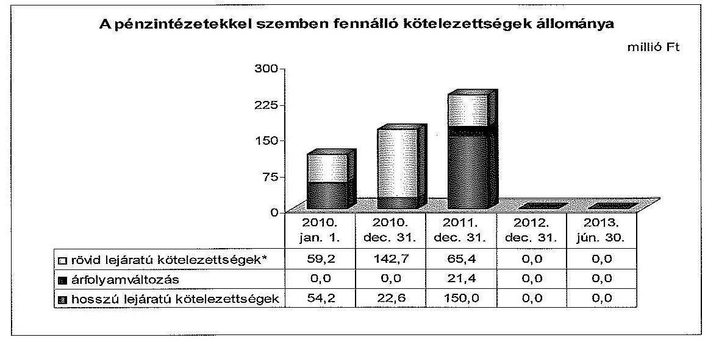
*A 2010. december 31-re vonatkozó rövid lejáratú kötelezettségeket a helyszíni ellenőrzés során megállapított hiányosságokkal korrigáltuk.

A Kvtv. 76/C. § (1) bekezdése alapján a 2012. évben végrehajtott adósságkonszolidáció keretében a Magyar Állam, az Önkormányzat 2012. december 12-én fennálló adósságállományának és ezen állomány 2012.

[^0]
[^0]:    ${ }^{17}$ Hitel igénybevételének célja: Herend Rákóczi utca építése, felvételének napja 2010. július 23., összege: 10,2 millió Ft. Futamideje 20 év, negyedéves kamat és tőketörlesztési gyakorisággal.
    ${ }^{18}$ A hosszú lejáratú kötelezettségek következő évben esedékes törlesztő részleteit a rövid lejáratú kötelezettségek sor tartalmazza.

---

december 28 -áig számított járulékainak 100,0\%-át vállalta át, amelyhez 259,7 millió Ft költségvetési támogatást nyújtott. Az összes tőketartozás 246,4 millió Ft volt, amely 150,0 millió Ft kötvény, 18,7 millió Ft fejlesztési hitel és 77,7 millió Ft folyószámlahitelből állt. A fennmaradó 13,3 millió Ft összeg, 2,8 millió Ft kamatkiadásból és 10,5 millió Ft pénzügyileg realizált árfolyamveszteségből tevődött össze. A pénzintézeti kötelezettségállomány csökkenés rögzítése a mérlegben a 2012. évben elszámolásra került.

A devizában fennálló kötelezettség árfolyamkockázatot, a változó kamatozású, magas kamatfelárral rendelkező kötvény és folyószámlahitel kamatkockázatot ${ }^{19}$ jelentett az Önkormányzat számára.

A kötvény kibocsátását megelőzően a Képviselő-testület vizsgálta a viszszafizetés lehetséges forrásait, valamint könyvvizsgálót bízott meg a tervezett kötelezettségvállalással kapcsolatos szakmai vélemény kialakítása céljából. Az Önkormányzat a visszafizetés forrásaként az építményadó bevezetésének és ingatlanok eladásának lehetőségével számolt. Az építményadó kivetésére azonban nem került sor, továbbá a tervezett ingatlanértékesítések is elmaradtak.

Az Önkormányzat pénzügyi egyensúlya 2010-2012 között a csökkenő bevételek, a bevételi kitettségek és a biztonságos múködést szolgáló tartalékok 2012-ig tartó hiányából adódóan nem volt biztosított. Az Önkormányzat likviditását folyószámla-, likvid- és eseti jellegü munkabérmegelőlegezési hitel felvételével tudta biztosítani. A likviditás és a rövid távú pénzügyi egyensúly kedvezőtlenül alakult, a folyószámlahitel tartósan magas állománya banki kitettséget jelentett.

A folyószámla-, és likvid hitel igénybevételét a 2010-2013. év I. félévben az alábbi tábla mutatja be:

| Megnevezés | 2010. év | 2011. év | 2012. év | 2013. I.   félév |
| :-- | --: | --: | --: | --: |
| Folyószámlahitel |  |  |  |  |
| Keretösszeg január 1-jén (millió Ft) | 50,0 | 80,0 | 80,0 | 0,0 |
| Átlagos, napi állomány (millió Ft) | 29,7 | 38,0 | 38,7 | 0,0 |
| Hítellel zárt napok száma (nap) | 352 | 157 | 335 | 0 |
| Egyenleg állomány az időszak végén (millió Ft) | 48,6 | 42,6 | 0,0 | 0,0 |
| Teljesített kamat és egyéb kiadás (millió Ft) | 2,7 | 4,0 | 4,4 | 0,0 |
| Likvid hitel |  |  |  |  |
| Keretösszeg január 1-jén (millió Ft) | 0,0 | 40,0 | 0,0 | 0,0 |
| Átlagos, napi állomány (millió Ft) | 40,0 | 40,0 | 0,0 | 0,0 |
| Hítellel zárt napok száma (nap) | 122 | 31 | 0 | 0 |
| Egyenleg állomány az időszak végén (millió Ft) | 40,0 | 0,0 | 0,0 | 0,0 |
| Teljesített kamat és egyéb kiadás (millió Ft) | 0,3 | 0,0 | 0,0 | 0,0 |

[^0]
[^0]:    ${ }^{19}$ A folyószámlahitel referenciakamata BUBOR, a kötvény referenciakamata EURIBOR.

---

A 2011. év kivételével - a kötvénykibocsátás miatt jelentkező átmeneti likviditás növelése következtében - közel folyamatos volt az Önkormányzat folyószámlahitel tartozása. Átlagos napi állománya 2010. évben 29,7 millió Ft, 2011. évben 38,0 millió Ft, amíg 2012. évben 38,7 millió Ft volt. A folyószámlahitel év végi állomány 2010-ben és 2011-ben is meghaladta a 40,0 millió Ft-ot. A banki kitettség miatti kockázatot jelzi, hogy az ellenőrzött időszakban 2011. január 1-jétől a rendelkezésre álló hitelkeret 60,0\%-kal 80,0 millió Ft-ra növekedett. Ezen túl 2010-ben 352, 2012-ben 335 napon keresztül csak a hitel igénybevételével tudták a likviditást biztosítani. A folyószámlahitel törlesztését a hitel fordulónapján újabb folyószámlahitel felvételéből teljesítették. A folyószámlahitelhez kapcsolódó kamat és egyéb költség címen az ellenőrzött időszakban 11,1 millió Ft kiadás merült fel.

Adósságkonszolidáció nélkül a jövőbeni kötelezettségek kifizethetősége újabb források bevonása nélkül veszélybe. kerülhetett volna. Az adósságkonszolidáció a folyószámlahitel miatti eladósodottságot és az ebből eredő banki kitettséget megszüntette. Az Önkormányzat 2012. december 12-én fennálló 77,7 millió Ft folyószámlahitel-állományának visszafizetése az adósságkonszolidáció keretében 2012. év végén megtörtént. Ennek hatására a bankkal korábban megkötött folyószámla-hitelszerződés 1. sz. módosítását ${ }^{20}$ a felek nem hosszabbították meg.

Az Önkormányzat az ellenőrzött időszakban mindössze egy alkalommal, 2010. augusztus 2-tól 2010. augusztus 31-ig, 30 nappal lezárt időintervallumban rendelkezett 5,5 millió Ft napi átlagos állományú munkabér-megelőlegezési hitellel. Az Önkormányzat likviditásának biztosítása érdekében 2010. augusztus 31-én 40,0 millió Ft összegű hitelt vett igénybe. A hitel visszafizetésére a szerződéses feltételekkel ellentétben a lejáratot követően került sor ${ }^{21}$. Az Önkormányzat a likvid hitel 40,0 millió Ft-os fennálló állományát - az Áhsz. 26. § (1) és (5) bekezdés a) pontjában ${ }^{22}$ foglaltakkal ellentétesen - a 2010. évi mérlegében a rövid lejáratú kötelezettségek között nem szerepeltette. A 2010. évi mérlegben feltüntetett pénzintézeti kötelezettségek öszszege így nem a valóságban fennálló kötelezettséget mutatta.

Az észrevétel szerint az Önkormányzat 74/2010. (VIII. 18.) számú önkormányzati határozatával a Raiffeisen Bank Zrt.-nél likviditási célra 40,0 millió Ft összegű működési célú hitel felvételét hagyta jóvá. A hitelkeret utófinanszírozott fejlesztésekhez kapcsolódó támogatás megelőlegezését is szolgálta. A 2010. év végi mérleg tartalmazta a Raiffeisen Bank Zrt-től felvett müködési hitelt is. A hitelállomány nyilvántartásba vételéről az észrevételhez mellékelik a 45151 Rövid lejáratú múködési célú hitelfelvétel elnevezésű főkönyvi számlát, véleményük szerint a záró főkönyvi kivonat ennek megfelelően a hitelállományt is kellett, hogy tartalmazza.

[^0]
[^0]:    ${ }^{20}$ A 2013. március 13-án aláírt MBD-VESZ-2/2011 szerződésszámú bankszámlahitelszerződés 1. számú módosítása. Keretösszeg 80,0 millió Ft, Igénybevétel megszűnése: 2012. december 31.
    ${ }^{21}$ A hitel lejárata 2011. január 31., visszafizetésének napja 2011. február 25. volt.
    ${ }^{22}$ Hatálytalan 2014. január 1-jétől. A 2014. január 1-jétől hatályos előírás: Áhsz. 14. § (8)-(9) bekezdése.

---

Az észrevételt részben elfogadjuk, a hitel céljára és a hitelfelvétel finanszírozási célú bevételként történő elszámolására vonatkozó megállapításokat pontosítjuk. A hitelállomány 2010. évi mérlegben történő kimutatására tett észrevételt nem fogadjuk el. Az Önkormányzat a 2010. évi könyvviteli mérlegében rövid lejáratú hitelekből fennálló kötelezettségként kizárólag a 48,6 millió Ft összegű folyós számlahitel tartozását szerepeltette, ezen túl a mérlegben egyéb rövid lejáratú kötelezettségként a beruházási hitelekből fennálló, hosszú lejáratú kötelezettségek következő évben esedékes törlesztő részletének összegét mutatta ki. Az észrevételhez csatolt dokumentum a hitel igénybevételéből adódó finanszírozási célú bevétel elszámolásához kapcsolódik, amely könyvelés technikailag független a felvett hitelből fennálló tartozás mérlegben történő kimutatásától. Az Önkormányzat 2010. évi pénzforgalmi jelentése alapján megállapítottam, hogy a hitelfelvétel, mint finanszírozási célú bevétel elszámolása megtörtént.

Az Önkormányzat 2010-2013. év I. félév közötti szállítói és lejárt szállítói állományát az alábbi ábra mutatja be:
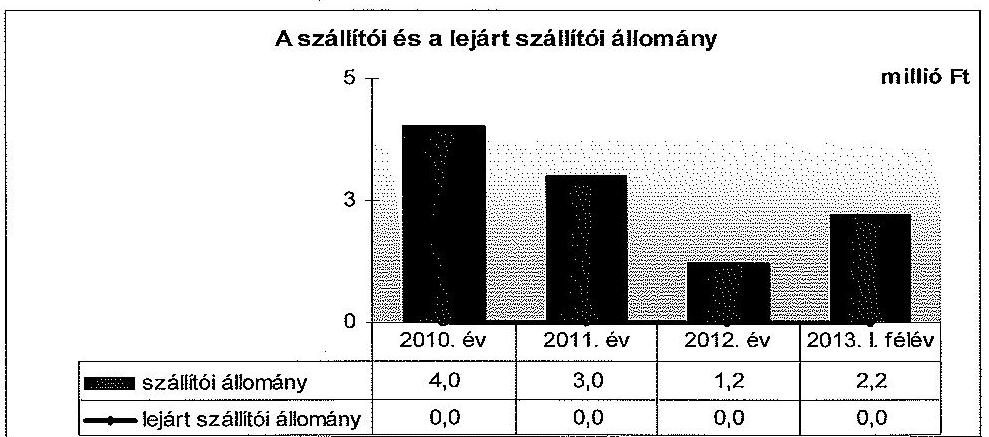

* A szállítói kötelezettségek összegét korrigáltuk a helyszíni ellenőrzés során megállapított hiányzó szállítói állománnyal.

Az Önkormányzat az ellenőrzött időszakban szállítói kötelezettségeit folyamatosan teljesítette, lejárt szállítói kötelezettségei nem voltak. A szállítókkal szembeni kötelezettségek folyamatosan csökkentek, továbbá elhanyagolható nagyságrendet képviseltek az ellenőrzött időszakban. Az Önkormányzat szállítói kitettséggel nem rendelkezett, a szállítói kötelezettségekből eredő nemfizetési kockázat nem állt fent.

Az Önkormányzatnál a szállítói kötelezettségek év végi állományában a mérlegben nem kerültek kimutatásra a mérleg fordulónapjáig teljesített azon szállítói kötelezettségek, amelyekről a számlák a számviteli politikában megjelölt mérlegkészítés időpontjáig, február 28-ig beérkeztek. Az Önkormányzat a szállítókról az analitikus nyilvántartást nem az Áhsz. 1 26. § (1) bekezdésében ${ }^{23}$ foglaltaknak, valamint az Áhsz. 1 9. számú melléklete 4. pontja db) ${ }^{24}$ előírásának megfelelően vezette. Az Önkormányzat a helyszíni ellenőrzés során

[^0]
[^0]:    ${ }^{23}$ Hatálytalan 2014. január 1-jétől. A 2014. január 1-jétől hatályos előírás: Áhsz. ${ }_{2}$ 14. § (8) bekezdése és az 1. § (1) bekezdés 9. pontja.
    ${ }^{24}$ Hatálytalan 2014. január 1-jétől. A 2014. január 1-jétől hatályos előírás: Áhsz. ${ }_{2}$ 14. számú melléklet II. pontja.

---

meghatározta a mérlegeiben nem szerepeltetett szállítói állományt, amelynek eredményeként megállapításra került a korrigált, mérlegben kimutatandó szállítói kötelezettségek állománya ${ }^{25}$. Az Önkormányzatnak 2012. december 31-én a szállítói kötelezettségeken kívül helyi adó túlfizetésből származó visszafizetési kötelezettsége volt 1,7 millió Ft összegben. Az Önkormányzat kötelezettségeinek és egyes kötelezettségvállalásainak 2010. december 31-ei és 2013. június 30 -ai állományát, valamint a 2013. év II. félévében és az azt követő években várható kötelezettségek, kötelezettségvállalások miatti kiadásokat az 4. számú melléklet mutatja be.

Mérlegen kívüli tételek miatti kockázat nem állt fent az Önkormányzatnál, mivel az ellenőrzött időszakban nem volt PPP konstrukció miatti vagy peres eljárásból eredő fizetési kötelezettsége, továbbá nem vállalt készfizető kezességet.

Az Önkormányzat az ellenőrzött időszakban az Ötv. 92/A. § (3) bekezdésében foglaltak alapján könyvvizsgálatra volt kötelezett. A 2010-2012. közötti évek egyszerűsített éves költségvetési beszámolói könyvvizsgálattal alátámasztottak voltak és a könyvvizsgálói vélemény nem tartalmazott a beszámoló különböző részeiben szerepeltetett pénzforgalmi és állományi adatokkal kapcsolatos kifogásokat, a pénzügyi helyzetet befolyásoló számviteli hiányosságokat nem állapított meg. A könyvvizsgálói jelentések nem tértek ki a pénzintézetek és a szállítók felé fennálló kötelezettségek teljes körüségének hiányosságaira.

Az Önkormányzat az ellenőrzött időszakban méltányosságból, szociális rászorultság elbírálása után egy esetben engedett el magánszemély által fizetendő kommunális adó követelést 13,0 ezer Ft összegben. A 2010. évben két gazdasági társasággal szembeni követelést minősített behajthatatlanná az Önkormányzat, a társaságok bírósági végzés általi megszüntetése és a hitelezői igények kielégítésének fedezetlensége miatt összesen 157,3 ezer Ft összegben. A tételek nem gyakoroltak hatást az Önkormányzat pénzügyi helyzetére.

Az ellenőrzött időszakban az Önkormányzat adatszolgáltatása alapján két forgalomképes ingatlanára történt zálogjog bejegyzés, illetve további két ingatlan rendelkezett korábban bejegyzett jelzálogjoggal. A megterhelt ingatlanok 2012. december 31-i nettó értéke 35,8 millió Ft (az összes mérlegben kimutatott ingatlan nettó értékének 2,4\%-a) volt. A 2015. szeptember 5-ig, illetve 2030. december 31-ig jelzáloggal terhelt ingatlanok a 2010-ben indult Rákóczi utca építéséhez és az önkormányzati intézmények fűtéskorszerűsítéséhez kapcsolódó pénzügyi forrás biztosítására kötött kölcsönszerződésekhez kapcsolódtak. Az adósságkonszolidáció következtében a jelzáloggal terhelt ingatlanok esetében a zálogjog törlésének kezdeményezése az Önkormányzat részéről megtörtént.

Az Önkormányzatnak a 2012-2013. év I. félév közötti időszakban a Stabilitási tv. 10. § (1) bekezdésében meghatározott, a Kormány engedélyéhez kötött adósságot keletkeztető ügylete nem volt. Az Önkormányzat és költségvetési szervei

[^0]
[^0]:    ${ }^{25}$ A szállítói állomány 2011. évben: mérlegben 0,0 millió Ft, korrekció 3,0 millió Ft; 2012. évben: mérlegben 0,0 millió Ft, korrekció 1,2 millió Ft; 2013. év I. félévben: a negyedéves mérlegjelentésben 0,0 millió Ft, korrekció 2,2 millió Ft.

---

2013. évi költségvetését 649,9 millió Ft költségvetési bevétellel, 649,9 millió Ft költségvetési kiadással, hiány nélkül állapította meg, működőképesség megőrzését szolgáló, kiegészítő támogatást nem vettek figyelembe a Mötv. 111. § (4) bekezdésében előírt egyensúlyának megteremtése érdekében, valamint hitelfelvétel tervezése nélkül biztosították az egyensúlyt.

Az Önkormányzatnál és költségvetési szerveinél 2010. január 1-jén a foglalkoztatottak száma 129 fő, a 2012. december 31-i záró létszám 122 fő volt. A 2010-2012. évek időszakában nyolc fő foglalkoztatása szűnt meg, az álláshelyek számának növekedése egy volt, illetve átlagosan nyolc fő vett részt közfoglalkoztatásban.

Az Önkormányzatnak az ellenőrzött időszakban - az alapítói okiratban, alapszabályban rögzítettek szerint - nem volt olyan gazdasági társasága, amelyben minősített többségi befolyással rendelkezett. Az Önkormányzat 2,03\%-os tulajdonrészével működő Bakonykarszt Zrt.-nek tőkehelyzete és gazdálkodásának eredményessége megfelelő, ebből adódóan mérlegen kívüli tételek miatti kockázat a gazdasági társaság gazdálkodása miatt nem áll fenn. Az önkormányzati feladatok ellátásában résztvevő gazdasági társaságok egyes kiemelt adatait a 3. számú melléklet mutatja be.

# 4. AZ ÖNKORMÁNYZAT PÉNZÜGYI GAZDÁLKODÁSA SORÁN ÉRVÉNYESÍTETT INTEGRITÁSI SZEMPONTOK 

A pénzügyi gazdálkodás során - a „négy szem elvének" alkalmazása, a pénzügyi helyzetet, az adósságterhet befolyásoló döntések előtti kockázatok szabályozása tekintetében - érvényesült az integritási szemlélet. Az Önkormányzati eszközök használata, a közérdekű bejelentések, az összeférhetetlenség és a munkavégzésre vonatkozó etikai elvárások szabályozásának hiánya azonban arra utal, hogy az Önkormányzatnak figyelmet kell fordítania az integritási szemlélet teljes körú érvényesítésére. Az Integritás Kérdőívet az ellenőrzött időszakban 2010. év kivételével minden évben kitöltötte az Önkormányzat.

A Polgármesteri Hivatalban a köztisztviselőkre vonatkozóan az etikai elvárásokat, szabályokat a Bkr. 6. § (1) bekezdés c) pontjával ellentétben nem határoztak meg. A Közszolgálati szabályzat ${ }_{1,2}$-ban általánosságban határozták meg, amelyek hatálya a Polgármesteri Hivatal minden dolgozójára és vezetőjére kiterjedt.

Az Önkormányzat az ellenőrzött időszakban a Közszolgálati szabályzat ${ }_{2}$ 2013. március 1-jei hatályba lépéséig nem szabályozta az összeférhetetlenség eseteit, ezt követően sem tartalmazott konkrét meghatározásokat. Az összeférhetetlenség esetén követendő eljárásokat nem szabályozták, csak az erre vonatkozó jogszabályi előírások betartásának kötelezettségét rögzítették ${ }^{26}$.

[^0]
[^0]:    ${ }^{26}$ A Közszolgálati Szabályzat ${ }_{2}$ szerint „a munkavégzéssel járó egyéb jogviszonyt a hivatal köztisztviselői Kttv. 84.-87. §-ban foglaltak szerint a Jegyzö engedélyével létesíthetnek. A felmerülö összeférhetetlenségi okot a Jegyzönél kell bejelenteni".

---

Az Önkormányzat a tulajdonában, illetve kezelésében lévő eszközök (gépjárművek, telefonok, eszközök) használatát hiányosan szabályozta ${ }^{27}$. Az Önkormányzatnál a szervezeten kívülről, illetve belülről érkező közérdekü bejelentések kezelésével kapcsolatos szabályzattal nem rendelkezett, nem múködtetett a közérdekű bejelentések kezelésére szolgáló rendszert, illetve erre vonatkozó eljárásrenddel nem rendelkezett.

A Szabálytalanságok kezelésének eljárásrendje és az ellenőrzési nyomvonal a pénzügyi gazdálkodást érintő folyamatokban tartalmazta „a négy szem elvének" alkalmazását.

Az Önkormányzatnál a pénzügyi helyzetet, az adósságterheket befolyásoló döntések elötti kockázatok felmérését megfelelően szabályozták. Az ellenőrzött időszakban hatályos Kockázatkezelési Szabályzatok ${ }_{1,2}$, tartalmazták a követendő eljárásokat. Továbbá a Polgármesteri Hivatal Szervezeti és Múködési Szabályzata határozza meg a Pénzügyi- és Humánpolitikai Iroda feladatait, amely feladat- és hatáskörében ellátja a pénzügyi döntés-előkészítést és végrehajtást, a vagyonkezelési és vagyongazdálkodási feladatokat.

Budapest, 2014. OG. hónap 13. nap

Melléklet: $\quad 7 \mathrm{db}$
Függelék: $\quad 2 \mathrm{db}$
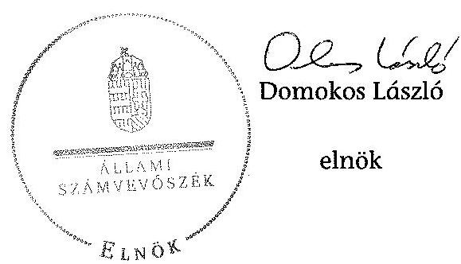

[^0]
[^0]:    ${ }^{27}$ Nem szabályozták a számítástechnikai eszközöknél a jelszó tárolását, változtatás, továbbá az e-mail használatot, valamint az egyéb berendezések állagmegórzésére, használatára nem volt szabályozás.

---

.

---

Az Önkormányzat bevételei és kiadásai, valamint adósságszolgálata a 2010-2013. év I. Nöfve közötti időszakban a CLF módszer szerint (a 2012. év a Kvív., 76/C. § (1) bekezdésében foglalt adósságátvállaláshoz kapcsolódó pénzügyi teljesítések nélkül)

|  1. FOLYÓ KÖLTSÉGVETÉS* | 2010. év | 2011. év | 2012. év | 2013. év  |
| --- | --- | --- | --- | --- |
|   |  |  |  | I. Nöfve  |
|  1.1.1. Saját működési bevételek | 154,1 | 156,0 | 177,8 | 90,1  |
|  1.1.2. Költségvetési támogatások ÖNHIKI támogatások nélkül** | 191,0 | 199,7 | 172,2 | 90,3  |
|  1.1.3. Átengedelt bevételek | 97,6 | 89,8 | 78,2 | 4,6  |
|  1.1.4. Állámlázhatáson belülről kapott támogatások | 71,8 | 56,0 | 52,8 | 12,7  |
|  1.1.5. EU-tól és külföldről kapott bevételek | 0,0 | 7,0 | 0,0 | 3,1  |
|  1.1.6. Állámlázhatáson kívülről kapott bevételek | 1,0 | 0,0 | 2,2 | 0,1  |
|  1.1.7. Hozam- és kamatbevételén | 0,0 | 2,7 | 0,0 | 2,0  |
|  1.1.8. Kötcededés visszatérődése, igénybevételé | 0,7 | 0,0 | 0,0 | 0,0  |
|  1.1.9. Előző évi pénzmeredvény átvétel | 0,0 | 0,0 | 0,0 | 0,0  |
|  1.1.10. A működőközesség megővésült szolgáltá ténybejlődő támogatások | 3,7 | 22,8 | 29,7 | 0,0  |
|  1.1. Folyó bevételek +1.1.1.+1.1.2.+1.1.3.+1.1.4.+1.1.5.+1.1.6.+1.1.7.+1.1.8.+1.1.9.+1.1.10. | 512,2 | 503,8 | 506,0 | 193,0  |
|  1.2.1. Müködési kiadások kamatőskökező nélkül | 397,9 | 477,7 | 460,0 | 186,1  |
|  1.2.2. Állámlázhatáson belülre átadott pénzeszközök | 7,4 | 8,0 | 10,1 | 0,1  |
|  1.2.2.1. vállalkozásoknak | 0,3 | 0,5 | 0,5 | 0,0  |
|  1.2.2.2. EU-nak, illetve külföldre | 0,0 | 0,0 | 0,0 | 0,0  |
|  1.2.2.3. magánszemélyeknek | 15,3 | 18,0 | 14,1 | 6,8  |
|  1.2.2.4. amennyit szervezetelemek | 7,8 | 7,8 | 0,7 | 0,3  |
|  1.2.3. Tisuszforkiadások (+1.2.3.1.+1.2.3.2.+1.2.3.3.+1.2.3.4.) | 17,7 | 20,6 | 25,2 | 7,3  |
|  1.2.4. Kamatőskökező | 7,0 | 8,0 | 4,0 | 0,1  |
|  1.2.5. Kölcsönök nyújtása, törlesztése | 0,0 | 0,0 | 0,0 | 0,0  |
|  1.2.6. Előző évi pénzmeredvény átvétel | 0,0 | 0,0 | 0,0 | 0,0  |
|  1.2. Folyó kiadások + 1.2.1.+1.2.2.+1.2.3.+1.2.4.+1.2.5.+1.2.6. | 329,7 | 310,2 | 301,8 | 173,6  |
|  1.3. Folyó költségvetési egyenleges, működési jövedelem (1.1.-1.2.) | -17,5 | -6,4 | 6,7 | 20,0  |
|  2. FELHALMOZÁSI KÖLTSÉGVETÉS*** |  |  |  |   |
|  2.1.1. Saját többbevételén | 2,3 | 2,1 | 34,1 | 4,4  |
|  2.1.2. Költségvetési támogatások | 0,0 | 0,0 | 1,3 | 0,3  |
|  2.1.3. Állámlázhatáson belülről kapott támogatások | 13,1 | 30,7 | 0,0 | 0,0  |
|  2.1.4. EU-tól és külföldről kapott támogatások | 0,0 | 0,0 | 0,0 | 0,0  |
|  2.1.5. Állámlázhatáson kívülről kapott bevételek | 0,0 | 0,0 | 0,0 | 0,0  |
|  2.1.6. Hozam- és kamatbevételük | 0,0 | 0,0 | 0,7 | 0,0  |
|  2.1.7. Kölcsönök visszatérődése, igénybevételé | 0,0 | 0,0 | 0,1 | 0,0  |
|  2.1.8. Előző évi pénzmeredvény átvétel | 0,0 | 0,0 | 0,0 | 0,0  |
|  2.1. Felhalmozási bevételek +2.1.1.+2.1.2.+2.1.3.+2.1.4.+2.1.5.+2.1.6.+2.1.7.+2.1.8. | 16,8 | 32,9 | 36,4 | 4,7  |
|  2.2.1. Saját beruházási kiadás átfayal | 16,8 | 20,3 | 0,7 | 6,8  |
|  2.2.2. Saját felújítási kiadás átfayal | 6,7 | 6,1 | 2,2 | 0,0  |
|  2.2.3. Állámlázhatáson belülre átadott pénzeszközök | 2,5 | 0,0 | 0,0 | 0,0  |
|  2.2.4. EU-nak és külföldnek adott pénzeszközök | 0,0 | 0,0 | 0,0 | 0,0  |
|  2.2.5. Állámlázhatáson körülre adott pénzeszközök | 0,0 | 0,0 | 0,0 | 0,0  |
|  2.2.6. Belelelebbi célú részesedések vásárlása | 0,0 | 0,0 | 0,0 | 0,0  |
|  2.2.7. Kamatőskökező | 2,1 | 6,3 | 10,2 | 0,0  |
|  2.2.8. Kölcsönök nyújtása, törlesztése | 0,0 | 0,0 | 0,0 | 0,0  |
|  2.2.9. Előző évi pénzmeredvény átadás | 0,0 | 0,0 | 0,0 | 0,0  |
|  2.2.10. ÁFA brőzetelemi | 0,0 | 0,0 | 0,0 | 0,0  |
|  2.2. Felhalmozási kiadások + 2.2.1.+2.2.2.+2.2.3.+2.2.4.+2.2.5.+2.2.6.+2.2.7.+2.2.8.+2.2.9.+2.2.10. | 34,4 | 34,7 | 13,2 | 7,3  |
|  2.3. Felhalmozási költségvetési egyenlege (2.1.-2.2.) | -17,9 | -1,8 | 35,2 | -2,6  |
|  3. FINANSZÍROZÁSI MŰVELETEK NÉLKÜLI (GFS) POZICIÓ (1.3.+2.3.) | -35,4 | -8,3 | 31,9 | 17,4  |
|  4. FINANSZÍROZÁSI MŰVELETEK |  |  |  |   |
|  4.1. Hitofizívétel | 66,3 | 45,0 | 0,0 | 0,0  |
|  4.2. Hitofőolasztás | 16,8 | 142,0 | 19,0 | 0,0  |
|  4.3. Forgalási és befektetési célú értékpapírok időszakába | 0,0 | 100,0 | 0,0 | 0,0  |
|  4.4. Forgalási és befektetési célú értékpapírok bevételek | 0,0 | 0,0 | 0,0 | 0,0  |
|  4.5. Forgalási és befektetési célú értékpapírok kötelevétele | 0,0 | 0,0 | 0,0 | 0,0  |
|  4.6. Forgalási és befektetési célú értékpapírok vásárlása | 0,0 | 0,0 | 0,0 | 0,0  |
|  4.7. Egyéb finanszírockal bevételek (függő, átfultú, kiegészítői) | -17,0 | -7,6 | 4,1 | 4,0  |
|  4.8. Egyéb finanszírockal kiadások (függő, átfultú, kiegészítői) | 4,8 | -7,0 | -11,4 | 40,8  |
|  4.9. Finanszírockal művelékok egyenleges (4.1.-4.2.+4.3.-4.4.+4.5.-4.6.+4.7.-4.8.) | 32,7 | 81,2 | -3,0 | -44,8  |
|  5. TÁRSFÉVÍ FENZÓGYI POZICIÓ (1.3.+ 2.3.+4.9.) | -2,8 | 53,0 | 29,4 | -27,4  |
|  6. NETTÓ MÖKÖVÉSI JÖVEDELEM = működési jövedelem (1.3.) - töketőríasztás (4.2.+4.4.) | -34,3 | 149,9 | 12,3 | 20,0  |
|  7. TÁJÉRÚZTÁTÓ ÁDÁTOR |  |  |  |   |
|  Összes költségeiteég | 175,3 | 245,2 | 2,8 | 3,8  |
|  ebből rövid lejáratú | 162,3 | 13,8 | 2,0 | 3,4  |
|  Összes szállítói költségeiteég*** | 4,0 | 3,0 | 1,2 | 2,2  |
|  ebből rájárt (sorozóváraból) | 0,0 | 0,0 | 0,0 | 0,0  |
|  Pénz- és tilkapcsol költségeiteég (aöléseég) | 105,3 | 236,8 | 0,0 | 0,0  |
|  ebből rövid lejáratú | 140,7 | 66,4 | 0,0 | 0,0  |
|  ebből (rossza lejáratú költségeiteégek következỏ évet terhelő törlesztő részletei (avallóabból) | 16,6 | 4,1 | 0,0 | 0,0  |
|  PPP szerződéses állomásig biztosítókkal (terhütővárulról) | 0,0 | 0,0 | 0,0 | 0,0  |
|  ebből rájárt szolgáltatási áll miatti költségeiteég | 0,0 | 0,0 | 0,0 | 0,0  |
|  Folyószámra-kilat nem állogva állomásos (terhütővárulról) | 28,1 | 39,0 | 38,1 | 0,0  |
|  Miarkásig megoldógyozási tétel nem állogva állomásos (terhütővárulról) | 2,5 | 0,0 | 0,0 | 0,0  |
|  Kezesség és garancsváladások (terhütővárulról) | 0,0 | 0,0 | 0,0 | 0,0  |
|  Jogadás táróvalal feltételezik adadó költségeiteégek (terhütővárulról) | 0,0 | 0,0 | 0,0 | 0,0  |
|  Finanszírockelai beosztató eszközök | 6,4 | 59,5 | 87,5 | 50,1  |
|  Tartás tőletrészenyt megkeztetett értékpapírok | 0,0 | 0,0 | 0,0 | 0,0  |
|  Hosszú lejáratú barátletétek | 0,0 | 0,0 | 0,0 | 0,0  |
|  Értékpapírok | 0,0 | 0,0 | 0,0 | 0,0  |
|  Pénzeszközök (idegen nélkül) | 0,4 | 59,5 | 87,5 | 50,1  |

- A költségvetési szerveknéi a számviteli szabályoknak megfelelően a bevételekben nem töröl, a kiadásokban nem jelenik meg az amortizáció, a vagyoni helyzetet az egyedege befejelezik. ** A költségvetési támogatásból a felhalmozási célú részt az Önkormányzat adatszolgáltatása szerinti mértékben vettük figyelembe a 2.1.2., a 2.1.6., illetve a 2.2.7. sorokon. *** Bevételekben vagyonmegőrzésre és -bővítésre fordítható kordunk. **** A szállítók fordultánapi állományának összegedi - a 2010. év kivételével - az Önkormányzat által teli nyilatkozat alapján korrigáltuk, a helyszíni ellenőrzés során megidépített hiányzó szállítói állományok.

---

Az Önkormányzat bevételei és kiadásai a Kvtv., 76/C. § (1) bekezdésében foglalt adósságátvállaláshoz kapcsolódó pénzügyi teljesítések nélkül a 2012. évben (a CLF módszer szerint)

|  1. FOLYÓ KÖLTSÉGVETÉS* | beszámoló szerinti adatok | az adósság átvállaláshoz kapcsolódó bevételek tft. kiadások | módosított adatok  |
| --- | --- | --- | --- |
|   | 1 | 2 | 1+2  |
|  1.1.1. Saját működési bevételek | 172,9 |  | 172,9  |
|  1.1.2. Költségvetési támogatások ÖRRIKI támogatások nélkül** | 250,4 | $-78,2$ | 172,2  |
|  1.1.3. Átengedett bevételek | 22,2 |  | 78,2  |
|  1.1.4. Államháztartáson belülről kapott támogatások | 52,6 |  | 52,6  |
|  1.1.5. EU-tól és külföldről kapott bevételek | 0,0 |  | 0,0  |
|  1.1.6. Államháztartáson kívülről kapott bevételek | 2,2 |  | 2,2  |
|  1.1.7. Hozam- és kamatlbevételek | 0,0 |  | 0,0  |
|  1.1.8. Kölcsönök visszatérülése, igénybevétele | 0,0 |  | 0,0  |
|  1.1.9. Előző évi pénzmeradvány átvétel | 0,0 |  | 0,0  |
|  1.1.10. A működőképesség megőrzését szolgáló kiegészítő támogatások | 29,7 |  | 29,7  |
|  1.1. Folyó bevételek =1.1.1.+1.1.5.+1.1.3.+1.1.4.+1.1.5.+1.1.6.+1.1.7.+1.1.8.+1.1.9.+1.1.10. | 596,7 | $-78,2$ | 508,5  |
|  1.2.1. Müködési kiadások kamatkiválások nélkül | 492,0 |  | 402,0  |
|  1.2.2. Államháztartáson belülre átadott pénzeszközök | 10,1 |  | 10,1  |
|  1.2.3.1. vállalkozásoknak | 0,0 |  | 0,0  |
|  1.2.3.2. EU-nak, illetve külföldre | 0,0 |  | 0,0  |
|  1.2.3.3. megénysomlóyoknak | 22,1 |  | 22,1  |
|  1.2.3.4. nonprofit szervezeteknek | 0,7 |  | 0,7  |
|  1.2.5. Transzterkiadások (=1.2.3.1.+1.2.3.2.+1.2.3.3.+1.2.3.4.) | 25,2 |  | 25,2  |
|  1.2.4. Kamatkiválások*** | $-4,5$ | $-0,0$ | $-4,5$  |
|  1.2.5. Kölcsönök nyújtása, törlesztése | 0,0 |  | 0,0  |
|  1.2.6. Előző évi pénzmeradvány átadás | 0,0 |  | 0,0  |
|  1.2. Folyó kiadások = 1.2.1.+1.2.2.+1.2.3.+1.2.4.+1.2.5.+1.2.6. | 502,4 | $-0,0$ | 501,9  |
|  1.3. Folyó költségvetési egyenlege, működési jövedelem (1.1. - 1.2.) | 64,4 | $-77,7$ | 6,7  |
|  2. FELHALMOZASI KÖLTSÉGVETÉS*** |  |  |   |
|  2.1.1. Saját többbevételek | 34,1 |  | 34,1  |
|  2.1.2. Költségvetési támogatások | 100,6 | $-101,0$ | 1,3  |
|  2.1.3. Államháztartáson belülről kapott támogatások | 0,0 |  | 0,0  |
|  2.1.4. EU-tól és külföldről kapott támogatások | 0,0 |  | 0,0  |
|  2.1.5. Államháztartáson kívülről kapott bevételek | 0,3 |  | 0,3  |
|  2.1.6. Hozam- és kamatlbevételek | 0,7 |  | 0,7  |
|  2.1.7. Kölcsönök visszatérülése, igénybevétele | 0,1 |  | 0,1  |
|  2.1.8. Előző évi pénzmeradvány átvétel | 0,0 |  | 0,0  |
|  2.1. Felhalmozási bevételek =2.1.1.+2.1.2.+2.1.3.+2.1.4.+2.1.5.+2.1.6.+2.1.7.+2.1.8. | 219,9 | $-101,0$ | 38,4  |
|  2.2.1. Saját beruházási kiadás átfaval | 0,7 |  | 0,7  |
|  2.2.2. Saját felújítási kiadás átfaval | 0,7 |  | 0,7  |
|  2.2.3. Államháztartáson belülre átadott pénzeszközök | 0,0 |  | 0,0  |
|  2.2.4. EU-nak és külföldnek adott pénzeszközök | 0,0 |  | 0,0  |
|  2.2.5. Államháztartáson kívülre adott pénzeszközök | 0,0 |  | 0,0  |
|  2.2.6. Befektetési célú részesedések vásárlása | 0,0 |  | 0,0  |
|  2.2.7. Kamatkiválások*** | 22,2 | $-12,8$ | 10,4  |
|  2.2.8. Kölcsönök nyújtása, törlesztése | 0,0 |  | 0,0  |
|  2.2.9. Előző évi pénzmeradvány átadás | 0,0 |  | 0,0  |
|  2.2.10. ÁFA befizetések | 0,0 |  | 0,0  |
|  2.2. Felhalmozási kiadások = 2.2.1.+2.2.2.+2.2.3.+2.2.4.+2.2.5.+2.2.6.+2.2.7.+2.2.8.+2.2.9.+2.2.10. | 26,0 | $-12,6$ | 13,2  |
|  2.3. Felhalmozási költségvetés egyenlege (2.1. - 2.2.) | 193,9 | $-168,7$ | 25,2  |
|  3. FINANSZÍROZÁSI MÜVELETEK NELKÜLI (GFS) POZICIÓ (1.3.+2.3.) | 276,3 | $-246,4$ | 31,9  |
|  4. FINANSZÍROZÁSI MÜVELETEK |  |  |   |
|  4.1. Hitelődvétel | 0,0 |  | 0,0  |
|  4.2. Hitelődvizeztés | 110,4 | $-96,4$ | 10,0  |
|  4.3. Forgatási és befektetési célú értékpapírok kibocsátása | 0,0 |  | 0,0  |
|  4.4. Forgatási és befektetési célú értékpapírok beváltása | 150,0 | $-150,0$ | 0,0  |
|  4.5. Forgatási és befektetési célú értékpapírok értékesítése | 0,0 |  | 0,0  |
|  4.6. Forgatási és befektetési célú értékpapírok vásárlása | 0,0 |  | 0,0  |
|  4.7. Egyéb finanszírozási bevételek (filapól, átfutó, kiegészítő) | 4,1 |  | 4,1  |
|  4.8. Egyéb finanszírozási kiadások (filapól, átfutó, kiegészítő) | $-11,4$ |  | $-11,4$  |
|  4.9. Finanszírozási műveletek egyenlege (4.1.-4.2.+4.3.-4.4.+4.5.-4.6.+4.7.-4.8.) | 246,9 | 246,4 | 0,0  |
|  5. TÁRGYÉVI PÉNZÜGYI POZICIÓ (1.3.+ 2.3.+4.9.) | 26,8 | 0,0 | 26,4  |
|  6. NETTO MÜKÖDÉSI JÖVEDELEM = működési jövedelem (1.3.) - töketörlesztés (4.2.+4.4.) | $-161,0$ | 168,7 | $-12,3$  |

- A költségvetési szerveknéi a számviteli szabályoknak megfelelően a bevételekben nem térül, a kiadásokban nem jelenik meg az amortizáció, a vagyoni helyzetet az egymásig leférjelségis. ** A költségvetési támogatásból a felhalmozási célú részt az Önkormányzat adatszolgáltatóan szerinti mértékben vettük figyelembe a 2.1.2., a 2.1.6., illetve a 2.2.7. sorokon. *** Bevételekben vagyonmegőrzésre és -bővítésre fordítható források. **** Az Önkormányzatnak 10,5 millió Ft működési kiadást (realizált árfolyamveszteséget), továbbá 2,8 millió Ft kamatkiadást kellett volna számviteli nyilvántartásában elszámolnia. Ezzel szemben a könyvvitelben 0,5 millió Ft működési és 12,8 millió Ft háhalmozási kamatot rögzítették, árfolyamveszteséget nem számoltak el.

---

# Az Önkormányzat által a 2010. és a 2013. év I. félév között megvalósított fejlesztési feladatok érdekében teljesített felhalmozási kiadások és az ezekhez vállalt kötelezettségek összegzése

|  É | Fejlesztési feladat típusa |  |  |  |  |  |  |  |  |  |  |  |  |  |  |  |  |  |  |  |  |  |   |
| --- | --- | --- | --- | --- | --- | --- | --- | --- | --- | --- | --- | --- | --- | --- | --- | --- | --- | --- | --- | --- | --- | --- | --- |
|   |  |  |  |  |  |  |  |  |  |  |  |  |  |  |  |  |  |  |  |  |  |  |   |
|   |  |  |  |  |  |  |  |  |  |  |  |  |  |  |  |  |  |  |  |  |  |  |   |
|   |  |  |  |  |  |  |  |  |  |  |  |  |  |  |  |  |  |  |  |  |  |  |   |
|   |  |  |  |  |  |  |  |  |  |  |  |  |  |  |  |  |  |  |  |  |  |  |   |
|   |  |  |  |  |  |  |  |  |  |  |  |  |  |  |  |  |  |  |  |  |  |  |   |
|   |  |  |  |  |  |  |  |  |  |  |  |  |  |  |  |  |  |  |  |  |  |  |   |
|   |  |  |  |  |  |  |  |  |  |  |  |  |  |  |  |  |  |  |  |  |  |  |   |
|   |  |  |  |  |  |  |  |  |  |  |  |  |  |  |  |  |  |  |  |  |  |  |   |
|   |  |  |  |  |  |  |  |  |  |  |  |  |  |  |  |  |  |  |  |  |  |  |   |
|   |  |  |  |  |  |  |  |  |  |  |  |  |  |  |  |  |  |  |  |  |  |  |   |
|   |  |  |  |  |  |  |  |  |  |  |  |  |  |  |  |  |  |  |  |  |  |  |   |
|   |  |  |  |  |  |  |  |  |  |  |  |  |  |  |  |  |  |  |  |  |  |  |   |
|   |  |  |  |  |  |  |  |  |  |  |  |  |  |  |  |  |  |  |  |  |  |  |   |
|   |  |  |  |  |  |  |  |  |  |  |  |  |  |  |  |  |  |  |  |  |  |  |   |
|   |  |  |  |  |  |  |  |  |  |  |  |  |  |  |  |  |  |  |  |  |  |  |   |
|   |  |  |  |  |  |  |  |  |  |  |  |  |  |  |  |  |  |  |  |  |  |  |   |
|   |  |  |  |  |  |  |  |  |  |  |  |  |  |  |  |  |  |  |  |  |  |  |   |
|   |  |  |  |  |  |  |  |  |  |  |  |  |  |  |  |  |  |  |  |  |  |  |   |
|   |  |  |  |  |  |  |  |  |  |  |  |  |  |  |  |  |  |  |  |  |  |  |   |
|   |  |  |  |  |  |  |  |  |  |  |  |  |  |  |  |  |  |  |  |  |  |  |   |
|   |  |  |  |  |  |  |  |  |  |  |  |  |  |  |  |  |  |  |  |  |  |  |   |
|   |  |  |  |  |  |  |  |  |  |  |  |  |  |  |  |  |  |  |  |  |  |  |   |
|   |  |  |  |  |  |  |  |  |  |  |  |  |  |  |  |  |  |  |  |  |  |  |   |
|   |  |  |  |  |  |  |  |  |  |  |  |  |  |  |  |  |  |  |  |  |  |  |   |
|   |  |  |  |  |  |  |  |  |  |  |  |  |  |  |  |  |  |  |  |  |  |  |   |
|   |  |  |  |  |  |  |  |  |  |  |  |  |  |  |  |  |  |  |  |  |  |  |   |
|   |  |  |  |  |  |  |  |  |  |  |  |  |  |  |  |  |  |  |  |  |  |  |   |
|   |  |  |  |  |  |  |  |  |  |  |  |  |  |  |  |  |  |  |  |  |  |  |   |
|   |  |  |  |  |  |  |  |  |  |  |  |  |  |  |  |  |  |  |  |  |  |  |   |
|   |  |  |  |  |  |  |  |  |  |  |  |  |  |  |  |  |  |  |  |  |  |  |   |
|   |  |  |  |  |  |  |  |  |  |  |  |  |  |  |  |  |  |  |  |  |  |  |   |
|   |

---

### Az önkormányzati feladatok ellátásában résztvevő gazdasági társaságok egyes kiemelt adatai

|  Gazdasági társaság
megnevezése | 2013. június 30-én | a gazdasági társaságnak szerződéses kötelezettségre, feladatellátási szerződésre alapozottan az Önkormányzat költségvetéséből nyújtott  |
| --- | --- | --- |
|   | önkormányzat
gazdasági
társaságok | saját tőke,
jegyzett tőke
aránya  |
|   | tulajdoni hányada (%) |   |
|  I. 100%-os tulajdoni hányadú gazdasági társaságok |  |   |
|  100%-os tulajdoni hányadú gazdasági társaságok összesen | × | ×  |
|  II. 75-95%-os tulajdoni hányadú gazdasági társaságok |  |   |
|  75-99%-os tulajdoni hányadú gazdasági társaságok összesen | × | ×  |
|  I. + II. együtt (75-100%-os tulajdoni hányadú gazdasági társaságok) |  |   |
|  minősített befolyásszerző
tulajdoni hányadú gazdasági társaságok összesen | × | ×  |
|  III. 51-74%-os tulajdoni hányadú gazdasági társaságok |  |   |
|  51-74%-os tulajdoni hányadú gazdasági társaságok összesen | × | ×  |
|  IV. egyéb, közfeladatot ellátó gazdasági társaságok |  |   |
|  Bakonykerezt ZH. | 2,0 | 0,0  |
|  Veszprém Közüzeni
Szolgáltató ZH. | 0,0 | 0,0  |
|  E.ON Energiaszolgáltató Kft. | 0,0 | 0,0  |
|  egyéb, közfeladatot ellátó
gazdasági társaságok
összesen | × | ×  |
|  Összesen | × | ×  |

---

Az Önkormányzat kötelezettségeinek és egyes kötelezettségvállalásainak 2010. december 31-ei és 2013. június 30-ai állománya, valamint a 2013. év II. félévében és az azt követő években várható kötelezettségek, kötelezettségvállalások miatti kiadások

|  Megnevezés | Állomány 2010. december 31-én | Állomány 2013. június 30-án | A 2013. év I. félév végén fennálló kötelezettségek, kötelezettségvállalások alapján várható kiadások * |   |
| --- | --- | --- | --- | --- |
|   |  |  | a 2013. július 1. és 2015. december 31. közötti időszakban | a 2016. évtől  |
|  Folyószámlahitel | 48,6 | 0,0 | 0,0 | 0,0  |
|  Hosszú lejáratú fejlesztési hitel (2002) | 49,8 | 0,0 | 0,0 | 0,0  |
|  Hosszú lejáratú fejlesztési hitel (2010) | 10,2 | 0,0 | 0,0 | 0,0  |
|  Hosszú lejáratú fejlesztési hitel (2007) | 1,5 | 0,0 | 0,0 | 0,0  |
|  Hosszú lejáratú fejlesztési hitel (2005) | 15,2 | 0,0 | 0,0 | 0,0  |
|  Likvid hitel | 40,0 | 0,0 | 0,0 | 0,0  |
|  Pénzintézeti kötelezettségek összesen:** | 165,3 | 0,0 | 0,0 | 0,0  |
|  Szállítói kötelezettségek | 4,0 | 2,2 | 2,2 | 0,0  |
|  Egyéb rövid lejáratú kötelezettségek | 6,0 | 1,7 | 1,7 | 0,0  |
|  Kötelezettségek összesen: | 175,3 | 3,9 | 3,9 | 0,0  |

- A 2013. év I. félév végén fennálló kötelezettségek, kötelezettségvállalások alapján a tőketörlesztés a várható kamatkiadásokkal együtt számítva. ** Az Önkormányzat pénzintézettel szembeni kötelezettségeit a 2012. évben az adósságkonszolidáció keretében kiegyenlítette.

---

.

---

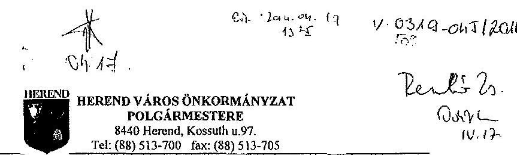

Szám: 4 - 196/2/2014.
Tárgy: „Az önkormányzatok pénzügyi gazdálkodási helyzete értékelésének, és gazdálkodása szabályosságának ellenőrzéséről - Herend" címú jelentéstervezetre észrevétel
Hiv.za.: V-0319-034/2014.
Melléklet: 4 db

# Domokos László Elnök Úr részére 

Állami Számvevőszék
1052 Budapest
Apáczai Csere János u 10.
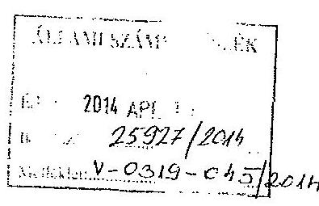

## Tisztelt Elnök Úr!

Az Állami Számvevőszékről szóló 2011. évi LXVI. törvény 29.§ (2) bekezdése alapján a Számvevőszékú ellenőrzés megállapításainak meghatározó többségét elfogadjuk, szok kijavítására vonatkozó javaslataikat megköszönjük.

A jelentéstervezet lenti pontjaihoz az alábbi észrevételeket füzöm:
A jelentéstervezet jegyzőnek szóló, intézkedést igénylő megállapításai és javaslatain belül

## 10. oldal 1. pontjához:

Herend Város Önkormányzata 2013. évi költségvetéséről szóló rendelete tartalmazza az önkormányzat és az általa irányított költségvetési szervek költségvetési bevételeit, az önkormányzat és költségvetési szervek kiadásait kiemelt előirányzatonként is, valamint a kötelező és önként vállalt feladatok és állami (államigazgatási) feladatok szerinti bontást is.

Fentiek igazolásául csatoljuk a 2013. évi költségvetési rendeletünk
5. mellékletét - az önkormányzat és az általa irányított költségvetési szervek költségvetési bevételeit tartalmazza
6. mellékletét - az önkormányzat és költségvetési szervek kiadásait kiemelt előirányzatonként is tartalmazza,
21. mellékletét - a kiadásokat kötelező és önként vállalt feladatok és állami (államigazgatási) feladatok szerinti bontásban, intézményeként tartalmazza.

## 14. oldal negyedik bekezdéséhez:

2013. január 1-jén a Polgármesteri Hivatalnál 18 fő teljes munkaidős és 1 fő részmunkaidős álláshely volt. A jelentéstervezetben 14 fő álláshely szerepel, amely a ténylegesen betöltött álláshelyek számának felel meg.

---

# A jelentéstervezet 23. oldalához: 

Az Önkormányzat 74/2010. (VIII.18.) számú önkormányzati határozatával a Raiffeisen Bank Zrt-nél likviditási célra 40 millió Ft összegủ müködési célú hitel felvételét hagyta jóvá, A hitelkeret utófinanszírozott fejlesztésekhez kapcsolódó támogatás megelőlegezését is szolgálta.

A 2010. év végi mérleg tartalmazta a Raiffeisen Bank Zrt.-től felvett müködési hitelt is.
A hitelállomány nyilvántartásba vételéről mellékeljük a 45151 Rövid lejáratú müködési célú hitelfelvétel elnevezésủ fókönyvi számlát, a záró fókönyvi kivonat ennek megfelelően a hitelállományt is kellett, hogy tartalmazza.

Megköszönve segitő jellegű hozzáállásukat, tisztelettel kérem fenti észrevételeink elfogadását, és végleges jelentésükben a leírtak figyelembevételét.

Herend, 2014. április 9.
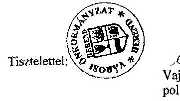

Vajai László
polgárhester

---

5. melléklet a 2013.(II.) önkormányzati rendelethez

Herend Város Önkormányzat önállóan működő intézményei bevétele 2013.

|  Önkormányzat |  |  | 2012. évt
előtányszat | 2012. évt
előtányszat | Különösen
véteszte  |
| --- | --- | --- | --- | --- | --- |
|  1. |  |  |  |  |   |
|  2. |  |  |  |  |   |
|  3. |  |  |  |  |   |
|  4. |  |  |  |  |   |
|  5. |  |  |  |  |   |
|  6. |  |  |  |  |   |
|  7. |  |  |  |  |   |
|  8. |  |  |  |  |   |
|  9. |  |  |  |  |   |
|  10. |  |  |  |  |   |
|  11. |  |  |  |  |   |
|  12. |  |  |  |  |   |
|  13. |  |  |  |  |   |
|  14. |  |  |  |  |   |
|  15. |  |  |  |  |   |
|  16. |  |  |  |  |   |
|  17. |  |  |  |  |   |
|  18. |  |  |  |  |   |
|  19. |  |  |  |  |   |
|  20. |  |  |  |  |   |
|  21. |  |  |  |  |   |
|  22. |  |  |  |  |   |
|  23. |  |  |  |  |   |
|  24. |  |  |  |  |   |
|  25. |  |  |  |  |   |
|  26. |  |  |  |  |   |
|  27. |  |  |  |  |   |
|  28. |  |  |  |  |   |
|  29. |  |  |  |  |   |
|  30. |  |  |  |  |   |
|  31. |  |  |  |  |   |
|  32. |  |  |  |  |   |
|  33. |  |  |  |  |   |
|  34. |  |  |  |  |   |
|  35. |  |  |  |  |   |
|  36. |  |  |  |  |   |
|  37. |  |  |  |  |   |
|  38. |  |  |  |  |   |
|  39. |  |  |  |  |   |
|  40. |  |  |  |  |   |
|  41. |  |  |  |  |   |
|  42. |  |  |  |  |   |
|  43. |  |  |  |  |   |
|  44. |  |  |  |  |   |
|  45. |  |  |  |  |   |
|  46. |  |  |  |  |   |
|  47. |  |  |  |  |   |
|  48. |  |  |  |  |   |
|  49. |  |  |  |  |   |
|  50. |  |  |  |  |   |
|  51. |  |  |  |  |   |
|  52. |  |  |  |  |   |
|  53. |  |  |  |  |   |
|  54. |  |  |  |  |   |
|  55. |  |  |  |  |   |
|  56. |  |  |  |  |   |
|  57. |  |  |  |  |   |
|  58. |  |  |  |  |   |
|  59. |  |  |  |  |   |
|  60. |  |  |  |  |   |
|  61. |  |  |  |  |   |
|  62. |  |  |  |  |   |
|  63. |  |  |  |  |   |
|  64. |  |  |  |  |   |
|  65. |  |  |  |  |   |
|  66. |  |  |  |  |   |
|  67. |  |  |  |  |   |
|  68. |  |  |  |  |   |
|  69. |  |  |  |  |   |
|  70. |  |  |  |  |   |
|  71. |  |  |  |  |   |
|  72. |  |  |  |  |   |
|  73. |  |  |  |  |   |
|  74. |  |  |  |  |   |
|  75. |  |  |  |  |   |
|  76. |  |  |  |  |   |
|  77. |  |  |  |  |   |
|  78. |  |  |  |  |   |
|  79. |  |  |  |  |   |
|  80. |  |  |  |  |   |
|  81. |  |  |  |  |   |
|  82. |  |  |  |  |   |
|  83. |  |  |  |  |   |
|  84. |  |  |  |  |   |
|  85. |  |  |  |  |   |
|  86. |  |  |  |  |   |
|  87. |  |  |  |  |   |
|  88. |  |  |  |  |   |
|  89. |  |  |  |  |   |
|  90. |  |  |  |  |   |
|  91. |  |  |  |  |   |
|  92. |  |  |  |  |   |
|  93. |  |  |  |  |   |
|  94. |  |  |  |  |   |
|  95. |  |  |  |  |   |
|  96. |  |  |  |  |   |
|  97. |  |  |  |  |   |
|  98. |  |  |  |  |   |
|  99. |  |  |  |  |   |
|  100. |  |  |  |  |   |
|  101. |  |  |  |  |   |
|  102. |  |  |  |  |   |
|  103. |  |  |  |  |   |
|  104. |  |  |  |  |   |
|  105. |  |  |  |  |   |
|  106. |  |  |  |  |   |
|  107. |  |  |  |  |   |
|  108. |  |  |  |  |   |
|  109. |  |  |  |  |   |
|  110. |  |  |  |  |   |
|  111. |  |  |  |  |   |
|  112. |  |  |  |  |   |
|  113. |  |  |  |  |   |
|  114. |  |  |  |  |   |
|  115. |  |  |  |  |   |
|  116. |  |  |  |  |   |
|  117. |  |  |  |  |   |
|  118. |  |  |  |  |   |
|  119. |  |  |  |  |   |
|  120. |  |  |  |  |   |
|  121. |  |  |  |  |   |
|  122. |  |  |  |  |   |
|  123. |  |  |  |  |   |
|  124. |  |  |  |  |   |
|  125. |  |  |  |  |   |
|  126. |  |  |  |  |   |
|  127. |  |  |  |  |   |
|  128. |  |  |  |  |   |
|  129. |  |  |  |  |   |
|  130. |  |  |  |  |   |
|  131. |  |  |  |  |   |
|  132. |  |  |  |  |   |
|  133. |  |  |  |  |   |
|  134. |  |  |  |  |   |
|  135. |  |  |  |  |   |
|  136. |  |  |  |  |   |
|  137. |  |  |  |  |   |
|  138. |  |  |  |  |   |
|  139. |  |  |  |  |   |
|  140. |  |  |  |  |   |
|  141. |  |  |  |  |   |
|  142. |  |  |  |  |   |
|  143. |  |  |  |  |   |
|  144. |  |  |  |  |   |
|  145. |  |  |  |  |   |
|  146. |  |  |  |  |   |
|  147. |  |  |  |  |   |
|  148. |  |  |  |  |   |
|  149. |  |  |  |  |   |
|  150. |  |  |  |  |   |
|  151. |  |  |  |  |   |
|  152. |  |  |  |  |   |
|  153. |  |  |  |  |   |
|  154. |  |  |  |  |   |
|  155. |  |  |  |  |   |
|  156. |  |  |  |  |   |
|  157. |  |  |  |  |   |
|  158. |  |  |  |  |   |
|  159. |  |  |  |  |   |
|  160. |  |  |  |  |   |
|  161. |  |  |  |  |   |
|  162. |  |  |  |  |   |
|  163. |  |  |  |  |   |
|  164. |  |  |  |  |   |
|  165. |  |  |  |  |   |
|  166. |  |  |  |  |   |
|  167. |  |  |  |  |   |
|  168. |  |  |  |  |   |
|  169. |  |  |  |  |   |
|  170. |  |  |  |  |   |
|  171. |  |  |  |  |   |
|  172. |  |  |  |  |   |
|  173. |  |  |  |  |   |
|  174. |  |  |  |  |   |
|  175. |  |  |  |  |   |
|  176. |  |  |  |  |   |
|  177. |  |  |  |  |   |
|  178. |  |  |  |  |   |
|  179. |  |  |  |  |   |
|  180. |  |  |  |  |   |
|  181. |  |  |  |  |   |
|  182. |  |  |  |  |   |
|  183. |  |  |  |  |   |
|  184. |  |  |  |  |   |
|  185. |  |  |  |  |   |
|  186. |  |  |  |  |   |
|  187. |  |  |  |  |   |
|  188. |  |  |  |  |   |
|  189. |  |  |  |  |   |
|  190. |  |  |  |  |   |
|  191. |  |  |  |  |   |
|  192. |  |  |  |  |   |
|  193. |  |  |  |  |   |
|  194. |  |  |  |  |   |
|  195. |  |  |  |  |   |
|  196. |  |  |  |  |   |
|  197. |  |  |  |  |   |
|  198. |  |  |  |  |   |
|  199. |  |  |  |  |   |
|  200. |  |  |  |  |   |
|  201. |  |  |  |  |   |
|  202. |  |  |  |  |   |
|  203. |  |  |  |  |   |
|  204. |  |  |  |  |   |
|  205. |  |  |  |  |   |
|  206. |  |  |  |  |   |
|  207. |  |  |  |  |   |
|  208. |  |  |  |  |   |
|  209. |  |  |  |  |   |
|  210. |  |  |  |  |   |
|  211. |  |  |  |  |   |
|  212. |  |  |  |  |   |
|  213. |  |  |  |  |   |
|  214. |  |  |  |  |   |
|  215. |  |  |  |  |   |
|  216. |  |  |  |  |   |
|  217. |  |  |  |  |   |
|  218. |  |  |  |  |   |
|  219. |  |  |  |  |   |
|  220. |  |  |  |  |   |
|  221. |  |  |  |  |   |
|  222. |  |  |  |  |   |
|  223. |  |  |  |  |   |
|  224. |  |  |  |  |   |
|  225. |  |  |  |  |   |
|  226. |  |  |  |  |   |
|  227. |  |  |  |  |   |
|  228. |  |  |  |  |   |
|  229. |  |  |  |  |   |
|  230. |  |  |  |  |   |
|  231. |  |  |  |  |   |
|  232. |  |  |  |  |   |
|  233. |  |  |  |  |   |
|  234. |  |  |  |  |   |
|  235. |  |  |  |  |   |
|  236. |  |  |  |  |   |
|  237. |  |  |  |  |   |
|  238. |  |  |  |  |   |
|  239. |  |  |  |  |   |
|  240. |  |  |  |  |   |
|  241. |  |  |  |  |   |
|  242. |  |  |  |  |   |
|  243. |  |  |  |  |   |
|  244. |  |  |  |  |   |
|  245. |  |  |  |  |   |
|  246. |  |  |  |  |   |
|  247. |  |  |  |  |   |
|  248. |  |  |  |  |   |
|  249. |  |  |  |  |   |
|  250. |  |  |  |  |   |
|  251. |  |  |  |  |   |
|  252. |  |  |  |  |   |
|  253. |  |  |  |  |   |
|  254. |  |  |  |  |   |
|  255. |  |  |  |  |   |
|  256. |  |  |  |  |   |
|  257. |  |  |  |  |   |
|  258. |  |  |  |  |   |
|  259. |  |  |  |  |   |
|  260. |  |  |  |  |   |
|  261. |  |  |  |  |   |
|  262. |  |  |  |  |   |
|  263. |  |  |  |  |   |
|  264. |  |  |  |  |   |
|  265. |  |  |  |  |   |
|  266. |  |  |  |  |   |
|  267. |  |  |  |  |   |
|  268. |  |  |  |  |   |
|  269. |  |  |  |  |   |
|  270. |  |  |  |  |   |
|  271. |  |  |  |  |   |
|  272. |  |  |  |  |   |
|  273. |  |  |  |  |   |
|  274. |  |  |  |  |   |
|  275. |  |  |  |  |   |
|  276. |  |  |  |  |   |
|  277. |  |  |  |  |   |
|  278. |  |  |  |  |   |
|  279. |  |  |  |  |   |
|  280. |  |  |  |  |   |
|  281. |  |  |  |  |   |
|  282. |  |  |  |  |   |
|  283. |  |  |  |  |   |
|  284. |  |  |  |  |   |
|  285. |  |  |  |  |   |
|  286. |  |  |  |  |   |
|  287. |  |  |  |  |   |
|  288. |  |  |  |  |   |
|  289. |  |  |  |  |   |
|  290. |  |  |  |  |   |
|  291. |  |  |  |  |   |
|  292. |  |  |  |  |   |
|  293. |  |  |  |  |   |
|  294. |  |  |  |  |   |
|  295. |  |  |  |  |   |
|  296. |  |  |  |  |   |
|  297. |  |  |  |  |   |
|  298. |  |  |  |  |   |
|  299. |  |  |  |  |   |
|  300. |  |  |  |  |   |
|  301. |  |  |  |  |   |
|  302. |  |  |  |  |   |
|  303. |  |  |  |  |   |
|  304. |  |  |  |  |   |
|  305. |  |  |  |  |   |
|  306. |  |  |  |  |   |
|  307. |  |  |  |  |   |
|  308. |  |  |  |  |   |
|  309. |  |  |  |  |   |
|  310. |  |  |  |  |   |
|  311. |  |  |  |  |   |
|  312. |  |  |  |  |   |
|  313. |  |  |  |  |   |
|  314. |  |  |  |  |   |
|  315. |  |  |  |  |   |
|  316. |  |  |  |  |   |
|  317. |  |  |  |  |   |
|  318. |  |  |  |  |   |
|  319. |  |  |  |  |   |
|  320. |  |  |  |  |   |
|  321. |  |  |  |  |   |
|  322. |  |  |  |  |   |
|  323. |  |  |  |  |   |
|  324. |  |  |  |  |   |
|  325. |  |  |  |  |   |
|  326. |  |  |  |  |   |
|  327. |  |  |  |  |   |
|  328. |  |  |  |  |   |
|  329. |  |  |  |  |   |
|  330. |  |  |  |  |   |
|  331. |  |  |  |  |   |
|  332. |  |  |  |  |   |
|  333. |  |  |  |  |   |
|  334. |  |  |  |  |   |
|  335. |  |  |  |  |   |
|  336. |  |  |  |  |   |
|  337. |  |  |  |  |   |
|  338. |  |  |  |  |   |
|  339. |  |  |  |  |   |
|  340. |  |  |  |  |   |
|  341. |  |  |  |  |   |
|  342. |  |  |  |  |   |
|  343. |  |  |  |  |   |
|  344. |  |  |  |  |   |
|  345. |  |  |  |  |   |
|  346. |  |  |  |  |   |
|  347. |  |  |  |  |   |
|  348. |  |  |  |  |   |
|  349. |  |  |  |  |   |
|  350. |  |  |  |  |   |
|  351. |  |  |  |  |   |
|  352. |  |  |  |  |   |
|  353. |  |  |  |  |   |
|  354. |  |  |  |  |   |
|  355. |  |  |  |  |   |
|  356. |  |  |  |  |   |
|  357. |  |  |  |  |   |
|  358. |  |  |  |  |   |
|  359. |  |  |  |  |   |
|  360. |  |  |  |  |   |
|  361. |  |  |  |  |   |
|  362. |  |  |  |  |   |
|  363. |  |  |  |  |   |
|  364. |  |  |  |  |   |
|  365. |  |  |  |  |   |
|  366. |  |  |  |  |   |
|  367. |  |  |  |  |   |
|  368. |  |  |  |  |   |
|  369. |  |  |  |  |   |
|  370. |  |  |  |  |   |
|  371. |  |  |  |  |   |
|  372. |  |  |  |  |   |
|  373. |  |  |  |  |   |
|  374. |  |  |  |  |   |
|  375. |  |  |  |  |   |
|  376. |  |  |  |  |   |
|  377. |  |  |  |  |   |
|  378. |  |  |  |  |   |
|  379. |  |  |  |  |   |
|  380. |  |  |  |  |   |
|  381. |  |  |  |  |   |
|  382. |  |  |  |  |   |
|  383. |  |  |  |  |   |
|  384. |  |  |  |  |   |
|  385. |  |  |  |  |   |
|  386. |  |  |  |  |   |
|  387. |  |  |  |  |   |
|  388. |  |  |  |  |   |
|  389. |  |  |  |  |   |
|  390. |  |  |  |  |   |
|  391. |  |  |  |  |   |
|  392. |  |  |  |  |   |
|  393. |  |  |  |  |   |
|  394. |  |  |  |  |   |
|  395. |  |  |  |  |   |
|  396. |  |  |  |  |   |
|  397. |  |  |  |  |   |
|  398. |  |  |  |  |   |
|  399. |  |  |  |  |   |
|  400. |  |  |  |  |   |
|  401. |  |  |  |  |   |
|  402. |  |  |  |  |   |
|  403. |  |  |  |  |   |
|  404. |  |  |  |  |   |
|  405. |  |  |  |  |   |
|  406. |  |  |  |  |   |
|  407. |  |  |  |  |   |
|  408. |  |  |  |  |   |
|  409. |  |  |  |  |   |
|  410. |  |  |  |  |   |
|  411. |  |  |  |  |   |
|  412. |  |  |  |  |   |
|  413. |  |  |  |  |   |
|  414. |  |  |  |  |   |
|  415. |  |  |  |  |   |
|  416. |  |  |  |  |   |
|  417. |  |  |  |  |   |
|  418. |  |  |  |  |   |
|  419. |  |  |  |  |   |
|  420. |  |  |  |  |   |
|  421. |  |  |  |  |   |
|  422. |  |  |  |  |   |
|  423. |  |  |  |  |   |
|  424. |  |  |  |  |   |
|  425. |  |  |  |  |   |
|  426. |  |  |  |  |   |
|  427. |  |  |  |  |   |
|  428. |  |  |  |  |   |
|  429. |  |  |  |  |   |
|  430. |  |  |  |  |   |
|  431. |  |  |  |  |   |
|  432. |  |  |  |  |   |
|  433. |  |  |  |  |   |
|  434. |  |  |  |  |   |
|  435. |  |  |  |  |   |
|  436. |  |  |  |  |   |
|  437. |  |  |  |  |   |
|  438. |  |  |  |  |   |
|  439. |  |  |  |  |   |
|  440. |  |  |  |  |   |
|  441. |  |  |  |  |   |
|  442. |  |  |  |  |   |
|  443. |  |  |  |  |   |
|  444. |  |  |  |  |   |
|  445. |  |  |  |  |   |
|  446. |  |  |  |  |   |
|  447. |  |  |  |  |   |
|  448. |  |  |  |  |   |
|  449. |  |  |  |  |   |
|  450. |  |  |  |  |   |
|  451. |  |  |  |  |   |
|  452. |  |  |  |  |   |
|  453. |  |  |  |  |   |
|  454. |  |  |  |  |   |
|  455. |  |  |  |  |   |
|  456. |  |  |  |  |   |
|  457. |  |  |  |  |   |
|  458. |  |  |  |  |   |
|  459. |  |  |  |  |   |
|  460. |  |  |  |  |   |
|  461. |  |  |  |  |   |
|  462. |  |  |  |  |   |
|  463. |  |  |  |  |   |
|  464. |  |  |  |  |   |
|  465. |  |  |  |  |   |
|  466. |  |  |  |  |   |
|  467. |  |  |  |  |   |
|  468. |  |  |  |  |   |
|  469. |  |  |  |  |   |
|  470. |  |  |  |  |   |
|  471. |  |  |  |  |   |
|  472. |  |  |  |  |   |
|  473. |  |  |  |  |   |
|  474. |  |  |  |  |   |
|  475. |  |  |  |  |   |
|  476. |  |  |  |  |   |
|  477. |  |  |  |  |   |
|  478. |  |  |  |  |   |
|  479. |  |  |  |  |   |
|  480. |  |  |  |  |   |
|  481. |  |  |  |  |   |
|  482. |  |  |  |  |   |
|  483. |  |  |  |  |   |
|  484. |  |  |  |  |   |
|  485. |  |  |  |  |   |
|  486. |  |  |  |  |   |
|  487. |  |  |  |  |   |
|  488. |  |  |  |  |   |
|  489. |  |  |  |  |   |
|  490. |  |  |  |  |   |
|  491. |  |  |  |  |   |
|  492. |  |  |  |  |   |
|  493. |  |  |  |  |   |
|  494. |  |  |  |  |   |
|  495. |  |  |  |  |   |
|  496. |  |  |  |  |   |
|  497. |  |  |  |  |   |
|  498. |  |  |  |  |   |
|  499. |  |  |  |  |   |
|  500. |  |  |  |  |   |
|  501. |  |  |  |  |   |
|  502. |  |  |  |  |   |
|  503. |  |  |  |  |   |
|  504. |  |  |  |  |   |
|  505. |  |  |  |  |   |
|  506. |  |  |  |  |   |
|  507. |  |  |  |  |   |
|  508. |  |  |  |  |   |
|  509. |  |  |  |  |   |
|  510. |  |  |  |  |   |
|  511. |  |  |  |  |   |
|  512. |  |  |  |  |   |
|  513. |  |  |  |  |   |
|  514. |  |  |  |  |   |
|  515. |  |  |  |  |   |
|  516. |  |  |  |  |   |
|  517. |  |  |  |  |   |
|  518. |  |  |  |  |   |
|  519. |  |  |  |  |   |
|  520. |  |  |  |  |   |
|  521. |  |  |  |  |   |
|  522. |  |  |  |  |   |
|  523. |  |  |  |  |   |
|  524. |  |  |  |  |   |
|  525. |  |  |  |  |   |
|  526. |  |  |  |  |   |
|  527. |  |  |  |  |   |
|  528. |  |  |  |  |   |
|  529. |  |  |  |  |   |
|  530. |  |  |  |  |   |
|  5210. |  |  |  |  |   |
|  5211. |  |  |  |  |   |
|  5212. |  |  |  |  |   |
|  5213. |  |  |  |  |   |
|  5214. |  |  |  |  |   |
|  5215. |  |  |  |  |   |
|  5216. |  |  |  |  |   |
|  5217. |  |  |  |  |   |
|  5217. |  |  |  |  |   |
|  5218. |  |  |  |  |   |
|  5218. |  |  |  |  |   |
|  5219. |  |  |  |  |   |
|  5220. |  |  |  |  |   |
|  5219. |  |  |  |  |   |
|  5221. |  |  |  |  |   |
|  5222. |  |  |  |  |   |
|  5222. |  |  |  |   |
|  5223. |  |  |  |  |   |
|  5223. |  |  |  |  |   |
|  5224. |  |  |  |  |   |
|  5225. |  |  |  |  |   |
|  5226. |  |  |  |   |
|  5227. |  |  |  |   |
|  5228. |  |  |  |   |
|  5229. |  |  |  |   |
|  5230. |  |  |  |   |
|  5231. |  |  |  |   |
|  5232. |  |  |  |   |
|  5233. |  |  |  |   |
|  5233. |  |  |  |   |
|  5234. |  |  |  |   |
|  5235. |  |  |  |   |
|  5236. |  |  |  |   |
|  5237. |  |  |  |   |
|  5238. |  |  |  |   |
|  5239. |  |  |  |   |
|  5240. |  |  |  |   |
|  5239. |  |  |  |   |
|  5300. |  |  |  |   |
|  5241. |  |  |  |   |
|  5242. |  |  |  |   |
|  5242. |  |  |  |   |
|  5243. |  |  |  |   |
|  5243. |  |  |  |   |
|  5244. |  |  |  |   |
|  5244. |  |  |  |   |
|  5245. |  |  |  |   |
|  5244. |  |  |  |   |
|  5245. |  |  |  |   |
|  5245. |  |  |  |   |
|  5246. |  |  |  |   |
|  5246. |  |  |  |   |
|  5247. |  |  |  |   |
|  5247. |  |  |  |   |
|  5248. |  |  |  |   |
|  5248. |  |  |  |   |
|  5249. |  |  |  |   |
|  5250. |  |  |  |   |
|  5251. |  |  |  |   |
|  5252. |  |  |  |   |
|  5252. |  |  |  |   |
|  5252. |  |  |  |   |
|  5252. |  |  |  |   |
|  5253. |  |  |  |   |
|  5253. |  |  |  |   |
|  5253. |  |  |  |   |
|  5253. |  |  |  |   |
|  5253. |  |  |  |   |
|  5254. |  |  |   |
|  5254. |  |  |   |
|  5254. |  |  |  |   |
|  5254. |  |  |  |   |
|  5255. |  |  |  |   |
|  5255. |  |  |  |   |
|  5255. |  |  |  |   |
|  5255. |  |  |   |
|  5255. |  |  |  |   |
|  5256. |  |  |  |   |
|  5256. |  |  |  |   |
|  5257. |  |  |   |
|  5257. |  |  |   |
|  5258. |  |  |   |
|  5258. |  |  |   |
|  5259. |  |  |   |
|  5260. |  |  |   |
|  5261. |  |  |   |
|  5262. |  |  |   |
|  5262. |  |  |   |
|  5262. |  |  |   |
|  5262. |  |  |   |
|  5263. |  |  |   |
|  5263. |  |  |   |
|  5263. |  |  |   |
|  5263. |  |  |   |
|  5264. |  |  |   |
|  5265. |  |  |   |
|  5265. |  |  |   |
|  5266. |  |  |   |
|  5266. |  |  |   |
|  5267. |  |  |   |
|  5270. |  |   |
|  5271. |  |   |
|  5272. |  |   |
|  5272. |  |   |
|  5273. |  |   |
|  5273. |  |   |
|  5274. |  |   |
|  5274. |  |   |
|  5275. |  |   |
|  5275. |  |   |
|  5276. |  |   |
|  5276. |  |   |
|  5277. |  |   |
|  5277. |  |   |
|  5277. |  |   |
|  5277. |  |   |
|  5278. |  |   |
|  5278. |  |   |
|  5279. |  |   |
|  5280. |  |   |
|  5281. |  |   |
|  5281. |  |   |
|  529. |  |   |
|  529. |  |   |
|  529. |  |   |
|  530. |  |   |
|  529. |  |   |
|  529. |  |   |
|  531. |  |   |
|  531. |  |   |
|  529. |  |   |
|  5320. |  |   |
|  5210. |  |   |
|  529. |  |   |
|  5211. |  |   |
|  5211. |  |   |
|  5212. |  |   |
|  5212. |  |   |
|  5213. |  |   |
|  5213. |  |   |
|  5213. |  |   |
|  5213. |  |   |
|  5213. |  |   |
|  5213. |  |   |
|  5214. |  |   |
|  5214. |  |   |
|  5215. |  |   |
|  5215. |  |   |
|  5215. |  |   |
|  5215. |  |   |
|  5215. |  |   |
|  5215. |  |   |
|  5216. |  |   |
|  5216. |  |   |
|  5217. |  |   |
|  5217. |  |   |
|  5217. |  |   |
|  5218. |  |   |
|  5218. |  |   |
|  5219. |  |   |
|  5219. |  |   |
|  52219. |  |   |
|  52220. |  |   |
|  522210. |  |   |
|  52111. |  |   |
|  522211. |  |   |
|  522222222222222222222222222222222222222222222222222222222222222222222222222222222222222222222222222222222222222222222222222222222222222222222222222222222222222222222222222222222222222222222222222222222

---

# 5. SZÁMÚ MELLÉKLET

## A V-0319-050/2014. SZÁMÚ JELENTÉSHEZ

|  SZÁMÚ | Szakfelettel | 1.00
bzám | 2.00
bzám | 3.00
bzám | 4.00
bzám | 5.00
bzám | 6.00
bzám | 7.00
bzám | 8.00
bzám  |
| --- | --- | --- | --- | --- | --- | --- | --- | --- | --- |
|  1 | 1. | **ÖNKORMÁNYZÁTI FELÁDATOK** |  |  |  |  |  |  |   |
|  2 | 1. | Közutak, hidak, alogutak üzemelt |  |  | 820 |  |  | 5 271 | 842,8%  |
|  3 |  | Előző: Dologi kiadás |  |  | 820 |  |  | 5 271 | 842,8%  |
|  4 |  | Fejlődő kiadás |  |  |  |  |  |  |   |
|  5 | 2. | Várnál és kábel is |  |  | 808 |  |  | 610 | 101,7%  |
|  6 |  | Előző: Dologi kiadás |  |  | 808 |  |  | 610 | 101,7%  |
|  7 | 3. | Lakóingatlan hasznosítás |  |  | 875 |  |  | 563 | 94,0%  |
|  8 |  | Előző: Dologi kiadás |  |  | 870 |  |  | 563 | 94,0%  |
|  10 | 4. | Nem lakó ingatlan hasznosítás |  |  | 7 403 | 5,0 |  | 39 798 | 537,0%  |
|  11 |  | Előző: Személyi adatok |  |  |  |  |  | 7 344 |   |
|  12 |  | Járulékok |  |  |  |  |  | 7 904 |   |
|  13 |  | Dologi kiadás |  |  | 7 403 |  |  | 19 350 | 281,4%  |
|  14 |  | Fejlődő kiadás |  |  |  |  |  | 11 255 |   |
|  15 | 5. | Közremelő fenntartás |  |  |  |  |  | 253 |   |
|  16 |  | Előző: Dologi kiadás |  |  |  |  |  | 253 |   |
|  17 | 6. | Készítéglőás |  |  | 7 490 |  |  | 6 400 | 98,6%  |
|  18 |  | Előző: Dologi kiadás |  |  | 7 490 |  |  | 6 400 | 98,6%  |
|  19 | 7. | Általagészségügyi tevékenység |  |  | 1 250 |  |  | 2 780 | 142,4%  |
|  20 |  | Előző: Dologi kiadás |  |  | 1 250 |  |  | 2 780 | 142,4%  |
|  21 | 8. | Ár és beintazásáram |  |  |  |  |  | 50 |   |
|  22 |  | Előző: Dologi kiadás |  |  |  |  |  | 20 |   |
|  23 | 9. | Háznemelnél ellentáldás |  |  | 23 350 | 6,0 |  | 22 543 | 35,4%  |
|  24 |  | Előző: Személyi adatok |  |  | 14 400 |  |  | 13 488 | 80,7%  |
|  25 |  | Járulékok |  |  | 3 960 |  |  | 3 628 | 66,7%  |
|  26 |  | Dologi kiadás |  |  | 5 500 |  |  | 5 628 | 104,3%  |
|  27 |  | Működési célu pénzeszköz átadás |  |  |  |  |  |  |   |
|  28 | 10. | Család és nővédelmi elégonózás |  |  | 2,00 | 5 310 | 0,00 | 1 300 | 24,6%  |
|  29 |  | Előző: Személyi adatok |  |  | 3 900 |  |  | 360 | 6,4%  |
|  30 |  | Járulékok |  |  | 950 |  |  | 87 | 10,8%  |
|  31 |  | Dologi kiadás |  |  | 350 |  |  | 878 | 141,6%  |
|  32 | 11. | Egyéb egészségügyi ellátás |  |  |  |  |  | 3 464 |   |
|  33 |  | Előző: Személyi adatok |  |  |  |  |  | 408 |   |
|  34 |  | Járulékok |  |  |  |  |  | 126 |   |
|  35 |  | Működési célu pénzeszköz átadás |  |  |  |  |  | 678 |   |
|  36 | 12. | Máshova nem sorolt tevékenység |  |  | 6 557 |  |  | 5 850 | 126,1%  |
|  37 |  | Működési célu pénzeszköz átadás |  |  | 6 857 |  |  | 6 850 | 126,1%  |
|  38 | 13. | Önkormányzat által hívjoleltolt ellátások |  |  | 16 970 |  |  | 15 600 | 30,6%  |
|  39 |  | Közremelő, és dologi kiadás |  |  | 700 |  |  | 90 | 60,0%  |
|  40 |  | Rendelezés szociális segély |  |  | 7 000 |  |  | 6 000 | 98,7%  |
|  41 |  | Mékonyak járadéka |  |  | 250 |  |  |  | 0,0%  |
|  42 |  | Lakásfővonalási támogatás |  |  | 1 500 |  |  | 500 | 10,3%  |
|  43 |  | Önndiztatási támogatás |  |  |  |  |  | 40 |   |
|  44 |  | Rendelezés gyermánvédelmi támogatás |  |  | 400 |  |  |  | 0,0%  |
|  45 |  | Almenet segély |  |  | 500 |  |  | 5 420 | 104,0%  |
|  46 |  | Szociális ellátás dologi kiadás |  |  |  |  |  |  |   |
|  47 |  | Tanulási segély |  |  | 500 |  |  | 100 | 20,0%  |
|  48 |  | Rendelező gyermánvédelmi támogatás |  |  | 300 |  |  | 250 | 30,0%  |
|  49 |  | Hozzáosítás |  |  |  |  |  |  |   |
|  50 |  | Egyéb pénzbeli ellátás |  |  | 600 |  |  | 210 | 28,9%  |
|  51 |  | Előgyógy ellátás |  |  | 150 |  |  |  | 0,9%  |
|  52 |  | Tanulási elgát |  |  | 2 500 |  |  |  | 0,0%  |
|  53 |  | Tanulási elgát járadéka |  |  | 720 |  |  |  | 0,0%  |
|  54 |  | Önkormányzati új tevékenység |  |  |  |  |  | 71 343 |   |
|  55 |  | Előző: Személyi adatok |  |  |  |  |  | 6 024 |   |
|  56 |  | Járulékok |  |  |  |  |  | 1 628 |   |
|  57 |  | Dologi kiadás |  |  |  |  |  | 17 192 |   |
|  58 |  | Tanulások |  |  |  |  |  | 52 500 |   |
|  59 | 15. | Önkormányzatok elszámolásai |  |  |  |  |  | 1 110 |   |
|  60 |  | Dologi kiadás |  |  |  |  |  | 1 110 |   |
|  61 | 16. | Hozzáosítás |  |  |  |  |  | 2 121 |   |
|  62 |  | Előző: Személyi adatok |  |  |  |  |  | 1 618 |   |
|  63 |  | Járulékok |  |  |  |  |  | 437 |   |
|  64 |  | Dologi kiadás |  |  |  |  |  | 50 |   |
|  65 | 17. | Várna községgazdálkodás |  |  |  |  |  | 255 |   |
|  66 |  | Dologi kiadás |  |  |  |  |  | 255 |   |
|  67 | 18. | Egyéb oktatási kiegészítő tevékenység |  |  |  |  |  | 500 |   |
|  68 |  | Dologi kiadás |  |  |  |  |  |  |   |
|  69 |  | Előző: Előzői adatok |  |  |  |  |  | 500 |   |

---

# 6. melléklet

## 2013. évi müködési és fenntartási kiadási előirányzatai szakfeladatvonként

|  Sorszám | Szakfeladat |  | Lét | 2012. évi előirányzat | Lét | 2013. évi előirányzat | Lét | 2012. évi előirányzat  |
| --- | --- | --- | --- | --- | --- | --- | --- | --- |
|   |  | A | B | C | D | E | F | G  |
|  70 | 15. | Ildásmányi étkeztetés |  |  | 2 | 3,5 | 19 711 |   |
|  71 |  | Előző: Személyi juttatás |  |  |  |  | 5 255 |   |
|  72 |  | Járulékok |  |  |  |  | 1 327 |   |
|  73 |  | Dologi kiadás |  |  |  |  | 13 120 |   |
|  74 | 20. | Munkalnélyi vennélgizítés |  |  | 2 | 2,0 | 7 099 |   |
|  75 |  | Előző: Személyi juttatás |  |  |  |  | 1 884 |   |
|  76 |  | Járulékok |  |  |  |  | 477 |   |
|  77 |  | Dologi kiadás |  |  |  |  | 4 736 |   |
|  78 | 21. | Sport létszámények Személyi |  |  | 2 | 2,0 | 9 652 |   |
|  79 |  | Előző: Személyi juttatás |  |  |  |  | 2 225 |   |
|  80 |  | Járulékok |  |  |  |  | 505 |   |
|  81 |  | Dologi kiadás |  |  |  |  | 6 224 |   |
|  82 | 22. | Önkormányzatok elszámolásai költségvetési szervek |  |  | 2 |  | 211 435 |   |
|  83 |  | Ildásmányfiansztatás |  |  |  |  | 211 435 |   |
|  84 |  | Önkormányzat összesen |  |  |  |  |  |   |
|  85 | 23. | Előző: Személyi juttatás |  |  |  |  | 28 675 | 211 435  |
|  86 |  | Járulékok |  |  |  |  | 10 115 | 206 259  |
|  87 |  | Dologi kiadás |  |  |  |  | 17 969 | 201 209  |
|  88 | 24. | Müködési célú pénzeszköz eladás |  |  |  |  | 9 220 | 141 209  |
|  89 |  | Önkormányzat által kilyűniköl eladások |  |  |  |  | 14 970 | 141 209  |
|  90 | 25. | Ildésfőszaki kiadás |  |  |  |  | 211 209 |   |
|  91 |  | Finanszírozási műveletek |  |  |  |  | 211 435 |   |
|  92 | 26. | Tervezett menőfok |  |  |  |  |  |   |
|  93 |  | **I. POLGÁRMESTÉRI HIVATÁL** |  |  |  |  |  |   |
|  94 | 1. | Önkormányzati ig levétkenység |  |  |  |  |  |   |
|  95 |  | Előző: Személyi juttatás |  |  |  |  |  |   |
|  96 |  | Járulékok |  |  |  |  | 18 100 | 18 100  |
|  97 |  | Dologi kiadás |  |  |  |  | 38 090 | 17 585  |
|  98 |  | Hosszú lejárati hőszámozási hitel törlesztése |  |  |  |  | 4 100 |   |
|  99 |  | Hóvíz lejárati hitel törlesztése |  |  |  |  | 42 562 |   |
|  100 |  | Törlesztési adatai lépcsétét üzemfeljükvétel |  |  |  |  | 1 440 | 4 440  |
|  101 | 2. | Közfogóalkoztatás hosszabb időtartamban |  |  |  |  | 5,0 | 2 168  |
|  102 |  | Előző: Személyi juttatás |  |  |  |  | 2 440 |   |
|  103 |  | Járulékok |  |  |  |  | 720 |   |
|  104 |  | Dologi kiadás |  |  |  |  |  |   |
|  105 | 3. | Közfogóalkoztatás rövidebb időtartamban |  |  |  |  | 3,0 | 1 388  |
|  106 |  | Előző: Személyi juttatás |  |  |  |  | 1 000 |   |
|  107 |  | Járulékok |  |  |  |  | 200 |   |
|  108 |  | Dologi kiadás |  |  |  |  | 50 |   |
|  109 | 4. | Törlesztési költség gazdálkodás |  |  |  |  | 21 910 | 9 220  |
|  110 |  | Előző: Személyi juttatás |  |  |  |  | 12 120 | 13 344  |
|  111 |  | Járulékok |  |  |  |  | 3 700 | 3 700  |
|  112 |  | Dologi kiadás |  |  |  |  | 6 590 | 6 590  |
|  113 |  | Feltartóozási kiadás |  |  |  |  |  |   |
|  114 |  | Poldánmozás kiadás |  |  |  |  | 181 840 | 28 284  |
|  115 |  | Előző: Személyi juttatás |  |  |  |  | 64 480 | 70 042  |
|  116 |  | Járulékok |  |  |  |  | 22 120 | 17 969  |
|  117 |  | Dologi kiadás |  |  |  |  | 64 720 | 64 720  |
|  118 |  | Feltartóozási kiadás |  |  |  |  |  |   |
|  119 |  | **II. HÉTSZÍNYILÁG ÖVODA ÉS BÖLCSÖDE** |  |  |  |  |  |   |
|  120 | 1. | Övodai intézményi étkeztetés |  |  |  |  | 13 348 | 2 348  |
|  121 |  | Előző: Személyi juttatás |  |  |  |  | 1 480 | 1 538  |
|  122 |  | Járulékok |  |  |  |  | 400 | 389  |
|  123 |  | Dologi kiadás |  |  |  |  | 11 400 | 14 320  |
|  124 | 2. | Munkalnélyi vennélgizítés |  |  |  |  | 410 | 399  |
|  125 |  | Dologi kiadás |  |  |  |  | 810 | 399  |
|  126 | 3. | Övodai nevelés, iskola előkészítés |  |  |  |  | 52 228 | 52 228  |
|  127 |  | Előző: Személyi juttatás |  |  |  |  | 44 710 | 44 710  |
|  128 |  | Járulékok |  |  |  |  | 11 220 | 11 220  |
|  129 |  | Dologi kiadás |  |  |  |  | 4 310 | 4 310  |
|  130 | 4. | Sajátos nevelési igényű gyermekek ovodai nevelése |  |  |  |  | 8 | 1  |
|  131 |  | Előző: Személyi juttatás |  |  |  |  |  | 1 322  |
|  132 |  | Járulékok |  |  |  |  |  | 413  |
|  133 |  | Dologi kiadás |  |  |  |  |  | 0  |
|  134 | 5. | Nemzettségi óvodai nevelés |  |  |  |  | 8 | 820  |
|  135 |  | Előző: Személyi juttatás |  |  |  |  |  | 645  |
|  136 |  | Járulékok |  |  |  |  |  | 170  |
|  137 |  | Dologi kiadás |  |  |  |  |  | 0  |

---

5. SZÁMÚ MELLÉKLET A V-0319-050/2014. SZÁMÚ JELENTÉSHEZ

6. melléklet a 1/2013.07. Jónkormányzati rendelethez

Hurand Város Önkormányzat és költségvetési szervel 2013. évi működési és fenntartási kiadási előirányzatai szakfeledelmééni

|  Sár szám | Szakfeledet | Lát-szám | 2012. év előirányzat | Lát-szám | 2013. év előirányzat | Át 2013. év előirányzat  |
| --- | --- | --- | --- | --- | --- | --- |
|  A | B | C | D | E | F | G  |
|  138. 6. | Bölcsőidal ellátás | 3,0 | 7 375 | 3,0 | 8 060 | 106,0%  |
|  139. | Ebből: Személyi juttatás |  | 4 250 |  | 4 427 | 106,0%  |
|  140. | Jándékok |  | 1 100 |  | 1 198 | 105,0%  |
|  141. | Üzügyi kiadás |  | 2 020 |  | 2 475 | 123,0%  |
|  142. 7. | Közfoglalkoztatás rövidebb időtartamban |  | 50 |  | 5 | 0,0%  |
|  143. | Ebből: Személyi juttatás |  | 40 |  |  | 0,0%  |
|  144. | Jándékok |  | 10 |  |  | 0,0%  |
|  145. | Üzügyi kiadás |  |  |  |  |   |
|  146. 8. | Övodal nevelés összesen | 24,0 | 81 815 | 24,0 | 80 345 | 99,2%  |
|  147. | Ebből: Személyi juttatás |  | 60 480 | 0 | 40 430 | 99,0%  |
|  148. | Jándékok |  | 12 700 | 0 | 11 809 | 99,2%  |
|  149. | Üzügyi kiadás |  | 18 605 | 0 | 23 050 | 123,0%  |
|   | HERENÜ RÜNNTEKI TELEPÜCESEK |  |  |  |  |   |
|  150. V. | CSALÁDSEGÍTŐ ÉS GYERMEKJÖLÉTI |  |  |  |  |   |
|  151. 1. | Családsegítés | 2,0 | 6 561 | 2,0 | 8 407 | 125,0%  |
|  152. | Ebből: Személyi juttatás |  | 4 581 |  | 4 835 | 105,0%  |
|  153. | Jándékok |  | 1 150 |  | 1 161 | 101,0%  |
|  154. | Üzügyi kiadás |  | 810 |  | 2 410 | 207,0%  |
|  155. 2. | Gyermakjóléti szolgáltat | 3,0 | 7 728 | 3,0 | 8 274 | 107,0%  |
|  156. | Ebből: Személyi juttatás |  | 5 500 |  | 6 050 | 101,0%  |
|  157. | Jándékok |  | 1 480 |  | 1 480 | 100,0%  |
|  158. | Üzügyi kiadás |  | 320 |  | 788 | 246,0%  |
|   | Családsegítő és gyermekjóléti szolgáltat |  |  |  |  |   |
|  159. 3. | Összesen | 6,0 | 14 271 | 6,0 | 16 581 | 116,0%  |
|  160. | Ebből: Személyi juttatás |  | 10 611 |  | 10 856 | 103,1%  |
|  161. | Jándékok |  | 2 630 |  | 2 647 | 106,0%  |
|  162. | Üzügyi kiadás |  | 1 120 |  | 3 198 | 293,0%  |
|  163. VI. | MÜVÉLŐDÉSI HAZ ÉS KÖNYVYAR |  |  |  |  |   |
|  164. 1. | Közművelődési intézmény működtetése | 2,0 | 6 716 | 2,0 | 9 033 | 103,7%  |
|  165. | Ebből: Személyi juttatás |  | 4 330 |  | 4 332 | 100,0%  |
|  166. | Jándékok |  | 1 150 |  | 1 125 | 97,6%  |
|  167. | Üzügyi kiadás |  | 3 230 |  | 3 576 | 116,7%  |
|  168. | Felhámosási kiadás |  |  |  |  |   |
|  169. 2. | Könyvtár | 1,0 | 1 450 | 1,0 | 1 517 | 105,0%  |
|  170. | Ebből: Személyi juttatás |  | 580 |  | 576 | 99,9%  |
|  171. | Jándékok |  | 150 |  | 150 | 96,6%  |
|  172. | Üzügyi kiadás |  | 715 |  | 1 051 | 103,6%  |
|  173. 3. | Művelődési ház és könyvtár összesen | 3,0 | -10 160 | 3,0 | -10 860 | 106,0%  |
|  174. | Ebből: Személyi juttatás |  | 7 4 910 |  | 8 968 | 109,0%  |
|  175. | Jándékok |  | 1 055 |  | 1 276 | 91,7%  |
|  176. | Üzügyi kiadás |  | 5 945 |  | 4 697 | 116,0%  |
|   | HERNÜRÜNNTEKI ÉS ÖTTEXMÉNYKI |  |  |  |  |   |
|  177. VII. | ÖSSZESÉN | 75,0 | 327 016 | 41,0 | 430 659 | 121,0%  |
|  178. | Ebből: Személyi juttatás |  | 188 551 | 0 | 189 507 | 100,7%  |
|  179. | Jándékok |  | 42 253 | 0 | 43 754 | 99,1%  |
|  180. | Üzügyi kiadás |  | 92 607 | 0 | 132 684 | 103,2%  |
|  181. | Müködtés páki pánzeszkós kiadás |  | 4 457 | 0 | 6 720 | 101,6%  |
|  182. | Önkormányzat által folyósított ellátások |  | 14 970 |  | 11 102 | 73,1%  |
|  183. | Felhámosási kiadás |  | 0 | 0 | 11 302 | 100,0%  |
|  184. | Önkoszösszéd kiadások |  | 0 | 0 | 211 410 | 100,0%  |
|  185. | Tartalék |  | 0 | 0 | 52 502 | 100,0%  |

*A másolat mindenben az eredetivel megegyező.

Hurand 2013. év 2013. hó 16.000'

J. J. J. V. 2013. 1. 2. 3. 4. 5. 6. 7. 8. 9. 10. 11. 12. 13. 14. 15. 16. 17. 18. 19. 20. 21. 22. 23. 24. 25. 26. 27. 28. 29. 30. 31. 32. 33. 34. 35. 36. 37. 38. 39. 40. 41. 42. 43. 44. 45. 46. 47. 48. 49. 50. 51. 52. 53. 54. 55. 56. 57. 58. 59. 60. 61. 62. 63. 64. 65. 66. 67. 68. 69. 70. 71. 72. 73. 74. 75. 76. 77. 78. 79. 80. 81. 82. 83. 84. 85. 86. 87. 88. 89. 90. 91. 92. 93. 94. 95. 96. 97. 98. 99. 100. 101. 102. 103. 104. 105. 106. 107. 108. 109. 110. 111. 112. 113. 114. 115. 116. 117. 118. 119. 120. 121. 122. 123. 124. 125. 126. 127. 128. 129. 130. 131. 132. 133. 134. 135. 136. 137. 138. 139. 140. 141. 142. 143. 144. 145. 146. 147. 148. 149. 150. 151. 152. 153. 154. 155. 156. 157. 158. 159. 160. 161. 162. 163. 164. 165. 166. 167. 168. 169. 170. 171. 172. 173. 174. 175. 176. 177. 178. 179. 180. 181. 182. 183. 184. 185. 186. 187. 188. 189. 190. 191. 192. 193. 194. 195. 196. 197. 198. 199. 200. 201. 202. 203. 204. 205. 206. 207. 208. 209. 210. 211. 212. 213. 214. 215. 216. 217. 218. 219. 220. 221. 222. 223. 224. 225. 226. 227. 228. 229. 230. 231. 232. 233. 234. 235. 236. 237. 238. 239. 240. 241. 242. 243. 244. 245. 246. 247. 248. 249. 250. 251. 252. 253. 254. 255. 256. 257. 258. 259. 260. 261. 262. 263. 264. 265. 266. 267. 268. 269. 270. 271. 272. 273. 274. 275. 276. 277. 278. 279. 280. 281. 282. 283. 284. 285. 286. 287. 288. 289. 290. 291. 292. 293. 294. 295. 296. 297. 298. 299. 300. 301. 302. 303. 304. 305. 306. 307. 308. 309. 310. 311. 312. 313. 314. 315. 316. 317. 318. 319. 320. 321. 322. 323. 324. 325. 326. 327. 328. 329. 330. 331. 332. 333. 334. 335. 336. 337. 338. 339. 340. 341. 342. 343. 344. 345. 346. 347. 348. 349. 350. 351. 352. 353. 354. 355. 356. 357. 358. 359. 360. 361. 362. 363. 364. 365. 366. 367. 368. 369. 370. 371. 372. 373. 374. 375. 376. 377. 378. 379. 380. 381. 382. 383. 384. 385. 386. 387. 388. 389. 390. 391. 392. 393. 394. 395. 396. 397. 398. 399. 310. 311. 312. 313. 314. 315. 316. 317. 318. 319. 320. 321. 322. 323. 324. 325. 326. 327. 328. 329. 330. 331. 332. 333. 334. 335. 336. 337. 338. 339. 340. 341. 342. 343. 344. 345. 346. 347. 348. 349. 350. 351. 352. 353. 354. 355. 356. 357. 358. 359. 360. 361. 362. 363. 364. 365. 366. 367. 368. 369. 370. 371. 372. 373. 374. 375. 376. 377. 378. 379. 380. 381. 382. 383. 384. 385. 386. 387. 388. 389. 390. 391. 392. 393. 394. 395. 396. 397. 398. 399. 310. 311. 312. 313. 314. 315. 316. 317. 318. 319. 320. 321. 322. 323. 324. 325. 326. 327. 328. 329. 330. 331. 332. 333. 334. 335. 336. 337. 338. 339. 340. 341. 342. 343. 344. 345. 346. 347. 348. 349. 350. 351. 352. 353. 354. 355. 356. 357. 358. 359. 360. 361. 362. 363. 364. 365. 366. 367. 368. 369. 370. 371. 372. 373. 374. 375. 376. 377. 378. 379. 380. 381. 382. 383. 384. 385. 386. 387. 388. 389. 390. 391. 392. 393. 394. 395. 396. 397. 398. 399. 310. 311. 312. 313. 314. 315. 316. 317. 318. 319. 320. 321. 322. 323. 324. 325. 326. 327. 328. 329. 330. 331. 332. 333. 334. 335. 336. 337. 338. 339. 340. 341. 342. 343. 344. 345. 346. 347. 348. 349. 350. 351. 352. 353. 354. 355. 356. 357. 358. 359. 360. 361. 362. 363. 364. 365. 366. 367. 368. 369. 370. 371. 372. 373. 374. 375. 376. 377. 378. 379. 380. 381. 382. 383. 384. 385. 386. 387. 388. 389. 390. 391. 392. 393. 394. 395. 396. 397. 398. 399. 310. 311. 312. 313. 314. 315. 316. 317. 318. 319. 320. 321. 322. 323. 324. 325. 326. 327. 328. 329. 330. 331. 332. 333. 334. 335. 336. 337. 338. 339. 340. 341. 342. 343. 344. 345. 346. 347. 348. 349. 350. 351. 352. 353. 354. 355. 356. 357. 358. 359. 360. 361. 362. 363. 364. 365. 366. 367. 368. 369. 370. 371. 372. 373. 374. 375. 376. 377. 378. 379. 380. 381. 382. 383. 384. 385. 386. 387. 388. 389. 390. 391. 392. 393. 394. 395. 396. 397. 398. 399. 310. 311. 312. 313. 314. 315. 316. 317. 318. 319. 320. 321. 322. 323. 324. 325. 326. 327. 328. 329. 330. 331. 332. 333. 334. 335. 336. 337. 338. 339. 340. 341. 342. 343. 344. 345. 346. 347. 348. 349. 350. 351. 352. 353. 354. 355. 356. 357. 358. 359. 360. 361. 362. 363. 364. 365. 366. 367. 368. 369. 370. 371. 372. 373. 374. 375. 376. 377. 378. 379. 380. 381. 382. 383. 384. 385. 386. 387. 388. 389. 390. 391. 392. 393. 394. 395. 396. 397. 398. 399. 310. 311. 312. 313. 314. 315. 316. 317. 318. 319. 320. 321. 322. 323. 324. 325. 326. 327. 328. 329. 330. 331. 332. 333. 334. 335. 336. 337. 338. 339. 340. 341. 342. 343. 344. 345. 346. 347. 348. 349. 350. 351. 352. 353. 354. 355. 356. 357. 358. 359. 360. 361. 362. 363. 364. 365. 366. 367. 368. 369. 370. 371. 372. 373. 374. 375. 376. 377. 378. 379. 380. 381. 382. 383. 384. 385. 386. 387. 388. 389. 390. 391. 392. 393. 394. 395. 396. 397. 398. 399. 310. 311. 312. 313. 314. 315. 316. 317. 318. 319. 320. 321. 322. 323. 324. 325. 326. 327. 328. 329. 330. 331. 332. 333. 334. 335. 336. 337. 338. 339. 340. 341. 342. 343. 344. 345. 346. 347. 348. 349. 350. 351. 352. 353. 354. 355. 356. 357. 358. 359. 360. 361. 362. 363. 364. 365. 366. 367. 368. 369. 370. 371. 372. 373. 374. 375. 376. 377. 378. 379. 380. 381. 382. 383. 384. 385. 386. 387. 388. 389. 390. 391. 392. 393. 394. 395. 396. 397. 398. 399. 310. 311. 312. 313. 314. 315. 316. 317. 318. 319. 320. 321. 322. 323. 324. 325. 326. 327. 328. 329. 330. 331. 332. 333. 334. 335. 336. 337. 338. 339. 340. 341. 342. 343. 344. 345. 346. 347. 348. 349. 350. 351. 352. 353. 354. 355. 356. 357. 358. 359. 360. 361. 362. 363. 364. 365. 366. 367. 368. 369. 370. 371. 372. 373. 374. 375. 376. 377. 378. 379. 380. 381. 382. 383. 384. 385. 386. 387. 388. 389. 390. 391. 392. 393. 394. 395. 396. 397. 398. 399. 310. 311. 312. 313. 314. 315. 316. 317. 318. 319. 320. 321. 322. 323. 324. 325. 326. 327. 328. 329. 330. 331. 332. 333. 334. 335. 336. 337. 338. 339. 340. 341. 342. 343. 344. 345. 346. 347. 348. 349. 350. 351. 352. 353. 354. 355. 356. 357. 358. 359. 360. 361. 362. 363. 364. 365. 366. 367. 368. 369. 370. 371. 372. 373. 374. 375. 376. 377. 378. 379. 380. 381. 382. 383. 384. 385. 386. 387. 388. 389. 390. 391. 392. 393. 394. 395. 396. 397. 398. 399. 310. 311. 312. 313. 314. 315. 316. 317. 318. 319. 320. 321. 322. 323. 324. 325. 326. 327. 328. 329. 330. 331. 332. 333. 334. 335. 336. 337. 338. 339. 340. 341. 342. 343. 344. 345. 346. 347. 348. 349. 350. 351. 352. 353. 354. 355. 356. 357. 358. 359. 360. 361. 362. 363. 364. 365. 366. 367. 368. 369. 370. 371. 372. 373. 374. 375. 376. 377. 378. 379. 380. 381. 382. 383. 384. 385. 386. 387. 388. 389. 390. 391. 392. 393. 394. 395. 396. 397. 398. 399. 310. 311. 312. 313. 314. 315. 316. 317. 318. 319. 320. 321. 322. 323. 324. 325. 326. 327. 328. 329. 330. 331. 332. 333. 334. 335. 336. 337. 338. 339. 340. 341. 342. 343. 344. 345. 346. 347. 348. 349. 350. 351. 352. 353. 354. 355. 356. 357. 358. 359. 360. 361. 362. 363. 364. 365. 366. 367. 368. 369. 370. 371. 372. 373. 374. 375. 376. 377. 378. 379. 380. 381. 382. 383. 384. 385. 386. 387. 388. 389. 390. 391. 392. 393. 394. 395. 396. 397. 398. 399. 310. 311. 312. 313. 314. 315. 316. 317. 318. 319. 320. 321. 322. 323. 324. 325. 326. 327. 328. 329. 330. 331. 332. 333. 334. 335. 336. 337. 338. 339. 340. 341. 342. 343. 344. 345. 346. 347. 348. 349. 350. 351. 352. 353. 354. 355. 356. 357. 358. 359. 360. 361. 362. 363. 364. 365. 366. 367. 368. 369. 370. 371. 372. 373. 374. 375. 376. 377. 378. 379. 380. 381. 382. 383. 384. 385. 386. 387. 388. 389. 390. 391. 392. 393. 394. 395. 396. 397. 398. 399. 310. 311. 312. 313. 314. 315. 316. 317. 318. 319. 320. 321. 322. 323. 324. 325. 326. 327. 328. 329. 330. 331. 332. 333. 334. 335. 336. 337. 338. 339. 340. 341. 342. 343. 344. 345. 346. 347. 348. 349. 350. 351. 352. 353. 354. 355. 356. 357. 358. 359. 360. 361. 362. 363. 364. 365. 366. 367. 368. 369. 370. 371. 372. 373. 374. 375. 376. 377. 378. 379. 380. 381. 382. 383. 384. 385. 386. 387. 388. 389. 390. 391. 392. 393. 394. 395. 396. 397. 398. 399. 390. 391. 392. 393. 394. 395. 396. 397. 398. 399. 390. 391. 392. 393. 394. 395. 396. 397. 398. 399. 390. 391. 392. 393. 394. 395. 396. 397. 398. 399. 390. 391. 392. 393. 394. 395. 396. 397. 398. 399. 390. 391. 392. 393. 394. 395. 396. 397. 398. 399. 390. 391. 392. 393. 394. 395. 396. 397. 398. 399. 390. 391. 392. 393. 394. 395. 396. 397. 398. 399. 390. 391. 392. 393. 394. 395. 396. 397. 398. 399. 390. 391. 392. 393. 394. 395. 396. 397. 398. 399. 390. 391. 392. 393. 394. 395. 396. 397. 398. 399. 390. 391. 392. 393. 394. 395. 396. 397. 398. 399. 390. 391. 392. 393. 394. 395. 396. 397. 398. 399. 390. 391. 392. 393. 394. 395. 396. 397. 398. 399. 390. 391. 392. 393. 394. 395. 396. 397. 398. 399. 390. 391. 392. 393. 394. 395. 396. 397. 398. 399. 390. 391. 392. 393. 394. 395. 396. 397. 398. 399. 390. 391. 392. 393. 394. 395. 396. 397. 398. 399. 390. 391. 392. 393. 394. 395. 396. 397. 398. 399. 390. 391. 392. 393. 394. 395. 396. 397. 398. 390. 391. 392. 393. 394. 395. 396. 397. 398. 390. 391. 392. 393. 394. 395. 396. 397. 398. 390. 391. 392. 393. 394. 395. 396. 397. 398. 390. 391. 392. 393. 394. 395. 396. 397. 398. 390. 391. 392. 393. 394. 395. 396. 397. 398. 390. 391. 392. 393. 394. 395. 396. 397. 398. 390. 391. 392. 393. 394. 395. 396. 397. 398. 390. 391. 392. 393. 394. 395. 390. 391. 392. 393. 394. 395. 396. 397. 398. 390. 391. 392. 393. 394. 395. 390. 391. 392. 393. 394. 390. 391. 390. 391. 390. 391. 390. 391. 390. 391. 390. 391. 390. 391. 390. 391. 390. 391. 390. 391. 390. 391. 390. 391. 390. 391. 390. 391. 390. 391. 390. 391. 390. 391. 390. 391. 390. 391. 390. 391. 390. 391. 390. 391. 390. 391. 390. 391. 390. 391. 390. 391. 390. 391. 390. 391. 390. 390. 390. 391. 390. 391. 390. 390. 390. 390. 391. 390. 391. 390. 391. 390. 390. 390. 390. 390. 390. 390. 390. 390. 391. 390. 390. 390. 390. 390. 390. 390. 390. 390. 390. 390. 390. 390. 390. 390. 390. 390. 390. 390. 390. 390. 390. 390. 390. 390. 390. 390. 390. 390. 390. 390. 390. 390. 390. 390. 390. 390. 390. 390. 390

---

21.melléklet a /2013.(II.1.) önkormányzati rendelethez

Herend Város Önkormányzat Kötelező, önként vállalt és állami (államigazgatási) feladatalnak kiadásai

|   |  |  |  | ezer Ft-ban  |
| --- | --- | --- | --- | --- |
|   |  |  | Ebből: |   |
|  Intézmény | Kiadás összesen | kötelező | önként vállal | állami (igazgatási)  |
|  Herend Város Önkormányzat | 210 979 | 202 719 | 8 260 | -  |
|  Ebből: kötelező feladat |  | 202 719 |  |   |
|  városi és kábel tv üzemeltetés |  |  | 610 |   |
|  képviselői tisztelek (jak és járulék) |  |  | 7 680 |   |
|  támogatás, pénzeszköz átadás |  |  |  |   |
|  Polgármesteri Hivatal | 112 004 | 91 520 | - | 20 484  |
|  polgármesteri hivatal működtetés |  | 68 282 |  | 20 484  |
|  városüzemeltetés |  | 23 238 |  |   |
|  Hétszínvilág Óvoda és Bölcsőde | 80 345 | 72 285 | 8 060 | -  |
|  Ebből: óvodai ellátás, óvodai étkeztetés |  | 72 285 |  |   |
|  bölcsődési ellátás |  |  | 8 060 |   |
|  Herendkörnyéki Településsék Családsegítő és Gyermakjóléti Szolgálat | 16 681 | 16 681 |  |   |
|  Művetődési Ház és Könyvtár | 10 850 | 10 850 |  |   |
|  Összesen | 430 850 | 394 095 | 16 330 | 20 484  |

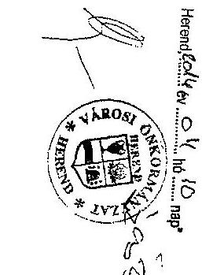

---

# UTALVÁNY 

$\qquad$ $A 20 / 2010$. szla kiv.

Önkormányzati költségvetési pénzeszköz terhére, javára
$\qquad$ Ft, azaz $\qquad$ Ft összegben
érvényesitem.
A jogosultságot, összegszerüséget, a fedezet meglétét és az elöírt követelmények betartását igazolom.
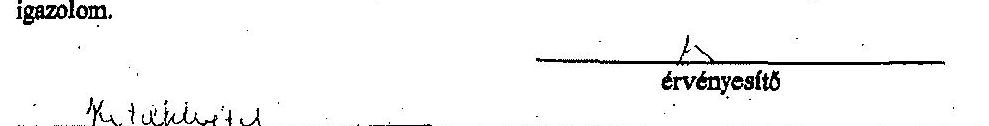
feladat
elvégzése miatt fent megielölt összegben az OTP-nél vezetett 11748807-15428770
sz. számla terhére, javára utalványozom. Kötelezettségvállalás:
Partner:
Bizonylat szám:
Fizetés módja: átutalás, készpénz, azonnali inkasszó, csoportos beszedési megbizás
2010. év $\qquad$ 05 $\qquad$ hó 05 nap.
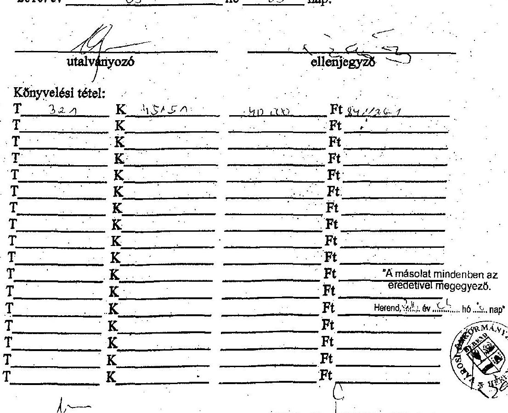

---

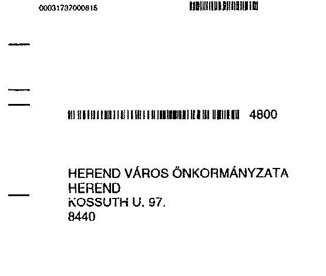

# BANKSZÁMLAKIVONAT

## KÖLTSÉGVETÉSI ELSZÁMOLÁSI SZÁMLA - PÉNZFORGALMI BANKSZÁMLA

**SZÁMLASZÁM: 11748007-15428770**

**SZÁMLA NÉVE: KÖLTSÉGVETÉSI ELSZÁMOLÁSI SZÁMLA**

**LÁTRA SZÓLÓ KAMAT: -0,12%**

**KÖNYVELÉS NAPJA: 10.09.03**

**BÍO(SWIFT)KÖO: OTPVHUHB**

**DEVIZANEM: HUF**

**FOLYÓSZÁMLAHITEL KAMAT: 8,26%**

## FORGALMAK

**TÉKNAP: MEGNEVEZÉS**

**ÖSSZEG**

**19.09.03**

**ÁTUTALÁS, F.4800, 12082001-01227329-00200000, 966800001, 046296, HERÉND VÁROS ÖNKORMÁNYZÁTA, 40.000.000 ÁTVÉZETÉS**

**19.09.03**

**ÁTUTALÁS, F.4800, 75600030-10305700, 037460084, 480084**

**HEREND VÁROS ÖNKORMÁNYZATA**

**HEREND**

**KOSSUTH U. 97.**

**8440**

**SZÁMLA VEZETŐ FÍÖK NÉVE, CÍME:**

**OTP BANK NYET É OLHÁNTÚLI RÉGŐ**

**6200 VESZPREM**

**BLESZÉET U. 4.**

**A SZÁMLAKIVONAT OSFÜTTAL SZÁMLAKÉNT 15 SZOLGAL, ALÁIPAS ÉG FÜZSÉT MÉGÉS, MÉGLES.**

**TAZ OSFÜTT A ONÓ ÉGŐSZÉVE, TV. ALÁPJÁN MENTES AZ ADO ALÓL.**

**SZÁMLAADÓ: OTP BANK, NYITT, SZÚ, BLESZÉSZ, NÁDOR. U. 15. ADZESZÁM: 10027614-4-44, ÁFA: COOPORT, AZONOSÍTÓ, 17780010-5-44, KÖZÖSSÉDI ADÓSZÁM: HUF7780010.**

**SZÁMLAKIDÖSSÁTÁS KELTE:**

**2010.09.03**

**KINDRÁTSZÁM:**

**A SZÁMLÁTIA AJDONOS NÉVE, CÍME:**

**19.09.03**

**KÖZÖSSÉDI VÁROS ÖNKORMÁNYZATA**

**19.09.03**

**HEREND**

**KÖNSURYU 97.**

**8440**

**ÖSSZ**

**1. SZ PÉLDÁNY**

**OTPvindít: www.otpbank.hu**

**(06 1) 3 666 666, (06 49) 266 666, (06 20/30/70) 3 666 666**

## FÓRGALMAK

**TÉKNAP: MEGNEVEZÉS**

**ÖSSZEG**

**19.09.03**

**ÁTUTALÁS, F.4800, 12082001-01227329-00200000, 966800001, 046296, HERÉND VÁROS ÖNKORMÁNYZÁTA, 40.000.000 ÁTVÉZETÉS**

**19.09.03**

**ÁTUTALÁS, F.4800, 75600030-10305700, 037460084, 480084**

**HEREND**

**KÖNSURYU 97.**

**8440**

**ÖSSZ**

**1. SZ PÉLDÁNY**

**OTPvindít: www.otpbank.hu**

**(06 1) 3 666 666, (06 49) 266 666, (06 20/30/70) 3 666 666**

## BANKSZÁMLAKIVONAT

**KÖLTSÉGVETÉSI ELSZÁMOLÁSI SZÁMLA - PÉNZFORGALMI BANKSZÁMLA**

**SZÁMLASZÁM: 11748007-15428770**

**IBAN: HIJ94 1174 8007 1542 8770 0000 0000**

**SZÁMLA NÉVE: KÖLTSÉGVETÉSI ELSZÁMOLÁSI SZÁMLA**

**LÁTRA SZÓLÓ KAMAT: -0,12%**

**KÖNYVELÉS NAPJA: 10.09.03**

**BÍO(SWIFT)KÖO: OTPVHUHB**

**DEVIZANEM: HUF**

**FOLYÓSZÁMLAHITEL KAMAT: 8,26%**

## FORGALMAK

**TÉKNAP: MEGNEVEZÉS**

**ÖSSZEG**

**19.09.03**

**ÁTUTALÁS, F.4800, 12082001-01227329-00200000, 966800001, 046296, HERÉND VÁROS ÖNKORMÁNYZÁTA, 40.000.000 ÁTVÉZETÉS**

**19.09.03**

**ÁTUTALÁS, F.4800, 75600030-10305700, 037460084, 480084**

**HEREND**

**KÖNSURYU 97.**

**8440**

**ÖSSZ**

**1. SZ PÉLDÁNY**

**OTPvindít: www.otpbank.hu**

**(06 1) 3 666 666, (06 49) 266 666, (06 20/30/70) 3 666 666**

## BANKSZÁMLAKIVONAT

**KÖLTSÉGVETÉSI ELSZÁMOLÁSI SZÁMLA - PÉNZFORGALMI BANKSZÁMLA**

**SZÁMLASZÁM: 11748007-15428770**

**IBAN: HIJ94 1174 8007 1542 8770 0000 0000**

**SZÁMLA NÉVE: KÖLTSÉGVETÉSI ELSZÁMOLÁSI SZÁMLA**

**LÁTRA SZÓLÓ KAMAT: -0,12%**

**KÖNYVELÉS NAPJA: 10.09.03**

**BÍO(SWIFT)KÖO: OTPVHUHB**

**DEVIZANEM: HUF**

**FOLYÓSZÁMLAHITEL KAMAT: 8,26%**

## BANKSZÁMLAKIVONAT

**KÖLTSÉGVETÉSI ELSZÁMOLÁSI SZÁMLA - PÉNZFORGALMI BANKSZÁMLA**

**SZÁMLASZÁM: 11748007-15428770**

**IBAN: HIJ94 1174 8007 1542 8770 0000 0000**

**SZÁMLA NÉVE: KÖLTSÉGVETÉSI ELSZÁMOLÁSI SZÁMLA**

**LÁTRA SZÓLÓ KAMAT: -0,12%**

**KÖNTVELÉS NAPJA: 10.09.03**

**BÍO(SWIFT)KÖO: OTPVHUHB**

**DEVIZANEM: HUF**

**FOLYÓSZÁMLAHITEL KAMAT: 8,26%**

## FORGALMAK

**TÉKNAP: MEGNEVEZÉS**

**ÖSSZ**

**19.09.03**

**ÁTUTALÁS, F.4800, 12082001-01227329-00200000, 966800001, 046296, HERÉND VÁROS ÖNKORMÁNYZÁTA, 40.000.000 ÁTVÉZETÉS**

**19.09.03**

**ÁTUTALÁS, F.4800, 75600030-10305700, 037460084, 480084**

**HEREND**

**KÖNSURYU 97.**

**8440**

**ÖSSZ**

**1. SZ PÉLDÁNY**

**OTPvindít: www.otpbank.hu**

**(06 1) 3 666 666, (06 49) 266 666, (06 20/30/70) 3 666 666**

## BANKSZÁMLAKIVONAT

**KÖLTSÉGVETÉSI ELSZÁMOLÁSI SZÁMLA - PÉNZFORGALMI BANKSZÁMLA**

**SZÁMLASZÁM: 11748007-15428770**

**IBAN: HIJ94 1174 8007 1542 8770 0000 0000**

**SZÁMLA NÉVE: KÖLTSÉGVETÉSI ELSZÁMOLÁSI SZÁMLA**

**LÁTRA SZÓLÓ KAMAT: -0,12%**

**KÖNTVELÉS NAPJA: 10.09.03**

**BÍO(SWIFT)KÖO: OTPVHUHB**

**DEVIZANEM: HUF**

**FOLYÓSZÁMLAHITEL KAMAT: 8,26%**

## BANKSZÁMLAKIVONAT

**KÖLTSÉGVETÉSI ELSZÁMOLÁSI SZÁMLA - PÉNZFORGALMI BANKSZÁMLA**

**SZÁMLASZÁM: 11748007-15428770**

**IBAN: HIJ94 1174 8007 1542 8770 0000 0000**

**SZÁMLA NÉVE: KÖLTSÉGVETÉSI ELSZÁMOLÁSI SZÁMLA**

**LÁTRA SZÓLÓ KAMAT: -0,12%**

**KÖNTVELÉS NAPJA: 10.09.03**

**BÍO(SWIFT)KÖO: OTPVHUHB**

**DEVIZANEM: HUF**

**FOLYÓSZÁMLAHITEL KAMAT: 8,26%**

## BANKSZÁMLAKIVONAT

**KÖLTSÉGVETÉSI ELSZÁMOLÁSI SZÁMLA - PÉNZFORGALMI BANKSZÁMLA**

**SZÁMLASZÁM: 11748007-15428770**

**IBAN: HIJ94 1174 8007 1542 8770 0000 0000**

**SZÁMLA NÉVE: KÖLTSÉGVETÉSI ELSZÁMOLÁSI SZÁMLA**

**LÁTRA SZÓLÓ KAMAT: -0,12%**

**KÖNTVELÉS NAPJA: 10.09.03**

**BÍO(SWIFT)KÖO: OTPVHUHB**

**DEVIZANEM: HUF**

**FOLYÓSZÁMLAHITEL KAMAT: 8,26%**

## BANKSZÁMLAKIVONAT

**KÖLTSÉGVETÉSI ELSZÁMOLÁSI SZÁMLA - PÉNZFORGALMI BANKSZÁMLA**

**SZÁMLASZÁM: 11748007-15428770**

**IBAN: HIJ94 1174 8007 1542 8770 0000 0000**

**SZÁMLA NÉVE: KÖLTSÉGVETÉSI ELSZÁMOLÁSI SZÁMLA**

**LÁTRA SZÓLÓ KAMAT: -0,12%**

**KÖNTVELÉS NAPJA: 10.09.03**

**BÍO(SWIFT)KÖO: OTPVHUHB**

**DEVIZANEM: HUF**

**FOLYÓSZÁMLAHITEL KAMAT: 8,26%**

## BANKSZÁMLAKIVONAT

**KÖLTSÉGVETÉSI ELSZÁMOLÁSI SZÁMLA - PÉNZFORGALMI BANKSZÁMLA**

**SZÁMLASZÁM: 11748007-15428770**

**IBAN: HIJ94 1174 8007 1542 8770 0000 0000**

**SZÁMLA NÉVE: KÖLTSÉGVETÉSI ELSZÁMOLÁSI SZÁMLA**

**LÁTRA SZÓLÓ KAMAT: -0,12%**

**KÖNTVELÉS NAPJA: 10.09.03**

**BÍO(SWIFT)KÖO: OTPVHUHB**

**DEVIZANEM: HUF**

**FOLYÓSZÁMLAHITEL KAMAT: 8,26%**

## BANKSZÁMLAKIVONAT

**KÖLTSÉGVETÉSI ELSZÁMOLÁSI SZÁMLA - PÉNZFORGALMI BANKSZÁMLA**

**SZÁMLASZÁM: 11748007-15428770**

**IBAN: HIJ94 1174 8007 1542 8770 0000 0000**

**SZÁMLA NÉVE: KÖLTSÉGVETÉSI ELSZÁMOLÁSI SZÁMLA**

**LÁTRA SZÓLÓ KAMAT: -0,12%**

**KÖNTVELÉS NAPJA: 10.09.03**

**BÍO(SWIFT)KÖO: OTPVHUHB**

**DEVIZANEM: HUF**

**FOLYÓSZÁMLAHITEL KAMAT: 8,26%**

## BANKSZÁMLAKIVONAT

**KÖLTSÉGVETÉSI ELSZÁMOLÁSI SZÁMLA - PÉNZFORGALMI BANKSZÁMLA**

**SZÁMLASZÁM: 11748007-15428770**

**IBAN: HIJ94 1174 8007 1542 8770 0000 0000**

**SZÁMLA NÉVE: KÖLTSÉGVETÉSI ELSZÁMOLÁSI SZÁMLA**

**LÁTRA SZÓLÓ KAMAT: -0,12%**

**KÖNTVELÉS NAPJA: 10.09.03**

**BÍO(SWIFT)KÖO: OTPVHUHB**

**DEVIZANEM: HUF**

**FOLYÓSZÁMLAHITEL KAMAT: 8,26%**

## BANKSZÁMLAKIVONAT

**KÖLTSÉGVETÉSI ELSZÁMOLÁSI SZÁMLA - PÉNZFORGALMI BANKSZÁMLA**

**SZÁMLASZÁM: 11748007-15428770**

**IBAN: HIJ94 1174 8007 1542 8770 0000 0000**

**SZÁMLA NÉVE: KÖLTSÉGVETÉSI ELSZÁMOLÁSI SZÁMLA**

**LÁTRA SZÓLÓ KAMAT: -0,12%**

**KÖNTVELÉS NAPJA: 10.09.03**

**BÍO(SWIFT)KÖO: OTPVHUHB**

**DEVIZANEM: HUF**

**FOLYÓSZÁMLAHITEL KAMAT: 8,26%**

## BANKSZÁMLAKIVONAT

**KÖLTSÉGVETÉSI ELSZÁMOLÁSI SZÁMLA - PÉNZFORGALMI BANKSZÁMLA**

**SZÁMLASZÁM: 11748007-15428770**

**IBAN: HIJ94 1174 8007 1542 8770 0000 0000**

**SZÁMLA NÉVE: KÖLTSÉGVETÉSI ELSZÁMOLÁSI SZÁMLA**

**LÁTRA SZÓLÓ KAMAT: -0,12%**

**KÖNTVELÉS NAPJA: 10.09.03**

**BÍO(SWIFT)KÖO: OTPVHUHB**

**DEVIZANEM: HUF**

**FOLYÓSZÁMLAHITEL KAMAT: 8,26%**

## BANKSZÁMLAKIVONAT

**KÖLTSÉGVETÉSI ELSZÁMOLÁSI SZÁMLA - PÉNZFORGALMI BANKSZÁMLA**

**SZÁMLASZÁM: 11748007-15428770**

**IBAN: HIJ94 1174 8007 1542 8770 0000 0000**

**SZÁMLA NÉVE: KÖLTSÉGVETÉSI ELSZÁMOLÁSI SZÁMLA**

**LÁTRA SZÓLÓ KAMAT: -0,12%**

**KÖNTVELÉS NAPJA: 10.09.03**

**BÍO(SWIFT)KÖO: OTPVHUHB**

**DEVIZANEM: HUF**

**FOLYÓSZÁMLAHITEL KAMAT: 8,26%**

## BANKSZÁMLAKIVONAT

**KÖLTSÉGVETÉSI ELSZÁMOLÁSI SZÁMLA - PÉNZFORGALMI BANKSZÁMLA**

**SZÁMLASZÁM: 11748007-15428770**

**IBAN: HIJ94 1174 8007 1542 8770 0000 0000**

**SZÁMLA NÉVE: KÖLTSÉGVETÉSI ELSZÁMOLÁSI SZÁMLA**

**LÁTRA SZÓLÓ KAMAT: -0,12%**

**KÖNTVELÉS NAPJA: 10.09.03**

**BÍO(SWIFT)KÖO: OTPVHUHB**

**DEVIZANEM: HUF**

**FOLYÓSZÁMLAHITEL KAMAT: 8,26%**

## BANKSZÁMLAKIVONAT

**KÖLTSÉGVETÉSI ELSZÁMOLÁSI SZÁMLA - PÉNZFORGALMI BANKSZÁMLA**

**SZÁMLASZÁM: 11748007-15428770**

**IBAN: HIJ94 1174 8007 1542 8770 0000 0000**

**SZÁMLA NÉVE: KÖLTSÉGVETÉSI ELSZÁMOLÁSI SZÁMLA**

**LÁTRA SZÓLÓ KAMAT: -0,12%**

**KÖNTVELÉS NAPJA: 10.09.03**

**BÍO(SWIFT)KÖO: OTPVHUHB**

**DEVIZANEM: HUF**

**FOLYÓSZÁMLAHITEL KAMAT: 8,26%**

## BANKSZÁMLAKIVONAT

**KÖLTSÉGVETÉSI ELSZÁMOLÁSI SZÁMLA - PÉNZFORGALMI BANKSZÁMLA**

**SZÁMLASZÁM: 11748007-15428770**

**IBAN: HIJ94 1174 8007 1542 8770 0000 0000**

**SZÁMLA NÉVE: KÖLTSÉGVETÉSI ELSZÁMOLÁSI SZÁMLA**

**LÁTRA SZÓLÓ KAMAT: -0,12%**

**KÖNTVELÉS NAPJA: 10.09.03**

**BÍO(SWIFT)KÖO: OTPVHUHB**

**DEVIZANEM: HUF**

**FOLYÓSZÁMLAHITEL KAMAT: 8,26%**

## BANKSZÁMLAKIVONAT

**KÖLTSÉGVETÉSI ELSZÁMOLÁSI SZÁMLA - PÉNZFORGALMI BANKSZÁMLA**

**SZÁMLASZÁM: 11748007-15428770**

**IBAN: HIJ94 1174 8007 1542 8770 0000 0000**

**SZÁMLA NÉVE: KÖLTSÉGVETÉSI ELSZÁMOLÁSI SZÁMLA**

**LÁTRA SZÓLÓ KAMAT: -0,12%**

**KÖNTVELÉS NAPJA: 10.09.03**

**BÍO(SWIFT)KÖO: OTPVHUHB**

**DEVIZANEM: HUF**

**FOLYÓSZÁMLAHITEL KAMAT: 8,26%**

## BANKSZÁMLAKIVONAT

**KÖLTSÉGVETÉSI ELSZÁMOLÁSI SZÁMLA - PÉNZFORGALMI BANKSZÁMLA**

**SZÁMLASZÁM: 11748007-15428770**

**IBAN: HIJ94 1174 8007 1542 8770 0000 0000**

**SZÁMLA NÉVE: KÖLTSÉGVETÉSI ELSZÁMOLÁSI SZÁMLA**

**LÁTRA SZÓLÓ KAMAT: -0,12%**

**KÖNTVELÉS NAPJA: 10.09.03**

**BÍO(SWIFT)KÖO: OTPVHUHB**

**DEVIZANEM: HUF**

**FOLYÓSZÁMLAHITEL KAMAT: 8,26%**

## BANKSZÁMLAKIVONAT

**KÖLTSÉGVETÉSI ELSZÁMOLÁSI SZÁMLA - PÉNZFORGALMI BANKSZÁMLA**

**SZÁMLASZÁM: 11748007-15428770**

**IBAN: HIJ94 1174 8007 1542 8770 0000 0000**

**SZÁMLA NÉVE: KÖLTSÉGVETÉSI ELSZÁMOLÁSI SZÁMLA**

**LÁTRA SZÓLÓ KAMAT: -0,12%**

**KÖNTVELÉS NAPJA: 10.09.03**

**BÍO(SWIFT)KÖO: OTPVHUHB**

**DEVIZANEM: HUF**

**FOLYÓSZÁMLAHITEL KAMAT: 8,26%**

## BANKSZÁMLAKIVONAT

**KÖLTSÉGVETÉSI ELSZÁMOLÁSI SZÁMLA - PÉNZFORGALMI BANKSZÁMLA**

**SZÁMLASZÁM: 11748007-15428770**

**IBAN: HIJ94 1174 8007 1542 8770 0000 0000**

**SZÁMLA NÉVE: KÖLTSÉGVETÉSI ELSZÁMOLÁSI SZÁMLA**

**LÁTRA SZÓLÓ KAMAT: -0,12%**

**KÖNTVELÉS NAPJA: 10.09.03**

**BÍO(SWIFT)KÖO: OTPVHUHB**

**DEVIZANEM: HUF**

**FOLYÓSZÁMLAHITEL KAMAT: 8,26%**

## BANKSZÁMLAKIVONAT

**KÖLTSÉGVETÉSI ELSZÁMOLÁSI SZÁMLA - PÉNZFORGALMI BANKSZÁMLA**

**SZÁMLASZÁM: 11748007-15428770**

**IBAN: HIJ94 1174 8007 1542 8770 0000 0000**

**SZÁMLA NÉVE: KÖLTSÉGVETÉSI ELSZÁMOLÁSI SZÁMLA**

**LÁTRA SZÓLÓ KAMAT: -0,12%**

**KÖNTVELÉS NAPJA: 10.09.03**

**BÍO(SWIFT)KÖO: OTPVHUHB**

**DEVIZANEM: HUF**

**FOLYÓSZÁMLAHITEL KAMAT: 8,26%**

## BANKSZÁMLAKIVONAT

**KÖLTSÉGVETÉSI ELSZÁMOLÁSI SZÁMLA - PÉNZFORGALMI BANKSZÁMLA**

**SZÁMLASZÁM: 11748007-15428770**

**IBAN: HIJ94 1174 8007 1542 8770 0000 0000**

**SZÁMLA NÉVE: KÖLTSÉGVETÉSI ELSZÁMOLÁSI SZÁMLA**

**LÁTRA SZÓLÓ KAMAT: -0,12%**

**KÖNTVELÉS NAPJA: 10.09.03**

**BÍO(SWIFT)KÖO: OTPVHUHB**

**DEVIZANEM: HUF**

**FOLYÓSZÁMLAHITEL KAMAT: 8,26%**

## BANKSZÁMLAKIVONAT

**KÖLTSÉGVETÉSI ELSZÁMOLÁSI SZÁMLA - PÉNZFORGALMI BANKSZÁMLA**

**SZÁMLASZÁM: 11748007-15428770**

**IBAN: HIJ94 1174 8007 1542 8770 0000 0000**

**SZÁMLA NÉVE: KÖLTSÉGVETÉSI ELSZÁMOLÁSI SZÁMLA**

**LÁTRA SZÓLÓ KAMAT: -0,12%**

**KÖNTVELÉS NAPJA: 10.09.03**

**BÍO(SWIFT)KÖO: OTPVHUHB**

**DEVIZANEM: HUF**

**FOLYÓSZÁMLAHITEL KAMAT: 8,26%**

## BANKSZÁMLAKIVONAT

**KÖLTSÉGVETÉSI ELSZÁMOLÁSI SZÁMLA - PÉNZFORGALMI BANKSZÁMLA**

**SZÁMLASZÁM: 11748007-15428770**

**IBAN: HIJ94 1174 8007 1542 8770 0000 0000**

**SZÁMLA NÉVE: KÖLTSÉGVETÉSI ELSZÁMOLÁSI SZÁMLA**

**LÁTRA SZÓLÓ KAMAT: -0,12%**

**KÖNTVELÉS NAPJA: 10.09.03**

**BÍO(SWIFT)KÖO: OTPVHUHB**

**DEVIZANEM: HUF**

**FOLYÓSZÁMLAHITEL KAMAT: 8,26%**

## BANKSZÁMLAKIVONAT

**KÖLTSÉGVETÉSI ELSZÁMOLÁSI SZÁMLA - PÉNZFORGALMI BANKSZÁMLA**

**SZÁMLASZÁM: 11748007-15428770**

**IBAN: HIJ94 1174 8007 1542 8770 0000 0000**

**SZÁMLA NÉVE: KÖLTSÉGVETÉSI ELSZÁMOLÁSI SZÁMLA**

**LÁTRA SZÓLÓ KAMAT: -0,12%**

**KÖNTVELÉS NAPJA: 10.09.03**

**BÍO(SWIFT)KÖO: OTPVHUHB**

**DEVIZANEM: HUF**

**FOLYÓSZÁMLAHITEL KAMAT: 8,26%**

## BANKSZÁMLAKIVONAT

**KÖLTSÉGVETÉSI ELSZÁMOLÁSI SZÁMLA - PÉNZFORGALMI BANKSZÁMLA**

**SZÁMLASZÁM: 11748007-15428770**

**IBAN: HIJ94 1174 8007 1542 8770 0000 0000**

**SZÁMLA NÉVE: KÖLTSÉGVETÉSI ELSZÁMOLÁSI SZÁMLA**

**LÁTRA SZÓLÓ KAMAT: -0,12%**

**KÖNTVELÉS NAPJA: 10.09.03**

**BÍO(SWIFT)KÖO: OTPVHUHB**

**DEVIZANEM: HUF**

**FOLYÓSZÁMLAHITEL KAMAT: 8,26%**

## BANKSZÁMLAKIVONAT

**KÖLTSÉGVETÉSI ELSZÁMOLÁSI SZÁMLA - PÉNZFORGALMI BANKSZÁMLA**

**SZÁMLASZÁM: 11748007-15428770**

**IBAN: HIJ94 1174 8007 1542 8770 0000 0000**

**SZÁMLA NÉVE: KÖLTSÉGVETÉSI ELSZÁMOLÁSI SZÁMLA**

**LÁTRA SZÓLÓ KAMAT: -0,12%**

**KÖNTVELÉS NAPJA: 10.09.03**

**BÍO(SWIFT)KÖO: OTPVHUHB**

**DEVIZANEM: HUF**

**FOLYÓSZÁMLAHITEL KAMAT: 8,26%**

## BANKSZÁMLAKIVONAT

**KÖLTSÉGVETÉSI ELSZÁMOLÁSI SZÁMLA - PÉNZFORGALMI BANKSZÁMLA**

**SZÁMLASZÁM: 11748007-15428770**

**IBAN: HIJ94 1174 8007 1542 8770 0000 0000**

**SZÁMLA NÉVE: KÖLTSÉGVETÉSI ELSZÁMOLÁSI SZÁMLA**

**LÁTRA SZÓLÓ KAMAT: -0,12%**

**KÖNTVELÉS NAPJA: 10.09.03**

**BÍO(SWIFT)KÖO: OTPVHUHB**

**DEVIZANEM: HUF**

**FOLYÓSZÁMLAHITEL KAMAT: 8,26%**

## BANKSZÁMLAKIVONAT

**KÖLTSÉGVETÉSI ELSZÁMOLÁSI SZÁMLA - PÉNZFORGALMI BANKSZÁMLA**

**SZÁMLASZÁM: 11748007-15428770**

**IBAN: HIJ94 1174 8007 1542 8770 0000 0000**

**SZÁMLA NÉVE: KÖLTSÉGVETÉSI ELSZÁMOLÁSI SZÁMLA**

**LÁTRA SZÓLÓ KAMAT: -0,12%**

**KÖNTVELÉS NAPJA: 10.09.03**

**BÍO(SWIFT)KÖO: OTPVHUHB**

**DEVIZANEM: HUF**

**FOLYÓSZÁMLAHITEL KAMAT: 8,26%**

## BANKSZÁMLAKIVONAT

**KÖLTSÉGVETÉSI ELSZÁMOLÁSI SZÁMLA - PÉNZFORGALMI BANKSZÁMLA**

**SZÁMLASZÁM: 11748007-15428770**

**IBAN: HIJ94 1174 8007 1542 8770 0000 0000**

**SZÁMLA NÉVE: KÖLTSÉGVETÉSI ELSZÁMOLÁSI SZÁMLA**

**LÁTRA SZÓLÓ KAMAT: -0,12%**

**KÖNTVELÉS NAPJA: 10.09.03**

**BÍO(SWIFT)KÖO: OTPVHUHB**

**DEVIZANEM: HUF**

**FOLYÓSZÁMLAHITEL KAMAT: 8,26%**

## BANKSZÁMLAKIVONAT

**KÖLTSÉGVETÉSI ELSZÁMOLÁSI SZÁMLA**

**LÁTRA SZÓLÓ KAMAT: -0,12%**

**KÖNTVELÉS NAPJA: 10.09.03**

**BÍO(SWIFT)KÖO: OTPVHUHB**

**DEVIZANEM: HUF**

**FOLYÓSZÁMLAHITEL KAMAT: 8,26%**

## BANKSZÁMLAKIVONAT

**KÖLTSÉGVETÉSI ELSZÁMOLÁSI SZÁMLA**

**SZÁMLASZÁM: 11748007-15428770**

**IBAN: HIJ94 1174 8007 1542 8770 0000 000**

**SZÁMLASZÁM: 11748007-15428770**

**IBAN: HIJ94 1174 8007 1542 8770 0000 00**

**SZÁMLASZÁM: 11748007-15428770**

**IBAN: HIJ94 1174 8007 1542 8770 0000 00**

**SZÁMLASZÁM: 11748007-15428770**

**IBAN: HIJ94 1174 8007 1542 8770 0000 00**

**SZÁMLASZÁM: 11748007-15428770**

**IBAN: HIJ94 1174 8007 1542 8770 0000 00**

**SZÁMLASZÁM: 11748007-15428770**

**IBAN: HIJ94 1174 8007 1542 8770 0000 00**

**SZÁMLASZÁM: 11748007-15428770**

**IBAN: HIJ94 1174 8007 1542 8770 0000 00**

**SZÁMLASZÁM: 11748007-15428770**

**IBAN: HIJ94 1174 8007 1542 8770 0000 00**

**SZÁMLASZÁM: 11748007-15428770**

**IBAN: HIJ94 1174 8007 1542 8770 0000 00**

**SZÁMLASZÁM: 11748007-15428770**

**IBAN: HIJ94 1174 8007 1542 8770 0000 00**

**SZÁMLASZÁM: 11748007-15428770**

**IBAN: HIJ94 1174 8007 1542 8770 0000 00**

**SZÁMLASZÁM: 11748007-15428770**

**IBAN: HIJ94 1174 8007 1542 8770 0000 00**

**SZÁMLASZÁM: 11748007-15428770**

**IBAN: HIJ94 1174 8007 1542 8770 0000 00**

**SZÁMLASZÁM: 11748007-15428770**

**IBAN: HIJ94 1174 8007 1542 8770 0000 00**

**SZÁMLASZÁM: 11748007-15428770**

**IBAN: HIJ94 1174 8007 1542 8770 0000 00**

**SZÁMLASZÁM: 11748007-15428770**

**IBAN: HIJ94 1174 8007 1542 8770 0000 00**

**SZÁMLASZÁM: 11748007-15428770**

**IBAN: HIJ94 1174 8007 1542 8770 0000 00**

**SZÁMLASZÁM: 11748007-15428770**

**IBAN: HIJ94 1174 8007 1542 8770 0000 00**

**SZÁMLASZÁM: 11748007-15428770**

**IBAN: HIJ94 1174 8007 1542 8770 0000 00**

**SZÁMLASZÁM: 11748007-15428770**

**IBAN: HIJ94 1174 8007 1542 8770 0000 00**

**SZÁMLASZÁM: 11748007-15428770**

**IBAN: HIJ94 1174 8007 1542 8770 0000 00**

**SZÁMLASZÁM: 11748007-15428770**

**IBAN: HIJ94 1174 8007 1542 8770 0000 00**

**SZÁMLASZÁM: 11748007-15428770**

**IBAN: HIJ94 1174 8007 1542 8770 0000 00**

**SZÁMLASZÁM: 11748007-15428770**

**IBAN: HIJ94 1174 8007 1542 8770 0000 00**

**SZÁMLASZÁM: 11748007-15428770**

**IBAN: HIJ94 1174 8007 1542 8770 0000 00**

**SZÁMLASZÁM: 11748007-15428770**

**IBAN: HIJ94 1174 8007 1542 8770 0000 00**

**SZÁMLASZÁM: 11748007-15428770**

**IBAN: HIJ94 1174 8007 1542 8770 0000 00**

**SZÁMLASZÁM: 11748007-15428770**

**IBAN: HIJ94 1174 8007 1542 8770 0000 00**

**SZÁMLASZÁM: 11748007-15428770**

**IBAN: HIJ94 1174 8007 1542 8770 0000 00**

**SZÁMLASZÁM: 11748007-15428770**

**IBAN: HIJ94 1174 8007 1542 8770 0000 0**

**SZÁMLASZÁM: 11748007-15428770**

**IBAN: HIJ94 1174 8007 1542 8770 0000 0**

**SZÁMLASZÁM: 11748007-15428770**

**IBAN: HIJ94 1174 8007 1542 8770 0000 0**

**SZÁMLASZÁM: 11748007-15428770**

**IBAN: HIJ94 1174 8007 1542 8770 0000 0**

**SZÁMLASZÁM: 11748007-15428770**

**IBAN: HIJ94 1174 8007 1542 8770 000 0**

**SZÁMLASZÁMLASZÁM: 11748007-15428770**

**IBAN: HIJ94 1174 8007 1542 8770 0000 0**

**SZÁMLASZÁMLASZÁM: 11748007-15428770**

**IBAN: HIJ94 1174 8007 1542 8770 0000 0**

**SZÁMLASZÁMLASZÁM: 11748007-15428770**

**IBAN: HIJ94 1174 8007 1542 8770 0000 0**

**SZÁMLASZÁMLASZÁM: 11748007-15428770**

**IBAN: HIJ94 1174 8007 1542 8770 000 0**

**ISZÁMLASZÁMLASZÁMLASZÁMLASZÁMLASZÁMLASZÁMLASZÁMLASZÁMLASZÁMLASZÁMLASZÁMLASZÁMLASZÁMLASZÁMLASZÁMLASZÁMLASZÁMLASZÁMLASZÁMLASZÁMLASZÁMLASZÁMLASZÁMLASZÁMLASZÁMLASZÁMLASZÁMLASZÁMLASZÁMLASZÁMLASZÁMLASZÁMLASZÁMLASZÁMLASZÁMLASZÁMLASZÁMLASZÁMLASZÁMLASZÁMLASZÁMLASZÁMLASZÁMLASZÁMLASZÁMLASZÁMLASZÁMLASZÁMLASZÁMLAS

---

.

---

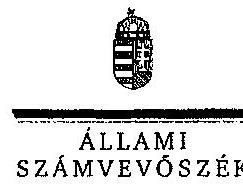

Ikt.szám: V-0319-046/2014.

# Vajai László úr 

polgármester

Herend Város Önkormányzata

## Herend

## Tisztelt Polgármester Úr!

Köszönettel megkaptam „Az önkormányzatok pénzügyi gazdálkodási helyzete értékelésének, és gazdálkodása szabályosságának ellenôrzésérôl - Herend" címü jelentéstervezetre tett észrevételét.

A jelentéstervezet megállapításaira vonatkozó észrevételét az Állami Számvevőszékről szóló 2011. évi LXVI. törvény (a továbbiakban: ÁSZ tv.) 29. § (2) bekezdésében meghatározott tizenôt napos határidôn belül küldte meg. Az Állami Számvevőszék észrevétellel kapcsolatos álláspontját a mellékletként csatolt, a felügyeleti vezető által készített indokolás tartalmazza.

Tájékoztatom Polgármester Urat, hogy az ÁSZ tv. 29. § (3) bekezdése alapján a számvevőszékj jelentésben az el nem fogadott észrevételeket az elutasítás indokolásával szerepeltetjük.

Budapest, 2014. OS hó $t$ nap

Tisztelettel:

Melléklet: Észrevételekre adott válasz
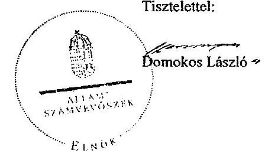

---

# Észrevételekre adott válasz 

| Észrevétel: | Jelentéstervezet 10. oldal jegyzönek címzett 1. számú intézkedést igénylö megállapítás és javaslat:   „A 2013. évi költségvetési rendelet - az Áht. 23. § (2) bekezdés a-b) pontjaiban foglalt elöírások ellenére - nem tartalmazta az Önkormányzat, és az általa irányitott költségvetési szervek költségvetési bevételeinek és költségvetési kiadásainak elöirányzat-csoportok és kiemelt elöirányzatok szerinti bontását, továbbá nem mutatták be a költségvetési bevételeket kötelező feladatok, önként vállalt feladatok és állami (államigazgatási) feladatok szerinti elkülönitésben. |
| :--: | :--: |
|  | Javaslat:   Intézkedjen, hogy a költségvetési rendelet az Áht. 23. § (2) bekezdés a-b) pontjaiban foglalt elöírások szerint tartalmazza az Önkormányzat és az általa irányított költségvetési szervek költségvetési bevételeit és költségvetési kiadásait elöirányzat-csoportok, kiemelt elöirányzatok, és kötelező feladatok, önként vállalt feladatok, állami (államigazgatási) feladatok szerinti bontásban. " |
|  | Az észrevétel szerint: Herend Város Önkormányzata 2013. évi költségvetéséről szóló rendelete tartalmazza az Önkormányzat és az általa irányított költségvetési szervek költségvetési bevételeit, az Önkormányzat és a költségvetési szervek kiadásait kiemelt elöirányzatonként is, valamint a kötelező és önként vállalt feladatok és állami (államigazgatási) feladatok szerinti bontást is.   Fentiek igazolásául csatolják a 2013. évi költségvetési rendelet 5. számú mellékletét az Önkormányzat és az általa irányított költségvetési szervek költségvetési bevételeiről, a 6. számú mellékletet az Önkormányzat és a költségvetési szervek kiadásainak kiemelt elöirányzatonkénti bemutatásáról, valamint a 21. számú mellékletet a kiadások kötelező és önként vállalt feladatok és állami (államigazgatási) feladatok szerinti, intézményenkénti megbontásáról. |
| Válasz: | Az Állami Számvevőszék az észrevételt nem fogadja el. |
| Indoklás: | Az ÁSZ tv. 29. § (2) bekezdése alapján Polgármester Úr észrevételt az ellenőrzés megállapításaira tehet, a jogszabályban biztosított észrevételezési lehetősége nem terjed ki az intézkedést igénylő megállapítások alapján, az ÁSZ által megfogalmazott javaslatokra.   Az észrevétellel érintett jegyzőnek címzett 1. számú javaslatot megalapozó megállapítások a jelentéstervezet 12. oldal 3. bekezdésében találhatók, ezért az észrevételre való reagálást e bekezdésnél szerepeltetern a jelentéstervezetben.   Az észrevételben foglaltak az intézkedést igénylő megállapítások megalapozottságát nem befolyásolják. Az észrevétel mellékleteként megküldött dokumentumok felülvizsgálata alapján megállapítottam, hogy a 2013. évi költségvetési rendelet - az államháztartásról szóló 2011. évi CXCV. törvény (a továbbiakban: Áht.) 23. § (2) bekezdés a-b) pontjaiban foglalt elöírás ellenére - az Önkormányzat és az általa irányított költségvetési szervek költségvetési bevételeit nem az államháztartásról szóló törvény végrehajtásáról szóló |

---

|  | 368/2011. (XII. 31.) Korm. rendelet (továbbiakban: Ávr.) 2. §-ában megjelölt kiemelt előirányzati jogelmek szerinti bontásban, a költségvetési kiadásokat pedig nem az Áht. 6. § (2) bekezdése szerinti elöirányzat-csoportok, illetve a 6. § (3) bekezdés szerinti kiemelt előirányzatok szerinti bontásban tartalmazta. Felhívom szíves figyelmét, hogy a bevételi előirányzatok vonatkozásában 2014. január 1-jétől az Áht. 6. § (4)-(5) bekezdéseiben foglaltak szerint járjanak el, tekintettel arra, hogy az Ávr. 2. §-a ezen időponttól hatályát vesztette.   Az észrevétel mellékleteként megküldött kimutatás a kiadási előirányzatok kötelezö, önként vállalt és államigazgatási feladatok szerinti megbontását mutatja be. A jelentéstervezetben azonban a bevételi előirányzatok hasonló megbontásban történő elkészitésének hiányát rögzítettük, amelyet nem cáfol meg a rendelkezésre bocsátott dokumentum. |
| :--: | :--: |
| Észrevétel: | Jelentéstervezet 14. oldal 4. bekezdés:   „A takarékossági intézkedések részeként a hivatali feladatok ellátására ténylegesen alkalmazott létszám kevesebb, mint a Polgármesteri Hivatal müködésének támogatására-Kvte. 2. számú melléklet 1. 1. a pont alapján-megállapított alaplétszám. A Polgármesteri Hivatalban az álláshelyek száma 2013. január 1-jén 14, a Kvtv.2 alapján elismert létszám 19 fö volt."   Az észrevétel szerint 2013. január 1-jén a Polgármesteri Hivatalnál 18 fő teljes munkaidős és 1 fő részmunkaidős álláshely volt. A jelentéstervezetben 14 fő álláshely szerepel, amely a ténylegesen betöltött álláshelyek számának felel meg. |
| Válasz. | Az Állami Számvevőszék az észrevételben foglaltakat elfogadja. |
| Indokolás: | Az észrevételben foglaltakat az ellenőrzés során átadott dokumentumok felülvizsgálata alapján elfogadom. A jelentéstervezet hivatkozott bekezdésében az álláshelyekre vonatkozó megállapítást ( 14 fó betöltött álláshely megfogalmazás szerint) pontosítom. |
| Észrevétel: | Jelentéstervezet 23. oldal 1. bekezdés:   „Az Önkormányzat 2010. augusztus 31-én 40,0 millió Ft összegü, utófinanszirozott fejlesztésekhez kapcsolódó támogatás-megelölegező hitelszerzödést kötött és vett igénybe. A hitel visszafizetésére a szerződéses feltételekkel ellentétben a lejáratot követöen került sor. Az Önkormányzat a támogatás megelölegezési hitel 40,0 millió Ft-os fennálló állományát az Áhsz. 26. § (1) és (5) bekezdés a) pontjában, valamint 9. számú mellékletének 3. pontja b) alpontjában foglaltakkal ellentétesen az Önkormányzat beszámolójában a rövid lejáratú kötelezettségek és a hitelfelvételek között nem szerepeltette. A 2010. évi mérlegben feltüntetett pénzintézeti kötelezettségek, valamint a pénzforgalmi jelentésben kimutatott hitelfelvétel összege nem a valóságban fennálló kötelezettséget és hitelfelvételi mutatta."   Az észrevétel szerint az Önkormányzat 74/2010. (VIII. 18.) számú önkormányzati határozatával a Raiffeisen Bank Zrt-nél likviditási célra 40,0 millió Ft összegű müködési célú hitel felvételét hagyta jóvá. A hitelkeret utófinanszírozott fejlesztésekhez kapcsolódó támogatás megelölegezését is szolgálta.   A 2010. év végi mérleg tartalmazta a Raiffeisen Bank Zrt-től felvett müködési hitelt is. A hitelállomány nyilvántartásba vételéről mellékelik a 45151 Rövid lejáratú müködési célú hitelfelvétel elnevezésű fökönyvi számlát, véleményük szerint a záró fökönyvi kivonat ennek megfelelően a hitelállományt is kellett, |

---

|  | hogy tartalmazza. |
| :-- | :-- |
| Válasz: | Az Állami Számvevôszék az észrevételt részben elfogadja, a jelentéstervezet   megállapítását pontosítja. |
| Indoklás: | Az ellenôrzés során átadott hitelszerzôdés, a hitel felvételérôl szóló képviselô-   testületi határozat felülvizsgálata alapján a 2010. augusztus 31 -én felvett   40,0 millió Ft összegủ hitel céljára vonatkozó megállapítást pontosítom. A do-   kumentumok alapján a hitelt a likviditás biztositása céljából vették igénybe, an-   nak kizárólagos támogatás-megelôlegezési célja dokumentumokkal nem bizo-   nyitható. |
|  | Az észrevételben foglaltak a 2010. évi mérlegben kimutatott kötelezettségekre   vonatkozó megállapítás megalapozottságát nem befolyásolják. Az Önkormány-   zat 2010. évi könyvviteli mérlegében rövid lejáratú hitelekből fennálló kötele-   zettségként kizárólag a 48,6 millió Ft összegủ folyószámlahitel tartozását sze-   repeltette, ezen túl a mérlegben egyéb rövid lejáratú kötelezettségként a beru-   házási hitelekből fennálló hosszú lejáratú kötelezettségek következô évben ese-   dékes törlesztő részletének összegét mutatták ki. |
|  | Az észrevételhez csatolt dokumentum a hitel igénybevételéből adódó finanszi-   rozási célú bevétel elszámolásához kapcsolódik, amely könyvelés technikailag   független a felvett hitelbôl fennálló tartozás mérlegben történô kimutatásától.   Az Önkormányzat 2010. évi pénzforgalmi jelentése alapján megállapítottam,   hogy a hiteffelvétel, mint finanszírozási célú bevétel elszámolása megtörtént,   erre tekintettel a megállapítást pontosítottam. |

Tájékoztatom Polgármester Urat, hogy a számvevôszéki jelentés mellékleteként szerepeltetjük a jelentéstervezethez tett észrevételeit, valamint az azokra adott válaszunkat.

Budapest, 2014. 05 hó 10 nap

Renkó Zsuzsanna
felügyeleti vezető

---

# RÖVIDÍTÉSEK JEGYZÉKE 

## Törvények

Áht.
ÁSZ tv.
Gyvtv.
Htv.

Kvtv. ${ }_{1}$

Kvtv. ${ }_{2}$
Mötv.
Ötv.
Sport tv.
Stabilitási tv.

## Rendeletek

2013. évi költségvetési rendelet

Áhsz. 1

Áhsz. 2
Ámr.

Bkr.

Kockázatkezelési Szabályzat ${ }_{1}$
Kockázatkezelési Szabályzat ${ }_{2}$

Közszolgálati szabály$\mathrm{zat}_{1}$
az államháztartásról szóló 2011. évi CXCV. törvény az Állami Számvevőszékről szóló 2011. évi LXVI. törvény a gyermekek védelméről és a gyámügyi igazgatásról szóló 1997. évi XXXI. törvény
a helyi önkormányzatok és szerveik, a köztársasági megbízottak, valamint egyes centrális alárendeltségű szervek feladat- és hatásköreiről szóló 1991. évi XX. törvény
Magyarország 2012. évi központi költségvetéséről szóló 2011. évi CLXXXVIII. törvény 76/C. §-a (beiktatta a 2012. évi CLXXXVII. törvény 8. §-a, hatályos 2012. december 6tól)
Magyarország 2013. évi központi költségvetéséről szóló 2012. évi CCIV. törvény

Magyarország helyi önkormányzatairól szóló 2011. évi CLXXXIX. törvény
a helyi önkormányzatokról szóló 1990. évi LXV. törvény a sportról szóló 2004. évi I. törvény
Magyarország gazdasági stabilitásáról szóló 2011. évi CXCIV. törvény (hatályos 2012. január 1-jétől)

Herend Város Önkormányzata Képviselő-testületének 1/2013 (III. 1.) önkormányzati rendelete Herend Város Önkormányzatának 2013. évi költségvetéséről
az államháztartás szervezetei beszámolási és könyvvezetési kötelezettségének sajátosságairól szóló 249/2000. (XII. 24.) Korm. rendelet (hatálytalan 2014. január 1jétől)
az államháztartás számviteléről szóló 4/2013. (I. 11.) Korm. rendelet (hatályos 2014. január 1-jétől)
az államháztartás múködési rendjéről szóló 292/2009. (XII. 19.) Korm. rendelet (hatálytalan 2012. január 1jétől)
a költségvetési szervek belső kontrollrendszeréről és belső ellenőrzéséről szóló 370/2011. (XII. 31.) Korm. rendelet (hatályos 2012. január 1-jétől)
Herend Város Önkormányzat Polgármesteri Hivatalának Kockázatkezelési Szabályzata
Herend Város Jegyzőjének a 3/2012. (II. 14.) számú intézkedése - Kockázatkezelési szabályzat (hatályos 2012. március 1-jétől)
Herend Város Jegyzőjének a 1/2008. (X. 9.) Szabályzata „A Herend Város Önkormányzat Polgármesteri Hivatala köztisztviselőinek Egységes Közszolgálati Szabályzatáról"

---

Közszolgálati szabály$\mathrm{Zat}_{2}$
SZMSZ $_{1}$

SZMSZ $_{2}$

## Szórövidítések

ÁSZ
Bakonykarszt Zrt.
BUBOR
EUR
EURIBOR
jegyzó
Képviselö-testület
KDOP
ÖNHIKI
Önkormányzat
polgármester
Polgármesteri Hivatal
szja
TIOP

Herend Város Jegyzójének 1/2013. (II. 23.) Szabályzata a Polgármesteri Hivatal Közszolgálati Szabályzatáról
Herend Város Önkormányzata Képviselö-testületének 12/1999. (XII. 7.) számú önkormányzati rendelete Herend Város Önkormányzat Szervezeti és Müködési Szabályzatáról (hatályos 2009. április 23-tól)
Herend Város Önkormányzata Képviselő-testületének 5/2013. (III. 29.) számú önkormányzati rendelete Herend Város Önkormányzat Szervezeti és Müködési Szabályzatáról (hatályos 2013. április 1-jétől)

Állami Számvevőszék
Bakonykarszt Víz- és Csatornamú Zrt.
Budapesti bankközi forint hitel kamatláb
Euró, az Európai Unió hivatalos fizetőeszköze
Európai irányadó bankközi kamatláb (Euro Interbank Offered rate)
Herend Város Önkormányzatának jegyzője
Herend Város Önkormányzatának Képviselő-testülete
Közép-Dunántúli Operatív Program
Önhibájukon kívül hátrányos helyzetben lévő helyi önkormányzatok támogatása
Herend Város Önkormányzata
Herend Város Önkormányzatának polgármestere
Herend Város Önkormányzatának Polgármesteri Hivatala
személyi jövedelemadó
Társadalmi Infrastruktúra Operatív Program

---

# FOGALOMTÁR 

adósságszolgálat
banki kitettség
bevételi kitettség

CLF módszer
felhalmozási kockázat
használhatósági fok
integritás

Az adósság tőkerészének és az esedékes kamat együttes összegének törlesztése.
Olyan függőségi viszony, ahol egy szervezet pénzügyi helyzete olyan külső körülmények hatására változhat, amely kizárólag a bank egyoldalú döntésén múlik.
Olyan függőségi viszony, ahol egy szervezet pénzügyi helyzetét meghatározó bevételek nagysága külső körülmények hatására azonnal és kedvezőtlen irányba változhat.
Az önkormányzatok költségvetése elemzésének módszere, amely a pénzügyi kapacitás (más néven a nettó múködési jövedelem) fogalmát helyezi a középpontba. A módszer következetesen elkülöníti a folyó és a felhalmozási költségvetés bevételeit és kiadásait, azok költségvetési egyenlegeit. Bizonyos mértékig a vállalati gazdálkodás logikai elemeit érvényesíti az önkormányzatok pénzügyi, jövedelmi helyzetének vizsgálata során.
Annak kockázata, hogy a folyamatban lévő felhalmozási feladatok finanszírozásához szükséges pénzügyi forrás nem fog rendelkezésre állni.

A tárgyi eszközállomány állagának elemzéséhez használt mutató, amely megmutatja, hogy a le nem írt (nettó) érték milyen hányadát képezi az aktiválási (bekerülési) értéknek. Számításakor a tárgyi eszköz könyv szerinti nettó értékét viszonyítják a tárgyi eszköz bruttó (beszerzési/létesítési) értékéhez.
Az „integritás" - egyik gyakran használt jelentése szerint - az elvek, értékek, cselekvések, módszerek, intézkedések konzisztenciáját jelenti, vagyis olyan magatartásmódot, amely meghatározott értékeknek megfelel. Integritásirányítási rendszer bevezetése a szervezetben a szervezethez rendelt közfeladatok integritás szempontú ellátását, az érték alapú múködéssel (integritással) összefüggő szervezeti követelmények következetes érvényesítését jelenti. (Forrás: „Magyarországi államháztartási belső kontroll standardok Útmutató", kiadta az NGM 2012. decemberében)

---

jövőbeni kötelezettségek kifizethetőségének kockázata
kezességvállalás
kezességvállalás kockázata
készfizető kezesség
kötelező közszolgáltatás (az önkormányzati feladatokat érintően)
kötvény

Annak kockázata, hogy a kötelezett jövőbeni kötelezettségeit nem tudja teljesíteni, mert nem rendelkezik szabad pénzeszköz tartalékkal, nem intézkedett annak érdekében, hogy bevételeit növelje, kiadásait csökkentse, a követelésállományból a kétes kintlévőségek nagysága számottevő, a fedezetként felhasználható ingatlanállomány forgalmi értéke csökkent és értékesítésének lehetősége piaci oldalról korlátozott.
Szerződésben vállalt olyan kötelezettség, amelyben a kezes arra vállal kötelezettséget, hogy ha a szerződés kötelezettje nem teljesít, a kezes maga fog helyette teljesíteni a jogosultnak. (Forrás: Ptk. 272. §).
Annak kockázata, hogy a szerződés kötelezettje a szerződésben vállalt kötelezettségeit nem teljesíti a jogosultnak azokért a kezes köteles helytállni. A kezes kötelezettsége nem válhat terhesebbé, mint amit a szerződés megkötésekor elvállalt. Nem köteles helytállni a kezes a kötelezettségért, amíg a teljesítés a kötelezettől vagy olyan kezesektől behajtható, akik őt megelőzően, reá tekintet nélkül vállaltak kezességet. A kezes, amennyiben teljesíteni köteles, mintegy az eredeti kötelezett helyébe lép, érvényesítheti azokat a kifogásokat, amelyeket a kötelezett érvényesíthet a jogosulttal szemben. Amennyiben teljesít, a kezességgel biztosított jogok (ideértve a kezességvállalást megelőzően keletkezett jogokat és a végrehajtási jogot is) átszállnak a kezesre.
Olyan kezességtípus, amelynél a szerződés kötelezettje nemfizetése esetén a hitelező közvetlenül a kezeshez fordulhat a hitel törlesztése érdekében.
Az önkormányzat kötelezően vállalt feladatkörébe tartozó, a köztisztasággal és a településtisztasággal, valamint az élet- és vagyonbiztonsággal összefüggő egyes - közszolgáltatás útján megvalósuló - közfeladatok ellátása, amelyeket külön jogszabály (törvény, helyi önkormányzati rendelet) határoz meg.
Hosszabb lejáratra szóló, hitelviszonyt megtestesítő kamatozó értékpapír. A kötvényben a kibocsátó arra kötelezi magát, hogy a kötvényben megjelölt pénzösszegnek az előre meghatározott kamatát vagy egyéb jutalékait, továbbá az adott pénzösszeget a kötvény mindenkori

---

közfeladat
mérlegen kívüli tétel
mérlegen kívüli tétel
mérlegen kívüli tétel kockázata
működési kockázat
nemfizetési kockázat
nettó múködési jövedelem

ÖNHIKI támogatás
önkormányzat felhalmozási bevétele
önkormányzat felhalmozási kiadásai
önkormányzat folyó bevétele
önkormányzat folyó kiadása
tulajdonosának, illetve jogosultjának a megjelölt időben és módon megfizeti.
Jogszabályban meghatározott állami vagy önkormányzati feladat, amit az arra kötelezett közérdekből, a jogszabályban meghatározott követelményeknek és feltételeknek megfelelve végez, ideértve a lakosság közszolgáltatásokkal való ellátását, továbbá az állam nemzetközi szerződésekben vállalt kötelezettségeiből adódó közérdekú feladatokat, valamint e feladatok ellátásakor szükséges infrastruktúra biztosítását is.
(Forrás: 2011. évi CXCVI. törvény 3. § 7. pontja) A mérlegen kívüli tétel olyan, szerződés alapján fennálló mérlegen kívüli [függő vagy biztos (jövőbeni)] kötelezettség, illetve követelés, amely pénzeszköz vagy egyéb eszköz átadására, illetve átvételére vonatkozik, a mérleg fordulónapján már fennáll, de mérlegtételkénti szerepeltetése egy jövőbeni esemény bekövetkezésétől vagy a szerződés teljesítésétől függ.
[Forrás: Számv. tv. 3. § (7) bekezdés 16. pont]
Annak kockázata, hogy a mérlegben ki nem mutatható kötelezettségvállalásból fizetési kötelezettség keletkezik.
Annak kockázata, hogy nem megfelelő múködésből, emberi hibákból, rendszerhibákból vagy külső eseményekből adódik veszteség.
Annak kockázata, hogy a kötelezett fennálló kötelezettségét átmenetileg vagy véglegesen nem tudja határidőre megfizetni.
A nettó múködési jövedelem a jövedelemtermelő képességet méri. Megmutatja a múködési bevételekből a múködési kiadások és a hitelek tőketörlesztésének kifizetése után fennmaradó jövedelmet.
Az önkormányzatok múködőképességét szolgáló, önhibájukon kívül hátrányos helyzetben levő települési önkormányzatok támogatása.
Az önkormányzatok tárgyévi felhalmozási célú költségvetési bevételei.
Az önkormányzatok tárgyévi felhalmozási célú költségvetési kiadásai.
Az önkormányzatok tárgyévi múködési célú költségvetési bevételei.
Az önkormányzatok tárgyévi múködési célú költségvetési kiadásai.

---

önkormányzat folyó költségvetés egyenlege
önkormányzat gazdasági társasága miatti kockázatot jelentő tényezők
önkormányzat az önként vállalt és/vagy a kötelező feladatot ellátó társaságának a tevékenység ellátásához pénzeszközt ad át;

- az önkormányzat nem vizsgálja a feladatellátás választott szervezeti megoldásának hatékonyságát;
- a kötelező feladatellátást biztosító gazdasági társaság tevékenységének ágazati szabályozása változik (vizi közmúvagyon üzemeltetése);
- a kizárólagos vagy többségi tulajdonú társaságok pénzügyi helyzete nem stabil, amely az alapítóra kötelezettségeket háríthat;
- az önkormányzat a társaságok tevékenységét nem kísérte figyelemmel, nem élt az alapítói (irányítói) jogok gyakorlásával, a társaságok gazdálkodásának önkormányzati szintű konszolidálása nem biztosított;
- az önkormányzat garanciát vagy kezességet vállal a gazdasági társaság kötelezettségeire;
- a társaságoknak átadott pénzeszköz uniós elvárásoknak megfelelő kezelése.
önkormányzat többségi tulajdonában lévő gazdasági társaságok

Azok a gazdasági társaságok, amelyekben az önkormányzat a szavazatok több mint ötven százalékával vagy a Ptk. 685/B. § (2)-(3) bekezdéseiben rögzített meghatározó befolyással rendelkezik. A befolyással rendelkező akkor rendelkezik egy jogi személyben meghatározó befolyással, ha annak tagja, illetve részvényese, és jogosult e jogi személy vezető tisztségviselői vagy felügyelő-bizottsága tagjai többségének megválasztására, illetve visszahívására, vagy a jogi személy más tagjaival, illetve részvényeseivel kötött megállapodás alapján egyedül ren-

---

pénzügyi kapacitás
pénzügyi kockázat
szállítói kitettség
delkezik a szavazatok több mint ötven százalékával. A meghatározó befolyás akkor is fennáll, ha a befolyással rendelkező számára e jogosultságok közvetett módon (köztes vállalkozásain keresztül) biztosítottak.
[Forrás: Ptk. 685/B. § (2)-(4) bekezdések]
A pénzügyi kapacitás az adósok hitelfelvételi képességének azon mértéke, ahol még növelni tudják az adósságot anélkül, hogy a fizetőképtelenség elkerülése érdekében csökkenteniük kellene akár az aktuális, akár a jövőben esedékes kiadásaikat.
A pénzügyi kockázat magában foglalja mindazon kockázatokat, amelyek a szervezet pénzügyi helyzetére hatással vannak. Pl.: az adósságszolgálat miatti kockázatot, árfolyamkockázatot, felhalmozási kockázatot, fizetőképességi kockázatot, jövőbeni kötelezettségek kifizethetőségének kockázatát, kamatkockázatot, kezességvállalás kockázatát, likviditási kockázat, mérlegen kívüli tételek kockázata, nemfizetési kockázat stb.
Olyan függőségi viszony, ahol egy szervezet pénzügyi helyzete a szállítói tartozások rendezése érdekében foganatosított intézkedések hatására azonnal és kedvezőtlen irányba változhat.

---

.