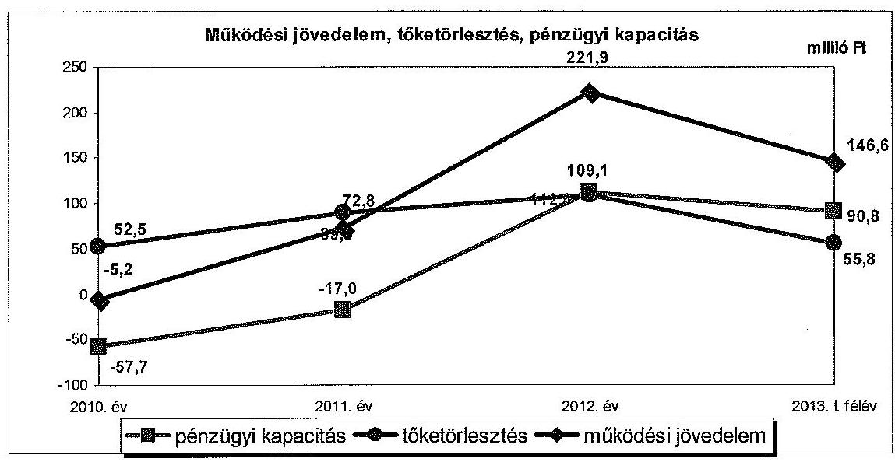
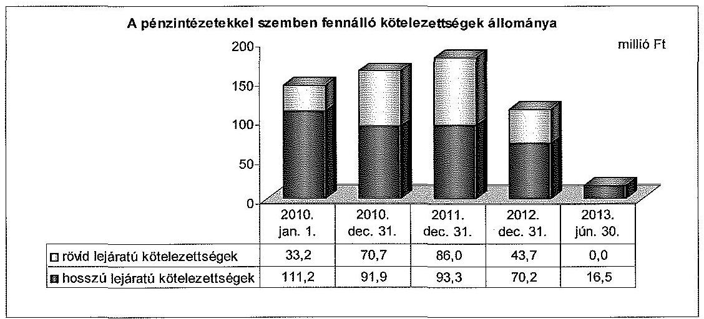
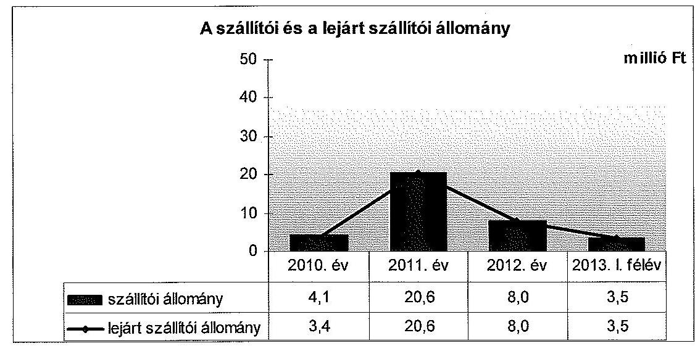
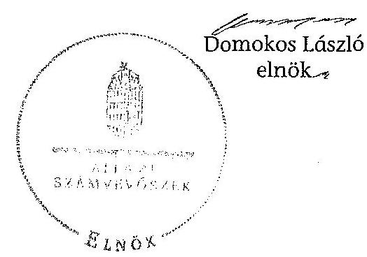
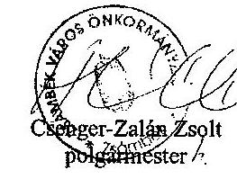
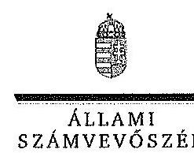
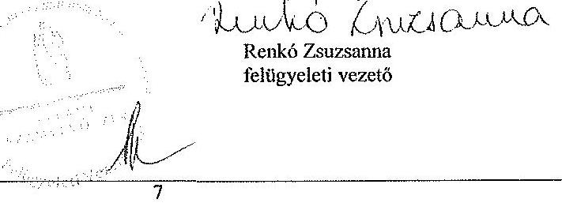

# ÁLLAMI   SZÁMVEVŐSZÉK 

## JELENTÉS

az önkormányzatok pénzügyi gazdálkodási helyzete értékelésének, és gazdálkodása szabályosságának ellenőrzéséről Zsámbék

---

# Állami Számvevőszék 

Iktatószám: V-0317-053/2014.
Témaszám: 23.
Vizsgálat-azonosító szám: V065009

## Az ellenőrzést felügyelte:

## Renkó Zsuzsanna

felügyeleti vezető
Az ellenőrzést vezette és az ellenőrzés végrehajtásáért felelős:
Mohl Anna
ellenőrzésvezető
A számvevőszéki jelentés összeállításában közreműködött:
Baksa Anikó
számvevő tanácsos
Az ellenőrzést végezték:
Dr. Csapó Anna
Dr. Gaálné Berente Mónika
számvevő tanácsos
számvevő

---

# TARTALOMJEGYZÉK 

BEVEZETÉS ..... 3
I. ÖSSZEGZŐ MEGÁLLAPÍTÁSOK, KÖVETKEZTETÉSEK, JAVASLATOK ..... 6
II. RÉSZLETES MEGÁLLAPÍTÁSOK ..... 16

1. Az önkormányzat kötelező és önként vállalt feladatai, a feladatellátás szervezeti kereteinek változása ..... 16
2. A pénzügyi egyensúlyt fenntartását veszélyeztető pénzügyi kockázatok, ezek csökkentése érdekében tett intézkedések ..... 19
3. Az önkormányzat kötelezettségeinek állománya, azok összetételének változása, az adósságkonszolidáció hatása ..... 26
4. Az önkormányzat pénzügyi gazdálkodása során érvényesített integritási szempontok ..... 35

---

# MELLÉKLETEK 

1/A. számú Az Önkormányzat bevételei és kiadásai, valamint adósságszolgálata a 2010-2013. év I. félév közötti időszakban (a CLF módszer szerint, a Kvtv. 72. § (1) bekezdésében foglalt adósságátvállaláshoz kapcsolódó pénzügyi teljesítések nélkül)
1/B. számú Az Önkormányzat bevételei és kiadásai a Kvtv. 72. § (1) bekezdésében foglalt adósságátvállaláshoz kapcsolódó pénzügyi teljesítések nélkül 2013. év I. félévében (a CLF módszer szerint)
2. számú Az Önkormányzat által a 2010. és a 2013. év I. félév között megvalósított fejlesztési feladatok érdekében teljesített felhalmozási kiadások és az ezekhez vállalt kötelezettségek összegzése
3. számú Az önkormányzati feladatok ellátásában résztvevő gazdasági társaságok egyes kiemelt adatai
4. számú Az Önkormányzat 2013. június 30-án fennálló, hosszú lejáratú adósságot keletkeztető kötelezettségvállalásai
5. számú Az Önkormányzat kötelezettségeinek és egyes kötelezettségvállalásainak 2010. december 31-ei és 2013. június 30-ai állománya, valamint a 2013. év II. félévében és az azt követő években várható kötelezettségek, kötelezettségvállalások miatti kiadások
6. számú Kimutatás az Önkormányzat 2010. január 1-jét megelőzően közbeszerzési eljárás mellőzésével megkötött hitelszerződéseiről
7. számú Zsámbék Város Önkormányzata Polgármesterének a jelentéstervezethez tett észrevétele
8. számú Az ÁSZ válasza Zsámbék Város Önkormányzata Polgármesterének a jelentéstervezethez tett észrevételére

## FÜGGELÉKEK

1. számú Rövidítések jegyzéke
2. számú Fogalomtár

---

# JELENTÉS 

## az önkormányzatok pénzügyi gazdálkodási helyzete értékelésének, és gazdálkodása szabályosságának ellenőrzéséről Zsámbék

## BEVEZETÉS

Az ÁSZ a stratégiájában célul tűzte ki, hogy az önkormányzatok ellenőrzése során azok pénzügyi-gazdasági helyzetét értékeli, kockázatait feltárja, valamint az ellenőrzések helyszíneit objektív mutatószámrendszer alapján választja ki.

Az államháztartás önkormányzati alrendszerében az utóbbi években megjelenő gazdálkodási nehézségek, a pénzforgalmi hiány növekedése, az eladósodás az ÁSZ figyelmét az önkormányzatok pénzügyi helyzetére irányította. Az elkövetkezendő évek költségvetési hiánycéljainak tarthatósága érdekében indokolt, hogy az önkormányzatok pénzügyi helyzetelemzése és az egyensúlyi helyzetet befolyásoló kockázatok feltárása továbbra is kiemelt hangsúlyt kapjon az ÁSZ tevékenységében.

A közigazgatás átalakításának keretében - a helyi igazgatás és önkormányzás hatékonyabbá tétele érdekében - az önkormányzatokra vonatkozóan 2012-ben újraszabályozták mind a sarkalatos, mind az önkormányzatok mindennapi működését rendező törvényeket és a feladatok végrehajtását biztosító előírásokat. Az önkormányzati feladatellátást érintő átalakítások jelentős része 2013-ban következett be azzal, hogy az igazgatási, az oktatási és a szociális ellátásban a feladatok jelentős hányadát átvette az állam. Ahhoz, hogy az önkormányzatok meg tudjanak felelni a számukra meghatározott - szigorúbb gazdálkodási szabályoknak, és az új feltételek mellett is biztosítható legyen a közszolgáltatások megfelelő színvonalú ellátása, szükséges volt a pénzügyigazdasági rendszerük alapjainak megszilárdítása. Ezt a célt szolgálja az adósságkonszolidáció, amely az önkormányzatok működését és fejlesztését segítő, de korábban az állam által nem fedezett kiadásokkal kapcsolatos kötelezettségvállalások differenciált mértékű átvállalását jelenti.

Az ÁSZ a 2013. év II. félévi ellenőrzési tervében a 23. számú, az önkormányzatok pénzügyi gazdálkodási helyzete értékelésének, és gazdálkodása szabályosságának - 2013. évben induló - ellenőrzésével az önkormányzatok 2011. évben megkezdett helyzetelemzését folytatja. Az adósságkonszolidáció az önkormányzatok pénzügyi egyensúlyi helyzetére egyértelműen kedvező hatást gyakorolt. Az önkormányzati alrendszerben a 2013-tól bevezetett új feladatfinanszírozási rendszer keretein belül az adott települési önkormányzat feladata a pénzügyi egyensúly megteremtése, hosszú távú fenntartása. Az adósságkonszolidáció, a feladat-ellátási és finanszírozási rendszer változásának 2013. év

---

I. félévet követő hatása az ellenőrzött időszak alapján - az intézkedések bevezetése óta eltelt idő rövidségére tekintettel - még nem állapítható meg. A pénzügyi-egyensúlyi helyzet jövőbeni alakulása - figyelemmel az adósságkonszolidáció folytatására - a törvényi rendelkezések hosszabb távú érvényesülése után elemezhető, értékelhető. Erre tekintettel kiemelt fontosságú az önkormányzatok pénzügyi egyensúlyi helyzetére ható kockázatok feltárása, az ezzel kapcsolatos folyamatok, trendek bemutatása. Az ÁSZ ennek megfelelően a jövőben is tovább folytatja az önkormányzatok pénzügyi gazdálkodási helyzetét értékelő témacsoportos ellenőrzéseit.

Az ellenőrzések kockázatalapú megközelítése keretében megtörténik az önkormányzatok adósságkezelési és likviditási helyzetének értékelése, a pénzügyi egyensúly minősítése, továbbá az alrendszerben 2013-ban bekövetkezett változások hatásának értékelése.

Az ellenőrzés - eredményének várható hatásaként - megállapításaival segítséget nyújthat a pénzügyi helyzet értékeléséhez, a pénzügyi egyensúly helyreállítása érdekében szükségessé váló önkormányzati intézkedések megtételéhez. Az ellenőrzés során továbbra is célunk az államháztartás önkormányzati alrendszerére jellemző információk összegzésével támogatni az Országgyűlés munkáját a törvényalkotásban, a források elosztásában.

Az ellenőrzés célja: az Önkormányzat pénzügyi helyzetének, szabályosságának értékelése, a pénzügyi egyensúly alakulására hatással lévő folyamatoknak és a pénzügyi egyensúly alakulására ható kockázatoknak a feltárása.

# Ennek keretében értékeltük, hogy: 

- a kötelező és önként vállalt feladatok ellátása, ezen belül az ellátott feladatok körének, az ellátást biztosító szervezeti formáknak a változása milyen hatást gyakorolt a pénzügyi egyensúlyi helyzetre;
- az Önkormányzat pénzügyi - működési és felhalmozási - egyensúlya milyen irányban változott, a változást milyen okok idézték elő, továbbá milyen intézkedéseket tettek az egyensúly biztosítása, illetve javítása érdekében, az intézkedések hatására javult-e az Önkormányzat pénzügyi helyzete;
- a költségvetési kiadások finanszírozása érdekében vállalt, pénzintézetekkel szembeni kötelezettségek, a szállítói és egyéb kötelezettségek hogyan alakultak, az adósságkonszolidáció után fennmaradt kötelezettségek teljesítésének kockázatai miként befolyásolják a jövőbeli pénzügyi egyensúlyi helyzetet.

Az önkormányzatok korrupcióval szembeni veszélyeztetettségének csökkentése érdekében új feladatként felmértük az integritási szemlélet érvényesülését a pénzügyi gazdálkodási folyamatokban.

Utóellenőrzésre nem került sor, mivel az ÁSZ az ellenőrzött időszakban az Önkormányzatnál számvevőszéki jelentéssel lezárt ellenőrzést nem végzett.

Az ellenőrzési célokban megfogalmazott kérdések értékelési kritériumai a gazdálkodásra vonatkozó jogszabályok és a pénzügyi egyensúly biztosításának, valamint a pénzügyi helyzettel és gazdálkodással kapcsolatos kockázatok keze-

---

lésének követelménye. Az ellenőrzés az ellenőrzési célok eléréséhez elemző, értékelő, a pénzügyi helyzet kockázatát is minősítő eljárásokat alkalmazott.

Az ellenőrzés típusa: szabályszerűségi ellenőrzés

# Ellenőrzött szervezet: Zsámbék Város Önkormányzata 

Az ellenőrzött időszak: a 2010. január 1-jétől 2013. június 30-ig terjedő időszak, figyelemmel az ellenőrzés célja vonatkozásában megfogalmazottakra. A pénzintézetekkel szembeni kötelezettségek állományának vizsgálatakor az ellenőrzött időszakban fennálló kötelezettségeket vette figyelembe az ellenőrzés.

Az ellenőrzés szakmai módszertana az ÁSZ hivatalos honlapján (www.asz.hu) közzétett szakmai szabályokon alapult, amely a Legfőbb Ellenőrző Intézmények Nemzetközi Szervezete (INTOSAI) által kiadott nemzetközi standardok (ISSAI) figyelembevételével készült.

Az ellenőrzés jogszabályi alapját az ÁSZ tv. 1. § (3) bekezdésének, 5. § (2)-(6) bekezdéseinek, valamint az Áht. 61. § (2) bekezdésének előírásai képezik.

Az ellenőrzés során használt rövidítéseket az 1. számú, az egyes fogalmak magyarázatát a 2. számú függelék tartalmazza.

Zsámbék város állandó lakosainak száma 2010. január 1-jén 5225 fő, 2012. január 1-jén 5336 fő volt. Az Önkormányzat elemi költségvetési beszámolója szerint a 2012. évben 977,0 millió Ft költségvetési bevételt ért el, és 742,1 millió Ft költségvetési kiadást teljesített. A 2012. december 31-i könyvviteli mérleg szerint 8723,5 millió Ft értékű vagyonnal rendelkezett, a rövid lejáratú kötelezettségállománya 29,7 millió Ft, a hosszú lejáratú kötelezettségállománya 123,0 millió Ft volt. Az Önkormányzat 2013. június 30-án a Nonprofit Kft-ben 100,0%-os tulajdonosi részesedéssel rendelkezett, más társaságban nem volt érdekeltsége. A jegyző 2007. december 1-jétől látja el feladatait. A foglalkoztatott köztisztviselők száma 2013. január 1-jén 19,5 fő volt.

Az ÁSZ tv. 29. § (1) bekezdése szerint a jelentéstervezetet megküldtük a polgármester részére, aki az ÁSZ tv. 29. § (2) bekezdésében foglalt észrevételezési jogával élt, a jelentéstervezetre észrevételt tett.

---

# I. ÖSSZEGZŐ MEGÁLLAPÍTÁSOK, KÖVETKEZTETÉSEK, JAVASLATOK 

Zsámbék Város Önkormányzata pénzügyi egyensúlya az ellenőrzött időszakban feltárt kockázatok alapján középtávon nem biztosított, mivel minősített többségi befolyása alatt álló társaságának veszteséges gazdálkodása mérlegen kívüli tételek miatti kockázatot jelent. A folyó költségvetés egyenlege 2010-ben 5,2 millió Ft hiányt, a 2011-2013. év I. félévében összesen 441,3 millió Ft többletet mutatott. Az Önkormányzat kizárólag a 2011. évben részesült 18,2 millió Ft összegben működőképesség megőrzését szolgáló támogatásban. Az Önkormányzat pénzügyi egyensúlyi helyzete javult, a működési jövedelem 2012-től már fedezetet nyújtott a tőketörlesztési kötelezettségekre, továbbá a 2013. év I. félévi 60,0%-os mértékű (42,1 millió Ft tőketartozást és annak járulékait érintő) adósságkonszolidáció hatására a kötelezettségek jelentősen csökkentek. A jövedelemtermelő képesség megőrzése esetén a képződő bevételek várhatóan biztosítják a fennálló kötelezettségek jövőbeni fedezetét, azonban a működési és felhalmozási egyensúly hosszú távú fenntartásához elkülönített tartalék képzése indokolt.

Az Önkormányzat észrevétele szerint az elmúlt közel négy év során meghozott intézkedésekkel stabilizálni tudták az akkor nehéz pénzügyi helyzetben lévő Önkormányzatot. A pénzügyi egyensúly a 2012. év óta folyamatosan javul, a 2013. évet is szufficittel zárták, komoly tartalékokat felhalmozva, mely szintén gyarapszik. A CLF tábla jól tükrözi az Önkormányzat stabil pénzügyi helyzetét. A pénzkészlet nagyságára tekintettel úgy gondolják a pénzügyi egyensúly középtávon tartható. A bevételek növelésére a 2011-2012. években komoly adópolitikai intézkedéseket vittek véghez, és a kiadások csökkentése érdekében is meghozták a szükséges megszorító intézkedéseket, melyek egyenként és összességükben is biztosítják a pozitív költségvetési egyenleg fenntarthatóságát. Természetesen folyamatosan vizsgálják a bevételek növelésének lehetőségét, szem előtt tartva a lakosság terhelhetőségének korlátait. A kiadások csökkentésénél viszont fontos szempont, hogy az Önkormányzat által ellátott feladatok színvonala megmaradjon. A gazdaságosság és ésszerűség elvei alapján próbálják a pénzügyi helyzet stabilitását megőrizni. Az Önkormányzat kizárólagos tulajdonában lévő gazdasági társaság működtetésének kockázataihoz megemlítik, hogy a Képviselőtestület 2013. január 14-én határozatával elrendelte a Kft. 2013. évi gazdálkodásának célszerűségi, szabályszerűségi vizsgálatát.

Az észrevételben foglaltak a megállapítások megalapozottságát nem befolyásolják. Az Önkormányzat pénzügyi helyzetének értékelésére az ellenőrzött időszakra vonatkozó adatok, információk alapján került sor. Az ennek megfelelően levont következtetést a továbbiakban is fenntartjuk. A bevezetőben a módszertani kérdések között rögzítettük, hogy az adósságkonszolidáció, illetve a feladatellátási és finanszírozási rendszer átalakításának hatása az intézkedések bevezetése óta eltelt idő rövidségére tekintettel még nem értékelhető az ellenőrzött időszak adatai alapján. A pénzügyi-egyensúlyi helyzet jövőbeni alakulása - figyelemmel az adósságkonszolidáció folytatására - a törvényi rendelkezések hosszabb távú érvényesülése után elemezhető, értékelhető. Az észrevételben szereplő egyensúlyt javító intézkedések hatása a jelentésben megjelenik. Az észrevétel további részei tájékoztató jellegűek, melyek a megállapításokat nem érintik.

---

A pénzügyi kapacitás a 2010-2013. év I. félév közötti változását az alábbi ábra mutatja be:

Az Önkormányzat a 2010. év és a 2013. év I. félév között összesen 3387,2 millió Ft
 költségvetési bevételt ért el, és 3466,0 millió Ft költségvetési kiadást teljesített. A folyó költségvetési egyenleg, a működési jövedelem a 2010. évben negatív, majd 2011-2013. év I. félévében pozitív volt. Az Önkormányzatnál - az ellenőrzött időszakban - a CLF módszer szerint kimutatva a 2010. év kivételével nem állt fenn működési jövedelemtermelő képesség miatti kockázat. Az Önkormányzat kizárólag a 2011. évben részesült a működőképességének megőrzését biztosító 18,2 millió Ft támogatásban. A működőképesség megőrzését szolgáló kiegészítő támogatások és a helyi adóbevételek nem jelentettek bevételi kitettséget.

A nettó működési jövedelem az ellenőrzött időszakban a 2011. évtől javult. A nettó működési jövedelem 2010. évben -57,7 millió Ft, míg a 2011. évben -17,0 millió Ft volt. A pénzügyi kapacitás 2010-2011. évi negatív értékét az eredményezte, hogy a 2010. évben a működési jövedelem is negatív volt, a 2011. évben pedig a képződött működési jövedelem nem nyújtott fedezetet a 89,8 millió Ft tőketörlesztési kötelezettségre. A növekvő működési jövedelem és a 2012. évtől jelentkező tőketörlesztési kötelezettség csökkenésének együttes eredményeként a nettó működési jövedelem a 2012. évben 112,8 millió Ft-ra nőtt, míg a 2013. év I. félév végén 90,8 millió Ft volt.

A felhalmozási költségvetés egyenlege a 2010-2011. években összesen 529,4 millió Ft hiányt mutatott, majd 2012-2013. év I. félév között 14,5 millió Ft felhalmozási forrástöbblet keletkezett. A befejezett fejlesztések 898,8 millió Ft-os bekerülési költségének forrását 465,1 millió Ft ( $51,7 \%$ ) egyéb központi támogatás, 165,0 millió Ft ( $18,4 \%$ ) EU-s támogatás, 248,2 millió Ft ( $27,6 \%$ ) önkormányzati saját bevétel és 20,5 millió Ft ( $2,3 \%$ ) hitel képezte. A felhalmozási költségvetés 2010. évi negatív egyenlegének fedezete - központi támogatás előfinanszírozása miatt - a tartalékok között rendelkezésre álló, az ellenőrzött időszakot megelőzően képződött 437,5 millió Ft összegű kötött pénzmaradvány volt.

---

Az Önkormányzat évenkénti teljes finanszírozási igénye a CLF módszer szerint 2010-ben 503,4 millió Ft, 2011-ben 100,7 millió Ft volt, melynek finanszírozásához folyószámla-, valamint támogatás-megelőlegező hitelt vettek igénybe, továbbá felhasználták a korábbi években (központi támogatás előlegéből) képződött tartalékokat. A 2012. évben 124,6 millió Ft, a 2013. év I. félévében 93,5 millió Ft finanszírozási többlet keletkezett.

Az ellenőrzött időszakban a működési kiadásokon belül az önként vállalt feladatok folyó kiadásainak részaránya a 2010. évi 8,7\%-ról ( 70,5 millió Ftról) a 2013. év I. félév végére 14,4\%-ra ( 40,0 millió Ft-ra) növekedett, a kötelező feladatokat érintő feladatátadások miatt bekövetkező kiadás csökkenés, valamint az önként vállalt feladatok ellátására fordított kiadások emelkedése miatt. A 2011-2013. év I. félévben az önként vállalt feladatok ellátására fordított kiadások összes működési kiadáson belüli arányának növekedése működési kockázatot jelentett. Az önként vállalt feladatokhoz kapcsolódó fejlesztések kiemelten az új bölcsőde építéséhez szükséges 58,7 millió Ft önkormányzatot terhelő önrész a 2010-2012. évi megvalósítás éveiben képződött negatív felhalmozási egyenleg miatt - felhalmozási kockázatot jelentettek.

A 2010-2013. év I. félév között a kötelező és az önként vállalt feladatellátás szervezeti kereteiben jelentős változás történt. 2013. január 1-jével az általános iskola állami fenntartásba került, továbbá az Önkormányzat egyes államigazgatási feladatait a járási kormányhivatal látja el. Az ellenőrzött időszakban megvalósult feladatátadások - az Önkormányzat adatszolgáltatása alapján - összességében 32,6 millió Ft megtakarítást eredményeztek. A saját hatáskörben végrehajtott bevételnövelő és kiadáscsökkentő intézkedések ellenőrzött időszakra vonatkozó együttes hatása az Önkormányzat kimutatása alapján 250,4 millió Ft megtakarítás volt, amely hozzájárult a működési jövedelem növekedéséhez.

A pénzintézetekkel szemben 2010. január 1-jén fennálló kötelezettségállomány 2013. június 30-ára 144,4 millió Ft-ról 16,5 millió Ft-ra csökkent. Az ellenőrzött időszakban a Képviselő-testület a 2011. évben 20,7 millió Ft összegű kamattámogatott beruházáshoz kapcsolódó hitel felvételéről döntött, ezen kívül kizárólag likvid hitel igénybevételére került sor. A Magyar Állam az adósságkonszolidáció keretében a hosszú lejáratú hitelekből fennálló 42,1 millió Ft tőketartozást és járulékait vállalta át. Az ellenőrzött időszak végén fennálló hitelállomány alapján a 2013. július 1. és a 2015. december 31. közötti időszakban az esedékessé váló tőketörlesztési és kamatfizetési kötelezettség várhatóan 13,9 millió Ft-ot, a 2016. évtől 3,6 millió Ft-ot tesznek ki. A likviditás biztosítását szolgáló hitelek a 2010-2012. években banki kitettséget jelentettek az átlagos napi állomány folyamatosan magas összege, valamint az év végi állomány 2010-ről 2011-re bekövetkezett emelkedése miatt.

Az adósságkonszolidációt követően fennmaradt hosszú távú pénzintézeti kötelezettségek teljesítésére a fedezet - a működési jövedelemtermelő képesség 2012-2013. év I. félévi szintjének megőrzése, valamint a finanszírozásba bevonható szabad pénzeszközökből elkülönített tartalék képzése esetén - biztosítottnak látszik.

---

Az Önkormányzat szállítói tartozása az ellenőrzött időszakban 4,1 millió Ftról 3,5 millió Ft-ra csökkent. A kiugróan magas 2011. év végi tartozás (20,6 millió Ft) elsősorban a közüzemi szolgáltatók, a gyermek és szociális étkeztetést ellátók és egy építőipari kft. felé fennálló kötelezettségből állt. A lejárt szállítói állomány nagyságára tekintettel pénzügyi kockázatot, továbbá szállítói kitettséget nem jelentett.

Az Önkormányzat az ellenőrzött időszakban, egy gazdasági társaságban a Nonprofit Kft-ben minősített többségi befolyással, 100,0%-os tulajdonosi részesedéssel rendelkezett. Az Önkormányzat a 2011. évben a Nonprofit Kft-nek - fizetőképességének átmeneti fenntartása érdekében - 4,8 millió Ft kölcsönt nyújtott. A kölcsön visszafizetése jelentős - közel két éves - időbeli késedelemmel kompenzáció formájában valósult meg, mely során az Önkormányzat nem érvényesítette az eredeti kölcsönszerződésben foglalt késedelmes fizetési kötelezettségből adódó késedelmi kamat felszámítását. A Nonprofit Kft. veszteséges gazdálkodására és kedvezőtlen pénzügyi helyzetére tekintettel az Önkormányzat a gazdasági társaságában 2012. évben 10,2 millió Ft tőkeemelést hajtott végre, amelyet úgy teljesített, hogy fennálló követelésének egy részét elengedte, ezen összeget a korlátolt felelősségű társaság tőketartalékába helyezte. Az Önkormányzat pénzügyi egyensúlyi helyzetére a minősített többségi befolyás alatt álló gazdasági társasága veszteséges gazdálkodása mérlegen kívüli tételek miatti kockázatot jelent.

Az Önkormányzatnak a pénzügyi gazdálkodás során - az ellenőrzés során feltárt szabályozásbeli hiányosságokra tekintettel - figyelmet kell fordítania az integritási szemlélet teljes körű érvényesítésére.

Az ellenőrzés során a gazdálkodási feladatok ellátásával kapcsolatban az alábbi szabályszerűségi hibákat tártuk fel:

- az Önkormányzat kötelező, önként vállalt és államigazgatási feladataira tervezett költségvetési bevételeket és kiadásokat a 2013. évi költségvetési rendeletben az Áht. előírásai ellenére elkülönítve nem mutatták be;
- az Önkormányzat a 2013. évi költségvetési rendeletében a költségvetési bevételek és kiadások előirányzatának főösszegét az Áht.-ben foglalt előírások ellenére hitel, kölcsön felvétele és tőkeösszegének törlesztése, valamint a költségvetési maradvány (előző évi pénzmaradvány igénybevétele) jogcímekhez tartozó, finanszírozási célú bevételekkel és kiadásokkal együtt állapította meg;
- a számviteli szolgáltatás igénybevételére vonatkozó szerződés 2010. január 4-i módosítását megelőzően, valamint az ellenőrzési időszakban fennálló, 2004-2006. években, 28,5 millió Ft, 50,0 millió Ft és további 50,0 millió Ft összegben felvett három beruházási hitel szerződésének megkötését megelőzően a Kbt. 1 rendelkezései (2012. január 1-jétől a Kbt.2) ellenére közbeszerzési eljárást nem folytattak le;
- az Önkormányzatnál a szállítókról és a követelésekről nem az Áhsz. ${ }_{1}$ előírásainak (2014. január 1-jétől Áhsz. ${ }_{2}$ ) megfelelően vezették az analitikus nyilvántartást;

---

- az Önkormányzat és a Nonprofit Kft. a közöttük fennálló követelések és kötelezettségek rendezésére kompenzációt alkalmaztak. A követelések év végi egyenlegét nem a ténylegesen fennálló összegben tüntették fel az Önkormányzat mérlegeiben. A beszámoló nem tartalmazta a 2010-2011. években a követelésállomány teljes összegét ( 57,6 millió Ft, illetve 66,8 millió Ft), míg a 2012. évi beszámolóban 56,6 millió Ft követelés nem szerepelt, továbbá a bevételek és kiadások sem a valós összegben szerepeltek az elemi beszámolóban. Az Önkormányzat a kompenzáció számviteli elszámolásával megsértette a Sztv. bruttó elszámolás elvét, a teljesség elvét, a valódiság elvét és az összemérés elvét. 2012-ben a Képviselő-testület az Önkormányzat gazdasági társasággal szemben fennálló 10,2 millió Ft követelésének elengedéséről és ugyanezen összeggel a társaság tőketartalékának emeléséről döntött. A számviteli nyilvántartásokban az Önkormányzatnál - az Sztv. előírásaival ellentétesen - a gazdasági esemény elszámolását nem 2012-ben, hanem a 2013. év I. félévében rögzítették, ezáltal a 2012. évi beszámolóban nem számolták el bevételként a követelés szerinti összegben a bérleti díj teljesülését és kiadásként a tőketartalék növelése érdekében elengedett követelés összegét;
- az Önkormányzat a 2011. évi bölcsődeépítéshez kapcsolódó hosszú lejáratú hitelszerződés aláírásával megsértette az Ötv.-ben (2012. március 31-től Áht.-ben) foglaltakat. A hitel visszafizetésének biztosítéka az Önkormányzat futamidő alatti költségvetése volt, ezáltal közvetve az annak részét képező központi költségvetésből származó bevételeit is a hitel biztosítékaként ajánlotta fel;
- az Önkormányzatnál a Nonprofit Kft. részére nyújtott kölcsön rendezése során nem érvényesítették az eredeti kölcsönszerződésben foglalt késedelmes fizetési kötelezettségből adódó késedelmi pótlék követelést. A követelésről való lemondásra úgy került sor, hogy az Áht. előírásainak érvényesítésére helyi rendeletben nem szabályozták a követelés elengedésének lehetséges módját, továbbá nem rendelkeztek önálló szabályzattal a követelések kezelésére.

Az ÁSZ tv. 33. § (1) bekezdésében foglaltak értelmében az ellenőrzött szervezet vezetője köteles a jelentésben foglalt megállapításokhoz kapcsolódó intézkedési tervet összeállítani, és azt a jelentés kézhezvételétől számított harminc napon belül az ÁSZ részére megküldeni. Amennyiben az intézkedési tervet határidőn belül nem küldi meg a szervezet vezetője, vagy az továbbra sem elfogadható, az ÁSZ elnöke a hivatkozott törvény 33. § (3) bekezdés a-b) pontjaiban foglaltakat érvényesítheti.

# Az ellenőrzés intézkedést igénylő megállapításai és javaslatai: 

## a polgármesternek

1. Az Önkormányzat pénzügyi egyensúlya az ellenőrzött időszakban feltárt kockázatok alapján középtávon nem biztosított. Az Önkormányzat pénzügyi egyensúlyi helyzetére kockázatot jelent a kizárólagos tulajdonában álló gazdasági társaság veszteséges gazdálkodása, kedvezőtlen pénzügyi helyzete. A folyó költségvetés egyenlege 2010-ben 5,2 millió Ft hiányt, a 2011-2013. év I. félévében összesen 441,3 millió Ft többletet mutatott. Az Önkormányzat kizárólag a 2011. évben részesült 18,2 millió Ft

---

összegben működőképesség megőrzését szolgáló támogatásban. A 2012. évtől a működési jövedelem fedezetet nyújtott a tőketörlesztési kötelezettségre. A saját hatáskörben tett bevételnövelő és kiadáscsökkentő intézkedések fedezetet biztosítottak a pénzügyi egyensúly helyreállításához, azonban a működési és felhalmozási egyensúly hosszú távú fenntartásához elkülönített tartalék képzése indokolt. A fizetőképesség fenntartására igénybe vett likvid hitel a 2010-2012. években tartóssá vált. A 2013. év I. félév végén - az adósságkonszolidációt követően - fennálló pénzintézeti kötelezettségállomány 16,5 millió Ft volt, amely kizárólag beruházási hitelekből származó tartozást tartalmazott.

Javaslat:
A működési jövedelemtermelő képesség és a feladatellátás összhangjának, valamint a pénzügyi egyensúly hosszú távú fenntarthatósága érdekében felelősök és határidők megjelölésével kezdeményezzen intézkedéseket, melyek keretében:
a) a költségvetési rendelettervezet, valamint annak évközi módosítása előterjesztését megelőzően mérjék fel a bevételszerző, kiadáscsökkentő lehetőségeket, és terjessze a Képviselő-testület elé a bevételek növelését, a kiadások csökkentését célzó intézkedések bevezetéséhez szükséges - a Htv. 140. § (1) bekezdés a) pontja alapján a jegyző által elkészített - döntési javaslatát;
b)
 terjesszen a Képviselő-testület elé jóváhagyásra - a Htv. 140. § (1) bekezdés a) pontja alapján a jegyző által elkészített - az Önkormányzat gazdasági helyzetének elemzésén alapuló, a pénzügyi egyensúlyi helyzet hosszú távú megőrzését és az adósságállomány újratermelődésének elkerülését biztosító intézkedéseket tartalmazó stabilizációs programot;
c) az adósságkonszolidációs folyamat lezárultát követően terjesszen a Képviselőtestület elé - a Htv. 140. § (1) bekezdés a) pontja alapján a jegyző által elkészített - döntési javaslatot, amelyben a gazdálkodás biztonsága, a fizetőképesség megőrzése érdekében meghatározzák a működési és felhalmozási egyensúly hosszú távú fenntartásához szükséges elkülönített tartalék nagyságát, képzésének, felhasználásának szabályait;
d) terjessze a jegyző közreműködésével a Képviselő-testület elé jóváhagyásra az Önkormányzat kizárólagos tulajdonában lévő gazdasági társaság által, a pénzügyi helyzete stabilizálása érdekében elkészített intézkedési tervet.
2. Az ellenőrzött időszak kezdetén fennálló 2004. évben felvett 28,5 millió Ft, a 2005. évben igénybevett 50,0 millió Ft és a 2006. évben felvett 50,0 millió Ft beruházási hitel szerződéseinek megkötését, illetve a számviteli szolgáltatás igénybevételéről szóló szerződés határozatlan időre történő 2010. január 4-i módosítását megelőzően közbeszerzési eljárás lefolytatására a Kbt. 240. § (1) bekezdésében ${ }^{1}$ előírtak ellenére nem került sor.

[^0]
[^0]:    ${ }^{1}$ Hatálytalan 2012. január 1-jétől. A 2012. január 1-jétől hatályos előírás: Kbt. 119. § és 120. § k) pontja.

---

Javaslat:
A közbeszerzési eljárásról szóló törvényben foglaltak maradéktalan betartása érdekében biztosítsa, hogy a jövőbeni szolgáltatások igénybevétele esetén, amennyiben a Kbt. 120. § a-m) pontjaiban foglalt feltételek nem állnak fenn, a közbeszerzési eljárást a 119. §-ban foglalt előírás alapján folytassák le.
3. Az Önkormányzat a 2011. évben a kizárólagos tulajdonában lévő Nonprofit Kft.-nek 4,8 millió Ft kölcsönt nyújtott, melynek visszafizetése - a szerződésben meghatározott 2011. május 15-i határidőhöz képest - közel két éves késedelemmel (3,8 millió Ft 2013. március 25-én, illetve 1,0 millió Ft 2013. március 29-én) történt meg. A kölcsönszerződés szerint a késedelmes teljesítés esetén az Önkormányzatot a jegybanki alapkamat kétszeresének megfelelő kamat illeti meg. Az Önkormányzatnál nem számszerúsítették a kölcsönszerződés alapján járó késedelmi kamatot, e követelés érvényesítésére, beszedésére nem tettek intézkedést. A követelésről való lemondásra úgy került sor, hogy az Áht. 97. § (2) bekezdésében foglalt előírás érvényesítésére helyi önkormányzati rendeletben nem szabályozták a követelésről való lemondás eseteit és módját.

Javaslat:
Az Önkormányzatot megillető követelésekről történő lemondás jogszabályi előírásoknak megfelelő végrehajtása érdekében:
a) terjesszen a Képviselő-testület elé a jegyző által elkészített rendelettervezetet, melyben az Áht. 97. § (2) bekezdésében előírtak érvényesítése érdekében szabályozzák a követelésről való lemondás eseteit és módját;
b) biztosítsa, hogy a jövőben az Önkormányzatot megillető követelésről csak törvényben vagy a jóváhagyott helyi rendeletben meghatározott esetekben és módon mondjanak le.
4. Az Önkormányzat a 2011. évben felvett 20,7 millió Ft beruházási hitel szerződésében - az Ötv. 88. § (1) bekezdés b) pontjában foglalt előírással ${ }^{2}$ ellentétesen - a mindenkori költségvetését, ezáltal közvetve a normatív állami támogatást, az állami támogatást, a személyi jövedelemadó, valamint az államháztartáson belülről működési célra átvett bevételeit is a hitel biztosítékaként használta fel.

Javaslat:
A pénzintézeti kötelezettségvállalásokkal kapcsolatos jogszerű biztosíték, illetve fedezet felajánlás érdekében:
a) intézkedjen, hogy jövőbeni hitelfelvétel és kötvénykibocsátás fedezeteként az Áht. 84. § (4) bekezdésében előírtak szerint az Önkormányzat általános működésének és ágazati feladatainak támogatása és a költségvetési támogatás ne kerüljön felhasználásra;

[^0]
[^0]:    ${ }^{2}$ Hatálytalan 2012. január 1-jétől, a 2012. március 31-től hatályos új jogszabályi előírás: az Áht. 84. § (4) bekezdése

---

b) a jogellenes állapot megszüntetése érdekében vizsgálják meg a biztosíték kiváltásának lehetőségét, és terjesszen javaslatot a Képviselő-testület elé a jogszerűen biztosítékba adható önkormányzati bevételekkel való kiváltásról.
5. A polgármesternek címzett 3. számú javaslatot megalapozó intézkedést igénylő megállapítás szerint a Nonprofit Kft. részére nyújtott 4,8 millió Ft kölcsön késedelmes visszafizetése miatt az Önkormányzatot a kölcsönszerződés alapján megillető késedelmi kamatkövetelés érvényesítése, beszedése érdekében nem intézkedtek. Ezen túl a jegyzőnek címzett 3. és 4. számú javaslatokat megalapozó intézkedést igénylő megállapításokban az ÁSZ a számviteli nyilvántartások vezetésénél, illetve a beszámolók összeállításánál jogszabálysértéseket tárt fel.

Javaslat:
Intézkedjen az ÁSZ által - a késedelmi kamat követelés érvényesítésének elmulasztásával, továbbá a számviteli nyilvántartások vezetésével, a beszámolók összeállításával kapcsolatosan - feltárt szabálytalanságok tekintetében az esetleges munkajogi felelősséggel kapcsolatos körülmények kivizsgálásáról, és a vizsgálat eredményének függvényében tegye meg a szükséges intézkedéseket.

# a jegyzőnek

1. Az Önkormányzat a 2013. évi költségvetési rendeletében a költségvetési bevételek és költségvetési kiadások eredeti előirányzatának főösszegét - az Áht. 5. § (1)-(2) bekezdésében foglalt előírások ellenére - az Áht. 73. § (1) bekezdés ab) és ad) pontja szerinti - hosszú és rövid lejáratú hitel, kölcsön felvétele és tőkeösszegének törlesztése, valamint a költségvetési maradvány (előző évi pénzmaradvány igénybevétele) jogcímekhez tartozó - finanszírozási célú bevételekkel és kiadásokkal együtt állapította meg.

Javaslat:
Intézkedjen, hogy a költségvetési rendelettervezet összeállítása során a költségvetési bevételeket és a költségvetési kiadásokat az Áht. 5. § (1)-(2) bekezdésében foglalt előírások szerint határozzák meg.
2. Az Önkormányzat 2013. évi költségvetési rendelete - az Áht. 23. § (2) bekezdés a)-b) pontjaiban foglalt előírások ellenére - nem tartalmazta az Önkormányzat és az általa irányított költségvetési szerveknél kimutatott költségvetési kiadások és költségvetési bevételek kötelező, önként vállalt és állami (államigazgatási) feladatokhoz történő elkülönítését.

Javaslat:
Intézkedjen, hogy az Áht. 23. § (2) bekezdés a)-b) pontjaiban foglalt előírások szerint a költségvetési rendelet tartalmazza az Önkormányzat és az általa irányított költségvetési szervek költségvetési bevételeit és költségvetési kiadásait kötelező feladatok, önként vállalt feladatok, állami (államigazgatási) feladatok szerinti bontásban.

---

3. Az Önkormányzat és a kizárólagos tulajdonában lévő gazdasági társaság 2010. december 7-től az egymással szemben fennálló követelések (a víziközmű rendszer használatáért fizetendő bérleti díj és az ivóvíz és csatorna szolgáltatási díj) kompenzációval történő rendezéséről állapodott meg. A 2011. évtől kezdődően az Önkormányzat számviteli nyilvántartásaiban - az Sztv. 15. § (9) bekezdésének előírását megsértve - a bérleti díjbevételt és az igénybevett szolgáltatással kapcsolatos kiadást nettó módon szerepeltették. Ezáltal - az Sztv. 15. § (2) bekezdésének és a 15. § (7) bekezdésének előírásait megsértve - a számviteli nyilvántartásokban a bevételek és kiadások nem megfelelő összegben kerültek kimutatásra. A téves elszámolás következtében a 2010-2012. évek mérlegeiben - az Sztv. 15. § (3) bekezdésében előírtak ellenére - az Önkormányzat gazdasági társasággal szemben fennálló követeléseit nem a valós összegben szerepeltették. A 2010-2011. évek mérlegeiben nem mutatták ki az 57,6 millió Ft és 66,8 millió Ft összegben fennálló követelést, a 2012. évben 69,1 millió Ft helyett 12,5 millió Ft-ot szerepeltettek követelésként. 2012-ben a Képviselő-testület az Önkormányzat gazdasági társasággal szemben fennálló 10,2 millió Ft követelésének elengedéséről és ugyanezen összeggel a társaság tőketartalékának emeléséről döntött. A számviteli nyilvántartásokban az Önkormányzatnál - az Sztv. 15. § (7) bekezdése, a 15. § (3) bekezdése, a 15. § (9) bekezdése és a 15. § (2) bekezdése előírásaival ellentétesen - a gazdasági esemény elszámolását nem 2012-ben, hanem a 2013. év I. félévében rögzítették, ezáltal a 2012. évi beszámolóban nem számolták el bevételként a követelés szerinti összegben a bérleti díj teljesülését és kiadásként a tőketartalék növelése érdekében elengedett követelés összegét.

Javaslat:
Az Önkormányzat bevételeinek és kiadásainak, valamint követeléseinek számviteli nyilvántartásokban való, jogszabályi előírásoknak megfelelő kimutatása érdekében:
a) intézkedjen, hogy az Sztv. 15. § (9) bekezdése szerinti bruttó elszámolás elvének érvényesítésére tekintettel az Önkormányzatnál a bevételeket és a költségeket (ráfordításokat), illetve a követeléseket és a kötelezettségeket egymással szemben - a jogszabályban szabályozott esetek kivételével - ne számolják el;
b) biztosítsa, hogy az Sztv. 15. § (7) bekezdése szerinti összemérés elvének megfelelően az adott időszak eredményének meghatározásakor a tevékenységek adott időszaki teljesítéseinek elismert bevételeit és a bevételeknek megfelelő költségeit (ráfordításait) vegyék számításba függetlenül a pénzügyi teljesítéstől. A bevételek és a költségek ahhoz az időszakhoz kapcsolódjanak, amikor azok gazdaságilag felmerültek;
c) gondoskodjon, hogy az Sztv. 15. § (2) bekezdése szerinti teljesség elve érvényesítésére tekintettel könyveljék mindazon gazdasági eseményeket, amelyeknek az eszközökre és a forrásokra, illetve a tárgyévi eredményre gyakorolt hatását a beszámolóban ki kell mutatni, ideértve - a jogszabályban megadott esetek közül azokat a gazdasági eseményeket is, amelyek az adott üzleti évre vonatkoznak;
d) biztosítsa, hogy az Önkormányzat mérleg fordulónapján fennálló követeléseit a mérlegben az Sztv. 15. § (3) bekezdésében előírt valódiság elvének érvényesítése alapján mutassák ki.

---

4. Az ellenőrzött időszakban a követelésekről és a szállítói tartozásokról vezetett analitikus nyilvántartások - az Áhsz. 49. § (1) bekezdése ${ }^{3}$, valamint a 9. számú melléklet 2. pont ca) alpontja ${ }^{4}$ és a 4. pont da) alpontjában ${ }^{5}$ foglalt előírások ellenére - nem feleltek meg az elemi költségvetési beszámoló adatainak valóságnak megfelelő, áttekinthető módon történő alátámasztására. Ennek következtében a 2010-2012. évek mérlegeiben a követeléseket nem a valóságnak megfelelő összegben mutatták ki, valamint a szállítói tartozások esetében a nyilvántartásokból nem álltak rendelkezésre a 30, illetve a 60 napon túli kiegyenlítetlen kötelezettségállományra vonatkozó információk.

Javaslat:
A költségvetési és a pénzügyi könyvvezetés jogszabályi előírásoknak megfelelő teljesítése érdekében intézkedjen, hogy az Áhsz. 39. § (3) bekezdésében és a 45. § (3) bekezdésében foglaltak alapján az Önkormányzat által vezetendő részletező nyilvántartások kötelező minimum tartalmát a követelések esetében az Áhsz. 14. számú melléklete III. pontjában, a szállítókkal szembeni kötelezettségek esetében az Áhsz. 14. számú melléklete II. pontjában előírtak szerint állapítsák meg, valamint gondoskodjon a részletező nyilvántartások előzőek szerinti tartalommal történő vezetéséről.
[^0]
[^0]:    ${ }^{3}$ Hatálytalan 2014. január 1-jétől, a 2014. január 1-jétől hatályos új jogszabályi előírás: az Áhsz. 39. § (3) bekezdése és a 45. § (3) bekezdése.
    ${ }^{4}$ Hatálytalan 2014. január 1-jétől, a 2014. január 1-jétől hatályos új jogszabályi előírás: az Áhsz. 14. számú melléklet III. pontja.
    ${ }^{5}$ Hatálytalan 2014. január 1-jétől, a 2014. január 1-jétől hatályos előírás: Áhsz. 14. számú melléklet II. pontja.

---

# II. RÉSZLETES MEGÁLLAPÍTÁSOK

## 1. Az ÖNKORMÁNYZAT KÖTELEZŐ ÉS ÖNKÉNT VÁLLALT FELADATAI, A FELADATELLÁTÁS SZERVEZETI KERETEINEK VÁLTOZÁSA

Az Önkormányzat a kötelező és önként vállalt feladatok körét 2010. január 1. és 2013. június 30. közötti időszakban az SZMSZ-ében határozta meg. Az Önkormányzat a kötelező feladatok körében biztosította az óvodai nevelést és az általános iskolai oktatást, a szociális alapszolgáltatási feladatokat, az egészségügyi alapellátáson belül a házi orvosi feladatokat és a fogorvosi ellátást, a közművelődési, a közgyűjteményi, az igazgatási, a városüzemeltetési (víz és csatornaszolgáltatás, hulladékszállítás, közvilágítás, lakásgazdálkodási és vagyonüzemeltetési, közterület felügyelet) és a közbiztonsági feladatokat. Az önként vállalt feladatokat - az
 Önkormányzat adatszolgáltatása alapján a pedagógiai szakszolgálat működtetése, a bölcsődei feladat ellátása, az orvosi ügyelet biztosítása, a helyi lapkiadás és a civil szervezetek támogatása képezték ${ }^{6}$.

A 2013. év I. félévben teljesített működési kiadások összege 277,6 millió Ft volt, amely időarányosan számítva a 2010. évi működési kiadásoknál 31,7\%-kal (258,1 millió Ft-tal) volt alacsonyabb. A működési kiadások csökkenését a közoktatási és államigazgatási feladatok állam részére történő átadása, valamint a személyi és dologi kiadások csökkentését eredményező önkormányzati intézkedések együttes hatása okozta. Az Önkormányzatnál a kötelező feladatokra fordított működési kiadások részaránya az összes működési kiadáshoz viszonyítva a 2010. évi $91,3 \%$-ról ( 742,8 millió Ft-ról) 2013. év I. félévre 85,6\%-ra (237,6 millió Ft-ra) csökkent. Az önként vállalt feladatok működési kiadásainak aránya a 2010. évi $8,7 \%$-hoz ( 70,5 millió Ft) képest 2013. év I. félév végére $14,4 \%$-ra ( 40,0 millió Ft) emelkedett. Az önként vállalt feladatokra fordított kiadások részarányának növekedését elsősorban a kötelező feladatokat érintő változások (a feladatátadások következtében a működési kiadás csökkenése), továbbá az önként vállalt feladatokra fordított időarányos kiadások $13,5 \%$-os emelkedése okozták.

Az ellenőrzött időszakban az önként vállalt feladatok a pénzügyi helyzet szempontjából működési kockázatot jelentettek, mivel - az önként vállalt feladatok körének bővülése nélkül - a 2010. évről 2013. év I. félév végére nőtt az önként vállalt feladatokra fordított működési kiadások aránya.

[^0]
[^0]:    ${ }^{6}$ A 2013. évtől az állami feladatok átvétele a kötelező feladatok közül az általános iskolai feladatellátást, valamint az önként vállalt feladatokon belül a pedagógiai szakszolgálat működtetését érintette.

---

Az Önkormányzat az ellenőrzött időszakban összesen 883,5 millió Ft felhalmozási kiadást ${ }^{7}$ teljesített, amely összegből $70,8 \%$-ot ( 625,8 millió Ft) a kötelező feladatok és $29,2 \%$-ot ( 257,7 millió Ft ) az önként vállalt feladatok ellátásához kapcsolódó fejlesztések tettek ki. Az önként vállalt feladatokhoz kapcsolódó fejlesztések - kiemelten az új bölcsőde építéséhez szükséges 58,7 millió Ft önkormányzatot terhelő önrész a 2010-2012. évi megvalósítás éveiben képződött negatív ${ }^{8}$ felhalmozási egyenleg miatt - felhalmozási kockázatot jelentettek.

Az Önkormányzat a feladatait 2010. január 1-jén az önállóan működő és gazdálkodó Polgármesteri Hivatalon kívül három (óvoda, iskola és bölcsőde) önállóan működő költségvetési szervvel látta el. A Képviselő-testület az ellenőrzött időszakban közművelődési intézmény alapításáról, továbbá a 2012. évtől az igazgatási feladatok körjegyzőségi ellátásáról döntött - Tök Község Önkormányzattal kötött megállapodás alapján - körjegyzőségi székhelyként. A Képviselő-testület 2010 decemberében ${ }^{9}$ döntött a művelődési ház fenntartásáról szóló megállapodás 2011. január 31-ei hatállyal történő megszüntetéséről, majd 2011 februárjában ${ }^{10}$ az Önkormányzat által biztosított közművelődési feladatok ellátásáról, a Zsámbéki Közművelődési Intézet létrehozásáról.

A 2013. évtől a körjegyzőségi feladatot megszüntették, egyes államigazgatási feladatokat a járási kormányhivatal részére, míg a köznevelési feladaton belül az általános iskolai oktatást az állam részére átadták.

A közoktatási feladatok ellátására fordított kiadások részaránya a 2010. évi $44,8 \%$-ról ( 364,4 millió Ft-ról) a 2013. év I. félév végére $30,7 \%$-ra ( 85,3 millió Ft-ra) csökkent az általános iskola 2013. január 1-jétől történő állami átadása miatt. Az intézmény állami fenntartásba vételével összefüggésben a Képviselő-testület ${ }^{11}$ - előzetes számítások nélkül - lemondott a feladat ellátását szolgáló vagyon működtetéséről. Az Emberi Erőforrások Minisztériuma - havi hozzájárulás ${ }^{12}$ összegéről szóló - értesítését követően a Képviselőtestület ${ }^{13}$ korábbi döntését megváltoztatva vállalta az ingó- és ingatlan vagyon működtetését. Az általános iskola állami fenntartásba vétele - az Önkormányzat adatszolgáltatása alapján - éves szinten 117,3 millió Ft kiadás megtakarítás és 87,2 millió Ft bevételkiesés együttes hatásaként 30,1 millió Ft-tal javította az Önkormányzat pénzügyi helyzetét.

[^0]
[^0]:    ${ }^{7}$ Az elemzésnél a CLF kimutatás adatait vettük figyelembe, amely adat a működési és a felhalmozási kiadásokat érintő korrekciós tételek miatt eltér az Önkormányzat adatszolgáltatásában szereplő adatoktól.
    ${ }^{8}$ A felhalmozási forráshiány a 2010. évben 445,7 millió Ft, a 2011. évben pedig 83,7 millió Ft volt.
    ${ }^{9}$ A 164/2010. (XII. 09.) sz. képviselő-testületi határozattal.
    ${ }^{10}$ A 18/2011. (II. 03.) sz. képviselő-testületi határozattal.
    ${ }^{11}$ A 172/2012. (X. 25.) sz. képviselő-testületi határozattal.
    ${ }^{12}$ Az oktatásért felelős államtitkár értesítése alapján a havi hozzájárulás összegét 2013. január 1-je és 2015. augusztus 31-e közötti időszakra 3,3 millió Ft-ban állapították meg.
    ${ }^{13}$ A 196/2012. (XII. 12.) sz. képviselő-testületi határozattal.

---

A szociális és gyermekjóléti feladatokra fordított kiadások részaránya a 2010. évi 9,5\%-ról ( 77,4 millió Ft-ról) a 2013. év I. félév végére 12,9\%-ra ( 35,8 millió Ft-ra) növekedett. Az Önkormányzat a szociális alapszolgáltatási feladatokat az egyházakkal kötött megállapodás alapján, míg a bölcsődei ellátást költségvetési szerv útján biztosítja. A közművelődési és sport feladatokra fordított kiadások részaránya a 2010. évi 3,7\%-ról ( 30,3 millió Ft-ról) a 2013. év I. félév végére 6,0\%-ra ( 16,6 millió Ft-ra) emelkedett. A 2013. év I. félévi adat a sportegyesület 3,8 millió Ft tartozás átvállalása címén egyszeri jellegű kiadást tartalmazott. Az egészségügyi feladatokra fordított kiadások részaránya a 2010. évi 6,3\%-ról ( 51,0 millió Ft-ról) a 2013. év I. félévben $9,7 \%$-ra ( 26,8 millió Ft-ra) növekedett.

Az igazgatási és egyéb feladatokra fordított kiadások részaránya a 2010. évi $35,7 \%$-ról a 2013. év I. félév végére $40,7 \%$-ra növekedett, annak ellenére, hogy a nominális értékben - 290,2 millió Ft-ról féléves szinten 113,1 millió Ft-ra - időarányosan is csökkenés következett be. A feladatra fordított kiadások összege nagyobb részt az ellenőrzött időszak alatt saját hatáskörben végrehajtott intézkedések hatására csökkent. Az Önkormányzat számításai szerint a 2013. év I. félévben 2,5 millió Ft megtakarítást eredményezett az egyes államigazgatási feladatok (a lakcímbejelentés, a közgyógyellátás, az ápolási díj, az időskorúak járadéka, az egészségügyi szolgáltatásra való jogosultság, a honosítás, a gyámügyi igazgatás) járási kormányhivatal részére történő átadása.

A 2012. évben a körjegyzőségi feladatok miatti feladatbővülés - az Önkormányzat adatszolgáltatása szerint - 12,6 millió Ft kiadás és 41,5 millió Ft bevétel növekedés együttes hatásaként 28,9 millió Ft többletbevételt jelentett az Önkormányzatnak, majd a 2013. évben a feladatellátás megszűnése azonos összegű bevétel kiesést okozott.

A hivatali feladatok ellátására ténylegesen alkalmazott létszám kevesebb, mint a Polgármesteri Hivatal működésének támogatására - a Kvtv. 2. számú melléklet I. 1. a pont alapján - megállapított alaplétszám. A 2013. évi költségvetési rendeletben meghatározott és a Polgármesteri Hivatalban 2013. január 1-jén ténylegesen foglalkoztatott közszolgálati tisztviselők létszáma 19,5 fő, a Kvtv. alapján elismert létszám 23,75 fő volt.

Az ellenőrzött időszakban megvalósult állami feladatátadások - az Önkormányzat adatszolgáltatása alapján - összességében 32,6 millió Ft megtakarítást eredményeztek.

A kötelező és az önként vállalt feladatokra fordított kiadások arányának, mértékének és azok változásának a pénzügyi egyensúlyi helyzetre gyakorolt hatását az Önkormányzat a 2010-2012. években és 2013. év I. félévben nem értékelte.

A 2013. évi költségvetési rendeletben az Önkormányzat és intézményei tekintetében a kötelező és az önként vállalt feladatokra tervezett bevételeket és kiadásokat nem különítették el, annak ellenére, hogy azt az Áht. 23. § (2) bekezdés a-b) pontjában foglalt előírások kötelezővé tették.

---

Az Önkormányzat észrevétele szerint a költségvetés a 2014. évben az Áht. 5. § (1)-(2) bekezdéseiben, valamint a 23. § (2) bekezdés a-b) pontjaiban foglaltak szerint került összeállításra, mely alapján a finanszírozási bevételeket és kiadásokat nem tartalmazza a költségvetési főösszeg, illetve elkülönítésre kerültek a kötelező, önként vállalt és államigazgatási feladatok. A 2013. évi költségvetési rendelet év végi módosításával a hibát javították.

Az észrevételben foglaltak a megállapítás megalapozottságát, az ellenőrzött időszak vonatkozásában feltárt hiányosság megítélését nem befolyásolják.

Az Önkormányzatnál az önállóan működő költségvetési szervek gazdálkodási feladatait a Polgármesteri Hivatal látta el. A Polgármesteri Hivatal az ellenőrzött időszakban a 2012. év III. negyedév végéig a gazdasági szervezet tevékenységi körébe tartozó számviteli szolgáltatás végzésére ${ }^{14}$ - vállalkozási, illetve megbízási szerződés alapján - külső szolgáltatókat vett igénybe, amely ellentétes volt az Ámr. 15. § (2)-(3) bekezdéseiben, valamint 2012. január 1-jétől a szerződés megszüntetéséig az Ávr. 9. § (2)-(3) bekezdésében foglalt rendelkezésekkel.

A Polgármesteri Hivatal 2010. január 4-én határozatlan időre módosította a korábban határozott időre megkötött számviteli szolgáltatásra vonatkozó szerződést. A szerződés megkötése előtt közbeszerzési eljárást nem folytattak le. A megrendelt szolgáltatás becsült értéke ( 9,6 millió Ft) elérte a 2010. évre vonatkozó közbeszerzési értékhatárt, ezért megsértették a Kbt., 240. § (1) bekezdésében ${ }^{15}$ meghatározott közbeszerzés lefolytatásának kötelezettségét ${ }^{16}$.

# 2. A PÉNZÜGYI EGYENSÚLY FENNTARTÁSÁT VESZÉLYEZTETŐ PÉNZÜGYI KOCKÁZATOK, EZEK CSÖKKENTÉSE ÉRDEKÉBEN TETT INTÉZKEDÉSEK 

Az Önkormányzat költségvetésének elemzését a CLF módszer szerint hajtottuk végre. A 2013. év I. félévi valós jövedelemtermelő képesség bemutatása érdekében az elemzés során nem vettük figyelembe az adósságkonszolidációhoz kapcsolódó bevételeket és kiadásokat. Az adósságkonszolidációra vonatkozóan az Önkormányzat 2013. év I. félévi beszámolója 42,6 millió Ft felhalmozási költségvetési támogatást, ezzel szemben 42,1 millió Ft hiteltörlesztést, és 0,5 millió Ft felhalmozási célú kamatkiadást tartalmazott.

[^0]
[^0]:    ${ }^{14}$ A megállapodás a pénzforgalom és előírányzatok könyvelésére, jelentések elkészítésére, éves és évközi beszámolók összeállítására, valamint a NAV felé benyújtandó bevallások elkészítésére vonatkozott.
    ${ }^{15}$ Hatálytalan 2012. január 1-jétől, a 2012. január 1-jétől hatályos előírás: a Kbt. 119. § és a 120. § a-m) pontjai.
    ${ }^{16}$ Az ÁSZ a jogorvoslati eljárás megindítására meghatározott jogvesztő határidő eltelte miatt már nem tudott eljárást kezdeményezni a Közbeszerzési Döntőbizottságnál.

---

A CLF tábla elkészítése során a költségvetési beszámolókban szereplő adatokat az adósságkonszolidáción túl a következők miatt korrigálni kellett:

- a hitelekkel kapcsolatban felmerült kamatokat több esetben nem a megfelelő kiadás nemre könyvelték. A felhalmozási célú kamatkiadásból 2010-ben 5,9 millió Ft-ot, 2011. évben 3,8 millió Ft-ot, valamint 2013. év I. félévben a teljes 1,6 millió Ft-ot működési célú kamatkiadásként számoltak el. A 2012. évben a felhalmozási célú kamatkiadásból ( 10,3 millió Ft) 4,5 millió Ft-ot működési célú kamatkiadásként, 4,6 millió Ft-ot dologi kiadásként, 1,2 millió Ft-ot belföldi hitelek törlesztéseként mutattak ki;
- a 2011. évben a felügyeleti szerv által az intézmények részére folyósított támogatást ( 357,3 millió Ft) az intézményeknél a támogatás értékű működési bevételek között szerepeltették;
- az Önkormányzat 2010-2011. évi beszámolójában szereplő hiteltörlesztési és felvételi adatok, valamint a hitelek állományáról, azok változásáról a helyszíni ellenőrzés során készített analitikus nyilvántartás adatai között jelentős eltérés mutatkozott. A hiteltörlesztés és felvétel összegéből a halmozódások kiszűrését követően a törlesztés összege a 2010.
 évben a nyilvántartások alapján 52,5 millió Ft volt a beszámolóban szereplő 112,7 millió Ft-tal szemben. A 2011. évben az analitikus nyilvántartás szerinti 89,8 millió Ft helyett a beszámolóban 284,7 millió Ft-ot szerepeltettek. A hitelfelvétel összege a 2010. évben a nyilvántartások szerint 37,5 millió Ft volt a beszámolóban szereplő 130,8 millió Ft-tal szemben. A 2011. évben a nyilvántartás szerinti 55,0 millió Ft helyett a beszámolóban 294,9 millió Ft-ot mutattak ki.

A CLF módszer szerinti önkormányzati részletes adatokat 2010-2013. év I. félév között az 1/A. számú melléklet, az adósságkonszolidációhoz kapcsolódó bevételek és kiadások pénzügyi egyensúlyi helyzetre gyakorolt hatását az 1/B. számú melléklet, a főbb önkormányzati adatokat a következő tábla mutatja be:

|  |  |  |  |  |
| :-- | --: | --: | --: | --: |
| Megnevezés | 2010. év | 2011. év | 2012. év | 2013. év   I. félév |
| Folyó bevételek | 808,1 | 865,6 | 920,7 | 424,2 |
| Folyó kiadások | 813,3 | 792,8 | 698,8 | 277,6 |
| Működési jövedelem | $\mathbf{- 5 , 2}$ | $\mathbf{7 2 , 8}$ | $\mathbf{2 2 1 , 9}$ | $\mathbf{1 4 6 , 6}$ |
| Felhalmozási bevételek | 107,5 | 182,9 | 56,3 | 21,9 |
| Felhalmozási kiadások | 553,2 | 266,6 | 44,5 | 19,2 |
| Felhalmozási költségvetés egyenlege | $\mathbf{- 4 4 5 , 7}$ | $\mathbf{- 8 3 , 7}$ | $\mathbf{1 1 , 8}$ | $\mathbf{2 , 7}$ |
| Folyó és felhalmozási bevételek összesen | 915,6 | 1048,5 | 977,0 | 446,1 |
| Folyó és felhalmozási kiadások összesen | 1366,5 | 1059,4 | 743,3 | 296,8 |
| Finanszírozási műveletek nélküli pozíció | $\mathbf{- 4 5 0 , 9}$ | $\mathbf{- 1 0 , 9}$ | $\mathbf{2 3 3 , 7}$ | $\mathbf{1 4 9 , 3}$ |
| Finanszírozási műveletek egyenlege | -12,2 | -33,2 | -113,4 | -89,8 |
| Tárgyévi pénzügyi pozíció | $\mathbf{- 4 6 3 , 1}$ | $\mathbf{- 4 4 , 1}$ | $\mathbf{1 2 0 , 3}$ | $\mathbf{5 9 , 5}$ |
| Hiteltörlesztés, értékpapír beváltás | 52,5 | 89,8 | 109,1 | 55,8 |
| Nettó működési jövedelem | $\mathbf{- 5 7 , 7}$ | $\mathbf{- 1 7 , 0}$ | $\mathbf{1 1 2 , 8}$ | $\mathbf{9 0 , 8}$ |

---

Az Önkormányzat a 2010. év és a 2013. év I. félév között összesen 3387,2 millió Ft költségvetési bevételt ért el, és 3466,0 millió Ft költségvetési kiadást teljesített. Az Önkormányzat folyó költségvetési egyenlege, működési jövedelme az ellenőrzött időszakban 2010. év kivételével pozitív volt. A működési jövedelem a 2010. évben hiányt mutatott (- 5,2 millió Ft), amely alacsony működési jövedelemtermelő képesség miatti kockázatot jelez. A működési jövedelem a 2010. évi -5,2 millió Ft-ról a bevételnövelő és kiadáscsökkentő intézkedések eredményeként a 2011. évre 72,8 millió Ft-ra, majd a 2012. évre az előző évi érték háromszorosára 221,9 millió Ft-ra emelkedett. A működési jövedelem 2012. évi jelentős növekedését a folyó bevételek 6,4%-os (55,1 millió Ft) azon belül a helyi adó bevétel folyamatos növekedése mellett a folyó kiadások megtakarítási intézkedések hatására bekövetkezett 11,9%-os (94,0 millió Ft) csökkenése eredményezte. A 2013. év I. félévében szintén pozitív (146,6 millió Ft) működési jövedelem képződött, mely éves szinten számítva meghaladta a 2012. évit.

Az Önkormányzat a 2011. évben a helyi önkormányzatok rövid lejáratú hiteltörlesztési támogatásáról szóló 60/2011. (XII. 23.) BM rendelet alapján 18,2 millió Ft támogatást kapott, egyéb működőképesség megőrzését biztosító támogatásban nem részesült.

Az Önkormányzat pénzügyi kapacitása (nettó működési jövedelme) az ellenőrzött időszakban a beszámolóban feltüntetett adatok alapján a 2011. évtől javult. A nettó működési jövedelem ${ }^{17}$ a 2010-2011. években negatív volt (2010-ben -57,7 millió Ft, valamint 2011-ben -17,0 millió Ft). A pénzügyi kapacitás negatív értékének oka, hogy a 2010. évben már a működési jövedelem is negatív volt (-5,2 millió Ft), a 2011. évben pedig a képződött működési jövedelem (72,8 millió Ft) nem nyújtott fedezetet a 89,8 millió Ft összegű tőketörlesztési kötelezettségre. A növekvő működési jövedelem és a 2012. évtől a tőketörlesztés csökkenésének együttes eredményeként a nettó működési jövedelem a 2012. évben 112,8 millió Ft-ra nőtt, míg a 2013. év I. félév végén már 90,8 millió Ft volt.

Az ellenőrzött években az Önkormányzat felhalmozási költségvetésének egyenlege a 2010. és a 2011. években negatív, míg a 2012. évben pozitív volt. A felhalmozási forráshiánynak a felhalmozási kiadásokhoz viszonyított aránya 2010-ben 80,6% (445,7 millió Ft), 2011-ben 31,4% (83,7 millió Ft) volt. A 2010. évi felhalmozási forráshiány fedezetét döntően az előfinanszírozás miatt a költségvetési tartalékokban ${ }^{18}$ rendelkezésre álló új óvoda építéséhez kapcsolódó 437,5 millió Ft központi támogatás jelentette.

Az Önkormányzat évenkénti teljes finanszírozási igénye ${ }^{19}$ a CLF módszer szerint 2010-ben 503,4 millió Ft, 2011-ben 100,7 millió Ft volt, melynek finanszírozásához folyószámla-, valamint támogatás-megelőlegező hitelt vettek

[^0]
[^0]:    ${ }^{17}$ A helyszíni ellenőrzés során korrigált hiteltörlesztési adatok figyelembevételével.
    ${ }^{18}$ A mérlegben kimutatott előző évi költségvetési tartalék 454,7 millió Ft.
    ${ }^{19}$ A nettó működési jövedelem és a felhalmozási költségvetés együttes negatív egyenlege.

---

igénybe és felhasználták a korábbi években (központi támogatás előlegéből) képződött tartalékokat. A 2012. évben 124,6 millió Ft, a 2013. év I. félévében 93,5 millió Ft finanszírozási többlet keletkezett.

Az Önkormányzat összes folyó bevétele az ellenőrzött időszakban folyamatosan emelkedett, melynek eredményeként a 2012. évi teljesítés összege 13,9%-kal (112,6 millió Ft-tal) haladta meg a 2010. évi összeget. Az átengedett bevételek évről évre bekövetkezett (összesen 11,6 millió Ft-os) csökkenését a helyi adóbevételek, az áfa bevételek, valamint az egyéb saját bevételek együttes 24,8%-os (110,3 millió Ft) növekedése kompenzálta. A költségvetési támogatás a 2011. évben az előző évhez képest 23,8 millió Ft-tal emelkedett, majd a 2012. évben 9,9 millió Ft-tal csökkent. A folyó bevételeket meghatározó költségvetési támogatás aránya az összes folyó bevételen belül a 2010. évi 28,4%-ról (229,4 millió Ft-ról) a 2012. évre 26,4%-ra (243,3 millió Ft-ra) csökkent, a 2013. év I. félévben 29,7% (125,9 millió Ft) volt. A helyi adóbevételek aránya folyamatosan - a 2010. évi 30,0%-ról (242,2 millió Ft-ról) a 2012. évre 37,5%-ra (345,1 millió Ft-ra) - emelkedett, a 2013. év I. félévében már a teljesített folyó bevételek 45,4%-át (192,6 millió Ft-ot) jelentette. Az átengedett szja összege folyamatosan, összesen 11,3 millió Ft-tal (9,1%-kal) csökkent, ezzel együtt az összes folyó bevételen belüli aránya a 2010. évi 11,2%-ról (90,6 millió Ft) a 2012. évben 8,6%-ra (79,36 millió Ft) mérséklődött. A jogszabályváltozásból eredően 2013. év I. félévben szja átengedése jogcímen ${ }^{20}$ bevétel nem realizálódott.

A helyi adóbevételek összege a 2011. évben az előző évekhez képest 12,8%-kal (31,0 millió Ft-tal), a 2012. évben további 26,3%-kal (71,9 millió Ft-tal) növekedett. Az Önkormányzat az ellenőrzött időszakban a helyi iparűzési adót, a magánszemélyek kommunális adóját, az építményadót és az idegenforgalmi adót, valamint a vállalkozók kommunális adóját alkalmazta. A Képviselő-testület 2011-től új adónem, a telekadó ${ }^{21}$ bevezetéséről döntött, ezzel párhuzamosan kivezették a vállalkozók kommunális adóját. A 2011. évben az iparűzési adó, a 2011. és a 2012. évben az építményadó és a magánszemélyek kommunális adója mértékét emelték meg ${ }^{22}$. Az ellenőrzött időszakban az Önkormányzatnál bevezetett helyi adók mértéke - a telekadó kivételével - elérte a törvényi maximumot ${ }^{23}$. A Helyi adó tv.-ben szabályozott valamennyi adónem bevezetésre került. A három legnagyobb adóalanytól származó bevétel - az önkormányzati adatszolgáltatás szerint - nem érte el a realizált adóbevételek 75,0%-át, ezért a helyi adóbevételek

[^0]
[^0]:    ${ }^{20}$ Az Önkormányzat 2012. évi költségvetési rendeletében a szja átengedése jogcímen 81,8 millió Ft eredeti előirányzat szerepelt.
    ${ }^{21}$ A Képviselő-testület 21/2010. (XII. 10.) rendelete.
    ${ }^{22}$ A helyi iparűzési adómértékét 2011. évben a 1,9%-ról 2,0%-ra emelték, az építményadó mértéke 2011. évben $710 \mathrm{Ft} / \mathrm{m}^{2}$, majd 2012. évben $1100 \mathrm{Ft} / \mathrm{m}^{2}$ volt.
    ${ }^{23}$ A telekadó $100 \mathrm{Ft} / \mathrm{m}^{2}$-ben maghatározott mértéke nem érte el a $200 \mathrm{Ft} / \mathrm{m}^{2}$ törvényi maximumot.

---

nem jelentettek bevételi kitettséget ${ }^{24}$. Az egyéb saját bevételek ${ }^{25}$ összege 2011-ben 2,3%-kal (4,3 millió Ft-tal), 2012-ben 0,8%-kal (1,7 millió Ft-tal) nőtt az előző évekhez viszonyítva.

A felhalmozási bevételek a 2010. évi 107,5 millió Ft-ról 2011-re 182,9 millió Ft-ra nőttek, majd 2012. évre 56,3 millió Ft-ra csökkentek. A 2011. évi növekedést a tornaterem felújításához (17,7 millió Ft) és az új bölcsőde építéséhez (130,1 millió Ft) kapcsolódó költségvetési, valamint államháztartáson belülről kapott támogatások eredményezték. Az Önkormányzat saját felhalmozási bevételei a 2010. és 2011. években az építési beruházásokhoz kapcsolódó - 80,0 millió Ft, valamint 32,7 millió Ft - fordított áfa elszámolás miatt realizálódtak magasabb összegben.

A folyó kiadások a 2011. évben 2,5%-kal (20,5 millió Ft-tal), a 2012. évben további 11,9%-kal (94,0 millió Ft-tal) csökkentek az előző évekhez képest. A működési kiadásokon belül a 2012. évben jelentős 21,1%-os (86,0 millió Ft) mértékű csökkentés a személyi juttatásokat és járulékokat érintően volt a 2012. évi költségvetési koncepcióban elrendelt adható juttatások korlátozásra vonatkozó intézkedések eredményeként. A dologi kiadásoknál a 2011. évben 6,4 millió Ft összegű, a transzferkiadásoknál 24,4 millió Ft-os csökkenés volt a közművelődési feladatok átszervezése miatt, mivel a feladatot ettől az évtől költségvetési szerv útján biztosították.

A 2010-2013. év I. félévben az Önkormányzat a folyó kiadásokra összesen 2582,5 millió Ft-ot, a felhalmozási kiadásokra 883,5 millió Ft-ot fordított. A felhalmozási kiadások csökkenése következtében az aránya a 2010. évi 40,5%-ról folyamatosan csökkent a 2012. évi 6,0%-ra, a 2013. évben 6,5% volt $^{26}$. A felhalmozási kiadások folyamatos csökkenésének az oka, hogy a nagyobb beruházásokkal (az óvoda és bölcsődeépítéssel, általános iskola tornaterem felújítással) kapcsolatos kiadások jelentős része a 2010-2011. években kifizetésre került.

A 2010-2013. év I. félév között befejezett fejlesztésekre fordított kiadások forrását 465,1 millió Ft (51,7%) egyéb központi támogatás, 165,0 millió Ft (18,4%) EU-s támogatás, 248,2 millió Ft (27,6%) önkormányzati saját bevétel és 20,5 millió
 Ft (2,3%) hitel képezte. A 2010-2013. év I. félév között megvalósított fejlesztési feladatok érdekében teljesített felhalmozási kiadásokat és az ezekhez vállalt kötelezettségeket a jelentés 2. számú melléklete mutatja be. Az Önkormányzatnak nem volt 2013. június 30-án folyamatban lévő beruházása, valamint elbírálás alatt lévő pályázata.

[^0]
[^0]:    ${ }^{24}$ Az Önkormányzat részére befolyt helyi iparűzési adóbevételnek 2010-ben 44,2%-a, 2011-ben 42,8%-a, 2012-ben 45,7%-a, a 2013. év I. félévben 57,4%-a származott a három legnagyobb adófizető vállalkozástól.
    ${ }^{25}$ E bevételek tartalmazták az intézményi működési bevételeket (térítési díjakat, bérleti díjakat stb.), a támogatásértékű működési bevételeket, a működési célra átvett pénzeszközöket, a kamatbevételeket, valamint a működési célú kölcsönök visszatérülését.
    ${ }^{26}$ A felhalmozási kiadások összege a 2010. évi 553,2 millió Ft-ról a 2011. évre 266,6 millió Ft-ra (51,8%-kal), a 2012. évre 44,5 millió Ft-ra (83,3%-kal) csökkent, a 2013. évben 19,2 millió Ft volt.

---

Az ellenőrzött időszakban a megvalósult fejlesztések közül az óvoda és a bölcsőde építése, a létesítmények jövőbeni üzemeltetése tekintetében alacsony kockázatot jelentett. Az új épületek a korábbi korszerűtleneket váltották ki, melyek üzemeltetése kedvezőbb az Önkormányzat számára.

Az ellenőrzött időszakban az Önkormányzat a közfeladat ellátásában résztvevő gazdasági társaságok részére pénzeszközt nem adott át.

A pénzügyi egyensúly és a fizetőképesség biztosítása, helyreállítása érdekében elérni kívánt célokat az éves költségvetési koncepciók, az éves költségvetési rendeletek, illetve az ezeket megalapozó képviselő-testületi előterjesztések, döntések tartalmaztak. A Képviselő-testület a 2011-2012. években év közben a fizetőképesség fenntartása érdekében több alkalommal konkrét megszorító intézkedésekről döntött.

Az ellenőrzött időszakban a költségvetés egyensúlyi helyzetének biztosítása ${ }^{27}$, valamint a fizetőképesség fenntartása érdekében végrehajtott kiadáscsökkentő intézkedések számszerűsített hatása az Önkormányzat adatszolgáltatása szerint 104,1 millió Ft volt. A személyi juttatások törvény szerinti minimum szintű biztosítása, valamint a közalkalmazottak esetében az adható pótlékok megszüntetése és a béren kívüli juttatások korlátozása együttesen 86,5 millió Ft, a 2011. évi beszerzésekre vonatkozó intézkedések a dologi kiadások körében 15,8 millió Ft megtakarítást eredményeztek. A civil szervezetek támogatására tervezett előirányzatok között - a művelődési házra vonatkozó üzemeltetési szerződés megszüntetésén felül, további - 1,8 millió Ft megtakarítást mutattak ki. Az ellenőrzött időszakban a bevételnövelő (helyi adókkal kapcsolatos) intézkedések az önkormányzati számítások szerint 146,3 millió Ft többletbevételt eredményeztek. A bevételnövelő és kiadáscsökkentő intézkedések együttesen 250,4 millió Ft-tal javították az Önkormányzat pénzügyi egyensúlyát.

Az Önkormányzatnál és költségvetési szerveinél az engedélyezett álláshelyek, valamint a foglalkoztatottak létszáma a 2010. január 1-jei 139-ről 2012. december 31-re 131-re csökkent.

A Képviselő-testület az Önkormányzat 2013. évi költségvetési rendeletét 867,9 millió Ft költségvetési bevétellel és kiadással fogadta el. A működési költségvetésben tervezett többlet 62,1 millió Ft volt. A 2013. évi elemi költségvetésben a költségvetési bevételek főösszege 732,9 millió Ft, míg a költségvetési kiadások főösszege 758,5 millió Ft volt. A 2013. évi költségvetési rendeletben költségvetési bevételként vették figyelembe a finanszírozási bevételnek minősülő 50,0 millió Ft összegű előző évi pénzmaradvány igénybevételét, valamint 85,0 millió Ft összegű likvid hitel felvétel összegét. Az elfogadott költségvetési kiadás főösszege tartalmazta a 85,0 millió Ft összegű likvid hitel és 24,4 millió Ft fejlesztési hitel visszafizetését, amely kiadások finanszírozási célú kiadásnak minősülnek.

[^0]
[^0]:    ${ }^{27}$ A Képviselő-testület a 2010. évi költségvetési rendeletet 177,0 millió Ft, a 2011. évi költségvetési rendeletet 151,4 millió Ft, a 2012. évi költségvetési rendeletet 50,0 millió Ft hiánnyal fogadta el.

---

Az Önkormányzat a 2013. évi költségvetési rendeletében a költségvetési bevétel és kiadás főösszegét - az Áht. 5. § (1)-(2) bekezdéseiben foglalt előírások ellenére, az Áht. 73. § (1) bekezdés ab) és ad) pontja szerinti hitel, kölcsön felvétele és tőkeösszegének törlesztése, valamint a költségvetési maradvány (előző évi pénzmaradvány igénybevétele) jogcímekhez tartozó - finanszírozási célú bevételekkel és kiadásokkal együtt állapította meg.

Az Önkormányzat észrevétele szerint a költségvetés a 2014. évben az Áht. 5. § (1)-(2) bekezdéseiben, valamint a 23. § (2) bekezdés a)-b) pontjaiban foglaltak szerint került összeállításra, mely alapján a finanszírozási bevételeket és kiadásokat nem tartalmazza a költségvetési főösszeg, illetve elkülönítésre kerültek a kötelező, önként vállalt és államigazgatási feladatok. A 2013. évi költségvetési rendelet év végi módosításával a hibát javították. Meg kívánják jegyezni, hogy az Áht. nem mondja ki, hogy a finanszírozási bevételek, illetve kiadások nem szerepelhetnek a költségvetési főösszegben. Az Áht. hivatkozott 5. §-a példálózva sorolja fel a költségvetési bevételeket és kiadásokat, majd az 5. § (3) bekezdése mondja ki, hogy meg kell állapítani a költségvetési hiányt vagy többletet és annak finanszírozási módját. Ezek alapján a hitel vagy pénzmaradvány a főösszegben nem szerepelhet, de a felvett hitel tőketörlesztése igen, mert az nem a hiány finanszírozása, hanem ténylegesen meglévő, szerződéses kötelezettségen alapuló kiadás, melyet a pénzforgalomban teljesíteni kell.

Az észrevételt nem fogadjuk el. A megállapítás szerint az Önkormányzat a jogszabályi előírások ellenére a költségvetési bevételek és a költségvetési kiadások főösszegében finanszírozási célú bevételt és finanszírozási célú kiadást is figyelembe vett. A megállapítás nem tért ki a költségvetés főösszegére. Az Áht. 73. § (1) bekezdése tételesen felsorolja a finanszírozási bevételek és kiadások jogcímeit. Az e felsorolásban szereplő tételek költségvetési bevételként, illetve kiadásként nem vehetők figyelembe, tekintettel arra, hogy a 72. § (1) bekezdése rögzíti, hogy a költségvetési hiány finanszírozása, a költségvetési többlet felhasználása a finanszírozási bevételeken és kiadásokon keresztül valósul meg. Ennek megfelelően a hiteltörlesztés sem vehető figyelembe, mint költségvetési kiadás. A hiteltörlesztési kiadások teljesítéséhez szükséges fedezet ugyanis a költségvetési többletből vagy a finanszírozási bevételekből is rendelkezésre állhat.

Az Áht. 5. § (1)-(2) bekezdései valóban a költségvetési bevételek és kiadások kiemelt jogcímeit és nem azok tételes felsorolását tartalmazzák. 2014. január 1-jétől az Áht. 5. § (5) bekezdése alapján a kiemelt előirányzatokat a Kormány rendeletében meghatározott részletes előirányzatokra, rovatokra kell bontani. Az Áhsz. 15. számú mellékletét képező egységes rovatrend alapján a besorolás már egyértelművé válik.

Az elszámolt értékcsökkenésből az eszközök pótlására külön alapot nem képeztek, azonban az ellenőrzött időszakban a költségvetési rendeletekben céltartalékot különítettek el a felmerülő felújítási és felhalmozási kiadások fedezetére.

---

A 2010-2012. években a befektetett eszközök után a főkönyvi könyvelésben összesen 215,9 millió Ft összegű értékcsökkenést számoltak el. ${ }^{28}$ A fejlesztési feladatokra az elszámolt értékcsökkenés közel 3,5-szeresét, 743,1 millió Ft-ot fordítottak. Az Önkormányzat adatszolgáltatása szerint a fejlesztési kiadásokból az eszközpótlásra fordított összeg 84,2 millió Ft volt. Az eszközök használhatósági foka a 2010. évben 90,6%, a 2011. évben 89,9%, míg a 2012. évben 81,9% volt, a mutató negatív irányú változása az eszközök avulására utal.

# 3. Az ÖNKORMÁNYZAT KÖTELEZETTSÉGEINEK ÁLLOMÁNYA, AZOK ÖSSZETÉTELÉNEK VÁLTOZÁSA, AZ ADÓSSÁGKONSZOLIDÁCIÓ HATÁSA 

Az Önkormányzat 2010. január 1-jén fennálló pénzintézetekkel szembeni kötelezettségállománya 144,4 millió Ft-ról 16,5 millió Ft-ra csökkent az ellenőrzött időszakban. Az Önkormányzat a pénzintézetekkel szemben 2010-2013. év I. félévben fennálló kötelezettségét az alábbi ábra mutatja be:

Az ábrában szereplő, 2010. év végi adatok a könyvvizsgáló által felülvizsgált mérleggel egyező adatok, míg a 2011-2013. év I. félévi adatok az ellenőrzés során az Önkormányzat által elkészített pénzintézeti kötelezettségvállalásokról szóló kimutatás záró állományával egyezőek. A kimutatásban szereplő 2012. évi záró egyenleg jelentette az adósságkonszolidációs eljárás során figyelembe vett pénzintézeti kötelezettségállomány kiinduló összegét. Az Önkormányzat a pénzintézeti kötelezettségvállalások tekintetében a helyszíni ellenőrzés alatt elkészített 2013. év III. negyedévi mérlegjelentésben és az analitikus nyilvántartás között az egyezőséget biztosította.

[^0]
[^0]:    ${ }^{28}$ A 2012. évi költségvetési beszámolóban a terv szerinti értékcsökkenés állományának változása 891,7 millió Ft volt, mely összegből 836,0 millió Ft egyéb növekedés a gazdasági vezető nyilatkozata alapján a kataszteri és a számviteli nyilvántartások közötti korábbi években elmaradt egyeztetés hatása. Az összeggel a 2012. évi beszámoló adatát korrigáltuk, az elemzésnél figyelembe vett összeg 55,7 millió Ft.

---

Az Önkormányzatnál a 2010-2013. év I. félévben a hitelekből fennálló kötelezettségekről az Áhsz. 26. § (1) bekezdésében, valamint az Áhsz. 9. számú melléklete 4. pont da) ${ }^{29}$ alpontjában foglalt előírásnak megfelelő analitikus nyilvántartást nem vezettek. A helyszíni ellenőrzés során elkészített analitikus nyilvántartás alapján a mérlegben szereplő kötelezettségállományhoz képes a 2011. évben 14,3 millió Ft, a 2012. évben 14,4 millió Ft eltérés mutatkozott. A részletező nyilvántartások nem megfelelő vezetéséből adódóan az Önkormányzat a 2011-2012. évi mérlegeiben az Sztv. 15. § (3) bekezdése szerinti valódiság elvét megsértve a pénzintézetekkel szemben fennálló kötelezettségeit nem a valóságnak megfelelő összegben szerepeltette.

A pénzintézeti kötelezettségek 2010. január 1-jén fennálló állományát az ellenőrzési időszakot megelőzően felvett forintalapú, hosszú lejáratú hitelek (111,2 millió Ft), valamint a rövid lejáratú kötelezettségként kimutatott folyószámla- és munkabér-megelőlegezési hitelek nyitóállománya (18,8 millió Ft és 14,4 millió Ft) jelentette. Az ellenőrzött időszakban a Képviselő-testület likvid hitel felvételén túl, egy alkalommal 2011. márciusban ${ }^{30}$ az új 40 férőhelyes bölcsőde építéséhez önerő biztosítására 20,7 millió Ft összegű kamattámogatott hitel felvételéről döntött. A hitel visszafizetésének biztosítéka az Önkormányzat futamidő alatti költségvetése volt. Az Önkormányzat ezáltal - az Ötv. 88. § (1) bekezdés b) pontjában ${ }^{31}$ foglaltakkal ellentétesen - közvetve a normatív állami hozzájárulást, az állami támogatást, a személyi jövedelemadót, valamint az államháztartáson belülről működési célra átvett bevételeit is a hitel biztosítékaként használta fel.

A pénzintézetekkel szembeni kötelezettségállomány a 2013. év I. félév végén kizárólag forintban fennálló kötelezettség volt.

Az Önkormányzat pénzügyi egyensúlyi helyzetét javította az adósságkonszolidáció, amelynek keretében a Magyar Állam 42,1 millió Ft adósságot és annak Kvtv. 72. § (1) bekezdésében meghatározott járulékait (0,5 millió Ft-ot) vállalta át. Az Önkormányzat 2012. év végi pénzintézeti kötelezettségállományából 43,7 millió Ft a támogatás-megelőlegező hitelállomány volt, amely visszafizetése technikai okok miatt (későn indított megbízás) 2013. januárjában történt meg. Az adósságkonszolidáció a támogatás-megelőlegező hitel állományával korrigált 2012. évi pénzintézeti kötelezettségállomány (70,2 millió Ft) 60,0%-ára nyújtott fedezetet. Az Önkormányzatnál a 2013. június 30-án fennmaradó pénzintézeti kötelezettség a 2004. évben igénybe vett tornaterem felújításához (6,3 millió Ft) és a 2011. évben bölcsőde építéséhez felvett hitelből (10,2 millió Ft) származott.

Az adósságot keletkeztető kötelezettségvállalások 2013. év I. félévet követően várhatóan esedékessé váló terhei (tőke és kamatfizetési kötelezettség)

[^0]
[^0]:    ${ }^{29}$ Hatálytalan 2014. január 1-jétől. A 2014. január 1-jétől hatályos előírás: Áhsz-2 14. § (8) bekezdése, valamint 1. § (1) bekezdésének 9. pontja és 14. mellékletének II. pontja.
    ${ }^{30}$ A 39/2011. (III. 10.) sz. képviselő-testületi határozat.
    ${
 }^{31}$ Hatálytalan 2012. január 1-jétől, a 2012. március 31-től hatályos új jogszabályi előírás: az Áht. 84. § (4) bekezdése.

---

2013. július 1. és a 2015. december 31. közötti időszakban 13,9 millió Ft-ot, a 2016. évtől 3,6 millió Ft-ot tesznek ki. Az Önkormányzat 2013. június 30-án fennálló, hosszú lejáratú adósságot keletkeztető kötelezettségvállalásait a 4. számú melléklet, az Önkormányzat kötelezettségeit, az egyes kötelezettségvállalásainak állományát, és a várható kiadásokat az 5. számú melléklet mutatja be. Az adósságkonszolidációt követően fennmaradt hosszú távú pénzintézeti kötelezettségek teljesítésére a fedezet - a működési jövedelemtermelő képesség 2012-2013. év I. félévi szintjének megőrzése, valamint a finanszírozásba bevonható szabad pénzeszközökből elkülönített tartalék képzése esetén - biztosítottnak látszik.

Az Önkormányzat az ellenőrzött időszak kezdetén a 6. számú mellékletben bemutatott négy hosszú lejáratú forint alapú hitellel rendelkezett, melyek közül a 2004-2006. években felvett három hitel szerződésének megkötését közbeszerzési eljárás lefolytatása nem előzte meg. Mivel az Önkormányzatot terhelő járulékos költségek összege - az önkormányzati kimutatások szerint - meghaladta a szerződéskötés időpontjában meghatározott egyszerűsített közbeszerzési eljárás lefolytatásának értékhatárát, e három hitelszerződés esetében megsértették a Kbt. 240. § (1) bekezdésében ${ }^{32}$ előírt közbeszerzési eljárás lefolytatásának kötelezettségét ${ }^{33}$.

Az Önkormányzat a fizetőképességét az ellenőrzött időszakon belül a 2010-2012. években folyószámla-, munkabér-megelőlegezési és támogatásmegelőlegezési hitelek igénybevételével tudta fenntartani. A hitelek folyósítása céljából olyan hitelszerződést kötött az Önkormányzat, amely alapján a pénzintézet által biztosított kereten belül vehette igénybe a három jogcímen a hiteleket. A fizetőképesség és likviditás biztosításához kapcsolódó hitelek igénybevételét 2010-2013. év I. félévben a következő ábra mutatja be:

| Megnevezés | 2010. év | 2011. év | 2012. év | 2013. év   I. félév |
| :-- | --: | --: | --: | --: |
| Keretösszeg január 1-jén (millió Ft) | 65,0 | 65,0 | 222,0 | 49,7 |
| Átlagos, napi állomány (millió Ft) | 33,4 | 50,7 | 69,5 | 0,1 |
| Hitellel zárt napok száma (nap) | 360 | 344 | 264 | 1 |
| Egyenleg állomány az időszak végén (millió Ft) | 70,7 | 86,0 | 43,7 | 0,0 |
| Teljesített kamat és egyéb kiadás (millió Ft) | 5,2 | 10,8 | 3,9 | 0,0 |

A folyószámla hitelkeret az ellenőrzött időszak kezdetén - a 2009. évben megkötött szerződés alapján - állt rendelkezésre. Az Önkormányzat a 2011. áprilisban új szerződést kötött a pénzforgalmi számlát vezető bankjával, amely szerződés 2. pontjában rendelkeztek a folyószámlahitel-keret és a támogatásmegelőlegező hitelkeret összegéről, valamint a munkabér-megelőlegezési hitel feltételeiről.

[^0]
[^0]:    ${ }^{32}$ Hatálytalan 2012. január 1-jétől, a 2012. január 1-jétől hatályos előírás: a Kbt. 119. § és 120. § k) pontja.
    ${ }^{33}$ Az ÁSZ a jogorvoslati eljárás megindítására meghatározott jogvesztő határidő eltelte miatt már nem tudott eljárást kezdeményezni a Közbeszerzési Döntőbizottságnál.

---

Az Önkormányzat kérésére a bank a folyószámla-hitelkeret összegét 2011-ben évközben és 2012. év elején - a szállítókkal szemben fennálló fizetési kötelezettségeinek teljesítése érdekében - határozott időre 65,0 millió Ft-ról 95,0 millió Ft-ra megemelte ${ }^{34}$.

Az Önkormányzat a 2011-2012. években a bölcsőde építéséhez kapcsolódó támogatás megelőlegezésére a hitelkeret szerződés keretében 127,0 millió Ft erejéig, míg a 2012. évben önálló hitelszerződést kötve 49,7 millió Ft erejéig vehetett igénybe likvid hitelt. A rendelkezésre álló hitelkeretből a 2011. évben 110,8 millió Ft-ot, a 2012. évben 43,7 millió Ft-ot vették igénybe.

# A likviditás biztosítását szolgáló hitelek a 2010-2012. években banki 

kitettséget jelentettek az átlagos napi állomány folyamatos, valamint az év végi állomány 2010-ről 2011-re bekövetkezett emelkedése miatt. A banki kitettség miatti kockázat 2012. évben a hitelkeret emelkedése és a hitellel zárt napok száma alapján továbbra is fennállt, azonban az időszak végén a záró egyenleg az előző évi állomány 50,8%-ára (86,0 millió Ft-ról 43,7 millió Ft-ra) csökkent. A fizetőképességet biztosító hitelek igénybevétele az ellenőrzött időszakban összesen 19,9 millió Ft kamatfizetési kötelezettséget jelentett.

Az Önkormányzat a 2011. évben a bölcsőde építésére szolgáló hitel igénybevételéről szóló előterjesztésében kitért az Ötv. szerinti felső korlát figyelembevételére. Az Önkormányzat a 2011. évi hosszú lejáratú hitel felvételekor (20,7 millió Ft) betartotta az Ötv. 88. § (2) bekezdése ${ }^{35}$ szerinti felső korlátot.

Az Önkormányzat adatszolgáltatása alapján 2010-2013. év I. félév közötti szállítói és lejárt szállítói állományát az alábbi ábra mutatja be:

[^0]
[^0]:    ${ }^{34}$ 2011. augusztus 12-étől szeptember 30-áig, valamint 2012. január 2-ától március 31-ig 30,0 millió Ft-tal emelték meg a hitelkeretet.
    ${ }^{35}$ Hatálytalan 2012. január 1-jétől, a 2012. január 1-jétől hatályos előírás: a Stab. tv. 10. § (3) bekezdése.

---

Az Önkormányzat adatszolgáltatását megalapozó szállítói állományról vezetett analitikus nyilvántartás a 2011-2013. I. félévben nem tartalmazta a lejárt szállító állományt, ezért az általa kimutatott lejárt szállítói állomány a számviteli nyilvántartásokkal nem volt alátámasztva.

Az Önkormányzat beszámolójának mérlegében kimutatott szállítói tartozás a 2010. évben 4,1 millió Ft volt, a 2011. év végén 20,6 millió Ft-ra növekedett. A kiugróan magas 2011. év végi tartozás elsősorban a közüzemi szolgáltatók, a gyermek és szociális étkeztetést ellátók és egy építőipari kft. felé fennálló kötelezettségből keletkezett. A 2012. évi csökkenést a folyószámla hitelkeret emelése ${ }^{36}$ tette lehetővé, melynek kihasználásával történt meg év közben a számlák kiegyenlítése. Az ellenőrzött időszakban az Önkormányzat adatszolgáltatása szerint a 2010. év kivételével a lejárt szállítói állomány megegyezett a szállítói kötelezettség összegével. A 2013. év I. félév végén nem volt 60 napon túli lejárt esedékességű szállítói tartozás. A lejárt szállítói állomány összege 2010-2013. év I. félévben nagyságrendjére tekintettel pénzügyi kockázatot, illetve szállítói kitettséget nem jelentett. Az Önkormányzat a szállítókról az analitikus nyilvántartást nem az Áhsz. 49. § (1) bekezdésében ${ }^{37}$ foglaltaknak, valamint az Áhsz. 19. számú melléklete 4. pontja da) ${ }^{38}$ előírásának megfelelően vezette. Abból nem álltak rendelkezésre a 30, illetve a 60 napon túli kiegyenlítetlen kötelezettségállományra vonatkozó információk.

Az Önkormányzat észrevétele szerint a Polgármesteri Hivatal 2010-től 2012. III. negyedévéig külsős könyvelőt alkalmazott az Önkormányzat könyvviteli és beszámolási feladatainak ellátására. Mivel a Polgármesteri Hivatal nem volt megelégedve a szolgáltatók szakmai teljesítményével, a 2011. évtől folyamatosan próbált megfelelő képzettségű és tapasztalattal rendelkező könyvelőket találni, amely csak 2012. év októberében sikerült. Ekkor kezdődött meg a külsős könyvelők által okozott hibák javítása. Az ellenőrzés is észlelte, hogy a feltárt hibák 2013. év I. félévére javításra kerültek, így a számviteli elvek megsértése sem áll már fenn. A szállítói analitika és egyéb részletező nyilvántartások felülvizsgálatra és az Áhsz. előírásainak megfelelően javításra kerültek 2013. november-decemberében.

Az észrevételt nem fogadjuk el, az abban foglaltak az ellenőrzési időszakra vonatkozóan feltárt számviteli hiányosságok megítélését nem befolyásolják. A helyszíni ellenőrzés során valóban megállapítást nyert, hogy a hibák kijavítása megkezdődött, azonban az a 2013. év I. félévére nem fejeződött be. A pénzintézeti kötelezettségekkel kapcsolatosan rögzítésre került a jelentéstervezetben, hogy a 2013. III. negyedévi mérlegjelentés már a megfelelő tartalmú adatokat tartalmazta. Erre tekintettel e kötelezettségek jogszabályi előírásoknak megfelelő számviteli nyilvántartása érdekében az ÁSZ intézkedést igénylő megállapítást, illetve javaslatot nem fogalmazott meg. A szállítókkal kapcsolatosan ugyanez nem volt megállapítható, melyet az észrevétel utolsó mondata is alátámaszt. Az ellenőrzött időszakot követően is folyamatban van a hiányosságok felszámolása, erre

[^0]
[^0]:    ${ }^{36}$ 2012. január 2-től március 31-ig.
    ${ }^{37}$ Hatálytalan 2014. január 1-jétől, a 2014. január 1-jétől hatályos új jogszabályi előírás: az Áhsz. 39. § (3) bekezdése és a 45. § (3) bekezdése.
    ${ }^{38}$ Hatálytalan 2014. január 1-jétől, a 2014. január 1-jétől hatályos előírás: az Áhsz. 14. mellékletének II. pontja.

---

tekintettel indokolt a számviteli hiányosságokkal kapcsolatos további intézkedések előírása, és javaslat megfogalmazása.

Az Önkormányzat a 2011. évben a 100,0%-os tulajdonában álló Nonprofit Kft-nek - fizetőképességének átmeneti fenntartása érdekében - 4,8 millió Ft kölcsönt ${ }^{39}$ nyújtott. A kölcsön visszafizetése jelentős - közel két éves - időbeli késedelemmel kompenzáció ${ }^{40}$ formájában valósult meg. Az Önkormányzat a kölcsön rendezése során nem érvényesítette az eredeti kölcsönszerződésben foglalt ${ }^{41}$ késedelmes fizetési kötelezettségből adódó késedelmi kamat követelését, nem intézkedtek annak felszámításáról, beszedéséről.

A követelésről való lemondásra úgy került sor, hogy az Önkormányzat az Áht. 97. § (2) bekezdésében foglalt előírás érvényesítésére helyi rendeletben nem szabályozta a követelések elengedésének lehetséges módját. Az Önkormányzat nem rendelkezett önálló szabályzattal a követelések kezelésére vonatkozóan. A helyi adórendelet, továbbá a vagyongazdálkodási rendelet 8. § (2) bekezdése a helyi adókkal kapcsolatos méltányosságra vonatkozó szabályozást tartalmazott.

Az Önkormányzat észrevétele szerint a kizárólagos tulajdonukban lévő Nonprofit Kft. részére késedelmi kamatot nem számoltak fel, mivel egyrészt saját gazdasági társaságukról volt szó, másrészt a Kft. nehéz anyagi helyzetben volt, mellyel csak a Kft. és az Önkormányzat közti kintlévőségeket növelték volna, melyért végső soron a tulajdonos, azaz az Önkormányzat áll helyt. Az Önkormányzat nem rendelkezik önálló szabályzattal a követelések kezelésére, mert azt jogszabály nem írja elő.

Az észrevételt nem fogadjuk el. Az ellenőrzés megállapításai alapján nem vitatjuk az ügylet célszerűségét, illetve gazdasági indokoltságát. A megállapítás szerint az Önkormányzat nem az általa és a gazdasági társasága között létrejött kölcsönszerződésben foglaltak szerint járt el, amikor a szerződésben rögzített késedelmi kamatot nem érvényesítette. A követelésről való lemondás eseteit az Áht. 97. § (2) bekezdése szerint helyi rendeletben kell szabályozni. A megállapítás, illetve az ennek alapján tett javaslat erre vonatkozik. Az Önkormányzat döntésétől függ, hogy ezt a kérdést önálló rendeletben, vagy már meglévő rendeletének módosítása keretében szabályozza.

Az egyedi méltányosságból elengedett helyi adótartozás a 2011. évben 0,4 millió Ft, a 2012. évben 0,3 millió Ft és 2013. év 1. félévében 0,9 millió Ft volt. Az Önkormányzat a magánszemély kérelme alapján az Art. 134. § (1) bekezdésében foglaltak alapján engedte el az adótartozást.

[^0]
[^0]:    ${ }^{39}$ A 102/2011. (V. 04.) sz. képviselő-testületi határozattal, amelyben a visszafizetési határidő 2011. május 15-e volt, amely időpont megegyezett az aláírt kölcsönszerződésben szereplő dátummal.
    ${ }^{40}$ A 2013. március 25-én kelt kompenzációs levél alapján az Önkormányzat átvállalta a sportegyesületnek a Nonprofit Kft. felé fennálló 3,8 millió Ft tartozását, amely után a fennmaradó 1,0 millió Ft visszafizetése 2013. március 29-én megtörtént.
    ${ }^{41}$ A szerződés értelmében az Önkormányzat késedelmes fizetése esetén a jegybanki alapkamat kétszeresének megfelelő kamatot számíthatott volna fel.

---

Az ellenőrzött időszakban az Önkormányzatnak
 egy kötelezettséget keletkeztető peres eljárása volt. A 0,5 millió Ft peres eljárás miatti fizetési kötelezettség nem befolyásolta érdemben az Önkormányzat pénzügyi helyzetét.

Az orvosi lakás alatt lévő $555 \mathrm{~m}^{2}$ ingatlanrész $1000 \mathrm{Ft} / \mathrm{m}^{2}$-es megváltási ára alapján a 2013. év végén az Önkormányzat a tulajdonosoknak 0,5 millió Ft megváltást köteles fizetni.

Az Önkormányzat tulajdonát képező ingatlanok közül négy forgalomképes ingatlanán és egy korlátozottan forgalomképes ingatlanán - a 2003. évben az iskola épületének felújításához kapcsolódó hosszú lejáratú hitel fedezeteként megjelölt Művelődési házra - volt jelzálogjog bejegyzés. A törzsvagyon körébe tartozó, korlátozottan forgalomképes ingatlanokra történő jelzálogjog alapításával az Önkormányzat megsértette az Ötv. 88. § (1) bekezdés b) pontjában ${ }^{42}$ foglalt előírásokat. A jelzálogjoggal terhelt ingatlanok számvitelben nyilvántartott nettó értéke 2012. december 31-én 200,9 millió Ft volt, amely a forgalomképes (1521,0 millió Ft nyilvántartási értékű) ingatlanoknak a 13,2%-át tette ki${ }^{43}$. Az Önkormányzat számára az ingatlanok jelzáloggal történő terhelése a bevonási arány mértéke miatt nem jelentett kockázatot.

Az Önkormányzat 2012-2013. év I. félév között egy esetben, 2013. június 24-én (közút felújítására) 100,0 millió Ft adósságot keletkeztető kötelezettségvállalásra (hitelfelvételre vonatkozó) kérelmet nyújtott be a Kormány felé. A hozzájárulás megadását követően a hitel felvételére a helyszíni ellenőrzés befejezéséig nem került sor${ }^{44}$.

Az Önkormányzat az ellenőrzött időszakban kötvényt nem bocsátott ki, lízingszerződést nem kötött, intézményektől, gazdasági társaságoktól egyéb szervezetektől kölcsönt nem vett fel. Az Önkormányzatnak garancia- és kezességvállalása, PPP konstrukcióban megkötött szerződése nem volt, ezért ezekből származóan mérlegen kívüli tételek miatti kockázat nem állt fenn.

Az Önkormányzat az ellenőrzött időszakban, egy gazdasági társaságban a Nonprofit Kft-ben minősített többségi befolyással, 100,0%-os tulajdonosi részesedéssel rendelkezett. A Nonprofit Kft. pénzintézeti kötelezettségállománnyal nem rendelkezett, kötvényt nem bocsátott ki, valamint lízingszerződést nem kötött. Az Önkormányzat pénzügyi egyensúlyi helyzetére a minősített többségi befolyás alatt álló gazdasági társaság (Nonprofit Kft) veszteséges gazdálkodása mérlegen kívüli tételek miatti kockázatot jelent (a gazdasági társaságokra vonatkozó adatokat a 3. számú melléklet mutatja be). A társaság éven túli lejárt szállítói tartozása a 2010. évben 59,0 millió Ft, a 2011. évben 74,0 millió Ft, a 2012. évben 73,0 millió Ft és 2013. június 30-án 58,0 millió Ft volt. Ebből az Önkormányzat felé fennálló tartozás a 2010. évben 57,6 millió Ft

[^0]
[^0]:    ${ }^{42}$ 2012. március 31-től az Áht. 84. § (4) bekezdése.
    ${ }^{43}$ Az Önkormányzat 2013. szeptember 16-án kezdeményezte a korlátozottan forgalomképes ingatlanra bejegyzett jelzálog törlését, mert a hitel visszafizetése az adósságkonszolidáció során megtörtént.
    ${ }^{44}$ A döntésről 2013. augusztus 6-án értesítette a MÁK az Önkormányzatot.

---

(97,6%), a 2011. évben 66,7 millió Ft (90,1%), a 2012. évben 69,1 millió Ft (94,6%) volt.

A pénzforgalommal járó költségek csökkentésére tekintettel az Önkormányzat és a Nonprofit Kft. a közöttük fennálló követelések és kötelezettségek rendezésére 2010. december 7-étől kompenzációt alkalmazott. Az Önkormányzat és a Nonprofit Kft. minden évben szerződést kötött a kompenzálás összegéről, a Nonprofit Kft. Önkormányzat felé fennálló tartozásának elismeréséről, valamint annak részletekben történő megfizetéséről${ }^{45}$.

Az Önkormányzat a kompenzációval (beszámítással) érintett gazdasági eseményeket nettó módon számolta el könyvviteli nyilvántartásaiban, ezért a beszámolójában feltüntetett adatok nem tükrözik tényleges tartalmuknak megfelelően a megtörtént gazdasági eseményeket. A beszámítás során figyelembe vett dologi kiadások (csatornaszolgáltatási díjak), valamint bevételek (bérleti díjak) az Önkormányzat beszámolójában - a beszámoló költségvetési jelentésében - a 2010-2012. években nem jelentek meg. A követelések év végi egyenlegét nem a ténylegesen fennálló összegben tüntették fel a mérlegekben. Az Önkormányzat beszámolója nem tartalmazta a 2010-2011. években a követelésállomány teljes összegét (a többségi tulajdonú gazdasági társasága felé fennálló 57,6 millió Ft, illetve 66,8 millió Ft-ot), míg a 2012. évben a ténylegesen fennálló 69,1 millió Ft követeléssel szemben 12,5 millió Ft-ot csak az adott évben keletkezett, év végén fennálló követelést mutatták ki. Ebben az évben a beszámolóban 56,6 millió Ft követelés nem szerepelt.

Az Önkormányzat a kompenzáció helytelen számviteli elszámolásával a Sztv. 15. § (9) bekezdése szerinti bruttó elszámolás elvét megsértve a megtörtént gazdasági eseményeket a könyveiben - a bérleti díjbevételt és az igénybevett szolgáltatással kapcsolatos kiadást - nettó módon, a bevételek és kiadások összevont egyenlegének megfelelően szerepeltette. Ezáltal a Sztv. 15. § (2) bekezdése szerinti teljesség és a 15. § (7) bekezdése szerinti összemérés elvét megsértve - a számviteli nyilvántartásokban az adott időszak bevételei és kiadásai nem a jogszabályi előírásoknak megfelelő összegben kerültek kimutatásra. Az alkalmazott elszámolás következtében a 2010-2012. évek mérlegeiben - a Sztv. 15. § (3) bekezdése szerinti a valódiság elvének alkalmazására vonatkozó előírás ellenére - az Önkormányzat gazdasági társasággal szemben fennálló követeléseit nem a valós összegben szerepeltették.

Az Önkormányzat észrevétele szerint a saját tulajdonú Kft-vel bonyolított kompenzációkhoz megjegyezni kívánják, hogy az egymással fennálló követelések nem nettó módon kerültek elszámolásra. Az Önkormányzat kiszámlázta a víziközmű rendszer bérleti díját a Kft. felé, a Kft. pedig kiszámlázta az ivóvíz és csatornaszolgáltatási díjat az Önkormányzat felé. A kompenzálás során ezek a számlák - bevételek és kiadások egyaránt - pénzforgalom nélkül kerültek le-

[^0]
[^0]:    ${ }^{45}$ Az Önkormányzat ivóvíz- és csatornaszolgáltatási feladatait a Nonprofit Kft. látta el. A feladat-ellátás érdekében az Önkormányzat a tulajdonában lévő ivóvíz- és szennyvízberendezéseket üzemeltetésre átadta, amelyért használati díjat kért, amit bérleti díjként számlázott ki. Az Önkormányzatnak és az intézményeinek a Nonprofit Kft. biztosította az ivóvíz- és szennyvízszolgáltatást, amelyet leszámlázott az Önkormányzat felé.

---

könyvelésre bevétel és kiadásként egyaránt. Ezt követően került sor a követelések csökkentésére. Mindezek alapján a bruttó elszámolás elve nem sérült. A kompenzációhoz kapcsolódóan felhívják a figyelmet, hogy a gazdasági válság következményeként sok vállalkozás és önkormányzat is pénzügyi nehézségekkel küzdött és küzd ma is. A recesszió rákényszeríti a gazdasági élet szereplőinek egy részét arra, hogy egyes esetekben a pénztől eltérő fizetési módot válasszanak a tartozás rendezésére. Jelen esetben kompenzációt alkalmaztak, mivel mind a saját tulajdonú Nonprofit Kft., mind az Önkormányzat nehéz pénzügyi helyzetben voltak.

Az észrevételben foglaltakat nem fogadjuk el. A megállapítás a kompenzációval kapcsolatos gazdasági események számviteli elszámolása során feltárt hiányosságra vonatkozik, és nem vitatja a kompenzáció alkalmazásának jogszerűségét, gazdasági indokoltságát, valamint a számlázási gyakorlat megfelelőségét.

A számviteli alapelvek megsértésére tett megállapításainkat a továbbiakban is fenntartjuk. A rendelkezésre álló dokumentumok alapján megállapítható, hogy az ellenőrzött időszakban a bevételek között nem jelentek meg az ivóvíz- és szennyvízberendezések üzemeltetésre történő átadása után kapott bérleti díjbevételek és a kiadások között nem számolták el az Önkormányzat és intézményei által igénybevett ivóvíz- és csatornaszolgáltatásért fizetett díjat. Az Önkormányzat és a Nonprofit Kft. által egymás felé kiállított, a kompenzációról szóló megállapodás mellékletében beazonosított számlák alapján - hasonlóan a pénzügyi rendezéshez - a bevételeket és a kiadásokat a számviteli nyilvántartásokban rögzíteni kellett volna. E helyett kizárólag az egymással szembeni követelések és kötelezettségek egyenlegeként megállapított összegnek - az Önkormányzat Nonprofit Kft.-vel szemben fennálló nettó követelésének - a könyvelése történt meg. A helyszíni ellenőrzés során mindezt a gazdasági vezető 2013. november 19-én kelt írásbeli nyilatkozatában elismerte.

Az Önkormányzat a Nonprofit Kft-nél, annak pénzügyi helyzete miatt a 2012. évben 10,2 millió Ft tőkeemelést hajtott végre. A Képviselő-testület a 2012. évben határozattal${ }^{46}$ döntött arról, hogy a Nonprofit Kft. felé fennálló követeléséből 10,2 millió Ft-ot elenged, mely összeget a gazdasági társaság tőketartalékába helyez. A számviteli nyilvántartásokban az Önkormányzatnál - az Sztv. 15. § (7) bekezdése szerinti összemérés, a 15. § (3) bekezdés szerinti valódiság, a 15. § (9) bekezdése szerinti bruttó elszámolás és a 15. § (2) bekezdés szerinti teljesség elvével ellentétesen - a gazdasági esemény elszámolását nem 2012-ben, hanem a 2013. év I. félévében rögzítették. A 2012. évi beszámolóban bevételként nem számolták el a követelés szerinti összegben a bérleti díj teljesülését és kiadásként a tőketartalék növelése érdekében elengedett követelés összegét. A Nonprofit Kft. folyamatosan veszteséges gazdálkodása miatt az Önkormányzat követelésének kiegyenlítése nem látszik biztosítottnak. Az ellenőrzött időszakban a követelésekről vezetett analitikus nyilvántartások - az Áhsz. 49. § (1) bekezdése${ }^{47}$, valamint a 9. számú melléklet 2. pont ca) alpontjában${ }^{48}$ foglalt előírások ellenére - nem feleltek meg az elemi

[^0]
[^0]:    ${ }^{46}$ A 89/2012. (V. 31.) sz. képviselő-testületi határozat
    ${ }^{47}$ Hatálytalan 2014. január 1-jétől, a 2014. január 1-jétől hatályos új jogszabályi előírás: az Áhsz. 39. § (3) bekezdése és a 45. § (3) bekezdése.
    ${ }^{48}$ Hatálytalan 2014. január 1-jétől, a 2014. január 1-jétől hatályos új jogszabályi előírás: az Áhsz. 14. számú melléklet III. pontja.

---

költségvetési beszámoló adatainak valóságnak megfelelő, áttekinthető módon történő alátámasztására.

Az ellenőrzött időszakban az Önkormányzat éves beszámolóiról készült könyvvizsgálói jelentések auditálási eltérést nem tartalmaztak. Az ellenőrzés során feltárt különböző számviteli hiányosságokra vonatkozó megállapításokat a könyvvizsgálók nem tettek. A szabálytalanságok megszüntetésére vonatkozó intézkedéseket nem írtak elő, továbbá nem fogalmaztak meg a pénzügyi helyzetre vonatkozó javaslatokat.

# 4. AZ ÖNKORMÁNYZAT PÉNZÜGYI GAZDÁLKODÁSA SORÁN ÉRVÉNYESÍTETT INTEGRITÁSI SZEMPONTOK 

A pénzügyi gazdálkodás során - az etikai elvárások és az Önkormányzat tulajdonát képező gépjárművek, illetve a telefonok használata tekintetében - érvényesült az integritási szemlélet. Az Önkormányzat egyéb eszközeinek használata, az összeférhetetlenség, a közérdekű bejelentések valamint a „négy szem elve" érvényesülése, illetve a pénzügyi helyzetet, az adósságterheket befolyásoló döntések előtti kockázatok szabályozásának hiánya azonban arra utal, hogy az Önkormányzatnak figyelmet kell fordítania az integritási szemlélet teljes körű érvényesítésére. A Polgármesteri Hivatal 2011-2013-ig minden évben kapott felkérést az Integritás Kérdőív kitöltésére, amelyre a 2013. évben válaszolt.

A Polgármesteri Hivatalban foglalkoztatott köztisztviselők, Munka Törvénykönyvének hatálya alá tartozó munkavállalók vonatkozásában a 2013. április 1-jétől hatályos 16/2013. (III. 29.) számú rendeletben${ }^{49}$ meghatározták az etikai elvárásokat. Ezt megelőzően a 2009. évben kiadott Közszolgálati Szabályzat${ }^{50}$ tartalmazott az etikai elvárásokra vonatkozó rendelkezést. A hivatali célú telefon használatáról szóló 2010. június 18-ától hatályos jegyzői intézkedésben meghatározták a mobiltelefonok használatára jogosult személyeket, valamint a magáncélú telefonbeszélgetéseknek hívásnaplóban való rögzítését és a költségkeretét, annak túllépése esetén alkalmazandó eljárásrendet. Az önkormányzati tulajdonú gépjárművek használatának nyilvántartásáról szóló 5/2008. számú jegyzői utasítás rendelkezést tartalmazott a magáncélú használat engedélyezésére és dokumentálására.

Az Önkormányzat tulajdonában, kezelésében lévő más eszközök (internet, stb.) magáncélú használatának korlátozására vonatkozó szabályokat, az összeférhetetlenség esetén követendő eljárásokat, a szervezeten kívülről, illetve belülről érkező közérdekű bejelentések eljárásrendjét nem határozták meg. Az Önkormányzat pénzügyi
 gazdálkodását érintő folyamatok vonatkozásában a „négy

[^0]
[^0]:    ${ }^{49}$ Zsámbék Város Önkormányzatának 16/2013. (III. 29.) számú rendelete a közszolgálati tisztviselőkről szóló 2011. évi CXCIX. törvény Zsámbéki Polgármesteri Hivatalban történő végrehajtásáról.
    ${ }^{50}$ Zsámbék Város Jegyzőjének 3/2009. (II. 16.) számú intézkedése Zsámbék Város Polgármesteri Hivatala köztisztviselőinek közszolgálati jogviszonyára vonatkozó szabályok végrehajtására vonatkozó Közszolgálati Szabályzatáról

---

személyes" alkalmazásának előírására nem került sor. Az Önkormányzat pénzügyi helyzetét, adósságterheit befolyásoló döntéseket megalapozó kockázatelemzési kötelezettség külön szabályzatban, belső utasításban nem került meghatározásra.

Budapest, 2014. OG. hónap 13. nap

Melléklet: $\quad 9 \mathrm{db}$
Függelék: $\quad 2 \mathrm{db}$

---

Az Önkormányzat bevételei és kiadásai, valamint adósság-szolgálata a 2010-2013. év I. félév közötti időszakban (a CLF módszer szerint, a Kvbv. 72. § (1) bekezdésében foglalt adósság átvállaláshoz kapcsolódó pénzügyi teljesítések nélkül)

|  1. FOLYÓ KÖLTSÉGVETÉS* | 2010. év | 2011. év | 2012. év | 2013.év
I. félév  |
| --- | --- | --- | --- | --- |
|  1.1.1. Saját működési bevételek | 381,1 | 404,0 | 451,4 | 249,5  |
|  1.1.2. Költségvetési támogatások ÖNRIKI támogatások nélkül** | 229,4 | 230,0 | 243,3 | 125,9  |
|  1.1.3. Átvett bevételek | 134,4 | 129,6 | 122,8 | 9,4  |
|  1.1.4. Államháztartáson belülről kapott támogatások | 49,6 | 75,7 | 100,1 | 33,2  |
|  1.1.5. EU-tól és külföldről kapott bevételek | 0,3 | 0,0 | 0,0 | 0,0  |
|  1.1.6. Államháztartáson kívülről kapott bevételek | 1,6 | 1,2 | 0,0 | 0,0  |
|  1.1.7. Hozam- és kamatbevételek | 10,7 | 0,7 | 3,0 | 0,5  |
|  1.1.8. Kölcsönök visszatérülése, igénybevétele | 0,0 | 0,0 | 0,0 | 4,8  |
|  1.1.9. Előző évi pénzmaradvány átvétel | 1,6 | 3,2 | 0,0 | 0,0  |
|  1.1.10. A működőképesség megőrzését szolgáló kiegészítő támogatások | 0,0 | 18,2 | 0,0 | 0,0  |
|  1.1. Folyó bevételek =1.1.1.+1.1.2.+1.1.3.+1.1.4.+1.1.5.+1.1.6.+1.1.7.+1.1.8.+1.1.9.+1.1.10. | 658,1 | 665,6 | 620,7 | 424,2  |
|  1.2.1. Működési kiadások kamatkiadások nélkül | 729,1 | 726,6 | 640,5 | 254,2  |
|  1.2.2. Államháztartáson belülre átadott pénzeszközök | 1,8 | 0,8 | 0,1 | 0,0  |
|  1.2.2.1. vállalkozásoknak |  |  |  | 2,8  |
|  1.2.2.2. EU-nak, illetve külföldre |  |  |  |   |
|  1.2.2.3. magánszemélyeknek | 47,7 | 44,8 | 44,1 | 16,1  |
|  1.2.3.4. magánszemélyeknek | 28,4 | 8,1 | 10,0 | 2,8  |
|  1.2.3. Transzferkiadások (=1.2.3.1.+1.2.3.2.+1.2.3.3.+1.2.3.4.) | 77,1 | 52,7 | 34,1 | 23,4  |
|  1.2.4. Kamatkiadások | 5,3 | 7,0 | 4,0 | 0,0  |
|  1.2.5. Kölcsönök nyújtása, törlesztése | 0,0 | 4,9 | 0,0 | 0,0  |
|  1.2.6. Előző évi pénzmaradvány átadás | 0,0 | 0,0 | 0,0 | 0,0  |
|  1.2. Folyó kiadások = 1.2.1.+1.2.2.+1.2.3.+1.2.4.+1.2.5.+1.2.6. | 813,3 | 792,5 | 698,8 | 277,6  |
|  1.3. Folyó költségvetés egyenlege, működési jövedelem (1.1. - 1.2.) | $-5,2$ | 72,8 | 221,8 | 140,6  |
|  2. FELHALMOZÁSI KÖLTSÉGVETÉS*** |  |  |  |   |
|  2.1.1. Saját tökebevételek | 80,8 | 34,0 | 2,5 | 1,8  |
|  2.1.2. Költségvetési támogatások | 1,0 | 11,7 | 9,9 | 0,1  |
|  2.1.3. Államháztartáson belülről kapott támogatások | 24,4 | 130,1 | 0,0 | 18,7  |
|  2.1.4. EU-tól és külföldről kapott támogatások | 0,0 | 0,0 | 0,0 | 0,0  |
|  2.1.5. Államháztartáson kívülről kapott bevételek | 0,0 | 0,0 | 42,6 | 0,0  |
|  2.1.6. Hozam- és kamatbevételek | 0,0 | 0,0 | 0,0 | 0,3  |
|  2.1.7. Kölcsönök visszatérülése, igénybevétele | 1,3 | 1,1 | 1,0 | 0,1  |
|  2.1.8. Előző évi pénzmaradvány átvétel | 0,0 | 0,0 | 0,0 | 0,0  |
|  2.1. Felhalmozási bevételek =2.1.1.+2.1.2.+2.1.3.+2.1.4.+2.1.5.+2.1.6.+2.1.7.+2.1.8. | 107,5 | 162,9 | 98,3 | 21,9  |
|  2.2.1. Saját beruházási kiadás átával | 438,8 | 214,3 | 13,3 | 17,8  |
|  2.2.2. Saját felújítási kiadás átával | 24,9 | 13,2 | 21,9 | 0,0  |
|  2.2.3. Államháztartáson belülre átadott pénzeszközök | 0,0 | 0,0 | 0,0 | 0,0  |
|  2.2.4. EU-nak és külföldnek adott pénzeszközök | 0,0 | 0,0 | 0,0 | 0,0  |
|  2.2.5. Államháztartáson kívülre adott pénzeszközök | 0,9 | 0,0 | 0,0 | 0,2  |
|  2.2.6. Befektetési célú részesedések vásárlása | 0,0 | 0,0 | 0,0 | 0,0  |
|  2.2.7. Kamatkiadások | 0,0 | 0,4 | 10,3 | 1,1  |
|  2.2.8. Kölcsönök nyújtása, törlesztése | 0,0 | 0,0 | 0,0 | 0,0  |
|  2.2.9. Előző évi pénzmaradvány átadás | 0,0 | 0,0 | 0,0 | 0,0  |
|  2.2.10. ÁFA befizetések | 60,0 | 32,7 | 0,0 | 0,0  |
|  2.2. Felhalmozási kiadások = 2.2.1.+2.2.2.+2.2.3.+2.2.4.+2.2.5.+2.2.6.+2.2.7.+2.2.8.+2.2.9.+2.2.10. | 553,2 | 266,8 | 44,5 | 19,2  |
|  2.3. Felhalmozási költségvetés egyenlege (2.1. - 2.2.) | $-445,7$ | $-63,7$ | 11,0 | 2,7  |
|  3. FINANSZÍROZÁSI MÜVELETEK NÉLKÜLI (GFS) POZÍCIÓ (1.3.+2.3.) | $-450,9$ | $-10,9$ | 233,7 | 149,3  |
|  4. FINANSZÍROZÁSI MÜVELETEK |  |  |  |   |
|  4.1. Hitelfelvétel | 37,5 | 55,0 | 43,7 | 0,0  |
|  4.2. Hiteltörlesztés | 52,5 | 89,8 | 109,1 | 55,8  |
|  4.3. Forgatási és befektetési célú értékpapírok kibocsátása | 0,0 | 0,0 | 0,0 | 0,0  |
|  4.4. Forgatási és befektetési célú értékpapírok beváltása | 0,0 | 0,0 | 0,0 | 0,0  |
|  4.5. Forgatási és befektetési célú értékpapírok értékesítése | 0,0 | 0,0 | 0,0 | 0,0  |
|  4.6. Forgatási és befektetési célú értékpapírok vásárlása | 0,0 | 0,0 | 0,0 | 0,0  |
|  4.7. Egyéb finanszírozási bevételek (függő, átfutó, kiegyenlítő) | $-10,3$ | 1,5 | 7,1 | 0,5  |
|  4.8. Egyéb finanszírozási kiadások (függő, átfutó, kiegyenlítő) | $-13,0$ | $-0,1$ | 55,2 | 34,5  |
|  4.9. Finanszírozási műveletek egyenlege (4.1.-4.2.+4.3.-4.4.+4.5.-4.6.+4.7.-4.8.) | $-12,2$ | $-32,2$ | $-113,4$ | $-89,8$  |
|  5. TÁRGYÉVI PÉNZÜGYI POZÍCIÓ (1.3.+ 2.3.+4.9.) | $-483,2$ | $-44,1$ | 120,3 | 59,5  |
|  6. NETTÓ MŰKÖDÉSI JÖVEDELEM = működési jövedelem (1.3.) - tőkeltörlesztés (4.2.+4.4.) | $-57,7$ | $-17,0$ | 112,8 | 90,6  |
|  1.AJÁNLÓ ADATOK |  |  |  |   |
|  Összes kötelezettség | 162,4 | 229,3 | 153,7 | 78,4  |
|  ebből rövid lejáratú | 156,8 | 150,1 | 26,7 | 19,3  |
|  Összes szállító kötelezettség | 4,1 | 20,6 | 8,0 | 3,5  |
|  ebből lejárt (tanúsítványból) | 3,4 | 25,6 | 8,0 | 3,5  |
|  Pénz- és tőkeszíni kötelezettség (adóssági)**** | 162,0 | 175,3 | 113,9 | 10,5  |
|  ebből rövid lejáratú | 90,0 | 109,1 | 55,3 | 0,0  |
|  ebből hosszú lejáratú kötelezettségek következő évet terhelő törlesztő részletei (analitikából) | 19,3 | 23,1 | 11,5 | 0,0  |
|  PPP szerződéses állomány jelenértéken (tanúsítványból) | 0,0 | 0,0 | 0,0 | 0,0  |
|  ebből lejárt szolgáltatási díj miattő kötelezettség | 0,0 | 0,0 | 0,0 | 0,0  |
|  Folyószámla-, takarék- és munkabér felírt napi átlagos állománya (tanúsítványból) | 33,4 | 50,7 | 66,5 | 0,1  |
|  Kezesség és garanciavállalások (tanúsítványból) | 0,0 | 0,0 | 0,0 | 0,0  |
|  Jogelős bírósági ítéletből ebből kötelezettségek (tanúsítványból) | 0,0 | 0,0 | 0,0 | 0,0  |
|  Finanszírozásba bevonható eszközök | 52,4 | 53,2 | 173,6 | 232,2  |
|  Tartós kötelezettség megtestesítő értékpapírok | 0,0 | 0,0 | 0,0 | 0,0  |
|  Rövid lejáratú bankbetétek | 0,0 | 0,0 | 0,0 | 0,0  |
|  Értékpapírok | 0,0 | 0,0 | 0,0 | 0,0  |
|  Pénzeszközök (idegen nélkül) | 52,4 | 53,2 | 173,6 | 232,2  |

- A költségvetési szerveknél a számviteli szabályoknak megfelelően a bevételekben nem térül, a kiadásokban nem jelenik meg az amortizáció, a vagyoni helyzetet az egyenleg befolyásolja. ** A költségvetési támogatásból a felhalmozási célú részt az Önkormányzat adatszolgáltatása szerinti mértékben vettük figyelembe a 2.1.2., a 2.1.6., illetve a 2.2.7. sorokon. *** Bevételekben vagyonmegőrzésre és -bővítésre fordítható források. ****A pénz- és tőkeszíni kötelezettségei korrigáltak a helyszíni ellenőrzés során készült analitikus nyilvántartás adatai alapján.

---

Az Önkormányzat bevételei és kiadásai a Kvtv. 72. § (1) bekezdésében foglalt adósság átvállaláshoz kapcsolódó pénzügyi teljesítések nélkül 2013. év I. félévben (a CLF módszer szerint)

|  1. FOLYÓ KÖLTSÉGVETÉS* |  |  |   |
| --- | --- | --- | --- |
|   |  |  | 1.1.2.  |
|  1.1.1. Saját működési bevételek |  | 249,5 |   |
|  1.1.2. Költségvetési támogatások ÖSINKI támogatások nélkül** |  | 125,9 |   |
|  1.1.3. Átvett bevételek |  | 9,4 |   |
|  1.1.4. Államháztartáson belülről kapott támogatások |  | 33,2 |   |
|  1.1.5. EU-tól és külföldről kapott bevételek |  | 0,0 |   |
|  1.1.6. Államháztartáson kívülről kapott bevételek |  | 0,0 |   |
|  1.1.7. Hozam- és kamatbevételek |  | 0,5 |   |
|  1.1.8. Kölcsönök visszatérülése, igénybevétele |  | 4,8 |   |
|  1.1.9. Előző évi pénzmaradvány átvétel |  | 0,0 |   |
|  1.1.10. A működésképesség megőrzését szolgáló kiegészítő támogatások |  | 0,0 | 

  |
|  1.1. Folyó bevételek =1.1.1.+1.1.2.+1.1.3.+1.1.4.+1.1.5.+1.1.6.+1.1.7.+1.1.8.+1.1.9.+1.1.10. |  | 424,2 |   |
|  1.2.1. Működési kiadások kamatkiadások nélkül |  | 254,2 |   |
|  1.2.2. Államháztartáson belülre átadott pénzeszközök |  | 0,0 |   |
|  1.2.3.1. vállalkozásoknak |  | 3,8 |   |
|  1.2.3.2. EU-nak, illetve külföldre |  |  |   |
|  1.2.3.3. magánszemélynek |  | 18,7 |   |
|  1.2.3.4. nonprofit szervezeteknek |  | 2,8 |   |
|  1.2.3.1. Transferkiadások (=1.2.3.1.+1.2.3.2.+1.2.3.3.+1.2.3.4.) |  | 23,4 |   |
|  1.2.4. Kamatkiadások |  | 0,0 |   |
|  1.2.5. Kölcsönök nyújtása, törlesztése |  | 0,0 |   |
|  1.2.6. Előző évi pénzmaradvány átadás |  | 0,0 |   |
|  1.2. Folyó kiadások = 1.2.1.+1.2.2.+1.2.3.+1.2.4.+1.2.5.+1.2.6 |  | 277,6 |   |
|  1.3. Folyó költségvetés egyenlege, működési jövedelem (1.1. - 1.2.) |  | 140,8 |   |
|  2. FELHALMOZÁSI KÖLTSÉGVETÉS*** |  |  |   |
|  2.1.1. Saját tökebevételek |  | 1,8 |   |
|  2.1.2. Költségvetési támogatások |  | 42,7 |   |
|  2.1.3. Államháztartáson belülről kapott támogatások |  | 19,7 |   |
|  2.1.4. EU-tól és külföldről kapott támogatások |  | 0,0 |   |
|  2.1.5. Államháztartáson kívülről kapott bevételek |  | 0,0 |   |
|  2.1.6. Hozam- és kamatbevételek |  | 0,3 |   |
|  2.1.7. Kölcsönök visszatérülése, igénybevétele |  | 0,1 |   |
|  2.1.8. Előző évi pénzmaradvány átvétel |  | 0,0 |   |
|  2.1. Felhalmozási bevételek =2.1.1.+2.1.2.+2.1.3.+2.1.4.+2.1.5.+2.1.6.+2.1.7.+2.1.8. |  | 84,5 |   |
|  2.2.1. Saját beruházási kiadás átalány |  | 17,8 |   |
|  2.2.2. Saját felújítási kiadás átalány |  | 0,0 |   |
|  2.2.3. Államháztartáson belülre átadott pénzeszközök |  | 0,0 |   |
|  2.2.4. EU-nak és külföldnek adott pénzeszközök |  | 0,0 |   |
|  2.2.5. Államháztartáson kívülre adott pénzeszközök |  | 0,2 |   |
|  2.2.6. Befektetési célú részesedések vásárlása |  | 0,0 |   |
|  2.2.7. Kamatkiadások |  | 1,6 |   |
|  2.2.8. Kölcsönök nyújtása, törlesztése |  | 0,0 |   |
|  2.2.9. Előző évi pénzmaradvány átadás |  | 0,0 |   |
|  2.2.10. ÁFA befizetések |  | 0,0 |   |
|  2.2. Felhalmozási kiadások = 2.2.1.+2.2.2.+2.2.3.+2.2.4.+2.2.5.+2.2.6.+2.2.7.+2.2.8.+2.2.9.+2.2.10. |  | 19,7 |   |
|  2.3. Felhalmozási költségvetés egyenlege (2.1. - 2.2.) |  | 64,8 |   |
|  3. FINANSZÍROZÁSI MŰVELETEK NÉLKÜLI (GFSI) POZÍCIÓ (1.3.+2.3.) |  | 205,6 |   |
|  4. FINANSZÍROZÁSI MŰVELETEK |  |  |   |
|  4.1. Hitelfelvétel |  | 0,0 |   |
|  4.2. Hitelförlesztés |  | 97,9 |   |
|  4.3. Forgatási és befektetési célú értékpapírok kibocsátása |  | 0,0 |   |
|  4.4. Forgatási és befektetési célú értékpapírok beváltása |  | 0,0 |   |
|  4.5. Forgatási és befektetési célú értékpapírok értékesítése |  | 0,0 |   |
|  4.6. Forgatási és befektetési célú értékpapírok vásárlása |  | 0,0 |   |
|  4.7. Egyéb finanszírozási bevételek (függő, átfutó, kiegyenlítő) |  | 0,0 |   |
|  4.8. Egyéb finanszírozási kiadások (függő, átfutó, kiegyenlítő) |  | 34,5 |   |
|  4.9. Finanszírozási műveletek egyenlege (4.1.-4.2.+4.3.-4.4.+4.5.-4.6.+4.7.-4.8.) |  | -131,9 |   |
|  5. TÁRGYÉVI PÉNZÜGYI POZÍCIÓ (1.3.+ 2.3.+4.9.) |  | 78,5 |   |
|  6. NETTÓ MŰKÖDÉSI JÖVEDELEM = működési jövedelem (1.3.) - tőketörlesztés (4.2.+4.4.) |  | 40,7 |   |

- A költségvetési szerveknél a számviteli szabályoknak megfelelően a bevételekben nem töröl, a kiadásokban nem jelenik meg az amortizáció, a vagyoni helyzetet az egyenleg befolyásolja. ** A költségvetési támogatásból a felhalmozási célú részt az Önkormányzat adatszolgáltatása szerinti mértékben vettük figyelembe a 2.1.2., a 2.1.6., illetve a 2.2.7. sorokon. *** Bevételekben vagyonmegőrzésre és -bővítésre fordítható források.

---

Az Önkormányzat által a 2010. és a 2013. év I. félév között megvalósított fejlesztési feladatok érdekében teljesített felhalmozási kiadások és az ezekhez vállalt kötelezettségek összegzése

|  |   |   |   |   |   |   |   |   |   |   |   |   |   |   |   |   |   |
| --- | --- | --- | --- | --- | --- | --- | --- | --- | --- | --- | --- | --- | --- | --- | --- | --- | --- |
|   |  |  |  |  |  |  |  | 2013. június 30-ig teljesített fejlesztések forrásösszetétele |  |  |  |  |  | 2013. június 30. utáni kötelezettségvállalások |  |  |   |
|   |  |  |  |  |  |  |  | Saját forrás |  |  | Támogatás |  |  | Saját forrás |  | Támogatás |   |
|   |  |  |  |  |  |  |  | Saját | Hitel | Kötvény | EU-s | Egyéb | Hitel | Kötvény |  | EU-s | Egyéb  |
|  4. | Fejlesztési feladat típusa |  |  |  |  |  |  | támogatás |  |  | támogatás |  |  | támogatás |  | támogatás |   |
|   |  |  |  |  |  |  |  | Tény | Tény | Tény | Tény | Tény | Tény | Tény | T | T | T  |
|  1 | 2 | 3 | 4 | 5 | 6 | 7 | 8 | 9 | 10 | 11 | 12 | 13 | 14 | 15 | 16 | 17 |   |
|  1.1 | pénzügyileg befejezett felújítások és beruházások | 15,3 | 743,1 | 758,4 | 534,7 | 223,7 | 107,8 | 20,5 | 0,0 | 165,0 | 465,1 |  |  |  |  |  |   |
|  1.2 | pénzügyileg nem befejezett felújítások és beruházások |  |  | 0,0 |  | 0,0 | 0,0 | 0,0 | 0,0 | 0,0 | 0,0 | 0,0 | 0,0 | 0,0 | 0,0 | 0,0 | 0,0  |
|  1. | beruházások és felújítások összesen | 15,3 | 743,1 | 758,4 | 534,7 | 223,7 | 107,8 | 20,5 | 0,0 | 165,0 | 465,1 | 0,0 | 0,0 | 0,0 | 0,0 | 0,0 | 0,0  |
|  2.1 | pénzügyileg befejezett egyéb fejlesztések | 0,0 | 140,4 | 140,4 | 106,4 | 34,0 | 140,4 | 0,0 | 0,0 | 0,0 | 0,0 |  |  |  |  |  |   |
|  2.2 | pénzügyileg nem befejezett egyéb fejlesztések | 0,0 | 0,0 | 0,0 | 0,0 | 0,0 | 0,0 | 0,0 | 0,0 | 0,0 | 0,0 | 0,0 | 0,0 | 0,0 | 0,0 | 0,0 | 0,0  |
|  2. | Egyéb fejlesztések | 0,0 | 140,4 | 140,4 | 106,4 | 34,0 | 140,4 | 0,0 | 0,0 | 0,0 | 0,0 | 0,0 | 0,0 | 0,0 | 0,0 | 0,0 | 0,0  |
|  3. | Felhalmozási kiadások összesen | 15,3 | 883,5 | 898,8 | 641,1 | 257,7 | 248,2 | 20,5 | 0,0 | 165,0 | 465,1 | 0,0 | 0,0 | 0,0 | 0,0 | 0,0 | 0,0  |
|  4. | EU finanszírozás esetén az igénybevett előleg összege: | 0,0 | 68,2 | 0,0 | 0,0 | 0,0 | 0,0 | 0,0 | 0,0 | 0,0 | 0,0 | 0,0 | 0,0 | 0,0 | 0,0 | 0,0 | 0,0  |
|  5. | EU finanszírozás esetén az előfinanszírozás összege: | 0,0 | 0,0 | 0,0 | 0,0 | 0,0 | 0,0 | 0,0 | 0,0 | 0,0 | 0,0 | 0,0 | 0,0 | 0,0 | 0,0 | 0,0 | 0,0  |
|  6. | Szállítás finanszírozással érintett támogatás összege: | 0,0 | 0,0 | 0,0 | 0,0 | 0,0 | 0,0 | 0,0 | 0,0 | 0,0 | 0,0 | 0,0 | 0,0 | 0,0 | 0,0 | 0,0 | 0,0  |

---

.

---

### Az önkormányzati feladatok ellátásában résztvevő gazdasági társaságok egyes kiemelt adatai

|  Gazdasági társaság
megnevezése | 2013. június 30-án | a gazdasági társaságnak szerződéses kötelezettségre, feladatellátási szerződésre alapozottan az Önkormányzat költségvetéséből nyújtott  |
| --- | --- | --- |
|   | önkormányzati
gazdasági társaságának | saját tőke,
jegyzett tőke
száma  |
|   | tulajdoni hányada (%) |   |
|  I. 100%-os tulajdoni hányadú gazdasági társaságok |  |   |
|  Zsámbék Víz Nonprofit Kft. | 100,0 | 200,0  |
|  100%-os tulajdoni hányadú gazdasági társaságok összesen | x | x  |
|  II. 75-99%-os tulajdoni hányadú gazdasági társaságok |  |   |
|  75-99%-os

 tulajdoni hányadú gazdasági társaságok összesen | x | x  |
|  I. + II. együtt (75-100%-os tulajdoni hányadú gazdasági társaságok) |  |   |
|  minősített befolyásszerző tulajdoni hányadú gazdasági társaságok összesen | x | x  |
|  III. 51-74%-os tulajdoni hányadú gazdasági társaságok |  |   |
|  51-74%-os tulajdoni hányadú gazdasági társaságok összesen | x | x  |
|  IV. egyéb, közfeladatot ellátó gazdasági társaságok |  |   |
|  Galambos és Társa Gyermekorvosi Bt. | 0,0 | 0,0  |
|  Vas és Társa Kft. | 0,0 | 0,0  |
|  Real-Med Kft. | 0,0 | 0,0  |
|  ER-Medic Kft. | 0,0 | 0,0  |
|  Szirmed Bt. | 0,0 | 0,0  |

---

### Az önkormányzati feladatok ellátásában résztvevő gazdasági társaságok egyes kiemelt adatai

|  Gazdasági társaság megnevezése | 2013. június 30-án | a gazdasági társaságnak szerződéses kötelezettségre, feladatellátási szerződésre alapozottan az Önkormányzat költségvetéséből nyújtott  |
| --- | --- | --- |
|   | önkormányzat gazdasági társaságának | saját tőke, jegyzett tőke aránya  |
|   | tulajdoní hányada (%) |   |
|  MVM Zrt. | 0,0 | 0,0  |
|  ELMÚ Nyrt. | 0,0 | 0,0  |
|  AVE Tatabánya Zrt. | 0,0 | 0,0  |
|  Oxy - Signum Kft. | 0,0 | 0,0  |
|  egyéb, közfeladatot ellátó gazdasági társaságok összesen | x | x  |
|  Összesen | x | x  |

---

Az Önkormányzat 2013. június 30-án fennálló, hosszú lejáratú adósságot keletkeztető kötelezettségvállalásai

|  Megnevezés | Szerződéskötés/ Kibocsátás időpontja | Összeg millió Ft-ban | Kamat (referencia kamat + kamatfelár) | Felhasználás célja  |
| --- | --- | --- | --- | --- |
|  Hosszú lejáratú fejlesztési célú hitel | 2004.07.29 | 28,5 | 6 havi BUBOR +1,0 % | Tornaterem felújítás  |
|  Hosszú lejáratú fejlesztési célú hitel | 2011.05.25 | 20,7 | 3 havi EURIBOR + RKO+1,5% | Új bölcsőde építése  |

---

Az Önkormányzat kötelezettségeinek és egyes kötelezettségvállalásainak 2010. december 31-ei és 2013. június 30-ai állománya, valamint a 2013. év II. félévben és az azt követő években várható kötelezettségek, kötelezettségvállalások miatti kiadások

|  Megnevezés | Állomány 2010. december 31-én | Állomány 2013. június 30-án | A 2013. év I. félév végén fennálló kötelezettségek, kötelezettségvállalások alapján várható kiadások* |   |
| --- | --- | --- | --- | --- |
|   |  |  | a 2013. július 1. és 2015. december 31. közötti időszakban | a 2016. évtől  |
|  Iskola felújítása 2003.12.17. | 19,2 | 0 | 0 | 0  |
|  Tornaterem felújítása 2004. 07.29. | 17,0 | 6,3 | 4,1 | 2,8  |
|  Célhitel 2005.04.19. | 23,6 | 0 | 0 | 0,0  |
|  Célhitel 2006.06.15. | 32,0 | 0 | 0 | 0  |
|  Bölcsőde építése 2011.05.25. | 0,0 | 10,2 | 9,8 | 0,8  |
|  Likvid hitel | 70,7 | 0 | 0 | 0  |
|  Pénzintézeti kötelezettségek összesen Ft-ban | 162,5 | 16,5 | 13,9 | 3,6  |
|  Szállítói kötelezettségek összesen Ft-ben | 4,1 | 3,5 | 3,5 | 0  |
|  Egyéb kötelezettségek | 15,8 | 58,4 | 58,4 | 0,0  |
|  Kötelezettségek összesen: | 182,4 | 78,4 | 75,8 | 3,6  |

- A 2013. év I. félév végén fennálló kötelezettségek, kötelezettségvállalások alapján a tőketörlesztés a várható kamatkiadásokkal együtt számítva.

---

# Kímutatás

az Önkormányzat 2010. január 1-jét megelőzően közbeszerzési eljárás mellőzésével megkötött hitelszerződéseiről

|  Megnevezés | Szerződéskötés időpontja | Szerződés szerinti hitel összege | 2012. december 31-én fennálló tartozás összege | Teljesített kamat és egyéb költség, díj összege*  |
| --- | --- | --- | --- | --- |
|  Iskola felújítására felvett hitel** | 2003.12.17 | 64,0 | 11,5 | 18,8  |
|  Tornaterem felújítására felvett hitel | 2004.07.29 | 28,5 | 11,4 | 15,0  |
|  Célhitel | 2005.04.19 | 50,0 | 10,4 | 26,8  |
|  Célhitel | 2006.06.15 | 50,0 | 20,0 | 28,5  |

*Az Önkormányzat adatszolgáltatása alapján.* * Ekkor még jogszabály nem írta elő közbeszerzési eljárás lefolytatásának kötelezettségét a pénzügyi szolgáltatás igénybevételére.

---

.

---

Ikt.szám: 227-3/2014

Állami Számvevőszék
Domokos László elnök részére
Budapest
Apáczai Csere János u. 10.
1052

Tisztelt Elnök Úr!
„Az önkormányzatok pénzügyi gazdálkodási helyzete értékelésének, és gazdálkodása szabályosságának ellenőrzéséről-Zsámbék" című jelentéstervezetre az alábbi észrevételt teszem.

Zsámbék Város Önkormányzata az elmúlt közel négy év során meghozott intézkedéseivel stabilizálni tudta az akkor nehéz pénzügyi helyzetben lévő önkormányzatot. A pénzügyi egyensúly 2012. év óta folyamatosan javul, a 2013-as évet is szűficittel zártuk, komoly tartalékokat felhalmozva, mely szintén gyarapszik. A CLF tábla is jól tükrözi az önkormányzat stabil pénzügyi helyzetét. A pénzkészletünkre tekintettel úgy gondolom, az önkormányzat pénzügyi egyensúlya középtávon tartható.
A bevételek növelésére 2011-2012. években komoly adópolitikai intézkedéseket vittünk véghez, és a kiadások csökkentése érdekében is meghoztuk a szükséges megszorító intézkedéseket, melyek egyenként és összességükben biztosítják a pozitív költségvetési egyenleg fenntarthatóságát.
Természetesen folyamatosan vizsgáljuk a bevételek növelésének lehetőségét, szem előtt tartva a lakosság terhelhetőségének korlátait; a kiadások csökkentésénél viszont fontos szempont, hogy az önkormányzat által ellátott feladatok színvonala megmaradjon. A gazdaságosság és ésszerűség elvei alapján próbáljuk a pénzügyi helyzet stabilitását megőrizni.

Az önkormányzat kizárólagos tulajdonában lévő gazdasági társaság működtetésének kockázataihoz említem meg, hogy a Képviselő-testület 2013. január 14-én rendelte el határozatával a Kft. 2013. évi gazdálkodásának célszerűségi, szabályszerűségi vizsgálatát.

Az önkormányzat kizárólagos tulajdonában lévő Nonprofit Kft. részére késedelmi kamatot nem számoltunk fel, mivel egyrészt saját gazdasági társaságunkról volt szó, másrészt a Kft. nehéz anyagi helyzetben volt, mellyel csak a Kft. és az önkormányzat közti kintlévőségeket növeltük volna, melyért végső soron a tulajdonos, azaz az önkormányzat áll helyt. Az önkormányzat nem rendelkezik önálló szabályzattal a követelések kezelésére, mert azt jogszabály kötelezően nem írja elő.

A saját tulajdonú Kft-vel bonyolított kompenzációkhoz kívánom megjegyezni, hogy az egymással fennálló követelések nem nettó módon kerültek elszámolásra. Az önkormányzat kiszámlázta a víziközmű rendszer bérleti díját a Kft. felé, a Kft. kiszámlázta az ivóvíz és csatornaszolgáltatási díjakat az önkormányzat felé. A kompenzálás során ezek a számlák bevételek és kiadások egyaránt - pénzforgalom nélkül kerültek lekönyvelésre bevétel és

---

kiadásként egyaránt. Ezt követően került sor a követelések csökkentésére. Mindezek alapján a bruttó elszámolás elve nem sérült.
Az önkormányzat hivatala 2010-től 2012. harmadik negyedévéig külsős könyvelőt alkalmazott az önkormányzat könyvviteli és beszámolási feladatainak ellátására. Mivel a Polgármesteri Hivatal nem volt megelégedve a szolgáltatók szakmai teljesítményével, 2011. évtől folyamatosan próbált megfelelő képzettségű és tapasztalattal rendelkező könyvelőket találni, mely csak 2012. év októberében sikerült. Ekkor kezdődött meg a külsős könyvelők által okozott hibák javítása. Az ellenőrzés is észlelte, hogy a feltárt hibák 2013. I. félévére javításra kerültek, így a számviteli elvek megsértése sem áll már fenn.
A szállítói analitika és egyéb részletező nyilvántartások felülvizsgálatra és az Ábsz. előírásainak megfelelően javításra kerültek, 2013. november-decemberében.

A kompenzációhoz kapcsolódóan hívnám fel a figyelmet, hogy a gazdasági válság következményeként sok vállalkozás és önkormányzat is pénzügyi nehézségekkel küzdött és küzd még ma is. A recesszió rákényszeríti a gazdaság szereplőinek egy részét arra, hogy egyes esetekben a pénztől eltérő fizetési módot válasszanak a tartozásaik rendezésére. Jelen esetben kompenzációt alkalmaztunk, mivel mind a saját tulajdonú Nonprofit Kft., mind az önkormányzat nehéz pénzügyi helyzetben voltak.

A költségvetés összeállítása 2014. évben az Áht. 5.§ (1)-(2) bekezdéseiben, valamint az Áht. 23.§ (2) bekezdés a-b) pontjaiban foglaltak szerint került összeállításra, mely alapján a finanszírozási bevételeket és kiadásokat nem tartalmazza a költségvetési főösszeg, illetve elkülönítésre kerültek a kötelező, önként vállalt és államigazgatási feladatok. A 2013. évi költségvetési rendelet év végi módosításával a hibát javítottuk.
Itt kívánom megjegyezni, hogy az Áht. nem mondja ki, hogy a finanszírozási bevételek, illetve kiadások nem szerepelhetnek a költségvetési főösszegben. Az Áht. hivatkozott 5.§-a példálózva sorolja fel a költségvetési bevételeket és kiadásokat, majd az 5.§ (3) bekezdése mondja ki, hogy meg kell állapítani a költségvetési hiányt vagy többletet és annak finanszírozási módját. Ezek alapján a hitel vagy pénzmaradvány a főösszegben nem szerepelhet, de a felvett hitel tőketörlesztése igen, mert nem a hiány finanszírozása, hanem ténylegesen meglévő, szerződéses kötelezettségen alapuló kiadás, melyet pénzforgalomban teljesíteni kell.

A Polgármesteri Hivatalban foglalkoztatottak etikai elvárásairól a 16/2013. (III.29.) számú rendeletet megelőzően a Polgármesteri Hivatal 3/2009. (II.16.) számú, 2009. február 17. napjától hatályos Közszolgálati szabályzata rendelkezett. A Polgármesteri Hivatal 2013. szeptember 1-től rendelkezik önálló Gépjármű üzemeltetési szabályzattal, mely rendelkezik az önkormányzat tulajdonában lévő gépjárművek magáncélú használatáról is. A korábbi időszakban - 2008. április 1-től - Jegyzői Utasítás szabályozta az önkormányzati tulajdonú gépjárművek használatát.

Kérem, észrevételeimet a jelentés végleges összeállításánál figyelembe venni szíveskedjen!
Zsámbék, 2014. március 19.
Tisztelettel:

---

ELKÖK

Ikt.szám: V-0317-049/2014.

Cseuger-Zalán Zsolt úr
polgármester

Zsámbék Város Önkormányzata

Zsámbék

Tisztelt Polgármester Úr!

Köszönettel megkaptam „Az önkormányzatok pénzügyi gazdálkodási helyzete értékelésének, és
gazdálkodása szabályosságának ellenőrzéséről - Zsámbék" című jelentéstervezetre tett
észrevételét. Örömmel értesültem az Állami Számvevőszék javaslatainak hasznosítása
érdekében már megtett intézkedéseiről.

A jelentéstervezet megállapításaira vonatkozó észrevételét az Állami Számvevőszékről szóló
2011. évi LXVI. törvény (továbbiakban: ÁSZ tv.) 29. § (2) bekezdésében meghatározott
tizenöt napos határidőn belül küldte meg. Az Állami Számvevőszék észrevételekkel kapcsolatos
álláspontját a mellékletként csatolt, a felügyeleti vezető által készített indokolás tartalmazza.

Tájékoztatom Polgármester Urat, hogy az ÁSZ tv. 29. § (3) bekezdése alapján a számvevőszéki
jelentésben az el nem fogadott észrevételeket az elutasítás indokolásával szerepeltetjük.

Budapest, 2014. 04. hó 13. nap

Melléklet: Észrevételekre adott válasz

Tisztelettel:

D. L. L. L. L. M.

---

# Észrevételekre adott válasz 

| Észrevétel: | Jelentéstervezet 6. oldal 1. bekezdés:   Zsámbék Város Önkormányzata pénzügyi egyensúlya az ellenőrzött időszakban feltárt kockázatok alapján középtávon nem biztosított, mivel minősített többségi befolyása alatt álló társaságának veszteséges gazdálkodása mérlegen kívüli tételek miatti kockázatot jelent. A folyó költségvetés egyenlege 2010-ben 5,2 millió Ft hiányt, a 2011-2013. év 1. félévében összesen 441,3 millió Ft többletet mutatott. Az Önkormányzat kizárólag a 2011. évben részesült 18,2 millió Ft összegben működőképesség megőrzését szolgáló támogatásban. Az Önkormányzat pénzügyi egyensúlyi helyzete javult, a működési jövedelem 2012-től már fedezetet nyújtott a tőketörlesztési kötelezettségekre, továbbá a 2013. év 1. félévi 60,0%-os mértékű (42,1 millió Ft tőketartozást és annak járulékait érintő) adósságkonszolidáció hatására a kötelezettségek jelentősen csökkentek. A jövedelemtermelő képesség megőrzése esetén a képződő bevételek
 várhatóan biztosítják a fennálló kötelezettségek jövőbeni fedezetét, azonban a működési és felhalmozási egyensúly hosszú távú fenntartásához elkülönített tartalék képzése indokolt.   Az észrevétel szerint Zsámbék Város Önkormányzata az elmúlt közel négy év során meghozott intézkedéseivel stabilizálni tudták az akkor nehéz pénzügyi helyzetben lévő Önkormányzatot. A pénzügyi egyensúlya a 2012. év óta folyamatosan javul, a 2013. évet is szufficittel zárták, komoly tartalékokat felhalmozva, mely szintén gyarapszik. A CLF tábla is jól tükrözi az Önkormányzat stabil pénzügyi helyzetét. A pénzkészlet nagyságára tekintettel úgy gondolják az Önkormányzat pénzügyi egyensúlya középtávon tartható.   A bevételek növelésére a 2011-2012. években komoly adópolitikai intézkedéseket vittek véghez, és a kiadások csökkentése érdekében is meghozták a szükséges megszorító intézkedéseket, melyek egyenként és összességükben is biztosítják a pozitív költségvetési egyenleg fenntarthatóságát. Természetesen folyamatosan vizsgálják a bevételek növelésének lehetőségét, szem előtt tartva a lakosság terhelhetőségének korlátait. A kiadások csökkentésénél viszont fontos szempont, hogy az Önkormányzat által ellátott feladatok színvonala megmaradjon. A gazdaságosság és ésszerűség elvei alapján próbálják a pénzügyi helyzet stabilitását megőrizni. Az Önkormányzat kizárólagos tulajdonában lévő gazdasági társaság működtetésének kockázataihoz megemlítik, hogy a Képviselő-testület 2013. január 14-én határozatával elrendelte a Kft. 2013. évi gazdálkodásának célszerűségi, szabályszerűségi vizsgálatát. |
| :--: | :--: |
| Válasz: | Az Állami Számvevőszék az észrevételt nem fogadja el. |
| Indoklás: | Az észrevételben foglaltak a megállapítások megalapozottságát nem befolyásolják. Az Önkormányzat pénzügyi helyzetének értékelésére az ellenőrzött időszakra vonatkozó adatok, információk alapján került sor. Az ennek megfelelően levont következtetést a továbbiakban is fenntartjuk. A jelentéstervezet bevezetőjében a módszertani kérdések között rögzítettük, hogy az adósságkonszolidáció, illetve a feladatellátási és finanszírozási rendszer átalakításának hatása |

---

|  | az intézkedések bevezetése óta eltelt idő rövidségére tekintettel még nem értékelhető az ellenőrzött időszak adatai alapján. A pénzügyi-egyensúlyi helyzet jövőbeni alakulása - figyelemmel az adósságkonszolidáció folytatására - a törvényi rendelkezések hosszabb távú érvényesülése után elemezhető, értékelhető. Az észrevételben szereplő egyensúlyt javító intézkedések hatása a jelentéstervezetben megjelent. Az észrevétel további részei tájékoztató jellegűek, melyek a megállapításokat nem érintik. |
| :--: | :--: |
| Észrevétel: | Jelentéstervezet 17. oldal utolsó bekezdés:   A 2013. évi költségvetési rendeletben az Önkormányzat és intézményei tekintetében a kötelező és az önként vállalt feladatokra tervezett bevételeket és kiadásokat nem különítették el, annak ellenére, hogy azt az állambáztartásról szóló 2011. évi CXCV. törvény (továbbiakban: Áht.) 23. § (2) bekezdés a-b) pontjában foglalt előírások kötelezővé tették.   Az észrevétel szerint a költségvetés a 2014. évben az Áht. 5. § (1)-(2) bekezdéseiben, valamint a 23. § (2) bekezdés a-b) pontjaiban foglaltak szerint került összeállításra, mely alapján a finanszírozási bevételeket és kiadásokat nem tartalmazza a költségvetési főösszeg, illetve elkülönítésre kerültek a kötelező, önként vállalt és államigazgatási feladatok. A 2013. évi költségvetési rendelet év végi módosításával a hibát javították. |
| Válasz. | Az Állami Számvevőszék az észrevételben foglaltakat tájékoztatásként kezeli. |
| Indokolás: | Az észrevételben foglaltak a megállapítás megalapozottságát, az ellenőrzött időszak vonatkozásában feltárt hiányosság megítélését nem befolyásolják. |
| Észrevétel: | Jelentéstervezet 23. oldal 4. bekezdés:   Az Önkormányzat a 2013. évi költségvetési rendeletében a költségvetési bevétel és kiadás főösszegét - az Áht. 5. § (1)-(2) bekezdéseiben foglalt előírások ellenére, az Áht. 73. § (1) bekezdés ab) és ad) pontja szerinti hitel, kölcsön felvétele és tőkeösszegének törlesztése, valamint a költségvetési maradvány (előző évi pénzmaradvány igénybevétele) jogcímekhez tartozó - finanszírozási célú bevételekkel és kiadásokkal együtt állapította meg.   Az észrevétel szerint a költségvetés összeállítása 2014. évben az Áht. 5. § (1)-(2) bekezdéseiben, valamint a 23. § (2) bekezdés a-b) pontjaiban foglaltak szerint került összeállításra, mely alapján a finanszírozási bevételeket és kiadásokat nem tartalmazza a költségvetési főösszeg, illetve elkülönítésre kerültek a kötelező, önként vállalt és államigazgatási feladatok. A 2013. évi költségvetési rendelet év végi módosításával a hibát javították.   Meg kívánják jegyezni, hogy az Áht. nem mondja ki, hogy a finanszírozási bevételek, illetve kiadások nem szerepelhetnek a költségvetési főösszegben. Az Áht. hivatkozott 5. §-a példálózva sorolja fel a költségvetési bevételeket és kiadásokat, majd az 5. § (3) bekezdése mondja ki, hogy meg kell állapítani a költségvetési hiányt vagy többletet és annak finanszírozási módját. Ezek alapján a hitel vagy pénzmaradvány a főösszegben nem szerepelhet, de a felvett hitel tőketörlesztése igen, mert nem a hiány finanszírozása, hanem ténylegesen meglévő, szerződéses kötelezettségen alapuló kiadás, melyet a pénzforgalomban teljesíteni kell. |
| Válasz: | Az Állami Számvevőszék az észrevételt nem fogadja el. |

---

| Indoklás: | Az észrevétel a jelentéstervezetben foglaltak megalapozottságát nem befolyásolja. A megállapítás szerint az Önkormányzat a jogszabályi előírások ellenére a költségvetési bevételek és a költségvetési kiadások főösszegében finanszírozási célú bevételt és finanszírozási célú kiadást is figyelembe vett. A megállapítás nem tért ki a költségvetés főösszegére. Az Áht. 73. § (1) bekezdése tételesen felsorolja a finanszírozási bevételek és kiadások jogcímeit. Az e felsorolásban szereplő tételek költségvetési bevételként, illetve kiadásként nem vehető figyelembe, tekintettel arra, hogy a 72. § (1) bekezdése rögzíti, hogy a költségvetési hiány finanszírozása, a költségvetési többlet felhasználása a finanszírozási bevételeken és kiadásokon keresztül valósul meg. Ennek megfelelően a hiteltörlesztés sem vehető figyelembe, mint költségvetési kiadás. A hiteltörlesztési kiadások teljesítéséhez szükséges fedezet ugyanis a költségvetési többletből, vagy finanszírozási bevételekből is rendelkezésre állhat.   Az Áht. 5. § (1)-(2) bekezdései valóban a költségvetési bevételek és kiadások kiemelt jogcímeit és nem azok tételes felsorolását tartalmazzák. 2014. január 1-jétől azonban az Áht. 6. § (5) bekezdése alapján a kiemelt előirányzatokat a Kormány rendeletében meghatározott részletes előirányzatokra, rovatokra kell bontani. Az államháztartás számviteléről szóló 4/2013. (I. 11.) Kormány rendelet 15. számú mellékletét képező egységes rovatrend alapján a besorolás egyértelművé válik. |
| :--: | :--: |
| Észrevétel: | Jelentéstervezet 28. oldal 1-2. bekezdés:   Az Önkormányzat adatszolgáltatását megalapozó szállítói állományról vezetett analitikus nyilvántartás a 2011-2013. I. félévben nem tartalmazta a lejárt szállító állományt, ezért az általa kimutatott lejárt szállítói állomány a számviteli nyilvántartásokkal nem volt alátámasztott.   Az Önkormányzat beszámolójának mérlegében kimutatott szállítói tartozás a 2010. évben 4,1 millió Ft volt, a 2011. év végén 20,6 millió Ft-ra növekedett. A kiugróan magas 2011. év végi tartozás elsősorban a közműszolgáltatók, a gyermek és szociális étkeztetést ellátók és egy építőipari kft. felé fennálló kötelezettségből keletkezett. A 2012. évi csökkenést a folyószámla hitelkeret emelése tette lehetővé, melynek kihasználásával történt meg év közben a számlák kiegyenlítése. Az ellenőrzött időszakban az Önkormányzat adatszolgáltatása szerint a 2010. év kivételével a lejárt szállítói állomány megegyezett a szállítói kötelezettség összegével. A 2013. év I. félév végén nem volt 60 napon túli lejárt esedékességű szállítói tartozás. A lejárt szállítói állomány összege 2010-2013. év I. félévben nagyságrendjére tekintettel pénzügyi kockázatot, illetve szállítói kitettséget nem jelentett. Az Önkormányzat a szállítókről az analitikus nyilvántartást nem az Áhsz. 49. § (1) bekezdésében foglaltaknak, valamint az Áhsz. 19. számú melléklete 4. pont (a) előírásának megfelelően vezette. Abból nem álltak rendelkezésre a 30, illetve a 60 napon túli kiegyenlítetlen kötelezettségállományra vonatkozó információk.   Az észrevétel szerint a Polgármesteri Hivatal 2010-től 2012. III. negyedévéig külsős könyvelőt alkalmazott az Önkormányzat könyvviteli és beszámolási feladatainak ellátására. Mivel a Polgármesteri Hivatal nem volt megelégedve a szolgáltatók szakmai teljesítményével, a 2011. évtől folyamatosan próbált megfelelő képzettségű és tapasztalattal rendelkező könyvelőket találni, mely csak 2012. év októberében sikerült. Ekkor kezdődött meg a külsős könyvelők által |

---

|  | okozott hibák javítása. Az ellenőrzés is észlelte, hogy a feltárt hibák 2013. év I. félévére javításra kerültek, így a számviteli elvek megsértése sem áll már fenn. A szállítói analitika és egyéb részletező nyilvántartások felülvizsgálatra és az Áhsz. előírásainak megfelelően javításra kerültek, 2013. november-decemberében. |
| :--: | :--: |
| Válasz: | Az Állami Számvevőszék az észrevételt nem fogadja el. |
| Indoklás: | Az észrevételben foglaltak az ellenőrzési időszakra vonatkozóan feltárt számviteli hiányosságok megítélését nem befolyásolják.   A helyszíni ellenőrzés során valóban megállapítást nyert, hogy a hibák kijavítása megkezdődött, azonban az a 2013. év I. félévére nem fejeződött be. A pénzintézeti kötelezettségekkel kapcsolatosan rögzítésre került a jelentéstervezetben, hogy a 2013. III. negyedévi mérlegjelentés már a megfelelő tartalmú adatokat tartalmazza. Erre tekintettel e kötelezettségek jogszabályi előírásoknak megfelelő számviteli nyilvántartása érdekében az ÁSZ intézkedést igénylő megállapítást, illetve javaslatot nem fogalmazott meg. A szállítókkal kapcsolatosan ugyanez nem volt megállapítható, melyet az észrevétel utolsó mondata is alátámaszt. Az ellenőrzött időszakot követően is folyamatban van a hiányosságok felszámolása, erre tekintettel indokolt a számviteli hiányosságokkal kapcsolatos további intézkedések előírása, javaslat megfogalmazása. |
| Észrevétel: | Jelentéstervezet 28. oldal 3-4 bekezdései:   Az Önkormányzat a 2011. évben a 100,0%-os tulajdonában álló Nonprofit Kft-nek - fizetőképességének átmeneti fenntartása érdekében - 4,8 millió Ft kölcsönt nyújtott. A kölcsön visszafizetése jelentős - közel két éves - időbeli késedelemmel kompenzáció formájában valósult meg. Az Önkormányzat a kölcsön rendezése során nem érvényesítette az eredeti kölcsönszerződésben foglalt késedelmes fizetési kötelezettségből adódó késedelmi kamat követelését, nem intézkedtek annak felszámításáról, beszedéséről.   A követelésről való lemondásra úgy került sor, hogy az Önkormányzat az Áht. 97. § (2) bekezdésében foglalt előírás érvényesítésére helyi rendeletben nem szabályozta a követelések elengedésének lehetséges módját. Az Önkormányzat nem rendelkezett önálló szabályzattal a követelések kezelésére vonatkozóan. A helyi adórendelet, továbbá a vagyongazdálkodási rendelet 8. § (2) bekezdése a helyi adókkal kapcsolatos méltányosságra vonatkozó szabályozást tartalmazott.   Az észrevétel szerint az Önkormányzat a kizárólagos tulajdonában lévő Nonprofit Kft. részére késedelmi kamatot nem számolt fel, mivel egyrészt saját gazdasági társaságukról volt szó, másrészt a Kft. nehéz anyagi helyzetben volt, mellyel csak a Kft. és az Önkormányzat közti kintlévőségeket növelték volna, melyért végső soron a tulajdonos, azaz az Önkormányzat áll helyt.   Az Önkormányzat nem rendelkezik önálló szabályzattal a követelések kezelésére, mert azt jogszabály nem írja elő. |
| Válasz: | Az Állami Számvevőszék az észrevételt nem fogadja el. |

---

| Indoklás: | Az ellenőrzés megállapításai alapján nem vitatjuk az ügylet célszerűségét, illetve gazdasági indokoltságát. A megállapítás szerint az Önkormányzat nem az általa és a gazdasági társasága között létrejött kölcsönszerződésben foglaltak szerint járt el, amikor a szerződésben rögzített késedelmi kamatot nem érvényesítette.   A követelésről való lemondás eseteit az Áht. 97. § (2) bekezdése szerint helyi rendeletben kell szabályozni. A megállapítás, illetve az ennek alapján tett javaslat erre vonatkozik. Az

 Önkormányzat döntésétől függ, hogy ezt a kérdést önálló rendeletben, vagy már meglévő rendeletének módosítása keretében szabályozza. |
| :--: | :--: |
| Eszrevétel: | Jelentéstervezet 30. oldal 2-3. bekezdései:   A pénzforgalommal járó költségek csökkentésére tekintettel az Önkormányzat és a Nonprofit Kft. a közöttük fennálló követelések és kötelezettségek rendezésére 2010. december 7-étől kompenzációt alkalmazott. Az Önkormányzat és a Nonprofit Kft. minden évben szerződést kötött a kompenzálás összegéről, a Nonprofit Kft. Önkormányzat felé fennálló tartozásának elismeréséről, valamint annak részletekben történő megfizetéséről.   Lábjegyzetben:   Az Önkormányzat ivóvíz- és csatornaszolgáltatási feladatait a Nonprofit Kft. látta el. A feladat-ellátás érdekében az Önkormányzat a tulajdonában lévő ivóvíz- és szennyvízberendezéseket üzemeltetésre átadta, amelyért használati díjat kért, amit bérleti díjként számlázott ki. Az Önkormányzatnak és az intézményeinek a Nonprofit Kft. biztosította az ivóvíz- és szennyvízszolgáltatást, amelyet leszámlázott az Önkormányzat felé.   Az Önkormányzat a kompenzációval (beszámítással) érintett gazdasági eseményeket nettó módon számolta el könyvviteli nyilvántartásaiban, ezért a beszámolójában feltüntetett adatok nem tükrözik tényleges tartalmuknak megfelelően a megtörtént gazdasági eseményeket. A beszámítás során figyelembe vett dologi kiadások (csatornaszolgáltatási díjak), valamint bevételek (bérleti díjak) az Önkormányzat beszámolójában - a beszámoló költségvetési jelentésében - a 2010-2012. években nem jelentek meg. A követelések év végi egyenlegét nem a ténylegesen fennálló összegben tüntették fel a mérlegekben. Az Önkormányzat beszámolója nem tartalmazta a 2010-2011. években a követelésállomány teljes összegét (a többségi tulajdonú gazdasági társasága felé fennálló 57,6 millió Ft, illetve 66,8 millió Ft-ot), míg a 2012. évben a ténylegesen fennálló 69,1 millió Ft követeléssel szemben 12,5 millió Ft-ot csak az adott évben keletkezett, év végén fennálló követelést mutatták ki. Ebben az évben a beszámolóban 56,6 millió Ft követelés nem szerepelt.   Az Önkormányzat a kompenzáció helytelen számviteli elszámolásával a számvitelről szóló 2000. évi C. törvény (továbbiakban: Sztv.) 15. § (9) bekezdése szerinti bruttó elszámolás elvét megsértve a megtörtént gazdasági eseményeket a könyveiben - a bérleti díjbevételt és az igénybevett szolgáltatással kapcsolatos kiadást - nettó módon, a bevételek és kiadások összevont egyenlegének megfelelően szerepeltette. Ezáltal - a Sztv. 15. § (2) bekezdése szerinti teljesség és a 15. § (7) bekezdése szerinti összemérés elvét megsértve - a számviteli nyilvántartásokban az adott időszak bevételei és kiadásai nem a jogszabályi előírásoknak megfelelő összegben kerültek kimutatásra. Az alkalmazott elszámolás következtében a 2010-2012. évek mérlegeiben - a Sztv. 15. § (3) bekezdése szerinti a valódiság elvének alkalmazására vonatkozó előírás ellenére - az Önkormányzat gazdasági társasággal szemben fennálló követeléseit nem a valós összegben szerepeltették.   Az észrevétel szerint a saját tulajdonú Kft-vel bonyolított kompenzációkhoz megjegyezni kívánják, hogy az egymással fennálló követelések nem nettó módon kerültek elszámolásra. Az Önkormányzat kiszámlázta a víziközmű rendszer bérleti díját a Kft. felé, a Kft. pedig kiszámlázta az ivóvíz és csatornaszolgáltatási díjat az Önkormányzat felé. A kompenzálás során ezek a számlák - bevételek és kiadások egyaránt - pénzforgalom nélkül kerültek lekönyvelésre bevétel és kiadásként egyaránt. Ezt követően került sor a követelések csökkentésére. Mindezek alapján a bruttó elszámolás elve nem sérült.   A kompenzációhoz kapcsolódóan felhívják a figyelmet, hogy a gazdasági válság következményeként sok vállalkozás és önkormányzat is pénzügyi nehézségekkel küzdött és küzd ma is. A recesszió rákényszeríti a gazdasági élet szereplőinek egy részét arra, hogy egyes esetekben a pénztől eltérő fizetési módot válasszanak a tartozásaik rendezésére. Jelen esetben kompenzációt alkalmaztak, mivel mind a saját tulajdonú Nonprofit Kft., mind az Önkormányzat nehéz pénzügyi helyzetben voltak. |
| :--: | :--: |
| Válasz: | Az Állami Számvevőszék az észrevételt nem fogadja el. |
| Indoklás | Az észrevétel a jelentéstervezetben foglaltak helytállóságát nem befolyásolja. A megállapítás a kompenzációval kapcsolatos gazdasági események számviteli elszámolása során feltárt hiányosságokra vonatkozik, és nem vitatja a kompenzáció alkalmazásának jogszerűségét, gazdasági indokoltságát, valamint a számlázási gyakorlat megfelelőségét sem.   A számviteli alapelvek megsértésére tett megállapításainkat a továbbiakban is fenntartjuk. A rendelkezésre álló dokumentumok alapján megállapítható, hogy az ellenőrzött időszakban a bevételek között nem jelentek meg az ivóvíz- és szennyvízberendezések üzemeltetésre történő átadása után kapott bérleti díjbevételek és a kiadások között nem számolták el az Önkormányzat és intézményei által igénybevett ivóvíz- és csatornaszolgáltatásért fizetett díjat. Az Önkormányzat és a Nonprofit Kft. által egymás felé kiállított, a kompenzációról szóló megállapodás mellékletében beazonosított számlák alapján - hasonlóan a pénzügyi rendezéshez - a bevételeket és a kiadásokat a számviteli nyilvántartásokban rögzíteni kellett volna. E helyett kizárólag az egymással szembeni követelések és kötelezettségek egyenlegeként megállapított összegnek - az Önkormányzat Nonprofit Kft.-vel szemben fennálló nettó követelésének - a könyvelése történt meg. A helyszíni ellenőrzés során mindezt a gazdasági vezető a 2013. november 19-én kelt írásbeli nyilatkozatában elismerte. |
| Eszrevétel: | Jelentéstervezet 32. oldal 1. bekezdés:   A Polgármesteri Hivatalban foglalkoztatott köztisztviselők, Munka Törvénykönyvének hatálya alá tartozó munkavállalók vonatkozásában a 2013. április 1-jétől hatályos 16/2013. (III. 29.) számú rendeletben meghatározták az etikai elvárásokat. Ezt megelőzően az etikai elvárásokról írásbeli szabályozás az Önkormányzatnál nem volt. |

---

|  | Az észrevétel szerint a Polgármesteri Hivatalban foglalkoztatottak etikai elvárásairól a 16/2013. (III. 29.) számú rendeletet megelőzően a Polgármesteri Hivatal 3/2009. (II. 16.) számú, 2009. február 17. napjától hatályos Közszolgálati szabályzata rendelkezett. |
| :--: | :--: |
| Válasz: | Az Állami Számvevőszék az észrevételt elfogadja. |
| Indoklás: | Az észrevételben foglaltak alapján a megállapítás pontosítása indokolt. Az ellenőrzött időszakban hatályos, az észrevételben hivatkozott Közszolgálati Szabályzat VI. Munkavégzésre vonatkozó egyéb szabályok pontja az etikai elvárásokra vonatkozó rendelkezést is tartalmazott, amely elfogadható az integritási szempontok érvényesüléseként. |
| Észrevétel: | Jelentéstervezet 32. oldal 1. bekezdés:   A hivatali célú telefon használatáról szóló 2010. június 18-ától hatályos jegyzői intézkedésben meghatározták a mobiltelefonok használatára jogosult személyeket, valamint a magáncélú telefonbeszélgetéseknek hívásnaplóban való rögzítését és a költségkeretét, annak túllépése esetén alkalmazandó eljárásrendet. Az Önkormányzat tulajdonában, kezelésében lévő más eszközök (gépjármű, internet, stb.) magáncélú használatának korlátozására vonatkozó szabályokat, az összeférhetetlenség esetén követendő eljárásokat, a szervezeten kívülről, illetve belülről érkező közérdekű bejelentések eljárásrendjét nem határozták meg.   Az észrevétel szerint a Polgármesteri Hivatal 2013. szeptember 1-jétől rendelkezik önálló Gépjármű üzemeltetési szabályzattal, mely rendelkezik az Önkormányzat tulajdonában lévő gépjárművek magáncélú használatáról is. A korábbi időszakban - 2008. április 1-jétől - Jegyzői Utasítás szabályozta az önkormányzati tulajdonú gépjárművek használatát. |
| Válasz: | Az Állami Számvevőszék az észrevételt elfogadja. |
| Indoklás: | Az észrevételben foglaltak alapján a megállapítás pontosítása indokolt. Az ellenőrzött időszakban hatályos az Önkormányzati tulajdonú gépjárművek használatának nyilvántartásáról szóló 5/2008. számú jegyzői utasítás rendelkezést tartalmazott a gépjárművek magáncélú használatának engedélyezésére, a gépjárművek használata dokumentálására, amely rendelkezések elfogadhatók az integritási szempontok érvényesüléseként. Az ellenőrzött időszakot követően hatályba lépett 2013. szeptember 1-jei szabályzat figyelembe vétele azonban nem indokolt. |

Tájékoztatom Polgármester Úrhölgyet, hogy a számvevőszéki jelentés mellékleteként szerepeltetjük a jelentéstervezethez tett észrevételeit, valamint az azokra adott válaszunkat.

Budapest, 2014. Cht hó 14 nap

---

# RÖVIDÍTÉSEK JEGYZÉKE 

## Törvények

Art.
Áht.

ÁSZ tv.
Helyi adó tv.
Htv.

Kbt. 1
Kbt. 2
Kvtv.
Ötv.
Stab. tv.
Sztv.
Rendeletek
Áhsz. 1

Áhsz. 2
Ámr.
Ávr.
SZMSZ
vagyongazdálkodási rendelet

2013. évi költségvetési rendelet

## Szórővidítések

áfa
ÁSZ
BM
EU
jegyző
az adózás rendjéről szóló 2003. évi XCII. törvény
az államháztartásról szóló 2011. évi CXCV. törvény (hatályos 2012. január 1-jétől)
az Állami Számvevőszékről szóló 2011. évi LXVI. törvény
a helyi adókról szóló 1990. évi C. törvény
a helyi önkormányzatok és szerveik, a köztársasági megbízottak, valamint egyes centrális alárendeltségű szervek feladatköréről és hatásköréről szóló 1991. évi XX. törvény
a közbeszerzésekről szóló 2003. évi CXXIX.
a közbeszerzésekről szóló 2011. évi CVIII. törvény (hatályos 2012. január 1-jétől)

Magyarország 2013. évi központi költségvetéséről szóló 2012. évi CCIV. törvény
a helyi önkormányzatokról szóló 1990. évi LXV. törvény
Magyarország gazdasági stabilitásáról szóló 2011. évi CXCIV. törvény (hatályos 2012. január 1-jétől)
a számvitelről szóló 2000. évi C. törvény
az államháztartás szervezetei beszámolási és könyvvezetési kötelezettségének sajátosságairól szóló 249/2000. (XII. 24.) Korm. rendelet (hatálytalan 2014. január 1-jétől)
az államháztartás számviteléről szóló 4/2013. (I. 11.) Korm. rendelet (hatályos 2014. január 1-jétől)
az államháztartás működési rendjéről szóló 292/2009. (XII. 19.) Korm. rendelet (hatálytalan 2012. január 1-jétől)
az államháztartásról szóló törvény végrehajtásáról szóló 368/2011. (XII. 31.) Korm. rendelet
Zsámbék Nagyközség Önkormányzata Képviselő-testületének 1/2007. (I. 10.) számú rendelete a Szervezeti és Működési Szabályzatról
Zsámbék Város Önkormányzatának 19/2000. (XI. 23.) számú rendelete az Önkormányzat vagyonáról és a vagyongazdálkodás szabályairól
Zsámbék Város Önkormányzatának 2/2013. (II. 01.) számú rendelet a 2013. évi költségvetésről
általános forgalmi adó
Állami Számvevőszék
Belügyminisztérium
Európai Unió
Zsámbék Város Önkormányzatának jegyzője

---

| Képviselő-testület | Zsámbék Város Önkormányzatának Képviselő-testülete |
| :-- | :-- |
| ÖNHIKI | önhibáján kívül hátrányos helyzetben lévő önkormányzatok |
|  | támogatása |
| Önkormányzat | Zsámbék Város Önkormányzata |
| Nonprofit Kft. | Zsámbékvíz Nonprofit Kft. |
| polgármester | Zsámbék Város Önkormányzatának polgármestere |
| Polgármesteri Hivatal | Zsámbék Város Önkormányzatának Polgármesteri Hivatala |
|  | (2012. december 31-ig) |
|  | Zsámbéki Polgármesteri Hivatal (2013. január 1-től) |
| szja | személyi jövedelemadó |

---

# FOGALOMTÁR 

adósságszolgálat
adósságszolgálat miatti kockázat
banki kitettség
bevételi kitettség

CLF módszer
felhalmozási kockázat
garanciavállalás
használhatósági fok
integritás

Az adósság tőkerészének és az esedékes kamat együttes összegének törlesztése.
Annak kockázata, hogy az adós az adósság tőkerészének és az esedékes kamat együttes összegének határidőben történő törlesztését csak újabb hitel felvételével tudja teljesíteni.
Olyan függőségi viszony, ahol egy szervezet pénzügyi helyzete olyan külső körülmények hatására változhat, amely kizárólag a bank egyoldalú döntésén múlik.
Olyan függőségi viszony, ahol egy szervezet pénzügyi helyzetét meghatározó bevételek nagysága külső körülmények hatására azonnal és kedvezőtlen irányba változhat.
Az önkormányzatok költségvetése elemzésének módszere, amely a pénzügyi kapacitás (más néven a nettó működési jövedelem) fogalmát helyezi a középpontba. A módszer következetesen elkülöníti a folyó és a felhalmozási költségvetés bevételeit és kiadásait, azok költségvetési egyenlegeit. Bizonyos mértékig a vállalati gazdálkodás logikai elemeit érvényesíti az önkormányzatok pénzügyi, jövedelmi helyzetének vizsgálata során.
Annak kockázata, hogy a folyamatban lévő felhalmozási feladatok finanszírozásához szükséges pénzügyi forrás nem fog rendelkezésre állni.
Olyan kötelezettségvállalás, ahol a garanciát vállaló valamely jövőbeni esemény bekövetkezésekor, a szerződésben meghatározott feltételek beálltakor a garancia kedvezményezettje számára meghatározott összegig, meghatározott időpontig, felszólításra azonnal fizet.
A tárgyi eszközállomány állagának elemzéséhez használt mutató, amely megmutatja, hogy a le nem írt (nettó) érték milyen hányadát képezi az aktiválási (bekerülési) értéknek. Számításakor a tárgyi eszköz könyv szerinti nettó értékét viszonyítják a tárgyi eszköz bruttó (beszerzési/létesítési) értékéhez.
Az „integritás" - egyik gyakran használt jelentése szerint - az elvek, értékek, cselekvések, módszerek, intézkedések konzisztenciáját jelenti, vagyis olyan magatartásmódot, amely meghatározott értékeknek megfelel. Integritás-

---

# 2. SZÁMÚ FÜGGELÉK 

A V-0317-053/2014. SZÁMÚ JELENTÉSHEZ
irányítási rendszer bevezetése a szervezetben a szervezethez rendelt közfeladatok integritás szempontú ellátását,

 az érték alapú működéssel (integritással) összefüggő szervezeti követelmények következetes érvényesítését jelenti. (Forrás: „Magyarországi államháztartási belső kontroll standardok Útmutató", kiadta az NGM 2012. decemberében)
jövőbeni kötelezettségek kifizethetőségének kockázata
kamatkockázat
kezességvállalás
kezességvállalás kockázata
működési kockázat
nemfizetési kockázat

Annak kockázata, hogy a kötelezett jövőbeni kötelezettségeit nem tudja teljesíteni, mert nem rendelkezik szabad pénzeszköztartalékkal, nem intézkedett annak érdekében, hogy bevételeit növelje, kiadásait csökkentse, a követelésállományból a kétes kintlévőségek nagysága számottevő, a fedezetként felhasználható ingatlanállomány forgalmi értéke csökkent és értékesítésének lehetősége piaci oldalról korlátozott.
Annak kockázata, hogy a változó kamatozású forint-, vagy a devizahitel futamideje alatt kedvezőtlen irányban változhat a hitel kamata és így a törlesztő részlete is.
Szerződésben vállalt olyan kötelezettség, amelyben a kezes arra vállal kötelezettséget, hogy ha a szerződés kötelezettje nem teljesít a kezes maga fog helyette teljesíteni a jogosultnak. (Forrás: Ptk. 272. §)
Annak kockázata, hogy a szerződés kötelezettje a szerződésben vállalt kötelezettségeit nem teljesíti a jogosultnak, azokért a kezes köteles helytállni. A kezes kötelezettsége nem válhat terhesebbé, mint amit a szerződés megkötésekor elvállalt. Nem köteles helytállni a kezes a kötelezettségért, amíg a teljesítés a kötelezettől vagy olyan kezesektől behajtható, akik őt megelőzően, reá tekintet nélkül vállaltak kezességet. A kezes, amennyiben teljesíteni köteles, mintegy az eredeti kötelezett helyébe lép, érvényesítheti azokat a kifogásokat, amelyeket a kötelezett érvényesíthet a jogosulttal szemben. Amennyiben teljesít, a kezességgel biztosított jogok (ideértve a kezességvállalást megelőzően keletkezett jogokat és a végrehajtási jogot is) átszállnak a kezesre.
Annak kockázata, hogy nem megfelelő működésből, emberi hibákból, rendszerhibákból vagy külső eseményekből adódik veszteség.
Annak kockázata, hogy a kötelezett fennálló kötelezettségét átmenetileg vagy véglegesen nem tudja határidőre megfizetni.

---

nettó működési jövedelem

ÖNHIKI támogatás
önkormányzat felhalmozási bevételei
önkormányzat felhalmozási kiadásai
önkormányzat folyó bevételei
önkormányzat folyó kiadásai
önkormányzat folyó költségvetés egyenlege
önkormányzat gazdasági társasága miatti kockázatot jelentő tényezők

A nettó működési jövedelem a jövedelemtermelő képességet méri. Megmutatja a működési bevételekből a működési kiadások és a hitelek tőketörlesztésének kifizetése után fennmaradó jövedelmet.
Az önkormányzatok működőképességét szolgáló, önhibájukon kívül hátrányos helyzetben levő települési önkormányzatok támogatása.
Az önkormányzatok tárgyévi felhalmozási célú költségvetési bevételei.
Az önkormányzatok tárgyévi felhalmozási célú költségvetési kiadásai.
Az önkormányzatok tárgyévi működési célú költségvetési bevételei.
Az önkormányzatok tárgyévi működési célú költségvetési kiadásai.
A folyó költségvetés egyenlege, azaz a működési jövedelem megmutatja, hogy az Önkormányzat éves folyó bevétele fedezetet biztosít-e a kötelező és önként vállalt feladatellátáshoz kapcsolódó éves folyó kiadásaira. A működési jövedelem negatív értéke pénzügyileg fenntarthatatlan helyzetet jelez. A mutató pozitív értéke megtakarítást mutat, amely forrásul szolgálhat az Önkormányzat fennálló kötelezettségei megfizetéséhez, valamint fejlesztésekhez.
Az önkormányzat gazdasági társaságának kedvezőtlen pénzügyi döntései következtében az önkormányzat pénzügyi egyensúlyi helyzetét veszélyeztető tényezők:

- az önkormányzat az önként vállalt és/vagy a kötelező feladatot ellátó társaságának a tevékenység ellátásához pénzeszközt ad át;
- az önkormányzat nem vizsgálja a feladatellátás választott szervezeti megoldásának hatékonyságát;
- a kötelező feladatellátást biztosító gazdasági társaság tevékenységének ágazati szabályozása változik (vízi közművagyon üzemeltetése);
- a kizárólagos vagy többségi tulajdonú társaságok pénzügyi helyzete nem stabil, amely az alapítóra kötelezettségeket háríthat;
- az önkormányzat a társaságok tevékenységét nem kísérte figyelemmel, nem élt az alapítói (irányítói) jogok gyakorlásával, a társaságok gazdálkodásának önkormányzati szintű konszolidálása nem biztosított;

---

önkormányzat többségi tulajdonában lévő gazdasági társaságok
pénzügyi kapacitás
pénzügyi kockázat

PPP

- az önkormányzat garanciát, vagy kezességet vállal a gazdasági társaság kötelezettségeire;
- a társaságoknak átadott pénzeszköz uniós elvárásoknak megfelelő kezelése.
Azok a gazdasági társaságok, amelyekben az önkormányzat a szavazatok több mint ötven százalékával vagy a Ptk. 685/B. § (2)-(3) bekezdéseiben rögzített meghatározó befolyással rendelkezik. A befolyással rendelkező akkor rendelkezik egy jogi személyben meghatározó befolyással, ha annak tagja, illetve részvényese és jogosult e jogi személy vezető tisztségviselői vagy felügyelő-bizottsága tagjainak többségének megválasztására, illetve visszahívására, vagy a jogi személy más tagjaival, illetve részvényeseivel kötött megállapodás alapján egyedül rendelkezik a szavazatok több mint ötven százalékával. A meghatározó befolyás akkor is fennáll, ha a befolyással rendelkező számára e jogosultságok közvetett módon (köztes vállalkozásain keresztül) biztosítottak.
(Forrás: Ptk. 685/B. § (2)-(4) bekezdések)
A pénzügyi kapacitás az adósok hitelfelvételi képességének azon mértéke, ahol még növelni tudják az adósságot anélkül, hogy a fizetőképtelenség elkerülése érdekében csökkenteniük kellene akár az aktuális, akár a jövőben esedékes kiadásaikat.
A pénzügyi kockázat magában foglalja mindazon kockázatokat, amelyek a szervezet pénzügyi helyzetére hatással vannak. Pl.: az adósságszolgálat miatti kockázatot, árfolyamkockázatot, felhalmozási kockázatot, fizetőképességi kockázatot, jövőbeni kötelezettségek kifizethetőségének kockázatát, kamatkockázatot, kezességvállalás kockázatát, likviditási kockázatot, mérlegen kívüli tételek kockázatát, nemfizetési kockázatot stb.
A köz- és a magánszféra együttműködésén alapuló fejlesztési konstrukció. Az állami és a magánszféra együttműködésének egyik formáját jelöli a PPP. A rövidítés a „köz- és magánszféra partnersége" angol nyelvű megfelelője. A PPP keretében a közcél a magánszféra jelentős mértékű közreműködésével valósul meg. Az állam (önkormányzat) a közszolgáltatások létrehozását a tradicionálisnál komplexebb módon bízza a magánszférára. Az együttműködés keretében megvalósuló közszolgáltatás hosszú távra szól.

---

szállítói kockázat
szállítói kitettség
üzemeltetésre átadott eszközök az önkormányzatnál

Annak kockázata, hogy a kötelezett a szállítókkal szemben fennálló, már elismert kötelezettségét átmenetileg vagy véglegesen nem tudja határidőre teljesíteni.
Olyan függőségi viszony, ahol egy szervezet pénzügyi helyzete a szállítói tartozások rendezése érdekében foganatosított intézkedések hatására azonnal és kedvezőtlen irányba változhat.
Az önkormányzat tulajdonában lévő azon eszközök, amelyeket nem saját maga, vagy felügyelete alatt álló költségvetési szervei üzemeltetnek, hanem az üzemeltetését, működtetését más szervekre bízta. Az önkormányzat számviteli nyilvántartásában elkülönítetten kell nyilvántartani ezen eszközök bruttó értékét és értékcsökkenését.

---

.
