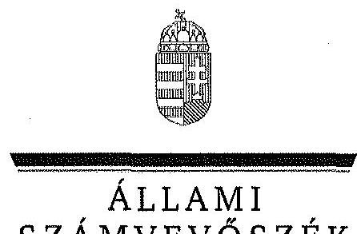
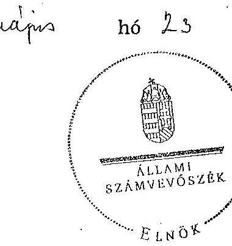
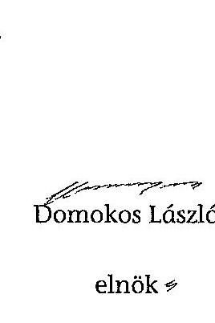
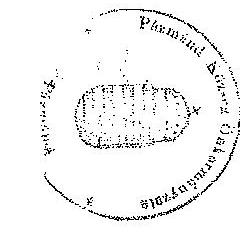
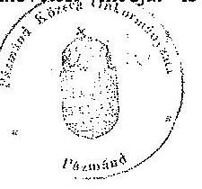
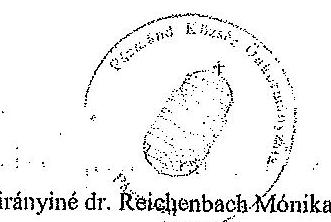
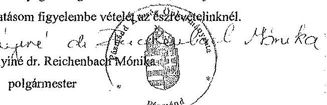
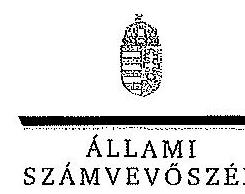
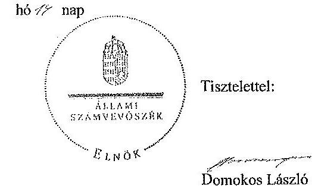
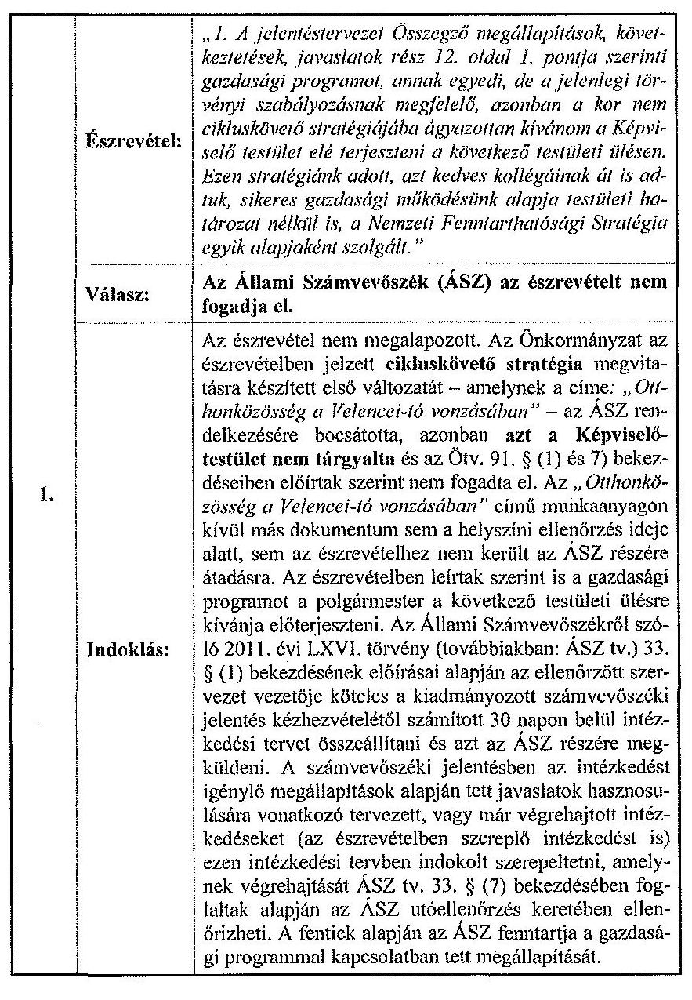

ÁLLAMI
SZÁMVEVŐSZÉK

# JELENTÉS 

az önkormányzatok belső kontrollrendszere kialakításának, egyes
kontrolltevékenységek és a belső ellenőrzés
működésének ellenőrzéséről
Pázmánd
14077
2014. május

---

# Állami Számvevőszék 

Iktatószám: V-0354-074/2014.
Témaszám: 1162
Vizsgálat-azonosító szám: V064935

## Az ellenőrzést felügyelte:

Dr. Benedek Mária
felügyeleti vezető
Az ellenőrzést vezette és az ellenőrzés végrehajtásáért felelős:
Bíró Zsolt
ellenőrzésvezető
A számvevőszéki jelentés összeállításában közreműködött:
Pappné dr. Szamosi Éva
számvevő tanácsos
Az ellenőrzést végezték:
Kalmár István
Bodonyi Miklós
számvevő tanácsos
számvevő főtanácsos

---

# TARTALOMJEGYZÉK 

BEVEZETÉS ..... 7
I. ÖSSZEGZŐ MEGÁLLAPÍTÁSOK, KÖVETKEZTETÉSEK, JAVASLATOK ..... 11
II. RÉSZLETES MEGÁLLAPÍTÁSOK ..... 21

1. Az önkormányzat belső kontrollrendszerének kialakítása ..... 21
1.1. A kontrollkörnyezet ..... 21
1.2. A kockázatkezelési rendszer ..... 23
1.3. A kontrolltevékenységek ..... 24
1.4. Az információs és kommunikációs rendszer ..... 26
1.5. A monitoring rendszer ..... 26
2. A pénzügyi folyamatokban kulcsszerepet betöltő teljesítésigazolás és érvényesítés belső kontrollok működése ..... 27
3. A belső ellenőrzés működése ..... 31

## MELLÉKLETEK

1. számú Észrevételt tartalmazó polgármesteri levél
2. számú Észrevételre vonatkozó elnöki válaszlevél

## FÜGGELÉKEK

1. számú Értelmező szótár
2. számú Az értékelés módja és szempontjai

---

.

---

# RÖVIDÍTÉSEK JEGYZÉKE 

## Törvények

Áht.
ÁSZ tv.
Htv.

Info tv.

Kttv.

Ktv.

Ltv.

Mötv.

Mvtv.
Ötv.
Számv. tv.
Tvtv.

Vagyonnyilatkozattételről szóló tv.

## Rendeletek

Áhsz.

Ávr.

Bkr.

Ikr.
képviselő-testületi
SZMSZ $_{1}$
képviselő-testületi
SZMSZ $_{2}$

2011. évi CXCV. törvény az államháztartásról (hatályos 2012. január 1-jétől)

2011. évi LXVI. törvény az Állami Számvevőszékről
1991. évi XX. törvény a helyi önkormányzatok és szerveik, a köztársasági megbízottak, valamint egyes centrális alárendeltségű szervek feladat- és hatásköreiről
2011. évi CXII. törvény az információs önrendelkezési jogról és az információszabadságról (hatályos 2012. január 1-jétől)
2011. évi CXCIX. törvény a közszolgálati tisztviselőkről (hatályos 2012. március 1-jétől)
1992. évi XXIII. törvény a köztisztviselők jogállásáról (hatálytalan 2012. március 1-jétől)
1995. évi LXVI. törvény a köziratokról, a közlevéltárakról és a magánlevéltári anyag védelméről
2011. évi CLXXXIX. törvény Magyarország helyi önkormányzatairól (hatályos 2012. január 1-jétől)
1993. évi XCIII. törvény a munkavédelemről
1990. évi LXV. törvény a helyi önkormányzatokról
2000. évi C. törvény a számvitelről
1996. évi XXXI. törvény a tűz elleni védekezésről, a műszaki mentésről és a tűzoltóságról
2007. évi CLII. törvény az egyes vagyonnyilatkozat-tételi kötelezettségekről

249/2000. (XII. 24.) Korm. rendelet az államháztartás szervezetei beszámolási és könyvvezetési kötelezettségének sajátosságairól
368/2011. (XII. 31.) Korm. rendelet az államháztartásról szóló törvény végrehajtásáról (hatályos 2012. január 1-jétől)
370/2011. (XII. 31.) Korm. rendelet a költségvetési szervek belső kontrollrendszeréről és belső ellenőrzéséről (hatályos 2012. január 1-jétől)
335/2005. (XII. 29.) Korm. rendelet a közfeladatot ellátó szervek iratkezelésének általános követelményeiről
Pázmánd Község Önkormányzat Képviselő-testületének 7/2010. (X. 29.) rendelete a képviselő-testület szervezeti és működési szabályzatáról (hatályos 2012. március 1-ig)
Pázmánd Község Önkormányzat Képviselő-testületének 4/2012. (II. 29.) rendelete a képviselő-testület szervezeti és működési szabályzatáról (hatályos 2012. március 1-jétől)

---

támogatási rendelet
vagyongazdálkodási rendelet

## Szórövidítések

ÁSZ
belső ellenőrzési kézikönyv
bizonylati rend
eszközök és források értékelési szabályzata
gazdálkodási szabályzat$_{1}$
gazdálkodási szabályzat$_{2}$

Hivatal
hivatali SZMSZ

INTOSAI
iratkezelési szabályzat

ISSAI

Körjegyző$_{1}$
Körjegyző$_{2}$

Körjegyző$_{3}$
jegyző$_{1}$
jegyző$_{2}$
Képviselő-testület

Pázmánd Község Önkormányzata Képviselő-testületének 5/2010. (IV. 22.) számú rendelete a társadalmi és sport szervezetek, valamint alapítványok támogatásáról
Pázmánd Község Önkormányzat Képviselő-testületének 6/2012. (IV. 15.) önkormányzati rendelete az Önkormányzat vagyonáról

Állami Számvevőszék
Velencel-tó Környéki Többcélú Önkormányzati Kistérségi Társulás Belső ellenőrzési kézikönyv (hatályos 2010. január 15-étől)
Pázmánd Község Önkormányzata, Pázmándi Közös Önkormányzati Hivatal, Pázmándi Pitypang Óvoda Bizonylati rendje (hatályos 2013. szeptember 1-jétől)
Pázmánd Község Önkormányzata, Pázmándi Közös Önkormányzati Hivatal, Pázmándi Pitypang Óvoda Eszközök és források értékelési szabályzata (hatályos 2013. szeptember 1-jétől)
Pázmánd Község Önkormányzat kötelezettségvállalás, utalványozás, ellenjegyzés, érvényesítés rendjének szabályzata (hatályos 2010. október 4-étől 2013. szeptember 1-jéig)
Pázmánd Község Önkormányzata, Pázmándi Közös Önkormányzati Hivatal, Pázmándi Pitypang Óvoda Gazdálkodási szabályzata (hatályos 2013. szeptember 1-jétől)
Pázmándi Közös Önkormányzati Hivatal
Pázmánd Község Önkormányzat Képviselő-testületének 12/2013. (XII. 17.) rendeletének 4. számú melléklete (hatályos 2014. január 1-jétől)
International Organization of Supreme Audit Institutions (Legfőbb Ellenőrző Intézmények Nemzetközi Szervezete)
Pázmánd-Vereb Község Önkormányzat Körjegyzőségének iratkezelési szabályzata (hatályos 2007. január 1-jétől)
International Standards of Supreme Audit Institutions (Legfőbb Ellenőrző Intézmények Nemzetközi Standardjai)
Pázmánd és Vereb Községek körjegyzője 2007. május 15-étől 2012. augusztus 1-jéig
Pázmánd és Vereb Községek helyettes körjegyzője 2012. augusztus 2-től 2012. november 30-áig és 2012. december 14-étől 2012. december 18-áig
Pázmánd és Vereb Községek körjegyzője 2012. december 19-étől 2013. február 29-éig, jegyzője 2013. március 1-jétől 2013. április 7-éig
Pázmánd és Vereb Községek jegyzője 2013. április 8-ától 2013. augusztus 11-éig
Pázmánd és Vereb Községek 2013. augusztus 12-től hivatalban levő jegyzője
Pázmánd Község Önkormányzatának Képviselő-testülete

---

| Kormányhivatal | Fejér Megyei Kormányhivatal |
| :--: | :--: |
| Körjegyzőség | Pázmánd és Vereb Községek Körjegyzősége |
| leltárkészítési és leltározási szabályzat | Pázmánd Község Önkormányzata, Pázmándi Közös Önkormányzati Hivatal, Pázmándi Pitypang Óvoda Leltárkészítési és leltározási szabályzata (hatályos 2013. szeptember 1-jétől) |
| NGM | Nemzetgazdasági Minisztérium |
| Óvoda | Pázmándi Pitypang Óvoda |
| Önkormányzat | Pázmánd Község Önkormányzata |
| pénzkezelési szabályzat | Pázmánd Község Önkormányzat Polgármesteri Hivatal pénzkezelési szabályzata (hatályos 2010. október 4-étől) |
| polgármester   számlarend | Pázmánd Község Önkormányzatának polgármestere   A Hivatal és az Óvoda - a jegyző$_{2}$ és az intézményvezető aláírásával kiadott - intézményi számlarendje (hatályos 2013. szeptember 1-jétől) |
| számviteli politika | Pázmánd Község Önkormányzata, Pázmándi Közös Önkormányzati Hivatal, Pázmándi Pitypang Óvoda Számviteli politikája (hatályos 2013. szeptember 1-jétől) |
| Társulás | Velencei-tó Környéki Többcélú Kistérségi Társulás |

---

.

---

# JELENTÉS 

## az önkormányzatok belső kontrollrendszere kialakításának, egyes kontrolltevékenységek és a belső ellenőrzés működésének ellenőrzéséről Pázmánd

## BEVEZETÉS

Pázmánd község állandó lakosainak száma 2012. január 1-jén 2057 fő volt. Az Önkormányzat héttagú Képviselő-testületének munkáját négy állandó bizottság segítette. Az Önkormányzat a Vereb Község Önkormányzatával 2007. január 1-jén alapított Körjegyzőségen kívül, más önállóan működő és gazdálkodó intézményt nem működtetett, többségi tulajdoni hányaddal gazdasági társasággal nem rendelkezett. Az Önkormányzat a Pázmándi Pitypang Óvodát 2012-ben tagóvodaként intézményfenntartó társulásban működtette. A 2010. évi önkormányzati választást követően alakult Képviselő-testület 2012. november 29-én feloszlatta önmagát. Az új Képviselő-testület a 2013. február 24-én megtartott időközi önkormányzati választást követően, 2013. március 5-én alakult meg. A polgármester a 2010. évi önkormányzati választások óta tölti be tisztségét, a 2013. évi időközi választásokon újraválasztották. A körjegyző$_{1}$ 2007. május 15-étől 2012. augusztus 1-jéig, a körjegyző$_{2}$ (helyettes) 2012. augusztus 2-ától 2012. november 30-áig és 2012. december 14-étől 2012. december 18-áig, a körjegyző$_{2}$ 2012. december 19-étől 2013. február 29-éig, valamint jegyzőként 2013. március 1-jétől 2013. április 7-éig, a jegyző$_{1}$ 2013. április 8-ától 2013. augusztus 11-éig látta el, míg a jegyző$_{2}$ 2013. augusztus 12-étől látja el a feladatait. A Körjegyzőség szervezeti egységekre nem tagolódott, elkülönített gazdasági szervezettel nem rendelkezett. A foglalkoztatott köztisztviselők száma 2012. január 1-jén 10 fő volt. A Képviselő-testület - a Körjegyzőség jogutódjaként - 2013. március 1-jétől Vereb Község Önkormányzatának Képviselő-testületével megalapította a közös önkormányzati hivatalt. Az Önkormányzat a 2012. évi költségvetési beszámolója szerint 264030 ezer Ft tárgyévi bevételt ért el, valamint 266503 ezer Ft tárgyévi kiadást teljesített. A 2012. december 31-ei könyvviteli mérleg szerint 1213806 ezer Ft értékű eszközvagyonnal rendelkezett, a rövid lejáratú kötelezettségállománya 29934 ezer Ft volt, hosszú lejáratú kötelezettségállománnyal nem rendelkezett.

A demokratikus társadalmakban alapvető igény, hogy a közpénzeket, a közvagyont használók tevékenységükről elszámoljanak, ahhoz egyértelmű és érvényesíthető felelősségi szabályok társuljanak. Ennek a jogos igénynek az érvényesítéséhez meg kell teremteni azokat a folyamatokat, rendszereket, amelyek nélkülözhetetlenek az elszámoltatáshoz. Az elszámoltatás eredményes működ-

---

tetéséhez szükség van a megfelelő információs, kontroll, értékelési és beszámolási rendszerek kialakítására.

Magyarországon az uniós csatlakozási tárgyalások idejére nyúlnak vissza a belső kontrollrendszer szabályozásának gyökerei. Az uniós elvárásoknak megfelelő új terminológia szerinti államháztartási belső pénzügyi ellenőrzési (ÁBPE) rendszer területén a jogharmonizáció 2003-ban teljes körűen megvalósult, míg az önkormányzati alrendszerre vonatkozó, Ötv.-ben megjelenített speciális szabályozás 2005-ben lépett hatályba. Az államháztartási belső kontrollrendszer koncepciója 2009-ben továbbfejlődött. A változások irányát mutatja, hogy a költségvetési szervek belső kontrollrendszere már magában foglalja a korszerű, felelős szervezetirányítás elemeit (kontrollkörnyezet, kockázatkezelés, kontrolltevékenység, információ és kommunikáció, monitoring) is. E kontrollrendszer szabályozása háromszintű, a törvényi előírásokat az Áht. és a Mötv., a rendeleti szintű szabályozást az Ávr. és a Bkr. tartalmazza, amelyeket útmutatói szinten az NGM által kiadott standardok és kézikönyvek támogatnak.

A belső kontrollrendszer azt a célt szolgálja, hogy a költségvetési szervek működésük és gazdálkodásuk során a tevékenységeket szabályszerűen, gazdaságosan, hatékonyan és eredményesen hajtsák végre, teljesítsék elszámolási kötelezettségeiket, és megvédjék az erőforrásokat a veszteségektől, a károktól és a nem rendeltetésszerű használattól. A belső kontrollrendszer magában foglalja mindazon szabályokat, eljárásokat, gyakorlati módszereket és szervezeti struktúrákat, kockázatkezelési technikákat, kontrolltevékenységeket, amelyek segítséget nyújtanak a szervezetnek céljai eléréséhez.

Az ÁSZ a 2011-2015. évekre szóló stratégiájában hangsúlyos szerepet szánt annak, hogy szilárd szakmai alapon álló, értékteremtő ellenőrzéseivel előmozdítsa a közpénzügyek átláthatóságát, rendezettségét. A számvevőszéki ellenőrzés nemzetközi alapelvei is rögzítik, hogy a megfelelő belső kontrollrendszer minimálisra csökkenti a hibák és szabálytalanságok kockázatát.

Az ellenőrzés célja annak megállapítása volt, hogy a belső kontrollrendszer elemeinek kialakítása, a pénzügyi folyamatokban kulcsszerepet betöltő teljesítésigazolás és érvényesítés, és a belső ellenőrzés szabályos működése biztosította-e az Önkormányzatnál a közpénzfelhasználás szabályosságát, hozzájárult-e az értéket teremtő rend követelményének érvényesüléséhez.

Ennek keretében értékeltük, hogy:

- a jogszabályi előírásoknak megfelelően alakították-e ki a belső kontrollrendszer elemeit;
- a gazdálkodás folyamatában kulcsszerepet betöltő teljesítésigazolás és érvényesítés kontrolltevékenységeit megfelelően működtették-e;
- biztosították-e a belső ellenőrzés szabályos működését;
- amennyiben az ÁSZ tett javaslatot a 2008-2011. évek közötti ellenőrzése kapcsán az Önkormányzatnak, intézkedtek-e azok végrehajtására.

---

Az ellenőrzés várható hasznosulását négy szinten tervezzük. A törvényalkotás számára összegzett tapasztalatok állnak rendelkezésre a belső kontrollrendszer önkormányzati területen való kialakításáról, működéséről és hatásairól, a belső ellenőrzés működéséről. Ennek alapján következtetést lehet levonni arról, hogy a belső kontrollrendszer kialakítására és működtetésére vonatkozó jelenlegi, differenciálás nélküli jogszabályi előírások reális követelményeket támasztanak-e az eltérő adottságú települési önkormányzatok esetében, illetve indokolt-e esetleges jogszabályi módosítás kezdeményezése. Az ellenőrzés az ellenőrzött számára visszajelzést ad a belső kontrollrendszer kialakításában és működésében fellépő hiányosságokról, javaslataival hozzájárul azok kiküszöböléséhez, amely csökkentheti a későbbi ellenőrzések gyakoriságát. Az ellenőrzés megállapításait és javaslatait más szervezetek is hasznosíthatják a rendezett gazdálkodási keretek kialakításához. A társadalom számára jelzi, hogy közpénz nem maradhat ellenőrizetlenül, az ÁSZ értékteremtő rend kialakításához és megőrzéséhez hozzájáruló tevékenysége pozitív hatással lesz a szervezetről kialakított összkép formálásában. A szervezeten belül lehetőség nyílik arra, hogy a megállapítások szintetizálásával az ÁSZ a hozzáadott értéket teremtő elemző tevékenységét és tanácsadó szerepét is erősítse.

Az önkormányzatok belső kontrollrendszere kialakításának, egyes kontrolltevékenységek és a belső ellenőrzés működésének ellenőrzéséről szóló jelentés I. fejezetének összegző része az ellenőrzés céljára ad rövid, szintetizáló összefoglalót, és tartalmazza a következtetéseket a II. fejezet részletes megállapításain alapulóan. A jelentés intézkedést igénylő megállapításait és javaslatait az ellenőrzés során feltárt, a jelentés II. fejezetében rögzített részletes megállapítások alapozzák meg. A helyszíni ellenőrzés lezárásáig a helyi szabályozás változásait nyomon követtük.

Az ellenőrzés típusa: szabályszerűségi ellenőrzés.
Az ellenőrzött időszak: a belső kontrollrendszer kialakításának megfelelősége esetében a 2012. évre,

 a pénzügyi folyamatokban kulcsszerepet betöltő teljesítésigazolás és érvényesítés belső kontrollok működésének megfelelőségét és a belső ellenőrzés szabályszerű működését a 2012. január 1. és december 31-e közötti időszak eseményeit figyelembe véve értékeltük, míg az ÁSZ javaslatainak utóellenőrzése a 2008-2011. években végzett ellenőrzések nyilvánosságra hozott jelentéseiben tett javaslatok áttekintésére terjedt ki.

# Az ellenőrzött szervezet: az Önkormányzat. 

Az ellenőrzés jogszabályi alapját az ÁSZ tv. 1. § (3) bekezdése, az 5. § (2) és (6) bekezdése, valamint az Áht. 61. § (2) bekezdésének előírásai képezik.

Az ellenőrzés szakmai módszertana az ÁSZ hivatalos honlapján (www.asz.hu) közzétett szakmai szabályokon alapult, amely az INTOSAI által kiadott ISSAI figyelembevételével készült.

Az ellenőrzés lefolytatásához az Önkormányzat a kimutatások és a tanúsítvány elektronikus kitöltésével, valamint az ÁSZ által kért dokumentumok elektronikus megküldésével szolgáltatott adatokat. Az így rendelkezésre bocsátott adatok, információk kontrollja és a munkalapok kitöltése a helyszíni ellenőrzés keretében történt. A jelentésben használt fogalmak magyarázatát az 1. számú függelék, az ellenőrzés egyes területeinek értékelésénél alkalmazott egységes minősítési szempontokat a 2. számú függelék tartalmazza.

A belső kontrollrendszer kialakításának ellenőrzése során értékeltük a kontrollkörnyezet, a kockázatkezelési rendszer, a kontrolltevékenységek, az információs és kommunikációs rendszer, valamint a monitoring rendszer szabályozottságának megfelelőségét. A pénzügyi folyamatokban kulcsszerepet betöltő teljesítésigazolás és érvényesítés kontrollok működése megfelelőségének minősítéséhez az állományba nem tartozók megbízási díjai, a külső szolgáltatók által végzett karbantartási, kisjavítási munkák, az egyéb üzemeltetési és fenntartási szolgáltatások, a rendszeres szociális segélyek, valamint az államháztartáson kívülre teljesített működési és felhalmozási célú pénzeszközátadások közül kockázatelemzéssel választottuk ki az ellenőrzött kiadási jogcímeket. Az egyszerű véletlen mintavétellel kiválasztott tételek ellenőrzését többlépcsős megfelelőségi tesztek útján addig végeztük, amíg elegendő és megfelelő bizonyítékot szereztünk a vizsgált folyamatok kulcskontrolljai működésének megfelelő vagy nem megfelelő voltáról. Értékeltük az Önkormányzatnál a belső ellenőrzés működésének szabályosságát. Utóellenőrzésre nem került sor, mivel az ÁSZ az Önkormányzatnál a 2008-2011. évek között ellenőrzést nem végzett.

# I. ÖSSZEGZŐ MEGÁLLAPÍTÁSOK, KÖVETKEZTETÉSEK, JAVASLATOK 

A belső kontrollrendszeren belül 2012-ben a kontrollkörnyezet, a kockázatkezelési rendszer, a kontrolltevékenységek, az információs és kommunikációs rendszer, valamint a monitoring rendszer kialakítását külön-külön és együttesen is értékeltük. A belső kontrollrendszer kialakítása az összesített értékelés alapján nem felelt meg a jogszabályi előírásoknak.

A belső kontrollrendszer egyes területei kialakításának minősítése a következő:

| Kontrollterület | Minősítés |
| :-- | :--: |
| Kontrollkörnyezet | nem |
|  | megfelelő |
| Kockázatkezelési rendszer | nem |
|  | megfelelő |
| Kontrolltevékenységek | nem |
| Információs és kommunikációs | megfelelő |
| rendszer | nem |
| Monitoring rendszer |  |

Nem megfelelőnek értékeltük a kontrollkörnyezet, a kockázatkezelési rendszer, a kontrolltevékenységek, az információs és kommunikációs rendszer, valamint a monitoring rendszer kialakítását, mivel az ellenőrzésünk során megállapított szabályozásbeli hiányosságok magukban hordozzák a szabálytalan működés, valamint a korrupció kockázatát.

A belső kontrollrendszer nem megfelelő kialakítása kockázatot jelent az Önkormányzat tevékenységeinek szabályszerű, gazdaságos, hatékony és eredményes végrehajtása során.

A 2012. évben az állományba nem tartozók megbízási díjaival, a külső szolgáltatók által végzett karbantartási, kisjavítási munkákkal, valamint az államháztartáson kívülre teljesített működési és felhalmozási célú pénzeszközátadásokkal kapcsolatos kifizetések során a pénzügyi folyamatokban kulcsszerepet betöltő teljesítésigazolás és érvényesítés belső kontrollok működése gyenge volt. Gyengének értékeltük a két kulcskontroll együttes működését, mivel azok nem biztosították a hibák megelőzését, feltárását.

A számvevőszéki ellenőrzés az ellenőrzött pénzeszköz átadásokkal - a nonprofit szervezetekkel, ezen belül a sportegyesülettel - kapcsolatos kifizetésekkel összefüggésben a rendelkezésre bocsátott dokumentumok alapján jogszerűtlen kifizetéseket tárt fel. A gazdálkodásban kulcsszerepet betöltő kontrollok működésében feltárt hiányosságok miatt fennáll a hibák bekövetkezésének magas kockázata. A nem megfelelően működtetett belső kontrollok korrupciós kockázatot hordoznak.

Az Önkormányzat a belső ellenőrzési feladatokat a Társulás útján látta el. A 2012. évben a belső ellenőrzés működése a jogszabályi előírásoknak megfelelt, azonban a belső ellenőrzés nem tárta fel a belső kontrollrendszer kialakításának, valamint a pénzügyi folyamatokban kulcsszerepet betöltő teljesítésigazolás és érvényesítés belső kontrollok működésének hiányosságait.

Az ÁSZ tv. 33. § (1) bekezdésében foglaltak értelmében az ellenőrzött szervezet vezetője köteles a jelentésben foglalt megállapításokhoz kapcsolódó intézkedési tervet összeállítani, és azt a jelentés kézhezvételétől számított 30 napon belül az ÁSZ részére megküldeni. Amennyiben az intézkedési tervet határidőre nem küldi meg a szervezet, vagy az ÁSZ tv. 33. § (2) bekezdésében foglalt póthatáridő elteltével megküldött intézkedési terv továbbra sem elfogadható, az ÁSZ elnöke a hivatkozott törvény 33. § (3) bekezdés a)-b) pontjaiban foglaltakat érvényesítheti.

Az ellenőrzés intézkedést igénylő megállapításai és javaslatai:

# a polgármesternek 

1. A Képviselő-testület - az Ötv. 91. § (7) bekezdésében foglaltak ellenére - nem fogadta el az Ötv. 91. § (1) bekezdése szerinti gazdasági programot.

Javaslat:
Terjessze a Képviselő-testület elé a Htv. 139. § (1) bekezdés a) pontja alapján a jegyző által elkészített a Mötv. 116. §-a szerinti gazdasági program tervezetét.
2. A Képviselő-testület a 2013. évi belső ellenőrzési tervet nem az Ötv. 92. § (6) bekezdésében és a Bkr. 32. § (4) bekezdésében előírt határidőn belül hagyta jóvá, mert a körjegyző₂ által 2012. október 26-án készített előterjesztést a polgármester a november 15-ei határidő elteltét követő időpontban (2012. november 21.) terjesztette a Képviselő-testület elé, először a 2012. november 29-ei ülésre, amelyen nem került elfogadásra, azután a december 19-ei ülésre, amelyen jóváhagyásra került.

Javaslat:
Terjessze elő olyan időpontban a belső ellenőrzési tervet, hogy azt a Képviselőtestület a Mötv. 119. § (5) bekezdésében és a Bkr. 32. § (4) bekezdésében előírt határidőben hagyja jóvá.
3. Az Önkormányzat nevében történt kötelezettségvállalásokra - az Áht. 37. § (1) bekezdésében és az Ávr. 55. § (1) bekezdésében előírtak ellenére - pénzügyi ellenjegyzés nélkül került sor. Az Önkormányzat kiadási előirányzata terhére teljesített karbantartással, kisjavítással kapcsolatos kifizetések kötelezettségvállalásait - az Áht. 37. § (1) bekezdésében előírtak ellenére - nem foglalták írásba. A támogatások kötelezettségvállalásait erre irányuló bizottsági döntés hiányában - az Áht. 37. § (1) bekezdésében és a támogatási rendelet 6. § (2) bekezdésében előírtak ellenére - nem foglalták írásba.

Javaslat:
Intézkedjen, hogy az Önkormányzat kiadási előirányzatai terhére történt kötelezettségvállalásokra az Áht. 37. § (1) bekezdésében és az Ávr. 55. § (1) bekezdésében foglaltaknak megfelelően - az Ávr. 53. §-ában meghatározott kivételeket figyelembe véve - kizárólag a pénzügyi ellenjegyzés után, a pénzügyi teljesítés esedékességét megelőzően, írásban kerüljön sor.
4. A számvevőszéki ellenőrzés megállapításai alapján az Önkormányzatnál a belső kontrollrendszer kialakítása összefoglalóan értékelve nem felelt meg a jogszabályi előírásoknak, a kulcskontrollok működése gyenge volt, a számvevőszéki ellenőrzés jogszerűtlen kifizetést tárt fel, a belső ellenőrzés működése ugyan megfelelt a jogszabályi előírásoknak, azonban nem tárta fel, ezáltal nem is javíttatta ki a hiányosságokat. A megállapított szabályozásbeli és működésbeli hiányosságok magukban hordozzák a szabálytalan működés kockázatát.

Javaslat:
A Mötv. 115. § (1) bekezdésében foglaltak alapján kísérje figyelemmel az Önkormányzat gazdálkodásának szabályszerűségét. A Mötv. 67. § f) pontja alapján gondoskodjon a belső kontrollrendszer működésére vonatkozó jogszabályi rendelkezések be nem tartása, valamint a teljesítésigazolás, illetve az érvényesítés kontrollokkal összefüggésben feltárt hiányosságok, szabálytalanságok, különösen a jogosulatlan kifizetésekkel, a kötelezettségvállalások nyilvántartásával és a vagyonnyilatkozat-tétellel összefüggő hiányosságok tekintetében az esetleges munkajogi felelősséggel kapcsolatos körülmények kivizsgálásáról, majd a vizsgálat eredményének függvényében tegye meg a szükséges munkajogi intézkedéseket.

# a jegyző₂-nek Pázmánd Község Önkormányzata vonatkozásában 

1. a kontrollkörnyezettel kapcsolatban:

A körjegyző₁ a - Htv. 140. § (1) bekezdés a) pontjában foglaltak ellenére - nem készítette elő a gazdasági programtervezetet, így a Képviselő-testület az Ötv. 91. § (1) és (7) bekezdésében foglaltakat figyelmen kívül hagyva nem határozta meg az Önkormányzat gazdasági programját.

A körjegyző₁,₂,₃ - az Mvtv. 2. § (3) bekezdésében foglaltak ellenére - nem határozta meg a Körjegyzőségen az egészséget nem veszélyeztető és biztonságos munkavégzés követelményei megvalósításának módját.

A körjegyző₁,₂,₃ - a Tvtv. 19. § (1) bekezdésében foglaltak ellenére - nem készítette el a Körjegyzőség tűzvédelmi szabályzatát.

A körjegyző₁,₂,₃ - a Bkr. 6. § (3) és (4) bekezdésében foglaltak ellenére - nem készítette el a szabálytalanságok kezelésének eljárásrendjét és az ellenőrzési nyomvonalat.

A körjegyző₁,₂,₃ - a Kttv. 130. § (1) bekezdésében előírtak ellenére - a Körjegyzőségen dolgozó köztisztviselők munkateljesítményét írásban nem értékelte.

A Képviselő-testület - a Kttv. 231. § (1) bekezdésében foglaltak ellenére - nem állapította meg a Kttv. 83. §-ában előírt, a köztisztviselőkkel szembeni hivatásetikai alapelvek részletes tartalmát, valamint az etikai eljárás szabályait, mivel a körjegyző₁,₂,₃ - az Ötv. 36. § (2) bekezdés a) pontjában előírt feladata ellenére - nem készítette elő ennek dokumentumát.

Javaslat:
a) Készítse elő a Htv. 140. § (1) bekezdés a) pontjában foglaltak alapján a gazdasági program tervezetét a Mötv. 116. §-a szerint, és kezdeményezze a polgármesternél a Képviselő-testület elé terjesztését.
b) Határozza meg az egészséget nem veszélyeztető és biztonságos munkavégzés követelményei megvalósításának módját az Mvtv. 2. § (3) bekezdése alapján.
c) Készítse el a tűzvédelmi szabályzatot a Tvtv. 19. § (1) bekezdésében foglalt előírásnak megfelelően.
d) Készítse el a Bkr. 6. § (3)-(4) bekezdéseiben foglaltaknak megfelelően az ellenőrzési nyomvonalat, és szabályozza a szabálytalanságok kezelésének eljárásrendjét.
e) Értékelje írásban a Kttv. 130. § (1) bekezdése alapján a Hivatalban dolgozó köztisztviselők munkateljesítményét.
f) Készítse elő a köztisztviselőkkel szembeni - a Kttv. 83. §-a szerinti - hivatásetikai alapelvek részletes tartalmának, valamint az etikai eljárás szabályainak dokumentumait, és a Kttv. 231. § (1) bekezdésében foglaltak érvényesülése érdekében kezdeményezze azok Képviselő-testület elé terjesztését.
2. a kockázatkezelési rendszerrel kapcsolatban:

A körjegyző₁,₂,₃ - a Bkr. 3. § b) pontjában foglaltak ellenére - a Körjegyzőség kockázatkezelési rendszerét nem alakította ki.

A körjegyző₁,₂,₃ - a Bkr. 7. § (2) bekezdésében foglalt előírás ellenére - nem mérte fel és nem állapította meg a Körjegyzőség tevékenységében, gazdálkodásában rejlő kockázatokat, nem határozta meg az egyes kockázatokkal kapcsolatban a szükséges intézkedéseket, valamint azok teljesítésének folyamatos nyomon követési módját.

Három fő köztisztviselő és a körjegyző, - a Vagyonnyilatkozat-tételről szóló tv. 5. §-ában foglaltak ellenére - vagyonnyilatkozat-tételi kötelezettségének nem tett eleget. A vagyonnyilatkozat-tételre kötelezetteket az őrzésért felelős - a Vagyonnyilatkozattételről szóló tv. 10. § (1) bekezdésében foglaltak ellenére - írásban nem szólította fel arra, hogy kötelezettségüket a felszólítás kézhezvételétől számított nyolc napon belül teljesítsék.

Javaslat:
a) Alakítsa ki és működtesse a Bkr. 3. § b) pontjában előírtaknak megfelelően a Hivatal kockázatkezelési rendszerét.

b) Mérje fel és állapítsa meg - a Bkr. 7. § (2) bekezdésében foglaltak alapján - a Hivatal tevékenységében és gazdálkodásában rejlő kockázatokat, továbbá határozza meg az egyes kockázatokkal kapcsolatban szükséges intézkedések teljesítésének folyamatos nyomon követési módját.
c)
 Szólítsa fel írásban a Vagyonnyilatkozat-tételről szóló tv. 7. § a) pontjának és a 10. § (1) bekezdésének megfelelően a köztisztviselőket, hogy vagyonnyilatkozattételi kötelezettségüket a felszólítás kézhezvételétől számított nyolc napon belül teljesítsék.
d) Jelezze az MÖtv. 81. § (3) bekezdés e) pontja alapján a polgármesternek, hogy mint örzésért felelős a kötelezettet - a Vagyonnyilatkozat-tételről szóló tv. 10. § (1) bekezdésében foglaltak ellenére - írásban nem szólította fel arra, hogy kötelezettségét a felszólítás kézhezvételétől számított nyolc napon belül teljesítse.
3. a kontrolltevékenységekkel kapcsolatban:

A körjegyző ${ }_{1,2,3}$ - a Bkr. 8. § (2) bekezdésében foglaltak ellenére - nem biztosította a beszerzési folyamat és a vagyonhasznosítási tevékenység, valamint a pénzügyi döntések - köztük a költségvetés tervezése és a támogatásokkal való elszámolás - dokumentumainak elkészítésével kapcsolatban a folyamatba épített, előzetes, utólagos és vezetői ellenőrzést.

A körjegyző ${ }_{1,2,3}$ - az Ávr. 53. § (2) bekezdésében foglaltakat figyelmen kívül hagyva annak ellenére nem határozta meg az előzetes írásbeli kötelezettségvállalást nem igénylő kifizetések rendjét, hogy a gazdálkodási szabályzat ${ }_{1}$-ben lehetővé tette az 50 ezer Ft-ot el nem érő kifizetések előzetes írásbeli kötelezettségvállalás nélküli teljesítését.

A körjegyző ${ }_{1,2,3}$ - az Ávr. 13. § (2) bekezdés a) pontjában foglaltak ellenére - belső szabályzatban nem rendezte a teljesítésigazolás dokumentációs részletszabályaival kapcsolatos belső előírásokat, feltételeket.

A körjegyző ${ }_{1,2,3}$ az iratkezelési rendszer kialakítása során - az Ikr. 8. § (2) bekezdésében foglaltak ellenére - nem határozta meg az üzemeltetés és adatbiztonság védelmének feladatai esetében a hatásköröket.

A körjegyző ${ }_{1,2,3}$ - az Info tv. 7. § (2) és (3) bekezdésében foglalt előírásokat figyelmen kívül hagyva - az informatikai rendszer szabályozása során nem tette meg azokat a technikai és szervezési intézkedéseket, nem alakította ki azokat az eljárási szabályokat, amelyek biztosítják az adatok biztonságát és védelmét.

A körjegyző ${ }_{1,2,3}$ - a Bkr. 8. § (4) bekezdés b) pontjában foglaltak ellenére - a dokumentumokhoz és információkhoz való hozzáférést belső szabályzatban nem szabályozta.

A körjegyző ${ }_{1,2,3}$ - a Kttv. 74. § (1) bekezdésében foglaltak ellenére - nem szabályozta a jogviszony megszüntetése (megszünése) esetére a munkakör átadása és a munkáltatóval való elszámolás rendjét.

---

Javaslat:
a) Biztosítsa minden tevékenységre vonatkozóan a folyamatba épített, előzetes, utólagos és vezetői ellenőrzést a Bkr. 8. § (2) bekezdése alapján.
b) Rögzítse belső szabályzatban az Ávr. 53. § (2) bekezdése alapján az előzetes írásbeli kötelezettségvállalást nem igénylő kifizetések rendjét.
c) Rendezze - az Ávr. 13. § (2) bekezdés a) pontjában foglaltak alapján - belső szabályzatban a teljesítésigazolás dokumentációs részletszabályaival kapcsolatos belső előírásokat, feltételeket.
d) Határozza meg az iratkezelési rendszer kialakítása során - az Ikr. 8. § (2) bekezdésében előírtaknak megfelelően - az üzemeltetés és adatbiztonság védelmének feladatai esetében a hatásköröket.
e) Tegye meg - az Info tv. 7. § (2) és (3) bekezdésében foglalt előírásokat figyelembe véve - az informatikai rendszer szabályozása során azokat a technikai és szervezési intézkedéseket, alakítsa ki azokat az eljárási szabályokat, amelyek biztosítják az adatok biztonságát és védelmét.
f) Szabályozza belső szabályzatban - a Bkr. 8. § (4) bekezdés b) pontjában foglaltaknak megfelelően-a dokumentumokhoz és információkhoz való hozzáférést.
g) Rögzítse belső szabályzatban a Kttv. 74. § (1) bekezdésében foglaltaknak megfelelően a jogviszony megszüntetése (megszünése) esetére a munkakör átadása és a munkáltatóval való elszámolás rendjét.
4. az információs és kommunikációs rendszerrel kapcsolatban:

A körjegyző ${ }_{1,2,3}$ - Bkr. 9. § (1) bekezdésében foglaltak ellenére - nem alakított ki olyan rendszert, amely biztosítja, hogy a megfelelő információk a megfelelő időben eljutnak az illetékes személyhez.

A körjegyző ${ }_{1,2,3}$ - az Info tv. 24. § (3) bekezdésében foglaltak ellenére - nem készítette el a Körjegyzőség adatvédelmi és adatbiztonsági szabályzatát.

A körjegyző ${ }_{1,2,3}$ - az Info tv. 35. § (3) és 30. § (6) bekezdésében és az Ávr. 13. § (2) bekezdés h) pontjában foglalt előírás ellenére - a kötelezően közzéteendő adatok nyilvánosságra hozatalának rendjét nem alakította ki, a közérdekű adatok megismerésére irányuló igények teljesítésének rendjét nem szabályozta.

A körjegyző ${ }_{1,2,3}$ - az Ltv. 10. § (1) bekezdés c) pontjában előírtakat figyelmen kívül hagyva - az iratkezelési szabályzatot nem a Magyar Nemzeti Levéltár és a Kormányhivatal egyetértésével adta ki.

Javaslat:
a) Alakítson ki és működtessen - a Bkr. 3. § d) pontjában és a 9. § (1) bekezdésében foglaltaknak megfelelően - olyan rendszert, amely biztosítja, hogy a megfelelő információk a megfelelő időben eljutnak az illetékes személyhez.

---

b) Készítse el - az Info tv. 24. § (3) bekezdése alapján - a Hivatal adatvédelmi és adatbiztonsági szabályzatát.
c) Állapítsa meg belső szabályzatban - az Info tv. 35. § (3) és a 30. § (6) bekezdésében, valamint az Ávr. 13. § (2) bekezdés h) pontjában foglaltaknak megfelelően - a kötelezően közzéteendő adatok nyilvánosságra hozatalának rendjét, és készítsen a közérdekű adatok megismerésére irányuló igények teljesítésének rendjét rögzítő szabályzatot.
d) Intézkedjen annak érdekében, hogy a Hivatal iratkezelési szabályzata az Ltv. 10. § (1) bekezdés c) pontjában foglaltaknak megfelelően a Magyar Nemzeti Levéltár és a Kormányhivatal egyetértésével kerüljön kiadásra.
5. a monitoring rendszerrel kapcsolatban:

A körjegyző ${ }_{1,2,3}$ - a Bkr. 3. § e) pontjában és 10. §-ában foglaltak ellenére - nem alakította ki a Körjegyzőség tevékenységének, a célok megvalósításának nyomon követését biztosító rendszert.

A körjegyző ${ }_{1}$ - a Bkr. 11. § (1) bekezdésében foglalt kötelezettsége ellenére - a Bkr. 1. mellékletében foglalt nyilatkozatban, a 2011. évre vonatkozóan nem értékelte a Körjegyzőség belső kontrollrendszerének minőségét.

Javaslat:
a) Alakítsa ki és működtesse a Bkr. 3. § e) pontjában és 10. §-ában foglaltak alapján a Hivatal tevékenységének, a célok megvalósításának nyomon követését biztosító rendszert.
b) Értékelje - a Bkr. 11. § (1) bekezdésében foglalt kötelezettségére tekintettel - a Bkr. 1. mellékletében foglalt nyilatkozatban - a Hivatal belső kontrollrendszerének minőségét.
6. a pénzügyi folyamatokban kulcsszerepet betöltő kontrollokkal kapcsolatban:

A kifizetéseket megelőzően a teljesítésigazolást - az Ávr. 57. § (3) bekezdésében foglaltak ellenére - nem az arra jogosult személyek végezték. A kijelöléssel nem rendelkező teljesítésigazoló a védőnői helyettesítéssel összefüggő kifizetést megelőzően az Ávr. 57. § (1) bekezdésében foglaltak ellenére - nem ellenőrizte az összegszerűséget.

Az érvényesítő - az Ávr. 58. § (1) bekezdésében foglaltak és aláírása ellenére - a kifizetéseket megelőzően nem ellenőrizte az összegszerűséget és a fedezet meglétét, az Ávr. 58. § (2) bekezdésében foglaltak és aláírása ellenére - nem jelezte az utalványozónak, hogy a megelőző ügymenetben a teljesítésigazolást nem az arra jogosult személyek végezték, az Önkormányzat és a Körjegyzőség nevében történt kötelezettségvállalásokra - az Áht. 37. § (1) bekezdésében és az Ávr. 55. § (1) bekezdésében előírtak ellenére - pénzügyi ellenjegyzés nélkül került sor. Nem jelezte továbbá, hogy az Önkormányzat kiadási előirányzata terhére teljesített karbantartással, kisjavítással kapcsolatos kifizetések, valamint - erre irányuló bizottsági döntés hiányában a támogatások kötelezettségvállalásait - az Áht. 37. § (1) bekezdésében és a támogatási rendelet 6. § (2) bekezdésében előírtak ellenére - nem foglalták írásba; továbbá

---

az utalványon nem tüntették fel - az Ávr. 59. § (3) bekezdés f) pontjában előírtakat figyelmen kívül hagyva - a kötelezettségvállalás nyilvántartási számát, mert a 2012. évben a kötelezettségvállalásokat az Ávr. 56. § (1) bekezdésében előírtak ellenére nem vették nyilvántartásba, ugyanis a kötelezettségvállalásokról nyilvántartást nem vezettek.

A körjegyző, - a Kttv. 8. § (2) bekezdésében foglaltak ellenére - megbízási szerződést kötött a Körjegyzőség volt (nyugdíjas) köztisztviselőjével olyan feladat elvégzésére, amelyre csak köztisztviselői kinevezés adható.

Javaslat:
Intézkedjen - a teljesítésigazolás és az érvényesítés vonatkozásában feltárt hiányosságok megszüntetése, illetve az operatív gazdálkodás során a működésbeli hibák megelőzése, feltárása és kijavítása érdekében - arról, hogy
a) az Áht. 38. § (1) bekezdésén alapuló teljesítésigazolás során az Ávr. 57. § (1) bekezdésében előírtaknak megfelelően, ellenőrizhető okmányok alapján ellenőrizzék és igazolják a kiadások teljesítésének jogosságát, összegszerűségét, az ellenszolgáltatást is magában foglaló kötelezettségvállalás esetén annak teljesítését, valamint az Ávr. 57. § (3) bekezdése szerint a teljesítést az igazolás dátumának és a teljesítés tényére történő utalásnak a megjelölésével, az arra jogosult személy aláírásával igazolják;
b) az érvényesítésre kijelölt a kifizetéseket megelőzően a teljesítésigazolás alapján az Ávr. 57. § (3) bekezdése szerinti esetben annak hiányában is - az összegszerűségnek, a fedezet meglétének és a megelőző ügymenetben az Ávr. 58. § (1) bekezdésében meghatározott jogszabályok előírásainak és a belső szabályzatokban foglaltak betartásának az ellenőrzése - az Ávr. 58. § (2)-(3) bekezdései szerint történjen meg;
c) a védőnői feladatok helyettesítéssel történő ellátásával kapcsolatos jogszerűtlen kifizetés körülményei a MÖtv. 81. § (3) bekezdés b) pontja alapján kivizsgálásra, majd a vizsgálat eredményének függvényében a szükséges intézkedések megtételre kerüljenek;
d) a kötelezettségvállalások nyilvántartását az Ávr. 56. § (1) bekezdésében foglalt előírásnak megfelelően alakítsák ki és vezessék, és az utalványokon, valamint a pénztárbizonylatokon az Ávr. 59. § (3)-(4) bekezdése alapján a kötelező tartalmi elemeket tüntessék fel;
e) kötelezettségvállalásra az Áht. 37. § (1) és az Ávr. 55. § (1) bekezdésében foglaltaknak megfelelően - az Ávr. 53. §-ában meghatározott kivételekkel - kizárólag a pénzügyi ellenjegyzés után, a pénzügyi teljesítés esedékességét megelőzően, írásban kerüljön sor;
f) olyan feladat elvégzésére, amelyre a Kttv. 8. § (2) bekezdése alapján megbízási szerződés nem köthető, kizárólag köztisztviselői kinevezés alapján kerüljön sor.

---

7. a belső ellenőrzés működésével kapcsolatban:

A stratégiai ellenőrzési terv - a Bkr. 30. § (1) bekezdés b) és c) pontjában foglaltak ellenére - nem tartalmazta a belső kontrollrendszer általános értékelését, valamint a kockázati tényezők értékelését.

A 2013. évi belső ellenőrzési terv nem tartalmazta - a Bkr. 31. § (4) bekezdés a), d), e), f), g) és h) pontjaiban foglaltak ellenére - az ellenőrzési tervet megalapozó elemzések és a kockázatelemzés eredményének összefoglaló bemutatását, az ellenőrizendő időszakot, a szükséges ellenőrzési kapacitás meghatározását, az ellenőrzések típusát, az ellenőrzések tervezett ütemezését, valamint az ellenőrizendő szerv, illetve szervezeti egységek megnevezését.

A belső ellenőrzési vezető által összeállított 2013. évi belső ellenőrzési terv - a Bkr. 31. § (2) bekezdésében foglaltak ellenére - nem a stratégiai ellenőrzési tervben és a kockázatelemzés alapján felállított prioritásokon alapult.

A belső ellenőrzés javaslatainak végrehajtása érdekében - a Bkr. 28. § c) pontjában és 45. § (1)-(4) bekezdéseiben foglaltak ellenére - intézkedési tervet nem készítettek.

A Bkr. 21. § (2) bekezdés d) pontjában, a 22. § (2) bekezdés b) és e) pontjában, a 47. § (1) bekezdésében és az 50. §-ában foglalt előírásokat figyelmen kívül hagyva, az elvégzett belső ellenőrzésről és a belső ellenőrzési jelentésben tett javaslatokat, a vonatkozó intézkedési tervet és azok
 végrehajtását nyomon követő nyilvántartást nem vezettek.

A számvevőszéki ellenőrzés az ellenőrzött pénzeszköz-átadásokkal - a nonprofit szervezetekkel, ezen belül a sportegyesülettel - kapcsolatos kifizetésekkel összefüggésben a rendelkezésre bocsátott dokumentumok alapján jogszerűtlen kifizetéseket tárt fel.

Javaslat:
a) Kezdeményezze, hogy a stratégiai ellenőrzési terv tartalmazza a Bkr. 30. § (1) bekezdésében előírt tartalmi elemeket.
b) Kezdeményezze, hogy az éves ellenőrzési terv tartalmazza a Bkr. 31. § (4) bekezdésében előírt tartalmi elemeket, és az a stratégiai ellenőrzési tervben és a kockázatelemzés alapján felállított prioritásokon is alapuljon.
c) Intézkedjen a Bkr. 28. § c) pontjában és 45. § (1)-(4) bekezdéseiben foglaltak alapján, hogy a belső ellenőrzés javaslatainak végrehajtása érdekében készüljön intézkedési terv.
d) Kezdeményezze, hogy vezessenek - a Bkr. 21. § (2) bekezdés d) pontjában, a 22. § (2) bekezdés b) és e) pontjában, a 47. § (1) bekezdésében és az 50. §-ában foglalt előírásokat figyelembe véve - az elvégzett belső ellenőrzésről és a belső ellenőrzési jelentésben tett megállapításokról, javaslatokról, a vonatkozó intézkedési tervről és azok végrehajtását nyomon követő nyilvántartást.

---

e) Kezdeményezze, hogy az éves ellenőrzési terv Bkr. 31. § (4) bekezdése szerinti tartalma terjedjen ki a pénzeszköz-átadásokkal - a nonprofit szervezetekkel, ezen belül a sportegyesülettel - kapcsolatos kifizetések szabályszerűségi ellenőrzésére.

---

# II. RÉSZLETES MEGÁLLAPÍTÁSOK 

## 1. Az ÖNKORMÁNYZAT BELSŐ KONTROLLRENDSZERÉNEK KIALAKÍTÁSA

A belső kontrollrendszeren belül 2012-ben a kontrollkörnyezet, a kockázatkezelési rendszer, a kontrolltevékenységek, az információs és kommunikációs rendszer, valamint a monitoring rendszer kialakítását külön-külön és együttesen is értékeltük. A belső kontrollrendszer kialakítása az összesített értékelés alapján nem felelt meg a jogszabályi előírásoknak.

### 1.1. A kontrollkörnyezet

A kontrollkörnyezet kialakítása - a 2. számú függelékben részletezett kritériumrendszer alapján végzett értékelés szerint - nem felelt meg a jogszabályi követelményeknek, mert:

| Sorszám ${ }^{1}$ | Megállapítás | Megjegyzés |
| :--: | :--: | :--: |
| 2. | A körjegyző, a - Htv. 140. § (1) bekezdés a) pontjában foglaltak ellenére - nem készítette el a gazdasági programtervezetet, így a Képviselő-testület az Ötv. 91. § (1) és (7) bekezdésében ${ }^{2}$ foglaltakat figyelmen kívül hagyva nem határozta meg az Önkormányzat gazdasági programját. |  |
| 4. | A Képviselő-testület - a Ktv. 34. § (3) bekezdésében foglaltak ellenére - nem döntött a teljesítménykövetelmények alapját képező célokról. | A Képviselő-testület a 2013. évi teljesítménykövetelmények alapját képező célokat meghatározta. |
| 5. | Szervezeti és működési szabályzat hiánya miatt a Körjegyzőség feladatai ellátásának részletes belső rendjét és módját - az Áht. 10. § (5) bekezdésében foglaltak ellenére - szervezeti és működési szabályzat nem állapította meg.   Hivatali SZMSZ hiányában a jegyző vonatkozásában nem került sor az Ávr. 13. § (1) bekezdés g) pontja szerinti helyettesítési rend meghatározására, amelynek következtében a körjegyző, jogviszonyának 2012. novem- | A Képviselő-testület 2013. december 17-én jóváhagyta a hivatali SZMSZ-t.

A körjegyző, 2012. november 30-án december 1-jével visszavonta pályázatát, továbbá Pátka Község Önkormányzata Képviselő-testülete 276/2012. (XI. 30.) önkormányzati határozatával Pátka jegyzői-

[^0]
[^0]:    ${ }^{1}$ A megállapítás számozása az Önkormányzat által kitöltött kimutatások - adatszolgáltatások - kérdéseinek sorszámával azonos.
    ${ }^{2}$ 2013. január 1-jétől a Mötv. 116. § (1) és (5) bekezdése

---

ber 30-ai megszűnése és a körjegyző ${ }_{2}$ jogviszonyának 2012. december 14-ei ismételt létesítése közötti időszakban az Önkormányzat nem rendelkezett a szabályszerű működésért felelős jegyzővel.
nek Pázmánd községnél a körjegyző ${ }_{2}$ helyettesítésre irányuló jogviszonya visszavonásáról döntött. Így Pázmánd önkormányzata körjegyző nélkül maradt, ezért Pázmánd polgármestere 2012. december 5-én és 7-én azonnali tájékoztatást kért a Kormányhivataltól. A Kormányhivatal javaslata alapján Pázmánd önkormányzata Pátka és Vereb községi önkormányzatokkal írásban megállapodva 2012. december 14-től a kör-jegyző $_{2}$-vel helyettesítésre közszolgálati jogviszonyt létesített.

A 1, 2, 3 - a Számv. tv. 14. § (3) és (11) bekezdésében, valamint az Áhsz. 8. § (3) bekezdésében foglaltak ellenére - nem alakította ki a Körjegyzőség számviteli politikáját.

A 1, 2, 3 - a Számv. tv. 14. § (5) bekezdés a) és az Áhsz. 8. § (4) bekezdés a) pontjának előírását figyelmen kívül hagyva - nem készítette el a Körjegyzőség leltárkészítési és leltározási szabályzatát.

A 1, 2, 3 - a Számv. tv. 14. § (5) bekezdés b) pontjában és az Áhsz. 8. § (4) bekezdés b) pontjában foglaltak ellenére nem készítette el az eszközök és források értékelési szabályzatát.

A 1, 2, 3 - a Számv. tv. 161. § (1) bekezdésében és az Áhsz. 49. § (1) bekezdésében foglalt előírások ellenére - nem készítette el a Körjegyzőség számlarendjét.

A 1, 2, 3 - a Számv. tv. 161. § (1) bekezdésében és a (2) bekezdés d) pontjában foglaltak ellenére - nem készítette el a Körjegyzőség bizonylati rendjét.

A 1, 2, 3 - az Mvtv. 2. § (3) bekezdésében foglaltak ellenére - nem határozta meg a Körjegyzőségen az egészséget nem veszélyeztető és biztonságos munkavégzés követelményei megvalósításának módját.

A 1, 2, 3 - a Tvtv. 19. § (1) bekezdésében foglaltak ellenére - nem készítette el a Körjegyzőség tűzvédelmi szabályzatát.
A jegyző ${ }_{2}$ a 2013. évben elkészítette a Hivatal számlarendjét.

A jegyző ${ }_{2}$ a 2013. évben elkészítette a Hivatal bizonylati rendjét.

A körjegyző ${ }_{1,2,3}$ - a Számv. tv. 14. § (5) bekezdés a) és az Áhsz. 8. § (4) bekezdés a) pontjának előírását figyelmen kívül hagyva - nem készítette el a Körjegyzőség leltárkészítési és leltározási szabályzatát.

A jegyző ${ }_{2}$ a 2013. évben elkészítette a Hivatal eszközök és források értékelési szabályzatát.

A jegyző ${ }_{2}$ a 2013. évben elkészítette a Hivatal számlarendjét.

A jegyző ${ }_{2}$ a 2013. évben elkészítette a Hivatal bizonylati rendjét.

---

| 34.   és   41. | A körjegyző $1,2,3$ - a Bkr. 6. § (3) és (4) bekezdésében foglaltak ellenére - nem készítette el a szabálytalanságok kezelésének eljárásrendjét és az ellenőrzési nyomvonalat. |  |
| :--: | :--: | :--: |
| 37. | A körjegyző $1,2,3$ - a Kttv. 75. § (1) bekezdés d) pontjában foglaltak ellenére - nem készítette el a Körjegyzőségen dolgozó köztisztviselők munkaköri leírását. | A Hivatalban dolgozó köztisztviselők munkaköri leírásait 2013. szeptember 9-ei dátummal a jegyző2 kiadta. |
| 46. | A körjegyző $1,2,3$ - a Kttv. 130. § (1) bekezdésében előírtak ellenére - a Körjegyzőségen dolgozó köztisztviselők munkateljesítményét írásban nem értékelte. |  |
| 47. | A Képviselő-testület - a Kttv. 231. § (1) bekezdésben foglaltak ellenére - nem állapította meg a Kttv. 83. §-ában előírt, a köztisztviselőkkel szembeni hivatásetikai alapelvek részletes tartalmát, valamint az etikai eljárás szabályait, mivel a körjegyző $1,2,3$ - az Ötv. 36. § (2) bekezdés a) pontjában ${ }^{3}$ előírt feladata ellenére - nem készítette elő ennek dokumentumát. |  |

# 1.2. A kockázatkezelési rendszer 

A kockázatkezelési rendszer kialakítása - a 2. számú függelékben részletezett kritériumrendszer alapján végzett értékelés szerint - nem felelt meg a jogszabályi előírásoknak, mert:

| Sorszám | Megállapítás | Megjegyzés |
| :--: | :--: | :--: |
| 1. | A körjegyző $1,2,3$ - a Bkr. 3. § b) pontjában foglaltak ellenére - a Körjegyzőség kockázatkezelési rendszerét nem alakította ki. |  |
| 2., 8.   és   10. | A körjegyző $1,2,3$ - a Bkr. 7. § (2) bekezdésében foglalt előírás ellenére - nem mérte fel és nem állapította meg a Körjegyzőség tevékenységében, gazdálkodásában rejlő kockázatokat, nem határozta meg az egyes kockázatokkal kapcsolatban szükséges intézkedéseket, valamint azok teljesítésének folyamatos nyomon követési módját. |  |

[^0]
[^0]:    ${ }^{3}$ 2013. január 1-jétől a Mötv. 81. § (3) bekezdés c) pontja

---

| 13. | A Körjegyzőség szervezeti és működési szabályzatában - annak elkészítése hiányában - a vagyonnyilatkozat-tételi kötelezettség - a Vagyonnyilatkozat-tételről szóló tv. 4. § a) pontjában foglaltak ellenére - nem került feltüntetésre. | A Képviselő-testület által 2013-ban jóváhagyott hivatali SZMSZ tartalmazta a vagyonnyilatkozat-tételre kötelezetteket. |
| :--: | :--: | :--: |
| 14. | Három fő köztisztviselő és a körjegyző ${ }_{1}$ - a Vagyonnyilatkozat-tételről szóló tv. 5. §-ában foglaltak ellenére - vagyonnyilatkozat-tételi kötelezettségének nem tett eleget. A vagyonnyilatkozat-tételre kötelezetteket az őrzésért felelős - a Vagyonnyilatkozat-tételről szóló tv. 10. § (1) bekezdésében foglaltak ellenére - írásban nem szólította fel arra, hogy kötelezettségüket a felszólítás kézhezvételétől számított nyolc napon belül teljesítsék. | A körjegyző ${ }_{1}$ jogviszonya 2012. augusztus 1-jén, a köztisztviselők jogviszonya 2012. december 31-én, 2013. április 30-án és 2013. május 1-jén megszűnt. |

# 1.3. A kontrolltevékenységek 

A kontrolltevékenységek kialakítása - a 2. számú függelékben részletezett kritériumrendszer alapján végzett értékelés szerint - nem felelt meg a jogszabályi előírásoknak, mert:

| Sorszám | Megállapítás | Megjegyzés |
| :--: | :--: | :--: |
| 2-5. | A körjegyző ${ }_{1,2,3}$ - a Bkr. 8. § (2) bekezdésében foglaltak ellenére - nem biztosította a beszerzési folyamat és a vagyonhasznosítási tevékenység, valamint a pénzügyi döntések - köztük a költségvetés tervezése és a támogatásokkal való elszámolás dokumentumainak elkészítésével kapcsolatban a folyamatba épített, előzetes, utólagos és vezetői ellenőrzést. |  |
| 8. | A körjegyző ${ }_{1,2,3}$ - az Ávr. 53. § (2) bekezdésében foglaltakat figyelmen kívül hagyva - annak ellenére nem határozta meg az előzetes írásbeli kötelezettségvállalást nem igénylő kifizetések rendjét, hogy a gazdálkodási szabályzat ${ }_{1}$-ben lehetővé tette az 50 ezer Ft-ot el nem érő kifizetések előzetes írásbeli kötelezettségvállalás nélküli teljesítését. |  |
| 9. | A körjegyző ${ }_{1,2,3}$ - az Ávr. 13. § (2) bekezdés a) pontjában foglaltak ellenére - belső szabályzatban nem rendezte a teljesítésigazolás gyakorlásának módjával, eljárási és dokumentációs részletszabályaival kapcsolatos belső előírásokat, feltételeket. | A jegyző ${ }_{2}$ a gazdálkodási szabályzat ${ }_{2}$-ben rögzítette a teljesítésigazolás gyakorlásának módját, eljárási részletszabályaival kapcsolatos belső előírásokat. |

---

| 10. | A polgármester mint kötelezettségvállaló 2012. március 30-át követően - az Ávr. 57. § (4) bekezdésében foglaltak ellenére nem jelölte ki írásban a teljesítésigazolásra jogosult személyeket. | A teljesítés igazolására jogosult személyeket a polgármester mint kötelezettségvállaló 2013. szeptember 1-jétől kijelölte. |
| :--: | :--: | :--: |
| 15. | A körjegyző ${ }_{1,2,3}$ az iratkezelési rendszer kialakítása során - az lkr. 8. § (2) bekezdésében foglaltak ellenére - nem határozta meg az üzemeltetés és adatbiztonság védelmének feladatai esetében a hatásköröket. |  |
| 16. | A körjegyző ${ }_{1,2,3}$ - az Info tv. 7. § (2) és (3) bekezdésében foglalt előírásokat figyelmen kívül hagyva - az informatikai

 rendszer szabályozása során nem tette meg azokat a technikai és szervezési intézkedéseket, nem alakította ki azokat az eljárási szabályokat, amelyek biztosítják az adatok biztonságát és védelmét. |  |
| 17. | A körjegyző ${ }_{1,2,3}$ - a Bkr. 8. § (4) bekezdés b) pontjában foglaltak ellenére - a dokumentumokhoz és információkhoz való hozzáférést belső szabályzatban nem szabályozta.   A körjegyző ${ }_{1,2,3}$ nem határozta meg belső szabályzatban - az Ávr. 13. § (2) bekezdés a) pontjában foglaltak ellenére - a beszámolási feladatok teljesítésével kapcsolatos belső előírásokat, feltételeket, valamint - a Bkr. 8. § (4) bekezdés c) pontjában foglaltak ellenére - a beszámolási eljárásokhoz kapcsolódó felelősségi köröket. | A jegyző ${ }_{2}$ a beszámolási feladatok teljesítésével kapcsolatos belső előírásokat, feltételeket és a kapcsolódó felelősségi köröket a gazdálkodási szabályzat ${ }_{2}$-ben meghatározta. |
| 28. | A pénzügyi ellenjegyzésre jogosultak közül egy fő nem rendelkezett az Ávr. 55. § (3) bekezdésében előírt szakképzettséggel. | A körjegyző ${ }_{1}$ nem rendelkezett az előírt szakképzettséggel. |
| 32. | A körjegyző ${ }_{1,2,3}$ - a Kttv. 74. § (1) bekezdésében foglaltak ellenére - nem szabályozta a jogviszony megszüntetése (megszünése) esetére a munkavállaló folyamatban lévő feladatai átadásának rendjét. |  |

---

# 1.4. Az információs és kommunikációs rendszer 

Az információs és kommunikációs rendszer kialakítása - a 2. számú függelékben részletezett kritériumrendszer alapján végzett értékelés szerint nem felelt meg a jogszabályi előírásoknak, mert:

| Sorszám | Megállapítás |
| :--: | :--: |
| 1. | A körjegyző ${ }_{1,2,3}$ - Bkr. 9. § (1) bekezdésében foglaltak ellenére - nem alakított ki olyan rendszert, amely biztosítja, hogy a megfelelő információk a megfelelő időben eljutnak az illetékes személyhez. |
| 5. | A körjegyző ${ }_{1,2,3}$ - az Info tv. 24. § (3) bekezdésében foglaltak ellenére - nem készítette el a Körjegyzőség adatvédelmi és adatbiztonsági szabályzatát. |
| 6. és   8. | A körjegyző ${ }_{1,2,3}$ - az Info tv. 35. § (3) és 30. § (6) bekezdésében és az Ávr. 13. § (2) bekezdés h) pontjában foglalt előírás ellenére - a kötelezően közzéteendő adatok nyilvánosságra hozatalának rendjét nem alakította ki, a közérdekű adatok megismerésére irányuló igények teljesítésének rendjét nem szabályozta. |
| 9. | A körjegyző ${ }_{1,3,3}$ - az Ltv. 10. § (1) bekezdés c) pontjában előírtakat figyelmen kívül hagyva - az iratkezelési szabályzatot nem a Magyar Nemzeti Levéltár és a Kormányhivatal egyetértésével adta ki. |

### 1.5. A monitoring rendszer

A monitoring rendszer kialakítása - a 2. számú függelékben részletezett kritériumrendszer alapján végzett értékelés szerint - nem felelt meg a jogszabályi előírásoknak, mert:

| Sorszám | Megállapítás | Megjegyzés |
| :--: | :--: | :--: |
| 1. | A körjegyző ${ }_{1,2,3}$ - a Bkr. 3. § e) pontjában és 10. §-ában foglaltak ellenére - nem alakította ki a Körjegyzőség tevékenységének, a célok megvalósításának nyomon követését biztosító rendszert. |  |
| 9. | A körjegyző ${ }_{1}$ - a Bkr. 11. § (1) bekezdésében foglalt kötelezettsége ellenére - a Bkr. 1. mellékletében foglalt nyilatkozatban, a 2011. évre vonatkozóan nem értékelte a Körjegyzőség belső kontrollrendszerének minőségét. |  |

A helyi önkormányzatok törvényességi felügyeletét ellátó Kormányhivatal 2012-ben három esetben élt törvényességi felhívással. A felhívásokban foglaltakat a Képviselő-testület elfogadta és hasznosította.

A Képviselő-testület a Kormányhivatal törvényességi felhívására a VerebPázmánd Közművelődési és Könyvtári Intézményi Társulás társulási megállapodását módosította.

---

A Képviselő-testület a Kormányhivatal törvényességi felhívására a korábban elfogadott körjegyzői pályázati kiírást visszavonta és új pályázati kiírást fogadott el.

A Képviselő-testület bizottságainak üléséről készített jegyzőkönyvekkel, valamint a jegyzőkönyv-készítési és jegyzőkönyv-felterjesztési kötelezettségek elmulasztásával kapcsolatos törvényességi felhívást a Képviselő-testület elfogadta ${ }^{4}$ azzal, hogy az észrevételeknek eleget tesz. A polgármester 2014. január 24-én tett nyilatkozata szerint a Képviselő-testület 2013. március 5-ei alakuló ülését követően a bizottságok üléseiről jegyzőkönyvek, döntéseikről határozatok készültek.

# 2. A PÉNZÜGYI FOLYAMATOKBAN KULCSSZEREPET BETÖLTŐ TELJESÍTÉSIGAZOLÁS ÉS ÉRVÉNYESÍTÉS BELSŐ KONTROLLOK MŰKÖDÉSE 

A 2012. évben az állományba nem tartozók megbízási díjaival, a külső szolgáltatók által végzett karbantartással, kisjavítással kapcsolatos kifizetések, valamint az államháztartáson kívülre teljesített működési és a felhalmozási célú pénzeszközátadások során - összefoglalóan értékelve - a pénzügyi folyamatokban kulcsszerepet betöltő teljesítésigazolás és érvényesítés belső kontrollok működésének megfelelősége gyenge volt, mert:

| Kulcskontrollok | Megállapítás |
| :--: | :--: |
| Teljesítésigazolás | A kifizetéseket megelőzően a teljesítésigazolást - az Ávr. 57. § (3) bekezdésében foglaltak ellenére - nem az arra jogosult személyek végezték. A kijelöléssel nem rendelkező teljesítésigazoló a védőnői helyettesítéssel összefüggő kifizetést megelőzően - az Ávr. 57. § (1) bekezdésében foglaltak ellenére - nem ellenőrizte az összegszerűséget. |
| Érvényesítés | Az érvényesítő - az Ávr. 58. § (1) bekezdésében foglaltak és aláírása ellenére - a kifizetéseket megelőzően nem ellenőrizte az összegszerűséget és a fedezet meglétét, - az Ávr. 58. § (2) bekezdésében foglaltak és aláírása ellenére - nem jelezte az utalványozónak, hogy a megelőző ügymenetben a teljesítésigazolást nem az arra jogosult személyek végezték, az Önkormányzat és a Körjegyzőség nevében történt - kötelezettségvállalásokra - az Áht. 37. § (1) bekezdésében és az Ávr. 55. § (1) bekezdésében előírtak ellenére - pénzügyi ellenjegyzés nélkül került sor. Nem jelezte továbbá, hogy az Önkormányzat kiadási előirányzata terhére teljesített karbantartással, kisjavítással kapcsolatos kifizetések, valamint - erre irányuló bizottsági döntés hiányában - a támogatások kötelezettségvállalásait - az Áht. 37. § (1) bekezdésében és a támogatási rendelet 6. § (2) bekezdésében előírtak ellenére - nem foglalták írásba; továbbá az utalványon nem tüntették fel - az Ávr. 59. § (3) bekezdés f) pontjában előírtakat figyelmen kívül hagyva - a kötelezettségvállalás nyilvántartási számát, mert a 2012. évben a kötelezettségvállalásokat az Ávr. 56. § (1) bekezdésében előírtak ellenére nem vették nyilvántartásba, ugyanis a kötelezettségvállalásokról nyilvántartást nem vezettek. |

[^0]
[^0]:    ${ }^{4}$ a Képviselő-testület 123/2012. (XI. 16.) számú határozatával

---

A 2012. évben az állományba nem tartozók megbízási díjainak kifizetése során a teljesítésigazolás és az érvényesítés kulcskontrollok működésének megfelelősége gyenge volt, mert:

- a teljesítésigazolást a védőnői helyettesítéssel kapcsolatos kifizetést megelőzően - az Ávr. 57. § (3) bekezdésében foglaltak ellenére - nem az arra jogosult személy végezte;
- a kijelöléssel nem rendelkező teljesítésigazoló a védőnői helyettesítéssel összefüggő kifizetést megelőzően - az Ávr. 57. § (1) bekezdésében foglaltak ellenére - nem ellenőrizte az összegszerűséget, mert a védőnői feladatok helyettesítéssel történő ellátására a Kápolnásnyék Község Önkormányzatával kötött megállapodásban rögzített díjazás négyszeresét ${ }^{5}$ igazolta;
- az érvényesítő - az Ávr. 58. § (1) bekezdésében foglaltak és aláírása ellenére - a pénzügyi előadó helyettesítésével kapcsolatos megbízási díj kifizetését megelőzően nem ellenőrizte a fedezet meglétét, mert a kötelezettségvállalásokat a 2012. évben - az Ávr. 56. § (1) bekezdésében előírtak ellenére - nem vették nyilvántartásba, valamint a konyhai dolgozó helyettesítésével összefüggő megbízási díj kifizetése előtt nem az Ávr. 58. § (3) bekezdésében foglaltaknak megfelelően végezte a feladatát, mert az érvényesített okmányon az érvényesítés dátumát és az érvényesítésre utaló megjelölést nem tüntette fel;
- az érvényesítő - az Ávr. 58. § (2) bekezdésében foglaltak és aláírása ellenére - nem jelezte az utalványozónak, hogy a megelőző ügymenetben a pénzügyi előadó helyettesítésére - a Körjegyzőség nevében - történt kötelezettségvállalásra - az Áht. 37. § (1) bekezdésében és az Ávr. 55. § (1) bekezdésében előírtak ellenére - pénzügyi ellenjegyzés nélkül került sor, az utalványon nem tüntették fel - az Ávr. 59. § (3) bekezdés f) pontjában előírtakat figyelmen kívül hagyva - a kötelezettségvállalás nyilvántartási számát, mert a 2012. évben a kötelezettségvállalásokat az Ávr. 56. § (1) bekezdésében előírtak ellenére nem vették nyilvántartásba.

A körjegyző ${ }_{1}$ a 2012. február 29-én a pénzügyi előadó helyettesítésére kötött megbízási szerződésnél nem tartotta be a Kttv. 8. § (2) bekezdésében foglaltakat, mert nem vette figyelembe, hogy megbízási szerződés nem köthető olyan feladat elvégzésére ${ }^{6}$, amelyre csak köztisztviselői kinevezés adható.

[^0]
[^0]:    ${ }^{5}$ A megállapodás alapján az időarányos helyettesítési díj összege, a helyettesítő védőnő személyi alapbére egy órára eső összegének $25 \%$-a. 2012-ben a védőnői feladatok helyettesítésével kapcsolatban egy alkalommal történt kifizetés, a megbízási díj összesen 31841 Ft volt.
    ${ }^{6}$ A helyettesítő munkavállaló kontírozói, rögzítői és egyéb kisegítő pénzügyi tevékenységet végzett.

---

A 2012. évben a külső szolgáltatók által végzett karbantartási és kisjavítási munkák kifizetése során a teljesítésigazolás és az érvényesítés kulcskontrollok működésének megfelelősége gyenge volt, mert:

- a teljesítésigazolást az óvodai csapszűkítő felszereléssel és a radiátorjavítással kapcsolatos kifizetéseket megelőzően - az Ávr. 57. § (3) bekezdésében foglaltak ellenére - nem az arra jogosult személyek végezték;
- a teljesítésigazolók - az Ávr. 57. § (1) bekezdésében foglaltak és aláírásuk ellenére - az óvodai csapszűkítő felszereléssel és a radiátor-javítással kapcsolatos kifizetéseket megelőzően ellenőrizhető okmányok hiányában nem ellenőrizték a kiadás jogosságát, összegszerűségét, az ellenszolgáltatás teljesítését, mert az Önkormányzat kiadási előirányzata terhére teljesített - az óvodai csapszűkítő felszereléssel és a radiátor-javítással kapcsolatos - kiadások kötelezettségvállalásait az Áht. 37. § (1) bekezdésében előírtak ellenére nem foglalták írásba;
- az érvényesítő az óvodai csapszűkítő felszereléssel és a radiátor-javítással kapcsolatos kifizetéseket megelőzően - az Ávr. 58. § (1) bekezdésében foglaltak és aláírása ellenére - ellenőrizhető okmányok hiányában nem ellenőrizte az összegszerűséget, valamint a fedezet meglétét, mert a kötelezettségvállalásokat a 2012. évben az Ávr. 56. § (1) bekezdésében előírtak ellenére nem vették nyilvántartásba;
- az érvényesítő - az Ávr. 58. § (2) bekezdésében foglaltak és aláírása ellenére - nem jelezte az utalványozónak, hogy a megelőző ügymenetben az óvodai csapszűkítő felszereléssel és a radiátor-javítással kapcsolatos kifizetéseket megelőzően a teljesítésigazolást nem az arra jogosult személyek végezték, az Önkormányzat nevében vállalt kötelezettségvállalásokat - az Áht. 37. § (1) bekezdésében előírtak ellenére - nem foglalták írásba, továbbá az utalványon nem tüntették fel - az Ávr. 59. § (3) bekezdés f) pontjában előírtakat figyelmen kívül hagyva - a kötelezettségvállalás nyilvántartási számát, mert a 2012. évben a kötelezettségvállalásokat az Ávr. 56. § (1) bekezdésében előírtak ellenére nem vették nyilvántartásba.

A 2012. évben a működési és a felhalmozási célú pénzeszközátadások államháztartáson kívülre teljesített kifizetései során a teljesítésigazolás és az érvényesítés kulcskontrollok működésének megfelelősége gyenge volt, mert:

- a teljesítésigazolást a sportegyesület támogatásával és a házi orvosi ügyeleti ellátási szolgáltatással kapcsolatos kifizetéseket megelőzően - az Ávr. 57. § (3) bekezdésében foglaltak ellenére - nem az arra jogosult személy végezte;
- a

 teljesítésigazoló - az Ávr. 57. § (1) bekezdésében foglaltak és aláírása ellenére - a sportegyesület támogatásával összefüggő kifizetést megelőzően - ellenőrizhető okmányok hiányában nem ellenőrizte a kiadás jogosságát, összegszerűségét, mert - az Áht. 37. § (1) bekezdésében előírtak ellenére - a támogatásról bizottsági döntést nem hoztak, és a támogatások kifizetésére írásbeli kötelezettségvállalás hiányában került sor;

---

- az érvényesítő - az Ávr. 58. § (1) bekezdésében foglaltak és aláírása ellenére - ellenőrizhető okmányok hiányában a sportegyesület, a nonprofit szervezetek támogatásával kapcsolatos kifizetéseket megelőzően nem ellenőrizte az összegszerűséget; a sportegyesület támogatásával és a házi orvosi ügyeleti ellátási szolgáltatással kapcsolatos kifizetéseket megelőzően nem ellenőrizte a fedezet meglétét, mert a kötelezettségvállalásokat a 2012. évben az Ávr. 56. § (1) bekezdésében előírtak ellenére nem vették nyilvántartásba;
- az érvényesítő - az Ávr. 58. § (2) bekezdésében foglaltak és aláírása ellenére - nem jelezte az utalványozónak, hogy a megelőző ügymenetben a sportegyesület támogatásával és a házi orvosi ügyeleti ellátási szolgáltatással kapcsolatos kifizetéseket megelőzően a teljesítésigazolást nem az arra jogosult személy végezte, az Önkormányzat kiadási előirányzata terhére - a nonprofit szervezetek, ezen belül a sportegyesület részére - teljesített támogatásokkal kapcsolatos kifizetésekről bizottsági döntést nem hoztak, és a támogatások kifizetésére - az Áht. 37. § (1) bekezdése és a támogatási rendelet 6. § (2) bekezdésében előírtak ellenére - írásbeli kötelezettségvállalás hiányában került sor, továbbá az utalványon nem tüntették fel - az Ávr. 59. § (3) bekezdés f) pontjában előírtakat figyelmen kívül hagyva - a kötelezettségvállalás nyilvántartási számát, mert a 2012. évben a kötelezettségvállalásokat az Ávr. 56. § (1) bekezdésében előírtak ellenére nem vették nyilvántartásba.

Az Önkormányzat 2012. május 11-én nonprofit szervezetek részére 1707,5 ezer Ft, 2012. június 29-én sportegyesület támogatására 500 ezer Ft pénzeszközátadást teljesített. A képviselő-testületi SZMSZ ${ }_{1,2}$ 1. sz. melléklete tartalmazta az átruházott hatáskörök között, hogy a Támogatásokat Koordináló Bizottság feladata az Önkormányzathoz érkező civil szervezetek, sport szervek és alapítványok támogatási kérelmeinek, pályázatainak elbírálása a Képviselő-testület által biztosított keretösszegben, mely hatáskört a támogatási rendelet 3. § (3) bekezdése alapján gyakorolja. A Támogatásokat Koordináló Bizottság üléseiről, döntéseiről jegyzőkönyvek, határozatok nem készültek ${ }^{7}$, amelynek következményeként a támogatási szerződéseket a Körjegyzőség - a támogatási rendelet 6. § (1) bekezdésében előírtak ellenére - nem tudta előkészíteni, így a 2012. évben adott támogatások kifizetésére írásbeli kötelezettségvállalás hiányában került sor. A 2013. évben a támogatási döntéseket követően elkészültek a támogatásokról a megállapodások.

A számvevőszéki ellenőrzés az ellenőrzött pénzeszköz-átadásokkal - a nonprofit szervezetekkel, ezen belül a sportegyesülettel - kapcsolatos kifizetésekkel összefüggésben a rendelkezésre bocsátott dokumentumok alapján jogszerűtlen kifizetéseket tárt fel. A gazdálkodásban kulcsszerepet betöltő kontrollok működésében feltárt hiányosságok miatt fennáll a hibák bekövetkezésének magas kockázata. A nem megfelelően működtetett belső kontrollok korrupciós kockázatot hordoznak.

[^0]
[^0]:    ${ }^{7}$ a 2014. január 23-án készült jegyzőkönyv szerint

---

# 3. A Belső Ellenőrzés működése 

Az Önkormányzatnál a belső ellenőrzés működése - a 2. számú függelékben részletezett kritériumrendszer alapján végzett értékelés szerint - megfelelt a jogszabályi előírásoknak, azonban a belső ellenőrzés nem tárta fel a belső kontrollrendszer kialakításának, valamint a pénzügyi folyamatokban kulcsszerepet betöltő teljesítésigazolás és érvényesítés belső kontrollok működésének hiányosságait.

A belső ellenőrzési feladatokat - képviselő-testületi döntés alapján - a Társulás útján ${ }^{8}$ látták el a 2012. évben. Az Önkormányzat rendelkezett belső ellenőrzési kézikönyvvel és 2013. évi belső ellenőrzési tervvel. A belső ellenőrzési vezető és a belső ellenőrzést végző megfelelő iskolai végzettséggel és szakképzettséggel rendelkezett.

A belső ellenőrzés a 2012. évre tervezett ellenőrzést végrehajtotta, elkészítette az ellenőrzési programot és az ellenőrzési jelentést. A belső ellenőrzési vezető elkészítette a 2011. évre vonatkozó éves ellenőrzési jelentést, és azt megküldte a jegyzőnek.

A belső ellenőrzés működése az alábbi kisebb hiányosságok mellett megfelelt a jogszabályi előírásoknak:

| Sorszám | Megállapítás | Megjegyzés |
| :--: | :--: | :--: |
| 7. b)-   c) | A stratégiai ellenőrzési terv - a Bkr. 30. § (1) bekezdés b) és c) pontjában foglaltak ellenére - nem tartalmazta a belső kontrollrendszer általános értékelését, valamint a kockázati tényezők értékelését. |  |
| 8. a),   d)-h) | A 2013. évi belső ellenőrzési terv nem tartalmazta - a Bkr. 31. § (4) bekezdés a), d), e), f), g) és h) pontjaiban foglaltak ellenére - az ellenőrzési tervet megalapozó elemzések és a kockázatelemzés eredményének összefoglalo bemutatását, az ellenőrizendő időszakot, a szükséges ellenőrzési kapacitás meghatározását, az ellenőrzések típusát, az ellenőrzések tervezett ütemezését, valamint az ellenőrizendő szerv, illetve szervezeti egységek megnevezését. |  |

[^0]
[^0]:    ${ }^{8}$ Az Önkormányzat a 2013. évben a belső ellenőrzési feladatok ellátására kft.-vel kötött megállapodást.

---

| 9. | A Képviselő-testület a 2013. évi belső ellenőrzési tervet nem az Ötv. 92. § (6) bekezdésében ${ }^{9}$ és a Bkr. 32. § (4) bekezdésében előírt határidőig hagyta jóvá, mert a körjegyző ${ }_{2}$ által készített előterjesztést a polgármester az előírt határidőn túl (2012. november 21-én) terjesztette a Képviselő-testület elé. | A körjegyző ${ }_{2}$ 2012. október 26-án elkészítette az előterjesztést, azonban a polgármester csak a 2012. november 21-én kelt, a 2012. november 29-ei képviselő-testületi ülésre vonatkozó meghívóval kezdeményezte annak megtárgyalását. 2012. november 29-én e napirendi pont tárgyalását megelőzően a Képviselő-testület feloszlatta magát. A Képviselőtestület a 2013. évi belső ellenőrzési tervet a 2012. december 19-ei testületi ülésén fogadta el ${ }^{10}$. |
| :--: | :--: | :--: |
| 11-   12. | A belső ellenőrzési vezető által összeállított 2013. évi belső ellenőrzési terv - a Bkr. 31. § (2) bekezdésében foglaltak ellenére - nem a stratégiai ellenőrzési tervben és a kockázatelemzés alapján felállított prioritásokon alapult. |  |
| 23. | A belső ellenőrzés javaslatainak végrehajtása érdekében - a Bkr. 28. § c) pontjában és 45. § (1)-(4) bekezdéseiben foglaltak ellenére - intézkedési tervet nem készítettek. |  |
| 24-   26. | A Bkr. 21. § (2) bekezdés d) pontjában, a 22. § (2) bekezdés b) és e) pontjában, a 47. § (1) bekezdésében és az 50. §-ában foglalt előírásokat figyelmen kívül hagyva, az elvégzett belső ellenőrzésről és a belső ellenőrzési jelentésben tett javaslatokat, a vonatkozó intézkedési tervet és azok végrehajtását nyomon követő nyilvántartást nem vezettek. |  |

[^0]
[^0]:    ${ }^{9}$ 2013. január 1-jétől a Mötv. 119. § (5) bekezdése
    ${ }^{10}$ a 144/2012. (XII. 19.) számú határozatával

---

Az Önkormányzat az ÁSZ-tól a 2011., a 2012. és a 2013. években integritás kérdőív kitöltésére nem kapott felkérést. A köztisztviselőkkel szembeni hivatásetikai alapelvek meghatározásának elmulasztása, az adatvédelmi és adatbiztonsági szabályzat hiánya, a 2013. évi ellenőrzési terv megalapozását szolgáló kockázatelemzés elmaradása arra utalnak, hogy az Önkormányzatnak még fejlődést kell elérnie az integritási szemlélet érvényesítésében.

Budapest, 2014. 

Melléklet: $\quad 2 \mathrm{db}$
Függelék: $\quad 2 \mathrm{db}$

---

$\square$
$\square$
$\square$
$\square$
$\square$
$\square$
$\square$
$\square$
$\square$
$\square$
$\square$
$\square$
$\square$
$\square$
$\square$
$\square$
$\square$
$\square$
$\square$
$\square$
$\square$
$\square$
$\square$
$\square$
$\square$
$\square$
$\square$
$\square$
$\square$
$\square$
$\square$
$\square$
$\square$
$\square$
$\square$
$\square$
$\square$
$\square$
$\square$
$\square$
$\square$
$\square$
$\square$
$\square$
$\square$
$\square$
$\square$
$\square$
$\square$
$\square$
$\square$
$\square$
$\square$
$\square$
$\square$
$\square$
$\square$
$\square$
$\square$
$\square$
$\square$
$\square$
$\square$
$\square$
$\square$
$\square$
$\square$
$\square$
$\square$

---

# „Pázmánd, otthon a természetben" 

„Pázmánd a gyermekek királysága"

## dr. Virányiné dr. Reichenbach Mónika

polgármester

## Domokos Lajos Elnök Úr

Állami Számvevőszék

Tárgy: A V-0354-067/2014. iktatási szám alatti Jelentéstervezetre vonatkozóan tett észrevételeink

Tisztelt Domokos Lajos Elnök Úr!

Pázmánd Község Önkormányzata 2476 Pázmánd, Fő u. 80.
Tel. / Fax: 06-22-238-004
polghetgipazmand.hu

Alulírott dr. Virányiné dr. Reichenbach Mónika, mint Pázmánd Község polgármestere ezúton írásban tájékoztatom, hogy tárgyban említett iktatási szám alatti Jelentéstervezetükre vonatkozóan az alábbi észrevétellel élnénk, többek közt figyelemmel arra, hogy az abban foglaltakra vonatkozóan időközben az alábbi intézkedések megtörténtek, illetve a pontosítást igénylő megállapítások okán.

1. A Jelentéstervezet Összegző megállapítások, következtetések, javaslatok rész 12. oldal 1. pontja szerinti Gazdasági programot, annak egyedi, de a jelenlegi törvényi szabályozásnak megfelelő, azonban a kor nem cikluskövető stratégiájába ágyazottan kívánom a Képviselő-testület elé terjeszteni a következő testületi ülésen. Ezen stratégiánk adott, azt kedves kollégáinak át is adtuk, sikeres gazdasági működésünk alapja testületi határozat nélkül is, a Nemzeti Fenntarthatósági Stratégia egyik alapjaként szolgált.
2. A Jelentéstervezet Összegző megállapítások, következtetések, javaslatok rész 12. oldal 2. pontját javaslatként nem tudom értelmezni, tekintettel, hogy a jóvá nem hagyás egy felelőtlen testület meggondolatlan magatartása révén nem került elfogadásra. Akkor én ezt jeleztem, és kértem a feloszlatás előtt a megfelelően előkészített belső ellenőrzési terv elfogadását. Egy feloszlatás miatti el nem fogadás indokán általánosságban javaslatuk természetesen határidőben lesz előterjesztve és jelen testületem felelősségteljes döntéseinek ismeretében a jóváhagyás is jogszabályi előírásoknak megfelelően.

---

3. A Jelentéstervezet Összegző megállapítások, következtetések, javaslatok rész 12. oldalán 3. pontban az épületgépészeti javításokra vonatkozóan 2010.10.10-től érvényes, 2010.11.09-én érkezett és iktatott megállapodásunkat mellékeljük Önöknek. (1. melléklet)
4. A Jelentéstervezet Összegző megállapítások, következtetések, javaslatok rész 13. oldal 4. pontban kérem a „jogszerűtlen kifizetést tárt fel" részletezni szíveskedjenek, tekintettel, hogy számunkra egyértelműen a védőnőnek kiutalt teljes összegű helyettesítési díj nem megállapodásszerű, 50%-os kifizetése értendő, azonban ez egy laikus számára félreértelmezhetőségre és sajnos politikailag rosszindulatú, szándékos csúsztatásokra adhat okot, így pontatlanul, nem konkrét tényekre vonatkoztatva. Figyelemmel a teljes személycserékre az utólagos munkajogi felelősségre vonás lehetősége nem áll fenn, így utólagos jóváhagyásra testület elé fogom terjeszteni, megszüntetve a jelenlegi, nem jogtiszta állapotot.
5. A Jelentéstervezet Összegző megállapítások, következtetések, javaslatok rész 13. oldal a kontrollkörnyezettel kapcsolatban rendelkezünk, és mellékeljük az alábbi szabályzatokat:

- Munkavédelmi Szabályzat (2. melléklet)
- Tűzvédelmi Szabályzat (3. melléklet)
- Szabálytalanságok kezelésének eljárásrendje (4. melléklet)
- Ellenőrzési Nyomvonal (5. melléklet)
- Teljesítményértékelési Szabályzat (6. melléklet)
- Hivatásetikai Alapelv és Etikai eljárás Szabályai a 193/2013. (XI.25.) Határozat által jóváhagyottan (7. melléklet)

6. A Jelentéstervezet Összegző megállapítások, következtetések, javaslatok rész 14. oldal a kockázatkezeléssel kapcsolatban rendelkezünk, és mellékeljük az alábbi szabályzatokat:

- Kockázatkezelési Szabályzat, mely a kockázatokkal kapcsolatban szükséges intézkedések teljesítésének nyomonkövetési módját is szabályozza (8. melléklet)

---

7. A Jelentéstervezet Összegző megállapítások, következtetések, javaslatok rész 15. oldal a kontrolltevékenységgel kapcsolatban rendelkezünk, és mellékeljük az alábbi szabályzatokat:

- Gazdálkodási Szabályzatunk, melyet kedves kollégáinak át is adtunk, tartalmazza a teljesítésigazolás dokumentációs részletszabályaival kapcsolatos belső előírásokat, feltételeket.
- Közszolgálati Adatvédelmi Szabályzat (9. melléklet)
- Informatikai biztonsági Szabályzat (10. melléklet)
- Közszolgálati Szabályzat 4. oldal 6. pontja szabályozza a munkakör átadás, elszámolás rendjét (11. melléklet)
- FEUVE Szabályzat (12. melléklet)

8. A Jelentéstervezet Összegző megállapítások, következtetések, javaslatok rész 16. oldal a információs és kommunikációs rendszerrel kapcsolatban rendelkezünk, és mellékeljük az alábbi szabályzatokat:

- Közszolgálati Adatvédelmi Szabályzat
- Szabályzat a Közérdekű adatok megismerésére irányuló Kérelmek intézésének, továbbá a kötelezően közzététendő adatok nyilvánosságra hozatalának rendjéről (13. melléklet)

9. A Jelentéstervezet Összegző megállapítások, következtetések, javaslatok rész 16. oldal 4. pontjában a jegyző (Tóth Lajos) sajnos nem megfelelően járt el, és jóváhagyás előtt Önöknek tudtunkon kívül
 adta át aláírva a jóvá nem hagyott Iratkezelési Szabályzatot, melyet már a Levéltárnak az általuk kért módosításokkal megküldtünk jóváhagyásra.
10. A Jelentéstervezet Összegző megállapítások, következtetések, javaslatok rész 17. oldal 5. pontjában kért tevékenységek, célok megvalósításának nyomon követését biztosító rendszerrel kapcsolatban a Bkr 3/A § alatt található e) pont, a 3 §-ban nem, így ezt nem tudjuk értelmezni, illetve a 10 §-t nem tudtuk összefüggésbe hozni a „tevékenységek célok nyomon követését biztosító rendszer" hiányával. Kérem iránymutatásukat a fentiekkel kapcsolatban.

---

11. A Jelentéstervezet Összegző megállapítások, következtetések, javaslatok rész 17. oldal 6. pont alatt a pénzügyi folyamatokban kulcsszerepet betöltő kontrollokkal kapcsolatban a 2. bekezdés utolsó sorában tévesen került megállapításra, miszerint „nem foglalta írásba" tekintettel, hogy az írásba foglalás megtörtént, azonban tény, hogy nem megfelelően. Kérjük ezt szerepeltetni a jelentésben. Együttműködési megállapodások születtek, ezeket el is küldtük Önöknek, és 2014-es évben az Önök javaslatai alapján már Támogatási szerződéseket kötünk megfelelő formátumban. Elismerjük, miszerint a Támogatásokat Koordináló Bizottság nem megfelelően hozott döntéseket, azonban a részemről aláírt megállapodások írásba voltak foglalva, és összhangban a Támogatásokat Koordináló bizottság döntésével.
12. A Jelentéstervezet Összegző megállapítások, következtetések, javaslatok rész 18. oldal 2. bekezdésében a megbízási szerződésben kérem megemlíteni szíveskedjenek, hogy volt, nyugdíjas dolgozónk szabadságok kiadása okán való megbízása szerepel ezen pontban.
13. A Jelentéstervezet Összegző megállapítások, következtetések, javaslatok rész 18. oldal 7. pont a belső ellenőrzéssel kapcsolatban 1. bekezdésében a Stratégiai Belső Ellenőrzési Terv szintén elkészült, azonban ez testületi jóváhagyásra vár a következő ülésig.
14. A Jelentéstervezet Összegző megállapítások, következtetések, javaslatok rész 18. oldal 7. pont a belső ellenőrzéssel kapcsolatban a 6. pontban szereplő jogszerűtlen kifizetést kérem részletezni, szíveskedjenek, hogy azokra vonatkozóan további szükséges lépéseket tudjunk tenni. 2014. évi Belső 195/2013. (XII.17.) határozattal jóváhagyottan a civil szervezetek ellenőrzése is tárgya a belső ellenőrzésünknek.
15. A részletes megállapítások 21 oldal 1.1 pont 5. sorszám alatt „A Képviselőtestület 2013. december 17-én jóváhagyta a hivatali SZMSZ-t" nem felel meg a valóságnak. Sajnos a jegyző úr nem megfelelően terjesztette elő, egyik polgármester sem látta, testületek nem tárgyalták, az általa beterjeszteni kívánt, azonban a kormányhivatal által megkövetelten külön határozattal el nem fogadott hivatali SZMSZ-t. Így az jelenleg nincs elfogadva, tévesen küldte meg Önöknek a jegyző Tóth Lajos.

---

Összegezve, fentiekre tekintettel Jelentéstervezetükben foglaltaknak az alábbiak kivételével teljes mértékben eleget tettünk, így azokat kérem már javaslatként azoknak okafogyottsága, indokolatlansága révén a végleges jelentés részeként ne szerepeltessék. Az alábbi hiányosságainkat, mint azt már fentebb részleteztem természetesen annak megfelelően orvosolni fogjuk.

Következő Testületi ülésig pótolni szándékozott jelenleg még meglévő hiányosságaink:

- Gazdasági Program
- Iratkezelési Szabályzat
- Nonprofit szervezetekkel megfelelő szerződések
- Hivatali SZMSZ jóváhagyása
- Védőnői kifizetés utólagos jóváhagyása
- Stratégiai Belső Ellenőrzési Terv jóváhagyása

Továbbá tisztelettel kérem segítségüket a jelen levelünkben pontosítani kért, illetve számunkra nem elég világos észrevételeik vonatkozásában.
Szívből köszönjük nagyon alapos és korrekt ellenőrzésüket. Ígéretünkhöz képest, ha még nem is teljes mértékben, de véleményem szerint nagy igyekezettel behozott óriási, évtizedes hiányokat sikerült felszámolnunk önkormányzatunknál, hivatalszervezetünknél az Önök ellenőrzése szakmai támogatása révén.

Pázmánd 2014.03.18.

Köszönettel:

dr. Virányiné dr. Reichenbach Mónika
polgármester

---

# „Pázmánd, otthon a természetben" 

„Pázmánd a gyermekek királysága"
dr. Virányiné dr. Reichenbach Mónika
polgármester

Domokos László elnök
Állami Számvevőszék

Tárgy: Tájékoztatás a Nonprofit szervezetek részére juttatott

pénzeszközátadásának jogszerűségéről, kiemelten a Sportegyesületre vonatkozóan

## Tisztelt Domokos László Elnök Úr!

Alulírott dr. Virányiné dr. Reichenbach Mónika, mint Pázmánd Község polgármestere ezúton írásban is tájékoztatom, hogy az alábbi dokumentumok állnak rendelkezésünkre a 2012. évre vonatkozóan a Nonprofit szervezetek támogatásáról, melyek teljes mértékben alátámasztják valamennyi támogatás költségvetésben jóváhagyott, Támogatásokat Koordináló Bizottság döntésének megfelelően, az 5/2010. (IV.21) számú rendelet előírásai szerinti, elszámolást követő, tehát jogos kiutalását. Előre bocsájtva, hogy a becsatolt bizonyítékok alapján egyértelműen a testületi/bizottsági döntésekben szereplő összegek, a rendelet keretösszegeihez igazítottan kerültek átutalásra a civil szervezeteknek, A jogosan megítélt támogatások kerültek kizárólag átutalásra a szervezeteknek.
Ennek alátámasztására az alábbi dokumentumokkal rendelkezünk:

1. Az 5/2010. (IV.21) számú rendelet A társadalmi és sport szervezetek, valamint alapítványok támogatásáról. Melléklet 1./
2. Pázmánd Község Önkormányzata Képviselő-testületének 5/2012. (II.29.) önkormányzati rendelete az önkormányzat 2012. évi költségvetéséről, mely tartalmazza azt a keretösszeget, melyet a Képviselő-testület átadott a Támogatásokat Koordináló Bizottságnak felosztásra. Melléklet 2.1
3. A Támogatásokat Koordináló Bizottság teljes jogkörrel saját maga osztotta el a civil szervezetek közt a testület által jóváhagyott keretösszeget, melyről a 2012-es beszámolójában a becsatolt 12. mellékletben maga a bizottság elnöke is megerősít. Az 5/2010. (IV.21) számú rendelet rögzíti, hogy 5 § (4) „Az elszámolásokat az Önkormányzat Hivatala -akár helyszíni szemle tartásával, lóra ellenőrzi." továbbá ugyanezen rendelet 6§ (1) „Az operatív ügyintézési feladatainnt az Önkormányzat Hivatala végzi."

---

4. 2012.02.20. érkezett a Sportegyesület Pázmánd Labdarúgó és Kézilabda szakosztályának 2011. évi elszámolása a mellékelt teljes Pénzforgalmi listával. A hivatkozott 5/2010. (IV.21) számú rendelet alapján meghatározott formanyomtatványon nyújtották be a hiánytalanul. Melléklet 3.!
5. 2012. március 6. Támogatásokat Koordináló Bizottság ülése, melyen nem született döntés a 2012. évi költségvetésben már jóváhagyott keretösszeg elosztásáról. Ezt a 741-1/2012 és a 741-2/2012 számú ügyirat tanúsítja Melléklet 4.!
6. 2012. április 5. Támogatásokat Koordináló Bizottság ülése. Az ülés jelenléti ívét is mellékelve Gulyás Nikoletta a bizottság elnöke egy listán („Támogatásokat Koordináló Bizottság Támogatások 2012") rögzítette a bizottsági döntést, az egyes szervezeteknek való támogatások odaítéléséről. Melléklet 5.!
7. Ezen átadott lista és a mellékelt email-es egyeztetés alapján készítette el a pénzügy az utalást a Támogatásokat Koordináló Bizottság döntésének megfelelően, ezt jóvá is hagyta a bizottság elnöke (levelezés mellékelten látható. Az utalás 2012.05.11-én így szabályosan, a költségvetésben jóváhagyott keretösszegnek megfelelően, időarányosan, a bizottság döntése, és az 5/2010. (IV.21) számú rendelet szerint történt, a szabályos elszámolást követően. Melléklet 5.!
8. Látható a becsatolt levelezésből, hogy költségvetésben jóváhagyott keretösszeg feletti bizottsági döntések újra be lettek terjesztve a testület elé. A Sportegyesület pályázati önrésze is, mely nem az éves támogatás része, hanem egyedi, egyszeri volt. A Bizottság erre vonatkozó keretemelési kérelmét 630.000 forint összegben az 54/2012. (VI.26.) számú határozatban a Képviselőtestület el is fogadta, és a támogatási előirányzatot megemelte. Ezen megemelt összeg terhére, a bizottsági döntés birtokában lett a Sportegyesület részére pályázati önrészként 500.000 forint összegben 2012.06.29-ei utalás törvényi kötelezettség alapján teljesítve. Melléklet 6.!
9. Szintén külön testületi jóváhagyás, „112/2011. (X.20.) számú határozat a Velenceitavi Utánpótlás és Női Rögbi Egyesület támogatási kérelméről" alapján történt a Rögbi Egyesület támogatásának utalása törvényesen 2012.08.03-án 40.000 forint összegben. Ezen keretemelésre vonatkozóan rendkívüli testületi ülésen született 66/2012. (VII.31.) számú határozat még ezen 40.000 forintot is újra megerősítette, annak kiutalása előtt. Melléklet 7.!
10. A teljes 2012-es évi költségvetésben jóváhagyott, bizottság döntésnek megfelelő támogatások II. félévi előirányzatát törvényesen utalta ki a pénzügy 2012.10.31.-én. Elsőként a Sportegyesületnek 600.000 forint összegben /Melléklet 8./ majd 1.077.500 forint összegben a többi egyesület részére is 2012.11.12-én. Melléklet 9./

---

11. Mindezen átutalások a testület és a bizottság döntéseivel összhangban a mellékelt átutalási bankszámlakivonatok alapján a civil szervezeteknek kerültek átadásra támogatásként, ezt támasztja alá a 10. Melléklet.
Kizárólag a döntések végrehajtása történt meg szigorúan a jóváhagyott keretösszeg mértékéig.
A fentiek alátámasztásaként, megerősítve a jogos és teljes mértékben a törvényen, rendeleten alapuló pénzeszköz átadást maga a bizottság elnöke összegzi a 2012. éves munkát a támogatások átadása terén.
A 2012.11.27-én kelt P/1984-1/2012 iktatási szám alatti, Gulyás Nikoletta, mint a Támogatásokat Koordináló Bizottság elnöke 2012. éves beszámolója részletezi a bizottság, és elnökének feladatát. Rögzíti, hogy „A Támogatásokat Koordináló Bizottság az egyesületek, civil szervezetek, alapítványok pályázatát megvizsgálta, elbírálta a 2012-es évben is. Az előző évekhez hasonlóan a döntés előtt személyesen is meghallgatta a szervezetek vezetőit, képviselőit, majd meghozta döntését. Mivel sajnos a pénzügyi keret hamarabb került meghatározásra, mint ahogy a pályázatok beérkeztek, ezért keretemelésre volt szükség, melyet a Képviselőtestület jóváhagyott, így 3.925.000 Ft lett arányosan kiutalva." /Melléklet 11./
Ezen becsatolt dokumentumok állnak rendelkezésünkre a 2012. évre vonatkozóan a Nonprofit szervezetek támogatásáról, melyek teljes mértékben alátámasztják valamennyi támogatás költségvetésben jóváhagyott, Támogatásokat Koordináló Bizottság döntésének megfelelően, az 5/2010. (IV.21) számú rendelet előírásai szerinti, elszámolást követő, tehát jogos kiutalását. A becsatoltak alapján egyértelműen a testületi/bizottsági döntésekben szereplő összegek, a rendelet keretösszegeihez igazítottan kerültek átutalásra a civil szervezeteknek. A jogosan megítélt támogatások kerültek kizárólag átutalásra.
Kérem jelen tájékoztatásunk csatolni szíveskedjenek a „nem nyilvános, munkaanyag"-ként küldött Jelentéstervezetükre való észrevételünk elbírálásához, tekintettel, ezen pont is kérdésként szolgált, igaz csak szóbeli telefonon történt megkeresésük nyomán vált számunkra tudottá, hogy a támogatásokkal kapcsolatban is vannak kérdéseik, hiányoznak dokumentumaik. A tervezetben semmilyen említése nem történt ezen civil támogatási problémáiknak, csupán a civil szervezetek támogatásának vizsgálatát javasolták Önök önkormányzatunknak a belső ellenőrzés során, melynek már eleget is tettünk, mikor a 2014. évi belső ellenőrzésünk tárgyaként ezt határoztuk meg. Kérjük tájékoztatásunk alapján, a becsatolt dokumentumokra alapítva a kész jelentésben ezt figyelembe venni, és ezen támogatások jogszerű, igaz formailag a pontosításukra szoruló, de a törvényi előírásoknak megfelelő, és összegben teljes mértékben a testület által jóváhagyott keretig terjedő átutalásának szerepeltetni a jelentésben. Pázmánd 2014.03.25.

Tisztelettel:

---

dr. Virányiné dr. Reichenbach Mónika polgármester

Domokos László elnök
Állami Számvevőszék

Tárgy: Tájékoztatás a Hivatal Ügyrendjéről, és az Iratkezelési Szabályzatáról

# Tisztelt Domokos László Elnök Úr! 

Alulírott dr. Virányiné dr. Reichenbach Mónika, mint Pázmánd Község polgármestere ezúton írásban is tájékoztatom, hogy a tárgyban említett dokumentumok jelenleg nem állnak rendelkezésünkre elfogadott állapotban. A Jegyző úr tudtunkon kívül továbbította Önöknek.
A Hivatal Ügyrendje elektronikusan megküldésre került az SZMSZ-el egy mappában a képviselők részére, azonban mivel üres oldalak választották el az SZMSZ-tól, így egy képviselő sem tekintette meg az abban foglaltakat. Sem én, sem pedig a verebi polgármester nem tudott az ügyrend beterjesztéséről, nem láttuk azt, és azt sem tudtuk, hogy ez részét szándékozik képezni az SZMSZ-nek. A 2013.12.17-ei testületi ülésen pontosan fel lett sorolva, mely részek módosultak, és a Hivatal Ügyrendje ekkor sem lett említve. Ezen problémánkra kértem a Fejér Megyei Kormányhivatal iránymutatását, hogy a fenti tények ismeretében elfogadottnak minősülhet-e ezen Ügyrend. Szabó Miklós úr tájékoztatott, miszerint a döntéskor a döntéshozók nem voltak a birtokában a megfelelő információknak, így nem tekinthető elfogadottnak, illetve a Hivatal Ügyrendjét, mely függelékét képezheti kizárólag, nem mellékletét az SZMSZ-nek, annak elfogadása előtt külön határozattal kellett volna elfogadnia a testületnek, majd ezt követően az elfogadott határozat az Ügyrendre vonatkozóan képezhette volna csak alapját az SZMSZ egységes szerkezetű rendeleti elfogadásának. Így formai és jogi szempontból sem tekinthető elfogadottnak. Ezt jeleztem Jelentéstervezetükre vonatkozóan tett észrevételemben is.
Az Iratkezelési Szabályzat sincs elfogadott állapotban. Mi tisztában voltunk azzal, hogy a Levéltár ismételt jóváhagyását követően a Kormányhivatal jóváhagyása
 is szükséges. A Levéltártól kapott első észrevételeket bedolgoztuk, kért pontosításukat rögzítettük, így küldtük vissza azt a Levéltárnak, melyet követ majd a Kormányhivatalnak való továbbítás, és csak ezt követően az aláírás. A Jelentéstervezetből értesültünk, hogy ezen „munkaanyag” megküldésre került, és jeleztük is észrevételünkben a fentebb leírtakat. Kérem tájékoztatásom figyelembe vételét a „Ketelinknél”. Pázmánd 2014.03.26.

Tisztelettel:
dr. Virányiné dr. Reichenbach Mónika
polgármester

---

!
!
!
!
!
!
!
!
!
!
!
!
!
!
!
!
!
!
!
!
!
!
!
!
!
!
!
!
!
!
!
!
!
!
!
!
!
!
!
!
!
!
!
!
!
!
!
!
!
!
!
!
!
!
!
!
!
!
!
!
!
!
!
!
!
!
!
!
!
!
!
!
!
!
!
!
!
!
!
!
!
!
!
!
!
!
!
!
!
!
!
!
!
!
!
!
!
!
!
!
!
!
!
!
!
!
!
!
!
!
!
!
!
!
!
!
!
!
!
!
!
!
!
!
!
!
!
!
!
!
!
!
!
!
!
!
!
!
!
!
!
!
!
!
!
!
!
!
!
!
!
!
!
!
!
!
!
!
!
!
!
!
!
!
!
!
!
!
!
!
!
!
!
!
!
!
!
!
!
!
!
!
!
!
!
!
!
!
!
!
!
!
!
!
!
!
!
!
!
!
!
!
!
!
!

---

ELNÖK

# Dr. Virányiné Dr. Reichenbach Mónika úrhölgy 

polgármester
Pázmánd Község Önkormányzata

## Pázmánd

## Tisztelt Polgármester Úrhölgy!

Köszönettel megkaptam a 2014. március 26. napján az Állami Számvevőszékhez érkezett, a Pázmánd Község Önkormányzata belső kontrollrendszere kialakításának, egyes kontrolltevékenységek és a belső ellenőrzés működésének ellenőrzéséről készült jelentéstervezetben foglalt megállapításokra tett észrevételeit.

Tájékoztatom Polgármester úrhölgyet, hogy a jelentésben - az Állami Számvevőszékről szóló 2011. évi LXVI. törvény 29. § (3) bekezdése alapján - a részben elfogadott és az el nem fogadott észrevételeket szerepeltetjük az elutasítás indokának feltüntetésével együtt.

Az Állami Számvevőszék észrevételekre vonatkozó álláspontjáról a felügyeleti vezető által készített részletes tájékoztatást csatoltan megküldöm.

Budapest, 2014.

Melléklet: Tájékoztatás a részben elfogadott és az el nem fogadott észrevételekről, azok indokairól

---

# Tájékoztatás 

a részben elfogadott és az el nem fogadott észrevételekről, azok indokairól

---

|  |  | ,2. A jelentéstervezet Összegzö megállapítások, következtetések, javaslatok rész 12. oldal 2. pontját javaslatként nem tudom értelmezni, tekintettel, hogy a jóvá nem hagyás egy felelőtlen testület meggondolatlan magatartása révén nem került elfogadásra. Akkor én ezt jeleztem, és kértem a feloszlatás előtt a megfelelően előkészített belső ellenőrzési terv elfogadását. Egy feloszlatás miatti el nem fogadás indokán általánosságban javaslatok. Természetesen határidőben lesz előterjesztve és jelen testületem felelős döntéseinek ismeretében a jóváhagyás is jogszabályi előírásoknak megfelelően."  |
| --- | --- | --- |
|   | Válasz: | Az ÁSZ az észrevételt nem fogadja el.  |
|   |  | Az észrevétel nem megalapozott. A helyszíni ellenőrzéshez teljességi nyilatkozat keretében az ÁSZ rendelkezésére bocsátott dokumentumokkal nem adtak át és az észrevételhez sem csatoltak olyan dokumentumot, amely az éves ellenőrzési terv Képviselő-testületi elfogadását támasztaná alá. Az észrevételben a polgármester sem vitatja, hogy az éves ellenőrzési tervet a Képviselő-testület nem hagyta jóvá, a Képviselő-testületi döntés elmaradását a felelőtlen testületi magatartással indokolja, amely azonban nem indokolja az ÁSZ ellenőrzése során az éves ellenőrzési terv képviselő-testületi jóváhagyásának elmaradására tett megállapítás módosítását. A polgármester az észrevételben tájékoztatást ad továbbá arról, hogy határidőben lesz előterjesztve a Képviselő-testületnek jóváhagyásra az éves ellenőrzési terv, amelynek a jelentéstervezetben történő figyelembe vételére nincs lehetőség, mert a még ezután beterjesztendő ellenőrzési terv elfogadása kívül esik az ellenőrzött időszakon. Az ÁSZ tv. 33. § (1) bekezdésében előírtak szerint az ellenőrzött szervezet vezetője köteles a kiadmányozott számvevőszéki jelentés kézhezvételétől számított 30 napon belül intézkedési tervet összeállítani és azt az ÁSZ részére megküldeni. A számvevőszéki jelentésben az intézkedést igénylő megállapítások alapján tett javaslatok hasznosulására vonatkozó tervezett, vagy már végrehajtott intézkedéseket (az észrevételben szereplő intézkedést is) ezen intézkedési tervben indokolt szerepeltetni, amelynek végrehajtását a hivatkozott ÁSZ tv. 33. § (7) bekezdésében foglaltak alapján az ÁSZ utóellenőrzés keretében ellenőrizheti. A fent leírtak alapján az ÁSZ a számvevőszéki jelentéstervezetben foglalt, az éves ellenőrzési terv Képviselő-testületi jóváhagyásának hiányával kapcsolatos megállapítását fenntartja.  |
|  3. | Észrevétel: | ,3. A jelentéstervezet Összegzö megállapítások, következtetések, javaslatok rész 12. oldalán 3. pontban az  |

---

|  | épületgépészeti javításokra vonatkozóan 2010. 10.10-től érvényes, 2010.11.09-én érkezett és iktatott megállapodásunk mellékeljük Önöknek. (1. melléklet)" |
| :--: | :--: |
| Válasz: | Az ÁSZ az észrevételt nem fogadja el. |
| Indoklás: | Az észrevétel nem megalapozott. Az Önkormányzat által az ÁSZ részére teljességi nyilatkozattal átadott dokumentumok között nem szerepelt az óvodai csapszűkítő felszereléssel és a radiátor-javítással kapcsolatos kifizetésekkel összefüggésben kötelezettségvállalási dokumentum. Az észrevételhez mellékelt kötelezettségvállalási dokumentumot (MEGÁLLAPODÁSTERVEZET) az ÁSZ nem fogadja el, mert egyrészt a dokumentum csak tervezet és hiányzik a szerződés létrejöttének dátuma. Továbbá az abban szereplő vállalkozónak a neve (magánszemély név) nem egyezik meg a 2012. augusztus 13-i kifizetési dokumentumokon szereplő jogosult nevével (...Kft). A fent leírtak alapján az ÁSZ fenntartja az óvodai csapszűkítő felszereléssel és a radiátor-javítással kapcsolatos kifizetésekkel kapcsolatban az írásbeli kötelezettségvállalás hiányára tett megállapítását. |
| 4. | Észrevétel:   Észrevétel:   Észrevétel:   4. A Jelentéstervezet Összegzö megállapítások, következtetések, javaslatok rész 13. oldal 4. pontban kérem a „jogszerűtlen kifizetést tárt fel” részletezni szíveskedjenek, tekintettel, hogy számunkra egyértelműen a védőnőnek kiutalt teljes összegű helyettesítési díj nem megállapodásszerű, 50%-os kifizetése értendő, azonban ez egy laikus számára félreértelmezhetőségre és sajnos politikailag rosszindulatú, szándékos csúsztatásokra adhat okot így pontatlan, nem konkrét tényekre vonatkoztatva. Figyelemmel a teljes személycserékre az utólagos munkajogi felelősségre vonás lehetősége nem áll fenn, így utólagos jóváhagyásra testület elé fogom terjeszteni megszüntetve a jelenlegi, nem jogtiszta állapotot." |
| :--: | :--: |
| Válasz: | Az ÁSZ az észrevételt nem fogadja el. |
| Indoklás: | Az észrevétel nem megalapozott. Az ÁSZ a megállapítását nem az észrevételben jelzett védőnőnek kiutalt helyettesítési díj hiányosságaira alapozta, hanem a jelentéstervezet 30. oldalán a 2. programpontban a működési és a felhalmozási célú pénzeszközátadások állambáztartáson kívülre teljesített kifizetései során feltárt hiányosságokra. Az ÁSZ feltárta, hogy a Képviselőtestület az önkormányzati SZMSZ-ben foglaltak szerint az általa jóváhagyott keretösszegen belül a nonprofit szervezetek támogatási kérelmeinek, pályázatainak elbírálását a Támogatásokat Koordináló Bizottság hatáskörébe utalta. A Támogatásokat Koordináló Bizottság üléseiről, a nonprofit szervezetek támogatási döntéseiről azonban nem készültek jegyzőkönyvek, határozatok és a támogatott szervezetekkel a Képviselőtestület 5/2010. (IV. 22.) számú rendelete 6. § (2) bekezdésében előírt támogatási szerződések sem kerültek megkötésre a 2012. évben. Ezáltal a 2012. évben nyújtott támogatások kifizetésére az arra hatáskörrel rendelkező bizottság döntéséről szóló jegyzőkönyv és írásbeli kötelezettségvállalás hiányában került sor. A hatáskörrel rendelkező bizottság döntéséről szóló jegyzőkönyv és támogatási szerződés nélkül kifizetett összegek esetében az ÁSZ jogszerűtlen kifizetést állapított meg, amely megállapítást az ÁSZ az észrevételt követően is fenntartja. Az Önkormányzat sem a helyszíni ellenőrzés ideje alatt, sem az észrevételhez nem bocsátott az ÁSZ rendelkezésére olyan dokumentumot, amely alátámasztja a nonprofit szervezetek részére kifizetett támogatásokkal összefüggésben a hatáskörrel rendelkező bizottsági döntések meghozatalát rögzítő jegyzőkönyvek, kötelezettségvállalási dokumentumok rendelkezésre állását, így ezen kifizetések jogszerűségét az észrevételhez tájékoztatásként csatolt dokumentumok sem igazolják. Az Önkormányzat 2014. március 25-i tájékoztatásához csatolt dokumentumok (bizottsági beszámoló, támogatásokkal való elszámolás, bizottsági jelenléti ív, a nonprofit szervezetek neveit és kifizetendő összegeket tartalmazó, aláírás nélküli lista, stb.) nem helyettesítik az ÁSZ ellenőrzés során feltárt hiányzó, a kötelezettségvállalásra vonatkozó, a kötelezettségvállalásra és annak ellenjegyzésére hatáskörrel rendelkezők által aláírt dokumentumokat. A hivatkozott képviselő-testületi határozatok sem kötelezettségvállalási dokumentumok, mivel az államháztartásról szóló 2011. évi CXCV. törvény (továbbiakban: Áht.) 36. § (7) bekezdése akként rendelkezik, hogy a kötelezettségvállalásra jogosult személyek körét a Kormány rendeletben határozza meg. Ennek megfelelően az államháztartásról szóló törvény végrehajtásáról szóló 368/2011. (XII. 31.) Korm. rendelet (továbbiakban: Ávr.) 52. § (6) bekezdése a következőket írja elő: „A helyi önkormányzat kiadási előirányzatai terhére a polgármester, vagy az általa írásban felhatalmazott személy vállalhat kötelezettséget.” Az Áht. 37. § (1) bekezdése alapján „kötelezettséget vállalni a Kormány rendeletében foglalt kivételekkel csak pénzügyi ellenjegyzés után, a pénzügyi teljesítés esedékességét megelőzően, írásban lehet”. A hivatkozott rendelkezései alapján az Áht. által meghatározott kötelezettségvállalásra, az Önkormányzat kiadási előirányzatai terhére

---

|  | fizetési kötelezettség vállalására, azaz jelen esetben a nonprofit szervezetek támogatására vonatkozó kötelezettségvállalásra (támogatási szerződés) a helyi önkormányzat nevében a polgármester, vagy az általa írásban felhatalmazott személy jogosult. Az Önkormányzat tehát olyan dokumentumot nem bocsátott az ÁSZ rendelkezésére, amely tartalmazta a kötelezettségvállaló és pénzügyi ellenjegyző aláírását az Áht.-ban és az Ávr.-ben előírt szabályok figyelembe vétele mellett. A fentiek alapján az ÁSZ fenntartja a számvevőszéki jelentéstervezetben a jogszerűtlen kifizetésre vonatkozásában tett megállapítását. |
| :--: | :--: | :--: |
| 5-8. | Észrevétel:   Észrevétel:   Észrevétel:   Ászszolgálati Szabályzat (2. melléklet), Tüvvédelmi Szabályzat (3. melléklet), Szabálytalanságok kezelésének eljárásrendje (4. melléklet), Ellenőrzési Nyomvonal (5. melléklet), Teljesítményértékelési Szabályzat (6. melléklet), Hivatásetikai Alapelv és Etikai eljárás Szabályai a 193/2013. (XI. 25.) Határozat által jóváhagyottan (7. melléklet), Kockázatkezelési Szabályzat, mely a kockázatokkal kapcsolatban szükséges intézkedések teljesítésének nyomon követési módját is szabályozza (8. melléklet), Gazdálkodási Szabályzatunk, melyet kedves kollégáinak át is adtunk tartalmazza a teljesítményigazolás dokumentációs részlet szabályozásával kapcsolatos belső előírásokat, feltételeket, Közszolgálati Adatvédelmi Szabályzat (9. melléklet), Informatikai biztonsági szabályzat (10. melléklet), Közszolgálati Szabályzat 4. oldal 6. pontja szabályozza a munkakör átadás, elszámolás rendjét (11. melléklet), FEUVE szabályzat (12. melléklet), Közszolgálati Adatvédelmi Szabályzat, Szabályzat a Közérdekű adatok megismerésére irányuló Kérelmek intézésének, továbbá a kötelezően közzéteendő adatok nyilvánosságra hozatalának rendjéről (13. melléklet)" |
|  | Válasz:   Indoklás: | Az ÁSZ az észrevételben megfogalmazott intézkedéseket az ellenőrzött időszak tekintetében nem fogadja el.   Az észrevételek nem megalapozottak. A polgármesteri észrevétel 5-8. pontjaiban szereplő intézkedések időpontja (a szabályzatok hatályba lépésének időpontja kivéve a munkavédelmi szabályzatot és a hivatásetikai alapelveket - 2014. március 1-je, a munkavédelmi szabályzat esetében 2014. március 20-a, a hivatásetikai alapelvekről pedig a Képviselő-testület 2013. november 25-én döntött) kívül esik az ÁSZ által ellenőrzött időszakon, így azok a számvevőszéki jelentéstervezetben tett megállapításokat nem módosítják. Az ÁSZ tv. 33. § (1) bekezdésének előírásai alapján az ellenőrzött szervezet vezetője köteles a kiadmányozott számvevőszéki jelentés kézhezvételétől számított 30 napon belül intézkedési tervet összeállítani és azt az ÁSZ részére megküldeni. A számvevőszéki jelentésben az intézkedést igénylő megállapítások alapján tett javaslatok hasznosulására vonatkozó tervezett, vagy már végrehajtott intézkedéseket (az észrevételben szereplő intézkedést is) ezen intézkedési tervben indokolt szerepeltetni, amelynek végrehajtását az ÁSZ tv. 33. § (7) bekezdésében foglaltak alapján az ÁSZ utóellenőrzés keretében ellenőrizheti. A fentiek alapján az ÁSZ az észrevételben jelzett, a számvevőszéki jelentéstervezetben a szabályzatok hiányára tett megállapításait fenntartja. |
|  | „9. A jelentéstervezet Összegzö megállapítások, következtetések, javaslatok rész 16. oldal 4. pontjában a jegyző (jegyző neve) sajnos nem megfelelően járt el, és jóváhagyás előtt Önöknek tudtunkon kívül adta át aláírva a jóvá nem hagyott Iratkezelési Szabályzatot, melyet már a Levéltárnak az általuk kért módosításokkal megküldtünk jóváhagyásra.” |
|  | Válasz: $\quad$ Az ÁSZ az észrevételt nem fogadja el. |
| 9. | Az észrevétel nem megalapozott. Az ÁSZ a jelentéstervezetben megállapította, hogy a körjegyző az iratkezelési szabályzatot nem a levéltár és az illetékes kormányhivatal egyetértésével

 adta ki. A polgármester az észrevételében azt kifogásolja, hogy a jegyző a polgármester tudtán kívül adta át az ÁSZ ellenőrzés részére a „jóvá nem hagyott Iratkezelési Szabályzatot”. Ugyanakkor a polgármester által is aláírt V-0354-022/2013. iktatószámú „Nyilatkozat az elektronikusan átvett dokumentumokról” elnevezésű, az ÁSZ részére átadott dokumentum tartalmazta a fenti megállapítás alapját képező, a 2006. november 30-i dátummal a megbízott körjegyző által készített és kiadmányozott, 2007. január 1-jétől hatályba léptetett iratkezelési szabályzatot. Az átadott dokumentumot a levéltár és az illetékes kormányhivatal nem hagyta jóvá. Ezen túl az Önkormányzat az ellenőrzött időszakra vonatkozó olyan iratkezelési szabályzatot, amellyel a levéltár és az illetékes kormányhivatal is egyetértett, nem bocsátott (sem a polgármester sem a jegyző) az ÁSZ rendelkezésére a helyszíni ellenőrzés időszakában, továbbá ilyen szabályzatot az észrevételhez sem csatolt a polgármester. Az észrevételben is jelzettek szerint az iratkezelési szabályzatot az ellenőrzött időszakon túl küldték meg a levéltárnak egyetértés kérésére. Az ÁSZ tv. előírásai alapján az ellenőrzött szervezet vezetője a kiadmányozott számvevőszéki jelentés kézhezvételétől számított 30 napon belül köteles intézkedési tervet összeállítani és azt az ÁSZ részére megküldeni. A számvevőszéki jelentésben az intézkedést igénylő megállapítások alapján tett javaslatok hasznosulására vonatkozó tervezett, vagy már végrehajtott intézkedéseket (az észrevételben szereplő intézkedést is) ezen intézkedési tervben indokolt szerepeltetni, amelynek végrehajtását az ÁSZ tv. 33. § (7) bekezdésében foglaltak alapján az ÁSZ utóellenőrzés keretében ellenőrizheti. A fent leírtak alapján az iratkezelési szabályzattal kapcsolatban a számvevőszéki jelentéstervezetben tett megállapítását az ÁSZ fenntartja. |

---

|  |  | bályzatot az észrevételhez sem csatolt a polgármester. Az észrevételben is jelzettek szerint az iratkezelési szabályzatot az ellenőrzött időszakon túl küldték meg a levéltárnak egyetértés kérésére. Az ÁSZ tv. előírásai alapján az ellenőrzött szervezet vezetője a kiadmányozott számvevőszéki jelentés kézhezvételétől számított 30 napon belül köteles intézkedési tervet összeállítani és azt az ÁSZ részére megküldeni. A számvevőszéki jelentésben az intézkedést igénylő megállapítások alapján tett javaslatok hasznosulására vonatkozó tervezett, vagy már végrehajtott intézkedéseket (az észrevételben szereplő intézkedést is) ezen intézkedési tervben indokolt szerepeltetni, amelynek végrehajtását az ÁSZ tv. 33. § (7) bekezdésében foglaltak alapján az ÁSZ utóellenőrzés keretében ellenőrizheti. A fent leírtak alapján az iratkezelési szabályzattal kapcsolatban a számvevőszéki jelentéstervezetben tett megállapítását az ÁSZ fenntartja. |
| :--: | :--: | :--: |
|  | Észrevétel: | „10. A Jelentéstervezet Összegző megállapítások, következtetések, javaslatok rész 17. oldal 5. pontjában kért tevékenységek, célok megvalósításának nyomon követését biztosító rendszerrel kapcsolatban a Bkr 3/A alatt található e) pont, a 3. §-ban nem, így ezt nem tudjuk értelmezni, illetve a 10. §-t nem tudtuk összefüggésbe hozni a „tevékenységek, célok nyomon követését biztosító rendszer” hiányával. Kérem iránymutatásukat a fentiekkel kapcsolatban.” |
|  | Válasz: | Az ÁSZ az észrevételt nem fogadja el. |
| 10. | Indokolás: | Az észrevétel nem megalapozott. Az ÁSZ az észrevételben jelzett, a monitoring rendszer kialakításával kapcsolatban tett megállapítását arra alapozta, hogy a költségvetési szervek belső kontrollrendszeréről és belső ellenőrzéséről szóló 370/2011. (XII. 31.) Korm. rendelet (továbbiakban: Bkr.) 3. § e) pontjában és 10. §-ában előírt, a Körjegyzőség tevékenységének nyomon követését biztosító rendszert nem alakították ki. Az észrevételben foglalt értelmezési probléma – amely a jelentéstervezetben a Bkr 3/A §-ra való hivatkozásra vonatkozik – nem megalapozott, mivel az ÁSZ által észrevételezésre megküldött jelentéstervezet észrevételben jelzett 17. oldalának 5. pontja nem tartalmaz a Bkr. 3/A §-ára való hivatkozást. Továbbá nem megalapozott az az észrevétel sem, hogy a Bkr. 10. §-ában foglaltak nem hozhatók összefüggésbe a tevékenységek, célok nyomon követést biztosító rendszer hiányával, mivel a Bkr 3. § e) pontja arról rendelkezik, hogy a költségvetési szerv vezetője (jelen esetben a körjegyző) felelős a belső kontrollrendszer keretében – a szervezet minden szintjén érvényesülő – megfelelő nyomon követési rendszer (monitoring) kialakításáért, működtetéséért és fejlesztéséért. A Bkr 10. §-a pedig azt tartalmazza, hogy a költségvetési szerv vezetője köteles kialakítani a szervezet tevékenységének, a célok megvalósításának nyomon követését biztosító rendszert. A fent leírtak figyelembevételével az ÁSZ fenntartja a számvevőszéki jelentéstervezetben a nyomon követési rendszerrel kapcsolatban tett megállapítását. |

---

|  |  | szer (monitoring) kialakításáért, müködtetéséért és fejlesztéséért. A Bkr 10. §-a pedig azt tartalmazza, hogy a költségvetési szerv vezetöje köteles kialakítani a szervezet tevékenységének, a célok megvalósitásának nyomon követését biztosító rendszert. A fent leírtak figyelembevételével az ÁSZ fenntartja a számvevöszéki jelentéstervezetben a nyomon követési rendszerrel kapcsolatban tett megállapítását. |  |
| :--: | :--: | :--: |
|  | Észrevétel: | „11. A Jelentéstervezet Összegző megállapítások, következtetések, javaslatok rész 17. oldal 6. pont alatt a pénzügyi folyamatokban kulcsszerepet betöltő kontrollokkal kapcsolatban a 2. bekezdés utolsó sorában tévesen került megállapításra, mi szerint „nem foglalta írásba” tekintettel, hogy az írásba foglalás megtörtént, azonban tény, hogy nem megfelelően. Kérjük ezt szerepeltetni a jelentésben. Együttműködési megállapodások születtek, ezeket el is küldtük Önöknek, és 2014-es évben az Önök javaslata alapján már Támogatási szerződéseket kötünk megfelelő formátumban. Elismerjük, miszerint a Támogatásokat Koordináló Bizottság nem megfelelően hozott döntéseket, azonban a részemről aláírt megállapodások írásba voltak foglalva, és összhangban a Támogatásokat Koordináló Bizottság döntésével.” |
|  | Válasz: | Az ÁSZ az észrevételt nem fogadja el. |
| 11. | Indokolás: | Az észrevétel nem megalapozott. Az ÁSZ az ellenőrzés során megállapította, hogy a karbantartási, kisjavítási munkákkal kapcsolatos kifizetések esetében az Áht. 37. § (1) bekezdésében foglaltak ellenére, az államháztartáson kívülre teljesített támogatások kifizetései esetében az Áht. 37. § (1) bekezdésében és a Képviselő-testület 5/2010. (IV.22.) számú rendelet 6. § (2) bekezdésében foglaltak ellenére a kötelezettségvállalásokat nem foglalták írásba. Az Áht. 37. § (1) bekezdése szerint kötelezettséget vállalni csak pénzügyi ellenjegyzés után, a pénzügyi teljesítés esedékességét megelőzően, írásban lehet. A kötelezettségvállalás az Áht. 2. § (1) bekezdés o) pontja alapján tulajdonképpen a kiadási előirányzatok terhére fizetési kötelezettség vállalásáról szóló, szabályszerűen megtett jognyilatkozat. Az észrevételben jelzett, és azzal együtt az ÁSZ részére megküldött dokumentumok között nem (és a helyszíni ellenőrzés során teljességi nyilatkozattal átadott dokumentumok között sem) szerepeltek olyan dokumentumok, amelyek a karbantartási, kisjavítási munkákkal kapcsolatos kifizetésekhez és az államháztartáson kívülre nyújtott támogatások kifizetéseihez kapcsolódóan kötelezettségvállalási dokumentumként elfogadhatóak lettek volna. A karbantartási kisjavítási munkákhoz csatolt dokumentumban nem a számlában feltüntetett jogosult volt megnevezve, dátummal nem volt ellátva, valamint a dokumentum az Áht. 37. § (1) bekezdésében foglalt előírás ellenére nem tartalmazta a kötelezettségvállalás pénzügyi ellenjegyzését. A 2012. évi államháztartáson kívülre nyújtott támogatások kifizetéseihez csatolt dokumentumok között nem volt megtalálható az észrevételben jelzett együttműködési megállapodás (az ÁSZ részére átadott együttműködési megállapodások az ellenőrzött időszakon kívüli, a 2013. évi kifizetésekhez kapcsolódtak) és semmilyen más olyan dokumentum sem, amely az Áht. 2. § (1) bekezdés o) pontja szerint definiált kötelezettségvállalásnak megfelelt volna. (A polgármester által 2014. március 25-én keltezett tájékoztatója és az ahhoz csatolt mellékletek nem tartalmaznak az észrevételben és az ahhoz beküldött dokumentumokban foglaltakon túl újabb információt az észrevételre adott válasz szempontjából.) A fent leírtak alapján az ÁSZ fenntartja a számvevőszéki jelentéstervezetben a kötelezettségvállalás írásba foglalásának hiányával kapcsolatban tett megállapítását. |

---

|  |  | tóak lettek volna. A karbantartási kisjavitási munkákhoz csatolt dokumentumban nem a számlában feltüntetett jogosult volt megnevezve, dátummal nem volt ellátva, valamint a dokumentum az Áht. 37. § (1) bekezdésében foglalt elöírás ellenére nem tartalmazta a kötelezettségvállalás pénzügyi ellenjegyzését. A 2012. évi állambáztartáson kivülre nyújtott támogatások kifizetéseihez csatolt dokumentumok között nem volt megtalálható az észrevételben jelzett együttmüködési megállapodás (az ÁSZ részére átadott együttmüködési megállapodások az ellenőrzött idöszakon kivüli, a 2013. évi kifizetésekhez kapcsolódtak) és semmilyen más olyan dokumentum sem, amely az Áht. 2. § (1) bekezdés o) pontja szerint definiált kötelezettségvállalásnak megfelelt volna. (A polgármester által 2014. március 25 -én keltezett tájékoztatója és az ahhoz csatolt mellékletek nem tartalmaznak az észrevételben és az ahhoz beküldött dokumentumokban foglaltakon túl újabb információt az észrevételre adott válasz szempontjából.) A fent leírtak alapján az ÁSZ fenntartja a számvevöszéki jelentéstervezetben a kötelezettségvállalás írásba foglalásának hiányával kapcsolatban tett megállapítását. |
| :--: | :--: | :--: |
|  | Észrevétel: | „12. A jelentéstervezet Összegző megállapítások, következtetések, javaslatok rész 18. oldal 2. bekezdésében a megbízási szerződésben kérem megemlíteni szíveskedjenek, hogy volt nyugdíjas dolgozónk szabadságok kiadása okán való megbízása szerepel ezen pontban.” |
|  | Válasz: | Az ÁSZ az észrevételt részben elfogadja. |
| 12. | Indokolás: | Az észrevételben foglalt szöveg kiegészítésére vonatkozó észrevételt az ÁSZ elfogadja azzal, hogy a megbízási szerződés megkötésével kapcsolatos megállapítását fenntartja, amely arra vonatkozott, hogy olyan feladat elvégzésére adott a körjegyző megbízást, amely csak köztisztviselői kinevezéssel látható el. A polgármester által tett észrevétel arra irányult, hogy a jelentéstervezet 18. oldalának második bekezdésében szerepeljen, a megbízással foglalkoztatott személy az Önkormányzat volt köztisztviselője, aki jelenleg nyugdíjas. A megállapítás fenntartása mellett a jelentéstervezet 18. oldal 2. bekezdését az ÁSZ a következők szerint módosítja. „A körjegyző – a Kttv. 8.§ (2) bekezdésében foglaltak ellenére – megbízási szerződést kötött a Körjegyzőség volt (nyugdíjas) köztisztviselőjével olyan feladat elvégzésére, amelyre csak köztisztviselői megbízás adható.”   A fent leírtak alapján a megállapítás szövegének kiegészítése mellett az ÁSZ fenntartja a megbízási szerződésekkel kapcsolatban tett megállapítását. |

---

|  | Észrevétel: | „13. A Jelentéstervezet Összegző megállapítások, javaslatok rész 18. oldal 7. pont a belső ellenőrzéssel kapcsolatban 1. bekezdésében a Stratégiai Belső Ellenőrzési Terv szintén elkészült, azonban ez testületi jóváhagyásra vár a következő ülésig.” |
| :--: | :--: | :--: |
|  | Válasz: | Az ÁSZ az észrevételt nem fogadja el. |
| 13. | Indokolás: | Az észrevétel nem megalapozott. Az észrevételben foglaltak nem érintik az ÁSZ által a számvevőszéki jelentéstervezetben tett azon megállapítást, hogy az ellenőrzött időszakban hatályos, az ÁSZ rendelkezésére bocsátott stratégiai ellenőrzési terv nem tartalmazta a belső kontrollrendszer általános értékelését, valamint a kockázati tényezők értékelését. A polgármesteri észrevételben szereplő intézkedés időpontja továbbá kívül esik az ÁSZ által ellenőrzött időszakon, így az a számvevőszéki jelentéstervezetben tett megállapítást nem módosítja. Az ÁSZ tv. 33. § (1) bekezdésében foglalt előírás alapján az ellenőrzött szervezet vezetője köteles a kiadmányozott számvevőszéki jelentés kézhezvételétől számított 30 napon belül intézkedési tervet összeállítani és azt az ÁSZ részére megküldeni. A számvevőszéki jelentésben az intézkedést igénylő megállapítások alapján tett javaslatok hasznosulására vonatkozó tervezett, vagy már végrehajtott intézkedéseket (az észrevételben szereplő intézkedést is) ezen intézkedési tervben indokolt szerepeltetni, amelynek végrehajtását az ÁSZ tv. 33. § (7) bekezdésében foglaltak alapján az ÁSZ utóellenőrzés keretében ellenőrizheti. A fent leírtak alapján az ÁSZ fenntartja a stratégiai ellenőrzési tervvel kapcsolatban a számvevőszéki jelentéstervezetben tett megállapítását. |
|  | Észrevétel: | „14. A Jelentéstervezet Összegző megállapítások, következtetések, javaslatok rész 18. oldal 7. pont a belső ellenőrzéssel kapcsolatban 6. pontban szereplő jogszerűtlen kifizetést kérem részletezni, szíveskedjenek, hogy azokra vonatkozóan további szükséges lépéseket tudjunk tenni. 2014. évi Belső 195/2013. (XII. 17.) határozattal jóváhagyottan a civil szervezetek ellenőrzése is tárgya a belső ellenőrzésünknek.” |
| 14. | Válasz: | Az ÁSZ az észrevételt nem fogadja el. |
|  | Indokolás: | Az észrevétel nem megalapozott. Az észrevételben szereplő, a jogszerűtlen kifizetésre vonatkozó részletezést számvevőszéki jelentéstervezet 17. oldal 6. pontjának második bekezdése és a 30. oldala harmadik bekezdése tartalmazza, amelyek szerint a jogszerűtlen kifizetések a pénzeszközátadások – a nonprofit szerve- |

---

|  |  | zetekkel, azon belül a sportegyesülettel – kifizetéseivel kapcsolatban kerültek megállapításra. Mivel az észrevételhez csatolt dokumentumok között nem volt olyan dokumentum, amely alátámasztotta volna az érintett kifizetések jogszerűségét (kötelezettségvállalási dokumentumok), így az ÁSZ továbbra is fenntartja az észrevételre adott válasz 4. pontjában is részletezett, a jogszerűtlen kifizetésre vonatkozó megállapítását. |
| :--: | :--: | :--: |
|  | Észrevétel: | „15. A részletes megállapítások 21. oldal 1.1 pont 5. sorszám alatt „A Képviselő-testület 2013. december 17-én jóváhagyta a hivatali SZMSZ-t” nem felel meg a valóságnak. Sajnos a jegyző úr nem megfelelően terjesztette elő, egyik polgármester sem látta, a testületek nem tárgyalták, az általa beterjeszteni kívánt, azonban a kormányhivatal által megkövetelten külön határozattal el nem fogadott hivatali SZMSZ-t. Így az jelenleg nincs elfogadva, tévesen küldte meg Önöknek a jegyző…” |
|  | Válasz: | Az ÁSZ az észrevételt nem fogadja el. |
| 15. |

 Indokolás: | Az észrevétel nem megalapozott. Az észrevétel a jelentéstervezet megállapításait nem érinti, mert az nem minősítést, hanem ténymegállapítást tartalmaz a jelentéstervezet kontrollkörnyezettel kapcsolatos megállapítások táblázata 5. sorszám alatti megjegyzés oszlopában a hivatali SZMSZ 2013. évben történő elfogadásáról (a jegyző által rendelkezésre bocsátott dokumentum alapján). A hivatkozott táblázat megjegyzés oszlopában a ténymegállapítást az ÁSZ az alapján tette, hogy a Pázmándi Közös Önkormányzati Hivatal jegyzője által kiadmányozott hivatali SZMSZ-ről a közös önkormányzati hivatalt létrehozó képviselő-testületek az önkormányzatok SZMSZ-einek elfogadásával egyidejűleg, azok mellékleteként döntést hoztak. Ezt a dokumentumot a jegyző az ÁSZ rendelkezésére bocsátotta. A fent leírtak alapján az ÁSZ fenntartja a számvevőszéki jelentéstervezetben tett, a hivatali SZMSZ-re vonatkozó megállapítását és a 2013. évre vonatkozó ténymegállapító megjegyzését. |
| Budapest, 2014. | 04. | hó Al. nap | Dr. Benedek Mária |
|  |  |  | felügyeleti vezető |

---

# ÉRTELMEZŐ SZÓTÁR 

belső ellenőrzés
belső kontrollrendszer
belső kontrollrendszer területei
egyszerű véletlen mintavétel
integritás
kockázatkezelési rendszer

Független, tárgyilagos bizonyosságot adó és tanácsadó tevékenység, amelynek célja, hogy az ellenőrzött szervezet működését fejlessze és eredményességét növelje, az ellenőrzött szervezet céljai elérése érdekében rendszerszemléletű megközelítéssel és módszeresen értékeli, illetve fejleszti az ellenőrzött szervezet irányítási és belső kontrollrendszerének hatékonyságát. (Forrás: Bkr. 2. § b) pontja)
A belső kontrollrendszer a kockázatok kezelése és tárgyilagos bizonyosság megszerzése érdekében kialakított folyamatrendszer, amely azt a célt szolgálja, hogy a működés és gazdálkodás során a tevékenységeket szabályszerűen, gazdaságosan, hatékonyan, eredményesen hajtsák végre, az elszámolási kötelezettségeket teljesítsék, megvédjék az erőforrásokat a veszteségektől, károktól és nem rendeltetésszerű használattól. (Forrás: Áht. 69. § (1) bekezdése)
A kontrollkörnyezet, a kockázatkezelési rendszer, a kontrolltevékenységek, az információs és kommunikációs rendszer, valamint a nyomon követési (monitoring) rendszer. (Forrás: Bkr. 3. §-a)

Az alapsokaságból egyszerű véletlen kiválasztással képzett részsokaság. (Forrás: Az ÁSZ ellenőrzési mintavételezés támogatásához készült segédletének 4.1.1. pontja)
Az integritás elvek, értékek, cselekvések, módszerek, intézkedések konzisztenciáját jelenti: olyan magatartásmódot, amely meghatározott értékeknek felel meg. Az integritás a közszféra esetében a társadalom által elvárt nyilvánossági, átláthatósági, illetve jogi/etikai normáknak történő megfelelést jelenti. (Forrás: a http://integritas.asz.hu honlapon közzétett „A 2012. évi integritás felmérés eredményeinek összefoglalója" címú dokumentum 3. oldal 1. bekezdése)
A kockázat annak a valószínűségét jelenti, hogy egy vagy több esemény vagy intézkedés nem kívánt módon befolyásolja a rendszer működését, céljainak megvalósulását. (Forrás: Javaslatok a korrupciós kockázatok kezelésére - Kockázatkezelési és ellenőrzési módszertan 35. oldal, ÁSZ)
Olyan irányítási eszközök és módszerek összessége, melynek elemei a szervezeti célok elérését veszélyeztető tényezők (kockázatok) azonosítása, elemzése, csoportosítása, nyomon követése, valamint szükség esetén a kockázati kitettség mérséklése. (Forrás: Bkr. 2. § m) pontja)

---

kontrollkörnyezet
kontrolltevékenységek
kommunikáció
korrupció
kulcskontrollok
lényegesség
megfelelőségi teszt

A kontrollkörnyezet alakítja ki a szervezet belső kontrollrendszerhez való viszonyát, hozzáállását, befolyásolja az alkalmazottak belső kontrollal kapcsolatos tudatosságát, magatartását. Elemei a személyes és szakmai elkötelezettség és a vezetés, valamint az alkalmazottak által vallott erkölcsi értékek; a szakmai hozzáértés iránti elkötelezettség; a felső vezetés hozzáállása - a vezetés filozófiája és tevékenységének stílusa; a szervezeti struktúra; a humánerőforrás-politika és gazdálkodási gyakorlat.
A kontrolltevékenységek azok a politikák és eljárások, amelyeket a kockázatok megoldására hoznak létre a szervezet céljainak teljesítése érdekében.
Az a tevékenység, melynek során információ továbbítása valósul meg. A kommunikációs folyamat résztvevői között tájékoztatás történik, mely során tényeket, ezek magyarázatát közlik. „A szervezetben eredményes kommunikációnak kell áramlania lefelé, horizontálisan és felfelé, a szervezet egészében és annak valamennyi elemében."
Azok a cselekmények, amelyek során a köz érdekében való eljárással megbízott és döntéshozatali felelősséggel felruházott személy a köz érdeke helyett önös vagy részérdekeket követve, mástól jogtalan vagy etikátlan előnyt elfogadva és őt jogtalan vagy etikátlan előnyhöz juttatva jár el, illetve amikor valaki a köz érdekében való eljárással megbízott és döntéshozatali felelősséggel felruházott személynek jogtalan vagy etikátlan előnyt nyújtva vagy felajánlva jogtalan vagy etikátlan előnyt kér. (Forrás: A Kormány korrupció megelőzési programja 2012-2014.)
Az azonosított kockázatok mérséklése érdekében kialakított kontrollok közül azok, amelyek elégtelen működése esetén a szervezetet jelentős veszteség érheti, vagy a működésükben bekövetkező hiba/hiányosság más kontrollok eredményességét csökkenti. Ezek ellenőrzése, értékelése elegendő bizonyítékot szolgáltat adott területen a kontrollrendszer értékeléséhez. Az önkormányzatok kontrollrendszere kialakításának ellenőrzése során a pénzügyi folyamatokban kulcsszerepet betöltő belső kontrollok a teljesítésigazolás és az érvényesítés.
Egy információ akkor lényeges, ha hiánya vagy téves állítása befolyásolhatja ezen információkat felhasználók döntéseit, véleményét. Az ellenőrzés során a lényegesség három szempontból értelmezhető: érték, jelleg és összefüggés szerint.
Az ellenőrzés során alkalmazott módszer - szekvenciális (megállásos) megfelelőségi teszt - lényege, hogy a kiválasztott minta ellenőrzését csak addig végezzük, amíg elegendő és megfelelő bizonyítékot nem szerzünk az ellenőrzött kulcskontroll (teljesítésigazolás, érvényesítés) működésének megfelelő vagy nem megfelelő voltáról.

---

monitoring (nyomon követési rendszer)
utóellenőrzés

A monitoring a különböző szintű szervezeti célok megvalósításának folyamatát kíséri figyelemmel, melynek során a releváns eseményekről és tevékenységekről (együtt: folyamatokról) rendszeres jelleggel, strukturált, döntéstámogató információkhoz jutnak a szervezet vezetői.
Az intézkedések nyomon követése érdekében elrendelt ellenőrzés, amelynek célja, hogy a belső ellenőrzés bizonyosságot szerezzen az elfogadott intézkedések végrehajtásáról vagy arról a tényről, hogy ha az ellenőrzött szerv, illetve az ellenőrzött szervezeti egység vezetője nem, vagy nem az elfogadott intézkedésnek megfelelően hajtja végre az intézkedéseket, továbbá meggyőződni arról, hogy a végrehajtott intézkedésekkel a megállapított kockázat ténylegesen megszűnt, vagy a kockázati tűréshatár alá csökkent. (Forrás: Bkr. 2. § s) pontja)

---

.

---

# Az értékelés módja és szempontjai 

## A belső kontrollrendszer kialakítása megfelelőségének értékelése az öt területre vonatkoztatva

Megfelelő a belső kontrollrendszer kialakítása, amennyiben az öt területen (kontrollkörnyezet, kockázatkezelési rendszer, kontrolltevékenységek, információs és kommunikációs rendszer, monitoring rendszer kialakítása) összesen elért és elérhető pontok százalékban kifejezett hányadosa eléri a 81%-ot, és egyik terület sem kapott nem megfelelő értékelést.

Részben megfelelő a kontrollrendszer kialakítása, ha az önkormányzat teljesíti a meghatározott valamennyi főbb kritériumot (amelyeket - 10 kritérium - a program 5. számú melléklete tartalmazza), és az öt munkalapon összesen elért és elérhető pontok százalékban kifejezett hányadosa a 61%-ot meghaladja, és legfeljebb egy terület értékelése nem megfelelő volt.

Nem megfelelő a belső kontrollrendszer kialakítása, amennyiben az önkormányzat nem teljesíti a meghatározott bármelyik főbb kritériumot, vagy az öt munkalapon összesen elért és elérhető pontok százalékban kifejezett hányadosa 0-60% közötti, vagy egynél több terület értékelése nem megfelelő volt.

A megfelelőség minősítése a következők szerint történik:
A minősítés - részben automatizált - a belső kontrollrendszer kialakítására vonatkozó kérdéseket tartalmazó munkalapokon, az elérhető és az elért pontszámok alapján az alábbi képlettel, számítógépes program segítségével történt, melynek összefüggése:

$$
\frac{\text { Elért pont }}{\text { Elérhető pont }} \quad \times 100=\ldots \ldots . . \%
$$

A belső kontrollrendszer egyes területei kialakítása megfelelőségénél alkalmazandó minősítés:

- nem megfelelő
0-60%-ig
- részben megfelelő
61-80%-ig
- megfelelő
81% fölött.

---

# Az ellenőrzött önkormányzat belső kontrollrendszere kialakítása megfelelőségének főbb kritériumai 

| Sorszám | Kérdés: | Szempont: |
| :--: | :--: | :--: |
|  | A kontrollkörnyezet kialakítása (2. számú munkalap, kimutatás) |  |
| 1. | A polgármesteri hiva-   tal $^{1}$ rendelkezik-e alapító okirattal? | A polgármesteri hivatal alapító okirata az Áht. 8. § (4) bekezdésében előírtaknak megfelelően elkészült, tartalmazza az Ávr. 5. § (1) bekezdésében előírtakat, kiemelten a c) pont szerinti alaptevékenységeit. |
| 2. | A polgármesteri hivatal rendelkezik-e szervezeti és működési szabályzattal? | A polgármesteri hivatal rendelkezik az Áht. 10. § (5) bekezdésben előírt - 2010. január 1-jét követően jóváhagyott vagy módosított - SZMSZ-szel. A költségvetési szerv feladatai ellátásának részletes belső rendjét és módját - törvényben vagy kormányrendeletben meghatározott módon és tartalommal szervezeti és működési szabályzata állapítja meg. |
| 3. | Meghatározták-e a vagyongazdálkodás szabályait önkormányzati rendeletben? | Az önkormányzat a vagyongazdálkodás szabályait önkormányzati rendeletben meghatározta, és az összhangban van az Mötv. 109. § (4) bekezdése, a Nemzeti vagyonról szóló 2011. évi CXCVI. tv. 18. § (1) bekezdése tartalmával, és a 18. § (12) bekezdésében meghatározottak szerint az 5. § (5)-(7) bekezdésében foglaltaknak megfelelően 2012. október 31-ig azt módosították. |
| 4. | A polgármesteri hiva-   tal rendelkezik-e szám-   viteli politikával? | A polgármesteri hivatal rendelkezik az Áhsz. 8. § (3) bekezdésben előírt - 2010. január 1-jét követően hatályba helyezett vagy aktualizált - számviteli politikával. A jogszabályhely rögzíti, hogy a Számv. tv. és az e rendeletben foglaltak szerint az államháztartás szervezetének szakmai feladatai és sajátosságai figyelembevételével ki kell alakítania és írásban szabályoznia számviteli politikáját. |
| 5. | A polgármesteri hiva-   tal rendelkezik-e pénz-   kezelési szabályzattal? | A polgármesteri hivatal rendelkezik az Áhsz. 8. § (4) bekezdés d) pontjában előírt - 2010. január 1-jét követően hatályba helyezett vagy aktualizált - pénzkezelési szabályzattal. A jogszabályhely előírja, hogy a számviteli politika keretében el kell készíteni a pénzkezelési szabályzatot. |
| 6. | A polgármesteri hiva-   tal rendelkezik-e leltá-   rozási és leltárkészítési   szabályzattal? | A polgármesteri hivatal rendelkezik az Áhsz. 8. § (4) bekezdés a) pontjában előírt - 2008. január 1-jét követően hatályba helyezett vagy aktualizált - eszközök és források leltározási és leltárkészítési szabályzatával. |

[^0]
[^0]:    $^{1}$ Polgármesteri hivatal alatt a polgármesteri hivatalt, a főpolgármesteri hivatalt, a megyei önkormányzati hivatalt és a körjegyzőséget is érteni kell.

---

| Sorszám | Kérdés: | Szempont: |
| :--: | :--: | :--: |
| 7. | A polgármesteri hiva-   tal gazdasági szervezet-   ének van-e ügyrendje? | A polgármesteri hivatal rendelkezik a gazdasági szervezet   ügyrendjével vagy az azzal egyenértékű szabályozással (Ávr.   9. § (5) bekezdés), vagy az Ávr. 13. § (5) bekezdésében foglal-   takat az SZMSZ-ben vagy más belső szabályzatban szabályoz-   ta (Áht. 10. § (5) bekezdés), és a szabályozást 2010. január 1-   jét követően felülvizsgálták, aktualizálták. Elfogadható az is,   ha a gazdasági feladatokat a polgármesteri hivatalon belül   több szervezeti egység látja el, és azoknak önálló ügyrendjük   van, illetve ha a polgármesteri hivatal nem tagolódik szerve-   zeti egységekre, és ezért önálló gazdasági szervezettel nem   rendelkezik, azonban az SZMSZ-ben vagy más belső szabályozásban rögzítik az ügyrend kötelező elemeit. |
| 8. | A polgármesteri hiva-   tal rendelkezik-e ellen-   őrzési nyomvonallal? | Az ellenőrzési nyomvonal, folyamatleírás a polgármesteri   hivatal tevékenységeire vonatkozóan elkészült, és azt 2010.   január 1-jét követően felülvizsgálták, aktualizálták. A sza-   bályzat minta megtalálható a Pénzügyminisztérium Belső   kontroll kézikönyv, 2010. 18. és a 19. számú mellékletében. A   Bkr. 6. § (3) bekezdésében előírtak szerint a költségvetési szerv   vezetője köteles elkészíteni
 és rendszeresen aktualizálni a   költségvetési szerv ellenőrzési nyomvonalát, amely a költség-   vetési szerv működési folyamatainak szöveges vagy táblázat-  ba foglalt vagy folyamatábrákkal szemléltetett leírása, amely   tartalmazza különösen a felelősségi és információs szinteket   és kapcsolatokat, irányítási és ellenőrzési folyamatokat, lehető-   vé téve azok nyomon követését és utólagos ellenőrzését. |
|  | Az információ és kommunikáció szabályozása és kialakítása (5. számú munkalap, kimutatás) |  |
| 9. | Az önkormányzat eleget   tett-e az elektronikus   közzétételi kötelezettsé-   gének? | Az Önkormányzat az Info tv. 33. § (1) és (3) bekezdésében   foglaltaknak megfelelően, saját vagy közösen működtetett   honlapon elektronikus formában bárki számára hozzáfér-   hetően közzétette az Info tv. 1. számú mellékletében felsoroltak közül legalább az éves költségvetését, a költségvetési   beszámolóját, a Képviselő-testület rendeleteit. |
| 10. | A polgármesteri hivatal   rendelkezik-e iratkezelési   szabályzattal? | A polgármesteri hivatal rendelkezik az Infotv. 10. § (1) bek. c)   pontjában előírt iratkezelési szabályzattal. |

# A két kulcskontroll minősítése 

A kulcskontrollok - teljesítésigazolás, érvényesítés - működésének értékelése megfelelőségi tesztek segítségével történt. A kontrollok működésének megfelelőségére vonatkozó következtetést az értékelő táblázatban elért súlyozott pontszám, továbbá az eredendő kockázat minősítésétől függően két vagy három kiadási jogcím alapján fogalmaztuk meg. Az értékeléshez alkalmazandó arányszámok kialakítását számítógépes program segítségével központilag az ellenőrzésben közreműködő informatikai támogató végezte az önkormányzatok által elektronikus úton megadott adatokból.

---

A minősítés automatizált, a megfelelőségi tesztek kitöltésével számítógépes program segítségével történik, melynek összefüggése:

| Elérhető pontszám: | Elért súlyozott pontszám értékelése: |
| :--: | :--: |
| $0-70$ | „gyenge" |
| $71-90$ | "jó" |
| $91-100$ | "kiváló" |

- „kiváló" a kontrollok működése, ha megfelel a szabályozásoknak és a legmagasabb szintű elvárásoknak a működésbeli hibák megelőzése, feltárása és kijavítása tekintetében; amennyiben a kontrollok működésének megfelelőségét a helyszíni ellenőrzési munkalap értékelése alapján kiválónak minősítettük, azonban esetleges kisebb - az egységesen meghatározott követelményrendszerben foglalt 10\%-ot el nem érő mértékű - hiányosságokat tártunk fel, az összességében kiváló minősítést alátámasztó pozitív megállapításon túl ezeket a hiányosságokat a jelentésben ismertetjük a javaslataink megalapozása érdekében;
- „jó" a kontrollok működésének megfelelősége, ha azok a megállapított kisebb (tolerálható mértékű) hiányosságok mellett kielégítik az elvárásokat a működésbeli hibák megelőzése, feltárása, és kijavítása tekintetében, a megállapított hiányosságok nem veszélyeztették a hibák megelőzését, feltárását és kijavítását, továbbá ismertetjük azokat a területeket is, ahol az előírt ellenőrzési, egyeztetési feladatokat nem végezték el;
- "gyenge" a kontrollok működése, ha a kontrollok működésében túl sok hiányosság fordul elő ahhoz, hogy megbízhatónak lehessen azokat minősíteni. Ismertetjük a jelentésben azokat a területeket, ahol az előírt ellenőrzési, egyeztetési feladatokat nem végezték el, amely hiányosságok a belső kontrollok megfelelőségének „gyenge" minősítését okozták.

# A belső ellenőrzés szabályszerű működésének értékelése 

A belső ellenőrzés működését a 2012. évben történt ellenőrzés tervezési és végrehajtási tevékenységének tapasztalatai alapján értékeljük a munkalapok (kimutatások) kérdéseire adott válaszok alapján, melynek megállapítása az elérhető és az elért pontokból az alábbi képlettel, számítógépes program segítségével történt:

$$
\frac{\text { Elért pont }}{\text { Elérhető pont }} \times 100=\ldots \ldots . \%
$$

A belső ellenőrzés működésének megfelelőségénél alkalmazandó minősítés:

- nem felelt meg 0-60\%-ig;
- megfelel
61-80\%-ig;
- jól megfelel
81\% fölött.

---

.
