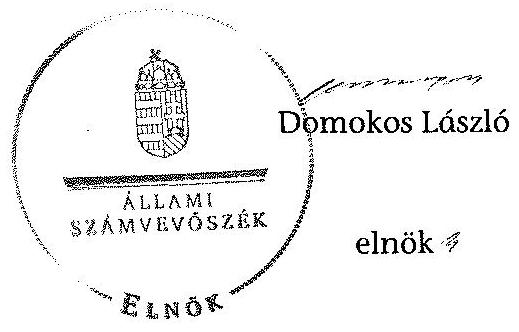

# ÁLLAMI   SZÁMVEVŐSZÉK 

## JELENTÉS

az önkormányzatok belső kontrollrendszere kialakításának, egyes
kontrolltevékenységek és a belső ellenőrzés
müködésének ellenőrzéséről
Csetény
14078
2014. május

---

# Állami Számvevőszék 

Iktatószám: V-0370-041/2014
Témaszám: 1162
Vizsgálat-azonosító szám: V064936

## Az ellenőrzést felügyelte:

Dr. Benedek Mária
felügyeleti vezető
Az ellenőrzést vezette és az ellenőrzés végrehajtásáért felelős:
Bíró Zsolt
ellenőrzésvezető
A számvevőszéki jelentés összeállításában közremüködött:
Lődiné Cser Zsuzsanna
számvevő főtanácsos
Az ellenőrzést végezték:
Lődiné Cser Zsuzsanna
Molnár Gyula Mihály
számvevő főtanácsos
számvevő főtanácsos

---

# TARTALOMJEGYZÉK 

BEVEZETÉS ..... 5
I. ÖSSZEGZŐ MEGÁLLAPÍTÁSOK, KÖVETKEZTETÉSEK, JAVASLATOK ..... 9
II. RÉSZLETES MEGÁLLAPÍTÁSOK ..... 14

1. Az önkormányzat belső kontrollrendszerének kialakítása ..... 14
1.1. A kontrollkörnyezet ..... 14
1.2. A kockázatkezelési rendszer ..... 15
1.3. A kontrolltevékenységek ..... 16
1.4. Az információs és kommunikációs rendszer ..... 17
1.5. A monitoring rendszer ..... 17
2. A pénzügyi folyamatokban kulcsszerepet betöltő teljesítésigazolás és érvényesítés belső kontrollok működése ..... 18
3. A belső ellenőrzés működése ..... 21

## FÜGGELÉKEK

1. számú Értelmező szótár
2. számú Az értékelés módja és szempontjai

---

# **Chemistry**

## **Chemical Reactions**

### **Balancing Chemical Equations**

1. **Write the unbalanced equation:**
   - Example: $$C_3H_8 + O_2 \rightarrow CO_2 + H_2O$$

2. **Balance the equation:**
   - Example: $$2C_3H_8 + 7O_2 \rightarrow 6CO_2 + 8H_2O$$

3. **Balance the equation:**
   - Example: $$2C_3H_8 + 7O_2 \rightarrow 6CO_2 + 8H_2O$$

### **Types of Reactions**

1. **Combination Reaction:**
   - Example: $$2H_2 + O_2 \rightarrow 2H_2O$$

2. **Decomposition Reaction:**
   - Example: $$2H_2O_2 \rightarrow 2H_2O + O_2$$

3. **Single Displacement Reaction:**
   - Example: $$Zn + 2HCl \rightarrow ZnCl_2 + H_2$$

4. **Double Displacement Reaction:**
   - Example: $$AgNO_3 + NaCl \rightarrow AgCl + NaNO_3$$

5. **Combustion Reaction:**
   - Example: $$CH_4 + 2O_2 \rightarrow CO_2 + 2H_2O$$

## **Stoichiometry**

### **Mole Concept**

- **Mole (mol):** The amount of substance containing as many particles (atoms, molecules, ions) as there are atoms in exactly 12 grams of carbon-12.
- **Avogadro's Number:** $$6.022 \times 10^{23}$$ particles per mole.

### **Molar Mass**

- **Molar Mass:** The mass of one mole of a substance.
- Example: The molar mass of water ($$H_2O$$) is 18.015 g/mol.

### **Calculations**

1. **Moles to Mass:**
   - Formula: $$n = \frac{m}{M}$$
   - Example: Calculate the number of moles of $$H_2O$$ in 18 grams of water.
     - $$n = \frac{18.015 \, \text{g}}{18.015 \, \text{g/mol}} = 18.015 \, \text{g/mol}$$

2. **Moles to Mass:**
   - Formula: $$m = n \times M$$
   - Example: Calculate the mass of 18.015 g of water.
     - $$m = 18.015 \, \text{g/mol} = 18.015 \, \text{g/mol}$$

## **Gas Laws**

### **Ideal Gas Law**

- **Equation:** $$PV = nRT$$
- **Variables:**
  - $$P$$: Pressure (atm)
  - $$V$$: Volume (L)
  - $$n$$: Number of moles (mol)
  - $$R$$: Ideal gas constant (0.0821 L·atm/mol·K)
  - $$T$$: Temperature (K)

### **Boyle's Law**

- **Equation:** $$P_1V_1 = P_2V_2$$
- **Variables:**
  - P₁: Pressure (atm)
  - P₂: Volume (L)
  - P₃: Temperature (K)
  - P₁: Pressure (atm)
  - P₂: Volume (L)
  - P₃: Temperature (K)
  - P₁: Pressure (atm)

### **Boyle's Law (Boyle's Law)**

- **Equation:** $$\frac{P_1V_1}{P_2V_2} = \frac{P_1}{V} \times P_2V$$
- **Variables:**
  - P₁: Pressure (atm)
  - P₂: Volume (L)
  - P₃: Temperature (K)
  - P₁: Pressure (atm)
  - P₂: Volume (L)
  - P₁: Pressure (atm)

## **Thermochemistry**

### **Enthalpy (H)**

- **Definition:** The heat content of a system at constant pressure.
- **Equation:** $$\Delta H = q_p$$
- **Variables:**
  - $$q_p$$: Heat transferred at constant pressure.
  - $$q_p$$: Heat transferred at constant pressure.

### **Hess's Law**

- **Statement:** The enthalpy change for a reaction is the same whether it occurs in one step or multiple steps.
- **Equation:** $$\Delta H_{\text{rest}} = \Delta H - Q_p$$
- **Variables:**
  - $$Q_p$$: Heat transferred at constant pressure.
  - $$Q_p$$: Heat transferred at constant pressure.

### **Hess's Law (Hess's Law)**

- **Statement:** The enthalpy change for a reaction is the same whether it occurs in one step or multiple steps.
- **Equation:** $$\Delta H_{\text{rest}} = \Delta H - Q_p$$
- **Variables:**
  - $$H$$: Energy (K)
  - $$Q_p$$: Energy (atm)
  - $$Q_p$$: Energy (atm)

## **Electrochemistry**

### **Oxidation and Reduction**

- **Oxidation:** Loss of electrons.
- **Reduction:** Gain of electrons.

### **Galvanic Cells**

- **Definition:** A cell that converts chemical energy into electrical energy.
- **Components:**
  - Anode: Oxidation occurs.
  - Cathode: Reduction occurs.
  - Salt Bridge: Connects the two half-cells.

### **Nernst Equation**

- **Equation:** $$E = E^\circ - \frac{RT}{nF} \ln Q$$
- **Variables:**
  - $$E$$: Energy (K)
  - $$R$$: Ideal gas constant (0.0821 L·atm/mol·K)
  - $$T$$: Temperature (K)
  - $$n$$: Number of electrons transferred
  - $$F$$: Faraday constant (96,485 C/mol)
  - $$Q$$: Reaction quotient

---

# RÖVIDÍTÉSEK JEGYZÉKE 

## Törvények

Áht.
ÁSZ tv.
Kttv.
Ktv.
Ltv.
Mötv.
Nvtv.
Ötv.
Számv. tv.
Vagyonnyilatkozattételről szóló tv.

## Rendeletek

Áhsz. 1

Áhsz. 2
Ávr.

Bkr.

102/2011. (VI. 29.) Kormányrendelet

164/1995. (XII. 27.)
Kormányrendelet
képviselő-testületi
SZMSZ
vagyongazdálkodási rendelet ${ }_{1}$
2011. évi CXCV. törvény az államháztartásról (hatályos 2012. január 1-jétől)

2011. évi LXVI. törvény az Állami Számvevőszékről
2011. évi CXCIX. törvény a közszolgálati tisztviselőkről (hatályos 2012. március 1-jétől)
1992. évi XXIII. törvény a köztisztviselők jogállásáról (hatálytalan 2012. március 1-jétől)
1995. évi LXVI. törvény a köziratokról, a közlevéltárakról és a magánlevéltári anyag védelméről
2011. évi CLXXXIX. törvény Magyarország helyi önkormányzatairól (hatályos 2012. január 1-jétől)
2011. évi CXCVI. törvény a nemzeti vagyonról (hatályos 2011. december 31-étől)
1990. évi LXV. törvény a helyi önkormányzatokról
2000. évi C. törvény a számvitelről
2007. évi CLII. törvény az egyes vagyonnyilatkozat-tételi kötelezettségekről

249/2000. (XII. 24.) Korm. rendelet az államháztartás szervezetei beszámolási és könyvvezetési kötelezettségének sajátosságairól (hatálytalan 2014. január 1-jétől)
4/2013. (I. 11.) Korm. rendelet az államháztartás számviteléről (hatályos 2014. január 1-jétől)
368/2011. (XII. 31.) Korm. rendelet az államháztartásról szóló törvény végrehajtásáról (hatályos 2012. január 1jétől)
370/2011. (XII. 31.) Korm. rendelet a költségvetési szervek belső kontrollrendszeréről és belső ellenőrzéséről (hatályos 2012. január 1-jétől)
102/2011. (VI. 29.) Korm. rendelet a súlyos mozgáskorlátozott személyek közlekedési kedvezményeiről (hatályos 2011. július 2-ától)

164/1995. (XII. 27.) Korm. rendelet a súlyos mozgáskorlátozott személyek közlekedési kedvezményeiről (hatálytalan 2011. július 2-ától)
2/2011. (III. 29.) számú rendelet Csetény Község Önkormányzata Képviselő-testületének Szervezeti és Müködési Szabályzata
Csetény Község Képviselő-testületének 7/2004. (VI.24.) számú rendelete az önkormányzat vagyongazdálkodásának szabályairól (hatályos 2004. július 1-jétől)

---

vagyongazdálkodási rendelet ${ }_{2}$

## Szórövidítések

ÁSZ
belső ellenőrzési kézikönyv
gazdálkodási szabályzat
hivatali SZMSZ
INTOSAI
iratkezelési szabályzat

ISSAI
jegyzó
Képviselő-testület
Kormányhivatal
körjegyzó
Körjegyzőség
Közös Önkormányzati
Hivatal
leltározási szabályzat

NGM
Önkormányzat
polgármester
számviteli politika
Társulás

Csetény Község Képviselő-testületének 4/2013. (IV.11.) számú rendelete az önkormányzat vagyonáról és a vagyongazdálkodás szabályairól (hatályos 2013. április 12től)

Állami Számvevőszék
Csetény és Szápár Községek Körjegyzőség belső ellenőrzési kézikönyv (hatályos 2012. január 1-jétől)
Csetény és Szápár Községek Körjegyzőség Gazdálkodási szabályzat (hatályos 2010. január 1-jétől)
Csetény és Szápár Községek Körjegyzőségének Szervezeti és Müködési Szabályzata (hatályos 2012. január 1-jétől)
International Organization of Supreme Audit Institutions (Legfőbb Ellenőrző Intézmények Nemzetközi Szervezete)
Csetény és Szápár Községek Körjegyzőség Iratkezelési szabályzata (hatályos 2011. január 1-jétől)
International Standards of Supreme Audit Institutions (Legfőbb Ellenőrző Intézmények Nemzetközi Standardjai)
Csetény és Szápár Községek Közös Önkormányzati Hivatalának jegyzője, 2013. március 1-jétől
Csetény Község Önkormányzatának Képviselő-testülete
Veszprém Megyei Kormányhivatal
Csetény és Szápár Községek Körjegyzőségének körjegyzője, 2013. február 28-ig
Csetény és Szápár Községek Körjegyzősége
Csetény és Szápár Községek Közös Önkormányzati Hivatala
Csetény és Szápár Községek Körjegyzőségének Leltárkészítési és leltározási szabályzata (korábban a Számviteli politika 4. számú melléklete, hatályos 2009. december 1jétől)
Nemzetgazdasági Minisztérium
Csetény Község Önkormányzata
Csetény Község Önkormányzatának polgármestere
Csetény Község Önkormányzatának Számviteli politikája és mellékletei
Zirc Kistérségi Többcélú Társulás

---

# JELENTÉS 

## az önkormányzatok belsó kontrollrendszere kialakításának, egyes kontrolltevékenységek és a belső ellenőrzés múködésének ellenőrzéséről Csetény

## BEVEZETÉS

Csetény község állandó lakosainak száma 2012. január 1-jén 1911 fő volt. Az Önkormányzat héttagú Képviselő-testületének munkáját egy állandó bizottság segítette. Az Önkormányzat az önállóan működő és gazdálkodó Körjegyzőségen kívül kettő önállóan működő intézményt múködtetett, többségi tulajdoni hányadú gazdasági társasággal nem rendelkezett. A polgármester 2000. február 21-e óta tölti be tisztségét. A körjegyzó 2002. augusztus 16-tól látta el feladatait, jogviszonya 2012. július 2-án nyugdíjba vonulás miatt megszűnt és 2012. július 4-től 2013. február 28-ig kinevezett köztisztviselőként helyettesítette a körjegyzőt. A jegyző 2013. március 1-jétől látja el a jegyzői feladatokat. A Körjegyzőség szervezeti egységekre nem tagolódott, elkülönített gazdasági szervezettel nem rendelkezett, a foglalkoztatott köztisztviselők száma 2012. január 1jén öt fő volt. Csetény és Szápár községek önkormányzatainak képviselőtestületei 2013. március 1-jétől Közös Önkormányzati Hivatalt hoztak létre. Az Önkormányzat a 2012. évi költségvetési beszámolója szerint 452350 ezer Ft tárgyévi bevételt ért el, valamint 377558 ezer Ft tárgyévi kiadást teljesített. A 2012. december 31-i könyvviteli mérleg szerint 471367 ezer Ft értékű eszközvagyonnal rendelkezett, a rövid lejáratú kötelezettségállománya 2754 ezer Ft volt és hosszú lejáratú kötelezettségállománnyal nem rendelkezett.

A demokratikus társadalmakban alapvető igény, hogy a közpénzeket, a közvagyont használók tevékenységükről elszámoljanak, ahhoz egyértelmú és érvényesíthető felelősségi szabályok társuljanak. Ennek a jogos igénynek az érvényesítéséhez meg kell teremteni azokat a folyamatokat, rendszereket, amelyek nélkülözhetetlenek az elszámoltatáshoz. Az elszámoltatás eredményes múködtetéséhez szükség van a megfelelő információs, kontroll, értékelési és beszámolási rendszerek kialakítására.

Magyarországon az uniós csatlakozási tárgyalások idejére nyúlnak vissza a belső kontrollrendszer szabályozásának gyökerei. Az uniós elvárásoknak megfelelő új terminológia szerinti államháztartási belső pénzügyi ellenőrzési (ÁBPE) rendszer területén a jogharmonizáció 2003-ban teljes körűen megvalósult, míg az önkormányzati alrendszerre vonatkozó, Ötv.-ben megjelenített speciális szabályozás 2005-ben lépett hatályba. Az államháztartási belső kontrollrendszer koncepciója 2009-ben továbbfejlődött. A változások irányát mutat-

---

ja, hogy a költségvetési szervek belső kontrollrendszere már magában foglalja a korszerű, felelős szervezetirányítás elemeit (kontrollkörnyezet, kockázatkezelés, kontrolltevékenység, információ és kommunikáció, monitoring) is. E kontrollrendszer szabályozása háromszintű, a törvényi előírásokat az Áht. és a Mötv., a rendeleti szintű szabályozást az Ávr. és a Bkr. tartalmazza, amelyeket útmutatói szinten az NGM által kiadott standardok és kézikönyvek támogatnak.

A belső kontrollrendszer azt a célt szolgálja, hogy a költségvetési szervek múködésük és gazdálkodásuk során a tevékenységeket szabályszerűen, gazdaságosan, hatékonyan és eredményesen hajtsák végre, teljesítsék elszámolási kötelezettségeiket és megvédjék az erőforrásokat a veszteségektől, a károktól és a nem rendeltetésszerű használattól. A belső kontrollrendszer magában foglalja mindazon szabályokat, eljárásokat, gyakorlati módszereket és szervezeti struktúrákat, kockázatkezelési technikákat, kontrolltevékenységeket, amelyek segítséget nyújtanak a szervezetnek céljai eléréséhez.

Az ÁSZ a 2011-2015. évekre szóló stratégiájában hangsúlyos szerepet szánt annak, hogy szilárd szakmai alapon álló, értékteremtő ellenőrzéseivel előmozdítsa a közpénzügyek átláthatóságát, rendezettségét. A számvevőszéki ellenőrzés nemzetközi alapelvei is rögzítik, hogy a megfelelő belső kontrollrendszer minimálisra csökkenti a hibák és szabálytalanságok kockázatát.

Az ellenőrzés célja annak megállapítása volt, hogy a belső kontrollrendszer elemeinek kialakítása, a pénzügyi folyamatokban kulcsszerepet betöltő teljesítésigazolás és érvényesítés, és a belső ellenőrzés szabályos működése biztosítot-ta-e az Önkormányzatnál a közpénzfelhasználás szabályosságát, hozzájárult-e az értéket teremtő rend követelményének érvényesüléséhez.

Ennek keretében értékeltük, hogy:

- a jogszabályi előírásoknak megfelelően alakították-e ki a belső kontrollrendszer elemeit;
- a gazdálkodás folyamatában kulcsszerepet betöltő teljesítésigazolás és érvényesítés kontrolltevékenységeit megfelelően működtették-e;
- biztosították-e a belső ellenőrzés szabályos működését;
- amennyiben az ÁSZ tett javaslatot a 2008-2011. évek közötti ellenőrzése kapcsán az Önkormányzatnak, intézkedtek-e azok végrehajtására.

Az ellenőrzés várható hasznosulását négy szinten tervezzük. A törvényalkotás számára összegzett tapasztalatok állnak rendelkezésre a belső kontrollrendszer önkormányzati területen való kialakításáról, működéséről és hatásairól, a belső ellenőrzés működéséről. Ennek alapján következtetést lehet levonni arról, hogy a belső kontrollrendszer kialakítására és működtetésére vonatkozó jelenlegi, differenciálás nélküli - jogszabályi előírások reális követelményeket támasztanak-e az eltérő adottságú települési önkormányzatok esetében, illetve indokolt-e esetleges jogszabályi módosítás kezdeményezése. Az ellenőrzés az ellenőrzött számára visszajelzést ad a belső kontrollrendszer kialakításában és működésében fellépő hiányosságokról, javaslataival hozzájárul azok kikü-

---

szöböléséhez, amely csökkentheti a későbbi ellenőrzések gyakoriságát. Az ellenőrzés megállapításait és javaslatait más szervezetek is hasznosíthatják a rendezett gazdálkodási keretek kialakításához. A társadalom számára jelzi, hogy közpénz nem maradhat ellenőrizetlenül, az ÁSZ értékteremtő rend kialakításához és megőrzéséhez hozzájáruló tevékenysége pozitív hatással lesz a szervezetről kialakított összkép formálásában. A szervezeten belül lehetőség nyílik arra, hogy a megállapítások szintetizálásával az ÁSZ a hozzáadott értéket teremtő elemző tevékenységét és tanácsadó szerepét is erősítse.

Az önkormányzatok belső kontrollrendszere kialakításának, egyes kontrolltevékenységek és a belső ellenőrzés működésének ellenőrzéséről szóló jelentés I. fejezetének összegző része az ellenőrzés céljára ad rövid, szintetizáló összefoglalót, és tartalmazza a következtetéseket a II. fejezet részletes megállapításain alapulóan. A jelentés intézkedést igénylő megállapításait és javaslatait az ellenőrzés során feltárt, a jelentés II. fejezetében rögzített részletes megállapítások alapozzák meg. A helyszíni ellenőrzés lezárásáig a helyi szabályozás változásait nyomon követtük.

Az ellenőrzés típusa: szabályszerűségi ellenőrzés.
Az ellenőrzött időszak: a belső kontrollrendszer kialakításának megfelelősége esetében a 2012. évre, a pénzügyi folyamatokban kulcsszerepet betöltő teljesítésigazolás és érvényesítés belső kontrollok múködésének megfelelőségét és a belső ellenőrzés szabályszerű működését a 2012. január 1. és december 31-e közötti időszak eseményeit figyelembe véve értékeltük, míg az ÁSZ javaslatainak utóellenőrzése a 2008-2011. években végzett ellenőrzések nyilvánosságra hozott jelentéseiben tett javaslatok áttekintésére terjedt ki.

# Az ellenőrzött szervezet: az Önkormányzat. 

Az ellenőrzés jogszabályi alapját az ÁSZ tv. 1. § (3) bekezdése, az 5. § (2) és (6) bekezdése, valamint az Áht. 61. § (2) bekezdésének előírásai képezik.

Az ellenőrzés szakmai módszertana az ÁSZ hivatalos honlapján (www.asz.hu) közzétett szakmai szabályokon alapult, amely az INTOSAI által kiadott ISSAI figyelembevételével készült.

Az ellenőrzés lefolytatásához az Önkormányzat a kimutatások és a tanúsítvány elektronikus kitöltésével, valamint az ÁSZ által kért dokumentumok elektronikus megküldésével szolgáltatott adatokat. Az így rendelkezésre bocsátott adatok, információk kontrollja és a munkalapok kitöltése a helyszíni ellenőrzés keretében történt. A jelentésben használt fogalmak magyarázatát az 1. számú függelék, az ellenőrzés egyes területeinek értékelésénél alkalmazott egységes minősítési szempontokat a 2. számú függelék tartalmazza.

A belső kontrollrendszer kialakításának ellenőrzése során értékeltük a kontrollkörnyezet, a kockázatkezelési rendszer, a kontrolltevékenységek, az információs és kommunikációs rendszer, valamint a monitoring rendszer szabályozottságának megfelelőségét. A pénzügyi folyamatokban kulcsszerepet betöltő teljesítésigazolás és érvényesítés kontrollok múködése megfelelőségének minősítéséhez az állományba nem tartozók megbízási díjai, a külső szolgáltatók által

---

végzett karbantartási, kisjavítási munkák, az egyéb üzemeltetési és fenntartási szolgáltatások, a rendszeres szociális segélyek, valamint az államháztartáson kívülre teljesített múködési és felhalmozási célú pénzeszközátadások közül kockázatelemzéssel választottuk ki az ellenőrzött kiadási jogcímeket. Az egyszerű véletlen mintavétellel kiválasztott tételek ellenőrzését többlépcsős megfelelőségi tesztek útján addig végeztük, amíg elegendő és megfelelő bizonyítékot szereztünk a vizsgált folyamatok kulcskontrolljai múködésének megfelelő vagy nem megfelelő voltáról. Értékeltük az Önkormányzatnál a belső ellenőrzés múködésének szabályosságát. Utóellenőrzésre nem került sor, mivel az ÁSZ az Önkormányzatnál a 2008-2011. évek között nem végzett ellenőrzést.

Az ÁSZ tv. 29. § (1) bekezdése szerint a jelentéstervezetet megküldtük a polgármester részére, aki az ÁSZ tv. 29. § (2) bekezdésében foglalt észrevételezési jogával nem élt, a jelentéstervezetre észrevételt nem tett.

---

# I. ÖSSZEGZŐ MEGÁLLAPÍTÁSOK, KÖVETKEZTETÉSEK, JAVASLATOK 

A belső kontrollrendszeren belül 2012-ben a kontrollkörnyezet, a kockázatkezelési rendszer, a kontrolltevékenységek, az információs és kommunikációs rendszer, valamint a monitoring rendszer kialakítását külön-külön és együttesen is értékeltük. A belső kontrollrendszer kialakítása az összesített értékelés alapján nem felelt meg a jogszabályi előírásoknak.

A belső kontrollrendszer egyes területei kialakításának minősítése a következő:

| Kontrollterïlet | Minősítés |  |
| :-- | :-- | :-- |
| Kontrollkörnyezet |  | nem   megfelelö |
| Kockázatkezelési rendszer |  | nem   megfelelö |
| Kontrolltevékenységek | megfelelö |  |
| Információs és kommuni-   kációs rendszer |  | nem   megfelelö |
| Monitoring rendszer |  | nem   megfelelö |

Megfelelőnek értékeltük a kontrolltevékenységek kialakítását, mivel a körjegyző a jogszabályi előírásokban foglaltakat figyelembe véve kisebb hiányosságok mellett is megteremtette a kontrollterületen a szabályszerű múködés lehetőségét.

Nem megfelelőnek értékeltük a kontrollkörnyezet, a kockázatkezelési rendszer, az információs és kommunikációs rendszer, valamint a monitoring rendszer kialakítását, mivel az ellenőrzésünk során megállapított szabályozásbeli hiányosságok magukban hordozzák a szabálytalan múködés, valamint a korrupció kockázatát.

A 2012. évben a külső szolgáltatók által végzett karbantartási, kisjavítási munkákkal kapcsolatos kifizetések, valamint az államháztartáson kívülre teljesített múködési és felhalmozási célú pénzeszközátadások során a pénzügyi folyamatokban kulcsszerepet betöltő teljesítésigazolás és érvényesítés belsö kontrollok múködése gyenge volt. Gyengének értékeltük a két kulcskontroll együttes múködését, mivel azok nem biztosították a hibák megelőzését, feltárását.

A számvevőszéki ellenőrzés az ellenőrzött kifizetésekkel összefüggésben a rendelkezésre bocsátott dokumentumok alapján kár bekövetkeztére utaló adatot, tényt nem állapított meg, azonban a gazdálkodásban kulcsszerepet betöltő kontrollok múködésében feltárt hiányosságok miatt fennáll a hibák bekövetke-

---

zésének kockázata. A nem megfelelően működtetett belső kontrollok korrupciós kockázatot hordoznak.

Az Önkormányzat a belső ellenőrzési feladatokat Társulás útján látta el. A 2012. évben a belső ellenőrzés múködése a jogszabályi előírásoknak megfelelt, azonban a belső ellenőrzés nem tárta fel a belső kontrollrendszer kialakításának, valamint a pénzügyi folyamatokban kulcsszerepet betöltő teljesítésigazolás és érvényesítés belső kontrollok múködésének hiányosságait.

Az ÁSZ tv. 33. § (1) bekezdésében foglaltak értelmében az ellenőrzött szervezet vezetője köteles a jelentésben foglalt megállapításokhoz kapcsolódó intézkedési tervet összeállítani, és azt a jelentés kézhezvételétől számított 30 napon belül az ÁSZ részére megküldeni. Amennyiben az intézkedési tervet határidőre nem küldi meg a szervezet, vagy az ÁSZ tv. 33. § (2) bekezdésében foglalt póthatáridő elteltével megküldött intézkedési terv továbbra sem elfogadható, az ÁSZ elnöke a hivatkozott törvény 33. § (3) bekezdés a)-b) pontjaiban foglaltakat érvényesítheti.

Az ellenőrzés intézkedést igénylő megállapításai és javaslatai:

# a polgármesternek 

1. Az Önkormányzat nevében történt kötelezettségvállalásra - az Áht. 37. § (1) bekezdésében és az Ávr. 55. § (1) bekezdésében foglaltak ellenére - pénzügyi ellenjegyzés nélkül került sor.

Javaslat:
Intézkedjen arról, hogy az Önkormányzat nevében történő kötelezettségvállalásra az Áht. 37. § (1) bekezdésében és az Ávr. 55. § (1) bekezdésében foglaltaknak megfelelően - az Ávr. 53. §-ában meghatározott kivételekkel - kizárólag a pénzügyi ellenjegyzés után, a pénzügyi teljesítés esedékességét megelőzően, írásban kerüljön sor.
2. A számvevőszéki ellenőrzés megállapításai alapján az Önkormányzatnál a belső kontrollrendszer kialakítása összefoglalóan értékelve nem felelt meg a jogszabályi előírásoknak, a kulcskontrollok müködése gyenge volt, a belső ellenőrzés müködése ugyan megfelelt a jogszabályi előírásoknak, azonban nem tárta fel a belső kontrollrendszer hiányosságait. A megállapított szabályozásbeli és müködésbeli hiányosságok magukban hordozzák a szabálytalan müködés kockázatát.

Javaslat:
A Mötv. 115. § (1) bekezdésében foglaltak alapján kísérje figyelemmel az Önkormányzat gazdálkodásának szabályszerűségét. A Mötv. 67. § f) pontja alapján gondoskodjon a belső kontrollrendszer müködésére vonatkozó jogszabályi rendelkezések be nem tartása, valamint a teljesítésigazolás, illetve az érvényesítés kontrollokkal öszszefüggésben feltárt hiányosságok, szabálytalanságok tekintetében az esetleges munkajogi felelősséggel kapcsolatos körülmények kivizsgálásáról, majd a vizsgálat eredményének függvényében tegye meg a szükséges intézkedéseket.

---

# a jegyzőnek (Csetény Község Önkormányzata vonatkozásában) 

1. a kontrollkörnyezettel kapcsolatban:

A körjegyző az Ötv.-ben foglaltak ellenére nem készítette elő megfelelő időben a vagyongazdálkodási rendelet módosítását annak érdekében, hogy az megfeleljen az Nvtv.-ben előírtaknak. A körjegyző a Számv. tv.-ben foglaltak ellenére a számviteli politikát a törvényi változás hatályba lépését követő 90 napon belül nem aktualizálta. A leltározás gyakoriságát nem Áhsz,-ben előírtak figyelembevételével határozta meg. A Bkr.-ben foglaltak ellenére nem készítette el a szabálytalanságok kezelésének eljárásrendjét és az ellenőrzési nyomvonalat, valamint a Kttv.-ben előírtak ellenére a Körjegyzőségen dolgozó köztisztviselők munkateljesítményét írásban nem értékelte. Az Ötv.-ben előírt feladata ellenére nem készítette elő a Kttv.-ben előírt, a köztisztviselőkkel szembeni hivatásetikai alapelvek részletes tartalmának, valamint az etikai eljárás szabályainak dokumentumát [II. Részletes megállapítások, 1.1. A kontrollkörnyezet 16., 17., 25., 34., 41., 46. és 47. sorszámú megállapítás].

Javaslat:
Intézkedjen az Áht. 69. § (2) bekezdése, a Bkr. 3. § a) pontja és 6. §-a alapján a jelentés II. Részletes megállapítások, 1.1. A kontrollkörnyezet 16., 17., 25., 34., 41., 46. és 47. sorszámú megállapításaiban foglalt hibák, hiányosságok kijavításáról, megszüntetéséről az ott megjelölt jogszabályi rendelkezéseknek megfelelően.
2. a kockázatkezelési rendszerrel kapcsolatban:

A körjegyző a Bkr.-ben foglaltak ellenére a Körjegyzőség kockázatkezelési rendszerét nem alakította ki, amelynek keretében nem mérte fel és nem állapította meg a Körjegyzőség tevékenységében, gazdálkodásában rejlő kockázatokat, nem határozta meg az egyes kockázatokkal kapcsolatban a szükséges intézkedéseket, valamint azok teljesítésének folyamatos nyomon követési módját. A Vagyonnyilatkozat-tételről szóló tv.-ben foglaltak ellenére nem tüntették fel a vagyonnyilatkozat-tételre kötelezettek vagyonnyilatkozat-tételi kötelezettségét a képviselő-testületi SZMSZ-ben [II. Részletes megállapítások, 1.2. A kockázatkezelési rendszer 1., 2., 8., 10. és 13. sorszámú megállapítás].

Javaslat:
Intézkedjen az Áht. 69. § (2) bekezdése, a Bkr. 3. § b) pontja és 7. §-a, valamint a Vagyonnyilatkozat-tételi kötelezettségről szóló tv alapján a jelentés II. Részletes megállapítások, 1.2. A kockázatkezelési rendszer 1., 2., 8., 10. és 13. sorszámú megállapításaiban foglalt hibák, hiányosságok kijavításáról, megszüntetéséről az ott megjelölt jogszabályi rendelkezéseknek megfelelően.
3. a kontrolltevékenységekkel kapcsolatban:

A körjegyző a Bkr.-ben foglaltak ellenére nem biztosította minden tevékenységre vonatkozóan a folyamatba épített, előzetes, utólagos és vezetői ellenőrzést [II. Részletes megállapítások, 1.3. A kontrolltevékenységek 2-5. sorszámú megállapítás].

---

Javaslat:
Intézkedjen az Áht. 69. § (2) bekezdése, a Bkr. 3. § c) pontja és 8. §-a alapján a jelentés II. Részletes megállapítások, 1.3. A kontrolltevékenységek 2-5. sorszámú megállapításaiban foglalt hibák, hiányosságok kijavításáról, megszüntetéséről az ott megjelölt jogszabályi rendelkezéseknek megfelelően.
4. az információs és kommunikációs rendszerrel kapcsolatban:

A körjegyző az Info tv.-ben és az Ávr.-ben foglaltak ellenére nem készítette el a Körjegyzőség adatvédelmi és adatbiztonsági szabályzatát, nem alakította ki a kötelezően közzéteendő adatok nyilvánosságra hozatalának rendjét, és nem szabályozta a közérdekű adatok megismerésére irányuló igények teljesítésének rendjét, továbbá az Önkormányzat nem tett eleget az elektronikus közzétételi kötelezettségének a 2012. évben. A körjegyző az iratkezelési szabályzatot nem az Ltv.-ben foglalt előírásoknak megfelelően adta ki [II. Részletes megállapítások, 1.4. Az információs és kommunikációs rendszer 5-8. és 9. sorszámú megállapítás].

Javaslat:
Intézkedjen az Áht. 69. § (2) bekezdése, a Bkr. 3. § d) pontja és 9. §-a alapján a jelentés II. Részletes megállapítások, 1.4. Az információs és kommunikációs rendszer 58. és 9. sorszámú megállapításaiban foglalt hibák, hiányosságok kijavításáról, megszüntetéséről az ott megjelölt jogszabályi rendelkezéseknek megfelelően.
5. a monitoring rendszerrel kapcsolatban:

A körjegyző a Bkr.-ben foglaltak ellenére nem alakította ki a Körjegyzőség tevékenységének, a célok megvalósításának nyomon követését biztosító rendszert, nem értékelte - a 2011. évre vonatkozóan - nyilatkozatban a Körjegyzőség belső kontrollrendszerének minőségét, továbbá a belső ellenőrzési jelentésekben foglalt javaslatokhoz kapcsolódóan készített intézkedési tervben meghatározott egyes feladatok végrehajtásáról szóló beszámolót nem készítette el [II. Részletes megállapítások, 1.5. A monitoring rendszer 1., 9. és 18. sorszámú megállapítás].

Javaslat:
Intézkedjen az Áht. 69. § (2) bekezdése, a Bkr. 3. § e) pontja és 10. §-a alapján a jelentés II. Részletes megállapítások, 1.5. A monitoring rendszer 1., 9. és 18. sorszámú megállapításaiban foglalt hibák, hiányosságok kijavításáról, megszüntetéséről az ott megjelölt jogszabályi rendelkezéseknek megfelelően.
6. a pénzügyi folyamatokban kulcsszerepet betöltő kontrollokkal kapcsolatban:

A teljesítésigazolás és az érvényesítés az Áht.-ban és az Ávr.-ben foglaltaknak nem felelt meg [II. Részletes megállapítások, 2. A pénzügyi folyamatokban kulcsszerepet betöltő teljesítésigazolás és érvényesítés belső kontrollok müködése, 1-2. pontjában foglalt megállapítás].

---

Javaslat:
Intézkedjen az Áht. 37-38. §-ában, az Ávr. 55-59. §-ában és az Áhsz. 3 39. § (1) bekezdésében, valamint a 14. számú mellékletének II. pontjában foglaltak alapján arról, hogy a teljesítésigazolás és az érvényesítés vonatkozásában, valamint azok ellenőrzése során a kötelezettségvállalással, a pénzügyi ellenjegyzéssel, az utalványozással, a kötelezettségvállalások nyilvántartásba vételével kapcsolatban feltárt, a jelentés II. Részletes megállapítások, 2. A pénzügyi folyamatokban kulcsszerepet betöltő teljesítésigazolás és érvényesítés belső kontrollok müködése 1-2. pontjában szereplő megállapításokban foglalt hibák, hiányosságok kijavítása, megszüntetése az ott megjelölt jogszabályi rendelkezéseknek megfelelően történjen meg.
7. a belső ellenőrzés müködésével kapcsolatban:

A belső ellenőrzés müködésében a számvevőszéki ellenőrzés kisebb hiányosságokat tárt fel, amely nem felelt meg a Bkr.-ben foglalt rendelkezéseknek [II. Részletes megállapítások, 3. A belső ellenőrzés müködése 7. b)-e), 8. a), 10., 19., 20. e), 25. és 27. a)-b) sorszámú megállapítása].

Javaslat:
Intézkedjen az Áht. 69. § (2), a 70. § (1) bekezdése és a Bkr. 3. § e) pontja és 10. §-a alapján a jelentés II. Részletes megállapítások, 3. A belső ellenőrzés müködése 7. b)e), 8. a), 10., 19., 20. e), 25. és 27. a)-b) sorszámú megállapításaiban foglalt hibák, hiányosságok kijavításáról, megszüntetéséről az ott megjelölt jogszabályi rendelkezéseknek megfelelően.

---

# II. RÉSZLETES MEGÁLLAPÍTÁSOK 

## 1. Az ÖNKORMÁNYZAT BELSŐ KONTROLLRENDSZERÉNEK KIALAKÍTÁSA

A belső kontrollrendszeren belül 2012-ben a kontrollkörnyezet, a kockázatkezelési rendszer, a kontrolltevékenységek, az információs és kommunikációs rendszer, valamint a monitoring rendszer kialakítását külön-külön és együttesen is értékeltük. A belső kontrollrendszer kialakítása az összesített értékelés alapján nem felelt meg a jogszabályi előírásoknak.

### 1.1. A kontrollkörnyezet

A Körjegyzőségen a kontrollkörnyezet kialakítása - a 2. számú függelékben részletezett kritériumrendszer alapján végzett értékelés szerint - nem felelt meg a jogszabályi követelményeknek, mert:

| Sor-   szám $^{1}$ | Megállapítás | Megjegyzés |
| :--: | :--: | :--: |
| 4. | A Képviselő-testület - a Ktv. 34. § (3) bekezdésében foglaltak ellenére - nem döntött a teljesítményértékelés alapját képező célokról. | A Ktv.-t hatályon kívül helyezte a 2012. évi V. törvény 59. § (1) bekezdés a) pontja, hatálytalan 2012. március 1-jétől. |
| 16. | Az ellenőrzött időszakban a körjegyzö az Ötv. 36. § (2) bekezdés a) pontjában foglaltak ellenére - figyelemmel az Nvtv. 18. § (1) és (12) bekezdésében meghatározott határidőre - nem készítette elő a vagyongazdálkodási rendelet módosítását annak érdekében, hogy az megfeleljen az Nvtv. 3. § (1) bekezdés 6. pontja, 5. §-a, 11. § (16) bekezdése, valamint a 13. § (1) bekezdése előírásainak. | A 2013. évben a körjegyzö előkészítette és a Kép-viselő-testület elfogadta a vagyongazdálkodási rendelet $_{2}$-t.   A jegyző részére az önkormányzat müködésével kapcsolatos feladatok ellátásáról való gondoskodást 2013. január 1jétől a Mötv.81. § (3) bekezdés c) pontja írja elő. |
| 17. | A körjegyzö - a Számv. tv. 14. § (11) bekezdésében foglaltak ellenére - a számviteli politikát a törvényi változás hatályba lépését követő 90 napon belül nem aktualizálta. | A számviteli politikában a saját tőke részeinek meghatározása nem felelt meg az Áhsz. ${ }_{1}$ hatályos előírásainak. |

[^0]
[^0]:    ${ }^{1}$ A megállapítás számozása az Önkormányzat által kitöltött kimutatások - adatszolgáltatások - kérdéseinek sorszámával azonos.

---

| 25. | A körjegyző az Áhsz. 1 37. § (7) bekezdésében foglaltak ellenére a mérlegben kimutatott eszközök kétévenkénti leltározási kötelezettségét önkormányzati rendelet (határozat) szabályozása hiányában írta elő a leltározási szabályzatban. | 2014. január 1-jétől az Áhsz. 2 22. §-ában előírtak szerint a leltározásra a Számv. tv. 69. §-ában foglalt rendelkezéseit kell alkalmazni. |
| :--: | :--: | :--: |
| 34. és   41. | A körjegyzö - a Bkr. 6. § (3) és (4) bekezdésében foglaltak ellenére - nem készítette el a szabálytalanságok kezelésének eljárásrendjét és az ellenőrzési nyomvonalat. |  |
| 46. | A körjegyzö - a Kttv. 130. § (1) bekezdésében előírtak ellenére - a Körjegyzőségen dolgozó köztisztviselők munkateljesítményét írásban nem értékelte. |  |
| 47. | A Képviselő-testület - a Kttv. 231. § (1) bekezdésben foglaltak ellenére - nem állapította meg a Kttv. 83. §-ában előírt, a köztisztviselőkkel szembeni hivatásetikai alapelvek részletes tartalmát, valamint az etikai eljárás szabályait, mivel a körjegyzö - az Ötv. 36. § (2) bekezdés a) pontjában előirt feladata ellenére - nem készítette elő ennek dokumentumát. |  |

# 1.2. A kockázatkezelési rendszer 

A Körjegyzőségen a kockázatkezelési rendszer kialakítása - a 2. számú függelékben részletezett kritériumrendszer alapján végzett értékelés szerint nem felelt meg a jogszabályi előírásoknak, mert:

| Sorszám | Megállapítás | Megjegyzés |
| :--: | :--: | :--: |
| $\begin{aligned} & 1 ., 2 . \text {, } \\ & 8 . \text { és } \\ & 10 . \end{aligned}$ | A körjegyzö - a Bkr. 3. § b) pontjában foglaltak ellenére - a Körjegyzőség kockázatkezelési rendszerét nem alakította ki, melynek keretében - a Bkr. 7. § (2) bekezdésében foglalt előírás ellenére - nem mérte fel és nem állapította meg a Körjegyzőség tevékenységében, gazdálkodásában rejlő kockázatokat, nem határozta meg az egyes kockázatokkal kapcsolatban a szükséges intézkedéseket, a kockázatok kezelése érdekében szükséges intézkedések teljesítése folyamatos nyomon követési módját. |  |
| 13. | A vagyonnyilatkozat-tételre kötelezettek vagyonnyilatkozat-tételi kötelezettségét a képviselő-testületi SZMSZ-ben - a Vagyon-nyilatkozat-tételről szóló tv. 4. § d) pontjaiban foglaltak ellenére - nem tüntették fel. |  |

---

A körjegyzö a jogviszonya megszünésekor és új jogviszonya létesítésekor a Vagyonnyilat-kozat-tételről szóló tv. 5. § (1) b) pontjában, valamint 6. § (2) bekezdésében foglaltak ellenére vagyonnyilatkozat-tételi kötelezettségének nem tett eleget. Az örzésért felelős polgármester - a Vagyonnyilatkozat-tételről szóló tv. 8. § (4) bekezdésében foglaltak ellenére nem tájékoztatta a körjegyzöt a va-gyonnyilatkozat-tételi kötelezettség fennállásáról és esedékességének idốpontjáról az esedékességet legalább 30 nappal, az 5. § (1) b) pontja alapján 15 nappal megelőzően, továbbá a 10. § (1) bekezdésében foglaltak ellenére - írásban nem szólította fel arra, hogy kötelezettségét a felszólítás kézhezvételétől számított nyolc napon belül teljesítse.

A körjegyzö jogviszonya 2012. július 2-án nyugdijba vonulás miatt megszûnt és 2012. július 4-től 2013. február 28-ig kinevezett köztisztviselőként helyettesítette a körjegyzőt.

Közszolgálati jogviszonya 2013. február 28-án megszûnt.

# 1.3. A kontrolltevékenységek 

A Körjegyzőségen a kontrolltevékenységek kialakítása - a 2. számú függelékben részletezett kritériumrendszer alapján végzett értékelés szerint - megfelel a jogszabályi előírásoknak.

A körjegyző a gazdálkodási szabályzatban meghatározta és előírta a kötelezettségvállalás pénzügyi ellenjegyzésének, valamint a kiadások teljesítésigazolásának módját, az érvényesítés, az utalványozás rendjét. Szabályozták az előzetes írásbeli kötelezettségvállalást nem igénylő kifizetések rendjét, valamint kijelölték a teljesítésigazolásra jogosultakat. A polgármester adott felhatalmazást kötelezettségvállalásra és utalványozásra. Kijelöltek pénzügyi ellenjegyzési és érvényesítési feladatokra a Körjegyzőség állományába tartozó köztisztviselőket, és azok rendelkeztek a jogszabályban elốrt szakképzettséggel. A gazdálkodási szabályzat és a munkaköri leírások tartalmazták az időközi és éves beszámolók elkészítésének feladatait, annak felelőseit és a helyettesítés rendjét. A hivatali SZMSZ-ben szabályozták a jogviszony megszűnése esetére a munkavállaló folyamatban lévő feladatai átadásának rendjét.

Az iratkezelés szabályzása során előírták az iratok és az adatok védelmét. Szabályozták az üzemeltetés és adatbiztonság feladatait, és meghatározták az ehhez kapcsolódó hatásköröket. Biztosították az adatbiztonság érvényesülését, és meghatározták a hozzáférési jogosultságokhoz a kapcsolódó felelősségi köröket.

---

A kontrolltevékenységek kialakítása az értékelés szempontjából az alábbi kisebb súlyú hiányosságok mellett megfelelt a jogszabályi előírásoknak:

| Sor-   szám | Megállapítás |
| :-- | :-- |
|  | A körjegyzö - a Bkr. 8. § (2) bekezdésében foglaltak ellenére - nem biztosí-   totta a beszerzési folyamat és a vagyonhasznosítási tevékenység, valamint   2-5. a pénzügyi döntések - köztük a költségvetés tervezése és a támogatásokkal   való elszámolás - dokumentumainak elkészitésével kapcsolatban a fo-   lyamatba épített, elözetes, utólagos és vezetői ellenőrzést. |

# 1.4. Az információs és kommunikációs rendszer 

A Körjegyzőségen az információs és kommunikációs rendszer kialakítása - a 2. számú függelékben részletezett kritériumrendszer alapján végzett értékelés szerint - nem felelt meg a jogszabályi előírásoknak, mert:

| Sor-   szám | Megállapítás |
| :--: | :--: |
| 5. | A körjegyzö - az Info tv. 24. § (3) bekezdésében foglaltak ellenére - nem készítette el a Körjegyzőség adatvédelmi és adatbiztonsági szabályzatát. |
| 6. és   8. | A körjegyzö - az Info tv. 35. § (3) és a 30. § (6) bekezdésében, valamint az Ávr. 13. § (2) bekezdés h) pontjában foglaltak ellenére - a kötelezően közzéteendő adatok nyilvánosságra hozatalának rendjét nem alakította ki, a közérdekú adatok megismerésére irányuló igények teljesítésének rendjét nem szabályozta. |
| 7. | Az Önkormányzat - az Info tv. 33. § (1) és (3) bekezdésében foglaltak ellenére - elektronikus közzétételi kötelezettségének a 2012. évben nem tett eleget. |
| 9. | A körjegyzö - az Ltv. 10. § (1) bekezdés c) pontjában előírtakat figyelmen kívül hagyva - az iratkezelési szabályzatot nem a Magyar Nemzeti Levéltár és a Kormányhivatal egyetértésével adta ki. |

### 1.5. A monitoring rendszer

A Körjegyzőségen a monitoring rendszer kialakítása - a 2. számú függelékben részletezett kritériumrendszer alapján végzett értékelés szerint - nem felelt meg a jogszabályi előírásoknak, mert:

Sor-
szám
Megállapítás

1. A körjegyzö - a Bkr. 3. § e) pontjában és a 10. §-ában foglaltak ellenére nem alakította ki a Körjegyzőség tevékenységének, a célok megvalósításának nyomon követését biztosító rendszert.

A körjegyzö a Bkr. 11. § (1) bekezdésében foglaltak ellenére - a Bkr. 1. melléklete szerinti nyilatkozatban - nem értékelte a Körjegyzőség belső kontrollrendszerének minőségét a 2011. évre vonatkozóan.

---

A körjegyzö - a Bkr. 46. § (1) bekezdésében foglaltak ellenére - a belső ellenőrzési jelentésekben foglalt javaslatokhoz kapcsolódóan készített intézkedési tervben meghatározott egyes feladatok végrehajtásáról szóló beszámolót nem készítette el.

Az Önkormányzat törvényességi felügyeletét ellátó Kormányhivatal törvényességi felhívással, vagy más törvényességi felügyeleti eszközzel 2012-ben nem élt.

# 2. A PÉNZÜGYI FOLYAMATOKBAN KULCSSZEREPET BETÖLTŐ TELJESÍTÉSIGAZOLÁS ÉS ÉRVÉNYESÍTÉS BELSŐ KONTROLLOK MÜKÖDÉSE 

A 2012. évben a külső szolgáltatók által végzett karbantartással, kisjavítással kapcsolatos kifizetések, valamint az államháztartáson kívülre teljesített müködési és felhalmozási célú pénzeszközátadások során - összefoglalóan értékelve a pénzügyi folyamatokban kulcsszerepet betöltő teljesítésigazolás és érvényesítés belső kontrollok müködésének megfelelősége gyenge volt, mert:

| Kontroll   sorszáma | Megállapítás | Megjegyzés |
| :-- | :-- | :-- |

## Teljesítésigazolás

1. 

A teljesítésigazolást a kifizetéseket megelőzően - az Áht. 38. § (1) bekezdésében és az Ávr. 57. § (1) bekezdésében foglaltak ellenére - nem végezték el.

## Érvényesítés

Az érvényesítés az Ávr. 58. § (3) bekezdésében előírtak ellenére nem volt szabályszerű, mivel az Ávr. 60. § (3) bekezdése szerint vezetett nyilvántartás (alárás-minta) alapján nem volt megállapítható, hogy a keltezéssel ellátott aláírás az érvényesítésre kijelölt személytől származott.
Az érvényesítő - az Ávr. 58. § (1) bekezdésében foglaltak ellenére - a fedezetet nem tudta ellenőrizni, mert a kötelezettségvállalásokat - az Ávr. 56. § (1) bekezdésében foglaltak ellenére -2012-ben nem vették nyilvántartásba.
Az érvényesítő - az Ávr. 58. § (2) bekezdésében előírtak ellenére - nem jelezte az utalványozónak, hogy a megelőző ügymenetben a teljesítésigazolás elmaradt, a karbantartási anyagbeszerzéssel kapcsolatos kifizetéseket megelőzően a gazdálkodási szabályzatban előírt kötelezettségvállalási bizonylatokat nem állították ki és azokat nem vették nyilvántartásba.
Nem jelezte továbbá, hogy a „postagalambsport" egyesület támogatására és a fogászati alapellátás finanszírozására kötött szerződé-

Az Ávr. 56. § (1) bekezdése 2014. január 1-jétől módosult, a kötelezettségvállalások nyilvántartására vonatkozó szabályokat az Ahsz- 2 39. § (1) bekezdés és a 14. számú melléklet II. pontja tartalmazza.

---

sekkel összefüggésben az Önkormányzat nevében történt kötelezettségvállalásra - az Áht. 57. § (1) bekezdésében és az Ávr. 55. § (1) bekezdésében előírtak ellenére - pénzügyi ellenjegyzés nélkül került sor.

Az érvényesítés során feltárt egyéb hiányosság
A mozgáskorlátozottak részére megállapított közlekedési támogatások kifizetéseinél - az Áhsz. 48. § (2) bekezdésében és a 9. számú melléklet 9. e) pontjában foglaltak ellenére - nem a gazdasági esemény tartalmának megfelelő fókönyvi számlára jelölték ki és számolták el a támogatást.
Az utalványrendeleteken, a kiadási pénztárbizonylatokon nem tüntették fel - az Ávr. 59. § (3) bekezdés f) pontjában elóírtak ellenére - a kötelezettségvállalás nyilvántartási számát.

A 102/2011. (VI. 29.) Kormányrendelet a mozgáskorlátozottak támogatási rendszerét átalakította. A közlekedési támogatásra vonatkozó 164/1995. (XII. 27.) Kormányrendelet szabályait 2012. december 31 -éig alkalmazni kellett a 102/2011. (VI. 29.) Kormányrendelet kiegészítő szabályaival együtt. (2013. január 1-jétől közlekedési támogatás megállapítását nem tette lehetővé a 102/2011. (VI. 29.) Kormányrendelet.)

A 2012. évben a külső szolgáltatók által végzett karbantartási és kisjavítási munkák kifizetése során a teljesítésigazolás és az érvényesítés kulcskontrollok müködésének megfelelősége gyenge volt, mert:

- az érvényesítés az árok-, járdakarbantartással, az épület homlokzatának karbantartásával, valamint a karbantartási anyagbeszerzéssel kapcsolatos kifizetéseket megelőzően - az Ávr. 58. § (3) bekezdésében előírtak ellenére nem volt szabályszerű, mivel az Ávr. 60. § (3) bekezdése szerint vezetett nyilvántartás (aláírás-minta) alapján nem volt megállapítható, hogy a keltezéssel ellátott aláírás az érvényesítésre kijelölt személytől származott;
- az érvényesítő az Önkormányzat kiadási előirányzata terhére teljesített árokjárdakarbantartással, az épület homlokzatának karbantartásával, valamint a karbantartási anyagbeszerzéssel kapcsolatos kifizetéseket megelőzően - az Ávr. 58. § (1) bekezdésében foglaltak ellenére -a fedezetet nem tudta ellenőrizni, mert a kötelezettségvállalásokat - az Ávr. 56. § (1) bekezdésében foglaltak ellenére - 2012-ben nem vették nyilvántartásba;
- az érvényesítő - az Ávr. 58. § (2) bekezdésben előírtak ellenére - nem jelezte az utalványozónak, hogy a megelőző ügymenetben a karbantartási anyagbeszerzéssel kapcsolatos kifizetéseket megelőzően a gazdálkodási szabályzatban előírt kötelezettségvállalási bizonylatokat nem állították ki és azokat nem vették nyilvántartásba.

---

Az utalványrendeleteken, a kiadási pénztárbizonylatokon nem tüntették fel az Ávr. 59. § (3) bekezdés f) pontjában előírtak ellenére - a kötelezettségvállalás nyilvántartási számát.

A 2012. évben az államháztartáson kívülre teljesített múködési és felhalmozási célú pénzeszközátadások során a teljesítésigazolás és az érvényesítés kulcskontrollok müködésének megfelelősége gyenge volt, mert:

- a teljesítésigazolást a „postagalambsport" egyesület részére nyújtott támogatás, valamint a mozgáskorlátozottak részére megállapított közlekedési támogatások kifizetéseinél - az Áht. 38. § (1) bekezdésében és az Ávr. 57. § (1) bekezdésében foglaltak ellenére - nem végezték el;
- az érvényesítés a „postagalambsport" egyesülettel és a fogászati alapellátással kapcsolatos kifizetéseket megelőzően az Ávr. 58. § (3) bekezdésében előírtak ellenére nem volt szabályszerű, mivel az Ávr. 60. § (3) bekezdése szerint vezetett nyilvántartás (aláírás-minta) alapján nem volt megállapítható, hogy a keltezéssel ellátott aláírás az érvényesítésre kijelölt személytől származott;
- az érvényesítő - az Ávr. 58. § (1) bekezdésében foglaltak ellenére - az Önkormányzat kiadási előirányzata terhére teljesített -„postagalambsport" egyesület részére nyújtott támogatás, valamint a mozgáskorlátozottak részére megállapított közlekedési támogatások kifizetéseit megelőzően nem tudta ellenőrizni a fedezet meglétét, mert a kötelezettségvállalásokat - az Ávr. 56. § (1) bekezdése előírása ellenére - 2012-ben nem vették nyilvántartásba;
- az érvényesítő - az Ávr. 58. § (2) bekezdésben előírtak ellenére - nem jelezte az utalványozónak, hogy a megelőző ügymenetben a „postagalambsport" egyesület részére teljesített támogatás és a közlekedési támogatások kifizetéseinél a teljesítésigazolást nem végezték el, a „postagalambsport" egyesület támogatására és a fogászati alapellátás finanszírozására kötött szerződésekkel összefüggésben az Önkormányzat nevében történt kötelezettségvállalásra - az Áht. 37. § (1) bekezdésében és az Ávr. 55. § (1) bekezdésében előírtak ellenére - pénzügyi ellenjegyzés nélkül került sor.

A mozgáskorlátozottak részére megállapított közlekedési támogatások kifizetéseinél - az Áhsz. 48. § (2) bekezdésében és a 9. számú melléklet 9. e) pontjában foglaltak ellenére - nem a gazdasági esemény tartalmának megfelelő főkönyvi számlára jelölték ki és számolták el a támogatást.

Az utalványrendeleteken - az Ávr. 59. § (3) bekezdés f) pontjában előírtak ellenére - nem tüntették fel a kötelezettségvállalás nyilvántartási számát.

A számvevőszéki ellenőrzés az ellenőrzött kifizetésekkel összefüggésben a rendelkezésre bocsátott dokumentumok alapján kár bekövetkeztére utaló adatot, tényt nem állapított meg, azonban a gazdálkodásban kulcsszerepet betöltő kontrollok múködésében feltárt hiányosságok miatt fennáll a további hibák bekövetkezésének kockázata. A nem megfelelően múködtetett belső kontrollok korrupciós kockázatot hordoznak.

---

# 3. A BELSŐ ELLENŐRZÉS MÜKÖDÉSE 

Az Önkormányzatnál a belsö ellenőrzés múködése - a 2. számú függelékben részletezett kritériumrendszer alapján végzett értékelés szerint - megfelel a jogszabályi előírásoknak, azonban a belső ellenőrzés nem tárta fel a belső kontrollrendszer kialakításának, valamint a pénzügyi folyamatokban kulcsszerepet betöltő teljesítésigazolás és érvényesítés belső kontrollok múködésének hiányosságait.

Az Önkormányzat a belső ellenőrzési feladatokat - képviselő-testületi döntés alapján ${ }^{2}$ - a Társulás útján látta el. Az Önkormányzat rendelkezett belső ellenőrzési kézikönyvvel. A belső ellenőrzési vezető és a belső ellenőrzést végzők a jogszabályban előírt iskolai végzettséggel, szakmai képesítéssel és az előírt szakmai gyakorlattal rendelkeztek.

A Társulás elkészítette a 2011-2015. évekre vonatkozó stratégiai ellenőrzési tervet, valamint a stratégiai tervben foglalt prioritásokon alapuló 2013. évi ellenőrzési tervet. A 2012. évi éves ellenőrzési tervben foglalt ellenőrzéseket végrehajtották. A belső ellenőrzés által tett javaslatok alapján minden esetben intézkedési terv készült. A belső ellenőrzés az ellenőrzési jelentések alapján tett intézkedések nyomon követéséről utóellenőrzéssel gondoskodott. A belső ellenőrzési vezető elkészítette az éves összefoglaló jelentést és azt a körjegyzőnek megküldte.

A belső ellenőrzés múködése az értékelés szempontjából az alábbi kisebb súlyú hiányosságok mellett megfelel a jogszabályi előírásoknak:

| Sorszám | Megállapítás | Megjegyzés |
| :--: | :--: | :--: |
| 7. b-e) | A stratégiai ellenőrzési terv - a Bkr. 30. § (1) bekezdés b), c), d) és e) pontjában foglaltak ellenére - nem tartalmazta a belső kontrollrendszer általános értékelését, a kockázati tényezőket és értékelésüket, a belső ellenőrzésre vonatkozó fejlesztési és képzési tervet, valamint a szükséges személyi és tárgyi erőforrások felmérését. |  |
| 8. a) | A 2013. évi ellenőrzési terv - a Bkr. 31. § (4) bekezdés a) pontjában foglaltak ellenére nem tartalmazta az ellenőrzési tervet megalapozó elemzések és a kockázatelemzés eredményének összefoglaló bemutatását. |  |

[^0]
[^0]:    ${ }^{2}$ Az Önkormányzat a belső ellenőrzési feladatok ellátására a 28/2006. (II. 15.) számú képviselő-testületi határozat alapján csatlakozott a Társuláshoz.

---

| 10. | A 2013. évre vonatkozó éves ellenőrzési terv összeállítása - a Bkr. 56. § (2) bekezdésében foglalt előírás ellenére - nem a körjegyzö írásos véleményének figyelembe vételével történt, mivel a körjegyzö véleményt, javaslatot nem fogalmazott meg. |  |
| :--: | :--: | :--: |
| 19. | Az ellenőrzési programokat - a Bkr. 33. § (2) bekezdésében foglalt előírás ellenére nem a belső ellenőrzési vezető hagyta jóvá. | Három ellenőrzési program közül egy ellenőrzési programot a körjegyzö hagyott jóvá, két ellenőrzési program nem került jóváhagyásra. |
| 20. e) | Az elvégzett ellenőrzésekről készített jelentések - a Bkr. 39. § (3) bekezdés i) pontjában foglaltak ellenére - nem tartalmazták az alkalmazott ellenőrzési eljárásokat és módszereket. |  |
| 25. | A belső ellenőrzési vezető - a Bkr. 22. § (2) bekezdés e) pontjában és az 50. §-ban foglalt előírást figyelmen kívül hagyva - az elvégzett ellenőrzésekről nyilvántartást nem vezetett. |  |
| $\begin{aligned} & 27 . a) \\ & b) \end{aligned}$ | A 2011. évre vonatkozó éves ellenőrzési jelentés - a Bkr. 48. § b) pontjában foglaltak ellenére - nem tartalmazta a belső kontrollrendszer szabályszerűségének, gazdaságosságának, hatékonyságának és eredményességének növelése, javítása érdekében tett fontosabb javaslatokat és a belső kontrollrendszer öt elemének értékelését. |  |

Az Önkormányzat, az ÁSZ-tól a 2011., 2012. és 2013. években integritás kérdőív kitöltésére kapott felkérést, amely lehetősséggel 2012-ben nem élt. A köztisztviselőkkel szembeni hivatásetikai alapelvek meghatározásának elmulasztása, az adatvédelmi és adatbiztonsági szabályzat hiánya arra utalnak, hogy az Önkormányzatnak még fejlődést kell elérnie az integritási szemlélet érvényesítésében.

Budapest, 2014. 05 hónap 23. nap

Függelék: $\quad 2 \mathrm{db}$

---

# ÉRTELMEZŐ SZÓTÁR 

belső ellenőrzés
belső kontrollrendszer
belső kontrollrendszer területei
egyszerű véletlen mintavétel
integritás
kockázat
kockázatkezelési rendszer

Független, tárgyilagos bizonyosságot adó és tanácsadó tevékenység, amelynek célja, hogy az ellenőrzött szervezet múködését fejlessze és eredményességét növelje, az ellenőrzött szervezet céljai elérése érdekében rendszerszemléletű megközelítéssel és módszeresen értékeli, illetve fejleszti az ellenőrzött szervezet irányítási és belső kontrollrendszerének hatékonyságát. (Forrás: Bkr. 2. § b) pontja)
A belső kontrollrendszer a kockázatok kezelése és tárgyilagos bizonyosság megszerzése érdekében kialakított folyamatrendszer, amely azt a célt szolgálja, hogy a múködés és gazdálkodás során a tevékenységeket szabályszerűen, gazdaságosan, hatékonyan, eredményesen hajtsák végre, az elszámolási kötelezettségeket teljesítsék, megvédjék az erőforrásokat a veszteségektől, károktól és nem rendeltetésszerű használattól. (Forrás: Áht. 69. § (1) bekezdése)
A kontrollkörnyezet, a kockázatkezelési rendszer, a kontrolltevékenységek, az információs és kommunikációs rendszer, valamint a nyomon követési (monitoring) rendszer. (Forrás: Bkr. 3. §-a)

Az alapsokaságból egyszerű véletlen kiválasztással képzett részsokaság. (Forrás: Az ÁSZ ellenőrzési mintavételezés támogatásához készült segédletének 4.1.1. pontja)
Az integritás elvek, értékek, cselekvések, módszerek, intézkedések konzisztenciáját jelenti: olyan magatartásmódot, amely meghatározott értékeknek felel meg. Az integritás a közszféra esetében a társadalom által elvárt nyilvánossági, átláthatósági, illetve jogi/etikai normáknak történő megfelelést jelenti. (Forrás: a http://integritas.asz.hu honlapon közzétett „A 2012. évi integritás felmérés eredményeinek összefoglalója" címú dokumentum 3. oldal 1. bekezdése)
A kockázat annak a valószínűségét jelenti, hogy egy vagy több esemény vagy intézkedés nem kívánt módon befolyásolja a rendszer múködését, céljainak megvalósulását. (Forrás: Javaslatok a korrupciós kockázatok kezelésére - Kockázatkezelési és ellenőrzési módszertan 35. oldal, ÁSZ)
Olyan irányítási eszközök és módszerek összessége, melynek elemei a szervezeti célok elérését veszélyeztető tényezők (kockázatok) azonosítása, elemzése, csoportosítása, nyomon követése, valamint szükség esetén a kockázati kitettség mérséklése. (Forrás: Bkr. 2. § m) pontja)

---

kontrollkörnyezet
kontrolltevékenységek
kommunikáció
korrupció
kulcskontrollok
lényegesség
megfelelőségi teszt

A kontrollkörnyezet alakítja ki a szervezet belső kontrollrendszerhez való viszonyát, hozzáállását, befolyásolja az alkalmazottak belső kontrollal kapcsolatos tudatosságát, magatartását. Elemei a személyes és szakmai elkötelezettség és a vezetés, valamint az alkalmazottak által vallott erkölcsi értékek; a szakmai hozzáértés iránti elkötelezettség; a felső vezetés hozzáállása - a vezetés filozófiája és tevékenységének stílusa; a szervezeti struktúra; a humánerőforrás-politika és gazdálkodási gyakorlat.
A kontrolltevékenységek azok a politikák és eljárások, amelyeket a kockázatok megoldására hoznak létre a szervezet céljainak teljesítése érdekében.
Az a tevékenység, melynek során információ továbbítása valósul meg. A kommunikációs folyamat résztvevői között tájékoztatás történik, mely során tényeket, ezek magyarázatát közlik. „A szervezetben eredményes kommunikációnak kell áramlania lefelé, horizontálisan és felfelé, a szervezet egészében és annak valamennyi elemében."
Azok a cselekmények, amelyek során a köz érdekében való eljárással megbízott és döntéshozatali felelősséggel felruházott személy a köz érdeke helyett önös vagy részérdekeket követve, mástól jogtalan vagy etikátlan előnyt elfogadva és őt jogtalan vagy etikátlan előnyhöz juttatva jár el, illetve amikor valaki a köz érdekében való eljárással megbízott és döntéshozatali felelősséggel felruházott személynek jogtalan vagy etikátlan előnyt nyújtva vagy felajánlva jogtalan vagy etikátlan előnyt kér. (Forrás: A Kormány korrupció megelőzési programja 2012-2014.)
Az azonosított kockázatok mérséklése érdekében kialakított kontrollok közül azok, amelyek elégtelen működése esetén a szervezetet jelentős veszteség érheti, vagy a működésükben bekövetkező hiba/hiányosság más kontrollok eredményességét csökkenti. Ezek ellenőrzése, értékelése elegendő bizonyítékot szolgáltat adott területen a kontrollrendszer értékeléséhez. Az önkormányzatok kontrollrendszere kialakításának ellenőrzése során a pénzügyi folyamatokban kulcsszerepet betöltő belső kontrollok a teljesítésigazolás és az érvényesítés.
Egy információ akkor lényeges, ha hiánya vagy téves állítása befolyásolhatja ezen információkat felhasználók döntéseit, véleményét. Az ellenőrzés során a lényegesség három szempontból értelmezhető: érték, jelleg és összefüggés szerint.
Az ellenőrzés során alkalmazott módszer - szekvenciális (megállásos) megfelelőségi teszt - lényege, hogy a kiválasztott minta ellenőrzését csak addig végezzük, amíg elegendő és megfelelő bizonyítékot nem szerzünk az ellenőrzött kulcskontroll (teljesítésigazolás, érvényesítés) müködésének megfelelő vagy nem megfelelő voltáról.

---

monitoring (nyomon követési rendszer)
utóellenőrzés

A monitoring a különböző szintű szervezeti célok megvalósításának folyamatát kíséri figyelemmel, melynek során a releváns eseményekről és tevékenységekről (együtt: folyamatokról) rendszeres jelleggel, strukturált, döntéstámogató információkhoz jutnak a szervezet vezetői.
Az intézkedések nyomon követése érdekében elrendelt ellenőrzés, amelynek célja, hogy a belső ellenőrzés bizonyosságot szerezzen az elfogadott intézkedések végrehajtásáról vagy arról a tényről, hogy ha az ellenőrzött szerv, illetve az ellenőrzött szervezeti egység vezetője nem, vagy nem az elfogadott intézkedésnek megfelelően hajtja végre az intézkedéseket, továbbá meggyőződni arról, hogy a végrehajtott intézkedésekkel a megállapított kockázat ténylegesen megszűnt, vagy a kockázati tűréshatár alá csökkent. (Forrás: Bkr. 2. § s) pontja)

---

.

---

# Az értékelés módja és szempontjai 

## A belső kontrollrendszer kialakítása megfelelőségének értékelése az öt területre vonatkoztatva

Megfelelő a belső kontrollrendszer kialakítása, amennyiben az öt területen (kontrollkörnyezet, kockázatkezelési rendszer, kontrolltevékenységek, információs és kommunikációs rendszer, monitoring rendszer kialakítása) összesen elért és elérhető pontok százalékban kifejezett hányadosa eléri a $81 \%$-ot, és egyik terület sem kapott nem megfelelő értékelést.

Részben megfelelő a kontrollrendszer kialakítása, ha az önkormányzat teljesíti a meghatározott valamennyi főbb kritériumot (amelyeket - 10 kritérium - a program 5. számú melléklete tartalmazza), és az öt munkalapon összesen elért és elérhető pontok százalékban kifejezett hányadosa a $61 \%$-ot meghaladja, és legfeljebb egy terület értékelése nem megfelelő volt.

Nem megfelelő a belső kontrollrendszer kialakítása, amennyiben az önkormányzat nem teljesíti a meghatározott bármelyik főbb kritériumot, vagy az öt munkalapon összesen elért és elérhető pontok százalékban kifejezett hányadosa $0-60 \%$ közötti, vagy egynél több terület értékelése nem megfelelő volt.

A megfelelőség minősítése a következők szerint történik:
A minősítés - részben automatizált - a belső kontrollrendszer kialakítására vonatkozó kérdéseket tartalmazó munkalapokon, az elérhető és az elért pontszámok alapján az alábbi képlettel, számítógépes program segítségével történt, melynek összefüggése:

$$
\frac{\text { Elért pont }}{\text { Elérhető pont }} \times 100=\ldots \ldots . . \%
$$

A belső kontrollrendszer egyes területei kialakítása megfelelőségénél alkalmazandó minősítés:

- nem megfelelő
$0-60 \%$-ig
- részben megfelelő
$61-80 \%$-ig
- megfelelő
$81 \%$ fölött.

---

# Az ellenőrzött önkormányzat belső kontrollrendszere kialakítása megfelelőségének főbb kritériumai 

| Sorszám | Kérdés: | Szempont: |
| :--: | :--: | :--: |
|  | A kontrollkörnyezet kialakítása (2. számú munkalap, kimutatás) |  |
| 1. | A polgármesteri hiva-   tal ${ }^{1}$ rendelkezik-e alapító okirattal? | A polgármesteri hivatal alapító okirata az Áht. 8. § (4) bekezdésében előirtaknak megfelelően elkészült, tartalmazza az Ávr. 5. § (1) bekezdésében előírtakat, kiemelten a c) pont szerinti alaptevékenységeit. |
| 2. | A polgármesteri hivatal rendelkezik-e szervezeti és múködési szabályzattal? | A polgármesteri hivatal rendelkezik az Áht. 10. § (5) bekezdésben elöírt - 2010. január 1-jét követően jóváhagyott vagy módosított - SZMSZ-szel. A költségvetési szerv feladatai ellátásának részletes belső rendjét és módját - törvényben vagy kormányrendeletben meghatározott módon és tartalommal szervezeti és múködési szabályzata állapítja meg. |
| 3. | Meghatározták-e a vagyongazdálkodás szabályait önkormányzati rendeletben? | Az önkormányzat a vagyongazdálkodás szabályait önkormányzati rendeletben meghatározta, és az összhangban van az Mótv. 109. § (4) bekezdése, a Nemzeti vagyonról szóló 2011. évi CXCVI. tv. 18. § (1) bekezdése tartalmával, és a 18. § (12) bekezdésében meghatározottak szerint az 5. § (5)-(7) bekezdésében foglaltaknak megfelelően 2012. október 31-ig azt módosították. |
| 4. | A polgármesteri hivatal rendelkezik-e számviteli politikával? | A polgármesteri hivatal rendelkezik az Áhsz. 8. § (3) bekezdésben előírt - 2010. január 1-jét követően hatályba helyezett vagy aktualizált - számviteli politikával. A jogszabályhely rögzíti, hogy a Számv. tv. és az e rendeletben foglaltak szerint az államháztartás szervezetének szakmai feladatai és sajátosságai figyelembevételével ki kell alakítania és írásban szabályoznia számviteli politikáját. |
| 5. | A polgármesteri hivatal rendelkezik-e pénzkezelési szabályzattal? | A polgármesteri hivatal rendelkezik az Áhsz. 8. § (4) bekezdés d) pontjában előírt - 2010. január 1-jét követően hatályba helyezett vagy aktualizált - pénzkezelési szabályzattal. A jogszabályhely előírja, hogy a számviteli politika keretében el kell készíteni a pénzkezelési szabályzatot. |
| 6. | A polgármesteri hivatal rendelkezik-e leltározási és leltárkészítési szabályzattal? | A polgármesteri hivatal rendelkezik az Áhsz. 8. § (4) bekezdés a) pontjában elöírt - 2008. január 1-jét követően hatályba helyezett vagy aktualizált - eszközök és források leltározási és leltárkészítési szabályzatával. |

[^0]
[^0]:    ${ }^{1}$ Polgármesteri hivatal alatt a polgármesteri hivatalt, a főpolgármesteri hivatalt, a megyei önkormányzati hivatalt és a körjegyzőséget is érteni kell.

---

| Sor-   szám | Kérdés: | Szempont: |
| :--: | :--: | :--: |
| 7. | A polgármesteri hiva-   tal gazdasági szervezetének van-e ügyrendje? | A polgármesteri hivatal rendelkezik a gazdasági szervezet ügyrendjével vagy az azzal egyenértékủ szabályozással (Ávr. 9. § (5) bekezdés), vagy az Ávr. 13. § (5) bekezdésében foglaltakat az SZMSZ-ben vagy más belső szabályzatban szabályozta (Áht. 10. § (5) bekezdés), és a szabályozást 2010. január 1jét követően felülvizsgálták, aktualizálták. Elfogadható az is, ha a gazdasági feladatokat a polgármesteri hivatalon belül több szervezeti egység látja el, és azoknak önálló ügyrendjük van, illetve ha a polgármesteri hivatal nem tagolódik szervezeti egységekre, és ezért önálló gazdasági szervezettel nem rendelkezik, azonban az SZMSZ-ben vagy más belső szabályozásban rögzítik az ügyrend kötelező elemeit. |
| 8. | A polgármesteri hiva-   tal rendelkezik-e ellen-   őrzési nyomvonallal? | Az ellenőrzési nyomvonal, folyamatleírás a polgármesteri hivatal tevékenységeire vonatkozóan elkészült, és azt 2010. január 1-jét követően felülvizsgálták, aktualizálták. A szabályzat minta megtalálható a Pénzügyminisztérium Belső kontroll kézikönyv, 2010. 18. és a 19. számú mellékletében. A Bkr. 6. § (3) bekezdésében előírtak szerint a költségvetési szerv vezetője köteles elkészíteni és rendszeresen aktualizálni a költségvetési szerv ellenőrzési nyomvonalát, amely a költségvetési szerv múködési folyamatainak szöveges vagy táblázatba foglalt vagy folyamatábrákkal szemléltetett leírása, amely tartalmazza különösen a felelősségi és információs szinteket és kapcsolatokat, irányítási és ellenőrzési folyamatokat, lehetővé téve azok nyomon követését és utólagos ellenőrzését. |
|  | Az információ és kommunikáció szabályozása és kialakítása (5. számú munkalap, kimutatás) |  |
| 9. | Az önkormányzat eleget tett-e az elektronikus közzétételi kötelezettségének? | Az Önkormányzat az Info tv. 33. § (1) és (3) bekezdésében foglaltaknak megfelelően, saját vagy közösen múködtetett honlapon elektronikus formában bárki számára hozzáférhetően közzé tette az Info tv. 1. számú mellékletében felsoroltak közül legalább az éves költségvetését, a költségvetési beszámolóját, a Képviselő-testület rendeleteit. |
| 10. | A polgármesteri hivatal rendelkezik-e iratkezelési szabályzattal? | A polgármesteri hivatal rendelkezik az Ltv. 10. § (1) bek. c) pontjában előírt iratkezelési szabályzattal. |

# A két kulcskontroll minősítése 

A kulcskontrollok - teljesítésigazolás, érvényesítés - müködésének értékelése megfelelőségi tesztek segítségével történt. A kontrollok müködésének megfelelőségére vonatkozó következtetést az értékelő táblázatban elért súlyozott pontszám, továbbá az eredendő kockázat minősítésétől függően két vagy három kiadási jogcím alapján fogalmaztuk meg. Az értékeléshez alkalmazandó arányszámok kialakítását számítógépes program segítségével központilag az ellenőrzésben közreműködő informatikai támogató végezte az önkormányzatok által elektronikus úton megadott adatokból.

A minősítés automatizált, a megfelelőségi tesztek kitöltésével számítógépes program segítségével történik, melynek összefüggése:

---

| Elérhető pontszám: | Elért súlyozott pontszám értékelése: |
| :--: | :--: |
| $0-70$ | „gyenge" |
| $71-90$ | „jó" |
| $91-100$ | „kiváló" |

- „kiváló"a kontrollok múködése, ha megfelel a szabályozásoknak és a legmagasabb szintű elvárásoknak a müködésbeli hibák megelőzése, feltárása és kijavítása tekintetében; amennyiben a kontrollok müködésének megfelelőségét a helyszíni ellenőrzési munkalap értékelése alapján kiválónak minősítettük, azonban esetleges kisebb - az egységesen meghatározott követelményrendszerben foglalt $10 \%$-ot el nem érő mértékű - hiányosságokat tártunk fel, az összességében kiváló minősítést alátámasztó pozitív megállapításon túl ezeket a hiányosságokat a jelentésben ismertetjük a javaslataink megalapozása érdekében;
- „jó" a kontrollok müködésének megfelelősége, ha azok a megállapított kisebb (tolerálható mértékű) hiányosságok mellett kielégítik az elvárásokat a müködésbeli hibák megelőzése, feltárása, és kijavítása tekintetében, a megállapított hiányosságok nem veszélyeztették a hibák megelőzését, feltárását és kijavítását, továbbá ismertetjük azokat a területeket is, ahol az előírt ellenőrzési, egyeztetési feladatokat nem végezték el;
- „gyenge" a kontrollok múködése, ha a kontrollok müködésében túl sok hiányosság fordul elő ahhoz, hogy megbízhatónak lehessen azokat minősíteni. Ismertetjük a jelentésben azokat a területeket, ahol az előírt ellenőrzési, egyeztetési feladatokat nem végezték el, amely hiányosságok a belső kontrollok megfelelőségének „gyenge" minősítését okozták.

# A belső ellenőrzés szabályszerű múködésének értékelése 

A belső ellenőrzés múködését a 2012. évben történt ellenőrzés tervezési és végrehajtási tevékenységének tapasztalatai alapján értékeljük a munkalapok (kimutatások) kérdéseire adott válaszok alapján, melynek megállapítása az elérhető és az elért pontokból az alábbi képlettel, számítógépes program segítségével történt:

$$
\frac{\text { Elért pont }}{\text { Elérhető pont }} \quad \times 100=\ldots \ldots . \%
$$

A belső ellenőrzés müködésének megfelelőségénél alkalmazandó minősítés:

- nem felelt meg
$0-60 \%$-ig;
- megfelel
$61-80 \%$-ig;
- jól megfelel
$81 \%$ fölött.