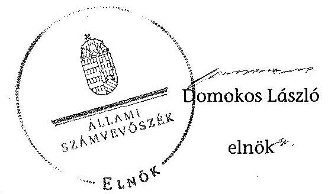

# ÁLLAMI   SZÁMVEVŐSZÉK 

## JELENTÉS

az önkormányzatok belső kontrollrendszere kialakításának, egyes
kontrolltevékenységek és a belső ellenőrzés
működésének ellenőrzéséről
Füle
14079
2014. május

---

# Állami Számvevőszék 

Iktatószám: V-0371-038/2014
Témaszám: 1162
Vizsgálat-azonosító szám: V064937

## Az ellenőrzést felügyelte:

Dr. Benedek Mária
felügyeleti vezető
Az ellenőrzést vezette és az ellenőrzés végrehajtásáért felelős:
Bíró Zsolt
ellenőrzésvezető
A számvevőszéki jelentés összeállításában közremúködött:
Horváthné Menyhárt Erika
számvevő főtanácsos
Az ellenőrzést végezték:
Horváthné Menyhárt Erika Jenei Zoltánné
számvevő főtanácsos számvevő

---

# TARTALOMJEGYZÉK 

BEVEZETÉS ..... 5
I. ÖSSZEGZŐ MEGÁLLAPÍTÁSOK, KÖVETKEZTETÉSEK, JAVASLATOK ..... 9
II. RÉSZLETES MEGÁLLAPÍTÁSOK ..... 14

1. Az önkormányzat belső kontrollrendszerének kialakítása ..... 14
1.1. A kontrollkörnyezet ..... 14
1.2. A kockázatkezelési rendszer ..... 15
1.3. A kontrolltevékenységek ..... 16
1.4. Az információs és kommunikációs rendszer ..... 17
1.5. A monitoring rendszer ..... 17
2. A pénzügyi folyamatokban kulcsszerepet betöltő teljesítésigazolás és érvényesítés belső kontrollok múködése ..... 18
3. A belső ellenőrzés múködése ..... 21

## FÜGGELÉKEK

1. számú Értelmező szótár
2. számú Az értékelés módja és szempontjai

---

.

---

# RÖVIDÍTÉSEK JEGYZÉKE 

## Törvények

Áht.
ÁSZ tv.
Htv.

Info tv.

Kttv.

Ktv.

Mötv.

Nvtv.

Ötv.
Számv. tv.
Vagyonnyilatkozattételről szóló tv.

## Rendeletek

Áhsz. 1

Áhsz. 2
Ávr.

Bkr.
képviselő-testületi SZMSZ
vagyongazdálkodási rendelet ${ }_{1}$
vagyongazdálkodási rendelet ${ }_{2}$
2011. évi CXCV. törvény az államháztartásról (hatályos 2012. január 1-jétől)
2011. évi LXVI. törvény az Állami Számvevőszékről
1991. évi XX. törvény a helyi önkormányzatok és szerveik, a köztársasági megbízottak, valamint egyes centrális alárendeltségú szervek feladat- és hatásköreiről.
2011. évi CXII. törvény az információs önrendelkezési jogról és az információszabadságról (hatályos 2012. január 1-jétől)
2011. évi CXCIX. törvény a közszolgálati tisztviselők ről (hatályos 2012. március 1-jétől)
1992. évi XXIII. törvény a köztisztviselők jogállásáról (hatálytalan 2012. március 1-jétől)
2011. évi CLXXXIX. törvény Magyarország helyi önkormányzatairól (hatályos 2012. január 1-jétől)
2011. évi CXCVI. törvény a nemzeti vagyonról (hatályos 2011. december 31-étől)
1990. évi LXV. törvény a helyi önkormányzatokról
2000. évi C. törvény a számvitelről
2007. évi CLII. törvény az egyes vagyonnyilatkozat-tételi kötelezettségekről

249/2000. (XII. 24.) Korm. rendelet az államháztartás szervezetei beszámolási és könyvvezetési kötelezettségének sajátosságairól (hatálytalan 2014. január 1-jétől)
4/2013. (I. 11.) Korm. rendelet az államháztartás számviteléről (hatályos 2014. január 1-jétől)
368/2011. (XII. 31.) Korm. rendelet az államháztartásról szóló törvény végrehajtásáról (hatályos 2012. január 1jétől)
370/2011. (XII. 31.) Korm. rendelet a költségvetési szervek belső kontrollrendszeréről és belső ellenőrzéséről (hatályos 2012. január 1-jétől)
Füle Községi Önkormányzat Képviselő-testületének 2/2011. (II. 15.) számú rendelete a Képviselő-testület Szervezeti és Múködési Szabályzatáról
Füle Községi Önkormányzat Képviselő-testületének 5/1993. (XII. 20.) számú rendelete az Önkormányzat tulajdonáról és a vagyonnak való gazdálkodás egyes szabályairól
Füle Község Önkormányzata Képviselő-testületének 3/2013. (IV. 25.) számú rendelete az Önkormányzat vagyonáról

---

# Szórövidítések 

ÁSZ
belső ellenőrzési kézikönyv
belső kontrollrendszer
gazdálkodási szabályzat
etikai szabályzat
hivatali SZMSZ

INTOSAI
iratkezelési szabályzat

ISSAI
jegyzó
Képviselő-testület
Kormányhivatal
körjegyzó

Körjegyzőség
közös önkormányzati hivatal
leltározási szabályzat

NGM
Önkormányzat
polgármester
szabálytalanságok kezelésének szabályzata
számviteli politika
SZMSZ
Társulás
ügyrend

Állami Számvevőszék
Székesfehérvár Megyei Jogú Város Polgármesteri Hivatala Belső ellenőrzési kézikönyve
Füle és Jenő Községi Önkormányzatok Körjegyzőségének Belső kontrollrendszere (hatályos 2010. szeptember 1jétől)
Füle és Jenő Községi Önkormányzatok Körjegyzőségének Gazdálkodási szabályzata (hatályos 2010. szeptember 1jétől)
Fülei Közös Önkormányzati Hivatal Etikai Szabályzata
Füle és Jenő Községi Önkormányzatok Körjegyzőségének Szervezeti és Müködési Szabályzata (nem érvényes a Kép-viselő-testület jóváhagyásának hiányában)
International Organization of Supreme Audit Institutions (Legfőbb Ellenőrző Intézmények Nemzetközi Szervezete)
Füle és Jenő Községi Önkormányzatok Körjegyzőségének Iratkezelési szabályzata (hatályos 2012. január 1-jétől)
International Standards of Supreme Audit Institutions (Legfőbb Ellenőrző Intézmények Nemzetközi Standardjai)
Füle és Jenő Községek Közös Önkormányzati Hivatala 2013. június 10-étől hivatalban lévő jegyzője

Füle Község Önkormányzatának Képviselő-testülete Fejér Megyei Kormányhivatal
Füle és Jenő Községek Körjegyzőségének 1999. január 1jétől - 2013. február 28-áig, jegyzője 2013. március 1jétől 2013. június 7 -ig
Füle és Jenő Községi Önkormányzatok Körjegyzősége Fülei Közös Önkormányzati Hivatal

Füle és Jenő Községi Önkormányzatok Körjegyzőségének Leltárkészítési és leltározási szabályzata (hatályos 2010. szeptember 1-jétől)
Nemzetgazdasági Minisztérium
Füle Község Önkormányzata
Füle Község Önkormányzatának polgármestere
Füle és Jenő Községi Önkormányzatok Körjegyzőségének Szabálytalanságok kezelésének szabályzata (hatályos 2012. január 1-jétől)
Füle és Jenő Községi Önkormányzatok Körjegyzőségének Számviteli politikája (hatályos 2012. január 1-jétől)
szervezeti és múködési szabályzat
Székesfehérvári Többcélú Kistérségi Társulás
Füle és Jenő Községi Önkormányzatok Körjegyzősége Gazdasági szervezet ügyrendje (hatályos 2010. szeptember 1-jétől)

---

# JELENTÉS 

## az önkormányzatok belsó kontrollrendszere kialakításának, egyes kontrolltevékenységek és a belső ellenőrzés múködésének ellenőrzéséről   Füle

## BEVEZETÉS

Füle község állandó lakosainak száma 2012. január 1-jén 899 fő volt. Az Önkormányzat négytagú Képviselő-testületének munkáját egy állandó bizottság segítette. Az Önkormányzat az önállóan múködő és gazdálkodó hivatalon kívül négy önállóan működő intézményt múködtetett, többségi tulajdoni hányadú gazdasági társasággal nem rendelkezett. A polgármester a 1990. évi önkormányzati választások óta tölti be tisztségét. A körjegyzö 1999. január 1-jétől - 2013. február 28-áig, valamint jegyzőként 2013. március 1-jétől 2013. június 7-ig látta el, a jegyző 2013. június 10-étől látja el a feladatait. A Körjegyzőség szervezeti egységekre nem tagolódott, elkülönített gazdasági szervezettel nem rendelkezett, a foglalkoztatott köztisztviselők száma 2012. január 1-jén négy fő volt. Füle és Jenő községek önkormányzatainak képviselő-testületei 2013. március 1-jétől - Füle székhellyel - közös önkormányzati hivatalt hoztak létre. Az Önkormányzat a 2012. évi költségvetési beszámolója szerint 225138 ezer Ft tárgyévi bevételt ért el, valamint 210665 ezer Ft tárgyévi kiadást teljesített. A 2012. december 31-i könyvviteli mérleg szerint 858608 ezer Ft értékű eszközvagyonnal rendelkezett, a rövid lejáratú kötelezettségállománya 2454 ezer Ft, hosszú lejáratú kötelezettségállománya nem volt.

A demokratikus társadalmakban alapvető igény, hogy a közpénzeket, a közvagyont használók tevékenységükről elszámoljanak, ahhoz egyértelmű és érvényesíthető felelősségi szabályok társuljanak. Ennek a jogos igénynek az érvényesítéséhez meg kell teremteni azokat a folyamatokat, rendszereket, amelyek nélkülözhetetlenek az elszámoltatáshoz. Az elszámoltatás eredményes múködtetéséhez szükség van a megfelelő információs, kontroll, értékelési és beszámolási rendszerek kialakítására.

Magyarországon az uniós csatlakozási tárgyalások idejére nyúlnak vissza a belső kontrollrendszer szabályozásának gyökerei. Az uniós elvárásoknak megfelelő új terminológia szerinti államháztartási belső pénzügyi ellenőrzési (ÄBPE) rendszer területén a jogharmonizáció 2003-ban teljes körűen megvalósult, míg az önkormányzati alrendszerre vonatkozó, Ötv.-ben megjelenített speciális szabályozás 2005-ben lépett hatályba. Az államháztartási belső kontrollrendszer koncepciója 2009-ben továbbfejlődött. A változások irányát mutatja, hogy a költségvetési szervek belső kontrollrendszere már magában foglalja

---

a korszerű, felelős szervezetirányítás elemeit (kontrollkörnyezet, kockázatkezelés, kontrolltevékenység, információ és kommunikáció, monitoring) is. E kontrollrendszer szabályozása háromszintű, a törvényi előírásokat az Áht. és a Mötv., a rendeleti szintű szabályozást az Ávr. és a Bkr. tartalmazza, amelyeket útmutatói szinten az NGM által kiadott standardok és kézikönyvek támogatnak.

A belső kontrollrendszer azt a célt szolgálja, hogy a költségvetési szervek múködésük és gazdálkodásuk során a tevékenységeket szabályszerűen, gazdaságosan, hatékonyan és eredményesen hajtsák végre, teljesítsék elszámolási kötelezettségeiket és megvédjék az erőforrásokat a veszteségektől, a károktól és a nem rendeltetésszerű használattól. A belső kontrollrendszer magában foglalja mindazon szabályokat, eljárásokat, gyakorlati módszereket és szervezeti struktúrákat, kockázatkezelési technikákat, kontrolltevékenységeket, amelyek segítséget nyújtanak a szervezetnek céljai eléréséhez.

Az ÁSZ a középtávú stratégiájában hangsúlyos szerepet szánt annak, hogy szilárd szakmai alapon álló, értékteremtő ellenőrzéseivel előmozdítsa a közpénzügyek átláthatóságát, rendezettségét. A számvevőszéki ellenőrzés nemzetközi alapelvei is rögzítik, hogy a megfelelő belső kontrollrendszer minimálisra csökkenti a hibák és szabálytalanságok kockázatát.

Az ellenőrzés célja annak megállapítása volt, hogy a belső kontrollrendszer elemeinek kialakítása, a pénzügyi folyamatokban kulcsszerepet betöltő teljesítésigazolás és érvényesítés, és a belső ellenőrzés szabályos működése biztosítot-ta-e az önkormányzatnál a közpénzfelhasználás szabályosságát, hozzájárult-e az értéket teremtő rend követelményének érvényesüléséhez.

Ennek keretében értékeltük, hogy:

- a jogszabályi előírásoknak megfelelően alakították-e ki a belső kontrollrendszer elemeit;
- a gazdálkodás folyamatában kulcsszerepet betöltő teljesítésigazolás és érvényesítés kontrolltevékenységeit megfelelően működtették-e;
- biztosították-e a belső ellenőrzés szabályos működését;
- amennyiben az ÁSZ tett javaslatot a 2008-2011. évek közötti ellenőrzése kapcsán az Önkormányzatnak, intézkedtek-e azok végrehajtására.

Az ellenőrzés várható hasznosulását négy szinten tervezzük. A törvényalkotás számára összegzett tapasztalatok állnak rendelkezésre a belső kontrollrendszer önkormányzati területen való kialakításáról, működéséről és hatásairól, a belső ellenőrzés működéséről. Ennek alapján következtetést lehet levonni arról, hogy a belső kontrollrendszer kialakítására és működtetésére vonatkozó jelenlegi, differenciálás nélküli - jogszabályi előírások reális követelményeket támasztanak-e az eltérő adottságú települési önkormányzatok esetében, illetve indokolt-e esetleges jogszabályi módosítás kezdeményezése. Az ellenőrzés az ellenőrzött számára visszajelzést ad a belső kontrollrendszer kialakításában és működésében fellépő hiányosságokról, javaslataival hozzájárul azok kiküszöböléséhez, amely csökkentheti a későbbi ellenőrzések gyakoriságát. Az el-

---

lenőrzés megállapításait és javaslatait más szervezetek is hasznosíthatják a rendezett gazdálkodási keretek kialakításához. A társadalom számára jelzi, hogy közpénz nem maradhat ellenőrizetlenül, az ÁSZ értékteremtő rend kialakításához és megőrzéséhez hozzájáruló tevékenysége pozitív hatással lesz a szervezetről kialakított összkép formálásában. A szervezeten belül lehetőség nyílik arra, hogy a megállapítások szintetizálásával az ÁSZ a hozzáadott értéket teremtő elemző tevékenységét és tanácsadó szerepét is erősítse.

Az önkormányzatok belső kontrollrendszere kialakításának, egyes kontrolltevékenységek és a belső ellenőrzés működésének ellenőrzéséről szóló jelentés I. fejezetének összegző része az ellenőrzés céljára ad rövid, szintetizáló összefoglalót, és tartalmazza a következtetéseket a II. fejezet részletes megállapításain alapulóan. A jelentés intézkedést igénylő megállapításait és javaslatait az ellenőrzés során feltárt, a jelentés II. fejezetében rögzített részletes megállapítások alapozzák meg. A helyszíni ellenőrzés lezárásáig a helyi szabályozás változásait nyomon követtük.

Az ellenőrzés típusa: szabályszerűségi ellenőrzés.
Az ellenőrzött időszak: a belső kontrollrendszer kialakításának megfelelősége esetében a 2012. évre, a pénzügyi folyamatokban kulcsszerepet betöltő teljesítésigazolás és érvényesítés belső kontrollok múködésének megfelelőségét és a belső ellenőrzés szabályszerű működését a 2012. január 1. és december 31-e közötti időszak eseményeit figyelembe véve értékeltük, míg az ÁSZ javaslatainak utóellenőrzése a 2008-2011. években végzett ellenőrzések nyilvánosságra hozott jelentéseiben tett javaslatok áttekintésére terjedt ki.

# Az ellenőrzött szervezet: az Önkormányzat. 

Az ellenőrzés jogszabályi alapját az ÁSZ tv. 1. § (3) bekezdése, az 5. § (2) és (6) bekezdése, valamint az Áht. 61. § (2) bekezdésének előírásai képezik.

Az ellenőrzés szakmai módszertana az ÁSZ hivatalos honlapján (www.asz.hu) közzétett szakmai szabályokon alapult, amely az INTOSAI által kiadott ISSAI figyelembevételével készült.

Az ellenőrzés lefolytatásához az Önkormányzat a kimutatások és a tanúsítvány elektronikus kitöltésével, valamint az ÁSZ által kért dokumentumok elektronikus megküldésével szolgáltatott adatokat. Az így rendelkezésre bocsátott adatok, információk kontrollja és a munkalapok kitöltése a helyszíni ellenőrzés keretében történt. A jelentésben használt fogalmak magyarázatát az 1. számú függelék, az ellenőrzés egyes területeinek értékelésénél alkalmazott egységes minősítési szempontokat a 2. számú függelék tartalmazza.

A belső kontrollrendszer kialakításának ellenőrzése során értékeltük a kontrollkörnyezet, a kockázatkezelési rendszer, a kontrolltevékenységek, az információs és kommunikációs rendszer, valamint a monitoring rendszer szabályozottságának megfelelőségét. A pénzügyi folyamatokban kulcsszerepet betöltő teljesítésigazolás és érvényesítés kontrollok múködése megfelelőségének minősítéséhez az állományba nem tartozók megbízási díjai, a külső szolgáltatók által végzett karbantartási, kisjavítási munkák, az egyéb üzemeltetési és fenntartási

---

szolgáltatások, a rendszeres szociális segélyek, valamint az államháztartáson kívülre teljesített múködési és felhalmozási célú pénzeszközátadások közül kockázatelemzéssel választottuk ki az ellenőrzött kiadási jogcímeket. Az egyszerű véletlen mintavétellel kiválasztott tételek ellenőrzését többlépcsős megfelelőségi tesztek útján addig végeztük, amíg elegendő és megfelelő bizonyítékot szereztünk a vizsgált folyamatok kulcskontrolljai múködésének megfelelő vagy nem megfelelő voltáról. Értékeltük az Önkormányzatnál a belső ellenőrzés működésének szabályosságát. Utóellenőrzésre nem került sor, mivel az ÁSZ az Önkormányzatnál a 2008-2011. évek között nem végzett ellenőrzést.

Az ÁSZ tv. 29. § (1) bekezdése szerint a jelentéstervezetet megküldtük a polgármester részére, aki az ÁSZ tv. 29. § (2) bekezdésében foglalt észrevételezési jogával nem élt, a jelentéstervezetre észrevételt nem tett.

---

# I. ÖSSZEGZŐ MEGÁLLAPÍTÁSOK, KÖVETKEZTETÉSEK, JAVASLATOK 

A belső kontrollrendszeren belül 2012-ben a kontrollkörnyezet, a kockázatkezelési rendszer, a kontrolltevékenységek, az információs és kommunikációs rendszer, valamint a monitoring rendszer kialakítását külön-külön és együttesen is értékeltük. A belső kontrollrendszer kialakítása az összesített értékelés alapján nem felelt meg a jogszabályi előírásoknak.

A belső kontrollrendszer egyes területei kialakításának minősítése a következő:

| Kontrollterïlet | Minősítés |
| :-- | :--: |
| Kontrollkörnyezet | nem |
|  | megfelelö |
| Kockázatkezelési rendszer | részben |
|  | megfelelö |
| Kontrolltevékenységek | részben |
| Információs és kommunikációs | megfelelö |
| rendszer | nem |

Megfelelőnek értékeltük az információs és kommunikációs rendszer kialakítását, mivel az a jogszabályi előírásokban foglaltakat figyelembe véve megteremtette e kontrollterületen a szabályszerű múködés lehetőségét.

Részben megfelelőnek értékeltük a kockázatkezelési rendszer és a kontrolltevékenységek kialakítását, mivel a megállapított szabályozásbeli hiányosságok nem veszélyeztették e kontrollterületeken a szabályszerű múködést.

Nem megfelelőnek értékeltük a kontrollkörnyezet és a monitoring rendszer kialakítását, mivel az ellenőrzésünk során megállapított szabályozásbeli hiányosságok magukban hordozzák a szabálytalan múködés, valamint a korrupció kockázatát.

A 2012. évben az állományba nem tartozók megbízási díjaival, valamint a külső szolgáltatók által végzett karbantartási, kisjavítási munkákkal kapcsolatos kifizetések során a pénzügyi folyamatokban kulcsszerepet betöltő teljesítésigazolás és érvényesítés belső kontrollok múködése gyenge volt. Gyengének értékeltük a két kulcskontroll együttes múködését, mivel azok nem biztosították a hibák megelőzését, feltárását.

A számvevőszéki ellenőrzés az ellenőrzött kifizetésekkel összefüggésben a rendelkezésre bocsátott dokumentumok alapján kár bekövetkeztére utaló adatot, tényt nem állapított meg, azonban a gazdálkodásban kulcsszerepet betöltő

---

kontrollok működésében feltárt hiányosságok miatt fennáll a hibák bekövetkezésének kockázata. A nem megfelelően működtetett belső kontrollok korrupciós kockázatot hordoznak.

Az Önkormányzat a belső ellenőrzési feladatokat a Társulás útján látta el. A 2012. évben a belső ellenőrzés múködése a jogszabályi előírásoknak megfelelt, azonban a belső ellenőrzés nem tárta fel a belső kontrollrendszer kialakításának, valamint a pénzügyi folyamatokban kulcsszerepet betöltő teljesítésigazolás és érvényesítés belső kontrollok múködésének hiányosságait.

Az ÁSZ tv. 33. § (1) bekezdésében foglaltak értelmében az ellenőrzött szervezet vezetője köteles a jelentésben foglalt megállapításokhoz kapcsolódó intézkedési tervet összeállítani, és azt a jelentés kézhezvételétől számított 30 napon belül az ÁSZ részére megküldeni. Amennyiben az intézkedési tervet határidőre nem küldi meg a szervezet, vagy az ÁSZ tv. 33. § (2) bekezdésében foglalt póthatáridő elteltével megküldött intézkedési terv továbbra sem elfogadható, az ÁSZ elnöke a hivatkozott törvény 33. § (3) bekezdés a)-b) pontjaiban foglaltakat érvényesítheti.

Az ellenőrzés intézkedést igénylő megállapításai és javaslatai:

# a polgármesternek 

1. A polgármester, mint kötelezettségvállaló - az Ávr. 57. § (4) bekezdésében foglaltak ellenére - nem jelölte ki 2012. március 30 -át követően írásban az Önkormányzat kiadási előirányzatai vonatkozásában a teljesítésigazolására jogosult személyeket.

Javaslat:
Jelölje ki az Ávr. 57. § (4) bekezdésében foglaltak szerint a teljesítésigazolásra jogosult személyeket.
2. Az Önkormányzat nevében történt kötelezettségvállalásra - az Áht. 37. § (1) bekezdésében és az Ávr. 55. § (1) bekezdésében foglaltak ellenére - pénzügyi ellenjegyzés nélkül került sor.

Javaslat:
Intézkedjen arról, hogy az Önkormányzat nevében történő kötelezettségvállalásra az Áht. 37. § (1) bekezdésében és az Ávr. 55. § (1) bekezdésében foglaltaknak megfelelően - az Ávr. 53. §-ában meghatározott kivételekkel - kizárólag a pénzügyi ellenjegyzés után, a pénzügyi teljesítés esedékességét megelőzően, írásban kerüljön sor.
3. A számvevőszéki ellenőrzés megállapításai alapján az Önkormányzatnál a belső kontrollrendszer kialakítása összefoglalóan értékelve nem felelt meg a jogszabályi előírásoknak, a kulcskontrollok működése gyenge volt, a belső ellenőrzés működése ugyan megfelelt a jogszabályi előírásoknak, azonban nem tárta fel, ezáltal nem is javíttatta ki a hiányosságokat. A megállapított szabályozásbeli és működésbeli hiányosságok magukban hordozzák a szabálytalan működés kockázatát.

---

Javaslat:
Kísérje figyelemmel a Mötv. 115. § (1) bekezdésében foglaltak alapján az Önkormányzat gazdálkodásának szabályszerűségét. A Mötv. 67. § f) pontja alapján gondoskodjon a belső kontrollrendszer müködésére vonatkozó jogszabályi rendelkezések be nem tar-tása, valamint a teljesítésigazolás, illetve az érvényesítés kontrollokkal összefüggésben feltárt hiányosságok, szabálytalanságok tekintetében az esetleges munkajogi felelősséggel kapcsolatos körülmények kivizsgálásáról, majd a vizsgálat eredményének függvényében tegye meg a szükséges intézkedéseket.

# a jegyzőnek (Füle Község Önkormányzata vonatkozásában) 

1. a kontrollkörnyezettel kapcsolatban:

A körjegyző nem kezdeményezte az Áht.-ban foglaltak ellenére a hivatali SZMSZ Képviselő-testület elé terjesztését és nem készítette elő megfelelő időben a vagyongazdálkodási rendelet módosítását. A Kttv.-ben előírtak ellenére a Körjegyzőségen dolgozó köztisztviselők munkateljesítményét írásban nem értékelte. Az Ötv.-ben előírt feladata ellenére nem készítette elő a Kttv.-ben előírt, a köztisztviselőkkel szembeni hivatásetikai alapelvek részletes tartalmának, valamint az etikai eljárás szabályainak dokumentumát. A leltározás gyakoriságát nem Áhsz,-ben előírtak figyelembevételével határozta meg [II. Részletes megállapítások, 1.1. A kontrollkörnyezet, 2., 5., 16., 25., 46. és 47. sorszámú megállapítás].

Javaslat:
Intézkedjen az Áht. 69. § (2) bekezdése, a Bkr. 3. § a) pontja és 6. §-a alapján a jelentés II. Részletes megállapítások, 1.1. A kontrollkörnyezet 2., 5., 16., 25., 46. és 47. sorszámú megállapításaiban foglalt hibák, hiányosságok kijavításáról, megszüntetéséről az ott megjelölt jogszabályi rendelkezéseknek megfelelően.
2. a kockázatkezelési rendszerrel kapcsolatban:

A körjegyző Bkr.-ben foglaltak ellenére a kockázatok kezelése érdekében előírt intézkedések teljesítése folyamatos nyomon követési módját nem határozta meg. A Va-gyonnyilatkozat-tételről szóló tv-ben foglaltak ellenére a vagyonnyilatkozat-tételre kötelezettek körét a képviselő-testületi SZMSZ nem tartalmazta, továbbá a köztisztviselők vagyonnyilatkozat-tételi kötelezettségét érvényes hivatali SZMSZ hiányában nem rögzítették [II. Részletes megállapítások, 1.2. A kockázatkezelési rendszer, 10. és 13. sorszámú megállapítás].

Javaslat:
Intézkedjen az Áht. 69. § (2) bekezdése, a Bkr. 3. § b) pontja és 7. §-a, valamint a Vagyonnyilatkozat-tételi kötelezettségről szóló tv alapján a jelentés a jelentés II. Részletes megállapítások, 1.2. A kockázatkezelési rendszer 10. és 13. sorszámú megállapításaiban foglalt hibák, hiányosságok kijavításáról, megszüntetéséről az ott megjelölt jogszabályi rendelkezéseknek megfelelően.

---

3. a kontrolltevékenységekkel kapcsolatban:

A körjegyző az Áht.-ban foglaltak ellenére nem határozta meg a gazdasági feladatot ellátó vezető és az alkalmazottak helyettesítésének rendjét, valamint a Kttv.-ben foglaltak ellenére nem szabályozta a Körjegyzőségen a köztisztviselő jogviszonya megszűntetése (megszűnés) esetére a munkakör átadása és a munkáltatóval való elszámolás rendjét. A pénzügyi ellenjegyzésre jogosult az Ávr.-ben előírtak ellenére nem rendelkezett az előírt végezettséggel, illetve pénzügyi-számviteli képesítéssel [II. Részletes megállapítások, 1.3. A kontrolltevékenységek, 21., 28. és 32. sorszámú megállapítás]

Javaslat:
Intézkedjen az Áht. 69. § (2) bekezdése, a Bkr. 3. § c) pontja és 8. §-a, valamint a Kttv. 74. § (1) bekezdése alapján a jelentés II. Részletes megállapítások, 1.3. A kontrolltevékenységek 21., 28. és 32. sorszámú megállapításaiban foglalt hibák, hiányosságok kijavításáról, megszüntetéséről az ott megjelölt jogszabályi rendelkezéseknek megfelelően.
4. a monitoring rendszerrel kapcsolatban:

A körjegyző a Bkr.-ben foglaltak ellenére nem alakított ki a Körjegyzőség tevékenységének, a célok megvalósításának nyomon követését biztosító rendszert, valamint nem készített a külső ellenőrzések megállapításainak hasznosítására intézkedési tervet. A Bkr. 1. melléklete szerinti nyilatkozatban nem értékelte 2011. évre vonatkozóan a Körjegyzőség belső kontrollrendszerének minőségét, továbbá a belső ellenőrzési jelentésben foglalt javaslatokhoz kapcsolódóan készített intézkedési tervben meghatározott egyes feladatok végrehajtásáról szóló beszámolót nem készítette el [II. Részletes megállapítások, 1.5. A monitoring rendszer, 1., 9., 12. és 18. sorszámú megállapítás].

Javaslat:
Intézkedjen az Áht. 69. § (2) bekezdése, a Bkr. 3. § e) pontja és 10. §-a alapján a jelentés II. Részletes megállapítások, 1.5. A monitoring rendszer 1., 9. 12. és 18. sorszámú megállapításában foglalt hibák, hiányosságok kijavításáról, megszüntetéséről az ott megjelölt jogszabályi rendelkezéseknek megfelelően.
5. a pénzügyi folyamatokban kulcsszerepet betöltő kontrollokkal kapcsolatban:

A teljesítésigazolás és az érvényesítés nem felelt meg az Áht.-ban és az Ávr.-ben foglaltaknak [II. Részletes megállapítások, 2. A pénzügyi folyamatokban kulcsszerepet betöltő teljesítésigazolás és érvényesítés belső kontrollok müködése, 1-2. pontban foglalt megállapítás].

A körjegyző a Ktv.-ben és a Kttv.-ben foglaltak ellenére megbízási szerződést kötött olyan feladat elvégzésére, amelyre csak köztisztviselői kinevezés adható [II. Részletes megállapítások, 2. A pénzügyi folyamatokban kulcsszerepet betöltő teljesítésigazolás és érvényesítés belső kontrollok müködése, 3. pontban foglalt megállapítás].

---

Javaslat:
Intézkedjen az Áht. 37-38. §-ában, az Ávr. 55-59. §-ában és az Áhsz. 3 39. § (1) bekezdésében, valamint a 14. számú mellékletének II. pontjában foglaltak alapján, hogy a teljesítésigazolás és az érvényesítés vonatkozásában, valamint azok ellenőrzése során a kötelezettségvállalással, a pénzügyi ellenjegyzéssel, az utalványozással, a kötelezettségvállalások nyilvántartásba vételével kapcsolatban feltárt, a jelentés II. Részletes megállapítások, 2. A pénzügyi folyamatokban kulcsszerepet betöltő teljesítésigazolás és érvényesítés belső kontrollok múködése 1-2. pontjában szereplő megállapításokban foglalt hibák, hiányosságok kijavítása, megszüntetése az ott megjelölt jogszabályi rendelkezéseknek megfelelően történjen meg;

Intézkedjen arról, hogy az olyan feladat elvégzésére, amelyre a Kttv.-ben foglaltak alapján megbízási szerződés nem köthető, kizárólag köztisztviselői kinevezés alapján kerüljön sor a jelentés II. Részletes megállapítások, 2. A pénzügyi folyamatokban kulcsszerepet betöltő teljesítésigazolás és érvényesítés belső kontrollok müködése 3 pontjában szereplő megállapításban foglalt hibák, hiányosságok kijavítása, megszüntetése érdekében az ott megjelölt jogszabályi rendelkezéseknek megfelelően.
6. a belső ellenőrzés müködésével kapcsolatban:

A belső ellenőrzés müködésében a számvevőszéki ellenőrzés kisebb hiányosságokat tárt fel, amely nem felelt meg a Bkr.-ben foglalt rendelkezéseknek. [II. Részletes megállapítások, 3. A belső ellenőrzés müködése, 7., 8.a), 11-12., 19. és 27. sorszámú megállapítása].

Javaslat:
Intézkedjen az Áht. 69. § (2) bekezdése, a Bkr. 3. § e) pontja és a 10. §-a alapján a jelentés II. Részletes megállapítások, 3. A belső ellenőrzés müködése 7., 8.a), 11-12., 19. és 27. sorszámú megállapításában foglalt hibák, hiányosságok kijavításáról, megszüntetéséről az ott megjelölt jogszabályi rendelkezéseknek megfelelően.

---

# II. RÉSZLETES MEGÁLLAPÍTÁSOK 

## 1. Az önkORMÁNYZAT BELSŐ KONTROLLRENDSZERÉNEK KIALAKÍTÁSA

A belső kontrollrendszeren belül 2012-ben a kontrollkörnyezet, a kockázatkezelési rendszer, a kontrolltevékenységek, az információs és kommunikációs rendszer, valamint a monitoring rendszer kialakítását külön-külön és együttesen is értékeltük. A belső kontrollrendszer kialakítása az összesített értékelés alapján nem felelt meg a jogszabályi előírásoknak.

### 1.1. A kontrollkörnyezet

A kontrollkörnyezet kialakítása - a 2. számú függelékben részletezett kritériumrendszer alapján végzett értékelés szerint - a jogszabályi előírásoknak nem felelt meg, mert:

| Sorszám ${ }^{1}$ | Megállapítás | Megjegyzés |
| :--: | :--: | :--: |
| 2. | A körjegyzö a - Htv. 140. § (1) bekezdés   a) pontjában foglaltak ellenére - nem készítette el a gazdasági programtervezetet, így a Képviselő-testület az Ötv. 91. § (1) és (7) bekezdésében foglaltak ellenére nem határozta meg az Önkormányzat gazdasági programját. | 2013. január 1-jétől a Mötv. 116. § (1) és (5) bekezdése szabályozza, hogy a képviselőtestület hosszú távú fejlesztési elképzeléseit gazdasági programban rögzíti, és a gazdasági programot az alakuló ülését követő hat hónapon belül fogadja el. |
| 5. | A hivatali SZMSZ-t a körjegyzö kiadmányozta, de nem kezdeményezte annak képviselő-testületi jóváhagyását, így a hivatali SZMSZ-t - az Áht. 9. § (1) bekezdés e) pontjában foglaltak ellenére a Képviselő-testület nem hagyta jóvá. | Jenő és Füle községek önkormányzatainak képviselőtestületei a 2013. december 17ei és december 19-ei képviselőtestületi üléseken elfogadták a közös önkormányzati hivatal szervezeti és müködési szabályzatát.   2013. január 1-jétől az Áht. 9. § (1) bekezdés a) pontjában foglaltakat figyelembe véve, a költségvetési szerv szervezeti és müködési szabályzatának jóváhagyása az irányító, felügyeleti szerv hatásköre. |

[^0]
[^0]:    ${ }^{1}$ A megállapítás számozása az Önkormányzat által az adatszolgáltatás során kitöltött kimutatások kérdéseinek sorszámával azonos.

---

| 16. | Az ellenőrzött időszakban a körjegyző az Ötv. 36. § (2) bekezdés a) pontjában foglaltak ellenére - figyelemmel az Nvtv. 18. § (1) és (12) bekezdésében meghatározott határidőre - nem készítette elő a vagyongazdálkodási rendelet módosítását annak érdekében, hogy az megfeleljen az Nvtv. 3. § (1) bekezdés 6. pontja, 5. §-a, 11. § (16) bekezdése, valamint a 13. § (1) bekezdése előírásainak. | A 2013. évben a Képviselőtestület elfogadta a vagyongazdálkodási rendeletet ${ }_{2}$-t.   A jegyző részére az önkormányzat múködésével kapcsolatos feladatok ellátásáról való gondoskodást 2013. január 1-jétől a Mötv. 81. § (3) bekezdés c) pontja írja elő. |
| :--: | :--: | :--: |
| 25. | A körjegyző az Áhsz. ${ }_{1}$ 37. § (7) bekezdésébe foglaltak ellenére a mérlegben kimutatott eszközök kétévenkénti leltározását önkormányzati rendelet (határozat) hiányában írta elő a leltározási szabályzatban. | 2014. január 1-jétől az Áhsz. ${ }_{2}$ 22. §-ában előírtak szerint a leltározásra a Számv. tv. 69. §ában foglalt rendelkezéseit kell alkalmazni. |
| 46. | A körjegyzö - a Kttv. 130. § (1) bekezdésében előírtak ellenére - a Körjegyzőségen dolgozó köztisztviselők munkateljesítményét írásban nem értékelte. |  |
| 47. | A Képviselő-testület - a Kttv. 231. § (1) bekezdése ellenére - nem állapította meg a Kttv. 83. §-ában előírt, a köztisztviselőkkel szembeni hivatásetikai alapelvek részletes tartalmát, valamint az etikai eljárás szabályait, mivel a körjegyzö a 2012. évben - az Ötv. 36. § (2) bekezdés a) pontjában előírt feladata ellenére nem készítette elő ennek dokumentumát. | A 2013. évben a körjegyző előkészítette az etikai szabályzatot, amelyet Füle és Jenő községek önkormányzatainak képviselőtestületei a 2014. február 3-ai és február 4-ei képviselő-testületi üléseken elfogadtak. |

# 1.2. A kockázatkezelési rendszer 

A kockázatkezelési rendszer kialakítása - a 2. számú függelékben részletezett kritériumrendszer alapján végzett értékelés szerint - részben felelt meg a jogszabályi előírásoknak.

A körjegyző elkészítette a Körjegyzőség kockázatkezelési szabályzatát, gondoskodott a Körjegyzőség tevékenységében rejlő kockázatok azonosításáról, értékeléséről, és meghatározta az egyes kockázatok kezelése érdekében szükséges intézkedéseket. A vagyonnyilatkozat-tételre kötelezettek a nyilatkozattételi kötelezettségüknek a jogszabályban előírt gyakorisággal eleget tettek.

---

A kockázatkezelési rendszer kialakítása az értékelés szempontjából az alábbi kisebb súlyú hiányosságok miatt részben felelt meg a jogszabályi előírásoknak:

| Sorszám | Megállapítás | Megjegyzés |
| :--: | :--: | :--: |
| 10. | A körjegyzố a Bkr. 7. § (2) bekezdésében foglaltak ellenére a kockázatok kezelése érdekében előírt intézkedések teljesítése folyamatos nyomon követési módját nem határozta meg. |  |
| 13. | A Vagyonnyilatkozat-tételről szóló tv. 4. § d) pontjában foglaltak ellenére a vagyon-nyilatkozat-tételre kötelezettek körét a képviselő-testületi SZMSZ -ben nem rögzítették, továbbá a körjegyzố a Vagyonnyil-latkozat-tételről szóló tv. 4. § a) pontjában foglaltak ellenére - érvényes, a Körjegyzốségre vonatkozó szervezeti és müködési szabályzat hivatali SZMSZ hiányában - a vagyonnyilatkozat-tételre kötelezett köztisztviselők körét hivatali SZMSZ-ben nem rögzítette. | Jenő és Füle községek önkor-mányzatainak képviselőtestületel a 2013. december 17ei és december 19-ei képviselőtestületi üléseken elfogadták a közös önkormányzati hivatal szervezeti és müködési szabályzatát. |

# 1.3. A kontrolltevékenységek 

A kontrolltevékenységek kialakítása - a 2. számú függelékben részletezett kritériumrendszer alapján végzett értékelés szerint - a jogszabályi előírásoknak részben megfelelt.

A körjegyző a kontrolltevékenység részeként előírta a folyamatba épített, előzetes, utólagos és vezetői ellenőrzést a költségvetés tervezése, a beszerzések lebonyolítása, a vagyonhasznosítási tevékenység és a támogatások elszámolása vonatkozásában.

A gazdálkodási szabályzatban a körjegyző meghatározta a kötelezettségvállalás pénzügyi ellenjegyzése, a teljesítésigazolás, az érvényesítés és az utalványozás módját. Szabályozta továbbá az előzetes írásbeli kötelezettségvállalást nem igénylő kifizetések rendjét.

A körjegyző az iratkezelési szabályzatban előírta az iratok és az adatok védelmét, szabályozta az üzemeltetés és adatbiztonság feladatait és meghatározta az ehhez kapcsolódó hatásköröket.

Az ügyrendben és a számviteli politikában a körjegyző meghatározta az időközi és éves beszámolók elkészítésének feladatait és a beszámolási eljárásokhoz kapcsolódó felelősségi köröket. Az éves költségvetési beszámoló elkészítésével megbízott személy rendelkezett a jogszabályban előírt képesítéssel és a tevékenység ellátására jogosító engedéllyel. A körjegyző az érvényesítési feladatra a jogszabályban előírt szakképzettséggel rendelkező, a Körjegyzőség állományában dolgozó köztisztviselőt jelölt ki.

---

A kontrolltevékenység kialakítása az értékelés szempontjából az alábbi kisebb súlyú hiányosságok miatt részben felelt meg a jogszabályi előírásoknak:

| Sorszám | Megállapítás |
| :--: | :--: |
| 10. | A polgármester, mint kötelezettségvállaló - az Ávr. 57. § (4) bekezdésében foglaltak ellenére - nem jelölte ki 2012. március 30 -át követően írásban az Önkormányzat kiadási előirányzatai vonatkozásában a teljesítésigazolására jogosult személyeket. |
| 21. | A körjegyző az Ávr. 13. § (5) bekezdés előirása ellenére nem határozta meg a gazdasági feladatot ellátó vezető és alkalmazottak helyettesítésének rendjét. |
| 28. | A pénzügyi ellenjegyzésre jogosult körjegyzö - az Ávr. 55. § (3) bekezdésében előírtak ellenére - nem rendelkezett az előírt végezettséggel, illetve pénzügyi-számviteli képesítéssel. |
| 32. | A körjegyzö - a Kttv. 74. § (1) bekezdésében foglaltak ellenére - nem szabályozta a Körjegyzőségen a köztisztviselő jogviszonya megszüntetése (megszünés) esetére a munkakör átadása és a munkáltatóval való elszámolás rendjét. |

# 1.4. Az információs és kommunikációs rendszer 

Az információs és kommunikációs rendszer kialakítása - a 2. számú függelékben részletezett kritériumrendszer alapján végzett értékelés szerint megfelelt a jogszabályi előírásoknak.

A körjegyző szabályozta a szervezeten belüli és a külső feleknek történő információátadás módját, a szervezeten kívülről érkező információk kezelésének rendjét. Szabályozta a kötelezően közzéteendő adatok nyilvánosságra hozatalának és a közérdekű adatok megismerésére irányuló igények teljesítésének rendjét. A Körjegyzőség rendelkezett az Info tv. előírásainak megfelelő adatvédelmi és adatbiztonsági szabályzattal. Az Önkormányzat az elektronikus közzétételi kötelezettségének a 2012. évben eleget tett.

A Körjegyzőség rendelkezett a Magyar Nemzeti Levéltár és a megyei kormányhivatal egyetértésével kiadott a jogszabályi előírásoknak megfelelő tartalmú iratkezelési szabályzattal. A Körjegyzőség szabálytalanságkezelési szabályzata tartalmazza a szabálytalansági gyanú észlelésével, jelentésével kapcsolatos részletes eljárásrendet.

### 1.5. A monitoring rendszer

A monitoring rendszer kialakítása - a 2. számú függelékben részletezett kritériumrendszer alapján végzett értékelés szerint - nem felelt meg a jogszabályi előírásoknak, mert:

| Sorszám | Megállapítás | Megjegyzés |
| :-- | :-- | :-- |
| 1. | A körjegyzö - a Bkr. 3. § e) pontjában és   a 10. §-ában foglaltak ellenére - nem |  |

---

|  | alakított ki a Körjegyzőség tevékenységének, a célok megvalósításának nyomon követését biztosító rendszert. |  |
| :--: | :--: | :--: |
| 9. | A körjegyzö a Bkr. 11. § (1) bekezdésében foglalt kötelezettsége ellenére - a Bkr. 1. mellékletében foglalt nyilatkozatban - a 2011. évre vonatkozóan nem értékelte a Körjegyzőség belső kontrollrendszerének minőségét. |  |
| 12. | A körjegyzö - a Bkr. 13. § (2) bekezdésében foglalt előírás ellenőre - a külső ellenőrzések megállapításainak hasznosítására intézkedési tervet nem készített. | A Magyar Államkincstár 2012-ben ellenőrizte a 2011. évi központi költségvetési támogatások év végi elszámolásának szabályszerűségét. |
| 18. | A körjegyzö - a Bkr. 46. § (1) bekezdésében foglalt előírás ellenére - a belső ellenőrzési jelentésben foglalt javaslatokhoz kapcsolódóan készített intézkedési tervben meghatározott egyes feladatok végrehajtásáról szóló beszámolót nem készítette el. |  |

Az Önkormányzat törvényességi felügyeletét ellátó Kormányhivatal törvényességi felhívással vagy más törvényességi felügyeleti eszközzel 2012-ben nem élt.

# 2. A PÉNZÜGYI FOLYAMATOKBAN KULCSSZEREPET BETÖLTŐ TELJESÍTÉSIGAZOLÁS ÉS ÉRVÉNYESÍTÉS BELSŐ KONTROLLOK MÜKÖDÉSE 

A 2012. évben az állományba nem tartozók megbízási díjaival, valamint a külső szolgáltatók által végzett karbantartással, kisjavítással kapcsolatos kifizetések során - összefoglalóan értékelve - a pénzügyi folyamatokban kulcsszerepet betöltő teljesítésigazolás és érvényesítés belső kontrollok müködésének megfelelősége gyenge volt, mert:

| Kontrollok   sorszáma | Megállapítás | Megjegyzés |
| :-- | :-- | :-- |

## Teljesítésigazolás

1. 

A teljesítésigazolást - az Áht. 38. § (1) bekezdésében és az Ávr. 57. § (1) és (3) bekezdésében foglaltak ellenére - nem az arra jogosult személy végezte, vagy nem szabályszerűen történt.

## Érvényesítés

Az érvényesítés az Ávr. 58. § (3) bekezdésében előírtak ellenére nem volt szabályszerű, mivel az Ávr. 60. § (3) bekezdése szerint vezetett nyilvántartás (aláírás-minta) alapján nem volt megállapítható, hogy a keltezéssel ellátott aláírás az érvényesítésre kijelölt személytől származott.

---

Az érvényesítő - az Ávr. 58. § (1) bekezdésében foglaltak ellenére - a fedezetet nem tudta ellenőrizni, mert a kötelezettségvállalásokat - az Ávr. 56. § (1) bekezdése előírása ellenére -2012-ben nem vették nyilvántartásba.

Az érvényesítő - az Ávr. 58. § (2) bekezdésben előírtak ellenére - nem jelezte az utalványozónak, hogy a megelőző ügymenetben a teljesítésigazolást nem az arra jogosult személy végezte, vagy nem szabályszerűen történt; az Önkormányzat nevében kötött szerződést az - Ávr. 52. § (6) bekezdésében foglaltak ellenére - nem a polgármester írta alá, valamint a Körjegyzőség és az Önkormányzat kiadási előirányzatai terhére vállalt kötelezettségvállalásokra - az Áht. 37. § (1) bekezdésében és az Ávr. 55. § (1) bekezdésében előírtak ellenére - pénzügyi ellenjegyzés nélkül került sor.

## Az érvényesítés során feltárt egyéb hiányosság

A körjegyző 2012. január 30-án könyvelési feladatok elvégzésére kötött megbízási szerződést, amellyel nem tartotta be a Ktv. 1. § (9) bekezdésében és a Kttv. 8. § (2) bekezdésében foglaltakat, mert nem vette figyelembe, hogy a közigazgatási szerv közhatalmi, irányítási, ellenőrzési és felügyeleti hatáskörének gyakorlásával közvetlenül összefüggő, valamint ügyviteli feladat ellátására kizárólag közszolgálati jogviszony létesíthető.

Az utalványon nem tüntették fel - az Ávr. 59. § (3) bekezdés f) pontjában előírtakat figyelmen kívül hagyva - a kötelezettségvállalás nyilvántartási számát, valamint az Áhsz. 2. § (1) bekezdése alapján a Számv. tv. 167. § (1) bekezdés h) pontjában előírt, a könyvelés módjára és az érintett könyvviteli számlákra történő hivatkozást.

Az Ávr. 56. § (1) bekezdés 2014. január 1-jétől módosult, a kötelezettségvállalások nyilvántartását az Áhsz. 39. § (1) bekezdés és a 14. számú melléklet II. pontja tartalmazza.

2014. január 1-jétől az Áhsz. 52. §-a tartalmazza.

A 2012. évben az állományba nem tartozók megbízási díjainak kifizetése során a teljesítésigazolás és az érvényesítés kulcskontrollok müködésének megfelelősége gyenge volt, mert:

- a teljesítésigazolást az irodai kisegítő munkával kapcsolatos kifizetést megelőzően - az Ávr. 57. § (3) bekezdésében foglaltak ellenére - kijelölés hiányában nem az arra jogosult személy végezte;
- Az érvényesítés a könyveléssel és az irodai kisegítő munkával kapcsolatos kifizetéseket megelőzően az Ávr. 58. § (3) bekezdésében előírtak ellenére nem volt szabályszerű, mivel az Ávr. 60. § (3) bekezdése szerint vezetett nyilvántartás (aláírás-minta) alapján nem volt megállapítható, hogy a keltezéssel ellátott aláírás az érvényesítésre kijelölt személytől származott;

---

- az érvényesítő - az Ávr. 58. § (1) bekezdésében foglaltak ellenére - az Önkormányzat és a Körjegyzőség kiadási előirányzata terhére teljesített megbízási díjak kifizetését megelőzően nem tudta ellenőrizni a fedezet meglétét, mert a kötelezettségvállalásokat - az Ávr. 56. § (1) bekezdése előírása ellenére - 2012-ben nem vették nyilvántartásba;
- az érvényesítő - az Ávr. 58. § (2) bekezdésben előírtak ellenére - nem jelezte az utalványozónak, hogy a megelőző ügymenetben a teljesítésigazolást nem az arra jogosult személy végezte, az Önkormányzat nevében kötött, az irodai kisegítő munkával kapcsolatos megbízási szerződést - az Ávr. 52. § (6) bekezdésében és a gazdálkodási szabályzatban foglaltak ellenére - nem a polgármester írta alá, valamint a Körjegyzőség és az Önkormányzat kiadási előirányzatai terhére vállalt - a könyveléssel és az irodai kisegítő munkával összefüggő - kötelezettségvállalásokra - az Áht. 37. § (1) bekezdésében és az Ávr. 55. § (1) bekezdésében előírtak ellenére - pénzügyi ellenjegyzés nélkül került sor.

Az utalványokon nem tüntették fel - az Ávr. 59. § (3) bekezdés f) pontjában előírtakat figyelmen kívül hagyva - a kötelezettségvállalás nyilvántartási számát, valamint a könyveléssel kapcsolatos megbízási díj kifizetéséhez kapcsolódó utalványokon az Áhsz., 2. § (1) bekezdése alapján a Számv. tv. 167. § (1) bekezdés h) pontjában előírt, a könyvelés módjára és az érintett könyvviteli számlákra történő hivatkozást.

A 2012. évben a külső szolgáltatók által végzett karbantartási és kisjavítási munkák kifizetése során a teljesítésigazolás és az érvényesítés kulcskontrollok múködésének megfelelősége gyenge volt, mert:

- a teljesítésigazoló - az Ávr. 57. § (1) bekezdésében foglaltak ellenére - a számítógép karbantartással kapcsolatos kifizetést megelőzően ellenőrizhető okmányok (a gazdálkodási szabályzatban előírt belső bizonylat és munkalap) hiányában nem ellenőrizte az összegszerűségét és az ellenszolgáltatás teljesítését;
- a teljesítésigazolást a gumiszereléssel, gépkocsijavítással, kerékszereléssel kapcsolatos kifizetéseket megelőzően - az Ávr. 57. § (3) bekezdésében foglaltak ellenére - nem az arra jogosult személy végezte;
- az érvényesítés a számítógép karbantartással, gumiszereléssel, gépkocsijavítással kapcsolatos kifizetéseket megelőzően az Ávr. 58. § (3) bekezdésében előírtak ellenére nem volt szabályszerű, mivel az Ávr. 60. § (3) bekezdése szerint vezetett nyilvántartás (aláírás-minta) alapján nem volt megállapítható, hogy a keltezéssel ellátott aláírás az érvényesítésre kijelölt személytől származott;
- az érvényesítő - az Ávr. 58. § (1) bekezdésében foglaltak ellenére - az Önkormányzat kiadási előirányzata terhére teljesített karbantartási és kisjavítási munkákhoz kapcsolódó kifizetéseket megelőzően nem tudta ellenőrizni a fedezet meglétét, mert a kötelezettségvállalásokat - az Ávr. 56. § (1) bekezdése előírása ellenére - 2012-ben nem vették nyilvántartásba;
- az érvényesítő - az Ávr. 58. § (2) bekezdésben előírtak ellenére - nem jelezte az utalványozónak, hogy a megelőző ügymenetben a teljesítésigazolást nem

---

az arra jogosult személy végezte, vagy ellenőrizhető okmányok (a gazdálkodási szabályzatban előírt belső bizonylat és munkalap) hiányában nem szabályszerűen történt, az Önkormányzat nevében a számítógép karbantartásra kötött szerződést - az Ávr. 52. § (6) bekezdésében és a gazdálkodási szabályzatban foglaltak ellenére - nem a polgármester írta alá, valamint erre a kötelezettségvállalásra - az Áht. 37. § (1) bekezdésében és az Ávr. 55. § (1) bekezdésében előírtak ellenére - pénzügyi ellenjegyzés nélkül került sor,

Az utalványokon nem tüntették fel - az Ávr. 59. § (3) bekezdés f) pontjában előírtakat figyelmen kívül hagyva - a kötelezettségvállalás nyilvántartási számát, valamint a gumiszereléshez, gépkocsijavításhoz kapcsolódó utalványokon az Áhsz.; 2. § (1) bekezdése alapján a Számv. tv. 167. § (1) bekezdés h) pontjában előírt, a könyvelés módjára és az érintett könyvviteli számlákra történő hivatkozást.

A számvevőszéki ellenőrzés az ellenőrzött kifizetésekkel összefüggésben a rendelkezésre bocsátott dokumentumok alapján kár bekövetkeztére utaló adatot, tényt nem állapított meg azonban a gazdálkodásban kulcsszerepet betöltő kontrollok múködésében feltárt hiányosságok miatt fennáll a hibák bekövetkezésének kockázata.

# 3. A BELSŐ ELLENŐRZÉS MŰKÖDÉSE 

Az Önkormányzatnál a belső ellenőrzés múködése - a 2. számú függelékben részletezett kritériumrendszer alapján végzett értékelés szerint - megfelelt a jogszabályi előírásoknak, azonban a belső ellenőrzés nem tárta fel a belső kontrollrendszer kialakításának, valamint a pénzügyi folyamatokban kulcsszerepet betöltő teljesítésigazolás és érvényesítés belső kontrollok múködésének hiányosságait.

Az Önkormányzat a belső ellenőrzési feladatokat - képviselő-testületi döntés alapján - Társulás útján biztosította. A Társulás megbízásából a belső ellenőrzési feladatokat Székesfehérvár Megyei Jogú Város Önkormányzata Polgármesteri Hivatalának Ellenőrzési Irodája látta el. A belső ellenőrzési kézikönyv a jogszabályi előírásoknak megfelelt. A belső ellenőrzést végzők megfelelő iskolai végzettséggel és szakképzettséggel rendelkeztek. A belső ellenőrzés az éves ellenőrzési tervben foglalt ellenőrzést végrehajtotta, elkészítette az ellenőrzési programot és az ellenőrzési jelentést. Az ellenőrzött szervezet intézkedési tervet készített, a belső ellenőrzési vezető nyilvántartást vezetett a belső ellenőrzésekről, illetve az azokban szereplő javaslatok alapján megtett intézkedésekről.

A belső ellenőrzés működése az alábbi kisebb hiányosságok mellett megfelelt a jogszabályi előírásoknak:

| Sorszám | Megállapítás | Megjegyzés |
| :--: | :--: | :--: |
| 7. | A belső ellenőrzési vezető - a Bkr. 22. §   (1) bekezdés b) pontjában, 29. § (1) bekezdésében és a 30. § (1) bekezdésében foglaltak ellenére - stratégiai ellenőrzési tervet nem készített. |  |

---

| 8.a) | A 2013. évi ellenőrzési terv - a Bkr. 31. § (4) bekezdés a) pontjában foglaltak ellenére - nem tartalmazta az ellenőrzési tervet megalapozó elemzések és a kockázatelemzés eredményének összefoglaló bemutatását. |  |
| :--: | :--: | :--: |
| 11.,   12. | A belső ellenőrzési vezető által összeállított 2013. évi belső ellenőrzési terv - a Bkr. 31. § (2) bekezdésében foglaltak ellenére - nem alapult a stratégiai ellenőrzési tervben és a kockázatelemzés alapján felállított prioritásokon. |  |
| 19. | Az ellenőrzési programot - a Bkr. 33. § (2) bekezdésében foglalt előírás ellenére - nem a belső ellenőrzési vezető hagyta jóvá. | Az ellenőrzési programot Székesfehérvár Megyei Jogú Város jegyzője hagyta jóvá. |
| 27. | A belső ellenőrzési vezető - a Bkr. 22. § (1) bekezdés g) pontjában, 49. § (1) bekezdésében foglaltak ellenére - a 2011. évre vonatkozó éves ellenőrzési jelentést nem készítette el. |  |

Az Önkormányzat az ÁSZ-tól a 2011., 2012. és 2013. években integritás kérdőív kitöltésére nem kapott felkérést. A Körjegyzőség a 2011., 2012. és 2013. években integritás kérdőív kitöltésére kapott felkérést, amelynek lehetőségével egyik évben sem élt. A 2013. évi belső ellenőrzési terv megalapozását szolgáló kockázatelemzés elmaradása arra utal, hogy az Önkormányzatnak még fejlődést kell elérnie az integritási szemlélet érvényesítésében.

Budapest, 2014. 05. hó 25 nap

Függelék: $\quad 2 \mathrm{db}$

---

# ÉRTELMEZŐ SZÓTÁR 

belső ellenőrzés
belső kontrollrendszer
belső kontrollrendszer területei
egyszerű véletlen mintavétel
integritás
kockázatkezelési rendszer

Független, tárgyilagos bizonyosságot adó és tanácsadó tevékenység, amelynek célja, hogy az ellenőrzött szervezet múködését fejlessze és eredményességét növelje, az ellenőrzött szervezet céljai elérése érdekében rendszerszemléletű megközelítéssel és módszeresen értékeli, illetve fejleszti az ellenőrzött szervezet irányítási és belső kontrollrendszerének hatékonyságát. (Forrás: Bkr. 2. § b) pontja)
A belső kontrollrendszer a kockázatok kezelése és tárgyilagos bizonyosság megszerzése érdekében kialakított folyamatrendszer, amely azt a célt szolgálja, hogy a múködés és gazdálkodás során a tevékenységeket szabályszerűen, gazdaságosan, hatékonyan, eredményesen hajtsák végre, az elszámolási kötelezettségeket teljesítsék, megvédjék az erőforrásokat a veszteségektől, károktól és nem rendeltetésszerű használattól. (Forrás: Áht. 69. § (1) bekezdése)
A kontrollkörnyezet, a kockázatkezelési rendszer, a kontrolltevékenységek, az információs és kommunikációs rendszer, valamint a nyomon követési (monitoring) rendszer. (Forrás: Bkr. 3. §-a)

Az alapsokaságból egyszerű véletlen kiválasztással képzett részsokaság. (Forrás: Az ÁSZ ellenőrzési mintavételezés támogatásához készült segédletének 4.1.1. pontja)
Az integritás elvek, értékek, cselekvések, módszerek, intézkedések konzisztenciáját jelenti: olyan magatartásmódot, amely meghatározott értékeknek felel meg. Az integritás a közszféra esetében a társadalom által elvárt nyilvánossági, átláthatósági, illetve jogi/etikai normáknak történő megfelelést jelenti.
(Forrás: a http://integritas.asz.hu honlapon közzétett „A 2012. évi integritás felmérés eredményeinek összefoglalója" címú dokumentum 3. oldal 1. bekezdése)
A kockázat annak a valószínűségét jelenti, hogy egy vagy több esemény vagy intézkedés nem kívánt módon befolyásolja a rendszer múködését, céljainak megvalósulását. (Forrás: Javaslatok a korrupciós kockázatok kezelésére - Kockázatkezelési és ellenőrzési módszertan 35. oldal, ÁSZ)
Olyan irányítási eszközök és módszerek összessége, melynek elemei a szervezeti célok elérését veszélyeztető tényezők (kockázatok) azonosítása, elemzése, csoportosítása, nyomon követése, valamint szükség esetén a kockázati kitettség mérséklése. (Forrás: Bkr. 2. § m) pontja)

---

kontrollkörnyezet
kontrolltevékenységek
kommunikáció
korrupció
kulcskontrollok
lényegesség
megfelelőségi teszt

A kontrollkörnyezet alakítja ki a szervezet belső kontrollrendszerhez való viszonyát, hozzáállását, befolyásolja az alkalmazottak belső kontrollal kapcsolatos tudatosságát, magatartását. Elemei a személyes és szakmai elkötelezettség és a vezetés, valamint az alkalmazottak által vallott erkölcsi értékek; a szakmai hozzáértés iránti elkötelezettség; a felső vezetés hozzáállása - a vezetés filozófiája és tevékenységének stílusa; a szervezeti struktúra; a humánerőforrás-politika és gazdálkodási gyakorlat.
A kontrolltevékenységek azok a politikák és eljárások, amelyeket a kockázatok megoldására hoznak létre a szervezet céljainak teljesítése érdekében.
Az a tevékenység, melynek során információ továbbítása valósul meg. A kommunikációs folyamat résztvevői között tájékoztatás történik, mely során tényeket, ezek magyarázatát közlik. „A szervezetben eredményes kommunikációnak kell áramlania lefelé, horizontálisan és felfelé, a szervezet egészében és annak valamennyi elemében."
Azok a cselekmények, amelyek során a köz érdekében való eljárással megbízott és döntéshozatali felelősséggel felruházott személy a köz érdeke helyett önös vagy részérdekeket követve, mástól jogtalan vagy etikátlan előnyt elfogadva és őt jogtalan vagy etikátlan előnyhöz juttatva jár el, illetve amikor valaki a köz érdekében való eljárással megbízott és döntéshozatali felelősséggel felruházott személynek jogtalan vagy etikátlan előnyt nyújtva vagy felajánlva jogtalan vagy etikátlan előnyt kér. (Forrás: A Kormány korrupció megelőzési programja 2012-2014.)
Az azonosított kockázatok mérséklése érdekében kialakított kontrollok közül azok, amelyek elégtelen működése esetén a szervezetet jelentős veszteség érheti, vagy a múködésükben bekövetkező hiba/hiányosság más kontrollok eredményességét csökkenti. Ezek ellenőrzése, értékelése elegendő bizonyítékot szolgáltat adott területen a kontrollrendszer értékeléséhez. Az önkormányzatok kontrollrendszere kialakításának ellenőrzése során a pénzügyi folyamatokban kulcsszerepet betöltő belső kontrollok a teljesítésigazolás és az érvényesítés.
Egy információ akkor lényeges, ha hiánya vagy téves állítása befolyásolhatja ezen információkat felhasználók döntéseit, véleményét. Az ellenőrzés során a lényegesség három szempontból értelmezhető: érték, jelleg és összefüggés szerint.
Az ellenőrzés során alkalmazott módszer - szekvenciális (megállásos) megfelelőségi teszt - lényege, hogy a kiválasztott minta ellenőrzését csak addig végezzük, amíg elegendő és megfelelő bizonyítékot nem szerzünk az ellenőrzött kulcskontroll (teljesítésigazolás, érvényesítés) múködésének megfelelő vagy nem megfelelő voltáról.

---

monitoring (nyomon követési rendszer)
utóellenőrzés

A monitoring a különböző szintű szervezeti célok megvalósításának folyamatát kíséri figyelemmel, melynek során a releváns eseményekről és tevékenységekről (együtt: folyamatokról) rendszeres jelleggel, strukturált, döntéstámogató információkhoz jutnak a szervezet vezetői.
Az intézkedések nyomon követése érdekében elrendelt ellenőrzés, amelynek célja, hogy a belső ellenőrzés bizonyosságot szerezzen az elfogadott intézkedések végrehajtásáról vagy arról a tényről, hogy ha az ellenőrzött szerv, illetve az ellenőrzött szervezeti egység vezetője nem, vagy nem az elfogadott intézkedésnek megfelelően hajtja végre az intézkedéseket, továbbá meggyőződni arról, hogy a végrehajtott intézkedésekkel a megállapított kockázat ténylegesen megszűnt, vagy a kockázati tűréshatár alá csökkent. (Forrás: Bkr. 2. § s) pontja)

---

!
!
!
!
!
!
!
!
!
!
!
!
!
!
!
!
!
!
!
!
!
!
!
!
!
!
!
!
!
!
!
!
!
!
!
!
!
!
!
!
!
!
!
!
!
!
!
!
!
!
!
!
!
!
!
!
!
!
!
!
!
!
!
!
!
!
!
!
!
!
!
!
!
!
!
!
!
!
!
!
!
!
!
!
!
!
!
!
!
!
!
!
!
!
!
!
!
!
!
!
!
!
!
!
!
!
!
!
!
!
!
!
!
!
!
!
!
!
!
!
!
!
!
!
!
!
!
!
!
!
!
!
!
!
!
!
!
!
!
!
!
!
!
!
!
!
!
!
!
!
!
!
!
!
!
!
!
!
!
!
!
!
!
!
!
!
!
!
!
!
!
!
!
!
!
!
!
!
!
!
!
!
!
!
!
!
!
!
!
!
!
!
!
!
!
!
!
!
!
!
!
!
!
!
!

---

# Az értékelés módja és szempontjai 

## A belsó kontrollrendszer kialakítása megfelelőségének értékelése az öt területre vonatkoztatva

Megfelelő a belső kontrollrendszer kialakítása, amennyiben az öt területen (kontrollkörnyezet, kockázatkezelési rendszer, kontrolltevékenységek, információs és kommunikációs rendszer, monitoring rendszer kialakítása) összesen elért és elérhető pontok százalékban kifejezett hányadosa eléri a $81 \%$-ot, és egyik terület sem kapott nem megfelelő értékelést.

Részben megfelelő a kontrollrendszer kialakítása, ha az önkormányzat teljesíti a meghatározott valamennyi főbb kritériumot (amelyeket - 10 kritérium - a program 5. számú melléklete tartalmazza), és az öt munkalapon összesen elért és elérhető pontok százalékban kifejezett hányadosa a $61 \%$-ot meghaladja, és legfeljebb egy terület értékelése nem megfelelő volt.

Nem megfelelő a belső kontrollrendszer kialakítása, amennyiben az önkormányzat nem teljesíti a meghatározott bármelyik főbb kritériumot, vagy az öt munkalapon összesen elért és elérhető pontok százalékban kifejezett hányadosa $0-60 \%$ közötti, vagy egynél több terület értékelése nem megfelelő volt.

A megfelelőség minősítése a következők szerint történik:
A minősítés - részben automatizált - a belső kontrollrendszer kialakítására vonatkozó kérdéseket tartalmazó munkalapokon, az elérhető és az elért pontszámok alapján az alábbi képlettel, számítógépes program segítségével történt, melynek összefüggése:

$$
\frac{\text { Elért pont }}{\text { Elérhető pont }} \times 100=\ldots \ldots . \%
$$

A belső kontrollrendszer egyes területei kialakítása megfelelőségénél alkalmazandó minősítés:

- nem megfelelő
$0-60 \%$-ig
- részben megfelelő
$61-80 \%$-ig
- megfelelő
$81 \%$ fölött.

---

# Az ellenőrzött önkormányzat belső kontrollrendszere kialakítása megfelelőségének főbb kritériumai 

| $\begin{aligned} & \text { Sor- } \\ & \text { szám } \end{aligned}$ | Kérdés: | Szempont: |
| :--: | :--: | :--: |
|  | A kontrollkörnyezet kialakítása (2. számú munkalap, kimutatás) |  |
| 1. | A polgármesteri hiva-   tal ${ }^{1}$ rendelkezik-e ala-   pító okirattal? | A polgármesteri hivatal alapító okirata az Âht. 8. § (4) bekez-   désében elöírtaknak megfelelően elkészült, tartalmazza az   Âvr. 5. § (1) bekezdésében elöírtakat, kiemelten a c) pont   szerinti alaptevékenységeit. |
| 2. | A polgármesteri hiva-   tal rendelkezik-e szer-   vezeti és müködési   szabályzattal? | A polgármesteri hivatal rendelkezik az Âht. 10. § (5) bekez-   désben elöírt - 2010. január 1-jét követően jóváhagyott vagy   módosított - SZMSZ-szel. A költségvetési szerv feladatai ellátá-   sának részletes belső rendjét és módját - törvényben vagy   kormányrendeletben meghatározott módon és tartalommal -   szervezeti és müködési szabályzata állapítja meg. |
| 3. | Meghatározták-e a   vagyongazdálkodás   szabályait önkor-   mányzati rendeletben? | Az önkormányzat a vagyongazdálkodás szabályait önkor-   mányzati rendeletben meghatározta, és az összhangban van   az Mötv. 109. § (4) bekezdése, a Nemzeti vagyonról szóló   2011. évi CXCVI. tv. 18. § (1) bekezdése tartalmával, és a 18.   § (12) bekezdésében meghatározottak szerint az 5. § (5)-(7)   bekezdésében foglaltaknak megfelelően 2012. október 31-ig   azt módosították. |
| 4. | A polgármesteri hiva-   tal rendelkezik-e szám-   viteli politikával? | A polgármesteri hivatal rendelkezik az Âhsz. 8. § (3) bekez-   désben elöírt - 2010. január 1-jét követően hatályba helyezett   vagy aktualizált - számviteli politikával. A jogszabályhely   rögzíti, hogy a Számv. tv. és az e rendeletben foglaltak szerint   az államháztartás szervezetének szakmai feladatai és sajátos-   ságai figyelembevételével ki kell alakítania és írásban szabályozoina számviteli politikáját. |
| 5. | A polgármesteri hiva-   tal rendelkezik-e pénz-   kezelési szabályzattal? | A polgármesteri hivatal rendelkezik az Âhsz. 8. § (4) bekezdés   d) pontjában elöírt - 2010. január 1-jét követően hatályba   helyezett vagy aktualizált - pénzkezelési szabályzattal. A   jogszabályhely előírja, hogy a számviteli politika keretében el   kell készíteni a pénzkezelési szabályzatot. |
| 6. | A polgármesteri hiva-   tal rendelkezik-e leltá-   rozási és leltárkészítési   szabályzattal? | A polgármesteri hivatal rendelkezik az Âhsz. 8. § (4) bekezdés   a) pontjában elöírt - 2008. január 1-jét követöen hatályba   helyezett vagy aktualizált - eszközök és források leltározási és   leltárkészítési szabályzatával. |

[^0]
[^0]:    ${ }^{1}$ Polgármesteri hivatal alatt a polgármesteri hivatalt, a főpolgármesteri hivatalt, a megyei önkormányzati hivatalt és a körjegyzöséget is érteni kell.

---

| Sorszám | Kérdés: | Szempont: |
| :--: | :--: | :--: |
| 7. | A polgármesteri hivatal gazdasági szervezetének van-e ügyrendje? | A polgármesteri hivatal rendelkezik a gazdasági szervezet ügyrendjével vagy az azzal egyenértékủ szabályozással (Ávr. 9. § (5) bekezdés), vagy az Ávr. 13. § (5) bekezdésében foglaltakat az SZMSZ-ben vagy más belső szabályzatban szabályozta (Áht. 10. § (5) bekezdés), és a szabályozást 2010. január 1jét követően felülvizsgálták, aktualizálták. Elfogadható az is, ha a gazdasági feladatokat a polgármesteri hivatalon belül több szervezeti egység látja el, és azoknak önálló ügyrendjük van, illetve ha a polgármesteri hivatal nem tagolódik szervezeti egységekre, és ezért önálló gazdasági szervezettel nem rendelkezik, azonban az SZMSZ-ben vagy más belső szabályozásban rögzítik az ügyrend kötelező elemelt. |
| 8. | A polgármesteri hiva-   tal rendelkezik-e ellen-   őrzési nyomvonallal? | Az ellenőrzési nyomvonal, folyamatleírás a polgármesteri hivatal tevékenységeire vonatkozóan elkészült, és azt 2010. január 1-jét követően felülvizsgálták, aktualizálták. A szabályzat minta megtalálható a Pénzügyminisztértum Belső kontroll kézikönyv, 2010. 18. és a 19. számú mellékletében. A Bkr. 6. § (3) bekezdésében előírtak szerint a költségvetési szerv vezetője köteles elkészíteni és rendszeresen aktualizálni a költségvetési szerv ellenőrzési nyomvonalát, amely a költségvetési szerv müködési folyamatainak szöveges vagy táblázatba foglalt vagy folyamatábrákkal szemléltetett leírása, amely tartalmazza különösen a felelősségi és információs szinteket és kapcsolatokat, irányítási és ellenőrzési folyamatokat, lehetővé téve azok nyomon követését és utólagos ellenőrzését. |
|  | Az információ és kommunikáció szabályozása és kialakítása (5. számú munkalap, kimutatás) |  |
| 9. | Az önkormányzat eleget tett-e az elektronikus közzétételi kötelezettségének? | Az Önkormányzat az Info tv. 33. § (1) és (3) bekezdésében foglaltaknak megfelelően, saját vagy közösen müködtetett honlapon elektronikus formában bárki számára hozzáférhetően közzé tette az Info tv. 1. számú mellékletében felsoroltak közül legalább az éves költségvetését, a költségvetési beszámolóját, a Képviselő-testület rendeleteit. |
| 10. | A polgármesteri hivatal rendelkezik-e iratkezelési szabályzattal? | A polgármesteri hivatal rendelkezik az Ltv. 10. § (1) bek. c) pontjában előírt iratkezelési szabályzattal. |

# A két kulcskontroll minősítése 

A kulcskontrollok - teljesítésigazolás, érvényesítés - múködésének értékelése megfelelőségi tesztek segítségével történt. A kontrollok müködésének megfelelőségére vonatkozó következtetést az értékelő táblázatban elért súlyozott pontszám, továbbá az eredendő kockázat minősítésétől függően két vagy három kiadási jogcím alapján fogalmaztuk meg. Az értékeléshez alkalmazandó arányszámok kialakítását számítógépes program segítségével központilag az ellenőrzésben közreműködő informatikai támogató végezte az önkormányzatok által elektronikus úton megadott adatokból.

A minősítés automatizált, a megfelelőségi tesztek kitöltésével számítógépes program segítségével történik, melynek összefüggése:

---

| Elérhető pontszám: | Elért súlyozott pontszám értékelése: |
| :--: | :--: |
| $0-70$ | „gyenge" |
| $71-90$ | „jó" |
| $91-100$ | „kiváló" |

- „kiváló"a kontrollok múködése, ha megfelel a szabályozásoknak és a legmagasabb szintű elvárásoknak a múködésbeli hibák megelőzése, feltárása és kijavítása tekintetében; amennyiben a kontrollok múködésének megfelelőségét a helyszíni ellenőrzési munkalap értékelése alapján kiválónak minősítettük, azonban esetleges kisebb - az egységesen meghatározott követelményrendszerben foglalt $10 \%$-ot el nem érő mértékű - hiányosságokat tártunk fel, az összességében kiváló minősítést alátámasztó pozitív megállapításon túl ezeket a hiányosságokat a jelentésben ismertetjük a javaslataink megalapozása érdekében;
- „jó" a kontrollok múködésének megfelelősége, ha azok a megállapított kisebb (tolerálható mértékű) hiányosságok mellett kielégítik az elvárásokat a múködésbeli hibák megelőzése, feltárása, és kijavítása tekintetében, a megállapított hiányosságok nem veszélyeztették a hibák megelőzését, feltárását és kijavítását, továbbá ismertetjük azokat a területeket is, ahol az előírt ellenőrzési, egyeztetési feladatokat nem végezték el;
- „gyenge" a kontrollok múködése, ha a kontrollok múködésében túl sok hiányosság fordul elő ahhoz, hogy megbízhatónak lehessen azokat minősíteni. Ismertetjük a jelentésben azokat a területeket, ahol az előírt ellenőrzési, egyeztetési feladatokat nem végezték el, amely hiányosságok a belső kontrollok megfelelőségének „gyenge" minősítését okozták.

# A belső ellenőrzés szabályszerű múködésének értékelése 

A belső ellenőrzés múködését a 2012. évben történt ellenőrzés tervezési és végrehajtási tevékenységének tapasztalatai alapján értékeljük a munkalapok (kimutatások) kérdéseire adott válaszok alapján, melynek megállapítása az elérhető és az elért pontokból az alábbi képlettel, számítógépes program segítségével történt:

$$
\frac{\text { Elért pont }}{\text { Elérhető pont }} \times 100=\ldots \ldots . \%
$$

A belső ellenőrzés múködésének megfelelőségénél alkalmazandó minősítés:

- nem felelt meg
$0-60 \%$-ig;
- megfelel
$61-80 \%$-ig;
- jól megfelel
$81 \%$ fölött.