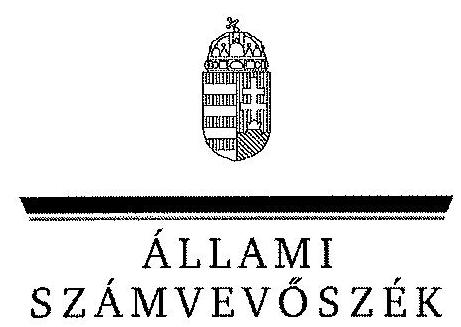
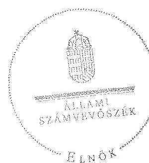
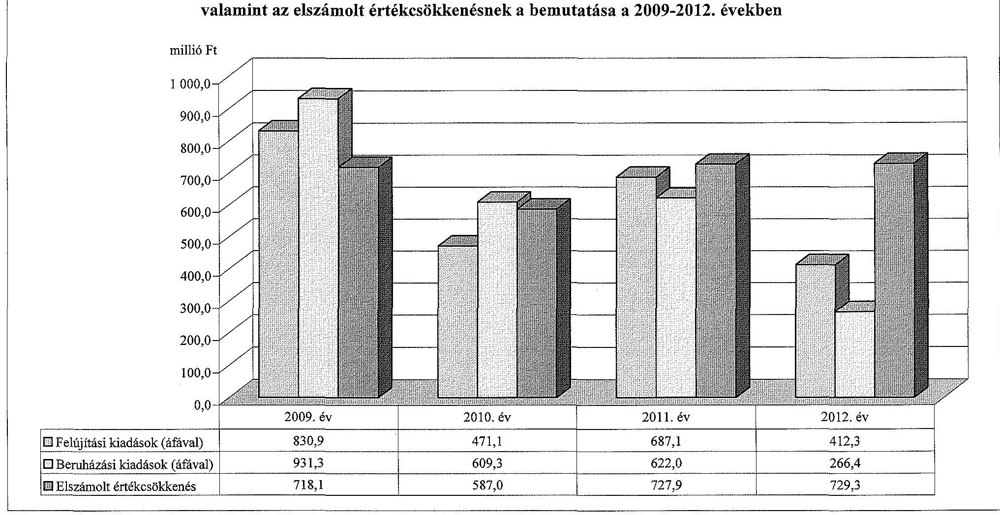
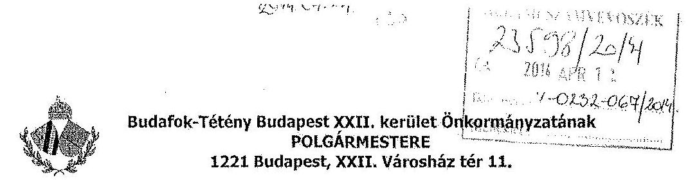
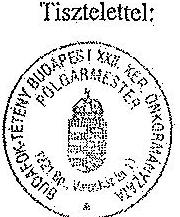

ÁLLAMI
SZÁMVEVÔSZÉK

# JELENTÉS 

az önkormányzatok vagyongazdálkodása
szabályszerúségének ellenőrzéséről
Budafok-Tétény Budapest XXII. kerület

---

Állami Számvevőszék
Iktatószám: V-0232-068/2014.
Témaszám: 1266
Vizsgálat-azonosító szám: V065112
Az ellenőrzést felügyelte:
Makkai Mária
felügyeleti vezető
Az ellenőrzést vezette és az ellenőrzés végrehajtásáért felelős:
Schósz Attila Ferencné
ellenőrzésvezető
A számvevőszéki jelentés összeállításában közremüködtek:
Groholy Andrásné Hangyál Márta
számvevő tanácsos
Velkei András Albert
számvevő
Az ellenőrzést végezték:
Velkei András Albert
számvevő
Reichert Margit
számvevő
Schmidt János
számvevő

---

# TARTALOMJEGYZÉK 

BEVEZETÉS ..... 3
I. ÖSSZEGZŐ MEGÁLLAPÍTÁSOK, KÖVETKEZTETÉSEK, JAVASLATOK ..... 6
II. RÉSZLETES MEGÁLLAPÍTÁSOK ..... 10

1. A vagyongazdálkodási tevékenység szabályozása ..... 10
1.1. A vagyongazdálkodási tevékenység szabályozásának megfelelősége ..... 10
1.2. A vagyon használatba és üzemeltetésbe adásának szabályszerűsége ..... 12
1.3. A vagyon üzemeltetésére, használatára kötött szerződések felülvizsgálata ..... 13
2. A vagyongazdálkodási tevékenység szabályszerűsége ..... 14
2.1. A vagyon nyilvántartása, a vagyon összetételének változása, a döntések és a gazdasági események szabályszerűsége ..... 14
2.1.1. A vagyon nyilvántartásának megfelelősége ..... 14
2.1.2. A vagyon értékének és összetételének változása ..... 15
2.1.3. A vagyon változását eredményező döntések és gazdasági események szabályszerűsége ..... 17
2.2. A térítés nélküli vagyon átadás és átvétel szabályszerűsége ..... 18
2.3. A beruházási és felújítási döntések és végrehajtásuk szabályszerűsége ..... 20
2.4. A tartós részesedésekkel történő gazdálkodás ..... 21
2.5. A vagyon értékesítésének, hasznosításának, a követelés elengedésének szabályszerűsége ..... 22
2.6. Az önkormányzati gazdasági társaságok tulajdonosi felügyelete ..... 23
3. Az integritás érvényesülése a vagyongazdálkodásban ..... 24
4. A belső és a külső ellenőrzések hasznosulása ..... 25
4.1. A belső ellenőrzés javaslatainak hasznosulása ..... 25
4.2. A külső ellenőrzések javaslatainak hasznosulása ..... 26

---

# MELLÉKLETEK 

1. számú Budafok-Tétény Budapest XXII. kerület Önkormányzata vagyonának alakulása 2009. január 1. és 2012. december 31. között
2. számú Budafok-Tétény Budapest XXII. kerület Önkormányzata felújítási és beruházási kiadásainak, valamint az elszámolt értékcsökkenésnek a bemutatása a 2009-2012. években
3. számú Budafok-Tétény Budapest XXII. kerület Önkormányzat polgármesterének nemleges észrevétele

## FÜGGELÉKEK

1. számú Rövidítések jegyzéke
2. számú Értelmező szótár

---

# JELENTÉS 

## az önkormányzatok vagyongazdálkodása szabályszerűségének ellenőrzéséről Budafok-Tétény Budapest XXII. kerület

## BEVEZETÉS

Az ÁSZ kiemelten fontosnak tartja az ÁSZ tv. 5. § (4) bekezdésének a) pontja és (5) bekezdése, valamint az Áht. 61. § (2) bekezdése alapján az önkormányzati vagyon kezelésének, a vagyonnal való gazdálkodási szabályok betartásának az ellenőrzését. Az ellenőrzés feladata a vagyongazdálkodással kapcsolatban a közpénzek átláthatósága, nyilvánossága érdekében a jogszabályokban, belső szabályzatokban megfogalmazott előírások érvényesülésének áttekintése. Az ÁSZ nem csak az ellenőrzött szervezet vagyongazdálkodásának a hibáira mutat rá, számon kérve azok kijavítását, hanem megállapításaival, javaslataival segíti a közpénzzel, a közvagyonnal való felelős gazdálkodást.

Az önkormányzati vagyon alapvető funkciója, hogy a közérdeket és egyúttal az önkormányzati célok megvalósítását szolgálja. A feladatellátás terén elsősorban a kötelezően ellátandó feladatok végrehajtását hivatott szolgálni, amely mellett az önként vállalt feladatok ellátása is megvalósulhat.

Az ÁSZ stratégiájában hangsúlyos szerepet szán annak, hogy szilárd szakmai alapon álló, értékteremtő ellenőrzéseivel előmozdítsa a közpénzügyek átláthatóságát, rendezettségét. Az ÁSZ a vagyongazdálkodás ellenőrzésén keresztül közreműködik az integritás alapú közigazgatási kultúra kialakításában.

Az ellenőrzés célja annak megállapítása volt, hogy az önkormányzat vagyongazdálkodási tevékenységének szabályozottsága és tevékenysége a jogszabályi előírásokkal összhangban volt-e, átlátható, a jogszabályi előírásoknak megfelelő volt-e a vagyon nyilvántartása, a külső és belső ellenőrzések megállapításai hozzájárultak-e az önkormányzati vagyongazdálkodási tevékenység szabályszerűségéhez.

Ennek keretében értékeltük, hogy az Önkormányzat:

- szabályszerűen alakította-e ki a vagyongazdálkodási tevékenységének kereteit;
- biztosította-e a vagyongazdálkodás szabályszerűségét, megalapozottan hoz-ta-e, és jogszerűen, szabályszerűen hajtotta-e végre a vagyonváltozást eredményező meghatározó jelentőségű döntéseket, valamint gondoskodott-e az általa alapított vagy tulajdonosi részvételével működő gazdasági társaságokkal kapcsolatos tulajdonosi joggyakorlásról;

---

- gondoskodott-e vagyongazdálkodási tevékenysége során az integritás (feddhetetlenség) szempontjainak érvényesüléséről;
- belső ellenőrzése elősegítette-e a vagyongazdálkodás szabályszerű működését, valamint hasznosította-e a külső és belső ellenőrzések megállapításait, javaslatait.

Az ellenőrzés típusa: szabályszerűségi ellenőrzés.
Ellenőrzött időszak: az ellenőrzés 2009. január 1-je és 2012. december 31. közötti időszakra terjedt ki, kitekintéssel a helyszíni ellenőrzés befejezéséig (2013. december 9-éig) tartó időszak releváns folyamataira. Az egyes közbeszerzési eljárások lefolytatásának ellenőrzése 2012. január 1-jétől a helyszíni ellenőrzés kezdetét megelőző negyedév utolsó napjáig (2013. szeptember 30-ig), az Nvtv. egyes rendelkezései végrehajtásának ellenőrzése 2012-től, a helyszíni ellenőrzés befejezéséig tartott.

Ellenőrzött szervezet: Budafok-Tétény Budapest XXII. kerület Önkormányzata

Az ellenőrzés szakmai módszertana az ÁSZ hivatalos honlapján közzétett szakmai szabályokon alapult, amely a Legfőbb Ellenőrző Intézmények Nemzetközi Szervezete (INTOSAI) által kiadott nemzetközi standardok (ISSAI) figyelembevételével készült.

Az ellenőrzést az ÁSZ hatályos szervezeti szabályai és az ellenőrzési programban foglalt értékelési szempontok szerint folytattuk le. Megállapításainkat a helyszíni ellenőrzés tapasztalataira, az ellenőrzött szervezettől bekért dokumentumokra, a kitöltött tanúsítványok elemzésére, az adott időszakban hatályos jogszabályok és belső szabályzatok előírásaira alapoztuk. A részesedések értékelését tételesen ellenőriztük. Irányított mintavétellel választottuk ki a legnagyobb értékű térítésmentes átadás-átvételeket, a beruházásokat, felújításokat, a közbeszerzési eljárásokat, a vagyonértékesítéseket, hasznosításokat és a követelés elengedéseket, továbbá a vagyonkezelési, az üzemeltetési és a koncessziós szerződéseket. Ezen túl a belső kontrollok megfelelő működését a vagyonváltozásokkal kapcsolatos gazdasági események közül a Polgármesteri hivatal 20092012. évi számviteli nyilvántartásaiból választott véletlen minta alapján, megállásos (többlépcsős) megfelelőségi teszttel ellenőriztük.

Budafok-Tétény Budapest XXII. kerület lakosainak száma 2012. január 1-jén 53792 fő volt. A 2010. évi önkormányzati választásokig a 25 tagú Képviselőtestület munkáját nyolc állandó bizottság segítette. Az önkormányzati választások után a Képviselő-testület létszáma 18 főre csökkent, és hét állandó bizottság múködött. A polgármester a 2006. évi önkormányzati választások óta tölti be tisztségét, a jelenlegi jegyző 2011. június 10 -től látja el feladatait.

Az Önkormányzat a 2012. évben a Polgármesteri hivatalon felül kettő önállóan múködő és gazdálkodó, valamint 17 önállóan múködő költségvetési szervvel látta el feladatait. A 2011. évben két oktatási intézményt összevontak, a 2012. évben egy iskolát a Református Egyház vett át az Önkormányzattól. Az ellenőrzött időszak új intézménye a 2010-ben létrehozott Klauzál Gábor Művelődési Központ volt. A Polgármesteri hivatal az ellenőrzött időszakban 14 szer-

---

vezeti egységre tagolódott, a gazdasági szervezet feladatait egy szervezeti egység látta el.

Az Önkormányzatnak a 2012. év végén négy kizárólagos tulajdonú gazdasági társasága volt. A Dél-budai Egészségügyi Kft. járóbeteg szakellátási, a Budafoki Dohnányi Ernő Szimfonikus Zenekar Kft. előadó-művészeti tevékenységet, a Városfejlesztő Kft. településfejlesztési feladatokat végzett. A KÖSZ 22 Kft. végelszámolást követő, nyilvántartásokból történő kivezetése a 2012. évben még nem történt meg. Az Önkormányzat a 2009-2012. évek között vállalkozási tevékenységet nem végzett, vagyonkezelési, haszonélvezeti és koncessziós jogot alapító szerződést nem kötött. Az ellenőrzött időszakban PPP konstrukcióban megvalósított fejlesztésre nem került sor. Az ÁSZ 2009-2012. évek között az Önkormányzatnál ellenőrzést nem végzett.

Az Önkormányzat könyvviteli mérleg szerinti vagyona a 2009. évi 52568,8 millió Ft-os nyitó értékről 2012. év végére 54695,6 millió Ft-ra, 4,0\%kal növekedett. A befektetett eszközökön belül elsősorban az ingatlanok növekedtek az üzemeltetésre átadott eszközök csökkenésével arányosan. A forgóeszközökön belül a pénzeszközök értékének emelkedése volt meghatározó. Az Önkormányzat összes kötelezettségének állományi értéke 2012. december 31-én 4364,3 millió Ft, ebből a rövid és hosszú lejáratú kötelezettségek értéke 4223,2 millió Ft volt. A pénzintézeti kötelezettség állományi értéke 3952,2 millió Ft-ot tett ki, mely az 1582,0 millió Ft összegű adósság átvállalás eredményeként 2370,2 millió Ft-ra csökkent. Az Önkormányzat 2012. évi költségvetési beszámolója szerint (az előző évi 683,0 millió Ft pénzmaradvány igénybevételével együtt) 16927,8 millió Ft költségvetési bevételt ért el és 14736,3 millió Ft költségvetési kiadást teljesített. Felhalmozási célú kiadásra 729,2 millió Ft-ot, ezen belül felújítási és beruházási kiadásokra 678,7 millió Ftot fordítottak.

Az Önkormányzat vagyonának főbb adatait, a felújítási és beruházási kiadásokat, valamint az elszámolt értékcsökkenést az 1-2. számú mellékletek mutatják be. Az alkalmazott rövidítéseket és az egyes fogalmak magyarázatát az 12. számú függelék tartalmazza.

Az ÁSZ a 2011. évi LXVI. törvény 29. § (1) bekezdése szerint a jelentéstervezetet megküldte Budafok-Tétény Budapest XXII. kerület Önkormányzat polgármesterének egyeztetésre. Budafok-Tétény Budapest XXII. kerület Önkormányzat polgármestere nem tett észrevételt. A nemleges észrevételt a jelentés 3. számú melléklete tartalmazza.

---

# I. ÖSSZEGZŐ MEGÁLLAPÍTÁSOK, KÖVETKEZTETÉSEK, JAVASLATOK 

Az Önkormányzat vagyongazdálkodási tevékenységének szabályozását - a 2009-2012. évek között - hiányosan biztosította. Az Önkormányzat - az Ötv. és Mötv. előírásaival ellentétben - nem határozta meg a vagyonkezelői jog létesítésével, megszerzésével, gyakorlásával, a vagyonkezelés ellenőrzésével kapcsolatos rendelkezéseket. A lakásértékesítési rendeletben - a Lakás tv.ben előírtak ellenére - nem szabályozták a volt állami tulajdonú lakások értékesítéséből származó bevételek felhasználásának rendjét. A Képviselő-testület -az Áht. ${ }_{1}$-ben és a 2009. évi költségvetésről szóló törvényben foglalt előírás ellenére - 2009. szeptember 16-ig 100,0 millió Ft-ban határozta meg azt az értékhatárt, amely felett csak nyilvános pályázat útján lehet a vagyont értékesíteni, a használat jogát átadni. Ezen időpontot követően az Önkormányzat a jogszabályi előírással összhangban, 25,0 millió Ft-os értékhatárt rögzített a vagyongazdálkodási rendelet ${ }_{1}$-ben.

A vagyon tulajdonjogáról, a vagyonhoz kapcsolódó, önállóan forgalomképes vagyoni értékű jogok ingyenes átruházásáról szóló döntés joga a vagyongazdálkodási rendelet ${ }_{1,2}$ előírása szerint (értékhatártól függetlenül) a Képviselőtestületet illette meg. A Képviselő-testület az Ötv.-ben biztosított jogával élve, a vagyongazdálkodási rendelet ${ }_{1,3}$-ben a polgármesternek, a Pénzügyi, valamint a Gazdasági és Vállalkozásfejlesztési Bizottságnak adott át - értékhatárhoz kötve - hatáskört. Az Önkormányzat az Nvtv.-ben megjelölt határidőre, 2012. március 1-jéig rendeletében meghatározta a forgalomképtelennek minősülő vagyonából azon vagyonelemeket, amelyeket nemzetgazdasági szempontból kiemelt jelentőségű nemzeti vagyonként forgalomképtelen törzsvagyonnak minősített.

A jegyzö ${ }_{1,2}$ - a Htv. előírása szerint - kialakította a Polgármesteri hivatal számviteli rendjét. A Polgármesteri hivatal - az ellenőrzött időszakban - rendelkezett az Áhsz. ${ }_{1}$-ben foglaltaknak és a helyi sajátosságoknak megfelelő számviteli politika ${ }_{1,2}$-vel és a hozzá kapcsolódó pénzügyi-számviteli szabályzatokkal. A pénzkezelési szabályzat ${ }_{1}$-et az ellenőrzött időszakban nem aktualizálták. A leltározási szabályzat ${ }_{2}$ az ingatlanok vonatkozásában - az Áhsz. ${ }_{1}$-ben foglalt előírással szemben - szabálytalanul tartalmazta a kétévenkénti mennyiségi leltározás lehetőségét, mivel az Önkormányzat arról rendeletben (határozatban) nem döntött. A szabályzat ezen előírását a gyakorlatban nem alkalmazták. A leltározási szabályzat ${ }_{1,2}$ az üzemeltetésre átadott eszközök évenkénti leltározásának módját az Áhsz. ${ }_{1}$-ben foglalt előírásoknak megfelelően tartalmazta.

Az operatív gazdálkodással kapcsolatos eljárásrendet, jogkörgyakorlást és az összeférhetetlenségi követelményeket - az Ámr. ${ }_{1,2}$-ben és az Ávr.-ben előírtaknak megfelelően - a gazdálkodási jogkörök szabályzat ${ }_{1,6}$-ban rögzítették. A vagyongazdálkodással kapcsolatban a gazdálkodási jogkörök gyakorlása a kiadások esetében a 2009-2012. években, a bevételek esetében a 2010-2012. években megfelelő volt. A 2009. évben (az ingatlanok bérbeadásából származó, havi feladás alapján egy összegben elszámolt) 12,7 millió Ft összegű bevétel be-

---

szedését megelőzően - az Ámr. ${ }_{1}$-ben, illetve a gazdálkodási jogkörök szabály$z^{2 t_{1,2}}$-ben foglaltak ellenére - nem végezték el a gazdálkodási és ellenőrzési jogkörök gyakorlásával felhatalmazott személyek az előírt ellenőrzési feladataikat.

Az Önkormányzat az ellenőrzött időszakban koncessziós szerződést, az Ötv. és Mötv. előírásai szerinti vagyonkezelési szerződést nem kötött. Vagyonának üzemeltetési, müködtetési feladatait a kizárólagos tulajdonú gazdasági társaságával (a KÖSZ 22 Kft.-vel) megkötött üzemeltetési szerződéssel, majd 2011. év májusától a Polgármesteri hivatal szervezeti egységeivel látta el. Az üzemeltetési szerződések tartalmának meghatározása, megkötésének módja a vagyongazdálkodási rendelet ${ }_{1,2}$-ben meghatározottakkal összhangban történt. Az önkormányzati vagyon hasznosítására kötött szerződésekben előírták a vagyon állagának, értékének megőrzését, védelmét és az ellenőrzési jogosultságokat. A vagyon használatba, illetve üzemeltetésre történő átadása szabályszerűen történt. Az Önkormányzat a 2012. évben kizárólag önkormányzati tulajdonú gazdálkodó szervezetben rendelkezett társasági részesedéssel, amely társaságok az Nvtv. alapján átlátható szervezetnek minősültek.

Az Önkormányzatnál az ellenőrzött években a vagyongazdálkodás múködésének szabályszerűségét összességében biztosították. Az Önkormányzat a 2009-2012. években a vagyon nyilvántartása során - a 2010-2011. évi vagyonkimutatások kivételével - betartotta a jogszabályokban és a belső szabályzatokban előírt követelményeket. A vagyonkimutatást minden évben elkészítették, azonban a 2010. és a 2011. évben a saját tőke elemeit nem a könyvviteli mérleg Áhsz. ${ }_{1}$-ben előírt tagolása szerint mutatták be. A jegyző ${ }_{1,2}$ - a 147/1992. (XI. 6.) Korm. rendelet előírása alapján - biztosította a számviteli nyilvántartás, az ingatlanvagyon-kataszter és a földhivatali ingatlan nyilvántartás azonos tartalmú adatai közötti egyezőséget a 2009-2012. években. Az Önkormányzat az Áhsz. ${ }_{1}$-ben előírt leltározási kötelezettségének - a leltározási szabályzat ${ }_{1,2}$-ben foglaltaknak megfelelően - minden évben, december 31-ei fordulónappal eleget tett. A 2009-2012. évekre vonatkozóan az üzemeltetésre átadott eszközök mérleg szerinti értékét az Áhsz. ${ }_{1}$-ben, illetve a leltározási szabályzat ${ }_{1,2}$-ben foglalt előírásoknak megfelelően az üzemeltetést végzők által elkészített, hitelesített leltárral támasztották alá.

Az Önkormányzat minden évben megalapozottan, a gazdasági program ${ }_{1,2}$-ben foglalt fejlesztési célkitűzésekkel és az önkormányzati feladatellátással összhangban döntött a beruházásokról és felújításokról. A fejlesztések finanszírozhatóságát és fenntarthatóságát biztosították. Az Önkormányzat 2012. január 1-jétől a 2013. év III. negyedév végéig a közbeszerzési értékhatárt elérő, vagy azt meghaladó felújítási és beruházási feladataihoz lefolytatta a közbeszerzési eljárást, melyek - az aszfalt burkolattal ellátott utak melegítéses technológiával történő javítása kapcsán lefolytatott eljárás kivételével - megfeleltek a Kbt. előírásainak. Az önkormányzati vagyon hasznosítása és értékesítése szabályszerűen, megfelelő döntésekkel alátámasztottan történt. A vagyonváltozást eredményező döntéseket - a jogszabályban és a belső szabályzatokban előírtaknak megfelelően - az arra felhatalmazottak (Képviselő-testület, polgármester, Bizottságok) hozták meg. A vagyongazdálkodási döntések végrehajtása szabályszerűen történt, betartották a döntésekhez kapcsolódó előterjesztésekben, a képviselő-testületi határozatokban foglaltakat, a döntésekkel azonos tar-

---

talmú szerződéseket, megállapodásokat kötöttek. A jegyző ${ }_{1,2}$ az ellenőrzött időszak során biztosította a közpénzek felhasználásának átláthatóságát, továbbá az éves költségvetési, zárszámadási rendeletek - az Eisztv. mellékletében előírtak szerinti - adatait az Önkormányzat honlapján közzétették.

Az elengedett követelések ellenőrzött tételei esetében az Áht. ${ }_{1,2}$ előírásának megfelelően, a vagyongazdálkodási rendelet ${ }_{1,2}$-ben foglaltak szerint jártak el. A behajthatatlan követelésekről az Áhsz. ${ }_{1}$ és a vagyongazdálkodási rendelet ${ }_{1,2}$ ben előírtaknak megfelelően rendelkeztek.

Az Önkormányzat a tartós részesedéseit megtestesítő gazdasági társaságok gazdálkodási nehézségei, valamint a feladatellátás hatékonyabbá tétele érdekében négy gazdasági társaságát végelszámolással megszüntette. A Képviselőtestület a 2009-2012. években egy esetben döntött új gazdasági társaság létrehozásáról és három esetben vásárolt meglévő tulajdoni részesedése mellé üzletrészt gazdasági társaságokban. A Harbor Park Kft. esetében a többségi tulajdonos társaságra nézve hátrányos üzletpolitikája, a kitűzött üzleti célok meghiúsulása és a Kft. gazdálkodási nehézségei alapján a polgármester a kisebbségi üzletrész értékesítését kezdeményezte. Több éves egyeztetés és előkészítés után (a Képviselő-testület 2011. évi döntése szerint) az Önkormányzat a 141,3 millió Ft-os könyv szerinti értékénél lényegesen alacsonyabb, ugyanakkor az előzetes igazságügyi szakértői véleményben meghatározott 60,0 millió Ft-os eladási áron értékesítette üzletrészét. Az Önkormányzat nem vizsgálta az üzletrész értékesítés elhúzódásának okait, továbbá azt hogy, terhel-e felelősség bárkit a társaságba bevitt ingatlanvagyon könyv szerinti és piaci értéke közötti jelentős eltérés miatt. Az Önkormányzatnál minden évben vizsgálták a tulajdonosi részesedések esetében az értékvesztés és visszaírás elszámolásának szükségességét, az elszámolások során betartották az Áhsz.,-ben, a számviteli politika $_{1,2}$-ben és az értékelési szabályzat ${ }_{1,2}$-ben előírtakat. Az ellenőrzött években az Önkormányzat a tulajdonosi jogok gyakorlása során a kizárólagos és a többségi tulajdonában lévő gazdasági társaságok éves beszámolóit, üzleti tervét és - közhasznú társaság esetében - közhasznúsági jelentését megtárgyalta és elfogadta.

A jegyző ${ }_{2}$ - a Bkr. előírása ellenére - a kontrollkörnyezet kialakítása során az etikai elvárásokat a szervezet minden szintjére, a Képviselő-testület a Kttv. szerinti hivatásetikai alapelvek részletes tartalmát és az etikai eljárás szabályait nem állapította meg. Az Önkormányzat szerveinek vezetői nem hívták fel a vagyongazdálkodási tevékenységgel összefüggő, korrupciós szempontból veszélyeztetett beosztásban dolgozó alkalmazottak figyelmét a jellemző kockázatokra és a kockázatokat megelőző intézkedésekre. A szabályozási és múködési hiányosságok következtében a vagyongazdálkodási tevékenység integritása (feddhetetlensége), az átláthatósági és elszámoltathatósági követelmények érvényesülése, a stabil és kiegyensúlyozott múködés feltételei nem voltak teljes mértékben biztosítottak.

Az ellenőrzött időszakban a belső ellenőrzés összesen 61 ellenőrzést végzett, amelyekből 15 tartalmazott vagyongazdálkodásra vonatkozó megállapításokat. A belső ellenőrzés által tett javaslatok hasznosultak, ezáltal azok elősegítették a vagyongazdálkodás szabályszerű működését.

---

A kötelezően előírt könyvvizsgálaton kívül az Önkormányzat több alkalommal kötött megbízási szerződést könyvvizsgáló társasággal a gazdasági társaságai múködésének ellenőrzésére, átvilágítására. Az Önkormányzat korábbi vagyongazdálkodási feladatait végző KÖSZ 22 Kft. gazdaságossági és szabályossági vizsgálatáról, valamint a vagyonkezelés elvi stratégiai és taktikai tervéről szóló jelentésekben foglalt javaslatok hasznosultak. Az Önkormányzatnál a 20092012. években végzett külső ellenőrzések során egy esetben állapítottak meg vagyongazdálkodási tevékenységgel kapcsolatos hiányosságot, melynek következtében a támogatás összegét csökkentették.

Az Állami Számvevőszékről szóló 2011. évi LXVI. törvény 33. § (1) bekezdésében foglaltak értelmében a jelentésben foglalt megállapításokhoz kapcsolódó intézkedési tervet köteles az ellenőrzött szervezet vezetője összeállítani, és azt a jelentés kézhezvételétől számított 30 napon belül az ÁSZ részére megküldeni. Amennyiben az intézkedési tervet határidőben nem küldi meg a szervezet, vagy az nem elfogadható, az ÁSZ elnöke a hivatkozott törvény 33. § (3) bekezdés a)-b) pontjaiban foglaltakat érvényesítheti.

Az ellenőrzés intézkedést igénylő megállapításai és javaslatai:

# a jegyzönek 

1. Az Ötv. 80/B. §-ában és az Mötv. 109. § (4) bekezdésében foglaltak ellenére az Önkormányzat rendeletei nem tartalmaztak a vagyonkezelői jog megszerzésével, gyakorlásának és a vagyonkezelés ellenőrzésének szabályaival kapcsolatos rendelkezéseket.

Javaslat:
Készítse elő a vagyonkezelői jog ellenértékét, az ingyenes átengedés, a vagyonkezelői jog gyakorlásának, valamint a vagyonkezelés ellenőrzésének részletes szabályait meghatározó rendelet-tervezetet az Mötv. 109. § (4) bekezdésében előírtak szerint és kezdeményezze a polgármesternél annak Képviselő-testület elé terjesztését.
2. A jegyző, a 2012. évben a Bkr. 6. § (1) bekezdés c) pontjának előírása ellenére az etikai elvárásokat a szervezet minden szintjére nem határozta meg, a Kttv. 231. § (1) bekezdése ellenére a Képviselő-testület nem állapította meg a Kttv. 83. §-ában előírt, a köztisztviselőkre vonatkozó hivatásetikai alapelvek részletes tartalmát, valamint az etikai eljárás szabályait.

Javaslat:
Készítse elő a Bkr. 6. § (1) bekezdés c) pont előírásának megfelelő etikai elvárásokat, a Kttv. 83. §-a szerinti hivatásetikai alapelveket, az etikai eljárás szabályait és terjessze a Képviselő-testület elé jóváhagyásra.

---

# II. RÉSZLETES MEGÁLLAPÍTÁSOK 

## 1. A VAGYONGAZDÁlKODÁSI TEVÉKENYSÉG SZABÁLYOZÁSA

### 1.1. A vagyongazdálkodási tevékenység szabályozásának megfelelősége

A Képviselő-testület a vagyongazdálkodási feladatokat a Htv. 138. § (1) bekezdés i) pontja szerint - a vagyonkezelői jog és a volt állami tulajdonú lakások kivételével - a teljes vagyoni körre szabályozta. A vagyongazdálkodási rendelet ${ }_{1}$-ben meghatározták az önkormányzati feladatellátást biztosító törzsvagyont, ezen belül a forgalomképtelen és a korlátozottan forgalomképes vagyonelemek kórét. Az Önkormányzat az Nvtv. 18. § (1) bekezdésében megjelölt határidőre, 2012. március 1-jéig rendeletében meghatározta a forgalomképtelennek minősülő vagyonából azon vagyonelemeket, amelyeket nemzetgazdasági szempontból kiemelt jelentőségű nemzeti vagyonként forgalomképtelen törzsvagyonnak minősített. Az ÁSZ helyszíni ellenőrzésének befejezéséig (2013. december 9-ig) az Önkormányzat nem készítette el közép- és hosszú távú vagyongazdálkodási tervét, melyre vonatkozóan határidőket az Nvtv. nem tartalmaz.

A Képviselő-testület az Ötv. 9. § (3) bekezdésében biztosított jogával élve a vagyongazdálkodási rendelet ${ }_{1,2}$-ben meghatározta a vagyongazdálkodási feladatokhoz kapcsolódó hatáskör átruházásokat. A vagyongazdálkodási rendelet ${ }_{1,2}{ }^{-}$ ben - értékhatárhoz kötötten - a polgármesternek, a Pénzügyi, valamint a Gazdasági és Vállalkozásfejlesztési Bizottságnak adtak át hatáskört. Az átruházott hatáskörök gyakorlóinak - annak célszerűsége ellenére - beszámolási kötelezettséget nem írtak elő.

A vagyongazdálkodási rendelet ${ }_{1,2}$ szerint a forgalomképes vagyon feletti tulajdonosi jogokat a polgármester ingó vagyontárgy megszerzése, elidegenítése, megterhelése és portfólió vagyon esetében 20 millió Ft-os, a Pénzügyi Bizottság 20100 millió Ft-os értékhatárig gyakorolja.

A vagyongazdálkodási rendelet ${ }_{1}$ szerint 100 millió Ft-os értékhatárig a polgármester volt jogosult dönteni követelés mérséklése, elengedése, illetve részletekben történő teljesítése eseteiben. A vagyongazdálkodási rendelet ${ }_{2}$ szerint a polgármester jogosult dönteni - különbözö értékhatárok mellett - követelésről lemondás rendeletben meghatározott eseteiben.

A vagyongazdálkodási rendelet ${ }_{2}$ szerint a Gazdasági és Vállalkozásfejlesztési Bizottság jogosult dönteni a forgalomképes vagyon használatba adásáról, továbbá elővásárlási jogról lemondás esetében 20-100 millió Ft-os értékhatárig.

Az ellenőrzött időszakban a vagyonkimutatásra vonatkozó szabályozást a vagyongazdálkodási rendelet ${ }_{1}$ tartalmazta. Az Önkormányzat nem élt az Áhsz. ${ }_{1} 44 /$ A. § (2) bekezdésében foglalt lehetőséggel és az Áhsz. 1. szá-

---

mú melléklete szerinti részletezettségen felül a vagyonkimutatás további tételes alábontását nem határozta meg.

A Képviselő-testület a vagyongazdálkodási rendelet ${ }_{1,2}$-ben - az Áht. ${ }_{1}$ 108. § (2) bekezdésében ${ }^{1}$ foglaltak szerint - rendelkezett a vagyon tulajdonjogának, valamint a vagyonhoz kapcsolódó, önállóan forgalomképes vagyoni értékủ jogok ingyenes átruházásának eseteiről és módjáról. Értékhatártól függetlenül az ingyenes átruházásról szóló döntés joga a Képviselő-testületet illette meg. A Kép-viselő-testület - az Áht. ${ }_{1}$ 108. § (1) bekezdésében és a Magyar Köztársaság 2009. évi költségvetéséről szóló 2008. évi CII. törvény 9. § (1) bekezdésében foglalt előírás ellenére - 2009. szeptember 16-ig 100,0 millió Ft-ban határozta meg azt az értékhatárt, amely felett csak nyilvános pályázat útján lehet a vagyont értékesíteni, a használat jogát átadni. Ezen időpontot követően a jogszabályi előírással összhangban, 25,0 millió Ft-os értékhatárt rögzítettek a vagyongazdálkodási rendelet ${ }_{1}$-ben. A hasznosításra szánt vagyon piaci értékének megállapítása céljából értékbecslés készítési kötelezettséget írtak elő.

Az Önkormányzat a vagyongazdálkodással összefüggő feladatait az előbbieken kívül lakásgazdálkodási, lakásértékesítési és lakbér rendeletekben szabályozta, amelyek - a lakásértékesítési rendelet, valamint a vagyonkezelői jog szabályozása kivételével - a vonatkozó jogszabályi előírásokkal összhangban voltak. A lakásértékesítési rendeletben az Önkormányzat a Lakás tv. 62. § (3) bekezdésében előírtakat - a volt állami tulajdonú lakások értékesítéséből származó bevételek felhasználásának részletes szabályait - nem határozta meg.

A Polgármesteri hivatal számviteli rendjét - a Htv. 140. § (1) bekezdés c) pontjában foglalt előírás szerint - a jegyzö ${ }_{1,2}$ kialakította. A Polgármesteri hivatal - az ellenőrzött időszakban - rendelkezett az Áhsz. ${ }_{1}$-ben foglaltaknak és a helyi sajátosságoknak megfelelő számviteli politika ${ }_{1,2}$-vel. A számviteli politika $_{1,2}$ keretében elkészítették a leltározási ${ }_{1,2}$, értékelési ${ }_{1,2}$, önköltség-számítási ${ }_{1,2}$ szabályzatot, valamint a számlarend ${ }_{1,2}$-t, melyek hatálya a gazdasági szervezettel nem rendelkező önállóan múködő intézményekre, továbbá - 2012. január 1-jétől - az Önkormányzatra és a nemzetiségi önkormányzatokra is kiterjedt. Az Önkormányzat nem élt az immateriális javak, tárgyi eszközök, továbbá a befektetett pénzügyi eszközök piaci értéken történő értékelésének lehetőségével. A pénzkezelési szabályzat ${ }_{1}$-et az ellenőrzött időszakban nem aktualizálták a pénzkezelési feladatokat ellátó személyek, a bankszámlák és azok felett rendelkezni jogosultak, valamint a vonatkozó jogszabályi előírások (Ámr. ${ }_{1,2}$, Ávr.) körében bekövetkezett változásoknak megfelelően ${ }^{2}$.

A leltározási szabályzat ${ }_{1}$ az Áhsz. ${ }_{1}$ 37. § (1)-(3) bekezdésével összhangban évenkénti, december 31-i forduló nappal történő leltározást írt elő. A leltározási szabályzat ${ }_{1,2}$ az üzemeltetésre átadott eszközök évenkénti leltározásának módját az Áhsz. ${ }_{1}$ 37. § (4) bekezdésében ${ }^{3}$ foglaltaknak megfelelően tartalmazta. A leltározási szabályzat ${ }_{2}$ az ingatlanok vonatkozásában - az Áhsz. ${ }_{1}$ 37. § (7) be-

[^0]
[^0]:    ${ }^{1}$ 2012. június 30 -ától az Nvtv. 13. § (3) bekezdése szabályozza.
    ${ }^{2}$ A pénzkezelési szabályzat ${ }_{2}$-ben a szükséges aktualizálások megtörténtek.
    ${ }^{3}$ Megállapította a 317/2009. (XII. 29.) Korm. rendelet 18. §-a. Először a 2010. évről készített beszámolókra kellett alkalmazni.

---

kezdésében ${ }^{4}$ foglalt előírással szemben - szabálytalanul tartalmazta a kétévenkénti mennyiségi leltározás lehetőségét, mivel arról az Önkormányzat rendeletben (határozatban) nem döntött.

Az Ámr. ${ }_{1,2}$-ben és az Ávr.-ben előírtaknak megfelelően a gazdálkodási jogkörök szabályzat ${ }_{1,6}$-ban rögzítették az operatív gazdálkodással kapcsolatos eljárásrendet, jogkörgyakorlást és az összeférhetetlenségi követelményeket. A jogszabályi és szervezeti változásokkal összhangban minden esetben megtörtént a szabályozás módosítása.

Az Önkormányzat a gazdasági program ${ }_{1,2}$-ben, az önkormányzati $\mathrm{SZMSZ}_{1}$-ben és az alapító okiratokban - az Ötv., Mötv. előírásainak megfelelően - rögzítette kötelező és önként vállalt feladatait, azok ellátásának mértékét és módját. Az önkormányzati $\mathrm{SZMSZ}_{2}$ a kötelező és önként vállalt feladatokat nem tartalmazta. A 2013. évi költségvetési rendelet az Mötv. 111. § (3) bekezdésében foglaltaknak megfelelően elkülönítetten tartalmazta a kötelező és az önként vállalt feladatok ellátásának forrásait és kiadásait.

Az Önkormányzat kötelező feladatait döntő részben intézményrendszerén keresztül látta el. A kötelező és önként vállalt feladatok közül az utcai szociális munkával, hajléktalanokkal, idő́korúak és fogyatékos személyek gondozóházával, gyermekek átmeneti otthonával, uszodával és sportpályával, háziorvosi ellátással, valamint a médiákkal kapcsolatos feladatok ellátását vállalkozásokkal és egyéb szervezetekkel kötött szerződések útján biztosították. Az Önkormányzat kötelező feladataiból a településfejlesztést, az önként vállaltakból a járóbeteg szakellátást és az előadó-művészeti tevékenységet kizárólagos tulajdonú gazdasági társaságai keretében látta el.

Az Önkormányzatnak a 2009. évben 21, a 2012. évben 20 költségvetési intézménye volt, amelyek közül a 2009. év elején kettő önállóan gazdálkodó, a 2012. év végén három önállóan múködő és gazdálkodó státusszal rendelkezett.

# 1.2. A vagyon használatba és üzemeltetésbe adásának szabályzzerüsége 

Az ellenőrzött időszakban az Ötv. 80/B. §-ával ${ }^{5}$ ellentétben a vagyongazdálkodási rendelet ${ }_{1,2}$ - és az Önkormányzat más rendelete, szabályzata - nem tartalmazott a vagyonkezelői jog létesítésével, megszerzésével, gyakorlásának és a vagyonkezelés ellenőrzésének szabályaival kapcsolatos rendelkezéseket.

Az Önkormányzat az ellenőrzött időszakban koncessziós szerződést, az Ötv. 80/A. $\S^{6}$ előírása szerinti vagyonkezelési szerződést nem kötött, vagyonkezelői jogot nem adott át.

[^0]
[^0]:    ${ }^{4}$ 2014. január 1-jétől az Áhsz. 2 22. § (2) bekezdése a Számv. tv. 69. §-ára utal, mely szerint a leltározást a leltározási szabályzatban meghatározott időszakonként, de legalább háromévente mennyiségi felvétellel kell elvégezni.
    ${ }^{5}$ 2012. január 1-jétől az Mötv. 109. § (4) bekezdése szabályozza.
    ${ }^{6}$ 2012. január 1-jétől az Mötv. 109. §-a szabályozza.

---

A vagyon üzemeltetésre átadásának, használatba adásának (pl. bérbeadás, ingyenes vagy kedvezményes használatba adás) és az üzemeltető, használó ellenőrzésének szabályait az Önkormányzat a vagyongazdálkodási rendelet ${ }_{1}$-ben meghatározta. Ezeket a szabályokat - az ellenőrzésre vonatkozók kivételével a vagyongazdálkodási rendelet ${ }_{2}$ is tartalmazta.

Az ellenőrzött időszakban az Önkormányzat vagyon üzemeltetési, múködtetési feladatait üzemeltetetési szerződés alapján a KÖSZ 22 Kft., majd 2011. év májusától - a Képviselő-testület tulajdonosi döntése alapján - a Polgármesteri hivatal szervezeti egységei látták el. A vagyon használatba, üzemeltetésre történő átadása szabályszerűen, a Képviselő-testület, illetve az átruházott hatáskörrel rendelkezők döntése alapján történt.

Az ellenőrzött időszakban a Képviselő-testület a vagyongazdálkodási rende-let ${ }_{1,3}$-ben átruházott hatáskörök gyakorlásával kapcsolatos beszámoltatást szabályozás hiányában - nem végzett.

Az Önkormányzat a lakásgazdálkodási, vagyonüzemeltetési (beleértve a piacokkal, vásárokkal, értékesítőhelyekkel kapcsolatos) feladatokat ellátó KÖSZ 22 Kft.-vel - illetve annak jogelődjével a VAX XXII. Zrt.-vel - megkötött vagyon üzemeltetési szerződésekben előírta a vagyon állagának, értékének megőrzését és védelmét. Az üzemeltetési szerződések tartalmának meghatározása, megkötésének módja a vagyongazdálkodási rendelet ${ }_{1}$-ben meghatározottakkal összhangban történt, azokban folyamatba épített ellenőrzési feladatokat is rögzítettek. Az önkormányzati adatszolgáltatás szerint az ellenőrzött időszakban az üzemeltetésre átadott eszközök után 404,9 millió Ft értékcsökkenést számoltak el, ezzel szemben az eszközök pótlására, felújítására 272,1 millió Ft-ot fordítottak.

Az önkormányzati vagyon hasznosítására vonatkozóan kötött szerződésekben - az üzleti partnerek részére - előírták a vagyon állagának, értékének megőrzését és védelmét, azokban a hasznosításba adó ellenőrzési jogosultságait is rögzítették.

# 1.3. A vagyon üzemeltetésére, használatára kötött szerződések felülvizsgálata 

A Képviselő-testület az ellenőrzött időszakban egy esetben - településfejlesztési feladatok ellátása érdekében - döntött új gazdasági társaság, a 100\%-os önkormányzati tulajdonú Városfejlesztő Kft. létrehozásáról.

Az Önkormányzat a 2010. évben három esetben vásárolt meglévő tulajdoni részesedése mellé üzletrészt gazdasági társaságokban. A kisebbségi tulajdonrészét növelve megvásárolta a 100\%-os önkormányzati tulajdonú KÖSZ 22 Kft.-től a Harbor Park Kft. 26,8 millió Ft nyilvántartási értékű üzletrészét. Ezen üzletrész a KÖSZ 22 Kft.-nek - 2009-ben fizetési nehézségei miatt - adott tagi kölcsön viszszafizetésével összefüggésben került az Önkormányzat tulajdonába. További üzletrészt szerzett - tulajdoni részesedését 100\%-osra kiegészítve - a Savoyai Borpáholy Kft.-ben 9,0 millió Ft értékben, valamint a Dél-budai Egészségügyi Kft.-ben 2,5 millió Ft könyv szerinti értéken.

---

A Képviselő-testület a 2009. évben három, addig Kht. formájában múködő társasága - a Dél-budai Egészségügyi Szolgálat Kht., a Budafoki Dohnányi Ernő Szimfonikus Zenekar Kht. és a Budafok-Tétény Múvelődési Központ Kht. - Kft.-ként folytatta tevékenységét. Az Önkormányzat a Budafok-Tétény Szociális Foglalkoztató Kht.-t a 2009. évben - a Dél-budai Egészségügyi Kft. jogutódlásával - megszüntette.

Az ellenőrzött időszakban az Önkormányzat a tartós részesedéseit megtestesítő gazdasági társaságok gazdálkodási nehézségei, valamint üzleti célok elmaradása következtében és a feladatellátás hatékonyabbá tétele érdekében négy gazdasági társaságát - a Városüzemeltetési Kht.-t, a Savoyai Borpáholy Kft.-t, a Budafok-Tétény Művelődési Központ Kft.-t és a KÖSZ 22 Kft.-t végelszámolással megszüntette. A Harbor Park Kft.-ben meglévő üzleti részesedésüket - üzleti célok meghiúsulása és gazdálkodási nehézségek miatt - a 2011. évben a többségi tulajdonos részére értékesítették.

A lakásgazdálkodási és vagyongazdálkodási feladatokat - azok KÖSZ 22 Kft.től, 2010-2011. években történt átvétele óta - a Vagyongazdálkodási Iroda és a Városfejlesztési és -üzemeltetési Iroda végezte. A Múvelődési ház üzemeltetését a 2010. év óta a Klauzál Gábor Múvelődési Központ látja el.

Az Önkormányzat a KÖSZ 22 Kft. veszteséges gazdálkodását - a Kft. bevételei nem nyújtottak fedezetet a társaság múködésével kapcsolatos költségekre - a 2009. évben könyvvizsgálójával átvilágíttatta. A gazdasági elemzések figyelembe vételével, a Képviselő-testület a vagyon- és lakásgazdálkodási feladatok hatékonyabb, intézményi keretek között történő ellátása érdekében a 2009. évben az üzemeltetésre átadott eszközök visszavételéről, a 2010. évben a KÖSZ 22 Kft. végelszámolással történő megszüntetéséről döntött. Cégbírósági döntés hiányában a KÖSZ 22 Kft. végelszámolást követő kivezetése a nyilvántartásokból a 2012. évben még nem történt meg.

Az Önkormányzat a 2012. évben csak 100\%-ban önkormányzati tulajdonú gazdálkodó szervezetben rendelkezett társasági részesedéssel, amely társaságok az Nvtv. 3. § (1) bekezdés 1. pontja alapján átlátható szervezetnek minősültek.

# 2. A VAGYONGAZDÁLKODÁSI TEVÉKENYSÉG SZABÁLYSZERŰSÉGE 

### 2.1. A vagyon nyilvántartása, a vagyon összetételének változása, a döntések és a gazdasági események szabályszerűsége

### 2.1.1. A vagyon nyilvántartásának megfelelősége

Az Önkormányzat a 2009-2012. években a számviteli nyilvántartásában a főkönyvi számlák alábontásával, valamint a számlákhoz kapcsolódó analitikus nyilvántartások vezetésével biztosította a törzsvagyon többi vagyontárgytól való elkülönített nyilvántartását.

A jegyző ${ }_{1,2}$ - a 147/1992. (XI. 6.) Korm. rendelet 1. § (3) bekezdésében és a 2. számú mellékletében foglalt előírás alapján - biztosította a számviteli nyilvántartás ingatlanvagyon adatainak az ingatlanvagyon-kataszter adataival való

---

egyezőségét. A számviteli (főkönyvi) nyilvántartásban kimutatott ingatlanok bruttó értéke 2009-2012. években megegyezett az ingatlanvagyon-kataszterben kimutatott értékkel. Az Önkormányzat a - 147/1992. (XI. 6.) Korm. rendelet 1. § (2) bekezdésében előírt - vagyonkataszter ingatlan adatlapjai és betétlapjai, valamint a földhivatali ingatlan nyilvántartás azonos tartalmú adatai közötti egyezőséget a 2009-2012. években biztosította.

Az Önkormányzatnál a 2009-2012. évek között betartották az Ötv. 78. § (2) bekezdésének ${ }^{7}$ előírását, minden évben elkészítették a vagyonkimutatást és azt a zárszámadási rendelettervezet előterjesztésekor - az Áht. ${ }_{1}$ 118. § (2) bekezdése 2. c) pontjának ${ }^{8}$ előírása szerint - a Képviselő-testület részére tájékoztatásul bemutatták. A vagyonkimutatások tartalmazták az Önkormányzat és intézményei saját vagyonát tételesen törzsvagyon és törzsvagyonon kívüli üzleti (forgalomképes) vagyon bontásban. A 2010. és a 2011. évi vagyonkimutatások nem feleltek meg az Áhsz. ${ }_{1}$ 44/A. § (2) bekezdésében ${ }^{9}$ foglaltaknak, mivel a saját tőke elemeit nem a könyvviteli mérleg Áhsz. ${ }_{1} 1$. számú mellékletében előírt tagolás szerint mutatták be.

Az Önkormányzat a 2009-2012. években - az Áhsz. ${ }_{1}$ 37. § (1) bekezdésében előírt leltározási kötelezettségének - a leltározási szabályzat ${ }_{1,2}$-ben, a leltározási utasításban és a leltározási ütemtervben foglaltaknak megfelelően december 31-ei fordulónappal eleget tett. Az ingatlanok vonatkozásában a leltározási szabályzat ${ }_{2}$-ben biztosított kétévenkénti leltározás lehetőségével az ellenőrzött időszakban nem éltek. Az Önkormányzatnál selejtezési minden ellenőrzött évben végeztek, amelyek során a selejtezési szabályzat ${ }_{1,2}$-ben előírtakat - a belső ellenőrzés által két intézmény esetében feltárt helytelen időbeli ütemezés kivételével - betartották. Az ellenőrzött időszakban az Önkormányzat könyvviteli mérlegeit leltárral alátámasztották. A 2009-2012. évekre vonatkozóan az üzemeltetésre átadott eszközök mérleg szerinti értékét az Áhsz. ${ }_{1}$ 37. § (4) bekezdésében, illetve a leltározási szabályzat ${ }_{1,2}$-ben foglalt előírásoknak megfelelően az üzemeltetést végzők által elkészített, hitelesített leltárral támasztották alá. Az éves mérlegek az eszközöket és forrásokat - az Áhsz. ${ }_{1}$ 37. § (2) bekezdése szerint - a kiértékelt leltárak alapján tartalmazták.

# 2.1.2. A vagyon értékének és összetételének változása 

Az Önkormányzat könyvviteli mérleg szerinti vagyona a 2009. évi 52568,8 millió Ft-os nyitó értékről 2012. év végére 54695,6 millió Ft-ra, 4,0\%kal növekedett. Ez elsősorban a befektetett eszközökön belül az immateriális javak, ingatlanok, míg a forgóeszközök közül a pénzeszközök értékének emelkedése miatt következett be. Az összes eszközértéken belül az ingatlanok részaránya $71,8 \%$-ról $87,7 \%$-ra nőtt, mivel - az önkormányzati tulajdonú gazdasági társaság megszüntetése miatt - az üzemeltetésre átadott ingatlanok a feladatellátással együtt visszakerültek a Polgármesteri hivatalba. Az üzemeltetésre átadott eszközök 18,2\%-os részarányának $0,1 \%$-ra való csökkenését az ingat-

[^0]
[^0]:    ${ }^{7}$ 2012. január 1-jétől az Mötv. 110. § (1)-(2) bekezdései szabályozzák.
    ${ }^{8}$ 2012. január 1-jétől Áht. 91. § (2) bekezdés c) pontja szabályozza.
    ${ }^{9}$ 2014. január 1-jétől az Áhsz. 2 30. § (2) bekezdése szabályozza.

---

lanüzemeltetés feladatának átszervezése okozta. Az önkormányzati intézményeket érintő 2009-2012. évek közötti változások (intézmény létesítés, összevonás, átadás) nem befolyásolták az önkormányzati vagyon alakulását.

Az ingatlanok és a kapcsolódó vagyoni értékű jogok könyvviteli mérlegben kimutatott állományi értéke a 2009. évi 37728,6 millió Ft-os nyitó értékről a 2012. évre 10257,3 millió Ft-tal növekedett, melyből 9441,5 millió Ft-ot, az üzemeltetésre átadott ingatlanok visszavétele jelentett. Ezen kívül az út és park beruházások (Temesvári és Panoráma utca útépítés), intézményi felújítások (11 önkormányzati intézmény homlokzat felújítása és nyílászáró cseréje, a Kolonics György Általános Iskola - KEOP nyílászáró cseréje, homlokzat felújítása) és beruházások (VII. utcai Óvoda épületbővítése, P+R és B+R parkoló építése, a Mária Terézia u. 1-7. szám alatti ingatlanok megvásárlása) eredményezték a növekedést. Az ingatlanok értékének növekedése $92 \%$-ban az üzemeltetésből visszavett ingatlanokhoz kapcsolódott.

A befektetett pénzügyi eszközök fokozatos csökkenését a tartósan adott kölcsönök állományának csökkenése, az önkormányzati tulajdonú gazdasági társaságok végelszámolása, valamint tulajdoni részesedésük értékesítése okozta. A végelszámolás alatt lévő társaságok esetében a részesedés mértékéig értékvesztést számoltak el.

A könyvviteli mérlegből 2011-ben kivezették a Városüzemeltetési Kht. 28,0 millió Ft és a Savoyai Borpáholy Kft. 14,1 millió Ft, valamint az eladott Harbor Park Kft. 141,3 millió Ft nyilvántartási értékú részesedéseit.

Az üzemeltetésre átadott eszközök záró állománya a 2009. évi 9545,7 millió Ftról a 2011. év végére 54,2 millió Ft-ra csökkent, mivel a KÖSZ 22 Kft. vagyongazdálkodási feladatait átvette a Vagyongazdálkodási és a Városfejlesztési és üzemeltetési Iroda. A KÖSZ 22 Kft-nek üzemeltetésre átadott ingatlanokat a Képviselő-testület döntésének megfelelően átvezették az önkormányzati ingatlanok közé, melynek nettó értéke 9441,5 millió Ft volt.

Az ellenőrzött időszak alatt a befejezett 282 db felújítás 2373,1 millió Ft-tal, valamint a 256 db beruházás 2511,6 millió Ft-tal növelte az Önkormányzat tárgyi eszközeinek értékét. Az összesen 4884,7 millió Ft értékű befejezett beruházásból, felújításból 4830,4 millió Ft kiadást teljesített az Önkormányzat az ellenőrzött időszakban, mellyel szemben az elszámolt értékcsökkenés 2762,3 millió Ft volt. Az Önkormányzat vagyonának növekedéséhez hozzájárultak az elszámolt értékcsökkenést meghaladó összegű fejlesztések.

A forgóeszközök mérleg szerinti értéke a 2009. év eleji 4532,5 millió Ft-ról a 2012. év végére 1656,2 millió Ft-tal növekedett, amely döntő részben a követelések között a nemzetközi támogatási program odaítélt, de még nem folyósított támogatás ${ }^{10}$ miatti követelés ( 614,5 millió Ft), valamint a pénzeszközök 1334,0 millió Ft-os növekedésének ${ }^{11}$ az eredménye.

[^0]
[^0]:    ${ }^{10}$ A „Nagytétény központ komplex rehabilitációja" KMOP-2009-5.2.2./B pályázat.
    ${ }^{11}$ Az Önkormányzat az adósságok törlesztésére, illetve a pályázatok önrészének biztosítására tartalékolta.

---

Az Önkormányzat könyvviteli mérleg szerinti forrásai a 2009. évről a 2012. évre $4,0 \%$-kal ( 2126,8 millió Ft-tal) bővültek, mivel a saját tőke 68,2 millió Ft-tal, a tartalék 1281,5 millió Ft-tal, a kötelezettségek 777,1 millió Ft-tal növekedtek.

A hosszú lejáratú kötelezettségek a 2009. évi 3200,2 millió Ft-ról 2012-re 3664,3 millió Ft-ra, $14,5 \%$-kal nőttek a 2008. évi svájci frank alapú 2500 millió Ft értékű kötvénykibocsátást követő árfolyamváltozás kedvezőtlen hatása miatt. A rövid lejáratú kötelezettségek állománya a 2009. évről a 2012. évre $50,7 \%$-kal, 190,5 millió Ft-tal növekedett a kötvény következő évi törlesztő részletei miatt ${ }^{12}$.

Az Önkormányzat 2012. december 31-én fennálló adósságállományából a pénzintézeti kötelezettség állományának összege 3952,2 millió Ft volt. A Magyarország 2013. évi központi költségvetéséről szóló 2012. évi CCIV. törvény 72. §-a alapján az Önkormányzat adósságának egy részét, 1582,0 millió Ft-ot a Magyar Állam átvállalta.

# 2.1.3. A vagyon változását eredményező döntések és gazdasági események szabályszerűsége 

Az Önkormányzat a vagyontárgyak hasznosítása, a vagyon értékének és összetételének változását befolyásoló, gazdasági eseményekhez kapcsolódó döntések előkészítése és meghozatala során (a telkek, bérlakások, nem lakás céljára szolgáló helyiségek értékesítésekor, bérbeadásakor, épületek és építmények korszerűsítésekor, valamint bővítése és létesítése kapcsán) betartotta a vagyongazdálkodási rendelet ${ }_{1,2}$-ben, a lakásgazdálkodási és lakásértékesítési rendeletekben, az előterjesztésekben, valamint a képviselő-testületi határozatokban foglaltakat. A Képviselő-testület az önkormányzati tulajdonban lévő lakások értékesítéséhez a vagyongazdálkodási rendelet ${ }_{1,2}$-nek megfelelően ingatlanforgalmi értékbecslő, illetve ingatlanforgalmi szakértő által készített értékbecsléseket tartalmazó előterjesztések alapján hozta meg a döntését. A vagyongazdálkodási döntések során a döntéshozók a jogszabályban és a belső szabályzatokban előírtaknak megfelelően, az arra felhatalmazottak (Képviselő-testület, polgármester, Pénzügyi Bizottság) voltak.

A Polgármesteri hivatalban a 2009-2011. években a gazdálkodási jogkörök gyakorlása során az Ámr. ${ }_{1}$ 138. § (1)-(3) bekezdésében, az Ámr. ${ }_{2}$ 80. § (1)(2) bekezdésében, valamint a 2012. évben az Ávr. 60. § (1)-(2) bekezdéseiben rögzített összeférhetetlenségi követelményeket betartották.

A vagyongazdálkodással kapcsolatban a gazdálkodási jogkörök gyakorlása a kiadások esetében a 2009-2012. években, a bevételek esetében a 20102012. években megfelelő volt. A 2009. évben a bevételek beszedését megelőzően az ellenőrzött tételek közül az alábbi esetekben - az Ámr.,-ben, illetve a gazdálkodási jogkörök szabályzat ${ }_{1,2}$-ben foglaltak ellenére - nem végezték el a gazdálkodási és ellenőrzési jogkörök gyakorlásával felhatalmazott személyek az előírt ellenőrzési feladataikat.

[^0]
[^0]:    ${ }^{12}$ A 2008. évben kibocsátott CHF alapú kötvény törlesztését a türelmi idő lejárta után, a 2013. évben kellett megkezdeni, 2013. évi törlesztő részlete 242,4 millió Ft volt.

---

A 2009. év január 1. és 2009. december 31. között az ingatlanok bérbeadásából származó, (havi feladás alapján egy összegben) a bankszámlára befolyt bevételek beszedésének elrendeléséhez kapcsolódóan (összesen 12,7 millió Ft összegben) a szakmai teljesítés igazolásával írásban megbízott személy nem tett eleget az Ámr. ${ }_{1} 135 . \S$ (1) bekezdésében előírt ellenőrzési kötelezettségének, nem ellenőrizte a bevételek jogosságát, összegszerűségét, teljesítését. Az érvényesítő, ugyanezen bevételek esetében az Ámr. ${ }_{1} 135 . \S$ (3) bekezdésében előírt feladatát nem végezte el, mivel nem ellenőrizte a szakmai teljesítésigazolás meglétét. Az utalványok ellenjegyzésével megbízott személy az Ámr. ${ }_{1} 137 . \S$ (3) bekezdése ellenére nem győződött meg a szakmai teljesítés igazolás és az érvényesítés szabályszerű végrehajtásáról.

A 2010. évtől az ingatlanok hasznosításából származó bevételek nyilvántartását már a Polgármesteri hivatalban végezték. A bevételek beszedésének elrendelése és elszámolása a gazdálkodási jogkörök szabályzata ${ }_{3.6}$-ban foglaltaknak megfelelően megtörtént.

A jegyző ${ }_{1,2}$ az ellenőrzött időszak során biztosította a közpénzek felhasználásának átláthatóságát. A 2009-2012. évek között az Áht. ${ }_{1}$ 15/B. §-ában előírt, a vagyongazdálkodással összefüggő - a nettó ötmillió forintot elérő vagy azt meghaladó értékű - árubeszerzésre, építési beruházásra, szolgáltatás megrendelésére vonatkozó szerződések, valamint a céljellegú múködési és fejlesztési támogatások Áht. ${ }_{1} 15 /$ A. §-a, továbbá az éves költségvetési, zárszámadási rendeletek Eisztv. mellékletében előírtak szerinti adatait az Önkormányzat honlapján közzétették ${ }^{13}$.

# 2.2. A térítés nélküli vagyon átadás és átvétel szabályszerűsége 

Az ellenőrzött időszakban önkormányzati döntés alapján 11 tételben, összesen 13,2 millió Ft értékben történt államháztartáson kívülre térítés nélküli tárgyi eszköz átadás. Államháztartáson kívülről térítésmentes tárgyi eszköz átvételt az önkormányzati nyilvántartások szerint - négy esetben, összesen 1,9 millió Ft értékben rögzítettek, különféle alapítványoktól az óvodák és bölcsődék részére. Az államháztartáson kívüli térítésmentes átadás-átvételek során a jogszabályokban és a vagyongazdálkodási rendelet ${ }_{1,2}$-ben foglalt előirásokat, döntési jogköröket - a Közrendvédelmi Alapítvány ingó vagyontárgyainak átvétele kivételével - betartották. Az ingatlanok esetében a kataszteri nyilvántartásban a változásokat minden esetben rögzítették.

Az eszközök átadás-átvételének bizonylatolása, a számviteli nyilvántartásból való kivezetése, valamint nyilvántartásba vétele az alábbi esetben nem a számviteli politika ${ }_{1,3}$-ben és az értékelési szabályzat ${ }_{1,2}$-ben előírtaknak megfelelően történt. Az Önkormányzat 2012-ben, a Közrendvédelmi Alapítvány által 2,3 millió Ft értékben felajánlott, ingó vagyontárgyakat úgy adta tovább a BRFK-nak, hogy azokat a nyilvántartásába nem vezette be. A gazdasági események rögzítése során az Önkormányzat nem tett eleget az Áhsz. ${ }_{1} 51 . \S$ (1) bekezdés b) pontjában

[^0]
[^0]:    ${ }^{13}$ 2012. január 1-jétől a közzétételt az Info tv. 1. számú melléklete szabályozza.

---

foglaltaknak ${ }^{14}$, melyek szerint a gazdasági eseményeket megtörténtük után a könyvvezetésben rögzíteni kell (és ezt utólag sem pótolta).

A közvilágítási lámpatestek térítésmentes átadása a BDK Kft. részére, a Képvise-lő-testület döntése alapján, a szükséges intézkedések megtételére felhatalmazott polgármester általi eljárással - a közfeladatok ellátásával és a vagyongazdálkodási rendelet ${ }_{1,2}$-ben előírtakkal összhangban - történt.

Az Önkormányzatnál - a költségvetési beszámolókban, illetve az analitikus nyilvántartásokban szereplő adatok szerint - a 2009. évben kettő, a 2012. évben egy alkalommal, összesen 359,5 millió Ft értékben történt államháztartáson belülre térítés nélküli tárgyi eszköz átadás, illetve a 2010. évben két alkalommal 3,2 millió Ft értékben mutattak ki államháztartáson belülről térítésmentes átvételt. Az átadások során az Önkormányzat (megállapodás alapján) szennyvízcsatorna hálózatának egy részét adta át Budapest Főváros Önkormányzatának tulajdonába 357,2 millió Ft értékben, továbbá ingó vagyontárgyakat adományozott a BRFK részére 2,3 millió Ft értékben. A szennyvízcsatorna hálózat átadását a közfeladatok ellátásával, az Ötv. 8. § (1) bekezdésében és a 63/A. § d) pontjában foglaltakkal összhangban végezték el. A BRFK-nak történt térítés nélküli vagyon átadás a számviteli elszámolások kivételével - a Közrendvédelmi Alapítvány által felajánlott, ingó vagyontárgyakat önkormányzati nyilvántartásokba való bevezetés nélkül adták tovább megfelelt a vonatkozó előírásoknak.

A 2010. szeptember 10-én kötött megállapodás alapján az Önkormányzat átvette az MNV Zrt.-től a volt Zsinagóga 3,5 millió Ft értékű épületét. A 2009. szeptember 24-én kötött megállapodás alapján az Önkormányzat a Közlekedésfejlesztési Koordinációs Központtól átvett egy közutat, 2,5 millió Ft értékben. A fentiekben részletezett gazdasági események során - a volt Zsinagóga nyilvántartásba vétele kivételével - a jogszabályokban és a vagyongazdálkodási rendelet ${ }_{1,2}$-ben foglalt előírásokat betartották.

A Zsinagóga átvétele során, hiányos könyvelési feladás alapján, nem a megállapodásban szereplő́ bruttó érték került térítésmentes átvételként lekönyvelésre. A megállapodásban szereplő bruttó 3,5 millió Ft helyett csak a telek értékét, 0,8 millió Ft-ot vették nyilvántartásba, a 2,8 millió Ft épület értéket helytelen könyvviteli kódon szerepeltették. Az átvételek lebonyolítása településfejlesztési feladatok Ötv. 8. § (1) bekezdésében meghatározott ellátásával és a közúti közlekedésről szóló 1988. évi I. törvény 32. § (3) bekezdés rendelkezésével összhangban történtek.

[^0]
[^0]:    ${ }^{14}$ 2014. január 1-jétől az Áhsz. ${ }_{2}$ 53. § (6) bekezdés b) pontja szabályozza.

---

# 2.3. A beruházási és felújítási döntések és végrehajtásuk szabályszerűsége 

Az Önkormányzat által - a 2009-2012. években - megvalósított beruházások és felújítások az elfogadott gazdasági program ${ }_{1,2}$-ben foglalt fejlesztési célkitűzésekkel összhangban voltak és a kötelező, valamint az önként vállalt feladatok ellátását szolgálták. A beruházások finanszírozhatóságáról, müködtetésükről a Képviselő-testület a gazdasági program ${ }_{1,2}$, valamint az éves költségvetési rendeletek elfogadásakor döntött.

Az összesen 4884,7 millió Ft értékű (befejezett) fejlesztésből a 2009-2012. évben megvalósult legjelentősebb beruházások és felújítások a VII. utcai Óvoda épületbővítése ( 108,5 millió Ft), Temesvári és Panoráma utca útépítés ( 84,8 millió Ft), Kolonics György Általános Iskola akadálymentesítése ( 64,0 millió Ft), a $\mathrm{P}+\mathrm{R}$ és $\mathrm{B}+\mathrm{R}$ parkoló építése ( 95,0 millió Ft ), 11 önkormányzati intézmény homlokzat felújítása és nyílászáró cseréje ( 82,4 millió Ft), a Mária Terézia u. 1-7. szám alatti ingatlanok megvásárlása ( 80,0 millió Ft), a Kolonics György Általános Iskola - KEOP nyílászáró cseréje, homlokzat felújítása ( 67,7 millió Ft) önkormányzati kötelező és önként vállalt feladatokhoz kapcsolódtak.

A fejlesztések finanszírozhatóságát és fenntarthatóságát biztosították. A vagyon növekedésének pénzügyi fedezete - a gazdasági program ${ }_{1,2}$ célkitűzésének megfelelően - hazai és európai uniós támogatás, valamint a megosztott iparűzési adó és a helyi adó bevétel volt. Az Önkormányzatnál a 20092012. években aktivált beruházások, felújítások kiadásainak kiegyenlítésére 270,7 millió Ft európai uniós támogatást és 355,8 millió Ft egyéb központi támogatást vettek igénybe, amely a bekerülési költségek 12,8\%-ára nyújtott fedezetet.

Az Önkormányzat az ellenőrzött hat beruházás ( $\mathrm{P}+\mathrm{R}$ és $\mathrm{B}+\mathrm{R}$ parkoló létesítése, Temesvári-Panoráma utcák szilárd burkolattal kiépítése, VII. utcai Óvoda épületbővítése, KÖSZ 22 Kft. által üzemeltetett lakások felújítása, Kolonics György Általános Iskola komplex akadálymentesítése, 11 önkormányzati intézmény homlokzat felújítása és nyílászáró cseréje) előkészítése, döntéshozatala és megvalósítása során - a kapcsolódó közbeszerzési eljárásokkal együtt szabályszerűen járt el. A szerződéskötések a döntéseknek megfelelően történtek, az Önkormányzat érdekeit védő garanciális elemek a szerződésekben rögzítésre kerültek. A kifizetések a műszaki teljesítés igazolását és a műszaki átadás-átvétel dokumentálását követően megtörténtek. A közcélú ingatlanok akadálymentesítését az Önkormányzat a beruházásokhoz és felújításokhoz kapcsolódóan folyamatosan végzi. Kilenc intézmény komplex akadálymentesítése elkészült, részleges akadálymentesítést hat épületnél valósítottak meg.

Az Önkormányzat által 2012. január 1-jétől a 2013. év III. negyedév végéig lefolytatott, összesen 836,9 millió Ft értékű 68 darab közbeszerzési eljárás közül 33 nyílt eljárás, 25 hirdetmény nélküli tárgyalásos eljárás, 10 keret megállapodásos eljárás volt.

---

Az Önkormányzatnál a 2012. évben ellenőrzött három, vagyongazdálkodási feladattal kapcsolatosan - a Szakorvosi Rendelőintézet főbejárat akadálymentesítésére és a Gyermekorvosi Rendelő felújítás I. ütemére, a Kossuth L. u. 23. szám alatti épület felújítási munkái II. ütemére és az Alsósas utca útépítés munkáira vonatkozóan - lefolytatott közbeszerzési eljárás megfelelt a Kbt. előírásainak, a becsült érték alapján megalapozottan választották ki az alkalmazott eljárás típusát.

A 2012. évben egy esetben - a Budapest XXII. kerületben aszfalt burkolattal ellátott utak melegítéses technológiával történő javítása kapcsán - kezdeményeztek jogorvoslati eljárást a Közbeszerzési Döntőbizottságnál. Az ajánlattételi eljárás második helyezettje kérte a nyertes ajánlatának érvénytelenné nyilvánítását, a műszaki alkalmasság igazolására benyújtott referencia munkák pályázati kiírásnak nem megfelelő tartalma miatt. A Közbeszerzési Döntőbizottság a kérelemnek helyt adott, az Önkormányzat döntését és a megelőző eljárási cselekményeket megsemmisítette, melyet a Fővárosi Közigazgatási és Munkaügyi Bíróság is helybenhagyott.

Az Önkormányzat közbeszerzési értékhatárt elérő, vagy azt meghaladó felújítási és beruházási feladataihoz - az ellenőrzött esetekben - lefolytatta a közbeszerzési eljárást, amelyek - a Budapest XXII. kerületben aszfalt burkolattal ellátott utak melegítéses technológiával történő javítása kapcsán lefolytatott eljárás kivételével - megfeleltek a Kbt. előírásainak.

# 2.4. A tartós részesedésekkel történő gazdálkodás 

Az ellenőrzött időszakban az Önkormányzat tartós részesedéseivel összefüggésben hozott döntései következtében a részesedések könyv szerinti értéke a 2009. év eleji 191,6 millió Ft-ról 2012. év végére 28,2 millió Ft-ra csökkent. A tartós részesedések állományának változását azok vásárlása, értékesítése, gazdasági társaságok alapítása és végelszámolása mellett a részesedések értékelése okozta.

Az Önkormányzatnál minden évben vizsgálták a tulajdonosi részesedések alakulását, az azokban bekövetkezett változásokat, az értékvesztés és a visszaírás elszámolásának szükségességét. Az értékvesztés és visszaírás elszámolása során betartották az Áhsz. 31. § (1) bekezdésében, a számviteli politika ${ }_{1,2}$ ben és az értékelési szabályzat ${ }_{1,2}$-ben elöírtakat. Az ellenőrzött években az Önkormányzat a tulajdonában lévő tartós részesedésekre - a gazdasági társaságok saját tőke/jegyzett tőke arányának évenkénti alakulásával összefüggően - együttesen 68,0 millió Ft értékvesztést és 3,1 millió Ft visszaírást számolt el. Az értékvesztések és visszaírások elszámolását dokumentumokkal alátámasztották, azokat a könyvvizsgáló az éves beszámolóval együtt ellenőrizte.

Az Önkormányzat gazdasági társaságainál 2009-ben a KÖSZ 22 Kft. és a Savoyai Borpáholy Kft. üzletrészénél 31,4 millió Ft volt az elszámolt értékvesztés összege, a visszaírás a Harbor Park Kft. és a Dél-budai Egészségügyi Kft. üzletrészénél 1,9 millió Ft-ban alakult. A 2010. évben a Harbor Park Kft. és a Budafok-Tétény Művelődési Központ Kft. üzletrészénél 15,6 millió Ft volt az elszámolt értékvesztés, a visszaírás a Savoyai Borpáholy Kft. üzletrészével kapcsolatban 1,2 millió Ft-ban alakult. A 2011. évben a KÖSZ 22 Kft. üzletrészével összefüggésben 21,0 millió Ft értékvesztést számoltak el.

---

Az Önkormányzat gazdasági társaságai az ellenőrzött időszakban nem vettek fel hitelt és nem bocsátottak ki kötvényt.

Az ellenőrzött időszakban önkormányzati feladatot ellátó gazdasági társaságnak egy esetben nyújtottak tagi kölcsönt. A Képviselő-testület döntése alapján a 2009. évben 34,0 millió Ft összegben a KÖSZ 22 Kft. részesült tagi kölcsönben fizetési nehézségei miatt. A szerződésben - az önkormányzati döntésnek megfelelően - rögzítették a KÖSZ 22 Kft. visszafizetési kötelezettségét és annak teljesítési feltételeit. A tagi kölcsönt a szerződésben foglaltak szerint fizették vissza. A kölcsönből 21,0 millió Ft-ot a Kft. alaptőkéjének - az Önkormányzat javára történt - megemelésével rendeztek. A jegyzett tőke emelése a KÖSZ 22 Kft. megszüntetésének (végelszámolás keretében történő) lebonyolításához szükséges forrást biztosította.

# 2.5. A vagyon értékesítésének, hasznosításának, a követelés elengedésének szabályszerűsége 

Az Önkormányzatnál az önkormányzati vagyon hasznosítása és értékesítése szabályszerűen és megfelelő döntésekkel alátámasztottan történt. Az ellenőrzött időszakban az Önkormányzat a vagyonváltozásról hozott döntésekkel azonos tartalmú szerződéseket, megállapodásokat kötött. Az értékesítésre, bérbeadásra kötött szerződésekben szerepeltek az Önkormányzat érdekeit védő garanciális elemek. Az adásvételi szerződésekben, a részletfizetések engedélyezése mellett, a tulajdonjog bejegyzésének feltételeként a teljes vételár kifizetését határozták meg. A bérleti szerződésekben a bérleti díj megfizetését havonta, előre történő számla-kiegyenlítés mellett írták elő.

A Harbor Park Kft. esetében a Fővárosi Bíróság, mint Cégbíróság által a 2009. év során - az Önkormányzat beadványa alapján - kirendelt igazságügyi könyvszakértő megalapozottnak találta, hogy a többségi tulajdonos a társaságra nézve hátrányos üzletpolitikát folytatott. A szakértői véleményben foglaltak, a kitűzött üzleti célok meghiúsulása és a Kft. gazdálkodási nehézségei alapján a polgármester az üzletrész értékesítését kezdeményezte. Több éves egyeztetés és előkészítés után a Képviselő-testület a 303/2011. (XI. 17.) számú határozatában - a Kft. tulajdonosai által kötött szindikátusi szerződésben foglaltakra hivatkozva - döntött a 141,3 millió Ft könyv szerinti értékű üzletrész 60,0 millió Ft-os vételáron, többségi tulajdonos részére történő értékesítéséről. Az Önkormányzat nem vizsgálta az üzletrész értékesítés elhúzódásának okait, továbbá azt hogy, terhel-e felelősség bárkit a társaságba bevitt ingatlanvagyon könyv szerinti és piaci értéke közötti jelentős eltérés miatt.

A Képviselő-testület döntését megalapozó 2011. november 12 -én kelt könyvvizsgálói (igazságügyi szakértői) vélemény az Önkormányzat kisebbségi tulajdonrészét megtestesítő ingatlan piaci értékét kerekítve, 60,0 millió Ft-ban határozta meg. A könyvvizsgáló a véleményét az ingatlanpiaci lehetőségek beszűkülését okozó nagymértékű túlkínálattal, az e területen nem prognosztizálható gazdasági növekedéssel és - különösen a társaság mérlegadatait figyelembe véve - a Kft. jövőbeni értéknövekedésének csekély valószínúségével indokolta.

A polgármester átruházott hatáskörében eljárva döntött a Magdolna u. 22. szám alatti, 17,3 millió Ft könyv szerinti értékű épület értékesítéséről, amely a

---

vagyongazdálkodási rendelet ${ }_{2}$-ben előírtaknak megfelelően készült értékbecslésben szereplő ár felett történt.

Az Önkormányzat a saját tulajdonú helyiségeinek bérbeadása során, az ellenőrzött tételek esetében szabályszerűen és a megfelelő döntésekkel alátámasztottan járt el. Az ingatlanok hasznosításával összefüggésben az Önkormányzat honlapján folyamatosan jelentek meg pályázati felhívások. Az Önkormányzat által szolgáltatott adatok, valamint a Vagyongazdálkodási Iroda nyilvántartásai szerint a 2009-2012. években 25 db üresen álló ingatlant értékesítettek, melyből 261,4 millió Ft bevétel származott, amit elkülönített számlán tartottak nyilván.

Az ellenőrzött időszak végén az egy éven túl üresen álló ingatlanok (lakás- és nem lakás célú ingatlanok, telkek) száma 229 db volt. Ez az összes ingatlan 2012. december 31-én nyilvántartott számának ( 2543 db ) mindössze $9 \%$-át tette ki. Az üresen álló ingatlanok könyv szerinti 434,7 millió Ft-os értéke az összes ingatlan értékének 1\%-át sem érte el. Az ingatlanok alacsony könyv szerinti értéke is mutatja, hogy a használaton kívüli ingatlanok jelentős része régebbi építésű és leromlott műszaki állapotban van. Az ellenőrzött időszak alatt mindössze 18,5 millió Ft-ot költöttek a tartósan üresen álló ingatlanok állagmegóvására.

Az önkormányzati tulajdonú lakóépületek eladásából származó bevételeket a Lakás tv. 62. § (1) bekezdése szerint elkülönített számlán tartották nyilván. A Lakás tv. 63/A. § (1) bekezdésében foglaltak szerint a Kincstár számára 2013. június 30 -áig dokumentumokkal alátámasztva igazolták, hogy a befizetési kötelezettség összegének megfelelő mértékben saját forrásból a Lakás tv. 62. § (3) bekezdése szerinti lakáscélokat, illetve az alapfeladataihoz kapcsolódó infrastrukturális beruházásokat, felújításokat, társasházi felújítási célú pályázatokat finanszíroztak. A Kincstár a benyújtott igazolást elfogadta.

Az Önkormányzatnál az ellenőrzött időszakban 20,8 millió Ft értékben történt követelés-elengedés, illetve 52,0 millió Ft összegben behajthatatlan követelésből adódó követelés leírás. Az elengedett követelések ellenőrzött tételei esetében az Áht. 108. § (2) és Áht. 97. § (2) bekezdéseiben előírtak szerint, a vagyongazdálkodási rendelet ${ }_{1,2}$-ben foglaltaknak megfelelő előkészítést követően, az azokban meghatározott értékhatárok esetén a polgármester, hatósági jogkörökben a jegyző ${ }_{1,2}$ döntött. A döntésekről engedélyezési okirat készült. A behajthatatlan követelésekről az ellenőrzött tételek esetében az Áhsz. 5. § 3. pontjában foglaltaknak és a vagyongazdálkodási rendelet ${ }_{1,2}$-ben előírtaknak megfelelően - jogerős felszámolási végzés és az abban foglalt adósi vagyon hiányában - rendelkeztek.

# 2.6. Az önkormányzati gazdasági társaságok tulajdonosi felügyelete 

A Képviselő-testület az önkormányzati feladatokat ellátó költségvetési szerveket beszámoltatta a vagyon használatáról, amelyet az éves zárszámadási rendeletek - intézmények éves beszámolóit is magukba foglaló - tárgyalása és elfogadása keretében végeztek el.

---

Az Önkormányzat nyomon követte a gazdasági társaságai kötelezettség állományának alakulását, a folyamatos üzletmenet fenntarthatóságát, a társaságok alapfeladatainak teljesülését és a feladatellátás hatékonyságát. Az előbbiekkel kapcsolatos tapasztalatok alapján a Képviselő-testület az ellenőrzött időszakban négy gazdasági társaság (Városüzemeltetési Kht., Savoyai Borpáholy Kft., Budafok-Tétény Múvelődési Központ Kft., KÖSZ 22 Kft.) végelszámolással történő megszüntetéséről, egy esetében (Harbor Park Kft.) a kisebbségi tulajdonrész értékesítéséről döntött.

Az ellenőrzött években az Önkormányzat a kizárólagos és többségi tulajdonában lévő gazdasági társaságok éves beszámolóit, üzleti tervét és közhasznú társaság esetében - közhasznúsági jelentését megtárgyalta és elfogadta. A beszámolók elfogadását kezdeményező testületi elő́terjesztések helyzetértékelést, az érintett társaságok pénzügyi, jövedelmi helyzetének elemzését és értékelését tartalmazták. Az Önkormányzat a gazdasági társaságok vagyonnal való gazdálkodását az éves beszámolón kívül a feladatellátás feltételeinek felülvizsgálatával, azok teljesítésének értékelésével, gazdálkodási nehézségekkel (KÖSZ 22 Kft.), végelszámolással, tisztségviselő váltással összefüggésben is megtárgyalta. A Képviselő-testület a gazdasági társaságok éves beszámolóinak tárgyalása során döntött a felügyelő bizottság gazdálkodásról alkotott véleményének és a beszámoló könyvvizsgáló általi minősítésének elfogadásáról is.

A kisebbségi részesedéssel érintett gazdasági társaságok (Harbor Park Kft., Savoyai Borpáholy Kft.) esetében - a vagyongazdálkodási rendelet ${ }_{1}$-ben foglaltak szerint - a polgármester, vagy az általa megbízott személy útján gondoskodtak az Önkormányzat képviseletéről, valamint a felügyelő bizottságokba is delegáltak képviselőket. A képviselet kiterjedt a gazdasági társaság feladatának meghatározására, a tisztségviselők, illetve tulajdonosi képviselők megválasztására, valamint egyéb - a beszámoló elfogadását, többségi tulajdonossal való elszámolásokat, osztalék fizetést, üzletrész értékesítését érintő - esetekre. A Kép-viselő-testület ellenőrzött időszakban hozott döntései kiterjedtek a kisebbségi részesedésű gazdasági társaságainak tevékenységére, a képviseletre jogosult személyeket és tisztségviselőket beszámoltatták. Az Önkormányzat az ellenőrzött időszakban gondoskodott a gazdasági társaságok (KÖSZ 22 Kft., Harbor Park Kft.) gazdálkodásának átvilágításáról/ellenőrzéséről.

# 3. Az integritás érvényesưlése a VAGYONGAZDÁlKODÁsBAN 

Az Önkormányzat belső szabályrendszere a 2009-2012. években hiányosan biztosította a vagyongazdálkodási tevékenység feddhetetlenségét, annak ellenére, hogy a Polgármesteri hivatal rendelkezett jóváhagyott hivatali SZMSZ $_{1-2}$-mal, a jogszabályokban előírt számviteli politika ${ }_{1,2}$-vel, valamint a gazdasági tevékenységeket leíró ügyrend ${ }_{1-3}$-mal és gazdálkodási jogkörök szabályzat ${ }_{1-6}$-tal. Ennek keretében a gazdálkodási jogkörök gyakorlásának rendjét kialakították, aktualizálták. A szervezeti egységek dolgozói aktualizált munkaköri leírásokkal rendelkeztek. A vonatkozó jogszabályi előírásoknak megfelelően határozták meg a vagyonnyilatkozat-tételre kötelezett munkaköröket, amelyek nemcsak a vezetői, hanem minden olyan beosztásra kiterjedtek, amelyek döntési kockázatot hordoztak magukban. A jogosultságok kezeléséről,

---

a dokumentumok, pénzeszközök, kulcsok biztonságos tárolásáról belső szabályzatokban rendelkeztek.

A jegyző ${ }_{2}$ a 2012. évben a Bkr. 6. § (1) bekezdés c) pontjának előirása ellenére (a kontrollkörnyezet kialakítása során) az etikai elvárásokat a szervezet minden szintjére, a Képviselő-testület a Kttv. 231. § (1) bekezdése szerinti hivatásetikai alapelvek részletes tartalmát és az etikai eljárás szabályait nem állapította meg. Az Önkormányzatnál nem határozták meg a vagyongazdálkodási tevékenységben résztvevő köztisztviselők és közalkalmazottak által - ajándék, meghívás felajánlása esetén - követendő magatartási szabályokat. Az ellenőrzött években elmaradt a pénzkezelési szabályzat ${ }_{1}$ aktualizálása, valamint a leltározási szabályzat ${ }_{2}$-ben az ingatlanok esetében képviselő-testületi rendelet (határozat) hiányában biztosították a kétévenkénti mennyiségi felvétellel történő leltározás lehetőségét.

Az ellenőrzött időszakban az irányítási (döntési) és pénzügyi jogosultsággal rendelkező személyek körében 2009. évben a gazdasági vezető, 2011. évben a jegyző személyében történt változás. Az átadás-átvételről szóló jegyzőkönyvek alapján biztosított volt a megőrzési kötelezettség, a visszakereshetőség, az abban foglaltak alkalmasak a felelősség megállapítására és az elszámoltathatóságra. A Polgármesteri hivatal egészére érvényes etikai elvárások hiánya mellett, a BEK III. fejezetében megtalálható a belső ellenőrökre vonatkozó szakmai Etikai Kódex, valamint a Képviselő-testület elfogadta a „40+" Budapesti Etikai Kódexet. Az Önkormányzat szerveinek vezetői nem hívták fel a vagyongazdálkodási tevékenységgel összefüggő, korrupciós szempontból veszélyeztetett beosztásban dolgozó alkalmazottak figyelmét a jellemző kockázatokra és a kockázatokat megelőző intézkedésekre. A 2009. évi bevételek gazdálkodási jogkör gyakorlásánál nem alkalmazták a „négy szem elvét", ez a hiányosság a 2010. évtől már nem állt fenn. A szabályozási és múködési hiányosságok akadályozták a vagyongazdálkodási tevékenység integritásának (feddhetetlenségének), az átláthatósági és elszámoltathatósági követelmények teljes mértékű érvényesülésének, a stabil és kiegyensúlyozott múködés feltételeinek biztosítását.

# 4. A BELSŐ ÉS A KÜLSŐ ELLENŐRZÉSEK HASZNOSULÁSA 

### 4.1. A belső ellenőrzés javaslatainak hasznosulása

A jegyző ${ }_{1,2}$ - a hivatali $\mathrm{SZMSZ}_{1,3}$-ban rögzített feladatai alapján - gondoskodott a belső ellenőrzés szervezetének az Ötv. 92. § (7) bekezdésének előirása szerinti kialakításáról, annak függetlenségéről és müködtetéséről. A belső ellenőrzés a jegyző ${ }_{1,2}$-nek közvetlenül alárendelve végezte feladatait. A belső ellenőrzési terveket kockázatelemzéssel alátámasztották. Az Önkormányzatnál a belső ellenőrzési feladatokat a 2009. és 2012. évek között a Polgármesteri hivatal belső ellenőrzési csoportja látta el, belső ellenőrzésre és könyvvizsgálatra szakosodott cégek közremúködésével.

Az ellenőrzött időszakban összesen 61 ellenőrzést végeztek, amelyekből 15 tartalmazott vagyongazdálkodásra vonatkozó megállapításokat. A belső ellenőrzési jelentések a Polgármesteri hivatalnál, illetve döntően az önkormányzati in-

---

tézményeknél szabályozási és múködési hiányosságokat egyaránt feltártak, amelyeknek feltárást követő megszüntetéséről gondoskodtak.

Több ellenőrzött intézményben a beszerzett informatikai eszközök értékét nem egyedileg tartották nyilván. Egy esetben leltárhiányt észleltek az évközi leltár során. Leltározási és selejtezési tevékenységgel kapcsolatos megállapításokat (egy esetben hiányos dokumentálás, két esetben helytelen sorrendű ütemezés) három oktatási intézményben tettek. A hiányosságokat intézkedési terv szerint szüntették meg, és három esetben utóvizsgálat is kontrollálta a hasznosulást.

A Klauzál Gábor Művelődési Központ 2010. és 2011. évi müködésével kapcsolatban feltárt szabályozási hiányosságok, szabálytalan kötelezettségvállalások, szigorú számadású nyomtatványok nyilvántartásának hiánya, nem nyomon követhető eszköz felhasználás, szabályozatlanul müködtetett pénzbeszedő hely alapján büntetőjogi eljárás kezdeményezését javasolták. A jegyzö ${ }_{2}$ megtette a feljelentést a BRFK XXII. kerületi Rendőrkapitányságon.

A Polgármesteri hivatalban lefolytatott két ellenőrzés a közbeszerzési folyamat, illetve a felújítások lebonyolításának szabályozásában talált hiányosságokat. A javaslatokra az intézkedési terveket elkészítették, az utóellenőrzés a javaslatok hasznosulását állapította meg. A belső ellenőrzési vezető a 2011. évben elvégezte az ÁSZ 2008. évben lefolytatott átfogó ellenőrzésének utóellenőrzését, ami alapján készült intézkedési tervet végrehajtották.

Az ellenőrzött időszakban a belső ellenőrzés által tett javaslatok hasznosultak, ezáltal azok elősegítették a vagyongazdálkodás szabályszerű múködését.

# 4.2. A külső ellenőrzések javaslatainak hasznosulása 

Az Önkormányzat 2009-2012. évi egyszerűsített költségvetési beszámolóit a könyvvizsgáló megbízhatónak és hitelesnek minősítette. A könyvvizsgáló véleménye szerint a zárszámadáshoz készített vagyonkimutatásban, valamint az önkormányzati ingatlanvagyon-kataszter nyilvántartásban szereplő értékadatok az éves költségvetési beszámoló adataival összhangban voltak.

A kötelezően előírt könyvvizsgálaton kívül az Önkormányzat több alkalommal kötött megbízási szerződést a könyvvizsgáló társasággal a gazdasági társaságai müködésének ellenőrzésére, átvilágítására. Az Önkormányzat vagyongazdálkodási feladatait 2011. évig végző KÖSZ 22 Kft. gazdaságossági és szabályossági vizsgálatáról, valamint a vagyonkezelés elvi stratégiai és taktikai tervéről szóló jelentésekben foglalt javaslatok hasznosultak. A Képviselőtestület az elkészített tanulmányokra alapozva hozta meg vagyongazdálkodással kapcsolatos stratégiai és szervezeti döntéseit.

Az Önkormányzatnál a 2009-2012. években külső szervként a Kincstár, a PRO RÉGIÓ Kft., a MAG Zrt., a VÁTI Kft. végzett ellenőrzést az európai uniós fejlesztések támogatásával kapcsolatban. Közülük egy esetben állapítottak meg vagyongazdálkodási tevékenységgel kapcsolatos hiányosságot.

---

A PRO RÉGIÓ Kft. a KMOP 2.1.1./B-09-2009-0018 XXII. kerületi belterületi utak szilárd burkolattal való ellátása (Park u., III. u., Lehel u.) pályázat ellenőrzése során megállapította, hogy a Lehel utca burkolata a tervezettől eltérően 4,5 méter helyett 4,4 méter nettó szélességben valósult meg. Ezért a Lehel utca felújításának költségeiből 0,5 millió Ft (+általános forgalmi adó) érték nem számolható el. A támogatási összeg lehívása utólagos elszámolás keretében történt, így az Önkormányzat már az el nem számolható összeggel csökkentett támogatást kapta meg.

Az ÁSZ az Önkormányzatnál a 2009-2012. évek között nem végzett ellenőrzést, a Kormányhivatal a 2012. évben nem élt vagyongazdálkodási területet érintően törvényességi felügyeleti eszközökkel.
Budapest, 2014. 06. hó 2. nap

Domokos László
elnök-4

Melléklet: $\quad 3 \mathrm{db}$
Függelék: $\quad 2 \mathrm{db}$

---

$\cdot$
$\cdot$
$\cdot$
$\cdot$
$\cdot$
$\cdot$
$\cdot$
$\cdot$
$\cdot$
$\cdot$
$\cdot$
$\cdot$
$\cdot$
$\cdot$
$\cdot$
$\cdot$
$\cdot$
$\cdot$
$\cdot$
$\cdot$
$\cdot$
$\cdot$
$\cdot$
$\cdot$
$\cdot$
$\cdot$
$\cdot$
$\cdot$
$\cdot$
$\cdot$
$\cdot$
$\cdot$
$\cdot$
$\cdot$
$\cdot$
$\cdot$
$\cdot$
$\cdot$
$\cdot$
$\cdot$
$\cdot$
$\cdot$
$\cdot$
$\cdot$
$\cdot$
$\cdot$
$\cdot$
$\cdot$
$\cdot$
$\cdot$
$\cdot$
$\cdot$
$\cdot$
$\cdot$
$\cdot$
$\cdot$
$\cdot$
$\cdot$
$\cdot$
$\cdot$
$\cdot$
$\cdot$
$\cdot$
$\cdot$
$\cdot$
$\cdot$
$\cdot$
$\cdot$
$\

---

# Budafok-Tétény Budapest XXII. kerület Önkormányzata vagyonának alakulása 2009. január 1. és 2012. december 31. között

|  2009. január 1. | 2009. január 1. | 2009. december 31. | 2010. december 31. | 2011. december 31. | 2012. december 31. | 2012. december 31.  |
| --- | --- | --- | --- | --- | --- | --- |
|  mégnevezése | (millió Ft) | (millió Ft) | (millió Ft) | (millió Ft) | (millió Ft) | / 2009. január 1.  |
|   |  |  |  |  |  | (2009. január 1.  |
|  1. | Immateriális javak | 57,6 | 139,6 | 97,7 | 117,7 | 98,5  |
|  2. | Tárgyi eszközök | 38 022,1 | 38 601,7 | 38 756,1 | 48 486,5 | 48 210,3  |
|  3. | ebb@ ingatlanok és kapcs vagyó értjogok | 37 728,6 | 38 298,8 | 38 377,8 | 48 021,4 | 47 985,9  |
|  4. | beruházások, felújítások | 82,8 | 33,0 | 114,3 | 223,8 | 28,3  |
|  5. | Befektetett pénzügyi eszközök | 410,9 | 378,0 | 366,5 | 164,3 | 143,9  |
|  6. | Üzemeltetésre átadott eszközök | 9 545,7 | 9 331,6 | 9 351,5 | 36,3 | 54,2  |
|  7. | Befektetett eszközök összesen | 48 036,3 | 48 450,9 | 48 571,8 | 48 804,8 | 48 506,9  |
|  8. | Forgóeszközök összesen | 4 532,5 | 3 845,3 | 3 844,3 | 5 162,6 | 6 188,7  |
|  9. | ebb@ követelések | 1 020,3 | 666,4 | 566,6 | 1 573,8 | 1 272,8  |
|  10. | pénzeszközök | 3 505,3 | 3 157,7 | 3 090,1 | 3 367,3 | 4 839,3  |
|  11. | Eszközök összesen | 52 568,8 | 52 296,2 | 52 416,1 | 53 967,4 | 54 695,6  |
|  12. | Saját tőke összesen | 45 488,5 | 45 542,1 | 44 857,7 | 45 741,6 | 45 556,7  |
|  13. | Tartalék összesen | 3 493,1 | 3 071,4 | 3 111,3 | 3 431,3 | 4 774,6  |
|  14. | Kötelezettségek összesen | 3 587,2 | 3 682,7 | 4 447,1 | 4 794,5 | 4 364,3  |
|  15. | ebb@ hosszú lejáratú kötelezettségek | 3 200,2 | 3 273,5 | 3 875,7 | 4 224,2 | 3 664,3  |
|  16. | ebb@ kötvény | 2 745,1 | 2 860,8 | 3 508,4 | 3 902,4 | 3 388,1  |
|  17. | hitel | 455,8 | 412,8 | 367,3 | 321,7 | 276,2  |
|  18. | rövid lejáratú kötelezettségek | 368,4 | 302,1 | 405,4 | 413,3 | 558,9  |
|  19. | ebb@ kötvény | 0,0 | 0,0 | 0,0 | 130,1 | 242,4  |
|  20. | hitel | 32,6 | 42,3 | 45,5 | 45,5 | 45,5  |
|  21. | Források összesen: | 52 568,8 | 52 296,2 | 52 416,1 | 53 967,4 | 54 695,6  |

Furrás: Magyar Államkincstár éves költségvetési beszámoló "01" számú úrlap adatai.

---

# Budafok-Tétény Budapest XXII. kerület Önkormányzata felújítási és beruházási kiadásainak, valamint az elszámolt értékcsökkenésnek a bemutatása a 2009-2012. években

|  Év | 2009. év | 2010. év | 2011. év | 2012. év  |
| --- | --- | --- | --- | --- |
|  Felújítási kiadások (áfával) | 830,9 | 471,1 | 687,1 | 412,3  |
|  Beruházási kiadások (áfával) | 931,3 | 609,3 | 622,0 | 266,4  |
|  Elszámolt értékcsökkenés | 718,1 | 587,0 | 727,9 | 729,3  |

*Elszámolt értékcsökkenés=(terv szerinti értékcsökkenés növekedés-csökkenés)+(terven felüli értékcsökkenés növekedés-csökkenés)

---

Állami Számvevőszék
Domokos László Elnők Úr részére
Budapest
Apáczai Csere János u. 10.
1052

Tisztelt Elnök Úr!

Köszönettel megkaptam Budafok-Tétény Budapest XXII. kerület Önkormányzatának vagyongazdálkodásáról készült ellenőrzési jelentés tervezetét.
(Jelentéstervezet iktatószáma: V-02-062/2014, témaszáma: 1266, vizsgálat azonosító száma: V065112)

Önkormányzatunk a vizsgálati jelentésben foglaltak megállapításokkal kapcsolatban nem kiván észrevételt tenni.

Köszönöm Önnek és a vizsgálatban közremüködő munkatársainak a szabályos gazdálkodás kialakítása érdekében adott segitő közremüködést, valamint azt, hogy ellenőrzési tevékenységük során maximális figyelemmel voltak Hivatalunk egyéb feladatainak ellátására is, és munkájuk megszervezésében igyekeztek a legkevesebb többlet feladattal terhelni a kollégáimat.

Budapest, 2014. április 10.

Tisztelettel:

Szabolcs Attila
polgármester

---

.

---

# RÖVIDÍTÉSEK JEGYZÉKE 

| Törvények |  |
| :--: | :--: |
| Áht. 1 | az államháztartásról szóló 1992. évi XXXVIII. törvény (hatálytalan 2012. január 1-jétől) |
| Áht. 2 | az államháztartásról szóló 2011. évi CXCV. törvény (hatályos 2012. január 1-jétől) |
| ÁSZ tv. | az Állami Számvevőszékről szóló 2011. évi LXVI. törvény |
| Eisztv. | az elektronikus információszabadságról szóló 2005. évi XC. törvény (hatálytalan 2012. január 1-jétől) |
| Htv. | a helyi önkormányzatok és szerveik, a köztársasági megbízottak, valamint egyes centrális alárendeltségủ szervek feladat- és hatásköreiről szóló 1991. évi XX. törvény |
| Info tv. | az információs önrendelkezési jogról és az információszabadságról szóló 2011. év CXII. törvény (hatályos 2012. január 1-jétől) |
| Kbt. | a közbeszerzésekről szóló 2011. évi CVIII. törvény (hatályos 2011. augusztus 21 -től, kivéve a 180. § (2) bekezdésében meghatározott paragrafusok egyes bekezdéseit és a mellékleteket, amelyek 2012. január 1-jétől léptek hatályba) |
| Kttv. | A közszolgálati tisztviselőkről szóló 2011. évi CXCIX. törvény (hatályos 2012. március 1-jétől, kivéve a 260. § (2) bekezdésében meghatározott paragrafusok egyes bekezdéseit, amelyek 2012. július 1-jétől és a 260 . § (3) bekezdésében meghatározott paragrafusok egyes bekezdéseit, amelyek 2012. szeptember 1-jétől léptek hatályba) |
| Lakás tv. | a lakások és helyiségek bérletére, valamint az elidegesítésükre vonatkozó egyes szabályokról szóló 1993. évi LXXVIII. törvény |
| Mötv. | Magyarország helyi önkormányzatairól szóló 2011. évi CLXXXIX. törvény (hatályos 2012. január 1-jétől, kivéve a 144. § (2)-(5) bekezdéseiben meghatározott paragrafusok egyes bekezdéseit, pontjait, amelyek 2013. január 1-jén, illetve a 2014. évi általános önkormányzati választások napján lépnek majd hatályba) |
| Nvtv. | a nemzeti vagyonról szóló 2011. évi CXCVI. törvény (hatályos: 2011. december 31-től, kivéve a 20. § (2)-(3) bekezdéseiben meghatározott paragrafusokat) |
| Ötv. | a helyi önkormányzatokról szóló 1990. évi LXV. törvény |
| Számv. tv. | a számvitelről szóló 2000 . évi C. törvény |
| Rendeletek |  |
| Áhsz. 1 | az államháztartás szervezetei beszámolási és könyvvezetési kötelezettségének sajátosságairól szóló 249/2000. (XII. 24.) Korm. rendelet (hatálytalan: 2014. január 1-jétől) |
| Áhsz. 2 | az államháztartás számviteléről szóló 4/2013. (I. 11.) Korm. rendelet (hatályos: 2014. január 1-jétől) |
| Ámr. 1 | az államháztartás múködési rendjéről szóló 217/1998. (XII. 30.) Korm. rendelet (hatálytalan 2010. január 1-jétől) |

---

Ámr. 2
Ávr.
Bkr.
lakásértékesítési rendelet
lakásgazdálkodási rendelet
lakbér rendelet
önkormányzati SZMSZ $_{1}$
önkormányzati SZMSZ $_{2}$
vagyongazdálkodási rendelet ${ }_{2}$
147/1992.
(XI. 6.) Korm. rendelet

## Egyéb rövidítések

ÁSZ
BDK Kft.
BEK
BRFK
az államháztartás múködési rendjéről szóló 292/2009. (XII. 19.) Korm. rendelet (hatálytalan 2012. január 1-jétől)
az államháztartásról szóló törvény végrehajtásáról szóló 368/2011. (XII. 31.) Korm. rendelet (hatályos 2012. január 1jétől)
a költségvetési szervek belső kontrollrendszeréről és belső ellenőrzéséről szóló 370/2011. (XII. 31.) Korm. rendelet (hatályos 2012. január 1-jétől, kivéve a 15. § (5) bekezdése, mely 2012. július 1-jétől hatályos)
Budafok-Tétény Budapest XXII. kerület Önkormányzata Képvise-lő-testületének többször módosított 23/2007. (X. 1.) számú rendelete az Önkormányzat tulajdonában álló lakások és nem lakás céljára szolgáló helyiségek elidegenítésének szabályairól
Budafok-Tétény Budapest XXII. kerület Önkormányzata Képvise-lő-testületének többször módosított 22/2007. (X. 1.) számú rendelete az Önkormányzat tulajdonában álló lakások és nem lakás céljára szolgáló helyiségek bérbeadásának feltételeiről
Budafok-Tétény Budapest XXII. kerület Önkormányzata Képvise-lő-testületének többször módosított 21/2007. (IX. 24.) számú rendelete az Önkormányzat tulajdonában álló lakások lakbérének megállapításáról
Budafok-Tétény Budapest XXII. kerület Önkormányzata Képvise-lő-testületének többször módosított 6/2007. (III. 30.) számú rendelet az Önkormányzat Szervezeti és Müködési Szabályzatáról (hatályos: 2007. április 1-jétől 2011. április 30-ig)
Budafok-Tétény Budapest XXII. kerület Önkormányzata Képvise-lő-testületének többször módosított 10/2011. (IV. 27.) számú rendelete az Önkormányzat Szervezeti és Müködési Szabályzatáról (hatályos: 2011. május 1-jétől)
Budafok-Tétény Budapest XXII. kerület Önkormányzata Képvise-lő-testületének 18/2004. (V. 28.) számú rendelete az Önkormányzat vagyonáról, a vagyontárgyak feletti tulajdonosi jogok gyakorlásáról (hatályos: 2004. június 1-jétől 2012. március 5-ig)
Budafok-Tétény Budapest XXII. kerület Önkormányzata Képvise-lő-testületének 7/2012. (III. 5.) számú rendelete az Önkormányzat vagyonáról, a vagyontárgyak feletti tulajdonosi jogok gyakorlásáról (hatályos: 2012. március 6 -tól)
az önkormányzatok tulajdonában lévő ingatlanvagyon nyilvántartási és adatszolgáltatási rendjéről szóló 147/1992. (XI. 6.) Korm. rendelet

ÁSZ
BDK Kft.
BEK
BRFK

Állami Számvevőszék
Budapesti Dísz-, és Közvilágitási Kft.
Belső Ellenőrzési Kézikönyv (hatályos: 2009. február 1-jétől)
Budapesti Rendőr-főkapitányság

---

Budafok-Tétény Klauzál Gábor Budafok-Tétény Múvelődési Központ N nprofit Kft. Múvelődési Központ Kft. Budafoki Dohnányi Ernő Szimfonikus Zenekar Kft. Szimfonikus Zenekar Kft. Dél-budai Egészségügyi Kft.
értékelési szabályzat ${ }_{1}$
értékelési szabályzat ${ }_{2}$
gazdálkodási jogkörök szabályzat ${ }_{1}$
gazdálkodási jogkörök szabályzat ${ }_{2}$
gazdálkodási jogkörök szabályzat ${ }_{3}$
gazdálkodási jogkörök szabályzat ${ }_{4}$
gazdálkodási jogkörök szabályzata ${ }_{5}$
gazdálkodási jogkörök szabályzat ${ }_{6}$

Gazdasági és Vállalkozásfejlesztési Bizottság
gazdasági progra $\mathrm{m}_{1}$
gazdasági progra $\mathrm{m}_{2}$

Budafoki Dohnányi Ernő Szimfonikus Zenekar Közhasznú Nonprofit Kft.

Dél-budai Egészségügyi Szolgálat Közhasznú Nonprofit Kft.

Eszközök és források értékelési szabályzata (hatályos: 2007. január 1-jétől 2011. december 31-ig)
5/C/2012. számú polgármesteri-jegyzői együttes intézkedés az eszközök és források értékelési szabályzatáról (hatályos: 2012. január 1-jétől)
2993-22/2008/XIII. számú polgármesteri-jegyzői együttes utasítás a kötelezettségvállalás, utalványozás, az ellenjegyzés és az érvényesítés rendjének szabályzatáról (hatályos: 2009. január 25-ig) 1292-4/2009/XIII. számú többször módosított polgármesterijegyzői együttes utasítás a kötelezettségvállalás, utalványozás, az ellenjegyzés és az érvényesítés rendjének szabályzatáról (hatályos: 2009. január 26-tól 2009. december 31-ig)
11/2010/XXV. számú többször módosított polgármesteri-jegyzői együttes utasítás a kötelezettségvállalás, utalványozás, az ellenjegyzés és az érvényesítés rendjének szabályzatáról (hatályos: 2010. január 1-jétől 2010. december 22-ig)

38/2010. számú többször módosított polgármesteri és jegyzői együttes utasítás a kötelezettségvállalás, utalványozás, az ellenjegyzés és az érvényesítés rendjének szabályzatáról (hatályos: 2010. december 23-tól 2011. június 9-ig)

24/2011. számú többször módosított polgármesteri-jegyzői együttes utasítás a kötelezettségvállalás, utalványozás, az ellenjegyzés és az érvényesítés rendjének szabályzatáról (hatályos: 2011. június 10 -től 2012. március 31-ig)
16/2012. számú többször módosított polgármesteri-jegyzői együttes intézkedés a kötelezettségvállalás, utalványozás, az ellenjegyzés és az érvényesítés rendjének szabályzatáról (hatályos: 2012. április 1-jétől)
Budafok-Tétény Budapest XXII. kerület Önkormányzatának Gazdasági és Vállalkozásfejlesztési Bizottsága

Budafok-Tétény Budapest XXII. kerület Önkormányzatának 2007-2010. évekre szóló Gazdasági programja, melyet a Képviselö-testület a 96/2007. (IV. 19.) számú határozattal fogadott el
Budafok-Tétény Budapest XXII. kerület Önkormányzatának 2011-2014. évekre szóló Gazdasági programja, melyet a Képvis-lö-testület az 52/2011. (III. 3.) számú határozattal fogadott el

---

Harbor Park Kft. Harbor Park Ingatlanmúködtető Kft.
hivatali SZMSZ ${ }_{1}$ Budafok-Tétény Budapest XXII. kerület Önkormányzata Képvise-lö-testületének 420/2001. (XII. 18.) számú határozata a Polgármesteri Hivatal Szervezeti és Müködési Szabályzatáról (hatályos: 2002. január 1-jétől 2009. december 10-ig)

| hivatali SZMSZ ${ }_{2}$ | Budafok-Tétény Budapest XXII. kerület Önkormányzata Képvise-lö-testületének 341/2009. (XII. 10.) számú határozata a Polgármesteri Hivatal Szervezeti és Müködési Szabályzatáról (hatályos: 2009. december 11-től 2012. április 30-ig) |
| :--: | :--: |
| hivatali SZMSZ ${ }_{3}$ | Budafok-Tétény Budapest XXII. kerület Önkormányzata Képvise-lö-testületének 68/2012. (IV. 19.) számú határozata a Polgármesteri Hivatal Szervezeti és Müködési Szabályzatáról (hatályos: 2012. május 1-jétől) |
| jegyzö $_{1}$ | Budafok-Tétény Budapest XXII. kerület Önkormányzatának jegy$z 0 j e ~(2011 . ~ m a ́ r c i u s ~ 18-i g)$ |
| jegyzö $_{2}$ | Budafok-Tétény Budapest XXII. kerület Önkormányzatának jegy$z 0 j e ~(2011 . ~ j u ́ n i u s ~ 10-t 0 ́ l)$ |
| Képviselötestület | Budafok-Tétény Budapest XXII. kerület Önkormányzatának Kép-viselö-testülete |
| Kincstár | Magyar Államkincstár |
| KMOP | Közép-Magyarországi Operatív Program (KMOP) |
| KÖSZ 22 Kft. | KÖSZ 22 Budafok-Tétényi Szolgáltató Kft. |
| közbeszerzési   szabályzat $_{1}$ | Budafok-Tétény Budapest XXII. kerület Önkormányzata Képviselőtestületének 321/2011.(XII. 15.) számú határozata a közbeszerzési szabályzatról (hatályos: 2012. január 2-től 2012. február 3-ig) |
| közbeszerzési   szabályzat $_{2}$ | Budafok-Tétény Budapest XXII. kerületi Önkormányzata Képviselőtestületének 10/2012. (II. 9.) számú határozata a közbeszerzési szabályzatról (hatályos: 2012. február 4-től) |
| leltározási szabályzat $_{1}$ | 2993-25/2008/XIII. számú polgármester és a jegyző által együttesen kiadott leltározási és leltárkészítési szabályzat (hatályos: 2008. január 1-jétől 2011. december 31-ig) |
| leltározási szabályzat $_{2}$ | 5/D/2012. számú polgármesteri-jegyzői együttes intézkedés az eszközök és források leltározási és leltárkészítési szabályzatáról (hatályos: 2012. január 1-jétől) |
| MAG Zrt. | MAG - Magyar Gazdaságfejlesztési Központ Zrt. |
| Önkormányzat | Budafok-Tétény Budapest XXII. kerület Önkormányzata |
| pénzkezelési   szabályzat $_{1}$   pénzkezelési   szabályzat $_{2}$ | 2993-15/2008/XIII. számú jegyző által kiadott pénzkezelési szabályzat (hatályos: 2008. május 19-től 2013. január 1-jéig) |
| Pénzügyi Bizottság | 21/2013. számú polgármesteri-jegyzői együttes intézkedéssel kiadott pénzkezelési szabályzat (hatályos: 2013. január 2-től) |
| polgármester | Budafok-Tétény Budapest XXII. kerület Önkormányzatának Pénzügyi Bizottsága |
| Polgármesteri   hivatal | Budafok-Tétény Budapest XXII. kerület Önkormányzatának polgármestere |
|  | Budafok-Tétény Budapest XXII. kerület Önkormányzatának Polgármesteri Hivatala |

---

| Pro Régió Kft. | Pro Régió Közép-Magyarországi Regionális Fejlesztési és Szolgáltató Nonprofit Közhasznú Kft. |
| :--: | :--: |
| Savoyai Borpá-   holy Kft. | Savoyai Jenő Herceg Borpáholy Vendéglátó és Szolgáltató Kft. |
| selejtezési sza-   bályzat ${ }_{1}$ | Polgármesteri hivatal polgármester és a jegyző által együttesen kiadott felesleges vagyontárgyak hasznosításának, selejtezésének szabályzata (hatályos: 2006. január 1-jétől 2011. december 31-ig) |
| selejtezési sza-   bályzat ${ }_{2}$ | Polgármesteri hivatal 5/B/2012. számú polgármesteri-jegyzői együttes intézkedéssel kiadott felesleges vagyontárgyak hasznosításának, selejtezésének szabályzata (hatályos: 2012. január 1jétől) |
| számlarend $_{1}$ | Polgármesteri hivatal polgármester és a jegyző által együttesen kiadott számlarendje (hatályos: 2009. január 1-jétől 2011. december 31-ig) |
| számlarend $_{2}$ | Polgármesteri hivatal 5/B/2012. számú polgármesteri-jegyzői együttes intézkedéssel kiadott számlarendje (hatályos: 2012. január 1-jétől) |
| számviteli poli-   tika $_{1}$ | Polgármesteri hivatal polgármester és a jegyző által együttesen kiadott számviteli politikája (hatályos: 2007. január 1-jétől 2011. december 31-ig) |
| számviteli poli-   tika $_{2}$ | Polgármesteri hivatal 5/A/2012. számú polgármesteri-jegyzői együttes intézkedéssel kiadott számviteli politikája (hatályos: 2012. január 1-jétől) |
| ügyrend $_{1}$ | Polgármesteri hivatal XIII-37/32/06. számú polgármester és a jegyző által együttesen kiadott Úgyrendje (hatályos: 2006. december 7-től 2011. augusztus 31-ig) |
| ügyrend $_{2}$ | 33/2011. számú jegyzői intézkedés a Polgármesteri hivatal Ügyrendjéről (hatályos: 2011. szeptember 1-jétől 2012. június 24-ig) |
| ügyrend $_{3}$ | 21/2012. számú jegyzői és polgármesteri együttes intézkedés a Polgármesteri hivatal Ügyrendjéről (hatályos: 2012. június 25-től) |
| Vagyongazdál-   kodási Iroda | Budafok-Tétény Budapest XXII. kerület Önkormányzata Polgármesteri Hivatalának Vagyongazdálkodási Irodája |
| Városfejlesztési és -üzemeltetési Iroda | Budafok-Tétény Budapest XXII. kerület Önkormányzata Polgármesteri Hivatalának Városfejlesztési és -üzemeltetési Irodája |
| Városfejlesztő Kft. | Budafok-Tétényért Városfejlesztő Kft. |
| Városüzemeltetési Kht. | Budafok-Tétény Városüzemeltetési Közhasznú Társaság |
| VÁTI Kft. | VÁTI Magyar Regionális Fejlesztési és Urbanisztikai Nonprofit Kft. |
| VAX XXII Zrt. | VAX XXII. Budafok-Tétény Vagyonkezelő és Szolgáltató Zrt. |

---

$\cdot$
$\cdot$
$\cdot$
$\cdot$
$\cdot$
$\cdot$
$\cdot$
$\cdot$
$\cdot$
$\cdot$
$\cdot$
$\cdot$
$\cdot$
$\cdot$
$\cdot$
$\cdot$
$\cdot$
$\cdot$
$\cdot$
$\cdot$
$\cdot$
$\cdot$
$\cdot$
$\cdot$
$\cdot$
$\cdot$
$\cdot$
$\cdot$
$\cdot$
$\cdot$
$\cdot$
$\cdot$
$\cdot$
$\cdot$
$\cdot$
$\cdot$
$\cdot$
$\cdot$
$\cdot$
$\cdot$
$\cdot$
$\cdot$
$\cdot$
$\cdot$
$\cdot$
$\cdot$
$\cdot$
$\cdot$
$\cdot$
$\cdot$
$\cdot$
$\cdot$
$\cdot$
$\cdot$
$\cdot$
$\cdot$
$\cdot$
$\cdot$
$\cdot$
$\cdot$
$\cdot$
$\cdot$
$\cdot$
$\cdot$
$\cdot$
$\cdot$
$\cdot$
$\cdot$
$\cdot$
$\

---

# ÉRTELMEZŐ SZÓTÁR 

átlátható szervezet
befektetett eszközök
beruházás
fejlesztés
felújítás
forgalomképtelen vagyon

Államigazgatási, egyházi, köztestületi, önkormányzati, nemzetközi szervezet vagy gazdálkodó szervezet, amely a törvényben meghatározott feltételek szerinti tulajdonosi szerkezettel rendelkezik, illetve azon civil szervezet vagy vízi társulat, amelynek a törvényben meghatározott feltételek szerint vezető tisztségviselői megismerhetők. (Forrás: Nvtv. 3. § (1) bekezdés 1. pontja)
Befektetett eszközként csak olyan eszközt szabad kimutatni, amelynek az a rendeltetése, hogy az államháztartás szervezetének tevékenységét tartósan, legalább egy éven túl szolgálja. A befektetett eszközök közé az immateriális javakat, a tárgyi eszközöket, a befektetett pénzügyi eszközöket és az üzemeltetésre, kezelésre átadott, koncesszióba, vagyonkezelésbe adott, illetve vagyonkezelésbe vett eszközöket kell besorolni. (Forrás: Áhsz. 16. § (1)-(2) bekezdései)
A tárgyi eszköz beszerzése, létesítése, saját vállalkozásban történő előállítása, a beszerzett tárgyi eszköz üzembe helyezése. A beruházás a meglévő tárgyi eszköz bővítését, rendeltetésének megváltoztatását, átalakítását, élettartamának, teljesítőképességének közvetlen növelését eredményező tevékenység. (Forrás: Számv. tv. 3. § (4) bekezdés 7. pontja)
Alapvetően felhalmozási kiadásokban megtestesülő tevékenység, amely új, vagy a korábbinál műszaki, technikai szempontból korszerűbb tárgyi eszköz létrehozására irányul, illetve meglévő tárgyi eszköz műszaki, technikai paramétereinek korszerűsítését valósítja meg. (Forrás: Ávr. 1. § b) pontja)
Az elhasználódott tárgyi eszköz eredeti állaga (kapacitása, pontossága) helyreállítását szolgáló időszakonként visszatérő olyan tevékenység, melynek során az eszköz élettartama megnövekszik, minősége, használata jelentősen javul, így a pótlólagos ráfordításból a jövőben gazdasági előnyök származnak. (Forrás: Számv. tv. 3. § (4) bekezdés 8. pontja)
Forgalomképtelenek a helyi közutak és mútárgyaik, a terek, a parkok, továbbá a helyi önkormányzat kizárólagos tulajdonában álló, az Ötv. 9. § (5) bekezdése szerinti gazdasági társaságban fennálló részesedés - a 68/D. §-ban foglalt kivétellel - és minden más ingatlan és ingó dolog, amelyet törvény vagy a helyi önkormányzat forgalomképtelennek nyilvánít. (Forrás: Ötv. 79. § (2) bekezdés a) pontja, hatálytalan 2012. január 1-jétől)

---

forgóeszközök
hasznosítás
ingatlanvagyon-
kataszter
integritás
korlátozottan forgalomképes vagyon

Az a nemzeti vagyon, amely az Nvtv.-ben meghatározott kivétellel nem idegeníthető el, vagyonkezelői jog, jogszabályon alapuló, továbbá az ingatlanra közérdekből külön jogszabályban feljogosított szervek javára alapított használati jog, vezetékjog vagy ugyanezen okokból alapított szolgalom, továbbá a helyi önkormányzat javára alapított vezetékjog kivételével nem terhelhető meg, biztosítékul nem adható, azon osztott tulajdon nem létesíthető. (Forrás: Nvtv. 3. § (1) bekezdés 3. pontja, hatályos 2012. január 1-jétől)

A forgóeszközök csoportjába a könyvviteli mérlegben a készleteket, az államháztartás szervezetének tevékenységét nem tartósan szolgáló követeléseket, forgatási célú hitelviszonyt megtestesítő értékpapírokat, tulajdoni részesedést jelentő befektetéseket, pénzeszközöket és az egyéb aktív pénzügyi elszámolásokat kell besorolni. (Forrás: Ahsz. ${ }_{1}$ 21. § (1) bekezdése)
A tulajdonosi joggyakorló vagy a nemzeti vagyon használója által a nemzeti vagyon birtoklásának, használatának, hasznok szedése jogának bármely - a tulajdonjog átruházását nem eredményező - jogcímen történő átengedése, ide nem értve a vagyonkezelésbe adást, valamint a haszonélvezeti jog alapítását. (Forrás: Nvtv. 3. § (1) bekezdés)
Az ingatlanvagyon-kataszter elkülönítetten tartalmazza törzsvagyon és egyéb vagyon szerinti bontásban - az ingatlanra vonatkozó főbb adatokat, továbbá, ha rendelkezésre áll, az ingatlan számviteli nyilvántartás szerinti bruttó értékét, értékbecslés esetén a becsült értékét. (Forrás: 147/1992. (XI. 6.) Korm. rendelet 1. § (3) bekezdés)

Az államigazgatási szerv múködésére vonatkozó szabályoknak, valamint a hivatali szervezet vezetője és az irányító szerv által meghatározott célkitűzéseknek, értékeknek és elveknek megfelelő múködés. (Forrás: 50/2013. (II. 25.) Korm. rendelet 2. § a) pontja)
Korlátozottan forgalomképesek a közművek, az intézmények és középületek, továbbá a helyi önkormányzat által meghatározott ingatlanok és ingó vagyontárgyak. (Forrás: Ötv. 79. § (2) bekezdés b) pontja, hatálytalan 2012. január 1-jétől)
A helyi önkormányzat kizárólagos tulajdonába, valamint a nemzetgazdasági szempontból kiemelt jelentőségű nemzeti vagyonba nem tartozó azon nemzeti vagyon, amelyről törvényben, illetve - a helyi önkormányzat tulajdonában álló vagyon esetében - törvényben vagy a helyi önkormányzat rendeletében meghatározott feltételek szerint lehet rendelkezni. (Forrás: Nvtv. 3. § (1) bekezdése, hatályos 2012. január 1-jétől)

---

közfeladat

PPP
(Public Private
Partnership)
törzsvagyon
tulajdonosi joggyakorló
üzleti vagyon

Jogszabályban meghatározott állami vagy önkormányzati feladat, amit az arra kötelezett közérdekből, jogszabályban meghatározott követelményeknek és feltételeknek megfelelve végez, ideértve a lakosság közszolgáltatásokkal való ellátását, továbbá az állam nemzetközi szerződésekben vállalt kötelezettségeiből adódó közérdekű feladatokat, valamint e feladatok ellátásához szükséges infrastruktúra biztosítását is. (Forrás: Nvtv. 3. § (1) bekezdés 7. pontja)
Az állami és a magánszféra együttmúködésének egyik formája, amelynek keretében a közcél a magánszféra jelentős mértékű közreműködésével valósul meg. Az állam (önkormányzat) a közszolgáltatások létrehozását a tradicionálisnál komplexebb módon bízza a magánszférára. Az együttmúködés hosszú távra szól. A magán partner felelőssége az infrastruktúra tervezésére, megépítésére, müködtetésére és legalább részben a projekt finanszírozására terjed ki. Az állam (önkormányzat) és/vagy a szolgáltatások igénybe vevője szolgáltatási díjat fizet.
A törzsvagyon körébe tartozó tulajdon vagy forgalomképtelen, vagy korlátozottan forgalomképes. (Forrás: Otv. 78. § és 79. §, hatálytalan 2012. január 1-jétől)

A helyi önkormányzat tulajdonában lévő azon vagyon, amely közvetlenül a kötelező önkormányzati feladatkör ellátását vagy hatáskör gyakorlását szolgálja, és amelyet
a) az Nvtv. kizárólagos önkormányzati tulajdonban álló vagyonnak minősít;
b) törvény vagy a helyi önkormányzat rendelete nemzetgazdasági szempontból kiemelt jelentőségű nemzeti vagyonnak minősít;
c) törvény vagy a helyi önkormányzat rendelete korlátozottan forgalomképes vagyonelemként állapít meg. (Forrás: Nvtv. 5. § (2) bekezdés, hatályos 2012. január 1-jétől)
Aki a nemzeti vagyon felett az államot vagy a helyi önkormányzatot megillető tulajdonosi jogok és kötelezettségek összességének gyakorlására jogosult. (Forrás: Nvtv. 3. § (1) bekezdés 17. pontja)
A nemzeti vagyon azon része, amely nem tartozik az önkormányzati vagyon esetén a törzsvagyonba. (Forrás: Nvtv. 3. § (1) bekezdés 18. pontja)

---

vagyongazdálkodás
vagyongazdálkodási
terv
vagyonkezelő
vagyonkimutatás

A vagyonnal felelős módon, rendeltetésszerủen kell gazdálkodni. (Forrás: Áht. 104. § (3) bekezdés, hatálytalan 2012. január 1-jétől)

A nemzeti vagyongazdálkodás feladata a nemzeti vagyon rendeltetésének megfelelő, az állam, az önkormányzat mindenkori teherbíró képességéhez igazodó, elsődlegesen a közfeladatok ellátásához és a mindenkori társadalmi szükségletek kielégítéséhez szükséges, egységes elveken alapuló, átlátható, hatékony és költségtakarékos müködtetése, értékének megőrzése, állagának védelme, értéknövelő használata, hasznosítása, gyarapítása, továbbá az állam vagy a helyi önkormányzat feladatának ellátása szempontjából feleslegessé váló vagyontárgyak elidegenítése. (Forrás: Nvtv. 7. § (2) bekezdés, hatályos 2012. január 1-jétől)
A helyi önkormányzat a vagyongazdálkodásának meghatározott rendeltetése biztosítása céljából közép- és hosszú távú vagyongazdálkodási tervet köteles készíteni. (Forrás: Nvtv. 9. § (1) bekezdés, hatályos 2012. január 1-jétől)
A helyi önkormányzat tulajdonában álló nemzeti vagyon tekintetében az önkormányzati társulás, a költségvetési szerv vagy önkormányzati intézmény, a köztestület, az állam, a helyi önkormányzat, annak szervei és intézményei 100\%-os tulajdonában álló gazdálkodó szervezet, illetve annak 100\%os tulajdonában álló gazdálkodó szervezet. (Forrás: Nvtv. 3. § (1) bekezdés 19. pontja)
A helyi önkormányzat képviselő-testülete részére a zárszámadáshoz csatolt vagyonkimutatás az önkormányzat és intézményei saját vagyonának adatait (eszközeit és kötelezettségeit) mutatja be. (Forrás: Áhsz. ${ }_{1}$ 44/A. § (1) bekezdés)