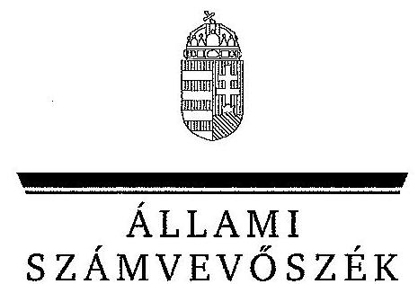
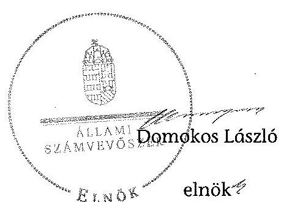
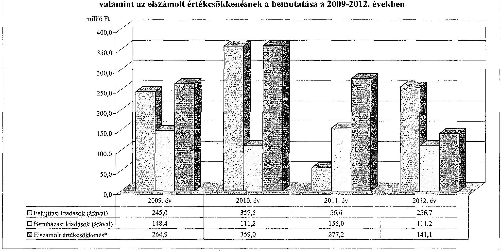
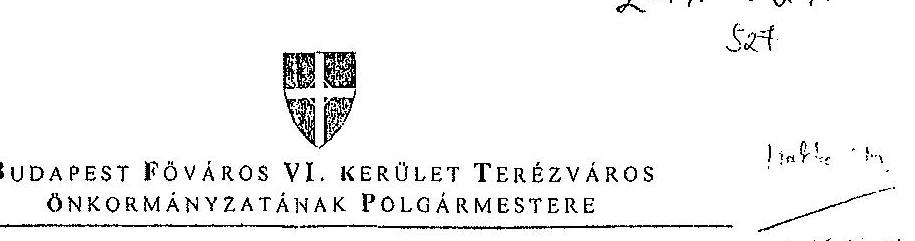
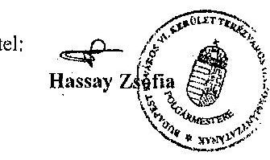

ÁLLAMI
SZÁMVEVŐSZÉK

# JELENTÉS 

az önkormányzatok vagyongazdálkodása
szabályszerűségének ellenőrzéséről
Budapest Főváros VI. kerület Terézváros

---

# Állami Számvevőszék 

Iktatószám: V-0229-081/2014.
Témaszám: 1263
Vizsgálat-azonosító szám: V065109

## Az ellenőrzést felügyelte:

## Makkai Mária

felügyeleti vezető
Az ellenőrzést vezette és az ellenőrzés végrehajtásáért felelős:
Schósz Attila Ferencné
ellenőrzésvezető
A számvevőszéki jelentés összeállításában közreműködtek:
Domonkosné Kurilla Edit
számvevő tanácsos
Groholy Andrásné Hangyál Márta
számvevő tanácsos
Az ellenőrzést végezték:
Domonkosné Kurilla Edit
Orosz Diána
számvevő tanácsos
Uram Ferenc Gyula
számvevő tanácsos

---

# TARTALOMJEGYZÉK 

BEVEZETÉS ..... 3
I. ÖSSZEGZŐ MEGÁLLAPÍTÁSOK, KÖVETKEZTETÉSEK, JAVASLATOK ..... 6
II. RÉSZLETES MEGÁLLAPÍTÁSOK ..... 11

1. A vagyongazdálkodási tevékenység szabályozása ..... 11
1.1. A vagyongazdálkodási tevékenység szabályozásának megfelelősége ..... 11
1.2. A vagyon használatba és üzemeltetésbe adásának szabályszerűsége ..... 13
1.3. A vagyon üzemeltetésére, használatára kötött szerződések felülvizsgálata ..... 15
2. A vagyongazdálkodási tevékenység szabályszerűsége ..... 16
2.1. A vagyon nyilvántartása, a vagyon összetételének változása, a döntések és a gazdasági események szabályszerűsége ..... 16
2.1.1. A vagyon nyilvántartásának megfelelősége ..... 16
2.1.2. A vagyon értékének és összetételének változása ..... 18
2.1.3. A vagyon változását eredményező döntések és gazdasági események szabályszerűsége ..... 20
2.2. A térítés nélküli vagyon átadás és átvétel szabályszerűsége ..... 21
2.3. A beruházási és felújítási döntések és végrehajtásuk szabályszerűsége ..... 21
2.4. A tartós részesedésekkel történő gazdálkodás ..... 23
2.5. A vagyon értékesítésének, hasznosításának, a követelés elengedésének szabályszerűsége ..... 24
2.6. Az önkormányzati gazdasági társaságok tulajdonosi felügyelete ..... 26
3. Az integritás érvényesülése a vagyongazdálkodásban ..... 27
4. A belső és a külső ellenőrzések hasznosulása ..... 28
4.1. A belső ellenőrzés javaslatainak hasznosulása ..... 28
4.2. A külső ellenőrzések javaslatainak hasznosulása ..... 29

---

# MELLÉKLETEK 

1. számú Budapest Főváros VI. kerület Terézváros Önkormányzata vagyonának alakulása 2009. január 1. és 2012. december 31. között
2. számú Budapest Főváros VI. kerület Terézváros Önkormányzata felújítási és beruházási kiadásainak, valamint az elszámolt értékcsökkenésnek a bemutatása a 2009-2012. években
3. számú Budapest Főváros VI. kerület Terézváros Önkormányzata polgármesterének észrevétele

## FÜGGELÉKEK

1. számú Rövidítések jegyzéke
2. számú Értelmező szótár

---

# JELENTÉS 

## az önkormányzatok vagyongazdálkodása szabályszerűségének ellenőrzéséről Budapest Főváros VI. kerület Terézváros

## BEVEZETÉS

Az ÁSZ kiemelten fontosnak tartja az ÁSZ tv. 5. § (4) bekezdésének a) pontja és (5) bekezdése, valamint az Áht. ${ }_{2} 61 . \S$ (2) bekezdése alapján az önkormányzati vagyon kezelésének, a vagyonnal való gazdálkodási szabályok betartásának az ellenőrzését. Az ellenőrzés feladata a vagyongazdálkodással kapcsolatban a közpénzek átláthatósága, nyilvánossága érdekében a jogszabályokban, belső szabályzatokban megfogalmazott előírások érvényesülésének áttekintése. Az ÁSZ nem csak az ellenőrzött szervezet vagyongazdálkodásának a hibáira mutat rá, számon kérve azok kijavítását, hanem megállapításaival, javaslataival segíti a közpénzzel, a közvagyonnal való felelős gazdálkodást.

Az önkormányzati vagyon alapvető funkciója, hogy a közérdeket és egyúttal az önkormányzati célok megvalósítását szolgálja. A feladatellátás terén elsősorban a kötelezően ellátandó feladatok végrehajtását hivatott szolgálni, amely mellett az önként vállalt feladatok ellátása is megvalósulhat.

Az ÁSZ stratégiájában hangsúlyos szerepet szán annak, hogy szilárd szakmai alapon álló, értékteremtő ellenőrzéseivel előmozdítsa a közpénzügyek átláthatóságát, rendezettségét. Az ÁSZ a vagyongazdálkodás ellenőrzésén keresztül közreműködik az integritás alapú közigazgatási kultúra kialakításában.

Az ellenőrzés célja annak megállapítása volt, hogy az önkormányzat vagyongazdálkodási tevékenységének szabályozottsága és tevékenysége a jogszabályi előírásokkal összhangban volt-e, átlátható, a jogszabályi előírásoknak megfelelő volt-e a vagyon nyilvántartása, a külső és belső ellenőrzések megállapításai hozzájárultak-e az önkormányzati vagyongazdálkodási tevékenység szabályszerűségéhez.

Ennek keretében értékeltük, hogy az Önkormányzat:

- szabályszerűen alakította-e ki a vagyongazdálkodási tevékenységének kereteit;
- biztosította-e a vagyongazdálkodás szabályszerűségét, megalapozottan hozta-e, és jogszerűen, szabályszerűen hajtotta-e végre a vagyonváltozást eredményező meghatározó jelentőségű döntéseket, valamint gondoskodott-e az általa alapított vagy tulajdonosi részvételével működő gazdasági társaságokkal kapcsolatos tulajdonosi joggyakorlásról;

---

- gondoskodott-e vagyongazdálkodási tevékenysége során az integritás (feddhetetlenség) szempontjainak érvényesüléséről;
- belső ellenőrzése elősegítette-e a vagyongazdálkodás szabályszerű működését, valamint hasznosította-e a külső és belső ellenőrzések megállapításait, javaslatait.

Az ellenőrzés típusa: szabályszerűségi ellenőrzés.
Ellenőrzött időszak: az ellenőrzés 2009. január 1-je és 2012. december 31. közötti időszakra terjedt ki, kitekintéssel a helyszíni ellenőrzés befejezéséig (2013. december 9-éig) tartó időszak releváns folyamataira. Az egyes közbeszerzési eljárások lefolytatásának ellenőrzése 2012. január 1-jétől a helyszíni ellenőrzés kezdetét megelőző negyedév utolsó napjáig (2013. szeptember 30-ig), az Nvtv. egyes rendelkezései végrehajtásának ellenőrzése 2012-től, a helyszíni ellenőrzés befejezéséig tartott.

Ellenőrzött szervezet: Budapest Főváros VI. kerület Terézváros Önkormányzata

Az ellenőrzés szakmai módszertana az ÁSZ hivatalos honlapján közzétett szakmai szabályokon alapult, amely a Legfőbb Ellenőrző Intézmények Nemzetközi Szervezete (INTOSAI) által kiadott nemzetközi standardok (ISSAI) figyelembevételével készült.

Az ellenőrzést az ÁSZ hatályos szervezeti szabályai és az ellenőrzési programban foglalt értékelési szempontok szerint folytattuk le. Megállapításainkat a helyszíni ellenőrzés tapasztalataira, az ellenőrzött szervezettől bekért dokumentumokra, a kitöltött tanúsítványok elemzésére, az adott időszakban hatályos jogszabályok és belső szabályzatok előírásaira alapoztuk. A részesedések értékelését tételesen ellenőriztük. Irányított mintavétellel választottuk ki a legnagyobb értékű térítésmentes átadás-átvételeket, a beruházásokat, felújításokat, a közbeszerzési eljárásokat, a vagyon értékesítéseket, hasznosításokat és a követelés elengedéseket, továbbá a vagyonkezelési, az üzemeltetési és a koncessziós szerződéseket. Ezen túl a belső kontrollok megfelelő működését a vagyonváltozásokkal kapcsolatos gazdasági események közül a Polgármesteri hivatal 2009-2012. évi számviteli nyilvántartásaiból választott véletlen minta alapján, megállásos (többlépcsős) megfelelőségi teszttel ellenőriztük.

Budapest Főváros VI. kerület Terézváros lakosainak száma 2012. január 1-jén 36913 fő volt. A 2010. évi önkormányzati választásokig a 23 tagú Képviselőtestület munkáját öt állandó bizottság segítette. Az önkormányzati választások után a Képviselő-testület létszáma 15 főre csökkent, és négy állandó bizottság működött. A polgármester a 2010. évi önkormányzati választások óta tölti be tisztségét, a jelenlegi jegyző 2011. július 1-jétől látja el feladatait.

Az Önkormányzat a 2012. év végén a Polgármesteri hivatalon felül három önállóan működő és gazdálkodó, valamint 16 önállóan működő költségvetési szervvel látta el a feladatait. A Polgármesteri hivatal 2012. december 31-én 13 szervezeti egységre tagolódott. A gazdasági szervezet feladatait egy szervezeti egység látta el.

---

Az Önkormányzatnak 2012. év végén négy többségi tulajdoni hányadú gazdasági társasága volt, amelyből három gazdasági társaság ${ }^{1}$ az Önkormányzat kizárólagos tulajdona, egy gazdasági társaságban ${ }^{2}$ a részesedése 99,7 % volt. A 2012. év végén az Önkormányzat közfeladatai közül a lakásgazdálkodás, vagyonüzemeltetés, piacok, vásárok, parkoló üzemeltetés ellátásában a Vagyonkezelő Nonprofit Zrt. vett részt. Az egyéb közművelődési, kulturális és sportfeladatok ellátásával, illetve a közösségi színtér üzemeltetésével a Kulturális Nonprofit Zrt.-t, a park- és közterület-fenntartással, illetve a köztisztasági feladatokkal a Foglalkoztatást Elősegítő NKft.-t bízta meg az Önkormányzat. A TERIBER Kft.-t a Vagyonkezelő Nonprofit Zrt. kapcsolt vállalkozásként alapította, melyben az Önkormányzat a 2012. évben többségi tulajdont vásárolt.

Az Önkormányzat a 2009-2012. évek között vállalkozási tevékenységet nem végzett, vagyonkezelési, haszonélvezeti és koncessziós jogot alapító szerződést nem kötött. Az ellenőrzött időszakban PPP konstrukcióban megvalósított fejlesztései nem voltak. Az ÁSZ számvevőszéki jelentéssel lezárt ellenőrzést az Önkormányzatnál a 2009-2012. évek között nem végzett.

Az Önkormányzat könyvviteli mérleg szerinti vagyona a 2009. évi 26547,4 millió Ft-os nyitó értékről 2012. év végére 23978,4 millió Ft-ra, 9,7%-kal csökkent. A befektetett eszközökön belül elsősorban az üzemeltetésre átadott eszközök és a befektetett pénzügyi eszközök csökkentek. A forgóeszközökön belül a pénzeszközök értékének csökkenése volt meghatározó. Az Önkormányzat összes kötelezettségének állományi értéke 2012. december 31-én 2237,2 millió Ft volt, amelyből a rövid és hosszú lejáratú kötelezettségek értéke 2050,7 millió Ft-ot tett ki. A pénzintézeti kötelezettség állományi értéke 1351,1 millió Ft volt, mely az 540,5 millió Ft összegű adósság átvállalás eredményeként 810,6 millió Ft-ra csökkent. Az Önkormányzat 2012. évi költségvetési beszámolója szerint (az előző évi 288,9 millió Ft pénzmaradvány igénybevételével együtt) 11454,3 millió Ft költségvetési bevételt ért el és 10313,6 millió Ft költségvetési kiadást teljesített. Felhalmozási célú kiadásra a 2012. évben 554,2 millió Ft-ot, ezen belül a felújítási és beruházási kiadásokra 367,9 millió Ft-ot fordítottak.

Az Önkormányzat vagyonának főbb adatait, a felújítási és beruházási kiadásokat, valamint az elszámolt értékcsökkenést az 1-2. számú mellékletek mutatják be. Az alkalmazott rövidítéseket és az egyes fogalmak magyarázatát az 1-2. számú függelék tartalmazza.

Az ÁSZ a 2011. évi LXVI. törvény 29. §-a szerint a jelentéstervezetet megküldte Budapest Főváros VI. kerület Terézváros Önkormányzata polgármesterének egyeztetésre. A polgármester nemleges észrevételét a 3. számú melléklet tartalmazza.

[^0]
[^0]:    ${ }^{1}$ Vagyonkezelő Nonprofit Zrt., Kulturális Nonprofit Zrt., Foglalkoztatást Elősegítő NKft.
    ${ }^{2}$ TERIBER Kft.

---

# 1. ÖSSZEGZŐ MEGÁLLAPÍTÁSOK, KÖVETKEZTETÉSEK, JAVASLATOK 

Az Önkormányzat a 2009-2012. évek között szabályszerűen alakította ki vagyongazdálkodási tevékenységének kereteit. A Képviselő-testület a vagyongazdálkodási feladatokat - a Htv. szerint - a teljes vagyoni körre a vagyongazdálkodási rendelet ${ }_{1,2}$-ben szabályozta. A Képviselő-testület élt az Ötv.-ben biztosított lehetőséggel és a polgármester ${ }_{1,2}$-nek, valamint bizottságainak értékhatárhoz kötve - adott át vagyongazdálkodási hatáskört. Az ingyenes átruházásról szóló döntés joga - értékhatártól függetlenül - a Képviselő-testületet illette meg. Az Áht. ${ }_{1}$ előírása alapján a lakások és egyéb helyiségek értékesítési rendelete ${ }_{1}$-ben 20,0 millió Ft-ban, majd a vagyongazdálkodási rendelet ${ }_{2}$-ben 25,0 millió Ft-ban rögzítették azt az értékhatárt, amely felett csak nyilvános pályázat útján lehet a vagyont értékesíteni, a használat jogát átadni. Az Ötv. és Mötv. előírásának megfelelően meghatározták a vagyonkezelői jog részletes előírásait. Az Önkormányzat az Nvtv.-ben rögzített - 2012. március 1-jei - határidőn túl, 2013. augusztus 1-jén határozta meg a forgalomképtelennek minősülő vagyonából azon vagyonelemeket, amelyeket nemzetgazdasági szempontból kiemelt jelentőségű nemzeti vagyonként forgalomképtelen törzsvagyonnak minősített.

A jegyző ${ }_{1,3}$ - a Htv. előírása szerint - a Polgármesteri hivatal számviteli rendjét kialakította, a vagyongazdálkodás szempontjából megfelelő keretet biztosított az egységes számviteli elvek szerinti, önkormányzati szintű beszámoló elkészítéséhez. Az Önkormányzatnál a 2009-2012. évek között a vagyon leltározásának módját - a 2010. évtől az üzemeltetésre átadott eszközök kivételével - az Áhsz. ${ }_{1}$ előírásainak megfelelően szabályozták. Az üzemeltetésre átadott eszközök leltározási módjának szabályozása a 2010. évtől nem felelt meg az Áhsz. ${ }_{1}$ előírásának, mivel nem írták elő, hogy ezen eszközöket az üzemeltetést végző szerv által elkészített, hiteles leltárral kell alátámasztani.

Az operatív gazdálkodással kapcsolatos eljárásrendet, jogkörgyakorlást és az összeférhetetlenségi követelményeket az Ámr. ${ }_{1,2}$-ben és az Ávr.-ben előírtaknak megfelelően a kötelezettségvállalási szabályzat ${ }_{1-2}$-ban és a teljesítésigazolási szabályzat ${ }_{1,2}$-ban rögzítették. A Polgármesteri hivatalban a 2009-2012. években a gazdálkodási jogkörök gyakorlása az ellenőrzött kiadások esetében a jogszabályoknak, a kötelezettségvállalási szabályzat ${ }_{1,2}$-ban és a teljesítésigazolási szabályzat ${ }_{1,2}$-ben előírtaknak megfelelő volt. A gazdálkodási és ellenőrzési jogkörök gyakorlásával felhatalmazott személyek az előírt ellenőrzési feladataikat 2009. január 1. és 2010. május 14. között (383,0 millió Ft összegű) lakásértékesítési bevétel és bérleti díjbevétel beszedését megelőzően - az Ámr. ${ }_{1,2}$-ben, illetve a teljesítésigazolási szabályzat ${ }_{1}$-ben foglaltak ellenére - nem végezték el.

Az ellenőrzött időszakban az Önkormányzat koncessziós szerződést, az Ötv. és Mötv. szerinti vagyonkezelési szerződést nem kötött. A vagyonkezelési, üzemeltetési, működtetési
 feladatokat a Polgármesteri hivatal, az Önkormányzat költségvetési szervei, a feladatellátásra létrehozott önkormányzati gazdasági társaságok, valamint a Parkolási társulás, illetve szerződéses jogviszony útján biztosította az Önkormányzat. A megbízási és üzemeltetési szerződések a jogszabályok és a vagyongazdálkodási rendelet ${ }_{1,2}$ előírásainak megfeleltek, a vagyon használatba, illetve üzemeltetésre történő átadása szabályszerűen történt. A szerződésekben szabályozták az üzemeltetést, közszolgáltatást végzők beszámolási kötelezettségét és az Önkormányzat ellenőrzési jogosultságát. Az Önkormányzat a tulajdonosi részesedéseit az átláthatóság szempontjából (2012. december 31-éig) felülvizsgálta, csak olyan gazdálkodó szervezetben rendelkeztek társasági részesedéssel, amely társaság az Nvtv. alapján átlátható szervezetnek minősült.

Az Önkormányzatnál az ellenőrzött években a vagyongazdálkodás működésének szabályszerűségét hiányosan biztosították. A jegyző ${ }_{1,2}$ - a 147/1992. (XI. 6.) Korm. rendeletben előírt - az ingatlanvagyon-kataszter, a földhivatali ingatlan nyilvántartás, valamint a számviteli nyilvántartás adatai közötti egyezőséget a 2009-2010. években az ellenőrzött időszak előtt értékesített ingatlanokhoz tartozó földterületek, a 2009-2012. években öt térítésmentesen átadott (összesen 0,3 millió Ft értékű) ingatlan esetében nem biztosította. A 2009-2012. évi vagyonkimutatások az értékesített ingatlanokhoz tartozó földterületeket és a térítésmentesen átadott ingatlanokat tartalmazták, ezért nem feleltek meg az Áhsz. ${ }_{1}$-ben, a vagyongazdálkodási rendelet ${ }_{1,2}$-ben és a költségvetés, zárszámadás és vagyonkimutatás tartalmáról szóló rendeletben foglalt előírásoknak. A térítésmentesen átadott ingatlanokat a vagyonkataszteri és számviteli nyilvántartásból a 2013. évben kivezették. Az Önkormányzat a 2009-2012. években - az üzemeltetésre átadott eszközök kivételével - az Áhsz. ${ }_{1}$ ben előírt leltározási kötelezettségének a leltározási szabályzat ${ }_{1,2}$-ben foglaltaknak megfelelően eleget tett. Az Önkormányzat az üzemeltetésre átadott tárgyi eszközök vagyonértékének valódiságát - az Áhsz. ${ }_{1}$-ben foglalt előírás ellenére nem támasztotta alá a 2009-2012. években mennyiségi felvétellel készült leltárral, továbbá a 2010-2012. években az üzemeltést végző szerv által elkészített és hitelesített leltárral.

Az Önkormányzat minden évben megalapozottan, az Integrált városfejlesztési stratégiában és a gazdasági programban ${ }_{1,3}$-ben foglalt fejlesztési célkitűzésekkel és az önkormányzati feladatellátással összhangban döntött a beruházásokról és felújításokról. Az ellenőrzött beruházások és felújítások előkészítése, döntéshozatala és megvalósítása során szabályszerűen jártak el. A gazdasági eseményekhez kapcsolódó vagyongazdálkodási döntések során a döntéshozók a jogszabályban és a belső szabályzatokban foglaltaknak megfelelően, az arra felhatalmazottak (Képviselő-testület, polgármester ${ }_{1,2}$, Gazdasági Bizottság, Városgazdálkodási Bizottság) voltak. Az Önkormányzat a 2012. évben és 2013. év I-III. negyedévében minden közbeszerzési értékhatárt elérő, vagy azt meghaladó beszerzés esetében lefolytatta a közbeszerzési eljárást. A Képviselő-testület az önkormányzati tulajdonban lévő lakások értékesítéséről értékbecsléseket tartalmazó előterjesztések alapján döntött. Az ingatlanok hasznosítására pályázati felhívásokat tettek közzé, a bérbeadási rendeletnek megfelelően a Városgazdálkodási Bizottság döntött az ingatlanok bérbeadásáról. A jegyző ${ }_{1,2}$ az ellenőrzött időszak során biztosította a közpénzek felhasználásának átláthatóságát, továbbá az éves költségvetési, zárszámadási rendeletek Eisztv. mellékletében előírtak szerinti adatait az Önkormányzat honlapján közzétették.

Az Önkormányzat az elengedett követelések esetében az Áht. ${ }_{1,2}$ és a vagyongazdálkodási rendelet ${ }_{1,2}$ előírásainak megfelelően hozta meg döntéseit. A behajthatatlan követelésekről az Áhsz. ${ }_{1}$ és a vagyongazdálkodási rendelet ${ }_{1,2}$-ben foglaltaknak megfelelően - jogerős felszámolási végzés és az abban foglalt adósi vagyon hiányában, dokumentumokkal alátámasztottan - rendelkeztek.

Az ellenőrzött időszakban az Önkormányzat a jegyzett tőke módosítása nélkül megváltoztatta a Vagyonkezelő Nonprofit Zrt. tőketartalékába helyezett vagyoni értékű jogot megtestesítő ingatlanok körét, amit nem alapoztak meg a társaság alapító okiratának módosításával. A Számv. tv. előírásával ellentétes gyakorlatot az Önkormányzat - a vagyoni értékű jogok tőketartalékba helyezésének időpontjától - az 1995. évtől folytatta.

Az Önkormányzat az ellenőrzött időszakban gazdasági társaságot nem alapított. A 2011. évben két gazdasági társaságát végelszámolással megszűntette. A 2012. évben az Önkormányzat a Vagyonkezelő Nonprofit Zrt. pénzügyi helyzetének konszolidálása érdekében üzletrészt vásárolt a Zrt. részvételével alapított projekt társaságban. Az Önkormányzatnál az értékelési szabályzat ${ }_{1-3}$-ban rögzítetteknek megfelelően minden évben vizsgálták a tulajdonosi részesedések alakulását, az abban bekövetkezett változásokat. Az értékvesztés elszámolása során betartották az Áhsz. ${ }_{1}$-ben és az értékelési szabályzat ${ }_{2}$-ben előírtakat. Az Önkormányzat a gazdasági társaságok üzleti terveinek, éves beszámolóinak elfogadásával, valamint az igazgatósági tagok beszámoltatásával biztosította tulajdonosi jogainak gyakorlását.

Az Önkormányzat a vagyongazdálkodási tevékenysége során nem gondoskodott maradéktalanul az integritás (feddhetetlenség) szempontjainak, az átláthatóság és az elszámoltathatóság követelményeinek érvényesüléséről. Így többek között nem aktualizálták a leltározási szabályzat ${ }_{1,2}$-t az üzemeltetésre átadott tárgyi eszközök leltározási módjának meghatározásával. A jegyző ${ }_{2}$ a Bkr. előírása ellenére a kontrollkörnyezet kialakítása során az etikai elvárásokat, a Képviselő-testület a Kttv. szerinti hivatásetikai alapelvek részletes tartalmát és az etikai eljárás szabályait nem állapította meg. A „négy szem elvét" a 2009-2010. években a gazdálkodási jogkörök gyakorlásakor a bevételek beszedését megelőzően nem alkalmazták.

Az ellenőrzött időszakban a Polgármesteri hivatalban, az intézményeknél és a gazdasági társaságoknál összesen 34 belső ellenőrzési jelentés készült. Ebből 26 a vagyongazdálkodással kapcsolatban is tartalmazott javaslatokat. A hiányosságok megszüntetésére intézkedési terv - a Ber., illetve a Bkr. előírásai ellenére - nem készült, azonban az ellenőrzött szervezetek intézkedései hatására a javaslatok teljesültek. A belső ellenőrzés a vagyongazdálkodáshoz kapcsolódó javaslataival segítette a vagyongazdálkodás szabályozási és működési hiányosságainak megszüntetését.

Az Önkormányzat 2009-2012. évi költségvetési beszámolóit a könyvvizsgáló minden évben megbízhatónak és hitelesnek minősítette, az Önkormányzat vagyongazdálkodására vonatkozóan javaslatot nem fogalmazott meg.

Az Állami Számvevőszékről szóló 2011. évi LXVI. törvény 33. § (1) bekezdésében foglaltak értelmében a jelentésben foglalt megállapításokhoz kapcsolódó

intézkedési tervet köteles az ellenőrzött szervezet vezetője összeállítani, és azt a jelentés kézhezvételétől számított 30 napon belül az ÁSZ részére megküldeni. Amennyiben az intézkedési tervet határidőben nem küldi meg a szervezet, vagy az nem elfogadható, az ÁSZ elnöke a hivatkozott törvény 33. § (3) bekezdés a)-b) pontjaiban foglaltakat érvényesítheti.

Az ellenőrzés intézkedést igénylő megállapításai és javaslatai:

# a jegyzőnek

1. A vagyonkimutatás az Áhsz. 44/A. § (1)-(3) bekezdése, a vagyongazdálkodási rendelet ${ }_{1,2}$ előírása ellenére tartalmazta a 2009-2012. években öt térítésmentesen átadott helyiség és a 2009-2010. években az ellenőrzött időszak előtt értékesített ingatlanokhoz tartozó földterületeket.

Javaslat:
Intézkedjen az Önkormányzat vagyonkimutatásának az Áhsz. 30. § (1)-(3) bekezdéseiben előírtak szerinti elkészítéséről és annak Képviselő-testület részére történő bemutatásáról.
2. Az Önkormányzat a könyvviteli mérlegben kimutatott eszközök közül az üzemeltetésre átadott tárgyi eszközök vagyonérték valódiságát nem támasztotta alá a 2009-2012. években - az Áhsz. 37. § (2) bekezdésében foglalt előírás ellenére - mennyiségi felvétellel készült leltárral, továbbá a 2010-2012. években - a 37. § (4) bekezdésében foglalt előírás ellenére - az üzemeltetést végző szerv által elkészített és hitelesített leltárral.

Javaslat:
Intézkedjen arról, hogy az üzemeltetésre átadott tárgyi eszközökről az Áhsz. 22. § (1)-(3) bekezdései, valamint a Számv. tv. 69. § előírásának megfelelően - a könyvviteli mérleg tételeinek alátámasztásához - készüljön leltár.
3. A jegyző ${ }_{2}$ a 2012. évben a Bkr. 6. § (1) bekezdés c) pontjának előírása ellenére az etikai elvárásokat nem határozta meg, a Kttv. 231. § (1) bekezdése ellenére a Képviselő-testület nem állapította meg a Kttv. 83. §-ában előírt, a köztisztviselőkre vonatkozó hivatásetikai alapelvek részletes tartalmát, valamint az etikai eljárás szabályait.

Javaslat:
Készítse elő a Bkr. 6. § (1) bekezdés c) pont előírásának megfelelő etikai elvárásokat, a Kttv. 83. §-a szerinti hivatásetikai alapelveket, az etikai eljárás szabályait és terjessze a Képviselő-testület elé jóváhagyásra.

4. A belső ellenőrzés által feltárt hiányosságok megszüntetése érdekében - a Ber. 29. § (1) bekezdésében foglalt előírás ellenére - intézkedési terv nem készült.

Javaslat:
Gondoskodjon arról, hogy a belső ellenőrzés által feltárt hiányosságok megszüntetésére, az ellenőrzött szervek vezetői a Bkr. 45. § (2)-(3) bekezdéseiben foglaltaknak megfelelően készítsenek intézkedési tervet.

# II. RÉSZLETES MEGÁLLAPÍTÁSOK

## 1. A VAGYONGAZDÁLKODÁSI TEVÉKENYSÉG SZABÁLYOZÁSA

### 1.1. A vagyongazdálkodási tevékenység szabályozásának megfelelősége

A Képviselő-testület a vagyongazdálkodási feladatokat - a Htv. 138. § (1) bekezdés j) pontja szerint - a teljes vagyoni körre rendelettel szabályozta. Az Önkormányzatnál a vagyongazdálkodási rendelet ${ }_{1,2}$-ben határozták meg az önkormányzati feladatellátást biztosító törzsvagyont, ezen belül a forgalomképtelen és a korlátozottan forgalomképes vagyonelemek körét. Az Önkormányzat az Nvtv. 18. § (1) bekezdésében meghatározott - 2012. március 1-jei - határidőn túl, 2013. augusztus 1-jén határozta meg a forgalomképtelennek minősülő vagyonából azon vagyonelemeket, amelyeket nemzetgazdasági szempontból kiemelt jelentőségű nemzeti vagyonként forgalomképtelen törzsvagyonnak minősített. Az ÁSZ helyszíni ellenőrzésének befejezéséig (2013. december 9-éig) az Önkormányzat nem készítette el közép- és hosszú távú vagyongazdálkodási tervét, melyre vonatkozóan az Nvtv. határidőt nem határozott meg.

A Képviselő-testület élt az Ötv. 9. § (3) bekezdésében biztosított jogával, a vagyongazdálkodási feladatokhoz kapcsolódóan az önkormányzati SZMSZ ${ }_{1,2}$-ben, és ezzel összhangban a vagyongazdálkodási rendelet ${ }_{1,2}$-ben döntöttek a Képviselő-testületet megillető hatáskörök értékhatárhoz kötött átruházásáról a polgármester ${ }_{1,2}$-re és bizottságokra ${ }^{3}$. Az átruházott hatáskör gyakorlói számára - negyedévente a soron következő ülésen történő - beszámolási kötelezettséget írtak elő.

A vagyongazdálkodási rendelet ${ }_{1}$ szerint a forgalomképes ingatlan elidegenítéséről szóló döntést 6,0 millió Ft-tól - lakás esetén 2,0 millió Ft-tól - 30,0 millió Ft értékhatárig a Tulajdonosi Bizottság, 2011 decemberét követően 5,0 millió Ft-tól 25,0 millió Ft értékhatárig a Városgazdálkodási Bizottság hozhatta meg. A polgármester ${ }_{1,2}$ a 6,0 millió Ft - lakás esetén 2,0 millió Ft - összeget el nem érő, 2011. decemberét követően a polgármester ${ }_{2}$ az 5,0 millió Ft összeget el nem érő forgalomképes vagyon elidegenítéséről, hasznosításáról dönthetett. A vagyongazdálkodási rendelet ${ }_{2}$ szerint a forgalomképtelen vagyon egy évet meghaladó idejű, a korlátozottan forgalomképes törzsvagyon hasznosításáról 25,0 millió Ft-ig a Városgazdálkodási Bizottság döntött. A vagyongazdálkodási rendelet ${ }_{2}$ értelmében az Önkormányzat javára fennálló 0,5 millió Ft-ot meg nem haladó követelés mérsékléséről, illetve törléséről a polgármester ${ }_{2}$ 3,0 millió Ft-ot el nem érő értékig a Városgazdálkodási Bizottság döntött.

[^0]
[^0]:    ${ }^{3}$ A 2009-2010. évek között a Gazdasági Bizottságnak, Tulajdonosi Bizottságnak, 2011-től a Városgazdálkodási Bizottságnak.

A vagyongazdálkodási rendelet ${ }_{1,2}$-ben meghatározták a vagyoni kört, amelyre vagyonkezelői jog létesíthető, továbbá rendelkeztek a forgalomképesség szerinti besorolás megváltoztatásának módjáról. Az Áht., 108. § (2) bekezdésében ${ }^{4}$ foglaltak szerint rendelkeztek a vagyon hasznosításának, elidegenítésének, tulajdonjogának, valamint a vagyonhoz kapcsolódó, önállóan forgalomképes vagyoni értékű jogok ingyenes átruházásának eseteiről és módjáról a vagyongazdálkodási rendelet ${ }_{1,2}$ mellett a bérbeadási rendeletben, illetve a lakások és egyéb helyiségek értékesítési rendelete ${ }_{1,2}$-ben. Az ingyenes átruházásról szóló döntés joga értékhatártól függetlenül a Képviselő-testületet illette meg. Az Áht., 108. § (1) bekezdésének megfelelően az Önkormányzat a lakások és egyéb helyiségek értékesítési rendelete ${ }_{1}$-ben 20,0 millió Ft összegben, míg a vagyongazdálkodási rendelet ${ }_{2}$-ben a jogszabályi előírással összhangban, azzal azonos összegben 25,0 millió Ft-ban
 rögzítette azt az értékhatárt, amely felett csak nyilvános pályázat útján lehet a vagyont értékesíteni, a használat jogát átadni. A vagyongazdálkodási rendelet ${ }_{1,2}$-ben a hasznosításra szánt vagyon piaci értékének megállapítása céljából értékbecslés készítési kötelezettséget írtak elő.

Az Önkormányzat a vagyongazdálkodási rendelet ${ }_{1,2}$-ben, valamint a költségvetés, zárszámadás és vagyonkimutatás tartalmáról szóló rendeletében határozta meg a vagyonkimutatás tartalmára vonatkozó szabályokat, élve az Áhsz. ${ }_{1}$ 44/A. § (2) bekezdésében foglalt lehetőséggel, a vagyonkimutatásban a követelések, valamint a saját tőke, a tartalékok és a kötelezettségek további tételes alábontását írta elő.

A jegyző ${ }_{1,2}$ - a Htv. 140. § (1) bekezdés c) pontjában foglalt előírás szerint kialakította a Polgármesteri hivatal számviteli rendjét. A Polgármesteri hivatal rendelkezett az Áhsz. ${ }_{1}$-nek és a helyi sajátosságoknak megfelelő számviteli politika ${ }_{1-3}$-mal és annak keretében elkészített pénzkezelési, selejtezési és értékelési szabályzattal, melyek alkalmazását az önkormányzati költségvetési szervekre is kiterjesztették. Meghatározták a vagyonkezelésbe adott eszközök, a befektetett pénzügyi eszközök, a követelések értékelési szabályait, valamint a tárgyi eszközök üzembe helyezésének dokumentálási rendjét. Az Önkormányzat nem élt az immateriális javak, tárgyi eszközök, továbbá a befektetett pénzügyi eszközök piaci értéken történő értékelésének lehetőségével. A jegyző ${ }_{1,2}$ a számviteli rend kialakításával megfelelő keretet biztosított a vagyongazdálkodás szempontjából az egységes számviteli elvek szerinti, önkormányzati szintű beszámoló elkészítéséhez.

Az Önkormányzatnál a vagyon leltározásának módját - a 2010. évtől az üzemeltetésre átadott eszközök kivételével - a 2009-2012. évek között az Áhsz. ${ }_{1}$ előírásainak megfelelően szabályozták. A Képviselő-testület nem élt az Áhsz. ${ }_{1}$ 37. § (7) bekezdésében biztosított lehetőséggel és nem alkotott rendeletet (határozatot) a kétévenkénti mennyiségi leltározásról. A leltározási szabályzat ${ }_{1,2}$ az Áhsz. 1 37. § (1) bekezdésével összhangban évenkénti, december 31-i forduló nappal történő leltározást írt elő. A 2010. évtől az üzemeltetésre átadott eszközök leltározási módjának szabályozása nem felelt meg az

[^0]
[^0]:    ${ }^{4}$ 2012. június 30 -tól az Nvtv. 13. § (3) bekezdése szabályozza.

---

Áhsz. 1 37. § (4) bekezdésében ${ }^{5}$ foglaltaknak, mivel nem írták elő, hogy az üzemeltetésre átadott eszközöket az üzemeltetést végző szerv által elkészített, hiteles leltárral kell alátámasztani.

Az Önkormányzat a hivatali SZMSZ-ben az Ávr. 13. § (1) bekezdés e) pontjában foglalt előírás ellenére - az Ávr. 13. § (5) bekezdés szerinti - gazdasági szervezete ügyrendjének (2012. január 15-i) hatályba léptetésével egyidejúleg nem nevezte meg a Költségvetési és Intézménygazdálkodási Főosztályt, mint az Önkormányzat gazdasági szervezetét, mely hiányosságot 2013. október 31-én pótoltak. Az Önkormányzat gazdasági szervezetének vezetője (írásbeli megbízás alapján) a Költségvetési és Intézménygazdálkodási Főosztályvezető volt. Az operatív gazdálkodással kapcsolatos eljárásrendet, jogkörgyakorlást, összeférhetetlenségi követelményeket - az Ámr. ${ }_{1,2}$-ben és az Ávr.-ben előírtaknak megfelelően - a kötelezettségvállalási szabályzat ${ }_{1,3}$-ban és a teljesítésigazolási szabályzat ${ }_{1,2}$-ben határozták meg.

Az Önkormányzat - az Ötv., Mötv. előírásaival összhangban - a 2009-2012. évekre vonatkozó gazdasági program ${ }_{1,2}$-ben, az önkormányzati SZMSZ ${ }_{1,2}$-ben és a 2009-2012. évi költségvetési rendeletekben, valamint az alapító okiratokban rögzítette az Önkormányzat kötelező és önként vállalt feladatainak körét, azok ellátásának mértékét és módját.

Az Önkormányzat kötelező feladatait döntő részben költségvetési intézményrendszerén és kizárólagos tulajdonú gazdasági társaságain keresztül látta el. A kötelező és önként vállalt feladatok közül a hajléktalanok nappali ellátásával, a gyermekek átmeneti gondozásával, a háziorvosi ellátással, a fogorvosi ellátással, az egyéb sportfeladatokkal, valamint a lapkiadással és terjesztéssel kapcsolatos feladatok ellátását vállalkozásokkal és egyéb szervezetekkel kötött szerződések útján biztosították. Az Önkormányzat az önként vállalt feladataiból a gimnáziumi oktatást, a jelzőrendszeres házi segítségnyújtást, a szociális szakápolást, uszodaüzemeltetési feladatokat, az egyéb egészségügyi gondozói és a foglalkozásegészségügyi ellátást saját költségvetési intézményei keretében látta el.

# 1.2. A vagyon használatba és üzemeltetésbe adásának szabályszerűsége 

Az Önkormányzat - az ellenőrzött időszakban - az Ötv. 80/B. §-ának ${ }^{6}$ megfelelően a vagyongazdálkodási rendelet ${ }_{1,2}$-ben meghatározta a vagyonkezelői jog megszerzésének, gyakorlásának és a vagyonkezelés ellenőrzésének, továbbá a vagyon üzemeltetésre történő átadásának, használatba adásának (bérbeadás, ingyenes vagy kedvezményes használatba adás) és az üzemeltető, használó ellenőrzésének részletes szabályait.

[^0]
[^0]:    ${ }^{5}$ Megállapította a 317/2009. (XII. 29.) Korm. rendelet 18. §-a. Először a 2010. évről készített beszámolókra kellett alkalmazni. 2014. január 1-jétől az Áhsz. 2 22. § (2) bekezdés a) pontja szerint csak a koncesszióba, vagyonkezelésbe adott eszközöket kell a működtető, vagyonkezelő által elkészített és hitelesített leltárral alátámasztani.
    ${ }^{6}$ 2012. január 1-jétől az Mötv. 109. § (4) bekezdése szabályozza.

---

Az ellenőrzött időszakban az átruházott hatáskörök gyakorlói - a polgármester ${ }_{1,2}$, a Gazdasági-, illetve a Városgazdálkodási Bizottság - a vagyongazdálkodási rendelet ${ }_{1,2}$-ben előírtaknak megfelelően beszámoltak az átruházott hatáskörben hozott döntéseikről.

Az ellenőrzött időszakban az Önkormányzat koncessziós szerződést, az Ötv. 80/A. $\S^{7}$ előírása szerinti vagyonkezelési szerződést nem kötött, vagyonkezelői jogot nem adott át. Az Önkormányzat vagyonkezelési, üzemeltetési, működtetési feladatait a Képviselő-testület tulajdonosi döntése alapján a Polgármesteri hivatal, az Önkormányzat költségvetési szervei (önkormányzati vagyonkezelők), valamint a feladatellátásra létrehozott önkormányzati gazdasági társaságok és a Parkolási társulás (megbízott vagyonkezelők) látták el.

Az Önkormányzat a 2009-2012. évek között a Vagyonkezelő Nonprofit Zrt.-vel, a Kulturális Nonprofit Zrt.-vel és a Foglalkoztatást Elősegítő NKft.-vel kötött megbízási, közszolgáltatási, illetve üzemeltetési szerződést a Polgármesteri hivatal lakásgazdálkodási, vagyonüzemeltetési, park- és közterület-fenntartási feladatainak ellátásához, valamint a parkoló-, piacok, vásárok üzemeltetési, egyéb közművelődési- és sport feladatainak ellátására.

A kultúra, a közművelődés és a sport terén a kötelező és önként vállalt feladatokat az Önkormányzat kizárólagos tulajdonában lévő gazdasági társasága, a Kulturális Nonprofit Zrt. (korábban TERMA Zrt.) 2009. július 1-jétől közművelődési megállapodás alapján - a feladatellátáshoz kapcsolódó ingatlan üzemeltetését, üzemeltetési szerződéssel - látta el.

Az Önkormányzat törzsvagyonához tartozó, parkolás-üzemeltetési rendszerének üzemeltetési feladatait társulási, majd megbízási szerződés keretében a Centrum Parkoló Kft. látta el 2011. április 15-ig. A tíz évre kötött üzemeltetési szerződés 2009. szeptember 24-i lejártával és a parkolással kapcsolatos jogszabályi feltételek módosulása ${ }^{8}$, valamint a feladatellátásra kiírt közbeszerzési eljárás sikertelensége és elhúzódása miatt a Képviselő-testület úgy döntött, hogy 2011. április 16-tól a parkolási rendszer üzemeltetési közfeladatait - kijelöléssel - az Ötv. 9. § (5) bekezdése alapján saját gazdasági társaságával, a Vagyonkezelő Nonprofit Zrt.-vel, megbízási szerződés keretében láttatja el.

Az Önkormányzat a tulajdonában (vagy kezelésében) álló lakó- és vegyes rendeltetésű épületek kezelésével, a kerületi utak karbantartásával, az önkormányzati tulajdonú költségvetési intézmények, valamint a csarnok és piac, építési beruházási, továbbá felújítási és karbantartási munkálatai ellátásával - a teljes ellenőrzött időszak alatt - megbízási szerződés keretében a kizárólagos tulajdonú gazdasági társaságát, a Vagyonkezelő Nonprofit Zrt.-t bízta meg.

A Foglalkoztatást Elősegítő NKft. a közszolgáltatási és üzemeltetési szerződés alapján az Önkormányzat közfoglalkoztatással és köztisztasággal kapcsolatos kötelező feladatait látta el.

[^0]
[^0]:    ${ }^{7}$ 2012. január 1-jétől az Mötv. 109. §-a szabályozza.
    ${ }^{8}$ A parkolást szabályozó jogszabályok Alkotmánybírósági - többek között az Ötv. 63/A. § h) pontjának - 2010. június 30-i hatállyal való megsemmisítése miatt a parkolás rendjét újraszabályozták az Ötv. 8. § (1) bekezdés 2010. június 5-től hatályos beiktatásával.

---

A megbízási és üzemeltetési szerződések a jogszabályi és a vagyongazdálkodási rendelet ${ }_{1,2}$ előírásainak megfeleltek, a vagyon használatba, illetve üzemeltetésre történő átadása szabályszerűen történt. A szerződésekben rögzítették a feladatellátással megbízottak és az üzemeltetők által kötelezően ellátandó önkormányzati közfeladatokat és az egyéb ellátható tevékenységeket, az üzemeltetésre adott vagyonnal való gazdálkodásra vonatkozó rendelkezéseket, meghatározták a vagyon állagának, értékének megőrzését és védelmét szolgáló feladatokat. A szerződésekben szabályozták az üzemeltetést, közszolgáltatást végzők beszámolási kötelezettségét és az Önkormányzat ellenőrzési jogosultságát. Az Önkormányzat az ellenőrzött időszakban az üzemeltetésre, használatba átadott eszközök után 343,5 millió Ft értékcsökkenést számolt el, ezzel szemben az eszközök pótlására, felújítására 180,7 millió Ft-ot fordított.

# 1.3. A vagyon üzemeltetésére, használatára kötött szerződések felülvizsgálata 

Az Önkormányzat az ellenőrzött időszakban gazdasági társaságot nem alapított, de a 2012. évben üzletrész megvásárlásával egy újabb gazdasági társaságban való részvételről döntött. A TERIBER Kft. 50%-os üzletrészének megvételével, valamint a társaság törzstőkéjének felemelésével az Önkormányzat tulajdoni hányada 99,7%-ra nőtt.

A TERIBER Kft. 2009. szeptember 15-től - az Önkormányzat kizárólagos tulajdonú gazdasági társasága - a Vagyonkezelő Nonprofit Zrt. és a TITTE közös (50-50%-os) tulajdonában volt. A TERIBER Kft. lebonyolításában, a Vagyonkezelő Nonprofit Zrt. hitelfelvételével indult el a Szondi u. 42/a-c. társasházak lakóépületeinek tetőtér beépítésére vonatkozó projekt. A Vagyonkezelő Nonprofit Zrt. likviditási nehézségei miatt a Képviselő-testület a tetőtéri projekt lezárásának elősegítése érdekében úgy döntött ${ }^{9}$, hogy a TITTE 50%-os üzletrészét megveszi és a TERIBER Kft. törzstőkéjét új vagyoni hozzájárulásként 150,0 millió Ft-tal felemeli az Önkormányzat költségvetési tartalékából.

Az Önkormányzat a tulajdonosi részesedéseit az átláthatóság szempontjából (2012. december 31-ig) felülvizsgálta, azokkal kapcsolatban intézkedés szükségessége nem merült fel, mert csak olyan gazdálkodó szervezetben rendelkezett társasági részesedéssel, amely társaság az Nvtv. 3. § (1) bekezdés 1. pontja alapján átlátható szervezetnek minősült.

Az Önkormányzatnak a 2012. év végén négy gazdasági társaságban volt többségi, kizárólagos tulajdoni részesedése, egy társaságban kisebbségi részaránya. Az Önkormányzat kizárólagos tulajdonában lévő egyszemélyes gazdasági társaságai - a Vagyonkezelő Nonprofit Zrt., a Kulturális Nonprofit Zrt. és a Foglalkoztatást Elősegítő NKft. - a törvény erejénél fogva átlátható szervezetnek minősültek. Az Önkormányzat és a Vagyonkezelő Nonprofit Zrt. közös tulajdonában lévő TERIBER Kft. olyan gazdasági társaság, amelynek valamennyi tagja szintén a törvény erejénél fogva átlátható szervezet.

Az Önkormányzat a GRÁCIA Zrt.-ben lévő 1,4% tulajdoni részaránya átláthatóságát felülvizsgáltatta, melyet a Közigazgatási és Igazságügyi Minisztérium Cég-

[^0]
[^0]:    ${ }^{9}$ A Képviselő-testület 131-133/2012. (VI. 28.) számú határozatai.

---

információs és az Elektronikus Cégeljárásban Közreműködő Szolgálata nyilvántartási adatai szerint átlátható szervezetnek minősített.

# 2. A VAGYONGAZDÁLKODÁSI TEVÉKENYSÉG SZABÁLYSZERŰSÉGE 

### 2.1. A vagyon nyilvántartása, a vagyon összetételének változása, a döntések és a gazdasági események szabályszerűsége

### 2.1.1. A vagyon nyilvántartásának megfelelősége

Az Önkormányzat a számviteli nyilvántartásában a főkönyvi számlák alábontásával, valamint a számlákhoz kapcsolódó analitikus nyilvántartások vezetésével biztosította a törzsvagyon többi vagyontárgytól való elkülönített nyilvántartását.

A jegyző ${ }_{1,2}$ - a 147/1992. (XI. 6.) Korm. rendeletben előírtak szerint - biztosította az ingatlanvagyon-kataszter felfektetését és az ingatlanvagyon törzsvagyon és egyéb vagyon szerinti bontásban történő elkülönítését. A jegyző ${ }_{1,2}$ - a 147/1992. (XI. 6.) Korm. rendelet 1. § (2) bekezdésében előírt - az ingatlanvagyon-kataszter ingatlan adatlapjai és betétlapjai, valamint a földhivatal ingatlan nyilvántartás azonos tartalmú adatai közötti egyezőséget a 2009-2010. években az ellenőrzött időszak előtt értékesített lakás és nem lakás célú ingatlanokhoz tartozó földterületek, a 2009-2012. években
 öt térítésmentesen átadott ingatlan esetében nem biztosította, mivel az ingatlanok valóságos állapotában, értékében bekövetkezett változást - a 4. § (1) bekezdésében előírt határidőn belül - a vagyon-kataszterben nem vezette át. Mindezek következtében nem biztosította az ingatlanvagyon-kataszter és a számviteli (főkönyvi) nyilvántartás közötti, valós adatokkal való egyezőséget a 147/1992. (XI. 6.) Korm. rendelet 1. § (3) bekezdésében és 2. számú mellékletében foglalt előírás ellenére.

Az Áhsz. ${ }_{1}$ 51. § (1) bekezdés b) pontjában ${ }^{10}$ foglalt előírás ellenére az ellenőrzött időszakban öt térítésmentesen átadott ingatlannál (műhely, lakás, raktár-, üzlethelyiség) nem történt meg az átadást követően az ingatlanok vagyon-kataszteri és számviteli nyilvántartásból történő kivezetése ${ }^{11}$ (könyv szerinti értékük összesen 0,3 millió Ft volt).

Az Áhsz. ${ }_{1}$ 51. § (1) bekezdés a) pontjában ${ }^{12}$ foglalt előírás ellenére - az ellenőrzött időszak előtt az üzemeltetésre átadott - önkormányzati tulajdonú lakás és nem lakás célú ingatlanok értékesítésekor (2006-2009. évek között) a társasházi lakások nyilvántartási értékének kivezetésével egyidőben nem vezették ki a közös tu-

[^0]
[^0]:    ${ }^{10}$ 2014. január 1-jétől az Áhsz. ${ }_{2}$ 53. § (6) bekezdés b) pontja szabályozza.
    ${ }^{11}$ Az Önkormányzat az öt térítésmentesen átadott ingatlanból egyet mind az ingatlan-vagyon-kataszteri, mind a számviteli nyilvántartásból a 2013. I. negyedévben kivezetett, a további négy ingatlanrész kivezetése az ÁSZ helyszíni ellenőrzésének ideje alatt megtörtént.
    ${ }^{12}$ 2014. január 1-jétől az Áhsz. ${ }_{2}$ 53. § (2) bekezdése szabályozza.

---

lajdonból a társasházhoz tartozó földterület könyv szerinti értékét a számviteli és az ingatlanvagyon-kataszteri nyilvántartásból. A 2009-2010. években a hiányosságok feltárását és az egyeztetéseket követően a földterületek ingatlanvagyonkataszteri rendezésével egyezően a számviteli nyilvántartásokból a 2009. évben 742,3 millió Ft, a 2010. évben 831,5 millió Ft könyv szerinti érték kivezetéséről intézkedtek.

Az Önkormányzatnál a 2009-2012. évek között betartották az Ötv. 78. § (2) bekezdésének ${ }^{13}$ előírását, minden évben elkészítették a vagyonkimutatást és azt a 2009-2012. évi zárszámadási rendelettervezet előterjesztésekor - az Áht. ${ }_{1}$ 118. § (2) bekezdés 2.c) pontjának ${ }^{14}$ előírása szerint - a Képviselőtestület részére tájékoztatásul bemutatták. A vagyonkimutatást az Áhsz. ${ }_{1}$ 44/A. § (1)-(3) bekezdése ${ }^{15}$, a vagyongazdálkodási rendelet ${ }_{1,2}$, valamint a költségvetés, zárszámadás és vagyonkimutatás tartalmáról szóló rendelet előírása szerinti felépítés és részletezés szerint készítették el, azonban annak tartalma az ingatlanoknál nem mutatott valós képet, mivel a 2009-2012. években a térítésmentesen átadott öt helyiség és a 2009-2010. években az ellenőrzött időszak előtt értékesített ingatlanokhoz tartozó földterületek értéke a kimutatásokban szerepelt.

Az Önkormányzat a 2009-2012. években - az üzemeltetésre átadott tárgyi eszközök kivételével - az Áhsz. ${ }_{1}$ 37. § (1) bekezdésében előírt leltározási kötelezettségének a leltározási szabályzat ${ }_{1,2}$-ben foglaltaknak megfelelően december 31-ei fordulónappal eleget tett. Az Önkormányzat a könyvviteli mérlegben kimutatott eszközök közül az üzemeltetésre átadott tárgyi eszközök vagyonérték valódiságát nem támasztotta alá a 2009-2012. években - az Áhsz. ${ }_{1}$ 37. § (2)-(3) bekezdéseiben foglalt előírás ellenére - mennyiségi felvétellel készült leltárral (az egyeztetés módszerével készült leltárral dokumentálta), továbbá a 2010-2012. években - a 37. § (4) bekezdésében foglalt előírás ellenére - az üzemeltetést végző szerv által elkészített és hitelesített leltárral.

Az Önkormányzat a 2009. évben a Kulturális Nonprofit Zrt. jogelődje részére a Közösségi színtér (ingatlan), valamint a 2006-2007. években a Foglalkoztatást Elősegítő NKft. részére köztisztasági célokra öt darab jármű üzemeltetésre történő átadásának gazdasági eseményét az Áhsz. ${ }_{1} 51 . \S$ (1) bekezdés b) pontjában foglaltak ellenére számviteli nyilvántartásaiban nem rögzítette. Az üzemeltetésre átadott eszközök mennyiségi leltározásának elmaradása következtében, valamint az üzemeltetésre átadással kapcsolatos két gazdasági esemény számviteli nyilvántartásban való rögzítésének elmaradása miatt az ellenőrzött időszak mérlegbeszámolóiban az átadott vagyonérték az Önkormányzat tárgyi eszközei között és nem az üzemeltetésre átadott eszközök között kerültek kimutatásra ${ }^{16}$.

A követelések leltározása az ellenőrzött időszakban egyeztetéssel történt, záró állományának leltárral történő alátámasztásáról a Polgármesteri hivatal gondoskodott. A követelések év végi értékelését az Áhsz. ${ }_{1}$ 31-31/A. §-okban foglalt

[^0]
[^0]:    ${ }^{13}$ 2012. január 1-jétől az Mötv. 110. § (1)-(2) bekezdése szabályozza.
    ${ }^{14}$ 2012. január 1-jétől az Áht. ${ }_{2}$ 91. § (2) bekezdés c) pontja szabályozza.
    ${ }^{15}$ 2014. január 1-jétől az Áhsz. ${ }_{2}$ 30. § (1)-(3) bekezdései szabályozzák.
    ${ }^{16}$ Az Önkormányzat az ÁSZ helyszíni ellenőrzésének ideje alatt a tárgyi eszközöket átvezette a helyes főkönyvi számlára, az üzemeltetésre átadott eszközök közé.

---

előírásoknak megfelelően elvégezték. Az értékvesztést az értékelési szabály-zat ${ }_{1-2}$ előírásai szerint számolták el.

A Polgármesteri hivatal az eszközök évente elvégzett selejtezése során betartotta a selejtezési szabályzat ${ }_{1,2}$ előírásait. A selejtezésre kijelölt eszközök minősítését az arra jogosult ügyintéző, vagy selejtezési bizottság előterjesztése alapján a jegyző ${ }_{1,2}$ hagyta jóvá. A selejtezett eszközök hasznosítása, az ár megállapítása során betartották a selejtezési szabályzat ${ }_{1,2}$-ben meghatározott eljárásrendet.

# 2.1.2. A vagyon értékének és összetételének változása 

Az Önkormányzat könyvviteli mérleg szerinti vagyona a 2009. évi 26547,4 millió Ft-os nyitó értékről a 2012. év végére 23978,4 millió Ft-ra, 9,7%-kal csökkent. Ez elsősorban a befektetett eszközök közül az immateriális javak, az üzemeltetésre átadott eszközök, a befektetett pénzügyi eszközök, míg a forgóeszközök közül a pénzeszközök értékének csökkenése miatt következett be. Az összes eszközértéken belül azonban az ingatlanok részaránya nőtt az értéknövelő felújítások, beruházások aktiválása miatt. Az ingatlanok és a kapcsolódó vagyoni értékű jogok könyvviteli mérlegben kimutatott állományi értéke a 2009. évi 6390,1 millió Ft-os nyitó értékről a 2012. évre 17,2%-kal, 7491,2 millió Ft-ra nőtt, melynek összege meghaladta az ellenőrzött időszakban elszámolt értékcsökkenések összegét. A 2009-2011. évek között nem történt olyan változás a feladatellátásban, amely befolyásolta az önkormányzati vagyon alakulását.

A fejlesztési tevékenység a 2009-2012. években (1379,8 millió Ft befejezett beruházások és felújítások értékével) hozzájárult az Önkormányzat kötelező és önként vállalt feladatainak ellátásához. A közpark rekonstrukciója, a közösségi tér biztosításához kapcsolódó eszközfejlesztés, bölcsőde, általános iskola felújítása, az egészségügyi szolgálat orvosi műszer és számítógép beszerzése, továbbá a térfigyelő rendszer kiépítése, a parkolási feladatok ellátásához szükséges szellemi termék és tárgyi eszközök beszerzése ${ }^{17}$ okozta a tárgyi eszközök vagyon növekedését.

A befektetett pénzügyi eszközök állományi értékének 2011-ig tartó fokozatos (260,6 millió Ft, 21,0%-os) csökkenését a tartósan adott kölcsönök állományának, az egyéb hosszúlejáratú követeléseknek a (lakások értékesítése kapcsán a részletfizetésből származó követelésállomány) csökkenése, valamint két gazdasági társaság 2011. évi végelszámolása okozta. A végelszámolás alatt lévő gazdasági társaságok esetében a részesedés mértékéig értékvesztést számoltak el. A tartós részesedések állományi értéke a 2011. évről a 2012. évre a TERIBER Kft. 50%-os üzletrészének megvásárlása, valamint a részesedés arányának növelése és a pénzügyi követelések csökkenése következtében összesen 52,9 millió Ft-tal (5,4%-kal) növekedett.

Az üzemeltetésre, kezelésre átadott eszközök állományi értéke a 2009. évi nyitó értékről (14 002,1 millió Ft) a 2012. évre 12,8%-kal (1787,2 millió Ft-

[^0]
[^0]:    ${ }^{17}$ A térfigyelő rendszer és a parkolási eszközök átadásra kerültek az üzemeltetést végző Vagyonkezelő Nonprofit Zrt. részére.

---

tal) csökkent. Ennek oka, hogy az üzemeltetésre, kezelésre átadott épületeken, építményeken végrehajtott felújítások, beruházások értéke nem haladta meg az elszámolt értékcsökkenések és az értékesített ingatlanok (lakások, üzlethelyiségek és egyéb ingatlanok), valamint a hozzátartozó telkek utólag, egyéb csökkenésként elszámolt (1573,8 millió Ft-os) könyv szerinti értékének együttes összegét.

A forgóeszközök állományi értéke a 2009. év eleji 3350,7 millió Ft-ról, a 2012. évre 419,5 millió Ft-tal (12,5%-kal) csökkent, amely a követelések 1,5%-os (22,2 millió Ft-os) növekedésének és a pénzeszközök, főként a bérlakás elszámolási számla 304,1 millió Ft-os csökkenésének a következménye.

Az Önkormányzat könyvviteli mérleg szerinti forrásai a 2009. évi nyitó értékről a 2012. évre 9,7%-kal (2569,0 millió Ft-tal) csökkentek, mivel a saját tőke és a tartalék együttesen 3954,1 millió Ft-tal csökkent, a kötelezettségek állománya pedig az 1385,1 millió Ft összegű növekedéssel több, mint kétszeresére emelkedett.

A hosszú lejáratú kötelezettségek a 2009. év eleji 170,9 millió Ft-ról a 2012. év végére 439,4 millió Ft-ra, 157,1%-kal nőttek az ellenőrzött időszakot megelőzően kötött fejlesztési célú hitelszerződések alapján igénybe vett hitelek lehívásának, az esedékes hiteltörlesztési, valamint a 2011. évben 300,0 millió Ft fejlesztési célú hitelfelvételéből eredő kötelezettségek növekedése miatt.

Az Önkormányzat által az ellenőrzött időszakot megelőzően felvett kettő céljellegű hitel (térfigyelő rendszer kialakítása és működtetése, a Székely Bertalan utcai társasház felújítása) esetében a tőke és kamat törlesztése történt, a kapcsolódó beruházások már az ellenőrzött időszakot megelőzően befejeződtek.

Az ÖKIF keretében 2008. október 7-én megkötött 100,0 millió Ft-os kedvezményes kamatozású kölcsönt az Önkormányzat az „Eötvös utca 10. szám alatti közösségi és kulturális szintér" beruházás eszközbeszerzéseire vette igénybe. Az első törlesztés 2011. szeptemberben volt.

Az Önkormányzat a 2011. évben az ÖKIF keretében a kötelező és önként vállalt feladatok teljesítéséhez szükséges infrastrukturális beruházások finanszírozására fejlesztési célú hitelszerződést kötött. A rendelkezésre álló hitelkeret 300,0 millió Ft volt, melyet az Önkormányzat a 2012. év végéig felhasznált. A hitelkeretből közpark rekonstrukcióra 101,9 millió Ft-ot, parkolási feladat ellátásához szükséges szellemi termék és tárgyi eszközök beszerzésére 118,4 millió Ft-ot, önkormányzati épületeken végzett felújításokra 73,6 millió Ft-ot, egyéb beruházásokra 6,1 millió Ft-ot használt fel. A hitel törlesztése az ellenőrzött időszakban még nem kezdődött meg.

A rövid lejáratú kötelezettségek a 2009. évről a 2012. évre 1357,0 millió Ft-tal, több, mint hatszorosára nőttek az igénybe vett folyószámla hitel állományának növekedése, a felvett hosszú lejáratú hitelek következő évi törlesztő részletei, valamint az egyéb rövid lejáratú (helyi adó visszafizetési, a lakásértékesítési bevételekből a Lakás tv. alapján fennálló) kötelezettségek növekedése miatt.

Az Önkormányzat 2012. december 31-én fennálló pénzintézeti kötelezettségeinek állománya 1351,1 millió Ft volt, melyből 540,5 millió Ft összeget (40,0%-

---

ot) a Magyar Állam átvállalt a Magyarország 2013. évi központi költségvetéséről szóló 2012. évi CCIV. törvény 72. §-a alapján.

# 2.1.3. A vagyon változását eredményező döntések és gazdasági események szabályszerűsége 

Az Önkormányzat a vagyontárgyak hasznosítása, a vagyon értékének és összetételének változását befolyásoló, gazdasági eseményekhez kapcsolódó döntések előkészítése és meghozatala során (a telkek, bérlakások, nem lakás céljára szolgáló helyiségek értékesítésekor, bérbeadásakor, épületek és építmények korszerűsítésekor, valamint bővítése és létesítése kapcsán) - egy ellenőrzött ingatlanértékesítés kivételével - betartotta a vagyongazdálkodási rendelet ${ }_{1,2}$-ben, a bérbeadási rendeletben, a lakások és egyéb helyiségek értékesítési rendelet ${ }_{1,2}$-ben és az előterjesztésekben, valamint a képviselő-testületi határozatokban foglaltakat.
 A Képviselő-testület az önkormányzati tulajdonban lévő lakások értékesítéséhez a vagyongazdálkodási rendelet 1,2-nek megfelelően ingatlanforgalmi értékbecslő, illetve ingatlanforgalmi szakértő által készített értékbecsléseket tartalmazó előterjesztések alapján hozta meg a döntését. A vagyongazdálkodási döntések során a döntéshozók a jogszabályban és a belső szabályzatokban foglaltaknak megfelelően, az arra felhatalmazottak (Képviselőtestület, polgármester 1,2, Gazdasági Bizottság, Városgazdálkodási Bizottság) voltak.

A Polgármesteri hivatalban az ellenőrzött időszakban a gazdálkodási jogkörök gyakorlása során a 2009-2011. években az Ámr. 1 138. § (1)-(3) bekezdésében és az Ámr. 2 80. § (1)-(2) bekezdésében, valamint a 2012. évben az Ávr. 60. § (1)-(2) bekezdésében rögzített összeférhetetlenségi követelményeket betartották.

A Polgármesteri hivatalban a 2009-2012. években a gazdálkodási jogkörök gyakorlása a vagyongazdálkodással kapcsolatban az ellenőrzött kiadások esetében a jogszabályoknak, a kötelezettségvállalási szabályzat 1,2-ban és a teljesítésigazolási szabályzat 1,2-ben meghatározottaknak megfelelő volt. A gazdálkodási és ellenőrzési jogkörök gyakorlásával felhatalmazott személyek az előírt ellenőrzési feladataikat 2009. január 1. és 2010. május 14. között a bevételek beszedését megelőzően - az Ámr. 1,2-ben, illetve a teljesítésigazolási szabályzat 1-ben foglaltak ellenére - nem végezték el.

A 2009. január 1. és 2010. május 14. között az Ámr. 1 135. § (1) bekezdésében, illetve az Ámr. 2 76. § (1) bekezdésében, valamint a teljesítésigazolási szabályzat 1-ben előírtak ellenére a szakmai teljesítésigazoló 383,0 millió Ft összegű lakásértékesítési bevételek és bérleti díjbevételek beszedésének elrendelése előtt nem ellenőrizte azok jogosságát, összegszerűségét. Az érvényesítő az Ámr. 1 135. § (3) bekezdésében, valamint az Ámr. 2 77. § (1) bekezdésében, az utalvány ellenjegyzője az Ámr. 1 137. § (3) bekezdésében, valamint az Ámr. 2 79. § (2) bekezdésben előírt feladatát nem végezte el, mivel nem ellenőrizte a szakmai teljesítésigazolás meglétét. Az ellenőrzési feladatok ellátásának hiányából adódóan az ellenőrzött tételek esetében az Önkormányzat jogosulatlanul bevételt nem számolt el. A 2010. május 15-től hatályos teljesítésigazolási szabályzat 2-ben az Önkormányzat nem élt az Ámr. 2 76. § (2) bekezdésének lehetőségével, nem írta elő a bevételek szakmai teljesítésigazolásának kötelezettségét. Ezen időponttól kezdődően a bevételek esetében a gazdálkodási jogkörök gyakorlása megfelelő volt.

---

A polgármester 1 a 2010. évben az önkormányzati képviselők és polgármesterek általános választását megelőző 30 nappal - az Áht. 1 50/A. § (4) bekezdésében foglaltaknak megfelelően - elkészítette és közzétette az Önkormányzat vagyoni és pénzügyi helyzetéről, valamint a Képviselő-testület megalakulását követően keletkezett, a későbbi éveket terhelő pénzügyi kötelezettségekről (hitelfelvételek, kötvény kibocsátás) szóló részletes jelentést.

A jegyző 1,2 az ellenőrzött időszakban biztosította a közpénzek felhasználásának átláthatóságát. Az Áht. 1 15/A. §-ában foglaltak alapján a céljellegű működési és fejlesztési támogatások adatait, az Áht. 1 15/B. §-ában foglaltak szerint a nettó ötmillió Ft-ot elérő, vagy meghaladó értékű, vagyonnal való gazdálkodásra (árubeszerzésre, építési beruházásra, szolgáltatás megrendelésére) vonatkozó szerződések adatait, az Eisztv. mellékletében foglaltak alapján a 2009-2012. évi költségvetési és a 2009-2012. évi zárszámadási rendeleteket, valamint az elemi költségvetéseket, beszámolókat közzétették¹⁸.

# 2.2. A térítés nélküli vagyon átadás és átvétel szabályszerűsége 

Az Önkormányzat az ellenőrzött időszak alatt államháztartáson belülről térítésmentesen nem vett át, államháztartáson kívülről a 2012. évben 1,8 millió Ft értékben vett át ingyenesen vagyontárgyakat. A térítés nélküli átvételek a vagyongazdálkodási rendelet 2-nek megfelelően a Képviselő-testület jóváhagyásával történtek. Az átvett eszközöket az Önkormányzat térítés nélkül továbbadta a Budapesti Rendőr-főkapitányságnak eszközellátottságának javítása érdekében. Az Önkormányzat az Áhsz. 1 51. § (1) bekezdés b) pontjában foglaltak ellenére a számviteli nyilvántartásaiban nem vezette át az eszközök átvételét és átadását.

Az Önkormányzat az ellenőrzött időszakban hat ingatlanrészt (üzlethelység, lakás, raktár, műhely) összesen 1,9 millió Ft bruttó értékben adott át magánszemélyeknek és társasházak tulajdonosi közösségének. Az ingatlanrészek térítésmentes átruházása minden esetben a társasházak tulajdonosainak kérelme alapján történt azt követően, hogy a hasznosításukra tett intézkedések ellenére a fenntartásuk folyamatos kiadást jelentett az Önkormányzatnak. A Képviselőtestület - a vagyongazdálkodási rendelet 1,2 előírásának megfelelően - minősített többséggel döntött az ingatlanrészek térítés nélkül történő elidegenítéséről. Az államháztartáson kívülre történt térítés nélküli vagyon átadás-átvétel nem kapcsolódott közfeladatok ellátásának változásához.

### 2.3. A beruházási és felújítási döntések és végrehajtásuk szabályszerűsége

Az Önkormányzat által a 2009-2012. években megvalósított beruházások és felújítások az Integrált városfejlesztési stratégiában, valamint a gazdasági program 1,2-ben foglalt fejlesztési célkitűzésekkel összhangban voltak, és a kötelező, valamint az önként vállalt feladatok ellátását szolgálták.

[^0]
[^0]:    ¹⁸ 2012. január 1-jétől az Info. tv. 1. számú melléklete írja elő.

---

Az Önkormányzat a 2009-2012. években - a költségvetési beszámolók adatai szerint - összesen 1441,6 millió Ft-ot fordított beruházási és felújítási kiadásokra. Ezzel szemben 1042,2 millió Ft értékcsökkenést számoltak el. A vagyon gyarapítására, pótlására fordított összegből 1379,8 millió Ft értékű befejezett beruházás és felújításból 194,8 millió Ft-ot (14,1%) a 2009-2012. évi költségvetési rendeletekben meghatározott önként vállalt feladatokra (térfigyelő rendszer kiépítésére, köztéri szobor felállítására) használtak fel. Az Önkormányzat kötelezően ellátandó szociális, egészségügyi, oktatási feladataihoz kapcsolódó (ingatlan vásárlása, felújítása, az egészségügyi és oktatási intézmények felújítása, egészségügyi gép-berendezés, parkoló rendszer eszközeinek beszerzése) beruházásokra, felújításokra 1185,0 millió Ft-ot (85,9%) fordítottak.

A fejlesztések finanszírozhatóságát és fenntarthatóságát biztosították. A vagyon növekedésének pénzügyi fedezete - a gazdasági program 1,2 célkitűzésének megfelelően - hazai támogatás, megosztott iparűzési adó és helyi adó bevételek, valamint hitelfelvételek voltak (95,9%-ban). A beruházások, felújítások kiadásainak kiegyenlítéséhez 11,0 millió Ft átvett pénzeszközt és 45,9 millió Ft központi támogatást vettek igénybe, amely a bekerülési költségek 4,1%-ára nyújtott fedezetet.

A felújítások (közpark rekonstrukciója, oktatási épületek felújítása) és beruházások (lakásvásárlás, közterületen szobor elhelyezése, egészségügyi berendezés beszerzése) minden esetben a Képviselő-testület jóváhagyásával valósultak meg. Az adott évi fejlesztésekre vonatkozóan a Képviselő-testület a 2009-2012. évi költségvetési rendeletek elfogadásakor döntött. A közterületen elhelyezendő szobor és a közpark rekonstrukciós beruházások esetében a Képviselő-testület egyedi döntést is hozott. A felújítási és beruházási feladatok végrehajtását megelőzően a döntések megalapozása érdekében megfelelő információkat tartalmazó előterjesztések készültek, amelyek tartalmazták a tervezett beruházás, felújítás műszaki és pénzügyi adatait. Az Önkormányzat az ellenőrzött beruházások előkészítése és döntéshozatala során - a kapcsolódó közbeszerzési eljárásokkal együtt - szabályszerűen járt el. A szerződéskötések a döntéseknek megfelelően történtek, az Önkormányzat érdekeit védő garanciális elemek azokban rögzítésre kerültek. A műszaki átadás-átvételt dokumentálták, a kifizetésekre a teljesítés igazolását követően került sor, az analitikus nyilvántartásba vétel megtörtént. Az ellenőrzött beruházások esetében a számviteli politika 1-3-ban megjelölt üzembe helyezési dokumentumokat kiállították, az ingatlanvagyon-katasztert módosították.

Az Önkormányzatnál a 2012. év végén a közintézmények 23%-a - ezen belül a szociális intézmények 60%-a, az egészségügyi intézmények 40%-a - felelt meg az akadálymentesítési követelményeknek. A közintézményeknél elvégzett akadálymentesítések alacsony aránya a műemlék jellegű épületek építészeti adottságainak korlátaiból adódott.

Az Önkormányzat a 2012. évben és a 2013. év I-III. negyedév közötti időszakban minden közbeszerzési értékhatárt elérő, vagy azt meghaladó beszerzés esetében közbeszerzési eljárást - összesen 11 esetben - folytatott le, melyek becsült beszerzési értéke 559,2 millió Ft volt. Az Önkormányzatnál a közbeszerzési eljárásokat a Kbt. és a közbeszerzési szabályzat 1,2 előírásainak megfelelően hajtották végre. Az ellenőrzött közbeszerzési eljárások esetében a Kbt.-ben

---

előírtaknak megfelelően eleget tettek az egybeszámítási kötelezettségnek és a becsült beszerzési érték alapján megalapozottan választották ki a megfelelő közbeszerzési eljárást.

A közbeszerzési eljárások tételes ellenőrzésére az egy felhalmozási kiadást (a Polgármesteri hivatal III. emeletének részleges felújítása) és a két legnagyobb értékű működési kiadást (készételek és vezetékes földgáz beszerzése) érintően került sor. Az eljárások előkészítése, megindítása, a kiegészítő tájékoztatások rendelkezésre bocsátása, az ajánlatok bíráló bizottság általi értékelése, a nyertes ajánlattevő kiválasztása, valamint az ajánlatokkal megegyező tartalmú szerződések megkötése a Kbt. előírásainak megfelelően, szabályszerűen történt.

# 2.4. A tartós részesedésekkel történő gazdálkodás 

Az Önkormányzatnál az ellenőrzött időszakban a tartós részesedéseivel összefüggésben hozott döntések miatt a részesedések könyv szerinti értéke a 2009. év eleji 265,8 millió Ft-ról 2012. év végére 407,4 millió Ft-ra nőtt, a 150,5 millió Ft részesedés növelése és a tartós részesedések 8,9 millió Ft értékvesztése következtében.

Az Önkormányzatnál az értékelési szabályzat 1-3-ban rögzítetteknek megfelelően minden évben vizsgálták a tulajdonosi részesedések alakulását, az abban bekövetkezett változásokat, az értékvesztés elszámolásának és visszaírásának szükségességét. A 2011. évben végelszámolás miatt két gazdasági társaságban lévő kizárólagos tulajdoni részesedése, valamint egy kisebbségi tulajdoni hányadú társaságnál a befektetés könyv szerinti értéke és piaci értéke között veszteség jellegű különbözet mutatkozott 8,9 millió Ft összegben, amely különbözet az értékelési szabályzat 2 szerint tartós és jelentős összegű volt. Az Önkormányzatnál az értékvesztés elszámolása során betartották az Áhsz. 1 31. § (1) bekezdésében és az értékelési szabályzat 2-ben előírtakat.

Az Önkormányzat kizárólagos tulajdonú két gazdasági társaságánál a saját tőke jegyzett tőke alá történt csökkenése miatt a 2011. évben a Közbiztonsági Kft. üzletrészénél, valamint a Városfejlesztési Ügynökség Kft. üzletrészénél társaságonként 3,0-3,0 millió Ft volt az elszámolt értékvesztés összege. Az Önkormányzat egyéb részesedései körébe tartozó Grácia Zrt. részvényeinél a 2011. évben 2,9 millió Ft összegben számoltak el értékvesztést alaptőke leszállítás miatt, a Grácia Zrt. közgyűlési határozata alapján.

Az értékvesztések elszámolásának szükségességét dokumentumokkal (ügyvédi és könyvvizsgálói szakértői anyagokkal, ügyvezetői nyilatkozatokkal, Polgármesteri hivatali belső bizonylatokkal) alátámasztották.

Az Önkormányzat gazdasági társaságainak kölcsönt nem nyújtott. A Képviselő-testület az Önkormányzat kizárólagos tulajdonában lévő gazdasági társasága által felvett hitelhez nem vállalt készfizető kezességet, illetve garancia vállalása sem volt az ellenőrzött évek alatt.

A gazdasági társaságok közül a 2009. évben a Vagyonkezelő Nonprofit Zrt. kérte az Önkormányzatot, hogy vállaljon készfizető kezességet a Szondi u. 42/a-c. társasházi tetőtér beépítési projekt finanszírozásához szükséges hitel felvételéhez, valamint nyújtson a tetőtéri társasházak felújítására 100,0 millió Ft vissza nem térítendő támogatást és 100,0 millió Ft visszatérítendő kölcsönt, amelyet a Képviselő-testület elutasított¹⁹. A Vagyonkezelő Nonprofit Zrt. a társasházzal közösen projekttársaságot alapított és a projekt megvalósításának finanszírozásáról döntött hitel felvétele mellett. A Vagyonkezelő Nonprofit Zrt. az értékesíteni kívánt felújított lakásokból nem realizált bevételt, a felvett hitelt nem tudta visszafizetni. A 2012. évben a tulajdonos Önkormányzat a Zrt. pénzügyi helyzetének konszolidálása érdekében 0,5 millió Ft értékű részesedést vásárolt a felújításra alapított (Teriber Kft.) projekt társaságban és 150,0 millió Ft-tal felemelte a Kft. törzstőkéjét.

# 2.5. A vagyon értékesítésének, hasznosításának, a követelés elengedésének szabályszerűsége 

Az önkormányzati vagyon értékesítése és hasznosítása során a döntéshozatal hatásköri szabályait betartották. A vagyon értékesítése
 során a vagyongazdálkodási rendelet ${ }_{1,2}$-ben meghatározottak szerint elkészítették és közzétették a pályázati kiírást. A vagyonváltozásról hozott döntések - egy ellenőrzött eset kivételével - a pályázati kiírásban foglaltakkal összhangban voltak és a döntésekkel azonos tartalmú szerződéseket, megállapodásokat kötöttek.

Az ellenőrzött időszakban az ingatlanok elidegenítésből származó legnagyobb összegű bevétel, 236,0 millió Ft, a Király utca 40. szám alatti ingatlan esetében a bankgarancia érvényesítéséből adódott. A szerződés megkötése és a tulajdonjog bejegyzése az ellenőrzött időszakot megelőzően (2008. november 27-én) történt. Az adásvételi szerződés tárgya fejlesztéssel összekötött megállapodás volt, amely szerint a vételár biztosítéka bankgarancia volt. A szerződést többször módosították, így az adásvétel már nem a pályázatban kiírt feltételek szerint valósult meg.

Az ellenőrzött tételek közül egy esetben (Szondi utca 18.) a Képviselő-testület a Vagyonkezelő Nonprofit Zrt. tőketartalékába helyezett nem lakás célú ingatlanok értékesítéséről úgy hozott döntést a 2007. évben, hogy a vagyongazdálkodási rendelet ${ }_{1}$ előírása ellenére nem rendelkeztek az ingatlanra vonatkozóan forgalmi értékbecsléssel. A 2,0 millió Ft könyv szerinti értékű pince helyiséget a 2009. évben nettó 6,0 millió Ft-ért értékesítették.

A Képviselő-testület az ellenőrzött időszakban a Vagyonkezelő Nonprofit Zrt. tőketartalékába helyezett vagyoni értékű jogot megtestesítő ingatlanok körét, a jegyzett tőke módosítása nélkül megváltoztatta, amit nem alapoztak meg a társaság alapító okiratának módosításával. A tőketartalék növelésének ezen módja ellentétes a Számv. tv. 36. § (1) bekezdés a) és b) pontjaiban foglalt előírásokkal, mivel olyan eszközátadást helyeztek tőketartalékba, amely nem kapcsolódott alapításhoz, illetve jegyzett tőke emeléséhez. Az Önkormányzat ezt a gyakorlatot - a vagyoni értékű jogok tőketartalékba helyezésének időpontjától - az 1995. évtől folytatta és a 2009-2012. évek között újabb tőketartalékos ingatlanokat jelöltek ki bérbeadásra, illetve értékesítésre.

Az Önkormányzat 84 nem lakás céljára szolgáló helyiség vagyonértékű bérleti jogát adta át alapításkor a társaságnak azzal, hogy az ingatlanok (204,8 millió Ft) értéke kerüljön a jogutód részvénytársaság tőketartalékába. A Képviselőtestület döntése szerint, a tőketartalékos helyiségek vételárából - a könyv szerinti

[^0]
[^0]:    ${ }^{19}$ A Képviselő-testület 211-213/2009. (VI. 25.) számú határozatai.

---

érték levonása után fennmaradó rész - fele-fele arányban illeti meg az Önkormányzatot és a Vagyonkezelő Nonprofit Zrt.-t.

Az önkormányzati vagyon hasznosítása során a bérbeadásra, közterület használatra vonatkozó szerződésekben meghatározták az Önkormányzat érdekeit védő garanciális szabályokat (a késedelmes fizetés, szerződésben vállalt kötelezettség nem teljesítésére vonatkozó szankciók). A vagyon elemekben a tárgyi eszközök hasznosítása miatt bekövetkezett változások számviteli nyilvántartásban való rögzítése szabályszerűen kiállított bizonylatok alapján megtörtént.

Az Önkormányzat - elsősorban a lakhatásra nem alkalmas lakásai, a gazdasági válság miatt az üzlethelyiségek iránti piaci kereslet jelentős csökkenése, valamint a helyiségek (pince) elhanyagolt műszaki állapota és rossz elhelyezkedése miatt - nem tudta hasznosítani üresen álló, használaton kívüli ingatlanjait. A 2009-2012. évek között az egy évnél régebben használaton kívüli lakások száma 34-ről 94-re, valamint az üresen álló helyiségek száma 298-ról 395-re nőtt. Ez az összes lakás és nem lakás céljára szolgáló helyiség 2012. december 31-én nyilvántartott számának (2053 db) 23,8%-át tette ki. Az Önkormányzat 270,1 millió Ft-ot költött a használaton kívüli lakások és helyiségek közös költségeire és 8,1 millió Ft-ot az ingatlanok felújítására. A használaton kívüli ingatlanok 215,5 millió Ft-os könyv szerinti értéke az összes ingatlan értékének 7,4%-át érte el. Ezen felül 2012. december 31-én három iskolaépület és egy üdülőépület telekkel állt használaton kívül (könyv szerinti értéke 888,6 millió Ft), melyek fenntartására, állagmegóvására az ellenőrzött években 110,3 millió Ft-ot fordítottak.

A Vagyonkezelő Nonprofit Zrt. nyilvántartást vezetett és rendszeresen tájékoztatta az Önkormányzatot a hasznosítatlan ingatlanok alakulásáról és a honlapján folyamatosan közzétette a pályázati felhívásokat az ingatlanok hasznosítására. A Városgazdálkodási Bizottság által jóváhagyott ingatlanok bérbeadása az Önkormányzat bérbeadási rendelete alapján történt.

Az Önkormányzat - a Lakás tv. 63/A. § (1) bekezdésében foglalt szerint - a Kincstár számára 2013. június 30-áig dokumentumokkal alátámasztva igazolta, hogy a befizetési kötelezettség összegének megfelelő mértékben saját forrásaiból a Lakás tv. 62. § (3) bekezdése szerinti lakáscélokat, illetve az alapfeladataihoz kapcsolódó infrastrukturális beruházásokat, felújításokat, társasházi felújítási célú pályázatokat finanszírozott. A Kincstár a benyújtott igazolást elfogadta.

Az Önkormányzatnál az ellenőrzött időszakban az építményadó, gépjárműadó, pótlék és bírság jogcímen 16,8 millió Ft értékben történt követeléselengedés, illetve - a 2012. évben - 209,1 millió Ft összegben a lakások és nem lakáscélú helyiségek meg nem fizetett bérleti díjából és azok fűtésének költségeiből keletkezett behajthatatlan követelésből adódott követelés leírás. Az Önkormányzatnál az elengedett követelések ellenőrzött tételei esetében az Áht. ${ }_{1}$ 108. § (2) bekezdése és Áht. ${ }_{2}$ 97. § (2) bekezdése, valamint a vagyongazdálkodási rendelet ${ }_{1,2}$ előírásainak megfelelően a polgármester ${ }_{1,2}$ illetve a Gazdasági Bizottság hozta meg döntéseit. Hatósági jogkörben eljárva az előírásoknak megfelelően a jegyző ${ }_{1,2}$ döntött. A döntésekről engedélyezési okirat készült. A behajthatatlan követeléseket az ellenőrzött három legnagyobb összegű követelés esetében az Áhsz. ${ }_{1}$ 5. § 3. pontjában és a vagyongazdálkodási rende-

---

let ${ }_{1,2}$-ben foglaltaknak megfelelően - jogerős felszámolási végzés és az abban foglalt adósi vagyon hiányában, dokumentumokkal alátámasztottan - állapították meg. A követelés állomány elengedésének jogszerűségét az Önkormányzat könyvvizsgálóval felülvizsgáltatta. A Képviselő-testület a követelés elengedésekről és a behajthatatlan követelések leírásáról a 2009-2012. évi zárszámadási rendeletekben tájékoztatást kapott.

# 2.6. Az önkormányzati gazdasági társaságok tulajdonosi felügyelete 

A Képviselő-testület az önkormányzati feladatokat ellátó költségvetési szerveket beszámoltatta a vagyon használatáról, amelyet a 2009-2012. évi zárszámadási rendeletek - intézmények éves beszámolóit is magukba foglaló - tárgyalása és elfogadása keretében végeztek el.

Az Önkormányzat az ellenőrzött időszakban a tulajdonosi ellenőrzési jogát a vagyon használója és a vagyon üzemeltetője vonatkozásában gyakorolta. Részesedései tekintetében élt (az alapító okiratokban, társasági szerződésekben rögzített) tulajdonosi jogával és teljesítette kötelezettségeit. Gondoskodott az Önkormányzat a tulajdonosi joggyakorlása során a részesedéssel érintett gazdasági társaságok esetében a feladatok meghatározásáról, a tisztségviselők megválasztásáról.

A vagyonkezelői megbízási és üzemeltetési szerződésekben előírtak szerint az üzemeltetők negyedévente, évente eleget tettek adatszolgáltatási és beszámolási kötelezettségüknek a vagyon állagának, értékének megőrzéséről és védelméről, illetve a fejlesztésekről. Az adatszolgáltatások, beszámolók helyességét, megbízhatóságát a Polgármesteri hivatalban ellenőrizték, majd azokat - az önkormányzati SZMSZ ${ }_{1,2}$ előírásának megfelelően a Pénzügyi Bizottság véleményével együtt - a Képviselő-testület elé terjesztették. A Képviselő-testület az adatszolgáltatásokat, beszámolókat megtárgyalta és elfogadta.

A Képviselő-testület a 2009-2012. években beszámoltatta az igazgatósági és felügyelő bizottsági tagokat, illetve a képviseleti joggal rendelkezőket, a tulajdonosi érdekek gyakorlásáról. A Képviselő-testület megtárgyalta és elfogadta az Önkormányzat kizárólagos tulajdonában lévő gazdasági társaságok, valamint a 2012. évtől a TERIBER Kft. esetében az éves beszámolót, az üzleti tervet.

Az Önkormányzat a társaságok gazdálkodásának alakulását, az üzletmenet fenntarthatóságát folyamatosan vizsgálta. Döntést hozott a feladatok racionalizálásáról, valamint vezetői személycseréket hajtott végre a gazdálkodás javítása érdekében.

Az Önkormányzat két gazdasági társaságát, a Közbiztonsági Kft.-t a tevékenységének (térfigyelő kamerák működtetése) racionalizálása, a Városfejlesztési Ügynökség Kft.-t a bevételi forrásainak tartós csökkenése miatt jogutód nélküli végelszámolással szüntette meg.

A beszámolók elfogadását kezdeményező előterjesztések helyzetértékelést, az érintett társaságok pénzügyi, jövedelmi helyzetének elemzését és értékelését is

---

tartalmazták a feladatellátás időszakos alakulásáról szóló tájékoztató jelentések alapján.

A Vagyonkezelő Nonprofit Zrt. évente beszámolt a kezelésében lévő utak, járdák, úttartozékok adott évben elvégzett karbantartási munkálatainak elvégzéséről. Tájékoztatást adott félévente a megkötött (bérleti, hasznosítási) szerződések állományáról, a Képviselő-testület és a Városgazdálkodási Bizottság határozatainak végrehajtásáról. Pénzügyi tájékoztatást adott a terézvárosi parkolás üzemeltetési tevékenységből befolyó bevételekről, továbbá a Zrt. likviditásáról.

A Képviselő-testület a 2012. évben a Vagyonkezelő Nonprofit Zrt.-nél a Szondi u. 42/a-c. tetőtéri lakásépítési projekt sikertelenségével kapcsolatban kialakult gazdasági, pénzügyi helyzet jogi felelősségének megállapítására határidő meghatározásával vizsgálatot kezdeményezett ${ }^{20}$. A Képviselő-testület a vizsgálat első határidejét (2012. szeptember 30-ról) 2012. november 30-ra, majd a végrehajtás határidejét folyamatosra módosította ${ }^{21}$.

# 3. AZ INTEGRITÁS ÉRVÉNYESÜLÉSE A VAGYONGAZDÁLKODÁSBAN 

Az Önkormányzat belső szabályrendszere a 2009-2012. évek között hiányosan biztosította a vagyongazdálkodási tevékenység feddhetetlenségét, mivel az Ávr. 13. § (1) bekezdés e) pontjában foglalt előírás ellenére a hivatali SZMSZ-ben nem határozta meg az Önkormányzat gazdasági szervezetét, valamint a leltározási szabályzat ${ }_{1,2}$-t nem aktualizálták az üzemeltetésre átadott tárgyi eszközök leltározásának módjával. A jegyző ${ }_{2}$ a 2012. évben a Bkr. 6. § (1) bekezdés c) pontjának előírása ellenére a kontrollkörnyezet kialakítása során az etikai elvárásokat, a Képviselő-testület a Kttv. 231. § (1) bekezdése szerinti hivatásetikai alapelvek részletes tartalmát és az etikai eljárás szabályait nem állapította meg.

A Polgármesteri hivatal rendelkezett a jogszabályi előírásoknak megfelelő pénzügyi-számviteli szabályzatokkal, továbbá a gazdálkodási jogkörök gyakorlására, valamint a közbeszerzési eljárások lefolytatására vonatkozó szabályzatokkal. A jegyző ${ }_{1,2}$ biztosította a belső ellenőrzés szervezeti függetlenségét. Az éves belső ellenőrzési terveket kockázatelemzéssel támasztották alá.

Az Önkormányzat költségvetési szerveinek vezetői felhívták a vagyongazdálkodási tevékenységgel összefüggő, korrupciós szempontból veszélyeztetett beosztásban dolgozók (közbeszerzési referens, adóügyi ügyintéző, pénztáros) figyelmét a jellemző kockázatokra és a kockázatokat megelőző intézkedésekre. Meghatározták azokat a munkaköröket és tevékenységeket, amelyek esetében az összeférhetetlenséget kezelni szükséges, valamint a követendő eljárásokat. Intézkedtek a dokumentumok, pénzeszközök, kulcsok biztonságos tárolásáról.

[^0]
[^0]:    ${ }^{20}$ A Képviselő-testület 137/2012. (VI. 28.) számú határozata.
    ${ }^{21}$ A Képviselő-testület 245/2012. (XI. 29.) számú határozata. A helyszíni ellenőrzés befejezéséig a vizsgálat nem zárult le.

---

A Polgármesteri hivatalban a polgármesteri feladat és hatáskör átadás-átvétele a miniszteri rendeletben ${ }^{22}$, illetve a közszolgálati jogviszony megszűnése esetén a munkakörök átadása során a közszolgálati szabályzat ${ }_{1,2}$-ben foglaltak betartásával az Önkormányzatnál biztosították a megőrzési kötelezettséget, a visszakereshetőséget a felelősség megállapítását és az elszámoltathatóságot. Az Önkormányzat munkatársaival szemben az ellenőrzött időszakban vagyongazdálkodásra vonatkozó szabályok megsértése miatt, etikai, fegyelmi vagy büntető eljárás nem indult, kötelességszegés nem fordult elő.

A „négy szem elvét" a vagyongazdálkodással összefüggő döntések előkészítése során alkalmazták, míg a 2009-2010. években a gazdálkodási jogkörök gyakorlásakor a bevételek beszedését megelőzően nem végezték el a jogkörök gyakorlásával felhatalmazott személyek az előírt ellenőrzési feladataikat. A vagyongazdálkodási tevékenység vonatkozásában rendszeres korrupciós kockázatelemzést nem végeztek. A szabályozási és működési hiányosságok akadályozták a vagyongazdálkodási tevékenység integritásának (feddhetetlenségének), az átláthatósági és elszámoltathatósági követelmények teljes mértékű érvényesülésének, a stabil és kiegyensúlyozott működés feltételeinek biztosítását.

# 4. A BELSŐ ÉS A KÜLSŐ ELLENŐRZÉSEK HASZNOSULÁSA 

### 4.1. A belső ellenőrzés javaslatainak hasznosulása

Az Önkormányzat a 2009-2012. évek között - az Ötv. 92. § (7) bekezdésében foglalt előírásnak megfelelően - a belső ellenőrzési feladatokat a Polgármesteri hivatal belső ellenőrzési egysége útján látta el. Az ellenőrzött időszakban a - kockázatelemzéssel alátámasztott - belső ellenőrzési terveknek megfelelően, a Polgármesteri hivatalban, az intézményeknél és a gazdasági
 társaságoknál összesen 34 belső ellenőrzési jelentés készült, amelyből 26 a vagyongazdálkodással kapcsolatban is tartalmazott javaslatokat.

A hiányosságok megszüntetésére intézkedési terv - a Ber. 29. § (1) bekezdésében ${ }^{23}$ foglalt előírás ellenére - nem készült, azonban az ellenőrzött szervezetek intézkedései hatására a javaslatok teljesültek.

A belső ellenőrzés a 2009. évben a Polgármesteri hivatalban, illetve az intézményeknél javaslatot tett a leltározási, selejtezési szabályzatok aktualizálására, valamint a kötelezettségvállalási nyilvántartások zárt rendszerének kialakítására. A jegyző, a javaslatok hasznosításáról gondoskodott.

A 2010. évben a belső ellenőrzés javaslatot tett az intézményeknél a belső szabályzatok aktualizálására és az abban előírtak betartatására. A jegyző növelte a vezetői ellenőrzések számát, ennek következtében a szabályzatok betartására is nagyobb figyelmet fordítottak.

[^0]
[^0]:    ${ }^{22}$ A polgármesteri munkakör átadása jegyzőkönyvének tartalmáról szóló 26/2000. (IX. 27.) BM rendelet.
    ${ }^{23}$ 2012. január 1-jétől a Bkr. 45. § (3) bekezdése szabályozza.

---

A 2011. évben az intézményeknél a beruházások közbeszerzési eljárásainak vizsgálatát, a Vagyonkezelő Nonprofit Zrt.-vel kötött megállapodás végrehajtását, a gazdálkodási rendszer átfogó vizsgálatát, valamint a leltározási tevékenységet ellenőrizték. Egy oktatási intézménynél soron kívüli ellenőrzés keretében a helyiségek bérbeadásának szabályszerűségét ellenőrizték. Az ellenőrzés javaslatot tett a ki nem számlázott bérleti díjak kiszámlázására, beszedésére, valamint a behajtások eredményességét javító intézkedési lehetőségek felmérésére a kintlévőségek csökkentése érdekében. Az oktatási intézmény vezetője intézkedett, hogy az elmaradt bérleti díjakat kiszámlázzák és beszedjék. A jegyző két fővel bővítette a jogi iroda létszámát a kintlévőségek hatékonyabb kezelése érdekében.

A 2012. évben a Polgármesteri hivatalban a közbeszerzéseket, az intézményeknél a leltározási, selejtezési tevékenységet, a gazdálkodási rendszer átfogó vizsgálatát és a vagyongazdálkodást ellenőrizték. Soron kívül ellenőrizték oktatási intézményeknél az informatikai beszerzéseket és az ingatlanok szabad kapacitásának hasznosítását. Az ingatlanhasznosítás kapcsán feltárt hiányosságokra tekintettel (az intézmény nem a tevékenységével összefüggő célra adott bérbe helyiséget, nem készült önköltségszámítás, a szerződés szerinti teljesítés megkövetelése a bérlővel szemben) a polgármester elrendelte további önkormányzati intézmények kezelésében lévő ingatlanok hasznosításának vizsgálatát.

A belső ellenőrzés javaslataival segítette a vagyongazdálkodás szabályozási és működési hiányosságainak megszüntetését.

# 4.2. A külső ellenőrzések javaslatainak hasznosulása 

Az Önkormányzat 2009-2012. évi egyszerűsített költségvetési beszámolóit a könyvvizsgáló megbízhatónak és hitelesnek minősítette és korlátozás nélküli záradékkal látta el. A könyvvizsgálói jelentések az Önkormányzat vagyongazdálkodására vonatkozóan javaslatot nem tartalmaztak.

Az ÁSZ számvevőszéki jelentéssel lezárt ellenőrzést az Önkormányzatnál nem végzett a 2009-2012. évek között, a Kormányhivatal a 2012. évben nem élt vagyongazdálkodási területet érintően törvényességi felügyeleti eszközökkel.

Budapest, 2014. 10. hó 2. nap

Melléklet: $\quad 3 \mathrm{db}$
Függelék: $\quad 2 \mathrm{db}$

---

.

---

# Budapest Főváros VI. kerület Terézváros Önkormányzata vagyonának alakulása 2009. január 1. és 2012. december 31. között

|  2009. január 1. | 2009. január 1. | 2009. december 31. | 2010. december 31. | 2011. december 31. | 2012. december 31. | 2012. december 31.  |
| --- | --- | --- | --- | --- | --- | --- |
|  m | (millió Ft) | (millió Ft) | (millió Ft) | (millió Ft) | (millió Ft) | / 2009. január 1.  |
|  1. | 2. | 3. | 4. | 5. | 6. | 7.  |
|  1. | Immateriális javak | 19,8 | 13,0 | 8,7 | 10,2 | 10,2  |
|  2. | Tárgyi eszközök | 7 933,4 | 7 867,6 | 7 958,3 | 7 776,9 | 7 788,4  |
|  3. | ebből: ingatlanok és kapcs. vagyó értjogok | 6 390,1 | 7 285,6 | 7 605,1 | 7 458,1 | 7 491,2  |
|  4. | beruházások, felújítások | 1 167,3 | 208,8 | 17,6 | 28,0 | 30,1  |
|  5. | Befektetett pénzügyi eszközök | 1 241,4 | 1 170,8 | 1 129,0 | 980,8 | 1 033,7  |
|  6. | Üzemeltetésre átadott eszközök | 14 002,1 | 13 212,3 | 12 272,0 | 12 233,9 | 12 214,9  |
|  7. | Befektetett eszközök összesen | 23 196,7 | 22 263,7 | 21 368,0 | 21 001,8 | 21 047,2  |
|  8. | Forgóeszközök összesen | 3 350,7 | 2 324,2 | 2 472,1 | 2 513,0 | 2 931,2  |
|  9. | ebből: követelések | 1 514,5 | 1 373,5 | 1 605,7 | 1 808,3 | 1 536,7  |
|  10. | pénzeszközök | 1 613,7 | 813,6 | 653,5 | 637,4 | 1 309,6  |
|  11. | Eszközök összesen | 26 547,4 | 24 587,9 | 23 840,1 | 23 514,8 | 23 978,4  |
|  12. | Saját tőke összesen | 24 288,3 | 23 272,3 | 22 628,0 | 20 663,3 | 21 434,3  |
|  13. | Tartalék összesen | 1 407,0 | 619,8 | -909,2 | 565,7 | 306,9  |
|  14. | Kötelezettségek összesen | 852,1 | 695,8 | 2 121,3 | 2 285,8 | 2 237,2  |
|  15. | ebből: hosszú lejáratú kötelezettségek | 170,9 | 187,3 | 182,9 | 257,8 | 439,4  |
|  16. | ebből: hitel | 170,9 | 187,3 | 182,9 | 257,8 | 439,4  |
|  17. | rövid lejáratú kötelezettségek | 254,3 | 181,7 | 1 822,2 | 1 893,9 | 1 611,5  |
|  18. | ebből: hitel | 34,5 | 29,0 | 1 688,1 | 1 306,0 | 911,7  |
|  18. | Források összesen: | 26 547,4 | 24 587,9 | 23 840,1 | 23 514,8 | 23 978,4  |

Forrás: Magyar Államkincstár éves költségvetési beszámoló "01" számú űrlap adatai.

---

# Budapest Főváros VI. kerület Terézváros Önkormányzata felújítási és beruházási kiadásainak, valamint az elszámolt értékcsökkenésnek a bemutatása a 2009-2012. években

|  Fejlődés kia | 2009. év | 2010. év | 2011. év | 2012. év  |
| --- | --- | --- | --- | --- |
|  Felújítási kiadások (áfával) | 245,0 | 357,5 | 56,6 | 256,7  |
|  Beruházási kiadások (áfával) | 148,4 | 111,2 | 155,0 | 111,2  |
|  Elszámolt értékcsökkenés* | 264,9 | 359,0 | 277,2 | 141,1  |

*Elszámolt értékcsökkenés=(terv szerinti értékcsökkenés növekedés-csökkenés)+(terven felüli értékcsökkenés növekedés-csökkenés)

---

# Budapest Főváros VI. kerület Terézváros Önkormányzatának Polgármestere 

Állami Számvevőszék
Budapest
Apáczai Csere János u. 10.
1052

Domokos László
elnök úr részére

Ikt.sz.: $\mu_{1}\left[49385\right.$ ] 4-614
ÁLLAMI SZÁMVEVŐSZÉK
$1 / 4223-083 / 2014$
Érkezés: 2014. ÁPR. 24.
Iktatóv.: 27468/2014
Melléklet:

## Tisztelt Elnök Úr!

Ezúton tájékoztatom, hogy az Állami Számvevőszék által elkészített, Budapest Főváros VI. kerület Terézváros Önkormányzat vagyongazdálkodásának szabályszerűségi ellenőrzéséről szóló jelentéstervezet tekintetében nem kívánok észrevételt tenni. $\qquad$

Budapest, 2014. április 17.

---

.

---

# RÖVIDÍTÉSEK JEGYZÉKE 

## Törvények

Áht. 1

Áht. 2

ÁSZ tv.
Eisztv.
Htv.

Info tv.

Kbt.

Kttv.

Lakás tv.

Mötv.
Nvtv.

Ötv.
Számv. tv.

## Rendeletek

Áhsz. 1

Áhsz. 2
Ámr. 1
az államháztartásról szóló 1992. évi XXXVIII. törvény (hatályon kívül: 2012. január 1-jétől)
az államháztartásról szóló 2011. évi CXCV. törvény (hatályos: 2011. december 31-től, kivéve a 110. § (2) bekezdésében meghatározott paragrafusokat)
az Állami Számvevőszékről szóló 2011. évi LXVI. törvény (hatályos: 2011. július 1-jétől)
az elektronikus információszabadságról szóló 2005. évi XC. törvény (hatályon kívül: 2012. január 1-jétől)
a helyi önkormányzatok és szerveik, a köztársasági megbízottak, valamint egyes centrális alárendeltségű szervek feladat- és hatásköreiről szóló 1991. évi XX. törvény
az információs önrendelkezési jogról és az információszabadságról szóló 2011. évi CXII. törvény (hatályos 2012. január 1-jétől)
a közbeszerzésekről szóló 2011. évi CVIII. törvény (hatályos: 2011. augusztus 21-től, kivéve a 180. § (2) bekezdésében meghatározott paragrafusok egyes bekezdéseit és a mellékleteket, amelyek 2012. január 1-jétől léptek hatályba)
a közszolgálati tisztviselőkről szóló 2011. évi CXCIX. törvény
a lakások és helyiségek bérletére, valamint az elidegesítésükre vonatkozó egyes szabályokról szóló 1993. évi LXXVIII. törvény
Magyarország helyi önkormányzatairól szóló 2011. évi CLXXXIX. törvény
a nemzeti vagyonról szóló 2011. évi CXCVI. törvény (hatályos: 2011. december 31-től, kivéve a 20. § (2)-(3) bekezdéseiben meghatározott paragrafusokat)
a helyi önkormányzatokról szóló 1990. évi LXV. törvény
a számvitelről szóló 2000. évi C. törvény
az államháztartás szervezetei beszámolási és könyvvezetési kötelezettségének sajátosságairól szóló 249/2000. (XII. 24.) Korm. rendelet (hatályon kívül: 2014. január 1-jétől)
az államháztartás számviteléről szóló 4/2013. (I. 11.) Korm. rendelet (hatályos 2014. január 1-jétől)
az államháztartás működési rendjéről szóló 217/1998. (XII. 30.) Korm. rendelet (hatályon kívül: 2010. január 1-jétől)

---

Ámr. 2

Ávr.

Ber.

Bkr.
bérbeadási rendelet
költségvetés, zárszámadás és vagyonkimutatás tartalmáról szóló rendelet
lakások és egyéb helyiségek értékesítési rendelete $_{1}$
lakások és egyéb helyiségek értékesítési rendelete $_{2}$
önkormányzati SZMSZ $_{1}$
önkormányzati SZMSZ $_{2}$
az államháztartás működési rendjéről szóló 292/2009. (XII. 19.) Korm. rendelet (hatályon kívül: 2012. január 1-jétől)
az államháztartásról szóló törvény végrehajtásáról szóló 368/2011. (XII. 31.) Korm. rendelet (hatályos: 2012. január 1-jétől)
a költségvetési szervek belső ellenőrzéséről szóló 193/2003. (XI. 26.) Korm. rendelet (hatályon kívül: 2012. január 1-jétől)
a költségvetési szervek belső kontrollrendszeréről és belső ellenőrzéséről szóló 370/2011. (XII. 31.) Korm. rendelet (hatályos: 2012. január 1-jétől, kivéve a 15. § (5) bekezdését, mely 2012. július 1-jétől hatályos)
Budapest Főváros VI. kerület Terézváros Önkormányzata Képviselő-testületének 15/2006. (I. 18.) számú - többször módosított - rendelete az Önkormányzat tulajdonában álló lakások és nem lakás céljára szolgáló helyiségek bérbeadásának feltételeiről (hatályos 2012. december 31-ig)
Budapest Főváros VI. kerület Terézváros Önkormányzata Képviselő-testületének 27/2004. (VI. 21.) számú rendelete a költségvetés, zárszámadás és vagyonkimutatás tájékoztató táblázatának tartalmáról
Budapest Főváros VI. kerület Terézváros Önkormányzat Képviselő-testületének az Önkormányzat tulajdonában lévő lakások és nem lakás céljára szolgáló helyiségek elidegenítésének feltételeiről szóló 38/2000. (XII. 12.) számú többször módosított rendelete (hatálytalan 2011. június 15-től)
Budapest Főváros VI. kerület Terézváros Önkormányzata Képviselő-testületének az Önkormányzat tulajdonában lévő lakások és nem lakás céljára szolgáló helyiségek elidegenítésének feltételeiről szóló 25/2011. (VII. 4.) számú többször módosított rendelete (hatályos: 2011. június 15-től)
Budapest Főváros VI. kerület Terézváros Önkormányzat Képviselő-testületének 33/2002. (XI. 13.) számú - többször módosított - rendelete a Terézvárosi Önkormányzat Szervezeti és működési szabályzatáról (hatályos 2011. április 30-ig)
Budapest Főváros VI. kerület Terézváros Önkormányzat Képviselő-testületének a 20/2011. (IV. 28.) számú rendelete a Képviselő-testület és szervei Szervezeti és Működési Szabályzatáról (hatályos 2011. május 1-től)

---

vagyongazdálkodási rendelet $_{1}$
vagyongazdálkodási rendelet $_{2}$
vagyongazdálkodási rendelet $_{3}$

147/1992. (XI. 6.) Korm. rendelet

2009. évi költségvetési rendelet

2010. évi költségvetési rendelet

2011. évi költségvetési rendelet

2012. évi költségvetési rendelet

2009. évi zárszámadási rendelet

2010. évi zárszámadási rendelet

## Szórövidítések

ÁSZ

Budapest Főváros VI. kerület Terézváros Önkormányzat Képviselő-testületének az Önkormányzat tulajdonában lévő vagyonnal való gazdálkodás és rendelkezés szabályairól szóló többször módosított 25/2004. (V. 25.) számú rendelete

 (hatályos 2011. november 30-ig)
Budapest Főváros VI. kerület Terézváros Önkormányzat Képviselő-testületének az Önkormányzat tulajdonában lévő vagyonnal való gazdálkodás és rendelkezés szabályairól szóló 20/2012. (V. 31.) számú rendelettel módosított 46/2011. (XI. 28.) rendelete (hatályos 2011. december 1-től 2013. július 31-ig)
Budapest Főváros VI. kerület Terézváros Önkormányzat Képviselő-testületének az Önkormányzat tulajdonában lévő vagyonnal való gazdálkodás és rendelkezés szabályairól szóló 24/2013. (VI. 27.) rendelete (hatályos 2013. augusztus 1-től)
az önkormányzatok tulajdonában lévő ingatlanvagyon nyilvántartási és adatszolgáltatási rendjéről szóló 147/1992. (XI. 6.) Korm. rendelet
Budapest Főváros VI. kerület Terézváros Önkormányzata Képviselő-testületének a 2009. évi költségvetésről szóló 2/2009. (III. 2.) számú rendelete
Budapest Főváros VI. kerület Terézváros Önkormányzata Képviselő-testületének a 2010. évi költségvetésről szóló 6/2010. (III. 1.) számú rendelete
Budapest Főváros VI. kerület Terézváros Önkormányzata Képviselő-testületének a 2011. évi költségvetésről szóló 4/2011. (II. 24.) számú rendelete
Budapest Főváros VI. kerület Terézváros Önkormányzata Képviselő-testületének a 2012. évi költségvetésről szóló 3/2012. (II. 16.) számú rendelete
Budapest Főváros VI. kerület Terézváros Önkormányzata Képviselő-testületének 12/2010. (IV. 29.) számú rendelete az Önkormányzat a 2009. évi zárszámadásáról
Budapest Főváros VI. kerület Terézváros Önkormányzata Képviselő-testületének 18/2011. (V. 2.) számú rendelete az Önkormányzat a 2010. évi zárszámadásáról
Budapest Főváros VI. kerület Terézváros Önkormányzata Képviselő-testületének 10/2012. (V. 4.) számú rendelete az Önkormányzat a 2011. évi zárszámadásáról
Budapest Főváros VI. kerület Terézváros Önkormányzata Képviselő-testületének 4/2013. (IV. 25.) számú rendelete az Önkormányzat a 2012. évi zárszámadásáról

Állami Számvevőszék

---

értékelési szabályzat ${ }_{1} \quad$ Budapest Főváros VI. kerület Terézváros Önkormányzatának Számviteli politikájáról szóló 1/2008. (I. 18.) számú polgármesteri-jegyzői közös utasítás III. fejezete (hatályos: 2010. január 1-ig)

| értékelési szabályzat $_{2}$ | Budapest Főváros VI. kerület Terézváros Önkormányzatának Számviteli politikájáról szóló 5/2009. (XII. 30.) számú polgármesteri-jegyzői közös utasítás III. fejezete (hatályos: 2010. január 2-tól 2012. február 28-ig.) |
| :--: | :--: |
| értékelési szabályzat $_{3}$ | Budapest Főváros VI. kerület Terézváros Önkormányzatának Számviteli politikájáról szóló 5/2012. (III. 1.) számú polgármesteri-jegyzői közös utasítás III. fejezete (hatályos: 2012. március 1-től) |
| Foglalkoztatást Elősegítő NKft. | Terézvárosi Foglalkoztatást Elősegítő Nonprofit Kft. („jogelőd" Terézvárosi Közhasznú Társaság) |
| Gazdasági Bizottság | Budapest Főváros VI. kerület Terézváros Önkormányzat Gazdasági Bizottsága 2010. október 13-ig |
| gazdasági program $_{1}$ | Budapest Főváros VI. kerület Terézváros Önkormányzatának 2007-2013. évekre szóló Gazdasági programja, melyet a Képviselő-testület a 447/2007. (VIII. 30.) számú határozattal fogadott el |
| gazdasági program $_{2}$ | Budapest Főváros VI. kerület Terézváros Önkormányzatának 2011-2014. évekre szóló Gazdasági programja, melyet a Képviselő-testület a 107/2011. (IV. 28.) számú határozattal fogadott el |
| hivatali SZMSZ | Budapest Főváros VI. kerület Terézváros Önkormányzat Képviselő-testülete többször módosított 335/2005. (X. 20.) számú határozata a Polgármesteri hivatal Szervezeti és Működési Szabályzatáról |
| Integrált városfejlesztési stratégia | Terézváros Integrált Városfejlesztési Stratégiája (2007-2013) |
| jegyző $_{1}$ | Budapest Főváros VI. kerület Terézváros Önkormányzatának 2011. június 30-ig hivatalban lévő jegyzője |
| jegyző $_{2}$ | Budapest Főváros VI. kerület Terézváros Önkormányzatának 2011. július 1-től hivatalban lévő jegyzője |
| Képviselő-testület | Budapest Főváros VI. kerület Terézváros Önkormányzat Képviselő-testülete |
| Kincstár   kötelezettségvállalási szabályzat $_{1}$ | Magyar Államkincstár   Budapest Főváros VI. kerület Terézváros Önkormányzata 3/2006. (III. 1.) számú - többször módosított - polgármesteri-jegyzői közös utasítása a kötelezettségvállalási és utalványozási, illetve ellenjegyzési jogkör gyakorlásáról (hatályos 2011. október 16-ig) |

---

kötelezettségvállalási szabályzat $_{2}$

kötelezettségvállalási szabályzat $_{3}$
közbeszerzési szabályzat $_{1}$
közbeszerzési szabályzat $_{2}$

Közbiztonsági Kft.
közszolgálati szabályzat $_{1}$
közszolgálati szabályzat $_{2}$

Kulturális Nonprofit Zrt.
leltározási szabályzat ${ }_{1}$
leltározási szabályzat ${ }_{1}$
polgármester $_{2}$

Budapest Főváros VI. kerület Terézváros Önkormányzata 5/2011. (X. 14.) számú polgármesteri-jegyzői közös utasítása a kötelezettségvállalási és utalványozási, illetve ellenjegyzési jogkör gyakorlásáról (hatályos 2011. október 17-től 2011. december 31-ig)
Budapest Főváros VI. kerület Terézváros Önkormányzata 1/2012. (I. 1.) számú polgármesteri-jegyzői közös utasítása a kötelezettségvállalási, pénzügyi ellenjegyzési, teljesítésigazolási, érvényesítési és utalványozási jogkör gyakorlásáról (hatályos 2012. január 1-től)
Budapest Főváros VI. kerület Terézváros Önkormányzatának Közbeszerzési szabályzata (hatályos: 2011. március 1-jétől 2012. március 31-ig)
Budapest Főváros VI. kerület Terézváros Önkormányzatának Közbeszerzési szabályzata (hatályos: 2012. április 1-jétől)
Terézvárosi Közbiztonsági Kft.
Budapest Főváros VI. kerület Terézváros Önkormányzat Polgármesteri Hivatalának egységes közszolgálati szabályzatáról szóló 3/2005. (IX. 1.) számú - többször módosított - jegyzői utasítása (hatályos 2010. február 17-ig)
Budapest Főváros VI. kerület Terézváros Önkormányzata Polgármesteri Hivatalának egységes közszolgálati szabályzatáról szóló 1/2010. (II. 18.) számú - többször módosított - jegyzői utasítása (hatályos 2010. február 18-tól)
Terézvárosi Kulturális Közhasznú Nonprofit Zrt. („jogelőd" TERMA Közhasznú Nonprofit Zrt.)
2/2006. (III. 20.) polgármesteri-jegyzői közös utasítás Budapest Főváros VI. kerület Terézváros Önkormányzat Eszközei és forrásai leltározásának és leltárkészítési kötelezettségének szabályozásáról (hatályos: 2012. január 9-ig)
2/2012. (I. 10.) polgármesteri-jegyzői közös utasítás Budapest Főváros VI. kerület Terézváros Önkormányzat Eszközei és forrásai leltározásának és leltárkészítési kötelezettségének szabályozásáról (hatályos: 2012. január 10-től) „Sikeres Magyarországért" Önkormányzati Infrastruktúrafejlesztési Hitelprogram
Budapest Főváros VI. kerület Terézváros Önkormányzata Fővárosi Önkormányzatok Parkolási Társulása
Budapest Főváros VI. kerület Terézváros Önkormányzatának a 2010. évi helyi önkormányzati választásokig hivatalban lévő polgármestere
Budapest Főváros VI. kerület Terézváros Önkormányzatának a 2010. évi helyi önkormányzati választásokról hivatalban lévő polgármestere

---

| Polgármesteri hivatal | Budapest Főváros VI. kerület Terézváros Önkormányzatának Polgármesteri Hivatala |
| :--: | :--: |
| Pénzügyi Bizottság | Budapest Főváros VI. kerület Terézváros Önkormányzat Pénzügyi és Költségvetési Bizottsága |
| selejtezési szabályzat ${ }_{1}$ | 1/2006. (III. 20.) polgármesteri-jegyzői közös utasítás Budapest Főváros Terézváros Önkormányzata Polgármesteri Hivatala Selejtezési Szabályzatáról (hatályos 2012. január 9-ig) |
| selejtezési szabályzat ${ }_{2}$ | 3/2012. (I.10.) polgármesteri-jegyzői közös utasítás Budapest Főváros VI. kerület Terézváros Önkormányzata Polgármesteri Hivatala Selejtezési Szabályzatáról (hatályos 2012. január 10-től) |
| számviteli politika $_{1}$ | Budapest Főváros VI. kerület Terézváros Önkormányzatának Számviteli politikájáról szóló 1/2008. (I. 18.) számú polgármesteri-jegyzői közös utasítás (hatályos: 2010. január 1-ig) |
| számviteli politika $_{2}$ | Budapest Főváros VI. kerület Terézváros Önkormányzatának Számviteli politikájáról szóló 5/2009. (XII. 30.) számú polgármesteri-jegyzői közös utasítás (hatályos 2010. január 2-től 2012. február 28-ig) |
| számviteli politika $_{3}$ | Budapest Főváros VI. kerület Terézváros Önkormányzatának Számviteli politikájáról szóló 5/2012. (III. 1.) számú polgármesteri-jegyzői közös utasítás (hatályos 2012. március 1-től) |
| teljesítésigazolási szabályzat ${ }_{1}$ | Budapest Főváros VI. kerület Terézváros Önkormányzata 4/2006. (III. 1.) számú polgármesteri-jegyzői közös utasítása a teljesítésigazolás módjáról (hatályos 2006. március 1-től 2010. május 14-ig) |
| teljesítésigazolási szabályzat ${ }_{2}$ | Budapest Főváros VI. kerület Terézváros Önkormányzata 1/2010. (V. 1.) számú polgármesteri-jegyzői közös utasítása a teljesítésigazolás módjáról (hatályos 2010. május 1-től 2011. december 31-ig) |
| TERIBER Kft. | TERIBER Terézvárosi Ingatlanfejlesztő és Beruházó Kft. |
| TITTE | Terézvárosi Ingatlantulajdonosok és Társasházi Tulajdonközösségek Egyesülete |
| Tulajdonosi Bizottság | Budapest Főváros VI. kerület Terézváros Önkormányzat Tulajdonosi Bizottsága |
| Vagyonkezelő Nonprofit Zrt. | Terézvárosi Vagyonkezelő Nonprofit Zrt. |
| Városfejlesztési Ügynökség Kft. | Terézvárosi Városfejlesztési Ügynökség Kft. |
| Városgazdálkodási Bizottság | Budapest Főváros VI. kerület Terézváros Önkormányzat Városgazdálkodási és Környezetvédelmi Bizottsága (a Bizottság nevét megváltoztatta a 21/2010. (X. 14) önkormányzati rendelet, hatályos 2010. október 14-től) |

---

# ÉRTELMEZŐ SZÓTÁR 

átlátható szervezet
befektetett eszközök
beruházás
fejlesztés
felújítás

Államigazgatási, egyházi, köztestületi, önkormányzati, nemzetközi szervezet vagy gazdálkodó szervezet, amely a törvényben meghatározott feltételek szerinti tulajdonosi szerkezettel rendelkezik, illetve azon civil szervezet vagy vízi társulat, amelynek a törvényben meghatározott feltételek szerint vezető tisztségviselői megismerhetők. (Forrás: Nvtv. 3. § (1) bekezdés 1. pontja)
Befektetett eszközként csak olyan eszközt szabad kimutatni, amelynek az a rendeltetése, hogy az államháztartás szervezetének tevékenységét tartósan, legalább egy éven túl szolgálja. A befektetett eszközök közé az immateriális javakat, a tárgyi eszközöket, a befektetett pénzügyi eszközöket és az üzemeltetésre, kezelésre átadott, koncesszióba, vagyonkezelésbe adott, illetve vagyonkezelésbe vett eszközöket kell besorolni. (Forrás: Áhsz. 16. § (1) és (2) bekezdése)
A tárgyi eszköz beszerzése, létesítése saját vállalkozásban történő előállítása, a beszerzett tárgyi eszköz üzembe helyezése. A beruházás a meglévő tárgyi eszköz bővítését, rendeltetésének megváltoztatását, átalakítását, élettartamának, teljesítőképességének közvetlen növelését eredményező tevékenység.
Alapvetően felhalmozási kiadásokban megtestesülő tevékenység, amely új, vagy a korábbinál műszaki, technikai szempontból korszerűbb tárgyi eszköz létrehozására irányul, illetve meglévő tárgyi eszköz műszaki, technikai paramétereinek korszerűsítését valósítja meg. (Forrás: Ávr. 1. § b) pont)

Az elhasználódott tárgyi eszköz eredeti állaga (kapacitása, pontossága) helyreállítását szolgáló időszakonként visszatérő olyan tevékenység, amely mindenképpen azzal jár, hogy az adott eszköz élettartama megnövekszik, eredeti műszaki állapota, teljesítőképessége megközelítőleg vagy teljesen visszaáll, az előállított termékek minősége vagy az eszköz használata jelentősen javul.

---

forgalomképtelen vagyon
forgóeszközök
hasznosítás
ingatlanvagyon-
kataszter
integritás

Forgalomképtelenek a helyi közutak és műtárgyaik, a terek, a parkok, továbbá a helyi önkormányzat kizárólagos tulajdonában álló, az Ötv. 9. § (5) bekezdése szerinti gazdasági társaságban fennálló részesedés - a 68/D. §-ban foglalt kivétellel - és minden más ingatlan és ingó dolog, amelyet törvény vagy a helyi önkormányzat forgalomképtelennek nyilvánít. (Forrás: Ötv. 79. § (2) bekezdés a) pontja, hatálytalan 2012. január 1-jétől)

Az a nemzeti vagyon, amely a Nvtv.-ben meghatározott kivétellel nem idegeníthető el, vagyonkezelői jog, jogszabályon alapuló, továbbá az ingatlanra közérdekből külön jogszabályban feljogosított szervek javára alapított használati jog, vezetékjog vagy ugyanezen okokból alapított szolgalom, továbbá a helyi önkormányzat javára alapított vezetékjog kivételével nem terhelhető meg, biztosítékul nem adható, azon osztott tulajdon nem létesíthető. (Forrás: Nvtv. 3. § (1) bekezdés 3. pontja szerint, hatályos 2012. január 1-jétől)

A forgóeszközök csoportjába a könyvviteli mérlegben a készleteket, az államháztartás szervezetének tevékenységét nem tartósan szolgáló követeléseket, forgatási célú hitelviszonyt megtestesítő értékpapírokat, tulajdoni részesedést jelentő befektetéseket, pénzeszközöket és az egyéb aktív pénzügyi elszámolásokat kell besorolni. (Forrás: Áhsz. 21. § (1) bekezdése)
A tulajdonosi joggyakorló vagy a nemzeti vagyon használója által a nemzeti vagyon birtoklásának, használatának, hasznok szedése jogának bármely - a tulajdonjog átruházását nem eredményező - jogcímen történő átengedése, ide nem értve a vagyonkezelésbe adást, valamint a haszonélvezeti jog alapítását. (Forrás: Nvtv. 3. § (1) bekezdés)
Az ingatlanvagyon-kataszter elkülönítetten tartalmazza törzsvagyon és egyéb vagyon szerinti bontásban - az ingatlanra vonatkozó főbb adatokat, továbbá, ha rendelkezésre áll, az ingatlan számviteli nyilvántartás szerinti bruttó értékét, értékbecslés esetén a becsült értékét. (Forrás: 147/1992. (XI. 6.) Korm. rendelet 1. § (3) bekezdése)
Az államigazgatási szerv működésére vonatkozó szabályoknak, valamint a hivatali szervezet vezetője és az irányító szerv által meghatározott célkitűzéseknek, értékeknek és elveknek megfelelő működés. (Forrás: 50/2013. (II. 25.) Korm. rendelet 2. § a) pontja)

---

korlátozottan forgalomképes vagyon
közfeladat
önkormányzati vagyon

PPP
(Public Private
Partnership)
törzsvagyon

Korlátozottan forgalomképesek a közművek, az intézmények és középületek, továbbá a helyi önkormányzat által meghatározott ingatlanok és ingók. (Forrás: Ötv. 79. § (2) bekezdés b) pontja, hatálytalan 2012. január 1-jétől)
A helyi önkormányzat tulajdonában álló nemzeti vagyon külön része, amely közvetlenül a kötelező önkormányzati feladatkör ellátását vagy hatáskör gyakorlását szolgálja, és amelyet törvény vagy a helyi önkormányzat rendelete korlátozottan forgalomképes vagyonelemként állapít meg. (Forrás: Nvtv. 5. §. (2) bekezdés c) pontja,

 hatályos 2012. január 1-jétől)
Az állami, helyi, illetve kisebbségi önkormányzati feladat, amelynek ellátásáról az államnak, illetve az önkormányzatoknak kell gondoskodnia. A hatályos szabályozás szerint közfeladatot törvény és önkormányzati rendelet állapíthat meg. Az önkormányzatok által ellátandó feladatok keretszerű meghatározását az Ötv., Mötv. tartalmazza.
A helyi önkormányzat vagyona a tulajdonából és a helyi önkormányzatot megillető vagyoni értékű jogokból áll, amelyek az önkormányzati célok megvalósítását szolgálják. (Forrás: Ötv. 78. § (1) bekezdése, hatálytalan 2012. január 1-jétől)
A helyi önkormányzat vagyona törzsvagyon vagy üzleti vagyon lehet. (Forrás: Nvtv. 5. § (1) bekezdése, hatályos 2012. január 1-jétől)

Az állami és a magánszféra együttműködésének egyik formája, amelynek keretében a közcél a magánszféra jelentős mértékű közreműködésével valósul meg. Az állam (önkormányzat) a közszolgáltatások létrehozását a tradicionálisnál komplexebb módon bízza a magánszférára. Az együttműködés hosszú távra szól. A magán partner felelőssége az infrastruktúra tervezésére, megépítésére, működtetésére és legalább részben a projekt finanszírozására terjed ki. Az állam (önkormányzat) és/vagy a szolgáltatások igénybevevője szolgáltatási díjat fizet.
A törzsvagyon körébe tartozó tulajdon vagy forgalomképtelen, vagy korlátozottan forgalomképes. (Forrás: Ötv. 78. § és 79. §, hatálytalan 2012. január 1-jétől)
A helyi önkormányzat tulajdonában lévő azon vagyon, amely közvetlenül a kötelező önkormányzati feladatkör ellátását vagy hatáskör gyakorlását szolgálja, és amelyet
a) az Nvtv. kizárólagos önkormányzati tulajdonban álló vagyonnak minősít;
b) törvény vagy a helyi önkormányzat rendelete nemzetgazdasági szempontból kiemelt jelentőségű nemzeti vagyonnak minősít;
c) törvény vagy a helyi önkormányzat rendelete korlátozottan forgalomképes vagyonelemként állapít meg. (For-

---

vagyongazdálkodás
vagyonkezelő
vagyonkimutatás
rás: Nvtv. 5. § (2) bekezdés, hatályos 2012. január 1-jétől) A vagyonnal felelős módon, rendeltetésszerűen kell gazdálkodni. (Forrás: Áht. 104. § (3) bekezdése, hatálytalan 2012. január 1-jétől)

A nemzeti vagyongazdálkodás feladata a nemzeti vagyon rendeltetésének megfelelő, az állam, az önkormányzat mindenkori teherbíró képességéhez igazodó, elsődlegesen a közfeladatok ellátásához és a mindenkori társadalmi szükségletek kielégítéséhez szükséges, egységes elveken alapuló, átlátható, hatékony és költségtakarékos működtetése, értékének megőrzése, állagának védelme, értéknövelő használata, hasznosítása, gyarapítása, továbbá az állam vagy a helyi önkormányzat feladatának ellátása szempontjából feleslegessé váló vagyontárgyak elidegenítése. (Forrás: Nvtv. 7. § (2) bekezdése, hatályos 2012. január 1-jétől)
A helyi önkormányzat a vagyongazdálkodásának meghatározott rendeltetése biztosítása céljából közép- és hosszútávú vagyongazdálkodási tervet köteles készíteni. (Forrás: Nvtv. 9. § (1) bekezdés, hatályos 2012. január 1-jétől)
A helyi önkormányzat tulajdonában álló nemzeti vagyon tekintetében az önkormányzati társulás, a költségvetési szerv vagy önkormányzati intézmény, a köztestület, az állam, a helyi önkormányzat, annak szervei és intézményei 100%-os tulajdonában álló gazdálkodó szervezet, illetve annak 100%-os tulajdonában álló gazdálkodó szervezet. (Forrás: Nvtv. 3. § (1) bekezdés 19. pont)
A helyi önkormányzat képviselő-testülete részére a zárszámadáshoz csatolt vagyonkimutatás az önkormányzat és intézményei saját vagyonának adatait (eszközeit és kötelezettségeit) mutatja be. (Forrás: Áhsz. 44/A. § (1) bekezdés)
