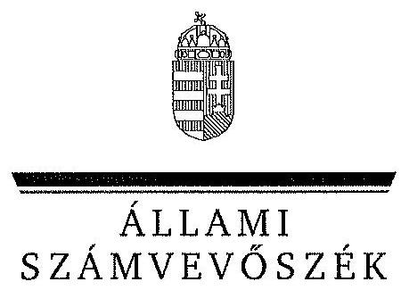
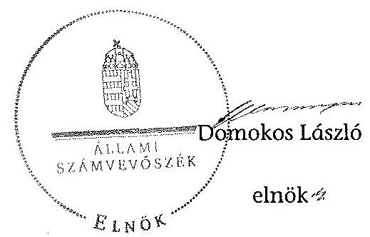
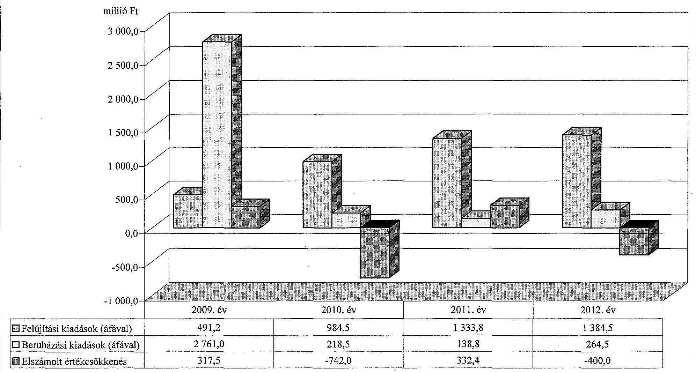
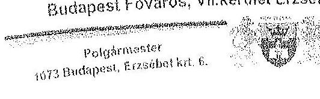
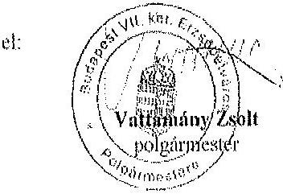
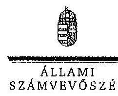
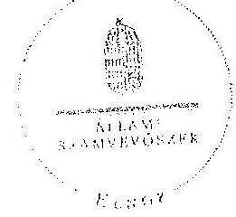

ÁLLAMI
SZÁMVEVÔSZÉK

# JELENTÉS 

az önkormányzatok vagyongazdálkodása
szabályszerúségének ellenőrzéséről
Budapest Főváros VII. kerület Erzsébetváros

---

Állami Számvevőszék
Iktatószám: V-0230-067/2014.
Témaszám: 1264
Vizsgálat-azonosító szám: V065110
Az ellenőrzést felügyelte:
Makkai Mária
felügyeleti vezető
Az ellenőrzést vezette és az ellenőrzés végrehajtásáért felelős:
Schósz Attila Ferencné
ellenőrzésvezető
A számvevőszéki jelentés összeállításában közremüködtek:
Groholy Andrásné Hangyál Márta
számvevő tanácsos
dr. Korbuly Andrea
számvevő tanácsos
Az ellenőrzést végezték:
dr. Korbuly Andrea
Kuszinger Andrea
számvevő tanácsos
Hadházy Sándor György
számvevő tanácsos

# A témához kapcsolódó eddig készített számvevőszéki jelentések: 

címe
sorszáma
Jelentés a Budapest Főváros VII. kerület Erzsébetváros Önkormány- 0958
zata gazdálkodási rendszerének 2009. évi ellenőrzéséről

---

# TARTALOMJEGYZÉK 

BEVEZETÉS ..... 3
I. ÖSSZEGZŐ MEGÁLLAPÍTÁSOK, KÖVETKEZTETÉSEK, JAVASLATOK ..... 6
II. RÉSZLETES MEGÁLLAPÍTÁSOK ..... 11

1. A vagyongazdálkodási tevékenység szabályozása ..... 11
1.1. A vagyongazdálkodási tevékenység szabályozásának megfelelősége ..... 11
1.2. A vagyon használatba és üzemeltetésbe adásának, a koncessziós jog gyakorlásának szabályszerűsége ..... 14
1.3. A vagyon üzemeltetésére, használatára kötött szerződések felülvizsgálata ..... 15
2. A vagyongazdálkodási tevékenység szabályszerűsége ..... 16
2.1. A vagyon nyilvántartása, a vagyon összetételének változása, a döntések és a gazdasági események szabályszerűsége ..... 16
2.1.1. A vagyon nyilvántartásának megfelelősége ..... 16
2.1.2. A vagyon értékének és összetételének változása ..... 17
2.1.3. A vagyon változását eredményező döntések és gazdasági események szabályszerűsége ..... 19
2.2. A térítés nélküli vagyon átadás és átvétel szabályszerűsége ..... 20
2.3. A beruházási és felújítási döntések és végrehajtásuk szabályszerűsége ..... 21
2.4. A tartós részesedésekkel történő gazdálkodás ..... 22
2.5. A vagyon értékesítésének, hasznosításának, a követelés elengedésének szabályszerűsége ..... 23
2.6. Az önkormányzati gazdasági társaságok tulajdonosi felügyelete ..... 25
3. Az integritás érvényesülése a vagyongazdálkodásban ..... 26
4. A belső és a külső ellenőrzések hasznosulása ..... 27
4.1. A belső ellenőrzés javaslatainak hasznosulása ..... 27
4.2. A külső ellenőrzések javaslatainak hasznosulása ..... 28

---

# MELLÉKLETEK 

1. számú Budapest Főváros VII. kerület Erzsébetváros Önkormányzata vagyonának alakulása 2009. január 1. és 2012. december 31. között
2. számú Budapest Főváros VII. kerület Erzsébetváros Önkormányzata felújítási és beruházási kiadásainak, valamint az elszámolt értékcsökkenésnek a bemutatása a 2009-2012. években
3. számú Budapest Főváros VII. kerület Erzsébetváros Önkormányzata polgármesterének észrevétele
4. számú Budapest Főváros VII. kerület Erzsébetváros Önkormányzata polgármesterének észrevételére adott válasz

## FÜGGELÉKEK

1. számú Rövidítések jegyzéke
2. számú Értelmező szótár

---

# JELENTÉS 

## az önkormányzatok vagyongazdálkodása szabályszerűségének ellenőrzéséről Budapest Főváros VII. kerület Erzsébetváros

## BEVEZETÉS

Az ÁSZ kiemelten fontosnak tartja az ÁSZ tv. 5. § (4) bekezdésének a) pontja és (5) bekezdése, valamint az Áht. 61 . § (2) bekezdése alapján az önkormányzati vagyon kezelésének, a vagyonnal való gazdálkodási szabályok betartásának az ellenőrzését. Az ellenőrzés feladata a vagyongazdálkodással kapcsolatban a közpénzek átláthatósága, nyilvánossága érdekében a jogszabályokban, belső szabályzatokban megfogalmazott előírások érvényesülésének áttekintése. Az ÁSZ nem csak az ellenőrzött szervezet vagyongazdálkodásának a hibáira mutat rá, számon kérve azok kijavítását, hanem megállapításaival, javaslataival segíti a közpénzzel, a közvagyonnal való felelős gazdálkodást.

Az önkormányzati vagyon alapvető funkciója, hogy a közérdeket és egyúttal az önkormányzati célok megvalósítását szolgálja. A feladatellátás terén elsősorban a kötelezően ellátandó feladatok végrehajtását hivatott szolgálni, amely mellett az önként vállalt feladatok ellátása is megvalósulhat.

Az ÁSZ stratégiájában hangsúlyos szerepet szán annak, hogy szilárd szakmai alapon álló, értékteremtő ellenőrzéseivel előmozdítsa a közpénzügyek átláthatóságát, rendezettségét. Az ÁSZ a vagyongazdálkodás ellenőrzésén keresztül közremúködik az integritás alapú közigazgatási kultúra kialakításában.

Az ellenőrzés célja annak megállapítása volt, hogy az önkormányzat vagyongazdálkodási tevékenységének szabályozottsága és tevékenysége a jogszabályi előírásokkal összhangban volt-e, átlátható, a jogszabályi előírásoknak megfelelő volt-e a vagyon nyilvántartása, a külső és belső ellenőrzések megállapításai hozzájárultak-e az önkormányzati vagyongazdálkodási tevékenység szabályszerűségéhez.

Ennek keretében értékeltük, hogy az Önkormányzat:

- szabályszerűen alakította-e ki a vagyongazdálkodási tevékenységének kereteit;
- biztosította-e a vagyongazdálkodás szabályszerűségét, megalapozottan hoz-ta-e, és jogszerűen, szabályszerűen hajtotta-e végre a vagyonváltozást eredményező meghatározó jelentőségű döntéseket, valamint gondoskodott-e az általa alapított vagy tulajdonosi részvételével működő gazdasági társaságokkal kapcsolatos tulajdonosi joggyakorlásról;

---

- gondoskodott-e vagyongazdálkodási tevékenysége során az integritás (feddhetetlenség) szempontjainak érvényesüléséről;
- belső ellenőrzése elősegítette-e a vagyongazdálkodás szabályszerű működését, valamint hasznosította-e a külső és belső ellenőrzések megállapításait, javaslatait.

Az ellenőrzés típusa: szabályszerűségi ellenőrzés.
Ellenőrzött időszak: az ellenőrzés 2009. január 1-je és 2012. december 31. közötti időszakra terjedt ki, kitekintéssel a helyszíni ellenőrzés befejezéséig (2013. december 9-éig) tartó időszak releváns folyamataira. Az egyes közbeszerzési eljárások lefolytatásának ellenőrzése 2012. január 1-jétől a helyszíni ellenőrzés kezdetét megelőző negyedév utolsó napjáig (2013. szeptember 30-ig), az Nvtv. egyes rendelkezései végrehajtásának ellenőrzése 2012-től, a helyszíni ellenőrzés befejezéséig tartott.

Ellenőrzött szervezet: Budapest Főváros VII. kerület Erzsébetváros Önkormányzata

Az ellenőrzés szakmai módszertana az ÁSZ hivatalos honlapján közzétett szakmai szabályokon alapult, amely a Legfőbb Ellenőrző Intézmények Nemzetközi Szervezete (INTOSAI) által kiadott nemzetközi standardok (ISSAI) figyelembevételével készült.

Az ellenőrzést az ÁSZ hatályos szervezeti szabályai és az ellenőrzési programban foglalt értékelési szempontok szerint folytattuk le. Megállapításainkat a helyszíni ellenőrzés tapasztalataira, aż ellenőrzött szervezettől bekért dokumentumokra, a kitöltött tanúsítványok elemzésére, az adott időszakban hatályos jogszabályok és belső szabályzatok előírásaira alapoztuk. A részesedések értékelését tételesen ellenőriztük. Irányított mintavétellel választottuk ki a legnagyobb értékű térítésmentes átadás-átvételeket, a beruházásokat, felújításokat, a közbeszerzési eljárásokat, a vagyon értékesítéseket, hasznosításokat és a követelés elengedéseket, továbbá a vagyonkezelési, az üzemeltetési és a koncessziós szerződéseket. Ezen túl a belső kontrollok megfelelő működését a vagyonváltozásokkal kapcsolatos gazdasági események közül a Polgármesteri hivatal 20092012. évi számviteli nyilvántartásaiból választott véletlen minta alapján, megállásos (többlépcsős) megfelelőségi teszttel ellenőriztük.

Budapest Főváros VII. kerület Erzsébetváros lakosainak száma 2012. január 1jén 55733 fő volt. A 2010. évi önkormányzati választásokig a 25 tagú Képvise-lő-testület munkáját hét állandó bizottság segítette. Az önkormányzati választások után a Képviselő-testület létszáma 15 főre csökkent, és három állandó bizottság múködött. A polgármester a 2010. évi önkormányzati választások óta tölti be tisztségét, a jelenlegi jegyző 2011. január 7-től látja el feladatait.

Az Önkormányzat az ellenőrzött időszakban nyolc önállóan működő intézmény - jogutóddal, illetve jogutód nélküli - megszűntetéséről döntött a szociális és az oktatási ágazatban. Az Önkormányzat a 2012. év végén a Polgármesteri hivatalon felül három önállóan működő és gazdálkodó, valamint 11 önállóan működő költségvetési szervvel látta el a feladatait. A Polgármesteri hiva-

---

tal az ellenőrzött időszakban 15 szervezeti egységre tagolódott, a gazdasági szervezet feladatait három szervezeti egység végezte.

Az Önkormányzat a 2012. év végén öt kizárólagos tulajdonú gazdasági társasággal rendelkezett, melyek közül a vagyongazdálkodási feladatellátás irányításáért felelős (2011-ben alakult) EVIKVÁR Kft. holdingként három további kizárólagos tulajdonú gazdasági társaságát foglalta magában ${ }^{1}$. A beruházások projektmenedzsmentjével kapcsolatos feladatokat az Erzsébetváros Kft., a lapkiadási feladatokat (a 2011. évtől) a Média Kft., míg a közművelődési feladatokat (a 2012. évtől) az ERöMƯVHÁZ Nonprofit Kft. látta el. A lakásépítéssel kapcsolatos feladatokat ellátó ERLAK Kft. (a 2006. év óta) végelszámolás alatt állt. Az Önkormányzat az ellenőrzött időszakban három gazdasági társaságban rendelkezett kisebbségi tulajdonrésszel². Az Önkormányzat a 2009-2012. évek között vállalkozási tevékenységet nem végzett, vagyonkezelési, haszonélvezeti jogot alapító szerződést nem kötött. PPP konstrukcióban történő fejlesztésre az ellenőrzött időszakban nem került sor.

Az Önkormányzat könyvviteli mérleg szerinti vagyona a 2009. évi 52938,5 millió Ft-os nyitó értékről 2012. év végére 55721,2 millió Ft-ra, 5,3\%kal növekedett. A befektetett eszközökön belül elsősorban az üzemeltetésre átadott eszközök növekedtek. A forgóeszközökön belül a pénzeszközök értékének emelkedése volt meghatározó. Az Önkormányzat összes kötelezettségének állományi értéke 2012. december 31-én 11729,4 millió Ft volt, amelyből a rövid és hosszú lejáratú kötelezettségek értéke 11608,9 millió Ft volt. A pénzintézeti kötelezettség állományi értéke 11099,7 millió Ft-ot tett ki, mely a 4466,6 millió Ft összegű adósság átvállalás eredményeként 6633,1 millió Ft-ra csökkent. Az Önkormányzat 2012. évi költségvetési beszámolója szerint (az előző évi 6674,6 millió Ft pénzmaradvány igénybevételével együtt) 30140,9 millió Ft költségvetési bevételt ért el és 23393,8 millió Ft költségvetési kiadást teljesített. Felhalmozási célú kiadásra a 2012. évben 1797,0 millió Ft-ot, ezen belül a felújítási és beruházási kiadásokra 1649,0 millió Ft-ot fordítottak.

Az Önkormányzat vagyonának főbb adatait, a felújítási és beruházási kiadásokat, valamint az elszámolt értékcsökkenést az 1-2. számú mellékletek mutatják be. Az alkalmazott rövidítéseket és az egyes fogalmak magyarázatát az 1-2. számú függelék tartalmazza.

Az ÁSZ a 2011. évi LXVI. törvény 29. §-a szerint a jelentéstervezetet megküldte Budapest Főváros VII. kerület Erzsébetváros Önkormányzata polgármesterének egyeztetésre. A polgármester észrevételét és az arra adott választ a jelentés 3-4. számú mellékletei tartalmazzák.

[^0]
[^0]:    ${ }^{1}$ ERVA Zrt., EVIKINT Kft. és az EVIKLAK Kft.
    ${ }^{2}$ Az Akácfa udvar Kft.-ben, illetve a Kazinczy utcai Projekt Kft.-ben 49\%-49\%, a Dohány utca 31. Kft.-ben 33\%-os tulajdonosi részesedéssel rendelkezett.

---

# I. ÖSSZEGZŐ MEGÁLLAPÍTÁSOK, KÖVETKEZTETÉSEK, JAVASLATOK 

Az Önkormányzat - a 2009-2012. évek között - vagyongazdálkodási tevékenységének szabályozását összességében hiányosan biztosította. Az Önkormányzat - az Ötv. és az Mötv. előírásai ellenére - a vagyonkezelői jog részletes szabályai közül nem határozta meg azokat a vagyoni elemeket, amelyeket a tulajdonosi jogosítványok átadása mellett vagyonkezelési szerződés alapján kívánt hasznosítani, továbbá nem írta elő a vagyonkezelés ellenőrzésének részletes szabályait, mely hiányosságokat 2013. június 1-jén pótolt. Vagyonkezelési szerződést a 2009-2012. években nem kötöttek, a vagyongazdálkodási rendelet ${ }_{3}$ 2012. június 1-jei módosításában rögzítették, hogy vagyonkezelői szerződés csak az Nvtv. szerinti átlátható szervezettel köthető.

Az Önkormányzat az Nvtv.-ben meghatározott - 2012. március 1-jei - határidőn túl, 2012. május 22 -én határozta meg a forgalomképtelennek minősülő vagyonából azon vagyonelemeket, amelyeket nemzetgazdasági szempontból kiemelt jelentőségű nemzeti vagyonként forgalomképtelen törzsvagyonnak minősített. Az Áht. ${ }_{1}$ előírása alapján rögzítették azt az értékhatárt, amely felett csak nyilvános pályázat útján lehet a vagyont értékesíteni, kezelésbe adni, a használat jogát átadni, továbbá szabályozták a vagyon ingyenes átadásának eseteit és módját. A Képviselő-testület élt az Ötv.-ben biztosított lehetőséggel, a polgármester ${ }_{1,2}$-nek, a Gazdasági-, illetve a Pénzügyi és Kerületfejlesztési bizottságnak - értékhatárhoz kötve - adott át vagyongazdálkodási hatáskört.

A jegyzö ${ }_{1,2}$ - a Htv. előírása alapján - kialakította a Polgármesteri hivatal számviteli rendjét, megfelelő keretet biztosított a vagyongazdálkodás szempontjából az egységes számviteli elvek szerinti, önkormányzati szintű beszámoló elkészítéséhez. A Képviselő-testület élt az Áhsz. ${ }_{1}$-ben biztosított lehetőséggel és a vagyongazdálkodási rendelet ${ }_{1}$-ben rendelkezett a kétévenkénti (mennyiségi felvétellel történő) leltározásról. A leltározási szabályzat ${ }_{1,3}$-ben a teljes ellenőrzött időszakban úgy rendelkeztek, hogy az üzemeltetésre átadott eszközöket az üzemeltetést végző szerv által elkészített, hiteles leltárral kell alátámasztani.

A jegyzö ${ }_{1,2}$ - az Ámr. ${ }_{1,3}$-ben és az Ávr.-ben előírtaknak megfelelően - a gazdálkodási jogkörök szabályzata ${ }_{1,4}$-ben szabályozta az operatív gazdálkodással kapcsolatos jogkörök gyakorlásának módját, rendjét, a velük kapcsolatos összeférhetetlenségi követelményeket. A hivatali $\mathrm{SZMSZ}_{3}$-ban az Ávr. előírása ellenére nem határozták meg a gazdasági vezető személyét, melynek feladatait a jegyzö ${ }_{2}$ látta el, aki nem rendelkezett a gazdasági vezetőre előírt és a kijelöléshez szükséges, az Ávr.-ben előírt képzettséggel. Az Ávr. 2012. március 31-től hatályos módosulása a gazdasági szervezettel rendelkező polgármesteri hivatalok esetén a jegyzői kijelölés lehetőségét megszüntette, ezért a jegyzö ${ }_{2}$ a pénzügyi ellenjegyzőket 2012. szeptember 4-én, az érvényesítőket 2012. május 14-én nem jogszerűen jelölte ki. A Polgármesteri hivatalban 2009. január 1-jétől 2012. május 13-ig a gazdálkodási jogköröket az Ámr. ${ }_{1,2}$, az Ávr., valamint a gazdálkodási jogkörök szabályzata ${ }_{1,2}$-ben rögzítetteknek megfelelően az arra

---

írásban felhatalmazott, illetve kijelölt személyek gyakorolták, a jogkörök gyakorlása megfelelő volt.

Az önkormányzati vagyon hasznosításával, ingatlanok, utcai takarítógépek, berendezések üzemeltetésével kapcsolatos feladatokat az ERVA Zrt. látta el - a 2009-2012. évek között többször módosított - megbízási szerződés, valamint további feladat-ellátási szerződések alapján. A vagyon hasznosítása, üzemeltetésre történő átadása a Képviselő-testület döntése alapján - a parkolás üzemeltetésére kötött szolgáltatási koncessziós szerződés kivételével - szabályszerűen történt. Az Önkormányzat a parkolás üzemeltetésére 2009. novemberében tette közzé ajánlattételi felhívását a Közbeszerzési Értesítőben. A közbeszerzési eljárás során megsértették a Kbt. ${ }_{1}$ szabályait, mert - a Kbt. ${ }_{1}$ IV. fejezetében szabályozott általános közbeszerzési eljárás helyett - a Kbt. ${ }_{1}$ VI. fejezetében részletezett általános egyszerű közbeszerzést írtak elő, annak ellenére, hogy a szerződés értéke ( 1720 millió Ft) meghaladta a közösségi értékhatárokat. Az Önkormányzat által a parkolásra, 2009. december 23-án kötött szerződés nem tartalmazta az átadott eszközöknek a számviteli nyilvántartás adataival megegyező (értékkel ellátott) tételes jegyzékét, az üzemeltetésbe adott vagyonnal való gazdálkodásra vonatkozó rendelkezéseket. Az Önkormányzat a tulajdonosi részesedéseit az átláthatóság szempontjából (2012. december 31-éig) felülvizsgálta. Azokban az esetekben, melyekben nem feleltek meg az Nvtv. előírásainak, az Önkormányzat az ellenőrzött időszakban a részvények, üzletrészek értékesítéséről döntött.

Az Önkormányzatnál az ellenőrzött években a vagyongazdálkodás múködésének szabályszerűségét hiányosan biztosították. A 2009-2012. évi vagyonkimutatások felépítése megfelelő volt, míg tartalmuk nem felelt meg az Áhsz. ${ }_{1}$-ben, valamint a vagyonkimutatás összeállításáról szóló szabályzat ${ }_{1,2}$ ben foglalt előírásoknak, mivel hiányzott a Konzorciumnak üzemeltetésre átadott parkolóórák és a működtetésükhöz szükséges szoftverek felsorolása és értéke. Az Önkormányzatnál az ellenőrzött időszakban - az üzemeltetésre átadott eszközök kivételével - minden év december 31-ei fordulónappal eleget tettek az Áhsz. ${ }_{1}$-ben előírt leltározási kötelezettségnek. A 2009-2012. években az üzemeltetésre átadott eszközök állományi értékét - a 2012. évben az ingatlanok kivételével - a leltározási szabályzat ${ }_{1,2}$-ben, illetve a 2010. évtől az Áhsz. ${ }_{1}$ ben foglalt előírással ellentétben nem támasztották alá az üzemeltetést végző szervek által elkészített, hitelesített leltárral. Az ingatlanvagyon-kataszter adatainak a számviteli nyilvántartások és a földhivatali nyilvántartás adataival való egyezőségét - a 147/1992. (XI. 6.) Korm. rendeletben és a vagyonkataszteri szabályzat ${ }_{1,2}$-ben foglalt előírásoknak megfelelően - minden évben biztosították.

Az Önkormányzat minden évben megalapozottan, a gazdasági program ${ }_{1,2}$-ben foglalt fejlesztési célkitűzésekkel és az önkormányzati feladatellátással összhangban döntött a beruházásokról és felújításokról. A szabályszerűen végrehajtott fejlesztések finanszírozhatóságát és fenntarthatóságát biztosították. Az Önkormányzat a 2012. évben és 2013. év I-III. negyedévében minden közbeszerzési értékhatárt elérő, vagy azt meghaladó beszerzés esetében lefolytatta a közbeszerzési eljárást. Az ingatlanértékesítések az Áht. ${ }_{1}$-ben meghatározott nyilvános versenyeztetés útján, az ingatlanok bérbeadása nyilvános pályázat útján történtek. A vagyonváltozást eredményező döntéseket - a belső

---

szabályzatokban foglaltaknak megfelelően - az arra hatáskörrel rendelkezők (Képviselő-testület, polgármester ${ }_{1,2}$, valamint Gazdasági-, illetve a Pénzügyi és Kerületfejlesztési bizottság) hozták meg. A vagyongazdálkodási döntések végrehajtása szabályszerűen történt, betartották a döntésekhez kapcsolódó előterjesztésekben, a képviselő-testületi határozatokban foglaltakat, a döntésekkel azonos tartalmú szerződéseket, megállapodásokat kötöttek. A jegyző ${ }_{1,2}$ az ellenőrzött időszak során biztosította a közpénzek felhasználásának átláthatóságát, továbbá az éves költségvetési, zárszámadási rendeletek - az Eisztv. mellékletében előírtak szerinti - adatait az Önkormányzat honlapján közzétették.

Az ellenőrzött időszakban az Önkormányzatnak államháztartáson kívülre történő térítésmentes átadása-átvétele nem volt. Államháztartáson belülre térítésmentesen a Parkolási társulástól vett át, illetve saját intézményei részére adott át szabályszerűen - közfeladat ellátásával összhangban - vagyont. Az Önkormányzat - a Számv. tv.-ben és az Áhsz. ${ }_{1}$-ben rögzítettek ellenére - térítésmentes átadásként mutatott be a beszámolójában a 2010. évben egy ingatlancserét, a 2011. évben egy üzemeltetésre történő átadást.

Az Önkormányzat az ellenőrzött időszakban a vagyongazdálkodási feladatellátás irányítására (az ERVA Zrt. névértéken történő megvásárlásával) az EVIKVÁR Kft., a közművelődési feladatok ellátására az ERöMÜVHÁZ Nonprofit Kft. megalakításáról döntött. Az Önkormányzatnál minden évben vizsgálták a tulajdonosi részesedések alakulását, az abban bekövetkezett változásokat. Az értékvesztés elszámolása során betartották az Áhsz. ${ }_{1}$-ben és a számviteli politi-ka ${ }_{1-2}$-ban előírtakat. Az Önkormányzat - az ellenőrzött időszakban - tulajdonosi ellenőrzési jogát a gazdasági társaságai, illetve az üzemeltetők vonatkozásában teljes körűen nem gyakorolta mivel, a Konzorciummal kötött szerződésben foglaltak ellenére a Képviselő-testület nem delegált a felügyelő bizottságba tagot. A Konzorcium adatszolgáltatási, elszámolási kötelezettségeinek az ellenőrzött időszakban eleget tett, azonban azok helyességét, megbízhatóságát nem ellenőrizték. A Képviselő-testület, illetve (átruházott hatáskörben eljárva) a Pénzügyi és Kerületfejlesztési bizottság megtárgyalta és elfogadta az Önkormányzat kizárólagos tulajdonában lévő gazdasági társaságok esetében az éves beszámolókat, az üzleti tervet, valamint a közhasznú társaság esetében a közhasznúsági jelentést.

A jegyzőz - a Bkr. ellenére - a kontrollkörnyezet kialakítása során az etikai elvárásokat, a Képviselő-testület a Kttv. szerinti hivatásetikai alapelvek részletes tartalmát és az etikai eljárás szabályait nem állapította meg. A „négy szem elvét" a képviselő-testületi előterjesztéseknél alkalmazták, azonban az 2012. május 14-től (a jogosulatlan jegyzői kijelölés következtében) a gazdálkodási jogkörök gyakorlása során nem megfelelően működött. A vagyongazdálkodási tevékenység vonatkozásában rendszeres korrupciós kockázatelemzést nem végeztek. A szabályozási és múködési hiányosságok következtében a vagyongazdálkodási tevékenység integritása (feddhetetlensége), az átláthatósági és elszámoltathatósági követelmények érvényesülése, a stabil és kiegyensúlyozott működés feltételei nem voltak teljes mértékben biztosítottak.

---

A belső ellenőrzés az ellenőrzött időszakban a vagyongazdálkodás szabályszerű működését nem segítette elő, mivel a lefolytatott 56 ellenőrzésből e területet csak egy ellenőrzés érintett, melynek során tett javaslatok - a belső szabályzatok módosítására tett javaslatok kivételével - nem teljesültek. A belső ellenőrzés utóellenőrzéssel, beszámoltatással nem győződött meg a javaslatok teljesítéséről. A belső ellenőrzésekről a Ber.-ben foglaltakkal szemben nyilvántartást nem vezettek, az Önkormányzat intézkedési tervet nem készített, továbbá nem követték nyomon a megtett intézkedéseket.

Az Önkormányzat 2009-2012. évi költségvetési beszámolóit a könyvvizsgáló minden évben megbízhatónak és hitelesnek minősítette. A könyvvizsgálói jelentések az Önkormányzat vagyongazdálkodására vonatkozóan javaslatot nem tartalmaztak.

Az ÁSZ az Önkormányzat gazdálkodási rendszerének 2009. évi ellenőrzésekor 16 javaslatot fogalmazott meg. A számvevőszéki jelentésben foglalt javaslatokat az Önkormányzat az intézkedési tervben foglalt határidőre - a kötelezettségvállalásra és az utalványozásra felhatalmazottak beszámoltatása és a belső ellenőrzési jelentés megállapításai alapján intézkedési terv készítése kivételével - hasznosította.

Az Állami Számvevőszékről szóló 2011. évi LXVI. törvény 33. § (1) bekezdésében foglaltak értelmében a jelentésben foglalt megállapításokhoz kapcsolódó intézkedési tervet köteles az ellenőrzött szervezet vezetője összeállítani, és azt a jelentés kézhezvételétől számított 30 napon belül az ÁSZ részére megküldeni. Amennyiben az intézkedési tervet határidőben nem küldi meg a szervezet, vagy az nem elfogadható, az ÁSZ elnöke a hivatkozott törvény 33. § (3) bekezdés a)-b) pontjaiban foglaltakat érvényesítheti.

Az ellenőrzés intézkedést igénylő megállapításai és javaslatai:

# a jegyzönek 

1. A 2009-2012. évi vagyonkimutatások - az Áhsz. 44/A. § (1)-(2) bekezdéseiben, valamint a vagyonkimutatás összeállításáról szóló szabályzat ${ }_{1,2}$-ben foglalt előírások ellenére - nem tartalmazták az üzemeltetetésre átadott parkolóórák és a müködtetésükhöz szükséges szoftverek felsorolását és értékét.

Javaslat:
Intézkedjen az Önkormányzat vagyonkimutatásának az Áhsz. 30. § (1)(2) bekezdéseiben előírtak szerinti elkészítéséről és annak Képviselő-testület részére történő bemutatásáról.
2. A 2009-2012. években az üzemeltetésre átadott tárgyi eszközök állományi értékét a 2012. évben az ingatlanok kivételével - a leltározási szabályzat ${ }_{1,2}$-ben, továbbá a 2010-2012. években Áhsz. 1 37. § (4) bekezdésében foglalt előírással ellentétben az üzemeltetést végző szervek által elkészített, hitelesített leltárral nem támasztották alá.

---

Javaslat:
Intézkedjen, hogy az üzemeltetésre átadott eszközökről - az Áhsz. 2 22. § (1)-(3) bekezdéseiben, a Számv. tv. 69. §-ában és a leltározási szabályzat ${ }_{2}$-ben foglalt előírásnak megfelelően - a könyvviteli mérleg alátámasztásához az üzemeltetést végző szervek által elkészített, hitelesített leltárak rendelkezésre álljanak.
3. A jegyző ${ }_{2}$ a 2012. évben a Bkr. 6. § (1) bekezdés c) pontjának előírása ellenére az etikai elvárásokat nem határozta meg, a Kttv. 231. § (1) bekezdése ellenére a Képvi-selő-testület nem állapította meg a Kttv. 83. §-ában előírt, a köztisztviselőkre vonatkozó hivatásetikai alapelvek részletes tartalmát, valamint az etikai eljárás szabályait.

Javaslat:
Készítse elő a Bkr. 6. § (1) bekezdés c) pontja előírásának megfelelő etikai elvárásokat, a Kttv. 83. §-a szerinti hivatásetikai alapelveket, az etikai eljárás szabályait és terjessze a Képviselő-testület elé jóváhagyásra.
4. A belső ellenőrzésekről - a Ber. 32. § (1)-(2) bekezdéseiben és a Bkr. 50. § (1)(2) bekezdéseiben foglalt előírás ellenére - az ellenőrzött időszakban nyilvántartást nem vezettek. A belső ellenőrzés által feltárt hiányosságok megszüntetésére - a Ber. 29. § (1) bekezdésében foglalt előírás ellenére - nem készítettek intézkedési tervet.

Javaslat:
Intézkedjen arról, hogy a belső ellenőrzési vezető az elvégzett belső ellenőrzésekről a Bkr. 50. § (1)-(2) bekezdései alapján nyilvántartást vezessen, valamint arról, hogy a belső ellenőrzés által feltárt hiányosságok megszüntetésére, az ellenőrzött szervek vezetői a Bkr. 45. § (2)-(3) bekezdéseiben foglaltaknak megfelelően készítsenek intézkedési tervet.

---

# II. RÉSZLETES MEGÁLLAPÍTÁSOK 

## 1. A VAGYONGAZDÁLKODÁSI TEVÉKENYSÉG SZABÁLYOZÁSA

### 1.1. A vagyongazdálkodási tevékenység szabályozásának megfelelősége

A Képviselő-testület a vagyongazdálkodási feladatokat a Htv. 138. § (1) bekezdés j) pontja szerint - a vagyonkezelői jog részletes szabályai megalkotásának kivételével - a teljes vagyoni körre rendelettel szabályozta. Az Önkormányzatnál az Ötv.-ben foglaltaknak megfelelően a vagyongazdálkodási rendelet ${ }_{1-3}$-ban határozták meg az önkormányzati feladatellátást biztosító törzsvagyont, ezen belül a forgalomképtelen és a korlátozottan forgalomképes vagyonelemek körét. Az Önkormányzat tulajdonába kerülő, vagy a tulajdonában lévő vagyontárgyak korlátozottan forgalomképessé vagy forgalomképtelenné minősitéséhez a Képviselő-testület minősített többségi döntése kellett az önkormányzati SZMSZ ${ }_{1,2}$ előirása szerint.

Az Önkormányzat az Nvtv. 18. § (1) bekezdésében meghatározott - 2012. március 1-jei - határidőn túl, 2012. május 22 -én határozta meg (a vagyongazdálkodási rendelet ${ }_{2}$-ban) a forgalomképtelennek minősülő vagyonából azon vagyonelemeket, amelyeket nemzetgazdasági szempontból kiemelt jelentőségű nemzeti vagyonként forgalomképtelen törzsvagyonnak minősített. Az Önkormányzat - az ÁSZ helyszíni ellenőrzésének befejezéséig (2013. december 9-éig) - nem készítette el a közép- és hosszú távú vagyongazdálkodási tervét, melyre vonatkozóan határidőt az Nvtv. nem tartalmaz.

A Képviselő-testület élt az Ötv. 9. § (3) bekezdésében biztosított jogával és a vagyongazdálkodási feladatokhoz kapcsolódóan - értékhatárhoz kötötten - a polgármester ${ }_{1,2}$-nek, a Gazdasági-, illetve a Pénzügyi és Kerületfejlesztési bizottságnak adott át hatáskört. Az átruházott hatáskör gyakorlásáról beszámolási kötelezettséget a joggyakorlást biztosító rendeletekben - a vagyongazdálkodási rendelet ${ }_{1}$ kivételével - nem írtak elő.

A vagyongazdálkodási rendelet ${ }_{1}$ szerint a korlátozottan forgalomképes ingatlan elidegenítéséről (az átminősítést követően) szóló döntést 5,0 millió Ft forgalmi értékhatárig a Gazdasági bizottság, 2010 októberét követően a Pénzügyi és Kerületfejlesztési bizottság hozhatta meg, a soron következő képviselő-testületi ülésen történő beszámolási kötelezettség mellett. Forgalomképes ingatlanok esetében 50,0 millió Ft forgalmi érték alatt a Pénzügyi és Kerületfejlesztési bizottság gyakorolta a tulajdonosi jogokat. A polgármester ${ }_{1}$ az ingó vagyon elidegenítéséről dönthetett.

A vagyongazdálkodási rendelet ${ }_{2}$ szerint a vagyon tulajdonjogának átruházásáról, a vagyon hasznosításáról 1,0 millió Ft-ig a polgármester ${ }_{2}$, 1-100 millió Ft értékhatár között a Pénzügyi és Kerületfejlesztési bizottság döntött. A vagyongazdálkodási rendelet ${ }_{3}$ értelmében 0,2 millió Ft-ot meg nem haladó vagyonelem ese-

---

tében a polgármester ${ }_{2}, 50,0$ millió Ft forgalmi értékig a Pénzügyi és Kerületfejlesztési Bizottság döntött a vagyon tulajdonjogának átruházásáról.

Az Önkormányzat a vagyongazdálkodási rendelet ${ }_{1.3}$-ban meghatározta a vagyonkimutatásra vonatkozó előírásokat, melynek részletszabályait, az összeállításával kapcsolatos feladatok ellátását a vagyonkimutatás összeállításáról szóló szabályzat ${ }_{1,2}$ tartalmazta az Áhsz. ${ }_{1} 1$. számú melléklete szerinti részletezettséggel. Az Önkormányzat nem élt az Áhsz. ${ }_{1}$ 44/A. § (2) bekezdésében foglalt lehetőséggel, a vagyonkimutatás további tételes alábontását rendeletben nem határozta meg.

Az Önkormányzat a vagyongazdálkodási rendelet ${ }_{1.3}$-ban meghatározta - az Áht. ${ }_{1}$ 108. § (2) bekezdésében ${ }^{3}$ foglaltak szerint - a vagyon tulajdonjogának, valamint a vagyonhoz kapcsolódó, önállóan forgalomképes vagyoni értékű jogok ingyenes átruházásának eseteit és módját. A tulajdonosi jogokat a Képvise-lő-testület, a polgármester ${ }_{1,2}$, valamint a Gazdasági-, illetve a Pénzügyi és Kerületfejlesztési bizottság gyakorolta. A Képviselő-testület - az Áht. ${ }_{1}$ 108. § (1) bekezdésében előírtaknak megfelelően - a vagyongazdálkodási rendelet ${ }_{1,3}$-ban határozta meg azt az értékhatárt ${ }^{4}$, amely értékhatár felett csak nyilvános pályázat útján lehet a vagyont értékesíteni, kezelésbe adni, a használat jogát átadni. A vagyongazdálkodási rendelet ${ }_{1,3}$-ban előírták a hasznosításra szánt vagyon értéke megállapítása céljából az értékbecslés készítésének kötelezettségét.

A jegyző ${ }_{1,2}$ - a Htv. 140. § (1) bekezdés c) pontjában foglalt előírás szerint kialakította a Polgármesteri hivatal számviteli rendjét. A Polgármesteri hivatal rendelkezett az Áhsz. ${ }_{1}$-nek és a helyi sajátosságoknak megfelelő számviteli politika ${ }_{1-2}$-mal, és az annak keretében elkészített pénzkezelési ${ }_{1,2}$, selejtezési ${ }_{1,2}$ szabályzattal ${ }^{5}$. A jegyző a számviteli politika ${ }_{3}$ hatályát kiterjesztette az önállóan múködő intézményekre, ezáltal megfelelő keretet biztosított - a vagyongazdálkodás szempontjából - az egységes számviteli elvek szerinti, önkormányzati szintű beszámoló elkészítéséhez. Az Önkormányzat nem élt az immateriális javak, tárgyi eszközök, továbbá a befektetett pénzügyi eszközök piaci értéken történő értékelésének lehetőségével.

A Képviselő-testület élt az Áhsz. ${ }_{1}$ 37. § (7) bekezdésében biztosított lehetőséggel és a vagyongazdálkodási rendelet ${ }_{1}$-ben rendelkezett a kétévenkénti (mennyiségi felvétellel történő) leltározásról. Az Önkormányzatnál a vagyon leltározásának módját az Áhsz. ${ }_{1}$ előírásainak megfelelően szabályozták. A leltározási szabály-zat ${ }_{1,2}$-ben a teljes ellenőrzött időszakban úgy rendelkeztek, hogy az üzemeltetésre átadott eszközöket az üzemeltetést végző szerv által elkészített, hiteles leltár-

[^0]
[^0]:    ${ }^{3}$ 2012. június 30 -ától az Nvtv. 13. § (3) bekezdése szabályozza.
    ${ }^{4}$ A vagyongazdálkodási rendelet ${ }_{1} 20,0$ millió Ft értékhatárt jelölt meg, míg a vagyongazdálkodási rendelet ${ }_{2}$ a költségvetési törvényben meghatározott forgalmi értékre utalt. A vagyongazdálkodási rendelet ${ }_{2}$-ben nem határoztak meg értékhatárt.
    ${ }^{5}$ A számviteli politika ${ }_{1-3}$ tartalmazta az eszközök és források értékelési szabályzatát is.

---

ral kell alátámasztani, ezáltal az nem igényelt módosítást az Áhsz. ${ }_{1}$ 37. § (4) bekezdésében ${ }^{6}$ foglalt előírás alapján.

A polgármester ${ }_{1,2}$ és a jegyző ${ }_{1,2}$ a vagyonkataszteri szabályzat ${ }_{1,2}$-ben rendelkezett az Önkormányzat számviteli nyilvántartásában szereplő ingatlanvagyon, az ingatlanvagyon-kataszter, valamint a földhivatali ingatlan-nyilvántartás adatai egyezősége biztosításának eljárásrendjéről.

A jegyző ${ }_{1,2}$ - az Ámr. ${ }_{1,2}$-ben és az Ávr.-ben előírtaknak megfelelően - a gazdálkodási jogkörök szabályzata ${ }_{1,4}$-ben szabályozta az operatív gazdálkodással kapcsolatos jogkörök gyakorlásának módját, rendjét és az összeférhetetlenségi követelményeket. A gazdasági szervezet feladatait több szervezeti egység látta el, a hivatali SZMSZ $_{3}$-ban az Ávr. 11. § (2) bekezdésének előírása ellenére nem határozták meg a gazdasági vezető személyét. A gazdasági vezető feladatait kijelölése hiányában - a jegyző ${ }_{2}$ látta el, aki nem rendelkezett a gazdasági vezetőre előírt, és az érvényesítők és a pénzügyi ellenjegyzők kijelöléséhez szükséges, az Ávr. 12. § (1) bekezdésében előírt képzettséggel. Az Ávr. 55. § (2) bekezdése f) pontjának és az 58. § (4) bekezdésének 2012. március 31-től hatályos módosulása a gazdasági szervezettel rendelkező polgármesteri hivatalok esetén a jegyzői kijelölés lehetőségét megszüntette, ezért a jegyző ${ }_{2}$ a pénzügyi ellenjegyzőket 2012. szeptember 4-én, az érvényesítőket 2012. május 14-én nem jogszerűen jelölte ki.

Az Önkormányzat a gazdasági program ${ }_{1,2}$-ben, valamint a 2011-2012. évi költségvetési rendeletekben és az önkormányzatoknak kötelező feladatot szabó ágazati törvények alapján megalkotott rendeletekben ${ }^{7}$ - az Ötv. és az Mötv. előírásaival összhangban - rögzítette a kötelező és önként vállalt feladatainak körét, azok ellátásának mértékét és módját.

A gazdasági program ${ }_{1}$-ben önként vállalt feladatként jelölték meg a középfokú oktatást, a középiskolások számára gépjárművezetői engedély megszerzésének támogatását, a térítésmentes étkeztetést, a szelektív hulladékgyűjtést, a térfigyelő rendszer és kerületőrség múködtetését. A gazdasági program ${ }_{2}$-ben ágazati célonként és fejlesztési irányonként határozták meg az oktatási, közművelődési, szociálpolitikai, egészségügyi önként vállalt és kötelező feladatokat. Bemutatták a vagyongazdálkodás céljait vagyoncsoportonként, valamint a vagyon hasznosítására, megőrzésére és gyarapítására vonatkozó koncepciót. A Képviselő-testület 2011. június 29-i ülésén fogadta el az Önkormányzat Vagyongazdálkodási Stratégiáját, mely a lakás- és helyiséggazdálkodással kapcsolatos helyzetfelmérést, célkitűzéseket és azok megvalósításához szükséges javaslatokat tartalmazott.

[^0]
[^0]:    ${ }^{6}$ Megállapította a 317/2009. (XII. 29.) Korm. rendelet 18. §-a. Először a 2010. évről készített beszámolókra kellett alkalmazni. 2014. január 1-jétől az Áhsz. ${ }_{2}$ 22. § (2) bekezdés a) pontja szerint csak a koncesszióba, vagyonkezelésbe adott eszközöket kell a működtető, vagyonkezelő által elkészített és hitelesített leltárral alátámasztani.
    ${ }^{7}$ Megalkották többek között a vásárok, piacok rendezéséről, rendjéről és fenntartásáról szóló 22/2005. (V. 23.) számú, a Közterület Felügyeleti Rendszer létrehozásáról szóló 1/2003. (I. 27.) számú, az Önkormányzat tulajdonában álló nem lakás céljára szolgáló helyiségek bérbeadásának feltételeiről szóló 28/2000. (XII. 23.) számú rendeleteket.

---

# 1.2. A vagyon használatba és üzemeltetésbe adásának, a koncessziós jog gyakorlásának szabályszerűsége 

Az Önkormányzat az ellenőrzött időszakban - az Ötv. 80/B. §-a ${ }^{8}$ ellenére - hiányosan rendelkezett a vagyonkezelői jog részletes szabályairól, mivel a Képvise-lő-testület - a vagyongazdálkodási rendelet, előírása ellenére - nem készítette el a vagyongazdálkodási irányelveket. Ennek hiányában nem határozták meg azokat a vagyoni elemeket, amelyeket a tulajdonosi jogosítványok átadása mellett vagyonkezelési szerződés alapján kívántak hasznosítani. Nem írták elő továbbá a vagyonkezelés ellenőrzésének részletes szabályait.

A vagyonkezelő jogosítványait és kötelezettségeit a vagyongazdálkodási rende-let ${ }_{1-2}$ tartalmazta. A vagyongazdálkodási rendelet ${ }_{3}$ módosításában, 2012. június 1-jei hatállyal előírták, hogy az Önkormányzat tulajdonát képező vagyonra vagyonkezelési szerződés az Nvtv. szerinti személlyel, átlátható szervezettel köthető. Az Önkormányzat a vagyongazdálkodási rendelet ${ }_{3}$ (2013. június 1-jétől hatályos) módosításában határozta meg azon vagyonelemeket, amelyekre vagyonkezelői jog létesíthető, valamint a vagyonkezelés ellenőrzésének részletes szabályait, az ingyenes vagyonkezelésbe adás feltételeit.

A polgármester ${ }_{1,2}$, a Gazdasági-, illetve a Pénzügyi és Kerületfejlesztési bizottság évente beszámolt az átruházott hatáskörben végzett tevékenységéről a Képvise-lő-testület előtt.

Az ellenőrzött időszakban az Önkormányzat az Ötv. 80/A. §9 előírása szerinti vagyonkezelési szerződést nem kötött, vagyonkezelői jogot nem alapított. A vagyon hasznosítása, üzemeltetésre történő átadása a Képviselőtestület döntése alapján - a parkolás üzemeltetésére kötött szolgáltatási koncessziós szerződés kivételével - szabályszerűen történt. Az Önkormányzat az ellenőrzött időszakban az üzemeltetésre átadott eszközök után 131,0 millió Ft értékcsökkenést számolt el, ezzel szemben az eszközök pótlására, felújítására 31,0 millió Ft-ot fordított.

Az önkormányzati vagyon hasznosításával, ingatlanok, utcai takarítógépek, berendezések üzemeltetésével kapcsolatos feladatokat az ERVA Zrt. látta el - a 2009-2012. évek között többször módosított - megbízási szerződés, valamint további feladat-ellátási szerződések alapján ${ }^{10}$. Az ellenőrzött időszakban az ERVA Zrt. 122 helyiség- és 406 lakás bérleti szerződést kötött az Önkormányzat nevében. Az Önkormányzat a 2010. évben a Közterület-felügyelet feladatkörét kibővítette a kerületi térfigyelő-rendszer müködtetésével, és ezzel egyidejűleg átadta azokat az eszközöket, kamerákat és szoftvereket, melyeket korábban a végelszámolással, jogutód nélkül megszüntetett EKKVSZ üzemeltetett.

[^0]
[^0]:    ${ }^{8}$ 2012. január 1-jétől az Mötv. 109. § (4) bekezdése szabályozza.
    ${ }^{9}$ 2012. január 1-jétől az Mötv. 109. §-a szabályozza.
    ${ }^{10}$ Az ERVA Zrt. feladatait a vagyongazdálkodási rendelet ${ }_{2}$-ben is szabályozták.

---

Az Önkormányzat a parkolás üzemeltetésére 2009. november 2-án a 23929/2009 számon tette közzé ajánlattételi felhívását a Közbeszerzési Értesítőben. Az Önkormányzat a közbeszerzési eljárás során megsértette a Kbt. ${ }_{1}$ szabályait, mert - a Kbt. ${ }_{1}$ IV. fejezetében szabályozott általános közbeszerzési eljárás helyett - a Kbt. ${ }_{1}$ VI. fejezetében részletezett általános egyszerű közbeszerzést írt ki, annak ellenére, hogy a szerződés értéke ( 1720 millió Ft) meghaladta a közösségi értékhatárokat. Az Önkormányzat által a parkolásra, 2009. december 23-án kötött (határozott időre, 10 évre szóló) szerződés nem tartalmazta az átadott eszközöknek a számviteli nyilvántartás adataival megegyező tételes jegyzékét értékével együtt, az üzemeltetésbe adott vagyonnal való gazdálkodásra vonatkozó rendelkezéseket.

A győztes Konzorciummal kötött szerződés alapján az Önkormányzat a parkolási tevékenység ellátásához szükséges, tulajdonában lévő parkolóórákat, azok múködtetéséhez szoftvereket, valamint közterületeket adott üzemeltetésbe. A Képviselő-testület számára a szerződés lehetőséget biztosított egy személy felügyelő bizottsági tagként való kijelölésére, amellyel az Önkormányzat nem élt. Az üzemeltetőnek ellenőrizhető módon és hitelt érdemlően kellett a különböző bevételi forrásokat (parkolójegy-kiadó automata, mobil fizetés, pótdíj) nyilvántartania. Az adatszolgáltatási kötelezettségeinek az üzemeltető az ellenőrzött időszakban eleget tett. Az adatszolgáltatások, elszámolások helyességét, megbízhatóságát a Polgármesteri hivatalban nem ellenőrizték.

# 1.3. A vagyon üzemeltetésére, használatára kötött szerződések felülvizsgálata 

Az Önkormányzat az ellenőrzött időszakban a vagyongazdálkodási feladatellátás irányítására az EVIKVÁR Kft., a közművelődési feladatok ellátására az ERöMÜVHÁZ Nonprofit Kft. megalakításáról döntött.

Az Önkormányzat eleget tett a tulajdonában lévő társasági részesedések és részvények esetében az Nvtv. 18. § (4) bekezdésében (2012. december 31-ig) előírt felülvizsgálati kötelezettségnek. Az Önkormányzat (a kisebbségi tulajdonában álló önkormányzati gazdasági társaságokon kívül) csak olyan gazdálkodó szervezetekben rendelkezett tagsági részesedéssel, amely társaságok az Nvtv. 3. § (1) bekezdés 1. pontja alapján átlátható szervezetnek minősültek, az Önkormányzat kizárólagos tulajdonában voltak.

A Képviselő-testület 2012. november 16-i ülésére előterjesztést készítettek, amelyben valamennyi tagsági részesedés és részvény esetében megvizsgálták, hogy megfelelnek-e az Nvtv. átlátható szervezetre vonatkozó előírásainak. Azokban az esetekben, melyekben nem feleltek meg az Nvtv. előírásainak, felhatalmazták a polgármester ${ }_{2}-t$, hogy értékesítse a részvényeket, üzletrészeket.

---

# 2. A VAGYONGAZDÁLKODÁSI TEVÉKENYSÉG SZABÁLYSZERŰSÉGE 

### 2.1. A vagyon nyilvántartása, a vagyon összetételének változása, a döntések és a gazdasági események szabályszerűsége

### 2.1.1. A vagyon nyilvántartásának megfelelősége

Az Önkormányzat a 2009-2012. években a számviteli nyilvántartásban a fókönyvi számlák alábontásával, valamint a számlákhoz kapcsolódó analitikus nyilvántartások vezetésével biztosította a törzsvagyon többi vagyontárgytól való elkülönített nyilvántartását.

A számviteli nyilvántartásban szereplő ingatlanvagyont, valamint az ingat-lanvagyon-kataszter adatait minden évben egyeztették. A jegyző ${ }_{1,2}$ a számviteli (főkönyvi) nyilvántartás ingatlanvagyon adatainak az ingat-lanvagyon-kataszter adataival való egyezőségét - a 147/1992. (XI. 6.) Korm. rendelet 1. § (3) bekezdésében, a 2. számú mellékletben és a vagyonkataszteri szabályzat ${ }_{1,2}$-ben foglalt előírásoknak megfelelően - biztosította. Az ingatlanvagyon-kataszter adatai - a 147/1992. (XI. 6.) Korm. rendelet 1. § (2) bekezdésében és a vagyonkataszteri szabályzat ${ }_{1,2}$-ben előírtaknak megfelelően - a közhiteles nyilvántartást vezető illetékes földhivatal adataival a 20092012. években egyeztek.

Az Önkormányzat - az Áhsz. ${ }_{1}$ 51. § (1) bekezdés b) pontjában ${ }^{11}$ foglaltak ellenére - 136 db parkolóóra és kapcsolódó informatikai szoftver esetében a korábbi üzemeltetőtől (Parkolási társulástól) történő térítésmentes átvétel, illetve a Konzorciumnak történő üzemeltetésre átadás 2009. és 2010. évi gazdasági eseményeit a számviteli nyilvántartásában nem rögzítette ${ }^{12}$. Ezen eszközök sem a tárgyi eszközök, immateriális javak, sem az üzemeltetésre átadott eszközök között nem szerepeltek az ellenőrzött időszakban, megsértve ezzel a Számv. tv. 15. § (3) bekezdésében foglalt valódiság elvét, mely azonban nem érte el a jelentős összegű hibahatárt.

A 2009-2012. évekre - az Ötv. 78. § (2) bekezdésének ${ }^{13}$ megfelelően - a vagyonkimutatást elkészítették és a zárszámadási rendelettervezet előterjesztésekor az Áht. ${ }_{1} 118 . \S$ (2) bekezdés 2. c) pontja alapján ${ }^{14}$ - a Képviselő-testület részére tájékoztatásul bemutatták. A 2009-2012. évi vagyonkimutatások felépítése megfelelő volt, míg tartalma nem felelt meg az Áhsz. ${ }_{1}$ 44/A. § (1)(2) bekezdéseiben ${ }^{15}$, valamint a vagyonkimutatás összeállításáról szóló sza-

[^0]
[^0]:    ${ }^{11}$ 2014. január 1-jétől az Áhsz. ${ }_{2}$ 53. § (6) bekezdés b) pontja szabályozza.
    ${ }^{12}$ A 2009. december 23-án, és a 2010. március 12-én készült átadás-átvételi jegyzőkönyvek alapján átadott eszközök köre, a számviteli nyilvántartások pontosítása a helyszíni ellenőrzés ideje alatt folyamatban volt.
    ${ }^{13}$ 2012. január 1-jétől az Mötv. 110. § (2) bekezdése írja elő.
    ${ }^{14}$ 2012. január 1-jétől Áht. ${ }_{2}$ 91. § (2) bekezdés c) pont szabályozza.
    ${ }^{15}$ 2014. január 1-jétől Áhsz. ${ }_{2}$ 30. § (1)-(2) bekezdései szabályozzák.

---

bályzat ${ }_{1,2}$-ben foglalt előirásoknak, mivel hiányzott a Konzorciumnak üzemeltetetésre átadott parkolóórák és a múködtetésükhöz szükséges szoftverek felsorolása és értéke.

Az Önkormányzatnál az ellenőrzött időszakban - az üzemeltetésre átadott eszközök kivételével - eleget tettek az Áhsz. 1 37. § (1) bekezdésében előírt leltározási kötelezettségnek minden év december 31-ei fordulónappal. A Polgármesteri hivatalban a vagyongazdálkodási rendelet,-ben, illetve a leltározási szabályzat ${ }_{1,2}$-ben meghatározott előírásoknak megfelelően kétévente, körzetenként tételes, mennyiségi leltárt vettek fel a mérhető, számlálható eszközökről. A könyvviteli mérlegben értékkel nem szereplő eszközök (nettó értékben nyilvántartott tárgyi eszközök, 0-ra leírt eszközök) és források (saját tőke, tartalékok és kötelezettségek) leltározását egyeztetéssel elvégezték. A 2009-2012. években az üzemeltetésre átadott tárgyi eszközök állományi értékét a 2012. évben az ingatlanok kivételével - a leltározási szabályzat ${ }_{1,2}$-ben, továbbá a 2010-2012. években Áhsz. 1 37. § (4) bekezdésében ${ }^{16}$ foglalt előírással ellentétben az üzemeltetést végző szervek által elkészített, hitelesített leltárral nem támasztották alá.

Az ERVA Zrt. csak a 2012. december 31-i fordulónapra vonatkozóan küldte meg az Önkormányzatnak az elkészített és hitelesített leltárt az üzemeltetésre átadott ingatlanokról.

A leltározási dokumentumok, jegyzőkönyvek szerint a leltárértékelést a 20092012. években elvégezték. A 2012. évben 12,6 millió Ft leltárhiányt, illetve 0,3 millió Ft leltártöbbletet állapítottak meg. Az eltérések számviteli rendezéséről a jegyző ${ }_{2}$ intézkedett, a leltárhiánnyal kapcsolatban felelősségre vonás nem történt. A Polgármesteri hivatalban az ellenőrzött időszakban az eszközöket a 2010-2012. években selejtezték, melynek során betartották a selejtezési szabályzat ${ }_{1,2}$ előírásait. A selejtezett eszközök állományból való kivezetését a jegyző ${ }_{2}$ rendelte el, az eszközöket a nyilvántartásokból kivezették.

# 2.1.2. A vagyon értékének és összetételének változása 

Az Önkormányzat könyvviteli mérleg szerinti vagyona a 2009. év eleji 52938,4 millió Ft-os nyitó értékről 2012. év végére 55721,2 millió Ft-ra, 2782,8 millió Ft-tal, 5,3\%-kal növekedett. A befektetett eszközök értéke 2012. évben 204,7 millió Ft-tal volt magasabb a 2009. év eleji értéknél, mely döntően az üzemeltetésre átadott eszközök értékének a növekedéséből adódott. A 2009. és 2011. években az Önkormányzat az ERVA Zrt.-nek két nagy értékű ingatlant ${ }^{17}$ adott át üzemeltetésre.

[^0]
[^0]:    ${ }^{16}$ 2014. január 1-jétől az Áhsz. 2 22. § (1)-(3) bekezdései és a Számv. tv. 69. §-a szabályozzák.
    ${ }^{17}$ Garay tér 20. szám alatti piacot 1323,3 millió Ft és a Janikovszky Éva Általános Iskola és Gimnázium épületét (a Rottenbiller utca 43-45. szám alatti ingatlant) 833,8 millió Ft könyv szerinti bruttó értéken.

---

Az ingatlanok értéke 31728,9 millió Ft volt 2012. év végén, mely 684,1 millió Ft-tal ( $2,1 \%$-kal) alacsonyabb a 2009. év eleji értéknél. A csökkenés az üzemeltetésre átadott, illetve értékesített ingatlanok forgalmi értéke, valamint az elszámolt értékcsökkenés következménye, melyet a megvalósult beruházások, felújítások ${ }^{18}$ - a legjelentősebb növekedés 2011. évben történt 532,9 millió Ft értékben - nem tudtak ellensúlyozni. A 2009-2012. évek között nem történt olyan változás az önkormányzati intézményeket érintően, amely befolyásolta az önkormányzati vagyon alakulását. A jogutód nélkül megszüntetett (szociális és az oktatási feladatokat ellátó) intézmények vagyona továbbra is az Önkormányzat tulajdonában maradt.

A forgóeszközök értéke az ellenőrzött időszakban 2578,0 millió Ft-tal ( $45,9 \%$-kal) nőtt, ezen belül a követelések 14,5\%-kal (a 2009. évi 1094,9 millió Ft-ról a 2012. évre 1253,5 millió Ft-ra), a pénzeszközök 2478,1 millió Ft-tal ( $56,7 \%$-kal) emelkedtek. A követelések növekedését a korábbi évek szerződéseiből eredő, kiszámlázott kötbér, dí hátralékok emelkedése és a részletre történő ingatlanértékesítés okozta. A pénzeszközök állományának növekedéséhez a 2007-2008. és a 2011. években kibocsátott kötvény fel nem használt részének betétként történő lekötése járult hozzá.

Az Önkormányzat könyvviteli mérleg szerinti forrásain belül a 2009. év elejéről a 2012. év végére a saját tőke és a tartalék összege - a 44134,1 millió Ft-ról 43991,8 millió Ft-ra - 142,3 millió Ft-tal csökkent. Ezen belül a saját tőke értéke 2678 millió Ft-tal - 6,7\%-kal - csökkent, ami részben az elszámolt értékcsökkenés kivezetéséből adódott. A tartalék összege 59,2\%-kal - 2535,7 millió Ft-tal - nőtt a tárgyévi költségvetési tartalék elszámolásának növekedése miatt, amit az Önkormányzat pénzmaradványának alakulása befolyásolt.

Az Önkormányzatnál az elszámolt értékcsökkenés állománya a 2010. évben 742,0 millió Ft, a 2012. évben 400,0 millió Ft csökkenést mutatott.

Az elszámolt értékcsökkenés állományának negatív összegét a 2010. évben elsősorban az értékesített és a térítésmentesen átadott ingatlanok halmozott értékcsökkenésének kivezetése okozta. Ezen túl (az ellenőrzött tételek közül összesen) 674,7 millió Ft értékben, a 0-ra leírt és még használatban lévő gépek, berendezések és immateriális javak halmozott értékcsökkenésének összegét az Áhsz. 30. § (7) bekezdésében, valamint a 9. számú melléklet 1. pontjában ${ }^{19}$ foglalt előírás ellenére a könyvviteli mérlegből kivezették.

A 2012. évben az Önkormányzatnál az értékcsökkenés nyitó értéke 712,4 millió Ft-tal eltért az előző évi záró állománytól, melyet többek között a Baross Gábor Általános Iskola összesítésének halmozódása okozott. A helyesbítést a 2012. évben az értékcsökkenés állományának csökkentésével hajtották végre. Az intézménynél ugyanebben az évben 252,3 millió Ft halmozott értékcsökkenés kivezetésére is sor került, az intézményi térítésmentes átadások miatt.

[^0]
[^0]:    ${ }^{18}$ A Polgármesteri hivatal, oktatási intézmények, közterületek és egyéb ingatlanok felújítása, értéknövelő infrastrukturális beruházások.
    ${ }^{19}$ 2014. január 1-jétől az Áhsz. 17. § (1) bekezdése szabályozza.

---

Az Önkormányzat rövid és hosszú lejáratú kötelezettségeinek állományi értéke a 2012. év végén 11608,9 millió Ft volt. Az ellenőrzött időszak alatt a kötelezettségek összességében 2925,0 millió Ft-tal ( $33,2 \%$-kal) nőttek. A 2009-2012. évek között a hosszú lejáratú kötelezettségek 3785,0 millió Ft-tal ( $57,5 \%$-kal) növekedtek, amelyet a felújításra, beruházásra és infrastruktúrafejlesztésre felvett ÖKIF hitel, a korábbi kötvénykibocsátásból származó kötelezettségek, valamint az ahhoz kapcsolódó árfolyamváltozás ${ }^{20}$, továbbá a 2011. évben az 1850,0 millió Ft értékű Erzsébet-terv Fejlesztési Célú Kötvény kibocsátása okozott. A 2009-2012. évek között a rövid lejáratú kötelezettségek összesen 746,4 millió Ft-tal csökkentek, a szállítói követelés állomány csökkenése és a folyószámlahitel (kötvénybevételből származó) visszafizetése következtében.

Az Önkormányzat 2012. december 31-én fennálló adósságállományának (pénzintézeti kötelezettségvállalás) összege 11099,7 millió Ft volt. Magyarország 2013. évi központi költségvetéséről szóló 2012. évi CCIV. tv. 72. §-ában előírtak alapján az Önkormányzat adósságából a Magyar Állam 4466,6 millió Ft-ot átvállalt.

# 2.1.3. A vagyon változását eredményező döntések és gazdasági események szabályszerűsége 

Az Önkormányzat - a 2009-2012. évek között - a vagyon hasznosítása, a vagyon értékének és összetételének változását befolyásoló, gazdasági eseményekhez kapcsolódó döntések előkészítése és meghozatala során (a bérlakások, nem lakás céljára szolgáló helyiségek bérbeadásakor, értékesítésekor, épületek és építmények korszerűsítésekor, valamint bővítésekor és létesítésekor) szabályszerűen járt el. Az ellenőrzött mintatételek esetében a vagyongazdálkodási rende-let ${ }_{1.3}$-ban előírtaknak megfelelően az ingatlan forgalmi értékének meghatározása az adásvételi szerződés, illetve adásvételi előszerződés megkötése előtti 6 hónapon belüli értékbecslés alapján történt. A döntéshozók a belső szabályzatokban foglaltaknak megfelelően az arra felhatalmazottak (Képviselőtestület, polgármester ${ }_{1,2}$, valamint Gazdasági-, illetve a Pénzügyi és Kerületfejlesztési bizottság) voltak. A vagyongazdálkodási döntések végrehajtása során az Önkormányzat betartotta a vagyongazdálkodási rendelet ${ }_{1.3}$-ban, a lakásgazdálkodási rendelet ${ }_{1.3}$-ban, a lakásértékesítési rendelet ${ }_{1.3}$-ban, a döntésekhez kapcsolódó előterjesztésekben, valamint a képviselő-testületi határozatokban foglaltakat. A vagyonváltozásokról a döntésekkel azonos tartalmú szerződéseket, megállapodásokat kötöttek.

A Polgármesteri hivatalban az ellenőrzött időszakban a gazdálkodási jogkörök gyakorlása során a 2009-2011. években az Ámr. ${ }_{1}$ 138. § (1)-(3) bekezdésében és az Ámr. ${ }_{2}$ 80. § (1)-(2) bekezdésében, valamint a 2012. évben az Ávr. 60. § (1)(2) bekezdéseiben rögzített összeférhetetlenségi követelményeket betartották.

[^0]
[^0]:    ${ }^{20}$ Az Önkormányzat a 2007. évben 1000,0 millió Ft, a 2008. évben 3000,0 millió Ft értékű svájci frank alapú - összesen 26345 845,70 CHF - kibocsátott kötvényének törlesztése évente két részletben történik, a törlesztés napján esedékes CHF/HUF árfolyamon. A 2009-2011. években az esedékes törlesztések alapján a ténylegesen realizált árfolyamveszteség 162,2 millió Ft volt.

---

A Polgármesteri hivatalban 2009. január 1-jétől 2012. május 13-ig a gazdálkodási jogköröket az ellenőrzött kiadások és bevételek esetében az Ámr. ${ }_{1,2}$, az Ávr., valamint a gazdálkodási jogkörök szabályzata ${ }_{1,2}$-ben rögzítetteknek megfelelően az arra írásban felhatalmazott, illetve kijelölt személyek gyakorolták, a jogkörök gyakorlása megfelelő volt. A kötelezettségvállalásra minden esetben az ellenjegyzést követően került sor. A teljesítésigazoláshoz a dokumentumok (számlák, múszaki átadás-átvételi jegyzőkönyvek, határozatok) rendelkezésre álltak. Erre az időszakra vonatkozóan a gazdasági események bizonylatain a tevékenységre előírt (folyamatba épített) ellenőrzést elvégezték.

Jogszerű kijelölés hiányában látták el feladataikat 2012. május 14 -től az érvényesítők, 2012. szeptember 4-től a pénzügyi ellenjegyzők (összesen 229,2 millió Ft értékben), mely azonban jogosulatlan bevétel beszedését és kiadás teljesítését nem eredményezte.

A polgármester ${ }_{1}$ a 2010. évben az önkormányzati képviselők és polgármesterek általános választását megelőző 30 nappal nem készítette el, így az Áht. ${ }_{1}$ 50/A. § (4) bekezdésében foglaltak ellenére nem tette közzé az Önkormányzat vagyoni és pénzügyi helyzetéről, valamint a Képviselő-testület megalakulását követően keletkezett, a későbbi éveket terhelő pénzügyi kötelezettségekről (hitelfelvételek, kötvény kibocsátás) szóló részletes jelentést.

A jegyzö ${ }_{1,2}$ az ellenőrzött időszak során biztosította a közpénzek felhasználásának átláthatóságát. Az Eisztv. mellékletében foglaltaknak megfelelően az éves költségvetési és zárszámadási rendeleteket, az éves (elemi) költségvetéseket és a költségvetés végrehajtásáról készített beszámolókat közzétette. Gondoskodott továbbá az Áht. ${ }_{1}$ 15/A. §-ban és a 15/B. §-ban előírtak alapján a céljellegú, múködési és fejlesztési támogatások, a vagyongazdálkodással összefüggő - a nettó öt millió Ft-ot elérő, vagy azt meghaladó értékű - szerződések adatainak közzétételéről ${ }^{21}$.

# 2.2. A térítés nélküli vagyon átadás és átvétel szabályszerűsége 

Az ellenőrzött időszakban az Önkormányzatnak államháztartáson kívülre történő térítésmentes átadása-átvétele nem volt. Államháztartáson belülre térítésmentesen a Parkolási társulástól vett át, illetve saját intézményei részére adott át - közfeladat ellátásával összhangban - vagyont.

A Baross Gábor Általános Iskola 2009. évben kezdődő felújítását az Önkormányzat végezte, a beérkező számlákat kifizette, majd az 1001,6 millió Ft összegű felújítást szabályszerűen átadta az intézménynek. A vagyongazdálkodási rendelet ${ }_{1}$ előírásának megfelelően, szabályszerűen - a Képviselő-testület döntése alapján adták át a 2011. évben térítésmentesen a Közterület-felügyeletnek a Százház utca 10-18. szám alatti ingatlant 246,1 millió Ft értékben. Az analitikus nyilvántartásba történő be- és kivezetés mindkét térítésmentes átadás során az előírásoknak megfelelően megtörtént.

[^0]
[^0]:    ${ }^{21}$ 2012. január 1-jétől az Info tv. 1. számú melléklete írja elő.

---

Az Önkormányzat - a Számv. tv. 16. § (3) bekezdésében, valamint az Áhsz. 1 9. § (11) bekezdésében ${ }^{22}$ rögzítettek ellenére - a 2010-2011. években az alábbi ellenőrzött tételek esetében térítés nélküli átadásként mutatott be gazdasági eseményeket, azokat nem a tényleges tartalmuknak megfelelően számolta el:
az Önkormányzat a 2010. évi beszámoló 38 -as űrlapján térítésmentes átadásként mutatta ki a 381,2 millió Ft nyilvántartási értékű Damjanich utca 4. szám alatti ingatlan átadását a Fővárosi Önkormányzat részére, mely tartalmában csereszerződés volt;
a 2011. évben a Rottenbiller utca 43-45. szám alatti ingatlant 833,8 millió Ft értékben üzemeltetésre átadott eszköz helyett térítésmentes átadásként szerepeltették az analitikus nyilvántartásban. Az ingatlanvagyon-kataszterben és a könyvviteli mérlegben az ingatlant helyesen az üzemeltetésre átadott eszközök között mutatták ki.

# 2.3. A beruházási és felújítási döntések és végrehajtásuk szabályszerűsége 

Az ellenőrzött időszakban az Önkormányzat által teljesített beruházások és felújítások az elfogadott gazdasági program ${ }_{1,2}$-ben szerepeltek, azzal összhangban voltak, a kötelező és önként vállalt feladatok ellátását szolgálták. A beruházások finanszírozhatóságáról, működtetésükről a Képviselő-testület a gazdasági program ${ }_{1,2}$, valamint az éves költségvetési rendeletek elfogadásakor döntött, a fejlesztések finanszírozhatóságát és fenntarthatóságát biztosították.

Az Önkormányzat a 2009-2012. években - a költségvetési beszámolók adatai szerint - összesen 7576,8 millió Ft-ot fordított beruházási és felújítási kiadásokra. A vagyon gyarapítására, pótlására fordított összegből 1813,9 millió Ft-ot $(23,9 \%)$ az éves költségvetési rendeletekben önként vállalt feladatokra (bérlakás építésére, felújítására) használtak fel. Az Önkormányzat kötelezően ellátandó szociális, egészségügyi, oktatási feladataihoz kapcsolódó (ingatlan vásárlás, egészségügyi és oktatási intézmények felújítása, intézményi férőhelybővítés, gép-, berendezés és járművásárlás) beruházásokra, felújításokra 5772,7 millió Ft-ot $(76,1 \%)$ fordítottak.

Az Önkormányzatnál a 2009-2012. évek között műszakilag befejezett beruházások és felújítások értéke 6624,2 millió Ft volt. A befejezett fejlesztések értékének a 63,5\%-át (4204,9 millió Ft-ot) saját forrásból és az Erzsébet-terv Fejlesztési Célú Kötvény kibocsátásából, 26,7\%-át (1772,7 millió Ft-ot) ÖKIF hitelfelvételből, 9,4\%-át ( 620,5 millió Ft-ot) uniós támogatásból, 0,4\%-át (26,1 millió Ft-ot) központi támogatásból finanszírozták.

[^0]
[^0]:    ${ }^{22}$ 2014. január 1-jétől Áhsz. ${ }_{2}$ 4. § (1) bekezdése szabályozza.

---

Az Önkormányzat az ellenőrzött beruházások, felújítások ${ }^{23}$ előkészítése és döntéshozatala során - a kapcsolódó közbeszerzési eljárásokkal együtt szabályszerűen járt el. A szerződéskötések a döntéseknek megfelelően történtek, az Önkormányzat érdekeit védő garanciális elemek azokban rögzítésre kerültek. A műszaki átadás-átvételt dokumentálták, a kifizetésekre a teljesítés igazolását követően került sor, az analitikus nyilvántartásba vétel megtörtént. Az ellenőrzött beruházások esetében - az Erzsébet krt. 6. szám alatti épület, valamint a Dob utca felújítását kivéve - a számviteli politika ${ }_{1,2}$-ben megjelölt üzembe helyezési dokumentumokat kiállították.

Az ellenőrzött időszakban az ingatlanok akadálymentesítését az oktatási, egészségügyi intézményekben, a közterületeken (ahol azok a 2008. év végéig nem történtek meg) a beruházások, felújítások során elvégezték.

Az Önkormányzat 2012. január 1-jétől a 2013. év III. negyedév végéig a közbeszerzési értékhatárt elérő, vagy azt meghaladó felújítási és beruházási feladathoz lefolytatta a közbeszerzési eljárást, amelyek megfeleltek a Kbt. ${ }_{2}$ előírásainak. Az Önkormányzatnál a 2012. évben, illetve a 2013. év III. negyedév végéig felhalmozási kiadásokkal kapcsolatban 42 közbeszerzési eljárást folytattak le - melyből 38 eljárás volt eredményes - 3130,3 millió Ft értékben, míg a múködési kiadásokat érintő eljárások becsült értéke 320,2 millió Ft volt. Az ellenőrzött közbeszerzési eljárások esetében a $\mathrm{Kbt}_{.2}$-ben előírtaknak megfelelően eleget tettek az egybeszámítási kötelezettségnek és a becsült beszerzési érték alapján megalapozottan választották ki a megfelelő közbeszerzési eljárást.

Az ellenőrzött közbeszerzési eljárások ${ }^{24}$ esetén az eljárások előkészítése, megindítása, a kiegészítő tájékoztatások rendelkezésre bocsátása, az ajánlatok Bíráló bizottság általi értékelése, a nyertes ajánlattevő kiválasztása, valamint az ajánlatokkal megegyező tartalmú szerződések megkötése a Kbt. ${ }_{2}$ előírásainak megfelelően, szabályszerűen történt. Az ellenőrzött közbeszerzési eljárásokkal kapcsolatban jogorvoslati eljárást a felek nem kezdeményeztek.

# 2.4. A tartós részesedésekkel történő gazdálkodás 

Az Önkormányzatnál az ellenőrzött időszakban a tartós részesedéseivel és részvényeivel összefüggésben hozott döntések (értékvesztés elszámolása, Média Kft. részére tőkepótlás, ERVA Zrt. névértéken történő megvásárlása, az EVIKVÁR Kft. illetve az ERöMÜVHÁZ Nonprofit Kft. megalapítása) miatt a részesedések és részvények könyv szerinti értéke a költségvetési beszámolók adatai szerint a 2009. év végi 571,5 millió Ft-ról a 2012. év végére 558,5 millió Ft-ra csökkent.

[^0]
[^0]:    ${ }^{23}$ Barcsay, Dob, Kazinczy, Hernád utca, Erzsébetvárosi Általános Iskola és Informatikai Szakközépiskola, Damjanich u. 4., Erzsébet krt. 6., a Kazinczy u. 21. szám alatti ingatlanok felújítása, valamint a Baross Gábor Általános Iskola rekonstrukció I. üteme.
    ${ }^{24}$ „Keretmegállapodás keretében a Budapest Főváros VII. ker. Erzsébetváros Önkormányzata területén végzendő építési, felújítási, szakipari fenntartási munkák elvégzése" tárgyában, a Vörösmarty utca - Wesselényi utca és Király utca közötti szakaszának, valamint a Rumbach Sebestyén utca - Dob utca és Király utca közötti szakaszának felújítására kiírt közbeszerzési eljárások.

---

Az Önkormányzatnál a 2009-2012. évek között vizsgálták a tulajdonosi részesedések és részvények esetében az azokban bekövetkezett változásokat, az értékvesztés elszámolásának, illetve visszaírásának szükségességét. Az értékelés során a saját tőke és a jegyzett tőke arányának mértékét, alakulását vették alapul. Az értékeléseket független könyvvizsgálóval minden évben felülvizsgáltatták. A 2010-2012. években az Önkormányzat tulajdonában lévő tartós részesedésekre - az Áhsz. ${ }_{1} 31 . \S$ (1) bekezdése és a számviteli politika ${ }_{1-3}$ előírásainak megfelelően - együttesen 29,9 millió Ft értékvesztést számoltak el. Az elszámolt értékvesztés visszaírására alapot adó változások az ellenőrzött időszakban nem merültek fel.

A 2010. évben a végelszámolás alatt álló ERLAK Kft.-nél a jegyzett tőke és a saját tőke kedvezőtlen aránya miatt 100\%-os értékvesztést számoltak el 26,4 millió Ft értékben. A 2011. évben az EKKVSZ Kft.-nél 100\%-os, a Dohány utca 31. Kft.-nél 25\%-os értékvesztés összege összesen 3,2 millió Ft volt. A 2012. évben a Dohány utca 31. Kft.-nél 50\%-os értékben számoltak el értékvesztést összesen 0,3 millió Ft értékben.

Az ellenőrzött időszakban az Önkormányzatnak garancia és kezességvállalása nem volt. Az Önkormányzat a 2009-2012. évek között egy kizárólagos tulajdonában lévő gazdasági társasága részére nyújtott tagi kölcsönt. Az erről készült szerződésben a felhasználás céljának, a számadási kötelezettségnek a rögzítését, annak teljesítését előírták, további garanciális elemeket azonban nem határoztak meg.

A Képviselő-testület a 852/2011. (XI. 17.) számú határozatával döntött az Önkormányzat tulajdonában lévő EVIKVÁR Kft. számára tagi kölcsön nyújtásáról és az erről szóló szerződés megkötéséről: A 2011. december 6-án kelt szerződés alapján az Önkormányzat 20,0 millió Ft+10,0 millió Ft tagi kölcsönt nyújtott 2021. december 7-ig tartó visszafizetési kötelezettséggel. A szerződés szerint a tagi kölcsönből 20,0 millió Ft-ot az Önkormányzat tulajdonában lévő ERVA Zrt. névértéken történő megvásárlására, 10,0 millió Ft-ot az új vagyongazdálkodási modell megvalósításához szükséges feladatok előkészítő munkáinak megkezdésére nyújtott az Önkormányzat.

# 2.5. A vagyon értékesítésének, hasznosításának, a követelés elengedésének szabályszerűsége 

Az Önkormányzatnál az önkormányzati vagyon értékesítése és hasznosítása szabályszerűen és a megfelelő döntésekkel alátámasztottan történt. Az Önkormányzatnál a vagyonváltozásról hozott döntésekkel azonos tartalmú szerződéseket, megállapodásokat kötöttek.

Az Önkormányzatnál az ingatlanértékesítések az Áht. ${ }_{1}$ 108. § (1) bekezdésében meghatározott nyilvános versenyeztetés útján történtek.

Az ingatlanok értékesítésére kiírt pályázatok az Önkormányzat honlapján és napilapokban közzétételre kerültek. Az ellenőrzött Osvát utca 5. és a Dob utca 21. szám alatti ingatlanok értékesítésére kiírt pályázatokra egy-egy pályázat érkezett az Önkormányzathoz. A képviselő-testületi előterjesztésekben a pályázatokat a pályázati elbírálás szempontjai szerint értékelték.

---

A vagyongazdálkodási rendelet ${ }_{1}$ elöírásainak megfelelően a Képviselő-testület döntött az ingatlanok értékesítéséről. Az ingatlanok értékesítésére kötött adásvételi szerződésekben, illetve az ellenőrzött Dob utca 21. sz. alatti ingatlanra kötött adásvételi előszerződésben szerepeltek az Önkormányzat érdekeit védő garanciális elemek (a vevő fizetési kötelezettségének nem határidőben történő teljesítésének szankciói, késedelmi kamat kikötése, jogviszony megszüntetésének esetei, tulajdonjog fenntartással történő szerződéskötés). Az adásvételi szerződésekben a tulajdonjog bejegyzésének feltételeként a teljes vételár megfizetését határozta meg az Önkormányzat. Az értékesített ingatlanok vagyonkataszterből történő kivezetése a földhivatal által küldött, vevő tulajdonjogának bejegyzésére vonatkozó határozat megérkezésekor megtörtént.

Az Önkormányzat a Lakás tv. 62. § (1) bekezdésében meghatározott ingatlanok értékesítéséből származó bevételeket az ellenőrzött időszakban elkülönített számlán tartotta nyilván. Az Önkormányzat - a Lakás tv. 63/A. § (1) bekezdésében foglalt előírás szerint - a Kincstár felé 2013. június 30 -áig dokumentumokkal alátámasztva igazolta, hogy a befizetési kötelezettség összegének megfelelő mértékben saját forrásaiból a Lakás tv. 62. § (3) bekezdése szerinti lakáscélokat, illetve az önkormányzati alapfeladatokhoz kapcsolódó infrastrukturális beruházásokat, felújításokat, társasházi felújítási célú pályázatokat finanszírozott. A Kincstár az Önkormányzat igazolását elfogadta.

Az ellenőrzött (Dob utca 29. és Kazinczy utca 34. szám alatti) forgalomképes ingatlanok bérbeadás útján történő hasznosítására nyilvános pályázatot írt ki az Önkormányzat a vagyongazdálkodási rendelet ${ }_{1}$ elöírása alapján. A nyertes pályázó kiválasztása - a pályázati kiírásnak megfelelően az értékelési szempontok figyelembevételével, a legkedvezőbb ajánlat alapján történt. A vagyongazdálkodási rendelet ${ }_{1}$ előírásának megfelelően a Képviselőtestület határozatban jelölte ki a nyertes pályázókat. A polgármester ${ }_{1}$ a bérleti szerződéseket a képviselő-testületi határozatnak megfelelően kötötte meg. A bérleti szerződésekben szerepeltek az Önkormányzat érdekeit védő garanciális elemek (késedelmes fizetés esetén késedelmi kamat kikötése, illetve a szerződésben vállalt kötelezettség nem teljesítésére vonatkozó szankciók előírása).

Az Önkormányzat az alacsony komfortfokozatú lakásait, valamint a rendkívül rossz állapotban lévő, nem lakáscélú, elsősorban pincehelységeit a kereslet csökkenése miatt nem tudta hasznosítani, felújításuk pedig a tulajdonostársak hozzájárulásától függött. Az Önkormányzatnál a használaton kívüli ingatlanok száma 2009. év elején négy lakóház, 146 lakás, illetve 563 helyiség volt, ami 2012. év végére öt lakóház, 302 lakás, illetve 824 helyiség lett. Az Önkormányzat 2570,6 millió Ft értékű használaton kívüli ingatlannal rendelkezett a 2009-2012. évek között, melyekre 31,3 millió Ft-ot költöttek felújítás, állagmegóvás címén. Az Önkormányzat 2013-ben csatlakozott a Fővárosi Önkormányzat által kiírt ún. „Rögtön Jövök" pályázathoz, az üresen álló és a pályázatban meghatározott helyiségek bérbeadásának és elidegenítésének elősegítése céljából.

Az Önkormányzatnál az ellenőrzött időszakban 32,1 millió Ft értékben történt követelés-elengedés. A követelések elengedéséről a vagyongazdálkodási rendelet ${ }_{1}$, illetve a 2009. évi költségvetési rendelet előírásának megfelelően a határozathozatalra jogosult Képviselö-testület döntött. A követelések elen-

---

gedése - egy esetet kivéve - az Áht. 1 108. § (2) bekezdésének és a vagyongazdálkodási rendelet, előírásainak megfelelően történt. Az elengedett követeléseket a könyvviteli mérlegben bemutatták.

A 2011. évben a Képviselő-testület egy gazdasági társaság részére 10,0 millió Ftos követelés elengedése mellett döntött, annak ellenére, hogy az Áhsz. 5. § 3. a) és d) pontjának ${ }^{25}$ előírása szerint a követelést behajthatatlan követelésként kellett volna leírni, mert a gazdasági társaság 2007-ben csődbe ment, a követelést bírósági úton behajtani nem lehetett.

Egy magánszemélyt - kiürített lakás nem szerződésben meghatározott időtartamon belül történő átadása miatt - 2,3 millió Ft összegű kötbér megfizetésére kötelezte az Önkormányzat. Az adós szociális helyzetére tekintettel kérte az Önkormányzattól a kötbér elengedését, mely kérelmet a Képviselő-testület elfogadta, a követelést elengedte. A Képviselő-testület (kérelemre) egy gazdasági társaság által vállalt kötelezettség nem teljesítése miatti kötbér összegéből engedte el annak 5 hónapra járó összegét, 16,8 millió Ft-ot.

# 2.6. Az önkormányzati gazdasági társaságok tulajdonosi felügyelete 

A Képviselő-testület az önkormányzati feladatokat ellátó költségvetési szerveket az éves zárszámadási rendeletek - intézmények éves beszámolóit is magukba foglaló - tárgyalása és elfogadása keretében számoltatta be a vagyon használatáról.

Az ellenőrzött időszakban a Képviselő-testület, illetve (átruházott hatáskörben eljárva) a Pénzügyi és Kerületfejlesztési bizottság az ellenőrzött időszakban megtárgyalta és elfogadta az Önkormányzat kizárólagos tulajdonában lévő gazdasági társaságok esetében az éves beszámolókat, az üzleti tervet, valamint a közhasznú társaság esetében a közhasznúsági jelentést.

Az Önkormányzat gondoskodott a tulajdonosi joggyakorlása során a részesedéssel érintett gazdasági társaságok esetében a feladatok meghatározásáról (szerződésekben), a tisztségviselők, felügyelőbizottsági tagok megválasztásáról, valamint a gazdasági társaságok gazdálkodásának javításáról és - a társaságok veszteséges múködése esetén - a tőkepótlási kötelezettségéről. A Képviselőtestület azonban - célszerűsége ellenére - nem számoltatta be a gazdasági társaságok igazgatósági és felügyelőbizottsági tagjait a vagyonnal való felelős gazdálkodás érdekében, továbbá a feladatellátásra vonatkozó szerződések teljesítésének ellenőrzését sem végezték el.

A végelszámolás alatt álló ERLAK Kft. esetében a 2009. évről szóló beszámolót a Képviselő-testület elfogadta. 2011-ben a társaság által bérelt ingatlan után felhalmozott 16 havi, összesen 0,2 millió Ft összegű tartozás és kamatai megfizetésétől eltekintettek.

[^0]
[^0]:    ${ }^{25}$ 2014. január 1-jétől az Áhsz. 1. § (1) bekezdés 1. pontja szabályozza.

---

A Képviselő-testület határozattal elfogadta az ERVA Zrt. 2009. évi beszámolóját 5,7 millió Ft mérleg szerinti veszteséggel, melyet a tulajdonos döntésének megfelelően az eredménytartalék terhére számoltak el. A 2010. évi beszámoló szerint a mérleg szerinti eredménye 8,7 millió Ft volt. Átruházott hatáskörében eljárva a Pénzügyi és Kerületfejlesztési Bizottság fogadta el az EVIKVÁR Kft. 2011. évi beszámolóját 2,1 millió Ft mérleg szerinti veszteséggel. A 2012. évben az EVIKVÁR Kft. mérleg szerinti eredménye 4,9 millió Ft lett.

Az ETV Kft. múködésének gazdaságossága javítása érdekében az Önkormányzat a 2010. évben döntött a társaság alapító okiratának módosításáról, mely értelmében 2011. január 1-jétől az ETV Kft. Média Kft.-vé alakult át. A Média Kft. megkapta a korábban az Önkormányzat által végzett lapkiadási feladatot, azzal a céllal, hogy költségeket takarítson meg. A Képviselő-testület a 2012. évben döntött a Média Kft. saját tőkéjének visszapótlásáról, tekintettel arra, hogy törzstőkéje (és korábban jogelődjéé) nem érte el a Gt. 114. § (1) bekezdésében meghatározott 0,5 millió Ft-ot.

# 3. AZ INTEGRITÁs ÉRVÉNYESÜLÉSE A VAGYONGAZDÁLKODÁSBAN 

Az Önkormányzat belső szabályrendszere a 2009-2012. évek között hiányosan biztosította a vagyongazdálkodási tevékenység feddhetetlenségét. A jegyző ${ }_{2}$ a 2012. évben a Bkr. 6. § (1) bekezdés c) pontjának előirása ellenére a kontrollkörnyezet kialakítása során az etikai elvárásokat, a Képviselőtestület a Kttv. 231. § (1) bekezdése szerinti hivatásetikai alapelvek részletes tartalmát és az etikai eljárás szabályait nem állapította meg. Az Önkormányzatnál nem határozták meg a vagyongazdálkodási tevékenységben résztvevő köztisztviselők és közalkalmazottak által - ajándék, meghívás felajánlása esetén követendő magatartási szabályokat.

A Polgármesteri hivatal rendelkezett szervezeti és múködési szabályzattal, a jogszabályi előírásoknak megfelelő pénzügyi-számviteli szabályzatokkal, továbbá a közbeszerzési eljárások lefolytatására vonatkozó szabályzatokkal. A jegyző ${ }_{1,2}$ biztosította a belső ellenőrzés szervezeti függetlenségét. Az éves belső ellenőrzési terveket kockázatelemzéssel támasztották alá. A Polgármesteri hivatal az ellenőrzött időszakra vonatkozóan rendelkezett a pénzeszközök szállításának, kezelésének, a kulcsok kezelésének rendjére, valamint a gépjármú, telefon, internet, e-mail személyes használatára vonatkozó szabályozással. 2010 októberétől a reprezentációs kiadások felosztását, elszámolását, 2011. II. félévétől a taxi kártyák használatát is szabályozták.

Az Önkormányzat szerveinek vezetői felhívták a vagyongazdálkodási tevékenységgel összefüggő, korrupciós szempontból veszélyeztetett beosztásban dolgozó (közbeszerzési referens, adóügyi ügyintéző, pénztáros) alkalmazottak figyelmét a jellemző kockázatokra és a kockázatokat megelőző intézkedésekre. Az ellenőrzött időszakban fegyelmi eljárás egy esetben fordult elő, mely eredményeként a munkavállaló megrovásban részesült. A „négy szem elvét" a kép-viselő-testületi előterjesztéseknél alkalmazták, míg 2012. május 14-től (a jogosulatlan jegyzői kijelölés következtében) a gazdálkodási jogkörök gyakorlása során az nem megfelelően múködött. A vagyongazdálkodási tevékenység vonatkozásában rendszeres korrupciós kockázatelemzést nem végeztek. A szabályozási és múködési hiányosságok következtében a vagyongazdálkodási tevékenység integritása (feddhetetlensége), az átláthatósági és elszámoltatha-

---

tósági követelmények érvényesülése, a stabil és kiegyensúlyozott müködés feltételei nem voltak teljes mértékben biztosítottak.

# 4. A BELSŐ ÉS A KÜLSŐ ELLENŐRZÉSEK HASZNOSULÁSA 

### 4.1. A belső ellenőrzés javaslatainak hasznosulása

A jegyző ${ }_{1,2}$ gondoskodott a belső ellenőrzés kialakításáról és múködtetéséről, azonban a belső ellenőrzési feladatokat az Ötv. 92. § (7) bekezdésében ${ }^{26}$ és a hivatali SZMSZ ${ }_{1.3}$-ban foglalt előírások ellenére nem belső ellenőrzési egység látta el, hanem megbízási szerződéssel, külső szakértő bevonásával végezték.

Az ellenőrzött időszakban a 2011. és 2012. évi belső ellenőrzési terveket a Kép-viselő-testület az Ötv. 92. § (6) bekezdésében ${ }^{27}$ rögzített, az előző év november 15-ei határidőn túl hagyta jóvá. Az elvégzett ellenőrzésekről - a Ber. 32. § (1)(2) bekezdésében ${ }^{28}$ foglalt előírás ellenére - nyilvántartást nem vezettek.

A 2010. és a 2012. évi (kockázatelemzésen alapuló) ellenőrzési tervek nem terjedtek ki a vagyongazdálkodásra. A 2009. évi ellenőrzési terv a vagyongazdálkodást érintően tartalmazta a Kbt. ${ }_{1}$ előírásai betartásának, a 2011. évi ellenőrzési terv az államháztartáson kívülre adott támogatások és európai uniós pályázatok felhasználásának ellenőrzését, melyek nem valósultak meg. A 20092012. évek között összesen 56 belső ellenőrzést folytattak le. Ezen belül azonban a vagyongazdálkodást egy - az ERVA Zrt.-nél lefolytatott soron kívüli - ellenőrzés érintette.

#### Abstract

A belső ellenőrzés az ERVA Zrt. 2009. évi és 2010. év I. félévi gazdálkodásának ellenőrzésről készült jelentésében az alapító Önkormányzat részére javasolta az ERVA Zrt. múködésével kapcsolatos elvárások rögzítését, a pályázatfigyelési rendszer alkalmazását, illetve hogy a vagyongazdálkodási rendelet ${ }_{1}$-ben szabályozzák azokat a jogosultságokat és kötelezettségeket, melyek elősegítik a vagyonkezelő gazdaságos múködését. Javasolta továbbá a teljes ingatlanvagyon tételes állapotfelmérését az egyedileg lehetséges bérleti és piaci ár meghatározásával. Az ERVA Zrt.-nek javaslatot tett a létszám, a belső szabályzatok, a javadalmazási rendszer, a bérleti jogviszonyok, valamint az ügyvédi (megbízási) szerződések felülvizsgálatára, az egyértelmú felelősségi körök meghatározására, a pályázatfigyelési és ingatlanhasznosítási terv kidolgozására. Javasolta továbbá az önkormányzati vagyon kontrollját, a mennyiségi felvétellel való leltározás elrendelését, a kötelezettségvállalások nyilvántartásának vezetését, valamint a teljesítésigazolások elvégzését.

A hiányosságok megszüntetésére az ERVA Zrt., valamint - a Ber. 29. § (1) bekezdésében ${ }^{29}$ foglalt előírás ellenére - az Önkormányzat nem készített intézkedési tervet. A belső szabályzatok módosítására tett javaslatok intézkedési terv hiányában is teljesültek. A belső ellenőrzés utóellenőrzéssel, beszámoltatással

[^0]
[^0]:    ${ }^{26}$ 2013. január 1-jétől hatálytalan.
    ${ }^{27}$ 2013. január 1-jétől az Mötv. 119. § (5) bekezdése szabályozza.
    ${ }^{28}$ 2012. január 1-jétől a Bkr. 50. § (1)-(2) bekezdése szabályozza.
    ${ }^{29}$ 2012. január 1-jétől a Bkr. 45. § (2)-(3) bekezdése szabályozza.

---

nem győződött meg a javaslatok teljesítéséről, a Ber. 8. § f) pontjának ${ }^{30}$ előírása ellenére nem követte nyomon a megtett intézkedéseket.

A belső ellenőrzés a 2009-2012. években a vagyongazdálkodás szabályszerű múködését nem segítette elő, mivel e területet érintően csak egy ellenőrzést végeztek, melynek során tett javaslatok - a belső szabályzatok módosítására tett javaslatok kivételével - nem teljesültek.

# 4.2. A külső ellenőrzések javaslatainak hasznosulása 

A könyvvizsgálat az Önkormányzat egyszerűsített éves költségvetési beszámolóját minden évben megbízhatónak és hitelesnek minősítette. A könyvvizsgálói jelentések az Önkormányzat vagyongazdálkodására vonatkozóan javaslatot nem tartalmaztak. A könyvvizsgáló nem kifogásolta, hogy az Önkormányzat mérlegadatai nem voltak alátámasztva az üzemeltetést végző szervek által elkészített hitelesített leltárral.

A helyi önkormányzatok törvényességi ellenőrzéséért felelős szerv - Kormányhivatal - a 2012. évben két törvényességi felhívást és egy javaslatot tett a Képviselő-testület által alkotott rendeletekkel, határozatokkal kapcsolatban. A vagyongazdálkodást egy törvényességi felhívás érintette, melynek részben határidőn túl tettek eleget.

A Kormányhivatal a lakásgazdálkodási rendelet ${ }_{2}$-mal kapcsolatban tett törvényességi felhívást, mivel az abban foglaltak a Lakás tv.-vel, valamint az Alkotmánybíróság 55/2002. (XI. 28.) számú határozatával ellentétesek voltak. A bérleti szerződés felmondásával kapcsolatos és a helységbérleti díj mértékére vonatkozó, kifogásolt jogszabályhelyeket az Önkormányzat a 36/2012. (IX. 25.) számú rendeletével módosított lakásgazdálkodási rendelet ${ }_{2}$-ban újraszabályozta. A bérleti szerződéshez csatolt közjegyzői okirattal, a lakáscseréhez történő hozzájárulással és a lakbértámogatással kapcsolatos jogszabályhelyeket a lakásgazdálkodási rendelet ${ }_{2}$-ban az Önkormányzat csak a 2013. évben módosította.

Az ÁSZ az Önkormányzat gazdálkodási rendszerének 2009. évi ellenőrzésekor a polgármester ${ }_{1}$-nek címezve három szabályszerűségi, a jegyző ${ }_{1}$-nek 10 szabályszerűségi, valamint három célszerűségi javaslatot fogalmazott meg. A számvevőszéki jelentésben foglalt javaslatok hasznosítására - felelős és határidő megjelölésével - intézkedési tervet fogadott el a Képviselő-testület. A javaslatok kettő javaslat kivételével - határidőben teljesültek.

Hasznosultak a hivatali $\mathrm{SZMSZ}_{1}$ kiegészítésére, a pártok által bérelt helyiségek után fizetendő bérleti díjaknak és a fizetés módjának a megkötött szerződésekben való rögzítésére, a jóváhagyott költségvetési előirányzatokon belül történő gazdálkodásra, a kötelező és önként vállalt feladatok mértékének meghatározására, az európai uniós forrással megvalósuló fejlesztési feladatok előirányzatainak éves bontásban való bemutatására vonatkozó javaslatok. Teljesültek az éves költségvetési beszámoló szöveges indoklásának közzétételére, az ellenőrzési nyomvonal elkészítésére, a gazdasági szervezet megnevezésére, a stratégiai belső ellenőrzési tervre, az ellenőrzési programok jóváhagyására, valamint a vagyonkimutatás

[^0]
[^0]:    ${ }^{30}$ 2012. január 1-jétől a Bkr. 21. § (2) bekezdés d) pontja szabályozza.

---

tartalmának szabályozására vonatkozó javaslatok. Hasznosultak továbbá az adósságállomány bemutatásával, az információk átadásának szabályozásával, az ügyfélkaput igénybevevők számának mérésével, a kockázatelemzés kiegészítésével kapcsolatos javaslatok.

Részben teljesült a belső ellenőrzési jelentések megállapításai alapján, az intézkedési terv készítésére vonatkozó javaslat. Határidőn túl teljesült a kötelezettségvállalásra és az utalványozásra felhatalmazottak beszámoltatására vonatkozó javaslat.

Budapest, 2014. 40. hó 24. nap

Melléklet: 4 db
Függelék: $\quad 2 \mathrm{db}$

---

.

---

# Budapest Főváros VIL kerület Erzsébetváros Önkormányzata vagyonának alakulása 2009. január 1. és 2012. december 31. között

|  5
5
5 | Mérlegsor megnevezése | 2009. január 1. (millió Ft) | 2009. december 31. (millió Ft) | 2010. december 31. (millió Ft) | 2011. december 31. (millió Ft) | 2012. december 31. (millió Ft) | Változás %-a 2012. december 31. / 2009. január 1. (Ezőző változás=100\%)  |
| --- | --- | --- | --- | --- | --- | --- | --- |
|  1 |  | 1 | 4 | 5 | 6 | 7 | 12  |
|  1. | Immateriális javak | 90,2 | 118,5 | 124,3 | 111,8 | 144,5 | 160,2  |
|  2. | Tárgyi eszközök | 34501,9 | 33147,3 | 33078,1 | 33279,8 | 32917,5 | 95,4  |
|  3. | ebből: ingatlanok és kapcs vagy.ért.jogok | 32413,0 | 31548,0 | 31810,7 | 31961,9 | 31728,9 | 97,9  |
|  4. | beruházások, felújítások | 1761,0 | 1339,7 | 1007,4 | 1060,3 | 898,9 | 51,0  |
|  5. | Befektetett pénzügyi eszközök | 1563,3 | 1464,1 | 1396,1 | 1383,2 | 1293,7 | 82,8  |
|  6. | Üzemeltetésre átadott eszközök | 11164,3 | 12974,5 | 12842,2 | 13198,7 | 13168,7 | 118,0  |
|  7. | Befektetett eszközök összesen | 47319,7 | 47704,4 | 47440,7 | 47973,5 | 47524,4 | 100,4  |
|  8. | Forgóeszközök összesen | 5618,8 | 5762,1 | 5604,4 | 8417,0 | 8196,8 | 145,9  |
|  9. | ebből: követelések | 1094,9 | 1126,1 | 1115,0 | 1565,6 | 1253,5 | 114,5  |
|  10. | pénzeszközök | 4367,6 | 4202,0 | 4300,0 | 5196,1 | 6845,7 | 156,7  |
|  11. | Eszközök összesen | 52938,5 | 53466,5 | 53045,1 | 56390,5 | 55721,2 | 105,3  |
|  12. | Saját tőke összesen | 39847,6 | 40956,5 | 39447,2 | 37507,3 | 37169,6 | 93,3  |
|  13. | Tartalék összesen | 4286,5 | 4277,7 | 4385,9 | 6638,6 | 6822,2 | 159,2  |
|  14. | Kötelezettségek összesen | 8804,4 | 8232,3 | 9212,0 | 12244,6 | 11729,4 | 133,2  |
|  15. | ebből: hosszú lejáratú kötelezettségek | 6580,2 | 6831,4 | 8119,3 | 10696,6 | 10365,2 | 157,5  |
|  16. | ebből: kötvény | 4408,7 | 4342,0 | 5070,8 | 7393,6 | 6797,8 | 154,2  |
|  17. | hitel | 2171,4 | 2489,4 | 3048,4 | 3303,0 | 3567,4 | 164,3  |
|  18. | rövid lejáratú kötelezettségek | 1990,1 | 1047,1 | 994,4 | 1339,4 | 1243,7 | 62,5  |
|  19. | ebből: kötvény | 184,7 | 185,8 | 224,0 | 281,0 | 273,2 | 147,9  |
|  20. | hitel | 552,9 | 177,2 | 206,7 | 355,9 | 461,2 | 83,4  |
|  21. | Források összesen: | 52938,5 | 53466,5 | 53045,1 | 56390,5 | 55721,2 | 105,3  |

Forrás: Magyar Államkincstár éves költségvetési beszámoló "01" számú űrlap adatai.

---

# **Chemistry**

## **Chemical Reactions**

### **Balancing Chemical Equations**

1. **Write the unbalanced equation:**
   - Example: $$C_3H_8 + O_2 \rightarrow CO_2 + H_2O$$

2. **Balance the equation:**
   - Balance carbon atoms first.
   - Then balance hydrogen atoms.
   - Finally, balance oxygen atoms.
   - Balanced equation: $$C_3H_8 + 7O_2 \rightarrow 3CO_2 + 4H_2O$$

### **Types of Reactions**

1. **Combination Reaction:**
   - Example: $$2H_2 + O_2 \rightarrow 2H_2O$$

2. **Decomposition Reaction:**
   - Example: $$2H_2O_2 \rightarrow 2H_2O + O_2$$

3. **Single Displacement Reaction:**
   - Example: $$Zn + 2HCl \rightarrow ZnCl_2 + H_2$$

4. **Double Displacement Reaction:**
   - Example: $$AgNO_3 + NaCl \rightarrow AgCl + NaNO_3$$

5. **Combustion Reaction:**
   - Example: $$CH_4 + 2O_2 \rightarrow CO_2 + 2H_2O$$

## **Stoichiometry**

### **Mole Concept**

- **Mole (mol):** The amount of substance containing as many particles (atoms, molecules, ions) as there are atoms in exactly 12 grams of carbon-12.
- **Avogadro's Number:** $$6.022 \times 10^{23}$$ particles per mole.

### **Molar Mass**

- **Molar Mass:** The mass of one mole of a substance.
- Example: The molar mass of water ($$H_2O$$) is 18.015 g/mol.

### **Calculations**

1. **Moles to Mass:**
   - Formula: $$n = \frac{m}{M}$$
   - Example: Calculate the number of moles of $$H_2O$$ in 18 grams of water.
     - $$n = \frac{18.015 \, \text{g}}{18.015 \, \text{g/mol}} = 2 \, \text{mol}$$

2. **Mass to Moles:**
   - Formula: $$m = n \times M$$
   - Example: Calculate the mass of 18.015 g of 1 mole of $$H_2O$$.
     - $$m = 18.015 \, \text{g/mol} = 2 \, \text{mol}$$

## **Gas Laws**

### **Ideal Gas Law**

- **Equation:** $$PV = nRT$$
- **Variables:**
  - $$P$$: Pressure (atm)
  - $$V$$: Volume (L)
  - $$n$$: Number of moles (mol)
  - $$R$$: Ideal gas constant (0.0821 L·atm/mol·K)
  - $$T$$: Temperature (K)

### **Boyle's Law**

- **Equation:** $$P_1V_1 = P_2V_2$$
- **Variables:**
  - P₁: Pressure (atm)
  - P₂: Volume (L)
  - P₃: Temperature (K)
  - P₁: Pressure (atm)
  - P₂: Volume (L)
  - P₃: Temperature (K)
  - P₁: Pressure (atm)
  - P₂: Volume (L)
  - P₃: Temperature (atm)
  - P₁: Pressure (atm)
  - P₂: Volume (L)
  - P₃: Temperature (atm)
  - P₁: Pressure (atm)

### **Boyle's Law**

- **Equation:** $$\frac{P_1V_1}{P_2V_2} = \frac{P_1}{V_1}$$

## **Thermochemistry**

### **Enthalpy (H)**

- **Definition:** The heat content of a system at constant pressure.
- **Equation:** $$\Delta H = q_p$$
- **Variables:**
  - $$q_p$$: Heat transferred at constant pressure.
  - $$q_p$$: Heat transferred at constant pressure.

### **Hess's Law**

- **Statement:** The enthalpy change for a reaction is the same whether it occurs in one step or multiple steps.
- **Equation:** $$\Delta H_{\text{rest}} = \Delta H - Q_{\text{rest}}$$
- **Variables:**
  - $$\Delta H$$: Heat transferred at constant pressure.
  - $$\Delta H$$: Heat transferred at constant pressure.

### **Hess's Law 2.0**

- **Statement:** The enthalpy change for a reaction is the same whether it occurs in one step or multiple steps.
- **Equation:** $$\Delta H_{\text{rest}} = \Delta H - Q_{\text{rest}}$$
- **Variables:**
  - $$\Delta H$$: Heat transferred at constant pressure.
  - $$\Delta H$$: Heat transferred at constant pressure.

### **Enthalpy (H_{2} O)**

- **Definition:** The heat content of a system at constant pressure.
- **Equation:** $$\Delta H_{2} = q_p$$
- **Variables:**
  - $$q_p$$: Heat transferred at constant pressure.
  - $$q_p$$: Heat transferred at constant pressure.

### **Hess's Law 1.5**

- **Statement:** The enthalpy change for a reaction is the same whether it occurs in one step or multiple steps.
- **Equation:** $$\Delta H_{\text{rest}} = \Delta H - Q_{\text{rest}}$$
- **Variables:**
  - $$\Delta H$$: Heat transferred at constant pressure.
  - $$\Delta H$$: Heat transferred at constant pressure.

### **Hess's Law 1.6**

- **Statement:** The enthalpy change for a reaction is the same whether it occurs in one step or multiple steps.
- **Equation:** $$\Delta H_{\text{rest}} = \Delta H - Q_{\text{rest}}$$
- **Variables:**
  - $$\Delta H$$: Heat transferred at constant pressure.
  - $$\Delta H$$: Heat transferred at constant pressure.

### **Hess's Law 1.7**

- **Statement:** The enthalpy change for a reaction is the same whether it occurs in one step or multiple steps.
- **Equation:** $$\Delta H_{\text{rest}} = q_p$$
- **Variables:**
  - $$\Delta H$$: Heat transferred at constant pressure.
  - $$\Delta H$$: Heat transferred at constant pressure.

### **Hess's Law 1.8**

- **Statement:** The enthalpy change for a reaction is the same whether it occurs in one step or multiple steps.
- **Equation:** $$\Delta H_{\text{rest}} = q_p$$
- **Variables:**
  - $$\Delta H$$: Heat transferred at constant pressure.
  - $$\Delta H$$: Heat transferred at constant pressure.

### **Hess's Law 1.9**

- **Statement:** The enthalpy change for a reaction is the same whether it occurs in one step or multiple steps.
- **Equation:** $$\Delta H_{\text{rest}} = q_p$$
- **Variables:**
  - $$\Delta H$$: Heat transferred at constant pressure.
  - $$\Delta H$$: Heat transferred at constant pressure.

### **Hess's Law 2.1**

- **Statement:** The enthalpy change for a reaction is the same whether it occurs in one step or multiple steps.
- **Equation:** $$\Delta H_{\text{rest}} = q_p$$
- **Variables:**
  - $$\Delta H$$: Heat transferred at constant pressure.
  - $$\Delta H$$: Heat transferred at constant pressure.

### **Hess's Law 2.2**

- **Statement:** The enthalpy change for a reaction is the same whether it occurs in one step or multiple steps.
- **Equation:** $$\Delta H_{\text{rest}} = q_p$$
- **Variables:**
  - $$\Delta H$$: Heat transferred at constant pressure.
  - $$\Delta H$$: Heat transferred at constant pressure.

### **Hess's Law 2.3**

- **Statement:** The enthalpy change for a reaction is the same whether it occurs in one step or multiple steps.
- **Equation:** $$\Delta H_{\text{rest}} = q_p$$
- **Variables:**
  - $$\Delta H$$: Heat transferred at constant pressure.
  - $$\Delta H$$: Heat transferred at constant pressure.

### **Hess's Law 2.4**

- **Statement:** The enthalpy change for a reaction is the same whether it occurs in one step or multiple steps.
- **Equation:** $$\Delta H_{\text{rest}} = q_p$$
- **Variables:**
  - $$\Delta H$$: Heat transferred at constant pressure.
  - $$\Delta H$$: Heat transferred at constant pressure.

### **Hess's Law 2.5**

- **Statement:** The enthalpy change for a reaction is the same whether it occurs in one step or multiple steps.
- **Equation:** $$\Delta H_{\text{rest}} = q_p$$
- **Variables:**
  - $$\Delta H$$: Heat transferred at constant pressure.
  - $$\Delta H$$: Heat transferred at constant pressure.

### **Hess's Law 2.6**

- **Statement:** The enthalpy change for a reaction is the same whether it occurs in one step or multiple steps.
- **Equation:** $$\Delta H_{\text{rest}} = q_p$$
- **Variables:**
  - $$\Delta H$$: Heat transferred at constant pressure.
  - $$\Delta H$$: Heat transferred at constant pressure.

### **Hess's Law 2.7**

- **Statement:** The enthalpy change for a reaction is the same whether it occurs in one step or multiple steps.
- **Equation:** $$\Delta H_{\text{rest}} = q_p$$
- **Variables:**
  - $$\Delta H$$: Heat transferred at constant pressure.
  - $$\Delta H$$: Heat transferred at constant pressure.

### **Hess's Law 2.8**

- **Statement:** The enthalpy change for a reaction is the same whether it occurs in one step or multiple steps.
- **Equation:** $$\Delta H_{\text{rest}} = q_p$$
- **Variables:**
  - $$\Delta H$$: Heat transferred at constant pressure.
  - $$\Delta H$$: Heat transferred at constant pressure.

### **Hess's Law 2.9**

- **Statement:** The enthalpy change for a reaction is the same whether it occurs in one step or multiple steps.
- **Equation:** $$\Delta H_{\text{rest}} = q_p$$
- **Variables:**
  - $$\Delta H$$: Heat transferred at constant pressure.
  - $$\Delta H$$: Heat transferred at constant pressure.

### **Hess's Law 3.0**

- **Statement:** The enthalpy change for a reaction is the same whether it occurs in one step or multiple steps.
- **Equation:** $$\Delta H_{\text{rest}} = q_p$$
- **Variables:**
  - $$\Delta H$$: Heat transferred at constant pressure.
  - $$\Delta H$$: Heat transferred at constant pressure.

### **Hess's Law 3.1**

- **Statement:** The enthalpy change for a reaction is the same whether it occurs in one step or multiple steps.
- **Equation:** $$\Delta H_{\text{rest}} = q_p$$
- **Variables:**
  - $$\Delta H$$: Heat transferred at constant pressure.
  - $$\Delta H$$: Heat transferred at constant pressure.

### **Hess's Law 3.2**

- **Statement:** The enthalpy change for a reaction is the same whether it occurs in one step or multiple steps.
- **Equation:** $$\Delta H_{\text{rest}} = q_p$$
- **Variables:**
  - $$\Delta H$$: Heat transferred at constant pressure.
  - $$\Delta H$$: Heat transferred at constant pressure.

### **Hess's Law 3.3**

- **Statement:** The enthalpy change for a reaction is the same whether it occurs in one step or multiple steps.
- **Equation:** $$\Delta H_{\text{rest}} = q_p$$
- **Variables:**
  - $$\Delta H$$: Heat transferred at constant pressure.
  - $$\Delta H$$: Heat transferred at constant pressure.

### **Hess's Law 3.4**

- **Statement:** The enthalpy change for a reaction is the same whether it occurs in one step or multiple steps.
- **Equation:** $$\Delta H_{\text{rest}} = q_p$$
- **Variables:**
  - $$\Delta H$$: Heat transferred at constant pressure.
  - $$\Delta H$$: Heat transferred at constant pressure.

### **Hess's Law 3.5**

- **Statement:** The enthalpy change for a reaction is the same whether it occurs in one step or multiple steps.
- **Equation:** $$\Delta H_{\text{rest}} = q_p$$
- **Variables:**
  - $$\Delta H$$: Heat transferred at constant pressure.
  - $$\Delta H$$: Heat transferred at constant pressure.

### **Hess's Law 3.6**

- **Statement:** The enthalpy change for a reaction is the same whether it occurs in one step or multiple steps.
- **Equation:** $$\Delta H_{\text{rest}} = q_p$$
- **Variables:**
  - $$\Delta H$$: Heat transferred at constant pressure.
  - $$\Delta H$$: Heat transferred at constant pressure.

### **Hess's Law 3.7**

- **Statement:** The enthalpy change for a reaction is the same whether it occurs in one step or multiple steps.
- **Equation:** $$\Delta H_{\text{rest}} = q_p$$
- **Variables:**
  - $$\Delta H$$: Heat transferred at constant pressure.
  - $$\Delta H$$: Heat transferred at constant pressure.

### **Hess's Law 3.8**

- **Statement:** The enthalpy change for a reaction is the same whether it occurs in one step or multiple steps.
- **Equation:** $$\Delta H_{\text{rest}} = q_p$$
- **Variables:**
  - $$\Delta H$$: Heat transferred at constant pressure.
  - $$\Delta H$$: Heat transferred at constant pressure.

### **Hess's Law 3.9**

- **Statement:** The enthalpy change for a reaction is the same whether it occurs in one step or multiple steps.
- **Equation:** $$\Delta H_{\text{rest}} = q_p$$
- **Variables:**
  - $$\Delta H$$: Heat transferred at constant pressure.
  - $$\Delta H$$: Heat transferred at constant pressure.

### **Hess's Law 3.10**

- **Statement:** The enthalpy change for a reaction is the same whether it occurs in one step or multiple steps.
- **Equation:** $$\Delta H_{\text{rest}} = q_p$$
- **Variables:**
  - $$\Delta H$$: Heat transferred at constant pressure.
  - $$\Delta H$$: Heat transferred at constant pressure.

### **Hess's Law 3.11**

- **Statement:** The enthalpy change for a reaction is the same whether it occurs in one step or multiple steps.
- **Equation:** $$\Delta H_{\text{rest}} = q_p$$
- **Variables:**
  - $$\Delta H$$: Heat transferred at constant pressure.
  - $$\Delta H$$: Heat transferred at constant pressure.

### **Hess's Law 3.12**

- **Statement:** The enthalpy change for a reaction is the same whether it occurs in one step or multiple steps.
- **Equation:** $$\Delta H_{\text{rest}} = q_p$$
- **Variables:**
  - $$\Delta H$$: Heat transferred at constant pressure.
  - $$\Delta H$$: Heat transferred at constant pressure.

### **Hess's Law 3.13**

- **Statement:** The enthalpy change for a reaction is the same whether it occurs in one step or multiple steps.
- **Equation:** $$\Delta H_{\text{rest}} = q_p$$
- **Variables:**
  - $$\Delta H$$: Heat transferred at constant pressure.
  - $$\Delta H$$: Heat transferred at constant pressure.

### **Hess's Law 3.14**

- **Statement:** The enthalpy change for a reaction is the same whether it occurs in one step or multiple steps.
- **Equation:** $$\Delta H_{\text{rest}} = q_p$$
- **Variables:**
  - $$\Delta H$$: Heat transferred at constant pressure.
  - $$\Delta H$$: Heat transferred at constant pressure.

### **Hess's Law 3.15**

- **Statement:** The enthalpy change for a reaction is the same whether it occurs in one step or multiple steps.
- **Equation:** $$\Delta H_{\text{rest}} = q_p$$
- **Variables:**
  - $$\Delta H$$: Heat transferred at constant pressure.
  - $$\Delta H$$: Heat transferred at constant pressure.

### **Hess's Law 3.16**

- **Statement:** The enthalpy change for a reaction is the same whether it occurs in one step or multiple steps.
- **Equation:** $$\Delta H_{\text{rest}} = q_p$$
- **Variables:**
  - $$\Delta H$$: Heat transferred at constant pressure.
  - $$\Delta H$$: Heat transferred at constant pressure.

### **Hess's Law 3.17**

- **Statement:** The enthalpy change for a reaction is the same whether it occurs in one step or multiple steps.
- **Equation:** $$\Delta H_{\text{rest}} = q_p$$
- **Variables:**
  - $$\Delta H$$: Heat transferred at constant pressure.
  - $$\Delta H$$: Heat transferred at constant pressure.

### **Hess's Law 3.18**

- **Statement:** The enthalpy change for a reaction is the same whether it occurs in one step or multiple steps.
- **Equation:** $$\Delta H_{\text{rest}} = q_p$$
- **Variables:**
  - $$\Delta H$$: Heat transferred at constant pressure.
  - $$\Delta H$$: Heat transferred at constant pressure.

### **Hess's Law 3.19**

- **Statement:** The enthalpy change for a reaction is the same whether it occurs in one step or multiple steps.
- **Equation:** $$\Delta H_{\text{rest}} = q_p$$
- **Variables:**
  - $$\Delta H$$: Heat transferred at constant pressure.
  - $$\Delta H$$: Heat transferred at constant pressure.

### **Hess's Law 3.20**

- **Statement:** The enthalpy change for a reaction is the same whether it occurs in one step or multiple steps.
- **Equation:** $$\Delta H_{\text{rest}} = q_p$$
- **Variables:**
  - $$\Delta H$$: Heat transferred at constant pressure.
  - $$\Delta H$$: Heat transferred at constant pressure.

### **Hess's Law 3.21**

- **Statement:** The enthalpy change for a reaction is the same whether it occurs in one step or multiple steps.
- **Equation:** $$\Delta H_{\text{rest}} = q_p$$
- **Variables:**
  - $$\Delta H$$: Heat transfer at constant pressure.
  - $$\Delta H$$: Heat transfer at constant pressure.

### **Hess's Law 3.22**

- **Statement:** The enthalpy change for a reaction is the same whether it occurs in one step or multiple steps.
- **Equation:** $$\Delta H_{\text{rest}} = q_p$$
- **Variables:**
  - $$\Delta H$$: Heat transfer at constant pressure.
  - $$\Delta H$$: Heat transfer at constant pressure.

### **Hess's Law 3.23**

- **Statement:** The enthalpy change for a reaction is the same whether it occurs in one step or multiple steps.
- **Equation:** $$\Delta H_{\text{rest}} = q_p$$
- **Variables:**
  - $$\Delta H$$: Heat transfer at constant pressure.
  - $$\Delta H$$: Heat transfer at constant pressure.

### **Hess's Law 3.24**

- **Statement:** The enthalpy change for a reaction is the same whether it occurs in one step or multiple steps.
- **Equation:** $$\Delta H_{\text{rest}} = q_p$$
- **Variables:**
  - $$\Delta H$$: Heat transfer at constant pressure.
  - $$\Delta H$$: Heat transfer at constant pressure.

### **Hess's Law 3.25**

- **Statement:** The enthalpy change for a reaction is the same whether it occurs in one step or multiple steps.
- **Equation:** $$\Delta H_{\text{rest}} = q_p$$
- **Variables:**
  - $$\Delta H$$: Heat transfer at constant pressure.
  - $$\Delta H$$: Heat transfer at constant pressure.

### **Hess's Law 3.26**

- **Statement:** The enthalpy change for a reaction is the same whether it occurs in one step or multiple steps.
- **Equation:** $$\Delta H_{\text{rest}} = q_p$$
- **Variables:**
  - $$\Delta H$$: Heat transfer at constant pressure.
  - $$\Delta H$$: Heat transfer at constant pressure.

### **Hess's Law 3.27**

- **Statement:** The enthalpy change for a reaction is the same whether it occurs in one step or multiple steps.
- **Equation:** $$\Delta H_{\text{rest}} = q_p$$
- **Variables:**
  - $$\Delta H$$: Heat transfer at constant pressure.
  - $$\Delta H$$: Heat transfer at constant pressure.

### **Hess's Law 3.28**

- **Statement:** The enthalpy change for a reaction is the same whether it occurs in one step or multiple steps.
- **Equation:** $$\Delta H_{\text{rest}} = q_p$$
- **Variables:**
  - $$\Delta H$$: Heat transfer at constant pressure.
  - $$\Delta H$$: Heat transfer at constant pressure.

### **Hess's Law 3.29**

- **Statement:** The enthalpy change for a reaction is the same whether it occurs in one step or multiple steps.
- **Equation:** $$\Delta H_{\text{rest}} = q_p$$
- **Variables:**
  - $$\Delta H$$: Heat transfer at constant pressure.
  - $$\Delta H$$: Heat transfer at constant pressure.

### **Hess's Law 3.30**

- **Statement:** The enthalpy change for a reaction is the same whether it occurs in one step or multiple steps.
- **Equation:** $$\Delta H_{\text{rest}} = q_p$$
- **Variables:**
  - $$\Delta H$$: Heat transfer at constant pressure.
  - $$\Delta H$$: Heat transfer at constant pressure.

### **Hess's Law 3.29**

- **Statement:** The enthalpy change for a reaction is the same whether it occurs in one step or multiple steps.
- **Equation:** $$\Delta H_{\text{rest}} = q_p$$
- **Variables:**
  - $$\Delta H$$: Heat transfer at constant pressure.
  - $$\Delta H$$: Heat transfer at constant pressure.

### **Hess's Law 3.31**

- **Statement:** The enthalpy change for a reaction is the same whether it occurs in one step or multiple steps.
- **Equation:** $$\Delta H_{\text{rest}} = q_p$$
- **Variables:**
  - $$\Delta H$$: Heat transfer at constant pressure.
  - $$\Delta H$$: Heat transfer at constant pressure.

### **Hess's Law 3.29**

- **Statement:** The enthalpy change for a reaction is the same whether it occurs in one step or multiple steps.
- **Equation:** $$\Delta H_{\text{rest}} = q_p$$
- **Variables:**
  - $$\Delta H$$: Heat transfer at constant pressure.
  - $$\Delta H$$: Heat transfer at constant pressure.

### **Hess's Law 3.30**

- **Statement:** The enthalpy change for a reaction is the same whether it occurs in one step or multiple steps.
- **Equation:** $$\Delta H_{\text{rest}} = q_p$$
- **Variables:**
  - $$\Delta H$$: Heat transfer at constant pressure.
  - $$\Delta H$$: Heat transfer at constant pressure.

### **Hess's Law 3.29**

- **Statement:** The enthalpy change for a reaction is the same whether it occurs in one step or multiple steps.
- **Equation:** $$\Delta H_{\text{rest}} = q_p$$
- **Variables:**
  - $$\Delta H$$: Heat transfer at constant pressure.
  - $$\Delta H$$: Heat transfer at constant pressure.

### **Hess's Law 3.30**

- **Statement:** The enthalpy change for a reaction is the same whether it occurs in one step or multiple steps.
- **Equation:** $$\Delta H_{\text{rest}} = q_p$$
- **Variables:**
  - $$\Delta H$$: Heat transfer at constant pressure.
  - $$\Delta H$$: Heat transfer at constant pressure.

### **Hess's Law 3.29**

- **Statement:** The enthalpy change for a reaction is the same whether it occurs in one step or multiple steps.
- **Equation:** $$\Delta H_{\text{rest}} = q_p$$
- **Variables:**
  - $$\Delta H$$: Heat transfer at constant pressure.
  - $$\Delta H$$: Heat transfer at constant pressure.

### **Hess's Law 3.30**

- **Statement:** The enthalpy change for a reaction is the same whether it occurs in one step or multiple steps.
- **Equation:** $$\Delta H_{\text{rest}} = q_p$$
- **Variables:**
  - $$\Delta H$$: Heat transfer at constant pressure.
  - $$\Delta H$$: Heat transfer at constant pressure.

### **Hess's Law 3.29**

- **Statement:** The enthalpy change for a reaction is the same whether it occurs in one step or multiple steps.
- **Equation:** $$\Delta H_{\text{rest}} = q_p$$
- **Variables:**
  - $$\Delta H$$: Heat transfer at constant pressure.
  - $$\Delta H$$: Heat transfer at constant pressure.

### **Hess's Law 3.30**

- **Statement:** The enthalpy change for a reaction is the same whether it occurs in one step or multiple steps.
- **Equation:** $$\Delta H_{\text{rest}} = q_p$$
- **Variables:**
  - $$\Delta H$$: Heat transfer at constant pressure.
  - $$\Delta H$$: Heat transfer at constant pressure.

### **Hess's Law 3.29**

- **Statement:** The enthalpy change for a reaction is the same whether it occurs in one step or multiple steps.
- **Equation:** $$\Delta H_{\text{rest}} = q_p$$
- **Variables:**
  - $$\Delta H$$: Heat transfer at constant pressure.
  - $$\Delta H$$: Heat transfer at constant pressure.

### **Hess's Law 3.30**

- **Statement:** The enthalpy change for a reaction is the same whether it occurs in one step or multiple steps.
- **Equation:** $$\Delta H_{\text{rest}} = q_p$$
- **Variables:**
  - $$\Delta H$$: Heat transfer at constant pressure.
  - $$\Delta H$$: Heat transfer at constant pressure.

### **Hess's Law 3.29**

- **Statement:** The enthalpy change for a reaction is the same whether it occurs in one step or multiple steps.
- **Equation:** $$\Delta H_{\text{rest}} = q_p$$
- **Variables:**
  - $$\Delta H$$: Heat transfer at constant pressure.
  - $$\Delta H$$: Heat transfer at constant pressure.

### **Hess's Law 3.30**

- **Statement:** The enthalpy change for a reaction is the same whether it occurs in one step or multiple steps.
- **Equation:** $$\Delta H_{\text{rest}} = q_p$$
- **Variables:**
  - $$\Delta H$$: Heat transfer at constant pressure.
  - $$\Delta H$$: Heat transfer at constant pressure.

### **Hess's Law 3.31**

- **Statement:** The enthalpy change for a reaction is the same whether it occurs in one step or multiple steps.
- **Equation:** $$\Delta H_{\text{rest}} = q_p$$
- **Variables:**
  - $$\Delta H$$: Heat transfer at constant pressure.
  - $$\Delta H$$: Heat transfer at constant pressure.

### **Hess's Law 3.32**

- **Statement:** The enthalpy change for a reaction is the same whether it occurs in one step or multiple steps.
- **Equation:** $$\Delta H_{\text{rest}} = q_p$$
- **Variables:**
  - $$\Delta H$$: Heat transfer at constant pressure.
  - $$\Delta H$$: Heat transfer at constant pressure.

### **Hess's Law 3.33**

- **Statement:** The enthalpy change for a reaction is the same whether it occurs in one step or multiple steps.
- **Equation:** $$\Delta H_{\text{rest}} = q_p$$
- **Variables:**
  - $$\Delta H$$: Heat transfer at constant pressure.
  - $$\Delta H$$: Heat transfer at constant pressure.

### **Hess's Law 3.33**

- **Statement:** The enthalpy change for a reaction is the same whether it occurs in one step or multiple steps.
- **Equation:** $$\Delta H_{\text{rest}} = q_p$$
- **Variables:**
  - $$\Delta H$$: Heat transfer at constant pressure.
  - $$\Delta H$$: Heat transfer at constant pressure.

### **Hess's Law 3.34**

- **Statement:** The enthalpy change for a reaction is the same whether it occurs in one step or multiple steps.
- **Equation:** $$\Delta H_{\text{rest}} = q_p$$
- **Variables:**
  - $$\Delta H$$: Heat transfer at constant pressure.
  - $$\Delta H$$: Heat transfer at constant pressure.

### **Hess's Law 3.35**

- **Statement:** The enthalpy change for a reaction is the same whether it occurs in one step or multiple steps.
- **Equation:** $$\Delta H_{\text{rest}} = q_p$$
- **Variables:**
  - $$\Delta H$$: Heat transfer at constant pressure.
  - $$\Delta H$$: Heat transfer at constant pressure.

### **Hess's Law 3.36**

- **Statement:** The enthalpy change for a reaction is the same whether it occurs in one step or multiple steps.
- **Equation:** $$\Delta H_{\text{rest}} = q_p$$
- **Variables:**
  - $$\Delta H$$: Heat transfer at constant pressure.
  - $$\Delta H$$: Heat transfer at constant pressure.

### **Hess's Law 3.37**

- **Statement:** The enthalpy change for a reaction is the same whether it occurs in one step or multiple steps.
- **Equation:** $$\Delta H_{\text{rest}} = q_p$$
- **Variables:**
  - $$\Delta H$$: Heat transfer at constant pressure.
  - $$\Delta H$$: Heat transfer at constant pressure.

### **Hess's Law 3.38**

- **Statement:** The enthalpy change for a reaction is the same whether it occurs in one step or multiple steps.
- **Equation:** $$\Delta H_{\text{rest}} = q_p$$
- **Variables:**
  - $$\Delta H$$: Heat transfer at constant pressure.
  - $$\Delta H$$: Heat transfer at constant pressure.

### **Hess's Law 3.39**

- **Statement:** The enthalpy change for a reaction is the same whether it occurs in one step or multiple steps.
- **Equation:** $$\Delta H_{\text{rest}} = q_p$$
- **Variables:**
  - $$\Delta H$$: Heat transfer at constant pressure.
  - $$\Delta H$$: Heat transfer at constant pressure.

### **Hess's Law 3.40**

- **Statement:** The enthalpy change for a reaction is the same whether it occurs in one step or multiple steps.
- **Equation:** $$\Delta H_{\text{rest}} = q_p$$
- **Variables:**
  - $$\Delta H$$: Heat transfer at constant pressure.
  - $$\Delta H$$: Heat transfer at constant pressure.

### **Hess's Law 3.41**

- **Statement:** The enthalpy change for a reaction is the same whether it occurs in one step or multiple steps.
- **Equation:** $$\Delta H_{\text{rest}} = q_p$$
- **Variables:**
  - $$\Delta H$$: Heat transfer at constant pressure.
  - $$\Delta H$$: Heat transfer at constant pressure.

### **Hess's Law 3.42**

- **Statement:** The enthalpy change for a reaction is the same whether it occurs in one step or multiple steps.
- **Equation:** $$\Delta H_{\text{rest}} = q_p$$
- **Variables:**
  - $$\Delta H$$: Heat transfer at constant pressure.
  - $$\Delta H$$: Heat transfer at constant pressure.

### **Hess's Law 3.43**

- **Statement:** The enthalpy change for a reaction is the same whether it occurs in one step or multiple steps.
- **Equation:** $$\Delta H_{\text{rest}} = q_p$$
- **Variables:**
  - $$\Delta H$$: Heat transfer at constant pressure.
  - $$\Delta H$$: Heat transfer at constant pressure.

### **Hess's Law 3.44**

- **Statement:** The enthalpy change for a reaction is the same whether it occurs in one step or multiple steps.
- **Equation:** $$\Delta H_{\text{rest}} = q_p$$
- **Variables:**
  - $$\Delta H$$: Heat transfer at constant pressure.
  - $$\Delta H$$: Heat transfer at constant pressure.

### **Hess's Law 3.45**

- **Statement:** The enthalpy change for a reaction is the same whether it occurs in one step or multiple steps.
- **Equation:** $$\Delta H_{\text{rest}} = q_p$$
- **Variables:**
  - $$\Delta H$$: Heat transfer at constant pressure.
  - $$\Delta H$$: Heat transfer at constant pressure.

### **Hess's Law 3.46**

- **Statement:** The enthalpy change for a reaction is the same whether it occurs in one step or multiple steps.
- **Equation:** $$\Delta H_{\text{rest}} = q_p$$
- **Variables:**
  - $$\Delta H$$: Heat transfer at constant pressure.
  - $$\Delta H$$: Heat transfer at constant pressure.

### **Hess's Law 3.47**

- **Statement:** The enthalpy change for a reaction is the same whether it occurs in one step or multiple steps.
- **Equation:** $$\Delta H_{\text{rest}} = q_p$$
- **Variables:**
  - $$\Delta H$$: Heat transfer at constant pressure.
  - $$\Delta H$$: Heat transfer at constant pressure.

### **Hess's Law 3.48**

- **Statement:** The enthalpy change for a reaction is the same whether it occurs in one step or multiple steps.
- **Equation:** $$\Delta H_{\text{rest}} = q_p$$
- **Variables:**
  - $$\Delta H$$: Heat transfer at constant pressure.
  - $$\Delta H$$: Heat transfer at constant pressure.

### **Hess's Law 3.49**

- **Statement:** The enthalpy change for a reaction is the same whether it occurs in one step or multiple steps.
- **Equation:** $$\Delta H_{\text{rest}} = q_p$$
- **Variables:**
  - $$\Delta H$$: Heat transfer at constant pressure.
  - $$\Delta H$$: Heat transfer at constant pressure.

### **Hess's Law 3.50**

- **Statement:** The enthalpy change for a reaction is the same whether it occurs in one step or multiple steps.
- **Equation:** $$\Delta H_{\text{rest}} = q_p$$
- **Variables:**
  - $$\Delta H$$: Heat transfer at constant pressure.
  - $$\Delta H$$: Heat transfer at constant pressure.

### **Hess's Law 3.51**

- **Statement:** The enthalpy change for a reaction is the same whether it occurs in one step or multiple steps.
- **Equation:** $$\Delta H_{\text{rest}} = q_p$$
- **Variables:**
  - $$\Delta H$$: Heat transfer at constant pressure.
  - $$\Delta H$$: Heat transfer at constant pressure.

### **Hess's Law 3.52**

- **Statement:** The enthalpy change for a reaction is the same whether it occurs in one step or multiple steps.
- **Equation:** $$\Delta H_{\text{rest}} = q_p$$
- **Variables:**
  - $$\Delta H$$: Heat transfer at constant pressure.
  - $$\Delta H$$: Heat transfer at constant pressure.

### **Hess's Law 3.53**

- **Statement:** The enthalpy change for a reaction is the same whether it occurs in one step or multiple steps.
- **Equation:** $$\Delta H_{\text{rest}} = q_p$$
- **Variables:**
  - $$\Delta H$$: Heat transfer at constant pressure.
  - $$\Delta H$$: Heat transfer at constant pressure.

### **Hess's Law 3.54**

- **Statement:** The enthalpy change for a reaction is the same whether it occurs in one step or multiple steps.
- **Equation:** $$\Delta H_{\text{rest}} = q_p$$
- **Variables:**
  - $$\Delta H$$: Heat transfer at constant pressure.
  - $$\Delta H$$: Heat transfer at constant pressure.

### **Hess's Law 3.55**

- **Statement:** The enthalpy change for a reaction is the same whether it occurs in one step or multiple steps.
- **Equation:** $$\Delta H_{\text{rest}} = q_p$$
- **Variables:**
  - $$\Delta H$$: Heat transfer at constant pressure.
  - $$\Delta H$$: Heat transfer at constant pressure.

### **Hess's Law 3.56**

- **Statement:** The enthalpy change for a reaction is the same whether it occurs in one step or multiple steps.
- **Equation:** $$\Delta H_{\text{rest}} = q_p$$
- **Variables:**
  - $$\Delta H$$: Heat transfer at constant pressure.
  - $$\Delta H$$: Heat transfer at constant pressure.

### **Hess's Law 3.57**

- **Statement:** The enthalpy change for a reaction is the same whether it occurs in one step or multiple steps.
- **Equation:** $$\Delta H_{\text{rest}} = q_p$$
- **Variables:**
  - $$\Delta H$$: Heat transfer at constant pressure.
  - $$\Delta H$$: Heat transfer at constant pressure.

### **Hess's Law 3.58**

- **Statement:** The enthalpy change for a reaction is the same whether it occurs in one step or multiple steps.
- **Equation:** $$\Delta H_{\text{rest}} = q_p$$
- **Variables:**
  - $$\Delta H$$: Heat transfer at constant pressure.
  - $$\Delta H$$: Heat transfer at constant pressure.

### **Hess's Law 3.59**

- **Statement:** The enthalpy change for a reaction is the same whether it occurs in one step or multiple steps.
- **Equation:** $$\Delta H_{\text{rest}} = q_p$$
- **Variables:**
  - $$\Delta H$$: Heat transfer at constant pressure.
  - $$\Delta H$$: Heat transfer at constant pressure.

### **Hess's Law 3.60**

- **Statement:** The enthalpy change for a reaction is the same whether it occurs in one step or multiple steps.
- **Equation:** $$\Delta H_{\text{rest}} = q_p$$
- **Variables:**
  - $$\Delta H$$: Heat transfer at constant pressure.
  - $$\Delta H$$: Heat transfer at constant pressure.

### **Hess's Law 3.51**

- **Statement:** The enthalpy change for a reaction is the same whether it occurs in one step or multiple steps.
- **Equation:** $$\Delta H_{\text{rest}} = q_p$$
- **Variables:**
  - $$\Delta H$$: Heat transfer at constant pressure.
  - $$\Delta H$$: Heat transfer at constant pressure.

### **Hess's Law 3.52**

- **Statement:** The enthalpy change for a reaction is the same whether it occurs in one step or multiple steps.
- **Equation:** $$\Delta H_{\text{rest}} = q_p$$
- **Variables:**
  - $$\Delta H$$: Heat transfer at constant pressure.
  - $$\Delta H$$: Heat transfer at constant pressure.

### **Hess's Law 3.53**

- **Statement:** The enthalpy change for a reaction is the same whether it occurs in one step or multiple steps.
- **Equation:** $$\Delta H_{\text{rest}} = q_p$$
- **Variables:**
  - $$\Delta H$$: Heat transfer at constant pressure.
  - $$\Delta H$$: Heat transfer at constant pressure.

### **Hess's Law 3.54**

- **Statement:** The enthalpy change for a reaction is the same whether it occurs in one step or multiple steps.
- **Equation:** $$\Delta H_{\text{rest}} = q_p$$
- **Variables:**
  - $$\Delta H$$: Heat transfer at constant pressure.
  - $$\Delta H$$: Heat transfer at constant pressure.

### **Hess's Law 3.55**

- **Statement:** The enthalpy change for a reaction is the same whether it occurs in one step or multiple steps.
- **Equation:** $$\Delta H_{\text{rest}} = q_p$$
- **Variables:**
  - $$\Delta H$$: Heat transfer at constant pressure.
  - $$\Delta H$$: Heat transfer at constant pressure.

### **Hess's Law 3.56**

- **Statement:** The enthalpy change for a reaction is the same whether it occurs in one step or multiple steps.
- **Equation:** $$\Delta H_{\text{rest}} = q_p$$
- **Variables:**
  - $$\Delta H$$: Heat transfer at constant pressure.
  - $$\Delta H$$: Heat transfer at constant pressure.

### **Hess's Law 3.57**

- **Statement:** The enthalpy change for a reaction is the same whether it occurs in one step or multiple steps.
- **Equation:** $$\Delta H_{\text{rest}} = q_p$$
- **Variables:**
  - $$\Delta H$$: Heat transfer at constant pressure.
  - $$\Delta H$$: Heat transfer at constant pressure.

### **Hess's Law 3.58**

- **Statement:** The enthalpy change for a reaction is the same whether it occurs in one step or multiple steps.
- **Equation:** $$\Delta H_{\text{rest}} = q_p$$
- **Variables:**
  - $$\Delta H$$: Heat transfer at constant pressure.
  - $$\Delta H$$: Heat transfer at constant pressure.

### **Hess's Law 3.59**

- **Statement:** The enthalpy change for a reaction is the same whether it occurs in one step or multiple steps.
- **Equation:** $$\Delta H_{\text{rest}} = q_p$$
- **Variables:**
  - $$\Delta H$$: Heat transfer at constant pressure.
  - $$\Delta H$$: Heat transfer at constant pressure.

### **Hess's Law 3.60**

- **Statement:** The enthalpy change for a reaction is the same whether it occurs in one step or multiple steps.
- **Equation:** $$\Delta H_{\text{rest}} = q_p$$
- **Variables:**
  - $$\Delta H$$: Heat transfer at constant pressure.
  - $$\Delta H$$: Heat transfer at constant pressure.

### **Hess's Law 3.51**

- **Statement:** The enthalpy change for a reaction is the same whether it occurs in one step or multiple steps.
- **Equation:** $$\Delta H_{\text{rest}} = q_p$$
- **Variables:**
  - $$\Delta H$$: Heat transfer at constant pressure.
  - $$\Delta H$$: Heat transfer at constant pressure.

### **Hess's Law 3.52**

- **Statement:** The enthalpy change for a reaction is the same whether it occurs in one step or multiple steps.
- **Equation:** $$\Delta H_{\text{rest}} = q_p$$
- **Variables:**
  - $$\Delta H$$: Heat transfer at constant pressure.
  - $$\Delta H$$: Heat transfer at constant pressure.

### **Hess's Law 3.53**

- **Statement:** The enthalpy change for a reaction is the same whether it occurs in one step or multiple steps.
- **Equation:** $$\Delta H_{\text{rest}} = q_p$$
- **Variables:**
  - $$\Delta H$$: Heat transfer at constant pressure.
  - $$\Delta H$$: Heat transfer at constant pressure.

### **Hess's Law 3.54**

- **Statement:** The enthalpy change for a reaction is the same whether it occurs in one step or multiple steps.
- **Equation:** $$\Delta H_{\text{rest}} = q_p$$
- **Variables:**
  - $$\Delta H$$: Heat transfer at constant pressure.
  - $$\Delta H$$: Heat transfer at constant pressure.

### **Hess's Law 3.55**

- **Statement:** The enthalpy change for a reaction is the same whether it occurs in one step or multiple steps.
- **Equation:** $$\Delta H_{\text{rest}} = q_p$$
- **Variables:**
  - $$\Delta H$$: Heat transfer at constant pressure.
  - $$\Delta H$$: Heat transfer at constant pressure.

### **Hess's Law 3.56**

- **Statement:** The enthalpy change for a reaction is the same whether it occurs in one step or multiple steps.
- **Equation:** $$\Delta H_{\text{rest}} = q_p$$
- **Variables:**
  - $$\Delta H$$: Heat transfer at constant pressure.
  - $$\Delta H$$: Heat transfer at constant pressure.

### **Hess's Law 3.57**

- **Statement:** The enthalpy change for a reaction is the same whether it occurs in one step or multiple steps.
- **Equation:** $$\Delta H_{\text{rest}} = q_p$$
- **Variables:**
  - $$\Delta H$$: Heat transfer at constant pressure.
  - $$\Delta H$$: Heat transfer at constant pressure.

### **Hess's Law 3.58**

- **Statement:** The enthalpy change for a reaction is the same whether it occurs in one step or multiple steps.
- **Equation:** $$\Delta H_{\text{rest}} = q_p$$
- **Variables:**
  - $$\Delta H$$: Heat transfer at constant pressure.
  - $$\Delta H$$: Heat transfer at constant pressure.
- $$\Delta H_rest } = q_p$$
- **Variables:**
  - $$\Delta H_rest } = q_p$$
- **Variables:**
  - $$\Delta H_rest } = q_p$$
- **Variables:**
  - $$\Delta H_rest } = q_p$$
- **Variables:**
  - $$\Delta H_rest } = q_p$$
- **Variables:**
  - $$\Delta H_rest } = q_p$$
- **Variables:**
  - $$\Delta H_rest } = q_p$$
- **Variables:**
  - $$\Delta H_rest } = q_p$$
- **Variables:**
  - $$\Delta H_rest } = q_p$$
- **Variables:**
  - $$\Delta H_rest } = q_p$$
- **Variables:**
  - $$\Delta H_rest } = q_p$$
- **Variables:**
  - $$\Delta H_rest } = q_p$$
- **Variables:**
  - $$\Delta H_rest } = q_p$$
- **Variables:**
  - $$\Delta H_rest } = q_p$$
- **Variables:**
  - $$\Delta H_rest } = q_p$$
- **Variables:**
  - $$\Delta H_rest } = q_p$$
- **Variables:**
  - $$\Delta H_rest } = q_p$$
- **Variables:**
  - $$\Delta H_rest } = q_p$$
- **Variables:**
  - $$\Delta H_rest } = q_p$$
- **Variables:**
  - $$\Delta H_rest } = q_p$$
- **Variables:**
  - $$\Delta H_rest } = q_p$$
- **Variables:**
  - $$\Delta H_rest } = q_p$$
- **Variables:**
  - $$\Delta H_rest } = q_p$$
- **Variables:**
  - $$\Delta H_rest } = q_p$$
- **Variables:**
  - $$\Delta H_rest } = q_p$$
- **Variables:**
  - $$\Delta H_rest } = q_p$$
- **Variables:**
  - $$\Delta H_rest } = q_p$$
- **Variables:**
  - $$\Delta H_rest } = q_p$$
- **Variables:**
  - $$\Delta H_rest } = q_p$$
- **Variables:**
  - $$\Delta H_rest } = q_p$$
- **Variables:**
  - $$\Delta H_rest } = q_p$$
- **Variables:**
  - $$\Delta H_rest } = q_p$$
- **Variables:**
  - $$\Delta H_rest } = q_p$$
- **Variables:**
  - $$\Delta H_rest } = q_p$$
- **Variables:**
  - $$\Delta H_rest } = q_p$$
- **Variables:**
  - $$\Delta H_rest } = q_p$$
- **Variables:**
  - $$\Delta H_rest } = q_p$$
- **Variables:**
  - $$\Delta H_rest } = q_p$$
- **Variables:**
  - $$\Delta H_rest } = q_p$$
- **Variables:**
  - $$\Delta H_rest } = q_p$$
- **Variables:**
  - $$\Delta H_rest } = q_p$$
- **Variables:**
  - $$\Delta H_rest } = q_p$$
- **Variables:**
  - $$\Delta H_rest } = q_p$$
- **Variables:**
  - $$\Delta H_rest } = q_p$$
- **Variables:**
  - $$\Delta H_rest } = q_p$$
- **Variables:**
  - $$\Delta H_rest } = q_p$$
- **Variables:**
  - $$\Delta H_rest } = q_p$$
- **Variables:**
  - $$\Delta H_rest } = q_p$$
- **Variables:**
  - $$\Delta H_rest } = q_p$$
- **Variables:**
  - $$\Delta H_rest } = q_p$$
- **Variables:**
  - $$\Delta H_rest } = q_p$$
- **Variables:**
  - $$\Delta H_rest } = q_p$$
- **Variables:**
  - $$\Delta H_rest } = q_p$$
- **Variables:**
  - $$\Delta H_rest } = q_p$$
- **Variables:**
  - $$\Delta H_rest } = q_p$$
- **Variables:**
  - $$\Delta H_rest } = q_p$$
- **Variables:**
  - $$\Delta H_rest } = q_p$$
- **Variables:**
  - $$\Delta H_rest } = q_p$$
- **Variables:**
  - $$\Delta H_rest } = q_p$$
- **Variables:**
  - $$\Delta H_rest } = q_p$$
- **Variables:**
  - $$\Delta H_rest } = q_p$$
- **Variables:**
  - $$\Delta H_rest } = q_p$$
- **Variables:**
  - $$\Delta H_rest } = q_p$$
- **Variables:**
  - $$\Delta H_rest } = q_p$$
- **Variables:**
  - $$\Delta H_rest } = q_p$$
- **Variables:**
  - $$\Delta H_rest } = q_p$$
- **Variables:**
  - $$\Delta H_rest } = q_p$$
- **Variables:**
  - $$\Delta H_rest } = q_p$$
- **Variables:**
  - $$\Delta H_rest } = q_p$$
- **Variables:**
  - $$\Delta H_rest } = q_p$$
- **Variables:**
  - $$\Delta H_rest } = q_p$$
- **Variables:**
  - $$\Delta H_rest } = q_p$$
- **Variables:**
  - $$\Delta H_rest } = q_p$$
- **Variables:**
  - $$\Delta H_rest } = q_p$$
- **Variables:**
  - $$\Delta H_rest } = q_p$$
- **Variables:**
  - $$\Delta H_rest } = q_p$$
- **Variables:**
  - $$\Delta H_rest } = q_p$$
- **Variables:**
  - $$\Delta H_rest } = q_p$$
- **Variables:**
  - $$\Delta H_rest } = q_p$$
- **Variables:**
  - $$\Delta H_rest } = q_p$$
- **Variables:**
  - $$\Delta H_rest } = q_p$$
- **Variables:**
  - $$\Delta H_rest } = q_p$$
- **Variables:**
  - $$\Delta H_rest } = q_p$$
- **Variables:**
  - $$\Delta H_rest } = q_p$$
- **Variables:**
  - $$\Delta H_rest } = q_p$$
- **Variables:**
  - $$\Delta H_rest } = q_p$$
- **Variables:**
  - $$\Delta H_rest } = q_p$$
- **Variables:**
  - $$\Delta H_rest } = q_p$$
- **Variables:**
  - $$\Delta H_rest } = q_p$$
- **Variables:**
  - $$\Delta H_rest } = q_p$$
- **Variables:**
  - $$\Delta H_rest } = q_p$$
- **Variables:**
  - $$\Delta H_rest } = q_p$$
- **Variables:**
  - $$\Delta H_rest } = q_p$$
- **Variables:**
  - $$\Delta H_rest } = q_p$$
- **Variables:**
  - $$\Delta H_rest } = q_p$$
- **Variables:**
  - $$\Delta H_rest } = q_p$$
- **Variables:**
  - $$\Delta H_rest } = q_p$$
- **Variables:**
  - $$\Delta H_rest } = q_p$$
- **Variables:**
  - $$\Delta H_rest } = q_p$$
- **Variables:**
  - $$\Delta H_rest } = q_p$$
- **Variables:**
  - $$\Delta H_rest } = q_p$$
- **Variables:**
  - $$\Delta H_rest } = q_p$$
- **Variables:**
  - $$\Delta H_rest } = q_p$$
- **Variables:**
  - $$\Delta H_rest } = q_p$$
- **Variables:**
  - $$\Delta H_rest } = q_p$$
- **Variables:**
  - $$\Delta H_rest } = q_p$$
- **Variables:**
  - $$\Delta H_rest } = q_p$$
- **Variables:**
  - $$\Delta H_rest } = q_p$$
- **Variables:**
  - $$\Delta H_rest } = q_p$$
- **Variables:**
  - $$\Delta H_rest } = q_p$$
- **Variables:**
  - $$\Delta H_rest } = q_p$$
- **Variables:**
  - $$\Delta H_rest } = q_p$$
- **Variables:**
  - $$\Delta H_rest } = q_p$$
- **Variables:**
  - $$\Delta H_rest } = q_p$$
- **Variables:**
  - $$\Delta H_rest } = q_p$$
- **Variables:**
  - $$\Delta H_rest } = q_p$$
- **Variables:**
  - $$\Delta H_rest } = q_p$$
- **Variables:**
  - $$\Delta H_rest } = q_p$$
- **Variables:**
  - $$\Delta H_rest } = q_p$$
- **Variables:**
  - $$\Delta H_rest } = q_p$$
- **Variables:**
  - $$\Delta H_rest } = q_p$$
- **Variables:**
  - $$\Delta H_rest } = q_p$$
- **Variables:**
  - $$\Delta H_rest } = q_p$$
- **Variables:**
  - $$\Delta H_rest } = q_p$$
- **Variables:**
  - $$\Delta H_rest } = q_p$$
- **Variables:**
  - $$\Delta H_rest } = q_p$$
- **Variables:**
  - $$\Delta H_rest } = q_p$$
- **Variables:**
  - $$\Delta H_rest } = q_p$$
- **Variables:**
  - $$\Delta H_rest } = q_p$$
- **Variables:**
  - $$\Delta H_rest } = q_p$$
- **Variables:**
  - $$\Delta H_rest } = q_p$$
- **Variables:**
  - $$\Delta H_rest } = q_p$$
- **Variables:**
  - $$\Delta H_rest } = q_p$$
- **Variables:**
  - $$\Delta H_rest } = q_p$$
- **Variables:**
  - $$\Delta H_rest } = q_p$$
- **Variables:**
  - $$\Delta H_rest } = q_p$$
- **Variables:**
  - $$\Delta H_rest } = q_p$$
- **Variables:**
  - $$\Delta H_rest } = q_p$$
- **Variables:**
  - $$\Delta H_rest } = q_p$$
- **Variables:**
  - $$\Delta H_rest } = q_p$$
- **Variables:**
  - $$\Delta H_rest } = q_p$$
- **Variables:**
  - $$\Delta H_rest } = q_p$$
- **Variables:**
  - $$\Delta H_rest } = q_p$$
- **Variables:**
  - $$\Delta H_rest } = q_p$$
- **Variables:**
  - $$\Delta H_rest } = q_p$$
- **Variables:**
  - $$\Delta H_rest } = q_p$$
- **Variables:**
  - $$\Delta H_rest } = q_p$$
- **Variables:**
  - $$\Delta H_rest } = q_p$$
- **Variables:**
  - $$\Delta H_rest } = q_p$$
- **Variables:**
  - $$\Delta H_rest } = q_p$$
- **Variables:**
  - $$\Delta H_rest } = q_p$$
- **Variables:**
  - $$\Delta H_rest } = q_p$$
- **Variables:**
  - $$\Delta H_rest } = q_p$$
- **Variables:**
  - $$\Delta H_rest } = q_p$$
- **Variables:**
  - $$\Delta H_rest } = q_p$$
- **Variables:**
  - $$\Delta H_rest } = q_p$$
- **Variables:**
  - $$\Delta H_rest } = q_p$$
- **Variables:**
  - $$\Delta H_rest } = q_p$$
- **Variables:**
  - $$\Delta H_rest } = q_p$$
- **Variables:**
  - $$\Delta H_rest } = q_p$$
- **Variables:**
  - $$\Delta H_rest } = q_p$$
- **Variables:**
  - $$\Delta H_rest } = q_p$$
- **Variables:**
  - $$\Delta H_rest } = q_p$$
- **Variables:**
  - $$\Delta H_rest } = q_p$$
- **Variables:**
  - $$\Delta H_rest } = q_p$$
- **Variables:**
  - $$\Delta H_rest } = q_p$$
- **Variables:**
  - $$\Delta H_rest } = q_p$$
- **Variables:**
  - $$\Delta H_rest } = q_p$$
- **Variables:**
  - $$\Delta H_rest } = q_p$$
- **Variables:**
  - $$\Delta H_rest } = q_p$$
- **Variables:**
  - $$\Delta H_rest } = q_p$$
- **Variables:**
  - $$\Delta H_rest } = q_p$$
- **Variables:**
  - $$\Delta H_rest } = q_p$$
- **Variables:**
  - $$\Delta H_rest } = q_p$$
- **Variables:**
  - $$\Delta H_rest } = q_p$$
- **Variables:**
  - $$\Delta H_rest } = q_p$$
- **Variables:**
  - $$\Delta H_rest } = q_p$$
- **Variables:**
  - $$\Delta H_rest } = q_p$$
- **Variables:**
  - $$\Delta H_rest } = q_p$$
- **Variables:**
  - $$\Delta H_rest } = q_p$$
- **Variables:**
  - $$\Delta H_rest } = q_p$$
- **Variables:**
  - $$\Delta H_rest } = q_p$$
- **Variables:**
  - $$\Delta H_rest } = q_p$$
- **Variables:**
  - $$\Delta H_rest } = q_p$$
- **Variables:**
  - $$\Delta H_rest } = q_p$$
- **Variables:**
  - $$\Delta H_rest } = q_p$$
- **Variables:**
  - $$\Delta H_rest } = q_p$$
- **Variables:**
  - $$\Delta H_rest } = q_p$$
- **Variables:**
  - $$\Delta H_rest } = q_p$$
- **Variables:**
  - $$\Delta H_rest } = q_p$$
- **Variables:**
  - $$\Delta H_rest } = q_p$$
- **Variables:**
  - $$\Delta H_rest } = q_p$$
- **Variables:**
  - $$\Delta H_rest } = q_p$$
- **Variables:**
  - $$\Delta H_rest } = q_p$$
- **Variables:**
  - $$\Delta H_rest } = q_p$$
- **Variables:**
  - $$\Delta H_rest } = q_p$$
- **Variables:**
  - $$\Delta H_rest } = q_p$$
- **Variables:**
  - $$\Delta H_rest } = q_p$$
- **Variables:**
  - $$\Delta H_rest } = q_p$$
- **Variables:**
  - $$\Delta H_rest } = q_p$$
- **Variables:**
  - $$\Delta H_rest } = q_p$$
- **Variables:**
  - $$\Delta H_rest } = q_p$$
- **Variables:**
  - $$\Delta H_rest } = q_p$$
- **Variables:**
  - $$\Delta H_rest } = q_p$$
- **Variables:**
  - $$\Delta H_rest } = q_p$$
- **Variables:**
  - $$\Delta H_rest } = q_p$$
- **Variables:**
  - $$\Delta H_rest } = q_p$$
- **Variables:**
  - $$\Delta H_rest } = q_p$$
- **Variables:**
  - $$\Delta H_rest } = q_p$$
- **Variables:**
  - $$\Delta

---

2. SZÁMÚ MELLÉKLET A V-0230-067/2014. SZÁMÚ JELENTÉSHEZ

Budapest Főváros VII. kerület Erzsébetváros Önkormányzata felújítási és beruházási kiadásainak, valamint az elszámolt értékcsökkenésnek a bemutatása a 2009-2012. években

|   | 2009. év | 2010. év | 2011. év | 2012. év  |
| --- | --- | --- | --- | --- |
|  ☐ Felújítási kiadások (áfával) | 491,2 | 984,5 | 1 333,8 | 1 384,5  |
|  ☐ Beruházási kiadások (áfával) | 2 761,0 | 218,5 | 138,8 | 264,5  |
|  ☐ Elszámolt értékcsökkenés | 317,5 | -742,0 | 332,4 | -400,0  |

---

# **Chemistry**

## **Chemical Reactions**

### **Balancing Chemical Equations**

1. **Write the unbalanced equation:**
   - Example: $$C_3H_8 + O_2 \rightarrow CO_2 + H_2O$$

2. **Balance the equation:**
   - Example: $$2C_3H_8 + 7O_2 \rightarrow 6CO_2 + 8H_2O$$

3. **Balance the equation:**
   - Example: $$2C_3H_8 + 7O_2 \rightarrow 6CO_2 + 8H_2O$$

### **Types of Reactions**

1. **Combination Reaction:**
   - Example: $$2H_2 + O_2 \rightarrow 2H_2O$$

2. **Decomposition Reaction:**
   - Example: $$2H_2O_2 \rightarrow 2H_2O + O_2$$

3. **Single Displacement Reaction:**
   - Example: $$Zn + 2HCl \rightarrow ZnCl_2 + H_2$$

4. **Double Displacement Reaction:**
   - Example: $$AgNO_3 + NaCl \rightarrow AgCl + NaNO_3$$

5. **Combustion Reaction:**
   - Example: $$CH_4 + 2O_2 \rightarrow CO_2 + 2H_2O$$

## **Stoichiometry**

### **Mole Concept**

- **Mole (mol):** The amount of substance containing as many particles (atoms, molecules, ions) as there are atoms in exactly 12 grams of carbon-12.
- **Avogadro's Number:** $$6.022 \times 10^{23}$$ particles per mole.

### **Molar Mass**

- **Molar Mass:** The mass of one mole of a substance.
- Example: The molar mass of water ($$H_2O$$) is 18.015 g/mol.

### **Calculations**

1. **Moles to Mass:**
   - Formula: $$n = \frac{m}{M}$$
   - Example: Calculate the number of moles of $$H_2O$$ in 18 grams of water.
     - $$n = \frac{18.015 \, \text{g}}{18.015 \, \text{g/mol}} = 18.015 \, \text{g/mol}$$

2. **Moles to Mass:**
   - Formula: $$m = n \times M$$
   - Example: Calculate the mass of 18.015 g of water.
     - $$m = 18.015 \, \text{g/mol} = 18.015 \, \text{g/mol}$$

## **Gas Laws**

### **Ideal Gas Law**

- **Equation:** $$PV = nRT$$
- **Variables:**
  - $$P$$: Pressure (atm)
  - $$V$$: Volume (L)
  - $$n$$: Number of moles (mol)
  - $$R$$: Ideal gas constant (0.0821 L·atm/mol·K)
  - $$T$$: Temperature (K)

### **Boyle's Law**

- **Equation:** $$P_1V_1 = P_2V_2$$
- **Variables:**
  - P₁: Pressure (atm)
  - P₂: Volume (L)
  - P₃: Temperature (K)
  - P₁: Pressure (atm)
  - P₂: Volume (L)
  - P₃: Temperature (K)
  - P₁: Pressure (atm)

### **Boyle's Law (Boyle's Law)**

- **Equation:** $$\frac{P_1V_1}{P_2V_2} = \frac{P_1}{V_1}$$

## **Thermochemistry**

### **Enthalpy (H)**

- **Definition:** The heat content of a system at constant pressure.
- **Equation:** $$\Delta H = q_p$$
- **Variables:**
  - $$q_p$$: Heat transferred at constant pressure.
  - $$q_p$$: Heat transferred at constant pressure.

### **Hess's Law**

- **Statement:** The enthalpy change for a reaction is the same whether it occurs in one step or multiple steps.
- **Equation:** $$\Delta H_{\text{rest}} = \Delta H - \Delta H_0$$
- **Variables:**
  - $$\Delta H$$: Heat transferred at constant pressure.
  - $$\Delta H_0$$: Heat transferred at constant pressure.

### **Hess's Law (Hess's Law)**

- **Statement:** The enthalpy change for a reaction is the same whether it occurs in one step or multiple steps.
- **Equation:** $$\Delta H_{\text{rest}} = \Delta H - \Delta H_0$$
- **Variables:**
  - $$\Delta H$$: Heat transferred at constant pressure.
  - $$\Delta H_0$$: Heat transferred at constant pressure.

## **Electrochemistry**

### **Oxidation and Reduction**

- **Oxidation:** Loss of electrons.
- **Reduction:** Gain of electrons.

### **Galvanic Cells**

- **Definition:** A cell that converts chemical energy into electrical energy.
- **Components:**
  - Anode: Oxidation occurs.
  - Cathode: Reduction occurs.
  - Salt Bridge: Connects the two half-cells.

### **Nernst Equation**

- **Equation:** $$E = E^\circ - \frac{RT}{nF} \ln Q$$
- **Variables:**
  - $$E$$: Energy (K)
  - $$E^\circ$$: Standard deviation of the energy (J)
  - $$R$$: Ideal gas constant (0.0821 L·atm/mol·K)
  - $$T$$: Temperature (K)
  - $$n$$: Number of electrons transferred
  - $$F$$: Faraday constant (96,485 C/mol)
  - $$Q$$: Reaction quotient

---

Budapest Főváros, VII.kerület Erzsébetváros Önkormányzata

Teletön: 462-3204, 462-3205 Fax: 342-4732

Tárgy: észrevétel az önkormányzatok vagyongazdálkodása szabályszároégének ellenörzéséről
Hiv.szám: V-0230-060/2014.

Állami Számvevőszék

Dumokos László
Elnök Úr
részére

Budapest
Pf. 54.
1364

V-0230-064/2014
ÁLLAMI SZÁMVEVŐSZÉK

Érkeav: 2014 APR 22
Iktarv: 26350/2014

Tisztelt Elnök Úr!

Hivatkozva fenti számú levelőkben megküldött, az önkormányzatok vagyongazdálkodása szabályszarúségének ellenörzése témájában készített ellenőrzési jelentéstervezetre, az abban foglaltukkal kapcsolatosan az alábbiakról tájékoztatam:

# Az 1. számú megállapítással és javaslattal kapcsolatos észrevétel: 

Az ellenörzés megállapította, hogy 2009-2012. évi vagyonkimatutások - az Ábszl 44/A § (1) - (2) bekezdéseiben, valamint a vagyonkimatutás összeállitásáról szóló szabályzat 1,2-ben foglalt előirósok ellenére - nem tartalmazzák az üzeneltetésre átadott parkolódzák felsorolását és a müködteitestikhöz szükséges szoftverek felsorolását és értékét."

Az öltambáztartás szervezeti beszámolási és könyvvezetési kötelezettségeinek sajátosságairól szóló 249/2000.(XII.24.) Korm. rendelet 44/A §-a az alábbiak szerint rendelkezett az Önkormányzat vagyonkimatutásáról:

## „Önkormányzat vagyonkimatutása 44/A. §

(1) A helyi önkormányzat képviselö-testülete, illetve az országos nemzetiségi önkormányzat közgyölése részére a zárszámadáshoz csatolt vagyonkimatutás az önkormányzat és intézményei saját vagyonának adatait (eszközeit és kötelezettségeit) mutatja be.
(2) A vagyonkimatutás felépitére az 1. számú melléklet alapján legalább a római számmal jelzett eszköz-, illetve forráscsoportonkénti - kivéve a tárgyi eszköz, illetve a befektetett pénzügyi eszközcsoportok esetében, ahol a könyvviteli mérleg, arab számmal jelzett tételét szerinti - tagolásban tartalmazza az önkormányzat vagyonát törzsyagyon [a forgalomképtelen (a kizárólagos, a nemzetgazdasági szempontból kiemelt jelentőségü) és korlátozottan forgalomképes], illetve üzleti vagyon bontásban. A vagyonkimatutás

---

további részletezését, tételes aláhontását az erre vonatkozó önkormányzati rendelet szabályozza.
(3) A vagyonkimutatás a könyveiteli mérlegben szereplő eszközökön és kötelezettségeken kivül tartolmazza:

- a „0"-ra leírt, de használatban lévő, illetve használaton kivüli eszközök állományát,
- az önkormányzatok tulajdonában lévô, a jogszabály alapján érték nélkül nyilvántartott eszközök állományát (a szakmai nyilvántartásokban szereplő képzömüvészeti alkotásakat, régészeti leleteket, kép- és hangarchívumokat, gyüjteményeket, kulturális javakat),
- a mérlegben értékkel nem szereplő kötelezettségeket, ideértve a kezesség-, illetve garanciavállalással kapcsolatos függő kötelezettségeket."

Az állambáztartás számviteléröl szóló, 2014. január 1. napjától hatályos 4/2013.(1.11.) kormányrendelet 30. §-sa a következöképpen rendelkezik az önkormányzat vagyonkintutatásáról:

# „Önkormányzat vagyonkimutatása 

30. §
(1) A helyi önkormányzat és a nemzetiségi önkormányzat zárszámodáshoz csatolt vagyonkimutatása a helyi önkormányzat, nemzetiségi önkormányzat és az óltoba irányított költségvetési szervek eszközeinek és kötelezettségeinek adatait mutatja be.
(2) A vagyonkimutatás a vagyoni az 5. melléklet legalább római szimmal jelzeti eszköz-, illetve forráscsoportonkénti - a tógyt eszköz és a befektetett pénzügyi eszközcsoportok esetén az arab szimmal jelzett tételci szerinti - tagolásban, ezen belül forgalomképtelen törzsvagyon, nemzetgazdasági szempontból kiemelt jelentőségü törzsvagyon, korlátozottan forgalomképes vagyon és üzleti vagyon bontásban tartalmazza.
(3) A vagyonkintutatás a mérlegben szereplő eszközökön és kötelezettségeken kivül tartalmazza:
a) a „0"-ra leírt eszközök, a használatban lévô kisértékü immateriális javak, tárgyi eszközök, készletek, a 01-02. számlacsoportban nyilvántartott eszközök, és a nemzeti vagyonról szóló 2011. évi CXCVL törvény 1. § (2) bekezdés g) és h) pontja szerinti kulturális javak és régészeti leletek állományát, és
b) a függő követeléseket és kötelezettségeket, a biztos (jövőbeni) követeléseket.
(4) A vagyonkimutatásban szereplő ingatlanvagyon számviteli nyilvántartás szerinti bruttó értékének és az ingatlan vagyonkataszteri nyilvántartásban szereplő ingatlanvagyon bruttó értékének egyezőségét biztosítani kell."

A két jogszabályhely összevetéséből - 249/2000.(XII.24.) Korm. rendelet 44/A §-a (3) bek. felsorolás első francia bekezdése és a 4/2013.(1.11.) Korm. rend 30. § (3) bek. a) pontja megállapítható, hogy a kis értékủ immateriális javaknak az önkormányzati vagyonkintutatásban történő szerepeltetését 2014. január 1. napjától teszi kötelezővé.

A fentiek alapján az üzemeltetésre átadott parkolóórák felsorolását és a működtetésükhöz szükséges szoftverek felsorolását és értékét Budapest Fúváros VII. kerület Erzsébetváros Önkormányzatának 2014. évtől készítendő vagyonkintutatásának kell tartalmaznia.

---

# A 2. számú megállapítással és javaslattal kapcsolatos észrevétel: 

A jelentés megállapítja, hogy a 2009-2012. években az üzemeltetésre átadott tóryyi eszközök állomámi értékét - a 2012. évben az ingatlanok kivételével - a leltározási szabályzat 1,2-ben, továbbá a 2010-2012. években Alsz. 1 37. § (4) bekezdésében foglalt elöirással ellentétben az üzemeltetést végzö szervek által elkészitett, hitelesitett leltárral nem támasztattük alá.

Megkerestük az ERVA NZrt-t és az ERŐMŰVHÁZ Kft.-t, hogy az általuk korábban megküldött üzemeltetésre átadott ingatlanokra vonatkozó, hitelesnek nem tekinthető leltárát hitelesített formában haladéktalanul küldje meg a Városgazdálkodási Iroda részére.

## A 3. számú megállapítással és javaslattal kapcsolatos észrevétel:

A helyszini vizsgálat során az eljáró számvevők megállapították, hogy a jegyző 2012. évben a Bkr. 6. § (1) bekezdés c) pontjainok elöirása ellenére az etikai elvárásokat nem határozta meg, a Kttv. 231. § (1) bekezdése ellenére a Képviselö-testület nem állapította meg a Kttv. 83. §ában elöírt, köztisztriselökre vonatkozó hivatáserikai alapelvek részletes tartalmát, valamint az etikai eljárás szabályait.

A jegyző 2014. év márciusban részletesen kidolgozta a Hivatal dolgozói számára - az olyan kontrollkörnyezet kialakítása érdekében, ahol meghatározottak az etikai elvárások a szervezet minden szintjén - a Kttv. 83. § (1) elöírásai alapján a hivatáserikai alapelveket, vezetőkkel szemben támasztott etikai alapelveket, az etikai eljárás rendjét, amelyet a Képviselö-testület elé előterjeszt jóváhagyásra.

## A 4. számú megállapítással és javaslattal kapcsolatos észrevétel:

A jelentés megállapítja, hogy a jegyző gondoskodott a belsö ellenörzés kiolukításáról és müköditetéséről, azonban a belsö ellenörzési feladatokat az Ötv. 92. § (7) bekezdésében és a hivatali SZMSZ-ban foglalt elöirások ellenére nem belsö ellenörzési egység látta el, hanem megbizási szerzödés alapján, külső szakértő bevonásával végezték. Továbbá az ellenörzés feltárta, hogy az ellenörzés a Bkr. 50 § (1) szerinti az ajánlásairól és javaslatairól nyilvántartást nem vezetett, és a Bkr. 43 § (2)-(3) szerinti intézkedési tervek nem készültek.

A jegyző a megbízási szerződéssel foglalkoztatott külső szakértő 2013. december 31.-én lejáró szerződését nem hosszabbitotta meg, helyette 2014. január 1.-től köztisztviselői állományban lévő, föállású belső ellenőri alkalmaz a feladatok ellátására.

A vizsgált időszakban lezárt ellenőrzések megállapításai, javaslatai intézkedési terv nélkül többségében teljesültek. A jegyző 2014. évben kiemelt feladatként kezeli a feltárt hiányosságok felszámolását, amelyet utóellenőrzéssel biztosít.

A Bkr. előírásai szerinti a Hivatalt érintő külső ellenőrzések megállapításairól, javaslatairól, azok hasznosulásáról a nyilvántartásba vétel 2014. február hónapban megtörtént. A Hivatal belső ellenőrzési egysége, 2014-évtől az ellenőrzések megállapításairól folyamatos nyilvántartást vezet.

---

Végezetïl, szeretném megköszönni az Állami Számvevöszék vizsgálatában részt vevő munkatársaínak közremüködését, segitó szándékát, amellyel az önkormányzat vagyongazdálkodásának javításához, színvonalának emeléséhez járultak hozzá.

Budapest, 2014. április 22.

Tisztelettel:

---

ELNÖK

Ikt.szám: V-0230-065/2014.

# Vattamány Zsolt úr 

polgármester
Budapest Főváros VII. kerület Erzsébetváros Önkormányzata

## Budapest

## Tisztelt Polgármester Úr!

A „Jelentéstervezet az önkormányzatok vagyongazdálkodása szabályszerűségének ellenőrzéséről - Budapest Főváros VII. kerület Erzsébetváros" című jelentéstervezetre tett észrevételeit köszönettel megkaptam.

Az Állami Számvevőszék észrevételekre vonatkozó álláspontjáról a felügyeleti vezető által készített részletes tájékoztatást csatoltan megküldöm.

Tájékoztatom Polgármester urat, hogy a számvevőszéki jelentés mellékleteként szerepeltetjük a jelentéstervezethez tett észrevételeit, valamint az azokra adott válaszunkat.

Budapest, 2014. 27. hó 7. nap

Tisztelettel:

## Domokos László

Melléklet: Tájékoztatás az el nem fogadott észrevételekről

---

# Tájékoztatás   az el nem fogadott észrevételekröl 

A „Jelentéstervezet az önkormányzatok vagyongazdálkodása szabályszerűségének ellenőrzéséről - Budapest Főváros VII. kerület Erzsébetváros" című jelentéstervezetre 2014. április 22-én érkezett észrevételeit áttekintettük, azok kezelésével kapcsolatban a következő tájékoztatást adom.

Az észrevételükben a 2., 3. és 4. számú megállapítások és javaslatok végrehajtására tett intézkedésekről adnak tájékoztatást, amelyek a jelentéstervezet módosítását nem indokolják.

Az Állami Számvevőszékről szóló 2011. évi LXVI. törvény 33. § (1) bekezdésében foglaltaknak megfelelően az ellenőrzött szervezet vezetője köteles a számvevőszéki jelentésben foglalt megállapításokhoz kapcsolódóan intézkedési tervet készíteni és azt a jelentés kézhezvételétől számított 30 napon belül az ÁSZ részére megküldeni. A számvevőszéki jelentésben az intézkedést igénylő megállapítások alapján tett javaslatok hasznosítására vonatkozó tervezett vagy már végrehajtott intézkedéseket, így az észrevételben foglalt intézkedéseket is ezen intézkedési tervben indokolt szerepeltetni.

## Az 1. számú megállapítás és javaslat

Észrevételükben nem vitatják, hogy a 2009-2012. évi vagyonkimutatások nem tartalmazták az üzemeltetésre átadott parkolóórák felsorolását és a működtetésükhöz szükséges szoftverek felsorolását és értékét.

A fenti megállapítás az ellenőrzött időszakban helytálló, mivel a zárszámadáshoz csatolt vagyonkimutatásnak az államháztartás szervezeti beszámolási és könyvvezetési kötelezettségeinek sajátosságairól szóló 249/2000.(XII.24.) számú Korm. rendelet (Áhsz.) 44/A. § (1) - (2) bekezdés előirása alapján az önkormányzat és intézményei saját vagyonának adatait (eszközeit és kötelezettségeit) kell bemutatnia, melynek egyes vagyoni elemei az üzemeltetésre átadott parkolóórák és működtetésükhöz szükséges szoftverek is.

A jogszabállyal összhangban fogalmaz meg előírásokat a 10/2010. és a 19/2011. számú Polgármesteri és Jegyzői együttes utasítás I.1./d és I.1./f pontja.
„A vagyonkimutatás összeállitásához szolgáltatott adatoknak meg kell egyezniük az éves beszámoló „01 Könyvviteli Mérleg" árlap sorabon szereltetett adatokkal, valamint „A vagyonkimutatásban az egyes vagyonelemeket tételesen kell felsorolni".

Észrevételükben jelzik, hogy az üzemeltetésre átadott eszközöket (parkolóórák, szoftverek) az államháztartás számviteléről szóló 4/2013. (I. 11.) kormányrendelet (Áhsz.2) 30. §-a alapján a

---

„2014. évröl készítenóó vagyonkimutatásnak kell tartalmaznia". Az Áhsz. 2 elöírásainak alkalmazása valóban 2014. január 1-jétől esedékes, azonban a 2013. évre vonatkozóan is szükséges az érintett vagyonelemek bemutatása a vagyonkimutatásban az Áhsz. ${ }_{1}$, valamint az előzőekben jelzett polgármesteri és jegyzői utasítások alapján.

Budapest, 2014. év 05 hó $A_{1}$ nap

Makkai Mária
felügyeleti vezető

---

# **Chemistry**

## **Chemical Reactions**

### **Balancing Chemical Equations**

1. **Write the unbalanced equation:**
   - Example: $$C_3H_8 + O_2 \rightarrow CO_2 + H_2O$$

2. **Balance the equation:**
   - Example: $$2C_3H_8 + 7O_2 \rightarrow 6CO_2 + 8H_2O$$

3. **Balance the equation:**
   - Example: $$2C_3H_8 + 7O_2 \rightarrow 6CO_2 + 8H_2O$$

### **Types of Reactions**

1. **Combination Reaction:**
   - Example: $$2H_2 + O_2 \rightarrow 2H_2O$$

2. **Decomposition Reaction:**
   - Example: $$2H_2O_2 \rightarrow 2H_2O + O_2$$

3. **Single Displacement Reaction:**
   - Example: $$Zn + 2HCl \rightarrow ZnCl_2 + H_2$$

4. **Double Displacement Reaction:**
   - Example: $$AgNO_3 + NaCl \rightarrow AgCl + NaNO_3$$

5. **Combustion Reaction:**
   - Example: $$CH_4 + 2O_2 \rightarrow CO_2 + 2H_2O$$

## **Stoichiometry**

### **Mole Concept**

- **Mole (mol):** The amount of substance containing as many particles (atoms, molecules, ions) as there are atoms in exactly 12 grams of carbon-12.
- **Avogadro's Number:** $$6.022 \times 10^{23}$$ particles per mole.

### **Molar Mass**

- **Molar Mass:** The mass of one mole of a substance.
- Example: The molar mass of water ($$H_2O$$) is 18.015 g/mol.

### **Calculations**

1. **Moles to Mass:**
   - Formula: $$n = \frac{m}{M}$$
   - Example: Calculate the number of moles of $$H_2O$$ in 18 grams of water.
     - $$n = \frac{18.015 \, \text{g}}{18.015 \, \text{g/mol}} = 18.015 \, \text{g/mol}$$

2. **Moles to Mass:**
   - Formula: $$m = n \times M$$
   - Example: Calculate the mass of 18.015 g of water.
     - $$m = 18.015 \, \text{g/mol} = 18.015 \, \text{g/mol}$$

## **Gas Laws**

### **Ideal Gas Law**

- **Equation:** $$PV = nRT$$
- **Variables:**
  - $$P$$: Pressure (atm)
  - $$V$$: Volume (L)
  - $$n$$: Number of moles (mol)
  - $$R$$: Ideal gas constant (0.0821 L·atm/mol·K)
  - $$T$$: Temperature (K)

### **Boyle's Law**

- **Equation:** $$P_1V_1 = P_2V_2$$
- **Variables:**
  - P₁: Pressure (atm)
  - P₂: Volume (L)
  - P₃: Temperature (K)
  - P₁: Pressure (atm)
  - P₂: Volume (L)
  - P₃: Temperature (K)
  - P₁: Pressure (atm)

### **Boyle's Law (Boyle's Law)**

- **Equation:** $$\frac{P_1V_1}{P_2V_2} = \frac{P_1}{V} \times P_2V$$
- **Variables:**
  - P₁: Pressure (atm)
  - P₂: Volume (L)
  - P₃: Temperature (K)
  - P₁: Pressure (atm)
  - P₂: Volume (L)
  - P₁: Pressure (atm)

## **Thermochemistry**

### **Enthalpy (H)**

- **Definition:** The heat content of a system at constant pressure.
- **Change in Enthalpy (ΔH):** $$ΔH = q_p$$
- **Change in Enthalpy (ΔH_2):** $$ΔH_2H_2 + q_1$$
- **Change in Enthalpy (ΔH_1):** $$ΔH_1H_1 + q_2$$

### **Hess's Law**

- **Statement:** The enthalpy change for a reaction is the same whether it occurs in one step or multiple steps.
- **Equation:** $$\Delta H = q_p \Delta H_2$$
  - The enthalpy change for a reaction is the same whether it occurs in one step or multiple steps.

### **Hess's Law (Hess's Law)**

- **Statement:** The enthalpy change for a reaction is the same whether it occurs in one step or multiple steps.
- **Equation:** $$\Delta H_2 = q_p \Delta H_2$$
  - The enthalpy change for a reaction is the same whether it occurs in one step or multiple steps.

## **Electrochemistry**

### **Oxidation and Reduction**

- **Oxidation:** Loss of electrons.
- **Reduction:** Gain of electrons.

### **Galvanic Cells**

- **Definition:** A cell that converts chemical energy into electrical energy.
- **Components:**
  - Anode: Oxidation occurs.
  - Cathode: Reduction occurs.
  - Salt Bridge: Connects the two half-cells.

### **Nernst Equation**

- **Equation:** $$E = E^\circ - \frac{RT}{nF} \ln Q$$
- **Variables:**
  - E: Cell potential
  - R: Ideal gas constant
  - F: Faraday constant
  - Q: Reaction quotient

## **Acids and Bases**

### **Arrhenius Theory**

- **Acid:** Substance that dissociates in water to produce H⁺ ions.
- **Base:** Substance that dissociates in water to produce OH⁻ ions.
- **Acid:** Substance that dissociates in water to produce OH⁻ ions.

### **Brønsted-Lowry Theory**

- **Acid:** Proton donor.
- **Base:** Proton acceptor.
- **Acid:** Proton acceptor.

### **Lewis Theory**

- **Acid:** Electron pair acceptor.
- **Base:** Electron pair donor.
- **Acid:** Electron pair donor.

## **Thermochemistry**

### **Enthalpy (H)**

- **Definition:** The heat content of a system at constant pressure.
- **Change in Enthalpy (ΔH):** $$ΔH = q_p$$
- **Change in Enthalpy (ΔH_1):** $$ΔH_1H_1 + q_1$$
- **Change in Enthalpy (ΔH_2):** $$ΔH_2H_2 + q_2$$

### **Hess's Law**

- **Statement:** The enthalpy change for a reaction is the same whether it occurs in one step or multiple steps.
- **Statement:** The enthalpy change for a reaction is the same whether it occurs in one step or multiple steps.

---

# RÖVIDÍTÉSEK JEGYZÉKE 

| Törvények |  |
| :--: | :--: |
| Áht. 1 | az államháztartásról szóló 1992. évi XXXVIII. törvény (hatálytalan 2012. január 1-jétől) |
| Áht. 2 | az államháztartásról szóló 2011. évi CXCV. törvény (hatályos 2012. január 1-jétől) |
| ÁSZ tv. | az Állami Számvevőszékről szóló 2011. évi LXVI. törvény |
| Eisztv. | az elektronikus információszabadságról szóló 2005. évi XC. törvény (hatálytalan 2012. január 1-jétől) |
| Gt. | A gazdasági társaságokról szóló 2006. évi IV. törvény |
| Htv. | a helyi önkormányzatok és szerveik, a köztársasági megbízottak, valamint egyes centrális alárendeltségú szervek feladat- és hatásköreiről szóló 1991. évi XX. törvény |
| Info tv. | az információs önrendelkezési jogról és az információszabadságról szóló 2011. év CXII. törvény (hatályos 2012. január 1jétől) |
| Kbt. $_{1}$ | a közbeszerzésekről szóló 2003. évi CXXIX. törvény (hatálytalan 2012. január 1-jétől) |
| Kbt. 2 | a közbeszerzésekről szóló 2011. évi CVIII. törvény (hatályos 2011. augusztus 21-től, kivéve a 180. § (2) bekezdésében meghatározott paragrafusok egyes bekezdéseit és a mellékleteket, amelyek 2012. január 1-jétől léptek hatályba) |
| Kttv. | a közszolgálati tisztviselökről szóló 2011. évi CXCIX. Törvény (hatályos 2012. március 1-től) |
| Lakás tv. | a lakások és helyiségek bérletére, valamint az elidegesítésükre vonatkozó egyes szabályokról szóló 1993. évi LXXVIII. törvény |
| Mötv. | Magyarország helyi önkormányzatairól szóló 2011. évi CLXXXIX. törvény (hatályos 2012. január 1-jétől, kivéve a 144. § (2)-(5) bekezdéseiben meghatározott paragrafusok egyes bekezdéseit, pontjait, amelyek 2013. január 1-jén, illetve a 2014. évi általános önkormányzati választások napján lépnek majd hatályba) |
| Nvtv. | a nemzeti vagyonról szóló 2011. évi CXCVI. törvény (hatályos: 2011. december 31-től, kivéve a 20. § (2)-(3) bekezdéseiben meghatározott paragrafusokat) |
| Ötv. | a helyi önkormányzatokról szóló 1990. évi LXV. törvény |
| Számv. tv. | a számvitelről szóló 2000 . évi C. törvény |
| Rendeletek |  |
| Áhsz. 1 | az államháztartás szervezetei beszámolási és könyvvezetési kötelezettségének sajátosságairól szóló 249/2000. (XII. 24.) Korm. rendelet (hatálytalan 2014. január 1-jétől) |
| Áhsz. 2 | az államháztartás számviteléről szóló 4/2013. (I. 11.) Korm. rendelet (hatályos 2014. január 1-jétől) |
| Ámr. 1 | az államháztartás múködési rendjéről szóló 217/1998. (XII. 30.) Korm. rendelet (hatálytalan 2010. január 1-jétől) |

---

Ámr. $_{2} \quad$ az államháztartás múködési rendjéről szóló 292/2009. (XII. 19.) Korm. rendelet (hatálytalan 2012. január 1-jétől)
Ávr. az államháztartásról szóló törvény végrehajtásáról szóló 368/2011. (XII. 31.) Korm. rendelet (hatályos 2012. január 1jétől)
Ber. a költségvetési szervek belső ellenőrzéséről szóló 193/2003. (XI. 26.) Korm. rendelet (hatálytalan 2012. január 1-jétől)

Bkr. a költségvetési szervek belső kontrollrendszeréről és belső ellenőrzéséről szóló 370/2011. (XII. 31.) Korm. rendelet (hatályos 2012. január 1-jétől, kivéve a 15. § (5) bekezdése, mely 2012. július 1-jétől hatályos)
lakásgazdálkodási rendelet ${ }_{1} \quad$ Budapest Főváros VII. kerület Erzsébetváros Önkormányzata Képviselő-testületének többször módosított 23/2006. (VI. 15.) számú rendelete az önkormányzat tulajdonában lévő lakások bérletéről és bérbeadásának feltételeiről (hatályos 2006. június 15 -től 2011. szeptember 26-ig)
lakásgazdálkodási rendelet ${ }_{2} \quad$ Budapest Főváros VII. kerület Erzsébetváros Önkormányzata Képviselő-testületének többször módosított 40/2011. (IX. 26.) számú rendelete az önkormányzat tulajdonában lévő lakások bérletéről és bérbeadásának feltételeiről (hatályos 2011. szeptember 27-től 2012. március 31-ig)
lakásgazdálkodási rendelet ${ }_{3} \quad$ Budapest Főváros VII. kerület Erzsébetváros Önkormányzata Képviselő-testületének többször módosított 12/2012. (III. 26.) számú rendelete az önkormányzat tulajdonában lévő lakások bérletéről és bérbeadásának feltételeiről (hatályos 2012. április 1 -jétől)
lakásértékesítési rendelet ${ }_{1} \quad$ Budapest Főváros VII. kerület Erzsébetváros Önkormányzata Képviselő-testületének többször módosított 27/2000 (XII. 23.) számú rendelete az önkormányzat tulajdonában lévő lakások és nem lakás céljára szolgáló helyiségek elidegenítésének feltételeiről (hatályos 2001. január 1-jétől 2011. november 30-ig)
lakásértékesítési rendelet ${ }_{2} \quad$ Budapest Főváros VII. kerület Erzsébetváros Önkormányzata Képviselő-testületének többször módosított 5/2011. (XI. 21.) számú rendelete az önkormányzat tulajdonában lévő lakások és nem lakás céljára szolgáló helyiségek elidegenítésének feltételeiről (hatályos 2011. december 1-jétől 2012. április 30-ig)
lakásértékesítési rendelet ${ }_{3} \quad$ Budapest Főváros VII. kerület Erzsébetváros Önkormányzata Képviselő-testületének többször módosított 18/2012. (IV. 27.) számú rendelete az önkormányzat tulajdonában lévő lakások és nem lakás céljára szolgáló helyiségek elidegenítésének feltételeiről (hatályos 2012. május 1 -jétől)
önkormányzati SZMSZ $_{1} \quad$ Budapest Főváros VII. kerület Erzsébetváros Önkormányzata Képviselő-testületének többször módosított 6/2000. (V. 22.) számú rendelete az Önkormányzat Képviselő-testületének Szervezeti és Múködési Szabályzatáról (hatályos 2000. május 22-től 2011. április 18-ig.)
önkormányzati SZMSZ $_{2} \quad$ Budapest Főváros VII. kerület Erzsébetváros Önkormányzata Képviselő-testületének többször módosított 10/2011. (IV. 18.)

---

vagyongazdálkodási rendelet ${ }_{1}$
vagyongazdálkodási rendelet ${ }_{2}$
vagyongazdálkodási rendelet ${ }_{3}$

147/1992. (XI. 6.) Korm. rendelet
2009. évi költségvetési rendelet
2010. évi költségvetési rendelet
2011. évi költségvetési rendelet
2012. évi költségvetési rendelet

## Szórövidítések

ÁSZ
EKKVSZ
ERLAK Kft.
ERöMÜVHÁZ
Nonprofit Kft.
Erzsébetváros Kft.
ERVA Zrt.
ETV Kft.
EVIKLAK Kft
számú rendelete az Önkormányzat Képviselő-testületének Szervezeti és Müködési Szabályzatáról (hatályos 2011. április 19-től 2012. december 31-ig.)
Budapest Főváros VII. kerület Erzsébetváros Önkormányzata Képviselö-testületének többször módosított 30/2000. ( XII. 23.) számú rendelete az Önkormányzat tulajdonában lévő vagyonnal való rendelkezés szabályairól (hatályos 2001. január 1-jétől 2011. november 30 -ig)
Budapest Főváros VII. kerület Erzsébetváros Önkormányzata Képviselö-testületének többször módosított 49/2011. (XI. 21.) rendelete Budapest Főváros VII. kerület Erzsébetváros Önkormányzata vagyonáról, a vagyongazdálkodás és a vagyongazdálkodás körében alkalmazandó versenyeztetés eljárási szabályairól (hatályos 2011. december 1-jétől 2012. március 31-ig)
Budapest Főváros VII. kerület Erzsébetváros Önkormányzata Képviselö-testületének többször módosított 11/2012. (III. 26.) rendelete Budapest Főváros VII. Kerület Erzsébetváros Önkormányzatát megillető tulajdonosi jogok gyakorlása és a tulajdonában álló vagyonnal való gazdálkodás szabályairól (hatályos 2012. április 1-jétől)
az önkormányzatok tulajdonában lévő ingatlanvagyon nyilvántartási és adatszolgáltatási rendjéről szóló 147/1992. (XI. 6.) Korm. rendelet
Budapest Főváros VII. kerület Erzsébetváros Önkormányzata Képviselő-testületének a 2009. évi költségvetésről szóló többször módosított $1 / 2009$. (II. 16.) számú rendelete
Budapest Főváros VII. kerület Erzsébetváros Önkormányzata Képviselö̉ testületének a 2010. évi költségvetésről szóló többször módosított 33/2009. (XII. 18.) számú rendelete
Budapest Főváros VII. kerület Erzsébetváros Önkormányzata Képviselö̉ testületének a 2011. évi költségvetésről szóló többször módosított 5/2011. (II. 27.) számú rendelete
Budapest Főváros VII. kerület Erzsébetváros Önkormányzata Képviselö̉ testületének a 2012. évi költségvetésről szóló többször módosított 5/2012. (II. 20.) számú rendelete

Álłami Számvevőszék
Erzsébetvárosi Közrendvédelmi Közbiztonsági Vagyonvédelmi és Szolgáltató Közhasznú Nonprofit Kft.
Erzsébetvárosi Lakásépítő Kft.
Erzsébetvárosi Összevont Múvelődési Központ Nonprofit Kft.
Erzsébetváros Kereskedelmi és Szolgáltató Kft. (2011. évtől Erzsébetváros Fejlesztési és Beruházási Kft. névváltozás miatt)
Erzsébetvárosi Önkormányzati Vagyonkezelő Zrt.
Erzsébetvárosi Televízió Kft.
Erzsébetvárosi Önkormányzati Lakás- és Helyiséggondnoksági Kft

---

EVIKINT Kft
EVIKVÁR Kft.
gazdálkodási jogkörök szabályzata $_{1}$
gazdálkodási jogkörök szabályzata $_{2}$
gazdálkodási jogkörök szabályzata $_{3}$
gazdálkodási jogkörök szabályzata $_{4}$
Gazdasági bizottság
gazdasági progra ${ }_{1}$
gazdasági progra ${ }_{2}$
hivatali SZMSZ ${ }_{1}$
hivatali SZMSZ ${ }_{2}$
hivatali SZMSZ ${ }_{3}$
jegyzö $_{1}$

Erzsébetvárosi Intézményi Műszaki Gondnoki és Településüzemeltetési Kft
Erzsébetvárosi Vagyon- és Ingatlankezelő Városgondnoksági Kft.(2012. április 25-ig: Erzsébetvárosi Vagyon- és Ingatlankezelő Központ Kft.)
7/2002. számú polgármesteri-jegyzői utasítás a Polgármesteri Hivatal pénzgazdálkodásával kapcsolatos kötelezettségvállalás, ellenjegyzés, utalványozás és érvényesítés rendjéről (hatályos 2002. június 1-jétől 2009. december 31-ig)
5/2010. számú polgármesteri-jegyzői együttes utasítás a Polgármesteri Hivatal pénzgazdálkodásával kapcsolatos kötelezettségvállalás, utalványozás, ellenjegyzés, érvényesítés rendjének szabályzata (hatályos 2010. január 1-jétől 2012. május 30-ig)
8/2012. számú jegyzői intézkedés a Polgármesteri Hivatal költségvetésének gazdálkodásával kapcsolatos kötelezettségvállalás, pénzügyi ellenjegyzés, teljesítés igazolása, érvényesítés és utalványozás rendjéről (hatályos 2012. május 31-től 2012. szeptember 29-ig)
18/2012. számú jegyzői intézkedés a Polgármesteri Hivatal költségvetésének gazdálkodásával kapcsolatos kötelezettségvállalás, pénzügyi ellenjegyzés, teljesítés igazolása, érvényesítés és utalványozás rendjéről szóló 8/2012. számú jegyzői intézkedés módosításáról (hatályos 2012. szeptember 30-tól)
Budapest Főváros VII. kerület Erzsébetváros Önkormányzatának Gazdasági bizottsága
Budapest Főváros VII. kerület Erzsébetváros Önkormányzatának a 159/2007. (IV. 20.) számú határozatával elfogadott, a 20072010. évi gazdasági programja

Budapest Főváros VII. kerület Erzsébetváros Önkormányzatának a 289/2011. (IV. 15.) számú határozatával elfogadott középtávú (2011-2014. évekre szóló) gazdasági programja
1/2007. számú polgármesteri-jegyzői együttes intézkedés Budapest Főváros VII. kerület Erzsébetváros Önkormányzat Képviselőtestülete Polgármesteri Hivatalának ügyrendjéről, melyet a Képvi-selő-testület a 752/2006. (XII. 15.) számú határozatával fogadott el (hatályos 2007. február 19-től 2010. szeptember 28-ig)
6/2010. számú polgármesteri-jegyzői együttes intézkedés Budapest Főváros VII. kerület Erzsébetváros Önkormányzat Képviselőtestülete Polgármesteri Hivatalának Szervezeti és Múködési Szabályzatáról, melyet a Képviselő-testület a 282/2010 (VI. 11.) számú határozatával fogadott el. (hatályos 2010. szeptember 29-től 2011. április 18-ig)
Budapest Főváros VII. kerület Erzsébetváros Önkormányzata Polgármesteri Hivatalának Szervezeti és Múködési szabályzata, melyet a Képviselő-testület a 396/2011 (IV. 15.) számú határozatával fogadott el (hatályos 2011. április 19-től 2012. december 31-ig.)
Budapest Főváros VII. kerület Erzsébetváros Önkormányzatának Jegyzője (hivatalban 1999. január 1-től 2010. december 31-ig)

---

jegyzö2
Képviselötestület
Kincstár
Konzorcium

Közterületfelügyelet
leltározási szabályzat ${ }_{1}$
leltározási szabályzat ${ }_{2}$
Média Kft.
ÖKIF
Önkormányzat
Parkolási társulás
pénzkezelési szabályzat ${ }_{1}$
pénzkezelési
szabályzat ${ }_{2}$

Budapest Főváros VII. kerület Erzsébetváros Önkormányzatának Jegyzője (hivatalban 2011. január 7-től)
Budapest Főváros VII. kerület Erzsébetváros Önkormányzatának Képviselő-testülete
Magyar Államkincstár
Budapest Főváros VII. kerület Erzsébetváros Önkormányzatának törzsvagyonába tartozó, fizető parkolóhely céljára kijelölt közterületi várakozóhelyek üzemeltetését végző négy gazdasági társaságból álló Parkolási Konzorcium
Erzsébetvárosi Közterület-felügyelet
1/2007. számú Budapest Főváros VII. kerület Erzsébetváros Önkormányzat Képviselőtestülete Polgármesteri Hivatala ügyrendjének 16. számú mellékletét képező leltározási szabályzat (hatályos 2008. január 1-jétől 2013. január 20-ig)

1/2013. számú jegyzői utasítás a polgármesteri hivatal leltározási és leltárkészítési szabályzatáról (hatályos 2013. január 21-től)
Erzsébetvárosi Média Nonprofit Kft.
Önkormányzati Infrastruktúrafejlesztési Hitelprogram
Budapest Főváros VII. kerület Erzsébetváros Önkormányzata Fővárosi Önkormányzatok Parkolási Társulása
az 1/2007. számú Budapest Főváros VII. kerület Erzsébetváros Önkormányzat Képviselőtestülete Polgármesteri Hivatala ügyrendjének 11. számú mellékletét képező pénztári és pénzkezelési szabályzata (hatályos 2007. január 15-től 2010. szeptember 28ig.)
a 6/2010. számú polgármesteri-jegyzői együttes intézkedés Budapest Főváros VII. kerület Erzsébetváros Önkormányzat Képviselőtestülete Polgármesteri Hivatalának Szervezeti és Müködési Szabályzatának 11. számú mellékletét képező Polgármesteri Hivatal pénztári és pénzkezelési szabályzata (hatályos 2010. szeptember 29-től )
Budapest Főváros VII. kerület Erzsébetváros Önkormányzatának Pénzügyi és Kerületfejlesztési bizottsága
Budapest Főváros VII. kerület Erzsébetváros Önkormányzatának Polgármestere (hivatalban 2002. október 21-től 2010. október 3ig)
Budapest Főváros VII. kerület Erzsébetváros Önkormányzatának Polgármestere (hivatalban 2010. október 3-tól)
Budapest Főváros VII. kerület Erzsébetváros Önkormányzatának Polgármesteri Hivatala

---

selejtezési szabályzat $_{1}$
selejtezési szabályzat $_{2}$
számviteli politika $_{1}$
számviteli politika $_{2}$
számviteli politika $_{2}$
vagyonkataszteri szabályzat $_{1}$
vagyonkataszteri szabályzat $_{2}$
vagyonkimutatás összeállításáról szóló szabályzat $_{1}$
vagyonkimutatás összeállításáról szóló szabályzat $_{2}$
az 1/2007. számú Budapest Főváros VII. kerület Erzsébetváros Önkormányzat Képviselőtestülete Polgármesteri Hivatala Ügyrendjének 26. számú mellékletét képező a Polgármesteri Hivatal selejtezési szabályzata (hatályos 2004. december 1-jétől 2011. október 31-ig)
11/2011. számú Polgármesteri-jegyzői együttes utasítás a Polgármesteri Hivatal selejtezési szabályzatáról (hatályos 2011. november 1-jétől)
az 1/2007. számú Budapest Főváros VII. kerület Erzsébetváros Önkormányzat Képviselőtestülete Polgármesteri Hivatala Ügyrendjének 12. számú mellékletét képező Polgármesteri Hivatal számviteli politikája, illetve eszközök és források értékelési szabályzata (A jegyző által kiadott melléklet hatályos 2008. január 01-től 2010. január 3-ig.)
az 6/2010. számú Budapest Főváros VII. kerület Erzsébetváros Önkormányzat Képviselőtestülete Polgármesteri Hivatala Ügyrendjének 12. számú mellékletét képező Polgármesteri Hivatal számviteli politikája, illetve eszközök és források értékelési szabályzata (A jegyző által kiadott melléklet hatályos 2010. január 04-től 2011. május 30-ig.)
Az Önkormányzat számviteli politikája és az eszközök és források értékelési szabályzata (polgármester és jegyző által kiadva, hatályos 2012. május 31-től)
4/2009. számú polgármesteri és jegyzői együttes utasítás az Önkormányzat ingatlanvagyon-kataszter vezetésének szabályozásáról (hatályos 2009. június 1-jétől 2011. október 18-ig)
18/2011. számú polgármesteri és jegyzői együttes utasítás az Önkormányzat ingatlanvagyon-kataszterének vezetésével és karbantartásával kapcsolatos feladatok ellátásáról (hatályos 2011. október 18-tól 2013. október 1-jéig)
10/2010. számú Polgármesteri-jegyzői együttes utasítás a Budapest Főváros VII. kerület Erzsébetváros Önkormányzatának vagyonkimutatása összeállításával kapcsolatos feladatok ellátására (hatályos 2010. szeptember 16-tól 2011. október 31-ig)
19/2011. számú Polgármesteri-jegyzői együttes utasítás a Budapest Főváros VII. kerület Erzsébetváros Önkormányzatának vagyonkimutatása összeállításával kapcsolatos feladatok ellátására (hatályos 2011. november 1-jétől)

---

# ÉRTELMEZŐ SZÓTÁR 

átlátható szervezet
befektetett eszközök
beruházás
fejlesztés
felújítás
forgalomképtelen vagyon

Államigazgatási, egyházi, köztestületi, önkormányzati, nemzetközi szervezet vagy gazdálkodó szervezet, amely a törvényben meghatározott feltételek szerinti tulajdonosi szerkezettel rendelkezik, illetve azon civil szervezet vagy vízi társulat, amelynek a törvényben meghatározott feltételek szerint vezető tisztségviselői megismerhetők. (Forrás: Nvtv. 3. § (1) bekezdés 1. pontja)
Befektetett eszközként csak olyan eszközt szabad kimutatni, amelynek az a rendeltetése, hogy az államháztartás szervezetének tevékenységét tartósan, legalább egy éven túl szolgálja. A befektetett eszközök közé az immateriális javakat, a tárgyi eszközöket, a befektetett pénzügyi eszközöket és az üzemeltetésre, kezelésre átadott, koncesszióba, vagyonkezelésbe adott, illetve vagyonkezelésbe vett eszközöket kell besorolni. (Forrás: Áhsz. 16. § (1)-(2) bekezdései)
A tárgyi eszköz beszerzése, létesítése, saját vállalkozásban történő előállítása, a beszerzett tárgyi eszköz üzembe helyezése. A beruházás a meglévő tárgyi eszköz bővítését, rendeltetésének megváltoztatását, átalakítását, élettartamának, teljesítőképességének közvetlen növelését eredményező tevékenység. (Forrás: Számv. tv. 3. § (4) bekezdés 7. pont)
Alapvetően felhalmozási kiadásokban megtestesülő tevékenység, amely új, vagy a korábbinál műszaki, technikai szempontból korszerűbb tárgyi eszköz létrehozására irányul, illetve meglévő tárgyi eszköz műszaki, technikai paramétereinek korszerűsítését valósítja meg. (Forrás: Ávr. 1. § b) pont)
Az elhasználódott tárgyi eszköz eredeti állaga (kapacitása, pontossága) helyreállítását szolgáló időszakonként visszatérő olyan tevékenység, melynek során az eszköz élettartama megnövekszik, minősége, használata jelentősen javul, így a pótlólagos ráfordításból a jövőben gazdasági előnyök származnak. (Forrás: Számv. tv. 3. § (4) bekezdés 8. pont)
Forgalomképtelenek a helyi közutak és műtárgyaik, a terek, a parkok, továbbá a helyi önkormányzat kizárólagos tulajdonában álló, az Ötv. 9. § (5) bekezdése szerinti gazdasági társaságban fennálló részesedés - a 68/D. §-ban foglalt kivétellel - és minden más ingatlan és ingó dolog, amelyet törvény vagy a helyi önkormányzat forgalomképtelennek nyilvánít. (Forrás: Ötv. 79. § (2) bekezdés a) pontja, hatálytalan 2012. január 1-jétől)

Az a nemzeti vagyon, amely az Nvtv.-ben meghatározott kivétellel nem idegeníthető el, vagyonkezelői jog, jogszabályon alapuló, továbbá az ingatlanra közérdekből külön jogszabályban feljogosított szervek javára alapított használati jog, vezetékjog vagy ugyanezen okokból alapított szolgalom, továbbá a helyi önkormányzat javára alapított vezetékjog

---

# 2. SZÁMÚ FÜGGELÉK 

A V-0230-067/2014. SZÁMÚ JELENTÉSHEZ
kivételével nem terhelhető meg, biztosítékul nem adható, azon osztott tulajdon nem létesíthető. (Forrás: Nvtv. 3. § (1) bekezdés 3. pontja, hatályos 2012. január 1-jétől)
forgóeszközök
garanciavállalás
hasznosítás
ingatlanvagyon-
kataszter
integritás
kezességvállalás
kivételével nem terhelhető meg, biztosítékul nem adható, azon osztott tulajdon nem létesíthető. (Forrás: Nvtv. 3. § (1) bekezdés 3. pontja, hatályos 2012. január 1-jétől)
A forgóeszközök csoportjába a könyvviteli mérlegben a készleteket, az államháztartás szervezetének tevékenységét nem tartósan szolgáló követeléseket, forgatási célú hitelviszonyt megtestesítő értékpapírokat, tulajdoni részesedést jelentő befektetéseket, pénzeszközöket és az egyéb aktív pénzügyi elszámolásokat kell besorolni. (Forrás: Ahsz. 21. § (1) bekezdése)
A garanciavállalás valamilyen esemény jövőbeni bekövetkezéséhez kapcsolódó kötelezettségvállalás. Az önkormányzat kötelezettségvállalása arra vonatkozóan, hogy a szerződésben meghatározott feltételek beálltakor a garancia kedvezményezettje számára, meghatározott összegig, határozott időpontig, felszólításra azonnal fizet. Ez a kötelezettség az önkormányzat számára azzal a bizonytalansággal jár, hogy nem tudja, hogy ezt a kötelezettségvállalását igénybe veszike vagy nem, és ha igen, mikor, milyen összeg erejéig.
A tulajdonosi joggyakorló vagy a nemzeti vagyon használója által a nemzeti vagyon birtoklásának, használatának, hasznok szedése jogának bármely - a tulajdonjog átruházását nem eredményező - jogcímen történő átengedése, ide nem értve a vagyonkezelésbe adást, valamint a haszonélvezeti jog alapítását. (Forrás: Nvtv. 3. § (1) bekezdés)
Az ingatlanvagyon-kataszter elkülönítetten tartalmazza törzsvagyon és egyéb vagyon szerinti bontásban - az ingatlanra vonatkozó főbb adatokat, továbbá, ha rendelkezésre áll, az ingatlan számviteli nyilvántartás szerinti bruttó értékét, értékbecslés esetén a becsült értékét. (Forrás: 147/1992. (XI. 6.) Korm. rendelet 1. § (3) bekezdés)

Az államigazgatási szerv múködésére vonatkozó szabályoknak, valamint a hivatali szervezet vezetője és az irányító szerv által meghatározott célkitűzéseknek, értékeknek és elveknek megfelelő múködés. (Forrás: 50/2013. (II. 25.) Korm. rendelet 2. § a) pontja)
A kezesség járulékos kötelezettségvállalás, amely lehet egyszerű vagy készfizető, és mindig feltételezi a főkötelezettet. Az egyszerú kezességvállalás esetén a kezes mindaddig megtagadhatja a teljesítést, míg az mindazoktól behajtható, akik őt megelőzően vállaltak kötelezettséget. A készfizető kezest nem illeti meg a sortartás kifogása. A fentiek következtében a kezességvállalás esetében az önkormányzatnak a futamidő teljes időtartama alatt azzal kell számolnia, hogy ha a főkötelezett elmulasztja teljesíteni a fizetést, a vállalt kötelezettséget vele szemben érvényesítik az adott időpontban fennálló összeg erejéig. (Forrás: Ptk. 272-276. §-ai)

---

korlátozottan forgalomképes vagyon
közfeladat

PPP
(Public Private
Partnership)
törzsvagyon
tulajdonosi joggyakorló

Korlátozottan forgalomképesek a közművek, az intézmények és középületek, továbbá a helyi önkormányzat által meghatározott ingatlanok és ingó vagyontárgyak. (Forrás: Ötv. 79. § (2) bekezdés b) pontja, hatálytalan 2012. január 1-jétől)
A helyi önkormányzat kizárólagos tulajdonába, valamint a nemzetgazdasági szempontból kiemelt jelentőségű nemzeti vagyonba nem tartozó azon nemzeti vagyon, amelyről törvényben, illetve - a helyi önkormányzat tulajdonában álló vagyon esetében - törvényben vagy a helyi önkormányzat rendeletében meghatározott feltételek szerint lehet rendelkezni. (Forrás: Nvtv. 3. § (1) bekezdés, hatályos 2012. január 1-jétől)
Jogszabályban meghatározott állami vagy önkormányzati feladat, amit az arra kötelezett közérdekből, jogszabályban meghatározott követelményeknek és feltételeknek megfelelve végez, ideértve a lakosság közszolgáltatásokkal való ellátását, továbbá az állam nemzetközi szerződésekben vállalt kötelezettségeiből adódó közérdekű feladatokat, valamint e feladatok ellátásához szükséges infrastruktúra biztosítását is. (Forrás: Nvtv. 3. § (1) bekezdés 7. pont)
Az állami és a magánszféra együttmúködésének egyik formája, amelynek keretében a közcél a magánszféra jelentős mértékű közreműködésével valósul meg. Az állam (önkormányzat) a közszolgáltatások létrehozását a tradicionálisnál komplexebb módon bízza a magánszférára. Az együttmúködés hosszú távra szól. A magán partner felelőssége az infrastruktúra tervezésére, megépítésére, múködtetésére és legalább részben a projekt finanszírozására terjed ki. Az állam (önkormányzat) és/vagy a szolgáltatások igénybe vevője szolgáltatási díjat fizet.
A törzsvagyon körébe tartozó tulajdon vagy forgalomképtelen, vagy korlátozottan forgalomképes. (Forrás: Ötv. 78. § és 79. §, hatálytalan 2012. január 1-jétől)

A helyi önkormányzat tulajdonában lévő azon vagyon, amely közvetlenül a kötelező önkormányzati feladatkör ellátását vagy hatáskör gyakorlását szolgálja, és amelyet
a) az Nvtv. kizárólagos önkormányzati tulajdonban álló vagyonnak minősít;
b) törvény vagy a helyi önkormányzat rendelete nemzetgazdasági szempontból kiemelt jelentőségű nemzeti vagyonnak minősít;
c) törvény vagy a helyi önkormányzat rendelete korlátozottan forgalomképes vagyonelemként állapít meg. (Forrás: Nvtv. 5. § (2) bekezdés, hatályos 2012. január 1-jétől)
Aki a nemzeti vagyon felett az államot vagy a helyi önkormányzatot megillető tulajdonosi jogok és kötelezettségek összességének gyakorlására jogosult. (Forrás: Nvtv. 3. § (1) bekezdés 17. pont)

---

| üzleti vagyon | A nemzeti vagyon azon része, amely nem tartozik az önkormányzati vagyon esetén a törzsvagyonba. (Forrás: Nvtv. 3. § (1) bekezdés 18. pont) |
| :--: | :--: |
| vagyongazdálkodás | A vagyonnal felelős módon, rendeltetésszerűen kell gazdálkodni. (Forrás: Áht. 1 104. § (3) bekezdés, hatálytalan 2012. január 1-jétől)   A nemzeti vagyongazdálkodás feladata a nemzeti vagyon rendeltetésének megfelelő, az állam, az önkormányzat mindenkori teherbíró képességéhez igazodó, elsődlegesen a közfeladatok ellátásához és a mindenkori társadalmi szükségletek kielégítéséhez szükséges, egységes elveken alapuló, átlátható, hatékony és költségtakarékos múködtetése, értékének megőrzése, állagának védelme, értéknövelő használata, hasznosítása, gyarapítása, továbbá az állam vagy a helyi önkormányzat feladatának ellátása szempontjából feleslegessé váló vagyontárgyak elidegenítése. (Forrás: Nvtv. 7. § (2) bekezdés, hatályos 2012. január 1-jétől) |
| vagyongazdálkodási   terv | A helyi önkormányzat a vagyongazdálkodásának meghatározott rendeltetése biztosítása céljából közép- és hosszú távú vagyongazdálkodási tervet köteles készíteni. (Forrás: Nvtv. 9. § (1) bekezdés, hatályos 2012. január 1-jétől) |
| vagyonkezelő | A helyi önkormányzat tulajdonában álló nemzeti vagyon tekintetében az önkormányzati társulás, a költségvetési szerv vagy önkormányzati intézmény, a köztestület, az állam, a helyi önkormányzat, annak szervei és intézményei 100\%-os tulajdonában álló gazdálkodó szervezet, illetve annak 100\%os tulajdonában álló gazdálkodó szervezet. (Forrás: Nvtv. 3. § (1) bekezdés 19. pont) |
| vagyonkimutatás | A helyi önkormányzat képviselő-testülete részére a zárszámadáshoz csatolt vagyonkimutatás az önkormányzat és intézményei saját vagyonának adatait (eszközeit és kötelezettségeit) mutatja be. (Forrás: Áhsz., 44/A. § (1) bekezdés) |

---

# **Chemistry**

## **Chemical Reactions**

### **Balancing Chemical Equations**

1. **Write the unbalanced equation:**
   - Example: $$C_3H_8 + O_2 \rightarrow CO_2 + H_2O$$

2. **Balance the equation:**
   - Balance carbon atoms first.
   - Then balance hydrogen atoms.
   - Finally, balance oxygen atoms.
   - Balanced equation: $$C_3H_8 + 7O_2 \rightarrow 3CO_2 + 4H_2O$$

3. **Balance the equation:**
   - Balance oxygen atoms.
   - Finally, balance oxygen atoms.
   - Balanced equation: $$C_3H_8 + 7O_2 \rightarrow 3CO_2 + 4H_2O$$

### **Types of Reactions**

1. **Combination Reaction:**
   - Example: $$2H_2 + O_2 \rightarrow 2H_2O$$

2. **Decomposition Reaction:**
   - Example: $$2H_2O_2 \rightarrow 2H_2O + O_2$$

3. **Single Displacement Reaction:**
   - Example: $$Zn + 2HCl \rightarrow ZnCl_2 + H_2$$

4. **Double Displacement Reaction:**
   - Example: $$AgNO_3 + NaCl \rightarrow AgCl + NaNO_3$$

5. **Combustion Reaction:**
   - Example: $$CH_4 + 2O_2 \rightarrow CO_2 + 2H_2O$$

## **Stoichiometry**

### **Mole Concept**

- **Mole (mol):** The amount of substance containing as many particles (atoms, molecules, ions) as there are atoms in exactly 12 grams of carbon-12.
- **Avogadro's Number:** $$6.022 \times 10^{23}$$ particles per mole.

### **Molar Mass**

- **Molar Mass:** The mass of one mole of a substance.
- Example: The molar mass of water ($$H_2O$$) is 18.015 g/mol.

### **Calculations**

1. **Moles to Mass:**
   - Formula: $$n = \frac{m}{M}$$
   - Example: Calculate the number of moles of $$H_2O$$ in 18 grams of water.
     - $$n = \frac{18.015 \, \text{g}}{18.015 \, \text{g/mol}} = 2 \, \text{mol}$$

2. **Mass to Moles:**
   - Formula: $$m = n \times M$$
   - Example: Calculate the mass of 18.015 g of 2 moles of $$H_2O$$.
     - $$m = 18.015 \, \text{g/mol} = 2 \, \text{mol}$$

## **Gas Laws**

### **Ideal Gas Law**

- **Equation:** $$PV = nRT$$
- **Variables:**
  - $$P$$: Pressure (atm)
  - $$V$$: Volume (L)
  - $$n$$: Number of moles (mol)
  - $$R$$: Ideal gas constant (0.0821 L·atm/mol·K)
  - $$T$$: Temperature (K)

### **Boyle's Law**

- **Equation:** $$P_1V_1 = P_2V_2$$
- **Variables:**
  - P₁: Pressure (atm)
  - P₂: Volume (L)
  - P₃: Temperature (K)
  - P₁: Pressure (atm)
  - P₂: Volume (L)
  - P₃: Temperature (K)
  - P₁: Pressure (atm)
  - P₂: Volume (L)
  - P₁: Pressure (atm)
  - P₂: Volume (atm)

### **Boyle's Law**

- **Equation:** $$P_1V_1 = P_2V_2$$
- **Variables:**
  - P₁: Pressure (atm)
  - P₂: Volume (L)
  - P₁: Pressure (atm)
  - P₂: Volume (L)
  - P₁: Pressure (atm)
  - P₂: Volume (L)
  - P₁: Pressure (atm)
  - P₂: Volume (L)
  - P₁: Pressure (atm)
  - P₂: Volume (L)
  - P₁: Pressure (atm)
  - P₂: Volume (L)
  - P₁: Pressure (atm)
  - P₂: Volume (L)
  - P₁: Pressure (atm)

## **Thermochemistry**

### **Enthalpy (H)**

- **Definition:** The heat content of a system at constant pressure.
- **Change in Enthalpy (ΔH):** $$ΔH = q_p$$
- **Change in Enthalpy (ΔHₑ):** $$ΔHₑ = q_p$$
- **Change in Enthalpy (ΔHₑₑ):** $$ΔH = q_p + q_1$$
- **Enthalpy Change (ΔHₑₑ):** $$ΔH = q_1 - q_2$$
- **Enthalpy Change (ΔHₑₑₑ):** $$ΔH = q_2 - q_1$$

### **Hess's Law**

- **Statement:** The enthalpy change for a reaction is the same whether it occurs in one step or multiple steps.
- **Equation:** $$\Delta H = q_p$$
- **Statement:** The enthalpy change for a reaction is the same whether it occurs in one step or multiple steps.

### **Calculations**

1. **Moles to Mass:**
   - Formula: $$m = n \times M$$
   - Example: Calculate the moles of $$H_2O$$ in 18 grams of water.
     - $$m = 18.015 \, \text{g/mol} = 2 \, \text{mol}$$

2. **Mass to Mass:**
   - Formula: $$m = n \times M$$
   - Example: Calculate the mass of 18.015 g of 2 moles of $$H_2O$$.
     - $$m = 18.015 \, \text{g/mol} = 2 \, \text{mol}$$

## **Electrochemistry**

### **Oxidation and Reduction**

- **Oxidation:** Loss of electrons.
- **Reduction:** Gain of electrons.

### **Galvanic Cells**

- **Definition:** A cell that converts chemical energy into electrical energy.
- **Components:**
  - Anode: Oxidation occurs.
  - Cathode: Reduction occurs.
  - Salt Bridge: Connects the two half-cells.

### **Nernst Equation**

- **Equation:** $$E = E^\circ - \frac{RT}{nF} \ln Q$$
- **Variables:**
  - $$E$$: Cell potential
  - $$R$$: Ideal gas constant
  - $$T$$: Temperature (K)
  - $$n$$: Number of electrons transferred
  - $$F$$: Faraday constant
  - $$Q$$: Reaction quotient