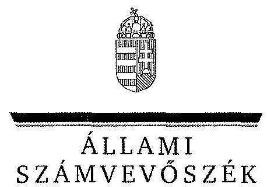
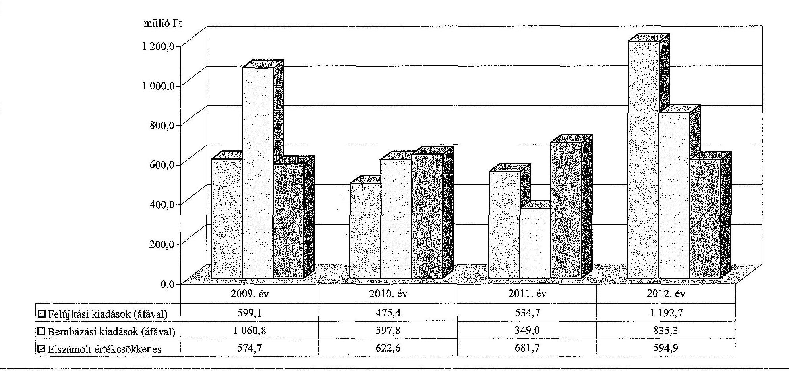

ÁLLAMI
SZÁMVEVŐSZÉK

# JELENTÉS 

az önkormányzatok vagyongazdálkodása
szabályszerűségének ellenőrzéséről
Budapest Főváros XV. kerület Rákospalota, Pestújhely, Újpalota

---

# Állami Számvevőszék 

Iktatószám: V-0231-027/2014.
Témaszám: 1265
Vizsgálat-azonosító szám: V065111
Az ellenőrzést felügyelte:
Makkai Mária
felügyeleti vezető
Az ellenőrzést vezette és az ellenőrzés végrehajtásáért felelős:
Schósz Attila Ferencné
ellenőrzésvezető
A számvevőszéki jelentés összeállításában közreműködtek:
Groholy Andrásné Hangyál Márta
számvevő tanácsos
Papp József
számvevő tanácsos
Az ellenőrzést végezték:
Papp József
Polyák Ferenc
számvevő tanácsos
dr. Zsolnay András
számvevő

A témához kapcsolódó eddig készített számvevőszéki jelentések:
címe
sorszáma
Jelentés Budapest Főváros XV. kerület Rákospalota, Pestújhely, Újpalota Önkormányzat gazdálkodási rendszerének 2010. évi ellenőrzéséről 1038

---

# TARTALOMJEGYZÉK 

BEVEZETÉS ..... 3
I. ÖSSZEGZŐ MEGÁLLAPÍTÁSOK, KÖVETKEZTETÉSEK, JAVASLATOK ..... 6
II. RÉSZLETES MEGÁLLAPÍTÁSOK ..... 12

1. A vagyongazdálkodási tevékenység szabályozása ..... 12
1.1. A vagyongazdálkodási tevékenység szabályozásának megfelelősége ..... 12
1.2. A vagyon használatba és üzemeltetésbe adásának szabályszerűsége ..... 14
1.3. A vagyon üzemeltetésére, használatára kötött szerződések felülvizsgálata ..... 15
2. A vagyongazdálkodási tevékenység szabályszerűsége ..... 16
2.1. A vagyon nyilvántartása, a vagyon összetételének változása, a döntések és a gazdasági események szabályszerűsége ..... 16
2.1.1. A vagyon nyilvántartásának megfelelősége ..... 16
2.1.2. A vagyon értékének és összetételének változása ..... 17
2.1.3. A vagyon változását eredményező döntések és gazdasági események szabályszerűsége ..... 19
2.2. A térítés nélküli vagyon átadás és átvétel szabályszerűsége ..... 20
2.3. A beruházási és felújítási döntések és végrehajtásuk szabályszerűsége ..... 21
2.4. A tartós részesedésekkel történő gazdálkodás ..... 22
2.5. A vagyon értékesítésének, hasznosításának, a követelés elengedésének szabályszerűsége ..... 22
2.6. Az önkormányzati gazdasági társaságok tulajdonosi felügyelete ..... 25
3. Az integritás érvényesülése a vagyongazdálkodásban ..... 25
4. A belső és a külső ellenőrzések hasznosulása ..... 26
4.1. A belső ellenőrzés javaslatainak hasznosulása ..... 26
4.2. A külső ellenőrzések javaslatainak hasznosulása ..... 27

---

# MELLÉKLETEK 

1. számú Budapest Főváros XV. kerület Rákospalota, Pestújhely, Újpalota Önkormányzata vagyonának alakulása 2009. január 1. és 2012. december 31. között
2. számú Budapest Főváros XV. kerület Rákospalota, Pestújhely, Újpalota Önkormányzata felújítási és beruházási kiadásainak, valamint az elszámolt értékcsökkenésnek a bemutatása a 2009-2012. években

## FÜGGELÉKEK

1. számú Rövidítések jegyzéke
2. számú Értelmező szótár

---

# JELENTÉS 

## az önkormányzatok vagyongazdálkodása szabályszerűségének ellenőrzéséről Budapest Főváros XV. kerület Rákospalota, Pestújhely, Újpalota

## BEVEZETÉS

Az ÁSZ kiemelten fontosnak tartja az ÁSZ tv. 5. § (4) bekezdésének a) pontja és (5) bekezdése, valamint az Áht. 2 61. § (2) bekezdése alapján az önkormányzati vagyon kezelésének, a vagyonnal való gazdálkodási szabályok betartásának az ellenőrzését. Az ellenőrzés feladata a vagyongazdálkodással kapcsolatban a közpénzek átláthatósága, nyilvánossága érdekében a jogszabályokban, belső szabályzatokban megfogalmazott előírások érvényesülésének áttekintése. Az ÁSZ nem csak az ellenőrzött szervezet vagyongazdálkodásának a hibáira mutat rá, számon kérve azok kijavítását, hanem megállapításaival, javaslataival segíti a közpénzzel, a közvagyonnal való felelős gazdálkodást.

Az önkormányzati vagyon alapvető funkciója, hogy a közérdeket és egyúttal az önkormányzati célok megvalósítását szolgálja. A feladatellátás terén elsősorban a kötelezően ellátandó feladatok végrehajtását hivatott szolgálni, amely mellett az önként vállalt feladatok ellátása is megvalósulhat.

Az ÁSZ stratégiájában hangsúlyos szerepet szán annak, hogy szilárd szakmai alapon álló, értékteremtő ellenőrzéseivel előmozdítsa a közpénzügyek átláthatóságát, rendezettségét. Az ÁSZ a vagyongazdálkodás ellenőrzésén keresztül közreműködik az integritás alapú közigazgatási kultúra kialakításában.

Az ellenőrzés célja annak megállapítása volt, hogy az önkormányzat vagyongazdálkodási tevékenységének szabályozottsága és tevékenysége a jogszabályi előírásokkal összhangban volt-e, átlátható, a jogszabályi előírásoknak megfelelő volt-e a vagyon nyilvántartása, a külső és belső ellenőrzések megállapításai hozzájárultak-e az önkormányzati vagyongazdálkodási tevékenység szabályszerűségéhez.

Ennek keretében értékeltük, hogy az Önkormányzat:

- szabályszerűen alakította-e ki a vagyongazdálkodási tevékenységének kereteit;
- biztosította-e a vagyongazdálkodás szabályszerűségét, megalapozottan hozta-e, és jogszerűen, szabályszerűen hajtotta-e végre a vagyonváltozást eredményező meghatározó jelentőségű döntéseket, valamint gondoskodott-e az általa alapított vagy tulajdonosi részvételével működő gazdasági társaságokkal kapcsolatos tulajdonosi joggyakorlásról;

---

- gondoskodott-e vagyongazdálkodási tevékenysége során az integritás (feddhetetlenség) szempontjainak érvényesüléséről;
- belső ellenőrzése elősegítette-e a vagyongazdálkodás szabályszerű működését, valamint hasznosította-e a külső és belső ellenőrzések megállapításait, javaslatait.

Az ellenőrzés típusa: szabályszerűségi ellenőrzés.
Ellenőrzött időszak: az ellenőrzés 2009. január 1-je és 2012. december 31. közötti időszakra terjedt ki, kitekintéssel a helyszíni ellenőrzés befejezéséig (2013. december 9-éig) tartó időszak releváns folyamataira. Az egyes közbeszerzési eljárások lefolytatásának ellenőrzése 2012. január 1-jétől a helyszíni ellenőrzés kezdetét megelőző negyedév utolsó napjáig (2013. szeptember 30-ig), az Nvtv. egyes rendelkezései végrehajtásának ellenőrzése 2012-től, a helyszíni ellenőrzés befejezéséig tartott.

Ellenőrzött szervezet: Budapest Főváros XV. kerület Rákospalota, Pestújhely, Újpalota Önkormányzata

Az ellenőrzés szakmai módszertana az ÁSZ hivatalos honlapján közzétett szakmai szabályokon alapult, amely a Legfőbb Ellenőrző Intézmények Nemzetközi Szervezete (INTOSAI) által kiadott nemzetközi standardok (ISSAI) figyelembevételével készült.

Az ellenőrzést az ÁSZ hatályos szervezeti szabályai és az ellenőrzési programban foglalt értékelési szempontok szerint folytattuk le. Megállapításainkat a helyszíni ellenőrzés tapasztalataira, az ellenőrzött szervezettől bekért dokumentumokra, a kitöltött tanúsítványok elemzésére, az adott időszakban hatályos jogszabályok és belső szabályzatok előírásaira alapoztuk. A részesedések értékelését tételesen ellenőriztük. Irányított mintavétellel választottuk ki a legnagyobb értékű térítésmentes átadás-átvételeket, a beruházásokat, felújításokat, a közbeszerzési eljárásokat, a vagyonértékesítéseket, hasznosításokat és a követelés elengedéseket, továbbá a vagyonkezelési, az üzemeltetési és a koncessziós szerződéseket. Ezen túl a belső kontrollok megfelelő működését a vagyonváltozásokkal kapcsolatos gazdasági események közül a Polgármesteri hivatal 2009-2012. évi számviteli nyilvántartásaiból választott véletlen minta alapján, megállásos (többlépcsős) megfelelőségi teszttel ellenőriztük.

Budapest Főváros XV. kerület Rákospalota, Pestújhely, Újpalota lakosainak száma 2012. január 1-jén 80872 fő volt. A 2010. évi önkormányzati választásokig a 29 tagú Képviselő-testület munkáját hét állandó bizottság segítette. Az önkormányzati választások után a Képviselő-testület létszáma 20 főre csökkent, és négy állandó bizottság működött. A polgármester a 2010. évi önkormányzati választások óta tölti be tisztségét, a jelenlegi jegyző 2011. január 3-tól látja el feladatait.

Az Önkormányzat az ellenőrzött időszakban 17 intézménye önálló gazdálkodási jogkörét megszüntette, azok a 2011. évben létrehozott Gazdasági Működtetési Központ önállóan működő intézményeivé váltak. A 2012. évben egy önállóan működő (oktatási feladatokat ellátó) intézményt jogutód nélkül megszüntettek. Az Önkormányzat a 2012. év végén a Polgármesteri hivatalon felül egy

---

önállóan működő és gazdálkodó, valamint az ahhoz tartozó 29 önállóan működő költségvetési szervvel látta el feladatait. A Polgármesteri hivatal 2012. december 31-én 13 szervezeti egységre tagolódott. A gazdasági szervezet feladatait három szervezeti egység látta el.

Az Önkormányzat a 2012. év végén hat kizárólagos tulajdonú gazdasági társasággal rendelkezett, melyek közül a Palota Holding Zrt. az ingatlankezeléssel, a CSAPI-15 Kft. a vásárcsarnok és piacüzemeltetéssel, a Répszolg Kft. a közterület fenntartással és hulladékkezeléssel, a RUP-15 Kft. az építési beruházások lebonyolításával, a Palota-15 Kft. a szociális foglalkoztatással, a (2011. évben alakult) XV. Média Kft. az önkormányzati kommunikációval kapcsolatos feladatokat látott el. Az Önkormányzat a 2009-2012. évek között vállalkozási tevékenységet nem végzett, vagyonkezelési, haszonélvezeti és koncessziós jogot alapító szerződést nem kötött. PPP konstrukcióban megvalósított fejlesztés az ellenőrzött időszakban az Önkormányzatnál nem volt.

Az Önkormányzat könyvviteli mérleg szerinti vagyona a 2009. évi 90578,6 millió Ft-os nyitó értékről 2012. év végére 94047,7 millió Ft-ra, 3,8%-kal növekedett. A befektetett eszközökön belül elsősorban az üzemeltetésre átadott eszközök növekedtek. A forgóeszközökön belül a pénzeszközök értékének emelkedése volt meghatározó. Az Önkormányzat összes kötelezettségének állományi értéke 2012. december 31-én 6713,5 millió Ft volt, amelyből a rövid és hosszú lejáratú kötelezettségek értéke 6569,7 millió Ft-ot tett ki. A pénzintézeti kötelezettség állományi értéke 6302,8 millió Ft volt, amely a 2398,0 millió Ft összegű adósság átvállalás eredményeként 3904,8 millió Ft-ra csökkent. Az Önkormányzat a 2012. évi költségvetési beszámolója szerint (az előző évi 5700,6 millió Ft pénzmaradvány igénybevételével együtt) 21705,1 millió Ft költségvetési bevételt ért el, és 16800,9 millió Ft költségvetési kiadást teljesített. Felhalmozási célú kiadásra a 2012. évben 2181,3 millió Ft-ot, ezen belül a felújítási és beruházási kiadásokra 2028,0 millió Ft-ot fordítottak.

Az Önkormányzat vagyonának főbb adatait, a felújítási és beruházási kiadásokat, valamint az elszámolt értékcsökkenést az 1-2. számú mellékletek mutatják be. Az alkalmazott rövidítéseket és az egyes fogalmak magyarázatát az 1-2. számú függelék tartalmazza.

Az ÁSZ a 2011. évi LXVI. törvény 29. § (1) bekezdése szerint a jelentéstervezetet megküldte egyeztetésre Budapest Főváros XV. kerület Rákospalota, Pestújhely, Újpalota Önkormányzata polgármesterének, aki az ÁSZ tv. 29. § (2) bekezdésében foglalt észrevételezési jogával nem élt, a jelentéstervezetre észrevételt nem tett.

---

# I. ÖSSZEGZŐ MEGÁLLAPÍTÁSOK, KÖVETKEZTETÉSEK, JAVASLATOK 

Az Önkormányzat a 2009-2012. évek között szabályszerűen alakította ki vagyongazdálkodási tevékenységének kereteit. A Htv.-ben foglaltaknak megfelelően, a teljes vagyoni körre meghatározták az önkormányzati vagyonnal történő gazdálkodás szabályait. A vagyongazdálkodási rendeletben meghatározták azt a vagyoni kört, amelyre vagyonkezelői jog létesíthető, továbbá a vagyonkezelői jog megszerzésének, gyakorlásának és ellenőrzésének, a vagyon üzemeltetésre történő átadásának részletes szabályait. Az Önkormányzat közép- és hosszú távú vagyongazdálkodási tervvel rendelkezett. Az Nvtv.-ben rögzített - 2012. március 1-jei - határidőn túl, 2012. december 21-én határozták meg a forgalomképtelennek minősülő vagyonból azon vagyonelemeket, amelyeket nemzetgazdasági szempontból kiemelt jelentőségű nemzeti vagyonként forgalomképtelen törzsvagyonnak minősítettek. A Képviselő-testület a vagyongazdálkodási rendeletben rögzítette azt az értékhatárt, amely felett csak pályázat útján lehet a vagyont értékesíteni, kezelésbe adni, a használat jogát átadni. Az ingyenes átruházásról szóló döntés joga - a vagyongazdálkodási rendelet szerint - értékhatártól függetlenül a Képviselő-testületet illette meg. Az Önkormányzat élt az Ötv.-ben biztosított lehetőséggel és vagyongazdálkodási hatáskört adott át - értékhatárhoz kötve - a polgármesternek és bizottságoknak.

A jegyző a Polgármesteri hivatal számviteli rendjét - a Htv. előírásainak megfelelően - kialakította, amely megfelelő keretet biztosított a vagyongazdálkodás szempontjából egységes számviteli alapelvek szerinti, önkormányzati szintű beszámoló elkészítéséhez. A Képviselő-testület a vagyongazdálkodási rendeletben szabályozta az Áhsz. szerinti kétévenkénti mennyiségi felvétellel történő leltározás lehetőségét. A jegyző ezzel a lehetőséggel nem élt, a leltározási szabályzatban évenkénti mennyiségi felvétellel történő leltározást írt elő. A jegyző - az Áhsz. -ben foglaltaknak megfelelően - az üzemeltetésre átadott eszközök évenkénti leltározásának módjával a szabályzatot 2010. január 1-jével kiegészítette.

Az operatív gazdálkodással kapcsolatos jogkörök gyakorlásának módját, rendjét, valamint a velük kapcsolatos összeférhetetlenségi követelményeket az Ámr.-ben és az Ávr.-ben előírtaknak megfelelően a gazdálkodási jogkörök szabályzatában szabályozták. A vagyonváltozásokra vonatkozó döntések jogszerűek, dokumentumokkal alátámasztottak voltak. A vagyongazdálkodással kapcsolatban a gazdálkodási jogkörök gyakorlása a kiadások esetében a 2009-2012. években, a bevételek esetében a 2011-2012. években megfelelő volt. A 2009-2010. években a bevételek beszedését megelőzően a bérlakások értékesítéséből befolyt részletfizetésekből származó (összesen 0,9 millió Ft értékű) bevételek esetében - az Ámr.-ben foglaltak ellenére - nem végezték el az ellenőrzési jogkörök gyakorlásával felhatalmazott személyek az előírt feladataikat.

---

Az Önkormányzat az ellenőrzött időszakban koncessziós szerződést, az Ötv. és Mötv. előírásai szerinti vagyonkezelési szerződést nem kötött. Az Önkormányzat a kizárólagos tulajdonában lévő gazdasági társaságainak adta át üzemeltetésre a lakás és nem lakáscélú ingatlanokat, a Szociális Foglalkoztató és az Okmányiroda épületét, míg
 a háziorvosok részére a felújított rendelőket. A vásárcsarnokok és a piac bérbeadására a kizárólagos tulajdonában lévő gazdasági társaságával kötött szerződést. A vagyon üzemeltetésére kötött szerződések tartalmazták az üzemeltető által kötelezően ellátandó önkormányzati közfeladat megjelölését, az üzemeltetésre átadott vagyonnal való gazdálkodásra, állagának, értékének megőrzésére vonatkozó rendelkezéseket. Az Önkormányzat a tulajdonosi részesedéseit, részvényeit az átláthatóság szempontjából (2012. december 31-éig) felülvizsgálta. Egy olyan gazdálkodó szervezetben rendelkezett részesedéssel, amely nem átlátható, azonban csak a 2013. évben döntött a részesedés értékesítéséről.

Az Önkormányzat az ellenőrzött években vagyongazdálkodási tevékenységének szabályszerűségét hiányosan biztosította. A vagyonkimutatások felépítése megfelelő volt, azonban tartalma a 2009. és a 2012. évben nem felelt meg az Áhsz. ${ }_{1}$-ben foglalt előírásoknak az ingatlanok esetében, mivel a 2009. évben a „0"-ra leírt tárgyi eszközök bruttó értékét nem mutatták be, a 2012. évben az építmények értékét duplán szerepeltették. Az Önkormányzatnál a 2009-2012. években az ingatlanvagyon-kataszter adatai, valamint a földhivatali ingatlan nyilvántartás közötti egyezőséget biztosították. Az Önkormányzat azonban az ingatlanvagyon-kataszter adatai és az Önkormányzat számviteli nyilvántartása közötti egyezőséget - a 147/1992. (XI. 6.) Korm. rendeletben előírtak ellenére - nem biztosította. Az eltérés a 2012. évben 7,1 millió Ft volt, melyet az ÁSZ helyszíni ellenőrzésének idején javítottak, azonban a teljes ellenőrzött időszak alatt az ingatlanvagyon-kataszterben parkfelszerelésként gépek, berendezések és felszereléseket tartottak nyilván 135,1 millió Ft összegben. Az Önkormányzatnál a 2009-2012. években a Polgármesteri hivatal, a 2010-2012. években az intézmények eleget tettek az évenkénti leltározási kötelezettségnek. Az üzemeltetésre átadott eszközök esetében - a 2010-2012. években a Palota Holding Zrt. kivételével, amely ezen eszközök több, mint 90\%-ával rendelkezett - nem tettek eleget az Áhsz. ${ }_{1}$-ben és a leltározási szabályzat ${ }_{1,2}$-ben előírt leltározási kötelezettségnek. Ezáltal a könyvviteli mérlegben kimutatott vagyonérték valódiságát az Áhsz. ${ }_{1}$-ben foglaltak ellenére teljes körűen nem támasztották alá leltárral.

Az Önkormányzat minden évben megalapozottan, a gazdasági program ${ }_{1,2}$-ben foglalt fejlesztési célkitűzésekkel és az önkormányzati feladatellátással összhangban döntött a beruházásokról és felújításokról. A fejlesztések finanszírozhatóságát és fenntarthatóságát biztosították. Az ellenőrzött beruházásokat és felújításokat szabályszerűen hajtották végre. Az Önkormányzat a 2012. évben és a 2013. év I-III. negyedévében minden közbeszerzési értékhatárt elérő, vagy azt meghaladó beszerzés esetében lefolytatta a közbeszerzési eljárást. Az önkormányzati vagyon hasznosítása és értékesítése szabályszerűen történt. A vagyongazdálkodási döntések során a döntéshozók a jogszabályban és a vagyongazdálkodási rendeletben foglaltaknak megfelelően az arra felhatalmazottak (Képviselő-testület, polgármester ${ }_{1,2}$, valamint Pénzügyi bizottság) voltak. A vagyonváltozásról hozott döntésekkel azonos tartalmú szerződéseket kötöttek. A jegyző ${ }_{1,2}$ az ellenőrzött időszak során - a 2009. évi önkormányzati lakás

és nem lakás célú helyiségek felújítására vonatkozó szerződések kivételével - biztosította a közpénzek felhasználásának átláthatóságát, továbbá az éves költségvetési, zárszámadási rendeletek Eisztv. mellékletében előírtak szerinti adatait az Önkormányzat honlapján közzétették.

Az Önkormányzatnál az ellenőrzött időszakban az elengedett követelés bruttó összege 42,7 millió Ft, a behajthatatlan követelés 68,9 millió Ft volt. A követeléseket - az Áht-1,2 és a vagyongazdálkodási rendelet előírásainak megfelelően - a hatáskörrel rendelkezők szabályszerűen engedték el. A behajthatatlan követeléseket az Áhsz-1 előírásával összhangban - jogerős felszámolási végzéssel és az abban foglaltak szerint adósi vagyon hiányában - állapították meg. A behajthatatlan és az elengedett követeléseket a 2009-2012. években az Áhsz-1-ben foglaltak ellenére nem vezették át a főkönyvön, valamint az éves költségvetési beszámolók tájékoztató adatai között nem mutatták be.

Az Önkormányzatnál az ellenőrzött időszakban a térítésmentes átadások-átvételek közül az államháztartáson kívülről történt (összesen bruttó 3,1 millió Ft értékű) tárgyi eszközök térítésmentes átvételéről - az Ötv.-ben és a vagyongazdálkodási rendeletben foglalt hatásköri szabályok ellenére - nem a Képviselő-testület, hanem az intézményvezetők döntöttek.

A Képviselő-testület az ellenőrzött időszakban egy esetben - önkormányzati kommunikációval kapcsolatos szolgáltatások elvégzése érdekében - döntött új gazdasági társaság, a 100%-os önkormányzati tulajdonú, XV. Média Kft. létrehozásáról. Az Önkormányzatnál - az értékelési szabályzat ${ }_{1-4}$-ben foglaltaknak megfelelően - minden évben vizsgálták a tulajdonosi részesedések alakulását, az abban bekövetkezett változásokat, az értékvesztés elszámolásának és visszaírásának szükségességét. Az Önkormányzat a tulajdonosi jogok gyakorlása során a 2009-2012. években a kizárólagos tulajdonában álló gazdasági társaságok éves beszámolóit, üzleti terveit, valamint közhasznúsági jelentéseit megtárgyalta és elfogadta.

Az Önkormányzatnál a 2009-2012. évek között a vagyongazdálkodási tevékenység integritása (feddhetetlensége), az átláthatósági és elszámoltathatósági követelmények érvényesülése, valamint a stabil és kiegyensúlyozott működés feltételeinek biztosítása - a megfelelő szabályozás ellenére - nem valósult meg maradéktalanul. Így például a 2009-2010. évi bevételek beszedésekor a gazdálkodási jogkör gyakorlása esetében nem alkalmazták a „négy szem elvét", a 2009. évben az önkormányzati lakások és nem lakás célú helyiségek felújításához kapcsolódó szerződések adatait nem tették közzé, továbbá a 2011. évben két óvoda komplex akadálymentesítésére a közbeszerzési eljárást nem folytatták le.

A belső ellenőrzés megállapításai, javaslatai elősegítették az Önkormányzat vagyongazdálkodásának szabályszerű működését, azonban maradéktalan hasznosulásuk nem volt biztosított. Az intézményvezetők - a Ber. és a Bkr. előírásai és az elkészített intézkedési tervek ellenére - a szabályozásra tett javaslatok közül nem valósították meg a térítés nélkül használt sportingatlanokkal kapcsolatos megállapodások megkötésére, a bérleti díjak felülvizsgálatára vonatkozó javaslatokat. Az Önkormányzat 100%-os tulajdonú gazdasági társaságainál a tárgyi eszköz analitika és a vagyonkataszter egyeztetése után az eltérések okainak kivizsgálása nem fejeződött be, a hosszú távú lakáskoncepciót és operatív felújítási tervet nem készítették el, valamint a szabályszerű leltározás, selejtezés nem valósult meg.

Az Önkormányzat 2009-2012. évi költségvetési beszámolóit a könyvvizsgálók minden évben megbízhatónak és hitelesnek minősítették. A 2009. és a 2010. évi költségvetési beszámoló tervezetek kapcsán tártak fel (a Polgármesteri hivatalra és intézményekre vonatkozóan) vagyongazdálkodást érintő eltéréseket, hibákat, melyeket javítottak, így az elfogadott beszámolókban azok már helyes összeggel szerepeltek. A feltárt szabályozási hiányosságok pótlására intézkedtek, azok hasznosultak.

Az Önkormányzatnál az ellenőrzött időszakban külső szerv európai uniós fejlesztési támogatással kapcsolatban végzett ellenőrzése során megállapította, hogy egy építési projektekre (két óvoda beruházásra) a becsült érték egybeszámítása miatt közbeszerzési eljárást kellett volna lefolytatni. Az összesen 7,0 millió Ft támogatás visszavonásáról a Magyar Gazdaságfejlesztési Központ Zrt. intézkedett.

Az ÁSZ az Önkormányzat gazdálkodási rendszerének 2010. évi ellenőrzése során a számvevőszéki jelentésben 15 javaslatot fogalmazott meg, amelyeket az ÁSZ helyszíni ellenőrzésének lezárásáig - kettő részben teljesült, informatikai rendszerre vonatkozó célszerűségi javaslat kivételével - realizáltak.

Az Állami Számvevőszékről szóló 2011. évi LXVI. törvény 33. § (1) bekezdésében foglaltak értelmében a jelentésben foglalt megállapításokhoz kapcsolódó intézkedési tervet köteles az ellenőrzött szervezet vezetője összeállítani, és azt a jelentés kézhezvételétől számított 30 napon belül az ÁSZ részére megküldeni. Amennyiben az intézkedési tervet határidőben nem küldi meg a szervezet, vagy az nem elfogadható, az ÁSZ elnöke a hivatkozott törvény 33. § (3) bekezdés a)-b) pontjaiban foglaltakat érvényesítheti.

Az ellenőrzés intézkedést igénylő megállapításai és javaslatai:

# a jegyzőnek

1. Az Önkormányzatnál a 2009. és a 2012. évi vagyonkimutatások tartalma nem felelt meg az Áhsz., 44/A. § (2)-(3) bekezdéseiben foglalt előírásoknak, mivel a 2009. évi vagyonkimutatás nem tartalmazta a „0"-ra leírt eszközök állományát, valamint a 2012. évi vagyonkimutatásban az építmények értékét duplán szerepeltették.

Javaslat:
Intézkedjen az Önkormányzat vagyonkimutatásának az Áhsz. 30. § (2)-(3) bekezdéseiben előírtak szerinti elkészítéséről és annak Képviselő-testület részére történő bemutatásáról.
2. Az Önkormányzatnál az ingatlanvagyon-kataszter adatai és a számviteli nyilvántartásban rögzített adatok egyezőségét - a 147/1992. (XI. 6.) Korm. rendelet 1. § (3) bekezdésében és a 2. számú mellékletében előírtak ellenére - az ellenőrzött időszakban nem biztosították, mert az ingatlanvagyon-kataszterben gépek, berendezések és felszereléseket tartottak nyilván 135,1 millió Ft összegben.

Javaslat:
Intézkedjen az ingatlanvagyon-kataszter adatainak és a számviteli nyilvántartásoknak - a 147/1992. (XI. 6.) Korm. rendelet 1. § (3) bekezdésében és a 2. számú mellékletében foglaltaknak megfelelő - egyezőség biztosításáról.
3. Az üzemeltetésre átadott eszközök mérleg szerinti értékét - az Áhsz. 37. § (4) bekezdésében, illetve a leltározási szabályzat ${ }_{1,2}$-ben foglalt előírások ellenére - (a Palota Holding Zrt. kivételével) nem támasztották alá az üzemeltetést végző szervek által elkészített, hitelesített leltárakkal.

Javaslat:
Intézkedjen, hogy az üzemeltetésre átadott eszközökről - az Áhsz. 22. § (1)(2) bekezdéseiben, a Számv. tv. 69. §-ában, valamint a leltározási szabályzat ${ }_{2}$-ben foglalt előírásoknak megfelelően - a könyvviteli mérleg alátámasztásához az üzemeltetést végző szervek által elkészített, hitelesített leltárak rendelkezésre álljanak.
4. A Polgármesteri hivatalban a 2009-2012. években a behajthatatlan követeléseket az Áhsz. 34. § (10) bekezdésében, valamint 9. számú mellékletének 2. ch) pontjában (2010-től 2. ci) pontjában) foglaltak ellenére nem vezették át a főkönyvön, továbbá az Áhsz. 38. § (6) bekezdés n) pontjában foglalt előírás ellenére az éves költségvetési beszámolók tájékoztató adatai között nem mutatták be.

Javaslat:
Intézkedjen a behajthatatlan követeléseknek az Áhsz. 2 43. § (1) bekezdésében foglaltak szerinti könyvvezetéséről, valamint az Áhsz. 2 10. számú melléklete 10. pontja alapján az éves költségvetési beszámoló kiegészítő tájékoztató adatai közötti bemutatásáról.
5. A Polgármesteri hivatalban a 2009-2012. években az elengedett követeléseket az Áhsz. 9. számú mellékletének 9. d) pontjában (2012-től 2. ck) pontjában) foglaltak ellenére nem vezették át a főkönyvön, valamint az éves költségvetési beszámolók tájékoztató adatai között nem mutatták be.

Javaslat:
Intézkedjen a Polgármesteri hivatalban az elengedett követelések Áhsz. 2 43. § (1) bekezdésében foglaltak szerinti könyvvezetéséről, valamint az Áhsz. 2 10. számú melléklete 10. pontja alapján az éves költségvetési beszámoló kiegészítő tájékoztató adatai közötti bemutatásáról.
6. A belső ellenőrzés által feltárt hiányosságok megszüntetésére az intézményvezetők a Ber. 29. § (5) bekezdésének, valamint a Bkr. 28. § c) pontjának előírásai és az elkészített intézkedési tervek ellenére nem valósították meg a térítés nélkül használt önkormányzati sportingatlanokkal kapcsolatos megállapodások megkötésére, valamint a bérleti díjak felülvizsgálatára vonatkozó javaslatokat. Az Önkormányzat 100%-os tulajdonú gazdasági társaságainál az elkészített intézkedési terv ellenére a tárgyi eszköz analitika és a vagyonkataszter egyeztetése után az eltérések okainak kivizsgálása nem fejeződött be, a hosszú távú lakáskoncepciót és operatív felújítási tervet nem készítették el. A Répszolg Kft.-nél a szabályszerű leltározás, selejtezés nem valósult meg.

Javaslat:
Intézkedjen, hogy a belső ellenőrzés által feltárt hiányosságok megszüntetésére készített intézkedési terveket az ellenőrzöttek - a Bkr. 28. § c) pontjában előírtaknak megfelelően - végrehajtsák.

# II. RÉSZLETES MEGÁLLAPÍTÁSOK

## 1. A VAGYONGAZDÁLKODÁSI TEVÉKENYSÉG SZABÁLYOZÁSA

### 1.1. A vagyongazdálkodási tevékenység szabályozásának megfelelősége

A Képviselő-testület a Htv. 138. § (1) bekezdésének j) pontjában foglaltaknak megfelelően, a teljes vagyoni körre elfogadta az önkormányzati vagyonnal történő gazdálkodás szabályait. Az Önkormányzat a vagyongazdálkodási rendeletben meghatározta a törzsvagyon körét, ezen belül a forgalomképtelen és a korlátozottan forgalomképes vagyonelemeket rögzítette. Az Nvtv. 18. § (1) bekezdésében meghatározott - 2012. március 1-jei - határidőn túl, 2012. december 21-én határozták meg a forgalomképtelennek
 minősülő vagyonából azon vagyonelemeket, amelyeket nemzetgazdasági szempontból kiemelt jelentőségű nemzeti vagyonként forgalomképtelen törzsvagyonnak minősítettek. Az Önkormányzat az Nvtv. 9. § (1) bekezdésében foglaltaknak megfelelően közép- és hosszú távú vagyongazdálkodási tervvel rendelkezett.

A Képviselő-testület élt az Ötv. 9. § (3) bekezdésében biztosított jogával, a vagyongazdálkodási feladatokhoz kapcsolódóan - értékhatárhoz kötve - a polgármesternek és a bizottságoknak adott át az egyes vagyontárgyak hasznosítására kiterjedő rendelkezési, döntési hatáskört, azonban az átadott hatáskörök gyakorlására vonatkozóan - célszerűsége ellenére - beszámolási kötelezettséget nem írt elő.

A vagyongazdálkodási rendelet szabályai szerint elidegenítés esetében - lakás és nem lakás célú helyiség kivételével - a döntés joga a Képviselő-testületet illette meg. A közterület használathoz, lakás- és helyiséggazdálkodási és elidegenítési feladatokhoz, továbbá követelés elengedéshez kapcsolódóan a Pénzügyi bizottságnak, a polgármesternek, valamint a Szociális bizottságnak adtak át hatásköröket.

Az Önkormányzat a vagyongazdálkodási rendeletben meghatározta a vagyonkimutatásra vonatkozó szabályokat, az Áhsz. 1. számú melléklete szerinti részletezettséggel. Az Önkormányzat nem élt az Áhsz., 44/A. § (2) bekezdésében foglalt lehetőséggel, a vagyonkimutatás további tételes alábontását rendeletben nem határozta meg. Szabályozták továbbá - az Áht. 108. § (2) bekezdésében foglaltaknak megfelelően - a vagyon tulajdonjogának, valamint a vagyonhoz kapcsolódó, önállóan forgalomképes vagyoni értékű jogok ingyenes átruházásának eseteit. Értékhatártól függetlenül az ingyenes átruházásról szóló döntés joga a Képviselő-testületet illette meg a vagyongazdálkodási rendelet szerint. A Képviselő-testület - az Áht. 108. § (1) bekezdésében előírtaknak megfelelően - a vagyongazdálkodási rendeletben határozta meg azt az értékhatárt,

[^0]
[^0]:    ${ }^{1}$ 2012. június 30 -ától az Nvtv. 13. § (3) bekezdése szabályozza.

---

amely felett csak pályázat útján lehet a vagyont értékesíteni, kezelésbe adni, a használat jogát átadni. Rendelkeztek a forgalomképesség szerinti besorolás megváltoztatásának módjáról. Az Önkormányzat a vagyongazdálkodási rendeletben előírta - a hasznosításra szánt vagyon értéke megállapítása céljából az értékbecslés készítésének kötelezettségét.

A vagyongazdálkodási rendelet 12. § (3) bekezdése általános szabályként ingatlan és ingó vagyon esetében az értékhatárt egy vagyontárgy esetében egymillió Ft-ban, több vagyontárgyról együttes rendelkezés esetén ötmillió Ft-ban határozta meg. A lakásértékesítési rendelet 3/A. §-a speciális szabályként a lakások és a nem lakáscélú helyiségek körére 20,0 millió Ft-os forgalmi érték felett versenytárgyalás alkalmazását írta elő.

A jegyző a Polgármesteri hivatal számviteli rendjét - a Htv. 140. § (1) bekezdés c) pontjában foglalt előírásnak megfelelően - kialakította és megfelelő keretet biztosított a vagyongazdálkodás szempontjából az egységes számviteli alapelvek szerinti, önkormányzati szintű beszámoló elkészítéséhez. A Polgármesteri hivatal - az ellenőrzött időszakban - rendelkezett az Áhsz. ben előírt, a helyi sajátosságoknak megfelelő számviteli politikával és a kapcsolódó szabályzatokkal (pénzkezelési szabályzattal, leltározási szabályzattal, értékelési szabályzattal), továbbá számlarenddel, selejtezési szabályzattal. Az Önkormányzat nem élt az immateriális javak, tárgyi eszközök, továbbá a befektetett eszközök piaci értéken történő értékelésének lehetőségével.

A Képviselő-testület a vagyongazdálkodási rendeletben szabályozta az Áhsz. 37. § (7) bekezdése szerinti kétévenkénti mennyiségi felvétellel történő leltározás lehetőségét. A jegyző ezzel a lehetőséggel nem élt, a leltározási szabályzatban évenkénti mennyiségi felvétellel történő leltározást írt elő. A jegyző az üzemeltetésre átadott eszközök évenkénti leltározásának módjával az Áhsz. 37. § (4) bekezdésében foglaltaknak megfelelően - a szabályzatot 2010. január 1-jével kiegészítette. Az Önkormányzatnál - az Ámr. ben és az Ávr.-ben előírtaknak megfelelően - a gazdálkodási jogkörök szabályzatában szabályozták az operatív gazdálkodással kapcsolatos jogkörök gyakorlásának módját, rendjét, valamint a velük kapcsolatos összeférhetetlenségi követelményeket.

Az Önkormányzat az ellenőrzött időszakban a kötelező és önként vállalt feladatainak körét, azok ellátásának mértékét és módját az önkormányzati SZMSZ-ban az Ötv. 8. § (2) bekezdésében foglaltak ellenére nem rögzítette. Egyes feladatokat a 2009-2012. évi költségvetési rendeletek és az Önkormányzatnak kötelező vagyongazdálkodási feladatot szabó ágazati törvények alapján megalkotott rendeletek, valamint a feladatellátás módját az alapító okiratok tartalmazták. A feladatok ellátásának módját 2013. január 1-jétől képviselő-

[^0]
[^0]:    ${ }^{2}$ Megállapította a 317/2009. (XII. 29.) Korm. rendelet 18. §-a. Először a 2010. évről készített beszámolókra kellett alkalmazni. 2014. január 1-jétől az Áhsz. 22. § (2) bekezdés a) pontja szerint csak a koncesszióba, vagyonkezelésbe adott eszközöket kell a működtető, vagyonkezelő által elkészített és hitelesített leltárral alátámasztani.
    ${ }^{3}$ Az Ötv. 8. § (2) bekezdését 2013. január 1-jével hatályon kívül helyezték, ezen időponttól az Mötv. 10. § (1) bekezdése és a 12. § (2) bekezdése szabályozza.

---

testületi határozatok, ellátásuk mértékét a 2013. évi költségvetési rendelet az Mötv. 111. § (3) bekezdésében foglaltaknak megfelelően tartalmazta.

Az Önkormányzat a kötelező és önként vállalt feladatait a Polgármesteri hivatalon, az intézményrendszerén, a kizárólagos tulajdonában lévő közhasznú, nonprofit társaságain, a gazdasági társaságain keresztül, továbbá társulásokkal és vállalkozásokkal kötött szerződések útján látta el.

Az Önkormányzat a 2011. évben létrehozott Gazdasági Működtetési Központ intézménye számára - a 2012. július 1-jétől történt racionalizáló átszervezéseket követően - valamennyi intézménye gazdasági, pénzügyi és műszaki feladatait átadta, ezáltal azok önálló gazdálkodási jogköre megszűnt. A 2012. évben egy önállóan működő (oktatási feladatokat ellátó) intézményt jogutód nélkül megszüntettek.

# 1.2. A vagyon használatba és üzemeltetésbe adásának szabályszerűsége 

Az Önkormányzat az Ötv. 80/B. §-ának megfelelően rendelkezett a vagyonkezelői jog részletes szabályairól. Az Önkormányzat az ellenőrzött időszakban vagyonkezelői jogot nem adott át, koncessziós szerződést, valamint az Ötv. 80/A. § előírása szerinti vagyonkezelési szerződést nem kötött.

Az ellenőrzött időszakban a Képviselő-testület a vagyongazdálkodási rendeletben átruházott hatáskörök gyakorlásával kapcsolatos beszámoltatást - szabályozás hiányában - nem végzett.

Meghatározták a vagyongazdálkodási rendeletben azt a vagyoni kört, amelyre vagyonkezelői jog létesíthető, továbbá a vagyonkezelői jog megszerzésének, gyakorlásának és ellenőrzésének, továbbá a vagyon üzemeltetésre történő átadásának részletes szabályait. Az önkormányzati tulajdonú, lakás és nem lakáscélú ingatlanok (üzlethelyiségek) üzemeltetésével kapcsolatos feladatok ellátásáról az Önkormányzat a kizárólagos tulajdonában álló Palota Holding Zrt.-vel kötött megbízási szerződések útján gondoskodott. A vagyon üzemeltetésére kötött szerződések tartalmazták az üzemeltető által kötelezően ellátandó önkormányzati közfeladat megjelölését, az üzemeltetésre átadott vagyonnal való gazdálkodásra, állagának, értékének megőrzésére vonatkozó rendelkezéseket.

Az Önkormányzat üzemeltetésre adott át ingatlanokat, a 2009. évben a Szociális Foglalkoztató épületét az ehhez tartozó telekrendezéssel a kizárólagos tulajdonában álló Palota-15 Kft.-nek, a 2012. évben a Zsókavár I. projekt keretében (a háziorvosok részére) felújított rendelőket, valamint az Okmányiroda épületét a kizárólagos tulajdonában álló Palota Holding Zrt.-nek.

Az Önkormányzat bérleti szerződést kötött a tulajdonában álló vásárcsarnokok és piac hasznosítása, működtetése érdekében a kizárólagos tulajdonában álló CSAPI-15 Kft.-vel. Bérleti szerződést kötöttek továbbá a Rákospalotai Meixner

[^0]
[^0]:    ${ }^{4}$ 2012. január 1-jétől az Mötv. 109. § (4) bekezdése szabályozza.
    ${ }^{5}$ 2012. január 1-jétől az Mötv. 109. §-a szabályozza.

---

Általános Iskola és Alapfokú Művészetoktatási Intézmény működtetése érdekében iskola és óvoda épület, valamint az Értelmi Sérülteket Szolgáló Társadalmi Szervezetek és Alapítványok Országos Szövetségével a Molnár Viktor u. 9496. szám alatti ingatlan hasznosítására.

Az Önkormányzat által üzemeltetésbe, hasznosításba átadott vagyon 90,5%-a lakás, nem lakás célú ingatlan, telek és földterület volt, amit a Palota Holding Zrt. üzemeltetett. Az üzemeltetésre, hasznosításra átadott eszközökből a Palota-15 Kft. 3,4%-kal, a Répszolg Kft. 1,4%-kal részesült. A bérleti szerződéssel hasznosított eszközök esetében a Csapi-15 Kft. 2,2%-kal, a Meixner Alapítvány 1,8%-kal az Értelmi Sérülteket Szolgáló Társadalmi Szervezetek és Alapítványok Országos Szövetsége 0,2%-kal részesült. Az egyéb használatba adás (SPAR Magyarország Kereskedelmi Kft. részére földterület parkoló kialakítása és fenntartása céljából) 0,5%-ot tett ki.

Az Önkormányzat az ellenőrzött időszakban az üzemeltetésre, hasznosításra átadott eszközök után 157,4 millió Ft értékcsökkenést számolt el és az eszközök pótlására, felújítására 328,2 millió Ft-ot fordított.

# 1.3. A vagyon üzemeltetésére, használatára kötött szerződések felülvizsgálata 

A Képviselő-testület az ellenőrzött időszakban egy esetben - önkormányzati kommunikációval kapcsolatos szolgáltatások elvégzése érdekében - döntött új gazdasági társaság, a 100%-os önkormányzati tulajdonú, XV. Média Kft. létrehozásáról.

Az Önkormányzat a tulajdoni részesedéseit, részvényeit az átláthatóság szempontjából (2012. december 31-ig) felülvizsgálta. Hat kizárólagos tulajdonú gazdasági társasága, valamint az OTP Nyrt. (amelyben 0,2 millió Ft részesedéssel rendelkezett) az Nvtv. 3. § (1) bekezdés 1. pontja alapján átlátható szervezetnek minősült. Az ÖSSZEFOGÁS-TISZK Szakképzés-szervezési Nonprofit Kiemelkedően Közhasznú Kft.-ben 0,1 millió Ft egyéb tartós részesedéssel rendelkeztek, amelyet az Nvtv. 3. § (1) bekezdés 1. pontja alapján nem átlátható szervezetnek minősítettek, azonban az Nvtv. 18. § (4) bekezdésében foglalt előírás ellenére az ellenőrzött időszakban nem kezdeményezték a gazdálkodó szervezet tulajdonosi szerkezetének az Nvtv. átlátható szervezetre vonatkozó előírásainak megfelelő átalakítását.

Az Önkormányzat kizárólagos tulajdonában álló Palota Holding Zrt.-vel az ellenőrzött időszak minden évében - a felülvizsgálatot követően - az Önkormányzat tulajdonában álló ingatlanok üzemeltetésére irányuló szerződéseket újrakötötték. A CSAPI-15 Kft.-vel a korábbi szerződés lejártát követően 2011. július 1-jétől, öt évre kötöttek új szerződést a vásárcsarnokok és a piac bérbeadásáról.

[^0]
[^0]:    ${ }^{6}$ A Képviselő-testület az 560/2013. (VI. 26.) számú határozatával döntött a Kft.-ben lévő 0,1 millió Ft értékű részesedés névértéken történő eladásáról, amely végrehajtása a 2013. év decemberében megtörtént.

---

# 2. A VAGYONGAZDÁLKODÁSI TEVÉKENYSÉG SZABÁLYSZERŰSÉGE 

### 2.1. A vagyon nyilvántartása, a vagyon összetételének változása, a döntések és a gazdasági események szabályszerűsége

### 2.1.1. A vagyon nyilvántartásának megfelelősége

Az Önkormányzat a 2009-2012. években a számviteli nyilvántartásában a főkönyvi számlák alábontásával, valamint a számlákhoz kapcsolódó analitikus nyilvántartások vezetésével, biztosította a törzsvagyon többi vagyontárgytól való elkülönített nyilvántartását.

Az Önkormányzatnál a 2009-2012. években a 147/1992. (XI. 6.) Korm. rendelet 1. § (2) bekezdésében foglaltaknak megfelelően az ingatlanvagyon-kataszter adatai, valamint a földhivatali ingatlan nyilvántartás közötti egyezőséget biztosították. Az Önkormányzat azonban az ingatlanvagyon-kataszter adatai és az Önkormányzat számviteli nyilvántartása közötti egyezőséget a 147/1992. (XI. 6.) Korm. rendelet 1. § (3) bekezdésében és a 2. számú mellékletében előírtak ellenére - az ellenőrzött időszakban nem biztosította.

Az Önkormányzat a 2009-2012. évek között az ingatlanvagyon-kataszterben gépeket, berendezéseket és felszereléseket tartott nyilván 135,1 millió Ft összegben, mint parkfelszerelés.

A 2012. évben az Önkormányzat éves költségvetési beszámolójában szereplő ingatlanok bruttó értéke 7,1 millió Ft-tal eltért az ingatlanvagyon-kataszterben szereplő értéktől. Az eltérés oka, hogy az Önkormányzat számviteli nyilvántartásaiban a kivitelezési terveket nem aktiválták az ingatlanokra, illetve a kerekítéseket helytelenül alkalmazták. Ezen belül az 1956-os „Lobogás” emlékmű számviteli nyilvántartás szerinti értéke 4,3 millió Ft-tal eltért az ingatlanvagyon-kataszterben szereplő értéktől.
 rendelettervezet előterjesztésekor az Áht. ${ }_{1} 118 . \S$ (2) bekezdése 2. c) pontjának ${ }^{8}$ előírása szerint a Képviselő-testület részére tájékoztatásul bemutatták. A vagyonkimutatásokat az ellenőrzött időszakban törzsvagyon (forgalomképtelen és korlátozottan forgalomképes), illetve üzleti (forgalomképes) vagyon bontásban bemutatták. A 2009-2012. évi vagyonkimutatások felépítése megfelelő volt, míg tartalma a 2009. és a 2012. évben nem felelt meg az Áhsz. ${ }_{1} 44 /$ A. § (2)-(3) bekezdéseiben ${ }^{9}$ foglalt előírásoknak az ingatlanok esetében.

A vagyonkimutatásokban az ingatlanok bruttó értéke az éves költségvetési beszámolóban szereplő bruttó értékektől a 2009. évben 1,5 millió Ft-tal, a

[^0]
[^0]:    ${ }^{7}$ A helyszíni ellenőrzés ideje alatt 2013. október 30 -án az eltérést az ingatlanvagyonkataszterben kijavították.
    ${ }^{8}$ 2012. január 1-jétől az Áht. ${ }_{2}$ 91. § (2) bekezdés c) pontja szabályozza.
    ${ }^{9}$ 2014. január 1-jétől az Áhsz. ${ }_{2}$ 30. § (2)-(3) bekezdései szabályozzák.

---

2012. évben 2494,7 millió Ft-tal eltért. A 2009. évben az eltérés oka, hogy a vagyonkimutatásban a „0"-ra leírt tárgyi eszközök bruttó értékét nem mutatták be. A 2012. évben az eltérés abból adódott, hogy az építmények értékét duplán szerepeltették a vagyonkimutatásban.

A Polgármesteri hivatalhoz tartozó önállóan működő intézményeknél a 2009. évben az Áhsz. ${ }_{1} 37 . \S$ (3) bekezdésében és a leltározási szabályzat ${ }_{1}$ 2. számú mellékletében foglaltak ellenére - a leltározást nem hajtották végre. Az Önkormányzatnál az üzemeltetésre átadott eszközök mérleg szerinti értékét a 2009. évben az Áhsz. ${ }_{1} 37 . \S$ (3) bekezdésben és a leltározási szabályzat ${ }_{1}$-ben foglaltak ellenére, nem mennyiségi felvétellel történő leltározással határozták meg. Az Önkormányzatnál a 2009-2012. években a Polgármesteri hivatal, a 2010-2012. években az intézmények esetében - az Áhsz. ${ }_{1} 37 . \S$ (1) bekezdésében előírtaknak megfelelően - eleget tettek az évenkénti leltározási kötelezettségnek. Az üzemeltetésre átadott eszközök esetében - a 2010-2012. években a Palota Holding Zrt. kivételével, amely ezen eszközök több, mint 90\%-ával rendelkezett - nem tettek eleget az Áhsz. ${ }_{1} 37 . \S$ (4) bekezdésében előírt leltározási kötelezettségnek. Ezáltal a könyvviteli mérlegben kimutatott vagyonérték valódiságát az Áhsz. ${ }_{1} 37 . \S$ (2) és (4) bekezdéseiben ${ }^{10}$ foglaltak ellenére nem támasztották alá teljes körűen leltárral.

Az önkormányzati mérlegbeszámoló 2012. évi nyitó adatai - a Számv. tv. 16. § (6) bekezdésével ellentétesen - nem egyeztek meg az előző év megfelelő záró adataival, melyet a 2012. évben korrigáltak. Az eltérést az okozta, hogy a nemzetiségi önkormányzatok 720,5 millió Ft-os teljesítési adatait duplán szerepeltették a záró adatok között, amelyet a könyvvizsgáló nem mutatott ki auditálási eltérésként.

A Polgármesteri hivatalban az eszközök 2009-2012. évi selejtezése során betartották a selejtezési szabályzat ${ }_{1,2}$ előírásait, a minősítést az arra jogosult Selejtezési Bizottság végezte, valamint megtörtént az eljárás szabályszerű végrehajtásának folyamatba épített ellenőrzése. Az intézményeknél a 2009-2010. években a selejtezés elszámolása, a leselejtezett eszközök esetében az ár megállapítása a könyvvizsgáló, illetve a belső ellenőr megállapítása szerint - nem a belső szabályzatokban foglaltaknak megfelelően történt.

# 2.1.2. A vagyon értékének és összetételének változása 

Az Önkormányzat könyvviteli mérleg szerinti vagyona a 2009. évi 90578,6 millió Ft-os nyitó értékről 2012. év végére 94047,7 millió Ft-ra, 3,8\%kal növekedett. Ez elsősorban a befektetett eszközökön belül az üzemeltetésre átadott eszközök, valamint a forgóeszközök közül a pénzeszközök és a követelések értékének emelkedése miatt következett be. Az üzemeltetésre átadott eszközök 2009. évi 8,7\%-os részaránya a 2012. évre 9,9\%-ra növekedett, amit elsősorban ( 861,7 millió Ft értékben) a Zsókavár I. projekt keretében (a háziorvosok részére) felújított rendelők átadása, valamint 210,6 millió Ft értékben a Palota Holding Zrt.-nek üzemeltetésre átadott Okmányiroda épülete okozott.

[^0]
[^0]:    ${ }^{10}$ 2014. január 1-jétől az Áhsz. ${ }_{2}$ 22. § (1)-(2) bekezdései és a Számv. tv. 69. §-a szabályozzák.

---

Az ingatlanok és a kapcsolódó vagyoni értékű jogok könyvviteli mérlegben kimutatott állományi értéke a 2009. évi 79 282,9 millió Ft-os nyitó értékről a 2012. évre 523,0 millió Ft-tal (0,7\%-kal) csökkent, amely az értékesített, illetve üzemeltetésre átadott ingatlanok és az elszámolt értékcsökkenés következménye. Az Önkormányzatnál a 2009-2012. évek között nem történt olyan változás az önkormányzati intézményeket érintően, amely befolyásolta az önkormányzati vagyon alakulását. A 2012. évben jogutód nélkül megszüntetett (oktatási feladatokat ellátó) intézmény vagyona továbbra is az Önkormányzat tulajdonában maradt.

A forgóeszköz állomány a 2009. év elejétől a 2012. év végéig több mint kétszeresére nőtt, ezen belül a követelések és a pénzeszközök állománya is emelkedett.

A követelés állomány 375,6 millió Ft-ról 478,7 millió Ft-ra növekedett, amit a helyi adókhoz kapcsolódó követelések növekedése okozott. A pénzeszközök állománya 2,5-szeresére növekedett, amelynek oka, hogy a 2010. évben az Önkormányzat „XV. kerület 2025" elnevezésű 1700,0 millió Ft értékű (5,9 millió EUR) és a 2011. évben a „Palotai fejlesztési kötvény" elnevezésű 2500,0 millió Ft értékű (8,7 millió EUR) kötvényeket bocsátott ki ${ }^{11}$. Az ellenőrzött időszakon belül a pénzeszközök 2011. és 2012. évek között felére csökkentek. A 2011. évben kibocsátott kötvény összegéből az Önkormányzat - átmenetileg - rövid lejáratú deviza alapú értékpapírt vásárolt. A pénzügyi műveletekből a 2011. évben 237,6 millió Ft nyeresége, a 2012. évben 74,9 millió Ft vesztesége keletkezett.

Az Önkormányzat a kötvények céljaként a fejlesztések fenntarthatóságát, az Önkormányzat működőképességének folyamatos biztosítását határozta meg. A Képviselő-testület által átruházott hatáskörben a polgármester ${ }_{2}$ döntött az átmenetileg szabad pénzeszközökből történt értékpapír vásárlásokról, eladásokról.

Az Önkormányzat könyvviteli mérleg szerinti forrásai a 2009. évi nyitó értékről a 2012. év végére 3,8\%-kal bővültek, mivel a tartalék 3010,4 millió Ft-tal, a kötelezettségek 5258,1 millió Ft-tal növekedtek. A kötelezettség állomány az ellenőrzött időszakban 4,5-szeresére nőtt. Ezen belül a hosszú lejáratú kötelezettségek - kötvény és a hitel állománya - 5,3-szorosára növekedett. A 2009-2012. években az esedékes törlesztések alapján az Önkormányzat ténylegesen realizált árfolyamvesztesége 218,8 millió Ft volt.

A rövid lejáratú kötelezettségek állománya a 2009-2012. évek között 3,8-szeresére növekedett a kötvények kibocsátásából származó tartozások, a Panel Plusz hitel és az ÖKIF forintalapú hiteltörlesztések következő évi törlesztő részletei miatt.

Az Önkormányzat a 2006. évben a 72,5 millió Ft Panel Plusz hitelt a „Panel program" végrehajtására, a 2009. évben a 916,9 millió Ft ÖKIF forintalapú hitelt az infrastruktúra fejlesztésére (útépítés, felújítás, park-fasor felújításra, stb.) vette fel.

Az Önkormányzat 2012. december 31-i adósságállománya (pénzintézeti kötelezettségállomány) és annak járuléka 6302,8 millió Ft volt, amelyből

[^0]
[^0]:    ${ }^{11}$ Az Önkormányzat korábban is a 2007. évben 1000,0 millió Ft értékű svájci frank alapú (6,6 millió CHF) kötvényt bocsátott ki.

---

2398,0 millió Ft-ot a Magyarország 2013. évi központi költségvetéséről szóló 2012. évi CCIV. törvény 72. § alapján a Magyar Állam átvállalta (a „XV. kerület 2022" elnevezésű 2007. évben kibocsátott svájci frank alapú kötvény hitelállomány teljes összegét is).

# 2.1.3. A vagyon változását eredményező döntések és gazdasági események szabályszerűsége 

Az Önkormányzat - a 2009-2012. évek között - a vagyontárgyak hasznosítása, a vagyon értékének és összetételének változását befolyásoló, gazdasági eseményekhez kapcsolódó döntések előkészítése és meghozatala során (a telkek, bérlakások, nem lakás céljára szolgáló helyiségek értékesítésekor, bérbeadásakor, épületek és építmények korszerűsítésekor, valamint bővítése és létesítése kapcsán) betartotta a vagyongazdálkodási, a lakásgazdálkodási, a lakásértékesítési rendeletekben, továbbá a képviselő-testületi határozatokban foglaltakat. A Képviselő-testület az önkormányzati tulajdonban lévő lakások értékesítéséhez a vagyongazdálkodási rendeletnek megfelelően ingatlanforgalmi értékbecslő, illetve ingatlanforgalmi szakértő által készített értékbecsléseket tartalmazó előterjesztések alapján hozta meg döntését. A vagyongazdálkodási döntések során a döntéshozók a jogszabályban és a vagyongazdálkodási rendeletben foglaltaknak megfelelően az arra felhatalmazottak (Képviselő-testület, polgármester ${ }_{1,2}$, valamint Pénzügyi bizottság) voltak.

A Polgármesteri hivatalban az ellenőrzött időszakban a gazdálkodási jogkörök gyakorlása során a 2009. évben az Ámr. ${ }_{1}$ 138. § (1)-(3) bekezdéseiben, a 2010-2011. években az Ámr. ${ }_{2}$ 80. § (1)-(2) bekezdéseiben, valamint a 2012. évben az Ávr. 60. § (1)-(2) bekezdéseiben rögzített összeférhetetlenségi követelményeket betartották.

A vagyongazdálkodással kapcsolatban a gazdálkodási jogkörök gyakorlása a kiadások esetében a 2009-2012. években, a bevételek esetében a 2011-2012. években megfelelő volt. A 2009-2010. években a bevételek beszedését megelőzően az ellenőrzött tételek közül a bérlakások értékesítéséből befolyt részletfizetésekből származó (összesen 0,9 millió Ft összegű) bevételek esetében - az Ámr. ${ }_{1,2}$-ben foglaltak ellenére - nem végezték el a szakmai teljesítés igazolása ${ }^{12}$, érvényesítés és utalvány ellenjegyzése kontrollok gyakorlásával felhatalmazott személyek az előírt ellenőrzési feladataikat.

A 2009-2010. években a bevételek beszedésének elrendeléséhez utalványt nem készítettek. A 2009. évben a szakmai teljesítés igazolásával írásban megbízott személy nem tett eleget az Ámr. ${ }_{1} 135$. § (1) bekezdésében előírt ellenőrzési kötelezettségének, nem ellenőrizte a bevételek jogosságát, összegszerűségét, teljesítését. Ezen bevételek esetében az érvényesítő és az utalványok ellenjegyzésével megbízott személyek sem végezték el ellenőrzési feladataikat. A 2010. évben - aláírásuk hiányában - az érvényesítő az Ámr. ${ }_{2} 77$. § (1) bekezdésében, az utalványok ellenjegyzésével megbízott személy az Ámr. ${ }_{2} 79$. § (2) bekezdésében foglaltak ellenére nem végezte el ellenőrzési feladatát. Az ellenőrzési feladatok ellátásának hiá-

[^0]
[^0]:    ${ }^{12}$ A 2010-2012. években hatályos gazdálkodási jogkörök szabályzata ${ }_{14}$-ban a bevételek teljesítésigazolásának kötelezettségét már nem írták elő.

---

nyából adódóan az ellenőrzött tételek esetében az Önkormányzat jogosulatlanul bevételt nem számolt el.

Az Áht. ${ }_{1}$ 15/A. §-ában foglaltak alapján a céljellegű működési és fejlesztési támogatások adatait, az Áht. ${ }_{1}$ 15/B. §-ában foglaltak szerint - a 2009. évi önkormányzati lakás és nem lakás célú helyiségek felújítására vonatkozó szerződések kivételével - a nettó ötmillió Ft-ot elérő, vagy meghaladó értékű, vagyonnal való gazdálkodásra (árubeszerzésre, építési beruházásra, szolgáltatás megrendelésére) vonatkozó szerződések adatait, valamint az Eisztv. mellékletében foglaltak alapján a 2009-2012. évi költségvetési, zárszámadási rendeleteket és elemi költségvetéseket, beszámolókat közzétették ${ }^{13}$.

A jegyző ${ }_{1}$ a 2009. évben - az Áht. ${ }_{1}$ 15/B. § előírása ellenére - a vagyongazdálkodással összefüggő önkormányzati lakás és nem lakás célú helyiségek 121,9 millió Ft értékű felújításához kapcsolódó szerződésekre vonatkozó adatok közzétételéről nem gondoskodott.

# 2.2. A térítés nélküli vagyon átadás és átvétel szabályszerűsége 

Az Önkormányzat a 2009-2012. években vagyont térítésmentesen államháztartáson belülre 1038,1 millió Ft értékben adott át, valamint államháztartáson belülről 628,8 millió Ft értékben vett át. Az Önkormányzat ebben az időszakban vagyont térítés nélkül államháztartáson kívülre nem adott át, azonban államháztartáson kívülről bruttó 79,7 millió Ft értékben vett át.

Az Önkormányzatnál a legnagyobb
 értékű vagyonátvételt államháztartáson kívülről egy 76,6 millió Ft bruttó értékű út, járda esetében - a vagyongazdálkodási rendelet előírása alapján - az arra hatáskörrel rendelkező Képviselőtestület döntése alapozta meg. Az éves költségvetésben biztosították a közművek fenntartásához szükséges forrást.

Az Önkormányzatnál az ellenőrzött időszakban államháztartáson kívülről nyolc alkalommal történt oktatási, nevelési célokat szolgáló tárgyi eszközök térítésmentes átvétele (mindösszesen bruttó 3,1 millió Ft értékben). Az előbbi esetekben - az Ötv. 9. § (1) bekezdésében ${ }^{14}$ foglalt hatásköri szabályok és a vagyongazdálkodási rendelet 16. § (4) bekezdésében foglaltak ellenére - nem a Képviselő-testület, hanem az intézményvezetők döntöttek.

Az eszközök átvételének bizonylatolása, a számviteli nyilvántartásba vétele a számviteli politika ${ }_{1,2}$-ben és az értékelési szabályzat ${ }_{2-4}$-ben előírtaknak megfelelően megtörtént. Az ingatlanok esetében a kataszteri nyilvántartásban a változásokat rögzítették.

A térítés nélküli vagyon átvételek a közfeladatok ellátásának változásával összhangban közterület fenntartásra, iskolai oktatási és óvodai nevelés céljára történtek.

[^0]
[^0]:    ${ }^{13}$ 2012. január 1-jétől az Info tv. 1. számú melléklete írja elő.
    ${ }^{14}$ 2013. január 1-jétől az Mötv. 41. § (3) bekezdése szabályozza.

---

# 2.3. A beruházási és felújítási döntések és végrehajtásuk szabályszerűsége 

A beruházások és felújítások az önkormányzati feladatellátással összhangban voltak, azok szabályszerűségét, finanszírozhatóságát és fenntarthatóságát biztosították, valamint a közcélú ingatlanok akadálymentesítését elvégezték. Az Önkormányzat a 2009-2012. évek között 2801,9 millió Ft értékben hajtott végre felújítást és 2842,9 millió Ft értékben beruházást. Az összesen 5644,8 millió Ft értékű fejlesztéssel szemben az ellenőrzött időszakban elszámolt értékcsökkenés 2473,9 millió Ft volt. A fejlesztési kiadások a gazdasági program ${ }_{1,2}$-ben foglalt fejlesztési célkitűzésekkel összhangban merültek fel. A felújítás 93,9%-a, 2630,7 millió Ft és a beruházás 79,2%-a, 2253,1 millió Ft a kötelező feladatok ellátásához kapcsolódott.

Az ellenőrzött beruházások: útépítés (166,1 millió Ft), Szociális Foglalkoztató megépítése (236,6 millió Ft), Ingatlan vásárlása a Gazdasági Működtetési Központ elhelyezésére (269,2 millió Ft). Az ellenőrzött felújítások: önkormányzati lakás és nem lakás célú helyiségek felújításai (121,9 millió Ft és 101,0 millió Ft), orvosi rendelő, lakóépület felújítása és közterület-rendezés a Zsókavár I. ütemén belül (933,4 millió Ft).

Az Önkormányzat a beruházások és felújítások értékének 29,9%-át saját forrásból, 13,7%-át hitelfelvételből, 24,7%-át kötvény kibocsátásból, 18,6%-át európai uniós támogatásból, 13,1%-át központi támogatásból finanszírozta.

Az ellenőrzött felújítások és beruházások minden esetben a Képviselő-testület jóváhagyásával valósultak meg, az adott évi fejlesztésekre vonatkozóan a Képviselő-testület az éves költségvetési rendeletek elfogadásakor döntött. A szükséges közbeszerzési eljárásokat az ellenőrzött fejlesztések esetében lefolytatták. A megkötött szerződések a garanciális elemeket (késedelmi vagy meghiúsulási kötbér fizetésének, hibás teljesítés esetén kártérítés érvényesítésének, valamint a szerződéstől elállás feltételeit) tartalmazták. A megvalósult beruházások és felújítások esetében a műszaki átadás-átvételt követően az üzembe helyezést és a számviteli nyilvántartások rendezését a Polgármesteri hivatalban szabályszerűen kiállított bizonylatok alapján végrehajtották, a vagyonkatasztert módosították.

Az Önkormányzat a 2012. évben és 2013. év I-III. negyedévében minden közbeszerzési értékhatárt elérő, vagy azt meghaladó beszerzés esetében a közbeszerzési eljárásokat szabályszerűen folytatta le összesen 27 esetben, melyek becsült beszerzési értéke 1114,6 millió Ft volt. A közbeszerzéseknél nyílt eljárást hét, hirdetmény nélküli tárgyalásos eljárást 20 esetben folytattak le. A közbeszerzési eljárások során nem kezdeményeztek jogorvoslati eljárást.

A három legnagyobb összegű ellenőrzött (Rákospalota Mentőállomás 123,8 millió Ft, a Zsókavár III. ütem Hartyán köz 2-4. Általános Iskola 149,0 millió Ft értékű építési beruházása, valamint a Fő úti bölcsőde 175,2 millió Ft értékű folyamatban lévő építési beruházása) közbeszerzési eljárás közül kettő hirdetmény nélkül induló tárgyalásos eljárás volt. A Kbt.-ben előírt egybeszámítási kötelezettségnek eleget tettek, illetve a becsült érték alapján megalapozottan választották ki az alkalmazandó eljárásrendet. A szerződéskötések a

---

döntéseknek megfelelően történtek, az Önkormányzat érdekelt védő garanciális elemek azokban rögzítésre kerültek. A műszaki átadás-átvételt dokumentálták, a kifizetésekre a teljesítés igazolását követően került sor. Az analitikus nyilvántartásba vétel megtörtént, az üzembe helyezési dokumentumokat kiállították.

# 2.4. A tartós részesedésekkel történő gazdálkodás 

Az ellenőrzött időszakban az Önkormányzat tartós részesedései tekintetében élt tulajdonosi jogaival és teljesítette kötelezettségeit. Az Önkormányzatnál az ellenőrzött időszakban a tartós részesedéseivel összefüggésben hozott döntései (a kizárólagos tulajdonú gazdasági társasága a XV. Média Kft. létrehozása, valamint a Palota-15 Kft.-ben és a RUP-15 Kft.-ben a részesedései értékének növekedése) miatt a részesedések könyv szerinti értéke a 2009. év eleji 65,5 millió Ft-ról 2012. év végére 89,9 millió Ft-ra nőtt.

Az Önkormányzatnak az ellenőrzött időszakban a társaságai tekintetében tőkepótlási kötelezettsége nem volt, valamint osztalékfelvételre nem került sor.

Az Önkormányzatnál az értékelési szabályzat ${ }_{1.4}$-ben foglaltaknak megfelelően minden évben vizsgálták a tulajdonosi részesedések alakulását, az abban bekövetkezett változásokat, az értékvesztés elszámolásának és visszaírásának szükségességét. Értékvesztés elszámolása, illetve visszaírása az ellenőrzött időszakban nem volt indokolt.

Az Önkormányzatnak a 2009-2012. évek között garancia- és kezességvállalása nem volt. Az Önkormányzat egy esetben, 2011. november 18-án nyújtott rövid lejáratú tagi kölcsönt 9,0 millió Ft összegben a kizárólagos tulajdonában álló Palota-15 Kft.-nek a tevékenysége bővítésének elősegítésére (térkő gyártáshoz). A Kft. a kölcsönt 2012. március 30-án a tulajdonos előírása szerint visszafizette.

### 2.5. A vagyon értékesítésének, hasznosításának, a követelés elengedésének szabályszerűsége

Az Önkormányzatnál az önkormányzati vagyon hasznosítása és értékesítése szabályszerűen és a megfelelő döntésekkel alátámasztottan történt. Az Önkormányzatnál a vagyonváltozásról hozott döntésekkel azonos tartalmú szerződéseket, megállapodásokat kötöttek.

Az Önkormányzat az ellenőrzött Kolozsvár út 48, Nyírpalota út 52, Wesselényi út 1-3. szám alatti piac és vásárcsarnokok hasznosítására kizárólagos tulajdonú gazdasági társaságával, a CSAPI-15 Kft.-vel, valamint a Tóth István utca 100-111. szám alatti iskola és óvoda épület hasznosítására - közoktatási megállapodás alapján a Rákospalotai Meixner Általános Iskola és Alapfokú Művészetoktatási Intézmény működtetése érdekében - a Meixner Alapítvánnyal bérleti szerződéseket kötött. Az előterjesztések megfelelő információt tartalmaztak a hasznosításra vonatkozó döntések meghozatalához. A vagyongazdálkodási rendelet előírásának megfelelően a hasznosításról a Képviselő-testület döntött és felhatalmazta a polgármestert ${ }_{1,2}$ a bérleti szerződések aláírására.

A hasznosításra kötött szerződésekben szerepeltek az Önkormányzat érdekeit védő garanciális elemek (késedelmes fizetés esetén késedelmi kamat kikötése,

---

szerződésben vállalt kötelezettség nem teljesítésére vonatkozó szankciók, illetve a bérleti jog megszűnésének feltételei).

Az Önkormányzatnál az ingatlanértékesítések az Áht. 108. § (1) bekezdésében meghatározott nyilvános versenyeztetés útján történtek. Az ellenőrzött értékesítések esetében a vagyongazdálkodási rendeletben meghatározott időn belül értékbecslést végeztettek, amelyet a döntés során figyelembe vettek.

Az értékesítések pályázati kiírásait a vagyongazdálkodási rendeletben meghatározottak szerint elkészítették és közzétették. A Károlyi Sándor úti $2979 \mathrm{~m}^{2}$ alapterületű kivett, beépítetlen ingatlan, valamint ugyanezen az úton a $3949 \mathrm{~m}^{2}$ alapterületű „kivett iparvágány" megnevezésű belterületi ingatlan értékesítésének meghirdetésére egy-egy pályázat érkezett az Önkormányzathoz. A képviselőtestületi előterjesztésekben a pályázatokat a pályázati elbírálás szempontjai szerint értékelték, azok megfelelő információkat tartalmaztak az értékesítésre vonatkozó döntések meghozatalához.

Az értékesítésre kötött szerződésekbe beépítették az Önkormányzat érdekeit védő garanciális elemeket, a tulajdonjog bejegyzésének feltételeként a teljes vételár kifizetését határozták meg. A vagyon elemekben bekövetkezett változások számviteli nyilvántartásban való rögzítése szabályszerűen kiállított bizonylatok alapján történt. Az értékesített ingatlanokat a vagyonkataszteri nyilvántartásból kivezették.

A Képviselő-testület az önkormányzati tulajdonban lévő lakások és a nem lakás célú ingatlanok értékesítéséhez a lakásértékesítési rendeletnek megfelelően a Palota Holding Zrt. által készített, értékbecsléseket tartalmazó előterjesztések alapján hozta meg a döntéseket. A volt állami tulajdonú lakóépületekben lévő lakások elidegenítéséből befolyó bevételeket az Önkormányzat elkülönített számlán helyezte el a Lakás tv.-nek megfelelően.

Az Önkormányzat - a Lakás tv. 63/A. § (1) bekezdésében foglaltak szerint 2013. június 30-ig dokumentumokkal alátámasztva igazolta, hogy a befizetési kötelezettség összegének megfelelő mértékben saját forrásaiból a Lakás tv. 62. § (3) bekezdése szerinti lakáscélokat, illetve az Önkormányzat alapfeladataihoz kapcsolódó infrastrukturális beruházásokat, felújításokat, vagy társasházi felújítási célú pályázatokat finanszírozott. A Kincstár az Önkormányzat befizetési kötelezettségének teljesítéseként benyújtott igazolást elfogadta.

Az Önkormányzat - elsősorban a lakhatásra nem alkalmas lakásai, valamint a gazdasági válság miatt az üzlethelyiségek iránti piaci kereslet jelentős csökkenése miatt - nem tudta hasznosítani üresen álló ingatlanjait. Az egy évnél régebben üresen álló lakások száma 2009-2012. év között 29-ről 149-re, valamint az üresen álló nem lakás célú helyiségek száma 51-ről 100-ra nőtt. A 2012. évben az egy évnél régebben üresen álló lakások az összes lakás 8,4%-át, valamint könyv szerinti nettó értékben az összes lakás értékének 2,8%-át tették ki. Ugyanebben az évben az egy évnél régebben üresen álló nem lakás célú helyiségek az összes nem lakás célú helyiség 47,4%-át, valamint könyv szerinti nettó értékben az összes nem lakás célú helyiség értékének 8,9%-át tették ki.

Az üres ingatlanokra fordított kiadások a 2009-2012. év között a közüzemi díjak vonatkozásában 10,3 millió Ft-ról évente emelkedve 77,7%-kal nőttek. Az őrzés költségei a 2009. évi 7,0 millió Ft-ról a 2010. évben 12,1 millió Ft-ra emelkedtek.

---

Az állagmegóvás költsége a 2009. évi 8,6 millió Ft-ról évente csökkenve a 2012. évben 6,3 millió Ft volt.

Az Önkormányzatnál az ingatlangazdálkodás rendszerszemléletű átalakítása megkezdődött, amelynek alapjaként a Képviselő-testület a 2012. november 28-i ülésén fogadta el - a Vagyongazdálkodási Koncepció mellékleteként - az Ingatlangazdálkodási Programot és ehhez kapcsolódóan további határozatokat hozott az Önkormányzat tulajdonában álló lakások és nem lakás célú helyiségek hasznosítására.

Az Önkormányzatnál az ellenőrzött időszakban az elengedett követelés bruttó összege 42,7 millió Ft, a behajthatatlan követelés 68,9 millió Ft volt. Az ellenőrzött időszakban gépjárműadó és késedelmi pótlék, kamatmentes kölcsön, munkavállalókkal szembeni követelés, megelőlegezett tartásdíj, állami gondozási díjak, segélyek, egyéb támogatások jogcímen a követelést szabályszerűen engedték el. Az Áht. ${ }_{1}$ 108. § (2) bekezdésében ${ }^{15}$ és a vagyongazdálkodási rendelet előírásainak megfelelően, a hatáskörrel rendelkezők, valamint hatósági jogkörökben a jegyző ${ }_{1,2}$ döntött. A behajthatatlan követeléseket az ellenőrzött három legnagyobb összegű követelés esetében az Áhsz. ${ }_{1} 5. \S$ 3. pontjában előírtaknak megfelelően - jogerős felszámolási végzéssel és az abban foglaltak szerint adósi vagyon hiányában - állapították meg.

A Polgármesteri hivatalban a főkönyvi számlákhoz kapcsolódóan analitikus nyilvántartásokat vezettek, ennek ellenére a 2009-2012. években:

- a behajthatatlan követeléseket az Áhsz. ${ }_{1} 34. \S$ (10) bekezdésében ${ }^{16}$, valamint 9. számú mellékletének 2. ch) pontjában ${ }^{17}$ foglaltak ellenére nem vezették át a főkönyvön, továbbá az Áhsz. 38. § (6) bekezdése n) pontjában ${ }^{18}$ foglalt előírás ellenére az éves költségvetési beszámolók tájékoztató adatai között (az 53. úrlapon) nem mutatták be;
- az elengedett követeléseket az Áhsz. 9. számú mellékletének 9. d) pontjában, illetve 2. ck) pontjában foglaltak ellenére nem vezették át a főkönyvön, valamint az éves költségvetési beszámolók tájékoztató adatai között (az 53. úrlapon) nem mutatták be ${ }^{19}$.

A behajthatatlan
 és elengedett követelések főkönyvi könyvelésben történő átvezetésének elmaradása a könyvviteli mérlegben szerepeltetett követelésállomány helyességét nem befolyásolta, mert az egyeztetéssel leltározott követelések a behajthatatlan és elengedett követeléseket nem tartalmazták.

[^0]
[^0]:    ${ }^{15}$ 2012. január 1-jétől az Áht. ${ }_{2}$ 97. § (2) bekezdése szabályozta.
    ${ }^{16}$ 2014. január 1-jétől az Áhsz. ${ }_{2}$ 43. § (1) bekezdése vonatkozik a behajthatatlan és az elengedett követelések nyilvántartására.
    ${ }^{17}$ 2010. január 1-jétől az Áhsz. 9. számú melléklete 2. ci) pontja szabályozza.
    ${ }^{18}$ 2014. január 1-jétől az Áhsz. ${ }_{2}$ 10. számú melléklete 10. pontja szabályozza.
    ${ }^{19}$ 2012. január 1-jétől az Áhsz. ${ }_{1}$ 38. § (6) bekezdése n) pontja, valamint 2014. január 1-jétől az Áhsz. ${ }_{2}$ 10. számú melléklete 10. pontja szabályozza.

---

# 2.6. Az önkormányzati gazdasági társaságok tulajdonosi felügyelete 

A Képviselő-testület beszámoltatta az önkormányzati feladatokat ellátó költségvetési szerveket a vagyon használatáról. Az intézmények beszámolóit minden évben csatolták a költségvetés végrehajtásáról szóló rendelethez.

A Képviselő-testület a 2009-2012. években az Önkormányzat kizárólagos tulajdonában álló hat gazdasági társaság esetében megtárgyalta és elfogadta az éves beszámolót, az üzleti tervet, valamint a közhasznúsági jelentést. A beszámolók elfogadását kezdeményező képviselő-testületi előterjesztések tartalmazták a helyzetértékelést, az érintett társaságok pénzügyi, jövedelmi helyzetének elemzését és értékelését. Az Önkormányzat figyelemmel kísérte a társaságok adósságainak alakulását, a folyamatos üzletmenet biztosításának fenntarthatóságát.

Az ellenőrzött időszakban négy gazdálkodó szervezetnél keletkezett veszteség (a 2009. évben a RUP-15 Kft.-nél 1,5 millió Ft, a 2010. évben a Palota-15 Kft.-nél 23,0 millió Ft, a 2012. évben a Répszolg Kft.-nél 8,7 millió Ft, a XV. Média Kft.-nél 6,1 millió Ft). A gazdálkodó szervezetek saját tőkéje azonban a jegyzett tőke alá két egymást követő évben nem esett, valamint éven belül a törzstőke felére nem csökkent, így tőkepótlási kötelezettség nem állt fenn.

Az Önkormányzat a tulajdonosi jogok gyakorlása során gondoskodott gazdasági társaságai esetében a feladat meghatározásáról, a tisztségviselők megválasztásáról, az üzleti tervek elfogadásáról. A tulajdonos Önkormányzat belső ellenőrzés keretében ellenőrizte a társaságok vagyongazdálkodási tevékenységét. A Képviselő-testület az igazgatósági és felügyelő bizottsági tagokat, illetve a képviseleti joggal rendelkezőt a tulajdonosi érdekek gyakorlásáról beszámoltatta.

## 3. AZ INTEGRITÁS ÉRVÉNYESÜLÉSE A VAGYONGAZDÁLKODÁSBAN

Az Önkormányzat belső szabályrendszere a 2009-2012. évek között biztosította a vagyongazdálkodási tevékenység feddhetetlenségét. Az Önkormányzat rendelkezett az alapvető - a vagyongazdálkodási tevékenység szabályosságát biztosító, a jogszabályi előírásoknak megfelelően elkészített és kiadmányozott - belső szabályzatokkal és a gazdasági tevékenységeket leíró eljárásrendekkel. A jegyző ${ }_{2}$ a Bkr. 6. § (1) bekezdés c) pontjában foglalt előírásnak megfelelően kialakította és a 2012. évben kiadta a Képviselő-testület által elfogadott (hivatásetikai alapelveket részletesen tartalmazó) etikai szabályzatot.

A Polgármesteri hivatal minőségirányítási rendszert vezetett be a 2009. évben, amelynek keretében meghatározta a vagyongazdálkodási tevékenység integritását is elősegítő minőségpolitikát. Meghatározták azokat a munkaköröket és tevékenységeket, amelyek esetében az összeférhetetlenséget kezelni szükséges, valamint a követendő eljárásokat. Intézkedtek a dokumentumok, pénzeszközök, kulcsok biztonságos tárolásáról. Az eszközök személyes használatára vonatkozó szabályozások kiterjedtek a gépjármű üzemeltetésre, telefon, internet és e-mail használatára, a magáncélú levelezést megtiltották.

Az Önkormányzatnál a belső ellenőrzés funkcionális függetlenségét biztosították. Az ellenőrzött időszakban fegyelmi, illetve büntetőjogi, valamint etikai eljárás a Polgármesteri hivatalban nem volt.

Az Önkormányzatnál a vagyongazdálkodással összefüggő döntések előkészítése, meghozatala és végrehajtása során a 2009-2010. évi bevételek beszedésekor a gazdálkodási jogkör gyakorlása esetében nem alkalmazták a „négy szem elvét”. A 2009. évben az önkormányzati lakások és nem lakás célú helyiségek felújításához kapcsolódó szerződések közzétételéről nem gondoskodtak, továbbá a 2011. évben európai uniós fejlesztéssel megvalósuló építési projektekre (két óvoda komplex akadálymentesítése beruházásra) a becsült érték egybeszámítása miatti közbeszerzési eljárást nem folytatták le. A vagyongazdálkodási tevékenység vonatkozásában rendszeres korrupciós kockázatelemzést nem végeztek. Mindezen működési hiányosságok - a megfelelő szabályozás ellenére - akadályozták a vagyongazdálkodási tevékenység integritásának (feddhetetlenségének), az átláthatósági és elszámoltathatósági követelmények teljes mértékű érvényesülésének, valamint a stabil és kiegyensúlyozott működés feltételeinek biztosítását.

# 4. A BELSŐ ÉS A KÜLSŐ ELLENŐRZÉSEK HASZNOSULÁSA 

### 4.1. A belső ellenőrzés javaslatainak hasznosulása

Az Önkormányzat a 2009-2012. évek között a belső ellenőrzési feladatokat - az Ötv. 92. § (7) bekezdésében foglalt előírásoknak megfelelően - a Belső ellenőrzési osztály útján látta el.

Az ellenőrzött időszakban a kockázatelemzéssel alátámasztott belső ellenőrzési terveknek megfelelően, a Polgármesteri hivatalban, az Önkormányzat kizárólagos tulajdonú gazdasági társaságainál és az intézményeknél 57 ellenőrzést végeztek. Ezek között 20 belső ellenőrzési jelentés a vagyongazdálkodással kapcsolatban 94 javaslatot tartalmazott. A feltárt hiányosságok megszüntetésére intézkedési terveket készítettek, azok végrehajtását utóellenőrzés keretében ellenőrizték. Az intézményvezetők - a Ber. 29. § (5) bekezdésének, valamint a Bkr. 28. § c) pontjának előírásai és az elkészített intézkedési tervek ellenére - a szabályozásra tett javaslatok közül nem valósították meg a térítés nélkül használt önkormányzati sport ingatlanokkal kapcsolatos megállapodások megkötésére, valamint a bérleti díjak felülvizsgálatára vonatkozó javaslatokat. Az Önkormányzat 100%-os tulajdonú gazdasági társaságainál - az elkészített intézkedési terv ellenére - a tárgyi eszköz analitika és a vagyonkataszter egyeztetése után az eltérések okainak kivizsgálása nem fejeződött be, valamint a hosszú távú lakáskoncepciót és operatív felújítási tervet nem készítették el. A Répszolg Kft.-nél a szabályszerű leltározás, selejtezés nem valósult meg. A Palo-

---

ta Holding Zrt. 2011. évi szabályszerűségi, pénzügyi vizsgálata után az ellenőrzött nem számolt be az intézkedési terv végrehajtásáról ${ }^{20}$.

A Polgármesteri hivatalban a jegyző ${ }_{1,2}$ intézkedett a feltárt hibák kijavításáról (a vállalkozói szerződéseknél az elvégzendő feladatok pontos, részletes rögzítésére és a megszűnt intézmények vagyonának nyilvántartására). Az intézményeknek tett javaslatok közül a leltározás és a selejtezés előírásoknak megfelelő elvégzésére, a tárgyi eszközök bizonylatainak kiállítására, a közbeszerzési értékhatárok betartására, a bérbeadással kapcsolatos önköltségszámítás elvégzésére, a bérleti díjak felülvizsgálatára vonatkozóak teljesültek.

Az Önkormányzat 100%-os tulajdonú gazdasági társaságainak tett javaslatok közül az analitikus nyilvántartások szabályszerű vezetésére, a vagyonkataszterrel való egyeztetésre, közbeszerzési eljárások lefolytatására, a felújítások, karbantartások szabályszerű könyvelésére, készletek raktárra vételére vonatkozó javaslatok realizálása megtörtént. Továbbá teljesítették az üres helyiségek hasznosítási koncepciójának készítésére, a leltározási és közbeszerzési szabályzat pontosítására, a felújítások költségeire vonatkozó kalkuláció elkészítésére, a követelések szabályozásának pontosítására vonatkozó javaslatokat.

A belső ellenőrzés megállapításai, javaslatai elősegítették az Önkormányzat vagyongazdálkodásának szabályszerű működését, azonban maradéktalan hasznosulásuk nem volt biztosított, mivel az azok kapcsán előírt intézkedések 16%-át az ellenőrzöttek nem hajtották végre.

# 4.2. A külső ellenőrzések javaslatainak hasznosulása 

Az Önkormányzat 2009-2012. évi költségvetési beszámolóit a könyvvizsgálók minden évben megbízhatónak és hitelesnek minősítették. Az Önkormányzat a 2011. évi mérlegbeszámolójában a nemzetiségi önkormányzatok 720,5 millió Ft-os teljesítési adatait duplán szerepeltette, amelyet a könyvvizsgáló auditálási eltérésként nem mutatott ki. A könyvvizsgáló a 2009. és a 2010. évi költségvetési beszámoló tervezetek kapcsán tárt fel (a Polgármesteri hivatalra és intézményekre vonatkozóan) vagyongazdálkodást érintő eltéréseket, hibákat, melyeket javítottak, így az elfogadott beszámolókban azok már helyes összeggel szerepeltek. A feltárt szabályozási hiányosságok pótlására intézkedtek, azok hasznosultak.

A könyvvizsgáló a 2009. évben a Polgármesteri hivatalnál az analitikus nyilvántartások és a vagyonkataszter helytelen vezetéséből, az intézményeknél a belső szabályzatok aktualizálásának, a kötelezettségvállalás nyilvántartás vezetésének, befejezetlen beruházás leltározásának elmulasztásából, továbbá a beruházások, felújítások, selejtezések helytelen könyveléséből, gépek, berendezések és felszerelések esetében a bruttó érték és az értékcsökkenés, valamint térítésmentes átadás-átvétel helytelen elszámolásából adódóan tárt fel hibákat. A 2010. évben a Polgármesteri hivatalnál az analitikus nyilvántartások helytelen vezetéséből, az intézményeknél belső szabályzatok aktualizálásának elmaradásából, beruházások, felújítások, karbantartások és térítésmentes átvétel helytelen könyvelésé-

[^0]
[^0]:    ${ }^{20}$ Az ÁSZ helyszíni ellenőrzése szakaszában a belső ellenőrzési vezető intézkedése után 2013. október 17-én a Palota Holding Zrt. megküldte beszámolóját az intézkedési terv végrehajtásáról.

---

ből, továbbá selejtezés és befejezetlen beruházás helytelen bemutatásából adódóan tárt fel hibákat.

Az Önkormányzatnál a 2009-2012. években külső szerv (VÁTI Kft.) európai uniós fejlesztési támogatással kapcsolatban a 2011. évben végzett - vagyongazdálkodási tevékenységgel összefüggő hiányosságot megállapító - ellenőrzést. A VÁTI Kft. megállapította, hogy az építési projektekre (két óvoda beruházásra) a becsült érték egybeszámítása miatt közbeszerzési eljárást kellett volna lefolytatni. Az összesen 7,0 millió Ft támogatás visszavonásáról a Magyar Gazdaságfejlesztési Központ Zrt. intézkedett. A Zsókavár III. ütem Hartyán köz 2-4. Általános Iskola felújításával kapcsolatosan a beruházási folyamat részeként a Nemzeti Fejlesztési Ügynökség végzett ellenőrzést, hiányosságot nem állapított meg.

Az Önkormányzat felé a Kormányhivatal a 2012. évben nem élt vagyongazdálkodási területet érintően törvényességi felügyeleti eszközökkel.

Az ÁSZ az Önkormányzatnál az ellenőrzött időszakban egy számvevőszéki jelentéssel lezárt ellenőrzést végzett. Az ÁSZ az Önkormányzat gazdálkodási rendszerének 2010. évi ellenőrzése során a polgármester ${ }_{2}$-nek címezve négy szabályszerűségi és egy célszerűségi, valamint a jegyző ${ }_{2}$-nek hat szabályszerűségi és négy célszerűségi javaslatot fogalmazott meg. Az Önkormányzatnál az intézkedési tervben meghatározott határidőre biztosították az európai uniós forrásokra irányuló pályázatokról szóló döntéseknél a hatásköri szabályok betartását, gondoskodtak a polgármesteri keretből juttatott céljellegű támogatásoknál a számadási kötelezettség előírásáról. Tájékoztatták a Képviselőtestületet arról, hogy a hosszú lejáratú, adósságot keletkeztető kötelezettségvállalásokból adódó tőke- és kamatfizetési kötelezettséget az Önkormányzat milyen feltételek mellett tudja teljesíteni.

Az ÁSZ ellenőrzés javaslatai közül az intézkedési tervben meghatározott határidőre hatot részben realizáltak és négyet nem teljesítettek.

Részben hasznosították az intézkedési tervben meghatározott határidőre a Belső ellenőrzési osztálynál az éves ellenőrzési tervben szereplő ellenőrzések és a rendelkezésre álló ellenőri kapacitás összhangjának megteremtésére vonatkozó javaslatot. Az állományba nem tartozók megbízási díjainak teljesítése során a kötelezettségvállalást és az ellenjegyzést a jogosult személy végezte, azonban a kötelezettségvállalás nyilvántartási számát továbbra sem szerepeltették az utalványrendeleteken ${ }^{21}$. A pénzügyi-számviteli feladatokhoz kapcsolódó változáskezelési eljárások tesztelését dokumentálták, de az ellenőrzési lista előállításáról, az adatmódosítások-, törlések ellenőrzéséről nem gondoskodtak. Nem szabályozták ezen feladatok végzésének módját, gyakoriságát és nem jelölték ki a felelősöket ${ }^{22}$.

[^0]
[^0]:    ${ }^{21}$ 2013. január 1-jétől a kötelezettségvállalás nyilvántartási száma is szerepel az utalványrendeleteken.
    ${ }^{22}$ A 2013. évben már gondoskodtak az ellenőrzési lista előállításáról, azok ellenőrzéséről, továbbá 2013. augusztus 12-től munkaköri leírásban rögzítették a fenti feladatok végzésének módját, gyakoriságát és felelősét.

---

Nem hasznosították az intézkedési tervben meghatározott határidőre a kötelező és önként vállalt feladatok ellátása módjának és mértékének az Ötv. 8. § (2) bekezdésében foglaltak szerinti megállapítására, az állományba nem tartozók megbízási díjainak teljesítése során az Ámr. ${ }_{1}$ 135. § (3) bekezdésében és az Ámr. ${ }_{2}$ 77. § (1) bekezdésében foglaltak ellenére az érvényesítők ellenőrzési kötelezettségének teljesítésére ${ }^{23}$ vonatkozó javaslatokat. A pártok által használt helyiségek piaci alapú bérleti díjának megállapítására vonatkozó javaslat nem teljesült.
 ${ }^{24}$. A Lakás tv. 63. § (1) bekezdésében foglalt előírás ellenére az önkormányzati lakások elidegenítéséből származó bevételt Budapest Főváros Önkormányzata részére nem adták át.

A részben, illetve a nem teljesült javaslatok közül az intézkedési tervben foglalt határidőn túl realizáltak nyolc javaslatot. Az ÁSZ helyszíni ellenőrzésének lezárásáig kettő részben teljesült célszerűségi javaslat kivételével - amelyek az e-közsolgáltatási feladatokat ellátó informatikai rendszer ügyfelek általi igénybevételének kiértékelésére, valamint az integrált pénzügyi-számviteli program teljes körű bevezetésére vonatkoztak - a javaslatokat megvalósították.

Budapest, 2014. 10. hó 21. nap

Melléklet: $\quad 2 \mathrm{db}$
Függelék: $\quad 2 \mathrm{db}$

[^0]
[^0]:    ${ }^{23}$ 2013. január 1-jétől az érvényesítők már ezen terület esetében is eleget tettek ellenőrzési kötelezettségüknek.
    ${ }^{24}$ A pártokkal történt egyeztetés után a Városgazdálkodási iroda 2011. augusztus 15-én elkészítette a pártok elhelyezésére vonatkozó javaslatát és az ÁSZ javaslatát realizálták.

---

# **Chemistry**

## **Chemical Reactions**

### **Balancing Chemical Equations**

1. **Write the unbalanced equation:**
   - Example: $$C_3H_8 + O_2 \rightarrow CO_2 + H_2O$$

2. **Balance the equation:**
   - Balance carbon atoms first.
   - Then balance hydrogen atoms.
   - Finally, balance oxygen atoms.
   - Balanced equation: $$C_3H_8 + 7O_2 \rightarrow 3CO_2 + 4H_2O$$

3. **Balance the equation:**
   - Balance oxygen atoms.
   - Finally, balance oxygen atoms.
   - Balanced equation: $$C_3H_8 + 7O_2 \rightarrow 3CO_2 + 4H_2O$$

### **Types of Reactions**

1. **Combination Reaction:**
   - Example: $$2H_2 + O_2 \rightarrow 2H_2O$$

2. **Decomposition Reaction:**
   - Example: $$2H_2O_2 \rightarrow 2H_2O + O_2$$

3. **Single Displacement Reaction:**
   - Example: $$Zn + 2HCl \rightarrow ZnCl_2 + H_2$$

4. **Double Displacement Reaction:**
   - Example: $$AgNO_3 + NaCl \rightarrow AgCl + NaNO_3$$

5. **Combustion Reaction:**
   - Example: $$CH_4 + 2O_2 \rightarrow CO_2 + 2H_2O$$

## **Stoichiometry**

### **Mole Concept**

- **Mole (mol):** The amount of substance containing as many particles (atoms, molecules, ions) as there are atoms in exactly 12 grams of carbon-12.
- **Avogadro's Number:** $$6.022 \times 10^{23}$$ particles per mole.

### **Molar Mass**

- **Molar Mass:** The mass of one mole of a substance.
- Example: The molar mass of water ($$H_2O$$) is 18.015 g/mol.

### **Calculations**

1. **Moles to Mass:**
   - Formula: $$n = \frac{m}{M}$$
   - Example: Calculate the number of moles of $$H_2O$$ in 18 grams of water.
     - $$n = \frac{18 \, \text{g}}{18.015 \, \text{g/mol}} \approx 0.999 \, \text{mol}$$

2. **Mass to Moles:**
   - Formula: $$m = n \times M$$
   - Example: Calculate the mass of 1 mole of water.
     - $$m = 1 \, \text{mol} \times 18.015 \, \text{g/mol} = 18.015 \, \text{g}$$

## **Gas Laws**

### **Ideal Gas Law**

- **Equation:** $$PV = nRT$$
  - P = Pressure (atm)
  - V = Volume (L)
  - n = Number of moles (mol)
  - R = Ideal gas constant (0.0821 L·atm/mol·K)
  - T = Temperature (K)

### **Boyle's Law**

- **Equation:** $$P_1V_1 = P_2V_2$$
  - P₁ = Pressure (atm)
  - V₁ = Volume (L)
  - n = Number of moles (mol)
  - R = Ideal gas constant (0.0821 L·atm/mol·K)
  - T = Temperature (K)

### **Boyle's Law**

- **Equation:** $$\frac{P_1V_1}{T_1} = \frac{P_2V_2}{T_2}$$

## **Thermochemistry**

### **Enthalpy (H)**

- **Definition:** The heat content of a system at constant pressure.
- **Equation:** $$\Delta H = q_p$$
  - qₚ = Heat transferred at constant pressure.

### **Hess's Law**

- **Statement:** The enthalpy change for a reaction is the same whether it occurs in one step or multiple steps.
- **Equation:** $$\Delta H_{\text{reaction}} = \sum \Delta H_{\text{products}} - \sum \Delta H_{\text{reactants}}$$

## **Electrochemistry**

### **Oxidation and Reduction**

- **Oxidation:** Loss of electrons.
- **Reduction:** Gain of electrons.

### **Galvanic Cells**

- **Definition:** A cell that converts chemical energy into electrical energy.
- **Components:**
  - Anode: Oxidation occurs.
  - Cathode: Reduction occurs.
  - Salt Bridge: Connects the two half-cells.

### **Nernst Equation**

- **Equation:** $$E = E^\circ - \frac{RT}{nF} \ln Q$$
  - E = Cell potential (V)
  - E° = Standard cell potential (V)
  - R = Ideal gas constant (8.314 J/mol·K)
  - T = Temperature (K)
  - n = Number of moles of electrons transferred
  - F = Faraday constant (96,485 C/mol)
  - Q = Reaction quotient

---

Budapest Főváros XV. kerület Rákospalota, Pestújhely, Újpalota Önkormányzata vagyonának alakulása 2009. január 1. és 2012. december 31. között

|  ㅇ | Mérlegsor megnevezése | 2009. január 1. (millió Ft) | 2009. december 31. (millió Ft) | 2010. december 31. (millió Ft) | 2011. december 31. (millió Ft) | 2012. december 31. (millió Ft) | Változás %-a 2012. december 31./ 2009. január 1. (tüózó időszak=100\%)  |
| --- | --- | --- | --- | --- | --- | --- | --- |
|  1 | 2 | 3 | 4 | 5 | 6 | 7 | 12  |
|  1. | Immateriális javak | 54,8 | 48,7 | 42,6 | 56,4 | 94,3 | 172,1  |
|  2. | Tárgyi eszközök | 79829,1 | 79676,9 | 79528,0 | 80160,5 | 79379,3 | 99,4  |
|  3. | ebből: ingatlanok és kapcs vagy ért.jogok | 79282,9 | 78813,5 | 78941,7 | 79480,9 | 78759,9 | 99,3  |
|  4. | beruházások, felújítások | 92,7 | 416,0 | 150,1 | 178,3 | 185,9 | 200,5  |
|  5. | Befektetett pénzügyi eszközök | 695,1 | 708,2 | 617,4 | 597,3 | 615,6 | 88,6  |
|  6. | Üzemeltetésre útodott eszközök | 7866,1 | 8311,4 | 8162,7 | 8225,4 | 9306,0 | 118,3  |
|  7. | Befektetett eszközök összesen | 88445,1 | 88745,2 | 88350,7 | 89039,6 | 89395,2 | 101,1  |
|  8. | Forgóeszközök összesen | 2133,5 | 1433,9 | 2814,8 | 5696,8 | 4652,5 | 218,1  |
|  9. | ebből: követelések | 375,6 | 452,6 | 463,0 | 493,6 | 478,7 | 127,4  |
|  10. | pénzeszközök | 835,6 | 355,6 | 1985,9 | 4001,7 | 2112,9 | 252,9  |
|  11. | Eszközök összesen | 90578,6 | 90179,1 | 91165,5 | 94736,4 | 94047,7 | 103,8  |
|  12. | Saját tőke összesen | 88110,7 | 88029,3 | 85446,3 | 82727,8 | 83311,3 | 94,6  |
|  13. | Tartalék összesen | 1012,5 | 717,8 | 2276,8 | 5085,2 | 4022,9 | 397,3  |
|  14. | Kötelezettségek összesen | 2467,9 | 2149,8 | 5719,2 | 11008,6 | 10736,4 | 436,3  |
|  15. | ebből: hosszú lejáratú kötelezettségek | 925,3 | 971,8 | 2960,6 | 6287,1 | 5823,2 | 629,3  |
|  16. | ebből: kötvény | 855,8 | 784,5 | 2241,5 | 5384,0 | 4981,2 | 582,1  |
|  17. | hitel | 69,5 | 187,2 | 719,1 | 895,9 | 815,6 | 1173,5  |
|  18. | rövid lejáratú kötelezettségek | 1542,6 | 1178,0 | 2758,6 | 4721,5 | 4913,2 | 317,0  |
|  19. | ebből: kötvény | 62,0 | 67,0 | 185,0 | 216,4 | 414,0 | 667,7  |
|  20. | hitel | 3,0 | 5,9 | 5,9 | 78,7 | 92,0 | 3066,7  |
|  21. | Források összesen: | 90578,6 | 90179,1 | 91165,5 | 94736,4 | 94047,7 | 103,8  |

Fonrás: Magyar Államkincstár éves költségvetési beszámoló "01" számú úrlap adatai.

---

# Budapest Főváros XV. kerület Rákospalota, Pestújhely, Újpalota Önkormányzata felújítási és beruházási kiadásainak, valamint az elszámolt értékcsökkenésnek a bemutatása a 2009-2012. években

*Elszámolt értékcsökkenés=(terv szerinti értékcsökkenés növekedés-csökkenés)+(terven felüli értékcsökkenés növekedés-csökkenés)

---

# RÖVIDÍTÉSEK JEGYZÉKE 

| Törvények |  |
| :--: | :--: |
| Áht. 1 | az államháztartásról szóló 1992. évi XXXVIII. törvény (hatálytalan 2012. január 1-jétől) |
| Áht. 2 | az államháztartásról szóló 2011. évi CXCV. törvény (hatályos 2012. január 1-jétől) |
| ÁSZ tv. | Az Állami Számvevőszékről szóló 2011. évi LXVI. törvény (hatályos 2011. július 1-jétől) |
| Eisztv. | az elektronikus információszabadságról szóló 2005. évi XC. törvény (hatálytalan 2012. január 1-jétől) |
| Htv. | a helyi önkormányzatok és szerveik, a köztársasági megbízottak, valamint egyes centrális alárendeltségű szervek feladat- és hatásköreiről szóló 1991. évi XX. törvény |
| Info tv. | az információs önrendelkezési jogról és az információszabadságról szóló 2011. évi CXII. törvény (hatályos 2012. január 1-jétől) |
| Kbt. | a közbeszerzésekről szóló 2011. évi CVIII. törvény (hatályos 2011. augusztus 21-től, kivéve a 180. § (2) bekezdésében meghatározott paragrafusok egyes bekezdéseit és a mellékleteket, amelyek 2012. január 1-jétől léptek hatályba) |
| Lakás tv. | a lakások és helyiségek bérletére, valamint az elidegenítésükre vonatkozó egyes szabályokról szóló 1993. évi LXXVIII. törvény |
| Mötv. | Magyarország helyi önkormányzatairól szóló 2011. évi CLXXXIX. törvény (hatályos 2012. január 1-jétől, kivéve a 144. § (2)-(5) bekezdéseiben meghatározott paragrafusok egyes bekezdéseit, pontjait, amelyek 2013. január 1-jén, illetve a 2014. évi általános önkormányzati választások napján lépnek majd hatályba) |
| Nvtv. | a nemzeti vagyonról szóló 2011. évi CXCVI. törvény (hatályos: 2011. december 31-től, kivéve a 20. § (2)-(3) bekezdéseiben meghatározott paragrafusokat) |
| Ötv. | a helyi önkormányzatokról szóló 1990. évi LXV. törvény |
| Számv. tv. | a számvitelről szóló 2000. évi C. törvény |
| Rendeletek |  |
| Áhsz. 1 | az államháztartás szervezetei beszámolási és könyvvezetési kötelezettségének sajátosságairól szóló 249/2000. (XII. 24.) Korm. rendelet (hatálytalan 2014. január 1-jétől) |
| Áhsz. 2 | az államháztartás számviteléről szóló 4/2013. (I. 11.) Korm. rendelet (hatályos 2014. január 1-jétől) |
| Ámr. 1 | az államháztartás működési rendjéről szóló 217/1998. (XII. 30.) Korm. rendelet (hatálytalan 2010. január 1-jétől) |
| Ámr. 2 | az államháztartás működési rendjéről szóló 292/2009. (XII. 19.) Korm. rendelet (hatálytalan 2012. január 1-jétől) |
| Ávr. | az államháztartásról szóló törvény végrehajtásáról szóló 368/2011. (XII. 31.) Korm. rendelet (hatályos 2012. január 1-jétől) |

---

| Ber. | a költségvetési szervek belső ellenőrzéséről szóló 193/2003. (XI. 26.) Korm. rendelet (hatálytalan
 2012. január 1-jétől) |
| :--: | :--: |
| Bkr. | a költségvetési szervek belső kontrollrendszeréről és a belső ellenőrzéséről szóló 370/2011. (XII. 31.) Korm. rendelet (hatályos 2012. január 1-jétől, kivéve a 15. § (5) bekezdését, amely 2012. július 1-jétől hatályos) |
| lakásértékesítési rendelet | Budapest Főváros XV. kerület Rákospalota, Pestújhely, Újpalota Önkormányzata Képviselő-testületének többször módosított 17/2004. (IV. 1.) számú rendelete az Önkormányzat tulajdonában lévő lakások és nem lakás céljára szolgáló helyiségek elidegenítésének szabályairól |
| lakásgazdálkodási rendelet | Budapest Főváros XV. kerület Rákospalota, Pestújhely, Újpalota Önkormányzata Képviselő-testületének többször módosított 26/2003. (VI. 30.) számú rendelete az Önkormányzat tulajdonában álló lakások és nem lakás céljára szolgáló helyiségek bérbeadásának feltételeiről |
| önkormányzati   SZMSZ $_{1}$ | Budapest Főváros XV. kerület Rákospalota, Pestújhely, Újpalota Önkormányzata Képviselő-testületének 7/2007. (III. 9.) számú rendelete a Képviselő-testület és Szervei Szervezeti és Működési Szabályzatáról (hatályos 2011. március 31-ig) |
| önkormányzati SZMSZ $_{2}$ | Budapest Főváros XV. kerület Rákospalota, Pestújhely, Újpalota Önkormányzata Képviselő-testületének 14/2011. (III. 31.) számú rendelete a Képviselő-testület és Szervei Szervezeti és Működési Szabályzatáról (hatályos 2011. április 1-jétől 2012. július 2-ig) |
| önkormányzati SZMSZ $_{3}$ | Budapest Főváros XV. kerület Rákospalota, Pestújhely, Újpalota Önkormányzata Képviselő-testületének 28/2012. (VII. 2.) számú rendelete a Képviselő-testület és Szervei Szervezeti és Működési Szabályzatáról (hatályos 2012. július 3-tól) |
| vagyongazdálkodási rendelet | Budapest Főváros XV. kerület Rákospalota, Pestújhely, Újpalota Önkormányzata Képviselő-testületének többször módosított 5/2000. (II. 29.) számú rendelete az Önkormányzat vagyonáról, a tulajdonosi jogok gyakorlásáról (hatályos 2013. szeptember 29-ig) |
| 147/1992.   (XI. 6.) Korm.   rendelet | az önkormányzatok tulajdonában lévő ingatlanvagyon nyilvántartási és adatszolgáltatási rendjéről szóló 147/1992. (XI. 6.) Korm. rendelet |
| 2009. évi költségvetési rendelet | Budapest Főváros XV. kerület Rákospalota, Pestújhely, Újpalota Önkormányzata Képviselő-testületének a 2009. évi költségvetésről szóló 4/2009. (III. 2.) számú rendelete |
| 2010. évi költségvetési rendelet | Budapest Főváros XV. kerület Rákospalota, Pestújhely, Újpalota Önkormányzata Képviselő-testületének a 2010. évi költségvetésről szóló 5/2010. (III. 1.) számú rendelete |
| 2011. évi költségvetési rendelet | Budapest Főváros XV. kerület Rákospalota, Pestújhely, Újpalota Önkormányzata Képviselő-testületének a 2011. évi költségvetésről szóló 10/2011. (II. 25.) számú rendelete |
|  | Budapest Főváros XV. kerület Rákospalota, Pestújhely, Újpalota Önkormányzata Képviselő-testületének a 2012. évi költségvetésről szóló 4/2012. (II. 29.) számú rendelete |

---

2013. évi költségvetési rendelet

## Szórövidítések

ÁSZ
Belső ellenőrzési osztály

CSAPI-15 Kft. etikai szabályzat
értékelési szabályzat ${ }_{1}$
értékelési szabályzat ${ }_{2}$
értékelési szabályzat ${ }_{3}$
értékelési szabályzat ${ }_{4}$
Gazdasági Működtetési Központ
gazdálkodási jogkörök szabályzata ${ }_{1}$
gazdálkodási jogkörök szabályzata ${ }_{2}$
gazdálkodási jogkörök szabályzata ${ }_{3}$
gazdálkodási jogkörök szabályzata ${ }_{4}$
gazdálkodási jogkörök szabályzata ${ }_{5}$

Budapest Főváros XV. kerület Rákospalota, Pestújhely, Újpalota Önkormányzata Képviselő-testületének a 2013. évi költségvetésről szóló 12/2013. (III. 13.) számú rendelete

Állami Számvevőszék
Budapest Főváros XV. kerület Rákospalota, Pestújhely, Újpalota Önkormányzata Polgármesteri Hivatalának Belső Ellenőrzési Irodája 2011. február 28-ig és Belső Ellenőrzési Osztálya 2011. március 1-jétől
CSAPI-15 Vásárcsarnok és Piacfenntartó Kft.
Képviselő-testület 456/2012. (V. 30.) számú határozata a Hivatal köztisztviselőivel szemben támasztott hivatásetikai alapelvekről és az etikai eljárás szabályainak meghatározásáról
13/2008. (V. 7.) számú jegyzői utasítás az Eszközök és források értékelési szabályzatáról (hatályos 2009. május 24-ig)
6/2009. (V. 25.) számú jegyzői utasítás az Eszközök és források értékelési szabályzatáról (hatályos 2009. május 25-től 2010. július 20-ig)
15/2010. (VII. 20.) számú jegyzői utasítás az Eszközök és források értékelési szabályzatáról (hatályos 2010. július 21-től 2011. július 31-ig)

10/2011. (VIII. 1.) számú jegyzői utasítás az Eszközök és források értékelési szabályzatáról (hatályos 2011. augusztus 1-jétől)
Budapest Főváros XV. kerület Rákospalota, Pestújhely, Újpalota Önkormányzata Gazdasági Működtetési Központja
2/2008. (VI. 6.) számú polgármesteri és jegyzői együttes utasítás a kötelezettségvállalás, utalványozás, az ellenjegyzés és az érvényesítés rendjének szabályzatáról (hatályos 2010. június 2-ig)
2/2010. (VI. 3.) számú polgármesteri és jegyzői együttes utasítás a kötelezettségvállalás, utalványozás, az ellenjegyzés és az érvényesítés rendjének szabályzatáról (hatályos 2010. június 3-tól 2011. február 28-ig)

2/2011. (III. 1.) számú polgármesteri és jegyzői együttes utasítás a kötelezettségvállalás, utalványozás, az ellenjegyzés és az érvényesítés rendjének szabályzatáról (hatályos 2011. március 1-jétől 2012. február 7-ig)

3/2012. (II. 7.) számú polgármesteri és jegyzői együttes utasítás a kötelezettségvállalás, utalványozás, az ellenjegyzés és az érvényesítés rendjének szabályzatáról (hatályos 2012. február 8-tól 2012. július 15-ig)

10/2012. (VII. 12.) számú polgármesteri és jegyzői együttes utasítás a kötelezettségvállalás, utalványozás, az ellenjegyzés és az érvényesítés rendjének szabályzatáról (hatályos 2012. július 16-tól 2012. december 9-ig)

---

gazdálkodási jogkörök szabályzata ${ }_{6}$
gazdasági program ${ }_{1}$
gazdasági program ${ }_{2}$
jegyző ${ }_{1}$
jegyző ${ }_{2}$
jegyző ${ }_{2}$
Képviselőtestület
Kincstár
leltározási szabályzat ${ }_{1}$
leltározási szabályzat ${ }_{2}$
OTP Nyrt.
ÖKIF
Önkormányzat
Budapest Főváros XV. kerület Rákospalota, Pestújhely, Újpalota Önkormányzatának 2006-2010. évekre szóló kerületfejlesztési és gazdasági programja, melyet a Képviselő-testület a 452/2006. (XI. 8.) számú határozattal fogadott el
Budapest Főváros XV. kerület Rákospalota, Pestújhely, Újpalota Önkormányzatának 2010-2014. évekre szóló Gazdasági-Társadalmi Programja, melyet a Képviselő-testület a 274/2011. (IV. 27.) számú határozattal fogadott el
Budapest Főváros XV. kerület Rákospalota, Pestújhely, Újpalota Önkormányzatának Jegyzője 2010. november 22-ig
Budapest Főváros XV. kerület Rákospalota, Pestújhely, Újpalota Önkormányzatának Jegyzője 2011. január 3-tól
Budapest Főváros XV. kerület Rákospalota, Pestújhely, Újpalota Önkormányzatának Képviselő-testülete
Magyar Államkincstár
9/2006. (VIII. 1.) számú jegyzői utasítás a Leltárkészítési és leltározási szabályzatról (hatályos 2010. július 20-ig)
16/2010. (VII. 20.) számú jegyzői utasítás a Leltárkészítési és leltározási szabályzatról (hatályos 2010. július 22-től)
Országos Takarékpénztár és Kereskedelmi Bank Nyilvánosan Működő Részvénytársaság
„Sikeres Magyarországért” Önkormányzati Infrastruktúrafejlesztési Hitelprogram
Budapest Főváros XV. kerület Rákospalota, Pestújhely, Újpalota Önkormányzata
Palota Holding Palota Holding Ingatlan és Vagyonkezelő Zrt.
Palota-15 Kft.
pénzkezelési szabályzat ${ }_{1}$
pénzkezelési szabályzat ${ }_{2}$
pénzkezelési szabályzat ${ }_{3}$
pénzkezelési szabályzat ${ }_{4}$

Palota-15 Rehabilitációs és Közfoglalkoztatási Közhasznú Nonprofit Kft.
6/2008. (II. 26.) számú jegyzői utasítás a Pénz- és értékkezelési szabályzatról (hatályos 2010. május 24-ig)
8/2010. (V. 25.) számú jegyzői utasítás a Pénz- és értékkezelési szabályzatról (hatályos 2010. május 25-től 2012. június 12-ig)
7/2012. (VI. 6.) számú polgármesteri és jegyzői együttes utasítás a Pénz- és értékkezelési szabályzatról (hatályos 2012. június 13-tól 2012. október 28-ig)
13/2012. (X. 18.) számú polgármesteri és jegyzői együttes utasítás a Pénz- és értékkezelési szabályzatról (hatályos 2012. október 29-től)

---

Pénzügyi bizottság
polgármester ${ }_{1}$
polgármester ${ }_{2}$
polgármester ${ }_{2}$
Polgármesteri hivatal

Répszolg Kft.
RUP-15 Kft.
selejtezési szabályzat ${ }_{1}$
selejtezési szabályzat ${ }_{2}$
számlarend ${ }_{1}$
számlarend ${ }_{2}$
számlarend ${ }_{2}$
számlarend ${ }_{3}$
számlarend ${ }_{4}$
számviteli politika ${ }_{1}$
számviteli politika ${ }_{2}$
számviteli politika ${ }_{3}$
Szociális bizottság

Szociális Foglalkoztató
VÁTI Kft.
XV. Média Kft.

Budapest Főváros XV. kerület Rákospalota, Pestújhely, Újpalota Önkormányzatának Pénzügyi- és Gazdasági Bizottsága 2011. március 31-ig, illetve Budapest Főváros XV. kerület Rákospalota, Pestújhely, Újpalota Önkormányzatának Pénzügyi és Jogi Bizottsága 2011. április 1-jétől
Budapest Főváros XV. kerület Rákospalota, Pestújhely, Újpalota Önkormányzatának Polgármestere 2010. október 2-ig
Budapest Főváros XV. kerület Rákospalota, Pestújhely, Újpalota Önkormányzatának Polgármestere 2010. október 3-tól
Budapest Főváros XV. kerület Rákospalota, Pestújhely, Újpalota Önkormányzat Polgármesteri Hivatala 2012. december 31-ig, Budapest Főváros XV. kerületi Polgármesteri Hivatal 2013. október 31-ig és Budapest Főváros XV. kerület Rákospalota, Pestújhely, Újpalotai Polgármesteri Hivatal 2013. november 1-jétől
Répszolg Környezetgazdálkodási és Foglalkoztatási Nonprofit Közhasznú Kft.
RUP-15 Rákospalota-Újpalota-Pestújhely Városfejlesztési Kft.
4/2006. (VIII. 1.) számú polgármesteri és jegyzői együttes utasítás a felesleges vagyontárgyak hasznosítása és selejtezése szabályzatáról (hatályos 2006. szeptember 1-jétől)
4/2010. (VII. 20.) számú polgármesteri és jegyzői együttes utasítás a felesleges vagyontárgyak hasznosítása és selejtezése szabályzatáról (hatályos 2010. július 21-től)
14/2008. (V. 7.) számú jegyzői utasítás a Számlarendről (hatályos 2010. június 1-jéig)
9/2010. (VI. 2.) számú jegyzői utasítás a Számlarendről (hatályos 2010. június 2-től 2010. július 20-ig)
14/2010. (VII. 20.) számú jegyzői utasítás a Számlarendről (hatályos 2010. július 21-től 2011. július 31-ig)
8/2011. (VIII. 1.) számú jegyzői utasítás a Számlarendről (hatályos 2011. augusztus 1-jétől)
19/2008. (VIII. 21.) számú jegyzői utasítás a Számviteli politikáról (hatályos 2010. június 1-jéig)
11/2010. (VI. 2.) számú jegyzői utasítás a Számviteli politikáról (hatályos 2010. június 2-től 2012. június 6-ig)
6/2012. (V. 31.) számú polgármesteri és jegyzői együttes utasítás a Számviteli politikáról (hatályos 2012. június 7-től)
Szociálpolitikai és Egészségügyi Bizottság 2011. március 31-ig, Szociális, Családvédelmi és Tulajdonosi Bizottság 2011. április 1-jétől
Budapest Főváros XV. kerület Rákospalota, Pestújhely, Újpalota Önkormányzata Szociális Foglalkoztatója
VÁTI Magyar Regionális Fejlesztési és Urbanisztikai Nonprofit Kft. XV. Média Kommunikációs és Szolgáltató Közhasznú Nonprofit Kft.

---

.

---

# ÉRTELMEZŐ SZÓTÁR 

átlátható szervezet

## Államigazgatási, egyházi, köztestületi, önkormányzati, nem-

zetközi szervezet vagy gazdálkodó szervezet, amely a törvényben meghatározott feltételek szerinti tulajdonosi szerkezettel rendelkezik, illetve azon civil szervezet vagy vízi társulat, amelynek a törvényben meghatározott feltételek szerint vezető tisztségviselői megismerhetők. (Forrás: Nvtv. 3. § (1) bekezdés 1. pontja)
befektetett eszközök
befektetett eszközként csak olyan eszközt szabad kimutatni, amelynek az a rendeltetése, hogy az államháztartás szervezetének tevékenységét tartósan, legalább egy éven túl szolgálja. A befektetett eszközök közé az immateriális javakat, a tárgyi eszközöket, a befektetett pénzügyi eszközöket és az üzemeltetésre, kezelésre átadott, koncesszióba, vagyonkezelésbe adott, illetve vagyonkezelésbe vett eszközöket kell besorolni. (Forrás: Áhsz., 16. § (1)-(2) bekezdései)
beruházás
A tárgyi eszköz beszerzése, létesítése, saját vállalkozásban történő előállítása, a beszerzett tárgyi eszköz üzembe helyezése. A beruházás a meglévő tárgyi eszköz bővítését, rendeltetésének megváltoztatását, átalakítását, élettartamának, teljesítőképességének közvetlen növelését eredményező tevékenység. (Forrás: Számv. tv. 3. § (4) bekezdés 7. pontja)
fejlesztés
Alapvetően felhalmozási kiadásokban megtestesülő tevékenység, amely új, vagy a korábbinál műszaki, technikai szempontból korszerűbb tárgyi eszköz létrehozására irányul, illetve meglévő tárgyi eszköz műszaki, technikai paramétereinek korszerűsítését valósítja meg. (Forrás: Ávr. 1. § b) pontja)
felújítás
Az elhasználódott tárgyi eszköz eredeti állaga (kapacitása, pontossága) helyreállítását szolgáló időszakonként visszatérő olyan tevékenység, melynek során az eszköz élettartama megnövekszik, minősége, használata jelentősen javul, így a pótlólagos ráfordításból a jövőben gazdasági előnyök származnak. (Forrás: Számv. tv. 3. § (4) bekezdés 8. pontja)
forgalomképtelen
vagyon
Forgalomképtelenek a helyi közutak és műtárgyaik, a terek, a parkok, továbbá a helyi önkormányzat kizárólagos tulajdonában álló, az Ötv. 9. § (5) bekezdése szerinti gazdasági társaságban fennálló részesedés - a 68/D. §-ban foglalt kivétellel - és minden más ingatlan és ingó dolog, amelyet törvény vagy a helyi önkormányzat forgalomképtelennek nyilvánít. (Forrás: Ötv. 79. § (2) bekezdés a) pontja, hatálytalan 2012. január 1-jétől)

Az a nemzeti vagyon, amely az Nvtv.-ben meghatározott kivétellel nem idegeníthető el, vagyonkezelői jog, jogszabályon alapuló, továbbá az ingatlanra közérdekből külön jogszabályban feljogosított szervek javára alapított használati jog, vezetékjog vagy ugyanezen okokból alapított szolgalom,

---

# 2. SZÁMÚ FÜGGELÉK 

A V-0231-027/2014. SZÁMÚ JELENTÉSHEZ
továbbá a helyi önkormányzat javára alapított vezetékjog kivételével nem terhelhető meg, biztosítékul nem adható, azon osztott tulajdon nem létesíthető. (Forrás: Nvtv. 3. § (1) bekezdés 3. pontja, hatályos 2012. január 1-jétől)
forgóeszközök
garanciavállalás
hasznosítás
ingatlanvagyon-
kataszter
integritás
kötelezettségvállalás
A forgóeszközök csoportjába a könyvviteli mérlegben a készleteket, az államháztartás szervezetének tevékenységét nem tartósan szolgáló követeléseket, forgatási célú hitelviszonyt megtestesítő értékpapírokat, tulajdoni részesedést jelentő befektetéseket, pénzeszközöket és az egyéb aktív pénzügyi elszámolásokat kell besorolni. (Forrás: Ahsz. 21. § (1) bekezdése)
A garanciavállalás valamilyen esemény jövőbeni bekövetkezéséhez kapcsolódó kötelezettségvállalás. Az önkormányzat kötelezettségvállalása arra vonatkozóan, hogy a szerződésben meghatározott feltételek beálltakor a garancia kedvezményezettje számára,

 meghatározott összegig, határozott időpontig, felszólításra azonnal fizet. Ez a kötelezettség az önkormányzat számára azzal a bizonytalansággal jár, hogy nem tudja, hogy ezt a kötelezettségvállalását igénybe veszik-e vagy nem, és ha igen, mikor, milyen összeg erejéig.
A tulajdonosi joggyakorló vagy a nemzeti vagyon használója által a nemzeti vagyon birtoklásának, használatának, hasznok szedése jogának bármely - a tulajdonjog átruházását nem eredményező - jogcímen történő átengedése, ide nem értve a vagyonkezelésbe adást, valamint a haszonélvezeti jog alapítását. (Forrás: Nvtv. 3. § (1) bekezdés)
Az ingatlanvagyon-kataszter elkülönítetten tartalmazza törzsvagyon és egyéb vagyon szerinti bontásban az ingatlanra vonatkozó főbb adatokat, továbbá, ha rendelkezésre áll, az ingatlan számviteli nyilvántartás szerinti bruttó értékét, értékbecslés esetén a becsült értékét. (Forrás: 147/1992. (XI. 6.) Korm. rendelet 1. § (3) bekezdése)
Az államigazgatási szerv működésére vonatkozó szabályoknak, valamint a hivatali szervezet vezetője és az irányító szerv által meghatározott célkitűzéseknek, értékeknek és elveknek megfelelő működés. (Forrás: 50/2013. (II. 25.) Korm. rendelet 2. § a) pontja)
A kezesség járulékos kötelezettségvállalás, amely lehet egyszerű vagy készfizető, és mindig feltételezi a főkötelezettet. Az egyszerű kezességvállalás esetén a kezes mindaddig megtagadhatja a teljesítést, míg az mindazoktól behajtható, akik őt megelőzően vállaltak kötelezettséget. A készfizető kezest nem illeti meg a sortartás kifogása. A fentiek következtében a kezességvállalás esetében az önkormányzatnak a futamidő teljes időtartama alatt azzal kell számolnia, hogy ha a főkötelezett elmulasztja teljesíteni a fizetést, a vállalt kötelezettséget vele szemben érvényesítik az adott időpontban fennálló összeg erejéig. (Forrás: Ptk. 272-276. §-ai)

---

korlátozottan forgalomképes vagyon
közfeladat

PPP
(Public Private
Partnership)
törzsvagyon
tulajdonosi joggyakorló

Korlátozottan forgalomképesek a közművek, az intézmények és középületek, továbbá a helyi önkormányzat által meghatározott ingatlanok és ingó vagyontárgyak. (Forrás: Ötv. 79. § (2) bekezdés b) pontja, hatálytalan 2012. január 1-jétől)
A helyi önkormányzat kizárólagos tulajdonába, valamint a nemzetgazdasági szempontból kiemelt jelentőségű nemzeti vagyonba nem tartozó azon nemzeti vagyon, amelyről törvényben, illetve - a helyi önkormányzat tulajdonában álló vagyon esetében - törvényben vagy a helyi önkormányzat rendeletében meghatározott feltételek szerint lehet rendelkezni. (Forrás: Nvtv. 3. § (1) bekezdése, hatályos 2012. január 1-jétől)
Jogszabályban meghatározott állami vagy önkormányzati feladat, amit az arra kötelezett közérdekből, jogszabályban meghatározott követelményeknek és feltételeknek megfelelve végez, ideértve a lakosság közszolgáltatásokkal való ellátását, továbbá az állam nemzetközi szerződésekben vállalt kötelezettségeiből adódó közérdekű feladatokat, valamint e feladatok ellátásához szükséges infrastruktúra biztosítását is. (Forrás: Nvtv. 3. § (1) bekezdés 7. pontja)
Az állami és a magánszféra együttműködésének egyik formája, amelynek keretében a közcél a magánszféra jelentős mértékű közreműködésével valósul meg. Az állam (önkormányzat) a közszolgáltatások létrehozását a tradicionálisnál komplexebb módon bízza a magánszférára. Az együttműködés hosszú távra szól. A magán partner felelőssége az infrastruktúra tervezésére, megépítésére, működtetésére és legalább részben a projekt finanszírozására terjed ki. Az állam (önkormányzat) és/vagy a szolgáltatások igénybe vevője szolgáltatási díjat fizet.
A törzsvagyon körébe tartozó tulajdon vagy forgalomképtelen, vagy korlátozottan forgalomképes. (Forrás: Ötv. 78. § és 79. §, hatálytalan 2012. január 1-jétől)

A helyi önkormányzat tulajdonában lévő azon vagyon, amely közvetlenül a kötelező önkormányzati feladatkör ellátását vagy hatáskör gyakorlását szolgálja, és amelyet
a) az Nvtv. kizárólagos önkormányzati tulajdonban álló vagyonnak minősít;
b) törvény vagy a helyi önkormányzat rendelete nemzetgazdasági szempontból kiemelt jelentőségű nemzeti vagyonnak minősít;
c) törvény vagy a helyi önkormányzat rendelete korlátozottan forgalomképes vagyonelemként állapít meg. (Forrás: Nvtv. 5. § (2) bekezdése, hatályos 2012. január 1-jétől)
Aki a nemzeti vagyon felett az államot vagy a helyi önkormányzatot megillető tulajdonosi jogok és kötelezettségek összességének gyakorlására jogosult. (Forrás: Nvtv. 3. § (1) bekezdés 17. pontja)

---

üzleti vagyon
vagyongazdálkodás
vagyongazdálkodási
terv
vagyonkezelő
vagyonkimutatás

A nemzeti vagyon azon része, amely nem tartozik az önkormányzati vagyon esetén a törzsvagyonba. (Forrás: Nvtv. 3. § (1) bekezdés 18. pontja)
A vagyonnal felelős módon, rendeltetésszerűen kell gazdálkodni. (Forrás: Áht. 104. § (3) bekezdése, hatálytalan 2012. január 1-jétől)

A nemzeti vagyongazdálkodás feladata a nemzeti vagyon rendeltetésének megfelelő, az állam, az önkormányzat mindenkori teherbíró képességéhez igazodó, elsődlegesen a közfeladatok ellátásához és a mindenkori társadalmi szükségletek kielégítéséhez szükséges, egységes elveken alapuló, átlátható, hatékony és költségtakarékos működtetése, értékének megőrzése, állagának védelme, értéknövelő használata, hasznosítása, gyarapítása, továbbá az állam vagy a helyi önkormányzat feladatának ellátása szempontjából feleslegessé váló vagyontárgyak elidegenítése. (Forrás: Nvtv. 7. § (2) bekezdése, hatályos 2012. január 1-jétől)
A helyi önkormányzat a vagyongazdálkodásának meghatározott rendeltetése biztosítása céljából közép- és hosszú távú vagyongazdálkodási tervet köteles készíteni. (Forrás: Nvtv. 9. § (1) bekezdés, hatályos 2012. január 1-jétől)
A helyi önkormányzat tulajdonában álló nemzeti vagyon tekintetében az önkormányzati társulás, a költségvetési szerv vagy önkormányzati intézmény, a köztestület, az állam, a helyi önkormányzat, annak szervei és intézményei 100%-os tulajdonában álló gazdálkodó szervezet, illetve annak 100%-os tulajdonában álló gazdálkodó szervezet. (Forrás: Nvtv. 3. § (1) bekezdés 19. pontja)
A helyi önkormányzat képviselő-testülete részére a zárszámadáshoz csatolt vagyonkimutatás az önkormányzat és intézményei saját vagyonának adatait (eszközeit és kötelezettségeit) mutatja be. (Forrás: Áhsz. ${ }_{1}$ 44/A. § (1) bekezdés)
