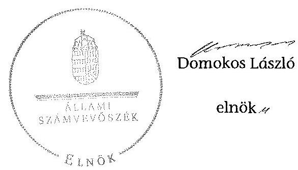

ÁLLAMI
SZÁMVEVŐSZÉK

# JELENTÉS 

az önkormányzatok belső kontrollrendszere kialakításának, egyes kontrolltevékenységek és a belső ellenőrzés működésének ellenőrzéséről

Bodrogkisfalud

---

# Állami Számvevőszék 

Iktatószám: V-0375-056/2014
Témaszám: 1372
Vizsgálat-azonosító szám: V064938

## Az ellenőrzést felügyelte:

dr. Benedek Mária
felügyeleti vezető
Az ellenőrzést vezette és az ellenőrzés végrehajtásáért felelős:
dr. Veress Tiborné
ellenőrzésvezető
A számvevőszéki jelentés összeállításában közreműködtek:
Pető Krisztina
számvevő tanácsos
Szabóné László Mária
számvevő
Az ellenőrzést végezték:
Hegyes Mária
Szabóné László Mária
számvevő tanácsos
számvevő

---

# TARTALOMJEGYZÉK 

BEVEZETÉS ..... 5
I. ÖSSZEGZŐ MEGÁLLAPÍTÁSOK, KÖVETKEZTETÉSEK, JAVASLATOK ..... 9
II. RÉSZLETES MEGÁLLAPÍTÁSOK ..... 14

1. Az önkormányzat belső kontrollrendszerének kialakítása ..... 14
1.1. A kontrollkörnyezet ..... 14
1.2. A kockázatkezelési rendszer ..... 15
1.3. A kontrolltevékenységek ..... 16
1.4. Az információs és kommunikációs rendszer ..... 17
1.5. A monitoring rendszer ..... 18
2. A pénzügyi folyamatokban kulcsszerepet betöltő teljesítésigazolás és érvényesítés belső kontrollok működése ..... 18
3. A belső ellenőrzés működése ..... 21

## FÜGGELÉKEK

1. számú Értelmező szótár
2. számú Az értékelés módja és szempontjai

---

.

---

# RÖVIDÍTÉSEK JEGYZÉKE 

## Törvények

Áht.
ÁSZ tv.
Info tv.
Kttv.
Ktv.
Ltv.
Mötv.

Nvtv.
Ötv.
Számv. tv.
Vagyonnyilatkozattételről szóló tv.

## Rendeletek

Áhsz. 1

Áhsz. 2
Ávr.
Bkr.
Ikr.
vagyongazdálkodási rendelet ${ }_{1}$
vagyongazdálkodási rendelet ${ }_{2}$

## Szórövidítések

2013. évi ellenőrzési terv
aljegyző
ÁSZ
2011. évi CXCV. törvény az államháztartásról
2011. évi LXVI. törvény az Állami Számvevőszékről
2011. évi CXII. törvény az információs önrendelkezési jogról és az információszabadságról
2011. évi CXCIX. törvény a közszolgálati tisztviselők ről (hatályos 2012. március 1-jétől)
1992. évi XXIII. törvény a köztisztviselők jogállásáról (hatálytalan 2012. március 1-jétől)
1995. évi LXVI. törvény a köziratokról, a közlevéltárakról és a magánlevéltári anyag védelméről
2011. évi CLXXXIX. törvény Magyarország helyi önkormányzatairól (hatályos 2012. január 1-jétől)
2011. évi CXCVI. törvény a nemzeti vagyonról
1990. évi LXV. törvény a helyi önkormányzatokról
2000. évi C. törvény a számvitelről
2007. évi CLII. törvény az egyes vagyonnyilatkozat-tételi kötelezettségekről szóló törvény

249/2000. (XII. 24.) Korm. rendelet az államháztartás szervezetei beszámolási és könyvvezetési kötelezettségének sajátosságairól (hatálytalan 2014. január 1-jétől)
4/2013. (I. 11.) Korm. rendelet az államháztartás számviteléről (hatályos 2014. január 1-jétől)
368/2011. (XII. 31.) Korm. rendelet az államháztartásról szóló törvény végrehajtásáról
370/2011. (XII. 31.) Korm. rendelet a költségvetési szervek belső kontrollrendszeréről és belső ellenőrzéséről
335/2005. (XII. 29.) Korm. rendelet a közfeladatot ellátó szervek iratkezelésének általános követelményeiről
Bodrogkisfalud Község Önkormányzata 3/1994. (I. 31.) számú rendelete az Önkormányzat vagyonáról és vagyongazdálkodás szabályairól (hatályos 2012. november 30 -ig)
Bodrogkisfalud Község Önkormányzata 12/2012. (XI. 27.) számú rendelete az Önkormányzat vagyonáról és a vagyongazdálkodás szabályairól (hatályos 2012. december 1-jétől)

## Szórövidítések

2013. évi ellenőrzési terv
aljegyző
ÁSZ

Bodrogkisfalud Község Önkormányzata 48/2012. (XI. 26.) KT határozattal elfogadott 2013. évi belső ellenőrzési terve
Bodrogkisfaludi Közös Önkormányzati Hivatal aljegyzője Állami Számvevőszék

---

ellenőrzési program
éves ellenőrzési jelentés
gazdálkodási szabályzat

Közös Hivatal
INTOSAI
iratkezelési szabályzat

ISSAI
jegyző
Képviselő-testület
Kormányhivatal
körjegyző
Körjegyzőség
körjegyzőségi SZMSZ
Levéltár
munkaszervezet
NGM
Önkormányzat
polgármester
pénzkezelési szabályzat
stratégiai ellenőrzési
terv
Társulás
utalványrendelet

EP/19/2012. számú ellenőrzési program
Bodrogkisfalud község belső ellenőrzéséről készült 2011. évi éves ellenőrzési jelentés

Bodrogkisfalud-Szegi-Szegilong Körjegyzőség Gazdálkodási szabályzat a kötelezettségvállalás, pénzügyi ellenjegyzés, teljesítés igazolása, érvényesítés, utalványozás és adatszolgáltatás rendjéről (hatályos 2012. január 1-jétől)
Bodrogkisfaludi Közös Önkormányzati Hivatal
International Organization of Supreme Audit Institutions (Legfőbb Ellenőrző Intézmények Nemzetközi Szervezete)
Bodrogkisfalud-Szegi-Szegilong Körjegyzőség Iratkezelési Szabályzata (hatályos 2012. augusztus 13-tól)
International Standards of Supreme Audit Institutions (Legfőbb Ellenőrző Intézmények Nemzetközi Standardjai)
Bodrogkisfaludi Közös Önkormányzati Hivatal jegyzője
Bodrogkisfalud Község Önkormányzatának Képviselőtestülete
Borsod-Abaúj-Zemplén Megyei Kormányhivatal
Bodrogkisfalud-Szegi-Szegilong Körjegyzőség körjegyzője
Bodrogkisfalud-Szegi-Szegilong Körjegyzőség
Bodrogkisfalud-Szegi-Szegilong Körjegyzőség Szervezeti és Működési Szabályzata (hatályos 2012. január 1-jétől)
Magyar Nemzeti Levéltár Borsod-Abaúj-Zemplén Megyei Levéltára
Tokaji Többcélú Kistérségi Társulás munkaszervezete
Nemzetgazdasági Minisztérium
Bodrogkisfalud Község Önkormányzata
Bodrogkisfalud Község Önkormányzat polgármestere
Bodrogkisfalud-Szegi-Szegilong Körjegyzőség Pénzkezelési szabályzata (hatályos: 2012. január 1-jétől)
Tokaji Többcélú Kistérségi Társulás Stratégiai ellenőrzési terve (2010-2014. évekre)
Tokaji Többcélú Kistérségi Társulás
Bodrogkisfalud-Szegi-Szegilong Körjegyzőség Gazdálkodási szabályzat a kötelezettségvállalás, pénzügyi ellenjegyzés, teljesítés igazolása, érvényesítés, utalványozás és adatszolgáltatás rendjéről c. szabályzat 10. számú melléklete szerinti bizonylat

---

# JELENTÉS 

## az önkormányzatok belső kontrollrendszere kialakításának, egyes kontrolltevékenységek és a belső ellenőrzés működésének ellenőrzéséről Bodrogkisfalud

## BEVEZETÉS

Bodrogkisfalud község állandó lakosainak száma 2012. január 1-jén 909 fő volt. Az Önkormányzat öttagú Képviselő-testületének munkáját egy állandó bizottság segítette. Az Önkormányzat az önállóan működő és gazdálkodó Körjegyzőségen kívül intézményt nem működtetett, gazdasági társasággal nem rendelkezett. A polgármester a 2012. évi időközi polgármester-választás óta tölti be tisztségét. ${ }^{1}$ A körjegyző 2008. január 1-jétől 2012. december 31-ig látta el körjegyzői feladatait. A Körjegyzőség szervezeti egységekre nem tagolódott, elkülönített gazdasági szervezettel nem rendelkezett, a foglalkoztatott köztisztviselők száma 2012. január 1-jén kilenc fő volt. A Körjegyzőségnél 2013. január 1-jétől szervezeti változás történt: Erdőbénye, Szegilong és Bodrogkisfalud települések önkormányzatai - Bodrogkisfalud székhellyel - létrehozták a Közös Hivatalt. Az ellenőrzött időszakban hivatalban volt körjegyző 2013. január 1-jétől aljegyzőként dolgozik a Közös Hivatalban, ezen időponttól a jegyzői feladatokat Erdőbénye község jegyzője látja el. Az Önkormányzat a 2012. évi költségvetési beszámolója szerint 233190 ezer Ft költségvetési bevételt ért el, valamint 216743 ezer Ft költségvetési kiadást teljesített. A 2012. december 31-i könyvviteli mérleg szerint 1417968 ezer Ft értékű eszközvagyonnal rendelkezett, a rövid lejáratú kötelezettségállománya 7679 ezer Ft, hosszú lejáratú kötelezettségállománya nem volt. Az adósságkonszolidáció során 26535 ezer Ft állami támogatásban részesültek, amelyből 11049 ezer Ft-ot hosszú lejáratú, 15486 ezer Ft-ot rövid lejáratú adósságállomány visszafizetésére fordítottak.

A demokratikus társadalmakban alapvető igény, hogy a közpénzeket, a közvagyont használók tevékenységükről elszámoljanak, ahhoz egyértelmű és érvényesíthető felelősségi szabályok társuljanak. Ennek a jogos igénynek az érvényesítéséhez meg kell teremteni azokat a folyamatokat, rendszereket, amelyek nélkülözhetetlenek az elszámoltatáshoz. Az elszámoltatás eredményes működtetéséhez szükség van a megfelelő információs, kontroll, értékelési és beszámolási rendszerek kialakítására.

[^0]
[^0]:    ${ }^{1}$ Az időközi polgármester-választásra az előző polgármester nyugdíjba vonulása miatt került sor. A jelenlegi polgármester 2006-tól az alpolgármesteri tisztséget töltötte be.

---

Magyarországon az uniós csatlakozási tárgyalások idejére nyúlnak vissza a belső kontrollrendszer szabályozásának gyökerei. Az uniós elvárásoknak megfelelő új terminológia szerinti államháztartási belső pénzügyi ellenőrzési (ÁBPE) rendszer területén a jogharmonizáció 2003-ban teljes körűen megvalósult, míg az önkormányzati alrendszerre vonatkozó, az Ötv.-ben megjelenített speciális szabályozás 2005-ben lépett hatályba. Az államháztartási belső kontrollrendszer koncepciója 2009-ben továbbfejlődött. A változások irányát mutatja, hogy a költségvetési szervek belső kontrollrendszere már magában foglalja a korszerű, felelős szervezetirányítás elemeit (kontrollkörnyezet, kockázatkezelés, kontrolltevékenység, információ és kommunikáció, monitoring) is. E kontrollrendszer szabályozása háromszintű, a törvényi előírásokat az Áht. és a Mötv., a rendeleti szintű szabályozást az Ávr. és a Bkr. tartalmazza, amelyeket útmutatói szinten az NGM által kiadott standardok és kézikönyvek támogatnak.

A belső kontrollrendszer azt a célt szolgálja, hogy a költségvetési szervek működésük és gazdálkodásuk során a tevékenységeket szabályszerűen, gazdaságosan, hatékonyan és eredményesen hajtsák végre, teljesítsék elszámolási kötelezettségeiket és megvédjék az erőforrásokat a veszteségektől, a károktól és a nem rendeltetésszerű használattól. A belső kontrollrendszer magában foglalja mindazon szabályokat, eljárásokat, gyakorlati módszereket és szervezeti struktúrákat, kockázatkezelési technikákat, kontrolltevékenységeket, amelyek segítséget nyújtanak a szervezetnek céljai eléréséhez.

Az ÁSZ középtávú stratégiájában hangsúlyos szerepet szánt annak, hogy szilárd szakmai alapon álló, értékteremtő ellenőrzéseivel előmozdítsa a közpénzügyek átláthatóságát, rendezettségét. A számvevőszéki ellenőrzés nemzetközi alapelvei is rögzítik, hogy a megfelelő belső kontrollrendszer minimálisra csökkenti a hibák és szabálytalanságok kockázatát.

Az ellenőrzés célja annak megállapítása volt, hogy a belső kontrollrendszer elemeinek kialakítása, a pénzügyi folyamatokban kulcsszerepet betöltő teljesítésigazolás és érvényesítés, és a belső ellenőrzés szabályos működése biztosította-e az Önkormányzatnál a közpénzfelhasználás szabályosságát, hozzájárult-e az értéket teremtő rend követelményének érvényesüléséhez.

Ennek keretében értékeltük, hogy:

- a jogszabályi előírásoknak megfelelően alakították-e ki a belső kontrollrendszer elemeit;
- a gazdálkodás folyamatában kulcsszerepet betöltő teljesítésigazolás és érvényesítés kontrolltevékenységeit megfelelően működtették-e;
- biztosították-e a belső ellenőrzés szabályos működését;
- amennyiben az ÁSZ tett javaslatot a 2008-2011. évek közötti ellenőrzése kapcsán az Önkormányzatnak, intézkedtek-e azok végrehajtására.

Az ellenőrzés várható hasznosulását négy szinten tervezzük. A törvényalkotás számára összegzett tapasztalatok állnak rendelkezésre a belső kontrollrendszer önkormányzati területen való kialakításáról, működéséről és hatásairól, a belső ellenőrzés működéséről. Ennek alapján következtetést lehet levonni arról, hogy a belső kontrollrendszer kialakítására és működtetésére vonatkozó jelenlegi, differenciálás nélküli jogszabályi előírások reális követelményeket támasztanak-e az eltérő adottságú települési önkormányzatok esetében, illetve indokolt-e esetleges jogszabályi módosítás kezdeményezése. Az ellenőrzés az ellenőrzött számára visszajelzést ad a belső kontrollrendszer kialakításában és működésében fellépő hiányosságokról, javaslataival hozzájárul azok kiküszöböléséhez, amely csökkentheti a későbbi ellenőrzések gyakoriságát. Az ellenőrzés megállapításait és javaslatait más szervezetek is hasznosíthatják a rendezett gazdálkodási keretek kialakításához. A társadalom számára jelzi, hogy közpénz nem maradhat ellenőrizetlenül, az ÁSZ értékteremtő rend kialakításához és megőrzéséhez hozzájáruló tevékenysége pozitív hatással lesz a szervezetről kialakított összkép formálásában. A szervezeten belül lehetőség nyílik arra, hogy a megállapítások szintetizálásával az ÁSZ a hozzáadott értéket teremtő elemző tevékenységét és tanácsadó szerepét is erősítse.

Az önkormányzatok belső kontrollrendszere kialakításának, egyes kontrolltevékenységek és a belső ellenőrzés működésének ellenőrzéséről szóló jelentés I. fejezetének összegző része az ellenőrzés céljára ad rövid, szintetizáló összefoglalót, és tartalmazza a következtetéseket a II. fejezet részletes megállapításain alapulóan. A jelentés intézkedést igénylő megállapításait és javaslatait az ellenőrzés során feltárt, a jelentés II. fejezetében rögzített részletes megállapítások alapozzák meg. A helyszíni ellenőrzés lezárásáig a helyi szabályozás változásait nyomon követtük. Az ÁSZ az ellenőrzés megállapításait az ellenőrzött időszakban hatályos, az intézkedést igénylő megállapításokra tett javaslatokat a jelenleg hatályos jogszabályok alapján fogalmazta meg.

Az ellenőrzés típusa: szabályszerűségi ellenőrzés.
Az ellenőrzött időszak: a belső kontrollrendszer kialakításának megfelelősége esetében a 2012. évre, a pénzügyi folyamatokban kulcsszerepet betöltő teljesítésigazolás és érvényesítés belső kontrollok működésének megfelelőségét és a belső ellenőrzés szabályszerű működését a 2012. január 1. és december 31. közötti időszak eseményeit figyelembe véve értékeltük, míg az ÁSZ javaslatainak utóellenőrzése a 2008-2011. években végzett ellenőrzések nyilvánosságra hozott jelentéseiben tett javaslatok áttekintésére terjedt ki.

# Az ellenőrzött szervezet: az Önkormányzat. 

Az ellenőrzés jogszabályi alapját az ÁSZ tv. 1. § (3) bekezdése, az 5. § (2) és (6) bekezdése, valamint az Áht. 61. § (2) bekezdésének előírásai képezik.

Az ellenőrzés szakmai módszertana az ÁSZ hivatalos honlapján (www.asz.hu) közzétett szakmai szabályokon alapult, amely az INTOSAI által kiadott ISSAI figyelembevételével készült.

Az ellenőrzés lefolytatásához az Önkormányzat a kimutatások és a tanúsítvány elektronikus kitöltésével, valamint az ÁSZ által kért dokumentumok elektronikus megküldésével szolgáltatott adatokat. Az így rendelkezésre bocsátott adatok, információk kontrollja és a munkalapok kitöltése a helyszíni ellenőrzés keretében történt. A jelentésben használt fogalmak magyarázatát az 1. számú függelék, az ellenőrzés egyes területeinek értékelésénél alkalmazott egységes minősítési szempontokat a 2. számú függelék tartalmazza.

A belső kontrollrendszer kialakításának ellenőrzése során értékeltük a kontrollkörnyezet, a kockázatkezelési rendszer, a kontrolltevékenységek, az információs és kommunikációs rendszer, valamint a monitoring rendszer szabályozottságának megfelelőségét. A pénzügyi folyamatokban kulcsszerepet betöltő teljesítésigazolás és érvényesítés kontrollok működése megfelelőségének minősítéséhez az állományba nem tartozók megbízási díjai, a külső szolgáltatók által végzett karbantartási, kisjavítási munkák, az egyéb üzemeltetési és fenntartási szolgáltatások, a rendszeres szociális segélyek, valamint az államháztartáson kívülre teljesített működési és felhalmozási célú pénzeszközátadások közül kockázatelemzéssel választottuk ki az ellenőrzött kiadási jogcímeket. Az egyszerű véletlen mintavétellel kiválasztott tételek ellenőrzését többlépcsős megfelelőségi tesztek útján addig végeztük, amíg elegendő és megfelelő bizonyítékot szereztünk a vizsgált folyamatok kulcskontrolljai működésének megfelelő
 vagy nem megfelelő voltáról. Értékeltük az Önkormányzatnál a belső ellenőrzés működésének szabályosságát. Utóellenőrzésre nem került sor, mivel az ÁSZ az Önkormányzatnál a 2008-2011. évek között ellenőrzést nem végzett.

Az ÁSZ tv. 29. § (1) bekezdése szerint a jelentéstervezetet megküldtük a polgármester részére, aki az ÁSZ tv. 29. § (2) bekezdésében foglalt észrevételezési jogával nem élt, a jelentéstervezetre észrevételt nem tett.

---

# I. ÖSSZEGZŐ MEGÁLLAPÍTÁSOK, KÖVETKEZTETÉSEK, JAVASLATOK 

A belső kontrollrendszeren belül 2012-ben a kontrollkörnyezet, a kockázatkezelési rendszer, a kontrolltevékenységek, az információs és kommunikációs rendszer, valamint a monitoring rendszer kialakítását külön-külön és együttesen is értékeltük. A belső kontrollrendszer kialakítása az összesített értékelés alapján nem felelt meg a jogszabályi előírásoknak.

A belső kontrollrendszer egyes területei kialakításának minősítése a következő:

| Kontrollterület | Minősítés |
| :-- | :-- |
| Kontrollkörnyezet | nem megfelelő |
| Kockázatkezelési rendszer | nem megfelelő |
| Kontrolltevékenységek | részben megfelelő |
| Információs és kommunikációs rendszer | nem megfelelő |
| Monitoring rendszer | nem megfelelő |

Részben megfelelőnek értékeltük a kontrolltevékenységek kialakítását, mivel az ellenőrzésünk által megállapított szabályozásbeli hiányosságok nem veszélyeztették a Körjegyzőség, ezáltal az Önkormányzat céljainak elérését.

Nem megfelelőnek értékeltük a kontrollkörnyezet, a kockázatkezelési rendszer, az információs és kommunikációs rendszer, valamint a monitoring rendszer kialakítását, mivel az ellenőrzésünk által megállapított szabályozásbeli hiányosságok magukban hordozzák a szabálytalan működés, valamint a korrupció kockázatát.

Az állományba nem tartozók megbízási díjaival, valamint a külső szolgáltatók által végzett karbantartási, kisjavítási munkákkal kapcsolatos kifizetések során a pénzügyi folyamatokban kulcsszerepet betöltő teljesítésigazolás és érvényesítés belső kontrollok működése gyenge volt. Gyengének értékeltük a két kulcskontroll együttes működését, mert azok nem biztosították az ellenőrzésünk által feltárt hiányosságok bekövetkezésének megelőzését.

A számvevőszéki ellenőrzés az ellenőrzött kifizetésekkel összefüggésben a rendelkezésre bocsátott dokumentumok alapján kár bekövetkeztére utaló adatot, tényt nem állapított meg, azonban a gazdálkodásban kulcsszerepet betöltő kontrollok gyenge működése miatt fennáll a hibák bekövetkezésének lehetősége. A nem megfelelően szabályozott és működtetett belső kontrollok korrupciós kockázatot hordoznak.

---

Az Önkormányzat a belső ellenőrzési feladatokat a Társulás útján látta el. A belső ellenőrzés működése a jogszabályi előírásoknak nem felelt meg, mivel a számvevőszéki ellenőrzés által megállapított szabályozási és működési hiányosságok számossága magában hordozza a szabálytalan önkormányzati gazdálkodás és feladatellátás kockázatát.

Az ÁSZ tv. 33. § (1) bekezdésében foglaltak értelmében az ellenőrzött szervezet vezetője köteles a jelentésben foglalt megállapításokhoz kapcsolódó intézkedési tervet összeállítani, és azt a jelentés kézhezvételétől számított 30 napon belül az ÁSZ részére megküldeni. Amennyiben az intézkedési tervet határidőre nem küldi meg a szervezet, vagy az ÁSZ tv. 33. § (2) bekezdésében foglalt póthatáridő elteltével megküldött intézkedési terv továbbra sem elfogadható, az ÁSZ elnöke a hivatkozott törvény 33. § (3) bekezdés a)-b) pontjaiban foglaltakat érvényesítheti.

Az ellenőrzés intézkedést igénylő megállapításai és javaslatai:

# a polgármesternek 

1. A polgármester mint kötelezettségvállaló - az Ávr. 57. § (4) bekezdésében foglaltak ellenére - 2012. március 31-étől írásban nem jelölte ki a teljesítésigazolásra jogosult személyeket.

Javaslat:
Jelölje ki az Ávr. 57. § (4) bekezdésének megfelelően az általa történő kötelezettségvállalások esetében a teljesítés igazolására jogosult személyeket.
2. Az Áht. 37. § (1) és az Ávr. 55. § (1) bekezdései ellenére az Önkormányzat nevében történt kötelezettségvállalásokra pénzügyi ellenjegyzés nélkül került sor.

Javaslat:
Intézkedjen, hogy az Önkormányzat kiadási előirányzatai terhére történt kötelezettségvállalásokra az Áht. 37. § (1) bekezdésében és az Ávr. 55. § (1) bekezdésében foglaltaknak megfelelően - az Ávr. 53. §-ában meghatározott kivételeket figyelembe véve - kizárólag a pénzügyi ellenjegyzés után, a pénzügyi teljesítés esedékességét megelőzően, írásban kerüljön sor.
3. A számvevőszéki ellenőrzés megállapításai alapján az Önkormányzatnál a belső kontrollrendszer kialakítása összefoglalóan értékelve nem felelt meg a jogszabályi előírásoknak. A kulcskontrollok működése gyenge volt, a belső ellenőrzés működése a jogszabályi előírásoknak nem felelt meg, és nem tárta fel, ezáltal nem is javíttatta ki a számvevőszéki ellenőrzés során megállapított hiányosságokat. A megállapított szabályozásbeli és működésbeli hiányosságok magukban hordozzák a szabálytalan működés kockázatát.

Javaslat:
A Mötv. 115. § (1) bekezdésében foglaltak alapján kísérje figyelemmel az Önkormányzat gazdálkodásának szabályszerűségét. A Mötv. 67. § f) pontja alapján gon-

---

doskodjon a belső kontrollrendszer működésére vonatkozó jogszabályi rendelkezések be nem tartása, valamint a teljesítésigazolás, illetve az érvényesítés kontrollokkal összefüggésben feltárt hiányosságok, szabálytalanságok, továbbá a belső ellenőrzés jogszabályi előírásoknak nem megfelelő működése tekintetében az esetleges munkajogi felelősséggel kapcsolatos körülmények kivizsgálásáról, majd a vizsgálat eredményének függvényében tegye meg a szükséges intézkedéseket.

# a jegyzőnek (Bodrogkisfalud Község Önkormányzata vonatkozásában) 

1. a kontrollkörnyezettel kapcsolatban:

A körjegyző nem készítette elő olyan időben a vagyongazdálkodási rendelet módosítását annak érdekében, hogy az megfeleljen az Nvtv. előírásainak, ezért a Képvise-lő-testület az Nvtv.-ben meghatározott határidőt túllépve fogadta el a vagyongazdálkodási rendelet ${ }_{2}$-t, amely nem tartalmazta a Mötv.-ben meghatározott területek részletes szabályait. A körjegyző által elkészített pénzkezelési szabályzat tartalma nem felelt meg a Számv. tv. előírásainak. A körjegyző a Kttv. előírásait figyelmen kívül hagyva a Körjegyzőségen dolgozó köztisztviselők teljesítményértékelését a 2012. évben nem készítette el, továbbá az Ötv.-ben előírtak ellenére nem készítette elő a köztisztviselőkkel szembeni hivatásetikai alapelvek részletes tartalmát, valamint az etikai eljárás szabályait tartalmazó dokumentumot. [II. Részletes megállapítások, 1.1. A kontrollkörnyezet 16., 21., 46. és 47. sorszámú megállapítások]

Javaslat:
Intézkedjen az Áht. 69. § (2) bekezdése, a Bkr. 3. § a) pontja és 6. §-a, valamint a Kttv.-ben foglaltak alapján a jelentés II. Részletes megállapítások, 1.1. A kontrollkörnyezet 16., 21., 46. és 47. sorszámú megállapításaiban foglalt hibák, hiányosságok kijavításáról, megszüntetéséről az ott megjelölt jogszabályi rendelkezéseknek megfelelően.
2. a kockázatkezelési rendszerrel kapcsolatban:

A kockázatkezelési rendszer nem a Bkr. rendelkezéseinek megfelelően került kialakításra. A Vagyonnyilatkozat-tételről szóló tv.-ben foglaltak ellenére a vagyonnyilatkozat-tételre kötelezett köztisztviselők vagyonnyilatkozat-tételi kötelezettségét a körjegyzőségi SZMSZ-ben nem tüntették fel. A közszolgálatban álló személyek közül a Vagyonnyilatkozat-tételről szóló tv. hatálya alá tartozó öt fő vagyonnyilatkozat-tételi kötelezettségének nem tett eleget. [II. Részletes megállapítások, 1.2. A kockázatkezelési rendszer, 8., 10. és 13-14. sorszámú megállapítások]

Javaslat:
Intézkedjen az Áht. 69. § (2) bekezdése, a Bkr. 3. § b) pontja és 7. §-a, valamint a Vagyonnyilatkozat-tételről szóló tv. alapján a jelentés II. Részletes megállapítások, 1.2. A kockázatkezelési rendszer 8., 10. és 13-14. sorszámú megállapításaiban foglalt hibák, hiányosságok kijavításáról, megszüntetéséről az ott megjelölt jogszabályi rendelkezéseknek megfelelően.

---

3. a kontrolltevékenységekkel kapcsolatban:

A körjegyző - a Bkr.-ben foglaltak ellenére - nem biztosította minden tevékenységre vonatkozóan a folyamatba épített, előzetes, utólagos és vezetői ellenőrzést. A körjegyző az Ávr.-ben foglaltakat figyelmen kívül hagyva nem határozta meg az előzetes írásbeli kötelezettségvállalást nem igénylő kifizetések rendjét. [II. Részletes megállapítások, 1.3. A kontrolltevékenységek, 2-5. és 8. sorszámú megállapítás]

Javaslat:
Intézkedjen az Áht. 69. § (2) bekezdése, a Bkr. 3. § c) pontja és 8. §-a alapján a jelentés II. Részletes megállapítások, 1.3. A kontrolltevékenységek 2.-5. és 8. sorszámú megállapításaiban foglalt hibák, hiányosságok kijavításáról, megszüntetéséről az ott megjelölt jogszabályi rendelkezéseknek megfelelően.
4. az információs és kommunikációs rendszerrel kapcsolatban:

A körjegyző az Info tv. és az Ávr. rendelkezései ellenére a kötelezően közzéteendő adatok nyilvánosságra hozatalának rendjét nem alakította ki, a közérdekű adatok megismerésére irányuló igények teljesítésének rendjét nem szabályozta. Nem gondoskodott az Önkormányzat elektronikus közzétételi kötelezettségének teljesítéséről a 2012. évben. A körjegyző a Körjegyzőség iratkezelési szabályzatát nem az Ltv. előírásának megfelelően készítette el, és az Ikr.-ben foglaltak ellenére nem biztosította az ügyintézés folyamatának, az iratok szervezeten belüli útjának pontos követhetőségét és ellenőrizhetőségét. [II. Részletes megállapítások, 1.4. Az információs és kommunikációs rendszer, 6-9. és 16. sorszámú megállapítások]

Javaslat:
Intézkedjen az Áht. 69. § (2), a Bkr. 3. § d) pontja és 9. §-a, valamint az Ltv. és Ikr. alapján a jelentés II. Részletes megállapítások, 1.4. Az információs és kommunikációs rendszer 6-9. és 16. sorszámú megállapításaiban foglalt hibák, hiányosságok kijavításáról, megszüntetéséről az ott megjelölt jogszabályi rendelkezéseknek megfelelően.
5. a monitoring rendszerrel kapcsolatban:

A körjegyző a Bkr.-ben foglaltak ellenére nem alakította ki a Körjegyzőség tevékenységének, a célok megvalósításának nyomon követését biztosító rendszerét. Az Áht.-ban és a Bkr.-ben foglaltakat figyelmen kívül hagyva a belső kontrollrendszer fejlesztése érdekében intézkedéseket nem tett. [II. Részletes megállapítások, 1.5. A monitoring rendszer, 1. és 10. sorszámú megállapítások]

Javaslat:
Intézkedjen az Áht. 69. § (2) bekezdése, a Bkr. 3. § e) pontja és 10. §-a alapján a jelentés II. Részletes megállapítások, 1.5. A monitoring rendszer 1. és 10. sorszámú megállapításaiban foglalt hibák, hiányosságok kijavításáról, megszüntetéséről az ott megjelölt jogszabályi rendelkezéseknek megfelelően.

---

6. a pénzügyi folyamatokban kulcsszerepet betöltő kontrollokkal kapcsolatban:

A teljesítésigazolás és az érvényesítés az Áht.-ban és az Ávr.-ben foglaltaknak, a kötelezettségvállalási nyilvántartás az Ávr. előírásainak nem felelt meg. [II. Részletes megállapítások, 2. A pénzügyi folyamatokban kulcsszerepet betöltő teljesítésigazolás és érvényesítés belső kontrollok működése, 1-3. pontban foglalt megállapítás]

Javaslat:
Intézkedjen az Áht. 37. §-ában és az Ávr. 57-59. §-ában foglaltak alapján arról, hogy a teljesítésigazolás és az érvényesítés vonatkozásában, azok ellenőrzése során a kötelezettségvállalással, a pénzügyi ellenjegyzéssel, a kötelezettségvállalások nyilvántartásba vételével és az utalványrendelettel kapcsolatban feltárt, a jelentés II. Részletes megállapítások, 2. A pénzügyi folyamatokban kulcsszerepet betöltő teljesítésigazolás és érvényesítés belső kontrollok működése 1-3. pontjában szereplő megállapításában foglalt hibák, hiányosságok kijavítása, megszüntetése az ott megjelölt jogszabályi rendelkezéseknek megfelelően történjen meg.
7. a belső ellenőrzés működésével kapcsolatban:

A belső ellenőrzés működése a számvevőszéki ellenőrzés értékelési szempontjait figyelembe véve nem felelt meg a Bkr.-ben foglalt rendelkezéseknek. [II. Részletes megállapítások, 3. A belső ellenőrzés működése, 3-5., 7., 8. a), g), 9., 18-19., 20. b), d), e) és 25-27. sorszámú megállapítások]

Javaslat:
Intézkedjen az Áht. 69. § (2) bekezdése, a 70. § (1) bekezdése, a Bkr. 3. § e) pontja és a 10. §-a alapján a jelentés II. Részletes megállapítások, 3. A belső ellenőrzés működése 3-5., 7., 8. a), g), 9., 18-19., 20. b), d), e) és 25-27. sorszámú megállapításaiban foglalt hibák, hiányosságok kijavításáról, megszüntetéséről az ott megjelölt jogszabályi rendelkezéseknek megfelelően.

---

# II. RÉSZLETES MEGÁLLAPÍTÁSOK 

## 1. Az ÖNKORMÁNYZAT BELSŐ KONTROLLRENDSZERÉNEK KIALAKÍTÁSA

A belső kontrollrendszeren belül 2012-ben a kontrollkörnyezet, a kockázatkezelési rendszer, a kontrolltevékenységek, az információs és kommunikációs rendszer, valamint a monitoring rendszer kialakítását külön-külön és együttesen is értékeltük. A belső kontrollrendszer kialakítása az összesített értékelés alapján nem felelt meg a jogszabályi előírásoknak.

### 1.1. A kontrollkörnyezet

A kontrollkörnyezet kialakítása - a 2. számú függelékben részletezett kritériumrendszer alapján végzett értékelés szerint - a jogszabályi előírásoknak nem felelt meg, mert:

| Sorszám $^{2}$ | Megállapítás | Megjegyzés |
| :--: | :--: | :--: |
| 4. | A Képviselő-testület - a Ktv. 34. § (3) bekezdésben foglaltak ellenére - nem döntött a teljesítményértékelés alapját képező célokról. | A Ktv.-t hatályon kívül helyezte
 a 2012. évi V. tv. 59. § (1) bekezdés a) pontja, hatálytalan 2012. március 1-jétől. |
| 16. | A körjegyző - az Ötv. 36. § (2) bekezdés a) pontjában foglaltak ellenére - az ellenőrzött időszakban nem készítette elő olyan időben a vagyongazdálkodási rendelet módosítását, hogy a Képviselő-testület az Nvtv. 18. § (12) bekezdésében meghatározott határidőben elfogadhassa annak érdekében, hogy az megfeleljen az Nvtv. 3. § (1) bekezdés 6. pontja, 5. §-a, 11. § (16) bekezdése, 13. § (1) bekezdése előírásainak, ezért a Képviselőtestület az Nvtv. 18. § (1) és (12) bekezdésében meghatározott határidőt túllépve a 2012. november 26-ai ülésén fogadta el a 2012. december 1-jétől hatályos vagyongazdálkodási rendelet ${ }_{2}$-t, amely a Mötv. 109. § (4) bekezdése előírásai ellenére nem tartalmazta a vagyon ingyenes átengedése, a vagyonkezelői jog ellenértéke, illetve a vagyonkezelés ellenőrzésének részletes szabályait. | A jegyző az önkormányzat működésével kapcsolatos feladatok ellátásáról 2013. január 1-jétől a Mötv. 81. § (3) bekezdés c) pontja alapján gondoskodik. |

[^0]
[^0]:    ${ }^{2}$ A megállapítás számozása az Önkormányzat által az adatszolgáltatás során kitöltött kimutatások kérdéseinek sorszámával azonos.

---

| 21. | A pénzkezelési szabályzatban - a Számv. tv. 14. § (8) bekezdésében foglaltak ellenére - a pénzkezelés felelősségi szabályai nem terjedtek ki a kompüzemeltetéssel és a térítési díjakkal kapcsolatos házipénztáron kívüli pénzkezelés és annak elszámolási szabályaira. | A Pénzkezelési szabályzatban házipénztáron kívüli pénzkezelés, külső pénzbeszedő hely nem volt, azonban az Önkormányzat szakfeladatként kompot üzemeltetett, illetve a nyugdíjasházban étkezési térítési díjakat szedett be. |
| :--: | :--: | :--: |
| 46. | A körjegyző - a Kttv. 130. § (1) bekezdésében és 226. §-ában foglaltak ellenére - a Körjegyzőségen dolgozó köztisztviselők teljesítményértékelését a 2012. évben nem készítette el. |  |
| 47. | A Képviselő-testület - a Kttv. 231. § (1) bekezdése ellenére - nem állapította meg a Kttv. 83. §-ában előírt, a köztisztviselőkkel szembeni hivatásetikai alapelvek részletes tartalmát, valamint az etikai eljárás szabályait, mivel a körjegyző - az Ötv. 36. § (2) bekezdés a) pontjában előírt feladata ellenére - nem készítette elő ennek dokumentumát. | A jegyző az önkormányzat működésével kapcsolatos feladatok ellátásáról 2013. január 1-jétől a Mötv. 81. § (3) bekezdés c) pontja alapján gondoskodik. |

# 1.2. A kockázatkezelési rendszer 

A kockázatkezelési rendszer kialakítása - a 2. számú függelékben részletezett kritériumrendszer alapján végzett értékelés szerint - a jogszabályi előírásoknak nem felelt meg, mert:

| Sorszám | Megállapítás | Megjegyzés |
| :--: | :--: | :--: |
| $\begin{aligned} & 8 . \\ & 10 . \end{aligned}$ | A körjegyző - a Bkr. 7. § (2) bekezdésében foglaltak ellenére - nem határozta meg az egyes kockázatokkal kapcsolatban szükséges intézkedéseket, és azok teljesítése folyamatos nyomon követési módját. |  |
| 13. | A körjegyző - a Vagyonnyilatkozat-tételről szóló tv. 4. § a) pontjában foglaltak ellenére - a vagyonnyilatkozat-tételre kötelezett köztisztviselők vagyonnyilatkozat-tételi kötelezettségét a körjegyzőségi SZMSZ-ben nem tüntette fel. | A körjegyzőségi SZMSZ-ben négy fő köztisztviselő esetében a vagyonnyilatkozat-tételi kötelezettség nem került feltüntetésre. |

---

A közszolgálatban álló személyek közül öt fő - az 5. §-ban foglaltak ellenére - vagyonnyilatkozat-tételi kötelezettségének nem tett eleget. A körjegyző - a 8. § (4) bekezdésében foglaltak ellenére - a köztisztviselőket a vagyonnyilatkozat-tételi kötelezettség fennállásáról és esedékességének időpontjáról nem tájékoztatta, továbbá a 10. § (1) bekezdésében előírtak ellenére írásban nem szólította fel kötelezettségük teljesítésére, ezért a 10. § (2) bekezdésében foglaltakra tekintettel a vagyonnyilatkozat-tételi kötelezettség elmulasztása a köztisztviselők jogviszonyát nem érintette.

# 1.3. A kontrolltevékenységek 

A kontrolltevékenységek kialakítása - a 2. számú függelékben részletezett kritériumrendszer alapján végzett értékelés szerint - részben felelt meg a jogszabályi előírásoknak.

A körjegyző szabályozta a kötelezettségvállalás pénzügyi ellenjegyzése, a teljesítésigazolás, az érvényesítés és az utalványozás gyakorlásának módjával, eljárási és dokumentációs részletszabályaival kapcsolatos belső feltételeket. A körjegyző írásban kijelölte a teljesítésigazolására jogosult személyeket, gondoskodott az iratkezelési szoftver által kezelt adatok biztonságáról, kialakította az üzembiztonsági, adatvédelmi szabályok érvényre juttatásához szükséges eljárási szabályokat. Az iratkezelési rendszer kialakítása során szabályozták az üzemeltetés és az adatbiztonság feladatait, meghatározták az ezzel kapcsolatos hatásköröket. Biztosították az adatbiztonság érvényesülését, a felelősségi körök meghatározásával belső szabályzatban szabályozták a dokumentumokhoz és információkhoz való hozzáférést.

Belső szabályzatban a körjegyző meghatározta a beszámolási feladatok teljesítésével kapcsolatos előírásokat, feltételeket, a beszámolási eljárásokhoz kapcsolódó felelősségi köröket. A munkaköri leírásokban a körjegyző előírta a gazdasági feladatot ellátó alkalmazottak helyettesítésének rendjét. Az éves költségvetési beszámoló elkészítésével megbízott személy rendelkezett a jogszabályban előírt képesítéssel, illetve a tevékenység ellátására jogosító engedéllyel.

A körjegyző a jogszabályi előírásoknak megfelelően jelölte ki a pénzügyi ellenjegyzési, illetve az érvényesítési feladatra a Körjegyzőség állományában dolgozó köztisztviselőt.

A körjegyző szabályozta a Körjegyzőségen a köztisztviselő jogviszonya megszüntetése (megszünése) esetére a munkakör átadása és a munkáltatóval való elszámolás rendjét.

---

A kontrolltevékenységek kialakítása az értékelés szempontjából az alábbi kisebb súlyú hiányosságok miatt részben felelt meg a jogszabályi előírásoknak:

| Sorszám | Megállapítás |
| :--: | :--: |
| $2-5$. | A körjegyző a Bkr. 8. § (2) bekezdés a) pontjában foglaltak ellenére nem biztosította a pénzügyi döntések - köztük a költségvetés tervezése és a támogatásokkal való elszámolás - dokumentumainak elkészítésével kapcsolatban a folyamatba épített, előzetes, utólagos és vezetői ellenőrzést. |
| 8. | A körjegyző - az Ávr. 53. § (2) bekezdésében foglaltakat figyelmen kívül hagyva - annak ellenére nem határozta meg az előzetes írásbeli kötelezettségvállalást nem igénylő kifizetések rendjét, hogy a gazdálkodási szabályzatban lehetővé tette a 100 ezer Ft alatti kifizetések előzetes írásbeli kötelezettségvállalás nélküli teljesítését. |
| 10. | A polgármester, mint kötelezettségvállaló - az Ávr. 57. § (4) bekezdésében foglaltak ellenére - nem jelölte ki 2012. március 30-át követően írásban az Önkormányzat kiadási előirányzatai vonatkozásában a teljesítésigazolásra jogosult személyeket. |

# 1.4. Az információs és kommunikációs rendszer 

Az információs és kommunikációs rendszer kialakítása - a 2. számú függelékben részletezett kritériumrendszer alapján végzett értékelés szerint - a jogszabályi előírásoknak nem felelt meg, mert:

| Sorszám | Megállapítás |
| :--: | :--: |
| 6., 8. | A körjegyző - az Info tv. 30. § (6) bekezdésében és a 35. § (3) bekezdésében, valamint az Ávr. 13. § (2) bekezdés h) pontjában foglalt előírások ellenére - a kötelezően közzéteendő adatok nyilvánosságra hozatalának rendjét nem alakította ki, a közérdekű adatok megismerésére irányuló igények teljesítésének rendjét nem szabályozta. |
| 7. | A körjegyző - az Info tv. 33. § (1) és (3) bekezdésében, a 37. § (1) bekezdésében és az 1. mellékletében foglaltak ellenére - a 2012. évre vonatkozó éves költségvetés, a 2011. évre vonatkozó költségvetési beszámoló és a Képviselő-testület hatályban lévő rendeletei tekintetében - nem gondoskodott az Önkormányzat elektronikus közzétételi kötelezettségének teljesítéséről a 2012. évben. |
| 9. | A körjegyző - az Ltv. 10. § (1) bekezdés c) pontjának előírását figyelmen kívül hagyva - a Körjegyzőség egyedi Iratkezelési szabályzatát nem a Levéltár és a Kormányhivatal egyetértésével adta ki. |
| 16. | A körjegyző - az Ikr. 14. § (4) bekezdésében foglaltak ellenére - az iratforgalom dokumentálásával nem biztosította az ügyintézés folyamatának, az iratok szervezeten belüli útjának pontos követhetőségét és ellenőrizhetőségét. |

---

# 1.5. A monitoring rendszer 

A monitoring rendszer kialakítása - a 2. számú függelékben részletezett kritériumrendszer alapján végzett értékelés szerint - a jogszabályi előírásoknak nem felelt meg, mert:

| Sor-   szám | Megállapítás | Megjegyzés |
| :--: | :--: | :--: |
| 1. | A körjegyző - a Bkr. 3. § e) pontjában és a   10. §-ában foglaltak ellenére - nem alakította ki a Körjegyzőség tevékenységének, a célok megvalósításának nyomon követését biztosító rendszerét. |  |
| 10. | A körjegyző - az Áht. 69. § (2) bekezdésében és a Bkr. 3. §-ában foglaltakat figyelmen kívül hagyva - a belső kontrollrendszer fejlesztése érdekében intézkedéseket nem tett. | A körjegyző olyan értékelési rendszer kialakítását tartotta szükségesnek, amely az intézményi feladatok és programok hatékonyságát, és eredményességét tárgyilagosabban és objektívebben lehet értékelni. |

A helyi önkormányzatok törvényességi felügyeletét ellátó Kormányhivatal a 2012. évben nem élt törvényességi felhívással, vagy más törvényességi felügyeleti eszközzel a Képviselő-testület által alkotott rendeletekre, határozatokra vonatkozóan.

## 2. A PÉNZÜGYI FOLYAMATOKBAN KULCSSZEREPET BETÖLTŐ TELJESÍTÉSIGAZOLÁS ÉS ÉRVÉNYESÍTÉS BELSŐ KONTROLLOK MŰKÖDÉSE

Az állományba nem tartozók megbízási díjaival és a külső szolgáltatók által végzett karbantartási, kisjavítási munkákkal kapcsolatos kifizetések teljesítése során - összefoglalóan értékelve - a pénzügyi folyamatokban kulcsszerepet betöltő teljesítésigazolás és érvényesítés belső kontrollok működésének megfelelősége gyenge volt, mert:

| Sorszám | Megállapítás | Megjegyzés |
| :-- | :-- | :-- |

## Teljesítésigazolás

A kifizetést megelőzően a teljesítésigazoló - az Ávr. 57. § (1) és (3) bekezdésében foglaltak és aláírása ellenére - ellenőrizhető okmányok hiányában nem látta el ellenőrzési feladatát, és az igazolás dátumát nem jelölte meg.

---

# Érvényesítés 

Az érvényesítés során - az Ávr. 58. § (1) bekezdésének előírása ellenére - a kifizetést megelőzően ellenőrizhető okmányok hiányában a kiadások teljesítésének összegszerűségét, a fedezet meglétét, továbbá a megelőző ügymenetben az Ávr. 58. § (1) bekezdésében meghatározott jogszabályok előírásai és a belső szabályzatok előírásai betartásának ellenőrzését nem látták el.
Az érvényesítés - az Ávr. 58. § (3) bekezdésében előírtak ellenére - nem tartalmazta a keltezést, továbbá az Ávr. 60. § (3) bekezdése szerint vezetett nyilvántartás (aláírás-minta) alapján nem volt megállapítható, hogy az aláírás az érvényesítésre kijelölt személytől származott.
Az érvényesítő - az Ávr. 58. § (1)-(2) bekezdéseiben előírtak ellenére - nem ellenőrizte és nem jelezte az utalványozónak, hogy a teljesítésigazolás nem szabályszerűen történt. Nem észrevételezte, hogy az Önkormányzat kiadási előirányzatai terhére történt kötelezettségvállalásokra - az Áht. 37. § (1) bekezdése és az Ávr. 55. § (1) bekezdésében foglaltak ellenére - pénzügyi ellenjegyzés nélkül került sor, valamint az Ávr. 56. § (1) bekezdés előírása ellenére a kötelezettségvállalást követően nem gondoskodtak annak nyilvántartásba vételéről.

Az Áhsz., 2014. január 1-jétől hatályát vesztette, ettől az időponttól az Áhsz. ${ }_{2}$ hatályos.

Az Ávr. 56. § (1) bekezdés 2014. január 1-jétől módosult, a kötelezettségvállalások nyilvántartását az Áhsz. 2 39. § (1) bekezdés és a 14. számú melléklet II. pontja szabályozza.

## A kulcskontrollok ellenőrzése során feltárt egyéb hiányosság:

Az Önkormányzat által vezetett kötelezettségvállalási nyilvántartás - az Ávr. 56. § (1) bekezdésében foglaltak ellenére - nem tartalmazta a kötelezettségvállalást tanúsító dokumentum megnevezését, a kötelezettségvállaló nevét, a jogosult azonosító adatait és az előirányzatok szerinti megoszlását, amelyre tekintettel
 nem volt alkalmas az Ávr. 56. § (3) bekezdésében rögzített, a szabad fedezet rendelkezésre állásának vizsgálatára.

Az egyik utalványrendeleten nem tüntették fel - az Ávr. 59. (3) bekezdés f) pontjában előírtak ellenére - a kötelezettségvállalás nyilvántartási számát.

Az Áhsz., 2014. január 1-jétől módosult, a kötelezettségvállalások nyilvántartását az Áhsz. 2. 39. § (1) bekezdése és a 14. melléklet II. pontja szabályozza.

---

Az állományba nem tartozók megbízási díjaival kapcsolatos kifizetések során a teljesítésigazolás és az érvényesítés kulcskontrollok működésének megfelelősége gyenge volt, mert:

- a teljesítésigazoló az időközi polgármester-választás lebonyolításához kapcsolódó megbízási díjak vonatkozásában - az Ávr. 57. § (3) bekezdésében előírtak ellenére - a teljesítésigazolás dátumát nem jelölte meg;
- az érvényesítő az időközi polgármester-választás lebonyolításához kapcsolódó megbízási díjak vonatkozásában - az Ávr. 58. § (3) bekezdésében előírtak ellenére - nem jelölte meg az érvényesítés keltét, továbbá az Ávr. 60. § (3) bekezdése szerint vezetett nyilvántartás (aláírás-minta) alapján nem volt megállapítható, hogy az aláírás az érvényesítésre kijelölt személytől származott;
- az érvényesítő az Ávr. 58. § (2) bekezdésében rögzített kötelezettsége ellenére nem jelezte az utalványozónak, hogy a megelőző ügymenetben a teljesítésigazolást nem szabályszerűen végezték, a megbízási szerződések pénzügyi ellenjegyzése - az Áht. 37. § (1) bekezdésében, valamint az Ávr. 55. § (1) bekezdésében foglaltak ellenére - nem történt meg, az Ávr. 56. § (1) bekezdésének előírása ellenére a kötelezettségvállalást követően nem gondoskodtak annak nyilvántartásba vételéről.

A külső szolgáltatók által végzett karbantartási, kisjavítási munkákkal kapcsolatos kifizetések során a teljesítésigazolás és az érvényesítés kulcskontrollok működésének megfelelősége gyenge volt, mert:

- a teljesítés igazolására kijelölt személy a nyomtató karbantartás, illetve a gumiabroncs szerelés gazdasági eseményeknél a kifizetést megelőzően ellenőrizhető dokumentumok hiányában a kiadások teljesítése jogosságának, összegszerűségének, illetve az ellenszolgáltatást is magában foglaló kötelezettségvállalás teljesítésének ellenőrzését - az Ávr. 57. § (1) bekezdésében foglaltak és aláírása ellenére - nem szabályszerűen végezte;
- az érvényesítő a nyomtató karbantartáshoz és a gumiabroncs szereléshez kapcsolódó kifizetések vonatkozásában - az Ávr. 58. § (1) bekezdésében előírtak és aláírása ellenére - az összegszerűséget, a fedezet meglétét és azt, hogy a megelőző ügymenetben az Ávr. 58. § (1) bekezdésében meghatározott jogszabályok előírásait, továbbá a belső szabályzatokban foglaltakat megtartották-e, ellenőrizhető okmányok hiányában nem ellenőrizte;
- az érvényesítő - az Ávr. 58. § (2) bekezdésében foglaltak ellenére - nem jelezte az utalványozónak, hogy a teljesítés igazolása nem szabályszerűen történt, továbbá az Ávr. 59. § (3) bekezdés f) pontjában előírtak ellenére a nyomtató karbantartáshoz kapcsolódó utalványrendeleten nem tüntették fel a kötelezettségvállalás nyilvántartási számát;

Az Önkormányzat által vezetett kötelezettségvállalási nyilvántartás - az Ávr. 56. § (1) bekezdésében foglaltak ellenére - nem tartalmazta a kötelezettségvállalást tanúsító dokumentum megnevezését, a kötelezettségvállaló nevét, a jogosult azonosító adatait és az előirányzatok szerinti megoszlását, amelyre te-

---

kintettel nem volt alkalmas az Ávr. 56. § (3) bekezdésében rögzített, a szabad fedezet rendelkezésre állásának vizsgálatára.

A számvevőszéki ellenőrzés az ellenőrzött kifizetésekkel összefüggésben a rendelkezésre bocsátott dokumentumok alapján kár bekövetkeztére utaló adatot, tényt nem állapított meg, azonban a gazdálkodásban kulcsszerepet betöltő kontrollok gyenge működése miatt fennáll a hibák bekövetkezésének kockázata. A nem megfelelően működtetett belső kontrollok korrupciós kockázatot hordoznak.

# 3. A BELSŐ ELLENŐRZÉS MŰKÖDÉSE 

Az Önkormányzat a belső ellenőrzési feladatokat - képviselő-testületi döntés alapján - a Társulás útján látta el.

A belső ellenőrzés működése - a 2. számú függelékben részletezett kritériumrendszer alapján végzett értékelés szerint - a jogszabályi előírásoknak nem felelt meg, mert:

| Sorszám | Megállapítás | Megjegyzés |
| :--: | :--: | :--: |
| 3., 4. | Az Önkormányzat nem rendelkezett - a Bkr. 56. § (7) bekezdésében előírtaknak megfelelő - a Társulás munkaszervezeti vezetője által jóváhagyott belső ellenőrzési kézikönyvvel. |  |
| 5. | A belső ellenőrzési tevékenység megszervezésére vonatkozó, a Társulás által külső szolgáltatóval kötött írásbeli megállapodásban - a Bkr. 16. § (4) bekezdésében foglaltak ellenére - nem rendelkeztek a belső ellenőrzési vezető Bkr. 22. § (1) és (2) bekezdése szerinti tevékenységei és kötelességei ellátásának módjáról. |  |
| 7. | A Bkr. 56. § (3) bekezdés a) pontjában foglaltak ellenére stratégiai ellenőrzési tervvel az Önkormányzat nem rendelkezett. |  |
| 8. a),   g) | A 2013. évi ellenőrzési terv - a Bkr. 31. § (4) bekezdés a) és g) pontjaiban foglaltak ellenére - nem tartalmazta az ellenőrzési tervet megalapozó elemzések és a kockázatelemzés eredményének összefoglaló bemutatását, valamint az ellenőrzések tervezett ütemezését. |  |

---

| 9. | A körjegyzö a 2013. évre vonatkozóan elkészített éves ellenőrzési tervet a 2012. november 26-i képviselőtestületi ülésre készítette elő, így azt a Képviselő-testület az Ötv. 92. § (6) bekezdésében és a Bkr. 32. § (4) bekezdésében foglalt határidőn túl, hagyta jóvá. | Az Ötv. 92. § (6) bekezdésében rögzített határidőt 2013. január 1-jétől a Mötv. 119. § (5) bekezdése szabályozza. |
| :--: | :--: | :--: |
| 18. | Az ellenőrzési program - a Bkr. 33. § (2) bekezdés g) és j) pontjaiban foglaltak ellenére - nem tartalmazta a belső ellenőr és a vizsgálatvezető megbízólevelének számát és a feladatmegosztást, a belső ellenőrzési vezető aláírását. |  |
| 19. | Az ellenőrzési programot - a Bkr. 33. § (2) bekezdésében foglalt előírás ellenére - a belső ellenőrzési vezető helyett a jegyző hagyta jóvá. |  |
| $\begin{aligned} & 20 . \\ & \text { b), } \\ & \text { d), e) } \end{aligned}$ | Az elvégzett ellenőrzésről készített jelentés - a Bkr. 39. § (3) bekezdés e), g) és i) pontjaiban foglaltak ellenére - nem tartalmazta az ellenőrzés tárgyát, az ellenőrzött időszakot, az alkalmazott ellenőrzési eljárásokat és módszereket. |  |
| $\begin{aligned} & 25 . \\ & 26 . \end{aligned}$ | Az elvégzett ellenőrzésekről vezetett nyilvántartás - a Bkr. 50. § (2) bekezdés c)-f) pontjaiban foglaltak ellenére - nem tartalmazta az ellenőrzés tárgyát, az ellenőrzés kezdetének és lezárásának időpontját, az ellenőrzés lefolytatásában részt vett vizsgálatvezető és a belső ellenőr nevét, valamint a vizsgált időszakot. |  |
| 27. | A 2011. évre vonatkozó éves (összefoglaló) ellenőrzési jelentés - a Bkr. 48. § b) pontjában foglaltak ellenére - nem tartalmazta a belső kontrollrendszer szabályszerűségének, gazdaságosságának, hatékonyságának és eredményességének növelése, javítása érdekében tett fontosabb javaslatokat és a belső kontrollrendszer öt elemének értékelését. |  |

Az Önkormányzat az ÁSZ-tól a 2012. és a 2013. években kapott integritás kérdőív kitöltésére felkérést, amelynek a 2013. évben eleget tett. A Körjegyzőség a 2011., a 2012. és a 2013. években kapott felkérést integritás kérdőív kitöltésére, amelynek 2011-ben tett eleget. A kontrollkörnyezet, a kockázatkezelési rendszer, az információs és kommunikációs rendszer, a monitoring rendszer kialakí-

---

tása, valamint a belső ellenőrzés működésének értékelése során feltárt hibák, a köztisztviselőkkel szembeni hivatásetikai alapelvek, az etikai eljárás szabályai meghatározásának, a vagyonnyilatkozat-tételi kötelezettség teljes körűségének és az iratkezelési szabályzat hiánya, továbbá a 2013. évi belső ellenőrzési tervet megalapozó elemzések és a kockázatelemzés összefoglaló bemutatásának elmaradása arra utalnak, hogy az Önkormányzatnak az integritási szemlélet érvényesítésében még fejlődést kell elérnie.

Budapest, 2014. 06. hó 2. nap

Függelék: $\quad 2 \mathrm{db}$

---

.

---

# ÉRTELMEZŐ SZÓTÁR 

belső ellenőrzés
belső kontrollrendszer
belső kontrollrendszer területei
egyszerű véletlen mintavétel
integritás
kockázatkezelési rendszer

Független, tárgyilagos bizonyosságot adó és tanácsadó tevékenység, amelynek célja, hogy az ellenőrzött szervezet működését fejlessze és eredményességét növelje, az ellenőrzött szervezet céljai elérése érdekében rendszerszemléletű megközelítéssel és módszeresen értékeli, illetve fejleszti az ellenőrzött szervezet irányítási és belső kontrollrendszerének hatékonyságát. (Forrás: Bkr. 2. § b) pontja)
A belső kontrollrendszer a kockázatok kezelése és tárgyilagos bizonyosság megszerzése érdekében kialakított folyamatrendszer, amely azt a célt szolgálja, hogy a működés és gazdálkodás során a tevékenységeket szabályszerűen, gazdaságosan, hatékonyan, eredményesen hajtsák végre, az elszámolási kötelezettségeket teljesítsék, megvédjék az erőforrásokat a veszteségektől, károktól és nem rendeltetésszerű használattól. (Forrás: Áht. 69. § (1) bekezdése)
A kontrollkörnyezet, a kockázatkezelési rendszer, a kontrolltevékenységek, az információs és kommunikációs rendszer, valamint a nyomon követési (monitoring) rendszer. (Forrás: Bkr. 3. §-a)

Az alapsokaságból egyszerű véletlen kiválasztással képzett részsokaság. (Forrás: Az ÁSZ ellenőrzési mintavételezés támogatásához készült segédletének 4.1.1. pontja)
Az integritás elvek, értékek, cselekvések, módszerek, intézkedések konzisztenciáját jelenti: olyan magatartásmódot, amely meghatározott értékeknek felel meg. Az integritás a közszféra esetében a társadalom által elvárt nyilvánossági, átláthatósági, illetve jogi/etikai normáknak történő megfelelést jelenti.
(Forrás: a http://integritas.asz.hu honlapon közzétett „A 2012. évi integritás felmérés eredményeinek összefoglalója dokumentum 3. oldal 1. bekezdése)
A kockázat annak a valószínűségét jelenti, hogy egy vagy több esemény vagy intézkedés nem kívánt módon befolyásolja a rendszer működését, céljainak megvalósulását. (Forrás: Javaslatok a korrupciós kockázatok kezelésére - Kockázatkezelési és ellenőrzési módszertan 35. oldal, ÁSZ)
Olyan irányítási eszközök és módszerek összessége, melynek elemei a szervezeti célok elérését veszélyeztető tényezők (kockázatok) azonosítása, elemzése, csoportosítása, nyomon követése, valamint szükség esetén a kockázati kitettség mérséklése. (Forrás: Bkr. 2. § m) pontja)

---

kontrollkörnyezet
kontrolltevékenységek
kommunikáció
korrupció
kulcskontrollok
lényegesség
megfelelőségi teszt

A kontrollkörnyezet alakítja ki a szervezet belső kontrollrendszerhez való viszonyát, hozzáállását, befolyásolja az alkalmazottak belső kontrollal kapcsolatos tudatosságát, magatartását. Elemei a személyes és szakmai elkötelezettség és a vezetés, valamint az alkalmazottak által vallott erkölcsi értékek; a szakmai hozzáértés iránti elkötelezettség; a felső vezetés hozzáállása - a vezetés filozófiája és tevékenységének stílusa; a szervezeti struktúra; a humánerőforrás-politika és gazdálkodási gyakorlat.
A kontrolltevékenységek azok a politikák és eljárások, amelyeket a kockázatok megoldására hoznak létre a szervezet céljainak teljesítése érdekében.
Az a tevékenység, melynek során információ továbbítása valósul meg. A kommunikációs folyamat résztvevői között tájékoztatás történik, mely során tényeket, ezek magyarázatát közlik. „A szervezetben eredményes kommunikációnak kell áramlania lefelé, horizontálisan és felfelé, a szervezet egészében és annak valamennyi elemében."
Azok a cselekmények, amelyek során a köz érdekében való eljárással megbízott és döntéshozatali felelősséggel felruházott személy a köz érdeke helyett önös vagy részérdekeket követve, mástól jogtalan vagy etikátlan előnyt elfogadva és őt jogtalan vagy etikátlan előnyhöz juttatva jár el, illetve amikor valaki a köz érdekében való eljárással megbízott és döntéshozatali felelősséggel felruházott személynek jogtalan vagy etikátlan előnyt nyújtva vagy felajánlva jogtalan vagy etikátlan előnyt kér. (Forrás: A Kormány korrupció megelőzési programja 2012-2014.)
Az azonosított kockázatok mérséklése érdekében kialakított kontrollok közül azok, amelyek elégtelen működése esetén a szervezetet jelentős veszteség érheti, vagy a működésükben bekövetkező hiba/hiányosság más kontrollok eredményességét csökkenti. Ezek ellenőrzése, értékelése elegendő bizonyítékot szolgáltat adott területen a kontrollrendszer értékeléséhez. Az önkormányzatok kontrollrendszere kialakításának ellenőrzése során a pénzügyi folyamatokban kulcsszerepet betöltő belső kontrollok a teljesítésigazolás és az érvényesítés.
Egy információ akkor lényeges, ha hiánya vagy téves állítása befolyásolhatja ezen
 információkat felhasználók döntéseit, véleményét. Az ellenőrzés során a lényegesség három szempontból értelmezhető: érték, jelleg és összefüggés szerint.
Az ellenőrzés során alkalmazott módszer - szekvenciális (megállásos) megfelelőségi teszt - lényege, hogy a kiválasztott minta ellenőrzését csak addig végezzük, amíg elegendő és megfelelő bizonyítékot nem szerzünk az ellenőrzött kulcskontroll (teljesítésigazolás, érvényesítés) működésének megfelelő, vagy nem megfelelő voltáról.

---

monitoring (nyomon követési rendszer)
utóellenőrzés

A monitoring a különböző szintű szervezeti célok megvalósításának folyamatát kíséri figyelemmel, melynek során a releváns eseményekről és tevékenységekről (együtt: folyamatokról) rendszeres jelleggel, strukturált, döntéstámogató információkhoz jutnak a szervezet vezetői.
Az intézkedések nyomon követése érdekében elrendelt ellenőrzés, amelynek célja, hogy a belső ellenőrzés bizonyosságot szerezzen az elfogadott intézkedések végrehajtásáról, vagy arról a tényről, hogy ha az ellenőrzött szerv, illetve az ellenőrzött szervezeti egység vezetője nem, vagy nem az elfogadott intézkedésnek megfelelően hajtja végre az intézkedéseket, továbbá meggyőződni arról, hogy a végrehajtott intézkedésekkel a megállapított kockázat ténylegesen megszűnt, vagy a kockázati tűréshatár alá csökkent. (Forrás: Bkr. 2. § s) pontja)

---

.

---

# Az értékelés módja és szempontjai 

## A belső kontrollrendszer kialakítása megfelelőségének értékelése az öt területre vonatkoztatva

Megfelelő a belső kontrollrendszer kialakítása, amennyiben az öt területen (kontrollkörnyezet, kockázatkezelési rendszer, kontrolltevékenységek, információs és kommunikációs rendszer, monitoring rendszer kialakítása) összesen elért és elérhető pontok százalékban kifejezett hányadosa eléri a 81%-ot, és egyik terület sem kapott nem megfelelő értékelést.

Részben megfelelő a kontrollrendszer kialakítása, ha az önkormányzat teljesíti a meghatározott valamennyi főbb kritériumot (amelyeket - 10 kritérium - a program 5. számú melléklete tartalmazza), és az öt munkalapon összesen elért és elérhető pontok százalékban kifejezett hányadosa a 61%-ot meghaladja, és legfeljebb egy terület értékelése nem megfelelő volt.

Nem megfelelő a belső kontrollrendszer kialakítása, amennyiben az önkormányzat nem teljesíti a meghatározott bármelyik főbb kritériumot, vagy az öt munkalapon összesen elért és elérhető pontok százalékban kifejezett hányadosa 0-60% közötti, vagy egynél több terület értékelése nem megfelelő volt.

A megfelelőség minősítése a következők szerint történik:
A minősítés - részben automatizált - a belső kontrollrendszer kialakítására vonatkozó kérdéseket tartalmazó munkalapokon, az elérhető és az elért pontszámok alapján az alábbi képlettel, számítógépes program segítségével történt, melynek összefüggése:

| Elért pont |
| :--: |
| Elérhető pont |

A belső kontrollrendszer egyes területei kialakítása megfelelőségénél alkalmazandó minősítés:

- nem megfelelő 0-60%-ig;
- részben megfelelő 61-80%-ig;
- megfelelő 81% fölött.

---

# Az ellenőrzött önkormányzat belső kontrollrendszere kialakítása megfelelőségének főbb kritériumai 

| $\begin{aligned} & \text { Sor- } \\ & \text { szám } \end{aligned}$ | Kérdés: | Szempont: |
| :--: | :--: | :--: |
|  | A kontrollkörnyezet kialakítása (2. számú munkalap, kimutatás) |  |
| 1. | A polgármesteri hivatali rendelkezik alapító okirattal? | A polgármesteri hivatal alapító okirata az Áht. 8. § (4) bekezdésében előírtaknak megfelelően elkészült, tartalmazza az Ávr. 5. § (1) bekezdésében előírtakat, kiemelten a c) pont szerinti alaptevékenységeit. |
| 2. | A polgármesteri hivatal rendelkezik-e szervezeti és működési szabályzattal? | A polgármesteri hivatal rendelkezik az Áht. 10. § (5) bekezdésben előírt - 2010. január 1-jét követően jóváhagyott vagy módosított - SZMSZ-szel. A költségvetési szerv feladatai ellátásának részletes belső rendjét és módját - törvényben vagy kormányrendeletben meghatározott módon és tartalommal - szervezeti és működési szabályzata állapítja meg. |
| 3. | Meghatározták-e a vagyongazdálkodás szabályait önkormányzati rendeletben? | Az önkormányzat a vagyongazdálkodás szabályait önkormányzati rendeletben meghatározta, és az összhangban van az Mötv. 109. § (4) bekezdése, a Nemzeti vagyonról szóló 2011. évi CXCVI. tv. 18. § (1) bekezdése tartalmával, és a 18. § (12) bekezdésében meghatározottak szerint az 5. § (5)-(7) bekezdésében foglaltaknak megfelelően 2012. október 31-ig azt módosították. |
| 4. | A polgármesteri hivatal rendelkezik-e számviteli politikával? | A polgármesteri hivatal rendelkezik az Áhsz. 8. § (3) bekezdésben előírt - 2010. január 1-jét követően hatályba helyezett vagy aktualizált - számviteli politikával. A jogszabályhely rögzíti, hogy a Számv. tv. és az e rendeletben foglaltak szerint az államháztartás szervezetének szakmai feladatai és sajátosságai figyelembevételével ki kell alakítania és írásban szabályoznia számviteli politikáját. |
| 5. | A polgármesteri hivatal rendelkezik-e pénzkezelési szabályzattal? | A polgármesteri hivatal rendelkezik az Áhsz. 8. § (4) bekezdés d) pontjában előírt - 2010. január 1-jét követően hatályba helyezett vagy aktualizált - pénzkezelési szabályzattal. A jogszabályhely előírja, hogy a számviteli politika keretében el kell készíteni a pénzkezelési szabályzatot. |
| 6. | A polgármesteri hivatal rendelkezik-e leltározási és leltárkészítési szabályzattal? | A polgármesteri hivatal rendelkezik az Áhsz. 8. § (4) bekezdés a) pontjában előírt - 2008. január 1-jét követően hatályba helyezett vagy aktualizált - eszközök és források leltározási és leltárkészítési szabályzatával. |

[^0]
[^0]:    ${ }^{1}$ Polgármesteri hivatal alatt a polgármesteri hivatalt, a főpolgármesteri hivatalt, a megyei önkormányzati hivatalt és a körjegyzőséget is érteni kell.

---

| Sorszám | Kérdés: | Szempont: |
| :--: | :--: | :--: |
| 7. | A polgármesteri hivatal gazdasági szervezetének van-e ügyrendje? | A polgármesteri hivatal rendelkezik a gazdasági szervezet ügyrendjével vagy az azzal egyenértékű szabályozással (Ávr. 9. § (5) bekezdés), vagy az Ávr. 13. § (5) bekezdésében foglaltakat az SZMSZ-ben vagy más belső szabályzatban szabályozta (Áht. 10. § (5) bekezdés), és a szabályozást 2010. január 1-jét követően felülvizsgálták, aktualizálták. Elfogadható az is, ha a gazdasági feladatokat a polgármesteri hivatalon belül több szervezeti egység látja el, és azoknak önálló ügyrendjük van, illetve ha a polgármesteri hivatal nem tagolódik szervezeti egységekre, és ezért önálló gazdasági szervezettel nem rendelkezik, azonban az SZMSZ-ben vagy más belső szabályozásban rögzítik az ügyrend kötelező elemeit. |
| 8. | A polgármesteri hivatal rendelkezik-e ellenőrzési nyomvonallal? | Az ellenőrzési nyomvonal, folyamatleírás a polgármesteri hivatal tevékenységeire vonatkozóan elkészült, és azt 2010. január 1-jét követően felülvizsgálták, aktualizálták. A szabályzat minta megtalálható a Pénzügyminisztérium Belső kontroll kézikönyv, 2010. 18. és a 19. számú mellékletében. A Bkr. 6. § (3) bekezdésében előírtak szerint a költségvetési szerv vezetője köteles elkészíteni és rendszeresen aktualizálni a költségvetési szerv ellenőrzési nyomvonalát, amely a költségvetési szerv működési folyamatainak szöveges vagy táblázatba foglalt vagy folyamatábrákkal szemléltetett leírása, amely tartalmazza különösen a felelősségi és információs szinteket és kapcsolatokat, irányítási és ellenőrzési folyamatokat, lehetővé téve azok nyomon követését és utólagos ellenőrzését. |
|  | Az információ és kommunikáció szabályozása és kialakítása (5. számú munkalap, kimutatás) |  |
| 9. | Az önkormányzat eleget tett-e az elektronikus közzétételi kötelezettségének? | Az Önkormányzat az Info tv. 33. § (1) és (3) bekezdésében foglaltaknak megfelelően, saját vagy közösen működtetett honlapon elektronikus formában bárki számára hozzáférhetően közzé tette az Info tv. 1. számú mellékletében felsoroltak közül legalább az éves költségvetését, a költségvetési beszámolóját és a Képviselő-testület rendeleteit. |
| 10. | A polgármesteri hiva-   tal rendelkezik-e irat-   kezelési szabályzattal? | A polgármesteri hivatal rendelkezik az Ltv. 10. § (1) bek. c) pontjában előírt iratkezelési szabályzattal. |

# A két kulcskontroll minősítése 

A kulcskontrollok - teljesítésigazolás, érvényesítés - működésének értékelése megfelelőségi tesztek segítségével történt. A kontrollok működésének megfelelőségére vonatkozó következtetést az értékelő táblázatban elért súlyozott pontszám, továbbá az eredendő kockázat minősítésétől függően két vagy három kiadási jogcím alapján fogalmaztuk meg. Az értékeléshez alkalmazandó arányszámok kialakítását számítógépes program segítségével köz-

---

pontilag az ellenőrzésben közreműködő informatikai támogató végezte az önkormányzatok által elektronikus úton megadott adatokból.

A minősítés automatizált, a megfelelőségi tesztek kitöltésével számítógépes program segítségével történik, melynek összefüggése:

| Elérhető pontszám: | Elért súlyozott pontszám értékelése: |
| :--: | :--: |
| $0-70$ | „gyenge" |
| $71-90$ | „jó" |
| $91-100$ | "kiváló" |

- „kiváló" a kontrollok működése, ha megfelel a szabályozásoknak és a legmagasabb szintű elvárásoknak a működésbeli hibák megelőzése, feltárása és kijavítása tekintetében; amennyiben a kontrollok működésének megfelelőségét a helyszíni ellenőrzési munkalap értékelése alapján kiválónak minősítettük, azonban esetleges kisebb - az egységesen meghatározott követelményrendszerben foglalt 10%-ot el nem érő mértékű - hiányosságokat tártunk fel, az összességében kiváló minősítést alátámasztó pozitív megállapításon túl ezeket a hiányosságokat a jelentésben ismertetjük a javaslataink megalapozása érdekében;
- „jó" a kontrollok működésének megfelelősége, ha azok a megállapított kisebb (tolerálható mértékű) hiányosságok mellett kielégítik az elvárásokat a működésbeli hibák megelőzése, feltárása, és kijavítása tekintetében, a megállapított hiányosságok nem veszélyeztették a hibák megelőzését, feltárását és kijavítását, továbbá ismertetjük azokat a területeket is, ahol az előírt ellenőrzési, egyeztetési feladatokat nem végezték el;
- "gyenge" a kontrollok működése, ha a kontrollok működésében túl sok hiányosság fordul elő ahhoz, hogy megbízhatónak lehessen azokat minősíteni. Ismertetjük a jelentésben azokat a területeket, ahol az előírt ellenőrzési, egyeztetési feladatokat nem végezték el, amely hiányosságok a belső kontrollok megfelelőségének „gyenge" minősítését okozták.

# A belső ellenőrzés szabályszerű működésének értékelése 

A belső ellenőrzés működését a 2012. évben történt ellenőrzés tervezési és végrehajtási tevékenységének tapasztalatai alapján értékeljük a munkalapok (kimutatások) kérdéseire adott válaszok alapján, melynek megállapítása az elérhető és az elért pontokból az alábbi képlettel, számítógépes program segítségével történt:

$$
\frac{\text { Elért pont }}{\text { Elérhető pont }} \times 100=\ldots \ldots . \%
$$

A belső ellenőrzés működésének megfelelőségénél alkalmazandó minősítés:

- nem felelt meg
0-60%-ig;
- megfelel
61-80%-ig;
- jól megfelel
81% fölött
