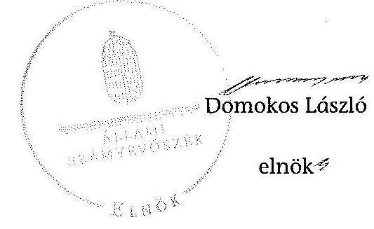
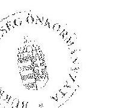
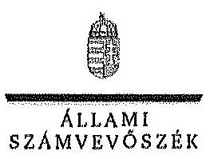
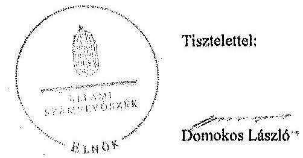
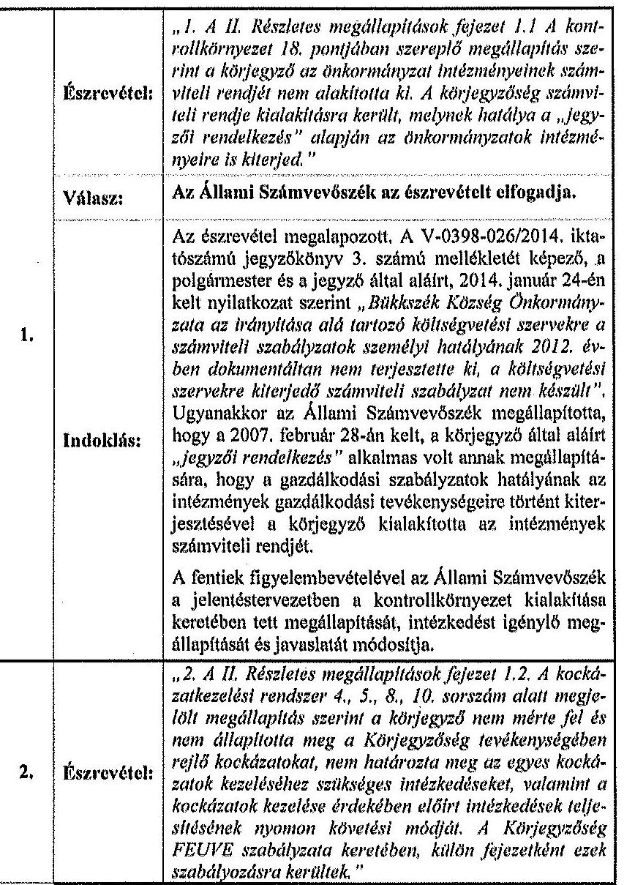
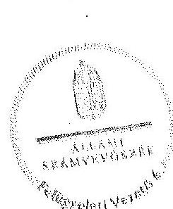
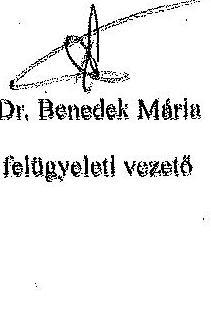

ÁLLAMI
SZÁMVEVŐSZÉK

# JELENTÉS 

az önkormányzatok belső kontrollrendszere kialakításának, egyes kontrolltevékenységek és a belső ellenőrzés
müködésének ellenőrzéséről
Bükkszék

---

# Állami Számvevőszék 

Iktatószám: V-0398-050/2014
Témaszám: 1372
Vizsgálat-azonosító szám: V064944

## Az ellenőrzést felügyelte:

Dr. Benedek Mária
felügyeleti vezető
Az ellenőrzést vezette és az ellenőrzés végrehajtásáért felelős:
Dr. Veress Tiborné
ellenőrzésvezető
A számvevőszéki jelentés összeállításában közremüködtek:
Dr. Nagy Ágnes
Számvevő tanácsos
Az ellenőrzést végezték:
Kupcsik Éva
Számvevő

Pető Krisztina
számvevő tanácsos

## Dr. Nagy Ágnes

számvevő tanácsos

---

# TARTALOMJEGYZÉK 

BEVEZETÉS ..... 7
I. ÖSSZEGZŐ MEGÁLLAPÍTÁSOK, KÖVETKEZTETÉSEK, JAVASLATOK ..... 11
II. RÉSZLETES MEGÁLLAPÍTÁSOK ..... 16

1. Az önkormányzat belső kontrollrendszerének kialakítása ..... 16
1.1. A kontrollkörnyezet ..... 16
1.2. A kockázatkezelési rendszer ..... 17
1.3. A kontrolltevékenységek ..... 18
1.4. Az információs és kommunikációs rendszer ..... 18
1.5. A monitoring rendszer ..... 18
2. A pénzügyi folyamatokban kulcsszerepet betöltő teljesítésigazolás és érvényesítés belső kontrollok működése ..... 18
3. A belső ellenőrzés működése ..... 21

## MELLÉKLETEK

1. számú Észrevételt tartalmazó polgármesteri levél
2. számú Észrevételre vonatkozó elnöki válaszlevél

## FÜGGELÉKEK

1. számú Értelmező szótár
2. számú Az értékelés módja és szempontjai

---

.

---

# RÖVIDÍTÉSEK JEGYZÉKE 

## Törvények

Áht.
ÁSZ tv.
Htv.

Info tv.
Kttv.
Mötv.
Nvtv.
Ötv.
Ptk. 1
Ptk. 2
Számv. tv.
Vagyonnyilatkozattételről szóló tv.

## Rendeletek

Áhsz. 1
Áhsz. 2
Ávr.
Bkr.

Ikr.
önkormányzati SZMSZ
vagyongazdálkodási rendelet ${ }_{1}$
vagyongazdálkodási rendelet ${ }_{2}$

2011. évi CXCV. törvény az államháztartásról
2011. évi LXVI. törvény az Állami Számvevőszékről
1991. évi XX. törvény a helyi önkormányzatok és szerveik, a köztársasági megbízottak, valamint egyes centrális alárendeltségủ szervek feladat- és hatásköreiről
2011. évi CXII. törvény az információs önrendelkezési jogról és az információszabadságról
2011. évi CXCIX. törvény a közszolgálati tisztviselőkról (hatályos 2012. március 1-jétől)
2011. évi CLXXXIX. törvény Magyarország helyi önkormányzatairól (hatályos 2012. január 1-jétől)
2011. évi CXCVI. törvény a nemzeti vagyonról
1990. évi LXV. törvény a helyi önkormányzatokról
1959. évi IV. törvény a Polgári Törvénykönyvről (hatályos 2014. március 14-ig)
2013. évi V. törvény a Polgári Törvénykönyvről (hatályos 2014. március 15 -től)
2000. évi C. törvény a számvitelről
2007. évi CLII. törvény az egyes vagyonnyilatkozat-tételi kötelezettségekről

249/2000. (XII. 24.) Korm. rendelet az államháztartás szervezetei beszámolási és könyvvezetési kötelezettségének sajátosságairól (hatálytalan 2014. január 1-jétől)
4/2013. (I. 11.) Korm. rendelet az államháztartás számviteléről (hatályos 2014. január 1-jétől)
368/2011. (XII. 31.) Korm. rendelet az államháztartásról szóló törvény végrehajtásáról
370/2011. (XII. 31.) Korm. rendelet a költségvetési szervek belső kontrollrendszeréről és belső ellenőrzéséről (hatályos 2012. január 1-jétől)

335/2005. (XII. 29.) Korm. rendelet a közfeladatot ellátó szervek iratkezelésének általános követelményeiről
Bükkszék Község Önkormányzata Képviselő-testületének 4/2007 (IV. 7.) rendelete a Szervezeti és Müködési Szabályzatról (hatályos 2007. április 4-től)
Bükkszék Község Önkormányzata 2000. évi 12. (09.09) rendeletét módosító $8 / 2008$. (VII. 18.) sz. rendelettel módosított, az önkormányzat vagyonáról, a vagyonnal való gazdálkodás szabályairól (hatályos 2008. július 19-től)
Bükkszék Község Önkormányzata Képviselő-testületének 5/2013. (IV. 24.) önkormányzati rendelete az önkormányzat vagyonáról, és a vagyonnal való gazdálkodásáról (hatályos 2013. április 24-től)

---

# Szórövidítések 

2012. évi ellenőrzési
terv
2013. évi ellenőrzési
terv
ÁSZ
belső ellenőrzési kézikönyv
bizonylati rend
Bizottság
ellenőrzési nyomvonal
eszközök és források értékelési szabályzata
éves ellenőrzési jelentés
gazdálkodási jogkörök szabályzata
informatikai szabályzat
INTOSAI
iratkezelési szabályzat
ISSAI
jegyzö
Képviselő-testület
Kormányhivatal
körjegyzö
Körjegyzőség
Körjegyzőség SZMSZ-e
Közös Hivatal
leltárkészítési és leltározási szabályzat

Levéltár
NGM
Önkormányzat
polgármester

Pétervásárai Kistérség Többcélú Társulása 2012. éves ellenőrzési terve
2013. évi éves ellenőrzési terv (Pétervásárai Kistérség Többcélú Társulása)
Állami Számvevőszék
Pétervásárai Kistérség Többcélú Társulása Belső ellenőrzési kézikönyve (hatályos 2011. augusztus 27-től)
Sirok-Bükkszék Körjegyzőség Bizonylati szabályzata (hatályos 2001. január 1-jétől)
Bükkszék Község Önkormányzata Képviselő-testületének Ügyrendi Összeférhetetlenségi és Vagyonnyilatkozat Vizsgáló Bizottsága
Sirok-Bükkszék-Terpes Körjegyzőség Ellenőrzési nyomvonala (hatályos: 2007. május 18 -tól)
Sirok-Bükkszék Körjegyzőség Az eszközök és források értékelési szabályzata (hatályos 2002. március 1-jétől)
Bükkszék Község Önkormányzata Éves ellenőrzési jelentés 2011. év

Sirok-Bükkszék-Terpes Körjegyzőség szabályzata a körjegyzőség, az önkormányzatok és intézményeik pénzgazdálkodással kapcsolatos jogkörének gyakorlásáról (hatályos 2007. március 30-ától, módosítva 2012. március 12-én)
Sirok-Bükkszék-Terpes Körjegyzőség Informatikai Szabályzata (hatályos 2011. március 1-jétől)
International Organization of Supreme Audit Institutions (Legfőbb Ellenőrző Intézmények Nemzetközi Szervezete)
Sirok-Bükkszék-Terpes Körjegyzőség Egyedi iratkezelési szabályzata (hatályos 2012. január 1-jétől)
International Standards of Supreme Audit Institutions (Legfőbb Ellenőrző Intézmények Nemzetközi Standardjai)
Sirok-Bükkszék-Terpes-Szajla Közös Hivatal jegyzője
Bükkszék Község Önkormányzatának Képviselő-testülete Heves Megyei Kormányhivatal
Sirok-Bükkszék-Terpes Körjegyzőség körjegyzője
Sirok-Bükkszék-Terpes Körjegyzőség
Sirok-Bükkszék-Terpes Körjegyzőség Szervezeti és Müködési Szabályzata
Siroki Közös Önkormányzati Hivatal (Sirok, Bükkszék, Terpes és Szajla községek részvételével)
Sirok-Bükkszék Körjegyzőség Az eszközök és források leltárkészítési és leltározási szabályzata (hatályos 2002. január 1-jétől)
Magyar Nemzeti Levéltár Heves Megyei Levéltára
Nemzetgazdaság Minisztérium
Bükkszék Község Önkormányzata
Bükkszék Község Önkormányzata polgármestere

---

| számlarend | Sirok-Bükkszék-Terpes Körjegyzőség Számlarendje (hatályos 2005. január 1-jétől) |
| :--: | :--: |
| számviteli politika | Sirok-Bükkszék Körjegyzőség Számviteli politikája (hatályos 2002. január 1-jétől) |
| Társulás | Pétervásárai Kistérség Többcélú Társulása |
| ügyrend | Sirok-Bükkszék-Terpes Körjegyzőség Ügyrendje (hatályos 2011. március 2-tól) |

---

$\cdot$
$\cdot$
$\cdot$
$\cdot$
$\cdot$
$\cdot$
$\cdot$
$\cdot$
$\cdot$
$\cdot$
$\cdot$
$\cdot$
$\cdot$
$\cdot$
$\cdot$
$\cdot$
$\cdot$
$\cdot$
$\cdot$
$\cdot$
$\cdot$
$\cdot$
$\cdot$
$\cdot$
$\cdot$
$\cdot$
$\cdot$
$\cdot$
$\cdot$
$\cdot$
$\cdot$
$\cdot$
$\cdot$
$\cdot$
$\cdot$
$\cdot$
$\cdot$
$\cdot$
$\cdot$
$\cdot$
$\cdot$
$\cdot$
$\cdot$
$\cdot$
$\cdot$
$\cdot$
$\cdot$
$\cdot$
$\cdot$
$\cdot$
$\cdot$
$\cdot$
$\cdot$
$\cdot$
$\cdot$
$\cdot$
$\cdot$
$\cdot$
$\cdot$
$\cdot$
$\cdot$
$\cdot$
$\cdot$
$\cdot$
$\cdot$
$\cdot$
$\cdot$
$\cdot$
$\

---

# JELENTÉS 

## az önkormányzatok belső kontrollrendszere kialakításának, egyes kontrolltevékenységek és a belső ellenőrzés múködésének ellenőrzéséről Bükkszék

## BEVEZETÉS

Bükkszék község állandó lakosainak száma 2012. január 1-jén 729 fő volt. Az Önkormányzat öttagú Képviselő-testületének munkáját egy állandó bizottság segítette. Az Önkormányzat az önállóan múködő és gazdálkodó Körjegyzőségen kívül három önállóan működő intézményt múködtetett, valamint két többségi tulajdoni hányadú gazdasági társasággal rendelkezett. A polgármester a 2006. évi önkormányzati választások óta tölti be tisztségét. A jegyző 1999. augusztus 18 -tól folyamatosan látja el a körjegyzői, illetve a Közös Hivatal létrejöttétől a jegyzői feladatokat. A Körjegyzőség szervezeti egységekre nem tagolódott, elkülönített gazdasági szervezettel nem rendelkezett, a foglalkoztatott köztisztviselők száma 2012. január 1-jén 14 fő volt, amelyből a Körjegyzőség Bükkszéki Kirendeltségén négy fő köztisztviselő volt alkalmazásban. Sirok, Bükkszék, Terpes és Szajla települések önkormányzatainak képviselő-testületei 2013. január 1-jétől - Sirok székhellyel - Közös Hivatalt hoztak létre. Az Önkormányzat a 2012. évi költségvetési beszámolója szerint 1344792 ezer Ft költségvetési bevételt ért el, valamint 1340832 ezer Ft költségvetési kiadást teljesített. A 2012. december 31-i könyvviteli mérleg szerint az önkormányzat 2144821 ezer Ft értékű eszközvagyonnal rendelkezett. A rövid lejáratú kötelezettségállománya 281390 ezer Ft, a hosszú lejáratú kötelezettségállománya 637527 ezer Ft volt. Az 5000 fő alatti lakosságszámú települések állami adósságkonszolidációjából a település kimaradt, az önkormányzat által felvett 402730 ezer Ft hitel egyedi elbírálás alapján került állami átvállalásra.

A demokratikus társadalmakban alapvető igény, hogy a közpénzeket, a közvagyont használók tevékenységükről elszámoljanak, ahhoz egyértelmú és érvényesíthető felelősségi szabályok társuljanak. Ennek a jogos igénynek az érvényesítéséhez meg kell teremteni azokat a folyamatokat, rendszereket, amelyek nélkülözhetetlenek az elszámoltatáshoz. Az elszámoltatás eredményes múködtetéséhez szükség van a megfelelő információs, kontroll, értékelési és beszámolási rendszerek kialakítására.

Magyarországon az uniós csatlakozási tárgyalások idejére nyúlnak vissza a belső kontrollrendszer szabályozásának gyökerei. Az uniós elvárásoknak megfelelő új terminológia szerinti államháztartási belső pénzügyi ellenőrzési (ÁBPE) rendszer területén a jogharmonizáció 2003-ban teljes körűen megvaló-

---

sult, míg az önkormányzati alrendszerre vonatkozó, az Ötv.-ben megjelenített speciális szabályozás 2005-ben lépett hatályba. Az államháztartási belső kontrollrendszer koncepciója 2009-ben továbbfejlődött. A változások irányát mutatja, hogy a költségvetési szervek belső kontrollrendszere már magában foglalja a korszerű, felelős szervezetirányítás elemeit (kontrollkörnyezet, kockázatkezelés, kontrolltevékenység, információ és kommunikáció, monitoring) is. E kontrollrendszer szabályozása háromszintú, a törvényi előírásokat az Áht. és az Mötv., a rendeleti szintű szabályozást az Ávr. és a Bkr. tartalmazza, amelyeket útmutatói szinten az NGM által kiadott standardok és kézikönyvek támogatnak.

A belső kontrollrendszer azt a célt szolgálja, hogy a költségvetési szervek múködésük és gazdálkodásuk során a tevékenységeket szabályszerűen, gazdaságosan, hatékonyan és eredményesen hajtsák végre, teljesítsék elszámolási kötelezettségeiket és megvédjék az erőforrásokat a veszteségektől, a károktól és a nem rendeltetésszerű használattól. A belső kontrollrendszer magában foglalja mindazon szabályokat, eljárásokat, gyakorlati módszereket és szervezeti struktúrákat, kockázatkezelési technikákat, kontrolltevékenységeket, amelyek segítséget nyújtanak a szervezetnek céljai eléréséhez.

Az ÁSZ középtávú stratégiájában hangsúlyos szerepet szánt annak, hogy szilárd szakmai alapon álló, értékteremtő ellenőrzéseivel előmozdítsa a közpénzügyek átláthatóságát, rendezettségét. A számvevőszéki ellenőrzés nemzetközi alapelvei is rögzítik, hogy a megfelelő belső kontrollrendszer minimálisra csökkenti a hibák és szabálytalanságok kockázatát.

Az ellenőrzés célja annak megállapítása volt, hogy a belső kontrollrendszer elemeinek kialakítása, a pénzügyi folyamatokban kulcsszerepet betöltő teljesítésigazolás és érvényesítés, és a belső ellenőrzés szabályos működése biztosítot-ta-e az Önkormányzatnál a közpénzfelhasználás szabályosságát, hozzájárult-e az értéket teremtő rend követelményének érvényesüléséhez.

Ennek keretében értékeltük, hogy:

- a jogszabályi előírásoknak megfelelően alakították-e ki a belső kontrollrendszer elemeit;
- a gazdálkodás folyamatában kulcsszerepet betöltő teljesítésigazolás és érvényesítés kontrolltevékenységeit megfelelően működtették-e;
- biztosították-e a belső ellenőrzés szabályos működését;
- amennyiben az ÁSZ tett javaslatot a 2008-2011. évek közötti ellenőrzése kapcsán az Önkormányzatnak, intézkedtek-e azok végrehajtására.

Az ellenőrzés várható hasznosulását négy szinten tervezzük. A törvényalkotás számára összegzett tapasztalatok állnak rendelkezésre a belső kontrollrendszer önkormányzati területen való kialakításáról, működéséről és hatásairól, a belső ellenőrzés működéséről. Ennek alapján következtetést lehet levonni arról, hogy a belső kontrollrendszer kialakítására és működtetésére vonatkozó jelenlegi, differenciálás nélküli - jogszabályi előírások reális követelményeket támasztanak-e az eltérő adottságú települési önkormányzatok esetében, illetve

---

indokolt-e esetleges jogszabályi módosítás kezdeményezése. Az ellenőrzés az ellenőrzött számára visszajelzést ad a belső kontrollrendszer kialakításában és működésében fellépő hiányosságokról, javaslataival hozzájárul azok kiküszöböléséhez, amely csökkentheti a későbbi ellenőrzések gyakoriságát. Az ellenőrzés megállapításait és javaslatait más szervezetek is hasznosíthatják a rendezett gazdálkodási keretek kialakításához. A társadalom számára jelzi, hogy közpénz nem maradhat ellenőrizetlenül, az ÁSZ értékteremtő rend kialakításához és megőrzéséhez hozzájáruló tevékenysége pozitív hatással lesz a szervezetről kialakított összkép formálásában. A szervezeten belül lehetőség nyílik arra, hogy a megállapítások szintetizálásával az ÁSZ a hozzáadott értéket teremtő elemző tevékenységét és tanácsadó szerepét is erősítse.

Az önkormányzatok belső kontrollrendszere kialakításának, egyes kontrolltevékenységek és a belső ellenőrzés működésének ellenőrzéséről szóló jelentés I. fejezetének összegző része az ellenőrzés céljára ad rövid, szintetizáló összefoglalót, és tartalmazza a következtetéseket a II. fejezet részletes megállapításain alapulóan. A jelentés intézkedést igénylő megállapításait és javaslatait az ellenőrzés során feltárt, a jelentés II. fejezetében rögzített részletes megállapítások alapozzák meg. A helyszíni ellenőrzés lezárásáig a helyi szabályozás változásaait nyomon követtük. Az ÁSZ az ellenőrzés megállapításait az ellenőrzött időszakban hatályos, az intézkedést igénylő megállapításokra tett javaslatokat a jelenleg hatályos jogszabályok alapján fogalmazta meg.

Az ellenőrzés típusa: szabályszerűségi ellenőrzés.
Az ellenőrzött időszak: a belső kontrollrendszer kialakításának megfelelősége esetében a 2012. évre, a pénzügyi folyamatokban kulcsszerepet betöltő teljesítésigazolás és érvényesítés belső kontrollok múködésének megfelelőségét és a belső ellenőrzés szabályszerű működését a 2012. január 1. és december 31-e közötti időszak eseményeit figyelembe véve értékeltük, míg az ÁSZ javaslatainak utóellenőrzése a 2008-2011. években végzett ellenőrzések nyilvánosságra hozott jelentéseiben tett javaslatok áttekintésére terjedt ki.

# Az ellenőrzött szervezet: az Önkormányzat. 

Az ellenőrzés jogszabályi alapját az ÁSZ tv. 1. § (3) bekezdése, az 5. § (2) és (6) bekezdése, valamint az Áht. 61. § (2) bekezdésének előírásai képezik.

Az ellenőrzés szakmai módszertana az ÁSZ hivatalos honlapján (www.asz.hu) közzétett szakmai szabályokon alapult, amely az INTOSAI által kiadott ISSAI figyelembevételével készült.

Az ellenőrzés lefolytatásához az Önkormányzat a kimutatások és a tanúsítvány elektronikus kitöltésével, valamint az ÁSZ által kért dokumentumok elektronikus megküldésével szolgáltatott adatokat. Az így rendelkezésre bocsátott adatok, információk kontrollja és a munkalapok kitöltése a helyszíni ellenőrzés keretében történt. A jelentésben használt fogalmak magyarázatát az 1. számú függelék, az ellenőrzés egyes területeinek értékelésénél alkalmazott egységes minősítési szempontokat a 2. számú függelék tartalmazza.

---

A belső kontrollrendszer kialakításának ellenőrzése során értékeltük a kontrollkörnyezet, a kockázatkezelési rendszer, a kontrolltevékenységek, az információs és kommunikációs rendszer, valamint a monitoring rendszer szabályozottságának megfelelőségét. A pénzügyi folyamatokban kulcsszerepet betöltő teljesítésigazolás és érvényesítés kontrollok múködése megfelelőségének minősítéséhez az állományba nem tartozók megbízási díjai, a külső szolgáltatók által végzett karbantartási, kisjavítási munkák, az egyéb üzemeltetési és fenntartási szolgáltatások, a rendszeres szociális segélyek, valamint az államháztartáson kívülre teljesített múködési és felhalmozási célú pénzeszközátadások közül kockázatelemzéssel választottuk ki az ellenőrzött kiadási jogcímeket. Az egyszerű véletlen mintavétellel kiválasztott tételek ellenőrzését többlépcsős megfelelőségi tesztek útján addig végeztük, amíg elegendő és megfelelő bizonyítékot szereztünk a vizsgált folyamatok kulcskontrolljai múködésének megfelelő vagy nem megfelelő voltáról. Értékeltük az Önkormányzatnál a belső ellenőrzés múködésének szabályosságát. Utóellenőrzésre nem került sor, mivel az ÁSZ az Önkormányzatnál a 2008-2011. évek között ellenőrzést nem végzett.

Az Ász tv. 29. § (1) bekezdése szerint a jelentéstervezetet megküldtük a polgármester részére, aki az ÁSZ tv. 29. § (2) bekezdésében foglalt észrevételezési jogával élt, a jelentéstervezetre észrevételt tett (1. számú melléklet). Az ÁSZ tv. 29. § (3) bekezdésében előírtaknak megfelelően a figyelembe nem vett észrevételeket és annak indokairól szóló tájékoztatást a jelentés tartalmazza (2. számú melléklet).

---

# I. ÖSSZEGZŐ MEGÁLLAPÍTÁSOK, KÖVETKEZTETÉSEK, JAVASLATOK 

A belső kontrollrendszeren belül 2012-ben a kontrollkörnyezet, a kockázatkezelési rendszer, a kontrolltevékenységek, az információs és kommunikációs rendszer, valamint a monitoring rendszer kialakítását külön-külön és együttesen is értékeltük. A belső kontrollrendszer kialakítása az összesített értékelés alapján nem felelt meg a jogszabályi előírásoknak.

A belső kontrollrendszer egyes területei kialakításának minősítése a következő:

| Kontrollterület | Minősítés |
| :-- | :--: |
| Kontrollkörnyezet | nem |
|  | megfelelő |
| Kockázatkezelési rend- | nem |
| szer | megfelelő |
| Kontrolltevékenységek | nem |
| Információs és kom- | megfelelő |
| munikációs rendszer | nem |
| Monitoring rendszer | megfelelő |

Nem megfelelőnek értékeltük a kontrollkörnyezet, a kockázatkezelési rendszer, a kontrolltevékenységek, az információs és kommunikációs rendszer, valamint a monitoring rendszer kialakítását, mivel az ellenőrzésünk során megállapított szabályozásbeli hiányosságok magukban hordozzák a szabálytalan múködés, valamint a korrupció kockázatát.

Az állományba nem tartozók megbízási díjaival és a külső szolgáltatók által végzett karbantartási, kisjavítási munkákkal kapcsolatos kifizetések során a pénzügyi folyamatokban kulcsszerepet betöltő teljesítésigazolás és érvényesítés belső kontrollok múködése gyenge volt. Gyengének értékeltük a két kulcskontroll együttes múködését, mert azok nem biztosították az ellenőrzésünk által feltárt hiányosságok bekövetkezésének megelőzését.

A számvevőszéki ellenőrzés az ellenőrzött kifizetésekkel összefüggésben a rendelkezésre bocsátott dokumentumok alapján kár bekövetkeztére utaló adatot, tényt nem állapított meg, azonban a gazdálkodásban kulcsszerepet betöltő kontrollok gyenge múködése miatt fennáll a hibák bekövetkezésének lehetősége. A nem megfelelően szabályozott és múködtetett belső kontrollok korrupciós kockázatot hordoznak.

Az Önkormányzat a belső ellenőrzési feladatokat a Társulás útján látta el. A belső ellenőrzés múködése a jogszabályi előírásoknak ugyan jól megfelelt, azonban nem tárta fel a számvevőszéki ellenőrzés által megállapított hi-

---

ányosságokat a kontrollkörnyezet, a kockázatkezelési rendszer, a kontrolltevékenységek, az információs és kommunikációs rendszer, a monitoring rendszer kialakitásánál, valamint a pénzügyi folyamatokban kulcsszerepet betöltő teljesítésigazolás és érvényesités belső kontrollok müködésénél.

Az ÁSZ tv. 33. § (1) bekezdésében foglaltak értelmében az ellenőrzött szervezet vezetője köteles a jelentésben foglalt megállapításokhoz kapcsolódó intézkedési tervet összeállítani, és azt a jelentés kézhezvételétől számított 30 napon belül az ÁSZ részére megküldeni. Amennyiben az intézkedési tervet határidőre nem küldi meg a szervezet, vagy az ÁSZ tv. 33. § (2) bekezdésében foglalt póthatáridő elteltével megküldött intézkedési terv továbbra sem elfogadható, az ÁSZ elnöke a hivatkozott törvény 33. § (3) bekezdés a)-b) pontjaiban foglaltakat érvényesítheti.

Az ellenőrzés intézkedést igénylő megállapításai és javaslatai:

# a polgármesternek 

1. Az Áht. 37. § (1) és az Ávr. 55. § (1) bekezdése ellenére az Önkormányzat nevében történt kötelezettségvállalásokra pénzügyi ellenjegyzés nélkül került sor.

Javaslat:
Intézkedjen arról, hogy az Önkormányzat nevében történő kötelezettségvállalásokra az Áht. 37. § (1) bekezdésében és az Ávr. 55. § (1) bekezdésében foglaltaknak megfelelően - az Ávr. 53. §-ában meghatározott kivételekkel - kizárólag a pénzügyi ellenjegyzés után, a pénzügyi teljesítés esedékességét megelőzően, írásban kerüljön sor.
2. A polgármester mint kötelezettségvállaló - az Ávr. 57. § (4) bekezdésében foglaltak ellenére - 2012. március 31-étől írásban nem jelölte ki a teljesítésigazolásra jogosult személyeket.

Javaslat:
Jelölje ki az Ávr. 57. § (4) bekezdésének megfelelően az általa történő kötelezettségvállalások esetében a teljesítés igazolására jogosult személyeket.
3. A számvevőszéki ellenőrzés megállapításai alapján az Önkormányzatnál a belső kontrollrendszer kialakítása összefoglalóan értékelve nem felelt meg a jogszabályi előírásoknak, a kulcskontrollok müködése gyenge volt, a belső ellenőrzés működése ugyan jól megfelelt a jogszabályi előírásoknak, azonban nem tárta fel, ezáltal nem is javíttatta ki a számvevőszéki ellenőrzés során megállapított hiányosságokat. A megállapított szabályozásbeli és működésbeli hiányosságok magukban hordozzák a szabálytalan müködés kockázatát.

Javaslat:
Az Mötv. 115. § (1) bekezdésében foglaltak alapján kísérje figyelemmel az Önkormányzat gazdálkodásának szabályszerűségét. Az Mötv. 67. § f) pontja alapján gondoskodjon a belső kontrollrendszer működésére vonatkozó jogszabályi rendelkezések

---

be nem tartása, valamint a teljesítésigazolás, illetve az érvényesítés kontrollokkal öszszefüggésben feltárt hiányosságok, szabálytalanságok tekintetében az esetleges munkajogi felelősséggel kapcsolatos körülmények kivizsgálásáról, majd a vizsgálat eredményének függvényében tegye meg a szükséges intézkedéseket.

# a jegyzőnek (Bükkszék Község Önkormányzata vonatkozásában) 

1. a kontrollkörnyezettel kapcsolatban:

A körjegyző nem készítette elő a vagyongazdálkodási rendelet, módosítását annak érdekében, hogy az megfeleljen az Nvtv. előírásainak. A körjegyző a törvényi változásokat nem a Számv. tv. előírásainak megfelelően vezette át a számviteli politikán és a számlarenden, továbbá a Bkr.-ben előírt ellenőrzési nyomvonal aktualizálásáról nem gondoskodott. Az Ötv.-ben előírt feladat ellenére nem készítette elő a Kttv.-ben előírt, a köztisztviselőkkel szembeni hivatásetikai alapelvek részletes tartalmát, valamint az etikai eljárás szabályainak dokumentumát [II. Részletes megállapítások, 1.1. A kontrollkörnyezet 16-17., 24., 29-31., 41., 44. és 47. sorszámú megállapítás].

Javaslat:
Intézkedjen az Áht. 69. § (2) bekezdése, a Bkr. 3. § a) pontja és 6. §-a alapján a jelentés II. Részletes megállapítások, 1.1. A kontrollkörnyezet 16-17., 24., 29-31., 41., 44. és 47. sorszámú megállapításaiban foglalt hibák, hiányosságok kijavításáról, megszüntetéséről az ott megjelölt jogszabályi rendelkezéseknek megfelelően.
2. a kockázatkezelési rendszerrel kapcsolatban:

A kockázatkezelési rendszer nem a Bkr. rendelkezéseinek megfelelően került kialakításra. A Vagyonnyilatkozat-tételről szóló tv.-ben foglaltak ellenére a Bizottság nem helyi önkormányzati képviselő tagja vagyonnyilatkozat-tételi kötelezettségét az önkormányzat SZMSZ-ében nem rögzítették, és a Bizottság nem helyi önkormányzati képviselő tagja vagyonnyilatkozat-tételi kötelezettségének nem tett eleget. A Va-gyonnyilatkozat-tételről szóló tv.-ben foglaltak ellenére a vagyonnyilatkozat-tételre kötelezett köztisztviselők körét a körjegyzőségi SZMSZ helyett az ügyrendben rögzítették. [II. Részletes megállapítások, 1.2. A kockázatkezelési rendszer, 4-5., 8., 10., 1314. sorszámú megállapítás]

Javaslat:
Intézkedjen az Áht. 69. § (2) bekezdése, a Bkr. 3. § b) pontja és 7. §-a, valamint a Vagyonnyilatkozat-tételi kötelezettségről szóló tv.-ben foglaltak alapján a jelentés II. Részletes megállapítások, 1.2. A kockázatkezelési rendszer 4-5., 8., 10., 13-14. sorszámú megállapításaiban foglalt hibák, hiányosságok kijavításáról, megszüntetéséről az ott megjelölt jogszabályi rendelkezéseknek megfelelően.
3. a kontrolltevékenységekkel kapcsolatban:

A körjegyző - a Bkr.-ben foglaltak ellenére - nem biztosította minden tevékenységre vonatkozóan a folyamatba épített, előzetes, utólagos és vezetői ellenőrzést. A körjegyző az Ávr.-ben foglaltak ellenére nem határozta meg az előzetes írásbeli kötelezettségvállalást nem igénylő kifizetések rendjét, és nem szabályozta a pénzügyi el-

---

lenjegyzés, a teljesítésigazolás, az érvényesítés és az utalványozás gyakorlásának módjával és eljárási részletszabályaival a pénzügyi ellenjegyzés és a teljesítésigazolás dokumentációs részletszabályaival, valamint az ezeket végző személyek kijelölésének rendjével kapcsolatos belső előírásokat, feltételeket. Az Ávr. előírásai ellenére 2012. március 30 -át megelőzően a teljesítés igazolására jogosult személyeket nem jelölte ki. Az lkr. előírásai ellenére az üzemeltetéssel és adatbiztonsággal kapcsolatos hatásköröket, a Bkr. előírásai ellenére a dokumentumokhoz és információkhoz való hozzáférésre vonatkozó felelősségi köröket nem határozta meg. [II. Részletes megállapítások, 1.3. A kontrolltevékenységek, 5-6., 8-12., 15. és 17. sorszámú megállapítás].

Javaslat:
Intézkedjen az Áht. 69. § (2) bekezdése, a Bkr. 3. § c) pontja és 8. §-a alapján a II. Részletes megállapítások, 1.3. A kontrolltevékenységek 5-6., 8-12., 15. és 17. megállapításaiban foglaltak hibák, hiányosságok kijavításáról és megszüntetéséről az ott megjelölt jogszabályi rendelkezéseknek megfelelően.
4. az információs és kommunikációs rendszerrel kapcsolatban:

A körjegyző az Info tv.-ben és a Bkr.-ben foglaltak ellenére nem alakított ki olyan rendszert, amely biztosítja, hogy a megfelelő információk a megfelelő időben eljutnak az illetékes szervezethez, személyhez, továbbá nem gondoskodott az Önkormányzat elektronikus közzétételi kötelezettségének teljesítéséről a 2012. évben. [II. Részletes megállapítások, 1.4. Az információs és kommunikációs rendszer 1. és 7. sorszámú megállapítás].

Javaslat:
Intézkedjen az Áht. 69. § (2) bekezdése, a Bkr. 3. § d) pontja és 9. §-a alapján a jelentés II. Részletes megállapítások, 1.4. Az információs és kommunikációs rendszer 1. és 7. sorszámú megállapításaiban foglalt hibák, hiányosságok kijavításról, megszüntetéséről az ott megjelölt jogszabályok előírásainak megfelelően.
5. a monitoring rendszerrel kapcsolatban:

A körjegyző a Bkr.-ben foglaltak ellenére nem alakította ki a Körjegyzőség tevékenységének, a célok megvalósításának nyomon követését biztosító rendszerét. Az Áht.ban és a Bkr.-ben foglaltakat figyelmen kívül hagyva a belső kontrollrendszer fejlesztése érdekében intézkedéseket nem tett. [II. Részletes megállapítások, 1.5. A monitoring rendszer, 1. és 10. sorszámú megállapítások]

Javaslat:
Intézkedjen az Áht. 69. § (2) bekezdése, a Bkr. 3. § e) pontja és 10. §-a alapján a jelentés II. Részletes megállapítások, 1.5. A monitoring rendszer 1. és 10. sorszámú megállapításaiban foglalt hibák, hiányosságok kijavításáról, megszüntetéséről az ott megjelölt jogszabályi rendelkezéseknek megfelelően.
6. a pénzügyi folyamatokban kulcsszerepet betöltő kontrollokkal kapcsolatban:

A teljesítésigazolás és az érvényesítés az Áht.-ben és az Ávr.-ben foglaltaknak, a gazdasági események könyvelése az Áhsz.,-ben foglaltaknak, az eredménykötelmet tar-

---

talmazó jogügyletek tekintetében a megkötött szerződések a Ptk. 1 -ban foglaltaknak nem feleltek meg. [II. Részletes megállapítások, 2. A pénzügyi folyamatokban kulcsszerepet betöltő teljesítésigazolás és érvényesités belső kontrollok müködése, 1-3. pontokban foglalt megállapítások]

Javaslat:
Intézkedjen az Áht. 37. §-ában, az Ávr. 55-58. §-aiban, az Áhsz 51. §-ában, valamint a 16. mellékletében, továbbá a Ptk. 2 6:238. §-ában foglaltak alapján arról, hogy a teljesítésigazolás és az érvényesítés vonatkozásában, valamint azok ellenőrzése során a kötelezettségvállalással, a pénzügyi ellenjegyzéssel, az utalványozással, a kötelezettségvállalások nyilvántartásba vételével, a gazdasági események könyvelésével, továbbá az eredménykötelmeket tartalmazó jogügyletek tekintetében a megkötött szerződésekkel kapcsolatban feltárt, a jelentés II. Részletes megállapítások, 2. A pénzügyi folyamatokban kulcsszerepet betöltő teljesítésigazolás és érvényesítés belső kontrollok müködése 1-3. pontjaiban szereplő megállapításaiban foglalt hibák, hiányosságok kijavítása, megszüntetése az ott megjelölt jogszabályi rendelkezéseknek megfelelően történjen meg.
7. a belső ellenőrzés működésével kapcsolatban:

A belső ellenőrzés működése az értékelési szempontjait figyelembe véve jól megfelelt a jogszabályi előírásoknak, azonban a számvevőszéki ellenőrzés kisebb súlyú hiányosságokat tárt fel, amelyek nem feleltek meg a Bkr.-ben előírt rendelkezéseknek. [II. Részletes megállapítások, 3. A belső ellenőrzés müködése 7., 8.a), 23-24. sorszámú megállapítás]

Javaslat:
Intézkedjen az Áht. 69. § (2) bekezdése, a 70. § (1) bekezdése, a Bkr. 3. § e) pontja és a 10. §-a alapján a jelentés II. Részletes megállapítások, 3. A belső ellenőrzés müködése 7., 8. a), 23-24. sorszámú megállapításaiban foglalt hibák, hiányosságok megszüntetéséről az ott megjelölt jogszabályi rendelkezéseknek megfelelően.

---

# II. RÉSZLETES MEGÁLLAPÍTÁSOK 

## 1. Az ÖNKORMÁNYZAT BELSŐ KONTROLLRENDSZERÉNEK KIALAKÍTÁSA

A belső kontrollrendszeren belül 2012-ben a kontrollkörnyezet, a kockázatkezelési rendszer, a kontrolltevékenységek, az információs és kommunikációs rendszer, valamint a monitoring rendszer kialakítását külön-külön és együttesen is értékeltük. A belső kontrollrendszer kialakítása az összesített értékelés alapján nem felelt meg a jogszabályi előírásoknak.

### 1.1. A kontrollkörnyezet

A kontrollkörnyezet kialakítása - az ellenőrzési program 2. számú függelékében részletezett kritériumrendszer alapján végzett értékelés szerint - a jogszabályi előírásoknak nem felelt meg, mert:

| Sorszám ${ }^{1}$ | Megállapítás | Megjegyzés |
| :--: | :--: | :--: |
| 16. | A körjegyzö - az Ötv. 36. § (2) bekezdés a) pontjában foglaltak ellenére - nem készítette el az ellenőrzött időszakban a vagyongazdálkodási rendelet, módosítását, így az nem felelt meg az Nvtv. 3. § (1) bekezdés 6. pontja, 5. §-a, 11. § (16) bekezdése, 13. § (1) bekezdése, 18. § (1) és (12) bekezdései, valamint a Mötv. 109. § (4) bekezdése előírásainak. | A vagyongazdálkodási rende-let ${ }_{2}$-t a Képviselő-testület 2013. április 24-én fogadta el.   A jegyző - az önkormányzat múködésével kapcsolatos feladatai ellátásáról 2013. január 1-jétől a Mötv. 81. § (3) bekezdés c) pontja alapján gondoskodik. |
| 17., 24., 29. | A körjegyzö - a Számv. tv. 14. § (11) bekezdésében előírtak ellenére - a törvénymódosítás hatálybalépését követő 90 napon belül a változásokat a számviteli politikán, illetve azon belül a leltározási és leltárkészítési, valamint az eszközök és források értékelési szabályzatán nem vezette keresztül. |  |

[^0]
[^0]:    ${ }^{1}$ A megállapítás számozása az Önkormányzat által az adatszolgáltatás során kitöltött kimutatások kérdéseinek sorszámával azonos.

---

| 30., | A körjegyzö - a Számv. tv. 161. § (4)-(5) bekezdéseiben elöírtak ellenére - a számlarend, továbbá a számlarend által a Számv. tv. 161. § (2) bekezdés d) pontja alapján tartalmazott bizonylati rend szükséges módosítását a törvényi változás hatálybalépését követő 90 napon belül nem végezte el. |
| :--: | :--: |
| 41., 44. | A körjegyzö - a Bkr. 6. § (3) bekezdésében foglaltak ellenére - nem gondosko-   dott a Körjegyzöség ellenőrzési nyomvo-   nalának aktualizálásáról. |
| 47. | A Képviselö-testület - a Kttv. 231. § (1) bekezdése ellenére - nem állapította meg a Kttv. 83. §-ában elöírt, a köztisztviselökkel szembeni hivatásetikai alapelvek részletes tartalmát, valamint az etikai eljárás szabályalt, mert a körjegyzö - az Ötv. 36. § (2) bekezdés a) pontjában előírt feladata ellenére - nem készítette elő ennek dokumentumát. |

A jegyző az önkormányzat múködésével kapcsolatos feladatok ellátásáról 2013. január 1-jétől a Mötv. 81. § (3) bekezdés c) pontja alapján gondoskodik.

# 1.2. A kockázatkezelési rendszer 

A kockázatkezelési rendszer kialakítása - az ellenőrzési program 2. számú függelékében részletezett kritériumrendszer alapján végzett értékelés szerint - a jogszabályi előírásoknak nem felelt meg, mert:

| Sor-   szám | Megállapítás |
| :--: | :--: |
| 4., 5.,   8.,   10. | A körjegyzö a Bkr. 7. § (2) bekezdésében foglaltak ellenére nem mérte fel és nem állapította meg a Körjegyzőség tevékenységében rejlő kockázatokat, nem határozta meg az egyes kockázatok kezeléséhez szükséges intézkedéseket, valamint a kockázatok kezelése érdekében előírt intézkedések teljesítésének nyomon követési módját. |
| 13., 14. | A Vagyonnyilatkozat-tételről szóló tv. 4. § a) pontjában foglaltak ellenére a vagyonnyilatkozat-tételre kötelezettek vagyonnyilatkozat-tételi kötelezettségét a körjegyzőségi SZMSZ helyett az ügyrend tartalmazta.

A Vagyonnyilatkozat-tételről szóló tv. 4. § d) pontjában foglaltak ellenére a Bizottság nem helyi önkormányzati képviselő tagja vagyonnyilatkozat-tételi kötelezettségét az önkormányzat SZMSZ-ben nem rögzítették. A Bizottság nem helyi önkormányzati képviselő tagja - a Vagyonnyilatkozat-tételről szóló tv. 5. §-ában foglaltak ellenére - vagyonnyilatkozat-tételi kötelezettségének nem tett eleget, amelynek fennállásáról és esedékességének időpontjáról a vagyonnyilatkozat őrzéséért felelős Bizottság - a 8. § (4) bekezdésében foglaltak ellenére nem tájékoztatta, továbbá a 10. § (1) bekezdésében elöírtak ellenére írásban nem szólította fel kötelezettsége teljesítésére. |

---

# 1.3. A kontrolltevékenységek 

A kontrolltevékenységek kialakítása - a 2. számú függelékben részletezett kritériumrendszer alapján végzett értékelés szerint - nem felelt meg a jogszabályi előírásoknak, mert:

| Sorszám | Megállapítás |
| :--: | :--: |
| 5. | A körjegyzö - a Bkr. 8. § (2) bekezdés a) pontjában foglaltak ellenére - nem biztosította a pénzügyi döntések közül a támogatásokkal való elszámolás dokumentumainak elkészítésével kapcsolatban a folyamatba épített, előzetes, utólagos és vezetői ellenőrzést. |
| 6.,   9.,   11.,   12. | A körjegyzö - az Ávr. 13. § (2) bekezdésének a) pontjában foglaltak ellenére - belső szabályzatban nem szabályozta a pénzügyi ellenjegyzés, a teljesítésigazolás, az érvényesítés és az utalványozás gyakorlásának módjával és eljárási részletszabályaival a pénzügyi ellenjegyzés és a teljesítésigazolás dokumentációs részletszabályaival, valamint az ezeket végző személyek kijelölésének rendjével kapcsolatos belső előírásokat, feltételeket. |
| 8. | A körjegyzö - az Ávr. 53. § (2) bekezdésében foglaltakat figyelmen kívül hagyva - annak ellenére nem határozta meg az előzetes írásbeli kötelezettségvállalást nem igénylő kifizetések rendjét, hogy a gazdálkodási jogkörök szabályzatában lehetővé tette a 100 ezer Ft alatti kifizetések előzetes írásbeli kötelezettségvállalás nélküli teljesítését. |
| 10. | Az Ávr. 57. § (4) bekezdésében foglaltak ellenére 2012. március 30-ig a körjegyzö, ezt követően pedig a kötelezettségvállaló nem jelölte ki írásban a teljesítésigazolásra jogosult személyeket. |
| 15. | A körjegyzö az iratkezelési rendszer kialakítása során - az lkr. 8. § (2) bekezdésében foglaltak ellenére - nem határozta meg az üzemeltetéssel és adatbiztonsággal kapcsolatos hatásköröket. |
| 17. | A körjegyzö - a Bkr. 8. § (4) bekezdés b) pontjában foglaltak ellenére - belső szabályzatban nem határozta meg a dokumentumokhoz és információkhoz való hozzáférésre vonatkozóan a felelősségi köröket. |

### 1.4. Az információs és kommunikációs rendszer

Az információs és kommunikációs rendszer kialakítása - az ellenőrzési program 2. számú függelékében részletezett kritériumrendszer alapján végzett értékelés szerint - nem felelt meg a jogszabályi előírásoknak, mert:

| Sorszám | Megállapítás |
| :--: | :--: |
| 1. | A körjegyzö - a Bkr. 3. § d) pontjában és a 9. § (1) bekezdésében foglaltak ellenére - nem alakított ki olyan rendszert, amely biztosítja, hogy a megfelelő információk a megfelelő időben eljutnak az illetékes szervezethez, személyhez. |
| 7. | A jegyző - az Info tv. 33. § (1) és (3) bekezdésében, a 37. § (1) bekezdésében és az 1. mellékletében foglaltak ellenére - a 2012. évre vonatkozó éves költségvetés, a 2011. évre vonatkozó költségvetési beszámoló és a Képviselőtestület hatályban lévő rendeletei tekintetében nem gondoskodott az Ön- |

---

kormányzat elektronikus közzétételi kötelezettségének teljesítéséről a 2012. évben.

# 1.5. A monitoring rendszer 

A monitoring rendszer kialakítása - az ellenőrzési program 2. számú függelékében részletezett kritériumrendszer alapján végzett értékelés szerint - nem felelt meg a jogszabályi előírásoknak, mert:

| Sor-   szám | Megállapítás | Megjegyzés |
| :-- | :-- | :-- |

1. A körjegyzö - a Bkr. 3. § e) pontjában és a 10. §-ában foglaltak ellenére - nem alakította ki és nem múködtette a Körjegyzöség tevékenységének, a célok megvalósításának nyomon követését biztosító rendszerét.

A körjegyzö - az Áht. 69. § (2) bekezdésében és a Bkr. 3. §-ában foglaltakat figyelmen kívül hagyva - a belső kontrollrendszer fejlesztése érdekében intézkedéseket nem tett.

A körjegyzö a monitoring rendszer és a közérdekú adatok nyilvánosságának rendszeres biztosítását jelölte meg fejlesztési területként.

A helyi önkormányzatok törvényességi felügyeletét ellátó kormányhivatal a 2012. évben nem élt törvényességi felhívással, vagy más törvényességi felügyeleti eszközzel a Képviselő-testület által alkotott rendeletekre, határozatokra vonatkozóan.

## 2. A PÉNZÜGYI FOLYAMATOKBAN KULCSSZEREPET BETÖLTŐ TELJESÍTÉSIGAZOLÁS ÉS ÉRVÉNYESÍTÉS BELSŐ KONTROLLOK MÜKÖDÉSE

Az állományba nem tartozók megbízási díjaival és a külső szolgáltatók által végzett karbantartási, kisjavítási munkákkal kapcsolatos kifizetések során összefoglalóan értékelve - a pénzügyi folyamatokban kulcsszerepet betöltő teljesítésigazolás és érvényesítés belső kontrollok müködésének megfelelősége gyenge volt, mert:

| Szá-   mozás | Megállapítás | Megjegyzés |
| :-- | :-- | :-- |

## Teljesítésigazolás

A teljesítésigazoló ellenőrizhető okmányok hiányában a kiadások jogosságának, összegszerüségének és az ellenszolgáltatás teljesítésének igazolását nem az Ávr. 57. § (1) bekezdésében foglaltaknak megfelelően végezte. Továbbá a teljesítésigazolást - az Ávr. 57. § (3) bekezdésében foglaltak ellenére - kijelöléssel nem rendelkező személy végezte.

---

# Érvényesítés 

Az érvényesítő a megbízási díjakra történő kifizetések esetében - az Ávr. 58. § (2) bekezdésében foglaltak ellenére nem jelezte az utalványozónak, hogy a megelőző ügymenetben a teljesítésigazolás nem szabályszerűen történt, az Áht. 37. § (1) és az Ávr. 55. § (1) bekezdésében előirtak ellenére a kötelezettségvállalásra pénzügyi ellenjegyzés nélkül került sor, továbbá az Ávr. 56. § (1) bekezdés előírása ellenére a kötelezettségvállalást követően nem gondoskodtak annak nyilvántartásba vételéről, ugyanis a kötelezettségvállalásokról nyilvántartást nem vezettek.

## A kulcskontrollok ellenőrzése során feltárt egyéb hiányosságok

A polgármester eredménykötelmeket tartalmazó jogügyletekre - a Ptk. 1 389. $\S$-a szerinti vállalkozási szerződés helyett - a Ptk. 1 474. §-a szerinti megbízási szerződéseket kötött.

A Számv. tv. 16. § (3) bekezdésében és az Áhsz. 1 48. § (2) bekezdésében és a 9. számú melléklet 9 . pontjában foglaltak ellenére nem a gazdasági esemény tartalmának megfelelő főkönyvi számlára jelölték ki és számolták el a kifizetést.

Az Ávr. 56. § (1) bekezdés 2014. január 1-jétől módosult, a kötelezettségvállalások nyilvántartását az Áhsz. 2 39. § (1) bekezdés és a 14. számú melléklet II. pontja szabályozza.

2014. március 15 -étől a vállalkozási szerződésre a Ptk. 1 389. §-a helyett a Ptk. 2 6:238. § az irányadó.

A gazdasági esemény tartalmának megfelelő főkönyvi elszámolását 2014. január 1-jétől az Áhsz 51. §-a és a 16. számú melléklet szabályozza.

Az állományba nem tartozók megbízási díjainak - az Önkormányzatra vonatkozó - kifizetése során a teljesítésigazolás és az érvényesítés kulcskontrollok müködésének megfelelősége gyenge volt, mert:

- a teljesítésigazolást a ravatalozó gondnoki feladatokra, valamint az Ifjúsági táborban „rendbetétel és áttakarítás" feladatokra kötött megbízási szerződések esetében - az Ávr. 57. § (3) bekezdésében foglaltak ellenére - kijelöléssel nem rendelkező személy végezte;
- a teljesítésigazoló a megbízási díjak kifizetését megelőzően - az Ávr. 57. § (1) bekezdésében foglaltak ellenére - ellenőrizhető okmányok hiányában nem ellenőrizte a kiadások jogosságát, összegszerűségét és az ellenszolgáltatás teljesítését;
- az érvényesítő a megbízási díjak kifizetése esetében - az Ávr. 58. § (2) bekezdésében foglaltak ellenére - nem jelezte az utalványozónak, hogy a megelőző ügymenetben a teljesítésigazolás nem szabályszerűen történt, a megbízási szerződések esetén az Áht. 37. § (1) és az Ávr. 55. § (1) bekezdésében előírtak ellenére a kötelezettségvállalásra pénzügyi ellenjegyzés nélkül került sor, továbbá az Ávr. 56. § (1) bekezdés előírása ellenére a kötelezettségvállalást követően nem gondoskodtak annak nyilvántartásba vételéről, ugyanis a kötelezettségvállalásokról nyilvántartást nem vezettek.

---

A polgármester az eredménykötelmeket tartalmazó (a ravatalozó gondnoki és az Ifjúsági táborban „rendbetétel és áttakarítás" feladatok ellátására) jogügyletekre - a Ptk., 389. §-a szerinti vállalkozási szerződés helyett - a Ptk., 474. §-a szerinti megbízási szerződéseket kötött.

A külső szolgáltatók által végzett karbantartási, kisjavítási munkákkal kapcsolatos - a Körjegyzöségre és az Önkormányzatra vonatkozó - kifizetések során a teljesítésigazolás és az érvényesítés kulcskontrollok múködésének megfelelősége gyenge volt, mert:

- a teljesítésigazolást az önkormányzati kiadásokat érintően az óvodában, az Ifjúsági táborban végzett elektromos karbantartási, valamint a fűnyíró javítási munkákra történő kifizetéseket megelőzően - az Ávr. 57. § (3) bekezdésében foglaltak ellenére - kijelöléssel nem rendelkező személy végezte;
- a teljesítésigazoló mind az önkormányzati, mind a körjegyzőségi kiadások esetében - a számítógépes hálózat-karbantartás, a fénymásoló karbantartás, az óvodában, az Ifjúsági táborban végzett elektromos karbantartási, valamint a fűnyíró javítási munkákra történő kifizetéseket megelőzően - az Ávr. 57. § (1) bekezdésében foglaltak és az aláírása ellenére - ellenőrizhető okmányok hiányában a kifizetés jogosságát, összegszerűségét, az ellenszolgáltatás teljesítését nem ellenőrizte;
- az érvényesítő - az Ávr. 58. § (2) bekezdésében foglaltak ellenére - nem jelezte az utalványozónak, hogy a megelőző ügymenetben a teljesítésigazolás nem szabályszerűen történt, az Ifjúsági táborban végzett elektromos karbantartási munkákra, valamint a számítógépes hálózat karbantartására kötött vállalkozási szerződés esetén - az Áht. 37. § (1) és az Ávr. 55. § (1) bekezdésében előírtak ellenére - a kötelezettségvállalásra pénzügyi ellenjegyzés nélkül került sor, továbbá - az Ávr. 56. § (1) bekezdés előírása ellenére - a kötelezettségvállalást követően nem gondoskodtak annak nyilvántartásba vételéről, ugyanis a kötelezettségvállalásokról nyilvántartást nem vezettek.

A számvevőszéki ellenőrzés az ellenőrzött kifizetésekkel összefüggésben, a rendelkezésre bocsátott dokumentumok alapján kár bekövetkeztére utaló adatot, tényt nem állapított meg, azonban a gazdálkodásban kulcsszerepet betöltő kontrollok gyenge múködése miatt fennáll a hibák bekövetkezésének kockázata. A nem megfelelően múködtetett belső kontrollok korrupciós kockázatot hordoznak.

# 3. A Belső ELLENŐrZÉs MŰKÖDÉSE 

Az Önkormányzat a belső ellenőrzési feladatokat - a képviselő-testületi döntés alapján - a Társulás útján látta el.

A belső ellenőrzés múködése - a 2. számú függelékben részletezett kritériumrendszer alapján végzett értékelés szerint - az Önkormányzatnál jól megfelelt a jogszabályi előírásoknak.

A belső ellenőrzési vezető elkészítette a jogszabályi előírásoknak megfelelő tartalmú, kockázatelemzésen alapuló 2013. évi ellenőrzési tervet. A belső ellenőrzés a 2012. évi ellenőrzési tervben foglalt ellenőrzéseket végrehajtotta, elkészí-

---

tette az ellenőrzési programokat és az ellenőrzési jelentéseket. A belső ellenőrzési vezető nyilvántartást vezetett a belső ellenőrzésekről és az intézkedési javaslatokról. A belső ellenőrzési vezető elkészítette a 2011. évi éves ellenőrzési jelentést és azt megküldte a körjegyzőnek.

A belső ellenőrzés működése az értékelés szempontjából az alábbi kisebb súlyú hiányosságok mellett jól megfelelt a jogszabályi előírásoknak:

| Sorszám | Megállapítás |
| :--: | :--: |
| 7. | A belső ellenőrzési vezető - a Bkr. 56. § (3) bekezdés a) pontja ellenére stratégiai ellenőrzési tervet nem készített. |
| $\begin{aligned} & \text { 8. } \\ & \text { a) } \end{aligned}$ | A 2013. évi ellenőrzési terv - a Bkr. 31. § (4) bekezdés a) pontjában foglaltak ellenére - nem tartalmazta az ellenőrzési tervet megalapozó elemzések és a kockázatelemzés eredményének összefoglaló bemutatását. |
| 23. | A körjegyző a belső ellenőrzés javaslatainak végrehajtása érdekében - a Bkr. 28. § c) pontjában és 45. § (1)-(3) bekezdésében foglaltak ellenére nem készített határidőn belül megfelelő tartalmú intézkedési tervet. |
| 24. | A belső ellenőrzési vezető - a Bkr. 21. § (2) bekezdés d) pontjában és a 47. § (1) bekezdésében foglaltakat figyelmen kívül hagyva - a belső ellenőrzési jelentésekben tett javaslatokat, a vonatkozó intézkedési terveket és azok végrehajtását nyomon követő nyilvántartást nem vezetett. |

A Körjegyzőség az ÁSZ-tól a 2011., a 2012. és a 2013. években integritás kérdőív kitöltésére kapott felkérést, amelyekre a 2011-2012. években eleget tett. A belső kontrollrendszer kialakítása során feltárt hibák, ezen belül a köztisztviselőkkel szembeni hivatásetikai alapelvek meghatározásának és az etikai eljárás szabályainak, a szabálytalanságkezeléssel kapcsolatban a bejelentő védelmére vonatkozó előírások és kötelezettségek hiánya, a szervezeten belüli információátadás rendjére, illetve a pénzgazdálkodással kapcsolatos jogkörök gyakorlásának szabályozásával kapcsolatos hiányosságok arra utalnak, hogy az Önkormányzatnak az integritási szemlélet érvényesítésében még fejlődést kell elérnie.

Budapest, 2014. O4 hónap 02. nap

| Melléklet: | 2 db |
| :-- | :-- |
| Függelék: | 2 db |

---

# Bükkszék Község Polgármesterétól 

3335 Bükkszék, Dobó u. 1.
Tel.: 36/361013
$44-10 / 2014$.
Tárgy: Állami számvevőszéki vizsgálat jegyzőkönyve Hiv.sz.: V-0398-047/2014.

## Állami Számvevőszék

## Budapest

Apáczai Csere János u. 10 .

## Tisztelt Cím!

Bükkszék Község Önkormányzatánál tartott ellenőrzés „, Jelentéstervezet az önkormányzatok belső kontrollrenészere kialakításnak, egyes kontrolltevékenységek és a belső ellenőrzés müködésének ellenőrzéséről - Bükkszék „, címú számvevőszéki jelentéstervezetére az alábbi észrevételeket szeretném tenni.

1. A II. Részletes megállapítások fejezet 1.1 A kontrollkörnyezet 18. pontjában szereplő megállapítás szerint a körjegyző az önkormányzat intézményeinek számviteli rendjét nem alakította ki. A körjegyzöség számviteli rendje kialakításra került, melynek hatálya a „jegyzői rendelkezés" alapján az önkormányzatok intézményeire is kiterjed.
2. A II. Részletes megállapítások fejezet 1.2. A kockázatkezelési rendszer 4.,5.,8.,10. sorszám alatt megjelölt megállapítás szerint a körjegyzö nem mérte fel és nem állapította meg a Körjegyzőség tevékenységében rejlő kockázatokat, nem határozta meg az egyes kockázatok kezeléséhez szüksége intézkedéseket, valamint a kockázatok kezelése érdekében elöltt intézkedések teljesítésének nyomon követési módját. A Körjegyzőség FEUVE szabályzata keretében, külön fejezetként ezek szabályozásra kerültek.
3. A II. Részletes megállapítások fejezet 1.3. A kontrolltevékenységek 6.,9.,11.,12. sorszám alatt megjelölt megállapítás szerint a körjegyzö nem szabályozta a kötelezettségvállalás pénzügyi ellenjegyzése, a teljesítésigazolás, az érvényesítés és az utalványozás gyakorlásának módjával, eljárási és dokumentációs részletszabályaival, valamint az ezeket végző személyek kijelölésének rendjével kapcsolatos belső eljárásokat, feltételeket. Ezen szabályozás megtörtént a „Pénzgazdálkodással kapcsolatos jogkörök szabályozása", valamint ennek módosítására készült szabályzat tartalmazza. Ugyanezen pontban a 29. sorszám alatt az a megállapítás szerepel, hogy a jegyző nem jelölte ki az érvényesítés feladattal megbízott személyt. A köztisztviselők munkaköri leírásai tartalmazzák a kijelölést.
4. A teljesítésigazolás és érvényesítés szabályozásának hiányát tartalmazza a 2. Pénzügyi folyamatokban kulcszerepet betöltő teljesítésigazolás és érvényesítés belső kontrollok müködése címú fejezet 1. és 2. pontja is. A Pénzgazdálkodással kapcsolatos jogkörök szabályozása", valamint ennek módosítására készült szabályzat mindkettőt szabályozza.
Kérem, a jelentés tervezet felülvizsgálatát az általam leírtak alapján.
A vizsgálatot végző személyek munkánkat segítő közreműködését megköszönöm.
Tisztelettel:
B ü k k s z é k, 2013. április 22.

Ragus. - Reszert
Zagyva Ferencné
polgármester

---

.

---

ELNDK

Ikt. szám: V-0398-048/2014.

# Zagyva Ferencné asszony   polgármester 

Bükkszék Község Önkormányzata

## Bükkszék

## Tisztelt Polgármester Asszony!

Köszönettel megkaptam a 2014. április 25. napján az Állami Számvevőszékhez érkezett, a Bükkszék Község Önkormányzata belső kontrollrendszere kialakításának, egyes kontrolltevékenységek és a belső ellenőrzés müködésének ellenőrzéséről készült jelentéstervezetben foglalt megállapításokra tett észrevételeit.

Tájékoztatom Polgármester asszonyt, hogy a jelentésben - az Állami Számvevőszékről szóló 2011. évi LXVI. törvény 29. § (3) bekezdése alapján - az elfogadott, a részben elfogadott és az el nem fogadott észrevételeket szerepeltetjük az elfogadás, elutasítás indokának feltüntetésével együtt.

Az Állami Számvevőszék észrevételekre vonatkozó álláspontjáról a felügyeleti vezető által készített részletes tájékoztatást csatoltan megküldöm.

Budapest, 2014. 8.5. hó 7.3 nap

Melléklet: Tájékoztatás az elfogadott, részben elfogadott és az el nem fogadott észrevételekről, azok indokairól

---

# Tájékoztatás 

az elfogadott, a részben elfogadott és az el nem fogadott észrevételekröl, azok indokairól

---

|  | Válasz: | Az Állami Számvevöszék az észrevételt nem fogadja el.   Az észrevétel nem megalapozott. Sirok-BükkszékTerpes Körjegyzöség 2007. május 18 -án kelt, $A$ kockázatkezelés szabályozása címü dokumentumában foglalt szabályozás célja „a körjegyzöség kockázatkezelést eljárásának meghatározása, ezáltal a kockázatok korolt felismerése, megszüntetése ezáltal káros hatásuk mérséklése". A dokumentum megfelelően tartalmazza a lehetséges kockázatok típusait, a kockázatok elsődleges okait, a kockázatkezelés lépéseit, a kockázatok beazonosításának módszereit, a kockázatok kezelését és az elfogadható kockázati szint meghatározását. A kockázatok kezelése cím alatti harmadik bekezdés szerint „a várható kockázatok teljes körének összegyüjtését követöen az egyes kockázatokat - azok bekövetkezésének valószínüsége és a szervezetre gyakorolt hatása alapján rendelkezni kell. Ezt követöen meg kell határozni azon intézkedéseket, melyek a kockázatokat mérsékelhetik, megszüntethetik." A V-0398-026/2014. iktatószámú jegyzőkönyv 3. számú mellékletét képező, a polgármester és a jegyző által aláírt, 2014. január 24 -én kelt nyilatkozat rögziti, hogy ,nem áll rendelkezésre az azonosított kockázatok bekövetkezésének valószínüségét felmérő dokumentum, valamint az azonosított kockázatok bekövetkezése esetén azok költségvetési szervre gyakorolt hatását felmérő dokumentum [...] Nincsenek meghatározva a kockázati türéshatárok, azok figyelembevételével az önkormányzat tevékenységének kockázati kitettség alapján történő rangsorolása [...] Nincs szabályozás a kockázatok kezelése során az intézkedések nyomon követési módjára." Továbbá $A$ kockázatkezelés szabályozása címü dokumentum megteremti a kockázatkezelési rendszer müködtetésének szabályozási kereteit, és rögziti a kockázatkezelés alapvető szabályait, azonban a számvevőszéki jelentéstervezetben foglalt megállapítás nem a szabályozás hiányára utal, hanem a szabályozásban foglaltak megvalósításának elmaradására.   A fentiek figyelembevételével az Állami Számvevőszék fenntartja az e pontban foglalt észrevételhez kapcsolódóan a jelentéstervezetben tett megállapítását. |
| :--: | :--: | :--: |
| 3. | Észrevétel: | „3. A II. Részletes megállapítások fejezet 1.3. A kontrolitervékenységek 6., 9., 11., 12. sorszám alatt megjelölt megállapítás szerint a körjegyzö nem szabályozta a kötelezettségvállalás pénzügyi ellenjegyzése, a teljesítésigazolás, az érvényesités és az utalványozás gyakorlásának módjával, eljárási és dokumentációs részlet- |

---

|  | szabályoival, valamint az ezeket végzö személyek kijelölésének rendjével kapcsolatos belsö eljárásokat, feltételeket. Ezen szabályozás megtörtént a „Pénzgazdálkodással kapcsolatos jogkörök szabályozása", valamint ennek módositására készült szabályzat tartalmazza. Ugyanezen pontban a 29. sorszám alatt az a megállapítás szerepel, hogy a jegyző nem jelölte ki az érvényesitési feladattal megbizott személyt. A köztisztviselők munkaköri leírásai tartalmazzák a kijelölést." |
| :--: | :--: |
| Válasz: | Az Állami Számvevöszék az észrevételt részben fogadja el. |
| Indoklás: | Az észrevétel részben megalapozott. Az Ávr. 13. § (2) bekezdése elöirja, hogy ,,a költségvetési szerv vezetöje belsö szabályzatban rendezi [..] a tervezéssel, gazdálkodással - igy különösen a kötelezettségvállalás, ellenjegyzés, teljesités igazolása, érvényesités, utalványozás gyakorlásának módjával, eljárási és dokumentációs részletszabályaival, valamint az ezeket végzö személyek kijelölésének rendjével -, [...] kapcsolatos belső elöírásokat, feltételeket".   Sirok-Bükkszék-Terpes Körjegyzőség Pénzgazdálkodással kapcsolatos jogkörök szabályozása, valamint ennek módositására készült szabályzata nem volt összhangban a jogszabályban elöirtakkal, mert ugyan tartalmazza a pénzügyi ellenjegyzésre, a teljesítésigazolásra, az érvényesitésre és az utalványozásra jogosult személyeket a munkakörök megjelölésével; a teljesítésigazolás, az érvényesités és az utalványozás tartalmát; az érvényesités és az utalványozás dokumentációs részletszabályait; valamint az összeférhetetlenség és a helyettesítés szabályait. Azonban nem tartalmazza a pénzügyi ellenjegyzés, a teljesitésigazolás, az érvényesités és az utalványozás módjával, eljárási részletszabályaival; továbbá a pénzügyi ellenjegyzés és a teljesitésigazolás dokumentációs részletszabályaival, valamint az ezeket végzö személyek kijelölésének rendjével kapcsolatos belső elöírásokat, feltételeket.   Az észrevétel érvényesitő kijelölésére vonatkozó része megalapozott. A Pénzgazdálkodással kapcsolatos jogkörök szabályozása, valamint ennek módositására készült szabályzata csak az érvényesitésre jogosító munkaköröket határozza meg. Ugyanakkor az Állami Számvevöszék megállapította, hogy a gazdálkodási előadó 2012. március 16-án kelt munkaköri leírása alkalmas volt annak megállapítására, hogy a körjegyzö kijelölte az érvényesitésre jogosult személyt.   A fentiek figyelembevételével az Állami Számvevőszék a jelentéstervezetben a kontrolltevékenységek kialakitá- |

---

|  |  | sa keretében teti megállapítását, az intézkedést igényló megállapltsását és a javaslatát módosítja. |
| :--: | :--: | :--: |
| 4. | Észrevétel: | , 4. A teljesitésigazolás és érvényesités szabályozásának hiányát tartalmazza a 2. Pénzügyi folyamatokban kulcsszerepet betöltő teljesitésigazolás és érvényesités belsö kontrollok müködése címü fejezet 1. és 2. pontja is. A Pénzgazdálkodással kapcsolatos jogkörök szabályozása", valomitt ennek módositására készült szabályzat mindkettőt szabályozza." |
|  | Válasz: | Az Állami Számvevöszék az észrevételi nem fogadja el. |
|  | Indoklás: | Az észrevétel nem megalapozott. A 2. Pénzügyi folyamatokban kulcsszerepet betöltő teljesitésigazolás és érvényesités belsö kontrollok müködése címü fejezet 1. és 2. pontja az észrevételben foglaltakkal ellentétben nem a teljesitésigazolás és érvényesités szabályozásának hiányát állapítja meg, hanem a müködés szabálytalanságait.   A fentiek figyelembevételével az Állami Számvevőszék fenntartja az e pontban foglalt észrevételhez kapcsolódóan a jelentéstervezetben tett megállapítását. |

Budapest, 2014. 05 hó $\mathcal{N}$ nap

---

.

---

# ÉRTELMEZŐ SZÓTÁR 

belső ellenőrzés
belső kontrollrendszer
belső kontrollrendszer területei
egyszerű véletlen mintavétel
integritás
kockázatkezelési rendszer

Független, tárgyilagos bizonyosságot adó és tanácsadó tevékenység, amelynek célja, hogy az ellenőrzött szervezet működését fejlessze és eredményességét növelje, az ellenőrzött szervezet céljai elérése érdekében rendszerszemléletű megközelítéssel és módszeresen értékeli, illetve fejleszti az ellenőrzött szervezet irányítási és belső kontrollrendszerének hatékonyságát. (Forrás: Bkr. 2. § b) pontja)
A belső kontrollrendszer a kockázatok kezelése és tárgyilagos bizonyosság megszerzése érdekében kialakított folyamatrendszer, amely azt a célt szolgálja, hogy a müködés és gazdálkodás során a tevékenységeket szabályszerűen, gazdaságosan, hatékonyan, eredményesen hajtsák végre, az elszámolási kötelezettségeket teljesítsék, megvédjék az erőforrásokat a veszteségektől, károktól és nem rendeltetésszerű használattól. (Forrás: Áht. 69. § (1) bekezdése)
A kontrollkörnyezet, a kockázatkezelési rendszer, a kontrolltevékenységek, az információs és kommunikációs rendszer, valamint a nyomon követési (monitoring) rendszer. (Forrás: Bkr. 3. §-a)

Az alapsokaságból egyszerű véletlen kiválasztással képzett részsokaság. (Forrás: Az ÁSZ ellenőrzési mintavételezés támogatásához készült segédletének 4.1.1. pontja)
Az integritás elvek, értékek, cselekvések, módszerek, intézkedések konzisztenciáját jelenti: olyan magatartásmódot, amely meghatározott értékeknek felel meg. Az integritás a közszféra esetében a társadalom által elvárt nyilvánossági, átláthatósági, illetve jogi/etikai normáknak történő megfelelést jelenti.
(Forrás: a http://integritas.asz.hu honlapon közzétett „A 2012. évi integritás felmérés eredményeinek összefoglalója dokumentum 3. oldal 1. bekezdése)
A kockázat annak a valószínűségét jelenti, hogy egy vagy több esemény vagy intézkedés nem kívánt módon befolyásolja a rendszer müködését, céljainak megvalósulását. (Forrás: Javaslatok a korrupciós kockázatok kezelésére - Kockázatkezelési és ellenőrzési módszertan 35. oldal, ÁSZ)
Olyan irányítási eszközök és módszerek összessége, melynek elemei a szervezeti célok elérését veszélyeztető tényezők (kockázatok) azonosítása, elemzése, csoportosítása, nyomon követése, valamint szükség esetén a kockázati kitettség mérséklése. (Forrás: Bkr. 2. § m) pontja)

---

kontrollkörnyezet
kontrolltevékenységek
kommunikáció
korrupció
kulcskontrollok
lényegesség
megfelelőségi teszt

A kontrollkörnyezet alakítja ki a szervezet belső kontrollrendszerhez való viszonyát, hozzáállását, befolyásolja az alkalmazottak belső kontrollal kapcsolatos tudatosságát, magatartását. Elemei a személyes és szakmai elkötelezettség és a vezetés, valamint az alkalmazottak által vallott erkölcsi értékek; a szakmai hozzáértés iránti elkötelezettség; a felső vezetés hozzáállása - a vezetés filozófiája és tevékenységének stílusa; a szervezeti struktúra; a humánerőforrás-politika és gazdálkodási gyakorlat.
A kontrolltevékenységek azok a politikák és eljárások, amelyeket a kockázatok megoldására hoznak létre a szervezet céljainak teljesítése érdekében.
Az a tevékenység, melynek során információ továbbítása valósul meg. A kommunikációs folyamat résztvevői között tájékoztatás történik, mely során tényeket, ezek magyarázatát közlik. „A szervezetben eredményes kommunikációnak kell áramlania lefelé, horizontálisan és felfelé, a szervezet egészében és annak valamennyi elemében."
Azok a cselekmények, amelyek során a köz érdekében való eljárással megbízott és döntéshozatali felelősséggel felruházott személy a köz érdeke helyett önös vagy részérdekeket követve, mástól jogtalan vagy etikátlan előnyt elfogadva és őt jogtalan vagy etikátlan előnyhöz juttatva jár el, illetve amikor valaki a köz érdekében való eljárással megbízott és döntéshozatali felelősséggel felruházott személynek jogtalan vagy etikátlan előnyt nyújtva vagy felajánlva jogtalan vagy etikátlan előnyt kér. (Forrás: A Kormány korrupció megelőzési programja 2012-2014.)
Az azonosított kockázatok mérséklése érdekében kialakított kontrollok közül azok, amelyek elégtelen működése esetén a szervezetet jelentős veszteség érheti, vagy a működésükben bekövetkező hiba/hiányosság más kontrollok eredményességét csökkenti. Ezek ellenőrzése, értékelése elegendő bizonyítékot szolgáltat adott területen a kontrollrendszer értékeléséhez. Az önkormányzatok kontrollrendszere kialakításának ellenőrzése során a pénzügyi folyamatokban kulcsszerepet betöltő belső kontrollok a teljesítésigazolás és az érvényesítés.
Egy információ akkor lényeges, ha hiánya vagy téves állítása befolyásolhatja ezen információkat felhasználók döntéseit, véleményét. Az ellenőrzés során a lényegesség három szempontból értelmezhető: érték, jelleg és összefüggés szerint.
Az ellenőrzés során alkalmazott módszer - szekvenciális (megállásos) megfelelőségi teszt - lényege, hogy a kiválasztott minta ellenőrzését csak addig végezzük, amíg elegendő és megfelelő bizonyítékot nem szerzünk az ellenőrzött kulcskontroll (teljesítésigazolás, érvényesítés) működésének megfelelő, vagy nem megfelelő voltáról.

---

monitoring (nyomon követési rendszer)
utóellenőrzés

A monitoring a különböző szintű szervezeti célok megvalósításának folyamatát kíséri figyelemmel, melynek során a releváns eseményekről és tevékenységekről (együtt: folyamatokról) rendszeres jelleggel, strukturált, döntéstámogató információkhoz jutnak a szervezet vezetői.
Az intézkedések nyomon követése érdekében elrendelt ellenőrzés, amelynek célja, hogy a belső ellenőrzés bizonyosságot szerezzen az elfogadott intézkedések végrehajtásáról, vagy arról a tényről, hogy ha az ellenőrzött szerv, illetve az ellenőrzött szervezeti egység vezetője nem, vagy nem az elfogadott intézkedésnek megfelelően hajtja végre az intézkedéseket, továbbá meggyőződni arról, hogy a végrehajtott intézkedésekkel a megállapított kockázat ténylegesen megszűnt, vagy a kockázati tűréshatár alá csökkent. (Forrás: Bkr. 2. § s) pontja)

---

.

---

# Az értékelés módja és szempontjai 

## A belső kontrollrendszer kialakítása megfelelőségének értékelése az öt területre vonatkoztatva

Megfelelő a belső kontrollrendszer kialakítása, amennyiben az öt területen (kontrollkörnyezet, kockázatkezelési rendszer, kontrolltevékenységek, információs és kommunikációs rendszer, monitoring rendszer kialakítása) összesen elért és elérhető pontok százalékban kifejezett hányadosa eléri a $81 \%$-ot, és egyik terület sem kapott nem megfelelő értékelést.

Részben megfelelő a kontrollrendszer kialakítása, ha az önkormányzat teljesíti a meghatározott valamennyi főbb kritériumot (amelyeket - 10 kritérium - a program 5. számú melléklete tartalmazza), és az öt munkalapon összesen elért és elérhető pontok százalékban kifejezett hányadosa a $61 \%$-ot meghaladja, és legfeljebb egy terület értékelése nem megfelelő volt.

Nem megfelelő a belső kontrollrendszer kialakítása, amennyiben az önkormányzat nem teljesíti a meghatározott bármelyik főbb kritériumot, vagy az öt munkalapon összesen elért és elérhető pontok százalékban kifejezett hányadosa $0-60 \%$ közötti, vagy egynél több terület értékelése nem megfelelő volt.

A megfelelőség minősítése a következők szerint történik:
A minősítés - részben automatizált - a belső kontrollrendszer kialakítására vonatkozó kérdéseket tartalmazó munkalapokon, az elérhető és az elért pontszámok alapján az alábbi képlettel, számítógépes program segítségével történt, melynek összefüggése:

| Elért pont |
| :--: |
| Elérhető pont |

A belső kontrollrendszer egyes területei kialakítása megfelelőségénél alkalmazandó minősítés:

- nem megfelelő 0-60\%-ig;
- részben megfelelő 61-80\%-ig;
- megfelelő 81\% fölött.

---

# Az ellenőrzött önkormányzat belső kontrollrendszere kialakítása megfelelőségének föbb kritériumai 

| Sorszám | Kérdés: | Szempont: |
| :--: | :--: | :--: |
|  | A kontrollkörnyezet kialakítása (2. számú munkalap, kimutatás) |  |
| 1. | A polgármesteri hivatal ${ }^{1}$ rendelkezik$\cdot$ e alapító okirattal? | A polgármesteri hivatal alapító okirata az Áht. 8. § (4) bekezdésében előírtaknak megfelelően elkészült, tartalmazza az Ávr. 5. § (1) bekezdésében előírtakat, kiemelten a c) pont szerinti alaptevékenységeit. |
| 2. | A polgármesteri hivatal rendelkezik-e szervezeti és múködési szabályzattal? | A polgármesteri hivatal rendelkezik az Áht. 10. § (5) bekezdésben előírt - 2010. január 1-jét követően jóváhagyott vagy módosított - SZMSZ-szel. A költségvetési szerv feladatai ellátásának részletes belső rendjét és módját - törvényben vagy kormányrendeletben meghatározott módon és tartalommal - szervezeti és müködési szabályzata állapítja meg. |
| 3. | Meghatározták-e a vagyongazdálkodás szabályait önkormányzati rendeletben? | Az önkormányzat a vagyongazdálkodás szabályait önkormányzati rendeletben meghatározta, és az összhangban van az Mötv. 109. § (4) bekezdése, a Nemzeti vagyonról szóló 2011. évi CXCVI. tv. 18. § (1) bekezdése tartalmával, és a 18. § (12) bekezdésében meghatározottak szerint az 5. § (5)-(7) bekezdéseiben foglaltaknak megfelelően 2012. október 31-ig azt módosították. |
| 4. | A polgármesteri hivatal rendelkezik-e számviteli politikával? | A polgármesteri hivatal rendelkezik az Áhsz. 8. § (3) bekezdésben előírt - 2010. január 1-jét követően hatályba helyezett vagy aktualizált - számviteli politikával. A jogszabályhely rögzíti, hogy a Számv. tv. és az e rendeletben foglaltak szerint az államháztartás szervezetének szakmai feladatai és sajátosságai figyelembevételével ki kell alakítania és írásban szabályoznia számviteli politikáját. |
| 5. | A polgármesteri hivatal rendelkezik-e pénzkezelési szabályzattal? | A polgármesteri hivatal rendelkezik az Áhsz. 8. § (4) bekezdés d) pontjában előírt - 2010. január 1-jét követően hatályba helyezett vagy aktualizált - pénzkezelési szabályzattal. A jogszabályhely előírja, hogy a számviteli politika keretében el kell készíteni a pénzkezelési szabályzatot. |
| 6. | A polgármesteri hivatal rendelkezik-e leltározási és leltárkészítési szabályzattal? | A polgármesteri hivatal rendelkezik az Áhsz. 8. § (4) bekezdés a) pontjában előírt - 2008. január 1-jét követően hatályba helyezett vagy aktualizált - eszközök és források leltározási és leltárkészítési szabályzatával. |

[^0]
[^0]:    ${ }^{1}$ Polgármesteri hivatal alatt a polgármesteri hivatalt, a főpolgármesteri hivatalt, a megyei önkormányzati hivatalt és a körjegyzőséget is érteni kell.

---

| Sorszám | Kérdés: | Szempont: |
| :--: | :--: | :--: |
| 7. | A polgármesteri hivatal gazdasági szervezetének van-e ügyrendje? | A polgármesteri hivatal rendelkezik a gazdasági szervezet ügyrendjével vagy az azzal egyenértékủ szabályozással (Ávr. 9. § (5) bekezdés), vagy az Ávr. 13. § (5) bekezdésében foglaltakat az SZMSZ-ben vagy más belső szabályzatban szabályozta (Áht. 10. § (5) bekezdés), és a szabályozást 2010. január 1-jét követően felülvizsgálták, aktualizálták. Elfogadható az is, ha a gazdasági feladatokat a polgármesteri hivatalon belül több szervezeti egység látja el, és azoknak önálló ügyrendjük van, illetve ha a polgármesteri hivatal nem tagolódik szervezeti egységekre, és ezért önálló gazdasági szervezettel nem rendelkezik, azonban az SZMSZ-ben vagy más belső szabályozásban rögzítik az ügyrend kötelező elemeit. |
| 8. | A polgármesteri hivatal rendelkezik-e ellenőrzési nyomvonallal? | Az ellenőrzési nyomvonal, folyamatleírás a polgármesteri hivatal tevékenységeire vonatkozóan elkészült, és azt 2010. január 1-jét követően felülvizsgálták, aktualizálták. A szabályzat minta megtalálható a Pénzügyminisztérium Belső kontroll kézikönyv, 2010. 18. és a 19. számú mellékletében. A Bkr. 6. § (3) bekezdésében előírtak szerint a költségvetési szerv vezetője köteles elkészíteni és rendszeresen aktualizálni a költségvetési szerv ellenőrzési nyomvonalát, amely a költségvetési szerv müködési folyamatainak szöveges vagy táblázatba foglalt vagy folyamatábrákkal szemléltetett leírása, amely tartalmazza különösen a felelősségi és információs színteket és kapcsolatokat, irányítási és ellenőrzési folyamatokat, lehetővé téve azok nyomon követését és utólagos ellenőrzését. |
|  | Az információ és kommunikáció szabályozása és kialakítása (5. számú munkalap, kimutatás) |  |
| 9. | Az önkormányzat eleget tett-e az elektronikus közzétételi kötelezettségének? | Az Önkormányzat az Info tv. 33. § (1) és (3) bekezdésében foglaltaknak megfelelően, saját vagy közösen múködtetett honlapon elektronikus formában bárki számára hozzáférhetően közzé tette az Info tv. 1. számú mellékletében felsoroltak közül legalább az éves költségvetését, a költségvetési beszámolóját és a Képviselő-testület rendeleteit. |
| 10. | A polgármesteri hiva-   tal rendelkezik-e irat-   kezelési szabályzattal? | A polgármesteri hivatal rendelkezik az Ltv. 10. § (1) bek. c) pontjában előírt iratkezelési szabályzattal. |

# A két kulcskontroll minősítése 

A kulcskontrollok - teljesítésigazolás, érvényesítés - müködésének értékelése megfelelőségi tesztek segítségével történt. A kontrollok müködésének megfelelőségére vonatkozó következtetést az értékelő táblázatban elért súlyozott pontszám, továbbá az eredendő kockázat minősítésétől függően két vagy három kiadási jogcím alapján fogalmaztuk meg. Az értékeléshez alkalmazandó arányszámok kialakítását számítógépes program segítségével köz-

---

pontilag az ellenőrzésben közreműködő informatikai támogató végezte az önkormányzatok által elektronikus úton megadott adatokból.

A minősítés automatizált, a megfelelőségi tesztek kitöltésével számítógépes program segítségével történik, melynek összefüggése:

| Elérhető pontszám: | Elért súlyozott pontszám értékelése: |
| :--: | :--: |
| $0-70$ | „gyenge" |
| $71-90$ | „jó" |
| $91-100$ | „kiváló" |

- „kiváló"a kontrollok múködése, ha megfelel a szabályozásoknak és a legmagasabb szintű elvárásoknak a múködésbeli hibák megelőzése, feltárása és kijavítása tekintetében; amennyiben a kontrollok múködésének megfelelőségét a helyszíni ellenőrzési munkalap értékelése alapján kiválónak minősítettük, azonban esetleges kisebb - az egységesen meghatározott követelményrendszerben foglalt $10 \%$-ot el nem érő mértékű - hiányosságokat tártunk fel, az összességében kiváló minősítést alátámasztó pozitív megállapításon túl ezeket a hiányosságokat a jelentésben ismertetjük a javaslataink megalapozása érdekében;
- „jó" a kontrollok múködésének megfelelősége, ha azok a megállapított kisebb (tolerálható mértékű) hiányosságok mellett kielégítik az elvárásokat a működésbeli hibák megelőzése, feltárása, és kijavítása tekintetében, a megállapított hiányosságok nem veszélyeztették a hibák megelőzését, feltárását és kijavítását, továbbá ismertetjük azokat a területeket is, ahol az előírt ellenőrzési, egyeztetési feladatokat nem végezték el;
- "gyenge" a kontrollok múködése, ha a kontrollok múködésében túl sok hiányosság fordul elő ahhoz, hogy megbízhatónak lehessen azokat minősíteni. Ismertetjük a jelentésben azokat a területeket, ahol az előírt ellenőrzési, egyeztetési feladatokat nem végezték el, amely hiányosságok a belső kontrollok megfelelőségének „gyenge" minősítését okozták.

# A belső ellenőrzés szabályszerű múködésének értékelése 

A belső ellenőrzés múködését a 2012. évben történt ellenőrzés tervezési és végrehajtási tevékenységének tapasztalatai alapján értékeljük a munkalapok (kimutatások) kérdéseire adott válaszok alapján, melynek megállapítása az elérhető és az elért pontokból az alábbi képlettel, számítógépes program segítségével történt:

$$
\frac{\text { Elért pont }}{\text { Elérhető pont }} \times 100=\ldots \ldots . \%
$$

A belső ellenőrzés múködésének megfelelőségénél alkalmazandó minősítés:

- nem felelt meg $0-60 \%$-ig;
- megfelel
$61-80 \%$-ig;
- jól megfelel
$81 \%$ fölött