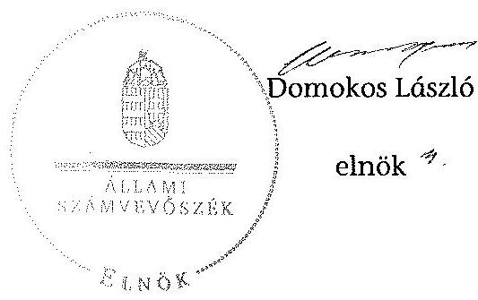

# ÁLLAMI   SZÁMVEVŐSZÉK 

## JELENTÉS

az önkormányzatok belső kontrollrendszere kialakításának, egyes kontrolltevékenységek és a belső ellenőrzés
múködésének ellenőrzéséről
Dejtár
14086
2014. június

---

# Állami Számvevőszék 

Iktatószám: V-0401-048/2014
Témaszám: 1372
Vizsgálat-azonosító szám: V064947

## Az ellenőrzést felügyelte:

dr. Benedek Mária
felügyeleti vezető
Az ellenőrzést vezette és az ellenőrzés végrehajtásáért felelős:
dr. Veress Tiborné
ellenőrzésvezető
A számvevőszéki jelentés összeállításában közremüködtek:
Pető Krisztina
számvevő tanácsos
Kóródi Gábor
számvevő
Az ellenőrzést végezték:
Kóródi Gábor
számvevő

## Uram Ferenc

számvevő tanácsos

---

# TARTALOMJEGYZÉK 

BEVEZETÉS ..... 5
I. ÖSSZEGZŐ MEGÁLLAPÍTÁSOK, KÖVETKEZTETÉSEK, JAVASLATOK ..... 9
II. RÉSZLETES MEGÁLLAPÍTÁSOK ..... 15

1. Az önkormányzat belső kontrollrendszerének kialakítása ..... 15
1.1. A kontrollkörnyezet ..... 15
1.2. A kockázatkezelési rendszer ..... 16
1.3. A kontrolltevékenységek ..... 17
1.4. Az információs és kommunikációs rendszer ..... 18
1.5. A monitoring rendszer ..... 19
2. A pénzügyi folyamatokban kulcsszerepet betöltő teljesítésigazolás és érvényesítés belső kontrollok múködése ..... 19
3. A belső ellenőrzés működése ..... 21

## FÜGGELÉKEK

1. számú Értelmező szótár
2. számú Az értékelés módja és szempontjai

---

.

---

# RÖVIDÍTÉSEK JEGYZÉKE 

## Törvények

Áht.
Info tv.
Kttv.
Ktv.
Ltv.
Mötv:
Mvtv.
Ötv.
Számv. tv.
Vagyonnyilatkozattételről szóló tv.

## Rendeletek

Áhsz. 1

Áhsz. 2
Ávr.
Bkr.
önkormányzati SZMSZ

## Szórövidítések

2012. évi ellenőrzési terv
2013. évi ellenőrzési terv

ÁSZ
bizonylati rend
éves ellenőrzési jelentés
gazdasági ügyrend
2011. évi CXCV. törvény az államháztartásról
2011. évi CXII. törvény az információs önrendelkezési jogról és az információszabadságról
2011. évi CXCIX. törvény a közszolgálati tisztviselőkről (hatályos 2012. március 1-jétől)
1992. évi XXIII. törvény a köztisztviselők jogállásáról (hatálytalan 2012. március 1-jétől)
1995. évi LXVI. törvény a köziratokról, a közlevéltárakról és a magánlevéltári anyag védelméről
2011. évi CLXXXIX. törvény Magyarország helyi önkormányzatairól
1993. évi XCIII. törvény a munkavédelemről
1990. évi LXV. törvény a helyi önkormányzatokról
2000. évi C. törvény a számvitelről
2007. évi CLII. törvény az egyes vagyonnyilatkozat-tételi kötelezettségekről szóló törvény

249/2000. (XII. 24.) Korm. rendelet az államháztartás szervezetei beszámolási és könyvvezetési kötelezettségének sajátosságairól (hatálytalan 2014. január 1-jétől)
4/2013. (I. 11.) Korm. rendelet az államháztartás számviteléről (hatályos 2014. január 1-jétől)
368/2011. (XII. 31.) Korm. rendelet az államháztartásról szóló törvény végrehajtásáról
370/2011. (XII. 31.) Korm. rendelet a költségvetési szervek belső kontrollrendszeréről és belső ellenőrzéséről
Dejtár Község Önkormányzata Képviselő-testületének 1/2011. (I. 19.) számú rendelete a Képviselő-testület és szervei szervezeti és múködési szabályzatáról

54/2011. (11. 28.) számú határozattal elfogadott 2012. évi ellenőrzési terv

10/2013. (02. 26.) számú határozattal elfogadott 2013. évi ellenőrzési terv

Állami Számvevőszék
Dejtár-Ipolyvece Községek Körjegyzőségének bizonylati szabályzata (hatályos 2007. február 1-jétől 2012. december 31-ig)
2011. évre vonatkozó éves összefoglaló ellenőrzési jelentés
Drégelypalánki Közös Önkormányzati Hivatal gazdasági ügyrendje (hatályos 2013. január 1-jétől)

---

gazdálkodási jogkörök szabályzata

INTOSAI

ISSAI
jegyzó
Képviselő-testület
körjegyzó
Körjegyzőség
körjegyzőségi SZMSZ

Közös Hivatal
Közös Hivatal SZMSZ-e

NGM
Önkormányzat
polgármester
stratégiai ellenőrzési
terv
számlarend
Társulás

Dejtár-Ipolyvece Körjegyzőség körjegyzöjének 1. számú intézkedése a Körjegyzőség pénzgazdálkodásával kapcsolatos kötelezettségvállalás, utalványozás, érvényesités és ellenjegyzés hatásköri rendjéről (hatályos 2005. január 1-jétől 2012. december 31-ig)
International Organization of Supreme Audit Institutions (Legfőbb Ellenőrző Intézmények Nemzetközi Szervezete)
International Standards of Supreme Audit Institutions (Legfőbb Ellenőrző Intézmények Nemzetközi Standardjai)
Drégelypalánki Közös Önkormányzati Hivatal jegyzője (2013. január 1-jétől)

Dejtár Község Önkormányzatának Képviselő-testülete
Dejtár-Ipolyvece Községek Körjegyzője
Dejtár-Ipolyvece Községek Körjegyzősége
Dejtár-Ipolyvece Községek Körjegyzőségének Szervezeti és Müködési Szabályzata (hatályos 2011. március 1-jétől 2012. december 31-ig)

Drégelypalánki Közös Önkormányzati Hivatal (2013. január 1-jétől)
A Drégelypalánki Közös Önkormányzati Hivatal szervezeti és müködési szabályzata (hatályos 2013. január 1-jétől)
Nemzetgazdasági Minisztérium
Dejtár Község Önkormányzata
Dejtár Község Önkormányzat polgármestere
Dejtár Község Önkormányzatának stratégia ellenőrzési terve
Dejtár-Ipolyvece Községek Körjegyzőségének számlarendje (hatályos 2007. január 1-jétől 2012. december 31-ig)
Balassagyarmat Kistérségi Többcélú Társulás

---

# JELENTÉS 

## az önkormányzatok belsó kontrollrendszere kialakításának, egyes kontrolltevékenységek és a belső ellenőrzés múködésének ellenőrzéséről Dejtár

## BEVEZETÉS

Dejtár község állandó lakosainak száma 2012. január 1-jén 1396 fő volt. Az Önkormányzat héttagú Képviselő-testületének munkáját kettő állandó bizottság segítette. Az Önkormányzat az önállóan működő és gazdálkodó Körjegyzőségen kívül intézményt nem múködtetett, valamint gazdasági társasággal nem rendelkezett. A polgármester a 2010. évi önkormányzati választások óta tölti be tisztségét. A jegyzői feladatokat 2011. július 1-jétől a körjegyző, 2013. január 1-jétől pedig a jegyző látta el. A Körjegyzőség szervezeti egységekre nem tagolódott, elkülönített gazdasági szervezettel nem rendelkezett, a foglalkoztatott köztisztviselők száma 2012. január 1-jén négy fő volt. A Körjegyzőség 2012. december 31-ével megszűnt és 2013. január 1-jétől Dejtár, Drégelypalánk, Hont, Ipolyvece és Patak községek részvételével megalakult a Közös Hivatal. A Közös Hivatal székhelye Drégelypalánk lett. Az Önkormányzat a 2012. évi költségvetési beszámolója szerint 177969 ezer Ft költségvetési bevételt ért el, valamint 161614 ezer Ft költségvetési kiadást teljesített. A 2012. december 31-i könyvviteli mérleg szerint 569378 ezer Ft értékű eszközvagyonnal rendelkezett, a rövid lejáratú kötelezettségállománya 2068 ezer Ft. Az adósságkonszolidáció során kapott állami támogatást 2012 decemberében a 4167 ezer Ft hosszú lejáratú hitel visszafizetésére fordították.

A demokratikus társadalmakban alapvető igény, hogy a közpénzeket, a közvagyont használók tevékenységükről elszámoljanak, ahhoz egyértelmű és érvényesíthető felelősségi szabályok társuljanak. Ennek a jogos igénynek az érvényesítéséhez meg kell teremteni azokat a folyamatokat, rendszereket, amelyek nélkülözhetetlenek az elszámoltatáshoz. Az elszámoltatás eredményes múködtetéséhez szükség van a megfelelő információs, kontroll, értékelési és beszámolási rendszerek kialakítására.

Magyarországon az uniós csatlakozási tárgyalások idejére nyúlnak vissza a belső kontrollrendszer szabályozásának gyökerei. Az uniós elvárásoknak megfelelő új terminológia szerinti államháztartási belső pénzügyi ellenőrzési (ÁBPE) rendszer területén a jogharmonizáció 2003-ban teljes körűen megvalósult, míg az önkormányzati alrendszerre vonatkozó, az Ötv.-ben megjelenített speciális szabályozás 2005-ben lépett hatályba. Az államháztartási belső kontrollrendszer koncepciója 2009-ben továbbfejlődött. A változások irányát mutat-

---

ja, hogy a költségvetési szervek belső kontrollrendszere már magában foglalja a korszerű, felelős szervezetirányítás elemeit (kontrollkörnyezet, kockázatkezelés, kontrolltevékenység, információ és kommunikáció, monitoring) is. E kontrollrendszer szabályozása háromszintű, a törvényi előírásokat az Áht. és a Mötv., a rendeleti szintű szabályozást az Ávr. és a Bkr. tartalmazza, amelyeket útmutatói szinten az NGM által kiadott standardok és kézikönyvek támogatnak.

A belső kontrollrendszer azt a célt szolgálja, hogy a költségvetési szervek múködésük és gazdálkodásuk során a tevékenységeket szabályszerűen, gazdaságosan, hatékonyan és eredményesen hajtsák végre, teljesítsék elszámolási kötelezettségeiket és megvédjék az erőforrásokat a veszteségektől, a károktól és a nem rendeltetésszerű használattól. A belső kontrollrendszer magában foglalja mindazon szabályokat, eljárásokat, gyakorlati módszereket és szervezeti struktúrákat, kockázatkezelési technikákat, kontrolltevékenységeket, amelyek segítséget nyújtanak a szervezetnek céljai eléréséhez.

Az ÁSZ középtávú stratégiájában hangsúlyos szerepet szánt annak, hogy szilárd szakmai alapon álló, értékteremtő ellenőrzéseivel előmozdítsa a közpénzügyek átláthatóságát, rendezettségét. A számvevőszéki ellenőrzés nemzetközi alapelvei is rögzítik, hogy a megfelelő belső kontrollrendszer minimálisra csökkenti a hibák és szabálytalanságok kockázatát.

Az ellenőrzés célja annak megállapítása volt, hogy a belső kontrollrendszer elemeinek kialakítása, a pénzügyi folyamatokban kulcsszerepet betöltő teljesítésigazolás és érvényesítés, és a belső ellenőrzés szabályos működése biztosítot-ta-e az Önkormányzatnál a közpénzfelhasználás szabályosságát, hozzájárult-e az értéket teremtő rend követelményének érvényesüléséhez.

Ennek keretében értékeltük, hogy:

- a jogszabályi előírásoknak megfelelően alakították-e ki a belső kontrollrendszer elemeit;
- a gazdálkodás folyamatában kulcsszerepet betöltő teljesítésigazolás és érvényesítés kontrolltevékenységeit megfelelően működtették-e;
- biztosították-e a belső ellenőrzés szabályos működését;
- amennyiben az ÁSZ tett javaslatot a 2008-2011. évek közötti ellenőrzése kapcsán az Önkormányzatnak, intézkedtek-e azok végrehajtására.

Az ellenőrzés várható hasznosulását négy szinten tervezzük. A törvényalkotás számára összegzett tapasztalatok állnak rendelkezésre a belső kontrollrendszer önkormányzati területen való kialakításáról, működéséről és hatásairól, a belső ellenőrzés működéséről. Ennek alapján következtetést lehet levonni arról, hogy a belső kontrollrendszer kialakítására és működtetésére vonatkozó jelenlegi, differenciálás nélküli - jogszabályi előírások reális követelményeket támasztanak-e az eltérő adottságú települési önkormányzatok esetében, illetve indokolt-e esetleges jogszabályi módosítás kezdeményezése. Az ellenőrzés az ellenőrzött számára visszajelzést ad a belső kontrollrendszer kialakításában és működésében fellépő hiányosságokról, javaslataival hozzájárul azok kikü-

---

szöböléséhez, amely csökkentheti a későbbi ellenőrzések gyakoriságát. Az ellenőrzés megállapításait és javaslatait más szervezetek is hasznosíthatják a rendezett gazdálkodási keretek kialakításához. A társadalom számára jelzi, hogy közpénz nem maradhat ellenőrizetlenül, az ÁSZ értékteremtő rend kialakításához és megőrzéséhez hozzájáruló tevékenysége pozitív hatással lesz a szervezetről kialakított összkép formálásában. A szervezeten belül lehetőség nyílik arra, hogy a megállapítások szintetizálásával az ÁSZ a hozzáadott értéket teremtő elemző tevékenységét és tanácsadó szerepét is erősítse.

Az önkormányzatok belső kontrollrendszere kialakításának, egyes kontrolltevékenységek és a belső ellenőrzés működésének ellenőrzéséről szóló jelentés I. fejezetének összegző része az ellenőrzés céljára ad rövid, szintetizáló összefoglalót, és tartalmazza a következtetéseket a II. fejezet részletes megállapításain alapulóan. A jelentés intézkedést igénylő megállapításait és javaslatait az ellenőrzés során feltárt, a jelentés II. fejezetében rögzített részletes megállapítások alapozzák meg. A helyszíni ellenőrzés lezárásáig a helyi szabályozás változásait nyomon követtük. Az ÁSZ az ellenőrzés megállapításait az ellenőrzött időszakban hatályos, az intézkedést igénylő megállapításokra tett javaslatokat a jelenleg hatályos jogszabályok alapján fogalmazta meg.

Az ellenőrzés típusa: szabályszerűségi ellenőrzés.
Az ellenőrzött időszak: a belső kontrollrendszer kialakításának megfelelősége esetében a 2012. évre, a pénzügyi folyamatokban kulcsszerepet betöltő teljesítésigazolás és érvényesítés belső kontrollok múködésének megfelelőségét és a belső ellenőrzés szabályszerű működését a 2012. január 1. és december 31-e közötti időszak eseményeit figyelembe véve értékeltük, míg az ÁSZ javaslatainak utóellenőrzése a 2008-2011. években végzett ellenőrzések nyilvánosságra hozott jelentéseiben tett javaslatok áttekintésére terjedt ki.

# Az ellenőrzött szervezet: az Önkormányzat. 

Az ellenőrzés jogszabályi alapját az ÁSZ tv. 1. § (3) bekezdése, az 5. § (2) és (6) bekezdése, valamint az Áht. 61. § (2) bekezdésének előírásai képezik.

Az ellenőrzés szakmai módszertana az ÁSZ hivatalos honlapján (www.asz.hu) közzétett szakmai szabályokon alapult, amely az INTOSAI által kiadott ISSAI figyelembevételével készült.

Az ellenőrzés lefolytatásához az Önkormányzat a kimutatások és a tanúsítvány elektronikus kitöltésével, valamint az ÁSZ által kért dokumentumok elektronikus megküldésével szolgáltatott adatokat. Az így rendelkezésre bocsátott adatok, információk kontrollja és a munkalapok kitöltése a helyszíni ellenőrzés keretében történt. A jelentésben használt fogalmak magyarázatát az 1. számú függelék, az ellenőrzés egyes területeinek értékelésénél alkalmazott egységes minősítési szempontokat a 2. számú függelék tartalmazza.

A belső kontrollrendszer kialakításának ellenőrzése során értékeltük a kontrollkörnyezet, a kockázatkezelési rendszer, a kontrolltevékenységek, az információs és kommunikációs rendszer, valamint a monitoring rendszer szabályozottságának megfelelőségét. A pénzügyi folyamatokban kulcsszerepet betöltő teljesí-

---

tésigazolás és érvényesítés kontrollok múködése megfelelőségének minősítéséhez az állományba nem tartozók megbízási díjai, a külső szolgáltatók által végzett karbantartási, kisjavítási munkák, az egyéb üzemeltetési és fenntartási szolgáltatások, a rendszeres szociális segélyek, valamint az államháztartáson kívülre teljesített múködési és felhalmozási célú pénzeszközátadások közül kockázatelemzéssel választottuk ki az ellenőrzött kiadási jogcímeket. Az egyszerű véletlen mintavétellel kiválasztott tételek ellenőrzését többlépcsős megfelelőségi tesztek útján addig végeztük, amíg elegendő és megfelelő bizonyítékot szereztünk a vizsgált folyamatok kulcskontrolljai múködésének megfelelő vagy nem megfelelő voltáról. Értékeltük az Önkormányzatnál a belső ellenőrzés működésének szabályosságát. Az ÁSZ az Önkormányzat gazdálkodási rendszerét a 2008. évben ellenőrizte. A nyilvánosságra hozott, a helyi önkormányzatok gazdálkodási rendszerének 2008. évi ellenőrzéséről szóló, 0927 számon közzétett számvevőszéki jelentésben az Önkormányzat részére az ÁSZ javaslatot nem tett, ezért a jelen ellenőrzés keretében utóellenőrzésre nem került sor.

Az ÁSZ tv. 29. § (1) bekezdése szerint a jelentéstervezetet megküldtük a polgármester részére, aki az ÁSZ tv. 29. § (2) bekezdésében foglalt észrevételezési jogával nem élt, a jelentéstervezetre észrevételt nem tett.

---

# I. ÖSSZEGZŐ MEGÁLLAPÍTÁSOK, KÖVETKEZTETÉSEK, JAVASLATOK 

A belső kontrollrendszeren belül 2012-ben a kontrollkörnyezet, a kockázatkezelési rendszer, a kontrolltevékenységek, az információs és kommunikációs rendszer, valamint a monitoring rendszer kialakítását külön-külön és együttesen is értékeltük. A belső kontrollrendszer kialakítása az összesített értékelés alapján nem felelt meg a jogszabályi előírásoknak.

A belső kontrollrendszer egyes területei kialakításának minősítése a következő:

| Kontrollterület | Minősítés |
| :-- | :--: |
| Kontrollkörnyezet | nem megfelelő |
| Kockázatkezelési rend-   szer | nem megfelelő |
| Kontrolltevékenységek | részben |
| Információs és kommu-   nikációs rendszer | részben |
| Monitoring rendszer | nem megfelelő |

Részben megfelelőnek értékeltük a kontrolltevékenységek, valamint az információs és kommunikációs rendszer kialakítását, mivel az ellenőrzésünk által megállapított szabályozásbeli hiányosságok nem veszélyeztették e kontrollterületeken a szabályszerű működést.

Nem megfelelőnek értékeltük a kontrollkörnyezet, a kockázatkezelési rendszer és a monitoring rendszer kialakítását, mivel az ellenőrzésünk során megállapított szabályozásbeli hiányosságok magukban hordozzák a szabálytalan múködés, valamint a korrupció kockázatát.

Az állományba nem tartozók megbízási díjaival, valamint a külső szolgáltatók által végzett karbantartási, kisjavítási munkákkal kapcsolatos kifizetések során a pénzügyi folyamatokban kulcsszerepet betöltő teljesítésigazolás és érvényesítés belső kontrollok múködése gyenge volt. Gyengének értékeltük a két kulcskontroll együttes múködését, mert azok nem biztosították az ellenőrzésünk által feltárt hiányosságok bekövetkezésének megelőzését.

A számvevőszéki ellenőrzés az ellenőrzött kifizetésekkel összefüggésben, a rendelkezésre bocsátott dokumentumok alapján kár bekövetkeztére utaló adatot, tényt nem állapított meg, azonban a gazdálkodásban kulcsszerepet betöltő kontrollok gyenge múködése miatt fennáll a hibák bekövetkezésének kockázata. A nem megfelelően szabályozott és múködtetett belső kontrollok korrupciós kockázatot hordoznak.

---

Az Önkormányzat a belső ellenőrzési feladatokat a Társulás útján látta el. A belső ellenőrzés múködése a jogszabályi előírásoknak ugyan megfelelt, azonban a belső ellenőrzés nem tárta fel a számvevőszéki ellenőrzés által megállapított hiányosságokat a kontrollkörnyezet, a kockázatkezelési rendszer és a monitoring rendszer kialakításánál, valamint a pénzügyi folyamatokban kulcsszerepet betöltő teljesítésigazolás és érvényesítés belső kontrollok működésénél.

Az ÁSZ tv. 33. § (1) bekezdésében foglaltak értelmében az ellenőrzött szervezet vezetője köteles a jelentésben foglalt megállapításokhoz kapcsolódó intézkedési tervet összeállítani, és azt a jelentés kézhezvételétől számított 30 napon belül az ÁSZ részére megküldeni. Amennyiben az intézkedési tervet határidőre nem küldi meg a szervezet, vagy az ÁSZ tv. 33. § (2) bekezdésében foglalt póthatáridő elteltével megküldött intézkedési terv továbbra sem elfogadható, az ÁSZ elnöke a hivatkozott törvény 33. § (3) bekezdés a)-b) pontjaiban foglaltakat érvényesítheti.

Az ellenőrzés intézkedést igénylő megállapításai és javaslatai:

# a polgármesternek 

1. A polgármester, mint kötelezettségvállaló - az Ávr. 57. § (4) bekezdésében foglaltak ellenére - nem jelölte ki 2012. március 30 -át követően írásban az Önkormányzat kiadási előirányzatai vonatkozásában a teljesítés igazolására jogosult személyeket.

Javaslat:
Gondoskodjon az Ávr. 57. § (4) bekezdésében foglaltak szerint az Önkormányzat kiadási előirányzatai vonatkozásában a teljesítésigazolásra jogosult személyek írásban történő kijelöléséről.
2. Az Önkormányzat nevében történt kötelezettségvállalásokra - az Áht. 37. § (1) bekezdésében és az Ávr. 55. § (1) bekezdésében foglaltak ellenére - pénzügyi ellenjegyzés nélkül került sor.

Javaslat:
Intézkedjen arról, hogy az Önkormányzat nevében történő kötelezettségvállalásokra az Áht. 37. § (1) bekezdésében és az Ávr. 55. § (1) bekezdésében foglaltaknak megfelelően - az Ávr. 53. §-ában meghatározott kivételekkel - kizárólag a pénzügyi ellenjegyzés után, a pénzügyi teljesítés esedékességét megelőzően, írásban kerüljön sor.
3. A közszolgálatban nem álló személyek közül két fő, a Képviselő-testület bizottságának nem helyi önkormányzati képviselő tagja - a Vagyonnyilatkozat-tételről szóló tv.-ben foglaltak ellenére - a vagyonnyilatkozat-tételi kötelezettségüknek nem tettek eleget. A vagyonnyilatkozatok őrzéséért felelősként kijelölt Vagyonnyilatkozat-kezelő Bizottság a vagyonnyilatkozat-tételi kötelezettség fennállásáról és esedékességének időpontjáról az esedékességet legalább 30 nappal megelőzően nem tájékoztatta a kötelezetteket, továbbá a vagyonnyilatkozat-tételi kötelezettségüket nem teljesítőket írásban nem szólította fel arra, hogy vagyonnyilatkozat-tételi kötelezettségüket a fel-

---

szólítás kézhezvételétől számított nyolc napon belül teljesítsék. A polgármester, az alpolgármester, öt helyi önkormányzati képviselő és a Képviselő-testület bizottságának nem helyi önkormányzati képviselő tagjának vagyonnyilatkozat-tétele a Va-gyonnyilatkozat-tételről szóló tv-ben előírt formai követelményeknek nem felelt meg, mert a nyilatkozó és az őrzésért felelős borítékok lezárására szolgáló felületen nem helyezte el aláírását.

Javaslat:
Kezdeményezze a Képviselő-testületnél a Mötv. 65. §-a alapján a Mötv. 57. § (2) bekezdésének, valamint a helyi önkormányzati képviselők jogállásának egyes kérdéseiről szóló 2000. évi XCVI. törvény 10/A. § (3) bekezdésének és a Vagyonnyilatkozattételről szóló tv.-ben foglaltaknak megfelelően a vagyonnyilatkozatok vizsgálatáért felelősként kijelölt Vagyonnyilatkozat-kezelő Bizottságnak a vagyonnyilatkozat-tételi kötelezettség teljesítésére vonatkozó eljárásának szabályszerűségével kapcsolatos körülményei kivizsgálását, majd a vizsgálat eredményének függvényében kezdeményezze a Képviselő-testületnél a szükséges intézkedések megtételét.
4. A számvevőszéki ellenőrzés megállapításai alapján az Önkormányzatnál a belső kontrollrendszer kialakítása összefoglalóan értékelve nem felelt meg a jogszabályi előírásoknak, a kulcskontrollok működése gyenge volt, a belső ellenőrzés működése ugyan megfelelt a jogszabályi előírásoknak, azonban nem tárta fel, ezáltal nem is javíttatta ki a számvevőszéki ellenőrzés során megállapított hiányosságokat. A megállapított szabályozásbeli és működésbeli hiányosságok magukban hordozzák a szabálytalan működés kockázatát.

Javaslat:
A Mötv. 115. § (1) bekezdésében foglaltak alapján kísérje figyelemmel az Önkormányzat gazdálkodásának szabályszerűségét. A Mötv. 67. § f) pontja alapján gondoskodjon a belső kontrollrendszer működésére vonatkozó jogszabályi rendelkezések be nem tartása, valamint a teljesítésigazolás, illetve az érvényesítés kontrollokkal öszszefüggésben feltárt hiányosságok, szabálytalanságok tekintetében az esetleges munkajogi felelősséggel kapcsolatos körülmények kivizsgálásáról, majd a vizsgálat eredményének függvényében tegye meg a szükséges intézkedéseket.

# a jegyzőnek (Dejtár Község Önkormányzata vonatkozásában) 

1. a kontrollkörnyezettel kapcsolatban:

A körjegyzőségi SZMSZ nem tartalmazta az Ávr.-ben előírt tartalmi elemeket. A körjegyző - a Számv. tv-ben előírtak ellenére - az ellenőrzés idején hatályos számlarendet nem aktualizálta. A Körjegyzőségen az egészséget nem veszélyeztető és biztonságos munkavégzés követelményei megvalósításának módját a körjegyző - az Mvtv.ben foglaltak ellenére - nem határozta meg, továbbá - az Ávr.-ben foglaltak ellenére - belső szabályzatokban nem rendelkezett a Körjegyzőség által ellátott feladatok munkafolyamatainak leírásáról, a helyettesítés rendjéről, a költségvetési szerven belüli belső és azon kívüli külső kapcsolattartás módjáról, szabályairól. Az Ötv.-ben előírt feladata ellenére nem készítette elő a Kttv.-ben előírt, a köztisztviselőkkel szembeni hivatásetikai alapelvek részletes tartalmát, valamint az etikai eljárás szabályainak

---

dokumentumát [II. Részletes megállapítások, 1.1. A kontrollkörnyezet 7., 30., 32., 35. és 47. sorszámú megállapítás].

Javaslat:
Intézkedjen az Áht. 69. § (2) bekezdése, a Bkr. 3. § a) pontja és 6. §-a alapján a jelentés II. Részletes megállapítások, 1.1. A kontrollkörnyezet 7., 30., 32., 35. és 47. sorszámú megállapításaiban foglalt hibák, hiányosságok kijavításáról, megszüntetéséről az ott megjelölt jogszabályi rendelkezéseknek megfelelően.
2. a kockázatkezelési rendszerrel kapcsolatban:

A Körjegyző a Bkr.-ben foglaltak ellenére nem határozta meg az egyes kockázatokkal kapcsolatban a szükséges intézkedéseket, továbbá a szükséges intézkedések teljesítése folyamatos nyomon követési módját. A Vagyonnyilatkozat-tételről szóló tv. 4. § a) és d) pontjaiban foglaltak ellenére a körjegyzöségi SZMSZ-ben, valamint önkormányzati SZMSZ-ben nem tüntették fel a vagyonnyilatkozat-tételre kötelezettek körét [II. Részletes megállapítások, 1.2. A kockázatkezelési rendszer 8., 10 és 13. sorszámú megállapítás].

Javaslat:
Intézkedjen az Áht. 69. § (2) bekezdése, a Bkr. 3. § b) pontja és 7. §-a, valamint a Vagyonnyilatkozat-tételről szóló tv. alapján a jelentés II. Részletes megállapítások, 1.2. A kockázatkezelési rendszer 8., 10 és 13. sorszámú megállapításaiban foglalt hibák, hiányosságok kijavításáról, megszüntetéséről az ott megjelölt jogszabályi rendelkezéseknek megfelelően.
3. a kontrolltevékenységekkel kapcsolatban:

A körjegyzö az Áht. előírásai ellenére a gazdálkodási jogkörök szabályzatában a pénzügyi ellenjegyzést a kötelezettségvállalást követően elvégzendő ellenőrzési feladatként írta elő, valamint az Ávr. előírása ellenére belső szabályzatban nem határozta meg a beszámolási feladatok teljesítésével kapcsolatos belső előírásokat, feltételeket és a gazdasági feladatot ellátó vezető és alkalmazottak helyettesítésének rendjét. A körjegyzö a Bkr.-ben foglaltak ellenére belső szabályzatban nem határozta meg a dokumentumokhoz és információkhoz való hozzáférésre vonatkozó, valamint a beszámolási eljárásokhoz kapcsolódó felelősségi köröket. A Kttv.-ben foglaltak ellenére nem szabályozta a köztisztviselő jogviszonya megszüntetése (megszünése) esetére a munkáltatóval való elszámolás rendjét [II. Részletes megállapítások, 1.3. A kontrolltevékenységek 6., 17. 19., 20., 21., és 32. sorszámú megállapítás].

Javaslat:
Intézkedjen az Áht. 69. § (2) bekezdése, a Bkr. 3. § c) pontja és 8. §-a alapján a jelentés II. Részletes megállapítások, 1.3. A kontrolltevékenységek 6., 17. 19., 20., 21., és 32. sorszámú megállapításaiban foglalt hibák, hiányosságok kijavításáról, megszüntetéséről az ott megjelölt jogszabályi rendelkezésnek megfelelően.

---

4. az információs és kommunikációs rendszerrel kapcsolatban:

A körjegyző a Bkr.-ben foglaltak ellenére nem alakított ki olyan rendszert, amely biztosítja, hogy a megfelelő információk a megfelelő időben eljutnak az illetékes szervezethez, személyhez. A körjegyző - az Info tv.-ben, valamint az Ávr.-ben foglalt előírások ellenére - nem szabályozta a közérdekű adatok megismerésére irányuló igények teljesítésének, valamint a kötelezően közzéteendő adatok nyilvánosságra hozatalának és elektronikus közzétételének rendjét [II. Részletes megállapítások, 1.4. Az információs és kommunikációs rendszer 1., 2., 6. és 8. sorszámú megállapítások].

Javaslat:
Intézkedjen az Áht. 69. § (2), a Bkr. 3. § d) pontjában és a 9. §-a alapján a jelentés II. Részletes megállapítások, 1.4. Az információs és kommunikációs rendszer 1. 2., 6. és 8. sorszámú megállapításaiban foglalt hibák, hiányosságok kijavításáról, megszüntetéséről az ott megjelölt jogszabályi rendelkezéseknek megfelelően.
5. a monitoring rendszerrel kapcsolatban:

A körjegyző - a Bkr.-ben foglaltak ellenére - nem alakította ki a Körjegyzőség tevékenységének, a célok megvalósításának nyomon követését biztosító rendszert, továbbá a belső ellenőrzési jelentésekben tett javaslatok alapján elkészített intézkedési tervben meghatározott egyes feladatok végrehajtásáról szóló beszámolót elmulasztotta elkészíteni és tájékoztatásul megküldeni a belső ellenőrzési vezető részére. A körjegyző - az Áht.-ban és a Bkr.-ben foglaltakat figyelmen kívül hagyva - a belső kontrollrendszer fejlesztése érdekében intézkedéseket nem tett [II. Részletes megállapítások, 1.5. A monitoring rendszer 1., 10. és 18. sorszámú megállapítás].

Javaslat:
Intézkedjen az Áht. 69. § (2) bekezdése, a Bkr. 3. § e) pontja és 10. §-a alapján a jelentés II. Részletes megállapítások, 1.5. A monitoring rendszer 1., 10. és 18. sorszámú megállapításaiban foglalt hibák, hiányosságok kijavításáról, megszüntetéséről az ott megjelölt jogszabályi rendelkezéseknek megfelelően.
6. a pénzügyi folyamatokban kulcsszerepet betöltő kontrollokkal kapcsolatban:

A teljesítésigazolás és az érvényesítés az Áht.-ban és az Ávr.-ben foglaltaknak, továbbá a gazdasági események könyvelése a Számv. tv.-ben és az Áhsz.,-ben foglaltaknak nem felelt meg [II. Részletes megállapítások, 2. A pénzügyi folyamatokban kulcsszerepet betöltő teljesítésigazolás és érvényesítés belső kontrollok müködése 1., 2. és 3. pontban foglalt megállapítás].

Javaslat:
Intézkedjen az Áht. 37-38. §-ában, az Ávr. 55-60. §-ában, a Számv tv.-ben és az Áhsz. ${ }_{2}$-ben foglaltak alapján arról, hogy a teljesítésigazolás és az érvényesítés vonatkozásában, valamint azok ellenőrzése során a kötelezettségvállalással, a pénzügyi ellenjegyzéssel, az utalványozással, a kötelezettségvállalások nyilvántartásba vételével, valamint a gazdasági események könyvelésével kapcsolatban feltárt, a jelentés II. Részletes megállapítások, 2. A pénzügyi folyamatokban kulcsszerepet betöltő teljesí-

---

tésigazolás és érvényesítés belső kontrollok múködése 1., 2. és 3. pontjában szereplő megállapításaiban foglalt hibák, hiányosságok kijavítása, megszüntetése az ott megjelölt jogszabályi rendelkezéseknek megfelelően történjen meg.
7. a belső ellenőrzés múködésével kapcsolatban:

A belső ellenőrzés működése az értékelés szempontjait figyelembe véve megfelelt a jogszabályi előírásoknak, azonban a számvevőszéki ellenőrzés kisebb súlyú hiányosságokat tárt fel, amelyek nem feleltek meg a Bkr.-ben előírt rendelkezéseknek [II. Részletes megállapítások, 3. A belső ellenőrzés müködése 3-5., 8. a), 9-10., 11., 20. a), 25. és 26. sorszámú megállapítása].

Javaslat:
Intézkedjen az Áht. 69. § (2), a 70. § (1) bekezdése, a Bkr. 3. § e) pontja és a 10. §-a alapján a jelentés II. Részletes megállapítások, 3. A belső ellenőrzés müködése 3-5., 8. a), 9-11., 10., 20. a), 25. és 26. sorszámú megállapításaiban foglalt hibák, hiányosságok kijavításáról, megszüntetéséről az ott megjelölt jogszabályi rendelkezéseknek megfelelően.

---

# II. RÉSZLETES MEGÁLLAPÍTÁSOK 

## 1. Az önkORMÁNYZAT BELSŐ KONTROLLRENDSZERÉNEK KIALAKÍTÁSA

A belső kontrollrendszeren belül a 2012. évben a kontrollkörnyezet, a kockázatkezelési rendszer, a kontrolltevékenységek, az információs és kommunikációs rendszer, valamint a monitoring rendszer kialakítását külön-külön és együttesen is értékeltük. A belső kontrollrendszer kialakítása az összesített értékelés alapján nem felelt meg a jogszabályi előírásoknak.

### 1.1. A kontrollkörnyezet

A kontrollkörnyezet kialakítása - a 2. számú függelékben részletezett kritériumrendszer alapján végzett értékelés szerint - a jogszabályi előírásoknak nem felelt meg, mert:

| Sorszám ${ }^{1}$ | Megállapítás | Megjegyzés |
| :--: | :--: | :--: |
| 4. | A Képviselő-testület - a Ktv. 34. § (3) bekezdésében foglaltak ellenére - nem döntött a teljesítményértékelés alapját képező célokról. | A Ktv.-t hatályon kívül helyezte a 2012. évi V. törvény 59. § (1) bekezdés a) pontja, hatálytalan 2012. március 1-jétől. |
| 7. | A körjegyző a körjegyzőségi SZMSZ-ben - az Ávr. 13. § (1) bekezdés c) pontjában foglaltak ellenére - nem rögzítette az alaptevékenységet szabályozó jogszabályok megjelölését, valamint nem megfelelően rögzítette a szakfeladatrend szerinti szakfeladat megnevezéseket. | 2014. január 1-jétől az Ávr. 13. § (1) bekezdés c) pontjában szereplő szöveg az alábbira változott: „az ellátandó, és a kormányzati funkció szerint besorolt alaptevékenységek, rendszeresen ellátott vállalkozási tevékenységek, valamint az alaptevékenységet szabályozó jogszabályok megjelölését." |
| 30. | A körjegyzö - a Számv. tv. 161. § (4)-(5) bekezdéselben előirtak ellenére - az ellenőrzés idején hatályos számlarendet nem aktuallzálta. | Az aktualizálásra 2013. január 1-jén a Közös Hivatal Számlarendjének megalkotásakor került sor. |

[^0]
[^0]:    ${ }^{1}$ A megállapítás számozása az Önkormányzat által az adatszolgáltatás során kitöltött kimutatások kérdéseinek sorszámával azonos.

---

| 32. | A körjegyzö - a Mvtv. 2. § (3) bekezdésében foglaltak ellenére - nem határozta meg a Körjegyzöségen az egészséget nem veszélyeztető és biztonságos munkavégzés követelményei megvalósitásának módját. |  |
| :--: | :--: | :--: |
| 35. | A körjegyzö - az Ávr. 13. § (5) bekezdésében foglaltak ellenére - belső szabályzatokban (szervezeti és müködési szabályzatban, vagy más szabályzatban) nem rendelkezett a Körjegyzöség által ellátott feladatok munkafolyamatainak leírásáról, a helyettesítés rendjéről, továbbá a költségvetési szerven belüli belső és azon kívüli külső kapcsolattartás módjáról, szabályairól. | 2013. január 1-jétől a Közös Hivatal rendelkezik SZMSZ-szel és gazdasági ügyrenddel. |
| 47. | A Képviselö-testület - a Kttv. 231. § (1) bekezdése ellenére - nem állapította meg a Kttv. 83. §-ában előírt, a köztisztviselőkkel szembeni hivatásetikai alapelvek részletes tartalmát, valamint az etikai eljárás szabályait, mivel a körjegyzö - az Ötv. 36. § (2) bekezdés a) pontjában előírt feladata ellenére - nem készítette elő ennek dokumentumát. | 2013. január 1-jétől a Mötv. 81.§ (3) bekezdés c) pontja szabályozza, hogy a jegyző gondoskodik az önkormányzat müködésével kapcsolatos feladatok ellátásáról. |

# 1.2. A kockázatkezelési rendszer 

A kockázatkezelési rendszer kialakítása - a 2. számú függelékben részletezett kritériumrendszer alapján végzett értékelés szerint - nem felelt meg a jogszabályi előírásoknak, mert:

| Sorszám | Megállapítás |
| :--: | :--: |
| 8., 10. | A Körjegyzö - a Bkr. 7. § (2) bekezdésében foglaltak ellenére - nem hatá-   rozta meg egyes kockázatokkal kapcsolatban a szükséges intézkedéseket, továbbá a szükséges intézkedések teljesítése folyamatos nyomon követési módját. |
| 13. | A Vagyonnyilatkozat-tételről szóló tv. 4. § a) és d) pontjaiban foglaltak ellenére a körjegyzöségi SZMSZ-ben, valamint önkormányzati SZMSZ-ben nem tüntették fel a vagyonnyilatkozat-tételre kötelezettek körét. |
| 14. | A közszolgálatban nem álló személyek közül két fő, a Képviselő-testület bizottságának nem helyi önkormányzati képviselő bizottsági tagjai - a Va-   gyonnyilatkozat-tételről szóló tv. 5. § (1) bekezdés c) pont ca) alpontjában foglaltak ellenére - a vagyonnyilatkozat-tételi kötelezettségének nem tett eleget, mivel a vagyonnyilatkozatok őrzéséért felelősként kijelölt Vagyon-   nyilatkozat-kezelő Bizottság a vagyonnyilatkozat-tételi kötelezettség fennállásáról és esedékességének időpontjáról - a 8. § (4) bekezdésében foglaltak ellenére - nem tájékoztatta a kötelezetteket az esedékességet legalább 30 nappal megelőzően, továbbá a 10. § (1) bekezdésben előírtak ellenére a vagyonnyilatkozat-tételi kötelezettségüket nem teljesítőket írásban nem szólította fel arra, hogy vagyonnyilatkozat-tételi kötelezettségüket a felszólítás kézhezvételétől számított nyolc napon belül teljesítsék. |
|  | A polgármester, az alpolgármester és öt fő képviselő, valamint a Képviselő- |

---

testület bizottságának nem helyi önkormányzati képviselő tagjainak va-gyonnyilatkozat-tétele a Vagyonnyilatkozat-tételről szóló tv. 11. §-ában előírt formai követelményeknek nem felelt meg, mert a nyilatkozó és az őrzésért felelős a borítékok lezárására szolgáló felületen nem helyezte el aláírását.

# 1.3. A kontrolltevékenységek 

A kontrolltevékenységek kialakítása - a 2. számú függelékben részletezett kritériumrendszer alapján végzett értékelés szerint - a jogszabályi előírásoknak . részben felelt meg.

A körjegyző a kontrolltevékenység részeként előírta - a költségvetés tervezése, a beszerzési folyamat, a vagyonhasznosítási tevékenység és a támogatások dokumentumainak elkészítésével kapcsolatban - a folyamatba épített, előzetes, utólagos és vezetői ellenőrzést.

A körjegyző a gazdálkodási jogkörök szabályzatában meghatározta a teljesítésigazolás, az érvényesítés és az utalványozás gyakorlásának módjával, eljárási és dokumentációs részletszabályaival, valamint az ezeket végző személyek kijelölésének rendjével kapcsolatos belső előírásokat, feltételeket. Az iratkezelés szabályozása során előírták az iratok és adatok védelmét. Szabályozták az üzemeltetés és adatbiztonság feladatait, és meghatározták az ehhez kapcsolódó hatásköröket, biztosították az adatbiztonság érvényesülését. Az éves költségvetési beszámoló elkészítésével megbízott személy rendelkezett a jogszabályban előírt képesítéssel, valamint a tevékenység ellátására jogosító engedéllyel.

A körjegyző az érvényesítési feladatra kijelölt a Körjegyzőség állományában dolgozó köztisztviselőt, aki rendelkezett a jogszabályban előírt végzettséggel, képesítéssel és a kijelölésnél figyelemmel voltak az összeférhetetlenségre vonatkozó szabályokra.

A kontrolltevékenységek kialakítása az értékelés szempontjából az alábbi kisebb súlyú hiányosságok miatt részben felelt meg a jogszabályi előírásoknak:

Sor-
szám
Megállapítás
6. A körjegyzö az Áht. 37. § (1) bekezdésében előirtak ellenére a gazdálkodási jogkörök szabályzatában a pénzügyi ellenjegyzést a kötelezettségvállalást követően elvégzendő ellenőrzési feladatként írta elő.

A polgármester, mint kötelezettségvállaló - az Ávr. 57. § (4) bekezdésében foglaltak ellenére - nem jelölte ki 2012. március 30 -át követően írásban az Önkormányzat kiadási előirányzatai vonatkozásában a teljesítésigazolására jogosult személyeket.

A körjegyzö - a Bkr. 8. § (4) bekezdés b) pontjában foglaltak ellenére - belső szabályzatban nem határozta meg a dokumentumokhoz és információkhoz való hozzáférésre vonatkozóan a felelősségi köröket.

---

19. A körjegyzö - az Ávr. 13. § (2) bekezdés a) pontjában foglaltak ellenére -
belső szabályzatban nem határozta meg a beszámolási feladatok teljesítésével kapcsolatos belső előírásokat, feltételeket.
20. A körjegyzö - a Bkr. 8. § (4) bekezdés c) pontjában foglaltak ellenére - nem határozta meg a beszámolási eljárásokhoz kapcsolódó felelősségi köröket.
21. A körjegyzö - az Ávr. 13. § (5) bekezdésében foglaltak ellenére - nem határozta meg a gazdasági feladatot ellátó vezető és a gazdasági feladatot ellátó alkalmazottak helyettesítésének rendjét.

A körjegyzö - a Kttv. 74. § (1) bekezdésében és 226. §-ában foglaltak ellenére - nem szabályozta a Körjegyzőségen a köztisztviselő jogviszonya megszüntetése (megszünése) esetére a munkakör átadása és a munkáltatóval való elszámolás rendjét.

# 1.4. Az információs és kommunikációs rendszer 

Az információs és kommunikációs rendszer kialakítása - a 2. számú függelékben részletezett kritériumrendszer alapján végzett értékelés szerint részben felelt meg a jogszabályi előírásoknak.

A körjegyző szabályozta a szervezeten kívülről érkező információk kezelésének rendjét. A Körjegyzőség rendelkezett az Info tv. előírásainak megfelelő adatvédelmi és adatbiztonsági szabályzattal. Az Önkormányzat az elektronikus közzétételi kötelezettségének a 2012. évben eleget tett. A Körjegyzőség rendelkezett a megfelelő tartalommal elkészített iratkezelési szabályzattal.

Az információs és kommunikációs rendszer kialakítása az értékelés szempontjából az alábbi kisebb súlyú hiányosságok miatt részben felelt meg a jogszabályi előírásoknak:

| Sorszám | Megállapítás | Megjegyzés |
| :--: | :--: | :--: |
| 1., 2. | A körjegyzö a - Bkr. 3. § d) pontjában és a 9. § (1) bekezdésében foglaltak ellenére - nem alakított ki olyan rendszert, amely biztosítja, hogy a megfelelő információk a megfelelő időben eljutnak az illetékes szervezethez, személyhez. |  |
| 6., 8. | A körjegyzö - az Info tv. 30. § (6) bekezdésében és a 35. § (3) bekezdésében, valamint az Ávr. 13. § (2) bekezdés h) pontjában foglalt előírások ellenére - nem szabályozta a közérdekú adatok megismerésére irányuló igények teljesítésének, valamint a kötelezően közzéteendő adatok nyilvánosságra hozatalának és elektronikus közzétételének rendjét. | A 7/2013. (IV. 18.) sz. önkormányzati rendeletben szabályozták a közérdekú adatok megismerésére irányuló kérelmek intézésének, továbbá a kötelezően közzéteendő adatok nyilvánosságra hozatalának rendjét. |

---

# 1.5. A monitoring rendszer 

A monitoring rendszer kialakítása - a 2. számú függelékben részletezett kritériumrendszer alapján végzett értékelés szerint - nem felelt meg a jogszabályi előírásoknak, mert:

| Sor-   szám | Megállapítás |
| :-- | :-- |
| 1. | A körjegyzö - a Bkr. 3. § e) pontjában és a 10. §-ában foglaltak ellenére -   nem alakította ki a Körjegyzőség tevékenységének, a célok megvalósításá-   nak nyomon követését biztosító rendszerét. |
| 10. | A körjegyzö - az Áht. 69. § (2) bekezdésében és a Bkr. 3. §-ában foglaltakat   figyelmen kívül hagyva - a belső kontrollrendszer fejlesztése érdekében   intézkedéseket nem tett. |
| 18. | A körjegyzö - a Bkr. 46. § (1) bekezdésében foglalt előírás ellenére - a belső   ellenőrzési jelentésekben tett javaslatok alapján elkészített intézkedési terv-   ben meghatározott egyes feladatok végrehajtásáról szóló beszámolót elmu-   lasztotta elkészíteni és tájékoztatásul megküldeni a belső ellenőrzési vezető   részére. |

Az Önkormányzat törvényességi felügyeletét ellátó Kormányhivatal a 2012. évben nem élt törvényességi felhívással, vagy más törvényességi felügyeleti eszközzel a Képviselő-testület által alkotott rendeletekre, határozatokra vonatkozóan.

## 2. A PÉNZÜGYI FOLYAMATOKBAN KULCSSZEREPET BETÖLTŐ TELJESÍTÉSIGAZOLÁS ÉS ÉRVÉNYESÍTÉS BELSŐ KONTROLLOK MÜKÖDÉSE

Az állományba nem tartozók megbízási díjaival, a külső szolgáltatók által végzett karbantartási, kisjavítási munkákkal kapcsolatos kifizetések során - összefoglalóan értékelve - a pénzügyi folyamatokban kulcsszerepet betöltő teljesítésigazolás és érvényesítés belső kontrollok müködésének megfelelősége gyenge volt, mert:

| Szá-   mozás | Megállapítás | Megjegyzés |
| :--: | :--: | :--: |
| 1. | Teljesítésigazolás   A teljesítésigazolást - az Ávr. 57. § (1) és (3) bekezdésében foglaltak ellenére - vagy nem végezték el, vagy nem szabályszerűen végezték el, mert az Ávr. 60. § (3) bekezdése szerint vezetett nyilvántartás (aláírásminta) alapján nem volt megállapítható, hogy az aláírás a teljesítésigazolásra kijelölt személytől származott. |  |
| 2. | Érvényesítés   Az érvényesítés az Ávr. 58. § (3) bekezdésében előírtak ellenére nem volt szabályszerú, mivel az Ávr. 60. § (3) bekezdése szerint vezetett nyilvántartás (aláírás-minta) alapján nem volt megállapítható, | Az Ávr. 56. § (1) bekezdés 2014. január 1-jétől módosult, a kötelezettségvállalások nyíl- |

---

hogy az aláírás a kijelölt személytől származott.
Az érvényesítő - az Ávr. 58. § (1)-(2) bekezdéseiben előírtak ellenére - nem ellenőrizte és nem jelezte az utalványozónak, hogy a megelőző ügymenetben a teljesítésigazolás elmaradt, vagy nem szabályszerűen történt, továbbá hogy a kötelezettségvállalásra - az Áht. 37. § (1) bekezdése és az Ávr. 55. § (1) bekezdésében foglaltak ellenére - pénzügyi ellenjegyzés nélkül került sor. Nem jelezte az utalványozónak továbbá, hogy a bizonylatokon nem tüntették fel - az Ávr. 59. (3) bekezdés f) pontjában előírtak ellenére - a kötelezettségvállalás nyilvántartási számát, mivel az Ávr. 56. § (1) bekezdés előírása ellenére a kötelezettségvállalást követően nem gondoskodtak annak egyedileg azonosítható módon történő nyilvántartásba vételéről.

Az érvényesítés ellenőrzése során feltárt egyéb hiányosságok
A Számv. tv. 16. § (3) bekezdésében és az Áhsz. 148. §
3. (2) bekezdésében és a 9. számú melléklet 9. pontjában foglaltak ellenére nem a gazdasági esemény tartalmának megfelelő főkönyvi számlára jelölték ki és számolták el a kifizetést.
vántartását az
Áhsz. 2 39. § (1) bekezdés és a 14. számú melléklet II. pontja szabályozza.

Az Áhsz. 1 48. § (2) bekezdés és a 9 . számú melléklet 9. pontja 2014. január 1-jétől Áhsz. 2 51. § 16. számú melléklet.

Az állományba nem tartozók megbízási díjaival kapcsolatos - az Önkormányzatra vonatkozó - kifizetések során a teljesítésigazolás és az érvényesítés kulcskontrollok múködésének megfelelősége gyenge volt, mert:

- a teljesítésigazolást - az Áht. 38. § (1) bekezdése és az Ávr. 57. § (1) bekezdésében foglaltak ellenére - nem végezték el;
- az érvényesítés - az Ávr: 58. § (3) bekezdésében előírtak ellenére - nem volt szabályszerű, mivel az Ávr. 60. § (3) bekezdése szerint vezetett nyilvántartás (aláírás-minta) alapján nem volt megállapítható, hogy az aláírás a kijelölt személytől származott;
- az érvényesítő - az Ávr. 58. § (1)-(2) bekezdés előírása ellenére - nem ellenőrizte és nem jelezte az utalványozónak, hogy a megelőző ügymenetben a teljesítésigazolást nem végezték el és nem tartották be az Áht. 37. § (1) és az Ávr. 55. § (1) bekezdésében foglaltakat, mivel az Önkormányzat kiadási előirányzatai terhére történt kötelezettségvállalásokra pénzügyi ellenjegyzés nélkül került sor; továbbá az Ávr. 56. § (1) bekezdés előírása ellenére a kötelezettségvállalást követően nem gondoskodtak annak nyilvántartásba vételéről és nem vezettek a hivatkozott jogszabályban előírt tartalmú kötelezettségvállalási nyilvántartást, így a fedezet meglétét az érvényesítő nem tudta ellenőrizni.

---

A külső szolgáltatók által végzett karbantartási, kisjavítási munkákkal kapcsolatos - a Körjegyzőségre és az Önkormányzatra vonatkozó - kifizetések során a teljesítésigazolás és az érvényesítés kulcskontrollok múködésének megfelelősége gyenge volt, mert:

- a teljesítésigazolás - az Ávr. 57. § (1) és (3) bekezdésében előírtak ellenére - a gázszerelés kifizetése esetében nem történt meg, továbbá a teljesítésigazolás nem volt szabályszerű a fénymásoló javítás kifizetése esetében, mivel az Ávr. 60. § (3) bekezdése szerint vezetett nyilvántartás (aláírás-minta) alapján nem volt beazonosítható, hogy az aláírás a teljesítésigazolásra kijelölt személytől származott;
- az érvényesítés - az Ávr. 58. § (3) bekezdésében előírtak ellenére - nem volt szabályszerű, mivel az Ávr. 60. § (3) bekezdése szerint vezetett nyilvántartás (aláírás-minta) alapján nem volt megállapítható, hogy az aláírás az érvényesítésre kijelölt személytől származott;
- az érvényesítő - az Ávr. 58. § (1)-(2) bekezdéseiben rögzített kötelezettsége ellenére - a gázszerelés kifizetése esetében nem ellenőrizte és nem jelezte az utalványozónak, hogy a megelőző ügymenetben a teljesítésigazolást nem végezték el, illetve nem szabályszerűen végezték; a kötelezettségvállalásról az Ávr. 56. § (1) bekezdésében előírtak ellenére nem vezettek nyilvántartást, így a fedezet meglétét az érvényesítő nem tudta ellenőrizni, továbbá az Ávr. 59. § (3) bekezdésében foglaltak ellenére az „Utalvány" nem tartalmazta a fénymásoló javítás kifizetése esetében a kedvezményezett címét és a kötelezettségvállalás nyilvántartási számát.

A gázszerelés kifizetése esetében az Áhsz. 48. § (2) bekezdésében és a 9. számú melléklet 9. pontjában foglaltak ellenére anyagbeszerzés helyett külső szolgáltató által végzett karbantartási, kisjavítási munkák fókönyvi számlára könyvelték a gazdasági eseményt.

A számvevőszéki ellenőrzés az ellenőrzött kifizetésekkel összefüggésben, a rendelkezésre bocsátott dokumentumok alapján kár bekövetkeztére utaló adatot, tényt nem állapított meg, azonban a gazdálkodásban kulcsszerepet betöltő kontrollok gyenge múködése miatt fennáll a hibák bekövetkezésének kockázata. A nem megfelelően múködtetett belső kontrollok korrupciós kockázatot hordoznak.

# 3. A BELSŐ ELLENŐRZÉS MŰKÖDÉSE 

Az Önkormányzat a belső ellenőrzési feladatokat - képviselő-testületi döntés alapján - a Társulás útján látta el.

A belső ellenőrzés múködése - 2. számú függelékben részletezett kritériumrendszer alapján végzett értékelés szerint - az Önkormányzatnál megfelelt a jogszabályi előírásoknak.

A belső ellenőrzést végző a jogszabályban előírt szakirányú szakképzettséggel és szakmai gyakorlattal rendelkezett. Az Önkormányzat rendelkezett a jogszabályi előírásoknak megfelelő tartalmú stratégiai ellenőrzési tervvel. A 2012. évi

---

ellenőrzési tervben fogalt ellenőrzéseket végrehajtották, amelyhez az ellenőrzési programot elkészítették. A belső ellenőrzés javaslatainak végrehajtása érdekében a körjegyző határidőn belül megfelelő tartalmú intézkedési tervet elkészítette. A belső ellenőrzés az ellenőrzési jelentések alapján megtett intézkedések nyilvántartásáról és nyomon követéséről gondoskodott.

A belső ellenőrzési vezető által elkészített éves ellenőrzési jelentést a munkaszervezet vezetője a körjegyzőnek az előírt határidőben megküldte. Az éves ellenőrzési jelentés tartalmazta a belső kontrollrendszer szabályszerűségének, gazdaságosságának, hatékonyságának és eredményességének növelése, javítása érdekében tett fontosabb javaslatokat, valamint a belső kontrollrendszer öt elemének értékelését.

A belső ellenőrzés múködése az értékelés szempontjából az alábbi kisebb súlyú hiányosságok mellett megfelelt a jogszabályi előírásoknak.

| Sorszám | Megállapítás | Megjegyzés |
| :--: | :--: | :--: |
| 3-4. | Az Önkormányzat nem rendelkezett - a Bkr. 56. § (7) bekezdésében előírtaknak megfelelő -a Társulás munkaszervezeti vezetője által jóváhagyott belső ellenőrzési kézikönyvvel. | Az Önkormányzat 2013. március 1-jétől rendelkezett belső ellenőrzési kézikönyvvel. |
| 5. | A Bkr. 16. § (4) bekezdésében foglaltak ellenére a belső ellenőrzési tevékenység megszervezésére vonatkozó írásbeli megállapodásban nem rendelkeztek a belső ellenőrzési vezetői feladatok és kötelességek ellátásának módjáról. |  |
| $\begin{aligned} & \text { 8. } \\ & \text { a) } \end{aligned}$ | A 2013. évi ellenőrzési terv - a Bkr. 31. § (4) bekezdés a) pontjában foglaltak ellenére - nem tartalmazta az ellenőrzési tervet megalapozó elemzések és a kockázatelemzés eredményének összefoglaló bemutatását. |  |
| 9. | A Képviselő-testület a 2013. évre vonatkozóan elkészített éves ellenőrzési tervet az Ötv. 92. § (6) bekezdésében és a Bkr. 32. § (4) bekezdésében foglalt határidőn túl, 2013. február 26-án hagyta jóvá. | 2013. január 1-jétől az Ötv. 92. § (6) bekezdése helyett a Mötv. 119. § (5) bekezdése írja elő az éves ellenőrzési terv jóváhagyásának határidejét. |
| 10. | A 2013. évi ellenőrzési terv összeállítása - a Bkr. 56. § (2) bekezdésében foglalt előírás ellenére nem a körjegyző írásos véleményének figyelembe vételével történt, mivel a körjegyzö véleményt, javaslatot nem fogalmazott meg. |  |

---

11. A belső ellenőrzési vezető által összeállított 2013. évi belső ellenőrzési terv - a Bkr. 31. § (2) bekezdésében foglaltak ellenére - nem alapult a stratégiai ellenőrzési tervben és a kockázatelemzés alapján felállított prioritásokon.
12. Az elvégzett ellenőrzésről készített jelentés - a Bkr. 39. § (3) bekezdés d) pontjában foglaltak ellenére - nem tartalmazta az ellenőrzés típusát.

A belső ellenőrzési vezető - Bkr. 22. § (2) bekezdés b) és e) pontjában, valamint az 50. §-ban
25. foglalt előírást figyelmen kívül hagyva - az elvégzett ellenőrzésekről nyilvántartást nem vezetett.

A belső ellenőrzési vezető - a Bkr. 21. § (2) bekezdés d) pontjában és a 47. § (1) bekezdésében foglaltak ellenére - a belső ellenőrzési jelentésekben tett megállapításokat, javaslatokat, a vonatkozó intézkedési terveket és azok végrehajtását nyomon követő nyilvántartást nem vezetett.

Az Önkormányzat az ÁSZ-tól a 2012-2013. években integritás kérdőív kitöltésére kapott felkérést, amelynek 2013. évben eleget tett. A Körjegyzőség, illetve a Közös Hivatal a 2011-2013. években szintén felkérést kaptak az integritás kérdőív kitöltésére, amelynek 2011. évben a Körjegyzőség nem tett eleget. A belső kontrollrendszer kialakítása során feltárt hibák, ezen belül a köztisztviselőkkel szembeni hivatásetikai alapelvek meghatározásának, az etikai eljárás szabályainak, a szervezeten belüli és kívüli információ átadás rendjének hiánya, a feladatkörök szétválasztásának hiányosságai, továbbá a 2013. évi ellenőrzési terv megalapozását biztosító kockázatelemzés elmaradása arra utalnak, hogy az Önkormányzatnak az integritási szemlélet érvényesítésében még fejlődést kell elérnie.

Budapest, 2014. OG. hó O2. nap

Függelék 2 db

---

.

---

# ÉRTELMEZŐ SZÓTÁR 

belső ellenőrzés
belső kontrollrendszer
belső kontrollrendszer területei
egyszerű véletlen mintavétel
integritás
kockázatkezelési rendszer

Független, tárgyilagos bizonyosságot adó és tanácsadó tevékenység, amelynek célja, hogy az ellenőrzött szervezet működését fejlessze és eredményességét növelje, az ellenőrzött szervezet céljai elérése érdekében rendszerszemléletű megközelítéssel és módszeresen értékeli, illetve fejleszti az ellenőrzött szervezet irányítási és belső kontrollrendszerének hatékonyságát. (Forrás: Bkr. 2. § b) pontja)
A belső kontrollrendszer a kockázatok kezelése és tárgyilagos bizonyosság megszerzése érdekében kialakított folyamatrendszer, amely azt a célt szolgálja, hogy a múködés és gazdálkodás során a tevékenységeket szabályszerűen, gazdaságosan, hatékonyan, eredményesen hajtsák végre, az elszámolási kötelezettségeket teljesítsék, megvédjék az erőforrásokat a veszteségektől, károktól és nem rendeltetésszerű használattól. (Forrás: Áht. 69. § (1) bekezdése)
A kontrollkörnyezet, a kockázatkezelési rendszer, a kontrolltevékenységek, az információs és kommunikációs rendszer, valamint a nyomon követési (monitoring) rendszer. (Forrás: Bkr. 3. §-a)

Az alapsokaságból egyszerű véletlen kiválasztással képzett részsokaság. (Forrás: Az ÁSZ ellenőrzési mintavételezés támogatásához készült segédletének 4.1.1. pontja)
Az integritás elvek, értékek, cselekvések, módszerek, intézkedések konzisztenciáját jelenti: olyan magatartásmódot, amely meghatározott értékeknek felel meg. Az integritás a közszféra esetében a társadalom által elvárt nyilvánossági, átláthatósági, illetve jogi/etikai normáknak történő megfelelést jelenti.
(Forrás: a http://integritas.asz.hu honlapon közzétett „A 2012. évi integritás felmérés eredményeinek összefoglalója dokumentum 3. oldal 1. bekezdése)
A kockázat annak a valószínűségét jelenti, hogy egy vagy több esemény vagy intézkedés nem kívánt módon befolyásolja a rendszer múködését, céljainak megvalósulását. (Forrás: Javaslatok a korrupciós kockázatok kezelésére - Kockázatkezelési és ellenőrzési módszertan 35. oldal, ÁSZ)
Olyan irányítási eszközök és módszerek összessége, melynek elemei a szervezeti célok elérését veszélyeztető tényezők (kockázatok) azonosítása, elemzése, csoportosítása, nyomon követése, valamint szükség esetén a kockázati kitettség mérséklése. (Forrás: Bkr. 2. § m) pontja)

---

kontrollkörnyezet
kontrolltevékenységek
kommunikáció
korrupció
kulcskontrollok
lényegesség
megfelelőségi teszt

A kontrollkörnyezet alakítja ki a szervezet belső kontrollrendszerhez való viszonyát, hozzáállását, befolyásolja az alkalmazottak belső kontrollal kapcsolatos tudatosságát, magatartását. Elemei a személyes és szakmai elkötelezettség és a vezetés, valamint az alkalmazottak által vallott erkölcsi értékek; a szakmai hozzáértés iránti elkötelezettség; a felső vezetés hozzáállása - a vezetés filozófiája és tevékenységének stílusa; a szervezeti struktúra; a humánerőforrás-politika és gazdálkodási gyakorlat.
A kontrolltevékenységek azok a politikák és eljárások, amelyeket a kockázatok megoldására hoznak létre a szervezet céljainak teljesítése érdekében.
Az a tevékenység, melynek során információ továbbítása valósul meg. A kommunikációs folyamat résztvevői között tájékoztatás történik, mely során tényeket, ezek magyarázatát közlik. „A szervezetben eredményes kommunikációnak kell áramlania lefelé, horizontálisan és felfelé, a szervezet egészében és annak valamennyi elemében."
Azok a cselekmények, amelyek során a köz érdekében való eljárással megbízott és döntéshozatali felelősséggel felruházott személy a köz érdeke helyett önös vagy részérdekeket követve, mástól jogtalan vagy etikátlan előnyt elfogadva és őt jogtalan vagy etikátlan előnyhöz juttatva jár el, illetve amikor valaki a köz érdekében való eljárással megbízott és döntéshozatali felelősséggel felruházott személynek jogtalan vagy etikátlan előnyt nyújtva vagy felajánlva jogtalan vagy etikátlan előnyt kér. (Forrás: A Kormány korrupció megelőzési programja 2012-2014.)
Az azonosított kockázatok mérséklése érdekében kialakított kontrollok közül azok, amelyek elégtelen működése esetén a szervezetet jelentős veszteség érheti, vagy a működésükben bekövetkező hiba/hiányosság más kontrollok eredményességét csökkenti. Ezek ellenőrzése, értékelése elegendő bizonyítékot szolgáltat adott területen a kontrollrendszer értékeléséhez. Az önkormányzatok kontrollrendszere kialakításának ellenőrzése során a pénzügyi folyamatokban kulcsszerepet betöltő belső kontrollok a teljesítésigazolás és az érvényesítés.
Egy információ akkor lényeges, ha hiánya vagy téves állítása befolyásolhatja ezen információkat felhasználók döntéseit, véleményét. Az ellenőrzés során a lényegesség három szempontból értelmezhető: érték, jelleg és összefüggés szerint.
Az ellenőrzés során alkalmazott módszer - szekvenciális (megállásos) megfelelőségi teszt - lényege, hogy a kiválasztott minta ellenőrzését csak addig végezzük, amíg elegendő és megfelelő bizonyítékot nem szerzünk az ellenőrzött kulcskontroll (teljesítésigazolás, érvényesítés) működésének megfelelő, vagy nem megfelelő voltáról.

---

monitoring (nyomon követési rendszer)
utóellenőrzés

A monitoring a különböző szintű szervezeti célok megvalósításának folyamatát kíséri figyelemmel, melynek során a releváns eseményekről és tevékenységekről (együtt: folyamatokról) rendszeres jelleggel, strukturált, döntéstámogató információkhoz jutnak a szervezet vezetői.
Az intézkedések nyomon követése érdekében elrendelt ellenőrzés, amelynek célja, hogy a belső ellenőrzés bizonyosságot szerezzen az elfogadott intézkedések végrehajtásáról, vagy arról a tényről, hogy ha az ellenőrzött szerv, illetve az ellenőrzött szervezeti egység vezetője nem, vagy nem az elfogadott intézkedésnek megfelelően hajtja végre az intézkedéseket, továbbá meggyőződni arról, hogy a végrehajtott intézkedésekkel a megállapított kockázat ténylegesen megszűnt, vagy a kockázati tűréshatár alá csökkent. (Forrás: Bkr. 2. § s) pontja)

---

.

---

# Az értékelés módja és szempontjai 

## A belsó kontrollrendszer kialakítása megfelelôségének értékelése az öt területre vonatkoztatva

Megfelelő a belső kontrollrendszer kialakítása, amennyiben az öt területen (kontrollkörnyezet, kockázatkezelési rendszer, kontrolltevékenységek, információs és kommunikációs rendszer, monitoring rendszer kialakítása) összesen elért és elérhető pontok százalékban kifejezett hányadosa eléri a $81 \%$-ot, és egyik terület sem kapott nem megfelelő értékelést.

Részben megfelelő a kontrollrendszer kialakítása, ha az önkormányzat teljesíti a meghatározott valamennyi főbb kritériumot (amelyeket - 10 kritérium - a program 5. számú melléklete tartalmazza), és az öt munkalapon összesen eléri és elérhető pontok százalékban kifejezett hányadosa a $61 \%$-ot meghaladja, és legfeljebb egy terület értékelése nem megfelelő volt.

Nem megfelelő a belső kontrollrendszer kialakítása, amennyiben az önkormányzat nem teljesíti a meghatározott bármelyik főbb kritériumot, vagy az öt munkalapon összesen elért és elérhető pontok százalékban kifejezett hányadosa $0-60 \%$ közötti, vagy egynél több terület értékelése nem megfelelő volt.

A megfelelőség minősítése a következők szerint történik:
A minősítés - részben automatizált - a belső kontrollrendszer kialakítására vonatkozó kérdéseket tartalmazó munkalapokon, az elérhető és az elért pontszámok alapján az alábbi képlettel, számítógépes program segítségével történt, melynek összefüggése:

$$
\frac{\text { Elért pont }}{\text { Elérhető pont }} \times 100=\ldots \ldots . \%
$$

A belső kontrollrendszer egyes területei kialakítása megfelelőségénél alkalmazandó minősítés:

- nem megfelelő 0-60\%-ig;
- részben megfelelő 61-80\%-ig;
- megfelelő $81 \%$ fölött.

---

# Az ellenőrzött önkormányzat belső kontrollrendszere kialakítása megfelelőségének főbb kritériumai 

| Sorszám | Kérdés: | Szempont: |
| :--: | :--: | :--: |
|  | A kontrollkörnyezet kialakítása (2. számú munkalap, kimutatás) |  |
| 1. | A polgármesteri hivatall rendelkezike alapító okirattal? | A polgármesteri hivatal alapító okirata az Áht. 8. § (4) bekezdésében előírtaknak megfelelően elkészült, tartalmazza az Ávr. 5. § (1) bekezdésében előírtakat, kiemelten a c) pont szerinti alaptevékenységeit. |
| 2. | A polgármesteri hivatal rendelkezik-e szervezeti és müködési szabályzattal? | A polgármesteri hivatal rendelkezik az Áht. 10. § (5) bekezdésben előírt - 2010. január 1-jét követően jóváhagyott vagy módosított - SZMSZ-szel. A költségvetési szerv feladatai ellátásának részletes belső rendjét és módját - törvényben vagy kormányrendeletben meghatározott módon és tartalommal - szervezeti és müködési szabályzata állapítja meg. |
| 3. | Meghatározták-e a vagyongazdálkodás szabályait önkormányzati rendeletben? | Az önkormányzat a vagyongazdálkodás szabályait önkormányzati rendeletben meghatározta, és az összhangban van az Mötv. 109. § (4) bekezdése, a Nemzeti vagyonról szóló 2011. évi CXCVI. tv. 18. § (1) bekezdése tartalmával, és a 18. § (12) bekezdésében meghatározottak szerint az 5. § (5)-(7) bekezdésében foglaltaknak megfelelően 2012. október 31-ig azt módosították. |
| 4. | A polgármesteri hivatal rendelkezik-e számviteli politikával? | A polgármesteri hivatal rendelkezik az Áhsz. 8. § (3) bekezdésben előírt - 2010. január 1-jét követően hatályba helyezett vagy aktualizált - számviteli politikával. A jogszabályhely rögzíti, hogy a Számv. tv. és az e rendeletben foglaltak szerint az államháztartás szervezetének szakmai feladatai és sajátosságai figyelembevételével ki kell alakítania és írásban szabályoznia számviteli politikáját. |
| 5. | A polgármesteri hivatal rendelkezik-e pénzkezelési szabályzattal? | A polgármesteri hivatal rendelkezik az Áhsz. 8. § (4) bekezdés d) pontjában előírt - 2010. január 1-jét követően hatályba helyezett vagy aktualizált - pénzkezelési szabályzattal. A jogszabályhely előírja, hogy a számviteli politika keretében el kell készíteni a pénzkezelési szabályzatot. |
| 6. | A polgármesteri hivatal rendelkezik-e leltározási és leltárkészítési szabályzattal? | A polgármesteri hivatal rendelkezik az Áhsz. 8. § (4) bekezdés a) pontjában előírt - 2008. január 1-jét követően hatályba helyezett vagy aktualizált - eszközök és források leltározási és leltárkészítési szabályzatával. |

[^0]
[^0]:    ${ }^{1}$ Polgármesteri hivatal alatt a polgármesteri hivatalt, a főpolgármesteri hivatalt, a megyei önkormányzati hivatalt és a körjegyzőséget is érteni kell.

---

| Sor-   szám | Kérdés: | Szempont: |
| :--: | :--: | :--: |
| 7. | A polgármesteri hivatal gazdasági szervezetének van-e ügyrendje? | A polgármesteri hivatal rendelkezik a gazdasági szervezet ügyrendjével vagy az azzal egyenértékủ szabályozással (Ávr. 9. § (5) bekezdés), vagy az Ávr. 13. § (5) bekezdésében foglaltakat az SZMSZ-ben vagy más belső szabályzatban szabályozta (Áht. 10. § (5) bekezdés), és a szabályozást 2010. január 1-jét követően felülvizsgálták, aktualizálták. Elfogadható az is, ha a gazdasági feladatokat a polgármesteri hivatalon belül több szervezeti egység látja el, és azoknak önálló ügyrendjük van, illetve ha a polgármesteri hivatal nem tagolódik szervezeti egységekre, és ezért önálló gazdasági szervezettel nem rendelkezik, azonban az SZMSZ-ben vagy más belső szabályozásban rögzítik az ügyrend kötelező elemeit. |
| 8. | A polgármesteri hivatal rendelkezik-e ellenőrzési nyomvonallal? | Az ellenőrzési nyomvonal, folyamatleírás a polgármesteri hivatal tevékenységeire vonatkozóan elkészült, és azt 2010. január 1-jét követően felülvizsgálták, aktualizálták. A szabályzat minta megtalálható a Pénzügyminisztérium Belső kontroll kézikönyv, 2010. 18. és a 19. számú mellékletében. A Bkr. 6. § (3) bekezdésében előírtak szerint a költségvetési szerv vezetője köteles elkészíteni és rendszeresen aktualizálni a költségvetési szerv ellenőrzési nyomvonalát, amely a költségvetési szerv müködési folyamatainak szöveges vagy táblázatba foglalt vagy folyamatábrákkal szemléltetett leírása, amely tartalmazza különösen a felelősségi és információs szinteket és kapcsolatokat, irányítási és ellenőrzési folyamatokat, lehetővé téve azok nyomon követését és utólagos ellenőrzését. |
|  | Az információ és kommunikáció szabályozása és kialakítása (5. számú munkalap, kimutatás) |  |
| 9. | Az önkormányzat eleget tett-e az elektronikus közzétételi kötelezettségének? | Az Önkormányzat az Info tv. 33. § (1) és (3) bekezdésében foglaltaknak megfelelően, saját vagy közösen müködtetett honlapon elektronikus formában bárki számára hozzáférhetően közzé tette az Info tv. 1. számú mellékletében felsoroltak közül legalább az éves költségvetését, a költségvetési beszámolóját és a Képviselő-testület rendeleteit. |
| 10. | A polgármesteri hiva-   tal rendelkezik-e irat-   kezelési szabályzattal? | A polgármesteri hivatal rendelkezik az Ltv. 10. § (1) bek. c) pontjában előírt iratkezelési szabályzattal. |

# A két kulcskontroll minősítése 

A kulcskontrollok - teljesítésigazolás, érvényesítés - múködésének értékelése megfelelőségi tesztek segítségével történt. A kontrollok müködésének megfelelőségére vonatkozó következtetést az értékelő táblázatban elért súlyozott pontszám, továbbá az eredendő kockázat minősítésétől függően két vagy három kiadási jogcím alapján fogalmaztuk meg. Az értékeléshez alkalmazandó arányszámok kialakítását számítógépes program segítségével köz-

---

pontilag az ellenőrzésben közreműködő informatikai támogató végezte az önkormányzatok által elektronikus úton megadott adatokból.

A minősítés automatizált, a megfelelőségi tesztek kitöltésével számítógépes program segítségével történik, melynek összefüggése:

| Elérhető pontszám: | Elért súlyozott pontszám értékelése: |
| :--: | :--: |
| $0-70$ | „gyenge" |
| $71-90$ | „jó" |
| $91-100$ | „kiváló" |

- „kiváló"a kontrollok múködése, ha megfelel a szabályozásoknak és a legmagasabb szintű elvárásoknak a múködésbeli hibák megelőzése, feltárása és kijavítása tekintetében; amennyiben a kontrollok múködésének megfelelőségét a helyszíni ellenőrzési munkalap értékelése alapján kiválónak minősítettük, azonban esetleges kisebb - az egységesen meghatározott követelményrendszerben foglalt $10 \%$-ot el nem érő mértékű - hiányosságokat tártunk fel, az összességében kiváló minősítést alátámasztó pozitív megállapításon túl ezeket a hiányosságokat a jelentésben ismertetjük a javaslataink megalapozása érdekében;
- „jó" a kontrollok múködésének megfelelősége, ha azok a megállapított kisebb (tolerálható mértékű) hiányosságok mellett kielégítik az elvárásokat a működésbeli hibák megelőzése, feltárása, és kijavítása tekintetében, a megállapított hiányosságok nem veszélyeztették a hibák megelőzését, feltárását és kijavítását, továbbá ismertetjük azokat a területeket is, ahol az előírt ellenőrzési, egyeztetési feladatokat nem végezték el;
- "gyenge" a kontrollok múködése, ha a kontrollok múködésében túl sok hiányosság fordul elő ahhoz, hogy megbízhatónak lehessen azokat minősíteni. Ismertetjük a jelentésben azokat a területeket, ahol az előírt ellenőrzési, egyeztetési feladatokat nem végezték el, amely hiányosságok a belső kontrollok megfelelőségének „gyenge" minősítését okozták.

# A belső ellenőrzés szabályszerű múködésének értékelése 

A belső ellenőrzés múködését a 2012. évben történt ellenőrzés tervezési és végrehajtási tevékenységének tapasztalatai alapján értékeljük a munkalapok (kimutatások) kérdéseire adott válaszok alapján, melynek megállapítása az elérhető és az elért pontokból az alábbi képlettel, számítógépes program segítségével történt:

$$
\frac{\text { Elért pont }}{\text { Elérhető pont }} \times 100=\ldots \ldots . \%
$$

A belső ellenőrzés múködésének megfelelőségénél alkalmazandó minősítés:

- nem felelt meg $0-60 \%$-ig;
- megfelel
$61-80 \%$-ig;
- jól megfelel
$81 \%$ fölött