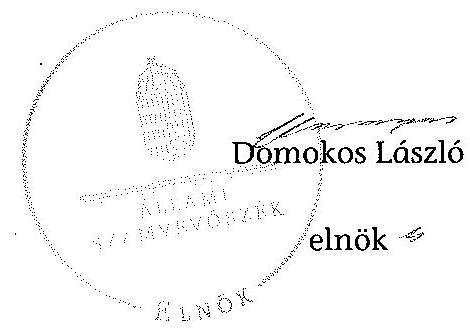

# ÁLLAMI   SZÁMVEVŐSZÉK 

## JELENTÉS

az önkormányzatok belső kontrollrendszere kialakításának, egyes kontrolltevékenységek és a belső ellenőrzés
múködésének ellenőrzéséről
Egerfarmos

---

# Állami Számvevőszék 

Iktatószám: V-0399-068/2014
Témaszám: 22
Vizsgálat-azonosító szám: V064945

## Az ellenőrzést felügyelte:

## dr. Benedek Mária

felügyeleti vezető
Az ellenőrzést vezette és az ellenőrzés végrehajtásáért felelős:
dr. Veress Tiborné
ellenőrzésvezető
A számvevőszéki jelentés összeállításában közremüködtek:
Gergely Tilda
számvevő
Pető Krisztina
számvevő tanácsos
Az ellenőrzést végezték:
Robák Ferencné
számvevő tanácsos

Gergely Tilda
számvevő

---

# TARTALOMJEGYZÉK 

BEVEZETÉS ..... 5
I. ÖSSZEGZŐ MEGÁLLAPÍTÁSOK, KÖVETKEZTETÉSEK, JAVASLATOK ..... 9
II. RÉSZLETES MEGÁLLAPÍTÁSOK ..... 14

1. Az önkormányzat belső kontrollrendszerének kialakítása ..... 14
1.1. A kontrollkörnyezet ..... 14
1.2. A kockázatkezelési rendszer ..... 15
1.3. A kontrolltevékenységek ..... 15
1.4. Az információs és kommunikációs rendszer ..... 17
1.5. A monitoring rendszer ..... 17
2. A pénzügyi folyamatokban kulcsszerepet betöltő teljesítésigazolás és érvényesítés belső kontrollok múködése ..... 18
3. A belső ellenőrzés múködése ..... 20

## FÜGGELÉKEK

1. számú Értelmező szótár
2. számú Az értékelés módja és szempontjai

---

.

---

# RÖVIDÍTÉSEK JEGYZÉKE 

## Törvények

Áht.
ÁSZ tv.
Info tv.
Kttv.

Ltv.

Mötv.

Nvtv.
Ötv.
Vagyonnyilatkozattételről szóló tv.

## Rendeletek

Áhsz. 1

Áhsz. 2
Ávr.
Bkr.
önkormányzati SZMSZ

## Szórövidítések

ÁSZ
INTOSAI

ISSAI
jegyzö
Képviselő-testület
Kormányhivatal
körjegyzö
Körjegyzőség
körjegyzőségi SZMSZ
Közös Hivatal
2011. évi CXCV. törvény az államháztartásról
2011. évi LXVI. törvény az Állami Számvevőszékről
2011. évi CXII. törvény az információs önrendelkezési jogról és az információszabadságról
2011. évi CXCIX. törvény a közszolgálati tisztviselökről (hatályos 2012. március 1-jétől)
1995. évi LXVI. törvény a köziratokról, a közlevéltárakról és a magánlevéltári anyag védelméről
2011. évi CLXXXIX. törvény Magyarország helyi önkormányzatairól
2011. évi CXCVI. törvény a nemzeti vagyonról
1990. évi LXV. törvény a helyi önkormányzatokról
2007. évi CLII. törvény az egyes vagyonnyilatkozat-tételi kötelezettségekről szóló törvény

249/2000. (XII. 24.) Korm. rendelet az államháztartás szervezetei beszámolási és könyvvezetési kötelezettségének sajátosságairól (hatálytalan: 2014. január 1-jétől)
4/2013. (I. 11.) Korm. rendelet az államháztartás számviteléről (hatályos 2014. január 1-jétől)
368/2011. (XII. 31.) Korm. rendelet az államháztartásról szóló törvény végrehajtásáról
370/2011. (XII. 31.) Korm. rendelet a költségvetési szervek belső kontrollrendszeréről és belső ellenőrzéséről
Egerfarmos Községi Önkormányzat a Képviselőtestület és szervei szervezeti és müködési szabályzata (hatályos 2010. november 3-tól)

Állami Számvevőszék
International Organization of Supreme Audit Institutions (Legfőbb Ellenőrző Intézmények Nemzetközi Szervezete)
International Standards of Supreme Audit Institutions (Legfőbb Ellenőrző Intézmények Nemzetközi Standardjai)
Mezőtárkányi Közös Önkormányzati Hivatal jegyzője
Egerfarmos Községi Önkormányzat Képviselő-testülete
Heves megyei Kormányhivatal
Mezőtárkány-Dormánd-Egerfarmos Községek Körjegyzőségének körjegyzöje
Mezőtárkány-Dormánd-Egerfarmos Községek Körjegyzősége
Mezőtárkány-Dormánd-Egerfarmos Községek Körjegyzőségének szervezeti és müködési szabályzata
Mezőtárkányi Közös Önkormányzati Hivatal

---

| NGM | Nemzetgazdasági Minisztérium |
| :-- | :-- |
| Önkormányzat | Egerfarmos Községi Önkormányzat |
| polgármester | Egerfarmos Községi Önkormányzat polgármestere |
| Társulás | Füzesabony Többcélú Kistérségi Társulás, 2012. december |
|  | 31-vel jogutód nélkül megszűnt |

---

# JELENTÉS 

## az önkormányzatok belső kontrollrendszere kialakításának, egyes kontrolltevékenységek és a belső ellenőrzés múködésének ellenőrzéséről Egerfarmos

## BEVEZETÉS

Egerfarmos község állandó lakosainak száma 2012. január 1-jén 719 fő volt. Az Önkormányzat négytagú Képviselő-testületének munkáját egy állandó bizottság segítette. A Mezőtárkány Községi Önkormányzat, a Dormánd Községi Önkormányzat és az Egerfarmos Községi Önkormányzat körjegyzőséget hozott létre. Az Önkormányzat gazdasági társaságban tulajdoni hányaddal nem rendelkezett. A polgármester a 2002. évi önkormányzati választások óta tölti be tisztségét. A körjegyzö 2012. január 1. és 2013. február 28. között látta el a körjegyzői feladatokat, 2013. március 1-jétől a Közös Hivatal jegyzője. A Körjegyzőség önállóan gazdálkodó költségvetési szerv, szervezeti egységekre nem tagolódott, elkülönített gazdasági szervezettel, önkormányzati intézménnyel nem rendelkezett, a foglalkoztatott köztisztviselők száma 2012. január 1-jén három fő volt. Mezőtárkány, Dormánd és Egerfarmos települések önkormányzatainak képviselő-testületei 2013. március 1-jétől - Mezőtárkány székhellyel - Közös Hivatalt hoztak létre. Az Önkormányzat a 2012. évi költségvetési beszámolója szerint 141223 ezer Ft költségvetési bevételt ért el, valamint 127426 ezer Ft költségvetési kiadást teljesített. A 2012. december 31-i könyvviteli mérleg szerint 219408 ezer Ft értékű eszközvagyonnal rendelkezett, a rövid lejáratú kötelezettségállománya 524 ezer Ft volt, hosszú lejáratú kötelezettsége nem volt. Az Önkormányzatnál a 2008-2012. évek között adósságrendezési eljárás nem indult.

A demokratikus társadalmakban alapvető igény, hogy a közpénzeket, a közvagyont használók tevékenységükről elszámoljanak, ahhoz egyértelmű és érvényesíthető felelősségi szabályok társuljanak. Ennek a jogos igénynek az érvényesítéséhez meg kell teremteni azokat a folyamatokat, rendszereket, amelyek nélkülözhetetlenek az elszámoltatáshoz. Az elszámoltatás eredményes múködtetéséhez szükség van a megfelelő információs, kontroll, értékelési és beszámolási rendszerek kialakítására.

Magyarországon az uniós csatlakozási tárgyalások idejére nyúlnak vissza a belső kontrollrendszer szabályozásának gyökerei. Az uniós elvárásoknak megfelelő új terminológia szerinti államháztartási belső pénzügyi ellenőrzési (ÁBPE) rendszer területén a jogharmonizáció 2003-ban teljes körűen megvalósult, míg az önkormányzati alrendszerre vonatkozó, az Ötv.-ben megjelenített

---

speciális szabályozás 2005-ben lépett hatályba. Az államháztartási belső kontrollrendszer koncepciója 2009-ben továbbfejlődött. A változások irányát mutatja, hogy a költségvetési szervek belső kontrollrendszere már magában foglalja a korszerű, felelős szervezetirányítás elemeit (kontrollkörnyezet, kockázatkezelés, kontrolltevékenység, információ és kommunikáció, monitoring) is. E kontrollrendszer szabályozása háromszintű, a törvényi előírásokat az Áht. és a Mötv., a rendeleti szintű szabályozást az Ávr. és a Bkr. tartalmazza, amelyeket útmutatói szinten az NGM által kiadott standardok és kézikönyvek támogatnak.

A belső kontrollrendszer azt a célt szolgálja, hogy a költségvetési szervek múködésük és gazdálkodásuk során a tevékenységeket szabályszerűen, gazdaságosan, hatékonyan és eredményesen hajtsák végre, teljesítsék elszámolási kötelezettségeiket és megvédjék az erőforrásokat a veszteségektől, a károktól és a nem rendeltetésszerű használattól. A belső kontrollrendszer magában foglalja mindazon szabályokat, eljárásokat, gyakorlati módszereket és szervezeti struktúrákat, kockázatkezelési technikákat, kontrolltevékenységeket, amelyek segítséget nyújtanak a szervezetnek céljai eléréséhez.

Az ÁSZ középtávú stratégiájában hangsúlyos szerepet szánt annak, hogy szilárd szakmai alapon álló, értékteremtő ellenőrzéseivel előmozdítsa a közpénzügyek átláthatóságát, rendezettségét. A számvevőszéki ellenőrzés nemzetközi alapelvei is rögzítik, hogy a megfelelő belső kontrollrendszer minimálisra csökkenti a hibák és szabálytalanságok kockázatát.

Az ellenőrzés célja annak megállapítása volt, hogy a belső kontrollrendszer elemeinek kialakítása, a pénzügyi folyamatokban kulcsszerepet betöltő teljesítésigazolás és érvényesítés, és a belső ellenőrzés szabályos működése biztosítot-ta-e az Önkormányzatnál a közpénzfelhasználás szabályosságát, hozzájárult-e az értéket teremtő rend követelményének érvényesüléséhez.

Ennek keretében értékeltük, hogy:

- a jogszabályi előírásoknak megfelelően alakították-e ki a belső kontrollrendszer elemeit;
- a gazdálkodás folyamatában kulcsszerepet betöltő teljesítésigazolás és érvényesítés kontrolltevékenységeit megfelelően működtették-e;
- biztosították-e a belső ellenőrzés szabályos működését;
- amennyiben az ÁSZ tett javaslatot a 2008-2011. évek közötti ellenőrzése kapcsán az Önkormányzatnak, intézkedtek-e azok végrehajtására.

Az ellenőrzés várható hasznosulását négy szinten tervezzük. A törvényalkotás számára összegzett tapasztalatok állnak rendelkezésre a belső kontrollrendszer önkormányzati területen való kialakításáról, működéséről és hatásairól, a belső ellenőrzés működéséről. Ennek alapján következtetést lehet levonni arról, hogy a belső kontrollrendszer kialakítására és működtetésére vonatkozó jelenlegi, differenciálás nélküli - jogszabályi előírások reális követelményeket támasztanak-e az eltérő adottságú települési önkormányzatok esetében, illetve indokolt-e esetleges jogszabályi módosítás kezdeményezése. Az ellenőrzés az el-

---

lenőrzött számára visszajelzést ad a belső kontrollrendszer kialakításában és működésében fellépő hiányosságokról, javaslataival hozzájárul azok kiküszöböléséhez, amely csökkentheti a későbbi ellenőrzések gyakoriságát. Az ellenőrzés megállapításait és javaslatait más szervezetek is hasznosíthatják a rendezett gazdálkodási keretek kialakításához. A társadalom számára jelzi, hogy közpénz nem maradhat ellenőrizetlenül, az ÁSZ értékteremtő rend kialakításához és megőrzéséhez hozzájáruló tevékenysége pozitív hatással lesz a szervezetről kialakított összkép formálásában. A szervezeten belül lehetőség nyílik arra, hogy a megállapítások szintetizálásával az ÁSZ a hozzáadott értéket teremtő elemző tevékenységét és tanácsadó szerepét is erősítse.

Az önkormányzatok belső kontrollrendszere kialakításának, egyes kontrolltevékenységek és a belső ellenőrzés működésének ellenőrzéséről szóló jelentés I. fejezetének összegző része az ellenőrzés céljára ad rövid, szintetizáló összefoglalót, és tartalmazza a következtetéseket a II. fejezet részletes megállapításain alapulóan. A jelentés intézkedést igénylő megállapításait és javaslatait az ellenőrzés során feltárt, a jelentés II. fejezetében rögzített részletes megállapítások alapozzák meg. A helyszíni ellenőrzés lezárásáig a helyi szabályozás változásait nyomon követtük. Az ÁSZ az ellenőrzés megállapításait az ellenőrzött időszakban hatályos, az intézkedést igénylő megállapításokra tett javaslatokat a jelenleg hatályos jogszabályok alapján fogalmazta meg.

Az ellenőrzés típusa: szabályszerűségi ellenőrzés.
Az ellenőrzött időszak: a belső kontrollrendszer kialakításának megfelelősége esetében a 2012. évre, a pénzügyi folyamatokban kulcsszerepet betöltő teljesítésigazolás és érvényesítés belső kontrollok múködésének megfelelőségét és a belső ellenőrzés szabályszerű működését a 2012. január 1. és december 31-e közötti időszak eseményeit figyelembe véve értékeltük, míg az ÁSZ javaslatainak utóellenőrzése a 2008-2011. években végzett ellenőrzések nyilvánosságra hozott jelentéseiben tett javaslatok áttekintésére terjedt ki.

# Az ellenőrzött szervezet: az Önkormányzat. 

Az ellenőrzés jogszabályi alapját az ÁSZ tv. 1. § (3) bekezdése, az 5. § (2) és (6) bekezdése, valamint az Áht. 61. § (2) bekezdésének előírásai képezik.

Az ellenőrzés szakmai módszertana az ÁSZ hivatalos honlapján (www.asz.hu) közzétett szakmai szabályokon alapult, amely az INTOSAI által kiadott ISSAI figyelembevételével készült.

Az ellenőrzés lefolytatásához az Önkormányzat a kimutatások és a tanúsítvány elektronikus kitöltésével, valamint az ÁSZ által kért dokumentumok elektronikus megküldésével szolgáltatott adatokat. Az így rendelkezésre bocsátott adatok, információk kontrollja és a munkalapok kitöltése a helyszíni ellenőrzés keretében történt. A jelentésben használt fogalmak magyarázatát az 1. számú függelék, az ellenőrzés egyes területeinek értékelésénél alkalmazott egységes minősítési szempontokat a 2. számú függelék tartalmazza.

A belső kontrollrendszer kialakításának ellenőrzése során értékeltük a kontrollkörnyezet, a kockázatkezelési rendszer, a kontrolltevékenységek, az információs

---

és kommunikációs rendszer, valamint a monitoring rendszer szabályozottságának megfelelőségét. A pénzügyi folyamatokban kulcsszerepet betöltő teljesítésigazolás és érvényesítés kontrollok működése megfelelőségének minősítéséhez az állományba nem tartozók megbízási díjai, a külső szolgáltatók által végzett karbantartási, kisjavítási munkák, az egyéb üzemeltetési és fenntartási szolgáltatások, a rendszeres szociális segélyek, valamint az államháztartáson kívülre teljesített múködési és felhalmozási célú pénzeszközátadások közül kockázatelemzéssel választottuk ki az ellenőrzött kiadási jogcímeket. Az egyszerű véletlen mintavétellel kiválasztott tételek ellenőrzését többlépcsős megfelelőségi tesztek útján addig végeztük, amíg elegendő és megfelelő bizonyítékot szereztünk a vizsgált folyamatok kulcskontrolljai múködésének megfelelő vagy nem megfelelő voltáról. Értékeltük az Önkormányzatnál a belső ellenőrzés működésének szabályosságát. Utóellenőrzésre nem került sor, mivel az ÁSZ az Önkormányzatnál a 2008-2011. évek között ellenőrzést nem végzett.

Az ÁSZ tv. 29. § (1) bekezdése szerint a jelentéstervezetet megküldtük a polgármester részére, aki az ÁSZ tv. 29. § (2) bekezdésében foglalt észrevételezési jogával nem élt, a jelentéstervezetre észrevételt nem tett.

---

# I. ÖSSZEGZŐ MEGÁLLAPÍTÁSOK, KÖVETKEZTETÉSEK, JAVASLATOK 

A belső kontrollrendszeren belül 2012-ben a kontrollkörnyezet, a kockázatkezelési rendszer, a kontrolltevékenységek, az információs és kommunikációs rendszer, valamint a monitoring rendszer kialakítását külön-külön és együttesen is értékeltük. A belső kontrollrendszer kialakítása az összesített értékelés alapján nem felelt meg a jogszabályi előírásoknak.

A belső kontrollrendszer egyes területei kialakításának minősítése a következő:

| Kontrollteruilet | Minősítés |  |
| :-- | :-- | :-- |
| Kontrollkörnyezet |  | nem   megfelelő |
| Kockázatkezelési rendszer |  | nem   megfelelő |
| Kontrolltevékenységek | részben   megfelelő |  |
| Információs és kommunikációs rendszer |  | nem   megfelelő |
| Monitoring rendszer |  | nem   megfelelő |

Részben megfelelőnek értékeltük a kontrolltevékenységek kialakítását, mivel az ellenőrzésünk által megállapított szabályozásbeli hiányosságok nem veszélyeztették a Körjegyzőség, ezáltal az Önkormányzat céljainak elérését.

Nem megfelelőnek értékeltük a kontrollkörnyezet, a kockázatkezelési rendszer, az információs és kommunikációs rendszer és a monitoring rendszer kialakítását, mivel az ellenőrzésünk során megállapított szabályozásbeli hiányosságok magukban hordozzák a szabálytalan múködés, valamint a korrupció kockázatát.

A külső szolgáltatók által végzett karbantartási, kisjavítási munkákkal, az egyéb üzemeltetési és fenntartási szolgáltatásokkal, valamint az államháztartáson kívülre teljesített múködési és felhalmozási célú pénzeszközátadásokkal kapcsolatos kifizetések során a pénzügyi folyamatokban kulcsszerepet betöltő teljesítésigazolás és érvényesítés belső kontrollok múködése gyenge volt. Gyengének értékeltük a két kulcskontroll együttes múködését, mert azok nem biztosították az ellenőrzésünk által feltárt hiányosságok bekövetkezésének megelőzését.

A számvevőszéki ellenőrzés az ellenőrzött kifizetésekkel összefüggésben a rendelkezésre bocsátott dokumentumok alapján kár bekövetkeztére utaló adatot, tényt nem állapított meg. A nem megfelelően szabályozott és múködtetett belső kontrollok korrupciós kockázatot hordoznak.

---

Az Önkormányzat a belső ellenőrzési feladatokat Társulás útján látta el. A belső ellenőrzés müködése a jogszabályi előírásoknak nem felelt meg, mivel a számvevőszéki ellenőrzés által megállapított szabályozási és működési hiányosságok számossága magában hordozza a szabálytalan önkormányzati gazdálkodás, és feladatellátás kockázatát.

Az ÁSZ tv. 33. § (1) bekezdésében foglaltak értelmében az ellenőrzött szervezet vezetője köteles a jelentésben foglalt megállapításokhoz kapcsolódó intézkedési tervet összeállítani, és azt a jelentés kézhezvételétől számított 30 napon belül az ÁSZ részére megküldeni. Amennyiben az intézkedési tervet határidőre nem küldi meg a szervezet, vagy az ÁSZ tv. 33. § (2) bekezdésében foglalt póthatáridő elteltével megküldött intézkedési terv továbbra sem elfogadható, az ÁSZ elnöke a hivatkozott törvény 33. § (3) bekezdés a)-b) pontjaiban foglaltakat érvényesítheti.

Az ellenőrzés intézkedést igénylő megállapításai és javaslatai:

# a polgármesternek 

1. A polgármester mint kötelezettségvállaló - az Ávr. 57. § (4) bekezdésében foglaltak ellenére - 2012. március 30 -át követően írásban nem jelölte ki az Önkormányzat kiadási előirányzatai vonatkozásában a teljesítés igazolására jogosult személyeket.

Javaslat:
Jelölje ki az Ávr. 57. § (4) bekezdésének megfelelően az általa történő kötelezettségvállalások esetében a teljesítés igazolására jogosult személyeket.
2. A polgármester - az Áht. 87. § (1) bekezdésében foglalt előírás ellenére - a Képvise-lö-testületet írásban az előírt határidőt túllépve tájékoztatta az Önkormányzat gazdálkodásának első félévi helyzetéről.

Javaslat:
Tájékoztassa írásban a Képviselő-testületet az Áht. 87. § (1) bekezdése alapján az Önkormányzat gazdálkodásának helyzetéről.
3. A számvevőszéki ellenőrzés megállapításai alapján az Önkormányzatnál a belső kontrollrendszer kialakítása összefoglalóan értékelve nem felelt meg a jogszabályi előírásoknak, a kulcskontrollok müködése gyenge volt, a belső ellenőrzés müködése nem felelt meg a jogszabályi előírásoknak, és nem tárta fel, ezáltal nem is javíttatta ki a számvevőszéki ellenőrzés során megállapított hiányosságokat. A megállapított szabályozásbeli és müködésbeli hiányosságok magukban hordozzák a szabálytalan müködés kockázatát.

Javaslat:
A Mötv. 115. § (1) bekezdésében foglaltak alapján kísérje figyelemmel az Önkormányzat gazdálkodásának szabályszerűségét. A Mötv. 67. § f) pontja alapján gondoskodjon a belső kontrollrendszer müködésére vonatkozó jogszabályi rendelkezések be nem tartása, valamint a teljesítésigazolás, illetve az érvényesítés kontrollokkal ösz-

---

szefüggésben feltárt hiányosságok, szabálytalanságok tekintetében az esetleges munkajogi felelősséggel kapcsolatos körülmények kivizsgálásáról, majd a vizsgálat eredményének függvényében tegye meg a szükséges intézkedéseket.

# a jegyzőnek (Egerfarmos Község Önkormányzata vonatkozásában) 

1. A körjegyző az Áht.-ban és az Ötv.-ben foglaltak ellenére nem kezdeményezte a körjegyzőség szervezeti és működési szabályzatának képviselő-testületi jóváhagyását, és nem készítette elő a vagyongazdálkodási rendelet módosítását. A Bkr.-ben foglaltak ellenére nem készítette el a szabálytalanságok kezelésének eljárásrendjét és a Körjegyzőség ellenőrzési nyomvonalát. [II. Részletes megállapítások, 1.1. A kontrollkörnyezet 5., 16., 34. és 41. sorszámú megállapítás]

Javaslat:
Intézkedjen az Áht. 69. § (2) bekezdése, a Bkr. 3. § a) pontja és 6. §-a alapján a jelentés II. Részletes megállapítások, 1.1. A kontrollkörnyezet 5., 16., 34. és 41. sorszámú megállapításaiban foglalt hibák, hiányosságok kijavításáról, megszüntetéséről az ott megjelölt jogszabályi rendelkezéseknek megfelelően.
2. a kockázatkezelési rendszerrel kapcsolatban:

A körjegyző a Bkr.-ben foglaltak ellenére a Körjegyzőség kockázatkezelési rendszerét nem alakította ki, továbbá nem mérte fel és nem állapította meg a Körjegyzőség tevékenységében, gazdálkodásában rejlő kockázatokat, nem határozta meg egyes kockázatokkal kapcsolatban a szükséges intézkedéseket és a kockázatok kezelése érdekében szükséges intézkedések teljesítése folyamatos nyomon követési módját. A vagyonnyilatkozat-tételre kötelezettek körének szervezeti és működési szabályzatban történő meghatározása nem felelt meg a Vagyonnyilatkozat-tételről szóló tv. előírásainak. [II. Részletes megállapítások, 1.2. A kockázatkezelési rendszer 1., 2., 8., 10. és 13. sorszámú megállapítás]

Javaslat:
Intézkedjen az Áht. 69. § (2) bekezdése, a Bkr. 3. § b) pontja és 7. §-a, valamint a Vagyonnyilatkozat-tételről szóló tv. alapján a jelentés II. Részletes megállapítások, 1.2. A kockázatkezelési rendszer 1., 2., 8., 10. és 13. sorszámú megállapításaiban foglalt hibák, hiányosságok kijavításáról, megszüntetéséről az ott megjelölt jogszabályi rendelkezéseknek megfelelően.
3. a kontrolltevékenységekkel kapcsolatban:

A körjegyző a Bkr.-ben foglaltak ellenére nem biztosította minden tevékenységre vonatkozóan a folyamatba épített, előzetes, utólagos és vezetői ellenőrzést, továbbá az Info tv.-ben foglalt előírásokat figyelmen kívül hagyva nem biztosította az adatok biztonságát és védelmét. Nem határozta meg a dokumentumokhoz, információkhoz való hozzáférésre vonatkozóan a felelősségi köröket. A körjegyző a Kttv.-ben foglaltak ellenére nem szabályozta a Körjegyzőségen a köztisztviselő jogviszonya megszüntetése (megszűnés) esetére a munkakör átadása és a munkáltatóval való elszámolás rendjét. [II. Részletes megállapítások, 1.3. A kontrolltevékenység 1-5., 16-17. és 32. sorszámú megállapítás]

---

Javaslat:
Intézkedjen az Áht. 69. § (2) bekezdése, a Bkr. 3. § c) pontja és 8. §-a alapján a jelentés II. Részletes megállapítások, 1.3. A kontrolltevékenységek 1-5., 16-17. és 32. sorszámú megállapításaiban foglalt hibák, hiányosságok kijavításáról, megszüntetéséről az ott megjelölt jogszabályi rendelkezésnek megfelelően.
4. az információs és kommunikációs rendszerrel kapcsolatban:

A körjegyző a Bkr.-ben foglaltak ellenére nem alakított ki olyan rendszert, amely biztosítja, hogy a megfelelő információk a megfelelő időben eljutnak az illetékes szervezethez, személyhez, és nem készített egyedi iratkezelési szabályzatot. Az Info tv.-ben, illetve az Ávr.-ben előírtak alapján a kötelezően közzéteendő adatok nyilvánosságra hozatalának rendjét nem alakította ki, és a közérdekű adatok megismerésére irányuló igények teljesítésének rendjét nem szabályozta. [II. Részletes megállapítások, 1.4. Az információs és kommunikációs rendszer 1-3., 6., 8. és 9-15. sorszámú megállapítások]

Javaslat:
Intézkedjen az Áht. 69. § (2), a Bkr. 3. § d) pontjában és a 9. §-a alapján a jelentés II. Részletes megállapítások, 1.4. Az információs és kommunikációs rendszer 1-3., 6., 8. és 9-15. sorszámú megállapításaiban foglalt hibák, hiányosságok kijavításáról, megszüntetéséről az ott megjelölt jogszabályi rendelkezéseknek megfelelően.
5. a monitoring rendszerrel kapcsolatban:

A körjegyző a Bkr.-ben foglaltak ellenére nem alakította ki a Körjegyzőség tevékenységének, a célok megvalósításának nyomon követését biztosító rendszerét, és az intézkedési tervben meghatározott egyes feladatok végrehajtásáról szóló Bkr. szerinti beszámolót nem készítette el. [II. Részletes megállapítások, 1.5. A monitoring rendszer 1. és 18. sorszámú megállapítás]

Javaslat:
Intézkedjen az Áht. 69. § (2) bekezdése, a Bkr. 3. § e) pontja és 10. §-a alapján a jelentés II. Részletes megállapítások, 1.5. A monitoring rendszer 1. és 18. sorszámú megállapításaiban foglalt hibák, hiányosságok kijavításáról, megszüntetéséről az ott megjelölt jogszabályi rendelkezéseknek megfelelően.
6. a pénzügyi folyamatokban kulcsszerepet betöltő kontrollokkal kapcsolatban:

A teljesítésigazolás és az érvényesítés az Ávr.-ben foglaltaknak, továbbá a gazdasági események könyvelése a Számv. tv.-ben és az Áhsz.,-ben foglaltaknak, az utalványrendelet az Ávr.-ben foglaltaknak nem felelt meg. [II. Részletes megállapítások, 2. A pénzügyi folyamatokban kulcsszerepet betöltő teljesítésigazolás és érvényesítés belső kontrollok müködése 1-3. pontban foglalt megállapítás]

Javaslat:
Intézkedjen az Ávr. 56-60. §-ában foglaltak alapján arról, hogy a teljesítésigazolás és az érvényesítés vonatkozásában, valamint azok ellenőrzése során az utalvány tartalmával, a kötelezettségvállalások nyilvántartásba vételével, valamint a Számv. tv.-ben

---

és az Áhsz. 2 51. §-ában foglaltak alapján a gazdasági események könyvelésével kapcsolatban feltárt, a jelentés II. Részletes megállapítások, 2. A pénzügyi folyamatokban kulcsszerepet betöltő teljesítésigazolás és érvényesítés belső kontrollok müködése 1-3. pontjaiban szereplő megállapításaiban foglalt hibák, hiányosságok kijavítása, megszüntetése az ott megjelölt jogszabályi rendelkezéseknek megfelelően történjen meg.
7. a belső ellenőrzés működésével kapcsolatban:

A belső ellenőrzés működése a számvevőszéki ellenőrzés értékelési szempontjait figyelembe véve nem felelt meg a Bkr.-ben foglalt rendelkezéseknek. [II. Részletes megállapítások, 3. A belső ellenőrzés müködése, 5., 7., 8., 18., 23-26. sorszámú megállapítása]

Javaslat:
Intézkedjen az Áht. 69. § (2) bekezdése, a 70. § (1) bekezdése, a Bkr. 3. § e) pontja és a 10. §-a alapján a jelentés II. Részletes megállapítások, 3. Az belső ellenőrzés müködése 5., 7., 8., 18., 23-26. sorszámú megállapításaiban foglalt hibák, hiányosságok kijavításáról, megszüntetéséről az ott megjelölt jogszabályi rendelkezéseknek megfelelően.

---

# II. RÉSZLETES MEGÁLLAPÍTÁSOK 

## 1. AZ ÖNKORMÁNYZAT BELSŐ KONTROLLRENDSZERÉNEK KIALAKÍTÁSA

A belső kontrollrendszeren belül a 2012. évben a kontrollkörnyezet, a kockázatkezelési rendszer, a kontrolltevékenységek, az információs és kommunikációs rendszer, valamint a monitoring rendszer kialakítását külön-külön és együttesen is értékeltük. A belső kontrollrendszer kialakítása az összesített értékelés alapján nem felelt meg a jogszabályi előírásoknak.

### 1.1. A kontrollkörnyezet

A kontrollkörnyezet kialakítása - a 2. számú függelékben részletezett kritériumrendszer alapján végzett értékelés szerint - a jogszabályi előírásoknak nem felelt meg, mert:

| Sorszám | Megállapítás | Megjegyzés |
| :--: | :--: | :--: |
| 5. | A körjegyzőségi SZMSZ-t - az Áht. 9. § (1) bekezdés e) pontjában foglaltak ellenére - a Képviselő-testület nem hagyta jóvá, mert a körjegyzö̉ nem kezdeményezte a Képviselőtestület elé terjesztését. | 2013. január 1-jétől a költségvetési szerv szervezeti és múködési szabályzatának jóváhagyását az Áht. 9. § (1) bekezdés a) pontja írja elő. |
| 16. | A körjegyzö - az Ötv. 36. § (2) bekezdés a) pontjában foglaltak ellenére - a jogszabályváltozásokhoz kapcsolódóan az ellenőrzött időszakban nem készítette el a vagyongazdálkodási rendelet módosítását annak érdekében, hogy az megfeleljen az Nvtv. 3. § (1) bekezdés 6. pontja, 5. §-a, 11. § (16) bekezdése, 13. § (1) bekezdése, 18. § (1) és (12) bekezdése, valamint a Mötv. 109. § (4) bekezdése előírásainak. | A Képviselő-testület 2013. május 29 -én fogadta el az Önkormányzat hatályos vagyongazdálkodási rendeletét. |
| 34. | A körjegyzö - a Bkr. 6. § (4) bekezdésében foglaltak ellenére - nem készítette el a szabálytalanságok kezelésének eljárásrendjét. | A Közös Hivatal szabálytalanságkezelési szabályzata 2013. március 1-jétől hatályos. |
| 41. | A körjegyzö - a Bkr. 6. § (3) bekezdésében foglaltak ellenére - a Körjegyzőség ellenőrzési nyomvonalát nem készítette el. | A Közös Hivatal ellenőrzési nyomvonala 2013. március 1-jétől hatályos. |

---

# 1.2. A kockázatkezelési rendszer 

A kockázatkezelési rendszer kialakítása - a 2. számú függelékben részletezett kritériumrendszer alapján végzett értékelés szerint - a jogszabályi előírásoknak nem felelt meg, mert:

| Sor-   szám | Megállapítás | Megjegyzés |
| :--: | :--: | :--: |
| 1. | A körjegyzö - a Bkr. 3. § b) pontjában foglaltak ellenére - a Körjegyzőség kockázatkezelési rendszerét nem alakította ki. | A Közös Hivatal kockázatkezelési szabályzata 2013. március 1-jétől hatályos. |
| $\begin{aligned} & 2 ., B ., \\ & 10 . \end{aligned}$ | A körjegyzö - a Bkr. 7. § (2) bekezdésében foglalt előírás ellenére - nem mérte fel és nem állapította meg a Körjegyzőség tevékenységében, gazdálkodásában rejlő kockázatokat, nem határozta meg egyes kockázatokkal kapcsolatban a szükséges intézkedéseket és a kockázatok kezelése érdekében szükséges intézkedések teljesítése folyamatos nyomon követési módját. | A Közös Hivatal kockázatkezelési szabályzata 2013. március 1-jétől hatályos. |
| 13. | A Vagyonnyilatkozat-tételről szóló tv. 4. § a) és d) pontjában foglaltak ellenére a vagyonnyilatkozat-tételi kötelezettséget az önkormányzati SZMSZ-ben nem, a körjegyzöségi SZMSZ helyett pedig külön belső szabályzatban tüntették fel.   A vagyonnyilatkozat-tételre kötelezettek körét (a körjegyzö, az aljegyzö, a gazdálkodási ügyintéző, a pénzügyi-, igazgatási ügyintéző és a pénztáros) és azok esedékességét, az iratok kezelését, nyilvántartását, átadását, illetve visszaadását - a Vagyonnyilatkozat-tételről szóló tv. 4. § a) pontjában foglaltak ellenére a 2012. január 5-től hatályos a vagyonnyilatkozat átadásról, nyilvántartásról és a vagyonnyilatkozatban foglalt személyes adatok védelméről szóló körjegyzőségi szabályzat írta elő. | A szabályozás hiányossága ellenére a vagyonnyilatko-zat-tételről szóló tv. 5. §ának megfelelően valamennyi vagyonnyilatkozattételre kötelezett teljesítette a kötelezettségét. |

### 1.3. A kontrolltevékenységek

A kontrolltevékenységek kialakítása - a 2. számú függelékben részletezett kritériumrendszer alapján végzett értékelés szerint - részben felelt meg a jogszabályi előírásoknak.

Az ellenőrzött időszakban szabályozták a kötelezettségvállalás pénzügyi ellenjegyzésének módját, a teljesítésigazolás módját, az előzetes írásbeli kötelezettségvállalást nem igénylő kifizetések rendjét, az érvényesítés rendjét, az utalványozás rendjét. A körjegyző szabályozta az iratok és az adatok védelmét, az üzemeltetés és adatbiztonság feladatait.

---

A körjegyző a jogszabályok előírásainak megfelelően szabályozta az (időközi és éves) beszámolók elkészítésének feladatait, kijelölte annak felelőseit, a helyettesítés rendjét, kijelölt pénzügyi ellenjegyzési, illetve érvényesítési feladatra a hivatal állományába tartozó köztisztviselőket, akik rendelkeztek az előírt szakképzettséggel.

A kontrolltevékenységek kialakítása az értékelés szempontjából az alábbi kisebb súlyú hiányosságok miatt részben felelt meg a jogszabályi előírásoknak:

| Sorszám | Megállapítás | Megjegyzés |
| :--: | :--: | :--: |
| $1-5$. | A körjegyzö - a Bkr. 8. § (2) bekezdésében foglaltak ellenére - nem biztosította a költségvetés tervezése, a beszerzési folyamat, a vagyonhasznosítási tevékenység és a támogatásokkal való elszámolás dokumentumainak elkészítésével kapcsolatban a folyamatba épített, előzetes, utólagos és vezetői ellenőrzést. | A Körjegyzőség ellenőrzési nyomvonala 2013. február 1-jétől, a Közös Hivatalé 2013. március 11-től hatályos. |
| 10. | A polgármester mint kötelezettségvállaló az Av̉r. 57. § (4) bekezdésében foglaltak ellenére - nem jelölte ki 2012. március 30 -át követően írásban az Önkormányzat kiadási előirányzatai vonatkozásában a teljesítésigazolására jogosult személyeket. |  |
| 16. | A körjegyzö - az Info tv. 7. § (2)-(3) bekezdéseiben foglalt előírásokat figyelmen kívül hagyva - az informatikai rendszer szabályozása során nem tette meg azokat a technikai és szervezési intézkedéseket, amelyek biztosítják az adatok biztonságát és védelmét. |  |
| 17. | A körjegyzö - a Bkr. 8. § (4) bekezdés b) pontjában foglaltak ellenére - belső szabályzatban nem határozta meg a dokumentumokhoz és információkhoz való hozzáférésre vonatkozóan a felelősségi köröket. | A Közös Hivatal 2013. május 1-jétől hatályos informatikai és biztonsági szabályzata tartalmazta a felelősségi köröket. |
| 24. | A polgármester - az Áht. 87. § (1) bekezdésében foglalt előírás ellenére - a Képviselőtestületet írásban az előírt határidőt túllépve tájékoztatta az Önkormányzat gazdálkodásának első félévi helyzetéről. |  |
| 32. | A körjegyzö - a Kttv. 74. § (1) bekezdésében és 226. §-ában foglaltak ellenére - nem szabályozta a Körjegyzőségen a köztisztviselő jogviszonya megszüntetése (megszünés) esetére a munkakör átadása és a munkáltatóval való elszámolás rendjét. | A Közös Hivatal munkakör átadás-átvételi szabályzata 2013. március 1-jétől hatályos. |

---

# 1.4. Az információs és kommunikációs rendszer 

Az információs és kommunikációs rendszer kialakítása - a 2. számú függelékben részletezett kritériumrendszer alapján végzett értékelés szerint nem felelt meg a jogszabályi előírásoknak, mert:

| Sorszám | Megállapítás | Megjegyzés |
| :--: | :--: | :--: |
| $1-2$. | A körjegyzö a - Bkr. 3. § d) pontjában és a 9. § (1) bekezdésében foglaltak ellenére - nem alakitott ki olyan rendszert, amely biztositja, hogy a megfelelő információk a megfelelő idöben eljutnak az illetékes szervezethez, személyhez. | A Közös Hivatal szervezeten belüli és kívüli kommunikációs szabályzata 2013. március 1-jétől hatályos. |
| $\begin{aligned} & 3 . \text {, } 9 . \\ & 15 . \end{aligned}$ | A körjegyzö - az Ltv. 9. § (4) bekezdésében és a 10. § (1) bekezdés c) pontjában foglalt elöírás ellenére - nem készítette el az iratkezelési szabályzatot. | A Körjegyzőség iratkezelési szabályzata 2013. február 1-jétől hatályos. |
| 6. és   8. | A körjegyzö - az Info tv. 30. § (6) bekezdésében és a 35. § (3) bekezdésében, valamint az Ávr. 13. § (2) bekezdés h) pontjában foglalt előírások ellenére - a kötelezően közzéteendő adatok nyilvánosságra hozatalának rendjét nem alakította ki, a közérdekú adatok megismerésére irányuló igények teljesítésének rendjét nem szabályozta. | A Közös Hivatal a közérdekú adatok megismerésére irányuló igények teljesítésének rendjéről szóló szabályzata 2013. május 1jétől hatályos. |

### 1.5. A monitoring rendszer

A monitoring rendszer kialakítása - a 2. számú függelékben részletezett kritériumrendszer alapján végzett értékelés szerint - nem felelt meg a jogszabályi előírásoknak, mert:

| Sorszám | Megállapítás |
| :--: | :--: |
| 1. | A körjegyzö - a Bkr. 3. § e) pontjában és a 10. §-ában foglaltak ellenére nem alakította ki a Körjegyzőség tevékenységének, a célok megvalósításának nyomon követését biztosító rendszerét. |
| 18. | A körjegyzö a Bkr. 46. § (1) bekezdésében foglalt előírás ellenére az intézkedési tervben meghatározott egyes feladatok végrehajtásáról szóló beszámolót nem készítette el. |

Az Önkormányzat törvényességi felügyeletét ellátó Kormányhivatal a 2012. évben egyszer élt törvényességi felhívással a képviselő-testületi jegyzőkönyvek határidőben történő megküldésének elmulasztása tárgyában. A felhívásnak a körjegyző eleget tett.

---

# 2. A PÉNZÜGYI FOLYAMATOKBAN KULCSSZEREPET BETÖLTŐ TÉSIGAZOLÁS ÉS ÉRVÉNYESÍTÉS BELSŐ KONTROLLOK MÜKÖDÉSE 

A külső szolgáltatók által végzett karbantartási, kisjavítási munkákkal, az egyéb üzemeltetési, fenntartási szolgáltatásokkal és az államháztartáson kívülre teljesített múködési és felhalmozási célú pénzeszközátadások kifizetései során - összefoglalóan értékelve - a pénzügyi folyamatokban kulcsszerepet betöltő teljesítésigazolás és érvényesítés belső kontrollok müködésének megfelelősége gyenge volt, mert:

| Szá-   mozás | Megállapítás | Megjegyzés |
| :-- | :-- | :-- |

## Teljesítésigazolás

1. A teljesítésigazolást - az Ávr. 57. § (3) bekezdésében foglaltak ellenére - kijelölés hiányában nem az arra jogosult végezte.

## Érvényesítés

Az érvényesítés - az Ávr. 58. § (3) bekezdésben elôírtak ellenére - nem volt szabályszerű, mivel az Ávr. 60. § (3) bekezdése szerint vezetett nyilvántartás (aláírás-minta) alapján nem volt megállapítható, hogy az aláírás az érvényesítésre kijelölt személytől származott.
2. Az érvényesítő - az Ávr. 58. § (1)-(2) bekezdéseiben foglaltak ellenére - nem ellenőrizte és nem jelezte az utalványozónak, hogy a megelőző ügymenetben a teljesítésigazolást nem az arra jogosult személy végezte és a teljesítés igazolása írásos kötelezettségvállalás nélkül történt. Nem jelezte továbbá, hogy a kötelezettségvállalásokat az Ávr. 56. § (1) bekezdésében foglaltak ellenére nem vették nyilvántartásba.

Az Ávr. 56. § (1) bekezdés 2014. január 1-jétől módosult, a kötelezettségvállalások nyilvántartását az Áhsz. 2 39. § (1) bekezdés és a 14. számú melléklet II. pontja szabályozza.

## A kulcskontrollok ellenőrzése során feltárt egyéb hiányosságok

A Számv. tv. 16. § (3) bekezdésében, az Áhsz. 1 48. § (2) bekezdésében és a 9. számú mellékletben foglaltak ellenére a múködési célú pénzeszköz átadások között - nem a gazdasági esemény
3. tartalmának megfelelő főkönyvi számlára számoltak el pályázati pénzeszköz megelőlegezését szolgáló, visszatérülő összeget.

Az utalványrendelet - az Ávr. 59. § (3) bekezdés b), d) és f) pontja ellenére - nem tartalmazza a költségvetési évet, a kedvezményezett címét és a kötelezettségvállalás nyilvántartási számát.

Az Áhsz. 1 48. § (2) bekezdése és a 9. számú melléklete 2014. január 1-jétől az Áhsz. 2 51. §-a és a 16. melléklete.

---

A külső szolgáltatók által végzett karbantartási és kisjavítási munkák - az Önkormányzatra vonatkozó - kifizetése során a teljesítésigazolás és az érvényesítés kulcskontrollok múködésének megfelelősége gyenge volt, mert:

- a teljesítésigazolást a külső szolgáltatók által végzett karbantartási és kisjavítási munkákkal kapcsolatos kifizetéseket megelőzően - az Ávr. 57. § (3) bekezdésében foglaltak ellenére - kijelölés hiányában nem az arra jogosult személy végezte;
- az érvényesítés - az Ávr. 58. § (3) bekezdésben előírtak ellenére - nem volt szabályszerű, mivel az Ávr. 60. § (3) bekezdése szerint vezetett nyilvántartás (aláírás-minta) alapján nem volt megállapítható, hogy az aláírás az érvényesítésre kijelölt személytől származott;
- az érvényesítő - az Ávr. 58. § (1)-(2) bekezdéseiben rögzített kötelezettsége ellenére - nem ellenőrizte és nem jelezte az utalványozónak, hogy a megelőző ügymenetben a teljesítésigazolást nem az arra jogosult személy végezte, valamint a kötelezettségvállalást - az Ávr. 56. § (1) bekezdésében előírtak ellenére - nem vették nyilvántartásba, továbbá az utalványrendelet az Ávr. 59. § (3) bekezdés b), d), és f) pont előírása ellenére nem tartalmazta a költségvetési évet, a kedvezményezett címét és a kötelezettségvállalás nyilvántartási számát.

Az egyéb üzemeltetési, fenntartási szolgáltatási kiadások - az Önkormányzatra vonatkozó - kifizetése során a teljesítésigazolás és az érvényesítés kulcskontrollok múködésének megfelelősége gyenge volt, mert:

- a teljesítésigazolást a múködési és a felhalmozási célú pénzeszközátadások államháztartáson kívülre teljesített kifizetéseket megelőzően - az Ávr. 57. § (3) bekezdésében foglaltak ellenére - kijelölés hiányában nem az arra jogosult személy végezte;
- az érvényesítés - az Ávr. 58. § (3) bekezdésben előírtak ellenére - nem volt szabályszerű, mivel az Ávr. 60. § (3) bekezdése szerint vezetett nyilvántartás (aláírás-minta) alapján nem volt megállapítható, hogy az aláírás az érvényesítésre kijelölt személytől származott;
- az érvényesítő - az Ávr. 58. § (1)-(2) bekezdéseiben rögzített kötelezettsége ellenére - nem ellenőrizte és nem jelezte az utalványozónak, hogy a megelőző ügymenetben a teljesítésigazolást nem az arra jogosult személy végezte, valamint a kötelezettségvállalást - az Ávr. 56. § (1) bekezdésében előírtak ellenére - nem vették nyilvántartásba, valamint hogy az utalványrendelet az Ávr. 59. § (3) bekezdés b), d), és f) pont előírása ellenére nem tartalmazta a költségvetési évet, a kedvezményezett címét és a kötelezettségvállalás nyilvántartási számát.

---

A múködési és a felhalmozási célú pénzeszközátadások államháztartáson kívülre teljesített - az Önkormányzatra vonatkozó - kifizetések során a teljesítésigazolás és az érvényesítés kulcskontrollok múködésének megfelelősége gyenge volt, mert:

- a teljesítésigazolást a múködési és a felhalmozási célú pénzeszközátadások államháztartáson kívülre teljesített kifizetéseket megelőzően - az Ávr. 57. § (3) bekezdésében foglaltak ellenére - kijelölés hiányában nem az arra jogosult személy végezte;
- az érvényesítés - az Ávr. 58. § (3) bekezdésben előírtak ellenére - nem volt szabályszerű, mivel az Ávr. 60. § (3) bekezdése szerint vezetett nyilvántartás (aláírás-minta) alapján nem volt megállapítható, hogy az aláírás az érvényesítésre kijelölt személytől származott;
- az érvényesítő - az Ávr. 58. § (1)-(2) bekezdéseiben rögzített kötelezettsége ellenére - nem ellenőrizte és nem jelezte az utalványozónak, hogy a megelőző ügymenetben a teljesítésigazolást nem az arra jogosult személy végezte, továbbá, hogy írásos kötelezettségvállalás nélkül történt a teljesítés igazolása. Nem jelezte, hogy a kötelezettségvállalást - az Ávr. 56. § (1) bekezdésében előírtak ellenére - nem vették nyilvántartásba és az utalványrendelet az Ávr. 59. § (3) bekezdés b), d), és f) pont előírása ellenére nem tartalmazta a költségvetési évet, a kedvezményezett címét és a kötelezettségvállalás nyilvántartási számát.

A Számv. tv. 16. § (3) bekezdésében és az Áhsz., 48. § (2) bekezdésében és a 9. számú mellékletben foglaltak ellenére a múködési célú pénzeszköz átadások között - nem a gazdasági esemény tartalmának megfelelő főkönyvi számlára számoltak el pályázati pénzeszköz megelőlegezését szolgáló, visszatérülő összeget.

A számvevőszéki ellenőrzés az ellenőrzött kifizetésekkel összefüggésben a rendelkezésre bocsátott dokumentumok alapján kár bekövetkeztére utaló adatot, tényt nem állapított meg, de a gazdálkodásban kulcsszerepet betöltő kontrollok gyenge múködése miatt fennáll a hibák bekövetkezésének kockázata. A nem megfelelően múködtetett belső kontrollok korrupciós kockázatot hordoznak.

# 3. A BELSŐ ELLENŐRZÉS MŰKÖDÉSE 

Az Önkormányzat a belső ellenőrzési faladatokat - képviselő-testületi döntés alapján - a Társulás útján látta el.

A belső ellenőrzés múködése - a 2. számú függelékben részletezett kritériumrendszer alapján végzett értékelés szerint - az Önkormányzatnál nem felelt meg a jogszabályi előírásoknak, mert:

| Sorszám | Megállapítás |
| :--: | :--: |
| 5. | A belső ellenőrzési tevékenység megszervezésére vonatkozó, a Társulással kötött írásbeli megállapodásban - a Bkr. 16. § (4) bekezdésében foglaltak ellenére - nem rendelkeztek a belső ellenőrzési vezető Bkr. 22. § (1) és (2) |

---

|  | bekezdése szerinti tevékenységei és kötelességei ellátásának módjáról. |
| :--: | :--: |
| 7. | A Bkr. 56. § (3) bekezdés a) pontjában foglaltak ellenére az Önkormányzat stratégiai ellenőrzési tervvel nem rendelkezett. |
| 8. | A belső ellenőrzési vezető - a Bkr. 22. § (1) bekezdés b) pontjában, a 29. § (1) bekezdésében és 31. § (1) bekezdésében foglaltak ellenére - a 2013. évre vonatkozóan éves ellenőrzési tervet nem készített. |
| 18. | A végrehajtott három ellenőrzéshez - a Bkr. 33. § (2) bekezdésében foglalt előírás ellenére - egy esetben nem készítettek ellenőrzési programot. |
| 23. | Az Önkormányzat a belső ellenőrzés javaslatainak végrehajtása érdekében - a Bkr. 28. § c) pontjában és 45. § (1)-(3) bekezdéseiben foglaltak ellenére - intézkedési tervvel nem rendelkezett. |
| $\begin{aligned} & 24 . \\ & \text { és } \\ & 26 . \end{aligned}$ | A belső ellenőrzési vezető - a Bkr. 21. § (2) bekezdés d) pontjában és a 47. § (1) bekezdésében foglaltakat figyelmen kívül hagyva belső ellenőrzési jelentésekben tett javaslatokat, a vonatkozó intézkedési terveket és azok végrehajtását nyomon követő nyilvántartást nem vezetett. |
| 25. | A belső ellenőrzés - a Bkr. 22. § (2) bekezdés e) pontjában és az 50. §-ban foglalt előírást figyelmen kívül hagyva - az elvégzett ellenőrzésekről nyilvántartást nem vezetett. |

Az Önkormányzat és a Körjegyzőség az ÁSZ-tól a 2011., a 2012. és a 2013. években integritás kérdőív kitöltésére kapott felkérést, amelynek csak a 2011. évben a Mezőszemere - Egerfarmos Körjegyzőség tett eleget. A belső kontrollrendszer kialakítása során feltárt hibák, ezen belül a vagyonnyilatkozat-tételre kötelezettek körének önkormányzati SZMSZ-ben történő szabályozásának, a Körjegyzőség szervezeti és működési szabályzatának, a szervezeten belüli és kívüli információ átadás, valamint az iratkezelés rendjének hiánya arra utalnak, hogy az Önkormányzatnak az integritási szemlélet érvényesítésében még fejlődést kell elérnie.

Budapest, 2014. OG. hó $A^{A} \cdot$ nap

Függelék: $\quad 2 \mathrm{db}$

---

.

---

# ÉRTELMEZŐ SZÓTÁR 

belső ellenőrzés
belső kontrollrendszer
belső kontrollrendszer területei
egyszerű véletlen mintavétel
integritás
kockázatkezelési rendszer

Független, tárgyilagos bizonyosságot adó és tanácsadó tevékenység, amelynek célja, hogy az ellenőrzött szervezet működését fejlessze és eredményességét növelje, az ellenőrzött szervezet céljai elérése érdekében rendszerszemléletű megközelítéssel és módszeresen értékeli, illetve fejleszti az ellenőrzött szervezet irányítási és belső kontrollrendszerének hatékonyságát. (Forrás: Bkr. 2. § b) pontja)
A belső kontrollrendszer a kockázatok kezelése és tárgyilagos bizonyosság megszerzése érdekében kialakított folyamatrendszer, amely azt a célt szolgálja, hogy a múködés és gazdálkodás során a tevékenységeket szabályszerűen, gazdaságosan, hatékonyan, eredményesen hajtsák végre, az elszámolási kötelezettségeket teljesítsék, megvédjék az erőforrásokat a veszteségektől, károktól és nem rendeltetésszerű használattól. (Forrás: Áht. 69. § (1) bekezdése)
A kontrollkörnyezet, a kockázatkezelési rendszer, a kontrolltevékenységek, az információs és kommunikációs rendszer, valamint a nyomon követési (monitoring) rendszer. (Forrás: Bkr. 3. §-a)

Az alapsokaságból egyszerű véletlen kiválasztással képzett részsokaság. (Forrás: Az ÁSZ ellenőrzési mintavételezés támogatásához készült segédletének 4.1.1. pontja)
Az integritás elvek, értékek, cselekvések, módszerek, intézkedések konzisztenciáját jelenti: olyan magatartásmódot, amely meghatározott értékeknek felel meg. Az integritás a közszféra esetében a társadalom által elvárt nyilvánossági, átláthatósági, illetve jogi/etikai normáknak történő megfelelést jelenti.
(Forrás: a http://integritas.asz.hu honlapon közzétett „A 2012. évi integritás felmérés eredményeinek összefoglalója dokumentum 3. oldal 1. bekezdése)
A kockázat annak a valószínűségét jelenti, hogy egy vagy több esemény vagy intézkedés nem kívánt módon befolyásolja a rendszer múködését, céljainak megvalósulását. (Forrás: Javaslatok a korrupciós kockázatok kezelésére - Kockázatkezelési és ellenőrzési módszertan 35. oldal, ÁSZ)
Olyan irányítási eszközök és módszerek összessége, melynek elemei a szervezeti célok elérését veszélyeztető tényezők (kockázatok) azonosítása, elemzése, csoportosítása, nyomon követése, valamint szükség esetén a kockázati kitettség mérséklése. (Forrás: Bkr. 2. § m) pontja)

---

kontrollkörnyezet
kontrolltevékenységek
kommunikáció
korrupció
kulcskontrollok
lényegesség
megfelelőségi teszt

A kontrollkörnyezet alakítja ki a szervezet belső kontrollrendszerhez való viszonyát, hozzáállását, befolyásolja az alkalmazottak belső kontrollal kapcsolatos tudatosságát, magatartását. Elemei a személyes és szakmai elkötelezettség és a vezetés, valamint az alkalmazottak által vallott erkölcsi értékek; a szakmai hozzáértés iránti elkötelezettség; a felső vezetés hozzáállása - a vezetés filozófiája és tevékenységének stílusa; a szervezeti struktúra; a humánerőforrás-politika és gazdálkodási gyakorlat.
A kontrolltevékenységek azok a politikák és eljárások, amelyeket a kockázatok megoldására hoznak létre a szervezet céljainak teljesítése érdekében.
Az a tevékenység, melynek során információ továbbítása valósul meg. A kommunikációs folyamat résztvevői között tájékoztatás történik, mely során tényeket, ezek magyarázatát közlik. „A szervezetben eredményes kommunikációnak kell áramlania lefelé, horizontálisan és felfelé, a szervezet egészében és annak valamennyi elemében."
Azok a cselekmények, amelyek során a köz érdekében való eljárással megbízott és döntéshozatali felelősséggel felruházott személy a köz érdeke helyett önös vagy részérdekeket követve, mástól jogtalan vagy etikátlan előnyt elfogadva és őt jogtalan vagy etikátlan előnyhöz juttatva jár el, illetve amikor valaki a köz érdekében való eljárással megbízott és döntéshozatali felelősséggel felruházott személynek jogtalan vagy etikátlan előnyt nyújtva vagy felajánlva jogtalan vagy etikátlan előnyt kér. (Forrás: A Kormány korrupció megelőzési programja 2012-2014.)
Az azonosított kockázatok mérséklése érdekében kialakított kontrollok közül azok, amelyek elégtelen működése esetén a szervezetet jelentős veszteség érheti, vagy a működésükben bekövetkező hiba/hiányosság más kontrollok eredményességét csökkenti. Ezek ellenőrzése, értékelése elegendő bizonyítékot szolgáltat adott területen a kontrollrendszer értékeléséhez. Az önkormányzatok kontrollrendszere kialakításának ellenőrzése során a pénzügyi folyamatokban kulcsszerepet betöltő belső kontrollok a teljesítésigazolás és az érvényesítés.
Egy információ akkor lényeges, ha hiánya vagy téves állítása befolyásolhatja ezen információkat felhasználók döntéseit, véleményét. Az ellenőrzés során a lényegesség három szempontból értelmezhető: érték, jelleg és összefüggés szerint.
Az ellenőrzés során alkalmazott módszer - szekvenciális (megállásos) megfelelőségi teszt - lényege, hogy a kiválasztott minta ellenőrzését csak addig végezzük, amíg elegendő és megfelelő bizonyítékot nem szerzünk az ellenőrzött kulcskontroll (teljesítésigazolás, érvényesítés) müködésének megfelelő, vagy nem megfelelő voltáról.

---

monitoring (nyomon követési rendszer)
utóellenőrzés

A monitoring a különböző szintű szervezeti célok megvalósításának folyamatát kíséri figyelemmel, melynek során a releváns eseményekről és tevékenységekről (együtt: folyamatokról) rendszeres jelleggel, strukturált, döntéstámogató információkhoz jutnak a szervezet vezetői.
Az intézkedések nyomon követése érdekében elrendelt ellenőrzés, amelynek célja, hogy a belső ellenőrzés bizonyosságot szerezzen az elfogadott intézkedések végrehajtásáról, vagy arról a tényről, hogy ha az ellenőrzött szerv, illetve az ellenőrzött szervezeti egység vezetője nem, vagy nem az elfogadott intézkedésnek megfelelően hajtja végre az intézkedéseket, továbbá meggyőződni arról, hogy a végrehajtott intézkedésekkel a megállapított kockázat ténylegesen megszűnt, vagy a kockázati tűréshatár alá csökkent. (Forrás: Bkr. 2. § s) pontja)

---

.

---

# Az értékelés módja és szempontjai 

## A belső kontrollrendszer kialakítása megfelelőségének értékelése az öt területre vonatkoztatva

Megfelelő a belső kontrollrendszer kialakítása, amennyiben az öt területen (kontrollkörnyezet, kockázatkezelési rendszer, kontrolltevékenységek, információs és kommunikációs rendszer, monitoring rendszer kialakítása) összesen elért és elérhető pontok százalékban kifejezett hányadosa eléri a $81 \%$-ot, és egyik terület sem kapott nem megfelelő értékelést.

Részben megfelelő a kontrollrendszer kialakítása, ha az önkormányzat teljesíti a meghatározott valamennyi főbb kritériumot (amelyeket - 10 kritérium - a program 5. számú melléklete tartalmazza), és az öt munkalapon összesen elért és elérhető pontok százalékban kifejezett hányadosa a $61 \%$-ot meghaladja, és legfeljebb egy terület értékelése nem megfelelő volt.

Nem megfelelő a belső kontrollrendszer kialakítása, amennyiben az önkormányzat nem teljesíti a meghatározott bármelyik főbb kritériumot, vagy az öt munkalapon összesen elért és elérhető pontok százalékban kifejezett hányadosa $0-60 \%$ közötti, vagy egynél több terület értékelése nem megfelelő volt.

A megfelelőség minősítése a következők szerint történik:
A minősítés - részben automatizált - a belső kontrollrendszer kialakítására vonatkozó kérdéseket tartalmazó munkalapokon, az elérhető és az elért pontszámok alapján az alábbi képlettel, számítógépes program segítségével történt, melynek összefüggése:

$$
\frac{\text { Elért pont }}{\text { Elérhető pont }} \times 100=\ldots \ldots . \%
$$

A belső kontrollrendszer egyes területei kialakítása megfelelőségénél alkalmazandó minősítés:

- nem megfelelő 0-60\%-ig;
- részben megfelelő 61-80\%-ig;
- megfelelő 81\% fölött.

---

# Az ellenőrzött önkormányzat belső kontrollrendszere kialakítása megfelelőségének főbb kritériumai 

| Sorszám | Kérdés: | Szempont: |
| :--: | :--: | :--: |
|  | A kontrollkörnyezet kialakítása (2. számú munkalap, kimutatás) |  |
| 1. | A polgármesteri hivatall rendelkezike alapító okirattal? | A polgármesteri hivatal alapító okirata az Áht. 8. § (4) bekezdésében előirtaknak megfelelően elkészült, tartalmazza az Ávr. 5. § (1) bekezdésében előírtakat, kiemelten a c) pont szerinti alaptevékenységeit. |
| 2. | A polgármesteri hivatal rendelkezik-e szervezeti és müködési szabályzattal? | A polgármesteri hivatal rendelkezik az Áht. 10. § (5) bekezdésben előírt - 2010. január 1-jét követően jóváhagyott vagy módosított - SZMSZ-szel. A költségvetési szerv feladatai ellátásának részletes belső rendjét és módját - törvényben vagy kormányrendeletben meghatározott módon és tartalommal - szervezeti és müködési szabályzata állapítja meg. |
| 3. | Meghatározták-e a vagyongazdálkodás szabályait önkormányzati rendeletben? | Az önkormányzat a vagyongazdálkodás szabályait önkormányzati rendeletben meghatározta, és az összhangban van a Mötv. 109. § (4) bekezdése, a Nemzeti vagyonról szóló 2011. évi CXCVI. tv. 18. § (1) bekezdése tartalmával, és a 18. § (12) bekezdésében meghatározottak szerint az 5. § (5)-(7) bekezdéseiben foglaltaknak megfelelően 2012. október 31-ig azt módosították. |
| 4. | A polgármesteri hivatal rendelkezik-e számviteli politikával? | A polgármesteri hivatal rendelkezik az Áhsz. 8. § (3) bekezdésben előírt - 2010. január 1-jét követően hatályba helyezett vagy aktualizált - számviteli politikával. A jogszabályhely rögzíti, hogy a Számv. tv. és az e rendeletben foglaltak szerint az államháztartás szervezetének szakmai feladatai és sajátosságai figyelembevételével ki kell alakítania és írásban szabályoznia számviteli politikáját. |
| 5. | A polgármesteri hivatal rendelkezik-e pénzkezelési szabályzattal? | A polgármesteri hivatal rendelkezik az Áhsz. 8. § (4) bekezdés d) pontjában előírt - 2010. január 1-jét követően hatályba helyezett vagy aktualizált - pénzkezelési szabályzattal. A jogszabályhely előírja, hogy a számviteli politika keretében el kell készíteni a pénzkezelési szabályzatot. |
| 6. | A polgármesteri hivatal rendelkezik-e leltározási és leltárkészítési szabályzattal? | A polgármesteri hivatal rendelkezik az Áhsz. 8. § (4) bekezdés a) pontjában előírt - 2008. január 1-jét követően hatályba helyezett vagy aktualizált - eszközök és források leltározási és leltárkészítési szabályzatával. |

[^0]
[^0]:    ${ }^{1}$ Polgármesteri hivatal alatt a polgármesteri hivatalt, a főpolgármesteri hivatalt, a megyei önkormányzati hivatalt és a körjegyzöséget is érteni kell.

---

| Sorszám | Kérdés: | Szempont: |
| :--: | :--: | :--: |
| 7. | A polgármesteri hivatal gazdasági szervezetének van-e ügyrendje? | A polgármesteri hivatal rendelkezik a gazdasági szervezet ügyrendjével vagy az azzal egyenértékủ szabályozással (Ávr. 9. § (5) bekezdés), vagy az Ávr. 13. § (5) bekezdésében foglaltakat az SZMSZ-ben vagy más belső szabályzatban szabályozta (Áht. 10. § (5) bekezdés), és a szabályozást 2010. január 1-jét követően felülvizsgálták, aktualizálták. Elfogadható az is, ha a gazdasági feladatokat a polgármesteri hivatalon belül több szervezeti egység látja el, és azoknak önálló ügyrendjük van, illetve ha a polgármesteri hivatal nem tagolódik szervezeti egységekre, és ezért önálló gazdasági szervezettel nem rendelkezik, azonban az SZMSZ-ben vagy más belső szabályozásban rögzítik az ügyrènd kötelező elemeit. |
| 8. | A polgármesteri hivatal rendelkezik-e ellenőrzési nyomvonallal? | Az ellenőrzési nyomvonal, folyamatleírás a polgármesteri hivatal tevékenységeire vonatkozóan elkészült, és azt 2010. január 1-jét követően felülvizsgálták, aktualizálták. A szabályzat minta megtalálható a Pénzügyminisztérium Belső kontroll kézikönyv, 2010. 18. és a 19. számú mellékletében. A Bkr. 6. § (3) bekezdésében előírtak szerint a költségvetési szerv vezetője köteles elkészíteni és rendszeresen aktualizálni a költségvetési szerv ellenőrzési nyomvonalát, amely a költségvetési szerv müködési folyamatainak szöveges vagy táblázatba foglalt vagy folyamatábrákkal szemléltetett leírása, amely tartalmazza különösen a felelősségi és információs szinteket és kapcsolatokat, irányítási és ellenőrzési folyamatokat, lehetővé téve azok nyomon követését és utólagos ellenőrzését. |
|  | Az információ és kommunikáció szabályozása és kialakítása (5. számú munkalap, kimutatás) |  |
| 9. | Az önkormányzat eleget tett-e az elektronikus közzétételi kötelezettségének? | Az Önkormányzat az Info tv. 33. § (1) és (3) bekezdésében foglaltaknak megfelelően, saját vagy közösen müködtetett honlapon elektronikus formában bárki számára hozzáférhetően közzé tette az Info tv. 1. számú mellékletében felsoroltak közül legalább az éves költségvetését, a költségvetési beszámolóját és a Képviselő-testület rendeleteit. |
| 10. | A polgármesteri hiva-   tal rendelkezik-e irat-   kezelési szabályzattal? | A polgármesteri hivatal rendelkezik az Ltv. 10. § (1) bek. c) pontjában előírt iratkezelési szabályzattal. |

# A két kulcskontroll minősítése 

A kulcskontrollok - teljesítésigazolás, érvényesítés - múködésének értékelése megfelelőségi tesztek segítségével történt. A kontrollok múködésének megfelelőségére vonatkozó következtetést az értékelő táblázatban elért súlyozott pontszám, továbbá az eredendő kockázat minősítésétől függően két vagy három kiadási jogcím alapján fogalmaztuk meg. Az értékeléshez alkalmazandó arányszámok kialakítását számítógépes program segítségével köz-

---

pontilag az ellenőrzésben közreműködő informatikai támogató végezte az önkormányzatok által elektronikus úton megadott adatokból.

A minősítés automatizált, a megfelelőségi tesztek kitöltésével számítógépes program segítségével történik, melynek összefüggése:

| Elérhető pontszám: | Elért súlyozott pontszám értékelése: |
| :--: | :--: |
| $0-70$ | „gyenge" |
| $71-90$ | „jó" |
| $91-100$ | „kiváló" |

- „kiváló"a kontrollok múködése, ha megfelel a szabályozásoknak és a legmagasabb szintű elvárásoknak a múködésbeli hibák megelőzése, feltárása és kijavítása tekintetében; amennyiben a kontrollok múködésének megfelelőségét a helyszíni ellenőrzési munkalap értékelése alapján kiválónak minősítettük, azonban esetleges kisebb - az egységesen meghatározott követelményrendszerben foglalt $10 \%$-ot el nem érő mértékű - hiányosságokat tártunk fel, az összességében kiváló minősítést alátámasztó pozitív megállapításon túl ezeket a hiányosságokat a jelentésben ismertetjük a javaslataink megalapozása érdekében;
- „jó" a kontrollok múködésének megfelelősége, ha azok a megállapított kisebb (tolerálható mértékű) hiányosságok mellett kielégítik az elvárásokat a működésbeli hibák megelőzése, feltárása, és kijavítása tekintetében, a megállapított hiányosságok nem veszélyeztették a hibák megelőzését, feltárását és kijavítását, továbbá ismertetjük azokat a területeket is, ahol az előírt ellenőrzési, egyeztetési feladatokat nem végezték el;
- "gyenge" a kontrollok múködése, ha a kontrollok múködésében túl sok hiányosság fordul elő ahhoz, hogy megbízhatónak lehessen azokat minősíteni. Ismertetjük a jelentésben azokat a területeket, ahol az előírt ellenőrzési, egyeztetési feladatokat nem végezték el, amely hiányosságok a belső kontrollok megfelelőségének „gyenge" minősítését okozták.

# A belső ellenőrzés szabályszerú múködésének értékelése 

A belső ellenőrzés múködését a 2012. évben történt ellenőrzés tervezési és végrehajtási tevékenységének tapasztalatai alapján értékeljük a munkalapok (kimutatások) kérdéseire adott válaszok alapján, melynek megállapítása az elérhető és az elért pontokból az alábbi képlettel, számítógépes program segítségével történt:

$$
\frac{\text { Elért pont }}{\text { Elérhető pont }} \times 100=\ldots \ldots . \%
$$

A belső ellenőrzés múködésének megfelelőségénél alkalmazandó minősítés:

- nem felelt meg $0-60 \%$-ig;
- megfelel
$61-80 \%$-ig;
- jól megfelel
$81 \%$ fölött