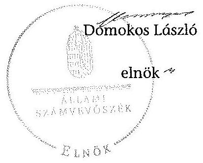

# ÁLLAMI   SZÁMVEVŐSZÉK 

## JELENTÉS

az önkormányzatok belső kontrollrendszere kialakításának, egyes kontrolltevékenységek és a belső ellenőrzés
müködésének ellenőrzéséről
Gesztely
14088
2014. június

---

# Állami Számvevőszék 

Iktatószám: V-0394-050/2014
Témaszám: 1372
Vizsgálat-azonosító szám: V064940

## Az ellenőrzést felügyelte:

dr. Benedek Mária
felügyeleti vezető
Az ellenőrzést vezette és az ellenőrzés végrehajtásáért felelős:
dr. Veress Tiborné
ellenőrzésvezető
A számvevőszéki jelentés összeállításában közremüködtek:
Pető Krisztina
számvevő tanácsos
Kuszinger Andrea
számvevő
Az ellenőrzést végezték:
Luhály Matild
Kuszinger Andrea
számvevő tanácsos
számvevő

---

# TARTALOMJEGYZÉK 

BEVEZETÉS ..... 5
I. ÖSSZEGZŐ MEGÁLLAPÍTÁSOK, KÖVETKEZTETÉSEK, JAVASLATOK ..... 9
II. RÉSZLETES MEGÁLLAPÍTÁSOK ..... 15

1. Az önkormányzat belső kontrollrendszerének kialakítása ..... 15
1.1. A kontrollkörnyezet ..... 15
1.2. A kockázatkezelési rendszer ..... 16
1.3. A kontrolltevékenységek ..... 16
1.4. Az információs és kommunikációs rendszer ..... 17
1.5. A monitoring rendszer ..... 18
2. A pénzügyi folyamatokban kulcsszerepet betöltő teljesítésigazolás és érvényesítés belső kontrollok múködése ..... 18
3. A belső ellenőrzés múködése ..... 21

## FÜGGELÉKEK

1. számú Értelmező szótár
2. számú Az értékelés módja és szempontjai

---

.

---

# RÖVIDÍTÉSEK JEGYZÉKE 

## Törvények

Áfa tv.
Áht.
ÁSZ tv.
Info tv.
Kttv.
Ltv.
Mötv.
Mvtv.
Nvtv.
Ötv.
Számv. tv.
Vagyonnyilatkozattételről szóló tv.

## Rendeletek

Áhsz. 1

Áhsz. 2
Ávr.
Bkr.
Ikr.
önkormányzati SZMSZ
vagyongazdálkodási rendelet

2007. évi CXXVII. törvény az általános forgalmi adóról
2011. évi CXCV. törvény az államháztartásról
2011. évi LXVI. törvény az Állami Számvevőszékről
2011. évi CXII. törvény az információs önrendelkezési jogról és az információszabadságról
2011. évi CXCIX. törvény a közszolgálati tisztviselők ről (hatályos 2012. március 1-jétől)
1995. évi LXVI. törvény a köziratokról, a közlevéltárakról és a magánlevéltári anyag védelméről
2011. évi CLXXXIX. törvény Magyarország helyi önkormányzatairól
1993. évi XCIII. törvény a munkavédelemről
2011. évi CXCVI. törvény a nemzeti vagyonról
1990. évi LXV. törvény a helyi önkormányzatokról
2000. évi C. törvény a számvitelről
2007. évi CLII. törvény az egyes vagyonnyilatkozat-tételi kötelezettségekről szóló törvény

249/2000. (XII. 24.) Korm. rendelet az államháztartás szervezetei beszámolási és könyvvezetési kötelezettségének sajátosságairól
4/2013. (I. 11.) Korm. rendelet az államháztartás számviteléről (hatályos 2014. január 1-jétől)
368/2011. (XII. 31.) Korm. rendelet az államháztartásról szóló törvény végrehajtásáról
370/2011. (XII. 31.) Korm. rendelet a költségvetési szervek belső kontrollrendszeréről és belső ellenőrzéséről
335/2005. (XII. 29.) Korm. rendelet a közfeladatot ellátó szervek iratkezelésének általános követelményeiről
Gesztely Község Önkormányzata Képviselő-testületének 10/2011. (IV. 15.) számú rendelete az Önkormányzat Szervezeti és Müködési Szabályzatáról (hatályos 2011. április 15 -tól)
Gesztely Község Önkormányzata Képviselő-testületének 8/2007. (XI.30.) számú rendelete az Önkormányzat vagyonáról és a vagyongazdálkodás szabályairól, módosításra került az Önkormányzat Képviselő-testületének 6/2009. (IV.15.), 8/2009. (VIII. 10.) és 12/2011. (X.19.) számú rendeleteivel (hatályos 2007. november 30-tól.)

## Szórövidítések

2012. évi ellenőrzési terv Miskolc Kistérség Többcélú Társulása 2012. évi belső ellenőrzési ütemterv

---

2013. évi ellenőrzési terv Miskolc Kistérség Többcélú Társulása 2013. évi belső ellenőrzési ütemterv
ÁSZ
Belső ellenőrzési kézikönyv Miskolci Kistérség Többcélú kónyv
ellenőrzési nyomvonal
éves ellenőrzési jelentés

FEUVE szabályzat
gazdálkodási szabályzat
gazdasági program
hivatali SZMSZ

INTOSAI
iratkezelési szabályzat

## ISSAI

jegyzó
Képviselő-testület
Kormányhivatal
Közös Hivatal
munkavédelmi szabály-zat

NGM
Önkormányzat
polgármester
Polgármesteri Hivatal
stratégiai ellenőrzési
terv
Társulás

Állami Számvevőszék
Belső Ellenőrzési Kézikönyv Miskolci Kistérség Többcélú Társulás 2010. év
Gesztely Község Önkormányzat Polgármesteri Hivatal Ellenőrzési nyomvonal folyamatábrája
Éves ellenőrzési és éves összefoglaló ellenőrzési jelentés 2011. évröl

Gesztely Község Önkormányzat 7/2012. nyilvántartási számú szabályzata a Folyamatba épített előzetes és utólagos vezetői ellenőrzés rendszeréről (hatályos 2012. január 1-jétől)
Gesztely Község Önkormányzat Polgármesteri Hivatalának Gazdálkodási Szabályzata (hatályos 2012. január 1től). Kiegészítve a 2012. április 1-jétől hatályos Gazdálkodási Szabályzat mellékleteivel
24/2011. (IV. 14.) képviselő-testületi határozattal elfogadott Gesztely Község Önkormányzat 2011-2014. közötti Gazdasági programja
29/2009. (VI. 30.) képviselő-testületi határozattal elfogadott, Gesztely Község Önkormányzat Polgármesteri Hivatalának SZMSZ-e (hatályos 2009. július 1-jétől)
International Organization of Supreme Audit Institutions (Legfőbb Ellenőrző Intézmények Nemzetközi Szervezete)
Gesztely Község Polgármesteri Hivatala Egyedi Iratkezelési Szabályzata (hatályos 2007. július 1-jétől)
International Standards of Supreme Audit Institutions (Legfőbb Ellenőrző Intézmények Nemzetközi Standardjai)
Gesztely Község Önkormányzat jegyzője
Gesztely Község Önkormányzat Képviselő-testülete
Borsod-Abaúj-Zemplén Megyei Kormányhivatal
Gesztelyi Közös Önkormányzati Hivatal
Községi Önkormányzat Polgármesteri Hivatal és Létesítményei Gesztely Munkavédelmi Szabályzat (hatályos 2006. október 1-jétől)
Nemzetgazdasági Minisztérium
Gesztely Község Önkormányzat
Gesztely Község Önkormányzat polgármestere
Gesztely Község Önkormányzat Polgármesteri Hivatala
Miskolc Kistérség Többcélú Társulása 2011-2015 évekre vonatkozó kistérségi Belsőellenőrzési Stratégiai Terve Miskolc Kistérség Többcélú Társulása

---

# JELENTÉS 

## az önkormányzatok belsó kontrollrendszere kialakításának, egyes kontrolltevékenységek és a belső ellenőrzés múködésének ellenőrzéséről   Gesztely

## BEVEZETÉS

Gesztely község állandó lakosainak száma 2012. január 1-jén 2902 fő volt. Az Önkormányzat héttagú Képviselő-testületének munkáját kettő állandó bizottság segítette. Az Önkormányzat az önállóan működő és gazdálkodó Polgármesteri Hivatalon kívül három önállóan működő intézményt működtetett. A polgármester a 2010. évi önkormányzati választások óta tölti be tisztségét. A jegyző 1994. február 7-től látja el jegyzői feladatait. A Polgármesteri Hivatal szervezeti egységekre nem tagolódott, elkülönített gazdasági szervezettel nem rendelkezett, a foglalkoztatott köztisztviselők száma 2012. január 1-jén kilenc fő volt. 2013. január 1-jétől Gesztely, Hernádkak és Sóstófalva községek létrehozták a Közös Hivatalt, amelynek székhelye Gesztely. Az Önkormányzat a 2012. évi költségvetési beszámolója szerint 708247 ezer Ft költségvetési bevételt ért el, valamint 636488 ezer Ft költségvetési kiadást teljesített. A 2012. december 31-i könyvviteli mérleg szerint az Önkormányzat 1275738 ezer Ft értékű eszközvagyonnal rendelkezett, a rövid lejáratú kötelezettségállománya 106513 ezer Ft volt, hosszú lejáratú kötelezettségállománnyal nem rendelkezett. Az Önkormányzatnál adósságkonszolidáció nem történt.

A demokratikus társadalmakban alapvető igény, hogy a közpénzeket, a közvagyont használók tevékenységükről elszámoljanak, ahhoz egyértelmű és érvényesíthető felelősségi szabályok társuljanak. Ennek a jogos igénynek az érvényesítéséhez meg kell teremteni azokat a folyamatokat, rendszereket, amelyek nélkülözhetetlenek az elszámoltatáshoz. Az elszámoltatás eredményes múködtetéséhez szükség van a megfelelő információs, kontroll, értékelési és beszámolási rendszerek kialakítására.

Magyarországon az uniós csatlakozási tárgyalások idejére nyúlnak vissza a belső kontrollrendszer szabályozásának gyökerei. Az uniós elvárásoknak megfelelő új terminológia szerinti államháztartási belső pénzügyi ellenőrzési (ÁBPE) rendszer területén a jogharmonizáció 2003-ban teljes körűen megvalósult, míg az önkormányzati alrendszerre vonatkozó, az Ötv.-ben megjelenített speciális szabályozás 2005-ben lépett hatályba. Az államháztartási belső kontrollrendszer koncepciója 2009-ben továbbfejlődött. A változások irányát mutatja, hogy a költségvetési szervek belső kontrollrendszere már magában foglalja a korszerű, felelős szervezetirányítás elemeit (kontrollkörnyezet, kockázatkeze-

---

lés, kontrolltevékenység, információ és kommunikáció, monitoring) is. E kontrollrendszer szabályozása háromszintű, a törvényi előírásokat az Áht. és a Mötv., a rendeleti szintű szabályozást az Ávr. és a Bkr. tartalmazza, amelyeket útmutatói szinten az NGM által kiadott standardok és kézikönyvek támogatnak.

A belső kontrollrendszer azt a célt szolgálja, hogy a költségvetési szervek múködésük és gazdálkodásuk során a tevékenységeket szabályszerűen, gazdaságosan, hatékonyan és eredményesen hajtsák végre, teljesítsék elszámolási kötelezettségeiket, és megvédjék az erőforrásokat a veszteségektől, a károktól és a nem rendeltetésszerú használattól. A belső kontrollrendszer magában foglalja mindazon szabályokat, eljárásokat, gyakorlati módszereket és szervezeti struktúrákat, kockázatkezelési technikákat, kontrolltevékenységeket, amelyek segítséget nyújtanak a szervezetnek céljai eléréséhez.

Az ÁSZ középtávú stratégiájában hangsúlyos szerepet szánt annak, hogy szilárd szakmai alapon álló, értékteremtő ellenőrzéseivel előmozdítsa a közpénzügyek átláthatóságát, rendezettségét. A számvevőszéki ellenőrzés nemzetközi alapelvei is rögzítik, hogy a megfelelő belső kontrollrendszer minimálisra csökkenti a hibák és szabálytalanságok kockázatát.

Az ellenőrzés célja annak megállapítása volt, hogy a belső kontrollrendszer elemeinek kialakítása, a pénzügyi folyamatokban kulcsszerepet betöltő teljesítésigazolás és érvényesítés, és a belső ellenőrzés szabályos működése biztosítot-ta-e az Önkormányzatnál a közpénzfelhasználás szabályosságát, hozzájárult-e az értéket teremtő rend követelményének érvényesüléséhez.

Ennek keretében értékeltük, hogy:

- a jogszabályi előírásoknak megfelelően alakították-e ki a belső kontrollrendszer elemeit;
- a gazdálkodás folyamatában kulcsszerepet betöltő teljesítésigazolás és érvényesítés kontrolltevékenységeit megfelelően működtették-e;
- biztosították-e a belső ellenőrzés szabályos működését;
- amennyiben az ÁSZ tett javaslatot a 2008-2011. évek közötti ellenőrzése kapcsán az Önkormányzatnak, intézkedtek-e azok végrehajtására.

Az ellenőrzés várható hasznosulását négy szinten tervezzük. A törvényalkotás számára összegzett tapasztalatok állnak rendelkezésre a belső kontrollrendszer önkormányzati területen való kialakításáról, működéséről és hatásairól, a belső ellenőrzés működéséről. Ennek alapján következtetést lehet levonni arról, hogy a belső kontrollrendszer kialakítására és működtetésére vonatkozó jelenlegi, differenciálás nélküli - jogszabályi előírások reális követelményeket támasztanak-e az eltérő adottságú települési önkormányzatok esetében, illetve indokolt-e esetleges jogszabályi módosítás kezdeményezése. Az ellenőrzés az ellenőrzött számára visszajelzést ad a belső kontrollrendszer kialakításában és működésében fellépő hiányosságokról, javaslataival hozzájárul azok kiküszöböléséhez, amely csökkentheti a későbbi ellenőrzések gyakoriságát. Az ellenőrzés megállapításait és javaslatait más szervezetek is hasznosíthatják a

---

rendezett gazdálkodási keretek kialakításához. A társadalom számára jelzi, hogy közpénz nem maradhat ellenőrizetlenül, az ÁSZ értékteremtő rend kialakításához és megőrzéséhez hozzájáruló tevékenysége pozitív hatással lesz a szervezetről kialakított összkép formálásában. A szervezeten belül lehetőség nyílik arra, hogy a megállapítások szintetizálásával az ÁSZ a hozzáadott értéket teremtő elemző tevékenységét és tanácsadó szerepét is erősítse.

Az önkormányzatok belső kontrollrendszere kialakításának, egyes kontrolltevékenységek és a belső ellenőrzés működésének ellenőrzéséről szóló jelentés I. fejezetének összegző része az ellenőrzés céljára ad rövid, szintetizáló összefoglalót, és tartalmazza a következtetéseket a II. fejezet részletes megállapításain alapulóan. A jelentés intézkedést igénylő megállapításait és javaslatait az ellenőrzés során feltárt, a jelentés II. fejezetében rögzített részletes megállapítások alapozzák meg. A helyszíni ellenőrzés lezárásáig a helyi szabályozás változásait nyomon követtük. Az ÁSZ az ellenőrzés megállapításait az ellenőrzött időszakban hatályos, az intézkedést igénylő megállapításokra tett javaslatokat a jelenleg hatályos jogszabályok alapján fogalmazta meg.

Az ellenőrzés típusa: szabályszerűségi ellenőrzés.
Az ellenőrzött időszak: a belső kontrollrendszer kialakításának megfelelősége esetében a 2012. évre, a pénzügyi folyamatokban kulcsszerepet betöltő teljesítésigazolás és érvényesítés belső kontrollok múködésének megfelelőségét és a belső ellenőrzés szabályszerű működését a 2012. január 1. és december 31-e közötti időszak eseményeit figyelembe véve értékeltük, míg az ÁSZ javaslatainak utóellenőrzése a 2008-2011. években végzett ellenőrzések nyilvánosságra hozott jelentéseiben tett javaslatok áttekintésére terjedt ki.

# Az ellenőrzött szervezet: az Önkormányzat. 

Az ellenőrzés jogszabályi alapját az ÁSZ tv. 1. § (3) bekezdése, az 5. § (2) és (6) bekezdése, valamint az Áht. 61. § (2) bekezdésének előírásai képezik.

Az ellenőrzés szakmai módszertana az ÁSZ hivatalos honlapján (www.asz.hu) közzétett szakmai szabályokon alapult, amely az INTOSAI által kiadott ISSAI figyelembevételével készült.

Az ellenőrzés lefolytatásához az Önkormányzat a kimutatások és a tanúsítvány elektronikus kitöltésével, valamint az ÁSZ által kért dokumentumok elektronikus megküldésével szolgáltatott adatokat. Az így rendelkezésre bocsátott adatok, információk kontrollja és a munkalapok kitöltése a helyszíni ellenőrzés keretében történt. A jelentésben használt fogalmak magyarázatát az 1. számú függelék, az ellenőrzés egyes területeinek értékelésénél alkalmazott egységes minősítési szempontokat a 2. számú függelék tartalmazza.

A belső kontrollrendszer kialakításának ellenőrzése során értékeltük a kontrollkörnyezet, a kockázatkezelési rendszer, a kontrolltevékenységek, az információs és kommunikációs rendszer, valamint a monitoring rendszer szabályozottságának megfelelőségét. A pénzügyi folyamatokban kulcsszerepet betöltő teljesítésigazolás és érvényesítés kontrollok múködése megfelelőségének minősítéséhez az állományba nem tartozók megbízási díjai, a külső szolgáltatók által

---

végzett karbantartási, kisjavítási munkák, az egyéb üzemeltetési és fenntartási szolgáltatások, a rendszeres szociális segélyek, valamint az államháztartáson kívülre teljesített múködési és felhalmozási célú pénzeszközátadások közül kockázatelemzéssel választottuk ki az ellenőrzött kiadási jogcímeket. Az egyszerű véletlen mintavétellel kiválasztott tételek ellenőrzését többlépcsős megfelelőségi tesztek útján addig végeztük, amíg elegendő és megfelelő bizonyítékot szereztünk a vizsgált folyamatok kulcskontrolljai múködésének megfelelő vagy nem megfelelő voltáról. Értékeltük az Önkormányzatnál a belső ellenőrzés múködésének szabályosságát. Utóellenőrzésre nem került sor, mivel az ÁSZ az Önkormányzatnál a 2008-2011. évek között ellenőrzést nem végzett.

Az ÁSZ tv. 29. § (1) bekezdése szerint a jelentéstervezetet megküldtük a polgármester részére, aki az ÁSZ tv. 29. § (2) bekezdésében foglalt észrevételezési jogával nem élt, a jelentéstervezetre észrevételt nem tett.

---

# I. ÖSSZEGZŐ MEGÁLLAPÍTÁSOK, KÖVETKEZTETÉSEK, JAVASLATOK 

A belső kontrollrendszeren belül 2012-ben a kontrollkörnyezet, a kockázatkezelési rendszer, a kontrolltevékenységek, az információs és kommunikációs rendszer, valamint a monitoring rendszer kialakítását külön-külön és együttesen is értékeltük. A belső kontrollrendszer kialakítása az összesített értékelés alapján nem felelt meg a jogszabályi előírásoknak.

A belső kontrollrendszer egyes területei kialakításának minősítése a következő:

| Kontrollterïlet | Minősítés |
| :-- | :-- |
| Kontrollkörnyezet | nem felelt meg |
| Kockázatkezelési rendszer | nem felelt meg |
| Kontrolltevékenységek | részben felelt meg |
| Információs és kommu-   nikációs rendszer | nem felelt meg |
| Monitoring rendszer | részben felelt meg |

Részben megfelelőnek értékeltük a kontrolltevékenységek és a monitoring rendszer kialakítását, mivel a megállapított szabályozásbeli hiányosságok nem veszélyeztették e kontrollterületeken a szabályszerű működést.

Nem megfelelőnek értékeltük a kontrollkörnyezet, a kockázatkezelési rendszer, valamint az információs és kommunikációs rendszer kialakítását, mivel az ellenőrzésünk során megállapított szabályozásbeli hiányosságok magukban hordozzák a szabálytalan működés, valamint a korrupció kockázatát.

Az állományba nem tartozók megbízási díjaival, valamint a külső szolgáltatók által végzett karbantartási, kisjavítási munkákkal kapcsolatos kifizetések során a pénzügyi folyamatokban kulcsszerepet betöltő teljesítésigazolás és érvényesítés belső kontrollok múködése gyenge volt. Gyengének értékeltük a két kulcskontroll együttes múködését, mivel azok nem biztosították a hibák megelőzését, feltárását.

A számvevőszéki ellenőrzés az ellenőrzött kifizetésekkel összefüggésben a rendelkezésre bocsátott dokumentumok alapján kár bekövetkeztére utaló adatot, tényt nem állapított meg, azonban a gazdálkodásban kulcsszerepet betöltő kontrollok gyenge múködése miatt fennáll a hibák bekövetkezésének lehetősége. A nem megfelelően szabályozott és múködtetett belső kontrollok korrupciós kockázatot hordoznak.

---

Az Önkormányzat a belső ellenőrzési feladatokat a Társulás útján látta el. A belső ellenőrzés múködése a jogszabályi előírásoknak ugyan jól megfelel, azonban nem tárta fel a számvevőszéki ellenőrzés által megállapított hiányosságokat a kontrollkörnyezet, a kockázatkezelési rendszer, a kontrolltevékenységek, az információs és kommunikációs, valamint a monitoring rendszer kialakításánál, valamint a pénzügyi folyamatokban kulcsszerepet betöltő teljesítésigazolás és érvényesítés belső kontrollok müködésénél.

Az ÁSZ tv. 33. § (1) bekezdésében foglaltak értelmében az ellenőrzött szervezet vezetője köteles a jelentésben foglalt megállapításokhoz kapcsolódó intézkedési tervet összeállítani, és azt a jelentés kézhezvételétől számított 30 napon belül az ÁSZ részére megküldeni. Amennyiben az intézkedési tervet határidőre nem küldi meg a szervezet, vagy az ÁSZ tv. 33. § (2) bekezdésében foglalt póthatáridő elteltével megküldött intézkedési terv továbbra sem elfogadható, az ÁSZ elnöke a hivatkozott törvény 33. § (3) bekezdés a)-b) pontjaiban foglaltakat érvényesítheti.

Az ellenőrzés intézkedést igénylő megállapításai és javaslatai:

# a polgármesternek 

1. Az Áht. 37. § (1) és az Ávr. 55. § (1) bekezdése ellenére az Önkormányzat nevében történt kötelezettségvállalásokra pénzügyi ellenjegyzés nélkül került sor.

Javaslat:
Intézkedjen, hogy az Önkormányzat kiadási előirányzatai terhére történt kötelezettségvállalásokra az Áht. 37. § (1) bekezdésében és az Ávr. 55. § (1) bekezdésében foglaltaknak megfelelően - az Ávr. 53. §-ában meghatározott kivételeket figyelembe véve - kizárólag a pénzügyi ellenjegyzés után, a pénzügyi teljesítés esedékességét megelőzően, írásban kerüljön sor.
2. A polgármester, mint kötelezettségvállaló - az Ávr. 57. § (4) bekezdésében foglaltak ellenére - nem jelölte ki 2012. március 30 -át követően írásban az Önkormányzat kiadási előirányzatai vonatkozásában a teljesítés igazolására jogosult személyeket.

Javaslat:
Gondoskodjon az Ávr. 57. § (4) bekezdésében foglaltak szerint az Önkormányzat kiadási előirányzatai vonatkozásában a teljesítés igazolására jogosult személyek írásban történő kijelöléséről.
3. A vagyonnyilatkozat-tételi kötelezettségének a Képviselő-testület Szociális és Egészségügyi Bizottságának nem képviselő tagja - a Vagyonnyilatkozat-tételről szóló tv. 5. §-ában foglaltak ellenére - a 2012. évben nem tett eleget, ugyanis a vagyonnyilatkozat őrzéséért felelős - Pénzügyi Bizottság elnöke - a vagyonnyilatkozat-tételi kötelezettség fennállásáról és esedékességének időpontjáról - a Vagyonnyilatkozattételről szóló tv. 8. § (4) bekezdésében foglaltak ellenére - nem tájékoztatta az esedékességet legalább 30 nappal megelőzően. A Vagyonnyilatkozat-tételről szóló tv.10. § (1) bekezdésében előírtak ellenére az őrzésért felelős a vagyonnyilatkozattételi kötelezettségét nem teljesítőt írásban nem szólította fel arra, hogy vagyonnyi-

---

latkozat-tételi kötelezettségét a felszólítás kézhezvételétől számított nyolc napon belül teljesítse. A polgármester és hat fő képviselő vagyonnyilatkozata nem felelt meg a Vagyonnyilatkozat-tételről szóló tv. 11. §-ában foglalt formai követelménynek, mivel azok nem tartalmazták a nyilatkozó és az őrzésért felelős aláírását.

Javaslat:
Kezdeményezze a Képviselő-testületnél a Mötv. 65. §-a alapján a Mötv. 57. § (2) bekezdésének, valamint a helyi önkormányzati képviselők jogállásának egyes kérdéseiről szóló 2000. évi XCVI. törvény 10/A. § (3) bekezdésének és a Vagyonnyilatkozattételről szóló tv.-ben foglaltaknak megfelelően a vagyonnyilatkozatok vizsgálatáért felelősként kijelölt Pénzügyi Bizottság vagyonnyilatkozat-tételi kötelezettség teljesítésére vonatkozó eljárásának szabályszerűségével kapcsolatos körülmények kivizsgálását, majd a vizsgálat eredményének függvényében kezdeményezze a Képviselőtestületnél a szükséges intézkedések megtételét.
4. A számvevőszéki ellenőrzés megállapításai alapján az Önkormányzatnál a belső kontrollrendszer kialakítása összefoglalóan értékelve nem felelt meg a jogszabályi előírásoknak, a kulcskontrollok működése gyenge volt, a belső ellenőrzés működése ugyan jól megfelelt a jogszabályi előírásoknak, azonban nem tárta fel számvevőszéki ellenőrzés által megállapított hiányosságokat. A szabályozásbeli hiányosságok magukban hordozzák a szabálytalan működés kockázatát.

Javaslat:
A Mötv. 115. § (1) bekezdésében foglaltak alapján kísérje figyelemmel az Önkormányzat gazdálkodásának szabályszerűségét. A Mötv. 67. § f) pontja alapján gondoskodjon a belső kontrollrendszer működésére vonatkozó jogszabályi rendelkezések be nem tartása, valamint a teljesítésigazolás, illetve az érvényesítés kontrollokkal öszszefüggésben feltárt hiányosságok, szabálytalanságok tekintetében az esetleges munkajogi felelősséggel kapcsolatos körülmények kivizsgálásáról, majd a vizsgálat eredményének függvényében tegye meg a szükséges intézkedéseket.

# a jegyzőnek (Gesztely Község Önkormányzata vonatkozásában) 

1. a kontrollkörnyezettel kapcsolatban:

A hivatali SZMSZ nem tartalmazta az Ávr.-ben előírt tartalmi követelményeket. A jegyző az Ötv-ben előírt kötelezettsége ellenére a vagyongazdálkodási rendelet módosítását a jogszabályváltozásokhoz kapcsolódóan nem készítette elő képviselőtestületi döntésre annak érdekében, hogy az megfeleljen az Nvtv és a Mötv. előírásainak [II. Részletes megállapítások, 1.1. A kontrollkörnyezet 7., 10-11. és 16. sorszámú megállapítás].

Javaslat:
Intézkedjen az Áht. 69. § (2) bekezdése, a Bkr. 3. § a) pontja és 6. §-a alapján a jelentés II. Részletes megállapítások, 1.1. A kontrollkörnyezet 7., 10-11. és 16. sorszámú megállapításaiban foglalt hibák, hiányosságok kijavításáról, megszüntetéséről az abban foglalt jogszabályi előírásoknak megfelelően.

---

2. a kockázatkezelési rendszerrel kapcsolatban:

A jegyző - a Bkr.-ben foglaltak ellenére - nem határozta meg az egyes kockázatokkal kapcsolatban szükséges intézkedéseket, valamint azok teljesítése folyamatos nyomon követésének módját. A közszolgálati jogviszonyban álló hat fő, vagyonnyilatkozattétele nem felelt meg a Vagyonnyilatkozat-tételről szóló tv.-ben foglalt formai követelményeknek, mivel azok nem tartalmazták a nyilatkozó és az őrzésért felelős aláírását [II. Részletes megállapítások, 1.2. A kockázatkezelési rendszer 8., 10 és 13. sorszámú megállapítás].

Javaslat:
Intézkedjen az Áht. 69. § (2) bekezdése, a Bkr. 3. § b) pontja, 7. §-a, valamint a Va-gyonnyilatkozat-tételről szóló tv. alapján a jelentés II. Részletes megállapítások, 1.2. A kockázatkezelési rendszer 8., 10. és 13. sorszámú megállapításaiban foglalt hibák, hiányosságok kijavításáról, megszüntetéséről az abban foglalt jogszabályi előírásoknak megfelelően.
3. a kontrolltevékenységekkel kapcsolatban:

A jegyző - az Ávr.-ben foglaltak ellenére - nem határozta meg az előzetes írásbeli kötelezettségvállalást nem igénylő kifizetések rendjét, továbbá 2012. március 30 -át követően a Polgármesteri Hivatal kiadási előirányzatai vonatkozásában a teljesítésigazolására jogosult személyeket írásban nem jelölte ki. Az lkr.-ben foglaltak ellenére az Önkormányzat nem rendelkezett iratkezelési szoftverrel, valamint a jegyző az iratkezelési rendszer kialakítása során az üzemeltetés és az adatbiztonság feladatait és az ezekhez tartozó hatásköröket nem határozta meg. A jegyző - a Bkr.-ben foglaltak ellenére - a belső szabályzatban nem határozta meg a dokumentumokhoz és információkhoz való hozzáférésre vonatkozóan a felelősségi köröket. A jegyző - a Kttv.ben foglaltak ellenére - nem szabályozta a Polgármesteri Hivatalban a köztisztviselő jogviszonya megszüntetése (megszűnése) esetére a munkakör átadása és a munkáltatóval való elszámolás rendjét [II. Részletes megállapítások, 1.3. A kontrolltevékenységek, 8., 10., 13-15., 17 és 32. sorszámú megállapítás].

Javaslat:
Intézkedjen az Áht. 69. § (2) bekezdése, a Bkr. 3. § c) pontja és 8. §-a alapján a jelentés II. Részletes megállapítások, 1.3. A kontrolltevékenységek 8., 10., 13-15., 17. és 32. sorszámú megállapításaiban foglalt hibák, hiányosságok kijavításáról, megszüntetéséről az abban foglalt jogszabályi előírásoknak megfelelően.
4. az információs és kommunikációs rendszerrel kapcsolatban:

A jegyző az Info tv.-ben foglaltak ellenére a 2012. évben nem gondoskodott az Önkormányzat elektronikus közzétételi kötelezettségének teljesítéséről, továbbá - az Ltv.-ben foglaltak ellenére - a Polgármesteri Hivatal iratkezelési szabályzatát nem módosította és nem egészítette ki az iratkezeléssel kapcsolatos jogszabályváltozásokra tekintettel. Az lkr.-ben foglaltak ellenére a jegyző az iratforgalom dokumentálásával nem biztosította, hogy az iratok szervezeten belüli útja pontosan követhető és ellenőrizhető legyen [II. Részletes megállapítások, 1.4. Az információs és kommunikációs rendszer 7., 9. és 16. sorszámú megállapítás].

---

Javaslat:
Intézkedjen az Áht. 69. § (2) bekezdése, a Bkr. 3. § d) pontja és 9. §-a alapján a jelentés II. Részletes megállapítások, 1.4. Az információs és kommunikációs rendszer 7., 9. és 16. sorszámú megállapításaiban foglalt hibák, hiányosságok kijavításáról, megszüntetéséről az abban foglalt jogszabályi előírásoknak megfelelően.
5. a monitoring rendszerrel kapcsolatban:

A jegyző -a Bkr.-ben foglaltak ellenére nem gondoskodott a külső ellenőrzések javaslatai alapján készített intézkedési tervek végrehajtására vonatkozó nyilvántartás vezetéséről [II. Részletes megállapítások, 1.5. A monitoring rendszer 13. sorszámú megállapítás].

Javaslat:
Intézkedjen az Áht. 69. § (2) bekezdése, a Bkr. 3. § e) pontja és 10. § alapján a jelentés II. Részletes megállapítások, 1.5. A monitoring rendszer 13. sorszámú megállapításában foglalt hibák, hiányosságok kijavításáról, megszüntetéséről az abban foglalt jogszabályi előírásoknak megfelelően.
6. a pénzügyi folyamatokban kulcsszerepet betöltő kontrollokkal kapcsolatban:

A teljesítésigazolás és az érvényesítés az Áht.-ban és az Ávr.-ben foglaltaknak nem felelt meg, továbbá az Áfa. tv.-előírása ellenére a számla hibásan tartalmazta a szolgáltatás igénybevevőjének nevét és címét [II. Részletes megállapítások, 2. A pénzügyi folyamatokban kulcsszerepet betöltő teljesítésigazolás és érvényesítés belső kontrollok müködése 1., 2. és 3. pontban foglalt megállapítás].

Javaslat:
Intézkedjen az Áht. 37-38. §-ában, az Ávr. 55-59. §-ában és az Áfa. tv.-ben foglaltak alapján arról, hogy a teljesítésigazolás és az érvényesítés vonatkozásában, azok ellenőrzése során a kötelezettségvállalással, a pénzügyi ellenjegyzéssel, a kötelezettségvállalások nyilvántartásba vételével, valamint a gazdasági események során kiállított számlákkal kapcsolatban feltárt, a jelentés II. Részletes megállapítások, 2. A pénzügyi folyamatokban kulcsszerepet betöltő teljesítésigazolás és érvényesítés belső kontrollok müködése 1., 2. és 3. pontjában szereplő megállapításokban foglalt hibák, hiányosságok kijavítása, megszüntetése az ott megjelölt jogszabályi rendelkezéseknek megfelelően történjen meg.
7. a belső ellenőrzés működésével kapcsolatban:

A belső ellenőrzés működése az értékelés szempontjait figyelembe véve jól megfelelt a jogszabályi előírásoknak, azonban a számvevőszéki ellenőrzés kisebb súlyú hiányosságokat tárt fel, amelyek nem feleltek meg a Bkr.-ben előírt rendelkezéseknek [II. Részletes megállapítások, 3. A belső ellenőrzés müködése 7. f), 8. c), d), és f) sorszámú megállapítás].

---

Javaslat:
Intézkedjen az Áht. 69.§ (2), a 70. § (1) bekezdése, a Bkr. 3. § e) pontja és 10. §-a alapján a jelentés II. Részletes megállapítások, 3. Az belső ellenőrzés müködése 7. f), 8. c), d), és f) sorszámú megállapításaiban foglalt hibák, hiányosságok kijavításáról, megszüntetéséről az ott megjelölt jogszabályi rendelkezéseknek megfelelően.

---

# II. RÉSZLETES MEGÁLLAPÍTÁSOK 

## 1. Az ÖNKORMÁNYZAT BELSŐ KONTROLLRENDSZERÉNEK KIALAKÍTÁSA

A belső kontrollrendszeren belül 2012-ben a kontrollkörnyezet, a kockázatkezelési rendszer, a kontrolltevékenységek, az információs és kommunikációs rendszer, valamint a monitoring rendszer kialakítását külön-külön és együttesen is értékeltük. A belső kontrollrendszer kialakítása az összesített értékelés alapján nem felelt meg a jogszabályi előírásoknak.

### 1.1. A kontrollkörnyezet

A kontrollkörnyezet kialakítása - a 2. számú függelékben részletezett kritériumrendszer alapján végzett értékelés szerint - a jogszabályi előírásoknak nem felelt meg, mert:

| Sorszám ${ }^{1}$ | Megállapítás | Megjegyzés |
| :--: | :--: | :--: |
| 7.,   10.,   11. | A jegyző a hivatali SZMSZ-ben - az Ávr. 13. § (1) bekezdés c), g), és h) pontjában foglaltak ellenére - nem rögzítette az alaptevékenységet szabályozó jogszabályok megjelölését, a szervezeti és müködési szabályzatban nevesített valamennyi munkakörhöz kapcsolódó felelősségi szabályokat, a munkáltatói jogok gyakorlásának rendjét. | 2014. január 1-jétől az Ávr. 13. § (1) bekezdés c) pontjában szereplő szöveg az alábbira változott: „az ellátandó, és a kormányzati funkció szerint besorolt alaptevékenységek, rendszeresen ellátott vállalkozási tevékenységek, valamint az alaptevékenységet szabályozó jogszabályok megjelölését." |
| 16. | A jegyző - az Ötv. 36. § (2) bekezdés a) pontjában foglaltak ellenére - a jogszabályváltozásokhoz kapcsolódóan nem készítette el 2012-ben a vagyongazdálkodási rendelet módosítását annak érdekében, hogy az megfeleljen az Nvtv. 3. § (1) bekezdés 6. pontja, 5. §-a, 11. § (16) bekezdése, 13. § (1) bekezdése, valamint a Mötv. 109. § (4) bekezdése előírásainak, így a Képviselő-testület az Nvtv. 18. § (1) és (12) bekezdésében meghatározott határidőt figyelmen kívül hagyva nem döntött az Önkormányzat vagyongazdálkodási rendeletének módosításáról. | A jegyző az önkormányzat müködésével kapcsolatos feladatok ellátásáról 2013. január. 1-jétől a Mötv. 81. § (3) bekezdés c) pontja alapján gondoskodik. |

[^0]
[^0]:    ${ }^{1}$ A megállapítás számozása az Önkormányzat által az adatszolgáltatás során kitöltött kimutatások kérdéseinek sorszámával azonos.

---

# 1.2. A kockázatkezelési rendszer 

A kockázatkezelési rendszer kialakítása - a 2. számú függelékben részletezett kritériumrendszer alapján végzett értékelés szerint - a jogszabályi előírásoknak nem felelt meg, mert:

| Sorszám | Megállapítás |
| :--: | :--: |
| 8.,   10. | A jegyző - a Bkr. 7. § (2) bekezdése ellenére -nem határozta meg az egyes kockázatokkal kapcsolatban szükséges intézkedéseket, valamint azok teljesítése folyamatos nyomon követésének módját. |
| 13. | A Vagyonnyilatkozat-tételről szóló tv. 4. § d) pontjában foglaltak ellenére a Képviselő-testület bizottsága nem helyi önkormányzati képviselő tagjának vagyonnyilatkozat-tételi kötelezettségét az önkormányzati SZMSZben nem rögzítették. |
| 14. | A vagyonnyilatkozat-tételi kötelezettségének a Képviselő-testület Szociális és Egészségügyi Bizottságának nem képviselő tagja - a Vagyonnyilatkozattételről szóló tv. 5. §-ában foglaltak ellenére - a 2012. évben nem tett eleget, ugyanis a vagyonnyilatkozat őrzéséért felelős - Pénzügyi Bizottság elnöke - a vagyonnyilatkozat-tételi kötelezettség fennállásáról és esedékességének időpontjáról - Vagyonnyilatkozat-tételről szóló tv. 8. § (4) bekezdésében foglaltak ellenére - nem tájékoztatta az esedékességet legalább 30 nappal megelőzően, továbbá a 10. § (1) bekezdésében előírtak ellenére a vagyonnyilatkozat-tételi kötelezettségét nem teljesítőt írásban nem szólította fel arra, hogy vagyonnyilatkozat-tételi kötelezettségét a felszólítás kézhezvételétől számított nyolc napon belül teljesítse.

A hat fő közszolgálati jogviszonyban álló személy és a polgármester és a hat fő képviselő vagyonnyilatkozata nem felelt meg a Vagyonnyilatkozattételről szóló tv. 11. §-ában foglalt formai követelménynek, mivel azok nem tartalmazták a nyilatkozó és az őrzésért felelős aláírását.

### 1.3. A kontrolltevékenységek

A kontrolltevékenységek kialakítása - a 2. számú függelékben részletezett kritériumrendszer alapján végzett értékelés szerint - a jogszabályi előírásoknak részben felelt meg.

A jegyző a kontrolltevékenység részeként előírta a folyamatba épített, előzetes, utólagos és vezetői ellenőrzést. Szabályozta a kötelezettségvállalás pénzügyi ellenjegyzésének, a teljesítés igazolásának módját, valamint az érvényesítés, az utalványozás rendjét. A jegyző 2012. március 30 -át megelőzően írásban kijelölte az önkormányzati és a polgármesteri hivatali kiadási előirányzatok terhére történt kifizetések teljesítés igazolására jogosult személyeket.

A hivatali SZMSZ tartalmazta a beszámolók (időközi és éves) elkészítésének feladatait, annak felelőseit. A munkaköri leírásokban meghatározásra került a gazdasági feladatot ellátó vezető és a gazdasági feladatot ellátó alkalmazottak helyettesítésének rendje.

---

A polgármester adott felhatalmazást kötelezettségvállalásra, utalványozásra, valamint a jogszabályok előírásainak megfelelően jelöltek ki pénzügyi ellenjegyzési, illetve érvényesítési feladatra a hivatal állományába tartozó köztisztviselőt, akik rendelkeztek az előírt szakképzettséggel.

A kontrolltevékenységek kialakítása az alábbi hiányosságok miatt részben felelt meg a jogszabályi előírásoknak:

| Sorszám | Megállapítás |
| :--: | :--: |
| 8. | A jegyző - az Ávr. 53. § (2) bekezdésében foglaltakat figyelmen kívül hagyva - annak ellenére nem határozta meg az előzetes írásbeli kötelezettségvállalást nem igénylő kifizetések rendjét, hogy belső szabályozásban lehetővé tette a 100 ezer Ft alatti kifizetések előzetes írásbeli kötelezettségvállalás nélküli teljesítését. |
| 10. | A polgármester és a jegyző, mint kötelezettségvállalók - az Ávr. 57. § (4) bekezdésében foglaltak ellenére - írásban nem jelölték ki 2012. március 30 -át követően az Önkormányzat és a Polgármesteri Hivatal kiadási előirányzatai vonatkozásában a teljesítés igazolására jogosult személyeket. |
| 13.,   14.,   15. | Az Önkormányzat - az Ikr. 8. § (1) bekezdésében foglaltak ellenére - nem rendelkezett iratkezelési szoftverrel, és a jegyző az iratkezelési rendszer kialakítása során - az lkr. 8. § (2) bekezdésében foglaltak ellenére - nem határozta meg az üzemeltetés és az adatbiztonság feladatait és az ezekhez tartozó hatásköröket. |
| 17. | A jegyző - a Bkr. 8. § (4) bekezdés b) pontjában foglaltak ellenére - a belső szabályzatban nem határozta meg a dokumentumokhoz és információkhoz való hozzáférésre vonatkozóan a felelősségi köröket. |
| 32. | A jegyző - a Kttv. 74. § (1) bekezdésében foglaltak ellenére - nem szabályozta a köztisztviselő jogviszonya megszüntetése (megszünése) esetére a munkakör átadása és a munkáltatóval való elszámolás rendjét. |

# 1.4. Az információs és kommunikációs rendszer 

Az információs és kommunikációs rendszer kialakítása - a 2. számú függelékben részletezett kritériumrendszer alapján végzett értékelés szerint nem felelt meg a jogszabályi előírásoknak, mert:

| Sorszám | Megállapítás |
| :--: | :--: |
| 7. | A jegyző - az Info tv. 33. § (1) és (3) bekezdésében, a 37. § (1) bekezdésében és az 1. mellékletében foglaltak ellenére - a 2012. évre vonatkozó éves költségvetés és a 2011. évre vonatkozó költségvetési beszámoló tekintetében - nem gondoskodott az Önkormányzat elektronikus közzétételi kötelezettségének teljesítéséről a 2012. évben. |
| 16. | A jegyző - az lkr. 14. § (4) bekezdése ellenére - az iratforgalom dokumentálásával nem biztosította, hogy az iratok szervezeten belüli útja pontosan követhető és ellenőrizhető legyen. |

---

# 1.5. A monitoring rendszer 

A monitoring rendszer kialakítása - a 2. számú függelékben részletezett kritériumrendszer alapján végzett értékelés szerint - részben felelt meg a jogszabályi előírásoknak.

Kialakították a szervezeti célok elérését szolgáló feladatok, folyamatok megvalósításának nyomon követését biztosító, illetve azok teljesítésének mérésére alkalmas rendszert. A jegyző nyilatkozatban értékelte a belső kontrollok múködését a 2012. évre vonatkozóan. Az Önkormányzatnál végzett belső ellenőrzés esetében a jelentés javaslatai alapján intézkedtek, és a javaslatok hasznosítását nyomon követték.

A monitoring rendszer kialakítása az alábbi hiányosság miatt részben felelt meg a jogszabályi előírásoknak:

| Sorszám | Megállapítás |
| :--: | :--: |
| 13. | A jegyző - a Bkr. 14. §. (1) bekezdésében foglalt előírás ellenére - nem gondoskodott a külső ellenőrzések javaslatai alapján készített intézkedési tervek végrehajtására vonatkozó nyilvántartás vezetéséről. |

A helyi önkormányzatok törvényességi felügyeletét ellátó Kormányhivatal a 2012. évben nem élt törvényességi felhívással, vagy más törvényességi felügyeleti eszközzel a Képviselő-testület által alkotott rendeletekre, határozatokra vonatkozóan. A Kormányhivatal 2012. november 20-án ellenőrizte a Polgármesteri Hivatal iratkezelési szabályzatát a 2011. évre vonatkozóan. Az ellenőrzés megállapította, hogy az iratkezelési szabályzatot kiegészíteni, módosítani szükséges a jogszabályi változások miatt. A jegyző által elkészített intézkedési tervben 2013. február 28-át határozták meg az iratkezelési szabályzat módosítására.

## 2. A PÉNZÜGYI FOLYAMATOKBAN KULCSSZEREPET BETÖLTŐ TELJESÍTÉSIGAZOLÁS ÉS ÉRVÉNYESÍTÉS BELSŐ KONTROLLOK MŰKÖDÉSE

Az állományba nem tartozók megbízási díjaival és a külső szolgáltatók által végzett karbantartással, kisjavítással kapcsolatos kifizetések során - összefoglalóan értékelve - a pénzügyi folyamatokban kulcsszerepet betöltő teljesítésigazolás és érvényesítés belső kontrollok müködésének megfelelősége gyenge volt, mert:

| Szá-   mozás | Megállapítás | Megjegyzés |
| :-- | :-- | :-- |

## Teljesítésigazolás

A kifizetést megelőzően a teljesítésigazolást - az Áht. 38. § (1) bekezdésében és az Ávr. 57. § (1) bekezdésben foglaltak ellenére - vagy nem végezték el, vagy nem szabályszerűen végezték el, mert az előzetes írásbeli kötelezettségvállalást nem igénylő kifizetések rendjének szabályozása, illetve ellenőrizhető

---

okmányok hiányában igazolták a kiadások teljesítésének jogosságát, összegszerűségét, valamint az ellenszolgáltatás teljesítését. Továbbá a teljesítésigazolást az Ávr. 57. § (4) bekezdésében foglaltak ellenére a kötelezettségvállaló kijelölésével nem rendelkező személy végezte.

Az Ávr. 13. § (2) bekezdés a) pontja alapján elkészített gazdálkodási szabályzatban foglaltakat nem tartotta be, mert nem az abban foglaltak szerint végezte a teljesítés igazolását.

## Érvényesítés

Az érvényesítés az Ávr. 58. § (3) bekezdésében előírtak ellenére nem volt szabályszerű, mivel az Ávr. 60. § (3) bekezdés szerint vezetett nyilvántartás (alá-rrás-minta) alapján nem volt megállapítható, hogy a keltezéssel ellátott aláírás az érvényesítésre kijelölt személytől származott.

Az érvényesítő - az Ávr. 58. § (1) bekezdésben foglaltak ellenére - az ellenőrzési feladatát a kifizetést megelőzően nem szabályszerűen végezte, mert a kiadások összegszerűségének ellenőrzését nem végezték el, vagy az szabályszerű teljesítésigazolás hiányában történt, valamint nem ellenőrizték -
2. nyilvántartás hiányában - a fedezet meglétét, mivel a kötelezettségvállalásokat - az Ávr. 56. § (1) bekezdés előírása ellenére - nem vették nyilvántartásba.

Az érvényesítő - az Ávr. 58. § (2) bekezdés előírása ellenére - nem jelezte az utalványozónak, hogy a megelőző ügymenetben a teljesítésigazolást nem, vagy nem szabályszerűen végezték, valamint nem tartották be az Áht. 37. § (1) és az Ávr. 55. § (1) bekezdéseiben foglaltakat, mivel az Önkormányzat és a Polgármesteri Hivatal kiadási előirányzatai terhére történt kötelezettségvállalásokra pénzügyi ellenjegyzés nélkül került sor. Továbbá nem jelezte, hogy az utalványrendeleteken nem tüntették fel - Ávr. 59. § (3) bekezdés f) pontjában előírtak ellenére - a kötelezettségvállalás nyilvántartási számát.

## A kulcskontrollok ellenőrzése során feltárt egyéb hiányosságok

A gépi fölmunkáról kiállított számla az Áfa tv. 169. §
3. e) pont előírása ellenére hibásan tartalmazta a szolgáltatás igénybevevőjének nevét és címét, mivel azt a kötelezettséget vállaló Önkormányzat helyett a Polgármesteri Hivatal nevére állították ki és vették könyvviteli nyilvántartásba.

Az Ávr. 56. § (1) bekezdés 2014. január 1-jétől módosult, a kötelezettségvállalások nyilvántartását az Áhsz. 39. § (1) bekezdés és a 14. számú melléklet II. pontja szabályozza.

---

Az állományba nem tartozók megbízási díjaival kapcsolatos - az Önkormányzatra vonatkozó - kifizetések során a teljesítésigazolás és az érvényesítés kulcskontrollok müködésének megfelelősége gyenge volt, mert:

- a teljesítésigazolást - az Önkormányzat polgárvédelmi feladatainak ellátására, egyéb intézményüzemeltetési és közfoglalkoztatási pályázattal járó adminisztrációs feladatokra kötött megbízási szerződések kifizetését megelőzően - az Ávr. 57. § (1) bekezdésében előírtak ellenére nem végezték el, mert nem ellenőrizék és aláírással nem igazolták a kiadások teljesítésének jogosságát, összegszerűségét, valamint az ellenszolgáltatás teljesítését;
- az érvényesítés az Ávr. 58. § (3) bekezdésében előírtak ellenére - valamennyi ellenőrzött tétel esetében - nem volt szabályszerű, mivel az Ávr. 60. § (3) bekezdés szerint vezetett nyilvántartás (aláírás-minta) alapján nem volt megállapítható, hogy a keltezéssel ellátott aláírás az érvényesítésre kijelölt személytől származott;
- az érvényesítő - az Ávr. 58. § (1) bekezdésben foglaltak ellenére - az ellenőrzési feladatát a kifizetést megelőzően nem szabályszerűen végezte, mert a kiadások összegszerűségének ellenőrzése teljesítésigazolás hiányában történt, valamint nem ellenőrizte - a kötelezettségvállalások nyilvántartásának hiányában - a fedezet meglétét;
- az érvényesítő - az Ávr. 58. § (2) bekezdés előírása ellenére - nem jelezte az utalványozónak, hogy a megelőző ügymenetben a teljesítésigazolást nem végezték el, valamint nem tartották be az Áht. 37. § (1) és az Ávr. 55. § (1) bekezdéseiben foglaltakat, mivel az Önkormányzat kiadási előirányzata terhére történt kötelezettségvállalásra a közfoglalkoztatási pályázattal járó adminisztrációs feladatokra kötött megbízási szerződés esetében pénzügyi ellenjegyzés nélkül került sor. Továbbá nem jelezte, hogy az Ávr. 59. § (3) bekezdés f) pontjában előírtak ellenére az utalványrendeleteken nem tüntették fel a kötelezettségvállalás nyilvántartási számát, mivel a kötelezettségvállalásokat - az Ávr. 56. § (1) bekezdés előírása ellenére - nem vették nyilvántartásba, a kötelezettségvállalásokról nyilvántartást nem vezettek

A külső szolgáltatók által végzett karbantartási, kisjavítási munkákkal kapcsolatos - az Önkormányzatra és a Polgármesteri Hivatalra vonatkozó - kifizetések során a teljesítésigazolás és az érvényesítés kulcskontrollok müködésének megfelelősége gyenge volt, mert:

- a teljesítésigazolást a gépi földmunka kifizetését megelőzően a bizonylaton az Ávr. 57. § (1) bekezdésében foglaltak ellenére nem szabályszerűen végezték el, mert az előzetes írásbeli kötelezettségvállalást nem igénylő kifizetések rendjének szabályozása, illetve ellenőrizhető okmányok hiányában igazolták a kiadások teljesítésének jogosságát, összegszerűségét, valamint az ellenszolgáltatás teljesítését. Továbbá a teljesítésigazolást az Ávr. 57. § (4) bekezdésében foglaltak ellenére a kötelezettségvállaló kijelölésével nem rendelkező személy végezte;
- a teljesítésigazoló aláírás mintája nem volt beazonosítható a gépkocsijavítással kapcsolatos kifizetési tétel esetében, mivel az Ávr. 60. § (3) bekezdés szerint vezetett nyilvántartás (aláírás-minta) alapján nem volt megálla-

---

pítható, hogy a keltezéssel ellátott aláírás a teljesítés-igazolásra kijelölt személytől származott, továbbá az Ávr. 57. § (1) bekezdésének előírása ellenére a kifizetés jogosságának, összegszerűségének és a szerződésben foglaltak igazolását a teljesítésigazoló - aláírása ellenére - nem szabályszerűen végezte, mivel a kifizetést megelőzően nem a belső szabályzatban előírt tartalmú teljesítésigazolást alkalmazta;

- az érvényesítés - az Ávr. 58. § (3) bekezdésében előírtak ellenére - a gépi földmunka és a gépkocsi-javítással kapcsolatos kifizetések esetében nem volt szabályszerű, mivel az Ávr. 60. § (3) bekezdés szerint vezetett nyilvántartás (aláírás-minta) alapján nem volt megállapítható, hogy a keltezéssel ellátott aláírás az érvényesítésre kijelölt személytől származott;
- az érvényesítő - az Ávr. 58. § (1) bekezdésben foglaltak ellenére - az ellenőrzési feladatát a kifizetést megelőzően nem szabályszerűen végezte, mert a kiadások összegszerűségének ellenőrzése szabályszerű teljesítésigazolás hiányában történt, valamint nem ellenőrizte - a kötelezettségvállalások nyilvántartásának hiányában - a fedezet meglétét;
- az érvényesítő - az Ávr. 58. § (2) bekezdés előírása ellenére - nem jelezte az utalványozónak, hogy a megelőző ügymenetben a teljesítésigazolást nem szabályszerűen végezték, valamint nem tartották be az Áht. 37. § (1) és az Ávr. 55. § (1) bekezdéseiben foglaltakat, mivel az Önkormányzat és a Polgármesteri Hivatal kiadási előirányzatai terhére történt kötelezettségvállalásokra pénzügyi ellenjegyzés nélkül került sor. Továbbá nem jelezte az Ávr. 59. § (3) bekezdés f) pontjában előírtak ellenére, hogy az utalványrendeleteken nem tüntették fel a kötelezettségvállalás nyilvántartási számát, mivel a kötelezettségvállalásokat - az Ávr. 56. § (1) bekezdés előírása ellenére - nem vették nyilvántartásba, a kötelezettségvállalásokról nyilvántartást nem vezettek.

A gépi földmunkáról kiállított számla az Áfa tv. 169. § e) pont előírása ellenére hibásan tartalmazta a szolgáltatás igénybevevőjének nevét és címét, mivel azt, a kötelezettséget vállaló Önkormányzat helyett a Polgármesteri Hivatal nevére állították ki, és vették könyvviteli nyilvántartásba.

A számvevőszéki ellenőrzés az ellenőrzött kifizetésekkel összefüggésben a rendelkezésre bocsátott dokumentumok alapján kár bekövetkeztére utaló adatot, tényt nem állapított meg, azonban a gazdálkodásban kulcsszerepet betöltő kontrollok gyenge működése miatt fennáll a hibák bekövetkezésének kockázata.

# 3. A BELSŐ ELLENŐRZÉS MŰKÖDÉSE 

Az Önkormányzat a belső ellenőrzési feladatokat - képviselő-testületi döntés alapján - a Társulás útján látta el.

A belső ellenőrzés múködése - a 2. számú függelékben részletezett kritériumrendszer alapján végzett értékelés szerint - az Önkormányzatnál jól megfelelt a jogszabályi előírásoknak.

---

Az Önkormányzat rendelkezett a jogszabályi előírásoknak megfelelő belső ellenőrzési kézikönyvvel. A belső ellenőrzést végzők megfelelő iskolai végzettséggel és szakképzettséggel rendelkeztek.

A belső ellenőrzési vezető elkészítette a stratégiai ellenőrzési tervet, továbbá a 2013. évi ellenőrzési tervet, mely tartalmazta a kockázatelemzést, az ellenőrzések tárgyát, az ellenőrzési kapacitások meghatározását, az ellenőrzések ütemezését, az ellenőrizendő szerv, illetve szervezeti egységek megnevezését. A belső ellenőrzés a 2012. évi ellenőrzési tervben foglalt ellenőrzéseket végrehajtotta, elkészítette az ellenőrzési programokat és az ellenőrzési jelentéseket. A jegyző elkészítette az intézkedési tervet. A belső ellenőrzési vezető nyilvántartást vezetett a belső ellenőrzésekről és az intézkedések nyomon követéséről. A belső ellenőrzési vezető elkészítette az éves ellenőrzési jelentést, amit megküldött a jegyzőnek.

Az Önkormányzatnál a belső ellenőrzés múködése az értékelés szempontjából kisebb súlyú hiányosságok mellett jól megfelelt a jogszabályi előírásoknak:

| Sorszám | Megállapítás |
| :--: | :--: |
| 7. f) | A stratégiai ellenőrzési terv - a Bkr. 30. § (1) bekezdés f) pontjában foglalt előírás ellenére - nem tartalmazta az ellenőrzési prioritásokat és az ellenőrzési gyakoriságot. |
| $\begin{aligned} & \text { 8. c), } \\ & \text { d), f) } \end{aligned}$ | A 2013. évi ellenőrzési terv - a Bkr. 31. § (4) bekezdés c), d) és f) pontjában foglaltak ellenére - nem tartalmazta az ellenőrzések célját, az ellenőrizendő időszakot, valamint az ellenőrzések típusát. |

Az Önkormányzat az ÁSZ-tól a 2011., a 2012. és a 2013. években integritás kérdőív kitöltésére kapott felkérést, amelynek a 2012. évben eleget tett. A belső kontrollrendszer kialakítása során feltárt hibák, ezen belül a Képviselő-testület bizottságának nem helyi önkormányzati képviselő tagja vagyonnyilatkozattételi kötelezettsége szabályozásának, illetve az iratkezelési szabályzat módosításának, kiegészítésének és az iratkezelési szoftver bevezetésének az elmaradása arra utalnak, hogy az Önkormányzatnak az integritási szemlélet érvényesítésében még fejlődést kell elérnie.

Budapest, 2014. OG. hónap 17. nap

Függelék 2 db

---

# ÉRTELMEZŐ SZÓTÁR 

belső ellenőrzés
belső kontrollrendszer
belső kontrollrendszer területei
egyszerű véletlen mintavétel
integritás
kockázat
kockázatkezelési rendszer

Független, tárgyilagos bizonyosságot adó és tanácsadó tevékenység, amelynek célja, hogy az ellenőrzött szervezet múködését fejlessze és eredményességét növelje, az ellenőrzött szervezet céljai elérése érdekében rendszerszemléletű megközelítéssel és módszeresen értékeli, illetve fejleszti az ellenőrzött szervezet irányítási és belső kontrollrendszerének hatékonyságát. (Forrás: Bkr. 2. § b) pontja)
A belső kontrollrendszer a kockázatok kezelése és tárgyilagos bizonyosság megszerzése érdekében kialakított folyamatrendszer, amely azt a célt szolgálja, hogy a múködés és gazdálkodás során a tevékenységeket szabályszerűen, gazdaságosan, hatékonyan, eredményesen hajtsák végre, az elszámolási kötelezettségeket teljesítsék, megvédjék az erőforrásokat a veszteségektől, károktól és nem rendeltetésszerű használattól. (Forrás: Áht. 69. § (1) bekezdése)
A kontrollkörnyezet, a kockázatkezelési rendszer, a kontrolltevékenységek, az információs és kommunikációs rendszer, valamint a nyomon követési (monitoring) rendszer. (Forrás: Bkr. 3. §-a)

Az alapsokaságból egyszerű véletlen kiválasztással képzett részsokaság. (Forrás: Az ÁSZ ellenőrzési mintavételezés támogatásához készült segédletének 4.1.1. pontja)
Az integritás elvek, értékek, cselekvések, módszerek, intézkedések konzisztenciáját jelenti: olyan magatartásmódot, amely meghatározott értékeknek felel meg. Az integritás a közszféra esetében a társadalom által elvárt nyilvánossági, átláthatósági, illetve jogi/etikai normáknak történő megfelelést jelenti.
(Forrás: a http://integritas.asz.hu honlapon közzétett „A 2012. évi integritás felmérés eredményeinek összefoglalója dokumentum 3. oldal 1. bekezdése)
A kockázat annak a valószínűségét jelenti, hogy egy vagy több esemény vagy intézkedés nem kívánt módon befolyásolja a rendszer múködését, céljainak megvalósulását. (Forrás: Javaslatok a korrupciós kockázatok kezelésére - Kockázatkezelési és ellenőrzési módszertan 35. oldal, ÁSZ)
Olyan irányítási eszközök és módszerek összessége, melynek elemei a szervezeti célok elérését veszélyeztető tényezők (kockázatok) azonosítása, elemzése, csoportosítása, nyomon követése, valamint szükség esetén a kockázati kitettség mérséklése. (Forrás: Bkr. 2. § m) pontja)

---

kontrollkörnyezet
kontrolltevékenységek
kommunikáció
korrupció
kulcskontrollok
lényegesség
megfelelőségi teszt

A kontrollkörnyezet alakítja ki a szervezet belső kontrollrendszerhez való viszonyát, hozzáállását, befolyásolja az alkalmazottak belső kontrollal kapcsolatos tudatosságát, magatartását. Elemei a személyes és szakmai elkötelezettség és a vezetés, valamint az alkalmazottak által vallott erkölcsi értékek; a szakmai hozzáértés iránti elkötelezettség; a felső vezetés hozzáállása - a vezetés filozófiája és tevékenységének stílusa; a szervezeti struktúra; a humánerőforrás-politika és gazdálkodási gyakorlat.
A kontrolltevékenységek azok a politikák és eljárások, amelyeket a kockázatok megoldására hoznak létre a szervezet céljainak teljesítése érdekében.
Az a tevékenység, melynek során információ továbbítása valósul meg. A kommunikációs folyamat résztvevői között tájékoztatás történik, mely során tényeket, ezek magyarázatát közlik. „A szervezetben eredményes kommunikációnak kell áramlania lefelé, horizontálisan és felfelé, a szervezet egészében és annak valamennyi elemében."
Azok a cselekmények, amelyek során a köz érdekében való eljárással megbízott és döntéshozatali felelősséggel felruházott személy a köz érdeke helyett önös vagy részérdekeket követve, mástól jogtalan vagy etikátlan előnyt elfogadva és őt jogtalan vagy etikátlan előnyhöz juttatva jár el, illetve amikor valaki a köz érdekében való eljárással megbízott és döntéshozatali felelősséggel felruházott személynek jogtalan vagy etikátlan előnyt nyújtva vagy felajánlva jogtalan vagy etikátlan előnyt kér. (Forrás: A Kormány korrupció megelőzési programja 2012-2014.)
Az azonosított kockázatok mérséklése érdekében kialakított kontrollok közül azok, amelyek elégtelen működése esetén a szervezetet jelentős veszteség érheti, vagy a működésükben bekövetkező hiba/hiányosság más kontrollok eredményességét csökkenti. Ezek ellenőrzése, értékelése elegendő bizonyítékot szolgáltat adott területen a kontrollrendszer értékeléséhez. Az önkormányzatok kontrollrendszere kialakításának ellenőrzése során a pénzügyi folyamatokban kulcsszerepet betöltő belső kontrollok a teljesítésigazolás és az érvényesítés.
Egy információ akkor lényeges, ha hiánya vagy téves állítása befolyásolhatja ezen információkat felhasználók döntéseit, véleményét. Az ellenőrzés során a lényegesség három szempontból értelmezhető: érték, jelleg és összefüggés szerint.
Az ellenőrzés során alkalmazott módszer - szekvenciális (megállásos) megfelelőségi teszt - lényege, hogy a kiválasztott minta ellenőrzését csak addig végezzük, amíg elegendő és megfelelő bizonyítékot nem szerzünk az ellenőrzött kulcskontroll (teljesítésigazolás, érvényesítés) müködésének megfelelő, vagy nem megfelelő voltáról.

---

monitoring (nyomon követési rendszer)
utóellenőrzés

A monitoring a különböző szintű szervezeti célok megvalósításának folyamatát kíséri figyelemmel, melynek során a releváns eseményekről és tevékenységekről (együtt: folyamatokról) rendszeres jelleggel, strukturált, döntéstámogató információkhoz jutnak a szervezet vezetői.
Az intézkedések nyomon követése érdekében elrendelt ellenőrzés, amelynek célja, hogy a belső ellenőrzés bizonyosságot szerezzen az elfogadott intézkedések végrehajtásáról, vagy arról a tényről, hogy ha az ellenőrzött szerv, illetve az ellenőrzött szervezeti egység vezetője nem, vagy nem az elfogadott intézkedésnek megfelelően hajtja végre az intézkedéseket, továbbá meggyőződni arról, hogy a végrehajtott intézkedésekkel a megállapított kockázat ténylegesen megszűnt, vagy a kockázati tűréshatár alá csökkent. (Forrás: Bkr. 2. § s) pontja)

---

.

---

# Az értékelés módja és szempontjai 

## A belső kontrollrendszer kialakítása megfelelôségének értékelése az öt területre vonatkoztatva

Megfelelő a belső kontrollrendszer kialakítása, amennyiben az öt területen (kontrollkörnyezet, kockázatkezelési rendszer, kontrolltevékenységek, információs és kommunikációs rendszer, monitoring rendszer kialakítása) összesen elért és elérhető pontok százalékban kifejezett hányadosa eléri a $81 \%$-ot, és egyik terület sem kapott nem megfelelő̉ értékelést.

Részben megfelelő a kontrollrendszer kialakítása, ha az önkormányzat teljesíti a meghatározott valamennyi főbb kritériumot (amelyeket - 10 kritérium - a program 5. számú melléklete tartalmazza), és az öt munkalapon összesen elért és elérhető pontok százalékban kifejezett hányadosa a $61 \%$-ot meghaladja, és legfeljebb egy terület értékelése nem megfelelő volt.

Nem megfelelő a belső kontrollrendszer kialakítása, amennyiben az önkormányzat nem teljesíti a meghatározott bármelyik főbb kritériumot, vagy az öt munkalapon összesen elért és elérhető pontok százalékban kifejezett hányadosa $0-60 \%$ közötti, vagy egynél több terület értékelése nem megfelelő volt.

A megfelelőség minősítése a következők szerint történik:
A minősítés - részben automatizált - a belső kontrollrendszer kialakítására vonatkozó kérdéseket tartalmazó munkalapokon, az elérhető és az elért pontszámok alapján az alábbi képlettel, számítógépes program segítségével történt, melynek összefüggése:

$$
\frac{\text { Elért pont }}{\text { Elérhető pont }} \times 100=\ldots \ldots . \%
$$

A belső kontrollrendszer egyes területei kialakítása megfelelőségénél alkalmazandó minősítés:

- nem megfelelő $\quad 0-60 \%$-ig;
- részben megfelelő $\quad 61-80 \%$-ig;
- megfelelő $\quad 81 \%$ fölött.

---

# Az ellenőrzött önkormányzat belső kontrollrendszere kialakítása megfelelőségének főbb kritériumai 

| $\begin{aligned} & \text { Sor- } \\ & \text { szám } \end{aligned}$ | Kérdés: | Szempont: |
| :--: | :--: | :--: |
|  | A kontrollkörnyezet kialakítása (2. számú munkalap, kimutatás) |  |
| 1. | A polgármesteri hivatall rendelkezike alapító okirattal? | A polgármesteri hivatal alapító okirata az Áht. 8. § (4) bekezdésében előírtaknak megfelelően elkészült, tartalmazza az Ávr. 5. § (1) bekezdésében előírtakat, kiemelten a c) pont szerinti alaptevékenységeit. |
| 2. | A polgármesteri hivatal rendelkezik-e szervezeti és müködési szabályzattal? | A polgármesteri hivatal rendelkezik az Áht. 10. § (5) bekezdésben előírt - 2010. január 1-jét követően jóváhagyott vagy módosított - SZMSZ-szel. A költségvetési szerv feladatai ellátásának részletes belső rendjét és módját - törvényben vagy kormányrendeletben meghatározott módon és tartalommal - szervezeti és müködési szabályzata állapítja meg. |
| 3. | Meghatározták-e a vagyongazdálkodás szabályait önkormányzati rendeletben? | Az önkormányzat a vagyongazdálkodás szabályait önkormányzati rendeletben meghatározta, és az összhangban van a Mötv. 109. § (4) bekezdése, a Nemzeti vagyonról szóló 2011. évi CXCVI. tv. 18. § (1) bekezdése tartalmával, és a 18. § (12) bekezdésében meghatározottak szerint az 5. § (5)-(7) bekezdéseiben foglaltaknak megfelelően 2012. október 31-ig azt módosították. |
| 4. | A polgármesteri hivatal rendelkezik-e számviteli politikával? | A polgármesteri hivatal rendelkezik az Áhsz. 8. § (3) bekezdésben előírt - 2010. január 1-jét követően hatályba helyezett vagy aktualizált - számviteli politikával. A jogszabályhely rögzíti, hogy a Számv. tv. és az e rendeletben foglaltak szerint az államháztartás szervezetének szakmai feladatai és sajátosságai figyelembevételével ki kell alakítania és írásban szabályoznia számviteli politikáját. |
| 5. | A polgármesteri hivatal rendelkezik-e pénzkezelési szabályzattal? | A polgármesteri hivatal rendelkezik az Áhsz. 8. § (4) bekezdés d) pontjában előírt - 2010. január 1-jét követően hatályba helyezett vagy aktualizált - pénzkezelési szabályzattal. A jogszabályhely előírja, hogy a számviteli politika keretében el kell készíteni a pénzkezelési szabályzatot. |
| 6. | A polgármesteri hivatal rendelkezik-e leltározási és leltárkészítési szabályzattal? | A polgármesteri hivatal rendelkezik az Áhsz. 8. § (4) bekezdés a) pontjában előírt - 2008. január 1-jét követően hatályba helyezett vagy aktualizált - eszközök és források leltározási és leltárkészítési szabályzatával. |

[^0]
[^0]:    ${ }^{1}$ Polgármesteri hivatal alatt a polgármesteri hivatalt, a főpolgármesteri hivatalt, a megyei önkormányzati hivatalt és a körjegyzőséget is érteni kell.

---

| Sor-   szám | Kérdés: | Szempont: |
| :--: | :--: | :--: |
| 7. | A polgármesteri hivatal gazdasági szervezetének van-e ügyrendje? | A polgármesteri hivatal rendelkezik a gazdasági szervezet ügyrendjével vagy az azzal egyenértékủ szabályozással (Ávr. 9. § (5) bekezdés), vagy az Ávr. 13. § (5) bekezdésében foglaltakat az SZMSZ-ben vagy más belső szabályzatban szabályozta (Áht. 10. § (5) bekezdés), és a szabályozást 2010. január 1-jét követően felülvizsgálták, aktualizálták. Elfogadható az is, ha a gazdasági feladatokat a polgármesteri hivatalon belül több szervezeti egység látja el, és azoknak önálló ügyrendjük van, illetve ha a polgármesteri hivatal nem tagolódik szervezeti egységekre, és ezért önálló gazdasági szervezettel nem rendelkezik, azonban az SZMSZ-ben vagy más belső szabályozásban rögzítik az ügyrend kötelező elemeit. |
| 8. | A polgármesteri hivatal rendelkezik-e ellenőrzési nyomvonallal? | Az ellenőrzési nyomvonal, folyamatleírás a polgármesteri hivatal tevékenységetre vonatkozóan elkészült, és azt 2010. január 1-jét követően felülvizsgálták, aktualizálták. A szabályzat minta megtalálható a Pénzügyminisztérium Belső kontroll kézikönyv, 2010. 18. és a 19. számú mellékletében. A Bkr. 6. § (3) bekezdésében előírtak szerint a költségvetési szerv vezetője köteles elkészíteni és rendszeresen aktualizálni a költségvetési szerv ellenőrzési nyomvonalát, amely a költségvetési szerv müködési folyamatainak szöveges vagy táblázatba foglalt vagy folyamatábrákkal szemléltetett leírása, amely tartalmazza különösen a felelősségi és információs szinteket és kapcsolatokat, irányítási és ellenőrzési folyamatokat, lehetővé téve azok nyomon követését és utólagos ellenőrzését. |
|  | Az információ és kommunikáció szabályozása és kialakítása (5. számú munkalap, kimutatás) |  |
| 9. | Az önkormányzat eleget tett-e az elektronikus közzétételi kötelezettségének? | Az Önkormányzat az Info tv. 33. § (1) és (3) bekezdésében foglaltaknak megfelelően, saját vagy közösen müködtetett honlapon elektronikus formában bárki számára hozzáférhetően közzé tette az Info tv. 1. számú mellékletében felsoroltak közül legalább az éves költségvetését, a költségvetési beszámolóját és a Képviselő-testület rendeleteit. |
| 10. | A polgármesteri hiva-   tal rendelkezik-e irat-   kezelési szabályzattal? | A polgármesteri hivatal rendelkezik az Ltv. 10. § (1) bek. c) pontjában előírt iratkezelési szabályzattal. |

# A két kulcskontroll minősítése 

A kulcskontrollok - teljesítésigazolás, érvényesítés - múködésének értékelése megfelelőségi tesztek segítségével történt. A kontrollok müködésének megfelelőségére vonatkozó következtetést az értékelő táblázatban elért súlyozott pontszám, továbbá az eredendő kockázat minősítésétől függően két vagy három kiadási jogcím alapján fogalmaztuk meg. Az értékeléshez alkalmazandó arányszámok kialakítását számítógépes program segítségével köz-

---

pontilag az ellenőrzésben közreműködő informatikai támogató végezte az önkormányzatok által elektronikus úton megadott adatokból.

A minősítés automatizált, a megfelelőségi tesztek kitöltésével számítógépes program segítségével történik, melynek összefüggése:

| Elérhető pontszám: | Elért súlyozott pontszám értékelése: |
| :--: | :--: |
| $0-70$ | "gyenge" |
| $71-90$ | "jó" |
| $91-100$ | "kiváló" |

- „kiváló"a kontrollok múködése, ha megfelel a szabályozásoknak és a legmagasabb szintű elvárásoknak a működésbeli hibák megelőzése, feltárása és kijavítása tekintetében; amennyiben a kontrollok múködésének megfelelőségét a helyszíni ellenőrzési munkalap értékelése alapján kiválónak minősítettük, azonban esetleges kisebb - az egységesen meghatározott követelményrendszerben foglalt $10 \%$-ot el nem érő mértékű - hiányosságokat tártunk fel, az összességében kiváló minősítést alátámasztó pozitív megállapításon túl ezeket a hiányosságokat a jelentésben ismertetjük a javaslataink megalapozása érdekében;
- "jó" a kontrollok múködésének megfelelősége, ha azok a megállapított kisebb (tolerálható mértékű) hiányosságok mellett kielégítik az elvárásokat a működésbeli hibák megelőzése, feltárása, és kijavítása tekintetében, a megállapított hiányosságok nem veszélyeztették a hibák megelőzését, feltárását és kijavítását, továbbá ismertetjük azokat a területeket is, ahol az előírt ellenőrzési, egyeztetési feladatokat nem végezték el;
- "gyenge" a kontrollok múködése, ha a kontrollok múködésében túl sok hiányosság fordul elő ahhoz, hogy megbízhatónak lehessen azokat minősíteni. Ismertetjük a jelentésben azokat a területeket, ahol az előírt ellenőrzési, egyeztetési feladatokat nem végezték el, amely hiányosságok a belső kontrollok megfelelőségének „gyenge" minősítését okozták.

# A belső ellenőrzés szabályszerű múködésének értékelése 

A belső ellenőrzés múködését a 2012. évben történt ellenőrzés tervezési és végrehajtási tevékenységének tapasztalatai alapján értékeljük a munkalapok (kimutatások) kérdéseire adott válaszok alapján, melynek megállapítása az elérhető és az elért pontokból az alábbi képlettel, számítógépes program segítségével történt:

$$
\frac{\text { Elért pont }}{\text { Elérhető pont }} \times 100=\ldots \ldots . \%
$$

A belső ellenőrzés múködésének megfelelőségénél alkalmazandó minősítés:

- nem felelt meg
$0-60 \%$-ig;
- megfelel
$61-80 \%$-ig;
- jól megfelel
$81 \%$ fölött