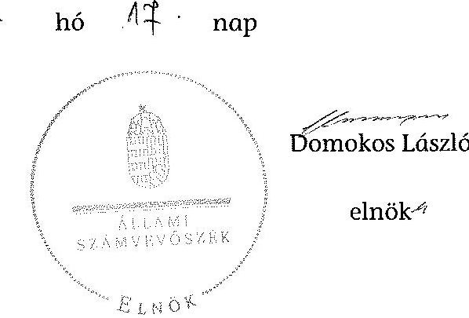

# ÁLLAMI   SZÁMVEVŐSZÉK 

## JELENTÉS

az önkormányzatok belső kontrollrendszere kialakításának, egyes kontrolltevékenységek és a belső ellenőrzés
működésének ellenőrzéséről
Ibrány

---

# Állami Számvevőszék 

Iktatószám: V-0404-047/2014
Témaszám: 1372
Vizsgálat-azonosító szám: V064950

## Az ellenőrzést felügyelte:

## dr. Benedek Mária

felügyeleti vezető
Az ellenőrzést vezette és az ellenőrzés végrehajtásáért felelős:
dr. Veress Tiborné
ellenőrzésvezető
A számvevőszéki jelentés összeállításában közreműködtek:
Fekete Gábor
számvevő tanácsos
Pető Krisztina
számvevő tanácsos
Az ellenőrzést végezték:
Farkas László
Fekete Gábor
számvevő tanácsos
számvevő tanácsos

---

# TARTALOMJEGYZÉK 

BEVEZETÉS ..... 5
I. ÖSSZEGZŐ MEGÁLLAPÍTÁSOK, KÖVETKEZTETÉSEK, JAVASLATOK ..... 9
II. RÉSZLETES MEGÁLLAPÍTÁSOK ..... 13

1. Az önkormányzat belső kontrollrendszerének kialakítása ..... 13
1.1. A kontrollkörnyezet ..... 13
1.2. A kockázatkezelési rendszer ..... 14
1.3. A kontrolltevékenységek ..... 15
1.4. Az információs és kommunikációs rendszer ..... 16
1.5. A monitoring rendszer ..... 17
2. A pénzügyi folyamatokban kulcsszerepet betöltő teljesítésigazolás és érvényesítés belső kontrollok működése ..... 18
3. A belső ellenőrzés működése ..... 19

## FÜGGELÉKEK

1. számú Értelmező szótár
2. számú Az értékelés módja és szempontjai

---

.

---

# RÖVIDÍTÉSEK JEGYZÉKE 

## Törvények

Áht.
ÁSZ tv.
Info tv.
Kttv.
Ltv.
Mötv.

Nvtv.
Ötv.
Számv. tv.
Vagyonnyilatkozattételről szóló tv.

## Rendeletek

Ávr.
Bkr.
Ikr.
önkormányzati SZMSZ
vagyongazdálkodási rendelet

## Szórövidítések

2013. évi ellenőrzési terv

ÁSZ
belső ellenőrzési kézikönyv
Bizottság
2012. évi ellenőrzési terv
gazdálkodási jogkörök szabályzata ${ }_{1}$

2011. évi CXCV. törvény az államháztartásról
2011. évi LXVI. törvény az Állami Számvevőszékről
2011. évi CXII. törvény az információs önrendelkezési jogról és az információszabadságról
2011. évi CXCIX. törvény a közszolgálati tisztviselőkről (hatályos 2012. március 1-jétől)
1995. évi LXVI. törvény a köziratokról, a közlevéltárakról és a magánlevéltári anyag védelméről
2011. évi CLXXXIX. törvény Magyarország helyi önkormányzatairól
2011. évi CXCVI. törvény a nemzeti vagyonról
1990. évi LXV. törvény a helyi önkormányzatokról
2000. évi C. törvény a számvitelről
2007. évi CLII. törvény az egyes vagyonnyilatkozat-tételi kötelezettségekről szóló törvény

368/2011. (XII. 31.) Korm. rendelet az államháztartásról szóló törvény végrehajtásáról
370/2011. (XII. 31.) Korm. rendelet a költségvetési szervek belső kontrollrendszeréről és belső ellenőrzéséről
335/2005. (XII. 29.) Korm. rendelet a közfeladatot ellátó szervek iratkezelésének általános követelményeiről
Ibrány Város Önkormányzata Képviselő-testületének 5/2011. (II. 25.) önkormányzati rendelete
Ibrány Város Önkormányzata Képviselő Testületének 8/2012. (IV. 06.) önkormányzati rendelete az önkormányzat vagyonáról és a vagyongazdálkodás szabályairól

Ibrány Város Önkormányzatának 2013. évi belső ellenőrzési terve
Állami Számvevőszék
A Közép-Szabolcsi Többcélú Kistérségi Társulás belső ellenőrzési kézikönyve
Ibrány Város Önkormányzata Képviselő-testületének Szavazatszámláló Ügyrendi Jogi Bizottsága
Ibrány Város Önkormányzatának 2012. évi belső ellenőrzési terve
Ibrány Város Polgármesteri Hivatalának gazdálkodási szabályzata a kötelezettségvállalás, ellenjegyzés, szakmai teljesítés igazolása, érvényesítés és adatszolgáltatás rendjéről (hatályos 2011. március 1-jétől)

---

gazdálkodási jogkörök szabályzata ${ }_{2}$
hivatali SZMSZ $_{1}$
hivatali SZMSZ $_{2}$

INTOSAI
ISSAI
jegyző
Képviselő-testület
Kormányhivatal
Levéltár
Önkormányzat
polgármester
Polgármesteri Hivatal
stratégiai ellenőrzési
terv
Társulás
ügyrend

Ibrány Város Polgármesteri Hivatalának gazdálkodási szabályzata a kötelezettségvállalás, ellenjegyzés, szakmai teljesítés igazolása, érvényesítés és adatszolgáltatás rendjéről (hatályos 2012. május 2-től)
Ibrány Város Képviselő-testületének 18/2011. (II. 15.) KT. határozatával elfogadott Szervezeti és Működési Szabályzat (hatályos 2011. február 15-től 2013. március 25-ig)
Ibrány Város Képviselő-testületének 62/2013. (III. 26.) KT. határozatával elfogadott Szervezeti és Működési Szabályzat (hatályos 2013. március 26-tól)
International Organization of Supreme Audit Institutions (Legfőbb Ellenőrző Intézmények Nemzetközi Szervezete)
International Standards of Supreme Audit Institutions (Legfőbb Ellenőrző Intézmények Nemzetközi Standardjai)
Ibrány város jegyzője
Ibrány Város Önkormányzat Képviselő-testülete
Szabolcs-Szatmár-Bereg Megyei Kormányhivatal
Szabolcs-Szatmár-Bereg Megyei Kormányhivatal Levéltára
Ibrány Város Önkormányzata
Ibrány város polgármestere
Ibrány Város Polgármesteri Hivatala
Ibrány Város Stratégiai ellenőrzési terve 2010-2014
Közép-Szabolcsi Többcélú Kistérségi Társulás
Ügyrend Ibrány Város Polgármesteri Hivatala Pénzügyi irodájának gazdálkodással összefüggő feladataira (hatályos 2012. május 2-től)

---

# JELENTÉS 

## az önkormányzatok belső kontrollrendszere kialakításának, egyes kontrolltevékenységek és a belső ellenőrzés működésének ellenőrzéséről Ibrány

## BEVEZETÉS

Ibrány város állandó lakosainak száma 2012. január 1-jén 7067 fő volt. Az Önkormányzat nyolctagú Képviselő-testületének munkáját három állandó bizottság segítette. Az Önkormányzat az önállóan működő és gazdálkodó Polgármesteri Hivatalon kívül egy önállóan működő intézményt működtetett, többségi tulajdoni hányaddal gazdasági társasággal nem rendelkezett. A polgármester a 1990. évi önkormányzati választások óta tölti be tisztségét. A jegyző 2004. november 1-jétől látja el jegyzői feladatait. A Polgármesteri Hivatal szervezeti egységekre tagolódott, elkülönített gazdasági szervezettel nem rendelkezett, a foglalkoztatott köztisztviselők száma 2012. január 1-jén 26 fő volt. Az Önkormányzat a 2012. évi költségvetési beszámolója szerint 1132379 ezer Ft költségvetési bevételt ért el, valamint 1220826 ezer Ft költségvetési kiadást teljesített. A 2012. december 31-i könyvviteli mérleg szerint 4003564 ezer Ft értékű eszközvagyonnal rendelkezett, a rövid lejáratú kötelezettségállománya 66640 ezer Ft, a hosszú lejáratú kötelezettségállománya 295062 ezer Ft volt. Adósságkonszolidációra 2013. június 28-án került sor, amelynek keretében a fennálló hitelállományból az állam 247556 ezer Ft összeget vállalt át.

A demokratikus társadalmakban alapvető igény, hogy a közpénzeket, a közvagyont használók tevékenységükről elszámoljanak, ahhoz egyértelmű és érvényesíthető felelősségi szabályok társuljanak. Ennek a jogos igénynek az érvényesítéséhez meg kell teremteni azokat a folyamatokat, rendszereket, amelyek nélkülözhetetlenek az elszámoltatáshoz. Az elszámoltatás eredményes működtetéséhez szükség van a megfelelő információs, kontroll, értékelési és beszámolási rendszerek kialakítására.

Magyarországon az uniós csatlakozási tárgyalások idejére nyúlnak vissza a belső kontrollrendszer szabályozásának gyökerei. Az uniós elvárásoknak megfelelő új terminológia szerinti államháztartási belső pénzügyi ellenőrzési (ÁBPE) rendszer területén a jogharmonizáció 2003-ban teljes körűen megvalósult, míg az önkormányzati alrendszerre vonatkozó, az Ötv.-ben megjelenített speciális szabályozás 2005-ben lépett hatályba. Az államháztartási belső kontrollrendszer koncepciója 2009-ben továbbfejlődött. A változások irányát mutatja, hogy a költségvetési szervek belső kontrollrendszere már magában foglalja

---

a korszerű, felelős szervezetirányítás elemeit (kontrollkörnyezet, kockázatkezelés, kontrolltevékenység, információ és kommunikáció, monitoring) is. E kontrollrendszer szabályozása háromszintű, a törvényi előírásokat az Áht. és a Mötv., a rendeleti szintű szabályozást az Ávr. és a Bkr. tartalmazza, amelyeket útmutatói szinten az NGM által kiadott standardok és kézikönyvek támogatnak.

A belső kontrollrendszer azt a célt szolgálja, hogy a költségvetési szervek működésük és gazdálkodásuk során a tevékenységeket szabályszerűen, gazdaságosan, hatékonyan és eredményesen hajtsák végre, teljesítsék elszámolási kötelezettségeiket és megvédjék az erőforrásokat a veszteségektől, a károktól és a nem rendeltetésszerű használattól. A belső kontrollrendszer magában foglalja mindazon szabályokat, eljárásokat, gyakorlati módszereket és szervezeti struktúrákat, kockázatkezelési technikákat, kontrolltevékenységeket, amelyek segítséget nyújtanak a szervezetnek céljai eléréséhez.

Az ÁSZ középtávú stratégiájában hangsúlyos szerepet szánt annak, hogy szilárd szakmai alapon álló, értékteremtő ellenőrzéseivel előmozdítsa a közpénzügyek átláthatóságát, rendezettségét. A számvevőszéki ellenőrzés nemzetközi alapelvei is rögzítik, hogy a megfelelő belső kontrollrendszer minimálisra csökkenti a hibák és szabálytalanságok kockázatát.

Az ellenőrzés célja annak megállapítása volt, hogy a belső kontrollrendszer elemeinek kialakítása, a pénzügyi folyamatokban kulcsszerepet betöltő teljesítésigazolás és érvényesítés, és a belső ellenőrzés szabályos működése biztosította-e az Önkormányzatnál a közpénzfelhasználás szabályosságát, hozzájárult-e az értéket teremtő rend követelményének érvényesüléséhez.

Ennek keretében értékeltük, hogy:

- a jogszabályi előírásoknak megfelelően alakították-e ki a belső kontrollrendszer elemeit;
- a gazdálkodás folyamatában kulcsszerepet betöltő teljesítésigazolás és érvényesítés kontrolltevékenységeit megfelelően működtették-e;
- biztosították-e a belső ellenőrzés szabályos működését;
- amennyiben az ÁSZ tett javaslatot a 2008-2011. évek közötti ellenőrzése kapcsán az Önkormányzatnak, intézkedtek-e azok végrehajtására.

Az ellenőrzés várható hasznosulását négy szinten tervezzük. A törvényalkotás számára összegzett tapasztalatok állnak rendelkezésre a belső kontrollrendszer önkormányzati területen való kialakításáról, működéséről és hatásairól, a belső ellenőrzés működéséről. Ennek alapján következtetést lehet levonni arról, hogy a belső kontrollrendszer kialakítására és működtetésére vonatkozó jelenlegi, differenciálás nélküli jogszabályi előírások reális követelményeket támasztanak-e az eltérő adottságú települési önkormányzatok esetében, illetve indokolt-e esetleges jogszabályi módosítás kezdeményezése. Az ellenőrzés az ellenőrzött számára visszajelzést ad a belső kontrollrendszer kialakításában és működésében fellépő hiányosságokról, javaslataival hozzájárul azok kiküszöböléséhez, amely csökkentheti a későbbi ellenőrzések gyakoriságát. Az el-

---

lenőrzés megállapításait és javaslatait más szervezetek is hasznosíthatják a rendezett gazdálkodási keretek kialakításához. A társadalom számára jelzi, hogy közpénz nem maradhat ellenőrizetlenül, az ÁSZ értékteremtő rend kialakításához és megőrzéséhez hozzájáruló tevékenysége pozitív hatással lesz a szervezetről kialakított összkép formálásában. A szervezeten belül lehetőség nyílik arra, hogy a megállapítások szintetizálásával az ÁSZ a hozzáadott értéket teremtő elemző tevékenységét és tanácsadó szerepét is erősítse.

Az önkormányzatok belső kontrollrendszere kialakításának, egyes kontrolltevékenységek és a belső ellenőrzés működésének ellenőrzéséről szóló jelentés I. fejezetének összegző része az ellenőrzés céljára ad rövid, szintetizáló összefoglalót, és tartalmazza a következtetéseket a II. fejezet részletes megállapításain alapulóan. A jelentés intézkedést igénylő megállapításait és javaslatait az ellenőrzés során feltárt, a jelentés II. fejezetében rögzített részletes megállapítások alapozzák meg. A helyszíni ellenőrzés lezárásáig a helyi szabályozás változásait nyomon követtük. Az ÁSZ az ellenőrzés megállapításait az ellenőrzött időszakban hatályos, az intézkedést igénylő megállapításokra tett javaslatokat a jelenleg hatályos jogszabályok alapján fogalmazta meg.

Az ellenőrzés típusa: szabályszerűségi ellenőrzés.
Az ellenőrzött időszak: a belső kontrollrendszer kialakításának megfelelősége esetében a 2012. évre, a pénzügyi folyamatokban kulcsszerepet betöltő teljesítésigazolás és érvényesítés belső kontrollok működésének megfelelőségét és a belső ellenőrzés szabályszerű működését a 2012. január 1. és december 31-e közötti időszak eseményeit figyelembe véve értékeltük, míg az ÁSZ javaslatainak utóellenőrzése a 2008-2011. években végzett ellenőrzések nyilvánosságra hozott jelentéseiben tett javaslatok áttekintésére terjedt ki.

Az ellenőrzött szervezet: az Önkormányzat.
Az ellenőrzés jogszabályi alapját az ÁSZ tv. 1. § (3) bekezdése, az 5. § (2) és (6) bekezdése, valamint az Áht. 61. § (2) bekezdésének előírásai képezik.

Az ellenőrzés szakmai módszertana az ÁSZ hivatalos honlapján (www.asz.hu) közzétett szakmai szabályokon alapult, amely az INTOSAI által kiadott ISSAI figyelembevételével készült.

Az ellenőrzés lefolytatásához az Önkormányzat a kimutatások és a tanúsítvány elektronikus kitöltésével, valamint az ÁSZ által kért dokumentumok elektronikus megküldésével szolgáltatott adatokat. Az így rendelkezésre bocsátott adatok, információk kontrollja és a munkalapok kitöltése a helyszíni ellenőrzés keretében történt. A jelentésben használt fogalmak magyarázatát az 1. számú függelék, az ellenőrzés egyes területeinek értékelésénél alkalmazott egységes minősítési szempontokat a 2. számú függelék tartalmazza.

A belső kontrollrendszer kialakításának ellenőrzése során értékeltük a kontrollkörnyezet, a kockázatkezelési rendszer, a kontrolltevékenységek, az információs és kommunikációs rendszer, valamint a monitoring rendszer szabályozottságának megfelelőségét. A pénzügyi folyamatokban kulcsszerepet betöltő teljesítésigazolás és érvényesítés kontrollok működése megfelelőségének minősítésé-

---

hez az állományba nem tartozók megbízási díjai, a külső szolgáltatók által végzett karbantartási, kisjavítási munkák, az egyéb üzemeltetési és fenntartási szolgáltatások, a rendszeres szociális segélyek, valamint az államháztartáson kívülre teljesített működési és felhalmozási célú pénzeszközátadások közül kockázatelemzéssel választottuk ki az ellenőrzött kiadási jogcímeket. Az egyszerű véletlen mintavétellel kiválasztott tételek ellenőrzését többlépcsős megfelelőségi tesztek útján addig végeztük, amíg elegendő és megfelelő bizonyítékot szereztünk a vizsgált folyamatok kulcskontrolljai működésének megfelelő vagy nem megfelelő voltáról. Értékeltük az Önkormányzatnál a belső ellenőrzés működésének szabályosságát. Utóellenőrzésre nem került sor, mivel az ÁSZ az Önkormányzatnál a 2008-2011. évek között ellenőrzést nem végzett.

Az ÁSZ tv. 29. § (1) bekezdése szerint a jelentéstervezetet megküldtük a polgármester részére, aki az ÁSZ tv. 29. § (2) bekezdésében foglalt észrevételezési jogával nem élt, a jelentéstervezetre észrevételt nem tett.

---

# 1. ÖSSZEGZŐ MEGÁLLAPÍTÁSOK, KÖVETKEZTETÉSEK, JAVASLATOK 

A belső kontrollrendszeren belül 2012-ben a kontrollkörnyezet, a kockázatkezelési rendszer, a kontrolltevékenységek, az információs és kommunikációs rendszer, valamint a monitoring rendszer kialakítását külön-külön és együttesen is értékeltük. A belső kontrollrendszer kialakítása az összesített értékelés alapján részben felelt meg a jogszabályi előírásoknak.

A belső kontrollrendszer egyes területei kialakításának minősítése a következő:

| Kontrollterület |
 Minősítés |
| :-- | :--: |
| Kontrollkörnyezet | megfelelő |
| Kockázatkezelési rendszer | részben   megfelelő |
| Kontrolltevékenységek | részben   megfelelő |
| Információs és kommunikációs rendszer | részben   megfelelő |
| Monitoring rendszer | nem   megfelelő |

Megfelelőnek értékeltük a kontrollkörnyezet kialakítását, mivel a jegyző a jogszabályi előírásokban foglaltakat figyelembe véve a kisebb hiányosságok mellett is megteremtette e kontrollterületen a szabályszerű működés lehetőségét.

Részben megfelelőnek értékeltük a kockázatkezelési rendszer, a kontrolltevékenységek, valamint az információs és kommunikációs rendszer kialakítását, mivel az ellenőrzésünk által megállapított szabályozásbeli hiányosságok nem veszélyeztették a Polgármesteri Hivatal, ezáltal az Önkormányzat céljainak elérését.

Nem megfelelőnek értékeltük a monitoring rendszer kialakítását, mivel az ellenőrzésünk során megállapított szabályozásbeli hiányosságok magukban hordozzák a szabálytalan működés, valamint a korrupció kockázatát.

Az állományba nem tartozók megbízási díjaival, valamint a külső szolgáltatók által végzett karbantartási, kisjavítási munkákkal kapcsolatos kifizetések során a pénzügyi folyamatokban kulcsszerepet betöltő teljesítésigazolás és érvényesítés belső kontrollok működése gyenge volt. Gyengének értékeltük a két kulcskontroll együttes működését, mert azok nem biztosították az ellenőrzésünk által feltárt hiányosságok bekövetkezésének megelőzését.

---

A számvevőszéki ellenőrzés az ellenőrzött kifizetésekkel összefüggésben a rendelkezésre bocsátott dokumentumok alapján kár bekövetkeztére utaló adatot, tényt nem állapított meg, azonban a gazdálkodásban kulcsszerepet betöltő kontrollok gyenge működése miatt fennáll további hibák bekövetkezésének lehetősége.

Az Önkormányzat a belső ellenőrzési feladatokat a Társulás útján látta el. A belső ellenőrzés működése a jogszabályi előírásoknak jól megfelelt, hozzájárult a belső kontrollrendszer részben megfelelő kialakításához. A belső ellenőrzés azonban nem tárta fel a számvevőszéki ellenőrzés által megállapított hiányosságokat a monitoring rendszer kialakításánál, valamint a pénzügyi folyamatokban kulcsszerepet betöltő teljesítésigazolás és érvényesítés belső kontrollok működésénél.

Az ÁSZ tv. 33. § (1) bekezdésében foglaltak értelmében az ellenőrzött szervezet vezetője köteles a jelentésben foglalt megállapításokhoz kapcsolódó intézkedési tervet összeállítani, és azt a jelentés kézhezvételétől számított 30 napon belül az ÁSZ részére megküldeni. Amennyiben az intézkedési tervet határidőre nem küldi meg a szervezet, vagy az ÁSZ tv. 33. § (2) bekezdésében foglalt póthatáridő elteltével megküldött intézkedési terv továbbra sem elfogadható, az ÁSZ elnöke a hivatkozott törvény 33. § (3) bekezdés a)-b) pontjaiban foglaltakat érvényesítheti.

Az ellenőrzés intézkedést igénylő megállapításai és javaslatai:

# a polgármesternek 

A polgármester mint kötelezettségvállaló - az Ávr. 57. § (4) bekezdésében foglaltak ellenére - nem jelölte ki 2012. március 30-át követően írásban az Önkormányzat kiadási előirányzatai vonatkozásában a teljesítésigazolására jogosult személyeket.

Javaslat:
Jelölje ki az Ávr. 57. § (4) bekezdésének megfelelően az általa történő kötelezettségvállalások esetében a teljesítés igazolására jogosult személyeket.

## a jegyzőnek

1. a kontrollkörnyezettel kapcsolatban:

A hivatali SZMSZ tartalma nem felelt meg az Ávr. előírásainak. A jegyző az Ötv.-ben előírtak ellenére nem készítette elő a köztisztviselőkkel szembeni hivatásetikai alapelvek részletes tartalmát, valamint az etikai eljárás szabályait tartalmazó dokumentumokat. [II. Részletes megállapítások, 1.1. A kontrollkörnyezet, 7., 10-12. és 47. sorszámú megállapítás]

Javaslat:
Intézkedjen az SZMSZ módosításáról Áht. 69. § (2) bekezdése, a Bkr. 3. § a) pontja és 6. §-a, valamint az Ávr., a Mötv. és a Kttv. előírásainak megfelelően a jelentés II.

---

Részletes megállapítások, 1.1. A kontrollkörnyezet 7., 10-12. és 47. sorszámú megállapításaiban foglalt hibák, hiányosságok kijavításáról, megszüntetéséről az ott megjelölt jogszabályi rendelkezéseknek megfelelően.
2. a kockázatkezelési rendszerrel kapcsolatban:

A kockázatkezelési rendszer nem felelt meg a Bkr. előírásainak, és a Vagyonnyilatkozat-tételről szóló tv.-ben előírtak ellenére a bizottságok nem helyi önkormányzati képviselő tagjainak vagyonnyilatkozat-tételi kötelezettségét az önkormányzati SZMSZ nem rögzítette. [II. Részletes megállapítások, 1.2. A kockázatkezelési rendszer, 10. és 13. sorszámú megállapítás].

Javaslat:
Intézkedjen az Áht. 69. § (2) bekezdése, a Bkr. 3. § b) pontja és 7. §-a, valamint a Vagyonnyilatkozat-tételről szóló tv. alapján a jelentés II. Részletes megállapítások, 1.2. A kockázatkezelési rendszer 10. és 13. sorszámú megállapításaiban foglalt hibák, hiányosságok kijavításáról, megszüntetéséről az ott megjelölt jogszabályi rendelkezéseknek megfelelően.
3. a kontrolltevékenységekkel kapcsolatban:

A jegyző az Ávr.-ben foglaltakat figyelmen kívül hagyva - annak ellenére nem határozta meg az előzetes írásbeli kötelezettségvállalást nem igénylő kifizetések rendjét, hogy belső szabályozásban lehetővé tette a 100 ezer Ft alatti kifizetések előzetes írásbeli kötelezettségvállalás nélküli teljesítését. Az Info tv.-ben és az lkr.-ben foglaltak ellenére nem határozta meg az üzemeltetés és adatbiztonság védelmének feladatai esetében a hatásköröket. Az informatikai rendszer szabályozása során nem biztosította az adatok biztonságát és védelmét, és nem határozta meg a dokumentumokhoz, információkhoz való hozzáférés vonatkozásában a felelősségi köröket. A pénzügyi ellenjegyzési és az érvényesítési feladatra az Ávr. előírása ellenére a jegyző helyett jogosulatlanul a pénzügyi irodavezető jelölte ki a Polgármesteri Hivatal állományába tartozó köztisztviselőt. [II. Részletes megállapítások, 1.3. A kontrolltevékenységek, 8., 10., 15-17., 27. és 29. sorszámú megállapítás]

Javaslat:
Intézkedjen az Áht. 69. § (2) bekezdése, a Bkr. 3. § c) pontja és 8. §-a alapján a jelentés II. Részletes megállapítások, 1.3. A kontrolltevékenységek 8., 10., 15-17., 27. és 29. sorszámú megállapításaiban foglalt hibák, hiányosságok kijavításáról, megszüntetéséről az ott megjelölt jogszabályi rendelkezéseknek megfelelően.
4. az információs és kommunikációs rendszerrel kapcsolatban:

A jegyző a Bkr.-ben foglaltak ellenére nem alakított ki olyan rendszert, amely biztosítja, hogy a megfelelő információk a megfelelő időben eljutnak az illetékes szervezethez, szervezeti egységhez, személyhez. Az Info tv. előírásai ellenére nem készített adatvédelmi és adatbiztonsági szabályzatot, és a kötelezően közzéteendő adatok nyilvánosságra hozatalának rendjét nem alakította ki, a közérdekű adatok megismerésére irányuló igények teljesítésének rendjét nem szabályozta. [II. Részletes megállapítások, 1.4. Az információs és kommunikációs rendszer, 1-2., 5-6. és 8. sorszámú megállapítás]

---

Javaslat:
Intézkedjen az Áht. 69. § (2), a Bkr. 3. § d) pontjában és a 9. §-a alapján a jelentés II. Részletes megállapítások, 1.4. Az információs és kommunikációs rendszer 1-2., 5-6. és 8. sorszámú megállapításában foglalt hibák, hiányosságok kijavításáról, megszüntetéséről az ott megjelölt jogszabályi rendelkezéseknek megfelelően.
5. a monitoring rendszerrel kapcsolatban:

A jegyző - a Bkr.-ben foglaltak ellenére - nem alakította ki a Polgármesteri Hivatal tevékenységének, a célok megvalósításának nyomon követését biztosító rendszert, és a belső kontrollrendszer fejlesztése érdekében intézkedéseket nem tett. [II. Részletes megállapítások, 1.5. A monitoring rendszer, 1. és 10. sorszámú megállapítás].

Javaslat:
Intézkedjen az Áht. 69. § (2) bekezdése, a Bkr. 3. § e) pontja és 10. §-a alapján a jelentés II. Részletes megállapítások, 1.5. A monitoring rendszer 1. és 10. sorszámú megállapításában foglalt hibák, hiányosságok kijavításáról, megszüntetéséről az ott megjelölt jogszabályi rendelkezéseknek megfelelően.
6. a pénzügyi folyamatokban kulcsszerepet betöltő kontrollokkal kapcsolatban:

A teljesítésigazolás és az érvényesítés az Ávr.-ben foglaltaknak, a gazdasági események könyvelése a Számv. tv.-ben foglaltaknak nem felelt meg. [II. Részletes megállapítások, 2. A pénzügyi folyamatokban kulcsszerepet betöltő teljesítésigazolás és érvényesítés belső kontrollok működése, 1-3. pontokban foglalt megállapítás].

Javaslat:
Intézkedjen az Ávr. 55-60. §-ában és a Számv. tv. 165. §-ában foglaltak alapján arról, hogy a teljesítésigazolás és az érvényesítés vonatkozásában, és az azok ellenőrzése során a pénzügyi ellenjegyzéssel, az utalványozással, a gazdasági események könyvelésével kapcsolatos, a jelentés II. Részletes megállapítások, 2. A pénzügyi folyamatokban kulcsszerepet betöltő teljesítésigazolás és érvényesítés belső kontrollok működése 1-3. pontjaiban szereplő megállapításában foglalt hibák, hiányosságok kijavítása, megszüntetése az ott megjelölt jogszabályi rendelkezéseknek megfelelően történjen meg.
7. a belső ellenőrzés működésével kapcsolatban:

A belső ellenőrzés működése az értékelési szempontjait figyelembe véve jól megfelelt a jogszabályi előírásoknak, azonban a számvevőszéki ellenőrzés kisebb súlyú hiányosságokat tárt fel, amelyek nem feleltek meg a Bkr.-ben előírt rendelkezéseknek. [II. Részletes megállapítások, 3. A belső ellenőrzés működése, 7. f), 8. a) és c), 11., 23., 24., 26. és 27. b). sorszámú megállapítása]

Javaslat:
Intézkedjen az Áht. 69. § (2) bekezdése, a 70. § (1) bekezdése, a Bkr. 3. § e) pontja és a 10. §-a alapján a jelentés II. Részletes megállapítások, 3. A belső ellenőrzés működése 7. f), 8. a) és c), 11., 23., 24., 26. és 27. b). sorszámú megállapításában foglalt hibák, hiányosságok kijavításáról, megszüntetéséről az ott megjelölt jogszabályi rendelkezéseknek megfelelően.

---

# II. RÉSZLETES MEGÁLLAPÍTÁSOK 

## 1. Az önkormányzat belső kontrollrendszerének kialakítása

A belső kontrollrendszeren belül 2012-ben a kontrollkörnyezet, a kockázatkezelési rendszer, a kontrolltevékenységek, az információs és kommunikációs rendszer, valamint a monitoring rendszer kialakítását külön-külön és együttesen is értékeltük. A belső kontrollrendszer kialakítása az összesített értékelés alapján részben felelt meg a jogszabályi előírásoknak.

### 1.1. A kontrollkörnyezet

A kontrollkörnyezet kialakítása - a 2. számú függelékben részletezett kritériumrendszer alapján végzett értékelés szerint - a jogszabályi előírásoknak megfelelt, mert:

A Polgármesteri Hivatal rendelkezett a Képviselő-testület által elfogadott alapító okirattal és hivatali SZMSZ-szel. Az alapító okirat a jogszabályi előírásoknak megfelelően tartalmazta az alaptevékenységek felsorolását. A Képviselő-testület rendelkezett a működésének részletes szabályait tartalmazó SZMSZ-szel. Az Önkormányzat rendelkezett gazdasági programmal. A vagyongazdálkodás szabályait önkormányzati rendeletben határozták meg.

A szervezet megfelelő működése érdekében a Polgármesteri Hivatalban kialakították a belső szabályzatokat, elkészítették a számviteli politikát, a pénzkezelési szabályzatot, a leltárkészítési és leltározási szabályzatot, az eszközök és források értékelési szabályzatát, a számlarendet, a bizonylati szabályzatot, a szabálytalanságok kezelésének rendjét és a tűzvédelmi szabályzatot. A jegyző kialakította az Önkormányzat intézményeinek számviteli rendjét. Meghatározták az egészséget nem veszélyeztető és biztonságos munkavégzés követelményei megvalósításának módját.

A Polgármesteri Hivatalban dolgozó köztisztviselők rendelkeztek munkaköri leírással. A Képviselő-testület meghatározta a teljesítményértékelés alapját képező célokat, és az elfogadott teljesítménycélok figyelembevételével a jegyző elkészítette a köztisztviselők teljesítményértékelését.

---

A kontrollkörnyezet kialakítása az értékelés szempontjából az alábbi kisebb súlyú hiányosságok mellett megfelelt a jogszabályi előírásoknak:

| Sorszám ${ }^{1}$ | Megállapítás | Megjegyzés |
| :--: | :--: | :--: |
| 7.,   10-   12. | A jegyző a hivatali SZMSZ${ }_{1}$-ben - az Ávr. 13. § (1) bekezdés c), g) h) és i) pontjában foglaltak ellenére - nem rögzítette az ellátandó, és a szakfeladat-rend szerint szakfeladat számmal és megnevezéssel besorolt alaptevékenységek megjelölését, továbbá az abban nevesített valamennyi munkakörhöz tartozó helyettesítés rendjét és az ezekhez kapcsolódó felelősségi szabályokat, a munkáltatói jogok gyakorlásának rendjét (ideértve az útruházott munkáltatói jogokat is), valamint a költségvetési szervhez rendelt más költségvetési szervek felsorolását. | 2014. január 1-jétől az Ávr. 13. § (1) bekezdés c) pontjában szereplő szöveg az alábbira változott: „az ellátandó, és a kormányzati funkció szerint besorolt alaptevékenységek, rendszeresen ellátott vállalkozási tevékenységek, valamint az alaptevékenységet szabályozó jogszabályok megjelölését."   A hivatali SZMSZ 2013. március 26-tól hatályos. |
| 47. | A Képviselő-testület a Kttv. 231. § (1) bekezdés előírása ellenére nem állapította meg - a Kttv. 83. §-ában meghatározott - a köztisztviselőkkel szembeni hivatásetikai alapelvek részletes tartalmát, valamint az etikai eljárás szabályait, mivel a jegyző - az Ötv. 36. § (2) bekezdés a) pontjában előírt feladata ellenére - nem készítette elő ennek dokumentumát. |

 A jegyző az önkormányzat működésével kapcsolatos feladatok ellátásáról 2013. január 1-jétől a MÖtv. 81. § (3) bekezdés c) pontja alapján gondoskodik. |

# 1.2. A kockázatkezelési rendszer 

A kockázatkezelési rendszer kialakítása - a 2. számú függelékben részletezett kritériumrendszer alapján végzett értékelés szerint - a jogszabályi előírásoknak részben megfelelt.

A jegyző gondoskodott a Polgármesteri Hivatal tevékenységeiben rejlő kockázatok azonosításáról, az azonosított kockázatok bekövetkezési valószínűségének és hatásának felméréséről, és meghatározta az egyes kockázatok kezelése érdekében szükséges intézkedéseket.

A vagyonnyilatkozat-tételre kötelezett köztisztviselők körét és a képviselők nyilatkozattételi kötelezettségét rögzítették. A kötelezettek - a köztisztviselők, a képviselők és a nem képviselő bizottsági tagok - teljes körűen teljesítették vagyonnyilatkozat-tételi kötelezettségüket.

[^0]
[^0]:    ${ }^{1}$ A megállapítás számozása az Önkormányzat által az adatszolgáltatás során kitöltött kimutatások kérdéseinek sorszámával azonos.

---

Az kockázatkezelési rendszer kialakítása az értékelés szempontjából az alábbi kisebb súlyú hiányosságok miatt részben felelt meg a jogszabályi előírásoknak:

| Sor-   szám | Megállapítás |
| :-- | :-- |
|  | A jegyző - a Bkr. 7. § (2) bekezdésében foglaltak ellenére - nem határozta   meg az egyes kockázatokkal kapcsolatban szükséges intézkedések teljesítésének folyamatos nyomon követési módját. |
|  | A Vagyonnyilatkozat-tételről szóló tv. 4. § d) pontjában foglaltak ellenére a   bizottságok nem helyi önkormányzati képviselő tagjainak vagyonnyilatko-   zat-tételi kötelezettségét az önkormányzati SZMSZ-ben nem rögzítették. |
|  | A bizottságok nem helyi önkormányzati képviselő tagjait a vagyonnyilat-   kozat-tételi kötelezettségükről - Vagyonnyilatkozat-tételről szóló tv. 8. § (4)   bekezdésében előírt őrzésért felelős - a Bizottság helyett a jegyző tájékoztat-   ta. |

# 1.3. A kontrolltevékenységek 

A kontrolltevékenységek kialakítása - a 2. számú függelékben részletezett kritériumrendszer alapján végzett értékelés szerint - részben felelt meg a jogszabályi előírásoknak.

A jegyző a kontrolltevékenység részeként előírta a folyamatba épített, előzetes, utólagos és vezetői ellenőrzést. A jegyző az írásbeli kötelezettségvállalást igénylő kifizetések esetére 2012. május 2-től rögzítette a kötelezettségvállalás pénzügyi ellenjegyzésének és a kiadások teljesítésigazolásának módját, az érvényesítés rendjét a hatályos jogszabályi előírásoknak megfelelően. Az iratkezelési szabályzatban előírták az iratok és adatok védelmét. Szabályozták az üzemeltetés és adatbiztonság feladatait. Az ügyrendben a jegyző meghatározta az időközi és éves beszámolók elkészítésének feladatait, a beszámolási eljárásokhoz kapcsolódó felelősségi köröket. A költségvetési beszámoló elkészítésével megbízott személy rendelkezett a tevékenység ellátására jogosító engedéllyel.

A polgármester adott felhatalmazást kötelezettségvállalásra és utalványozásra. A jegyző 2012. május 1-jéig jelölt ki a jogszabályban előírt végzettséggel, képesítéssel rendelkező, a hivatal állományába tartozó köztisztviselőt érvényesítési feladatra. A jegyző szabályozta a köztisztviselő jogviszonya megszűnése esetére a munkakör átadása rendjét.

---

A kontrolltevékenységek kialakítása az értékelés szempontjából az alábbi kisebb súlyú hiányosságok miatt részben felelt meg a jogszabályi előírásoknak:

| Sorszám | Megállapítás |
| :--: | :--: |
| 8. | A jegyző - az Ávr. 53. § (2) bekezdésében foglaltakat figyelmen kívül hagyva - annak ellenére nem határozta meg az előzetes írásbeli kötelezettségvállalást nem igénylő kifizetések rendjét, hogy a gazdálkodási jogkörök szabályzat ${ }_{1,2}$-ben lehetővé tette a 100 ezer Ft alatti kifizetések előzetes írásbeli kötelezettségvállalás nélküli teljesítését. |
| 10. | A polgármester, mint kötelezettségvállaló - az Ávr. 57. § (4) bekezdésében foglaltak ellenére - 2012. március 30-át követően nem jelölte ki írásban az Önkormányzat kiadási előirányzatai vonatkozásában a teljesítés igazolására jogosult személyeket. |
| 15. | A jegyző az iratkezelési rendszer kialakítása során - az Ikr. 8. § (2) bekezdésében foglaltak ellenére - nem határozta meg az üzemeltetés és adatbiztonság védelmének feladatai esetében a hatásköröket. |
| 16. | A jegyző - az Info tv. 7. § (2)-(3) bekezdéseiben foglalt előírásokat figyelmen kívül hagyva - az informatikai rendszer szabályozása során nem tette meg azokat a technikai és szervezési intézkedéseket és nem alakította ki azokat az eljárási szabályokat, amelyek biztosítják az adatok biztonságát és védelmét. |
| 17. | A jegyző - a Bkr. 8. § (4) bekezdés b) pontjában foglaltak ellenére - belső szabályzatban nem határozta meg a dokumentumokhoz és információkhoz való hozzáférésre vonatkozóan a felelősségi köröket. |
| 27.,   29. | Annak ellenére, hogy a Polgármesteri Hivatal gazdasági szervezettel nem rendelkezett, pénzügyi ellenjegyzési és érvényesítési feladatra 2012. május 2-től - az Ávr. 55. § (2) bekezdés f) pontjának, valamint az Ávr. 58. § (4) bekezdésének előírása ellenére - a jegyző helyett jogosulatlanul a pénzügyi irodavezető jelölte ki a Polgármesteri Hivatal állományába tartozó köztisztviselőt. |

# 1.4. Az információs és kommunikációs rendszer 

Az információs és kommunikációs rendszer kialakítása - a 2. számú függelékben részletezett kritériumrendszer alapján végzett értékelés szerint részben megfelelt a jogszabályi előírásoknak.

Az Önkormányzat az elektronikus közzétételi kötelezettségének a 2012. évben eleget tett. A Polgármesteri Hivatal rendelkezett a Levéltár és a Kormányhivatal egyetértésével kiadott, a jogszabályi előírásoknak megfelelő tartalmú iratkezelési szabályzattal. A jegyző szabályozta az ügyintézési határidők nyomon követésének dokumentálását és meghatározta a késedelmes ügyintézés felelősségi rendjét, a szabálytalansági gyanú észlelésével, jelentésével kapcsolatos részletes eljárásrendet.

---

Az információs és kommunikációs rendszer kialakítása az értékelés szempontjából az alábbi kisebb súlyú hiányosságok miatt részben felelt meg a jogszabályi előírásoknak:

| Sor-   szám | Megállapítás |
| :--: | :--: |
| 1., 2. | A jegyző - a Bkr. 3. § d) pontjában és a 9. § (1) bekezdésben foglaltak ellenére - nem alakított ki olyan rendszert, amely biztosítja, hogy a megfelelő információk a megfelelő időben eljutnak az illetékes szervezethez, szervezeti egységhez, személyhez. |
| 5. | A jegyző - az Info tv. 24. § (3) bekezdésében foglaltak ellenére - nem készítette el a Polgármesteri Hivatal adatvédelmi és adatbiztonsági szabályzatát. |
| 6., 8. | A jegyző - az Info tv. 30. § (6) bekezdésében és a 35. § (3) bekezdésében, valamint az Ávr. 13. § 2. bekezdés h) pontjában foglalt előírások ellenére a kötelezően közzéteendő adatok nyilvánosságra hozatalának rendjét nem alakította ki, a közérdekű adatok megismerésére irányuló igények teljesítésének rendjét nem szabályozta. |

# 1.5. A monitoring rendszer 

A monitoring rendszer kialakítása - a 2. számú függelékben részletezett kritériumrendszer alapján végzett értékelés szerint - nem felelt meg a jogszabályi előírásoknak, mert:

| Sor-   szám | Megállapítás |
| :--: | :-- |
| 1. | A jegyző - a Bkr. 3. § e) pontjában és a 10. §-ban foglaltak ellenére - nem   alakította ki a Polgármesteri Hivatal tevékenységének, a célok megvalósításának nyomon követését biztosító rendszert. |
| 10. | A jegyző - az Áht. 69. § (2) bekezdésében és a Bkr. 3. §-ában foglaltakat   figyelmen kívül hagyva - a belső kontrollrendszer fejlesztése érdekében intézkedéseket nem tett. |

A helyi önkormányzatok törvényességi felügyeletét ellátó kormányhivatal a 2012. évben nem élt törvényességi felhívással, vagy más törvényességi felügyeleti eszközzel a Képviselő-testület által alkotott rendeletekre, határozatokra vonatkozóan.

---

# 2. A PÉNZÜGYI FOLYAMATOKBAN KULCSSZEREPET BETÖLTŐ TELJESÍTÉSIGAZOLÁS ÉS ÉRVÉNYESÍTÉS BELSŐ KONTROLLOK MŰKÖDÉSE 

Az állományba nem tartozók megbízási díjaival és a külső szolgáltatók által végzett karbantartással, kisjavítással kapcsolatos kifizetések során - összefoglalóan értékelve - a pénzügyi folyamatokban kulcsszerepet betöltő teljesítésigazolás és érvényesítés belső kontrollok működésének megfelelősége gyenge volt, mert:

| Sorszám | Megállapítás |
| :--: | :--: |
| 1. | Teljesítésigazolás   A teljesítésigazolást - az Ávr. 57. § (1) bekezdésében foglaltak ellenére ellenőrizhető okmányok hiányában nem szabályszerűen végezték. |
| 2. | Érvényesítés   Az érvényesítő - az Ávr. 55. § (2) bekezdés f) pontjának megfelelő kijelölés hiányában - az érvényesítést nem szabályszerűen végezte, továbbá - az Ávr. 58. § (2) bekezdés előírása ellenére - nem jelezte az utalványozónak, hogy a megelőző ügymenetben a teljesítésigazolást és a pénzügyi ellenjegyzést végző személy kijelölése nem volt szabályszerű.   Az érvényesítő aláírás mintája az Ávr. 60. § (3) bekezdésben előírtak szerint vezetett nyilvántartásban nem szerepelt. |
| 3. | A kulcskontrollok ellenőrzése során feltárt egyéb hiányosságok   A Polgármesteri Hivatal kiadásait - a Számv. tv. 165. § (2) bekezdés előírása ellenére - nem a valóságnak megfelelően rögzítették a könyvekben. |

Az állományba nem tartozók megbízási díjainak kifizetése során a teljesítésigazolás és az érvényesítés kulcskontrollok működésének megfelelősége gyenge volt, mert:

- a teljesítésigazoló - az Ávr. 57. § (1) bekezdésében foglaltak ellenére - a február 1-jén és július 1-jén hangosítási feladatra, az augusztus 1-jén anyakönyvvezetői feladatokra kifizetett megbízási díjakat megelőzően - ellenőrizhető dokumentumok hiányában igazolta a kiadások teljesítésének jogosságát és összegszerűségét;
- az érvényesítő az Ávr. 58. § (2) bekezdés előírása ellenére nem jelezte az utalványozónak, hogy a megelőző ügymenetben a teljesítésigazolást és a pénzügyi ellenjegyzést végző személy kijelölése nem volt szabályszerű.

A külső szolgáltatók által végzett karbantartási, kisjavítási munkák kifizetése során a teljesítésigazolás és érvényesítés kulcskontrollok működésének megfelelősége gyenge volt, mert:

- a teljesítésigazoló a számítógép javítás, karbantartás, a gázkazán javítás és lakások karbantartásával összefüggésben felmerült kifizetéseket megelőzően a kiadás jogosságát az - Ávr. 57. § (1) bekezdésében foglaltak és aláírása ellenére - ellenőrizhető okmányok hiányában nem ellenőrizte;

---

- a számítógép javítás díjának kifizetése során érvényesítési feladatot ellátó személy aláírása - az érvényesítésre jogosult személyekről és aláírásukról az Ávr. 60. § (3) bekezdésben előírtak szerint vezetett nyilvántartásban nem szerepelt;
- az érvényesítő az Ávr. 58. § (2) bekezdés előírása ellenére nem jelezte az utalványozónak, hogy a megelőző ügymenetben a teljesítésigazolást és a pénzügyi ellenjegyzést végző személy kijelölése nem volt szabályszerű.
- A hátralék miatti kikapcsolás és mérőóra visszaszerelés díjával kapcsolatos gazdasági eseményt - a Számv. tv. 165. § (2) bekezdés előírása ellenére - nem a valóságnak megfelelően rögzítették a könyvekben, mert a Polgármesteri Hivatal nevére kiállított számla alapján történt kifizetést az önkormányzati kiadások között mutatták ki.

A számvevőszéki ellenőrzés az ellenőrzött kifizetésekkel összefüggésben a rendelkezésre bocsátott dokumentumok alapján kár bekövetkeztére utaló adatot, tényt nem állapított meg, azonban a gazdálkodásban kulcsszerepet betöltő kontrollok gyenge működése miatt fennáll a hibák bekövetkezésének kockázata.

# 3. A BELSŐ ELLENŐRZÉS MŰKÖDÉSE 

Az Önkormányzat a belső ellenőrzési feladatokat - képviselő-testületi döntés alapján - a Társulás útján látta el.

A belső ellenőrzés működése - a 2. számú függelékben részletezett kritériumrendszer alapján végzett értékelés szerint - az Önkormányzatnál jól megfelelt a jogszabályi előírásoknak.

Az Önkormányzat rendelkezett a jogszabályi előírásoknak megfelelő tartalmú belső ellenőrzési kézikönyvvel, valamint a Képviselő-testület által jóváhagyott stratégiai ellenőrzési tervvel. A belső ellenőrzést végzők rendelkeztek a belső ellenőrzési tevékenység végzéséhez szükséges engedéllyel.

A belső ellenőrzés a 2012. évi ellenőrzési tervben foglalt ellenőrzéseket végrehajtotta, az ellenőrzésekhez az ellenőrzési programokat elkészítette. Az elvégzett ellenőrzésekről a jogszabályban előírt tartalmú jelentések készültek. A belső ellenőrzést
 végzők az ellenőrzések során büntető-, szabálysértési-, kártérítési-, vagy fegyelmi eljárás megindítására okot adó cselekményt nem tártak fel. A belső ellenőrzés által tett javaslatok alapján minden esetben készítettek intézkedési tervet. A belső ellenőrzési vezető elkészítette az Önkormányzatnál végzett ellenőrzések alapján összeállított, a 2011. évre vonatkozó éves ellenőrzési jelentést és megküldte a jegyzőnek.

---

A belső ellenőrzés működése az értékelés szempontjából az alábbi kisebb súlyú hiányosságok mellett jól megfelelt a jogszabályi előírásoknak:

| Sorszám | Megállapítás |
| :--: | :--: |
| 7. f) | A stratégiai ellenőrzési terv - a Bkr. 30. § (1) bekezdés f) pontjában foglalt előírás ellenére - nem tartalmazta az ellenőrzési prioritásokat és az ellenőrzési gyakoriságot. |
| 8. a), c) | A 2013. évi ellenőrzési terv - a Bkr. 31.§ (4) bekezdés a) és c) pontjában foglaltak ellenére - nem tartalmazta az ellenőrzési tervet megalapozó elemzéseket és a kockázatelemzés eredményének összefoglaló bemutatását, valamint az ellenőrzések célját. |
| 11. | A 2013. évi ellenőrzési terv összeállítását megelőzően - a Bkr. a 31. § (2) bekezdésében előírtak ellenére - kockázatelemzést nem készítettek. |
| 23. | A jegyző - a Bkr. 46. § (1) bekezdésében foglalt előírás ellenére - az intézkedési tervben meghatározott egyes feladatok végrehajtásáról szóló beszámolót elmulasztotta elkészíteni és tájékoztatásul megküldeni a belső ellenőrzési vezető részére. |
| 24., 26. | A belső ellenőrzési vezető - a Bkr. 21. § (2) bekezdés d) pontjában és a 47. § (1) bekezdésében foglaltakat figyelmen kívül hagyva - a belső ellenőrzési jelentésekben tett javaslatokat, a vonatkozó intézkedési terveket és azok végrehajtását nyomon követő nyilvántartást nem vezetett. |
| 27. b) | A 2011. évre vonatkozó éves (összefoglaló) ellenőrzési jelentés - a Bkr. 48. § b) pontjának bb) alpontjában foglaltak ellenére - nem tartalmazta a belső kontrollrendszer öt elemének értékelését. |

Az Önkormányzat az ÁSZ-tól a 2011., a 2012. és a 2013. években integritás kérdőív kitöltésére kapott felkérést, amelynek a 2011. és a 2013. évben eleget tett. A belső kontrollrendszer kialakítása során feltárt hibák, ezen belül a köztisztviselőkkel szembeni hivatásetikai alapelvek részletes tartalma meghatározásának, az etikai eljárás szabályainak, a nem helyi önkormányzati képviselő bizottsági tagok vagyonnyilatkozat-tételi kötelezettsége szabályozásának, a szervezeten belüli és kívüli információ átadás rendjének, valamint az adatvédelmi és adatbiztonsági szabályzat hiánya, továbbá a 2013. évi ellenőrzési terv megalapozását biztosító kockázatelemzés elmaradása arra utalnak, hogy az Önkormányzatnak az integritási szemlélet érvényesítésében még fejlődést kell elérnie.

Budapest, 2014.

---

# ÉRTELMEZŐ SZÓTÁR 

belső ellenőrzés
belső kontrollrendszer
belső kontrollrendszer területei
egyszerű véletlen mintavétel
integritás
kockázatkezelési rendszer

Független, tárgyilagos bizonyosságot adó és tanácsadó tevékenység, amelynek célja, hogy az ellenőrzött szervezet működését fejlessze és eredményességét növelje, az ellenőrzött szervezet céljai elérése érdekében rendszerszemléletű megközelítéssel és módszeresen értékeli, illetve fejleszti az ellenőrzött szervezet irányítási és belső kontrollrendszerének hatékonyságát. (Forrás: Bkr. 2. § b) pontja)
A belső kontrollrendszer a kockázatok kezelése és tárgyilagos bizonyosság megszerzése érdekében kialakított folyamatrendszer, amely azt a célt szolgálja, hogy a működés és gazdálkodás során a tevékenységeket szabályszerűen, gazdaságosan, hatékonyan, eredményesen hajtsák végre, az elszámolási kötelezettségeket teljesítsék, megvédjék az erőforrásokat a veszteségektől, károktól és nem rendeltetésszerű használattól. (Forrás: Áht. 69. § (1) bekezdése)
A kontrollkörnyezet, a kockázatkezelési rendszer, a kontrolltevékenységek, az információs és kommunikációs rendszer, valamint a nyomon követési (monitoring) rendszer. (Forrás: Bkr. 3. §-a)

Az alapsokaságból egyszerű véletlen kiválasztással képzett részsokaság. (Forrás: Az ÁSZ ellenőrzési mintavételezés támogatásához készült segédletének 4.1.1. pontja)
Az integritás elvek, értékek, cselekvések, módszerek, intézkedések konzisztenciáját jelenti: olyan magatartásmódot, amely meghatározott értékeknek felel meg. Az integritás a közszféra esetében a társadalom által elvárt nyilvánossági, átláthatósági, illetve jogi/etikai normáknak történő megfelelést jelenti.
(Forrás: a http://integritas.asz.hu honlapon közzétett „A 2012. évi integritás felmérés eredményeinek összefoglalója dokumentum 3. oldal 1. bekezdése)
A kockázat annak a valószínűségét jelenti, hogy egy vagy több esemény vagy intézkedés nem kívánt módon befolyásolja a rendszer működését, céljainak megvalósulását. (Forrás: Javaslatok a korrupciós kockázatok kezelésére - Kockázatkezelési és ellenőrzési módszertan 35. oldal, ÁSZ)
Olyan irányítási eszközök és módszerek összessége, melynek elemei a szervezeti célok elérését veszélyeztető tényezők (kockázatok) azonosítása, elemzése, csoportosítása, nyomon követése, valamint szükség esetén a kockázati kitettség mérséklése. (Forrás: Bkr. 2. § m) pontja)

---

kontrollkörnyezet
kontrolltevékenységek
kommunikáció
korrupció
kulcskontrollok
lényegesség
megfelelőségi teszt

A kontrollkörnyezet alakítja ki a szervezet belső kontrollrendszerhez való viszonyát, hozzáállását, befolyásolja az alkalmazottak belső kontrollal kapcsolatos tudatosságát, magatartását. Elemei a személyes és szakmai elkötelezettség és a vezetés, valamint az alkalmazottak által vallott erkölcsi értékek; a szakmai hozzáértés iránti elkötelezettség; a felső vezetés hozzáállása - a vezetés filozófiája és tevékenységének stílusa; a szervezeti struktúra; a humánerőforrás-politika és gazdálkodási gyakorlat.
A kontrolltevékenységek azok a politikák és eljárások, amelyeket a kockázatok megoldására hoznak létre a szervezet céljainak teljesítése érdekében.
Az a tevékenység, melynek során információ továbbítása valósul meg. A kommunikációs folyamat résztvevői között tájékoztatás történik, mely során tényeket, ezek magyarázatát közlik. „A szervezetben eredményes kommunikációnak kell áramlania lefelé, horizontálisan és felfelé, a szervezet egészében és annak valamennyi elemében."
Azok a cselekmények, amelyek során a köz érdekében való eljárással megbízott és döntéshozatali felelősséggel felruházott személy a köz érdeke helyett önös vagy részérdekeket követve, mástól jogtalan vagy etikátlan előnyt elfogadva és őt jogtalan vagy etikátlan előnyhöz juttatva jár el, illetve amikor valaki a köz érdekében való eljárással megbízott és döntéshozatali felelősséggel felruházott személynek jogtalan vagy etikátlan előnyt nyújtva vagy felajánlva jogtalan vagy etikátlan előnyt kér. (Forrás: A Kormány korrupció megelőzési programja 2012-2014.)
Az azonosított kockázatok mérséklése érdekében kialakított kontrollok közül azok, amelyek elégtelen működése esetén a szervezetet jelentős veszteség érheti, vagy a működésükben bekövetkező hiba/hiányosság más kontrollok eredményességét csökkenti. Ezek ellenőrzése, értékelése elegendő bizonyítékot szolgáltat adott területen a kontrollrendszer értékeléséhez. Az önkormányzatok kontrollrendszere kialakításának ellenőrzése során a pénzügyi folyamatokban kulcsszerepet betöltő belső kontrollok a teljesítésigazolás és az érvényesítés.
Egy információ akkor lényeges, ha hiánya vagy téves állítása befolyásolhatja ezen információkat felhasználók döntéseit, véleményét. Az ellenőrzés során a lényegesség három szempontból értelmezhető: érték, jelleg és összefüggés szerint.
Az ellenőrzés során alkalmazott módszer - szekvenciális (megállásos) megfelelőségi teszt - lényege, hogy a kiválasztott minta ellenőrzését csak addig végezzük, amíg elegendő és megfelelő bizonyítékot nem szerzünk az ellenőrzött kulcskontroll (teljesítésigazolás, érvényesítés) működésének megfelelő, vagy nem megfelelő voltáról.

---

monitoring (nyomon követési rendszer)
utóellenőrzés

A monitoring a különböző szintű szervezeti célok megvalósításának folyamatát kíséri figyelemmel, melynek során a releváns eseményekről és tevékenységekről (együtt: folyamatokról) rendszeres jelleggel, strukturált, döntéstámogató információkhoz jutnak a szervezet vezetői.
Az intézkedések nyomon követése érdekében elrendelt ellenőrzés, amelynek célja, hogy a belső ellenőrzés bizonyosságot szerezzen az elfogadott intézkedések végrehajtásáról, vagy arról a tényről, hogy ha az ellenőrzött szerv, illetve az ellenőrzött szervezeti egység vezetője nem, vagy nem az elfogadott intézkedésnek megfelelően hajtja végre az intézkedéseket, továbbá meggyőződni arról, hogy a végrehajtott intézkedésekkel a megállapított kockázat ténylegesen megszűnt, vagy a kockázati tűréshatár alá csökkent. (Forrás: Bkr. 2. § s) pontja)

---

.

---

# Az értékelés módja és szempontjai 

## A belső kontrollrendszer kialakítása megfelelőségének értékelése az öt területre vonatkoztatva

Megfelelő a belső kontrollrendszer kialakítása, amennyiben az öt területen (kontrollkörnyezet, kockázatkezelési rendszer, kontrolltevékenységek, információs és kommunikációs rendszer, monitoring rendszer kialakítása) összesen elért és elérhető pontok százalékban kifejezett hányadosa eléri a 81%-ot, és egyik terület sem kapott nem megfelelő értékelést.

Részben megfelelő a kontrollrendszer kialakítása, ha az önkormányzat teljesíti a meghatározott valamennyi főbb kritériumot (amelyeket - 10 kritérium - a program 5. számú melléklete tartalmazza), és az öt munkalapon összesen elért és elérhető pontok százalékban kifejezett hányadosa a 61%-ot meghaladja, és legfeljebb egy terület értékelése nem megfelelő volt.

Nem megfelelő a belső kontrollrendszer kialakítása, amennyiben az önkormányzat nem teljesíti a meghatározott bármelyik főbb kritériumot, vagy az öt munkalapon összesen elért és elérhető pontok százalékban kifejezett hányadosa 0-60% közötti, vagy egynél több terület értékelése nem megfelelő volt.

A megfelelőség minősítése a következők szerint történik:
A minősítés - részben automatizált - a belső kontrollrendszer kialakítására vonatkozó kérdéseket tartalmazó munkalapokon, az elérhető és az elért pontszámok alapján az alábbi képlettel, számítógépes program segítségével történt, melynek összefüggése:

$$
\frac{\text { Elért pont }}{\text { Elérhető pont }} \times 100=\ldots \ldots . \%
$$

A belső kontrollrendszer egyes területei kialakítása megfelelőségénél alkalmazandó minősítés:

- nem megfelelő 0-60%-ig;
- részben megfelelő 61-80%-ig;
- megfelelő 81% fölött.

---

# Az ellenőrzött önkormányzat belső kontrollrendszere kialakítása megfelelőségének főbb kritériumai 

| Sorszám | Kérdés: | Szempont: |
| :--: | :--: | :--: |
|  | A kontrollkörnyezet kialakítása (2. számú munkalap, kimutatás) |  |
| 1. | A polgármesteri hivatal rendelkezik-e alapító okirattal? | A polgármesteri hivatal alapító okirata az Áht. 8. § (4) bekezdésében előírtaknak megfelelően elkészült, tartalmazza az Ávr. 5. § (1) bekezdésében előírtakat, kiemelten a c) pont szerinti alaptevékenységeit. |
| 2. | A polgármesteri hivatal rendelkezik-e szervezeti és működési szabályzattal? | A polgármesteri hivatal rendelkezik az Áht. 10. § (5) bekezdésben előírt - 2010. január 1-jét követően jóváhagyott vagy módosított - SZMSZ-szel. A költségvetési szerv feladatai ellátásának részletes belső rendjét és módját - törvényben vagy kormányrendeletben meghatározott módon és tartalommal - szervezeti és működési szabályzata állapítja meg. |
| 3. | Meghatározták-e a vagyongazdálkodás szabályait önkormányzati rendeletben? | Az önkormányzat a vagyongazdálkodás szabályait önkormányzati rendeletben meghatározta, és az összhangban van az Mötv. 109. § (4) bekezdése, a Nemzeti vagyonról szóló 2011. évi CXCVI. tv. 18. § (1) bekezdése tartalmával, és a 18. § (12) bekezdésében meghatározottak szerint az 5. § (5)-(7) bekezdéseiben foglaltaknak megfelelően 2012. október 31-ig azt módosították. |
| 4. | A polgármesteri hivatal rendelkezik-e számviteli politikával? | A polgármesteri hivatal rendelkezik az Áhsz. 8. § (3) bekezdésben előírt - 2010. január 1-jét követően hatályba helyezett vagy aktualizált - számviteli politikával. A jogszabályhely rögzíti, hogy a Számv. tv. és az e rendeletben foglaltak szerint az államháztartás szervezetének szakmai feladatai és sajátosságai figyelembevételével ki kell alakítania és írásban szabályoznia számviteli politikáját. |
| 5. | A polgármesteri hivatal rendelkezik-e pénzkezelési szabályzattal? | A polgármesteri hivatal rendelkezik az Áhsz. 8. § (4) bekezdés d) pontjában előírt - 2010. január 1-jét követően hatályba helyezett vagy aktualizált - pénzkezelési szabályzattal. A jogszabályhely előírja, hogy a számviteli politika keretében el kell készíteni a pénzkezelési szabályzatot. |
| 6. | A polgármesteri hivatal rendelkezik-e leltározási és leltárkészítési szabályzattal? | A polgármesteri hivatal rendelkezik az Áhsz. 8. § (4) bekezdés a) pontjában előírt - 2008. január 1-jét követően hatályba helyezett vagy aktualizált - eszközök és források leltározási és leltárkészítési szabályzatával. |

[^0]
[^0]:    ${ }^{1}$ Polgármesteri hivatal alatt a polgármesteri hivatalt,
 a főpolgármesteri hivatalt, a megyei önkormányzati hivatalt és a körjegyzőséget is érteni kell.

---

| Sor-   szám | Kérdés: | Szempont: |
| :--: | :--: | :--: |
| 7. | A polgármesteri hivatal gazdasági szervezetének van-e ügyrendje? | A polgármesteri hivatal rendelkezik a gazdasági szervezet ügyrendjével vagy az azzal egyenértékű szabályozással (Ávr. 9. § (5) bekezdés), vagy az Ávr. 13. § (5) bekezdésében foglaltakat az SZMSZ-ben vagy más belső szabályzatban szabályozta (Áht. 10. § (5) bekezdés), és a szabályozást 2010. január 1-jét követően felülvizsgálták, aktualizálták. Elfogadható az is, ha a gazdasági feladatokat a polgármesteri hivatalon belül több szervezeti egység látja el, és azoknak önálló ügyrendjük van, illetve ha a polgármesteri hivatal nem tagolódik szervezeti egységekre, és ezért önálló gazdasági szervezettel nem rendelkezik, azonban az SZMSZ-ben vagy más belső szabályozásban rögzítik az ügyrend kötelező elemeit. |
| 8. | A polgármesteri hivatal rendelkezik-e ellenőrzési nyomvonallal? | Az ellenőrzési nyomvonal, folyamatleírás a polgármesteri hivatal tevékenységeire vonatkozóan elkészült, és azt 2010. január 1-jét követően felülvizsgálták, aktualizálták. A szabályzat minta megtalálható a Pénzügyminisztérium Belső kontroll kézikönyv, 2010. 18. és a 19. számú mellékletében. A Bkr. 6. § (3) bekezdésében előírtak szerint a költségvetési szerv vezetője köteles elkészíteni és rendszeresen aktualizálni a költségvetési szerv ellenőrzési nyomvonalát, amely a költségvetési szerv működési folyamatainak szöveges vagy táblázatba foglalt vagy folyamatábrákkal szemléltetett leírása, amely tartalmazza különösen a felelősségi és információs szinteket és kapcsolatokat, irányítási és ellenőrzési folyamatokat, lehetővé téve azok nyomon követését és utólagos ellenőrzését. |
|  | Az információ és kommunikáció szabályozása és kialakítása (5. számú munkalap, kimutatás) |  |
| 9. | Az önkormányzat eleget tett-e az elektronikus közzétételi kötelezettségének? | Az Önkormányzat az Info tv. 33. § (1) és (3) bekezdésében foglaltaknak megfelelően, saját vagy közösen működtetett honlapon elektronikus formában bárki számára hozzáférhetően közzétette az Info tv. 1. számú mellékletében felsoroltak közül legalább az éves költségvetését, a költségvetési beszámolóját és a Képviselő-testület rendeleteit. |
| 10. | A polgármesteri hiva-   tal rendelkezik-e irat-   kezelési szabályzattal? | A polgármesteri hivatal rendelkezik az Ltv. 10. § (1) bek. c) pontjában előírt iratkezelési szabályzattal. |

# A két kulcskontroll minősítése 

A kulcskontrollok - teljesítésigazolás, érvényesítés - működésének értékelése megfelelőségi tesztek segítségével történt. A kontrollok működésének megfelelőségére vonatkozó következtetést az értékelő táblázatban elért súlyozott pontszám, továbbá az eredendő kockázat minősítésétől függően két vagy három kiadási jogcím alapján fogalmaztuk meg. Az értékeléshez alkalmazandó arányszámok kialakítását számítógépes program segítségével köz-

---

pontilag az ellenőrzésben közreműködő informatikai támogató végezte az önkormányzatok által elektronikus úton megadott adatokból.

A minősítés automatizált, a megfelelőségi tesztek kitöltésével számítógépes program segítségével történik, melynek összefüggése:

| Elérhető pontszám: | Elért súlyozott pontszám értékelése: |
| :--: | :--: |
| $0-70$ | „gyenge" |
| $71-90$ | „jó" |
| $91-100$ | „kiváló" |

- „kiváló" a kontrollok működése, ha megfelel a szabályozásoknak és a legmagasabb szintű elvárásoknak a működésbeli hibák megelőzése, feltárása és kijavítása tekintetében; amennyiben a kontrollok működésének megfelelőségét a helyszíni ellenőrzési munkalap értékelése alapján kiválónak minősítettük, azonban esetleges kisebb - az egységesen meghatározott követelményrendszerben foglalt 10%-ot el nem érő mértékű - hiányosságokat tártunk fel, az összességében kiváló minősítést alátámasztó pozitív megállapításon túl ezeket a hiányosságokat a jelentésben ismertetjük a javaslataink megalapozása érdekében;
- „jó" a kontrollok működésének megfelelősége, ha azok a megállapított kisebb (tolerálható mértékű) hiányosságok mellett kielégítik az elvárásokat a működésbeli hibák megelőzése, feltárása, és kijavítása tekintetében, a megállapított hiányosságok nem veszélyeztették a hibák megelőzését, feltárását és kijavítását, továbbá ismertetjük azokat a területeket is, ahol az előírt ellenőrzési, egyeztetési feladatokat nem végezték el;
- "gyenge" a kontrollok működése, ha a kontrollok működésében túl sok hiányosság fordul elő ahhoz, hogy megbízhatónak lehessen azokat minősíteni. Ismertetjük a jelentésben azokat a területeket, ahol az előírt ellenőrzési, egyeztetési feladatokat nem végezték el, amely hiányosságok a belső kontrollok megfelelőségének „gyenge" minősítését okozták.

# A belső ellenőrzés szabályszerű működésének értékelése 

A belső ellenőrzés működését a 2012. évben történt ellenőrzés tervezési és végrehajtási tevékenységének tapasztalatai alapján értékeljük a munkalapok (kimutatások) kérdéseire adott válaszok alapján, melynek megállapítása az elérhető és az elért pontokból az alábbi képlettel, számítógépes program segítségével történt:

$$
\frac{\text { Elért pont }}{\text { Elérhető pont }} \times 100=\ldots \ldots . \%
$$

A belső ellenőrzés működésének megfelelőségénél alkalmazandó minősítés:

- nem felelt meg $0-60 \%$-ig;
- megfelel
$61-80 \%$-ig;
- jól megfelel
$81 \%$ fölött

