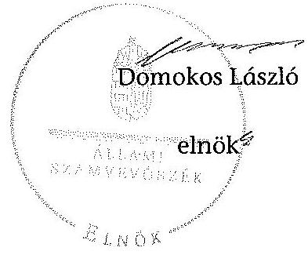

# ÁLLAMI   SZÁMVEVŐSZÉK 

## JELENTÉS

az önkormányzatok belső kontrollrendszere kialakításának, egyes kontrolltevékenységek és a belső ellenőrzés
működésének ellenőrzéséről
Nógrádkövesd

---

# Állami Számvevőszék 

Iktatószám: V-0402-065/2014
Témaszám: 1372
Vizsgálat-azonosító szám: V064948
Az ellenőrzést felügyelte:
dr. Benedek Mária
felügyeleti vezető
Az ellenőrzést vezette és az ellenőrzés végrehajtásáért felelős:
dr. Veress Tiborné
ellenőrzésvezető
A számvevőszéki jelentés összeállításában közreműködtek:
Kuzma Ágota
számvevő
Pető Krisztina
számvevő tanácsos
Az ellenőrzést végezték:
Kuzma Ágota
Nagyné Lakhézi Éva
számvevő
számvevő tanácsos

---

# TARTALOMJEGYZÉK 

BEVEZETÉS ..... 5
I. ÖSSZEGZŐ MEGÁLLAPÍTÁSOK, KÖVETKEZTETÉSEK, JAVASLATOK ..... 5
II. RÉSZLETES MEGÁLLAPÍTÁSOK ..... 15

1. Az önkormányzat belső kontrollrendszerének kialakítása ..... 15
1.1. A kontrollkörnyezet ..... 15
1.2. A kockázatkezelési rendszer ..... 15
1.3. A kontrolltevékenységek ..... 17
1.4. Az információs és kommunikációs rendszer ..... 18
1.5. A monitoring rendszer ..... 18
2. A pénzügyi folyamatokban kulcsszerepet betöltő teljesítésigazolás és érvényesítés belső kontrollok működése ..... 18
3. A belső ellenőrzés működése ..... 18

## FÜGGELÉKEK

1. számú Értelmező szótár
2. számú Az értékelés módja és szempontjai

---

.

---

# RÖVIDÍTÉSEK JEGYZÉKE 

## Törvények

Áht.
ÁSZ tv.
Htv.

Info tv.
Ktv.
Kttv.

Ltv.
Mötv.

Mvtv.
Nvtv.
Ötv.
Számv. tv.
Tvtv.
Vagyonnyilatkozattételről szóló tv.

## Rendeletek

Áhsz. 1

Áhsz. 2
Ávr.
Bkr.
Ikr.
Képviselő-testületi SZMSZ
2011. évi CXCV. törvény az államháztartásról
2011. évi LXVI. törvény az Állami Számvevőszékről
1991. évi XX. törvény a helyi önkormányzatok és szerveik, a köztársasági megbízottak, valamint egyes centrális alárendeltségű szervek feladat- és hatásköreiről
2011. évi CXII. törvény az információs önrendelkezési jogról és az információszabadságról
1992. évi XXIII. törvény a köztisztviselők jogállásáról (hatálytalan 2012. március 1-jétől)
2011. évi CXCIX. törvény a közszolgálati tisztviselőkről (hatályos 2012. március 1-jétől)
1995. évi LXVI. törvény a köziratokról, a közlevéltárakról és a magánlevéltári anyag védelméről
2011. évi CLXXXIX. törvény Magyarország helyi önkormányzatairól
1993. évi XCIII. törvény a munkavédelemről
2011. évi CXCVI. törvény a nemzeti vagyonról
1990. évi LXV. törvény a helyi önkormányzatokról
2000. évi C. törvény a számvitelről
1996. évi XXXI. törvény a tűz elleni védekezésről, a műszaki mentésről és a tűzoltóságról
2007. évi CLII. törvény egyes vagyonnyilatkozat-tételi kötelezettségekről

249/2000. (XII. 24.) Korm. rendelet az államháztartás szervezetei beszámolási és könyvvezetési kötelezettségének sajátosságairól
4/2013. (I. 11.) Korm. rendelet az államháztartás számviteléről (hatályos 2014. január 1-jétől)
368/2011. (XII. 31.) Korm. rendelet az államháztartásról szóló törvény végrehajtásáról
370/2011. (XII. 31.) Korm. rendelet a költségvetési szervek belső kontrollrendszeréről és belső ellenőrzéséről
335/2005. (XII. 29.) Korm. rendelet a közfeladatot ellátó szervek iratkezelésének általános követelményeiről
Nógrádkövesd Község Önkormányzata Képviselőtestületének 9/2011 (IV. 29.) rendelete a képviselő-testület és szervei Szervezeti és működési Szabályzatáról

---

# Szórövidítések 

ÁSZ
belső ellenőrzési kézikönyv
gazdálkodási szabályzat
Közös Hivatal
INTOSAI
iratkezelési szabályzat

## ISSAI

jegyző
kockázatkezelési szabályzat
körjegyző
Képviselő-testület

Kormányhivatal
Levéltár
NGM
Önkormányzat
pénzkezelési szabályzat
polgármester
szabálytalanság-kezelési
szabályzat
Társulás
ügyrend

Állami Számvevőszék
Nógrádkövesd Községi Önkormányzat Belső ellenőrzési kézikönyve (hatályos 2005. november 1-jétől)
Nógrádkövesd Község Önkormányzat Gazdálkodási Szabályzata (hatályos 2012. január 1-jétől)
Berceli Közös Önkormányzati Hivatal
International Organization of Supreme Audit Institutions (Legfőbb Ellenőrző Intézmények Nemzetközi Szervezete)
Nógrádkövesd és Szécsénke Községek Körjegyzősége Iratkezelési Szabályzata (kiadva: 2008. január 1-jén)
International Standards of Supreme Audit Institutions (Legfőbb Ellenőrző Intézmények Nemzetközi Standardjai)
Berceli Közös Önkormányzati Hivatal jegyzője
Nógrádkövesd Községi Önkormányzat kockázatkezelési szabályzata (hatályos 2009. március 31-től)
Nógrádkövesd és Szécsénke Községek Körjegyzőségének körjegyzője 2008. január 1-jétől 2013. február 28-ig
Nógrádkövesd Község Önkormányzata Képviselőtestülete
Nógrád Megyei Kormányhivatal
Nógrád Megyei Levéltár
Nemzetgazdasági Minisztérium
Nógrádkövesd Község Önkormányzata
Nógrádkövesd Községi Önkormányzat Pénzkezelési szabályzata (hatályos 2008. július 1-jétől)
Nógrádkövesd Községi Önkormányzat polgármestere
Költségvetési ellenőrzés I. A szabálytalanságok kezelésének eljárásrendje (hatályos 2009. április 1-jétől)
Balassagyarmat Kistérség Többcélú Társulás
Nógrádkövesd, Becske és Szécsénke Községi Önkormányzatok Körjegyzőségének Ügyrendje (hatályos 2001. július 2-től)

---

# JELENTÉS 

## az önkormányzatok belső kontrollrendszere kialakításának, egyes kontrolltevékenységek és a belső ellenőrzés működésének ellenőrzéséről Nógrádkövesd

## BEVEZETÉS

Nógrádkövesd község állandó lakosainak száma 2012. január 1-jén 691 fő volt. Az Önkormányzat öttagú Képviselő-testületének munkáját két állandó bizottság segítette. Az Önkormányzat az önállóan működő és gazdálkodó Körjegyzőségen kívül egy önállóan működő és gazdálkodó intézményt működtetett, gazdasági társasággal nem rendelkezett. A polgármester az 1994. évi önkormányzati választások óta tölti be tisztségét. A körjegyző 2006. május 2-től 2013. február 28-ig látta el körjegyzői feladatait. 2013. március 1-jétől a Közös Hivatal jegyzője látja el a jegyzői feladatokat. A Körjegyzőség szervezeti egységekre nem tagolódott, elkülönített gazdasági szervezettel nem rendelkezett, a foglalkoztatott köztisztviselők száma 2012. január 1-jén négy fő volt. A Körjegyzőségnél 2013. március 1-jétől szervezeti változás történt. Bercel, Becske, Galgaguta, Nógrádkövesd és Szécsénke települések önkormányzatainak képviselő-testületei 2013. március 1-jétől - Bercel székhellyel - Közös Hivatalt hoztak létre. Az Önkormányzat a 2012. évi költségvetési beszámolója szerint 328 336 ezer Ft költségvetési bevételt ért el, valamint 254 391 ezer Ft költségvetési kiadást teljesített. A 2012. december 31-i könyvviteli mérleg szerint 707 693 ezer Ft értékű eszközvagyonnal rendelkezett. A rövid lejáratú kötelezettségállománya 52 945 ezer Ft, a hosszú lejáratú kötelezettségállománya 33 411 ezer Ft volt. Az Önkormányzat a 2012. évi adósságkonszolidáció során 72 846 ezer Ft összegű állami támogatásban részesült, amely összeget 30 730 ezer Ft rövid lejáratú, 36 896 ezer Ft hosszú lejáratú adósságállomány és 5220 ezer Ft kamat törlesztésére fordított.

A demokratikus társadalmakban alapvető igény, hogy a közpénzeket, a közvagyont használók tevékenységükről elszámoljanak, ahhoz egyértelmű és érvényesíthető felelősségi szabályok társuljanak. Ennek a jogos igénynek az érvényesítéséhez meg kell teremteni azokat a folyamatokat, rendszereket, amelyek nélkülözhetetlenek az elszámoltatáshoz. Az elszámoltatás eredményes működtetéséhez szükség van a megfelelő információs, kontroll, értékelési és beszámolási rendszerek kialakítására.

Magyarországon az uniós csatlakozási tárgyalások idejére nyúlnak vissza a belső kontrollrendszer szabályozásának gyökerei. Az uniós elvárásoknak megfelelő új terminológia szerinti államháztartási belső pénzügyi ellenőrzési

---

(ÁBPE) rendszer területén a jogharmonizáció 2003-ban teljes körűen megvalósult, míg az önkormányzati alrendszerre vonatkozó, az Ötv.-ben megjelenített speciális szabályozás 2005-ben lépett hatályba. Az államháztartási belső kontrollrendszer koncepciója 2009-ben továbbfejlődött. A változások irányát mutatja, hogy a költségvetési szervek belső kontrollrendszere már magában foglalja a korszerű, felelős szervezetirányítás elemeit (kontrollkörnyezet, kockázatkezelés, kontrolltevékenység, információ és kommunikáció, monitoring) is. E kontrollrendszer szabályozása háromszintű, a törvényi előírásokat az Áht. és a Mötv., a rendeleti szintű szabályozást az Ávr. és a Bkr. tartalmazza, amelyeket útmutatói szinten az NGM által kiadott standardok és kézikönyvek támogatnak.

A belső kontrollrendszer azt a célt szolgálja, hogy a költségvetési szervek működésük és gazdálkodásuk során a tevékenységeket szabályszerűen, gazdaságosan, hatékonyan és eredményesen hajtsák végre, teljesítsék elszámolási kötelezettségeiket és megvédjék az erőforrásokat a veszteségektől, a károktól és a nem rendeltetésszerű használattól. A belső kontrollrendszer magában foglalja mindazon szabályokat, eljárásokat, gyakorlati módszereket és szervezeti struktúrákat, kockázatkezelési technikákat, kontrolltevékenységeket, amelyek segítséget nyújtanak a szervezetnek céljai eléréséhez.

Az ÁSZ középtávú stratégiájában hangsúlyos szerepet szánt annak, hogy szilárd szakmai alapon álló, értékteremtő ellenőrzéseivel előmozdítsa a közpénzügyek átláthatóságát, rendezettségét. A számvevőszéki ellenőrzés nemzetközi alapelvei is rögzítik, hogy a megfelelő belső kontrollrendszer minimálisra csökkenti a hibák és szabálytalanságok kockázatát.

Az ellenőrzés célja annak megállapítása volt, hogy a belső kontrollrendszer elemeinek kialakítása, a pénzügyi folyamatokban kulcsszerepet betöltő teljesítésigazolás és érvényesítés, és a belső ellenőrzés szabályos működése biztosította-e az Önkormányzatnál a közpénzfelhasználás szabályosságát, hozzájárult-e az értéket teremtő rend követelményének érvényesüléséhez.

Ennek keretében értékeltük, hogy:

- a jogszabályi előírásoknak megfelelően alakították-e ki a belső kontrollrendszer elemeit;
- a gazdálkodás folyamatában kulcsszerepet betöltő teljesítésigazolás és érvényesítés kontrolltevékenységeit megfelelően működtették-e;
- biztosították-e a belső ellenőrzés szabályos működését;
- amennyiben az ÁSZ tett javaslatot a 2008-2011. évek közötti ellenőrzése kapcsán az Önkormányzatnak, intézkedtek-e azok végrehajtására.

Az ellenőrzés várható hasznosulását négy szinten tervezzük. A törvényalkotás számára összegzett tapasztalatok állnak rendelkezésre a belső kontrollrendszer önkormányzati területen való kialakításáról, működéséről és hatásairól, a belső ellenőrzés működéséről. Ennek alapján következtetést lehet levonni arról, hogy a belső kontrollrendszer kialakítására és működtetésére vonatkozó jelenlegi, differenciálás nélküli jogszabályi előírások reális követelményeket

---

támasztanak-e az eltérő adottságú települési önkormányzatok esetében, illetve indokolt-e esetleges jogszabályi módosítás kezdeményezése. Az ellenőrzés az ellenőrzött számára visszajelzést ad a belső kontrollrendszer kialakításában és működésében fellépő hiányosságokról, javaslataival hozzájárul azok kiküszöböléséhez, amely csökkentheti a későbbi ellenőrzések gyakoriságát. Az ellenőrzés megállapításait és javaslatait más szervezetek is hasznosíthatják a rendezett gazdálkodási keretek kialakításához. A társadalom számára jelzi, hogy közpénz nem maradhat ellenőrizetlenül, az ÁSZ értékteremtő rend kialakításához és megőrzéséhez hozzájáruló tevékenysége pozitív hatással lesz a szervezetről kialakított összkép formálásában. A szervezeten belül lehetőség nyílik arra, hogy a megállapítások szintetizálásával az ÁSZ a hozzáadott értéket teremtő elemző tevékenységét és tanácsadó szerepét is erősítse.

Az önkormányzatok belső kontrollrendszere kialakításának, egyes kontrolltevékenységek és a belső ellenőrzés működésének ellenőrzéséről szóló jelentés I. fejezetének összegző része az ellenőrzés céljára ad rövid, szintetizáló összefoglalót, és tartalmazza a következtetéseket a II. fejezet részletes megállapításain alapulóan. A jelentés intézkedést igénylő megállapításait és javaslatait az ellenőrzés során feltárt, a jelentés II. fejezetében rögzített részletes megállapítások alapozzák meg. A helyszíni ellenőrzés lezárásáig a helyi szabályozás változásait nyomon követtük. Az ÁSZ az ellenőrzés megállapításait az ellenőrzött időszakban hatályos, az intézkedést igénylő megállapításokra tett javaslatokat a jelenleg hatályos jogszabályok alapján fogalmazta meg.

Az ellenőrzés típusa: szabályszerűségi ellenőrzés.
Az ellenőrzött időszak: a belső kontrollrendszer kialakításának megfelelősége esetében a 2012. évre, a pénzügyi folyamatokban kulcsszerepet betöltő teljesítésigazolás és érvényesítés belső kontrollok működésének megfelelőségét és a belső ellenőrzés szabályszerű működését a 2012. január 1. és december 31-e közötti időszak eseményeit figyelembe véve értékeltük, míg az ÁSZ javaslatainak utóellenőrzése a 2008-2011. években végzett ellenőrzések nyilvánosságra hozott jelentéseiben tett javaslatok áttekintésére terjedt ki.

# Az ellenőrzött szervezet: az Önkormányzat. 

Az ellenőrzés jogszabályi alapját az ÁSZ tv. 1. § (3) bekezdése, az 5. § (2) és (6) bekezdése, valamint az Áht. 61. § (2) bekezdésének előírásai képezik.

Az ellenőrzés szakmai módszertana az ÁSZ hivatalos honlapján (www.asz.hu) közzétett szakmai szabályokon alapult, amely az INTOSAI által kiadott ISSAI figyelembevételével készült.

Az ellenőrzés lefolytatásához az Önkormányzat a kimutatások és a tanúsítvány elektronikus kitöltésével, valamint az ÁSZ által kért dokumentumok elektronikus megküldésével szolgáltatott adatokat. Az így rendelkezésre bocsátott adatok, információk kontrollja és a munkalapok kitöltése a helyszíni ellenőrzés keretében történt. A jelentésben használt fogalmak magyarázatát az 1. számú függelék, az ellenőrzés egyes területeinek értékelésénél alkalmazott egységes minősítési szempontokat a 2. számú függelék tartalmazza.

---

A belső kontrollrendszer kialakításának ellenőrzése során értékeltük a kontrollkörnyezet, a kockázatkezelési rendszer, a kontrolltevékenységek, az információs és kommunikációs rendszer, valamint a monitoring rendszer szabályozottságának megfelelőségét. A pénzügyi folyamatokban kulcsszerepet betöltő teljesítésigazolás és érvényesítés kontrollok működése megfelelőségének minősítéséhez az állományba nem tartozók megbízási díjai, a külső szolgáltatók által végzett karbantartási, kisjavítási munkák, az egyéb üzemeltetési és fenntartási szolgáltatások, a rendszeres szociális segélyek, valamint az államháztartáson kívülre teljesített működési és felhalmozási célú pénzeszközátadások közül kockázatelemzéssel választottuk ki az ellenőrzött kiadási jogcímeket. Az egyszerű véletlen mintavétellel kiválasztott tételek ellenőrzését többlépcsős megfelelőségi tesztek útján addig végeztük, amíg elegendő és megfelelő bizonyítékot szereztünk a vizsgált folyamatok kulcskontrolljai működésének megfelelő vagy nem megfelelő voltáról. Értékeltük az Önkormányzatnál a belső ellenőrzés működésének szabályosságát. Utóellenőrzésre nem került sor, mivel az ÁSZ az Önkormányzatnál a 2008-2011. évek között ellenőrzést nem végzett.

Az ÁSZ tv. 29. § (1) bekezdése szerint a jelentéstervezetet megküldtük a polgármester részére, aki az ÁSZ tv. 29. § (2) bekezdésében foglalt észrevételezési jogával nem élt, a jelentéstervezetre észrevételt
 nem tett.

---

# I. ÖSSZEGZŐ MEGÁLLAPÍTÁSOK, KÖVETKEZTETÉSEK, JAVASLATOK 

A belső kontrollrendszeren belül 2012-ben a kontrollkörnyezet, a kockázatkezelési rendszer, a kontrolltevékenységek, az információs és kommunikációs rendszer, valamint a monitoring rendszer kialakítását külön-külön és együttesen is értékeltük. A belső kontrollrendszer kialakítása az összesített értékelés alapján nem felelt meg a jogszabályi előírásoknak.

| Kontrollterület | Minősítés |
| :-- | :-- |
| Kontrollkörnyezet | nem megfelelő |
| Kockázatkezelési rendszer | nem megfelelő |
| Kontrolltevékenységek | nem megfelelő |
| Információs és kommunikációs   rendszer | nem megfelelő |
| Monitoring rendszer | nem megfelelő |

Nem megfelelőnek értékeltük a kontrollkörnyezet, a kockázatkezelési rendszer, a kontrolltevékenységek, az információs és kommunikációs rendszer, valamint a monitoring rendszer kialakítását, mivel az ellenőrzésünk során megállapított szabályozásbeli hiányosságok magukban hordozzák a szabálytalan működés, valamint a korrupció kockázatát.

Az állományba nem tartozók megbízási díjaival, valamint a külső szolgáltatók által végzett karbantartási, kisjavítási munkákkal kapcsolatos kifizetések során a pénzügyi folyamatokban kulcsszerepet betöltő teljesítésigazolás és érvényesítés belső kontrollok működése gyenge volt. Gyengének értékeltük a két kulcskontroll együttes működését, mert azok nem biztosították az ellenőrzésünk által feltárt hiányosságok bekövetkezésének megelőzését.

A számvevőszéki ellenőrzés az ellenőrzött kifizetésekkel összefüggésben a rendelkezésre bocsátott dokumentumok alapján kár bekövetkeztére utaló adatot, tényt nem állapított meg, azonban a gazdálkodásban kulcsszerepet betöltő kontrollok gyenge működése miatt fennáll a hibák bekövetkezésének lehetősége. A nem megfelelően szabályozott és működtetett belső kontrollok korrupciós kockázatot hordoznak.

Az Önkormányzat a belső ellenőrzési feladatokat a Társulás útján látta el. A belső ellenőrzés működése a jogszabályi előírásoknak nem felelt meg, mivel a számvevőszéki ellenőrzés által megállapított szabályozási és működési hiányosságok számossága magában hordozza a szabálytalan önkormányzati gazdálkodás és feladatellátás kockázatát.

Az ÁSZ tv. 33. § (1) bekezdésében foglaltak értelmében az ellenőrzött szervezet vezetője köteles a jelentésben foglalt megállapításokhoz kapcsolódó intézkedési

---

tervet összeállítani, és azt a jelentés kézhezvételétől számított 30 napon belül az ÁSZ részére megküldeni. Amennyiben az intézkedési tervet határidőre nem küldi meg a szervezet, vagy az ÁSZ tv. 33. § (2) bekezdésében foglalt póthatáridő elteltével megküldött intézkedési terv továbbra sem elfogadható, az ÁSZ elnöke a hivatkozott törvény 33. § (3) bekezdés a)-b) pontjaiban foglaltakat érvényesítheti.

Az ellenőrzés intézkedést igénylő megállapításai és javaslatai:

# a polgármesternek 

1. Az Áht. 37. § (1) és az Ávr. 55. § (1) bekezdése ellenére az Önkormányzat nevében történt kötelezettségvállalásokra pénzügyi ellenjegyzés nélkül került sor.

Javaslat:
Intézkedjen, hogy az Önkormányzat kiadási előirányzatai terhére történt kötelezettségvállalásokra az Áht. 37. § (1) bekezdésében és az Ávr. 55. § (1) bekezdésében foglaltaknak megfelelően - az Ávr. 53. §-ában meghatározott kivételeket figyelembe véve - kizárólag a pénzügyi ellenjegyzés után, a pénzügyi teljesítés esedékességét megelőzően, írásban kerüljön sor.
2. A Htv.-ben és a Számv. tv.-ben foglaltak ellenére a körjegyző helyett a polgármester alakította ki a Körjegyzőség számviteli politikáját, a számlarendet és az Önkormányzat intézményeinek számviteli rendjét. Az Mvtv.-ben foglaltak ellenére a körjegyző helyett a polgármester határozta meg az egészséget nem veszélyeztető és biztonságos munkavégzés követelményei megvalósításának módját. A körjegyző helyett a polgármester kiadmányozta a tűzvédelmi szabályzatot, a szabálytalanságok kezelésének eljárásrendjét, ellenőrzési nyomvonalát. A Bkr.-ben foglaltak ellenére a körjegyző helyett a polgármester biztosította a folyamatba épített, előzetes, utólagos és vezetői ellenőrzést, és az Ávr.-ben foglaltak ellenére a körjegyző helyett a polgármester határozta meg a kötelezettségvállalás pénzügyi ellenjegyzése, a teljesítésigazolása, az érvényesítés és az utalványozás gyakorlásának módjával, eljárási és dokumentációs részletszabályaival, valamint az ezeket végző személyek kijelölésének rendjével kapcsolatos belső előírásokat, feltételeket.

Javaslat:
Biztosítsa, hogy a jegyző a Htv. 140. § (1) bekezdés c) pontjában, a Számv. tv. 14. § (3)-(5) bekezdéseiben, a 161. § (1)-(2) bekezdéseiben, az Mvtv. 2. § (3) bekezdésében, a Tvtv. 19. § (1) bekezdésében, a Bkr. 6. § (3)-(4) bekezdéseiben, a 8. § (1)-(2) bekezdéseiben és az Ávr 13. § (2) bekezdésében biztosított hatásköreit gyakorolhassa.
3. A számvevőszéki ellenőrzés megállapításai alapján az Önkormányzatnál a belső kontrollrendszer kialakítása összefoglalóan értékelve nem felelt meg a jogszabályi előírásoknak. A kulcskontrollok működése gyenge volt, a belső ellenőrzés működése nem felelt meg a jogszabályi előírásoknak, és nem tárta fel, ezáltal nem is javíttatta ki a számvevőszéki ellenőrzés során megállapított hiányosságokat. A megállapított szabályozásbeli és működésbeli hiányosságok magukban hordozzák a szabálytalan működés kockázatát.

---

Javaslat:
A Mötv. 115. § (1) bekezdésében foglaltak alapján kísérje figyelemmel az Önkormányzat gazdálkodásának szabályszerűségét. A Mötv. 67. § f) pontja alapján gondoskodjon a belső kontrollrendszer működésére vonatkozó jogszabályi rendelkezések be nem tartása, valamint a teljesítésigazolás és az érvényesítés kontrollokkal összefüggésben feltárt hiányosságok, szabálytalanságok, továbbá a belső ellenőrzés jogszabályi előírásoknak nem megfelelő működése tekintetében az esetleges munkajogi felelősséggel kapcsolatos körülmények kivizsgálásáról, majd a vizsgálat eredményének függvényében tegye meg a szükséges intézkedéseket.

# a jegyzőnek (Nógrádkövesd Község Önkormányzata vonatkozásában) 

1. a kontrollkörnyezettel kapcsolatban:

A Körjegyzőség szervezeti és működési szabályzatát az Áht. előírása ellenére, a gazdasági programtervezetet a Htv. előírásai ellenére a körjegyző nem készítette el. A Htv.-ben és a Számv. tv.-ben foglaltak ellenére a körjegyző helyett a polgármester alakította ki a Körjegyzőség számviteli politikáját, a számlarendet és az Önkormányzat intézményeinek számviteli rendjét. Az Mvtv.-ben foglaltak ellenére a körjegyző helyett a polgármester határozta meg az egészséget nem veszélyeztető és biztonságos munkavégzés követelményei megvalósításának módját. A körjegyző helyett a polgármester kiadmányozta a tűzvédelmi szabályzatot, a szabálytalanságok kezelésének eljárásrendjét, ellenőrzési nyomvonalát, amely utóbbinak rendszeres aktualizálásáról a körjegyző nem gondoskodott. A körjegyző a Kttv.-ben foglaltak ellenére nem készítette el a Körjegyzőségen dolgozó köztisztviselők munkaköri leírását és teljesítményértékelését, valamint az Ötv.-ben előírtak ellenére nem készítette elő a hivatásetikai alapelvek részletes tartalmát, az etikai eljárás szabályait tartalmazó dokumentumot. [II. Részletes megállapítások, 1.1. A kontrollkörnyezet, 2., 5., 17-19., 24., 29., 30-34., 37., 41., 44, 46- 47. sorszámú megállapítás]

Javaslat:
Intézkedjen az Áht. 69. § (2) bekezdése, a Bkr. 3. § a) pontja és 6. §-a alapján a jelentés II. Részletes megállapítások, 1.1. A kontrollkörnyezet 5., 17-19., 24., 29., 30-34., 37., 41., 44. 46-47., sorszámú megállapításaiban foglalt hibák, hiányosságok kijavításáról, megszüntetéséről az ott megjelölt jogszabályi rendelkezéseknek megfelelően.
2. a kockázatkezelési rendszerrel kapcsolatban:

A körjegyző a Bkr.-ben foglaltak ellenére a Körjegyzőség kockázatkezelési rendszerét nem alakította ki, nem mérte fel és nem állapította meg a Körjegyzőség tevékenységében, gazdálkodásában rejlő kockázatokat, nem határozta meg a kockázatok kezelése érdekében szükséges intézkedések teljesítésének folyamatos nyomon követési módját. A Vagyonnyilatkozat-tételről szóló tv.-ben foglaltak ellenére a vagyonnyilat-kozat-tételre kötelezettek körét - a szervezeti és működési szabályzat elkészítésének hiányában - a körjegyzőségi SZMSZ-ben nem rögzítették. A vagyonnyilatkozattételre kötelezettek vagyonnyilatkozat-tétele a Vagyonnyilatkozat-tételről szóló tv.-

---

ben előírt formai követelményeknek nem felelt meg. [II. Részletes megállapítások, 1.2. A kockázatkezelési rendszer, 1-2., 4-5., 8., 10., 13-14. sorszámú megállapítás].

Javaslat:
Intézkedjen az Áht. 69. § (2) bekezdése, a Bkr. 3. § b) pontja és 7. §-a, valamint Vagyonnyilatkozat-tételről szóló tv. alapján a jelentés II. Részletes megállapítások, 1.2. A kockázatkezelési rendszer 1-2., 4-5., 8., 10., 13-14. sorszámú megállapításaiban foglalt hibák, hiányosságok kijavításáról, megszüntetéséről az ott megjelölt jogszabályi rendelkezéseknek megfelelően.
3. a kontrolltevékenységekkel kapcsolatban:

A Bkr.-ben és az Ávr.-ben foglaltak ellenére a körjegyző helyett a polgármester biztosította a folyamatba épített, előzetes, utólagos és vezetői ellenőrzést, és a körjegyző helyett a polgármester határozta meg a kötelezettségvállalás pénzügyi ellenjegyzése, a teljesítésigazolása, az érvényesítés és az utalványozás gyakorlásának módjával, eljárási és dokumentációs részletszabályaival, valamint az ezeket végző személyek kijelölésének rendjével kapcsolatos belső előírásokat, feltételeket. A körjegyző a Bkr.-ben és az Ávr.-ben foglaltak ellenére nem határozta meg a dokumentumokhoz és információkhoz való hozzáférésre, valamint a beszámolási eljárásokra vonatkozó felelősségi köröket, továbbá a beszámolási feladatok teljesítésével kapcsolatos belső előírásokat, feltételeket. A körjegyző az Info tv.-ben és az Ikr.-ben foglalt előírást figyelmen kívül hagyva nem gondoskodott az iratok és adatok védelméről, nem alakította ki az üzemeltetés és adatbiztonság szabályozását, továbbá nem gondoskodott az iratkezelési szoftver által kezelt adatok biztonságáról, és nem alakította ki az üzembiztonsági, adatvédelmi szabályok érvényre juttatásához szükséges eljárási szabályokat. A körjegyző az Ávr.-ben foglaltakat figyelmen kívül hagyva annak ellenére nem határozta meg az előzetes írásbeli kötelezettségvállalást nem igénylő kifizetések rendjét, hogy lehetővé tette a 100 ezer Ft alatti kifizetések előzetes írásbeli kötelezettségvállalás nélküli teljesítését. Írásban nem jelölte ki az érvényesítőt, és 2012. március 30-át megelőzően a teljesítésigazolására jogosult személyeket, nem szabályozta a köztisztviselő jogviszonya megszüntetése (megszűnése) esetére a munkakör átadása és a munkáltatóval való elszámolás rendjét. [II. Részletes megállapítások, 1.3. A kockázatkezelési rendszer, 2-6., 8-13., 16-17., 19-21., 29. és 32. sorszámú megállapítás].

Javaslat:
Intézkedjen az Áht. 69. § (2) bekezdése, a Bkr. 3. § c) pontja és 8. §-a, valamint az Ikr., a Kttv., az Info tv. és az Ávr. alapján a jelentés II. Részletes megállapítások, 1.3. A kontrolltevékenységek 2-6., 8-13., 16-17., 19-21., 29. és 32. sorszámú megállapításaiban foglalt hibák, hiányosságok kijavításáról, megszüntetéséről az ott megjelölt jogszabályi rendelkezéseknek megfelelően.
4. az információs és kommunikációs rendszerrel kapcsolatban:

A körjegyző a Bkr.-ben foglaltak ellenére nem alakított ki olyan rendszert, amely biztosítja, hogy a megfelelő információk a megfelelő időben eljutnak az illetékes szervezethez, személyhez. Az Info tv. és az Ávr. alapján nem készítette el az adatvédelmi és adatbiztonsági szabályzatot, nem alakította ki a kötelezően közzéteendő adatok nyilvánosságra hozatalának rendjét, és közérdekű adatok megismerésére irányuló igények teljesítésének rendjét nem szabályozta. Nem gondoskodott arról, hogy az Ön-

---

kormányzat az elektronikus közzétételi kötelezettségének a 2012. évben eleget tegyen. A körjegyző az Ltv.-t figyelmen kívül hagyva adta ki az egyedi iratkezelési szabályzatot. [II. Részletes megállapítások, 1.4. A kockázatkezelési rendszer, 1-3., 5-8. és 9. sorszámú megállapítás]

Javaslat:
Intézkedjen az Áht. 69. § (2), a Bkr. 3. § d) pontja és a 9. §-a alapján a jelentés II. Részletes megállapítások, 1.4. Az információs és kommunikációs rendszer 1-3., 5-8. és 9. sorszámú megállapításában foglalt hibák, hiányosságok kijavításáról, megszüntetéséről az ott megjelölt jogszabályi rendelkezéseknek megfelelően.
5. a monitoring rendszerrel kapcsolatban:

A körjegyző a Bkr.-ben foglaltak ellenére nem alakította ki a Körjegyzőség tevékenységének, a célok megvalósításának nyomon követését biztosító rendszert. [II. Részletes megállapítások, 1.5. A kockázatkezelési rendszer, 1. sorszámú megállapítás].

Javaslat:
Intézkedjen az Áht. 69. § (2) bekezdése, a Bkr. 3. § e) pontja és 10. §-a alapján a jelentés II. Részletes megállapítások, 1.5. A monitoring rendszer 1. sorszámú megállapításában foglalt hibák, hiányosságok kijavításáról, megszüntetéséről az ott megjelölt jogszabályi rendelkezéseknek megfelelően.
6. a pénzügyi folyamatokban kulcsszerepet betöltő kontrollokkal kapcsolatban:

A teljesítésigazolás és az érvényesítés az Áht.-ban és az Ávr.-ben foglaltaknak nem felelt meg. [II. Részletes megállapítások, 2. A pénzügyi folyamatokban kulcsszerepet betöltő teljesítésigazolás és érvényesítés belső kontrollok működése, 1-2. pontjában foglalt
 megállapítás]

Javaslat:
Intézkedjen az Áht. 37-38. §-ában és az Ávr. 55-59. §-ában foglaltak alapján arról, hogy a teljesítésigazolás és az érvényesítés vonatkozásában, és az azok ellenőrzése során a pénzügyi ellenjegyzéssel és a kötelezettségvállalások nyilvántartásba vételével kapcsolatban feltárt, a jelentés II. Részletes megállapítások, 2. A pénzügyi folyamatokban kulcsszerepet betöltő teljesítésigazolás és érvényesítés belső kontrollok működése 1-2. pontjában szereplő megállapításában foglalt hibák, hiányosságok kijavítása, megszüntetése az ott megjelölt jogszabályi rendelkezéseknek megfelelően történjen meg.
7. a belső ellenőrzés működésével kapcsolatban:

A belső ellenőrzés működése a számvevőszéki ellenőrzés értékelési szempontjait figyelembe véve nem felelt meg a Bkr.-ben foglalt rendelkezéseknek. [II. Részletes megállapítások, 3. A belső ellenőrzés működése, 3-4., 7-8., 11., 23-26. és 27. b) sorszámú megállapítása].

---

Javaslat:
Intézkedjen az Áht. 69. § (2) bekezdése, a 70. § (1) bekezdése, a Bkr. 3. § e) pontja és a 10. §-a alapján a jelentés II. Részletes megállapítások, 3. A belső ellenőrzés működése 3-4., 7-8., 11., 23-26. és 27. b) sorszámú megállapításában foglalt hibák, hiányosságok kijavításáról, megszüntetéséről az ott megjelölt jogszabályi rendelkezéseknek megfelelően.

---

# II. RÉSZLETES MEGÁLLAPÍTÁSOK 

## 1. AZ ÖNKORMÁNYZAT BELSŐ KONTROLLRENDSZERÉNEK KIALAKÍTÁSA

A belső kontrollrendszeren belül 2012-ben a kontrollkörnyezet, a kockázatkezelési rendszer, a kontrolltevékenységek, az információs és kommunikációs rendszer, valamint a monitoring rendszer kialakítását külön-külön és együttesen is értékeltük. A belső kontrollrendszer kialakítása az összesített értékelés alapján nem felelt meg a jogszabályi előírásoknak.

### 1.1. A kontrollkörnyezet

A kontrollkörnyezet kialakítása - a 2. számú függelékben részletezett kritériumrendszer alapján végzett értékelés szerint - a jogszabályi előírásoknak nem felelt meg, mert:

| Sor-   szám $^{1}$ | Megállapítás | Megjegyzés |
| :--: | :--: | :--: |
| 2. | A körjegyző a - Htv. 140. § (1) bekezdés a) pontjában foglaltak ellenére - nem készítette el a gazdasági programtervezetet, így a Képviselő-testület az Ötv. 91. § (1) és (7) bekezdésében foglaltak ellenére nem határozta meg az Önkormányzat gazdasági programját. | 2013. január 1-jétől a Mötv. 116. §-a szabályozza, hogy a képviselőtestület hosszú távú fejlesztési elképzeléseit gazdasági programban rögzíti, amelyet az alakuló ülést követő hat hónapon belül fogad el. |
| 4. | A Képviselő-testület - a Ktv. 34. § (3) bekezdésében foglaltak ellenére - nem döntött a teljesítményértékelés alapját képező célokról. | A Ktv.-t hatályon kívül helyezte a 2012. évi V. törvény 59.§ (1) bekezdés a) pontja. Hatálytalan 2012. március 1-jétől. |
| 5. | Szervezeti és működési szabályzat hiánya miatt a körjegyző - az Áht. 10. § (5) bekezdésében foglaltak ellenére - a Körjegyzőség feladatai ellátásának részletes belső rendjét és módját nem állapította meg. |  |

[^0]
[^0]:    ${ }^{1}$ A megállapítás számozása az Önkormányzat által az adatszolgáltatás során kitöltött kimutatások kérdéseinek sorszámával azonos.

---

A Számv. tv. 14. § (12) bekezdés előírása ellenére a körjegyző helyett a polgármester alakította ki a számviteli politikát, valamint annak keretében a leltározási és leltárkészítési, az eszközök és források értékelési szabályzatát, valamint a pénzkezelési szabályzatot a körjegyző helyett a polgármester készítette el.

A polgármester által 2009. április 1-jével elkészített leltározási és leltárkészítési, az eszközök és források értékelési szabályzatán, valamint a pénzkezelési szabályzaton a körjegyző - a Számv. tv. 14. § (11) bekezdésében előírtak ellenére - a törvénymódosítás hatálybalépését követő 90 napon belül a változásokat nem vezette keresztül.

A körjegyző helyett - a Htv. 140. §. (1) bekezdés c) pontjában foglaltak ellenére - az Önkormányzat intézményének számviteli rendjét a polgármester alakította ki.

A Számv. tv. 161. § (5) bekezdésének előírása ellenére a körjegyző helyett a polgármester készítette el a Számv. tv. 161. § (4)-(5) bekezdésében előírt számlarendet, amely azonban nem tartalmazta a Számv. tv. 161. § (2) bekezdésében előírt kötelező tartalmi elemeket.

A körjegyző - a Számv. tv. 161. § (4)-(5) bekezdéselben előírtak ellenére - a számlarend szükséges módosítását a törvényi változás hatálybalépését követő 90 napon belül nem végezte el.

A körjegyző helyett a polgármester határozta meg - az Mvtv. 2. § (3) bekezdésében foglaltak ellenére - a Körjegyzőségen az egészséget nem veszélyeztető és biztonságos munkavégzés követelményei megvalósításának módját.

A körjegyző helyett a polgármester készítette el - a Tvtv. 19. § (1) bekezdésében foglaltak ellenére - a Körjegyzőség tűzvédelmi szabályzatát.

A körjegyző helyett a polgármester készítette el - a Bkr. 6. § (4) bekezdésében foglaltak ellenére - a szabálytalanságok kezelésének eljárásrendjét.

A körjegyző - a Kttv. 75. § (1) bekezdés d) pontjában foglaltak ellenére - nem készítette el a Körjegyzőségen dolgozó köztisztviselők munkaköri leírását.

---

| 41. | A körjegyző helyett a polgármester készítette el - a Bkr. 6. § (3) bekezdésében foglaltak ellenére - a Körjegyzőség ellenőrzési nyomvonalát. |  |
| :--: | :--: | :--: |
| 44. | A körjegyző - a Bkr. 6. § (3) bekezdésében foglaltak ellenére - a Körjegyzőség ellenőrzési nyomvonalának rendszeres aktualizálásáról nem gondoskodott. |  |
| 46. | A körjegyző - a Kttv. 130. § (1) bekezdésében foglaltak ellenére - a Körjegyzőségen dolgozó köztisztviselők teljesítményértékelését a 2012. évben nem készítette el. |  |
| 47. | A Képviselő-testület - a Kttv. 231. § (1) bekezdése ellenére - nem állapította meg a Kttv. 83. §-ában előírt, a köztisztviselőkkel szembeni hivatásetikai alapelvek részletes tartalmát, valamint az etikai eljárás szabályait, mivel a körjegyző - az Ötv. 36. § (2) bekezdés a) pontjában előírt feladata ellenére - nem készítette elő ennek dokumentumát. | 2013. január 1-jétől a Mötv. 81.§ (3) bekezdés c) pontja szabályozza, hogy a jegyző gondoskodik az önkormányzat működésével kapcsolatos feladatok ellátásáról. |

# 1.2. A kockázatkezelési rendszer 

A kockázatkezelési rendszer kialakítása - a 2. számú függelékben részletezett kritériumrendszer alapján végzett értékelés szerint - a jogszabályi előírásoknak nem felelt meg, mert:

| Sor-   szám | Megállapítás |
| :--: | :--: |

1-2. A körjegyző - a Bkr. 3. § b) pontjában foglaltak ellenére - a Körjegyzőség kockázatkezelési rendszerét nem alakította ki.

A körjegyző a Bkr. 7. § (2) bekezdésében foglaltak ellenére nem mérte fel és nem állapította meg a Körjegyzőség tevékenységében, gazdálkodásában rejlő kockázatokat, nem határozta meg a kockázatok kezelése érdekében szükséges intézkedéseket teljesítésének folyamatos nyomon követési módját.

A Körjegyzőség szervezeti és működési szabályzatában - annak elkészítése hiányában - a vagyonnyilatkozat-tételi kötelezettség - a Vagyonnyilatkozat-tételről szóló tv. 4. § a) pontjában foglaltak ellenére - nem került feltüntetésre.

A közszolgálatban álló személyek (három fő) és a közszolgálatban nem álló személyek (hét fő) vagyonnyilatkozat-tétele a Vagyonnyilatkozat-tételről szóló tv. 11. §-ában előírt formai követelményeknek nem felelt meg, mert a nyilatkozó és az őrzésért felelős - a körjegyző és a Vagyonnyilatkozatot Nyilvántartó és Ellenőrző Bizottság - a borítékok lezárására szolgáló felületen nem helyezte el aláírását.

---

# 1.3. A kontrolltevékenységek 

A kontrolltevékenységek kialakítása - a 2. számú függelékben részletezett kritériumrendszer alapján végzett értékelés szerint - nem felelt meg a jogszabályi előírásoknak, mert:

| Sorszám | Megállapítás |
| :--: | :--: |
| 2-5. | A körjegyző helyett a polgármester biztosította a pénzügyi döntések, köztük a költségvetés tervezése és a támogatásokkal való elszámolás dokumentumainak elkészítésével kapcsolatban a folyamatba épített, előzetes, utólagos és vezetői ellenőrzést. |
| $\begin{aligned} & 6.9 \\ & 11 . \\ & 12 . \end{aligned}$ | A körjegyző helyett a polgármester határozta meg a gazdálkodási szabályzatban - az Ávr. 13. § (2) bekezdésének a) pontjában foglaltak ellenére - a kötelezettségvállalás pénzügyi ellenjegyzése, a teljesítés igazolása, az érvényesítés és az utalványozás gyakorlásának módjával, eljárási és dokumentációs részletszabályaival, valamint az ezeket végző személyek kijelölésének rendjével kapcsolatos belső előírásokat, feltételeket. |
| 8. | A körjegyző - az Ávr. 53. § (2) bekezdésében foglaltakat figyelmen kívül hagyva - annak ellenére nem határozta meg az előzetes írásbeli kötelezettségvállalást nem igénylő kifizetések rendjét, hogy a gazdálkodási szabályzatban lehetővé tették a 100 ezer Ft alatti kifizetések előzetes írásbeli kötelezettségvállalás nélküli teljesítését. |
| 10. | A körjegyző az Ávr. 57. § (4) bekezdésében foglaltak ellenére 2012. március 30-át megelőzően írásban nem jelölte ki az önkormányzati és a körjegyzőségi kiadási előirányzatokra a teljesítésigazolásra jogosult személyeket. |
| 13. | A körjegyző - az Ikr. 8. §-ában foglalt előírást figyelmen kívül hagyva - nem gondoskodott az iratok és adatok védelméről, nem alakította ki az üzemeltetés és adatbiztonság olyan szabályozását, amely alapján a feladatok, hatáskörök pontosan meghatározhatóak és végrehajthatóak. Nem gondoskodott az iratkezelési szoftver által kezelt adatok biztonságáról, nem alakította ki az üzembiztonsági, adatvédelmi szabályok érvényre juttatásához szükséges eljárási szabályokat. |
| 16. | A körjegyző - az Info tv. 7. § (2)-(3) bekezdéseiben foglalt előírásokat figyelmen kívül hagyva - nem tette meg azokat a technikai és szervezési intézkedéseket és nem alakította ki azokat az eljárási szabályokat, amelyek biztosítják az adatok biztonságát és védelmét. |
| $\begin{aligned} & 17 . \\ & \text { és } \\ & 20 . \end{aligned}$ | A körjegyző - a Bkr. 8. § (4) bekezdés b) és c) pontjaiban foglaltak ellenére belső szabályzatban nem határozta meg a dokumentumokhoz és információkhoz való hozzáférésre vonatkozóan, valamint a beszámolási eljárásokhoz kapcsolódó felelősségi köröket. |
| 19. | A körjegyző - az Ávr. 13. § (2) bekezdés a) pontjában foglaltak ellenére belső szabályzatban nem határozta meg a beszámolási feladatok teljesítésével kapcsolatos belső előírásokat, feltételeket. |
| 29. | A körjegyző - az Ávr. 58. § (4) bekezdésének előírását figyelmen kívül hagyva - az érvényesítési feladatra nem jelölt ki a Körjegyzőség állományában dolgozó köztisztviselőt. |

---

A körjegyző - a Kttv. 74. § (1) bekezdésében foglaltak ellenére - nem szabályozta a Körjegyzőségen a köztisztviselő jogviszonya megszüntetése (megszünés) esetére a munkakör átadása és a munkáltatóval való elszámolás rendjét.

# 1.4. Az információs és kommunikációs rendszer 

Az információs és kommunikációs rendszer kialakítása - a 2. számú függelékben részletezett kritériumrendszer alapján végzett értékelés szerint nem felelt meg a jogszabályi előírásoknak, mert:

| Sor-   szám | Megállapítás |
| :--: | :--: |
| $1-2$. | A körjegyző - a Bkr. 3. § d) pontjában és a 9. § (1) bekezdésében foglaltak ellenére - nem alakított ki olyan rendszert, amely biztosítja, hogy a megfelelő információk a megfelelő időben eljutnak az illetékes szervezethez, személyhez. |
| 5. | A körjegyző - az Info tv. 24. § (3) bekezdésében foglaltak ellenére - nem készítette el a Körjegyzőség adatvédelmi és adatbiztonsági szabályzatát. |
| 6. és   8. | A körjegyző - az Info tv. 35. § (3) bekezdésében és a 30. § (6) bekezdésében, valamint az

 Ávr. 13. § (2) bekezdés h) pontjában foglalt előírás ellenére - a kötelezően közzéteendő adatok nyilvánosságra hozatalának rendjét nem alakította ki, a közérdekű adatok megismerésére irányuló igények teljesítésének rendjét nem szabályozta. |
| 7. | A körjegyző - az Info tv. 33. § (1) és (3) bekezdésében, a 37. § (1) bekezdésében és az 1. mellékletében foglaltak ellenére - a 2012. évre vonatkozó éves költségvetés, a 2011. évre vonatkozó költségvetési beszámoló és a Képviselő-testület hatályban lévő rendeletei tekintetében nem gondoskodott az Önkormányzat elektronikus közzétételi kötelezettségének teljesítéséről a 2012. évben. |
| 9. | A körjegyző - az Ltv. 10. § (1) bekezdés c) pontjának előírását figyelmen kívül hagyva - az iratkezelési szabályzatot nem a Levéltár és a Kormányhivatal egyetértésével adta ki. |

### 1.5. A monitoring rendszer

A monitoring rendszer kialakítása - a 2. számú függelékben részletezett kritériumrendszer alapján végzett értékelés szerint - nem felelt meg a jogszabályi előírásoknak, mert:

Sor-
szám
Megállapítás

1. A körjegyző - a Bkr. 3. § e) pontjában és a 10. §-ában foglaltak ellenére -

1. nem alakította ki a Körjegyzőség tevékenységének, a célok megvalósításának nyomon követését biztosító rendszert.

Az Önkormányzat törvényességi felügyeletét ellátó Kormányhivatal a 2012. évben egyszer élt törvényességi felhívással a képviselő-testületi jegyzőkönyvek határidőben történő megküldésének elmulasztása tárgyában. A felhívásnak a körjegyző eleget tett.

---

# 2. A PÉNZÜGYI FOLYAMATOKBAN KULCSSZEREPET BETÖLTŐ TELJESÍTÉSIGAZOLÁS ÉS ÉRVÉNYESÍTÉS BELSŐ KONTROLLOK MŰKÖDÉSE 

Az állományba nem tartozók megbízási díjaival és a külső szolgáltatók által végzett karbantartással, kisjavítással kapcsolatos kifizetések során - összefoglalóan értékelve - a pénzügyi folyamatokban kulcsszerepet betöltő teljesítésigazolás és érvényesítés belső kontrollok működésének megfelelősége gyenge volt, mert:

| Sor-   szám | Megállapítás | Megjegyzés |
| :--: | :--: | :--: |
|  | Teljesítésigazolás |  |
| 1. | A teljesítésigazolásra kijelölt személy a kifizetéseket megelőzően - az Áht. 38. § (1) és az Ávr. 57. § (1) bekezdésében előírtak ellenére - a teljesítés igazolását nem végezte el. |  |
|  | Érvényesítés |  |
| 2. | Az ellenőrzött tételek kifizetésére - az Áht. 38. § (1) bekezdésében és az Ávr. 58. § (1) bekezdésében foglaltak ellenére - érvényesítés nélkül került sor. |  |
|  | A kulcskontrollok ellenőrzése során feltárt egyéb hiányosságok | Az Ávr. 56. § (1) bekezdés 2014. január 1-jétől módosult, a kötelezettségvállalások nyilvántartását az Áhsz. ${ }_{2}$ 39. § (1) bekezdés és a 14. számú melléklet II. pontja szabályozza. |
|  | Az Áht. 37. § (1) és az Ávr. 55. § (1) bekezdésében foglaltak ellenére, a megbízási szerződések megkötésekor az írásbeli kötelezettségvállalásokra pénzügyi ellenjegyzés nélkül került sor. Az Ávr. 56. § (1) bekezdés előírása ellenére a kötelezettségvállalást követően nem gondoskodtak annak nyilvántartásba vételéről, ugyanis a kötelezettségvállalásokról nyilvántartást nem vezettek, így a rendelkezésre álló fedezet megléte nem volt ellenőrizhető. |  |

Az állományba nem tartozók megbízási díjainak - a Körjegyzőségre és az Önkormányzatra vonatkozó - kifizetése során a teljesítésigazolás és az érvényesítés kulcskontrollok működésének megfelelősége gyenge volt, mert:

- a teljesítésigazolásra kijelölt személy - az Áht. 38. § (1) bekezdésében és az Ávr. 57. § (1) bekezdésében foglaltak ellenére - a beszámolók felülvizsgálatával és aláírásával, valamint a temető gondnok munka elvégzésével kapcsolatos megbízási díjak kifizetése esetében nem végezte el a teljesítésigazolást;
- a megbízási díjak kifizetésére - az Áht. 38. § (1) bekezdésében és az Ávr. 58. § (1) bekezdésében foglaltak ellenére - érvényesítés nélkül került sor;
- a megbízási díjak kifizetései esetében - az Ávr. 56. § (1) bekezdés előírása ellenére - a kötelezettségvállalást követően nem gondoskodtak annak nyilvántartásba vételéről, ugyanis a kötelezettségvállalásokról nyilvántartást nem vezettek, így a rendelkezésre álló fedezet megléte nem volt ellenőrizhető;
- a megbízási díjak kifizetései esetében - az Áht. 37. § (1) és az Ávr. 55. § (1) bekezdésében foglaltak ellenére a megbízási szerződések megkötésekor a polgármester és a körjegyző által vállalt írásbeli kötelezettségvállalásokra pénzügyi ellenjegyzés nélkül került sor.

A külső szolgáltatók által végzett karbantartási, kisjavítási munkákkal kapcsolatos - az Önkormányzatra vonatkozó - kifizetések során a teljesítésigazolás és az érvényesítés kulcskontrollok működésének megfelelősége gyenge volt, mert:

- a teljesítésigazolásra kijelölt személy a fűnyíró javítás, az öltöző világítás és bojlerjavítás, valamint az öltöző javítás munkákra történt kifizetéseket megelőzően - az Áht. 38. § (1) bekezdésében és az Ávr. 57. § (1) bekezdésében előírtak ellenére - a teljesítésigazolást nem végezte el;
- a karbantartási, kisjavítási munkákkal kapcsolatos kifizetései esetében - az Áht. 38. § (1) bekezdésében és az Ávr. 58. § (1) bekezdésében foglaltak ellenére - érvényesítés nélkül került sor;
- a karbantartási, kisjavítási munkákkal kapcsolatos kifizetései esetében - az Ávr. 56. § (1) bekezdés előírása ellenére - a kötelezettségvállalást követően nem gondoskodtak annak nyilvántartásba vételéről, ugyanis a kötelezettségvállalásokról nyilvántartást nem vezettek, így a rendelkezésre álló fedezet megléte nem volt ellenőrizhető.

A számvevőszéki ellenőrzés az ellenőrzött kifizetésekkel összefüggésben a rendelkezésre bocsátott dokumentumok alapján kár bekövetkeztére utaló adatot, tényt nem állapított meg, azonban a gazdálkodásban kulcsszerepet betöltő kontrollok gyenge működése miatt fennáll a hibák bekövetkezésének kockázata. A nem megfelelően működtetett belső kontrollok korrupciós kockázatot hordoznak.

# 3. A BELSŐ ELLENŐRZÉS MŰKÖDÉSE 

Az Önkormányzat a belső ellenőrzési feladatokat - képviselő-testületi döntés alapján - a Társulás útján látta el.

A belső ellenőrzés működése - a 2. számú függelékben részletezett kritériumrendszer alapján végzett értékelés szerint - az Önkormányzatnál nem felelt meg a jogszabályi előírásoknak, mert:

| Sorszám | Megállapítás |
| :--: | :--: |
| 3.és   4. | A belső ellenőrzési vezető - a Bkr. 17. § (4) bekezdésében előírtak ellenére a körjegyző által jóváhagyott belső ellenőrzési kézikönyv felülvizsgálati kötelezettségének nem tett eleget. |

---

7. A Bkr. 56. § (3) bekezdés a) pontjában foglaltak ellenére stratégiai ellenőrzési tervvel az Önkormányzat nem rendelkezett.
8. A belső ellenőrzési vezető - a Bkr. 22. § (1) bekezdés b) pontjában, a 29. § (1) bekezdésében és 31. § (1) bekezdésében foglaltak ellenére - a 2013. évre vonatkozóan éves ellenőrzési tervet nem készített.
9. A belső ellenőrzés - a Bkr. 22. § (1) bekezdés b) pontjában, a 29. § (1) bekezdésében és a 31. § (2) bekezdésében foglaltak ellenére - kockázatelemzést nem készített.
10. A körjegyző a belső ellenőrzés javaslatainak végrehajtása érdekében - a Bkr. 28. § c) pontjában és 45. § (1)-(3) bekezdéseiben foglaltak ellenére nem készített intézkedési tervet.
11. A belső ellenőrzési vezető - a Bkr. 21. § (2) bekezdés d) pontjában és a 47. § (1) bekezdésében foglaltakat figyelmen kívül hagyva - a belső ellenőrzési jelentésekben tett javaslatokat, a vonatkozó intézkedési terveket és azok végrehajtását nyomon követő nyilvántartást nem vezetett.
12. A belső ellenőrzési vezető - a Bkr. 22. § (2) bekezdés e) pontjában és az 50. §-ban foglalt előírást figyelmen kívül hagyva - az elvégzett belső ellenőrzésekről nyilvántartást nem vezetett.
13. A 2011. évre vonatkozó éves (összefoglaló) ellenőrzési jelentés - a Bkr. 48. § b) pontjának bb) alpontjában foglaltak ellenére - nem tartalmazta a belső kontrollrendszer öt elemének értékelését.

A Körjegyzőség az ÁSZ-tól a 2011. és a 2012. években integritás kérdőív kitöltésére kapott felkérést, amelynek nem tett eleget. A belső kontrollrendszer szabályozása, kialakítása során feltárt hibák, ezen belül a köztisztviselőkkel szembeni hivatásetikai alapelvek meghatározásának, az etikai eljárás szabályainak, a szervezeten belüli és kívüli információátadás rendjének, továbbá a jogszabályi követelményeknek megfelelő iratkezelési szabályzat hiánya, valamint a 2013. évi ellenőrzési terv elfogadásának hiánya, annak megalapozását szolgáló kockázatelemzés elmaradása, arra utalnak, hogy az Önkormányzatnak az integritási szemlélet érvényesítésében még fejlődést kell elérnie.

Budapest, 2014. 06. hó 17 nap

Függelék 2 db

---

# ÉRTELMEZŐ SZÓTÁR 

belső ellenőrzés
belső kontrollrendszer
belső kontrollrendszer területei
egyszerű véletlen mintavétel
integritás
kockázatkezelési rendszer

Független, tárgyilagos bizonyosságot adó és tanácsadó tevékenység, amelynek célja, hogy az ellenőrzött szervezet működését fejlessze és eredményességét növelje, az ellenőrzött szervezet céljai elérése érdekében rendszerszemléletű megközelítéssel és módszeresen értékeli, illetve fejleszti az ellenőrzött szervezet irányítási és belső kontrollrendszerének hatékonyságát. (Forrás: Bkr. 2. § b) pontja)
A belső kontrollrendszer a kockázatok kezelése és tárgyilagos bizonyosság megszerzése érdekében kialakított folyamatrendszer, amely azt a célt szolgálja, hogy a működés és gazdálkodás során a tevékenységeket szabályszerűen, gazdaságosan, hatékonyan, eredményesen hajtsák végre, az elszámolási kötelezettségeket teljesítsék, megvédjék az erőforrásokat a veszteségektől, károktól és nem rendeltetésszerű használattól. (Forrás: Áht. 69. § (1) bekezdése)
A kontrollkörnyezet, a kockázatkezelési rendszer, a kontrolltevékenységek, az információs és kommunikációs rendszer, valamint a nyomon követési (monitoring) rendszer. (Forrás: Bkr. 3. §-a)

Az alapsokaságból egyszerű véletlen kiválasztással képzett részsokaság. (Forrás: Az ÁSZ ellenőrzési mintavételezés támogatásához készült segédletének 4.1.1. pontja)
Az integritás elvek, értékek, cselekvések, módszerek, intézkedések konzisztenciáját jelenti: olyan magatartásmódot, amely meghatározott értékeknek felel meg. Az integritás a közszféra esetében a társadalom által elvárt nyilvánossági, átláthatósági, illetve jogi/etikai normáknak történő megfelelést jelenti.
(Forrás: a http://integritas.asz.hu honlapon közzétett „A 2012. évi integritás felmérés eredményeinek összefoglalója dokumentum 3. oldal 1. bekezdése)
A kockázat annak a valószínűségét jelenti, hogy egy vagy több esemény vagy intézkedés nem kívánt módon befolyásolja a rendszer működését, céljainak megvalósulását. (Forrás: Javaslatok a korrupciós kockázatok kezelésére - Kockázatkezelési és ellenőrzési módszertan 35. oldal, ÁSZ)
Olyan irányítási eszközök és módszerek összessége, melynek elemei a szervezeti célok elérését veszélyeztető tényezők (kockázatok) azonosítása, elemzése, csoportosítása, nyomon követése, valamint szükség esetén a kockázati kitettség mérséklése. (Forrás: Bkr. 2. § m) pontja)

---

kontrollkörnyezet
kontrolltevékenységek
kommunikáció
korrupció
kulcskontrollok
lényegesség
megfelelőségi teszt

A kontrollkörnyezet alakítja ki a szervezet belső kontrollrendszerhez való viszonyát, hozzáállását, befolyásolja az alkalmazottak belső kontrollal kapcsolatos tudatosságát, magatartását. Elemei a személyes és szakmai elkötelezettség és a vezetés, valamint az alkalmazottak által vallott erkölcsi értékek; a szakmai hozzáértés iránti elkötelezettség; a felső vezetés hozzáállása - a vezetés filozófiája és tevékenységének stílusa; a szervezeti struktúra; a humánerőforrás-politika és gazdálkodási gyakorlat.
A kontrolltevékenységek azok a politikák és eljárások, amelyeket a kockázatok megoldására hoznak létre a szervezet céljainak teljesítése érdekében.
Az a tevékenység, melynek során információ továbbítása valósul meg. A kommunikációs folyamat résztvevői között tájékoztatás történik, mely során tényeket, ezek magyarázatát közlik. „A szervezetben eredményes kommunikációnak kell áramlania lefelé, horizontálisan és felfelé, a szervezet egészében és annak valamennyi elemében."
Azok a cselekmények, amelyek során a köz érdekében való eljárással megbízott és döntéshozatali felelősséggel felruházott személy a köz érdeke helyett önös vagy részérdekeket követve, mástól jogtalan vagy etikátlan előnyt elfogadva és őt jogtalan vagy etikátlan előnyhöz juttatva jár el, illetve amikor valaki a köz érdekében való eljárással megbízott és döntéshozatali felelősséggel felruházott személynek jogtalan vagy etikátlan előnyt nyújtva vagy felajánlva jogtalan vagy etikátlan előnyt kér. (Forrás: A
 Kormány korrupció megelőzési programja 2012-2014.)
Az azonosított kockázatok mérséklése érdekében kialakított kontrollok közül azok, amelyek elégtelen működése esetén a szervezetet jelentős veszteség érheti, vagy a működésükben bekövetkező hiba/hiányosság más kontrollok eredményességét csökkenti. Ezek ellenőrzése, értékelése elegendő bizonyítékot szolgáltat adott területen a kontrollrendszer értékeléséhez. Az önkormányzatok kontrollrendszere kialakításának ellenőrzése során a pénzügyi folyamatokban kulcsszerepet betöltő belső kontrollok a teljesítésigazolás és az érvényesítés.
Egy információ akkor lényeges, ha hiánya vagy téves állítása befolyásolhatja ezen információkat felhasználók döntéseit, véleményét. Az ellenőrzés során a lényegesség három szempontból értelmezhető: érték, jelleg és összefüggés szerint.
Az ellenőrzés során alkalmazott módszer - szekvenciális (megállásos) megfelelőségi teszt - lényege, hogy a kiválasztott minta ellenőrzését csak addig végezzük, amíg elegendő és megfelelő bizonyítékot nem szerzünk az ellenőrzött kulcskontroll (teljesítésigazolás, érvényesítés) működésének megfelelő, vagy nem megfelelő voltáról.

---

monitoring (nyomon követési rendszer)
utóellenőrzés

A monitoring a különböző szintű szervezeti célok megvalósításának folyamatát kíséri figyelemmel, melynek során a releváns eseményekről és tevékenységekről (együtt: folyamatokról) rendszeres jelleggel, strukturált, döntéstámogató információkhoz jutnak a szervezet vezetői.
Az intézkedések nyomon követése érdekében elrendelt ellenőrzés, amelynek célja, hogy a belső ellenőrzés bizonyosságot szerezzen az elfogadott intézkedések végrehajtásáról, vagy arról a tényről, hogy ha az ellenőrzött szerv, illetve az ellenőrzött szervezeti egység vezetője nem, vagy nem az elfogadott intézkedésnek megfelelően hajtja végre az intézkedéseket, továbbá meggyőződni arról, hogy a végrehajtott intézkedésekkel a megállapított kockázat ténylegesen megszűnt, vagy a kockázati tűréshatár alá csökkent. (Forrás: Bkr. 2. § s) pontja)

---

# **Chemistry**

## **Chemical Reactions**

### **Balancing Chemical Equations**

1. **Write the unbalanced equation:**
   - Example: $$C_3H_8 + O_2 \rightarrow CO_2 + H_2O$$

2. **Balance the equation:**
   - Balance carbon atoms first.
   - Then balance hydrogen atoms.
   - Finally, balance oxygen atoms.
   - Balanced equation: $$C_3H_8 + 7O_2 \rightarrow 3CO_2 + 4H_2O$$

3. **Balance the equation:**
   - Balance oxygen atoms.
   - Finally, balance oxygen atoms.
   - Balanced equation: $$C_3H_8 + 7O_2 \rightarrow 3CO_2 + 4H_2O$$

### **Types of Reactions**

1. **Combination Reaction:**
   - Example: $$2H_2 + O_2 \rightarrow 2H_2O$$

2. **Decomposition Reaction:**
   - Example: $$2H_2O_2 \rightarrow 2H_2O + O_2$$

3. **Single Displacement Reaction:**
   - Example: $$Zn + 2HCl \rightarrow ZnCl_2 + H_2$$

4. **Double Displacement Reaction:**
   - Example: $$AgNO_3 + NaCl \rightarrow AgCl + NaNO_3$$

5. **Combustion Reaction:**
   - Example: $$CH_4 + 2O_2 \rightarrow CO_2 + 2H_2O$$

## **Stoichiometry**

### **Mole Concept**

- **Mole (mol):** The amount of substance containing as many particles (atoms, molecules, ions) as there are atoms in exactly 12 grams of carbon-12.
- **Avogadro's Number:** $$6.022 \times 10^{23}$$ particles per mole.

### **Molar Mass**

- **Molar Mass:** The mass of one mole of a substance.
- Example: The molar mass of water ($$H_2O$$) is 18.015 g/mol.

### **Calculations**

1. **Moles to Mass:**
   - Formula: $$n = \frac{m}{M}$$
   - Example: Calculate the number of moles of $$H_2O$$ in 18 grams of water.
     - $$n = \frac{18 \, \text{g}}{18.015 \, \text{g/mol}} \approx 0.999 \, \text{mol}$$

2. **Moles to Mass:**
   - Formula: $$m = n \times M$$
   - Example: Calculate the mass of 1 mole of water.
     - $$m = 1 \, \text{mol} \times 18.015 \, \text{g/mol} = 18.015 \, \text{g}$$

## **Gas Laws**

### **Ideal Gas Law**

- **Equation:** $$PV = nRT$$
- **Variables:**
  - $$P$$ = Pressure (atm)
  - $$V$$ = Volume (L)
  - $$n$$ = Number of moles (mol)
  - $$R$$ = Ideal gas constant (0.0821 L·atm/mol·K)
  - $$T$$ = Temperature (K)

### **Boyle's Law**

- **Equation:** $$P_1V_1 = P_2V_2$$
- **Variables:**
  - P₁ = Pressure (atm)
  - V₁ = Volume (L)
  - P₂ = Pressure (atm)
  - V₂ = Volume (L)

### **Boyle's Law**

- **Equation:** $$\frac{P_1V_1}{T_1} = \frac{P_2V_2}{T_2}$$
- **Variables:**
  - P₁ = Pressure (atm)
  - V₁ = Volume (L)
  - T₁ = Temperature (K)
  - P₂ = Pressure (atm)
  - V₂ = Volume (L)
  - T₂ = Temperature (K)

## **Thermochemistry**

### **Enthalpy (H)**

- **Definition:** The heat content of a system at constant pressure.
- **Equation:** $$\Delta H = q_p$$
- **Variables:**
  - $$q_p$$ = Heat transferred at constant pressure.

### **Hess's Law**

- **Statement:** The enthalpy change for a reaction is the same whether it occurs in one step or multiple steps.
- **Equation:** $$\Delta H_{rxn} = \sum \Delta H_f (\text{products}) - \sum \Delta H_f (\text{reactants})$$
- **Variables:**
  - $$\Delta H_{rxn}$$ = Enthalpy change of reaction
  - $$\Delta H_f$$ = Standard enthalpy of formation

## **Electrochemistry**

### **Oxidation and Reduction**

- **Oxidation:** Loss of electrons.
- **Reduction:** Gain of electrons.

### **Galvanic Cells**

- **Definition:** A cell that converts chemical energy into electrical energy.
- **Components:**
  - Anode: Oxidation occurs.
  - Cathode: Reduction occurs.
  - Salt Bridge: Connects the two half-cells.

### **Nernst Equation**

- **Equation:** $$E = E^\circ - \frac{RT}{nF} \ln Q$$
- **Variables:**
  - $$E$$ = Cell potential (V)
  - $$E^\circ$$ = Standard cell potential (V)
  - $$R$$ = Ideal gas constant (8.314 J/mol·K)
  - $$T$$ = Temperature (K)
  - $$n$$ = Number of moles of electrons transferred
  - $$F$$ = Faraday constant (96485 C/mol)
  - $$Q$$ = Reaction quotient

---

# Az értékelés módja és szempontjai 

## A belső kontrollrendszer kialakítása megfelelőségének értékelése az öt területre vonatkoztatva

Megfelelő a belső kontrollrendszer kialakítása, amennyiben az öt területen (kontrollkörnyezet, kockázatkezelési rendszer, kontrolltevékenységek, információs és kommunikációs rendszer, monitoring rendszer kialakítása) összesen elért és elérhető pontok százalékban kifejezett hányadosa eléri a 81%-ot, és egyik terület sem kapott nem megfelelő értékelést.

Részben megfelelő a kontrollrendszer kialakítása, ha az önkormányzat teljesíti a meghatározott valamennyi főbb kritériumot (amelyeket - 10 kritérium - a program 5. számú melléklete tartalmazza), és az öt munkalapon összesen elért és elérhető pontok százalékban kifejezett hányadosa a 61%-ot meghaladja, és legfeljebb egy terület értékelése nem megfelelő volt.

Nem megfelelő a belső kontrollrendszer kialakítása, amennyiben az önkormányzat nem teljesíti a meghatározott bármelyik főbb kritériumot, vagy az öt munkalapon összesen elért és elérhető pontok százalékban kifejezett hányadosa 0-60% közötti, vagy egynél több terület értékelése nem megfelelő volt.

A megfelelőség minősítése a következők szerint történik:
A minősítés - részben automatizált - a belső kontrollrendszer kialakítására vonatkozó kérdéseket tartalmazó munkalapokon, az elérhető és az elért pontszámok alapján az alábbi képlettel, számítógépes program segítségével történt, melynek összefüggése:

$$
\frac{\text { Elért pont }}{\text { Elérhető pont }} \times 100=\ldots \ldots . \%
$$

A belső kontrollrendszer egyes területei kialakítása megfelelőségénél alkalmazandó minősítés:

- nem megfelelő 0-60%-ig;
- részben megfelelő 61-80%-ig;
- megfelelő 81% fölött.

---

# Az ellenőrzött önkormányzat belső kontrollrendszere kialakítása megfelelőségének főbb kritériumai 

| Sorszám | Kérdés: | Szempont: |
| :--: | :--: | :--: |
|  | A kontrollkörnyezet kialakítása (2. számú munkalap, kimutatás) |  |
| 1. | A polgármesteri hivatal rendelkezik-e alapító okirattal? | A polgármesteri hivatal alapító okirata az Áht. 8. § (4) bekezdésében előírtaknak megfelelően elkészült, tartalmazza az Ávr. 5. § (1) bekezdésében előírtakat, kiemelten a c) pont szerinti alaptevékenységeit. |
| 2. | A polgármesteri hivatal rendelkezik-e szervezeti és működési szabályzattal? | A polgármesteri hivatal rendelkezik az Áht. 10. § (5) bekezdésben előírt - 2010. január 1-jét követően jóváhagyott vagy módosított - SZMSZ-szel. A költségvetési szerv feladatai ellátásának részletes belső rendjét és módját - törvényben vagy kormányrendeletben meghatározott módon és tartalommal - szervezeti és működési szabályzata állapítja meg. |
| 3. | Meghatározták-e a vagyongazdálkodás szabályait önkormányzati rendeletben? | Az önkormányzat a vagyongazdálkodás szabályait önkormányzati rendeletben meghatározta, és az összhangban van az Mótv. 109. § (4) bekezdése, a Nemzeti vagyonról szóló 2011. évi CXCVI. tv. 18. § (1) bekezdése tartalmával, és a 18. § (12) bekezdésében meghatározottak szerint az 5. § (5)-(7) bekezdésében foglaltaknak megfelelően 2012. október 31-ig azt módosították. |
| 4. | A polgármesteri hivatal rendelkezik-e számviteli politikával? | A polgármesteri hivatal rendelkezik az Áhsz. 8. § (3) bekezdésben előírt - 2010. január 1-jét követően hatályba helyezett vagy aktualizált - számviteli politikával. A jogszabályhely rögzíti, hogy a Számv. tv. és az e rendeletben foglaltak szerint az államháztartás szervezetének szakmai feladatai és sajátosságai figyelembevételével ki kell alakítania és írásban szabályoznia számviteli politikáját. |
| 5. | A polgármesteri hivatal rendelkezik-e pénzkezelési szabályzattal? | A polgármesteri hivatal rendelkezik az Áhsz. 8. § (4) bekezdés d) pontjában előírt - 2010. január 1-jét követően hatályba helyezett vagy aktualizált - pénzkezelési szabályzattal. A jogszabályhely előírja, hogy a számviteli politika keretében el kell készíteni a pénzkezelési szabályzatot. |
| 6. | A polgármesteri hivatal rendelkezik-e leltározási és leltárkészítési szabályzattal? | A polgármesteri hivatal rendelkezik az Áhsz. 8. § (4) bekezdés a) pontjában előírt - 2008. január 1-jét követően hatályba helyezett vagy aktualizált - eszközök és források leltározási és leltárkészítési szabályzatával. |

[^0]
[^0]:    ${ }^{1}$ Polgármesteri hivatal alatt a polgármesteri hivatalt, a főpolgármesteri hivatalt, a megyei önkormányzati hivatalt és a körjegyzőséget is érteni kell.

---

| Sorszám | Kérdés: | Szempont: |
| :--: | :--: | :--: |
| 7. | A polgármesteri hivatal gazdasági szervezetének van-e ügyrendje? | A polgármesteri hivatal rendelkezik a gazdasági szervezet ügyrendjével vagy az azzal egyenértékű szabályozással (Ávr. 9. § (5) bekezdés), vagy az Ávr. 13. § (5) bekezdésében foglaltakat az SZMSZ-ben vagy más belső szabályzatban szabályozta (Áht. 10. § (5) bekezdés), és a szabályozást 2010. január 1-jét követően felülvizsgálták, aktualizálták. Elfogadható az is, ha a gazdasági feladatokat a polgármesteri hivatalon belül több szervezeti egység látja el, és azoknak önálló ügyrendjük van, illetve ha a polgármesteri hivatal nem tagolódik szervezeti egységekre, és ezért önálló gazdasági szervezettel nem rendelkezik, azonban az SZMSZ-ben vagy más belső szabályozásban rögzítik az ügyrend kötelező elemeit. |
| 8. | A polgármesteri hivatal rendelkezik-e ellenőrzési nyomvonallal? | Az ellenőrzési nyomvonal, folyamatleírás a polgármesteri hivatal tevékenységeire vonatkozóan elkészült, és azt 2010. január 1-jét követően felülvizsgálták, aktualizálták. A szabályzat minta megtalálható a Pénzügyminisztérium Belső kontroll kézikönyv, 2010. 18. és a 19. számú mellékletében. A Bkr. 6. § (3) bekezdésében előírtak szerint a költségvetési szerv vezetője köteles elkészíteni és rendszeresen aktualizálni a költségvetési szerv ellenőrzési nyomvonalát, amely a költségvetési szerv működési folyamatainak szöveges vagy táblázatba foglalt vagy folyamatábrákkal szemléltetett leírása, amely tartalmazza különösen a felelősségi és információs szinteket és kapcsolatokat, irányítási és ellenőrzési folyamatokat, lehetővé téve azok nyomon követését és utólagos ellenőrzését. |
|  | Az információ és kommunikáció szabályozása és kialakítása (5. számú munkalap, kimutatás) | 

 |
| 9. | Az önkormányzat eleget tett-e az elektronikus közzétételi kötelezettségének? | Az Önkormányzat az Info tv. 33. § (1) és (3) bekezdésében foglaltaknak megfelelően, saját vagy közösen működtetett honlapon elektronikus formában bárki számára hozzáférhetően közzétette az Info tv. 1. számú mellékletében felsoroltak közül legalább az éves költségvetését, a költségvetési beszámolóját és a Képviselő-testület rendeleteit. |
| 10. | A polgármesteri hiva-   tal rendelkezik-e irat-   kezelési szabályzattal? | A polgármesteri hivatal rendelkezik az Ltv. 10. § (1) bek. c) pontjában előírt iratkezelési szabályzattal. |

# A két kulcskontroll minősítése 

A kulcskontrollok - teljesítésigazolás, érvényesítés - működésének értékelése megfelelőségi tesztek segítségével történt. A kontrollok működésének megfelelőségére vonatkozó következtetést az értékelő táblázatban elért súlyozott pontszám, továbbá az eredendő kockázat minősítésétől függően két vagy három kiadási jogcím alapján fogalmaztuk meg. Az értékeléshez alkalmazandó arányszámok kialakítását számítógépes program segítségével köz-

---

pontilag az ellenőrzésben közreműködő informatikai támogató végezte az önkormányzatok által elektronikus úton megadott adatokból.

A minősítés automatizált, a megfelelőségi tesztek kitöltésével számítógépes program segítségével történik, melynek összefüggése:

| Elérhető pontszám: | Elért súlyozott pontszám értékelése: |
| :--: | :--: |
| $0-70$ | „gyenge" |
| $71-90$ | „jó" |
| $91-100$ | „kiváló" |

- „kiváló" a kontrollok működése, ha megfelel a szabályozásoknak és a legmagasabb szintű elvárásoknak a működésbeli hibák megelőzése, feltárása és kijavítása tekintetében; amennyiben a kontrollok működésének megfelelőségét a helyszíni ellenőrzési munkalap értékelése alapján kiválónak minősítettük, azonban esetleges kisebb - az egységesen meghatározott követelményrendszerben foglalt 10%-ot el nem érő mértékű - hiányosságokat tártunk fel, az összességében kiváló minősítést alátámasztó pozitív megállapításon túl ezeket a hiányosságokat a jelentésben ismertetjük a javaslataink megalapozása érdekében;
- „jó" a kontrollok működésének megfelelősége, ha azok a megállapított kisebb (tolerálható mértékű) hiányosságok mellett kielégítik az elvárásokat a működésbeli hibák megelőzése, feltárása, és kijavítása tekintetében, a megállapított hiányosságok nem veszélyeztették a hibák megelőzését, feltárását és kijavítását, továbbá ismertetjük azokat a területeket is, ahol az előírt ellenőrzési, egyeztetési feladatokat nem végezték el;
- "gyenge" a kontrollok működése, ha a kontrollok működésében túl sok hiányosság fordul elő ahhoz, hogy megbízhatónak lehessen azokat minősíteni. Ismertetjük a jelentésben azokat a területeket, ahol az előírt ellenőrzési, egyeztetési feladatokat nem végezték el, amely hiányosságok a belső kontrollok megfelelőségének „gyenge" minősítését okozták.

# A belső ellenőrzés szabályszerű működésének értékelése 

A belső ellenőrzés működését a 2012. évben történt ellenőrzés tervezési és végrehajtási tevékenységének tapasztalatai alapján értékeljük a munkalapok (kimutatások) kérdéseire adott válaszok alapján, melynek megállapítása az elérhető és az elért pontokból az alábbi képlettel, számítógépes program segítségével történt:

$$
\frac{\text { Elért pont }}{\text { Elérhető pont }} \times 100=\ldots \ldots . \%
$$

A belső ellenőrzés működésének megfelelőségénél alkalmazandó minősítés:

- nem felelt meg
$0-60 \%-\mathrm{ig} ;$
- megfelel
$61-80 \%-\mathrm{ig} ;$
- jól megfelel
$81 \%$ fölött

