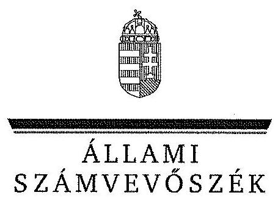
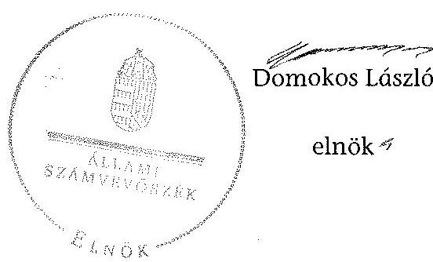

# JELENTÉS 

az önkormányzatok belső kontrollrendszere kialakításának, egyes
kontrolltevékenységek és a belső ellenőrzés
múködésének ellenőrzéséről
Borzavár
14091
2014. június

---

# Állami Számvevőszék 

Iktatószám: V-0386-037/2014
Témaszám: 1162
Vizsgálat-azonosító szám: V064960

## Az ellenőrzést felügyelte:

Dr. Benedek Mária
felügyeleti vezető
Az ellenőrzést vezette és az ellenőrzés végrehajtásáért felelős:
Bíró Zsolt
ellenőrzésvezető
A számvevőszéki jelentés összeállításában közremüködött:
Bencsik Árpád
számvevő
Az ellenőrzést végezték:
Mészáros Ildikó Éva
Unger Ferenc
számvevő

---

# TARTALOMJEGYZÉK 

BEVEZETÉS ..... 7
I. ÖSSZEGZŐ MEGÁLLAPÍTÁSOK, KÖVETKEZTETÉSEK, JAVASLATOK ..... 11
II. RÉSZLETES MEGÁLLAPÍTÁSOK ..... 16

1. Az önkormányzat belső kontrollrendszerének kialakítása ..... 16
1.1. A kontrollkörnyezet ..... 16
1.2. A kockázatkezelési rendszer ..... 18
1.3. A kontrolltevékenységek ..... 18
1.4. Az információs és kommunikációs rendszer ..... 19
1.5. A monitoring rendszer ..... 20
2. A pénzügyi folyamatokban kulcsszerepet betöltő teljesítésigazolás és érvényesítés belső kontrollok múködése ..... 21
3. A belső ellenőrzés működése ..... 24

## FÜGGELÉKEK

1. számú Értelmező szótár
2. számú Az értékelés módja és szempontjai

---

.

---

# RÖVIDÍTÉSEK JEGYZÉKE 

## Törvények

Áht.
ÁSZ tv.
Htv.

Info tv.
Kttv.

Ktv.

Mötv.

Mvtv.
Nvtv.
Ötv.
Számv. tv.
Tvtv.

Vagyonnyilatkozattételről szóló tv.

## Rendeletek

$\mathrm{Ahsz}_{1}$.

Áhsz $_{2}$.
Ávr.

Bkr.

Ikr.
vagyongazdálkodási rendelet

## Szórövidítések

adatvédelmi szabályzat

2011. évi CXCV. törvény az államháztartásról (hatályos 2012. január 1-jétől)
2011. évi LXVI. törvény az Állami Számvevőszékről
1991. évi XX. törvény a helyi önkormányzatok és szerveik, a köztársasági megbízottak, valamint egyes centrális alárendeltségű szervek feladat- és hatásköreiről
2011. évi CXII. törvény az információs önrendelkezési jogról és az információszabadságról
2011. évi CXCIX. törvény a közszolgálati tisztviselőkről (hatályos 2012. március 1-jétől)
1992. évi XXIII. törvény a köztisztviselők jogállásáról (hatálytalan 2012. március 1-jétől)
2011. évi CLXXXIX. törvény Magyarország helyi önkormányzatairól
1993. évi XCIII. törvény a munkavédelemről
2011. évi CXCVI. törvény a nemzeti vagyonról (hatályos
2011. december 31-étől)
1990. évi LXV. törvény a helyi önkormányzatokról
2000. évi C. törvény a számvitelről
1996. évi XXXI. törvény a tűz elleni védekezésről, a műszaki mentésről és a tűzoltóságról
2007. évi CLII. törvény az egyes vagyonnyilatkozat-tételi kötelezettségekről szóló törvény

249/2000. (XII. 24.) Korm. rendelet az államháztartás szervezetei beszámolási és könyvvezetési kötelezettségének sajátosságairól (hatálytalan 2014. január 1-jétől)
4/2013. (I. 11.) Korm. rendelet az államháztartás számviteléről (hatályos 2014. január 1-jétől)
368/2011. (XII. 31.) Korm. rendelet az államháztartásról szóló törvény végrehajtásáról (hatályos 2012. január 1jétől)
370/2011. (XII. 31.) Korm. rendelet a költségvetési szervek belső kontrollrendszeréről és belső ellenőrzéséről (hatályos 2012. január 1-jétől)
335/2005. (XII. 29.) Korm. rendelet a közfeladatot ellátó szervek iratkezelésének általános követelményeiről
Borzavár Községi Önkormányzat Képviselőtestületének 9/2006. (III. 31.) önkormányzati rendelete az önkormányzat vagyonáról

Borzavár Községi Önkormányzat adatvédelmi és adatbiztonsági szabályzata (hatályos 2012. március 12-étől)

---

ÁSZ
Belső ellenőrzési kézikönyv
bizonylati rend
ellenőrzési nyomvonal
értékelési szabályzat

FEUVE
gazdálkodási szabályzat
hivatali SZMSZ

INTOSAI
íratkezelési szabályzat
ISSAI
jegyzö ${ }_{1}$
jegyzö ${ }_{2}$
Képviselő-testület
kockázatkezelés eljárásrendje

Kormányhivatal
Közös Önkormányzati
Hivatal
leltározási szabályzat
NGM
Önkormányzat
pénzkezelési szabályzat
polgármester
Polgármesteri Hivatal

Állami Számvevőszék
Borzavár Község-Belső Ellenőrzési Kézikönyv (hatályos 2013. január 2-től)
Zirci Közös Önkormányzat bizonylati szabályzata, amely kiterjedt Borzavár Önkormányzatára (hatályos: 2013. január 1-jétől)
Zirci Közös Önkormányzati Hivatal Szervezeti és Müködési Szabályzat 1. sz. mellélete (FEUVE szabályzat) ellenőrzési nyomvonala (hatályos 2013. január 1-jétől)
Zirci Közös Önkormányzat Hivatal eszközök és források értékelési szabályzata, amely kiterjedt Borzavár Önkormányzatára (hatályos 2013. január 1-jétől)
folyamatba épített, előzetes, utólagos és vezetői ellenőrzés Borzavár Község kötelezettségvállalás és pénzügyi ellenjegyzés teljesítéséről szóló szabályzata (hatályos 2012. január 1-jétől)
Borzavár Községi Önkormányzat Képviselő-testülete 15/2011. (II. 14.) számú határozatával jóváhagyott Polgármesteri Hivatalának Szervezeti és Müködési Szabályzata (hatályos 2011. február 16-ától)
International Organization of Supreme Audit Institutions (Legfőbb Ellenőrző Intézmények Nemzetközi Szervezete)
Zirc Város Önkormányzat Egyedi iratkezelési szabályzata hatályos 2007. január 1-jétől
International Standards of Supreme Audit Institutions (Legfőbb Ellenőrző Intézmények Nemzetközi Standardjai)
Borzavár Község Önkormányzatának jegyzője 2011. november 17 -étől 2012. december 31 -éig
Borzavár, Lókút és Zirc települési önkormányzatok jegyzője 2013. január 1-jétől
Borzavár Községi Önkormányzat Képviselő-testülete
Zirci Közös Önkormányzati Hivatal Szervezeti és Müködési Szabályzat 1. sz. mellélete (FEUVE szabályzat) kockázatkezelés eljárásrendje (hatályos 2013. január 1-jétől)
Veszprém Megyei Kormányhivatal
Zirc Város, Borzavár Község és Lókút Község Közös Önkormányzati Hivatala
Borzavár Községi Önkormányzat leltározási és leltárkészítési szabályzata (hatályos 2009. december 1-jétől)
Nemzetgazdasági Minisztérium
Borzavár Községi Önkormányzat
Borzavár Községi Önkormányzat pénz -és értékkezelési szabályzata (hatályos: 2011. április 8-tól)
Borzavár Községi Önkormányzat polgármestere
Borzavár Község Önkormányzatának Polgármesteri Hivatala

---

szabálytalanságok kezelésének eljárásrendje
számlarend
számviteli politika $_{1}$
számviteli politika $_{2}$

Társulás

Zirci Közös Önkormányzati Hivatal rendelkezik Szervezeti és Müködési Szabályzattal, amelynek az 1. sz. mellélete a FEUVE szabályzat szabálytalanságok kezelésének eljárásrendje (hatályos 2013. január 1-jétől)
Zirci Közös Önkormányzat Hivatal számlarendje, amely kiterjedt Borzavár Önkormányzatára (hatályos: 2013. január 1-jétől)
Borzavár-Porva Községek Körjegyzőségének számviteli politikája (hatályos 2003. január 1-jétől)
Zirc Város Önkormányzat és Zirci Közös Önkormányzati Hivatal számviteli politikája (hatályos 2013. január 1jétől)
Zirci Kistérség Települési Önkormányzatinak Többcélú Társulása

---

|  1 |  |  |  |  |  |  |  |  |  |  |  |  |  |  |  |  |  |  |  |  |  |  |  |  |  |  |  |  |  |  |  |  |   |
| --- | --- | --- | --- | --- | --- | --- | --- | --- | --- | --- | --- | --- | --- | --- | --- | --- | --- | --- | --- | --- | --- | --- | --- | --- | --- | --- | --- | --- | --- | --- | --- | --- |
|  2 |  |  |  |  |  |  |  |  |  |  |  |  |  |  |  |  |  |  |  |  |  |  |  |  |  |  |  |  |  |  |  |   |
|  3 |  |  |  |  |  |  |  |  |  |  |  |  |  |  |  |  |  |  |  |  |  |  |  |  |  |  |  |  |  |  |   |
|  4 |  |  |  |  |  |  |  |  |  |  |  |  |  |  |  |  |  |  |  |  |  |  |  |  |  |  |  |  |  |  |   |
|  5 |  |  |  |  |  |  |  |  |  |  |  |  |  |  |  |  |  |  |  |  |  |  |  |  |  |  |  |  |  |  |   |
|  6 |  |  |  |  |  |  |  |  |  |  |  |  |  |  |  |  |  |  |  |  |  |  |  |  |  |  |  |  |  |  |   |
|  7 |  |  |  |  |  |  |  |  |  |  |  |  |  |  |  |  |  |  |  |  |  |  |  |  |  |  |  |  |  |  |   |
|  8 |  |  |  |  |  |  |  |  |  |  |  |  |  |  |  |  |  |  |  |  |  |  |  |  |  |  |  |  |  |  |   |
|  9 |  |  |  |  |  |  |  |  |  |  |  |  |  |  |  |  |  |  |  |  |  |  |  |  |  |  |  |  |  |  |   |
|  10 |  |  |  |  |  |  |  |  |  |  |  |  |  |  |  |  |  |  |  |  |  |  |  |  |  |  |  |  |  |  |   |
|  11 |  |  |  |  |  |  |  |  |  |  |  |  |  |  |  |  |  |  |  |  |  |  |  |  |  |  |  |  |  |  |   |
|  12 |  |  |  |  |  |  |  |  |  |  |  |  |  |  |  |  |  |  |  |  |  |  |  |  |  |  |  |  |  |  |   |
|  13 |  |  |  |  |  |  |  |  |  |  |  |  |  |  |  |  |  |  |  |  |  |  |  |  |  |  |  |  |  |  |   |
|  14 |  |  |  |  |  |  |  |  |  |  |  |  |  |  |  |  |  |  |  |  |  |  |  |  |  |  |  |  |  |  |   |
|  15 |  |  |  |  |  |  |  |  |  |  |  |  |  |  |  |  |  |  |  |  |  |  |  |  |  |  |  |  |  |  |   |
|  16 |  |  |  |  |  |  |  |  |  |  |  |  |  |  |  |  |  |  |  |  |  |  |  |  |  |  |  |  |  |  |   |
|  17 |  |  |  |  |  |  |  |  |  |  |  |  |  |  |  |  |  |  |  |  |  |  |  |  |  |  |  |  |  |  |   |
|  18 |  |  |  |  |  |  |  |  |  |  |  |  |  |  |  |  |  |  |  |  |  |  |  |  |  |  |  |  |  |  |   |
|  19 |  |  |  |  |  |  |  |  |  |  |  |  |  |  |  |  |  |  |  |  |  |  |  |  |  |  |  |  |  |  |   |
|  20 |  |  |  |  |  |  |  |  |  |  |  |  |  |  |  |  |  |  |  |  |  |  |  |  |  |  |  |  |  |  |   |
|  21 |  |  |  |  |  |  |  |  |  |  |  |  |  |  |  |  |  |  |  |  |  |  |  |  |  |  |  |  |  |  |   |
|  22 |  |  |  |  |  |  |  |  |  |  |  |  |  |  |  |  |  |  |  |  |  |  |  |  |  |  |  |  |  |  |   |
|  23 |  |  |  |  |  |  |  |  |  |  |  |  |  |  |  |  |  |  |  |  |  |  |  |  |  |  |  |  |  |  |   |
|  24 |  |  |  |  |  |  |  |  |  |  |  |  |  |  |  |  |  |  |  |  |  |  |  |  |  |  |  |  |  |  |   |
|  25 |  |  |  |  |  |  |  |  |  |  |  |  |  |  |  |  |  |  |  |  |  |  |  |  |  |  |  |  |  |  |   |
|  26 |  |  |  |  |  |  |  |  |  |  |  |  |  |  |  |  |  |  |  |  |  |  |  |  |  |  |  |  |  |  |   |
|  27 |  |  |  |  |  |  |  |  |  |  |  |  |  |  |  |  |  |  |  |  |  |  |  |  |  |  |  |  |  |  |   |
|  28 |  |  |  |  |  |  |  |  |  |  |  |  |  |  |  |  |  |  |  |  |  |  |  |  |  |  |  |  |  |  |   |
|  29 |  |  |  |  |  |  |  |  |  |  |  |  |  |  |  |  |  |  |  |  |  |  |  |  |  |  |  |  |  |  |   |
|  30 |  |  |  |  |  |  |  |  |  |  |  |  |  |  |  |  |  |  |  |  |  |  |  |  |  |  |  |  |  |  |   |
|  31 |  |  |  |  |  |  |  |  |  |  |  |  |  |  |  |  |  |  |  |  |  |  |  |  |  |  |  |  |  |  |   |
|  32 |  |  |  |  |  |  |  |  |  |  |  |  |  |  |  |  |  |  |  |  |  |  |  |  |  |  |  |  |  |  |   |
|  33 |  |  |  |  |  |  |  |  |  |  |  |  |  |  |  |  |  |  |  |  |  |  |  |  |  |  |  |  |  |  |   |
|  34 |  |  |  |  |  |  |  |  |  |  |  |  |  |  |  |  |  |  |  |  |  |  |  |  |  |  |  |  |  |  |   |
|  35 |  |  |  |  |  |  |  |  |  |  |  |  |  |  |  |  |  |  |  |  |  |  |  |  |  |  |  |  |  |  |   |
|  36 |  |  |  |  |  |  |  |  |  |  |  |  |  |  |  |  |  |  |  |  |  |  |  |  |  |  |  |  |  |  |   |
|  37 |  |  |  |  |  |  |  |  |  |  |  |  |  |  |  |  |  |  |  |  |  |  |  |  |  |  |  |  |  |  |   |
|  38 |  |  |  |  |  |  |  |  |  |  |  |  |  |  |  |  |  |  |  |  |  |  |  |  |  |  |  |  |  |  |   |
|  39 |  |  |  |  |  |  |  |  |  |  |  |  |  |  |  |  |  |  |  |  |  |  |  |  |  |  |  |  |  |  |   |
|  40 |  |  |  |  |  |  |  |  |  |  |  |  |  |  |  |  |  |  |  |  |  |  |  |  |  |  |  |  |  |  |   |
|  41 |  |  |  |  |  |  |  |  |  |  |  |  |  |  |  |  |  |  |  |  |  |  |  |  |  |  |  |  |  |  |   |
|  42 |  |  |  |  |  |  |  |  |  |  |  |  |  |  |  |  |  |  |  |  |  |  |  |  |  |  |  |  |  |  |   |
|  43 |  |  |  |  |  |  |  |  |  |  |  |  |  |  |  |  |  |  |  |  |  |  |  |  |  |  |  |  |  |  |   |
|  44 |  |  |  |  |  |  |  |  |  |  |  |  |  |  |  |  |  |  |  |  |  |  |  |  |  |  |  |  |  |  |   |
|  45 |  |  |  |  |  |  |  |  |  |  |  |  |  |  |  |  |  |  |  |  |  |  |  |  |  |  |  |  |  |  |   |
|  46 |  |  |  |  |  |  |  |  |  |  |  |  |  |  |  |  |  |  |  |  |  |  |  |  |  |  |  |  |  |  |   |
|  47 |  |  |  |  |  |  |  |  |  |  |  |  |  |  |  |  |  |  |  |  |  |  |  |  |  |  |  |  |  |  |   |
|  48 |  |  |  |  |  |  |  |  |  |  |  |  |  |  |  |  |  |  |  |  |  |  |  |  |  |  |  |  |  |  |   |
|  49 |  |  |  |  |  |  |  |  |  |  |  |  |  |  |  |  |  |  |  |  |  |  |  |  |  |  |  |  |  |  |   |
|  50 |  |  |  |  |  |  |  |  |  |  |  |  |  |  |  |  |  |  |  |  |  |  |  |  |  |  |  |  |  |  |   |
|  51 |  |  |  |  |  |  |  |  |  |  |  |  |  |  |  |  |  |  |  |  |  |  |  |  |  |  |  |  |  |  |   |
|  52 |  |  |  |  |  |  |  |  |  |  |  |  |  |  |  |  |  |  |  |  |  |  |  |  |  |  |  |  |  |  |   |
|  53 |  |  |  |  |  |  |  |  |  |  |  |  |  |  |  |  |  |  |  |  |  |  |  |  |  |  |  |  |  |  |   |
|  54 |  |  |  |  |  |  |  |  |  |  |  |  |  |  |  |  |  |  |  |  |  |  |  |  |  |  |  |  |  |  |   |
|  55 |  |  |  |  |  |  |  |  |  |  |  |  |  |  |  |  |  |  |  |  |  |  |  |  |  |  |  |  |  |  |   |
|  56 |  |  |  |  |  |  |  |  |  |  |  |  |  |  |  |  |  |  |  |  |  |  |  |  |  |  |  |  |  |  |   |
|  57 |  |  |  |  |  |  |  |  |  |  |  |  |  |  |  |  |  |  |  |  |  |  |  |  |  |  |  |  |  |  |   |
|  58 |  |  |  |  |  |  |  |  |  |  |  |  |  |  |  |  |  |  |  |  |  |  |  |  |  |  |  |  |  |  |   |
|  59 |  |  |  |  |  |  |  |  |  |  |  |  |  |  |  |  |  |  |  |  |  |  |  |  |  |  |  |  |  |  |   |
|  60 |  |  |  |  |  |  |  |  |  |  |  |  |  |  |  |  |  |  |  |  |  |  |  |  |  |  |  |  |  |  |   |
|  61 |  |  |  |  |  |  |  |  |  |  |  |  |  |  |  |  |  |  |  |  |  |  |  |  |  |  |  |  |  |  |   |
|  62 |  |  |  |  |  |  |  |  |  |  |  |  |  |  |  |  |  |  |  |  |  |  |  |  |  |  |  |  |  |  |   |
|  63 |  |  |  |  |  |  |  |  |  |  |  |  |  |  |  |  |  |  |  |  |  |  |  |  |  |  |  |  |  |  |   |
|  64 |  |  |  |  |  |  |  |  |  |  |  |  |  |  |  |  |  |  |  |  |  |  |  |  |  |  |  |  |  |  |   |
|  65 |  |  |  |  |  |  |  |  |  |  |  |  |  |  |  |  |  |  |  |  |  |  |  |  |  |  |  |  |  |  |   |
|  66 |  |  |  |  |  |  |  |  |  |  |  |  |  |  |  |  |  |  |  |  |  |  |  |  |  |  |  |  |  |  |   |
|  67 |  |  |  |  |  |  |  |  |  |  |  |  |  |  |  |  |  |  |  |  |  |  |  |  |  |  |  |  |  |  |   |
|  68 |  |  |  |  |  |  |  |  |  |  |  |  |  |  |  |  |  |  |  |  |  |  |  |  |  |  |  |  |  |  |   |
|  69 |  |  |  |  |  |  |  |  |  |  |  |  |  |  |  |  |  |  |  |  |  |  |  |  |  |  |  |  |  |  |  |   |
|  70 |  |  |  |  |  |  |  |  |  |  |  |  |  |  |  |  |  |  |  |  |  |  |  |  |  |  |  |  |  |  |  |   |
|  71 |  |  |  |  |  |  |  |  |  |  |  |  |  |  |  |  |  |  |  |  |  |  |  |  |  |  |  |  |  |  |  |   |
|  72 |  |  |  |  |  |  |  |  |  |  |  |  |  |  |  |  |  |  |  |  |  |  |  |  |  |  |  |  |  |  |  |   |
|  73 |  |  |  |  |  |  |  |  |  |  |  |  |  |  |  |  |  |  |  |  |  |  |  |  |  |  |  |  |  |  |  |   |
|  74 |  |  |  |  |  |  |  |  |  |  |  |  |  |  |  |  |  |  |  |  |  |  |  |  |  |  |  |  |  |  |  |   |
|  75 |  |  |  |  |  |  |  |  |  |  |  |  |  |  |  |  |  |  |  |  |  |  |  |  |  |  |  |  |  |  |  |   |
|  76 |  |  |  |  |  |  |  |  |  |  |  |  |  |  |  |  |  |  |  |  |  |  |  |  |  |  |  |  |  |  |  |   |
|  77 |  |  |  |  |  |  |  |  |  |  |  |  |  |  |  |  |  |  |  |  |  |  |  |  |  |  |  |  |  |  |  |   |
|  78 |  |  |  |  |  |  |  |  |  |  |  |  |  |  |  |  |  |  |  |  |  |  |  |  |  |  |  |  |  |  |  |   |
|  79 |  |  |  |  |  |  |  |  |  |  |  |  |  |  |  |  |  |  |  |  |  |  |  |  |  |  |  |  |  |  |  |   |
|  80 |  |  |  |  |  |  |  |  |  |  |  |  |  |  |  |  |  |  |  |  |  |  |  |  |  |  |  |  |  |  |  |   |
|  81 |  |  |  |  |  |  |  |  |  |  |  |  |  |  |  |  |  |  |  |  |  |  |  |  |  |  |  |  |  |  |  |   |
|  82 |  |  |  |  |  |  |  |  |  |  |  |  |  |  |  |  |  |  |  |  |  |  |  |  |  |  |  |  |  |  |  |   |
|  83 |  |  |  |  |  |  |  |  |  |  |  |  |  |  |  |  |  |  |  |  |  |  |  |  |  |  |  |  |  |  |  |   |
|  84 |  |  |  |  |  |  |  |  |  |  |  |  |  |  |  |  |  |  |  |  |  |  |  |  |  |  |  |  |  |  |  |   |
|  85 |  |  |  |  |  |  |  |  |  |  |  |  |  |  |  |  |  |  |  |  |  |  |  |  |  |  |  |  |  |  |  |   |
|  86 |  |  |  |  |  |  |  |  |  |  |  |  |  |  |  |  |  |  |  |  |  |  |  |  |  |  |  |  |  |  |  |   |
|  87 |  |  |  |  |  |  |  |  |  |  |  |  |  |  |  |  |  |  |  |  |  |  |  |  |  |  |  |  |  |  |  |   |
|  88 |  |  |  |  |  |  |  |  |  |  |  |  |  |  |  |  |  |  |  |  |  |  |  |  |  |  |  |  |  |  |  |   |
|  89 |  |  |  |  |  |  |  |  |  |  |  |  |  |  |  |  |  |  |  |  |  |  |  |  |  |  |  |  |  |  |  |   |
|  90 |  |  |  |  |  |  |  |  |  |  |  |  |  |  |  |  |  |  |  |  |  |  |  |  |  |  |  |  |  |  |  |   |
|  91 |  |  |  |  |  |  |  |  |  |  |  |  |  |  |  |  |  |  |  |  |  |  |  |  |  |  |  |  |  |  |  |   |
|  92 |  |  |  |  |  |  |  |  |  |  |  |  |  |  |  |  |  |  |  |  |  |  |  |  |  |  |  |  |  |  |  |   |
|  93 |  |  |  |  |  |  |  |  |  |  |  |  |  |  |  |  |  |  |  |  |  |  |  |  |  |  |  |  |  |  |  |   |
|  94 |  |  |  |  |  |  |  |  |  |  |  |  |  |  |  |  |  |  |  |  |  |  |  |  |  |  |  |  |  |  |  |   |
|  95 |  |  |  |  |  |  |  |  |  |  |  |  |  |  |  |  |  |  |  |  |  |  |  |  |  |  |  |  |  |  |  |   |
|  96 |  |  |  |  |  |  |  |  |  |  |  |  |  |  |  |  |  |  |  |  |  |  |  |  |  |  |  |  |  |  |  |   |
|  97 |  |  |  |  |  |  |  |  |  |  |  |  |  |  |  |  |  |  |  |  |  |  |  |  |  |  |  |  |  |  |  |   |
|  98 |  |  |  |  |  |  |  |  |  |  |  |  |  |  |  |  |  |  |  |  |  |  |  |  |  |  |  |  |  |  |  |  |   |
|  99 |  |  |  |  |  |  |  |  |  |  |  |  |  |  |  |  |  |  |  |  |  |  |  |  |  |  |  |  |  |  |  |  |   |
|  100 |  |  |  |  |  |  |  |  |  |  |  |  |  |  |  |  |  |  |  |  |  |  |  |  |  |  |  |  |  |  |  |  |  |   |
|  101 |  |  |  |  |  |  |  |  |  |  |  |  |  |  |  |  |  |  |  |  |  |  |  |  |  |  |  |  |  |  |  |  |  |   |
|  102 |  |  |  |  |  |  |  |  |  |  |  |  |  |  |  |  |  |  |  |  |  |  |  |  |  |  |  |  |  |  |  |  |  |  |   |
|  103 |  |  |  |  |  |  |  |  |  |  |  |  |  |  |  |  |  |  |  |  |  |  |  |  |  |  |  |  |  |  |  |  |  |  |   |
|  104 |  |  |  |  |  |  |  |  |  |  |  |  |  |  |  |  |  |  |  |  |  |  |  |  |  |  |  |  |  |  |  |  |  |  |  |   |
|  105 |  |  |  |  |  |  |  |  |  |  |  |  |  |  |  |  |  |  |  |  |  |  |  |  |  |  |  |  |  |  |  |  |  |  |  |   |
|  106 |  |  |  |  |  |  |  |  |  |  |  |  |  |  |  |  |  |  |  |  |  |  |  |  |  |  |  |  |  |  |  |  |  |  |  |  |  |   |
|  107 |  |  |  |  |  |  |  |  |  |  |  |  |  |  |  |  |  |  |  |  |  |  |  |  |  |  |  |  |  |  |  |  |  |  |  |  |  |   |
|  108 |  |  |  |  |  |  |  |  |  |  |  |  |  |  |  |  |  |  |  |  |  |  |  |  |  |  |  |  |  |  |  |  |  |  |  |  |  |  |   |
|  109 |  |  |  |  |  |  |  |  |  |  |  |  |  |  |  |  |  |  |  |  |  |  |  |  |  |  |  |  |  |  |  |  |  |  |  |  |  |  |   |
|  110 |  |  |  |  |  |  |  |  |  |  |  |  |  |  |  |  |  |  |  |  |  |  |  |  |  |  |  |  |  |  |  |  |  |  |  |  |  |  |  |  |  |   |
|  111 |  |  |  |  |  |  |  |  |  |  |  |  |  |  |  |  |  |  |  |  |  |  |  |  |  |  |  |  |  |  |  |  |  |  |  |  |  |  |  |  |  |   |
|  112 |  |  |  |  |  |  |  |  |  |  |  |  |  |  |  |  |  |  |  |  |  |  |  |  |  |  |  |  |  |  |  |  |  |  |  |  |  |  |  |  |  |  |   |
|  113 |  |  |  |  |  |  |  |  |  |  |  |  |  |  |  |  |  |  |  |  |  |  |  |  |  |  |  |  |  |  |  |  |  |  |  |  |  |  |  |  |  |  |  |  |  |   |
|  114 |  |  |  |  |  |  |  |  |  |  |  |  |  |  |  |  |  |  |  |  |  |  |  |  |  |  |  |  |  |  |  |  |  |  |  |  |  |  |  |  |  |  |  |  |  |   |
|  115 |  |  |  |  |  |  |  |  |  |  |  |  |  |  |  |  |  |  |  |  |  |  |  |  |  |  |  |  |  |  |  |  |  |  |  |  |  |  |  |  |  |  |  |  |  |  |   |
|  116 |  |  |  |  |  |  |  |  |  |  |  |  |  |  |  |  |  |  |  |  |  |  |  |  |  |  |  |  |  |  |  |  |  |  |  |  |  |  |  |  |  |  |  |  |  |  |   |
|  117 |  |  |  |  |  |  |  |  |  |  |  |  |  |  |  |  |  |  |  |  |  |  |  |  |  |  |  |  |  |  |  |  |  |  |  |  |  |  |  |  |  |  |  |  |  |  |  |  |   |
|  118 |  |  |  |  |  |  |  |  |  |  |  |  |  |  |  |  |  |  |  |  |  |  |  |  |  |  |  |  |  |  |  |  |  |  |  |  |  |  |  |  |  |  |  |  |  |  |  |  |  |   |
|  119 |  |  |  |  |  |  |  |  |  |  |  |  |  |  |  |  |  |  |  |  |  |  |  |  |  |  |  |  |  |  |  |  |  |  |  |  |  |  |  |  |  |  |  |  |  |  |  |  |  |  |   |
|  120 |  |  |  |  |  |  |  |  |  |  |  |  |  |  |  |  |  |  |  |  |  |  |  |  |  |  |  |  |  |  |  |  |  |  |  |  |  |  |  |  |  |  |  |  |  |  |  |  |  |  |  |  |  |   |
|  121 |  |  |  |  |  |  |  |  |  |  |  |  |  |  |  |  |  |  |  |  |  |  |  |  |  |  |  |  |  |  |  |  |  |  |  |  |  |  |  |  |  |  |  |  |  |  |  |  |  |  |  |  |  |  |  |  |   |
|  122 |  |  |  |  |  |  |  |  |  |  |  |  |  |  |  |  |  |  |  |  |  |  |  |  |  |  |  |  |  |  |  |  |  |  |  |  |  |  |  |  |  |  |  |  |  |  |  |  |  |  |  |  |  |  |  |  |  |  |  |  |  |   |
|  123 |  |  |  |  |  |  |  |  |  |  |  |  |  |  |  |  |  |  |  |  |  |  |  |  |  |  |  |  |  |  |  |  |  |  |  |  |  |  |  |  |  |  |  |  |  |  |  |  |  |  |  |  |  |  |  |  |  |  |  |  |  |  |   |
|  124 |  |  |  |  |  |  |  |  |  |  |  |  |  |  |  |  |  |  |  |  |  |  |  |  |  |  |  |  |  |  |  |  |  |  |  |  |  |  |  |  |  |  |  |  |  |  |  |  |  |  |  |  |  |  |  |  |  |  |  |  |  |  |  |  |  |  |  |  |  |   |
|  125 |  |  |  |  |  |  |  |  |  |  |  |  |  |  |  |  |  |  |  |  |  |  |  |  |  |  |  |  |  |  |  |  |  |  |  |  |  |  |  |  |  |  |  |  |  |  |  |  |  |  |  |  |  |  |  |  |  |  |  |  |  |  |  |  |  |  |  |  |  |  |  |  |  |  |   |
|  126 |  |  |  |  |  |  |  |  |  |  |  |  |  |  |  |  |  |  |  |  |  |  |  |  |  |  |  |  |  |  |  |  |  |  |  |  |  |  |  |  |  |  |  |  |  |  |  |  |  |  |  |  |  |  |  |  |  |  |  |  |  |  |  |  |  |  |  |  |  |  |  |  |  |  |  |  |  |  |  |  |  |   |
|  127 |  |  |  |  |  |  | | | | | | | | | |  |  |  |  |  |  |  |  |  |  |  |  |  |  |  |  |  |  |  |  |  |  |  |  |  |  |  |  |  |  |  |  |  |  |  |  |  |  |  |  |  |  |  |  |  |  |  |  |  |  |  |  |  |  |  |  |  |  |  |  |  |  |  |  |  |  |  |  |  |  |  |  |  |  |  |  |  |  |  |  |  |  |  |  |  |  |  |  |  |  |  |  |  |  |  |  |  |  |  | 

---

# JELENTÉS 

## az önkormányzatok belsó kontrollrendszere kialakításának, egyes kontrolltevékenységek és a belső ellenőrzés múködésének ellenőrzéséről Borzavár

## BEVEZETÉS

Borzavár község állandó lakosainak száma 2012. január 1-jén 746 fő volt. Az Önkormányzat öttagú Képviselő-testületének munkáját egy állandó bizottság segítette. Az Önkormányzat az önállóan működő és gazdálkodó Polgármesteri Hivatalon kívül két önállóan működő intézményt múködtetett, többségi tulajdoni hányadú gazdasági társasággal nem rendelkezett. A polgármester a 2010. évi önkormányzati választások óta tölti be tisztségét. A jegyző ${ }_{1} 2011$. november 17 -étől 2012. december 31 -ig, valamint a jegyző ${ }_{2} 2013$. január 1jétől látta el feladatait. A Polgármesteri Hivatal szervezeti egységekre nem tagolódott, elkülönített gazdasági szervezettel nem rendelkezett, 2012. január 1jén a foglalkoztatott köztisztviselők száma két fő, a foglalkoztatott közalkalmazottak száma 16 fő volt. Zirc, Lókút és Borzavár települési önkormányzatok képviselő-testületei 2013. január 1-jétől - Zirc székhellyel - megalakították a Közös Önkormányzati Hivatalt. Az Önkormányzat a 2012. évi költségvetési beszámolója szerint 190671 ezer Ft tárgyévi bevételt ért el, valamint 180520 ezer Ft tárgyévi kiadást teljesített. A 2012. december 31-i könyvviteli mérleg szerint 306298 ezer Ft értékű eszközvagyonnal rendelkezett, a rövid lejáratú kötelezettségállománya 2534 ezer Ft, hosszú lejáratú kötelezettségállománya nem volt.

A demokratikus társadalmakban alapvető igény, hogy a közpénzeket, a közvagyont használók tevékenységükről elszámoljanak, ahhoz egyértelmú és érvényesíthető felelősségi szabályok társuljanak. Ennek a jogos igénynek az érvényesítéséhez meg kell teremteni azokat a folyamatokat, rendszereket, amelyek nélkülözhetetlenek az elszámoltatáshoz. Az elszámoltatás eredményes múködtetéséhez szükség van a megfelelő információs, kontroll, értékelési és beszámolási rendszerek kialakítására.

Magyarországon az uniós csatlakozási tárgyalások idejére nyúlnak vissza a belső kontrollrendszer szabályozásának gyökerei. Az uniós elvárásoknak megfelelő új terminológia szerinti államháztartási belső pénzügyi ellenőrzési (ÁBPE) rendszer területén a jogharmonizáció 2003-ban teljes körűen megvalósult, míg az önkormányzati alrendszerre vonatkozó, Ötv.-ben megjelenített speciális szabályozás 2005-ben lépett hatályba. Az államháztartási belső kontrollrendszer koncepciója 2009-ben továbbfejlődött. A változások irányát mutat-

---

ja, hogy a költségvetési szervek belső kontrollrendszere már magában foglalja a korszerű, felelős szervezetirányítás elemeit (kontrollkörnyezet, kockázatkezelés, kontrolltevékenység, információ és kommunikáció, monitoring) is. E kontrollrendszer szabályozása háromszintú, a törvényi előírásokat az Áht. és a Mötv., a rendeleti szintű szabályozást az Ávr. és a Bkr. tartalmazza, amelyeket útmutatói szinten az NGM által kiadott standardok és kézikönyvek támogatnak.

A belső kontrollrendszer azt a célt szolgálja, hogy a költségvetési szervek múködésük és gazdálkodásuk során a tevékenységeket szabályszerűen, gazdaságosan, hatékonyan és eredményesen hajtsák végre, teljesítsék elszámolási kötelezettségeiket és megvédjék az erőforrásokat a veszteségektől, a károktól és a nem rendeltetésszerű használattól. A belső kontrollrendszer magában foglalja mindazon szabályokat, eljárásokat, gyakorlati módszereket és szervezeti struktúrákat, kockázatkezelési technikákat, kontrolltevékenységeket, amelyek segítséget nyújtanak a szervezetnek céljai eléréséhez.

Az ÁSZ középtávú stratégiájában hangsúlyos szerepet szánt annak, hogy szilárd szakmai alapon álló, értékteremtő ellenőrzéseivel előmozdítsa a közpénzügyek átláthatóságát, rendezettségét. A számvevőszéki ellenőrzés nemzetközi alapelvei is rögzítik, hogy a megfelelő belső kontrollrendszer minimálisra csökkenti a hibák és szabálytalanságok kockázatát.

Az ellenőrzés célja annak megállapítása volt, hogy a belső kontrollrendszer elemeinek kialakítása, a pénzügyi folyamatokban kulcsszerepet betöltő teljesítésigazolás és érvényesítés, és a belső ellenőrzés szabályos működése biztosítot-ta-e az Önkormányzatnál a közpénzfelhasználás szabályosságát, hozzájárult-e az értéket teremtő rend követelményének érvényesüléséhez.

Ennek keretében értékeltük, hogy:

- a jogszabályi előírásoknak megfelelően alakították-e ki a belső kontrollrendszer elemeit;
- a gazdálkodás folyamatában kulcsszerepet betöltő teljesítésigazolás és érvényesítés kontrolltevékenységeit megfelelően működtették-e;
- biztosították-e a belső ellenőrzés szabályos működését;
- amennyiben az ÁSZ tett javaslatot a 2008-2011. évek közötti ellenőrzése kapcsán az Önkormányzatnak, intézkedtek-e azok végrehajtására.

Az ellenőrzés várható hasznosulását négy szinten tervezzük. A törvényalkotás számára összegzett tapasztalatok állnak rendelkezésre a belső kontrollrendszer önkormányzati területen való kialakításáról, működéséről és hatásairól, a belső ellenőrzés működéséről. Ennek alapján következtetést lehet levonni arról, hogy a belső kontrollrendszer kialakítására és működtetésére vonatkozó jelenlegi, differenciálás nélküli - jogszabályi előírások reális követelményeket támasztanak-e az eltérő adottságú települési önkormányzatok esetében, illetve indokolt-e esetleges jogszabályi módosítás kezdeményezése. Az ellenőrzés az ellenőrzött számára visszajelzést ad a belső kontrollrendszer kialakításában és múködésében fellépő hiányosságokról, javaslataival hozzájárul azok kikü-

---

szöböléséhez, amely csökkentheti a későbbi ellenőrzések gyakoriságát. Az ellenőrzés megállapításait és javaslatait más szervezetek is hasznosíthatják a rendezett gazdálkodási keretek kialakításához. A társadalom számára jelzi, hogy közpénz nem maradhat ellenőrizetlenül, az ÁSZ értékteremtő rend kialakításához és megőrzéséhez hozzájáruló tevékenysége pozitív hatással lesz a szervezetről kialakított összkép formálásában. A szervezeten belül lehetőség nyílik arra, hogy a megállapítások szintetizálásával az ÁSZ a hozzáadott értéket teremtő elemző tevékenységét és tanácsadó szerepét is erősítse.

Az önkormányzatok belső kontrollrendszere kialakításának, egyes kontrolltevékenységek és a belső ellenőrzés működésének ellenőrzéséről szóló jelentés I. fejezetének összegző része az ellenőrzés céljára ad rövid, szintetizáló összefoglalót, és tartalmazza a következtetéseket a II. fejezet részletes megállapításain alapulóan. A jelentés intézkedést igénylő megállapításait és javaslatait az ellenőrzés során feltárt, a jelentés II. fejezetében rögzített részletes megállapítások alapozzák meg. A helyszíni ellenőrzés lezárásáig a helyi szabályozás változásaIt nyomon követtük.

Az ellenőrzés típusa: szabályszerűségi ellenőrzés.
Az ellenőrzött időszak: a belső kontrollrendszer kialakításának megfelelősége esetében a 2012. évre, a pénzügyi folyamatokban kulcsszerepet betöltő teljesítésigazolás és érvényesítés belső kontrollok működésének megfelelőségét és a belső ellenőrzés szabályszerű működését a 2012. január 1. és december 31-e közötti időszak eseményeit figyelembe véve értékeltük, míg az ÁSZ javaslatainak utóellenőrzése a 2008-2011. években végzett ellenőrzések nyilvánosságra hozott jelentéseiben tett javaslatok áttekintésére terjedt ki.

# Az ellenőrzött szervezet: az Önkormányzat. 

Az ellenőrzés jogszabályi alapját az ÁSZ tv. 1. § (3) bekezdése, az 5. § (2) és (6) bekezdése, valamint az Áht. 61. § (2) bekezdésének előírásai képezik.

Az ellenőrzés szakmai módszertana az ÁSZ hivatalos honlapján (www.asz.hu) közzétett szakmai szabályokon alapult, amely az INTOSAI által kiadott ISSAI figyelembevételével készült.

Az ellenőrzés lefolytatásához az Önkormányzat a kimutatások és a tanúsítvány elektronikus kitöltésével, valamint az ÁSZ által kért dokumentumok elektronikus megküldésével szolgáltatott adatokat. Az így rendelkezésre bocsátott adatok, információk kontrollja és a munkalapok kitöltése a helyszíni ellenőrzés keretében történt. A jelentésben használt fogalmak magyarázatát az 1. számú függelék, az ellenőrzés egyes területeinek értékelésénél alkalmazott egységes minősítési szempontokat a 2. számú függelék tartalmazza.

A belső kontrollrendszer kialakításának ellenőrzése során értékeltük a kontrollkörnyezet, a kockázatkezelési rendszer, a kontrolltevékenységek, az információs és kommunikációs rendszer, valamint a monitoring rendszer szabályozottságának megfelelőségét. A pénzügyi folyamatokban kulcsszerepet betöltő teljesítésigazolás és érvényesítés kontrollok müködése megfelelőségének minősítéséhez az állományba nem tartozók megbízási díjai, a külső szolgáltatók által

---

végzett karbantartási, kisjavítási munkák, az egyéb üzemeltetési és fenntartási szolgáltatások, a rendszeres szociális segélyek, valamint az államháztartáson kívülre teljesített múködési és felhalmozási célú pénzeszközátadások közül kockázatelemzéssel választottuk ki az ellenőrzött kiadási jogcímeket. Az egyszerű véletlen mintavétellel kiválasztott tételek ellenőrzését többlépcsős megfelelőségi tesztek útján addig végeztük, amíg elegendő és megfelelő bizonyítékot szereztünk a vizsgált folyamatok kulcskontrolljai müködésének megfelelő vagy nem megfelelő voltáról. Értékeltük az Önkormányzatnál a belső ellenőrzés működésének szabályosságát. Az ÁSZ az Önkormányzatnál a 2008. évben a helyi önkormányzatok gazdálkodási rendszerének ellenőrzését végezte. A nyilvánosságra hozott, 0822 számon közzétett számvevőszéki jelentésben azonban kifejezetten az Önkormányzat számára konkrét feladatot nem határozott meg, javaslatot nem tett, ezért jelen ellenőrzés keretében utóellenőrzésre nem került sor.

Az ÁSZ tv. 29. § (1) bekezdése szerint a jelentéstervezetet megküldtük a polgármester részére, aki az ÁSZ tv. 29. § (2) bekezdésében foglalt észrevételezési jogával nem élt, a jelentéstervezetre észrevételt nem tett.

---

# I. ÖSSZEGZŐ MEGÁLLAPÍTÁSOK, KÖVETKEZTETÉSEK, JAVASLATOK 

A belső kontrollrendszeren belül 2012-ben a kontrollkörnyezet, a kockázatkezelési rendszer, a kontrolltevékenységek, az információs és kommunikációs rendszer, valamint a monitoring rendszer kialakítását külön-külön és együttesen is értékeltük. A belső kontrollrendszer kialakítása az összesített értékelés alapján nem felelt meg a jogszabályi előírásoknak.

A belső kontrollrendszer egyes területei kialakításának minősítése a következő:

| Kontrollterület | Minősítés |
| :-- | :--: |
| Kontrollkörnyezet | nem |
|  | megfelelő |
| Kockázatkezelési rendszer | nem |
|  | megfelelő |
| Kontrolltevékenységek | részben |
|  | megfelelő |
| Információs és kommuni- | nem |
| kációs rendszer | megfelelő |
| Monitoring rendszer | nem |

Részben megfelelőnek értékeltük a kontrolltevékenységek kialakítását, mivel a megállapított szabályozásbeli hiányosságok nem veszélyeztették e kontrollterületen a szabályszerű múködést.

Nem megfelelőnek értékeltük a kontrollkörnyezet, a kockázatkezelési rendszer, az információs és kommunikációs rendszer, valamint a monitoring rendszer kialakítását, mivel az ellenőrzésünk során megállapított szabályozásbeli hiányosságok magukban hordozzák a szabálytalan múködés, valamint a korrupció kockázatát.

A 2012. évben az állományba nem tartozók megbízási díjaival, a külső szolgáltatók által végzett karbantartási, kisjavítási munkákkal kapcsolatos kifizetések, valamint a rendszeres szociális segélyek kifizetése során a pénzügyi folyamatokban kulcsszerepet betöltő teljesítésigazolás és érvényesítés belső kontrollok múködése gyenge volt. Gyengének értékeltük a két kulcskontroll együttes múködését, mivel azok nem biztosították a hibák megelőzését, feltárását.

A számvevőszéki ellenőrzés az ellenőrzött kifizetésekkel összefüggésben a rendelkezésre bocsátott dokumentumok alapján kár bekövetkeztére utaló adatot, tényt nem állapított meg, azonban a gazdálkodásban kulcsszerepet betöltő kontrollok múködésében feltárt hiányosságok miatt fennáll a hibák bekövetke-

---

zésének kockázata. A nem megfelelően működtetett belső kontrollok korrupciós kockázatot hordoznak.

Az Önkormányzat a belső ellenőrzési feladatokat Társulás útján látta el. A 2012. évben a belső ellenőrzés múködése a jogszabályi előírásoknak nem felelt meg, mert a belső ellenőrzés nem tárta fel a belső kontrollrendszer kialakitásának, valamint a pénzügyi folyamatokban kulcszerepet betöltő teljesítésigazolás és érvényesítés belső kontrollok müködésének hiányosságait.

Az ÁSZ tv. 33. § (1) bekezdésében foglaltak értelmében az ellenőrzött szervezet vezetője köteles a jelentésben foglalt megállapításokhoz kapcsolódó intézkedési tervet összeállítani, és azt a jelentés kézhezvételétől számított 30 napon belül az ÁSZ részére megküldeni. Amennyiben az intézkedési tervet határidőre nem küldi meg a szervezet, vagy az ÁSZ tv. 33. § (2) bekezdésében foglalt póthatáridő elteltével megküldött intézkedési terv továbbra sem elfogadható, az ÁSZ elnöke a hivatkozott törvény 33. § (3) bekezdés a)-b) pontjaiban foglaltakat érvényesítheti.

Az ellenőrzés intézkedést igénylő megállapításai és javaslatai:

# a polgármesternek 

1. A számvevőszéki ellenőrzés megállapításai alapján az Önkormányzatnál a belső kontrollrendszer kialakítása összefoglalóan értékelve nem felelt meg a jogszabályi előírásoknak, a kulcskontrollok müködése gyenge volt. A belső ellenőrzés müködése nem felelt meg a jogszabályi előírásoknak, nem tárta fel, ezáltal nem is javíttatta ki a hiányosságokat. A megállapított szabályozásbeli és müködésbeli hiányosságok magukban hordozzák a szabálytalan müködés kockázatát.

Javaslat:
Kísérje figyelemmel a Mötv. 115. § (1) bekezdésében foglaltak alapján az Önkormányzat gazdálkodásának szabályszerűségét. A Mötv. 67. § f) pontja alapján gondoskodjon a belső kontrollrendszer müködésére vonatkozó jogszabályi rendelkezések be nem tartása, valamint a teljesítésigazolás, illetve az érvényesítés kontrollokkal öszszefüggésben feltárt hiányosságok, szabálytalanságok tekintetében az esetleges munkajogi felelősséggel kapcsolatos körülmények kivizsgálásáról, majd a vizsgálat eredményének függvényében tegye meg a szükséges intézkedéseket.

## a jegyzö ${ }_{2}$-nek (Borzavár Község Önkormányzata vonatkozásában)

1. a kontrollkörnyezettel kapcsolatban:

A jegyző, az Ávr. előírása ellenére a hivatali SZMSZ-ben nem rögzítette az ellátandó, és a szakfeladatrend szerint szakfeladat számmal és megnevezéssel besorolt alaptevékenységek és az alaptevékenységet szabályozó jogszabályok megjelölését, valamint nevesített valamennyi munkakörhöz tartozó hatáskörök gyakorlásának módját és a helyettesítés rendjét, az ezekhez kapcsolódó felelősségi szabályokat.

---

A jegyző, nem készítette elő az Ötv-ben foglaltak ellenére a vagyongazdálkodási rendelet módosítását, továbbá nem készítette el a Tvtv. alapján a tűzvédelmi szabályzatot, a Bkr. alapján a szabálytalanságok kezelésének eljárásrendjét és az ellenőrzési nyomvonalat, a Kttv.-ben foglaltak ellenére a köztisztviselőkkel szembeni hivatásetikai alapelvek részletes tartalmát, valamint az etikai eljárás szabályait, a Számv. tv. alapján az eszközök és források értékelési szabályzatát, a számlarendet és az azt tartalmazó bizonylati rendet, valamint nem aktualizálta a számviteli politika ${ }_{1}$-et. Nem alakította ki a Htv.-ben foglaltak ellenére az Önkormányzat intézményeinek számviteli rendjét, nem határozta meg az Mvtv. alapján a munkavégzés követelményeit, nem értékelte a Kttv.-ben foglaltak ellenére a köztisztviselők munkateljesítményét [II. Részletes megállapítások, 1.1. A kontrollkörnyezet 7., 16-18., 29-34., 41., 46. és 47. sorszámú megállapítás].

Javaslat:
Intézkedjen az Áht. 69. § (2) bekezdése, a Bkr. 3. § a) pontja és 6. §-a alapján a jelentés II. Részletes megállapítások, 1.1. A kontrollkörnyezet 7., 16-18., 29-34., 41., 46. és 47. sorszámú megállapításaiban foglalt hibák, hiányosságok kijavításáról, megszüntetéséről az ott megjelölt jogszabályi rendelkezéseknek megfelelően.
2. a kockázatkezelési rendszerrel kapcsolatban:

A jegyző, a Bkr.-ben foglaltak ellenére a kockázatkezelési rendszert nem alakította ki, nem mérte fel a Polgármesteri Hivatal tevékenységében, gazdálkodásában rejlő kockázatokat, nem határozta meg az egyes kockázatokkal kapcsolatban a szükséges intézkedéseket és azok teljesítése folyamatos nyomon követési módját. A Vagyonnyi-latkozat-tételről szóló tv.-ben foglaltak ellenére nem tájékoztatta a köztisztviselőket a vagyonnyilatkozat-tételi kötelezettség fennállásáról és esedékességének időpontjáról, továbbá nem szólította fel a vagyonnyilatkozat-tételi kötelezettségük teljesítésére [II. Részletes megállapítások, 1.2. A kockázatkezelési rendszer 1., 2., 8., 10.. és 14. sorszámú megállapítás].

Javaslat:
Intézkedjen az Áht. 69. § (2) bekezdése, a Bkr. 3. § b) pontja és 7. §-a alapján a jelentés II. Részletes megállapítások, 1.2. A kockázatkezelési rendszer 1., 2., 8., 10. és 14. sorszámú megállapításaiban foglalt hibák, hiányosságok kijavításáról, megszüntetéséről az ott megjelölt jogszabályi rendelkezéseknek megfelelően.
3. a kontrolltevékenységekkel kapcsolatban:

A jegyző, a Bkr.-ben foglaltak ellenére nem biztosította a beszerzési folyamat és a vagyonhasznosítási tevékenység, valamint a pénzügyi döntések dokumentumainak elkészítésével kapcsolatban a FEUVE-t, nem határozta meg a dokumentumokhoz és információkhoz való hozzáférésre vonatkozóan és a beszámolási eljárásokhoz kapcsolódó felelősségi köröket. Az Ávr.-ben foglaltak ellenére nem határozta meg az előzetes írásbeli kötelezettségvállalást nem igénylő kifizetések, valamint a gazdasági feladatot ellátó vezető és alkalmazottak helyettesítésének rendjét, az Info tv. alapján az adatok biztonsága és védelme érdekében nem tette meg a szükséges intézkedéseket és nem alakította ki az eljárási szabályokat [II. Részletes megállapítások, 1.3. A kontrolltevékenységek 2-5., 8., 16., 17., 20. és 21. sorszámú megállapítás].

---

Javaslat:
Intézkedjen az Áht. 69. § (2) bekezdése, a Bkr. 3. § c) pontja és 8. §-a alapján a II. Részletes megállapítások, 1.3. A kontrolltevékenységek 2-5., 8., 16., 17., 20. és 21. sorszámú megállapításában foglalt hibák, hiányosságok kijavításáról, megszüntetéséről az ott megjelölt jogszabályi rendelkezéseknek megfelelően.
4. az információs és kommunikációs rendszerrel kapcsolatban:

A jegyző, a Bkr.-ben és az Info tv.-ben foglaltak ellenére nem alakított ki olyan rendszert, amely biztosítja, hogy a megfelelő információk a megfelelő időben eljutnak az illetékes szervezethez, személyhez továbbá nem szabályozta a közérdekú adatok megismerésére irányuló igények teljesítésének rendjét. Az Önkormányzat a 2012. évben nem tett eleget az elektronikus közzétételi kötelezettségének [II. Részletes megállapítások, 1.4. Az információs és kommunikációs rendszer 1-2., 7. és 8. sorszámú megállapítás].

Javaslat:
Intézkedjen az Áht. 69. § (2) bekezdése, a Bkr. 3. § d) pontja és 9. §-a alapján a jelentés II. Részletes megállapítások, 1.4. Az információs és kommunikációs rendszer 12., 7. és 8. sorszámú megállapításaiban foglalt hibák, hiányosságok kijavításáról, megszüntetéséről az ott megjelölt jogszabályi rendelkezéseknek megfelelően.
5. a monitoring rendszerrel kapcsolatban:

A jegyző, a Bkr.-ben foglaltak ellenére nem alakította ki a Polgármesteri Hivatal tevékenységének, a célok megvalósításának nyomon követését biztosító rendszerét, a külső ellenőrzések megállapításainak hasznosítására intézkedési tervet nem készített, a belső ellenőrzési jelentésben foglalt javaslatokhoz készített intézkedési terv végrehajtásáról szóló beszámolót nem készítette el és nem küldte meg a belső ellenőrzési vezető részére [II. Részletes megállapítások, 1.5. A monitoring rendszer 1., 12., és 18. sorszámú megállapítás].

Javaslat:
Intézkedjen az Áht. 69. § (2) bekezdése, a Bkr. 3. § e) pontja és 10. §-a alapján a jelentés II. Részletes megállapítások, 1.5. A monitoring rendszer 1., 12., és 18. sorszámú megállapításaiban foglalt hibák, hiányosságok kijavításáról, megszüntetéséről az ott megjelölt jogszabályi rendelkezéseknek megfelelően.
6. a pénzügyi folyamatokban kulcsszerepet betöltő kontrollokkal kapcsolatban:

A teljesítésigazolás és érvényesítés nem felelt meg az Áht.-ban és az Ávr.-ben foglaltaknak [II. Részletes megállapítások, 2. A pénzügyi folyamatokban kulcsszerepet betöltő teljesítésigazolás és érvényesítés belső kontrollok müködése, 1., 2. és 3. számú pontokban foglalt megállapítások].

Javaslat:
Intézkedjen az Áht. 37-38. §-ában, az Ávr. 55-59. §-ában és az Áhsz. 2 39. § (1) bekezdésében és a 14. számú melléklet II. pontjában foglaltak alapján arról, hogy a tel-

---

jesítésigazolás és az érvényesítés vonatkozásában, valamint azok ellenőrzése során a kötelezettségvállalással, a pénzügyi ellenjegyzéssel, az utalványozással, a kötelezettségvállalások nyilvántartásba vételével kapcsolatban feltárt, a jelentés II. Részletes megállapítások, 2. A pénzügyi folyamatokban kulcsszerepet betöltő teljesítésigazolás és érvényesítés belső kontrollok múködése 1., 2. és 3. számú pontjaiban szereplő megállapításokban foglalt hibák, hiányosságok kijavítása, megszüntetése az ott megjelölt jogszabályi rendelkezéseknek megfelelően történjen meg.
7. a belső ellenőrzés múködésével kapcsolatban:

A belső ellenőrzés múködése a számvevőszéki ellenőrzés értékelési szempontjait figyelembe véve nem felelt meg a Bkr.-ben foglaltaknak [II. Részletes megállapítások, 3. A belső ellenőrzés müködése 3-4., 7. b), 8. a), 9.-11., 18., 20. e), 23., 24- 26., és 27. a)-b) sorszámú megállapítások].

Javaslat:
Intézkedjen az Áht. 69. § (2), a 70. § (1) bekezdése, a Bkr. 3. § e) pontja és 10. §-a alapján a jelentés II. Részletes megállapítások, 3. A belső ellenőrzés müködése 3-4., 7. b), 8. a), 9.-11., 18., 20. e), 23., 24- 26., és 27. a)-b) sorszámú megállapításaiban foglalt hibák, hiányosságok kijavításáról, megszüntetéséről az ott megjelölt jogszabályi rendelkezéseknek megfelelően.

---

# II. RÉSZLETES MEGÁLLAPÍTÁSOK 

## 1. Az ÖNKORMÁNYZAT BELSŐ KONTROLLRENDSZERÉNEK KIALAKÍTÁSA

A belső kontrollrendszeren belül 2012-ben a kontrollkörnyezet, a kockázatkezelési rendszer, a kontrolltevékenységek, az információs és kommunikációs rendszer, valamint a monitoring rendszer kialakítását külön-külön és együttesen is értékeltük. A belső kontrollrendszer kialakítása az összesített értékelés alapján nem felelt meg a jogszabályi előírásoknak.

### 1.1. A kontrollkörnyezet

A kontrollkörnyezet kialakítása - a 2. számú függelékben részletezett kritériumrendszer alapján végzett értékelés szerint - a jogszabályi előírásoknak nem felelt meg, mert:

| Sor-   szám $^{1}$ | Megállapítás | Megjegyzés |
| :--: | :--: | :--: |
| 4. | A Képviselő-testület - a Ktv. 34. § (3) bekezdésében foglaltak ellenére - nem döntött a teljesítményértékelés alapját képező célokról. | A Ktv.-t hatályon kívül helyezte a 2012. évi V. törvény 59. § (1) bekezdés a) pontja, hatálytalan 2012. március 1-től. |
| 7. | A jegyzö ${ }_{1}$ a hivatali SZMSZ-ben - az Ávr. 13 § (1) bekezdés c) és g) pontjában foglaltak ellenére - nem rögzítette az ellátandó, és a szakfeladatrend szerint szakfeladat számmal és megnevezéssel besorolt alaptevékenységek és az alaptevékenységet szabályozó jogszabályok megjelölését, valamint a hivatali SZMSZ-ben nevesített valamennyi munkakörhöz tartozó hatáskörök gyakorlásának módját és a helyettesítés rendjét, az ezekhez kapcsolódó felelősségi szabályokat. | 2014. január 1-jétől az Ávr. 13. § (1) bekezdés c) pontjában szereplő szöveg az alábbira változott: „az ellátandó, és a kormányzati funkció szerint besorolt alaptevékenységek, rendszeresen ellátott vállalkozási tevékenységek, valamint az alaptevékenységet szabályozó jogszabályok megjelölését." |
| 16. | A jegyzö ${ }_{1}$ az - Ötv. 36. § (2) bekezdés a) pontjában foglaltak ellenére - az ellenőrzött időszakban nem készítette elő a vagyongazdálkodási rendelet módosítását, annak érdekében, hogy az megfeleljen az Nvtv. 3. § (1) bekezdés 6. pontja, 5. §-a, 11. § (16) bekezdése, 13. § (1) bekezdése előírásainak. | 2013. január 1-jétől a Mötv. 81. § (3) bekezdés c) pontja szerint a jegyző gondoskodik az önkormányzat müködésével kapcsolatos feladatok ellátásáról. |

[^0]
[^0]:    ${ }^{1}$ A megállapítás számozása az Önkormányzat által az adatszolgáltatás során kitöltött kimutatások kérdéseinek sorszámával azonos.

---

| 17. | A jegyző $_{1}$ - Számv. tv. 14. § (11) bekezdésében előírtak ellenére - a számviteli politika ${ }_{1}$ et nem aktualizálta. | 2013. január 1-jétől rendelkeznek számviteli politika $_{2}$-vel. |
| :--: | :--: | :--: |
| 18. | A jegyzö $_{1}$ - a Htv. 140. §. (1) bekezdés c) pontjában foglaltak ellenére - az Önkormányzat intézményeinek számviteli rendjét nem alakította ki. | A jegyzö $_{2}$ 2013-ban kialakította az intézmények számviteli rendjét. |
| 29. | A jegyzö $_{1}$ - a Számv. tv.14. § (5) bekezdés b) pontjában és az $\AA \mathrm{hsz}_{1}$ 8. § (4) bekezdés b) pontjában foglaltak ellenére - nem készítette el az eszközök és források értékelési szabályzatát. | 2013. január 1-jétől rendelkeznek értékelési szabályzattal. |
| 30.,   31. | A jegyzö $_{1}$ - a Számv. tv. 161. § (1) bekezdésében és (2) bekezdése d) pontjában, valamint az Áhsz 149 . § (1) bekezdésében foglalt előírások ellenére - nem készítette el a Polgármesteri Hivatal számlarendjét és bizonylati rendjét. | 2013. január 1-jétől rendelkeznek számlarenddel. |
| 32. | A jegyzö $_{1}$ - az Mvtv. 2. § (3) bekezdésében foglaltak ellenére - nem határozta meg a Polgármesteri Hivatalban az egészséget nem veszélyeztető és biztonságos munkavégzés követelményei megvalósításának módját. |  |
| 33. | A jegyzö $_{1}$ - a Tvtv. 19. § (1) bekezdésében foglaltak ellenére - nem készítette el a Polgármesteri Hivatal tüzvédelmi szabályzatát. |  |
| $\begin{aligned} & 34 . \\ & 41 . \end{aligned}$ | A jegyzö $_{1}$ - a Bkr. 6. § (3) és (4) bekezdésében foglaltak ellenére - nem készítette el a szabálytalanságok kezelésének eljárásrendjét és az ellenőrzési nyomvonalat. | A 2013. évben elkészítették a szabálytalanságok kezelésének eljárásrendjét. |
| 46. | A jegyzö $_{1}$ - a Kttv. 130. § (1) bekezdésében foglaltak ellenére - a Polgármesteri Hivatalban dolgozó köztisztviselők munkateljesítményét írásban nem értékelte. |  |
| 47. | A Képviselő-testület - a Kttv. 231. § (1) bekezdésében foglaltak ellenére - nem állapította meg a Kttv. 83. §-ában előírt, a köztisztviselőkkel szembeni hivatásetikai alapelvek részletes tartalmát, valamint az etikai eljárás szabályait, mivel a jegyzö $_{1}$ - az Ötv. 36. § (2) bekezdés a) pontjában előírt feladata ellenére - nem készítette elő ennek dokumentumát. |  |

---

# 1.2. A kockázatkezelési rendszer 

A kockázatkezelési rendszer kialakítása - a 2. számú függelékben részletezett kritériumrendszer alapján végzett értékelés szerint - a jogszabályi előírásoknak nem felelt meg, mert:

| Sor-   szám | Megállapítás | Megjegyzés |
| :--: | :--: | :--: |
| 1.,   2., 8.   és   10. | A jegyző ${ }_{1}$ - a Bkr. 3. § b) pontjában foglaltak ellenére - a Polgármesteri Hivatal kockázatkezelési rendszerét nem alakította ki, a Bkr. 7. § (2) bekezdésében foglaltak ellenére nem mérte fel a Polgármesteri Hivatal tevékenységében, gazdálkodásában rejlő kockázatokat, nem határozia meg az egyes kockázatokkal kapcsolatban a szükséges intézkedéseket és azok teljesítése folyamatos nyomon követési módját. | A 2013. évben elkészítették a kockázatkezelési eljárásrendet. |
| 14. | A jegyző ${ }_{1}$ és hat fő köztisztviselő a Vagyonnyilatkozat-tételről szóló tv. 5. §-ában foglaltak ellenére vagyonnyilatkozat-tételi kötelezettségüknek nem tettek eleget. A polgármester a jegyző ${ }_{1}$-t, a jegyző ${ }_{1}$ a köztisztviselőket - a Vagyonnyilatkozattételről szóló tv. 8. § (4) bekezdésében foglaltak ellenére - nem tájékoztatta a vagyonnyilatkozat-tételi kötelezettség fennállásáról és esedékességének időpontjáról, továbbá a 10. § (1) bekezdésében előírtak ellenére a vagyonnyilatkozat-tételi kötelezettségüket nem teljesitőket írásban nem szólította fel. | A jegyző ${ }_{1}$ és - a személyi változások miatt - a hat fő köztisztviselő jogviszonya 2012-2013. években megszűnt. |

### 1.3. A kontrolltevékenységek

A kontrolltevékenységek kialakítása - a 2. számú függelékben részletezett kritériumrendszer alapján végzett értékelés szerint - részben felelt meg a jogszabályi előírásoknak.

A gazdálkodási szabályzatban meghatározták a teljesítésigazolás, a pénzügyi ellenjegyzés módját, az érvényesítés és az utalványozás rendjét. Az iratkezelés szabályzatban előírták az iratok és az adatok védelmét, szabályozták az üzemeltetés és az adatbiztonság feladatait és meghatározták az ezekhez kapcsolódó hatásköröket.

A jegyző ${ }_{1}$ kijelölte a pénzügyi ellenjegyzési, illetve érvényesítési feladatra a Polgármesteri Hivatal állományába tartozó köztisztviselőket, akik rendelkeztek a jogszabályban előírt szakképzettséggel.

A jegyző ${ }_{1}$ kialakította a jogviszony megszűnése esetére vonatkozóan a munkavállaló folyamatban lévő feladatai átadásának rendjét.

---

A kontrolltevékenységek kialakítása az értékelés szempontjából az alábbi kisebb súlyú hiányosságok miatt részben felelt meg a jogszabályi előírásoknak, mert:

| Sorszám | Megállapítás |
| :--: | :--: |
| $2-5$. | A jegyzó ${ }_{1}$ - a Bkr. 8. § (2) bekezdése a) pontjában foglaltak ellenére - nem biztosította a beszerzési folyamat és a vagyonhasznosítási tevékenység, valamint a pénzügyi döntések - köztük a költségvetés tervezése és a támogatásokkal való elszámolás - dokumentumainak elkészitésével kapcsolatban a folyamatba épített, előzetes, utólagos és vezetői ellenőrzést. |
| 8 . | A jegyző ${ }_{1}$ az - Ávr. 53. § (2) bekezdésében foglaltakat figyelmen kívül hagyva - annak ellenére nem határozta meg az előzetes írásbeli kötelezettségvállalást nem igénylő kifizetések rendjét, hogy belső szabályozásban lehetővé tette a 100 ezer Ft alatti kifizetések előzetes írásbeli kötelezettségvállalás nélküli teljesítését. |
| 16. | A jegyző ${ }_{1}$ - az Info tv. 7. § (2)-(3) bekezdésében foglalt előírásokat figyelmen kívül hagyva - az Informatikai rendszer szabályozása során nem tette meg azokat a technikai és szervezési intézkedéseket és nem alakította ki azokat az eljárási szabályokat, amelyek biztosítják az adatok biztonságát és védelmét. |
| 17.,   20. | A jegyzó ${ }_{1}$ - a Bkr. 8. § (4) bekezdés b) és c) pontjában foglaltak ellenére belső szabályzatban nem határozta meg a dokumentumokhoz és információkhoz való hozzáférésre, valamint a beszámolási eljárásokra vonatkozó felelősségi köröket. |
| 21. | A jegyzó ${ }_{1}$ - az Ávr. 13. § (5) bekezdésében foglaltak ellenére - nem határozta meg a gazdasági feladatot ellátó vezető és alkalmazottak helyettesítésének rendjét. |

# 1.4. Az információs és kommunikációs rendszer 

Az információs és kommunikációs rendszer kialakítása - a 2. számú függelékben részletezett kritériumrendszer alapján végzett értékelés szerint - a jogszabályi előírásoknak nem felelt meg, mert:

| Sorszám | Megállapítás |
| :--: | :--: |
| $1 ., 2$. | A jegyzó ${ }_{1}$ - Bkr. 3. § d) pontjában és a 9. § (1) bekezdésében foglaltak ellenére -nem alakított ki olyan rendszert, amely biztosítja, hogy a megfelelő információk a megfelelő időben eljutnak az illetékes szervezethez, személyhez. |
| 7. | A jegyzó ${ }_{1}$ - az Info tv. 33. § (1), (3) és a 37. § (1) bekezdésében foglaltak ellenére - nem gondoskodott a 2012. évben az Önkormányzat elektronikus közzétételi kötelezettségének teljesítéséről. |
| 8. | A jegyzó ${ }_{1}$ - az Info tv. 30. § (6) bekezdésében és az Ávr. 13. § (2) bekezdés h) pontjában foglalt előírások ellenére - nem szabályozta a közérdekú adatok megismerésére irányuló igények teljesítésének rendjét. |

---

# 1.5. A monitoring rendszer 

A monitoring rendszer kialakítása - a 2. számú függelékben részletezett kritériumrendszer alapján végzett értékelés szerint - a jogszabályi előírásoknak nem felelt meg, mert:

| Sor-   szám | Megállapítás | Megjegyzés |
| :--: | :--: | :--: |
| 1. | A jegyző, - a Bkr. 3. § e) pontjában és a 10. §-ában foglaltak ellenére - nem alakította ki a Polgármesteri Hivatal tevékenységének, a célok megvalósításának nyomon követését biztosító rendszerét. |  |
| 12. | A jegyző, - a Bkr. 13. § (2) bekezdésében foglalt előírás ellenére - a külső ellenőrzések megállapításainak hasznosítására intézkedési tervet nem készített. | A Magyar Államkincstár 2012-ben ellenőrizte a 2011. évi központi költségvetési támogatások év végi elszámolásának szabályszerűségét. |
| 18. | A jegyző, - a Bkr. 46. § (1) bekezdésében foglalt előírás ellenére - a belső ellenőrzési jelentésben foglalt javaslatokhoz kapcsolódóan készített, az intézkedési tervben meghatározott egyes feladatok végrehajtásáról szóló beszámolót elmulasztotta elkészíteni és tájékoztatásul megküldeni a belső ellenőrzési vezető részére. |  |

A helyi önkormányzatok törvényességi felügyeletét ellátó Kormányhivatal 2012-ben három esetben élt törvényességi felhívással. A felhívásokban foglaltakat a Képviselő-testület elfogadta és hasznosította.

A Képviselő-testület a Kormányhivatal törvényességi felhívására a szociális igazgatásról és szociális ellátásokról szóló 21/2012 (IX. 28.) számú rendeletét módosította.

A Kormányhivatal törvényességi felhívással élt a Képviselő-testület Szervezeti és Müködési Szabályzatát módosító 12/2012. (V. 04) számú rendeletével szemben, mivel a rendelet mellékletét képezte az Önkormányzat által alapított költségvetési szervek alapító okirata. A Képviselő-testület a törvénysértő rendeletét a 17/2012. (VIII. 07.) számú rendeletével módosította.

A Képviselő-testület a települési szilárd hulladék kezelésével kapcsolatos közszolgáltatásról szóló rendelet 2012. évi közszolgáltatás díját tartalmazó mellékletét a 2/2012. (II. 10.) számú rendeletével módosította, amelyet 2012. január 1-jével léptett hatályba. A Kormányhivatal a visszamenőleges hatályba léptetés miatt felhívta a Képviselő-testületet a törvénysértés megszűntetésére. A Képviselőtestület a Kormányhivatal törvényességi felhívására törvénysértő rendeletét a 9/2012. (III. 30.) számú rendeletével módosította.

---

# 2. A PÉNZÜGYI FOLYAMATOKBAN KULCSSZEREPET BETÖLTŐ TELJESÍTÉSIGAZOLÁS ÉS ÉRVÉNYESÍTÉS BELSŐ KONTROLLOK MÜKÖDÉSE 

A 2012. évben az állományba nem tartozók megbízási díjaival, a külső szolgáltatók által végzett karbantartási, kisjavítási munkákkal és a rendszeres szociális segélyekkel kapcsolatos kifizetések során a pénzügyi folyamatokban kulcsszerepet betöltő teljesítésigazolás és érvényesítés belsö kontrollok müködésének megfelelősége gyenge volt, mert:

| Kontroll   sorszám | Megállapítás | Megjegyzés |
| :-- | :-- | :-- |

## Teljesítésigazolás

1. A teljesítésigazolást - az Áht. 38. § (1) bekezdésében és az Ávr. 57. § (1) és (3) bekezdésében foglaltak ellenére - nem, vagy nem szabályszerűen végezték el.

## Érvényesítés

Az érvényesítést - az Áht. 38. § (1) bekezdésében és az Ávr. 58. § (1), (3), (4) bekezdésében, valamint a 60. § (3) bekezdésében előírtak ellenére - nem, vagy nem szabályszerűen végezték el, vagy kijelölés hiányában nem az arra jogosult személy végezte.

Az érvényesítő - az Ávr. 58. § (1) bekezdésében foglaltak ellenére - a kifizetések során a fedezet meglétét nem tudta ellenőrizni, mert a kötelezettségvállalásokat - az Ávr. 56. § (1) bekezdésében előírtakat figyelmen kívül hagyva - a 2012. évben nem vették nyilvántartásba.

Az érvényesítő az Ávr. 58. § (2) bekezdés előírása ellenére nem jelezte az utalványozónak, hogy a megelőző ügymenetben teljesítésigazolást nem végezték el, vagy nem szabályszerűen történt; a Polgármesteri Hivatal kiadási előirányzatára teljesített - honlap készítésére kötött - kötelezettségvállalásra - az Áht. 37. § (1) bekezdésében és az Ávr. 55. § (1) bekezdésében foglaltakat figyelmen kívül hagyva - pénzügyi ellenjegyzés nélkül került sor.

Az Ávr. 56. § (1) bekezdése 2014. január 1jétől módosult, a kötelezettségvállalások nyilvántartását az $\mathrm{A}_{\mathrm{hsz}_{2}}$ 39. § (1) bekezdés és a 14. számú melléklet II. pontja tartalmazza.

## A kulcskontrollok ellenőrzésével kapcsolatban feltárt egyéb hiányosság

3. Az utalványon nem tüntették fel - az Ávr. 59. (3) bekezdés f) pontjában előírtak ellenére a kötelezettségvállalás nyilvántartási számot.

---

A 2012. évben az állományba nem tartozók megbízási díjaival kapcsolatos - az Önkormányzatra vonatkozó - kifizetések során a teljesítésigazolás és az érvényesítés kulcskontrollok múködésének megfelelősége gyenge volt, mert:

- a teljesítésigazolást a könyvtár és internet szolgáltatás biztosításának felügyeletével ${ }^{2}$, valamint a honlap készítéssel ${ }^{3}$ kapcsolatos megbízási díjak kifizetéseit megelőzően - az Áht. 38. § (1) bekezdésében és az Ávr. 57. § (1) bekezdésében foglaltak ellenére - nem végezték el;
- az érvényesítés - az Önkormányzat kiadási előirányzata terhére teljesített a könyvtár és internet szolgáltatás biztosításának felügyeletével kapcsolatos megbízási díjak ${ }^{4}$ kifizetését megelőzően az Ávr. 58. § (3) bekezdésében előírtak ellenére nem volt szabályszerű, mivel az aláírás-mintát tartalmazó nyilvántartást az Ávr. 60. § (3) bekezdésében foglaltak ellenére nem naprakészen vezették, ezáltal nem volt megállapítható, hogy az aláírás az arra jogosult személytől származott;
- az érvényesítő nem az Ávr. 58. § (3) bekezdésében foglaltaknak megfelelően végezte feladatát, mert - a Polgármesteri Hivatal kiadási előirányzata terhére teljesített - a honlap készítéssel összefüggő megbízási díj kifizetését megelőzően az érvényesített okmányon az érvényesítés keltezését nem tüntette fel;
- az érvényesítő - az Ávr. 58. § (1) bekezdésében foglaltak ellenére - az állományba nem tartozók megbízási díjainak kifizetése során a fedezet meglétét nem tudta ellenőrizni, mert a kötelezettségvállalásokat - az Ávr. 56. § (1) bekezdésében előírtakat figyelmen kívül hagyva - a 2012. évben nem vették nyilvántartásba;
- az érvényesítő az Ávr. 58. § (2) bekezdés előírása ellenére nem jelezte az utalványozónak, hogy a megelőző ügymenetben a könyvtár és internet szolgáltatás biztosításának felügyeletével, a honlap készítéssel kapcsolatos megbízási díjak kifizetésénél a teljesítésigazolást nem végezték el, a Polgármesteri Hivatal kiadási előirányzata terhére teljesített - honlap készítésére kötött kötelezettségvállalásra - az Áht. 37. § (1) bekezdésében és az Ávr. 55. § (1) bekezdésében foglaltakat figyelmen kívül hagyva - pénzügyi ellenjegyzés nélkül került sor.

Az utalványon nem tüntették fel - az Ávr. 59. (3) bekezdés f) pontjában előírtak ellenére a kötelezettségvállalás nyilvántartási számot.

[^0]
[^0]:    ${ }^{2}$ március 2 -ai és szeptember 3-ai kifizetések
    ${ }^{3}$ február 10-ei kifizetés
    ${ }^{4}$ szeptember 3-ai és augusztus 6-ai kifizetések

---

A 2012. évben a külső szolgáltatók által végzett karbantartási, kisjavítási munkákkal kapcsolatos - az Önkormányzatra vonatkozó - kifizetések során a teljesítésigazolás és az érvényesítés kulcskontrollok müködésének megfelelősége gyenge volt, mert:

- a teljesítésigazoló ellenőrzési feladatát nem az Ávr. 57. § (3) bekezdésében foglaltaknak megfelelően végezte el, mert a tűzoltósági ellenőrzéssel és gépjármújjavítással kapcsolatos kifizetéseket ${ }^{5}$ megelőzően a teljesítésigazolás dátumát nem tüntette fel;
- a teljesítésigazolást a fénymásoló karbantartással kapcsolatos kifizetést ${ }^{6}$ megelőzően - az Ávr. 57. § (3) bekezdéseiben foglaltak ellenére - kijelölés hiányában nem az arra jogosult személy végezte;
- az érvényesítést a Polgármesteri Hivatal előirányzata terhére elszámolt tűzoltósági ellenőrzéssel és fénymásoló karbantartással kapcsolatos - kifizetéseket megelőzően - az Áht. 38. § (1) bekezdésében és az Ávr. 58. § (1) bekezdésében előírtak ellenére - nem végezték el;
- az érvényesítést - a Polgármesteri Hivatal előirányzata terhére elszámolt gépjármú javítás kifizetését megelőzően kijelölés hiányában nem az arra jogosult személy végezte, mellyel az Ávr. 58. § (4) bekezdésében előírtakat nem tartották be;
- az érvényesítő a karbantartással, kisjavítással kapcsolatos kifizetések során az Ávr. 58. § (1) bekezdésében foglaltak ellenére - a fedezet meglétét nem tudta ellenőrizni, mert a kötelezettségvállalásokat - az Ávr. 56. § (1) bekezdésében előírtakat figyelmen kívül hagyva - a 2012. évben nem vették nyilvántartásba;
- az érvényesítő az Ávr. 58. § (2) bekezdés előírása ellenére nem jelezte az utalványozónak, hogy a megelőző ügymenetben a teljesítésigazolás nem szabályszerűen történt.

Az utalványon nem tüntették fel - az Ávr. 59. (3) bekezdés f) pontjában előírtak ellenére a kötelezettségvállalás nyilvántartási számot.

A 2012. évben a rendszeres szociális segélyekkel kapcsolatos - az Önkormányzatra vonatkozó - kifizetések során a teljesítésigazolás és az érvényesítés kulcskontrollok müködésének megfelelősége gyenge volt, mert:

- a teljesítésigazolást a foglalkoztatottak helyi támogatásával és a rendszeres szociális segéllyel kapcsolatos kifizetéseket ${ }^{7}$ megelőzően - az Áht. 38. § (1) bekezdésében és az Ávr. 57. § (1) bekezdésében foglaltak ellenére - nem végezték el;

[^0]
[^0]:    ${ }^{5}$ május 11 -ei kifizetés
    ${ }^{6}$ július 24 -ei és november 10 -ei kifizetések
    ${ }^{7}$ március 2-ai és augusztus 6-ai kifizetések

---

- az érvényesítés a rendszeres szociális segélyek kifizetése ${ }^{8}$ esetében az Ávr. 58. § (3) bekezdésében előírtak ellenére nem volt szabályszerű, mivel az aláírás-mintát tartalmazó nyilvántartást az Ávr. 60. § (3) bekezdésében foglaltak ellenére nem naprakészen vezették, ezáltal nem volt megállapítható, hogy az aláírás az arra jogosult személytől származott;
- az érvényesítő - az Önkormányzat kiadási előirányzata terhére teljesített - a foglalkoztatottak helyi támogatásával és a rendszeres szociális segélyekkel kapcsolatos kifizetéseket megelőzően az Ávr. 58. § (1) bekezdésében foglaltak ellenére - a fedezet meglétét nem tudta ellenőrizni, mert a kötelezettségvállalásokat - az Ávr. 56. § (1) bekezdésében előírtakat figyelmen kívül hagyva - a 2012. évben nem vették nyilvántartásba;
- az érvényesítő az Ávr. 58. § (2) bekezdés előírása ellenére nem jelezte az utalványozónak, hogy a megelőző ügymenetben a foglalkoztatottak helyi támogatásával és a rendszeres szociális segéllyel kapcsolatos kifizetéseket megelőzően a teljesítésigazolást nem végezték el.

Az utalványon nem tüntették fel - az Ávr. 59. (3) bekezdés f) pontjában foglaltakat figyelmen kívül hagyva - a kötelezettségvállalás nyilvántartási számot.

A számvevőszéki ellenőrzés az ellenőrzött kifizetésekkel összefüggésben a rendelkezésre bocsátott dokumentumok alapján kár bekövetkeztére utaló adatot, tényt nem állapított meg, azonban a gazdálkodásban kulcsszerepet betöltő kontrollok múködésében feltárt hiányosságok miatt fennáll a hibák bekövetkezésének kockázata. A nem megfelelően múködtetett belső kontrollok korrupciós kockázatot hordoznak.

# 3. A Belső ELLENŐRZÉs MÜKÖDÉSE 

Az Önkormányzat a belső ellenőrzési feladatokat Társulás útján látta el.
A belső ellenőrzés múködése - a 2. számú függelékben részletezett kritériumrendszer alapján végzett értékelés szerint - a jogszabályi előírásoknak nem felelt meg, mert:

| Sor-   szám | Megállapítás | Megjegyzés |
| :--: | :--: | :--: |
| 3. | Az Önkormányzat - a Bkr. 17. § (1) bekezdésében, valamint a 22. § (1) bekezdés a) pontjában foglaltak ellenére - nem rendelkezett belső ellenőrzési kézikönyvvel. | Az Önkormányzat 2013. január 2-tól rendelkezett a jegyző által jóváhagyott Belső ellenőrzési kézikönyvvel. |
| 7.b) | A stratégiai ellenőrzési terv - a Bkr. 30. § (1) bekezdés b) pontjának előírása ellenére - nem tartalmazta a belső kontrollrendszer általános értékelését. |  |

[^0]
[^0]:    ${ }^{8}$ augusztus 6-ai és július 3-ai kifizetések

---

| 8. a) | A 2013. évi ellenőrzési terv - a Bkr. 31. § (4) bekezdés a) pontjában foglaltak ellenére - nem tartalmazta az ellenőrzési tervet megalapozó elemzések és a kockázatelemzés eredményének összefoglaló bemutatását. |  |
| :--: | :--: | :--: |
| 9. | A 2013. évi belső ellenőrzési tervet a Képviselő-testület a Bkr. 32. § (4) bekezdésében foglalt határidőn túl, 2012. november 30 -án hagyta jóvá. | A 2013. évi belső ellenőrzési tervet a belső ellenőrzési vezető 2012. október 29-én elkészítette, amelyet a polgármester a 2012. november 30 -ai testületi ülésen terjesztett a Képvi-selő-testület elé. |
| 10. | A 2013. évi ellenőrzési terv összeállítása a Bkr. 56. § (2) bekezdésében foglalt előírás ellenére - nem a jegyző, írásos véleményének figyelembe vételével történt, mivel a jegyző, véleményt, javaslatot nem fogalmazott meg. |  |
| 11. | A 2013. évi ellenőrzési terv összeállítását megelőzően a belső ellenőrzés - a Bkr. 31. § (2) bekezdésében foglaltak ellenére - kockázatelemzést nem készített. |  |
| 18. | A végrehajtott ellenőrzésekhez készített ellenőrzési programok - a Bkr. 33. § (2) bekezdés c) pontjában foglaltak ellenére - nem tartalmazták az ellenőrzések típusát. |  |
| $\begin{aligned} & 20 . \\ & \text { e) } \end{aligned}$ | Az elvégzett ellenőrzésről készített jelentések - a Bkr. 39. § (3) bekezdés i) pontjában foglaltak ellenére - nem tartalmazták az alkalmazott ellenőrzési módszereket és eljárásokat. |  |
| 23. | Egy ellenőrzési jelentésnél a belső ellenőrzés által tett javaslatok végrehajtására - a Bkr. 45. § (2)-(3) bekezdéseiben foglaltak ellenére - intézkedési tervet nem készítettek. | 2012-ben három belső ellenőrzési jelentés készült, amelyből egy jelentés nem tartalmazott javaslatokat, egy jelentés javaslataihoz készítettek intézkedési tervet. |
| 26. | A belső ellenőrzési vezető a Bkr. 47. § (1) és az 50. § (1) bekezdésében foglaltak ellenére - figyelemmel a Bkr. 21. § (2) bekezdés d) pontja előírására - nem vezetett nyilvántartást a belső ellenőrzésekről, a jelentésekben tett javaslatokról, a vonatkozó intézkedési tervekről és azok végrehajtásának nyomon követéséről. |  |

---

A 2011. évre vonatkozó éves ellenőrzési jelentés - a Bkr. 48. § b) pontjában foglaltak ellenére - nem tartalmazta a belsó
27. kontrollrendszer szabályszerűségének,
a) és
b)
gazdaságosságának, hatékonyságának és eredményességének növelése, javítása érdekében tett fontosabb javaslatokat, valamint a belső kontrollrendszer öt ele-
mének értékelését.
Az Önkormányzat az ÁSZ-tól a 2011., 2012. és 2013. években integritás kérdőív kitöltésére kapott felkérést, amely lehetőséggel nem élt. A köztisztviselőkkel szembeni hivatásetikai alapelvek meghatározásának elmulasztása, a 2013. évi ellenőrzési terv megalapozását szolgáló kockázatelemzés elmaradása arra utalnak, hogy az Önkormányzatnak még fejlődést kell elérnie az integritási szemlélet érvényesítésében.

Budapest, 2014. ơ. hó ơ. nap

Függelék: $\quad 2 \mathrm{db}$

---

# ÉRTELMEZŐ SZÓTÁR 

belső ellenőrzés
belső kontrollrendszer
belső kontrollrendszer területei
egyszerű véletlen mintavétel
integritás
kockázatkezelési rendszer

Független, tárgyilagos bizonyosságot adó és tanácsadó tevékenység, amelynek célja, hogy az ellenőrzött szervezet működését fejlessze és eredményességét növelje, az ellenőrzött szervezet céljai elérése érdekében rendszerszemléletű megközelítéssel és módszeresen értékeli, illetve fejleszti az ellenőrzött szervezet irányítási és belső kontrollrendszerének hatékonyságát. (Forrás: Bkr. 2. § b) pontja)
A belső kontrollrendszer a kockázatok kezelése és tárgyilagos bizonyosság megszerzése érdekében kialakított folyamatrendszer, amely azt a célt szolgálja, hogy a múködés és gazdálkodás során a tevékenységeket szabályszerűen, gazdaságosan, hatékonyan, eredményesen hajtsák végre, az elszámolási kötelezettségeket teljesítsék, megvédjék az erőforrásokat a veszteségektől, károktól és nem rendeltetésszerű használattól. (Forrás: Áht. 69. § (1) bekezdése)
A kontrollkörnyezet, a kockázatkezelési rendszer, a kontrolltevékenységek, az információs és kommunikációs rendszer, valamint a nyomon követési (monitoring) rendszer. (Forrás: Bkr. 3. §-a)

Az alapsokaságból egyszerű véletlen kiválasztással képzett részsokaság. (Forrás: Az ÁSZ ellenőrzési mintavételezés támogatásához készült segédletének 4.1.1. pontja)
Az integritás elvek, értékek, cselekvések, módszerek, intézkedések konzisztenciáját jelenti: olyan magatartásmódot, amely meghatározott értékeknek felel meg. Az integritás a közszféra esetében a társadalom által elvárt nyilvánossági, átláthatósági, illetve jogi/etikai normáknak történő megfelelést jelenti.
(Forrás: a http://integritas.asz.hu honlapon közzétett „A 2012. évi integritás felmérés eredményeinek összefoglalója" címú dokumentum 3. oldal 1. bekezdése)
A kockázat annak a valószínűségét jelenti, hogy egy vagy több esemény vagy intézkedés nem kívánt módon befolyásolja a rendszer múködését, céljainak megvalósulását. (Forrás: Javaslatok a korrupciós kockázatok kezelésére - Kockázatkezelési és ellenőrzési módszertan 35. oldal, ÁSZ)
Olyan irányítási eszközök és módszerek összessége, melynek elemei a szervezeti célok elérését veszélyeztető tényezők (kockázatok) azonosítása, elemzése, csoportosítása, nyomon követése, valamint szükség esetén a kockázati kitettség mérséklése. (Forrás: Bkr. 2. § m) pontja)

---

kontrollkörnyezet
kontrolltevékenységek
kommunikáció
korrupció
kulcskontrollok
lényegesség
megfelelőségi teszt

A kontrollkörnyezet alakítja ki a szervezet belső kontrollrendszerhez való viszonyát, hozzáállását, befolyásolja az alkalmazottak belső kontrollal kapcsolatos tudatosságát, magatartását. Elemei a személyes és szakmai elkötelezettség és a vezetés, valamint az alkalmazottak által vallott erkölcsi értékek; a szakmai hozzáértés iránti elkötelezettség; a felső vezetés hozzáállása - a vezetés filozófiája és tevékenységének stílusa; a szervezeti struktúra; a humánerőforrás-politika és gazdálkodási gyakorlat.
A kontrolltevékenységek azok a politikák és eljárások, amelyeket a kockázatok megoldására hoznak létre a szervezet céljainak teljesítése érdekében.
Az a tevékenység, melynek során információ továbbítása valósul meg. A kommunikációs folyamat résztvevői között tájékoztatás történik, mely során tényeket, ezek magyarázatát közlik. „A szervezetben eredményes kommunikációnak kell áramlania lefelé, horizontálisan és felfelé, a szervezet egészében és annak valamennyi elemében."
Azok a cselekmények, amelyek során a köz érdekében való eljárással megbízott és döntéshozatali felelősséggel felruházott személy a köz érdeke helyett önös vagy részérdekeket követve, mástól jogtalan vagy etikátlan előnyt elfogadva és őt jogtalan vagy etikátlan előnyhöz juttatva jár el, illetve amikor valaki a köz érdekében való eljárással megbízott és döntéshozatali felelősséggel felruházott személynek jogtalan vagy etikátlan előnyt nyújtva vagy felajánlva jogtalan vagy etikátlan előnyt kér. (Forrás: A Kormány korrupció megelőzési programja 2012-2014.)
Az azonosított kockázatok mérséklése érdekében kialakított kontrollok közül azok, amelyek elégtelen működése esetén a szervezetet jelentős veszteség érheti, vagy a működésükben bekövetkező hiba/hiányosság más kontrollok eredményességét csökkenti. Ezek ellenőrzése, értékelése elegendő bizonyítékot szolgáltat adott területen a kontrollrendszer értékeléséhez. Az önkormányzatok kontrollrendszere kialakításának ellenőrzése során a pénzügyi folyamatokban kulcsszerepet betöltő belső kontrollok a teljesítésigazolás és az érvényesítés.
Egy információ akkor lényeges, ha hiánya vagy téves állítása befolyásolhatja ezen információkat felhasználók döntéseit, véleményét. Az ellenőrzés során a lényegesség három szempontból értelmezhető: érték, jelleg és összefüggés szerint.
Az ellenőrzés során alkalmazott módszer - szekvenciális (megállásos) megfelelőségi teszt - lényege, hogy a kiválasztott minta ellenőrzését csak addig végezzük, amíg elegendő és megfelelő bizonyítékot nem szerzünk az ellenőrzött kulcskontroll (teljesítésigazolás, érvényesítés) müködésének megfelelő vagy nem megfelelő voltáról.

---

monitoring (nyomon követési rendszer)
utóellenőrzés

A monitoring a különböző szintű szervezeti célok megvalósításának folyamatát kíséri figyelemmel, melynek során a releváns eseményekről és tevékenységekről (együtt: folyamatokról) rendszeres jelleggel, strukturált, döntéstámogató információkhoz jutnak a szervezet vezetői.
Az intézkedések nyomon követése érdekében elrendelt ellenőrzés, amelynek célja, hogy a belső ellenőrzés bizonyosságot szerezzen az elfogadott intézkedések végrehajtásáról vagy arról a tényről, hogy ha az ellenőrzött szerv, illetve az ellenőrzött szervezeti egység vezetője nem, vagy nem az elfogadott intézkedésnek megfelelően hajtja végre az intézkedéseket, továbbá meggyőződni arról, hogy a végrehajtott intézkedésekkel a megállapított kockázat ténylegesen megszűnt, vagy a kockázati tűréshatár alá csökkent. (Forrás: Bkr. 2. § s) pontja)

---

# **Chemistry**

## **Chemical Reactions**

### **Balancing Chemical Equations**

1. **Write the unbalanced equation:**
   - Example: $$C_3H_8 + O_2 \rightarrow CO_2 + H_2O$$

2. **Balance the equation:**
   - Example: $$2C_3H_8 + 7O_2 \rightarrow 6CO_2 + 8H_2O$$

3. **Balance the equation:**
   - Example: $$2C_3H_8 + 7O_2 \rightarrow 6CO_2 + 8H_2O$$

### **Types of Reactions**

1. **Combination Reaction:**
   - Example: $$2H_2 + O_2 \rightarrow 2H_2O$$

2. **Decomposition Reaction:**
   - Example: $$2H_2O_2 \rightarrow 2H_2O + O_2$$

3. **Single Displacement Reaction:**
   - Example: $$Zn + 2HCl \rightarrow ZnCl_2 + H_2$$

4. **Double Displacement Reaction:**
   - Example: $$AgNO_3 + NaCl \rightarrow AgCl + NaNO_3$$

5. **Combustion Reaction:**
   - Example: $$CH_4 + 2O_2 \rightarrow CO_2 + 2H_2O$$

## **Stoichiometry**

### **Mole Concept**

- **Mole (mol):** The amount of substance containing as many particles (atoms, molecules, ions) as there are atoms in exactly 12 grams of carbon-12.
- **Avogadro's Number:** $$6.022 \times 10^{23}$$ particles per mole.

### **Molar Mass**

- **Molar Mass:** The mass of one mole of a substance.
- Example: The molar mass of water ($$H_2O$$) is 18.015 g/mol.

### **Calculations**

1. **Moles to Mass:**
   - Formula: $$n = \frac{m}{M}$$
   - Example: Calculate the number of moles of $$H_2O$$ in 18 grams of water.
     - $$n = \frac{18.015 \, \text{g}}{18.015 \, \text{g/mol}} = 18.015 \, \text{g/mol}$$

2. **Moles to Mass:**
   - Formula: $$m = n \times M$$
   - Example: Calculate the mass of 2 moles of $$H_2O$$.
     - $$m = 2 \, \text{mol} \times 44.015 \, \text{g/mol} = 44.015 \, \text{g/mol}$$

## **Gas Laws**

### **Ideal Gas Law**

- **Equation:** $$PV = nRT$$
- **Variables:**
  - $$P$$: Pressure (atm)
  - $$V$$: Volume (L)
  - $$n$$: Number of moles (mol)
  - $$R$$: Ideal gas constant (0.0821 L·atm/mol·K)
  - $$T$$: Temperature (K)

### **Boyle's Law**

- **Equation:** $$P_1V_1 = P_2V_2$$
- **Variables:**
  - P₁: Pressure (atm)
  - P₂: Volume (L)
  - P₃: Pressure (atm)
  - P₁: Pressure (atm)
  - P₂: Volume (L)
  - P₃: Pressure (atm)
  - P₁: Pressure (atm)

### **Boyle's Law (Boyle's Law)**

- **Equation:** $$\frac{P_1V_1}{P_2V_2} = \frac{P_2V_2}{T_1}$$
- **Variables:**
  - P₁: Pressure (atm)
  - P₂: Volume (L)
  - P₃: Pressure (atm)
  - P₁: Pressure (atm)
  - P₂: Volume (L)
  - P₃: Pressure (atm)

## **Thermochemistry**

### **Enthalpy (H)**

- **Definition:** The heat content of a system at constant pressure.
- **Change in Enthalpy (ΔH):** $$ΔH = q_p$$
- **Change in Enthalpy (ΔH_2):** $$ΔH_2H_2 + q_p$$

### **Hess's Law**

- **Statement:** The enthalpy change for a reaction is the same whether it occurs in one step or multiple steps.
- **Equation:** $$\Delta H = q_p \Delta H_2$$

### **Hess's Law (ΔH)**

- **Statement:** The enthalpy change for a reaction is the same whether it occurs in one step or multiple steps.
- **Equation:** $$\Delta H_2 = q_p \Delta H_2$$

## **Electrochemistry**

### **Oxidation and Reduction**

- **Oxidation:** Loss of electrons.
- **Reduction:** Gain of electrons.

### **Galvanic Cells**

- **Definition:** A cell that converts chemical energy into electrical energy.
- **Components:**
  - Anode: Oxidation occurs.
  - Cathode: Reduction occurs.
  - Salt Bridge: Connects the two half-cells.

### **Nernst Equation**

- **Equation:** $$E = E^\circ - \frac{RT}{nF} \ln Q$$
- **Variables:**
  - E°: Standard cell potential
  - R: Ideal gas constant
  - Q: Reaction quotient

---

# Az értékelés módja és szempontjai 

## A belső kontrollrendszer kialakítása megfelelőségének értékelése az öt terïletre vonatkoztatva

Megfelelő a belső kontrollrendszer kialakítása, amennyiben az öt területen (kontrollkörnyezet, kockázatkezelési rendszer, kontrolltevékenységek, információs és kommunikációs rendszer, monitoring rendszer kialakítása) összesen elért és elérhető pontok százalékban kifejezett hányadosa eléri a $81 \%$-ot, és egyik terület sem kapott nem megfelelő értékelést.

Részben megfelelő a kontrollrendszer kialakítása, ha az önkormányzat teljesíti a meghatározott valamennyi főbb kritériumot (amelyeket - 10 kritérium - a program 5. számú melléklete tartalmazza), és az öt munkalapon összesen elért és elérhető pontok százalékban kifejezett hányadosa a $61 \%$-ot meghaladja, és legfeljebb egy terület értékelése nem megfelelő volt.

Nem megfelelő a belső kontrollrendszer kialakítása, amennyiben az önkormányzat nem teljesíti a meghatározott bármelyik főbb kritériumot, vagy az öt munkalapon összesen elért és elérhető pontok százalékban kifejezett hányadosa $0-60 \%$ közötti, vagy egynél több terület értékelése nem megfelelő volt.

A megfelelőség minősítése a következők szerint történik:
A minősítés - részben automatizált - a belső kontrollrendszer kialakítására vonatkozó kérdéseket tartalmazó munkalapokon, az elérhető és az elért pontszámok alapján az alábbi képlettel, számítógépes program segítségével történt, melynek összefüggése:

$$
\frac{\text { Elért pont }}{\text { Elérhető pont }} \times 100=\ldots \ldots . \%
$$

A belső kontrollrendszer egyes területei kialakítása megfelelőségénél alkalmazandó minősítés:

- nem megfelelő
$0-60 \%$-ig
- részben megfelelő
$61-80 \%$-ig
- megfelelő
$81 \%$ fölött.

---

# Az ellenőrzött önkormányzat belső kontrollrendszere kialakítása megfelelőségének főbb kritériumai 

| Sorszám | Kérdés: | Szempont: |
| :--: | :--: | :--: |
|  | A kontrollkörnyezet kialakítása (2. számú munkalap, kimutatás) |  |
| 1. | A polgármesteri hiva-   tal ${ }^{1}$ rendelkezik-e alapító okirattal? | A polgármesteri hivatal alapító okirata az Áht. 8. § (4) bekezdésében előírtaknak megfelelően elkészült, tartalmazza az Ávr. 5. § (1) bekezdésében előírtakat, kiemelten a c) pont szerinti alaptevékenységeit. |
| 2. | A polgármesteri hivatal rendelkezik-e szervezeti és müködési szabályzattal? | A polgármesteri hivatal rendelkezik az Áht. 10. § (5) bekezdésben elöírt - 2010. január 1-jét követően jóváhagyott vagy módosított - SZMSZ-szel. A költségvetési szerv feladatai ellátásának részletes belső rendjét és módját - törvényben vagy kormányrendeletben meghatározott módon és tartalommal szervezeti és müködési szabályzata állapítja meg. |
| 3. | Meghatározták-e a vagyongazdálkodás szabályait önkormányzati rendeletben? | Az önkormányzat a vagyongazdálkodás szabályait önkormányzati rendeletben meghatározta, és az összhangban van az Mótv. 109. § (4) bekezdése, a Nemzeti vagyonról szóló 2011. évi CXCVI. tv. 18. § (1) bekezdése tartalmával, és a 18. § (12) bekezdésében meghatározottak szerint az 5. § (5)-(7) bekezdésében foglaltaknak megfelelően 2012. október 31-ig azt módosították. |
| 4. | A polgármesteri hiva-   tal rendelkezik-e számviteli politikával? | A polgármesteri hivatal rendelkezik az Áhsz. 8. § (3) bekezdésben elöírt - 2010. január 1-jét követően hatályba helyezett vagy aktualizált - számviteli politikával. A jogszabályhely rögzíti, hogy a Számv. tv. és az e rendeletben foglaltak szerint az államháztartás szervezetének szakmai feladatai és sajátosságai figyelembevételével ki kell alakítania és írásban szabályoznia számviteli politikáját. |
| 5. | A polgármesteri hiva-   tal rendelkezik-e pénz-   kezelési szabályzattal? | A polgármesteri hivatal rendelkezik az Áhsz. 8. § (4) bekezdés d) pontjában elöírt - 2010. január 1-jét követően hatályba helyezett vagy aktualizált - pénzkezelési szabályzattal. A jogszabályhely előírja, hogy a számviteli politika keretében el kell készíteni a pénzkezelési szabályzatot. |
| 6. | A polgármesteri hiva-   tal rendelkezik-e leltá-   rozási és leltárkészítési   szabályzattal? | A polgármesteri hivatal rendelkezik az Áhsz. 8. § (4) bekezdés a) pontjában elöírt - 2008. január 1-jét követően hatályba helyezett vagy aktualizált - eszközök és források leltározási és leltárkészítési szabályzatával. |

[^0]
[^0]:    ${ }^{1}$ Polgármesteri hivatal alatt a polgármesteri hivatalt, a főpolgármesteri hivatalt, a megyei önkormányzati hivatalt és a körjegyzöséget is érteni kell.

---

| Sorszám | Kérdés: | Szempont: |
| :--: | :--: | :--: |
| 7. | A polgármesteri hiva-   tal gazdasági szervezetének van-e ügyrendje? | A polgármesteri hivatal rendelkezik a gazdasági szervezet ügyrendjével vagy az azzal egyenértékủ szabályozással (Ávr. 9. § (5) bekezdés), vagy az Ávr. 13. § (5) bekezdésében foglaltakat az SZMSZ-ben vagy más belső szabályzatban szabályozta (Áht. 10. § (5) bekezdés), és a szabályozást 2010. január 1jét követően felülvizsgálták, aktualizálták. Elfogadható az is, ha a gazdasági feladatokat a polgármesteri hivatalon belül több szervezeti egység látja el, és azoknak önálló ügyrendjük van, illetve ha a polgármesteri hivatal nem tagolódik szervezeti egységekre, és ezért önálló gazdasági szervezettel nem rendelkezik, azonban az SZMSZ-ben vagy más belső szabályozásban rögzítik az ügyrend kötelező elemeit. |
| 8. | A polgármesteri hiva-   tal rendelkezik-e ellen-   őrzési nyomvonallal? | Az ellenőrzési nyomvonal, folyamatleírás a polgármesteri hivatal tevékenységeire vonatkozóan elkészült, és azt 2010. január 1-jét követően felülvizsgálták, aktualizálták. A szabályzat minta megtalálható a Pénzügyminisztérium Belső kontroll kézikönyv, 2010. 18. és a 19. számú mellékletében. A Bkr. 6. § (3) bekezdésében előírtak szerint a költségvetési szerv vezetője köteles elkészíteni és rendszeresen aktualizálni a költségvetési szerv ellenőrzési nyomvonalát, amely a költségvetési szerv müködési folyamatainak szöveges vagy táblázatba foglalt vagy folyamatábrákkal szemléltetett leírása, amely tartalmazza különösen a felelősségi és információs szinteket és kapcsolatokat, irányítási és ellenőrzési folyamatokat, lehetővé téve azok nyomon követését és utólagos ellenőrzését. |
|  | Az információ és kommunikáció szabályozása és kialakítása (5. számú munkalap, kimutatás) |  |
| 9. | Az önkormányzat eleget tett-e az elektronikus közzétételi kötelezettségének? | Az Önkormányzat az Info tv. 33. § (1) és (3) bekezdésében foglaltaknak megfelelően, saját vagy közösen müködtetett honlapon elektronikus formában bárki számára hozzáférhetően közzé tette az Info tv. 1. számú mellékletében felsoroltak közül legalább az éves költségvetését, a költségvetési beszámolóját, a Képviselő-testület rendeleteit. |
| 10. | A polgármesteri hivatal rendelkezik-e iratkezelési szabályzattal? | A polgármesteri hivatal rendelkezik az Ltv. 10. § (1) bek. c) pontjában előírt iratkezelési szabályzattal. |

# A két kulcskontroll minősítése 

A kulcskontrollok - teljesítésigazolás, érvényesítés - müködésének értékelése megfelelőségi tesztek segítségével történt. A kontrollok müködésének megfelelőségére vonatkozó következtetést az értékelő táblázatban elért súlyozott pontszám, továbbá az eredendő kockázat minősítésétől függően két vagy három kiadási jogcím alapján fogalmaztuk meg. Az értékeléshez alkalmazandó arányszámok kialakítását számítógépes program segítségével központilag az ellenőrzésben közreműködő informatikai támogató végezte az önkormányzatok által elektronikus úton megadott adatokból.

A minősítés automatizált, a megfelelőségi tesztek kitöltésével számítógépes program segítségével történik, melynek összefüggése:

---

| Elérhető pontszám: | Elért súlyozott pontszám értékelése: |
| :--: | :--: |
| $0-70$ | „gyenge" |
| $71-90$ | „jó" |
| $91-100$ | "kiváló" |

- „kiváló"a kontrollok múködése, ha megfelel a szabályozásoknak és a legmagasabb szintű elvárásoknak a müködésbeli hibák megelőzése, feltárása és kijavítása tekintetében; amennyiben a kontrollok müködésének megfelelőségét a helyszíni ellenőrzési munkalap értékelése alapján kiválónak minősítettük, azonban esetleges kisebb - az egységesen meghatározott követelményrendszerben foglalt $10 \%$-ot el nem érő mértékű - hiányosságokat tártunk fel, az összességében kiváló minősítést alátámasztó pozitív megállapításon túl ezeket a hiányosságokat a jelentésben ismertetjük a javaslataink megalapozása érdekében;
- „jó" a kontrollok müködésének megfelelősége, ha azok a megállapított kisebb (tolerálható mértékű) hiányosságok mellett kielégítik az elvárásokat a müködésbeli hibák megelőzése, feltárása, és kijavítása tekintetében, a megállapított hiányosságok nem veszélyeztették a hibák megelőzését, feltárását és kijavítását, továbbá ismertetjük azokat a területeket is, ahol az előírt ellenőrzési, egyeztetési feladatokat nem végezték el;
- "gyenge" a kontrollok múködése, ha a kontrollok müködésében túl sok hiányosság fordul elő ahhoz, hogy megbízhatónak lehessen azokat minősíteni. Ismertetjük a jelentésben azokat a területeket, ahol az előírt ellenőrzési, egyeztetési feladatokat nem végezték el, amely hiányosságok a belső kontrollok megfelelőségének „gyenge" minősítését okozták.

# A belső ellenőrzés szabályszerú müködésének értékelése 

A belső ellenőrzés múködését a 2012. évben történt ellenőrzés tervezési és végrehajtási tevékenységének tapasztalatai alapján értékeljük a munkalapok (kimutatások) kérdéseire adott válaszok alapján, melynek megállapítása az elérhető és az elért pontokból az alábbi képlettel, számítógépes program segítségével történt:

$$
\frac{\text { Elért pont }}{\text { Elérhető pont }} \times 100=\ldots \ldots . \%
$$

A belső ellenőrzés múködésének megfelelőségénél alkalmazandó minősítés:

- nem felelt meg
$0-60 \%$-ig;
- megfelel
$61-80 \%$-ig;
- jól megfelel
$81 \%$ fölött.