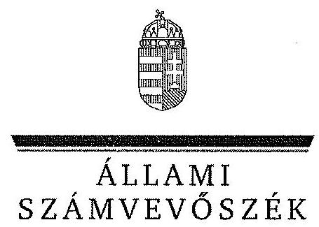
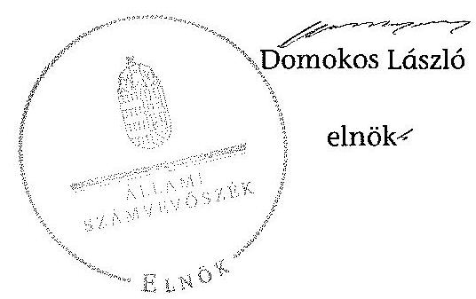

ÁLLAMI
SZÁMVEVŐSZÉK

# JELENTÉS 

az önkormányzatok belső kontrollrendszere kialakításának, egyes
kontrolltevékenységek és a belső ellenőrzés
működésének ellenőrzéséről
Istvándi
14092
2014. június

---

# Állami Számvevőszék 

Iktatószám: V-0380-037/2014
Témaszám: 1162
Vizsgálat-azonosító szám: V064954

## Az ellenőrzést felügyelte:

Dr. Benedek Mária
felügyeleti vezető
Az ellenőrzést vezette és az ellenőrzés végrehajtásáért felelős:
Bíró Zsolt
ellenőrzésvezető
A számvevőszéki jelentés összeállításában közreműködött:
Keszthelyi Zoltán
számvevő főtanácsos
Az ellenőrzést végezték:
Gelencsér Zoltán
Keszthelyi Zoltán
számvevő főtanácsos
számvevő főtanácsos

---

# TARTALOMJEGYZÉK 

BEVEZETÉS ..... 7
I. ÖSSZEGZŐ MEGÁLLAPÍTÁSOK, KÖVETKEZTETÉSEK, JAVASLATOK ..... 11
II. RÉSZLETES MEGÁLLAPÍTÁSOK ..... 16

1. Az önkormányzat belső kontrollrendszerének kialakítása ..... 16
1.1. A kontrollkörnyezet ..... 16
1.2. A kockázatkezelési rendszer ..... 18
1.3. A kontrolltevékenységek ..... 18
1.4. Az információs és kommunikációs rendszer ..... 21
1.5. A monitoring rendszer ..... 21
2. A pénzügyi folyamatokban kulcsszerepet betöltő teljesítésigazolás és érvényesítés belső kontrollok működése ..... 21
3. A belső ellenőrzés működése ..... 24

## FÜGGELÉKEK

1. számú Értelmező szótár
2. számú Az értékelés módja és szempontjai

---

.

---

# RÖVIDÍTÉSEK JEGYZÉKE 

## Törvények

Áht.
ÁSZ tv.
Htv.

Info tv.

Kttv.

Ktv.

Ltv.

Mötv.

Mvtv.
Nvtv.
Ötv.
Tvtv.

Vagyonnyilatkozattételről szóló tv.

## Rendeletek

Áhsz. 1

Áhsz. 2
Ávr.

Bkr.

Ikr.
képviselő-testületi
SZMSZ
2011. évi CXCV. törvény az államháztartásról (hatályos 2012. január 1-jétől)
2011. évi LXVI. törvény az Állami Számvevőszékről
1991. évi XX. törvény a helyi önkormányzatok és szerveik, a köztársasági megbízottak, valamint egyes centrális alárendeltségű szervek feladat- és hatásköreiről
2011. évi CXII. törvény az információs önrendelkezési jogról és az információszabadságról (hatályos 2012. január 1-jétől)
2011. évi CXCIX. törvény a közszolgálati tisztviselőkről (hatályos 2012. március 1-jétől)
1992. évi XXIII. törvény a köztisztviselők jogállásáról (hatálytalan 2012. március 1-jétől)
1995. évi LXVI. törvény a köziratokról, a közlevéltárakról és a magánlevéltári anyag védelméről
2011. évi CLXXXIX. törvény Magyarország helyi önkormányzatairól
1993. évi XCIII. törvény a munkavédelemről
2011. évi CXCVI. törvény a nemzeti vagyonról (hatályos 2011. december 31-étől)
1990. évi LXV. törvény a helyi önkormányzatokról
1996. évi XXXI. törvény a tűz elleni védekezésről, a műszaki mentésről és a tűzoltóságról
2007. évi CLII. törvény az egyes vagyonnyilatkozat-tételi kötelezettségekről

249/2000. (XII. 24.) Korm. rendelet az államháztartás szervezetei beszámolási és könyvvezetési kötelezettségének sajátosságairól (hatálytalan 2014. január 1-jétől)
4/2013. (I. 11.) Korm. rendelet az államháztartás számviteléről (hatályos 2014. január 1-jétől)
368/2011. (XII. 31.) Korm. rendelet az államháztartásról szóló törvény végrehajtásáról (hatályos 2012. január 1-jétől)
370/2011. (XII. 31.) Korm. rendelet a költségvetési szervek belső kontrollrendszeréről és belső ellenőrzéséről (hatályos 2012. január 1-jétől)
335/2005. (XII. 29.) Korm. rendelet a közfeladatot ellátó szervek iratkezelésének általános követelményeiről
Istvánedi Község Képviselő-testületének 7/2007. (V. 29.) önkormányzati rendelete a Szervezeti és Működési Szabályzatról

---

vagyongazdálkodási rendelet

## Szórövidítések

ÁSZ
belső ellenőrzési kézikönyv
gazdálkodási szabályzat${ }_{1}$
gazdálkodási szabályzata${ }_{2}$

Hivatal
INTOSAI
iratkezelési szabályzat

ISSAI
jegyző
Képviselő-testület
Kormányhivatal
körjegyző${ }_{1}$
körjegyző${ }_{2}$

Körjegyzőség${ }_{1}$

Körjegyzőség${ }_{2}$

Körjegyzőség${ }_{2}$ SZMSZ-e
külső szolgáltató
leltározási szabályzat

Istvándi Község Önkormányzat Képviselő-testületének 5/2011. (IX. 1.) számú rendelete az önkormányzat vagyonáról

Állami Számvevőszék
Darány, Drávagárdony, Drávatamási, Istvándi és Kastélyosdombó Községek Körjegyzőségének Belső ellenőrzési kézikönyve (hatályos 2012. június 1-jétől 2012. december 31-ig)
Istvándi Község Önkormányzata Gazdálkodási Szabályzata (hatályos 2012. június 1-jétől 2012. december 31-ig)
Darány, Drávagárdony, Drávatamási, Istvándi és Kastélyosdombó Községek Körjegyzőségének Gazdálkodási Szabályzata (hatályos 2012. június 1-jétől 2012. december 31-ig)
Darányi Közös Önkormányzati Hivatal
International Organization of Supreme Audit Institutions (Legfőbb Ellenőrző Intézmények Nemzetközi Szervezete)
Darány és Kastélyosdombó körjegyzőségének Egyedi Iratkezelési szabályzata
International Standards of Supreme Audit Institutions (Legfőbb Ellenőrző Intézmények Nemzetközi Standardjai)
Darányi Közös Önkormányzati Hivatal jegyzője
Istvándi Község Önkormányzatának Képviselő-testülete
Somogy Megyei Kormányhivatal
Drávagárdony, Istvándi községek körjegyzője 2001. január 1-jétől 2012. május 31-ig
Darány, Drávagárdony, Drávatamási, Istvándi és Kastélyosdombó községek körjegyzője 2012. június 1-jétől 2012. december 31-ig
Drávagárdony, Istvándi Községek Önkormányzatának Körjegyzői Hivatala 2012. január 1-jétől 2012. május 31-ig
Darány, Drávagárdony, Drávatamási, Istvándi és Kastélyosdombó Községek Körjegyzősége 2012. június 1-jétől 2012. december 31-ig
Darány, Drávagárdony, Drávatamási, Istvándi és Kastélyosdombó Községek Körjegyzőségének Ügyrendje (Megállapodás körjegyzőség alapítására és fenntartására melléklete, hatályos 2012. június 1-jétől 2012. december 31-ig)
Megállapodás alapján a belső ellenőrzési feladatot ellátó Könyvelő- és Ellenőr Kft.
Darány, Drávagárdony, Drávatamási, Istvándi és Kastélyosdombó Községek Körjegyzőségének Leltárkészítési és leltározási szabályzata

---

NGM
Önkormányzat
polgármester

Nemzetgazdasági Minisztérium
Istvándi Község Önkormányzata
Istvándi Község Önkormányzatának polgármestere

---

.

---

# JELENTÉS 

## az önkormányzatok belső kontrollrendszere kialakításának, egyes kontrolltevékenységek és a belső ellenőrzés működésének ellenőrzéséről Istvándi

## BEVEZETÉS

Istvándi község állandó lakosainak száma 2012. január 1-jén 663 fő volt. Az Önkormányzat öttagú Képviselő-testületének munkáját egy állandó bizottság segítette. Az Önkormányzat társult tagként az önállóan működő és gazdálkodó Körjegyzőség${ }_{1,2}$-ön kívül más intézményt nem működtetett. A Körjegyzőség${ }_{1}$ 2012. május 31-én megszűnt. A Körjegyzőség${ }_{2}$ 2012. június 1-jén jött létre Darány székhellyel -, amely 2013. január 1-jén átalakult a Hivatallá. Az Önkormányzat többségi tulajdoni részesedésű gazdasági társasággal nem rendelkezett. A polgármester 1999 óta tölti be tisztségét. A körjegyző${ }_{1}$ 2001. január 1-jétől 2012. május 31-éig, a körjegyző${ }_{2}$ 2012. június 1-jétől - 2013. január 1-jétől jegyzőként - látta el feladatait. A Körjegyzőség${ }_{1,2}$ szervezeti egységekre nem tagolódott, elkülönült gazdasági szervezettel nem rendelkezett. A Körjegyzőség${ }_{1}$-ben foglalkoztatott köztisztviselők száma 2012. január 1-jén öt fő volt. Az Önkormányzat a 2012. évi költségvetési beszámolója szerint 260923 ezer Ft költségvetési bevételt ért el, valamint 161860 ezer Ft költségvetési kiadást teljesített. A 2012. december 31-i könyvviteli mérleg szerint 385951 ezer Ft értékű eszközvagyonnal rendelkezett, a rövid lejáratú kötelezettségállománya 199 ezer Ft volt, hosszú lejáratú kötelezettséggel nem rendelkezett.

A demokratikus társadalmakban alapvető igény, hogy a közpénzeket, a közvagyont használók tevékenységükről elszámoljanak, ahhoz egyértelmű és érvényesíthető felelősségi szabályok társuljanak. Ennek a jogos igénynek az érvényesítéséhez meg kell teremteni azokat a folyamatokat, rendszereket, amelyek nélkülözhetetlenek az elszámoltatáshoz. Az elszámoltatás eredményes működtetéséhez szükség van a megfelelő információs, kontroll, értékelési és beszámolási rendszerek kialakítására.

Magyarországon az uniós csatlakozási tárgyalások idejére nyúlnak vissza a belső kontrollrendszer szabályozásának gyökerei. Az uniós elvárásoknak megfelelő új terminológia szerinti államháztartási belső pénzügyi ellenőrzési (ÁBPE) rendszer területén a jogharmonizáció 2003-ban teljes körűen megvalósult, míg az önkormányzati alrendszerre vonatkozó, Ötv.-ben megjelenített speciális szabályozás 2005-ben lépett hatályba. Az államháztartási belső kontrollrendszer koncepciója 2009-ben továbbfejlődött. A változások irányát mutatja, hogy a költségvetési szervek belső kontrollrendszere már magában foglalja

---

a korszerű, felelős szervezetirányítás elemeit (kontrollkörnyezet, kockázatkezelés, kontrolltevékenység, információ és kommunikáció, monitoring) is. E kontrollrendszer szabályozása háromszintű, a törvényi előírásokat az Áht. és a Mötv., a rendeleti szintű szabályozást az Ávr. és a Bkr. tartalmazza, amelyeket útmutatói szinten az NGM által kiadott standardok és kézikönyvek támogatnak.

A belső kontrollrendszer azt a célt szolgálja, hogy a költségvetési szervek működésük és gazdálkodásuk során a tevékenységeket szabályszerűen, gazdaságosan, hatékonyan és eredményesen hajtsák végre, teljesítsék elszámolási kötelezettségeiket és megvédjék az erőforrásokat a veszteségektől, a károktól és a nem rendeltetésszerű használattól. A belső kontrollrendszer magában foglalja mindazon szabályokat, eljárásokat, gyakorlati módszereket és szervezeti struktúrákat, kockázatkezelési technikákat, kontrolltevékenységeket, amelyek segítséget nyújtanak a szervezetnek céljai eléréséhez.

Az ÁSZ középtávú stratégiájában hangsúlyos szerepet szánt annak, hogy szilárd szakmai alapon álló, értékteremtő ellenőrzéseivel előmozdítsa a közpénzügyek átláthatóságát, rendezettségét. A számvevőszéki ellenőrzés nemzetközi alapelvei is rögzítik, hogy a megfelelő belső kontrollrendszer minimálisra csökkenti a hibák és szabálytalanságok kockázatát.

Az ellenőrzés célja annak megállapítása volt, hogy a belső kontrollrendszer elemeinek kialakítása, a pénzügyi folyamatokban kulcsszerepet betöltő teljesítésigazolás és érvényesítés, és a belső ellenőrzés szabályos működése biztosította-e az önkormányzatnál a közpénzfelhasználás szabályosságát, hozzájárult-e az értéket teremtő rend követelményének érvényesüléséhez.

Ennek keretében értékeltük, hogy:

- a jogszabályi előírásoknak megfelelően alakították-e ki a belső kontrollrendszer elemeit;
- a gazdálkodás folyamatában kulcsszerepet betöltő teljesítésigazolás és érvényesítés kontrolltevékenységeit megfelelően működtették-e;
- biztosították-e a belső ellenőrzés szabályos működését;
- amennyiben az ÁSZ tett javaslatot a 2008-2011. évek közötti ellenőrzése kapcsán az Önkormányzatnak, intézkedtek-e azok végrehajtására.

Az ellenőrzés várható hasznosulását négy szinten tervezzük. A törvényalkotás számára összegzett tapasztalatok állnak rendelkezésre a belső kontrollrendszer önkormányzati területen való kialakításáról, működéséről és hatásairól, a belső ellenőrzés működéséről. Ennek alapján következtetést lehet levonni arról, hogy a belső kontrollrendszer kialakítására és működtetésére vonatkozó jelenlegi, differenciálás nélküli jogszabályi előírások reális követelményeket támasztanak-e az eltérő adottságú települési önkormányzatok esetében, illetve indokolt-e esetleges jogszabályi módosítás kezdeményezése. Az ellenőrzés az ellenőrzött számára visszajelzést ad a belső kontrollrendszer kialakításában és működésében fellépő hiányosságokról, javaslataival hozzájárul azok kiküszöböléséhez, amely csökkentheti a későbbi ellenőrzések gyakoriságát. Az el-

---

lenőrzés megállapításait és javaslatait más szervezetek is hasznosíthatják a rendezett gazdálkodási keretek kialakításához. A társadalom számára jelzi, hogy közpénz nem maradhat ellenőrizetlenül, az ÁSZ értékteremtő rend kialakításához és megőrzéséhez hozzájáruló tevékenysége pozitív hatással lesz a szervezetről kialakított összkép formálásában. A szervezeten belül lehetőség nyílik arra, hogy a megállapítások szintetizálásával az ÁSZ a hozzáadott értéket teremtő elemző tevékenységét és tanácsadó szerepét is erősítse.

Az önkormányzatok belső kontrollrendszere kialakításának, egyes kontrolltevékenységek és a belső ellenőrzés működésének ellenőrzéséről szóló jelentés I. fejezetének összegző része az ellenőrzés céljára ad rövid, szintetizáló összefoglalót, és tartalmazza a következtetéseket a II. fejezet részletes megállapításain alapulóan. A jelentés intézkedést igénylő megállapításait és javaslatait az ellenőrzés során feltárt, a jelentés II. fejezetében rögzített részletes megállapítások alapozzák meg. A helyszíni ellenőrzés lezárásáig a helyi szabályozás változásait nyomon követtük.

Az ellenőrzés típusa: szabályszerűségi ellenőrzés.
Az ellenőrzött időszak: a belső kontrollrendszer kialakításának megfelelősége esetében a 2012. évre, a pénzügyi folyamatokban kulcsszerepet betöltő teljesítésigazolás és érvényesítés belső kontrollok működésének megfelelőségét és a belső ellenőrzés szabályszerű működését a 2012. január 1. és december 31-e közötti időszak eseményeit figyelembe véve értékeltük, míg az ÁSZ javaslatainak utóellenőrzése a 2008-2011. években végzett ellenőrzések nyilvánosságra hozott jelentéseiben tett javaslatok áttekintésére terjedt ki.

# Az ellenőrzött szervezet: az Önkormányzat. 

Az ellenőrzés jogszabályi alapját az ÁSZ tv. 1. § (3) bekezdése, az 5. § (2) és (6) bekezdése, valamint az Áht. 61. § (2) bekezdésének előírásai képezik.

Az ellenőrzés szakmai módszertana az ÁSZ hivatalos honlapján (www.asz.hu) közzétett szakmai szabályokon alapult, amely az INTOSAI által kiadott ISSAI figyelembevételével készült.

Az ellenőrzés lefolytatásához az Önkormányzat a kimutatások és a tanúsítvány elektronikus kitöltésével, valamint az ÁSZ által kért dokumentumok elektronikus megküldésével szolgáltatott adatokat. Az így rendelkezésre bocsátott adatok, információk kontrollja és a munkalapok kitöltése a helyszíni ellenőrzés keretében történt. A jelentésben használt fogalmak magyarázatát az 1. számú függelék, az ellenőrzés egyes területeinek értékelésénél alkalmazott egységes minősítési szempontokat a 2. számú függelék tartalmazza.

A belső kontrollrendszer kialakításának ellenőrzése során értékeltük a kontrollkörnyezet, a kockázatkezelési rendszer, a kontrolltevékenységek, az információs és kommunikációs rendszer, valamint a monitoring rendszer szabályozottságának megfelelőségét. A pénzügyi folyamatokban kulcsszerepet betöltő teljesítésigazolás és érvényesítés kontrollok működése megfelelőségének minősítéséhez az állományba nem tartozók megbízási díjai, a külső szolgáltatók által végzett karbantartási, kisjavítási munkák, az egyéb üzemeltetési és fenntartási

---

szolgáltatások, a rendszeres szociális segélyek, valamint az államháztartáson kívülre teljesített működési és felhalmozási célú pénzeszközátadások közül kockázatelemzéssel választottuk ki az ellenőrzött kiadási jogcímeket. Az egyszerű véletlen mintavétellel kiválasztott tételek ellenőrzését többlépcsős megfelelőségi tesztek útján addig végeztük, amíg elegendő és megfelelő bizonyítékot szereztünk a vizsgált folyamatok kulcskontrolljai működésének megfelelő vagy nem megfelelő voltáról. Értékeltük az Önkormányzatnál a belső ellenőrzés működésének szabályosságát. Utóellenőrzésre
 nem került sor, mivel az ÁSZ az Önkormányzatnál a 2008-2011. évek között nem végzett ellenőrzést.

Az ÁSZ tv. 29. § (1) bekezdése szerint a jelentéstervezetet megküldtük a polgármester részére, aki az ÁSZ tv. 29. § (2) bekezdésében foglalt észrevételezési jogával nem élt, a jelentéstervezetre észrevételt nem tett.

---

# I. ÖSSZEGZŐ MEGÁLLAPÍTÁSOK, KÖVETKEZTETÉSEK, JAVASLATOK 

A belső kontrollrendszeren belül 2012-ben a kontrollkörnyezet, a kockázatkezelési rendszer, a kontrolltevékenységek, az információs és kommunikációs rendszer, valamint a monitoring rendszer kialakítását külön-külön és együttesen is értékeltük. A belső kontrollrendszer kialakítása az összesített értékelés alapján nem felelt meg a jogszabályi előírásoknak.

A belső kontrollrendszer egyes területei kialakításának minősítése a következő:

| Kontrollterület | Minősítés |
| :-- | :--: |
| Kontrollkörnyezet | nem |
|  | megfelelő |
| Kockázatkezelési rendszer | részben |
|  | megfelelő |
| Kontrolltevékenységek | részben |
|  | megfelelő |
| Információs és kommunikációs | nem |
| rendszer | megfelelő |
| Monitoring rendszer | nem |

Részben megfelelőnek értékeltük a kockázatkezelési rendszer és a kontrolltevékenységek kialakítását, mivel a megállapított szabályozásbeli hiányosságok nem veszélyeztették e kontrollterületeken a szabályszerű működést.

Nem megfelelőnek értékeltük a kontrollkörnyezet, az információs és kommunikációs rendszer és a monitoring rendszer kialakítását, mivel az ellenőrzésünk során megállapított szabályozásbeli hiányosságok magukban hordozzák a szabálytalan működés, valamint a korrupció kockázatát.

A 2012. évben az állományba nem tartozók megbízási díjaival, valamint a külső szolgáltatók által végzett karbantartási, kisjavítási munkákkal kapcsolatos kifizetések során a pénzügyi folyamatokban kulcsszerepet betöltő teljesítésigazolás és érvényesítés belső kontrollok működése gyenge volt. Gyengének értékeltük a két kulcskontroll együttes működését, mivel azok nem biztosították a hibák megelőzését, feltárását.

A számvevőszéki ellenőrzés az ellenőrzött kifizetésekkel összefüggésben a rendelkezésre bocsátott dokumentumok alapján kár bekövetkeztére utaló adatot, tényt nem állapított meg, azonban a gazdálkodásban kulcsszerepet betöltő kontrollok működésében feltárt hiányosságok miatt fennáll a hibák bekövetkezésének kockázata. A nem megfelelően működtetett belső kontrollok korrupciós kockázatot hordoznak.

---

Az Önkormányzat a belső ellenőrzési feladatokat 2012. június 1-jétől külső szolgáltató útján látta el. A 2012. évben a belső ellenőrzés működése a jogszabályi előírásoknak jól megfelelt, azonban a belső ellenőrzés nem tárta fel a belső kontrollrendszer kialakításának, valamint a pénzügyi folyamatokban kulcsszerepet betöltő teljesítésigazolás és érvényesítés belső kontrollok működésének hiányosságait.

Az ÁSZ tv. 33. § (1) bekezdésében foglaltak értelmében az ellenőrzött szervezet vezetője köteles a jelentésben foglalt megállapításokhoz kapcsolódó intézkedési tervet összeállítani, és azt a jelentés kézhezvételétől számított 30 napon belül az ÁSZ részére megküldeni. Amennyiben az intézkedési tervet határidőre nem küldi meg a szervezet, vagy az ÁSZ tv. 33. § (2) bekezdésében foglalt póthatáridő elteltével megküldött intézkedési terv továbbra sem elfogadható, az ÁSZ elnöke a hivatkozott törvény 33. § (3) bekezdés a)-b) pontjaiban foglaltakat érvényesítheti.

Az ellenőrzés intézkedést igénylő megállapításai és javaslatai:

# a polgármesternek 

1. Az Önkormányzat nevében történő kötelezettségvállalás - az Áht. 37. § (1) bekezdése és az Ávr. 55. § (1) bekezdésében előírtak ellenére - pénzügyi ellenjegyzés hiányában történt.

Javaslat:
Intézkedjen, hogy az Önkormányzat nevében történő kötelezettségvállalásra az Áht. 37. § (1) bekezdésében és az Ávr. 55. § (1) bekezdésében foglaltaknak megfelelően - az Ávr. 53. §-ában meghatározott kivételekkel - kizárólag a pénzügyi ellenjegyzés után, a pénzügyi teljesítés esedékességét megelőzően, írásban kerüljön sor.
2. A számvevőszéki ellenőrzés megállapításai alapján az Önkormányzatnál a belső kontrollrendszer kialakítása összefoglalóan értékelve nem felelt meg a jogszabályi előírásoknak, a kulcskontrollok működése gyenge volt, a belső ellenőrzés működése ugyan jól megfelelt a jogszabályi előírásoknak, azonban nem tárta fel, ezáltal nem is javíttatta ki hiányosságokat. A megállapított szabályozásbeli és működésbeli hiányosságok magukban hordozzák a szabálytalan működés kockázatát.

Javaslat:
Kísérje figyelemmel a Mötv. 115. § (1) bekezdésében foglaltak alapján az Önkormányzat gazdálkodásának szabályszerűségét. A Mötv. 67. § f) pontja alapján gondoskodjon a belső kontrollrendszer működésére vonatkozó jogszabályi rendelkezések be nem tartása, valamint a teljesítésigazolás, illetve az érvényesítés kontrollokkal összefüggésben feltárt hiányosságok, szabálytalanságok tekintetében az esetleges munkajogi felelősséggel kapcsolatos körülmények kivizsgálásáról, majd a vizsgálat eredményének függvényében tegye meg a szükséges intézkedéseket.

---

# a jegyzőnek (Istvándi Község Önkormányzata vonatkozásában) 

1. a kontrollkörnyezettel kapcsolatban:

A körjegyző$_{1,2}$ a - Htv.-ben foglalt kötelezettsége ellenére - nem készítette el a gazdasági programtervezetet. A Körjegyzőség$_{1}$ nem rendelkezett SZMSZ-szel, a Körjegyzőség$_{2}$ SZMSZ-e nem felelt meg az Ávr.-ben előírt tartalmi követelményeknek. A vagyongazdálkodási rendelet nem felelt meg az Nvtv. előírásainak, mivel a körjegyző$_{1,2}$ - az Ötv.-ben előírtak ellenére - nem készítette elő annak módosítását. Az Áhsz. $_{1}$-ben foglaltak ellenére a Körjegyzőség$_{1}$ nem rendelkezett leltározási szabályzattal, a Körjegyzőség$_{2}$ leltározási szabályzatában a mérlegben kimutatott eszközök kétévenkénti leltározását önkormányzati rendelet (határozat) hiányában írták elő. A körjegyző$_{1,2}$ - az Mvtv.-ben foglaltak ellenére - nem határozta meg a Körjegyzőség$_{1,2}$-n az egészséget nem veszélyeztető és biztonságos munkavégzés követelményei megvalósításának módját és a Tvtv.-ben foglaltak ellenére nem készítették el a Körjegyzőség$_{1,2}$ tűzvédelmi szabályzatát, továbbá a Kttv.-ben előírtak ellenére a Kör-jegyzőség$_{2}$-n dolgozó köztisztviselők munkateljesítményét írásban nem értékelte. A körjegyző$_{1,2}$ az Ötv.-ben előírt feladata ellenére nem készítette elő a Kttv.-ben előírt, a köztisztviselőkkel szembeni hivatásetikai alapelvek részletes tartalmának, valamint az etikai eljárás szabályainak dokumentumát [II. Részletes megállapítások, 1.1. A kontrollkörnyezet, 2., 7., 10., 16., 25., 32., 33., 46. és 47. sorszámú megállapítás].

Javaslat:
Intézkedjen az Áht. 69. § (2) bekezdése, a Bkr. 3. § a) pontja és 6. §-a alapján a jelentés II. Részletes megállapítások, 1.1. A kontrollkörnyezet 7., 10., 16., 25., 32., 33., 46. és 47. sorszámú megállapításaiban foglalt hibák, hiányosságok kijavításáról, megszüntetéséről az ott megjelölt jogszabályi rendelkezéseknek megfelelően.
2. a kockázatkezelési rendszerrel kapcsolatban:

A körjegyző$_{1,2}$ a Bkr.-ben foglaltak ellenére a kockázatok kezelése érdekében előírt intézkedések teljesítése folyamatos nyomon követési módját nem határozta meg. Egy fő köztisztviselő jogviszonya megszűnésekor a Vagyonnyilatkozat-tételről szóló tv.ben foglaltak ellenére vagyonnyilatkozat-tételi kötelezettségének nem tett eleget. [II. Részletes megállapítások, 1.2. A kockázatkezelési rendszer, 10. és 14. sorszámú megállapítás].

Javaslat:
Intézkedjen az Áht. 69. § (2) bekezdése, a Bkr. 3. § b) pontja és 7. §-a alapján a jelentés II. Részletes megállapítások, 1.2. A kockázatkezelési rendszer 10. sorszámú megállapításaiban foglalt hibák, hiányosságok kijavításáról, megszüntetéséről az ott megjelölt jogszabályi rendelkezéseknek megfelelően.
3. a kontrolltevékenységekkel kapcsolatban:

A körjegyző$_{1,2}$ a Bkr.-ben foglaltak ellenére nem biztosította a vagyonhasznosítási tevékenység dokumentumainak elkészítésével kapcsolatban a folyamatba épített, előzetes, utólagos és vezetői ellenőrzést, továbbá belső szabályzatban nem határozta

---

Javaslat:
Intézkedjen az Áht. 69. § (2) bekezdése, a Bkr. 3. § c) pontja és 8. §-a alapján a II. Részletes megállapítások, 1.3. A kontrolltevékenységek 2-5., 8., 16., 17., 20. és 21. sorszámú megállapításában foglalt hibák, hiányosságok kijavításáról, megszüntetéséről az ott megjelölt jogszabályi rendelkezéseknek megfelelően.
4. az információs és kommunikációs rendszerrel kapcsolatban:

A jegyző, a Bkr.-ben és az Info tv.-ben foglaltak ellenére nem alakított ki olyan rendszert, amely biztosítja, hogy a megfelelő információk a megfelelő időben eljutnak az illetékes szervezethez, személyhez továbbá nem szabályozta a közérdekű adatok megismerésére irányuló igények teljesítésének rendjét. Az Önkormányzat a 2012. évben nem tett eleget az elektronikus közzétételi kötelezettségének [II. Részletes megállapítások, 1.4. Az információs és kommunikációs rendszer 1-2., 7. és 8. sorszámú megállapítás].

Javaslat:
Intézkedjen az Áht. 69. § (2) bekezdése, a Bkr. 3. § d) pontja és 9. §-a alapján a jelentés II. Részletes megállapítások, 1.4. Az információs és kommunikációs rendszer 1-2., 7. és 8. sorszámú megállapításaiban foglalt hibák, hiányosságok kijavításáról, megszüntetéséről az ott megjelölt jogszabályi rendelkezéseknek megfelelően.
5. a monitoring rendszerrel kapcsolatban:

A jegyző, a Bkr.-ben foglaltak ellenére nem alakította ki a Polgármesteri Hivatal tevékenységének, a célok megvalósításának nyomon követését biztosító rendszerét, a külső ellenőrzések megállapításainak hasznosítására intézkedési tervet nem készített, a belső ellenőrzési jelentésben foglalt javaslatokhoz készített intézkedési terv végrehajtásáról szóló beszámolót nem készítette el és nem küldte meg a belső ellenőrzési vezető részére [II. Részletes megállapítások, 1.5. A monitoring rendszer 1., 12., és 18. sorszámú megállapítás].

Javaslat:
Intézkedjen az Áht. 69. § (2) bekezdése, a Bkr. 3. § e) pontja és 10. §-a alapján a jelentés II. Részletes megállapítások, 1.5. A monitoring rendszer 1., 12., és 18. sorszámú megállapításaiban foglalt hibák, hiányosságok kijavításáról, megszüntetéséről az ott megjelölt jogszabályi rendelkezéseknek megfelelően.
6. a pénzügyi folyamatokban kulcsszerepet betöltő kontrollokkal kapcsolatban:

A teljesítésigazolás és érvényesítés nem felelt meg az Áht.-ban és az Ávr.-ben foglaltaknak [II. Részletes megállapítások, 2. A pénzügyi folyamatokban kulcsszerepet betöltő teljesítésigazolás és érvényesítés belső kontrollok működése, 1., 2. és 3. számú pontokban foglalt megállapítások].

Javaslat:
Intézkedjen az Áht. 37-38. §-ában, az Ávr. 55-59. §-ában és az Áhsz. 2. 39. § (1) bekezdésében és a 14. számú melléklet II. pontjában foglaltak alapján arról, hogy a tel-

---

megállapításában foglalt hibák, hiányosságok kijavításáról, megszüntetéséről az ott megjelölt jogszabályi rendelkezéseknek megfelelően.
6. a pénzügyi folyamatokban kulcsszerepet betöltő kontrollokkal kapcsolatban:

A teljesítésigazolás és az érvényesítés nem felelt meg az Áht.-ban és az Ávr.-ben foglaltaknak [II. Részletes megállapítások, 2. A pénzügyi folyamatokban kulcsszerepet betöltő teljesítésigazolás és érvényesítés belső kontrollok működése, 1-3. pontban foglalt megállapítás].

Javaslat:
Intézkedjen az Áht. 37-38. §-ában, az Ávr. 55-59. §-ában és az Áhsz. 2. -ben foglaltak alapján arról, hogy a teljesítésigazolás és az érvényesítés vonatkozásában, valamint azok ellenőrzése során a pénzügyi ellenjegyzéssel, az utalványozással, a kötelezettségvállalások nyilvántartásba vételével kapcsolatban feltárt, a jelentés II. Részletes megállapítások, 2. A pénzügyi folyamatokban kulcsszerepet betöltő teljesítésigazolás és érvényesítés belső kontrollok működése 1-3. pontjában szereplő megállapításokban foglalt hibák, hiányosságok kijavítása, megszüntetése az ott megjelölt jogszabályi rendelkezéseknek megfelelően történjen meg;
7. a belső ellenőrzés működésével kapcsolatban:

A belső ellenőrzés működése az értékelés szempontjait figyelembe véve jól megfelelt a jogszabályi előírásoknak, azonban a számvevőszéki ellenőrzés kisebb súlyú hiányosságokat tárt fel, amelyek nem feleltek meg a Bkr.-ben előírt rendelkezéseknek [II. Részletes megállapítások, 3. A belső ellenőrzés működése, 1., 5., 8. c), 15., 19. és 27. sorszámú megállapítása].

Javaslat:
Intézkedjen az Áht. 69. § (2), a 70. § (1) bekezdései, a Bkr. 3. § e) pontja és a 10. §-a alapján a jelentés II. Részletes megállapítások, 3. A belső ellenőrzés működése 1., 5., 8. c), 15., 19. és 27. sorszámú megállapításában foglalt hibák, hiányosságok kijavításáról, megszüntetéséről az ott megjelölt jogszabályi rendelkezéseknek megfelelően.

---

# II. RÉSZLETES MEGÁLLAPÍTÁSOK 

## 1. AZ ÖNKORMÁNYZAT BELSŐ KONTROLLRENDSZERÉNEK KIALAKÍTÁSA

A belső kontrollrendszeren belül 2012-ben a kontrollkörnyezet, a kockázatkezelési rendszer, a kontrolltevékenységek, az információs és kommunikációs rendszer, valamint a monitoring rendszer kialakítását külön-külön és együttesen is értékeltük. A belső kontrollrendszer kialakítása az összesített értékelés alapján nem felelt meg a jogszabályi előírásoknak.

### 1.1.
 A kontrollkörnyezet

A kontrollkörnyezet kialakítása - a 2. számú függelékben részletezett kritériumrendszer alapján végzett értékelés szerint - a jogszabályi előírásoknak nem felelt meg, mert:

| Sor-   szám $^{1}$ | Megállapítás | Megjegyzés |
| :--: | :--: | :--: |
| 2. | A körjegyző ${ }_{1,2}$ a - Htv. 140. § (1) bekezdés   a) pontjában foglaltak ellenére - nem készítette el a gazdasági programtervezetet, így a Képviselő-testület az Ötv. 91. § (1) és (7) bekezdésében foglaltakat figyelmen kívül hagyva nem határozta meg az Önkormányzat gazdasági programját. | 2013. január 1-jétől a Mötv. 116. § (1) és (5) bekezdése szabályozza, hogy a képviselő-testület hosszú távú fejlesztési elképzeléseit gazdasági programban rögzíti, és a gazdasági programot az alakuló ülését követő hat hónapon belül fogadja el. |
| 4. | A Képviselő-testület - a Ktv. 34. § (3) bekezdésében foglaltak ellenére - nem döntött a teljesítményértékelés alapját képező célokról. | A Ktv.-t hatályon kívül helyezte a 2012. évi V. törvény 59. § (1) bekezdés a) pontja, hatálytalan 2012. március 1-jétől. |
| 7. és   10. | A Körjegyzőség ${ }_{1}$ az Áht. 10. § (5) bekezdésében foglaltak ellenére nem rendelkezett SZMSZ-el. A körjegyző ${ }_{2}$ a Körjegyzőség ${ }_{2}$ SZMSZ-ében - az Ávr. 13. § (1) bekezdés c) és g) pontjaiban foglaltak ellenére - nem rögzítette az ellátandó, és a szakfeladatrend szerint szakfeladat számmal és megnevezéssel besorolt alaptevékenységek, és az alaptevékenységet szabá- | 2014. január 1-jétől az Ávr. 13. § (1) bekezdés c) pontjában szereplő szöveg az alábbira változott: „az ellátandó, és a kormányzati funkció szerint besorolt alaptevékenységek, rendszeresen ellátott vállalkozási tevékenységek, valamint az |

[^0]
[^0]:    ${ }^{1}$ A megállapítás számozása az Önkormányzat által az adatszolgáltatás során kitöltött kimutatások kérdéseinek sorszámával azonos.

---

|  | lyozó jogszabályok megjelölését, a szervezeti és működési szabályzatban nevesített valamennyi munkakörhöz tartozó feladatokat és hatásköröket, a hatáskörök gyakorlásának módját, a helyettesítés rendjét és az ezekhez kapcsolódó felelősségi szabályokat. | alaptevékenységet szabályozó jogszabályok megjelölését." |
| :--: | :--: | :--: |
| 16. | A körjegyző ${ }_{1,2}$ - az Ötv. 36. § (2) bekezdés a) pontjában foglaltak ellenére - az ellenőrzött időszakban nem készítette elő a vagyongazdálkodási rendelet módosítását, annak érdekében, hogy az megfeleljen az Nvtv. 3. § (1) bekezdés 6. pontja, 5. §-a, 11. § (16) bekezdése, valamint a 13. § (1) bekezdése előírásainak. | A jegyző részére az önkormányzat működésével kapcsolatos feladatok ellátásáról való gondoskodást 2013. január 1-jétől a Mötv. 81. § (3) bekezdés c) pontja írja elő. |
| 25. | A Körjegyzőség ${ }_{1}$ nem rendelkezett az Áhsz. ${ }_{1}$ 8. § (4) bekezdés a) pontjában előírt leltározási szabályzattal. A körjegyző ${ }_{2}$ a Körjegyzőség ${ }_{2}$ leltározási szabályzatában - az Áhsz. ${ }_{1}$ 37. § (7) bekezdésében foglaltak ellenére - a mérlegben kimutatott eszközök kétévenkénti leltározását önkormányzati rendelet (határozat) hiányában írta elő. | 2014. január 1-jétől az Áhsz. ${ }_{2}$ 50. § (1) bekezdése és a Számv. tv. 14. § (5) bekezdés a) pontja írja elő a leltározási szabályzat készítésének kötelezettségét.   2014. január 1-jétől az Áhsz. ${ }_{2}$ 22. §-ában előírtak szerint a leltározás végrehajtására a Számv. tv. 69. §-ában foglalt rendelkezéseit kell alkalmazni. |
| 32. | A körjegyző ${ }_{1,2}$ - az Mvtv. 2. § (3) bekezdésében foglaltak ellenére - nem határozta meg a Körjegyzőség ${ }_{1,2}$-n az egészséget nem veszélyeztető és biztonságos munkavégzés követelményei megvalósításának módját. | Hivatal rendelkezik 2013. július 24-től munkavédelmi szabályzattal. |
| 33. | A Körjegyzőség ${ }_{1}$ nem rendelkezett tűzvédelmi szabályzattal, és - a Tvtv. 19. § (1) bekezdésében foglaltak ellenére - a körjegyző ${ }_{2}$ sem készítette el a Körjegyzőség ${ }_{2}$ tűzvédelmi szabályzatát. | Hivatal rendelkezik 2013. július 24-től tűzvédelmi szabályzattal. |
| 46. | A körjegyző ${ }_{2}$ - a Kttv. 130. § (1) bekezdésében előírtak ellenére - a Körjegyzőség ${ }_{2}$-ön dolgozó köztisztviselők munkateljesítményét írásban nem értékelte. |  |
| 47. | A Képviselő-testület - a Kttv. 231. § (1) bekezdés ellenére - nem állapította meg a Kttv. 83. §-ában előírt, a köztisztviselőkkel szembeni hivatásetikai alapelvek részletes tartalmát, valamint az etikai eljárás szabályait, mivel a körjegyző ${ }_{1,2}$ a 2012. évben - az Ötv. 36. § (2) bekezdés a) pontjában előírt feladata ellenére - nem készítette elő ennek dokumentumát. |  |

---

# 1.2. A kockázatkezelési rendszer 

A kockázatkezelési rendszer kialakítása - a 2. számú függelékben részletezett kritériumrendszer alapján végzett értékelés szerint - részben felelt meg a jogszabályi előírásoknak.

A körjegyző ${ }_{2}$ elkészítette a Körjegyzőség ${ }_{2}$ kockázatkezelési rendszerének belső szabályzatát, gondoskodott a Körjegyzőség ${ }_{2}$ tevékenységében rejlő kockázatok azonosításáról, értékeléséről, és meghatározta az egyes kockázatok kezelése érdekében szükséges intézkedéseket. A vagyonnyilatkozat-tételre kötelezettek körét a Körjegyzőség ${ }_{2}$ SZMSZ-ében és a képviselő-testületi SZMSZ-ben rögzítették.

A kockázatkezelési rendszer kialakítása az értékelés szempontjából az alábbi kisebb súlyú hiányosságok miatt részben felelt meg a jogszabályi előírásoknak:

| Sorszám | Megállapítás |
| :--: | :--: |
| 10. | A körjegyző ${ }_{1,2}$ a Bkr. 7. § (2) bekezdésében foglaltak ellenére a kockázatok kezelése érdekében előírt intézkedések teljesítése folyamatos nyomon követési módját nem határozta meg. |
| 14. | A Körjegyzőség ${ }_{1}$-en foglalkoztatott 1 fő köztisztviselő jogviszonya megszűnésekor a Vagyonnyilatkozat-tételről szóló tv. 5. § (1) b) pontjában foglaltak ellenére vagyonnyilatkozat-tételi kötelezettségének nem tett eleget. Az őrzésért felelős - a Vagyonnyilatkozat-tételről szóló tv. 8. § (4) bekezdésében foglaltak ellenére - nem tájékoztatta a köztisztviselőt a vagyonnyilatkozat-tételi kötelezettség fennállásáról és esedékességének időpontjáról az esedékességet legalább 15 nappal megelőzően, továbbá a 10. § (1) bekezdésében foglaltak ellenére - írásban nem szólította fel a köztisztviselőt arra, hogy kötelezettségét a felszólítás kézhezvételétől számított nyolc napon belül teljesítse. |

### 1.3. A kontrolltevékenységek

A kontrolltevékenységek kialakítása - a 2. számú függelékben részletezett kritériumrendszer alapján végzett értékelés szerint - a jogszabályi előírásoknak részben megfelelt.

A körjegyző ${ }_{2}$ a kontrolltevékenység részeként előírta a folyamatba épített, előzetes, utólagos és vezetői ellenőrzést a költségvetés tervezése, a beszerzések lebonyolítása és a támogatások elszámolása vonatkozásában.

A gazdálkodási szabályzat ${ }_{1,2}$-ben a körjegyző ${ }_{2}$ meghatározta a kötelezettségvállalás pénzügyi ellenjegyzése, a teljesítésigazolás, az érvényesítés és az utalványozás módját. Szabályozta továbbá az előzetes írásbeli kötelezettségvállalást nem igénylő kifizetések rendjét.

A gazdálkodási szabályzat ${ }_{1,2}$-ben a körjegyző ${ }_{2}$ meghatározta az időközi és éves beszámolók elkészítésének feladatait, és a beszámolási eljárásokhoz kapcsolódó felelősségi köröket. Az éves költségvetési beszámoló elkészítésével megbízott személy rendelkezett a jogszabályban előírt képesítéssel és a tevékenység ellátására jogosító engedéllyel. A pénzügyi ellenjegyzésre és érvényesítésre kijelölt köztisztviselők rendelkeztek az előírt szakképzettséggel.

A kontrolltevékenység kialakítása az értékelés szempontjából az alábbi kisebb súlyú hiányosságok miatt részben felelt meg a jogszabályi előírásoknak:

| Sorszám | Megállapítás | Megjegyzés |
| :--: | :--: | :--: |
| 4. | A körjegyző ${ }_{1,2}$ a Bkr. 8. § (2) bekezdésében foglaltak ellenére nem biztosította a vagyonhasznosítási tevékenység dokumentumainak elkészítésével kapcsolatban a folyamatba épített, előzetes, utólagos és vezetői ellenőrzést. |  |
| 10. | A körjegyző ${ }_{1}$ 2012. május 31-éig az Ávr. 57. § (4) bekezdésében foglaltak ellenére - nem jelölt ki a Körjegyzőség ${ }_{1}$ kiadási előirányzata terhére történő kifizetések esetére teljesítésigazolókat. Az Önkormányzat kiadási előirányzata terhére történő kifizetés esetére a körjegyző ${ }_{1}$ 2012. március 30-át megelőzően, valamint a polgármester mint kötelezettségvállaló 2012. március 31-étől 2012. május 31-éig - az Ávr. 57. § (4) bekezdésében foglaltak ellenére - nem jelölték ki a teljesítésigazolásra jogosultakat. | A körjegyző ${ }_{2}$ 2012. június 1-jével a Körjegyzőség ${ }_{2}$ kiadási előirányzata terhére történő kifizetések esetére kijelölte a teljesítésigazolókat.   A polgármester mint kötelezettségvállaló az Önkormányzat kiadási előirányzatai terhére történt kifizetések esetében 2012. június 1-től kijelölte a teljesítésigazolásra jogosultakat. |
| 13. | A körjegyző ${ }_{1,2}$ - az Ikr. 8. § (1) bekezdésében foglalt előírást figyelmen kívül hagyva - nem gondoskodott az iratkezelési szoftver által kezelt adatok biztonságáról, nem alakította ki az üzembiztonsági, adatvédelmi szabályok érvényre juttatásához szükséges eljárási szabályokat. |  |
| 16. | A körjegyző ${ }_{1,2}$ - az Info tv. 7. § (2)(3) bekezdéseiben foglalt előírásokat figyelmen kívül hagyva - az informatikai rendszer szabályozása során nem tette meg azokat a technikai és szervezési intézkedéseket, |  |

---

|  | nem alakította ki azokat az eljárási szabályokat, amelyek biztosítják az adatok biztonságát és védelmét. |  |
| :--: | :--: | :--: |
| 17. | A körjegyző ${ }_{1,2}$ - a Bkr. 8. § (4) bekezdés b) pontjában foglaltak ellenére - belső szabályzatban nem határozta meg a dokumentumokhoz és információkhoz való hozzáférésre vonatkozóan a felelősségi köröket. |  |
| 27. | A körjegyző ${ }_{1}$ 2012. május 31-éig az Ávr. 55. § (2) bekezdésének f) pontjában foglaltak ellenére - nem jelölt ki a Körjegyzőség ${ }_{1}$ és az Önkormányzat kiadási előirányzata terhére vállalt kötelezettségvállalások esetére pénzügyi ellenjegyzési feladatra a Körjegyzőség ${ }_{1}$ állományába tartozó köztisztviselőt.   Az Önkormányzat kiadási előirányzata terhére történő kötelezettségvállalások esetére - az Ávr. 55. § (2) bekezdésének f) pontjának előírása ellenére - egy főt nem a körjegyző ${ }_{2}$ jelölt ki pénzügyi ellenjegyzési feladatra. | A körjegyző ${ }_{2}$ 2012. június 1-jével a Körjegyzőség ${ }_{2}$ kiadási előirányzata terhére vállalt kötelezettségvállalások esetére kijelölte pénzügyi ellenjegyzési feladatra a Körjegyzőség ${ }_{2}$ állományába tartozó köztisztviselőt.   A körjegyző ${ }_{2}$ 2012. június 1-jével a Körjegyzőség ${ }_{2}$ kiadási előirányzata terhére vállalt kötelezettségvállalások esetére kijelölte pénzügyi ellenjegyzési feladatra a Körjegyzőség ${ }_{2}$ állományába tartozó köztisztviselőt. |
| 29. | A körjegyző ${ }_{1,2}$ - a Kttv. 74. § (1) bekezdésében foglaltak ellenére - nem szabályozta a köztisztviselő jogviszonya megszüntetése (megszünés) esetére a munkakör átadása rendjét. | A körjegyző ${ }_{2}$ 2012. június 1-jével a Körjegyzőség ${ }_{2}$ kiadási előirányzata terhére vállalt kötelezettségvállalások esetére kijelölte érvényesítési feladatra a Körjegyzőség ${ }_{2}$ állományába tartozó köztisztviselőt. |

---

# 1.4. Az információs és kommunikációs rendszer 

Az információs és kommunikációs rendszer kialakítása - a 2. számú függelékben részletezett kritériumrendszer alapján végzett értékelés szerint nem felelt meg a jogszabályi előírásoknak, mert:

| Sor-   szám | Megállapítás |
| :--: | :--: |
| $1-3$. | A körjegyző ${ }_{1,2}$ a - Bkr. 3. § d) pontjában és a 9.
 § (1) bekezdésében foglaltak ellenére - nem alakított ki olyan rendszert, amely biztosítja, hogy a megfelelő információk a megfelelő időben eljutnak az illetékes szervezethez, személyhez. |
| 5. | A körjegyző${ }_{1,2}$ - az Info tv. 24. § (3) bekezdésében foglaltak ellenére - nem készítette el a Körjegyzőség${ }_{1,2}$ adatvédelmi és adatbiztonsági szabályzatát. |
| 7. | Az Önkormányzat - az Info tv. 33. § (1) és (3) bekezdésében, a 37. § (1) bekezdésében és az 1. mellékletében foglaltak ellenére - elektronikus közzétételi kötelezettségének a 2012. évben nem tett eleget. |
| 9. | A Körjegyzőség${ }_{1,2}$ nem rendelkezett - az Ltv. 9. § (4) bekezdésében és a 10. § (1) bekezdés c) pontjában előírtak ellenére - iratkezelési szabályzattal. |

### 1.5. A monitoring rendszer

A monitoring rendszer kialakítása - a 2. számú függelékben részletezett kritériumrendszer alapján végzett értékelés szerint - nem felelt meg a jogszabályi előírásoknak, mert:

| Sor-   szám | Megállapítás |
| :-- | :-- |
| 1. | A körjegyző${ }_{1,2}$ - a Bkr. 3. § e) pontjában és   a 10. §-ában foglaltak ellenére - nem alakí-  tott ki a Körjegyzőség${ }_{2}$ tevékenységének,   a célok megvalósításának nyomon követé-  sét biztosító rendszert. |
| 12. | A körjegyző${ }_{2}$ - a Bkr. 13. § (2) bekezdésében   foglalt előírás ellenére - a külső ellenőrzések   megállapításainak hasznosítására intézke-  dési tervet nem készített. |

A Magyar Államkincstár 2012-ben ellenőrizte a 2011. évi központi költségvetési támogatások év végi elszámolásának szabályszerűségét.

Az Önkormányzatnál a helyi önkormányzatok törvényességi felügyeletét ellátó Kormányhivatal törvényességi felhívással vagy más törvényességi felügyeleti eszközzel 2012-ben nem élt.

## 2. A PÉNZÜGYI FOLYAMATOKBAN KULCSSZEREPET BETÖLTŐ TELJESÍTÉSIGAZOLÁS ÉS ÉRVÉNYESÍTÉS BELSŐ KONTROLLOK MŰKÖDÉSE

A 2012. évben az állományba nem tartozók megbízási díjaival, valamint a külső szolgáltatók által végzett karbantartással, kisjavítással kapcsolatos kifizetések során - összefoglalóan értékelve - a pénzügyi folyamatokban kulcssze-

---

repet betöltő teljesítésigazolás és érvényesítés belső kontrollok működésének megfelelősége gyenge volt, mert:

| Sor-   szám | Megállapítás | Megjegyzés |
| :-- | :-- | :-- |

# Teljesítésigazolás 

1. A teljesítésigazolást a kifizetéseket megelőzően az Áht. 38. § (1) bekezdésében és Ávr. 57. § (1) és (3) bekezdésében foglaltak ellenére - nem végezték el, vagy nem szabályszerűen történt.

## Érvényesítés

Az érvényesítés - az Ávr. 58. § (1) és (4) bekezdésében foglaltak ellenére - nem szabályszerűen történt.

Az érvényesítő az Ávr. 58. § (1) bekezdésében foglaltak ellenére nem tudta ellenőrizni a fedezet meglétét, mert a kötelezettségvállalásokat - az Ávr. 56. § (1) bekezdése előírása ellenére - 2012-ben nem vették nyilvántartásba, ugyanis a kötelezettségvállalásokról nyilvántartást nem vezettek.
2. Az érvényesítő - az Ávr. 58. § (2) bekezdésben előírtak ellenére - nem jelezte az utalványozónak, hogy a megelőző ügymenetben a teljesítésigazolást nem, vagy nem szabályszerűen végezték el, a Körjegyzőség${ }_{2}$ kiadási előirányzata terhére teljesített karbantartási kifizetéseket megelőzően a gazdálkodási szabályzat${ }_{2}$-ben előírt kötelezettségvállalási bizonylatokat nem állították ki és azokat nem vették nyilvántartásba, a Körjegyzőség${ }_{1}$ és az Önkormányzat kiadási előirányzatai terhére vállalt kötelezettségvállalásokra - az Áht. 37. § (1) bekezdésében és az Ávr. 55. § (1) bekezdésében előírtak ellenére - pénzügyi ellenjegyzés nélkül került sor.

Az Ávr. 56. § (1) bekezdés 2014. január 1-jétől módosult, a kötelezettségvállalások nyilvántartását az Áhsz. 3 39. § (1) bekezdés és a 14. számú melléklet II. pontja tartalmazza.

## A kulcskontrollok ellenőrzésével kapcsolatban feltárt egyéb hiányosságok

3. Az utalványon nem tüntették fel - az Ávr. 59. § (3) bekezdés f) pontjában előírtak ellenére - a kötelezettségvállalás nyilvántartási számát.

A 2012. évben az állományba nem tartozók megbízási díjainak kifizetése során a teljesítésigazolás és az érvényesítés kulcskontrollok működésének megfelelősége gyenge volt, mert:

- a teljesítésigazolás az Önkormányzat kiadási előirányzata terhére teljesített könyvtárosi tevékenységgel kapcsolatos kifizetést${ }^{2}$ megelőzően kijelölés hiá-

[^0]
[^0]:    ${ }^{2}$ április 1-jei kifizetés

---

nyában - az Ávr. 57. § (3) bekezdésében foglaltak ellenére - nem az arra jogosult személy végezte;

- a teljesítésigazolásra kijelölt személy az Önkormányzat kiadási előirányzata terhére teljesített könyvtárosi tevékenységgel kapcsolatos kifizetéseket${ }^{3}$ megelőzően a kiadások teljesítése jogosságának, összegszerűségének, az ellenszolgáltatás teljesítésének ellenőrzését nem az Ávr. 57. (3) bekezdésében foglalt előírásnak megfelelően igazolta, mert a bizonylaton az igazolás dátumát nem tüntette fel;
- az érvényesítő az Önkormányzat kiadási előirányzata terhére, a könyvtárosi tevékenység ellátására kötött megbízási szerződésekkel összefüggő kifizetéseket megelőzően az érvényesítést kijelölés hiányában - az Ávr. 58. § (4) bekezdésében foglaltak ellenére - jogosulatlanul végezte;
- az érvényesítő - az Ávr. 58. § (1) bekezdésében foglaltak ellenére - az Önkormányzat kiadási előirányzata terhére teljesített - könyvtárosi tevékenységgel kapcsolatos - megbízási díjak kifizetését megelőzően nem tudta ellenőrizni a fedezet meglétét, mert a kötelezettségvállalásokat - az Ávr. 56. § (1) bekezdése előírása ellenére - 2012-ben nem vették nyilvántartásba;
- az érvényesítő - az Ávr. 58. § (2) bekezdésben foglaltak ellenére - nem jelezte az utalványozónak, hogy a megelőző ügymenetben a teljesítésigazolás nem szabályszerűen történt, valamint az Önkormányzat kiadási előirányzata terhére vállalt - könyvtárosi tevékenységgel összefüggő - kötelezettségvállalásra - az Áht. 37. (1) és az Ávr. 55. (1) bekezdésben foglaltak ellenére pénzügyi ellenjegyzés nélkül került sor.

Az utalványon nem tüntették fel - az Ávr. 59. (3) bekezdés f) pontjában előírtakat ellenére - a kötelezettségvállalás nyilvántartási számát.

A 2012. évben a külső szolgáltatók által végzett karbantartási és kisjavítási munkák kifizetése során a teljesítésigazolás és az érvényesítés kulcskontrollok működésének megfelelősége gyenge volt, mert:

- a teljesítésigazolást a Körjegyzőség${ }^{1}$ kiadási előirányzata terhére teljesített polcrendszer karbantartással kapcsolatos kifizetést megelőzően - az Áht. 38. § (1) bekezdésben és Ávr. 57. § (1) bekezdésében foglaltak ellenére - nem végezték el;
- a teljesítésigazolásra kijelölt személy a Körjegyzőség${ }^{2}$ kiadási előirányzata terhére teljesített számítógép javítással kapcsolatos kifizetést megelőzően a kiadások teljesítése jogosságának, összegszerűségének, az ellenszolgáltatás teljesítésének ellenőrzését nem az Ávr. 57. (3) bekezdésében foglalt előírásnak megfelelően igazolta, mert a bizonylaton az igazolás dátumát nem tüntette fel;
- a teljesítésigazoló - az Ávr. 57. § (1) bekezdésében foglaltak ellenére - a Körjegyzőség${ }^{2}$ kiadási előirányzata terhére teljesített fénymásoló és személygépjármű javítással kapcsolatos teljesített kifizetéseket megelőzően ellenőrizhető

[^0]
[^0]:    ${ }^{3}$ szeptember 1-jei és október 1-jei kifizetések

---

okmányok hiányában nem ellenőrizte a kiadások teljesítésének jogosságát, összegszerűségét és az ellenszolgáltatás teljesítését, mert a gazdálkodási szabályzat${ }^{2}$-ben előírt kötelezettségvállalási bizonylatokat nem állították ki és azokat nem vették nyilvántartásba;

- az érvényesítő a Körjegyzőség${ }^{1}$ kiadási előirányzata terhére teljesített polcrendszer és fénymásoló karbantartással, valamint az Önkormányzat kiadási előirányzata terhére teljesített személygépjármű javítással kapcsolatos kifizetések érvényesítését kijelölés hiányában - az Ávr. 58. § (4) bekezdésében foglaltak ellenére - jogosulatlanul végezte;
- az érvényesítő a Körjegyzőség${ }^{1}$ kiadási előirányzata terhére teljesített polcrendszer karbantartással, a Körjegyzőség${ }^{2}$ kiadási előirányzata terhére teljesített számítógép, fénymásoló és személygépjármű javítással kapcsolatos kifizetéseket megelőzően - az Ávr. 58. § (1) bekezdésében foglaltak ellenére -a fedezet meglétét nem tudta ellenőrizni, mert a kötelezettségvállalásokat - az Ávr. 56. § (1) bekezdésében foglaltak ellenére - 2012-ben nem vették nyilvántartásba;
- az érvényesítő - az Ávr. 58. § (2) bekezdésében foglaltak ellenére - nem jelezte az utalványozónak, hogy a megelőző ügymenetben a teljesítésigazolást nem végezték el, vagy nem szabályszerűen történt, a Körjegyzőség${ }^{2}$ kiadási előirányzata terhére teljesített, számítógép, fénymásoló és személygépjármű javítással összefüggő kifizetéseket megelőzően a gazdálkodási szabályzat${ }^{2}$-ben előírt kötelezettségvállalási bizonylatokat nem állították ki és azokat nem vették nyilvántartásba, valamint a Körjegyzőség${ }^{1}$ kiadási előirányzata terhére vállalt - polcrendszer karbantartásával összefüggő - kötelezettségvállalásra - az Áht. 37. (1) és az Ávr. 55. (1) bekezdésben foglaltak ellenére - pénzügyi ellenjegyzés nélkül került sor.

Az utalványon nem tüntették fel - az Ávr. 59. § (3) bekezdés f) pontjában előírtakat előírtak ellenére - a kötelezettségvállalás nyilvántartási számát.

A számvevőszéki ellenőrzés az ellenőrzött kifizetésekkel összefüggésben a rendelkezésre bocsátott dokumentumok alapján kár bekövetkeztére utaló adatot, tényt nem állapított meg, azonban a gazdálkodásban kulcsszerepet betöltő kontrollok működésében feltárt hiányosságok miatt fennáll a hibák bekövetkezésének kockázata.

# 3. A BELSŐ ELLENŐRZÉS MŰKÖDÉSE 

Az Önkormányzatnál a belső ellenőrzés működése - a 2. számú függelékben részletezett kritériumrendszer alapján végzett értékelés szerint - jól megfelelt a jogszabályi előírásoknak, azonban a belső ellenőrzés nem tárta fel a belső kontrollrendszer kialakításának, valamint a pénzügyi folyamatokban kulcsszerepet betöltő teljesítésigazolás és érvényesítés belső kontrollok működésének hiányosságait.

Az Önkormányzat a belső ellenőrzési feladatokat 2012. június 1-jétől külső szolgáltató útján biztosította. Rendelkezett a jogszabályi előírásoknak megfelelő belső ellenőrzési kézikönyvvel. A belső ellenőrzést végző megfelelő iskolai

---

végzettséggel, szakmai képesítéssel és az előírt szakmai gyakorlattal rendelkezett.

Elkészítették az Önkormányzat 2012-2016 évekre szóló stratégiai ellenőrzési tervét, valamint a stratégiai tervben és a kockázatelemzés alapján felállított prioritásokon alapuló 2013. évi ellenőrzési tervet. A 2012. évi éves ellenőrzési tervben foglalt ellenőrzéseket - egy kivétellel - végrehajtották, elkészítették az ellenőrzési programokat és az ellenőrzési jelentéseket. A belső ellenőrzés javaslatainak végrehajtása érdekében intézkedési terveket készítettek. A belső ellenőrzés nyilvántartást vezetett a belső ellenőrzésekről, valamint az azokban szereplő javaslatok alapján megtett intézkedésekről. Az ellenőrzési jelentések alapján megtett intézkedések nyomon követéséről beszámoltatással gondoskodtak.

A belső ellenőrzés működése az alábbi kisebb hiányosságok mellett jól megfelelt a jogszabályi előírásoknak:

| Sorszám | Megállapítás | Megjegyzés |
| :--: | :--: | :--: |
| 1. | Az Önkormányzat a belső ellenőrzési feladatokat 2012. június 1-jétől külső szolgáltatóval ellátta, azonban a feladatellátás módjáról - az Ötv. 92. § (8) bekezdésében foglaltak ellenére - a Képviselőtestület nem döntött. | 2013. január 1-jétől az Ötv. 92. §-a hatálytalan, a belső ellenőrzésre vonatkozó szabályokat a Bkr. írja elő. |
| 5. | A körjegyző${ }_{2}$ a Bkr. 15. § (1) bekezdésében előírtak ellenére nem gondoskodott a belső ellenőrzés függetlenségének biztosításáról, mert a belső ellenőrzési vezetői feladatokat a körjegyző${ }_{2}$ látta el. |  |
| 8.c) | A 2013. évi ellenőrzési terv a - Bkr. 31. § (4) bekezdés c) pontjában foglaltak ellenére - nem tartalmazta az ellenőrzések célját. |  |
| 15. | A 2012. éves ellenőrzési tervben jóváhagyott ellenőrzést hagytak el, azonban -a Bkr. 31. § (5) és 32. § (4) bekezdésében foglaltak ellenére - az éves ellenőrzési tervet nem módosították. |  |
| 19. | Az ellenőrzési programokat - a Bkr. 33. § (2) bekezdésében foglalt előírás ellenére -a körjegyző${ }_{2}$ hagyta jóvá. |  |
| 27. | A Bkr. 22. § (1) bekezdés g) pontjában, és a 49. § (1) és (3)

 bekezdésében foglaltak ellenére a 2011. évre vonatkozó éves ellenőrzési jelentés nem készült. |  |

---

Az Önkormányzat a 2012. évben integritás kérdőív kitöltésére kapott felkérést, amely lehetőséggel nem élt. Az információs és kommunikációs rendszer kialakításának hiányosságai, a köztisztviselőkkel szembeni hivatásetikai alapelvek meghatározásának, valamint az etikai eljárás szabályainak hiánya, arra utalnak, hogy az Önkormányzatnak még fejlődést kell elérnie az integritási szemlélet érvényesítésében.

Budapest, 2014. 06. hónap 02. nap

Függelék: $\quad 2 \mathrm{db}$

---

# ÉRTELMEZŐ SZÓTÁR 

belső ellenőrzés
belső kontrollrendszer
belső kontrollrendszer területei
egyszerű véletlen mintavétel
integritás
kockázatkezelési rendszer

Független, tárgyilagos bizonyosságot adó és tanácsadó tevékenység, amelynek célja, hogy az ellenőrzött szervezet működését fejlessze és eredményességét növelje, az ellenőrzött szervezet céljai elérése érdekében rendszerszemléletű megközelítéssel és módszeresen értékeli, illetve fejleszti az ellenőrzött szervezet irányítási és belső kontrollrendszerének hatékonyságát. (Forrás: Bkr. 2. § b) pontja)
A belső kontrollrendszer a kockázatok kezelése és tárgyilagos bizonyosság megszerzése érdekében kialakított folyamatrendszer, amely azt a célt szolgálja, hogy a működés és gazdálkodás során a tevékenységeket szabályszerűen, gazdaságosan, hatékonyan, eredményesen hajtsák végre, az elszámolási kötelezettségeket teljesítsék, megvédjék az erőforrásokat a veszteségektől, károktól és nem rendeltetésszerű használattól. (Forrás: Áht. 69. § (1) bekezdése)
A kontrollkörnyezet, a kockázatkezelési rendszer, a kontrolltevékenységek, az információs és kommunikációs rendszer, valamint a nyomon követési (monitoring) rendszer. (Forrás: Bkr. 3. §-a)

Az alapsokaságból egyszerű véletlen kiválasztással képzett részsokaság. (Forrás: Az ÁSZ ellenőrzési mintavételezés támogatásához készült segédletének 4.1.1. pontja)
Az integritás elvek, értékek, cselekvések, módszerek, intézkedések konzisztenciáját jelenti: olyan magatartásmódot, amely meghatározott értékeknek felel meg. Az integritás a közszféra esetében a társadalom által elvárt nyilvánossági, átláthatósági, illetve jogi/etikai normáknak történő megfelelést jelenti.
(Forrás: a http://integritas.asz.hu honlapon közzétett „A 2012. évi integritás felmérés eredményeinek összefoglalója" címú dokumentum 3. oldal 1. bekezdése)
A kockázat annak a valószínűségét jelenti, hogy egy vagy több esemény vagy intézkedés nem kívánt módon befolyásolja a rendszer működését, céljainak megvalósulását. (Forrás: Javaslatok a korrupciós kockázatok kezelésére - Kockázatkezelési és ellenőrzési módszertan 35. oldal, ÁSZ)
Olyan irányítási eszközök és módszerek összessége, melynek elemei a szervezeti célok elérését veszélyeztető tényezők (kockázatok) azonosítása, elemzése, csoportosítása, nyomon követése, valamint szükség esetén a kockázati kitettség mérséklése. (Forrás: Bkr. 2. § m) pontja)

---

kontrollkörnyezet
kontrolltevékenységek
kommunikáció
korrupció
kulcskontrollok
lényegesség
megfelelőségi teszt

A kontrollkörnyezet alakítja ki a szervezet belső kontrollrendszerhez való viszonyát, hozzáállását, befolyásolja az alkalmazottak belső kontrollal kapcsolatos tudatosságát, magatartását. Elemei a személyes és szakmai elkötelezettség és a vezetés, valamint az alkalmazottak által vallott erkölcsi értékek; a szakmai hozzáértés iránti elkötelezettség; a felső vezetés hozzáállása - a vezetés filozófiája és tevékenységének stílusa; a szervezeti struktúra; a humánerőforrás-politika és gazdálkodási gyakorlat.
A kontrolltevékenységek azok a politikák és eljárások, amelyeket a kockázatok megoldására hoznak létre a szervezet céljainak teljesítése érdekében.
Az a tevékenység, melynek során információ továbbítása valósul meg. A kommunikációs folyamat résztvevői között tájékoztatás történik, mely során tényeket, ezek magyarázatát közlik. „A szervezetben eredményes kommunikációnak kell áramlania lefelé, horizontálisan és felfelé, a szervezet egészében és annak valamennyi elemében."
Azok a cselekmények, amelyek során a köz érdekében való eljárással megbízott és döntéshozatali felelősséggel felruházott személy a köz érdeke helyett önös vagy részérdekeket követve, mástól jogtalan vagy etikátlan előnyt elfogadva és őt jogtalan vagy etikátlan előnyhöz juttatva jár el, illetve amikor valaki a köz érdekében való eljárással megbízott és döntéshozatali felelősséggel felruházott személynek jogtalan vagy etikátlan előnyt nyújtva vagy felajánlva jogtalan vagy etikátlan előnyt kér. (Forrás: A Kormány korrupció megelőzési programja 2012-2014.)
Az azonosított kockázatok mérséklése érdekében kialakított kontrollok közül azok, amelyek elégtelen működése esetén a szervezetet jelentős veszteség érheti, vagy a működésükben bekövetkező hiba/hiányosság más kontrollok eredményességét csökkenti. Ezek ellenőrzése, értékelése elegendő bizonyítékot szolgáltat adott területen a kontrollrendszer értékeléséhez. Az önkormányzatok kontrollrendszere kialakításának ellenőrzése során a pénzügyi folyamatokban kulcsszerepet betöltő belső kontrollok a teljesítésigazolás és az érvényesítés.
Egy információ akkor lényeges, ha hiánya vagy téves állítása befolyásolhatja ezen információkat felhasználók döntéseit, véleményét. Az ellenőrzés során a lényegesség három szempontból értelmezhető: érték, jelleg és összefüggés szerint.
Az ellenőrzés során alkalmazott módszer - szekvenciális (megállásos) megfelelőségi teszt - lényege, hogy a kiválasztott minta ellenőrzését csak addig végezzük, amíg elegendő és megfelelő bizonyítékot nem szerzünk az ellenőrzött kulcskontroll (teljesítésigazolás, érvényesítés) működésének megfelelő vagy nem megfelelő voltáról.

---

monitoring (nyomon követési rendszer)
utóellenőrzés

A monitoring a különböző szintű szervezeti célok megvalósításának folyamatát kíséri figyelemmel, melynek során a releváns eseményekről és tevékenységekről (együtt: folyamatokról) rendszeres jelleggel, strukturált, döntéstámogató információkhoz jutnak a szervezet vezetői.
Az intézkedések nyomon követése érdekében elrendelt ellenőrzés, amelynek célja, hogy a belső ellenőrzés bizonyosságot szerezzen az elfogadott intézkedések végrehajtásáról vagy arról a tényről, hogy ha az ellenőrzött szerv, illetve az ellenőrzött szervezeti egység vezetője nem, vagy nem az elfogadott intézkedésnek megfelelően hajtja végre az intézkedéseket, továbbá meggyőződni arról, hogy a végrehajtott intézkedésekkel a megállapított kockázat ténylegesen megszűnt, vagy a kockázati tűréshatár alá csökkent. (Forrás: Bkr. 2. § s) pontja)

---

.

---

# Az értékelés módja és szempontjai 

## A belső kontrollrendszer kialakítása megfelelőségének értékelése az öt területre vonatkoztatva

Megfelelő a belső kontrollrendszer kialakítása, amennyiben az öt területen (kontrollkörnyezet, kockázatkezelési rendszer, kontrolltevékenységek, információs és kommunikációs rendszer, monitoring rendszer kialakítása) összesen elért és elérhető pontok százalékban kifejezett hányadosa eléri a $81 \%$-ot, és egyik terület sem kapott nem megfelelő értékelést.

Részben megfelelő a kontrollrendszer kialakítása, ha az önkormányzat teljesíti a meghatározott valamennyi főbb kritériumot (amelyeket - 10 kritérium - a program 5. számú melléklete tartalmazza), és az öt munkalapon összesen elért és elérhető pontok százalékban kifejezett hányadosa a $61 \%$-ot meghaladja, és legfeljebb egy terület értékelése nem megfelelő volt.

Nem megfelelő a belső kontrollrendszer kialakítása, amennyiben az önkormányzat nem teljesíti a meghatározott bármelyik főbb kritériumot, vagy az öt munkalapon összesen elért és elérhető pontok százalékban kifejezett hányadosa $0-60 \%$ közötti, vagy egynél több terület értékelése nem megfelelő volt.

A megfelelőség minősítése a következők szerint történik:
A minősítés - részben automatizált - a belső kontrollrendszer kialakítására vonatkozó kérdéseket tartalmazó munkalapokon, az elérhető és az elért pontszámok alapján az alábbi képlettel, számítógépes program segítségével történt, melynek összefüggése:

$$
\frac{\text { Elért pont }}{\text { Elérhető pont }} \times 100=\ldots \ldots . \%
$$

A belső kontrollrendszer egyes területei kialakítása megfelelőségénél alkalmazandó minősítés:

- nem megfelelő
$0-60 \%$-ig
- részben megfelelő
$61-80 \%$-ig
- megfelelő
$81 \%$ fölött.

---

# Az ellenőrzött önkormányzat belső kontrollrendszere kialakítása megfelelőségének főbb kritériumai 

| Sorszám | Kérdés: | Szempont: |
| :--: | :--: | :--: |
|  | A kontrollkörnyezet kialakítása (2. számú munkalap, kimutatás) |  |
| 1. | A polgármesteri hiva-   tal ${ }^{1}$ rendelkezik-e alapító okirattal? | A polgármesteri hivatal alapító okirata az Áht. 8. § (4) bekezdésében előírtaknak megfelelően elkészült, tartalmazza az Ávr. 5. § (1) bekezdésében előírtakat, kiemelten a c) pont szerinti alaptevékenységeit. |
| 2. | A polgármesteri hiva-   tal rendelkezik-e szervezeti és működési szabályzattal? | A polgármesteri hivatal rendelkezik az Áht. 10. § (5) bekezdésben előírt - 2010. január 1-jét követően jóváhagyott vagy módosított - SZMSZ-szel. A költségvetési szerv feladatai ellátásának részletes belső rendjét és módját - törvényben vagy kormányrendeletben meghatározott módon és tartalommal szervezeti és működési szabályzata állapítja meg. |
| 3. | Meghatározták-e a vagyongazdálkodás szabályait önkormányzati rendeletben? | Az önkormányzat a vagyongazdálkodás szabályait önkormányzati rendeletben meghatározta, és az összhangban van az Mótv. 109. § (4) bekezdése, a Nemzeti vagyonról szóló 2011. évi CXCVI. tv. 18. § (1) bekezdése tartalmával, és a 18. § (12) bekezdésében meghatározottak szerint az 5. § (5)-(7) bekezdéseiben foglaltaknak megfelelően 2012. október 31-ig azt módosították. |
| 4. | A polgármesteri hiva-   tal rendelkezik-e számviteli politikával? | A polgármesteri hivatal rendelkezik az Ahsz. 8. § (3) bekezdésben előírt - 2010. január 1-jét követően hatályba helyezett vagy aktualizált - számviteli politikával. A jogszabályhely rögzíti, hogy a Számv. tv. és az e rendeletben foglaltak szerint az államháztartás szervezetének szakmai feladatai és sajátosságai figyelembevételével ki kell alakítania és írásban szabályoznia számviteli politikáját. |
| 5. | A polgármesteri hiva-   tal rendelkezik-e pénz-   kezelési szabályzattal? | A polgármesteri hivatal rendelkezik az Ahsz. 8. § (4) bekezdés d) pontjában előírt - 2010. január 1-jét követően hatályba helyezett vagy aktualizált - pénzkezelési szabályzattal. A jogszabályhely előírja, hogy a számviteli politika keretében el kell készíteni a pénzkezelési szabályzatot. |
| 6. | A polgármesteri hiva-   tal rendelkezik-e leltá-   rozási és leltárkészítési   szabályzattal? | A polgármesteri hivatal rendelkezik az Ahsz. 8. § (4) bekezdés a) pontjában előírt - 2008. január 1-jét követően hatályba helyezett vagy aktualizált - eszközök és források leltározási és leltárkészítési szabályzatával. |

[^0]
[^0]:    ${ }^{1}$ Polgármesteri hivatal alatt a polgármesteri hivatalt, a főpolgármesteri hivatalt, a megyei önkormányzati hivatalt és a körjegyzőséget is érteni kell.

---

| Sorszám | Kérdés: | Szempont: |
| :--: | :--: | :--: |
| 7. | A polgármesteri hiva-   tal gazdasági szervezetének van-e ügyrendje? | A polgármesteri hivatal rendelkezik a gazdasági szervezet ügyrendjével vagy az azzal egyenértékű szabályozással (Ávr. 9. § (5) bekezdés), vagy az Ávr. 13. § (5) bekezdésében foglaltakat az SZMSZ-ben vagy más belső szabályzatban szabályozta (Áht. 10. § (5) bekezdés), és a szabályozást 2010. január 1-jét követően felülvizsgálták, aktualizálták. Elfogadható az is, ha a gazdasági feladatokat a polgármesteri hivatalon belül több szervezeti egység látja el, és azoknak önálló ügyrendjük van, illetve ha a polgármesteri hivatal nem tagolódik szervezeti egységekre, és ezért önálló gazdasági szervezettel nem rendelkezik, azonban az SZMSZ-ben vagy más belső szabályozásban rögzítik az ügyrend kötelező elemeit. |
| 8. | A polgármesteri hiva-   tal rendelkezik-e ellen-   őrzési nyomvonallal? | Az ellenőrzési nyomvonal, folyamatleírás a polgármesteri hivatal tevékenységeire vonatkozóan elkészült, és azt 2010. január 1-jét követően felülvizsgálták, aktualizálták. A szabályzat minta megtalálható a Pénzügyminisztérium belső kontroll kézikönyv, 2010. 18. és a 19. számú mellékletében. A Bkr. 6. § (3) bekezdésében előírtak szerint a költségvetési szerv vezetője köteles elkészíteni és rendszeresen aktualizálni a költségvetési szerv ellenőrzési nyomvonalát, amely a költségvetési szerv működési folyamatainak szöveges vagy táblázatba foglalt vagy folyamatábrákkal szemléltetett leírása, amely tartalmazza különösen a felelősségi és információs szinteket és kapcsolatokat, irányítási és ellenőrzési folyamatokat, lehetővé téve azok nyomon követését és utólagos ellenőrzését. |
|  | Az információ és kommunikáció szabályozása és kialakítása (5. számú munkalap, kimutatás) |  |
| 9. | Az önkormányzat eleget tett-e az elektronikus közzétételi kötelezettségének? | Az Önkormányzat az Info tv. 33. § (1) és (3) bekezdésében foglaltaknak megfelelően, saját vagy közösen működtetett honlapon elektronikus formában bárki számára hozzáférhetően közzé tette az Info

 tv. 1. számú mellékletében felsoroltak közül legalább az éves költségvetését, a költségvetési beszámolóját, a Képviselő-testület rendeleteit. |
| 10. | A polgármesteri hivatal rendelkezik-e iratkezelési szabályzattal? | A polgármesteri hivatal rendelkezik az Ltv. 10. § (1) bek. c) pontjában előírt iratkezelési szabályzattal. |

# A két kulcskontroll minősítése 

A kulcskontrollok - teljesítésigazolás, érvényesítés - működésének értékelése megfelelőségi tesztek segítségével történt. A kontrollok működésének megfelelőségére vonatkozó következtetést az értékelő táblázatban elért súlyozott pontszám, továbbá az eredendő kockázat minősítésétől függően két vagy három kiadási jogcím alapján fogalmaztuk meg. Az értékeléshez alkalmazandó arányszámok kialakítását számítógépes program segítségével központilag az ellenőrzésben közreműködő informatikai támogató végezte az önkormányzatok által elektronikus úton megadott adatokból.

A minősítés automatizált, a megfelelőségi tesztek kitöltésével számítógépes program segítségével történik, melynek összefüggése:

---

| Elérhető pontszám: | Elért súlyozott pontszám értékelése: |
| :--: | :--: |
| $0-70$ | „gyenge" |
| $71-90$ | „jó" |
| $91-100$ | „kiváló" |

- „kiváló" a kontrollok működése, ha megfelel a szabályozásoknak és a legmagasabb szintű elvárásoknak a működésbeli hibák megelőzése, feltárása és kijavítása tekintetében; amennyiben a kontrollok működésének megfelelőségét a helyszíni ellenőrzési munkalap értékelése alapján kiválónak minősítettük, azonban esetleges kisebb - az egységesen meghatározott követelményrendszerben foglalt 10%-ot el nem érő mértékű - hiányosságokat tártunk fel, az összességében kiváló minősítést alátámasztó pozitív megállapításon túl ezeket a hiányosságokat a jelentésben ismertetjük a javaslataink megalapozása érdekében;
- „jó" a kontrollok működésének megfelelősége, ha azok a megállapított kisebb (tolerálható mértékű) hiányosságok mellett kielégítik az elvárásokat a működésbeli hibák megelőzése, feltárása, és kijavítása tekintetében, a megállapított hiányosságok nem veszélyeztették a hibák megelőzését, feltárását és kijavítását, továbbá ismertetjük azokat a területeket is, ahol az előírt ellenőrzési, egyeztetési feladatokat nem végezték el;
- „gyenge" a kontrollok működése, ha a kontrollok működésében túl sok hiányosság fordul elő ahhoz, hogy megbízhatónak lehessen azokat minősíteni. Ismertetjük a jelentésben azokat a területeket, ahol az előírt ellenőrzési, egyeztetési feladatokat nem végezték el, amely hiányosságok a belső kontrollok megfelelőségének „gyenge" minősítését okozták.

# A belső ellenőrzés szabályszerű működésének értékelése 

A belső ellenőrzés működését a 2012. évben történt ellenőrzés tervezési és végrehajtási tevékenységének tapasztalatai alapján értékeljük a munkalapok (kimutatások) kérdéseire adott válaszok alapján, melynek megállapítása az elérhető és az elért pontokból az alábbi képlettel, számítógépes program segítségével történt:

$$
\frac{\text { Elért pont }}{\text { Elérhető pont }} \quad \times 100=\ldots \ldots . \%
$$

A belső ellenőrzés működésének megfelelőségénél alkalmazandó minősítés:

- nem felelt meg
$0-60 \%$-ig;
- megfelel
$61-80 \%$-ig;
- jól megfelel
$81 \%$ fölött.
