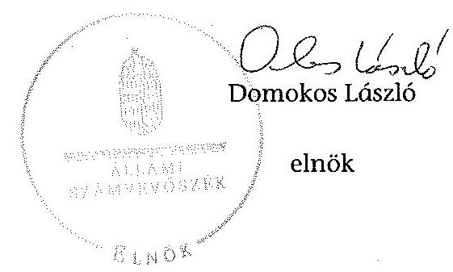
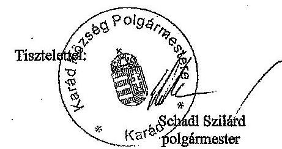
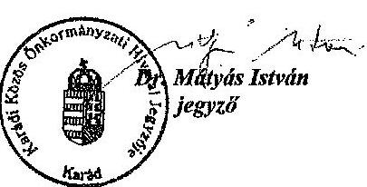
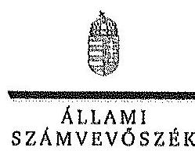
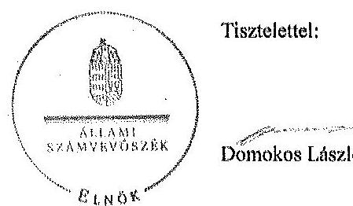
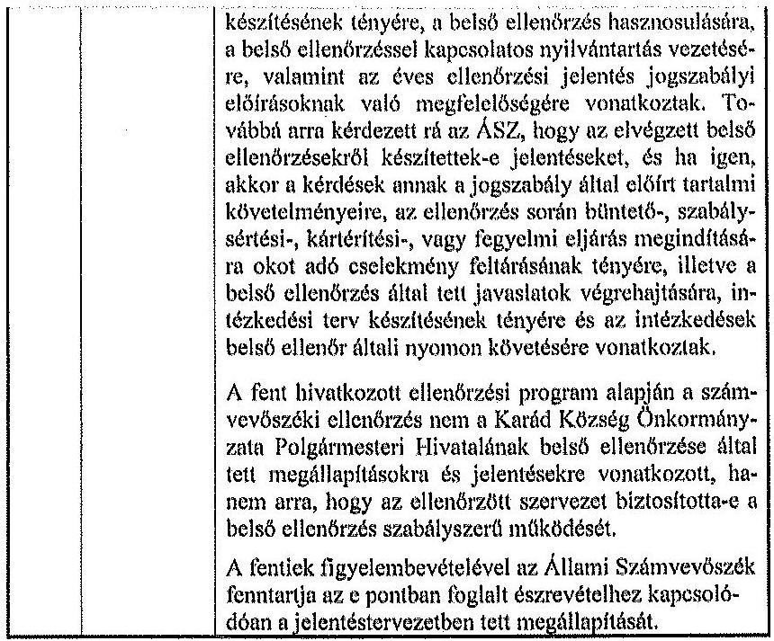

# ÁLLAMI   SZÁMVEVÔSZÉK 

## JELENTÉS

az önkormányzatok belső kontrollrendszere kialakításának, egyes
kontrolltevékenységek és a belső ellenőrzés
múködésének ellenőrzéséről
Karád
14093
2014. június

---

# Állami Számvevőszék 

Iktatószám: V-0382-042/2014
Témaszám: 1162
Vizsgálat-azonosító szám: V064956

## Az ellenőrzést felügyelte:

Dr. Benedek Mária
felügyeleti vezető
Az ellenőrzést vezette és az ellenőrzés végrehajtásáért felelős:
Bíró Zsolt
ellenőrzésvezető
A számvevőszéki jelentés összeállításában közremüködött:
Eigner György Zoltán
számvevő tanácsos
Az ellenőrzést végezték:
Balázsné Antoni Erika Eigner György Zoltán
számvevő
számvevő tanácsos
Fekete Győr László
számvevő

---

# TARTALOMJEGYZÉK 

BEVEZETÉS ..... 5
I. ÖSSZEGZŐ MEGÁLLAPÍTÁSOK, KÖVETKEZTETÉSEK, JAVASLATOK ..... 9
II. RÉSZLETES MEGÁLLAPÍTÁSOK ..... 14

1. Az önkormányzat belső kontrollrendszerének kialakítása ..... 14
1.1. A kontrollkörnyezet ..... 14
1.2. A kockázatkezelési rendszer ..... 15
1.3. A kontrolltevékenységek ..... 16
1.4. Az információs és kommunikációs rendszer ..... 16
1.5. A monitoring rendszer ..... 17
2. A pénzügyi folyamatokban kulcsszerepet betöltő teljesítésigazolás és érvényesítés belső kontrollok múködése ..... 17
3. A belső ellenőrzés múködése ..... 20

## MELLÉKLETEK

1. számú Észrevételt tartalmazó polgármesteri levél
2. számú Észrevételre vonatkozó elnöki válaszlevél

## FÜGGELÉKEK

1. számú Értelmező szótár
2. számú Az értékelés módja és szempontjai

---

.

---

# RÖVIDÍTÉSEK JEGYZÉKE 

## Törvények

Áht.
ÁSZ tv.
helyi önkormányzati képviselők jogállásáról szóló tv.
Info tv.

Kttv.

Ktv.

Mötv.

Nvtv.
Ötv.
Számv. tv.
Vagyonnyilatkozattételről szóló tv.

## Rendeletek

Áhsz. 1

Áhsz. 2
Ávr.

Bkr.

Ikr.
vagyongazdálkodási rendelet ${ }_{1}$
vagyongazdálkodási rendelet ${ }_{2}$

2011. évi CXCV. törvény az államháztartásról (hatályos 2012. január 1-jétől)
2011. évi LXVI. törvény az Állami Számvevőszékről 2000 évi XCVI. törvény a helyi képviselők jogállásának egyes kérdéseiről
2011. évi CXII. törvény az információs önrendelkezési jogról és az információszabadságról (hatályos 2012. január 1-jétől)
2011. évi CXCIX. törvény a közszolgálati tisztviselőkról (hatályos 2012. március 1-jétől)
1992. évi XXIII. törvény a köztisztviselők jogállásáról (hatálytalan 2012. március 1-jétől)
2011. évi CLXXXIX. törvény Magyarország helyi önkormányzatairól
2011. évi CXCVI. törvény a nemzeti vagyonról (hatályos 2011. december 31-étől)
1990. évi LXV. törvény a helyi önkormányzatokról
2000. évi C. törvény a számvitelről
2007. évi CLII. törvény az egyes vagyonnyilatkozat-tételi kötelezettségekről

249/2000. (XII. 24.) Korm. rendelet az államháztartás szervezetei beszámolási és könyvvezetési kötelezettségének sajátosságairól (hatálytalan 2014. január 1-jétől)
4/2013. (I. 11.) Korm. rendelet az államháztartás számviteléről (hatályos 2014. január 1-jétől)
368/2011. (XII. 31.) Korm. rendelet az államháztartásról szóló törvény végrehajtásáról (hatályos 2012. január 1jétől)
370/2011. (XII. 31.) Korm. rendelet a költségvetési szervek belső kontrollrendszeréről és belső ellenőrzéséről (hatályos 2012. január 1-jétől)
335/2005. (XII. 29.) Korm. rendelet a közfeladatot ellátó szervek iratkezelésének általános követelményeiről
Karád Község Önkormányzatának többször módosított 20/2003. (XI.27.) rendelete az önkormányzat vagyonáról és a vagyongazdálkodás szabályairól (hatályos 2003. november 27-től 2013. június 30-ig)
Karád Község Önkormányzatának 5/2013. (IV.30.) rendelete az önkormányzat vagyonáról és a vagyongazdálkodás szabályairól (hatályos 2013. július 1-től)

---

## Szórövidítések

ÁSZ
belső ellenőrzési kézikönyv
etikai szabályzat
INTOSAI
ISSAI
jegyzö ${ }_{1}$
jegyzö ${ }_{2}$
Képviselő-testület
Kormányhivatal
Közös Önkormányzati
Hivatal
leltározási szabályzat

NGM
Önkormányzat
pénzkezelési szabályzat
pénzügyi bizottság
polgármester
Polgármesteri Hivatal
számlarend
számviteli politika
Társulás

Állami Számvevőszék
Fonyód Kistérség Többcélú Társulása költségvetési szerveinek Belső ellenőrzési kézikönyve (hatályos 2012. január 1-tól)
A Köztisztviselői Hivatásetikai Alapelvekről és az etikai eljárás szabályairól (hatályos 2014. január 4-étől)
International Organization of Supreme Audit Institutions (Legfőbb Ellenőrző Intézmények Nemzetközi Szervezete)
International Standards of Supreme Audit Institutions (Legfőbb Ellenőrző Intézmények Nemzetközi Standardjai)
Karád Község Önkormányzatának jegyzője 2009. október 1-jétől 2013. november 30 -áig
Karádi Közös Önkormányzati Hivatal jegyzője 2013. december 1-jétől
Karád Község Önkormányzatának Képviselő-testülete
Somogy Megyei Kormányhivatal
Karádi Közös Önkormányzati Hivatal
Karád Község Önkormányzata Polgármesteri Hivatalának Leltárkészítési és leltározási Szabályzata (hatályos 2007. május 20-tól)

Nemzetgazdasági Minisztérium
Karád Község Önkormányzata
Karád Község Önkormányzata Polgármesteri Hivatalának Pénzkezelési Szabályzata (hatályos 2007. május 20tól)
Karád Község Önkormányzata Képviselő-testületének Pénzügyi Bizottsága
Karád Község Önkormányzatának polgármestere
Karád Község Önkormányzatának Polgármesteri Hivatala
Karád Község Önkormányzata Polgármesteri Hivatalának Számlarendje (hatályos 2007. január 3-ától)
Karád Község Önkormányzata Polgármesteri Hivatalának számviteli politikája (hatályos 2007. május 20-tól)
Fonyódi Többcélú Kistérségi Társulás

---

# JELENTÉS 

## az önkormányzatok belsó kontrollrendszere kialakításának, egyes kontrolltevékenységek és a belső ellenőrzés múködésének ellenőrzéséről   Karád

## BEVEZETÉS

Karád község állandó lakosainak száma 2012. január 1-jén 1650 fő volt. Az Önkormányzat héttagú Képviselő-testületének munkáját kettő állandó bizottság segítette. Az Önkormányzat az önállóan múködő és gazdálkodó Polgármesteri Hivatalon kívül intézményt nem múködtetett, többségi tulajdoni hányadú gazdasági társasággal nem rendelkezett. A polgármester 2011. november 20-a - az időközi önkormányzati választás - óta tölti be tisztségét. A jegyző ${ }_{1}$ 2009. október 1-jétől 2013. november 30 -áig, a jegyző ${ }_{2}$ 2013. december 1-jétől látta el feladatait. A Polgármesteri Hivatal szervezeti egységekre nem tagolódott, elkülönített gazdasági szervezettel nem rendelkezett, a foglalkoztatott köztisztviselők száma 2012. január 1-jén kilenc fő volt. Karád és Somogytúr községek önkormányzatainak képviselő-testületei 2013. január 1-jén Közös Önkormányzati Hivatalt hoztak létre - Karád székhellyel - igazgatási feladataik ellátására. Az Önkormányzat a 2012. évi költségvetési beszámolója szerint 219132 ezer Ft tárgyévi bevételt ért el, valamint 199528 ezer Ft tárgyévi kiadást teljesített. A 2012. december 31-i könyvviteli mérleg szerint 580477 ezer Ft értékű eszközvagyonnal rendelkezett, a rövid lejáratú kötelezettségállománya 1928 ezer Ft volt és hosszú lejáratú kötelezettségállománnyal nem rendelkezett.

A demokratikus társadalmakban alapvető igény, hogy a közpénzeket, a közvagyont használók tevékenységükről elszámoljanak, ahhoz egyértelmú és érvényesíthető felelősségi szabályok társuljanak. Ennek a jogos igénynek az érvényesítéséhez meg kell teremteni azokat a folyamatokat, rendszereket, amelyek nélkülözhetetlenek az elszámoltatáshoz. Az elszámoltatás eredményes múködtetéséhez szükség van a megfelelő információs, kontroll, értékelési és beszámolási rendszerek kialakítására.

Magyarországon az uniós csatlakozási tárgyalások idejére nyúlnak vissza a belső kontrollrendszer szabályozásának gyökerei. Az uniós elvárásoknak megfelelő új terminológia szerinti államháztartási belső pénzügyi ellenőrzési (ÁBPE) rendszer területén a jogharmonizáció 2003-ban teljes körűen megvalósult, míg az önkormányzati alrendszerre vonatkozó, Ötv.-ben megjelenített speciális szabályozás 2005-ben lépett hatályba. Az államháztartási belső kontrollrendszer koncepciója 2009-ben továbbfejlődött. A változások irányát mutat-

---

ja, hogy a költségvetési szervek belső kontrollrendszere már magában foglalja a korszerű, felelős szervezetirányítás elemeit (kontrollkörnyezet, kockázatkezelés, kontrolltevékenység, információ és kommunikáció, monitoring) is. E kontrollrendszer szabályozása háromszintű, a törvényi előírásokat az Áht. és a Mötv., a rendeleti szintű szabályozást az Ávr. és a Bkr. tartalmazza, amelyeket útmutatói szinten az NGM által kiadott standardok és kézikönyvek támogatnak.

A belső kontrollrendszer azt a célt szolgálja, hogy a költségvetési szervek múködésük és gazdálkodásuk során a tevékenységeket szabályszerűen, gazdaságosan, hatékonyan és eredményesen hajtsák végre, teljesítsék elszámolási kötelezettségeiket és megvédjék az erőforrásokat a veszteségektől, a károktól és a nem rendeltetésszerű használattól. A belső kontrollrendszer magában foglalja mindazon szabályokat, eljárásokat, gyakorlati módszereket és szervezeti struktúrákat, kockázatkezelési technikákat, kontrolltevékenységeket, amelyek segítséget nyújtanak a szervezetnek céljai eléréséhez.

Az ÁSZ középtávú stratégiájában hangsúlyos szerepet szánt annak, hogy szilárd szakmai alapon álló, értékteremtő ellenőrzéseivel előmozdítsa a közpénzügyek átláthatóságát, rendezettségét. A számvevőszéki ellenőrzés nemzetközi alapelvei is rögzítik, hogy a megfelelő belső kontrollrendszer minimálisra csökkenti a hibák és szabálytalanságok kockázatát.

Az ellenőrzés célja annak megállapítása volt, hogy a belső kontrollrendszer elemeinek kialakítása, a pénzügyi folyamatokban kulcsszerepet betöltő teljesítésigazolás és érvényesítés, és a belső ellenőrzés szabályos múködése biztosítot-ta-e az önkormányzatnál a közpénzfelhasználás szabályosságát, hozzájárult-e az értéket teremtő rend követelményének érvényesüléséhez.

Ennek keretében értékeltük, hogy:

- a jogszabályi előírásoknak megfelelően alakították-e ki a belső kontrollrendszer elemeit;
- a gazdálkodás folyamatában kulcsszerepet betöltő teljesítésigazolás és érvényesítés kontrolltevékenységeit megfelelően működtették-e;
- biztosították-e a belső ellenőrzés szabályos múködését;
- amennyiben az ÁSZ tett javaslatot a 2008-2011. évek közötti ellenőrzése kapcsán az Önkormányzatnak, intézkedtek-e azok végrehajtására.

Az ellenőrzés várható hasznosulását négy szinten tervezzük. A törvényalkotás számára összegzett tapasztalatok állnak rendelkezésre a belső kontrollrendszer önkormányzati területen való kialakításáról, múködéséről és hatásairól, a belső ellenőrzés működéséről. Ennek alapján következtetést lehet levonni arról, hogy a belső kontrollrendszer kialakítására és működtetésére vonatkozó jelenlegi, differenciálás nélküli - jogszabályi előírások reális követelményeket támasztanak-e az eltérő adottságú települési önkormányzatok esetében, illetve indokolt-e esetleges jogszabályi módosítás kezdeményezése. Az ellenőrzés az ellenőrzött számára visszajelzést ad a belső kontrollrendszer kialakításában és működésében fellépő hiányosságokról, javaslataival hozzájárul azok ki-

---

küszöböléséhez, amely csökkentheti a későbbi ellenőrzések gyakoriságát. Az ellenőrzés megállapításait és javaslatait más szervezetek is hasznosíthatják a rendezett gazdálkodási keretek kialakításához. A társadalom számára jelzi, hogy közpénz nem maradhat ellenőrizetlenül, az ÁSZ értékteremtő rend kialakításához és megőrzéséhez hozzájáruló tevékenysége pozitív hatással lesz a szervezetről kialakított összkép formálásában. A szervezeten belül lehetőség nyílik arra, hogy a megállapítások szintetizálásával az ÁSZ a hozzáadott értéket teremtő elemző tevékenységét és tanácsadó szerepét is erősítse.

Az önkormányzatok belső kontrollrendszere kialakításának, egyes kontrolltevékenységek és a belső ellenőrzés működésének ellenőrzéséről szóló jelentés I. fejezetének összegző része az ellenőrzés céljára ad rövid, szintetizáló összefoglalót, és tartalmazza a következtetéseket a II. fejezet részletes megállapításain alapulóan. A jelentés intézkedést igénylő megállapításait és javaslatait az ellenőrzés során feltárt, a jelentés II. fejezetében rögzített részletes megállapítások alapozzák meg. A helyszíni ellenőrzés lezárásáig a helyi szabályozás változásaait nyomon követtük.

Az ellenőrzés típusa: szabályszerűségi ellenőrzés.
Az ellenőrzött időszak: a belső kontrollrendszer kialakításának megfelelősége esetében a 2012. évre, a pénzügyi folyamatokban kulcsszerepet betöltő teljesítésigazolás és érvényesítés belső kontrollok múködésének megfelelőségét és a belső ellenőrzés szabályszerű működését a 2012. január 1. és december 31-e közötti időszak eseményelt figyelembe véve értékeltük, míg az ÁSZ javaslatainak utóellenőrzése a 2008-2011. években végzett ellenőrzések nyilvánosságra hozott jelentéseiben tett javaslatok áttekintésére terjedt ki.

# Az ellenőrzött szervezet: az Önkormányzat. 

Az ellenőrzés jogszabályi alapját az ÁSZ tv. 1. § (3) bekezdése, az 5. § (2) és (6) bekezdése, valamint az Áht. 61. § (2) bekezdésének előírásai képezik.

Az ellenőrzés szakmai módszertana az ÁSZ hivatalos honlapján (www.asz.hu) közzétett szakmai szabályokon alapult, amely az INTOSAI által kiadott ISSAI figyelembevételével készült.

Az ellenőrzés lefolytatásához az Önkormányzat a kimutatások és a tanúsítvány elektronikus kitöltésével, valamint az ÁSZ által kért dokumentumok elektronikus megküldésével szolgáltatott adatokat. Az így rendelkezésre bocsátott adatok, információk kontrollja és a munkalapok kitöltése a helyszíni ellenőrzés keretében történt. A jelentésben használt fogalmak magyarázatát az 1. számú függelék, az ellenőrzés egyes területeinek értékelésénél alkalmazott egységes minősítési szempontokat a 2. számú függelék tartalmazza.

A belső kontrollrendszer kialakításának ellenőrzése során értékeltük a kontrollkörnyezet, a kockázatkezelési rendszer, a kontrolltevékenységek, az információs és kommunikációs rendszer, valamint a monitoring rendszer szabályozottságának megfelelőségét. A pénzügyi folyamatokban kulcsszerepet betöltő teljesítésigazolás és érvényesítés kontrollok múködése megfelelőségének minősítéséhez az állományba nem tartozók megbízási díjai, a külső szolgáltatók által

---

végzett karbantartási, kisjavítási munkák, az egyéb üzemeltetési és fenntartási szolgáltatások, a rendszeres szociális segélyek, valamint az államháztartáson kívülre teljesített múködési és felhalmozási célú pénzeszközátadások közül kockázatelemzéssel választottuk ki az ellenőrzött kiadási jogcímeket. Az egyszerű véletlen mintavétellel kiválasztott tételek ellenőrzését többlépcsős megfelelőségi tesztek útján addig végeztük, amíg elegendő és megfelelő bizonyítékot szereztünk a vizsgált folyamatok kulcskontrolljai múködésének megfelelő vagy nem megfelelő voltáról. Értékeltük az Önkormányzatnál a belső ellenőrzés múködésének szabályosságát. Az ÁSZ az Önkormányzatnál a 2009. évben a települési önkormányzatok tulajdonában lévő zöldterületek fejlesztésének és fenntartásának ellenőrzését végezte. A nyilvánosságra hozott, 0934 számon közzétett számvevőszéki jelentésben azonban kifejezetten az Önkormányzat számára konkrét feladatot nem határozott meg, javaslatot nem tett, ezért a jelen ellenőrzés keretében utóellenőrzésre nem került sor.

Az Ász tv. 29. § (1) bekezdése szerint a jelentéstervezetet megküldtük a polgármester részére, aki az ÁSZ tv. 29. § (2) bekezdésében foglalt észrevételezési jogával élt, a jelentéstervezetre észrevételt tett (1. számú melléklet). Az ÁSZ tv. 29. § (3) bekezdésében előírtaknak megfelelően a figyelembe nem vett észrevételeket és annak indokairól szóló tájékoztatást a jelentés tartalmazza (2. számú melléklet).

---

# I. ÖSSZEGZŐ MEGÁLLAPÍTÁSOK, KÖVETKEZTETÉSEK, JAVASLATOK 

A belső kontrollrendszeren belül 2012-ben a kontrollkörnyezet, a kockázatkezelési rendszer, a kontrolltevékenységek, az információs és kommunikációs rendszer, valamint a monitoring rendszer kialakítását külön-külön és együttesen is értékeltük. A belső kontrollrendszer kialakítása az összesített értékelés alapján nem felelt meg a jogszabályi előírásoknak.

A belső kontrollrendszer egyes területei kialakításának minősítése a következő:

| Kontrollterület | Minősítés |
| :-- | :--: |
| Kontrollkörnyezet | nem |
|  | megfelelő |
| Kockázatkezelési rendszer | nem |
|  | megfelelő |
| Kontrolltevékenységek | nem |
| Információs és kommuni- |  |
| kációs rendszer | nem |
| Monitoring rendszer |  |

Nem megfelelőnek értékeltük a kontrollkörnyezet, a kockázatkezelési rendszer, a kontrolltevékenységek, az információs és kommunikációs rendszer, valamint a monitoring rendszer kialakítását, mivel az ellenőrzésünk során megállapított szabályozásbeli hiányosságok magukban hordozzák a szabálytalan működés, valamint a korrupció kockázatát.

A 2012. évben az állományba nem tartozók megbízási díjaival, a külső szolgáltatók által végzett karbantartási, kisjavítási munkákkal kapcsolatos kifizetések, valamint az államháztartáson kívülre teljesített működési és felhalmozási célú pénzeszközátadások során a pénzügyi folyamatokban kulcsszerepet betöltő teljesítésigazolás és érvényesítés belső kontrollok müködése gyenge volt. Gyengének értékeltük a két kulcskontroll együttes működését, mivel azok nem biztosították a hibák megelőzését, feltárását.

A számvevőszéki ellenőrzés az ellenőrzött kifizetésekkel összefüggésben a rendelkezésre bocsátott dokumentumok alapján kár bekövetkeztére utaló adatot, tényt nem állapított meg, azonban a gazdálkodásban kulcsszerepet betöltő kontrollok múködtetésének hiánya miatt fennáll a hibák bekövetkezésének kockázata. A nem megfelelően működtetett belső kontrollok korrupciós kockázatot hordoznak.

Az Önkormányzat a belső ellenőrzési feladatokat Társulás útján látta el. A 2012. évben a belső ellenőrzés múködése nem felelt meg a jogszabályi

---

előírásoknak, mivel a számvevőszéki ellenőrzés által megállapított szabályozási és múködési hiányosságok számossága magában hordozza a szabálytalan önkormányzati gazdálkodás és feladatellátás kockázatát.

Az ÁSZ tv. 33. § (1) bekezdésében foglaltak értelmében az ellenőrzött szervezet vezetője köteles a jelentésben foglalt megállapításokhoz kapcsolódó intézkedési tervet összeállítani, és azt a jelentés kézhezvételétől számított 30 napon belül az ÁSZ részére megküldeni. Amennyiben az intézkedési tervet határidőre nem küldi meg a szervezet, vagy az ÁSZ tv. 33. § (2) bekezdésében foglalt póthatáridő elteltével megküldött intézkedési terv továbbra sem elfogadható, az ÁSZ elnöke a hivatkozott törvény 33. § (3) bekezdés a)-b) pontjaiban foglaltakat érvényesítheti.

Az ellenőrzés intézkedést igénylő megállapításai és javaslatai:

# a polgármesternek 

1. Az Önkormányzat nevében történt kötelezettségvállalást az Áht. 37. § (1) bekezdésében foglaltak ellenére nem foglalták írásba, valamint az Áht. 37. § (1) és az Ávr. 55. § (1) bekezdése ellenére a kötelezettségvállalásokra pénzügyi ellenjegyzés nélkül került sor.

Javaslat:
Intézkedjen arról, hogy az Önkormányzat nevében történő kötelezettségvállalásra az Áht. 37. § (1) bekezdésében és az Ávr. 55. § (1) bekezdésében foglaltaknak megfelelően - az Ávr. 53. §-ában meghatározott kivételekkel - kizárólag a pénzügyi ellenjegyzés után, a pénzügyi teljesítés esedékességét megelőzően írásban kerüljön sor.
2. A polgármester, mint kötelezettségvállaló - az Ávr. 57. § (4) bekezdésében foglaltak ellenére - nem jelölte ki 2012. március 30 -át követően írásban az Önkormányzat kiadási előirányzatai vonatkozásában a teljesítésigazolására jogosult személyeket.

Javaslat:
Jelölje ki az Ávr. 57. § (4) bekezdésében foglaltak szerint a kötelezettségvállalásra jogosult személyeket.
3. A számvevőszéki ellenőrzés megállapításai alapján az Önkormányzatnál a belső kontrollrendszer kialakítása összefoglalóan értékelve nem felelt meg a jogszabályi előírásoknak, a kulcskontrollok működése gyenge volt. A belső ellenőrzés müködése nem felelt meg a jogszabályi előírásoknak, nem tárta fel, ezáltal nem is javíttatta ki a hiányosságokat. A megállapított szabályozásbeli és müködésbeli hiányosságok magukban hordozzák a szabálytalan müködés kockázatát.

Javaslat:
A Mötv. 115. § (1) bekezdésében foglaltak alapján kísérje figyelemmel az Önkormányzat gazdálkodásának szabályszerűségét. A Mötv. 67. § f) pontja alapján gondoskodjon a belső kontrollrendszer müködésére vonatkozó jogszabályi rendelkezések be nem tartása, valamint a teljesítésigazolás, illetve az érvényesítés kontrollokkal ösz-

---

szefüggésben feltárt hiányosságok, szabálytalanságok tekintetében az esetleges munkajogi felelősséggel kapcsolatos körülmények kivizsgálásáról, majd a vizsgálat eredményének függvényében tegye meg a szükséges intézkedéseket.
4. A vagyonnyilatkozat-tételi kötelezettség teljesítésének ellenőrzése során megállapítást nyert, hogy a Képviselő-testület tagjai a helyi önkormányzati képviselők jogállásáról szóló tv. 10/A. § (1) bekezdésében foglaltak ellenére vagyonnyilatkozat-tételi kötelezettségüknek nem tettek eleget, valamint az örzésért felelős pénzügyi bizottság a Mötv. 57.§ (2) bekezdésében foglaltak ellenére a vagyonnyilatkozat-tételi kötelezettséggel kapcsolatban nem tájékoztatta és nem szólította fel a képviselő tagokat.

Javaslat:
Kezdeményezze a Képviselő-testületnél. a Mötv. a 65. §-a alapján a Mötv. 57. § (2) bekezdésének, valamint a helyi önkormányzati képviselők jogállásáról szóló tv. 10/A. § (3) bekezdésében foglaltaknak megfelelően a vagyonnyilatkozatok vizsgálatáért felelősként kijelölt pénzügyi bizottság vagyonnyilatkozat-tételi kötelezettség teljesítésére vonatkozó eljárásának szabályszerűségével kapcsolatos körülmények kivizsgálását, majd a vizsgálat eredményének függvényében kezdeményezze a Képviselőtestületnél a szükséges intézkedések megtételét.

# a jegyzőnek (Karád Község Önkormányzata vonatkozásában) 

1. a kontrollkörnyezettel kapcsolatban:

A jegyző, az Áht.-ban és Ötv.-ben foglaltak ellenére nem állapította meg a Polgármesteri Hivatal feladatai ellátásának részletes belső rendjét és módját szervezeti és működési szabályzatban, valamint nem készítette elő a vagyongazdálkodási rendelet, módosítását, nem aktualizálta a Számv. tv.-ben foglaltak ellenére a számviteli politikát, a pénzkezelési szabályzatot, a leltározási szabályzatot, a számlarendet és bizonylati rendet. A jegyző, nem készítette el a Bkr.-ben foglaltak ellenére a szabálytalanságok kezelésének eljárásrendjét, valamint a Kttv.-ben előírtak ellenére a Polgármesteri Hivatalban dolgozó köztisztviselők munkateljesítményének értékelését, valamint hivatásetikai alapelvek részletes tartalmát és az etikai eljárás szabályainak dokumentumát [II. Részletes megállapítások, 1.1. A kontrollkörnyezet 5., 16.-17., 19., 24., 30.-31., 34., 46., 47. sorszámú megállapítás].

Javaslat:
Intézkedjen az Áht. 69. § (2) bekezdése, a Bkr. 3. § a) pontja és 6. §-a alapján a jelentés II. Részletes megállapítások, 1.1. A 5., 16.-17., 19., 24., 30.-31., 34., 46., 47. sorszámú megállapításaiban foglalt hibák, hiányosságok kijavításáról, megszüntetéséről az ott megjelölt jogszabályi rendelkezéseknek megfelelően.
2. a kockázatkezelési rendszerrel kapcsolatban:

A jegyző, a Bkr.-ben foglaltak ellenére nem határozta meg a kockázatok kezelése érdekében szükséges intézkedések teljesítése folyamatos nyomon követési módját [II. Részletes megállapítások, 1.2. A kockázatkezelési rendszer 10. sorszámú megállapítás].

---

Javaslat:
Intézkedjen az Áht. 69. § (2) bekezdése, a Bkr. 3. § b) pontja és 7. §-a, alapján a jelentés II. Részletes megállapítások, 1.2. A kockázatkezelési rendszer 10. sorszámú megállapításában foglalt hibák, hiányosságok kijavításáról, megszüntetéséről az ott megjelölt jogszabályi rendelkezéseknek megfelelően.
3. a kontrolltevékenységekkel kapcsolatban:

A jegyző, a Bkr.-ben foglaltak ellenére nem biztosította a beszerzési folyamat és a vagyonhasznosítási tevékenység, valamint a pénzügyi döntések dokumentumainak elkészítésével kapcsolatban a folyamatba épített előzetes, utólagos és vezetői ellenőrzést, nem határozta meg a beszámolási eljárásokhoz kapcsolódó felelősségi köröket. Az Ávr.-ben foglaltak ellenére, belső szabályzatban nem határozta meg a beszámolási feladatok teljesítésével kapcsolatos belső előírásokat, feltételeket, nem határozta meg a gazdasági feladatot ellátó vezető és alkalmazottak helyettesítésének rendjét, valamint a Kttv.-ben foglaltak ellenére nem szabályozta a köztisztviselő jogviszonya megszűntetése (megszűnés) esetére a munkakör átadása és a munkáltatóval való elszámolás rendjét [II. Részletes megállapítások, 1.3. A kontrolltevékenységek 2-5., 19.-21. és 32. sorszámú megállapítások].

Javaslat:
Intézkedjen az Áht. 69. § (2) bekezdése, a Bkr. 3. § c) pontja és 8. §-a, a Kttv. 74. § (1) bekezdése alapján a jelentés II. Részletes megállapítások, 1.3. A kontrolltevékenységek 2-5., 19.-21. és 32. sorszámú megállapításaiban foglalt hibák, hiányosságok kijavításáról, megszüntetéséről az ott megjelölt jogszabályi rendelkezéseknek megfelelően.
4. az információs és kommunikációs rendszerrel kapcsolatban:

A jegyző, a Bkr.-ben, az Info tv.-ben és az Ávr.-ben foglaltak ellenére nem alakított ki olyan rendszert, amely biztosítja, hogy a megfelelő információk a megfelelő időben eljutnak az illetékes szervezethez, személyhez, nem szabályozta a közérdekű adatok megismerésére irányuló igények teljesítésének rendjét. Az Önkormányzat az Info tv.ben előírt elektronikus közzétételi kötelezettségének a 2012. évben nem tett eleget [II. Részletes megállapítások, 1.4. Az információs és kommunikációs rendszer 1-2., 7. és 8. sorszámú megállapítások].

Javaslat:
Intézkedjen az Áht. 69. § (2) bekezdése, a Bkr. 3. § d) pontja és 9. §-a alapján a jelentés II. Részletes megállapítások, 1.4. Az információs és kommunikációs rendszer 12., 7. és 8. sorszámú megállapításaiban foglalt hibák, hiányosságok kijavításáról, megszüntetéséről az ott megjelölt jogszabályi rendelkezéseknek megfelelően.
5. a monitoring rendszerrel kapcsolatban:

A jegyző, a Bkr.-ben foglaltak ellenére nem alakította ki a Polgármesteri Hivatal tevékenységének, a célok megvalósításának nyomon követését biztosító rendszert [II. Részletes megállapítások, 1.5. A monitoring rendszer 1. sorszámú megállapítás].

---

Javaslat:
Intézkedjen az Áht. 69. § (2) bekezdése, a Bkr. 3. § e) pontja és 10. §-a alapján a jelentés II. Részletes megállapítások, 1.5. A monitoring rendszer 1. sorszámú megállapításaiban foglalt hibák, hiányosságok kijavításáról, megszüntetéséről az ott megjelölt jogszabályi rendelkezéseknek megfelelően.
6. a pénzügyi folyamatokban kulcsszerepet betöltő kontrollokkal kapcsolatban:

A teljesítésigazolás és érvényesítés nem felelt meg az Áht.-ban és az Ávr.-ben foglaltaknak [II. Részletes megállapítások, 2. A pénzügyi folyamatokban kulcsszerepet betöltő teljesítésigazolás és érvényesités belső kontrollok müködése, 1., 2. és 3. pontokban foglalt megállapítás].

Javaslat:
Intézkedjen az Áht. 37-38. §-ában, az Ávr. 55-59. §-ában és az Áhsz. 3 39. § (1) bekezdésében és a 14. számú melléklet II. pontjában foglaltak alapján arról, hogy a teljesítésigazolás és az érvényesítés vonatkozásában, valamint azok ellenőrzése során a kötelezettségvállalással, a pénzügyi ellenjegyzéssel, az utalványozással, a kötelezettségvállalások nyilvántartásba vételével kapcsolatban feltárt, a jelentés II. Részletes megállapítások, 2. A pénzügyi folyamatokban kulcsszerepet betöltő teljesítésigazolás és érvényesítés belső kontrollok müködése 1., 2. és 3. pontjában szereplő megállapításokban foglalt hibák, hiányosságok kijavítása, megszüntetése az ott megjelölt jogszabályi rendelkezéseknek megfelelően történjen meg.
7. a belső ellenőrzés működésével kapcsolatban:

A belső ellenőrzés működése a számvevőszéki ellenőrzés értékelési szempontjait figyelembe véve nem felelt meg a Bkr.-ben foglaltaknak [II. Részletes megállapítások, 3. A belső ellenőrzés müködése 3.a)., 7., 8. a), d), e), 10., 12., 18., 20. e), 23.-25., és 27. b) sorszámú megállapítása].

Javaslat:
Intézkedjen az Áht. 69. § (1), a 70. § (1) bekezdése, a Bkr. 3. § e) pontja és 10. §a alapján a jelentés II. Részletes megállapítások, 3. A belső ellenőrzés müködése 3.a)., 7., 8. a), d), e), 10., 12., 18., 20. e), 23.-25., és 27. b) sorszámú megállapításaiban foglalt hibák, hiányosságok kijavításáról, megszüntetéséről az ott megjelölt jogszabályi rendelkezéseknek megfelelően.

---

# II. RÉSZLETES MEGÁLLAPÍTÁSOK 

## 1. AZ ÖNKORMÁNYZAT BELSŐ KONTROLLRENDSZERÉNEK KIALAKÍTÁSA

A belső kontrollrendszeren belül 2012-ben a kontrollkörnyezet, a kockázatkezelési rendszer, a kontrolltevékenységek, az információs és kommunikációs rendszer, valamint a monitoring rendszer kialakítását külön-külön és együttesen is értékeltük. A belső kontrollrendszer kialakítása az összesített értékelés alapján nem felelt meg a jogszabályi előírásoknak.

### 1.1. A kontrollkörnyezet

A kontrollkörnyezet kialakítása - a 2. számú függelékben részletezett kritériumrendszer alapján végzett értékelés szerint - a jogszabályi előírásoknak nem felelt meg, mert:

| Sor-   szám $^{1}$ | Megállapítás | Megjegyzés |
| :--: | :--: | :--: |
| 5. | A jegyző $_{1}$ - az Áht. 10. § (5) bekezdésében foglaltak ellenére - a Polgármesteri Hivatal feladatai ellátásának részletes belső rendjét és módját szervezeti és múködési szabályzatban nem állapította meg. | A Képviselő-testület az 1/2014. (I. 3.) számú határozatával elfogadta a Közös Önkormányzati Hivatal szervezeti és müködési szabályzatát. |
| 16. | A jegyzö $_{1}$ - az Ötv. 36. § (2) bekezdés a) pontjában foglaltak ellenére - az ellenőrzött időszakban nem készítette elő a vagyongazdálkodási rendelet ${ }_{1}$ módosítását annak érdekében, hogy az megfeleljen az Nvtv. 3. § (1) bekezdés 6. pontja, 5. §-a, 11. § (16) bekezdése, valamint a 13. § (1) bekezdése előírásainak. | A 2013. évben a jegyző ${ }_{1}$ által előkészített vagyongazdálkodási rendeletet ${ }_{2}$ a Képviselőtestület elfogadta.   Az önkormányzat müködésével kapcsolatos feladatok ellátásáról való gondoskodást 2013. január 1-jétől a jegyző részére a Mötv. 81. § (3) bekezdés c) pontja írja elő. |
| 17.,   19. és   24. | A jegyzö $_{1}$ - a Számv. tv. 14. § (11) bekezdésében előírtak ellenére - a számviteli politikát, pénzkezelési szabályzatot, valamint a leltározási szabályzatot nem aktualizálta. |  |

[^0]
[^0]:    ${ }^{1}$ A megállapítás számozása az Önkormányzat által - az adatszolgáltatás során - kitöltött kimutatások kérdéseinek sorszámával azonos.

---

| 30.,   31. | A jegyző ${ }_{1}$ - a Számv. tv. 161. § (4)-(5) bekezdéselben előírtak ellenére - a számlarendet, továbbá a (2) bekezdés d) pontja alapján az abban foglaltakat alátámasztó bizonylati rendet nem aktualizálta. | A számlarendet a jegyző ${ }_{1}$. 2007. január 1-je óta nem aktualizálta a számlakerettükör változásával, az új államháztartási szakfeladatrenddel és a megváltozott jogszabályi hivatkozásokkal. |
| :--: | :--: | :--: |
| 34. | A jegyzö ${ }_{1}$ - a Bkr. 6. § (4) bekezdésében foglaltak ellenére - nem készítette el a szabálytalanságok kezelésének eljárásrendjét. |  |
| 46. | A jegyző ${ }_{1}$ - a Kttv. 130. § (1) bekezdésében foglaltak ellenére - a Polgármesteri Hivatalban dolgozó köztisztviselők munkateljesítményét írásban nem értékelte. |  |
| 47. | A Képviselő-testület - a Kttv. 231. § (1) bekezdése ellenére - nem állapította meg a Kttv. 83. §-ában előírt, a köztisztviselőkkel szembeni hivatásetikai alapelvek részletes tartalmát, valamint az etikai eljárás szabályait, mivel a jegyző ${ }_{1}$ a 2012. évben - az Ötv. 36. § (2) bekezdés a) pontjában előírt feladata ellenére nem készítette elő ennek dokumentumát. | A jegyző ${ }_{2}$ előkészítette az etikai szabályzatot, amelyet Karád és Somogytúr települési önkormányzatok képviselő-testületei 2014-ben hagytak jóvá. |

# 1.2. A kockázatkezelési rendszer 

A kockázatkezelési rendszer kialakítása - a 2. számú függelékben részletezett kritériumrendszer alapján végzett értékelés szerint - nem felelt meg a jogszabályi előírásoknak, mert:

| Sorszám | Megállapítás | Megjegyzés |
| :--: | :--: | :--: |
| 10. | A jegyző ${ }_{1}$ - a Bkr. 7. § (2) bekezdésében foglaltak ellenére - a kockázatok kezelése érdekében szükséges intézkedések teljesítése folyamatos nyomon követési módját nem határozta meg. |  |
| 14. | A Képviselő-testület tagjai 2012. évben a helyi önkormányzati képviselők jogállásáról szóló tv. 10/A. § (1) bekezdésében foglaltak ellenére vagyonnyilatkozattételi kötelezettségüknek nem tettek eleget. Az örzésért felelős pénzügyi bizottság - a Mötv. 57. § (2) bekezdése és a helyi önkormányzati képviselők jogállásáról szóló tv. 10/A. § (3) bekezdésében, foglaltak ellenére - nem tájékoztatta a képviselő tagokat a vagyonnyilatkozat-tételi | A 2011. november 20 -ai időközi önkormányzati választás után, a november 30 -ai alakuló ülést követő 30 napon belül a Képvise-lö-testület tagjai vagyonnyilatkozatot tettek.   A Képviselő-testület tagjai a 2012. évben képviselői jogaikat gyakorolták, azonban juttatásban nem részesültek. |

---

# 1.3. A kontrolltevékenységek 

A kontrolltevékenységek kialakítása - a 2. számú függelékben részletezett kritériumrendszer alapján végzett értékelés szerint - nem felelt meg a jogszabályi előírásoknak, mert:

| Sor-   szám | Megállapítás |
| :--: | :--: |
| $2-5$. | A jegyző ${ }_{1}$ - a Bkr. 8. § (2) bekezdésében foglaltak ellenére - nem biztosította a beszerzési folyamat és a vagyonhasznosítási tevékenység, valamint a pénzügyi döntések - köztük a költségvetés tervezése és a támogatásokkal való elszámolás - dokumentumainak elkészítésével kapcsolatban a folyamatba épített előzetes, utólagos és vezetői ellenőrzést. |
| 10. | Az Önkormányzat kiadási előirányzata terhére történő kötelezettségvállalások esetére a jegyző ${ }_{1} 2012$. március 30 -át megelőzően, valamint a polgármester, mint kötelezettségvállaló 2012. március 31 -étől - az Ávr. 57. § (4) bekezdésében foglaltak ellenére - nem jelölt ki a teljesítésigazolásra jogosult személyeket. |
| $\begin{aligned} & 19 . \\ & 20 . \end{aligned}$ | A jegyző ${ }_{1}$ - az Ávr. 13. § (2) bekezdés a) pontjában foglaltak ellenére - belső szabályzatban nem határozta meg a beszámolási feladatok teljesítésével kapcsolatos belső előírásokat, feltételeket, továbbá - a Bkr. 8. § (4) bekezdés c) pontjában foglaltak ellenére - nem határozta meg a beszámolási eljárásokhoz kapcsolódó felelősségi köröket. |
| 21. | A jegyző ${ }_{1}$ - az Ávr. 13. § (5) bekezdésében foglaltak ellenére - nem határozta meg a gazdasági feladatot ellátó vezető és alkalmazottak helyettesítésének rendjét. |
| 32. | A jegyző ${ }_{1}$ - a Kttv. 74. § (1) bekezdésében foglaltak ellenére - nem szabályozta a Polgármesteri Hivatalban a köztisztviselő jogviszonya megszüntetése (megszünése) esetére a munkakör átadása és a munkáltatóval való elszámolás rendjét. |

### 1.4. Az információs és kommunikációs rendszer

A információs és kommunikációs rendszer kialakítása - a 2. számú függelékben részletezett kritériumrendszer alapján végzett értékelés szerint nem felelt meg a jogszabályi előírásoknak, mert:

| Sorszám | Megállapítás |
| :--: | :--: |
| $1 ., 2$. | A jegyző ${ }_{1}$ - a Bkr. 3. § d) pontjában és 9. § (1) bekezdésében foglaltak ellenére - nem alakított ki olyan rendszert, amely biztosítja, hogy a megfelelő információk a megfelelő időben eljutnak az illetékes szervezethez, személyhez. |

---

7. A jegyző ${ }_{1}$ - az Info tv. 33. § (1) és (3) és a 37. § (1) bekezdésében foglaltak ellenére - nem gondoskodott a 2012. évben az Önkormányzat elektronikus közzétételi kötelezettségének teljesítéséről.
8. A jegyzó ${ }_{1}$ - az Info tv. 30. § (6) bekezdésében és az Ávr. 13. § (2) bekezdés h) pontjában foglalt előírások ellenére - nem szabályozta a közérdekú adatok megismerésére irányuló igények teljesítésének rendjét.

# 1.5. A monitoring rendszer 

A monitoring rendszer kialakítása - a 2. számú függelékben részletezett kritériumrendszer alapján végzett értékelés szerint - nem felelt meg a jogszabályi előírásoknak, mert:

| Sorszám | Megállapítás |
| :--: | :--: |

1. A jegyző ${ }_{1}$ - a Bkr. 3. § e) pontjában és a 10. §-ában foglaltak ellenére - nem alakította ki a Polgármesteri Hivatal tevékenységének, a célok megvalósitásának nyomon követését biztosító rendszerét.

Az Önkormányzatnál a helyi önkormányzatok törvényességi felügyeletét ellátó Kormányhivatal törvényességi felhívással vagy más törvényességi felügyeleti eszközzel 2012-ben nem élt.

## 2. A PÉNZÜGYI FOLYAMATOKBAN KULCSSZEREPET BETÖLTŐ TELJESÍTÉSIGAZOLÁS ÉS ÉRVÉNYESÍTÉS BELSŐ KONTROLLOK MÜKÖDÉSE

A 2012. évben az állományba nem tartozók megbízási díjaival, a külső szolgáltatók által végzett karbantartással, kisjavítással, valamint az államháztartáson kívülre történt múködési és felhalmozási célú pénzeszközátadásokkal kapcsolatos kifizetések során - összefoglalóan értékelve - a pénzügyi folyamatokban kulcsszerepet betöltő teljesítésigazolás és érvényesítés belsö kontrollok müködésének megfelelősége gyenge volt, mert:

| Kontroll   sorszám | Megállapítás | Megjegyzés |
| :-- | :-- | :-- |

## Teljesítésigazolás

A teljesítésigazolást a kifizetéseket megelőzően - az Áht. 38. § (1) bekezdésében és az Ávr. 57. § (1) és (3) bekezdésében foglaltak ellenére - nem, vagy nem szabályszerűen végezték el.

## Érvényesítés

Az érvényesítés - az Ávr. 58. § (3) bekezdésében előírtak ellenére - nem volt szabályszerű, mert az Ávr. 60. § (3) bekezdése szerinti nyilvántartás (aláírás-minta) hiánya miatt nem volt beazonosítható, hogy az aláírás az érvényesítésre kijelölt személytől származott.

---

Az érvényesítő - az Ávr. 58. § (1) bekezdésében foglaltak ellenére - a kifizetések előtt nem tudta ellenőrizni a fedezet meglétét, mert a kötelezettségvállalásokat - az Ávr. 56. § (1) bekezdése előírása ellenére - 2012ben nem vették nyilvántartásba.

Az érvényesítő - az Ávr. 58. § (2) bekezdés előírása ellenére - nem jelezte az utalványozónak, hogy a megelőző ügymenetben a teljesítésigazolás elmaradt, vagy nem szabályszerűen történt, az Önkormányzat és a Polgármesteri Hivatal nevében kötött kötelezettségvállalásokra - az Áht. 37. § (1) és az Ávr. 55. § (1) bekezdése ellenére - pénzügyi ellenjegyzés nélkül került sor, valamint az Önkormányzat kiadási előirányzatai terhére történt kötelezettségvállalást - az Áht. 37. § (1) bekezdésében előírtak ellenére - nem foglalták írásba.

Az Ávr. 56. § (1) bekezdése 2014. január 1-jétől módosult, a kötelezettségvállalások nyilvántartására vonatkozó szabályokat az Áhsz. 2 39. § (1) bekezdés és a 14. számú melléklet II. pontja tartalmazza.

# A kulcskontrollok ellenőrzésével kapcsolatban feltárt egyéb hiányosságok 

3. A kiadási pénztárbizonylaton nem tüntették fel - az Ávr. 59. (3) bekezdés f) pontjában előírtakat ellenére - a kötelezettségvállalás nyilvántartási számát.

A 2012. évben az állományba nem tartozók megbízási díjaival kapcsolatos kifizetések során a teljesítésigazolás és az érvényesítés kulcskontrollok müködésének megfelelősége gyenge volt, mert:

- a teljesítésigazolást a tűzoltósági munka és a könyvtárosi feladatra történt kifizetéseket megelőzően az - Áht. 38. § (1) bekezdésében és az Ávr. 57. § (1) bekezdésében előírtak ellenére -nem végezték el;
- az érvényesítés a tűzoltósági munka és a könyvtárosi feladatra történő kifizetéseket megelőzően - az Ávr. 58. § (3) bekezdésében előírtak ellenére - nem volt szabályszerű, mert az Ávr. 60. § (3) bekezdése szerinti nyilvántartás (alá-rrás-minta) hiánya miatt nem volt beazonosítható, hogy az aláírás az érvényesítésre kijelölt személytől származott;
- az érvényesítő - az Ávr. 58. § (1) bekezdésében foglaltak ellenére - az Önkormányzat kiadási előirányzata terhére teljesített - a tűzoltósági munkával kapcsolatos - megbízási díj kifizetését megelőzően nem tudta ellenőrizni a fedezet meglétét, mert a kötelezettségvállalást - az Ávr. 56. § (1) bekezdése előírása ellenére - 2012-ben nem vették nyilvántartásba;
- az érvényesítő - az Ávr. 58. § (2) bekezdés előírása ellenére - nem jelezte az utalványozónak, hogy a megelőző ügymenetben a teljesítésigazolás elmaradt, valamint az Önkormányzat kiadási előirányzatai terhére történt - a tűzoltósági munkával és a könyvtárosi feladattal kapcsolatos - kötelezettségvállalásokra- az Áht. 37. § (1) és az Ávr. 55. § (1) bekezdésében foglaltak ellenére - pénzügyi ellenjegyzés nélkül került sor.

---

A tűzoltósági munkához kapcsolódó pénztárbizonylaton nem tüntették fel - az Ávr. 59. (3) bekezdés f) pontjában előírtak ellenére - a kötelezettségvállalás nyilvántartási számát.

A 2012. évben a külső szolgáltatók által teljesített karbantartási, kisjavítási munkákkal kapcsolatos - az Önkormányzatra és a Polgármesteri Hivatalra vonatkozó - kifizetések során a teljesítésigazolás és az érvényesítés kulcskontrollok müködésének megfelelősége gyenge volt, mert:

- a teljesítésigazolást az Önkormányzat kiadási előirányzata terhére teljesített gépjármú, a röntgengép karbantartással és kisgépjavítással kapcsolatos kifizetést megelőzően - az Ávr. 57. § (3) bekezdésében foglaltak ellenére - kijelölés hiányában nem szabályszerűen végezték;
- az érvényesítés a gépjármú, a röntgengép és a számítógép karbantartással kapcsolatos kifizetéseket megelőzően - az Ávr. 58. § (3) bekezdésében előírtak ellenére - nem volt szabályszerű, mert az Ávr. 60. § (3) bekezdés bekezdése szerinti nyilvántartás (aláírás-minta) hiánya miatt nem volt beazonosítható, hogy az aláírás az érvényesítésre kijelölt személytől származott;
- az érvényesítő - az Ávr. 58. § (1) bekezdésében foglaltak ellenére - az Önkormányzat kiadási előirányzata terhére teljesített - gépjármú karbantartással összefüggő - kifizetést megelőzően nem tudta ellenőrizni a fedezet meglétét, mert a kötelezettségvállalást - 2012-ben az Ávr. 56. § (1) bekezdése előírása ellenére -nem vették nyilvántartásba;
- az érvényesítő - az Ávr. 58. § (2) bekezdés előírása ellenére - nem jelezte az utalványozónak, hogy a megelőző ügymenetben a teljesítésigazolást nem szabályszerűen végezték, valamint az Önkormányzat kiadási előirányzatai terhére történt - a röntgengép karbantartással kapcsolatos - kötelezettségvállalást - az Áht. 37. § (1) bekezdésében előírtak ellenére - nem foglalták írásba.

A gépjármú karbantartáshoz kapcsolódó pénztárbizonylaton nem tüntették fel - az Ávr. 59. (3) bekezdés f) pontjában előírtakat ellenére - a kötelezettségvállalás nyilvántartási számát.

A 2012. évben az államháztartáson kívülre átadott müködési célú pénzeszközök kifizetései során a teljesítésigazolás és az érvényesítés kulcskontrollok múködésének megfelelősége gyenge volt, mert:

- a teljesítésigazolást a sportegyesület, a tűzoltó egyesület és a nyugdíjas klub támogatásával kapcsolatos kifizetést megelőzően az - Áht. 38. § (1) bekezdésében és az Ávr. 57. § (1) bekezdésében előírtak ellenére -nem végezték el;
- az érvényesítés a sportegyesület, a tűzoltó egyesület és a nyugdíjas klub támogatása esetén - az Ávr. 58. § (3) bekezdésében előírtak ellenére - nem volt szabályszerű, mert az Ávr. 60. § (3) bekezdése szerinti nyilvántartás (aláírásminta) hiánya miatt nem volt beazonosítható, hogy az aláírás az érvényesítésre kijelölt személytől származott;
- az érvényesítő - az Ávr. 58. § (1) bekezdésében foglaltak ellenére - az Önkormányzat kiadási előirányzata terhére teljesített a nyugdíjas klub támoga-

---

tásával kapcsolatos kifizetést megelőzően nem tudta ellenőrizni a fedezet meglétét, mert a kötelezettségvállalást - 2012-ben az Ávr. 56. § (1) bekezdése előírása ellenére - nem vették nyilvántartásba;

- az érvényesítő - az Ávr. 58. § (2) bekezdés előírása ellenére - nem jelezte az utalványozónak, hogy a megelőző ügymenetben a teljesítésigazolást nem végezték el, hogy az Önkormányzat nevében vállalt kötelezettségvállalásra az Áht. 37. § (1) és az Ávr. 55. § (1) bekezdései ellenére - pénzügyi ellenjegyzés nélkül került sor.

A nyugdíjas klub támogatásához kapcsolódó pénztárbizonylaton nem tüntették fel - az Ávr. 59. (3) bekezdés f) pontjában előírtakat ellenére - a kötelezettségvállalás nyilvántartási számát.

A számvevőszéki ellenőrzés az ellenőrzött kifizetésekkel összefüggésben a rendelkezésre bocsátott dokumentumok alapján kár bekövetkeztére utaló adatot, tényt nem állapított meg, azonban a gazdálkodásban kulcsszerepet betöltő kontrollok müködtetésének hiánya miatt fennáll a további hibák bekövetkezésének kockázata. A nem megfelelően müködtetett belső kontrollok korrupciós kockázatot hordoznak.

# 3. A BELSŐ ELLENŐRZÉS MÜKÖDÉSE 

Az Önkormányzat a belső ellenőrzési feladatokat a Társulás útján látta el. Az Önkormányzatnál a belső ellenőrzés müködése - a 2. számú függelékben részletezett kritériumrendszer alapján végzett értékelés szerint - nem felelt meg a jogszabályi előírásoknak, mert:

| Sorszám | Megállapítás |
| :--: | :--: |
| 3. a) | A belső ellenőrzési kézikönyv - a Bkr 17. § (2) bekezdés a) pontjában foglaltak ellenére - nem tartalmazta a tanácsadó tevékenységre vonatkozó eljárási szabályokat. |
| 7. | Az Önkormányzat a Bkr. 56. § (3) bekezdés a) pontjában foglaltak ellenére stratégiai ellenőrzési tervvel nem rendelkezett. |
| $\begin{aligned} & \text { 8.a), } \\ & \text { d), e) } \end{aligned}$ | A 2013. évi belső ellenőrzési terv a - Bkr. 31. § (4) bekezdés a), d) és e) pontjában foglaltak ellenére - nem tartalmazta az ellenőrzési tervet megalapozó elemzések és a kockázatelemzés eredményének összefoglaló bemutatását, az ellenőrizendő időszakot, valamint a szükséges ellenőrzési kapacitás meghatározását. |
| 10. | A 2013. évi ellenőrzési terv összeállítása - a Bkr. 56. § (2) bekezdésében foglalt előírás ellenére - nem a jegyző, írásos véleményének figyelembe vételével történt, mivel a jegyző, véleményt, javaslatot nem fogalmazott meg. |
| 12. | A belső ellenőrzési vezető által összeállított 2013. évi belső ellenőrzési terv - a Bkr. 31. § (2) bekezdésében foglaltak ellenére - nem alapult stratégiai tervben és a kockázatelemzés alapján felállított prioritásokon. |
| 18. | A 2012. évben végrehajtott ellenőrzéshez - a Bkr. 33. § (2) bekezdésében foglaltak ellenére - nem készítettek ellenőrzési programot. |

---

| 20. e) | Az elvégzett ellenőrzésről készített jelentés - a Bkr. 39. § (3) bekezdés 1) pontjában foglaltak ellenére - nem tartalmazta az alkalmazott ellenőrzési módszereket és eljárásokat. |
| :--: | :--: |
| 23. | A belső ellenőrzés által tett javaslatok végrehajtására - a Bkr. 45. § (2)-(3) bekezdéseiben foglaltak ellenére - intézkedési tervet nem készítettek. |
| 24. | A belső ellenőrzés - a Bkr. 21. § (2) bekezdés d) pontjában előírtakat figyelmen kívül hagyva - a belső ellenőrzési jelentés alapján megtett intézkedések nyilvántartását és nyomon követését elmulasztotta. |
| 25. | A belső ellenőrzési vezető - a Bkr. 22. § (2) bekezdés e) pontjában és az 50. §-ban foglalt előirást figyelmen kívül hagyva - az elvégzett ellenőrzésekről nyilvántartást nem vezetett. |
| $\begin{aligned} & 27 . \\ & \text { b) } \end{aligned}$ | A 2011. évre vonatkozó éves (összefoglaló) ellenőrzési jelentés - a Bkr. 48. § b) pontjának bb) alpontjában foglaltak ellenére - nem tartalmazta a belső kontrollrendszer öt elemének értékelését. |

A Polgármesteri Hivatal, az ÁSZ-tól a 2011., 2012. és 2013. években integritás kérdőív kitöltésére kapott felkérést, amely lehetőséggel nem élt. Az információs és kommunikációs rendszer kialakításának hiányosságai, képviselők vagyon-nyilatkozat-tételi kötelezettségének elmulasztása, a köztisztviselőkkel szembeni hivatásetikai alapelvek meghatározásának hiánya, arra utalnak, hogy az Önkormányzatnak még fejlődést kell elérnie az integritási szemlélet érvényesítésében.

Budapest, 2014. 06. hónap 25. nap

Melléklet: $\quad 2 \mathrm{db}$
Függelék: $\quad 2 \mathrm{db}$

---

.

---

# Karád Község Polgármesterétól 

ügyiratszám: 130-12/2014.
ügyintéző: Dr. Mátyás István
Tárgy: V-0382-036/2014 számú jelentéstervezet véleményezése
Állami Számvevőszék
elnökének
Domonkos László úrnak
Budapest
Apáczal Csere János utca 10.

ÁLLAMI SZÁMVEVŐSZÉK 30320/2014
Érken 2014 MAJ 08.
Iktarásan: 2-0382-060/2014
Melléklet: $\qquad$
1052

## Tisztelt Elnök Úr!

Csatoltan megküldöm képviselö-testületünk 50/2014.(IV.28.) KT határozatát, melyben kérjük, hogy végleges jelentésükbe a belső ellenőri anyagokat is szíveskedjenek belefoglalni. Egyben mellékelem a belső ellenőr tárgyidőszakról szóló megállapításait is.

Karád, 2014. május 5.

---

# Karádi Közös Önkormányzati Hivatal 8676 Karád, Attila utca 31. Tel: 84/570-900 

Ügyiratszám: 130/2014.

## Jegyzökönyvi kivonat   a képviselö-testület 2014. április 28-i zárt ülésének jegyzökönyvéböl

A képviselö-testület kézfeltartással 6 igen szavazattal, 0 nem szavazattal, 0 tartózkodással a következő határozatot hozta:

## 50/2014 (IV.28.) KT határozat

Kará́d Község Önkormányzatának Képviselő-testülete az Állami Számvevőszék nem nyilvános munkaanyagát azzal fogadja el, hogy a belső ellenőrzésre vonatkozó megállapításokat az ÁSZ-nak újra kell fogalmaznia, mivel a belső ellenőri megállapítások és jelentések a jelentéstervezetben sehol nem jelennek meg. Egyidejüleg az ÁSZ-nak megküldi a belső ellenőri anyagokat azzal, hogy azt javasolja a jelentésbe beépíteni.

Határidö: 2014. április 29.
Felelös: polgármester
Kmft.

Dr. Mátyás István
jegyzö

Schádl Szilárd
polgármester

## A kivonat hiteles.

Kará́d, 2014. április 28.

---

#    KLUOK   SZÁMVEVÓSZÉK 

Ikt. szám: V-0382-039/2014

## Schádl Szilárd úr

polgármester
Karád Község Önkormányzata

## Karád

## Tisztelt Polgármester Úr!

Köszönettel megkaptam az Állami Számvevőszékhez postai úton 2014. május 8. napján érkezett, a Karád Község Önkormányzata belső kontrollrendszere kialakításának, egyes kontrolltevékenységek és a belső ellenőrzés múködésének ellenőrzéséről készült jelentéstervezetben foglalt megállapításokra tett észrevételét.

Tájékoztatom Polgármester urat, hogy a jelentésben - az Állami Számvevőszékről szóló 2011. évi LXVI. törvény 29. § (3) bekezdése alapján - az el nem fogadott észrevételt szerepeltetjük az elutasítás indokának feltüntetésével együtt.

Az Állami Számvevőszék észrevételre vonatkozó álláspontjáról a felügyeleti vezető által készített részletes tájékoztatást csatoltan megküldörn.

Budapest, 2014. 03 hó 6 nap

Melléklet: Tájékoztatás az el nem fogadott észrevételről és indokáról

---

# Tájékoztatás 

az el nem fogadott észrevételről és indokáról

|  |  |
| :-- | :-- |

---

Budapest, 2014. május hó 22. nap

Dr. Benedek Mária
felügyeleti vezető

---

.

---

# ÉRTELMEZŐ SZÓTÁR 

belső ellenőrzés
belső kontrollrendszer
belső kontrollrendszer területei
egyszerű véletlen mintavétel
integritás
kockázat
kockázatkezelési rendszer

Független, tárgyilagos bizonyosságot adó és tanácsadó tevékenység, amelynek célja, hogy az ellenőrzött szervezet működését fejlessze és eredményességét növelje, az ellenőrzött szervezet céljai elérése érdekében rendszerszemléletű megközelítéssel és módszeresen értékeli, illetve fejleszti az ellenőrzött szervezet irányítási és belső kontrollrendszerének hatékonyságát. (Forrás: Bkr. 2. § b) pontja)
A belső kontrollrendszer a kockázatok kezelése és tárgyilagos bizonyosság megszerzése érdekében kialakított folyamatrendszer, amely azt a célt szolgálja, hogy a múködés és gazdálkodás során a tevékenységeket szabályszerűen, gazdaságosan, hatékonyan, eredményesen hajtsák végre, az elszámolási kötelezettségeket teljesítsék, megvédjék az erőforrásokat a veszteségektől, károktól és nem rendeltetésszerű használattól. (Forrás: Áht. 69. § (1) bekezdése)
A kontrollkörnyezet, a kockázatkezelési rendszer, a kontrolltevékenységek, az információs és kommunikációs rendszer, valamint a nyomon követési (monitoring) rendszer. (Forrás: Bkr. 3. §-a)

Az alapsokaságból egyszerű véletlen kiválasztással képzett részsokaság. (Forrás: Az ÁSZ ellenőrzési mintavételezés támogatásához készült segédletének 4.1.1. pontja)
Az integritás elvek, értékek, cselekvések, módszerek, intézkedések konzisztenciáját jelenti: olyan magatartásmódot, amely meghatározott értékeknek felel meg. Az integritás a közszféra esetében a társadalom által elvárt nyilvánossági, átláthatósági, illetve jogi/etikai normáknak történő megfelelést jelenti. (Forrás: a http://integritas.asz.hu honlapon közzétett „A 2012. évi integritás felmérés eredményeinek összefoglalója" címú dokumentum 3. oldal 1. bekezdése)
A kockázat annak a valószínűségét jelenti, hogy egy vagy több esemény vagy intézkedés nem kívánt módon befolyásolja a rendszer múködését, céljainak megvalósulását. (Forrás: Javaslatok a korrupciós kockázatok kezelésére - Kockázatkezelési és ellenőrzési módszertan 35. oldal, ÁSZ)
Olyan irányítási eszközök és módszerek összessége, melynek elemei a szervezeti célok elérését veszélyeztető tényezők (kockázatok) azonosítása, elemzése, csoportosítása, nyomon követése, valamint szükség esetén a kockázati kitettség mérséklése. (Forrás: Bkr. 2. § m) pontja)

---

kontrollkörnyezet
kontrolltevékenységek
kommunikáció
korrupció
kulcskontrollok
lényegesség
megfelelőségi teszt

A kontrollkörnyezet alakítja ki a szervezet belső kontrollrendszerhez való viszonyát, hozzáállását, befolyásolja az alkalmazottak belső kontrollal kapcsolatos tudatosságát, magatartását. Elemei a személyes és szakmai elkötelezettség és a vezetés, valamint az alkalmazottak által vallott erkölcsi értékek; a szakmai hozzáértés iránti elkötelezettség; a felső vezetés hozzáállása - a vezetés filozófiája és tevékenységének stílusa; a szervezeti struktúra; a humánerőforrás-politika és gazdálkodási gyakorlat.
A kontrolltevékenységek azok a politikák és eljárások, amelyeket a kockázatok megoldására hoznak létre a szervezet céljainak teljesítése érdekében.
Az a tevékenység, melynek során információ továbbítása valósul meg. A kommunikációs folyamat résztvevői között tájékoztatás történik, mely során tényeket, ezek magyarázatát közlik. „A szervezetben eredményes kommunikációnak kell áramlania lefelé, horizontálisan és felfelé, a szervezet egészében és annak valamennyi elemében."
Azok a cselekmények, amelyek során a köz érdekében való eljárással megbízott és döntéshozatali felelősséggel felruházott személy a köz érdeke helyett önös vagy részérdekeket követve, mástól jogtalan vagy etikátlan előnyt elfogadva és őt jogtalan vagy etikátlan előnyhöz juttatva jár el, illetve amikor valaki a köz érdekében való eljárással megbízott és döntéshozatali felelősséggel felruházott személynek jogtalan vagy etikátlan előnyt nyújtva vagy felajánlva jogtalan vagy etikátlan előnyt kér. (Forrás: A Kormány korrupció megelőzési programja 2012-2014.)
Az azonosított kockázatok mérséklése érdekében kialakított kontrollok közül azok, amelyek elégtelen működése esetén a szervezetet jelentős veszteség érheti, vagy a működésükben bekövetkező hiba/hiányosság más kontrollok eredményességét csökkenti. Ezek ellenőrzése, értékelése elegendő bizonyítékot szolgáltat adott területen a kontrollrendszer értékeléséhez. Az önkormányzatok kontrollrendszere kialakításának ellenőrzése során a pénzügyi folyamatokban kulcsszerepet betöltő belső kontrollok a teljesítésigazolás és az érvényesítés.
Egy információ akkor lényeges, ha hiánya vagy téves állítása befolyásolhatja ezen információkat felhasználók döntéseit, véleményét. Az ellenőrzés során a lényegesség három szempontból értelmezhető: érték, jelleg és összefüggés szerint.
Az ellenőrzés során alkalmazott módszer - szekvenciális (megállásos) megfelelőségi teszt - lényege, hogy a kiválasztott minta ellenőrzését csak addig végezzük, amíg elegendő és megfelelő bizonyítékot nem szerzünk az ellenőrzött kulcskontroll (teljesítésigazolás, érvényesítés) múködésének megfelelő vagy nem megfelelő voltáról.

---

monitoring (nyomon követési rendszer)
utóellenőrzés

A monitoring a különböző szintű szervezeti célok megvalósításának folyamatát kíséri figyelemmel, melynek során a releváns eseményekről és tevékenységekről (együtt: folyamatokról) rendszeres jelleggel, strukturált, döntéstámogató információkhoz jutnak a szervezet vezetői.
Az intézkedések nyomon követése érdekében elrendelt ellenőrzés, amelynek célja, hogy a belső ellenőrzés bizonyosságot szerezzen az elfogadott intézkedések végrehajtásáról vagy arról a tényről, hogy ha az ellenőrzött szerv, illetve az ellenőrzött szervezeti egység vezetője nem, vagy nem az elfogadott intézkedésnek megfelelően hajtja végre az intézkedéseket, továbbá meggyőződni arról, hogy a végrehajtott intézkedésekkel a megállapított kockázat ténylegesen megszűnt, vagy a kockázati tűréshatár alá csökkent. (Forrás: Bkr. 2. § s) pontja)

---

.

---

# Az értékelés módja és szempontjai 

## A belső kontrollrendszer kialakítása megfelelőségének értékelése az öt területre vonatkoztatva

Megfelelő a belső kontrollrendszer kialakítása, amennyiben az öt területen (kontrollkörnyezet, kockázatkezelési rendszer, kontrolltevékenységek, információs és kommunikációs rendszer, monitoring rendszer kialakítása) összesen elért és elérhető pontok százalékban kifejezett hányadosa eléri a $81 \%$-ot, és egyik terület sem kapott nem megfelelő értékelést.

Részben megfelelő a kontrollrendszer kialakítása, ha az önkormányzat teljesíti a meghatározott valamennyi főbb kritériumot (amelyeket - 10 kritérium - a program 5. számú melléklete tartalmazza), és az öt munkalapon összesen elért és elérhető pontok százalékban kifejezett hányadosa a $61 \%$-ot meghaladja, és legfeljebb egy terület értékelése nem megfelelő volt.

Nem megfelelő a belső kontrollrendszer kialakítása, amennyiben az önkormányzat nem teljesíti a meghatározott bármelyik főbb kritériumot, vagy az öt munkalapon összesen elért és elérhető pontok százalékban kifejezett hányadosa $0-60 \%$ közötti, vagy egynél több terület értékelése nem megfelelő volt.

A megfelelőség minősítése a következők szerint történik:
A minősítés - részben automatizált - a belső kontrollrendszer kialakítására vonatkozó kérdéseket tartalmazó munkalapokon, az elérhető és az elért pontszámok alapján az alábbi képlettel, számítógépes program segítségével történt, melynek összefüggése:

$$
\frac{\text { Elért pont }}{\text { Elérhető pont }} \times 100=\ldots \ldots . . \%
$$

A belső kontrollrendszer egyes területei kialakítása megfelelőségénél alkalmazandó minősítés:

- nem megfelelő
$0-60 \%$-ig
- részben megfelelő
$61-80 \%$-ig
- megfelelő
$81 \%$ fölött.

---

# Az ellenőrzött önkormányzat belső kontrollrendszere kialakítása megfelelőségének főbb kritériumai 

| Sorszám | Kérdés: | Szempont: |
| :--: | :--: | :--: |
|  | A kontrollkörnyezet kialakítása (2. számú munkalap, kimutatás) |  |
| 1. | A polgármesteri hiva-   tal ${ }^{1}$ rendelkezik-e alapító okirattal? | A polgármesteri hivatal alapító okirata az Áht. 8. § (4) bekezdésében előírtaknak megfelelően elkészült, tartalmazza az Ávr. 5. § (1) bekezdésében előírtakat, kiemelten a c) pont szerinti alaptevékenységeit. |
| 2. | A polgármesteri hiva-   tal rendelkezik-e szervezeti és müködési szabályzattal? | A polgármesteri hivatal rendelkezik az Áht. 10. § (5) bekezdésben elöírt - 2010. január 1-jét követően jóváhagyott vagy módosított - SZMSZ-szel. A költségvetési szerv feladatai ellátásának részletes belső rendjét és módját - törvényben vagy kormányrendeletben meghatározott módon és tartalommal szervezeti és müködési szabályzata állapítja meg. |
| 3. | Meghatározták-e a vagyongazdálkodás szabályait önkormányzati rendeletben? | Az önkormányzat a vagyongazdálkodás szabályait önkormányzati rendeletben meghatározta, és az összhangban van az Mótv. 109. § (4) bekezdése, a Nemzeti vagyonról szóló 2011. évi CXCVI. tv. 18. § (1) bekezdése tartalmával, és a 18. § (12) bekezdésében meghatározottak szerint az 5. § (5)-(7) bekezdéseiben foglaltaknak megfelelően 2012. október 31-ig azt módosították. |
| 4. | A polgármesteri hiva-   tal rendelkezik-e számviteli politikával? | A polgármesteri hivatal rendelkezik az Áhsz. 8. § (3) bekezdésben elöírt - 2010. január 1-jét követően hatályba helyezett vagy aktualizált - számviteli politikával. A jogszabályhely rögzíti, hogy a Számv. tv. és az e rendeletben foglaltak szerint az államháztartás szervezetének szakmai feladatai és sajátosságai figyelembevételével ki kell alakítania és írásban szabályoznia számviteli politikáját. |
| 5. | A polgármesteri hiva-   tal rendelkezik-e pénz-   kezelési szabályzattal? | A polgármesteri hivatal rendelkezik az Áhsz. 8. § (4) bekezdés d) pontjában elöírt - 2010. január 1-jét követően hatályba helyezett vagy aktualizált - pénzkezelési szabályzattal. A jogszabályhely elöírja, hogy a számviteli politika keretében el kell készíteni a pénzkezelési szabályzatot. |
| 6. | A polgármesteri hiva-   tal rendelkezik-e leltá-   rozási és leltárkészítési   szabályzattal? | A polgármesteri hivatal rendelkezik az Áhsz. 8. § (4) bekezdés a) pontjában elöírt - 2008. január 1-jét követően hatályba helyezett vagy aktualizált - eszközök és források leltározási és leltárkészítési szabályzatával. |

[^0]
[^0]:    ${ }^{1}$ Polgármesteri hivatal alatt a polgármesteri hivatalt, a főpolgármesteri hivatalt, a megyei önkormányzati hivatalt és a körjegyzöséget is érteni kell.

---

| Sorszám | Kérdés: | Szempont: |
| :--: | :--: | :--: |
| 7. | A polgármesteri hivatal guzdasági szervezetének van-e ügyrendje? | A polgármesteri hivatal rendelkezik a gazdasági szervezet ügyrendjével vagy az azzal egyenértékủ szabályozással (Ávr. 9. § (5) bekezdés), vagy az Ávr. 13. § (5) bekezdésében foglaltakat az SZMSZ-ben vagy más belső szabályzatban szabályozta (Áht. 10. § (5) bekezdés), és a szabályozást 2010. január 1jét követően felülvizsgálták, aktualizálták. Elfogadható az is, ha a gazdasági feladatokat a polgármesteri hivatalon belül több szervezeti egység látja el, és azoknak önálló ügyrendjük van, illetve ha a polgármesteri hivatal nem tagolódik szervezeti egységekre, és ezért önálló gazdasági szervezettel nem rendelkezik, azonban az SZMSZ-ben vagy más belső szabályozásban rögzítik az ügyrend kötelező elemelt. |
| 8. | A polgármesteri hiva-tal rendelkezik-e ellenőrzési nyomvonallal? | Az ellenőrzési nyomvonal, folyamatleírás a polgármesteri hivatal tevékenységeire vonatkozóan elkészült, és azt 2010. január 1-jét követően felülvizsgálták, aktualizálták. A szabályzat minta megtalálható a Pénzügyminisztérium Belső kontroll kézikönyv, 2010. 18. és a 19. számú mellékletében. A Bkr. 6. § (3) bekezdésében előírtak szerint a költségvetési szerv vezetője köteles elkészíteni és rendszeresen aktualizálni a költségvetési szerv ellenőrzési nyomvonalát, amely a költségvetési szerv múködési folyamatainak szöveges vagy táblázatba foglalt vagy folyamatabrákkal szemléltetett leírása, amely tartalmazza különösen a felelősségi és információs szinteket és kapcsolatokat, irányítási és ellenőrzési folyamatokat, lehetővé téve azok nyomon követését és utólagos ellenőrzését. |
|  | Az információ és kommunikáció szabályozása és kialakítása (5. számú munkalap, kimutatás) |  |
| 9. | Az önkormányzat eleget tett-e az elektronikus közzétételi kötelezettségének? | Az Önkormányzat az Info tv. 33. § (1) és (3) bekezdésében foglaltaknak megfelelően, saját vagy közösen múködtetett honlapon elektronikus formában bárki számára hozzáférhetően közzé tette az Info tv. 1. számú mellékletében felsoroltak közül legalább az éves költségvetését, a költségvetési beszámolóját, a Képviselő-testület rendeleteit. |
| 10. | A polgármesteri hivatal rendelkezik-e iratkezelési szabályzattal? | A polgármesteri hivatal rendelkezik az Ltv. 10. § (1) bek. c) pontjában elöírt iratkezelési szabályzattal. |

# A két kulcskontroll minősítése 

A kulcskontrollok - teljesítésigazolás, érvényesítés - müködésének értékelése megfelelőségi tesztek segítségével történt. A kontrollok müködésének megfelelőségére vonatkozó következtetést az értékelő táblázatban elért súlyozott pontszám, továbbá az eredendő kockázat minősítésétől függően két vagy három kiadási jogcím alapján fogalmaztuk meg. Az értékeléshez alkalmazandó arányszámok kialakítását számítógépes program segítségével központilag az ellenőrzésben közreműködő informatikai támogató végezte az önkormányzatok által elektronikus úton megadott adatokból.

A minősítés automatizált, a megfelelőségi tesztek kitöltésével számítógépes program segítségével történik, melynek összefüggése:

---

| Elérhető pontszám: | Elért súlyozott pontszám értékelése: |
| :--: | :--: |
| $0-70$ | "gyenge" |
| $71-90$ | "jó" |
| $91-100$ | "kiváló" |

- „kiváló"a kontrollok múködése, ha megfelel a szabályozásoknak és a legmagasabb szintű elvárásoknak a müködésbeli hibák megelőzése, feltárása és kijavítása tekintetében; amennyiben a kontrollok müködésének megfelelőségét a helyszíni ellenőrzési munkalap értékelése alapján kiválónak minősítettük, azonban esetleges kisebb - az egységesen meghatározott követelményrendszerben foglalt $10 \%$-ot el nem érő mértékű - hiányosságokat tártunk fel, az összességében kiváló minősítést alátámasztó pozitív megállapításon túl ezeket a hiányosságokat a jelentésben ismertetjük a javaslataink megalapozása érdekében;
- „jó" a kontrollok múködésének megfelelősége, ha azok a megállapított kisebb (tolerálható mértékű) hiányosságok mellett kielégítik az elvárásokat a müködésbeli hibák megelőzése, feltárása, és kijavítása tekintetében, a megállapított hiányosságok nem veszélyeztették a hibák megelőzését, feltárását és kijavítását, továbbá ismertetjük azokat a területeket is, ahol az előírt ellenőrzési, egyeztetési feladatokat nem végezték el;
- "gyenge" a kontrollok múködése, ha a kontrollok müködésében túl sok hiányosság fordul elő ahhoz, hogy megbízhatónak lehessen azokat minősíteni. Ismertetjük a jelentésben azokat a területeket, ahol az előírt ellenőrzési, egyeztetési feladatokat nem végezték el, amely hiányosságok a belső kontrollok megfelelőségének „gyenge" minősitését okozták.

# A belső ellenőrzés szabályszerű múködésének értékelése 

A belső ellenőrzés múködését a 2012. évben történt ellenőrzés tervezési és végrehajtási tevékenységének tapasztalatai alapján értékeljük a munkalapok (kimutatások) kérdéseire adott válaszok alapján, melynek megállapítása az elérhető és az elért pontokból az alábbi képlettel, számítógépes program segítségével történt:

$$
\frac{\text { Elért pont }}{\text { Elérhető pont }} \times 100=\ldots \ldots . \%
$$

A belső ellenőrzés múködésének megfelelőségénél alkalmazandó minősítés:

- nem felelt meg
$0-60 \%$-ig;
- megfelel
$61-80 \%$-ig;
- jól megfelel
$81 \%$ fölött.