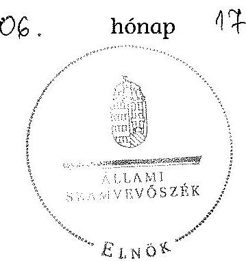

# ÁLLAMI   SZÁMVEVŐSZÉK 

## JELENTÉS

az önkormányzatok belső kontrollrendszere kialakításának, egyes
kontrolltevékenységek és a belső ellenőrzés
működésének ellenőrzéséről
Marcaltő
14094
2014. június

---

# Állami Számvevőszék 

Iktatószám: V-0387-037/2014
Témaszám: 1162
Vizsgálat-azonosító szám: V064961

## Az ellenőrzést felügyelte:

Dr. Benedek Mária
felügyeleti vezető
Az ellenőrzést vezette és az ellenőrzés végrehajtásáért felelős:
Bíró Zsolt
ellenőrzésvezető
A számvevőszéki jelentés összeállításában közreműködött:
Buús Zoltánné Hütter Erzsébet
számvevő tanácsos
Az ellenőrzést végezték:
Buús Zoltánné Hütter Erzsébet Kántor Ilona
számvevő tanácsos
számvevő tanácsos

---

# TARTALOMJEGYZÉK 

BEVEZETÉS ..... 5
I. ÖSSZEGZŐ MEGÁLLAPÍTÁSOK, KÖVETKEZTETÉSEK, JAVASLATOK ..... 9
II. RÉSZLETES MEGÁLLAPÍTÁSOK ..... 13

1. Az önkormányzat belső kontrollrendszerének kialakítása ..... 13
1.1. A kontrollkörnyezet ..... 13
1.2. A kockázatkezelési rendszer ..... 14
1.3. A kontrolltevékenységek ..... 14
1.4. Az információs és kommunikációs rendszer ..... 15
1.5. A monitoring rendszer ..... 16
2. A pénzügyi folyamatokban kulcsszerepet betöltő teljesítésigazolás és érvényesítés belső kontrollok működése ..... 16
3. A belső ellenőrzés működése ..... 19

## FÜGGELÉKEK

1. számú Értelmező szótár
2. számú Az értékelés módja és szempontjai

---

.

---

# RÖVIDÍTÉSEK JEGYZÉKE 

## Törvények

Áht.
ÁSZ tv.
Info tv.

Kttv.

Ltv.

Mötv.

Nvtv.
Ötv.
Számv. tv.

## Rendeletek

Áhsz. 1

Áhsz. 2
Ávr.

Bkr.
képviselő-testületi SZMSZ
vagyongazdálkodási rendelet ${ }_{1}$
vagyongazdálkodási rendelet ${ }_{2}$

## Szórövidítések

ÁSZ
belső ellenőrzési kézikönyv
2011. évi CXCV. törvény az államháztartásról (hatályos 2012. január 1-jétől)
2011. évi LXVI. törvény az Állami Számvevőszékről
2011. évi CXII. törvény az információs önrendelkezési jogról és az információszabadságról (hatályos 2012. január 1-jétől)
2011. évi CXCIX. törvény a közszolgálati tisztviselők ről (hatályos 2012. március 1-jétől)
1995. évi LXVI. törvény a köziratokról, a közlevéltárakról és a magánlevéltári anyag védelméről
2011. évi CLXXXIX. törvény Magyarország helyi önkormányzatairól
2011. évi CXCVI. törvény a nemzeti vagyonról (2012. január 1-jétől hatályos)
1990. évi LXV. törvény a helyi önkormányzatokról
2000. évi C. törvény a számvitelről
249/2000. (XII. 24.) Korm. rendelet az államháztartás szervezetei beszámolási és könyvvezetési kötelezettségének sajátosságairól (hatálytalan 2014. január 1-jétől)
4/2013. (I. 11.) Korm. rendelet az államháztartás számviteléről (hatályos 2014. január 1-jétől)
368/2011. (XII. 31.) Korm. rendelet az államháztartásról szóló törvény végrehajtásáról (hatályos 2012. január 1-jétől)
370/2011. (XII. 31.) Korm. rendelet a költségvetési szervek belső kontrollrendszeréről és belső ellenőrzéséről (hatályos 2012. január 1-jétől)
Marcaltő Község Önkormányzata Képviselő-testületének 11/2004. (IX. 23.) számú rendelete Marcaltő Község Önkormányzata Szervezeti és Működési Szabályzatáról
Marcaltő Község Önkormányzata Képviselő-testületének 9/2004. (VI. 30.) önkormányzati rendelete az önkormányzat vagyonáról és a vagyonnal történő gazdálkodás egyes szabályairól (hatályos 2004. június 30 -ától 2013. április 29-éig)
Marcaltő Község Önkormányzat Képviselő-testületének 5/2013. (IV. 30.) önkormányzati rendelete az önkormányzat vagyonáról, a vagyonnal való gazdálkodás egyes szabályairól (hatályos 2013. április 30-ától)

Állami Számvevőszék
FIX-PONT Önkormányzati Feladatellátó Társulás Belső Ellenőrzési Kézikönyve (hatályos 2012. január 1-jétől)

---

| gazdálkodási jogkörök   szabályzata | Kötelezettségvállalás, utalványozás, ellenjegyzés, érvé-   nyesítés, teljesítésigazolás rendjének szabályzata (hatá-   lyos 2012. február 15-től) |
| :--: | :--: |
| hivatali SZMSZ | Marcaltő Malomsok Egyházaskesző Várkesző Községek   Körjegyzősége Szervezeti és működési Szabályzata (hatá-   lyos 2012. január 1-jétől) |
| hivatásetikai szabályzat | Marcaltő, Malomsok, Egyházaskesző, Várkesző Községek   Körjegyzősége Közszolgálati Hivatásetika Alapelvei és a   Hivatásetika Szabályzata (hatályos 2012. május 1-jétől) |
| INTOSAI | International Organization of Supreme Audit Institutions   (Legfőbb Ellenőrző Intézmények Nemzetközi Szervezete) |
| iratkezelési szabályzat | Marcaltő Malomsok Egyházaskesző Várkesző Községek   Körjegyzőségének Egyedi Iratkezelési Szabályzata (hatá-   lyos 2012. január 1-jétől) |
| ISSAI | International Standards of Supreme Audit Institutions   (Legfőbb Ellenőrző Intézmények Nemzetközi Standardjai) |
| jegyző | Marcaltői Közös Önkormányzati Hivatal jegyzője (2013.   január 1-jétől) |
| Képviselő-testület   Kormányhivatal   körjegyző | Marcaltő Község Önkormányzatának Képviselő-testülete   Veszprém Megyei Kormányhivatal |
| Körjegyzőség | Marcaltő Malomsok Egyházaskesző Várkesző Községek   Körjegyzőségének körjegyzője |
| közszolgálati szabályzat | Marcaltő Malomsok Egyházaskesző Várkesző Községek   Körjegyzősége, 2013. január 1-jétől Marcaltői Közös Ön-   kormányzati Hivatal |
| NGM | A Körjegyzőség Hivatala Köztisztviselőinek Közszolgálati   Szabályzatáról (hatályos 2012. január 1-jétől) |
| Önkormányzat   polgármester   Társulás   ügyrend | Nemzetgazdasági Minisztérium   Marcaltő Község Önkormányzata   Marcaltő Község Önkormányzatának polgármestere   FIX-PONT Önkormányzati Feladatellátó Társulás |
|  | Ügyrend Marcaltő, Malomsok, Egyházaskesző, Várkesző   Községek Körjegyzősége gazdasági szervezetének gazdál-   kodással összefüggő feladataira (hatályos 2012. február   15-től) |

---

# JELENTÉS 

## az önkormányzatok belső kontrollrendszere kialakításának, egyes kontrolltevékenységek és a belső ellenőrzés működésének ellenőrzéséről Marcaltő

## BEVEZETÉS

Marcaltő község állandó lakosainak száma 2012. január 1-jén 810 fő volt. Az Önkormányzat négytagú Képviselő-testületének munkáját egy állandó bizottság segítette. Az Önkormányzat az önállóan működő és gazdálkodó Körjegyzőségen kívül intézményt nem működtetett, többségi tulajdoni hányadú gazdasági társasággal nem rendelkezett. A polgármester a 2010. évi önkormányzati választások óta tölti be tisztségét. A körjegyző 1990. évtől látja el feladatait. A Körjegyzőség szervezeti egységekre nem tagolódott, elkülönített gazdasági szervezettel nem rendelkezett, a foglalkoztatott köztisztviselők száma 2012. január 1-jén nyolc fő volt. A Körjegyzőség 2013. január 1-jétől - Marcaltő székhellyel - Marcaltői Közös Önkormányzati Hivatalként működik. Az Önkormányzat a 2012. évi költségvetési beszámolója szerint 148641 ezer Ft tárgyévi bevételt ért el, valamint 122335 ezer Ft tárgyévi kiadást teljesített. A 2012. december 31-i könyvviteli mérleg szerint 123110 ezer Ft értékű eszközvagyonnal rendelkezett, a rövid lejáratú kötelezettségállománya 1340 ezer Ft, hosszú lejáratú kötelezettségállománya nem volt.

A demokratikus társadalmakban alapvető igény, hogy a közpénzeket, a közvagyont használók tevékenységükről elszámoljanak, ahhoz egyértelmű és érvényesíthető felelősségi szabályok társuljanak. Ennek a jogos igénynek az érvényesítéséhez meg kell teremteni azokat a folyamatokat, rendszereket, amelyek nélkülözhetetlenek az elszámoltatáshoz. Az elszámoltatás eredményes működtetéséhez szükség van a megfelelő információs, kontroll, értékelési és beszámolási rendszerek kialakítására.

Magyarországon az uniós csatlakozási tárgyalások idejére nyúlnak vissza a belső kontrollrendszer szabályozásának gyökerei. Az uniós elvárásoknak megfelelő új terminológia szerinti államháztartási belső pénzügyi ellenőrzési (ÁBPE) rendszer területén a jogharmonizáció 2003-ban teljes körűen megvalósult, míg az önkormányzati alrendszerre vonatkozó, Ötv.-ben megjelenített speciális szabályozás 2005-ben lépett hatályba. Az államháztartási belső kontrollrendszer koncepciója 2009-ben továbbfejlődött. A változások irányát mutatja, hogy a költségvetési szervek belső kontrollrendszere már magában foglalja a korszerű, felelős szervezetirányítás elemeit (kontrollkörnyezet, kockázatkezelés, kontrolltevékenység, információ és kommunikáció, monitoring) is. E kont-

---

rollrendszer szabályozása háromszintű, a törvényi előírásokat az Áht. és a Mötv., a rendeleti szintű szabályozást az Ávr. és a Bkr. tartalmazza, amelyeket útmutatói szinten az NGM által kiadott standardok és kézikönyvek támogatnak.

A belső kontrollrendszer azt a célt szolgálja, hogy a költségvetési szervek működésük és gazdálkodásuk során a tevékenységeket szabályszerűen, gazdaságosan, hatékonyan és eredményesen hajtsák végre, teljesítsék elszámolási kötelezettségeiket és megvédjék az erőforrásokat a veszteségektől, a károktól és a nem rendeltetésszerű használattól. A belső kontrollrendszer magában foglalja mindazon szabályokat, eljárásokat, gyakorlati módszereket és szervezeti struktúrákat, kockázatkezelési technikákat, kontrolltevékenységeket, amelyek segítséget nyújtanak a szervezetnek céljai eléréséhez.

Az ÁSZ középtávú stratégiájában hangsúlyos szerepet szánt annak, hogy szilárd szakmai alapon álló, értékteremtő ellenőrzéseivel előmozdítsa a közpénzügyek átláthatóságát, rendezettségét. A számvevőszéki ellenőrzés nemzetközi alapelvei is rögzítik, hogy a megfelelő belső kontrollrendszer minimálisra csökkenti a hibák és szabálytalanságok kockázatát.

Az ellenőrzés célja annak megállapítása volt, hogy a belső kontrollrendszer elemeinek kialakítása, a pénzügyi folyamatokban kulcsszerepet betöltő teljesítésigazolás és érvényesítés, és a belső ellenőrzés szabályos működése biztosította-e az Önkormányzatnál a közpénzfelhasználás szabályosságát, hozzájárult-e az értéket teremtő rend követelményének érvényesüléséhez.

Ennek keretében értékeltük, hogy:

- a jogszabályi előírásoknak megfelelően alakították-e ki a belső kontrollrendszer elemeit;
- a gazdálkodás folyamatában kulcsszerepet betöltő teljesítésigazolás és érvényesítés kontrolltevékenységeit megfelelően működtették-e;
- biztosították-e a belső ellenőrzés szabályos működését;
- amennyiben az ÁSZ tett javaslatot a 2008-2011. évek közötti ellenőrzése kapcsán az Önkormányzatnak, intézkedtek-e azok végrehajtására.

Az ellenőrzés várható hasznosulását négy szinten tervezzük. A törvényalkotás számára összegzett tapasztalatok állnak rendelkezésre a belső kontrollrendszer önkormányzati területen való kialakításáról, működéséről és hatásairól, a belső ellenőrzés működéséről. Ennek alapján következtetést lehet levonni arról, hogy a belső kontrollrendszer kialakítására és működtetésére vonatkozó jelenlegi, differenciálás nélküli - jogszabályi előírások reális követelményeket támasztanak-e az eltérő adottságú települési önkormányzatok esetében, illetve indokolt-e esetleges jogszabályi módosítás kezdeményezése. Az ellenőrzés az ellenőrzött számára visszajelzést ad a belső kontrollrendszer kialakításában és működésében fellépő hiányosságokról, javaslataival hozzájárul azok kiküszöböléséhez, amely csökkentheti a későbbi ellenőrzések gyakoriságát. Az ellenőrzés megállapításait és javaslatait más szervezetek is hasznosíthatják a rendezett gazdálkodási keretek kialakításához. A társadalom számára jelzi,

---

hogy közpénz nem maradhat ellenőrizetlenül, az ÁSZ értékteremtő rend kialakításához és megőrzéséhez hozzájáruló tevékenysége pozitív hatással lesz a szervezetről kialakított összkép formálásában. A szervezeten belül lehetőség nyílik arra, hogy a megállapítások szintetizálásával az ÁSZ a hozzáadott értéket teremtő elemző tevékenységét és tanácsadó szerepét is erősítse.

Az önkormányzatok belső kontrollrendszere kialakításának, egyes kontrolltevékenységek és a belső ellenőrzés működésének ellenőrzéséről szóló jelentés I. fejezetének összegző része az ellenőrzés céljára ad rövid, szintetizáló összefoglalót, és tartalmazza a következtetéseket a II. fejezet részletes megállapításain alapulóan. A jelentés intézkedést igénylő megállapításait és javaslatait az ellenőrzés során feltárt, a jelentés II. fejezetében rögzített részletes megállapítások alapozzák meg. A helyszíni ellenőrzés lezárásáig a helyi szabályozás változásait nyomon követtük.

Az ellenőrzés típusa: szabályszerűségi ellenőrzés.
Az ellenőrzött időszak: a belső kontrollrendszer kialakításának megfelelősége esetében a 2012. évre, a pénzügyi folyamatokban kulcsszerepet betöltő teljesítésigazolás és érvényesítés belső kontrollok működésének megfelelőségét és a belső ellenőrzés szabályszerű működését a 2012. január 1. és december 31-e közötti időszak eseményeit figyelembe véve értékeltük, míg az ÁSZ javaslatainak utóellenőrzése a 2008-2011. években végzett ellenőrzések nyilvánosságra hozott jelentéseiben tett javaslatok áttekintésére terjedt ki.

# Az ellenőrzött szervezet: az Önkormányzat. 

Az ellenőrzés jogszabályi alapját az ÁSZ tv. 1. § (3) bekezdése, az 5. § (2) és (6) bekezdése, valamint az Áht. 61. § (2) bekezdésének előírásai képezik.

Az ellenőrzés szakmai módszertana az ÁSZ hivatalos honlapján (www.asz.hu) közzétett szakmai szabályokon alapult, amely az INTOSAI által kiadott ISSAI figyelembevételével készült.

Az ellenőrzés lefolytatásához az Önkormányzat a kimutatások és a tanúsítvány elektronikus kitöltésével, valamint az ÁSZ által kért dokumentumok elektronikus megküldésével szolgáltatott adatokat. Az így rendelkezésre bocsátott adatok, információk kontrollja és a munkalapok kitöltése a helyszíni ellenőrzés keretében történt. A jelentésben használt fogalmak magyarázatát az 1. számú függelék, az ellenőrzés egyes területeinek értékelésénél alkalmazott egységes minősítési szempontokat a 2. számú függelék tartalmazza.

A belső kontrollrendszer kialakításának ellenőrzése során értékeltük a kontrollkörnyezet, a kockázatkezelési rendszer, a kontrolltevékenységek, az információs és kommunikációs rendszer, valamint a monitoring rendszer szabályozottságának megfelelőségét. A pénzügyi folyamatokban kulcsszerepet betöltő teljesítésigazolás és érvényesítés kontrollok működése megfelelőségének minősítéséhez az állományba nem tartozók megbízási díjai, a külső szolgáltatók által végzett karbantartási, kisjavítási munkák, az egyéb üzemeltetési és fenntartási szolgáltatások, a rendszeres szociális segélyek, valamint az államháztartáson kívülre teljesített működési és felhalmozási célú pénzeszközátadások közül kockázatelemzéssel választottuk ki az ellenőrzött kiadási jogcímeket. Az egyszerű véletlen mintavétellel kiválasztott tételek ellenőrzését többlépcsős megfelelőségi tesztek útján addig végeztük, amíg elegendő és megfelelő bizonyítékot szereztünk a vizsgált folyamatok kulcskontrolljai működésének megfelelő vagy nem megfelelő voltáról. Értékeltük az Önkormányzatnál a belső
 ellenőrzés működésének szabályosságát. Utóellenőrzésre nem került sor, mivel az ÁSZ az Önkormányzatnál a 2008-2011. évek között nem végzett ellenőrzést.

Az ÁSZ tv. 29. § (1) bekezdése szerint a jelentéstervezetet megküldtük a polgármester részére, aki az ÁSZ tv. 29. § (2) bekezdésében foglalt észrevételezési jogával nem élt, a jelentéstervezetre észrevételt nem tett.

---

# I. ÖSSZEGZŐ MEGÁLLAPÍTÁSOK, KÖVETKEZTETÉSEK, JAVASLATOK 

A belső kontrollrendszeren belül 2012-ben a kontrollkörnyezet, a kockázatkezelési rendszer, a kontrolltevékenységek, az információs és kommunikációs rendszer, valamint a monitoring rendszer kialakítását külön-külön és együttesen is értékeltük. A belső kontrollrendszer kialakítása az összesített értékelés alapján nem felelt meg a jogszabályi előírásoknak.

A belső kontrollrendszer egyes területei kialakításának minősítése a következő:

| Kontrollterület | Minősítés |
| :-- | :--: |
| Kontrollkörnyezet |  |
| Kockázatkezelési rendszer | megfelelő |
| Kontrolltevékenységek | megfelelő |
| Információs és kommunikációs |  |
| rendszer | nem |
| Monitoring rendszer | megfelelő |

Megfelelőnek értékeltük a kockázatkezelési rendszer és a kontrolltevékenységek kialakítását, mivel a körjegyző a jogszabályi előírásokban foglaltakat figyelembe véve kisebb hiányosságok mellett megteremtette e kontrollterületeken a szabályszerű működés lehetőségét.

Nem megfelelőnek értékeltük a kontrollkörnyezet, az információs és kommunikációs rendszer valamint a monitoring rendszer kialakítását, mivel az ellenőrzésünk során megállapított szabályozásbeli hiányosságok magukban hordozzák a szabálytalan működés, valamint a korrupció kockázatát.

A 2012. évben az állományba nem tartozók megbízási díjaival, valamint a külső szolgáltatók által végzett karbantartási, kisjavítási munkákkal kapcsolatos kifizetések során a pénzügyi folyamatokban kulcsszerepet betöltő teljesítésigazolás és érvényesítés belső kontrollok működése gyenge volt. Gyengének értékeltük a két kulcskontroll együttes működését, mivel azok nem biztosították a hibák megelőzését, feltárását.

A számvevőszéki ellenőrzés az ellenőrzött kifizetésekkel összefüggésben a rendelkezésre bocsátott dokumentumok alapján kár bekövetkeztére utaló adatot, tényt nem állapított meg, azonban a gazdálkodásban kulcsszerepet betöltő kontrollok működésében feltárt hiányosságok miatt fennáll a hibák bekövetkezésének kockázata. A nem megfelelően működtetett belső kontrollok korrupciós kockázatot hordoznak.

---

Az Önkormányzat a belső ellenőrzési feladatokat a Társulás útján látta el. A Társulás a belső ellenőrzési feladatok ellátására külső szolgáltatót bízott meg. A 2012. évben a belső ellenőrzés működése nem felelt meg a jogszabályi előírásoknak, mivel a számvevőszéki ellenőrzés által megállapított szabályozási és működési hiányosságok számossága magában hordozza a szabálytalan önkormányzati gazdálkodás és feladatellátás kockázatát.

Az ÁSZ tv. 33. § (1) bekezdésében foglaltak értelmében az ellenőrzött szervezet vezetője köteles a jelentésben foglalt megállapításokhoz kapcsolódó intézkedési tervet összeállítani, és azt a jelentés kézhezvételétől számított 30 napon belül az ÁSZ részére megküldeni. Amennyiben az intézkedési tervet határidőre nem küldi meg a szervezet, vagy az ÁSZ tv. 33. § (2) bekezdésében foglalt póthatáridő elteltével megküldött intézkedési terv továbbra sem elfogadható, az ÁSZ elnöke a hivatkozott törvény 33. § (3) bekezdés a)-b) pontjaiban foglaltakat érvényesítheti.

Az ellenőrzés intézkedést igénylő megállapításai és javaslatai:

# a polgármesternek 

1. A polgármester - az Áht. 87. § (1) bekezdésében foglalt előírás ellenére - az előírt határidőt túllépve tájékoztatta a Képviselő-testületet az Önkormányzat gazdálkodásának első félévi helyzetéről.

Javaslat:
Intézkedjen, hogy az Áht. 87. § (1) bekezdésében foglaltaknak megfelelően tájékoztassa az Önkormányzat gazdálkodásának első félévi helyzetéről a Képviselőtestületet.
2. Az Önkormányzat nevében történő kötelezettségvállalás - az Áht. 37. § (1) bekezdése és az Ávr. 55. § (1) bekezdésében előírtak ellenére - pénzügyi ellenjegyzés hiányában történt.

Javaslat:
Intézkedjen, hogy az Önkormányzat nevében történő kötelezettségvállalásra az Áht. 37. § (1) bekezdésében és az Ávr. 55. § (1) bekezdésében foglaltaknak megfelelően - az Ávr. 53. §-ában meghatározott kivételekkel - kizárólag a pénzügyi ellenjegyzés után, a pénzügyi teljesítés esedékességét megelőzően, írásban kerüljön sor.
3. A számvevőszéki ellenőrzés megállapításai alapján az Önkormányzatnál a belső kontrollrendszer kialakítása összefoglalóan értékelve nem felelt meg a jogszabályi előírásoknak, a kulcskontrollok működése gyenge volt. A belső ellenőrzés működése nem felelt meg a jogszabályi előírásoknak, nem tárta fel, ezáltal nem is javíttatta ki a hiányosságokat. A megállapított szabályozásbeli és működésbeli hiányosságok magukban hordozzák a szabálytalan működés kockázatát.

---

Javaslat:
Kísérje figyelemmel a Mötv. 115. § (1) bekezdésében foglaltak alapján az Önkormányzat gazdálkodásának szabályszerűségét. A Mötv. 67. § f) pontja alapján gondoskodjon a belső kontrollrendszer működésére vonatkozó jogszabályi rendelkezések be nem tartása, valamint a teljesítésigazolás, illetve az érvényesítés kontrollokkal összefüggésben feltárt hiányosságok, szabálytalanságok tekintetében az esetleges munkajogi felelősséggel kapcsolatos körülmények kivizsgálásáról, majd a vizsgálat eredményének függvényében tegye meg a szükséges intézkedéseket.

# a jegyzőnek (Marcaltö Önkormányzata vonatkozásában) 

1. a kontrollkörnyezettel kapcsolatban:

A körjegyző a hivatali SZMSZ-ben az Ávr.-ben foglaltak ellenére nem rögzítette az ellátandó, és a szakfeladatrend szerint szakfeladat számmal és megnevezéssel besorolt alaptevékenységek megjelölését, nem készítette elő a vagyongazdálkodási rendelet; módosítását, továbbá a Kttv.-ben foglaltak alapján nem kezdeményezte a köztisztviselőkkel szembeni hivatásetikai alapelvek részletes tartalmát, valamint az etikai eljárás szabályait tartalmazó dokumentum Képviselő-testület elé terjesztését [II. Részletes megállapítások, 1.1. A kontrollkörnyezet, 7., 16. és 47. sorszámú megállapítás].

Javaslat:
Intézkedjen az Áht. 69. § (2) bekezdése, a Bkr. 3. § a) pontja és 6. §-a alapján a jelentés II. Részletes megállapítások, 1.1. A kontrollkörnyezet 7., 16. és 47. sorszámú megállapításaiban foglalt hibák, hiányosságok kijavításáról, megszüntetéséről az ott megjelölt jogszabályi rendelkezéseknek megfelelően.
2. a kockázatkezelési rendszerrel kapcsolatban:

A körjegyző a Bkr.-ben foglaltak ellenére a kockázatok kezelése érdekében előírt intézkedések teljesítése folyamatos nyomon követési módját nem határozta meg [II. Részletes megállapítások, 1.2. A kockázatkezelési rendszer, 10. sorszámú megállapítás].

Javaslat:
Intézkedjen az Áht. 69. § (2) bekezdése, a Bkr. 3. § b) pontja és 7. §-a alapján a jelentés II. Részletes megállapítások, 1.2. A kockázatkezelési rendszer 10. sorszámú megállapításában foglalt hiba, hiányosság kijavításáról, megszüntetéséről az ott megjelölt jogszabályi rendelkezéseknek megfelelően.
3. információs és kommunikációs rendszerrel kapcsolatban:

Az Önkormányzat - az Info tv.-ben foglaltak ellenére - elektronikus közzétételi kötelezettségének a 2012. évben nem tett eleget. A körjegyző az Ltv. előírását figyelmen kívül hagyva az iratkezelési szabályzatot nem a Magyar Nemzeti Levéltár és a Kormányhivatal egyetértésével adta ki [II. Részletes megállapítások, 1.4. Az információs és kommunikációs rendszer, 7. és 9. sorszámú megállapítás].

---

Javaslat:
Intézkedjen az Áht. 69. § (2) bekezdése, a Bkr. 3. § d) pontja és 9. §-a, alapján a jelentés II. Részletes megállapítások, 1.4. Az információs és kommunikációs rendszer 7. és 9. sorszámú megállapításában foglalt hiba, hiányosság kijavításáról, megszüntetéséről az ott megjelölt jogszabályi rendelkezéseknek megfelelően.
4. a monitoring rendszerrel kapcsolatban:

A körjegyző a Bkr.-ben foglaltak ellenére nem alakította ki a Körjegyzőség tevékenységének, a célok megvalósításának nyomon követését biztosító rendszerét. Az Áht.-ben és a Bkr.-ben foglaltakat figyelmen kívül hagyva a monitoring rendszer fejlesztése érdekében intézkedéseket nem tett [II. Részletes megállapítások, 1.5. A monitoring rendszer, 1., 10. sorszámú megállapítás].

Javaslat:
Intézkedjen az Áht. 69. § (2) bekezdése, a Bkr. 3. § e) pontja és 10. §-a alapján a jelentés II. Részletes megállapítások, 1.5. A monitoring rendszer 1., 10. sorszámú megállapításában foglalt hibák, hiányosságok kijavításáról, megszüntetéséről az ott megjelölt jogszabályi rendelkezéseknek megfelelően.
5. a pénzügyi folyamatokban kulcsszerepet betöltő kontrollokkal kapcsolatban:

A teljesítésigazolás és az érvényesítés nem felelt meg az Áht.-ban és az Ávr.-ben foglaltaknak [II. Részletes megállapítások, 2. A pénzügyi folyamatokban kulcsszerepet betöltő teljesítésigazolás és érvényesítés belső kontrollok működése, 1., 2. és 3. pontban foglalt megállapítás].

Javaslat:
Intézkedjen az Áht. 37-38. §-ában és az Ávr. 55-59. §-ában és az Áhsz. 3 39. § (1) bekezdésében és a 14. számú melléklet II. pontjában, valamint az Áhsz. 2 40. §-ában és a 15. számú mellékletben foglaltak alapján arról, hogy a teljesítésigazolás és az érvényesítés vonatkozásában, valamint azok ellenőrzése során a kötelezettségvállalással, a pénzügyi ellenjegyzéssel, az utalványozással, a kötelezettségvállalások nyilvántartásba vételével, a főkönyvi számlakijelölésével kapcsolatban feltárt, a jelentés II. Részletes megállapítások, 2. A pénzügyi folyamatokban kulcsszerepet betöltő teljesítésigazolás és érvényesítés belső kontrollok működése 1., 2. és 3. pontjában szereplő megállapításokban foglalt hibák, hiányosságok kijavítása, megszüntetése az ott megjelölt jogszabályi rendelkezéseknek megfelelően történjen meg;
6. a belső ellenőrzés működésével kapcsolatban:

A belső ellenőrzés működése a számvevőszéki ellenőrzés értékelési szempontjait figyelembe véve nem felelt meg a Bkr.-ben foglaltaknak [II. Részletes megállapítások, 3. A belső ellenőrzés működése 4.-7., 8.g), 13. és 27. sorszámú megállapítása].

Javaslat:
Intézkedjen az Áht. 69. § (2), a 70. § (1) bekezdése, a Bkr. 3. § e) pontja és a 10. §-a alapján a jelentés II. Részletes megállapítások, 3. A belső ellenőrzés működése 4.-7., 8.g), 13. és 27. sorszámú megállapításában foglalt hibák, hiányosságok kijavításáról, megszüntetéséről az ott megjelölt jogszabályi rendelkezéseknek megfelelően.

---

# II. RÉSZLETES MEGÁLLAPÍTÁSOK 

## 1. AZ ÖNKORMÁNYZAT BELSŐ KONTROLLRENDSZERÉNEK KIALAKÍTÁSA

A belső kontrollrendszeren belül 2012-ben a kontrollkörnyezet, a kockázatkezelési rendszer, a kontrolltevékenységek, az információs és kommunikációs rendszer, valamint a monitoring rendszer kialakítását külön-külön és együttesen is értékeltük. A belső kontrollrendszer kialakítása az összesített értékelés alapján nem felelt meg a jogszabályi előírásoknak.

### 1.1. A kontrollkörnyezet

A kontrollkörnyezet kialakítása - a 2. számú függelékben részletezett kritériumrendszer alapján végzett értékelés szerint - a jogszabályi előírásoknak nem felelt meg, mert:

| Sor-   szám $^{1}$ | Megállapítás | Megjegyzés |
| :--: | :--: | :--: |
| 7. | A körjegyző a hivatali SZMSZ-ben - az Ávr. 13. § (1) bekezdés c) pontjában foglaltak ellenére - nem rögzítette az ellátandó, és a szakfeladatrend szerint szakfeladat számmal és megnevezéssel besorolt alaptevékenységek megjelölését. | 2014. január 1-jétől az Ávr. 13. § (1) bekezdés c) pontjában szereplő szöveg az alábbira változott: „az ellátandó, és a kormányzati funkció szerint besorolt alaptevékenységek, rendszeresen ellátott vállalkozási tevékenységek, valamint az alaptevékenységet szabályozó jogszabályok megjelölését." |
| 16. | A körjegyző - az Ötv. 36. § (2) bekezdés a) pontjában foglaltak ellenére - az ellenőrzött időszakban nem készítette elő megfelelő időben a vagyongazdálkodási rendelet módosítását annak érdekében, hogy az megfeleljen az Nvtv. 3. § (1) bekezdés 6. pontja, 5. §-a, 11. § (16) bekezdése, valamint a 13. § (1) bekezdése előírásainak. | A 2013. évben a jegyző által előkészített vagyongazdálkodási rendelet ${ }_{2}$-t a Képviselő-testület elfogadta.   Az önkormányzat működésével kapcsolatos feladatok ellátásáról való gondoskodást 2013. január 1-jétől a jegyző részére a Mötv. 81. § (3) bekezdés c) pontja írja elő. |

[^0]
[^0]:    ${ }^{1}$ A megállapítás számozása az Önkormányzat által az adatszolgáltatás során kitöltött kimutatások kérdéseinek sorszámával azonos.

---

A körjegyző a Kttv. 231. § (1) bekezdésében előírtaknak megfelelően előkészítette a köztisztviselőkkel szembeni hivatásetikai alapelvek részletes tartalmát, valamint az etikai eljárás szabályait tartalmazó dokumentumot, azonban nem kezdeményezte annak Képviselő-testület elé terjesztését.

# 1.2. A kockázatkezelési rendszer 

A kockázatkezelési rendszer kialakítása - a 2. számú függelékben részletezett kritériumrendszer alapján végzett értékelés szerint - a jogszabályi előírásoknak megfelel.

A körjegyző a Körjegyzőség kockázatkezelési rendszerét kialakította, felmérte és megállapította

 a Körjegyzőség tevékenységében, gazdálkodásában rejlő kockázatokat, gondoskodott az azonosított kockázatok értékeléséről, meghatározta az egyes kockázatokkal kapcsolatban a szükséges intézkedéseket. A vagyonnyilatkozat-tételre kötelezettek körét a hivatali SZMSZ-ben és képviselő-testületi SZMSZ-ben rögzítették, a vagyonnyilatkozat-tételre kötelezettek a nyilatkozattételi kötelezettségüknek eleget tettek.

A kockázatkezelési rendszer az értékelés szempontjából az alábbi kisebb súlyú hiányosság mellett megfelelt a jogszabályi előírásoknak:

| Sorszám | Megállapítás |
| :--: | :--: |
| 10. | A körjegyző - Bkr. 7. § (2) bekezdésében foglaltak ellenére - a kockázatok kezelése érdekében szükséges intézkedések teljesítése folyamatos nyomon követési módját nem határozta meg. |

### 1.3. A kontrolltevékenységek

A kontrolltevékenységek kialakítása - a 2. számú függelékben részletezett kritériumrendszer alapján végzett értékelés szerint - a jogszabályi előírásoknak megfelelt.

A körjegyző a kontrolltevékenység részeként előírta a folyamatba épített, előzetes, utólagos és vezetői ellenőrzést a költségvetés tervezése, a beszerzések lebonyolítása, a vagyonhasznosítási tevékenység és a támogatások elszámolása vonatkozásában.

A körjegyző a gazdálkodási jogkörök szabályzatában meghatározta a kötelezettségvállalás pénzügyi ellenjegyzése, a teljesítésigazolás, az érvényesítés és az utalványozás módját, valamint az előzetes írásbeli kötelezettségvállalást nem igénylő kifizetések rendjét. A polgármester felhatalmazást adott az önkormányzati kiadások vonatkozásában kötelezettségvállalásra és utalványozásra. A körjegyző kijelölte a pénzügyi ellenjegyzési és érvényesítési feladatokra a Körjegyzőség állományába tartozó köztisztviselőket, és azok rendelkeztek a jogszabályban előírt szakképzettséggel. A körjegyző a közszolgálati szabályzatban

---

határozta meg a Körjegyzőségnél a köztisztviselő jogviszonya megszűnése esetére a munkakör átadása és a munkáltatóval való elszámolás rendjét.

Az ügyrendben a körjegyző meghatározta az időközi és éves beszámolók elkészítésének feladatait és a beszámolási eljárásokhoz kapcsolódó felelősségi köröket, a gazdasági feladatot ellátók helyettesítésének rendjét. Az éves költségvetési beszámoló elkészítésével megbízott személy rendelkezett a jogszabályban előírt képesítéssel, a tevékenység ellátására jogosító engedéllyel. A polgármester a jogszabályi előírásoknak megfelelően az Önkormányzat gazdálkodásának háromnegyed éves helyzetéről a Képviselő-testületet írásban tájékoztatta.

A körjegyző az iratkezelési szabályzatban előírta az iratok és az adatok védelmét, szabályozta az üzemeltetés és adatbiztonság feladatait és meghatározta az ehhez kapcsolódó hatásköröket.

A kontrolltevékenységek kialakítása az értékelés szempontjából az alábbi kisebb súlyú hiányosságok mellett megfelelt a jogszabályi előírásoknak:

| Sorszám | Megállapítás | Megjegyzés |
| :--: | :--: | :--: |
| 10. | A körjegyző az Ávr. 57. § (4) bekezdésében foglaltak ellenére 2012. március 30-át megelőzően írásban nem jelölte ki az önkormányzati előirányzatokra a teljesítésigazolásra jogosult személyeket. | A kötelezettségvállaló 2012. március 31-étől írásban kijelölte a teljesítésigazolásra jogosult személyt. |
| 24. | A polgármester - az Áht. 87. § (1) bekezdésében foglalt előírás ellenére - a Képviselőtestületet az előírt határidőt túllépve tájékoztatta az Önkormányzat gazdálkodásának első félévi helyzetéről. | A jegyző az Önkormányzat gazdálkodásának első félévi helyzetéről szóló tájékoztatót határidőben elkészítette, azonban a polgármester az előírt határidőn túl - 2012. szeptember 27-én - terjesztette a képviselő-testület elé. |

# 1.4. Az információs és kommunikációs rendszer 

Az információs és kommunikációs rendszer kialakítása - a 2. számú függelékben részletezett kritériumrendszer alapján végzett értékelés szerint - a jogszabályi előírásoknak nem felelt meg, mert:

| Sorszám | Megállapítás |
| :--: | :--: |
| 7. | Az Önkormányzat - az Info tv. 33. § (1) és (3) bekezdésében foglaltak ellenére - elektronikus közzétételi kötelezettségének a 2012. évben nem tett eleget. |
| 9. | A körjegyző - az Ltv. 10. § (1) bekezdés c) pontjának előírását figyelmen kívül hagyva - a Körjegyzőség iratkezelési szabályzatát nem a Magyar Nemzeti Levéltár és a Kormányhivatal egyetértésével adta ki. |

---

# 1.5. A monitoring rendszer 

A monitoring rendszer kialakítása - a 2. számú függelékben részletezett kritériumrendszer alapján végzett értékelés szerint - a jogszabályi előírásoknak nem felelt meg, mert:

| Sor-   szám | Megállapítás |
| :-- | :-- |
| 1. | A körjegyző - a Bkr. 3. § e) pontjában és a 10. §-ában foglaltak ellenére -   nem alakított ki a Körjegyzőség tevékenységének, a célok megvalósításának nyomon követését biztosító rendszert. |
| 10. | A körjegyző - az Áht. 69. § (2) bekezdésében és a Bkr. 3. §-ában foglaltakat   figyelmen kívül hagyva - (a Bkr. 1. melléklete szerinti, 2011. évre vonatkozó   nyilatkozatában foglaltak alapján, annak indokoltsága ellenére) a monitoring rendszer fejlesztése érdekében intézkedéseket nem tett. |

A helyi önkormányzatok törvényességi felügyeletét ellátó Kormányhivatal törvényességi felhívással, vagy más törvényességi felügyeleti eszközzel az Önkormányzatnál 2012-ben nem élt.

## 2. A PÉNZÜGYI FOLYAMATOKBAN KULCSSZEREPET BETÖLTŐ TELJESÍTÉSIGAZOLÁS ÉS ÉRVÉNYESÍTÉS BELSŐ KONTROLLOK MŰKÖDÉSE

A 2012. évben az állományba nem tartozók megbízási díjaival, valamint a külső szolgáltatók által végzett karbantartással, kisjavítással kapcsolatos kifizetések során - összefoglalóan értékelve - a pénzügyi folyamatokban kulcsszerepet betöltő teljesítésigazolás és érvényesítés belső kontrollok működésének megfelelősége gyenge volt, mert:

| Kontrollok   sorszáma | Megállapítás | Megjegyzés |
| :-- | :-- | :-- |

## Teljesítésigazolás

1. A teljesítésigazolást - az Áht. 38. § (1) bekezdésében és az Ávr. 57. § (1) és (3) bekezdésében foglaltak ellenére - nem, vagy nem szabályszerűen végezték el.

## Érvényesítés

Az érvényesítést - az Áht. 38. § (1) bekezdésében és az Ávr. 58. § (1) bekezdésében foglaltak ellenére - nem, vagy nem szabályszerűen végezték el.
2. Az érvényesítő az Ávr. 58. § (1) bekezdésében foglaltak ellenére a fedezet meglétét nem tudta ellenőrizni, mert a 2012. évben a kötelezettségvállalásokat az Ávr. 56. § (1) bekezdésében előírtak ellenére nem vették nyilvántartásba, ugyanis a kötelezettségvállalások nyilvántartását 2012-ben nem vezették.

Az Ávr. 56. § (1) bekezdés 2014. I. 1-jétől módosult, a kötelezettségvállalások nyilvántartását az Áhsz. 39. § (1) bekezdés és a 14. számú melléklet II. pontja tartalmazza.
2014. január 1-jétől az Áhsz. 40. §-a, illetve a 15. számú

---

Az érvényesítő az Ávr. 58. § (2) bekezdésében előírtakat figyelmen kívül hagyva nem jelezte az utalványozónak, hogy a megelőző ügymenetben a teljesítésigazolást nem, vagy nem szabályszerűen végezték el.

Nem jelezte továbbá, hogy az Önkormányzat nevében vállalt kötelezettségvállalásokra az Áht. 37. § (1) és az Ávr. 55. § (1) bekezdésében előírtak ellenére pénzügyi ellenjegyzés nélkül került sor.

## A kulcskontrollok ellenőrzése során feltárt egyéb hiányosságok

Az utalványon nem tüntették fel az Ávr. 59. § (3) bekezdés e) és f) pontjában foglaltak ellenére a megterhelendő fizetési számla számát és megnevezését és a kötelezettségvállalás nyilvántartási számát.

A főkönyvi számlaszám kijelölése nem volt megfelelő, mert a gyalogátkelőhely tervezésével összefüggő fejlesztési kiadást nem az Áhsz., 48. § (2) bekezdés és a 9. számú melléklet 1. g) pontjában foglaltak szerinti főkönyvi számlán számolták el.
melléklet előírása tartalmazza az egységes rovatrend alkalmazását.
2014. január 1-jétől az Áhsz. 51 § (1)-(2) bekezdése és a 16. számú melléklete tartalmazza az egységes számlakeret alapján kialakított számlarendet.

A 2012. évben az állományba nem tartozók megbízási díjainak kifizetése során a teljesítésigazolás és az érvényesítés kulcskontrollok működésének megfelelősége gyenge volt, mert:

- a teljesítésigazolást - az Ávr. 57. § (3) bekezdésében előírtak ellenére - az Önkormányzat kiadási előirányzata terhére teljesített honlap-üzemeltetéssel és takarítással ${ }^{2}$ kapcsolatos kifizetéseket megelőzően kijelölés hiányában nem az arra jogosult személy végezte;
- az érvényesítést - az Áht. 38. § (1) bekezdésében és az Ávr. 58. § (1) bekezdésében foglaltak ellenére - a takarításra ${ }^{3}$, javítási munkára és a technikai feladatokra az Önkormányzat kiadási előirányzata terhére kötött megbízási díjak pénztári kifizetése esetében nem végezték el;
- az érvényesítő a honlap-üzemeltetéssel és takarítással kapcsolatos megbízási díjak kifizetéseit megelőzően - az Ávr. 58. § (1) bekezdésében foglaltak ellenére -nem tudta ellenőrizni a fedezet meglétét, mert a kötelezettségvállalásokat a 2012. évben - az Ávr. 56. § (1) bekezdésében előírtak ellenére - nem vették nyilvántartásba;
- az érvényesítő az Ávr. 58. § (2) bekezdésében és a gazdálkodási jogkörök szabályzatában előírtakat figyelmen kívül hagyva nem jelezte az utalványozónak, hogy a megelőző ügymenetben a teljesítésigazolást a honlap-

[^0]
[^0]:    ${ }^{2}$ február 28-ai és március 28-ai kifizetések
    ${ }^{3}$ február 28-ai kifizetések

---

üzemeltetéssel, takarítással kapcsolatos kifizetéseket megelőzően nem az arra jogosult személy végezte, nem jelezte továbbá, hogy az Önkormányzat kiadási előirányzatai terhére vállalt - honlap-üzemeltetéssel, közterület takarítással, javítási feladatok elvégzésével összefüggő - kötelezettségvállalásokra az Áht. 37. § (1) és az Ávr. 55. § (1) bekezdésében előírtak ellenére pénzügyi ellenjegyzés nélkül került sor.

Az utalványon nem tüntették fel az Ávr. 59. § (3) bekezdés e) és f) pontjában foglaltak ellenére a megterhelendő fizetési számla számát és megnevezését, valamint a kötelezettségvállalás nyilvántartási számát.

A 2012. évben a külső szolgáltatók által végzett karbantartási és kisjavítási munkák kifizetése során a teljesítésigazolás és az érvényesítés kulcskontrollok működésének megfelelősége gyenge volt, mert:

- a teljesítésigazolást az Önkormányzat és a Körjegyzőség kiadási előirányzata terhére teljesített karbantartási kiadások kifizetését ${ }^{4}$ megelőzően - az Áht. 38. § (1) bekezdésében és az Ávr. 57. § (1) bekezdésében foglaltak ellenére nem végezték el;
- a teljesítésigazolást - az Ávr. 57. § (3) bekezdésében előírtak ellenére - az Önkormányzat kiadási előirányzata terhére teljesített karbantartási anyagvásárlásokra ${ }^{5}$ és szőnyegtisztításra történt kifizetéseket megelőzően kijelölés hiányában nem az arra jogosult személy végezte;
- az érvényesítést - az Áht. 38. § (1) bekezdésében és az Ávr. 58. § (1) bekezdésében foglaltak ellenére - a karbantartási anyagvásárlással ${ }^{6}$ és a karbantartással ${ }^{7}$ összefüggő kiadásokat megelőzően nem végezték el;
- az érvényesítő - az Ávr. 58. § (1) bekezdésében foglaltak ellenére - a karbantartási anyagvásárlással, gyalogátkelőhely tervezéssel, kéményvizsgálattal, utánfutófestéssel és orvosi rendelő karbantartásával kapcsolatos kifizetések esetében nem tudta ellenőrizni a fedezet meglétét, mert a kötelezettségvállalásokat a 2012. évben - az Ávr. 56. § (1) bekezdésében előírtak ellenére nem vették nyilvántartásba;
- az érvényesítő az Ávr. 58. § (2) bekezdésében és a gazdálkodási jogkörök szabályzatában előírtakat figyelmen kívül hagyva nem jelezte az utalványozónak, hogy a megelőző ügymenetben a teljesítésigazolást nem, vagy nem szabályszerűen végezték el, nem jelezte továbbá, hogy az Önkormányzat kiadási előirányzatai terhére vállalt - gyalogátkelőhely tervezésével összefüggő - kötelezettségvállalásra az Áht. 37. § (1) és az Ávr. 55. § (1) bekezdésében előírtak ellenére pénzügyi ellenjegyzés nélkül került sor.

Az utalványon nem tüntették fel a karbantartási kiadásokkal összefüggésben az Ávr. 59. § (3) bekezdés e) és f) pontjában foglaltak ellenére a megterhelendő

[^0]
[^0]:    ${ }^{4}$ február 20-ai, március 23-ai és a május 20-ai kifizetések
    ${ }^{5}$ január 31-ei és március 19-ei kifizetések
    ${ }^{6}$ január 31-ei, július 31-ei és december 31-ei kifizetések
    ${ }^{7}$ május 31-ei, április 30-ai és szeptember 30-ai kifizetések

---

fizetési számla számát és megnevezését, valamint a

 kötelezettségvállalás nyilvántartási számát.

A gyalogátkelőhely tervezésével összefüggő kifizetés esetében a főkönyvi számlaszám kijelölése nem volt megfelelő, mert a fejlesztési kiadást nem az Áhsz. 48. § (2) bekezdés és a 9. számú melléklet 1. g) pontjában foglaltak szerinti főkönyvi számlán számolták el.

A számvevőszéki ellenőrzés az ellenőrzött kifizetésekkel összefüggésben a rendelkezésre bocsátott dokumentumok alapján kár bekövetkeztére utaló adatot, tényt nem állapított meg, azonban a gazdálkodásban kulcsszerepet betöltő kontrollok működésében feltárt hiányosságok miatt fennáll a hibák bekövetkezésének kockázata. A nem megfelelően működtetett belső kontrollok korrupciós kockázatot hordoznak.

# 3. A Belső ELLENŐRZÉS MŰKÖDÉSE 

Az Önkormányzat a belső ellenőrzési feladatokat a Társulás útján látta el. A Társulás a belső ellenőrzési feladatok ellátására külső szolgáltatót bízott meg. A belső ellenőrzés működése - a 2. számú függelékben részletezett kritériumrendszer alapján végzett értékelés szerint - a jogszabályi előírásoknak nem felelt meg, mert:

| Sorszám | Megállapítás | Megjegyzés |
| :--: | :--: | :--: |
| 4. | A belső ellenőrzési kézikönyvet - a Bkr. 56. §   (7) bekezdésében foglaltak ellenére - a Társulás munkaszervezetének vezetője helyett a Társulás elnöke hagyta jóvá. |  |
| 5. | A belső ellenőrzés külső szolgáltatóval történő ellátása ellenére - a Bkr. 16. § (4) bekezdésében és a 22. §-ában foglaltak ellenére - a belső ellenőrzési tevékenység megszervezésére vonatkozó írásbeli megállapodásban nem rendelkeztek a belső ellenőrzési vezetői feladatok és kötelességek ellátásának módjáról. |  |
| 6. | A belső ellenőrzést végző a Bkr. 24. § (1) bekezdésében foglaltak ellenére nem rendelkezett az Áht. 70. § (4) bekezdésében előírt engedéllyel. |  |
| 7. | A Bkr. 56. § (3) bekezdés a) pontjában foglaltak ellenére stratégiai ellenőrzési tervvel az Önkormányzat nem rendelkezett. |  |
| 8. g) | A 2013. évi belső ellenőrzési terv a - Bkr. 31. § (4) bekezdés g) pontjában foglaltak ellenére - nem a tárgyévre (2013. évben lefolytatandó) határozta meg az ellenőrzések ütemezését. | A 2013. évi ellenőrzési terv II. pontja a 2014. évet határozta meg az ellenőrzések lefolytatására. |

---

|  | A körjegyzék a belső ellenőrzés működtetéséről - az Áht. 70. § (1) bekezdésében és a Bkr. 15. § (1) bekezdésében foglaltak ellenére - a 2012. évben nem gondoskodott, mert 2012-ben belső ellenőrzést nem végeztek. |
| :--: | :--: |
| 27. | A Társulás munkaszervezetének vezetője a 2011. évre vonatkozó éves ellenőrzési jelentést a Bkr. 56. § (8) bekezdésében előírt határidőre a körjegyzék részére nem küldte meg. |

Az Önkormányzat az ÁSZ-tól a 2012. és a 2013. években integritás kérdőív kitöltésére kapott felkérést, amelynek a 2013. évben eleget tett. A vagyonnyilatkozat-tételi kötelezettségek teljesítése, a 2013. évi belső ellenőrzési terv kockázatelemzéssel történő alátámasztása arra utalnak, hogy az Önkormányzatnál az integritási szemlélet érvényesül.

Budapest, 2014.

Dómokos László
elnök $\%$

Függelék: $\quad 2 \mathrm{db}$

---

# ÉRTELMEZŐ SZÓTÁR 

belső ellenőrzés
belső kontrollrendszer
belső kontrollrendszer területei
egyszerű véletlen mintavétel
integritás
kockázat
kockázatkezelési rendszer

Független, tárgyilagos bizonyosságot adó és tanácsadó tevékenység, amelynek célja, hogy az ellenőrzött szervezet működését fejlessze és eredményességét növelje, az ellenőrzött szervezet céljai elérése érdekében rendszerszemléletű megközelítéssel és módszeresen értékeli, illetve fejleszti az ellenőrzött szervezet irányítási és belső kontrollrendszerének hatékonyságát. (Forrás: Bkr. 2. § b) pontja)
A belső kontrollrendszer a kockázatok kezelése és tárgyilagos bizonyosság megszerzése érdekében kialakított folyamatrendszer, amely azt a célt szolgálja, hogy a működés és gazdálkodás során a tevékenységeket szabályszerűen, gazdaságosan, hatékonyan, eredményesen hajtsák végre, az elszámolási kötelezettségeket teljesítsék, megvédjék az erőforrásokat a veszteségektől, károktól és nem rendeltetésszerű használattól. (Forrás: Áht. 69. § (1) bekezdése)
A kontrollkörnyezet, a kockázatkezelési rendszer, a kontrolltevékenységek, az információs és kommunikációs rendszer, valamint a nyomon követési (monitoring) rendszer. (Forrás: Bkr. 3. §-a)

Az alapsokaságból egyszerű véletlen kiválasztással képzett részsokaság. (Forrás: Az ÁSZ ellenőrzési mintavételezés támogatásához készült segédletének 4.1.1. pontja)
Az integritás elvek, értékek, cselekvések, módszerek, intézkedések konzisztenciáját jelenti: olyan magatartásmódot, amely meghatározott értékeknek felel meg. Az integritás a közszféra esetében a társadalom által elvárt nyilvánossági, átláthatósági, illetve jogi/etikai normáknak történő megfelelést jelenti.
(Forrás: a http://integritas.asz.hu honlapon közzétett „A 2012. évi integritás felmérés eredményeinek összefoglalója" címú dokumentum 3. oldal 1. bekezdése)
A kockázat annak a valószínűségét jelenti, hogy egy vagy több esemény vagy intézkedés nem kívánt módon befolyásolja a rendszer működését, céljainak megvalósulását. (Forrás: Javaslatok a korrupciós kockázatok kezelésére - Kockázatkezelési és ellenőrzési módszertan 35. oldal, ÁSZ)
Olyan irányítási eszközök és módszerek összessége, melynek elemei a szervezeti célok elérését veszélyeztető tényezők (kockázatok) azonosítása, elemzése, csoportosítása, nyomon követése, valamint szükség esetén a kockázati kitettség mérséklése. (Forrás: Bkr. 2. § m) pontja)

---

kontrollkörnyezet
kontrolltevékenységek
kommunikáció
korrupció
kulcskontrollok
lényegesség
megfelelőségi teszt

A kontrollkörnyezet alakítja ki a szervezet belső kontrollrendszerhez való viszonyát, hozzáállását, befolyásolja az alkalmazottak belső kontrollal kapcsolatos tudatosságát, magatartását. Elemei a személyes és szakmai elkötelezettség és a vezetés, valamint az alkalmazottak által vallott erkölcsi értékek; a szakmai hozzáértés iránti elkötelezettség; a felső vezetés hozzáállása - a vezetés filozófiája és tevékenységének stílusa; a szervezeti struktúra; a humánerőforrás-politika és gazdálkodási gyakorlat.
A kontrolltevékenységek azok a politikák és eljárások, amelyeket a kockázatok megoldására hoznak létre a szervezet céljainak teljesítése érdekében.
Az a tevékenység, melynek során információ továbbítása valósul meg. A kommunikációs folyamat résztvevői között tájékoztatás történik, mely során tényeket, ezek magyarázatát közlik. „A szervezetben eredményes kommunikációnak kell áramlania lefelé, horizontálisan és felfelé, a szervezet egészében és annak valamennyi elemében."
Azok a cselekmények, amelyek során a köz érdekében való eljárással megbízott és döntéshozatali felelősséggel felruházott személy a köz érdeke helyett önös vagy részérdekeket követve, mástól jogtalan vagy etikátlan előnyt elfogadva és őt jogtalan vagy etikátlan előnyhöz juttatva jár el, illetve amikor valaki a köz érdekében való eljárással megbízott és döntéshozatali felelősséggel felruházott személynek jogtalan vagy etikátlan előnyt nyújtva vagy felajánlva jogtalan vagy etikátlan előnyt kér. (Forrás: A Kormány korrupció megelőzési programja 2012-2014.)
Az azonosított kockázatok mérséklése érdekében kialakított kontrollok közül azok, amelyek elégtelen működése esetén a szervezetet jelentős veszteség érheti, vagy a működésükben bekövetkező hiba/hiányosság más kontrollok eredményességét csökkenti. Ezek ellenőrzése, értékelése elegendő bizonyítékot szolgáltat adott területen a kontrollrendszer értékeléséhez. Az önkormányzatok kontrollrendszere kialakításának ellenőrzése során a pénzügyi folyamatokban kulcsszerepet betöltő belső kontrollok a teljesítésigazolás és az érvényesítés.
Egy információ akkor lényeges, ha hiánya vagy téves állítása befolyásolhatja ezen információkat felhasználók döntéseit, véleményét. Az ellenőrzés során a lényegesség három szempontból értelmezhető: érték, jelleg és összefüggés szerint.
Az ellenőrzés során alkalmazott módszer - szekvenciális (megállásos) megfelelőségi teszt - lényege, hogy a kiválasztott minta ellenőrzését csak addig végezzük, amíg elegendő és megfelelő bizonyítékot nem szerzünk az ellenőrzött kulcskontroll (teljesítésigazolás, érvényesítés) működésének megfelelő vagy nem megfelelő voltáról.

---

monitoring (nyomon követési rendszer)
utóellenőrzés

A monitoring a különböző szintű szervezeti célok megvalósításának folyamatát kíséri figyelemmel, melynek során a releváns eseményekről és tevékenységekről (együtt: folyamatokról) rendszeres jelleggel, strukturált, döntéstámogató információkhoz jutnak a szervezet vezetői.
Az intézkedések nyomon követése érdekében elrendelt ellenőrzés, amelynek célja, hogy a belső ellenőrzés bizonyosságot szerezzen az elfogadott intézkedések végrehajtásáról vagy arról a tényről, hogy ha az ellenőrzött szerv, illetve az ellenőrzött szervezeti egység vezetője nem, vagy nem az elfogadott intézkedésnek megfelelően hajtja végre az intézkedéseket, továbbá meggyőződni arról, hogy a végrehajtott intézkedésekkel a megállapított kockázat ténylegesen megszűnt, vagy a kockázati túréshatár alá csökkent. (Forrás: Bkr. 2. § s) pontja)

---

.

---

# Az értékelés módja és szempontjai 

## A belső kontrollrendszer kialakítása megfelelőségének értékelése az öt területre vonatkoztatva

Megfelelő a belső kontrollrendszer kialakítása, amennyiben az öt területen (kontrollkörnyezet, kockázatkezelési rendszer, kontrolltevékenységek, információs és kommunikációs rendszer, monitoring rendszer kialakítása) összesen elért és elérhető pontok százalékban kifejezett hányadosa eléri a 81%-ot, és egyik terület sem kapott nem megfelelő értékelést.

Részben megfelelő a kontrollrendszer kialakítása, ha az önkormányzat teljesíti a meghatározott valamennyi főbb kritériumot (amelyeket - 10 kritérium - a program 5. számú melléklete tartalmazza), és az öt munkalapon összesen elért és elérhető pontok százalékban kifejezett hányadosa a 61%-ot meghaladja, és legfeljebb egy terület értékelése nem megfelelő volt.

Nem megfelelő a belső kontrollrendszer kialakítása, amennyiben az önkormányzat nem teljesíti a meghatározott bármelyik főbb kritériumot, vagy az öt munkalapon összesen elért és elérhető pontok százalékban kifejezett hányadosa 0-60% közötti, vagy egynél több terület értékelése nem megfelelő volt.

A megfelelőség minősítése a következők szerint történik:
A minősítés - részben automatizált - a belső kontrollrendszer kialakítására vonatkozó kérdéseket tartalmazó munkalapokon, az elérhető és az elért pontszámok alapján az alábbi képlettel, számítógépes program segítségével történt, melynek összefüggése:

$$
\frac{\text { Elért pont }}{\text { Elérhető pont }} \times 100=\ldots \ldots . . \%
$$

A belső kontrollrendszer egyes területei kialakítása megfelelőségénél alkalmazandó minősítés:

- nem megfelelő
0-60%-ig
- részben megfelelő
61-80%-ig
- megfelelő
81% fölött.

---

# Az ellenőrzött önkormányzat belső kontrollrendszere kialakítása megfelelőségének főbb kritériumai 

| Sorszám | Kérdés: | Szempont: |
| :--: | :--: | :--: |
|  | A kontrollkörnyezet kialakítása (2. számú munkalap, kimutatás) |  |
| 1. | A polgármesteri hivatal ${ }^{1}$ rendelkezik-e alapító okirattal? | A polgármesteri hivatal alapító okirata az Áht. 8. § (4) bekezdésében előírtaknak megfelelően elkészült, tartalmazza az Ávr. 5. § (1) bekezdésében előírtakat, kiemelten a c) pont szerinti alaptevékenységeit. |
| 2. | A polgármesteri hivatal rendelkezik-e szervezeti és működési szabályzattal? | A polgármesteri hivatal rendelkezik az Áht. 10. § (5) bekezdésben előírt - 2010. január 1-jét követően jóváhagyott vagy módosított - SZMSZ-szel. A költségvetési szerv feladatai ellátásának részletes belső rendjét és módját - törvényben vagy kormányrendeletben meghatározott módon és tartalommal - szervezeti és működési szabályzata állapítja meg. |
| 3. | Meghatározták-e a vagyongazdálkodás szabályait önkormányzati rendeletben? | Az önkormányzat a vagyongazdálkodás szabályait önkormányzati rendeletben meghatározta, és az összhangban van az Mótv. 109. § (4) bekezdése, a Nemzeti vagyonról szóló 2011. évi CXCVL tv. 18. § (1) bekezdése tartalmával, és a 18. § (12) bekezdésében meghatározottak szerint az 5. § (5)-(7) bekezdéseiben foglaltaknak megfelelően 2012. október 31-ig azt módosították. |
| 4. | A polgármesteri hivatal rendelkezik-e számviteli politikával? | A polgármesteri hivatal rendelkezik az Áhsz. 8. § (3) bekezdésben előírt - 2010. január 1-jét követően hatályba helyezett vagy aktualizált - számviteli politikával. A jogszabályhely rögzíti, hogy a Számv. tv. és az e rendeletben foglaltak szerint az államháztartás szervezetének szakmai feladatai és sajátosságai figyelembevételével ki kell alakítania és írásban szabályoznia számviteli politikáját. |
| 5. | A polgármesteri hivatal rendelkezik-e pénzkezelési szabályzattal? | A polgármesteri hivatal rendelkezik az Áhsz. 8. § (4) bekezdés d) pontjában előírt - 2010. január 1-jét követően hatályba helyezett vagy aktualizált - pénzkezelési

 szabályzattal. A jogszabályhely előírja, hogy a számviteli politika keretében el kell készíteni a pénzkezelési szabályzatot. |
| 6. | A polgármesteri hiva-   tal rendelkezik-e leltá-   rozási és leltárkészítési   szabályzattal? | A polgármesteri hivatal rendelkezik az Áhsz. 8. § (4) bekezdés a) pontjában előírt - 2008. január 1-jét követően hatályba helyezett vagy aktualizált - eszközök és források leltározási és leltárkészítési szabályzatával. |

[^0]
[^0]:    ${ }^{1}$ Polgármesteri hivatal alatt a polgármesteri hivatalt, a főpolgármesteri hivatalt, a megyei önkormányzati hivatalt és a körjegyzőséget is érteni kell.

---

| Sor-   szám | Kérdés: | Szempont: |
| :--: | :--: | :--: |
| 7. | A polgármesteri hiva-   tal gazdasági szervezet-   tének van-e ügyrendje? | A polgármesteri hivatal rendelkezik a gazdasági szervezet   ügyrendjével vagy az azzal egyenértékű szabályozással (Ávr.   9. § (5) bekezdés), vagy az Avr. 13. § (5) bekezdésében foglal-   takat az SZMSZ-ben vagy más belső szabályzatban szabályoz-   ta (Áht. 10. § (5) bekezdés), és a szabályozást 2010. január 1-   jét követően felülvizsgálták, aktualizálták. Elfogadható az is,   ha a gazdasági feladatokat a polgármesteri hivatalon belül   több szervezeti egység látja el, és azoknak önálló ügyrendjük   van, illetve ha a polgármesteri hivatal nem tagolódik szerve-   zeti egységekre, és ezért önálló gazdasági szervezettel nem   rendelkezik, azonban az SZMSZ-ben vagy más belső szabályozásban rögzítik az ügyrend kötelező elemeit. |
| 8. | A polgármesteri hiva-   tal rendelkezik-e ellen-   őrzési nyomvonallal? | Az ellenőrzési nyomvonal, folyamatleírás a polgármesteri   hivatal tevékenységére vonatkozóan elkészült, és azt 2010.   január 1-jét követően felülvizsgálták, aktualizálták. A sza-   bályzat minta megtalálható a Pénzügyminisztérium Belső   kontroll kézikönyv, 2010. 18. és a 19. számú mellékletében. A   Bkr. 6. § (3) bekezdésében előírtak szerint a költségvetési szerv   vezetője köteles elkészíteni és rendszeresen aktualizálni a   költségvetési szerv ellenőrzési nyomvonalát, amely a költség-   vetési szerv működési folyamatainak szöveges vagy táblázat-   ba foglalt vagy folyamatábrákkal szemléltetett leírása, amely   tartalmazza különösen a felelősségi és információs szinteket   és kapcsolatokat, irányítási és ellenőrzési folyamatokat, lehe-   tővé téve azok nyomon követését és utólagos ellenőrzését. |
|  | Az információ és kommunikáció szabályozása és kialakítása (5. számú munkalap, kimutatás) |  |
| 9. | Az önkormányzat eleget tett-e az elektronikus   közzétételi kötelezettsé-   gének? | Az Önkormányzat az Info tv. 33. § (1) és (3) bekezdésében   foglaltaknak megfelelően, saját vagy közösen működtetett   honlapon elektronikus formában bárki számára hozzáfér-   hetően közzétette az Info tv. 1. számú mellékletében felsoroltak közül legalább az éves költségvetését, a költségvetési   beszámolóját, a Képviselő-testület rendeleteit. |
| 10. | A polgármesteri hivatal rendelkezik-e iratkezelési szabályzattal? | A polgármesteri hivatal rendelkezik az Ltv. 10. § (1) bek. c)   pontjában előírt iratkezelési szabályzattal. |

# A két kulcskontroll minősítése 

A kulcskontrollok - teljesítésigazolás, érvényesítés - működésének értékelése megfelelőségi tesztek segítségével történt. A kontrollok működésének megfelelőségére vonatkozó következtetést az értékelő táblázatban elért súlyozott pontszám, továbbá az eredendő kockázat minősítésétől függően két vagy három kiadási jogcím alapján fogalmaztuk meg. Az értékeléshez alkalmazandó arányszámok kialakítását számítógépes program segítségével központilag az ellenőrzésben közreműködő informatikai támogató végezte az önkormányzatok által elektronikus úton megadott adatokból.

A minősítés automatizált, a megfelelőségi tesztek kitöltésével számítógépes program segítségével történik, melynek összefüggése:

---

| Elérhető pontszám: | Elért súlyozott pontszám értékelése: |
| :--: | :--: |
| $0-70$ | "gyenge" |
| $71-90$ | "jó" |
| $91-100$ | "kiváló" |

- „kiváló" a kontrollok működése, ha megfelel a szabályozásoknak és a legmagasabb szintű elvárásoknak a működésbeli hibák megelőzése, feltárása és kijavítása tekintetében; amennyiben a kontrollok működésének megfelelőségét a helyszíni ellenőrzési munkalap értékelése alapján kiválónak minősítettük, azonban esetleges kisebb - az egységesen meghatározott követelményrendszerben foglalt 10%-ot el nem érő mértékű - hiányosságokat tártunk fel, az összességében kiváló minősítést alátámasztó pozitív megállapításon túl ezeket a hiányosságokat a jelentésben ismertetjük a javaslataink megalapozása érdekében;
- „jó" a kontrollok működésének megfelelősége, ha azok a megállapított kisebb (tolerálható mértékű) hiányosságok mellett kielégítik az elvárásokat a működésbeli hibák megelőzése, feltárása, és kijavítása tekintetében, a megállapított hiányosságok nem veszélyeztették a hibák megelőzését, feltárását és kijavítását, továbbá ismertetjük azokat a területeket is, ahol az előírt ellenőrzési, egyeztetési feladatokat nem végezték el;
- "gyenge" a kontrollok működése, ha a kontrollok működésében túl sok hiányosság fordul elő ahhoz, hogy megbízhatónak lehessen azokat minősíteni. Ismertetjük a jelentésben azokat a területeket, ahol az előírt ellenőrzési, egyeztetési feladatokat nem végezték el, amely hiányosságok a belső kontrollok megfelelőségének „gyenge" minősítését okozták.

# A belső ellenőrzés szabályszerű működésének értékelése 

A belső ellenőrzés működését a 2012. évben történt ellenőrzés tervezési és végrehajtási tevékenységének tapasztalatai alapján értékeljük a munkalapok (kimutatások) kérdéseire adott válaszok alapján, melynek megállapítása az elérhető és az elért pontokból az alábbi képlettel, számítógépes program segítségével történt:

$$
\frac{\text { Elért pont }}{\text { Elérhető pont }} \times 100=\ldots \ldots . \%
$$

A belső ellenőrzés működésének megfelelőségénél alkalmazandó minősítés:

- nem felelt meg
$0-60 \%-\mathrm{ig} ;$
- megfelel
$61-80 \%$-ig;
- jól megfelel
$81 \%$ fölött.
