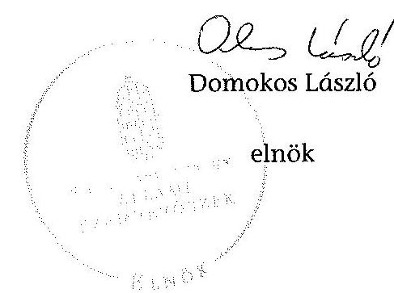
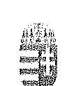
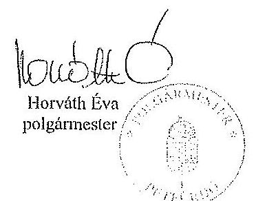
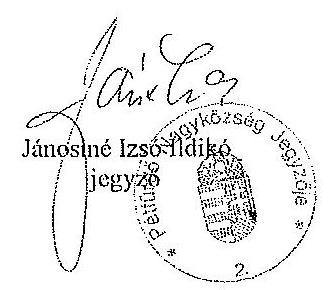
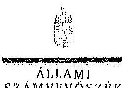
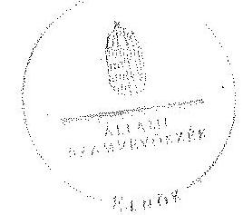
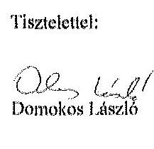
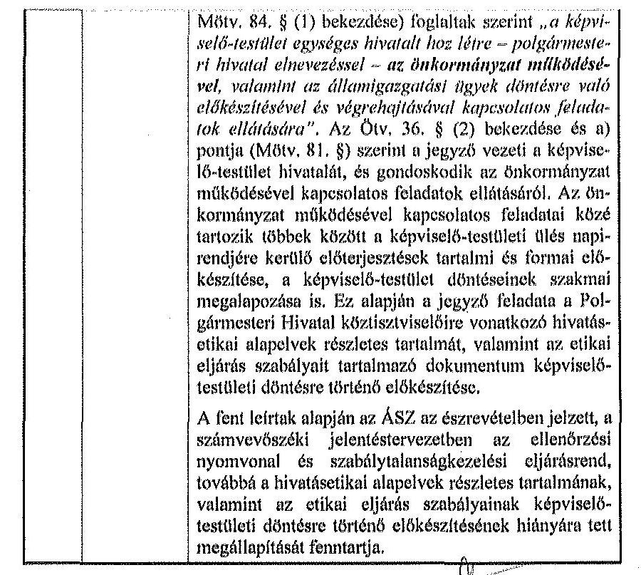
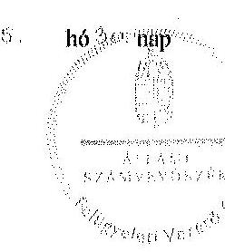

# ÁLLAMI   SZÁMVEVŐSZÉK 

## JELENTÉS

az önkormányzatok belső kontrollrendszere kialakításának, egyes
kontrolltevékenységek és a belső ellenőrzés
működésének ellenőrzéséről
Pétfürdő
14095
2014. június

---

# Állami Számvevőszék 

Iktatószám: V-0388-038/2014
Témaszám: 1162
Vizsgálat-azonosító szám: V064962

## Az ellenőrzést felügyelte:

Dr. Benedek Mária
felügyeleti vezető
Az ellenőrzést vezette és az ellenőrzés végrehajtásáért felelős:
Bíró Zsolt
ellenőrzésvezető
A számvevőszéki jelentés összeállításában közreműködött:
Renner Andrea
számvevő tanácsos
Az ellenőrzést végezték:
Renner Andrea
Tukacs Éva
számvevő tanácsos
Vida Katalin
számvevő

---

# TARTALOMJEGYZÉK 

BEVEZETÉS ..... 5
I. ÖSSZEGZŐ MEGÁLLAPÍTÁSOK, KÖVETKEZTETÉSEK, JAVASLATOK ..... 9
II. RÉSZLETES MEGÁLLAPÍTÁSOK ..... 14

1. Az önkormányzat belső kontrollrendszerének kialakítása ..... 14
1.1. A kontrollkörnyezet ..... 14
1.2. A kockázatkezelési rendszer ..... 15
1.3. A kontrolltevékenységek ..... 16
1.4. Az információs és kommunikációs rendszer ..... 17
1.5. A monitoring rendszer ..... 18
2. A pénzügyi folyamatokban kulcsszerepet betöltő teljesítésigazolás és érvényesítés belső kontrollok működése ..... 18
3. A belső ellenőrzés működése ..... 20

## MELLÉKLETEK

1. számú Észrevételt tartalmazó polgármesteri levél
2. számú Észrevételre vonatkozó elnöki válaszlevél

## FÜGGELÉKEK

1. számú Értelmező szótár
2. számú Az értékelés módja és szempontjai

---

.

---

# RÖVIDÍTÉSEK JEGYZÉKE 

## Törvények

Áfa tv.
Áht.
ÁSZ tv.
Kttv.
Ktv.
Mötv.
Nvtv.
Ötv.
Számv. tv.
Vagyonnyilatkozat-
tételről szóló tv.

## Rendeletek, határozatok

Áhsz. 1
Áhsz. 2
Ávr.
Bkr.
képviselő-testületi
SZMSZ
vagyongazdálkodási rendelet

## Szórövidítések

adatvédelmi szabályzat

ÁSZ
2007. évi CXXVII. törvény az általános forgalmi adóról
2011. évi CXCV. törvény az államháztartásról (hatályos 2012. január 1-jétől)

2011. évi LXVI. törvény az Állami Számvevőszékről
2011. évi CXCIX. törvény a közszolgálati tisztviselőkről (hatályos 2012. március 1-jétől)
1992. évi XXIII. törvény a köztisztviselők jogállásáról (hatálytalan 2012. március 1-jétől)
2011. évi CLXXXIX. törvény Magyarország helyi önkormányzatairól
2011. évi CXCVI. törvény a nemzeti vagyonról (hatályos 2011. december 31-étől)
1990. évi LXV. törvény a helyi önkormányzatokról
2000. évi C. törvény a számvitelről
2007. évi CLII. törvény az egyes vagyonnyilatkozat-tételi kötelezettségekről

249/2000. (XII. 24.) Korm. rendelet az államháztartás szervezetei beszámolási és könyvvezetési kötelezettségének sajátosságairól (hatálytalan 2014. január 1-jétől)
4/2013. (I. 11.) Korm. rendelet az államháztartás számviteléről (hatályos 2014. január 1-jétől)
368/2011. (XII. 31.) Korm. rendelet az államháztartásról szóló törvény végrehajtásáról
370/2011. (XII. 31.) Korm. rendelet a költségvetési szervek belső kontrollrendszeréről és belső ellenőrzéséről
Pétfürdő Nagyközség Önkormányzata Képviselőtestületének 5/2011. (II. 28.) önkormányzati rendelete a Képviselő-testület Szervezeti és Működési Szabályzatáról (hatályos 2011. március 1-jétől)
Pétfürdő Nagyközség Képviselő-testületének 22/2001. (XII. 27.) önkormányzati rendelete az önkormányzat vagyonáról, és a vagyontárgyakkal való gazdálkodásról (hatályos 2002. január 1-jétől)

Pétfürdő Nagyközség Önkormányzata Polgármesteri Hivatalának Adatvédelmi és Adatbiztonsági Szabályzata (hatályos 2012. január 1-jétől)
Állami Számvevőszék

---

belső ellenőrzési kézikönyv
bizonylati rend
FEUVE
gazdálkodási jogkörök szabályzata ${ }_{1}$
gazdálkodási jogkörök szabályzata ${ }_{2}$
gazdálkodási jogkörök szabályzata ${ }_{3}$
gazdasági szervezet ügyrendje ${ }_{1}$
gazdasági szervezet ügyrendje ${ }_{2}$
hivatali SZMSZ

INTOSAI
iratkezelési szabályzat
ISSAI
jegyző
Képviselő-testület
Kormányhivatal
Önkormányzat
polgármester
Polgármesteri Hivatal
Társulás

Várpalota Kistérség Többcélú Társulása Munkaszervezetének 5. számú szabályzata a Belső Ellenőrzési Kézikönyvről egységes szerkezetben (hatályos 2012. március 23-ától)
Pétfürdő Nagyközség Polgármesteri Hivatal Bizonylati rend (érvényes 2007. január 1-jétől)
folyamatba épített, előzetes, utólagos és vezetői ellenőrzés Pétfürdő Nagyközség Önkormányzata Kötelezettségvállalás és Ellenjegyzés Rendje (hatályos 2010. január 1-jétől 2012. február 28-áig)
Pétfürdő Nagyközség Önkormányzata Kötelezettségvállalás, pénzügyi ellenjegyzés, teljesítésigazolás, érvényesítés és utalványozás rendje (hatályos 2012. március 1-jétől 2012. október 9-éig)

Pétfürdő Nagyközség Önkormányzata Kötelezettségvállalás, pénzügyi ellenjegyzés, teljesítésigazolás, érvényesítés és utalványozás rendje (hatályos 2012. október 10-étől)
Pétfürdő Nagyközség Polgármesteri Hivatal Gazdasági Szervezet Ügyrendje (hatályos 2010. január 1-jétől 2012. február 28-áig)
Pétfürdő Nagyközség Polgármesteri Hivatal Gazdasági Szervezet Ügyrendje (hatályos 2012. március 1-jétől)
Pétfürdő Nagyközség Önkormányzata Polgármesteri Hivatalának a Képviselő-testület 8/2005. (I. 27.) számú határozatával jóváhagyott, a 292/2011. (XII. 22.) számú határozatban és a 82/2012. (III. 22.) számú határozattal elfogadott módosítást tartalmazó egységes szerkezetű Szervezeti és Működési Szabályzata (hatályos 2012. április 1-jétől)
International Organization of Supreme Audit Institutions (Legfőbb Ellenőrző Intézmények Nemzetközi Szervezete)
Pétfürdő Nagyközség Önkormányzatának Egyedi Iratkezelési szabályzata (érvényes 2007. január 1-jétől)
International Standards of Supreme Audit Institutions (Legfőbb Ellenőrző Intézmények Nemzetközi Standardjai)
Pétfürdő Nagyközség Önkormányzatának jegyzője
Pétfürdő Nagyközség Önkormányzatának Képviselőtestülete
Veszprém Megyei Kormányhivatal
Pétfürdő Nagyközség Önkormányzata
Pétfürdő Nagyközség Önkormányzatának polgármestere
Pétfürdő Nagyközség Önkormányzatának Polgármesteri Hivatala
Várpalota Kistérség Többcélú Társulása

---

# JELENTÉS 

## az önkormányzatok belső kontrollrendszere kialakításának, egyes kontrolltevékenységek és a belső ellenőrzés működésének ellenőrzéséről Pétfürdő

## BEVEZETÉS

Pétfürdő nagyközség állandó lakosainak száma 2012. január 1-jén 4888 fő volt. Az Önkormányzat héttagú Képviselő-testületének munkáját három állandó bizottság segítette. Az Önkormányzat az önállóan működő és gazdálkodó Polgármesteri Hivatalon kívül négy önállóan működő intézményt működtetett, egy többségi tulajdoni hányaddal gazdasági társasággal rendelkezett. A polgármester 1997. október 1-je óta tölti be tisztségét. A jegyző 2000. június 15-étől látja el feladatait. A Polgármesteri Hivatal két szervezeti egységre tagolódott, elkülönített gazdasági szervezettel rendelkezett, a foglalkoztatott köztisztviselők száma 2012. január 1-jén 22 fő volt. A Polgármesteri Hivatalban 2013. január 1-jét követően szervezeti átalakítás nem történt. Az Önkormányzat a 2012. évi költségvetési beszámolója szerint 2147769 ezer Ft költségvetési bevételt ért el, valamint 1638469 ezer Ft költségvetési kiadást teljesített. A 2012. december 31-i könyvviteli mérleg szerint 3781715 ezer Ft értékű eszközvagyonnal rendelkezett, a rövid lejáratú kötelezettségállománya 77151 ezer Ft volt, hosszú lejáratú kötelezettsége nem volt.

A demokratikus társadalmakban alapvető igény, hogy a közpénzeket, a közvagyont használók tevékenységükről elszámoljanak, ahhoz egyértelmű és érvényesíthető felelősségi szabályok társuljanak. Ennek a jogos igénynek az érvényesítéséhez meg kell teremteni azokat a folyamatokat, rendszereket, amelyek nélkülözhetetlenek az elszámoltatáshoz. Az elszámoltatás eredményes működtetéséhez szükség van a megfelelő információs, kontroll, értékelési és beszámolási rendszerek kialakítására.

Magyarországon az uniós csatlakozási tárgyalások idejére nyúlnak vissza a belső kontrollrendszer szabályozásának gyökerei. Az uniós elvárásoknak megfelelő új terminológia szerinti államháztartási belső pénzügyi ellenőrzési (ÁBPE) rendszer területén a jogharmonizáció 2003-ban teljes körűen megvalósult, míg az önkormányzati alrendszerre vonatkozó, Ötv.-ben megjelenített speciális szabályozás 2005-ben lépett hatályba. Az államháztartási belső kontrollrendszer koncepciója 2009-ben továbbfejlődött. A változások irányát mutatja, hogy a költségvetési szervek belső kontrollrendszere már magában foglalja a korszerű, felelős szervezetirányítás elemeit (kontrollkörnyezet, kockázatkezelés, kontrolltevékenység, információ és kommunikáció, monitoring) is. E kont-

---

rollrendszer szabályozása háromszintű, a törvényi előírásokat az Áht. és Mötv., a rendeleti szintű szabályozást az Ávr. és a Bkr. tartalmazza, amelyeket útmutatói szinten az NGM által kiadott standardok és kézikönyvek támogatnak.

A belső kontrollrendszer azt a célt szolgálja, hogy a költségvetési szervek működésük és gazdálkodásuk során a tevékenységeket szabályszerűen, gazdaságosan, hatékonyan és eredményesen hajtsák végre, teljesítsék elszámolási kötelezettségeiket és megvédjék az erőforrásokat a veszteségektől, a károktól és a nem rendeltetésszerű használattól. A belső kontrollrendszer magában foglalja mindazon szabályokat, eljárásokat, gyakorlati módszereket és szervezeti struktúrákat, kockázatkezelési technikákat, kontrolltevékenységeket, amelyek segítséget nyújtanak a szervezetnek céljai eléréséhez.

Az ÁSZ középtávú stratégiájában hangsúlyos szerepet szánt annak, hogy szilárd szakmai alapon álló, értékteremtő ellenőrzéseivel előmozdítsa a közpénzügyek átláthatóságát, rendezettségét. A számvevőszéki ellenőrzés nemzetközi alapelvei is rögzítik, hogy a megfelelő belső kontrollrendszer minimálisra csökkenti a hibák és szabálytalanságok kockázatát.

Az ellenőrzés célja annak megállapítása volt, hogy a belső kontrollrendszer elemeinek kialakítása, a pénzügyi folyamatokban kulcsszerepet betöltő teljesítésigazolás és érvényesítés, és a belső ellenőrzés szabályos működése biztosította-e az Önkormányzatnál a közpénzfelhasználás szabályosságát, hozzájárult-e az értéket teremtő rend követelményének érvényesüléséhez.

Ennek keretében értékeltük, hogy:

- a jogszabályi előírásoknak megfelelően alakították-e ki a belső kontrollrendszer elemeit;
- a gazdálkodás folyamatában kulcsszerepet betöltő teljesítésigazolás és érvényesítés kontrolltevékenységeit megfelelően működtették-e;
- biztosították-e a belső ellenőrzés szabályos működését;
- amennyiben az ÁSZ tett javaslatot a 2008-2011. évek közötti ellenőrzése kapcsán az Önkormányzatnak, intézkedtek-e azok végrehajtására.

Az ellenőrzés várható hasznosulását négy szinten tervezzük. A törvényalkotás számára összegzett tapasztalatok állnak rendelkezésre a belső kontrollrendszer önkormányzati területen való kialakításáról, működéséről és hatásairól, a belső ellenőrzés működéséről. Ennek alapján következtetést lehet levonni arról, hogy a belső kontrollrendszer kialakítására és működtetésére vonatkozó jelenlegi, differenciálás nélküli jogszabályi előírások reális követelményeket támasztanak-e az eltérő adottságú települési önkormányzatok esetében, illetve indokolt-e esetleges jogszabályi módosítás kezdeményezése. Az ellenőrzés az ellenőrzött számára visszajelzést ad a belső kontrollrendszer kialakításában és működésében fellépő hiányosságokról, javaslataival hozzájárul azok kiküszöböléséhez, amely csökkentheti a későbbi ellenőrzések gyakoriságát. Az ellenőrzés megállapításait és javaslatait más szervezetek is hasznosíthatják a rendezett gazdálkodási keretek kialakításához. A társadalom számára jelzi, hogy közpénz nem maradhat ellenőrizetlenül, az ÁSZ értékteremtő rend kiala-

---

kításához és megőrzéséhez hozzájáruló tevékenysége pozitív hatással lesz a szervezetről kialakított összkép formálásában. A szervezeten belül lehetőség nyílik arra, hogy a megállapítások szintetizálásával az ÁSZ a hozzáadott értéket teremtő elemző tevékenységét és tanácsadó szerepét is erősítse.

Az önkormányzatok belső kontrollrendszere kialakításának, egyes kontrolltevékenységek és a belső ellenőrzés működésének ellenőrzéséről szóló jelentés I. fejezetének összegző része az ellenőrzés céljára ad rövid, szintetizáló összefoglalót, és tartalmazza a következtetéseket a II. fejezet részletes megállapításain alapulóan. A jelentés intézkedést igénylő megállapításait és javaslatait az ellenőrzés során feltárt, a jelentés II. fejezetében rögzített részletes megállapítások alapozzák meg. A helyszíni ellenőrzés lezárásáig a helyi szabályozás változásait nyomon követtük.

Az ellenőrzés típusa: szabályszerűségi ellenőrzés.
Az ellenőrzött időszak: a belső kontrollrendszer kialakításának megfelelősége esetében a 2012. évre, a pénzügyi folyamatokban kulcsszerepet betöltő teljesítésigazolás és érvényesítés belső kontrollok működésének megfelelőségét és a belső ellenőrzés szabályszerű működését a 2012. január 1. és december 31-e közötti időszak eseményeit figyelembe véve értékeltük, míg az ÁSZ javaslatainak utóellenőrzése a 2008-2011. években végzett ellenőrzések nyilvánosságra hozott jelentéseiben tett javaslatok áttekintésére terjedt ki.

# Az ellenőrzött szervezet: az Önkormányzat. 

Az ellenőrzés jogszabályi alapját az ÁSZ tv. 1. § (3) bekezdése, az 5. § (2) és (6) bekezdése, valamint az Áht. 61. § (2) bekezdésének előírásai képezik.

Az ellenőrzés szakmai módszertana az ÁSZ hivatalos honlapján (www.asz.hu) közzétett szakmai szabályokon alapult, amely az INTOSAI által kiadott ISSAI figyelembevételével készült.

Az ellenőrzés lefolytatásához az Önkormányzat a kimutatások és a tanúsítvány elektronikus kitöltésével, valamint az ÁSZ által kért dokumentumok elektronikus megküldésével szolgáltatott adatokat. Az így rendelkezésre bocsátott adatok, információk kontrollja és a munkalapok kitöltése a helyszíni ellenőrzés keretében történt. A jelentésben használt fogalmak magyarázatát az 1. számú függelék, az ellenőrzés egyes területeinek értékelésénél alkalmazott egységes minősítési szempontokat a 2. számú függelék tartalmazza.

A belső kontrollrendszer kialakításának ellenőrzése során értékeltük a kontrollkörnyezet, a kockázatkezelési rendszer, a kontrolltevékenységek, az információs és kommunikációs rendszer, valamint a monitoring rendszer szabályozottságának megfelelőségét. A pénzügyi folyamatokban kulcsszerepet betöltő teljesítésigazolás és érvényesítés kontrollok működése megfelelőségének minősítéséhez az állományba nem tartozók megbízási díjai, a külső szolgáltatók által végzett karbantartási, kisjavítási munkák, az egyéb üzemeltetési és fenntartási szolgáltatások, a rendszeres szociális segélyek, valamint az államháztartáson kívülre teljesített működési és felhalmozási célú pénzeszközátadások közül kockázatelemzéssel választottuk ki az ellenőrzött kiadási jogcímeket. Az egyszerű

---

véletlen mintavétellel kiválasztott tételek ellenőrzését többlépcsős megfelelőségi tesztek útján addig végeztük, amíg elegendő és megfelelő bizonyítékot szereztünk a vizsgált folyamatok kulcskontrolljai működésének megfelelő vagy nem megfelelő voltáról. Értékeltük az Önkormányzatnál a belső ellenőrzés működésének szabályosságát. Utóellenőrzésre nem került sor, mivel az ÁSZ az Önkormányzatnál a 2008-2011. évek között nem végzett ellenőrzést.

Az Ász tv. 29. § (1) bekezdése szerint a jelentéstervezetet megküldtük a polgármester részére, aki az ÁSZ tv. 29. § (2) bekezdésében foglalt észrevételezési jogával élt, a jelentéstervezetre észrevételt tett (1. számú melléklet). Az ÁSZ tv. 29. § (3) bekezdésében előírtaknak megfelelően
 a figyelembe nem vett észrevételeket és annak indokairól szóló tájékoztatást a jelentés tartalmazza (2. számú melléklet).

---

# I. ÖSSZEGZŐ MEGÁLLAPÍTÁSOK, KÖVETKEZTETÉSEK, JAVASLATOK 

A belső kontrollrendszeren belül 2012-ben a kontrollkörnyezet, a kockázatkezelési rendszer, a kontrolltevékenységek, az információs és kommunikációs rendszer, valamint a monitoring rendszer kialakítását külön-külön és együttesen is értékeltük. A belső kontrollrendszer kialakítása az összesített értékelés alapján nem felelt meg a jogszabályi előírásoknak.

A belső kontrollrendszer egyes területei kialakításának minősítése a következő:

| Kontrollterület | Minősítés |
| :-- | :--: |
| Kontrollkörnyezet | nem |
|  | megfelelő |
| Kockázatkezelési rendszer | nem |
|  | megfelelő |
| Kontrolltevékenységek | részben |
|  | megfelelő |
| Információs és kommunikációs |  |
| rendszer | nem |

Megfelelőnek értékeltük az információs és kommunikációs rendszer kialakítását, mivel az a jogszabályi előírásokban foglaltakat figyelembe véve megteremtette e kontrollterületen a szabályszerű működés lehetőségét.

Részben megfelelőnek értékeltük a kontrolltevékenységek kialakítását, mivel a megállapított szabályozásbeli hiányosságok nem veszélyeztették e kontrollterületen a szabályszerű működést.

Nem megfelelőnek értékeltük a kontrollkörnyezet, a kockázatkezelési rendszer, valamint a monitoring rendszer kialakítását, mivel az ellenőrzésünk során megállapított szabályozásbeli hiányosságok magukban hordozzák a szabálytalan működés, valamint a korrupció kockázatát.

A 2012. évben az állományba nem tartozók megbízási díjaival, valamint a külső szolgáltatók által végzett karbantartási, kisjavítási munkákkal kapcsolatos kifizetések során a pénzügyi folyamatokban kulcsszerepet betöltő teljesítésigazolás és érvényesítés belső kontrollok működése gyenge volt. Gyengének értékeltük a két kulcskontroll együttes működését, mivel azok nem biztosították a hibák megelőzését, feltárását.

A számvevőszéki ellenőrzés az ellenőrzött kifizetésekkel összefüggésben a rendelkezésre bocsátott dokumentumok alapján kár bekövetkezésére utaló adatot, tényt nem állapított meg, azonban a gazdálkodásban kulcsszerepet betöltő

---

kontrollok működésében feltárt hiányosságok miatt fennáll a hibák bekövetkezésének kockázata. A nem megfelelően működtetett belső kontrollok korrupciós kockázatot hordoznak.

Az Önkormányzat a belső ellenőrzési feladatokat a Társulás útján látta el. A 2012. évben a belső ellenőrzés működése a jogszabályi előírásoknak megfelelt, azonban a belső ellenőrzés nem tárta fel a belső kontrollrendszer kialakításának, valamint a pénzügyi folyamatokban kulcsszerepet betöltő teljesítésigazolás és érvényesítés belső kontrollok működésének hiányosságait.

Az ÁSZ tv. 33. § (1) bekezdésében foglaltak értelmében az ellenőrzött szervezet vezetője köteles a jelentésben foglalt megállapításokhoz kapcsolódó intézkedési tervet összeállítani, és azt a jelentés kézhezvételétől számított 30 napon belül az ÁSZ részére megküldeni. Amennyiben az intézkedési tervet határidőre nem küldi meg a szervezet, vagy az ÁSZ tv. 33. § (2) bekezdésében foglalt póthatáridő elteltével megküldött intézkedési terv továbbra sem elfogadható, az ÁSZ elnöke a hivatkozott törvény 33. § (3) bekezdés a)-b) pontjaiban foglaltakat érvényesítheti.

Az ellenőrzés intézkedést igénylő megállapításai és javaslatai:

# a polgármesternek 

1. A polgármester - a Kttv. 75. § (1) bekezdés d) pontjában foglalt előírás ellenére nem készítette el a jegyző munkaköri leírását.

Javaslat:
Gondoskodjon a Kttv. 75. § (1) bekezdés d) pontjában foglalt előírásnak megfelelően a jegyző munkaköri leírásának elkészítéséről.
2. A Vagyonnyilatkozat-tételről szóló tv. 3. § (3) e) pontjában foglaltak ellenére a Képviselő-testület bizottságai nem helyi önkormányzati képviselő tagjai vagyonnyilatkozat-tételi kötelezettségüknek a 2012. évben nem tettek eleget. Az őrzésért felelős - a Vagyonnyilatkozat-tételről szóló tv. 8. § (4) bekezdésében foglaltak ellenére - nem tájékoztatta a Képviselő-testület bizottságai nem helyi önkormányzati képviselő tagjait a vagyonnyilatkozat-tételi kötelezettség fennállásáról és esedékességének időpontjáról az esedékességet legalább 30 nappal megelőzően, továbbá a 10. § (1) bekezdésében foglaltak ellenére írásban nem szólította fel a Képviselő-testület bizottságai nem helyi önkormányzati képviselő tagjait arra, hogy vagyonnyilatkozat-tételi kötelezettségüket a felszólítás kézhezvételétől számított nyolc napon belül teljesítsék.

Javaslat:
Kezdeményezze a Képviselő-testületnél a Mötv. 65. §-a alapján a Mötv. 57. § (2) bekezdésének, valamint a Vagyonnyilatkozat-tételről szóló tv.-ben foglaltaknak megfelelően a vagyonnyilatkozatok vizsgálatáért felelősként kijelölt bizottságnak a vagyonnyilatkozat-tételi kötelezettség teljesítésére vonatkozó eljárásának szabályszerűségével kapcsolatos körülményei kivizsgálását, majd a vizsgálat eredményének függvényében kezdeményezze a Képviselő-testületnél a szükséges intézkedések megtételét.

---

3. Az Önkormányzat nevében történt kötelezettségvállalásra - az Áht. 37. § (1) bekezdésében és az Ávr. 55. § (1) bekezdésében foglaltak ellenére - pénzügyi ellenjegyzés nélkül került sor.

Javaslat:
Intézkedjen arról, hogy az Önkormányzat nevében történő kötelezettségvállalásra az Áht. 37. § (1) bekezdésében és az Ávr. 55. § (1) bekezdésében foglaltaknak megfelelően - az Ávr. 53. §-ában meghatározott kivételekkel - kizárólag a pénzügyi ellenjegyzés után, a pénzügyi teljesítés esedékességét megelőzően, írásban kerüljön sor.
4. A polgármester, mint kötelezettségvállaló - az Ávr. 57. § (4) bekezdésében foglalt előírás ellenére - 2012. március 30-át követően nem jelölte ki írásban az Önkormányzat kiadási előirányzatai vonatkozásában a teljesítésigazolásra jogosult személyeket.

Javaslat:
Jelölje ki az Ávr. 57. § (4) bekezdésében foglaltak szerint a kötelezettségvállalásra jogosult személyeket.
5. A számvevőszéki ellenőrzés megállapításai alapján az Önkormányzatnál a belső kontrollrendszer kialakítása összefoglalóan értékelve nem felelt meg a jogszabályi előírásoknak, a kulcskontrollok működése gyenge volt, a belső ellenőrzés működése nem felelt meg a jogszabályi előírásoknak. A megállapított szabályozásbeli és működésbeli hiányosságok magukban hordozzák a szabálytalan működés kockázatát.

Javaslat:
A Mötv. 115. § (1) bekezdésében foglaltak alapján kísérje figyelemmel az Önkormányzat gazdálkodásának szabályszerűségét. A Mötv. 67. § f) pontja alapján gondoskodjon a belső kontrollrendszer és a belső ellenőrzés működésére vonatkozó jogszabályi rendelkezések be nem tartása, valamint a teljesítésigazolás, illetve az érvényesítés kontrollokkal összefüggésben feltárt hiányosságok, szabálytalanságok tekintetében az esetleges munkajogi felelősséggel kapcsolatos körülmények kivizsgálásáról, majd a vizsgálat eredményének függvényében tegye meg a szükséges intézkedéseket.

# a jegyzőnek 

1. a kontrollkörnyezettel kapcsolatban:

A hivatali SZMSZ nem felelt meg az Ávr.-ben előírt tartalmi követelményeknek. Az Önkormányzat a vagyongazdálkodási rendeletet az Nvtv.-ben előírt határidőt betartva aktualizálta, azonban az nem tartalmazta a Mötv.-ben foglalt, a vagyonkezelői joggal összefüggő rendelkezéseket. A jegyző - az Áhsz.-ben foglaltak ellenére - a mérlegben kimutatott eszközök kétévenkénti leltározási kötelezettségét önkormányzati rendeletben (határozat) történt szabályozása hiányában írta elő a leltározási szabályzatban. A jegyző - a Bkr.-ben foglalt előírás ellenére - nem készítette el az ellenőrzési nyomvonalat és a szabálytalanságok kezelésének eljárásrendjét. Az Ötv.-ben előírt feladata ellenére a jegyző nem készítette elő a Kttv.-ben előírt, a köztisztviselőkkel szembeni hivatásetikai alapelvek részletes tartalmának, valamint az etikai eljárás szabályainak dokumentumát [II. Részletes megállapítások, 1.1. A kontrollkörnyezet 7., 9., 16., 25., 34., 41. és 47. sorszámú megállapítás].

Javaslat:
Intézkedjen az Áht. 69. § (2) bekezdése, a Bkr. 3. § a) pontja és 6. §-a alapján a jelentés II. Részletes megállapítások, 1.1. A kontrollkörnyezet 7., 9., 16., 25., 34., 41. és 47. sorszámú megállapításaiban foglalt hibák, hiányosságok kijavításáról, megszüntetéséről az ott megjelölt jogszabályi rendelkezéseknek megfelelően.
2. a kockázatkezelési rendszerrel kapcsolatban:

A jegyző a Bkr.-ben foglalt előírások ellenére a Polgármesteri Hivatal kockázatkezelési rendszerét nem alakította ki. A Vagyonnyilatkozat-tételről szóló tv. rendelkezései ellenére a hivatali SZMSZ-ben és a Képviselő-testületi SZMSZ-ben nem tüntették fel a köztisztviselők és a bizottságok nem képviselő tagjainak vagyonnyilatkozat-tételi kötelezettségét [II. Részletes megállapítások, 1.2. A kockázatkezelési rendszer 1., 2., 8., 10. és 13. sorszámú megállapítás].

Javaslat:
Intézkedjen az Áht. 69. § (2) bekezdése, a Bkr. 3. § b) pontja és 7. §-a, valamint a Vagyonnyilatkozat-tételről szóló tv. alapján a jelentés II. Részletes megállapítások, 1.2. A kockázatkezelési rendszer 1., 2., 8., 10. és 13. sorszámú megállapításaiban foglalt hibák, hiányosságok kijavításáról, megszüntetéséről az ott megjelölt jogszabályi rendelkezéseknek megfelelően.
3. a kontrolltevékenységekkel kapcsolatban:

A jegyző - a Bkr.-ben foglaltak ellenére - nem biztosította a beszerzési folyamat és a vagyonhasznosítási tevékenység, valamint a pénzügyi döntések során a folyamatba épített, előzetes, utólagos és vezetői ellenőrzést. A jegyző az Ávr. előírását figyelmen kívül hagyva nem határozta meg az előzetes írásbeli kötelezettségvállalást nem igénylő kifizetések rendjét. Az érvényesítési feladatra az Ávr. előírása ellenére nem a gazdasági vezető jelölte ki a Polgármesteri Hivatal állományában dolgozó köztisztviselőket. [II. Részletes megállapítások, 1.3. A kontrolltevékenységek 2-5., 8. és 29. sorszámú megállapítás].

Javaslat:
Intézkedjen az Áht. 69. § (2) bekezdése, a Bkr. 3. § c) pontja és 8. §-a alapján a jelentés II. Részletes megállapítások, 1.3. A kontrolltevékenységek 2-5., 8. és 29. sorszámú megállapításaiban foglalt hibák, hiányosságok kijavításáról, megszüntetéséről az ott megjelölt jogszabályi rendelkezéseknek megfelelően.
4. a monitoring rendszerrel kapcsolatban:

A jegyző a Bkr.-ben foglaltak ellenére nem alakította ki a Polgármesteri Hivatal tevékenységének, a célok megvalósításának nyomon követését biztosító rendszert [II. Részletes megállapítások, 1.5. A monitoring rendszer 1. sorszámú megállapítás].

---

Javaslat:
Intézkedjen az Áht. 69. § (2) bekezdése, a Bkr. 3. § e) pontja és 10. §-a alapján a jelentés II. Részletes megállapítások, 1.5. A monitoring rendszer 1. sorszámú megállapításaiban foglalt hibák, hiányosságok kijavításáról, megszüntetéséről az ott megjelölt jogszabályi rendelkezéseknek megfelelően.
5. a pénzügyi folyamatokban kulcsszerepet betöltő kontrollokkal kapcsolatban:

A teljesítésigazolás és érvényesítés nem felelt meg az Áht.-ban és az Ávr.-ben foglaltaknak [II. Részletes megállapítások, 2. A pénzügyi folyamatokban kulcsszerepet betöltő teljesítésigazolás és érvényesítés belső kontrollok működése, 1-3. pontokban foglalt megállapítás].

Javaslat:
Intézkedjen az Áht. 37-38. §-ában, az Ávr. 55-59. §-ában és az Áhsz. ²-ben foglaltak alapján arról, hogy a teljesítésigazolás és az érvényesítés vonatkozásában, valamint azok ellenőrzése során a kötelezettségvállalással, a pénzügyi ellenjegyzéssel, az utalványozással, a kötelezettségvállalások nyilvántartásba vételével kapcsolatban feltárt, a jelentés II. Részletes megállapítások, 2. A pénzügyi folyamatokban kulcsszerepet betöltő teljesítésigazolás és érvényesítés belső kontrollok működése 1-3. pontjaiban szereplő megállapításokban foglalt hibák, hiányosságok kijavítása, megszüntetése az ott megjelölt jogszabályi rendelkezéseknek megfelelően történjen meg.
6. a belső ellenőrzés működésével kapcsolatban:

A belső ellenőrzési működése a számvevőszéki ellenőrzés értékelési szempontjait figyelembe véve nem felelt meg a Bkr.-ben foglalt előírásoknak [II. Részletes megállapítások, 3. A belső ellenőrzés működése 7., 8. a), 10., 11., 19., 23., 24., 25. és 26. sorszámú megállapítása].

Javaslat:
Intézkedjen az Áht. 69. § (2), a 70. § (1) bekezdése, a Bkr. 3. § e) pontja és a 10. §-a alapján a jelentés II. Részletes megállapítások, 3. A belső ellenőrzés működése 7., 8. a), 10., 11., 19., 23., 24., 25. és 26. sorszámú megállapításaiban foglalt hibák, hiányosságok kijavításáról, megszüntetéséről az ott megjelölt jogszabályi rendelkezéseknek megfelelően.

---

# II. RÉSZLETES MEGÁLLAPÍTÁSOK 

## 1. AZ ÖNKORMÁNYZAT BELSŐ KONTROLLRENDSZERÉNEK KIALAKÍTÁSA

A belső kontrollrendszeren belül 2012-ben a kontrollkörnyezet, a kockázatkezelési rendszer, a kontrolltevékenységek, az információs és kommunikációs rendszer, valamint a monitoring rendszer kialakítását külön-külön és együttesen is értékeltük. A belső kontrollrendszer kialakítása az összesített értékelés alapján nem felelt meg a jogszabályi előírásoknak.

### 1.1. A kontrollkörnyezet

A kontrollkörnyezet kialakítása - a 2. számú függelékben részletezett kritériumrendszer alapján végzett értékelés szerint - nem felelt meg a jogszabályi előírásoknak, mert:

| Sorszám ¹ | Megállapítás | Megjegyzés |
| :--: | :--: | :--: |
| 4. | A Képviselő-testület - a Ktv. 34. § (3) bekezdésében foglaltak ellenére - nem döntött a teljesítményértékelés alapját képező

 célokról. | A Ktv.-t hatályon kívül helyezte a 2012. évi V. törvény 59. § (1) bekezdés a) pontja, hatálytalan 2012. március 1-jétől. |
| 7., 9. | A hivatali SZMSZ - az Ávr. 13. § (1) bekezdés c) és f) pontjában foglalt előírások ellenére nem tartalmazta az alaptevékenységet szabályozó jogszabályok megjelölését, valamint azon ügyköröket, amelyek során a szervezeti egységek vezetői a költségvetési szerv képviselőjeként járhatnak el. | 2014. január 1-jétől az Ávr.   13. § (1) bekezdés c) pontjában szereplő szöveg az alábbira változott: „az ellátandó, és a kormányzati funkció szerint besorolt alaptevékenységek, rendszeresen ellátott vállalkozási tevékenységek, valamint az alaptevékenységet szabályozó jogszabályok megjelölését." |

Az Önkormányzat a vagyongazdálkodási rendeletét az Nvtv.-ben előírt határidőt betartva aktualizálta, azonban az nem tartalmazta - a Mótv. 109. § (4) bekezdésében foglalt előírás ellenére - a vagyonkezelői jog ellenértékét, az ingyenes átengedés, a vagyonkezelői jog gyakorlásának, valamint a vagyonkezelés ellenőrzésének részletes szabályait.

A 2013. évben módosították az Önkormányzat vagyongazdálkodási rendeletét.

[^0]
[^0]:    ${ }^{1}$ A megállapítás számozása az Önkormányzat által kitöltött kimutatások - adatszolgáltatások - kérdéseinek sorszámával azonos.

---

| 25. | A jegyző - az Áhsz.; 37. § (7) bekezdésében foglaltak ellenére - a mérlegben kimutatott eszközök kétévenkénti leltározási kötelezettségét önkormányzati rendeletben (határozatban) történt szabályozás hiányában írta elő a leltározási szabályzatban. | 2014. január 1-jétől az Áhsz.; 22. §-ában előírtak szerint a leltározás végrehajtására a Számv. tv. 69. §-ában foglalt rendelkezéseit kell alkalmazni. |
| :--: | :--: | :--: |
| 34.   és   41. | A jegyző - a Bkr. 6. § (3) és (4) bekezdésében foglalt előírás ellenére - nem készítette el az ellenőrzési nyomvonalat és a szabálytalanságok kezelésének eljárásrendjét. | 2013. február 1-jétől a jegyző elkészítette az ellenőrzési nyomvonalat és a szabálytalanságok kezelésének eljárásrendjét. |
| 37. | A jegyző - a Kttv. 75. § (1) bekezdés d) pontjában foglalt előírás ellenére - nem rendelkezett munkaköri leírással. |  |
| 47. | A Képviselő-testület - a Kttv. 231. § (1) bekezdésében foglalt előírás ellenére - nem állapította meg a köztisztviselőkkel szembeni, a Kttv. 83. §-ában előírt hivatásetikai alapelvek részletes tartalmát, valamint az etikai eljárás szabályait, mivel a jegyző - az Ötv. 36. § (2) bekezdés a) pontjában előírt feladata ellenére - nem készítette elő ennek dokumentumát. | A jegyző részére az önkormányzat működésével kapcsolatos feladatok ellátásáról való gondoskodást 2013. január 1-jétől a Mötv. 81. § (3) bekezdés c) pontja írja elő. |

# 1.2. A kockázatkezelési rendszer 

A kockázatkezelési rendszer kialakítása - a 2. számú függelékben részletezett kritériumrendszer alapján végzett értékelés szerint - nem felelt meg a jogszabályi előírásoknak, mert:

| Sor-   szám | Megállapítás | Megjegyzés |
| :--: | :--: | :--: |

A jegyző - a Bkr. 3. § b) pontjában foglalt előírás ellenére - a Polgármesteri Hivatal kockázatkezelési rendszerét nem alakította ki, melynek keretében - a Bkr. 7. § (2) bekezdésében foglalt előírás ellenére - nem
1., 2., 8., és 10. mérte fel és nem állapította meg a Polgármesteri Hivatal tevékenységében, gazdálkodásában rejlő kockázatokat, nem határozta meg az egyes kockázatokkal kapcsolatban szükséges intézkedéseket, valamint a kockázatok kezelése érdekében szükséges intézkedések teljesítésének folyamatos nyomon követési módját.

A jegyző elkészítette 2013. február 1-jétől a kockázatkezelési rendszer szabályozását.

---

A Vagyonnyilatkozat-tételről szóló tv. 4. § a) és d) pontjaiban foglalt előírások ellenére a vagyonnyilatkozat-tételre kötelezett köztisztviselők és a Képviselő-testület bizottságai nem helyi önkormányzati képviselő tagjainak vagyonnyilatkozat-tételi kötelezettségét a hivatali SZMSZ-ben és a képviselő-testületi SZMSZ-ben nem tüntették fel.

A Vagyonnyilatkozat-tételről szóló tv. 3. § (3) e) pontjában foglaltak ellenére a Képviselőtestület bizottságainak nem képviselő tagjai vagyonnyilatkozat-tételi kötelezettségüknek a 2012. évben nem tettek eleget. Az őrzésért felelős - a Vagyonnyilatkozat-tételről szóló tv. 8. § (4) bekezdésében foglaltak ellenére nem tájékoztatta a bizottságok nem helyi önkormányzati képviselő tagjait a vagyonnyilatkozat-tételi kötelezettség fennállásáról és esedékességének időpontjáról az esedékességet legalább 30 nappal megelőzően, továbbá 10. § (1) bekezdésében foglaltak ellenére - írásban nem szólította fel a Képviselő-testület bizottságainak nem helyi önkormányzati képviselő tagjait arra, hogy vagyonnyilatkozat-tételi kötelezettségüket a felszólítás kézhezvételétől számított nyolc napon belül teljesítsék.

2014-ben meghatározták a vagyonnyilatkozat-tételre kötelezettek körét a köztisztviselők tekintetében.

A köztisztviselők a Vagyonnyilatkozat-tételről szóló tv.-ben előírt vagyonnyilatkozat-tételi kötelezettségüket teljesítették.

# 1.3. A kontrolltevékenységek 

A kontrolltevékenységek kialakítása - a 2. számú függelékben részletezett kritériumrendszer alapján végzett értékelés szerint - a jogszabályi előírásoknak részben felelt meg.

A jegyző a gazdálkodási jogkörök szabályzata ${ }_{1,2,3}$-ban szabályozta a kötelezettségvállalás pénzügyi ellenjegyzésének és a kiadások teljesítésigazolásának módját, az érvényesítés és az utalványozás rendjét.

Az iratkezelés szabályozása során a jegyző előírta az iratok és az adatok védelmét, meghatározta az üzemeltetés és adatbiztonság feladatait és az ehhez kapcsolódó hatásköröket. Az informatikai rendszer szabályozása során a jegyző biztosította az adatbiztonság érvényesülését, továbbá a felelősségi körök meghatározásával szabályozta a dokumentumokhoz és információkhoz való hozzáférést.

A gazdasági szervezet ügyrendje ${ }_{1,2}$-ben szabályozták az időközi és éves beszámolók elkészítésének feladatait, meghatározták a beszámolási eljárásokhoz kapcsolódó felelősségi köröket, a munkaköri leírások tartalmazták a gazdasági feladatot ellátó vezetők és alkalmazottak helyettesítésének rendjét. A beszámoló készítéséért felelős személy rendelkezett a jogszabályban előírt szakképzettséggel, és a tevékenység ellátására jogosító engedéllyel.

---

Az Önkormányzat gazdálkodásának első félévi, illetve háromnegyed éves helyzetéről a polgármester tájékoztatta a Képviselő-testületet.

A kontrolltevékenységek kialakítása az értékelés szempontjából az alábbi kisebb súlyú hiányosságok miatt részben felelt meg a jogszabályi előírásoknak:

| Sorszám | Megállapítás | Megjegyzés |
| :--: | :--: | :--: |
| 2-5. | A jegyző - a Bkr. 8. § (2) bekezdésében foglaltak ellenére - nem biztosította a beszerzési folyamat és a vagyonhasznosítási tevékenység, valamint a pénzügyi döntések - köztük a költségvetés tervezése és a támogatásokkal való elszámolás - dokumentumainak elkészítésével kapcsolatban a folyamatba épített, előzetes, utólagos és vezetői ellenőrzést. | 2013-ban rögzítették a FEUVE szabályait. |
| 8. | A jegyző - az Ávr. 53. § (2) bekezdésében foglalt előírást figyelmen kívül hagyva annak ellenére nem határozta meg az előzetes írásbeli kötelezettségvállalást nem igénylő kifizetések rendjét, hogy a gazdálkodási jogkörök szabályzata ${ }_{1,2,3}$-ban lehetővé tette a 100 ezer Ft alatti kifizetések előzetes írásbeli kötelezettségvállalás nélküli teljesítését. |  |
| 10. | A polgármester, mint kötelezettségvállaló az Ávr. 57. § (4) bekezdésében foglalt előírás ellenére - 2012. március 30-át követően nem jelölte ki írásban az Önkormányzat kiadási előirányzatai vonatkozásában a teljesítésigazolásra jogosult személyeket. |  |
| 29. | Az érvényesítési feladatra - az Ávr. 58. § (4) bekezdésének előírása ellenére - nem a gazdasági vezető jelölte ki a Polgármesteri Hivatal állományában dolgozó köztisztviselőket. |  |

# 1.4. Az információs és kommunikációs rendszer 

Az információs és kommunikációs rendszer kialakítása - a 2. számú függelékben részletezett kritériumrendszer alapján végzett értékelés szerint - megfelelt a jogszabályi előírásoknak.

A jegyző szabályozta a szervezeten belüli és a külső feleknek történő információ átadás módját, a szervezeten kívülről érkező információk kezelésének rendjét. A jegyző meghatározta a közérdekű adatok megismerésére irányuló igények teljesítésének rendjét, a kötelezően közzéteendő adatok nyilvánosságra hozatalának és elektronikus közzétételének szabályait. Az Önkormányzat az elektronikus közzétételi kötelezettségének a 2012. évben eleget tett. A Polgármesteri Hivatal rendelkezett a jogszabályi előírásoknak megfelelő adatvédelmi szabályzattal, valamint a területileg illetékes levéltár és kormányhivatal egyetértésével kiadott iratkezelési szabályzattal.

---

# 1.5. A monitoring rendszer 

A monitoring rendszer kialakítása - a 2. számú függelékben részletezett kritériumrendszer alapján végzett értékelés szerint - nem felelt meg a jogszabályi előírásoknak, mert:

| Sor-   szám | Megállapítás |
| :-- | :-- |
| 1. | A jegyző a Bkr. 3. § e) pontjában és 10. §-ában foglaltak ellenére nem alakította ki a Polgármesteri Hivatal tevékenységének, a célok megvalósításának nyomon követését biztosító rendszert. |

Az Önkormányzat törvényességi felügyeletét ellátó Kormányhivatal két törvényességi felhívással élt a 2012. évben.

A Kormányhivatal a jegyzővel szembeni fegyelmi eljárás indításáról szóló képviselőtestületi határozatokkal összefüggően a határozathozatali eljárásban törvénysértést észlelt, ezért 2012. november 30-ai határidővel felhívta a Képviselő-testületet a törvénysértés megszüntetésére a határozatok visszavonásával. A Képviselőtestület a felhívásban foglaltaknak eleget tett.

A Kormányhivatal az alpolgármester megválasztásának elmaradása miatt mulasztásban megnyilvánuló törvénysértés megszűntetésére hívta fel a Képviselő-testületet. A felhívásban foglaltaknak a Képviselő-testület többszöri szavazás után sem tett eleget, ezért a Kormányhivatal a bíróságtól kérte a törvénysértés és a Képviselő-testület alpolgármester megválasztására vonatkozó kötelezettsége megállapítását, azonban a bíróság a keresetet elutasította.

## 2. A PÉNZÜGYI FOLYAMATOKBAN KULCSSZEREPET BETÖLTŐ TELJESÍTÉSIGAZOLÁS ÉS ÉRVÉNYESÍTÉS BELSŐ KONTROLLOK MŰKÖDÉSE

A 2012. évben az állományba nem tartozók megbízási díjaival, a külső szolgáltatók által végzett karbantartással, kisjavítással kapcsolatos kifizetések során - összefoglalva értékelve - a pénzügyi folyamatokban kulcsszerepet betöltő teljesítésigazolás és érvényesítés belső kontrollok működésének megfelelősége gyenge volt, mert:

| Kontrollok   sorszáma | Megállapítás | Megjegyzés |
| :-- | :-- | :-- |

## Teljesítésigazolás

1. A teljesítésigazolást - az Áht. 38. § (1) bekezdésében és az Ávr. 57. § (1) és (3) bekezdésében foglalt előírások ellenére - nem, vagy nem szabályszerűen végezték el.

---

# Érvényesítés 

Az érvényesítést - az Ávr. 58. § (4) bekezdésében előírtak ellenére - kijelölés hiányában nem az arra jogosult személy végezte.
Az érvényesítő - az Ávr. 58. § (1) bekezdésében foglaltak ellenére - a megbízási díjak kifizetéseit megelőzően nem tudta ellenőrizni a fedezet meglétét, mert a kötelezettségvállalásokat - az Ávr. 56. § (1) bekezdésében előírtak ellenére - nem vették nyilvántartásba.
Az érvényesítés - az Áht. 38. § (1) bekezdésének és az Ávr. 58. § (3) bekezdésének előírása ellenére - az utalványozást követően történt.
Az érvényesítő - az Ávr. 58. § (2) bekezdésében előírtak ellenére - nem jelezte az utalványozónak, hogy a megelőző ügymenetben a teljesítésigazolást nem, vagy nem szabályszerűen végezték el, továbbá a kötelezettségvállalásokat a 2012. évben nem vették nyilvántartásba.

Nem jelezte továbbá, hogy az Áht. 37. § (1) bekezdése és az Ávr. 55. § (1) bekezdésében foglaltakat nem tartották be, mivel az Önkormányzat nevében vállalt kötelezettségvállalásokra pénzügyi ellenjegyzés nélkül került sor.

Az Ávr. 56. § (1) bekezdése 2014. január 1-jétől módosult, a kötelezettségvállalások nyilvántartására vonatkozó szabályokat az Áhsz. 39. § (1) bekezdés és a 14. számú melléklet II. pontja tartalmazza.

## A kulcskontrollok ellenőrzésével kapcsolatban feltárt egyéb hiányosság

A kifizetett megbízási díjak esetében a bizonylatokon - az Ávr. 59. § (3) bekezdés f) pontjában foglaltak ellenére - nem tüntették fel a kötelezettségvállalás nyilvántartási számát.

A 2012. évben az állományba nem tartozók megbízási díjainak kifizetése során a teljesítésigazolás és érvényesítés kulcskontrollok működésének megfelelősége
 gyenge volt, mert:

- a teljesítésigazolást - az Áht. 38. § (1) bekezdésében és az Ávr. 57. § (1) bekezdésében foglalt előírások ellenére - a kettő, eboltásra kifizetett ${ }^{2}$ megbízási díj esetében nem végezték el;
- az érvényesítést - az Ávr. 58. § (4) bekezdésében előírtak ellenére - a kettő, eboltásra kifizetett megbízási díj esetében kijelölés hiányában nem az arra jogosult személy végezte;
- az érvényesítő - az Ávr. 58. § (1) bekezdésében foglaltak ellenére - a kettő, eboltással kapcsolatos megbízási díj kifizetését megelőzően nem tudta ellenőrizni a fedezet meglétét, mert a kötelezettségvállalásokat - az Ávr. 56. § (1) bekezdésében előírtak ellenére - nem vették nyilvántartásba;

[^0]
[^0]:    ${ }^{2}$ október 5-én kifizetések

---

- az érvényesítő - az Ávr. 58. § (2) bekezdésében előírtak ellenére - nem jelezte az utalványozónak, hogy az eboltásra kifizetett megbízási díj esetében a teljesítésigazolást a megelőző ügymenetben nem végezték el, továbbá, hogy az Áht. 37. § (1) bekezdése és az Ávr. 55. § (1) bekezdésében foglaltakat nem tartották be, mert az Önkormányzat nevében vállalt eboltásra kifizetett megbízási díj kötelezettségvállalásaira pénzügyi ellenjegyzés nélkül került sor.

A kiadási bizonylatokon - az Ávr. 59. § (3) bekezdés f) pontjában foglaltak ellenére - nem tüntették fel a kötelezettségvállalás nyilvántartási számát.

A 2012. évben a külső szolgáltatók által teljesített karbantartási, kisjavítási munkákra történő kifizetések során a teljesítésigazolás és az érvényesítés kulcskontrollok működésének megfelelősége gyenge volt, mert:

- a teljesítésigazolást a műanyag csúszda pótlásával, az urna és tábla áthelyezésével, valamint az aknafedél javításával kapcsolatos kifizetések esetében - az Ávr. 57. § (3) bekezdésében előírtak ellenére - kijelölés hiányában nem az arra jogosult személy végezte;
- a teljesítésigazoló a gépjármű nyári gumi cseréje és a tartályjavítás kifizetéseket megelőzően - az Ávr. 57. § (1) bekezdésében előírtak ellenére - ellenőrizhető okmányok hiányában nem ellenőrizte a kifizetések teljesítésének jogosságát, összegszerűségét és az ellenszolgáltatás teljesítését;
- az érvényesítést a fénymásoló karbantartásra, a kárelhárításra, a műanyag csúszda pótlására, valamint a kettő${ }^{3}$ víz- és csatornahálózat karbantartásra történt kifizetés során - az Ávr. 58. § (4) bekezdésében előírtak ellenére - nem az arra jogosult személy végezte;
- az érvényesítés a fénymásoló karbantartásra történt kifizetés esetében - az Áht. 38. § (1) bekezdésének és az Ávr. 58. § (3) bekezdésének előírása ellenére - az utalványozást követően történt;
- az érvényesítő az Ávr. 58. § (2) bekezdés előírása ellenére nem jelezte az utalványozónak, hogy a megelőző ügymenetben a teljesítésigazolás nem szabályszerűen történt.

A számvevőszéki ellenőrzés az ellenőrzött kifizetésekkel összefüggésben a rendelkezésre bocsátott dokumentumok alapján kár bekövetkezésére utaló adatot, tényt nem állapított meg, azonban a gazdálkodásban kulcsszerepet betöltő kontrollok működésében feltárt hiányosságok miatt fennáll a hibák bekövetkezésének kockázata. A nem megfelelően működtetett belső kontrollok korrupciós kockázatot hordoznak.

# 3. A BELSŐ ELLENŐRZÉS MŰKÖDÉSE 

Az Önkormányzatnál a belső ellenőrzés működése - a 2. számú függelékben részletezett kritériumrendszer alapján végzett értékelés szerint - megfelelt a jog-

[^0]
[^0]:    ${ }^{3}$ október 16-i és 2012. december 14-i víz- és csatornahálózat karbantartásra történt kifizetések

---

szabályi előírásoknak, azonban a belső ellenőrzés nem tárta fel a belső kontrollrendszer kialakításának, valamint a pénzügyi folyamatokban kulcsszerepet betöltő teljesítésigazolás és érvényesítés belső kontrollok működésének hiányosságait.

Az Önkormányzat a belső ellenőrzési feladatokat - Képviselő-testületi döntés alapján - Társulás útján látta el. A belső ellenőrök rendelkeztek a jogszabályban előírt iskolai végzettséggel, szakmai képesítéssel és gyakorlattal. Rendelkeztek a jogszabályi előírásoknak megfelelő tartalmú belső ellenőrzési kézikönyvvel.

Az Önkormányzat Képviselő-testülete a 2013. évi ellenőrzési tervet az Ötv.-ben foglalt határidőn belül jóváhagyta. A 2012. évre tervezett ellenőrzéseket végrehajtották és az ellenőrzésekről ellenőrzési jelentések készültek.

A belső ellenőrzés működése az értékelés szempontjából az alábbi kisebb súlyú hiányosságok mellett megfelelt a jogszabályi előírásoknak:

| Sorszám | Megállapítás |
| :--: | :--: |
| 7. | A stratégiai ellenőrzési tervet a Bkr. 22. § (1) bekezdés b) pontjában, a 29. § (1) bekezdésében és a 30. § (1) bekezdésében foglalt előírások ellenére nem készítettek. |
| 8.a) | A 2013. évi ellenőrzési terv a Bkr. 31. § (4) bekezdés a) pontjában foglaltak ellenére nem tartalmazta az ellenőrzési tervet megalapozó elemzések és a kockázatelemzés eredményének összefoglaló bemutatását. |
| 10. | A 2013. évre vonatkozó ellenőrzési terv összeállítása a Bkr. 56. § (2) bekezdésében foglalt előírás ellenére nem a jegyző írásos véleményének figyelembe vételével történt, mivel a jegyző véleményt, javaslatot nem fogalmazott meg. |
| 11. | A 2013. évi éves ellenőrzési terv - Bkr. 31. § (2) bekezdésében foglaltak ellenére - nem a stratégiai ellenőrzési tervben és a kockázatelemzés alapján felállított prioritásokon alapult. |
| 19. | A Bkr. 33. § (2) bekezdésében foglalt előírás ellenére az ellenőrzési programot nem a belső ellenőrzési vezető hagyta jóvá. |
| 23. | A belső ellenőrzés javaslatainak végrehajtása érdekében - a Bkr. 45. § (1)-(3) bekezdéseiben foglalt előírások ellenére - intézkedési tervet nem készítettek. |
| 25. | A belső ellenőrzésekről vezetett nyilvántartás - a Bkr. 50. § (2) bekezdés e), f) és g) pontjában foglalt előírások ellenére - nem tartalmazta az ellenőrzés lefolytatásában részt vett belső ellenőr nevét, a vizsgált időszakot, valamint az intézkedési terv készítésének szükségességét. |
| 24.,   26. | A Bkr. 47. § (1) bekezdésében foglalt előírások ellenére a belső ellenőrzési jelentésekben tett megállapításokat, javaslatokat és az intézkedések végrehajtását nyomon követő nyilvántartást nem vezettek. |

---

A Polgármesteri Hivatal az ÁSZ-tól a 2011., 2012. és 2013. években integritás kérdőív kitöltésére kapott felkérést, amely lehetőséggel nem élt. A köztisztviselőkkel szembeni hivatásetikai alapelvek meghatározásának elmulasztása, a jegyzői munkaköri leírás hiánya, a bizottságok nem képviselő tagjai vagyonnyilatkozattételének elmulasztása, a 2013. évi ellenőrzési terv kockázatelemzéssel történő megalapozásának hiánya arra utalnak, hogy az Önkormányzatnak még fejlődést kell elérnie az integritási szemlélet érvényesítésében.

Budapest, 2014. 06. hónap 23. nap

| Melléklet: | 2 db |
| :-- | :-- |
| Függelék: | 2 db |

---

Pétfürdő Nagyközség Polgármesterétől és Jegyzöjétől
8105 Pétfürdő, Berhidai út 6. Pf.: 452.
Telefon.: 06 (88) 476-015 Tel./fax: 06 (88) 588-930
e-mail: onkormanyzat@petfurdoh.hu

Száma: 15-9/2014.
Tárgy: Észrevételek az ÁSZ jelentés tervezethez. Hiv.szám: V-0388-035/2014.

Állami Számvevőszék

Budapest
Apáczai Csere János utca 10.
Pf.: 54.

1364

Tisztelt Elnök Úr!

A 2014. április 11-én érkezett, hivatkozott számú pétfürdői jelentés tervezetben foglaltakkal kapcsolatban az alábbi észrevételeket tesszük:

1.) Általános észrevételünk, hogy a jelentés több megállapítása abból indul ki, hogy a Polgármesteri Hivatalunk önálló gazdasági szervezettel rendelkezik.

Az állambáztartásról szóló 368/2011.(XII.31.) Korm. rendelet (Ávr.) 2013. december 31-ig hatályos 9. § (4) bekezdése szerint:

„9. § (4) Gazdasági szervezettel

a) az önállóan működő költségvetési szerv nem rendelkezik,

b) az önállóan működő és gazdálkodó költségvetési szerv jogszabály vagy az irányító szerv döntése alapján rendelkezhet.

A Képviselő-testület, mint irányító szerv a Polgármesteri Hivatalban gazdasági szervezet létrehozásáról nem rendelkezett. Mind a Polgármesteri Hivatal, mind az intézmények alapító okiratában csak elkülönült szervezeti egység (csoport) és nem gazdasági szervezet került megjelölésre.

A Polgármesteri Hivatalról szóló 6/1999.(IV.1.) önkormányzati rendeletnek a hivatal szervezeti felépítését meghatározó 4. §-ában is csak mint a Pénzügyi Csoport feladata került meghatározásra „az alapító okiratok szerint gazdálkodási szempontból a Polgármesteri Hivatalhoz rendelt önállóan működő költségvetési szervek (intézmények) gazdálkodási feladatainak ellátásával kapcsolatos feladatok" ellátása.

(Az Ávr. 2014. január 1-től hatályos 8. § (2) bekezdése szerint - mivel a lakosságszám nem éri el az 5000 főt - sem kötelező esetünkben a gazdasági szervezet létrehozása.)

---

# Ezért álláspontunk szerint esetünkben a gazdasági szervezettel nem rendelkező költségvetési szervre vonatkozó előírásokat kell alkalmazni. (A Pénzügyi és Településüzemeltetési csoport vezetője nem minősül az Áht. és az Ávr. szerinti gazdasági vezetőnek, így kijelölési joga sincs.) A gazdasági szervezet meglétére alapított ellenőrzési megállapításokat ezért álláspontunk szerint korrigálni szükséges. 

2.) A nem képviselő bizottsági tagok vagyonnyilatkozat-tételi kötelezettségére vonatkozó megállapításokkal kapcsolatban kérjük a jelentésben megjeleníteni a mi álláspontunkat is, mely szerint a nem helyi önkormányzati képviselő bizottsági tagok 2012. évi vagyonnyilatkozat-tételre történő felszólítása hiányának oka, hogy a hatályos jogszabályok nem rendelkeznek egyértelműen a nem képviselő bizottsági tagok vagyonnyilatkozat-tételi kötelezettségéről.

A helyi önkormányzati képviselők jogállásának egyes kérdéseiről szóló 2000. évi XCVI. törvény 10/A. §-a csak az önkormányzati képviselők esetében írja elő a törvény melléklete szerinti vagyonnyilatkozat évenkénti benyújtását, a bizottságok nem képviselő tagjaira vonatkozó 11. § nem tartalmazza (de a törvény többi része sem) az ő esetükben is a 10/A § alkalmazásának előírását. Az Ötv. még hatályban lévő 33/B. §-a is csak a polgármester esetében írja elő a képviselőkével azonos vagyonnyilatkozat benyújtására vonatkozó kötelezettséget.

Az egyes vagyonnyilatkozat-tételi kötelezettségről szóló 2007. évi CLII. törvény (Vnyt.) sem alkalmazható egyértelműen a nem képviselő bizottsági tagokra, hiszen bár elvileg az annak 3. § (3) bekezdés eb)-ec) pontjai szerint vagyonnyilatkozat-tételre kötelezettek lennének, a Vnyt. 4. § d) pontja szerint a 3. § (3) bekezdés e) pontjában meghatározott személyek esetében az őket ilyen minőségükben alkalmazó szervezet szervezeti és működési szabályzatában kell a vagyonnyilatkozat-tételi kötelezettségüket feltüntetni. (A nem képviselő bizottsági tagok nem állnak az önkormányzat alkalmazásában.)

A Vnyt. 7. § a) pontja szerint a „3. § (3) bekezdés e) pontja szerint kötelezett esetében a munkáltatói jogkör gyakorlója jogosult a vagyonnyilatkozat őrzésére. A nem települési képviselő bizottsági tagok esetében nincs munkáltatói jogkör gyakorló, viszont a Vnyt. 8. § (4) bekezdése szerint az őrzésért felelős (az a munkáltatói jogkör gyakorlója) köteles a kötelezettet a vagyonnyilatkozat-tételi kötelezettség fennállásáról és esedékességének időpontjáról tájékoztatni.

Ezen álláspontot az ellenőrzés során a jegyző, illetve a Pénzügyi Bizottság elnöke nyilatkozatában már kifejtette, azonban a jogszabályi anomáliák feloldására a jelentés tervezet sem tartalmaz konkrét, jogszabályi előírásokkal alátámasztott javaslatot. Az sem tisztázott, hogy a nem képviselő bizottsági tagoknak az önkormányzati képviselőkével azonos, azaz a vagyontárgy konkrét beazonosítására nem alkalmas, saját esetükben nyilvános vagyonnyilatkozatot vagy a köztisztviselőkével megegyező, zártan kezelendő, részletes adatokat is tartalmazó vagyonnyilatkozatot kellene tenniük.

Ahhoz, hogy a polgármesternek tett 2. számú javaslatukban foglaltakat teljesíteni tudjuk, kérjük konkrétabb, jogszabályi előírásokkal alátámasztott iránymutatásukat.

---

3.) A polgármesternek tett 3. számú javaslatuk az szerepel, hogy „Az önkormányzat nevében történt kötelezettségvállalásra - az Áht. 37. § (1) bekezdésében és az Ávr. 55. § (1) bekezdésében foglaltak ellenére - pénzügyi ellenjegyzés nélkül került sor."

A megbízási szerződések esetében valóban hiányzott a pénzügyi ellenjegyző aláírása, de ez nem általánosítható, az esetek többségében az írásbeli megrendelőkön és szerződéseken szerepel a pénzügyi ellenjegyzés. Viszont az előbbi megállapítás azt sugallja, mintha az általános tapasztalat ez lett volna.
4.) A jegyzőnek tett 1. számú javaslattal kapcsolatban kérjük az ellenőrzési jelentésben annak rögzítését is - amellett a megjegyzés mellett, hogy a hiányzó dokumentumok 2013-ban
 elkészültek – hogy a korábbi FEUVE (mely tartalmazott a szabálytalanságok kezelésére és a kockázatkezelésre vonatkozó előírásokat is) és az ellenőrzési nyomvonal azért nem volt elfogadható, mert azok képviselő-testületi jóváhagyásra történő beterjesztés nélkül az hivatali SZMSZ mellékleteként voltak kezelve, holott azokat a költségvetési szerv vezetőjeként a jegyzőnek kellett volna szabályoznia.
Ugyanezen javaslattal kapcsolatos észrevételünk, hogy a Kttv. 231. §-a valóban azt tartalmazza, hogy a Kttv. 83. §-a azzal az eltéréssel alkalmazandó, hogy a hivatásétikai alapelvek részletes tartalmát, valamint az etikai eljárás szabályait a képviselő-testület állapítja meg, azonban az Ötv. 2012-ben még hatályos 36. § (2) bekezdés b) pontjában foglaltakból nem következik, hogy annak dokumentumát a jegyzőnek kellett volna előkészítenie. Ilyen kötelezettséget a jegyző számára jogszabály nem ír elő, de nem is lenne célszerű, ha magával a jegyzővel szembeni alkalmazandó követelmények tartalmának meghatározását a jegyző készítené elő. A Kttv. a képviselő-testületek számára határidőt nem állapít meg. A Képviselőtestület e kötelezettségének elmulasztására vonatkozóan a Kormányhivataltól az eltelt időben jelzés nem érkezett, de ahhoz szakmai segítséget vagy arra vonatkozó figyelemfelhívást sem kaptunk. A Kormánytisztviselői Hivatásétikai Kódex is – mely némi támpontul szolgálhat – csak 2013. június 21-én került elfogadásra.

Tisztelt Elnök Úr!
Kérjük észrevételeink elfogadását.

Pétfürdő, 2014. április 28.

---

.

---

#  

Ikt. szám: V-0388-037/2014

Horváth Éva úrhölgy polgármester

Pétfürdő Nagyközség Önkormányzata

## Pétfürdő

Köszönettel megkaptam a 2014. május 5. napján az Állami Számvevőszékhez érkezett, a Pétfürdő Nagyközség Önkormányzata belső kontrollrendszere kialakításának, egyes kontrolltevékenységek és a belső ellenőrzés működésének ellenőrzéséről készült jelentéstervezetben foglalt megállapításokra tett észrevételeit.

Tájékoztatom Polgármester úrhölgyet, hogy a jelentésben – az Állami Számvevőszékről szóló 2011. évi LXVI. törvény 29. § (3) bekezdése alapján – az el nem fogadott észrevételeket szerepeltetjük az elutasítás indokának feltüntetésével együtt.

Az Állami Számvevőszék észrevételekre vonatkozó álláspontjáról a felügyeleti vezető által készített részletes tájékoztatást csatoltan megküldöm.

Budapest, 2014. 05. hó 36. nap

Tisztelettel:

Melléklet: Tájékoztatás az el nem fogadott észrevételekről és azok indokairól

---

# Tájékoztatás 

az el nem fogadott észrevételekről és azok indokairól

| 1. Észrevétel: | , I. Általános észrevételünk, hogy a jelentés több megállapítása abból indul ki, hogy a Polgármesteri hivatalunk önálló gazdasági szervezettel rendelkezik. Az államháztartásról szóló 368/2011. (XII. 31.) Korm. rendelet (Ávr.) 2013. december 31-ig hatályos 9. § (4) bekezdése szerint: 9. § (4) Gazdasági szervezettel   a) az önállóan működő költségvetési szerv nem rendelkezik,   b) b) az önállóan működő és gazdálkodó költségvetési szerv jogszabály, vagy az irányító szerv döntése alapján rendelkezhet.   A Képviselő-testület, mint irányító szerv a Polgármesteri Hivatalban gazdasági szervezet létrehozásáról nem rendelkezett. Mind a Polgármesteri Hivatal, mind az intézmények alapító okiratában csak elkülönült szervezeti egység (csoport) és nem gazdasági szervezet került megjelölésre. |
| :--: | :--: |
| 1. | A Polgármesteri Hivatalról szóló 6/1999. (IV. 1.) önkormányzati rendeletnek a hivatal szervezeti felépítését tartalmazó 4. §-ában is csak, mint a Pénzügyi Csoport feladata került meghatározásra (az alapító okiratuk szerint gazdálkodási szempontból a Polgármesteri Hivatalhoz rendelt önállóan működő költségvetési szervek (intézmények) gazdálkodási feladatainak ellátásával kapcsolatos feladatok ellátása.   (Az Ávr. 2014. január 1-jétől hatályos 8. § (2) bekezdése szerint – mivel a lakosságszám nem éri el az 5000 főt – sem kötelező esetünkben a gazdasági szervezet létrehozása.)   Ezért álláspontunk szerint esetünkben a gazdasági szervezettel nem rendelkező költségvetési szervre vonatkozó előírásokat kell alkalmazni. (A Pénzügyi és Településüzemeltetési csoport vezetője nem minősül az Áht. és az Ávr. szerinti gazdasági vezetőnek, így kijelölési joga sincs.) A gazdasági szervezet meglétére alapított ellenőrzési megállapításokat ezért álláspontunk szerint korrigálni szükséges." |

---

|  | Az Állami Számvevőszék (ÁSZ) az észrevételt nem fogadja el.   Az észrevétel nem megalapozott. Az Önkormányzat az észrevételben a gazdasági szervezetre vonatkozóan új adatot, tényt nem bocsátott az ÁSZ rendelkezésére. Az ellenőrzés során a jegyző által aláirt és az ÁSZ részére átadott „Kimutatás” 35. sorában rögzítették, hogy elkészítették a polgármesteri hivatal gazdasági szervezetének az ügyrendjét, valamint a 36. sorban azt, hogy a gazdasági szervezet vezetője az Avr. 12. § (1)-(3) bekezdéseiben előírt végzettséggel rendelkezik.   Az államháztartásról szóló törvény végrehajtásáról szóló 368/2011. (XII. 31.) Korm. rendelet (Avr.) 9. § (1) bekezdése szerint „A gazdasági szervezet a költségvetési szerv és a hozzá rendelt költségvetési szervek működtetéséért, a költségvetés tervezéséért, az előirányzatok módosításának, átcsoportosításának és felhasználásának (a továbbiakban együtt: gazdálkodás) végrehajtásáért, a finanszírozási, adatszolgáltatási, beszámolási és a vagyon hasznosításával, védelmével összefüggő feladatok teljesítéséért, a pénzügyi számviteli rend betartásáért felelős szervezeti egység.” Az Avr. 9. § (4) bekezdése szerint „gazdasági szervezettel az önállóan működő és gazdálkodó költségvetési szerv jogszabály, vagy az irányító szerv döntése alapján rendelkezhet.”   Az észrevételben hivatkozott, a Polgármesteri Hivatalról szóló, az ellenőrzött időszakban is hatályban lévő 6/1999. (IV. 1) számú önkormányzati rendelet (továbbiakban: rendelet) a hivatal jogállását, a szervezeti felépítését tartalmazza. A rendelet 4. § (1) bekezdése rögzíti a szervezet felépítését és a szervezeti egységek feladatait (amely megegyezik a hivatali SZMSZ-ekben a szervezeti felépítésre vonatkozó meghatározással). A rendelet 4. § (4) bekezdésében ugyanakkor a Képviselő-testület arról döntött, hogy a hivatal működésének részletes szabályait szervezeti és működési szabályzat állapítja meg, melyet jóváhagyásra a Képviselő-testület elé kell terjeszteni. Az ellenőrzött időszakra vonatkozó (2006. január 21-én és 2012. március 30-án kiadmányozott, a 8/2005. (I. 27. ) számú határozattal jóváhagyott és a 299/2005. (XII. 29.) számú határozattal módosított, valamint a 82/2012. (III. 22.) számú képviselő-testületi határozattal elfogadott egységes szerkezetbe foglalt hivatali SZMSZ-ek tartalmazzák a Polgármesteri Hivatal működésének részletes szabályait. A hivatali SZMSZ-ekben rögzítették és a Képviselő-

---

testület jóváhagyta azt a szervezeti rendre vonatkozó szabályt, hogy a Polgármesteri hivatal gazdálkodási feladatait elkülönült szervezeti egység végzi, amelynek élén a csoportvezető (osztályvezetői besorolással) áll.

A 2006. január 1-jétől 2012. március 31-ig és a 2012. április 1-jétől hatályos hivatali SZMSZ-ekben (2.6, illetve 2.11. pontjai) a Képviselő-testület arról döntött, hogy a Polgármesteri hivatal „gazdálkodási feladatait elkülönült szervezeti egység (Kiskincstár) végzi, amely ellátja a részben önállóan gazdálkodó/önállóan működő ...(intézmények nevei) gazdálkodási feladatait is.”

Továbbá a Képviselő-testület 292/2011. (XII. 22.) számú határozatával elfogadott, a polgármesteri hivatal 2012. január 1-jétől hatályos alapító okiratának 11. pontjában rögzítésre került, hogy ,, Gazdálkodási feladatait elkülönült szervezeti egység a Pénzügyi Csoport (önkormányzati kincstár) végzi, amely ellátja az önállóan működő, előirányzatai felett teljes jogkörrel rendelkező...(intézmények nevei) gazdálkodási feladatait is.”

Az előzőekben nevesített hivatali SZMSZ-ek 4.3 pontjai tartalmazták a Pénzügyi csoport feladatait, amely többek között az önkormányzati költségvetési és számviteli feladatok, a hivatali házipénztári feladatok, valamint a Polgármesteri hivatalhoz rendelt részben önállóan gazdálkodó/önállóan működő költségvetési intézmények gazdálkodási feladatainak ellátása.

A 2006. január 1-jétől hatályos „Gazdasági Szervezet Ügyrendjét” a jegyző 2006. január 8-án kiadmányozta, amelyet 2012. március 1-jei hatállyal módosított. Az ügyrendek Pétfürdő Nagyközség Önkormányzat Polgármesteri Hivatala gazdasági szervezetének feladatait tartalmazták. Az ügyrendek 1. pontjában rögzítésre került az ügyrend célja és tartalma, amely tartalmazta, hogy a gazdasági szervezet ellátja:
a) az Önkormányzat és a Polgármesteri hivatal tekintetében a tervezési gazdálkodási, finanszírozási, adatszolgáltatási és beszámolási feladatokat,
b) az Önkormányzat és a Polgármesteri hivatal tekintetében működtetésével, üzemeltetésével, a beruházásokkal, a vagyon használatával, hasznosításával, védelmével kapcsolatos feladatokat, és
c) a Polgármesteri hivatalhoz rendelt önállóan működő

---

|  |  | költségvetési szervek a) és b) pont szerinti feladatait.   Tekintettel arra, hogy az irányító szerv, azaz a Képviselő-testület az alapító okirat és a hivatali SZMSZ-ek elfogadásával döntött arról, hogy a gazdálkodási feladatokat az elkülönölt szervezeti egység a Pénzügyi Csoport végzi, amely ellátja az önállóan működő előirányzatai felett teljes jogkörrel rendelkező költségvetési szervek gazdálkodási feladatait, ezzel arról döntött, hogy a Polgármesteri hivatal gazdasági szervezettel rendelkezik. Ezt támasztja alá az a tény is, hogy a 2006. január 1-jétől 2012. február 28-ig és a 2012. március 1-jétől hatályos, a jegyző által kiadmányozott "Gazdasági Szervezet Ügyrendje" nevű dokumentumokban a gazdasági szervezet feladatairól rendelkeztek. A hivatali SZMSZ-ekben meghatározott Pénzügyi Csoport/Pénzügyi és Települési Csoport (gazdasági szervezet) vezetőjét a kinevezési okmányában megbízták a fent nevezett szervezet vezetői feladatainak ellátásával, aki rendelkezik az Ávr. 12. § (1) bekezdésében előírt végzettséggel.   A fentiek alapján az ÁSZ fenntartja azon megállapításait (a gazdasági szervezet létére, érvényesítő kijelölésére vonatkozó megállapítás), amelyeket arra alapozott, hogy a Polgármesteri hivatal rendelkezett gazdasági szervezettel. |
| 2. | Észrevétel: | „2. A nem képviselő bizottsági tagok vagyonnyilatkozat-tételi kötelezettségére vonatkozó megállapításokkal kapcsolatban kérjük a jelentésben megjeleníteni a mi álláspontunkat is, mely szerint a nem helyi önkormányzati képviselő bizottsági tagok 2012. évi vagyonnyilatkozat-tételre történő felszólítása hiányának oka, hogy a hatályos jogszabályok nem rendelkeznek egyértelműen a nem képviselő bizottsági tagok vagyonnyilatkozattételi kötelezettségéről.   A helyi önkormányzati képviselők jogállásának egyes kérdéseiről szóló 2000. évi XCVI. törvény 10/A. §-a csak az önkormányzati képviselők esetében írja elő a törvény melléklete szerinti vagyonnyilatkozat évenkénti benyújtását, a bizottságok nem képviselő tagjaira vonatkozó 11. § nem tartalmazza (de a törvény többi része sem) az ő esetükben is a 10/A. § alkalmazásának előírását. Az Ötv. még hatályban lévő 33/B. §-a is csak a polgármester esetében írja elő a képviselőkkel azonos vagyonnyilatkozat benyújtására vonatkozó kötelezettséget.   Az egyes vagyonnyilatkozat-tételi kötelezettségről szóló CLII. törvény (Vnyt.) sem alkalmazható egyértelműen a nem képviselő bizottsági tagokra, hiszen bár elvileg az |
| :--: | :--: | :--: |

---

 tudjuk, kérjük konkrétabb, jogszabályi előírásokkal alátámasztott iránymutatásukat." |
| :--: | :--: |
| Válasz: | Az ÁSZ az észrevételt nem fogadja el. |
| Indoklás: | Az észrevétel nem megalapozott. Az Önkormányzat az észrevételben a vagyonnyilatkozat-tételi kötelezettségre vonatkozóan új adatot, tényt nem bocsátott az ÁSZ rendelkezésére.   Az ÁSZ a jelentéstervezetben tett megállapítását az egyes vagyonnyilatkozat-tételi kötelezettségekről szóló 2007. évi CLII. törvényben (a továbbiakban: Vagyonnyilatkozat-tételről szóló tv.) foglalt előírásokra alapozta, mivel a Vagyonnyilatkozat-tételről szóló tv. 1. §-a szerint nem köteles e törvény rendelkezései szerint vagyonnyilatkozatot tenni az, aki külön jogszabály alapján vagyonnyilatkozat tételére egyébként kötelezett. Az önkormányzat bizottságainak nem önkormányzati képviselő tagjainak vagyonnyilatkozat-tételi kötelezettségére vonatkozóan külön jogszabály nem rendelkezik, így esetükben a Vagyonnyilatkozat-tételről szóló tv. előírásait kell alkalmazni.
A fentiekre tekintettel az önkormányzati bizottságok nem helyi önkormányzati képviselő tagjainak a vagyonnyilatkozat-tételi kötelezettségét a Vagyonnyilatkozat-tételről szóló tv. 3. § (3) e) pontja írja elő. E szerint vagyonnyilatkozat-tételre kötelezett az a közszolgálatban nem álló személy, aki - önállóan, vagy testület tagjaként - javaslattételre, döntésre, illetve ellenőrzésre jogosult.
A helyi önkormányzatokról szóló 1990. évi LXV. törvény (a továbbiakban: Ötv.) 22. § (1) bekezdésében 2013. január 1-jétől a Magyarország helyi önkormányzatairól szóló 2011. évi CXXXIX. törvény, a továbbiakban: Mótv. 58. § (1) bekezdése) szerint az önkormányzati bizottságok nem helyi önkormányzati képviselő tagjainak megválasztásáról, a bizottságban végzendő feladattal való megbízatásukról, a díjazásuk feltételeiről, a bizottsági tagságuk megszüntetéséről a Képviselő-testület jogosult dönteni, ezáltal e tekintetben az önkormányzati bizottságok nem helyi önkormányzati képviselő tagjai az Önkormányzattal állnak jogviszonyban, e megbízatásukkal összefüggésben foglalkoztatójuk az Önkormányzat. A Vagyonnyilatkozat-tételről szóló tv. 4. § d) pontjában foglalt előírás szerint a 3. § (3) bekezdés e) pontjában meghatározott személyek esetében a vagyonnyilatkozat-tételi kötelezettséget az őket ilyen minőségükben alkalmazó szervezet szervezeti és működési szabályzatában kell feltüntetni. Ennek alapján az önkormányzati bizottságok nem helyi önkormányzati képviselő tagjai tekintetében a vagyonnyilatkozat-tételi kötelezettséget a Képviselőtestületnek, mint az önkormányzati bizottságok nem helyi önkormányzati képviselő tagjait „foglalkoztatónak" a szervezeti és működési szabályzatában szükséges rögzíteni.
A fent ismertetett szabályozásból következően az őrzésért felelős is az Önkormányzat (pl. a szervezeti és működési szabályzatban előírtak szerint erre létrehozott bizottság), aki a Vagyonnyilatkozat-tételről szóló tv. 8. § (4) bekezdésében foglaltak szerint tájékoztatni köteles a vagyonnyilatkozat-tételre kötelezettet (jelen esetben az önkormányzati bizottság nem helyi önkormányzati képviselő tagját) a vagyonnyilatkozat-tételi kötelezettség fennállásáról és esedékességének időpontjáról az esedékességet legalább 30 nappal megelőzően. Továbbá a Vagyonnyilatkozat-tételről szóló tv. 10. § (1) bekezdésében foglaltak előírása alapján írásban fel kell szólítani a kötelezettet, hogy vagyonnyilatkozat-tételi kötelezettségüket a felszólítás kézhezvételétől számított nyolc napon belül teljesítsék.   A hatályos szabályozás alapján az önkormányzati bizottságok nem helyi önkormányzati képviselő tagjainak vagyonnyilatkozat-tételi kötelezettsége tekintetében a vagyonnyilatkozat-tétel formájára, módjára vonatkozóan a Vagyonnyilatkozat-tételről szóló tv. 11. §-ában foglalt, a vagyonnyilatkozat formai követelményeire vonatkozó szabályokat kell alkalmazni.   A fent leírtak alapján az ÁSZ a számvevőszéki jelentéstervezetben foglalt, az önkormányzati bizottságok nem helyi önkormányzati képviselő tagjainak vagyonnyilatkozat-tételi kötelezettségére vonatkozó megállapítását fenntartja. |
| :--: | :--: | :--: |
| 3. | Észrevétel: | „3. A polgármesternek tett 3. számú javaslatukban az szerepel, hogy az önkormányzat nevében történt kötelezettségvállalásra - az Áht. 37. § (1) bekezdésében és az 55. § (1) bekezdésében foglaltak ellenére - pénzügyi ellenjegyzés nélkül került sor.   A megbizási szerződések esetében valóban hiányzott a pénzügyi ellenjegyző aláírása, de ez nem általánosítható, az esetek többségében az írásbeli megrendelésekön és szerződéseken szerepel a pénzügyi ellenjegyzés. Viszont az előbbi megállapítás azt sugallja, mintha az általános tapasztalat ez lett volna." |
|  | Válasz: | Az ÁSZ az észrevételt nem fogadja el. |
|  | Indoklás: | Az észrevétel nem megalapozott. Az Önkormányzat az észrevételben a kulcskontrollok működésével kapcsolatban új adatot, tényt nem bocsátott az ÁSZ rendelkezésére.   Az ÁSZ elnöke által kiadott ,,az önkormányzatok belső kontrollrendszere kialakításának, egyes kontrolltevékenységek és a belső ellenőrzés működésének - 2013-ban induló - ellenőrzéséhez" című ellenőrzési program 2. pontjában szereplő, a pénzügyi folyamatokban kulcsszerepet betöltő teljesítésigazolás és érvényesítés kontrollok működésének ellenőrzését előre rögzített módszer szerint történt. Az egyszerű véletlen mintavétellel kiválasztott tételek ellenőrzését többlépcsős megfelelőségi tesztek útján addig végezte az ÁSZ, amíg elegendő és megfelelő bizonyítékot szerzett a vizsgált folyamatok kulcskontrolljai működésének megfelelő vagy nem megfelelő voltáról. E módszer során a statisztikai mintavétel segítségével a minta alapján a teljes sokaságra tesz az ÁSZ megállapítást. Ennek figyelembevételével a két kulcskontroll működését az ÁSZ együttesen értékelte, amellyel kapcsolatban megállapította, hogy a pénzügyi folyamatokban kulcsszerepet betöltő kulcskontrollok, a teljesítésigazolás és érvényesítés működése gyenge volt. E megállapítás alátámasztására szerepel a jelentéstervezetben, hogy a kulcskontrollok működésében melyik kulcskontroll tekintetében milyen hiányosságokat tárt fel az ÁSZ az ellenőrzés során. Ezen hiányosságok között szerepel az észrevételben jelzett megállapítás is, mely szerint ,,az Önkormányzat nevében vállalt kötelezettségvállalásokra kifizetett megbízási díj kötelezettségvállalásokra pénzügyi ellenjegyzés nélkül került sor".   A fent leírtak alapján az ÁSZ a számvevőszéki jelentéstervezetben foglalt, a kötelezettségvállalás pénzügyi ellenjegyzésére vonatkozó megállapítását fenntartja. |
| :--: | :--: | :--: |
| 4. | Észrevétel: | „4. A jegyzőnek szóló 1. számú javaslatban kérjük az ellenőrzési jelentésben annak rögzítését is - amellett a megjegyzés mellett, hogy a hiányzó dokumentumok 2013-ban elkészültek - hogy a korábbi FEUVE (mely tartalmazott a szabálytalanságok kezelésére és a kockázatkezelésre vonatkozó előírásokat is) és az ellenőrzési nyomvonal azért nem volt elfogadható, mert azok képviselő-testületi jóváhagyásra történő beterjesztés nélkül a hivatali SZMSZ mellékleteként voltak kezelve, holott azokat a költségvetési szerv vezetőjeként a jegyzőnek kellett volna szabályozni.   Ugyanezen javaslattal kapcsolatos észrevételünk, hogy a Kttv. 231. §-a valóban azt tartalmazza, hogy a Kttv. 83. §-a azzal az eltéréssel alkalmazandó, hogy a hivatásetikai alapelvek részletes tartalmát, valamint az etikai eljárás szabályait a képviselő-testület állapítja meg, azonban az Ötv. 2012-ben még hatályos 36. § (2) bekezdés c) pontjában foglaltakból nem következik, hogy annak dokumentumát a jegyzőnek kellett volna előkészíteni. Ilyen kötelezettséget a jegyző számára jogszabály nem ír elő, de nem is lenne célszerű, ha magával a jegyzővel szembeni alkalmazandó követelmények tartalmának meghatározását a jegyző készítené elő. A Kttv. a képviselő-testületek számára határidőt nem állapít meg. A Képviselő-testület e kötelezettségének elmulasztására vonatkozóan a Kormányhivataltól az eltelt időben jelzés nem érkezett, de ahhoz szakmai segítséget vagy arra vonatkozó figyelemfelhívást sem kaptunk. A Kormánytisztviselői Hivatásetikai Kódex is - mely némi támpontul szolgálhat - csak 2013. június 21-én került elfogadásra." |
|  | Válasz: | Az ÁSZ az észrevételt nem fogadja el. |
|  | Indoklás: | Az észrevétel nem megalapozott. Az Önkormányzat az észrevételben az ellenőrzési nyomvonalra, a szabálytalanságkezelés eljárásrendjére vonatkozóan új adatot, tényt nem bocsátott az ÁSZ rendelkezésére.
A Polgármesteri hivatal a 2012. évben hatályos ellenőrzési nyomvonallal és szabálytalanságkezelés eljárásrendjével nem rendelkezett. A FEUVE szabályzat részeként az Önkormányzat által az ÁSZ rendelkezésére bocsátott ellenőrzési nyomvonal és szabálytalanságkezelési eljárásrend kiadmányozása nem történt meg, arról nem állapítható meg, hogy milyen időszakra vonatkozik. Ezt a tényt a jegyző 2014. január 14-én keltezett nyilatkozata is alátámasztja, mely szerint „A 2012. évben a Polgármesteri Hivatal Szervezeti és Működési Szabályzatának mellékleteként kezelt, de a Képviselő-testület elé jóváhagyásra be nem terjesztett FEUVE helyett 2013. február 1-jétől a belső kontrollrendszerről szóló szabályzatot saját hatáskörben megállapítottam (nyilatkozatommal átadom). A nyilatkozat szerint az ellenőrzési nyomvonal és szabálytalanságkezelési eljárásrend 2013. február 1-jétől történő jegyző általi kiadmányozása kívül esik az ÁSZ által ellenőrzött időszakon, így az a számvevőszéki jelentéstervezetben erre vonatkozóan tett megállapítást nem módosítja. Az ÁSZ az ellenőrzése során kizárólag az ellenőrzött időszakra vonatkozó dokumentumokat értékelte. Az ellenőrzött időszakot követő változásokat a jelentésben tényként rögzítettük, azok jogszabályoknak való megfelelőségét azonban nem minősítettük. Az Állami Számvevőszékről szóló 2011. évi LXVI. törvény (a továbbiakban: ÁSZ tv.) 33. § (1) bekezdésének előírásai alapján az ellenőrzött szervezet vezetője köteles a kiadmányozott számvevőszéki jelentés kézhezvételétől számított 30 napon belül intézkedési tervet összeállítani és azt az ÁSZ részére megküldeni. A számvevőszéki jelentésben az intézkedést igénylő megállapítások alapján tett javaslatok hasznosulására vonatkozó tervezett, vagy már végrehajtott intézkedéseket (az észrevételben szereplő intézkedést is) ezen intézkedési tervben indokolt szerepeltetni, amelynek végrehajtását az ÁSZ tv. 33. § (7) bekezdésében foglaltak alapján az ÁSZ utóellenőrzés keretében ellenőrizheti.

Az észrevétel második részében jelzett, a hivatásetikai alapelvek részletes tartalmának, valamint az etikai eljárás szabályainak jegyző általi előkészítésével kapcsolatos észrevétel nem megalapozott. Az Önkormányzat az észrevételben a hivatásetikai alapelvek részletes tartalmával, valamint az etikai eljárás szabályaival kapcsolatban új adatot, tényt nem bocsátott az ÁSZ rendelkezésére.
Az Ötv. 38. § (1) bekezdésében (2013. január 1-jétől a

---

Budapest, 2014.

10

Dr. Benedek Mária
felügyeleti vezető

---

.

---

# ÉRTELMEZŐ SZÓTÁR 

belső ellenőrzés
belső kontrollrendszer
belső kontrollrendszer területei
egyszerű véletlen mintavétel
integritás
kockázat
kockázatkezelési rendszer

Független, tárgyilagos bizonyosságot adó és tanácsadó tevékenység, amelynek célja, hogy az ellenőrzött szervezet működését fejlessze és eredményességét növelje, az ellenőrzött szervezet céljai elérése érdekében rendszerszemléletű megközelítéssel és módszeresen értékeli, illetve fejleszti az ellenőrzött szervezet irányítási és belső kontrollrendszerének hatékonyságát. (Forrás: Bkr. 2. § b) pontja)
belső kontrollrendszer A belső kontrollrendszer a kockázatok kezelése és tárgyilagos bizonyosság megszerzése érdekében kialakított folyamatrendszer, amely azt a célt szolgálja, hogy a működés és gazdálkodás során a tevékenységeket szabályszerűen, gazdaságosan, hatékonyan, eredményesen hajtsák végre, az elszámolási kötelezettségeket teljesítsék, megvédjék az erőforrásokat a veszteségektől, károktól és nem rendeltetésszerű használattól. (Forrás: Áht. 69. § (1) bekezdése)
belső kontrollrendszer területei A kontrollkörnyezet, a kockázatkezelési rendszer, a kontrolltevékenységek, az információs és kommunikációs rendszer, valamint a nyomon követési (monitoring) rendszer. (Forrás: Bkr. 3. §-a)

egyszerű véletlen mintavétel Az alapsokaságból egyszerű véletlen kiválasztással képzett részsokaság. (Forrás: Az ÁSZ ellenőrzési mintavételezés támogatásához készült segédletének 4.1.1. pontja)
integritás Az integritás elvek, értékek, cselekvések, módszerek, intézkedések konzisztenciáját jelenti: olyan magatartásmódot, amely meghatározott értékeknek felel meg. Az integritás a közszféra esetében a társadalom által elvárt nyilvánossági, átláthatósági, illetve jogi/etikai normáknak történő megfelelést jelenti. (Forrás: a http://integritas.asz.hu honlapon közzétett „A 2012. évi integritás felmérés eredményeinek összefoglalója" című dokumentum 3. oldal 1. bekezdése)
kockázat A kockázat annak a valószínűségét jelenti, hogy egy vagy több esemény vagy intézkedés nem kívánt módon befolyásolja a rendszer működését, céljainak megvalósulását. (Forrás: Javaslatok a korrupciós kockázatok kezelésére - Kockázatkezelési és ellenőrzési módszertan 35. oldal, ÁSZ)
kockázatkezelési rendszer Olyan irányítási eszközök és módszerek összessége, melynek elemei a szervezeti célok elérését veszélyeztető tényezők (kockázatok) azonosítása, elemzése, csoportosítása, nyomon követése, valamint szükség esetén a kockázati kitettség mérséklése. (Forrás: Bkr. 2. § m) pontja)

kontrollkörnyezet
kontrolltevékenységek
kommunikáció
korrupció
kulcskontrollok
lényegesség
megfelelőségi teszt

A kontrollkörnyezet alakítja

 ki a szervezet belső kontrollrendszerhez való viszonyát, hozzáállását, befolyásolja az alkalmazottak belső kontrollal kapcsolatos tudatosságát, magatartását. Elemei a személyes és szakmai elkötelezettség és a vezetés, valamint az alkalmazottak által vallott erkölcsi értékek; a szakmai hozzáértés iránti elkötelezettség; a felső vezetés hozzáállása - a vezetés filozófiája és tevékenységének stílusa; a szervezeti struktúra; a humánerőforrás-politika és gazdálkodási gyakorlat.
A kontrolltevékenységek azok a politikák és eljárások, amelyeket a kockázatok megoldására hoznak létre a szervezet céljainak teljesítése érdekében.
Az a tevékenység, melynek során információtovábbítás valósul meg. A kommunikációs folyamat résztvevői között tájékoztatás történik, mely során tényeket, ezek magyarázatát közlik. „A szervezetben eredményes kommunikációnak kell áramlania lefelé, horizontálisan és felfelé, a szervezet egészében és annak valamennyi elemében."
Azok a cselekmények, amelyek során a köz érdekében való eljárással megbízott és döntéshozatali felelősséggel felruházott személy a köz érdeke helyett önös vagy részérdekeket követve, mástól jogtalan vagy etikátlan előnyt elfogadva és őt jogtalan vagy etikátlan előnyhöz juttatva jár el, illetve amikor valaki a köz érdekében való eljárással megbízott és döntéshozatali felelősséggel felruházott személynek jogtalan vagy etikátlan előnyt nyújtva vagy felajánlva jogtalan vagy etikátlan előnyt kér. (Forrás: A Kormány korrupció megelőzési programja 2012-2014.)
Az azonosított kockázatok mérséklése érdekében kialakított kontrollok közül azok, amelyek elégtelen működése esetén a szervezetet jelentős veszteség érheti, vagy a működésükben bekövetkező hiba/hiányosság más kontrollok eredményességét csökkenti. Ezek ellenőrzése, értékelése elegendő bizonyítékot szolgáltat adott területen a kontrollrendszer értékeléséhez. Az önkormányzatok kontrollrendszere kialakításának ellenőrzése során a pénzügyi folyamatokban kulcsszerepet betöltő belső kontrollok a teljesítésigazolás és az érvényesítés.
Egy információ akkor lényeges, ha hiánya vagy téves állítása befolyásolhatja ezen információkat felhasználók döntéseit, véleményét. Az ellenőrzés során a lényegesség három szempontból értelmezhető: érték, jelleg és összefüggés szerint.
Az ellenőrzés során alkalmazott módszer - szekvenciális (megállásos) megfelelőségi teszt - lényege, hogy a kiválasztott minta ellenőrzését csak addig végezzük, amíg elegendő és megfelelő bizonyítékot nem szerzünk az ellenőrzött kulcskontroll (teljesítésigazolás, érvényesítés) működésének megfelelő vagy nem megfelelő voltáról.

---

monitoring (nyomon követési rendszer)
utóellenőrzés

A monitoring a különböző szintű szervezeti célok megvalósításának folyamatát kíséri figyelemmel, melynek során a releváns eseményekről és tevékenységekről (együtt: folyamatokról) rendszeres jelleggel, strukturált, döntéstámogató információkhoz jutnak a szervezet vezetői.
Az intézkedések nyomon követése érdekében elrendelt ellenőrzés, amelynek célja, hogy a belső ellenőrzés bizonyosságot szerezzen az elfogadott intézkedések végrehajtásáról vagy arról a tényről, hogy ha az ellenőrzött szerv, illetve az ellenőrzött szervezeti egység vezetője nem, vagy nem az elfogadott intézkedésnek megfelelően hajtja végre az intézkedéseket, továbbá meggyőződni arról, hogy a végrehajtott intézkedésekkel a megállapított kockázat ténylegesen megszűnt, vagy a kockázati tűréshatár alá csökkent. (Forrás: Bkr. 2. § s) pontja)

---

.

---

# Az értékelés módja és szempontjai 

## A belső kontrollrendszer kialakítása megfelelőségének értékelése az öt területre vonatkoztatva

Megfelelő a belső kontrollrendszer kialakítása, amennyiben az öt területen (kontrollkörnyezet, kockázatkezelési rendszer, kontrolltevékenységek, információs és kommunikációs rendszer, monitoring rendszer kialakítása) összesen elért és elérhető pontok százalékban kifejezett hányadosa eléri a 81%-ot, és egyik terület sem kapott nem megfelelő értékelést.

Részben megfelelő a kontrollrendszer kialakítása, ha az önkormányzat teljesíti a meghatározott valamennyi főbb kritériumot (amelyeket - 10 kritérium - a program 5. számú melléklete tartalmazza), és az öt munkalapon összesen elért és elérhető pontok százalékban kifejezett hányadosa a 61%-ot meghaladja, és legfeljebb egy terület értékelése nem megfelelő volt.

Nem megfelelő a belső kontrollrendszer kialakítása, amennyiben az önkormányzat nem teljesíti a meghatározott bármelyik főbb kritériumot, vagy az öt munkalapon összesen elért és elérhető pontok százalékban kifejezett hányadosa 0-60% közötti, vagy egynél több terület értékelése nem megfelelő volt.

A megfelelőség minősítése a következők szerint történik:
A minősítés - részben automatizált - a belső kontrollrendszer kialakítására vonatkozó kérdéseket tartalmazó munkalapokon, az elérhető és az elért pontszámok alapján az alábbi képlettel, számítógépes program segítségével történt, melynek összefüggése:

$$
\frac{\text { Elért pont }}{\text { Elérhető pont }} \times 100=\ldots \ldots . . \%
$$

A belső kontrollrendszer egyes területei kialakítása megfelelőségénél alkalmazandó minősítés:

- nem megfelelő
0-60%-ig
- részben megfelelő
61-80%-ig
- megfelelő
81% fölött.

---

# Az ellenőrzött önkormányzat belső kontrollrendszere kialakítása megfelelőségének főbb kritériumai 

| Sorszám | Kérdés: | Szempont: |
| :--: | :--: | :--: |
|  | A kontrollkörnyezet kialakítása (2. számú munkalap, kimutatás) |  |
| 1. | A polgármesteri hiva-   tal $^{1}$ rendelkezik-e alapító okirattal? | A polgármesteri hivatal alapító okirata az Áht. 8. § (4) bekezdésében előírtaknak megfelelően elkészült, tartalmazza az Ávr. 5. § (1) bekezdésében előírtakat, kiemelten a c) pont szerinti alaptevékenységeit. |
| 2. | A polgármesteri hiva-   tal rendelkezik-e szervezeti és működési szabályzattal? | A polgármesteri hivatal rendelkezik az Áht. 10. § (5) bekezdésben előírt - 2010. január 1-jét követően jóváhagyott vagy módosított - SZMSZ-szel. A költségvetési szerv feladatai ellátásának részletes belső rendjét és módját - törvényben vagy kormányrendeletben meghatározott módon és tartalommal szervezeti és működési szabályzata állapítja meg. |
| 3. | Meghatározták-e a vagyongazdálkodás szabályait önkormányzati rendeletben? | Az önkormányzat a vagyongazdálkodás szabályait önkormányzati rendeletben meghatározta, és az összhangban van az Mötv. 109. § (4) bekezdése, a Nemzeti vagyonról szóló 2011. évi CXCVI. tv. 18. § (1) bekezdése tartalmával, és a 18. § (12) bekezdésében meghatározottak szerint az 5. § (5)-(7) bekezdéseiben foglaltaknak megfelelően 2012. október 31-ig azt módosították. |
| 4. | A polgármesteri hiva-   tal rendelkezik-e számviteli politikával? | A polgármesteri hivatal rendelkezik az Ahsz. 8. § (3) bekezdésben előírt - 2010. január 1-jét követően hatályba helyezett vagy aktualizált - számviteli politikával. A jogszabályhely rögzíti, hogy a Számv. tv. és az e rendeletben foglaltak szerint az államháztartás szervezetének szakmai feladatai és sajátosságai figyelembevételével ki kell alakítania és írásban szabályoznia számviteli politikáját. |
| 5. | A polgármesteri hiva-   tal rendelkezik-e pénz-   kezelési szabályzattal? | A polgármesteri hivatal rendelkezik az Áhsz. 8. § (4) bekezdés d) pontjában előírt - 2010. január 1-jét követően hatályba helyezett vagy aktualizált - pénzkezelési szabályzattal. A jogszabályhely előírja, hogy a számviteli politika keretében el kell készíteni a pénzkezelési szabályzatot. |
| 6. | A polgármesteri hiva-   tal rendelkezik-e leltá-   rozási és leltárkészítési   szabályzattal? | A polgármesteri hivatal rendelkezik az Áhsz. 8. § (4) bekezdés a) pontjában előírt - 2008. január 1-jét követően hatályba helyezett vagy aktualizált - eszközök és források leltározási és leltárkészítési szabályzatával. |

[^0]
[^0]:    $^{1}$ Polgármesteri hivatal alatt a polgármesteri hivatalt, a főpolgármesteri hivatalt, a megyei önkormányzati hivatalt és a körjegyzőséget is érteni kell.

---

| Sorszám | Kérdés: | Szempont: |
| :--: | :--: | :--: |
| 7. | A polgármesteri hivatal gazdasági szervezetének van-e ügyrendje? | A polgármesteri hivatal rendelkezik a gazdasági szervezet ügyrendjével vagy az azzal egyenértékű szabályozással (Ávr. 9. § (5) bekezdés), vagy az Ávr. 13. § (5) bekezdésében foglaltakat az SZMSZ-ben vagy más belső szabályzatban szabályozta (Áht. 10. § (5) bekezdés), és a szabályozást 2010. január 1-jét követően felülvizsgálták, aktualizálták. Elfogadható az is, ha a gazdasági feladatokat a polgármesteri hivatalon belül több szervezeti egység látja el, és azoknak önálló ügyrendjük van, illetve ha a polgármesteri hivatal nem tagolódik szervezeti egységekre, és ezért önálló gazdasági szervezettel nem rendelkezik, azonban az SZMSZ-ben vagy más belső szabályozásban rögzítik az ügyrend kötelező elemeit. |
| 8. | A polgármesteri hiva-   tal rendelkezik-e ellen-   őrzési nyomvonallal? | Az ellenőrzési nyomvonal, folyamatleírás a polgármesteri hivatal tevékenységeire vonatkozóan elkészült, és azt 2010. január 1-jét követően felülvizsgálták, aktualizálták. A szabályzat minta megtalálható a Pénzügyminisztérium Belső kontroll kézikönyv, 2010. 18. és a 19. számú mellékletében. A Bkr. 6. § (3) bekezdésében előírtak szerint a költségvetési szerv vezetője köteles elkészíteni és rendszeresen aktualizálni a költségvetési szerv ellenőrzési nyomvonalát, amely a költségvetési szerv működési folyamatainak szöveges vagy táblázatba foglalt vagy folyamatábrákkal szemléltetett leírása, amely tartalmazza különösen a felelősségi és információs szinteket és kapcsolatokat, irányítási és ellenőrzési folyamatokat, lehetővé téve azok nyomon követését és utólagos ellenőrzését. |
|  | Az információ és kommunikáció szabályozása és kialakítása (5. számú munkalap, kimutatás) |  |
| 9. | Az önkormányzat eleget tett-e az elektronikus közzétételi kötelezettségeinek? | Az Önkormányzat az Info tv. 33. § (1) és (3) bekezdésében foglaltaknak megfelelően, saját vagy közösen működtetett honlapon elektronikus formában bárki számára hozzáférhetően közzétette az Info tv. 1. számú mellékletében felsoroltak közül legalább az éves költségvetését, a költségvetési beszámolóját, a Képviselő-testület rendeleteit. |
| 10. | A polgármesteri hivatal rendelkezik-e iratkezelési szabályzattal? | A polgármesteri hivatal rendelkezik az Ltv. 10. § (1) bek. c) pontjában előírt iratkezelési szabályzattal. |

# A két kulcskontroll minősítése 

A kulcskontrollok - teljesítésigazolás, érvényesítés - működésének értékelése megfelelőségi tesztek segítségével történt. A kontrollok működésének megfelelőségére vonatkozó következtetést az értékelő táblázatban elért súlyozott pontszám, továbbá az eredendő kockázat minősítésétől függően két vagy három kiadási jogcím alapján fogalmaztuk meg. Az értékeléshez alkalmazandó arányszámok kialakítását számítógépes program segítségével központilag az ellenőrzésben közreműködő informatikai támogató végezte az önkormányzatok által elektronikus úton megadott adatokból.

A minősítés automatizált, a megfelelőségi tesztek kitöltésével számítógépes program segítségével történik, melynek összefüggése:

---

| Elérhető pontszám: | Elért súlyozott pontszám értékelése: |
| :--: | :--: |
| 0-70 | „gyenge" |
| 71-90 | „jó" |
| 91-100 | „kiváló" |

- „kiváló" a kontrollok működése, ha megfelel a szabályozásoknak és a legmagasabb szintű elvárásoknak a működésbeli hibák megelőzése, feltárása és kijavítása tekintetében; amennyiben a kontrollok működésének megfelelőségét a helyszíni ellenőrzési munkalap értékelése alapján kiválónak minősítettük, azonban esetleges kisebb - az egységesen meghatározott követelményrendszerben foglalt 10%-ot el nem érő mértékű - hiányosságokat tártunk fel, az összességében kiváló minősítést alátámasztó pozitív megállapításon túl ezeket a hiányosságokat a jelentésben ismertetjük a javaslataink megalapozása érdekében;
- „jó" a kontrollok működésének megfelelősége, ha azok a megállapított kisebb (tolerálható mértékű) hiányosságok mellett kielégítik az elvárásokat a működésbeli hibák megelőzése, feltárása, és kijavítása tekintetében, a megállapított hiányosságok nem veszélyeztették a hibák megelőzését, feltárását és kijavítását, továbbá ismertetjük azokat a területeket is, ahol az előírt ellenőrzési, egyeztetési feladatokat nem végezték el;
- „gyenge" a kontrollok működése, ha a kontrollok működésében túl sok hiányosság fordul elő ahhoz, hogy megbízhatónak lehessen azokat minősíteni. Ismertetjük a jelentésben azokat a területeket, ahol az előírt ellenőrzési, egyeztetési feladatokat nem végezték el, amely hiányosságok a belső kontrollok megfelelőségének „gyenge" minősítését okozták.

# A belső ellenőrzés szabályszerű működésének értékelése 

A belső ellenőrzés működését a 2012. évben történt ellenőrzés tervezési és végrehajtási tevékenységének tapasztalatai alapján értékeljük a
 munkalapok (kimutatások) kérdéseire adott válaszok alapján, melynek megállapítása az elérhető és az elért pontokból az alábbi képlettel, számítógépes program segítségével történt:

$$
\frac{\text { Elért pont }}{\text { Elérhető pont }} \quad \times 100=\ldots \ldots . \%
$$

A belső ellenőrzés működésének megfelelőségénél alkalmazandó minősítés:

- nem felelt meg
0-60 %-ig;
- megfelel
61-80 %-ig;
- jól megfelel
81 % fölött.
