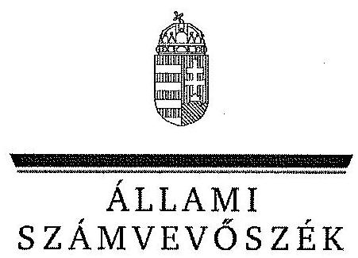
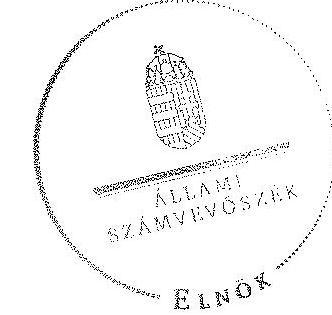

ÁLLAMI
SZÁMVEVŐSZÉK

# JELENTÉS 

az önkormányzatok belső kontrollrendszere kialakításának, egyes
kontrolltevékenységek és a belső ellenőrzés
működésének ellenőrzéséről
Vácrátót
14096
2014. június

---

# Állami Számvevőszék 

Iktatószám: V-0376-056/2014
Témaszám: 1410
Vizsgálat-azonosító szám: V064953

## Az ellenőrzést felügyelte:

Dr. Benedek Mária
felügyeleti vezető
Az ellenőrzést vezette és az ellenőrzés végrehajtásáért felelős:
Bíró Zsolt
ellenőrzésvezető
A számvevőszéki jelentés összeállításában közreműködött:
Liziczai Imréné
számvevő
Az ellenőrzést végezték:
Kökény László
Számvevő
Liziczai Imréné
számvevő

## Czékus Balázs

számvevő

---

# TARTALOMJEGYZÉK 

BEVEZETÉS ..... 7
I. ÖSSZEGZŐ MEGÁLLAPÍTÁSOK, KÖVETKEZTETÉSEK, JAVASLATOK ..... 11
II. RÉSZLETES MEGÁLLAPÍTÁSOK ..... 16

1. Az önkormányzat belső kontrollrendszerének kialakítása ..... 16
1.1. A kontrollkörnyezet ..... 16
1.2. A kockázatkezelési rendszer ..... 17
1.3. A kontrolltevékenységek ..... 18
1.4. Az információs és kommunikációs rendszer ..... 19
1.5. A monitoring rendszer ..... 20
2. A pénzügyi folyamatokban kulcsszerepet betöltő teljesítésigazolás és érvényesítés belső kontrollok működése ..... 20
3. A belső ellenőrzés működése ..... 23

## FÜGGELÉKEK

1. számú Értelmező szótár
2. számú Az értékelés módja és szempontjai

---

.

---

# RÖVIDÍTÉSEK JEGYZÉKE 

## Törvények

Áht
ÁSZ tv.
Htv.

Info tv.

Kttv.

Ktv.

Ltv.

Mötv.

Mvtv.
Nvtv.

Ötv.
Számv. tv.
Tvtv.

Vagyonnyilatkozattételről szóló tv.

## Rendeletek

$\bar{A} h s z_{1}$.

Áhsz $_{2}$
Ávr.

Ber.
Bkr.

Ikr.

2011. évi CXCV. törvény az államháztartásról (hatályos 2012. január 1-jétől)
2011. évi LXVI. törvény az Állami Számvevőszékről
1991. évi XX. Törvény a helyi önkormányzatok és szerveik, a köztársasági megbízottak, valamint egyes centrális alárendeltségű szervek feladat- és hatásköreiről.
2011. évi CXII. törvény az információs önrendelkezési jogról és az információszabadságról (hatályos 2012. január 1-jétől)
2011. évi CXCIX. törvény a közszolgálati tisztviselőkról (hatályos 2012. március 1-jétől)
1992. évi XXIII. törvény a köztisztviselők jogállásáról (hatálytalan 2012. március 1-jétől)
1995. évi LXVI. törvény a köziratokról, a közlevéltárakról és a magánlevéltári anyag védelméről
2011. évi CLXXXIX. törvény Magyarország helyi önkormányzatairól
1993. évi XCIII. törvény a munkavédelemről
2011. évi CXCVI. törvény a nemzeti vagyonról (hatályos 2011. december 31-étől)
1990. évi LXV. törvény a helyi önkormányzatokról
2000. évi C. törvény a számvitelről
1996. évi XXXI. törvény a tűz elleni védekezésről, a műszaki mentésről és a tűzoltóságról
2007. évi CLII. egyes vagyonnyilatkozat-tételi kötelezettségekről szóló törvény

249/2000. (XII. 24.) Korm. rendelet az államháztartás szervezetei beszámolási és könyvvezetési kötelezettségének sajátosságairól (hatálytalan 2014. január 1-jétől)
4/2013. (I. 11.) Korm. Rendelet az államháztartás számviteléről (hatályos 2014. január 1-jétől)
368/2011. (XII. 31.) Korm. rendelet az államháztartásról szóló törvény végrehajtásáról (hatályos 2012. január 1-jétől)
193/2003. (XI. 26.) Korm. rendelet a költségvetési szervek belső ellenőrzéséről (hatálytalan 2012. január 1-jétől)
370/2011. (XII. 31.) Korm. rendelet a költségvetési szervek belső kontrollrendszeréről és belső ellenőrzéséről (hatályos 2012. január 1-jétől)
335/2005. (XII. 29.) Korm. rendelet a közfeladatot ellátó szervek iratkezelésének általános követelményeiről

---

képviselő-testületi SZMSZ
vagyongazdálkodási rendelet

## Szórövidítések

ÁSZ
belső ellenőrzési kézikönyv
bizonylati rend
belső ellenőrzést végző gazdasági társaság értékelési szabályzat
felesleges vagyontárgyak szabályzata
gazdálkodási szabályzat$_{1}$
gazdálkodási szabályzat$_{2}$
INTOSAI
iratkezelési szabályzat

ISSAI
jegyző
jegyző
Képviselő-testület
Kormányhivatal
közös önkormányzati
hivatal
leltározási szabályzat
NGM
Önkormányzat

Vácrátót Község Önkormányzat Képviselő-testületének 5/2011. (IV. 13.) számú rendelete Vácrátót Község Önkormányzat Szervezeti és Működési Szabályzatáról (hatályos 2011. április 13-ától)
Vácrátót Község Önkormányzat Képviselő Testületének az Önkormányzat vagyonáról és a vagyongazdálkodás szabályairól szóló 1/2006. (I. 27.) számú rendelete (hatályos 2006. február 1-jétől)

Állami Számvevőszék
Belső ellenőrzési kézikönyv a kistérségi társulási önkormányzati költségvetési szervek részére (hatályos 2007. január 1-jétől)

Vácrátót Község Önkormányzata és Intézményei Bizonylati rend (hatályos 2012. január 2-ától)
Csillagköz Pénzügyi Tanácsadó és Kulturális Szolgáltató Bt.
Vácrátót Község Önkormányzata és Intézményei Eszközök és Források Értékelési Szabályzata (hatályos 2012. január 2-ától)
Vácrátót Község Önkormányzat és Intézményei Felesleges Vagyontárgyak Hasznosításának és Selejtezésének Szabályzata (hatályos 2012. január 2-ától)
Vácrátót Község Önkormányzat és Intézményei Gazdálkodási szabályzata (hatályos 2012. január 2-ától)
Vácrátót Község Önkormányzat és Intézményei Gazdálkodási szabályzata (hatályos 2012. március 31-étől)
International Organization of Supreme Audit Institutions (Legfőbb Ellenőrző Intézmények Nemzetközi Szervezete)
Vácrátót Község Önkormányzatának Polgármesteri Hivatala Egyedi Iratkezelési Szabályzata (hatályos 2011.január 1-jétől)

International Standards of Supreme Audit Institutions (Legfőbb Ellenőrző Intézmények Nemzetközi Standardjai)
Vácrátót Község Önkormányzat Polgármesteri Hivatal jegyzője 2007. január 1-jétől 2013. február 28-áig
Sződligeti Közös Önkormányzati Hivatal jegyzője 2013. március 1-jétől
Vácrátót Község Önkormányzatának Képviselő-testülete Pest Megyei Kormányhivatal
Sződligeti Közös Önkormányzati Hivatal
Leltárkészítési és leltározási szabályzat (hatályos 2012. január 2-ától)
Nemzetgazdasági Minisztérium
Vácrátót Község Önkormányzata

---

pénzkezelési szabályzat

| polgármester | Vácrátót Község Önkormányzat és a hozzá tartozó Intézmények Pénzkezelési szabályzat (hatályos 2012. január 2-ától) |
| :--: | :--: |
| Polgármesteri Hivatal | Vácrátót Község Önkormányzata Polgármesteri Hivatala |
| stratégiai ellenőrzési | Vácrátót Község Önkormányzat és költségvetési szervei 2011-2014. évi ellenőrzési stratégiai terve |
| számlarend | Számlarend Vácrátót Önkormányzata és Intézményei (hatályos 2012. február 2-ától) |
| számviteli politika | Vácrátót Község Önkormányzata és a hozzátartozó Intézmények Számviteli Politika (hatályos 2012. január 2-ától) |
| Társulás | Veresegyház Többcélú Kistérség Önkormányzataink Társulása |

---

.

---

# JELENTÉS 

## az önkormányzatok belső kontrollrendszere kialakításának, egyes kontrolltevékenységek és a belső ellenőrzés működésének ellenőrzéséről Vácrátót

## BEVEZETÉS

Vácrátót község állandó lakosainak száma 2012. január 1-jén 1807 fő volt. Az Önkormányzat héttagú Képviselő-testületének munkáját két állandó bizottság segítette. Az Önkormányzat az önállóan működő és gazdálkodó Polgármesteri Hivatalon kívül három önállóan működő intézményt működtetett, többségi tulajdoni hányadú gazdasági társasággal nem rendelkezett. A polgármester a 1999. évi időközi önkormányzati választások - 1999. november 8-a - óta tölti be tisztségét. A jegyző 2007. január 1-jétől 2013. február 28-áig látta el, a jegyző 2013. március 1-jétől látja el feladatait. A Polgármesteri Hivatal szervezeti egységekre nem tagolódott, elkülönített gazdasági szervezettel nem rendelkezett, a foglalkoztatott köztisztviselők száma 2012. január 1-jén hét fő volt. 2013. március 1-jétől Vácrátót és Sződliget községek önkormányzatainak képviselő-testületei közös önkormányzati hivatalt hoztak létre - Sződliget székhellyel - igazgatási feladataik ellátására. Az Önkormányzat a 2012. évi költségvetési beszámolója szerint 469576 ezer Ft tárgyévi bevételt ért el, valamint 466520 ezer Ft tárgyévi kiadást teljesített. A 2012. december 31-i könyvviteli mérleg szerint 2179772 ezer Ft értékű eszközvagyonnal rendelkezett, a rövid lejáratú kötelezettségállománya 19230 ezer Ft, hosszú lejáratú kötelezettség állománya nem volt.

A demokratikus társadalmakban alapvető igény, hogy a közpénzeket, a közvagyont használók tevékenységükről elszámoljanak, ahhoz egyértelmű és érvényesíthető felelősségi szabályok társuljanak. Ennek a jogos igénynek az érvényesítéséhez meg kell teremteni azokat a folyamatokat, rendszereket, amelyek nélkülözhetetlenek az elszámoltatáshoz. Az elszámoltatás eredményes működtetéséhez szükség van a megfelelő információs, kontroll, értékelési és beszámolási rendszerek kialakítására.

Magyarországon az uniós csatlakozási tárgyalások idejére nyúlnak vissza a belső kontrollrendszer szabályozásának gyökerei. Az uniós elvárásoknak megfelelő új terminológia szerinti államháztartási belső pénzügyi ellenőrzési (ÁBPE) rendszer területén a jogharmonizáció 2003-ban teljes körűen megvalósult, míg az önkormányzati alrendszerre vonatkozó, Ötv.-ben megjelenített speciális szabályozás 2005-ben lépett hatályba. Az államháztartási belső kontrollrendszer koncepciója 2009-ben továbbfejlődött. A változások irányát mutat-

---

ja, hogy a költségvetési szervek belső kontrollrendszere már magában foglalja a korszerű, felelős szervezetirányítás elemeit (kontrollkörnyezet, kockázatkezelés, kontrolltevékenység, információ és kommunikáció, monitoring) is. E kontrollrendszer szabályozása háromszintű, a törvényi előírásokat az Áht. és a Mötv., a rendeleti szintű szabályozást az Ávr. és a Bkr. tartalmazza, amelyeket útmutatói szinten az NGM által kiadott standardok és kézikönyvek támogatnak.

A belső kontrollrendszer azt a célt szolgálja, hogy a költségvetési szervek működésük és gazdálkodásuk során a tevékenységeket szabályszerűen, gazdaságosan, hatékonyan és eredményesen hajtsák végre, teljesítsék elszámolási kötelezettségeiket és megvédjék az erőforrásokat a veszteségektől, a károktól és a nem rendeltetésszerű használattól. A belső kontrollrendszer magában foglalja mindazon szabályokat, eljárásokat, gyakorlati módszereket és szervezeti struktúrákat, kockázatkezelési technikákat, kontrolltevékenységeket, amelyek segítséget nyújtanak a szervezetnek céljai eléréséhez.

Az ÁSZ középtávú stratégiájában hangsúlyos szerepet szánt annak, hogy szilárd szakmai alapon álló, értékteremtő ellenőrzéseivel előmozdítsa a közpénzügyek átláthatóságát, rendezettségét. A számvevőszéki ellenőrzés nemzetközi alapelvei is rögzítik, hogy a megfelelő belső kontrollrendszer minimálisra csökkenti a hibák és szabálytalanságok kockázatát.

Az ellenőrzés célja annak megállapítása volt, hogy a belső kontrollrendszer elemeinek kialakítása, a pénzügyi folyamatokban kulcsszerepet betöltő teljesítésigazolás és érvényesítés, és a belső ellenőrzés szabályos működése biztosította-e az Önkormányzatnál a közpénzfelhasználás szabályosságát, hozzájárult-e az értéket teremtő rend követelményének érvényesüléséhez.

Ennek keretében értékeltük, hogy:

- a jogszabályi előírásoknak megfelelően alakították-e ki a belső kontrollrendszer elemeit;
- a gazdálkodás folyamatában kulcsszerepet betöltő teljesítésigazolás és érvényesítés kontrolltevékenységeit megfelelően működtették-e;
- biztosították-e a belső ellenőrzés szabályos működését;
- amennyiben az ÁSZ tett javaslatot a 2008-2011. évek közötti ellenőrzése kapcsán az Önkormányzatnak, intézkedtek-e azok végrehajtására.

Az ellenőrzés várható hasznosulását négy szinten tervezzük. A törvényalkotás számára összegzett tapasztalatok állnak rendelkezésre a belső kontrollrendszer önkormányzati területen való kialakításáról, működéséről és hatásairól, a belső ellenőrzés működéséről. Ennek alapján következtetést lehet levonni arról, hogy a belső kontrollrendszer kialakítására és működtetésére vonatkozó jelenlegi, differenciálás nélküli jogszabályi előírások reális követelményeket támasztanak-e az eltérő adottságú települési önkormányzatok esetében, illetve indokolt-e esetleges jogszabályi módosítás kezdeményezése. Az ellenőrzés az ellenőrzött számára visszajelzést ad a belső kontrollrendszer kialakításában és működésében fellépő hiányosságokról, javaslataival hozzájárul azok kikü-

---

szöböléséhez, amely csökkentheti a későbbi ellenőrzések gyakoriságát. Az ellenőrzés megállapításait és javaslatait más szervezetek is hasznosíthatják a rendezett gazdálkodási keretek kialakításához. A társadalom számára jelzi, hogy közpénz nem maradhat ellenőrizetlenül, az ÁSZ értékteremtő rend kialakításához és megőrzéséhez hozzájáruló tevékenysége pozitív hatással lesz a szervezetről kialakított összkép formálásában. A szervezeten belül lehetőség nyílik arra, hogy a megállapítások szintetizálásával az ÁSZ a hozzáadott értéket teremtő elemző tevékenységét és tanácsadó szerepét is erősítse.

Az önkormányzatok belső kontrollrendszere kialakításának, egyes kontrolltevékenységek és a belső ellenőrzés működésének ellenőrzéséről szóló jelentés I. fejezetének összegző része az ellenőrzés céljára ad rövid, szintetizáló összefoglalót, és tartalmazza a következtetéseket a II. fejezet részletes megállapításain alapulóan. A jelentés intézkedést igénylő megállapításait és javaslatait az ellenőrzés során feltárt, a jelentés II. fejezetében rögzített részletes megállapítások alapozzák meg. A helyszíni ellenőrzés lezárásáig a helyi szabályozás változásait nyomon követtük.

Az ellenőrzés típusa: szabályszerűségi ellenőrzés.
Az ellenőrzött időszak: a belső kontrollrendszer kialakításának megfelelősége esetében a 2012. évre, a pénzügyi folyamatokban kulcsszerepet betöltő teljesítésigazolás és érvényesítés belső kontrollok működésének megfelelőségét és a belső ellenőrzés szabályszerű működését a 2012. január 1. és december 31-e közötti időszak eseményeit figyelembe véve értékeltük, míg az ÁSZ javaslatainak utóellenőrzése a 2008-2011. években végzett ellenőrzések nyilvánosságra hozott jelentéseiben tett javaslatok áttekintésére terjedt ki.

# Az ellenőrzött szervezet: az Önkormányzat. 

Az ellenőrzés jogszabályi alapját az ÁSZ tv. 1. § (3) bekezdése, az 5. § (2) és (6) bekezdése, valamint az Áht. 61. § (2) bekezdésének előírásai képezik.

Az ellenőrzés szakmai módszertana az ÁSZ hivatalos honlapján (www.asz.hu) közzétett szakmai szabályokon alapult, amely az INTOSAI által kiadott ISSAI figyelembevételével készült.

Az ellenőrzés lefolytatásához az Önkormányzat a kimutatások és a tanúsítvány elektronikus kitöltésével, valamint az ÁSZ által kért dokumentumok elektronikus megküldésével szolgáltatott adatokat. Az így rendelkezésre bocsátott adatok, információk kontrollja és a munkalapok kitöltése a helyszíni ellenőrzés keretében történt. A jelentésben használt fogalmak magyarázatát az 1. számú függelék, az ellenőrzés egyes területeinek értékelésénél alkalmazott egységes minősítési szempontokat a 2. számú függelék tartalmazza.

A belső kontrollrendszer kialakításának ellenőrzése során értékeltük a kontrollkörnyezet, a kockázatkezelési rendszer, a kontrolltevékenységek, az információs és kommunikációs rendszer, valamint a monitoring rendszer szabályozottságának megfelelőségét. A pénzügyi folyamatokban kulcsszerepet betöltő teljesítésigazolás és érvényesítés kontrollok működése megfelelőségének minősítéséhez az állományba nem tartozók megbízási díjai, a külső szolgáltatók által

---

végzett
 karbantartási, kisjavítási munkák, az egyéb üzemeltetési és fenntartási szolgáltatások, a rendszeres szociális segélyek, valamint az államháztartáson kívülre teljesített működési és felhalmozási célú pénzeszközátadások közül kockázatelemzéssel választottuk ki az ellenőrzött kiadási jogcímeket. Az egyszerű véletlen mintavétellel kiválasztott tételek ellenőrzését többlépcsős megfelelőségi tesztek útján addig végeztük, amíg elegendő és megfelelő bizonyítékot szereztünk a vizsgált folyamatok kulcskontrolljai működésének megfelelő vagy nem megfelelő voltáról. Értékeltük az Önkormányzatnál a belső ellenőrzés működésének szabályosságát. Utóellenőrzésre nem került sor, mivel az ÁSZ az Önkormányzatnál a 2008-2011. évek között nem végzett ellenőrzést.

Az Ász tv. 29. § (1) bekezdése szerint a jelentéstervezetet megküldtük a polgármester részére, aki az ÁSZ tv. 29. § (2) bekezdésében foglalt észrevételezési jogával élt, a tett észrevételek a jelentéstervezetben foglalt egyes megállapítások és az azok alapján tett javaslatok tartalmát nem érintették.

---

# I. ÖSSZEGZŐ MEGÁLLAPÍTÁSOK, KÖVETKEZTETÉSEK, JAVASLATOK 

A belső kontrollrendszeren belül 2012-ben a kontrollkörnyezet, a kockázatkezelési rendszer, a kontrolltevékenységek, az információs és kommunikációs rendszer, valamint a monitoring rendszer kialakítását külön-külön és együttesen is értékeltük. A belső kontrollrendszer kialakítása az összesített értékelés alapján nem felelt meg a jogszabályi előírásoknak.

A belső kontrollrendszer egyes területei kialakításának minősítése a következő:

| Kontrollterület | Minősítés |
| :-- | :--: |
| Kontrollkörnyezet | nem |
|  | megfelelő |
| Kockázatkezelési rendszer | nem |
|  | megfelelő |
| Kontrolltevékenységek | nem |
| Információs és kommuni- |  |
| kációs rendszer | megfelelő |
| Monitoring rendszer | nem |

Megfelelőnek értékeltük a kontrolltevékenységek kialakítását, mivel a jegyző, a jogszabályi előírásokban foglaltakat figyelembe véve kisebb hiányosságok mellett is megteremtette e kontrollterületen a szabályszerű működés lehetőségét.

Nem megfelelőnek értékeltük a kontrollkörnyezet, a kockázatkezelési rendszer, az információs és kommunikációs rendszer, valamint a monitoring rendszer kialakítását, mivel az ellenőrzésünk során megállapított szabályozásbeli hiányosságok magukban hordozzák a szabálytalan működés, valamint a korrupció kockázatát.

A 2012. évben a külső szolgáltatók által végzett karbantartási, kisjavítási munkákkal kapcsolatos kifizetések, valamint az államháztartáson kívülre teljesített működési és felhalmozási célú pénzeszközátadások során a pénzügyi folyamatokban kulcsszerepet betöltő teljesítésigazolás és érvényesítés belső kontrollok működése gyenge volt. Gyengének értékeltük a két kulcskontroll együttes működését, mivel azok nem biztosították a hibák megelőzését, feltárását.

A számvevőszéki ellenőrzés az ellenőrzött kifizetésekkel összefüggésben a rendelkezésre bocsátott dokumentumok alapján kár bekövetkeztére utaló adatot, tényt nem állapított meg, azonban a gazdálkodásban kulcsszerepet betöltő kontrollok működésében feltárt hiányosságok miatt fennáll a hibák bekövetke-

---

zésének kockázata. A nem megfelelően működtetett belső kontrollok korrupciós kockázatot hordoznak.

Az Önkormányzat a belső ellenőrzési feladatokat Társulás útján látta el. A 2012. évben a belső ellenőrzés működése a jogszabályi előírásoknak megfelelt, azonban a belső ellenőrzés nem tárta fel a belső kontrollrendszer kialakításának, valamint a pénzügyi folyamatokban kulcsszerepet betöltő teljesítésigazolás és érvényesítés belső kontrollok működésének hiányosságait.

Az Önkormányzatnál a belső ellenőrzést végző gazdasági társasággal - az Önkormányzatra és intézményeire vonatkozó szabályzatok készítésére és aktualizálására - kötött szerződéssel nem biztosították a belső ellenőrzés funkcionális függetlenségét, mivel azzal olyan tevékenységbe vonták be, amelyet a belső ellenőrzést ellátó személy/szervezet nem végezhet.

Az ÁSZ tv. 33. § (1) bekezdésében foglaltak értelmében az ellenőrzött szervezet vezetője köteles a jelentésben foglalt megállapításokhoz kapcsolódó intézkedési tervet összeállítani, és azt a jelentés kézhezvételétől számított 30 napon belül az ÁSZ részére megküldeni. Amennyiben az intézkedési tervet határidőre nem küldi meg a szervezet, vagy az ÁSZ tv. 33. § (2) bekezdésében foglalt póthatáridő elteltével megküldött intézkedési terv továbbra sem elfogadható, az ÁSZ elnöke a hivatkozott törvény 33. § (3) bekezdés a)-b) pontjaiban foglaltakat érvényesítheti.

Az ellenőrzés intézkedést igénylő megállapításai és javaslatai:

# a polgármesternek 

1. Az Önkormányzat nevében történő kötelezettségvállalás - az Áht. 37. § (1) bekezdése és az Ávr. 55. § (1) bekezdésében előírtak ellenére - pénzügyi ellenjegyzés hiányában történt.

Javaslat:
Intézkedjen, hogy az Önkormányzat nevében történő kötelezettségvállalásra az Áht. 37. § (1) bekezdésében és az Ávr. 55. § (1) bekezdésében foglaltaknak megfelelően - az Ávr. 53. §-ában meghatározott kivételekkel - kizárólag a pénzügyi ellenjegyzés után, a pénzügyi teljesítés esedékességét megelőzően, írásban kerüljön sor.
2. A Képviselő-testület bizottságai nem helyi önkormányzati képviselő tagjai a Vagyon-nyilatkozat-tételről szóló tv. 3. § (3) e) pontjában foglaltak ellenére vagyonnyilatko-zat-tételi kötelezettségüknek nem tettek eleget. Az őrzésért felelős - a Vagyonnyilat-kozat-tételről szóló tv. 8. § (4) bekezdésében foglaltak ellenére nem tájékoztatta a nem helyi önkormányzati képviselő tagokat a vagyonnyilatkozat-tételi kötelezettség fennállásáról és esedékességének időpontjáról az esedékességet legalább 30 nappal megelőzően, továbbá a 10. § (1) bekezdésében foglaltak ellenére - írásban nem szólította fel a nem helyi önkormányzati képviselő tagokat arra, hogy kötelezettségüket a felszólítás kézhezvételétől számított nyolc napon belül teljesítsék.

---

Javaslat:
Kezdeményezze a Képviselő-testületnél a Mötv. a 65. §-a alapján a Mötv. 57. § (2) bekezdésének, valamint a Vagyonnyilatkozat-tételről szóló tv.-ben foglaltaknak megfelelően a vagyonnyilatkozatok vizsgálatáért felelősként kijelölt bizottságnak a vagyonnyilatkozat-tételi kötelezettség teljesítésére vonatkozó eljárásának szabályszerűségével kapcsolatos körülményei kivizsgálását, majd a vizsgálat eredményének függvényében kezdeményezze a Képviselő-testületnél a szükséges intézkedések megtételét.
3. A számvevőszéki ellenőrzés megállapításai alapján az Önkormányzatnál a belső kontrollrendszer kialakítása összefoglalóan értékelve nem felelt meg a jogszabályi előírásoknak, a kulcskontrollok működése gyenge volt, a belső ellenőrzés működése ugyan megfelelt a jogszabályi előírásoknak, azonban nem tárta fel, ezáltal nem is javíttatta ki a hiányosságokat. A megállapított szabályozásbeli és működésbeli hiányosságok magukban hordozzák a szabálytalan működés kockázatát.

Javaslat:
Kísérje figyelemmel a Mötv. 115. § (1) bekezdésében foglaltak alapján az Önkormányzat gazdálkodásának szabályszerűségét. A Mötv. 67. § f) pontja alapján gondoskodjon a belső kontrollrendszer működésére vonatkozó jogszabályi rendelkezések be nem tartása, valamint a teljesítésigazolás, illetve az érvényesítés kontrollokkal összefüggésben feltárt hiányosságok, szabálytalanságok tekintetében az esetleges munkajogi felelősséggel kapcsolatos körülmények kivizsgálásáról, majd a vizsgálat eredményének függvényében tegye meg a szükséges intézkedéseket.

# a jegyzőnek (Vácrátót Község Önkormányzata vonatkozásában) 

1. a kontrollkörnyezettel kapcsolatban:

A jegyző ${ }_{1}$-Ötv.-ben foglaltak ellenére - nem készítette elő az ellenőrzött időszakban a vagyongazdálkodási rendelet módosítását annak érdekében, hogy az megfeleljen az Nvtv. előírásainak. A jegyző ${ }_{1}$ a Tvtv.-ben foglaltak ellenére nem készítette el a Polgármesteri Hivatal tűzvédelmi szabályzatát és a Kttv.-ben előírtak ellenére nem kezdeményezte a köztisztviselőkkel szembeni hivatásetikai alapelvek részletes tartalmát, valamint az etikai eljárás szabályait tartalmazó dokumentum Képviselő-testület elé terjesztését [II. Részletes megállapítások, 1.1. A kontrollkörnyezet, 16., 33. és 47. sorszámú megállapítás].

Javaslat:
Intézkedjen az Áht. 69. § (2) bekezdése, a Bkr. 3. § a) pontja és 6. §-a alapján a jelentés II. Részletes megállapítások, 1.1. A kontrollkörnyezet 16., 33. és 47. sorszámú megállapításaiban foglalt hibák, hiányosságok kijavításáról, megszüntetéséről az ott megjelölt jogszabályi rendelkezéseknek megfelelően.

---

2. a kockázatkezelési rendszerrel kapcsolatban:

A jegyző, Bkr.-ben foglaltak ellenére nem mérte fel és nem állapította meg a Polgármesteri Hivatal tevékenységében, gazdálkodásában rejlő kockázatokat, nem határozta meg egyes kockázatokkal kapcsolatban a szükséges intézkedéseket, valamint azok teljesítésének folyamatos nyomon követési módját. A Képviselő-testület bizottságai nem helyi önkormányzati képviselő tagjai vagyonnyilatkozat-tételi kötelezettségét a képviselő-testületi SZMSZ-ben a Vagyonnyilatkozat-tételről szóló tv.-ben foglaltak ellenére nem tüntették fel [II. Részletes megállapítások, 1.2. A kockázatkezelési rendszer, 2., 8., 10., 13. sorszámú megállapítás].

Javaslat:
Intézkedjen az Áht. 69. § (2) bekezdése, a Bkr. 3. § b) pontja és 7. §-a alapján a jelentés II. Részletes megállapítások, 1.2. A kockázatkezelési rendszer 2., 8., 10. és 13. sorszámú megállapításaiban foglalt hibák, hiányosságok kijavításáról, megszüntetéséről az ott megjelölt jogszabályi rendelkezéseknek megfelelően.
3. a kontrolltevékenységekkel kapcsolatban:

A jegyző, a Bkr.-ben foglaltak ellenére nem biztosította a támogatások elszámolása dokumentumainak elkészítésével kapcsolatban a folyamatba épített, előzetes, utólagos és vezetői ellenőrzést. Az Ávr.-ben foglaltakat figyelmen kívül hagyva belső szabályzatban nem határozta meg az előzetes írásbeli kötelezettségvállalást nem igénylő kifizetések rendjét [II. Részletes megállapítások, 1.3. A kontrolltevékenységek, 5. és 8. sorszámú megállapítás]

Javaslat:
Intézkedjen az Áht. 69. § (2) bekezdése, a Bkr. 3. § c) pontja és a 8. §-a alapján a jelentés II. Részletes megállapítások, 1.3. A kontrolltevékenységek 5. és 8. sorszámú megállapításaiban foglalt hibák, hiányosságok kijavításáról, megszüntetéséről az ott megjelölt jogszabályi rendelkezéseknek megfelelően.
4. az információs és kommunikációs rendszerrel kapcsolatban:

A jegyző, az Info tv.-ben és az Ávr.-ben foglaltak ellenére a kötelezően közzéteendő adatok nyilvánosságra hozatalának rendjét belső szabályzatban nem határozta meg. Az Önkormányzat a 2012. évben az Info tv.-ben előírt elektronikus közzétételi kötelezettségének nem tett eleget [II. Részletes megállapítások, 1.4. Az információs és kommunikációs rendszer 6. és 7. sorszámú megállapítás].

Javaslat:
Intézkedjen az Áht. 69. § (2) bekezdése, a Bkr. 3. § d) pontja és 9. §-a alapján a jelentés II. Részletes megállapítások, 1.4. Az információs és kommunikációs rendszer 6. és 7. sorszámú megállapításaiban foglalt hibák, hiányosságok kijavításáról, megszüntetéséről az ott megjelölt jogszabályi rendelkezéseknek megfelelően.

---

5. a monitoring rendszerrel kapcsolatban:

A jegyző, a Bkr.-ben foglaltak ellenére nem alakított ki a Polgármesteri Hivatal tevékenységének, a célok megvalósításának nyomon követését biztosító rendszert [II. Részletes megállapítások, 1.5. A monitoring rendszer, 1. sorszámú megállapítás].

Javaslat:
Intézkedjen az Áht. 69. § (2) bekezdése, a Bkr. 3. § e) pontja és 10. §-a alapján a jelentés II. Részletes megállapítások, 1.5. A monitoring rendszer 1. sorszámú megállapításában foglalt hibák, hiányosságok kijavításáról, megszüntetéséről az ott megjelölt jogszabályi rendelkezéseknek megfelelően.
6. a pénzügyi folyamatokban kulcsszerepet betöltő kontrollokkal kapcsolatban:

A teljesítésigazolás és érvényesítés nem felelt meg az Áht.-ban és az Ávr.-ben foglaltaknak [II. Részletes megállapítások, 2. A pénzügyi folyamatokban kulcsszerepet betöltő teljesítésigazolás és érvényesítés belső kontrollok működése, 1-3. pontjában foglalt megállapítás].

Javaslat:
Intézkedjen az Áht. 37-38. §-ában, az Ávr. 55-59. §-ában és az Áhsz -ben foglaltak alapján arról, hogy a teljesítésigazolás és az érvényesítés vonatkozásában, valamint azok ellenőrzése során a kötelezettségvállalással, a pénzügyi ellenjegyzéssel, az utalványozással, a kötelezettségvállalások nyilvántartásba vételével kapcsolatban feltárt, a jelentés II. Részletes megállapítások, 2. A pénzügyi folyamatokban kulcsszerepet betöltő teljesítésigazolás és érvényesítés belső kontrollok működése 1-3. pontjában szereplő megállapításokban foglalt hibák, hiányosságok kijavítása, megszüntetése az ott megjelölt jogszabályi rendelkezéseknek megfelelően történjen meg.
7. a belső ellenőrzés működésével kapcsolatban:

A belső ellenőrzés működése az értékelés szempontjait figyelembe véve megfelelt a jogszabályi előírásoknak, azonban a számvevőszéki ellenőrzés kisebb súlyú hiányosságokat tárt fel, amelyek nem feleltek meg a Bkr.-ben előírt rendelkezéseknek [II. Részletes megállapítások, 3. A belső ellenőrzés működése, 2., 3., 6., 8. a), 11., 18., 23., 24-26. és 27.a)-b). sorszámú megállapítása].

Javaslat:
Intézkedjen az Áht. 69. § (2), a 70. § (1) bekezdése, a Bkr. 3. § e) pontja és a 10. §-a alapján a jelentés II. Részletes megállapítások, 3. A belső ellenőrzés működése 2., 3., 6., 8. a), 11., 18., 23., 24-26. és 27. a)-b). sorszámú megállapításában feltárt hibák, hiányosságok kijavításáról, megszüntetéséről az ott megjelölt jogszabályi rendelkezéseknek megfelelően.

---

# II. RÉSZLETES
 MEGÁLLAPÍTÁSOK 

## 1. Az önkormányzat belső kontrollrendszerének kialakítása

A belső kontrollrendszeren belül 2012-ben a kontrollkörnyezet, a kockázatkezelési rendszer, a kontrolltevékenységek, az információs és kommunikációs rendszer, valamint a monitoring rendszer kialakítását külön-külön és együttesen is értékeltük. A belső kontrollrendszer kialakítása az összesített értékelés alapján nem felelt meg a jogszabályi előírásoknak.

### 1.1. A kontrollkörnyezet

A kontrollkörnyezet kialakítása - a 2. számú függelékben részletezett kritériumrendszer alapján végzett értékelés szerint - nem felelt meg a jogszabályi előírásoknak, mert:

| Sor-   szám $^{1}$ | Megállapítás | Megjegyzés |
| :--: | :--: | :--: |
| 2. | A polgármester beterjesztette a Képviselőtestület elé az Önkormányzat gazdasági programtervezetét, azonban a Képviselőtestület az Ötv. 91. § (1) és (7) bekezdésében előírtak ellenére nem határozta meg az Önkormányzat gazdasági programját. | A polgármester az Önkormányzat Képviselőtestülete 2010. október 14-ei alakuló ülésén ismertette az Önkormányzat 2010-2014. évre vonatkozó gazdasági programtervezetét, azonban annak szavazásra bocsátása nem történt meg.   2013. január 1-jétől a Mötv. 116. § (1) és (5) bekezdése szabályozza, hogy a Képviselő-testület hosszú távú fejlesztési elképzeléseit gazdasági programban rögzíti, és a gazdasági programot az alakuló ülését követő hat hónapon belül fogadja el. |

[^0]
[^0]:    ${ }^{1}$ A megállapítás számozása az Önkormányzat által kitöltött kimutatások - adatszolgáltatások - kérdéseinek sorszámával azonos.

---

| 4. | A Képviselő-testület - a Ktv. 34. § (3) bekezdésében foglaltak ellenére - nem döntött a teljesítményértékelés alapját képező célokról. | A Ktv.-t hatályon kívül helyezte a 2012. évi V. törvény 59. § (1) bekezdés a) pontja, hatálytalan 2012. március 1-jétől. |
| :--: | :--: | :--: |
| 16. | A jegyző ${ }_{1}$ - az Ötv. 36. § (2) bekezdés a) pontjában foglaltak ellenére - az ellenőrzött időszakban nem készítette elő megfelelő időben a vagyongazdálkodási rendelet módosítását annak érdekében, hogy az megfeleljen az Nvtv. 3. § (1) bekezdés 6. pontja, 5. §-a, 11. § (16) bekezdése, 13. § (1) bekezdése, valamint a Mötv. 109. § (4) bekezdése előírásainak. | A Képviselő-testület a 14/2013. (XII. 13.) és a 15/2013. (XII. 13.) számú rendeleteivel módosította az Önkormányzat vagyongazdálkodásának szabályait.   A jegyző részére az önkormányzat működésével kapcsolatos feladatok ellátásáról való gondoskodást 2013. január 1-jétől a Mötv. 81. § (3) bekezdés c) pontja írja elő. |
| 33. | A jegyző ${ }_{1}$ - a Tvtv. 19. § (1) bekezdésében foglaltak ellenére - nem készítette el a Polgármesteri Hivatal tűzvédelmi szabályzatát. |  |
| 47. | A Képviselő-testület - a Kttv. 231. § (1) bekezdésben foglaltak ellenére - nem állapította meg a Kttv. 83. §-ában előírt, a köztisztviselőkkel szembeni hivatásetikai alapelvek részletes tartalmát, valamint az etikai eljárás szabályait, mivel a jegyző ${ }_{1}$ - az Ötv. 36. § (2) bekezdés a) pontjában előírt feladata ellenére - nem készítette elő ennek dokumentumát. |  |

# 1.2. A kockázatkezelési rendszer 

A kockázatkezelési rendszer kialakítása - a 2. számú függelékben részletezett kritériumrendszer alapján végzett értékelés szerint - nem felelt meg a jogszabályi előírásoknak, mert:

| Sor-   szám | Megállapítás | Megjegyzés |
| :--: | :--: | :--: |
| 2., 8.,   és 10. | A jegyző ${ }_{1}$ - Bkr. 7. § (2) bekezdésében foglaltak ellenére - nem mérte fel és nem állapította meg a Polgármesteri Hivatal tevékenységében, gazdálkodásában rejlő kockázatokat. Nem határozta meg az egyes kockázatokkal kapcsolatban szükséges intézkedéseket, valamint azok teljesítése folyamatos nyomon követésének módját. |  |

---

| 13. | A Képviselő-testület bizottságai nem helyi önkormányzati képviselő tagjai vagyonnyilatkozat-tételi kötelezettségét a képviselőtestületi SZMSZ-ben a Vagyonnyilatkozattételről szóló tv. 4. § d) pontjában foglaltak ellenére nem rögzítették. |  |
| 14. | A bizottságok nem helyi önkormányzati képviselő tagjai a Vagyonnyilatkozat-tételről szóló tv. 3. § (3) e) pontjában foglaltak ellenére vagyonnyilatkozat-tételi kötelezettségüknek nem tettek eleget. Az őrzésért felelős - a Vagyonnyilatkozat-tételről szóló tv. 8. § (4) bekezdésében foglaltak ellenére nem tájékoztatta a nem helyi önkormányzati képviselő tagokat a vagyonnyilatkozat-tételi kötelezettség fennállásáról és esedékességének időpontjáról az esedékességet legalább 30 nappal megelőzően, továbbá a 10. § (1) bekezdésében foglaltak ellenére - írásban nem szólította fel a nem helyi önkormányzati képviselő tagokat arra, hogy kötelezettségüket a felszólítás kézhezvételétől számított nyolc napon belül teljesítsék. |  |

# 1.3. A kontrolltevékenységek 

A kontrolltevékenységek kialakítása - a 2. számú függelékben részletezett kritériumrendszer alapján végzett értékelés szerint - megfelelt a jogszabályi előírásoknak.

A jegyző, a kontrolltevékenység részeként a folyamatba épített, előzetes, utólagos és vezetői ellenőrzést előírta a költségvetés tervezése, a beszerzések lebonyolítása, valamint a vagyonhasznosítási tevékenység vonatkozásában.

A jegyző, a jogszabályi előírásoknak megfelelően gondoskodott az iratkezelési szoftver által kezelt adatok biztonságáról, kialakította az üzembiztonsági, adatvédelmi szabályok érvényre juttatásához szükséges eljárási szabályokat, szabályozta az üzemeltetés és az adatbiztonság védelmének feladatait, és meghatározta az ehhez kapcsolódó hatásköröket. A jegyző, az informatikai rendszer kialakítása során a jogszabályi előírásoknak megfelelően biztosította az adatok biztonságának érvényesülését, a hozzáférési jogosultságokra vonatkozó eljárásrendben meghatározta a felelősségi köröket.

A gazdálkodási szabályzat ${ }_{1,2}$-ben a jegyző meghatározta a kötelezettségvállalás pénzügyi ellenjegyzésének módját, előírta a kiadások teljesítésigazolásának módját, szabályozta az érvényesítés és az utalványozás rendjét. Kijelölték a teljesítésigazolásra jogosultakat.

A polgármester adott felhatalmazást kötelezettségvállalásra, a jegyző pedig a jogszabályi előírásnak megfelelően jelölt ki pénzügyi ellenjegyzésre és érvényesítési feladatra a Polgármesteri Hivatal állományába tartozó köztisztviselőt, a kijelölt személyek rendelkeztek az előírt szakképzettséggel.

---

A gazdálkodási szabályzat ${ }_{1,2}$-ben a jegyző ${ }_{1}$ meghatározta az időközi és éves beszámolók elkészítésének rendjét, a beszámolási eljárásokhoz kapcsolódó felelősségi köröket és a helyettesítés rendjét, valamint kialakította a jogviszony megszűnése esetére vonatkozóan a munkavállaló folyamatban lévő feladatai átadásának rendjét.

A polgármester a jogszabályi előírásoknak megfelelően az Önkormányzat gazdálkodásának első félévi és háromnegyed éves helyzetéről a Képviselő-testületet írásban az előírt határidőig tájékoztatta.

A kontrolltevékenységek kialakítása az értékelés szempontjából az alábbi kisebb súlyú hiányosságok mellett megfelelt a jogszabályi előírásoknak:

| Sorszám | Megállapítás |
| :--: | :--: |
| 5. | A jegyző ${ }_{1}$ a Bkr. 8. § (2) bekezdés a) pontjában foglaltak ellenére nem biztosította a pénzügyi döntések, köztük a támogatások elszámolása dokumentumainak elkészítésével kapcsolatban a folyamatba épített, előzetes, utólagos és vezetői ellenőrzést. |
| 8. | A jegyző ${ }_{1}$ - az Ávr. 53. § (2) bekezdésében foglaltakat figyelmen kívül hagyva - annak ellenére nem határozta meg az előzetes írásbeli kötelezettségvállalást nem igénylő kifizetések rendjét, hogy a belső szabályozásban lehetővé tette a 100 ezer Ft-ot el nem érő kifizetések előzetes írásbeli kötelezettségvállalás nélküli teljesítését. |

# 1.4. Az információs és kommunikációs rendszer 

Az információs és kommunikációs rendszer kialakítása - a 2. számú függelékben részletezett kritériumrendszer alapján végzett értékelés szerint nem felelt meg a jogszabályi előírásoknak, mert:

| Sorszám | Megállapítás |
| :--: | :--: |
| 6. | A jegyző ${ }_{1}$ - az Info tv. 35. § (3) bekezdésében és az Ávr. 13. § (2) bekezdés   h) pontjában foglalt előírás ellenére - a kötelezően közzéteendő adatok nyilvánosságra hozatalának rendjét belső szabályzatban nem határozta meg. |
| 7. | Az Önkormányzat - az Info tv. 33. § (1) és (3), a 37. § (1) bekezdésében és az 1. mellékletében foglaltak ellenére - elektronikus közzétételi kötelezettségének a 2012. évben nem tett eleget, mert a 2012. évi költségvetését és a 2011. évi költségvetésének végrehajtásáról szóló beszámolóját, valamint a Képviselő-testület hatályos rendeleteit teljes körűen nem tette közzé. |

---

# 1.5. A monitoring rendszer 

A monitoring rendszer kialakítása - a 2. számú függelékben részletezett kritériumrendszer alapján végzett értékelés szerint - nem felelt meg a jogszabályi előírásoknak, mert:

| Sor-   szám | Megállapítás |
| :-- | :-- |

A jegyző, - a Bkr. 3. § e) pontjában és a 10. §-ában foglaltak ellenére nem alakította ki a Polgármesteri Hivatal tevékenységének, a célok megvalósításának nyomon követését biztosító rendszert.

Az Önkormányzatnál helyi önkormányzatok törvényességi felügyeletét ellátó Kormányhivatal törvényességi felhívással, vagy más törvényességi felügyeleti eszközzel 2012-ben nem élt.

## 2. A pénzügyi folyamatokban kulcsszerepet betöltő teljesítésigazolás és érvényesítés belső kontrollok működése

A 2012. évben a külső szolgáltatók által végzett karbantartással, kisjavítással kapcsolatos kifizetések, valamint az államháztartáson kívülre teljesített működési és felhalmozási célú pénzeszközátadások során - összefoglalóan értékelve a pénzügyi folyamatokban kulcsszerepet betöltő teljesítésigazolás és érvényesítés belső kontrollok működésének megfelelősége gyenge volt, mert:

| Sor-   szám | Megállapítás | Megjegyzés |
| :--: | :--: | :--: |
| Teljesítésigazolás |  |  |
| 1. | A teljesítésigazolás - az Ávr. 57. § (1) és (3) bekezdéseiben foglaltak ellenére - nem szabályszerűen történt. |  |
| Érvényesítés |  |  |
| 2. | Az érvényesítést - az Ávr. 58. § (1), (3) és (4) bekezdésében foglaltak ellenére - nem az arra jogosult személy végezte, vagy nem szabályszerűen történt.   Az érvényesítő - az Ávr. 58. § (1) bekezdésében foglaltak ellenére - a kifizetéseket megelőzően nem tudta ellenőrizni a fedezet meglétét, mert a kötelezettségvállalást - az Ávr. 56. § (1) bekezdése előírása ellenére - nem vették nyilvántartásba.   Az érvényesítő - az Ávr. 58. § (2) bekezdésében előírtak ellenére - nem jelezte az utalványozónak, hogy a megelőző ügymenetben a teljesítésigazolást nem az arra jogosult személy végezte, vagy nem szabályszerűen történt, az Önkormányzat nevében a sportegyesület támogatásának, a gáz- | Az Ávr. 56. § (1) bekezdés 2014. I. 1-jétől módosult, a kötelezettségvállalások nyilvántartására vonatkozó előírásokat az Áhsz., 39. § (1) bekezdés és a 14. számú melléklet II. pontja tartalmazza. |

---

készülék karbantartásának kötelezettségvállalására - az Áht. 37. § (1) bekezdésében és az Ávr. 55. § (1) bekezdésében előírtak ellenére - pénzügyi ellenjegyzés nélkül került sor.

# A kulcskontrollok ellenőrzésével kapcsolatban feltárt egyéb hiányosságok 

Az utalvány - az Ávr. 59. § (3) bekezdés c), e) és f) pontjában foglaltak ellenére - nem tartalmazta a kedvezményezett címét, a megterhelendő számla számát és a kötelezettségvállalás nyilvántartási számát.

A 2012. évben az államháztartáson kívülre teljesített működési célú pénzeszközátadások teljesítése során a teljesítésigazolás és az érvényesítés kulcskontrollok működésének megfelelősége gyenge volt, mert:

- a teljesítésigazoló az orvosi ügyeleti díjak kifizetését megelőzően a kiadások teljesítése jogosságának, összegszerűségének, az ellenszolgáltatás teljesítésének ellenőrzését nem az Ávr. 57. § (3) bekezdésébe foglalt előírásnak megfelelően igazolta, mert a bizonylatokon a teljesítésigazolás dátumát nem tüntette fel;
- az érvényesítést a FUTAPEST Klub részére történő kifizetést megelőzően - az Ávr. 58. § (4) bekezdésében foglaltak ellenére - nem az arra jogosult személy
 végezte;
- az érvényesítő az ellenőrzési feladatát - az Ávr. 58. § (3) bekezdésében foglaltak ellenére - nem szabályszerűen végezte, mert az orvosi ügyeleti díjak kifizetése esetében az érvényesített okmányon az érvényesítés dátumát nem tüntette fel;
- az érvényesítő - az Ávr. 58. § (1) bekezdésében foglaltak ellenére - nem tudta ellenőrizni az Önkormányzat kiadási előirányzata terhére teljesített, az orvosi ügyeleti díjakkal kapcsolatos pénzeszközátadásnál a fedezet meglétét, mert a kötelezettségvállalást - az Ávr. 56. § (1) bekezdése előírása ellenére - nem vették nyilvántartásba;
- az érvényesítő az Ávr. 58. § (2) bekezdésében foglaltak ellenére nem jelezte az utalványozónak, hogy a megelőző ügymenetben az Önkormányzat kiadási előirányzata terhére teljesített, a sportegyesület támogatásával összefüggő pénzeszközátadás során az Áht. 37. § (1) bekezdése és az Ávr. 55. § (1) bekezdésében foglaltak ellenére a kötelezettségvállalásra pénzügyi ellenjegyzés nélkül került sor.

Az orvosi ügyeleti díjakkal kapcsolatos kifizetés esetében a pénztárbizonylaton nem tüntették fel - az Ávr. 59. § (3) bekezdés f) pontjában előírtak ellenére - a kötelezettségvállalás nyilvántartási számát.

---

A 2012. évben a külső szolgáltatók által végzett karbantartási és kisjavítási munkák kifizetése során a teljesítésigazolás és az érvényesítés kulcskontrollok működésének megfelelősége gyenge volt, mert:

- a teljesítésigazoló a tűzoltó készülék karbantartással kapcsolatos kifizetést megelőzően - az Ávr. 57. § (1) bekezdésében foglaltak és aláírása ellenére - nem ellenőrizte a kiadás összegszerűségét, mert a kötelezettségvállalás dokumentuma nem tartalmazta a kötelezettségvállalás összegét;
- a teljesítésigazoló a fénymásoló karbantartással kapcsolatos kifizetést megelőzően - az Ávr. 57. § (1) bekezdésében foglaltak ellenére - nem ellenőrizte a kiadás összegszerűségét, mert a kifizetés alapját képező bizonylaton (számlán), valamint a kötelezettségvállalás dokumentumán szereplő szolgáltatási díj egységára nem egyezett meg;
- a teljesítésigazoló - az Ávr. 57. § (1) bekezdésében foglaltak ellenére - ellenőrizhető okmányok hiányában a garanciális javítással, a tehergépjármű javítással, vizsgáztatással, az ingatlan karbantartással, a klímakarbantartással és láncélezéssel kapcsolatos kifizetések esetében nem ellenőrizte a kiadások teljesítésének jogosságát és a feladat teljesítését, valamint a garanciális javítással, a tehergépjármű javítással, vizsgáztatással összefüggő kifizetéseket megelőzően a kiadás összegszerűségét;
- az érvényesítést a gázkészülék karbantartással kapcsolatos kifizetéseket megelőzően - az Ávr. 58. § (4) bekezdésében foglaltak ellenére - nem az arra jogosult személy végezte;
- az érvényesítő - az Ávr. 58. § (1) bekezdésében foglaltak ellenére - nem tudta ellenőrizni az Önkormányzat kiadási előirányzata terhére teljesített garanciális javításnál a fedezet meglétét, mert a kötelezettségvállalást - az Ávr. 56. § (1) bekezdése előírása ellenére - nem vették nyilvántartásba.
- az érvényesítő - az Ávr. 58. § (2) bekezdésében foglaltak ellenére - nem jelezte az utalványozónak, hogy a megelőző ügymenetben a teljesítésigazolást nem az arra jogosult személy végezte, vagy nem szabályszerűen történt, az Önkormányzat kiadási előirányzata terhére kötött, a gázkészülék karbantartásával kapcsolatos kötelezettségvállalásra - az Áht. 37. § (1) bekezdése és az Ávr. 55. § (1) bekezdésében foglaltak ellenére - pénzügyi ellenjegyzés nélkül került sor.

A gázkészülék karbantartásának kifizetéséhez kapcsolódó utalványon - az Ávr. 59. § (3) bekezdés c) és e) pontjában foglaltak ellenére - nem tüntették fel a kedvezményezett címét, a megterhelendő számla számát, nem jelezte továbbá, hogy a garanciális javítás kifizetéséhez kapcsolódó utalványon nem tüntették fel a kötelezettségvállalás nyilvántartási számát.

A számvevőszéki ellenőrzés az ellenőrzött kifizetésekkel összefüggésben a rendelkezésre bocsátott dokumentumok alapján jogosulatlan kifizetést nem tárt fel, azonban a gazdálkodásban kulcsszerepet betöltő kontrollok működésében feltárt hiányosságok miatt fennáll a további hibák bekövetkezésének kockázata. A nem megfelelően működtetett belső kontrollok korrupciós kockázatot hordoznak.

---

# 3. A Belső Ellenőrzés működése 

Az Önkormányzatnál a belső ellenőrzés működése - a 2. számú függelékben részletezett kritériumrendszer alapján végzett értékelés szerint - megfelelt a jogszabályi előírásoknak, azonban a belső ellenőrzés nem tárta fel a belső kontrollrendszer kialakításának, valamint a pénzügyi folyamatokban kulcsszerepet betöltő teljesítésigazolás és érvényesítés belső kontrollok működésének hiányosságait.

Az Önkormányzat a belső ellenőrzési feladatokat - Képviselő-testületi döntés alapján - a Társulás útján látta el. A Társulás a belső ellenőrzési feladatok ellátására egy gazdasági társasággal kötött megállapodást, melyben meghatározták a belső ellenőrzési vezető személyét. A kijelölt belső ellenőrzési vezető rendelkezett a jogszabályban előírt iskolai végzettséggel, szakmai képesítéssel és gyakorlattal.

A belső ellenőrzési vezető elkészítette a jogszabályi előírásoknak megfelelő tartalmú stratégiai ellenőrzési tervet. A 2013. évi éves belső ellenőrzési terv összeállítása előtt a jegyző¹ véleményét figyelembe vették. Az Önkormányzat Képviselő-testülete a 2013. évi ellenőrzési tervet az Ötv.-ben foglalt határidőn belül jóváhagyta. A 2012. évre tervezett - az Önkormányzat vagyongazdálkodásának - ellenőrzését végrehajtották. A belső ellenőrzés a 2011. évben lefolytatott ellenőrzések nyomon követéséről utóellenőrzéssel gondoskodott.

A belső ellenőrzési vezető elkészítette a 2011. évi éves ellenőrzési jelentést, amelyet megküldtek a jegyző¹-nek.

A belső ellenőrzés működése az értékelés szempontjából az alábbi kisebb súlyú hiányosságok mellett megfelelt a jogszabályi előírásoknak:

| Sorszám | Megállapítás | Megjegyzés |
| :--: | :--: | :--: |
| 2. | A Bkr. 19. § (1) bekezdés e) pontja és 19. § (2) bekezdés e) pontja ellenére nem érvényesült a belső ellenőrzés funkcionális függetlensége, mivel az Önkormányzat a belső ellenőrzést végző gazdasági társaságot külön megállapodás alapján - megbízta az Önkormányzat és intézményei 2012. évi belső szabályzatainak (pénzkezelési, számviteli politika, a számlarend, az értékelési, a leltározási, a felesleges vagyontárgyak hasznosítási és selejtezési, a bizonylati rend) elkészítésével, aktualizálásával. |  |
| 3. | A belső ellenőrzési vezető a Bkr. 17. § (4) bekezdésében előírtak ellenére a belső ellenőrzési kézikönyv rendszeres, de legalább kétévenkénti felülvizsgálati kötelezettségének nem tett eleget. |  |

---

| 6. | A belső ellenőrzést végző - a Bkr. 24. § (2) bekezdésében foglaltak ellenére - nem rendelkezett az előírt szakirányú szakképzettséggel és szakmai gyakorlattal. |  |
| :--: | :--: | :--: |
| 8. a) | A 2013. évi ellenőrzési terv - a Bkr. 31. § (4) bekezdés a) pontjában foglaltak ellenére - nem tartalmazta az ellenőrzési tervet megalapozó elemzések és a kockázatelemzés eredményének összefoglaló bemutatását. |  |
| 11. | A belső ellenőrzési vezető a 2013. évi ellenőrzési tervet - a Bkr. 31. § (2) bekezdésében foglaltak ellenére - nem kockázatelemzés alapján készítette el. |  |
| 18. | Egy soron kívüli ellenőrzéshez - a Bkr. 33. § (2) bekezdésében foglalt előírás ellenére - nem készítettek ellenőrzési programot. | A gyermekétkeztetés pénzügyi ellenőrzéséhez nem készült ellenőrzési program. |
| 23. | A 2012. évben a belső ellenőrzés javaslatainak végrehajtása érdekében az ellenőrzött szervezetek vezetői - a Bkr. 45. § (1)-(3) bekezdéseiben foglaltak ellenére - intézkedési terveket nem készítettek. |  |
| 24-26. | A belső ellenőrzési vezető a Bkr. 47. § (1) bekezdésében és az 50. §-ában foglalt előírások ellenére a belső ellenőrzési jelentésben tett javaslatokat, a vonatkozó intézkedési tervet és azok végrehajtását nyomon követő nyilvántartást, továbbá az elvégzett belső ellenőrzésekről nyilvántartást nem vezetett. |  |
| 27. a),   b) | A 2011. évre vonatkozó éves ellenőrzési jelentés - a Bkr. 48. § b) pontjában foglaltak ellenére - nem tartalmazta a belső kontrollrendszer szabályszerűségének, gazdaságosságának, hatékonyságának és eredményességének növelése, javítása érdekében tett fontosabb javaslatokat és a belső kontrollrendszer öt elemének értékelését. |  |

---

Az Önkormányzat, az ÁSZ-tól a 2011., 2012. és 2013. években integritás kérdőív kitöltésére kapott felkérést, amely lehetőséggel a 2012. évben nem élt. A köztisztviselőkkel szembeni hivatásetikai alapelvek meghatározásának hiánya, a bizottságok nem helyi önkormányzati képviselő tagjai vagyonnyilatkozat-tételi kötelezettség teljesítésének elmulasztása arra utalnak, hogy az Önkormányzatnak még fejlődést kell elérnie az integritási szemlélet érvényesítésében.

Budapest, 2014. 06. hónap 04. nap

Domokos László
elnök $\Rightarrow$

Függelék: $\quad 2 \mathrm{db}$

---

.

---

# ÉRTELMEZŐ SZÓTÁR 

belső ellenőrzés
belső kontrollrendszer
belső kontrollrendszer területei
egyszerű véletlen mintavétel
integritás
kockázatkezelési rendszer

Független, tárgyilagos bizonyosságot adó és tanácsadó tevékenység, amelynek célja, hogy az ellenőrzött szervezet működését fejlessze és eredményességét növelje, az ellenőrzött szervezet céljai elérése érdekében rendszerszemléletű megközelítéssel és módszeresen értékeli, illetve fejleszti az ellenőrzött szervezet irányítási és belső kontrollrendszerének hatékonyságát. (Forrás: Bkr. 2. § b) pontja)
A belső kontrollrendszer a kockázatok kezelése és tárgyilagos bizonyosság megszerzése érdekében kialakított folyamatrendszer, amely azt a célt szolgálja, hogy a működés és gazdálkodás során a tevékenységeket szabályszerűen, gazdaságosan, hatékonyan, eredményesen hajtsák végre, az elszámolási kötelezettségeket teljesítsék, megvédjék az erőforrásokat a veszteségektől, károktól és nem rendeltetésszerű használattól. (Forrás: Áht. 69. § (1) bekezdése)
A kontrollkörnyezet, a kockázatkezelési rendszer, a kontrolltevékenységek, az információs és kommunikációs rendszer, valamint a nyomon követési (monitoring) rendszer. (Forrás: Bkr. 3. §-a)

Az alapsokaságból egyszerű véletlen kiválasztással képzett részsokaság. (Forrás: Az ÁSZ ellenőrzési mintavételezés támogatásához készült segédletének 4.1.1. pontja)
Az integritás elvek, értékek, cselekvések, módszerek, intézkedések konzisztenciáját jelenti: olyan magatartásmódot, amely meghatározott értékeknek felel meg. Az integritás a közszféra esetében a társadalom által elvárt nyilvánossági, átláthatósági, illetve jogi/etikai normáknak történő megfelelést jelenti.
(Forrás: a http://integritas.asz.hu honlapon közzétett „A 2012. évi integritás felmérés eredményeinek összefoglalója" címú dokumentum 3. oldal 1. bekezdése)
A kockázat annak a valószínűségét jelenti, hogy egy vagy több esemény vagy intézkedés nem kívánt módon befolyásolja a rendszer működését, céljainak megvalósulását. (Forrás: Javaslatok a korrupciós kockázatok kezelésére - Kockázatkezelési és ellenőrzési módszertan 35. oldal, ÁSZ)
Olyan irányítási eszközök és módszerek összessége, melynek elemei a szervezeti célok elérését veszélyeztető tényezők (kockázatok) azonosítása, elemzése, csoportosítása, nyomon követése, valamint szükség esetén a kockázati kitettség mérséklése. (Forrás: Bkr. 2. § m) pontja)

---

kontrollkörnyezet
kontrolltevékenységek
kommunikáció
korrupció
kulcskontrollok
lényegesség
megfelelőségi teszt

A kontrollkörnyezet alakítja ki a szervezet belső kontrollrendszerhez való viszonyát, hozzáállását, befolyásolja az alkalmazottak belső kontrollal kapcsolatos tudatosságát, magatartását. Elemei a személyes és szakmai elkötelezettség és a vezetés, valamint az alkalmazottak által vallott erkölcsi értékek; a szakmai hozzáértés iránti elkötelezettség; a felső vezetés hozzáállása - a vezetés filozófiája és tevékenységének stílusa; a szervezeti struktúra; a humánerőforrás-politika és gazdálkodási gyakorlat.
A kontrolltevékenységek azok a politikák és eljárások, amelyeket a kockázatok megoldására hoznak létre a szervezet céljainak teljesítése érdekében.
Az a tevékenység, melynek során információ továbbítása valósul meg. A kommunikációs folyamat résztvevői között tájékoztatás történik, mely során tényeket, ezek magyarázatát közlik. „A szervezetben eredményes kommunikációnak kell áramlania lefelé, horizontálisan és felfelé, a szervezet egészében és annak valamennyi elemében."
Azok a cselekmények, amelyek során a köz érdekében való eljárással megbízott és döntéshozatali felelősséggel felruházott személy a köz érdeke helyett önös vagy részérdekeket követve, mástól jogtalan vagy etikátlan előnyt elfogadva és őt jogtalan vagy etikátlan előnyhöz juttatva jár el, illetve amikor valaki a köz érdekében való eljárással megbízott és döntéshozatali felelősséggel felruházott személynek jogtalan vagy etikátlan előnyt nyújtva vagy felajánlva jogtalan vagy etikátlan előnyt kér. (Forrás: A Kormány korrupció megelőzési programja 2012-2014.)
Az azonosított
 kockázatok mérséklése érdekében kialakított kontrollok közül azok, amelyek elégtelen működése esetén a szervezetet jelentős veszteség érheti, vagy a működésükben bekövetkező hiba/hiányosság más kontrollok eredményességét csökkenti. Ezek ellenőrzése, értékelése elegendő bizonyítékot szolgáltat adott területen a kontrollrendszer értékeléséhez. Az önkormányzatok kontrollrendszere kialakításának ellenőrzése során a pénzügyi folyamatokban kulcsszerepet betöltő belső kontrollok a teljesítésigazolás és az érvényesítés.
Egy információ akkor lényeges, ha hiánya vagy téves állítása befolyásolhatja ezen információkat felhasználók döntéseit, véleményét. Az ellenőrzés során a lényegesség három szempontból értelmezhető: érték, jelleg és összefüggés szerint.
Az ellenőrzés során alkalmazott módszer - szekvenciális (megállásos) megfelelőségi teszt - lényege, hogy a kiválasztott minta ellenőrzését csak addig végezzük, amíg elegendő és megfelelő bizonyítékot nem szerzünk az ellenőrzött kulcskontroll (teljesítésigazolás, érvényesítés) működésének megfelelő vagy nem megfelelő voltáról.

---

monitoring (nyomon követési rendszer)
utóellenőrzés

A monitoring a különböző szintű szervezeti célok megvalósításának folyamatát kíséri figyelemmel, melynek során a releváns eseményekről és tevékenységekről (együtt: folyamatokról) rendszeres jelleggel, strukturált, döntéstámogató információkhoz jutnak a szervezet vezetői.
Az intézkedések nyomon követése érdekében elrendelt ellenőrzés, amelynek célja, hogy a belső ellenőrzés bizonyosságot szerezzen az elfogadott intézkedések végrehajtásáról vagy arról a tényről, hogy ha az ellenőrzött szerv, illetve az ellenőrzött szervezeti egység vezetője nem, vagy nem az elfogadott intézkedésnek megfelelően hajtja végre az intézkedéseket, továbbá meggyőződni arról, hogy a végrehajtott intézkedésekkel a megállapított kockázat ténylegesen megszűnt, vagy a kockázati tűréshatár alá csökkent. (Forrás: Bkr. 2. § s) pontja)

---

.

---

# Az értékelés módja és szempontjai 

## A belső kontrollrendszer kialakítása megfelelőségének értékelése az öt területre vonatkoztatva

Megfelelő a belső kontrollrendszer kialakítása, amennyiben az öt területen (kontrollkörnyezet, kockázatkezelési rendszer, kontrolltevékenységek, információs és kommunikációs rendszer, monitoring rendszer kialakítása) összesen elért és elérhető pontok százalékban kifejezett hányadosa eléri a 81%-ot, és egyik terület sem kapott nem megfelelő értékelést.

Részben megfelelő a kontrollrendszer kialakítása, ha az önkormányzat teljesíti a meghatározott valamennyi főbb kritériumot (amelyeket - 10 kritérium - a program 5. számú melléklete tartalmazza), és az öt munkalapon összesen elért és elérhető pontok százalékban kifejezett hányadosa a 61%-ot meghaladja, és legfeljebb egy terület értékelése nem megfelelő volt.

Nem megfelelő a belső kontrollrendszer kialakítása, amennyiben az önkormányzat nem teljesíti a meghatározott bármelyik főbb kritériumot, vagy az öt munkalapon összesen elért és elérhető pontok százalékban kifejezett hányadosa 0-60% közötti, vagy egynél több terület értékelése nem megfelelő volt.

A megfelelőség minősítése a következők szerint történik:
A minősítés - részben automatizált - a belső kontrollrendszer kialakítására vonatkozó kérdéseket tartalmazó munkalapokon, az elérhető és az elért pontszámok alapján az alábbi képlettel, számítógépes program segítségével történt, melynek összefüggése:

$$
\frac{\text { Elért pont }}{\text { Elérhető pont }} \quad \mathrm{x} 100=\ldots \ldots . . \%
$$

A belső kontrollrendszer egyes területei kialakítása megfelelőségénél alkalmazandó minősítés:

- nem megfelelő 0-60%-ig
- részben megfelelő 61-80%-ig
- megfelelő 81% fölött.

---

# Az ellenőrzött önkormányzat belső kontrollrendszere kialakítása megfelelőségének főbb kritériumai 

| Sorszám | Kérdés: | Szempont: |
| :--: | :--: | :--: |
|  | A kontrollkörnyezet kialakítása (2. számú munkalap, kimutatás) |  |
| 1. | A polgármesteri hiva-   tal $^{1}$ rendelkezik-e alapító okirattal? | A polgármesteri hivatal alapító okirata az Áht. 8. § (4) bekezdésében előírtaknak megfelelően elkészült, tartalmazza az Ávr. 5. § (1) bekezdésében előírtakat, kiemelten a c) pont szerinti alaptevékenységeit. |
| 2. | A polgármesteri hivatal rendelkezik-e szervezeti és működési szabályzattal? | A polgármesteri hivatal rendelkezik az Áht. 10. § (5) bekezdésben előírt - 2010. január 1-jét követően jóváhagyott vagy módosított - SZMSZ-szel. A költségvetési szerv feladatai ellátásának részletes belső rendjét és módját - törvényben vagy kormányrendeletben meghatározott módon és tartalommal szervezeti és működési szabályzata állapítja meg. |
| 3. | Meghatározták-e a vagyongazdálkodás szabályait önkormányzati rendeletben? | Az önkormányzat a vagyongazdálkodás szabályait önkormányzati rendeletben meghatározta, és az összhangban van az Mótv. 109. § (4) bekezdése, a Nemzeti vagyonról szóló 2011. évi CXCVI. tv. 18. § (1) bekezdése tartalmával, és a 18. § (12) bekezdésében meghatározottak szerint az 5. § (5)-(7) bekezdésében foglaltaknak megfelelően 2012. október 31-ig azt módosították. |
| 4. | A polgármesteri hiva-   tal rendelkezik-e szám-   viteli politikával? | A polgármesteri hivatal rendelkezik az Áhsz. 8. § (3) bekezdésben előírt - 2010. január 1-jét követően hatályba helyezett vagy aktualizált - számviteli politikával. A jogszabályhely rögzíti, hogy a Számv. tv. és az e rendeletben foglaltak szerint az államháztartás szervezetének szakmai feladatai és sajátosságai figyelembevételével ki kell alakítania és írásban szabályoznia számviteli politikáját. |
| 5. | A polgármesteri hiva-   tal rendelkezik-e pénz-   kezelési szabályzattal? | A polgármesteri hivatal rendelkezik az Áhsz. 8. § (4) bekezdés d) pontjában előírt - 2010. január 1-jét követően hatályba helyezett vagy aktualizált - pénzkezelési szabályzattal. A jogszabályhely előírja, hogy a számviteli politika keretében el kell készíteni a pénzkezelési szabályzatot. |
| 6. | A polgármesteri hiva-   tal rendelkezik-e leltá-   rozási és leltárkészítési   szabályzattal? | A polgármesteri hivatal rendelkezik az Áhsz. 8. § (4) bekezdés a) pontjában előírt - 2008. január 1-jét követően hatályba helyezett vagy aktualizált - eszközök és források leltározási és leltárkészítési szabályzatával. |

[^0]
[^0]:    $^{1}$ Polgármesteri hivatal alatt a polgármesteri hivatalt, a főpolgármesteri hivatalt, a megyei önkormányzati hivatalt és a körjegyzőséget is érteni kell.

---

| Sor-   szám | Kérdés: | Szempont: |
| :--: | :--: | :--: |
| 7. | A polgármesteri hiva-   tal gazdasági szervezetének van-e ügyrendje? | A polgármesteri hivatal rendelkezik a gazdasági szervezet   ügyrendjével vagy az azzal egyenértékű szabályozással (Ávr.   9. § (5) bekezdés), vagy az Ávr. 13. § (5) bekezdésében foglal-   takat az SZMSZ-ben vagy más belső szabályzatban szabályoz-   ta (Áht. 10. § (5) bekezdés), és a szabályozást 2010. január 1-   jét követően felülvizsgálták, aktualizálták. Elfogadható az is,   ha a gazdasági feladatokat a polgármesteri hivatalon belül   több szervezeti egység látja el, és azoknak önálló ügyrendjük   van, illetve ha a polgármesteri hivatal nem tagolódik szerve-   zeti egységekre, és ezért önálló gazdasági szervezettel nem   rendelkezik, azonban az SZMSZ-ben vagy más belső szabályozásban rögzítik az ügyrend kötelező elemeit. |
| 8. | A polgármesteri hiva-   tal rendelkezik-e ellen-   őrzési nyomvonallal? | Az ellenőrzési nyomvonal, folyamatleírás a polgármesteri   hivatal tevékenységre vonatkozóan elkészült, és azt 2010.   január 1-jét követően felülvizsgálták, aktualizálták. A sza-   bályzat minta megtalálható a Pénzügyminisztérium Belső   kontroll kézikönyv, 2010. 18. és a 19. számú mellékletében. A   Bkr. 6. § (3) bekezdésében előírtak szerint a költségvetési szerv   vezetője köteles elkészíteni és rendszeresen aktualizálni a   költségvetési szerv ellenőrzési nyomvonalát, amely a költség-   vetési szerv működési folyamatainak szöveges vagy táblázat-   ba foglalt vagy folyamatábrákkal szemléltetett leírása, amely   tartalmazza különösen a felelősségi és információs szinteket   és kapcsolatokat, irányítási és ellenőrzési folyamatokat, lehe-   tővé téve azok nyomon követését és utólagos ellenőrzését. |
|  | Az információ és kommunikáció szabályozása és kialakítása (5. számú munkalap, kimutatás) |  |
| 9. | Az önkormányzat eleget tett-e az elektronikus   közzétételi kötelezettsé-   gének? | Az Önkormányzat az Info tv. 33. § (1) és (3) bekezdésében   foglaltaknak megfelelően, saját vagy közösen működtetett   honlapon elektronikus formában bárki számára hozzáfér-   hetően közzé tette az Info tv. 1. számú mellékletében felsoroltak közül legalább az éves költségvetését, a költségvetési   beszámolóját, a Képviselő-testület rendeleteit. |
| 10. | A polgármesteri hivatal rendelkezik-e iratkezelési szabályzattal? | A polgármesteri hivatal rendelkezik az Ltv. 10. § (1) bek. c) pontjában előírt iratkezelési szabályzattal. |

# A két kulcskontroll minősítése 

A kulcskontrollok - teljesítésigazolás, érvényesítés - működésének értékelése megfelelőségi tesztek segítségével történt. A kontrollok működésének megfelelőségére vonatkozó következtetést az értékelő táblázatban elért súlyozott pontszám, továbbá az eredendő kockázat minősítésétől függően két vagy három kiadási jogcím alapján fogalmaztuk meg. Az értékeléshez alkalmazandó arányszámok kialakítását számítógépes program segítségével központilag az ellenőrzésben közreműködő informatikai támogató végezte az önkormányzatok által elektronikus úton megadott adatokból.

A minősítés automatizált, a megfelelőségi tesztek kitöltésével számítógépes program segítségével történik, melynek összefüggése:

---

| Elérhető pontszám: | Elért súlyozott pontszám értékelése: |
| :--: | :--: |
| $0-70$ | "gyenge" |
| $71-90$ | "jó" |
| $91-100$ | "kiváló" |

- „kiváló" a kontrollok működése, ha megfelel a szabályozásoknak és a legmagasabb szintű elvárásoknak a működésbeli hibák megelőzése, feltárása és kijavítása tekintetében; amennyiben a kontrollok működésének megfelelőségét a helyszíni ellenőrzési munkalap értékelése alapján kiválónak minősítettük, azonban esetleges kisebb - az egységesen meghatározott követelményrendszerben foglalt 10%-ot el nem érő mértékű - hiányosságokat tártunk fel, az összességében kiváló minősítést alátámasztó pozitív megállapításon túl ezeket a hiányosságokat a jelentésben ismertetjük a javaslataink megalapozása érdekében;
- „jó" a kontrollok működésének megfelelősége, ha azok a megállapított kisebb (tolerálható mértékű) hiányosságok mellett kielégítik az elvárásokat a működésbeli hibák megelőzése, feltárása, és kijavítása tekintetében, a megállapított hiányosságok nem veszélyeztették a hibák megelőzését, feltárását és kijavítását, továbbá ismertetjük azokat a területeket is, ahol az előírt ellenőrzési, egyeztetési feladatokat nem végezték el;
- "gyenge" a kontrollok működése, ha a kontrollok működésében túl sok hiányosság fordul elő ahhoz, hogy megbízhatónak lehessen azokat minősíteni. Ismertetjük a jelentésben azokat a területeket, ahol az előírt ellenőrzési, egyeztetési feladatokat nem végezték el, amely hiányosságok a belső kontrollok megfelelőségének „gyenge" minősítését okozták.

# A belső ellenőrzés szabályszerű működésének értékelése 

A belső ellenőrzés működését a 2012. évben történt ellenőrzés tervezési és végrehajtási tevékenységének tapasztalatai alapján értékeljük a munkalapok (kimutatások) kérdéseire adott válaszok alapján, melynek megállapítása az elérhető és az elért pontokból az alábbi képlettel, számítógépes program segítségével történt:

$$
\frac{\text { Elért pont }}{\text { Elérhető pont }} \times 100=\ldots \ldots . \%
$$

A belső ellenőrzés működésének megfelelőségénél alkalmazandó minősítés:

- nem felelt meg
0-60%-ig;
- megfelel
61-80%-ig;
- jól megfelel
81% fölött.
