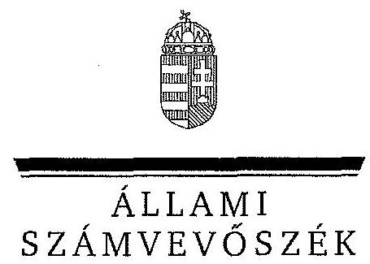

ÁLLAMI
SZÁMVEVŐSZÉK

# JELENTÉS 

a Nemzeti Család- és Szociálpolitikai Intézet ellenőrzése pénzügyi gazdálkodási helyzete és vagyongazdálkodása tekintetében címú ellenőrzésről

---

# Állami Számvevőszék 

Iktatószám: V-0121-335/2014.
Témaszám: 1156
Vizsgálat-azonosító szám: V-0623

## Az ellenőrzést felügyelte:

Holman Magdolna
felügyeleti vezető
Horváthné Herbáth Márta
felügyeleti vezető

## Az ellenőrzést vezette:

Solymár Ágnes
ellenőrzésvezető
Nemesvári-Horthy Eszter
ellenőrzésvezető
Az összefoglaló jelentést készítette:
Nemesvári-Horthy Eszter
ellenőrzésvezető
A számvevői jelentések feldolgozásában és a jelentés összeállításában közreműködtek:

Kulcsár Lászlóné
számvevő
Vértényi Gábor Jenő
számvevő
Az ellenőrzést végezték:

| Fekete Gábor | Fekete Mária | Kulcsár Lászlóné |
| :-- | :-- | :-- |
| számvevő tanácsos | számvevő | számvevő |
| Nemesvári-Horthy | Rábai György |  |
| Eszter | számvevő |  |
| számvevő |  |  |

---

# TARTALOMJEGYZÉK 

BEVEZETÉS ..... 11
I. ÖSSZEGZŐ MEGÁLLAPÍTÁSOK, KÖVETKEZTETÉSEK, JAVASLATOK ..... 14
II. RÉSZLETES MEGÁLLAPÍTÁSOK ..... 23

1. Az irányító szerv feladatellátása, az intézmény szervezeti működésre vonatkozó szabályozottsága ..... 23
1.1. Az irányító szerv alapítói jogainak gyakorlása ..... 23
1.2. Az egyéb irányítási jogok gyakorlása ..... 24
1.3. Az intézmény szervezeti működésére vonatkozó szabályozás ..... 25
2. Az intézmény szakmai feladatellátása a 2010-2012. évek között ..... 25
2.1. A szakmai feladatellátás ..... 26
2.2. A szakmai feladatellátás szabályossága kiemelt területenként ..... 30
2.3. Hazai pályázatkezelési tevékenység ..... 36
2.4. A szakmai feladatellátás intézményi ellenőrzése ..... 39
3. Az intézményi átszervezések szabályossága és az ágazati stratégiával való összhangja ..... 40
4. Az intézmény belső kontrollrendszere ..... 42
4.1. Az intézmény kontrollkörnyezete, kockázatkezelése ..... 42
4.2. A kontrolltevékenységek, az információs, kommunikációs és monitoring rendszer kialakítása és működtetése ..... 43
5. Az intézmény pénzügyi gazdálkodása ..... 45
5.1. A bevételek és kiadások összhangja a feladatellátással ..... 45
5.2. A pénzforgalom szabályossága ..... 47
5.3. A pénzügyi stabilitás biztosítása ..... 47
6. Az intézmény vagyongazdálkodása ..... 49
6.1. A vagyongazdálkodás szabályozottsága ..... 49
6.2. A vagyongazdálkodás folytatásának szabályszerűsége ..... 50
6.3. A vagyonelemek nyilvántartásának szabályszerűsége ..... 50
6.4. A vagyon összetételének alakulása ..... 51
7. A külső ellenőrzések javaslatainak hasznosulása ..... 53
7.1. Intézkedések a külső ellenőrzések javaslataira ..... 53
7.2. A külső ellenőrzések javaslatainak megvalósítása ..... 54

---

# MELLÉKLETEK 

1. számú A Nemzeti Család- és Szociálpolitikai Intézet alaptevékenységei a 2010-2012 közötti időszakban
2. számú A Nemzeti Család- és Szociálpolitikai Intézet közfeladatai a 2010-2012 közötti időszakban
3. számú A Nemzeti Család- és Szociálpolitikai Intézet kiadásai és bevételei a 2008-2012 közötti időszakban
4. számú A Nemzeti Család- és Szociálpolitikai Intézet könyvviteli mérlegének adatai a 2008-2012. években
5. számú Az Emberi Erőforrások Minisztériumának észrevétele
6. számú Az Emberi Erőforrások Minisztériumának észrevételére adott válasz
7. számú A Nemzeti Család- és Szociálpolitikai Intézet főigazgatójának észrevétele
8. számú A Nemzeti Család- és Szociálpolitikai Intézet főigazgatójának észrevételére adott válasz

---

# RÖVIDÍTÉSEK JEGYZÉKE 

## Törvények

ÁSZ tv.
Áht. 1
Áht. 2
Btk.
Gyvt.
Info tv.
Ket.
$\mathrm{Kbt}_{.1}$
$\mathrm{Kbt}_{.2}$
Kjt.
Nvtv.
Ptk.
Szja. tv.
Számv tv.
Vtv.

## Rendeletek

Áhsz.

Ámr. 1

Ámr. 2
Ávr.
2011. évi LXVI. törvény az Állami Számvevőszékről
1992. évi XXXVIII. törvény az államháztartásról (hatályos 2011. XII. 31-ig)
2011. évi CXCV. törvény az államháztartásról (hatályos 2012. I. 1-jétől)
1978. évi IV. törvény a Büntető Törvénykönyvről (hatálytalan 2013. VII. 1-jétől)
1997. évi XXXI. törvény a gyermekek védelméről és a gyámügyi igazgatásról
2011. évi CXII. törvény az információs önrendelkezési jogról és az információszabadságról
2004. évi CXL. törvény a közigazgatási hatósági eljárás és szolgáltatás általános szabályairól
2003. évi CXXIX. törvény a közbeszerzésekről (hatálytalan 2012. I. 1-jétől)
2011. évi CVIII. törvény a közbeszerzésekről (hatályos 2012. I. 1-jétől)
1992. évi XXXIII. törvény a közalkalmazottak jogállásáról
2011. évi CXCVI. törvény a nemzeti vagyonról
1959. évi IV. törvény a Polgári Törvénykönyvről (hatálytalan 2014. III. 15-től)
1995. évi CXVII. törvény a személyi jövedelemadóról
2000. évi C. törvény a számvitelről
2007. évi CVI. törvény az állami vagyonról
249/2000. (XII. 24.) Korm. rendelet az államháztartás szervezetei beszámolási és könyvvezetési kötelezettségének sajátosságairól
217/1998. (XII. 30.) Korm. rendelet az államháztartás működési rendjéről (hatályos 2009. XII. 31-ig)
292/2009. (XII. 19.) Korm. rendelet az államháztartás működési rendjéről (hatályos 2011. XII. 31-ig)
368/2011. (XII. 31.) Korm. rendelet az államháztartásról szóló törvény végrehajtásáról (hatályos 2012. I. 1-jétől)

---

Ber.

Bkr.

Vtv. Vhr.
127/2002. (V. 20.) Korm. rendelet
259/2002. (XII. 18.) Korm. rendelet

170/2006. (VII. 28.) Korm. rendelet
292/2006. (XII. 23.) Korm. rendelet
331/2006. (XII. 23.) Korm. rendelet

212/2010. (VII. 1.) Korm. rendelet

315/2010. (XII. 27.) Korm. rendelet
347/2010. (XII. 28.) Korm. rendelet

355/2010. (XII. 30.) Korm. rendelet

305/2012. (X. 29.) Korm. rendelet

15/1998. (IV. 30.) NM rendelet

2/1999. (IX. 24.) ISM rendelet

8/2000. (VIII. 4.) SzCsM rendelet

193/2003. (XI. 26.) Korm. rendelet a költségvetési szervek belső ellenőrzéséről (hatályos 2011. XII. 31-ig)
370/2011. (XII. 31.) Korm. rendelet a költségvetési szervek belső kontrollrendszeréről és belső ellenőrzéséről (hatályos 2012. I. 1-től)
254/2007. (X. 4.) Korm. rendelet az állami vagyonnal való gazdálkodásról
az örökbefogadást elősegítő magánszervezetek tevékenységéről és működésük engedélyezéséről a gyermekjóléti és gyermekvédelmi szolgáltatótevékenység engedélyezéséről, valamint a gyermekjóléti és gyermekvédelmi vállalkozói engedélyről (hatálytalan 2013. XII. 1-jétől.)
a szociális és munkaügyi miniszter feladat- és hatásköréről (hatálytalan 2010. VII. 1-jétől)
a Nemzeti Szakképzési és Felnőttképzési Intézetről (hatálytalan 2012. I. 1-jétől)
a gyermekvédelmi és gyámügyi feladat- és hatáskörök ellátásáról, valamint a gyámhatóság szervezetéről és illetékességéről
az egyes miniszterek, valamint a Miniszterelnökséget vezető államtitkár feladat- és hatásköréről (hatályos 2010. VII. 1-jétől)
a Nemzeti Foglalkoztatási Szolgálatról (hatálytalan 2012. I. 1-jétől)
a Magyar Állam nevében tulajdonosi jogokat gyakorló szervezetek rábízott állami vagyonnal kapcsolatos éves beszámoló készítési és könyvvezetési kötelezettségéről
a Nemzeti Család- és Szociálpolitikai Intézet feladatainak megállapításával összefüggő egyes kormányrendeletek módosításáról (hatálytalan 2011. I. 2-től)
a Közigazgatási és Igazságügyi Hivatalról szóló 177/2012. (VII. 26.) Korm. rendelet, valamint az egyes miniszterek, valamint a Miniszterelnökséget vezető államtitkár feladat- és hatásköréről szóló 212/2010. (VII. 1.) Korm. rendelet módosításáról (hatálytalan 2012. X. 31-től)
a személyes gondoskodást nyújtó gyermekjóléti, gyermekvédelmi intézmények, valamint személyek szakmai feladatairól és működésük feltételeiről
a Gyermek és Ifjúsági Alapprogram és a Regionális Ifjúsági Irodák működéséről
a személyes gondoskodást végző személyek adatainak működési nyilvántartásáról

---

9/2000. (VIII. 4.) SzCsM rendelet
81/2004. (IX. 18.) ESzCsM rendelet
3/2008. (VI. 15.) SZMM rendelet

42/2008. (XI. 14.) EüM-SZMM együttes rendelet

24/2010. (XII. 30.) NEFMI rendelet

54/2011. (IX. 1.) NEFMI rendelet

34/2012. (X. 17.) EMMI rendelet

## Utasítások

23/2011. (IX. 2.) NEFMI utasítás

15/2012. (XI. 13.) EMMI utasítás

## Egyéb rövidítések

ÁSZ
irányító szerv

EMMI
ESZA Nonprofit Kft.
M Ft
NCSSZI (intézmény)
NDI
a személyes gondoskodást végző személyek továbbképzéséről és a szociális szakvizsgáról az egyes szociális szolgáltatásokat végzők képzéséről és vizsgakövetelményeiről
a szociális módszertani intézmények kijelöléséről és feladatairól, valamint a szociális szolgáltatók, intézmények engedélyezési eljárásának szakértői díjáról
(hatálytalan 2013. VIII. 1-jétől)
a kábítószer-függőséget gyógyító kezelés, kábító-szer-használatot kezelő más ellátás vagy megelőző-felvilágosító szolgáltatás szabályairól a Nemzeti Család- és Szociálpolitikai Intézet feladatainak megállapításával összefüggő egyes miniszteri rendeletek módosításáról (hatálytalan 2011. I. 2-től)
a XX. Nemzeti Erőforrás Minisztérium költségvetési fejezethez tartozó fejezeti kezelésű előirányzatok 2011. évi felhasználásának szabályairól (hatálytalan 2012. X. 20-tól)
a XX. Emberi Erőforrások Minisztériuma költségvetési fejezethez tartozó fejezeti kezelésű előirányzatok 2012. évi felhasználásának szabályairól (hatálytalan 2013. XII. 31-től)
a Nemzeti Erőforrás Minisztérium fejezeti kezelésű előirányzatainak gazdálkodási, kötelezettségvállalási és utalványozási szabályzatáról (hatálytalan 2012. XI. 15-től)
az Emberi Erőforrások Minisztériuma fejezeti kezelésű előirányzatainak gazdálkodási, kötelezettségvállalási és utalványozási szabályzatáról

Állami Számvevőszék
2010. május 28-ig Szociális és Munkaügyi Minisztérium, 2012. május 13-ig Nemzeti Erőforrás Minisztérium és 2012. május 14-től Emberi Erőforrások Minisztériuma
Emberi Erőforrások Minisztériuma
ESZA Társadalmi Szolgáltató Nonprofit Kft. millió forint
Nemzeti Család- és Szociálpolitikai Intézet (2011-ig Szociálpolitikai és Munkaügyi Intézet) Nemzeti Drogmegelőzési Iroda

---

Nemzeti Drogstratégia

NEFMI
NSZFI
NFÜ
OKIT
OGYSZB
SZMM
SZMSZ
TÁMOP
„Nemzeti Stratégia a kábítószer-probléma kezelésére 2010-2018"
106/2009. (XII. 21.) OGY határozat a kábítószer-probléma kezelése érdekében készített nemzeti stratégiai programról 1. sz. melléklete
Nemzeti Erőforrás Minisztérium
Nemzeti Szakképzési és Felnőttképzési Intézet
Nemzeti Fejlesztési Ügynökség
Országos Kríziskezelő és Információs Telefonszolgálat
Országos Gyermekvédelmi Szakértői Bizottság
Szociális és Munkaügyi Minisztérium
Szervezeti és Működési Szabályzat
Társadalmi Megújulás Operatív Program

---

# ÉRTELMEZŐ SZÓTÁR 

alapítói jogok
alaptevékenység
belső kontrollrendszer
A költségvetési szerv alapítása, átalakítása, megszüntetése, ennek keretében a költségvetési szerv alapító és megszüntető okiratának kiadása, módosítása, szervezeti és működési szabályzatának jóváhagyása (Áht., 93. § (1) bekezdés a) pont, Áht. 9 . § (1) bekezdés a) pont, 2008. évi CV. tv. 8. § (2) bekezdés a) pont).
Az a tevékenység, amelyet a költségvetési szerv létrehozásáról rendelkező jogszabályban, alapító okiratában szakmai alapfeladataként meghatároztak, ideértve a szabad kapacitások hasznosítására irányuló, nem haszonszerzési céllal végzett tevékenységet is.
A belső kontrollrendszer a kockázatok kezelése és tárgyilagos bizonyosság megszerzése érdekében kialakított folyamatrendszer, amely azt a célt szolgálja, hogy megvalósuljanak a következő célok:
a működés és gazdálkodás során a tevékenységeket szabályszerűen, gazdaságosan, hatékonyan, eredményesen hajtsák végre,
az elszámolási kötelezettségeket teljesítsék,
megvédjék az erőforrásokat a veszteségektől, károktól és a nem rendeltetésszerű használattól.
(Áht. 2 69. § (1) bekezdés)
A belső kontrollrendszer összetevői:
kontrollkörnyezet
kockázatkezelési rendszer
kontrolltevékenységek
információs és kommunikációs rendszer
nyomon követési rendszer (monitoring)
(Bkr. 3. §-a alapján)
bonyolító szerv
A fejezetet irányító szerv által a költségvetési támogatásokkal kapcsolatos feladatok ellátásával kapcsolatban megbízott szerv. A lebonyolító szervvel a lebonyolítás céljából átadott összeg felett kötelezettségvállalási jogot gyakorló személy megállapodást köt. A megállapodásban rögzíteni kell a kötelezettségek megtartását biztosító feltételeket, így különösen a feladat konkrét meghatározását, a felhasználás határidejét, valamint az elszámolással kapcsolatos szabályokat. (Áht. 49. § (1) bek. és Ávr. 75. § (1) bek.-ből levezetett fogalom)
ellenjegyzés
Annak igazolása, hogy a kötelezettségvállalás vagy utalványozás teljesítéséhez szükséges fedezet rendelkezésre áll, és nem sérti a gazdálkodásra vonatkozó szabályokat.
ellenőrzési nyomvonal
Az ellenőrzési nyomvonal a költségvetési szerv működési folyamatainak szöveges, táblázatokkal vagy folyamatábrákkal szemléltetett leírása, amely tartalmazza különö-

---

előirányzat-elvonás
előirányzat-módosítás
elterelés
érvényesítés
intézkedési terv
irányító szerv
kezelő szerv
kockázatkezelési rendszer
sen a felelősségi és információs szinteket és kapcsolatokat, irányítási és ellenőrzési folyamatokat, lehetővé téve azok nyomon követését és utólagos ellenőrzését. (Bkr. 6. § (3) bekezdés)

A kiadási előirányzatok felhasználásának végleges korlátozása, az előirányzatok feltétel nélküli csökkentése.
A megállapított kiadási előirányzat növelése vagy csökkentése, a bevételi előirányzatok egyidejű növelése vagy csökkentése mellett.
A kábítószerrel való visszaéléssel gyanúsítottak esetében a büntetőeljárás rendes menetétől való elterelést jelenti, ami háromféle eljárás keretében történhet: kábítószerfüggőséget gyógyító kezelés, kábítószer-használatot kezelő más ellátás vagy a megelőző-felvilágosító szolgáltatás igénybevétele.
(2003. évi II. törvény indokolása, 42/2008. (XI. 14.) EüMSZMM együttes rendelet alapján)
A kiadás teljesítése, bevétel beszedése előtt azok jogosultságának, összegszerűségének, előírt alaki követelményeknek való megfelelésének, továbbá a szükséges fedezet meglétének igazolása.
Az ellenőrzési javaslatok alapján az ellenőrzött szervezet, szervezeti egység által készített intézkedések végrehajtásának ütemezése a végrehajtásáért felelős személyek és a vonatkozó határidők megjelölésével.
(Bkr. 2. § k) pontja)
A központi alrendszer egyes intézményével és annak gazdálkodásával kapcsolatos irányítási jogokkal felruházott szerv vagy személy.
A központi kezelésű előirányzat és a fejezeti kezelésű előirányzat kezelő szerve a kezelt központi kezelésű előirányzatok és fejezeti kezelésű előirányzatok tekintetében a tervezéssel, gazdálkodással, finanszírozással, adatszolgáltatással és beszámolással kapcsolatos feladatokat a gazdasági szervezetivel vagy ezekkel a feladatokkal a szervezeti és működési szabályzatában kijelölt más szervezeti egységével látja el. (Ávr. 9. § (6) bekezdése)
A kockázatkezelési rendszer olyan irányítási eszközök és módszerek összessége, melynek elemei a szervezeti célok elérését veszélyeztető tényezők (kockázatok) azonosítása, elemzése, csoportosítása, nyomon követése, valamint szükség esetén a kockázati kitettség mérséklése. A költségvetési szerv vezetője köteles kockázatkezelési rendszert működtetni.
Ennek keretében fel kell mérni és meg kell állapítani a költségvetési szerv tevékenységében, gazdálkodásában rejlő kockázatokat, valamint meg kell határozni az egyes kockázatokkal kapcsolatban szükséges intézkedéseket, valamint azok teljesítésének folyamatos nyomon követé-

---

kontrollkörnyezet
kontrolltevékenységek
kötelezettségvállalás
közfeladat
megelőző-felvilágosító szolgáltatás
monitoring rendszer
szakmai teljesítésigazolás
sének módját.
(Bkr. 2.
 §. m) pontja és 7. §-a alapján)
A kontrollkörnyezet meghatározza a szervezet működésének jellegét, az etikai értékeket, a szervezet tagjainak szakértelmét, a vezetés filozófiáját, vezetési stílusát és annak módját. Magában foglalja:
a világos szervezeti struktúra kiépítését (a szervezet bonyolultságát és területi (földrajzi) tagoltságát);
a belső szabályzatok kialakítását;
egyértelmű felelősségi és hatásköri viszonyok és feladatok meghatározását (azokat az eszközöket és módokat, amelyek által a vezetés figyelemmel kíséri a belső kontrollrendszer működését: monitoring, belső ellenőrzés, beszámoltatás);
az etikai elvárások meghatározását a szervezet minden szintjén (a felső vezetés kockázatkezelő képességét, más szervezetekkel való kapcsolatát).
(Bkr. 6. §-a alapján)
A költségvetési szerv vezetője köteles a szervezeten belül kontrolltevékenységeket kialakítani, melyek biztosítják a kockázatok kezelését, hozzájárulnak a szervezet céljainak eléréséhez.
A kontrolltevékenység részeként minden tevékenységre vonatkozóan biztosítani kell a folyamatba épített, előzetes, utólagos és vezetői ellenőrzést.
(Bkr. 8. §-a alapján)
A kiadási előirányzatok terhére fizetési kötelezettség vállalásáról szóló, szabályszerűen megtett jognyilatkozat.
Jogszabályban meghatározott állami vagy önkormányzati feladat, amit az arra kötelezett közérdekből, haszonszerzési cél nélkül, jogszabályban meghatározott követelményeknek és feltételeknek megfelelve végez.
A megelőző-felvilágosító szolgáltatás alkalmi szerhasználók számára biztosított olyan javallott (indikált) prevenciós beavatkozás, melyet a büntetőeljárás alternatívájaként az eljáró hatóság (rendőrség, bíróság, ügyészség) ajánl fel. A megelőző-felvilágosító szolgáltatás szabályait a 42/2008. (XI. 14.) EüM-SZMM együttes rendelet határozza meg.
(Szabályozás a célzott és indikált prevenció területén II. Módszertani levél megelőző-felvilágosító szolgáltatók számára, 2011.)
A monitoring rendszer értékeli a belső kontrollok időbeli működését, feltárja a hiányosságokat, és biztosítja, hogy azokról a felső vezetés a szükséges intézkedések megtétele érdekében tudomást szerezzen.
A szakmai teljesítés megtörténtének igazolása.

---

utalványozás
zárolás
zárolás feloldása

A kiadás teljesítésének, bevétel beszedésének vagy elszámolásának elrendelése.
A kiadási előirányzatok felhasználásának időlegesen, feltételhez kötötten történő korlátozása, felfüggesztése. (Áht. 2. § (1) bek. s) pontja)
A kiadási előirányzatok felhasználásának időleges, feltételhez kötött korlátozásának, felfüggesztésének megszüntetése.

---

# JELENTÉS 

## a Nemzeti Család- és Szociálpolitikai Intézet ellenőrzése pénzügyi gazdálkodási helyzete és vagyongazdálkodása tekintetében címú ellenőrzésről

## BEVEZETÉS

A Nemzeti Család- és Szociálpolitikai Intézet (NCSSZI, intézmény) a szociális ágazat szakmai irányításának támogatásával megbízott szervezet, amely feladatait alapvetően közpénzek felhasználásával látja el. Az intézmény a központi költségvetés XX. fejezet 19. Nemzeti Család- és Szociálpolitikai Intézet címe ${ }^{1}$ alatt szerepel, önállóan működő és gazdálkodó költségvetési szerv. Vagyonkezelésébe, tulajdonosi jogkörébe a 2008-2012 közötti ellenőrzött időszakban gazdálkodó szerv nem tartozott.

A Nemzeti Család- és Szociálpolitikai Intézetet a Szociális és Családügyi Minisztérium 2000. május 1-jén alapította. Az ellenőrzött időszakban a 2008-2010. évek között Szociálpolitikai és Munkaügyi Intézet néven működött, majd a 2011. január 1-jétől bekövetkezett névváltozással újra alapításkori nevén végzi feladatait.

Irányító szerve 2008-2010. május 28-ig a Szociális és Munkaügyi Minisztérium (SZMM) volt, 2012. május 14-ig a Nemzeti Erőforrás Minisztérium (NEFMI), ezt követően az Emberi Erőforrások Minisztériuma (EMMI). Az intézmény az ellenőrzött időszakban ellátta irányító szerve szociálpolitikai, családpolitikai, gyermekvédelmi, esélyegyenlőségi, ifjúság- és drogpolitikai irányítási és szakmapolitikai munkájának támogatását. Működése kiterjedt a tudományos kutatás, a módszertani fejlesztés és szolgáltatás, a statisztikai és információs szolgáltatások körére, valamint a közfeladatait érintő fejlesztési programok előkészítésére és lebonyolítására. Az NCSSZI közfeladatait és alaptevékenységeit a 2010-2012 közötti időszakra vonatkozóan az 1. és 2. sz. mellékletek mutatják be.

Az intézmény tevékenységi köre 2008-2012 között több ízben módosult. 2011. január 1-jétől a Nemzeti Szakképzési és Felnőttképzési Intézettől (NSZFI) átvette a szociális oktatási és továbbképzési feladatokat, illetve a Salgótarjáni Képzésszervezési Központot. 2011. január 1-jétől a Foglalkoztatási Hivataltól átvette a Mobilitás Országos Ifjúsági Szolgálatot, majd 2011. szeptember 1-jétől a Foglalkoztatási Hivatal részére átadta a Munkaügyi Igazgatóságot. Az intézmény feladatai 2011-től kiegészültek a Gyermek és Ifjúsági Alapprogram pályázatainak kezelésével. A Mobilitás Országos Ifjúsági Szolgálatot 2012. november 1-

[^0]
[^0]:    ${ }^{1}$ a 2008-2010. években XXVI. fejezet 0800. cím

---

jétől - a Fiatalok Lendületben Programiroda kivételével - a Közigazgatási és Igazságügyi Minisztérium irányítása alatt álló Közigazgatási és Igazságügyi Hivatalnak adta tovább.

Az intézmény teljesített kiadása - a feladatok átszervezésével, bővülésével - a 2008. évi 1280,1 M Ft-ról 2012-re 105,4%-kal, 2629,2 M Ft-ra, mérlegfőösszege 894,7 M Ft-ról - közel 159%-kal - 2315,8 M Ft-ra emelkedett. Engedélyezett létszáma a 2008. évi 135 főről 2012-re 173 főre növekedett. Az intézmény bevételeinek és kiadásainak alakulását és mérlegadatait a 2008-2012. évekre a 3. és 4. sz. mellékletek mutatják be.

Jelen ellenőrzést indokolta az NCSSZI szociálpolitikai intézményrendszerben betöltött szerepe, az intézmény növekvő közpénzfelhasználása, a kezelt állami vagyon, valamint az, hogy irányító szerve és feladatköre a 2008-2012 közötti időszakban többször változott. A szociális ágazatban szakmai irányító közfeladatokat ellátó intézmény gazdálkodását, feladatellátását az ÁSZ célzottan még nem ellenőrizte.

Az ellenőrzés célja annak megállapítása volt, hogy az intézmény a rábízott közpénzekkel és állami vagyonnal felelősen, a szabályok betartásával gazdálkodott-e, az ellenőrzött időszakban végrehajtott átszervezések és szakmai feladatainak ellátása szabályszerű volt-e, belső kontrollrendszere a vonatkozó előírásoknak megfelelően működött-e. Az ellenőrzés célja volt továbbá annak megállapítása, hogy az irányító szerv intézményre vonatkozó irányítási tevékenysége megfelelte a jogszabályi előírásoknak, az intézmény közfeladatellátása, annak változása szabályos volt-e.

# Az ellenőrzés keretében értékeltük, hogy: 

- az irányító szerv intézményre vonatkozó feladatellátása, valamint az intézmény szervezete és a működés szabályozása összhangban volt-e az alapító okiratban rögzített feladatokkal és a vonatkozó jogszabályi előírásokkal;
- az intézmény szakmai feladatellátása megfelelt-e az ágazati és intézményi céloknak, valamint a vonatkozó jogszabályi előírásoknak;
- az intézmény ellenőrzött időszakban végrehajtott átszervezése, feladatainak változása megalapozott, szabályszerű és átlátható volt-e;
- az intézmény belső kontrollrendszere - kiemelten a belső ellenőrzési rendszere - szabályszerűen működött-e, hasznosultak-e a belső ellenőrzés megállapításai;
- az intézmény pénzügyi gazdálkodása az irányadó jogszabályoknak megfelelt-e, a pénzügyi stabilitása biztosított volt-e;
- az intézmény vagyongazdálkodása szabályszerű volt-e, a vagyon értékének és összetételének változása jogszerű döntésekkel alátámasztott volt-e;
- az intézménynél a korábbi években lefolytatott külső ellenőrzések pénzügyi és vagyongazdálkodást javító szabályszerűségi javaslatai hasznosultak-e.

---

Az ellenőrzést a számvevőszéki ellenőrzés szakmai szabályai szerint és a nemzetközi standardok figyelembe vételével végeztük. A megállapítások megalapozásához felhasználtuk az ellenőrzött szervezettől bekért dokumentumokat, az általa készített tanúsítványokat és nyilatkozatokat. A pénzügyi gazdálkodás szabályszerűségét a pénzforgalmi adatokból egyszerű véletlen mintavétellel kiválasztott tételek alapján értékeltük.

A szakmai feladatellátás szabályszerűségét az egyes tevékenységek ellátására megkötött szerződések, megbízások és azok pénzügyi teljesítésének alapjául szolgáló főkönyvi számlák adatbázisából egyszerű véletlen mintavétellel kiválasztott tételek alapján értékeltük.

Jelen ellenőrzés az intézmény feladatellátása, pénzügyi és vagyongazdálkodása erősségeinek és gyengeségeinek feltárásához, szabályozottsága szintjének emeléséhez kívánt hozzájárulni.

Az ellenőrzés típusa: szabályszerűségi ellenőrzés.
Az ellenőrzés alá vont időszak: a szakmai feladatok ellátásának szabályszerűségi ellenőrzése a 2010 és 2012 közötti időszakra, az egyéb programpontok tekintetében az ellenőrzés a 2008. január 1-jétől 2012. december 31-ig tartó időszakra terjedt ki.

A helyszíni ellenőrzésre a Nemzeti Család- és Szociálpolitikai Intézetnél, az irányító szerv intézményre vonatkozó tevékenységének megítéléséhez az EMMInél került sor.

Az ellenőrzés lefolytatásának jogalapját az ÁSZ törvény 1. § (3) bekezdése és az 5. § (2)-(6) bekezdéseinek előírásai képezték.

Az ÁSZ a 2011. évi LXVI. törvény 29. §-a szerint a jelentéstervezetet megküldte az emberi erőforrások miniszterének és a Nemzeti Család- és Szociálpolitikai Intézet főigazgatójának. A beérkezett észrevételeket és az azokra adott válaszokat a jelentés 5 - 8. számú mellékletei tartalmazzák.

---

# 1. ÖSSZEGZŐ MEGÁLLAPÍTÁSOK, KÖVETKEZTETÉSEK, JAVASLATOK 

A Nemzeti Család- és Szociálpolitikai Intézet működését, a tevékenységei ellátásához kapcsolódó feladat-, hatás- és jogköröket mind az irányító szerv, mind az intézmény tekintetében törvények, kormányrendeletek és ágazati miniszteri rendeletek, illetve közjogi szervezetszabályozó eszközök - az Országos Gyermekvédelmi Szakértői Bizottság működtetésével kapcsolatos feladat kivételével - rögzítették. Az Országos Gyermekvédelmi Szakértői Bizottság működtetésével kapcsolatos feladat csak az alapító okiratban jelent meg, a részletes eljárásrendi szabályokat tartalmazó ágazati rendeletben ${ }^{2}$ nem nevesítették az intézményt a feladat ellátójaként.

Az intézmény irányító szerveként kijelölt minisztériumok (SZMM, NEFMI, EMMI) alapítói és egyéb irányítói jogosultságainak ellátása részben felelt meg a jogszabályi előírásoknak. Az alapítói jogosultság gyakorlása tekintetében a miniszterek a jogszabályi előírások hatályba lépését követően jelentős, esetenként több száz napos késedelemmel adták ki az intézmény módosított alapító okiratát, illetve hagyták jóvá az SZMSZ-t. Az intézmény vezetőjére és a gazdasági vezetőre vonatkozó munkáltatói jogok gyakorlása megfelelt az Áht. ${ }_{1,2}$ előírásainak. Az irányító szervek nem rögzítettek a közfeladatok ellátásához és az erőforrásokkal való hatékony gazdálkodáshoz az intézménnyel szemben számon kérhető követelményeket, elvárásokat. Ez korlátozta a követelmények érvényesítésére, számonkérésére és ellenőrzésére vonatkozó - az Áht. ${ }_{1} 49 . \S$ (5) bekezdés f) pontja, illetve az Áht. ${ }_{2} 9 . \S$ (1) bekezdés f) pontjában rögzített hatáskörük gyakorlását. Az ellenőrzési jogkört az ellenőrzött időszakban csak az SZMM gyakorolta a 2007. és 2008. évi elemi költségvetési beszámolók megbízhatósági ellenőrzésével. A 2010-2012. években a NEFMI, illetve az EMMI részéről ellenőrzésre nem került sor. Az intézmény vezetőjének beszámoltatása az éves szakmai feladatellátásról és gazdálkodásról - az Áht. ${ }_{1,2}$ előírásainak eleget téve - megtörtént.

Az intézmény feladatai az ellenőrzött időszakban lényegesen változtak, a feladatkörök bővülése (módszertani, szakirányítási feladatok; hazai pályázatkezelési feladatok) és egyéb szervezetek (Salgótarjáni Képzési Központ; Fiatalok Lendületben Programiroda) feladatainak átvétele, átadása miatt. Az ellenőrzött időszakban a 2011. és 2012. években négy alkalommal történt feladatátadás, illetve -átvétel. A feladat átadás-átvételekkel járó átszervezéseket jogszabályi előírások alapozták meg, azok az ágazati stratégiákkal (Nemzeti Ifjúsági Stratégia, Nemzeti Drogstratégia) összhangban álltak. Az átszervezések átláthatóak és alapvetően szabályszerűek voltak. Az irányító szerv az intézmény átszervezését megelőzően minden esetben gondoskodott az átadott, illetve átvett feladatok ellátásának előírásáról, a kapcsolódó vagyon- és forrásátcsoportosításról. Emellett meghatározta a foglalkoztatottakkal kapcsolatos munkáltatói intézkedések határidejét, és döntött az átadott közfeladatokat vég-

[^0]
[^0]:    ${ }^{2} 15/1998$. (IV. 30.) NM rendelet

---

ző alkalmazottaknak az átvevő szervnél történő továbbfoglalkoztatásáról. A feladatváltozásokról szóló jogszabályok a kihirdetést követő néhány napon belül hatályba léptek. Az átadó és átvevő intézmény közötti egyeztetések miatt 2011-ben az átadás-átvételekről szóló jegyzőkönyvek több hónapos késedelemmel készültek el, ami azonban a feladatellátásban nem okozott fennakadást.

Az NCSSZI az alapító okiratban rögzített szakmai feladatait ellátta. A stratégiaalkotási, módszertani és képzésszervezési feladatok ellátása szabályszerű, az ágazati és intézményi célkitűzéseknek megfelelő volt. A stratégiaalkotási tevékenysége és feladatellátása során közreműködött a nemzeti ifjúságpolitikai, a nemzeti családpolitikai, a nemzeti drogstratégia, valamint a családon belüli erőszak megelőzésére és hatékony kezelésére irányuló nemzeti stratégia kialakításában. A módszertani és fejlesztési feladatok ellátását az intézmény uniós (TÁMOP) támogatásból, szociális és ifjúságpolitikai tevékenységek kedvezményezettjeként szabályszerűen végezte.

Az intézmény kutatási tevékenységét a gyermek- és ifjúságkutatás és a családpolitika területén végezte. A kutatási tevékenységhez kapcsolódó szerződéskötések során az ellenőrzés kisebb formai hiányosságot tárt fel.

Az intézmény a 2011. és 2012. években közreműködött hazai szervezetek pályázati úton történő támogatásának lebonyolítójaként, illetve pályázatkezelőként. Ennek keretében
 1138,7 M Ft támogatás kedvezményezettekhez juttatásában működött közre. A pályáztatási tevékenység azonban nem minden tekintetben felelt meg a jogszabályi előírásoknak. A pályázati támogatások odaítélése során nem tartották be maradéktalanul a pályázati kiírásokban meghatározott határidőket. A Gyermek és Ifjúsági Alapprogram kezelőjeként az intézmény nem az Ámr. ${ }_{2}$ és az Ávr. szerinti utalványrendeletet használta ${ }^{3}$, ezért bár a szakmai teljesítésigazolás és az ellenjegyzés szabályosan megtörtént, az Ávr. előírásai szerinti aláírásokat az utalványrendeletek teljes körűen nem tartalmazták. Az intézmény a pályázatnyilvántartó rendszerében előállított, a támogatásokkal való elszámolást elfogadó, értesítő leveleket - az Ávr. előírása ellenére - 2012-ben nem küldte meg a pályázók részére ${ }^{4}$.

Az intézmény uniós (TÁMOP) támogatásból szociális és ifjúságpolitikai tevékenységek kedvezményezettjeként módszertani és fejlesztési feladatok ellátását végezte, szabályos szerződések alapján.

A kábítószer-használatot megelőző-felvilágosító szolgáltatás feladat megvalósítása során az ellenőrzés hiányosságokat, szabálytalanságokat tárt fel. Az intézmény a kábítószer-használatot megelőző-felvilágosító szolgáltatással kapcsolatos szakmai koordinációs, ellenőrzési és értékelési feladat ellátására vonatkozóan az alapító okiratában és az SZMSZ-ében kapott felhatalmazást. Ezen túlmenően a szociális és munkaügyi miniszter által a kábítószerhasználatot megelőző-felvilágosító szolgáltatás végzésére kiírt pályázatban az

[^0]
[^0]:    ${ }^{3}$ A helyszíni ellenőrzés időszakában már az Ávr. előírásainak megfelelő utalványrendeleteket használták.
    ${ }^{4}$ Az értesítő levelek kiküldéséről a későbbiekben intézkedtek.

---

NCSSZI-t, annak szervezeti egységét a Nemzeti Drogmegelőzési Irodát jelölte ki közreműködő szervezetként.

Az intézmény részére irányító szerve a kábítószer-használatot megelőző-felvilágosító szolgáltatás végzéséhez az ellenőrzött időszakban egyedi támogatást nyújtott. A főigazgató által 2011. december 6-án a többletfeladatok, míg 2012. július 30-án a 2012. II-IV. negyedévi feladatok finanszírozására benyújtott támogatási kérelmek elbírálásánál a fejezeti kezelésű előirányzatok felhasználására vonatkozó jogszabályi előírások szerint járt el. A miniszter (EMMI) azonban nem tartotta be a fejezeti kezelésű előirányzatok felhasználására vonatkozó jogszabályban és a támogatási szerződésben is rögzített, a támogatásokkal való elszámolás megvizsgálására vonatkozó 60 napos határidőt. Az irányító szerv a szolgáltatók ellátási díjainak biztosítására a 2011. és 2012. években a támogatást év végén biztosította az NCSSZI részére. A 2012. évi támogatási szerződést 2012 decemberében kötötték meg, amely szerint az intézmény a támogatást 2012. április 1. - 2013. január 31. között használhatta fel. Az év végén biztosított források a feladat folyamatos elvégzésének bizonytalanságát és nem jogszabálykövető gyakorlat kialakulását eredményezték.

Az NCSSZI az ellenőrzött időszakban az elterelés megelőző-felvilágosító szolgáltatás keretében a pályázatokkal kapcsolatos hiánypótlások, a szerződéskötések és az ellenőrzési rendszer működtetése terén nem tartotta be a jogszabályi előírásokat. Az intézmény a kábítószer-használatot megelőző-felvilágosító szolgáltatás végzésére kiírt pályázatban közreműködő szervezetként - a pályázati felhívásban foglaltak ellenére - a pályázatot benyújtó azon szolgáltatókat, amelyek pályázati adatlapjukban a havi ellátotti létszám helyett éves ellátotti létszámot szerepeltettek, nem szólította fel hiánypótlásra. A 2012. évben a szolgáltatókkal határozott határidőre megkötött vállalkozási szerződéseket - a Ptk. előírásait megszegve - több hónappal megszűnésük után módosították. Az NCSSZI a 2012. április 1. és december 18. közötti időszakban a szolgáltatók jelentéseit befogadta, azonban írásbeli kötelezettséget fedezet hiányában nem vállalhatott. Az intézmény így nem tudott az Áht. ${ }_{2}$ előírásainak megfelelően eljárni. Az NCSSZI a 2012. évben a szolgáltatók tevékenységét és jelentéseik valóságtartalmát - az SZMSZ előírásaival és a pályázati felhívásban foglaltakkal ellentétben - a szerződéssel lefedett időszakban nem ellenőrizte.

Az NCSSZI az irányító szervvel kötött támogatási szerződésekben előírtaknak megfelelően elkülönített számviteli nyilvántartást vezetett a támogatásokról, azokról határidőben elszámolt. Az intézmény - a kábítószer-fogyasztás megelőzésével kapcsolatos feladatok fejezeti kezelésű előirányzat 2012. évi támogatási szerződése megkötésével összefüggésben - az Áht.,2, valamint az Ávr. kötelezettségvállalásra, pénzügyi ellenjegyzésre, a teljesítés igazolására, érvényesítésre és utalványozásra vonatkozó előírásait megsértette. A 2012. évben a II-IV. negyedévi forrás biztosítására szolgáló támogatási szerződés hatályba lépését megelőző nappal kötötte meg 50 szolgáltatóval a módosított vállalkozási szerződést, miközben a kötelezettségvállalásra még nem volt jogosultsága. A szakmai teljesítés igazolására a 2011. és a 2012. évben több szolgáltatónál annak ellenére sor került, hogy egyes szolgáltatók havonta több alkalommal túllépték a vállalkozási szerződés 5. és a pályázati adatlap 11. pontjában foglalt havi maximális ellátotti létszámot.

---

Az intézmény belső kontrollrendszere szabályozási hiányosságokkal működött az ellenőrzött időszakban. A belső kontrollrendszer öt pillére ${ }^{5}$ közül négy esetében - az információ és kommunikáció terület kivételével - jellemzőek voltak hiányosságok.

Az intézmény kontrollkörnyezete keretében az alapvető belső szabályzatokat elkészítették, és gondoskodtak azok aktualizálásáról (számviteli politika, pénzkezelési szabályzat, leltárkészítési és leltározási szabályzat, önköltségszámítási szabályzat, értékelési szabályzat, közbeszerzési szabályzat). Nem rendelkeztek - a Bkr. előírásaival ellentétben - az intézményre vonatkozó etikai elvárásokról. Nem tartalmazta az ellenőrzési nyomvonal a szakmai feladatellátáshoz kötődő felelősségi szinteket és kapcsolatokat, és nem határozták meg az intézmény számlarendjében a támogatások elszámolásának szabályait ${ }^{6}$.

Az ellenőrzött időszakban az intézmény vezetése - az Ámr. ${ }_{1,2}$ és a Bkr. előírásaival ellentétben - nem működtetett kockázatkezelési rendszert. Nem határozta meg, nem mérte fel, nem elemezte és nem kezelte a tevékenységével kapcsolatos kockázatokat, nem vizsgálta felül a kockázatkezelés folyamatát. Az intézményi kockázatkezelési szabályzat hiányos volt ${ }^{7}$, nem tartalmazta az egyes folyamatokban, részfolyamatokban megjelenő kritikus pontok és az intézményi tűréshatár meghatározását. A szabályzat nem tartalmazott továbbá kockázati térképet, diagonális mátrixot. A megnövekedett feladatok ellenére nem hoztak létre Kockázatkezelő Bizottságot.

A kontrolltevékenységek - a kábítószer-használatot megelőző-felvilágosító szolgáltatás területén feltárt hiányosságok kivételével - a gazdálkodási területen működtek. Az ellenőrzött időszakban az intézmény rendelkezett informatikai biztonsági szabályzattal, ugyanakkor az nem felelt meg az Info. tv.-ben foglalt adatbiztonsági követelményeknek. Az ellenőrzött időszakban nem állt rendelkezésre dokumentált eljárásrend sem a hozzáférési jogosultságokról, sem az adatgazdai rendszerről ${ }^{8}$.

Az intézmény - az Ámr. ${ }_{1,2}$-ben és a Bkr.-ben előírtaknak megfelelően - kialakította és működtette információs és kommunikációs rendszerét, ugyanakkor a 2009. évben kisebb mértékű hiányosság volt a rendszer kialakításánál, hogy az ügyrendben nem határozták meg a belső kapcsolattartásra vonatkozó előírásokat. Az alkalmazottak a munkavégzéshez, a vezetők a döntéseik meghozatalához szükséges információhoz időben hozzájutottak. Az intraneten a belső szabályozó eszközök rendelkezésre álltak.

Az intézmény mindenkori vezetője - az Ámr. ${ }_{1,2}$ és a Bkr. előírásai ellenére - a monitoring rendszer részeként sem a gazdálkodási tevékenységre, sem a

[^0]
[^0]:    ${ }^{5}$ kontrollkörnyezet, kockázatkezelés, kontrolltevékenységek, információ és kommunikáció, és monitoring
    ${ }^{6}$ A számlarend hiányosságainak megszüntetésére a helyszíni ellenőrzés időszakában intézkedtek.
    ${ }^{7}$ A kockázatkezelési szabályzat kiegészítésére a helyszíni ellenőrzés időszakában intézkedtek.
    ${ }^{8}$ Az Info tv. előírásainak megfelelő szabályzat csak a 2013. évben lépett hatályba.

---

szakmai feladatellátásra vonatkozóan nem alakította ki és nem működtette az intézmény tevékenységének, céljai megvalósításának nyomon követését. Ezáltal nem volt biztosított a belső kontrollok folyamatos figyelemmel kísérése és értékelése, a kritikus pontok kezelése, valamint a vezetői információs rendszeren keresztül történő visszacsatolás sem. A monitoring kontrollpillér részeként a belső ellenőrzés működését kisebb súlyú hiányosságként jellemezte, hogy a Ber. és a Bkr. előírásaival ellentétben nem vezettek nyilvántartást a lefolytatott ellenőrzésekről. A nyilvántartások hiánya ellenére a belső ellenőrzés - a 2008-2009. évek kivételével, amikor nem volt teljes körű az intézkedések végrehajtása - megállapításaival és javaslataival támogatást és megerősítést nyújtott, valamint hozzájárult az intézmény jogszabályi előírásoknak megfelelő működéséhez. Az intézménynél az ellenőrzött időszakban három alkalommal - két esetben az irányító szerv, míg egy alkalommal TÁMOP projekt kapcsán az ESZA Nonprofit Kft. - végeztek külső ellenőrzést. A külső ellenőrzések javaslatai alapján intézkedési tervek készültek, melyeket végrehajtottak.

Az intézmény pénzügyi gazdálkodása az irányadó jogszabályoknak megfelelt. Az ellenőrzött időszakban az eredeti bevételi és kiadási előirányzatok 4091,4 M Ft-ot tettek ki, a bevételek eredeti előirányzataiból 3951,1 M Ft volt a támogatási előirányzat. A kiadási előirányzatok teljesítése 8742,5 M Ft, a bevételié 10348,3 M Ft volt (ebből támogatás: 5121,0 M Ft). A kiadási és a bevételi, ezen belül a támogatási előirányzatok a feladatátadásokkal és -átvételekkel összhangban változtak, illetve teljesültek.
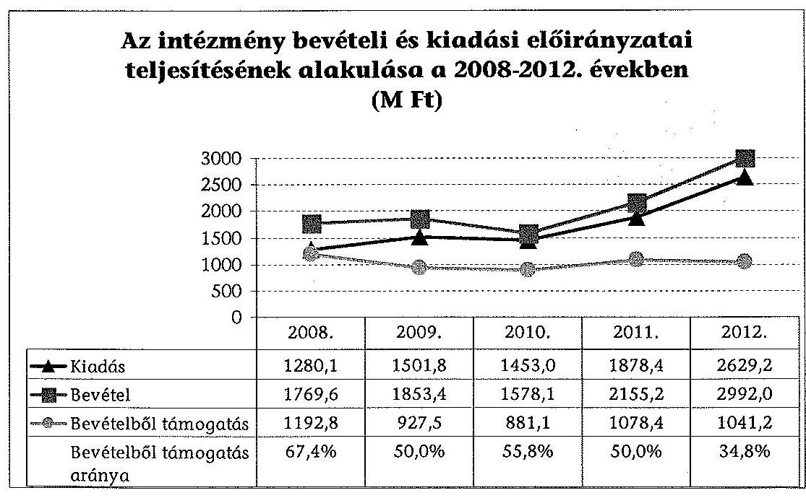

Az intézmény feladatainak bővülése, az ezekhez kapcsolódó feladat átadás-átvételek következtében az ellenőrzött időszak minden évében országgyűlési, kormányzati, irányító szervi és intézményi hatáskörben végrehajtott előirányzat-átcsoportosításokra került sor. Az előirányzat-átcsoportosítások a jogszabályi előírásoknak megfeleltek. Az intézmény bevételei között a támogatások kisebb nagyságrendet képviseltek, arányuk az ellenőrzött időszak egyes éveiben 34,8-67,4% között mozgott, miután jelentős volt a támogatás értékű működési bevétel. A 2012. évben a bevételeken belül a támogatások alig 34,8%-os ará-

---

nyához hozzájárult az 1065,0 M Ft államháztartáson kívülről működési célra átvett pénzeszköz, amely a Fiatalok Lendületben Program támogatásának átvétele volt.

Az ellenőrzött időszakban a kormányzati egyensúlyjavító intézkedéseket végrehajtották, amelyek zárolások, maradványtartási intézkedések formájában érintették az intézményt. A zárolások, a maradványtartási kötelezettség teljesítése hozzájárult az év végi szállítói állomány növekedéséhez, azonban a szigorú takarékossági és racionalizálási intézkedések elrendelése következtében likviditási problémák nem jelentkeztek. A likviditási helyzet megfelelő volt, mert a pénzeszközök értéke az időszakban több mint háromszorosan meghaladta a kötelezettségeket. Az intézmény előirányzat-maradványa a 2009-2011. években több mint 90%-a, míg 2008-ban és 2012-ben teljes egészében kötelezettségvállalással terhelt volt. Az előirányzat-maradvány a 2008. évi 484,8 M Ft-ról 2012-re 361,9 M Ft-ra csökkent.

Az intézmény mérleg szerinti vagyona a 2008. év végi 894,7 M Ft-ról a 2012. évre 2315,8 M Ft-ra, 158,8%-kal nőtt. A vagyon növekedését a forgóeszközök értékének 248,2%-os (1236,9 M Ft) növekedése okozta. A forgóeszközökön belül a 2012. évi uniós forrású támogatási programokhoz kapcsolódó követelések (776,2 M Ft előleg) és a pénzeszközök (397,4 M Ft) növekedése volt a meghatározó. Az eszközök használhatósági foka - az ingatlanok kivételével az ellenőrzött időszakban romló tendenciát mutatott. A kötelezettségek a 2008. évi 31,9 M Ft-ról 2012. év végére 717,8 M Ft-ra emelkedtek, amelyek az ellenőrzött időszakban az intézmény forrásainak átlagosan 15%-át tették ki, hosszú lejáratú kötelezettsége nem volt az intézménynek.

Az intézmény vagyongazdálkodása során teljesült az Nvtv.-ben meghatározott nemzeti vagyonnal való felelős gazdálkodás alapelve, mivel mind a vagyongazdálkodás szabályozása, mind annak gyakorlata szabályszerű volt.

Az intézmény vagyongazdálkodásának szabályozottsága az ellenőrzött időszakban - a beszerzett, illetve előállított immateriális javak, tárgyi eszközök üzembe helyezése dokumentálásának 2008. évi szabályozási hiányossága kivételével - teljes körű volt. Az intézmény az Áhsz., a Számv tv., az Nvtv. és a Vtv. előírásainak megfelelően szabályozta a beszerzett, átvett vagyontárgyak nyilvántartásba vételének, üzembe helyezésének, hasznosításának és selejtezésének előírásait. Szabályozta továbbá az ingatlanrész (előadótermek), illetve a gépjárművek bérbeadásának/magáncélú használatának ellenértékére vonatkozó önköltség-számítását, valamint az eszközök magáncélú használatát.

Az intézmény vagyonnyilvántartása szabályszerű volt, az eszközöket elkülönítetten tartották nyilván, besorolásuk és bekerülési értékük megállapítása a jogszabályi előírásoknak
 megfelelően történt. Az időszakban beszerzett vagyonelemek szervezeti egységhez és szakfeladathoz rendelése minden esetben megtörtént. A szakfeladat szerinti besorolások minden esetben megfeleltek az alapító okiratban felsorolt alaptevékenységeknek. Az értékcsökkenési leírást az Áhsz.-ben és a belső számviteli szabályokban rögzített módon számolták el.

Az ÁSZ tv. 33. § (1) bekezdésében foglaltak értelmében a jelentésben foglalt megállapításokhoz kapcsolódó intézkedési tervet köteles az ellenőrzött szervezet

---

vezetője összeállítani, és azt a jelentés kézhezvételétől számított 30 napon belül az ÁSZ részére megküldeni. Amennyiben az intézkedési tervet határidőben nem küldi meg a szervezet, vagy az nem elfogadható, az ÁSZ elnöke a hivatkozott törvény 33. § (3) bekezdés a)-b) pontjaiban foglaltakat érvényesítheti.

A helyszíni ellenőrzés megállapításainak hasznosítása mellett javasoljuk:

# az emberi erőforrások miniszterének 

1. Az irányító szervek nem rögzítettek a közfeladatok ellátásához és az erőforrásokkal való hatékony gazdálkodáshoz az intézménnyel szemben számon kérhető követelményeket, elvárásokat. Ez korlátozta a követelmények érvényesítésére, számonkérésére és ellenőrzésére vonatkozó - az Áht. 1 49. § (5) bekezdés f) pontja, illetve az Áht. 2 9. § (1) bekezdés f) pontjában rögzített - hatáskörük gyakorlását.

Javaslat:
Fogalmazza meg és érvényesítse a Nemzeti Család- és Szociálpolitikai Intézet közfeladat ellátására vonatkozó és az erőforrásokkal való szabályszerű és hatékony gazdálkodáshoz szükséges ágazati-, illetve pénzügyi típusú törvényekből, egyéb jogszabályokból levezethető konkrét követelményeket, és ezen követelményeket irányítási jogkörében az Áht. 2 9. § (1) bekezdés f) pontja alapján ellenőrizze és kérje számon.
2. Az irányító szerv a szolgáltatók ellátási díjainak biztosítására a 2011. és 2012. években a támogatást év végén biztosította az NCSSZI részére. A 2012. évi támogatási szerződést 2012 decemberében kötötték meg, amely szerint az intézmény a támogatást 2012. április 1. - 2013. január 31. között használhatta fel. Az év végén biztosított források a feladat folyamatos elvégzésének bizonytalanságát és nem jogszabálykövető gyakorlat kialakulását eredményezték.

Javaslat:
Vizsgáltassa ki a szerződéskötési gyakorlat körülményeit. Gondoskodjon arról, hogy a fejezeti kezelésű előirányzatok felhasználásának szabályairól szóló belső szabályzatban a megvalósítás időszakának hosszához, a feladatvégzés igényéhez, a fejezeti kezelésű előirányzat céljához igazodva szabályozzák a támogatási szerződések megkötésének határidejét. Intézkedjen a belső szabályzatban meghatározott határidők érvényesítéséről.
3. Az NCSSZI a kábítószer használatot megelőző-felvilágosító szolgáltatás feladat lebonyolítása során - a kábítószer-fogyasztás megelőzésével kapcsolatos feladatok fejezeti kezelésű előirányzat 2012. évi támogatási szerződése megkötésével összefüggésben - nem tartotta be az Áht. ${ }_{2}$, valamint az Ávr. kötelezettségvállalásra, a pénzügyi ellenjegyzésre, a teljesítés igazolására, az érvényesítésre és az utalványozásra vonatkozó előírásait.

Javaslat:
Vizsgáltassa ki a Nemzeti Család- és Szociálpolitikai Intézetnél a kábítószer használatot megelőző-felvilágosító szolgáltatás feladat szabálytalan lebonyolításának körül-

---

ményeit, és amennyiben a felelősségre vonás körülményei fennállnak, tegye meg a szükséges intézkedéseket.

# a Nemzeti Család- és Szociálpolitikai Intézet főigazgatójának 

1. A kontrollkörnyezet kialakítása keretében az intézmény vezetője nem gondoskodott a Bkr. 6. § (1) bekezdés c) pontjában foglaltak szerint az intézményre vonatkozó etikai elvárások elkészítéséről.

Javaslat:
Gondoskodjon olyan kontrollkörnyezet kialakításáról, amelyben meghatározottak az etikai elvárások a szervezet minden szintjén a Bkr. 6. § (1) bekezdés c) pontjának megfelelően.
2. Nem volt teljes körű az Ámr ${ }_{1}$ 145/B. § (1), az Ámr ${ }_{2}$ 156. § (2), valamint a Bkr. 6. § (3) bekezdése szerinti ellenőrzési nyomvonal, miután az nem tartalmazta a szakmai feladatellátáshoz kötődő felelősségi szinteket és kapcsolatokat.

Javaslat:
Egészítse ki a költségvetési szerv ellenőrzési nyomvonalát, amely tartalmazza a szakmai feladatellátáshoz kötődő felelősségi szinteket és kapcsolatokat lehetővé téve azok nyomon követését és utólagos ellenőrzését a Bkr. 6. § (3) bekezdése szerint.
3. Az intézmény vezetője - az Ámr ${ }_{1}$ 145/C. § és az Ámr ${ }_{2}$ 157. § (1)-(3), valamint a Bkr. 3. § b) pontjával és a 7. § (1)-(2) bekezdéseivel ellentétben - nem határozta meg, nem mérte fel, nem elemezte és nem kezelte a tevékenységével kapcsolatos kockázatokat, nem vizsgálta felül a kockázatkezelés folyamatát.

Javaslat:
Működtessen a Bkr. 3. § b) pontjában és a 7. § (1)-(2) bekezdésében előírtaknak megfelelően kockázatkezelési rendszert, ennek keretében mérje fel és állapítsa meg a költségvetési szerv tevékenységében, gazdálkodásában rejlő kockázatokat, valamint határozza meg az egyes kockázatokkal kapcsolatban szükséges intézkedéseket, valamint azok teljesítése folyamatos nyomon követésének módját.
4. Az intézmény vezetője - az Ámr ${ }_{1}$ 145/G. §-ban és az Ámr ${ }_{2}$ 160. § (1)-(2) bekezdésben, valamint a Bkr. 3. § e) pontjában és a 10. §-ban foglaltak ellenére - a monitoring rendszer részeként sem a gazdálkodási tevékenységre, sem a szakmai feladatellátásra vonatkozóan nem alakította ki, és nem működtette az intézmény céljai megvalósításának nyomon követési rendszerét.

Javaslat:
Alakítsa ki és működtesse a Bkr. 3. § e) pontja és a 10. § előírásainak megfelelően a szervezet tevékenységének, a célok megvalósításának az operatív tevékenységek keretében megvalósuló folyamatos és eseti követési rendszerét.

---

5. A belső ellenőr az elvégzett ellenőrzésekről a Ber. 32. § (1)-(2) bekezdéseiben, valamint a Bkr. 22. § (2) bekezdés e) pontjában és az 50. § (1) bekezdésében előírt nyilvántartást nem vezetett.
Javaslat:
Intézkedjen, hogy a Bkr. 22. § (2) bekezdés e) pontja alapján a belső ellenőrzési vezető az elvégzett belső ellenőrzésekről a Bkr. 50. §-ában előírt nyilvántartást vezessen.
6. Az intézmény a kábítószer elterelési tevékenységet végző szolgáltatók tevékenységét és jelentéseit - az SZMSZ előírásaival valamint a pályázati felhívásban foglaltakkal ellentétben - a 2012. évben, a szerződéssel lefedett időszakban nem ellenőrizte.

Javaslat:
Gondoskodjon az SZMSZ-ben foglaltaknak megfelelően a szolgáltatók tevékenységének és jelentéseinek ellenőrzéséről.

---

# II. RÉSZLETES MEGÁLLAPÍTÁSOK 

## 1. Az irányító szerv feladatELLÁTÁSa, az intézmény szervezeti működésére vonatkozó szabályozottsága

### 1.1. Az irányító szerv alapítói jogainak gyakorlása

Az NCSSZI tevékenységéhez kapcsolódó irányítási, döntés-előkészítési feladat-, hatás-, és felelősségi körök megosztása az ellenőrzött időszakban - az Országos Gyermekvédelmi Szakértői Bizottság (OGYSZB) működtetésének feladata kivételével - törvényekben, kormányrendeletekben, illetve ágazati miniszteri rendeletekben meghatározásra került.

Az OGYSZB részletes eljárásrendi szabályait tartalmazó 15/1998. (IV. 30.) NM rendeletben az OGYSZB működtetőjeként nem nevesítették az intézményt. A feladatot egyértelműen csak alapító okirata nevesítette ${ }^{9}$.

Az intézmény irányító szervének kijelöléséről az ellenőrzött időszakban egyrészt a 170/2006. (VII. 28.) Korm. rendelet, másrészt 2010. július 1-jétől a 212/2010. (VII. 1.) Korm. rendelet rendelkezett.

A 170/2006. (VII. 28.) Korm. rendelet 4. § (2) bek. b) pont bb) alpontja szerint a miniszter a szociál-, család- és nyugdíjpolitikáért, valamint a gyermek- és ifjúságvédelemért való felelőssége körében irányította az intézményt.

A 212/2010. (VII. 1.) Korm. rendelet 66. § (1) bek. b) pont bb) (2011. január 1-jétől $bc$) alpontja szerint a nemzeti erőforrás miniszter, illetve 2012. május 14-étől az emberi erőforrások miniszterének szakpolitikai feladat- és hatáskörébe utalta az intézmény irányítását.

Az irányító szerv szervezeti és működési szabályzatában (SZMSZ) ${ }^{10}$ a miniszterek kijelölték az intézmény irányításában közreműködő államtitkárokat/helyettes államtitkárt, illetve szervezeti egységeket. Az intézmény feladatainak szerteágazó volta miatt a 2008-2010. években több államtitkárság is közreműködött az intézmény irányításában.

A 2008-2010. években a szociálpolitikai szakállamtitkár és az esélyegyenlőségi szakállamtitkár a koordinációs szakállamtitkárral együttműködve irányította az

[^0]
[^0]:    ${ }^{9}$ 2013. január 1-jétől a központi hivatali jogállású Szociális és Gyermekvédelmi Főigazgatóság működteti az OGYSZB-t (316/2012. (XI. 13.) Korm. rendelet).
    ${ }^{10}$ 3/2006. (MK94.) SZMM utasítás a Szociális és Munkaügyi Minisztérium Szervezeti és Működési Szabályzatának kiadásáról (hatálytalan: 2008. XI. 29-től), 20/2008. (HÉ 48.) SZMM utasítás a Szociális és Munkaügyi Minisztérium Szervezeti és Működési szabályzatának kiadásáról (hatálytalan: 2010. X. 19-től), 2/2010. (VII. 8. ) NEFMI utasítás a Nemzeti Erőforrás Minisztérium ideiglenes szervezeti rendjének meghatározásáról (hatálytalan: 2010. X. 19-től), 6/2010. (X. 19.) NEFMI utasítás a Nemzeti Erőforrás Minisztérium Szervezeti és Működési Szabályzatáról (hatálytalan: 2013. II. 1-jétől)

---

intézmény feladatainak ellátását, majd 2010. július 1-jétől az intézmény irányítójaként a szociálpolitikáért felelős helyettes államtitkár volt a miniszter által átruházott hatáskörben eljáró állami vezető.

Az ellenőrzött időszakban az érintett irányító szervek alapítói jogaik keretében ${ }^{11}$ az intézmény alapító okiratának módosítását három esetben jelentős késéssel végezték el.

Az intézményt a szociális módszertani intézmények kijelöléséről és feladatairól, valamint a szociális szolgáltatók, intézmények engedélyezési eljárásának szakértői díjáról szóló 3/2008. (IV. 15.) SZMM rendelet 2008. április 18-i hatályba lépésével országos módszertani intézménynek jelölte meg. A feladatot tartalmazó alapító okirat SZMM általi módosítása 165 nap késedelemmel 2008. szeptember 30-án kelt, és 2008. január 1-jétől lépett hatályba.

Az intézmény 2011. január 1-jétől az NSZFI-től átvette a szociális ágazat szakképzési továbbképzési feladatait, az alap- és szakvizsgarendszer működtetését, azonban az alapító okirat NEFMI általi módosítása 327 nap késedelemmel, 2011. november 28-án kelt, és a törzskönyvi bejegyzéssel 2011. december 20-án lépett hatályba.

Az NCSSZI 2012. november 1-jével a Közigazgatási és Igazságügyi Hivatalnak átadta a Mobilitás Országos Ifjúsági Szolgálatot. A módosítást tartalmazó alapító okirata, amelyet az EMMI 147 nap késedelemmel 2013. március 28-án keltezett, 2012. november 1-jével lépett hatályba.

Az alapító okirat módosításait követően az intézmény SZMSZ-ét az irányító szervek - jogszabályi kötelezettségüknek eleget téve ${ }^{12}$ - jóváhagyták.
2009. március 4-én jóváhagyásra az SZMM-be megküldték a visszamenőleges hatállyal 2009. január 1-jétől bevezetni tervezett SZMSZ-t, amelyet az SZMM-ből 2009. május 22-én küldtek vissza postai úton. A késedelmes jóváhagyás oka, hogy a minisztérium illetékes szervezeti egysége felülvizsgálta a tervezetet, és módosítási javaslatokat fűzött hozzá, melyeket az intézmény részére visszaküldött.

# 1.2. Az egyéb irányítási jogok gyakorlása 

Az irányító szervek az intézmény vonatkozásában egyéb irányítási jogosultságaikat részben látták el, mivel nem rögzítettek a közfeladatok ellátásához és az erőforrásokkal való hatékony gazdálkodáshoz az intézménnyel szemben számon kérhető követelményeket, elvárásokat. Ez korlátozta a követelmények érvényesítésére, számonkérésére és ellenőrzésére vonatkozó - az Áht. 149. § (5) bekezdés f) pontja, illetve az Áht. 2 9. § (1) bekezdés f) pontjában rögzített -hatáskörük gyakorlását. Ugyanakkor az irányító szerv a szakmai feladatellátásról és a gazdálkodás viteléről évente beszámoltatta az intézmény vezetőjét ${ }^{13}$.

[^0]
[^0]:    ${ }^{11}$ az Áht. 149. § (5) bekezdése és az Áht. 2 9. § (1) bekezdése
    ${ }^{12}$ az Áht. 149. § (5) bekezdés c) pontja és az Áht. 2 9. § (1) bekezdés e) pontja
    ${ }^{13}$ az Áht. 149. § (5) bekezdés i) pontja és az Áht. 2 9. § (5) bekezdés i) pontja

---

Az intézménynél az ellenőrzött időszakban egyszer került sor az intézmény vezetőjének, két esetben pedig gazdasági vezetője személyének változására. A kinevezési okiratok és azok módosításai alapján az irányító szerv (SZMM, NEFMI) eljárása megfelelt a jogszabályi előírásoknak ${ }^{14}$.

Az irányító szerv (SZMM) az ellenőrzött időszakban két alkalommal - az intézmény 2007. és 2008. évi elemi költségvetési beszámolójának megbízhatósági ellenőrzése témakörében - gyakorolta ellenőrzési jogkörét.
 Az ellenőrzési jelentések az intézmény egyes szabályzatainak (SZMSZ, Gazdasági Egység Ügyrendje, leltározási és leltárkészítési szabályzat) aktualizálására és a kiegészítésére tettek javaslatot. A 2010-2012. években az irányító szerv részéről (NEFMI, EMMI) ellenőrzésre nem került sor.

# 1.3. Az intézmény szervezeti működésére vonatkozó szabályozás 

Az ellenőrzött időszakban az intézmény rendelkezett a szervezeti működését meghatározó SZMSZ-szel. Az SZMSZ-t a szervezeti változások figyelembevételével rendszeresen felülvizsgálták, módosították. Az intézmény SZMSZ-einek tartalma megfelelt a jogszabályi előírásoknak ${ }^{15}$.

A gazdasági szervezet az ellenőrzött időszakban rendelkezett ügyrenddel, amely azonban a 2009. évben nem tartalmazta a belső kapcsolattartásra vonatkozó előírásokat ${ }^{16}$. A gazdasági szervezet ügyrendje az ellenőrzött időszakban egyebekben megfelelt a jogszabályi előírásoknak ${ }^{17}$. A gazdasági szervezet munkatársai rendelkeztek munkaköri leírásokkal, a munkakörük ellátásához szükséges végzettséggel, valamint szakmai gyakorlattal ${ }^{18}$.

Az alapító okirat és az ezzel összefüggésben módosított SZMSZ változásaihoz kapcsolódóan az intézmény belső szabályzatait többször és folyamatosan módosította, aktualizálta (számviteli szabályzatok, szervezeti egységek ügyrendjei). A saját hatáskörben végrehajtott átszervezések az irányító szerv által jóváhagyott SZMSZ-módosításokban követhetők és dokumentáltak voltak.

## 2. AZ INTÉZMÉNY SZAKMAI FELADATELLÁTÁSA A 2010-2012. ÉVEK KÖZÖTT

Az NCSSZI szociálpolitikai, családpolitikai, gyermekvédelmi, esélyegyenlőségi, ifjúság- és drogpolitikai területen biztosított az ellenőrzött időszakban támogatást irányító szerve szakmapolitikai és irányítási feladataiban.

[^0]
[^0]:    ${ }^{14}$ az Áht. ${ }_{1}$ 93. § (1) bekezdés b) pontja és az Áht. ${ }_{2}$ 9. § (1) bekezdés b) pontja
    ${ }^{15}$ az Ámr. ${ }_{1}$ 10. § (5) bekezdés - 2009. január 1-jétől 13/A. § (3) bekezdés -, az Ámr. ${ }_{2}$ 20. § (2) bekezdés, valamint az Ávr. 13. § (1) bekezdés
    ${ }^{16}$ Ámr. ${ }_{1}$ 17. § (5) bekezdés
    ${ }^{17}$ az Ámr. ${ }_{1}$ 17. § (5) bekezdése, az Ámr. ${ }_{2}$ 15. § (6) bekezdése, valamint az Ávr. 9. § (5) és 13. § (5) bekezdése
    ${ }^{18}$ Kjt. 22. §

---

Az intézmény szakmai feladatellátásának szabályszerűségi szempontú ellenőrzését a 2010-2012. évekre egyszerű véletlen mintavétellel kiválasztott mintatételek alapján értékeltük. Az ellenőrzés a módszertani tevékenységre is kiterjedt a szakmai programok és kutatások vonatkozásában. Értékeltük az OGYSZB és az Országos Kríziskezelő Információs Telefonszolgálat (OKIT) tevékenységét, a pályázat- és támogatáskezelést, a kutatási tevékenységet, a Családpolitikai Iroda, a Társadalmi és Esélyegyenlőségi Iroda és a Nemzeti Drogmegelőzési Iroda (NDI) tevékenységét, valamint TÁMOP projektek megvalósítását.

# 2.1. A szakmai feladatellátás 

Az intézmény alapító okirataiban a 2010-2012. évekre meghatározott alaptevékenységeit és közfeladatait az 1. és 2. sz. mellékletek mutatják be. Az intézmény feladatai a 2010-2012. években lényegesen változtak a feladatkörök bővülése (módszertani, szakirányítási feladatok; hazai pályázatkezelési feladatok), egyéb szervezetek (Salgótarjáni Képzési Központ; Fiatalok Lendületben Programiroda) feladatai átvétele, illetve átadása miatt.

A szakmai feladatok ellátásának fedezetét a költségvetési támogatások és a saját bevételek biztosították. Az intézmény főkönyvi könyvelésének adatai alapján szakmai tevékenységeinek ellátására a 2010-2012. években 3328,0 M Ft-ot fordított. Az egyes, az ellenőrzés által érintett szakmai feladatokra vonatkozó kiadásokat és azok %-os megoszlását az alábbi diagram szemlélteti:
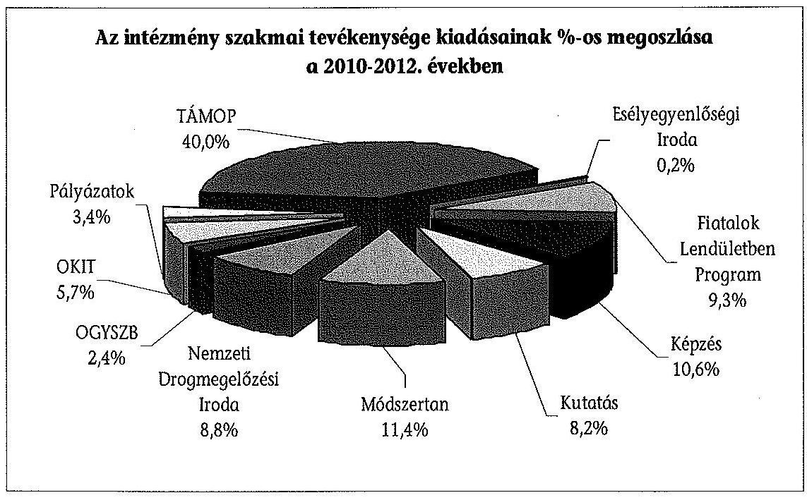

2010-2012-ben a kiadások legnagyobb hányada (40%-a) a TÁMOP megvalósításával kapcsolatban merült fel. A kiadások további, összesen 48,3%-át öt szakmai feladat (Fiatalok Lendületben Program, képzés, kutatás, módszertan, NDI működtetése) tette ki.

---

Az NCSSZI ellátta az alapító okiratában rögzített stratégiaalkotási tevékenységét. Az intézmény a „Nemzeti Ifjúsági Stratégia 2009-2024”${ }^{19}$ szerint gyermek- és ifjúságkutatási feladatokat látott el. Az intézmény kutatási tevékenységét a 2010. és a 2011. években a gyermek- és ifjúságkutatás területen külön szervezeti egység koordinálta, a 2012. évben a családpolitikai és kutatási igazgatóság keretén belül végezte.

Az intézmény a 2010. évben részt vett egyebek mellett a Nemzeti Ifjúsági Stratégia indikátorainak és cselekvési tervének kidolgozásában. 2011-ben a gyermekvédelmi szakellátásba bekerülés bemeneti mutatóinak elemzését végezte, illetve adatbázist készített. A 2012. évben kutatást végzett a „Fiatalok családalapításhoz, gyermekvállaláshoz és házassághoz kapcsolódó attitüdjei a családi minták tükrében” címmel.

Az intézmény az ellenőrzött időszakban szervezeti egységén az NDI-n keresztül - az alapító okiratában meghatározottak szerint - közreműködött a Nemzeti Drogstratégia megvalósításában, tudományos és kutatói hátteret biztosított, irányelveket, standardokat fejlesztett ki a megelőzés területén, módszertani támogatást nyújtott a kábítószerügyi egyeztető fórumoknak, valamint az elterelés megelőző-felvilágosító szolgáltatásának.

Az NDI részére a „Nemzeti Stratégia a kábítószer-probléma kezelésére 2010-2018”${ }^{20}$ (Nemzeti Drogstratégia) című dokumentum határozott meg feladatokat. A Nemzeti Drogstratégia 2. sz. mellékletében az iskolai prevenciós programokkal kapcsolatos információ biztosítójaként az NDI által működtetett Szakmai Információs Portált (www.ndi-szlp.hu) határozta meg, ahonnan a programok különböző keresési feltételeknek megfelelően lekérdezhetőek voltak. Az NCSSZI feladata volt a Kábítószerügyi Egyeztető Fórumok munkájának koordinálása is.

A kábítószer-használatot megelőző-felvilágosító szolgáltatást a nem kábítószerfüggő személyek részére, a büntethetőség megszüntetése érdekében a Btk. 2003. március 1-jétől hatályos módosítása ${ }^{21}$ vezette be. Az elterelés, ezen belül a megelőző-felvilágosító szolgáltatás eljárásrendi szabályait miniszteri rendeletben határozták meg${ }^{22}$.

A kábítószer-használatot megelőző-felvilágosító szolgáltatás feladatainak ellátására vonatkozó felhatalmazást az alapító okirata ${ }^{23}$ mellett az intézmény

[^0]
[^0]:    ${ }^{19}$ A dokumentumot az Országgyűlés a 88/2009. (X. 29.) OGY határozattal hagyta jóvá.
    ${ }^{20}$ A Nemzeti Drogstratégiát az Országgyűlés a 106/2009. (XII. 21.) OGY határozattal fogadta el. Hatálytalan: 2013. X. 17-től.
    ${ }^{21}$ 2003. évi II. törvény a büntető jogszabályok és a hozzájuk kapcsolódó egyes törvények módosításáról
    ${ }^{22}$ 26/2003. (V. 16.) ESzCsM-GyISM együttes rendelet a kábítószer-függőséget gyógyító kezelés, kábítószer-használatot kezelő más ellátás vagy megelőző-felvilágosító szolgáltatás szabályairól, majd 42/2008. (XI. 14.) EüM-SZMM együttes rendelet a kábítószerfüggőséget gyógyító kezelés, kábítószer-használatot kezelő más ellátás vagy megelőzőfelvilágosító szolgáltatás szabályairól
    ${ }^{23}$ 2010. május 12-én kelt és a törzskönyvi bejegyzéssel 2010. május 17-én hatályba lépett alapító okirat

---

SZMSZ-ei is tartalmazták, rögzítve a szolgáltatással kapcsolatos szakmai koordinációt, ellenőrzést és értékelést.

Az SZMSZ-ek szerint ${ }^{24}$ az NDI feladata volt a Btk. elterelés jogintézménye megelőző-felvilágosító szolgáltatásának szakmai koordinációja, ellenőrzése és értékelése. A megelőző-felvilágosító szolgáltatás körében az NDI feladataként nevesítették a szolgáltatók jelentési rendszerének működtetését, valamint a jelentések helyszíni ellenőrzését.

A kábítószer-használatot megelőző-felvilágosító szolgáltatás végzésére a szolgáltatók kiválasztására a szociális és munkaügyi miniszter 2009-ben pályázati felhívást tett közzé. A pályázati felhívás - amelyre a jelentkezés lehetősége folyamatosan biztosított volt - az ellenőrzött időszakban változatlan tartalommal volt elérhető a pályázaton indulni jogosult szervezetek (pl.: alapítványok, közalapítványok, szociális és egészségügyi intézmények) számára. A pályázati felhívásban az NCSSZI, illetve szervezeti egysége, az NDI közreműködő szervezetként került kijelölésre.

Az NDI közreműködő szervi feladatai körében határozta meg a benyújtott pályázatok bírálatának megszervezését, a hiánypótoltatást, a nyertes pályázók értesítését, a szerződéskötést a szolgáltatókkal, valamint a jelentési rendszer működtetését és a pályázati program megvalósításának figyelemmel kísérését.

A 2011. évben az intézmény - az irányító szerv által meghatározott esélyegyenlőségi feladatok ellátása érdekében - létrehozta a Társadalmi Esélyegyenlőségi Irodát.

Az iroda fő tevékenysége volt hat esélyegyenlőségi célcsoportra vonatkozóan az „Ütközések” című esélyegyenlőségi konferencia szervezése, megvalósítása és a konferencián elhangzottakról záró tanulmány (kiadvány) elkészítése. Az irányító szerv és az intézmény a feladat teljesítésére nettó 22,4 M Ft összegű szerződést kötött. Az intézmény a vállalt feladatot teljesítette, a kiadványt elkészítette. Az iroda emellett az „Önkéntes Stratégia” kialakításához kapcsolódóan látott el a témában kutatási tevékenységhez bedolgozói feladatokat. ${ }^{25}$

Az intézménynek módszertani tevékenysége keretében kiemelt feladata volt országos szolgáltatás-módszertani központként az országos intézményrendszer koordinálása, a gyermekvédelem és a gyermekjóléti alapellátások területén működő módszertani intézmények munkájának támogatása a jogszabályokban meghatározott feladatmegosztás szerint. A módszertani eljárások kidolgozása mellett szakmai ellenőrzéseket végzett, és Kjt. szerinti jogerős döntéseket hozott. Ennek területei: gyermekjóléti szolgáltatás; családi napközi ellátás; alternatív napközbeni ellátás; bölcsődei ellátás; gyermekek átmenti gondozása; nevelőszülői ellátás és egyéb speciális ellátások. Módszertani feladatainak megvalósítása érdekében munkacsoportokat hozott létre és működtetett a 2010-2012. években.

[^0]
[^0]:    ${ }^{24}$ A 2010-ben hatályos (2009. január 1-jétől), 2011. december 20-ától és 2012. február 7-étől hatályos SZMSZ
    ${ }^{25}$ A Társadalmi Esélyegyenlőségi Iroda tevékenységét a Programigazgatóság Ügyrendje III.3.2. pontja szabályozta.

---

Pszichiátriai, Szenvedélybeteg, Fogyatékosügyi, Hajléktalanügyi, Családsegítő, Alapszolgáltatási, Idősügyi Módszertani Munkacsoportokat működtettek, amelyek módszertani útmutatókat, ajánlásokat, szakmai protokollokat készítettek.

A képzésszervezés területén többek között drogkoordinátorok és gondozónők családtörténet, családlegendárium témában tartottak képzéseket. Az NSZFI salgótarjáni képzési központjának megszüntetésével összefüggésben a képzési tevékenységet a jogszabályok ${ }^{26}$ szerint 2011. január 1-jétől az intézmény kötelezően átvette. Emellett az intézmény jogszabályi kötelezettsége volt a szociális feladatokat, személyes gondoskodást ellátó személyek adatainak, képzésének, továbbképzésének és vizsgáinak nyilvántartása, valamint az ehhez kapcsolódó igazolások kiadása. ${ }^{27}$

Az intézmény az ellenőrzött időszakban a Gyvt.-ben, valamint az alapító okiratában meghatározott gyermekvédelmi feladatait ${ }^{28}$ az OGYSZB útján látta el. Tevékenysége ellátása során a vizsgálati kérelmek alapján javaslatot tett az átmeneti és tartós nevelésbe vételi eljárással érintett gyermekek elhelyezésére, szakvéleményeket készített és nyilvántartási feladatokat végzett.

Az intézmény jogszabályi ${ }^{29}$ feladatainak ellátása érdekében működtette az OKIT-ot, amely az ország bármely területéről érkező hívásokat a nap 24 órájában fogadta, azokra azonnali intézkedést, illetve kríziselhelyezést kezdeményezett. A telefonhívások mellett e-mailben is lehetőség volt a problémák jelzésére. Az OKIT a bejelentett esetek megoldása érdekében (pl.: családon belüli erőszak) különböző támogatásokat nyújtott (elhelyezés szerződött vagy egyéb intézményben, jogi tanácsadás stb.).

Az NCSSZI uniós támogatások kedvezményezettje volt az ellenőrzött időszakban. TÁMOP projektek megvalósításával főként módszertani szakfeladatok ellátását végezte, uniós támogatásokat nem adott tovább.

Az intézmény az alapító okirat és az SZMSZ 2011. évi módosításának megfelelően a 2011. évtől hazai pályázatok és támogatások kezelői és lebonyolítói feladatait látta el. Az irányító szervvel kötött támogatási megállapodások alapján a Gyermek- és Ifjúsági Alapprogram tekintetében kezelői feladatokat, más pályázatok/támogatások esetében bonyolítói feladatokat végzett.

[^0]
[^0]:    ${ }^{26}$ 81/2004. (IX. 18.) ESzCsM rendelet, 127/2002. (V. 20.) Korm. rendelet.
    ${ }^{27}$ 8/2000. (VIII. 4.) SzCsM rendelet; 9/2000. (VIII. 4.) SzCsM rendelet.
    ${ }^{28}$ A Gyvt. 82. § (6)-(8) és (1) bekezdései, valamint 132. § (4) bekezdése, továbbá a 15/1998. (IV. 30.) NM rendelet 129/A. §-ában foglaltak alapján látta el feladatait. A gyermekvédelmi feladatok és az OGYSZB működtetésével kapcsolatos feladatok 2013. január 1-jétől a Szociális és Gyermekvédelmi Főigazgatósághoz kerültek.
    ${ }^{29}$ Az intézmény a családon belüli erőszak megelőzésére és hatékony kezelésére irányuló nemzeti stratégia kialakításáról szóló 45/2003. (IV. 16.) OGY határozat és a társadalmi bűnmegelőzés nemzeti stratégiájáról szóló 115/2003. (X. 28.) OGY határozatban foglalt célok megvalósítása érdekében tartja fenn az OKIT-t.

---

# 2.2. A szakmai feladatellátás szabályossága kiemelt területenként 

Az
 intézmény a módszertani tevékenységét - az ellenőrzés által kiválasztott legnagyobb összegű kifizetésekkel járó programokhoz, konferenciákhoz kapcsolódó tételek ellenőrzési tapasztalatai alapján - szabályosan látta el.

Az intézmény a módszertani szakmai tevékenységét a külső ${ }^{30}$ és belső ${ }^{31}$ szabályozásoknak megfelelően folytatta, a kapcsolódó szerződéseket szabályosan kötötte. A szakmai teljesítéseket ellenőrizte, arról a teljesítésigazolásokat kiállította, a kiadások utalványozását és pénzügyi teljesítését szabályosan végezte. A programok végrehajtását igazoló dokumentumok rendelkezésre álltak, és alátámasztották a feladatok elvégzését.

A kutatási tevékenységet - a kiválasztott mintatételek ellenőrzési tapasztalatai alapján - kisebb formai hiányosságok kivételével - az intézmény az alapító okirat, az SZMSZ és az ügyrend ${ }^{32}$ szabályozásának megfelelően látta el.

Az NCSSZI a „Mozaik 2011 Határon túli fiatalok" kutatás elvégzésére az irányító szervvel kötött megállapodást, amelynek 5.4. pontjában rögzítették, hogy „A kedvezményezett a támogatott tevékenység megvalósításába közreműködőt nem vonhat be." Ugyanakkor a támogatási szerződés és módosításának II. sz. mellékletében a támogatási összeg felhasználásának költségtervében a dologi kiadások között szellemi tevékenység költségei, szakértői, előadói díjak, valamint egyéb szolgáltatások vásárlásai (pl.: fókuszcsoportok szervezése) is szerepeltek.

A kutatási tevékenység elvégzésére megbízási szerződéseket kötött három szervezettel fókuszcsoportok szervezésére és egy magánszeméllyel adatfelvétel, adatelemzés és tanulmányírás témakörében. Ilyen jellegű feladatokra szolgáltatás vásárlása az említett költségtervben szerepelt. Az intézmény 2012. július 30-án az irányító szerv felé elszámolt a támogatással, amelyet az irányító szerv elfogadott.

A kötelezettségvállalás, szerződéskötés, teljesítésigazolás, utalványozás és pénzügyi teljesítés dokumentumai megfeleltek a vonatkozó jogszabályok ${ }^{33}$ előírásainak. A mintatételek 11%-ánál a szerződéseken szerepelt ugyan a pénzügyi és jogi ellenjegyzés, az aláírás dátuma azonban formailag nem külön-külön ellenjegyzésenként került feltüntetésre. Ezzel megsértették az Ámr. 2 82. § (1) bekezdés d) pontjában foglaltakat.

A képzési tevékenységét az intézmény - a tételes ellenőrzésre kiválasztott szerződések alapján - szabályszerűen látta el. A kötelezettségvállalás, szerző-

[^0]
[^0]:    ${ }^{30}$ A 3/2008. (VI. 15.) SZMM rendelet 3. § (2) bekezdése; a 331/2006. (XII. 23.) Korm. rendelet 14-18. §-a; a 259/2002. (XII. 18.) Korm. rendelet 15. §-a; a 15/1998. (IV. 30.) NM rendelet vonatkozó §-ában meghatározott feladatokat látta el.
    ${ }^{31}$ A módszertani tevékenység végzésének intézményen belüli eljárási szabályait a Módszertani Igazgatóság Ügyrendje tartalmazta.
    ${ }^{32}$ Az intézmény kutatási tevékenysége végzésének szabályait a Programigazgatóság Ügyrendje III.3.1 pontja szabályozta (Családpolitikai Iroda).
    ${ }^{33}$ Ámr. 2 72. § és 74-80. §, Ávr. 49-60. §

---

déskötés, teljesítésigazolás, utalványozási és pénzügyi teljesítés dokumentumai megfeleltek a vonatkozó jogszabályoknak ${ }^{34}$.

Az OGYSZB a jogszabályi előírásokat betartva ${ }^{35} 5$ tagból állt (gyermekpszichiáter, pszichológus, gyógypedagógus, szociális munkás és a szociális munkás elnök). A tagok miniszter által aláírt megbízási dokumentumai szabályosak voltak. Az OGYSZB szabályszerűen látta el a jogszabályokban ${ }^{36}$, illetve az SZMSZ IV.1.2.2. pontjában és az ügyrendben előírt feladatokat.

Az OKIT a feladatait a belső szabályzatok alapján szabályszerűen látta el ${ }^{37}$.
Az NDI részt vett a kábítószer-használatot megelőző-felvilágosító szolgáltatás szakmai koordinációjának, ellenőrzésének és értékelésének ellátásában. A feladatai ellátásához, a pályázati felhíváson nyertes szolgáltatók ellátási díjainak finanszírozásához az ellenőrzött időszakban irányító szerve támogatást nyújtott a minisztérium fejezeti kezelésű előirányzata terhére az alábbiak szerint:

Az Intézmény részére nyújtott irányító szervi támogatások a kábítószer-használatot megelőző-felvilágosító szolgáltatásra 2010-2012.

| $\begin{aligned} & \text { Év } \end{aligned}$ | Szerződés kelte, száma, szerződés módosítás kelte, száma | Szerződéses öszszeg (M Ft) | Fejezeti kezelésű előirányzat megnevezése |
| :--: | :--: | :--: | :--: |
| 2010. | 2010. március 3. 2362-0/2010-   SZMM | 103,5 | 16. Fejezeti kezelésű előirányzat 40. cím „A kábító-szer-fogyasztás megelőzésével kapcsolatos feladatok" alcím |
| 2011. | 2011. december   30. és 2012. június 25. 61478-   7/2011. és 7472-   3/2012. | 30${ }^{38}$ | 20/14/00/00 címrendű, „A kábítószer-fogyasztás megelőzésével kapcsolatos feladatok" |
| 2012. | 2012. december   20. és 28./35667-   3/2012. és 35667-   6/2012. | 101,0 | 20/14/00/00 címrendű, „A kábítószer-fogyasztás megelőzésével kapcsolatos feladatok" |

[^0]
[^0]:    ${ }^{34}$ Ámr. 2 72. § és 74-80. §, Ávr. 49-60. §
    ${ }^{35}$ A Gyvt. 82. § (7) bekezdése szerint az országos gyermekvédelmi szakértői bizottság legalább három tagból, a speciális szükségletű gyermekek vizsgálata esetén legalább öt tagból áll.
    ${ }^{36}$ a Gyvt. és a 15/1998. (IV. 30.) NM rendelet
    ${ }^{37}$ Az OKIT tevékenységét a Módszertani Igazgatóság Ügyrendje VIII. pontja szabályozta.
    ${ }^{38}$ A 2011. évi támogatási szerződésben biztosított támogatásból 10 M Ft a designer drogok prevenciós programjával kapcsolatos támogatás volt.

---

A 2011. évben a finanszírozás feladatainak ellátásához - a korábbi és az azt követő évektől eltérően - az intézmény költségvetésében 97 M Ft${ }^{39}$ került tervezésre az egyéb működési kiadás államháztartáson kívülre soron. A fenti táblázatban a 2011. évre biztosított támogatási összeg a feladatellátás év közbeni többleteinek finanszírozására szolgált.

A 2012. évi tervezési körirat szerint az egyéb működési célú kiadások tervezésére nem volt lehetőség. Ennek következtében az NCSSZI-nek az elterelés megelőző-felvilágosító szolgáltatás ellátási díjainak kifizetésére saját költségvetésében nem biztosítottak forrást. A források biztosítása érdekében - a 2012. évi tervezési irányelvek ismeretében - az NCSSZI főigazgatója már a 2011. év II. félévétől több alkalommal írásban fordult irányító szervéhez.

Az irányító szerv a szolgáltatók ellátási díjainak biztosítására a 2011. és 2012. években a támogatást év végén biztosította az NCSSZI részére. A 2012. évi támogatási szerződést 2012 decemberében kötötték meg, amely szerint az intézmény a támogatást 2012. április 1-2013. január 31. között használhatta fel. Az év végén biztosított források a feladat folyamatos elvégzésének bizonytalanságát és nem jogszabálykövető gyakorlat kialakulását eredményezték.

Az irányító szerv a főigazgató által 2011. december 6-án és 2012. július 30-án benyújtott támogatási kérelmek elbírálásánál a vonatkozó jogszabályok előírásai ${ }^{40}$ szerint járt el. A támogatási szerződés megkötése során a kötelezettségvállalásra, a jogi és pénzügyi ellenjegyzésre vonatkozó előírásokat betartották, de nem tartották be a támogatásokkal való elszámolás megvizsgálására vonatkozó 60 napos, a támogatási szerződésben is rögzített határidőt ${ }^{41}$.

Az NCSSZI által 2012. július 20-án benyújtott és 2012. július 24-én beérkezett elszámolás megvizsgálása eredményeként a hiánypótlási felhívást a támogatási szerződésben is előírt 60 napot meghaladóan, 2012. október 24-én küldték meg az NCSSZI részére. A támogatás elszámolásának elfogadásáról végül 2012. december 10-én kelt levélben tájékoztatták az intézményt.

Az NCSSZI-nek az ellenőrzött időszakban az elterelés megelőző-felvilágosító szolgáltatás keretében történő feladatai ellátását - a szerződéskötések, az ellenőrzési rendszer működtetése, a kötelezettségvállalás, ellenjegyzés, érvényesítés és a teljesítésigazolás tekintetében - a jogszabályi előírások be nem tartása jellemezte.

A kábítószer-használatot megelőző-felvilágosító szolgáltatás végzésére a szociális és munkaügyi miniszter által 2009. évben meghirdetett pályázat pályázati felhívásában foglaltak ellenére nem hívta fel hiánypótlásra azokat a pályázókat (a 2012-ben szerződéssel rendelkező 50 szolgáltató közül 4), amelyek-

[^0]
[^0]:    ${ }^{39}$ Ebből 95 M Ft az elterelés, 2 M Ft a tűcsere-program fedezetéül szolgált.
    ${ }^{40}$ az 54/2011. (IX. 1.) NEFMI rendelet, a 34/2012. (X. 17.) EMMI rendelet, a 23/2011. (IX. 2.) NEFMI utasítás és a 15/2012. (XI. 13.) EMMI utasítás
    ${ }^{41}$ az 54/2011. (IX. 1.) NEFMI rendelet 9. § (4) bekezdése, illetve a 34/2012. (X. 17.) EMMI rendelet 9. § (4) bekezdése

---

nek a pályázati adatlapján a 11. pontban a havi ellátotti létszám helyett tévesen éves ellátotti létszám lett megjelölve.

A Főplébániai Karitász Alapítvány pályázati adatlapjának 11. pontjában 50-60 fő/év várható ellátotti létszámot jelzett, és nem adta meg a pályázati dokumentációban előírt maximális havi ellátotti létszámot. A pályázati dokumentáció formai és szakmai bírálatát végzők nem kifogásolták a 11. pontban közölt éves ellátotti létszámot, a bírálati lapon ilyen megjegyzés nem szerepelt, a pályázat benyújtóját nem hívták fel hiánypótlásra.

Az NCSSZI a feladat ellátására csak a minisztérium honlapján közzétett, a szolgáltatás nyújtására jogosult intézményekkel kötött szolgáltatási szerződést, ugyanakkor a 2012. évi szerződéskötési gyakorlatával a Ptk. vonatkozó előírásait ${ }^{42}$ nem tartotta be. A 2012. március 9-én 2012. január 1. és március 31. közötti időszakra megkötött szerződést, annak megszűnése után több hónappal, 2012. december 19-én módosította. Az ellenőrzés megállapította, hogy az NCSSZI a 2012. április 1-jétől december 18-ig terjedő időszakban nem állt szerződéses kapcsolatban a szolgáltatókkal, írásbeli kötelezettséget nem vállalt, ugyanakkor jelentéseiket befogadta. Ezzel a magatartásával megsértette az Áht. 2-nek az írásbeli kötelezettségvállalásra vonatkozó előírását ${ }^{43}$.

A 2012. március 9-én 50 szolgáltatóval megkötött vállalkozási szerződés hatálya a 2012. január 1. és március 31-e közötti időszakra terjedt ki. A 2012. december 19-i szerződésmódosítással a szerződés hatályát a korábbi, 2012. január 1. és március 31. közöttiről 2012. január 1. és december 31. közöttire módosították.

A 2012. április 1. és december 18. közötti időszak alatt az intézmény - írásba foglalt szerződés nélkül - fogadta el havonta a szolgáltatók jelentéseit, illetve velük írásban is tartotta a kapcsolatot.

Az intézmény a jelentési és ellenőrzési rendszer működtetése során a 2012. évben a szolgáltatók tevékenységét és jelentéseiket - ellentétben az SZMSZ előírásaival és a pályázati felhívásban foglaltakkal ${ }^{44}$ - a szerződéssel lefedett időszakban a helyszínen nem ellenőrizte. A szolgáltatók a vállalkozási szerződés 1. számú mellékletében előírt összesített jelentésének adatait feltételezve azok valódiságát - szolgáltatónként külön-külön excel-fájlban rögzítették.

A szociális és munkaügyi miniszter által kiírt és az ellenőrzött időszakban is hatályos pályázati felhívás szerint a közreműködő szervezeti feladatokra kijelölt NCSSZI feladata a program megvalósulására vonatkozó rendszeres, helyszíni ellenőrzések elvégzése volt. Az SZMSZ előírása az ellenőrzések lefolytatásával kapcsolatban úgy rendelkezik, hogy: „a megelőző-felvilágosító szolgáltatók tevékenységét, jelentéseiket helyszínen ellenőrzi".

Az ellenőrzés elmaradását azzal indokolták, hogy a szolgáltatók részére az intézmény a 2012. I. negyedév kivételével nem tudott az ellátott feladatért fizet-

[^0]
[^0]:    ${ }^{42}$ a Ptk. 200. § (1) és (2) bekezdése, valamint a 217. § (1) bekezdése
    ${ }^{43}$ a 36. § (1) és a 37. § (1) bekezdése
    ${ }^{44}$ a 2010. december 3-ától hatályos SZMSZ IV. 1.4.3. u) és a 2012. február 7-étől hatályos SZMSZ IV. 1.4.1. u) pontja, pályázati felhívás 20. pont

---

ni, velük szerződéses viszonyban csak 2012. december 18-át követően állt, és az ellenőrzési feladat ellátásának fedezete nem volt biztosított a költségvetésében ${ }^{45}$.

Az NCSSZI az irányító szervvel kötött támogatási szerződésekben az elkülönített számviteli nyilvántartás vezetésére vonatkozó kötelezettségének eleget tett. A 2011. évi 30 M Ft és
 a 2012. évben kapott 101,1 M Ft támogatást elkülönítetten tartották nyilván a főkönyvi könyvelésben. Az NCSSZI a támogatással a módosított szerződésekben foglalt határidőben elszámolt ${ }^{46}$, az elszámolását a támogatási szerződésben meghatározott minisztériumi főosztály részére eljuttatta. A 2011. évben biztosított támogatás felhasználását megvizsgálták, a hiánypótlásokat követően 2012. december 10-ével a minisztérium az elszámolást elfogadta. A 2012. évben biztosított támogatással az intézmény határidőre elszámolt ${ }^{47}$.

Az intézmény a főkönyvi könyvelésében úgynevezett ügyletkódon tartotta nyilván külön-külön a 2011. és a 2012. évi támogatási összegből elszámolt tételeket. Az ügyletkódokat a támogatási összeg felhasználását követően, az elszámolás készítésével egyidejűleg lezárták.

Az ellenőrzés megállapította, hogy az NCSSZI - a kábítószer-fogyasztás megelőzésével kapcsolatos feladatok fejezeti kezelésű előirányzatból finanszírozott 2012. évi vállalkozási szerződések megkötésével összefüggésben - nem tartotta be az Áht. ${ }_{1,2}$, valamint az Ámr. ${ }_{2}$ és az Ávr. kötelezettségvállalásra, pénzügyi ellenjegyzésre, a teljesítés igazolására, érvényesítésre, utalványozásra és ellenjegyzésre vonatkozó előírásait.

A kötelezettségvállalás és a pénzügyi ellenjegyzés nem felelt meg az Áht. ${ }_{2}$, valamint az Ávr. előírásainak:

- Az intézmény főigazgatója 2012. december 19-én szerződést módosított a szolgáltatókkal. A szolgáltatások fedezetére szolgáló támogatás támogatási szerződését a minisztérium (EMMI) részéről a kötelezettségvállalására jogosult államtitkár csak 2012. december 20-án írta alá, így a szerződések módosításának időpontjában az NCSSZI nem volt jogosult a szolgáltatókkal történő vállalkozási szerződések megkötésére. Ezzel megsértették az Áht. ${ }_{2}$ és az Ávr. kötelezettségvállalásra és a kötelezettségvállalás ellenjegyzésére vonatkozó előírásait ${ }^{48}$.

[^0]
[^0]:    ${ }^{45}$ az NCSSZI munkavállalójának 2485-4/2014. iktatószámú nyilatkozata az ellenőrzések elmaradásáról
    ${ }^{46}$ A 2011. évi 30 M Ft-ról az elszámolást 2012. július 30-a helyett 2012. július 20-án, a 2012. évi 101,1 M Ft-ról az elszámolást 2013. június 30-a helyett 2013. június 26-án küldték meg a támogatási szerződésekben megjelölt Ifjúságügyi Főosztály részére.
    ${ }^{47}$ Az elszámolás felülvizsgálatának eredményéről a helyszíni ellenőrzés lezárásáig az intézménynek nem küldött tájékoztatást a minisztérium illetékes főosztálya.
    ${ }^{48}$ Áht. ${ }_{2}$ 36. § (1) és 37. § (1) bekezdése, valamint az Ávr. 45. § (1) és 53. § (1) bekezdése

---

2011-ben a szakmai teljesítés igazolása, az érvényesítés, az utalványozás és az ellenjegyzés nem felelt meg az Áht. ${ }_{1}$ és az Ámr. ${ }_{2}$ előírásainak ${ }^{49}$. 2012-ben a teljesítés igazolása, az érvényesítés és az utalványozás nem volt összhangban az Áht. ${ }_{2}$ és az Ávr. ${ }^{50}$ előírásaival az alábbiak miatt:

- A 2011. és a 2012. évben több szolgáltató a havi jelentése szerint túllépte a vállalkozási szerződés 5. pontjában foglalt havi ellátotti létszámra vonatkozó, a pályázati adatlap 11. pontjában vállalt havi maximális ellátotti létszámot, azonban a jelentésük elfogadásra, a teljesítés igazolása kiállításra került, és az ellátási díjat részükre kifizették, megsértve ezzel a jogszabályi előírásokat.

Az ellenőrzött időszakban az intézmény három TÁMOP projekthez kapcsolódóan látott el feladatokat, amelyekből a helyszínen két projekttel összefüggésben került ellenőrzésre a felhasználás:

- az 5.4.1-08/1-2009-0002 sz., 2009. november 19-én az ESZA Nonprofit Kft.-vel kötött támogatási szerződéssel kapott 1028,0 M Ft összegű, „A szociális szolgáltatások modernizációjának, a központi és területi stratégiai tervezési kapacitások megerősítése, szociálpolitikai döntések megalapozása" tárgyú kiemelt XXX, valamint
- a 7.2.1-11/K-2012-0004 sz., 2012. szeptember 27-én a Nemzeti Fejlesztési Ügynökséggel (NFÜ) kötött támogatási szerződéssel kapott 142,5 M Ft összegű, „Komplex, integrált szemléletű ifjúságpolitikai fejlesztések szakmai módszertani megalapozása" tárgyú projektekre kapott támogatások.

Mindkét projekt esetében a támogatási szerződéseket az NFÜ nevében eljáró ESZA Nonprofit Kft.-vel kötötték meg. A támogatási szerződésekben meghatározták a támogatás célját, összegét, felhasználásának és elszámolásának módját és időtartamát, valamint a projekt lezárásának végső határidejét. A két TÁMOP projekthez kapcsolódóan az új feladatokkal kiegészítésre kerültek az intézmény kapcsolódó belső szabályzatai, amelyeket a támogató a helyszíni szemlék alkalmával ellenőrzött és elfogadott.

Módosított és a támogatás elnyeréséhez megküldött belső szabályzatok: gazdálkodási szabályzat, kötelezettségvállalási szabályzat, közbeszerzési szabályzat, SZMSZ, ügyrendek.

A támogatásokat nyújtó szervezetek mindkét projekt esetében végeztek ellenőrzést, amely az 5.4.1 projektnél az elszámolás 2012. évi jóváhagyására is kiterjedt. A 7.2.1. projekt esetében időközi ellenőrzésre került sor, melyben a támogatást nyújtó NFÜ megállapította, hogy a projekt időarányosan, rendben halad.

[^0]
[^0]:    ${ }^{49}$ Áht. ${ }_{1}$ 100/C. § (3) bekezdés, Ámr. ${ }_{2}$ 76-79. §
    ${ }^{50}$ Áht. ${ }_{2}$ 37. § (1) és Ávr. 57. § (1) és 58. § (2) bekezdése

---

Az intézmény a TÁMOP projektekhez kapcsolódó feladatait az alapító okirat, az SZMSZ és az ügyrend ${ }^{51}$ szabályainak megfelelően végezte. A TÁMOP projektekhez kapcsolódó feladatok ellátása - a kiválasztott mintatételek ${ }^{52}$ pénzforgalmi szempontú ellenőrzési tapasztalatai alapján - szabályszerű volt. A két TÁMOP projekthez kapcsolódó feladatokra - a Kbt. ${ }_{1,2}$ előírásainak megfelelően - 3-3 közbeszerzési eljárást folytattak le.

# 2.3. Hazai pályázatkezelési tevékenység 

Az intézmény az alapító okirat és az SZMSZ 2011. évi módosításának megfelelően a 2011. évtől kapott hazai pályázat- és támogatáskezelői és lebonyolítói feladatokat. Ennek keretében 1138,7 M Ft támogatás kedvezményezettekhez juttatásában működött közre a 2011. és 2012. években. A fejezet nevében eljárva, a fejezet döntése alapján kötötte meg a szerződéseket, és végezte azok pénzügyi teljesítését.

Az intézmény a támogatásokhoz kapcsolódó pályáztatási tevékenységet az EMMI-vel kötött kezelői vagy lebonyolítói megállapodások alapján végezte a

[^0]
[^0]:    ${ }^{51}$ A TÁMOP projektekhez kapcsolódó feladatellátást az 5.4.1 program esetében a Programigazgatóság Ügyrendje III.3.4 pontja szabályozta. A 7.2.1 projekt esetében az ügyrend külön nem írta elő a feladatellátás szabályait, az megegyezik az intézményi feladatellátás rendjével.
    ${ }^{52}$ az 5.4.1. projekt tíz, a 7.2.1 projekt két kiadási tétele

---

következő táblázat szerinti pályázati programokhoz kapcsolódóan:

| Pályázati programok | Szerződések száma |  | Szerződések összege |  |
| :--: | :--: | :--: | :--: | :--: |
|  | db | \% | M Ft | \% |
| 2011. évi pályázati programok | 1149 | 100,0\% | 759,5 | 100,0\% |
| 1. Gyermek és Ifjúsági Alapprogram támogatása | 288 | 25,1\% | 110,7 | 14,6\% |
| 2. Idősügyi Programok | 212 | 18,5\% | 21,8 | 2,9\% |
| 3. Országos Esélyegyenlőségi Hálózat keretében megyei Esélyegyenlőségi Iroda - Esélyek Háza működtetése és esélyteremtő programok támogatása | 20 | 1,7\% | 103,4 | 13,6\% |
| 4. Kriziskezelő Központ támogatása | 2 | 0,2\% | 7,8 | 1,0\% |
| 5. Kábítószer-fogyasztás megelőzésével kapcsolatos feladatok | 353 | 30,7\% | 353,3 | 46,5\% |
| 6. Gyermek és Ifjúsági célú pályázatok | 87 | 7,6\% | 82,1 | 10,8\% |
| 7. Családbarát közgondolkodás népszerűsítése | 97 | 8,4\% | 59,6 | 7,9\% |
| 8. Gyermekes családok közösségépítő üdülésének támogatása | 90 | 7,8\% | 20,8 | 2,7\% |
| 2012. évi pályázati programok | 866 | 100,0\% | 379,2 | 100,0\% |
| 1. Gyermek és Ifjúsági Alapprogram támogatása | 345 | 39,8\% | 144,6 | 38,1\% |
| 2. Kábítószer-fogyasztás megelőzésével kapcsolatos feladatok | 205 | 23,7\% | 126,8 | 33,4\% |
| 3. Családbarát közgondolkodás népszerűsítése | 157 | 18,1\% | 57,8 | 15,3\% |
| 4. Gyermekes családok közösségépítő üdülésének támogatása- "Pihenjünk közösen" - pályázat | 137 | 15,8\% | 28,0 | 7,4\% |
| 5. Családbarát munkahelyek kialakítása - pályázat | 22 | 2,6\% | 22,0 | 5,8\% |

A 2011. évi támogatási programokhoz kapcsolódó szerződés szerinti összegek 2012-ben kerültek folyósításra. Ennek oka egyrészt, hogy az irányító szerv a fejezeti kezelésű előirányzatokat a 2011. évben nem nyitotta meg, másrészt, hogy az Áht. ${ }_{2}$ és az Ávr. hatályba lépésével, a lebonyolítás szabályainak változása miatt ${ }^{53}$ a minisztérium a 2011. év végén megkötött támogatási szerződések (bonyolítói szerződések) módosítását kezdeményezte. A forrásokat csak a módosított szerződés aláírását követően biztosították az intézmény részére.

A 2011. évi forrásokra a NEFMI a „Családbarát közgondolkodás népszerűsítése" pályázat lebonyolítására 2011. december 30-án kötötte meg a megállapodást az intézménnyel. Az Áht. ${ }_{2}$ és az Ávr. 2012. január 1-jei hatályba lépését követően a módosított szerződés 2012. április 18-i keltezésű.

Az intézmény pályázati kiírásaira a 2011. és a 2012. években a 32 féle pályázati kiíráshoz kapcsolódóan két milliárd forintot meghaladó támogatási igényt nyújtottak be, összesen 6736 db támogatási kérelem érkezett, ennek 92,0\%-a

[^0]
[^0]:    ${ }^{53}$ Áht. ${ }_{2}$ 49. § és Ávr. 75. §

---

volt érvényes. A bírálatot és a döntést követően az érvényes pályázatok 32,5\%-át tették ki a megkötött szerződések (2015 db).

Az ellenőrzés során négy különböző pályázati program nyolc szerződéséhez kapcsolódóan a teljes pályáztatási folyamat ellenőrzésre került.

Ellenőrzött pályázati programok:

- A 2011. évben kiírt Országos Esélyegyenlőségi Hálózat keretében megyei „Esélyegyenlőségi Iroda - Esélyek Háza" működtetése és esélyteremtő programok támogatása pályázat, valamint a Kábítószer-fogyasztás megelőzésével kapcsolatos feladatok támogatása pályázat.
- A 2012. évben kiírt Gyermek és Ifjúsági Alapprogram támogatása pályázat, valamint a „Családbarát közgondolkodás" népszerűsítése pályázat.

A pályáztatás szabályait az intézmény a 2011. június 20-i hatállyal kiadott hazai programok pályázatkezelési eljárásrendjében, továbbá 2012. január 1-jei hatállyal a 11/2012. sz. főigazgatói utasítás a "Hazai pályázatok kezelésének pénzügyi eljárásrendje" című szabályzatokban rögzítette. A „Hazai pályázatok kezelésének pénzügyi eljárásrendje" nem volt összhangban az irányító szervvel kötött kezelői és lebonyolítói megállapodásokban rögzített, utalványozásra vonatkozó szabályokkal, mivel az NCSSZI nem kezelte külön a kezelésre, illetve a lebonyolításra vonatkozó szabályokat ${ }^{54}$.

Az intézmény a pályázat- és támogatáskezelési feladatok informatikai hátterének biztosítása érdekében saját fejlesztésű pályázatkezelő programot dolgoztatott ki és működtetett. A pályázatok kiírását, döntésre előkészítését és a támogatási szerződések megkötésének előkészítését - az ellenőrzés által feltárt hiányosságok kivételével - a belső szabályzatok szerint végezte.

A támogatási szerződések megkötése, folyósítása és elszámoltatása területén a következőkben részletezett hiányosságokat tártuk fel.

- A pályázati kiírások szerinti döntésekre, eredményhirdetésekre és szerződéskötésre a kiírásokban meghatározott határidőket - a források késedelmes rendelkezésre bocsátása miatt - nem tartották be.

A támogatási szerződések aláírása, illetve a támogatások folyósítása nem a kiírások szerinti ütemezésben történt, mert a 2012. évben a bonyolítói szerződések módosítása vált szükségessé az Áht. ${ }_{2}$ és az Ávr. hatályba lépése, a lebonyolításra vonatkozó új előírások miatt.

- A Gyermek és Ifjúsági Alapprogram pályázattal kapcsolatos feladatok ellátását kezelőként végezte az intézmény. A kifizetések szabályos szerződések alapján történtek, azonban az utalványozáshoz nem a kötelezettségvállalási szabályzatuk szerinti és a jogszabályoknak megfelelő utalványrendeletet alkalmazták ${ }^{55}$,
 hanem az úgynevezett „Lebonyolítási számla terhére csoportos utalvány pénzügyi teljesítésre" című nyomtatványt. Ezért a kifizetéseket meg-

[^0]
[^0]:    ${ }^{54}$ A szabályzat felülvizsgálata, módosítása a helyszíni ellenőrzés idején folyamatban volt.
    ${ }^{55}$ Ámr. ${ }_{2}$ 78. § (2) bekezdés, illetve az Ávr. 59. § (3) bekezdés

---

előzően kizárólag a szakmai teljesítésigazolás és az ellenjegyzés történt meg, az érvényesítő aláírása, valamint az ellenőr és könyvelő aláírása - ellentétben az Ávr. 58. § (1)-(4) bekezdéseivel - az utalványrendeleteken nem szerepelt${ }^{56}$.

A hibával érintett két szerződés (IFJ-GY-12-B-5887 és IFJ-GY-12-C-6987) szerinti összeg 0,7 M Ft. A hiba rendszerprobléma volt, ugyanis a 2012. év végéig a Gyermek és Ifjúsági Alapprogram keretében nyújtott valamennyi támogatás esetében így jártak el.

- 2012-ben a pályázattal nyújtott támogatások szakmai és pénzügyi beszámolói (a pénzügyi beszámoló összesítése a pályázatkezelő rendszerben elektronikusan is, valamint az alátámasztó dokumentumok) papír alapon álltak rendelkezésre. A pályázatok elfogadásáról szóló levelek elkészültek, azonban az adott évben nem küldték meg azokat a támogatott részére. Ezzel az intézmény megsértette az Ávr. 80. § (6) bekezdésében foglaltakat. ${ }^{57}$

A szakmai feladatokat ellátó szervezeti egység a pályázati támogatások célnak megfelelő felhasználásának mind a szakmai beszámolók, mind a pénzügyi beszámolók pályázati rendszerben dokumentált módon történő ellenőrzését elvégezte. Amennyiben a támogatott az elszámolás benyújtásakor már ismerte a támogatásból fel nem használt összeget, akkor az elszámolással egyidejűleg arról lemondott, és visszautalta a támogató részére.

A helyszínen ellenőrzött mintatételek közül egy esetben került sor a kapott 6,0 M Ft támogatási összegből - a támogatás elszámolásával egyidejűleg 0,06 M Ft lemondással történő visszafizetésére.

Az ellenőrzések eredményéről, a szükséges hiánypótlásokról, illetve az esetleges további visszafizetési kötelezettségekről az intézmény a pályázati rendszerben értesítette a támogatottakat. Amennyiben a visszafizetés két elektronikusan megküldött felszólításra nem történt meg, az intézmény papír alapon, tértivevénnyel is megküldte. A támogatottak a rendelkezésre bocsátott kimutatás alapján, az értesítést követően - három kivétellel - az elszámolás alkalmával visszafizették a fel nem használt összegeket.

A helyszíni ellenőrzés időpontjáig az ellenőrzöttek 22,3 M Ft-ot fizettek vissza, amely a nyújtott támogatások 2,0%-a. Három esetben, összesen 0,3 M Ft értékben került sor inkasszó benyújtására. Az inkasszó sikeres volt, a jóváírás mindhárom esetben megtörtént.

# 2.4. A szakmai feladatellátás intézményi ellenőrzése 

Az intézmény belső ellenőrzése a szakmai feladatok ellátása témakörében három ellenőrzést végzett: egyet 2010-ben és kettőt 2012-ben.

[^0]
[^0]:    ${ }^{56}$ A helyszíni ellenőrzés időszakában már az Ávr. előírásainak megfelelő utalványrendeletet alkalmazták a kezelőként kifizetett támogatásoknál is.
    ${ }^{57}$ Az értesítő levelek késedelmesen, de kiküldésre kerültek a lezárult pályázatoknál.

---

Az OGYSZB működésének ellenőrzésére 2010-ben került sor. A belső ellenőrzés jelentésében megállapította, hogy az OGYSZB működése nem került maradéktalanul integrálásra; a belső szabályzatok tartalma nem teljes körűen érvényesült; a szakértők megbízási szerződéseinek hosszabbítása nem minden esetben történt meg; a tárgyi feltételek javítása szükséges; ki kell alakítani az adatkezelés eljárásrendjét; titoktartási nyilatkozatokat kell aláírni; a munkaköri leírások kiadása és az iratkezelés javítása szükséges.

A Mobilitás Országos Ifjúsági Szolgálat keretében működő Fiatalok Lendületben Program végrehajtásának ellenőrzése (2012) kapcsán a belső ellenőr felhívta a figyelmet a követeléskezeléssel kapcsolatos eljárásrend betartásának szükségességére.

2012-ben ellenőrizték az NSZFI Salgótarjáni Képzésszervezési Központtól átvett szociális képzési, továbbképzési és szakképzési feladatok végrehajtását, a képzések megszervezését és pénzügyi lebonyolítását. A belső ellenőr felhívta a figyelmet arra, hogy a hatékonyság, eredményesség követelményeinek figyelemmel kísérése érdekében szükséges a képzési kiadások tényleges alakulásának követése, utókalkuláció végzésével.

Az ellenőrzésekhez kapcsolódóan a belső ellenőrzés által tett javaslatokat az intézmény elfogadta, azok megoldására megtették a szükséges intézkedéseket.

- Az OGYSZB betartotta a belső szabályzatok előírásait; a megbízási szerződéseket határidőben meghosszabbították; az adatkezelések és nyilvántartások rendje javult, azokból az információk ellenőrizhetők és megállapíthatók voltak.
- Az intézmény 2012. február 1-jétől a követelések kezelésére megbízási szerződést kötött, és ennek keretében ellátja a Fiatalok Lendületben Program követeléskezelését is; a pályázatkezelés rendjének módosítása folyamatban van.
- Az intézmény a képzési kiadások alakulására vonatkozó utókalkulációkat rendszeresen (a képzések lebonyolítását követően) elkészíti.

A 2012. évi ellenőrzési tervben szerepelt a pályázatkezelés kialakított rendszere működésének ellenőrzése (eljárási rend, informatikai rendszer, támogatások folyósítása, döntési hatáskörök, számviteli nyilvántartások, belső kontrollmechanizmusok), amely ellenőri kapacitás hiánya miatt elmaradt${ }^{58}$.

# 3. Az Intézményi Átszervezések Szabályossága és az Ágazati Stratégiával Való Összhangja 

Az NCSSZI-nél a 2011. és 2012. években négy alkalommal történtek átszervezések, amelyek feladatok átvételével, illetve feladatátadással jártak. Az átszervezések, feladatváltozások a stratégiai dokumentumokkal (Nemzeti Drogstratégia, Nemzeti Ifjúsági Stratégia) összhangban álltak.

[^0]
[^0]:    ${ }^{58}$ A belső ellenőr szerződésének felmondása miatt az új belső ellenőr kiválasztása és a szerződés megkötése 2012. júniusban történt meg. A helyszíni ellenőrzés időszakában a 2012-ben kapacitás hiányában elmaradt ellenőrzés folyamatban volt.

---

A Nemzeti Drogstratégiában meghatározott feladatok ellátásában az intézmény szervezeti egysége, az NDI kapott módszertani és koordinációs feladatokat. A Nemzeti Ifjúságstratégia ifjúságkutatási feladatait az ellenőrzött időszakban az NCSSZI látta el.

# Az átszervezéseket jogszabályi döntések alapozták meg. 

Az intézmény 2011. június 9-ével kötött megállapodást az NSZFI-vel a Salgótarjáni Képzésszervezési Központ átvételéről. Az NSZFI-től a képzésszervezési feladatok átvételét 2011. január 1-jétől hatályos jogszabályi változás alapozta meg${ }^{59}$.
2011. szeptember 1-jén jött létre megállapodás a Foglalkoztatási Hivatallal a Mobilitás Országos Ifjúsági Szolgálat átvételéről és a Munkaügyi Igazgatóság átadásáról, illetve 2011. december 31-ével a Fiatalok Lendületben Programiroda átvételéről. A Mobilitás Országos Ifjúsági Szolgálatot a 2012. október 31-én kötött megállapodással az intézmény átadta a Közigazgatási és Igazságügyi Hivatal részére. A Mobilitás Országos Ifjúsági Szolgálat átvételét és a Munkaügyi Igazgatóság átadását 2011. január 1-jével hatályba lépett jogszabályok alapozták meg${ }^{60}$. A Mobilitás Országos Ifjúsági Szolgálat 2012. évi átadását a Közigazgatási és Igazságügyi Hivatal részére kormányrendelet írta elő${ }^{61}$, amely szerint az ifjúságpolitikával kapcsolatos feladatok az emberi erőforrások miniszterétől a közigazgatási és igazságügyi miniszterhez kerültek.

Az NCSSZI a 24/2010. (XII. 30.) NEFMI rendelet alapján 2011. január 1-jétől a Gyermek és Ifjúsági Alapprogram kezelő szerve. A Wekerle Sándor Alapkezelő 2011. május 12-én átvette a 2/1999.(IX. 24) ISM rendelet módosításáról szóló 21/2011. (V. 13.) NEFMI rendelet értelmében a Gyermek és ifjúsági Alapprogramot. A regionális feladatok ellátásában a Wekerle Sándor Alapkezelő az NCSSZI és az ESZA Nonprofit Kft. jogutóda lett. Két hónappal később az ugyancsak a 2/1999. (IX. 24.) ISM rendelet módosításáról szóló 42/2011.(VII. 5.) NEFMI rendelet szerint a kezelő szervi feladatokat a Wekerle Sándor Alapkezelő az NCSSZI-nek visszaadta.

Az átszervezések végrehajtása szabályos és átlátható volt, azonban az átadás-átvételi jegyzőkönyvek - a Közigazgatási és Igazságügyi Hivatalnak történt feladatátadás kivételével - a jogszabályi változásokhoz képest több hónapos késedelemmel készültek el. A feladatváltozásokról szóló jogszabályok a kihirdetést követő néhány napon belül léptek hatályba. A jegyzőkönyvek aláírását megelőzően rendszeres egyeztetések zajlottak az átadás-átvétel feladatairól. A feladatellátást a több hónapos csúszás nem veszélyeztette, az folyamatos volt. Az NSZFI-vel kötött megállapodás a jogszabályi változás hatályba lépését követően több mint öt hónap elteltével született meg. A megállapodást az intézmény és az NSZFI vezetője írta alá.

[^0]
[^0]:    ${ }^{59}$ 355/2010. (XII. 30.) Korm. rendelettel módosított 292/2006. (XII. 23.) Korm. rendelet 6. § (5) bekezdése
    ${ }^{60}$ 24/2010. (XII. 30.) NEFMI rendelet 3. §-ával módosított 2/1999. (IX. 24.) ISM rendelet 1. §, 315/2010. (XII. 27.) Korm. rendelet 10/A. §
    ${ }^{61}$ 305/2012. (X. 29.) Korm. rendelet 1. § (1) bekezdése

---

A feladat átadás-átvételt nehezítette, hogy az azt megalapozó jogszabály 2010. december 30-án jelent meg (355/2010. (XII. 30.) Korm. rendelet), és január 1-jével lépett hatályba. Az érintett intézményeknek így minimális idő állt rendelkezésre az átadás-átvétel előkészítésére. A képzésszervezési feladat átvételéhez az átadás-átvételeket előkészítő bizottságokat az átadó és az átvevő intézmény is felállította 2011. január 4-én.

A Foglalkoztatási Hivataltól a Mobilitás Országos Ifjúsági Szolgálat átvételéről, illetve a Munkaügyi Igazgatóság átadásáról a jegyzőkönyv aláírására több mint fél évvel a jogszabályi előírás 2011. január 1-jei hatályba lépését követően, 2011. szeptember 1-jén került sor.

A feladat átadás-átvétel előkészítését megkezdték, azonban a jogszabály (24/2010. (XII. 30.) NEFMI rendelet) 2011. január 1-jével lépett hatályba. A feladat átadás-átvétel lezárását lassította, hogy az alkalmazottak jogviszonya közalkalmazottiból kormánytisztviselőire módosult (törvényi határidők betartása, jogutódlásról való értesítés).

A feladatátadásokat és -átvételeket a jogszabályi előírásoknak megfelelően dokumentálták. A megállapodásokban az átadott, illetve átvett feladatok ellátásához szükséges tárgyi feltételekről és vagyonelemek átadás-átvételéről rendelkeztek${ }^{62}$.

A dokumentumok rendelkeztek az átadott, illetve átvett feladatok ellátásának módjáról, az átszervezéshez kapcsolódó vagyon- és forrásátcsoportosításról, az átszervezéssel kapcsolatos határidők meghatározásáról, a foglalkoztatottakkal kapcsolatos munkáltatói intézkedések meghatározásáról és határidejéről és az átadott közfeladatokat végző alkalmazottak átvevő szervnél történő továbbfoglalkoztatásáról. Az átadás-átvételek menetrendjét szintén a megállapodásokban rögzítették. Az átadás és átvételek személyi és tárgyi feltételeit a megállapodások tartalmazták.

# 4. Az Intézmény Belső Kontrollrendszere 

Az intézmény belső kontrollrendszere szabályozási hiányosságokkal működött az ellenőrzött időszakban, amely a szakmai feladatok ellátása terén éreztette hatását. A belső kontrollrendszer öt pillére${ }^{63}$ közül négy esetében - az információ és kommunikáció kivételével - jellemzőek voltak kisebb hiányosságok, a jogszabályi előírások be nem tartása.

### 4.1. Az intézmény kontrollkörnyezete, kockázatkezelése

Az intézmény kontrollkörnyezetét alapvetően meghatározó belső szabályzatokkal rendelkeztek, illetve azok aktualizálása az ellenőrzött időszakban megtörtént. Elkészítették a működéshez kapcsolódó, pénzügyi

[^0]
[^0]:    ${ }^{62}$ Áht. 27. § (1) bekezdés, illetve Áht. 33. §
    ${ }^{63}$ kontrollkörnyezet, kockázatkezelés, kontrolltevékenységek, információ és kommunikáció, és monitoring

---

kihatással bíró szabályzatokat és a számviteli szabályzatokat${ }^{64}$ (számviteli politika, pénzkezelési szabályzat; leltárkészítési és leltározási szabályzat; önköltségszámítási szabályzat; értékelési szabályzat)${ }^{65}$, gondoskodtak azok aktualizálásáról. Az intézmény főigazgatója gondoskodott a szabálytalanságkezelési eljárásrend elkészítéséről${ }^{66}$, amely a mindenkori jogtanácsost nevezte meg szabálytalansági felelősnek. Az ellenőrzött időszakban rendelkeztek a Kbt., és a Kbt.${ }_{2}$ szabályozásával összhangban kialakított közbeszerzési szabályzattal.

A kontrollkörnyezetet nem alakították ki teljes körűen. Az intézmény vezetője nem gondoskodott az intézményre vonatkozó etikai elvárások elkészítéséről${ }^{67}$. Nem volt teljes körű az ellenőrzési nyomvonal${ }^{68}$, miután az nem tartalmazta a szakmai feladatellátáshoz kötődő felelősségi szinteket és kapcsolatokat. A számlarendben nem rögzítették a támogatások elszámolásának szabályait, ezért az nem felelt meg teljes körűen a jogszabályi követelményeknek${ }^{69}$.

Az intézmény vezetője - a jogszabályi követelményekkel ellentétben${ }^{70}$ nem határozta meg, nem mérte fel, nem elemezte és nem kezelte a tevékenységével kapcsolatos kockázatokat, nem vizsgálta felül a kockázatkezelés folyamatát. Az intézményi kockázatkezelési szabályzat több tekintetben nem volt megfelelő, miután az nem tartalmazta az egyes folyamatokban, részfolyamatokban
 megjelenő kritikus pontok és az intézményi tűréshatár meghatározását. Nem tartalmazott továbbá kockázati térképet, diagonális mátrixot, és - a megnövekedett feladatok ellenére - nem hoztak létre Kockázatkezelő Bizottságot ${ }^{71}$.

# 4.2. A kontrolltevékenységek, az információs, kommunikációs és monitoring rendszer kialakítása és működtetése 

A kontrolltevékenységek a gazdálkodási területen működtek, ugyanakkor a szakmai feladatok ellátása és az informatikai rendszerek területén hiányosak voltak. Az ellenőrzött időszakban az intézmény rendelkezett informatikai biztonsági szabályzattal, ugyanakkor az nem felelt meg az Info. tv. 7. §-ában fog-

[^0]
[^0]:    ${ }^{64}$ A 2008. évben hatályos számviteli politika kivételével, amely nem rögzítette a beszerzett és előállított immateriális javak és tárgyi eszközök üzembe helyezése dokumentálásának szabályait.
    ${ }^{65}$ Ámr. 2 20. § (3) bekezdés a)-i), valamint az Ávr. 13. § (2) bekezdés a)-h) pontjai, Számv tv. 14. § (4) és (5) bekezdése
    ${ }^{66}$ Ámr. ${ }_{1} 145 /$ A. § (5)
    ${ }^{67}$ Bkr. 6. § (1) bekezdés c) pontja
    ${ }^{68}$ az Ámr. ${ }_{1} 145 /$ B. § (1) és az Ámr. ${ }_{2} 156$. § (2) bekezdése, valamint a Bkr. 6. § (3) bekezdése
    ${ }^{69}$ Áhsz. 49. § (1) bekezdés
    ${ }^{70}$ az Ámr. ${ }_{1} 145 /$ C. § és az Ámr. ${ }_{2} 157$. § (1)-(3) bekezdéseivel, valamint a Bkr. 3.§ b) pontjával és a 7. § (1)-(2) bekezdéseivel
    ${ }^{71}$ A kockázatkezelési szabályzat hiányosságainak megszüntetéséről a helyszíni ellenőrzés időszakában intézkedtek.

---

lalt adatbiztonsági követelményeknek. Nem állt rendelkezésre dokumentált eljárásrend sem a hozzáférési jogosultságok (jogosultság adása, módosítása, visszavonás), sem az adatgazdai rendszer (adatgazda, vezető adatgazda, felelős adatgazda, helyettes adatgazda, informatikai támogató) vonatkozásában ${ }^{72}$.

Az intézmény az előírtaknak megfelelően kialakította és működtette információs és kommunikációs rendszerét ${ }^{73}$, ugyanakkor a 2009. évben kisebb mértékű hiányosság volt a rendszer kialakításánál, hogy az ügyrendben nem határozták meg a belső kapcsolattartásra vonatkozó előírásokat. Az alkalmazottak a munkavégzéshez, a vezetők a döntéseik meghozatalához szükséges információkhoz időben hozzájutottak, az intraneten a belső szabályozó eszközök rendelkezésre álltak.

Az intézmény vezetője - a jogszabályi követelményekben foglaltak ellenére ${ }^{74}$ - sem a gazdálkodási tevékenységre, sem a szakmai feladatellátásra vonatkozóan nem alakított ki és nem működtetett az intézmény tevékenységének céljai megvalósítását nyomon követő monitoring rendszert. Ezáltal nem volt biztosított a belső kontrollok folyamatos figyelemmel kísérése és értékelése, a kritikus pontok kezelése, valamint a vezetői információs rendszeren keresztül történő visszacsatolás sem.

A monitoring kontrollpillér részét képező belső ellenőrzési rendszer a szervezeten belül működött, ugyanakkor ezen a területen is megfigyelhető volt kisebb mértékű hiányosság, a Ber. és a Bkr. ellenőrzési nyilvántartásokra vonatkozó előírásainak be nem tartása.

Az intézmény belső ellenőrzése, illetve a belső ellenőrök megfeleltek a jogszabályokban előírt általános és szakmai követelményeknek ${ }^{75}$, a belső ellenőrzés funkcionális függetlensége biztosított volt.

Az ellenőrzött időszakban, 2008. április 1. és 2010. szeptember 1. között a belső ellenőri tevékenységet főállású belső ellenőr, az ezt megelőző, illetve követő időszakban külső szakértő végezte.

A Bkr. 15. § (1) bekezdésének megfelelően a belső ellenőrzés függetlensége biztosított volt, tevékenységét valamennyi esetben közvetlenül a főigazgatónak alárendelve végezte, jelentéseit közvetlenül részére küldte meg. A belső ellenőrzés működését meghatározó belső ellenőrzési kézikönyv rendelkezésre állt. Az éves és stratégiai ellenőrzési terveket kockázatelemzésekkel alapozták meg ${ }^{76}$.

Az ellenőrzéseket a 2008-2009. évben a módosított ellenőrzési tervekben foglaltak szerint végezték el. A 2010. évtől azonban - kapacitás, vagy nem megalapozott tervezés következtében - több ellenőrzés elvégzése a következő évre áthúzódott. Az ellenőrzések a gazdálkodás szabályszerűségére, a pénzforgalom

[^0]
[^0]:    ${ }^{72}$ Az Info tv.-nek megfelelő szabályzat 2013-ban lépett hatályba.
    ${ }^{73}$ az Ámr. ${ }_{1}$ 145/F. § és az Ámr. ${ }_{2}$ 159. § és a Bkr. 3. § d) pontja
    ${ }^{74}$ az Ámr. ${ }_{1}$ 145/G. § és az Ámr. ${ }_{2}$ 160. § (1)-(2) bekezdés és a Bkr. 3.§ e) pontja és a 10. §
    ${ }^{75}$ az Áht. ${ }_{2}$ 70. § (4) bekezdés és a Bkr. 24. §
    ${ }^{76}$ Ber. 18-19. §, Bkr. 29-30. §

---

ellenőrzésére, a beszerzések és közbeszerzések kontrolljára, valamint a humánerőforrás gazdálkodásra fókuszáltak, 2012-ben pedig informatikai rendszerellenőrzéssel egészültek ki. Teljesítményellenőrzést nem végeztek az ellenőrzött időszakban.

A belső ellenőr - a jogszabályi előírások ellenére ${ }^{77}$ - az elvégzett ellenőrzésekről, továbbá a 2008-2010 közötti időszakban azok nyomon követéséről nem vezetett nyilvántartást. A 2011-2012. években már rendelkeztek az intézkedések nyomon követésére alkalmas nyilvántartással.

Az ellenőrzött időszakban a belső ellenőrzés által végzett 23 ellenőrzéshez 20 intézkedési terv készült. Az elkészült intézkedési tervek közül egy nem volt teljes körű, 14 esetben határidőn túl készült el az intézkedési terv.

A belső ellenőrzés által megfogalmazott javaslatok összességében - a 2008-2009. évi néhány kivételtől eltekintve - hasznosultak.

A belső ellenőrzés által készített éves ellenőrzési jelentések szerint - a 2008-2009. évek kivételével - a megfogalmazott javaslatok teljes körűen hasznosultak. Az elkészített intézkedési terveket végrehajtották, a következő évre áthúzódó határidejű intézkedések végrehajtása folyamatos volt. A 2008. évben előfordult egy javaslat késedelmes teljesítése (uniós források azonosításával kapcsolatban), a 2009. évben pedig nem került sor az ügyrend teljes körű pontosítására, illetve egyes főfolyamatok (pl.: beszerzés) esetén nem készült ellenőrzési nyomvonal.

A belső ellenőrzés tanácsadó tevékenysége keretében tett javaslatok hozzájárultak az intézmény jogszabályoknak megfelelő gazdálkodásához.

A belső ellenőrzés által készített beszámoló szerint 2011-ben az NSZFI-től átvett feladatokkal, a Mobilitás Országos Ifjúsági Programmal, valamint az informatikai rendszerek ellenőrzésével kapcsolatban tett javaslatok realizálódtak. A 2012. évben a belső ellenőrzés tanácsadó tevékenysége keretében - többek között - a 2011. évtől a beszámoló készítésével kapcsolatos javaslatok hasznosultak.

# 5. AZ INTÉZMÉNY PÉNZÜGYI GAZDÁLKODÁSA 

### 5.1. A bevételek és kiadások összhangja a feladatellátással

A 2008-2012. években az intézmény eredeti kiadási és bevételi előirányzatait minden évben túlteljesítette. Az időszak alatt az évközi, illetve évek közötti feladat átadás-átvételek és új szakfeladatok indokolták az előirányzatmódosításokat.

A kiadások, bevételek és támogatások eredeti, módosított előirányzatait és

[^0]
[^0]:    ${ }^{77}$ a Ber. 32. § (1)-(2) bekezdései, a Bkr. 22. § (2) bekezdés e) pontja, 47. és az 50. § (1)-(2) bekezdései

---

teljesítését a 2008-2012 közötti időszakban a következő grafikon mutatja be:
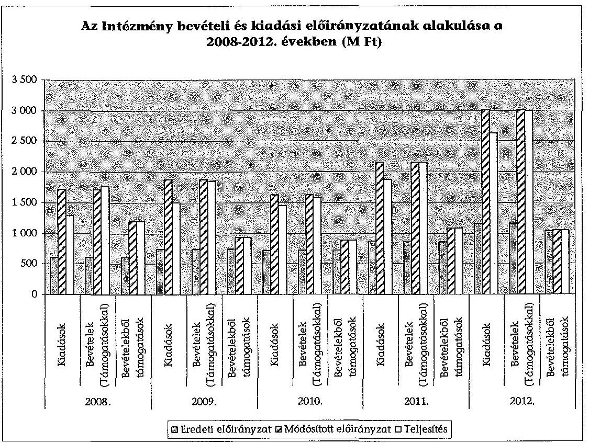

Az intézmény által ellátandó szakfeladatok bővülése, az ezekhez kapcsolódó feladat átadások-átvételek következtében jogszabályi, irányító szervi és intézményi hatáskörben hajtottak végre előirányzat-módosításokat.

Az egyes években a következő táblázatban bemutatott előirányzatmódosításokra került sor:

| Előirányzatok módosításának összege (M Ft) | 2008. | 2009. | 2010. | 2011. | 2012. |
| :--: | :--: | :--: | :--: | :--: | :--: |
|  | 1106,2 | 1140,1 | 907,1 | 1292,3 | 1849,0 |
| Országgyűlési hatáskör |  |  |  | $-28,7$ |  |
| Kormányzati hatáskör | 305,2 | 17,1 | $-28,6$ | 147,6 | 4,9 |
| Irányító szervi hatáskör | 278,0 | 173,6 | 196,4 | 211,9 |  |
| Intézményi hatáskör | 523,0 | 949,4 | 739,3 | 961,5 | 1844,1 |

Az intézmény pénzügyi gazdálkodása az irányadó jogszabályoknak megfelelt. A különböző hatáskörben végrehajtott előirányzat-átcsoportosítások esetében betartották a jogszabályok ${ }^{78}$ előírásait.

Az intézmény előirányzat-maradványa a 2008. évben 484,8 M Ft, majd 2012-ben 361,9 M Ft teljes mértékben kötelezettségvállalással terhelt volt.

[^0]
[^0]:    ${ }^{78}$ az Áht. 100. és 100/A. §-ok, valamint az Áht. 2 30-33. és 35. §-ok

---

A 2009. évi 368,0 M Ft előirányzat-maradványból 2,2 M Ft, a 2010. évi 129,1 M Ft előirányzat-maradványból 39,5 M Ft volt a szabad előirányzat. A 2011. évben megállapított felhasználható előirányzat-maradványból 274,1 M Ft kötelezettségvállalással terhelt, 2,7 M Ft szabad előirányzat-maradvány volt.

Az egyes években képződött előirányzat-maradványok általában célfeladatokra átvett pénzeszközök, uniós (pl.: TÁMOP) projektek, vagy egyéb intézményi beruházások maradványaként keletkeztek. A 2010. évben jelentős összeg, 39,5 M Ft épületrekonstrukciós munkákhoz kapcsolódott, amelyet a beruházás okafogyottá válása miatt az intézmény a 2011. évben irányító szervének visszautalt. A 2012. évi előirányzat-maradványból jelentős összeget, 194,8 M Ft-ot tett ki a TÁMOP 5.4.1. projekt kapcsán képződött maradvány.

Az intézmény bevételein belül a támogatások kisebb nagyságrendet képviseltek, arányuk az ellenőrzött időszak egyes éveiben 34,8-67,5% között mozgott. Ennek oka, hogy jelentős volt a támogatás értékű működési bevétel. A 2012. évben a bevételeken belül a támogatások alig 34,8%-os arányához hozzájárult az 1065,0 M Ft értékű, államháztartáson kívülről átvett működési célú pénzeszköz, amely a Fiatalok Lendületben Program támogatásának átvétele volt.

# 5.2. A pénzforgalom szabályossága 

A kiadási és bevételi tranzakciók (személyi jellegű, dologi és felhalmozási kiadások, intézményi működési bevételek) tételeinek ellenőrzése alapján az intézmény a 2008-2012. években a költségvetési kiadási és bevételi előirányzatait a jogszabályi előírások és felhatalmazások betartásával használta fel.

A kiválasztott tételekhez kapcsolódó szerződések és egyéb dokumentumok formai és tartalmi elemei megfeleltek a jogszabályi előírásoknak ${ }^{79}$. Ez alól kivétel a 2008. és 2009. évi uniós támogatások felhasználása, amelyeknél - a jogszabályi előírások ellenére ${ }^{80}$ - az utalványrendeleteken nem szerepeltették a dátumot. A 2010-2012. évben már nem volt ilyen jellegű hiányosság.

### 5.3. A pénzügyi stabilitás biztosítása

Az intézményre vonatkoztak az ellenőrzött időszakban a kormányzati egyensúlyjavító intézkedések, amelyek zárolások, költségvetési befizetési kötelezettségek, létszámleépítések formájában jelentkeztek. Az intézményre eszközbeszerzési tilalom is vonatkozott. A kormányzati egyensúlyjavító intézkedéseket az intézmény végrehajtotta. Az irányító szervvel folytatott egyeztetések eredményeként a 2010. évben elrendelt 92,0 M Ft zárolás 48,8 M Ft-ra módosult.

Az intézmény az irányító szervhez fordult a közfeladat-ellátás elsődlegessége, a feladatváltozások és a tervezett bevételek elmaradása miatt.

[^0]
[^0]:    ${ }^{79}$ az Ámr. ${ }_{1}$ 134. §., az Ámr. ${ }_{2}$ 72. § és az Ávr. 46-49. §-ok
    ${ }^{80}$ az Ámr. ${ }_{1}$ 135. § (2) és a 136. § (4) bekezdés g) pontja

---

A közfeladatok zavartalan ellátása érdekében az intézmény vezetője kiadta „a 2012. évi költségvetés kiadási előirányzatainak betartásáról" szóló 9/2012. számú főigazgatói utasítást, melyben szigorú takarékossági és racionalizálási intézkedéseket vezetett be mind a szakmai mind a funkcionális területeken.

A kormányzati egyensúlyjavító intézkedések végrehajtása ellenére az intézmény működése biztosított volt, keret-előrehozási kérelmet nem nyújtott be.

| Az intézményt érintő zárolások és maradványtartási kötelezettségek a 2008-2012. években (M Ft) |  |  |  |  |  |  |
| :--: | :--: | :--: | :--:

 | :--: | :--: | :--: | :--: | :--: | :--: | :--: |
|  | 2008. | 2009. | 2010. | 2011. | 2012. | 2008-2012. |
| Zárolás |  |  | 48,8 |  | 5,7 | 54,5 |
| Maradványtartási kötelezettség |  | 16,0 |  |  |  | 16,0 |
| Maradvány befizetési kötelezettség | 6,5 | 4,7 | 11,7 | 4,1 | 0,3 | 27,3 |
| Átcsoportosítás (egyszeri többletkiadások fedezetére) | 0,9 |  |  |  | 6,8 | 7,7 |
| Egyéb költségvetési befizetési kötelezettség |  | 16,3 |  |  | 1,1 | 17,4 |
| Maradványtartási kötelezettség | 7,4 | 37,0 | 60,5 | 4,1 | 13,9 | 122,9 |

Az intézmény likviditási helyzete megfelelő volt, a likviditási mutató (pénzeszközök/rövidlejáratú kötelezettségek) alapján a teljes időszakban 3,3 fölötti értéket mutatott, vagyis a pénzeszközök az időszakban fedezték a kötelezettségeket.

Az intézmény likviditási helyzetét befolyásolta a szállítói kötelezettségek és az egyéb rövidlejáratú kötelezettségek állományának növekedése.

| Az intézmény kötelezettségeinek és passzív pénzügyi elszámolásainak év végi állománya a 2008-2012. években (M Ft) |  |  |  |  |  |
| :--: | :--: | :--: | :--: | :--: | :--: |
|  | 2008. | 2009. | 2010. | 2011. | 2012. |
| Rövid lejáratú kötelezettség állomány | 29,3 | 3,6 | 31,3 | 76,0 | 217,0 |
| Ebből: |  |  |  |  |  |
| Szállító állomány | 28,8 | 3,6 | 29,1 | 31,2 | 43,0 |
| Egyéb rövidlejáratú kötelezettségek | 0,5 | 0,0 | 2,2 | 44,8 | 174,0 |
| Passzív pénzügyi elszámolások | 2,5 | 0,1 | 0,1 | 11,6 | 500,8 |

A szállítói állomány növekedését elsősorban a feltorlódott közüzemi számlák okozták (villamosenergia-szolgáltatás, ivóvíz és szennyvízszolgáltatás), valamint bérleti és lízingdíjak. Az egyéb kötelezettségek jelentős növekedése arra vezethető vissza, hogy az intézmény 2011. december 20-ával átvette a Nemzetközi Pikler Emmi Kózalapítvány vagyonát és ezzel párhuzamosan a vagyon erejéig történő kötelezettségeinek rendezését. Hosszú lejáratú kötelezettsége az intézménynek nem volt. A kapcsolódó jogokról és kötelezettségekről az Áht. az Ávr., a Vtv. és kapcsolódó végrehajtási rendeletei szerinti előírások ${ }^{81}$, valamint az Áhsz. rendelkezéseinek megfelelő módon rendelkezett az intézmény.

[^0]
[^0]:    ${ }^{81}$ Vtv., Vtv. Vhr. IV. és V. fejezete és a 347/2010. (XII. 28.) Korm. rendelet 2. § és 5. §

---

A passzív pénzügyi elszámolások a 2012. év végére jelentősen megnövekedtek, az előző évi 11,6 M Ft-ról 500,8 M Ft-ra. A nagymértékű növekedés 99,8%-a nemzetközi támogatási programok deviza elszámolásaihoz kötődött.

A Fiatalok Lendületben Program keretében az Európai Bizottsággal kötött megállapodás szerint a szerződés szerinti összegek finanszírozása korábban történt, mint annak terhére a támogatások kifizetése.

A követelések állománya az ellenőrzött időszakban a 2011. évig lényegében a vevőköveteléseket tartalmazta, és a 2008-2011. években nem volt jelentős (2008-ban 0,7 M Ft, 2009-ben 2,3 M Ft, 2010-ben 0,1 M Ft, 2011-ben 12,6 M Ft). A 2012. évben azonban (új feladatként kapott/átvett) a támogatási programokhoz kapcsolódó egyéb követelésekkel 861,9 M Ft-ra növekedett.

A követelésállományból $1,5 \mathrm{M}$ Ft intézményi működési bevételekkel kapcsolatos követelés, 776,2 M Ft hazai és nemzetközi (európai uniós) támogatási program előlege és $78,0 \mathrm{M}$ Ft támogatási program szabálytalan kifizetése miatti követelés volt.

Az intézmény a kintlévőségek csökkentése érdekében fizetési felszólításokat küldött ki a nem fizető adósok és vevők részére.

# 6. AZ INTÉZMÉNY VAGYONGAZDÁLKODÁSA 

### 6.1. A vagyongazdálkodás szabályozottsága

Az intézmény szabályozta a beszerzett, átvett vagyontárgyak nyilvántartásba vételének, üzembe helyezésének, és külön szabályzatban a használaton kívüli/felesleges vagyontárgyak hasznosításának, selejtezésének eljárásrendjét. A szabályozásokat évente aktualizálták, azok megfeleltek a Számv tv., az Áhsz. ${ }^{82}$ és egyéb jogszabályok ${ }^{83}$ rendelkezéseinek.

Az intézmény a 2008-ban hatályos számviteli politikájában a jogszabályi előírások ellenére ${ }^{84}$ nem rögzítette a beszerzett, illetve előállított immateriális javak, tárgyi eszközök üzembe helyezése dokumentálásának szabályait. A 2009-2012. évektől ez a hiányosság már nem jellemezte a számviteli politikát.

Az intézmény rendelkezett az ingatlanrész (előadótermek), illetve a gépjárművek bérbeadásának/magáncélú használatának ellenértékére vonatkozó önköltség-számítási, valamint az eszközök magáncélú használatára vonatkozó szabályzattal. A szabályzatokban meghatározták a Ft/nap alapú terembérleti díj kategóriákat, valamint az Szja. tv. szerinti Ft/km alapú magáncélú gépjárműhasználati díjakat.

A 2011. évi módosításig a szabályzat az előadótermeknél három kategóriát, illetve önköltségen vagy piaci bérleti díjjal számítva hat bérleti díj kategóriát hatá-

[^0]
[^0]:    ${ }^{82}$ Áhsz. 28. §, 37. § és 9. sz. melléklet, Számv tv. 47. §.
    ${ }^{83}$ Nvtv. 7. §, 13. §, Vtv. 28. §, 33-36. §-ok.
    ${ }^{84}$ Áhsz. 8. § (7) bekezdés

---

rozott meg. 2011-ben a szabályzatmódosítás a 12 előadóteremre egyedi Ft/óra, illetve Ft/nap számítású díjakat határozott meg.

A szabályzat az immateriális javak és egyéb vagyontárgyak tekintetében (a termeken és gépjárműveken kívül) nem határozott meg önköltséget, de meghatározta az önköltségszámítás költségtényezőit és a számítás általános metodikáját.

# 6.2. A vagyongazdálkodás folytatásának szabályszerűsége 

A vagyonhasznosítás során a költségvetés érdekei ${ }^{85}$ nem sérültek. Olyan vagyonelemeket (előadótermek, gépjármű) hasznosítottak, amelyek intézményi használata nem volt folyamatos, az esetenkénti bérletbe/magán célú használatba adás az intézmény alaptevékenységét nem akadályozta. Az intézmény bérleti díjból 5,1 M Ft, és gépjármű magáncélú használatba adásából 0,05 M Ft bevételt realizált.

A felhalmozási mintatételek tranzakcióinak ellenőrzési tapasztalatai alapján a beszerzett vagyonelemek szervezeti egységhez és szakfeladathoz rendelése minden esetben megtörtént. A szakfeladat besorolások minden esetben megfeleltek az alapító okiratban felsorolt alaptevékenységeknek, amely alapján az eszközöket alaptevékenységek érdekében használták fel.

Az intézménynél az ellenőrzött időszakban (a 2009-2012. években) összesen 10,6 M Ft bevételt realizáltak „0" értéken nyilvántartott vagyontárgyak (gép és berendezés: $0,5 \mathrm{M} \mathrm{Ft}$; gépjármű: $4,2 \mathrm{M} \mathrm{Ft}$; egyéb: $5,9 \mathrm{M} \mathrm{Ft}$ ) értékesítéséből. Az értékesítési tevékenység során betartották a szabályzatok előírásait.

A 2008. évi szabályozás a nettó $2,0 \mathrm{M}$ Ft értékhatár fölötti értékesítések esetén nyilvános meghirdetést és versenytárgyalást írt elő, az értékhatár alatti értékesítések esetén az értékesítés módjáról a gazdasági igazgató döntött. 2012-ben a szabályozás az értékhatárt $0,5 \mathrm{M}$ Ft értékben határozta meg. Az értékhatár fölötti vagyontárgyak értékesítése esetén a három ajánlat bekérésre és a legjobb ajánlat kiválasztásra került. (A 2012. évben 8 db , a Mobilitás Országos Ifjúsági Igazgatóság 2011. évben történt átvételekor átvett, nullára leírt, $27,9 \mathrm{M}$ Ft bruttó értékű gépjármű került értékesítésre, $3,9 \mathrm{M}$ Ft-os áron.)

Az intézménynek az ellenőrzött időszakban az MNV Zrt. értékesítési engedélyéhez kötött értékesítése nem volt.

### 6.3. A vagyonelemek nyilvántartásának szabályszerűsége

A felhalmozási mintatételek alapján a beszerzési tranzakciók lekönyvelése, a főkönyvi számlakijelölés, valamint a beszerzett vagyonelemek leltárakban való feltüntetése az Áhsz. ${ }^{86}$ és az intézményi számviteli szabályok betartásával történt. A beszerzett vagyontárgy értékéhez kapcsolódó beszerzési eljárások megfeleltek a belső szabályzatokban meghatározott értékhatároknak.

[^0]
[^0]:    ${ }^{85}$ Nvtv. 11. § (11) bekezdése
    ${ }^{86}$ Áhsz. 28-31.§-ok, 37. §.

---

A kötelezettségvállalási dokumentumok minden beszerzési tranzakció esetében hitelt érdemlően alátámasztották a gazdasági esemény valódiságát, a beszerzési szabályokat betartották. A kötelezettségvállalások, ellenjegyzések és utalványozások megfeleltek a jogszabályi előírásoknak ${ }^{87}$, illetve a belső szabályoknak. Az értékcsökkenési leírások elszámolása a jogszabályi követelményeknek ${ }^{88}$ és a belső számviteli szabályoknak megfelelt.

# 6.4. A vagyon összetételének alakulása 

Az intézmény mérleg szerinti vagyona a 2008. évi 894,7 M Ft-ról a 2012. évre 2315,8 M Ft-ra, 158,8%-kal (1421,1 M Ft-tal) nőtt. A vagyon növekedését jellemzően a forgóeszközök értékének 248,2%-os (1236,9 M Ft) növekedése okozta. A forgóeszközökön belül a 2012. évi uniós forrású támogatási programokhoz kapcsolódó előlegek ( $776,2 \mathrm{M} \mathrm{Ft}$ ) és a pénzeszközök ( $397,4 \mathrm{M} \mathrm{Ft}$ ) értékének növekedése volt a meghatározó.

Az immateriális javak és tárgyi eszközök állományváltozásának* évenkénti alakulását szemlélteti a következő táblázat:
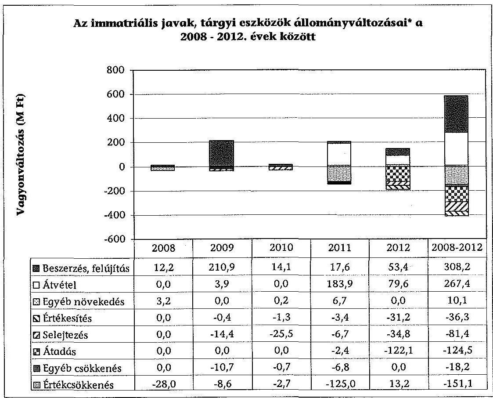
*a beszámolók 38. űrlapjai alapján az immateriális javak és az aktivált tárgyi eszközök állományi értékét tartalmazza

[^0]
[^0]:    ${ }^{87}$ Ámr. ${ }_{1}$ 136-138. §-ok, Ámr. ${ }_{2}$ 72.§, 74-80. §-ok, Ávr. 55-60. §-ok.
    ${ }^{88}$ Áhsz. 30. §

---

A 2008. évi befektetett eszközök nyitó állományához képest az összes állományváltozás 174,2 M Ft volt, amelyet legnagyobb mértékben a 2009. évi ingatlan felújításhoz kapcsolódó 210,9 M Ft összegű növekedés eredményezett. A feladat átadás-átvételekhez kapcsolódó hatások összértéke 142,9 M Ft volt.

Az immateriális javak és tárgyi eszközök használhatósági foka alakulását az értékcsökkenés és a bruttó érték változása befolyásolja. Az ellenőrzött időszakban az értékcsökkenés növekedése a 2009. (ingatlan felújítás) és a 2011. évek (Mobilitás eszközeinek átvétele) kivételével meghaladta a bruttó érték növekedést, amely megmutatkozott a használhatósági fok alakulásában, amelynek értékeit a következő táblázat mutatja be:

| Az intézmény immateriális javainak és tárgyi eszközeinek |  |  |  |  |  |  |
| :--: | :--: | :--: | :--: | :--: | :--: | :--: |
| használhatósági foka ${ }^{a}$ alakulása |  |  |  |  |  |  |
|  | 2008 | 2009 | 2010 | 2011 | 2012 |  |
| Immateriális javak | 0,10 | 0,08 | 0,08 | 0,26 | 0,43 |  |
| Ingatlanok | 0,88 | 0,90 | 0,88 | 0,86 | 0,84 |  |
| Gépek, berendezések | 0,21 | 0,18 | 0,16 | 0,11 | 0,16 |  |
| Járművek | 0,21 | 0,14 | 0,07 | 0,11 | 0,15 |  |
| Immateriális javak és |  |  |  |  |  |  |
| tárgyi eszközök összesen | 0,65 | 0,72 | 0,71 | 0,64 | 0,63 |  |

a használhatósági fok - az ingatlanok kivételével - kedvezőtlenül alakult, az eszközállományt az elhasználtság jellemezte.

Az intézmény forgóeszköz-állománya az ellenőrzött időszakban az alábbi táblázatnak megfelelően alakult:

|  | Az intézmény forgóeszközállományának alakulása |  |  |  |  |  |  |  |  |  |
| :--: | :--: | :--: | :--: | :--: | :--: | :--: | :--: | :--: | :--: | :--: |
|  | 2008 |  | 2009 |  | 2010 |  | 2011 |  | 2012 |  |
|  | érték   (M Ft) | részarány   (\%) | érték   (M Ft) | részarány   (\%) | érték   (M Ft) | részarány   (\%) | érték  

 (M Ft) | részarány   (%) | érték   (M Ft) | részarány   (%) |
| Készletek | 5,4 | 1,1 | 0,0 | 0,0 | 0,0 | 0,0 | 15,3 | 4,8 | 10,2 | 0,8 |
| Követelések | 0,7 | 0,1 | 2,3 | 0,6 | 0,1 | 0,1 | 12,6 | 4,0 | 861,9 | 49,7 |
| Pénzeszközök | 434,9 | 87,3 | 362,3 | 94,7 | 158,9 | 91,8 | 256,7 | 81,2 | 832,3 | 47,9 |
| Aktív pénzügyi elszámolások | 57,4 | 11,5 | 17,9 | 4,7 | 14,0 | 8,1 | 31,6 | 10,0 | 30,9 | 1,8 |
| Forgóeszközök összesen | 498,4 | 100,0 | 382,5 | 100,0 | 173,0 | 100,0 | 316,2 | 100,0 | 1735,3 | 100,0 |

2012-ben jelentős változás következett be az intézmény mérlegadataiban, amelyet a Mobilitás Ifjúsági Szolgálat, ezen belül a Fiatalok Lendületben Program 2012. január 1-jei átvétele okozott.

A követelésekből 607,2 M Ft a támogatottaknak folyósított, de a támogatottakkal és az Európai Bizottsággal el nem számolt támogatás előfinanszírozási (előleg) ${ }^{89}$ követelés, valamint 88,5 M Ft a támogatási program le nem zárt kifizetései.

Az intézmény saját vagyona a 2008. évi 862,8 M Ft-ról a 2012. évre 1598,0 M Ft-ra nőtt, a saját tőke 862,3 M Ft-os növekedésének, valamint a tartalékok 127,0 M Ft-os csökkenésének eredményeként.

[^0]
[^0]:    ${ }^{89}$ A pályázónak történő utalást követően, az elszámolásig ezen a jogcímen tartják nyilván a folyósított összeget.

---

A kötelezettségek a 2008. évi 31,9 M Ft-ról a 2012. év végére 717,8 M Ft-ra emelkedtek, az időszakban az intézmény forrásainak átlagosan a $15,0 \%$-át tették ki, hosszú lejáratú kötelezettsége nem volt az intézménynek.

Az intézményi tőkeerősség-mutató (saját tőke/források) változását mutatja be a következő táblázat:

| Tőkeerősség-mutató változása 2008 - 2012 között |  |  |  |  |  |
| :-- | :--: | :--: | :--: | :--: | :--: |
|  | $\mathbf{2 0 0 8}$ | $\mathbf{2 0 0 9}$ | $\mathbf{2 0 1 0}$ | $\mathbf{2 0 1 1}$ | $\mathbf{2 0 1 2}$ |
| saját tőke/források | 0,42 | 0,60 | 0,72 | 0,61 | 0,53 |

A mutató a 2008-2010. évek között növekedett, majd 2011-től romlott. A 2012. évben a mutató romlásához hozzájárult a kötelezettségek jelentős növekedése. A kötelezettségeken belül a rövid lejáratú kötelezettségek és a nemzetközi támogatási programok deviza elszámolásaihoz kötődően a passzív pénzügyi elszámolások számottevő emelkedése is jelentős volt.

# 7. A KÜLSŐ ELLENŐRZÉSEK JAVASLATAINAK HASZNOSULÁSA 

### 7.1. Intézkedések a külső ellenőrzések javaslataira

Az intézménynél az ellenőrzött időszakban három alkalommal került sor külső ellenőrzésre. Két ellenőrzést folytatott le az irányító szerv belső ellenőrzése a Ber. 10. §-a alapján. Ezek tárgya az intézmény 2007. és 2008. évi elemi költségvetési beszámolóinak megbízhatósági ellenőrzése volt. Egy esetben az ESZA Nonprofit Kft. a 2009-2011. évekre vonatkozón végzett ellenőrzést az intézmény által megvalósított TÁMOP projektek kapcsán.

Az irányító szerv az intézmény elemi költségvetési beszámolóinak megbízhatósági ellenőrzéséről készített mindkét jelentésében javaslatokat tett az intézmény belső szabályzatainak aktualizálására és kiegészítésére vonatkozóan.

A javaslatok az SZMSZ-nek a jogszabályi változásokkal összhangba hozására, a gazdasági szervezet ügyrendjének kiegészítésére, a dolgozók feladatellátására és helyettesítésére, valamint az eszközök és források leltározási és leltárkészítési szabályzatának kiegészítésére vonatkoztak.

Az intézmény mindkét ellenőrzés javaslatai alapján intézkedési tervet készített ${ }^{90}$, amelyeket megküldött az irányító szervnek.

Az ESZA Nonprofit Kft. a TÁMOP 5.4.1. sz. projekt ${ }^{91}$ vonatkozásában a 2009-2011. évek közötti folyamatkövető helyszíni ellenőrzéseket, illetve 2012-ben záró ellenőrzést végzett. Az ellenőrzésekről felvett jegyzőkönyvek értékelték a projekt szakmai előrehaladásának ütemét, a felmerült problémákat és kockázatokat.

[^0]
[^0]:    ${ }^{90}$ a Ber. 17.§ (1) d) pontja és a 29. §
    ${ }^{91}$ Szociális szolgáltatások modernizációja, központi és területi stratégiai tervezési kapacitások megerősítése, szociálpolitikai döntések megalapozása.

---

A 2010. október 8-i jegyzőkönyv észrevételei a projektben alkalmazott egyes munkavállalók munkaügyi dokumentációinak kiegészítésére, az elszámolt bér és járulékaik elkülönített nyilvántartására és a tevékenységütemezés aktualizálására vonatkoztak. A 2009. december 15-i jegyzőkönyv észrevétele a projektben szakmai vezetőként résztvevő kinevezéséhez kapcsolódó külön szerződés hiányára vonatkozott.

Az intézmény az ESZA Nonprofit Kft. észrevételeire intézkedési tervet készített, amelyben meghatározta az intézkedések felelőseit és határidőit.

# 7.2. A külső ellenőrzések javaslatainak megvalósítása 

Az intézmény eleget tett az intézkedési terv végrehajtásának jelentésére vonatkozó kötelezettségének ${ }^{92}$. Beszámolt az irányító szervnek a megtett intézkedések végrehajtásáról. A 2008. évi beszámoló megbízhatósági ellenőrzésére tett intézkedéseket az intézmény belső ellenőrzési egysége utóellenőrzés keretében 2010-ben felülvizsgálta.

Az ellenőrzési jelentés megállapította, hogy a javasolt intézkedések közül az SZMSZ módosítása folyamatban volt, az ügyrend és a leltározási és leltárkészítési szabályzat kiegészítése megtörtént.

Az intézmény - a belső ellenőrzési jelentésben foglaltak szerint - végrehajtotta a TÁMOP projektekkel kapcsolatos ellenőrzési jegyzőkönyvekben és az intézkedési tervekben foglalt feladatokat ${ }^{93}$.

Budapest, 2014.
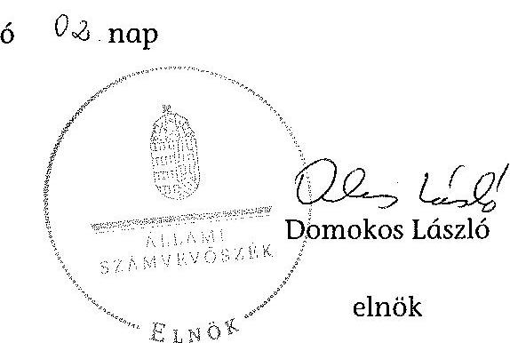

Melléklet: $\quad 8 \mathrm{db}$

[^0]
[^0]:    ${ }^{92}$ a Ber. 17.§ (1) d) pontja
    ${ }^{93}$ A TÁMOP projektben mindaddig, amíg az előírt intézkedéseket nem hajtják végre, a folyósítások felfüggesztésre kerülnek.

---

# A Nemzeti Család- és Szociálpolitikai Intézet alaptevékenységei a 2010-2012 közötti időszakban

|  Év | 2010. | 2011. | 2012.  |
| --- | --- | --- | --- |
|  Alapító okirat száma | 19057-3/2010-0004JKF | 51876-2/2011-NEPM | 12933-1/2013-EMM  |
|   | Hatásvizsgálatokat, adatgyűjtést, tényfeltáró, elemző, stratégiai és döntés-előkészítő tanulmányokat készít a munkaügyi, foglalkoztatáspolitikai, szociálpolitikai, családpolitikai, társadalmi esélyegyenlőségi, gyermekvédelmi, ifjúság- és drogpolitikai stratégiai döntések megalapozására. | Hatásvizsgálatokat, adatgyűjtést, tényfeltáró, elemző, stratégiai és döntés-előkészítő tanulmányokat készít a szociálpolitikai, családpolitikai, társadalmi esélyegyenlőségi, gyermekvédelmi, ifjúság- és drogpolitikai stratégiai döntések megalapozására. | Hatásvizsgálatokat, adatgyűjtést, tényfeltáró, elemző, stratégiai és döntés-előkészítő tanulmányokat készít a szociálpolitikai, családpolitikai, társadalmi esélyegyenlőségi, gyermekvédelmi, ifjúság- és drogpolitikai stratégiai döntések megalapozására.  |
|   | Intézményi és műszaki intézmények tevékenységét, módszertani útmutatókkal, műhelymunkákkal, egyéb kiadványokkal segíti a szociális és gyermekvédelmi szolgáltatók szakmai feladatainak teljesítését, fejlesztési tevékenysége keretében új szolgáltatási formák és szakmai módszerek bevezetését végzi, és ennek érdekében modellkísérleteket is végez. | Országos szociális és gyermekvédelmi módszertani intézményként koordinálja a módszertani intézmények tevékenységét, módszertani útmutatókkal, műhelymunkákkal, egyéb kiadványokkal segíti a szociális és gyermekvédelmi szolgáltatók szakmai feladatainak teljesítését, fejlesztési tevékenysége keretében új szolgáltatási formák és szakmai módszerek bevezetését végzi, és ennek érdekében modellkísérleteket is végez. | Országos szociális és gyermekvédelmi módszertani intézményként koordinálja a módszertani intézmények tevékenységét, módszertani útmutatókkal, műhelymunkákkal, egyéb kiadványokkal segíti a szociális és gyermekvédelmi szolgáltatók szakmai feladatainak teljesítését, fejlesztési tevékenysége keretében új szolgáltatási formák és szakmai módszerek bevezetését végzi, és ennek érdekében modellkísérleteket is végez.  |
|   |  |  | Részt vesz a gyermekjóléti és gyermekvédelmi szolgáltatók ellenőrzésében, valamint a kijelölt módszertani feladatokat ellátó intézmények kijelölésében és módszertani tevékenységük ellenőrzésében.  |
|   | Szakmai továbbképzéseket és műhelyeket szervez, szakkönyvtárat tart fenn, szakmai információs fórumként működteti az intézeti honlapot, kiadja az intézet folyóiratát és időszakos kiadványait. | A családon belüli erőszak megelőzésére és hatékony kezelésére irányuló nemzeti stratégia kialakításáról szóló 45/2005. (IV. 14.) OGY határozat és a társadalmi bűnmegelőzés nemzeti stratégiájáról szóló 115/2005. (X. 28.) OGY határozatban foglalt célok megvalósítása érdekében Országos Kríziskezelő és Információs Telefonszolgálatot tart fenn. | A családon belüli erőszak megelőzésére és hatékony kezelésére irányuló nemzeti stratégia kialakításáról szóló 45/2005. (IV. 14.) OGY határozat és a társadalmi bűnmegelőzés nemzeti stratégiájáról szóló 115/2005. (X. 28.) OGY határozatban foglalt célok megvalósítása érdekében Országos Kríziskezelő és Információs Telefonszolgálatot tart fenn.  |
|   |  |  | Időszakos kiadványai kijelölt módszertani feladatokat ellátó intézmények kijelölésében és módszertani tevékenységük ellenőrzésében.  |
|   |  |  | Vezeti a személyes gondoskodást nyújtó szervezetekben szakmai tevékenységet végző szakképzett személyek működési nyilvántartását.  |
|   |  |  | Szakképezi és fejleszti a szociális ágazat szakképzési, továbbképzési, alap- és szakmai rendszerét.  |
|   |  |  | A szociális szolgáltatások szakmacsoport szakképzésével kapcsolatban szakmai vizsgát szervez.  |
|   |  |  | A szociális szolgáltatások szakmacsoport szakképzésével kapcsolatban szakmai vizsgát szervez.  |
|   |  |  | A szociális szolgáltatások szakmacsoport szakképzésével kapcsolatban szakmai vizsgát szervez.  |
|   |  |  | Elősegíti a Gyerek- és Ifjúsági Alapprogram pályázatával kapcsolatos feladatokat.  |
|   |  |  | Elősegíti az irányító szerv által meghatározott pályázatkezelői feladatokat.  |
|   |  |  | Közvetíti a külföldi tudományos eredmények megismerését, és elősegíti ezek hazai felhasználását, szakterületein részt vesz a nemzetközi együttműködésben és a nemzetközi kapcsolatok ápolásában, tagként működik több nemzetközi szakmai szervezetben.  |
|   |  |  | Szakmai továbbképzéseket és műhelyeket szervez, szakkönyvtárat tart fenn, szakmai információs fórumként működteti az intézeti honlapot, kiadja az intézet folyóiratát és időszakos kiadványait.  |

1. SZÁMÚ MELLEKLET A V-0121-335/2014. SZÁMÚ JELENTÉSHEZ

---

.

---

### 2. SZÁMÚ MELLÉKLET A V-0121-335/2014. SZÁMÚ JELENTÉSHEZ

|  Kv | 2010. | 2011. | 2012.  |
| --- | --- | --- | --- |
|  Alapító okirat száma | 19057-3/2010-0004JE7 | 51876-2/2011-NEEM | 12953-1/2013-EMMI  |
|   | Az intézet országos szociális módszertani intézmény, amely a 3/2008. (IV. 16.) SZMM rendeletben meghatározott feladatokat látja el: a) koordinálja a módszertani intézmények tevékenységét, módszertani útmutatókkal, újszerű módszerekkel és egyéb kiadványokkal segíti a szociális szolgáltatók és intézmények szakmai feladatainak teljesítését, b) szolgáltatási formák és szakmai módszerek bevezetése érdekében modellkísérleteket is végez, a szociális foglalkoztatási és szociális kiadványtalan elutasítás hatásvizsgálat elindítását. | a gyermekek védelméről és a gyámi igazgatásról szóló 1997. évi XXXI. törvény 82. §-ában foglaltak | a gyermekek védelméről és a gyámi igazgatásról szóló 1997. évi XXXI. törvény 82. §-ában foglaltak  |
|   | A szociális foglalkoztatás engedélyezéséről és a szociális foglalkoztatási támogatásról szóló 112/2006. (V. 12.) Korm. rendelet alapján a szociális és gyámügyi hatóság szakvéleményt kér a Szociálpolitikai és Munkavédelmi Intézettől a szociális foglalkoztatási feladatokkal megbízott módszertani intézményről ebben a kérdésben, hogy a foglalkoztatási szakmai program a külön jogszabályban foglalt követelményeknek megfelel-e, a szociális foglalkoztatás céljainak megvalósulását mennyire segíti elő, valamint a célokkal és a szociális intézmény szakmai programjával mennyire áll összhangban. | a gyermekjóléti és gyermekvédelmi szolgáltató tevékenység engedélyezéséről, valamint a gyermekjóléti és gyermekvédelmi vállalkozó engedélyről szóló 259/2002. (XII.
 18.) Korm. rendelet 15. §-ában foglaltak | a gyermekjólét és gyermekvédelmi szolgáltató tevékenység engedélyezéséről, valamint a gyermekjólét és gyermekvédelmi vállalkozó engedélyről szóló 259/2002. (XII. 18.) Korm. rendelet 15. §-ában foglaltak  |
|  Készítésének | a szociális foglalkoztatás engedélyezéséről és a szociális foglalkoztatási támogatásról szóló 112/2006. (V. 12.) Korm. rendelet 3. §-ában foglaltak | a szociális foglalkoztatás engedélyezéséről és a szociális foglalkoztatási támogatásról szóló 112/2006. (V. 12.) Korm. rendelet 3. §-ában foglaltak | a szociális foglalkoztatás engedélyezéséről és a szociális foglalkoztatási támogatásról szóló 112/2006. (V. 12.) Korm. rendelet 3. §-ában foglaltak  |
|   | a gyermekvédelmi és gyámügyi feladat- és hatáskörök ellátásáról, valamint a gyámítottsági szervezetéről és illetékességéről szóló 331/2006. (XII. 23.) Korm. rendelet 14-18. §-ában foglaltak | a gyermekvédelmi és gyámügyi feladat- és hatáskörök ellátásáról, valamint a gyámítottsági szervezetéről és illetékességéről szóló 331/2006. (XII. 23.) Korm. rendelet 14-18. §-ában foglaltak | a gyermekvédelmi és gyámügyi feladat- és hatáskörök ellátásáról, valamint a gyámítottsági szervezetéről és illetékességéről szóló 331/2006. (XII. 23.) Korm. rendelet 14-18. §-ában foglaltak  |
|   | a személyes gondoskodást nyújtó gyermekjólét, gyermekvédelmi intézmények, valamint személyek szakmai feladatairól és működésük feltételeiről szóló 15/1998. (IV. 30.) NM rendelet 4. és 129/A. §-ában foglaltak | a személyes gondoskodást nyújtó gyermekjólét, gyermekvédelmi intézmények, valamint személyek szakmai feladatairól és működésük feltételeiről szóló 15/1998. (IV. 30.) NM rendelet 4. és 129/A. §-ában foglaltak | a személyes gondoskodást nyújtó szociális intézmények szakmai feladatairól és működésük feltételeiről szóló 1/2000. (I. 7.) SzCsM rendelet 39/I., 104/A. és 111. §-ában foglaltak  |
|   | a személyes gondoskodást nyújtó szociális intézmények, valamint a szociális szolgáltatók, intézmények engedélyezési eljárásának szakértői díjáról szóló 3/2008. (IV. 15.) SZMM rendelet 3. és 12. §-ában foglaltak | a szociális módszertani intézmények kijelöléséről és feladatairól, valamint a szociális szolgáltatók, intézmények engedélyezési eljárásának szakértői díjáról szóló 3/2008. (IV. 15.) SZMM rendelet 3. és 12. §-ában foglaltak | a szociális módszertani intézmények kijelöléséről és feladatairól, valamint a szociális szolgáltatók, intézmények engedélyezési eljárásának szakértői díjáról szóló 3/2008. (IV. 15.) SZMM rendelet 3. és 12. §-ában foglaltak  |
|   | a személyes gondoskodást végző személyek adatainak működési nyilvántartásáról szóló 8/2000. (VIII. 4.) SzCsM rendelet 2. §-ában foglaltak | a személyes gondoskodást végző személyek adatainak működési nyilvántartásáról szóló 8/2000. (VIII. 4.) SzCsM rendelet 2. §-ában foglaltak | a személyes gondoskodást végző személyek adatainak működési nyilvántartásáról szóló 8/2000. (VIII. 4.) SzCsM rendelet 2. §-ában foglaltak  |
|   | a személyes gondoskodást végző személyek adatairól szóló 8/2000. (VIII. 4.) SzCsM rendelet 2. §-ában foglaltak | a személyes gondoskodást végző személyek szabályainak és elutasításaik működési nyilvántartásáról szóló 8/2000. (VIII. 4.) SzCsM rendelet 2. §-ában foglaltak | a személyes gondoskodást végző személyek szabályainak és elutasításaik működési nyilvántartásáról szóló 8/2000. (VIII. 4.) SzCsM rendelet 2. §-ában foglaltak  |
|   | az egyes szociális szolgáltatásokat végzők képzéséről és vizsgadíjairól szóló 81/2004. (IX. 18.) ElsCsM rendelet 2. §-ában foglaltak | az egyes szociális szolgáltatásokat végzők képzéséről és vizsgadíjairól szóló 81/2004. (IX. 18.) ElsCsM rendelet 2. §-ában foglaltak | az egyes szociális szolgáltatásokat végzők képzéséről és vizsgadíjairól szóló 81/2004. (IX. 18.) ElsCsM rendelet 2. §-ában foglaltak  |
|   | a Gyermek és Ifjúsági Alapprogram és a Regionális Ifjúsági Invalida működéséről szóló 2/1999. (IX. 24.) ISM rendelet 1., 4., 7., 9. valamint 11-14. §-ában foglaltak | a Gyermek és Ifjúsági Alapprogram és a Regionális Ifjúsági Invalida működéséről szóló 2/1999. (IX. 24.) ISM rendelet 1., 4., 7., 9. valamint 11-14. §-ában foglaltak | a Gyermek és Ifjúsági Alapprogram és a Regionális Ifjúsági Invalida működéséről szóló 2/1999. (IX. 24.) ISM rendelet 1., 4., 7., 9. valamint 12-13. §-ában foglaltak  |
|   | a Nemzetközi Főzőverseny Készenléti terv megszüntetéséről szóló 1180/2011. (V. 31.) Korm. határozat 2. pont d) alpontjában és 3. pontjában foglalt feladatok | a Nemzetközi Főzőverseny Készenléti terv megszüntetéséről szóló 1180/2011. (V. 31.) Korm. határozat 2. pont d) alpontjában és 3. pontjában foglalt feladatok | a Nemzetközi Főzőverseny Készenléti terv megszüntetéséről szóló 1180/2011. (V. 31.) Korm. határozat 2. pont d) alpontjában és 3. pontjában foglalt feladatok  |

---

.

---

# A Nemzeti Család- és Szociálpolitikai Intézet kiadásai és bevételei a 2008-2012 közötti időszakban

|  Ssz. | Megnevezés | 2008. év teljesítés | 2009. év teljesítés | 2010. év teljesítés | 2011. év teljesítés | 2012. év teljesítés  |
| --- | --- | --- | --- | --- | --- | --- |
|  1. | KIADÁSOK |  |  |  |  |   |
|  2. | Személyi juttatások | 492,9 | 515,5 | 612,9 | 630,1 | 664,4  |
|  3. | Munkaadót terhelő járulékok | 157,5 | 151,1 | 160,4 | 163,6 | 172,7  |
|  4. | Dologi kiadások | 468,0 | 441,7 | 496,8 | 827,5 | 655,1  |
|  5. | Egyéb folyó kiadások | 13,8 | 36,7 | 23,1 | 18,5 | 25,0  |
|  6. | Támogatásértékű működési kiadások | 28,9 | 41,8 | 41,1 | 38,5 | 99,8  |
|  7. | Támogatásértékű felhalmozási kiadások |  |  |  |  |   |
|  8. | Előző évi előirányzat átadás | 8,5 | 2,9 |  | 44,7 | 19,4  |
|  9. | Működési célú pénzeszközátadás | 94,4 | 101,2 | 104,5 | 137,8 | 939,4  |
|  10. | Felhalmozási célú pénzeszköz átadás |  | 171,9 |  |  |   |
|  11. | Előadottak pénzbeli juttatásai |  |  |  |  |   |
|  12. | Egyéb juttatás |  |  |  |  |   |
|  13. | Felújítás | 16,1 | 39,0 | 2,1 |  | 7,2  |
|  14. | Intézményi beruházási kiadások áfával |  |  | 12,1 | 17,7 | 46,2  |
|  15. | Központi beruházási kiadások áfával |  |  |  |  |   |
|  16. | Lakásépítés kiadásai áfával |  |  |  |  |   |
|  17. | Összesen | 1280,1 | 1501,8 | 1453,0 | 1878,4 | 2629,2  |
|  18. | BEVÉTELEK |  |  |  |  |   |
|  19. | Közhatalmi bevételek |  |  |  |  |   |
|  20. | Intézményi működési bevételek | 42,6 | 26,8 | 36,2 | 109,0 | 113,0  |
|  21. | Működési célú pénzeszközátvételek |  |  |  | 5,5 | 1065,0  |
|  22. | Felhalmozási bevételek |  | 0,1 | 0,3 | 6,2 | 4,0  |
|  23. | Felhalmozási célú pénzeszközátvételek |  |  |  |  |   |
|  24. | Irányító szervtől kapott támogatás | 1192,8 | 927,5 | 881,1 | 1078,4 | 1041,2  |
|  25. | Támogatás értékű működési bevétel | 334,5 | 331,2 | 320,6 | 776,4 | 302,0  |
|  26. | Támogatás értékű felhalmozási bevétel |  |  |  |  | 36,0  |
|  27. | Előző évi maradvány átvétele | 68,6 | 106,4 | 7,3 | 6,9 | 154,0  |
|  28. | Előirányzat-maradvány felhasználása | 131,1 | 461,4 | 332,6 | 172,8 | 276,8  |
|  29. | Összesen | 1769,6 | 1853,4 | 1578,1 | 2155,2 | 2992,0  |

Forrás: Az Intézmény 2008-2012. évi éves beszámolói.

---

.

---

# A Nemzeti Család- és Szociálpolitikai Intézet könyvviteli mérlegének adatai a 2008-2012. években

|  Ssz. | Megnevezés | 2008. év (nyitó) | 2008. év | 2009. év | 2010. év | 2011. év | 2012. év  |
| --- | --- | --- | --- | --- | --- | --- | --- |
|  1. | IMMATERIÁLIS JAVAK | 7377 | 3631 | 1522 | 2285 | 9534 | 25675  |
|  2. | Alapítás átszervezés aktivált értéke |  |  |  |  |  |   |
|  3. | Kísérleti fejlesztés aktivált értéke |  |  |  |  |  |   |
|  4. | Védjegy értéki jogok |  |  | 361 | 2285 | 9021 | 13889  |
|  5. | Szellemi termékek | 7377 | 3631 | 1161 |  | 513 | 11786  |
|  6. | Immateriális javakra adott előlegek |  |  |  |  |  |   |
|  7. | Immateriális javak értékhelyreállítása |  |  |  |  |  |   |
|  8. | TÁRGYI ESZKÖZÖK | 397566 | 392616 | 571496 | 556125 | 612846 | 554857  |
|  9. | Ingatlanok és kapcsolódó vagyonértékű jogok | 361838 | 353786 | 541235 | 531267 | 583216 | 514209  |
|  10. | Gépek, berendezések, létesítmények | 31652 | 31780 | 28106 | 22377 | 24394 | 35036  |
|  11. | Járművek | 4076 | 3114 | 2155 | 1196 | 3864 | 4240  |
|  12. | Tenyészállatok |  |  |  |  |  |   |
|  13. | Beruházások, felújítások |  | 3936 |  | 1285 | 1372 | 1372  |
|  14. | Beruházásra adott előlegek |  |  |  |  |  |   |
|  15. | Állami készletek, tartalékok |  |  |  |  |  |   |
|  16. | Ügyfelek eszközök értékhelyreállítása |  |  |  |

  |  |   |
|  17. | BEFEKTETETT PÉNZÜGYI ESZKÖZÖK | 191 |  |  | 108 |  |   |
|  18. | ÜZEMELTETÉSRE, KEZELÉSRE ÁTADOTT, VAGYONTKEZELÉSRE VETT ESZKÖZÖK |  |  |  |  | 99 |   |
|  19. | BEFEKTETETT ESZKÖZÖK ÖSSZESEN | 405134 | 396247 | 573018 | 558518 | 622479 | 580532  |
|  20. | KÉSZLETEK | 9920 | 5390 |  |  | 15150 | 10194  |
|  21. | Anyagok |  |  |  |  | 90 | 54  |
|  22. | Sziképzetlen termelés és félkész termék |  |  |  |  |  |   |
|  23. | Kösztermékok |  |  |  |  |  |   |
|  24. | Áruk | 9920 | 5390 |  |  | 15060 | 10140  |
|  25. | Egyéb |  |  |  |  |  |   |
|  26. | KÖVETELÉSEK | 1438 | 722 | 2297 | 105 | 12642 | 861891  |
|  27. | Követelések árufuvarozásból | 413 | 493 | 2297 | 105 | 830 | 1480  |
|  28. | Adók | 1032 |  |  |  |  |   |
|  29. | Ebből: Tértéki díjak |  |  |  |  |  |   |
|  30. | Helyi adók, gépjárműadó |  |  |  |  |  |   |
|  31. | Illetékek |  |  |  |  |  |   |
|  32. | Egyéb |  |  |  |  |  |   |
|  33. | Rövid lejáratú adott kölcsönök |  |  |  |  |  |   |
|  34. | Egyéb követelések |  | 229 |  |  | 11812 | 860411  |
|  35. | Ebből: támogatási program előlegek előfinanszírozás |  |  |  |  |  | 776223  |
|  36. | Kötségvetési programok szabálytalan költségelszámolása |  |  |  |  |  | 77963  |
|  37. | Nemzetközi támogatási programok |  |  |  |  |  |   |
|  38. | Barracskötő- és kereméprőködésből származó köv. |  |  |  |  |  |   |
|  39. | Egyéb hosszú lejáratú köv. a mélt. ford. napot követő egy éven belül esedékes |  |  |  |  |  |   |
|  40. | ÉRTÉKPAPÍROK |  |  |  |  |  |   |
|  41. | PÉNZÜGYI ESZKÖZÖK | 113838 | 434902 | 362318 | 158954 | 256748 | 832283  |
|  42. | Pénztárak, csekkfüzetek, betétkönyvek |  |  |  |  |  |   |
|  43. | Költségvetési pénzforgalmi számítások |  |  |  |  |  |   |
|  44. | Elszámolási számítások | 99713 | 432061 | 361908 | 158809 | 256625 | 332392  |
|  45. | Ügyleti pénzforgalmi tranzakciók | 14125 | 2841 | 410 | 145 | 125 | 499891  |
|  46. | EGYÉB AKTÍV PÉNZÜGYI ELSZÁMOLÁSOK | 35013 | 57404 | 17838 | 13973 | 31636 | 30924  |
|  47. | FORGÓESZKÖZÖK ÖSSZESEN | 160209 | 498418 | 382453 | 173032 | 316166 | 1735292  |
|  48. | ESZKÖZÖK ÖSSZESEN | 565343 | 894665 | 955471 | 731550 | 938645 | 2315824  |
|  49. | SÁJÁT TŐKE | 406659 | 373318 | 572040 | 527336 | 574289 | 1235607  |
|  50. | Tartalék tőke | 12075 | 12076 | 12076 | 12076 | 12076 | 12076  |
|  51. | Ebből kezelésbe vett eszközök tartalék tőkéje |  |  |  |  |  |   |
|  52. | Tőkeváltozások | 394583 | 361242 | 559964 | 515260 | 562213 | 1223531  |
|  53. | Értékelési tartalék |  |  |  |  |  |   |
|  54. | TARTALÉKOK | 131120 | 489458 | 379746 | 172753 | 276783 | 362431  |
|  55. | Költségvetési tartalékok | 131120 | 489458 | 379746 | 172753 | 276783 | 362431  |
|  56. | Vállalkozási tartalékok |  |  |  |  |  |   |
|  57. | KÖTELEZETTSÉGEK | 27564 | 31889 | 3685 | 31461 | 87573 | 717786  |
|  58. | Hosszú lejáratú kötelezettségek |  |  |  |  |  |   |
|  59. | Ebből: Egyéb hosszú lejáratú kötelezettségek |  |  |  |  |  |   |
|  60. | Ebből: Hosszú lejáratú adóból tartozások |  |  |  |  |  |   |
|  61. | Rövid lejáratú kötelezettségek | 10156 | 29347 | 3567 | 31327 | 75982 | 217010  |
|  62. | Ebből: Kötelezettségek árufuvarozásból, szolgáltatásból (szállítók) | 10156 | 28828 |  | 29115 | 31187 | 42976  |
|  63. | Egyéb rövid lejáratú kötelezettségek |  | 519 |  | 2212 | 44795 | 174034  |
|  64. | Egyéb passzív pénzügyi elszámolások | 17408 | 2342 |  | 138 | 134 | 11591  |
|  65. | FORGÓESZKÖZÖK ÖSSZESEN | 565343 | 894665 | 955471 | 731550 | 938645 | 2315824  |

Forcás: Az intézmény 2008-2012. évi éves beszámolói

---

.

---

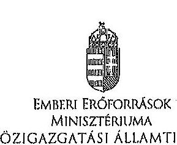

Iktatószám: 19343-7/2014/ELL

Domokos László részére
elnök

Állami Számvevőszék

Budapest
Apáczai Csere János u. 10.
1052

Tárgy: Észrevétel az Állami Számvevőszék által készített, „a Nemzeti Család- és Szociálpolitikai Intézet ellenőrzése pénzügyi gazdálkodási helyzete és vagyongazdálkodása tekintetében" című jelentéstervezethez

Tisztelt Elnök Úr!

Az Állami Számvevőszék által készített, „a Nemzeti Család- és Szociálpolitikai Intézet ellenőrzése pénzügyi gazdálkodási helyzete és vagyongazdálkodása tekintetében" című jelentéstervezethez az alábbi észrevételeket teszem.

1) Az emberi erőforrások miniszterének megfogalmazott 1. sz. javaslathoz:

A javaslat a követelmények irányító szerv általi kidolgozásáról beszél. A javaslati ponthoz hivatkozott régi és az új Áht. megjelölt részei nem az irányító szerv általi kidolgozást teszik kötelezővé, hanem a különféle jogi eszközökben (ágazati-, illetve pénzügyi típusú törvényekben, egyéb jogszabályokban) meghatározott követelmények érvényesítését (régi Áht.), illetve érvényesítését, számonkérését és ellenőrzését (új Áht.). Megítélésünk szerint a jogalkotó elvárása - ahogy az a szövegkörnyezetből is kitűnik - nem új követelmények kidolgozására irányul, hanem a már lefektetett szakmai, pénzügyi, eljárásrendi elvárások betartására és ellenőrzésére.

A fenti indokok alapján javasoljuk az 1. javaslati pont törlését.
2) Az emberi erőforrások miniszterének megfogalmazott 2. sz. javaslathoz:

---

A javaslat arra irányul, hogy a fejezeti kezelésű előirányzatok felhasználásának szabályairól szóló rendeletben, belső szabályzatban a feladatvégzés igényeihez, a fejezeti kezelésű előirányzat céljához igazodva a szerződéskötések megkötésének határideje kerüljön meghatározásra.

Az államháztartásról szóló 2011. évi CXCV. törvény (Áht.) 28. § (1) és (1b) bekezdései, valamint az államháztartásról szóló törvény végrehajtásáról szóló 368/2011. (XII. 31.) Korm. rendelet (Ávr.) 30. §-a szerint a fejezetet irányító szerv vezetője által - az államháztartásért felelős miniszterrel egyetértésben - kiadott rendelet kizárólag jogszabály kiadását igénylő kérdéseket szabályozhat. Az Áht. 109. § (5) bekezdése alapján a kötelezettségvállalási dokumentumok aláírása határidejének fejezeti rendeletben történő szabályozására nincsen felhatalmazás. A jogszabály kiadását nem igénylő rendelkezések kizárólag belső szabályzatban kerülhetnek megállapításra.

Az Áht. és az Ávr. által előírtak szerint a költségvetési év előirányzatai terhére december 31-ig vállalható kötelezettség. Ettől eltérő, korábbi határidő fejezeti kezelésű előirányzatonként történő megállapítására nincs lehetőség, figyelemmel arra, hogy az EMMI ágazatainak és fejezeti kezelésű előirányzatainak számát tekintve a legnagyobb fejezetnek minősül (a 2014. évben 215 db eredeti előirányzattal rendelkező fejezeti kezelésű előirányzattal) és egy fejezeti kezelésű előirányzat akár több egymástól eltérő ütemezésű támogatási programot is magában foglalhat. Év közben - döntően év végén - a tárca előirányzatai javára biztosított többletforrások felhasználását akadályozná meg egy, a december 31-étől eltérő szerződéskötési határidő meghatározása, ezen túlmenően számos egyéb tényező (pl. év közben elrendelt zárolás, maradványtartási kötelezettség) is befolyásolhatja a szerződéskötések időpontját.

Az Emberi Erőforrások Minisztériuma fejezeti kezelésű előirányzatainak gazdálkodási, kötelezettségvállalási és utalványozási szabályzatáról szóló 15/2012. (XI. 13.) EMMI utasítás mellékleteként kiadott gazdálkodási szabályzat részletes útmutatást ad a kötelezettségvállalási joggal felruházott vezetők részére a szerződéskötés eljárásrendjét illetően, továbbá a gazdálkodási szabályzat 16. pontjának második mondata előírja, hogy ,,a támogatás módjára vonatkozó döntés meghozatala során figyelemmel kell lenni a támogatás céljára, a megvalósítási időszak hosszára, a támogatott saját forrásának mértékére, illetve a korábbi években a támogatott részére nyújtott támogatásokkal való elszámolások kapcsán szerzett támogatói tapasztalatokra."

A fentiek alapján az emberi erőforrások miniszterének megfogalmazott 2. pont szerinti javaslatot nem tartjuk elfogadhatónak, kérjük a 2. javaslati pont törlését.
3) Az emberi erőforrások miniszterének megfogalmazott 3. sz. javaslathoz:

Az emberi erőforrások miniszterének tett összegző javaslatok 3. pontja szerint az NCSSZI a kábítószer használatot megelőző-felvilágosító szolgáltatás feladat lebonyolítása során - a kábítószer-fogyasztás megelőzésével kapcsolatos feladatok fejezeti kezelésű előirányzat 2012. évi támogatási szerződése megkötésével kapcsolatban - nem tartotta be az Áht., valamint az Ámr. és az Ávr. kötelezettségvállalásra, a pénzügyi ellenjegyzésre, a teljesítés igazolására, az érvényesítésre, az utalványozásra és ellenjegyzésre vonatkozó előírásait.

---

Tekintettel arra, hogy a jelentéstervezet további részében nem szerepel olyan megállapítás, amely az EMMI és az NCSSZI között a vonatkozó tárgyban kötött 2012. évi támogatási szerződéssel kapcsolatban jogszabályi előírás megszegését feltételezné, javasoljuk és kérjük a 3. javaslati pont elhagyását.

Kérem Elnök Urat, hogy az észrevételeinket a jelentés véglegesítésekor szíveskedjenek figyelembe venni.

Budapest, 2014. április 15.

Üdvözlettel:
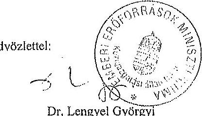

---

.

---

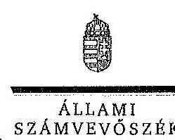

ELNÖK

Ikt.szám: V-0121-292/2014.

# Balog Zoltán úr 

miniszter
Emberi Erőforrások Minisztériuma

## Budapest

## Tisztelt Miniszter Úr!

A „Jelentéstervezet a Nemzeti Család-

 és Szociálpolitikai Intézet ellenőrzése pénzügyi gazdálkodási helyzete és vagyongazdálkodása tekintetében címü ellenőrzésről" címü jelentéstervezetre tett észrevételeit köszönettel megkaptam.

Az Állami Számvevőszék észrevételekre vonatkozó álláspontjáról a felügyeleti vezető által készített részletes tájékoztatást csatoltan megküldöm.

Tájékoztatom Miniszter urat, hogy az ÁSZ. tv. 29. § (3) bekezdése alapján a számvevőszéki jelentés mellékleteként szerepeltetjük a jelentés-tervezethez tett észrevételeit, továbbá az el nem fogadott észrevételeket az elutasítás indokainak feltüntetésével.

Budapest, 2014. 05. hó 0 d, nap
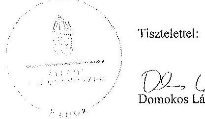

Tisztelettel:

## D. 1. 121

Melléklet: Tájékoztatás az elfogadott és el nem fogadott észrevételekről

---

# Tájékoztatás 

az elfogadott és az el nem fogadott észrevételekről
A Nemzeti Család- és Szociálpolitikai Intézet pénzügyi gazdálkodási helyzetének és vagyongazdálkodásának ellenőrzéséről készült számvevőszéki jelentéstervezetre 2014. április 07-én érkezett észrevételeit áttekintettük, azok kezelésével kapcsolatban a következő tájékoztatást adom.

A jelentéstervezetben az emberi erőforrások minisztere számára tett javaslatainkat a továbbiakban is fenntartjuk, de észrevételei alapján azok megszövegezését módosítottuk.

1. Az ellenőrzés - dokumentumokkal alátámasztott - megállapításai alapján az irányító szerv nem támasztott írásban rögzített követelményeket, elvárásokat a szociális ágazat szakmai irányításának támogatásával megbízott szervezet közfeladatainak ellátására, az erőforrásokkal való hatékony gazdálkodásra vonatkozóan. Az új Áht. 9.§. (1) bekezdés f) pontja valóban az erőforrásokkal való hatékony gazdálkodáshoz szükséges követelmények érvényesítését, számonkérését és ellenőrzését írja elő az irányító szerv számára. Véleményünk szerint ugyanakkor az irányító szerv csak abban az esetben tudja ellátni a követelmények érvényesítését, a számonkérését és ellenőrzését, ha a közfeladatok ellátására, az erőforrásokkal való szabályszerű és hatékony gazdálkodáshoz szükséges követelmények egyértelműen meghatározottak.

Észrevétele alapján az összegző megállapítások második bekezdését, valamint 1. számú intézkedést igénylő megállapítást és javaslatot módosítottuk:
„Az irányító szervek nem rögzítettek a közfeladatok ellátásához és az erőforrásokkal való hatékony gazdálkodáshoz az intézménnyel szemben számon kérhető követelményeket, elvárásokat. Ez korlátozta a követelmények érvényesítésére, számonkérésére és ellenőrzésére vonatkozó - az Áht. 1 49. § (5) bekezdés f) pontja, illetve az Áht. 2 9. § (1) bekezdés f) pontjában rögzített hatáskörük gyakorlását."

Javaslat:
„Fogalmazza meg és érvényesítse a Nemzeti Család- és Szociálpolitikai Intézet közfeladat ellátására vonatkozó és az erőforrásokkal való szabályszerű és hatékony gazdálkodáshoz szükséges ágazati-, illetve pénzügyi típusú törvényekből, egyéb jogszabályokból levezethető konkrét követelményeket, és ezen követelményeket irányítási jogkörében az Áht. 2 9. § (1) bekezdés f) pontja alapján ellenőrizze és kérje számon."
2. Az Ávr. 30. § (1)-(2) bekezdései alapján a fejezetet irányító szerv vezetőjének a központi költségvetésről szóló törvény elfogadását követően haladéktalanul felül kell vizsgálnia - január 15-i hatálybalépéssel - a fejezeti kezelésű előirányzatok felhasználásának szabályairól szóló rendeletet, szabályzatot. A szabályzatban rendelkezni kell különösen a fejezeti kezelésű előirányzatok módosításának, átcsoportosításának, a támogatói döntések meghozatala és a kötele-

---

zettségvállalás belső egyeztetési és engedélyezési eljárási, továbbá dokumentációs szabályairól, határidőiről, a pénzügyi teljesítés, a beszámoltatás, az ellenőrzés feladatainak rendjéről, mindezek határidőiről, szervezeti megosztásáról, az egyes szervezeti egységek feladatairól. Megítélésünk szerint a megvalósítási időszak hossza, a fejezeti kezelésű előirányzatból finanszírozott feladatellátás folyamatossága indokolja a támogatási szerződés megkötésének feladatellátáshoz igazodó ütemezését.

Észrevétele alapján ugyanakkor a javaslat megszövegezésénél figyelembe vettük az új Áht. 28. § (1) bekezdését.

A fentiek alapján az intézkedést igénylő megállapítást és a 2. számú javaslatot a következők szerint pontosítottuk:
"Az irányító szerv a szolgáltatók ellátási aljainak biztosítására a 2011. és 2012. években a támogatást év végén biztosította az NCSSZI részére. A 2012. évi támogatási szerződést 2012 decemberében kötötték meg, amely szerint az intézmény a támogatást 2012. április 1-2013. január 31. között használhatta fel. Az év végén biztosított források a feladat folyamatos elvégzésének bizonytalanságát és nem jogszabálykövető gyakorlat kialakulását eredményezték."

Javaslat:
„Vizsgáltassa ki a szerződéskötési gyakorlat körülményeit. Gondoskodjon arról, hogy a fejezeti kezelésű előirányzatok felhasználásának szabályairól szóló belső szabályzatban a megvalósítás időszakának hosszához, a feladatvégzés igényéhez, a fejezeti kezelésű előirányzat céljához igazodva szabályozzák a támogatási szerződések megkötésének határidejét. Intézkedjen a belső szabályzatban meghatározott határidők érvényesítéséről."
3. Az emberi erőforrások miniszterének tett 3. számú javaslattal kapcsolatban jelezzük, hogy a témát megalapozó megállapítások az őscégző megállapítások fejezet 16. oldal 2-3. bekezdésében, valamint a részletes megállapítások fejezet 32-35. oldalain találhatóak. A javaslatot az alábbiak szerint pontosítottuk:
„Vizsgáltassa ki a Nemzeti Család- és Szociálpolitikai Intézetnél a kábítószer használatot megelőző-felvilágosító szolgáltatás feladat szabálytalan lebonyolításának körülményeit, és amennyiben a felelősségre vonás körülményei fennállnak, tegye meg a szükséges intézkedéseket."

Kérem a válaszlevelemben foglaltak szíves tudomásulvételét. Tájékoztatom Miniszter urat, hogy a számvevőszéki jelentés mellékleteként szerepeltetjük a jelentéstervezethez tett észrevételeit, valamint az azokra adott válaszunkat.

Budapest, 2014. 11. 11. hó 8 nap

Horváthné Herbáth Mária
felügyeleti vezető

---

.

---

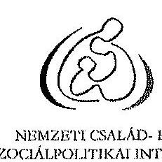

NEMZETI CSALÁD- ÉS SZOCIÁLPOLITIKAI INTÉZET

PÓTIGAZGATÓ

Domokos László
elnök részére

Állami Számvevőszék
1052 Budapest
Apáczai Csere János u. 10.

Ikt.sz: 2485-7/2014.
ügyintéző: Dr. Bagi Krisztina
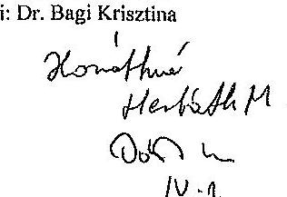

Tisztelt Elnök Úr!
Mellékelten megküldöm a „Nemzeti Család- és Szociálpolitikai Intézet ellenőrzése pénzügyi gazdálkodási helyzete és vagyongazdálkodása tekintetében" címü ellenőrzésről készült számvevőszéki jelentéstervezetre megfogalmazott észrevételeinket további szíves felhasználásra.

Budapest, 2014. március 27.

Tisztelettel,
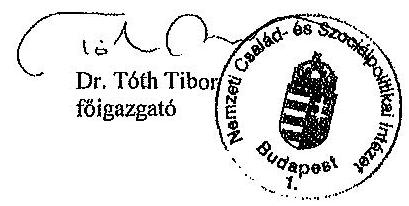

---

# ÉSZREVÉTELEK 

## „a Nemzeti Család- és Szociálpolitikai Intézet ellenőrzése pénzügyi gazdálkodási helyzete és vagyongazdálkodása tekintetében" című számvevőszéki jelentéstervezet

I) A kábítószer-használatot megelőző-felvilágosító szolgáltatás
(Jelentéstervezet 15-16., valamint 32-34. oldalai)

## Jogszabályi alapok

Az egyes miniszterek, valamint a Miniszterelnökséget vezető államtitkár feladat- és hatásköréről szóló 212/2010. (VII.1.) Korm. rendelet az emberi erőforrások miniszterét jelöli ki:
„68. § A miniszter a kábítószer-megelőzésért és kábítószerügyi koordinációs feladatokért való felelőssége körében
d) működteti és fejleszti a megelőző-felvilágosító szolgáltatást végző intézményrendszert és
e) meghatározza a kábítószer-megelőzéssel kapcsolatos területek szakmai felügyeleti rendszerét."

## Szakmai előzmények

A Nemzeti Drogmegelőzési Iroda (NDI) a Büntetőkönyvről szóló törvény vonatkozó módosításának 2003. március 1-jei hatályba lépése óta biztosítja - irányító szervi elvárások alapján - a megelőző-felvilágosító szolgáltatást nyújtó szervezetek szakmai támogatását, pályáztatását, ellenőrzését és az ellátási események után járó díjak utalványozását.
2010-ig a szolgáltatás finanszírozása a mindenkori költségvetési törvény, irányító szervi fejezet, fejezeti kezelésű előirányzatok cím, „A kábítószer-fogyasztás megelőzésével kapcsolatos feladatok" alcíme terhére történt, évente megkötött megállapodásban átadott pénzeszközzel. Az ezt követő időszakban nagy nehézségek álltak a szolgáltatás folyamatos finanszírozásának útjába, egyrészt az államháztartásról szóló 2011. évi CXCV. törvény 41. § (2) bekezdésében foglaltak szerinti pénzeszközátadás szabályainak változása okán, másrészt pedig mert már a tárgyévi költségvetés tervezésekor látható volt, hogy hiányzik a Nemzeti Család- és Szociálpolitikai Intézet költségvetéséből a feladatra szánt forrás. Ezt több alkalommal a megfelelő módon jelezte is az Intézet az irányító szerv felé.
Az irányító szerv a 42/2008. (XI. 14.) EüM-SZMM együttes rendeletben foglaltak alapján végzendő megelőző-felvilágosító szolgáltatás végzésére legutóbb 2009-ben hirdetett pályázatot, ezt követően minden évben úgynevezett döntési listát ad ki, amely megjeleníti a szolgáltatás nyújtására jogosult szervezeteket.
A kábítószer-függőséget gyógyító kezelés, kábítószer-használatot kezelő más ellátás vagy megelőző-felvilágosító szolgáltatás szabályairól szóló 42/2008. (XI.14.) EüM-SZMM együttes rendelet 11. §-a szerint: „Az egészségügyi miniszter, a szociális és munkaügyi miniszter, valamint az igazságügyi és rendészeti miniszter az általa vezetett minisztérium honlapján negyedévente közzéteszi az előzetes állapotfelmérést végző intézmények, valamint a szolgáltatást nyújtó intézmények jegyzékét."

## Megállapítás

„Az NCSSZI az ellenőrzött időszakban az elterelés megelőző-felvilágosító szolgáltatás keretében a pályázatokkal kapcsolatos hiánypótlások, szerződéskötések, az ellenőrzési rendszer működtetése és a munkaköri leírás kiadása terén nem tartotta be a jogszabályi előírásokat."
Észrevételek
a) pályázatokkal kapcsolatos hiánypótlások

---

A kábítószer-függőséget gyógyító kezelés, kábítószer-használatot kezelő más ellátás vagy megelőző-felvilágosító szolgáltatás szabályairól szóló 42/2008. (XI.14.) EüM-SZMM rendelet 4. § (2) bekezdése kimondja: „Az érintett személy a szolgáltatási a szolgáltatás nyújtására jogosult intézmények bármelyikénél igénybe veheti. A lakóhely szerint illetékes, területi ellátási kötelezettséggel működő egészségügyi szolgáltató az érintett személy fogadását és ellátását nem tagadhatja meg."
A pályázati kiírás szerint: „A pályázó vállalja, hogy az illetékességi területéről érkező, ott állandó lakóhellyel, tartózkodási hellyel rendelkező érintettet - amennyiben állapota nem igényel egészségügyi ellátási formát - befogadja, részére a szolgáltatási szerződés szerint a legmegfelelőbb szolgáltatást nyújtja, őt csak írásban megfogalmazott indokkal veszi ki a programból."
Az érintett pályázók esetében a vállalt kliensek száma havi átlagot tekintve néhány esetben igen, azonban éves átlagot figyelembe véve nem vagy csak igen csekély mértékben haladta meg a pályázati dokumentumban leírtakat.
Ugyanakkor szükségesnek tartjuk rögzíteni, hogy - pont a fenti jogszabályi helyben rögzített ellátási kötelezettségre tekintettel - a tényleges kliensforgalom meghaladhatja a tervezett keretszámot, tekintettel arra, hogy az előre pontosan nem látható.
b) Szerződéskötés
ba) Ptk. vonatkozó előírásai
A jelentéstervezet 16. oldal 2. bekezdésében, valamint 33. oldalán rögzített fordulatok - „... Ptk. előírásait megszegve ...", „Ptk. vonatkozó előírásait nem tartotta be ..." - valójában az NCSSZI által megvalósított, a Ptk. szerinti alaki hibák, melyek a jelentéstervezetben több helyen részletesen, valamint jelen dokumentum Szakmai előzmények bekezdésében taglalt finanszírozási problémák okán elhúzódó feladat-megvalósítás eredményeképpen álltak elő.
A Nemzeti Család- és Szociálpolitikai Intézet célja a jogszabályban szereplő folyamatos szolgáltatás elvégzésével összefüggésben felmerülő finanszírozási feladat sokhónapos késedelme miatt előállt tarthatatlan helyzet mielőbbi orvoslása volt, a szolgáltatók általi folyamatos szakmai feladatellátás és a forrás felhasználására későn és rendkívül szűkös határidővel biztosított kényszerkötülmények közepette.
A szerződésmódosítások megkötése során a felek érdekei nem sérültek, azok a felek akaratának kölcsönös és egybehangzó kifejezésével jöttek létre, a szerződési feltételek lényeges tartalmának írásba foglalásával, a jóhiszeműség és a kölcsönös együttműködés jegyében.
Megjegyezni kívánjuk továbbá, hogy a Ptk. szerinti alaki hiba abban az esetben is megvalósult volna, ha nem szerződésmódosításra, hanem új szerződés megkötésére került volna sor, tekintettel arra, hogy a feladat szolgáltatók általi ellátásának kezdő időpontját hónapokra visszamenőleg kellett volna rögzíteni benne.
A forrás jóváhagyásának és a támogatási szerződés megkötésének decemberi dátumára tekintettel az NCSSZI számára semmiképpen nem volt megfelelő jogtechnikai megoldás a finanszírozásról szóló szerződés április elsejére visszamenőleg történő megfogalmazására.
bb) A vonatkozó Áht. és Ávr. vonatkozó előírásai
A jelentéstervezet 16. oldal 3. bekezdésében, valamint a 34-35. oldalakon leírt fordulatok - „nem tartotta be az Áht., valamint az Ámr.  ${ }_{3}$ és az Ávr. kötelezettségvállalásra, pénzügyi ellenjegyzésre, a teljesítés igazolására, érvényesítésre, utalványozásra és ellenjegyzésre vonatkozó előírásait." - nem helytállóak, amennyiben

- a teljes 2011. évre vonatkozó szolgáltatás-ellátásra megkötött szerződésmódosítások 2010. dec. 21-én kellett, nem pedig 2011. dec. 21-én, ahogyan a jelentéstervezetben rögzítésre került, 2011-ben nem volt szerződéskötés;
- 2012-ben az NCSSZI-nek már 2012. december 15-én,- tehát 4-5 nappal a szolgáltatókkal a feladatellátás finanszírozására, illetve az irányító szervvel a forrás átadására megkötött szerződések

---

aláírása előtt - rendelkezésére állt a nemzetgazdasági miniszter írásos jóváhagyása a feladatellátáshoz tartozó pénzeszköz NCSSZI részére történő fejezeten belüli átcsoportosításáról (a jóváhagyás a helyszíni ellenőrzés során bemutatásra került, mindazonáltal jelen anyaghoz 1. sz. mellékletként csatolva).
c) A szolgáltatók jelentéseinek befogadása

A Nemzeti Család- és Szociálpolitikai Intézet - miniszter által jóváhagyott - Szervezeti és Működési Szabályzatának vonatkozó része szerint az NDI (más feladatai mellett):

- „koordinálja és végrehajtja a megelőző-felvilágosító szolgáltatással (szitereléssel) kapcsolatos jogi, szakmai és adminisztrációs feladatokat,
- „a szolgáltató szervezetekkel kapcsolatot tart, tanácsadást nyújt részükre és szakmai kommunikációt folytat
 velük"
- „a megelőző-felvilágosító szolgáltatással kapcsolatos havi jelentési rendszert működtetni"

Fentiekre tekintettel az NDI mindenkori alapfeladatként jelent meg a kapcsolattartás és a szolgáltatók által - érvényes szerződésre tekintet nélkül - megküldött havi jelentések befogadása.

# d) Ellenőrzés 

2012. 1. negyedévében a megelőző-felvilágosító szolgáltatás díjának szolgáltatók irányába történő kifizetése - a jelentéstervezetben több helyen részletesen, valamint jelen dokumentum Szakmai előzmények bekezdésében is kifejtett finanszírozási anomáliák miatt - az NCSSZI költségvetésének terhére történt.
A szolgáltatók helyszíni ellenőrzésére az előbbiek mellett nem maradt további forrás. Emellett jelezni kívánjuk, hogy a Nemzeti Család- és Szociálpolitikai Intézet a szolgáltatóval kötött mindenkori szerződés III.3. pontja alapján volt jogosult helyszíni ellenőrzést végezni, érvényes szerződés hiányában erre nem volt lehetősége.
Megjegyezni kívánjuk, hogy az ellenőrzés tárgyát képező feladatellátás részeként megjelenő jelentési adatok helyszíni ellenőrzése az egészségügyi és a hozzájuk kapcsolódó személyes adatok kezeléséről és védelméről szóló 1997. évi XLVII. tv. rendelkezéseinek megfelelően anonimizáltak, a beküldött jelentések adataival megegyező módon.
e) A munkaköri leírás kiegészítése

Az érintett kolléga a vezetője szóbeli megbízása alapján látta el a megelőző-felvilágosító szolgáltatás (elterelés) működésével kapcsolatos szakmai-koordinációs feladatkört.
Megjegyezni kívánjuk, hogy a Nemzeti Család- és Szociálpolitikai Intézet dolgozóinak mindenkori munkaköri leírása szerint a munkavállaló ellátja mindazon feladatokat, melyekkel a vezetője megbízza.

## 2) Belső kontrollrendszer - Etikai elvárások, Kockázatkezelés, Monitoring

(Jelentéstervezet 17-18., valamint 42-45. oldalak)

## Megállapítás

„Az intézmény belső kontrollrendszere szabályozási hiányosságokkal működött az ellenőrzött időszakban."
„Nem volt teljes körű az ellenőrzési nyomvonal, miután az nem tartalmazta a szakmai feladatellátáshoz kötődő felelősségi szinteket és kapcsolatokat."
„Az intézmény vezetője ... nem határozta meg, nem mérte fel, nem kezelte a tevékenységével kapcsolatos kockázatokat, nem vizsgálta felül a kockázatkezelés folyamatát."
„Az intézmény mindenkori vezetője ... a monitoring rendszer részeként ... nem alakította ki és nem működtette az intézmény tevékenységének, céljai megvalósulásának nyomon követését."

---

# Észrevételek 

A Nemzeti Család- és Szociálpolitikai Intézetben működik a belső kontrollrendszer, elsősorban a munkafolyamatba épített ellenőrzés, a vezetői ellenőrzés, valamint a függetlenségében biztosított belső ellenőrzés révén. A folyamatos monitoring beépül az intézmény mindennapi működési tevékenységébe.
Az intézmény vezetője a feladatellátás szerves részét képező időszakos és rendszeres beszámoltatás, a vezetői számonkérés, a tájékoztatás és visszajelzések kérése útján gondoskodik az irányító szerv által az Alapító Okiratban megfogalmazott szakmai célok megvalósulásáról, tájékozódik a gazdálkodás helyzetéről, és ehhez kapcsolódóan megteszi a szükséges intézkedéseket.
A Nemzeti Család- és Szociálpolitikai Intézet tevékenységéhez jól meghatározott indikátorszámok tartoznak, melyek elsődlegesen a feladatellátásra szolgáló pénzeszközökből és azok elszámolásához, valamint a szakmai feladatellátás tervezéséhez (éves munkaterv) és a szakmai beszámoláshoz kapcsolódnak.

## a) Etikai elvárások

A Nemzeti Család- és Szociálpolitikai Intézet közalkalmazottai, feladatuk ellátására vonatkozóan alapvetően a munka törvénykönyve, valamint a közalkalmazottak jogállásáról szóló törvény által megfogalmazott alapelvek, a „köz érdekében" történő feladatellátás szakmai-etikai elvárásainak megfelelően végzik munkájukat.
b) A szakmai feladatellátáshoz kötődő felelősségi szintek és kapcsolatok

A szakmai feladatellátáshoz kötődő felelősségi szintek és kapcsolatok a Nemzeti Család- és Szociálpolitikai Intézet belső szabályzatában megfelelő módon rögzítve vannak. A Nemzeti Család- és Szociálpolitikai Intézet - ágazati miniszter által jóváhagyott - Szervezeti és Működési Szabályzata, továbbá a szervezeti egységek ügyrendjei pontosan szabályozzák a kapcsolati- és felelősségi-, illetve jogosultsági- és kötelezettségi szinteket mind az Intézet egésze, mind pedig az egyes szervezeti egységei tekintetében is.
c) Kockázatkezelés

A szakmai feladatellátásra vonatkozó belső szabályzatokban szerepel a szakmai ellenőrzési pontok meghatározása. A kockázatkezelés és a szabálytalanságok kezelésének rendje a FEUVE Szabályzat része.
Ezzel összefüggésben megjegyezni kívánjuk, hogy a jogszabályváltozások által generált feladatváltozások okán, 2011-től kezdődően nem volt a Nemzeti Család- és Szociálpolitikai Intézet szervezeti struktúrájában olyan - legalább időszakos - nyugalmi állapot, amelyre vonatkozóan mód lett volna fektetni egy stabil és megalapozott, hosszú távon érvényes kockázatkezelési szabályzatot.
Mindazonáltal a FEUVE Szabályzat - ellenőrzési nyomvonal - szakmai szervezeti egységekre vonatkozó rögzítése 2013 végére elkészült, a kockázatkezelés részletekbe menően szabályozott kialakítása 2014. április 30.-ra várhatóan befejeződik.
d) Ellenőrzések nyilvántartása

A jelentéstervezet 18. és 44. oldalának megállapításaihoz kapcsolódóan megjegyezni kívánjuk, hogy a belső ellenőrzés munkájának részeként megjelenő, a lefolytatott ellenőrzéseket tartalmazó nyilvántartás a 2011-2012. évekre vonatkozóan 2013. július 17-én, elektronikus úton megküldésre került az Állami Számvevőszék részére.

Budapest, 2014. március 27.

---

7. SZÁMÚ MELLÉKLET A V-0121-335/2014. SZÁMÚ JELENTÉSHEZ

A. 22. 11. 2012/2013

'12-12-15 10:50 BONBAN-Husán-Koltzégy. F. Fo. +36-1-795-0325

T-346 P001/001 F-265

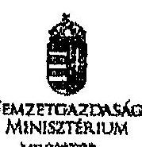

NEMZETGAZDASÁGI MINISZTÉRIUM MINISZTER

Iktatószám: NGM/22875/3/2012, hivatkozás: szám: 7663-103/2012/KTF ügyintéző: Németh Dániel

Balog Zoltán és részére miniszter

Emberi Erőforrások Minisztériuma

Budapest

Tárgy: Az Emberi Erőforrások Minisztériumának fejezeten belüli időirányzat átcsoportálási kérelme

Tisztelt Miniszter Úr!

Az Emberi Erőforrások Minisztériumának fenti hivatkozás számú levelére válaszolva tájékoztatom, hogy az államháztartásról szóló 2011. évi CXCV. törvény 33. § (4) bekezdése alapján engedélyezett a XX. EMMF. fejezeten belül a „Kátalószavárokat” fejezeti kezelésű előirányzat terhére a „Nemzeti Család- és Szociálpolitikai Intézet” javára 95.000 ezer Ft átcsoportálás.

Kérem tájékoztatásom szíves tudomásulvételét.

Budapest, 2012. december „M.”

Üdvözlettel

Dy. M. K. K. György
Miniszter

Hozzátartozási Minisztérium 1001. Budapest, József nádor tér 2-4. Évindúbb: 1000 Budapest, IV. 111.
tel.: +36 1 374-2950; fax: +36 1 302-2394

---

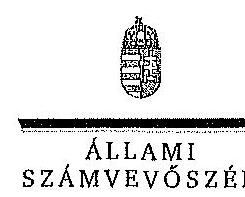

# Dr. Tóth Tibor úr 

főigazgató
Nemzeti Család- és Szociálpolitikai Intézet

## Budapest

## Tisztelt Főigazgató Úr!

A ,,Jelentéstervezet a Nemzeti Család- és Szociálpolitikai Intézet ellenőrzése pénzügyi gazdálkodási helyzete és vagyongazdálkodása tekintetében címü ellenőrzésről" címü jelentéstervezetre tett észrevételeit köszönettel megkaptam.

Az Állami Számvevőszék észrevételekre vonatkozó álláspontjáról a felügyeleti vezető által készített részletes tájékoztatást csatoltan megküldöm.

Tájékoztatom Főigazgató urat, hogy az ÁSZ. tv. 29. § (3) bekezdése alapján a számvevőszéki jelentés mellékleteként szerepeltetjük a jelentés-tervezethez tett észrevételeit, továbbá az el nem fogadott észrevételeket az elutasítás indokainak feltüntetésével.

Budapest, 2014. 175. hó 28. nap
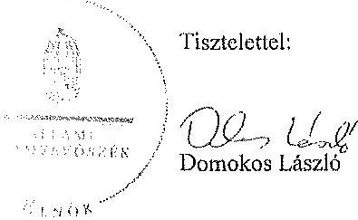

Melléklet: Tájékoztatás az elfogadott és el nem fogadott észrevételekről

---

# Tájékoztatás 

## az elfogadott és az el nem fogadott észrevételekról

A Nemzeti Család- és Szociálpolitikai Intézet ellenőrzése pénzügyi gazdálkodási helyzete és vagyongazdálkodása tekintetében címü ellenőrzésről készült számvevőszéki jelentéstervezethez a 2485-7/2014. iktatószámú levélben tett észrevételeit köszönettel megkaptuk. Az észrevételeket áttekintettük, azok kezeléséről a következő tájékoztatást adom.

A kábítószer-használatot megelőző-felvilágosító szolgáltatás végzésének jogszabályi alapjaival és a szakmai előzményekkel kapcsolatos tájékoztatását megköszönjük. A jogszabályi alapokhoz kapcsolódó kiegészítésünk, hogy I. Összegző megállapítások, következtetések javaslatok fejezetben a 14. oldal első bekezdésében, mind a II. Részletes megállapítások között, a 23. oldal első bekezdésében megállapítottuk, hogy az NCSSZI működését, a tevékenységei ellátásához kapcsolódó feladat-, hatás- és jogköröket mind az irányító szerv, mind az intézmény tekintetében törvények, kormányrendeletek és ágazati miniszteri rendeletek, illetve közjogi szervezetszabályozó eszközök rögzítik.

Az 1. Összegző megállapítások, következtetések javaslatok fejezetben (a 16. oldal első bekezdésében) és a II. Részletes megállapítások között (a 31-32. oldalon) egyaránt szerepelnek azok a megállapítások, amelyek szerint a 2012. évi költségvetés tervezésekor az NCSSZI-nek a feladat ellátására forrást nem biztosítottak és a 2011. és 2012. években az irányító szerv az NCSSZI-vel a szolgáltatók ellátási díjainak finanszírozására a támogatási szerződést év végén kötötte meg. Megállapítottuk azt is, hogy a források év végén történő biztosítása a kábítószerhasználatot megelőző-felvilágosító szolgáltatás feladat folyamatos elvégzésének bizonytalanságát eredményezte.

## 1)a) Pályázatokkal kapcsolatos hiánypótlások

A témát érintő észrevétel - ellentétben annak címével - nem kifogásolja a pályázatokkal kapcsolatos hiánypótlások elmaradására vonatkozó - a 16. oldal 2. bekezdésében, valamint a 33. oldal 2. bekezdésében és az első részbekezdésben szereplő - megállapításainkat. Az észrevétel a 17. oldal első bekezdésében, valamint a 35. oldal 4. felsorolásában megfogalmazott megállapításhoz kapcsolódik, mely szerint a 2011. és a 2012. évben több szolgáltató havonta több alkalommal túllépte a vállalkozási szerződés 5. és a pályázati adatlap 11. pontjában foglalt havi maximális ellátotti létszámot.

A jelentés-tervezetben szereplő megállapítást nem módosítottuk, mivel - a 42/2008. (XI. 14.) EtIM-SZMM együttes rendelet alapján a szolgáltatókkal 2012. márciusban megkötött vállalkozási szerződés 5. pontja szerint - szolgáltatás nyújtására legfeljebb a szerződésben meghatározott kliensszámig voltak jogosultak a szolgáltatók.

Megállapításainkat nem érintette az arra vonatkozó információ sem, hogy a szolgáltatók által a vállalt kliensszám éves átlaga nem, vagy csak igen csekély mértékben haladta meg a pályázati dokumentumban vállalt kliensszámot. Ugyanis a pályázati kiírás és a vállalkozási szerződés III.2.b.) pontja a szolgáltatókat havi pénzügyi jelentések megküldésére, illetve havi bontásban elkészített jelentés megküldésére kötelezte. Az ellenőrzés során a havi pénzügyi jelentésekben szereplő ellátotti létszámot vetettük össze a szolgáltatók pályázati adatlapjának 11. pontjában vállalt havi maximális ellátotti létszámmal, tekintettel a 2012. márciusban megkötött vállalkozási szerződés 5. pontjára miszerint: „A Szolgáltató vállalja, hogy jelen ellátási szerződés hatálya alatt egy hónapban legfeljebb a pályázati adatlap 11. pontjában megjelölt számú kliens számára biztosít szolgáltatást."

1)b) Szerződéskötés
b) Ptk. vonatkozó előírásai

A kábítószer megelőző-felvilágosító szolgáltatás feladatellátását érintő tájékoztatását a fent leírt kiegészítések beépítésénél figyelembe vettük.
bb) Az Áht. és az Ávr. vonatkozó előírásai
Az első francia bekezdésben foglalt észrevételét - amelyben jelezte, hogy a 2011. évre vonatkozó ellátási szerződéseket nem 2011., hanem 2010. december 21-én módosították - köszönettel vettük. Ennek alapján a 16. oldal 3., és a 17. oldalon folytatódó bekezdésében szereplő, a 2011. évre vonatkozó megállapításokat töröltük. Ehhez kapcsolódóan elhagyjuk a 35. oldalról az első és a harmadik felsorolást, a felvezető mondatokból pedig töröljük az Áht. ${ }_{1}$ re és az Ámr. ${ }_{2}$-re történő hivatkozást.
A második francia bekezdésben foglalt észrevételét nem tudjuk figyelembe venni. A megküldött dokumentum a nemzetgazdasági miniszter NGM/22875/3/2012. iktatószámú, 2012. december 14-i levele, amelyben az Áht. 33. § (4) bekezdés alapján az átcsoportosítást engedélyezi. A nemzetgazdasági miniszter általi engedély azonban önmagában még nem alapozhatott meg kötelezettségvállalást.
c-d) A szolgáltatók jelentéseinek befogadása, ellenőrzése
A jelentések befogadására vonatkozó észrevétele alapján a jelentéstervezetet nem módosítjuk, mert a pályázati felhívás 20. pontja szerint a pályázó a Közreműködő Szervezettel kötött ellátási szerződés megkötésével vállal kötelezettséget a havi pénzügyi jelentések megküldésére. Mind a pénzügyi jelentések befogadásának, mind a helyszíni ellenőrzésnek feltétele volt a szerződéskötés. Az SZMSZ-ben hivatkozott havi jelentési rendszer működtetése nem jelenti azt, hogy szerződés nélkül köteles volt befogadni a megküldött havi jelentéseket.

A szolgáltatók jelentéseinek befogadásához a feladatellátás teljesítése ellenőrzésének kellett volna kapcsolódnia, tekintettel arra, hogy ez volt a teljesítésigazolás dokumentuma is.

A helyszíni ellenőrzésre vonatkozó megállapításunkat az észrevétele alapján módosítjuk.
Annak tényét, hogy az ellenőrzési feladat fedezete nem állt az NCSSZI rendelkezésére a 34. oldal 2. részbekezdésében rögzítettük.

---

# e) A munkaköri leírás kiegészítése 

Észrevételét elfogadjuk, a vonatkozó megállapítást töröljük.
2) Belső kontrollrendszer - Etikai elvárások, Kockázatkezelés, Monitoring

A belső kontrollrendszerrel kapcsolatos általános észrevételeit megköszönjük. A jelentéstervezet 17-18. oldalán, valamint a 42-45. oldalain rögzítettük, hogy a belső kontrollrendszer szabályozási hiányosságok mellett - működött. Megállapítottuk továbbá, hogy a kontrolltevékenységek - a kábítószer-használatot megelőző-felvilágosító szolgáltatás területén feltárt hiányosságok kivételével - működtek a gazdasági területen, az információs és kommunikációs rendszer kialakítása megfelelt a jogszabályi előírásoknak és annak, valamint a függetlenített belső ellenőrzésnek a működése terén is kisebb súlyú hiányosságot
 tárt fel az ellenőrzés.

Továbbra is fenntartjuk azonban azt a megállapításunkat, hogy az NCSSZI mindenkori vezetője nem alakította ki és nem működtette a monitoring rendszer részeként az intézményi célok megvalósításának nyomon követését. Nem történt meg a belső kontrollok folyamatos figyelemmel kísérése és értékelése, ahogyan a kritikus pontok kezelése, valamint vezetői információs rendszeren keresztül történő visszacsatolása sem.
a) Etikai elvárások

Az észrevételével nem módosítottuk a megállapításainkat, tekintettel arra, hogy az etikai elvárások elkészítéséről az NCSSZI vezetője nem gondoskodott, ezáltal nem biztosították a Bkr. 6. § (1) bekezdés c) pontjában foglalt, olyan kontrollkörnyezet kialakítását, amelyben meghatározottak az etikai elvárások a szervezet minden szintjén.
b) A szakmai feladatellátáshoz kötődő felelősségi szintek és kapcsolatok

Az észrevételt nem fogadtuk el. Ellenőrzési megállapításaink szerint az ellenőrzési nyomvonal nem tartalmazta a szakmai feladatellátáshoz kötődő felelősségi szinteket és kapcsolatokat, így észrevételével a jelentés-tervezetet nem módosítottuk. Az SZMSZ-ről, valamint a gazdasági szervezet ügyrendjéről - utóbbinál kisebb, majd az ellenőrzött időszakban orvosolt hiányosság ellenére - megállapítottuk, hogy azok tartalma a jogszabályi előírásoknak megfelelt.

## c) Kockázatkezelés

Az észrevételt nem fogadtuk el. A jelentés-tervezet 43. oldalán rögzítettük, hogy az NCSSZI rendelkezett a szabálytalanságok kezelésének eljárásrendjével, valamint kockázatkezelési szabályzattal. A kockázatkezelési szabályzat azonban több tekintetben nem volt megfelelő, miután az nem tartalmazta az egyes folyamatokban, részfolyamatokban megjelenő kritikus pontok és az intézményi tűréshatár meghatározását. Ezen túl nem határozták meg, nem mérték fel a tevékenységgel kapcsolatos kockázatokat, nem vizsgálták felül a kockázatkezelés folyamatát. Mindezek miatt észrevételével a megállapításainkat nem módosítottuk.
d) Ellenőrzések nyilvántartása

---

A belső ellenőrzések nyilvántartásával kapcsolatos észrevételét részben elfogadtuk. Az észrevételében jelzett 2011. és 2012. évi nyilvántartások (Intézkedések nyilvántartása 2011, Belső ellenőrzésekhez kapcsolódó intézkedések nyilvántartása 2012) megfeleltek a Ber. 12. § n) és 29/A. § (1)-(2) bekezdéseiben, valamint a Bkr. 47. § (1)-(2) bekezdésében foglalt intézkedések nyomon követését biztosító nyilvántartásnak. Ezzel a jelentés-tervezet 45. oldalának első bekezdésében szereplő megállapítást az alábbiak szerint kiegészítettük:
„A belső ellenőr - a jogszabályi előírások ellenére - az elvégzett ellenőrzésekről, továbbá a 2008-2010 közötti időszakban azok nyomon követéséről nem vezetett nyilvántartást. A 2011-2012. években már rendelkeztek az intézkedések nyomon követésére alkalmas nyilvántartással.

Kérem a válaszlevelemben foglaltak szíves tudomásulvételét. Tájékoztatom Főigazgató urat, hogy a számvevőszaki jelentés mellékleteként szerepeltethetjük a jelentés-tervezethez tett észrevételeit, valamint az ÁSZ. tv. 29. § (3) bekezdése alapján az elfogadott, illetve a figyelembe nem vett észrevételeket az elutasítás indokának feltüntetésével együtt.

Budapest, 2014. "Ajar hó 8. nap
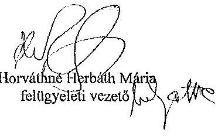
