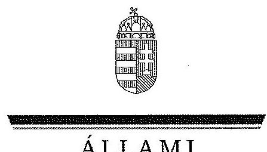

ÁLLAMI
SZÁMVEVŐSZÉK

# JELENTÉS 

a Magyar Államkincstár működésének és gazdálkodásának ellenőrzéséről

---

# Állami Számvevőszék 

Iktatószám: V-0119-088/2014.
Témaszám: 1154
Vizsgálat-azonosító szám: V0621

## Az ellenőrzést felügyelte:

Holman Magdolna
felügyeleti vezető
Az ellenőrzést vezette és az ellenőrzés végrehajtásáért felelős:
Salamon Ildikó
ellenőrzésvezető

## A jelentéstervezet összeállításában közreműködtek:

| Balogné Dakó Eszter | Dr. Marosi Gyöngyi | Borsos Ferenc |
| :-- | :-- | :-- |
| számvevő tanácsos | számvevő tanácsos | számvevő tanácsos |
| Péntek László | Morvay András | Blaskó Attila |
| számvevő tanácsos | számvevő főtanácsos | számvevő asszisztens |

Jogi támogatást nyújtott:
Dr. Dankó István Péter
számvevő osztályvezető-főtanácsos
Az ellenőrzést végezték:

| Balogné Dakó Eszter | Barabás Viktor | Bartolák Márta |
| :-- | :-- | :-- |
| számvevő tanácsos | számvevő | számvevő főtanácsos |
| Borsos Ferenc | Éva Katalin | Fodor Edit |
| számvevő tanácsos | számvevő tanácsos | számvevő |
| Dr. Fónagy Diána | Dr. Horváth Klára | Körmendi Tibor |
| számvevő tanácsos | számvevő főtanácsos | számvevő |
| Dr. Marosi Gyöngyi | Meyerné Horváth | Morvay András |
| számvevő tanácsos | Judit | számvevő főtanácsos |
|  | számvevő | Pénzes Gyula |
| Noé Antal | Péntek László | számvevő tanácsos |
| számvevő | számvevő tanácsos |  |
| Szarka Péterné | Dr. Szima Mária | Dr. Tímár Balázs |
| számvevő vezető | számvevő tanácsos | számvevő |
| főtanácsos |  | Varsányiné Dudás |
| Tóth Árpád | Tóthné Nagy Éva | Eleonóra |
| számvevő tanácsos | számvevő főtanácsos | számvevő |
| Blaskó Attila |  | Kliment Krisztián |
| számvevő asszisztens |  | Endre |
|  |  | számvevő asszisztens |

---

# A témához kapcsolódó eddig készített számvevőszéki jelentések: 

## címe

Jelentés Magyarország 2012. évi központi költségvetése végrehajtásának ellenőrzéséről
Jelentés a Magyar Köztársaság 2011. évi költségvetése végrehajtásának ellenőrzéséről
Jelentés az államháztartás központi alrendszerének adóssága és éven túli kötelezettségvállalásának ellenőrzéséről
Jelentés a helyi önkormányzatokat megillető támogatások és hozzájárulások igénylése és elszámolása kincstári felülvizsgálati rendszerének, valamint a helyi önkormányzatokat a 2010. évben megillető normatív hozzájárulások elszámolásának ellenőrzéséről
Jelentés a Magyar Köztársaság 2010. évi költségvetése végrehajtásának ellenőrzéséről
Jelentés a Magyar Köztársaság 2009. évi költségvetése végrehajtásának ellenőrzéséről
Jelentés a Magyar Köztársaság 2008. évi költségvetése végrehajtásának ellenőrzéséről
Jelentés a kincstári rendszer működésének ellenőrzéséről
Jelentés a Magyar Államkincstár létrehozásának és működésének pénzügyi-gazdasági ellenőrzéséről

---

$\cdot$
$\cdot$
$\cdot$
$\cdot$
$\cdot$
$\cdot$
$\cdot$
$\cdot$
$\cdot$
$\cdot$
$\cdot$
$\cdot$
$\cdot$
$\cdot$
$\cdot$
$\cdot$
$\cdot$
$\cdot$
$\cdot$
$\cdot$
$\cdot$
$\cdot$
$\cdot$
$\cdot$
$\cdot$
$\cdot$
$\cdot$
$\cdot$
$\cdot$
$\cdot$
$\cdot$
$\cdot$
$\cdot$
$\cdot$
$\cdot$
$\cdot$
$\cdot$
$\cdot$
$\cdot$
$\cdot$
$\cdot$
$\cdot$
$\cdot$
$\cdot$
$\cdot$
$\cdot$
$\cdot$
$\cdot$
$\cdot$
$\cdot$
$\cdot$
$\cdot$
$\cdot$
$\cdot$
$\cdot$
$\cdot$
$\cdot$
$\cdot$
$\cdot$
$\cdot$
$\cdot$
$\cdot$
$\cdot$
$\cdot$
$\cdot$
$\cdot$
$\cdot$
$\cdot$
$\cdot$
$\cdot$
$\cdot$
$\cdot$
$\cdot$
$\cdot$
$\cdot$
$\cdot$
$\cdot$
$\cdot$
$\cdot$
$\cdot$
$\cdot$
$\cdot$
$\cdot$
$\cdot$
$\cdot$
$\cdot$
$\cdot$
$\cdot$
$\cdot$
$\cdot$
$\cdot$
$\cdot$
$\cdot$
$\cdot$
$\cdot$
$\cdot$
$\cdot$
$\cdot$
$\cdot$
$\cdot$
$\cdot$
$\cdot$
$\cdot$
$\cdot$
$\cdot$
$\cdot$
$\cdot$
$\cdot$
$\cdot$
$\cdot$
$\cdot$
$\cdot$
$\cdot$
$\cdot$
$\cdot$
$\cdot$
$\cdot$
$\cdot$
$\cdot$
$\cdot$
$\cdot$
$\cdot$
$\cdot$
$\cdot$
$\cdot$
$\cdot$
$\cdot$
$\cdot$
$\cdot$
$\cdot$
$\cdot$
$\cdot$
$\cdot$
$\cdot$
$\cdot$
$\cdot$
$\cdot$

---

# TARTALOMJEGYZÉK 

BEVEZETÉS ..... 7
I. ÖSSZEGZŐ MEGÁLLAPÍTÁSOK, KÖVETKEZTETÉSEK, JAVASLATOK ..... 12
II. RÉSZLETES MEGÁLLAPÍTÁSOK ..... 31

1. Az irányítószervi feladatellátás és a Kincstár szervezeti működésének szabályozottsága ..... 31
1.1. A minisztérium irányítószervi feladatellátása ..... 31
1.2. Az alapító okiratban és az SzM5z-ben rögzített feladatok ..... 35
1.3. A feladatátvételek és -átadások ..... 37
1.4. Szervezeti felépítés, szervezeten belüli feladatmegosztás ..... 39
1.5. A kincstári stratégia és az éves munkatervek ..... 41
2. A Kincstár szakmai feladatellátása és a kapcsolódó belső kontrollrendszer ..... 42
2.1. A központi költségvetés tervezését, végrehajtását és ellenőrzését érintő kincstári feladatellátás ..... 42
2.1.1. A központi költségvetési szervek előirányzataival, a kötelezettségvállalásokkal, a számlavezetéssel kapcsolatos nyilvántartási és ellenőrzési feladatok ..... 42
2.1.2. A költségvetési törvényhez kapcsolódó államháztartási információs rendszerek működtetése és fejlesztése ..... 46
2.1.3. A kincstári honlap működtetése és információtartalma ..... 48
2.1.4. A kérelemre történő közérdekű adatszolgáltatás ..... 51
2.1.5. A központi és önkormányzati alrendszer pénzügyi kapcsolata ..... 54
2.1.6. A humánszolgáltatásokat nyújtó intézményfenntartókkal kapcsolatos feladatok ..... 56
2.1.7. A kincstárnoki és a költségvetési (fő)felügyelői rendszer ..... 58
2.1.8. A kincstári körbe tartozó szervezetek tartozásállományának nyilvántartása és a kincstári biztosi rendszer működése ..... 60
2.2. A központosított illetmény-számfejtés ..... 61
2.2.1. A központosított illetmény-számfejtés szakmai irányítása ..... 61
2.2.2. A feladatok ellátásának szabályszerűsége ..... 63
2.2.3. A feladatellátás belső kontrollrendszere és külső ellenőrzése ..... 66
2.3. Hazai forrásból finanszírozott pályázati rendszerekhez kapcsolódó ellenőrzési és követeléskezelési feladatok ..... 68
2.4. A kincstári monitoring-rendszer ..... 72
2.5. EU forrásokból finanszírozott pályázati rendszerekhez és egyéb nemzetközi támogatásokhoz kapcsolódó feladatellátás ..... 75

---

2.5.1. Igazoló hatósági, kifizető hatósági és a Nemzeti Alap számára előírt feladatok ..... 77
2.5.1.1. Új Magyarország Fejlesztési Terv ..... 77
2.5.1.2. Előcsatlakozási eszközök (Phare és SAPARD) ..... 79
2.5.1.3. Strukturális alapok, Kohéziós Alap ..... 80
2.5.1.4. Európai Területi Együttműködés (ETE) programok ..... 81
2.5.1.5. EGT Finanszírozási Mechanizmus és Norvég Finanszírozási Mechanizmus ..... 82
2.5.1.6. Svájci-Magyar Együttműködési Program ..... 85
2.5.2. Az EU forrásokhoz kapcsolódó szabálytalanságok kezelése ..... 85
2.5.3. Számviteli és ellenőrzési feladatok az ÚMFT-hez kapcsolódóan ..... 86
2.6. A befektetési és kiegészítő befektetési szolgáltatások ..... 90
2.6.1. A tevékenység szabályozottsága ..... 90
2.6.2. A tevékenység ellátásának szabályszerűsége ..... 92
2.6.3. A lakossági állampapír állomány növelésére tett intézkedések ..... 93
2.7. Az építtetői fedezetkezelés ..... 94
2.7.1. Az építtetői fedezetkezelés szabályozottsága ..... 94
2.7.2. Az építtetői fedezetkezelői feladatellátás szabályszerűsége ..... 95
2.8. A családtámogatási ellátások és fogyatékossági támogatások ..... 97
2.8.1. A támogatásokkal kapcsolatos feladatellátás szabályozottsága ..... 97
2.8.2. A támogatásokkal kapcsolatos feladatellátás szabályszerűsége ..... 98
2.9. A lakossági vezetékes gázfogyasztás és távhőfelhasználás szociális támogatása ..... 100
2.9.1. A feladatellátás szabályozottsága ..... 100
2.9.2. A feladatellátás szabályszerűsége ..... 101
2.10. A hallgatói hitelhez kapcsolódó feladatellátás ..... 102
2.10.1.A feladatellátás szabályozottsága ..... 102
2.10.2.A feladatellátás szabályszerűsége ..... 103
2.11. A törzskönyvi nyilvántartás vezetése ..... 104
2.11.1.A törzskönyvi nyilvántartás vezetésének szabályozottsága ..... 104
2.11.2.A feladatellátás szabályszerűsége, a nyilvánosság biztosítása ..... 106
2.11.3.A törzskönyvi nyilvántartás belső kontrollrendszere ..... 108
3. Informatikai feladatellátás ..... 110
3.1. Az informatikai terület irányítása, szabályozottsága ..... 110
3.1.1. 2008-tól a KINCSINFO Nkft. működésének elindulásáig tartó időszak ..... 110
3.1.2. A KINCSINFO Nkft. létrehozása ..... 113
3.1.2.1. Az informatikai feladatok kiszervezésének előkészítése ..... 113
3.1.2.2. A Kincstár és a KINCSINFO Nkft. együttműködése, az informatikai feladatellátás szabályozása ..... 114

---

3.2. A Kincstár informatikai fejlesztései ..... 116
3.2.1. Beszerzések és szerződések szabályossága ..... 116
3.2.1.1. A szakmai teljesítések igazolása, a kötbérek érvényesítése ..... 118
3.2.1.2. A teljesítések dokumentáltsága ..... 119
3.2.2. Az ellenőrzött informatikai fejlesztések ..... 120
3.2.2.1. A KIR rendszer ..... 120
3.2.2.2. A nettó finanszírozási rendszerek ..... 122
3.2.2.3. A Közhiteles Törzskönyvi Nyilvántartó rendszer ..... 122
3.2.2.4. Az EcoStat rendszer beszerzése és üzembe helyezése ..... 123
3.3. Uniós forrásból finanszírozott informatikai fejlesztések ..... 124
3.3.1. TÉBA rendszer ..... 124
3.3.2. A KGR rendszer ..... 125
3.4. Informatikai rendszerek biztonsága, működtetése ..... 129
3.4.1. Általános szervezeti kontrollrendszer ..... 129
3.4.2. Az ellenőrzött rendszerek üzemeltetése és biztonsága ..... 131
3.4.2.1. KTÖRZS, mint elektronikus közszolgáltatást nyújtó rendszer ..... 132
4. A Kincstár pénzügyi és vagyongazdálkodása ..... 133
4.1. A pénzügyi és vagyongazdálkodás szabályosságát biztosító belső kontrollrendszer ..... 133
4.1.1. A pénzügyi és vagyongazdálkodás szabályozottsága ..... 133
4.1.2. A gazdálkodással összefüggő belső kontrollrendszer kialakítása és működtetése ..... 137
4.1.3. A belső ellenőrzési rendszer kialakítása és működtetése ..... 141
4.2. A Kincstár pénzügyi gazdálkodása ..... 143
4.2.1. Az előirányzat-módosítások és az irányító szerv előirányzat felhasználással kapcsolatos korlátozó intézkedései ..... 143
4.2.2. Feladatváltozások hatása a bevételi és kiadási előirányzatokra ..... 146
4.2.3. A bevételek és a kiadások teljesítése ..... 147
4.2.4. A fizetőképesség, valamint a követelés és kötelezettség állományok alakulása ..... 150
4.2.5. Az intézményi létszám változása ..... 151
4.3. A Kincstár vagyongazdálkodása ..... 152
4.3.1. A vagyongazdálkodás és a vagyon-nyilvántartása ..... 152
4.3.2. A vagyon nagyságának és összetételének változása ..... 155
5. A korábbi ÁSZ ellenőrzések hasznosulása ..... 157
5.1. A 0918. számú ÁSZ jelentés javaslatainak hasznosulása ..... 157
5.2. Az 1208. számú ÁSZ jelentésben megfogalmazott javaslatokra készített intézkedési terv végrehajtása ..... 159

---

# MELLÉKLETEK 

1. számú A Magyar Államkincstár főbb feladatai a 2008-2013. években
2. számú A Kincstár feladatellátásában érintett szervek és személyek 2012. december 31-én
3. számú Kimutatás a PM/NGM által a Magyar Államkincstárnál végzett ellenőrzésekről és javaslatokról a 2008-2012. években
4. számú A Kincstár új feladatai a 2008-2012. években
5. számú Kimutatás a nem állami, nem önkormányzati humánszolgáltatást nyújtó intézményfenntartókról, valamint az intézményfenntartóknál és az intézmények székhelyén/telephelyén végzett ellenőrzésekről a 2008-2012 években
6. számú Kimutatás a központosított illetményszámfejtés jellemző adatairól a 2008-2013. években
7. számú Kimutatás a hazai támogatási, pályázati rendszerekből nyújtott támogatásokat érintő Kincstár által tervezett és elvégzett ellenőrzések számáról a 2008-2012. években
8. számú Kimutatás a Kincstár által kezelt, ellenőrzött hazai támogatásokból eredő követelésállomány alakulásáról 2008-2012. években
9. számú Kimutatás a Kincstári monitoring-rendszerben regisztrált támogatási konstrukciókról és támogatásokról a 2008-2012. években
10. számú Kimutatás a befektetési és kiegészítő befektetési szolgáltatási tevékenység jellemző
 adatairól a 2008–2012. években
11. számú Kimutatás az elsődleges értékpapír-forgalmazás jellemző adatairól a 2008–2012. években
12. számú Kimutatás a családtámogatási ellátásokkal és fogyatékossági támogatásokkal kapcsolatos feladatellátás főbb adatairól a 2008–2012. években
13. számú Kimutatás a törzskönyvi nyilvántartásban szerepeltetett törzskönyvi szervek számának változásáról a 2008–2012. években és 2013. év I. negyedévében
14. számú Kimutatás a Kincstár kiadási előirányzatainak és azok teljesítésének alakulásáról a 2008–2012. években
15. számú Kimutatás a Kincstár előirányzatainak és azok teljesítésének alakulásáról a 2008–2012. években
16. számú Kimutatás a feladatátvételek és -átadások kiadásokra és bevételekre gyakorolt költségvetési hatásáról a 2008–2012. években
17. számú Kimutatás a Kincstár eszközállományának alakulásáról a 2008–2012. években
18. számú Kimutatás a Kincstár immateriális javai és tárgyi eszközállományának változásairól a 2008–2012. években
19. számú Kimutatás az immateriális javak és a tárgyi eszközök használhatósági fok-mutatójának alakulásáról a 2008–2012. években

---

20/A. számú Kimutatás a 0918. számú ÁSZ jelentésben foglalt javaslatok hasznosulásáról
20/B. számú Kimutatás az 1208. számú ÁSZ jelentés javaslataira készített intézkedési tervben foglaltak végrehajtásáról
21. számú A Kormányzati Informatikai Fejlesztési Ügynökség elnökének jelentéstervezethez tett észrevétele
22. számú Az ÁSZ válasza a Kormányzati Fejlesztési Informatikai Ügynökség elnökének jelentéstervezethez tett észrevételéhez
23. számú A Magyar Államkincstár elnökének jelentéstervezethez tett észrevételei
24. számú Az ÁSZ válasza a Magyar Államkincstár elnökének jelentéstervezethez tett észrevételeihez
25. számú A nemzetgazdasági miniszter jelentéstervezethez tett észrevételei
26. számú Az ÁSZ válasza a nemzetgazdasági miniszter jelentéstervezethez tett észrevételeihez

# FÜGGELÉKEK 

1. számú Rövidítések jegyzéke
2. számú A Kincstár belső szabályozó eszközei
3. számú Fogalomtár

---

.

---

# JELENTÉS   a Magyar Államkincstár működésének és gazdálkodásának ellenőrzéséről 

## BEVEZETÉS

Az 1996-ban alapított Kincstár – amely 2003-ban vált országos hatáskörű központi hivatallá – önállóan működő és gazdálkodó központi költségvetési szerv. A Kincstárt az államháztartásért felelős miniszter¹ – aki jelenleg a nemzetgazdasági miniszter – irányítja. A Kincstár területi szervei 2007. március 31-ig megyei, 2007. április 1-jétől regionális, majd 2011. január 1-jétől ismét megyei struktúrában látják el a feladataikat. A szervezeti felépítés ellenőrzött évek közötti változását a következő ábra mutatja:
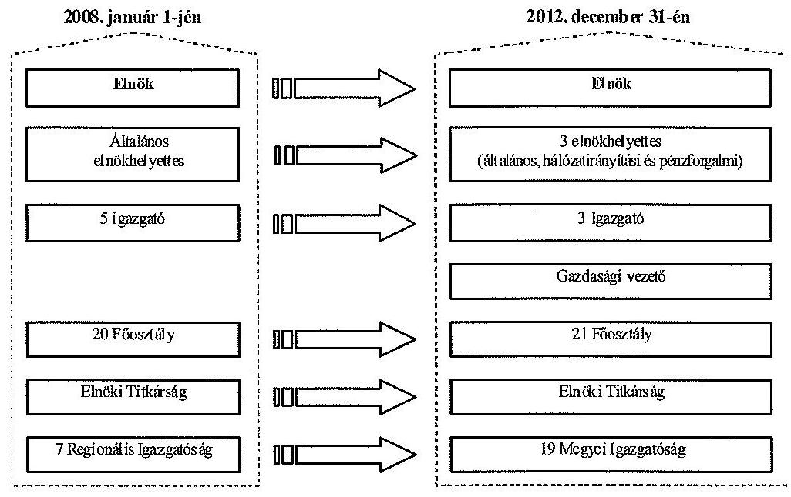

Az éves költségvetési törvények² a Kincstár kiadási előirányzatának főösszegét 2008–2012. években 21,8–24,8 Mrd Ft-ban, költségvetési támogatását 16 119,2 Mrd Ft-ban, saját bevételeit változatlanul 5,6 Mrd Ft-ban határozták meg.

[^0]
[^0]:    ¹ Magyar Államkincstárról szóló 311/2006. (XII. 23.) Korm. rendelet 1. § (2) bekezdése szerint. A 2011. év előtt az irányító a pénzügyminiszter volt.
    ² A 2008., a 2009., a 2010., a 2011. és a 2012. évi Kvtv. a Kincstár intézményi költségvetési előirányzatait 2008–2010-ben a XXII. Pénzügyminisztérium (PM) fejezet 10. cím, 2011-től a XV. Nemzetgazdasági Minisztérium (NGM) fejezet 8. cím tartalmazta.

---

Kormányhatározatokban³ jóváhagyott engedélyezett létszáma 3769 és 4343 fő között alakult.

A Kincstár elnökének személye a 2008. év kivételével az ellenőrzött időszak minden évében, összesen négy alkalommal változott. A Kincstár elnöke az ellenőrzött időszak kezdetétől 2009. április 20-ig, 2009. április 27. és 2010. június 14. között, 2010. június 15. és 2011. január 19. között, 2011. január 20. és 2012. november 8. között, 2012. december 15-től az ellenőrzött időszak végéig különböző személy volt.

A Kincstár alaptevékenysége keretében ellátja az Áht.¹,² -ben, illetve egyéb jogszabályokban részére – az államháztartás alrendszerei költségvetése végrehajtásának pénzügyi lebonyolításával összefüggésben – előírt feladatokat. Az általa lebonyolított tranzakciók összege eléri az éves bruttó hazai összterméket. Közreműködik a közpénzek felhasználásában és ellenőrzésében, visszaköveteli a jogosulatlan kifizetéseket, folyósítja és – jogszabály vagy megállapodás alapján – ellenőrzi az érintett uniós és hazai támogatások felhasználását. A Kincstár főbb feladatait a 2008–2013. években az 1. számú melléklet, a feladatellátásában érintett szerveket és személyeket 2012. december 31-én a 2. számú melléklet mutatja.

A 2008–2012. években a Kincstár alapfeladatai kiegészültek, kontrolltevékenysége folyamatosan bővült.

Ennek keretében a Nemzeti Fejlesztési Ügynökségtől (NFÜ) átvett feladatként látja el a 2007–2013. közötti EU programozási időszakban az Európai Regionális Fejlesztési Alapból, az Európai Szociális Alapból és a Kohéziós Alapból származó támogatások fogadásához, valamint a 2004–2006. évi programozási időszakban a Nemzeti Fejlesztési Terv operatív programjai, az EQUAL program és a Kohéziós Alap projektek támogatásaihoz kapcsolódó pénzügyi lebonyolítási, ellenőrzési és számviteli feladatokat. A 2008. évtől az NFÜ a Kincstárt bevonta az Új Magyarország Fejlesztési Terv (ÚMFT) keretében a közreműködő szervezetekre átruházott feladatok ellátásának első szintű ellenőrzéseibe, valamint a Kincstár az NFÜ által meghatározott projekteknél első szintű helyszíni ellenőrzéseket végez. A Kincstár 2011. január 1-jétől az NGM Nemzeti Programengedélyező Iroda (NGM NAO Iroda) jogutódja⁴, amelynek keretében ellátja az EU-s és nemzetközi támogatásokkal kapcsolatos kifizető hatósági (KH) és igazoló hatósági (IgH), valamint a Nemzeti Alap (NA) számára előírt feladatokat.

A Kincstár feladatai 2008-tól kiegészültek a szociális ellátások és a gázártámogatások folyósításával, valamint a munkáltatók családtámogatási kifizetőhelyeinek – szűk körű kivétellel történt – megszűnésével kapcsolatos feladatokkal. Jelentősen bővült a feladatkörébe tartozó intézmények száma a megyei önkormányzatok és intézményeik számlanyitásával, számlavezetésével. A

[^0]
[^0]:    ³ 2010. augusztus 3-ig a 2057/2008. (V. 27.), majd az 1166/2010. (VIII. 4.) Korm. határozatban
    ⁴ 311/2006. (XII. 23.) Korm. rendelet módosításáról és a Nemzetgazdasági Minisztérium Nemzeti Programengedélyező Iroda jogutódjának kijelöléséről szóló 271/2010. (XII. 8.) Korm. rendelet 5. § (1) bekezdés

---

2009–2012. években – a már korábban megkezdett folyamat folytatásaként – a Kincstár feladatai fejezetektől, központi költségvetési szervektől, nonprofit és egyéb szervezetektől átvett illetmény-számfejtéssel bővültek.

Az Áht.¹,² rendelkezései alapján a Kincstár befektetési szolgáltatási és kiegészítő befektetési szolgáltatási tevékenységet lát el az állam által kibocsátott hitelviszonyt megtestesítő értékpapírok (állampapírok) tekintetében. Ennek keretében vezeti az értékpapír-nyilvántartási számlákat is. A Kormány 2012. áprilisban hozott határozatot a lakosság állampapír-állományának növeléséhez szükséges intézkedésekről⁵, amelynek részét képezte a kincstári értékesítési pontok kialakítása és bővítése.

A Kincstár sokrétű, jogszabályokban meghatározott feladatainak ellátásához különböző, 2012. december 31-én összesen 151 informatikai alkalmazást működtetett. A Kincstár 2012-től az Áht.¹,² -ben meghatározott feladatai ellátásához használt informatikai rendszerek üzemeltetésével, illetve fejlesztésével kapcsolatos feladatokat a KINCSINFO Kincstári Informatikai Nonprofit Korlátolt Felelősségű Társaság (KINCSINFO Nkft.) közreműködésével látja el⁶, amelynek bejegyzése 2012. április 12-ével történt meg.

Ellenőrzésünk a közpénzekkel való gazdálkodás objektív bemutatásával, a Kincstár tevékenységének szabályozottságáról, szakmai feladatainak és gazdálkodásának szabályszerű ellátásáról nyújt tájékoztatást a döntéshozók és döntés-előkészítők, továbbá közvélemény számára. Megállapításaink a szabályszerűség és az átláthatóság erősítésével növelik a társadalom és a gazdasági szereplők bizalmát az ÁSZ kontrollfunkcióját illetően. A Kincstár működésének és gazdálkodásának erősségeit és gyengeségeit, az alkalmazott hibás és a jó gyakorlatokat bemutatva, továbbá az ellenőrzött szervezetek vezetői számára tett javaslatainkkal célunk egyrészt a döntéseket előkészítők és a döntéshozók munkájának támogatása, másrészt a Kincstár gazdálkodása és szakmai feladatellátása szabályszerűségének a javítása.

Az ellenőrzés célja annak értékelése volt, hogy egyértelműen szabályozott-e a Kincstár intézményi működése, feladatellátása, gazdálkodása, belső kontrollrendszere. A kialakított szervezeti és belső kontrollrendszer biztosította-e az előírásoknak megfelelő feladatellátást, pénzügyi és vagyongazdálkodást. Érvényesült-e az átláthatóság követelménye a Kincstár működése és gazdálkodása során. Az irányító szerv tevékenysége hozzájárult-e a Kincstár feladatainak szabályszerű ellátásához. A Kincstár a korábbi számvevőszéki ellenőrzések során tett javaslatokat hasznosította-e.

A Kincstár szabályozott működését, pénzügyi és vagyongazdálkodási helyzetének értékelését szakmai tevékenysége, költségvetése, előirányzat-gazdálkodása szabályszerűsége, továbbá belső kontrollrendszere alapozza meg, ezért az

[^0]
[^0]:    ⁵ 1101/2012. (IV. 5.) Korm. határozat
    ⁶ a 311/2006. (XII. 23.) Korm. rendelet 6/B. §-a szerint 2012. január 1-jétől

---

ellenőrzés keretében értékeltük, hogy:

- a Kincstárra vonatkozó irányító szervi feladatellátás, valamint a Kincstár szervezete és szervezeti működésre vonatkozó szabályozása megfelelte az alapító okiratban rögzített feladatoknak és a vonatkozó jogszabályi előírásoknak;
- a Kincstár szakmai feladatellátása, annak belső kontrollrendszere a vonatkozó jogszabályok alapján szabályszerű és átlátható volt-e, a feladatellátás informatikai támogatottsága biztosított volt-e;
- a Kincstár belső kontrollrendszere biztosította-e a szabályszerű közpénz-felhasználást és vagyongazdálkodást;
- a Kincstár pénzügyi gazdálkodása a vonatkozó jogszabályok alapján szabályszerű volt-e;
- a Kincstár vagyongazdálkodása a jogszabályoknak megfelelt-e;
- a Kincstár hasznosította-e a korábbi ÁSZ-ellenőrzések javaslatait.

Az ellenőrzés típusa szabályszerűségi ellenőrzés volt.
Az ellenőrzött időszak a 2008. január 1-jétől 2012. december 31-éig terjedő időszak volt. Ellenőriztük továbbá a Költségvetés Gazdálkodási rendszer (KGR) vagyonelemeinek a Kincstár részére történt 2013. évi átadását, valamint a Támogatási Életút Bázis Adatok (TÉBA) rendszer átadását és működését 2013. június 30-ig bezáróan.

Az ellenőrzés tárgya a Kincstár működésének, feladatellátásának, belső kontrollrendszerének, pénzügyi és vagyongazdálkodásának szabályszerűségi ellenőrzése, átláthatóságának megítélése, valamint a pénzügyi és vagyongazdálkodása adatainak, trendjeinek bemutatása, elemzése volt, a 2008–2012. évekre vonatkozóan. Az ellenőrzés tárgya volt továbbá a Kincstárra vonatkozó irányító szervi tevékenység, az ennek keretében meghozott döntések és intézkedések szabályszerűségi ellenőrzése.

Az ellenőrzés jogszabályi alapját az ÁSZ tv. 1. § (3) bekezdés, 5. § (2)–(6) bekezdései, valamint Áht. 2. 61. § (2) bekezdésének előírásai képezték.

A helyszíni ellenőrzésre a Kincstárnál, az informatikai feladatok ellátása vonatkozásában a KINCSINFO Nkft.-nél, az irányító szervi és a KGR-rel kapcsolatos feladatellátás tekintetében a Nemzetgazdasági Minisztériumnál (NGM), továbbá a KGR-rel kapcsolatos feladatellátás tekintetében a Kormányzati Informatikai Fejlesztési Ügynökségnél (KIFÜ) került sor.

Az Állami Számvevőszékről szóló 2011. évi LXVI. törvény 29. §-a szerint a jelentéstervezetet megküldtük egyeztetésre a Kincstár, az NGM, a KIFÜ, valamint a KINCSINFO Nkft. részére. A beérkezett észrevételeket és az ezekre adott válaszokat, és azok indokolását a jelentés 21–26. számú mellékletei tartalmazzák.

---

Az ellenőrzés során felhasználtuk a 2008–2012. évi költségvetés végrehajtásának jelentéseiben⁷ foglaltakat, illetve az 1208. és az 1294. számú ÁSZ jelentések megállapításait és ellenőrzési tapasztalatait. Az utóellenőrzés kiterjedt a 0918. és az 1208. számú ÁSZ jelentésekben tett, a Kincstárat – közvetve vagy közvetlenül – érintő javaslatok hasznosulásának ellenőrzésére.

Az ellenőrzés kapcsolódott Magyarország 2012. évi költségvetése végrehajtásának ellenőrzéséhez. Az ÁSZ Stratégiájában megfogalmazott, a párhuzamosságok elkerülésére vonatkozó célkitűzésre tekintettel az ellenőrzés a 2012. évre vonatkozóan az intézményi belső kontrollrendszer működéséről, a pénzügyi és vagyongazdálkodás szabályszerűségéről a Magyarország 2012. évi költségvetése végrehajtásának ellenőrzése megállapításait hasznosította.

Az ellenőrzés során értékeltük az ellenőrzött szervezetre vonatkozó kockázatokat, a szervezet belső kontroll-rendszerét, amelynek alapján minősítettük az eredendő és a belső kontroll-kockázatokat. A Kincstár 2008–2012. évi szakmai feladatellátásának ellenőrzése során egyszerű véletlen, a pénzügyi és vagyongazdálkodás 2008–2011. évi folyamatainak szabályszerűségi ellenőrzése során MUS alapú mintavétellel jelöltük ki az ellenőrizendő tranzakciók körét. A mintavétel alapja a szakmai feladatellátás ellenőrzésénél az adott feladatot jellemző sokaság, a pénzügyi és vagyongazdálkodás ellenőrzésénél az adott év főkönyvi adatbázisa volt.

Az ÁSZ az ellenőrzés megállapításait az ellenőrzött időszakban hatályos, az intézkedést igénylő megállapításokra tett javaslatokat a jelenleg hatályos jogszabályok alapján fogalmazta meg. A jelentés intézkedést
 igénylő megállapításait és javaslatait az ellenőrzés során feltárt, a jelentés II. fejezetében rögzített részletes megállapítások alapozzák meg.

Az ellenőrzés szakmai módszertana az ÁSZ hivatalos honlapján (www.asz.hu) közzétett szakmai szabályokon alapult, amely a Legfőbb Ellenőrző Intézmények Nemzetközi Szervezete (INTOSAI) által kiadott nemzetközi standardok (ISSAI) figyelembevételével készült.

A jelentéstervezetben használt jogszabályokat, egyéb szervezetszabályozó eszközöket és rövidítéseket az 1. számú, az ellenőrzés hatókörébe tartozó kincstári belső szervezetszabályozó eszközöket a 2. számú, egyes alkalmazott fogalmak magyarázatát a 3. számú függelék tartalmazza.

[^0]
[^0]:    ${ }^{7}$ A Magyar Köztársaság 2008., 2009., 2010., 2011. évi költségvetése, Magyarország 2012. évi központi költségvetése végrehajtásának ellenőrzéséről szóló jelentések.

---

# I. ÖSSZEGZŐ MEGÁLLAPÍTÁSOK, KÖVETKEZTETÉSEK, JAVASLATOK 

A Kincstár az ellenőrzött időszak első felében a pénzügyminiszter, 2010. július 1-jétől a nemzetgazdasági miniszter irányítása alatt működött. A Kincstárra vonatkozó irányító szervi feladatellátás megfelelt az Áht ${ }_{1,2}$-ben foglalt előírásoknak. Kiadták az alapító okiratát, meghatározták szervezeti és működési szabályzatát ( $\mathrm{SzMSz}_{1}$, 2011-től $\mathrm{SzMSz}_{2}$ ), gondoskodtak a szerv vezetőjének, gazdasági vezetőjének kinevezéséről, felmentéséről, figyelemmel kísérték a bevételi és kiadási előirányzatokkal való gazdálkodást, számon kérték és ellenőrizték a közfeladatok ellátására és a gazdálkodásra vonatkozó követelményeket.

A Kincstár alapító okirata és az $\mathbf{S zMSz}_{1,2}$ az ellenőrzött időszakban nem felelt meg teljes körűen a jogszabályi előírásoknak. Az alapító okirat a 2008. évi CV. törvény, az Áht. ${ }_{1}$ és az Ávr. előírásai ellenére nem tartalmazta a jogelődök székhelyét, a kárpótlási jegyek őrzésével és kezelésével kapcsolatos, valamint a helyi önkormányzatok részére a természetben nyújtott családi pótlék kezelésére vonatkozó számlakezelési feladatot.

Az SzMSz ${ }_{1}$ az Ámr. ${ }_{1}$-ben előírtak ellenére nem tartalmazta 2008-ban a feladatmutatók megnevezését, körét, 2008-2009-ben a pénzügyi-gazdasági tevékenységet ellátó személyek feladatkörének, munkakörének meghatározását. Az $\mathrm{SzMSz}_{1,2}$ - az Ámr. ${ }_{1,2}$ és az Ávr. előírásai ellenére - nem nevezte meg a gazdasági szervezetet, 2009. január 1-jétől nem tartalmazta a szervezeti egységek engedélyezett létszámát.

Az Áht. ${ }_{1,2}$, a 2008. évi CV. törvény, az Ámr. ${ }_{1,2}$ és az Ávr. előírásai ellenére, az $\mathrm{SzMSz}_{1,2}$ nem tartalmazta a jogszabályok alapján 2009. január 1-jétől ellátott egységes szociális nyilvántartás vezetését, valamint a 2010. január 1-jétől ellátott, a helyi önkormányzatok részére a természetben nyújtott családi pótlék kezelésére vonatkozó számlakezelési feladatot. Az SzMSz ${ }_{1}$ a 2010. évben nem tartalmazta a 191/2009. (IX. 15.) Korm. rendelet alapján ellátott építtetői fedezetkezelői feladatokat, az $\mathrm{SzMSz}_{2}$ 2012-től az 1/2012. (I. 20.) Korm. rendelet szerinti kötött felhasználású hallgatói hitelhez kapcsolódó általános kamattámogatással kapcsolatos feladatok ellátásának részletes belső rendjét és módját.

A 38/2012. (III. 12.) Korm. rendelet szerinti intézményi stratégia elkészítéséről 2012-ben döntöttek, megvalósítása EU finanszírozású projekt keretében van folyamatban. Az SzMSz ${ }_{1,2}$-ben előírtak ellenére 2012-ben éves munkatervet nem készítettek, 2012. II. félévére jóváhagyott munkatervvel nem rendelkeztek. Nem volt jóváhagyott beszámoló a 2011. évi munkaterv II. félévi, valamint a 2012. I. féléves munkaterv II. negyedévi végrehajtásáról.

## A szakmai feladatok ellátása

Az ellenőrzött időszakban a Kincstár szakmai feladatellátásának belső szabályozó- és kontrollrendszerét ügyrendekben, valamint elnöki, elnökhelyettesi, igazgatói utasításokkal kiadott eljárásrendekben, továbbá körlevelekben határozták meg. A belső szabályozó rendszer - az erre vonatkozó elnöki utasításokban előírtak ellenére - csak késedelmesen követte a jogszabályi előírások és a szervezeti rend változásait. A 2008. évi CV. törvény, az Áht. ${ }_{1,2}$, az Ámr. ${ }_{1,2}$, az Ávr. és a Bkr. előírásai ellenére a 2008-2012 között létrehozott szervezeti egységek közül az ellenőrzött időszakban nyolc nem rendelkezett jóváhagyott ügyrenddel, és - a belső eljárásrendek szerint - az ügyrendek függelékeként elkészítendő ellenőrzési nyomvonallal.

Az erre vonatkozó elnöki utasításokban foglaltak ellenére, az ügyrendet érintő lényeges módosítást követően haladéktalanul, illetve 60 napon belül nem készítették el, és nem kezdeményezték az ügyrendek jóváhagyását, módosítását, vagy hatályon kívül helyezésüket az ellenőrzöttek közül hat főosztály esetében. Nem aktualizálták a Kincstár által általános jogutódként ellátott kifizető hatósági, igazoló hatósági, és a Nemzeti Alappal (KH/IgH/NA) kapcsolatos feladatokra vonatkozóan a jogelőd által kiadott, a szakmai feladatellátást szabályozó működési kézikönyveket, eljárásrendeket, így azok nem voltak összhangban a 2011-től hatályos szervezeti keretekkel. Mindezek következtében a Kincstár belső szabályozó- és kontrollrendszere részben felelt meg a jogszabályi előírásoknak, emellett bonyolult, nehezen átlátható volt, nem segítette naprakészen a feladatellátást.

A Kincstár szakmai feladatait - az ügyrendek és belső eljárásrendek szabályozási hiányosságai ellenére - az adott feladatra vonatkozó jogszabályi előírások alapján ellátta, a szükséges személyi, tárgyi feltételeket biztosította. Egyes részterületeken állapított meg hiányosságokat az ellenőrzés.

Az ellenőrzött időszakban a Kincstár a jogszabályi előírásoknak megfelelően kialakította és működtette az államháztartás központi alrendszerébe tartozó költségvetési szervek előirányzataival, azok változásával és teljesülésével, a kötelezettség-vállalásokkal kapcsolatos nyilvántartás rendszerét, elvégezték az előírt egyeztetéseket, fedezetvizsgálatokat. A Kincstár vezette a jogszabályban előírt számlákat az érintett szervezetek számára, ellenőrizte a számlák feletti rendelkezési jog gyakorlását.

Kincstár az Áht. ${ }_{1,2}$, az Ámr. ${ }_{1,2}$ és az Ávr. előírásai alapján részt vett a központi költségvetés készítés és a beszámolás folyamatában, közreműködött a nyomtatvány-garnitúrák kialakításában, évente honlapján elérhetővé tette az országos összesítésre kerülő nyomtatványokat, azok kitöltési útmutatóit, a számítástechnikai programokat. Az éves költségvetési törvények végrehajtásához kapcsolódva kialakította, és honlapján elérhetővé tette az adatszolgáltatások űrlapjait, informatikai rendszereken keresztül összegyűjtötte az adatokat és elvégezte azok összesítését.

A 2008-2012. években a Kincstár az ellenőrzött esetekben az Áht. ${ }_{1}$, az Ámr. ${ }_{1,2}$, a 2005. évi XC. törvény és az Infotv. által előírt adatokat, dokumentumokat - hat terület kivételével - honlapján közzétette. A jogszabályokban előírt közzétételi határidők betartását nem dokumentálták, mivel a Kincstár belső szabályzatai nem írtak elő naplózási eljárásokat, a honlap erre vonatkozó adminisztrációját. Az SzMSz ${ }_{1,2}$ előírásai ellenére, a Honlap Bizottság a közzétett adattartalmat előzetesen nem ellenőrizte. Az adatvédelmi felelős szervezeten belüli elhelyezkedése nem felelt meg az Infotv.-ben előírtaknak, mivel 2012-ben kikerült az elnök közvetlen irányítása alól.

A közérdekű adatok egyedi igénylésének szabályairól a Kincstár honlapján közzétett tájékoztatás nem tartalmazta teljes körűen a 2005. évi XC. törvényben és az Infotv.-ben előírtakat. Az ellenőrzött 2008-2012. évi közérdekű adatszolgáltatás iránti igények 83,3%-át teljesítették, a fennmaradó esetekben a nem teljesítést, továbbá az 1992. évi LXIII. törvényben előírt, vagy a vállalt határidőn túli teljesítést nem dokumentálták. Az 1992. évi LXIII. törvény, az Infotv. és a 29/2010. számú Elnöki Utasítás előírásai ellenére, az igénylő személyes adatait az igények teljesítését, illetve a költségek megfizetését követően nem törölték. A közérdekű adatok szolgáltatásáért felszámított díjak esetében nem volt dokumentált, hogy a költségtérítés megállapítása az 1992. évi LXIII. törvényben és az Infotv.-ben előírt, az adatszolgáltatással kapcsolatban felmerült költség mértékéig terjedt.

Az Áht. ${ }_{1,2}$ előírásainak megfelelően a Kincstár az ellenőrzött időszakban működtette a nettó finanszírozás informatikai rendszerét, honlapján közzétette az arra vonatkozó előírásokat, határidőket, kialakította az önkormányzatok számára a források megelőlegezésének rendszerét. A 2008-2012. években 7900 esetben 72,18 Mrd Ft-ot előlegezett meg az önkormányzatok számára. A keletkezett követelések érvényesítése érdekében az Áht. ${ }_{1,2}$-ben előírtak szerint havonta benyújtotta a beszedési megbízást az önkormányzatokkal szemben.

A humánszolgáltatásokat nyújtó nem állami, nem önkormányzati intézmények helyszíni ellenőrzésre való kiválasztási és végrehajtási rendszere a jogszabályi előírásoknak megfelelően szabályozott volt. Az éves munkatervekben foglalt kötelező ellenőrzéseket azonban - a működtetett monitoring rendszer adatai szerint - csak részben, 2012-ben a szociális ágazatnál 86,3%-ban, az oktatási ágazatnál 78,2%-ban teljesítették.

A Kincstár az Áht. ${ }_{1,2}$ alapján működtette 2009. augusztustól a kincstárnoki, majd 2010. augusztustól a költségvetési (fő)felügyelői rendszert. A kincstárnokok munkáját az Áht. ${ }_{1}$ és az Ámr. ${ }_{1,2}$ előírásainak megfelelően támogatták, a feladatokat azonban az $\mathrm{SzMSz}_{1}$ és a Fejezeti Főosztály ügyrendje nem szabályozta. A költségvetési (fő)felügyelők feladatellátásának eljárásrendjét 2011 augusztusától szabályozták.

A Kincstár az ellenőrzött időszakban kialakította és működtette a kincstári körbe tartozó költségvetési szervek tartozásállományának nyilvántartására szolgáló informatikai rendszert, az Ámr., a 46/2009. (XII. 30.) PM rendelet és az Ávr. által előírt adatszolgáltatási kötelezettség teljesítéséhez. A jogszabályban előírt tartozásállományt meghaladóknál - a kijelölésre vonatkozó konkrét kritériumok meghatározása hiányában - az Ámr. ${ }_{1,2}$ és az Ávr. előírásai ellenére, nem kezdeményezte kincstári biztos kijelölését.

A Kincstár az Áht ${ }_{1,2}$, a 172/2000. (X. 18.) Korm. rendelet és a 37/2001. (X. 25.) PM rendelet alapján kialakította a központosított illetmény-számfejtés szakmai irányítását, működtette a központosított illetmény-számfejtés rendszerét és ellátta az ehhez kapcsolódó kifizetőhelyi feladatokat. A rendszer biztosította a személyi juttatások számfejtésével és elszámolásával kapcsolatos feladatok elvégzését. A 172/2000. (X. 18.) Korm. rendeletnek megfelelően kialakították és működtették a központi létszám- és bérgazdálkodási, valamint statisztikai információs rendszert. A rendszer adatainak megbízhatósága azonban kockázatot hordozott, mivel a KIR-hez számítógépes feldolgozással nem kapcsolódó költségvetési szervek a 37/2001. (X. 25.) PM rendeletben előírtak ellenére nem minden esetben, vagy nem a megfelelő szerkezetben küldték meg az adatszolgáltatást.

Az ellenőrzött években a Kincstár a családtámogatási és fogyatékossági ellátásokkal kapcsolatban növelte az ellenőrzések számát. Ennek hatására nőtt a feltárt jogalap nélküli kifizetések összege, amely a 2008-2012. években összesen 4,6 Mrd Ft volt, és a ténylegesen kifizetett ellátások 0,2%-át tette ki. A Családtámogatási rendszerek országos ütköztető rendszerével ellenőrizték, hogy egy gyermek után történt-e többszöri kifizetés. A TÉBA rendszer 2013. évi bevezetésével létrehozott egységes informatikai adatbázis az utólagos helyett lehetővé teszi az egyidejű, illetve az előzetes ütköztetést. Az ellenőrzött időszakban a jogalap nélkül felvett családtámogatási ellátásokról vezették a 223/1998. (XII. 30.) Korm. rendeletben előírtak szerinti nyilvántartást, továbbá 2009-től az Áht ${ }_{1,2}$ szerinti egységes szociális nyilvántartást.

A Kincstár a 2008-2012. években ellátta a szociálisan rászoruló lakossági fogyasztók gázfogyasztásának és távhőfelhasználásának támogatását szolgáló fejezeti kezelésű előirányzat kezelésével kapcsolatos nyilvántartási, pénzügyi, számviteli és ellenőrzési feladatokat. A támogatásra való jogosultság megállapítása, a határozatok tartalma - az ellenőrzött esetekben - megfelelt a 289/2007. (X. 31.) Korm. rendeletben előírtaknak. A támogatásra való jogosultságot a Kincstár a fogyasztóknál, a támogatás igénylés megalapozottságát a szolgáltatóknál ellenőrizte.

A Kincstár 2010-től látta el az építtetői fedezetkezelői feladatokat. Működtette a 191/2009. (IX. 15.) Korm. rendeletben meghatározott internet alapú elektronikus alvállalkozói nyilvántartást, a jogszabályban foglaltaknak megfelelően ellátta az előírt szerződéskötési, számlavezetési feladatait. A Kincstár fedezetkezelői közreműködésével lezárult építőipari beruházások esetében a kivitelezési tevékenység résztvevői a szerződéses feltételek szerint hozzájutottak az elvégzett munkájuk ellenértékéhez.

A Kincstár - ÁKK Zrt.-vel kötött megállapodás alapján - végzett befektetési és kiegészítő befektetési tevékenysége a 2008-2012. években megfelelt a 283/2001. (XII. 26.) és a 284/2001. (XII. 26.) Korm. rendelet előírásainak. Az állampapír állomány növelése érdekében az 1101/2012. (IV. 5.) Korm. határozatban előírt 2012. évi célkitűzéseket - elsősorban a
 megvalósításhoz szükséges jogi szabályozás késedelme, valamint a közbeszerzési eljárások átfutásának időigénye miatt – részben teljesítette.

A Kincstár az ellenőrzött időszakban a szabad felhasználású hallgatói hitellel kapcsolatos célzott kamattámogatást a 86/2006. (IV. 12.) Korm. rendeletnek megfelelően állapította meg, a kérelmezők kifogással nem éltek. A 2012. október hónapra vonatkozó, kötött felhasználású hallgatói hitelhez nyújtott általános kamattámogatás kifizetését – a fedezet rendelkezésre állásának hiányában – az 1/2012. (I. 20.) Korm. rendeletben előírt határidőn túl teljesítette.

---

A Kincstár az ellenőrzött időszakban vezette a jogszabályokban előírt közhiteles törzskönyvi nyilvántartást, adatainak nyilvánosságát az Áht. ${ }_{1,2}$-ben foglaltaknak megfelelően honlapján keresztül biztosította. A törzskönyvi nyilvántartás adatainak honlapon való megjelenítését szabályozó, elnöki utasítással kiadott eljárásrend belső összhangja nem volt biztosított, és abban a 2012. évi szervezeti változásokat nem vezették át.

Sérült a törzskönyvi nyilvántartás közhitelessége, mivel – az érintettek törlési kérelmének hiányában – a törvény erejénél fogva megszűnt szerveket is „élő” szervezetként tartalmazott. A törzskönyvi nyilvántartás nem volt teljes körű, mivel – az érintettek bejegyzési kérelmének hiányában – az Áht. ${ }_{1,2}$-ben foglaltak ellenére a 2008-2011. években nem tartalmazta az országos kisebbségi önkormányzatokat, 2012-ben pedig a 13 közül nyolcat tartalmazott, emellett a törzskönyvi nyilvántartásból több helyi kisebbségi/nemzetiségi önkormányzat is hiányzott. A Kincstárnak nem volt feladata a törzskönyvi nyilvántartás teljes körűségének az ellenőrzése, 2009-től nem volt jogszabályi felhatalmazása az adatok változását 15 napon belül be nem jelentő törzskönyvi szerv felügyeleti szervét felhívni intézkedésre. A Kincstár az Áht. ${ }_{1,2}$-ben foglalt lehetősége ellenére nem élt a mulasztási bírság kiszabásának lehetőségével a bejelentési, adatszolgáltatási kötelezettségét késedelmesen, hibásan, valótlan adattartalommal, illetve ugyanabban az eljárásban több alkalommal hiányosan teljesítő szerv vezetőjével szemben.

# Részvétel a hazai és EU forrásból finanszírozott pályázati rendszerek működtetésében 

A hazai forrásból finanszírozott pályázati rendszerekhez kapcsolódóan az ellenőrzött támogatásoknál a Kincstár elvégezte – a jogszabályok és belső szabályozó eszközök által előírt – ellenőrzési és követeléskezelési feladatokat. A Kincstár területi szervei a 2008-2012. években a hazai támogatási, pályázati rendszerekből nyújtott támogatások tekintetében összesen 22013 ellenőrzést terveztek, 28101 ellenőrzést végeztek. 2012. december 31-én 275 követelést, 4,97 Mrd Ft követelésállományt tartottak nyilván.

A Kincstár az ellenőrzött időszakban Áht. ${ }_{1,2}$ előírásai alapján működtette a költségvetési előirányzatokból finanszírozott támogatási konstrukciók adatainak regisztrálását, nyomon követését szolgáló kincstári monitoringrendszert (KMR). Az Ámr. ${ }_{1,2}$ és az Ávr. előírásainak megfelelően, a benyújtott támogatási konstrukciókat határidőn belül regisztrálta, erről a bejelentőket tájékoztatta, eleget tett az előírt adatszolgáltatási kötelezettségének és a jogosultak számára hozzáférést biztosított a KMR rendszer adataihoz. A közpénzek átlátható felhasználásában kockázatot jelent, hogy az Ámr. ${ }_{1,2}$-ben és az Ávr.-ben előírtak ellenére az egyes támogatások kezelői nem, vagy nem határidőben tettek eleget adatszolgáltatási kötelezettségüknek.

A Kincstár a jogszabályok és megállapodások alapján 2008-tól az ÚMFT-hez kapcsolódóan számviteli és ellenőrzési feladatokat végzett, 2011-től az EU forrásból finanszírozott pályázati rendszerekhez és egyéb nemzetközi támogatásokhoz kapcsolódóan – a korábban a PM/NGM NAO Iroda által ellátott kifizető hatósági, igazoló hatósági és a Nemzeti Alap részére meghatározott feladatokat (KH/IgH/NA) is ellátta.

---

Az ÚMFT végrehajtásával kapcsolatban a Kincstár a 4/2011. (I. 28.) Korm. rendeletben meghatározott IgH feladatait ellátta, a költségek megfelelőségének ellenőrzése érdekében tényfeltáró vizsgálatot és tényfeltáró látogatást végzett. Az ellenőrzött időszakot megelőzően már lezárt előcsatlakozási eszközöknél (Phare és Sapard programok) a 119/2004. (IV. 29.) Korm. rendeletben foglaltaknak megfelelően gondoskodott az EU Bizottság által kért korrekciós tétel visszautalásáról. Nem működtette azonban a 2011-2012. években a 84/2002. (IV. 19.) Korm. rendeletben előírt kettős vagy analitikus könyvelési rendszert. A Kohéziós Alap esetében a Kincstár, mint KH a 360/2004. (XII. 26.) Korm. rendeletben előírtak szerint intézkedett a projektek szállítói számlái közösségi hozzájárulás részének átutalásáról a vonatkozó számlára, benyújtotta az átutalás igénylési dokumentációt az EU Bizottság részére, alátámasztására elkészítette az igazoló jelentést. Nem küldött azonban kifizetési előrejelzést az EU Bizottság részére 2011-2012-ben a 360/2004. (XII. 26.) Korm. rendeletben előírtak ellenére. Az ETE programok esetében a Kincstár a 49/2007. (III. 26.) Korm. rendelet szerinti Közös IgH feladatait ellátta. A 160/2009. (VIII. 3.) Korm. rendeletben előírtaknak megfelelően összeállította az időközi átutalás igénylési dokumentációt, az igazolási tevékenysége alátámasztására tényfeltáró látogatásokat végzett. Az EGT és a Norvég Finanszírozási Mechanizmusok vonatkozásában a Kincstár, mint KH a 242/2006. (XII. 5.) Korm. rendeletben előírtaknak megfelelően végezte az igazolási, hitelesítési tevékenységet, a források beérkezését követően gondoskodott a projekt előirányzat felhasználási keretszámlára utalásról. A számviteli feladatok eljárási rendjét 2011 decemberében szabályozta, a 242/2006. (XII. 5.) Korm. rendeletben előírtak ellenére azonban a számviteli politikát nem határozta meg.

Az EU forrásokhoz kapcsolódó szabálytalanságok kezelése kapcsán a Kincstár az erre kialakított jelentéstételi rendszeren keresztül, határidőben továbbította a beérkezett jelentéseket az OLAF Koordinációs Iroda részére. A 4/2011. (I. 28.) Korm. rendeletben előírtak ellenére, nem adott ki az európai uniós támogatásokkal kapcsolatos szabálytalanságok kezelésére eljárásrendet.

Az ÚMFT-hez kapcsolódóan a 2008. évtől ellátott számviteli feladatok keretében a Kincstár a 281/2006. (XII. 23.) és a 4/2011. (I. 28.) Korm. rendeletben előírtak szerint kialakította az elkülönített, eredményszemléletű kettős könyvviteli nyilvántartást. A feladatellátásra vonatkozó működési kézikönyvek rendelkeztek a folyamatba épített és a vezetői kontrollokról, de azok nem tartalmazták a Számv. tv.-ben előírt számviteli politika részeként elkészítendő szabályzatok közül az eszközök és források leltárkészítési és leltározási szabályzatát, valamint a pénzkezelési szabályzat előírásait.

A Kincstár a 281/2006. (XII. 23.) és a 4/2011. (I. 28.) Korm. rendeletben foglalt előírásoknak megfelelően, a Nemzeti Fejlesztési Ügynökséggel történt megállapodás alapján ún. elsőszintű helyszíni ellenőrzéseket folytatott le a kedvezményezetteknél, továbbá a közreműködő szervezeteknél (KSz) ellenőrizte az NFÜ által átruházott feladatok ellátását tényfeltáró vizsgálatok keretében.

---

# Az informatikai feladatok ellátása 

A Kincstár informatikai területe az ellenőrzött időszakban a munkatervekben meghatározott rendszerfejlesztési és üzemeltetési feladatait elvégezte, a szakmai feladatellátást végző főosztályok informatikai (fejlesztési, üzemeltetési, alkalmazás-üzemeltetési) támogatása folyamatos volt. Üzemeltették a Kincstár – 2012. december 31-én összesen 151 – informatikai alkalmazásait, és gondoskodtak a jogszabálykövetéshez, illetve az új felhasználói igényekhez szükséges fejlesztések lebonyolításáról.

A Kincstár informatikai szabályozási rendszere a 2008-2012. években hiányos volt. Az SzMSz ${ }_{1,2}$-ben előírtak ellenére nem rendelkezett informatikai stratégiával, valamint a Kincstár egészére vonatkozó standard informatikai fejlesztési eljárásokat, folyamatokat meghatározó dokumentummal. A 2011. évi munkatervben előírtak ellenére nem készítették el a minőségbiztosítási eljárásrendet, nem alakították ki az informatikai biztonsági politikát. A 2009., a 2010., és a 2011. évi munkatervben előírtak ellenére az ellenőrzött időszakban nem aktualizálták a 2004. évben kiadott Informatikai Biztonsági Szabályzatot (IBSZ).

Az ellenőrzött időszakban a szakmai területeken alkalmazott informatikai rendszerekben utólag ellenőrizhető módon nem volt dokumentált az Áht. ${ }_{1}$, az Ámr. ${ }_{1,2}$ és az Infotv. által előírt, az adatok honlapon történő közzétételére vonatkozó határidők betartása, valamint az Ámr. ${ }_{1,2}$ és az Ávr. által meghatározott kötelezettségvállalások értékhatárai paramétereinek beállítása. Az IBSZ és végrehajtási utasítása (IBSZ-VU) az alkalmazásokra nézve nem határozott meg naplózási, felügyeleti előírásokat.

Az ellenőrzött informatikai rendszereknél a jogosultságkezelés folyamata – az előírt formanyomtatvány alkalmazásának hiányában – nem felelt meg az IBSZ előírásainak. Az adatok mentésére, valamint az adathordozók biztonságos tárolására vonatkozó elnöki utasítást – az évenként kétszeri ellenőrzés és a dokumentált visszaállítás kivételével – betartották.

A törzskönyvi nyilvántartásra szolgáló KTÖRZS rendszer az Áht. ${ }_{1,2}$ előírásai szerint közhiteles hatósági nyilvántartásnak minősült, ennek ellenére nem felelt meg a 223/2009. (X. 14.) Korm. rendeletben, illetve a 83/2012. (IV. 21.) Korm. rendeletben az elektronikus közszolgáltatást nyújtó rendszerre előírt követelményeknek. A Kincstár nem tett eleget teljes körűen a törzskönyvi nyilvántartásról szóló 6/2012. (III. 1.) NGM rendeletben foglalt, a számítógépes rendszer útján történő adatátadási kötelezettségének, mivel a KTÖRZS fejlesztései során kialakított interfészen keresztül a NAV részére megküldött adatok – a KIR rendszerből át nem vett adatok miatt – hiányosak és nem megbízhatóak voltak, azokat manuálisan javították.

A Kincstár a 2008-2012. években az ellenőrzött informatikai fejlesztésekhez szükséges személyi, tárgyi és anyagi feltételeket biztosította. A fejlesztések személyi feltételeit részben saját humán erőforrásaival, részben szolgáltatási szerződésekkel, külső szakértőkkel oldotta meg. A Kincstár a 2008-2010. években történt beszerzések, valamint a hozzá kapcsolódó szakmai teljesítések iga-

---

zolása és dokumentálása során teljes körűen nem tartotta be a Közbesz tv. ${ }_{1}$, az Áht. ${ }_{1}$ és az Ámr. ${ }_{1,2}$ előírásait.

Az EU forrásokból megvalósított TÉBA és KGR projektek gazdája a 2142/2007. (VII. 27.) Korm. határozatban foglaltak szerint a PMISZK, elnevezésének változását követően a KIFÜ volt. Az 1,6 Mrd Ft összköltségű TÉBA rendszer az eredeti 2010. évi határidőnél 2,5 évvel később valósult meg. A társ szervezetektől bejövő adatok hiányában a Kincstár csak a Családtámogatás (CST) modulját tudta használatba venni, a Normatív Támogatás (NT) modult nem, ezért a támogatási szerződésben meghatározott eredménymutatók is csak részben teljesültek. Üzemeltetésére az ellenőrzött időszak végéig szerződést nem kötöttek, ezért annak felelősségi és feladat-ellátási rendszere nem volt rendezett. Az eredetileg 11,8 Mrd Ft összköltséggel tervezett KGR rendszer csak részben valósult meg. Az 1447/2012. (X. 11.) Korm. határozat a projekt műszaki tartalmának 4,5 Mrd Ft-ra történő csökkentését hagyta jóvá. A Kincstár nem a Korm. határozatban meghatározott összegű eszközökre vállalt fenntartási kötelezettséget, mivel részére átadott eszközökből 3,5 Mrd Ft volt a fenntartási kötelezettséggel érintett eszközérték. A két összeg közötti 1,0 Mrd Ft-ra – amelynek tartalmaként „Teljesült szolgáltatásokat” jelölt meg – a KIFÜ vállalt fenntartási kötelezettséget, amelyben a Számv. tv. szerint az eszközök bekerülési értékében elszámolandó kiadások is szerepeltek.

A Kincstár informatikai feladatait – a 311/2006. (XII. 23.) Korm. határozat 2012. január 1-jétől hatályos előírása ellenére, az alapítási folyamat elhúzódása miatt – 2012. június 1-jétől látta el a KINCSINFO Nkft. A két szervezet közötti Együttműködési Megállapodás alapján a Kincstár teljes informatikai létszáma 2012. június 1-jével átkerült a KINCSINFO Nkft. állományába. A Kincstárban csak a kiszervezést követően, több hónapos késedelemmel és nem teljes kapacitással alakították ki az ún. „megrendelői oldal” informatikai szervezetét (Információ-menedzsment Főosztály). A 2012 júliusában megkötött Szolgáltatási Szerződés részletezte a két fél közötti együttműködés kereteit.

# A pénzügyi és vagyongazdálkodás 

A Kincstár kialakította a pénzügyi és vagyongazdálkodásra vonatkozó szabályozási és kontrollrendszerét. A belső szabályzatok lefedték a kontrollkörnyezet, a kockázatkezelés, a kontrolltevékenységek, az információ és kommunikáció, valamint a monitoring-rendszer területét, a belső kontrollrendszer kialakítása összességében megfelelt az Ámr. ${ }_{1,2}$ és a Bkr. előírásainak.

A Kincstár a gazdálkodására vonatkozóan rendelkezett a Számv. tv.-ben és az Áhsz.-ben előírt Számviteli politikával és a részét képező „Mérlegtételek értékelésének szabályai”-val, Önköltségszámítási, Leltározási, Selejtezési és Pénzkezelési Szabályzattal. A Kötelezettségvállalási Szabályzatban a szakmai teljesítés
 igazolására vonatkozó előírások 2008-ban nem feleltek meg az Ámr.-ben előírtaknak. Az Ámr. ${ }_{2}$ és az Ávr. előírásai ellenére, a Kincstár belső szabályzatban nem rögzítette a közbeszerzési értékhatárt el nem érő beszerzések lebonyolításával kapcsolatos eljárásrendet. A Gépjárműhasználat Eljárási és Elszámolási Rendjében nem vették figyelembe a 192/2010. (VI. 10.) Korm. rendelet előírásait, mivel a Kincstár vezető beosztású dolgozói az ún. vezetői gépkocsikat - megállapodás alapján - magáncélra is korlátozás nélkül használhatták.

---

A Kincstárnál az ellenőrzött időszakban az Áht. ${ }_{1,2}$-ben, a Ber.-ben és a Bkr.-ben előírtaknak megfelelően a szervezeti és feladatköri szempontból független belső ellenőrzési szervezetet kialakították és működtették. A Ber. és a Bkr. előírásainak megfelelően, az éves ellenőrzési terveket kockázatelemzés alapján állították össze. A stratégiai ellenőrzési tervben az informatikai területet kiemelt kockázatúnak minősítették, ennek ellenére a Ber. szerinti informatikai rendszerellenőrzéseket, illetve a Bkr. szerinti informatikai ellenőrzéseket nem végeztek. A Ber. és a Bkr. előírásai szerint az elvégzett ellenőrzésekről nyilvántartást vezettek, és évente a felügyeleti szerv részére éves összefoglaló jelentést készítettek. Az intézmény pénzügyi és vagyongazdálkodására vonatkozóan az ellenőrzött időszakban kilenc ellenőrzést folytattak le, ebből egy 2008. évinél nem írták elő a Ber.-ben meghatározott intézkedési terv készítési kötelezettséget.

A gazdálkodási jogkörök gyakorlásához kapcsolódóan kialakított belső kontrollok részben biztosították a szabályszerű közpénz felhasználást és vagyongazdálkodást, mivel - döntően a 2008-2010. években - nem akadályozták meg, és nem is jelezték a gazdálkodásra vonatkozóan az Áht. ${ }_{1}$, az Ámr. ${ }_{1,2}$, a Közbesz. tv. ${ }_{1}$ által előírt szabályok megsértését.

Az Ámr. ${ }_{1,2}$ előírásait figyelmen kívül hagyva, az ellenőrzött informatikai célú beszerzéseket tartalmazó 2008-2010. évi szerződések közül három esetében a szerződéskötést megelőző teljesítési határidőt határoztak meg, négy szerződésen pedig nem tüntették fel a szerződéskötés pontos időpontját. A szakmai teljesítés igazolását végzők az Ámr. ${ }_{1,2}$ előírásai ellenére a jogosultság és az összegszerűség ellenőrzését nem dokumentálták, három esetben a szerződéskötés időpontját megelőzően leszámlázott teljesítéseket, négy szerződéshez kapcsolódóan pedig dokumentált eredménytermék nélküli teljesítéseket igazoltak. Hat szerződésnél összesen 16 esetben történt késedelmes teljesítés tényét a kontroll feladatokat végzők nem jelezték, így a Kincstár az Áht. ${ }_{1}$ előírásai ellenére 21,9 M Ft kötbért nem érvényesített. A belső kontrollok működésének hiányosságai szerepet játszottak abban, hogy a Kincstár az ellenőrzött beszerzések közül öt informatikai szerződésnél, kettő megbízási szerződésnél, és a gépjárművek bérletére vonatkozó szerződés módosításakor nem tett eleget a Közbesz. tv. ${ }_{1}$-ben előírt, a közbeszerzési eljárás lefolytatására, valamint a tájékoztató készítésére vonatkozó kötelezettségének.

A Kincstár pénzügyi gazdálkodása a 2008-2010. években - a belső kontrollok működése során feltárt hibák, hiányosságok miatt - részben volt szabályszerű, a 2011-2012. években szabályszerű volt.

A Kincstár eredeti kiadási előirányzata a 2008-2012. években 21,8-24,8 Mrd Ft volt, amely az év közben végrehajtott előirányzat-módosítások hatására az ellenőrzött időszak minden évében jelentős mértékben - 23,9-58,3%-kal - növekedett. A változatlan szinten, 5,6 Mrd Ft-ban előírt saját bevételek eredeti előirányzata évközi növekedésében az előző évi előirányzat-maradvány igénybevételnek volt meghatározó szerepe, amelyek következtében a 2008-2012. években 36,4-115,3%-kal növekedett. Az előirányzat-módosítások során az Áht. ${ }_{1,2}$ az Ámr. ${ }_{1,2}$, és az Ávr. előírásait betartották, a többletbevételek alapján az előirányzat módosításokat a PM, illetve az NGM jóváhagyta. Az ellenőrzött időszakban végrehajtott, a költségvetési egyensúlyt biztosító kormányzati intézkedések a Kincstár gazdálkodására is hatással voltak, de fizetőképességét nem veszélyeztették, az előirányzati keretek előrehozását nem kérték. A Kincstár pénzügyi helyzete a fizetőképességet jelző likviditási mutatók szerint stabil volt.

Az ellenőrzött időszakban a Kincstár feladatai bővültek. A feladatátvételek a megfelelő szintű döntésekkel, írásbeli megállapodásokkal, megbízási szerződésekkel, valamint - a PM/NGM NAO Iroda ügyiratainak kivételével - egyéb dokumentációval alátámasztottak voltak. A feladatátvételekkel és -átadásokkal kapcsolatos intézkedések hatásaként az intézmény kiadásai 1,3 Mrd Ft-tal, a bevételei 1,1 Mrd Ft-tal növekedtek. A KINCSINFO Nkft. 2012. évi megalapítása, és a részére történt feladatátadás következtében a Kincstár kiadásai 2012-ben összességében 274,4 M Ft-tal emelkedtek. A két szervezet közötti feladatmegosztás és elszámolás átláthatósága nem volt teljes körűen biztosított, mivel a köztük létrejött megállapodásban foglaltak ellenére, a Kincstár nem számlázta le részére a társaság által használt ingatlanokkal kapcsolatos rezsiköltségeket, és térítésmentesen végezte a bérszámfejtési és a beszerzési feladatokat.

A Kincstár vagyongazdálkodása a 2008-2012. években - egy felesleges vagyontárgy értékesítése és a gépjárművek magáncélú használata kivételével - az ellenőrzött területeken szabályszerű volt. A beszerzett, létesített immateriális javak, tárgyi eszközök nyilvántartási értékének megállapítása, az eszközök besorolása, üzembe helyezésének ügymenete, a nyilvántartásba vétel módja és annak dokumentálása az ellenőrzött esetekben megfelelt az Áhsz.-ben és a Számviteli Politikában foglaltaknak. A feladatellátáshoz már nem szükséges tárgyi eszközöket - egy kivételével, amikor gazdálkodó szerv részére nem hirdették meg - a Selejtezési Szabályzatban előírtak szerint értékesítették. A bérbeadás útján hasznosított eszközöknél a szerződések inflációkövetőek voltak. A nagy értékű (bruttó 100 E Ft-ot meghaladó) vagyontárgyak (gépjárművek) magáncélú használata nem felelt meg a 192/2010. (VI. 10.) Korm. rendelet és a 33/2011. számú Elnöki Utasításban előírtaknak, mert nem saját dolgozó részére is történt engedélyezés.

A 2008-2012. évi könyvviteli mérleg adatai szerint a Kincstár eszközállományának nettó értéke a 2008. évi 25,3 Mrd Ft-ról a 2012. évre 26,2 Mrd Ft-ra növekedett. Az eszközök használhatósági foka azonban - a 2009. év kivételével - évről évre romlott. Ezen belül a gépek, berendezések, felszerelések használhatósági foka 2012-re 9,7%-ra csökkent, a járművek csaknem 0-ra íródtak.

# A korábbi ÁSZ ellenőrzések hasznosulása 

A 2011. évi új ÁSZ tv. hatályba lépése az intézkedési terv készítési kötelezettség előírásával pozitív hatással volt az ÁSZ javaslatainak a hasznosulására.

A kincstári rendszer működésének ellenőrzéséről szóló 0918 számú ÁSZ jelentés megállapításai alapján tett javaslatokra az érintettek - erre vonatkozó kötelezettség hiányában - az ÁSZ részére intézkedési tervet nem készítettek. Az ellenőrzés hatókörébe tartozó 11 javaslat közül három hasznosult, öt részben hasznosult.

A helyi önkormányzatokat megillető támogatások és hozzájárulások igénylése és elszámolása kincstári felülvizsgálati rendszerének, valamint a helyi önkormányzatokat a 2010. évben megillető normatív hozzájárulások elszámolásának ellenőrzéséről szóló 1208. számú jelentés alapján a Kincstár elnöke az ÁSZ tv. előírásainak eleget téve intézkedési tervet készített, és az abban foglaltakat végrehajtotta.

Az ÁSZ tv. 33. § (1) bekezdésében foglaltak értelmében az ellenőrzött szervezet vezetője köteles a jelentésben foglalt megállapításokhoz kapcsolódó intézkedési tervet összeállítani, és azt a jelentés kézhezvételétől számított 30 napon belül az ÁSZ részére megküldeni. Amennyiben az intézkedési tervet határidőre nem küldi meg a szervezet, az ÁSZ elnöke a hivatkozott törvény 33. § (3) bekezdés a)-b) pontjaiban foglaltakat érvényesítheti.

Az ellenőrzés intézkedést igénylő megállapításai és javaslatai:

# a nemzetgazdasági miniszternek 

A 2011. január 1-től hatályba lépett alapító okirat nem tartalmazta az Áht. 90. § (2) bekezdés a) pontjában, illetve 2012. január 1-jétől az Ávr. 5. § (2) bekezdés a) pontjában előírtak ellenére a jogelődök székhelyét.

Az alapító okiratban szereplő alaptevékenységek közül az Áht. 90. § (1) bekezdés d) pont és az Ávr. 5. § (1) bekezdés c) pont előírásai ellenére, kimaradtak a kárpótlási jegyek őrzésével és kezelésével kapcsolatos feladatok, amelyeket az Áht. ${ }_{1}$ a Kincstár feladatai között felsorolt a 18/B. § (1) bekezdés y) pontban 2011. január 1-től, és a feladatokat az Áht. 2 76. § (2) bekezdés d) pontja is tartalmazta.

Az alapító okirat a 2008. évi CV. törvény 4. § (1) d) pont, Áht. 90. § (1) bekezdés d) pont és az Ávr. 5. § (1) bekezdés c) pont előírásai ellenére nem tartalmazta az Áht. ${ }_{1}$ 18/C. § (1) bekezdésében 2010. január 1-től rögzített, valamint a Cst. 37. § (5) bekezdésében és a Gyvt. 68/B. § (5) bekezdésében is említett számlakezelési feladatot, melyekből következik, hogy a Kincstár a helyi önkormányzatok részére a természetben nyújtott családi pótlék kezelésére számlát vezet.

Javaslat:
Intézkedjen a Kincstár alapító okiratának felülvizsgálatáról és kiegészítéséről annak érdekében, hogy az tartalmazza
a) az Ávr. 5. § (2) bekezdés a) pontjában előírtaknak megfelelően a jogelődök székhelyét;
b) az Ávr. 5. § (1) bekezdés c) pont előírásai alapján az Áht. 2 76. § (2) bekezdés d) pontjában meghatározott, a kárpótlási jegyek őrzésével és kezelésével kapcsolatos feladatokat, valamint a Cst. 37. § (5) bekezdése és a Gyvt. 68/B. § (5) bekezdése szerinti, a természetben nyújtott családi pótlék kezelésére vonatkozó számlavezetési feladatot.

## a Kincstár elnökének

1. Az $\mathrm{SzMSz}_{1,2}$ nem nevezte meg az ellenőrzött időszakban a gazdasági szervezetet, 2009. január 1-jétől nem tartalmazta a szervezeti egységek engedélyezett létszámát,

---

amelyeket kötelező tartalmi elemként határozott meg az Ámr. 13/A § (3) bekezdés e) pontja, illetve az Ámr. 2 20. § (2) bekezdés e) pontja, majd az Ávr. 13. § (1) bekezdés e) pontja.

Az alapító okiratban foglalt alaptevékenységek közül az $\mathrm{SzMSz}_{1,2}$ az Áht. 1 91. § (2) bekezdése és az Áht. 2 10. § (5) bekezdése, valamint az Ámr. 13/A. (3) bekezdés c) pontja, az Ámr. 2 20. § (2) bekezdés c) pontja, illetve az Ávr. 13. § (1) bekezdés c) pontja előírása ellenére nem tartalmazta az egységes szociális nyilvántartás vezetését, amely az Áht. 1 18/B. § (1) bekezdése és az Áht. 2 106. § (1) bekezdése alapján a Kincstárnak 2009. január 1-jétől feladata.

Az SzMSz ${ }_{1}$ az Áht. 1 91. § (2) bekezdése, az SzMSz ${ }_{2}$ az Áht. 1 91. § (2) bekezdése, az Áht. 2 10. § (5) bekezdése, valamint az Ámr. 2 20. § (2) bekezdés c) pontja, illetve az Ávr. 13. § (1) bekezdés c) pontja ellenére nem tartalmazta az Áht. 1 18/C. § (1) bekezdésében 2010. január 1-től rögzített, valamint a Cst. 37. § (5) bekezdésében és a Gyvt. 68/B. § (5) bekezdésében is említett számlakezelési feladatot, mely szerint a Kincstár a helyi önkormányzatok részére a természetben nyújtott családi pótlék kezelésére számlát vezet.

Az SzMSz ${ }_{2}$ az Áht. 2 10. § (5) bekezdése ellenére nem tartalmazta az 1/2012. (I. 20.) Korm. rendelet szerinti kötött felhasználású hallgatói hitelhez kapcsolódó általános kamattámogatással kapcsolatos kincstári feladatok ellátásának részletes belső rendjét és módját.

Javaslat:
Készítse elő a Kincstár szervezeti és működési szabályzatának módosítását annak érdekében, hogy az tartalmazza
a) az Ávr. 13. § (1) bekezdés e) pontjának megfelelően a szervezeti egységek engedélyezett létszámát, továbbá nevezze meg a gazdasági szervezetet;
b) az Ávr 13. § (1) bekezdés c) pontja alapján
a. az Áht. 2 106. § (1) bekezdése szerinti egységes szociális nyilvántartás vezetési,
b. a Cst. 37. § (5) bekezdése és a Gyvt. 68/B. § (5) bekezdése szerinti, a helyi
 önkormányzatok részére természetben nyújtott családi pótlék kezelésének számlavezetési feladatát;
c) az Áht. 2. 10. § (5) bekezdése alapján az 1/2012. (I. 20.) Korm. rendelet szerinti kötött felhasználású hallgatói hitelhez kapcsolódó általános kamattámogatás kincstári feladatai ellátásának részletes rendjét és módját,
és nyújtsa be jóváhagyásra.

# szervezeti és szabályozási feladatokkal kapcsolatban 

2. A 2008. évi CV. törvény 6. § (2), az Áht. 1. 91. § (2), az Ámr. 2. 20. § (7), az Áht. 2. 10. § (5), az Ávr. 13. § (5) bekezdésében, valamint a 14/2007. számú Elnöki utasítás, illet-

---

ve 2011. december 22-től a 44/2011. számú Elnöki Utasításban foglaltak ellenére a 2009-2010. években a Szolgáltatás Menedzsment és Támogatási Főosztály, 2011-2012. években a Költségvetési Felügyelet nem rendelkezett ügyrenddel. Továbbá nem rendelkezett ügyrenddel a 2012. évben létrejött Pénzforgalmi Hálózatirányítási Főosztály, a Biztonsági Főosztály, az Információ-menedzsment Főosztály, az Államháztartási Összefoglaló és Szabályozási Főosztály, a Jogi és Törzskönyvi Főosztály, valamint az Üzemeltetési, Beruházási és Ellátási Főosztály. Ennek következtében ezek a szervezeti egységek az Ámr. 145/B. § (1) bekezdésében, az Ámr. 2. 156. § (2) bekezdésében és a Bkr. 6. § (3) bekezdésében foglalt előírások ellenére nem rendelkeztek - a belső eljárásrendek szerint az ügyrendek függelékeként kiadandó - ellenőrzési nyomvonallal.

Javaslat:
Intézkedjen
a) a szervezeti egységek hiányzó ügyrendjeinek elkészítéséről az Áht. 2. 10. § (5) bekezdésében és az Ávr. 13. § (5) bekezdésében foglaltak alapján, valamint
b) a Bkr. 6. § (3) bekezdésében foglaltak alapján az ügyrendek függelékeként a hiányzó ellenőrzési nyomvonalak elkészítésére.
3. A Kohéziós Alappal, az ETE-vel, a Svájci-Magyar Együttműködési Programmal, az EGT és Norvég Finanszírozási Mechanizmussal, valamint a szabálytalanságok kezelésével kapcsolatos feladatokat az ellenőrzött időszak végéig, illetve az ÚMFT, EGT és Norvég Finanszírozási Mechanizmus számviteli feladatokat a kincstári szabályozásig a PM/NGM NAO Iroda igazgatója által 2010. december 31-ét megelőzően kiadott, a feladatellátást szabályozó működési kézikönyvek, eljárásrendek figyelembevételével látták el. E szabályozásokat a 14/2007. és a 45/2011. számú Elnöki Utasítások 1.6. pontja előírásai ellenére nem aktualizálták, így azok nem voltak összhangban a 2011. január 1-jétől hatályos szervezeti keretekkel.

Javaslat:
Intézkedjen a Kohéziós Alappal, az ETE-vel, a Svájci-Magyar Együttműködési Programmal, az EGT és Norvég Finanszírozási Mechanizmussal, valamint a szabálytalanságok kezelésével kapcsolatos feladatellátást szabályozó működési kézikönyvek, eljárásrendek felülvizsgálatára és aktualizálására.
4. A 14/2007. és a 45/2011. számú Elnöki Utasításokban előírtak ellenére, az ügyrendet érintő lényeges módosítást követően haladéktalanul, illetve 60 napon belül nem készítették el, és nem kezdeményezték az ügyrendek jóváhagyását, módosítását, vagy hatályon kívül helyezését. A honlap szolgáltatás eljárásrendjére vonatkozó 39/2011. számú Elnöki Utasítás belső összhangja nem volt biztosított, mivel annak törzsszövegében a törzskönyvi nyilvántartás adatainak üzemeltetőhöz való továbbítása naponta, míg az eljárásrend függeléke szerint hetente történt.

Javaslat:
Intézkedjen annak érdekében, hogy a 14/2007., a 45/2011. számú Elnöki utasítá-

---

sokban előírtakat betartsák és biztosítsa a 39/2011. számú Elnöki utasításban foglalt előírások közötti összhangot.

# a szakmai feladatellátással kapcsolatban 

5. Az adatvédelmi felelős szervezeten belüli elhelyezkedése nem felelt meg az Infotv. 24. § (1) bekezdésében előírtaknak, mivel 2012. június 9-től kikerült az elnök közvetlen felügyelete alól.

Javaslat:
Biztosítsa, hogy az adatvédelmi felelős az Infotv. 24. § (1) bekezdésében előírtaknak megfelelve, közvetlenül az elnök felügyelete alá tartozzon.
6. A Kincstár az ellenőrzött időszakban teljes körűen nem teljesítette a 2005. évi XC. törvény 6. § (1) bekezdése alapján a törvény melléklete II/11., II/15., III/1., III/2. pontja szerint, valamint az Infotv. 37. § (1) bekezdése alapján az 1. melléklet II/1., II/12., II/15., III/1., III/2., III/7. pontja szerint fennállt információszolgáltatási feladatait. Nem hozták nyilvánosságra az alaptevékenységgel kapcsolatos vizsgálatok, ellenőrzések nyilvános megállapításait; a közérdekű adatokkal kapcsolatos kötelező statisztikai adatszolgáltatás szervekre vonatkozó adatait; a Kincstár költségvetési beszámolóját; a vezetők illetményét, munkabérét, rendszeres juttatásait és költségtérítéseit, az alkalmazottaknak nyújtott juttatások fajtáját és mértékét összesítve, valamint 2012-től az adatvédelmi és adatbiztonsági szabályzatot és az EU támogatásával megvalósuló fejlesztésekre vonatkozó szerződéseit.

Javaslat:
Biztosítsa, hogy az Infotv. 37. § (1) bekezdése alapján az 1. melléklet II/1., II/12., II/15., III/1., III/2., III/7. pontjában foglaltak a Kincstár honlapján közzétételre kerüljenek.
7. A Honlap Bizottság a közzétett adattartalmat előzetesen nem ellenőrizte, ezáltal nem tartották be az $\mathrm{SzMSz}_{1}$ 27. § (2) és az $\mathrm{SzMSz}_{2}$ 26. § (2) bekezdésének előírásait. Javaslat:

Biztosítsa, hogy a Honlap Bizottság az SzMSz 26. § (2) bekezdésében előírt feladatainak eleget téve, a honlapon közzétett adatokat előzetesen ellenőrizze.
8. A Kincstár honlapján tájékoztatást tett közzé a közérdekű adatok egyedi igénylésének szabályairól. A tájékoztatás azonban a 2005. évi XC. törvény 3. § (6) bekezdésében és az Infotv. 34. § (3) bekezdésében előírtak ellenére nem tartalmazta az igénybe vehető jogorvoslati lehetőségeket, továbbá az egyedi igénylés szabályai közül 2012-től, hogy az Infotv. 29. § (2) bekezdése lehetővé tette a kérelem teljesítésének egyszeri, 15 nappal történő meghosszabbítását.

Javaslat:
Biztosítsa, hogy a közérdekű adatok egyedi igénylésének szabályairól a Kincstár honlapján közzétett tájékoztatás tartalmazza az Infotv. 34. § (3) bekezdésében előírtak

---

szerint az igénybe vehető jogorvoslati lehetőségeket, valamint az Infotv. 29. § (2) bekezdése szerinti, a kérelem teljesítésének egyszeri, 15 nappal történő meghosszabbítását.
9. A közérdekű adat megismerésére irányuló eljárásokban az igénylő személyes adatait az igények teljesítését, illetve a költségek megfizetését követően nem törölték, ezzel megsértették az 1992. évi LXIII. törvény 21/A. § (2) bekezdésének és az Infotv. 28. § (2) bekezdésének előírásait, nem tartották be továbbá a 29/2010. számú Elnöki Utasítás 2.2.1.1. pontját.

Javaslat:
Intézkedjen Infotv. 28. § (2) bekezdése szerint az igénylő személyes adatainak törléséről az igények teljesítését, illetve a költségek megfizetését követően.
10. Az 1992. évi LXIII. törvény 20. § (3) bekezdésében és az Infotv. 29. § (3) bekezdésében foglaltak szerint az adatot kezelő közfeladatot ellátó szerv a másolat készítéséért - az azzal kapcsolatban felmerült költség mértékéig terjedően - költségtérítést állapíthat meg. A közérdekű adatok szolgáltatásáért felszámított dijat költségszámítási adatokkal nem alapozták meg. Nem volt dokumentált, hogy a költségtérítés megállapítása az 1992. évi LXIII. törvényben és az Infotv. 29. § (3) bekezdésében előírtak szerint, az adatszolgáltatással kapcsolatban felmerült költség mértékéig terjedt.

Javaslat:
Biztosítsa, hogy az Infotv. 29. § (3) bekezdésében előírtak szerinti, közérdekű adatok kérelemre történő szolgáltatásával kapcsolatos költségtérítés megalapozott önköltségszámítással alátámasztott legyen.
11. A Kincstár, mint KH az EU Bizottság részére a 360/2004. (XII. 26.) Korm. rendelet 9. § g) pontjában előírt kifizetési előrejelzést a 2011-2012. években nem küldött.

Javaslat:
Biztosítsa, hogy a Kohéziós Alap kifizető hatósági feladataival kapcsolatban a kifizetési előrejelzés megküldésére a 360/2004. (XII. 26.) Korm. rendelet 9. § g) pontjában foglaltakat betartva évente egyszer, legkésőbb a tárgyév április 30-ig kerüljön sor.
12. A Kincstár 2011. december 14-i hatállyal a 9/2011. Uniós Támogatási Igazgatói Utasításban rögzítette az EGT és Norvég Finanszírozási mechanizmus - 242/2006. (XII. 5.) Korm. rendelet 84. § (2) bekezdésében előírt - számviteli folyamatainak eljárási rendjét, a számlatükröt és számlarendet. A 242/2006. (XII. 5.) Korm. rendelet 84. § (2) bekezdésének b) pontjában előírtak ellenére a számviteli politikát nem határozta meg.

Javaslat:
Intézkedjen az EGT és Norvég Finanszírozási mechanizmus számviteli szabályozásához kapcsolódóan a 242/2006. (XII. 5.) Korm. rendelet 84. § (2) bekezdésének b) pontjában előírt számviteli politika meghatározására.

---

13. Az ÚMFT-t érintően a 4/2011. (I. 28.) Korm. rendelet 12. § (1) bekezdés d) pontja előírta a szabálytalanságkezelési eljárásrend kialakítását. A Kincstár nem adott ki az IgH-i feladatai ellátása során feltárt, az európai uniós támogatásokkal kapcsolatos szabálytalanságok kezelésére eljárásrendet.

Javaslat:
Intézkedjen az ÚMFT-t érintően a 4/2011. (I. 28.) Korm. rendelet 12. § (1) bekezdés d) pontjában előírt szabálytalanságkezelési eljárásrend kialakítására.
14. Az ÚMFT számviteli működési kézikönyvek rendelkeztek a folyamatba épített és a vezetői kontrollok kialakításáról, azonban a Számv. tv. 14. § (5) bekezdése szerint a számviteli politika részeként elkészítendő szabályzatok közül az eszközök és források leltárkészítési és leltározási szabályzata, valamint a pénzkezelési szabályzat előírásait nem tartalmazták.

Javaslat:
Intézkedjen az ÚMFT számviteli működési kézikönyv kiegészítésére a Számv. tv. 14. § (5) bekezdése szerint a számviteli politika részeként elkészítendő eszközök és források leltárkészítési és leltározási szabályzatával, valamint a pénzkezelési szabályzattal.

# informatikai feladatellátáshoz kapcsolódóan 

15. A Kincstár a B/470/2007. számú, a B/472/2007. számú, a B/527/2008. számú, a B/341/2009. számú, a B/346/2009. számú és a B/350/2009. számú szerződések esetében a késedelmes teljesítések ellenére nem érvényesítette a szerződésben előírt kötbért. A fenti beszerzések idején hatályos Áht. 108. § (2) bekezdése szerint az államháztartás alrendszereinek követeléseiről lemondani csak törvényben, a helyi önkormányzatnál a helyi önkormányzat rendeletében meghatározott módon és esetekben lehetett.

Javaslat:
Tartsa be az Áht. 2. 97. § (1) bekezdésében előírtakat, mely szerint az államháztartás központi alrendszerébe tartozó költségvetési szervek követeléseiről lemondani csak törvényben meghatározott esetekben és módon lehet.
16. A Kincstár nem tett eleget teljes körűen a törzskönyvi nyilvántartásról szóló 6/2012. (III. 1.) NGM rendelet 3. § (3) bekezdésében foglalt, a számítógépes rendszer útján történő adatátadási kötelezettségének, mivel a KTÖRZS fejlesztései során kialakított interfészen keresztül a NAV részére megküldött adatok - a KIR rendszerből át nem vett adatok miatt - hiányosak és nem megbízhatóak voltak.

Javaslat:
Gondoskodjon az Ávr. 167/B. § (3) bekezdése előírásainak megfelelően a törzskönyvi nyilvántartásba bejegyzett, az állami adóhatóság által is kezelt adatoknak, valamint ezen adatok változásainak - az Art. 22. § (1) bekezdése szerinti nyilatkozat változásá-

---

nak kivételével - az állami adóhatóság felé történő értesítéséről számítógépes rendszer útján.
17. A 223/2009. (X. 14.) Korm. rendelet 11. §-ában, a 13. § (1) bekezdés b), f) pontjaiban, a 14. § (3) bekezdésében, illetve a 83/2012. (IV. 21.) Korm. rendelet 9. § (1) bekezdés c) pontjában, a 10. §-ában és a 11. § (2) bekezdés a), c), e), f) pontjaiban meghatározott előírásokkal ellentétben a Kincstár nem rendelkezett az ellenőrzött időszakban a KTÖRZS rendszerre vonatkozólag minőségirányítási rendszerrel, és az annak alapjául szolgáló dokumentációval, változáskezelési szabályzattal, üzletmenet-folytonossági tervvel, katasztrófa-elhárítási tervvel. Nem került kijelölésre olyan független, a szervezet vezetőjének közvetlen irányítása alá tartozó informatikai biztonsági felelős, aki személyesen felelt a biztonsági követelmények betartásáért, illetve nem gondoskodott a biztonsági minimum követelmények teljesülésének igazolására irányuló auditról.

Javaslat:
Jelölje ki a szolgáltatás biztonsági felelősét a 83/2012. (IV. 21.) Korm. rendelet 9. § (1) bekezdés c) pontjában foglaltaknak megfelelően, valamint gondoskodjon a 10. § és a 11. § (2) bekezdés a), c), e), f) pontjaiban előírtak végrehajtásáról.

# a Kincstár pénzügyi és vagyongazdálkodásával kapcsolatban 

18. A Kincstár által üzemeltetett gépjárművek használatát szabályozó 33/2011. számú Elnöki Utasítással kiadott Gépjárműhasználat Eljárási és Elszámolási Rendje a személyi használatúnak minősített elnöki gépkocsira a 192/2010. (VI. 10.) Korm. rendelet 23. §-ában és a 9. §-ában foglalt előírások figyelembevételét rendelte el. A szabályzat azonban nem tartalmazza az elnöki
 személygépkocsinak a 192/2010. (VI. 10.) Korm. rendelet 9/A. § (1) bekezdése alapján meghatározott havi térítésmentes futásteljesítményét. A Kincstár elnöke a szabályzat III.2.1. pontja alapján a kincstári gépkocsi vezetői személygépkocsiként történő, egyben tartós magáncélú használatát is engedélyezte a Kincstár vezető beosztású dolgozói részére. Ezen engedéllyel rendelkezők a vezetői személygépkocsikat belföldön korlátozás nélkül használhatták. A hivatali személygépkocsik vezetői célra és egyben magáncélú használatának engedélyezési és használati szabályai, rendje nem felelt meg a 192/2010. (VI. 10.) Korm. rendelet 9. §-ában és 9/A. § (1) bekezdésében foglalt, meghatározott eljárásrend szerinti engedélyezési és az engedélytől függően korlátozott havi térítésmentes futásteljesítményű használatnak.

Javaslat:
Biztosítsa, hogy a 33/2011. számú Elnöki Utasítással kiadott Gépjárműhasználat Eljárási és Elszámolási Rendje szabályzata összhangban legyen a 192/2010. (VI. 10.) Korm. rendelet 9. §-ában és 9/A. § (1) bekezdésében előírtakkal.
19. A közbeszerzési értékhatárt el nem érő beszerzések lebonyolításával kapcsolatos eljárásrendet a Kincstár - az Ámr. 20. § (3) bekezdés b), illetve 2012. január 1-jétől az Ávr. 13. § (2) bekezdés b) pontjában előírtak ellenére - belső szabályzatban nem rögzítette.

---

Javaslat:
Intézkedjen az Ávr. 13. § (2) bekezdés b) pontja alapján a közbeszerzési értékhatárt el nem érő beszerzések lebonyolításával kapcsolatos szabályzat elkészítéséről és hatályba léptetéséről.
20. A kincstár öt informatikai tárgyú beszerzése során nem tartotta be a Közbesz. tv. 2. §-ának (1) bekezdésében meghatározott közbeszerzési eljárás lefolytatására vonatkozó előírásokat, mivel a licencek, eszközök és a hozzá kapcsolódó szolgáltatások beszerzésére vonatkozó központosított közbeszerzési keret-megállapodások alapján az elsődlegesen megjelölt termékeket nem, hanem kizárólag a kapcsolódó szolgáltatásokat vette igénybe.

Egy informatikai tárgyú beszerzés során nem tartotta be a Közbesz. tv. 99. § (1) bekezdésében előírtakat, mivel a megrendelőhöz csatolt igénybejelentőben szereplő beszerzés tárgya és összege nem egyezett meg a 2010. februárjában létrejött vállalkozási szerződésben szereplő tárgygal és összeggel.

A Kincstár kettő - a kommunikációs tanácsadásról, valamint az üzletviteli, egyéb vezetési tanácsadásról szóló - szerződés esetében nem tartotta be a Közbesz. tv. 240. § (1) bekezdésének előírását, mivel nem folytatta le a közbeszerzési eljárást annak ellenére, hogy a szerződések 2008., illetve 2009. évi módosításával azok nettó értéke meghaladta az adott évi Kvtv-ben a szolgáltatások megrendelésére meghatározott egyszerű közbeszerzési értékhatárt.

A Kincstár a 2007. december 18-án három éves időtartamra kötött gépjárművek bérleti szerződés 2011. évi, összesen 21 alkalommal történt módosításakor közbeszerzési eljárást nem folytatott le, a szerződés módosításairól tájékoztatót nem tett közzé. Ezzel megsértette a Közbesz. tv. 240. § (1) bekezdésében előírt közbeszerzési eljárás lefolytatásának, valamint a Közbesz. tv. 307. §-ának (1) bekezdésében előírt tájékoztató elkészítésének és közzétételének kötelezettségét.

Javaslat:
a) Biztosítsa, hogy a Kincstár a Közbesz. tv. 2. §-ának előírásai alapján a mindenkori Kvtv-ben meghatározott közbeszerzési értékhatárt elérő beszerzéseinél minden esetben lefolytassa a közbeszerzési eljárást, és a 31. §-a alapján tegyen eleget a közbeszerzésekkel kapcsolatos közzétételi kötelezettségének.
b) Intézkedjen az ellenőrzés során feltárt közbeszerzési szabálytalanságok tekintetében a munkajogi felelősséggel kapcsolatos körülmények kivizsgálása iránt, és amennyiben a vizsgálat eredménye indokolja, hozza meg a szükséges munkajogi intézkedéseket.
21. A Kincstár a KINCSINFO Nkft.-vel 2012. május 15-én kötött együttműködési megállapodás II. 1. pontjában rögzítettek ellenére nem számlázta le részére a társaság által használt ingatlanokkal kapcsolatos rezsiköltségeket, továbbá a II. 3. pontjában foglaltakkal ellentétesen térítésmentesen végezte a bérszámfejtési és a beszerzési feladatokat.

---

Javaslat:
Intézkedjen a KINCSINFO Nkft.-vel 2012. május 15-én kötött együttműködési megállapodás II. 1. és II. 3. pontjában foglaltak alapján a szolgáltatások ellenértékének meghatározásáról, és a megállapított szolgáltatási díjak leszámlázásáról.

---

# II. RÉSZLETES MEGÁLLAPÍTÁSOK 

## 1. Az irányítószerv feladatellátása és a Kincstár szervezeti működésének szabályozottsága

A Kincstár jogállását, szervezetét, közigazgatási eljárásának, hatáskörének és illetékességének a szabályait a 311/2006. (XII. 23.) Korm. rendelet rögzítette, amelyet a 2008-2012. években hat alkalommal módosítottak. Az ellenőrzött időszakban jogutódlás és a hozzá kapcsolódó névváltozás miatt változott a Kincstár irányító szerve, az elnökhelyettesek kinevezésének joga, a területi szervek felépítése, továbbá a törzskönyvi nyilvántartáshoz kapcsolódóan meghatározták a Kincstár központ és a területi szervek illetékességét. A 311/2006. (XII. 23.) Korm. rendelet 2012. január 1-jei hatállyal rögzítette, hogy a Kincstár Áht. 1,2-ben meghatározott feladatai ellátásához szükséges informatikai rendszerek üzemeltetésével, illetve fejlesztésével kapcsolatos feladatokat az újonnan létrehozott KINCSINFO Nkft. közreműködésével látja el.

A 311/2006. (XII. 23.) Korm. rendelet 1. § (2) bekezdése szerint a Kincstár központi hivatal, amelyet az ellenőrzött időszak első felében a pénzügyminiszter, 2010. július 1-től a 212/2010. (VII. 1.) Korm. rendelet 75. § (2) bekezdés v) pontja alapján a nemzetgazdasági miniszter irányított, az államháztartásért való felelősségi körében 8.

### 1.1. A minisztérium irányítószervi feladatellátása

A Kincstár irányítását átruházott hatáskörben 2008. március 21-ig PM-ben a költségvetésért felelős szakállamtitkár, 2008. március 22-től 2010. március 10-ig az államtitkár, majd 2010. március 11-től ismét a költségvetésért felelős szakállamtitkár látta el 9. Az NGM megalakulását követően a 4/2010. (X. 5.) NGM utasítás alapján a Kincstárért felelős helyettes államtitkár irányította a Kincstárt 10, amely munkakör 2011. január 20. és 2012. július 14. között, valamint 2012. december 15-től az ellenőrzött időszak végéig betöltetlen volt 11. Az NGM-ben 2012. június 29-ig a Kincstár-felügyeleti Főosztály, ezt követően az Önkormányzati Költségvetési Rendszerek Főosztály működött közre a Kincstárt

[^0]
[^0]:    8 A 311/2006. (XII. 23.) Korm. rendeletet 2011. január 1-jétől módosító 271/2010. (XII. 8.) Korm. rendelet 3. §-a irányítóként már az államháztartásért felelős minisztert nevezte meg.
    9 a 6/2006. (MK. 94.) PM utasítás 2. számú függeléke, és az 5/2008. (MK 48.) PM utasítás 2. számú függeléke
    10 4/2010. (X. 5.) NGM utasítás 52. § (1) bekezdés j), illetve 2012. június 30-tól k) pontja, valamint 4. számú függeléke
    11 az NGM/14227/11/2013. iktatószámú 2013. október 18-i levele szerint

---

érintő miniszteri hatáskörök gyakorlásában. A Kincstár szakmai feladatainak az irányításában mind a PM-ben, mind az NGM-ben több 12 főosztály vett részt.

# A Kincstár alapító okirata 13 az ellenőrzött időszakban négyszer változott 14. Az irányító szervi változás miatt 2010-ben szükségessé vált módosítás kiadására az 1136/2010. (VI. 29.) Korm. határozat 1.9. pontjában meghatározott 2010. augusztus 30-i határidőt követően, 2010. szeptember 30-án került sor. 

A Kincstár alapító okiratának 2008. június 6-i módosítását a szakmai jogszabályokban meghatározott feladatok átvezetése indokolta. A 2008. évi CV. törvény 44. § (4) bekezdésében előírtaknak eleget téve a közfeladat ellátásának módja felülvizsgálata keretében az alapító okiratot az előírt határidőn belül 15 (2009. május 29-én), július 1-jei hatállyal módosították, rögzítve benne a Kincstár közfeladatát és alaptevékenységeit, továbbá az alaptevékenységek 2010. január 1-jétől hatályos államháztartási szakfeladatrendi besorolását. A 2010. október 18-tól hatályos, 2010. szeptember 30-án kiadott alapító okirat módosítást a 212/2010. (VII. 1.) Korm. rendelet 75. § (2) bekezdés v) pontjában rögzített irányító szervi változás, valamint a szakmai jogszabályokban meghatározott feladatok átvezetése indokolta. A 2010. december 8-i alapító okirat módosítást a kincstári szervezet változása, valamint a Nemzeti Programengedélyező Iroda (NAO Iroda) feladatainak - köztük az európai uniós forrásokból támogatásokhoz kapcsolódó kifizető hatósági, igazoló hatósági és a Nemzeti Alappal kapcsolatos feladatok 2011. január 1-jétől jogszabály alapján 16 történt átvétele tette szükségessé. Az alapító okirat 2011. január 1-től történt hatályba lépésével a Kincstár korábbi regionális szintű területi szervei (Regionális Igazgatóságok) helyett megyei szintű területi szervezeti egységek (Megyei Igazgatóságok) jöttek létre.

Az alapító okiratokból korábban kimaradt négy, több éve ellátott feladattal 2009-ben módosították az alapító okiratot. A hallgatói hitelekkel kapcsolatos célzott kamattámogatás megállapításával kapcsolatos jogszabályban előírt feladatokat 2006-tól, a Hadigondozottak Közalapítványa kezelésével, az életüktől és szabadságuktól politikai okokból jogtalanul megfosztottak kárpótlásával kapcsolatos feladatokat 1994-től, illetve 2006-tól látták el, továbbá az Országos Támogatási és Monitoring rendszer - 2011. január 1-jétől kincstári monitoring rendszer - jogszabályok által meghatározott keretek közötti működtetése 2001. október 1-jétől az Áht. 18/B § (1) bekezdés i) pontjában előírt alapfeladata a Kincstárnak.

A 2009. július 1-jei hatállyal egységes szerkezetben kiadott alapító okiratban a jogelődök székhelyét a 2008. évi CV. törvény 4. § (2) bekezdés a) pontjában elő-

[^0]
[^0]:    12 a PM-ben és az NGM-ben egyaránt hét főosztály
    13 az ellenőrzött időszak kezdetén 3598/2007. iktatószámú, 2007. március 28-i keltezésű
    14 A 2008. június 6-i módosítás és az egységes szerkezetben kiadott alapító okirat iktatószámot nem tartalmazott. A 8052/8/2009. iktatószámú módosítás és a 8052/7/2009. iktatószámú egységes szerkezetbe foglalt alapító okirat 2009. július 1-jén, az NGM/5254/9 (2010) iktatószámú módosítás és az NGM/5254/10 (2010). iktatószámú egységes szerkezetbe foglalt alapító okirat 2010. október 18-án, a 15 406/2/2010. iktatószámú módosítás és a 15.406/3/2010. iktatószámú egységes szerkezetben kiadott alapító okirat 2011. január 1-jén lépett hatályba.
    15 A 2008. évi CV. törvény 44. § (4) bekezdése szerinti 2009. június 1-jei határidő.
    16 271/2010. (XII. 8.) Korm. rendelet 5. § (1) bekezdése

---

írtak ellenére nem tüntették fel. Az alapító okirat az előírtaknak megfelelően tartalmazta a név és székhely mellett a létrehozásáról rendelkező jogszabályra (határozatra) való hivatkozást, jogszabályokban meghatározott közfeladatait, alaptevékenységét, illetékességét, irányító szervének nevét, székhelyét, költségvetési szervi besorolását, vezetőjének kinevezési rendjét, valamint a foglalkoztatottakra vonatkozó foglalkoztatási jogviszony megjelölését, közvetlen jogelődeinek megnevezését.

A 2010. október 18-i és 2011. január 1-jei hatállyal egységes szerkezetben kiadott alapító okiratok - egy tartalmi elem hiányának és egy teljes körűségének (alaptevékenységek meghatározása, lásd 1.2. pontban) kivételével - megfeleltek a kiadásukkor hatályos Áht. 90. §-ban előírt tartalmi követelményeknek. A 2009. évben kiadott alapító okirathoz hasonlóan, 2010-ben sem tartalmazták az Áht. 90. § (2) bekezdés a) pontjában, illetve 2012. január 1-jétől az Ávr. 5. § (2) bekezdés a) pontjában előírtak ellenére a jogelődök székhelyét 17.

A Kincstár szervezeti és működési szabályzatát a 2010. évet kivéve minden évben módosította, illetve 2011-től újat hagyott jóvá a Kincstárt irányító miniszter. Az SzMSz 1,2 módosításával eleget tettek az Áht. 49. § (5) bekezdés c) pontjában, illetve az Áht. 9. § (1) bekezdés e) pontjában 18 előírt irányítási feladatnak. A módosítások indokai - az alapító okiratok módosításához hasonlóan - új feladatok ellátása, az irányító szerv, a regionális közigazgatási szerkezet változása és az ezekhez kapcsolódóan változó szervezeti felépítés, valamint feladat átadások-átvételek voltak. A változás okától függően az SzMSz 1,2 módosítását a Kincstár, vagy az NGM kincstárt felügyelő/irányító főosztálya kezdeményezte.

Az SzMSz 1 a 2008.
 évben az Ámr. ${ }_{1} 10 . \S$ (5) bekezdés e) és h) pontjában előírtak ellenére nem tartalmazta a feladatmutatók megnevezését, körét ${ }^{19}$ és a pénzügyi-gazdasági tevékenységet ellátó személyek feladatkörének, munkakörének meghatározását. Az SzMSz ${ }_{1}$-et a 2009. szeptember 30-tól hatályos módosításakor nem egészítették ki - az Ámr. ${ }_{1}$ 13/A. § (3) bekezdés i) pontjában előírtak ellenére - a hiányzó feladatkörökkel, munkakörökkel.
2010. január 1-jétől az $\mathrm{SzMSz}_{1}$ kiegészítése az alkalmazottak - köztük a pénzügyi-gazdasági tevékenységet ellátó személyek - feladatkörével már nem vált szüksé-

[^0]
[^0]:    ${ }^{17}$ Az alapító okirattal szembeni tartalmi követelmények 2010. augusztus 15-től az Áht. ${ }_{1} 90$. §-ába kerültek át, a Kincstárt érintő tartalmi követelmények azonban nem változtak 2011. december 31-ig. A kötelező tartalmai elemeket 2012. január 1-től az Ávr. 5. §-a határozta meg, amely a korábbi elemeken túlmenően a telephelyek feltüntetését, a közfeladathoz és az alaptevékenységekhez kapcsolódóan azoknak az államháztartás szakfeladatrendje szerinti megjelölését, az államháztartási szakágazati besorolását, valamint ha az alapítói jogok és az irányítási jogok gyakorlására jogosult személy eltér, mindkettőnek, illetve a felügyeleti szervnek a megjelölését írta elő.
    ${ }^{18}$ 2013. január 1-től a) pontjában
    ${ }^{19}$ Az Ámr. ${ }_{1}$ 2009. január 1-től hatályos 13/A. § (3) bekezdésében meghatározott tartalmi előírások a feladatmutatók megnevezésének, körének a szervezeti és működési szabályzatban történő rögzítését már nem írta elő.

---

gessé, mivel az Ámr. ${ }_{2}$ 20. § (7) bekezdés alapján ${ }^{20}$ a szervezeti egységek (köztük a gazdasági szervezet) vezetőinek, alkalmazottainak feladat- és hatáskörét a szervezeti egység ügyrendjében lehetett szabályozni. Ezzel a lehetőséggel élve az $\mathrm{SzMSz}_{1,2}$-ben nem határozták meg az alkalmazottak feladat- és hatáskörét, a helyettesítés rendjét, a szervezeten belüli belső kapcsolattartás módját, szabályait.

Az SzMSz ${ }_{1,2}$ nem nevezte meg az ellenőrzött időszakban egyértelműen a gazdasági szervezetet, 2009. január 1-jétől nem tartalmazta a szervezeti egységek engedélyezett létszámát, amelyeket kötelező tartalmi elemként határozott meg az Ámr. ${ }_{1}$ 13/A. § (3) bekezdés (e) pontja, illetve az Ámr. ${ }_{2}$ 20. § (2) bekezdés e) pontja, majd az Ávr. 13. § (1) bekezdés e) pontja.

A gazdasági szervezet helyett az $\mathrm{SzMSz}_{1,2}$-ben a gazdasági vezetőt és a Kincstár központban hozzá tartozó szervezeti egységeket nevezték meg. Emellett az SzMSz ${ }_{1}$ szerint a regionális területi szerveknél a 2010-ig fennálló részjogkörű gazdálkodási jog alapján a Pénzügyi, Gazdálkodási Irodavezető a gazdasági vezető irányításával látott el meghatározott gazdálkodási feladatokat a Pénzügyi, Gazdálkodási Iroda közreműködésével.

Az SzMSz ${ }_{2}$ tartalmazott engedélyezett létszámadatot, de a jogszabályi előírásokkal ellentétben nem szervezeti egységenként, hanem 2011. január 15-től központi és területi szervek bontásában, 2012. december 8-tól intézményi szinten.

Az SzMSz ${ }_{2}$-be a 2012. augusztus 8-tól hatályos módosítással kerültek bele a KINCSINFO Nkft.-vel kapcsolatos szakmai feladatok, amely szervezet felett a Kincstár tulajdonosi jogokat gyakorolt ${ }^{21}$. Az Ávr. 13. § (1) bekezdés d) pontja ellenére az $\mathrm{SzMSz}_{2}$ nem rögzítette a KINCSIFO Nkft.-t, mint olyan gazdálkodó szervezetet, amely felett a Kincstár tulajdonosi jogokat gyakorolt.

A 311/2006. (XII. 23.) Korm. rendelet 1. § (2) bekezdésében kapott irányítói jog alapján pénzügyminiszter és a nemzetgazdasági miniszter gondoskodott arról, hogy a Kincstár vezetése folyamatos legyen, eleget téve ezzel az Áht. ${ }_{1} 49 . \S$ (5) bekezdés c) pontjában, illetve az Áht. ${ }_{2} 9. § (1) bekezdés b) pontjában előírt irányítási feladatnak. A Kincstár elnökének a személye 2008. évet kivéve minden évben változott.

A 2009 áprilisban, 2010 júniusban és 2011 januárban történt jogviszony megszüntetés és az új elnök kinevezése egy-két napon belül megtörtént. A 2012. november 9-i megszűnést követően december 15-én került sor az új elnök megbízására. 2012. november 15-én miniszteri biztost neveztek ki egyes kincstári feladatok ellátására, a megbízatás az elnöki kinevezéssel december 14-én megszűnt.

A gazdasági vezető személye az ellenőrzött időszakban egyszer változott. A 2010. június 10-től nyugdíjazás miatt betöltetlen munkakörre a nemzetgazdasági miniszter az Áht. ${ }_{1} 93 . \S$ (1) bekezdés c) pontjában előírtaknak eleget téve a 2010. augusztus 15-én nevezte ki az új gazdasági vezetőt.

[^0]
[^0]:    ${ }^{20}$ Az Ávr. 13. § (5) bekezdése is lehetővé tette a szervezeti egységek ügyrendjében történő szabályozást, ha a szervezeti és működési szabályzat nem tartalmazza.
    ${ }^{21}$ 2013-tól ez a joga korlátozott, illetve évente kiadott meghatalmazáshoz kötött

---

Az Áht. ${ }_{1} 49. § (5) bekezdés f) pontjában, illetve az Áht. ${ }_{2} 9. § (1) bekezdés f) pontjában előírt irányítási feladat alapján a PM/NGM az éves költségvetések tervezésekor köriratban, vagy egyedi levelezés eredményeként, illetve évközi előirányzat-módosításokkal határozta meg a Kincstár számára az erőforrásokkal való szabályszerű és hatékony gazdálkodáshoz szükséges követelményeket.

A PM/NGM eleget téve az Áht. ${ }_{1} 49. § (5) bekezdés j) pontjában, illetve az Áht. ${ }_{2} 9. § (1) bekezdés f) és i) pontjában meghatározott irányítási feladatának a Kincstárt az éves beszámolók keresztül beszámoltatta a gazdálkodásról, a költségvetések végrehajtásáról. A Kincstár ezekben a beszámolókban - a kapcsolódó szöveges mellékletben - számolt be a szakmai feladatok ellátásáról is.

A PM a 2008-2010. években 16, az NGM a 2011-2012. években három ellenőrzést végzett a Kincstárnál, a költségvetési szervi gazdálkodást, valamint egy-egy szakmai feladatellátást is érintően. Ezek közül öt ellenőrzés során intézkedést igénylő megállapítást nem tettek. A javaslatok hasznosulásának figyelemmel kísérése érdekében a 2012. évtől a Kincstár elnökének írt, az intézkedési tervek elfogadásáról szóló levélben az intézkedések végrehajtásáról - az intézkedési tervben jelzett utolsó határidőhöz kötött - beszámolási kötelezettséget írták elő. Két ellenőrzés esetében önálló utóellenőrzés keretében ellenőrizték a javaslatok hasznosulását. A Kincstár az éves ellenőrzési jelentésekben adott számot az ellenőrzési javaslatokra tett intézkedések eredményéről. Az elvégzett ellenőrzéseket és javaslatokat a 3. számú melléklet mutatja be.

A PM/NGM Ellenőrzési Főosztálya az ellenőrzéseket az éves ellenőrzési tervben foglaltak alapján végezte el. A 2008-2010. években a PM által végzett ellenőrzések javaslataira egy ellenőrzéshez kapcsolódóan dokumentummal nem igazolt az intézkedési terv elkészülte, ezen felül az intézkedési terveket az NGM-ben négy, a Kincstárban kettő ellenőrzéshez kapcsolódóan nem lelték fel ${ }^{22}$.

# 1.2. Az alapító okiratban és az SzMSz-ben rögzített feladatok 

Az alapító okiratban az Áht. ${ }_{1} 18/B. §$-ban rögzített - a Kincstár különös feladatait felsoroló - szövegtől eltérően, de tartalmában azokkal egyezően határozták meg a feladatokat. Az Áht. ${ }_{2}$ már nem rögzítette kiemelten, direkt módon a Kincstár főbb feladatait, azok rendeletben történő megállapítására a Kormány kapott felhatalmazást az Áht. ${ }_{2} 109. § (2) bekezdésében.

Az ellenőrzött időszak végéig kormányrendeletben nem szabályozták a Kincstár feladatait. Ezért 2012. január 1-jétől Kincstár - alapító okiratban és SzMSz ${ }_{2}$-ben meghatározott - alaptevékenysége az Áht. ${ }_{2}$ mellett számos szakmai jogszabályból állapítható meg.

Az SzMSz ${ }_{1,2}$-ben a Kincstár feladatait megbontották „Áht-ban meghatározott", valamint „Áht-n kívüli jogszabályokban meghatározott" feladatokra. Az SzMSz ${ }_{2}$ 2012. évi módosításai során nem vették figyelembe, hogy az Áht. ${ }_{2}$ már nem

[^0]
[^0]:    ${ }^{22}$ A 3. számú mellékletben 2008. év 5. számmal jelzett ellenőrzéshez nincs intézkedési terv. Az NGM-nél nem volt fellelhető a 2009. év 2., 5., 7., 8. számmal jelzett, PM által végzett ellenőrzések intézkedési terve. A 2009. év 7., 8. sorszámú ellenőrzésekhez kapcsolódóan a Kincstár nyilvántartása szerint készült intézkedési terv, de nem lelték fel.

---

tartalmazta direkt módon, önálló szakaszban a Kincstár feladatait, és nem tartalmazta valamennyi, korábban az Áht. ${ }_{1} 18/B. §$-ában rögzített feladatot. A Kincstár alaptevékenységét és szervezetét meghatározó jogszabályokat ${ }^{23}$ az $\mathrm{SzMSz}_{1} 5$. számú, az $\mathrm{SzMSz}_{2} 4$. számú függeléke tartalmazta jogszabályi hierarchia és megjelenésük éve szerinti sorrendben. Nem jelölték meg azonban, hogy az adott jogszabály melyik alaptevékenységhez, feladathoz kapcsolódik. Ezért az alkalmazott módszer 2012. január 1-jétől az alaptevékenységek jogszabály általi kötelezően ellátandó voltának a közvetlen megállapítását, átláthatóságát nem biztosította. A Kincstár új feladatait az ellenőrzött időszakban az 4. számú melléklet tartalmazza.

Nem volt biztosított az összhang az alapító okirat és az SzMSz ${ }_{1,2}$ között. Az alapító okiratban foglalt alaptevékenységek közül az $\mathrm{SzMSz}_{1,2}$ nem tartalmazta - az Áht. ${ }_{1} 91. § (2) bekezdés, az Áht. ${ }_{2} 10. § (5) bekezdés, az Ámr. ${ }_{1} 13/A. (3) bekezdés c) pontja, az Ámr. ${ }_{2} 20. § (2) bekezdés c) pontja, illetve az Ávr. 13. § (1) bekezdés c) pontja előírása ellenére - az egységes szociális nyilvántartás vezetését, amely 2009. január 1-jétől a Kincstárnak az Áht. ${ }_{1,2}$-ben rögzített feladata ${ }^{24}$.

A Hadigondozottak Közalapítványa kezelésével, továbbá az életüktől és szabadságuktól politikai okokból jogtalanul megfosztottak kárpótlásával kapcsolatos feladatok alapító okiratban meghatározott alaptevékenységhez tartozó különös feladatok, de az $\mathrm{SzMSz}_{1,2}$ - az Ámr. ${ }_{1} 10. § (5) bekezdés b) pontja, 2009. január 1-jétől a 13/A. § (3) bekezdés c) pontja, az Ámr. ${ }_{2} 20. § (2) bekezdés c) pontja, illetve az Ávr. 13. § (1) bekezdés c) pontja előírása ellenére - nem sorolta az alaptevékenységek közé ${ }^{25}$.

A 2011. január 1-jétől hatályba lépett alapító okiratban szereplő alaptevékenységek közül kimaradtak - az Áht. ${ }_{1} 90. § (1) bekezdés d) pontja, illetve az Ávr. 5. § (1) bekezdés c) pontja előírása ellenére - a kárpótlási jegyek őrzésével és kezelésével kapcsolatos feladatok, melyeket a Kincstár feladatai között felsorolt az Áht. ${ }_{1} 18/B. § (1) bekezdés y) pontja 2011. január 1-jétől, és a feladatot az Áht. ${ }_{2} 76. § (2) bekezdés d) pontja is tartalmazta. A feladatot az $\mathrm{SzMSz}_{2} 3. § (2) bekezdés dd) pontjában rögzítették a Kincstár alaptevékenységeként.

Az SzMSz ${ }_{1,2}$-ben alaptevékenységként rögzítettek - az Ámr. ${ }_{1} 10. § (5) bekezdés b) pontja, 2009. január 1-jétől a 13/A. § (3) bekezdés c) pontja, az Ámr. ${ }_{2} 20. § (2) bekezdés c) pontja, illetve az Ávr. 13. § (1) bekezdés c) pontja előírásai ellenére - három olyan feladatot, melyek az alapító okiratban nem szerepeltek alapfeladatként. Az SzMSz ${ }_{1,2} 3. § (3) bekezdés b) pont, c) pont, és a 2009. szeptember 30-tól hatályos k) pont szerint Áht-n kívüli jogszabályokban meghatározott alapfeladatok voltak a jogszabályokban meghatározott információszol-

[^0]
[^0]:    ${ }^{23}$ Az alaptevékenységet meghatározó jogszabályok megjelölését 2008. december 31-ig az Ámr. ${ }_{1} 10. § (5) bekezdés b) pontja, 2009. december 31-ig

 az Ámr. ${ }_{1} 13/$A. § (3) bekezdés c) pontja, 2011. december 31-ig az Ámr. ${ }_{2} 20. § (2) bekezdés c) pontja, és 2012. január 1-jétől az Ávr. 13. § (1) bekezdés c) pontja írta elő.
    ${ }^{24}$ az Áht. ${ }_{1} 18/B. § (12) bekezdése és az Áht. ${ }_{2} 106. § (1) bekezdése alapján
    ${ }^{25}$ Szervezeti egység feladataként szerepeltek az $\mathrm{SzMSz}_{1} 48. § d) pontjában, az $\mathrm{SzMSz}_{2} 50. § c) pontjában, 2012. június 9-től 69/B. § c) pontjában.

---

gáltatási feladatok a kincstári honlapon történő megjelenítéssel, valamint kérelemre történő adatszolgáltatás útján; az államháztartásért felelős miniszter, mint kezes meghatalmazása alapján egyes hitelkonstrukciókban a hitelszerződés módosításához szükséges nyilatkozatok kiadása; a cégeljárásokhoz és más cégügyekhez kapcsolódva megfizetett illetékekről, valamint költségtérítésekről külön-külön elektronikus igazolás küldése.

Sem az alapító okirat ${ }^{26}$ sem az SzMSz ${ }_{1/2} { }^{27}$ nem tartalmazta az Áht. ${ }_{1} 18/C. § (18) bekezdésében 2010. január 1-től rögzített számlakezelési feladatot, mely szerint a Kincstár a helyi önkormányzatok részére a természetben nyújtott családi pótlék kezelésére számlát vezet. Az Áht. ${ }_{2}$ már nem nevezte meg a számlavezetési kötelezettséget a Kincstár feladataként, de a szakmai jogszabályok - Cst. 37. § (5) bekezdése, Gyvt. 68/B. § (5) bekezdése - továbbra is utaltak ${ }^{28}$ a Kincstár ez irányú feladatára. Az Áht. ${ }_{1}$ 2010. január 1-jétől hatályos módosítását megalapozó szakmai jogszabályokban 2009. szeptember 1-jétől szereplő Kincstár általi számlavezetést direkt módon nem rögzítették a Kincstár feladataként.

# 1.3. A feladatátvételek és -átadások 

A Kincstár elfogadott stratégiai dokumentummal nem rendelkezett. Az ellenőrzött időszakban a feladatátadások és -átvételek nem a Kincstár stratégiai célkitűzéseken, hanem elsősorban kormányzati döntéseken alapultak.

A Kincstár az ellenőrzött időszakban illetmény-számfejtési feladatokat vett át a központosított illetményszámfejtésről szóló 172/2000. (X. 18.) Korm. rendelet módosításáról szóló 81/2009. (IV. 10.) Korm. rendelet 6. § (1) és (2) bekezdése alapján meghatározott szervek ${ }^{29}$ esetében. A Kincstár által történő feladatellátásra a rendelet előírása szerint 2010. január 1-jéig kellett áttérni, a legkésőbb 2009. június 30-ig megkötött megállapodások alapján. Az előírásnak eleget téve az érintett szervekkel a megállapodásokat a megadott határidőben megkötötték.

[^0]
[^0]:    ${ }^{26}$ a 2008. évi CV. törvény 4. § (1) bekezdés d) pont, az Áht. ${ }_{1} 90. § (1) bekezdés d) pont, illetve az Ávr. 5. § (1) bekezdés c) pont előírásai ellenére
    ${ }^{27}$ az Áht. ${ }_{1} 91. § (2) bekezdés, az Áht. ${ }_{2} 10. § (5) bekezdés, valamint az Ámr. ${ }_{2} 20. § (2) bekezdés c) pontja, illetve az Ávr. 13. § (1) bekezdés c) pontja előírásai ellenére
    ${ }^{28}$ 2012. december 31-én hatályos Cst. 37. § (5) bekezdése: „Ha a gyámhatóság a családi pótlék természetbeni nyújtását rendeli el, a kincstár ... intézkedik az ellátásnak a természetbeni nyújtást elrendelő települési önkormányzat részére a kincstárban megnyitott családtámogatási folyószámlára utalásáról". Gyvt. 68/B. § (5) bekezdése: „A ...települési önkormányzat jegyzője egy határozatban dönt a családi pótlék természetbeni formában történő nyújtásáról, ..., és ezzel egyidejűleg a természetben nyújtott családi pótlék települési önkormányzat részére a kincstárban megnyitott családtámogatási folyószámlára történő utalásáról."
    ${ }^{29}$ a minisztériumok, a tárca nélküli miniszterek hivatali szervei, a központi költségvetésben önálló fejezettel rendelkező szervek, továbbá más, fejezeti jogosítványokkal felhatalmazott szervek - ideértve a Magyar Tudományos Akadémiát mint köztestületet is - valamint az irányításuk alá tartozó költségvetési szervek, a társadalombiztosítás pénzügyi alapjai és a társadalombiztosítási költségvetési szervek

---

A megváltozott munkaképességű munkavállalók foglalkoztatásához nyújtható költségvetési támogatásáról szóló 177/2005. (IX. 2.) Korm. rendelet 12. § (5) ${ }^{30}$ bekezdése alapján 2010. évben a Foglalkoztatási és Szociális Hivatallal, a 2011. évben a Nemzeti Rehabilitációs és Szociális Hivatallal kötött éves megállapodás szerint a Kincstár látta el a költségkompenzációs támogatásban, valamint a rehabilitációs költségtámogatásban részesülő munkáltatók ellenőrzését.

Két feladatváltozás, a PM/NGM NAO Iroda feladatainak az átvétele és a KINCSINFO Nkft. létrehozása szervezeti módosítást is eredményezett. A 2011. évben került sor a megszűnt NGM NAO Iroda feladatainak Kincstár által történő átvételére a 311/2006. (XII. 23.) Korm. rendelet módosításáról szóló 271/2010. (XII. 8.) Korm. rendelet alapján. Az Áht. ${ }_{1}$ 2011. január 1-től hatályos 18/B. § (1) bekezdés w) pontja rögzítette ${ }^{31}$ a Kincstár feladataként a jogszabályban meghatározott, európai uniós forrásból származó, és egyéb nemzetközi támogatásokkal kapcsolatosan a támogatások fogadásáért felelős kifizető hatósági és igazoló hatósági, valamint a Nemzeti Alap számára (KH/IgH/NA) előírt feladatok ellátását. A 271/2010. (XII. 8.) Korm. rendelet az átadás-átvételre vonatkozó feladatokat, határidőket - az NGM NAO Iroda megszüntetési okirata kiadását kivéve - nem írt elő ${ }^{32}$. A feladatok átadásának-átvételének lebonyolítására szabályokat, eljárásrendet az NGM-ben és a Kincstárban nem határoztak meg. A feladatok átadásáról-átvételéről jegyzőkönyv nem készült, az ügyiratok átvételét irat vagy jegyzék nem igazolta ${ }^{33}$, a pénzügyi elszámolásokra kötöttek megállapodásokat.

A feladat átadásához kapcsolódóan a vagyonelemek és az aktív-passzív pénzügyi elszámolások átadásáról a 2011. április 18-i megállapodásban rendelkeztek. Rögzítették továbbá, hogy két elszámolási területre külön megállapodást kötnek, határidejét nem határozták meg. A külön megkötött átadó-átvételi megállapodásban ${ }^{34}$ a NAO Iroda alkalmazottai 2010. december havi juttatásainak és járulékainak, valamint az Európai Uniós programokra kapott támogatásértékű bevételek és utólag finanszírozott nemzetközi támogatási programok kiadásainak az elszámolását rögzítették.

# A 2012. évben a Kincstár az informatikai rendszereinek üzemeltetésében és fejlesztésében közreműködő informatikai szolgáltató szervezetet alapított. A feladatot projektként tervezték megvalósítani, és a 2011. július 24-én kelt Projektalapító okirat szerint a végrehajtás irányítását a Projekt 

[^0]
[^0]:    ${ }^{30}$ A 177/2005. (IX. 2.) Korm. rendelet 12. §-ában 2012. december 31-én két (5) bekezdés szerepelt. A kormányrendeletet 2010. január 1-jei hatállyal kiegészítő 352/2009. (XII. 30.) Korm. rendelet 6. §-a szerint (3)-(4) bekezdéssel egészült ki, de a kiegészítés szövege (3) és (5) bekezdést tartalmazott a Magyar Közlöny 2009. december 30-i 196. számában.
    ${ }^{31}$ Az Áht. ${ }_{2}$ már nem nevezi meg a Kincstár feladataként.
    ${ }^{32}$ Az NGM a NAO Iroda Átalakító (megszüntető) okiratát a 271/2010. (XII. 8.) Korm. rendelet 5. § (3) bekezdésében meghatározott 2010. december 10-i határidőben közzétette (Hivatalos Értesítő 101. szám, 2010. december 10.).
    ${ }^{33}$ A Kincstártól 2013. október 17-én kapott nyilatkozat szerint.
    ${ }^{34}$ A átadó-átvételi megállapodás NGM-ben 2011. augusztus 4-én, Kincstárban 2011. július 20-án került aláírásra. Iktatószáma: NGM/8989/1/2011.

---

Irányító Testület végezte, amelynek munkáját a Projekt Team segítette. A 2011. július 14-i Projektalapító dokumentumban a lebonyolítást fázisokra bontották, meghatározva az egyes fázisokhoz kapcsolódó feladatokat és határidőket. A projekt végrehajtása a határidő tekintetében nem a tervezettek szerint alakult, zárását nem dokumentálták. A tervezett befejezési határidő 2011. december 31. volt, de a KINCSINFO Nkft.-t a Cégbíróság csak 2012. április 16-án vette nyilvántartásba, 2012. április 12-i hatállyal. A Kincstár informatikai rendszerei üzemeltetésének, az üzemeltetéshez szükséges hibaelhárítás és/vagy javítás feladatai ellátása érdekében a KINCSINFO Nkft.-vel 2012. május 15-én kötötték meg az Együttműködési Megállapodást, és annak 1.5. pontja alapján 2012. júliusban a Szolgáltatási szerződést. Az Együttműködési Megállapodásban a feladatellátás során a Kincstárban keletkezett dokumentumok átadásáról nem rendelkeztek. A Kincstárban meglévő, az informatikai feladatellátáshoz kapcsolódó iratok, dokumentumok átadás-átvételi jegyzőkönyvvel dokumentáltan nem kerültek átadásra a KINCSINFO NKft. részére.

# 1.4. Szervezeti felépítés, szervezeten belüli feladatmegosztás 

A Kincstár szervezeti felépítésének fő kereteit a 311/2006. (XII. 23.) Korm. rendelet határozta meg, a 2. § (1) bekezdése szerint feladatait központi és területi szervek útján látta el. A központi szerv főosztályokra és osztályokra tagozódott. A területi szervek igazgatóságként működtek, azon belül irodákra tagozódtak.

A Kincstár központi szervezetében 2008. január 1-jén az elnök mellett egy általános elnökhelyettes és öt igazgató irányításával 20 főosztály és az Elnöki Titkárság, 2012. december 31-én három elnökhelyettes, három igazgató és a gazdasági vezető irányításával 21 főosztály és az Elnöki Titkárság látta el a feladatokat az $\mathrm{SzMSz}_{1,2}$-ben foglaltak szerint. A területi szervek esetében az igazgatók vezetésével 2008. január 1-én a hét regionális igazgatóság mindegyikében egy osztály és hét iroda, 2012. december 31-én a 19 megyei igazgatóság közül a Budapesti és Pest Megyei Igazgatóságnál hat, a többinél öt iroda volt.

A Kincstár szervezeti felépítésében a 2008-2010. években jelentős változás nem történt. 2009. szeptember 30-tól ${ }^{35}$ a korábbi Finanszírozási igazgatói feladatkör megszűnt, és a Hálózatirányítási igazgató helyett Hálózatirányítási elnökhelyettesi feladatkört hoztak létre, ezáltal megváltozott az egyes főosztályok irányítása. Két új főosztály, a Hálózatirányítási Főosztály és a Szolgáltatás Menedzsment és Támogatási Főosztály jött létre, amelyek 2011. január 1-jétől megszűntek. A regionális szerkezetű hálózat megyei szintre történő átszervezésének az előkészítése 2010-ben kezdődött el. 2011. január 1-jétől a korábbi 7 regionális területi szerv helyett 19 megyei területi szervet hoztak létre, az $\mathrm{SzMSz}_{2}$-ben meghatározott szervezeti felépítés szerint, összhangban a 311/2006. (XII. 23.) Korm. rendelettel. Szintén 2011. január 1-jétől - a megszűnt NGM NAO Iroda feladatai, köztük a KH/IgH/NA feladatok ellátására - az elnök közvetlen irányítása alatt Uniós Támogatási Igazgató feladatkört, és hozzá két EU támogatásokkal foglalkozó Főosztályt hoztak létre (EU Támogatások Pénzügyi és Szabálytalanság-

[^0]
[^0]:    ${ }^{35}$ 9/2009. (X. 9.) PM utasítás

---

nyilvántartási Főosztály, EU Támogatások Szabályosság Felülvizsgálati Főosztály).

Az SzMSz2 hatályba lépésével változott az általános elnökhelyettes feladat- és hatásköre, mivel az informatikai Igazgató, a közgazdasági Igazgató és az általuk vezetett főosztályok is az irányítása alá kerültek. A feladatátszervezések miatt megszűnt a 2009. évben létrejött két főosztály, és két új szervezeti egységet hoztak létre, az Önkormányzati Kapcsolatok Informatikai Főosztályt ${ }^{36}$ és a Költségvetési Felügyeletet ${ }^{37}$. Az SzMSz ${ }_{2}$ 2011. május 7-től hatályos módosításával Informatikai elnökhelyettesi feladatkört hoztak létre és egyidejűleg megváltozott az Informatikai Igazgató feladatköre.

Az Informatikai Igazgató feladatköréből kikerült az informatikai stratégia elkészítésének, végrehajtásának, és aktualizálásának feladata, a terv készítése helyett javaslatadási kötelezettsége lett a Kincstár felhalmozási keretébe tartozó beszerzésekre, fejlesztésekre vonatkozóan, továbbá a központi és területi szervezeti egységek informatikai munkájának ellenőrzése helyett azok irányítása lett a feladata.
2012. június 9-től megszűnt az informatikai elnökhelyettesi, és létrehozták a pénzforgalmi elnökhelyettesi feladatkört. Ezért a főosztályokat érintő feladat-átrendezésekre került sor. Két új főosztály létesült (Pénzforgalmi Hálózatirányítási Főosztály, Biztonsági Főosztály), és megszűnt a Szabályozási Főosztály, valamint a Költségvetési Felügyelet, amelyek tevékenységeit más főosztályok vettek
 át.

A KINCSINFO Nkft. alapítását követően megváltozott a szervezet felépítése. A feladatellátással érintett dolgozók a Kincstár szervezetéből átkerültek a KINCSINFO Nkft.-hez. Ennek következtében az SzMSz ${ }_{2}$ 2012. augusztus 8-i módosításával bővült az Elnöki Titkárság feladata ${ }^{38}$. Létrehozták a jogi és információs-menedzsment igazgatói feladatkört és az Információ-menedzsment Főosztályt. Ezzel egyidejűleg megszűnt a korábbi informatikai feladatokat ellátó 4 főosztály ${ }^{39}$, és a területi szerveknél az Informatikai Iroda.

Az ellenőrzött időszakban létrehozott főosztályok közül négynek készült el az ügyrendje, amelyek közül a 2011. évben létrehozott Önkormányzati Kapcsolatok Informatikai Főosztálynak nem önálló, hanem más informatikai feladatokat ellátó főosztályokkal összevont ügyrendet hagytak jóvá ${ }^{40}$. A többi újonnan

[^0]
[^0]:    ${ }^{36}$ megszűnt 2012. augusztus 8-tól a 20/2012. (VIII. 7) NGM utasítással
    ${ }^{37}$ megszűnt 2012. június 9-től a 12/2012. (VI. 8.) NGM utasítással
    ${ }^{38}$ a Kincstár szervezetfejlesztéssel kapcsolatos projektjeinek előkészítésével, koordinálásával és adminisztratív lebonyolításával kapcsolatos feladatokkal
    ${ }^{39}$ Alkalmazásfejlesztési Főosztály, Alkalmazott Rendszerek Üzemeltetési Főosztálya, Informatikai Üzemeltetési Főosztály, Önkormányzati Kapcsolatok Informatikai Főosztálya
    ${ }^{40}$ a Hálózatirányítási Főosztály, az EU Támogatások Pénzügyi és Szabálytalanságnyilvántartási Főosztály, az EU Támogatások Szabályosság Felülvizsgálati Főosztály ügyrendje, illetve „Az informatikai igazgató irányítása alá tartozó főosztályok és osztály Ügyrendje", amely tartalmazta az Önkormányzati Kapcsolatok Informatikai Főosztálya részletes feladatait.

---

létrehozott szervezeti egység esetében, amelyek nem rendelkeztek ügyrenddel, nem tettek eleget a jogszabályokban ${ }^{41}$ és a belső eljárásrendekben ${ }^{42}$ foglaltaknak, mivel az ügyrendet érintő lényeges módosítást követően haladéktalanul, illetve 60 napon belül nem készítették el, és nem kezdeményezték az ügyrendek jóváhagyását, módosítását, vagy hatályon kívül helyezésüket.

Az ellenőrzött időszakban létrehozott szervezeti egységek közül nem rendelkezett ügyrenddel a Szolgáltatás Menedzsment és Támogatási Főosztály, a Költségvetési Felügyelet, a Pénzforgalmi Hálózatirányítási Főosztály, a Biztonsági Főosztály és az Információ-menedzsment Főosztály. A Hálózatirányítási Főosztály 2011. január 1-jétől megszűnt, feladatai más szervezeti egységhez kerültek, ennek ellenére - a Kincstár adatszolgáltatása szerint - ügyrendje hatályban volt 2012. december 31-én. Hatályban volt továbbá 2012. december 31-én a 2012. júniusban megszűnt Szabályozási Főosztály ügyrendje, valamint az informatikai igazgató irányítása alá tartozó főosztályok és osztály összevont ügyrendje annak ellenére, hogy 2012-ben az igazgatói feladatkör, és az alája tartozó szervezetek és feladatok megváltoztak, a korábban irányítása alá tartozó főosztályok megszűntek.

Ezek a főosztályok az Ámr. 1 145/B. § (1) bekezdésében, az Ámr. 2 156. § (2) bekezdésében és a Bkr. 6. § (3) bekezdésében foglalt előírások ellenére nem rendelkeztek - a 14/2007. számú és a 45/2011. számú Elnöki Utasítás szerint az ügyrendek mellékleteként kiadandó - ellenőrzési nyomvonallal, ennek következtében a költségvetési szerv vezetője nem határozta meg a felelősségi és információs szinteket és kapcsolatokat, irányítási és ellenőrzési folyamatokat.

# 1.5. A kincstári stratégia és az éves munkatervek 

## A Kincstár az ellenőrzött időszakban nem rendelkezett a szervezet egészére vonatkozó intézményi stratégiával ${ }^{43}$.

A 38/2012. (III. 12.) Korm. rendelet 37. § (3) bekezdése szerint az intézményi stratégia előkészítéséről az adott szakpolitikai területért felelős miniszter, elfogadásáról a szervet irányító és felügyelő miniszter dönt ${ }^{44}$, az előkészítésért az adott szerv vezetője felel. A „Pénzügyi igazgatás folyamatainak és szabályozásának átalakítása" című ÁROP-1.2.13-2012-2012-0001 kódszámú projektnek ${ }^{45}$ része a Kincstár intézményi stratégiájának kialakítása.

A Kincstár a 2008-2011. évekre vonatkozóan rendelkezett az SzMSz 18. § (2) bekezdésében, illetve az $\mathrm{SzMSz}_{2}$ 17. § (2) bekezdésében előírtaknak megfelelő feladat, felelős, végrehajtásban közreműködő, határidő formátumú - éves

[^0]
[^0]:    ${ }^{41}$ 2008. évi CV. törvény 6. § (2), az Áht. 1 91. § (2), az Ámr. 2 20. § (7), az Áht. 2 10. § (5), az Ávr. 13. § (5) bekezdés
    ${ }^{42}$ 14/2007. számú Elnöki utasítás 1.2. a) pont, illetve 2011. december 22-től a 45/2011. számú Elnöki Utasítás 1.1.a) pont
    ${ }^{43}$ a 38/2012. (III. 12.) Korm. rendelet a IV. fejezetben „Az egyes nem kötelezően előkészítendő stratégiai dokumentumokra vonatkozó szabályok" között sorolta fel az intézményi stratégiát.
    ${ }^{44}$ A 8/2013. (V. 10.) NGM utasítás 2. § a) pont a miniszteri biztos feladataként határozta meg javaslat tételét a „Kincstár középtávú stratégiájának megújítására".
    ${ }^{45}$ a megvalósítás tervezett időszak: 2012. augusztus 1-2014. június 30.

---

munkatervvel. A 2012. évre az $\mathrm{SzMSz}_{2}$ 17. § (1) bekezdésében foglaltak ${ }^{46}$ ellenére éves munkaterv nem készült. A Kincstár csak az I. félévre rendelkezett az elnök által jóváhagyott munkatervvel. A II. félévi munkatervet elkészítették, de nem történt meg annak elnöki jóváhagyása ${ }^{47}$.

Az SzMSz 2 4. § i) pontja szerint az elnök határozza meg a Kincstár éves munkatervi feladatait, és a munkaterv elkészítése a jogi és Igazgatási Főosztály feladata volt 2012. június 9-ig. Az SzMSz 2012. június 9-i módosításával a feladat átkerült az Elnöki Titkársághoz, de a 17. § (1) bekezdésében rögzített éves munkatervvel ellentétben, féléves munkaterv készítését határozták meg.

Az SzMSz 18. § (2) bekezdése a munkatervekben meghatározott feladatok teljesítéséről beszámolási kötelezettséget írt elő, amelyet a felelős szervezeti egységeknek szükség szerint kellett elkészíteniük. A 2008-2010. években a teljes évre vonatkozó feladatteljesítésről készült beszámoló. Az SzMSz 2 17. § (2) bekezdésben előírt negyedévenkénti beszámolási kötelezettséget figyelmen kívül hagyva a 2011. évi munkaterv végrehajtásáról csak az I. félévben készült beszámoló, a II. félévre vonatkozóan nem készítették el. A 2012. évben csak az I. negyedévről készült - elnök által jóváhagyott - beszámoló. A II. negyedévre tervezett feladatokhoz kapcsolódóan beszámolót nem készítettek, a II. félévre vonatkozóan pedig a beszámoló tervezete elkészült, de jóváhagyásra nem került.

# 2. A Kincstár szakmai feladatellátása és a kapcsolódó belső kontrollrendszer 

### 2.1. A központi költségvetés tervezését, végrehajtását és ellenőrzését érintő kincstári feladatellátás

### 2.1.1. A központi költségvetési szervek előirányzataival, a kötelezettségvállalásokkal, a számlavezetéssel kapcsolatos nyilvántartási és ellenőrzési feladatok

Az ellenőrzött időszakban a Kincstár kialakította az államháztartás központi alrendszerébe tartozó költségvetési szervek előirányzataival, azok változásával és teljesülésével kapcsolatos nyilvántartás tartalmát, meghatározta a munkafolyamatokat és a felelősöket, a részletes szabályokat belső utasításokban ${ }^{48}$ rögzítették. A szabályozás összhangban volt az $\mathrm{SzMSz}_{1,2}$-vel és a Fejezeti Főosztály ellenőrzött időszakban hatályos ügyrendjeivel ${ }^{49}$. Késedelemmel történt meg azonban az előirányzat módosítások be-

[^0]
[^0]:    ${ }^{46}$ A rendelkezés szerint a Kincstár a feladatait a jóváhagyott éves munkaterv, illetve az összefüggő nagyobb feladatokra kiadott eseti program alapján végzi.
    ${ }^{47}$ Ebben az Információ-menedzsment Főosztály vezetőjének feladataként szerepelt az Intézményi stratégia kialakításában részvétel az ÁROP projekt keretében.
    ${ }^{48}$ a 31/2005., az 5/2008., a 14/2011. számú Elnöki Utasítás, az 1/2007., az 1/2008., a 3/2010., a 6/2010., az 1/2011., a 2/2011., az 1/2012. számú Általános Elnökhelyettesi Utasítás
    ${ }^{49}$ Fejezeti Főosztály 2007. október 5-től, 2009. február 19-től, 2011. május 25-től hatályos ügyrendjei

---

jelentésére, a teljesítményarányos finanszírozásra, valamint a nagy összegű bejelentések kezelésére vonatkozó belső utasítások hozzáigazítása az Áht. ${ }_{1}$, az Ámr. ${ }_{1,2}$, a 36/1999. (XII. 27.) és a 46/2009. (XII. 30.) PM rendelet előírásainak módosulásaihoz, valamint a szervezeti változásokhoz.

Az Ámr. ${ }_{1}$ 55. § (5) bekezdésének 2007. január 1-jétől hatályos módosítását csak a 2008. február 11-ével hatályba lépett 5/2008. számú Elnöki Utasítás, az Ámr. ${ }_{2}$ 181. §-ának 2010. január 1-jétől hatályos módosítását a 2011. június 23-tól hatályos 14/2011. számú Elnöki Utasítás tartalmazta. Az 1/2007. számú, a 6/2010. számú, valamint a 2/2011. számú Általános Elnökhelyettesi Utasítás csak 3,5-6,5 hónap késedelemmel követte a 36/1999. (XII. 27.), illetve a 46/2009. (XII. 30.) PM rendelet előírásainak változásait. Az Áht. ${ }_{1}$, az Ámr. ${ }_{2}$ és a 46/2009. (XII. 30.) PM rendelet 2012. január 1-jei hatályon kívül helyezését követően az azokra hivatkozó 14/2011. számú Elnöki Utasítást, valamint az 1/2011. és a 2/2011. számú Általános Elnökhelyettesi Utasítást nem módosították, és csak 8-15 hónap késedelemmel helyezték hatályon kívül ${ }^{50}$.

Az informatikai feladatoknak a KINCSINFO Nkft.-hez 2012. június 1-jétől történt kiszervezését és az ezzel kapcsolatos szervezeti változásokat az ellenőrzött időszakban nem követte az előirányzatok nyilvántartásának eljárásrendjét szabályozó 14/2011. számú Elnöki Utasítás aktualizálása ${ }^{51}$. Az utasítás továbbra is már nem működő szervezeti egységeket (Alkalmazás-fejlesztési Főosztály, Államháztartási Összefoglaló Főosztály) nevesített.

A kialakított előirányzat nyilvántartási rendszer az ellenőrzött időszakban az előirányzattal rendelkező azonosító adatai szerint, költségvetési évenként alkalmas volt az előirányzatoknak, illetve azok megváltoztatásának a költségvetési tervezésben való tartalmi kezelésére (ideértve azok egyszeri vagy tartós jellegét is), továbbá a megállapított hatáskörök szerinti és egyedi részletezésére. Az előirányzatok nyilvántartására, az előirányzat-módosítások átvezetésére alkalmazott informatikai rendszer összekapcsolta az alkalmazott adatbázisokat, így megoldott volt a kincstári költségvetési jelentés készítése.

A központi költségvetési szervek benyújtott végleges kincstári költségvetései és elemi költségvetései kiemelt előirányzatai között az ellenőrzött esetekben fennállt az Ámr. ${ }_{1}$ 33. § (3) bekezdésében, az Ámr. ${ }_{2}$ 41. § (3) bekezdésében és Ávr. 31. § (2) bekezdésében előírt egyezőség. Az elemi költségvetés kiemelt előirányzatainak a végleges kincstári költségvetéssel való egyezősége az elemi költségvetés kincstári befogadásának előfeltétele volt, amelynek ellenőrzését a 2008-2012. években a Kincstár elvégezte.

A kincstári költségvetési beszámoló és az elemi költségvetési beszámoló közötti, az Ámr. ${ }_{1}$ 146. §-a, az Ámr. ${ }_{2}$ 218. §-a és Ávr. 159. §-a szerinti egyeztetés megtörtént. A két beszámoló közötti számszaki eltéréseket az elemi költségvetési beszámoló részét képező 81-es (előirányzatok közötti eltérések) és a 82-es (teljesítések közötti eltérések) adatlapon mutatták ki. Az eltérések okait a 83-as (bevételek) és a 84-es (kiadások) adatlapok főbb típusonként,

[^0]
[^0]:    ${ }^{50}$ a 9/2013. számú Elnöki Utasítás, az 1/2013. és az 1/2012. számú Általános Elnökhelyettesi Utasítás
    ${ }^{51}$ A 14/2011. számú Elnöki Utasítást a 9/2013. számú Elnöki Utasítás helyezte hatályon kívül 2013. március 14-től, és új szabályokat alkotott.

---

a rendszerbeli és a nem rendszerbeli eltéréseket megkülönböztetve tartalmazták. Az ÁSZ által ellenőrzött 18 intézmény közül 11 esetében a két beszámoló között csak rendszerbeli eltéréseket mutattak ki, a további 7 esetében a nem rendszerbeli eltérések szöveges indoklása rendelkezésre állt. A kincstári és az elemi költségvetési beszámoló eltéréseit az okozta, hogy a kétféle beszámoló külön-külön nyilvántartási-elszámolási rendszerekből készült.

A nyilvántartási-elszámolási rendszerek között - a gyakori egyeztetések ellenére az eltérések folyamatosan fennálltak és állandóan változtak, amelyek az egyes tranzakciók eltérő kezelésének következményei. A nem az adott tranzakció tartalmának megfelelő
 kincstári tranzakciós kódok alkalmazásából, és azok határidőben történő helyesbítésének elmaradásából, illetve az előirányzat-módosítások tárgyidőszakon belüli korrekciójának hiányából fakadó eltérések miatt tartalmilag eltérő információk kerültek a kincstári és az elemi költségvetési beszámolóba.

A kincstári és az elemi költségvetési beszámoló közötti ún. nem rendszerbeli eltéréseknek az egyes intézményeknél különböző okait a szöveges indoklásokban jelenítették meg. A Kincstár a fejezetektől felösszesített szöveges indoklásokból évente összesítő tájékoztatást adott az NGM és az ÁSZ számára a zárszámadás elkészítéséhez, illetve ellenőrzéséhez.

A Kincstár az előirányzat-felhasználási kerettel kapcsolatos feladatokat, jogosultságokat és technikai eljárásokat a 31/2005., az 5/2008. és a 14/2011. számú Elnöki Utasításokban, valamint az időarányostól eltérő finanszírozás engedélyezésének eljárásrendjével kapcsolatosan az 1/2008., a 3/2010. és az 1/2011. számú Általános Elnökhelyettesi Utasításban szabályozta. A nyilvántartás vezetéséhez kapcsolódóan a belső kontrollokat és kontrollpontokat kialakította. A nyilvántartás alkalmas volt a működési költségvetésre jutó központi támogatás időarányos részének, valamint a felhalmozási költségvetésre eső támogatás teljesítésarányos részének megfelelő összegű előirányzat-felhasználási keret kezelésére. Nem történt meg azonban az ellenőrzött időszakban a 14/2011. számú Elnöki Utasítás, valamint az 1/2011. számú Általános Elnökhelyettesi Utasítás aktualizálása a 2012. január 1-jétől hatályos Áht.${ }_{2}$ és Ávr. rendelkezéseivel, azokban továbbra is az Áht.${ }_{1}$, az Ámr.${ }_{2}$ és a 46/2009. (XII. 30.) PM rendelet előírásaira hivatkoztak. Az aktualizálás hiánya miatt feladatelmaradás nem volt.

Az ellenőrzött időszakban a Kincstár elnöki utasításokban ${ }^{52}$ szabályozta a központi költségvetési szervek által tett, jogszabályban ${ }^{53}$ előírt összeget meghaladó kötelezettségvállalásokra vonatkozó feladatokat. A belső szabályozás azonban időbeli késedelemmel követte a jogszabályi változásokat. Ennek következtében 2009. január 1. és 2009. július 23. között, valamint 2010. január 1. és 2011. április 28. között mind a tárgyévi, mind az éven túli kötelezettségvállalásokra vonatkozóan a kincstári szabályozás magasabb értékhatárokat tartalmazott ${ }^{54}$ az Ámr.${ }_{1}$ 162. § (1), 162/B. § (1) bekezdésében, az Ámr.${ }_{2}$ 235. § (1), (3) bekezdéseiben, valamint az Ávr. 7. melléklet 16. pontjában foglaltaknál. Ez annak a kockázatával járt, hogy a Kincstár nem tudta teljes körűen betölteni ellenőrző funkcióját a kötelezettségvállalások nyilvántartásánál. Mivel nem volt előírás, és ezért nem naplózták a nyilvántartó rendszer szabálybázisának paraméterezését, nem volt dokumentált és nem volt ellenőrizhető, hogy a végrehajtás során a Kincstár az elnöki utasításokban vagy a jogszabályokban előírt értékhatárokat alkalmazta-e a 2008-2012. években a gyakorlatban. A kötelezettségvállalások nyilvántartásának vezetéséhez kialakított további kontrollok és kontrollpontok működtek, az előirányzat nélküli kötelezettségvállalások jelzését a rendszer biztosította.

A bejelentett időpontnál későbbi, illetve a bejelentett kötelezettségvállalásra történő hivatkozás nélküli kifizetések, valamint a teljesítés elmaradása esetén felszámítandó rendelkezésre állási díjra vonatkozó belső eljárásrendet - az ezt először előíró Ámr.${ }_{1}$ 162. § (5) bekezdésének 2008. január 1-jei hatályba lépését követően - csak a 2011. április 29-től hatályba lépett 10/2011. számú Elnöki utasításban szabályozták (a 46/2009. (XII. 30.) PM rendelet 16. §-ára hivatkozással). A gyakorlatban a rendelkezésre állási díj felszámítása megvalósult, a felszámításról készült táblák a honlapon megjelentek.

A Kincstár belső szabályzatai ${ }^{55}$ tartalmazták a hosszú távú kötelezettségvállalások nyilvántartásával és közzétételével kapcsolatos feladatokat, felelősöket. A Fejezeti Főosztály elkészítette az Áht.${ }_{1}$ 12/C. § (1)(2) bekezdésében meghatározott kimutatást negyedévente a hosszú távú kötelezettségvállalások állományáról fejezetek és a várható kifizetések éve szerinti bontásban, továbbá a tárgynegyedévet követő 60 napon belül intézkedett ${ }^{56}$ a kimutatásnak a honlapon történő nyilvánosságra hozatalára.

# A Kincstár belső utasításokban szabályozta a számlanyitásra, a 

számlavezetésre, és a hozzá kapcsolódó pénzügyi, lebonyolítási szolgáltatás nyújtására irányuló feladatokat. A forintszámla-vezetés eljárásrendjére vonatkozó belső szabályozás ${ }^{57}$ - két kivétellel - összhangban volt az Ámr.${ }_{2}$ 171-179. §-aiban, Áht.${ }_{2}$ 79. §-ában, valamint az Ávr. 124. §-ában előírt, kötelezően vezetendő számlákra vonatkozó előírásokkal. A szabályozás nem tartalmazta az Ámr.${ }_{2}$ 172. § (3) bekezdése b) és c) pontjaiban meghatározott - a külön-külön az oktatási és a szociális tevékenységet folytató nem állami humán szolgáltatók normatív támogatásának folyósítására, valamint a támogató szolgáltatás és a közösségi ellátások támogatásának folyósítására - pénzforgalmi lebonyolítási számlák vezetését. A kincstári számlavezetés és finanszírozás, a feladatfinanszírozási körbe tartozó előirányzatok felhasználása, valamint egyes államháztartási adatszolgáltatások rendjéről szóló, 2010. január 1-jétől hatályos 46/2009. (XII. 30.) PM rendelet előírásait csak 2011. november 14-től vezették át a szabályozáson ${ }^{58}$. A Kincstár az ellenőrzött időszakban vezette a 46/2009. (XII. 30.) PM rendeletben, az Ámr.${ }_{2}$ 171-179. §-ában, az Áht.${ }_{2}$ 79. §-ában, és az Ávr. 124. §-ában előírt számlákat az érintett szervezetek számára.

[^0]
[^0]:    ${ }^{55}$ az 5/2008. és a 14/2011. számú Elnöki Utasítás
    ${ }^{56}$ Az intézkedés végrehajtása - a közzétételre vonatkozó konkrét dokumentáció hiányában - utólag nem volt ellenőrizhető.
    ${ }^{57}$ a 22/2006., a 14/2008., a 37/2011. és a 33/2012. számú Elnöki Utasítás
    ${ }^{58}$ a 37/2011. számú Elnöki Utasítással

---

Az Áht.${ }_{2}$ 80. § (2) bekezdésében és az Ávr. 127. §-ában előírt kincstári szabályozást (nyolc szabályzatot) 2012. március 1-jén hagyta jóvá Kincstár elnöke. A szabályzatokat elektronikus úton a honlapon és az ügyfelek számára ügyintézésre nyitva álló hivatali helyiségeiben nyomtatott formában is közzétették.

A központi költségvetési szervek előirányzat-felhasználásához kapcsolódóan előírt előirányzat- és kötelezettségvállalás-nyilvántartási, pénzügyilebonyolítási, számlavezetési és ellenőrzési feladatok végrehajtásakor az ellenőrzött tételeknél a szükséges fedezetvizsgálat, likviditási fedezet-vizsgálat megtörtént. Az átutalási megbízás kiegészítő szelvényt az ellenőrzött tételek közül egy 2009. évi tranzakció esetében nem alkalmazták, figyelmen kívül hagyva a 36/1999. (XII. 27.) PM rendelet 15. § (1) bekezdés e) pontját, és az ott hivatkozott Ámr.${ }_{1}$ 162. § (1) bekezdését.

A számlák feletti rendelkezési jog gyakorlását a Kincstár ellenőrizte. A benyújtott fizetési megbízások határidőben teljesültek. A számlatulajdonosok tájékoztatása a 36/1999. (XII. 27.) PM rendelet 19. §-ában, a 46/2009. (XII. 30.) PM rendelet 58. §-ában, továbbá az Áht.${ }_{2}$ 80. § (2) bekezdés i) pontja szerinti tartalmú belső szabályzatban foglaltak alapján, a tranzakciók végrehajtásáról elektronikus formában összevont és tételes számlakivonat útján megvalósult.

# 2.1.2. A költségvetési törvényhez kapcsolódó államháztartási információs rendszerek működtetése és fejlesztése 

Az információs rendszerek működtetésével és fejlesztésével kapcsolatos feladatokat az $\mathrm{SzMSz}_{1,2}{ }^{59}$ 3. §-ai alapján az érintett szervezeti egységek ügyrendjei ${ }^{60}$, valamint az éves munkatervek tartalmazták. A feladatokat részletesen meghatározó eljárásrendet nem adtak ki. A szakmai feladatokat ellátó Államháztartási Összefoglaló Osztály és a Szabályozási Főosztály egyes feladatainak összevonásával 2012. június 9-től létrejött Államháztartási Összefoglaló és Szabályozási Főosztály azonban jóváhagyott ügyrenddel az ellenőrzött időszakban az Áht.${ }_{2}$ 10. § (5), az Ávr. 13. § (7) bekezdése, valamint a 45/2011. számú Elnöki Utasítás 1.1. a) pontjában foglalt előírások ellenére nem rendelkezett ${ }^{61}$. Ennek következtében a felelősségi-, feladat- és hatáskörök nehezen voltak követhetők.

Az ellenőrzött időszakban az információs rendszer fejlesztés és működtetés informatikai feladatát az Alkalmazás-fejlesztési Főosztály ${ }^{62}$, 2012. júniustól ${ }^{63}$ a

[^0]
[^0]:    ${ }^{59} \mathrm{SzMSz}_{1}$ 3. § (2) i) pont, $\mathrm{SzMSz}_{2}$ 3. § (2) j) pont
    ${ }^{60}$ az Államháztartási Összefoglaló Főosztály 2007. október 5-i, 2010. május 21-i és 2011. május 6-i; a Szabályozási Főosztály 2007. október 5-i, 2010. június 7-i, 2011. május 19-i; a Fejezeti Főosztály 2007. október 5-i, 2009. február 19-i, 2011. május 25-i ügyrendje
    ${ }^{61}$ A Kincstár tájékoztatása szerint az Államháztartási Összefoglaló és Szabályozási Főosztály elkészítette ügyrendjét, de az jóváhagyásra nem került.
    ${ }^{62}$ az Alkalmazás-fejlesztési Főosztály 2007. október 5-i ügyrendje szerint
    ${ }^{63}$ a 311/2006. (XII. 23.) Korm. rendelet 6/B. § (1) bekezdése 2012. január 1-től tartalmazta, a feladatellátásra vonatkozó szerződés alapján 2012. június 1-től látta el

---

KINCSINFO Nkft. végezte. A Kincstár feladatellátását 2012-ben szolgáló 151 informatikai rendszer közül 28 támogatta a költségvetési törvényekhez kapcsolódó államháztartási információs rendszer működését.

A Kincstár az Ámr.${ }_{1}$ 24. § (2) bekezdés f) pontja, illetve az Ámr.${ }_{2}$ 25. § (2) bekezdés e) pontja alapján részt vett a központi költségvetés készítés folyamatában. Ennek érdekében az Ámr.${ }_{1}$ 155. § (2), (6) bekezdése, az Ámr.${ }_{2}$ 228. § (1)-(2) bekezdése, Áht.${ }_{2}$ 107. § (2) bekezdése előírásainak megfelelően közreműködött a PM/NGM által készített költségvetési nyomtatvány-garnitúrák kialakításában, évente honlapján elérhetővé tette az országos összesítésre kerülő nyomtatványokat, azok kitöltési útmutatóit, a számítástechnikai programokat. A kitöltési útmutatók megjelentetése előtt a PM/NGM szakértőivel történt egyeztetéskor javaslatait, véleményét megfogalmazta, a módszertani segítséget megadta.

A Kincstár és a PM/NGM évente a költségvetés készítés módszertani útmutatóinak megfelelően alakította ki a szükséges informatikai hátteret. A 2008-2010. években a költségvetések összesítését, ellenőrzését a K11, a 2011-2012. években a KGR rendszer K11 modulja segítségével végezték.

A költségvetési törvény végrehajtásához kapcsolódva - az Ámr.${ }_{1}$ 155. § (2), (6) bekezdései, az Ámr.${ }_{2}$ 228. §, az Áht.${ }_{2}$ 107. § (2), 108. § (2) bekezdése, és az Ávr. 169-170. § szerinti előírásoknak eleget téve - kialakította, és honlapján elérhetővé tette az adatszolgáltatások űrlapjait (negyedéves mérlegjelentés űrlapjai, a kitöltési útmutatója és jogszabályi háttere). A költségvetési jelentések alapadatainak összesítését szintén informatikai rendszeren keresztül végezték. A feladatai végrehajtásakor a Kincstár a beszámolót készítő fejezetek/intézmények számára körleveleket adott ki, amelyekben részhatáridőket határozott meg. A költségvetési beszámoló adatok előzetes egyeztetését az informatikai rendszerbe épített kontrollokkal biztosították. Ezt követően elvégezték a fejezeti/intézményi beszámolók összesítését és adatokat szolgáltattak a PM/NGM részére a zárszámadási törvényjavaslat kidolgozásához. A költségvetési beszámolók összeállítása érdekében a Kincstár a PM/NGM által véleményezésre megküldött útmutatók és nyomtatványűrlapok észrevételezésével nyújtott elsődlegesen módszertani segítséget. A költségvetési beszámoló adatok feldolgozásának, összesítésének, egyeztetésének folyamatát elnöki utasítások ${ }^{64}$ szabályozták.

Az államháztartási információs rendszer fejlesztése érdekében a Kincstár a költségvetéssel, beszámolóval kapcsolatos nyomtatvány-garnitúrák, útmutatók módosítására vonatkozó, a jogszabályváltozások indokolta javaslatait a Fejezeti Főosztály ügyrendjeiben meghatározottak szerint tette meg.

A jogszabály-tervezetek véleményezése alapvetően a Jogi és Igazgatási Főosztály ügyrendjeiben ${ }^{65}$ előírt feladat volt, de emellett a Szabályozási Főosztály, a Fejezeti Főosztály,
 az Illetmény-számfejtési Főosztály, a Támogatásokat Közvetítő Főosztály ügyrendjében is megjelent. Az Áht. ${ }_{1,2}$, Ámr. ${ }_{1,2}$, Ávr. előírásaira vo-

[^0]
[^0]:    ${ }^{64}$ az 5/2008. és a 14/2011. számú Elnöki Utasítás
    ${ }^{65}$ a Jogi és Igazgatási Főosztály 2007. október 5-i, 2009. december 15-i, 2011. május 2-i ügyrendje

---

natkozóan az Államháztartási Szabályozási Osztály ${ }^{66}$ esetenként/évente kezdeményezte a Kincstáron belül a jogszabályok módosítási javaslatainak összegyűjtését. Ekkor a Kincstár egységes véleményét képviselő javaslattal fordultak a PM/NGM illetékes szakterületéhez, hogy a jogalkotás során vegyék figyelembe véleményüket.

A PM/NGM-től véleményezésre kapott jogszabály tervezeteket a belső eljárásrend alapján elvégzett egyeztetést követően megválaszolták. A véleményeket a Koordinációs Osztály az Államháztartási Szabályozási Osztály szakmai közreműködésével összegyűjtötte, ahol az esetleges véleménykülönbségek egyeztetését és a Kincstár szakmai álláspontjának kialakítását elvégezték.

# 2.1.3. A kincstári honlap működtetése és információtartalma 

Az ellenőrzött időszakban a Kincstár honlapját két vállalkozó működtette. A 2009. augusztus 1. és december 30., a 2011. január 1. és március 30. közötti időszakra és a 2012. évre azonban nem volt a honlap üzemeltetésére vonatkozóan szerződés.

A honlap teljes körű üzemeltetésére, felügyeletére, adminisztrációjára 2007. augusztus 1-től 2009. július 31-ig, majd 2009. december 31-től 2010. december 31-ig az Agile Software Informatikai és Szolgáltató Kft.-vel kötöttek szerződést. Ezt követően a Kincstár 2011. március 31-én rendelte meg, majd 2011. április 29-én kötött szerződést az új honlap környezet kialakítására ${ }^{67}$, az adatok migrálására, valamint 2011. december 31-ig a honlap támogatására a WSH Számítástechnikai, Oktató és Szolgáltató Kft.-vel. A honlap üzemeltetésére 2012-ben szerződést nem kötöttek, a szolgáltatást ugyanezen vállalkozótól 2012. március 1-2012. december 31. közötti időszakra „telefax üzenet"-ben rendelték meg. A megrendelés meghaladta az 5 M Ft-ot ( $7,95 \mathrm{M} \mathrm{Ft}$ volt), de adatai az Infotv. 37. §-ában foglaltak ellenére, a Kincstár nem tette közzé az Infotv. 1. melléklet III/4. pontjában előírt adatok között.

Az elektronikus információszabadságról szóló 2005. évi XC. törvény 3. § (5), és az Infotv. 34. § (2) bekezdésének megfelelően az ellenőrzött időszakban a Kincstár Elnöki utasításokban ${ }^{68}$ szabályozta a honlap szolgáltatás eljárásrendjét. A honlap szolgáltatást szabályozó eljárásrendekben előírták a Kincstár honlapján való közzétételi kötelezettségeket, azok azonban késedelmesen követték a jogszabályi előírásokban és a szervezeti rendszerben bekövetkezett változásokat. A 2010. január 1-jétől hatályos Ámr. ${ }_{2}$ előírásai csak a 2011. november 29-től hatályos 39/2011. számú Elnöki Utasításban jelentek meg. A 2012. január 1-jétől hatályos Ávr. előírásaival az ellenőrzött időszak végéig az eljárásrendet nem aktualizálták. A honlapra a feltöltés informatikai feladatát az Alkalmazásfejlesztési Főosztály, 2012. június 1-jétől az erre kötött együttműködési meg-

[^0]
[^0]:    ${ }^{66}$ 2012. június 9. után az Államháztartási Összefoglaló és Szabályozási Főosztály része, előtte a Szabályozási Főosztály része
    ${ }^{67}$ A „Pénzügyi igazgatás folyamatainak és szabályozásának átalakítása" címú, ÁROP-1.2.13-2012-2012-0001 kódszámú projekt keretében a Kincstár ügyfélkapcsolatkorszerűsítési és kommunikációs alprojektet indított, amelynek része a honlap ismételt megújítása is.
    ${ }^{68}$ a 2/2004., a 35/2009. és a 39/2011. számú Elnöki Utasítás

---

állapodás alapján a KINCSINFO Nkft. látta el. A szervezeti változást a 39/2011. számú Elnöki Utasításon az ellenőrzött időszakban nem vezették át ${ }^{69}$. Az eljárásrendek nem tartalmaztak olyan dokumentálási kötelezettséget, amely alapján utólag megállapítható lett volna az egyes adatok határidőben való közzétételi kötelezettségének teljesítése ${ }^{70}$.

Az adatvédelmi felelős szervezeten belüli elhelyezkedése nem felelt meg az Infotv. 24. § (1) bekezdésében előírtaknak, mivel 2012. június 9-től kikerült az elnök közvetlen irányítása alól.

Az SzMSz ${ }_{1}$ 27. § (2) bekezdése szerint az egységes kincstári honlap működtetése, a Kincstár honlapjának felépítésére, tartalmára, továbbfejlesztésére vonatkozó javaslattétel, továbbá a felkerülő információk előzetes ellenőrzése már az ellenőrzött időszak elején a Honlap Bizottság feladata volt ${ }^{71}$. A honlap üzemeltetését szabályozó eljárásrend azonban késve, csak a 35/2009. számú Elnöki Utasításban nevesítette a Honlap Bizottságot ${ }^{72}$. A Honlap Bizottság tényleges működését dokumentáló jegyzőkönyvek 2009-2010-ben nem álltak rendelkezésre. A 2008. és a 2011. években a Honlap Bizottság elnökének ${ }^{73}$ a honlap fejlesztésével kapcsolatosan a tagok részére küldött levelei, 2012-ben három bizottsági emlékeztető állt rendelkezésre. Mindez azt mutatja, hogy a Honlap Bizottság nem 35/2009. számú Elnöki Utasítás 2. és a 39/2011. számú Elnöki Utasítás 4. pontjában előírt, legalább negyedéves gyakorisággal ülésezett. A Honlap Bizottság a közzétett adattartalmat - a dokumentumok szerint - folyamatosan nem ellenőrizte, ezáltal nem tartották be az SzMSz ${ }_{1}$ 27. § (2) és az SzMSz ${ }_{2}$ 26. § (2) bekezdésének előírásait.

A Kincstár 2009. október 12-től a 35/2009. számú, majd a 39/2011. számú Elnöki Utasításban szabályozta az Ámr. 140. § (3) és az Ámr. ${ }_{2}$ 202. § (3) bekezdése szerinti, a kincstári költségvetések végrehajtásáról készített költségvetési jelentés honlapján való közzétételi kötelezettségét, a határidőt a tárgyhót követő 8. napban határozta meg. Az adatok a Kincstár honlapján elérhetők, a közzététel időpontja azonban - erre vonatkozó dokumentálás hiányában - nem volt megállapítható.

[^0]
[^0]:    ${ }^{69}$ Az eljárásrend aktualizálása 2013. május 24-től a 16/2013. számú Elnöki Utasításban történt meg. A Kincstár a késedelmet a több, egyidejűleg folyamatban volt módosítás elhúzódásával magyarázta.
    ${ }^{70}$ A Kincstár tájékoztatása szerint a honlapot - erre irányuló megrendelés hiányában - nem ennek a követelménynek megfelelve fejlesztették ki. Az új honlap kialakításánál az adminisztrációs feladatot a szakmai koncepció tartalmazza.
    ${ }^{71}$ Ugyanezen szabályt az $\mathrm{SzMSz}_{2}$ 26. § (2) bekezdése is tartalmazta.
    ${ }^{72}$ A korábban hatályos 2/2004. számú Elnöki utasítás 4-5. pontjában a Fejlesztési Igazgatóság szervezetében „üzemeltető munkatárs" és „Szerkesztő Bizottság" volt nevesítve.
    ${ }^{73}$ A bizottság elnöke az Államháztartási Összefoglaló Főosztály (2012. július 9-től az Államháztartási Összefoglaló és Szabályozási Főosztály) vezetője. A szervezeti változást a honlapra vonatkozó eljárásrend csak 2013. május 24-től tartalmazta.

---

A honlap működtetésére vonatkozó Elnöki Utasításokban a kincstári körbe tartozó költségvetési szervek gazdálkodási és vagyonadatai ${ }^{74}$ közzétételének időpontját - eltérően az Ámr. ${ }_{1,2}$ 22. számú mellékletében előírt, a tárgyhónapot követő 20. illetve 42. naptól - a PM/NGM sajtótájékoztatókat követő időpontban határozták meg. A központi kezelésű előirányzatok eszközeinek és forrásainak könyvviteli mérlege közzétételének időpontját a 2008-2011. években - ellentétben az Ámr. ${ }_{1,2}$ 22. számú mellékletében előírt, a mérlegjelentés elkészülte utáni 5. naptól - konkrét időpontokban (június 20., augusztus 20., október 10., következő év március 25., az éves beszámolóra a következő év június 5.) határozták meg. A jogszabályi és a belső szabályozásban rögzített határidő közötti időbeli eltérések, valamint a nyilvánosságra hozatal időpontjai - dokumentálás hiányában - nem voltak megállapíthatók ${ }^{75}$.

Az Ámr. ${ }_{1}$ 22. számú melléklete alapján a fejezetek és az önállóan gazdálkodó költségvetési szerveik költségvetési előirányzati és teljesítési adatai, valamint a központi költségvetési szervek, a helyi önkormányzatok, a társadalombiztosítás pénzügyi alapjai és az elkülönített állami pénzalapok elemi költségvetéseinek és elemi beszámolóinak aggregált adatai a 2008-2009. évre vonatkozóan a Kincstár honlapján elérhetők voltak.

Az Ámr. ${ }_{1}$ 157/D. § (2) bekezdése és az Ámr. ${ }_{2}$ 233. § (2) bekezdése alapján az államháztartási körbe tartozó szervezet által rendelkezésre bocsátott adatok honlapon történő megjelenítés előtti, a Kincstár és az érintett szervezet közötti egyeztetési kötelezettségét az erre vonatkozó elnöki utasításokban ${ }^{76}$ foglaltak szerint elvégezték.

Az Áht. ${ }_{1}$ 12/C. § (2) bekezdése és az Ámr. ${ }_{1,2}$ 22. melléklete 2011. december 31-ig írta elő a hosszú távú kötelezettségvállalásokról kimutatás közzétételét a Kincstár honlapján. A jogszabályok hatályon kívül helyezését követően az adatok 2008-2011. évi közzététele nem volt ellenőrizhető, mivel azokat törölték ${ }^{77}$.

Az Ámr. ${ }_{1}$ 22. számú melléklet 2/23. pont, Ámr. ${ }_{2}$ 22. számú melléklet 12. pont szerinti, a humánszolgáltatásokat ellátó szervezetek és személyek részére juttatott normatív támogatások vonatkozásában közzétett adatok nem voltak teljes körűek, mivel a közoktatási ágazatban a 2010-2012. években a honlapon a nonprofit fenntartók adatait nem tüntették fel ${ }^{78}$.

[^0]
[^0]:    ${ }^{74}$ a központi költségvetés, az elkülönített állami pénzalapok, a társadalombiztosítás pénzügyi alapjainak havi pénzforgalmi jelentése, a költségvetési fejezetek, szervek előirányzati és teljesítési havi adatai, a központi költségvetési szervek lejárt tartozásainak alakulása
    ${ }^{75}$ Államháztartási Összefoglaló és Szabályozási Főosztály vezetőjének a helyszíni ellenőrzés során tett nyilatkozata szerint a közzététel határidőben megtörtént. A nyilatkozathoz a határidőben történő közzétételt alátámasztó dokumentumot nem csatolt.
    ${ }^{76}$ a 31/2005., az 5/2008. és a 14/2011. számú Elnöki Utasítás
    ${ }^{77}$ A Fejezeti Főosztály 2012. február 22-én kérte a hosszú távú kötelezettségvállalás internetes adatszolgáltatását biztosító felület megszüntetését, majd 2012. december 1-jén az adatok törlését a honlap szerkesztőktől.
    ${ }^{78}$ A hiba feltárását követően, a helyszíni ellenőrzés idején a 2013. augusztusi adatok már elérhetők voltak.

---

Az Ámr. ${ }_{1}$ 22. számú melléklete 1.1./1. pontja alapján a Kincstár alapító okiratát a honlapon közzétették, a határidőben történő közzététel azonban - erre vonatkozó dokumentáció hiányában - nem volt ellenőrizhető. A költségvetési szerv vezetőjének nevét és kinevezésének időpontját, időtartamát a Kincstár a saját törzskönyvi adatok között hozta nyilvánosságra. A gazdasági vezető nevének, kinevezése időpontjának és időtartamának közzétételi kötelezettségét a honlap működtetését szabályozó eljárásrendek ${ }^{79}$ nem tartalmazták, és azokat az Ámr. ${ }_{1}$ 22. számú melléklet 1.1./4/a. pont 2009-ben hatályos előírásai ellenére, nem tették közzé.

A honlap szolgáltatásra vonatkozó eljárásrendek az Áht. ${ }_{1}$ 15/B. § (1) bekezdése, 2012-től az Infotv. 1. melléklet III/4. pont szerinti, a nettó ötmillió forintot elérő vagy azt meghaladó értékű (árubeszerzésre, építési beruházásra, szolgáltatás megrendelésre, vagyonértékesítésre, vagyonhasznosításra, vagyon vagy vagyoni értékű jog átadására, valamint koncesszióba adásra vonatkozó) szerződések adatainak közzétételére vonatkozó kötelezettséget nem írták elő. A szerződések adatai a Kincstár honlapján elérhetők voltak, de a honlapon közzétett tájékoztató szerinti havi frissítés nem történt meg ${ }^{80}$.

A Kincstár az ellenőrzött időszakban teljes körűen nem teljesítette a 2005. évi XC. törvény 6. § (1) bekezdése alapján a törvény melléklete II/11., II/15., III/1., III/2. pontja szerint, valamint az Infotv. 37. § (1) bekezdése alapján az 1. melléklet II/1., II/12., II/15., III/1., III/2., III/7. pontja szerint fennállt információszolgáltatási feladatait. Nem hozták nyilvánosságra az alaptevékenységgel kapcsolatos vizsgálatok, ellenőrzések nyilvános megállapításait; a közérdekű adatokkal kapcsolatos kötelező statisztikai adatszolgáltatást; a Kincstár költségvetési beszámolóját; a vezetők illetményét, munkabérét és rendszeres juttatásait, az alkalmazottaknak nyújtott juttatások fajtáját és mértékét
 összesítve, valamint 2012-től az adatvédelmi és adatbiztonsági szabályzatot és az EU támogatásával megvalósuló fejlesztések szerződéseit.

A Kincstár Ellenőrzési Főosztálya a 4/2012. számú ellenőrzéséről készített jelentésében azt állapította meg, hogy „a honlap tartalmának karbantartásáért felelős szakmai területek nem aktualizálják a honlapot, melynek következményeképpen a Kincstár az ügyfeleket tévesen tájékoztatja, presztizsveszteséget okoz."

# 2.1.4. A kérelemre történő közérdekű adatszolgáltatás 

Az 1992. évi LXIII. törvény 20. § (8) bekezdése alapján a közérdekű adatok megismerésére irányuló igények teljesítésének rendjét az $\mathrm{SzMSz}_{1,2}$, az Államháztartási Összefoglaló Főosztály ügyrendjei ${ }^{81}$, valamint elnöki utasítások ${ }^{82}$ szabályozták az ellenőrzött időszakban. Az Ámr. 2 2010. január 1-jei hatálybalépését

[^0]
[^0]:    ${ }^{79}$ 2/2004. és 35/2009. számú Elnöki Utasítás
    ${ }^{80}$ az Intézménygazdálkodási Főosztály a frissített változatot az ellenőrzés részére átadta
    ${ }^{81}$ Államháztartási Összefoglaló Főosztály 2007. október 5-i, 2010. május 21-i és 2011. május 6-i ügyrendje. 2012. június 9-től létrejött Államháztartási Összefoglaló és Szabályozási Főosztály az ellenőrzött időszakban jóváhagyott ügyrenddel nem rendelkezett.
    ${ }^{82}$ a 12/2006. és a 29/2010. számú Elnöki Utasítás

---

követően a szabályzat aktualizálása csak július 30-tól, a 29/2010. számú Elnöki Utasításban történt meg. Az utasítást az Infotv. 26-31. §-ai és az Ávr. 2012. január 1-jei hatálybalépését követően az ellenőrzött időszak végéig nem aktualizálták ${ }^{83}$. A feladatot regionális/megyei adatok esetén a területi szervek, bővebb körű adatigénylés esetén az Államháztartási Összefoglaló Főosztály, 2012. június 9-től az Államháztartási Összefoglaló és Szabályozási Főosztály látta el.

Az Államháztartási Összefoglaló Főosztály, 2012. június 9-től az Államháztartási Összefoglaló és Szabályozási Főosztály nem tartotta be a 12/2006. számú Elnöki Utasítás 3.2.1., illetve a 29/2010. számú Elnöki Utasítás 2.2.1.1. pontjában foglaltakat, mivel a beérkezett e-mail-eket naponta nem iktatták. Az ellenőrzött tételek iktatási sorszáma nem követte a beérkezés időpontját. Az iktatás a teljes körűséget nem biztosította, az éves adatvédelmi jelentésekben szereplő és a helyszíni ellenőrzés során kitöltött tanúsítvány adatai eltértek, az eltérés okára magyarázat nem volt ${ }^{84}$.

A Kincstár honlapján tájékoztatást tett közzé a közérdekű adatok egyedi igénylésének szabályairól. A tájékoztatás azonban a 2005. évi XC. törvény 3. § (6) bekezdésében és az Infotv. 34. § (3) bekezdésében előírtak ellenére nem tartalmazta az igénybe vehető jogorvoslati lehetőségeket, továbbá az egyedi igénylés szabályai közül 2012-től, hogy az Infotv. 29. § (2) bekezdése lehetővé tette a kérelem teljesítésének egyszeri, 15 nappal történő meghosszabbítását.

A közérdekű adatszolgáltatás végrehajtása során az ellenőrzött 18 esetből 8 esetben a teljesítés, vagy annak dokumentálása nem volt megfelelő, mivel:

- az adatszolgáltatás teljesítése három esetben az 1992. évi LXIII. törvény 20. § (2) bekezdésében előírt, egy esetben a Kincstár által vállalt határidőn túl történt ${ }^{85}$;
- két esetben nem volt dokumentált az adatkérés nem teljesítése ${ }^{86}$;
- egy adatszolgáltatásra irányuló megkeresést tovább kellett küldeni az illetékesnek, de ennek tényét nem dokumentálták;
- egy esetben a Kincstár nem állapította meg az adatkérés ellenértékét, de az erre vonatkozó döntés nem volt dokumentált.

A Kincstár kérelemre történő közérdekű adatszolgáltatást végző területi és központi szervezeti egységei az igénylő személyes adatait az igények teljesítését, illetve a költségek megfizetését követően nem törölték ${ }^{87}$, ezzel megsértették az 1992. évi LXIII. törvény 21/A. § (2) bekezdésének és az Infotv. 28. § (2) bekezdésének előírásait, nem tartották be továbbá a 29/2010. számú Elnöki Utasítás 2.2.1.1. pontját.

Az 1992. évi LXIII. törvény 20. § (3) bekezdésében és az Infotv. 29. § (3) bekezdésében előírták, hogy az adatot kezelő közfeladatot ellátó szerv a másolat készítéséért - az azzal kapcsolatban felmerült költség mértékéig terjedően - költségtérítést állapíthat meg. Ennek ellenére, a költségtérítések előzetes kalkulációjában, valamint a számlázáskor a munkaóra szükséglet ellenértékét költségszámítási adatokkal nem alapozták meg. Az Önköltségszámítási szabályzat ${ }^{88}$ tartalmazta a közérdekű adatok kérelemre történő szolgáltatásával kapcsolatos költségtérítés megállapításának rendjét, de a számlázáskor az abban szereplő óradíjakat nem alkalmazták. Egy esetben a korábbi adatszolgáltatás késedelme miatt, erre irányuló szabályozás és dokumentált döntés nélkül, eltekintettek a költségek felszámításától.

Az Államháztartási Összefoglaló és Szabályozási Főosztály vezetőjének ÁÖSZF-1-357-6-1-2012. számú körlevele az Elnöki Utasítással kiadott Önköltségszámítási szabályzatot felülírva, 4000 Ft géphasználati és 8000 Ft emberi közreműködési igény óradíjat határozott meg, a szabályzatban előírt 2709 Ft/óra helyett ${ }^{89}$.

Egy esetben a költségtérítés pénzügyi teljesülésekor adták át az adatot az ügyfélnek, egy esetben az átadást követően számlázták ki a költségeket, egy esetben pedig az ügyfél előzetes tájékoztatását és a költségek vállalását követően az Államháztartási Összefoglaló Főosztály nem adta át a tételt számlázásra az Intézménygazdálkodási Főosztálynak ${ }^{90}$.

Egy késedelmes adatszolgáltatás esetén eltekintettek a költség megtérítésétől, mivel egy előző adatszolgáltatásnál már fizetett az ügyfél. Az 1992. évi LXIII. törvény 20. § (3) bekezdés, 2012-től az Infotv. 29. § (3) bekezdés azt szabályozta, hogy az adatot kezelő közfeladatot ellátó szerv a másolat készítéséért - az azzal kapcsolatban felmerült költség mértékéig terjedően - költségtérítést állapíthat meg, de a költségek felszámításának kötelezettségét nem írta elő.

A közérdekű adatok közzétételére vonatkozó kincstári feladatok monitorozására nem került sor. A Kincstár monitoring rendszere az ellenőrzött időszakban csak a megyékre/régiókra vonatkozóan működött, a központi igazgatóságok, főosztályok nem voltak adatszolgáltatásra kötelezettek. A közérdekű adatok nyilvántartásának, teljesítésének rendszere nem volt kiemelt monitoring szempont az ellenőrzött időszakban.

[^0]
[^0]:    ${ }^{87}$ Az ellenőrzés részére átadott dokumentumok személyes adatokat is tartalmaztak.
    ${ }^{88}$ a 26/2005., a 30/2008., az 53/2010. és a 32/2011. számú Elnöki Utasítás
    ${ }^{89}$ Az önköltség számítási szabályzatok mellékletében meghatározott díjak 2008-tól 3737 Ft/óra, 2010-től 2945 Ft/óra, 2011-től 2709 Ft/óra voltak.
    ${ }^{90}$ A helyszíni ellenőrzés idején a számlát pótolták, és a pénzügyi teljesítés 2013. augusztus 15-én 937500 Ft összegben megtörtént.

---

# 2.1.5. A központi és önkormányzati alrendszer pénzügyi kapcsolata 

Az Áht. 1 63. § (3) bekezdésében meghatározott nettó finanszírozási feladatok ellátását, a felelősöket és a határidőket első alkalommal a 4/2009. számú Hálózatirányítási Igazgatói Utasításban szabályozták. A jogszabályi változások ${ }^{91}$ miatti aktualizálás azonban csak 2011 végén, a 16/2011. számú Hálózatirányítási Elnökhelyettesi Utasításban történt meg annak ellenére, hogy a belső szabályozás eljárási és koordinációs rendjéről szóló 38/2009. számú Elnöki Utasítás 1.6 pontjában - a szakmai terület vezetőjének felelőssége mellett - a hatályos utasítások aktualizálását, naprakész állapotát írták elő.

## A Kincstár a honlapján közzétette a nettó finanszírozásra vonatkozó jogszabályi előírásokat, határidőket, és működtette az informatikai

rendszert. A nettó finanszírozás ÖNFR informatikai programja biztosította az Áht. 1 63. § (3) bekezdésében, illetve az Áht. 2 83. § (1) bekezdésében foglaltakkal összhangban - az önkormányzatokat megillető támogatásokból az önkormányzatokat terhelő, az állammal és a nyugdíjpénztárakkal szembeni kötelezettségek levonását. Az „ÖNKIUT" informatikai program fogadta és utalta az önkormányzatokat megillető támogatásokat, utalta a közterheket, nyomon követte a kiutalásokat, lehetőséget biztosított a visszautalások rendezésére, valamint inkasszót készített a hátralékos önkormányzatok felé.

A Kincstár az Áht. 1 63. § (6) bekezdésében, valamint az Áht. 2 83. § (3) bekezdésében foglaltak szerint kialakította az önkormányzatok számára a források megelőlegezésének rendszerét, és amennyiben a források nem nyújtottak fedezetet a levonásokra, a különbözetet megelőlegezte. A 2008-2012. években 7900 esetben 72179 M Ft-ot előlegezett meg az önkormányzatok számára. A keletkezett követelések érvényesítése érdekében havonta benyújtotta a beszedési megbízást az önkormányzatokkal szemben, amely az ellenőrzött esetekben eredményes volt. A megelőlegezést követő hónaptól a megelőlegezett összeg után a kamatot felszámította.
2012. évtől az Ávr. 140. § (4) bekezdése alapján a Kincstár kötelezettsége lett, hogy az államháztartásért felelős miniszter és a helyi önkormányzatokért felelős miniszter véleményének figyelembe vételével kidolgozza a nettó finanszírozás szabályait és a feladatok időbeni lebonyolítását tartalmazó aktuális űrlap garnitúrát, és honlapján közzétegye. A Kincstár kidolgozási kötelezettségének eleget tett, de a dokumentumot ${ }^{92}$ a jogszabályban előírt január 10-i határidőt követően, a 2012. március 1-jén történt elnöki aláírás után tette közzé.

A nettó finanszírozási rendszer szabályos működése érdekében a Kincstár rendszerbe épített kontrollpontokat határozott meg. Az Ön-

[^0]
[^0]:    ${ }^{91}$ a Magyar Köztársaság minisztériumainak felsorolásáról szóló 2010. évi XLII. törvény szerinti fejezeti rend
    ${ }^{92}$ A Magyar Államkincstár szabályzata a helyi önkormányzatok, többcélú kistérségi társulások és intézményeik, valamint az egészségbiztosítási pénztár által 75%-ban, illetve nagyobb arányban finanszírozott önkormányzati egészségügyi intézmények nettó finanszírozási adatlapjairól

---

kormányzati Főosztály ügyrendje ${ }^{93}$ tartalmazta az ellenőrzési nyomvonalat, ebben szabályozták a nettó finanszírozáshoz kapcsolódó feladatokat (az utalás állományok befogadása, a formai és alaki ellenőrzés, a levonások ellenőrzése, a fedezetvizsgálat, a megelőlegezés, az inkasszálás, a monitoring tevékenység, az utalások feldolgozása). A regionális/megyei igazgatóságok ügyrendjei az adatok helyességének ellenőrzését írták elő, az ellenőrzési nyomvonalakban a beérkező adatok és a finanszírozási állomány felülvizsgálata feladat szerepelt.

A 2012. június 9-től hatályos $\mathrm{SzMSz}_{2} 67 . \S$ m) pont alapján az önkormányzati nettó finanszírozással kapcsolatos operatív végrehajtási feladatok az Illetményszámfejtési Főosztályhoz kerültek, a változást azonban az ügyrendek - a 45/2011. számú Elnöki Utasítás 5. oldal 2. bekezdés, 1a függelék 5.2. pontja ellenére - az ellenőrzött időszak végéig nem tartalmazták (lásd 2.2.1. pontban).

A 2008-2009. években az Áht. ${ }_{1}$ 18/B. § (8) bekezdésében, valamint az ott hivatkozott 64/A-64/D. §-ok alapján - figyelemmel a kisebbségi önkormányzatoknak a központi költségvetésből nyújtott feladatarányos támogatások feltételrendszeréről és elszámolásának rendjéről szóló 375/2007. (XII. 23.) Korm. rendelet 8. § (2) bekezdésére - a Kincstárnak felülvizsgálati kötelezettsége volt az adott évi költségvetési törvény IX. fejezetében szereplő, a kisebbségi önkormányzatok feladatalapú támogatása vonatkozásában.

A 2010-2012. években a helyi kisebbségi/nemzetiségi önkormányzatok részére folyósított feladatalapú támogatásokat nem a helyi önkormányzatok támogatásait magukban foglaló, az éves költségvetési törvények IX. fejezetei tartalmazták. Az Áht. ${ }_{1}$ 18/B.
 § (8) bekezdése, illetve az Áht. ${ }_{2} 60$. § (1) bekezdése alapján a Kincstár felülvizsgálati kötelezettsége mindig adott évi költségvetési törvény IX. fejezetében szereplő támogatások tekintetében állt fenn.

A Kincstár a helyi önkormányzatok és a helyi kisebbségi/nemzetiségi önkormányzatok központi költségvetési kapcsolatokból származó források igénybevétele és elszámolása szabályszerűségének felülvizsgálatára - figyelemmel a 16/2002. (IV. 12.) PM rendeletben foglaltakra - évente hálózatirányítási elnökhelyettesi utasításokat adott ki, körlevelekben ajánlást, szempontrendszert készített ${ }^{94}$. Az ellenőrzési szempontok között önállóan a feladatalapú támogatások ellenőrzése nem szerepelt, az - a finanszírozás módja miatt - csak a helyi önkormányzatokhoz kapcsolódóan jelent meg.

A Kincstár adatszolgáltatása szerint a 2009-2011. években ${ }^{95}$ a felhasználás szabályszerűségét 94, az elszámolás szabályszerűségét 3414, a visszafizetés szabályszerűségét 79 esetben ellenőrizték.

[^0]
[^0]:    ${ }^{93}$ az Önkormányzati Főosztály 2007. október 5-i, 2010. június 17-i és 2011. szeptember 6-i ügyrendje
    ${ }^{94}$ a 3/2008. és az 5/2009. számú Hálózatirányítási Igazgatói Utasítás, a 4/2010., az 5/2010. és a 8/2011. számú Hálózatirányítási Elnökhelyettesi Utasítás, az 1/2010. és az 1/2011. számú Hálózatirányítási Elnökhelyettesi körlevél
    ${ }^{95}$ 2009-ben a 2008. évi, 2010-ben a 2009. évi támogatás vonatkozásában, 2011-ben az előző évekről áthúzódó maradvány elszámolásához kapcsolódóan

---

Az adatszolgáltatás szerint alacsony a felhasználás szabályszerűségének ellenőrzése (amelynek 94,7\%-át Zala megye végezte), 15 megyében pedig nem történt erre vonatkozóan ellenőrzés. Az ellenőrzések dokumentumai szerint az elvégzett ellenőrzések nem a tényleges felhasználásra, hanem a költségvetési beszámolók adatainak egyeztetésére irányultak.

Az elszámolás szabályszerűségének ellenőrzése döntően szintén a költségvetési beszámolók adatainak egyezőségére, számszaki felülvizsgálatra terjedt ki. Három megye (Tolna, Bács-Kiskun, Szabolcs-Szatmár) rendelkezett a feladatalapú és az általános működési támogatásról saját, önkormányzatonkénti nyilvántartással, ott az összegszerűséget külön-külön tudták ellenőrizni.

A 2008-2010. évi költségvetési beszámolókban a bevételek között a feladatalapú támogatás elkülönítetten nem szerepelt. Az ÁSZ által ellenőrzött esetekben a Kincstár helyszíni ellenőrzést nem végzett. Az elszámolások ellenőrzésének alapja a rendelkezésre álló adatok logikai felülvizsgálata volt, azaz a „Települési és területi kisebbségi önkormányzatok kiadásainak és bevételeinek alakulása" űrlapon ne legyen kisebb eredeti, módosított és teljesítés adat, mint a központosított előirányzatok és egyéb kötött felhasználású támogatások elszámolása űrlap vonatkozó adatainál.

# 2.1.6. A humánszolgáltatásokat nyújtó intézményfenntartókkal kapcsolatos feladatok 

A Kincstár a vonatkozó jogszabályok ${ }^{96}$ alapján külön-külön belső utasításokban szabályozta ${ }^{97}$ a szociális és a közoktatási területeken, ezen belül a finanszírozás és az ellenőrzés vonatkozásában ellátandó feladatait.

A szociális területen a jogszabályi változások által indokolt módosítások csak késve jelentek meg a belső utasításokban. A belső szabályozás aktualizálásának éven belüli késedelme az ellenőrzött időszak második felében csökkent.

A 7/2008. számú Hálózatirányítási Igazgatói Utasítás november 24-i megjelenésével nem alapozta meg a finanszírozási folyamat szabályozottságát. A 3/2010. Hálózatirányítási Elnökhelyettesi Utasítást a 2010. augusztus 17-i jogszabályi változások miatt csak 2010. december 23-tól módosították.

A 10/2011. számú Hálózatirányítási Elnökhelyettesi Utasítás már június 7-től, a 6/2011. számú május 11-től, a 6/2012. számú május 3-tól, a 8/2012. számú június 26-tól segítette a feladatellátást.

[^0]
[^0]:    ${ }^{96}$ a 188/1999. (XII. 16.) Korm. rendelet, a 259/2002. (XII. 18.) Korm. rendelet, a 213/2009. (IX. 29.) Korm. rendelet, valamint a 20/1997. (II. 13.) Korm. rendelet és az éves költségvetési törvények 3. számú mellékletei
    ${ }^{97}$ a 2/2009., a 3/2009., az 5/2009., az 1/2010. és az 5/2010. számú Általános Elnökhelyettesi Utasítás, a 2/2010., a 3/2010., a 2/2011., a 3/2011., a 6/2011., a 9/2011., a 10/2011., a 14/2011., a 2/2012., a 4/2012., az 5/2012., a 6/2012., a 7/2012., a 8/2012., a 11/2012., a 12/2012., a 13/2012. és a 14/2012. számú Hálózatirányítási Elnökhelyettesi Utasítás, a 7/2008., a 8/2008. és a 7/2009. számú Hálózatirányítási Igazgatói Utasítás, az 1/2009. (HIG-74/2009.) és a 2/2009. (HIG-287/2009.) Hálózatirányítási Igazgatói körlevél

---

Mind a szociális, mind a közoktatási területre vonatkozó belső szabályozásokban meghatározták a köztartozások kezelésének folyamatát. A köztartozások figyelését a végrehajtásban informatikai program biztosította.

A Kincstárban szabályozott volt a humánszolgáltatásokat nyújtó intézmények helyszíni ellenőrzésre való kiválasztási rendszere. A helyszíni ellenőrzésekre évente belső utasításokkal szabályzatokat adtak ki, az ellenőrzési szempontrendszert körlevelekben rögzítették. A szociális területen évente, 2010-től kétévente egy alkalommal, a közoktatási területen kockázatelemzés alapján, illetve megszűnéskor, továbbá 10\%-ot meghaladó létszám vagy fenntartói befizetési kötelezettség eltéréskor kellett helyszíni ellenőrzést végezni. Az Önkormányzati Főosztály meghatározta a kockázatelemzési szempontokat. A helyszíni ellenőrzésre készült eljárásrendek, utasítások előírásainak megfelelően a regionális/megyei igazgatóságok évente elkészítették munkaterveiket. A szociális és közoktatási terület munkaterveit regionális/megyei szinten összesítették, és éves összevont terv készült. Az ellenőrzések végrehajtása a regionális/megyei igazgatóságok felelőssége volt. Az igazgatóságok megküldték az éves ellenőrzési tervet és arról a beszámolót az Önkormányzati Főosztályra.

A nem állami, nem önkormányzati humánszolgáltatást nyújtó fenntartók ellenőrzésének feladatait a regionális/megyei igazgatóságok államháztartási irodái felülvizsgálati és ellenőrzési osztályai látták el. Az érintett dolgozók munkaköri leírásai tartalmazták a feladatot. A szociális területen a jogszabály által lehetővé tett ellenőrzési kötelezettség csökkenése miatti ellenőri létszámcsökkenéssel egyidejűleg ez a feladat az államháztartási irodák finanszírozási osztályainál is megjelent. Ez nem biztosította a végrehajtási és ellenőrzési feladatok szétválasztását.

A szociális ágazatban a normatíva igénylésének jogszerűségét és elszámolásának szabályszerűségét a regionális/megyei igazgatóságok a 213/2009. (IX. 29.) Korm. rendelet 9. § (1) bekezdésében foglaltak szerint ellenőrizték. A 213/2009. (IX. 29.) Korm. rendelet 9. § (3) bekezdése alapján a 6/2011. számú Hálózatirányítási Elnökhelyettesi Utasítással szabályozott eljárásrend 3. pontjában jelent meg a kétévenkénti ellenőrzési kötelezettség. A Kincstár Ellenőrzési Főosztálya által működtetett monitoring rendszer adatai szerint 2012-ben a kétévente kötelező 972 ellenőrzésből december 31-ig 839 valósult meg (86,3\%). A 19 megyéből 9 megye esetében volt 1,4-72\%-os elmaradás.

Az oktatási ágazatban a regionális/megyei igazgatóságok a normatíva igénylésének jogszerűségét és elszámolásának szabályszerűségét a 20/1997. (II. 13.) Korm. rendelet 17. § (1) bekezdésében foglaltak szerint ellenőrizték. A Kincstár nem tartotta be a 20/1997. (II. 13.) Korm. rendelet 16. § (11) bekezdésének ${ }^{98}$ előírását, amely minden esetben helyszíni vizsgálatot tett kötelezővé, ha „elszámoláskor a fenntartó által közölt létszámadatok az igénylési létszámhoz képest tíz százalékot meghaladó mértékben változtak, vagy a fenntartó befizetési kötelezettsége tíz százalékkal meghaladja az őt ténylegesen megillető támogatás összegét". A Kincstár Ellenőrzési Főosztálya által működtetett monitoring rendszer adatai szerint a 10\%-os eltérés miatti ellenőrzések a tervezetthez képest a

[^0]
[^0]:    ${ }^{98}$ Az előírást 2012. február 1. előtt a (9) bekezdés tartalmazta.

---

2012. évben csak 78,2\%-ban teljesültek. Az elmaradás Budapestet és Pest megyét érintette.

A nem állami, nem önkormányzati humánszolgáltatást nyújtó intézményfenntartók, valamint az intézményfenntartóknál és az intézmények székhelyén/telephelyén végzett ellenőrzések számát az 5. számú melléklet tartalmazza. A megyei/regionális igazgatóságok ellenőrzései a szociális és közoktatási ágazatban eltérő gyakoriságot mutattak a 2008-2012. években. Az Ellenőrzési Főosztály monitoring rendszere 2009-től figyelte az ellenőrzési feladat ellátását.

Az ellenőrzések száma a szociális területen a 2008. évről a 2009. évre növekvő tendenciát mutatott, 2010-ben - a kétévenkénti egyszeri ellenőrzésre való áttérés miatt - felére csökkent, majd 2011-ben és 2012-ben tovább nőtt. A közoktatási területen az ellenőrzött időszak első négy évében növekvő tendenciájú volt, de 2012-ben az előző évhez képest 30\%-kal csökkent az ellenőrzések száma.

# 2.1.7. A kincstárnoki és a költségvetési (fő)felügyelői rendszer 

A 2009. augusztus 27. és 2009. december 31. között hatályos Ámr. 152/A-C. §-ok, valamint a 2010. január 1. és 2010. augusztus 14. között hatályos Ámr. 2 163. §-a alapján működtetett kincstárnoki rendszerrel kapcsolatosan a Kincstár készített szabályozást a PM szakértőivel együttműködésben. A szabályozás azonban - gyakorlati alkalmazása ellenére - dokumentált jóváhagyás hiányában belső eljárásrendként nem lépett hatályba. A szabályozást a fejezetek részére küldött pénzügyminiszteri leirat mellékleteként kapták meg az érdekeltek ${ }^{99}$.

A kincstárnok feladata volt figyelemmel kísérni a fejezet, valamint a fejezethez tartozó költségvetési szervek, illetve az alap gazdálkodását, így különösen a források felhasználásának és a feladatoknak az összhangját, a szállítói tartozásállomány és a vevőállomány alakulását, a bevételek beszedésére és behajtására tett intézkedéseket. A kincstárnok munkáját a minisztereinők kijelölése és megbízólevele alapján végezte, munkáját a Kincstárban működő titkárság segítette.

A Kincstár összesen 20 központi költségvetési szervezethez (16 költségvetési fejezet, az Egészségbiztosítási Alap, a Nyugdíjbiztosítási Alap, a Munkaerő Piaci Alap és az MNV Zrt.) kijelölt 22 kincstárnokkal kötött megbízási szerződést ${ }^{100}$. A szerződésekben nem tüntették fel, hogy a kincstárnoki megbízás melyik fejezetnél végzett tevékenységre vonatkozott, azt csak a miniszterelnök által aláírt megbízólevelek tartalmazták. A kincstárnokok kiválasztásáról a Pénzügyminisztérium döntött.

Az Ámr. 152/B. § (4) bekezdése, 2010. január 1-jétől az Áht. 46/A. § (4) bekezdése szerinti kincstári titkársági feladatokat a Kincstári Biztosi Iroda látta el, a Fejezeti Főosztály szervezetén belül. A kincstárnok munkáját támogató titkár-

[^0]
[^0]:    ${ }^{99}$ a fejezetek és kincstárnoki megbízást kapott személyek részére megküldött 13.752/2009. számú pénzügyminiszteri leirat melléklete
    ${ }^{100}$ a Kincstár által kitöltött tanúsítvány szerint

---

sági feladatok ellátását az $\mathrm{SzMSz}_{1}$, a Fejezeti Főosztály ügyrendje ${ }^{101}$, és a Kincstári Biztosi Iroda vezetőjének munkaköri leírása sem tartalmazta.

A kincstárnokok érdemi munkavégzéséhez szükséges információkat a kincstárnoki információs portálon jelszavas jogosultság alapján, valamint a kincstárnok által kért dokumentumok elkészítésével és rendelkezésre bocsátásával az Ámr. ${ }_{1} 152/$C. § (5) bekezdésében előírtak szerint biztosították. Ez lehetővé tette, hogy a kincstárnokok betekinthessenek az érintett fejezet, alap és a hozzá tartozó valamennyi intézmény gazdálkodási adataiba. A kincstárnokok eleget tettek az Ámr. ${ }_{1} 152/$C. § (7) bekezdésében előírt havi beszámoló készítési kötelezettségüknek. A beszámolók rövid szöveges értékelésből álltak, és indokolt esetben számszaki kimutatásokat is tartalmaztak.

Az Áht. ${ }_{1}$ 46/A. §-ának és az Ámr. ${ }_{2}$ 163. §-ának 2010. augusztus 15-től hatályos módosítása, majd 2012. január 1-jétől az Áht. 3 39. §-a és az Ávr. 61. §-a a kincstárnoki helyett a költségvetési (fő)felügyelő kirendelésének a lehetőségét teremtette meg. A Kincstár adatai szerint 2010. augusztus 15. és 2012. december 31. között 35 központi költségvetési szervhez és egy elkülönített állami pénzalaphoz (Munkaerőpiaci Alap, 2012. január 1-től Nemzeti Foglalkoztatási Alap) összesen 17 költségvetési (fő)felügyelői kirendelése történt meg.

A költségvetési (fő)felügyelők számára a Kincstár biztosította az Ámr. ${ }_{2}$ 163. § (7) bekezdése, illetve az Ávr. 61. § (10) bekezdése szerinti feltételeket a munkavégzéshez. Az információk egyrészt egy belső kommunikációra szolgáló felületen, másrészt - egy külső érdekeltek számára működtetett - jelszavas hozzáféréssel elérhető felületen álltak rendelkezésre. A költségvetési (fő)felügyelők feladatellátásának eljárásrendje ${ }^{102}$ azonban a költségvetési (fő)felügyelők tényleges megbízásának legkorábbi időpontját (2010. szeptember 15.)
 követően csaknem egy éves késedelemmel lépett hatályba.

A Kincstár korábbi - elsősorban kiszolgáló jellegű - feladataiban 2011. január 1-jétől bekövetkezett változás alapján a kirendelt költségvetési (fő)felügyelők felett a munkáltatói jogokat a Kincstár elnöke gyakorolta az Áht. ${ }_{1}$ 46/A. § (4) bekezdése, illetve az Áht. ${ }_{2}$ 39. § (4) bekezdése szerint.

A költségvetési (fő)felügyelők tevékenységükről a 2010-2012. években összesen 386 jelentést (havi, illetve éves) készítettek. Az Ámr. ${ }_{2}$ 163. § (10) bekezdésében, illetve az Ávr. 61. § (12) bekezdésében előírtak ellenére 11 szervezetnél összesen 16 hónap vonatkozásában a havi jelentés nem állt rendelkezésre. A költségvetési (fő)felügyelők az ellenőrzött időszakban a 36 szervezetnél 14738 javaslatot tettek, amelyeknek közel 10\%-a (1376 eset) a kötelezettségvállalással kapcsolatos kifogás volt.

Egy szervezetre vonatkozóan két hónap költségvetési (fő)felügyelői jelentését a Kincstár nem tudta az ellenőrzés rendelkezésére bocsátani. A további hiányzó jelentések - a Kincstár indoklása szerint - a költségvetési (fő)felügyelők változása, kinevezésének, bemutatásának elhúzódása következménye.

[^0]
[^0]:    ${ }^{101}$ a Fejezeti Főosztály 2009. február 19. és 2011. május 25. között hatályos ügyrendje
    ${ }^{102}$ ELN-2-260/1/2011. számú eljárásrend (hatályba lépés ideje: 2011. augusztus)

---

# 2.1.8. A kincstári körbe tartozó szervezetek tartozásállományának nyilvántartása és a kincstári biztosi rendszer működése 

A Kincstár kialakította a kincstári körbe tartozó költségvetési szervek tartozásállományának nyilvántartására szolgáló, az Ámr. ${ }_{1} 161 . \S$ (1), (2) bekezdéseiben, a 46/2009. (XII. 30.) PM rendelet 63. §-ában, valamint az Ávr. 7. melléklet 3. pontjában meghatározott adatszolgáltatási kötelezettség teljesítéséhez szükséges informatikai rendszert. Az ellenőrzött időszakban a rendszert továbbfejlesztették, ami funkcionalitásának bővülésével és működése adatbiztonságának megbízhatóbbá válásával járt. A nyilvántartási rendszer számára az adatszolgáltatás elektronikus formában, a Kincstár eAdat rendszerén keresztül valósult meg. Az adatszolgáltatók jelszavas hozzáférést kaptak, ami biztosította a nyilvántartási rendszer bemeneti adatainak ellenőrizhetőségét. A tartozásállományról történő adatszolgáltatási kötelezettségről a Kincstár honlapján tájékoztatót tett közzé.

A kialakított adatszolgáltatás alapján a Kincstár vezette a kincstári körbe tartozó költségvetési szervek tartozásállományának nyilvántartását. A nyilvántartási rendszer jelezte, ha egy központi költségvetési szerv tartozásállománya meghaladta a jogszabályban ${ }^{103}$ rögzített mértéket, a költségvetési szerv éves eredeti kiadási előirányzatának 3,5\%-át, vagy 50 M Ft -ot. Ha a központi költségvetési szerv tartozásállománya meghaladta ezt a mértéket, a Kincstárnak az Ámr. ${ }_{1} 150 . \S$ (2) bekezdés, az Ámr. ${ }_{2} 164 . \S$ (2) bekezdés, az Ávr. 116. § (1) bekezdés alapján - kezdeményeznie kellett a kincstári biztos kijelölését a pénzügyminiszternél, illetve az államháztartásért felelős miniszternél.

Az ellenőrzésre kiválasztott 18 központi költségvetési szerv 60 napon túli tartozásállománya az ellenőrzött időszakban 1-12 hónap közötti időtartamban minden szervezetnél meghaladta a kezdeményezés feltételéül előírt éves eredeti kiadási előirányzatának 3,5\%-át, vagy az 50 M Ft-ot, de a Kincstár egyetlen esetben sem kezdeményezte kincstári biztos kijelölését, az Ámr. ${ }_{1} 150 . \S$ (2) bekezdése, az Ámr. ${ }_{2} 164 . \S$ (2) bekezdése és az Ávr. 116. § (1) bekezdése ellenére. A feladat végrehajtását nehezítette, hogy a kijelölés részleteire (határidő, a havonta változó tartozásállomány állandó vagy átmeneti jellege) a jogszabály nem tartalmazott konkrét előírást. A pénzügyminiszter, illetve az államháztartásért felelős miniszter nem határozott meg kritériumokat a Kincstár részére a kincstári biztos megbízásának kezdeményezésére. A Kincstár - fenti jogszabályi előírásokon alapuló - belső eljárásrendje ${ }^{104}$ a folyamatot írta le, de a kijelölésre kritériumokat nem állapított meg.

A Kincstár adatszolgáltatása szerint 2008-ban 68 esetben (13 intézmény), 2009-ben 87 esetben (35 intézmény), 2010-ben 177 esetben (59 intézmény), 2011-ben 335 esetben (75 intézmény) és 2012-ben 1038 esetben (193 intézmény) álltak fenn a kincstári biztos kijelölése kezdeményezésének jogi feltételei. Ennek ellenére az ellenőrzött időszakban mindössze három központi költségvetési szervnél került sor kincstári biztos megbízására. A három szervezetnél - különböző időszakokban - hét személy 11 megbízás keretében látta el a kincstári biztosi

[^0]
[^0]:    ${ }^{103}$ Ámr. ${ }_{1} 150 . \S$ (1) bekezdés, Ámr. ${ }_{2} 164 . \S$ (1) bekezdés, Áht. ${ }_{2} 71 . \S$ (1) bekezdés
    ${ }^{104}$ az 1/2009. és a 7/2010. számú Általános Elnökhelyettesi Utasítás

---

feladatokat. A kijelölésre a PM, illetve az NGM kezdeményezésére, az érintett fejezettel történt előzetes egyeztetés alapján került sor. A megbízott kincstári biztosokkal a Kincstár a szerződéseket megkötötte ${ }^{105}$, a 11 szerződésből 7 szerződésnél azonban titoktartási és összeférhetetlenségi nyilatkozat, 2 szerződésnél a megbízólevél nem állt rendelkezésre. Az átadott megbízólevél tartalmilag eltért az Ámr. 151. § (1) bekezdésében, illetve az Ámr. 2 165. (1) bekezdésében meghatározottaktól, mivel a költségvetési szerv székhelyét nem tartalmazta, helyette a „költségvetési szervnél és telephelyein" meghatározást alkalmazta.

A kincstári biztosi záró értékelés megtárgyalásáról és elfogadásáról szóló ad hoc bizottsági emlékeztetők teljes körűen nem álltak rendelkezésre. A 11 megbízásból az ad hoc bizottság nyolc esetben tárgyalta meg, ebből hét esetben elfogadta ${ }^{106}$, egy esetben nem fogadta el a kincstári biztos által készített záró értékelést, valamint intézkedési tervet. Az elutasítás indoka az volt, hogy az intézkedési tervben foglalt javaslatok - a felügyeleti szerv részéről megfogalmazott észrevételek szerint - nem voltak elegendők sem a hiány felszámolásához, sem a további döntéseket megalapozó valós kép kialakításához, így azt átdolgozásra visszaadták. Két kincstári biztos három szerződésére vonatkozóan nem állt rendelkezésre dokumentum az ad hoc bizottsági ülésről és a záró értékelés elfogadásáról.

A 2013. évi CIII. törvény 16. § (10) bekezdése 2013. június 30-i hatállyal az Áht. ${ }_{2}$ 71. § módosításával megszüntette a kincstári biztos intézményét. A törvényjavaslat indoklása szerint: „A módosítás megszünteti a kincstári biztos intézményét, tekintettel arra, hogy a kincstári felügyelői rendszer mellett felesleges párhuzamosságot jelent a kincstári biztos intézménye. Ezen kívül az eddigi tapasztalatok nem igazolták az intézmény fenntartásának indokoltságát."

# 2.2. A központosított illetmény-számfejtés 

### 2.2.1. A központosított illetmény-számfejtés szakmai irányítása

A Kincstár feladatai közé tartozott a 2008-2011. években az Áht. ${ }_{1}$ 18/B. § (1) bekezdés e) pontja, 2012-től az Áht. ${ }_{2} 44$. § (2) bekezdése alapján a központosított illetmény-számfejtés működtetése, és az ehhez kapcsolódó kifizetőhelyi feladatok ellátása. A feladatokat a 172/2000. (X. 18.) Korm. rendelet és a 37/2001. (X. 25.) PM rendelet szabályozta.

A Kincstár az ellenőrzött időszakban az $\mathrm{SzMSz}_{1}$ 55. §-a ${ }^{107}$, valamint az $\mathrm{SzMSz}_{2}$ 67. §-a alapján, a 172/2000. (X. 18.) Korm. rendelet ${ }^{108}$ 6/A. § (3) bekezdés a) pontjában foglalt előírásoknak megfelelően kialakította a központosított illetmény-számfejtés szakmai irányítását, melyet az Illetmény-

[^0]
[^0]:    ${ }^{105}$ A 11 szerződésből egy esetben aláírt példány nem állt rendelkezésre.
    ${ }^{106}$ A Kincstár által kitöltött tanúsítvány alapján. Az emlékeztetők szerint két további megbízásra is kiterjedt az elfogadás.
    ${ }^{107}$ a 9/2009. (X. 9.) PM Utasítással egységes szerkezetbe foglalt $\mathrm{SzMSz}_{1}$ 49/C. §-a
    ${ }^{108}$ 2013. január 1-jétől a Kincstár központi szervének a központosított illetményszámfejtés szakmai irányítása kötelezettségét a 422/2012. (XII. 29.) Korm. rendelet 5. § (2) bekezdés a) pontja írta elő.

---

számfejtési Főosztály végzett. Az Illetmény-számfejtési Főosztály 2009. október 9-ig a Hálózatirányítási igazgató, majd a Hálózatirányítási elnökhelyettes közvetlen irányítása és felügyelete alatt állt. Az informatikai üzemeltetési és fejlesztési feladatokat az Informatikai igazgató irányítása alatt működő főosztályok, 2012. június 1-jétől a KINCSINFO Nkft. látta el. A központosított illetmény-számfejtését a Kincstár területi szervei Illetmény-számfejtési Irodái végezték. Mind az Illetmény-számfejtési Főosztály, mind a területi szervek Illetményszámfejtési Irodáinak feladatai bővültek 2012. június 9-étől. Az SzMSz ${ }_{1,2}$-ben meghatározták a központosított illetmény-számfejtés szakmai és informatikai feladatellátásával kapcsolatos döntési és irányítási hatásköröket, felelősségeket.

Az Illetmény-számfejtési Főosztály feladatai 2012. június 9-étől bővültek a havi adó- és járulékbevallás feladatainak szakmai irányításával, a területi szerveknél működő lebonyolítási számlák kezelésével kapcsolatos feladatok szakmai irányításával, valamint az önkormányzati körben a nettó finanszírozással kapcsolatos operatív végrehajtási feladatok ellátásával ${ }^{109}$. Az Illetmény-számfejtési Irodák feladatai is bővültek 2012. június 9-étől a személyi jövedelemadózással kapcsolatos feladatok ellátásával, a havi adó- és járulékbevallás javításáról és a havi számfejtési adataival való egyezőségről való gondoskodás biztosításával.

Az Illetmény-számfejtési Főosztály az ellenőrzött időszakban rendelkezett ügyrenddel ${ }^{110}$. A 2011. november 23-ától hatályos ügyrend aktualizálása a 2012. évben végrehajtott szervezeti változások (kettő helyett három osztály kialakítása, osztályok névváltozása), illetve a 2012. június 9-étől bekövetkezett feladatbővülés kapcsán elmaradt, így az ügyrend nem volt összhangban az $\mathrm{SzMSz}_{2}$ előírásaival és az Illetmény-számfejtési Főosztály Lebonyolítási és Nettó Finanszírozási Osztálya dolgozóinak munkaköri leírásaival.

A Kincstár a központosított illetmény-számfejtés belső szabályzatait az ellenőrzött időszakban fokozatosan dolgozta ki. A Help-desk szolgáltatást 2008. július 30-ától, a központosított illetmény-számfejtéssel kapcsolatos lebonyolítási feladatok ellátását 2009. április 20-ától, az illetményszámfejtés végrehajtásának részletes feladatait 2010. április 15-étől, az illetmény-számfejtéshez kapcsolódó programok kibocsátását 2011. július 27-étől szabályozták. A 14/2010. számú Elnöki Utasítással kiadott eljárásrend aktualizálása a területi szervek regionálisból megyeivé történő átszervezése kapcsán elmaradt, így az eljárásrend 2011. január 1-jétől nem volt összhangban az $\mathrm{SzMSz}_{2}$ előírásaival, mivel a szabályozás a Regionális és nem a Megyei Igazgatóságok Illetmény-számfejtési Irodáinak feladatellátását írta elő. Az önkormányzatok nettó finanszírozása operatív végrehajtási feladatainak ellátását a 4/2009. számú Hálózatirányítási Igazgatói Utasítás és a 16/2011. számú Hálózatirányítási Elnökhelyettesi Utasítás szabályozta. A 37/2001.

[^0]
[^0]:    ${ }^{109}$ A helyi önkormányzatok nettó finanszírozásával kapcsolatos operatív végrehajtási feladatokat 2012. június 8-áig az Önkormányzati Főosztály látta el.
    ${ }^{110}$ a 2007. október 5-étől, a 2010. március 4-étől és a 2011. november 23-ától hatályos ügyrendek

---

(X. 25.) PM rendelet 30. § (2) bekezdésben foglalt előírások ${ }^{111}$ ellenére az ellenőrzött időszakban központi éves oktatási programja nem volt a szakterületnek.

Az Illetmény-számfejtési Főosztály a döntési és irányítási jogkörét az ellenőrzött időszakban az $\mathrm{SzMSz}_{1,2}$ és a belső szabályzatai előírásaival összhangban gyakorolta. A jogszabályváltozásokról, valamint a hozzá kapcsolódó elvégzendő feladatokról tájékoztatta az illetmény-számfejtési feladatokat ellátó területi szerveket. A feladatok teljesítéséről beszámoltatta a területi szervek Illetményszámfejtési Irodáinak vezetőit, a jogszabályváltozások, illetve a szakmai kérdések egyeztetése érdekében értekezleteket tartottak.

# 2.2.2. A feladatok ellátásának szabályszerűsége 

Az ellenőrzött években a központosított illetmény-számfejtés végrehajtásának személyi, tárgyi feltételei biztosítottak voltak. Az Illetményszámfejtési Főosztály vezetője felmérte, meghatározta a központosított illetmény-számfejtési körbe tartozók részére végzendő feladatok személyi és tárgyi feltételeit, különös tekintettel a központosított illetmény-számfejtési körbe tartozó szervezetek számának bővülésére, szükség esetén létszámbővítési igényt nyújtott be. A dolgozók szakmai képzését az ellenőrzött időszakban oktatásokkal, kör e-mailban történő tájékoztatással biztosították. A központosított illetmény-számfejtés 2008-2013. évek január 1-jei jellemző adatait a 6.
 számú melléklet tartalmazza.

A Kincstár a 172/2000. (X. 18.) Korm. rendelet 2. § (2) bekezdésében ${ }^{112}$ jelölt szervezetekkel illetmény-számfejtési feladatok ellátására az ellenőrzött években nem kötött megállapodást, részükre illetmény-számfejtést nem végeztek. Ezen szervezeti körön kívüli szervekkel az illetmény-számfejtésre külön megállapodást kötöttek, melyekről a főosztály nyilvántartást vezetett.

A külön megállapodás alapján illetmény-számfejtést igénybevevő szervek száma a 2008. január 1-jei 216-ról 2012. január 1-jére 276-ra, 27,7 %-kal nőtt. Ugyanezen évek január 1-jén a számfejtett foglalkoztatottak száma 9,6 %-kal, 12280 főről 13455 főre, a számfejtést végzők létszáma - 18 főről 21 főre - nőtt.

Az illetmény-számfejtést a Kincstár a 2008-2010. években az illetményszámfejtésre kötött külön megállapodások szerint térítésmentesen, a 2011. évtől 9,6 E Ft/fő/év szolgáltatási díjért végezte.

[^0]
[^0]:    ${ }^{111}$ A 37/2001. (X. 25.) PM rendelet 30. § (2) bekezdése szerint a Kincstár területi szervei, Igazgatóságai központi éves oktatási program alapján látják el az illetmény-számfejtő helyek számfejtői és informatikus szakemberei szakmai felkészítését és folyamatos továbbképzését. 2013. január 1-től a 422/2012. (XII. 29.) Korm. rendelet a központi éves oktatási programra vonatkozóan nem tartalmazott előírást.
    ${ }^{112}$ A 172/2000. (X. 18.) Korm. rendelet 2. § (2) bekezdése szerint „a Magyar Köztársaság költségvetéséről szóló törvény által meghatározott fejezetrendhez igazodóan az I-VIII. fejezetekhez tartozó szervek, a Honvédelmi Minisztérium, a Magyar Honvédség, a Polgári Nemzetbiztonsági Szolgálatok és az Országos Nyugdíjbiztosítási Főigazgatóság a rendeletben foglalt szabályokat a Magyar Államkincstár elnökével kötött külön megállapodás alapján alkalmazzák."

---

A Kincstár az ellenőrzött években a 172/2000. (X. 18.) Korm. rendelet 6/A. § (3) bekezdés c) pontjában foglalt előírásoknak megfelelően biztosította a központosított illetmény-számfejtéshez szükséges számítógépes programrendszert és nyomtatványokat. 2011. félévének végéig az Illetmény-számfejtési Főosztály elsősorban e-mailben, esetenként levél útján bocsátotta az illetmény-számfejtő helyek részére a szükséges - kidolgozott, átdolgozott, módosított - programcsomagokat, program-verziókat, adatlapokat, jogszabályokban meghatározott nyomtatványokat.

Az Illetmény-számfejtési Főosztály a központosított illetmény-számfejtési körbe tartozó illetmény-számfejtő helyekről és a hozzájuk tartozó költségvetési szervekről az ellenőrzött időszakban nyilvántartást vezetett. A nyilvántartás azonban nem biztosította teljes körűen egy adott szervezet, intézmény törzsszám alapján történő egyértelmű beazonosíthatóságát, mivel halmozódásokat tartalmazott, és előfordult, hogy egy törzsszámhoz kettő különböző szervezetet rendelt. A nyilvántartás - a központosított illetményszámfejtési rendszer és a törzskönyvi nyilvántartó rendszer közötti konzisztencia fenntartása érdekében - tartalmazott olyan törzsszámokat is, amelyeken illetményszámfejtés nem történt. A nyilvántartás tartalmazta az első számfejtés dátumát is, amely mező akkor került kitöltésre, ha az első számfejtés dátuma, a KIR 2002. július 2-i indulásának dátumánál későbbi. Azokban az esetekben, ahol az első számfejtés dátuma nem került kitöltésre, a szervezet KIR-be való bekerülésének időpontja nem volt egyértelműen megállapítható, tekintettel arra, hogy az jelenthette azt is, hogy egyáltalán nem történt számfejtés a szervezet számára, de jelenthette azt is, hogy a szervezet megalapítása/létrehozása vagy jogszabályi előírás szerinti KIR-hez történő csatlakozási időponttól történt illetmény-számfejtés a szervezet részére.

A Kincstár a 172/2000. (X. 18.) Korm. rendelet 6/A. § (3) bekezdés b) pontjában foglalt előírásoknak megfelelően kialakította és az ellenőrzött időszakban működtette a központi létszám- és bérgazdálkodási, valamint statisztikai információs rendszert. Az információs rendszer adatai az illetmény-számfejtő helyek által kimunkált és a Kincstárnak megküldött adatokon alapultak, de az abból szolgáltatott adatok az ellenőrzött években nem voltak teljes körűek, az adatok megbízhatósága kockázatot hordozott, mivel a KIR-hez számítógépes feldolgozással nem kapcsolódó költségvetési szervek ${ }^{113}$ a 37/2001. (X. 25.) PM rendelet 32. § (1) bekezdésében foglaltak ${ }^{114}$ ellenére nem minden esetben, vagy nem a Kincstár által megadott szerkezetben küldték meg az adatszolgáltatást, így azok információs rendszerbe történő feltöltése nem volt lehetséges. A Kincstárnak az ellenőrzött években az adatszolgáltatás hibás, hiányos, vagy késedelmes teljesítése esetén nem volt jogszabályi felhatalmazása a szankcionálásra. Azon szervezetek, intézmények esetében,

[^0]
[^0]:    ${ }^{113}$ A 172/2000. (X. 18.) Korm. rendelet 9. § (2) bekezdése szerint a rendelet 2. § (2) bekezdés hatálya alá tartozó szervek a Kincstár számára külön jogszabályban meghatározott adattartalommal a központi munkaügyi és statisztikai információs rendszerhez adatot szolgáltatnak.
    ${ }^{114}$ A 37/2001. (X. 25.) PM rendelet 32. § (1) bekezdésében foglaltak szerint az illetményszámfejtő hely minden hónap 15-éig a rendelet 2. számú mellékletében meghatározott adattartalommal adatszolgáltatást teljesít a Kincstár részére.

---

ahol a KIR-t a Kincstár működtette, azonban az illetmény-számfejtési szakmai feladatokat önálló illetményszámfejtő helyként az intézmények maguk látták el, illetve a KIR-t nem alkalmazó szerveknél az Illetmény-számfejtési Főosztály szakmai ellenőrzési feladatot nem gyakorolt, ami kockázatot jelentett az adatszolgáltatás adattartalmának megbízhatósága tekintetében.

A Kincstár kialakította és az ellenőrzött időszakban működtette a központosított illetmény-számfejtési rendszer adattartalmán alapuló információszolgáltatás rendszerét. A 14/2010. számú Elnöki Utasítással kiadott eljárásrendben írták elő a KIR INFO alrendszerből történő adatszolgáltatás, a Kincstáron belüli és a külső kapcsolattartás, információáramlás, adatáramlás, irattovábbítás rendjét, felelősségi köreit, a határidőket. A Kincstár a jogszabályi előírásoknak megfelelően ${ }^{115}$ bér- és munkaügyi statisztikai és egyéb jogszabályban előírt adatszolgáltatási kötelezettségének eleget tett, a KIR információs rendszere adataival támogatva a vezetői, ágazati döntéshozatalt. Az eseti megkeresésekre a létszám- és bérgazdálkodás információs rendszeréből az Illetmény-számfejtési Főosztály adatot szolgáltatott, teljesítette a költségvetési szervek vonatkozásában az OSAP adatszolgáltatást és a 2008-2010. években ${ }^{116}$ eleget tett a köztisztviselők illetményadataira vonatkozó, a Ktv. 62. § (2) bekezdésében előírt adatszolgáltatási kötelezettségének is. A Kincstár a jogszabályi és belső szabályozási előírásoknak megfelelően biztosította a nettó finanszírozáshoz szükséges információszolgáltatást. A nettó finanszírozási körbe tartozó, a KIR-ben számfejtett szervezetek adatai egyeztetés után kerültek az Önkormányzat Nettó Finanszírozási Rendszerbe. A KIR-t nem alkalmazó önkormányzatok, költségvetési szervek a nettó finanszírozáshoz adatot szolgáltattak.

# Az ÁSZ által kiválasztott, ellenőrzött esetekben ${ }^{117}$ a központosított illetmény-számfejtési rendszer a jogszabályi előírásoknak megfelelően biz-

[^0]
[^0]:    ${ }^{115}$ A 172/2000. (X. 18.) Korm. rendelet 9. § (1) bekezdésében foglaltak szerint „a központosított illetmény-számfejtési körbe tartozó központi költségvetési szervek, valamint a helyi önkormányzati költségvetési szervek munkaügyi statisztikai és egyéb jogszabályban meghatározott adatszolgáltatásait - a statisztikáról szóló 1993. évi XLVI. törvény, a végrehajtásáról rendelkező 170/1993. (XII. 3.) Korm. rendelet, valamint a beszámolási időszakra vonatkozó Országos Statisztikai Adatgyűjtési Programot jóváhagyó kormányrendelet alapján a Kincstár központilag teljesíti."
    ${ }^{116}$ Az Illetmény-számfejtési Főosztály IF-K-690/2013. számú, 2013. október 10-i nyilatkozata szerint a 2011-2012. években azért nem volt adatszolgáltatási kötelezettség, mert a 2011. évben az adatszolgáltatás Kormány által meghatározott rendjét a KIM nem határozta meg, a 2012. évben pedig a Kttv. 178. § (2) bekezdésében előírt létszám-, illetmény és kereseti adatok szolgáltatásához kapcsolódóan a 45/2012. (III. 20.) Korm. rendelet 16. § (2) bekezdésében előírt miniszteri tájékoztatás nem történt meg.
    ${ }^{117}$ Az ÁSZ kétlépcsős (munkáltatók, dolgozók), statisztikai mintavétel alapján ellenőrizte a társadalombiztosítási kifizetőhelyi feladatokat; továbbá a foglalkoztatót terhelő társadalombiztosítási feladatok körében a nyilvántartási, adatszolgáltatási és bejelentési kötelezettség teljesítését; a magán-nyugdíjpénztári, az önkéntes kölcsönös biztosító pénztári tagdíjlevonással, megfizetéssel, bevallással és adatszolgáltatással kapcsolatos feladatokat; a központi költségvetést, a Munkaerőpiaci alapot, a társadalombiztosítás pénzügyi alapjait, az önkéntes kölcsönös biztosító pénztári és a magánnyugdíjpénztári egyéni számlákat megillető befizetési kötelezettségek teljesítését; a munkavállalói egyéni megbízáson alapuló levonások kedvezményezettek részére történő utalását.

---

tosította a személyi juttatások számfejtésével és elszámolásával kapcsolatos feladatok (levonások, kifizetések, költségvetési, társadalombiztosítási befizetések) elvégzését. A Kincstár a társadalombiztosítási kifizetőhelyi feladatokat, a foglalkoztatót terhelő társadalombiztosítási feladatok körében a foglalkoztatókra előírt nyilvántartási, adatszolgáltatási, bejelentési kötelezettségét a jogszabályi és belső szabályozási előírásoknak megfelelően látta el. A magán-nyugdíjpénztári tagdíjlevonással, megfizetéssel, bevallással kapcsolatos munkáltatói, foglalkoztatói, önkéntes kölcsönös biztosító pénztári tagdíjlevonással, adatszolgáltatással kapcsolatos feladatokat szabályszerűen végezték, a magánnyugdíjpénztár választással kapcsolatos adatszolgáltatási kötelezettségnek eleget tettek. A személyi jövedelemadózással összefüggő munkáltatói, kifizetői, a központi költségvetést, a Munkaerőpiaci Alapot, a társadalombiztosítás pénzügyi alapjait, az önkéntes kölcsönös biztosító pénztári és a magánnyugdíjpénztári egyéni számlákat megillető befizetési kötelezettségek megállapítására vonatkozó feladatok ellátása megfelelt a jogszabályi előírásoknak. Az önkormányzatok, az Országos Egészségbiztosítási Pénztár által finanszírozott intézmények, valamint a többcélú kistérségi társulások esetében a jogszabályon, illetve a munka törvénykönyvéről szóló 2012. évi I. törvény előírásai szerint kötelezően teljesítendő munkavállalói egyéni megbízáson alapuló levonások kedvezményezettek részére történő, illetve a kincstári körbe tartozó költségvetési szervek részére az utalás teljesítéséhez szükséges adatszolgáltatási feladatok ellátását a jogszabályi és belső szabályozási előírásoknak megfelelően végezték.

# 2.2.3. A feladatellátás belső kontrollrendszere és külső ellenőrzése 

A Kincstár kialakította és működtette a központosított illetményszámfejtés belső kontrollrendszerét. A Kincstár - a 2012. év utolsó két hónapját kivéve - az ellenőrzött időszakban rendelkezett Kockázatkezelési szabályzattal, ami kiterjedt az illetmény-számfejtés szakterület kockázatkezelési tevékenységére is. Az ellenőrzött időszakban az Illetmény-számfejtési Főosztály és a területi szervek ügyrendjeinek a függelékét képezték a központosított illetmény-számfejtés ellenőrzési nyomvonalai. Az ellenőrzési nyomvonalak nem feleltek meg Ámr. ${ }_{1} 145/$B. § (1) bekezdésében, az Ámr. ${ }_{2} 156$. § (2) bekezdésében és a Bkr. 6. § (3) bekezdésében foglalt előírásoknak, mivel azok nem terjedtek ki a központosított illetmény-számfejtés minden tevékenységére, nem volt teljes körűen biztosított az összhang az ügyrendekben és az ellenőrzési nyomvonalakban részletezett feladatok között. Ennek ellenére az illetmény-számfejtés folyamatában működtetett belső kontrollrendszer alkalmas volt a hibák feltárására és korrigálására.

Az Illetmény-számfejtési Főosztály és a területi szervek központosított illetményszámfejtésre vonatkozó ellenőrzési nyomvonalaiban szereplő feladatok nem voltak teljes körűen összhangban az ügyrendekben szereplő feladatokkal. Az Illetmény-számfejtési Főosztály 2011. november 23-ától hatályos ügyrendjének az SzMSz ${ }_{2}$ előírásaihoz történő igazítása elmaradt, így az ellenőrzési nyomvonalból hiányoztak az SzMSz ${ }_{2}$ 2012. június 9-től hatályos módosításával a főosztályhoz került, az önkormányzatok nettó finanszírozásának operatív végrehajtási, az adó- és járulékbevallás szakmai irányításával és a területi szerveknél lévő lebonyolítási számlák kezelésével kapcsolatos feladatok.

---

2012. június 9-e és 2012. július 19-e között a szabálytalanságok kezelésére a Kincstárban nem volt szabályozás. Az Illetmény-számfejtési Főosztály és a területi szervek a szabálytalanság jelentési kötelezettségüknek az ellenőrzött években a szabálytalanságok kezelésének eljárásrendjeiben ${ }^{118}$ foglaltaknak megfelelően eleget tettek. A főosztály a feladatkörébe tartozó kiemelt jelentőségű szabálytalanságokról olyan nyilvántartást vezetett, amely alkalmas volt a teljes szabálytalansági folyamat nyomon követésére, monitorozására. A szabálytalanságok feltárását követően intézkedtek a fegyelmi és/vagy kárenyhítési eljárás megindításáról, a szabálytalansággal érintett összeg/követelés visszaszerzéséről, a szabálytalanság súlyától függően rendőrségi feljelentés megtételéről.

Az Ellenőrzési Főosztály a Kincstár éves belső ellenőrzési munkaterveit kockázatelemzés alapján állította össze, a központosított illetmény-számfejtés területét kockázatos területnek nyilvánította. Az Ellenőrzési Főosztály az ellenőrzött években négy olyan ellenőrzést végzett, amelyek érintették az illetményszámfejtési feladatok ellátását. A jelentésekben megfogalmazott
 javaslatok végrehajtására intézkedési tervek készültek, egy esetben az intézkedési tervben foglaltak végrehajtását utóellenőrzés keretében ellenőrizték. Az Ellenőrzési Főosztály a központosított illetmény-számfejtés célzottan 2011-ben ellenőrizte. A javaslatok megvalósítására az Illetmény-számfejtési Főosztály vezetője intézkedési tervet készített a feladatok, a felelősök és a határidők megjelölésével.

Az Ellenőrzési Főosztály a 2008. évben végezte el az Észak-magyarországi Regionális Igazgatóság ellenőrzését, melyben javasolták a belső szabályozás valamennyi szakmai területre kiterjedő kialakítását. A 2008. évben ellenőrizték továbbá a Közép-magyarországi Regionális Igazgatóság járulék elszámolásának gyakorlatát egy túlfizetés visszakövetelése miatti panaszbejelentés kapcsán. A 2009. évben a Dél-dunántúli Regionális Igazgatóság tevékenységének átfogó ellenőrzését végezték el, melynek során a KIR-ben vezetett nyilvántartások pontossága érdekében javaslatot tettek a számlaszám változások kezelésével és a törlésekkel kapcsolatban. Az ellenőrzés javaslatainak végrehajtására készült intézkedési tervben foglaltak végrehajtását 2010-ben utóellenőrzés során ellenőrizték.

A központosított illetmény-számfejtéssel kapcsolatosan a külső szervektől és a foglalkoztatottaktól érkező panaszokat az ellenőrzött időszakban kivizsgálták, és annak eredményétől függően lefolytattak szabálytalansági eljárást.

A pénzügyminiszter irányítói jogkörében eljárva az ellenőrzött időszakban egy alkalommal, a 2009. évben ellenőrizte célirányosan a központosított illetmény-számfejtés szakmai területét. A Jelentés ${ }^{119}$ a szakmai, az informatikai és a humánerőforrás területét érintően fogalmazott meg javaslatokat. A javaslatok a fejlesztők kiválasztására, az informatikai területen jelentkező létszám-

[^0]
[^0]:    ${ }^{118}$ A 32/2006., a 7/2009., a 25/2010. és a 21/2012. számú Elnöki Utasításokkal kiadott eljárásrendek. Az SzMSz ${ }_{2}$ mellékletében 2011. január 15. és 2012. június 8. között került szabályozásra a szabálytalanságok kezelésének eljárásrendje.
    ${ }^{119}$ A PM Ellenőrzési Főosztálya 2009-ben „A Magyar Államkincstár központi illetményszámfejtési Rendszerében (KIR) az adó és járulék bevallási és fizetési kötelezettség egyezősége érdekében megtett intézkedések áttekintéséről" címmel (Iktatószám: 7691/12/2009.) készített jelentést.

---

problémák rendezésére, számfejtési területen a bevallások korrekciójával, helyesbítésével, javításával kapcsolatos munkakörök létrehozására, a helyesbítő, önellenőrzési bevallások számának csökkentésére vonatkoztak. A javaslatokra készített intézkedési tervet a Kincstár elnöke a PM kabinetfőnöke részére 2009. augusztus 26-án küldte meg, amelyben jelezte, hogy „az 1127/2009. (VII. 29.) Korm. határozat értelmében a hivatkozott ellenőri jelentés státuszok biztosítására és az informatikai terület létszámgondjainak a rendezésére vonatkozó javaslatait kizárólag a meglévő, rendelkezésünkre álló erőforrások figyelembevételével tudjuk kezelni. A jelentés tervezetére adott észrevételeinkben is kiemeltük, a javaslatok realizálása túlmutat a Kincstár hatáskörén."

# 2.3. Hazai forrásból finanszírozott pályázati rendszerekhez kapcsolódó ellenőrzési és követeléskezelési feladatok 

A hazai forrásokból finanszírozott pályázati rendszerekhez kapcsolódó ellenőrzési és követeléskezelési feladatokat a Kincstár részére a jogszabályok (három törvény, hét kormányrendelet, hét miniszteri rendelet), valamint a döntéshozókkal kötött együttműködési megállapodások, megbízási szerződések rögzítették.

Az ÁSZ ellenőrzés hatóköre a Kincstár által kezelt előirányzatok (hazai források) közül a Regionális Gazdaságépítési Célelőirányzatra (REGÉC), Turisztikai célelöirányzatra (TC), a céltámogatásokra, a Terület- és Régiófejlesztési Célelőirányzatra (TRFC), a Decentralizált helyi önkormányzati fejlesztési támogatási programokra (DECHÖF), a Nemzeti beruházás-ösztönzési célelöirányzatra (NBC), a Területfejlesztéssel és fejlesztéspolitikával összefüggő feladatokat szolgáló előirányzatra (TFFP), a 2011. évi vis maior támogatásra, és az Önkormányzati felzárkóztatási támogatásra (ÖFT) terjedt ki.

A Kincstár a hazai támogatásokkal kapcsolatos feladatait, a feladatellátás felelőseit belső szabályzataiban - $\mathrm{SzMSz}_{1 / 2}$-ben, az illetékes Támogatásokat Közvetítő Főosztály, Követeléseket és Közösségi Támogatásokat Kezelő Főosztály ${ }^{120}$, valamint a területi szervek ügyrendjeiben, az egyes támogatásokhoz, célelöirányzatokhoz kapcsolódó eljárásrendekben, munkaköri leírásokban - az Ámr. ${ }_{1} 10 . \S$ (5) bekezdésében, 2009. január 1-jétől 13/A. § (3) bekezdésében, az Ámr. ${ }_{2} 20 . \S(1),(2),(7)$ bekezdéseiben, valamint az Áht. ${ }_{2} 10 . \S$ (5) bekezdésében előírtaknak megfelelően meghatározta.

A Támogatásokat Közvetítő Főosztály és a Követeléseket és Közösségi Támogatásokat Kezelő Főosztály ügyrendjei ${ }^{121}$ az SzMSz ${ }_{1 / 2}$-vel, az egyes pályázati támogatások, célelöirányzatok felhasználásának részletes eljárási szabályait rögzítő jogszabályokkal, a minisztériumokkal kötött együttműkö-

[^0]
[^0]:    ${ }^{120}$ 2009. október 9-ig Követeléseket Kezelő Főosztály
    ${ }^{121}$ a Támogatásokat Közvetítő Főosztály 2007. október 5-től, 2010. május 27-től, és 2011. október 2-tól hatályos ügyrendje, a Követeléseket Kezelő Főosztály 2007. október 5-től, majd a Követeléseket és Közösségi Támogatásokat Kezelő Főosztály 2010. május 18-tól, 2011. június 21-től, és 2012. október 5-től hatályos ügyrendje

---

dési megállapodással és megbízási szerződésekkel ${ }^{122}$ összhangban tartalmazták az ellenőrzésre, követeléskezelésre vonatkozó feladatokat ${ }^{123}$.

A Kincstár az egyes pályázati támogatások, célelöirányzatok felhasználásának részletes eljárási szabályait rögzítő jogszabályok, belső szabályozó eszközökben rögzítettek - Elnöki (8 db), Finanszírozási Igazgatói (4 db), és Hálózatirányítási Elnökhelyettesi (3 db) utasításokkal kiadott eljárásrendek - alapján végezte a támogatások ellenőrzését. Az ellenőrzési feladat a benyújtott pályázatok/igénylések döntés-előkészítésére, a szerződéskötéshez, lehíváshoz benyújtott dokumentumok, elszámolások/beszámolók, valamint - előirányzattól függően - a támogatási szerződés szerinti megvalósítás ellenőrzésére terjedt ki.

Az Ámr. ${ }_{1}$ 92. § (3), (5) bekezdéseiben, az Ámr. ${ }_{2}$ 151. § (1) bekezdésében, az Ávr. 79. § (1) bekezdésében és a 92. § (11) bekezdésében foglaltak alapján a folyósított támogatások halmozódására, valamint a köztartozásra vonatkozó információk ellenőrzése a KMR rendszerben nyilvántartott konstrukciók esetében a Kincstár támogatásokat kezelő rendszere és a KMR között automatikusan megtörtént. Halmozódást nem állapítottak meg, köztartozás fennállása miatt intézkedés megtételére (felfüggesztés, csökkentés) az ellenőrzött esetekben nem volt szükség.

A területfejlesztési (TRFC, TFFP) és a DECHÖF támogatásoknál, valamint a céltámogatásnál az Ámr. ${ }_{2}$ 119. § (3) bekezdésében és az Ávr. 77. § (4) bekezdésében foglaltak alapján a kikötött biztosítékok jelzálog vagy beszedési megbízás benyújtására vonatkozó felhatalmazó nyilatkozat formájában rendelkezésre álltak az első folyósítást megelőzően. A Kincstár azok rendelkezésre állását jogszabályok és/vagy megbízási szerződések alapján ellenőrizte.

Az Ámr. ${ }_{2}$ 125. § (2) bekezdésében, valamint az Ávr. 80. § (3) bekezdésében foglaltak alapján a hazai forrásból finanszírozott, az ellenőrzés hatókörébe tartozó támogatások megfelelő felhasználását, kifizethetőségét a támogatott által benyújtott beszámoló, valamint az elszámolások alapján a Kincstár ellenőrizte.

A Kincstár területi szervei a 2008-2012. években a hazai támogatási, pályázati rendszerekből nyújtott támogatások tekintetében összesen 22013 ellenőrzést

[^0]
[^0]:    ${ }^{122}$ a REGÉC-cel kapcsolatos feladatokra a Gazdasági Minisztériummal 2001. december 18-án kötött és többször módosított megbízási szerződés; a TC-vel kapcsolatos feladatokra az Önkormányzati Minisztériummal 2008. december 20-án kötött együttműködési megállapodás és a 2009. július 30-i megbízási szerződés; a területfejlesztési feladatokra (TRFC, TFFP) az NFM-mel 1996. november 28-án kötött és többször módosított megbízási szerződés, az NBC-vel kapcsolatos feladatokra szintén az NFM-mel 2003. május 30-án kötött és többször módosított megbízási szerződés
    ${ }^{123}$ A 2008-2012. években a Kincstár megbízási szerződések, megállapodások alapján a TC, a TRFC, a TFFP, és az NBC estében 2010. március 30-ig pénzügyi lebonyolítási, támogatás folyósítási feladatokat is ellátott. A céltámogatások esetében a 19/2005. (II. 11.) Korm. rendelet 18. § (1) bekezdés b) pontja alapján a Kincstár és a hitelintézet közötti megállapodással a hitelintézet vállalta a beruházás pénzügyi lebonyolítását. A 2010. évtől a 19/2005. (II. 11.) Korm. rendelet 18. § (1) bekezdése szerint a fejlesztések kincstári finanszírozással valósultak meg.

---

terveztek, 28101 ellenőrzést végeztek. A tervezett és elvégzett ellenőrzések számának alakulását a 2008-2012. években a 7. számú melléklet tartalmazza.

A terven kívüli ellenőrzésekre a REGÉC és NBC esetében az NFM felkérésére került sor, a kötelezettségvállalás teljesítésének ellenőrzése érdekében. A DECHÖF ${ }^{124}$, $\mathrm{TC}^{125}$ és $\mathrm{TRFC}^{126}$ támogatások esetében nem lehetett az ellenőrzések számát pontosan megtervezni, mivel nem volt ismert, hogy a lehívott támogatás szintje mikor éri el a megítélt támogatás 50%-át, amikor közbenső ellenőrzést kellett végezni. Emellett 2012-ben jogszabályváltozás miatt - a 148/2008. (V. 26.) Korm. rendelet fenntartási kötelezettségre vonatkozó szabályai a 2012. március 10-i hatálybalépéssel módosultak, a támogatási szerződésben rögzített fenntartási kötelezettség időtartama meghatározott feltételek esetén csökkent - a tervezett záró ellenőrzést nem kellett elvégezni, mivel az előző években elvégzett kötelezettség teljesítésének ellenőrzései tartalmukban megfeleltek a záró ellenőrzéseknek.

Az elvégzett ellenőrzéseken belül az ellenőrzési típusok aránya (közbenső ellenőrzés, utóellenőrzés (együtt megvalósításra irányuló ellenőrzés), a kötelezettség teljesítésének ellenőrzése, záró és egyéb ${ }^{127}$ ellenőrzés) az évek között annak függvényében változott, hogy mikor járt le a megvalósítás határideje.

Az ellenőrzés hatókörébe tartozó támogatásokhoz kapcsolódóan évenként elvégezett ellenőrzések típusonkénti számát és megoszlását a következő ábra mutatja:

# Elvégzett ellenőrzések százalékos megoszlása típusonként és évenként 

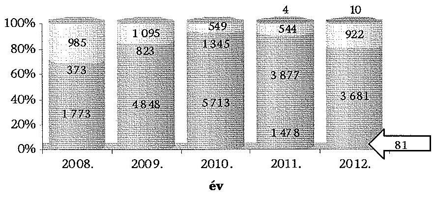
@megvalósításra irányuló @kötelezettség teljesítésére irányuló záró ellenőrzés =egyéb ellenőrzés
Forrás: Kincstár adatszolgáltatása

[^0]
[^0]:    ${ }^{124}$ a 47/2008. (III. 5.) Korm. rendelet 16. § (2) bekezdése alapján
    ${ }^{125}$ a 2009. július 30-án kötött megbízási szerződés 3. pontja
    ${ }^{126}$ a 2012. augusztus 29-ig hatályban volt megbízási szerződés 5. b) pontja
    ${ }^{127}$ Egyéb ellenőrzésként a 2011-2012. években az NFM-től kapott felkérés alapján az üzembe helyezési, üzemeltetési, fenntartási kötelezettség teljesítésének, a beruházások aktiválásának, valamint pénzügyi beszámolónak az ellenőrzését végezték el.

---

Négy támogatásnál (DECHÖF, TC, TRFC és TFFP) a megvalósításra irányuló közbenső és utóellenőrzéseket felváltotta a kötelezettségvállalásának ellenőrzése, és egy támogatásnál (REGÉC) a 2009-2010. években csak záró ellenőrzést kellett lefolytatni ${ }^{128}$. A 2011. évi vis maior, valamint az ÖFT igénybevételénél a Kincstárnak a megvalósítást követő utóellenőrzéseket, a kötelezettségvállalás időtartama alatti teljesítések ellenőrzését, és záró ellenőrzéseket nem kellett végeznie.

A pályázatos támogatásokból keletkezett követelések kezelését a Kincstár a 2008-2012. években megbízási szerződések alapján látta el ${ }^{129}$, amelyekre eljárásrendeket dolgozott ki.

Az ellenőrzés hatókörét érintő pályázatokhoz kapcsolódó követelések kezelésének feladataira két megbízási szerződést kötöttek az NFM-mel. A pályázatos területfejlesztési támogatásokra 2012. december 6-ig a 8/2008. számú Finanszírozási Igazgatói Utasítás, ezt követően a 34/2012. Elnöki utasítás volt hatályban. Az NBC-re vonatkozó követeléskezelési feladatok ellátásához a Széchenyi Terv Gazdaságfejlesztési Célelőirányzathoz kapcsolódó követelések kezelésének eljárási rendjéről szóló 4/2003. számú Ügyvezető Igazgatói Utasítást ${ }^{130}$ alkalmazták, amelyben azonban egyes tartalmi elemek - a feladatokat ellátó szervezeti egységek, jogszabályi hivatkozások - nem voltak aktuálisak az ellenőrzött időszak egészében.

A Kincstár - az Ámr. 88. § (1), (4) bekezdéseiben, az Ámr. ${ }_{2}$ 127. § (1)-(2), (5)(6), és (8)-(9) bekezdéseiben, az Ávr. 84. § (1), (6)-(8) bekezdésében, az Áht. 253. § (2) bekezdésében előírtak szerint - teljesítette a megbízási szerződésekben foglalt követeléskezelési feladatait.

Amennyiben a támogatási szerződésben biztosítékot kötöttek ki, és a kedvezményezett a támogató által küldött értesítésben foglalt határidőben nem teljesítette fizetési kötelezettségét, továbbá számára részletfizetést sem engedélyeztek, úgy a visszafizetési kötelezettség a biztosíték érvényesítésével történt ${ }^{131}$.

# A Kincstár által nyilvántartott, támogatásokhoz kapcsolódó követelések száma az ellenőrzött időszakban csökkenő tendenciát muta-

tott, a 2012. év végére a 2008. évhez képest 65,48
 %(420-ról 275) lett. Ennek oka, hogy az eljárások befejezése, a behajtások, és az önkéntes befizetések eredményeként a követelés egy része kivezetésre, törlésre került. A teljes követelésállományhoz képest az eljárás alatt álló (felszámolás, végelszámolás, csődeljárás, vagyonrendezés, bírósági eljárás miatti) követelésállomány aránya a 2008. évi 61,17 %-ról 7,54 százalékponttal emelkedett 2012. év végére. Az eljárások indítása minden esetben meghosszabbította a követeléskezelés időtartamát. A 2008-2012. évek közötti - az ellenőrzés hatókörébe tartozó - követelésállomány alakulását a 8. számú melléklet mutatja be.

A kedvezményezettek által fizetendő kamatokat az Ámr. 88. § (4) bekezdése, az Ámr. 2 127. § (1)-(2), és (8) bekezdéseiben, az Áht. 2 53. § (2) bekezdé-

[^0]
[^0]:    ${ }^{128}$ A céltámogatásoknál helyszíni ellenőrzéseket nem kellett végeznie a Kincstárnak.
    ${ }^{129}$ A TC és a DECHÖF esetében a Kincstár nem látott el követeléskezelési feladatokat.
    ${ }^{130}$ a Kincstár az utasítás kiadásának időpontjában részvénytársaságként, a 2003. év második felétől jogutódként költségvetési szervként működött
    ${ }^{131}$ Ámr. 188. § (5) bekezdése, Ámr. 2 127. § (9) bekezdése, Ávr. 84. § (8) bekezdése

---

sében előírtak, és a támogatási szerződésekben foglaltak szerint határozták meg. 

A visszafizetési kötelezettség részletekben történő teljesítése a támogató döntése alapján történt, amit az Ámr. 2 127. § (7) bekezdése, Ávr. 84. § (6) bekezdése alapján külön megállapodásban rögzítettek, és a Kincstár a továbbiakban ez alapján módosította a követelés nyilvántartását.

A Kincstár a hazai forrásból finanszírozott pályázati rendszerű támogatások belső kontrollrendszerét - a kontrollkörnyezetet, a kockázatkezelési rendszert, a kontrolltevékenységeket, az információs és kommunikációs rendszert, a monitoring-rendszert - kialakította és működtette. A belső ellenőrzés 2012-ben ellenőrizte a hazai forrásból támogatott pályázatokhoz és vis maior támogatásokhoz kapcsolódó döntés-előkészítés, szerződéskötés, finanszírozás, elszámolás és követeléskezelés, valamint a pályázatok felülvizsgálata feladatok ellátását ${ }^{132}$, amely során a kontroll hiányosságok mellett a szabálytalanságkezelést, az iktatási rendszert, az informatikai rendszert érintő hiányosságokat, jogosultsági és szabályozási problémákat állapítottak meg.

A szabálytalanságok kezelésének eljárásrendjéről szóló 32/2006. és a 7/2009. számú Elnöki Utasítások alapján negyedévente jelentést készítettek, amelyek nemlegesek voltak, súlyos szabálytalanságot nem állapítottak meg.

A belső ellenőrzés a hazai forrásból támogatott pályázatok és vis maior támogatások lebonyolítását 2011. január 1-jétől 2012. július 31-ig terjedő időszakra vonatkozóan ellenőrizte. Az ellenőrzésről készített jelentésben a Támogatásokat Közvetítő Főosztály feladataihoz kapcsolódóan 23, a Követeléseket és Közösségi Támogatásokat Kezelő Főosztály számára kettő, az ellenőrzött területi szerv állampénztári irodájának 26 javaslatot tettek ${ }^{133}$, amelyekre az érintettek intézkedési tervet készítettek.

### 2.4. A kincstári monitoring-rendszer

A költségvetési előirányzatokból finanszírozott támogatási konstrukciók adatainak regisztrálását, nyomon követését szolgáló kincstári monitoringrendszer (KMR) működtetését ${ }^{134}$ az Áht. 18/B. § (1) bekezdés i) pontja írta elő a Kincstár számára. Az Áht. 56. §-a szerint a Kincstár monitoring rendszert működtet a költségvetési támogatásokról, és közreműködik ezek felhasználásának összehangolásában, amelyhez kapcsolódóan a részletes előírásokat az Ávr. 91. §-a, illetve az abban hivatkozott 66-90. §, 92-99. § és 3. melléklet rögzítette. Az Áht. a rendszerben rögzítendő támogatások körét nem határozta meg, a monitoring hatálya alá tartozó előirányzatokat, az adatszolgáltatási kötelezettség tartalmát az Ámr. szabályozta ${ }^{135}$. A szabályo-

[^0]
[^0]:    ${ }^{132}$ ELL-134-7/2012. iktatószámú, 6/2012. számú vizsgálati jelentés, 2012. október 17.
    ${ }^{133}$ A Kincstár tájékoztatása szerint a jelentés vezetői összefoglaló részében a javaslatok kétféle megfogalmazásban szerepeltek, a kockázatot hordozó javaslatot megállapításként, a kockázatot nem hordozó javaslatot ajánlásként rögzítették.
    ${ }^{134}$ 2010. december 31-ig Országos Támogatási Monitoring Rendszer (OTMR)
    ${ }^{135}$ az Ámr. 78. § (1)-(3) bekezdései, 79. § (2), (11) bekezdései és a 93/B. §, az Ámr. 109. §, a 112. § (9) bekezdése, a 137. §, a 138. § (2)-(3) bekezdése, a 153. §

---

zás, a rendszerhez tartozó alanyi kör és a költségvetési előirányzati kör ellenőrzött időszakban történt többszöri változása nehezítette a feladat-ellátási kötelezettség teljesítését, átláthatóságát, nem biztosította az összehasonlíthatóságot.

Az SzMSz 1 49. § j) pontjában, 2009. szeptember 30-tól a 48. § m) pontjában, illetve az SzMSz 50. § g) pontjában, 2012. június 9-től a 69/B. § g) pontjában, valamint azokkal összhangban a feladatot ellátó Támogatásokat Közvetítő Főosztály, 2009. szeptember 30-tól Követeléseket és Közösségi Támogatásokat Kezelő Főosztály ügyrendjében ${ }^{136}$ szabályozták a monitoring-rendszer működtetésére vonatkozó feladatokat, és munkaköri leírásokban meghatározták a feladatellátás felelőseit. A belső szabályozás a jogszabályokkal összhangban tartalmazta a KMR működtetésére vonatkozó feladatokat.

A Kincstár a 2008-2012. években a KMR szabályszerű működtetése érdekében biztosította a szükséges informatikai hátteret, tájékoztatókat, információs anyagokat készített, amelyeket a honlapján közzétett. A KMR működtetése az Ámr. 1 VIII., az Ámr. 2 VII., és az Ávr. VI. fejezetében rögzített támogatásnyújtási fázisokra épülő modulrendszerben történt. A KMR-ben 2008-2012. évek december 31-én regisztrált támogatási konstrukciók és támogatások alakulását a 9. számú melléklet mutatja be.

A támogatási konstrukciók tervezetének Kincstár általi rögzítését követően, az adatszolgáltatások alapján a KMR tartalmazta az egyes konstrukciókhoz benyújtott pályázatokat, azok döntéselőkészítéséhez kapcsolódó adatokat. Adatot biztosított a pályázók köztartozás-mentességének ellenőrzéséhez, tartalmazta a támogatási döntéseket, szerződéseket, a támogatás lehívásokat, azaz a támogatási konstrukció meghirdetésétől a pályázó által megvalósított projekt elszámolásáig, a fenntartási idő leteltével a projekt lezárási adatait.

A rendszer adatszolgáltatói kapcsolatai a támogatási konstrukciók bejelentési folyamatát követően elektronikus úton működtek: megfelelő informatikai háttér esetén közvetlen interfészes kapcsolatban, annak hiányában pedig a Kincstár által kialakított internetes rögzítői felületen keresztül. A két rendszer (interfész és internetes felület) alkalmazását a Követeléseket és Közösségi Támogatásokat Kezelő Főosztály által kiadott működési és felhasználói kézikönyv segítette.

A Kincstár részéről a KMR működtetése a 2008-2012. években szabályszerű volt, amit a kontrollkörnyezet szabályozása - ellenőrzési nyomvonal, a feladatok folyamatának vezetői utasításban történő meghatározása, a feladatok és hatáskörök munkaköri leírásban történő rögzítése, a KMR-ben regisztrált adatokhoz a jogosultak hozzáférésének megadása - biztosított.

A Kincstár az Ámr. 1 79. § (2) bekezdés, az Ámr. 2 138. § (3) bekezdés, az Ávr. 92. § (3) bekezdés előírásainak megfelelően a benyújtott támogatási konstrukciót az ellenőrzött esetekben az előírt határidőn belül regisztrálta, és erről a támogatási konstrukció bejelentőjét tájékoztatta.

[^0]
[^0]:    ${ }^{136}$ Támogatásokat Közvetítő Főosztály 2007. október 5-től 2010. május 27-ig hatályos ügyrendje 3.3.1 pontja, Követeléseket és Közösségi Támogatásokat Kezelő Főosztály 2010. május 18-tól hatályos ügyrendje 3.1.5 pontja, 2011. június 21-től, illetve 2012. október 5-től hatályos ügyrendje 2.1.5.2. pontja.

---

A támogatások kezelői az ellenőrzött 18-ból 10 esetben határidőben nem tettek eleget jogszabályi kötelezettségüknek, mert az előírt dokumentációt, a támogatási konstrukciók tervezetét nem a megjelentetés időpontja előtt, hanem azt követően küldték meg a Kincstár részére. Az Ámr. 79. § (2) bekezdésében, az Ámr. 2 138. § (2) bekezdésében, valamint az Ávr. 92. § (2) bekezdésében előírtak szerint a támogatások kezelője a támogatási konstrukció megjelenését megelőzően köteles megküldeni a Kincstár részére az előírt dokumentációkat. A támogatások kezelői az ellenőrzött 18 esetből hét esetben annak ellenére nem tettek eleget jogszabályban előírt adatszolgáltatási kötelezettségüknek, hogy erre a Kincstár több alkalommal levélben hívta fel az érintetteket, és együttműködést, személyes egyeztetést is felajánlott. Az adatszolgáltatási kötelezettség nem előírásszerű teljesítése esetére a jogszabályok nem határoztak meg szankciót.

Az Ámr. 85. § (7) bekezdés, az Ámr. 2 143. § (2) bekezdés, valamint az Ávr. 92. § (6) bekezdés által előírtak szerint a támogatások kezelője a jóváhagyott költségvetési támogatásokról a támogatási döntést követő 10 munkanapon belül adatot szolgáltat a Kincstárnak. Az Ámr. 87. § (7) bekezdése, az Ámr. 2 145. § (2) bekezdése, az Ávr. 92. § (7) bekezdése alapján, ha a megadott adatokban módosulás történik, a támogatási döntés hatályát veszti, vagy a támogató a támogatói okirat kiadásáról, módosításáról, visszavonásáról, illetve a támogatási szerződés megkötéséről, módosításáról, felbontásáról, megszüntetéséről dönt, erről öt munkanapon belül kell értesíteni a Kincstárt.

Az Ámr. 79. § (2) bekezdése, az Ámr. 2 138. § (4) bekezdése, és az Ávr. 92. § (4) bekezdése szerint a Kincstár a KMR-ben kedvezményezettenként nyilvántartotta a csekély összegű támogatásokat (de minimis támogatás) az adatszolgáltatók bejelentései alapján. Az előzőekben jelzett adatszolgáltatási kötelezettség nem teljesítése miatt azonban a nyilvántartott adatok nem voltak teljes körűek.

Az adatszolgáltatóknak az általuk megküldött, a támogatási döntésről szóló adatlapon a támogatott projekt költségszerkezetére vonatkozó adatok között szerepeltetni kellett a jóváhagyott támogatásból a „de minimis támogatás" összegét. A KMR alkalmas arra, hogy ezekből az adatokból a Kincstár előállítsa a csekély összegű támogatásokat kedvezményezettenként.

A Kincstár az Ámr. 85. § (2) bekezdése, az Ámr. 2 143. § (1) bekezdése, az Ávr. 92. § (5) bekezdése alapján a regisztrált támogatási konstrukciókkal rendelkező, azonos célú előirányzatok felett rendelkező jogosultak részére biztosította a hozzáférést a támogatást igénylők monitoring-rendszerben regisztrált adataihoz, amelynek kétféle módon - interfész és internetes kapcsolat létrehozásával - tett eleget ${ }^{137}$.

A Kincstár a 2008-2012. években kötelezettségének eleget téve június 30-ig adatot szolgáltatott a monitoring rendszerben feldolgozott információkról az adatszolgáltatóknak. Az adatszolgáltatók feladata volt, hogy

[^0]
[^0]:    ${ }^{137}$ A megfelelő informatikai háttérrel rendelkező 22 adatszolgáltató esetében a hozzáférés interfészen keresztül, a Kincstár és az adatszolgáltatók között létrejött együttműködési megállapodások alapján történt.

---

évente július 31-ig aktualizálják az általuk szolgáltatott adatok körét. Az adatszolgáltatók az Ámr. 87. § (8) bekezdésében, az Ámr. 2 145. § (3) bekezdésében és az Ávr. 92. § (8) bekezdésében előírt egyeztetési, aktualizálási kötelezettségeiknek nem minden esetben tettek eleget, a regisztrált adatokat a Kincstár értesítése ellenére nem egyeztették, nem aktualizálták. Ezekben az esetekben a Kincstár figyelemfelhívó levelet küldött ki. Az adatszolgáltatók mulasztása miatt a KMR előírtaknak megfelelő működtetése nem volt biztosított, ami a közpénzek átlátható felhasználásában kockázatot jelent.

A Kincstár az Ámr. 79. § (2) bekezdésében, az Ámr. 2 151. § (1) bekezdésében, az Ávr. 92. § (5), (11) bekezdéseiben foglaltaknak megfelelően a döntéselőkészítés folyamatában az adatszolgáltatók, az előirányzatok kezelői számára is adatot szolgáltatott a monitoring rendszerben regisztrált adatokról.

# 2.5. EU forrásokból finanszírozott pályázati rendszerekhez és egyéb nemzetközi támogatásokhoz kapcsolódó feladatellátás 

A Kincstárnak az ellenőrzött időszakon belül az EU forrásból finanszírozott pályázati rendszerekhez és egyéb nemzetközi támogatásokhoz kapcsolódóan 2011. január 1-jétől - a korábban a PM/NGM NAO
 Iroda által ellátott KH/IgH/NA feladatokat, valamint 2008-tól megállapodások alapján a számviteli és ellenőrzési feladatokat kellett ellátnia.
Az SzMSz₂ 3. § (2) bekezdése bb) pontjában - az Áht₂-ben meghatározott alapfeladatként - 2011. január 1-jétől rögzítették az európai uniós forrásból származó, és egyéb nemzetközi támogatásokkal kapcsolatosan a támogatások fogadásáért felelős KH/IgH/NA feladatok ellátását.

A Kincstár számára a KH/IgH/NA feladatok ellátása tartalmában a különböző támogatások - ÜMFT, előcsatlakozási eszközök, strukturális alapok, Kohéziós Alap, Európai Területi Együttműködés (ETE), Európai Gazdasági Térség (EGT) Finanszírozási Mechanizmus és Norvég Finanszírozási Mechanizmus, Svájci-Magyar Együttműködési Program - esetében más-más feladatokat és eljárási szabályokat jelentett, amelyeket különböző jogszabályokban határoztak meg. A PM/NGM NAO Iroda megszűnésével a KH/IgH/NA feladatok Kincstárba történt átszervezése miatt az érintett európai uniós forrásból finanszírozott programokkal kapcsolatos jogszabályok módosítása azonban a közigazgatási egyeztetések elhúzódása miatt csak több hónapos késéssel - 2011. július 8-tól a 113/2011. (VII. 7.) Korm. rendelettel történt meg.

A Tanács 1083/2006/EK rendeletével összhangban rögzítették a hazai jogszabályokban¹³⁸ az IgH feladatát: az átutalás igénylési dokumentáció összeállítása és az EU Bizottság részére történő benyújtása, a költségigazolás, tényfeltáró vizsgálat és tényfeltáró látogatás végzése, a kifizetési előrejelzéseknek az EU Bizottság részére történő benyújtása, a támogatások fogadása az EU Bizottságtól, pénzügyi nyilvántartások vezetése a visszafizetendő, valamint

[^0]
[^0]:    ¹³⁸ 2011. február 8-ig a 255/2006. (XII. 8.) Korm. rendelet 13. § (4) bekezdésében, 2011. február 9-től a 4/2011. (I. 28.) Korm. rendelet 7. § (4) bekezdésében

---

visszavont összegekről, a pénzügyi korrekciók végrehajtása, illetve a visszafizetett támogatások elszámolása az EU Bizottsággal.

A 255/2006. (XII. 8.) Korm. rendelet 13. § (1) bekezdése, 2011. február 9-től a 4/2011. (I. 28.) Korm. rendelet 7. § (1) bekezdése szerint az államháztartásért felelős miniszter feladata az IgH feladatok ellátásának biztosítása.

A Kincstár szervezetében a KH/IgH/NA feladatokat a 2011. január 1-jével létrejött két főosztály - az EU Támogatások Pénzügyi és Szabálytalansághyilvántartási Főosztály és az EU Támogatások Szabályosság Felülvizsgálati Főosztály - látta el. A KH/IgH/NA feladatokat ellátó két főosztály és az NFÜ megbízása alapján a végrehajtásban is szerepet játszó Követeléseket és Közösségi Támogatásokat Kezelő Főosztály szakmai irányítását az SzMSz₂ 2012. június 8-i módosításáig egyaránt az Uniós támogatási igazgató látta el. A két terület (a végrehajtási és az ellenőrző funkciók) azonos irányítása az IgH feladatok független ellátása szempontjából kockázatot jelentett. Az SzMSz₂ 2012. júniusi módosításával a Követeléseket és Közösségi Támogatásokat Kezelő Főosztály a Pénzforgalmi elnökhelyettes irányítása alá került, így megvalósult a KH/IgH/NA és a végrehajtásban résztvevő egység szakmai irányításának Kincstáron belüli elkülönítése.

A részletes működési rend és feladatok meghatározására a Kincstár elnöke kiadta az EU Támogatások Szabályosság Felülvizsgálati Főosztály és az EU Támogatások Pénzügyi és Szabálytalanság-nyilvántartási Főosztály (és annak módosított) ügyrendjét. A 2011. január 15-én hatályba lépett, de rendelkezéseit 2011. január 1-től alkalmazandó SzMSz₂-ben meghatározott szervezet és feladatrend szerinti ügyrendek azonban csak több hónap késéssel, 2011 májusában és júniusában kerültek kiadásra, annak ellenére, hogy a 14/2007. számú Elnöki Utasítás 1.2 a) pontjának előírásai szerint amennyiben olyan változás következik be, mely az ügyrend módosítását igényli, úgy az ügyrendet ennek megfelelően haladéktalanul át kell dolgozni.

Az EU Támogatások Szabályosság Felülvizsgálati Főosztály és az EU Támogatások Pénzügyi és Szabálytalanság-nyilvántartási Főosztály ügyrendjének szöveges részeiben a 2007-2013 programozási időszakra vonatkozóan az IgH részére a hazai jogszabályokban meghatározott feladatok nem azonosíthatók be egyértelműen. Az ügyrendben nem nevesítették a kifizetési előrejelzéseknek az EU Bizottság részére történő benyújtását, a támogatások fogadását az EU Bizottságtól, pénzügyi nyilvántartások vezetését a visszafizetendő, valamint visszavont összegekről, a pénzügyi korrekciók végrehajtását, illetve a visszafizetett támogatások elszámolását az EU Bizottsággal, amelyeket a 255/2006. (XII. 8.) Korm. rendelet 13. § (4) bekezdése, valamint a 4/2011. (I. 28.) Korm. rendelet 7. § (4) bekezdése az IgH feladatként rögzített.

A 4/2011. (I. 28.) Korm. rendelet 12. § (1) bekezdése d) pontjában foglaltak és a módosított 14/2007. számú Elnöki Utasítás előírásai szerint az ügyrendek függelékeként kiadták a feladatokat részletesen meghatározó ellenőrzési nyomvonalat, mely tartalmazta a keletkező dokumentumot, a feladat elvégzéséért felelőst, annak határidejét. A vezetői ellenőrzés kialakítása érdekében az ellenőrzési nyomvonal rögzítette továbbá az előzetes (felülvizsgálat), valamint utólagos ellenőrzést (jóváhagyást) végző személyt és tevékenységet.

---

A Kincstár a feladatok átvételét követően a KH/IgH/NA feladatokkal kapcsolatosan belső szabályozást az ellenőrzött 2011-2012. években két terület - az ÚMFT, EGT Finanszírozási Mechanizmus és Norvég Finanszírozási Mechanizmusok számviteli nyilvántartása - kivételével nem adott ki. A Kincstárban a feladat átvételét követően több mint egy évvel később, 2012. május 9-i hatállyal adták ki az ÚMFT-hez kapcsolódó IgH feladatokra vonatkozóan az 1/2012. számú Uniós Támogatási Igazgatói Utasítást, és az EGT és Norvég Finanszírozási Mechanizmus számviteli nyilvántartásához 2011. december 14-i hatállyal adták ki a 9/2011. Uniós Támogatási Igazgatói Utasítást.

A Kohéziós Alappal, az ETE-vel, a Svájci-Magyar Együttműködési Programmal, az EGT és Norvég Finanszírozási Mechanizmussal, valamint a szabálytalanságok kezelésével kapcsolatos feladatokat az ellenőrzött időszak végéig, illetve az ÚMFT, valamint az EGT és Norvég Finanszírozási Mechanizmus számviteli feladatokat a kincstári szabályozásig a PM/NGM NAO Iroda igazgatója által - 2010. december 31-ét megelőzően - kiadott, a feladatellátást szabályozó működési kézikönyvek, eljárásrendek figyelembevételével látták el. E szabályozásokat a 14/2007. és a 45/2011. számú Elnöki Utasítások 1.6. pontja előírásai¹³⁹ ellenére nem aktualizálták, így azok nem voltak összhangban a 2011. január 1-jétől hatályos szervezeti keretekkel.

Az EUTAF (mint ellenőrző hatóság) 2011. és 2012. évi rendszer ellenőrzései is megállapították, hogy az IgH Kincstárhoz történő áthelyezésével kapcsolatosan nem végezte el a megfelelő módosításokat az eljárásrendjében.

# 2.5.1. Igazoló hatósági, kifizető hatósági és a Nemzeti Alap számára előírt feladatok 

### 2.5.1.1. Új Magyarország Fejlesztési Terv

Az 1083/2006/EK tanácsi rendelet 61. cikke az IgH feladatként határozta meg a kifizetési kérelmek összeállítását és azok EU Bizottság részére történő benyújtását, a számviteli nyilvántartások tárolását, a visszafizetendő, valamint visszavont összegek pénzügyi nyilvántartásának vezetését.

A Kincstár a 2011-től ellátott költségigazolási tevékenysége során meggyőződött arról, hogy a 4/2011. (I. 28.) Korm. rendelet 50. § (3) bekezdése szerint az Európai Bizottság részére benyújtott időközi átutalás igénylési dokumentáció csak olyan költségeket tartalmazott, amelyeket kifizettek, az EMIR-ben rögzítettek, hitelesítés keretében ellenőriztek, valamint számlák támasztottak alá, illetve amelyek a támogatott projektekre vonatkozóan elszámolható költségnek

[^0]
[^0]:    ¹³⁹ A 14/2007. és a 45/2011. számú Elnöki Utasítások 1.6. pontja szerint a hatályos utasítást előkészítő szakmai terület gondoskodik a jogszabályoknak, az állami irányítás egyéb jogi eszközeinek, illetve egyéb körülményeknek megfelelő aktualizálásáról, naprakész állapotáról, mely feladat elvégzéséért a szakmai terület vezetője felel. A szakmai területek és az igazgatóságok mellett az Igazgatási Osztály is folyamatosan figyelemmel kíséri a kincstári tevékenységek belső szabályozottságát, esetleges hiányosságok, szabálytalanságok esetén írásban intézkedést kezdeményez és felhívja erre az illetékes szakterület figyelmét.

---

minősültek. A költségigazolási tevékenységét az EMIR-be épített ellenőrzési (kontroll) pontok működtetésével, a Közösségi Hozzájárulás Rendezéshez kapcsolódó számlaellenőrzéssel, a hitelesítési jelentések feldolgozásával, tényfeltáró vizsgálattal/látogatással és az Igazoló Jelentés készítéssel alapozta meg.

Az IgH 2011-ben 87 költségnyilatkozatot, illetve azt alátámasztó Igazoló Jelentést állított össze, amelyek összesen 14882 projektet, 952,6 Mrd Ft összegű támogatást tartalmaztak. A 2012-ben összeállított 90 költségnyilatkozat, illetve Igazoló Jelentés szerinti 16118 projekthez 861,1 Mrd Ft összegű támogatás kapcsolódott.

Az IgH az igazolási tevékenység megalapozására a 4/2011. (I. 28.) Korm. rendelet 7. § (4) bekezdés b) pontja¹⁴⁰, illetve a 72. § (4) bekezdése szerint, a költségek megfelelőségének ellenőrzése érdekében tényfeltáró vizsgálatot és tényfeltáró látogatást végzett a pénzügyi lebonyolításban részt vevő szervezeteknél. Az 1/2012. számú Uniós Támogatási Igazgatói Utasítás meghatározta a tényfeltáró látogatás és tényfeltáró vizsgálat megtervezésének (beleértve a kockázatelemzést és mintavételezést is), lefolytatásának, dokumentálásának és az ajánlások nyomon követésének részletes szabályait.

A negyedéves terv alapján végzett tényfeltáró vizsgálatok keretében ellenőrzött számlák vizsgálata során az IgH adminisztratív jellegű hibákat tárt fel. 2011-2012. években 1-1 esetben tártak fel pénzügyi korrekciót igénylő (nem elszámolható költséghez kapcsolódó) hiányosságot. A tényfeltáró látogatások a 2011-2012. években elkészített féléves tervek alapján történtek.

A Kincstár a költségnyilatkozatokban (Igazoló Jelentésekben) szereplő adatok hitelességét a 2011-2012. években összesen 2580 tényfeltáró vizsgálattal (számlaellenőrzéssel) és 35 tényfeltáró látogatással támasztotta alá.

Az IgH a 4/2011. (I. 28.) Korm. rendelet 51. § (2) bekezdésében, és az 1/2012. számú Uniós Támogatási Igazgatói utasításban előírtak szerint, az NFÜ által benyújtott kifizetési ütemezések figyelembevételével a tárgyévre és az azt követő évre vonatkozó kifizetési előrejelzéseket operatív programonként (a tárgyév április 30-áig) az SFC2007 rendszerben megküldte az EU Bizottság részére. A 4/2011. (I. 28.) Korm. rendelet 100. § (6) bekezdésében előírtak szerint az IgH a 2011-2012. évekre vonatkozóan az EMIR-ben nyilvántartott adatok alapján az SFC2007 rendszeren keresztül megküldte az EU Bizottság részére a kimutatását a költségnyilatkozatból visszavont, a behajtott és a költségnyilatkozatból levont, valamint a behajtandó összegekről programonként és prioritásonként.

Az IgH a 4/2011. (I. 28.) Korm. rendelet 12. § (1) bekezdése a) pontjában előírt, a szabályszerű és szabályozott tevékenységet biztosító pénzügyi irányítási, monitoring- és kontrollrendszert - amelynek szerepe annak biztosítása, hogy az információk, beszámolók, jelentések és nyilatkozatok pontosak, megalapozottak és dokumentáltak legyenek és a megfelelő időben rendel-

[^0]
[^0]:    ¹⁴⁰ 2011. február 8-ig a 255/2006. (XII. 8.) Korm. rendelet 13. § (4) bekezdés c) pont

---

kezésre álljanak - a Kincstár részben alakította ki, mivel a feladatellátás kereteit meghatározó ügyrendeket és működési kézikönyveket jelentős késéssel adta ki. A 4/2011. (I. 28.) Korm. rendelet 12. § (1) bekezdése b) pontjában előírtak betartása érdekében - az igazolási tevékenysége, a tényfeltáró látogatás és vizsgálatok, a Közösségi Hozzájárulás Rendezés összeállításához kapcsolódó számlaellenőrzés, a négy szem elvének alkalmazásával, illetve az EMIR használatával - az IgH olyan pénzügyi irányítási, monitoring- és kontrollrendszert működtetett, amely biztosította az igényelt kiadások hitelességének ellenőrzését, az alkalmazandó uniós és nemzeti jogszabályok betartását.

# 2.5.1.2. Előcsatlakozási eszközök (Phare és SAPARD) 

A Phare és Sapard programok a 2011. évet (a feladat Kincstárhoz kerülését) megelőzően lezárásra kerültek. Ezért a nemzetközi megállapodásokban és a hazai jogszabályokban előírtak közül csak a lezárást követő feladatok elvégzése merült fel a Kincstárnál.

A 2011-2012. években a PHARE programok pénzügyi zárásához, illetve ellenőrzéséhez kapcsolódóan három esetben indított az EU Bizottság visszatérítési eljárást, és bocsátott ki beszedési megbízás és terhelési értesítőt. A SAPARD programot érintően egy - az EU Bizottság
 határozatában előírt - korrekció vonatkozásában adott ki az EU Bizottság terhelési értesítőt. A Kincstár a 119/2004. (IV. 29.) Korm. rendelet 32. § (1), (3) bekezdései, valamint a 40. § (4) bekezdésének megfelelően és a meghatározott határidőben gondoskodott a terhelési értesítőben (debit note) lévő összegeknek az EU Bizottság részére történő visszautalásáról.

A 2011-2012. években a 84/2002. (IV. 19.) Korm. rendelet 2. §-ban kihirdetett megállapodás 16. cikkének 1. §-ában előírtak szerinti - a Magyarországon PHARE pénzeszközökből finanszírozott programok keretében végzett összes szerződéses és egyéb pénzügyi műveletet lefedő - kettős vagy analitikus könyvelési rendszert a Kincstár nem működtette. Ilyen feladatot a NA feladatokat ellátó két főosztály ügyrendje nem tartalmazott.

Az EU források pénzügyi lebonyolítása a 119/2004. (IV. 29.) Korm. rendelet 26. § (1) bekezdése alapján a Kincstárban, a támogatási eszközök (PHARE és SAPARD) programjaira elkülönítetten nyitott, normál piaci feltételek mellett kamatozó, euróban vezetett devizaszámlákon történt, melyek felett a Kincstár EU Támogatások Pénzügyi és Szabálytalanság-nyilvántartási Főosztálya rendelkezett. A bankszámlák számlaegyenlege után azonban a Kincstár a 2011-2012. években nem írt jóvá kamatot, mivel a Kincstár Hirdetménye szerint a kincstári devizaszámla kamatozó számla, a számlaegyenleg után fizetett kamat mértéke 0% volt.

A 119/2004. (IV. 29.) Korm. rendelet 26. § (1) bekezdésében előírt feltétel „normál piaci feltételek mellett kamatozó" teljesülése nem megítélhető, mivel a jogszabály nem határozta meg a normál piaci feltételek fogalmát.

A PHARE programokra nyitott, a helyszíni ellenőrzés időszakában „élő" 40 bankszámla 5 kivételével (melyek közül 4-en volt forgalom a 2011-2012. évek-

---

ben) „0" egyenleggel rendelkezett és az EU Bizottság által lezárt programokhoz kapcsolódott.

# 2.5.1.3. Strukturális alapok, Kohéziós Alap 

Az Európai Unió strukturális alapjaiból és Kohéziós Alapjából származó támogatások hazai felhasználásáért felelős intézményekről szóló 1/2004. (I. 5.) Korm. rendelet 29. § (1) bekezdése alapján a KH az EU támogatásokkal kapcsolatos, az IH-k által biztosított adatokon alapuló átutalás igénylések összeállítására, a költségnyilatkozatok igazolására, az EU felé történő benyújtására, valamint az EU-ból érkező pénzügyi források fogadására kijelölt szervezet. Az 1/2004. (I. 5.) Korm. rendelet 29. § (1) bekezdése előírásai szerint a KH feladatait a NFT operatív programjai és a 360/2004. (XII. 26.) Korm. rendelet határozta meg. A Kohéziós Alap kifizető hatósági feladatok ellátása során a NAO Kohéziós Alap Működési Kézikönyv előírásait tekintették irányadónak, új szabályozást a Kincstárra aktualizáltan nem készítettek.

A strukturális alapok (NFT Operatív Programjai) esetében támogatás kifizetésére - tekintettel arra, hogy a programok zárása megtörtént - az ellenőrzött 2011-2012. években nem került sor ${ }^{141}$. Az NFT Operatív Programjaihoz és a Kohéziós Alap projektekhez kapcsolódóan 2011-2012-ben nem volt visszafizetés. A 2011-2012. évben az egyes Operatív Programok EU Bizottság részéről történő pénzügyi zárására, és a programokból visszatartott utolsó 5% kifizetésére került sor.

A Kohéziós Alap esetében a Kincstár, mint KH a 360/2004. (XII. 26.) Korm. rendelet 9. § c) pontja és a 34. § (4) bekezdése alapján - két eset kivételével - intézkedett a projektek szállítói számlái közösségi hozzájárulási részének átutalásáról az adott projekt vonatkozó lebonyolítási (bank)számlára, a Kohéziós Alap KSz által a KH-hoz benyújtott közösségi forráslehívás alapján. Kettő esetben a közösségi forrás nem érkezett be, ezért a KH nem tudta a költségvetés által előfinanszírozott támogatás összegét - a 360/2004. (XII. 26.) Korm. rendelet 5. § b) pontja szerint - a vonatkozó fejezeti kezelésű előirányzat-felhasználási felhasználási keretszámlára átutalni.

A KH elvégezte a forráslehívás ellenőrzését (a négy szem elvének betartásával) és jóváhagyását. A forráslehívás jóváhagyásáról a négy szem elvének figyelembevételével (KH ellenőrzés, KH felülvizsgálat) kitöltötték az EMIR finanszírozás moduljában található check listákat is.

A KH benyújtotta az EU Bizottság részére az átutalás igénylés dokumentációt (költségigazoló nyilatkozatot (certificate), költségnyilatkozatot (Statement of Expenditure), átutalási kérelmet (Application for Payment). A költségigazoló nyilatkozat alátámasztására a KH elkészítette az igazoló jelentését, melyben javasolta a költségigazoló nyilatkozat aláírását.

A KH az EU Bizottság részére a 360/2004. (XII. 26.) Korm. rendelet 9 § g) pontjában előírt kifizetési előrejelzést a 2011-2012. években nem küldött.

[^0]
[^0]:    ${ }^{141}$ Az NFT Operatív Programjai esetében az elszámolhatósági időszak vége 2009. június 30., a Regionális Operatív Program esetében 2008. december 31. volt.

---

A 360/2004. (XII. 26.) Korm. rendelet 64. § (5) bekezdésében foglalt határidő betartása érdekében a KH megküldte az EU Bizottság részére a végső egyenleg átutalási igénylését, ez azonban az ellenőrzött 18 esetből egy esetben sem tartalmazta a végső költségigénylést megalapozó zárónyilatkozatot és beszámolót, illetve az azt megalapozó ellenőrzési jelentést, mivel az EUTAF a 360/2004. (XII. 26.) Korm. rendelet 64. § (5) bekezdésében foglalt 5 hónap alatt nem végezte el a zárónyilatkozathoz szükséges ellenőrzéseket és nem küldte meg a KH részére. Az EUTAF által kiadott zárónyilatkozat alapján a KH ismételten megküldte az EU Bizottság részére a végső átutalási igénylést, szükség esetén a zárónyilatkozatot megalapozó ellenőrzések, szabálytalansági vizsgálatok alapján korrigált összegben. Az EUTAF ellenőrzése az ellenőrzött 18 projektből öt esetben még nem zárult le, ezeknél a KH a végleges végső átutalási igénylést nem küldte meg az EU Bizottságnak.

# 2.5.1.4. Európai Területi Együttműködés (ETE) programok 

A 49/2007. (III. 26.) Korm. rendelet 2011. július 8-i hatállyal történt módosításával a közös igazoló hatósági (Közös IgH) feladatok ellátására a PM/NGM NAO Iroda helyett a Magyar Államkincstárt jelölték ki a 3. § (1) bekezdés c) pontja szerint a Magyarország-Szlovákia területi együttműködés operatív program, a Magyarország-Románia területi együttműködés operatív program, valamint a Dél-kelet Európai Térség operatív program, illetve a 3. § (2) bekezdés b) pontja szerint a Magyarország-Horvátország IPA ${ }^{142}$ határon átnyúló együttműködési program, valamint a Magyarország-Szerbia IPA határon átnyúló együttműködési program tekintetében. A Közös IH az NFÜ Nemzetközi Együttműködési Programok Irányító Hatósága (NFÜ NEP IH) volt. A Közös IgH feladatait a NAO ETE Működési Kézikönyv előírásai alapján látta el, a Kincstár szervezetére aktualizált kézikönyvet nem készítettek.

A Közös IgH a támogatások pénzügyi folyamatainak feladatait a 2007-2013 INTERREG Monitoring és Információs rendszer (IMIR 2007-2013 rendszer) finanszírozási moduljának alkalmazásával látta el, amelyben a vonatkozó adatok ellenőrzését, felülvizsgálatát és jóváhagyását a megfelelő jogosultsággal rendelkező, adott feladat végrehajtásáért felelős személy végezte el.

A Közös IgH a 160/2009. (VIII. 3.) Korm. rendelet 12. §-nak megfelelően a forráslehívási kérelmekben jóváhagyott kifizetések függvényében összeállította az időközi átutalási igénylési dokumentációt az IMIR 2007-2013 rendszerben programonként a felmerült költségek EU Bizottság felé történő elszámolása érdekében, és megküldte az EU Bizottság részére. A költségnyilatkozat és az átutalási kérelem összeállítását és felülvizsgálatát a Közös IgH dokumentálta az „Ellenőrzési lista a költségnyilatkozathoz és az átutalási kérelemhez" nyomtatványon.

A Közös IgH költségigazolási tevékenysége a Közös IH által elkészített és megküldött (NAO ETE Működési Kézikönyv szerinti) programszintű hitelesítési jelentésen alapult. A programszintű hitelesítési jelentés ellenőrzését a NAO ETE Működési Kézikönyvben megadott minta szerinti „Hitelesítési jelentés ellenőrzési

[^0]
[^0]:    ${ }^{142}$ előcsatlakozási támogatási eszköz: Instrument for Pre-Accession Assistance (IPA)

---

lista" kitöltésével dokumentálták. A Közös IgH a költségigazolás megalapozására Igazoló jelentést készített, melynek alapján javasolta a költségigazoló nyilatkozat aláírását. Az Igazoló jelentés összeállítását és felülvizsgálatát az „Igazoló jelentés ellenőrzési lista" kitöltésével a Közös IgH szakértői (a négy szem elvének figyelembe vételével) dokumentálták. Az igazolási tevékenysége alátámasztására a Közös IgH tényfeltáró látogatást végzett.

A tényfeltáró látogatások a NAO ETE Működési Kézikönyvben előírtakat betartva féléves terv alapján történtek. Az igazoló jelentések alapján az érintett költségnyilatkozatok vonatkozásában a Közös IgH tényfeltáró látogatást végzett 2011. július 6-án az NFÜ NEP IH-nál. A tényfeltáró látogatás során a Közös IgH 20 (programonként 4-4) számlához kapcsolódóan áttekintette a folyamatokat és 5 (programonként 1-1) számla esetében meggyőződött az IMIR 2007-2013 rendszer és a papíralapú adatok egyezéséről. A számlák alapján a Közös IgH nem fogalmazott meg javaslatot.

Az időközi kifizetési kérelem benyújtása az EU Bizottság részére - az SFC2007 rendszeren keresztül - megtörtént.

A 160/2009. (VIII. 3.) Korm. rendelet 14. § (4) bekezdése alapján a Közös IgH jóváhagyta a Közös IH által benyújtott forráslehívási kérelmeket, majd gondoskodott a közösségi támogatás átutalásáról az euró közös programszámla egyenlegének erejéig az euró lebonyolítási fizetési számlára. A forráslehívási kérelem és a deviza átutalási megbízás ellenőrzését (a négy szem elvének betartásával) és jóváhagyását a Közös IgH elvégezte. A Közös IgH elvégezte az IMIR 2007-2013 rendszerben lévő adatok ellenőrzését, felülvizsgálatát és jóváhagyását.

# 2.5.1.5. EGT Finanszírozási Mechanizmus és Norvég Finanszírozási Mechanizmus 

Az EGT és a Norvég Finanszírozási Mechanizmusokkal kapcsolatban a Kincstár kifizető hatósági feladatokat látott el. A KH feladatául a 33/2010. (II. 23.) Korm. rendelet 1. melléklete a bankszámlák kezelését, a kifizetések költségigazolását, a pénzügyi folyamatokról a Nemzeti Kapcsolattartó ${ }^{143}$ részére történő jelentéskészítést, a szabálytalanul kifizetett források visszafizetését jelölte meg. A KH tevékenységét a NAO EGT/Norvég Működési Kézikönyv előírásai alapján látta el, a Kincstárra aktualizált szabályozást nem készítettek.

A KH a támogatásigénylés dokumentációjának ellenőrzéséről a négy szem elvének betartásával kitöltötte a formai és tartalmi szempontokat tartalmazó ellenőrző listát (check listát). Az elszámolási dokumentáció ellenőrzésére szolgáló check listák szerint az ellenőrzött 18-ból három esetben a négy szem elve nem érvényesült, mivel a felülvizsgálat (a 2. számú szakértő) elmaradt.

A KH a 242/2006. (XII. 5.) Korm. rendelet 73. §-ban előírt igazolási tevékenységét a Nemzeti Kapcsolattartó által a 74. § szerint megküldött dokumentumok, a 75. §-ban előírt - a hitelesítési tevékenységének igazolására megküldött (a támogatásigénylést megalapozó) - „hitelesítési jelentés" elfogadásával, valamint a

[^0]
[^0]:    ${ }^{143}$ a 242/2006. (XII. 5.) Korm. rendelet 3. § (1) bekezdés 14. pontja alapján az NFÜ

---

„projekt specifikus igazoló jelentés" készítésével látta el. A 242/2006. (XII. 5.) Korm. rendelet 72. § (2) bekezdésében meghatározott támogatás rendezési folyamat lezárásaként a források EGT/Norvég alap számlára történő beérkezését követően 5 munkanapon belül a KH gondoskodott annak a projekt előirányzat felhasználási keretszámlára való átutalásáról.

A tényfeltáró látogatások a NAO EGT/Norvég Működési Kézikönyv előírásainak megfelelően féléves terv alapján történtek. A 2011-2012. időszakra a Kincstár elkészítette a tényfeltáró látogatások féléves terveit. A Nemzeti Kapcsolattartó vonatkozásában a KH nem végzett tényfeltáró látogatást, amelyre nem volt kötelezett, de a 242/2006. (XII. 5.) Korm. rendelet és a NAO EGT/Norvég Működési Kézikönyv szerint lehetősége volt.

A Végrehajtó Ügynökségnél ${ }^{144}$ még a PM/NGM NAO Iroda, mint KH 2010-ben tett tényfeltáró látogatást, amelyről a jelentés már a Kincstár keretébe tartozóan készült el. Az abban lévő ajánlások alapján meghozott intézkedésekről a Végrehajtó Ügynökség 2011. február 17-én tájékoztatta a KH-t. A tényfeltáró látogatás során tartott bizonylat ellenőrzés megállapította, hogy az elszámolásokhoz
 kapcsolódó alátámasztó dokumentáció (számla, kifizetést alátámasztó bizonylat, teljesítésigazolás) a helyszínen rendelkezésre állt, a számlaösszesítőben rögzített adatok az alátámasztó dokumentáció adataival megegyeztek.

A KH vonatkozásában a 242/2006. (XII. 5.) Korm. rendelet 79. § (1) bekezdésében meghatározott belső ellenőrzési tevékenységet a Kincstár belső ellenőrzési egysége látta el. A Kincstár Belső Ellenőrzési Osztálya 2011. évben a 3/2011 számon folytatott le ellenőrzést az EGT/Norvég támogatás KH tevékenységét érintően. A belső ellenőrzési jelentés szabályozásbeli hiányosságokat állapított meg, közepes kockázati szintűnek minősített megállapítást tett a számviteli feladatokhoz kapcsolódóan ${ }^{145}$, továbbá hiányolta, hogy a tényfeltáró vizsgálatok vagy látogatások tervezése nem kockázatelemzésen alapult. A megállapításokra az intézkedési tervek elkészültek, a hiányosságok részben kerültek megszüntetésre, mivel több megállapítást a következő programozási időszak eljárásaiban tervezett a KH hasznosítani.

A 242/2006. (XII. 5.) Korm. rendelet 34. § (4) bekezdése a KH feladatául a 33/2010. (II. 23.) Korm. rendelet 1. mellékletében meghatározottakon túl a finanszírozási mechanizmusokra vonatkozó számviteli nyilvántartás vezetését jelölte meg. A KH az EMIR pénzügyi és számviteli moduljaiban - a modul fejlesztésének leállása következtében - a teljes körű funkcionalitás hiányából fakadóan nem tudta ellátni a feladatát. Az EGT/Norvég támogatások követeléseiről és kötelezettségeiről - a Végrehajtó Ügynökséggel a számviteli nyilvántartásra vonatkozó megállapodás megkötéséig - egy Excel alapú nyilvántartást vezettek, a könyvelés az alapbizonylatokból történt.

[^0]
[^0]:    ${ }^{144}$ a 242/2006. (XII. 5.) Korm. rendelet 3. § (1) bekezdés 27. pontja alapján a VÁTI Magyar Regionális Fejlesztési és Urbanisztikai Nonprofit Korlátolt Felelősségű Társaság keretein belül működik
    ${ }^{145}$ A számviteli feladatoknál kontrollhiányosságokat, és jogszabályi kötelezettség elmulasztását állapították meg, eredményszemléletű számviteli nyilvántartás hiánya miatt.

---

A 242/2006. (XII. 5.) Korm. rendelet 83. § (1) bekezdése szerinti elkülönített, eredményszemléletű kettős könyvviteli nyilvántartásokat a 83. § (2) bekezdése alapján a KH-nak és a Végrehajtó Ügynökségnek kellett vezetnie. A KH ezen jogszabályi kötelezettségét a Kincstár Követeléseket és Közösségi Támogatásokat Kezelő Főosztálya látta el 2011. január 1-jétől.

A PM/NGM NAO Iroda megszűnésével a számviteli nyilvántartás vezetéséhez szükséges dokumentumok nem a számviteli feladatokat ellátó Követeléseket és Közösségi Támogatásokat Kezelő Főosztályhoz, hanem az IgH-ként tevékenykedő EU Támogatások Szabályosság Felülvizsgálati Főosztályhoz kerültek. A két főosztály között a számviteli nyilvántartás vezetéséhez szükséges dokumentumok átadása átadás-átvételi jegyzőkönyvvel 2011. február 17-én megtörtént. A dokumentumok között nem szerepeltek, ezáltal nem kerültek átadásra az EGT/Norvég Finanszírozási Mechanizmusok eredményszemléletű 2007-2009. évek éves beszámolói.

A Kincstár Követeléseket és Közösségi Támogatásokat Kezelő Főosztálya a 242/2006. (XII. 5.) Korm. rendelet 83. § (2) bekezdése szerinti, 2011. január 1-jétől átvett számviteli nyilvántartások vezetési kötelezettségének csak jelentős késéssel 2012 közepétől tett eleget, mivel a Végrehajtó Ügynökséggel a 242/2006. (XII. 5.) Korm. rendelet 83. § (5) bekezdése szerinti - a számviteli nyilvántartás vezetésére vonatkozó közös szabályokról szóló - megállapodást csak 2012. július 25-én kötötték meg. A megállapodás megkötésének elhúzódását a Kincstár arra vezette vissza, hogy korábban a Végrehajtó Ügynökség részére a KSz szintű könyvelési feladatokat ellátó külső megbízott által a feladat átadása hosszabb idő alatt valósult meg.

A 242/2006. (XII. 5.) Korm. rendelet 83. § (3)-(4) bekezdéseiben előírtaknak megfelelően, a Kincstárban a követelések és a kötelezettségek, valamint azok pénzügyi teljesítésének kimutatása - a Végrehajtó Ügynökséggel a számviteli nyilvántartásra vonatkozó megállapodás megkötését követően - visszamenőleg 2011-től projektenként az EMIR-ben megvalósult.

A Kincstár a 242/2006. (XII. 5.) Korm. rendelet 84. § (2) bekezdésében előírtak szerint, de a feladat átvételéhez képest késedelmesen, 2011. december 14-i hatállyal a 9/2011. Uniós Támogatási Igazgatói Utasításban rögzítette a számviteli folyamatok eljárási rendjét, a számlatükröt és számlarendet, de a 242/2006. (XII. 5.) Korm. rendelet 84. § (2) bekezdésének b) pontjában előírtak ellenére a számviteli politikát nem határozták meg.

A Kincstár Követeléseket és Közösségi Támogatásokat Kezelő Főosztálya hatáskörébe tartozó EGT/Norvég Finanszírozási Mechanizmusok eredményszemléletű 2010-2011. évi éves beszámolóit az ellenőrzött időszakban nem készítette el. Azokat, és az eredményszemléletű 2012. évi éves beszámolót a helyszíni ellenőrzés időszakában, 2013 augusztusában készítették el. A 2010. évi beszámoló mellékleteként - korábbi 2007-2009. évek éves beszámolóinak hiányában - 2007-2009. évek mérlegeit és eredmény-kimutatásait csatolták.

---

# 2.5.1.6. Svájci-Magyar Együttműködési Program 

A Svájci-Magyar Együttműködési Programhoz kapcsolódóan a 348/2007. (XII. 20.) Korm. rendelet ${ }^{146}$ és a 237/2008. (IX. 26.) Korm. rendelet 27. § (6) bekezdés a KH feladataként határozta meg a kifizetési igények formai megfelelőségének ellenőrzését, a megfelelő visszatérítési igények svájci hatóság részére történő megküldését, nyilvántartás vezetését a svájci hatóságnak benyújtott visszatérítési kérelmekről és a pénzforgalomról szóló időszakos jelentés megküldését a Nemzeti Koordinációs Egység ${ }^{147}$ részére. A Kincstár a Svájci Hozzájárulás kezelésével kapcsolatos KH tevékenységet a NAO Svájci Működési Kézikönyv alapján végezte, a Kincstárra aktualizált szabályozást nem készítettek.

A 237/2008. (IX. 26.) Korm. rendelet 27. § (6) bekezdés a) pontjában előírtaknak megfelelően (és a NAO Svájci Működési Kézikönyvben előírtakra figyelemmel) a KH elvégezte a Projekt Végrehajtó által benyújtott kifizetési kérelmek, illetve a Nemzeti Koordinációs Egység által kiállított visszatérítési kérelmek formai ellenőrzését. Ennek során a négy szem elve az ellenőrzött 18-ból 8 esetben nem valósult meg, illetve a vezetői ellenőrzéstől nem különült el.

A KH a 237/2008. (IX. 26.) Korm. rendelet 27. § (6) bekezdés b) pontjában előírtak alapján benyújtotta a megfelelő visszatérítési kérelmeket az alátámasztó dokumentációval együtt a svájci hatóság részére.

A KH a 237/2008. (IX. 26.) Korm. rendelet 27. § (6) bekezdés c) pontjában előírtaknak megfelelően a NAO Svájci Működési Kézikönyvben meghatározott adattartalommal vezette a nyilvántartást a svájci hatóságnak benyújtott visszatérítési kérelmekről.

### 2.5.2. Az EU forrásokhoz kapcsolódó szabálytalanságok kezelése

Az ÚMFT, az előcsatlakozási eszközök, a strukturális alapok és a Kohéziós Alap, az ETE, az EGT Finanszírozási Mechanizmus és Norvég Finanszírozási Mechanizmus, valamint a Svájci-Magyar Együttműködési Program támogatásait érintően az európai uniós források felhasználását szabályozó hazai jogszabályok a $\mathbf{K H} / \mathbf{IgH} / \mathbf{NA}$ részére a végrehajtó szervezet által megküldött negyedéves szabálytalansági jelentéseknek a NAV szervezeti keretei között működő OLAF Koordinációs Iroda részére történő továbbítását határozták meg. A Phare és SAPARD, valamint a strukturális alapok és a Kohéziós Alap esetében a negyedévet követő hét héten belül, az ÚMFT és az ETE esetében a negyedévet követő hat héten belül kellett a jelentést megküldeni az OLAF Koordinációs Iroda részére. A Kincstár az EU forrásokhoz kapcsolódó szabálytalanság kezelésével kapcsolatos tevékenységét a NAO Szabálytalanságok kezelése eljárásrend alapján végezte, a Kincstárra aktualizált szabályzatot nem készítettek.

[^0]
[^0]:    ${ }^{146}$ 348/2007. (XII. 20.) Korm. rendelettel kihirdetett keret megállapodás Svájci-Magyar Együttműködési Program Szabályzatáról és Eljárásrendjéről szóló 2. melléklet 5.4 pont
    ${ }^{147}$ Az Nemzeti Koordinációs Egység feladatkörét az NFÜ NEP IH látta el.

---

Az ÚMFT-t érintően a 4/2011. (I. 28.) Korm. rendelet 12. § (1) bekezdés d) pontja előírta a szabálytalanságkezelési eljárásrend kialakítását. A Kincstár nem adott ki az IgH-i feladatai ellátása során feltárt, az európai uniós támogatásokkal kapcsolatos szabálytalanságok kezelésére eljárásrendet.

Az 1/2012. számú Uniós Támogatási Igazgatói Utasítás nem tartalmazott előírásokat (határidő, felelős, dokumentálás, jellemző példák, stb.) az IgH által feltárt, a támogatásokat érintő szabálytalanságkezelésre vonatkozóan. Mindössze a tényfeltáró ellenőrzés során az eljárás kezdeményezésének kötelezettségét rögzítette („kezdeményezi az irányító hatóságnál a rendszerszintű hiba korrekcióját, illetve egyedi szabálytalansági gyanú esetében a szabálytalansági eljárás lefolytatását"), továbbá meghatározta, hogy a „szóban forgó számlák nem kerülhetnek a költségnyilatkozatba a szabálytalansági vizsgálat lezárásáig".

A jelentéstételi rendszer az OLAF által rendelkezésre bocsátott ún. IMS (Irregularity Management System) rendszerben valósult meg. A Kincstár az IMS rendszeren beérkezett negyedéves jelentéseket ugyanezen rendszeren keresztül határidőben továbbította az OLAF Koordinációs Iroda részére. Ellenőrzési lista hiányában azonban a $\mathrm{KH} / \mathrm{IgH}$ a kontrollok elvégzését nem dokumentálta. A Kincstár által elvégzett kontrollok csak azokban az esetekben voltak igazolhatóak, amelyeknél sor került a jelentésnek az IMS rendszerben való visszaküldésére (ez az ellenőrzött 18 esetből 4 esetben fordult elő).

A jelentéstételi (IMS) rendszer, valamint a finanszírozást és a szabálytalanságkezelést végző EMIR rendszer között nem valósult meg adatkapcsolat. A két rendszer közötti adatkapcsolat hiánya az elszámolási és a jelentéstételi rendszer adategyezősége szempontjából jelent kockázatot, mivel - az NFT zárás tapasztalatai alapján - a programok zárásának elhúzódásához vezethet.

# A Kincstár nem alakította ki a szabálytalansági döntések nyomon 

követésének rendszerét, annak ellenére, hogy az EUTAF a 2011. évi rendszervizsgálataiban javaslatot fogalmazott meg a Kincstárnak, hogy gondoskodjon a szabálytalansági döntések nyomon követéséről.

A nyomon követésről szóló jelentés összeállításának kötelezettsége a végrehajtó szervezetet terhelte, az elmaradások csökkentése érdekében azonban az EUTAF a 2011. évi rendszervizsgálataiban javaslatot fogalmazott meg a Kincstárnak, hogy amennyiben az NFÜ a nyomon követési jelentésre előírt határidőig, azaz négy héten belül nem teljesíti a jogszabályi jelentéstételi kötelezettségét az IgH felé, úgy a mulasztást követő 5 munkanapon küldjön emlékeztető felszólítást a jelentés megküldésének haladéktalan pótlására.

### 2.5.3. Számviteli és ellenőrzési feladatok az ÚMFT-hez kapcsolódóan

A Kincstár az ÚMFT-hez kapcsolódóan 2008. óta számviteli és ellenőrzési feladatokat látott el. A 2007-2013. programozási időszakban az Európai Regionális Fejlesztési Alapból, az Európai Szociális Alapból és a Kohéziós Alapból származó támogatások pénzügyi lebonyolítását szabályozó hazai jogszabályok $^{148}$ az államháztartásért felelős miniszter felé történő beszámolási és adat-

[^0]
[^0]:    ${ }^{148}$ 281/2006. (XII. 23.) Korm. rendelet 23. § (1) bekezdés, a 4/2011. (I. 28.) Korm. rendelet 68. § (1) bekezdés

---

# szolgáltatási kötelezettségek teljesítése érdekében elkülönített, eredményszemléletű kettős könyvviteli nyilvántartás vezetési kötelezettséget írtak elő. 

A 281/2006. (XII. 23.) Korm. rendelet 23. § (2) bekezdése 2008. január 1-jétől 2011. február 8-ig az EU támogatások lebonyolításával kapcsolatos feladatokhoz kötődő számviteli nyilvántartások vezetését az IH/KSz vonatkozásában a Kincstár, az IgH tevékenységére vonatkozóan a PM NAO Iroda feladatául írta elő. Tekintettel arra, hogy az IgH feladatokat 2011. január 1-jétől a Kincstár szervezeti keretei között látták el, 2011. február 9-től a 4/2011. (I. 28.) Korm. rendelet 68. § (2) bekezdés a számviteli nyilvántartás teljes körű vezetését a Kincstár feladatául rendelte.

A 281/2006. (XII. 23.) Korm. rendelet 23. § (2) bekezdésében, illetve a 4/2011. (I. 28.) Korm. rendelet 69. § (3) bekezdésében előírtaknak megfelelően a Kincstár számviteli nyilvántartásra vonatkozó feladatainak szabályait (az NFÜ és a Kincstár kötelezettségeit) az NFÜ és a Kincstár között létrejött megállapodásokban ${ }^{149}$ (NFÜ Kincstár Megállapodás) rögzítették.

A 2008. évi NFÜ Kincstár Megállapodás aláírásának dátumát egyik aláíró fél sem rögzítette. A 4/2011. (I. 28.) Korm. rendelet 68. § (2) bekezdésében előírt, a teljes körű számviteli nyilvántartás vezetésére vonatkozó előírásokat csak a 2012. november 8-án kelt megállapodásban rögzítette
 az NFÜ és a Kincstár elnöke. A 2012. november 8-án kelt NFÜ Kincstár Megállapodásban a 2008. évi megállapodást helyezték hatályon kívül, a 2009. november 27-én kelt megállapodást nem. Ezért 2012. november 8-tól két szerződés volt hatályban.

A 281/2006. (XII. 23.) Korm. rendelet 25. § (3) bekezdésében, illetve a 4/2011. (I. 28.) Korm. rendelet 69. § (3) bekezdésében előírtak alapján az NFÜ Kincstár Megállapodások rögzítették a számviteli nyilvántartás alapbizonylatait és azok megküldésének ütemezését (gyakoriságát), illetve 2009-től annak formanyomtatványait is.

A 281/2006. (XII. 23.) Korm. rendelet 23. § (2) bekezdésében 2008. január 1-jétől előírt számviteli nyilvántartási és beszámoló készítési feladatokat az $\mathrm{SzMSz}_{1}$-ben 2008. június 6-i hatállyal rögzítették. Az SzMSz ${ }_{1}$ 49. § alapján a Kincstár szervezetében a feladatokat 2009. október 9-ig a Támogatásokat Közvetítő Főosztály (Európai Uniós Támogatások Számviteli Osztálya) látta el. A 2009. október 9-étől hatályos $\mathrm{SzMSz}_{1}$ szerint a feladatok és az azt elvégző osztály átkerült a Követeléseket és Közösségi Támogatásokat Kezelő Főosztályra. Az érintett két főosztály új ügyrendjét csak 2010. májusban adták ki ${ }^{150}$.

A PM/NGM NAO Iroda megszünésével az IgH tevékenységére vonatkozó, a számviteli nyilvántartás vezetéséhez szükséges dokumentumok - az NGM és a Kincstár közötti átadó-átvételi jegyzőkönyv nélkül - az IgH feladatait ellátó EU Támogatások Szabályosság Felülvizsgálati Főosztályhoz kerültek. A Követeléseket és Közösségi Támogatásokat Kezelő Főosztály részére 2011. február 17-én adták át a dokumentumokat átadás-átvételi jegyzőkönyvvel.

A 281/2006. (XII. 23.) Korm rendelet 23-25. §, és a 4/2011. (I. 28.) Korm. rendelet 68-69. § előírásai alapján a Kincstár az ÚMFT-re vonatkozóan kialakította az elkülönített, eredményszemléletű kettős könyvviteli nyilvántartást.

A számviteli nyilvántartások vezetése az EMIR számviteli moduljában történt. Az EMIR számviteli modul adatátvételi listáiba a finanszírozási modulból elektronikusan kerültek át a már berögzített (forráslehívás és banki tétel) adatok alapján a könyvelendő tételek. A forráslehívások és banki kivonatok alapján könyvelendő tételek rögzítése minden alrendszerben nagyrészt adatátvétel segítségével történtek, az egyéb bizonylatok alapján könyvelendő tételeket pedig manuálisan rögzítették.

A Kincstár elnöke a 281/2006. (XII. 23.) Korm. rendelet 25. § (2) bekezdésében és a 4/2011. (I. 28.) Korm. rendelet 69. § (2) bekezdésében előírt feladatnak eleget téve számviteli szabályozást hagyott jóvá működési kézikönyv ${ }^{151}$ formájában. A ÚMFT számviteli működési kézikönyvek rendelkeztek a folyamatba épített és a vezetői kontrollok kialakításáról, azonban a Számv. tv. 14. § (5) bekezdése szerint a számviteli politika részeként elkészítendő szabályzatok közül az eszközök és források leltárkészítési és leltározási szabályzata, valamint a pénzkezelési szabályzat előírásait nem tartalmazták.

A Kincstár a 281/2006. (XII. 23.) Korm. rendelet 24. § (1) bekezdésének a 2009. január 3-tól 2011. február 8-ig hatályos rendelkezései szerint elkészítette a 2008-2009. évi IH/KSz vonatkozásában a részbeszámolókat az ÚMFT számviteli működési kézikönyvében rögzített határidőben, a tárgyévet követő év április 30-ával. Az ÚMFT könyveinek zárását szolgáló, az IH/KSz-re vonatkozó könyvelés teljes körűségét igazoló Nyilatkozatokat a Kincstár a 281/2006. (XII. 23.) Korm. rendelet 24. § (2) bekezdésében ${ }^{152}$ előírt formában, de a tárgyévet követő év február 28-i határidőt követően, késve küldte meg a PM/NGM NAO Iroda (mint IgH) részére ${ }^{153}$.

A Kincstár a 4/2011. (I. 28.) Korm. rendelet 68. § (5) bekezdésében előírtak szerint elkészítette a 2010-2012. évi éves ÚMFT beszámolókat, de valamennyi évben az ÚMFT számviteli működési kézikönyvében előírt, a tárgyévet követő év május 30-i határidőn túl ${ }^{154}$.

Az NFÜ bevonta a Kincstárt az ÚMFT lebonyolításában részt vevő KSz-ekre átruházott feladatok ellátásának elsőszíntű ellenőrzésébe a 281/2006. (XII. 23.) Korm rendelet 7/A. § (1) bekezdése, illetve a 4/2011. (I. 28.) Korm. rendelet 16. § (2) bekezdése alapján. Az NFÜ és a Kincstár a 281/2006. (XII. 23.) Korm rendelet 7/A. § (6) bekezdése, illetve a 4/2011. (I. 28.) Korm. rendelet 16. § (7) bekezdésében előírtak szerint együttműködési megállapodásokat ${ }^{155}$ kötött.

A 2008. évi NFÜ Kincstár Együttműködési Megállapodást azonban nem helyezték hatályon kívül a később megkötött megállapodásokban, vagy más NFÜ Kincstár közötti megállapodásban. Ezért 2009. november 27-től egyidejűleg két megállapodás volt hatályban.

A 281/2006. (XII. 23.) Korm. rendelet 7/A. § (1) bekezdésében 2008. január 1-jétől előírt, és az NFÜ Kincstár Együttműködési Megállapodásban 2008 júniusában rögzített ellenőrzési feladatokat az $\mathrm{SzMSz}_{1}$-ben 2008. június 6-i hatállyal rögzítették. A SzMSz ${ }_{1+2}$ 3. § (3) i) pontja szerint a Kincstár Áht.-n kívüli jogszabályokban meghatározott feladata az ÚMFT-vel kapcsolatban a jogszabályban meghatározott, a közreműködő szervezetek lebonyolítói tevékenységével és a kedvezményezettek helyszíni ellenőrzésével kapcsolatos feladatok ellátása.

Az SzMSz ${ }_{1}$ alapján az ÚMFT-hez kapcsolódó jogszabályban, illetve az NFÜ Kincstár Megállapodásban előírt ellenőrzési feladatok szakmai felügyeletét 2009. október 9-ig a Támogatásokat Közvetítő Főosztály, a 2009. október 9-étől módosított $\mathrm{SzMSz}_{1}$ és az $\mathrm{SzMSz}_{2}$ szerint a Követeléseket és Közösségi Támogatásokat Kezelő Főosztály látta el. Az ellenőrzési tevékenység a területi szervek Állampénztári Irodáinak a feladatkörét képezte. Az SzMSz ${ }_{1,2}$-ben meghatározott feladatokat azonban a feladatellátásért felelős főosztályok ügyrendjeiben késve rögzítették. Az ellenőrizett időszakban az $\mathrm{SzMSz}_{1,2}$-ben rögzítettek ellenére ${ }^{156}$ a területi szervek ügyrendjei az Állampénztári Iroda feladatkörében nevesítetten nem, csak két területi szerv - Baranya és Veszprém megye - esetében tartalmazta az ÚMFT KSz-ek lebonyolítói tevékenységével és a kedvezményezettek helyszíni ellenőrzésével kapcsolatos feladatokat.

A Kincstár a 281/2006. (XII. 23.) Korm. rendelet 7/A. § (2)-(5) bekezdéseiben, illetve a 4/2011. (I.28.) Korm. rendelet 16. § (3)-(6) bekezdéseiben kapott felhatalmazás alapján az NFÜ által a KSz-ekre átruházott feladatkör ellátását a KSz-eknél tényfeltáró vizsgálatok keretében (szabályszerűségi ellenőrzéssel, célvizsgálattal, valamint helyszíni ellenőrzés lefolytatásának helyszínen történő vizsgálatával) ellenőrizte, illetve a KSz-ekkel közösen és önállóan is ún. elsőszintű helyszíni ellenőrzéseket folytatott le a kedvezményezetteknél ${ }^{157}$.

Az ellenőrizendő KSz-ek és a helyszíni ellenőrzésre kijelölt projektek körét a Kincstár számára az NFÜ Koordinációs IH (illetve a szakmai IH) határozta meg. Ezek figyelembevételével a Kincstár 2008-2012. években éves ellenőrzési munkatervet készített. A terv szerinti helyszíni ellenőrzések mellett rendkívüli helyszíni ellenőrzéseket is végeztek. Az éves tervek teljesítéséről a Kincstár az Együttműködési Megállapodás szerint évente a tárgyévet követő év január 31-ig elkészítette a beszámolót az NFÜ részére, amelyet az NFÜ elfogadott ${ }^{158}$.

A Kincstár a 281/2006. (XII. 23.) Korm. rendeletben meghatározott ellenőrzési rendszer működtetésére és számviteli nyilvántartás vezetésére vonatkozó feladatai ellátásának finanszírozásához a Végrehajtás Operatív Programból (VOP) támogatást kapott az NFÜ és a Kincstár között létrejött, és módosított Támogatási Szerződés alapján.

A támogatási szerződés módosításai következtében a megvalósítás tervezett 2009. december 30-i befejezése 2015. december 31-re változott. A VOP támogatás összege a 2008. évi 614,0 M Ft-ról 1 487,0 M Ft-ra nőtt a 2008. február 1. - 2013. december 31-ig terjedő időszakra megállapított maximális elszámolható 1618,9 M Ft összköltséghez. A VOP támogatáson felüli összeg hazai támogatásként biztosított a Kincstár számára.

# 2.6. A befektetési és kiegészítő befektetési szolgáltatások 

### 2.6.1. A tevékenység szabályozottsága

A Kincstár a 2008-2011. években az Áht. ${ }_{1}$ 18/B. § (1) bekezdésének s) pontjában, majd 2012. január 1-jétől az Áht. ${ }_{2}$ 76. § (2) bekezdés c) pontjában kapott felhatalmazás alapján befektetési és kiegészítő befektetési szolgáltatást nyújtott az állam által kibocsátott, hitelviszonyt megtestesítő értékpapírok körében. Az Áht. ${ }_{2}$ 76. § (3) bekezdésének megfelelően a Kincstár az állam által kibocsátott, hitelviszonyt megtestesítő értékpapírok körében végzett befektetési és kiegészítő befektetési szolgáltatási feladatait a kibocsátó ÁKK Zrt. által kiadott jegyzési, forgalomba hozatali lebonyolítási rendeknek megfelelően, egyedi megállapodások alapján végezte.

A befektetési és kiegészítő befektetési tevékenység ellátására a Kincstár és az ÁKK Rt. 2001-ben kötött megállapodást, melyet a 2008-2009. években módosítottak, a 2010-2012. években pedig három megállapodást kötöttek. A Kincstár, az ÁKK Rt. és az ÁHH között 2001. október 1-jén létrejött megállapodás alapján a Kincstár 2001-től folyamatosan, így 2008-ban is végezte a Kamatozó Kincstárjegyek elsődleges forgalomba hozatalát, a Magyar Államkötvény és a Diszkont Kincstárjegy bizományi forgalmazását, valamint a Kamatozó Kincstárjegyek és a Kincstári Takarékkötvények visszavásárlását. A Kincstár 2009. május 18-ától a Prémium Magyar Államkötvény (PMÁK) elsődleges forgalomba hozatalában is közreműködött, az erre vonatkozó szerződésmódosítást ${ }^{159}$ azonban a Kincstár
 késedelmesen, 2009. november 25-én kötötte meg az ÁKK Zrt.-vel. A 2010. június 2-án aláírt megállapodás ${ }^{160}$ szerint új feladatként a PMÁK visszavásárlását is végezte a Kincstár. A 2012. áprilisában ${ }^{161}$ aláírt megállapodást a Kincstár az Áht. ${ }_{2}$ 76. § (2) bekezdés c) pontjában és (3) bekezdésében foglaltak alapján, de az Áht. ${ }_{2}$ 76. §-a 2012. január 1-jei hatálybalépését követően három hónapos késedelemmel kötötte meg az ÁKK Zrt.-vel. A megállapodás alapján a Kincstár új feladatként közreműködött a Féléves Kincstárjegyek elsődleges forgalomba hozatalában, azok visszavásárlásában. A Kincstár és az ÁKK Zrt. 2012. november 21-én kötött megállapodást a Prémium Európa Magyar Államkötvény (PEMÁK) sorozatainak forgalomba hozatalával kapcsolatos feladatok ellátására.

A Kincstár az ellenőrzött időszakban a befektetési és kiegészítő befektetési szolgáltatási tevékenységének részletes feladatait az $\mathrm{SzMSz}_{1,2}$-ben ${ }^{162}$, valamint a feladatellátásban érintett Pénzforgalmi Főosztály és a területi szervek ügyrendjeiben szabályozta. A Pénzforgalmi Főosztály, valamint a területi szervek 2008-2012 között hatályos ügyrendjeiben ${ }^{163}$ meghatározták a befektetési és kiegészítő befektetési szolgáltatási tevékenység ellátásának részletes feladatait. Az ügyrendek függelékét képező ellenőrzési nyomvonalakban a Kincstár részletesen meghatározta az állampapír forgalmazással összefüggő központi és területi feladatokat, a feladatellátás egyes lépéseihez kapcsolódó folyamatba épített előzetes és utólagos ellenőrzési tevékenységeket, az ellenőrzések végrehajtásáért felelős személyeket, az ellenőrzés alá vont dokumentumokat, valamint az ellenőrzés elvégzésének határidejét. A munkaköri leírások részletesen meghatározták az elvégzendő feladatokat és a munkakör betöltőjének a felelősségét.

[^0]
[^0]:    ${ }^{159}$ A megállapodásban a PMÁK forgalomba hozatalára visszamenőleges határidőt állapítottak meg.
    ${ }^{160}$ A 2010. május 31-étől hatályos megállapodással a 2001. október 1-jén kötött megállapodást és annak módosításait hatályon kívül helyezték.
    ${ }^{161}$ A megállapodásban az aláírás és a hatálybalépés pontos napját nem tüntették fel. A 2010. május 31-étől hatályos megállapodást hatályon kívül helyezték.
    ${ }^{162}$ Az SzMSz 64. § és 71. §, a 9/2009. (X. 9.) PM Utasítással egységes szerkezetbe foglalt $\mathrm{SzMSz}_{1}$ 49/A. § és 68. §, az $\mathrm{SzMSz}_{2}$ 62. § és 72. §, valamint a 12/2012. (VI. 8.) NGM Utasítással módosított $\mathrm{SzMSz}_{2}$ 69/C. § és 72. §.
    ${ }^{163}$ A Pénzforgalmi Főosztály 2007. október 5-étől, 2010. június 7-étől és 2011. november 25-étől hatályos ügyrendjei, valamint a Regionális Igazgatóságok 2007. október 5-étől, és a Megyei Igazgatóságok 2011. május 2-ától hatályos ügyrendjei.

---

A Kincstár a 2008-2012. években hatályos üzletszabályzatait ${ }^{164}$, állampapír forgalmazási ${ }^{165}$, illetve befektetési szolgáltatások eljárásrendjeit ${ }^{166}$ a 2007. évi CXXXVIII. törvény, a 2007. évi CXXXVI. törvény, valamint a 22/2008. (II. 7.) Korm. rendelet előírásainak és a Pénz- és értékkezelési szabályzatokban ${ }^{167}$, valamint a Pénzmosás és a terrorizmus finanszírozása megelőzéséről és megakadályozásáról szóló szabályzatokban ${ }^{168}$ foglalt előírásoknak megfelelően alakította ki, elvégezve azok felülvizsgálatát és módosítását. A tartós befektetések kezelésének szabályait a feladatellátás 2010. évi megkezdését követően egy éves késéssel, 2010. december 31-től írta elő a Befektetési szolgáltatási üzletszabályzatában.

Az ellenőrzött években hatályos üzletszabályzatok a 22/2008. (II. 7.) Korm. rendeletben foglalt előírásoknak megfelelően tartalmazták többek között a Kincstár befektetési és kiegészítő befektetési szolgáltatási tevékenységi körébe tartozó tevékenységek felsorolását, az értékpapírszámla szerződés megkötésének, teljesítésének, módosításának és megszűnésének feltételeit, az ügyfél azonosításának, minősítésének szabályait, az ügyféllel történő elszámolás módját és határidejét, a számlanyitás részletes feltételeit, meghatározták a számlaforgalomról és egyenlegről küldendő értesítő gyakoriságát.

# 2.6.2. A tevékenység ellátásának szabályszerűsége 

A Kincstár a 2008-2012. években biztosította a 283/2001. (XII. 26.) Korm. rendeletben előírt személyi, tárgyi és informatikai feltételeket. Az állampapír forgalmazással összefüggő feladatokat a Kincstár területi szerveihez tartozó 19 Állampénztári Iroda látta el, amelyek feladataik ellátása során részt vettek a Magyar Állam által kibocsátott értékpapírok elsődleges, illetve másodlagos forgalmazásában, vezették az értékpapír-nyilvántartási számlát, ezzel összefüggően ellátták a kifizetőhelyi feladatokat. Feladatuk volt többek között az állampapírok esedékes tőke és kamat összegének teljesítése az ügyfelek felé, a bankkártya elfogadással összefüggő feladatok ellátása, a forgalmazáshoz kapcsolódó napi összesítések és az előírt adatszolgáltatások teljesítése, a Kincstárnál értékpapírszámlával rendelkező ügyfelek készpénzellátásának biztosítása, az ügyfelek értesítése az újrabefektetési lehetőségekről és az újrabefektetési megbízások teljesítése, valamint az ügyfelekkel kötött értékpapírszámla szerződéseknek megfelelően a forgalmi kivonatok postázása. Az ügyfelekkel való kapcsolattartás keretében kötelezettségük volt az ügyfelek értesítése a fel nem

[^0]
[^0]:    ${ }^{164}$ A 28/2006. és a 49/2010. számú Elnöki Utasítások. A 2012. január 2-a és 2012. június 30-a, a 2012. július 1-je és 2012. november 22-e, a 2012. november 23-a és 2012. december 19-e között, valamint a 2012. december 20-tól hatályos az ÁKK Zrt-vel egyeztetett és jóváhagyott, valamint az elnök, illetve az általános elnökhelyettes által jóváhagyott befektetési szolgáltatási üzletszabályzatok.
    ${ }^{165}$ a 29/2006., a 42/2008., a 21/2009., a 41/2009., a 7/2010. és a 17/2010. számú Elnöki Utasítások
    ${ }^{166}$ az 51/2010., a 44/2011. és a 26/2012. számú Elnöki Utasítások
    ${ }^{167}$ a 15/2007. és a 11/2011. számú Elnöki Utasítások
    ${ }^{168}$ a 46/2004., a 38/2008. és a 28/2010. számú Elnöki Utasítások

---

vett tőketörlesztések és kamatok állományáról, az aktuális hozamokról, a jegyzések elfogadásáról.

A Kincstár a tevékenység ellátásához az ellenőrzött években rendelkezett informatikai háttérrel, folyamatos fejlesztéseket hajtott végre (pl. Webkincstár, TeleKincstár teljes funkciójának bevezetése, tárkapacitások bővítése), a bővülő feladatok magasabb színvonalú ellátása érdekében. A Kincstár értékpapír nyilvántartási és adatfeldolgozási rendszerei alkalmasak voltak az értékpapír forgalmazással összefüggő szolgáltatások naprakész, ügyfelenkénti és összesített nyilvántartására. A számítógépes nyilvántartás alkalmas volt az egyes ügyfelekkel szemben fennálló tartozások, követelések és azok változásainak kimutatására, megfelelve ezzel a 283/2001. (XII. 26.) Korm. rendelet 7. § (1) bekezdés d) pontjában előírtaknak ${ }^{169}$. Az értékpapír-nyilvántartási számlákon végrehajtott műveletekkel összefüggő nyilvántartási és számlavezetési feladatokat az Állampénztári Irodák online számítógépes rendszer alkalmazásával látták el.

A Kincstár 2008-2012. években végzett feladatellátása, ezen belül az állampapír vétel/eladás, az állampapírok forgalomba hozatalának lebonyolítása, az értékpapírszámla és ügyfélszámla vezetése, valamint a tartós befektetési számlák nyitása és vezetése megfelel a 284/2001. (XII. 26.) Korm. rendeletben és a hatályos üzletszabályzatokban, az Állampapír forgalmazás, valamint a Befektetési szolgáltatások eljárásrendjeiben foglalt előírásoknak.

# 2.6.3. A lakossági állampapír állomány növelésére tett intézkedések 

A Kincstár az 1101/2012. (IV. 5.) számú Korm. határozat alapján a lakosság állampapír állományának növelése érdekében számítástechnikai rendszereinek fejlesztésére, marketing tevékenységre, új értékesítési pontok kialakítására 1930,4 M Ft-ot kapott. A Korm. határozatban előírt feladatok megvalósítása érdekében a Kincstár cselekvési terveket készített és a végrehajtás előrehaladásáról, a végrehajtást akadályozó kockázati tényezőkről beszámolt az NGM-nek. Az előirányzatból a 2012. évben 790,6 M Ft-ot zároltak, majd a zárolást feloldották ${ }^{170}$. A 2012. évben a Kincstár - a Korm. határozatban meghatározott célokra - dologi és felhalmozási kiadásokra 591,9 M Ft-ot, személyi jellegű kiadásokra és járulékainak kifizetésére 22,1 M Ft fordított. A 2013. évre áthúzódó 1316,4 M Ft felhasználására az 1646/2012. (XII. 19.) Korm. határozat 3. pontjában 2013. június 30-i határidőt állapítottak meg.

A Kincstár az állampapír állomány növelése érdekében az 1101/2012. (IV. 5.) Korm. határozatban előírt 2012. évi célkitűzéseket - elsősorban a megvalósításhoz szükséges jogi szabályozás ${ }^{171}$ késedelme, valamint a közbeszerzési eljá-

[^0]
[^0]:    ${ }^{169}$ A hivatkozott jogszabályi hely szerint olyan adattároló rendszerrel kell rendelkezni, amely alkalmas a jogszabályokban előírt nyilvántartások ismételt előhívására.
    ${ }^{170}$ Az NGM 2012. október 24-i és 2012. december 19-i levelei.
    ${ }^{171}$ A 2007. évi CXXXVI. törvény 14. § (4) bekezdése 2013. július 1-jétől hatályos előirása szerint az ügyfél az értékpapírszámla és értékpapír letéti számla nyitásához a személyazonosság igazoló ellenőrzéséhez a törvényben előírt okiratokat és nyilatkozatokat elektronikus úton, vagy faxon is benyújthatja, amennyiben pénzmosásra, vagy terrorizmus finanszírozására utaló adat, tény, vagy körülmény nem merül fel.

---

rások átfutásának időigénye miatt - részben teljesítette. A kitűzött célok közül nem valósult meg az ügyfél személyes megjelenése nélküli automatikus értékpapírszámla nyitás kialakítása az ügyfélkapu internetes használatával. E feltétel nélkül nem valósulhatott meg az illetmény egy részének közvetlenül értékpapír számlára utalása sem, valamint elmaradt az okmányirodák meghatározott körében az állampapír forgalmazás technikai feltételeinek kialakítása. A Korm. határozatban előírt feladatoknak megfelelően a lakossági állampapír forgalmazás feltételeinek javítása érdekében a Kincstár 2012-ben fejlesztette honlapját, az értékpapír forgalmazás bővítésével kapcsolatos hardver beszerzéseket hajtott végre, új valutapénztárakat állított fel, a meglévők biztonsági felújítását elvégezte. Két budapesti telephelyen új Állampénztári Irodát és egy vidéki telephelyen kirendeltséget alakított ki, az Állampénztári Irodákban meghosszabbított ügyfélfogadási rendet vezetett be. Az értékpapír forgalmazással foglalkozó dolgozók létszámát belső átcsoportosítással növelte, a feladatellátás színvonalát szakmai képzésekkel támogatta, 315 helyszínen szervezett marketing eseményeket, ahol a helyszíni számlanyitás lehetőségét is biztosította. Rövidebb futamidejű állampapírként a lakosság részére 2012. júliustól értékesítette a féléves futamidejű Kamatozó Kincstárjegyet.

A Kincstár 2012. évi intézkedései, tevékenysége elősegítette az 1101/2012. (IV. 5.) Korm. határozatban rögzített cél - a lakosság állampapír állományának növelése - elérését. Az értékpapírszámlával rendelkező ügyfelek száma a 2008-2012. években 62,4%-kal nőtt, a 2008. évi 49906 főről 2012-re 81057 főre, ezen belül a legdinamikusabban a 2012. évben nőtt, a 2011. december 31-i 61122 főről 2012. december 31-re 81057 főre. Az állampapírok értékesítésének éves összege az ellenőrzött években változóan alakult, a 2008. évi 493 091,8 M Ft-ról - az előző évhez viszonyítva - a 2009-2010. években növekedett, a 2011. évben csökkent, majd a 2012. évben nőtt. Az értékesített állampapírok összege az előző évhez viszonyítva, a legdinamikusabban a 2012. évben, több mint duplájára, 620 326,6 M Ft-tal nőtt, a 2011. évi 471 785,1 M Ft-ról 1092 111,8 M Ft-ra. A P€MÁK forgalmazásával a 2012. évben az értékesített állampapírok összege 122,9 M EUR volt. A befektetési és kiegészítő befektetési tevékenység 2008-2012. évi jellemző adatait a 10. számú, az elsődleges értékpapír forgalmazás 2008-2012. évi jellemző adatait a 11. számú melléklet tartalmazza.

Az állampapírok értékesítése után befolyt jutalék összege az előző évhez viszonyítva 2009-2010. és a 2012. években növekedett. A befolyt jutalék a 2008. évben 1214,0 M Ft, a 2009. évben 1400,0 M Ft, a 2010. évben 1652,0 M Ft, a 2011. évben 1055,0 M Ft, a 2012. évben 3080,0 M Ft volt.

# 2.7. Az építtetői fedezetkezelés 

### 2.7.1. Az építtetői fedezetkezelés szabályozottsága

A Kincstár 2010. január 1-jétől ellátandó, építtetői fedezetkezelői feladatait a 191/2009. (IX. 15.) Korm. rendelet tartalmazta. Az SzMSz
 }_{1}$ a 2010. évben a

---

2008. évi CV. törvény 6. § (2) bekezdése és az Áht. 91. § (2) bekezdése ${ }^{172}$, valamint az Ámr. 20. § (1) bekezdése előírása ellenére nem tartalmazta az építtetői fedezetkezelői feladatok ellátásának részletes belső rendjét és módját. A Kincstár építtetői fedezetkezelői feladatainak szabályozására az $\mathrm{SzMSz}_{2}$ 69. §, illetve 72. §-ában, a tevékenység megkezdését követően több mint egy évvel később került sor, a feladatok ellátását a Támogatásokat Közvetítő Főosztály és a területi szervek Állampénztári Irodái feladatkörébe utalva. A Támogatásokat Közvetítő Főosztály 2010. január 1. és 2011. október 18. között ${ }^{173}$, valamint a regionális igazgatóságok 2010. január 1. és 2011. április 21. között hatályos ügyrendjeiben a 2008. évi CV. törvény 6. § (2) bekezdése, az Áht. 91. § (2) bekezdése és az Ámr. 20. § (7) bekezdése, illetve a 14/2007. számú Elnöki utasításban foglaltak ellenére nem határozták meg az építtetői fedezetkezelői feladatokat, valamint az Ámr. 2156. § (2) bekezdése előírásai ellenére az építtetői fedezetkezelői feladatok ellenőrzési nyomvonalát. Az építtetői fedezetkezelői tevékenységgel összefüggő szabályozási, koordinációs és lebonyolítási feladatokat a tevékenység megkezdését követően több mint egy év elteltével, a megyei igazgatóságok 2011. április 22-től, valamint a Támogatásokat Közvetítő Főosztály 2011. október 26-tól hatályos ügyrendjeiben írták elő. Ezeknek az ügyrendeknek függelékét képező ellenőrzési nyomvonalakban a Kincstár a feladatellátás egyes lépéseihez kapcsolódóan meghatározta az építtetői fedezetkezeléssel összefüggő központi, valamint területi feladatokat, a feladatellátáshoz kapcsolódóan keletkező dokumentumokat, a részfeladatok határidejét, felelőseit. Meghatározta a feladatellátás folyamatba épített előzetes és utólagos ellenőrzési tevékenységeit, valamint az ellenőrzések végrehajtásának felelőseit, az ellenőrzés megtörténtének dokumentálását, biztosítva az előzetes és az utólagos ellenőrzés végrehajtását. A feladatellátáshoz kapcsolódóan ellenőrzött munkaköri leírások tartalmazták a munkavállalók építtetői fedezetkezeléssel összefüggő feladatait és felelősségét.

# 2.7.2. Az építtetői fedezetkezelői feladatellátás szabályszerűsége 

A Kincstár az építtetői fedezetkezelői feladatellátás személyi és tárgyi, informatikai feltételeit a 2010-2012. években biztosította. A feladatellátáshoz működtették a 191/2009. (IX. 15.) Korm. rendelet 19. §-ában meghatározott internet alapú elektronikus alvállalkozói nyilvántartást, továbbá saját fejlesztésű kincstári informatikai rendszert (analitikus informatikai rendszer) üzemeltettek. Az analitikus informatikai rendszer szolgált többek között a fedezetkezelői és az építési szerződés alapadatainak, a kivitelezési szakaszokra befizetett fedezeteknek, a biztosítékoknak és az esetleges visszatartásoknak a nyilvántartására. Az analitikus informatikai rendszerben került sor a vállalkozók felé kezdeményezett utalások rögzítésére. Az ellenőrzött időszakban a fedezetkezelői számlák megnyitását, a számlára az építtető által utalt fedezetekből a kifizetéseket a számlavezető rendszerén keresztül teljesítette a Kincstár. A szám-

[^0]
[^0]:    ${ }^{172}$ 2010. augusztus 15-ig a 2008. évi CV. törvény 6. § (2) bekezdése, 2010. augusztus 15-től az Áht. 91. § (2) bekezdése szerint „a költségvetési szerv feladatai ellátásának részletes belső rendjét és módját - törvényben vagy kormányrendeletben meghatározott módon és tartalommal - szervezeti és működési szabályzata állapítja meg."
    ${ }^{173}$ a Támogatásokat Közvetítő Főosztály 2007. október 5-től és 2010. május 27-től hatályos ügyrendjei

---

lavezető rendszerben történt továbbá a számlaforgalmak rögzítése, a számlakivonatok készítése, valamint a fedezetkezelői számlák lezárása is. A feladatellátás feltételeinek megteremtését szolgálta, hogy a Kincstár kialakította és internetes honlapján 2010-től nyilvánosságra hozta a fedezetkezelői szerződések mintáját, tájékoztatókat tett közzé az építtetői fedezetkezelés hatálya alá tartozó építési beruházást megvalósító építtetők számára a fedezetkezelői számla megnyitásának, valamint a fedezetkezelői szerződés megkötésének szabályairól, az építtetői fedezetkezelésről, valamint az elektronikus alapú alvállalkozói nyilvántartó rendszer használatáról.

A Kincstár - az ellenőrzött esetekben - a jogszabályban előírt szerződéskötési, nyilvántartási, számlavezetési feladatait szabályszerűen látta el. A Kincstár az építtetői fedezetkezelői feladatainak ellátására a 2010. évben 264 db, a 2011. évben 75 db, a 2012-ben négy db fedezetkezelői szerződést kötött. A szerződésekkel érintett alvállalkozók száma 2010-ben 1259 volt, amely 2011-ben 455-re, 2012-ben pedig 21-re csökkent. A fedezetkezelői szerződésekkel érintett beruházási érték a 2010. évben 83484,9 M Ft és 33,0 M EUR, a 2011. évben 37441,1 M Ft és 38,5 M EUR, a 2012. évben 13221,9 M Ft és 22,0 M EUR volt. A fedezetkezelői szerződések magukban foglalták a 191/2009. (IX. 15.) Korm. rendelet 17. § (9) és (10) bekezdéseiben előírt kötelező tartalmi elemeket. A szerződésekhez mellékletként csatolták az építési szerződéseket, a fedezetkezelői számlaszerződéseket, a források rendelkezésre állását igazoló dokumentumokat. A Kincstár a fedezetkezelői számlát az építtető kezdeményezésére, az építtető számára előírt feltételek teljesítése esetén nyitotta meg. A fedezetkezelői számlanyitás dokumentumai igazolták, hogy az építtető az építési szerződés szerinti kivitelezési szakasz ellenértékét a Kincstár (mint építtetői fedezetkezelő) kizárólagos rendelkezése alá helyezte. A fedezetkezelői számlaszerződésekben a felek rögzítették, hogy a fedezetkezeléssel kapcsolatos számlák felett kizárólag a Kincstár rendelkezhet. A Kincstár a fedezetkezelői szerződés alapján rendelkezése alá helyezett fedezet mértékének változásáról minden esetben számlakivonattal tájékoztatta az építtetőt.

A Kincstár a 2010-2012. években nyilvántartást vezetett az építtetői fedezetkezelői feladatokkal kapcsolatban az alvállalkozókról, az építésügyért felelős miniszter által biztosított elektronikus alvállalkozói nyilvántartó szoftvert internetes formában működtette. A Kincstár által működtetett alvállalkozói nyilvántartás megfelelt a 191/2009. (IX. 15.) Korm. rendelet 24. § (3) bekezdése előírásának, mely szerint az építtetővel szerződő fővállalkozó kivitelező építési naplójának részét képezte ${ }^{174}$. A Kincstár a 191/2009. (IX. 15.) Korm. rendelet 19. § (1a) bekezdésének 2010. május 15-től hatályos előírása szerint az alvállalkozói nyilvántartó szoftverben megnyitotta a szerződés szerinti építőipari kivitelezési tevékenységhez kapcsolódó alvállalkozói nyilvántartást és rögzítette az építtető és a fővállalkozó kivitelező között létrejött építési szerződés adatait. A Kincstár az alvállalkozói nyilvántartás működtetése keretében a 191/2009. (IX. 15.) Korm. rendelet 21. § (2) bekezdésében előírt feladatait telje-

[^0]
[^0]:    ${ }^{174}$ A 191/2009. (IX. 15.) Korm. rendelet 2. mellékletében az építési napló adattartalmát meghatározó követelményeknél szűkebb adattartalmat írt elő a 191/2009. (IX. 15.) Korm. rendelet 24. § (3) bekezdése a Kincstár által működtetett elektronikus alvállalkozói nyilvántartás adattartalmára.

---

sítette, figyelemmel kísérte az alvállalkozói nyilvántartásban a fővállalkozó és a további vállalkozók nyilvántartási kötelezettségének teljesítését, az alvállalkozói számlák határidőben történő kifizetését. Hiányosság esetén figyelemfelhívással élt, szükség esetén egyeztetést kezdeményezett.

A Kincstár a fedezetkezelési feladatellátása során szabályszerűen, a 191/2009. (IX. 15.) Korm. rendelet 20. § (4) bekezdés a), b) pontjaiban, valamint (6) bekezdésében meghatározott esetekben tartott vissza a fővállalkozó kivitelező teljesítésigazolással benyújtott számlájából ki nem fizetett alvállalkozónak járó összeget, amelyből a 20. § (5), (6) bekezdéseinek megfelelően szabályszerűen, maradéktalanul kifizette az alvállalkozókat. A Kincstár az építőipari kivitelezési tevékenység fedezetével a 191/2009. (IX. 15.) Korm. rendelet 20. § (3) bekezdésének megfelelő határidőben elszámolt. A Kincstár fedezetkezelői közreműködésével lezárult építőipari beruházások esetében a kivitelezési tevékenység résztvevői a szerződéses feltételek szerint hozzájutottak elvégzett munkájuk ellenértékéhez.

# 2.8. A családtámogatási ellátások és fogyatékossági támogatások 

### 2.8.1. A támogatásokkal kapcsolatos feladatellátás szabályozottsága

A Kincstár családtámogatási ellátásokkal és fogyatékossági támogatásokkal kapcsolatos feladatellátását az ellenőrzött időszakban a Cst., az 1998. évi XXVI. törvény és az SzMSz ${ }_{1,2}$ szabályozta. Az SzMSz ${ }_{1,2}$ előírásai ${ }^{175}$ szerint a feladatellátás szakmai irányítását a Családtámogatási Főosztály látta el, az ellátások elbírálását és folyósítását a Kincstár területi szervei Családtámogatási és Szociális Ellátási Irodái végezték. A feladatellátást az ellenőrzött időszakban a Családtámogatási Főosztály ${ }^{176}$, illetve a területi szervek ügyrendjeiben szabályozták, amelyek - egy kivételével - összhangban voltak az $\mathrm{SzMSz}_{1,2}$ előírásaival. A Családtámogatási Főosztály 2010. május 12-től hatályos ügyrendje nem volt összhangban az $\mathrm{SzMSz}_{1,2}$ előírásaival, mivel az $\mathrm{SzMSz}_{1}$ 2009. október 9-től hatályos módosítása és az $\mathrm{SzMSz}_{2}$ szerint a Családtámogatási Főosztály a hálózatirányítási elnökhelyettes közvetlen irányítása és felügyelete alatt állt, míg az ügyrend szerint az általános elnökhelyettes irányítása és felügyelete alá tartozott. Mind a Családtámogatási Főosztály, mind a területi szervek ellenőrzött időszakban hatályos ügyrendjeinek függelékét képezték a családtámogatási és fogyatékossági ellátásokkal kapcsolatos ellenőrzési nyomvonalak, amelyek egy kivételével - lehetővé tették az előzetes és utólagos ellenőrzés felelősségi szintek szerinti lefolytatását és nyomon követését. A Családtámogatási Főosztály 2007. október 5-étől hatályos ügyrendje függelékét képező ellenőrzési nyomvonal nem felelt meg az Ámr. ${ }_{1}$ 145/B. § (1) bekezdésében foglalt előírásoknak, mivel nem tartalmazta az előzetes és utólagos ellenőrzési tevékenységet valamennyi feladatra. Az ellenőrzött időszakban a Családtámogatási Fő-

[^0]
[^0]:    ${ }^{175}$ Az $\mathrm{SzMSz}_{1}$ 54. § és 70. §-a, a 9/2009. (X. 9.) PM Utasítással egységes szerkezetbe foglalt $\mathrm{SzMSz}_{1}$ 49/B. § és 67. §, az $\mathrm{SzMSz}_{2}$ 66. § és 73. §-a.
    ${ }^{176}$ a Családtámogatási Főosztály 2007. október 5-től, a 2010. május 12-től, a 2011. október 12-től hatályos ügyrendjei

---

osztály és Családtámogatási és Szociális Ellátási Irodák alkalmazottai munkaköri leírásai az $\mathrm{SzMSz}_{1,2}$-vel és az ügyrendekkel összhangban tartalmazták az ellátandó feladatokat.

Az ellenőrzött időszakban a családtámogatási ellátásokkal kapcsolatos feladatellátást a 14/2006. számú Elnöki, a 2/2009. számú Hálózatirányítási Igazgatói, a 4/2010. számú Általános Elnökhelyettesi, a fogyatékossági támogatásokkal kapcsolatos feladatellátást a 6/2008. számú Hálózatirányítási Igazgatói, az ügyfélszolgálati feladatellátást a 8/2009. számú Hálózatirányítási Igazgatói Utasításokkal kiadott eljárásrendekben szabályozták. A 6/2008. és 8/2009. számú Hálózatirányítási Igazgatói, valamint a 4/2010. számú Általános Elnökhelyettesi Utasítások aktualizálása ${ }^{177}$ a Kincstár területi szervei regionálisból megyeiivé történő 2011. évi átalakítása kapcsán az ellenőrzött időszakban elmaradt.

# 2.8.2. A támogatásokkal kapcsolatos feladatellátás szabályszerűsége 

Az ellenőrzött időszakban a feladatellátással kapcsolatos legjelentősebb változást a munkáltatóknál működött családtámogatási kifizetőhelyek 2008. évi megszüntetése és a kifizetőhelyek adat- és ügyállományának a Kincstár adat- és ügyállományába integrálása, továbbá a Kincstár területi szerveinek regionálisból megyei szervezeti rendszerré történt 2011. évi átalakítása jelentette.

Nagyon szűk körű kivétellel a munkahelyi családtámogatási kifizetőhelyek 2008-ban megszűntek. A 223/1998. (XII. 30.) Korm. rendelet 2008. évben hatályos 4/B. § (4) bekezdése szerint családtámogatási kifizetőhely volt az Országgyűlés Hivatala, az Országos Rendőr-főkapitányság, a megyei, budapesti (2008. május 1-jétől fővárosi) rendőr-főkapitányságok, az ORFK Köztársasági Őrezred, a Nemzeti Nyomozó Iroda, a Készenléti Rendőrség, a Repülőtéri Rendőr Igazgatóság, a Honvédelmi Minisztérium, az Információs Hivatal, a Nemzetbiztonsági Hivatal, a Nemzetbiztonsági Szakszolgálat, a Szervezett Bűnözés Elleni Koordinációs Központ.

A 2008-2012. évben a Kincstárnál a feladatellátás szervezeti, személyi és tárgyi feltételei biztosítottak voltak. A Családtámogatási Főosztály 2008-2012. évek december 31-i betöltött létszáma közel állandó volt, 14-16 fő között mozgott. A területi szervek Családtámogatási és Szociális Ellátási Irodái december 31-i betöltött létszáma a 2008. évben 540 fő, a 2009. évben 604 fő, a 2010. évben 616 fő, a 2011. évben 598 fő, a 2012. évben 594 fő volt. A jogalap nélküli felvett ellátások behajtásával foglalkozók számát az
 ellenőrzött években folyamatosan növelték, a 2008. évben 12 fő, a 2009. évben 13 fő, a 2010. évben 14 fő, a 2011-2012. években 21-21 fő foglalkozott behajtással.

[^0]
[^0]:    ${ }^{177}$ A Kincstár tájékoztatása szerint a 8/2009. számú Hálózatirányítási Igazgatói, valamint a 4/2010. számú Általános Elnökhelyettesi Utasítás aktualizálása a 3/2013. és a 13/2013. számú Hálózatirányítási Elnökhelyettesi Utasítással megtörtént, a 6/2008. számú Hálózatirányítási Igazgatói Utasítás aktualizálása folyamatban van.

---

A családtámogatási ellátások és fogyatékossági támogatások Kincstár általi megállapítása és folyósítása - az ellenőrzött dokumentumok ${ }^{178}$ szerint - az ellenőrzött időszakban megfelelt a jogszabályokban és belső eljárásrendekben foglalt előírásoknak. A Kincstár szabályszerűen bírálta el a hatáskörébe és illetékességébe tartozó családtámogatási ellátások és fogyatékossági támogatások iránti kérelmeket, az ellátások folyósítása határidőben, szabályszerűen történt. A Kincstár az ellenőrzött időszakban eleget tett a 223/1998. (XII. 30.) Korm. rendelet 4/A. § (1) bekezdésében foglalt előírásoknak és havonta, az erre a célra kialakított informatikai rendszerrel, a Családtámogatási rendszerek országos ütköztető rendszerével ${ }^{179}$ ellenőrizte, hogy egy gyermek után történt-e többszöri kifizetés.

Az ellenőrzött években a Kincstár a családtámogatási és fogyatékossági ellátásokkal kapcsolatosan összesen 90898 ellenőrzést végzett, minden évben növelve az ellenőrzések számát. Az ellenőrzések száma a 2008. évi 10304 db-ról több, mint duplájára, 2012. évre 24441 db-ra nőtt, hozzájárulva a jogalap nélküli kifizetések eredményesebb feltárásához, annak visszaköveteléséhez. Az ellátásra való jogosultság ellenőrzése kiszűrte a párhuzamos kiutalásokat és a jogalap nélküli kifizetéseket. A 2008-2012. években az ellenőrzések száma növekedésének hatására a feltárt jogalap nélküli kifizetések összege az előző évhez viszonyítva folyamatosan nőtt. A jogalap nélküli kifizetések összege a 2008-2012. évben összesen 4595,5 M Ft volt, amely a ténylegesen kifizetett 2356987,3 M Ft családtámogatási és fogyatékossági ellátások 0,2%-át tette ki. A jogalap nélkül nélküli kifizetések 92,7%-a (4259,8 M Ft) a családtámogatási ellátásokhoz, 7,3%-a ( $335,7 \mathrm{MFt}$ ) a fogyatékossági támogatásokhoz kapcsolódott. A jogalap nélküli kifizetésekből behajtott összeg a 2008-2012. években 2711,8 M Ft volt. Elévülés, illetve behajthatatlanság miatt a Kincstár - a Ket. előírása alapján ${ }^{180}$ - a 2008-2012. években összesen 283,5 M Ft követelést törölt. A családtámogatási ellátásokkal és fogyatékossági támogatásokkal kapcsolatos feladatellátás főbb adatait a 2008-2012. években a 12. számú melléklet tartalmazza.

A Kincstár az ellenőrzött időszakban a jogalap nélkül felvett családtámogatási ellátásokról vezette a 223/1998. (XII. 30.) Korm. rendelet 26. § (1) bekezdésében előírt nyilvántartást, amely tartalmazta a visszafizetésre kötelezett személyek törvényben meghatározott, a hatóság által az ügyfél azonosítása céljából kezelhető személyes adatait, a jogalap nélkül igénybe vett ellátás összegét, időtartamát, okát, a visszafizetésre kötelező jogerős határozat keltét és a visszafizetés rendezésének módját. A Kincstár 2009-től az Áht., 18/B. § (12) bekezdés, valamint az Áht. ${ }_{2}$ 106. § (1) bekezdés előírásai szerint az ellátások,

[^0]
[^0]:    ${ }^{178}$ Az ÁSZ statisztikai mintavétel alapján ellenőrizte a családtámogatási és a fogyatékossági ellátásokat.
    ${ }^{179}$ A CSTCLASH informatikai rendszer feladata volt az azonos időszakban kifizetett ellátásoknál a többszörös ellátások kiszűrése. A 2013. évtől egységes informatikai adatbázissal történik a többszörös ellátások kiszűrése.
    ${ }^{180}$ Elévülés miatt behajthatatlan pénztartozás törlési kötelezettségét 2008. január 1. és 2012. január 31. között a Ket. 150. § (4), 2012. február 1-jétől a Ket. 142. § (4) bekezdés írta elő.

---

támogatások jogszabályban megállapított feltételeinek ellenőrzése céljából vezette az egységes szociális nyilvántartást (CSTINFO).

A TÉBA 2013-ban történő bevezetése lehetővé tette, hogy a családtámogatási ügyintézést támogató - hét adatbázisban működő - KIR CST, és a fogyatékossági támogatás és vakok személyi járadékának ügyintézését támogató FOGYVAK rendszerben történő ügyfeldolgozást 2013-ban megszüntessék. A korábban alkalmazott adatbázisok helyett országosan egységes informatikai adatbázist hoztak létre, így az utólagos, ún. rendszerek közötti ütköztetés helyett egyidejű, igényelbírálás tekintetében pedig előzetes ellenőrzéssel ki tudják zárni, hogy ugyanazon személy részére, vagy ugyanazon gyermek ellátására többszörösen ellátás ne legyen megállapítható, illetve kifizethető.

# 2.9. A lakossági vezetékes gázfogyasztás és távhőfelhasználás szociális támogatása 

### 2.9.1. A feladatellátás szabályozottsága

Az ellenőrzött időszakban $\mathrm{SzMSz}_{1,2}$ előírásai szerint ${ }^{181}$ a lakossági vezetékes gázfogyasztás és távhőfelhasználás szociális támogatásával kapcsolatos feladatok végrehajtását a Családtámogatási Főosztály és a Támogatásokat Közvetítő Főosztály, a területi szerveknél a Családtámogatási és Szociális Ellátási Irodák és az Állampénztári Irodák végezték. A Családtámogatási Főosztály szakmailag vezette a területi szerveknek a lakosság vezetékes gázfogyasztásának és távhőfelhasználásának szociális támogatási szakmai és ellenőrzési tevékenységét, valamint szabályozási feladatokat látott el az ellenőrzéssel kapcsolatosan. A Támogatásokat Közvetítő Főosztály a lakosság vezetékes gáz-fogyasztásának és távhőfelhasználásának szociális támogatásával összefüggő közreműködői tevékenysége keretében ellátta a szolgáltatók által visszaigényelt támogatások folyósításával, az elszámolt igénylések megalapozottságának, az előirányzattal történő elszámolás jogosságának ellenőrzésével kapcsolatos feladatokat. A területi szervek Családtámogatási és Szociális Ellátási Irodái bírálták el a támogatással kapcsolatos kérelmeket, valamint ellenőrzést folytattak a támogatásra való jogosultsággal kapcsolatban. Az Állampénztári Irodák végezték a támogatással kapcsolatos dokumentum alapú és helyszíni ellenőrzéseket a gáz- és távhő-szolgáltatóknál. Az ellenőrzött időszakban a területi szervek ügyrendjei tartalmazták a Családtámogatási és Szociális Ellátási Irodák, valamint az Állampénztári Irodák lakossági vezetékes gázfogyasztás és távhőfelhasználás szociális támogatásával kapcsolatos támogatásra való jogosultság megállapítási és ellenőrzési feladatait. Az ügyrendek függelékeit képező ellenőrzési nyomvonalak táblázatos formában részletezték és ellenőrizhető módon tartalmazták a kontrollpontokat, az előzetes és utólagos ellenőrzési feladatokat.

[^0]
[^0]:    ${ }^{181}$ Az SzMSz 49., 54. §-ai és 70. §-a, a 8/2008. (VI. 6.) PM Utasítással egységes szerkezetbe foglalt $\mathrm{SzMSz}_{1}$ 49., 54. §-ai és 70., 71. §-ai, a 9/2009. (X. 9.) PM Utasítással egységes szerkezetbe foglalt $\mathrm{SzMSz}_{1}$ 49., 49/B. §-ai és 67., 68. §-ai, az $\mathrm{SzMSz}_{2}$ 66., 69. §-ai és 72.,73. §-ai.

---

A feladatellátást az ellenőrzött időszakban a 10/2008. számú Finanszírozási Igazgatói, a 10/2008. és az 1/2009. számú Hálózatirányítási Igazgatói, a 3/2009. és az 1/2010. számú Hálózatirányítási Elnökhelyettesi Utasításokkal kiadott eljárásrendekben szabályozták.

A szociálisan rászoruló lakossági fogyasztók gázfogyasztásának és távhőfelhasználásának támogatását szolgáló fejezeti kezelésű előirányzat kezelésével kapcsolatos nyilvántartási, pénzügyi, számviteli és ellenőrzési feladatok ellátására az ellenőrzött időszakban kettő megállapodás volt hatályban, az SzMM és a Kincstár közötti 2007. január 15-én kötött, illetve a NEFMI ${ }^{182}$ és a Kincstár közötti 2012. május 18-án ${ }^{183}$ kötött megállapodások. A 2007. január 15-i megállapodás aktualizálása a Magyar Köztársaság minisztériumainak felsorolásáról szóló 2010. évi XLII. törvényben rögzített minisztériumi változások kapcsán elmaradt. Az SzMM, a Kincstár és az energiaszolgáltatók a támogatás érvényesítésének feltételeiről és az érvényesített támogatással történő elszámolásról háromoldalú megállapodást kötöttek. A megállapodások egyaránt tartalmazták a szolgáltató, az SzMM és a Kincstár jogait és kötelezettségeit. A Kincstár az ellenőrzött időszakban 151 szolgáltatóval rendelkezett megállapodással.

# 2.9.2. A feladatellátás szabályszerűsége 

Az ellenőrzött időszakban a támogatással kapcsolatos feladatok ellátásához a Regionális, majd a Megyei Igazgatóságok rendelkeztek a szükséges szervezeti, személyi és tárgyi feltételekkel. A 2008-2010. években beérkező kérelmek ${ }^{184}$ (a 2008. évben 1939482 db, a 2009. évben 1750115 db, a 2010. évben 11773 db) feldolgozását és az igényelbírálást „létszámbővítéssel, illetve célfeladat kitűzésével" látták el, a feladatellátást informatikai programok támogatták. A kérelmek számának előző évhez viszonyított, 2010. évi csökkenését az okozta, hogy míg a kérelmeket a 2008-2009. években évente kellett benyújtani, addig a 2010. évre vonatkozóan újabb kérelem benyújtása nélkül megillette a támogatás azokat, akiknek 2009. december 31-én már fennállt a támogatásra való jogosultsága. A Kincstár által elutasított kérelmek száma a 2008. évben 34580 db, a 2009. évben 33449 db, a 2010-ben 956 db volt.

A támogatásra való jogosultság megállapítása, a határozatok tartalma - az ellenőrzött esetekben - megfelelt a 289/2007. (X. 31.) Korm. rendelet 5. § (2) bekezdésében előírtaknak, a jogosultságot megállapító határozatban rendelkeztek a támogatás fajlagos összegéről, a támogatás időtartamáról, valamint a gázfogyasztás támogatása esetén annak felső határáról.

A támogatás jogszerű igénybevételének utólagos ellenőrzésre történő kiválasztása kockázatelemzésen alapult. A támogatásra való jogosultság megállapításának kontrolljai (a számítógépes programba épített kontrollok és a folyamatba épített ellenőrzések) alkalmasak voltak a jogosulatlan igénybevétel feltárásá-

[^0]
[^0]:    ${ }^{182}$ 2012. május 14-től a NEFMI neve EMMI-re változott.
    ${ }^{183}$ Ezzel a 2007. január 15-én kötött megállapodást hatályon kívül helyezték.
    ${ }^{184}$ A 289/2007. (X. 31.) Korm. rendelet 4. § (3) bekezdése szerint a támogatás megállapítása iránt kérelmet legkésőbb 2010. február 28-áig lehetett benyújtani.

---

ra. A támogatásra való jogosultságot a fogyasztóknál a Kincstár a 2008-2009. években ellenőrizte. A 2008. évben 90349, a 2009. évben 71909 ellenőrzést végzett, ami a 2008. évben a benyújtott kérelmek 4,7%-át, a 2009. évben a benyújtott kérelmek 4,1%-át fedte le. A támogatásra való jogosultságot 2010-2012. évben a fogyasztóknál nem ellenőrizték, mivel a 2009. december 31-én támogatásra jogosultak új igény elbírálása nélkül maradtak a támogatottak körében, és a 2010. évben mindössze 11773 új támogatási igény érkezett. A támogatási jogosultsági időszak utolsó napja 2011. augusztus 31-e volt, 2011. szeptember 1-jétől a gáz- és távhőártámogatás megváltozott formában az önkormányzati lakhatási támogatásba integrálódott. A fogyasztók által jogtalanul igénybevett támogatás összege az ellenőrzött időszakban 2942 M Ft-ot tett ki, a 2008. évben 801,0 M Ft, a 2009. évben 1234,0 M Ft, a 2010. évben 858,0 M Ft, a 2011. évben 13,0 M Ft, a 2012. évben 36,0 M Ft volt.

A 289/2007. (X. 31.) Korm. rendelet 9. § (2) bekezdésében foglalt előírások alapján a szolgáltatók támogatás igénylésének megalapozottságát a Kincstár központi szerve, mint közreműködő a 2008. évben 254 esetben, a 2009. évben 257 esetben, a 2010. évben 246 esetben, a 2011. évben 236 esetben, a 2012. évben 91 esetben ellenőrizte. A szolgáltatók által jogosulatlanul elszámolt támogatás összege az ellenőrzött időszakban 1181,6 M Ft-ot tett ki, a 2008. évben 1120,0 M Ft, a 2009. évben 57,6 M Ft, a 2010. évben 2,1 M Ft, a 2011. évben 1,7 M Ft, a 2012. évben 0,2 M Ft volt. A 2008. évben jogosulatlanul elszámolt 1120,0 M Ft támogatás 86,5%-a (968,9 M Ft) egy szolgáltatóhoz kapcsolódott. A Kincstár a szolgáltató igénylése alapján 987,0 M Ft támogatást biztosított, amely igénylés jogosságának ellenőrzése során jegyzőkönyvezték, hogy a szolgáltató informatikai rendszerének lekérdező funkciójának hibájából az igényelt 987,0 M Ft támogatásból 968,9 M Ft támogatást jogtalanul igényeltek, melyet visszafizettek.

# 2.10. A hallgatói hitelhez kapcsolódó feladatellátás 

### 2.10.1. A feladatellátás szabályozottsága

A felsőoktatási képzésben résztvevők tanulmányaik folytatásához a hallgatói léttel kapcsolatos költségek finanszírozásához szabad felhasználású hallgatói hitelt,
 míg a képzés, tandíj finanszírozásához kötött felhasználású hallgatói hitelt vehettek igénybe. A központi költségvetés a hallgatói hitelhez 2006-tól, így a 2008-2012. években is célzott kamattámogatást, a kötött felhasználású hallgatói hitelhez 2012. szeptember 1-jétől általános kamattámogatást biztosított.

A hallgatói hitel célzott kamattámogatással kapcsolatos kincstári feladatokat 2012. augusztus 31-ig a 86/2006. (IV. 12.) Korm. rendelet 18. §-a, 2012. szeptember 1-jétől a szabad felhasználású hallgatói hitel célzott kamattámogatással kapcsolatos kincstári feladatokat az 1/2012. (I. 20.) Korm. rendelet 18. §-a előírásai szabályozták. A Kincstár a jogszabályi előírások alapján a hallgatói hitel célzott kamattámogatásáról 2011. december 31-ig hozott határozatot, 2012. január 1-jétől a Diákhitel központ által elutasított célzott kamattámogatási kérelmekkel kapcsolatos kifogásokról döntött. Az 1/2012. (I. 20.) Korm. rendelet 29. §-a 2012. szeptember 1-jétől határozta meg a kötött felhasználású hallgatói hitel (tandíjhitel) általános kamattámogatásával kapcsolatos kincstári feladatokat. A tandíjhitelhez kapcsolódó állami kezességvállalás vállalásának és érvényesítésének feltételeit a 2008-2012. években a 23/1998. (II. 13.) Korm. rendelet szabályozta.

Az ellenőrzött időszakban a $\mathrm{SzMSz}_{1} 54 . \S$-a ${ }^{185}$, valamint az $\mathrm{SzMSz}_{2} 66$. §-a előírásai szerint a hallgatói hitelhez nyújtott célzott kamattámogatással kapcsolatos közigazgatási eljárás lefolytatása a Családtámogatási Főosztály feladata volt. A Családtámogatási Főosztály ellenőrzött időszakban hatályos ügyrendjei tartalmazták a hallgatói hitelhez nyújtott célzott kamattámogatással kapcsolatos feladatokat, az ügyrendek függelékét képezték a táblázatos formában, a feladatot, folyamatot leíró, felelőst és határidőt megjelölő ellenőrzési nyomvonalak. A kötött felhasználású hallgatói hitelhez kapcsolódó általános kamattámogatással kapcsolatos feladatok ellátásának részletes belső rendjét és módját az SzMSz${ }_{2}$ az Áht. 2 10. § (5) bekezdésben foglaltak ellenére nem tartalmazta. A kötött felhasználású hallgatói hitelhez nyújtott általános kamattámogatással kapcsolatos feladatokat a 2012. június 9-étől létrejött Államháztartási Összefoglaló és Szabályozási Főosztály ${ }^{186}$ egyik munkatársa látta el. A Főosztály jóváhagyott ügyrenddel az ellenőrzött időszakban az Áht. 2 10. § (5) bekezdésében és a 45/2011. számú Elnöki Utasítás 1. 1. a) pontjában ${ }^{187}$, ellenőrzési nyomvonallal a Bkr. 6. § (3) bekezdésében foglaltak ellenére nem rendelkezett. A Családtámogatási Főosztály hallgatói hitel célzott kamattámogatással kapcsolatos feladatait ellátó dolgozóinak munkaköri leírásai tartalmazták, míg az Államháztartási Összefoglaló és Szabályozási Főosztály kötött felhasználású hallgatói hitel általános kamattámogatással kapcsolatos feladatait ellátó dolgozójának munkaköri leírása nem konkrétan, hanem az „osztály eseti feladataiban való részvétel" szövegezéssel tartalmazta az ellátandó feladatokat.

A hallgatói hitel célzott kamattámogatással kapcsolatos feladatok ellátását belső eljárásrendben az ellenőrzött időszakban nem szabályozták, a feladatokat a jogszabályi előírások alapján végezték. A kötött felhasználású hallgató hitel általános kamattámogatással kapcsolatos feladatok ellátására vonatkozó eljárásrendet a 2/2012. számú Általános Elnökhelyettesi Utasítással adták ki.

# 2.10.2. A feladatellátás szabályszerűsége 

A hallgatói hitellel kapcsolatos célzott kamattámogatás feladatellátás személyi és tárgyi feltételei a 2008-2012. évben, míg a kötött felhasználású hallgatói hitellel kapcsolatos általános kamattámogatás feladatellátás személyi és tárgyi feltételei 2012. szeptember 1-jétől biztosítottak voltak. A Kincstár által elbírált, a hallgatói hitelhez nyújtott célzott kamattámogatás iránti kérelmek száma, az előző évhez viszonyítva a 2009-2010. években folyamatosan nőtt, míg 2011. évben csökkent, a 2008. évben 5224 db , a 2009. évben

[^0]
[^0]:    ${ }^{185}$ a 9/2009. (X. 9.) PM utasítással egységes szerkezetbe foglalt $\mathrm{SzMSz}_{1}$ 49/B. §-a
    ${ }^{186}$ Az Államháztartási Összefoglaló és Szabályozási Főosztály létrehozását az SzMSz ${ }_{2}$ módosításáról szóló 12/2012. (VI. 8.) NGM utasítás 36. §-a állapította meg.
    ${ }^{187}$ A Kincstár tájékoztatása szerint az Államháztartási Összefoglaló és Szabályozási Főosztály elkészítette ügyrendjét, de az jóváhagyásra nem került.

---

5574 db , a 2010. évben 7629 db , a 2011. évben 5978 db volt. A Kincstár minden ügyben határozatot hozott, a határozatok elleni jogorvoslatok száma 2008-ban és 2009-ben mindössze egy-egy volt, a 2010-2011. évben nem volt jogorvoslat. A Kincstár - az ellenőrzött dokumentumok szerint - a hallgatói hitelhez nyújtott célzott kamattámogatással kapcsolatos feladatokat a 86/2006. (IV. 12.) Korm. rendelet 18. §-a alapján, az előírásoknak megfelelően látta el, a célzott kamattámogatást a 2008-2011. években a jogszabályi előírásoknak szerint állapította meg. A kérelmezők nem éltek kifogással a Kincstárnál az ellenőrzött években a célzott kamattámogatás Diákhitel szervezet általi elutasítása miatt.

A Diákhitel szervezet 2012. október hónapra vonatkozó, 2012. november 8-án benyújtott elszámolása alapján - az 1/2012. (I. 20.) Korm. rendelet 29. §. (5) bekezdésében előírt tárgyhónapot követő hónap 25. napja helyett - 2012. december 20-án, késedelmesen teljesítette a kötött felhasználású hallgatói hitelhez nyújtott általános kamattámogatás kifizetését. A késedelmes teljesítés oka az volt, hogy a Kormány csak a 2011. évi kötelezettségvállalással nem terhelt maradványok felhasználásáról szóló 1577/2012. (XII. 12.) Korm. határozatban biztosított pénzügyi fedezetet az általános kamattámogatás kifizetéséhez. A Diákhitel szervezet által 2012. december 10-én benyújtott november havi, illetve a 2013. január 8-án benyújtott december havi elszámolás alapján a Kincstár a támogatási összegek kifizetését a jogszabályi előírásnak megfelelő határidőben, 2012. december 20-án és 2013. január 24-én teljesítette. A kötött felhasználású hallgatói hitellel kapcsolatos általános kamattámogatás pénzügyi teljesítése a három hónapra összesen 14,8 M Ft volt, a 2012. október, november hónapra 8,6 M Ft, a december hónapra 6,2 M Ft. A kifizetett kötött felhasználású hallgatói hitel általános kamattámogatás elszámolása megfelelt a jogszabályi előírásoknak. A Kincstárhoz a hitelintézetek az ellenőrzött időszakban nem nyújtottak be igényt a kötött felhasználású hallgató hitelhez kapcsolódó állami kezességvállalás érvényesítése iránt.

# 2.11. A törzskönyvi nyilvántartás vezetése 

### 2.11.1. A törzskönyvi nyilvántartás vezetésének szabályozottsága

Az ellenőrzött években a Kincstár kiemelt feladata volt a kérelemre induló közhiteles, hatósági és nyilvános törzskönyvi nyilvántartás vezetése, amelynek eljárási szabályaira a Ket. előírásai vonatkoztak az Áht${ }_{1,2}$-ben foglaltak szerinti eltéréssel (pl. ügyintézési határidő). A törzskönyvi nyilvántartás vezetését a 2008-2011. években az Áht.${ }_{1}$-ben, emellett 2009. január 1. és 2010. augusztus 14. között a 2008. évi CV. törvényben, 2012-ben az Áht.${ }_{2}$-ben, illetve a 2008-2009. években az Ámr.${ }_{1}$-ben és a 2009-2012. években miniszteri rendeletekben ${ }^{188}$ is szabályozták.

A 25/2009. (XI. 18.) PM rendelet előírásai 2010. január 1. és 2011. december 31. között nem voltak összhangban az Áht.${ }_{1}$ 18/B. § (1) bekezdés I) pontjában,

[^0]
[^0]:    ${ }^{188}$ a 25/2009. (XI. 18.) PM rendelet és a 6/2012. (III. 1.) NGM rendelet

---

illetve 2012. január 1. és 2012. március 1. között az Áht. 2 104. § (1) bekezdésében foglaltakkal, mivel a PM rendelet nem tartalmazta a helyi önkormányzatok törzskönyvi nyilvántartási bejegyzési kötelezettségét. 2012. január 1. és 2012. március 1. között a törzskönyvi nyilvántartás adattartalmát jogszabályban nem írták elő, mivel az Áht.${ }_{2}$ nem tartalmazott erre vonatkozó előírást, a 25/2009. (XI. 18.) Korm. rendelet 6. § (1) bekezdésében foglaltakat ${ }^{189}$ pedig nem aktualizálták, abban a 2011. december 31-én hatályon kívül helyezett Áht.${ }_{1}$ 18/K. § (1)-(2) bekezdésében foglalt adatokra való hivatkozás szerepelt. A törzskönyvi nyilvántartás tartalmát 2012. március 2-ától a 6/2012. (III. 1.) NGM rendelet 2. §-ában írták elő.

Az SzMSz${ }_{1,2}$ a jogszabályi előírásokkal összhangban határozta meg a Kincstár törzskönyvi nyilvántartás vezetésével kapcsolatos feladatait. A feladatokat 2012. június 9-ig a Szabályozási Főosztály Törzskönyvi Nyilvántartási Osztály, majd a Jogi és Törzskönyvi Főosztály, valamint a területi szervek Államháztartási Irodái láttak el ${ }^{190}$. A Kincstár központban a feladatok ellátását 2008. január 1. és 2012. június 8. között a Szabályozási Főosztály ügyrendjeiben ${ }^{191}$ írták elő, a Jogi és Törzskönyvi Főosztály 2012. június 9-től az Áht.${ }_{2}$ 10. § (5) bekezdésében és a 45/2011. számú Elnöki Utasítás 1. 1. a) pontjában előírtak ellenére nem rendelkezett ügyrenddel. A területi szervek Államháztartási Irodáinak törzskönyvi nyilvántartás vezetésével kapcsolatos feladatait a 2008-2012. években a Regionális, majd a Megyei Igazgatóságok ügyrendjeiben rögzítették.

A feladatokat és az ahhoz kapcsolódó eljárási szabályokat (így a mulasztási bírság kiszabásának eljárási és mérlegelési szabályait) a 2008-2012. években belső eljárásrendben nem rögzítették, annak ellenére, hogy az éves munkatervek tartalmazták a belső eljárásrend kidolgozásának feladatát és határidőit, illetve a 2008. évi belső ellenőrzési jelentés is fogalmazott meg erre javaslatot. A 2009-2011. években az Áht.${ }_{1}$ 18/K. § (5) bekezdésében, illetve a 2012. évben az Áht.${ }_{2}$ 105. § (7) bekezdésében foglalt előírások szabályozták a mulasztási bírság kiszabását, lehetőséget biztosítva a Kincstárnak a bírság kiszabásánál az eset összes körülményeinek mérlegelésére. Belső eljárásrend, illetve a mulasztási bírsággal kapcsolatos mérlegelési szabályok meghatározásának hiányában a Kincstár nem élt a bejelentési, adatszolgáltatási kötelezettségét késedelmesen, hibásan, valótlan adattartalommal, illetve ugyanabban az eljárásban több alkalommal hiányosan teljesítő szerv vezetője mulasztási bírsággal sújtásának lehetőségével.

A 2008. évben az Áht. 88/A. § (3) bekezdése alapján a Kincstárnak lehetősége volt a törzskönyvi szerv felügyeleti szervének intézkedésre történő felhívására,

[^0]
[^0]:    ${ }^{189}$ A 25/2009. (XI.18.) PM rendelet törzskönyvi nyilvántartás tartalmára vonatkozó 6. § (1) bekezdés 2009. november 23. és 2012. március 1. között hatályos előírása szerint „a számítógépes nyilvántartás az Áht. ${ }_{1} 18/$K. § (1)-(2) bekezdésében foglalt adatot ... tartalmaz."
    ${ }^{190}$ Az SzMSz ${ }_{1}$ 65. § és 68. §, a 9/2009. (X. 9.) PM Utasítással egységes szerkezetbe foglalt $\mathrm{SzMSz}_{1}$ 61. § és 65. §, az $\mathrm{SzMSz}_{2}$ 63. § és 71. §, valamint a 12/2012. (VI. 8.) NGM Utasítással módosított $\mathrm{SzMSz}_{2}$ 42. § és 71. §.
    ${ }^{191}$ a Szabályozási Főosztály 2007. október 5-től, 2010. június 7-től, 2011. május 19-től hatályos ügyrendjei

---

amennyiben a törzskönyvi szerv vezetője az adatok változásától számított 15 napon belül nem jelentette be a Kincstár felé azok változását és arról a Kincstár hivatalos tudomást szerzett. A 2009-2012. években a Kincstárnak - a jogszabályi előírások szerint - ilyen felhatalmazása nem volt, így a törzskönyvi nyilvántartás 2012. december 31-én, illetve 2013. március 31-én - törlési kérelem hiányában - a törvény erejénél fogva megszünt szerveket is élőként tartalmazott, ezáltal sérült a törzskönyvi nyilvántartás közhítelessége.

A törzskönyvi nyilvántartás adatainak honlapon történő megjelenítését a 2008-2012. években eljárásrendekben ${ }^{192}$ szabályozták. A 2/2004. számú Elnöki Utasítással kiadott eljárásrend az adatok honlap üzemeltetőjének történő átadására és a honlapon közzétételére konkrét időpontot nem határozott meg, azt „időszakonként" jelölte meg, így nem volt ellenőrizhető, hogy az adatok átadása elektronikus úton és azok közzététele határidőben megtörtént-e. A 35/2009. számú Elnöki Utasítással kiadott eljárásrendben írták elő, hogy az adatokat az üzemeltetőhöz hetente kell továbbítani és a
 honlapra feltölteni. A 39/2011. számú Elnöki Utasítással kiadott eljárásrend belső összhangja nem volt biztosított, mivel annak törzsszövegében az adatok üzemeltetőhöz való továbbítása naponta, míg az eljárásrend függeléke szerint hetente történt, amely előírást a KINCSINFO Nkft. 2012. június 1-től adatok feltöltésére vonatkozó megbízását követően nem aktualizáltak. Az Elnöki Utasítást nem módosították a 2012. június 9-étől hatályos szervezeti változások (Szabályozási Főosztály megszűnése, Jogi és Törzskönyvi Főosztály létrehozása) kapcsán, így a törzskönyvi nyilvántartási adatváltozások üzemeltetőhöz történő továbbítása 2012. június 9-e és 2012. december 31-e között szabályozatlan volt, tekintettel arra, hogy az eljárásrend a feladat felelőseként a megszűnt Szabályozási Főosztályt nevesítette.

A feladatokat ellátók rendelkeztek munkaköri leírással, de azok nem minden esetben tartalmazták teljes körűen a feladatokat. Azon személyek esetében, akik a törzskönyvi nyilvántartás vezetését és az azzal kapcsolatos okiratok kiadományozását egy személyben látták el, nem biztosították a nyilvántartások ellenőrzésére, a döntések jóváhagyására vonatkozó feladatkörök elkülönítését.

A megyei igazgatók 2012. október 1-jei munkaköri leírásai nem tartalmazták a hatósági jogköröknél a törzskönyvi nyilvántartás vezetését annak ellenére, hogy a 311/2006. (XII. 23.) Korm. rendelet 6/A. § (1) bekezdése 2009. december 4-től a hatósági jogkör gyakorlójaként a területi szerveket is nevesítette. Az ellenőrzött munkaköri leírások közül egy nem tartalmazta az adatok számítógépes rögzítését, kettő a törzskönyvi nyilvántartás vezetésének, és három a törzskönyvi nyilvántartással kapcsolatos okiratok kiadományozásának a jogosultságát.

# 2.11.2. A feladatellátás szabályszerűsége, a nyilvánosság biztosítása 

A törzskönyvi nyilvántartásban 2008. január 1-jén 14 100, 2012. december 31-én 14 688, míg 2013. március 31-én 12 478 törzskönyvi szervet tartottak nyilván. A törzskönyvi nyilvántartásban szerepeltetett törzskönyvi szervek számá-

[^0]
[^0]:    ${ }^{192}$ a 2/2004., a 35/2009. és a 39/2011. számú Elnöki Utasítások

---

nak változását a 2008-2012. években és 2013. év I. negyedévében a 13. számú melléklet tartalmazza.

A törzskönyvi nyilvántartás a 2008-2011. években - az országos kisebbségi/nemzetiségi önkormányzatok kivételével - az Áht. ${ }_{1}$ 18/B. § (1) bekezdés l) pontja, a 2012. évben Áht. 104. § (1) bekezdése előírásával összhangban - bejegyzési kérelem alapján - tartalmazta a költségvetési szerveket, a helyi önkormányzatokat, a nemzetiségi önkormányzatokat, a többcélú kistérségi társulásokat, a jogi személyiségű társulásokat, a térségi fejlesztési tanácsokat, valamint jogszabály alapján a költségvetési szervek gazdálkodására vonatkozó szabályokat alkalmazó egyéb jogi személyeket. A nyilvántartás azonban nem volt teljes körű, mivel - bejegyzési kérelem hiányában - a 2008-2011. években az Áht. ${ }_{1}$ 18/B. (1) bekezdés l) pontja, illetve 2009. november 23-ától 2011. december 31-ig a 25/2009. (XI. 18.) PM rendelet 3. § e) pontja előírásai ellenére nem tartalmazta az országos kisebbségi önkormányzatokat, a 2012. évben pedig a 13 országos nemzetiségi önkormányzat közül csak nyolcat tartalmazott. Az ÁSZ korábbi jelentésében ${ }^{193}$ megállapította, hogy törzskönyvi nyilvántartásba vételi kötelezettségét több nemzetiségi önkormányzat nem teljesítette, így a nyilvántartás - bejegyzési kérelem hiányában - a 2008-2011. években Áht. ${ }_{1}$ 18/B. (1) bekezdés l) pontja, a 2012. évben az Áht. ${ }_{2}$ 104. § (1) bekezdése előírásai ellenére több kisebbségi/nemzetiségi önkormányzatot nem tartalmazott. A jogszabályi előírások alapján a Kincstárnak nem volt feladata a törzskönyvi nyilvántartás teljes körűségének ellenőrzése, így annak teljes körűségét nem vizsgálták.

Annak ellenére, hogy az Áht. 18/B. § (1) bekezdés l) pontja a 2008. és a 2009. évben nem írta elő a helyi önkormányzatok törzskönyvi nyilvántartását, a törzskönyvi nyilvántartásban 2008. január 1-én 1927, 2008. december 31-én 1966, 2009. december 31-én 1971 helyi önkormányzat szerepelt. A törzskönyvi nyilvántartásban 2012. december 31-én szerepelt egy kistérségi fejlesztési tanács, egy megyei területfejlesztési tanács és egy regionális fejlesztési tanács is, amelyek nyilvántartásból való törlése, erre irányuló kérelem hiányában 2013. március 31-ig nem valósult meg, annak ellenére, hogy a kistérségi fejlesztési, megyei területfejlesztési és a regionális fejlesztési tanácsok az 1996. évi XXI. törvény 10/A., 12. §-ai és 16. § (2) bekezdései ${ }^{194}$ hatályon kívül helyezésével, a törvény erejénél fogva 2011. december 31-ével megszűntek.

A törzskönyvi nyilvántartás az ellenőrzött 18 törzskönyvi változás szerint a 2008-2012. években - hét eset kivételével - tartalmazta a jogszabályi előírásokban foglalt adatokat. Négy esetben a 2008. évben az Áht. 88/A. § (1) bekezdés h) pontja ellenére nem tartalmazta a költségvetési szerv társadalombiztosítási folyószámlaszámát. Három esetben a 2009-2010. években az Áht. ${ }_{1}$ 18/K. § (1)

[^0]
[^0]:    ${ }^{193}$ Magyarország 2012. évi központi költségvetése végrehajtásáról készült 13080 számú ÁSZ jelentés a feladatalapú támogatások jogszabály szerinti felosztásával kapcsolatosan megállapította, hogy „542 nemzetiségi önkormányzat nem teljesítette törzskönyvi nyilvántartásba vételi, és fizetési számlanyitási kötelezettségét."
    ${ }^{194}$ Hatályon kívül helyezte a területfejlesztéssel és területrendezéssel összefüggő egyes törvények módosításáról szóló 2011. évi CXCVIII. törvény 39. § (1) bekezdés a) pontja, hatálytalan 2012. január 1-jétől.

---

bekezdés g) pontja ellenére nem tartalmazta a költségvetési szerv elszámolásának, finanszírozásának módját (nettó, bruttó), valamint az illetményszámfejtés módját, helyét.

A törzskönyvi nyilvántartásba történő bejegyzések, törlések, változások átvezetése az ellenőrzött 18 törzskönyvi változás szerint - négy eset kivételével - a 2008-2012. években a jogszabályi előírásoknak megfelelően, a jogszabályban előírt dokumentumok alapján, határidőben megtörtént. Három változás bejegyzését - a 2008. évben az Áht. 88/A. § (5) bekezdésében ${ }^{195}$ és a 2009. évben az Áht. 18/J. § (2) bekezdésében ${ }^{196}$ foglalt előírások ellenére - 15 napon túl vezették át a nyilvántartáson. Egy törlésnél a jogutódokat a nyilvántartásban nem a megszüntető okirat szerint szerepeltették. A Kincstár nyilatkozata ${ }^{197}$ szerint „a jogutódlás meghatározásánál a jogszabály nem egyértelmű, hogy a vagyoni és munkáltatói jogok tekintetében kerüljön sor a jogutód megjelölésére, vagy a közfeladat jövőbeni ellátása tekintetében. Önkormányzati és központi alrendszerben is lehet rá példa, hogy a kétféle jogutód személye eltér. Általánosságban gondot okoz a megszüntető okiratok megszerkesztésekor, hogy miként, milyen megszünési móddal lehet megoldani az összetettebb eseteket."

A törzskönyvi nyilvántartás adatainak nyilvánosságát a 2008-2012. években a Kincstár honlapján ${ }^{198}$ keresztül biztosította. Mivel a Kincstár részére jogszabály, illetve belső eljárásrend nem írta elő a honlapon nyilvántartott törzskönyvi adatok történetiségének biztosítását, így a törzskönyvi szervek 2008-2012. években hatályos, archivált adatai a 2013. évben a honlapon nem voltak elérhetőek, a honlap a törzskönyvi szervek mindenkori hatályosan fennálló (élő) és a megszűnt törzskönyvi szervek adatait tartalmazta.

# 2.11.3. A törzskönyvi nyilvántartás belső kontrollrendszere 

A Kincstár a 2008-2012. években - 2012. november-december kivételével - a belső kontrollrendszer keretében kialakította a kockázatkezelés rendjét, amelyet elnöki utasításokban ${ }^{199}$ szabályoztak, kiterjesztve a törzskönyvi nyilvántartásra.

A szabálytalanságok kezelése 2008-2012. években hatályos eljárásrendjei ${ }^{200}$ a törzskönyvi nyilvántartásra külön, a szakterület sajátosságaira kiegészítő szabálytalanság kezelési eljárásrend kidolgozását nem írták elő. Az eljárásrendek

[^0]
[^0]:    ${ }^{195}$ Az Áht. 2003. június 9. és 2008. december 31. között hatályos 88/A. § (5) bekezdése szerint az ÁHH a költségvetési szerv bejegyzését, törlését és az adatváltozások bejegyzését tizenöt nap alatt teljesíti.
    ${ }^{196}$ Az Áht. 2009. január 1. és 2009. szeptember 30. között hatályos 18/J. § (2) bekezdése szerint a Kincstár a 18/K. §-ban meghatározott adatok szolgáltatása alapján, a beérkezésétől számított tizenöt napon belül veszi nyilvántartásba a törzskönyvi jogi személyt.
    ${ }^{197}$ A Kincstár 2013. augusztus 16-án küldött TNY-34/2013. iktatószámú nyilatkozata.
    198 www.allamkincstar.gov.hu
    ${ }^{199}$ a 23/2007. és a 42/2010. számú Elnöki Utasítás
    ${ }^{200}$ A 32/2006., a 7/2009., a 25/2010., valamint a 21/2012. számú Elnöki Utasításokkal kiadott eljárásrendek. SzMSz ${ }_{2}$ mellékletében 2011. január 15. és 2012. június 8. között került szabályozásra a szabálytalanságok kezelésének eljárásrendje.

---

előírták, hogy az ellenőrzési nyomvonalaknak tartalmazniuk kell a „kontrollpontokat, (kinek, mikor, mit, hogyan kell ellenőriznie, azokat, hogyan kell dokumentálnia)."

A Szabályozási Főosztály, illetve a Regionális, majd a Megyei Igazgatóságok ügyrendjei függelékét képezte a törzskönyvi nyilvántartás vezetésével kapcsolatos feladatok ellenőrzési nyomvonala. A Kincstár központnál a törzskönyvi nyilvántartás vezetése FEUVE-t meghatározó ellenőrzési nyomvonalát 2008. január 1. és 2012. június 8. között a Szabályozási Főosztály ügyrendjei függelékei tartalmazták. Mivel az $\mathrm{SzMSz}_{2}$ 2012. június 8-i módosításával a feladat ellátása átkerült a Jogi és Törzskönyvi Főosztályhoz és ez a főosztály nem rendelkezett ügyrenddel, így a törzskönyvi nyilvántartás vezetése vonatkozásában a Kincstár központ nem rendelkezett 2012. június 9-től - a Bkr. 6. § (3) bekezdésében ${ }^{201}$ foglaltak ellenére - a FEUVE-t meghatározó ellenőrzési nyomvonallal.

A törzskönyvi nyilvántartás ellenőrzési nyomvonalai nem feleltek meg az Ámr. ${ }_{1}$ 145/B. § (1), az Ámr. ${ }_{2}$ 156. § (2), valamint a Bkr. 6. § (3) bekezdésében, illetve a szabálytalanságok kezeléséről szóló 2008-2012. években hatályos eljárásrendekben foglalt előírásoknak, mivel nem tartalmazták, hogy a FEUVE ellenőrzési tevékenységet hogyan kell dokumentálni. Továbbá nem tartalmazták, hogy a hivatalból történő adatmódosítás, ügyintézői visszavonás FEUVE ellenőrzése milyen dokumentumok alapján és hogyan történik. A Kincstár központban a Szabályozási Főosztály Törzskönyvi Nyilvántartó Osztály ellenőrzési nyomvonala továbbá nem tartalmazott előírást a területi szervek Államháztartási Irodái törzskönyvi nyilvántartási feladatai szakmai felügyeletének ellátására. Mivel a szabályozás a 2008-2012. években nem tartalmazta, hogy a FEUVE működtetését hogyan kell dokumentálni, így a FEUVE ellenőrzési nyomvonal szerinti működtetése a 2008-2012. években nem volt megítélhető.

Az Ellenőrzési Főosztály Belső Ellenőrzési Osztálya a 2008. évben rendszerellenőrzés keretében ellenőrizte a törzskönyvi nyilvántartási rendszer, illetve az elektronikus adatrendszer működését. Az ellenőrzési jelentés megállapította, hogy „a jogi szabályozás hiányosságai nem biztosítják a nyilvántartás hitelességét, teljeskörűségét". A 2008. évi ellenőrzési jelentés kettő javaslatot fogalmazott meg. A javaslatok a törzskönyvi nyilvántartási rendszer működésének hatékonyságát javító folyamatos jogszabály módosítás kidolgozására, valamint a törzskönyvi nyilvántartási feladatok ellátására vonatkozó igazgatói utasítás kiadására irányultak. Az igazgatói utasítás kiadására vonatkozó javaslat nem, míg a jogszabályok módosítására vonatkozó javaslat teljesült, a Kincstár véleményezési és javaslattételi lehetőségével élve, közreműködött az Áht. ${ }_{1}$, Ámr. ${ }_{1}$ módosításában, a törzskönyvi nyilvántartásról szóló pénzügymi-

[^0]
[^0]:    ${ }^{201}$ A Bkr. 6. § (3) bekezdése előírja, hogy a költségvetési szerv vezetője köteles elkészíteni és rendszeresen aktualizálni a költségvetési szerv ellenőrzési nyomvonalát, amely a költségvetési szerv működési folyamatainak szöveges, táblázatokkal vagy folyamatábrákkal szemléltetett leírása, amely tartalmazza különösen a felelősségi és információs szinteket és kapcsolatokat, irányítási és ellenőrzési folyamatokat, lehetővé téve azok nyomon követését és utólagos ellenőrzését.

---

niszteri rendelet összeállításában, módosításában. A 2009-2012. években a belső ellenőrzés nem ellenőrizte a törzskönyvi nyilvántartás vezetését ${ }^{202}$. A 2011. évi tervezett ellenőrzés elmaradt, a 2012-2015. évekre szóló stratégiai tervben pedig öt évenként irányozták elő -
 kockázatelemzés alapján - a törzskönyvi nyilvántartás ellenőrzését.

A Kincstárhoz a törzskönyvi nyilvántartás vezetésével kapcsolatban a 2008-2012. években panasz, bejelentés nem érkezett.

A Kincstár központ 2009. évtől adatlapok bekérése útján meghatározott szempontok (bejegyzés megfelelősége, ügyintézési határidők betartása, hiánypótlási felhívások) szerint monitorozta a területi szervek Államháztartási Irodák törzsadattári, törzskönyvi bejegyzéseinek megfelelőségét. A monitorozásról havonta beszámolót készítettek, melyet a kincstári vezetők részére a Kincstár belső számítógépes rendszerén közzétettek. A Kincstár belső kontrollrendszere keretében kialakított nyomon követési (monitoring) rendszer működtetésének eljárásrendjét a 23/2012. számú Elnöki Utasítással adták ki. Az eljárásrend előírása szerint az Ellenőrzési Főosztály a megyei adatszolgáltatásokból negyedévente elemzést készít az egyes irodák működéséről, melyben a folyamatok fejlesztése érdekében javaslatot tesz intézkedésre, intézkedési terv készítésére.

# 3. INFORMATIKAI FELADATELLÁTÁS 

A Kincstár informatikai területe ${ }^{203}$ 2012. december 31-én összesen 151 alkalmazást üzemeltetett, és gondoskodott a jogszabálykövetéshez, illetve az új felhasználói igényekhez szükséges fejlesztések lebonyolításáról. Az ellenőrzött időszakban az informatikai terület a munkatervekben meghatározott rendszerfejlesztési és üzemeltetési feladatait ${ }^{204}$ megoldotta, a szakmai főosztályok informatikai (fejlesztési, üzemeltetési, alkalmazás-üzemeltetési) támogatása folyamatos volt.

### 3.1. Az informatikai terület irányítása, szabályozottsága

### 3.1.1. 2008-tól a KINCSINFO Nkft. működésének elindulásáig tartó időszak

A 2008. január 1. és 2012. június 1. közötti időszakban a Kincstárnál az informatikai feladatellátás szervezeti szabályozási feltételei biztosítottak voltak. Az informatikai területet a Kincstár elnökének közvetlen irányítása alatt álló informatikai igazgató irányította.

[^0]
[^0]:    ${ }^{202}$ A Kincstár Ellenőrzési Főosztálya ELL-274-185/2013. iktatószámú, 2013. július 10-én kiadott nyilatkozata szerint.
    ${ }^{203}$ az informatikai igazgató, illetve az informatikai elnökhelyettes szakmai irányítása alá tartozó szervezeti egységek, 2012. júniustól a KINCSINFO Nkft. és a Kincstárban az Információ-menedzsment Főosztály
    ${ }^{204}$ A beszámolók szerint a szabályozással kapcsolatos feladatok végrehajtása szenvedett - akár éveken át húzódó - halasztásokat (lásd a 3.1.1. pontban).

---

Az SzMSz 2011. május 7-i módosítása informatikai elnökhelyettesi státuszt hozott létre, amely azonban - anélkül, hogy betöltötték volna - az SzMSz 2012. augusztus 8-i módosításával megszűnt.

Az SzMSz ${ }_{1+2}$ alapján az informatikai igazgató, illetve az informatikai elnökhelyettes feladatai között szerepelt a Kincstár informatikai stratégiájának elkészítése; a központi és a területi szervezeti egységek informatikai munkájának irányítása; az informatikai vonatkozású beszerzések és fejlesztések tervezése, a beruházások kezdeményezése; az alkalmazói rendszerek rendszerszervezési, szoftverfejlesztési, karbantartási és üzemeltetési tevékenységének irányítása; az adatvédelmi biztonsági követelmények érvényesülésének ellenőrzése, az IBSZ oktatása.

Az ellenőrzött időszak elején az informatikai igazgató irányítása alá tartozó Alkalmazásfejlesztési Főosztály, az Alkalmazott Rendszerek Üzemeltetési Főosztálya és az Informatikai Üzemeltetési Főosztály a 2007. október 5-től hatályos ügyrendek alapján működtek. Az SzMSz 2009. szeptember 30-tól hatályos változását az ügyrendek aktualizálása - a 14/2007. számú Elnöki Utasítás 1.2. a) pontjában foglaltak ellenére - nyolc hónap késéssel követte, és csak ekkor szabályozta a Koordinációs Osztály és a Jogi Informatikai és Szabályozási Osztály működését. A 2010. június 17-étől közös dokumentumban kiadott „Az informatikai igazgató közvetlen irányítása alá tartozó főosztályok és osztály ügyrendje" az akkor hatályos $\mathrm{SzMSz}_{1}$-nek ellentmondva az informatikai igazgatóhoz tartozó főosztályként sorolta fel az Önkormányzati Kapcsolatok Informatikai Főosztályát, holott ilyen főosztályt az $\mathrm{SzMSz}_{1}$ nem határozott meg, illetve az Illetményszámfejtési Főosztályt, amely az akkor hatályos $\mathrm{SzMSz}_{1}$ 47. §-a alapján a Hálózatirányítási elnökhelyettes közvetlen irányítása alatt állt. A 2011. január 15-től hatályos $\mathrm{SzMSz}_{2}$-ben meghatározott szervezeti felépítéssel összhangban levő ügyrend 2011. szeptember 7-től lépett hatályba.

Az informatikai igazgató szakmai irányítást gyakorolt a Kincstár regionális, majd a megyei igazgatóságainál működő Informatikai Irodák, később Pénzügyi, Informatikai és Koordinációs Irodák felett is. Ezen Irodák informatikai szakmai működését a regionális, illetve megyei igazgatóságok ügyrendjei meghatározták.

Az ellenőrzött időszakban a Kincstár elfogadott informatikai stratégiával nem rendelkezett annak ellenére, hogy az $\mathrm{SzMSz}_{1,2}{ }^{205}$ az informatikai stratégia elkészítését, végrehajtását és aktualizálását előírta az informatikai igazgató, 2011. május 7-től az informatikai elnökhelyettes, 2012. augusztus 8-tól az Információ-menedzsment Főosztály feladataként. Az informatikai stratégia hiányában a hosszú távú célkitűzések, a fejlesztések során alkalmazandó egységes alapelvek, a célok közötti prioritások nem kerültek meghatározásra.

Az informatikai stratégia készítésének feladata a 2009. évi munkatervben is megjelent (2009. március 31-i határidővel), ugyanakkor a feladat végrehajtásáról a 2009. évi munkaterv beszámolója nem tartalmazott információt.

[^0]
[^0]:    ${ }^{205}$ Az SzMSz 157. § (1) bekezdés a) pont, 2009. szeptember 30-tól az 53. § (1) bekezdés a) pont, az $\mathrm{SzMSz}_{2}$ 54. § (1) bekezdés a) pont, 2011. május 7-től a 60. § a) pont, 2012. augusztus 8-tól a 42/A. § a) pont

---

2012-ben - ÁROP projekt keretében - elindult az intézményi stratégia kialakítása, amelynek részét képezte az informatikai terület stratégiájának kialakítása is. Az ellenőrzött időszak végén e dokumentumok tervezete állt rendelkezésre.

A Kincstár az ellenőrzött időszakban nem rendelkezett a Kincstár egészére vonatkozó standard informatikai fejlesztési eljárásokat, folyamatokat meghatározó dokumentummal, holott kialakításának feladatát előírta az $\mathrm{SzMSz}_{1}$ 58. § a) pont, 2009. szeptember 30-tól az 54. § a) pont, az $\mathrm{SzMSz}_{2}$ 55. § a) pont az Alkalmazás-fejlesztési Főosztály, 2012. június 9-től az $\mathrm{SzMSz}_{2}$ 60. § (1) bekezdés g) pont az informatikai igazgató számára.

A Kincstár az informatikai feladatellátást is támogató minőségbiztosítási eljárásrendet az ellenőrzött időszakban nem készített. Elkészítésének feladatát a 2011. évi munkaterv XI. fejezet 15. pontja 2011. június 30-i határidővel az informatikai igazgató számára feladatként határozta meg. A 2011. évi munkaterv végrehajtásáról beszámoló nem készült, így az elmaradás okait nem dokumentálták.

A minőségbiztosítási eljárásrend hiányában nem volt biztosított, hogy a Kincstár rendszerszerűen meghatározza és dokumentálja a feladatellátásához kapcsolódó célkitűzéseket, teljesítmény indikátorokat, a mérés rendszerét, és hogy az eltérések kezeléséhez időben beavatkozzon.

A Kincstár belső ellenőrzési feladatait ellátó Ellenőrzési Főosztály az ellenőrzött időszakban a 2008-2011. között hatályos Ber. 2. § f) pontja és 9. §-a szerinti informatikai rendszerellenőrzéseket, illetve a 2012-től hatályos Bkr. 21. § (3) bekezdés e) pontja szerinti informatikai ellenőrzéseket nem végzett. Ugyanakkor ezen feladatok elvégzéséhez szükséges informatikai ellenőri kapacitás megoldását mind a 2010-2014. időszakra szóló, mind a 2012-2015. időszakra szóló stratégiai ellenőrzési terv kiemelte, és egyben rögzítette, hogy az informatikai terület kiemelt kockázatot képvisel.

Informatikai vonatkozású megállapításokat tartalmazó jelentés 2008-2012. években három ellenőrzés végrehajtása során készült. A hozzáférési jogosultságokat a 6/2011. „A megyei átszervezés rendszerellenőrzése a PIKI irodák pénzügyi és koordinációs tevékenységére vonatkozóan két megyében", valamint a 4/2011. „A Kincstár hardver és szoftver eszközei nyilvántartásának vizsgálata" címú ellenőrzés keretében vizsgálták. Az adatszivárgás elleni védelmet (CD, pendrive csatlakozhatósága) az 1/2012. „Az Állampénztári Iroda pénz-és értékkezelési, valamint számlavezetési tevékenységének célellenőrzése" során ellenőrizték.

Az éves munkatervek végrehajtásáról készült beszámolók szerint az informatikai fejlesztési és üzemeltetési feladatok megvalósultak, a szabályozással kapcsolatosan előírt, alábbi feladatok végrehajtása azonban több éven át húzódott, és 2012 végéig sem történt meg.

Az elmaradt szabályozási feladatok a munkatervek szerint:

- Üzletfolytonossági szabályzat: 2009. évi terv X/17, 2010. évi terv X/21. feladat;
- Regionális informatikai központok katasztrófa-elhárítási tervének elkészítése: 2009. évi terv X/16., 2010. évi terv X/22. feladat;
- Informatikai Stratégia: 2009. évi terv X/9. feladat;

---

- Informatikai Biztonsági Szabályzat: 2009. évi X/9., 2010. évi X/28., 2011. évi XI/2. feladat.

# 3.1.2. A KINCSINFO Nkft. létrehozása 

### 3.1.2.1. Az informatikai feladatok kiszervezésének előkészítése

A Kincstár 2011-ben az informatikai terület átvilágításáról döntött, amelynek eredményéről az elnök 2011. június 2-án tájékoztatta az NGM államháztartásért felelős államtitkárát. A feltárt problémák megoldásához - az informatikai átvilágítási jelentéssel összhangban - a Kincstár informatikai funkcióinak egy „megrendelői" és egy „szolgáltatói" szervezetre történő szétválasztását javasolta.

A Kincstár elnöke legfontosabb problémaként kiemelte az informatikai tevékenység belső szabályozásának alacsony színvonalát; a szervezeten belüli kommunikáció gyakran informális voltát, amely megnehezítette a folyamatok irányítását, átláthatóságát; az informatikai szervezeten belüli szakmai kompetenciák hiányosságait, amelyek működési problémákat okoztak; a szakmai és informatikai működés között az egyértelmű felelősségvállalást lehetővé tevő elhatárolás elégtelenségét; valamint a mérhető szolgáltatói megközelítés szemléletének hiányát.

Az informatikai feladatok kiszervezésének végrehajtására 2011. június 24-én a Kincstár elnöke projektet alapított a „Magyar Államkincstár informatikai szervezetkorszerűsítése (KINCSINFO projekt)" címen ${ }^{206}$. A projekt alapító dokumentuma (PAD) szerint a projekt célja a különálló megrendelői és szolgáltatói szervezet létrehozása volt. A megrendelői szervezetet a Kincstár keretein belül főosztályi szinten, míg a fejlesztési és üzemeltetési feladatokat ellátó szolgáltatói feladatkörök ellátását gazdasági társaságban tervezte kialakítani. A projekt tervezett befejezését 2011. december 31-re, a KINCSINFO Nkft. működésének kezdetét 2012. január 1-re határozták meg. A PAD emellett alapvető informatikai irányítási és szabályozási dokumentumok elkészítését is tartalmazta (pl. az informatikai alkalmazások leltára, az elvárások és az aktuális helyzet összevetése, alkalmazás jövőkép megtervezése, szolgáltatáskatalógus, szolgáltatási szint megállapodások (SLA)).

Az alapítási folyamat elhúzódása miatt a KINCSINFO Nkft. bejegyzésére a Cégjegyzékbe csak 2012. április 12-i hatállyal került sor. A KINCSINFO Nkft.-t a Magyar Nemzeti Vagyonkezelő Zrt. (MNV Zrt.) Igazgatóságának 2012. március 26-án kelt, 134/2012. (III. 26.) IG határozata alapján kiadott meghatalmazással a Magyar Állam nevében a Magyar Államkincstár alapította.

A KINCSINFO Nkft. tulajdonjoga az MNV Zrt.-nél volt, amely szervezettől a 2012 májusában kötött Megbízási szerződés ${ }^{207}$ alapján a Kincstár határozatlan időre felhatalmazást kapott a tulajdonosi jogok gyakorlására. A 2012. évi Megbízási szerződést hatályon kívül helyező ${ }^{208}$ Megbízási szerződéssel a Kincstár határozatlan idejű megbízást kapott a tagsági jogok - meghatározott feltételekkel és kivételekkel történő - gyakorlására ${ }^{209}$. A részesedéshez kapcsolódó tulajdonosi (tagsági) jogok gyakorlásához azonban - az MNV Zrt. által évente kiadandó - meghatalmazás szükséges. A meghatalmazás első alkalommal 2013. szeptember 30-ig szólt.

A PAD-ban meghatározott dokumentumokat a Kincstár a projekt során részben készítette el. Teljes körűen elkészült az Alkalmazásleltár és a szervezetek közötti kapcsolattartás működési modellje, a fejlesztési és üzemeltetési folyamatok magas szintű (azaz vázlatos) kialakítása. Csak részben - a 151 szolgáltatásból 6-ra - készült el a szolgáltatások mérési mechanizmusainak kialakítása (SLA-k). Nem készültek el a hiányok azonosításáról (eszköz, kompetencia), a korrekciós lépések megtervezéséről és végrehajtásáról (beszerzés, tréning, felvétel stb.), illetve az alkalmazás jövőképek megtervezéséről szóló dokumentumok.

A Kincstárnál létrehozandó informatikai szervezet, a „megrendelői" oldal kialakítására csak az $\mathrm{SzMSz}_{2}$ 2012. augusztus 8-i módosításával került sor. Az Információ-menedzsment Főosztály a KINCSINFO Nkft. bejegyzése után közel 4 hónappal, illetve a teljes informatikai feladatellátás KINCSINFO Nkft.-be történő kiszervezése után két hónappal jött
 létre, és 15 fős engedélyezett létszámából még 2012 végén is csak hét státusz volt betöltve.

# 3.1.2.2. A Kincstár és a KINCSINFO Nkft. együttműködése, az informatikai feladatellátás szabályozása 

A Kincstár elnöke és a KINCSINFO Nkft. ügyvezetője 2012. május 15-én határozatlan időre szóló, 2012. június 1-jétől hatályos Együttműködési Megállapodást kötött. Ennek I. 4. pontja rögzítette, hogy a Társaság feladata „a Kincstár feladatellátásához kapcsolódó, a jelen megállapodás 1. számú mellékletét képező Alkalmazásleltár szerinti informatikai rendszerek üzemeltetése, az üzemeltetéshez szükséges hibaelhárítás és/vagy javítás elvégzése, valamint a Kincstár megrendelése alapján ezen rendszereken szükséges fejlesztések lebonyolítása". A Megállapodás alapján a Kincstár teljes informatikai állománya, 253 fő, 2012. június 1-jével - felmondás és felvétel alkalmazásával - átkerült a KINCSINFO Nkft. állományába.

Az Együttműködési Megállapodás I. 7. pontja alapján a KINCSINFO Nkft. a feladatait azon „munkavállalókkal látja el, akik korábban a Kincstár központjában az Informatikai Igazgató irányítása alá tartozó szervezeti egységek, a Budapesti és Pest Megyei Igazgatóságon az Informatikai Iroda, a megyei igazgatóságokon a Pénzügyi, Informatikai és Koordinációs Irodák Informatikai osztályának informatikai feladatok ellátásához kapcsolódó munkakörben foglalkoztatott munkatársai voltak".

[^0]
[^0]:    ${ }^{209}$ A szerződés hatályon kívül helyezését és a tulajdonosi joggyakorláshoz szükséges új szerződés megkötését a 2012. június 30-án hatályba lépett Nvtv. 8. § (7) bekezdése indokolta, mely szerint „gazdasági társaságban fennálló állami vagy önkormányzati tulajdonban lévő társasági részesedés nem lehet vagyonkezelés tárgya. A társasági részesedés tulajdonosi joggyakorlója nevében és helyett más személy megbízáson alapuló meghatalmazással járhat el a tulajdonosi jogok egészének vagy meghatározott részének gyakorlása során".

---

Az Együttműködési Megállapodás I/5. pontja alapján a felek Szolgáltatási Szerződést kötöttek „a Kincstár és a Társaság feladatkörének és felelősségi rendszerének részletezésére, az egyéb jogi feltételek rögzítésére". A Szerződés aláírására 2012 júliusában - pontos dátum meghatározása nélkül -, azaz legalább egy hónappal azután került sor, hogy a KINCSINFO Nkft. a működését megkezdte, és a személyi állomány áthelyezésre, az informatikai eszközök használatra átadásra kerültek. A Szolgáltatási Szerződés tovább részletezte a két fél közötti együttműködés kereteit, illetve mellékleteiben szolgáltatásonként rögzítette a Szolgáltatási Szint Megállapodásokat (SLA). Az Alkalmazásleltárban meghatározott 151 szolgáltatásból mindössze 6-ra határozott meg SLA-t ${ }^{210}$. E hiányosság miatt a fennmaradó 145 alkalmazás működtetésével kapcsolatosan a pontos feladatok és az elvárt teljesítmények meghatározása elmaradt, ezek kapcsán a Kincstár érdemi beszámoltatási lehetőséggel nem bírt, amely az informatikai terület szabályozott, átlátható működésére nézve kockázatot jelentett.

A Szolgáltatási Szerződés 1-6 számú mellékletében SLA-val lefedett szolgáltatás: a belső Infoportál rendszer, a levelezőrendszer, az internet üzemeltetése, a vírusvédelmi rendszer, valamint a PC support szolgáltatás és Help Desk (amely utóbbi két szolgáltatás mérése a Help Desk rendszer funkcionális korlátai miatt nem volt megvalósítható az ellenőrzött időszakban).

Az SLA-k alkalmazása a hat szolgáltatáshoz pontos követelmény meghatározást adott, ami hozzájárult az informatikai szolgáltatások átláthatóságának, Kincstár általi kontrolljának javításához.

Az Együttműködési Megállapodás II. 3. pontja alapján a Kincstár és KINCSINFO Nkft. a beszerzések szabályozására 2012. június 1-jén Szakmai Együttműködési Megállapodást kötött. A Szakmai Együttműködési Megállapodás a be nem tartása esetére azonban érdemi szankciókat nem tartalmazott.

A Kincstárban az $\mathrm{SzMSz}_{2}$ 2012. augusztus 8-i módosításával létrehozott Információ-menedzsment Főosztály feladata volt többek között az informatikai stratégia kialakítása, az informatikai biztonság szabályozása, a KINCSINFO Nkft. feletti szakmai felügyelet gyakorlása és szakmai teljesítésének havi igazolása, az informatikai tárgyú beszerzések és szerződések véleményezése, nyomon követése.

Az informatikai terület képviselete a Kincstár felső vezetésében az átalakulást követően is megoldott volt, a KINCSINFO Nkft. ügyvezetője és az Információmenedzsment Főosztály vezetője egyaránt rendszeres résztvevője volt az elnök által vezetett vezetői értekezleteknek.

A KINCSINFO Nkft. első, ideiglenes szervezeti és működési szabályzatát (SzMSz) az ügyvezető 2012. július 2-án adta ki, amelyet 2012. szeptember 10-én egy újabb ideiglenes, majd - kisebb változtatásokat bevezetve - 2012. december 1-jén a végleges SzMSz követett.

[^0]
[^0]:    ${ }^{210}$ A Szolgáltatási Szerződés szerint, annak 1-151. számú mellékletei tartalmazzák az SLA-kat, a 151 mellékletből azonban az ellenőrzött időszakban csak 6 készült el.

---

A KINCSINFO Nkft. SzMSz-ében meghatározott szervezeti felépítés tükrözte a feladatok projekt alapú végrehajtását célzó stratégiai célkitűzéseket. Az uniós projektek végrehajtását az Operatív Igazgatóság alatt létrehozott Uniós Projekteket Támogató Iroda, a lebonyolított egyéb feladatokat pedig a Rendszerszervezési Divízió támogatta. A projekt alapú munkavégzésnek ugyanakkor az SzMSz ellent is mondott azzal, hogy 1.2. pontja egy hierarchikus függelmi rend kizárólagosságát határozta meg.

A KINCSINFO Nkft. SzMSz 1.2. pontja szerint „a szervezetileg magasabb szinten lévő szervezeti egység illetőleg annak vezetője utasítási joggal rendelkezik a szervezetileg alá rendelt szervezeti egység és annak munkavállalói irányában...mellérendeltségi viszonyban álló szervezeti egységek vagy pozíciók egymásnak utasítást nem adhatnak".

A KINCSINFO Nkft. 2013. évi üzleti tervének elfogadására az Együttműködési Megállapodás IV./1. pontjában előírt - november 30, de legkésőbb a költségvetési törvény elfogadása - határidő ellenére, 2012-ben nem került sor.

# 3.2. A Kincstár informatikai fejlesztései 

### 3.2.1. Beszerzések és szerződések szabályossága

A Kincstár egyes informatikai rendszerei fejlesztéséhez a szükséges külső emberi (szervezői, tanácsadói, programozói, szakértői, stb.) erőforrásokat a Központi Szolgáltatási Főigazgatóság (KSZF) által a központosított közbeszerzés során megkötött keret-megállapodásokon alapuló szerződések útján biztosította. A keret-megállapodások tárgya licencek, eszközök és a hozzá kapcsolódó szolgáltatások beszerzése volt. Az ellenőrzött informatikai szerződések közül öt, a Kincstár által a 2008-2010. években megkötött szerződés ${ }^{211}$ azonban kizárólag szolgáltatások igénybevételére irányult, és egyik esetben sem kapcsolódott azoknak a termékeknek beszerzéséhez, amelyek a KSZF közbeszerzési eljárása alapján kötött keret-megállapodásokban elsődleges termékként voltak megnevezve (szoftverlicencek, fejlesztőeszközök, számítógéprendszer).

A 2009. március 24-én bruttó 129,75 M Ft értékben megkötött B/527/2008. számú, a 2009-ben (közelebbi dátum nélkül) bruttó 126,5 M Ft értékben megkötött B/529/2008. számú, és a 2010-ben (közelebbi dátum nélkül) 304,95 M Ft értékben megkötött B/347/2009. számú szerződés - a műszaki mellékletek szerint - kizárólag rendszerfejlesztésre irányult. Ez azt jelentette, hogy a szolgáltatók önálló alkalmazói rendszereket, vagy azok komponenseit alakították ki a Kincstár egyedi igényei alapján, és az elsődleges termékek beszerzésére nem került sor. A 2010. február 25-én bruttó 48,3 M Ft értékben kötött B/341/2009. számú szerződés mellékletében leírt feladat meghatározás (KIR-3 elektronikus bérjegyzék kifejlesztése) és a KSZF keret-megállapodásban meghatározott Microsoft terméktámogatási szolgáltatások között összefüggés nem állt fenn. A 2010-ben (közelebbi dátum nélkül) bruttó 48,45 M Ft értékben megkötött B/102/2010. számú szerződés pedig a szolgáltatás konkrét tartalmát nem határozta meg, a beszerzés azonban ez esetben is kizárólag szolgáltatások igénybevételére irányult, amely nem kapcsolódott a keret-megállapodás tárgya szerinti számítógéprendszer szállításához.

[^0]
[^0]:    ${ }^{211}$ B/527/2008., B/529/2008., B/341/2009., B/347/2009., B/102/2010. számú szerződés

---

A fentiek alapján a Kincstár a hivatkozott öt szerződést nem a KSZF keretmegállapodásában rögzített tárgyban kötötte meg, így azok nem minősíthetők a központosított közbeszerzés keretében történt beszerzésnek. Tekintettel arra, hogy a szerződések megkötését közbeszerzési eljárás nem előzte meg - figyelemmel a beszerzések értékére és a Közbesz. tv. 140. §-ában előírt egybeszámítási szabályra -, a Kincstár megsértette a Közbesz. tv. 2. §-ának (1) bekezdésében meghatározott közbeszerzési eljárás lefolytatásának kötelezettségét.

A fentieken túl, a B/527/2008. számú szerződéssel megvalósult beszerzés a kezdeményező lap szerint a KM0203SAKS08 azonosítási számú keret-megállapodás alapján történt, ugyanakkor a szerződés 1. pontja a KM0204SAKS08 alszámot határozta meg. Ez utóbbira viszont a szerződésben nevesített szolgáltató (Albacomp Számítástechnikai Zrt.) nem volt jogosult szerződést kötni, mivel a KM0204SAKS08 alszám nyertes ajánlattevői között nem szerepelt.

A törzskönyvi nyilvántartás (KTÖRZS) felmérési és operatív feladatainak támogatása tárgyában bruttó 32 M Ft értékben kötött szerződés ${ }^{212}$ esetében a beszerzési eljárás során a megrendelőhöz csatolt igénybejelentőben szereplő beszerzés tárgya és összege nem egyezett meg a 2010 februárjában létrejött vállalkozási szerződésben szereplő tárggyal és összeggel. Ennek következtében a Kincstár a szerződés megkötésekor nem tartotta be Közbesz. tv., 99. § (1) bekezdésében előírtakat, amely szerint a közbeszerzési eljárás alapján a szerződést a nyertes szervezettel (személlyel) kell írásban megkötni az ajánlati felhívás, a dokumentáció, a dokumentáció részeként kiadott szerződéstervezet, valamint az ajánlat tartalmának megfelelően.

A vállalkozási szerződés 2. pontja szerint a szerződés tárgya a Kincstár törzskönyvi nyilvántartási rendszerének módosítása érdekében különböző informatikai termékek, szoftverlicencek szállítása és egyéb szolgáltatások, valamint meghatározott feladatok teljes körű teljesítése. A vállalkozási szerződés - a központosított közbeszerzési eljárás szerinti - alapját képző BEBO.671-2/2009. számú megrendelőlaphoz csatolt, 2009. december 31-én kitöltött igény-bejelentési adatlapon a beszerzés tárgyaként a KM0501OLIC09/3. számú keretszerződésre történő hivatkozással a WSH-Navigátor nyílt szabványú közigazgatási licencek szerepeltek.

A Kincstár 2008 áprilisában (pontos dátum a szerződésen nem szerepelt) szerződést kötött ${ }^{213}$ a KSZF által központosított közbeszerzési eljárás során megkötött KM0205SAKS07 azonosítószámú keret-megállapodás alapján szolgáltatásvásárlásra, bruttó $69,89 \mathrm{M}$ Ft értékben. A szerződés 3. pontjában szereplő - a szerződés megkötésének időpontját megelőző - 2008. január 18-i teljesítési határidőt kézírással módosították (2008. augusztus 31-re), a módosítás hitelesítésére azonban csak a Szállító részéről került sor, a Kincstár részéről nem. A szerződés 8. pontja szerint a „szerződés 2008.01.18.-ára visszamenőlegesen lép hatályba". A szerződés visszamenőleges hatályú megkötése nem felelt meg az Ámr. ${ }_{1}$ 134. § (1) és (8) bekezdései, valamint a 135. § (1) bekezdése előírásainak.

[^0]
[^0]:    ${ }^{212}$ B/348/2009. számú szerződés
    ${ }^{213}$ B/472/2007. számú szerződés

---

Az Ámr. 134. § (1) és (8) bekezdései alapján kötelezettségvállalás csak írásban jöhet létre. A szakmai teljesítés igazolása során az Ámr. 135. § (1) bekezdése szerint okmányok alapján ellenőrizni, szakmailag igazolni kell azok jogosultságát, összegszerűségét, a szerződés, megrendelés, megállapodás teljesítését, illetve végrehajthatóságát. Mindezek alapján a teljesítésigazoló a kötelezettségvállalás dátuma előtt jogszerűen nem igazolhatja a teljesítést, mivel a teljesítés igazolásának alapját képező egyik ellenőrizhető okmány nem áll rendelkezésére.

# 3.2.1.1. A szakmai teljesítések igazolása, a kötbérek érvényesítése 

A Kincstárban a szakmai teljesítés igazolását végző személy ${ }^{214}$ nem tartotta be az Ámr. 134. § (1) és (8) bekezdései, valamint a 135. § (1) bekezdése előírásait, mivel kettő, 2008. évben megkötött szerződéshez kapcsolódóan három részfeladat teljesítését még a szerződés aláírása előtt leigazolta, illetve aláírta az eszközök tárolási jegyzőkönyvét. A szakmai teljesítést igazoló szerződés hiányában - nem győződhetett meg a szerződés teljesítéséről.

A szakmai teljesítést igazoló a 2008. január 11-én B/470/2007. számon kötött szállítási szerződéshez (eszköz- és szolgáltatás-vásárlás a KIR rendszerhez) kapcsolódóan 2007. december 22-én aláírta az eszközök (hardver és szoftver) leszállításának 965,3 M Ft értékű teljesítés igazolását, majd 2007. december 27-én az eszközökhöz kapcsolódó tárolási jegyzőkönyvet ${ }^{215}$ (az eszközök szállítási határideje 2007. december 30. volt). A 2008. áprilisban kötött B/472/2007. számú szerződés kapcsán 2008. február 18-án bruttó
 2,57 M Ft, 2008. március 31-én bruttó 15,06 M Ft részteljesítést igazolt le.

A Kincstárban az ellenőrzött informatikai tárgyú szerződések közül hat, 2008-2010. években megkötött szerződéshez kapcsolódóan 16 esetben a teljesítés igazolása a szerződésekben szereplő teljesítési határidőket követően történt, a szakmai teljesítések igazolását végző személy azonban a késedelmes teljesítés tényét nem rögzítette. A kapcsolódóan kiállított számlákon a teljesítések időpontja megegyezett a teljesítés igazolások dátumával, vagy azt követő volt. A Kincstár a késedelmesen teljesített esetekben a szerződéses összegeket kifizette, a szerződésekben meghatározott kötbért nem érvényesítette. Ezzel megsértette a beszerzések idején hatályos Áht. 108. § (2) bekezdését, miszerint „az államháztartás alrendszereinek követeléseiről lemondani csak törvényben ... meghatározott módon és esetekben lehet". A Kincstár kötbérigénye érvényesítésének elmulasztásával minimálisan nettó 21,93 M Ft értékben vagyoni hátrányt okozott.

A 2008. január 11-én megkötött B/470/2007. számú szerződés 3. pontja a rendszer-felügyeleti megoldások telepítése és testre szabása kapcsán a teljesítés határidejeként 2008. január 30-át (első ütem), illetve 2008. május 30-át (második ütem) határozta meg, összesen bruttó 284,67 M Ft értékben. Mindkét ütem teljesítését 2008. június 2-án igazolták, ami 124, illetve 3 napos késedelmet jelentett. A

[^0]
[^0]:    ${ }^{214}$ Az informatikai témájú számlák szakmai teljesítésének igazolását kijelölés alapján az informatikai igazgató, távollétében a helyettesítésével megbízott személy végezte.
    ${ }^{215}$ A tárolási jegyzőkönyv alapján a Kincstár az eszközöket szállító vállalkozás telephelyén való tárolásra vette át a berendezéseket. A jegyzőkönyv alapján a felsorolt eszközöket a vállalkozás „legkésőbb 2007. december 30-ig, illetve a felhasználó által megszabott időpontig az elosztási lista alapján átadja".

---

fel nem számított kötbér minimálisan elérte a teljes összegre számított 3 napos késedelem kötbérét, nettó 7,12 M Ft-ot.

A 2008. áprilisában megkötött B/472/2007. számú 69,89 M Ft bruttó értékű szerződés esetében hat részteljesítés összesen bruttó 42,22 M Ft értékben meghaladta a szerződés 3. pontjában meghatározott, és később 2008. augusztus 31-re módosított határidőt is ${ }^{216}$.

A 2009. március 24-én bruttó 129,75 M Ft értékben megkötött B/527/2008. számú szerződés teljesítésének határideje 2009. június 10. volt. A Kincstár két részteljesítést összesen bruttó 13,59 M Ft összegben a teljesítési határidőt követően igazolt le. Az alkalmazható maximálisan 10%-os, nem érvényesített kötbér összege nettó 1,07 M Ft volt.

A 2010. február 25-én bruttó 48,3 M Ft értékben kötött B/341/2009. számú szerződés 3. pontja 2010. március 4-i teljesítési határidőt határozott meg, ezzel szemben a Kincstár által kiállított teljesítésigazoláson szereplő legkorábbi dátum 2010. április 7. volt. A szerződés 8. pontjában előírt, maximálisan alkalmazható 5% késedelmi kötbér nettó 1,89 M Ft volt.

A 2010. február 22-én bruttó 292,8 M Ft összegben megkötött B/346/2009. számú szerződés 4. pontja szerint a teljesítési határidő 2010. február 3. volt. Az átadás-átvételi jegyzőkönyvek vagy nem, vagy a teljesítési határidőnél későbbi időpontban tartalmazták az átvételt. A négy 2010. március 10. és december 31. közötti, összesen bruttó 132,71 M Ft teljesítés igazolás kapcsán a szerződés 12. pontja alapján maximálisan alkalmazható 10% kötbér nettó 10,41 M Ft volt.

A 2010-ben (pontos dátum nélkül) bruttó 35,96 M Ft összegben megkötött B/350/2009. számú szerződés 4. pontja szerint a teljesítési határidő 2010. március 31. volt. A Kincstár a szerződéses teljesítés felét 2010. június 24-én igazolta le. A szerződés 7.1. pontjában előírt, a 85 napos késedelem alapján maximálisan alkalmazható 15% késedelmi kötbér nettó 1,44 M Ft volt.

A B/348/2009. és B/202/2010. számú szerződésekben meghatározott feladatok az előírt határidőre elkészültek.

# 3.2.1.2. A teljesítések dokumentáltsága 

Az ellenőrzött tizenegy szerződés közül négy, 2008-2010. években megkötött szerződés esetében ${ }^{217}$ a Kincstár nem, vagy nem teljes körűen rendelkezett dokumentációval a szerződésben rögzített feladatok teljesítéséről annak ellenére, hogy azok teljesítését szakmai teljesítés igazoló teljes körűen leigazolta. Ez ellentétes az Ámr. 135. § (1) bekezdés, 2010-től az Ámr. 76. § (1) bekezdés előírásával, mivel a kifizetéseket megelőzően a szakmai teljesítés igazolónak okmányok alapján meg kellett győződnie a teljesítésekről.

A KIR 3 rétegűsítés projektalapító szakmai tanácsadásra vonatkozó bruttó 129,75 M Ft értékben kötött B/527/2008. számú szerződéshez műszaki leírásként

[^0]
[^0]:    ${ }^{216}$ Az érvényesítendő kötbér összege a szerződés adatai alapján pontosan nem kalkulálható, mert a szerződés 7. pontja a maximálisan alkalmazható késedelmi kötbér mértékét nem határozta meg.
    ${ }^{217}$ B/527/2008., B/529/2008., B/346/2008., B/350/2009. számú szerződés

---

csatolt projektalapító okirat 2.1.2.14 és 2.1.4.2. pontjai konkrét dokumentumokat, a 2.3.4.2.2. pont táblázata több feladatot is megfogalmazott, amelyek teljesítéséről, teszteléséről és átvételéről a Kincstárnak dokumentációval kellett volna rendelkeznie. A Kincstár nem rendelkezett dokumentált eredménytermékkel arról, hogy a vállalkozó mit teljesített a szerződés alapján.

Az önkormányzati előirányzat-kezelés korszerűsítése tárgyában bruttó 126,5 M Ft értékben kötött B/529/2008. számú szerződés kapcsán a Kincstár két dokumentummal nem rendelkezett, amelyeket a pénzügyi teljesítésigazolás név szerint tartalmazott (az ÖNEGM rendszer v0.1.0 Tesztterve, és v0.1.0 továbbfejlesztési terve). A teljesítéssel kapcsolatosan nem készült az átadás-átvételről jegyzőkönyv, tesztelési jegyzőkönyv.

A bruttó 292,8 M Ft összegű B/346/2009. számú szerződés tárgya a KIR3 katasztrófa-szerver beszerzése és a szerződés 3. pontjában részletesen meghatározott szolgáltatások teljesítése, így többek között a kiépítésre kerülő rendszerek dokumentálása, üzemeltetési rendszer kialakítása illetve dokumentálása, KIR katasztrófa terv elkészítése volt. A Kincstár által átadott, a KIR3 mentési stratégiáját tartalmazó dokumentum tartalmilag egy szűk részét fedte le a szerződés 3. pontjában felsorolt dokumentációs követelményeknek. A Kincstár nem rendelkezett bizonyítékkal a szerződés alapvető célkitűzésének teljesüléséről, a KIR katasztrófa oldal rendszerének kialakításáról. A KIR rendszer-architektúrájában katasztrófa oldali rendszer nem működött ${ }^{218}$. A KIR katasztrófatervének hiányát a KINCSINFO Nkft. nyilatkozata megerősítette.

A bruttó 35,96 M Ft értékben megkötött B/350/2009. számú szerződés tárgya a KGR, EFER ${ }^{219}$, TÉBA projektek rendszereinek üzemeltethetőségi, integrációs tanácsadása keretében a szerződés 1. számú mellékletben hivatkozott termékek és szolgáltatások teljesítése volt. A Kincstár nem rendelkezett a szerződés tárgyához köthető, a teljesítésigazolások kiállítása előtt készült, a teljesítést bizonyító eredménytermékkel.

# 3.2.2. Az ellenőrzött informatikai fejlesztések 

### 3.2.2.1. A KIR rendszer

A Kincstár szerződés-nyilvántartása szerint a KIR-hez kapcsolódóan - a fejlesztés és üzemeltetés belső erőforrás felhasználásán túl - az ellenőrzött időszakban 2,79 Mrd Ft kifizetés történt (hardverek beszerzése, tanácsadás, oktatás, stb). A végrehajtott fejlesztéseket szakmai szempontból a 2007-ben készített megvalósíthatósági tanulmány alapozta meg. Az ellenőrzött időszakban a KIR-t érintő jelentősebb fejlesztési projektek 2008-2010 között zajlottak, amelyek az adóbevallási rendszerrel való kapcsolatot és a rendszer 3 rétegűsítését ${ }^{220}$ célozták. E fejlesztések eredményeként alakult ki a KIR3 rendszer, amelyben 2010-et követően csak a jogszabálykövetésekkel összefüggő fejlesztések történtek.

[^0]
[^0]:    ${ }^{218}$ A KIR rendszer-architektúra a KIR3 alkalmazástérkép kapcsán lett dokumentálva.
    ${ }^{219}$ Elektronikus Fizetési és Elszámolási Rendszer
    ${ }^{220}$ Ennek célja az volt, hogy az elavult technológiának számító szerver-kliens struktúrát egy adatbázis - alkalmazás réteg - webes felhasználói felület struktúra váltsa föl.

---

Az ABEV hibaszűrő program több felhasználós alakítása tárgyában 2008-ban kivitelezett fejlesztés projektszerű lebonyolítása során a PAO elkészült, a projekt keretében végrehajtandó feladatokat a Kincstár specifikálta. A fejlesztés külső minőségbiztosítása megoldott volt, a feladat ellátására a Kincstár külső minőségbiztosítót alkalmazott. A fejlesztés teszttervei elkészültek, a tesztelési jegyzőkönyvek dokumentáltak voltak.

A KIR 3 rétegűsítés megoldása tárgyában 2009-ben kivitelezett fejlesztés során a PAO elkészült, a projekt keretében végrehajtandó feladatokat a Kincstár meghatározta. A projekt során nem volt megoldott a minőségbiztosítás, az elkészült eredménytermékek dokumentált értékelése. A Kincstár a külső vállalkozó szakmai teljesítését igazoló - így pl. a PAO 2.1.2.14, 2.1.4.2., 2.3.4.2.2. pontjai által meghatározott - dokumentumokkal nem rendelkezett ${ }^{221}$. A PAO 2.1.4.2. pontja feladat meghatározásainak ellenére a tesztelésekről formális dokumentáció (forgatókönyv, jegyzőkönyv) nem készült. A tesztelések és rendszervizsgálatok hiánya nem felelt meg a KIB 25. számú ajánlás, az informatikai rendszerek átvételi követelményeiről szóló előírásainak sem.

A KIR3 továbbfejlesztés, hangolás kapcsán 2010-ben kivitelezett fejlesztés során nem volt dokumentált a projektszervezet, a projekt vezetése, a projektterv. A külső vállalkozóval kötött szerződés 6 feladatcsoportot tartalmazott, amelyeken belül - az 5. feladatcsoport kivételével - a teljesítési határidőket meghatározták. Az igényspecifikációt a vállalkozóval kötött szerződés melléklete tartalmazta, ugyanakkor több ponton a feladat meghatározás nem volt konkrét, így nem tette lehetővé a minőségi követelmények érvényesítését. A projekt megvalósítása során nem volt megoldott a minőségbiztosítás, az elkészült eredménytermékek dokumentált értékelése, informatikai szempontú auditálása.

Az elvárt eredménytermékek meghatározása több ponton csak általános megfogalmazásokat tartalmazott, pl: „optimalizált, hangolt programkódok", „folyamatábrák" (2.2. pont); „Adminisztrációs felület az IASok és az Database számára" (3.2. pont); „dokumentáció, folyamatábra szinten" (4.3. pont); „verziókezelő szoftverek", „Egyedi szkriptek (PI. install csomag készítésének automatizálása)", „Dokumentáció" (5.4. pont), „A felmerült problémák megoldásának dokumentációi" (6.2.2., 6.2.3., 6.2.4. pontok). A minőségi kritériumok közül hiányzott az átadandó dokumentációk minimális tartalmi követelményeinek meghatározása, vagy szabvány alkalmazásának követelménye.

Részletes biztonsági követelményeket egyik projekt esetén sem fogalmaztak meg, ami nem felelt meg a KIB 25. számú ajánlás 25/1-2. kötet 12.1.1. pontban megfogalmazott követelményeknek. Külső biztonsági auditra az ellenőrzött időszakban mindössze a 2009. évi projekt során került sor ${ }^{222}$, amelynek eredményei alapján a Kincstár a feltárt sérülékenységeket kijavította.

[^0]
[^0]:    ${ }^{221}$ Lásd 3.2.1.2. pont B/527/2008. számú szerződésre vonatkozó megállapításait.
    ${ }^{222}$ Kincstár által megbízott vállalkozó 2009 novemberében végezte el a KIR3 külső betöréses tesztjét.

---

# 3.2.2.2. A nettó finanszírozási rendszerek 

Az ÖNFR ${ }^{223}$ és KNETTO ${ }^{224}$ rendszereket az ellenőrzött időszak előtt, 2006-ban illetve 2007-ben fejlesztették ki. Az ellenőrzött időszakban e rendszereken a jogszabályi változásokból ${ }^{225}$ eredő programmódosításokat hajtottak végre, a fejlesztések határidejét és a rendszerekkel szembeni követelményeket e jogszabályi előírások határozták meg. A Kincstár a fejlesztés számára a szükséges tárgyi, anyagi és személyi feltételeket biztosította, a fejlesztési feladatokat belső erőforrásokkal oldotta meg.

Az ÖNFR és KNETTO fejlesztési dokumentációi nem feleltek meg az informatikai igazgató közvetlen irányítása alá tartozó főosztályok és osztály 2010. június 17-étől hatályos ügyrendje ellenőrzési nyomvonalában előírtaknak, mert tesztelési forgatókönyvek, tesztelési jegyzőkönyvek, program átadás-átvételi jegyzőkönyvek nem készültek. A programmódosításokat nem vezették át a rendszerleírásokban, ami kockázatot jelentett a rendszerek biztonságos működtetése, karbantartása és továbbfejlesztése szempontjából.

A nettó finanszírozással összefüggő kincstári feladatokat a KNETTO és az ÖNFR támogatta. A rendszerek biztosították, hogy szolgáltatásaik, funkcióik és folyamataik naprakészen kövessék a szakmai folyamatokat, valamint a szabályozási környezet által meghatározott követelmények változásait.

### 3.2.2.3. A Közhiteles Törzskönyvi Nyilvántartó rendszer

Az 1983-ban létrehozott költségvetési szervek törzskönyvi nyilvántartása adatbázis a költségvetési tervezés és beszámolás informatikai alapú elkészítését és ellenőrzését támogatta. 2007-ben a rendszer konszolidálására
 került sor, amelynek során elkészült a MÁK első háromrétegű rendszere, illetve a decentralizált adatbázisok egy országos központi adatbázisba kerültek.

A Kincstár 2010. februárjában kötött szerződést a rendszer dokumentálására, a rendszerben lévő anomáliák feltárására, illetve a rendszer továbbfejlesztésére, az Oktatási Hivatal és az adóhatóság felé történő adatkapcsolat kiépítésére, lekérdezési listák bővítésére (B/348/2009. számú szerződés). A szerződésben vállalt feladatok az előírt határidőre és minőségben elkészültek. Az elkészült Előzetes felmérés, illetve a Felmérési tanulmány alátámasztotta a további fejlesztések célszerűségét, így a Kincstár - az NGM beszerzésre vonatkozó jóváhagyásával - 2011. február 7-én újabb szerződést (B/202/2010. számon) kötött a rendszer továbbfejlesztésére. A teljesítési határidőket és az elvégzendő feladatok minőségi követelményeit a szerződés műszaki mellékletében meghatározták. A jogszabályi háttér változása miatt a vállalkozási szerződést 2011. október 3-án

[^0]
[^0]:    ${ }^{223}$ Önkormányzatok nettó finanszírozási rendszere
    ${ }^{224}$ Költségvetési szervek nettó finanszírozási rendszere végzi a központi költségvetési szervek - kivéve a Honvédelmi Minisztérium intézményei és a polgári nemzetbiztonsági szolgálatok - nettó finanszírozása informatikai támogatását.
    ${ }^{225}$ A nettó finanszírozás jogszabályi alapját jelentő Áht. ${ }_{1,2}$, Ámr. ${ }_{1,2}$ és Ávr. rendelkezései rendszerint a költségvetési törvények elfogadásához kapcsolódóan, évente változtak.

---

módosították, és a teljesítés végső határideje 2012. március 31. lett. A rendszer fejlesztése a módosított határidőre elkészült, a fejlesztő az új rendszer fejlesztési és üzemeltetési dokumentációját leszállította.

A KTÖRZS fejlesztései során kialakításra került a NAV interfész azzal a céllal, hogy ezen keresztül a KTÖRZS rendszer az „egyablakos bejelentkezés" megvalósítására adatokat küldjön a NAV részére. Ezen adatok között szerepelnek a KIR rendszerből elsődlegesen kinyerhető adatok, így a törzskönyvi jogi személy KIR-be kerülésének dátuma, a nettó finanszírozási körbe kerülésének dátuma, illetve a számfejtő igazgatóságának kódja. A KTÖRZS és a KIR rendszer között az adatkapcsolat megvalósult, ugyanakkor a KIR rendszerben a NAV részére biztosítandó adatok nem teljes körűen és megbízhatóan álltak rendelkezésre, így azt a KTÖRZS sem tudta átvenni ${ }^{226}$. A fenti hiányosságok miatt a Kincstár nem tett eleget a törzskönyvi nyilvántartásról szóló 6/2012. (III. 1.) NGM rendelet ${ }^{227}$ 3. § (3) bekezdésében foglalt adatátadási kötelezettségének, továbbá a KIR rendszerből át nem vett adatok miatt a KTÖRZS rendszer nyilvántartása nem volt teljes körű és naprakész.

A törzskönyvi nyilvántartásról szóló 6/2012. (III. 1.) NGM rendelet 3. § (3) bekezdése szerint: „A törzskönyvi nyilvántartásba bejegyzett, az állami adóhatóság által is kezelt adatokról, valamint ezen adatok megváltozásáról - az Art. 22. § (1) bekezdése szerinti nyilatkozat változásának kivételével - a kincstár az erre a célra szolgáló számítógépes rendszer útján értesíti az állami adóhatóságot."

# 3.2.2.4. Az EcoStat rendszer beszerzése és üzembe helyezése 

Az EcoStat a Kincstár gazdálkodását támogató, pénzügyi és számviteli elszámolásaira 2008. január 1-jétől alkalmazott integrált ügyviteli rendszer, beszerzésére 2007-ben került sor. A Kincstár 2010. május 31-én az EcoStat licencet közbeszerzési eljárás keretében három éves időtartamra meghosszabbította. A beszerzés hirdetmény közzététele nélküli eljárás keretében történt.

A Kincstár a beszerzés 2010. március 29-i kezdeményezésekor - tévesen - arra az előre nem látható indokra hivatkozott, hogy a szerződés a vállalkozóval 2010. március 27-én lejárt. Ez a tény nem váratlan, hanem a 2007-es szerződéskötés óta előre látható körülmény volt. A hirdetmény közzététele nélküli eljárás a Közbesz. tv. 125. § (2) bekezdés b) pontja alapján, a kizárólagos jogok védelme miatt szabályos volt.

A Kincstár havonta nettó 780 E Ft-ot fizetett a rendszerkövetés és támogatás keretében nyújtott szolgáltatásokért. A vállalkozó a jogszabályok változásakor folyamatosan biztosította a program megfelelőségét. Az EcoStat rendszer funkcionalitása és teljesítménye a felhasználói igényeknek megfelelt. Az integrált ügyviteli rendszer moduljai (pénzügy, kötelezettségvállalás, főkönyv, készlet,

[^0]
[^0]:    ${ }^{226}$ A NAV kezdeményezésére a Kincstár egyedi tételként javította, illetve pótolta a hiányzó adatokat.
    ${ }^{227}$ A 6/2012. (III. 1.) NGM rendelet 2013. augusztus 19-ével hatályát vesztette, a törzskönyvi nyilvántartással kapcsolatos rendelkezések az Ávr. 167/A.-167/L. §-alba, az adatátadási kötelezettség az adóhatóság felé az Ávr. 167/B. § (3) bekezdésébe került át.

---

tárgyi eszköz nyilvántartás, leltár, gépjármű üzemeltetés) támogatták a feladatellátást, a költségvetés és beszámoló készítés folyamatait.

# 3.3. Uniós forrásból finanszírozott informatikai fejlesztések 

A TÉBA és a KGR projektek elindításáról a Kormány a 2142/2007. (VII. 27.) Korm. határozattal döntött, az ÚMFT Elektronikus Közigazgatási Operatív Program (EKOP) 2007-2008. évekre vonatkozó Akciótervének jóváhagyása keretében. Mindkét projekt gazdája a Pénzügyminisztérium Informatikai Szolgáltató Központ (PMISZK), illetve elnevezésének változását követően a KIFÜ volt.

### 3.3.1. TÉBA rendszer

A TÉBA stratégiai célja olyan rendszer létrehozása volt, amely integrált módon képes kielégíteni a költségvetésből származó családtámogatások befogadását, elbírálását és finanszírozását, illetve a családtámogatások, és a normatív támogatások ellenőrzését, továbbá a migráns munkavállalók ügyeinek intézését. Célja volt továbbá, hogy a Kincstárból különböző jogcímen finanszírozott normatív támogatások egy rendszeren keresztül könnyen áttekinthetővé és ellenőrizhetővé váljanak, megakadályozva ezzel a jogosulatlan kifizetéseket ${ }^{228}$.

A PMISZK a lefolytatott közbeszerzési eljárás alapján 2010. március 12-én kötötte meg a szerződést a nyertes vállalkozóval a projekt megvalósítására.

A rendszer az eredeti határidőnél 2,5 évvel később valósult meg. A TÉBA projekt fizikai megvalósításának eredetileg tervezett határideje 2010. szeptember 30-a, összköltsége 1,6 Mrd Ft volt. A támogatási szerződést később összesen 9 alkalommal módosították a felek, ebből hat módosítás a fizikai megvalósítás végső határidejét érintette, és amely végül 2013. március 31. lett. Mindemellett - annak ellenére, hogy a fejlesztési folyamat lezárult és a vállalkozó kifizetése megtörtént - a Kincstár csak a TÉBA Családtámogatás (CST) modulját tudta használatba venni, a Normatív Támogatás (NT) modult nem. A TÉBA NT moduljának programja elkészült, de a társ szervezetektől bejövő adatok hiányában azt a Kincstár nem tudta használatba venni. A modul használatához szükséges szociális alapú és közoktatási normatív támogatások odaítéléséhez szükséges alapadatokkal a Nemzeti Rehabilitációs és Szociális Hivatal, valamint az Oktatási Hivatal rendelkezik, ugyanakkor az adatátadáshoz szükséges technikai kapcsolatot (interfészt) az intézmények nem alakították ki, így a TÉBA rendszer éles adatokkal történő feltöltése nem valósult meg. A technikai kapcsolat annak ellenére sem jött létre, hogy az Oktatási Hivatal és a Kincstár az adatok átadására együttműködési megállapodást kötött, illetve hogy a Nemzeti Rehabilitációs és Szociális Hivatal számára ezt jogszabály írta elő ${ }^{229}$.

[^0]
[^0]:    ${ }^{228}$ A Kincstár által készített gazdasági elemzés a jogosulatlan kifizetéseket évi 6 Mrd Ftra becsülte.
    ${ }^{229}$ a szociális igazgatásról és szociális ellátásokról szóló 1993. évi III. törvény 20/C. § (5) bekezdése, illetve a Gyvt. 139. § (6) bekezdése

---

A TÉBA projektben a PMISZK (elnevezésének változását követően a KIFÜ) feladata volt annak biztosítása, hogy a külső adatkapcsolatok kialakításához a Nemzeti Rehabilitációs és Szociális Hivatal és az Oktatási Hivatal megfelelő időbeni rendelkezésre állását és együttműködési készségét biztosítsa.

A TÉBA projektre vonatkozó támogatási szerződésben meghatározott eredménymutatók részben teljesültek. Megvalósult azon célkitűzés, hogy 28-ról 1-re csökkentsék az országosan centralizált, a családtámogatásokra jogosítókat tartalmazó adatbázisok számát, továbbá hogy az érintett közigazgatási szervezetek közötti papíralapú adat- és dokumentumforgalom aránya a teljes forgalom 60%-ára csökkenjen, illetve hogy az átlagos ügykezelői időráfordítás 0,5 óráról 0,3 órára csökkenjen. A 2013. év I. felének végéig azonban - az NT modul működésének hiányában - nem valósult meg az a cél, hogy „A TÉBA által támogatott, ellenőrzött normatív folyamatok aránya a jogosítók tekintetében az összes TÉBA által támogatott normatív folyamathoz képest" csökkenjen; illetve hogy a kialakított on-line (3. szintű) elektronikus szolgáltatások száma 5 db legyen.

A TÉBA rendszer üzemeltetésének felelősségi és feladat-ellátási rendszere az ellenőrzött időszak végéig ${ }^{230}$ nem volt rendezett ${ }^{231}$ annak ellenére, hogy azt a Kincstár 2013. áprilisától használatba vette, és a rendszer adatai alapján családtámogatási ellátásokat folyósított.

A TÉBA üzemeltetését 2013. június 30-ig a rendszert fejlesztő vállalkozás jogutódja végezte, ugyanakkor a feladat ellátásához szerződéssel nem rendelkezett. Alkalmazás-üzemeltetési feladatokat, mint a jogosultságok beállítása a KINCSINFO Nkft. látott el, amely szervezettel a Kincstár ugyancsak nem rendelkezett a TÉBA-ra vonatkozó üzemeltetési megállapodással (SLA).

# 3.3.2. A KGR rendszer 

A KGR bevezetésének - a projektalapító dokumentumban rögzített - célja volt, hogy „a költségvetési gazdálkodással kapcsolatos valamennyi feladat átalakításával egyidejűleg, a költségvetési gazdálkodás területén érintett valamennyi szervezet tevékenységét figyelembe véve, a költségvetés-tervezéstől a zárszámadásig tartó folyamat kezelésére, irányítására és végrehajtására egy komplex informatikai megoldást alakítson ki". A projekt célul tűzte ki továbbá az akkori, többségében elavultnak ítélt rendszerek leváltását, valamint a korszerű, szolgáltató típusú állammal szembeni elvárások teljesítéséhez az átláthatóság és ellenőrizhetőség növelését.

A KGR eredetileg tervezett kilenc modulja a következő volt: Előirányzatgazdálkodási modul, Kötelezettségvállalási és szerződés nyilvántartási modul, Intézményi könyvelési rendszer, Elektronikus számlabefogadó és prezentációs rendszer, Költségvetés tervezési modul, Likviditás menedzselő modul, Banki számlavezető rendszer, Bevallásokat, teljesítéseket ellenőrző modul, Információszolgáltató és kiértékelő rendszer.

[^0]
[^0]:    ${ }^{230}$ A TÉBA vonatkozásában az ellenőrzött időszak 2013. június 30-ig tartott.
    ${ }^{231}$ A Közbeszerzési Értesítő adatai szerint a TÉBA üzemeltetésére a Kincstár 2013. július 15-én tette közzé az ajánlattételi felhívást, a szerződés megkötésére 2013. szeptember 6-án került sor.

---

Az EKOP-2007/1.2.1 azonosító számú KGR projekt megvalósítására a támogatási szerződést, mint kedvezményezett a PMISZK 2008. május 7-én kötötte meg. A jóváhagyott támogatás a projekt le nem vonható ÁFA-val számított elszámolható költségének 100%-a, legfeljebb 11831,0 M Ft volt. A támogatási szerződést 2009. január 8. és 2013. március 29. között összesen kilenc alkalommal módosították. A módosításokkal - követve a megvalósítás reálfolyamatait - változtatták a kifizetések ütemezését, az elszámolható költségek körét, a projekt számszerűsíthető eredményeit, a források meghatározását, a megvalósítási határidőt, a közbeszerzési tervet. A módosítások tartalmazták a projekt megszüntetéséhez kapcsolódó feladatok kimutatását, a Kincstár fenntartásra vonatkozó nyilatkozatát és a projekthez kapcsolódóan létrejött Konzorciumi szerződést.

A PMISZK és a Kincstár 2008. december 17-én együttműködési szerződést kötött a KGR megvalósítására. Ebben a felek rögzítették, hogy a vállalkozó az üzembe helyezett eszközöket a PMISZK részére adja át, az üzembe helyezett KGR működtetésére ugyanakkor a Kincstár jogosult és köteles.

A PMISZK közbeszerzési eljárás alapján 2008. december 17-én kötött szerződést a KGR projekt megvalósítására a nyertes vállalkozóval, a vállalkozói díj nettó 8599,1 M Ft, a teljesítési véghatáridő 2010. augusztus 30. volt. A vállalkozási szerződést a szerződő felek egy alkalommal (2009. novemberben) módosították, a teljesítési véghatáridő 2010. szeptember 30-ra változott. A KGR azonban a módosított véghatáridőre sem valósult meg, ezért a szerződő felek 2010. október 29-én közös megegyezéssel írásos megállapodást kötöttek a vállalkozási szerződés megszüntetéséről,
 melyben rögzítették a szerződés megszüntetésének pénzügyi feltételeit és az akkor érvényes műszaki állapotot. A vállalkozási szerződés megszüntetéséről szóló megállapodást adminisztratív hibára történt hivatkozással – 2010. december 6-án módosították. A megszüntető szerződés alapján a még folyamatban volt számlákat kifizették, a vállalkozó az általa visszavett licencek ${ }^{232}$ díját (nettó 467,52 M Ft) megtérítette, és további 622,65 M Ft-ot fizetett a megrendelőnek azzal, hogy a vállalkozási szerződés megszűnése következtében szavatossági, jótállási, támogatási és változáskövetési kötelezettség a továbbiakban nem terheli. A szerződés alapján a megrendelő jogosult volt előzőeken túl, 430,0 M Ft jól teljesítési bankgarancia lehívására.

A PMISZK elnöke a 10-378/2010. számú, 2010. november 10-i keltezésű levelében tájékoztatta az NFM államtitkárát a KGR projekt megvalósítására kötött vállalkozási szerződés megszüntetésének feltételeiről.

A vállalkozási szerződés megszüntetését követően a támogatási szerződés vonatkozó módosítására csak nyolc hónappal később, 2011. július 13-án került sor. Ebben rögzítették, hogy a vállalkozási szerződés megszüntetéséről szóló megállapodás a KGR rendszer megvalósításának elhúzódásához vezet, és a projekt befejezésének időpontját 2013. március 31. napjában határozták meg.

A 2011. október–2012. április közötti időszakban a KGR projekt jövőjével kapcsolatosan több szinten és körben került sor vezetői egyeztetésre az érintett szer-

[^0]
[^0]:    ${ }^{232}$ Flexcube 1-Flex licenc (nettó $290,0 \mathrm{MFt}$ ), 30 db Cognos Contributor licenc (10,83 M Ft), 45 db Cognos PM Modeller licenc (166,52 M Ft)

---

vezetek között (NGM, NFM, Kincstár, NFÜ és KIFÜ). Ennek során felmerült újabb (KGR II.) projekt indítása is, végül azonban a KGR projekt lezárása mellett döntöttek, olyan módon, hogy az tegye lehetővé az önállóan hasznosítható elemek elszámolását.

A Kormány az 1447/2012. (X. 11.) Korm. határozatban jóváhagyta a KGR projekt támogatási szerződésének módosítását azzal, hogy műszaki tartalmát azok a megvalósult – mindösszesen 4,45 Mrd Ft értékű projektelemek alkossák, amelyek a Kincstár számára teljes körűen hasznosultak, illetve hasznosíthatóak, és amelyek fenntartási időszakbeli teljes körű fenntartására a Kincstár kötelezettséget vállal. A hasznosult vagy hasznosítható projektelemekre felhasznált támogatási összegen felüli támogatást visszafizetési kötelezettség terhelte, melyre a Korm. határozat alapján a központi költségvetésből (XIX. Uniós fejlesztések fejezet) biztosítottak fedezetet.

A KGR projekt támogatási szerződése 2013. márciusában végrehajtott végső módosításai rögzítették, hogy a támogatás mértéke a projekt le nem vonható ÁFA-val számított elszámolható költségének 100%-a, de legfeljebb 4 449,7 M Ft. A projekt megítélt támogatásának terhére kifizetett 5333,2 M Ft alapján a visszafizetendő támogatás mértéke 883,5 M Ft volt.

A KGR projekt műszaki tartalmának csökkentése alapján, az eredetileg tervezett kilenc modulból – a KGR hatóköre szerinti, modulonkénti működési rendszerterveken, valamint az alap infrastruktúra elemeken (hardver és szoftver) kívül – az Intézményi és Fejlesztési Könyvelési Modul, valamint a Költségvetési Tervezési Modul részeként a K11 beszámoló (rész) rendszer készült el.

A KGR projekt eredményeként létrejött vagyonelemek a KIFÜ, mint kedvezményezett vagyonkezelésébe kerültek. A KIFÜ – a Kincstárral kötött Megállapodás alapján – a Kincstár használatába átadott vagyonelemek vagyonkezelői jogát a Kincstárra, mint befogadó szervezetre átruházta. A KGR projekt fenntartási időszakára, a támogatási szerződésben a kedvezményezettre előírt, fenntartással és üzemeltetéssel kapcsolatos kötelezettségek teljesítése érdekében a KIFÜ és a Kincstár Konzorciumi együttműködési megállapodást kötött. A támogatási szerződés módosításával, a KGR projekt 2013. április 1-jén kezdődött fenntartási időszakában a kedvezményezett a Kincstár és a KIFÜ által alkotott konzorcium lett.

A KIFÜ és a Kincstár Megállapodást kötött ${ }^{233}$ a KGR projekt során létrejött vagyonelemek vagyonkezelői jogának központi költségvetési szervek közötti – az Nvtv. 11. § (9) bekezdése alapján történő – átruházásáról. A Megállapodásban a KIFÜ és az MNV Zrt. között, a KGR-ben keletkezett, a Magyar Állam tulajdonát képező vagyonelemek vonatkozásában 2011. szeptember 2-án kötött vagyonkezelési szerződésre hivatkoztak, amelynek melléklete szerint a vagyonkezelésbe adott KGR vagyonelemek bruttó értéke 4579,4 M Ft volt. A KIFÜ és az NFÜ közötti Megállapodás 1. számú mellékletében ezzel szemben 4860,1 M Ft eszközérték szerepelt, amelyből a KGR projekten kívüli, de a KGR IKM FI mo-

[^0]
[^0]:    ${ }^{233}$ A P155-2/2013. számú megállapodáson csak a pénzügyi ellenjegyzésnél szerepelt dátum, amely 2013. március 28. volt.

---

dulhoz kapcsolódó infrastruktúra bővítés eszközei 263,9 M Ft-ot tettek ki. A fennmaradó 16,8 M Ft különbség magyarázatára dokumentum nem volt.

A KIFÜ és a Kincstár között létrejött, az öt év fenntartási időtartamra szóló Konzorciumi együttműködési megállapodás ${ }^{234}$ a KGR részeként megvalósult, és – az 1447/2012. (X. 11.) Korm. határozat értelmében – a Kincstár számára teljes körűen hasznosult, vagy hasznosítható, fenntartási kötelezettséggel terhelt eszközöket tartalmazta, amely eszközök értéke a 2. számú mellékletét képező eszközlista alapján 3 495,6 M Ft volt. A Kincstár – az 1447/2012. (X. 11.) Korm. határozatban foglaltakkal ellentétben – ezen eszközökre, és nem a kormányhatározatban szereplő 4,45 Mrd Ft tekintetében vállalt fenntartási kötelezettséget ${ }^{235}$. Az eltérést a Konzorciumi együttműködési megállapodásban rögzítették (1.6. pont), és egyben megállapodtak abban, hogy „a jelen pontban leírt különbözeti értékkel a fenntartási időszak alatt is a KIFÜ köteles elszámolni, valamint arról harmadik személyek számára információt adni.”

A KIFÜ elnöke 2013. március 21-én, a Kincstár elnökének nyilatkozatát kiegészítő nyilatkozatot tett, amelynek értelmében a „Teljesült szolgáltatásként megjelölt elemeket (Projektmenedzsment és szakmai támogatás, Minőségbiztosítás, Biztosítás, Kincstár saját teljesítés)” 1 020,29 M Ft értékben a KIFÜ a fenntartási időszakban, legalább ötévi időtartamra fenntartja. A megjelölt elemek fenntartásának tartalma, értelmezése ugyanakkor nem tisztázott.

A KIFÜ a KGR megvalósítása során a beszerzett tárgyi eszközökhöz, immateriális javakhoz kapcsolódóan teljesített szolgáltatásokat csak részben mutatta ki az eszközök bekerülési értékét növelő tételként az átadási dokumentációkban. A kimutatás nem volt összhangban a támogatási szerződés 8. számú módosításának a 2. számú mellékletét képező, a projekt elszámolható költségeinek részletezését tartalmazó költség összetétellel. Nem felelt meg továbbá a Számv. tv. 47. § (4) bekezdés b), d) pontjaiban foglaltaknak, miszerint az eszköz bekerülési értékét növeli a beruházáshoz közvetlenül kapcsolódó – az eszköz üzembe helyezéséig terjedő időszakra elszámolt (időszakot terhelő) – biztosítási díj; továbbá a beruházás tervezés, a beruházás előkészítés, a beruházás lebonyolítás, az új technológia elsajátítás (a betanítás) díjai, közvetlen költségei.

A támogatási szerződés 8. számú módosításában a projekt 4449,7 M Ft elszámolható költségéből 2225,0 M Ft az immateriális javak, 409,2 M Ft a tárgyi eszközök között (eszközök együtt 2634,2 M Ft), és 1815,5 M Ft a folyó kiadások (ráfordítások) között szerepelt.

A KIFÜ a Kincstár részére – eszközlista alapján – összesen 3 495,6 M Ft eszközt (immateriális javak, tárgyi eszközök) adott át (amelyre a Kincstár vállalt fenntartási kötelezettséget), továbbá 1020,29 M Ft értékű, folyó kiadásként elszámolt „teljesült szolgáltatásra” saját maga vállalt fenntartási kötelezettséget. A két szervezet által vállalt, fenntartási kötelezettséggel érintett tételek összege

[^0]
[^0]:    ${ }^{234}$ A Konzorciumi együttműködési megállapodáson csak a pénzügyi ellenjegyzésnél szerepelt dátum, amely 2013. március 28. volt.
    ${ }^{235}$ Konzorciumi együttműködési megállapodás 1.3., 1.6 pontjai és 1. számú melléklete, a Kincstár elnökének 2013. március 20-án tett nyilatkozata.

---

4515,89 M Ft volt, amely 66,19 M Ft-tal meghaladta a támogatási szerződésben szereplő, fenntartási kötelezettséggel érintett költségek összegét. Az eltérést dokumentum nem magyarázta.

A KIFÜ 2013. április 10-én továbbította a Kincstárnak – 2013. március 29-i kivezetési időponttal – az átadott eszközök eredeti, aláírt Állomány csökkenési bizonylatait. A Kincstár az átvett eszközöket 2013. március 30-i időponttal rögzítette a számviteli nyilvántartásaiban, 4860,1 M Ft bruttó értékkel és 2074,7 M Ft elszámolt értékcsökkenéssel. Az eszközök könyv szerinti nettó értékéből (2785,4 M Ft) a vagyoni értékű jogok 931,5 M Ft-ot, a szellemi termékek 1587,8 M Ft-ot, a számítástechnikai eszközök 266,1 M Ft-ot tettek ki. A Kincstárban az eszközöket az átadás-átvételt megelőzően leltározták, és az eltéréseket a KIFÜ-vel egyeztették.

# 3.4. Informatikai rendszerek biztonsága, működtetése 

### 3.4.1. Általános szervezeti kontrollrendszer

A Kincstár az ellenőrzött időszakban nem alakította ki az informatikai biztonsággal összefüggő általános alapelveket és követelményeket rögzítő informatikai biztonsági politikáját. Ennek elkészítését a Kincstár 2011. évi munkaterve XI/2. feladata előírta az informatikai igazgató számára.

A Kincstár rendelkezett Informatikai Biztonsági Szabályzattal (IBSZ) és az ezt kiegészítő végrehajtási utasítással ${ }^{236}$, ezek előírásainak aktualizálása azonban a 2009., a 2010. és a 2011. évi munkatervekben előírtak ellenére – az ellenőrzött időszakban nem történt meg ${ }^{237}$.

A Kincstár 2009. évi munkatervének X/9. feladata 2009. március 31-i határidővel írta elő az Informatikai Biztonsági Szabályzat elkészítését, a 2010. évi munkatervének X/28. feladata 2010. június 30-i határidővel írta elő „Az Informatikai Biztonsági Szabályzat és a hozzá kapcsolódó belső szabályozó eszközök kidolgozása és bevezetése”-t, a 2011. évi munkaterv XI/2. feladata 2011. február 28-i határidővel írta elő az „Informatikai Biztonsági Szabályzat és az Informatikai Biztonságpolitika elkészítése”-t az informatikai igazgató számára. A 2010-es munkaterv beszámolója szerint az új szabályozó eszközök a beszámoló készítésének idejére elkészültek, belső véleményezésre alkalmasak voltak, kiadásukat 2011. januárjára tervezték.

Az IBSZ és az IBSZ-VU meghatározta a rendszerekre vonatkozó felhasználói jogosultság kezelésre vonatkozó eljárást. A szabályozás a KIB 25. számú ajánlásával és a MSZ ISO/IEC 27002:2007 számú szabvánnyal összhangban meghatározta a jelszavakkal kapcsolatos minimális kritériumokat, rendelkezett a hozzáférési jogosultságok megállapításához, kiosztásához, módosításához és visszavonásához szükséges dokumentált eljárásról. Ugyanakkor a szabályozás az alkalmazásokra nézve nem határozott meg sem naplózási, sem felügyeleti előírásokat, azaz, hogy mit és milyen tartalommal kell

[^0]
[^0]:    ${ }^{236}$ a 48/2004. számú és a 48-1/2004. számú Elnöki Utasítás (2004. december)
    ${ }^{237}$ Az új szabályokat tartalmazó Informatikai Biztonsági Dokumentum Rendszer (IBDR) 2013. január 22-én, a 2/2013. számú Elnöki Utasítással került kiadásra.

---

naplózniuk a szoftvereknek, ki a felelős a felülvizsgálati szempontok meghatározásáért és a rendszeres felülvizsgálat végrehajtásáért.

A KIB 25. számú ajánlás 25/1-2. kötet 10.10.4. pontja előírja: „Az elszámoltathatóság és auditálhatóság biztosítása érdekében olyan regisztrálási és naplózási rendszert kell kialakítani, hogy utólag megállapíthatóak legyenek az informatikai rendszerben bekövetkezett fontosabb események, különös tekintettel azokra, amelyek a rendszer biztonságát érintik. Egyúttal lehessen ellenőrizni a hozzáférések jogosultságát, meg lehessen állapítani a felelősséget, valamint az illetéktelen hozzáférés megtörténtét vagy annak kísérletét.”

A Kincstár nem rendelkezett a számítástechnikai eszközök és dokumentációk kezelését, nyilvántartását, a változáskezelés folyamatát és dokumentáltságát egyértelműen meghatározó szabályzattal, ami nem felelt meg a KIB 25. számú ajánlás 25/1-2. kötet 7., illetve 12. fejezetében foglalt követelményeknek.

Az informatikai területtől független IT biztonsági ellenőrzés (a biztonsági előírásoknak való megfelelés rendszeres ellenőrzése) feladatainak ellátásáról első alkalommal 2012. június 9-től az $\mathrm{SzMSz}_{2}$ 50. § 19. pont ${ }^{238}$ rendelkezett, amikor a Kincstár által üzemeltetett, a szervezet adatait feldolgozó informatikai rendszerek informatikai biztonságával összefüggő
 felügyeleti tevékenységet, az informatikai biztonsági előírások betartásának ellenőrzését a Biztonsági Főosztályhoz rendelte, amelyen belül a feladat felelőse a Biztonsági és Információvédelmi Osztály lett.

A 2012. június 8. előtt hatályos $\mathrm{SzMSz}_{1,2}$-ben az informatikai biztonság felügyeletével összefüggő feladatokat megosztották az informatikai igazgató (logikai védelem felügyelete) és a Műszaki és Ellátási Főosztály (informatikai rendszerek fizikai védelmének felügyelete) között.

Az ellenőrzött időszakban a Biztonsági Főosztály ügyrendje - a 45/2011. számú Elnöki Utasítás 5. oldal 2. bekezdés, 1a függelék 5.2. pontja ellenére - nem került kiadásra. Az informatikai biztonság felügyeleti feladatát a Biztonsági és Információvédelmi Osztály informatikai biztonsági referense látta el, akinek munkaköri leírása a feladatot az ellenőrzött időszakban nem tartalmazta ${ }^{239}$.

Az informatikai feladatok KINCSINFO Nkft.-be történt kiszervezését követően az informatikai biztonság szabályozásával összefüggő feladatokat az $\mathrm{SzMSz}_{2}$ 2012. augusztus 8-tól hatályos módosítása az újonnan létrehozott Információmenedzsment Főosztályához rendelte, amelyen belül a feladatokat a Biztonsági Osztály látta el.

Az Információ-menedzsment Főosztályon 2012. szeptember 15-én került betöltésre az Informatikai Biztonsági Osztályvezetői pozíció.

[^0]
[^0]:    ${ }^{238} \mathrm{az} \mathrm{SzMSz}_{2}$ módosításáról szóló 12/2012. (VI. 8.) NGM utasítással
    ${ }^{239}$ a feladatot a 2013. július 4-i dátumú munkaköri leírás tartalmazta

---

# 3.4.2. Az ellenőrzött rendszerek üzemeltetése és biztonsága 

Az ellenőrzött rendszereknél ${ }^{240}$ a jogosultságkezelés folyamata nem felelt meg az IBSZ 6.21 pont előírásainak, mivel az igényléseket és a jogosultságok kiosztását az abban előírt formanyomtatványok kitöltésével nem dokumentálták. A kialakult gyakorlat alapján a felhasználó közvetlen vezetője igényelte a jogosultságot e-mailben a rendszerszervezőtől, a vezető szintén e-mailben kapott értesítést a jogosultság beállításáról. Az űrlapok alkalmazásának és a megfelelő jogosultság-nyilvántartásnak a hiányában a kiosztott és a rendszerben szereplő jogosultságok összevetése informatikailag nem volt támogatott. Az igényelt és egyben kiosztott jogosultságok, valamint a rendszerben szereplő jogosultságok összevetése manuálisan, az e-mail igénylések és a beállított jogosultságok egyesével való egyeztetésével volt lehetséges.

A KIR, ÖNFR és EcoStat felhasználói között több olyan név volt található, akik nem köthetőek természetes személyhez, pl. „XXX", „FEJÉR", „netto". Ezen felhasználói azonosítók esetében nem azonosítható, ki lépett be az adott rendszerbe és ki a felelős az adott felhasználó nevében végzett műveletekért.

A Kincstárnál a kiválasztott rendszerek esetében a fejlesztői és üzemeltetői informatikai környezetek szétválasztása megtörtént, ugyanakkor - az IBSZ 7. és 12. pontjainak előírásai ellenére - gyakorlat volt, hogy a fejlesztők az éles alkalmazásokhoz hozzáféréssel rendelkeztek.

Az ÖNFR és KIR rendszerek felhasználói nyilvántartásai több, fejlesztőkhöz köthető rendszergazdai felhasználói jogosultságot tartalmaztak. Az ÖNFR esetében ezen jogosultságok alkalmasak voltak felhasználói jogosultságok felvitelére és módosítására, vagy a rendszerben lévő adatok kezelésére. A KIR rendszerben több illetmény-szakterületi felhasználó is rendelkezett olyan rendszergazdai jogosultsággal, amellyel más felhasználót is fel tudott venni a rendszerbe, holott a felhasználók felvétele az IBSZ 6. pontja szerint az Informatikai Üzemeltetési Főosztály kizárólagos hatáskörébe tartozott. A KIR felhasználói között fejlesztők is szerepeltek, amelynek okai - az informatikai szakterület nyilatkozata szerint - „a KIR 2002-es tervezésében gyökereznek, és ezek kijavítása érdemben nem lehetséges".

Az EcoStat esetében az éles rendszerhez fejlesztőként, szükség esetén rendszergazdai jogosultsággal hozzáfért a CompuTREND Kft., amely ellenkezik az IBSZ 12. pontjának előírásaival. A szolgáltatóval kötött szerződésben nem tisztázottak, hogy a fejlesztő teljes körű hozzáférése kapcsán bekövetkező esetleges káresemények során a felek milyen felelősséggel tartoznak a károk elhárításában.

A KTÖRZS esetében megvalósult a fejlesztői, alkalmazás üzemeltetési és tesztelői szerepkörök elkülönítése. A fejlesztést külső szolgáltató, az alkalmazás üzemeltetését a Törzskönyvi Nyilvántartási Osztályon külön ezt a feladatot ellátó munkatárs, a tesztelést a szakmai szakterületen lévő dolgozók végezték.

Az adatok mentése és a mentéseket tartalmazó adathordozók biztonságos tárolása a Kincstárnál szabályozott, a mentések végrehajtása megoldott volt. Az IBSZ-VU 36-49. pontjai rendelkeztek a mentések végrehajtásának folyamatáról, gyakoriságáról és felelőseiről, ugyanakkor ezek be-

[^0]
[^0]:    ${ }^{240}$ KIR, ÖNFR, KNETTO, KTÖRZS, EcoStat

---

tartása részben valósult meg, mert az utasítás betartásának évenkénti kétszeri ellenőrzésére nem került sor. Rendelkezésre-állás szempontjából továbbá kockázatot jelentett, hogy a mentésekből dokumentált visszaállítás nem történt.

# 3.4.2.1. KTÖRZS, mint elektronikus közszolgáltatást nyújtó rendszer 

A KTÖRZS rendszer az Áht. ${ }_{1}$ előírásai ${ }^{241}$ és az Áht. ${ }_{2}$ 104. § (1) bekezdése szerint a törzskönyvi nyilvántartás közhiteles hatósági nyilvántartásának minősült. Ennek következtében, mint elektronikus közszolgáltatást nyújtó rendszer, az elektronikus közszolgáltatás biztonságáról szóló 223/2009. (X. 14.) Korm. rendelet, illetve annak hatályon kívül helyezését követően a szabályozott elektronikus ügyintézési szolgáltatásokról és az állam által kötelezően nyújtandó szolgáltatásokról szóló 83/2012. (IV. 21.) Korm. rendelet hatálya alá tartozott. A hivatkozott jogszabályok előírásaival ${ }^{242}$ ellentétben, a Kincstár nem rendelkezett az ellenőrzött időszakban a KTÖRZS rendszerre vonatkozólag minőségirányítás alapjául szolgáló dokumentációval, változáskezelési szabályzattal, üzletmenet-folytonossági tervvel, katasztrófa-elhárítási tervvel. Nem került kijelölésre olyan független, a szervezet vezetőjének közvetlen irányítása alá tartozó informatikai biztonsági felelős, aki személyesen felelt a biztonsági követelmények betartásáért, illetve a Kincstár nem gondoskodott a biztonsági minimum követelmények teljesülésének igazolására irányuló auditról.

A Kincstár által működtetett KTÖRZS rendszer bármely külső fél által szabadon hozzáférhető módon közhiteles nyilvántartási adatokat szolgáltatott, így megvalósultak az elektronikus közszolgáltatásról szóló 2009. évi LX. törvény 2. §-ának h) pontjában, illetve 3. §-ának (3) bekezdésében előírt feltételek. A hivatkozott jogszabály 2012. április 1-jei hatályon kívül helyezését követően a szabályozott elektronikus ügyintézési szolgáltatásokról és az állam által kötelezően nyújtandó szolgáltatásokról szóló 83/2012. (IV. 21.) Korm. rendelet 2. §-ának (8) bekezdésében hivatkozott, a közigazgatási hatósági eljárás és szolgáltatás általános szabályairól szóló 2004. évi CXL. törvény 172. §-ának j) pontja szerinti szabályozott elektronikus ügyintézési szolgáltatás vonatkozott a Kincstárra, illetve a KTÖRZS rendszerre, így a rendszer működése és működtetése szempontjából ezek a jogszabályok lettek az irányadók.

[^0]
[^0]:    ${ }^{241}$ 2008-ban az Áht. ${ }_{1}$ 88/A. § (1), 2009. január 1. és 2010. augusztus 14. között az Áht. ${ }_{1}$ 18/J. § (1), 2010. augusztus 15-től az Áht. ${ }_{1}$ 18/I. § (1) bekezdése
    ${ }^{242}$ A 223/2009. (X. 14.) Korm. rendelet 11. §-ában, a 13. § (1) bekezdés b), f) pontjaiban, a 14. § (3) bekezdésében, illetve a 83/2012. (IV. 21.) Korm. rendelet 9. § (1) bekezdés c) pontjában, a 10. §-ában a 11. § (2) bekezdés a), c), e-f) pontjaiban meghatározott előírások.

---

# 4. A KINCSTÁR PÉNZÜGYI ÉS VAGYONGAZDÁLKODÁSA 

### 4.1. A pénzügyi és vagyongazdálkodás szabályosságát biztosító belső kontrollrendszer

### 4.1.1. A pénzügyi és vagyongazdálkodás szabályozottsága

A jogszabályi előírások ${ }^{243}$ ellenére az ellenőrzött időszakban az SzMSz ${ }_{1,2}$ a Kincstár szervezeti egységei között konkrétan nem nevesítette a gazdasági szervezetet. A Kincstár központban gazdasági szervezeti feladatokat két szervezeti egység - az Intézményi Gazdálkodási Főosztály és a Műszaki Ellátási Főosztály - látott el, amely a 2008. évben nem felelt meg az Ámr. ${ }_{1} 17 . \S$ (1) bekezdésében ${ }^{244}$ foglaltaknak. Az SzMSz ${ }_{1}$ 50. §-a szerint a gazdálkodási feladatokat ellátó főosztályok irányítása 2009. szeptember 30-ig a gazdasági igazgató, azt követően a gazdasági vezető feladatát képezte. A gazdasági igazgató, illetve a gazdasági vezető a területi szervek ${ }^{245}$ vonatkozásában az irányítási feladatait a hálózatirányítási elnökhelyettes egyidejű tájékoztatása mellett látta el $^{246}$.

A Kincstár gazdasági szervezetének felépítéséről, irányításáról, vezetéséről és feladatairól - az Ámr. ${ }_{1} 17 . \S$ (5) bekezdésére hivatkozással - a Kincstár elnöke rendelkezett a 2008. május 23-tól hatályos, 21/2008. számú Elnöki Utasítással kiadott ${ }^{247}$ gazdasági szervezet ügyrendjében. Az ügyrend 2. pontjában foglaltak szerint a gazdasági szervezet a központban (Intézményi Gazdálkodási Főosztály, Műszaki Ellátási Főosztály) és a regionális igazgatóságoknál működő szervezetekből állt. A gazdasági szervezet ügyrendjének 2.3. pontja előírta, hogy a gazdasági szervezetbe tartozó szervezeti egységek részletes feladatait a főosztályok és a regionális igazgatóságok ügyrendjeiben kell meghatározni. Az Intézményi Gazdálkodási Főosztály és a Műszaki Ellátási Főosztály ügyrendjének kiadására azonban csak a 2010. évben került sor ${ }^{248}$.

Az Intézményi Gazdálkodási Főosztály 2010. május 28-tól, valamint a Műszaki Ellátási Főosztály 2010. május 3-tól hatályos ügyrendje - az akkor hatályos Ámr. ${ }_{2} 15 . \S$ (6) bekezdésének és 20. § (7) bekezdésének előírása ellenére - nem

[^0]
[^0]:    ${ }^{243}$ Az előírást az Ámr. ${ }_{1} 10 . \S$ (5) bekezdés f) pontja, 2009. január 1-jétől az Ámr. ${ }_{1} 13/$A. § (3) bekezdés e) pontja, 2010. január 1-jétől az Ámr. ${ }_{2} 20 . \S$ (2) bekezdés e) pontja, 2012. január 1-jétől az Ávr. 13. § (1) bekezdés e) pontja tartalmazta.
    ${ }^{244}$ Az Ámr. ${ }_{1}$ 2008. december 31-ig hatályos 17. § (1) bekezdése szerint az önállóan gazdálkodó költségvetési szerv egyetlen gazdasági szervezettel rendelkezhetett.
    ${ }^{245}$ A 2008-2010 között működő regionális igazgatóságok részjogkörű költségvetési egységek voltak.
    ${ }^{246}$ Az SZMSZ ${ }_{1}$-ben foglaltak alapján a hálózatirányítási elnökhelyettes felügyelte a területi szervek általános irányításával összefüggő koordinációs tevékenységet.
    ${ }^{247}$ A 21/2008. számú Elnöki Utasítást a Kincstár elnöke a 13/2013. számú Elnöki Utasítással, 2013. április 30-tól helyezte hatályon kívül.
    ${ }^{248}$ A 2010. január 1-jétől hatályos Ámr. ${ }_{2} 15 . \S$ (1) bekezdése rögzítette, hogy a gazdasági szervezet feladatait indokolt esetben több szervezeti egység is elláthatja, és a 15. § (6) bekezdése alapján a szervezeti egységeknek külön kellett ügyrenddel rendelkezniük.

---

tartalmazta a vezetők és az alkalmazottak feladat- és hatáskörét, valamint a helyettesítés rendjét. Az Intézményi Gazdálkodási Főosztály 2011. november 9-től hatályos ügyrendje már megfelelt az Ámr. ${ }_{2} 15 . \S$ (6) bekezdésében és a $20 . \S$-ban, illetve a 2012-ben hatályos Ávr. 13. § (5) bekezdésében előírtaknak. A Műszaki Ellátási Főosztály részére 2011-ben új ügyrendet nem hagytak jóvá. A 12/2012. (VI. 8.) NGM utasítással 2012. június 9-től - a Műszaki Ellátási Főosztály elnevezését, szervezeti felépítését és feladatait is érintő változtatással - új szervezeti egységként létrehozott Üzemeltetési, Beruházási és Ellátási Főosztály a Kincstár elnöke által jóváhagyott ügyrenddel az Áht. ${ }_{2} 10 . \S$ (5) bekezdésében és a 45/2011. számú Elnöki Utasítás 1. 1. a) pontjában foglaltak ellenére az ellenőrzött időszakban nem rendelkezett ${ }^{249}$.

A Kincstár elkészítette a Számv. tv. 14. § (3)-(4) és az Áhsz. 8. § (3)-(4) bekezdéseiben előírt Számviteli Politikát ${ }^{250}$, amelynek függeléke volt a Számlarend, a Számlatükör, valamint a Bizonylati Szabályzat. A 29/2008. számú Elnöki Utasítás mellékleteként kiadott, 2008. augusztus 5-től 2010. december 30-ig hatályos
 Számlarend nem szabályozta a főkönyvi számla és az analitikus nyilvántartások kapcsolatát, ezzel nem felelt meg a Számv. tv. 161. § (2) bekezdés c) pontjában előírtaknak. A 29/2008. számú Elnöki Utasítás mellékleteként kiadott Számviteli Politika XI. fejezete („Mérlegtételek értékelésének szabályai") 2008-2009-ben nem tartalmazta az Áhsz. 31. §-ában előírt, az áruszállításból és szolgáltatásnyújtásból származó, és a kis összegű követelések minősítési szempontjait.

A Kincstár az ellenőrzött időszakban elkészítette és aktualizálta az intézményi gazdálkodására vonatkozóan az Önköltségszámítási, a Leltározási és a Selejtezési Szabályzatát ${ }^{251}$, a Számv. tv. 14. § (5) bekezdésében, az Áhsz. 8. § (4) és a 37. § (5) bekezdésében előírtaknak megfelelően.

A Kincstár által beszerzett, illetve előállított immateriális javak, tárgyi eszközök üzembe helyezésének ügymenetét és az üzembe helyezés dokumentálását a Számviteli Politikában, a Számlarendben, a Bizonylati Szabályzatban, valamint az Önköltségszámítási Szabályzatban - figyelembe véve az Áhsz. 30. § (1) bekezdésében foglaltakat - részletesen szabályozták.

A 31/2008. számú Elnöki Utasítással kiadott Pénzkezelési Szabályzat ${ }^{252}$ nem tartalmazta az 1 és 2 Ft-os címletű érmék bevonása miatt szükséges kerekítések elszámolási szabályait ${ }^{253}$. A Kincstár 2009 áprilisától alkalmazta az elektronikus aláírást, amely azonban a 2009-2010. években nem volt szabályszerű, mivel annak eljárásrendjét az új Pénzkezelési Szabályzat 2011. évi kiadásáig belső szabályzatban nem rögzítette. A 36/2011. számú Elnöki Utasítással kiadott, 2011. október 21-től hatályos Pénzkezelési Szabályzat a 2008. évi III. törvényben, valamint a Számv. tv. 14. § (8)-(9) bekezdéseiben és az Áhsz. 8. § (22) bekezdésében előírt követelményeknek megfelelt.

A 2008-ban hatályos, 30/2005. számú Elnöki Utasítással kiadott Beszerzési Szabályzat nem tartalmazta a Közbesz. tv. ${ }_{1}$ 42-43. §-aiban előírt, a közösségi értékhatárokat elért közbeszerzések esetén előzetes, összesített tájékoztatókészítési kötelezettségét. A 6/2009. számú Elnöki Utasítással kiadott, 2009. március 4-étől hatályos szabályzat az összesített tájékoztató-készítési kötelezettségen felül nem tartalmazta a Közbesz. tv. ${ }_{1}$ 59. §-a szerinti ajánlati biztosíték kezelésének feladatait. A Beszerzési Szabályzat tárgyi hatálya - a korábbi szabályzattól eltérően - nem terjedt ki azokra beszerzésekre, amelyek értéke nem érte el a mindenkori költségvetési törvényben meghatározott közbeszerzési értékhatárokat. Az 5/2011. számú Elnöki Utasítással kiadott - 2011. április 8-tól hatályos - Beszerzési Szabályzat ezeket a hiányosságokat nem szüntette meg. A közbeszerzési értékhatárt el nem érő beszerzések lebonyolításával kapcsolatos eljárásrendet a Kincstár - az Ámr. ${ }_{2}$ 20. § (3) bekezdés b), illetve 2012. január 1-jétől az Ávr. 13. § (2) bekezdés b) pontjában előírtak ellenére - belső szabályzatban nem rögzítette.

A Kincstár által üzemeltetett gépjárművek használatát a Kincstár elnöke a Gépjárműhasználat Eljárási és Elszámolási Rendjében szabályozta${ }^{254}$. A 33/2011. számú Elnöki Utasítással kiadott, 2011. október 10-től hatályos szabályzat az elnök által használt gépkocsit személyi használatúnak minősítette, amelyre vonatkozóan a 192/2010. (VI. 10.) Korm. rendelet 2-3. §-aiban és a 9. §-ában foglalt előírások figyelembevételét rendelte el. A szabályzat azonban nem tartalmazza az elnöki személygépkocsinak a 192/2010. (VI. 10.) Korm. rendelet 9/A. § (1) bekezdése alapján meghatározott havi térítésmentes futásteljesítményét.

A 192/2010. (VI. 10.) Korm. rendelet 2011. december 28-tól hatályos 9. § (2) bekezdése szerint a központi hivatalok vezetői számára a közigazgatási minőségpolitikáért és személyzetpolitikáért felelős miniszter - a munkáltató szerv hivatali szervezetének vezetője, illetve a munkáltatói jogkört gyakorló állami vezető javaslatára - engedélyezhet személyes gépkocsi használatot. A 9/A. § előírta, hogy a személyes gépkocsi használat engedélyezése során a közigazgatási minőségpolitikáért és személyzetpolitikáért felelős miniszter - az igényjogosult felett munkáltatói jogkört gyakorló személy javaslata alapján - határozza meg a havi térítésmentes futásteljesítményt.

A szabályzat I. 2. (b) pontja szerinti - az elnökhelyettesek, elnöki tanácsadók, központi és megyei igazgatók, gazdasági vezető, illetve az elnök által jóváhagyott vezető beosztású kormánytisztviselők részére biztosított - kincstári gépkocsik vezetői személygépkocsiként történő, egyben tartós magáncélú használatát a szabályzat III. 2.1. pontja alapján a Kincstár elnöke engedélyezte, amennyiben a vezető a gépkocsivezetéshez szükséges feltételeknek megfelelt. A vezetői személygépkocsi, valamint a magáncélú használat engedélyezését, továbbá a használat feltételeit - a szabályzat alapján - megállapodásban rögzítették (a szabályzat 1. számú függeléke) ${ }^{255}$. A szabályzat alapján a tartós magáncélú használatra vonatkozó engedéllyel rendelkezők a vezetői személygépkocsikat belföldön korlátozás nélkül használhatták (III. 2.4. pont), mindössze az üzemanyag normához mért éves túlfogyasztást kellett megtéríteni, de csak abban az esetben, ha nem számla és üzemanyag kártya alapján számoltak el (III. 2.2. pont). Ennek következtében a kincstári vezetői személygépkocsi használat tartalmában személyes gépkocsi használatnak minősült. A hivatali személygépkocsik vezetői célra, és egyben magáncélú használatának engedélyezési és használati szabályai, rendje nem felelt meg a 192/2010. (VI. 10.) Korm. rendelet 9. §-ában és 9/A. § (1) bekezdésében foglalt, meghatározott eljárásrend szerinti engedélyezési és az engedélytől függően korlátozott havi térítésmentes futásteljesítményű használatnak.

A Kttv. 152. § (1) bekezdés szerint a kormánytisztviselő részére egyéb juttatásként a cafetéria-juttatáson felül további, visszatérítendő, illetve vissza nem térítendő szociális, jóléti, kulturális, egészségügyi juttatás biztosítható. A törvény kiemelt több juttatást, de a kormánytisztviselő által hivatali gépjármű személyes célú használata ezek között nem szerepelt. A Kttv. 259. § (1) bekezdés 6. a) pontjában felhatalmazást kapott a Kormány, hogy rendeletben állapítsa meg a közszolgálati tisztviselők részére járó cafetéria-juttatás, az állam által vállalt készfizető kezesség, valamint az egyéb, a közszolgálati tisztviselők részére adható juttatásokra vonatkozó részletes szabályokat. A törvényi felhatalmazás alapján kiadott, a közszolgálati tisztviselők részére adható juttatásokról és egyes illetménypótlékokról szóló 249/2012. (VIII. 31.) Korm. rendelet - a törvényhez hasonlóan - személygépkocsival, annak használatával kapcsolatos juttatást nem tartalmazott.

A gazdasági szervezet ügyrendjében - a 2007. évi CVI. törvény 28. § (4) és 33. § (2) bekezdésében foglaltakkal összhangban - rögzítették, hogy a Kincstár a működéséhez már nem szükséges immateriális javak, tárgyi eszközök, készletek értékesítésére (az ingatlanok kivételével) önállóan jogosult, a költségvetési törvényben meghatározott bruttó értékhatárig ${ }^{256}$. Az ügyrend szerint az MNV Zrt. engedélyéhez kötött vagyonértékesítésre (ingatlanértékesítés, költségvetési törvényben meghatározott érték feletti eszköz eladás) az MNV Zrt.-vel esetenként kötött külön megállapodás alapján kerülhetett sor.

A feleslegessé vált eszközök értékesítésének és bérbeadásának szabályait a Selejtezési Szabályzat tartalmazta.

A szabályzat alapján a Selejtezési Bizottságnak kellett döntenie arról, hogy a felesleges vagyontárgyak eladási árára vonatkozó javaslatot saját hatáskörben állapítja meg, vagy igénybe veszi külső szakértő értékbecslését ${ }^{257}$. Az értékesítést három árajánlat alapján - költségvetési szerv, vagy más gazdálkodó szerv részére, illetve értékesítéssel foglalkozó gazdálkodó szervezet részére kellett megkísérelni. Amennyiben mindez nem járt eredménnyel, a felesleges vagyontárgy magánszemély részére is értékesíthető volt.

Gépjármű hasznosítására négy év (2011-től öt év) üzemeltetést vagy 150 E km (2011-től 250 E km) futásteljesítményt követően, műszaki állapota alapján indokolt esetben kerülhetett sor, értékbecslés alapján. A gépjárművet licitálás alapján a legmagasabb vételárat ajánló kincstári alkalmazott vásárolhatta meg.

A feleslegessé vált tárgyi eszközök a Kincstár elnökének (2011. augusztus 19-től általános elnökhelyettesének) döntése alapján bérbe adhatóak voltak. A bérleti díjaknak legalább a Kincstár kiadásaira fedezetet kellett nyújtaniuk. A szabad kapacitás kihasználását célzó tevékenységek, illetve szolgáltatások kalkulációit a 2011. évtől szabályozták, azt a 2011. október 6-tól hatályos Önköltségszámítási Szabályzat tartalmazta.

# 4.1.2. A gazdálkodással összefüggő belső kontrollrendszer kialakítása és működtetése 

A Kincstár gazdálkodásának eredendő kockázata 2012-ben alacsony ${ }^{258}$ volt. Vállalkozási tevékenységet nem folytatott, az intézményhez önállóan működő és gazdálkodó, illetve önállóan működő szervezet nem tartozott. A gazdasági vezető rendelkezett szakirányú felsőfokú végzettséggel, a gazdasági szervezet vezetésében személyi változás nem történt, a beosztott dolgozók állományának egynegyedét érintő fluktuáció nem következett be. Az 2012. évi gazdálkodás során pénzeszközátvételre nem került sor. A Kincstár belső kontroll kockázata az ellenőrzött időszak minden évében alacsony ${ }^{259}$ volt és javuló tendenciát mutatott. A kedvező változást a kiadott belső szabályzatok pontosítása, aktualizálása eredményezte.

A belső szabályozások lefedték a kontrollkörnyezet, a kockázatkezelés, a kontrolltevékenységek, az információ és kommunikáció, valamint a monitoringrendszer területét, a belső kontrollrendszer kialakítása összességében megfelelt a jogszabályi előírásoknak ${ }^{260}$. A belső kontroll rendszerek működtetésére vonatkozó nyilatkozatát minden hivatalban lévő elnök megtette, hivatali idejére vonatkozóan ${ }^{261}$.

A kontrollkörnyezet kialakítása érdekében a folyamatokat egységes előírások szerint szabályozták ${ }^{262}$.

Elkészítették a szabálytalanságok kezelésének eljárásrendjét ${ }^{263}$, valamint a kockázatkezelési szabályzatot ${ }^{264}$. Az ügyrendek függeléke szervezeti egységenkénti bontásban tartalmazta
 a jogszabályok ${ }^{265}$ által előírt ellenőrzési nyomvonalat. A Kincstár intézményi információs rendszerét a belső szabályzatok készítésének és kiadásának eljárásrendjére vonatkozó elnöki utasítások ${ }^{266}$ szabályozták. Belső információs portálon elérhetők voltak az elnöki utasítások, ügyrendek, szakmai munkacsoportok, projektek munkaanyagai.

A szervezeti célok és tevékenységek monitoring rendszerét 2008 őszén kialakították és bevezették ${ }^{267}$, működtetésének eljárásrendjét azonban csak a 23/2012. elnöki utasítással kiadott, 2012. szeptember 5-én hatályba lépett Monitoring Kézikönyv szabályozta ${ }^{268}$.

A gazdálkodási jogkörök gyakorlására vonatkozó szabályokat a Kötelezettségvállalási Szabályzatban ${ }^{269}$ határozták meg. A 2008. december 16-ig hatályos Kötelezettségvállalási Szabályzatban a szakmai teljesítés igazolásának szabályozása nem felelt meg az Ámr. 135. § (1) bekezdésében foglaltaknak, mert annak II/1. pontja csak a szerződés teljesítésének ellenőrzését írta elő, a jogosultság és az összegszerűség ellenőrzésének előírása elmaradt. A 2008. december 16-tól hatályos Kötelezettségvállalási Szabályzat 2.1 pontjában már az Ámr. ${ }_{2}$ 76. § (1) bekezdésében és az Ávr. 57. § (1) bekezdésében foglaltaknak megfelelően szabályozták a szakmai teljesítés igazolója által elvégzendő valamennyi feladatot. A 2012. június 29-től hatályos Kötelezettségvállalási Szabályzat a szakmai teljesítés igazolás formájára a korábbival azonos szabályozást tartalmazott, továbbá 3. pontjában az informatikai szakterület által kezdeményezett kötelezettségvállalások teljesítését mind a KINCSINFO Nkft. ügyvezetője, mind az Üzemeltetési Beruházási és Ellátási Főosztály kijelölt teljesítés igazolója által, külön-külön igazolni rendelte el. A teljesítés igazolására ki-

[^0]
[^0]:    ${ }^{262}$ A kontrollkörnyezet kialakítását 2009. január 1-jétől az Ámr. ${ }_{1}$ 145/D. §-a, 2010-2011-ben az Ámr. ${ }_{2}$ 156. § (1) bekezdése, 2012-ben a Bkr. 6. § (1) bekezdése írta elő.
    ${ }^{263}$ 2008-ban a 32/2006. számú, 2009. március 6-tól a 7/2009. számú, 2010. június 30-tól a 25/2010. számú Elnöki Utasítással kiadott eljárásrend tartalmazta. 2011. január 5-2012. július 20. között az SZMSZ ${ }_{2}$ mellékletét képezte az eljárásrend, azt követően a 21/2012. számú Elnöki Utasítással kiadott eljárásrend lépett hatályba.
    ${ }^{264}$ 2010. november 4-ig a 23/2007. számú, 2012. október 31-ig a 42/2010. számú, azt követően a 31/2012. számú Elnöki Utasítással kiadott szabályzat volt hatályban.
    ${ }^{265}$ 2008-2009-ben az Ámr. ${ }_{1}$ 145/B. §-a, 2010-2011-ben az Ámr. ${ }_{2}$ 156. § (2) bekezdése, 2012-ben a Bkr. 6. § (3) bekezdése
    ${ }^{266}$ a 14/2007. számú, majd 2011. december 22-től a 45/2011. számú Elnöki Utasítás
    ${ }^{267}$ A Kincstár által készített tanúsítványban foglaltak szerint.
    ${ }^{268}$ A monitoring rendszer működtetésének kötelezettségét 2009. január 1-jétől az Ámr. ${ }_{1}$ 145/G. §-a, 2010-2011-ben az Ámr. ${ }_{2}$ 160. §-a, 2012-ben a Bkr. 10. §-a írta elő.
    ${ }^{269}$ 2008. december 16-ig a 74/2003. számú, 2008. december 16-2012. június 28. között a 44/2008. számú, 2012. június 29-től a 15/2012. számú Elnöki Utasítás

---

jelölt külső szervezet, illetve belső szervezeti egység között nem történt meg a felelősség egyértelmű elhatárolása.

A gazdálkodási jogkörök gyakorlásához kapcsolódó belső kontrollok a következő kiadások esetében nem működtek megfelelően, mivel nem tartották be az Ámr. 134-137. §-aiban, illetve az Ámr. 74-79. §-aiban előírtakat.

Az informatikai célú beszerzéseket tartalmazó szerződések közül három esetében ${ }^{270}$ a szerződéskötés időpontját megelőző teljesítési határidőt határoztak meg, négy szerződésen ${ }^{271}$ nem tüntették fel a szerződéskötés pontos időpontját. A kötelezettségvállalás ellenjegyzője az Ámr. ${ }_{1}$ 134. § (9) bekezdés c) pontjában, illetve az Ámr. ${ }_{2}$ 74. § (3) bekezdés c) pontjában előírt kötelezettsége ellenére nem észrevételezte a gazdálkodásra vonatkozó szabályok be nem tartását ${ }^{272}$. A szállítók által a 2008-2010. években benyújtott számlákon az arra jogosult informatikai igazgatón (vagy az általa helyettesként kijelölt személyen) kívül szakmai teljesítés igazolóként ${ }^{273}$ más személy bélyegző lenyomata és aláírása is szerepelt, de a jogosultság és az összegszerűség ellenőrzését a szakmai teljesítés igazolását végzők egyike sem dokumentálta. A szakmai teljesítés igazolását végzők - az Ámr. ${ }_{1}$ 135. § (1) bekezdésében előírtak ellenére - három esetben ${ }^{274}$ a szerződéskötés időpontját megelőzően leszámlázott teljesítéseket igazoltak. A vállalkozók részéről késedelmes teljesítés - a benyújtott számlákon szereplő időpontok szerint - hat szerződésnél ${ }^{275}$, összesen 16 esetben történt. A késedelmes teljesítés tényét a szakmai teljesítés igazolását végző(k), az érvényesítő, valamint az utalvány ellenjegyzője nem rögzítette a kifizetési dokumentumokon, ezzel nem tettek eleget a jogszabályokban ${ }^{276}$ előírt ellenőrzési kötelezettségüknek. Ennek következménye, hogy a Kincstár a késedelmes teljesítések miatt

[^0]
[^0]:    ${ }^{270}$ B/470/2007., B/472/2007., B/346/2009. számú szerződés
    ${ }^{271}$ B/529/2008., B/347/2009., B/350/2009., B/102/2010. számú szerződés
    ${ }^{272}$ Az Ámr. ${ }_{1}$ 134. § (1) és (8) bekezdései, illetve az Ámr. ${ }_{2}$ 72. § (3) bekezdés a) pontja alapján kötelezettségvállalás csak írásban jöhet létre. A szakmai teljesítés igazolása során az Ámr. ${ }_{1}$ 135. § (1) bekezdése szerint okmányok alapján ellenőrizni, szakmailag igazolni kell azok jogosultságát, összegszerűségét, a szerződés, megrendelés, megállapodás teljesítését, illetve végrehajthatóságát, illetve az Ámr. ${ }_{2}$ 76. § (1) bekezdése szerint ellenőrizhető okmányok alapján ellenőrizni, szakmailag igazolni kell a kiadások teljesítésének jogosságát, összegszerűségét, ellenszolgáltatást is magában foglaló kötelezettségvállalás esetében - ha a kifizetés vagy annak egy része az ellenszolgáltatás teljesítését követően esedékes - annak teljesítését. Mindezek alapján a teljesítésigazoló a kötelezettségvállalás dátuma előtt jogszerűen nem igazolhatta a teljesítést, hiszen a teljesítés igazolásának alapját képező egyik ellenőrizhető okmány nem állt rendelkezésére.
    ${ }^{273}$ A Kincstár által az ÁSZ rendelkezésére bocsátott dokumentumok szerint az informatikai beszerzések szakmai teljesítésigazolója a 2008-2010. években az informatikai igazgató, illetve az általa helyettesként kijelölt személy volt.
    ${ }^{274}$ Egy esetben a B/470/2007., két esetben a B/472/2007. számú szerződésnél.
    ${ }^{275}$ B/470/2007., B/472/2007., B/527/2008., B/341/2009., B/346/2009., B/350/2009. számú szerződés
    ${ }^{276}$ Az előírásokat az Ámr. ${ }_{1}$ 135. § (1), (3), 137. § (3) bekezdése, illetve az Ámr. ${ }_{2}$ 76. § (1), 77. § (1)-(2), 79. § (2) bekezdése tartalmazta.

---

kötbért nem követelt a vállalkozásoktól az Áht. 108. § (2) bekezdésében előírtak ellenére.

Az ellenőrzött működési kiadások közül a 2008-2009. évben 21 gazdasági eseményt érintően az utalványrendeleteken az érvényesítő, az utalványozó és az ellenjegyző aláírásai mellől hiányzott az aláírás dátuma, az időszakban hatályos Ámr. 136. § (4) bekezdés g) pontjában előírtak ellenére. Egy 2008. évi kiadásnál (belső számlaszáma: 2008/501356) a kötelezettségvállalás - az akkor hatályos Ámr. 134. § (8) bekezdésének előírása ellenére - ellenjegyzés nélkül történt. A Dél-dunántúli Regionális Igazgatóság egy 2010. évi kiadása esetében (belső számlaszáma: 2010/500715) az utalványrendeleten a másodlagos könyvelési számlaszám és az ellenjegyző aláírásának javítása nem szabályosan, a Kincstár Bizonylati Szabályzatának 5. pontjában előírt módon történt.

A szakmai teljesítés igazolására vonatkozó, 2008. december 16-ig hatályos szabályozás hiányosságai ${ }^{277}$ miatt kettő - a kommunikációs tanácsadásra, valamint az üzletviteli, egyéb vezetési tanácsadásra kötött - szerződés ${ }^{278}$ esetében a 2008. évi kifizetések teljesítését megelőzően nem került sor szabályszerű szakmai teljesítésigazolásra, amelyeket az utalványok ellenjegyzője az Ámr. ${ }_{1}$ 137. § (3) bekezdésében foglalt előírás ellenére nem jelzett. A Befektetési Szolgáltatási üzletszabályzat tervezete jogi szempontú megfelelőségének biztosítására 2009. évben kötött megbízási szerződés ${ }^{279}$ esetében a szakmai teljesítés igazolásáról szóló rájegyzés - az Ámr. ${ }_{2}$ 76. § (3) bekezdésének előírása ellenére - nem tartalmazta az igazolás dátumát.

A Kincstár 2008-2012 között összesen hét szerződést kötött egy magánszeméllyel vezetői tanácsadásra. A 2010. január 1-június 30. és 2011. február 1-december 31. közötti időszakra szóló kötelezettségvállalást megelőzően az Ámr. 134. § (8), illetve az Ámr. ${ }_{2}$ 74. § (1) bekezdésében foglalt előírás ellenére elmaradt a kötelezettségvállalás ellenjegyzése. A 2011. február 1-december 31. időszakra vonatkozó szerződésen nem tüntették fel létrejöttének napját.

A belső kontrollok működésének hiányosságai szerepet játszottak abban, hogy a Kincstár az ellenőrzött beszerzések közül öt informatikai célú szerződésnél, kettő tanácsadásra vonatkozó megbízási szerződésnél és a gépjárművek bérletére vonatkozó szerződések meghosszabbításakor nem tett eleget a Közbesz. tv.-ben előírt - a közbeszerzési eljárás lefolytatására, valamint a tájékoztató készítésére vonatkozó - kötelezettségének.

A Kincstár kettő - a kommunikációs tanácsadásról, valamint az üzletviteli, egyéb vezetési tanácsadásról szóló - szerződés esetében megsértette a Közbesz. tv. ${ }_{2}$ 181. §-ának (1) bekezdése alapján alkalmazott Közbesz. tv. 240. § (1) bekezdésének előírását, mivel nem folytatta le a közbeszerzési eljárást, annak ellenére, hogy a szerződések 2008., illetve 2009. évi módosításával azok nettó ér-

[^0]
[^0]:    ${ }^{277}$ A 2008. december 16-ig hatályos Kötelezettségvállalási Szabályzat II/1. pontja csak a szerződés teljesítésének ellenőrzését írta elő, a jogosultság és az összegszerűség ellenőrzésének előírása - az Ámr. 135. § (1) bekezdésben foglaltak ellenére - elmaradt.
    ${ }^{278}$ szerződés azonosító 2008002 és 2008011
    ${ }^{279}$ szerződés azonosító 2009108

---

téke meghaladta az adott évi Kvtv.-ben a szolgáltatások megrendelésére meghatározott egyszerű közbeszerzési értékhatárt (8,0 M Ft-ot). A kötelezettségvállalás ellenjegyzője az Ámr. ${ }_{1}$ 134. § (9) bekezdés c) pontjában foglalt előírás ellenére nem győződött meg arról, hogy a kötelezettségvállalás nem sért-e gazdálkodásra (a közbeszerzési kötelezettségre) vonatkozó szabályt.

A Kincstár hirdetmény közzététele nélküli tárgyalásos közbeszerzési eljárás lefolytatását követően 2007. december 18-án három éves időtartamú bérleti szerződést kötött az eljárás nyertesével gépjárművek bérlete tárgyában. A 2008. március 12-én kelt bérleti szerződést kiegészítő nyilatkozat szerint a bérleti szerződést 35 db alsó középkategóriás és 9 db középkategóriás személygépkocsi bérlete tárgyában kötötték, a beszerzés értéke a három éves időtartamra figyelemmel összesen nettó 163,3 M Ft volt. A felek által 2008. november 25-én, illetve december 2-án aláírt, „A járműbérlet általános feltételeinek 1. számú kiegészítése" című dokumentum szerint a bérbe adott gépjárművek futásteljesítménye 36 hónap, amely az egyes gépkocsik átvételi időpontjától kezdődik. A 2008. december 15-én kelt, „A járműbérlet általános feltételeinek 2. számú kiegészítése" című dokumentum 2. pontja alapján a bérleti szerződés lejártának napja 2011. február 25., 2011. április 4. és 2011. április 11. volt. A felek a bérleti szerződést annak lejárta előtt összesen 21 alkalommal módosították (2011. február 23-2011. augusztus 30. között alkalmanként egy-egy hónappal, 2011. augusztus 31-én pedig 2014. január 31-i lejárati időpontig). A szerződés-hosszabbításokat közbeszerzési eljárás lefolytatása nem előzte meg, a Kincstár a szerződés módosításairól tájékoztatót nem készített, és azokról szóló hirdetményt nem tett közzé. A bérleti szerződés
 fennállása alatt a Kincstárnak a Közbesz. tv. ${ }_{1}$ 303. § (1) bekezdésében ${ }^{280}$ meghatározott ok hiányában az egy-egy hónappal történő szerződés-hosszabbítások vonatkozásában közbeszerzési kötelezettsége volt. Tekintettel arra, hogy a Kincstár a Közbesz. tv. ${ }_{1}$ 22. § (1) bekezdésének b) pontja alapján a Közbesz. tv. ${ }_{1}$ alanyi hatálya alá tartozó szervezet, az előzőekben ismertetett szerződésmódosításokkal megsértette a Közbesz. tv. ${ }_{1}$ 240. § (1) bekezdésére tekintettel a Közbesz. tv. ${ }_{1}$ 2. § (1) bekezdésében előírt közbeszerzési eljárás lefolytatásának, valamint a Közbesz. tv. ${ }_{1}$ 307. §-ának (1) bekezdésében előírt tájékoztató elkészítésének és közzétételének kötelezettségét.

# 4.1.3. A belső ellenőrzési rendszer kialakítása és működtetése 

Az ellenőrzött időszakban a Kincstárnál az Ellenőrzési Főosztály az elnök közvetlen felügyelete alatt, külön szervezeti egységként működött. A belső ellenőrzés szervezetét a jogszabályi előírásoknak ${ }^{281}$ megfelelően szabályozták, a szervezeti és feladatköri függetlenség megvalósult. Az Ellenőrzési Főosztály belső ellenőrzési feladatokat ellátó szervezeti egységének, a Belső Ellenőrzési Osztálynak a munkatársai rendelkeztek a jogszabályban előírt ${ }^{282}$ regisztrációval. A Belső Ellenőrzési Osztály tevékenységét és feladatkörét a Kincstár elnöke által jóváhagyott, aktualizált ügyrendek ${ }^{283}$, valamint Belső Ellenőrzési Kézikönyv ${ }^{284}$ szabályozta.

A Belső Ellenőrzési Osztály 2008-2012 között rendelkezett a Ber. 18. §, illetve a Bkr. 29. § (1) bekezdése szerinti, kockázatelemzés alapján összeállított és jóváhagyott éves ellenőrzési tervvel. Az ellenőrzéseket program alapján hajtotta végre, minden ellenőrzésről készült írásos jelentés. Az ellenőrzésekről a Ber. 32. §-a, illetve a Bkr. 50. §-a szerinti nyilvántartást vezették. A belső ellenőrzési tevékenységről minden évben elkészítették a Ber. 31. §-ában, illetve a Bkr. 48. §-ában előírt éves összefoglaló jelentést, amelyet megküldtek a (felügyeleti) irányító szerv részére. E kötelezettségüknek egy esetben - a 2008. évről készített jelentés esetében - az akkor hatályos Ber. 31. §-ában meghatározott következő év március 15-i határidő után, 2009. április 20-án tettek eleget.

A Kincstár, mint intézmény pénzügyi és vagyoni helyzetére vonatkozóan a Belső Ellenőrzési Osztály az ellenőrzött időszakban összesen kilenc ellenőrzést folytatott le, közülük egy, 2008-ban végzett ellenőrzés esetében nem írták elő az akkor hatályos Ber. 29. §-ában meghatározott intézkedési tervkészítési kötelezettséget.

A 10/2008. számú - az ügyrendek szabályszerűségére irányuló - ellenőrzésről készített jelentésben az intézkedési terv készítésének kötelezettségét nem írták elő. Az ellenőrzés javaslatai az egyes főosztályok ügyrendjeinek aktualizálására, illetve a hiányzó ügyrendek elkészítésére irányultak.

A többi jelentéshez elkészült intézkedési terveket a Kincstár elnöke jóváhagyta, az azokban foglaltak megvalósulását, a végre nem hajtott intézkedések indokait, a határidő módosításokat a Belső Ellenőrzési Osztály nyilvántartotta, így eleget tett a Ber. 29/A. § (2) bekezdésében, illetve a Bkr. 47. §-ában előírt követelményeknek. Az intézkedések utóellenőrzésére ${ }^{285}$ a 2008-2012 közti időszakban egy esetben került sor. A 2012. évben nem fordult elő, hogy az ellenőrzött szervezeti egység a Bkr. 46. §. (1) bekezdésében előírt, intézkedési terv végrehajtására vonatkozó beszámolási kötelezettségének határidőben nem tett eleget.

A 2010-ben végzett utóellenőrzés a Kincstár Dél-dunántúli Regionális Igazgatóságánál végzett átfogó ellenőrzés megállapításai alapján készített intézkedési terv időarányos teljesítésére irányult.

[^0]
[^0]:    ${ }^{283}$ a 2007. október 5-től, a 2010. január 22-től és a 2011. május 5-től hatályos ügyrend ${ }^{284}$ 2007. július 1-jétől a 12/2007., 2008. augusztus 5-től a 28/2008., 2010. augusztus 31-től a 34/2010., 2011. szeptember 12-től a 30/2011. Elnöki Utasítással
    ${ }^{285}$ A 2011. december 31-éig hatályos Ber. nem tartalmazott előírást utóellenőrzés végzésére. A 2012-ben hatályos Bkr. 46. § (3) bekezdése szerint, ha az ellenőrzött az intézkedési terv végrehajtásáról meghatározott határidőn belül nem számol be, a költségvetési szerv vezetője, illetve a belső ellenőrzési vezető utóellenőrzést kezdeményezhet a soron kívüli feladatokra tervezett kapacitásának a terhére.

---

A Belső Ellenőrzési Osztály által a Kincstár intézményi gazdálkodását érintő ellenőrzések során tett javaslatok hasznosultak ${ }^{286}$.

A 10/2008. számú, az ügyrendek vizsgálatára irányult ellenőrzés után készült el az Intézményi Gazdálkodási Főosztály ügyrendje. Az 1/2010. számú, a számviteli nyilvántartási tevékenységre vonatkozó ellenőrzés után az Intézményi Gazdálkodási Főosztály aktualizálta a számlarendet, módosították az Ecsőtat könyvelési rendszert, pontosították az immateriális javak elszámolási, leltározási előírásait. Az E-3/2011. számú, az EGT/Norvég Finanszírozási Mechanizmusát érintő ellenőrzés megállapításai alapján munkaköri leírások készültek, kiegészítették az ellenőrzési nyomvonalat az EGT támogatáshoz kapcsolódó feladatok folyamataival, a támogatások igénylése során betartották a szerződésben foglalt határidőt, az EGT/Norvég Működési Kézikönyvben rögzítették az igénylések jóváhagyási módját és az alkalmazott árfolyam maximális összegét.

# 4.2. A Kincstár pénzügyi gazdálkodása 

### 4.2.1. Az előirányzat-módosítások és az irányító szerv előirányzat felhasználással kapcsolatos korlátozó intézkedései

A Kincstár eredeti kiadási előirányzata 2008-ban $22370,4 \mathrm{M} \mathrm{Ft}$, 2009-ben 21774,7 M Ft, 2010-ben $22902,3 \mathrm{MFt}$, 2011-ben $24812,9 \mathrm{MFt}$, 2012-ben 21 993,3 M Ft volt. Az eredeti előirányzat - az előző évihez képest - 2009-ben 595,7 M Ft-tal ( $2,7 \%$-kal) csökkent, 2010-ben 1 127,6 M Ft-tal ( $5,2 \%$-kal), 2011-ben 1910,6 M Ft-tal ( $8,3 \%$-kal) emelkedett, majd 2012-ben 2819,6 M Ft-tal ( $11,4 \%$-kal) ismét csökkent. Az évek közötti (2008-2009, illetve 2011-2012 közötti) kiadási előirányzat csökkenések okai a kormányzati elvonások voltak. A Kincstár kiadási előirányzatainak és azok teljesítésének alakulását a 2008-2012. években a 14. számú melléklet mutatja be.

Az év közben végrehajtott előirányzat-módosítások hatására a kiadási előirányzatok az ellenőrzött időszak minden évében jelentős mértékben - 23,9-58,3%-kal - növekedtek. A kiadási előirányzatok éven belüli növekedését jellemzően a személyi jellegű kiadásokra és a felhalmozási kiadásokra biztosított többletforrások okozták.

A kiadási előirányzatok 2008-ban 13032,8 M Ft-tal (58,3 %-kal), 2009-ben 11 988,6 M Ft-tal ( $55,1 \%$-kal), 2010-ben 8 216,3 M Ft-tal ( $35,9 \%$-kal), 2011-ben 5 924,3 M Ft-tal ( $23,9 \%$-kal), 2012-ben 8 370,0 M Ft-tal ( $38,1 \%$-kal) növekedtek.

Az éves költségvetésekben a saját bevételek eredeti előirányzata az intézményi működési bevételeket tartalmazta, melyek összege az ellenőrzött időszakban nem változott, $5644,1 \mathrm{M}$ Ft volt. A saját bevételek eredeti előirányzata az ellenőrzött időszak egyes éveiben - az évközben végrehajtott előirányzat-módosítások miatt - a következő összegekkel módosult.

[^0]
[^0]:    ${ }^{286}$ A Kincstár által készített tanúsítvány és az ellenőrzésekről vezetett nyilvántartás adatai szerint.

---

| Megnevezés | 2008. év | 2009. év | 2010. év | 2011. év | 2012. év |
| :--: | :--: | :--: | :--: | :--: | :--: |
| Eredeti előirányzat | 5644,1 | 5644,1 | 5644,1 | 5644,1 | 5644,1 |
| Előirányzat módosítás összesen | 4335,8 | 9825,0 | 6974,3 | 5205,2 | 6470,1 |
| ebből: |  |  |  |  |  |
| Intézményi működési bevétel | 36,9 | 112,5 | 414,0 | 0,0 | 1270,0 |
| Támogatásértékű bevétel | 2122,8 | 321,2 | 348,5 | 369,4 | 422,8 |
| Előző évi előirányzat-maradvány átvétel | 0,0 | 2240,4 | 319,6 | 191,2 | 0,0 |
| Előző évi maradvány igénybevétele | 2055,2 | 7072,3 | 5813,5 | 4579,3 | 4667,0 |
| Egyéb | 120,9 | 78,6 | 78,7 | 65,3 | 110,3 |
| Módosított előirányzat | 9979,9 | 15469,1 | 12618,4 | 10849,3 | 12114,2 |

A saját bevételek előirányzatainak évközi növekedésében az előző évi előirányzat-maradvány igénybevételnek volt meghatározó szerepe, amelyek következtében a 2008-2012. években 36,4-115,3%-kal növekedett. Ezen túlmenően 2008-ban az évközben biztosított támogatásértékű bevételek ${ }^{287}$ miatt 37,6%-kal, 2009-ben pedig az előző évi előirányzat-maradvány átvételek miatt 39,7%-kal módosult a saját bevételek eredeti előirányzata.

A költségvetési támogatások eredeti előirányzata 2008-ban 16726,3 M Ft, 2009-ben 16 130,6 M Ft, 2010-ben 17258,2 M Ft, 2011-ben 19 168,8 M Ft, 2012-ben 16349,2 M Ft volt, amely az év közben végrehajtott kormányzati és (felügyeleti) irányító szervi hatáskörű előirányzat-módosítások hatására 3,8-52,1%-kal növekedett.

A kiadások, a bevételek és a támogatások előirányzatainak és teljesítésének alakulását a 15. számú melléklet tartalmazza, az ellenőrzött időszakban végrehajtott évközi előirányzat-módosításokat évenként, hatáskörök szerint a következő táblázat mutatja be.

[^0]
[^0]:    ${ }^{287}$ A támogatásértékű működési bevételek 2008. évi módosított előirányzatából az SZMM és a Kincstár között létrejött szerződés alapján a gázár-támogatásokkal kapcsolatos kiadásokra biztosított forrás 1918,8 M Ft-tal (90,5%-kal) részesedett.

---

| Hatáskör | 2008. év | 2009. év | 2010. év | 2011. év | 2012. év |
| :--: | :--: | :--: | :--: | :--: | :--: |
| Országgyűlési | - | - | - | -1917,0 | - |
| Kormányzati | 8553,5 | 1804,5 | -967,4 | 2502,1 | 1899,8 |
| Irányító szervi | 143,6 | 359,1 | 2623,4 | 134,0 | 1270,0 |
| Saját | 4335,7 | 9825,0 | 6560,3 | 5205,2 | 5200,2 |
| Összesen | 13032,8 | 11988,6 | 8216,3 | 5924,3 | 8370,0 |

Forrás: Kincstár adatszolgáltatása
Az ellenőrzött időszakban az előirányzat-módosítások során a jogszabályi előírásokat ${ }^{288}$ betartották. A Kincstár többletbevételei alapján az előirányzat módosításokat a PM, illetve az NGM jóváhagyta ${ }^{289}$. A Kincstár az ellenőrzött időszakban nem kérte az előirányzati keretek előrehozását. Az előirányzatok változásáról vezetett analitikus nyilvántartások alátámasztották az éves intézményi beszámolók „23. Költségvetési előirányzatok egyeztetése" űrlapjában szerepeltetett adatokat.

Az ellenőrzött időszakban végrehajtott, a költségvetési egyensúlyt biztosító kormányzati intézkedések - a 2008. év kivételével - a Kincstár gazdálkodására is hatással voltak.

A 2009. évben az évközi előirányzat zárolást követően 454,9 M Ft-ot vontak el véglegesen a dologi kiadások előirányzatából. Az intézményi beruházási előirányzaton zárolt $4000,0 \mathrm{M}$ Ft-ból a véglegesen elvont összeg $800,0 \mathrm{M}$ Ft-ot tett ki. A maradványtartási kötelezettség teljesítésének felügyeleti hatáskörben történt felülvizsgálata alapján az intézményi beruházások kiemelt előirányzaton további $500,0 \mathrm{M}$ Ft zárolására került sor.

A 2010. év folyamán a dologi kiadások előirányzatánál $322,0 \mathrm{M} \mathrm{Ft}$, a személyi juttatások előirányzatánál $1177,8 \mathrm{M}$ Ft, a munkaadókat terhelő
 járulékok előirányzatánál 318,0 M Ft, összesen 1817,8 M Ft zárolást, az intézményi beruházási kiadások előirányzatánál 1089,0 M Ft előirányzat-törlést rendeltek el. A zárolt előirányzatokból 1797,7 M Ft-ot elvontak, míg 20,1 M Ft-ot érintően a Kincstár október hónapban végleges felmentést kapott a zárolás alól. A december hónapra meghatározott 1846,9 M Ft-os kiadási korlát miatt a Kincstár 141,0 M Ft szállítói számla kiegyenlítésénél 30 napon belüli késedelembe esett $^{290}$.

A 2011. évben 1917,0 M Ft-ot zároltak és év végén véglegesen elvontak a Kincstár dologi kiadási előirányzatából. Az NGM szeptember hónapban az előző, 2010. év végén teljesített előirányzat-maradvány összegével megegyező nagyság-

[^0]
[^0]:    $^{288}$ 2008-2011-ben az Áht., 100. §, 2008-2009-ben az Ámr., 45. §, 48. §, 51. §, 2010-2011ben az Ámr., 54. §, 58. §, 60. §, 2012-ben az Áht., 30. §, az Ávr. 35. §
    $^{289}$ Az Ámr., 48. §, az Ámr., 59/A. §, illetve az Ávr. 35. § előírásai szerint.
    $^{290}$ Havi tartozásállomány jelentés az NGM felé

---

rendű, 4378,7 M Ft-os maradványtartási kötelezettséget rendelt el, amelyet december hónapban 3000,0 M Ft-ra mérsékelt.

A 2012. év folyamán a dologi kiadások előirányzatából 759,1 M Ft-ot végleges jelleggel zároltak. Az intézményi beruházások előirányzatánál elrendelt 790,6 M Ft zárolást december hónapban feloldották.

# 4.2.2. Feladatváltozások hatása a bevételi és kiadási előirányzatokra 

Az ellenőrzött időszakban a Kincstár feladatai más fejezet intézményeitől, a saját fejezet intézményétől és egyéb szervezettől átvett feladatokkal $^{291}$ bővültek. A feladatátvételek kormányzati, illetve fejezeti szintű döntésekkel, valamint írásbeli megállapodásokkal, megbízási szerződésekkel, egyéb dokumentációval - a PM/NGM NAO Iroda ügyiratainak kivételével - alátámasztottak voltak.

A feladatátvételekkel és -átadásokkal kapcsolatos intézkedések hatásaként az intézmény kiadásai 1315,1 M Ft-tal, a bevételei 1110,2 M Ft-tal növekedtek. A növekedés kiadásokra, illetve bevételekre gyakorolt hatása egyik évben sem volt jelentős$^{292}$. A feladatváltozások kiadásokra és bevételekre gyakorolt költségvetési hatását a 2008-2012. években a 16. számú melléklet tartalmazza.

A feladatátvételek és -átadások kapcsán a kiadások 2008-ban 7,3 M Ft-tal, 2009-ben 274,2 M Ft-tal, 2010-ben 456,4 M Ft-tal, 2011-ben 302,8 M Ft-tal, 2012-ben 274,4 M Ft-tal $^{293}$ emelkedtek. A bevételek (saját bevételek és a költségvetési támogatás) 2008-ban 7,3 M Ft-tal, 2009-ben 304,9 M Ft-tal, 2010-ben 466,1 M Ft-tal, 2011-ben 315,3 M Ft-tal, 2012-ben 16,6 M Ft-tal emelkedtek.

A 2009-2012. években a Kincstár 10 fejezettől, 21 központi költségvetési szervtől, 60 egyházi, négy nonprofit és hét egyéb szervezettől vett át KIR számfejtési feladatokat. A feladatok átvétele 664,6 M Ft-tal növelte az intézmény kiadásait, a fejezetektől és intézményeiktől összesen 664,6 M Ft költségvetési támogatást vettek át, míg az egyéb intézményekkel, szervezetekkel kötött megbízási szerződések alapján 69,5 M Ft-tal növekedtek a saját bevételei. A feladatellátáshoz összesen 202 fő létszámot is átvettek.

A 2010-2011. években az SZMM-mel kötött megállapodás alapján a Kincstár a megváltozott munkaképességű munkavállalók foglalkoztatásához nyújtható költségvetési támogatás ellenőrzési feladatainak ellátására évente 66,0 M Ft költségvetési támogatást kapott.

A Kincstár kiadásait és költségvetési támogatását egyaránt 236,8 M Ft-tal növelte a PM/NGM NAO Iroda feladatainak jogutódként történt átvétele $^{294}$ 2011. január 1-től. A feladattal 32 fő létszámot is átvettek.

[^0]
[^0]:    $^{291}$ A Kincstár által készített tanúsítványban foglaltak szerint.
    $^{292}$ Jelentősnek minősült a kiadások, illetve bevételek növekedésének az előző évi kiadási, illetve bevételi főösszegéhez viszonyított aránya elérte, vagy meghaladta a 2%-ot.
    $^{293}$ A 2012. évi kiadásnövekedés a KINCSINFO Nkft. létrehozásához kapcsolódott.
    $^{294}$ a 271/2010. (XII. 8.) Korm. rendelet alapján

---

Feladatátadás a 2012. évben, a KINCSINFO Nkft. megalapításával $^{295}$ kapcsolatosan történt. A 18,8 M Ft törzstőkével létrehozott társaság részére átadott feladatok miatt a Kincstár kiadásai 2012-ben összességében 274,4 M Ft-tal emelkedtek.

A KINCSINFO Nkft.-hez történt 253 fő létszám átcsoportosítás következtében a Kincstárnál 2012-ben a személyi juttatások és a munkaadót terhelő járulékok kiadásai 663,0 M Ft-tal csökkentek, ugyanakkor a dologi kiadások 923,9 M Ft-tal növekedtek. A dologi kiadások növekedésének egy részét a KINCSINFO Nkft.-nek nyújtott, de részére ki nem számlázott szolgáltatások okozták, azok pontos összegének kimutatására alkalmas nyilvántartással azonban a Kincstár nem rendelkezett. A feladatátadással kapcsolatos kiadásokat növelte a törzstőkébe befizetett 10,0 M Ft pénzbeli hozzájárulás, valamint a lakástámogatási kölcsön keret fedezetére átadott 3,5 M Ft is. A kiadások részbeni fedezetét az átadott létszámhoz kapcsolódó személyi jellegű kiadások és az intézményi beruházások előirányzatainak dologi kiadásokra történt saját hatáskörű átcsoportosításával biztosították.

A Kincstár a KINCSINFO Nkft.-vel 2012. május 15-én kötött együttműködési megállapodás II. 1. pontjában rögzítettek ellenére nem számlázta le részére a társaság által használt ingatlanokkal kapcsolatos rezsiköltségeket, továbbá a II. 3. pontjában foglaltakkal ellentétesen térítésmentesen végezte a bérszámfejtési és a beszerzési feladatokat. A bérszámfejtési feladatok ellátására a Kincstár és a KINCSINFO Nkft. 2012-ben írásos megállapodást nem kötött$^{296}$. Az ingatlanok használatával kapcsolatos rezsiköltségek továbbszámlázásának akadályaként a Kincstár az azokhoz szükséges műszaki feltételek (almérő órák) hiányát, valamint az önköltségszámítást alátámasztó költség-felosztási arány meghatározásának nehézségeit jelölte meg a 2012. december 21-én e tárgyban megtartott szakmai értekezletről$^{297}$ készített emlékeztetőben. Az ellenérték nélkül nyújtott szolgáltatások nem segítették a két szervezet közötti feladatmegosztás és a feladatokkal kapcsolatos költségek viselésének átláthatóságát.

# 4.2.3. A bevételek és a kiadások teljesítése 

A Kincstár teljesített kiadásai az ellenőrzött időszakban folyamatosan csökkentek, amelyet elsősorban a részére előírt előirányzat zárolások és a maradványtartási kötelezettségek okoztak.

[^0]
[^0]:    $^{295}$ MNV Zrt. 2012. március 26-i, 134/2012. (III. 26.) IG számú határozata alapján
    $^{296}$ A bérszámfejtési feladatokra 2013. június 4-én megkötött megállapodásban térítési díj fizetési kötelezettséget nem írtak elő.
    $^{297}$ A gazdasági vezető által összehívott szakmai értekezleten az Intézményi Gazdálkodási Főosztály és az Üzemeltetési, Beruházási és Ellátási Főosztály illetékes vezetői és ügyintézői vettek részt.

---

# A kiadási előirányzatok teljesítése a 2008-2012. években 

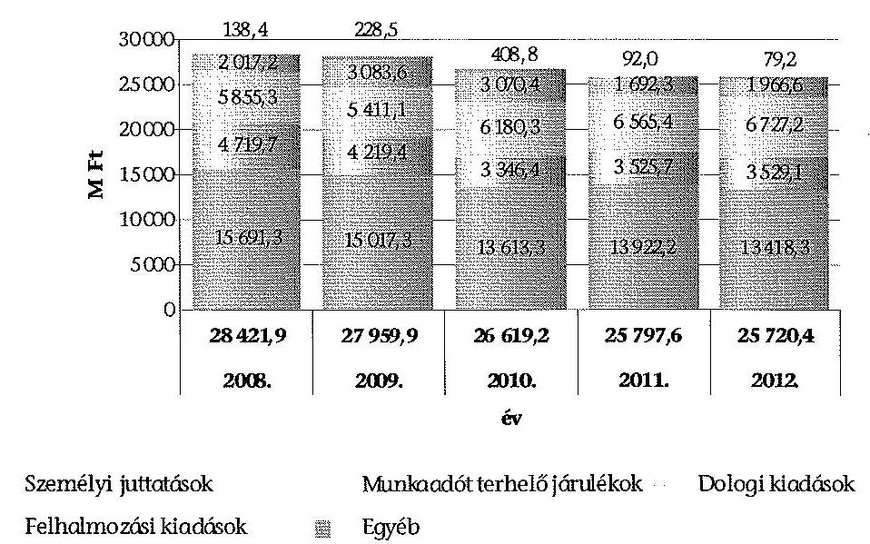

Forrás: a Kincstár 2008-2012. évi költségvetési beszámolói
A személyi juttatások 2008-ról 2012-re 2 273,0 M Ft-tal (14,5%-kal), ugyanezen időszakban a munkaadókat terhelő járulékok 1 190,6 M Ft-tal (25,2%-kal) csökkentek. A változások oka a jutalomkeret elvonása, valamint a személyi jellegű kiadások zárolása volt.

A dologi kiadások - a 2009. év kivételével - az ellenőrzött időszak minden évében meghaladták az előző évit. A 2012. évben teljesített dologi kiadások 871,9 M Ft-tal (14,9%-kal) haladták meg a 2008. évit.

A felhalmozási kiadások nagyságrendje évente eltérően alakult. A felhalmozási kiadások 2009-ben 1 066,4 M Ft-tal (52,9%-kal) emelkedtek az előző évhez képest, a 2011. évi teljesítés azonban 1378,1 M Ft-tal (44,9%-kal) alatta maradt a 2010. évinek, mivel jelentős - 3384,8 M Ft (az előirányzat 74,1%-ának megfelelő) - összegű maradvány$^{298}$ keletkezett.

A Kincstár által teljesített bevételek az ellenőrzött időszakban minden évében alatta maradtak az előző évinek, 2008-ról 2012-re 7 536,2 M Ft-tal (21,2%-kal) csökkentek. A Kincstár által teljesített bevételek 2008-2012 közötti alakulását a következő ábra szemlélteti.

[^0]
[^0]:    $^{298}$ 3065,3 M Ft (90,6%) kötelezettségvállalással terhelt maradvány volt.

---

# A bevételi előirányzatok teljesítése a 2008-2012. években 

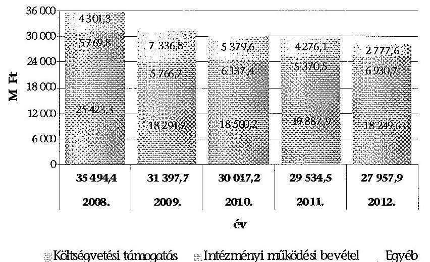

Forrás: a Kincstár 2008-2012. évi költségvetési beszámolói
Az ellenőrzött időszakban a Kincstár által teljesített kiadásokat évente 58,3%-71,6% közötti mértékben, átlagosan közel 60%-ban fedezte költségvetési támogatás.

A költségvetési támogatás kiadásokhoz viszonyított aránya 2009-ben volt a legalacsonyabb, amelyet az 1099/2009. (VI. 26.) Korm. határozat alapján az APEH 2008. évi kötelezettség-vállalással nem terhelt előirányzat-maradványából átvett 1940,0 M Ft okozott, és a dologi (1200,0 M Ft) és a felhalmozási kiadások (740,0 M Ft) forrásaként szolgált. A 2009. évi költségvetési támogatás összegét csökkentette továbbá a 2008-ban az SZMM-től átvett 1918,8 M Ft támogatásértékű bevétel maradványa is.

Az intézményi működési bevételek összes bevételen belüli aránya az ellenőrzött időszakban 16,3% és 24,8% között változott (legalacsonyabb 2008-ban, a legmagasabb 2012-ben volt). A felhalmozási bevételek összege és bevételeken belüli aránya nem volt jelentős, 2008-ban volt a legmagasabb 21,6 M Ft (0,1%).

Az egyéb bevételek meghatározó részét az előző évi maradvány igénybevétele tette ki, amely az összes bevételből évente eltérő mértékben (5,8-18,4%-kal) részesedett. A Kincstár az előirányzat-maradványok alakulásáról az ellenőrzött időszak minden évében nyilvántartást vezetett. Az analitikus nyilvántartások alátámasztották az intézményi éves beszámolók vonatkozó adatait, az előirányzat-maradványok megállapítása szabályszerű volt. A Kincstár a jogszabályi előírásoknak$^{299}$ megfelelően - önrevízió alapján - eleget tett az intézményt meg nem illető előirányzat-maradvány befizetési kötelezettségeknek, amelyek a pénzügyi helyzetére és a feladatellátásra nem voltak hatással.

[^0]
[^0]:    $^{299}$ az Ámr. 66. § (6) bekezdése, az Ámr. 208. §-a, illetve az Ávr. 150-151. §-ai

---

Az önrevízió alapján megállapított összeg 2008-ban 23,4 M Ft, 2009-ben 19,9 M Ft, 2010-ben 200,6 M Ft, 2011-ben 0,5 M Ft, 2012-ben 15,3 M Ft volt.

A Kincstár kötelezettség-vállalással terhelt előirányzat-maradványának összege az ellenőrzött időszak mindegyik évére vonatkozóan a hatályos jogszabályban$^{300}$ előírt szeptember 15-ét követő 15 napos határidőn túl került jóváhagyásra. Az előirányzat-maradvány nagyságrendjében szerepet játszott a magas, előző évi fel nem használt maradvány, az elrendelt zárolások és a maradványtartási kötelezettség.

A Kincstár részére jóváhagyott - kötelezettségvállalással terhelt - előző évi maradvány összege 2009-ben 7048,9 M Ft, 2010-ben 4993,7 M Ft, 2011-ben 4378,7 M Ft, 2012-ben 4460,5 M Ft volt$^{301}$.

# 4.2.4. A fizetőképesség, valamint a követelés és kötelezettség állományok alakulása 

Az intézmény pénzügyi helyzete a december 31-ére vonatkozó statikus, rövid távú fizetőképességet jellemző mutatók alapján stabil volt. Forgóeszközei, illetve pénzeszközei minden év végén meghaladták a rövid lejáratú kötelezettségeinek értékét. Kötelezettségeit ki tudta egyenlíteni, likviditása a zárolások, elvonások ellenére saját hatáskörű előirányzat-átcsoportosítások után nem romlott, nem kérte az előirányzati keretek előrehozását.

A Kincstár likviditási mutatója$^{302}$ az ellenőrzött időszak egyes éveiben eltérően, de összességében kedvezően alakult. Legalacsonyabb értéke 2010-ben 7,9 volt, 2012-ben 31,4-re nőtt. A pénzeszköz likviditási mutató$^{303}$ is kedvező képet mutatott, legalacsonyabb 2010-ben 6,8, legmagasabb 2012-ben 27,5 volt.

A Kincstárnak hosszú lejáratú kötelezettségei nem voltak az ellenőrzött időszakban. Rövid lejáratú kötelezettségeinek év végi állománya 256,9 M Ft (2012) és 814,1 M Ft (2010) között alakult, amely a források 1,0-3,3%-át tette ki. Kötelezettségei szállítói kötelezettségekből adódtak. Lejárt fizetési kötelezettsége csak 2011-ben - az előírt kiadási korlát miatt - keletkezett (71,1 M Ft összegben).

A Kincstár év végi követelés állománya 515,0 M Ft (2012) és 679,8
 M Ft (2010) között alakult, amely a forgóeszközök 6,4-10,6%-át tette ki. A követeléseken belül a legnagyobb arányt (évente 50,6-77,3%-ot) a szolgáltatásnyújtásból eredő követelések jelentették. A lejárt követelések behajtására peres eljárásokat, végrehajtási eljárásokat kezdeményeztek.

[^0]
[^0]:    ${ }^{300}$ Az Ámr., 66. § (3)-(4) bekezdései, az Ámr., 212. § (8)-(9) bekezdései, illetve az Ávr. 153. § (3)-(4) bekezdései szerint a pénzügyminiszter, illetve 2010. augusztus 15-től az államháztartásért felelős miniszter a Kormány döntése alapján szeptember 15-ig hagyja jóvá az előirányzat-maradványt, majd erre alapozottan a fejezetet irányító szerv az ezt követő 15 napon belül állapítja meg a költségvetési szerv előirányzat-maradványát.
    ${ }^{301}$ A 2012-ben keletkezett 4992,4 M Ft maradványból 4221,3 M Ft kötelezettségvállalással terhelt.
    ${ }^{302}$ Forgóeszközök összesen/Rövid lejáratú kötelezettségek összesen
    ${ }^{303}$ Pénzeszközök összesen/Rövid lejáratú kötelezettségek összesen

---

# 4.2.5. Az intézményi létszám változása 

A Kincstár engedélyezett létszámát 2010. augusztus 3-ig a 2057/2008. (V. 27.), azt követően az 1166/2010. (VIII. 4.) Korm. határozatban állapították meg. A kormányhatározatokban meghatározott és az éves intézményi költségvetési beszámolókban szereplő engedélyezett létszám a 2008., a 2009. és a 2012. évben eltért egymástól.

A kormányhatározatokban és a Kincstár éves költségvetési beszámolóiban szereplő létszámadatokat a következő táblázat szemlélteti:

| Megnevezés   (fő) | $\mathbf{2 0 0 8 .}$   év | $\mathbf{2 0 0 9 .}$   év | $\mathbf{2 0 1 0 .}$   év | $\mathbf{2 0 1 1 .}$   év | $\mathbf{2 0 1 2 .}$   év |
| :-- | :--: | :--: | :--: | :--: | :--: |
| Kormány határozat szerinti   engedélyezett létszám | 3769 | 3769 | 4244 | 4343 | 4343 |
| Költségvetési beszámoló   szerinti engedélyezett létszám | 3925 | 4096 | 4244 | 4343 | 4100 |
| Különbség | $\mathbf{- 1 5 6}$ | $\mathbf{- 3 2 7}$ | $\mathbf{0}$ | $\mathbf{0}$ | $\mathbf{2 4 3}$ |
| Átlagos statisztikai állományi   létszám | 3739 | 4014 | 4106 | 4045 | 3682 |
| Költségvetési beszámoló   szerinti záró létszám | 3822 | 4042 | 4187 | 4132 | 3914 |

Forrás: a Kincstár 2008-2012. évi költségvetési beszámolói
Az engedélyezett létszámnál jelentkező eltérés részben az illetmény-számfejtési feladatokhoz átvett létszámhoz, részben egyéb új kincstári feladatok (pl. call center, lakástámogatás, nemzetközi kapcsolatok osztályának bővülése) miatti létszámnövekedéshez kapcsolódott. Ezen létszámváltozásokkal a 2057/2008. (V. 27.) Korm. határozatot a 2008-2009. években nem módosították. A 2012. évi eltérést az okozta, hogy az 1004/2012. (I. 11.) Korm. határozattal a tárgyévre elrendelt 243 fős létszámcsökkenést nem követte az 1166/2010. (VIII. 4.) Korm. határozat módosítása. A létszámcsökkentést a 2012. év elején végrehajtották, de intézményi szinten megtakarítás nem volt kimutatható, mivel a 2012. évi Kvtv. a 243 fő személyi juttatásait és azok járulékait már nem tartalmazta.

A KINCSINFO Nkft.-nek 2012. június 1-jétől átadott 253 fő létszámhoz tartozó személyi juttatások előirányzatát nem vonták el az intézménytől, azt átcsoportosították a dologi kiadások előirányzatára.

A Magyar Államkincstár kibővített központosított illetmény-számfejtési feladatainak ellátásához szükséges forrásigények kielégítéséről szóló 1559/2012. (XII. 6.) Korm. határozat 2013. január 1-jétől 95 fővel emelte a Kincstár engedélyezett létszámát, a saját bevételi előirányzatok növelésével együtt.

A 2012-ben végrehajtott létszámváltozások és a 2013-ra tervezett létszámnövekedések miatt - az 1166/2010. (VIII. 4.) Korm. határozat 4. pontja szerint - a KIM-nek 2012. december 31-éig kezdeményeznie kellett a kormányhatározat

---

módosítását. Az átvezetés érdekében a Kincstár a szükséges bejelentéseket megtette az NGM felé. A vonatkozó KIM előterjesztésben szerepelt az intézmény javasolt, 4042 fős létszámkerete, azonban a hivatkozott kormányhatározat módosítására még nem került sor ${ }^{304}$. A Kincstárnál az ellenőrzött időszak egyik évében sem voltak tartósan üres álláshelyek.

A Kincstár számára engedélyezett 4100 fő létszámot csökkenti a 2012-ben a KINCSINFO Nonprofit Kft-nek átadott 253 fő, növeli a többletfeladatokhoz kapcsolódó, 2013. január 1-jétől engedélyezett 95 fő létszám-emelés, valamint a további 100 fő létszámigény.

# 4.3. A Kincstár vagyongazdálkodása 

### 4.3.1. A vagyongazdálkodás és a vagyon-nyilvántartása

A Kincstár egységes informatikai adatfeldolgozást alkalmazott a pénzügyiszámviteli és a vagyon-nyilvántartási feladatok ellátása során. A 2008. évben került bevezetésre az EcoStat integrált ügyviteli rendszer és annak moduljai közül a pénzügyi, a főkönyvi, a kötelezettségvállalási, valamint a készlet modul. Az integrált rendszer keretében működő tárgyi eszköz nyilvántartó rendszerre ${ }^{305}$ - a korábbi Vbázis tárgyi eszköz analitikus nyilvántartó rendszerről - a 2009. évben álltak át. A korábbinál fejlettebb integrált rendszer alkalmazásával egyszeres adatbevitellel biztosított volt az analitikus nyilvántartások és a főkönyvi könyvelés adatainak egyezősége.

A Kincstár által beszerzett, illetve létesített immateriális javak, tárgyi eszközök nyilvántartási értékének megállapítása, az eszközök besorolása az Áhsz. 28. §-ában, valamint a Számviteli Politikában és annak függelékeiben foglaltaknak megfelelően történt. Az eszközök üzembe helyezésének ügymenete, a nyilvántartásba vétel módja és annak dokumentálása (az alkalmazandó bizonylatokon) megfelelt a Számviteli Politikában foglaltaknak.

Az ellenőrzött 2008-2009. évi 21 beszerzés közül három esetében az eszköz kartonon az aktiválás dátuma eltért az üzembe helyezési okmányon szereplő időponttól, emiatt az értékcsökkenés elszámolását nem a tényleges üzembe helyezési időponttól kezdték el. A tévesen elszámolt értékcsökkenést a 2009. évi költségvetési beszámoló elkészítéséig korrigálták. Az ellenőrzött időszakban az éves költségvetési beszámolók mérlegének adatait alátámasztó leltárakban az eszközöket teljes körűen, az analitikus nyilvántartás és a főkönyvi könyvelés szerinti értékkel mutatták ki.

A Kincstár nagy értékű ${ }^{306}$ (bruttó 100 E Ft-ot meghaladó) vagyontárgyai közül személygépkocsik és rádiótelefonok magáncélú használatát engedélyezték.

[^0]
[^0]:    ${ }^{304}$ az 1166/2010. (VIII. 4.) Korm. határozat a Kincstárnál 2013. december 31-i hatállyal 4343 fő engedélyezett létszámot tartalmazott.
    ${ }^{305}$ Az integrált rendszer tárgyi eszköz modulja az immateriális javakkal kapcsolatos nyilvántartási, könyvelési feladatok elvégzését is szolgálta.
    ${ }^{306}$ Az Áhsz. 18. § (2) bekezdésében foglaltak alapján figyelembe vett érték.

---

A Kincstárban az ellenőrzött 2008-2012. években összesen 51 személy, 2012. december 31-én 23 személy részére volt engedélyezett a személyi (elnöki) és vezetői gépjárművek ${ }^{307}$ használata. A Kincstár vezető beosztású alkalmazottain kívül, a Kincstár elnöke kincstári vezetői személygépkocsi használatát a 33/2011. számú Elnöki Utasítás mellékleteként kiadott gépjárműhasználat eljárási és elszámolási rendje 1. számú függelékében foglaltak szerinti írásos megállapodás alapján - 2012. július 10-én a KINCSINFO Nkft. ügyvezetője ${ }^{308}$ részére is engedélyezte, ami ellentétes volt a 192/2010. (VI. 10.) Korm. rendelet 1. § (1) bekezdésében és a 33/2011. számú Elnöki Utasítás mellékleteként kiadott gépjárműhasználat eljárási és elszámolási rendje I.2. (b) pontjában foglaltakkal. A KINCSINFO Nkft. ügyvezetője nem állt a Kincstár alkalmazásában, ezért nem volt a Kincstár vezető beosztású kormánytisztviselője sem. A Kincstár elnöke és a KINCSINFO Nkft. ügyvezetője között 2012. július 10-én létrejött megállapodás 1. pontja tévesen nevesítette kormánytisztviselőként a társaság ügyvezetőjét, részére a vezetői személygépkocsi biztosítása nem volt jogszerű ${ }^{309}$.

A fentieken túl, az ellenőrzött időszakban nagy értékű tárgyi eszközt személyes használatra két esetben adtak ki, rádiótelefonokat a Kincstár elnökei részére. A mobiltelefon használatáról és költségviseléséről szóló szabályzatban ${ }^{310}$ foglaltak alapján a Kincstár elnöke jogosult volt kincstári mobiltelefon használatára, költségtérítést nem kellett fizetnie.

A feladatellátáshoz még szükséges eszköz elidegenítéséről nem döntöttek. A Kincstárnak a feleslegessé vált és az elhasználódott vagyontárgyak értékesítéséből a 2008. évben 20,0 M Ft, a 2009. évben 3,1 M Ft, míg a 2010-2012. években évi 0,1-0,5 M Ft bevétele származott. Az ellenőrzött időszak egyes éveiben személygépkocsikat, számítástechnikai eszközöket, valamint különböző berendezési, felszerelési tárgyakat értékesítettek, a lebonyolítás a Selejtezési Szabályzatban foglaltak alapján történt.

A Selejtezési Szabályzatban foglaltaknak megfelelően a leselejtezett személygépkocsikat a kincstári dolgozók körében hirdették meg eladásra. Az árveréseket megelőzően hivatalos gépjárműforgalmazóval értékbecslést készíttettek, az arról készített dokumentum tartalmazta a helyszíni szemrevételezés és az állapotfelmérő átvizsgálás eredményét is. A kikiáltási árak meghatározása piaci alapon történt, az eladási ár minden esetben meghaladta a nyilvántartási értéket. Az árverés során el nem adott személygépkocsikat az értékbecslést készítő szervezet vásárolta meg, az értékbecslésnek megfelelő áron.

[^0]
[^0]:    ${ }^{307}$ A gépjárműhasználat eljárási és elszámolási rendje I.2. (b) pontja szerint vezetői személygépkocsi: az elnökhelyettesek, elnöki tanácsadók, központi és megyei igazgatók, gazdasági vezető részére, illetve az elnök által jóváhagyott vezető beosztású kormánytisztviselők részére biztosított személygépkocsik.
    ${ }^{308}$ Az ügyvezető már nem tölti be e tisztségét a KINCSINFO Nkft.-nél.
    ${ }^{309}$ A Kincstárnál a tartós magáncélú használatra vonatkozó engedéllyel rendelkezők a 192/2010. (VI. 10.) Korm. rendelettel ellentétes belső szabályzat alapján - a vezetői személygépkocsikat belföldön korlátozás nélkül használhatták.
    ${ }^{310}$ A 20/2008. számú Elnöki Utasítással, 2008. április 30-i hatállyal kiadott szabályzat.

---

Az ellenőrzött időszakban a selejtezési szabályzatok a Selejtezési Bizottságnak lehetőséget biztosítottak arra, hogy az eladási árra vonatkozó javaslatát külső szakértő igénybe vétele nélkül, saját hatáskörben alakítsa ki. Ebből adódóan az ellenőrzött értékesítések körében is előfordult olyan eset (a korábbi büfé ${ }^{311}$ berendezési tárgyainak értékesítése), hogy az eladási ár meghatározásához nem készíttettek értékbecslést. A Kincstár a büfé berendezési tárgyait a saját dolgozói körében hirdette meg értékesítésre, ami ellentétes volt az akkor hatályos Selejtezési Szabályzat vonatkozó előírásával ${ }^{312}$. A büfé eszközeinek értékesítése a nyilvántartási értéknél alacsonyabb áron történt, amelyre a Selejtezési Szabályzat lehetőséget biztosított ${ }^{313}$.

A korábbi büfé eszközeinek könyv szerinti nettó értéke 723,4 E Ft volt. A berendezési tárgyakat a kincstári dolgozók körében meghirdették, de arra első alkalommal nem érkezett ajánlat. A kincstári dolgozók körében közzétett második hirdetmény alapján egy pályázó jelentkezett, aki 250,0 E Ft összegű vételi ajánlatot tett. A Műszaki Ellátási Főosztály vezetőjének javaslata alapján a Kincstár elnökhelyettese engedélyezte az eszközök 250,0 E Ft-ért történő értékesítését. A kiszámlázott vételár megfizetése határidőn belül, 2009. február 16-án megtörtént.

Az éves költségvetési törvényben meghatározott egyedi könyv szerinti bruttó értéket (25,0 M Ft-ot) meghaladó értékű vagyonelemet a Kincstár a 2008-2012. években nem értékesített.

A Kincstár a 2008-2012. években összesen 16 ingatlanrészt (helyiségeket) hasznosított tartós bérbeadás útján, három kivétellel az ellenőrzött időszakot megelőzően kötött bérleti szerződések alapján. A határozatlan időre kötött szerződésekben megállapított bérleti díjak inflációkövetőek voltak.

A 2008. évet megelőzően kötött bérleti szerződések esetében a bérlők kiválasztásának módjára, a bérleti díjak mértékének megállapítására, valamint a bérbe adott ingatlanrészek fenntartási költségeinek és amortizációjának évenkénti alakulására vonatkozó dokumentumok ellenőrzésére nem került sor.

A bérbe adott ingatlanrészek után befizetett bérleti díjakból a Kincstár 2008-2012 között összesen 262,5 M Ft bevételt realizált, azok
 évenkénti összege 44,1-59,3 M Ft között változott.

Az ellenőrzött 2009. évi bérbeadásnál a bérlő kiválasztása nyilvános pályázati eljárás keretében történt. A pályázati felhívásban az étterem üzemeltetése céljából bérbe adandó épületrész bérleti dijának minimális összegét - a Kincstár regionális igazgatósága által javasolt összeggel - havi nettó 400 E Ft-tal szerepeltették. A pályázati felhívásban megjelölt 2009. december 2-i határidőre egy érvényes aján-

[^0]
[^0]:    ${ }^{311}$ Az intézményben korábban működő büfé berendezési tárgyait a Kincstár Budapest, Váci út 71. szám alatti telephelyének garázsában tárolták.
    ${ }^{312}$ A 81/2003. számú Elnöki Utasítással kiadott Selejtezési Szabályzat B/I/6. pontjában foglaltak alapján az értékesíteni költségvetési szervek, vagy más gazdálkodó szervek részére, ezek eredménytelensége esetén magánszemélyek részére lehetett.
    ${ }^{313}$ A hasznosítás időszakában hatályos Selejtezési Szabályzat úgy rendelkezett, hogy a tárgyi eszközök eladási árára vonatkozó javaslat megállapításánál a nettó nyilvántartási árat kell irányadónak tekinteni. Amennyiben az értékesítés legalább nyilvántartási áron nem lehetséges, úgy az alacsonyabb áron történő eladásra kell javaslatot tenni.

---

lat érkezett, a Kincstár a pályázóval nettó $400 \mathrm{E} \mathrm{Ft} /$ hó bérleti díj ellenében 2009. december 12-én megkötötte a bérleti szerződést, 5 éves időtartamra. A bérlemény alapterülete összesen $546 \mathrm{~m}^{2}$ (raktárral, udvarral együtt), az üzemeltetési költségeket a bérlő viselte.

Az ingatlanrészeken kívül egyéb tárgyi eszközöket a Kincstár bérbeadás útján nem hasznosított.

# 4.3.2. A vagyon nagyságának és összetételének változása 

A 2008-2012. évi könyvviteli mérleg adatai szerint a Kincstár eszközállományának nettó értéke a 2008. évi 25 345,1 M Ft-ról a 2012. évre 26 209,8 M Ft-ra növekedett ( $864,7 \mathrm{M} \mathrm{Ft}, 3,4 \%$ ). Ezen belül a befektetett eszközök nettó értéke a 2008. évben $63,0 \%$-ot, míg a 2012. évben $69,3 \%$-ot tett ki. A befektetett eszközök nettó értéke 2008-2011 között évről évre nőtt, a 2011. évben az eszközállományon belül 73,3%-os részarányt képviselt. A 2012. évi 3,3%-os ( $610,8 \mathrm{M} \mathrm{Ft}$ ) csökkenést az immateriális javak nettó értékének tárgyévi csökkenése okozta. A könyvviteli mérlegben kimutatott eszközállományból a forgóeszközök 2008-ban $37,0 \%$-kal, míg a 2012. évben $30,7 \%$-kal részesedtek. Az ellenőrzött időszakban a Kincstár eszközállományának alakulását a 17. számú, az immateriális javai és tárgyi eszköz állományának változásait a 18. számú melléklet tartalmazza.

A Kincstár által átvett feladatokkal összefüggésben az intézményi vagyon az ellenőrzött időszakon belül a 2011. évben változott, a növekedés mértéke 8,6 M Ft volt. A Kincstár által átadott feladatokkal összefüggésben az intézményi vagyon értéke az ellenőrzött időszakban nem változott, összetételének 2012. évi módosulását a KINCSINFO Nkft. létrehozása okozta ${ }^{314}$. Ennek hatásaként a befektetett eszközök állománya $10,0 \mathrm{M}$ Ft-tal nőtt, míg a forgóeszközök állománya ugyanilyen összeggel csökkent.

A KINCSINFO Nkft. 18,8 M Ft értékű törzstőkéje 10,0 M Ft pénzbeli, és 8,8 M Ft nem pénzbeli hozzájárulásból (apportból) állt. A nem pénzbeli hozzájárulás (informatikai eszközök) értékének megállapításához igénybe vett könyvvizsgáló az apport értékét a könyv szerinti (nettó) értékkel azonos összeggel fogadta el. A nem pénzbeli hozzájárulás befizetése a forgóeszközök (ezen belül a pénzeszközök) állományát $10,0 \mathrm{M}$ Ft-tal, az apport rendelkezésre bocsátása a befektetett eszközök állományát $8,8 \mathrm{M}$ Ft-tal csökkentette, ugyanakkor a gazdasági társasági részesedés nyilvántartásba vételével $18,8 \mathrm{M}$ Ft-tal nőtt a befektetett eszközök (ezen belül a befektetett pénzügyi eszközök) állománya.

A 2008-2012. években a Kincstár eszközállományának nagyságát és összetételét az egyes eszközcsoportoknál végrehajtott beszerzéseken, létesítéseken, illetve selejtezéseken túlmenően a térítésmentes eszköz átvételek és átadások is befolyásolták. Az ellenőrzött időszakban a térítésmentesen átvett eszközök bruttó értéke összesen 3 926,8 M Ft-ot, a térítésmentesen átadott eszközök bruttó értéke $880,8 \mathrm{M}$ Ft-ot tett ki.

[^0]
[^0]:    ${ }^{314}$ A Kincstár által kitöltött tanúsítvány adatai szerint.

---

A legnagyobb értéket a Budapest V., Hold utca 7. számú ingatlan 2009. évi átvétele jelentette. Az MNV Zrt.-vel kötött megállapodás alapján a Kincstár vagyonkezelésébe került eszközök bruttó értéke 1640,1 M Ft, nettó értéke 877,5 M Ft volt.

Az immateriális javak és a tárgyi eszközök használhatósági fok mutatójának ${ }^{315}$ alakulását 2008-2012 között a 19. számú melléklet tartalmazza. A mutató az ellenőrzött időszakban összességében kedvezőtlenül alakult, értéke a 2009. évet követően valamennyi eszközcsoportnál folyamatosan csökkent.

A Kincstár feladatai ellátásában kiemelkedően fontos immateriális javak (vagyoni értékű jogok, szellemi termékek) használhatósági foka az ellenőrzött időszakon belül egyedül a 2009. évben javult, a 2008. évi 31,3%-ról 41,1%-ra. A 2009. évben a 968,3 M Ft összegű beszerzés, az 1062,7 M Ft értékű saját fejlesztés aktiválásán túlmenően 502,7 M Ft bruttó értékű eszköz leselejtezése is hozzájárult az eszközállomány használhatósági fokának tárgyévi javulásához. A 2012. évre az immateriális javak használhatósági foka $25,2 \%$-ra csökkent.

A gépek, berendezések és felszerelések esetében a használhatósági fok mutató azt jelzi, hogy az eszközök elhasználtsága évről évre növekedett, a mutató értéke a 2008. évi 32,7%-ról 2012-ben 9,7%-ra csökkent. Ennek oka az ellenőrzött időszakban a beszerzések, egyéb növekedések értékét 1979,8 M Ft-tal meghaladóan elszámolt értékcsökkenés. A 2012. évben a teljesen leírt eszközök bruttó értéke 7656,3 M Ft, az eszközcsoporton belüli részaránya 79,9% volt.

A Kincstár által használt saját tulajdonú gépkocsik használhatósági foka már a 2008. évben is az eszközök elhasználtságát jelezte, értéke 12,4% volt. A mutató értéke 2012-ben 0,6%-ra csökkent. A 2012. december 31-i állapot szerint 72 db 0-ra leírt gépkocsival rendelkeztek, melyek a Kincstár saját tulajdonú gépjármű állományának $97,3 \%$-át tették ki. A beszerzési tilalom miatt a leselejtezett saját gépkocsik pótlását elsősorban bérelt gépkocsikkal biztosították.

A Kincstár forgóeszköz állományán belül a pénzeszközök (elszámolási számlák és idegen pénzeszközök) nagyságrendje volt a meghatározó, ebből adódóan az ellenőrzött időszak egyes éveiben a forgóeszközök mértékének és eszközállományon belüli arányának változásait elsősorban a pénzeszközök állományának alakulása befolyásolta. A forgóeszközök állományából a pénzeszközök a 2008. évben 8526,4 M Ft-ot ( $90,9 \%$-ot), míg a 2012. évben 7067,1 M Ft-ot ( $87,7 \%$-ot) tettek ki.

A könyvviteli mérlegek szerint a Kincstár saját tőkéje 2008-2011 között 16 021,2 M Ft-ról 18 993,3 M Ft-ra (18,6%-kal) nőtt. A saját tőke a 2012. évben - az eszközök és a források változásának együttes hatására - az előző évhez viszonyítva 537,5 M Ft-tal ( $2,8 \%$-kal) csökkent, értéke 18 455,8 M Ft volt.

[^0]
[^0]:    ${ }^{315}$ Tárgyi eszközök, immateriális javak nettó értéke/bruttó értéke

---

# 5. A korábbi ÁSZ ellenőrzések hasznosulása 

### 5.1. A 0918. számú ÁSZ jelentés javaslatainak hasznosulása

A kincstári rendszer működésének ellenőrzéséről szóló 0918 számú ÁSZ jelentés a Kincstár elnökének javaslatot nem fogalmazott meg, a Kincstár működése vonatkozásában a Kormány részére hét ${ }^{316}$, a pénzügyminiszter részére öt javaslatot tett. A javaslatokban foglaltak végrehajtására az ÁSZ részére intézkedési tervet nem készítettek ${ }^{317}$.

A Kormány részére tett, az ellenőrzés hatókörébe tartozó javaslatok a KESZ ingadozásának csökkentése érdekében az államháztartási bevételek és kiadások módosítási lehetőségeinek; a gazdálkodási szabálytalanságok, túlköltekezések okainak; a KGR projekt által megteremtett centralizáltabb gazdálkodási modell alkalmazásának; a központi alrendszer vonatkozásában a likviditáskezelési eszközök bővítésének; az átfogó informatikai rendszerek kiterjesztésének; továbbá a kincstári ügyfelek készpénzkímélő eszköztára bővítésének a vizsgálatára irányultak.

A Kormány részére tett, az ellenőrzés hatókörébe tartozó hat javaslat közül egy hasznosult, négy részben hasznosult és egy nem hasznosult.

A javaslatok hasznosulásának értékelése a Miniszterelnöki Hivatalt vezető miniszter korábbi, ÁSZ részére megküldött tájékoztatásai, valamint a Kincstár és az NGM helyszíni ellenőrzése alapján történt ${ }^{318}$.

A Miniszterelnöki Hivatalt vezető miniszter 2009. augusztusában írásban tájékoztatta az ÁSZ elnökét arról, hogy a Kormánynak címzett javaslatokra tekintettel felkérte a pénzügyminisztert a kincstári rendszer hatékonyabb működésének elősegítését célzó vizsgálat lefolytatására, valamint az államháztartási befizetések és kifizetések időbeli összehangolásának a finanszírozás költségeit csökkentő szabályozási kérdéseinek átvizsgálására. A miniszter ezt követően a az ÁSZ a 2009. évi tevékenységéről szóló beszámoló kapcsán tájékoztatta az ÁSZ elnökét a megtett, illetve a tervezett intézkedésekről.

Az ÁSZ javaslatait figyelembe véve vizsgálták és szabályozási javaslatokat készítettek elő a KESZ terhelésének csökkentése érdekében, megtörtént az államháztartás bevételét biztosító adó- és egyéb törvények, továbbá a kiadási oldalon a különböző szociális és társadalombiztosítási ellátásokat szabályozó törvények módosítási lehetőségeinek vizsgálata. Ezek alapján megváltozott a nyugellátások folyósítása, módosultak a kapcsolódó jogszabályi előírások.

Történtek intézkedések a gazdálkodási szabálytalanságok, túlköltekezések okainak, a központi alrendszer vonatkozásában a likviditáskezelési eszközök bővítésének, valamint a kincstári ügyfelek készpénzkímélő eszköztára bővítésének a

[^0]
[^0]:    ${ }^{316}$ Ebből jelen ellenőrzés hatókörébe hat javaslat tartozott.
    ${ }^{317}$ Az Állami Számvevőszékről szóló, 2011. június 30-ig hatályban volt 1989. évi XXXVIII. törvény nem tette kötelezővé az ellenőrzötteknek intézkedési terv készítését.
    ${ }^{318}$ Jelen ellenőrzés a Miniszterelnöki Hivatalra nem terjedt ki.

---

vizsgálatára, e kérdések teljes körű felülvizsgálatát azonban - a már akkor ÜMFT ÁROP támogatással - tervezett kincstári átvilágítás keretében tartották végrehajthatónak ${ }^{319}$. A Kincstár teljes körű átvilágítása azonban az ellenőrzött időszakban nem történt meg, az átvilágítás keretében megoldani tervezett fenti vizsgálatok más módon történt megvalósításáról a Kincstárban és az NGM-ben dokumentumok nem álltak rendelkezésre. Tettek intézkedéseket továbbá a költségvetési intézményi gazdálkodás átfogó informatikai rendszerei kiterjesztésére, az ellenőrzött időszakban bővült, de nem vált teljessé a KIR-t alkalmazó központi költségvetési intézmények köre.

Mivel a KGR projekt tervezett 9 moduljából mindössze az Intézményi és Fejlesztési Könyvelési Modul, valamint a Költségvetési Tervezési Modul részeként a K11 beszámoló (rész) rendszer készült el ${ }^{320}$, nem képezhette alapját centralizáltabb költségvetési intézményi gazdálkodási modell alkalmazásának. Nem készült el és nem került bevezetésre többek között a tervezett kötelezettségvállalás nyilvántartási modul sem.

A 0918. számú jelentésben a pénzügyminiszter részére tett javaslatok a Kincstár szakmai stratégiájának kidolgozására, működésének teljes körű átvilágítására, a Kincstár irányításával kapcsolatos szabályozási és szervezeti feltételek kialakítására, a KGR bevezetése kockázatainak csökkentésére, valamint a Kincstárnál működő informatikai rendszerek felmérésére irányultak. A pénzügyminiszter részére megfogalmazott öt javaslat közül kettő hasznosult, egy részben teljesült, kettő nem valósult meg.

A Kincstárral kapcsolatos irányítási jogosítványok operatívabbá tétele érdekében 2010. március 1-jétől módosították a PM Szervezeti és Működési Szabályzatát ${ }^{321}$, és a Kincstár felügyeletét a PM költségvetésért felelős szakállamtitkárának feladatává tették. Megtörtént továbbá a Kincstár információs rendszerében tárolt adatok felmérése megtörtént. Tettek részintézkedéseket ${ }^{322}$ a KGR bevezetése kockázatainak csökkentése érdekében, a projekt teljes körű bevezetésére azonban részbeni megvalósítása miatt nem került sor. A Kincstár nem rendelkezett a kincstári rendszer működtetését meghatározó szakmai stratégiával és az ellenőrzött időszakban nem került sor a Kincstár teljes körű átvilágítására.

A Kincstár átvilágítása a „Pénzügyi igazgatás folyamatainak és szabályozásának átalakítása" című, ÁROP-1.2.13-2012-2012-0001 kódszámú projekt
 keretében valósul meg. A szervezet belső hatékonyságának, munka kultúrájának és külső szolgáltató képességének javítása érdekében kerül sor a feladatok áttekintésére, a folyamatok optimalizálására és az apparátus képzésére. A projekt részletes céljai között szerepel a belső irányítási és ellenőrzési rendszerek megújítása és ezen be-

[^0]
[^0]:    ${ }^{319}$ A Miniszterelnöki Hivatalt vezető miniszternek az ÁSZ 2009. évi tevékenységéről szóló 1008. számú Jelentéséhez adott tájékoztatása szerint.
    ${ }^{320}$ A KGR projekt tervezett ütemtől való elmaradása miatt a kivitelezővel való szerződést 2010. október 31-én megszüntették, új szerződés megkötésére nem került sor.
    ${ }^{321}$ 6/2010. (III. 10. ) PM utasítás 2. számú függelék
    ${ }^{322}$ A Kincstár tett intézkedéseket a KGR-ben résztvevő kiemelt szakemberek leterheltsége miatti kockázatok csökkentésére.

---

lül a szervezeti stratégia elkészítése is. A megvalósítás időszaka 2012. augusztus 1-2014. június 30., a projekthez 780,0 M Ft támogatás használható fel.

A 0918. számú ÁSZ jelentésben foglalt, a jelen ellenőrzés hatókörébe tartozó javaslatokat, valamint azokra tett intézkedéseket a 20/A. számú melléklet tartalmazza.

# 5.2. Az 1208. számú ÁSZ jelentésben megfogalmazott javaslatokra készített intézkedési terv végrehajtása 

A helyi önkormányzatokat megillető támogatások és hozzájárulások igénylése és elszámolása kincstári felülvizsgálati rendszerének, valamint a helyi önkormányzatokat a 2010. évben megillető normatív hozzájárulások elszámolásának ellenőrzéséről szóló 1208. számú jelentés intézkedést igénylő megállapításai alapján az ÁSZ a Kincstár elnökének négy javaslatot fogalmazott meg. A javaslatok a helyszíni felülvizsgálatok szempontjainak felülvizsgálatok megkezdését megelőző időben történő meghatározására, a Budapesti és a Pest Megyei Igazgatóságnál a felülvizsgálatok elvégzésének biztosítására, valamint a felülvizsgálatok és a központi szabályozás elmaradása vonatkozásában a személyes felelősség kivizsgálására irányultak.

Az ÁSZ tv. 33. § (1) bekezdésének megfelelően, a Kincstár elnöke intézkedési tervet készített ${ }^{323}$, majd az ÁSZ elnökének az ÁSZ tv. 33. § (2) bekezdés alapján történt felhívására azt kiegészítette ${ }^{324}$. Az ÁSZ javaslatait, a Kincstár elnökének intézkedési tervét és az abban foglaltak végrehajtását a 20/B. számú melléklet mutatja be.

## A Kincstár az intézkedési tervben foglalt feladatokat végrehajtotta.

Az 1. számú javaslatra készített intézkedési tervben foglaltaknak megfelelően, a helyszíni felülvizsgálatok eljárásrendjét a helyszíni felülvizsgálatok elkezdését megelőzően, a 2011. évben május 30-án kiadták. A 2011. évet érintő helyszíni felülvizsgálatok szempontjait meghatározó segédlet a helyszíni felülvizsgálatok kezdő időpontjához igazodóan, 2012. június 15-én hatályba léptetésre és közzétételre került.

A Kincstár elnöke az intézkedési terv alapján - figyelemmel az Áht. 2 60. § (2) bekezdésében előírtakra - elrendelte a Budapesti és a Pest Megyei Igazgatóság felülvizsgálati feladatai végrehajtásának nyomon követését. A 4 éves ellenőrzési munkatervben 2012. évre tervezett felülvizsgálatok időarányos teljesítésének nyomon követéséről az Önkormányzati Főosztály - az intézkedési tervben előírtaknak megfelelően - első ízben 2012. október 31-én készített feljegyzést az Ellenőrzési Főosztály részére. A 2012. évre tervezett felülvizsgálatok éves szintű teljesítésének nyomon követéséről 2013. május 31-i határidővel kellett beszámolniuk, amelyet késedelemmel, 2013. július 12-én teljesítettek.

[^0]
[^0]:    ${ }^{323}$ ELN-876/2/2012. számon, 2012. május 25-én, ÁSZ-hoz érkezett 2012. május 31-én.
    ${ }^{324}$ ELN-168/5/2012. számon, 2012. július 9-án, ÁSZ-hoz érkezett 2012. július 10-én.

---

Az ÁSZ jelentés 2/b. és 3. számú javaslataira készített intézkedési tervnek megfelelően a Kincstár elnöke soron kívüli belső ellenőrzést rendelt el, amelyet a Belső Ellenőrzési Osztály 2012. szeptember hónapban folytatott le. A jelentés alapján az ellenőrzés eredményéről a Kincstár elnöke 2012. október 4-én írásban tájékoztatta az ÁSZ elnökét. A Kincstár elnökének tájékoztatója szerint „A lefolytatott soron kívüli ellenőrzés vizsgálati eredménye szerint személyi felelősség jelenleg a Kincstárban dolgozók vonatkozásában nem állapítható meg, a potenciálisan érintett vezetők közül ma már senki sem dolgozik a Kincstárban."

Budapest, 2014. 06. 10.

Melléklet: $\quad 27 \mathrm{db}$
Függelék: $\quad 3 \mathrm{db}$
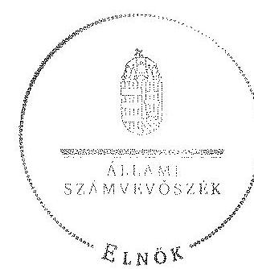

Domokos László

---

# A Magyar Államkincstár főbb feladatai a 2008-2013. években

|  Feladatok | 2008.I.1-jei állapot | 2009.I.1-jei állapot | 2010.I.1-jei állapot | 2011.I.1-jei állapot | 2012.I.1-jei állapot | 2013.I.1-jei állapot  |
| --- | --- | --- | --- | --- | --- | --- |
|  Pénzügyi végrehajtási feladatok |  |  |  |  |  |   |
|  A nemzetgazdasági elszámolások könyvvezetése | X | X | X | X | X | X  |
|  Költségvetési előirányzatok nyilvántartása és végrehajtása | X | X | X | X | X | X  |
|  Költségvetés végrehajtásához kapcsolódó pénzügyi lebonyolítási feladatok | X | X | X | X | X | X  |
|  Készpénzforgalom kezelése | X | X | X | X | X | X  |
|  Helyi önkormányzatok nettó finanszírozásának lebonyolítása | X | X | X | X | X | X  |
|  Helyi önkormányzati támogatásokkal kapcsolatos feladatok | X | X | X | X | X | X  |
|  Központosított illetményszámfejtés | X | X | X | X | X | X  |
|  A családtámogatási és fogyatékossági ellátások, keresetkiegészítés megállapítása és folyósítása | X | X | X | X | X | X  |
|  Humánszolgáltatások normatív támogatása | X | X | X | X | X | X  |
|  Az energiaellátással kapcsolatos szociális támogatási rendszerrel kapcsolatos feladatok | X | X | X | X | X | X  |
|  Pályázatos támogatások kezelésében közreműködés | X | X | X | X | X | X  |
|  Fiatalok életkezdési támogatásának folyósítása, nyilvántartása | X | X | X | X | X | X  |
|  Lakáscélú állami támogatások nyilvántartása, a támogatások finanszírozása | X | X | X | X | X | X  |
|  A zárszámadási törvényjavaslat elkészítéséhez kapcsolódó feladatok | X | X | X | X | X | X  |
|  Helyi és helyi kisebbségi önkormányzatok zárszámadásához kapcsolódó feladatok | X | X | X | X | X | X  |

---

|  Feladatok | 2008.I.1-jei állapot | 2009.I.1-jei állapot | 2010.I.1-jei állapot | 2011.I.1-jei állapot | 2012.I.1-jei állapot | 2013.I.1-jei állapot  |
| --- | --- | --- | --- | --- | --- | --- |
|  Támogatások igénybevételének ellenőrzésében közreműködés | X | X | X | X | X | X  |
|  Lakáscélú támogatásokhoz kapcsolódó jelzálogok intézése | X | X | X | X | X | X  |
|  Az EU támogatások pénzügyi lebonyolítása és ellenőrzése | X | X | X | X | X | X  |
|  Uniós és egyéb nemzetközi támogatások fogadásáért felelős kifizető és igazoló hatósági, valamint a Nemzeti Alappal kapcsolatos feladatok |  |  |  | X | X | X  |
|  Követelések kezelése | X | X | X | X | X | X  |
|  Államadósság kezelése | X | X | X | X | X | X  |
|  A kincstári számla likviditáskezelésében való közreműködés | X | X | X | X | X | X  |
|  KESZ egyenleg prognosztizálása | X | X | X | X | X | X  |
|  Pénzügyi szolgáltatási feladatok |  |  |  |  |  |   |
|  Számlavezetés a kincstári kör és a pénzforgalmi számlatulajdonosok részére | X | X | X | X | X | X  |
|  Nemzetgazdasági pénzforgalmi számlákkal kapcsolatos feladatok | X | X | X | X | X | X  |
|  Megelőlegezési, likviditási hitelt nyújtása | X | X | X | X | X | X  |
|  Értékpapírok forgalmazása | X | X | X | X | X | X  |
|  Értékpapírkereskedési rendszer működtetése | X | X | X | X | X | X  |
|  Hatósági letéti számlák kezelése | X | X | X | X | X | X  |
|  Kezességvállalással kapcsolatos feladatok | X | X | X | X | X | X  |
|  Garanciavállalással kapcsolatos feladatok | X | X | X | X | X | X  |
|  Diákhítellel kapcsolatos kamattámogatás | X | X | X | X | X | X  |
|  Kárpótlási jegyek őrzésével és kezelésével kapcsolatos feladatok |  |  |  | X | X | X  |
|  Családi pótlék természetbeni nyújtásához kapcsolódó számlavezetési feladatok |  |  | X | X | X | X  |

---

|  Feladatok | 2008.I.1-jei állapot | 2009.I.1-jei állapot | 2010.I.1-jei állapot | 2011.I.1-jei állapot | 2012.I.1-jei állapot | 2013.I.1-jei állapot  |
| --- | --- | --- | --- | --- | --- | --- |
|  Építőipari kivitelezéshez kapcsolódó fedezet kezelésével öszszefüggő feladatok |  |  | X | X | X | X  |
|  Adatszolgáltatási és nyilvántartási feladatok |  |  |  |  |  |   |
|  Költségvetési szervek törzskönyvi nyilvántartása | X | X | X | X | X | X  |
|  Tartozásállomány nyilvántartása, kincstári biztosi rendszer működtetése | X | X | X | X | X | X  |
|  Kincstárnoki (2009.08.27-2010.08.14.) és a költségvetési (fő) felügyelői (2010.08.15-től) rendszer működtetése |  |  | X | X | X | X  |
|  Országos Támogatási Monitoring Rendszer (2011.01.01-től kincstári monitoring) működtetése | X | X | X | X | X | X  |
|  Egységes Szociális Nyilvántartás működtetése |  | X | X | X | X | X  |

Forrás: ÁSZ kigyűjtés jogszabályi előírások alapján

---

.

---

# A Kincstár feladatellátásában érintett szervek és személyek 2012. december 31-én 

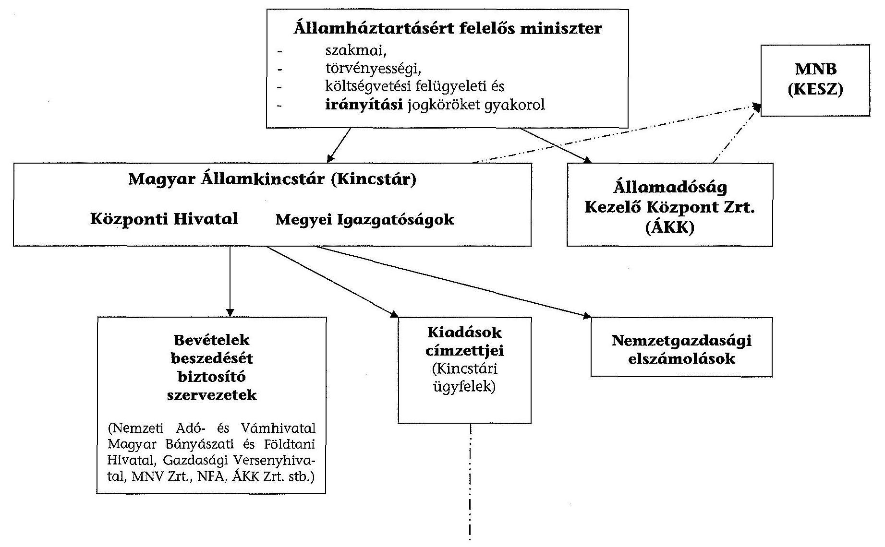

---

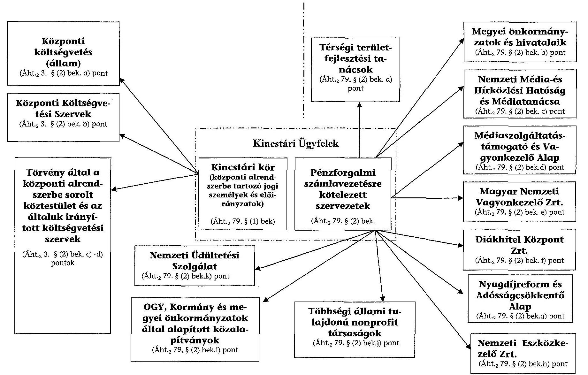

Forrás: ÁSZ készítésű ábra jogszabályi előírások alapján

---

# KIMUTATÁS

## a PM/NGM által a Magyar Államkincstárnál végzett ellenőrzésekről és javaslatokról a 2008-2012. években

|  Sorszám | Ellenőrzés

 megnevezése | Megfogalmazott javaslatok összefoglalása | Történt-e intézkedés?  |
| --- | --- | --- | --- |
|   | 2008. év |  |   |
|  1. | A kincstári biztosi rendszer működésének ellenőrzése | A belső eljárási rendet aktualizálják, pontosítsák, illetve a belső szabályzatot vezető hagyja jóvá. A 217/1998. (XII. 30.) Korm. rendelet módosítása esetén az ellenőrzés által érintett biztosi kijelölési feladatok, biztosi kiadások „továbbszámlázása”, feladatellátás előirányzatának tervezése területeit vegyék figyelembe. Az új kincstári biztosi névjegyzéket állítsák össze és jelentessék meg a Pénzügyi Közlönyben. | Igen  |
|  2. | A Kincstár régiók kialakításának vizsgálata | nincs | nem értelmezhető  |
|  3. | PM fejezet intézményeinél végzett belső ellenőrzési tevékenység felülvizsgálata | nem volt Kincstárra nevesített javaslat | a részletes megállapításokban foglalt megállapításokra készítettek  |
|  4. | Költségvetési intézmények vagyonkezelési szerződései felülvizsgálata | nem volt Kincstárra nevesített javaslat | nem értelmezhető  |
|  5. | 2146/2007. (VII. 27.) Korm. határozat végrehajtásának ellenőrzése a Magyar Államkincstárnál | A Regionális igazgatóságokon az önkormányzati, illetve a nem állami humán szakterületekre az egységes elvek alapján leosztott ellenőrzési referensi létszámok felülvizsgálata történjen meg, a keretszámok a tényleges leterheltségnek megfelelően kerüljenek megállapításra. A Kincstári Központ intézkedjen a vizsgálat időpontjában még be nem töltött 24 álláshely mielőbbi feladatra történő „leosztásáról” a Regionális Igazgatóság felé, a forrás egyidejű biztosításával. | nem volt fellelhető sem az NGM-ben, sem a Kincstárban  |

---

|  Sorszám | Ellenőrzés megnevezése | Megfogalmazott javaslatok összefoglalása | Történt-e intézkedés?  |
| --- | --- | --- | --- |
|   | 2009. és áthúzódóak 2010. évre |  |   |
|  1. | 2008. évi fejezeti tartalék felhasználása | nem volt Kincstárra nevesített javaslat | nem értelmezhető  |
|  2. | Az új szakfeladatrend kialakításával kapcsolatos feladatok teljesítésének ellenőrzése (az államháztartás korszerűsítésére vonatkozó új szabályok megvalósítása, alkalmazásuk hatékonysága a PM fejezetnél vizsgálaton belül) | Az egyes ütemtervekben meghatározott feladatok megvalósítását az érintettek, mind a Kincstár, mind a PM részéről kiemelten felügyeljék, kövessék nyomon. A Kincstár rendszeres időközönként számoljon be a PM-nek az egyes ütemtervekben meghatározott feladatok teljesítéséről. | Igen (az NGM-ben csak az intézkedési terv beküldését igazoló levél volt megtalálható.)  |
|  3. | A számviteli politika és a kapcsolódó szabályzatok (értékelési, leltározási, pénzkezelési, önköltség számítási) ellenőrzése a PM fejezet intézményeinél | Az intézmény tekintse át szabályzatait és az azok kiegészítésére tett intézkedésekről tájékoztassák a PM Ellenőrzési Főosztályt. | Igen  |
|  4. | A kincstári régiók kialakítása 2008. évi ellenőrzésének utóvizsgálata | A monitoring rendszer szempontjait bővítették oly módon, hogy az országos átlagnál jobb régiós teljesítéseket is indokolni kelljen, a gazdálkodási területen végezzenek gazdaságossági számításokat. | Igen  |
|   |  | A Kincstár Központ vizsgálja újra felül, hogy a még működő Alpha szerverek közül melyek üzemeltetése feltétlenül szükséges. |   |
|   |  | Az iratanyagok selejtezését vizsgálják felül, illetve ezzel összhangban a még szükséges irattári kapacitások biztosítását mérjék fel. |   |
|   |  | A központi postázás bővítési lehetőségeit mérjék fel a gazdaságossági és jogszabályi szempontok figyelembevételével. |   |
|  5. | A KGR kialakításával kapcsolatos feladatok teljesítésének ellenőrzése | Vizsgálják felül a projekthez kapcsolódó feladatok végrehajtásához szükséges informatikai szakértői létszámot. | Igen (az NGM-ben nem volt fellelhető)  |
|   |  | Fordítsanak figyelmet arra, hogy a KGR végleges hardverkörnyezet kialakítása, és az IKM-FI, illetve a KTR szerver és diszk alrendszer költöztetése a Hold u. 7. sz. alatti géptermekben fejeződjön be 2009. XII. 31-ig. |   |
|   |  | Gondoskodjanak arról, hogy a Kincstár Projektiroda - Kincstári Projektvezető elegendő és megfelelő humán erőforrással rendelkezzen az adminisztratív feladatok ellátásához. |   |

---

|  Sorszám | Ellenőrzés megnevezése | Megfogalmazott javaslatok összefoglalása | Történt-e intézkedés?  |
| --- | --- | --- | --- |
|  6. | A pénzügyi szolgáltatások korszerűsítésére biztosított rendkívüli kormányzati kiadások felhasználásának ellenőrzése (A pénzügyigazgatás korszerűsítésére biztosított rendkívüli kormányzati kiadások 2009. évi felhasználása) | A Kincstár Beszerzési szabályzatáról szóló 6/2009. számú elnöki utasítást módosítsák. | Igen  |
|   |  | A központosított közbeszerzések keretében történő eszközbeszerzések esetén alkalmazzanak ajánlatokat összehasonlító táblázatot a vezetői döntés elősegítése érdekében. |   |
|   |  | Az érintett beszerzésekhez kapcsolódó előirányzatokat vizsgálják felül a nyilvántartásokban. |   |
|   |  | A vizsgált, tervezett informatikai auditok beszerzését mielőbb folytassák le. |   |
|   |  | Intézkedjenek a bizonylatok szabályos kitöltéséről, a kötelezettségvállalás és utalványozás folyamatainak megfelelő szervezéséről. |   |
|  7. | A Magyar Államkincstár 2009. évi beszámolójának megbízhatósági ellenőrzése A MÁK Központ 2009. évi intézményi beszámolója ellenőrzése | A következő szabályzatokat pontosítsák, egészítsék ki: számviteli politika, számlarend, értékelési, önköltség számítási, közbeszerzési, pénzkezelési, valamint közszolgálati szabályzatok. Az előzőeken túl aktualizálják a Magyar Államkincstár, mint intézmény személyi juttatással történő egységes gazdálkodása eljárási rendjét is. | nem volt fellelhető (a Kincstár nyilvántartása szerint készült)  |
|   |  | A perköltségekre tekintettel a nyilvántartási rendszer és az intézményen belüli eljárási rendet vizsgálják felül és szabályozzák. |   |
|   |  | A munkavállalókkal szembeni követelések nyilvántartási rendszerét vizsgálják felül. |   |
|   |  | A bírósági határozatban megítélt kamat kerüljön előírásra. |   |
|   |  | A befizetett törlesztés összegével csökkentsék az előírt követelések összegét. |   |
|   |  | A jelentősebb összegű pénztári kifizetések helyett az átutalásokat részesítsék előnyben. |   |
|   |  | A KIR rendszer ismert és javítható hiányosságait a lehetőségek szerint javítsák ki. |   |
|  8. | Kincstár KMR 2009. évi beszámoló ellenőrzése (A Magyar Államkincstár 2009. évi beszámolójának megbízhatósági ellenőrzése részeként) | Erősítsék a bizonylati fegyelmet. | nem volt fellelhető (a Kincstár nyilvántartása szerint készült)  |
|   |  | A késedelmi kamat fizetésére okot adó pénzügyi teljesítéseket kerüljék el. |   |
|   |  | A Budapest, Lajos utca 160-162. szám alatti ingatlan átadás-átvételének elhúzódása miatt felmerült (a Kincstárt terhelő) közüzemi költségeket rendezzék az MNV Zrt-vel. |   |
|   |  | Biztosítsák, hogy a postai számlák postakönyvvel történő egyeztetése minden esetben dokumentáltan megtörténjen. |   |
|  9. | Kincstár NYDR 2009. évi beszámoló ellenőrzése | nem volt Kincstárra nevesített javaslat | nem értelmezhető  |

---

|  Sorszám | Ellenőrzés megnevezése | Megfogalmazott javaslatok összefoglalása | Történt-e intézkedés?  |
| --- | --- | --- | --- |
|  10. | A Magyar Államkincstár 2009. évi beruházásainak, felújításainak ellenőrzése az intézményi beszámoló „financial audit” típusú vizsgálatához (Kapcsolódó ellenőrzés a Kincstár Központ 2009. évi intézményi beszámolója ellenőrzéséhez) | A szerződések pontos dátumozása minden esetben történjen meg. A kapcsolódó aláírási folyamatot vizsgálják felül. | Igen  |
|   |  | Átadás-átvételi jegyzőkönyvek pontos kitöltésére fordítsanak figyelmet. |   |
|   |  | A biztosítsák a fizetési határidők betartását. |   |
|   |  | Az utalványrendeleten a könyvekben történő rögzítés dátumát tüntessék fel. |   |
|   |  | Biztosítsák, hogy a különböző bizonylatokon azonos üzembe helyezési dátum szerepeljen. |   |
|   |  | Az üzembe helyezési okmány formátumát módosítsák, integrálják a CT-EcoSTAT rendszerbe. |   |
|   |  | Az egyedi nyilvántartó lapokat vizsgálják felül. A jövőbeni nyilvántartásba vételek megkönnyítése érdekében az ún. „számlakísérő okmányt” dolgozzák ki és vezessék be. |   |
|   |  | A belső szabályzatban szabályozzák a beruházások utólagos értékelésének kötelezettségét, kiemelten az építési beruházásokat. |   |
|  11. | A 2009. évi maradvány ellenőrzés a PM fejezetnél, részellenőrzés a Magyar Államkincstárban (Központ) (Kapcsolódó ellenőrzés a Kincstár Központ 2009. évi intézményi beszámolója ellenőrzéséhez) | A jelentésben nem kerültek rögzítésre, mivel beépítették a Kincstár 2009. évi intézményi beszámolója megbízhatósági ellenőrzéséről készült Ellenőrzési jelentésbe (a mellékleten a 7. sorszám alatt szereplő ellenőrzés javaslatai) | nem értelmezhető  |
|   | 2011. év |  |   |
|  1. | Az NGM által irányított intézmények belső ellenőrzési rendszere | A stratégiai tervet kockázatelemezéssel támaszszák alá, a belső ellenőrzési vezető állandó részvétele szükséges a vezetői értekezleten, az intézkedési tervek határidőre készüljenek el, az intézkedésekről szóló beszámolót határidőben küldje meg az NGM részére | Igen  |
|   | 2012. év |  |   |
|  1. | A kárrendezési célelőirányzat fejezeti kezelésű előirányzat felhasználásának pénzügyi ellenőrzése | A kezelt fejezeti kezelésű előirányzatok tekintetében készítsen szabályzatot az államháztartásról szóló törvény végrehajtásáról szóló 368/2011. (XII. 31.) Korm. rendelet 13. § (3) bekezdése alapján az előirányzattal kapcsolatos tervezési, gazdálkodási, finanszírozási, adatszolgáltatási és beszámolási feladataira nézve. | Igen  |
|   |  | Kezelő szervi tevékenységével kapcsolatban vagy aktualizálja a jelenleg hatályos kötelezettségvállalási szabályzatát, vagy adjon ki arra külön szabályzatot. |   |
|  2. | Az NGM által irányított intézmények belső ellenőrzési rendszere c. vizsgálat utóellenőrzése | Az ellenőrzöttek fektessenek nagyobb hangsúlyt az intézkedési tervben foglalt feladatok időben történő elvégzésére. | Igen  |
|   |  | A Kincstár elnöke az intézkedési tervben foglalt feladatok határidőben történő végrehajtására kötelezze az ellenőrzötteket. |   |

Forrás: NGM és a Kincstár adatszolgáltatása

---

# A Kincstár új feladatai a 2008-2012. években 

- lakáscélú állami támogatásokkal összefüggő feladatok;
- lakossági vezetékes gázfogyasztás és a távhőfelhasználás szociális támogatásával kapcsolatos jogszabályban előírt feladatok;
- ÚMFT-vel kapcsolatban a jogszabályban meghatározott lebonyolítási feladatokhoz kötődő számviteli nyilvántartási kötelezettséggel, valamint a közreműködő szervezetek lebonyolítói tevékenységével és a kedvezményezettek helyszíni ellenőrzésével kapcsolatos feladatok;
- Diákhitel általános kamattámogatással összefüggő feladatok;
- fiatalok életkezdési támogatásával kapcsolatos jogszabályban előírt feladatok;
- építtetői fedezetkezelői feladatok;
- költségvetési (fő)felügyelői rendszer működtetésével kapcsolatos

 feladatok;
- jogszabályban meghatározott, európai uniós forrásból származó, és egyéb nemzetközi támogatásokkal kapcsolatosan a támogatások fogadásáért felelős kifizető hatósági és igazoló hatósági feladatok, valamint a Nemzeti Alap számára előírt feladatok;
- jogszabályokban meghatározott járadékok és támogatások központi költségvetésből történő kifizetésével kapcsolatos feladatok;
- kárpótlási jegyek őrzésével és kezelésével kapcsolatos feladatok;
- európai uniós családi ellátásokkal kapcsolatos ügyintézési feladatok, valamint adatszolgáltatás;
- követeléskezelési feladatok ellátásában a támogatási előírányzatok pályázati rendszerében közreműködés;
- a Magyar Állam javára fennálló jelzálogjog, valamint elidegenítési és terhelési tilalom érvényesítésével, törlésével, az azzal való rendelkezéssel kapcsolatosan jognyilatkozat tétele;
- egységes szociális nyilvántartás vezetése;
- a helyi önkormányzat és költségvetési szervei, a települési, területi kisebbségi önkormányzat és költségvetési szervei, továbbá a többcélú kistérségi társulás és költségvetési szervei pénzforgalmi számlájának (megbízások alapján), valamint az elkülönített állami pénzalapok, a társadalombiztosítás pénzügyi alapjai, a fejezeti kezelésű előirányzatok nyilvántartásának vezetése;
- a helyi önkormányzatok részére a természetben nyújtott családi pótlék kezelésére számla vezetése.

---

.

---

# KIMUTATÁS

## a nem állami, nem önkormányzati humánszolgáltatást nyújtó intézményfenntartókról, valamint az intézményfenntartóknál és az intézmények székhelyén/telephelyén végzett ellenőrzésekről a 2008-2012. években

|  Megnevezés | 2008. év | 2009. év | 2010. év | 2011. év | 2012. év | 2012/2008. év  |
| --- | --- | --- | --- | --- | --- | --- |
|   | adatok db-ban |  |  |  |  | változás %-ban  |
|  Szociális ellátást végző nem állami, nem ön-
kormányzati intézményfenntartók | 694 | 715 | 866 | 1146 | 1164 | 167,7  |
|  ebből: | 166 | 177 | 200 | 275 | 303 | 182,5  |
|  alapítványi | 270 | 281 | 316 | 363 | 356 | 131,9  |
|  gazdasági társasági | 140 | 147 | 217 | 321 | 329 | 235,0  |
|  egyéb | 118 | 110 | 133 | 187 | 176 | 149,2  |
|  A szociális ellátást végző fenntartóknál végzett
kincstári ellenőrzések | 785 | 813 | 375 | 558 | 636 | 81,0  |
|  A szociális ellátást végző intézmények székhe-
lyén/telephelyén végzett kincstári ellenőrzések | 1540 | 1817 | 759 | 1115 | 2049 | 133,1  |
|  Közoktatást végző nem állami, nem önkor-
mányzati intézményfenntartók | 895 | 867 | 880 | 906 | 918 | 102,6  |
|  ebből: | 164 | 164 | 164 | 175 | 187 | 114,0  |
|  alapítványi | 513 | 494 | 492 | 487 | 472 | 92,0  |
|  gazdasági társasági | 54 | 131 | 146 | 164 | 169 | 313,0  |
|  egyéb | 164 | 78 | 78 | 80 | 90 | 54,9  |
|  Közoktatást végző intézményfenntartóknál végzett
kincstári ellenőrzések | 192 | 137 | 264 | 295 | 309 | 160,9  |
|  Közoktatást végző intézmények székhelyén/
telephelyén végzett kincstári ellenőrzések | 231 | 355 | 595 | 1024 | 722 | 312,6  |

Forrás: Kincstár adatszolgáltatása

---

# Szociális ellátásokat végző intézmény nem állami, nem önkormányzati fenntartó kincstári ellenőrzése a 2008-2012. években

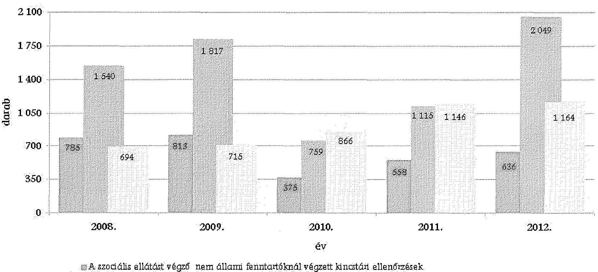

- A szociális ellátást végző nem állami fenntartóknál végzett kincstári ellenőrzések
- A szociális ellátást végző nem állami intézmények székhelyén/telephelyén végzett kincstári ellenőrzések
- Szociális ellátást végző humán intézmény fenntartók

Forrás: Kincstár adatszolgáltatása

---

# 5. SZÁMÚ MELLEKLET A V-0119-088/2014. SZÁMÚ JELENTÉSHEZ 

## Közoktatást végző nem állami intézmények kincstári ellenőrzése a 2008-2012. években

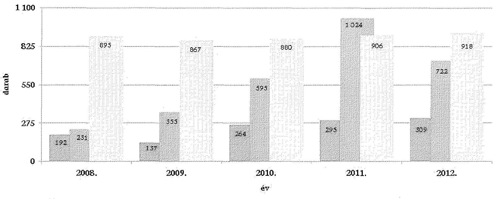
i. Közoktatást végző nem állami, nem önkormányzati intézményfenntartóknál végzett kincstári ellenőrzések
ii. Közoktatást végző nem állami, nem önkormányzati intézmények székhelyén/telephelyén végzett kincstári ellenőrzések

Közoktatást végző nem állami, nem önkormányzati intézményfenntartók

Forrás: Kincstár adatszolgáltatása

---

.

---

# KIMUTATÁS

## a központosított illetményszámfejtés jellemző adatairól a 2008-2013. években

|  Megnevezés | Számfejtési körbe tartozó szervek száma
(db) | Számfejtett foglalkoztatottak száma
(fő) | Számfejtést végzők betöltött létszáma
(fő) | Egy számfejtést végzőre
jutó számfejtett foglalkoztatottak száma
(db/fő)  |
| --- | --- | --- | --- | --- |
|  2008. január 1. | 10944 | 595709 | 871 | 684  |
|  2009. január 1. | 10782 | 694937 | 946 | 735  |
|  2010. január 1. | 10764 | 726924 | 965 | 753  |
|  2011. január 1. | 10569 | 680136 | 997 | 682  |
|  2012. január 1. | 11665 | 728970 | 1048 | 696  |
|  2013. január 1. | 9916 | 686979 | 1047 | 656  |

Forrás: Kincstár adatszolgáltatása

---

# A központosított illetmény-számfejtést végzők létszámának alakulása és az egy főre jutó számfejtés megoszlása 2008-2013. év január 1-jén 

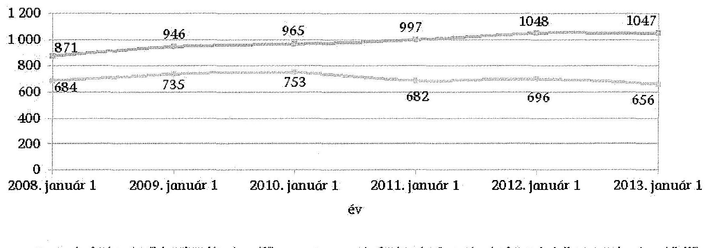
--ilı-- a számfejtést végzők betöltött létszáma (fő) --ilı-- egy számfejtést végzőre jutó számfejtett foglalkoztatottak száma (db/fő)
Forrás: Kincstár adatszolgáltatása

---

# KIMUTATÁS

a hazai támogatási, pályázati rendszerekből nyújtott támogatásokat érintő Kincstár által tervezett és elvégzett ellenőrzések számáról a 2008-2012. években adatok db-ban

|  Megnevezés | 2008. év |  | 2009. év |  | 2010. év |  | 2011. év |  | 2012. év |   |
| --- | --- | --- | --- | --- | --- | --- | --- | --- | --- | --- |
|   | Terv | Elvégzett | Terv | Elvégzett | Terv | Elvégzett | Terv | Elvégzett | Terv | Elvégzett  |
|  DECHÖF | 0 | 1266 | 1932 | 4474 | 4311 | 6169 | 4377 | 4384 | 3448 | 3129  |
|  TRFC | 834 | 847 | 1063 | 1146 | 964 | 999 | 945 | 1337 | 1451 | 1195  |
|  TFFP | 0 | 0 | 0 | 0 | 0 | 0 | 0 | 0 | 25 | 28  |
|  TC | 762 | 797 | 924 | 1008 | 299 | 301 | 102 | 141 | 252 | 334  |
|  NBC | 109 | 179 | 42 | 121 | 88 | 125 | 20 | 38 | 0 | 8  |
|  REGÉC | 42 | 42 | 11 | 17 | 10 | 13 | 2 | 3 | 0 | 0  |
|  Összesen: | 1747 | 3131 | 3972 | 6766 | 5672 | 7607 | 5446 | 5903 | 5176 | 4694  |

Forrás: Kincstár adatszolgáltatása

---

# KIMUTATÁS

a Kincstár által kezelt, ellenőrzött hazai támogatásokból eredő követelésállomány alakulásáról 2008-2012. években

|  Megnevezés |  | 2008. 12.31. | 2009. 12.31. | 2010. 12.31. | 2011. 12.31. | 2012. 12.31. | 2012/2008. változás (%) |
| --- | --- | --- | --- | --- | --- | --- | --- |
|  Követelések száma (db) |  | 420 | 391 | 325 | 315 | 275 | 65,48  |
|  Állomány | teljes (M Ft) | 6544 | 6474 | 6311 | 5855 | 4969 | 75,93  |
|   | teljesből eljárás alatti* (M Ft) | 4003 | 4395 | 4517 | 3883 | 3414 | 85,29  |
|  Arány teljes/eljárás alatti (%) |  | 61,17 | 67,89 | 71,57 | 66,32 | 68,71 | -  |

- felszámolás, végelszámolás, csődeljárás, vagyonrendezés, bírósági eljárás

Forrás: Kincstár adatszolgáltatása

---

# KIMUTATÁS

a Kincstári monitoring-rendszerben regisztrált támogatási konstrukciókról és támogatásokról a 2008-2012. években

|  Megnevezés | 2008. 12.31. | 2009. 12.31. | 2010. 12.31. | 2011. 12.31. | 2012. 12.31.  |
| --- | --- | --- | --- | --- | --- |
|  Támogatási konstrukciók száma (db) | 507 | 439 | 239 | 448 | 512  |
|  ebből:
Európai Uniós támogatás (db) | 249 | 209 | 111 | 273 | 320  |
|  Arány Európai Uniós/teljes (%) | 49,1 | 47,6 | 46,4 | 60,9 | 62,5  |
|  Pályázható forrás összege (Mrd Ft) | 1354,7 | 773,8 | 214,6 | 1316,1 | 947,4  |
|  ebből
Európai Uniós támogatás (Mrd Ft) | 776,0 | 465,5 | 149,7 | 1129,6 | 860,1  |
|  Arány Európai Uniós/teljes (%) | 57,3 | 60,2 | 69,8 | 85,8 | 90,8  |

Forrás: Kincstár adatszolgáltatása

---

!
!
!
!
!
!
!
!
!
!
!
!
!
!
!
!
!
!
!
!
!
!
!
!
!
!
!
!
!
!
!
!
!
!
!
!
!
!
!
!
!
!
!
!
!
!
!
!
!
!
!
!
!
!
!
!
!
!
!
!
!
!
!
!
!
!
!
!
!
!
!
!
!
!
!
!
!
!
!
!
!
!
!
!
!
!
!
!
!
!
!
!
!
!
!
!
!
!
!
!
!
!
!
!
!
!
!
!
!
!
!
!
!
!
!
!
!
!
!
!
!
!
!
!
!
!
!
!
!
!
!
!
!
!
!
!
!
!
!
!
!
!
!
!
!
!
!
!
!
!
!
!
!
!
!
!
!
!
!
!
!
!
!
!
!
!
!
!
!
!

---

# KIMUTATÁS

## a befektetési és kiegészítő befektetési szolgáltatási tevékenység jellemző adatairól a 2008-2012. években

|  Megnevezés | Értékpapír tulajdonosok száma adott év december 31-én (fő) | Tartós befektetési számla tulajdonosok száma adott év december 31-én (fő) | Az értékpapír tulajdonosok számának növekedése a 2008. évi adathoz viszonyítva (%) | Értékesített állampapírok összege (M Ft) | Ebből €-ban értékesített állampapírok összege (€)  |
| --- | --- | --- | --- | --- | --- |
|  2008. év | 49906 | 0 | 100,0 | 493091,8 | 0,0  |
|  2009. év | 53035 | 0 | 106,3 | 500998,2 | 0,0  |
|  2010. év | 57636 | 3179 | 115,5 | 510184,5 | 0,0  |
|  2011. év | 61122 | 5050 | 122,5 | 471785,1 | 0,0  |
|  2012. év | 81057 | 12456 | 162,4 | 1092111,7 | 122906628,0 (35801,4 M Ft) |

Forrás: Kincstár adatszolgáltatása

---

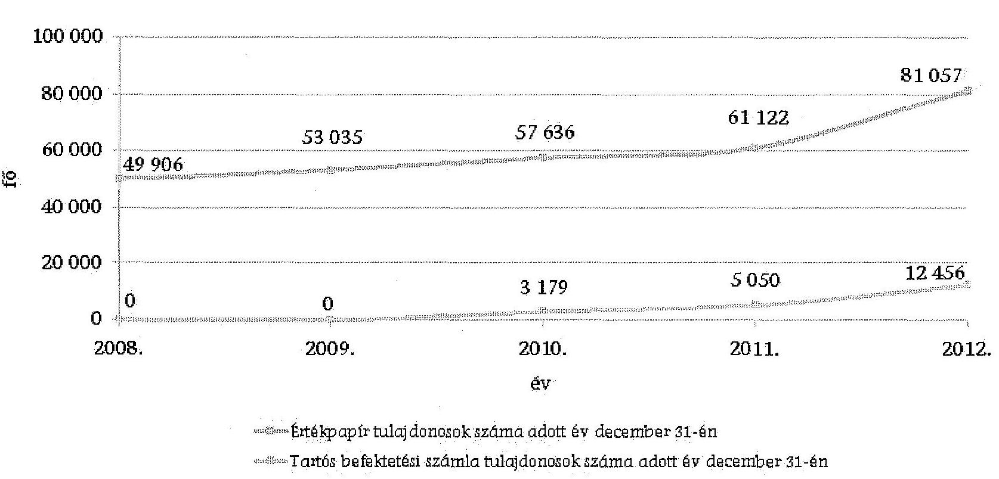

# Értékpapír tulajdonosok és a tartós befektetési számla tulajdonosok számának alakulása 2008-2012. december 31-én

|  Ár | Értékpapír tulajdonosok szám | Ár | Értékpapír tulajdonosok szám | Ár | Értékpapír tulajdonosok szám | Ár | Értékpapír tulajdonosok szám | Ár | Értékpapír tulajdonosok szám | Értékpapír tulajdonosok szám | Ár | Értékpapír tulajdonosok szám | Értékpapír tulajdonosok szám | Értékpapír tulajdonosok szám | Értékpapír tulajdonosok szám  |
| --- | --- | --- | --- | --- | --- | --- | --- | --- | --- | --- | --- | --- | --- | --- | --- |

 | --- | --- | --- |
|  100 000 | 80 000 | 49 906 | 20 000 | 0 | 2008 | 2009 | 53 035 | 53 035 | 57 636 | 3 179 | 2010 | 2011 | 2012 | 2012 | 81 057  |
|  20 000 | 0 | 0 | 0 | 0 | 2009 | 2010 | 3 179 | 3 179 | 5 050 | 5 050 | 12 456 | 2011 | 2012 | 2012 | 12 456  |

Forrás: Kincstár adatszolgáltatása

---

# Értékesített állampapírok összegének alakulása 2008-2012. években

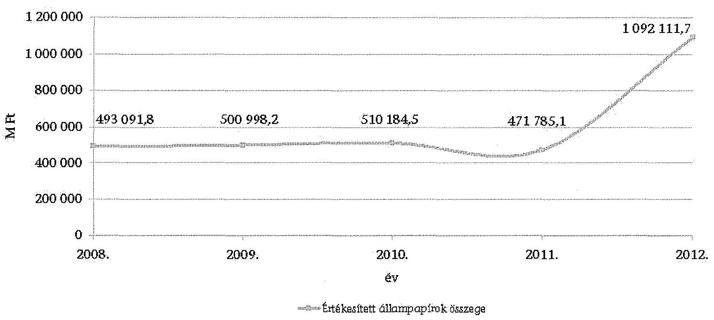

*Értékesített állampapírok összege*

*Forrás: Kincstár adatszolgáltatása*

---

.

---

# KIMUTATÁS

## az elsődleges értékpapír forgalmazás jellemző adatairól a 2008-2012. években

|  Megnevezés | 2008. év | 2009. év | 2010. év | 2011. év | 2012. év | Elsődleges forgalmazás összesen:  |
| --- | --- | --- | --- | --- | --- | --- |
|  Értékesített állampapírok összege (M Ft) | 493091,8 | 500998,2 | 510184,5 | 471785,1 | 1092111,7 |   |
|  Értékesített állampapírokból elsődleges forgalmazás (M Ft) | 120106,5 | 139680,0 | 166399,2 | 104231,0 | 319208,7 | 849625,4  |
|  Elsődleges forgalmazás részaránya az értékesített állampapírok összegén belül (\%) | 24,4 | 27,9 | 32,6 | 22,1 | 29,2 |   |
|  Prémium Magyar Államkötvény (M Ft) | 0,0 | 33607,6 | 103752,7 | 45471,2 | 182663,1 | 365494,6  |
|  Prémium Magyar Államkötvény elsődleges értékesítés részaránya az elsődleges forgalmazásban értékesített állampapírok összegén belül (\%) | 0,0 | 24,1 | 62,4 | 43,6 | 57,2 |   |
|  Kamatozó Kincstárjegy (M Ft) | 120106,5 | 106072,4 | 62646,5 | 58759,8 | 85417,3 | 433002,5  |
|  Kamatozó Kincstárjegy elsődleges értékesítés részaránya az elsődleges forgalmazásban értékesített állampapírok összegén belül (\%) | 100,0 | 75,9 | 37,6 | 56,4 | 26,8 |   |
|  Féléves Kincstárjegy (M Ft) | 0,0 | 0,0 | 0,0 | 0,0 | 15326,9 | 15326,9  |
|  Féléves Kincstárjegy elsődleges értékesítés részaránya az elsődleges forgalmazásban értékesített állampapírok összegén belül (\%) | 0,0 | 0,0 | 0,0 | 0,0 | 4,8 |   |
|  Prémium EURO Magyar Államkötvény (M Ft) | 0,0 | 0,0 | 0,0 | 0,0 | $\begin{gathered} 35801,4 \ (122906628,0 €) \end{gathered}$ | $\begin{gathered} 35801,4 \ (122906628,0 €) \end{gathered}$  |
|  Prémium EURO Államkötvény elsődleges értékesítés részaránya az elsődleges forgalmazásban értékesített állampapírok összegén belül (\%) | - | - | - | - | 11,2 |   |

Forrás: Kincstár adatszolgáltatása

---

# Értékesített állampapírok forgalmazása típusok szerint a 2008-2012. években

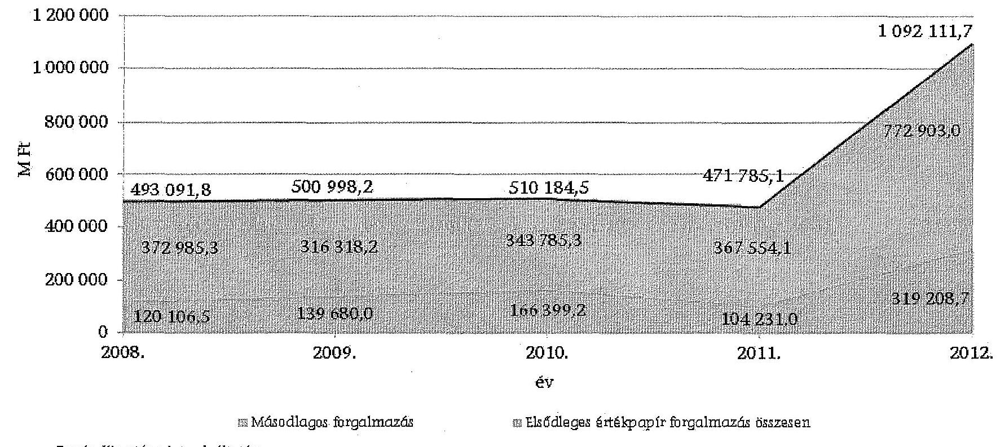

|  Ár | Mátodlagos forgalmazás | Elsődlagos értékpapír forgalmazás összesen | Forrás: Kincstár adatszolgáltatása  |
| --- | --- | --- | --- |
|  1 200 000 | 493 091,8 | 500 998,2 | 510 184,5  |
|  1 000 000 | 372 985,3 | 316 318,2 | 343 785,3  |
|  800 000 | 120 106,5 | 119 680,0 | 166 399,2  |
|  600 000 |  |  |   |
|  400 000 |  |  |   |
|  200 000 |  |  |   |
|  0 2008. |  |  |   |
|  120 106,5 |  |  |   |
|  119 680,0 |  |  |   |
|  106 399,2 |  |  |   |
|  104 231,0 |  |  |   |
|  104 231,0 |  |  |   |
|  104 231,0 |  |  |   |
|  104 231,0 |  |  |   |
|  104 231,0 |  |  |   |
|  104 231,0 |  |  |   |
|  104 231,0 |  |  |   |
|  104 231,0 |  |  |   |
|  104 231,0 |  |  |   |
|  104 231,0 |  |  |   |
|  104 231,0 |  |  |   |
|  104 231,0 |  |  |   |
|  104 231,0 |  |  |   |
|  104 231,0 |  |  |   |
|  104 231,0 |  |  |   |
|  104 231,0 |  |  |   |
|  104 231,0 |  |  |   |
|  104 231,0 |  |  |   |
|  104 231,0 |  |  |   |
|  104 231,0 |  |  |   |
|  104 231,0 |  |  |   |
|  104 231,0 |  |  |   |
|  104 231,0 |  |  |   |
|  104 231,0 |  |  |   |
|  104 231,0 |  |  |   |
|  104 231,0 |  |  |   |
|  104 231,0 |  |  |   |
|  104 231,0 |  |  |   |
|  104 231,0 |  |  |   |
|  104 231,0 |  |  |   |
|  104 231,0 |  |  |   |
|  104 231,0 |  |  |   |
|  104 231,0 |  |  |   |
|  104 231,0 |  |  |   |
|  104 231,0 |  |  |   |

---

# Az elsődleges értékpapír forgalmazás értékpapír típusonként a 2008-2012. években

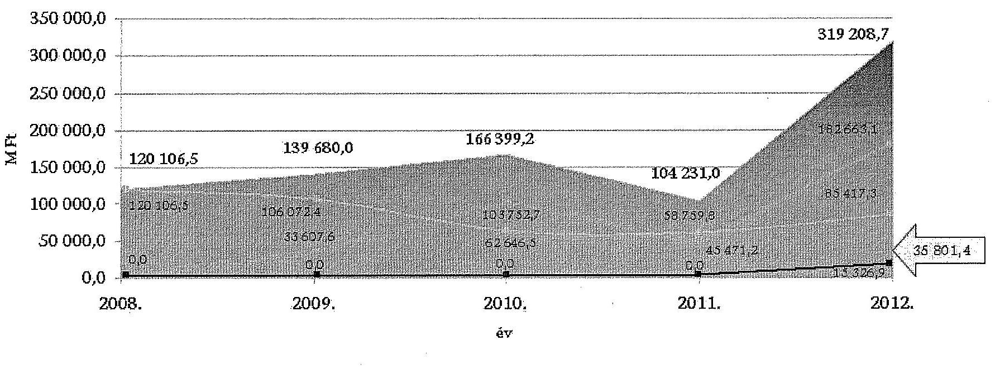

|  Év | Elsődleges értékpapír forgalmazás összesen  |
| --- | --- |
|  Prémium Magyar Államkötvény | Kamatozó Kincstárjegy  |
|  Féléves kincstárjegy | Prémium EURO Magyar Államkötvény  |

Forrás: Kincstár adatszolgáltatása

---

.

---

# KIMUTATÁS 

## a családtámogatási ellátásokkal és fogyatékossági támogatásokkal kapcsolatos feladatellátás főbb adatairól a 2008-2012. években

| Megnevezés | $\begin{gathered} 2008 . \\ \text { év } \end{gathered}$ | $\begin{gathered} 2009 . \\ \text { év } \end{gathered}$ | $\begin{gathered} 2010 . \\ \text { év } \end{gathered}$ | $\begin{gathered} 2011 . \\ \text { év } \end{gathered}$ | $\begin{gathered} 2012 . \\ \text { év } \end{gathered}$ | Összesen |
| :--: | :--: | :--: | :--: | :--: | :--: | :--: |
| Családtámogatási ellátásra jogosultak száma (fő) | 1384313 | 1396862 | 1377063 | 1341591 | 1317031 | 6816860 |
| Családtámogatási ellátásokra kifizetett összeg (M Ft) | 450387,0 | 450956,4 | 445981,2 | 435872,6 | 428474,9 | 2211672,1 |
| Családtámogatási ellátásokra megállapított jogalap nélküli kifizetés összege (M Ft) | 404,9 | 774,0 | 749,0 | 1055,9 | 1276,0 | 4259,8 |
| CST jogalap nélküli kifizetés összege a CST ellátásokra kifizetett összeghez viszonyítva (\%) | 0,1 | 0,2 | 0,2 | 0,2 | 0,3 | 0,2 |
| Családtámogatási ellátásokkal kapcsolatos ellenőrzések száma (db) | 9848 | 13686 | 17480 | 22656 | 23772 | 87442 |
| Fogyatékossági ellátásra jogosultak száma (fő) | 110838 | 112647 | 113909 | 114625 | 113778 | 565797 |
| Fogyatékossági ellátásokra kifizetett összeg (M Ft) | 28459,9 | 28913,5 | 29188,5 | 29383,9 | 29369,4 | 145315,2 |
| Fogyatékossági ellátásokra megállapított jogalap nélküli kifizetés összege (M Ft) | 27,0 | 61,9 | 92,3 | 92,7 | 61,8 | 335,7 |
| FOT jogalap nélküli kifizetés összege a FOT ellátásokra kifizetett összeghez viszonyítva (\%) | 0,1 | 0,2 | 0,3 | 0,3 | 0,2 | 0,2 |
| Fogyatékossági ellátásokkal kapcsolatos ellenőrzések száma (db) | 456 | 737 | 790 | 804 | 669 | 3456 |
| Jogalap nélküli kifizetésekből behajtott összeg (M Ft) | 281,5 | 451,6 | 507,7 | 663,9 | 807,1 | 2711,8 |
| Elévülés, illetve behajthatatlanság miatt törölt összeg (M Ft) | 23,2 | 21,0 | 45,2 | 56,5 | 137,6 | 283,5 |

Forrás: Kincstár adatszolgáltatása

---

# KIMUTATÁS

## a törzskönyvi nyilvántartásban szerepeltetett törzskönyvi szervek számának változásáról a 2008-2012. években és 2013. év I. negyedévében

|  Törzskönyvi szerv | 2008.
január 1.
nyitó adat | 2008.
december
31-i záró
adat | 2009.
december
31-i záró
adat | 2010.
december
31-i záró
adat | 2011.
december
31-i záró
adat | 2012.
december
31-i záró
adat | 2013.
március
31-i záró
adat  |
| --- | --- | --- | --- | --- | --- | --- | --- |
|  Központi költségvetési szervek | 492 | 467 | 501 | 500 | 419 | 843 | 871  |
|  Köztestületi költségvetési szervek | 61 | 61 | 60 | 58 | 59 | 26 | 26  |
|  Helyi önkormányzatok | 1927 | 1966 | 1971 | 3196 | 3196 | 3196 | 3196  |
|  Helyi önkormányzatok költségvetési szervei | 9690 | 9129 | 8666 | 8583 | 8163 | 7333 | 5197  |
|  Helyi Kisebbségi/nemzetiségi önkormányzatok | 989 | 976 | 978 | 2349 | 2305 | 2234 | 2218  |
|  Helyi Kisebbségi/nemzetiségi önkormányzatok
költségvetési szervei | 7 | 8 | 9 | 9 | 10 | 10 | 10  |
|  Országos kisebbségi/nemzetiségi önkormányzatok | 0 | 0 | 0 | 0 | 0 | 8 | 12  |
|  Országos kisebbségi/nemzetiségi önkormányzatok
költségvetési szervei | 30 | 33 | 50 | 51 | 54 | 65 | 65  |
|  Jogi személyiségű társulás | 279 | 279 | 279 | 329 | 354 | 374 | 409  |
|  Jogi személyiségű társulások költségvetési szervei | 110 | 102 | 105 | 18 | 19 | 20 | 56  |
|  Többcélú kistérségi társulások | 173 | 173 | 173 | 173 | 174 | 174 | 162  |
|  Többcélú kistérségi társulások költségvetési szervei | 306 | 328 | 366 | 377 | 389 | 389 | 240  |
|  Térségi fejlesztési

 tanácsok | 36 | 36 | 36 | 37 | 38 | 11 | 11  |
|  Egyéb törzskönyvi jogi személyek | 0 | 0 | 0 | 4 | 5 | 5 | 5  |
|  Összesen: | 14100 | 13558 | 13194 | 15684 | 15185 | 14688 | 12478  |

Forrás: Kincstár adatszolgáltatása

---

# KIMUTATÁS

a Kincstár kiadási előirányzatainak és azok teljesítésének alakulásáról a 2008-2012. években

|  Megnevezés | 2008. év |  |  | 2009. év |  |  | 2010. év |  |  | 2011. év |  |  | 2012. év |  |  | 2012/2008. év |  |   |
| --- | --- | --- | --- | --- | --- | --- | --- | --- | --- | --- | --- | --- | --- | --- | --- | --- | --- | --- |
|   | Eredeti előirányzat | Módosított előirányzat | Teljesítés | Eredeti előirányzat | Módosított előirányzat | Teljesítés | Eredeti előirányzat | Módosított előirányzat | Teljesítés | Eredeti előirányzat | Módosított előirányzat | Teljesítés | Eredeti előirányzat | Módosított előirányzat | Teljesítés | Eredeti előirányzat | Módosított előirányzat | Teljesítés  |
|   | adatok M Ft-ban |  |  |  |  |  |  |  |  |  |  |  |  |  |  |  |  |   |
|  Személyi juttatások | 12998,4 | 16858,0 | 15691,3 | 13163,4 | 15346,2 | 15017,3 | 13647,7 | 14103,6 | 13613,3 | 13351,5 | 14573,8 | 13922,2 | 12792,2 | 13448,2 | 13418,3 | 98,4 | 79,8 | 85,5  |
|  Munkaadót terhelő járulékok | 4182,6 | 5079,0 | 4719,7 | 4232,4 | 4287,6 | 4219,4 | 3709,0 | 3543,6 | 3346,4 | 3747,8 | 3695,9 | 3522,7 | 3596,7 | 3550,8 | 3529,1 | 86,0 | 69,9 | 74,8  |
|  Dologi kiadások | 4826,8 | 6624,3 | 5855,3 | 4176,0 | 6446,6 | 5411,1 | 5342,7 | 8280,9 | 6180,3 | 6548,2 | 6915,6 | 6565,4 | 4439,0 | 7011,5 | 6727,2 | 92,0 | 105,8 | 114,9  |
|  Előző évi előirányzat átadás | 0,0 | 0,0 | 0,0 | 0,0 | 0,0 | 0,0 | 0,0 | 0,7 | 0,7 | 0,0 | 1,1 | 1,1 | 0,0 | 0,0 | 0,0 | - | - | -  |
|  Működési célú pénzeszköz átadás | 0,0 | 1,7 | 1,7 | 0,0 | 0,2 | 0,2 | 0,0 | 0,5 | 0,5 | 0,0 | 0,3 | 0,3 | 0,0 | 0,4 | 0,4 | - | 23,5 | 23,5  |
|  Felhalmozási célú pénzeszköz átadás | 0,0 | 0,0 | 0,0 | 0,0 | 0,0 | 0,0 | 0,0 | 0,0 | 0,0 | 0,0 | 0,0 | 0,0 | 0,0 | 3,5 | 3,5 | - | - | -  |
|  Társadalom, szoc.pol., egyéb juttatás | 0,0 | 1,2 | 1,2 | 0,0 | 0,0 | 0,0 | 0,0 | 0,0 | 0,0 | 0,0 | 2,8 | 2,8 | 0,0 | 4,9 | 4,9 | - | 408,3 | 408,3  |
|  Felújítás | 41,5 | 183,7 | 181,6 | 41,5 | 113,9 | 91,7 | 41,5 | 87,7 | 53,8 | 383,7 | 869,4 | 496,9 | 383,7 | 675,1 | 620,8 | 253,9 | 86,1 | 73,5  |
|  Intézményi beruházási kiadások | 299,3 | 6479,9 | 1817,5 | 139,6 | 7331,7 | 2991,9 | 139,6 | 4679,9 | 3006,6 | 759,9 | 4570,2 | 1185,4 | 759,9 | 5580,1 | 1335,8 | 924,6 | 367,5 | 341,9  |
|  Egyéb intézményi felhalmozási kiadások | 0,0 | 18,1 | 18,1 | 0,0 | 0,0 | 0,0 | 0,0 | 0,0 | 10,0 | 0,0 | 10,0 | 10,0 | 0,0 | 10,0 | 10,0 | - | 55,2 | 55,2  |
|  Kölcsön nyújtása, törlesztése | 21,8 | 134,5 | 112,7 | 21,8 | 119,0 | 110,2 | 21,8 | 108,9 | 94,8 | 21,8 | 98,1 | 87,8 | 21,8 | 78,8 | 70,4 | 100,0 | 58,6 | 62,5  |
|  Előző évi maradvány átadása | 0,0 | 22,8 | 22,8 | 0,0 | 118,1 | 118,1 | 0,0 | 312,8 | 312,8 | 0,0 | 0,0 | 0,0 | 0,0 | 0,0 | 0,0 | - | 0,0 | 0,0  |
|  Összesen | 22370,4 | 33403,2 | 28421,9 | 21774,7 | 33763,3 | 27959,9 | 22902,3 | 31118,6 | 26619,2 | 24812,9 | 30737,2 | 25797,6 | 21993,3 | 30363,3 | 25720,4 | 98,2 | 85,8 | 90,8  |

Forma: a Kincstár 2008-2012. évi költségvetési beszámolás

---

# KIMUTATÁS 

## a Kincstár előirányzatainak és azok teljesítésének alakulásáról a 2008-2012. években

| Megnevezés | Kiadások | Saját bevétel | Támogatás |
| :--: | :--: | :--: | :--: |
| 2008. év |  |  |  |
| Eredeti előirányzat (M Ft) | 22370,4 | 5644,1 | 16726,3 |
| Módosított előirányzat (M Ft) | 33403,2 | 9979,9 | 25423,3 |
| Teljesítés (M Ft) | 28421,9 | 10070,8 | 25423,3 |
| Teljesítés/Eredeti előirányzat (\%) | 127,1 | 178,4 | 152,1 |
| Teljesítés/Módosított előirányzat (\%) | 80,3 | 100,9 | 100,0 |
| 2009. év |  |  |  |
| Eredeti előirányzat (M Ft) | 21774,7 | 5644,1 | 16130,6 |
| Módosított előirányzat (M Ft) | 33763,3 | 15469,1 | 18294,2 |
| Teljesítés (M Ft) | 27959,9 | 13103,7 | 18294,2 |
| Teljesítés/Eredeti előirányzat (\%) | 128,4 | 232,2 | 113,4 |
| Teljesítés/Módosított előirányzat (\%) | 82,8 | 84,7 | 100,0 |
| 2010. év |  |  |  |
| Eredeti előirányzat (M Ft) | 22902,3 | 5644,1 | 17258,2 |
| Módosított előirányzat (M Ft) | 31118,6 | 12618,4 | 18500,2 |
| Teljesítés (M Ft) | 26619,2 | 11517,0 | 18500,2 |
| Teljesítés/Eredeti előirányzat (\%) | 116,2 | 204,1 | 107,2 |
| Teljesítés/Módosított előirányzat (\%) | 85,5 | 91,3 | 100,0 |
| 2011. év |  |  |  |
| Eredeti előirányzat (M Ft) | 24812,9 | 5644,1 | 19168,8 |
| Módosított előirányzat (M Ft) | 30737,2 | 10849,3 | 19887,9 |
| Teljesítés (M Ft) | 25797,6 | 9646,6 | 19887,9 |
| Teljesítés/Eredeti előirányzat (\%) | 104,0 | 170,9 | 103,8 |
| Teljesítés/Módosított előirányzat (\%) | 83,9 | 88,9 | 100,0 |
| 2012. év |  |  |  |
| Eredeti előirányzat (M Ft) | 21993,3 | 5644,1 | 16349,2 |
| Módosított előirányzat (M Ft) | 30363,3 | 12114,2 | 18249,1 |
| Teljesítés (M Ft) | 25720,4 | 9708,8 | 18249,1 |
| Teljesítés/Eredeti előirányzat (\%) | 116,9 | 172,0 | 111,6 |
| Teljesítés/Módosított előirányzat (\%) | 84,7 | 80,1 | 100,0 |

Forrás: a Kincstár 2008-2012. évi költségvetési beszámolói

---

# KIMUTATÁS 

## a feladatváltozások kiadásokra és bevételekre gyakorolt költségvetési hatásáról a 2008-2012. években

adatok M Ft-ban

| Megnevezés | 2008.   év | 2009.   év | 2010.   év | 2011.   év | 2012.   év |
| :-- | :--: | :--: | :--: | :--: | :--: |
| Intézkedések hatása a   kiadásokra: | 7,3 | 274,2 | 456,4 | 302,8 | 274,4 |
| Személyi juttatások és munkaadót   terhelő járulékok | 3,9 | 186,8 | 372,8 | 260,9 | -663,0 |
| Dologi kiadások | 3,4 | 87,4 | 83,6 | 41,9 | 923,9 |
| Felhalmozási kiadások | 0,0 | 0,0 | 0,0 | 0,0 | 10,0 |
| Átadott pénzeszközök | 0,0 | 0,0 | 0,0 | 0,0 | 3,5 |
| Intézkedések hatása a   bevételekre: | 7,3 | 304,9 | 466,1 | 315,3 | 16,6 |
| Költségvetési támogatás | 7,3 | 274,2 | 456,4 | 302,8 | 0,0 |
| Saját bevétel | 0,0 | 30,7 | 9,7 | 12,5 | 16,6 |

Forrás: Kincstár adatszolgáltatása

---

# KIMUTATÁS

a Kincstár eszközállományának alakulásáról a 2008-2012. években

|  Megnevezés | $\begin{gathered} 2008 . \ \text { év } \end{gathered}$ | $\begin{gathered} 2009 . \ \text { év } \end{gathered}$ | $\begin{gathered} 2010 . \ \text { év } \end{gathered}$ | $\begin{gathered} 2011 . \ \text { év } \end{gathered}$ | $\begin{gathered} 2012 . \ \text { év } \end{gathered}$ | $\begin{gathered} 2009 / 2008 . \ \text { év } \end{gathered}$ | $\begin{gathered} 2010 / 2009 . \ \text { év } \end{gathered}$ | $\begin{gathered} 2011 / 2010 . \ \text { év } \end{gathered}$ | $\begin{gathered} 2012 / 2011 . \ \text { év } \end{gathered}$ | $\begin{gathered} 2012 / 2008 . \ \text { év } \end{gathered}$  |
| --- | --- | --- | --- | --- | --- | --- | --- | --- | --- | --- |
|   | adatok M Ft-ban |  |  |  |  | változás %-ban |  |  |  |   |
|  Immateriális javak | 1554,7 | 2463,8 | 3090,2 | 3669,5 | 2403,3 | 158,5 | 125,4 | 118,7 | 65,5 | 154,6  |
|  ebből: |  |  |  |  |  |  |  |  |  |   |
|  vagyoni értékű jogok | 697,2 | 901,3 | 1566,4 | 2512,9 | 1918,8 | 129,3 | 173,8 | 160,4 | 76,4 | 275,2  |
|  szellemi termékek | 857,5 | 1562,5 | 1523,8 | 1156,6 | 484,5 | 182,2 | 97,5 | 75,9 | 41,9 | 56,5  |
|  Tárgyi eszközök

 | 13804,9 | 15153,5 | 14988,4 | 14638,3 | 15292,4 | 109,8 | 98,9 | 97,7 | 104,5 | 110,8  |
|  ebből: |  |  |  |  |  |  |  |  |  |   |
|  ingatlanok és kapcs. vagy. ért. jogok | 10641,4 | 12274,6 | 13008,0 | 13471,4 | 14238,1 | 115,3 | 106,0 | 103,6 | 105,7 | 133,8  |
|  gépek, berendezések, felszerelések | 2905,3 | 2622,5 | 1905,3 | 1043,3 | 925,5 | 90,3 | 72,7 | 54,8 | 88,7 | 31,9  |
|  járművek | 37,8 | 25,4 | 7,5 | 4,4 | 1,7 | 67,2 | 29,5 | 58,7 | 38,6 | 4,5  |
|  beruházások, felújítások | 220,4 | 230,8 | 67,6 | 119,2 | 127,1 | 104,7 | 29,3 | 176,3 | 106,6 | 57,7  |
|  Befektetett pénzügyi eszközök | 609,9 | 531,6 | 440,2 | 456,2 | 457,5 | 87,2 | 82,8 | 103,6 | 100,3 | 75,0  |
|  Üzemeltetésre átadott eszközök | 0,0 | 0,0 | 0,0 | 0,0 | 0,0 | 0,0 | 0,0 | 0,0 | 0,0 | 0,0  |
|  Befektetett eszközök összesen | 15969,5 | 18148,7 | 18518,8 | 18764,0 | 18153,2 | 113,6 | 102,0 | 101,3 | 96,7 | 113,7  |
|  Készletek | 38,5 | 23,6 | 28,5 | 45,0 | 42,1 | 61,3 | 120,8 | 157,9 | 93,6 | 109,4  |
|  Követelések | 702,6 | 670,3 | 679,8 | 587,6 | 515,0 | 95,4 | 101,4 | 86,4 | 87,6 | 73,3  |
|  Értékpapírok | 0,0 | 0,0 | 0,0 | 0,0 | 0,0 | 0,0 | 0,0 | 0,0 | 0,0 | 0,0  |
|  Pénzeszközök | 8526,4 | 7251,0 | 5562,1 | 6020,0 | 7067,1 | 85,0 | 76,7 | 108,2 | 117,4 | 82,9  |
|  Egyéb aktív pénzügyi elszámolások | 108,1 | 160,5 | 151,4 | 196,0 | 432,4 | 148,5 | 94,3 | 129,5 | 220,6 | 400,0  |
|  Forgóeszközök összesen | 9375,6 | 8105,4 | 6421,8 | 6848,6 | 8056,6 | 86,5 | 79,2 | 106,6 | 117,6 | 85,9  |
|  Eszközök összesen | 25345,1 | 26254,1 | 24940,6 | 25612,6 | 26209,8 | 103,6 | 95,0 | 102,7 | 102,3 | 103,4  |

Forrás: a Kincstár 2008-2012. évi költségvetési beszámolói

---

# KIMUTATÁS

a Kincstár immateriális javai és tárgyi eszköz állományának változásairól a 2008-2012. években

|  Megnevezés | $\begin{gathered} 2008 . \ év \end{gathered}$ | $\begin{gathered} 2009 . \ év \end{gathered}$ | $\begin{gathered} 2010 . \ év \end{gathered}$ | $\begin{gathered} 2011 . \ év \end{gathered}$ | $\begin{gathered} 2012 . \ év \end{gathered}$ | $\begin{gathered} 2009 / 2008 \ év \end{gathered}$ | $\begin{gathered} 2010 / 2009 \ év \end{gathered}$ | $\begin{gathered} 2011 / 2010 \ év \end{gathered}$ | $\begin{gathered} 2012 / 2011 \ év \end{gathered}$ | $\begin{gathered} 2012 / 2008 \ év \end{gathered}$  |
| --- | --- | --- | --- | --- | --- | --- | --- | --- | --- | --- |
|   | adatok M Ft-ban |  |  |  |  | változás %-ban |  |  |  |   |
|  Tárgyévi nyitóállomány | 24266,1 | 27169,3 | 31102,1 | 33927,2 | 36829,3 | 112,0 | 114,5 | 109,1 | 108,6 | 151,8  |
|  Beszerzés, létesítés | 1514,7 | 2484,7 | 2429,3 | 945,1 | 1053,3 | 164,0 | 97,8 | 38,9 | 111,4 | 69,5  |
|  Felújítás | 151,3 | 75,9 | 43,1 | 391,0 | 489,9 | 50,2 | 56,8 | 907,2 | 125,3 | 323,8  |
|  Előzetesen felszámított Áfa | 302,8 | 522,9 | 588,1 | 333,8 | 413,3 | 172,7 | 112,5 | 56,8 | 123,8 | 136,5  |
|  Saját kivit. beruházás aktivált értéke | 745,1 | 1062,7 | 0,0 | 351,9 | 114,0 | 142,6 | 0,0 | - | 32,4 | 15,3  |
|  Előző évek beruházásából aktivált érték | 1290,6 | 365,1 | 201,4 | 31,9 | 63,0 | 28,3 | 55,2 | 15,8 | 197,5 | 4,9  |
|  Térítésmentes átvétel | 580,5 | 1862,2 | 17,6 | 1466,5 | 0,0 | 320,8 | 0,9 | 8332,4 | 0,0 | 0,0  |
|  Alapítás, átszervezés miatti átvétel | 0,0 | 0,0 | 0,0 | 5,2 | 0,0 | - | - |  | 0,0 | -  |
|  Egyéb növekedés | 107,4 | 102,7 | 470,0 | 236,0 | 197,8 | 95,6 | 457,6 | 50,2 | 83,8 | 184,2  |
|  Összes növekedés | 4692,4 | 3392,7 | 3749,5 | 3761,4 | 2331,3 | 72,3 | 110,5 | 100,3 | 62,0 | 49,7  |
|  Értékesítés | 6,4 | 0,0 | 0,0 | 0,0 | 0,0 | 0,0 | - | - | - | 0,0  |
|  Nem aktivált beruh., felúj és áfa | 0,0 | 230,3 | 19,0 | 67,9 | 54,1 | - | 8,3 | 357,4 | 79,7 | -  |
|  Selejtezés, megsemmisülés | 655,0 | 1481,1 | 499,8 | 20,9 | 537,7 | 226,1 | 33,7 | 4,2 | 2572,7 | 82,1  |
|  Térítésmentes átadás | 642,1 | 86,9 | 2,3 | 6,5 | 143,0 | 13,5 | 2,6 | 282,6 | 2200,0 | 22,3  |
|  Alapítás, átszervezés miatti átadás | 0,0 | 0,0 | 0,0 | 0,0 | 173,6 | - | - | - | - | -  |
|  Egyéb csökkenés | 485,7 | 745,1 | 403,3 | 764,0 | 425,0 | 153,4 | 54,1 | 189,4 | 55,6 | 87,5  |
|  Összes csökkenés | 1789,2 | 2543,4 | 924,4 | 859,3 | 1333,4 | 142,2 | 36,3 | 93,0 | 155,2 | 74,5  |
|  Bruttó érték összesen | 27169,3 | 31102,1 | 33927,2 | 36829,3 | 37827,2 | 114,5 | 109,1 | 108,6 | 102,7 | 139,2  |
|  Értékcsökkenés összesen | 12030,1 | 13715,9 | 15916,2 | 18640,8 | 20258,5 | 114,0 | 116,0 | 117,1 | 108,7 | 168,4  |
|  Eszközök nettó értéke | 15139,2 | 17386,2 | 18011,0 | 18188,5 | 17568,7 | 114,8 | 103,6 | 101,0 | 96,6 | 116,1  |

Forrás: a Kincstár 2008-2012. évi költségvetési beszámolói

---

# KIMUTATÁS 

## az immateriális javak és a tárgyi eszközök használhatósági fok mutatójának alakulásáról a 2008-2012. években

| Megnevezés | 2008. év | 2009. év | 2010. év | 2011. év | 2012. év |
| :-- | --: | --: | --: | --: | --: |
| Immateriális javak | 31,3 | 41,1 | 41,1 | 39,3 | 25,2 |
| Ingatlanok | 81,8 | 78,5 | 78,2 | 77,5 | 77,4 |
| Gépek, berendezések és   felszerelések | 32,7 | 28,6 | 20,1 | 10,6 | 9,7 |
| Járművek | 12,4 | 8,5 | 2,6 | 1,6 | 0,6 |
| Immateriális javak,   tárgyi eszközök összesen | 55,7 | 55,9 | 53,1 | 49,4 | 46,4 |

Forrás: a Kincstár 2008-2012. évi költségvetési beszámolói

---

# KIMUTATÁS

a 0918. számú ÁSZ jelentésben foglalt javaslatok hasznosulásáról

|  ÁSZ javaslat | Intézkedési terv (határidők, felelős) | ÁSZ javaslatainak hasznosulása, az intézkedési terv teljesítése  |
| --- | --- | --- |
|  0918. számú jelentés a kincstári rendszer működésének ellenőrzéséről |  |   |
|  a Kormánynak |  |   |
|  1. Vizsgálja meg az államháztartás bevételét biztosító adó- és egyéb törvények, továbbá a kiadási oldalon a különböző szociális és társadalombiztosítási ellátásokat szabályozó törvények módosítási lehetőségét, az előírt befizetési és kifizetési időpontok összhangolása szempontjából, csökkentve ezzel a KESZ ingadozását. | Intézkedési terv nem készült.
Az Állami Számvevőszékről szóló, 2011. június 30-ig hatályban volt 1989. évi XXXVIII. törvény nem tette kötelezővé az ellenőrzötteknek intézkedési terv készítését, és a nem megfelelő intézkedések esetére sem rendelt el szankciókat.
A törvény 25. § (1) bekezdése szerint: „Az Állami Számvevőszék ellenőrzési megállapítását megküldi az ellenőrzött szerv vezetőjének, aki arra 8 napon belül írásban észrevételezhet, illetve intézkedéseket rendelhet el. Az intézkedéseiről 30 napon belül tájékoztatni kell az Állami Számvevőszéket." | A javaslat hasznosult.
A Miniszterelnöki Hivatalt vezető miniszter a Kormánynak címzett javaslatokra tekintettel felkérte a pénzügyminisztert a kincstári rendszer hatékonyabb működésének elősegítését célzó vizsgálat lefolytatására, valamint az államháztartási befizetések és kifizetések időbeli összhangolásának a finanszírozás költségét csökkentő szabályozási kérdésének átvizsgálására.
A pénzügyminiszter 2009. szeptember 16-án arról tájékoztatta a Miniszterelnöki Hivatalt vezető minisztert, hogy szabályozási javaslatokat készít elő az önkormányzatok pénzelátásának megreformálására, a nyugdíjak kifizetési és a jövedelmek után fizetett adók és járulékok befizetési határidejének összhangjának a megteremtésére irányuló vizsgálatok elvégzésére, az év első hónapjának különösen nagy KESZ terhelésének csökkentése érdekében.
A Miniszterelnöki Hivatal tájékoztatása szerint: „Az ÁSZ ajánlását figyelembe véve megváltozott a nyugdíjak foglalása, módosult a társadalombiztosítási nyugdíjról szóló törvény végrehajtásáról szóló kormányrendelet. 2010. július 1-től a kifizetési időpontja a tárgyhó 15-e, így mérsékelhetőek a KESZ ingadozások."  |
|  2. 2/3 | a gazdálkodási szabálytalanságok és/vagy túlköltekezések keletkezésének rendszerszintű okait, az azok megelőzését szolgáló belső kontrollrendszer erősítésének eszközeit: | A javaslat részben hasznosult.
A Miniszterelnöki Hivatalt vezető miniszter a Kormánynak címzett javaslatokra tekintettel felkérte a pénzügyminisztert a kincstári rendszer hatékonyabb működésének elősegítését célzó vizsgálat lefolytatására, valamint az államháztartási befizetések és kifizetések időbeli összhangolásának a finanszírozás költségét csökkentő szabályozási kérdésének átvizsgálására.
A pénzügyminiszter 2009. szeptember 16-án arról tájékoztatta a Miniszterelnöki Hivatalt vezető minisztert, hogy a kérdéssel szabályozási oldalról a 2008. évi CV. törvény ${ }^{3}$ módosítása kapcsán foglalkoztak. A gazdálkodási szabálytalanságok megelőzésére szolgál továbbá az Ámz-1 alapján a Kormány irányítása alá tartozó fejezetekhez a kincstárnokok kinevezése ${ }^{4}$.
A Miniszterelnöki Hivatal tájékoztatása szerint „A szükséges
 intézkedések megalapozása érdekében készül a Kincstár teljes körű átvilágítása, amely pályázati forrás (ÜMFT ÁROP) bevonásával lehetséges. Amennyiben a megfelelő pályázati ablak megnyílik, megtörténhet az átvilágítás, amelynek eredményei alapján kezdődhet meg a javaslat végrehajtása."
A kincstár teljes körű átvilágítása az ellenőrzött időszakban nem történt meg.
A Kincstár átvilágítása a „Pénzügyi igazgatás folyamatainak és szabályozásának átalakítása" című, ÁROP-1.2.13-2012-2012-0001 kódszámú projekt keretében valósult meg. A szervezet belső hatékonyságának, munkakultúrájának és külső szolgáltató képességének javítása érdekében került sor a feladatok áttekintésére, a folyamatok optimalizálására és az apparátus képzésére. A projekt részletes céljai között szerepel a belső irányítási és ellenőrzési rendszerek megújítása és ezen belül a szervezeti stratégia elkészítése. A projekt megvalósítási időszaka 2012. augusztus 1-2014. június 30.  |

[^0] [^0]: ${ }^{1}$ Az ÁSZ 2009. évi tevékenységéről szóló 1008. számú jelentéshez adott tájékoztatás. ${ }^{2}$ A 2008. évi CV. törvényi hatályon kívül helyezte a 2010. évi XC. törvény 66. § (1) a), hatálytalan 2010. augusztus 15-től. ${ }^{3}$ A kincstárnoki rendszer 2009. augusztus 27. és 2010. augusztus 14. között működött.

---

|  ÁSZ javaslat |  | Intézkedési terv (határidő, felelős) | ÁSZ javaslatainak hasznosulása, az Intézkedési terv teljesítése  |
| --- | --- | --- | --- |
|  0918. számú jelentés a kincstári rendszer működésének ellenőrzéséről |  |  |   |
|  2/b | a KGR szakmai projekt által megteremtett centralizált költségvetési intézményi gazdálkodási modell alkalmazásának lehetőségeit; | Intézkedési terv nem készült. Az Állami Számvevőszékről szóló, 2011. június 30-ig hatályban volt 1989. évi XXXVIII. törvény nem tette kötelezővé az ellenőrzötteknek intézkedési terv készítését, és a nem megfelelő intézkedések esetére sem rendelt el szankciókat. A törvény 25. § (1) bekezdés szerint: „Az Állami Számvevőszék ellenőrzési megállapításait megküldi az ellenőrzött szerv vezetőjének, aki arra 8 napon belül írásban észrevételeket tehet, illetve intézkedéseket rendelhet el. Az intézkedésekről 30 napon belül tájékoztatni kell az Állami Számvevőszéket." | A javaslat nem hasznosult. A pénzügyminiszter 2009. szeptember 16-án arról tájékoztatta a Miniszterelnöki Hivatalt vezető minisztert, hogy a KGR fejlesztése folyamatban van, elkezdődött két modul (intézményi Könyvelési Modul és a Költségvetési Tervezési Rendszer) tesztelése, amelyek tapasztalatai alapján kerülhet sor az alkalmazási lehetőségek felülvizsgálatára és a rendszer bevezetésére. A Miniszterelnöki Hivatal tájékoztatása szerint „Az ÁSZ ajánlásának megfelelően, a költségvetési szervek jogállásáról és gazdálkodásáról szóló törvény alapján kidolgozott, az államháztartás működési rendjéről szóló kormányrendelet hatályba lépésével a centralizált költségvetési gazdálkodási modell megvalósul (id. kötelezettségvállalások teljes körű nyilvántartása a Kincstárban, előirányzat-gazdálkodási adatok nyilvántartása központi szerveren stb.)" A KGR projekt tervezett ütemtől való kimaradása miatt azonban a kivitelezővel való szerződést 2010. október 31-én megszüntették, új szerződés megkötésére nem került sor. A tervezett 9 modulból mindössze az intézményi és Fejlesztési Könyvelési Modul, valamint a Költségvetési Tervezési Modul részeként a K11 beszámoló (rész) rendszer készült el, amely nem képezhette alapját centralizált költségvetési intézményi gazdálkodási modell alkalmazásának.  |
|  2/ | a Kincstár számára rendelkezésre álló likviditáskezelési eszközök bővítését a központi költségvetési alrendszerre vonatkozóan; | Intézkedési terv nem készült. Az Állami Számvevőszékről szóló, 2011. június 30-ig hatályban volt 1989. évi XXXVIII. törvény nem tette kötelezővé az ellenőrzötteknek intézkedési terv készítését, és a nem megfelelő intézkedések esetére sem rendelt el szankciókat. A törvény 25. § (1) bekezdés szerint: „Az Állami Számvevőszék ellenőrzési megállapításait megküldi az ellenőrzött szerv vezetőjének, aki arra 8 napon belül írásban észrevételeket tehet, illetve intézkedéseket rendelhet el. Az intézkedésekről 30 napon belül tájékoztatni kell az Állami Számvevőszéket." | A javaslat részben hasznosult. A Miniszterelnöki Hivatalt vezető miniszter a Kormánynak címzett javaslatokra tekintettel felkérte a pénzügyminisztert a kincstári rendszer hatékonyabb működésének elősegítését célzó vizsgálat lefolytatására, valamint az államháztartási befizetések és kifizetések időbeli összehangolásának a finanszírozás költségeit csökkentő szabályozási kérésének átvizsgálására. A pénzügyminiszter 2009. szeptember 16-án arról tájékoztatta a Miniszterelnöki Hivatalt vezető minisztert, hogy szabályozási javaslatokat készít elő az önkormányzatok pénzellátásának megreformálására, a nyugdíjak kifizetési és a jövedéki adók és járulékok befizetési határidők összhangjának a megteremtésére irányuló vizsgálatok elvégzésére, az év első hónapjának különösen nagy KRSZ terhelésének csökkentése érdekében. A Miniszterelnöki Hivatal tájékoztatása szerint „A szükséges intézkedések megalapozása érdekében készül a Kincstár teljes körű átvilágítása, amely pályázati forrás (ÜMFT ÁROP) bevonásával lehetséges. Amennyiben a megfelelő pályázati ablak megnyílik, megtörténhet az átvilágítás, amelynek eredményei alapján kezdődhet meg a javaslat végrehajtása." A Kincstár teljes körű átvilágítása az ellenőrzött időszakban nem történt meg. A fentieken túl, az ÁSZ javaslathoz kapcsolódóan a központi költségvetési alrendszerre vonatkozóan a Kincstár rendelkezésre álló likviditáskezelési eszközök bővítésének konkrét vizsgálatáról nem adtak számot.  |
|  2/ | a költségvetési intézményi gazdálkodás átfogó informatikai rendszereinek (KIR, kötelezettségvállalás) a központi költségvetési alrendszer összes intézményére való kiterjesztése feltételrendszerét; | a Javaslat részben hasznosult. A Miniszterelnöki Hivatal tájékoztatása szerint „Az illetmény-számfejtési feladatok a felsőoktatási intézmények kivételével átkerültek a Kincstárhoz a korábban még nem a KIR körbe tartozó intézményekről. Miniszteri döntés alapján elkezdődött a KIR hosszú távú fejlesztésének előkészítése, ami a rendszer korszerűsítését szolgálja, és lehetővé teszi az eddig kimaradt körre (felállottatási) való kiterjesztésére. A tervek szerint a felsőoktatási intézmények a kifejlesztett új programot (KIR+) kapják meg, a Kincstár pedig az informatikai üzemeltetést végzi." A költségvetési intézményi gazdálkodás átfogó informatikai rendszereinek (KIR, kötelezettségvállalás) a központi költségvetési alrendszer összes intézményére való kiterjesztése feltételrendszerének a vizsgálatáról a Kincstárban és az NGM-ben dokumentum nem volt. Az ellenőrzött időszakban a Kincstár illetmény-számfejtési feladatai bővültek. A 172/2000. (X. 18.) Korm. rendelet 2. § (2) bekezdésében meghatározott, a Magyar Köztársaság költségvetéséről szóló törvény I-VIII. fejlesztéshez tartozó szervekkel, a Honvédelmi Minisztériummal, a Magyar Honvédséggel, a Polgári Nemzetőrséggel és az Országos Nyugdíjbiztosítási Főigazgatósággal illetmény-számfejtési feladatok ellátására az ellenőrzött években azonban a Kincstár nem kötött megállapodást, részükre illetmény-számfejtést nem végzett. A KIR kiterjesztése nem történt meg a központi költségvetési alrendszer összes intézményére. A kötelezettségvállalás informatikai alrendszerének a központi költségvetési alrendszer összes intézményére való kiterjesztése feltételrendszerének a vizsgálatáról a Kincstárban nem bocsátottak dokumentumot az ellenőrzés rendelkezésére.  |

---

|  ÁSZ javaslat | Intézkedési terv (határidő, felelős) | ÁSZ javaslatainak hasznosulása, az Intézkedési terv teljesítése  |
| --- | --- | --- |
|  0918. számú jelentés a kincstári rendszer működésének ellenőrzéséről |  |   |
|  2. | a kincstári ügyfelek készpénzkímélő eszköztárának bővítésének lehetőségeit. | Intézkedési terv nem készült. Az Állami Számvevőszékről szóló, 2011. június 30-ig hatályban volt 1989. évi XXXVIII. törvény nem tette kötelezővé az ellenőrzötteknek intézkedési terv készítését, és a nem megfelelő intézkedések esetére sem rendelt el szankciókat. A törvény 25. § (1) bekezdés szerint: „Az Állami Számvevőszék ellenőrzési megállapítását megküldi az ellenőrzött szerv vezetőjének, aki arra 8 napon belül írásban észrevételeket tehet, illetve intézkedéseket rendelhet el. Az intézkedésekről 30 napon belül tájékoztatni kell az Állami Számvevőszéket."  |
|  a pénzügyminiszternek |  |   |
|  1. | a kincstári rendszer működését közép- és hosszú távon meghatározó szakmai stratégia kidolgozása érdekében; | Intézkedési terv nem készült. Az Állami Számvevőszékről szóló, 2011. június 30-ig hatályban volt 1989. évi XXXVIII. törvény nem tette kötelezővé az ellenőrzötteknek intézkedési terv készítését, és a nem megfelelő intézkedések esetére sem rendelt el szankciókat. A törvény 25. § (1) bekezdés szerint: „Az Állami Számvevőszék ellenőrzési megállapítását megküldi az ellenőrzött szerv vezetőjének, aki arra 8 napon belül írásban észrevételeket tehet, illetve intézkedéseket rendelhet el. Az intézkedésekről 30 napon belül tájékoztatni kell az Állami Számvevőszéket."  |
|  a pénzügyminiszternek |  |   |
|  1. | a kincstárral kapcsolatos irányítási jogosítványok hatékony és eredményes gyakorlásához a PM-en belül a szabályozási és szervezeti feltételek kialakítása érdekében, beleértve a Kincstár beszámoltatásának, munkájának eredményességének értékelésének kidolgozását is: | Intézkedési terv nem készült. Az Állami Számvevőszékről szóló, 2011. június 30-ig hatályban volt 1989. évi XXXVIII. törvény nem tette kötelezővé az ellenőrzötteknek intézkedési terv készítését, és a nem megfelelő intézkedések esetére sem rendelt el szankciókat. A törvény 25. § (1) bekezdés szerint: „Az Állami Számvevőszék ellenőrzési megállapítását megküldi az ellenőrzött szerv vezetőjének, aki arra 8 napon belül írásban észrevételeket tehet, illetve intézkedéseket rendelhet el. Az intézkedésekről 30 napon belül tájékoztatni kell az Állami Számvevőszéket."  |
|  1. | a KGR bevezetése kockázatainak (üzemelő szakemberek leterheltsége, a párhuzamosan folyó fejlesztések összhangjának hiánya; a projekt eredményességét mérő indikátorok részleges alkalmazásának minimalizálása) érdekében; | a javaslat nem hasznosult. A pénzügyminiszter tájékoztatása szerint „folyamatban van az informatikai stratégia elkészítése, mely figyelembe veszi a szakmai területek stratégiai céljait". A pénzügyminiszter nem intézkedett a kincstári rendszer működését közép- és hosszú távon meghatározó szakmai stratégia kidolgozása érdekében, a beszámolóban hivatkozott informatikai stratégia nem került jóváhagyásra és tartalmilag nem azonos a javasolt szakmai stratégiával. A Kincstár intézményi stratégiájának konkrét kialakítására csak 2012-ben, a „Pénzügyi Igazgatás folyamatainak és szabályozásának átalakítása" című ÁROP-1.2.13-2012-2012-0001 kódszámú projekt keretében intézkedtek. A projekt megvalósítási időszaka 2012. augusztus 1-2014. június 30.  |
|  1. | a KGR bevezetése kockázatainak (üzemelő szakemberek leterheltsége, a párhuzamosan folyó fejlesztések összhangjának hiánya; a projekt eredményességét mérő indikátorok részleges alkalmazásának minimalizálása) érdekében; | A javaslat hasznosult. A pénzügyminiszter tájékoztatása szerint „A Kincstár beszámoltatásában, munkájának eredményességének értékelésében előrelépés az ún. Státusztörvényben előírt megvalósítási és teljesítményterv részletes kidolgozása. A rendelkezésre álló jogszabályi felhatalmazások alapján a Kincstár maga is elősegíti a PM irányítási jogosítványainak eredményes gyakorlását. Az irányítási jogosítványok operatívabb tétele érdekében a PM módosított Szervezeti és Működési Szabályzatában a Kincstár felügyelete a költségvetésért felelős szakállamtitkár feladata."  |
|  1. | a KGR bevezetése kockázatainak (üzemelő szakemberek leterheltsége, a párhuzamosan folyó fejlesztések összhangjának hiánya; a projekt eredményességét mérő indikátorok részleges alkalmazásának minimalizálása) érdekében; | A kincstárral kapcsolatos irányítási jogosítványok operatívabb tétele érdekében a PM Szervezeti és Működési Szabályzatáról szóló 5/2008. (MK 48.) PM utasítást módosító 6/2010. (III. 10.) PM utasítás 2010. március 11-től a Kincstár felügyeletét a PM költségvetésért felelős szakállamtitkárának feladatává tette.  |
|  1. | a KGR bevezetése kockázatainak (üzemelő szakemberek leterheltsége, a párhuzamosan folyó fejlesztések összhangjának hiánya; a projekt eredményességét mérő indikátorok részleges alkalmazásának minimalizálása) érdekében; | A javaslat részben hasznosult. A pénzügyminiszter tájékoztatása szerint „A KGR-ben részt vevő kiemelt szakemberek jelentős leterheltsége miatti kockázatok csökkentésére fokozott figyelmet fordít a Kincstár vezetése. A terhelések csúcspontja a tisztelésének, éles indulásoknál várható, erre külön intézkedési terv készül. A projekt megvalósítása során

 minden elkészített önálló termékhez Termék Definiációs Lap (TDL) készül. A PM a Kincstárval együtt a párhuzamosan folyó fejlesztések összhangjának megteremtésére törekszik. A Kincstárban a KGR és EFER rendszerkapcsolatok kialakítása most van folyamatban."  |
|  1. | a KGR bevezetése kockázatainak üzemeltető szakemberek leterheltsége miatti kockázatok csökkentése érdekében.
A KGR projekt tervezett ütemtől való elmaradása miatt azonban a kivitelezővel való szerződést 2010. október 31-én megszüntették, új szerződés megkötésére nem került sor. A tervezett 9 modulból így mindössze az intézményi és fejlesztési Könyvelési Modult, valamint a Költségvetési Tervezés Modult részeként a K11 beszámoló (rész) rendszer készült el, és a projekt teljes körű bevezetésére nem került sor. | A kincstár tett intézkedéseket a KGR-ben részvevő kiemelt szakemberek leterheltsége miatti kockázatok csökkentése érdekében.
A KGR projekt tervezett ütemtől való elmaradása miatt azonban a kivitelezővel való szerződést 2010. október 31-én megszüntették, új szerződés megkötésére nem került sor. A tervezett 9 modulból így mindössze az intézményi és fejlesztési Könyvelési Modult, valamint a Költségvetési Tervezés Modult részeként a K11 beszámoló (rész) rendszer készült el, és a projekt teljes körű bevezetésére nem került sor.  |

^{4} Az ÁSZ 2009. évi tevékenységéről szóló 1008. számú jelentéshez adott tájékoztatás.

---

|  ÁSZ javaslat |  | Intézkedési terv (határidő, felelős) | ÁSZ javaslatainak hasznosulása, az intézkedési terv teljesítése  |
| --- | --- | --- | --- |
|  0918. számú jelentés a kincstári rendszer működésének ellenőrzéséről |  |  |   |
|  1. |  | irányítási jogkörében a Kincstár működésének teljes körű átvilágítására, a kontrolling funkciók áttekintésére és összehangolására, az eljárás- | A javaslat nem hasznosult.  |
|   |  | rendek aktualizálására, ki- | A pénzügyminiszter tájékoztatása szerint „A Kincstár teljes körű átvilágítása valóban csak pályázati forrás bevonásával lehetséges, melynek kapcsolódóan a pályázati figyelés kialakítása megtörtént. Amennyiben megfelelő pályázati ablak nyílik, a társaság elkészíti a pályázati anyagot és végrehajtja az átvilágítást." |   |
|   |  | használva az ÜMFT ÁROP forrásaira történő pályázati lehetőségeket; | A pénzügyminiszter nem intézkedett a Kincstár teljes körű átvilágítására.  |
|   |  |  | A Kincstár átvilágítása a „Pénzügyi igazgatás folyamatainak és szabályozásának átalakítása" című, ÁROP-1.2.13-2013-2013-0001 kódszámú projekt keretében valósul meg. A szervezet belső hatékonyságának, munkakultúrájának és külső szolgáltató képességének javítása érdekében kerül sor a feladatok áttekintésére, a folyamatok optimalizálására és az apparátus képzésére. A projekt részletes céljai között szerepel a belső irányítási és ellenőrzési rendszerek megújítása és ezen belül a szervezeti stratégia elkészítése. A projekt megvalósítási időszaka 2012. augusztus 1-2014. június 30.  |
|   |  |  | A javaslat hasznosult.  |
|   |  |  | A pénzügyminiszter tájékoztatása szerint „Az adatvagyon felmérése megtörtént. A kockázatok csökkentése érdekében az informatikai rendszerek szalagos mentésre történő mentése (két példányban) a Kincstárban minden nap megtörténik. Meghatározott tárolónként a szalagok egy példánya fizikailag elkülönített helyre kerül."  |
|   |  |  |  |

---

# KIMUTATÁS

az 1208. számú ÁSZ jelentés javaslataira készített intézkedési tervben foglaltak végrehajtásáról

|  ÁSZ javaslat | Intézkedési terv
(határidő, felelős) | ÁSZ javaslatainak hasznosulása, az Intézkedési terv teljesítése  |
| --- | --- | --- |
|  1208. számú jelentés a helyi önkormányzatokat megillető támogatások és hozzájárulások igénylése és elszámolása kincstári felülvizsgálati rendszerének, valamint a helyi önkormányzatokat a 2010. évben megillető normatív hozzájárulások elszámolásának ellenőrzéséről |  |   |
|  a Kincstár elnökének |  |   |
|  Az elszámolások szempontrendszereit minden évben csak év végén bocsátották a területi szervek rendelkezésére, amely nem tette lehetővé az országosan egységes felülvizsgálati tevékenységet. | Intézkedési terv:
A Kincstár elnöke a helyszíni felülvizsgálatok szempontrendszerének meghatározását határidőhöz kötötte az illetékes szakmai főosztály számára. 2011. évben az eljárásrendet (a 8/2011. számú Hálózatirányítási Elnökhelyettesi Utasítás) határidőben, 2011. május 30-án kiadta. |   |
|  Javaslat | 2012. évre vonatkozóan az önkormányzatok beszámolóinak felülvizsgálata az önkormányzatok zárszámadását és a beszámolók központi feldolgozását követően, júniusban kezdődik. A 2011. évet érintő helyszíni felülvizsgálatok szempontjait meghatározó segédlet elkészült, a Hálózatirányítási Elnökhelyettes 1/2012. számú körlevele a helyi önkormányzatok, a helyi kisebbségi önkormányzatok és többcélú kistérségi társulások 2011. évi központi költségvetési kapcsolatokból származó forrásai elszámolása szabályszerűségének kincstári felülvizsgálatához 2012. június 15-én közzétételre és hatálybalépésre került. Intézkedésért felelős szervezeti egységek vezetői:
- Hálózatirányítási elnökhelyettes
- Önkormányzati Főosztály vezetője | A javaslatra vonatkozó intézkedési terv teljesült.
A helyszíni felülvizsgálatok eljárásrendjét ${ }^{1}$ - az intézkedési tervben foglaltaknak megfelelően - a helyszíni felülvizsgálatok elkezdését megelőző időpontban, a 2011. évben május 30-án kiadta a Kincstár központ a Kincstár területi szerveinek. A 2011. évet érintő helyszíni felülvizsgálatok szempontjait meghatározó segédlet a helyszíni felülvizsgálatok kezdő időpontjához igazodóan, 2012. június 15-én került hatálybalépésre és közzétételre ${ }^{2}$.  |

[^0] [^0]: ${ }^{1}$ 8/2011. számú Hálózatirányítási Elnökhelyettesi Utasítás ${ }^{2}$ www.allamkincstar.gov.hu

---

|  ÁSZ javaslat | Intézkedési terv (határidő, felelős) | ÁSZ javaslatainak hasznosulása, az Intézkedési terv teljesítése  |
| --- | --- | --- |
|  1208. számú jelentés a helyi önkormányzatokat megillető támogatások és hozzájárulások igénylése és elszámolása kincstári felülvizsgálati rendszerének, valamint a helyi önkormányzatokat a 2018. évben megillető normatív hozzájárulások elszámolásának ellenőrzéséről |  |   |
|  A Budapesti és Pest Megyei Igazgatóság az Áht-ban meghatározott mértékű helyszíni felülvizsgálati feladatokat a 2006-2010. években az önkormányzatok közel kétharmadánál nem folytatta le. | Intézkedési terv:
Az államháztartáról szóló 2011. évi CXCV. törvény 60. § (2) bekezdésében előírt felülvizsgálatok szervezésekor a Kincstár elnöke elrendeli a 4 éves ellenőrzési munkaterv első évére tervezett felülvizsgálatok megvalósításának nyomon követését és beszámolását. A vonatkozó jogszabályok a kötelező helyszíni felülvizsgálat feladatok 2011. január 1-jétől jelentősen szűkítették. A 4 éves munkaterv évenkénti teljesítésének vizsgálatát követően kerül megállapításra, hogy az új szabályozásból adódó kötelezettségeinek az igazgatóság eleget tett-e, és szükséges-e további intézkedések meghozatala a feladat teljes körű ellátása érdekében. |   |
|  2. |  | Intézkedésért felelős szervezeti egységek vezetői:
Hálózatirányítási elnökhelyettes
Önkormányzati Főosztály főosztályvezetője
Intézkedés határideje:
a 2012-2013. évekre vonatkozó négyéves munkaterv
- első évről a munkaterv időarányos teljesítésének nyomon követése 2012. október 31., az éves teljesítés vizsgálata a 16/2002. (IV. 12.) PM rendelet 5. § (2) alapján 2013. május 31.
- a további éveket érintően a költségvetési év október 31-e, valamint a költségvetési évet követő év május 31.  |
|  2.b | Vizsgáltassa ki, kit terhel a személyi felelősség, hogy a Budapesti és Pest Megyei Igazgatóság nem tett eleget a helyi önkormányzatok központi költségvetésből származó, a helyi önkormányzatok támogatásait meghatározó fejezetben szereplő támogatásai és hozzájárulásai év végi elszámolása szabályszerűsége felülvizsgálati kötelezettségének az Áht. 64/F. § (3) bekezdésében meghatározott mértékben, indokolt esetben kezdeményezzen felelősségre vonást. | Intézkedés:
A Kincstár elnöke a személyi felelősség és az esetleges felelősségre vonás indokoltságának megállapítása érdekében belső ellenőrzési vizsgálatot rendelt el, melynek eredményéről a beszámolási kötelezettség keretében nyújt tájékoztatást.
Intézkedésért felelős szervezeti egységek vezetői:
Hálózatirányítási elnökhelyettes
Ellenőrzési Főosztály főosztályvezetője
Intézkedés határideje:
2012. szeptember 30.  |

A javaslatra vonatkozó intézkedési terv időarányosan az ellenőrzési időszakban teljesült.

A 4 éves ellenőrzési munkatervben 2012. évre tervezett felülvizsgálatok időarányos teljesítésének nyomon követése az Önkormányzati Főosztály – az intézkedési tervben előírtaknak megfelelően – első ízben 2012. október 31-én kért feljegyzést, melyet az Ellenőrzési Főosztálynak továbbított.

A 2012. évre tervezett felülvizsgálatok éves szintű teljesítésének nyomon követéséről az Önkormányzati Főosztálynak – az intézkedési terv alapján – 2013. május 31-i határidővel kellett beszámolót készítenie^{2}.

A javaslatra vonatkozó intézkedési terv teljesült.

A 31-én az Ellenőrzési Főosztály Belső Ellenőrzési Osztálya a soron kívüli ellenőrzést 2012. szeptember hónapban lefolytatta, annak megállapításait vizsgálati jelentésben rögzítette. A Kincstár elnöke az általa elrendelt ellenőrzés eredményéről 2012. október 4-én írásban tájékoztatta az ÁSZ elnökét.

A Kincstár elnökének tájékoztatója szerint „A vizsgálat megállapította, hogy az érintett szakterületeken a vizsgált időszakban folyamatos volt a létszámhiány és több felső vezető váltás is történt, nagyon magas volt a stratégiai feladatokat ellátóknál a fluktuáció. A vonatkozó időben az írásbeli kommunikáció hiányos volt, mely jelentős mértékben megnehezítette az egyértelmű felelősségi viszonyok tisztázását. A lefolytatott soron kívüli ellenőrzés vizsgálati eredménye szerint személyi felelősség jelenleg a Kincstárban dolgozók vonatkozásában nem állapítható meg, a potenciálisan érintett vezetők közül ma már senki sem dolgozik a Kincstárban.”

^{2} E kötelezettségét az Önkormányzati Főosztály az intézkedési tervben rögzített határidőnél későbbi időpontban, 2013. július 12-én teljesítette.

---

|  ÁSZ javaslat | Intézkedési terv (határidő, felelős) | ÁSZ javaslatainak hasznosulása, az Intézkedési terv teljesítése  |
| --- | --- | --- |
|  1200. számú jelentés a helyi önkormányzatokat megillető támogatások és hozzájárulások igénylése és elszámolása kincstári felülvizsgálati rendszerének, valamint a helyi önkormányzatokat a 2010. évben megillető normatív hozzájárulások elszámolásának ellenőrzéséről |  |   |
|  A Kincstár - az országosan egységes gyakorlat biztosítása indokoltsága ellenére - nem alakította ki a helyszíni felülvizsgálat kiválasztási eljárásrendjét, folyamatát, dokumentálását, a felülvizsgálandó jogcímek kockázatelemzésének szabályait. | Intézkedési terv: |   |
|  Javaslat | Intézkedés: |   |
|   | A Kincstár elnöke a személyi felelősség és az esetleges felelősségre vonás indokoltságának megállapítása érdekében belső ellenőrzési vizsgálatot rendelt el, melynek eredményéről a beszámolási kötelezettség keretében nyújt tájékoztatást. |   |
|   | Intézkedésért felelős szervezeti egységek vezetői: |   |
|   | Hálózatirányítási elnökhelyettes |   |
|   | Ellenőrzési Főosztály főosztályvezetője |   |
|   | Intézkedés határideje: |   |
|  5. | 2012. szeptember 30. |   |
|  Vizsgáltassa ki, kit terhel személyi felelősség a helyszíni felülvizsgálat kiválasztási eljárásrendje, folyamata, dokumentálása, a felülvizsgálandó jogcímek kockázatelemzése központi szabályozásának elmaradása miatt. |  |   |

A javaslatra vonatkozó intézkedési terv teljesült.

Az Ellenőrzési Főosztály Belső Ellenőrzési Osztálya a soron kívüli ellenőrzést 2012. szeptember hónapban lefolytatta, annak megállapításait vizsgálati jelentésben rögzítette. A Kincstár elnöke az általa elrendelt ellenőrzés eredményéről 2012. október 4-én írásban tájékoztatta az ÁSZ elnökét.

A Kincstár elnökének tájékoztatója szerint „A vizsgálat megállapította, hogy az érintett szakterületeken a vizsgált időszakban folyamatos volt a létszámhiány és több felső vezető váltás is történt, nagyon magas volt a stratégiai feladatokat ellátóknál a fluktuáció. A vonatkozó időben az írásbeli kommunikáció hiányos volt, mely jelentős
 mértékben megnehezítette az egyértelmű felelősségi viszonyok tisztázását. A lefolytatott soron kívüli ellenőrzés vizsgálati eredménye szerint személyi felelősség jelenleg a Kincstárban dolgozók vonatkozásában nem állapítható meg, a potenciálisan érintett vezetők közül ma már senki sem dolgozik a Kincstárban.

---

.

---

# KIFÜ 

## Kormányzati Informatikai Fejlesztési Ügynökség

Iktatószám:
Hivatkozási szám:

Tárgy:
Á/71-1/2014.
Ügyintéző:
Telefon:
Nagy Gábor
06-1-795-52860

## Jelentéstervezet észrevételezése

Állami Számvevőszék
Domokos László Elnök Úr részére
Budapest
Apáczai Csere János utca 10.
1052

Állami Számvevőszék
megbízta szervezetünk részére a Magyar Államkincstár működésének és gazdálkodásának ellenőrzéséről készített számvevőszéki jelentéstervezetet véleményezésre.

A megküldött irat kapcsán az alábbi észrevételt teszem.
A jelentéstervezet 19. oldal 1. bekezdése, a 123. oldalon a II./3.3. pont 1. bekezdése és a 124. oldal 1. bekezdése szerint a Pénzügyminisztérium Informatikai Szolgáltató Központ (PMISZK) megszűnt és jogutódja a KIFÜ lett.

A Kormányzati Informatikai Fejlesztési Ügynökségről szóló 268/2010. (XII. 3.) Korm. rendelet 1. § (1) bekezdése és 7. § (1) bekezdése értelmében 2010. december 4-től a PMISZK elnevezése Kormányzati Informatikai Fejlesztési Ügynökségre (KIFÜ) változott. Ennek megfelelően megszűnés, illetve jogutódlás nem történt.

Kérem észrevételem szíves tudomásulvételét és a jelentéstervezet módosítását a fenti leírtak alapján.

Budapest, 2014. március „ 4-"
Tisztelettel:
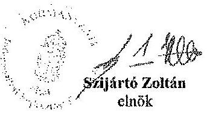

[^0]
[^0]:    Kormányzati Informatikai Fejlesztési Ügynökség
    Cím: 1011 Budapest, Iskola utca 13.; Levelezési cím: 1255 Budapest, PC: 182. telefon: $+36(1) 795-2871 ;+36(1) 795-2861$, fax: $+36(1) 795-0056$
    www.kifu.gov.hu infos@kifu.gov.hu

---

.

---

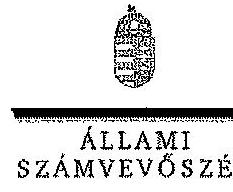

ELNÖK

Ikt. szám: V-0119-084/2014.

Szijártó Zoltán úr
elnök
Kormányzati Informatikai Fejlesztési Ügynökség

Budapest

Tisztelt Elnök Úr!

A Magyar Államkincstár működésének és gazdálkodásának ellenőrzéséről készített számvevőszéki jelentéstervezetre tett észrevételét köszönettel megkaptam.

Az Állami Számvevőszék észrevételre vonatkozó álláspontjáról a felügyeleti vezető által készített részletes tájékoztatást csatoltan megküldöm.

Tájékoztatom Elnök urat, hogy a jelentés szövegezésénél az elfogadott észrevételt figyelembe vesszük.

Budapest, 2014. Okt. hó 09. nap

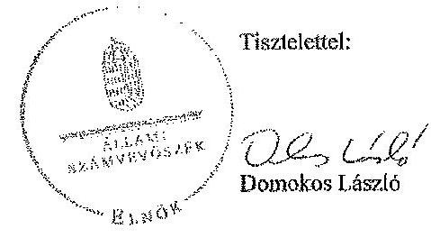

Melléklet: Tájékoztatás az elfogadott észrevételről

1052 BUDAPEST, MÁRKZIN ESZÉK SÍRÓG UTCA 10. 1304 Budapest 4. Pf. 54 telefon. 484 8181 fax. 484 9251

---

# Tájékoztatás 

## az elfogadott észrevételről

A Magyar Államkincstár működésének és gazdálkodásának ellenőrzéséről készített jelentéstervezetre Á/71-1/2014. iktatószámú levelében tett észrevételét áttekintettük, annak kezeléséről az alábbi tájékoztatást adom.

A Kormányzati Informatikai Fejlesztési Ügynökség elnevezésére vonatkozó észrevételt elfogadtuk. Az ebből adódó módosítást a számvevőszéki jelentés készítésénél figyelembe vesszük.

Tájékoztatom, hogy a számvevőszéki jelentés mellékleteként szerepeltetjük a jelentéstervezethez tett észrevételét, valamint arra adott válaszunkat.

Budapest, 2014. 04. hó 04. nap

## Korm. fórum

Holman Magdolna
felügyeleti vezető

---

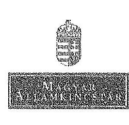

Iktatószám: ELN-115-30/2014.
Hiv. számok: V-0119-076/2014.

Domokos László
elnök

Állami Számvevőszék

Tárgy: „Magyar Államkincstár működésének és gazdálkodásának ellenőrzéséről" szóló jelentéstervezet észrevételezése

# Budapest 

## Tisztelt Elnök Úr!

A „Magyar Államkincstár működésének és gazdálkodásának ellenőrzéséről" készült, V-0119-076/2014 hivatkozási számú jelentéstervezetet áttekintettük. Az Állami Számvevőszék által megfogalmazott megállapításokat köszönettel vettük. A megállapításokkal, valamint a törzsszöveggel kapcsolatban fogalmaztunk meg észrevételeket, melyet kérünk, hogy egyetértésük esetén vegyenek figyelembe a jelentés véglegesítésénél. Támogató együttműködésüket köszönjük.

A Kincstár elnökének tett észrevételt köszönjük, a szervezeti és működési szabályzat módosításával kapcsolatban a végleges jelentés megküldését követően összeállításra kerülő intézkedési tervben foglaltak szerint fogunk eljárni.

A szervezeti és szabályozási feladatokkal kapcsolatban tett kettes számú megállapítást elfogadjuk, a hiányzó ügyrendek és ellenőrzési nyomvonalak elkészítéséről a végleges jelentés megküldését követően összeállításra kerülő intézkedési tervben foglaltak szerint fogunk eljárni.

A megállapításban felsorolt hiányzó ügyrendek és ellenőrzési nyomvonalak közül időközben a Biztonsági Főosztály, illetve az Üzemeltetési, Beruházási és Ellátási Főosztály ügyrendje kiadásra került.

---

Továbbá jelezni szeretnénk, hogy a Kincstárban az Áht., illetve az Ámr. szabályainak megfelelően 2009. szeptember 1-jétől, 2010. június 30-ig Kincstárnoki rendszer működött. Ezt követően a költségvetési felügyelők intézménye 2010-től került bevezetésre az államháztartási kontroll új elemeként, 2009-ben ilyen nem létezett. A Költségvetési Felügyelet a 2010-2012. időszakban önálló szervezeti egységként nem létezett a Kincstárban; 2010. szeptember 15-étől a Kincstári Biztonsági Irodán belül, 2012. június 9-étől pedig az Alapok, Közalapítványok és Költségvetési Felügyelet Főosztályán belül működött. A felügyelet módosított ügyrendje 2013. szeptember 13-én hatályba lépett.

A szervezeti és szabályozási feladatokkal kapcsolatban tett hármas számú megállapítással kapcsolatban, jelezni kívánjuk, hogy az ellenőrzés ideje alatt, illetve azt követően a módosítással érintett eljárásrendek közül az alábbiak kerültek kiadásra:

- 1/2013 uniós támogatási igazgatói utasítás, Az EU Támogatások Szabályosság Felülvizsgálati Főosztály Európai Területi Együttműködés működési kézikönyv (v3) kiadásáról - hatályos 2013. február 4-től
- 2/2013 uniós támogatási igazgatói utasítás, Az EU Támogatások Pénzügyi és Szabálytalanság-nyilvántartási Főosztály Európai Területi Együttműködés működési kézikönyv (v3) kiadásáról - hatályos 2013. május 29-től
- 3/2013 uniós támogatási igazgatói utasítás, Az EU Támogatások Pénzügyi és Szabálytalanság-nyilvántartási Főosztály Svájci Hozzájárulás működési kézikönyv (v2) kiadásáról - hatályos 2013. július 2-től
- 1/2014 uniós támogatási igazgatói utasítás, Az Igazoló Hatóság Szabálytalanság kezelésének eljárásrendje (v7) kiadásáról - hatályos 2014. január 17-től
A fentiek figyelembevételével az ETE, a Svájci-Magyar Együttműködési Program, illetve a szabálytalanságok kezelésével kapcsolatos feladatellátást szabályozó működési kézikönyvek és eljárásrendek felülvizsgálatára vonatkozó javaslatot kérjük, szíveskedjenek törölni.
A Kohéziós Alap projektek lebonyolítása befejeződött, jelenleg a záró elszámolások EU Bizottság általi ellenőrzése, és értékelése van folyamatban. A záró egyenleg EU Bizottság általi megküldésével kapcsolatos tevékenységeket a 2011. évi CXCV. törvény 20.§. (2) bekezdése szabályozza.
Tekintettel arra, hogy a jogszabály megfelelően meghatározza a záró egyenleg utalását, nem tartjuk szükségesnek a Kohéziós Alap kézikönyv aktualizálását. Kérjük a Kohéziós Alap kézikönyv felülvizsgálatára vonatkozó javaslat törlését.

A szervezeti és szabályozási feladatokkal kapcsolatban tett négyes számú megállapítást köszönjük, a honlap eljárásrend függelékében valóban tévesen szerepelt a törzskönyv frissülésének gyakorisága, időközben az eljárásrend módosítása során korrigálásra került.

A szakmai feladatellátással kapcsolatban tett ötös számú megállapítás tekintetében, az adatvédelmi felelős szervezeten belüli, az Infotv. 24. § (1) bekezdésében előírtak szerinti

---

elhelyezésével kapcsolatban a végleges jelentés megküldését követően összeállításra kerülő intézkedési terv szerint fogunk eljárni.

A szakmai feladatellátással kapcsolatban tett hatos számú megállapítással kapcsolatban, az Infotv. 37. § (1) bekezdése alapján az 1. melléklet II/1., II/12., II/15., III/1., III/2., III/7. pontjában foglaltak a Kincstár honlapján történő közzétételre kerüléséről a végleges jelentés megküldését követően összeállításra kerülő intézkedési terv szerint fogunk eljárni.

A szakmai feladatellátással kapcsolatban tett hetes számú megállapítást elfogadjuk, az SzMSz 26.§ (2) bekezdésében előírtak betartásával kapcsolatban a végleges jelentés megküldését követően intézkedési tervet állítunk össze, melynek értelmében fogunk eljárni.

A szakmai feladatellátással kapcsolatban tett nyolcas és kilences számú megállapítást elfogadjuk, ezzel kapcsolatban a végleges jelentés megküldését követően összeállításra kerülő intézkedési tervben intézkedni fogunk.

A szakmai feladatellátással kapcsolatban tett tízes számú megállapításhoz az alábbi észrevételt fűzzük:

Ugyanakkor a végleges jelentés megküldését követően összeállításra kerülő intézkedési tervben intézkedni fogunk, hogy az önköltség-számítási szabályzat tartalmazza a közérdekű adatok kérelemre történő szolgáltatásával kapcsolatos költségtérítés megalapozott számítással történő alátámasztását.

A szakmai feladatellátással kapcsolatban tett tizenegyes számú megállapítással kapcsolatban, a következő észrevételt fűzzük: A 360/2004 (XII.26.) Korm. rendelettel szabályozott Kohéziós Alap projektek legvégső kifizetési határideje 2012. december 31. Ezen határidő után uniós forrás terhére nem történhet kifizetés, ennek következtében az EU Bizottság részéről kifizetés már csak a projektek záró elszámolásának elfogadása után várható, aminek ütemezése magától az EU Bizottságtól függ. Éppen ezért az EU Bizottság pénzügyi tervezését elősegítő kifizetési előrejelzés küldésére sincs szükség. Kérjük, hogy a kapcsolódó javaslatot törölni szíveskedjenek.

A szakmai feladatellátással kapcsolatban tett tizenharmadik számú megállapítással kapcsolatban, jelezni szeretnénk, hogy időközben az igazoló hatóság szabálytalanságok kezelésével kapcsolatos feladatellátást szabályozó működési kézikönyve az 1/2014 számú uniós támogatási igazgatói utasítással, 2014. január 17-i hatállyal kiadásra került.

A szakmai feladatellátással kapcsolatban tett tizennégyes számú megállapítással kapcsolatban a következő megjegyzést tesszük: Az ÚMFT-hez kapcsolódóan kialakított eredményszemléletű kettős könyvvitelre vonatkozó működési kézikönyv azért nem tartalmaz pénzkezelési előírásokat, mert a számviteli tevékenységet ellátó szervezeti egység pénzeszközöket nem kezel, házipénztára nincs, a kapcsolódó bankszámlák fölött rendelkezési joga nincs. Ennek megfelelően ezen megállapítást kérjük törölni.

Az informatikai feladatellátással kapcsolatban tett tizenötös számú megállapításhoz kapcsolódóan, a B/470/2007. számú, a B/472/2007. számú, a B/527/2008. számú, a B/341/2009. számú, a B/346/2009. számú és a B/350/2009. számú szerződések körülményeit áttekintjük.

Az informatikai feladatellátással kapcsolatban tett tizenhatos számú megállapítást köszönjük, tekintettel arra, hogy a Törzskönyvi Nyilvántartási Osztály kimutatása alapján 2012. év során többször történtek adatátadások a KIR rendszerből a KTÖRZS-be, a megállapítás szövegét a következők szerint javasoljuk módosítani:

A Kincstár nem tett eleget teljes körűen a törzskönyvi nyilvántartásról szóló 6/2012. (III. 1.) NGM rendeletben foglalt, a számítógépes rendszer útján történő adatátadási kötelezettségének, mivel a KTÖRZS fejlesztés során kialakított interfészen keresztül a NAV részére megküldött adatok - a KIR rendszerből az időszakosan átvett adatok miatt - hiányosak és nem megbízhatóak voltak, azokat folyamatosan javították.

Az informatikai feladatellátással kapcsolatban tett tizenhetes számú megállapítás tekintetében a végleges jelentés megküldését követően összeállításra kerülő intézkedési tervben meghatározottak szerint intézkedni fogunk.

A Kincstár pénzügyi és vagyongazdálkodásával kapcsolatban tett tizennyolcas számú megállapítást elfogadjuk, a jelenleg hatályban lévő 33/2011. (X.10.) Elnöki Utasítást ennek megfelelően módosítjuk. Amennyiben az elnök túllépi a térítésmentes futásteljesítményt és a túllépést követően a megtett utak hivatalos jellegét menetlevél igazolja, úgy mentesül az üzemanyag megtérítési kötelezettség alól.

A Kincstár pénzügyi és vagyongazdálkodásával kapcsolatban tett tizenkilences számú megállapítást elfogadjuk, a közbeszerzés lebonyolításával kapcsolatos belső szabályzata

---

módosításra került, jelenleg jóváhagyás alatt van. A tervezet tartalmazza a közbeszerzési értékhatárt el nem érő beszerzések lebonyolításával kapcsolatos eljárásrendet.

A Kincstár pénzügyi és vagyongazdálkodásával kapcsolatban tett húszas számú megállapításban foglaltak alapján, a körülmények kivizsgálása iránt intézkedünk.

A Kincstár pénzügyi és vagyongazdálkodásával kapcsolatban tett huszonegyes számú megállapítást köszönjük, a végleges jelentés megküldését követően összeállításra kerülő intézkedési tervben meghatározottak szerint intézkedni fogunk.

A jelentés tervezet törzsszövegével kapcsolatban tett szakterületi észrevételeket és szövegjavaslatokat a levél 1. számú melléklete tartalmazza.

Budapest, 2014. március 25.

Tisztelettel:
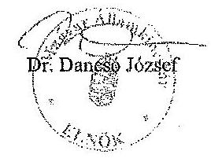

Mellékletek:

1. számú: A Magyar Államkincstár működésének és gazdálkodásának ellenőrzéséről szóló az Állami Számvevőszék által készített jelentéstervezet észrevételezése
2. számú: Levelezés az EU Bizottsággal

---

# A Magyar Államkincstár működésének és gazdálkodásának ellenőrzéséről szóló jelentéstervezet törzsszövegéhez kapcsolódó észrevételek 

A jelentéstervezet 13. oldalának harmadik bekezdését, javasoljuk a következők szerint módosítani:
„A Kincstár szakmai feladatait - néhány ügyrend és belső eljárásrend szabályozási hiányosságai ellenére - az adott feladatra vonatkozó jogszabályi előírások alapján ellátta, a szükséges személyi, tárgyi feltételeket biztosította. Egyes részterületeken állapított meg hiányosságokat az ellenőrzés."

A jelentéstervezet 13. oldalának utolsó bekezdésének „Az SzMSz előírásai ellenére, a Honlap Bizottság a közzétett adattartalmak folyamatosan nem ellenőrizte." mondatát javasoljuk a következőkkel kiegészíteni:
„A Honlap Bizottság a honlappal kapcsolatos stratégiai kérdésekben dönt, a honlapon közzétett adattartalmak folyamatos ellenőrzése az illetékes szakterületek feladata és szakmai felelőssége. A Bizottság az ellenőrzési ütemtervet hagyta jóvá, ami szerint a szakterületek felülvizsgálták az őket érintő részeket."

A jelentéstervezet 17. oldalának első bekezdését
 javasoljuk a következők szerint módosítani:
„Az igazoló hatóság kifejezetten az EU Bizottság kérésére nem állított össze kifizetési előrejelzéseket Kohéziós Alapra 2011-12-ben a 360/2004. (XII. 26.) Korm. rendeletben előírtak ellenére."
Az EU Bizottság illetékes főigazgatósága által megküldött levelezést csatoljuk.
A jelentéstervezet 17. oldalának második bekezdéséhez kapcsolódóan, kérjük a lábjegyzetben szerepeltetni a következő mondatot:
„A vizsgálat lezárását követően az igazoló hatóság Szabálytalanság kezelésének eljárásrendje az 1/2014 uniós támogatási igazgatói utasítással kiadásra került, 2014. január 17-én lépett hatályba."

A jelentéstervezet 41-42. oldal 2.1.1. fejezet második bekezdését kérjük a következőkkel kiegészíteni:
„A belső eljárásrendek aktualizálásának elmaradása nem befolyásolta a megfelelő feladatellátást. A Fejezeti Főosztály a feladatok végrehajtásakor mindig a hatályos jogszabályok szerint járt el, a kincstári rendszerek módosítása minden esetben időben megtörtént."

A jelentéstervezet 42. oldal második apró betűs bekezdésének utolsó mondatát kérjük a következők szerint módosítani:
„Az utasítás olyan szervezeti egységet is nevesített, mely megszűnt, vagy a neve időközben megváltozott."

A jelentéstervezet 44. oldal első bekezdését kérjük a következőkkel kiegészíteni:

---

# 1. számú melléklet 

„A kincstári rendszerek a jogszabályoknak megfelelően működtek. A dokumentáltság hiányának ellenére a számlavezető rendszerből lekövethető volt a beállított kötelezettségvállalási értékhatár."

A jelentéstervezet 44. oldal második bekezdésének utolsó mondatát kérjük a következők szerint módosítani:
„A gyakorlatban a rendelkezésre állási díj felszámítása 2008. július 1-jétől megvalósult, a felszámításról készült táblák a honlapon megjelentek."

Mivel a humánszolgáltatást nyújtó intézményfenntartók tekintetében egyetlen jogszabály sem ír elő belső utasítás kiadási kötelezettséget, a belső utasítások kiadására az SZMSZ alapján kerül sor, ezért a jelentéstervezet 55. oldal 2.1.6. fejezet első bekezdését a következők szerint javasoljuk módosítani:
„A Kincstár a vonatkozó jogszabályok és az SzMSZ-ben előírtak alapján külön-külön belső utasításokban szabályozta a szociális és a közoktatási területeken, ezen belül a finanszírozás és az ellenőrzés vonatkozásában ellátandó feladatokat."

A jelentéstervezet 55. oldal 2.1.6. fejezet második bekezdését javasoljuk a következőkkel kiegészíteni:
„A szabályzatok késedelmes aktualizálása nem befolyásolta a megfelelő feladatellátást, a Kincstár Központ az Igazgatóságok munkáját körlevelekkel, szakmai iránymutatásokkal folyamatosan támogatta, tekintettel arra, hogy a belső utasítások elkészítése, és kiadása csak azt követően lehetséges, miután a jogszabályokban nem egyértelmű, illetve egyáltalán nem szabályozott kérdések az illetékes szaktárcával tisztázásra kerülnek."

A lábjegyzetben kérjük a következőket feltüntetni a bekezdéshez kapcsolódóan:
„Ez a folyamat viszont igen hosszú időt vesz igénybe. Nem mellékes az a körülmény sem, hogy általában egy jogszabály kihirdetése és hatálybalépése közötti idő még akkor sem elegendő a belső utasítás elkészítésére, ha az illetékes szaktárcával nincs szükség további egyeztetésekre."

A jelentéstervezet 55. oldal 2.1.6. fejezet első apró betűs bekezdését kérjük a következőkkel kiegészíteni:
„Mivel a 2010. évet érintő, 2011. évben lefolytatandó helyszíni ellenőrzésekhez ad iránymutatást, így az utasítás módosításának időpontja nem tekinthető késedelmesnek."

A jelentéstervezet 56. oldal 2.1.6. fejezet második bekezdésének utolsó mondatát kérjük törölni, mivel az Önkormányzati Főosztály másodfokú hatósági jogköre az önkormányzatok és szociális, gyermekjóléti és gyermekvédelmi területen az egyházi és nem állami fenntartók által, az Igazgatóságok 1. fokú határozata ellen benyújtott fellebbezések elbírálására terjed ki, így nem foglalja magában az Igazgatóságok tevékenységének ellenőrzését. Az Önkormányzati Főosztálynak nincs jogosultsága az Igazgatóságok tevékenységének ellenőrzésére.

A jelentéstervezet 56. oldal 2.1.6. fejezet harmadik bekezdése szerint, a nem állami, nem önkormányzati humánszolgáltatást nyújtó fenntartók ellenőrzésének feladatait az Igazgatóságok Állampénztári Irodái látják el, amely helytelen, mivel a feladatot az

---

1. számú melléklet

Államháztartási irodák látják el. Kérjük a bekezdésben mindkét helyen javítani az iroda megnevezését.
Továbbá kérjük törölni a következő mondatrészt:
„szükséges ellenőri létszám rendelkezésre állt"
Az államháztartási irodák felülvizsgálati és ellenőrzési osztályai nem kizárólag a nem állami, nem önkormányzati humánszolgáltatást nyújtó fenntartók ellenőrzésének feladatait látják el, hanem az önkormányzati kör ellenőrzését is, így folyamatosan kapacitáshiánnyal küzdenek. Ezt a kapacitáshiányt enyhítette némileg szociális területen az évenkénti helyett a kétévenkénti ellenőrzési kötelezettség bevezetése, azonban 2014. évtől súlyosbítja a kötelező négyévenkénti ellenőrzési kötelezettség bevezetése.

A jelentéstervezet 57. oldal 2.1.6. fejezet második bekezdését javasoljuk a következőkkel kiegészíteni:
„Az Igazgatóságok évente 2 alkalommal - tárgyév félévét, és tárgyévet követően - készítenek beszámolót az Önkormányzati Főosztály részére az elvégzett ellenőrzésekről. Az 5. számú melléklet az Önkormányzati Főosztály által összesített adatokat tartalmazza."

A jelentéstervezet 58. oldal utolsó nagy bekezdés második mondatát javasoljuk a következők szerint módosítani:
„Az Ámr. 163.§ (10) bekezdésében, illetve az Ávr. 61.§ (12) bekezdésében előírtak ellenére mindösszesen 16 hónap vonatkozásában a havi jelentés nem állt rendelkezésre, a hiányzó jelentések 11 intézményt érintenek."

A jelentéstervezet 59. oldal második bekezdését javasoljuk a következőkkel kiegészíteni: „Az intézmények többségének tartozásállománya a jogszabályban rögzített mértéket csak átmenetileg haladta meg, jelentős költséget jelentett volna az államháztartás részére minden alkalommal és a tartozás összegétől függetlenül kincstári biztost kijelölni. A kijelölés kezdeményezésénél figyelemmel kellett lenni az adminisztráció időigényére is, mely több hónap is lehetett, amely alatt a legtöbb esetben a tartozás rendeződött.

Kincstári biztos kijelölésére azoknál az intézményeknél került sor, ahol a tartozásállomány abszolút értékben is rendkívül magas volt és tartósan meghaladta a jogszabályban rögzített mértéket."

A jelentéstervezet 63. oldal 2.2.2 fejezet harmadik bekezdés utolsó mondatát az alábbiak szerint javasoljuk módosítani:
„Azokban az esetekben, ahol az első számfejtés dátuma nem került kitöltésre, a szervezet KIR-be való bekerülésének időpontja nem volt egyértelműen megállapítható, tekintettel arra, hogy az jelenthette azt is, hogy egyáltalán nem történt számfejtés a szervezet számára, de jelenthette azt is, hogy a folyamatos intézményi átalakítások következtében nem került kitöltésre a mező."

A jelentéstervezet 64. oldal 116. lábjegyzetben foglaltakat az alábbiak szerint javasoljuk módosítani:
„Az Illetmény-számfejtési Főosztály IF-K-690/2013. számú 2013. október 10-i nyilatkozata szerint a Ktv. 62. § (2) bekezdése szerinti adatszolgáltatási kötelezettséget a 2011-2012. években a KIM nem határozta meg."

---

# 23. SZÁMÚ MELLÉKLET A V-0119-088/2014. SZÁMÚ JELENTÉSHEZ 

## 1. számú melléklet

2012-ben a 45/2012. (III.20.) Korm. rendelet 16. § (2) bekezdése szerint:
„Az adatok átadásának időpontjával, valamint az átadással kapcsolatos feldolgozási és technikai szempontokról a miniszter közvetlenül tájékoztatja a Magyar Államkincstárt."
A Korm. rendeletben említett miniszteri tájékoztatás - amely a közigazgatási minőségpolitikáért és személyzetpolitikáért felelős minisztert jelenti - nem történt meg, ezért adatszolgáltatás sem készült.

A jelentéstervezet 75. oldal harmadik bekezdését a következőkkel javasoljuk kiegészíteni:
„Az igazoló hatósági feladatokat ellátó főosztályok ügyrendjei a Magyar Államkincstár által meghatározott formátumban, a jogszabály által meghatározott feladatok alapján, általánosítva kerültek összeállításra. Az ellátandó feladatok részletes szabályait az egyes támogatási programok eljárásrendjei szabályozzák."

A jelentéstervezet 77. oldal második bekezdésével kapcsolatban megjegyezzük, hogy a bekezdésben említett igazoló és a költségnyilatkozat nem ugyanaz a dokumentum, az igazoló jelentés alátámasztja az összeállított költségnyilatkozatot. Kérjük a bekezdés pontosítását.

A jelentéstervezet 88. oldal első bekezdését az alábbiak szerint javasoljuk módosítani „Az NFÜ bevonta a Kincstárt az ÚMFT lebonyolításában részt vevő KSz-ekre átruházott feladatok ellátásának ellenőrzésébe..."
A KSz-eknél végzett tényfeltáró vizsgálatok az átruházott feladatok szabályszerű végrehajtására irányulnak, első szintről csak a Kedvezményezetteknél végzett helyszíni ellenőrzések esetében beszélhetünk.

A jelentéstervezet 89. oldal apró betűs bekezdése tekintetében megjegyezzük, hogy mivel a VOP forrás Kohéziós Alapból (KA) és hazai forrásból tevődik össze, a bekezdés csak akkor igaz, ha abban a VOP helyett KA szerepel („A VOP KA támogatás összege..."; „A VOP KA támogatáson felüli összeg...")

A jelentéstervezet harmadik fejezet 203-as számú lábjegyzetét a következők szerint javasoljuk módosítani:
„a Kincstárban a Jogi és Információ-menedzsment Igazgató irányítása alá tartozó Információ-menedzsment Főosztály"

A jelentéstervezet 110. oldal 3.1.1. fejezet utolsó nagy bekezdésben a „2012. augusztus 8 -tól az Információ-menedzsment Főosztály feladataként" szövegrész kérjük módosítani a következők szerint:
„2012. augusztus 8-án létrehozott Információ-menedzsment Főosztály feladataként"
A jelentéstervezet 111. oldal hatodik apró betűs bekezdés pontosítását kérjük a következők szerint:
„Informatikai vonatkozású megállapításokat tartalmazó jelentés 2008-2012. években több ellenőrzés végrehajtása során is készült.

---

# 23. SZÁMÚ MELLÉKLET 

A V-0119-088/2014. SZÁMÚ JELENTÉSHEZ

## 1. számú melléklet

A hozzáférési jogosultságokat 2011. szeptember hónaptól a 2012. évig valamennyi ellenőrzés során vizsgálták. Az adatszivárgás elleni védelmet (CD, pendrive csatlakozhatósága) az 1/2012. „Az állampénztári Iroda pénz és értékkezelési, valamint számlavezetési tevékenységének célellenőrzése" során ellenőrizték."

A jelentéstervezet 115. oldal, 3.2.1. fejezettel kapcsolatban a következő észrevételt tesszük:
Informatikai tárgyú beszerzések:

- Keretmegállapodás elnevezése „tárgya" többnyire áru és hozzá kapcsolódó szolgáltatás. Ez az elnevezés onnan ered, hogy a KM-ból árut és szolgáltatást is igénybe lehet venni. Informatikai, szakmai indokok alapján kerül sor az eljárás elindítására. Amennyiben az Intézmény rendelkezik már áruval, vagy az áru beszerzésére nincs szükség, akkor az ahhoz kapcsolódó szolgáltatás beszerzésére kerül sor. A beszerzés ebben az esetben csak a szolgáltatás igénybevételére irányulhat.
- A konkrét eljárások a meglévő rendszerekhez kapcsolódó szolgáltatások és fejlesztések igénybevételére irányultak.
- A megrendelőlapon a termékek szerepelnek, az igénybejelentő lapon pedig a KM elnevezése „tárgya". A megrendelőlapon a konkrét szerződéses összeg szerepel, míg az igénybejelentő lapon a becsült érték. Ezek nem is lehetnek azonosak.
- A közbeszerzési eljárások alapján megkötött szerződések esetében minden esetben a Kbt. 99. § (1) bekezdésében foglaltak szerint jártunk el.
Kommunikációs tanácsadás, valamint üzletviteli, egyéb vezetési tanácsadás
Kommunikációs tanácsadás
- A Kbt. 296. § h) pontja alapján a tevékenység a kivételi körbe tartozik. A szerződés időtartama alatt a szerződés összege nem érte el a nemzeti értékhatárt.
Üzletviteli, egyéb vezetési tanácsadás
- A 2008. évben kezdeményezett eljárás a Kbt. 299. § (1) bekezdés b) pontja alapján eljárásköteles, mely a közbeszerzési szakterület részéről „B lapon" rögzítésre is került.

A jelentéstervezet 117. oldal, 3.2.1.1 fejezettel kapcsolatban a következő észrevételt tesszük:

A B/470/2007. sz. szállítási szerződés központosított közbeszerzési eljárás keretében valósult meg. A Központi Szolgáltatási Főigazgatóság (KSZF) keretmegállapodása alapján, verseny újraindítása nélküli eljárás lefolytatásának eredményeként létrejött megrendelés 2007. december 14-én kelt. A teljesítés igazolására tárolási jegyzőkönyv alapján került sor december 27-én.
A szerződés 2008. január 11-én került aláírásra, később, mint ahogy a termékek szállítása. Ezt követően történt meg a teljesítés igazolása. Ennek magyarázata: a KSZF keretmegállapodásai alapján a szállítónak a verseny újraindítása nélküli eljárás eredményeként létrejött megrendelést 2 napon belül vissza kell igazolnia, a szállítást pedig 30 napon belül teljesítenie kell.
A szakmai főosztály véleménye szerint a kifogásolt ok nem volt szabályellenes.
A B/472/2007. sz. szállítói szerződés központosított közbeszerzési eljárással valósult meg, verseny újraindítása nélkül történt a beszerzés és 2007. december 14-én kelt a megrendelés. A szerződés kötésére 2008. április hónapban került sor.

---

1. számú melléklet

Nincs releváns információ arra nézve, hogy miért 30 napon túl történt a szerződés aláírása, bár a fenti ponthoz hasonló ok miatt történt a teljesítés igazolása korábban, mint a szerződés megkötése, viszont a tényleges pénzügyi teljesítésre később került sor, május 29-én és június 4-én. Továbbá nincs információnk, hogy miért változtatták meg a szerződés teljesítési határidejét január 18-ról augusztus 31-re.
A gazdasági esemény döntéshozói, a jogosultság gyakorlói közül már nincs senki a Kincstár alkalmazásában, ezért a felmerült kérdésekre választ nem tudunk adni.
A
 hasonló esetek jövőben történő előfordulásának elkerülése érdekében a belső szabályozó eszközeinkben módosítást fogunk végrehajtani.

A jelentéstervezet 132. oldal első bekezdésével kapcsolatban a következő észrevételt tesszük:
A biztonsági terület a belső portálon található 12/2012-es számú, 2012. június 8-án keltezett SZMSZ módosítás szerint vált ki a gazdasági vezető alól, tehát történt szervezeti változás 2011. után.

A jelentéstervezet 141. oldal harmadik bekezdésében javasoljuk, hogy a tervezetben rögzített kilenc ellenőrzés kerüljön felsorolásra.

Az 1. számú mellékletnél a következő pontosítást kérjük:
2008. év Eredeti támogatási előirányzat $16.726,3 \mathrm{M}$ Ft

Teljesítés/Eredeti előirányzat (\%) Támogatásnál 152,0
A 4. számú melléklet nem tartalmazza új feladatként a 2012-ben indult „Diákhitel általános kamattámogatás" feladatot.
A 4. számú mellékletben lévő felsorolásból kérjük törölni, mint új feladatot a WMA-t és a követeléskezelési feladatokat, mert ezek már a vizsgált időszak előtt is feladatai voltak a Kincstárnak, azonban hiányzik a felsorolásban 2010. évtől új feladatként jelentkező megváltozott munkaképességű munkavállalókat (MMK) foglalkoztató munkáltatók költségvetési támogatásának pénzügyi ellenőrzése.

---

.

---

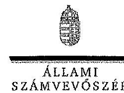

ELNÖK

Ikt. szám: V-0119-089/2014.

Dr. Dancsó József úr cím: Magyar Államkincstár

Budapest

# Tisztelt Elnök Úr! 

A Magyar Államkincstár működésének és gazdálkodásának ellenőrzéséről készített számvevőszéki jelentéstervezetre tett észrevételeit köszönettel megkaptam.

Az Állami Számvevőszék észrevételekre vonatkozó álláspontjáról a felügyeleti vezető által készített részletes tájékoztatást csatolmányként megküldöm.

Tájékoztatom Elnök urat, hogy a jelentésben - az Állami Számvevőszékről szóló 2011. évi LXVI. törvény 29. § (3) bekezdése alapján - az el nem fogadott észrevételeket szerepeltetjük az elutasítás indokának feltüntetésével együtt. Az elfogadott észrevételeket a jelentés szövegezésénél figyelembe vesszük.

Budapest, 2014. 04. hó 24. nap
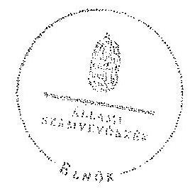

Tisztelettel:

## 020

Domokos László

Melléklet: Tájékoztatás az elfogadott és az el nem fogadott észrevételekről

---

# Tájékoztatás 

az elfogadott és az el nem fogadott észrevételekről

A Magyar Államkincstár működésének és gazdálkodásának ellenőrzéséről készített jelentéstervezetre ELN-115-30/2014. iktatószámú levelében tett észrevételeit áttekintettük, azok kezeléséről az alábbi tájékoztatást adom.

Örömmel fogadtuk, hogy az Állami Számvevőszék ellenőrzését követően több, az ellenőrzés során feltárt hiányosságra már intézkedések történtek. Tekintettel arra, hogy az észrevételben jelzett intézkedések az ellenőrzött időszakot követően történtek, a jelentéstervezetben tett megállapításokat és a hozzá kapcsolódó javaslatokat nem módosítják. A megtett intézkedéseket az Állami Számvevőszék utóellenőrzés keretében tudja ellenőrizni.

A 2. számú intézkedést igénylő megállapításhoz tett észrevételét részben elfogadtuk. A Magyar Államkincstár Szervezeti és Működési Szabályzatáról szóló 2/2011. (I. 14.) NGM utasítás 1. számú melléklet 43. §-a, valamint 1. számú függeléke szabályozta önálló egységként a Költségvetési Felügyeletet. Ennek következtében önálló ügyrenddel 2011-től kellett volna rendelkeznie. A Költségvetési Felügyelet csak a 2012. június 9-től hatályos 12/2012. (VI. 8.) NGM utasítással került ki a szervezet egységei közül. Az Alapok és Közalapítványok Főosztály hatályosként átadott ügyrendje azonban nem igazolta, hogy 2012. június 9-től ezen főosztály keretében működött költségvetési felügyelet, valamint a főosztály neve sem tartalmazta a Költségvetési Felügyeletet. Ezek figyelembevételével pontosítjuk a jelentéstervezetben megtett megállapítást.

A 3. számú intézkedést igénylő megállapításra tett észrevételét nem fogadjuk el. Az államháztartásról szóló 2011. évi CXCV. törvény 20. § (2) bekezdése csak a bevételi elszámolási szabályát rögzíti azon költségvetési támogatásnak, amelyet az Európai Bizottság a végső egyenleg kifizetés formájában térít meg. Így az a kézikönyvben foglaltakat teljes egészében nem szabályozza.

Nem fogadtuk el a 11. számú intézkedést igénylő megállapításra tett észrevételét. Az észrevételében hivatkozott 360/2004. (XII. 26.) Korm. rendelet 9. § g) pontja továbbra is hatályban van. Továbbá az észrevételek 2. számú mellékleteként megküldött, EU Bizottsággal folytatott levelezés alapján is az állapítható meg, hogy 2012-ben, és 2013-ra is kérték a kifizetési előrejelzést. Észrevétele arra nem terjedt ki, és arra vonatkozó dokumentum sem került becsatolásra, amelyből megállapítható lett volna, hogy valamennyi 360/2004. (XII. 26.) Korm. rendelet hatálya alá tartozó Kohéziós Alap projekt végső kifizetési határideje 2012. december 31.

Nem fogadtuk el a 14. számú intézkedést igénylő megállapításra tett észrevételét. A 4/2011. (I. 28.) Korm. rendelet számviteli nyilvántartásra vonatkozó előírásai nem szűkítik le a szabályozási kötelezettséget a számviteli feladatokat ellátó szervezeti egységre. A hivatkozott kormányrendelet 69. § (2) bekezdése, és annak b) pontja szerint „a kincstár köteles a saját számviteli kézikönyvét a hozzá kapcsolódó ellenőrzési nyomvonalakkal elkészíteni, amelynek részei ... a számviteli politika, a számlatükör, a számlarend". A számvitelről szóló 2000. évi C. törvény 14. § (5) bekezdés d) pontja alapján a számviteli politika keretében kell elkészíteni a pénzkezelési szabályzatot. Ezért az észrevételeiben tett megjegyzés alapján az ÜMFT számviteli működési kézikönyvében a pénzkezeléshez kapcsolódó feladatokra, vagy akár annak hiányára ki kell térni.

Nem fogadtuk el a 16. számú intézkedést igénylő megállapításra tett szövegmódosítási javaslatát. Megállapításunkban nem állítottuk, hogy egyáltalán nem vettek át adatokat. A KIR rendszerből át nem vett adatok miatt azonban kifogásoltuk a 6/2012. (III. 1.) NGM rendelet 3. § (3) bekezdésében foglaltak betartásának hiányát.

Nem fogadtuk el a jelentéstervezet 13. oldal harmadik bekezdéséhez tett szövegmódosító javaslatát, mivel az ellenőrzés nem csak néhány ügyrend és belső eljárásrend esetében állapított meg szabályozási hiányosságot.

A jelentéstervezet 13. oldalának utolsó bekezdéséhez tett észrevételét részben elfogadtuk. Az SzMSz szerint a Honlap Bizottságnak előzetesen kellett ellenőriznie a honlapra felkerülő információkat. Ennek megfelelően a jelentés készítése során a megfogalmazást pontosítjuk. A Honlap Bizottság egyéb, az észrevételben jelzett feladatai a jelentéstervezet összegző részében nem releváns információk, ezért azokat nem szerepeltetjük.

Nem fogadtuk el a jelentéstervezet 17. oldal első bekezdésének módosítására tett javaslatot, mivel az észrevétel mellékleteként megküldött dokumentumok azt támasztják alá, hogy az EU Bizottság kérte a kifizetési előrejelzést.

Nem fogadtuk el a jelentéstervezet 17. oldal második bekezdéséhez kapcsolódóan tett megállapításhoz tett kiegészítő javaslatot tekintettel arra, hogy a Szabálytalanság kezelésének eljárásrendje az ellenőrzött időszakon kívül került kiadásra. A megállapításban megfogalmazott hiányosság megszüntetését az Állami Számvevőszék utóellenőrzés keretében tudja ellenőrizni.

A jelentéstervezet 41-42. oldal 2.1.1. fejezet 2. bekezdésében foglalt megállapításhoz tett kiegészítését nem fogadtuk el. A belső eljárásrendek aktualizálásának hiánya azt is jelentette, hogy nem tartották be saját belső szabályzataikat. Az észrevételben leírt „megfelelő feladatellátás" biztosítása pedig nem képezte ellenőrzésünk tárgyát.

A jelentéstervezet 42. oldal 2. apró betűs bekezdéséhez tett módosító javaslatát nem fogadtuk el. A megállapításunk tényszerű és konkrét. Az ellenőrzésünk során a szervezeti egységek módosulásaihoz kapcsolódóan csak névváltozást nem tártunk fel, ahhoz mindig feladatváltozás is kapcsolódott. Az észrevétel a névváltozás tekintetében újabb dokumentumokat nem mutatott be.

A jelentéstervezet 44. oldal 1. bekezdéséhez tett kiegészítését nem fogadtuk el, mert a beállított kötelezettségvállalási értékhatár mindig csak az adott pillanatban volt megállapítható, naplózás hiányában utólag nem.

A jelentéstervezet 44. oldal 2. bekezdéséhez tett észrevételét elfogadtuk, azt a jelentés szövegezésénél figyelembe vesszük.

---

A jelentéstervezet 55. oldal 2.1.6. fejezet első bekezdéséhez tett kiegészítő szövegjavaslatot nem fogadtuk el. A szakmai feladatellátás szabályozása szempontjából az SzMSz-szel történő kiegészítésnek nincs relevanciája.

A jelentéstervezet 55. oldal 2.1.6. fejezet második bekezdéséhez tett kiegészítő javaslatát nem fogadtuk el. Az észrevételben leírtakra az ellenőrzés nem terjedt ki.

A jelentéstervezet 55. oldal 2.1.6. fejezet első apró betűs bekezdéséhez tett kiegészítését nem fogadtuk el, mivel az érintett szabályozás nemcsak éven túli, hanem évközi feladatokra is vonatkozott.

A jelentéstervezet 56. oldal 2.1.6. fejezet 2. bekezdéshez tett észrevételét elfogadtuk. A jelentés szövegezésénél figyelembe vesszük, és a mondatot töröljük.

A jelentéstervezet 56. oldal 2.1.6. fejezet 3. bekezdéséhez tett észrevételét elfogadtuk, azt a jelentés szövegezésénél figyelembe vesszük.

A jelentéstervezet 57. oldal 2.1.6. fejezet második bekezdéséhez tett kiegészítését nem fogadtuk el. Ellenőrzési megállapításaink szempontjából az észrevétel nem hordoz többlet információkat.

A jelentéstervezet 58. oldal utolsó bekezdésére tett észrevételét nem fogadtuk el, az észrevétel tartalmában megegyezik a jelentéstervezetben foglaltakkal.

A jelentéstervezet 59. oldal második bekezdéséhez tett kiegészítését nem fogadtuk el, mivel ellenőrzésünk nem terjedt ki az észrevételben leírtakra.

A jelentéstervezet 63. oldal 2.2.2. fejezet 2. bekezdés utolsó mondatához tett módosítási javaslatát nem fogadtuk el, a számfejtés dátuma ki nem töltésére vonatkozó megállapításunkat fenntartjuk. Az észrevételben javasolt kiegészítések dokumentumokkal nem támaszthatóak alá.

A jelentéstervezet 64. oldal 116. lábjegyzetéhez tett módosítási javaslatát nem fogadtuk el. A módosítási javaslat a jelentéstervezetben foglaltakhoz képest nem fedi le pontosan az Illetmény-számfejtési Főosztály 2013. október 10-i nyilatkozatának tartalmát. A nyilatkozat nem azt tartalmazta, hogy a 2011-2012. években a KIM nem határozott meg adatszolgáltatási kötelezettséget.

A jelentéstervezet 75. oldal 3. bekezdéséhez tett kiegészítését nem fogadtuk el. A kiegészítés megállapításunkat nem módosítja.

A jelentéstervezet 77. oldal 2. bekezdéséhez tett észrevételét elfogadtuk. A jelentéstervezet megállapításában nem tartalmi azonosságot fogalmaztunk meg, ezért a jelentés szövegezésénél az észrevétel alapján a megfogalmazást pontosítjuk.

A jelentéstervezet 88. oldal 1. bekezdéséhez tett észrevételét nem fogadtuk el. Megállapításunkat a 281/2006. (XII. 23.) számú Korm. rendelet 7/A. § (1) bekezdésében, valamint a 4/2011. (I. 28.) számú Korm. rendelet 16. § (2) bekezdésében foglalt elsőszintű ellenőrzésre vonatkozó előírás alapján tettük meg.

---

A jelentéstervezet 89. oldal részbekezdéséhez tett észrevételét nem fogadtuk el. A rendelkezésünkre álló utolsó szerződés-módosítási dokumentum alapján a nyújtott támogatás VOP forrásból származik.

A jelentéstervezet 3. fejezet 203. lábjegyzetéhez tett észrevételét nem fogadtuk el, a kiegészítési javaslat nem befolyásolja megállapításainkat.

A jelentéstervezet 110. oldal 3.1.1. fejezet utolsó bekezdéséhez tett észrevételét nem fogadtuk el. A javasolt szöveg kiegészítés nem módosítja a megállapításunkat, mely arra irányul, hogy mely időponttól, kinek volt a feladata az informatikai stratégia készítése.

A jelentéstervezet 111. oldalán a hatodik apró betűs bekezdéséhez tett észrevételét nem fogadtuk el. A jelentéstervezetben foglalt megállapítás pontosabb, mint az észrevételben javasolt kifejezés.

A jelentéstervezet 115. oldal 3.2.1. fejezethez tett észrevételeit nem fogadtuk el, mivel egyértelműen nem azonosítható be, hogy az mely megállapításra vonatkozik, az észrevétel mire irányul és annak mi a részletes indoka. A jelentéstervezetben foglalt megállapításainkat ezért továbbra is fenntartjuk.

A jelentéstervezet 117. oldal 3.2.1.1. fejezethez tett észrevételeit nem fogadtuk el. A B/470/2007. számú szerződéssel kapcsolatos megállapításunkat továbbra is fenntartjuk. A B/472/2007. számú szerződéssel kapcsolatos észrevétele a megállapításunkat nem befolyásolja.

A 132. oldal első bekezdéséhez tett észrevételét elfogadtuk, azt a jelentés szövegezésénél figyelembe vesszük.

A jelentéstervezet 141. oldal harmadik bekezdéséhez tett észrevételét nem fogadtuk el, mivel az ellenőrzések felsorolása nem ad többletinformációt.

Elfogadtuk a 15. számú mellékletben szereplő adat pontosítására vonatkozó észrevételét, amelyet a jelentés szövegezésénél figyelembe veszünk.

A 4. számú melléklethez tett észrevételek közül elfogadtuk a „Diákhitel általános kamattámogatás"-sal, a Wesselényi Miklós Ár- és Belvízvédelmi Kártalanítási Alappal és a követeléskezelési feladatokkal kapcsolatos észrevételét. Nem fogadtuk el a megváltozott munkaképességű munkavállalókat foglalkoztató munkáltatók ellenőrzési feladataira tett észrevételét, ugyanis ellenőrzésünk erre nem terjedt ki.

Tájékoztatom, hogy a számvevőszéki jelentés mellékleteként szerepeltetjük a jelentéstervezethez tett észrevételeit, valamint azokra adott válaszunkat.

Budapest, 2014. 04. hó 25. nap
Moswase felőce
Holman Magdolna
felügyeleti vezető

---

.

---

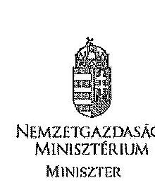

NEMZETGAZDASÁGI MINISZTÉRIUM MINISZTER

Domokos László úr részére
elnök

Állami Számvevőszék

Budapest
Apáczai Cs. J. u. 10.
1052

Iktatószám: NGM/7032/4/2014
Hiv. szám: V-0119-078/2014
Ügyintéző: Mucsi Flóra
Telefon: 374-2766
Tárgy: jelentéstervezet
véleményezése

# Tisztelt Elnök Úr! 

Köszönettel megkaptam „a
 Magyar Államkincstár működésének és gazdálkodásának ellenőrzéséről" szóló jelentéstervezetet. Az abban foglaltakkal kapcsolatban a következő észrevételeket teszem.
A Bevezetésben, a 10. oldal utolsó bekezdés szerint az ellenőrzés során felhasználták többek között a 1294. számú ÁSZ jelentés megállapításait és ellenőrzési tapasztalatait. Ennek megfelelően javaslom „a témához kapcsolódó eddig készített számvevőszéki jelentések" listát kiegészíteni.
A Magyar Államkincstár (továbbiakban: Kincstár) elnöke részére megfogalmazott javaslatok 2. pontja szerint a Költségvetési Felügyelet 2009. és 2012. között nem rendelkezett ügyrenddel. A megállapítás pontatlan. A költségvetési főfelügyelő, felügyelő intézményét az államháztartásról szóló 1992. évi XXXVIII. törvény 46/A. §-ának 2010. augusztus 15-től hatályos módosítása hozta létre, amint ezt egyébként a jelentéstervezet 2.1.7. A kincstárnoki és a költségvetési (fő)felügyelői rendszer pontjában, az 58. oldal második bekezdésében helyesen tartalmazza. Az ehhez kapcsolódó kincstári szervezeti egység 2010. év végén jött létre. Így az ügyrend hiányát 2011-től lehet megemlíteni.
A jelentéstervezet II. Részletes megállapítások fejezetéhez az alábbi észrevételeket teszem.
Az 1.1. A minisztérium irányítószervi feladatellátása alcím 31. oldal lábjegyzetének 12. megjegyzéséhez jelzem, hogy a Pénzügyminisztérium Szervezeti és Működési Szabályzatáról (továbbiakban: SzMSz) szóló 5/2008. (MK 48.) PM utasítás 3. számú melléklete alapján 2008. augusztus 1-jétől már a Pénzügyminisztériumban is hét főosztály vett részt a szakmai irányításban.
Az 1.2. Az alapító okiratban és az SzMSz-ben rögzített feladatok alcím alatti második bekezdésben, a 34. oldalon javítandó a "kormányhatározatban" szövegrész „kormányrendeletben" szövegre, mert az államháztartásról szóló 2011. évi CXCV. törvény 109. § (2) bekezdése rendeletalkotási felhatalmazást ad a Kormánynak a kincstári feladatok rögzítésére.

---

Az 1.3 feladatátvételek és -átadások pont, 37. oldal 3. bekezdésben a tervezet felrója, hogy a Nemzeti Programengedélyező Iroda (továbbiakban: NAO Iroda) feladatainak Kincstár által történő átvételére átadás-átvételi eljárásrendet, lebonyolítására szabályokat a Nemzetgazdasági Minisztériumban (továbbiakban: NGM) és a Kincstárban nem határoztak meg. Erről a Magyar Államkincstárról szóló 311/2006. (XII.23.) Korm. rendelet módosításáról és a Nemzetgazdasági Minisztérium Nemzeti Programengedélyező Iroda jogutódjának kijelöléséről szóló 271/2010. (XII. 8.) Korm. rendelet sem rendelkezett. Álláspontom szerint a pénzügyi elszámolásokra kötött megállapodás elégséges, mivel nem csupán a feladatot vette át a Kincstár, hanem az azt korábban végrehajtó szervezet is betagolódott az intézménybe.
Az 1.4. Szervezeti felépítés, szervezeten belüli feladatmegosztás pontban szereplő megállapítás, miszerint megszűnt a Szabályozási Főosztály és a Költségvetési Felügyelet, megtévesztő. A két főosztály megszűnt önálló szervezeti egységként, de a tevékenységüket más főosztályokba integrálódva folytatják.
A Kincstár szakmai feladatellátása és a kapcsolódó belső kontrollrendszer tárgykörben a 2.1. A központi költségvetés tervezését, végrehajtását és ellenőrzését érintő kincstári feladatellátás alcím, 2.1.6. A humánszolgáltatásokat nyújtó intézményfenntartókkal kapcsolatos feladatok alpont alatt, az 56. oldal harmadik bekezdésében javítandó „a regionális/megyei igazgatóságok állampénztári irodái" szövegrész „a regionális/megyei igazgatóságok államháztartási irodái" szövegre. Ez utóbbi irodák osztályai látják el a felülvizsgálati és ellenőrzési feladatokat.
A 4.2 A Kincstár pénzügyi gazdálkodása pont, 143. oldal 2. bekezdésben a 2008. évi eredeti támogatási előirányzat összege helytelenül szerepel. A helyes összeg 16.723,6 millió Ft.
A 14. mellékletben a 2011. évi felújítási és intézményi beruházási sorokban az adatokat félreérthetően szerepelnek.
A 15. mellékletben a 2008. évi eredeti támogatási előirányzat összeg ismételten helytelenül szerepel. A helyes összeg 16.723,6 millió Ft.
Kérem Elnök Urat, hogy észrevételeimet figyelembe venni szíveskedjék.
Budapest, 2014. március 7.

# Üdvözlettel: 

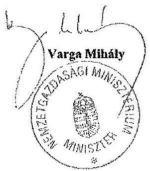

---

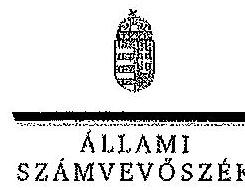

ELNÖK

# Varga Mihály úr 

miniszter
Nemzetgazdasági Minisztérium

## Budapest

## Tisztelt Miniszter Úr!

A Magyar Államkincstár működésének és gazdálkodásának ellenőrzéséről készített számvevőszéki jelentéstervezetre tett észrevételeit köszönettel megkaptam.

Az Állami Számvevőszék észrevételekre vonatkozó álláspontjáról a felügyeleti vezető által készített részletes tájékoztatást csatoltan megküldöm.

Tájékoztatom Miniszter urat, hogy a jelentésben - az Állami Számvevőszékről szóló 2011. évi LXVI. törvény 29. § (3) bekezdése alapján - az el nem fogadott észrevételeket szerepeltetjük az elutasítás indokának feltüntetésével együtt. Az elfogadott észrevételeket a jelentés szövegezésénél figyelembe vesszük.

Budapest, 2014. 05. hó 16. nap
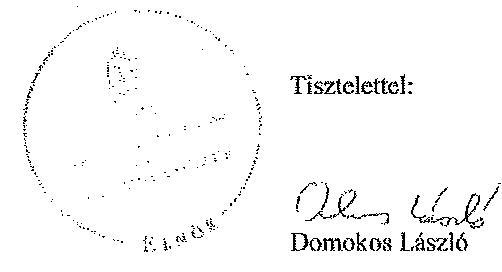

Melléklet: Tájékoztatás az elfogadott és az el nem fogadott észrevételekről

---

# Tájékoztatás 

## az elfogadott és az el nem fogadott észrevételekről

A Magyar Államkincstár működésének és gazdálkodásának ellenőrzéséről készített jelentéstervezetre az NGM/7032/4/2014. Iktatószámú levelében tett észrevételeit áttekintettük, azok kezeléséről az alábbi tájékoztatás adom.
A Bevezetés 10. oldal utolsó bekezdéséhez kapcsolódó, a jelentéstervezet borítóját érintő észrevételét elfogadtuk. A témához kapcsolódó eddig készített számvevőszéki jelentések listáját kiegészítjük a 1294. számú ÁSZ jelentéssel.
A Kincstár elnökének intézett 2. számú intézkedést igénylő megállapításra tett észrevételét elfogadtuk. A Költségvetési Felügyelet ügyrendjének hiányára vonatkozó megállapításunkat tekintettel az Aht, 46/A. §-ra és a 2/2011. (I. 14.) NGM utasítás 43. § b) pontjában foglaltakra - módosítjuk a 2011-2012. évekre vonatkozóan.

Elfogadtuk a jelentéstervezet 31. oldal 12. számú lábjegyzetéhez tett észrevételét, azt a jelentés szövegezésénél figyelembe vesszük.
A jelentéstervezet 34. oldal 2. részbekezdéséhez tett észrevételét elfogadtuk, azt a jelentés szövegezésénél figyelembe vesszük.
A jelentéstervezet 37. oldal 3. bekezdéséhez tett észrevételét részben fogadtuk el. A jelentéstervezetben az ellenőrzés során feltárt tényeket rögzítettük, és nem hiányosságként kerültek megfogalmazásra. A kritikára utaló „mindössze" kifejezést a jelentés készítése során a bekezdés utolsó mondatából töröljük.
Az 1.4 Szervezeti felépítés, szervezeten belüli feladatmegosztás ponthoz (jelentéstervezet 39. oldal 3. bekezdése) tett észrevételét részben fogadtuk el. Megállapításunk csak a szervezeti keretek változására irányult. Az ehhez kapcsolódó tevékenység megszünését nem tartalmazta a jelentéstervezet. Észrevétele alapján a megállapításunkat kiegészítjük azzal, hogy az érintett főosztályok tevékenységét más főosztályok átvették.
Elfogadtuk a jelentéstervezet 56. oldal 3. bekezdéséhez tett észrevételét, azt a jelentés szövegezésénél figyelembe vesszük.
A jelentéstervezet 143. oldal 2. bekezdéséhez, valamint a 15. számú melléklethez tett észrevételét elfogadtuk. A jelentés szövegében és a 15. számú mellékletben a 2008. évi eredeti támogatási előirányzat összegét a helyes összegre, 16 726,3 millió Ft-ra módosítjuk.
Elfogadtuk a jelentéstervezet 14. számú mellékletéhez tett észrevételét. A jelentés készítése során a 14. számú mellékleten a módosításokat átvezetjük.

Budapest, 2014. 05. hó 06. nap
Holman Magdolna
felügyeleti vezető

---

# RÖVIDÍTÉSEK JEGYZÉKE 

## Jogszabályok és közjogi szervezetszabályozó eszközök

## Európai Uniós jogszabályok

1083/2006/EK tanácsi rendelet

## Törvények

Alaptörvény
Art.
Áht. 1
Áht. 2
ÁSZ tv.
Cst.
Gyvt.
Infotv.

Ket.
Közbesz. tv. 1
Közbesz. tv. 2
Ktv.
Kttv.
Nvtv.
Számv. tv.
2008. évi Kvtv.
2009. évi Kvtv.
2010. évi Kvtv.
2011. évi Kvtv.

A TANÁCS 2006. július 11-i 1083/2006/EK RENDELETE az Európai Regionális Fejlesztési Alapra, az Európai Szociális Alapra és a Kohéziós Alapra vonatkozó általános rendelkezések megállapításáról és az 1260/1999/EK rendelet hatályon kívül helyezéséről

Magyarország Alaptörvénye (hatályos: 2012. I. 1-től)
2003. évi XCII. törvény az adózás rendjéről
1992. évi XXXVIII. törvény az államháztartásról (hatálytalan: 2012. I. 1-től)
2011. évi CXCV. törvény az államháztartásról (hatályos: 2012. I. 1-től)
2011. évi LXVI. törvény az Állami Számvevőszékről (hatályos: 2011. VII. 1-től)
1998. évi LXXXIV. törvény a családok támogatásáról
1997. évi XXXI. törvény a gyermekek védelméről és a gyámügyi igazgatásról
2011. évi CXII. törvény az információs önrendelkezési jogról és az információszabadságról (hatályos: 2011. VII. 27-től)
2004. évi CXL. törvény a közigazgatási hatósági eljárás és szolgáltatás általános szabályairól
2003. évi CXXIX. törvény a közbeszerzésekről (hatálytalan: 2012. I. 1-től)
2011. évi CVIII. törvény a közbeszerzésekről (hatályos: 2011. VIII. 21-től)
1992. évi XXIII. törvény a köztisztviselők jogállásáról (hatálytalan: 2012. III. 1-től)
2011. évi CXCIX. törvény a közszolgálati tisztviselőkről (hatályos: 2012. III. 1-től)
2011. évi CXCVI. törvény a nemzeti vagyonról (hatályos: 2011. XII. 31-től)
2000. évi C. törvény a számvitelről
2007. évi CLXIX. törvény a Magyar Köztársaság 2008. évi költségvetéséről (hatályos: 2008. I. 1-től)
2008. évi CII. törvény a Magyar Köztársaság 2009. évi költségvetéséről (hatályos: 2009. I. 1-től)
2009. évi CXXX. törvény a Magyar Köztársaság 2010. évi költségvetéséről (hatályos: 2010. I. 1-től)
2010. évi CLXIX. törvény a Magyar Köztársaság 2011. évi költségvetéséről (hatályos: 2011. I. 1-től)

---

2012. évi Kvtv.
1992. évi LXIII. törvény
1996. évi XXI. törvény
1998. évi XXVI. törvény
2005. évi XC. törvény
2006. évi LVII. törvény
2007. évi CVI. törvény
2007. évi CXXXVI. törvény
2007. évi CXXXVIII. törvény
2008. évi CV. törvény
2010. évi XLII. törvény
2013. évi CIII. törvény

## Kormányrendeletek

Áhsz.

Ámr. 1
Ámr. 2
Ávr.
Ber.
Bkr.
20/1997. (II. 13.)
Korm. rendelet
23/1998. (II. 13.)
2011. évi CLXXXVIII. törvény a Magyar Köztársaság 2012. évi központi költségvetéséről (hatályos: 2012. I. 1-től) a személyes adatok védelméről és a közérdekű adatok nyilvánosságáról (hatálytalan: 2012. I. 1-től)
a területfejlesztésről és a területrendezésről
a fogyatékos személyek jogairól és esélyegyenlőségük biztosításáról
az elektronikus információszabadságról (hatálytalan: 2012. I. 1-től)
a központi államigazgatási szervekről, valamint a Kormány tagjai és az államtitkárok jogállásáról (hatálytalan: 2010. V. 29-től)
az állami vagyonról
a pénzmosás és a terrorizmus finanszírozása megelőzéséről és megakadályozásáról
a befektetési vállalkozásokról és az árutőzsdei szolgáltatókról, valamint az általuk végezhető tevékenységek szabályairól
a költségvetési szervek jogállásáról és gazdálkodásáról (hatálytalan: 2008. évi CV. törvény a költségvetési szervek jogállásáról és gazdálkodásáról (hatályos 2009. I. 1-jétől, hatálytalan: 2010. VIII. 15-től)
a Magyar Köztársaság Minisztériumainak felsorolásáról (hatályos: 2010. V. 29-től)
az egyes törvényeknek a távolléti díj számításával és a közpénzek szabályozásával összefüggő módosításáról (hatályos: 2013. VI. 30-tól)

249/2000. (XII. 24.) Korm. rendelet az államháztartás szervezetei beszámolási és könyvvezetési kötelezettségének sajátosságairól
217/1998. (XII. 30.) Korm. rendelet az államháztartás működési rendjéről (hatálytalan: 2010. I. 1-től)
292/2009. (XII. 19.) Korm. rendelet az államháztartás működési rendjéről (hatálytalan: 2012. I. 1-től)
368/2011. (XII. 31.) Korm. rendelet az államháztartásról szóló törvény végrehajtásáról (hatályos: 2012. I. 1-től) 193/2003. (XI. 26.) Korm. rendelet a költségvetési szervek belső ellenőrzéséről (hatálytalan: 2012. I. 1-től) 370/2011. (XII. 31.) Korm. rendelet a költségvetési szervek belső kontrollrendszeréről és belső ellenőrzésről (hatályos: 2012. I. 1-től)
a közoktatásról szóló 1993. évi LXXIX törvény végrehajtásáról
a tandíjhitelhez kapcsolódó állami kezesség vállalásának

---

Korm. rendelet
223/1998. (XII. 30.)
Korm. rendelet

188/1999. (XII. 16.)
Korm. rendelet

172/2000. (X. 18.)
Korm. rendelet

283/2001. (XII. 26.)
Korm. rendelet

284/2001. (XII. 26.)
Korm. rendelet

84/2002. (IV. 19.)
Korm. rendelet
259/2002. (XII. 18.)
Korm. rendelet

119/2004. (IV. 29.)
Korm. rendelet

360/2004. (XII. 26.)
Korm. rendelet

19/2005. (II. 11.)
Korm. rendelet
86/2006. (IV. 12.)
Korm. rendelet
242/2006. (XII. 5.)
Korm. rendelet

255/2006. (XII. 8.)
Korm. rendelet

281/2006. (XII. 23.)
Korm. rendelet

311/2006. (XII. 23.)
Korm. rendelet
és érvényesítésének feltételeiről
a családok támogatásáról szóló 1998. évi LXXXIV. törvény végrehajtásáról
a személyes gondoskodást nyújtó szociális intézmény és a falugondnoki szolgálat működésének engedélyezéséről, továbbá a szociális vállalkozás engedélyezéséről (hatálytalan: 2010. I. 1-től)
a központosított illetményszámfejtésről (hatálytalan: 2013. I. 1-től)
a befektetési és az árutőzsdei szolgáltatási tevékenység, az értékpapír letéti őrzés, az értékpapír letétkezelés, valamint az elszámolóházi tevékenység végzéséhez szükséges személyi, tárgyi, technikai és biztonsági feltételekről
a dematerializált értékpapír előállításának és továbbításának módjáról és biztonsági szabályairól, valamint az értékpapírszámla, központi értékpapírszámla és az ügyfélszámla megnyitásának és vezetésének szabályairól
a Nemzeti Alap felállításáról szóló Megállapodás kihirdetéséről
a gyermekjóléti és gyermekvédelmi szolgáltató tevékenység engedélyezéséről, valamint a gyermekjóléti és gyermekvédelmi vállalkozói engedélyről
az Európai Uniós előcsatlakozási eszközök és az Átmeneti Támogatás felhasználásának pénzügyi tervezési, lebonyolítási, számviteli és ellenőrzési rendjéről
a Nemzeti Fejlesztési Terv operatív programjai, az EQUAL Közösségi Kezdeményezés program és a Kohéziós Alap projektek támogatásainak fogadásához kapcsolódó pénzügyi lebonyolítási, számviteli és ellenőrzési rendszerek kialakításáról
a helyi önkormányzatok címzett és céltámogatása felhasználásának részletes szabályairól
a hallgatói hitelrendszerről és a Diákhitel Központról (hatálytalan: 2012. IX. 1-től)
az EGT Finanszírozási Mechanizmus és a Norvég Finanszírozási Mechanizmus végrehajtási rendjéről
a 2007-2013 programozási időszakban az Európai Regionális Fejlesztési Alapból,

 az Európai Szociális Alapból és a Kohéziós Alapból származó támogatások felhasználásának alapvető szabályairól és felelős intézményeiről (hatályos 2011. február 8-ig)
a 2007-2013. programozási időszakban az Európai Regionális Fejlesztési Alapból, az Európai Szociális Alapból és a Kohéziós Alapból származó támogatások fogadásához kapcsolódó pénzügyi lebonyolítási és ellenőrzési rendszerek kialakításáról (hatálytalan: 2011. II. 9-től)
a Magyar Államkincstárról

---

12/2007. (II. 6.) Korm. rendelet

49/2007. (III. 26.) Korm. rendelet

289/2007. (X. 31.) Korm. rendelet

348/2007. (XII. 20.) Korm. rendelet

375/2007. (XII. 23.) Korm. rendelet

22/2008. (II. 7.) Korm. rendelet

47/2008. (III. 5.) Korm. rendelet

148/2008. (V. 26.) Korm. rendelet

237/2008. (IX. 26.) Korm. rendelet

33/2009. (II. 20.) Korm. rendelet

160/2009. (VIII. 3.) Korm. rendelet

191/2009. (IX. 15.) Korm. rendelet

213/2009. (IX. 29.) Korm. rendelet
a decentralizált helyi önkormányzati fejlesztési támogatási programok előirányzatai, valamint a vis maior tartalék felhasználásának részletes szabályairól (hatálytalan 2008. III. 6-tól, de a folyamatban lévő eljárásokban még alkalmazni kellett)
a 2007-2013 programozási időszakban az Európai Regionális Fejlesztési Alap, valamint az Előcsatlakozási Támogatási Eszköz és az Európai Szomszédsági és Partnerségi Eszköz pénzügyi alapok egyes, a területi együttműködéshez kapcsolódó programjaiból származó támogatások hazai felhasználásának intézményeiről
a lakossági vezetékes gázfogyasztás és távhőfelhasználás szociális támogatásáról
a kibővült Európai Unió gazdasági és társadalmi egyenlőtlenségei csökkentését célzó, a Svájci Szövetségi Tanács és a Magyar Kormány között létrejött Svájci-Magyar Együttműködési Program végrehajtásáról szóló keretmegállapodás kihirdetéséről
a kisebbségi önkormányzatoknak a központi költségvetésből nyújtott feladatarányos támogatások feltételrendszeréről és elszámolásának rendjéről (2011. I. 1-től)
a befektetési szolgáltatási tevékenységet, befektetési szolgáltatási tevékenységet kiegészítő szolgáltatást, valamint árutőzsdei szolgáltatást folytató gazdálkodó szervezet üzletszabályzatának kötelező tartalmi elemeiről (hatályos: 2008. II. 22-től)
a decentralizált helyi önkormányzati fejlesztési támogatási programok előirányzatai, valamint a vis maior tartalék felhasználásának részletes szabályairól (hatályos: 2008. III. 6-tól, hatálytalan: 2012. IV. 6-tól)
a 2008. évi terület- és régiófejlesztési célelőirányzat felhasználásának részletes szabályairól (hatályos: 2008. V. 29-től, hatálytalan: 2013. VIII. 1-től)
a Svájci-Magyar Együttműködési Program végrehajtási rendjéről (hatályos: 2008. X. 4-től)
a helyi önkormányzatok vis maior támogatása és a vis maior tartalék előirányzatok felhasználásának részletes szabályairól (hatályos: 2009. II. 21-től, hatálytalan: 2010. XII. 31-től)
a 2007-2013. programozási időszakban az Európai Regionális Fejlesztési Alap, valamint az Előcsatlakozási Támogatási Eszköz pénzügyi alapok egyes, a területi együttműködéshez kapcsolódó programjainak végrehajtásáról (hatályos: 2009. VIII. 6-tól)
az építőipari kivitelezési tevékenységről (hatályos: 2009. X. 1-től)
az egyházi és nem állami fenntartású szociális, gyermekjóléti és gyermekvédelmi szolgáltatók normatív állami

---

támogatásáról (hatályos: 2009. X. 1-től)
a Norvég Királyság Kormánya és a Magyar Köztársaság Kormánya között 2005. június 10-én létrejött, a Norvég Finanszírozási Mechanizmus 2004-2009 közötti végrehajtásáról szóló együttműködési megállapodás, valamint
33/2010. (II. 23.)
Korm. rendelet

192/2010. (VI. 10.)
Korm. rendelet

212/2010. (VII. 1.)
Korm. rendelet

271/2010. (XII. 8.)
Korm. rendelet

4/2011. (I. 28.)
Korm. rendelet

113/2011 (VII. 7)
Korm. rendelet

1/2012. (I. 20.)
Korm. rendelet
38/2012. (III. 12.)
Korm. rendelet

45/2012. (III. 20.)
Korm. rendelet

422/2012. (XII. 29.)
Korm. rendelet
támogatásáról (hatályos: 2009. X. 1-től)
a Norvég Királyság Kormánya és a Magyar Köztársaság Kormánya között 2005. június 10-én létrejött, a Norvég Finanszírozási Mechanizmus 2004-2009 közötti végrehajtásáról szóló együttműködési megállapodás, valamint egyrészről az Izlandi Köztársaság Kormánya, a Liechtensteini Nagyhercegség Kormánya, a Norvég Királyság Kormánya, másrészről a Magyar Köztársaság Kormánya között 2005. július 7-én létrejött, az EGT Finanszírozási Mechanizmus 2004-2009 közötti végrehajtásáról szóló együttműködési megállapodás módosításáról szóló megállapodás kihirdetéséről (hatályos: 2010. II. 24-től)
az állami vezetők és az államigazgatási szervek köztisztviselői számára biztosított juttatásokról és azok feltételeiről (hatályos: 2010. VI. 11-től)
az egyes miniszterek, valamint a Miniszterelnökséget vezető államtitkár feladat- és hatásköréről (hatályos: 2010. VII. 1-től)
a Magyar Államkincstárról szóló 311/2006. (XII. 23.) Korm. rendelet módosításáról és a Nemzetgazdasági Minisztérium Nemzeti Programengedélyező Iroda jogutódjának kijelöléséről (hatályos: 2010. XII. 9-től, hatálytalan: 2011. II. 28-tól)
a 2007-2013 programozási időszakban az Európai Regionális Fejlesztési Alapból, az Európai Szociális Alapból és a Kohéziós Alapból származó támogatások felhasználásának rendjéről (hatályos: 2011. II. 9-től)
egyes kormányrendeleteknek az Európai Támogatásokat Auditáló Főigazgatóságra vonatkozó szabályok változásával, a Magyar Államkincstár átszervezésével, valamint a Nemzetgazdasági Minisztérium Nemzeti Programengedélyező Iroda átalakulásával összefüggő módosításáról (hatályos: 2011. VII. 8-tól, hatálytalan: 2011. VII. 9-től)
a hallgatói hitelrendszerről
a kormányzati stratégiai irányításról (hatályos: 2012. III. 31-től)
a közszolgálati tisztviselők személyi irataira, a közigazgatási szerveknél foglalkoztatott munkavállalók személyi irataira és a munkaügyi nyilvántartásra, a közszolgálati alapnyilvántartásra és közszolgálati statisztikai adatgyűjtésre, valamint a tartalékállományra vonatkozó egyes szabályokról
a központosított illetményszámfejtés szabályairól (hatályos: 2013. I. 1-től)

# Miniszteri rendeletek 

6/2012. (III. 1.) NGM rendelet
a törzskönyvi nyilvántartásról (hatályos: 2012. III. 2-től, hatálytalan: 2013. VIII. 19-től)

---

36/1999. (XII. 27.) a kincstári rendszer működésével kapcsolatos pénzügyi PM rendelet
37/2001. (X. 25.) PM rendelet

16/2002. (IV. 12.) PM rendelet

25/2009. (XI. 18.) PM rendelet

46/2009. (XII. 30.) PM rendelet

## Kormányhatározatok

1101/2012. (IV. 5.) a lakosság állampapír állományának növeléséhez szükséges Korm. határozat intézkedésekről
1447/2012. (X. 11.) az EKOP-1.2.1-07-2008-0001 azonosító számú [Költségvetés Gazdálkodási Rendszer (KGR) címú] projekt műszaki Korm. határozat tartalmú módosításáról

## Egyéb szervezetszabályozó eszközök

SzMSz $_{1}$
Z2006. (MK. 94.) PM utasítás
5/2008. (MK. 48.) PM utasítás
9/2009. (X. 9.) PM utasítás
4/2010. (X. 5.) NGM utasítás
14/2011. (V. 6.) NGM utasítás
12/2012. (VI. 8.) NGM utasítás
20/2012. (VIII. 7.) NGM utasítás
a központosított illetmény-számfejtési feladatokról, valamint a bér- és munkaügyi adatszolgáltatás rendjéről (hatálytalan: 2013. I. 1-től)
a helyi önkormányzatok és a helyi kisebbségi önkormányzatok központi költségvetési kapcsolatokból származó forrásai igénybevétele és elszámolása szabályszerűségének felülvizsgálatáról
a törzskönyvi nyilvántartásról (hatályos: 2009. XI. 23-tól, hatálytalan: 2012. III. 2-tól)
a kincstári számlavezetés és finanszírozás, feladatfinanszírozási körbe tartozó előirányzatok felhasználása, valamint egyes államháztartási adatszolgáltatások rendjéről (hatályos: 2010. I. 1-től, hatálytalan: 2012. I. 1-től)

## a lakosság állampapír állományának növeléséhez szükséges intézkedésekről
az EKOP-1.2.1-07-2008-0001 azonosító számú [Költségvetés Gazdálkodási Rendszer (KGR) címú] projekt műszaki tartalmának módosításáról

7/2007. (III. 30.) PM utasítás melléklete a Magyar Államkincstár Szervezeti és Működési Szabályzatáról (hatálytalan: 2011. I. 15-től)
2/2011. (I. 14.) NGM utasítás 1. számú melléklete a Magyar Államkincstár Szervezeti és Működési Szabályzatáról (hatályos: 2011. I. 15-től)
a Pénzügyminisztérium Szervezeti és Működési Szabályzatáról (hatálytalan: 2008. III. 22-től)
a Pénzügyminisztérium Szervezeti és Működési Szabályzatáról (hatályos: 2008. III. 22-től, hatálytalan: 2012. XII. 22-től)
a Magyar Államkincstár Szervezeti és Működési Szabályzatáról szóló 7/2007. (III. 30.) PM utasítás módosításáról (hatálytalan: 2011. I. 15-től)
a Nemzetgazdasági Minisztérium Szervezeti és Működési Szabályzatáról (hatálytalan: 2013. VI. 4-től)
a Magyar Államkincstár Szervezeti és Működési Szabályzatáról szóló 2/2011. (I. 14.) NGM utasítás módosításáról (hatályos: 2011. V. 7-től)
a Magyar Államkincstár Szervezeti és Működési Szabályzatáról szóló 2/2011. (I. 14.) NGM utasítás módosításáról (hatályos: 2012. VI. 9-től)
a Magyar Államkincstár Szervezeti és Működési Szabályzatáról szóló 2/2011. (I. 14.) NGM utasítás módosításáról

---

| Szórövidítések | (hatályos: 2012. VIII. 8-án) |
| :--: | :--: |
| APEH | Adó- és Pénzügyi Ellenőrzési Hivatal |
| ÁFA | általános forgalmi adó |
| ÁROP | Államreform Operatív Program |
| ÁKK Zrt. | Államadósság Kezelő Központ Részvénytársaság, 2006. augusztus 28-től Zártkörűen Működő Részvénytársaság. |
| ÁSZ | Állami Számvevőszék |
| DECHÖF | Decentralizált helyi önkormányzati fejlesztési támogatási programok   a Magyar Államkincstár intézmény gazdálkodását támogató, pénzügyi és számviteli elszámolásaira alkalmazott ügyviteli rendszer |
| EFER | Elektronikus Fizetési és Elszámolási Rendszer |
| EGT | Európai Gazdasági Térség |
| EMIR | Egységes Monitoring Információs Rendszer |
| ETE | Európai Területi Együttműködés |
| EU | Európai Unió |
| EU Bizottság | Európai Bizottság |
| EUTAF | Európai Támogatásokat Auditáló Főigazgatóság |
| FEUVE | Folyamatba épített előzetes, utólagos és vezetői ellenőrzés |
| IBDR | Informatikai Biztonsági Dokumentum Rendszer |
| IBSZ | Informatikai Biztonsági Szabályzat |
| IBSz-VU | Informatikai Biztonsági Szabályzat Végrehajtási Utasítás |
| IH | Irányító Hatóság |
| $\operatorname{IgH}$ | Igazoló Hatóság |
| IMIR 2007-2013 rendszer | 2007-2013 INTERREG Monitoring és Információs rendszer |
| IT | Információs technológia |
| KESZ | Kincstári Egységes Számla |
| KGR | Költségvetés Gazdálkodási Rendszer |
| KH | Kifizető Hatóság |
| KIB | Közigazgatási Informatikai Bizottság |
| KIB 25. ajánlás | Magyar Informatikai Biztonsági Ajánlások, Közigazgatási Informatikai Bizottság 25. számú ajánlás |
| KIFÜ | Kormányzati Informatikai Fejlesztési Ügynökség |
| KIM | Közigazgatási és Igazságügyi Minisztérium |
| Kincstár | Magyar Államkincstár |
| KINCSINFO Nkft. | KINCSINFO Kincstári Informatikai Nonprofit Korlátolt Felelősségű Társaság |
| KIR | Központosított Illetmény-számfejtési Rendszer |
| KMR | Kincstári monitoring-rendszer |
| KNETTO | Költségvetési szervek nettó finanszírozási rendszere |
| KSz | közreműködő szervezet |

---

| KSZF | Központi Szerződéskötési Főigazgatóság |
| :-- | :-- |
| KTÖRZS | Közhiteles Törzskönyvi Nyilvántartási rendszer |
| MNV Zrt. | Magyar Nemzeti Vagyonkezelő Zártkörűen működő Rész- |
| MUS | vénytársaság |
| NA | Monetary Unit Sampling (pénzegység alapú mintavétel) |
| NAV | Nemzeti Alap |
| NBC | Nemzeti Adó és Vámhivatal |
| NFM | Nemzeti beruházás-ösztönzési célelöirányzat |
| NFT | Nemzeti Fejlesztési Minisztérium |
| NFÜ | Nemzeti Fejlesztési Terv |
| NFÜ | Nemzeti Fejlesztési Ügynökség |
| NFÜ NEP IH | NFÜ Nemzetközi Együttműködési Programok Irányító Ha- |
| NGM | tóság |
| OGY | Nemzetgazdasági Minisztérium |
| OLAF | Országgyúlés |
| OSAP | Európai Csalás Elleni Hivatal (francia megnevezés: Office |
| ÖFT | de Lutte Anti-Fraude) |
| ÖNFR | Országos Statisztikai Adatgyűjtési Program |
| PAD | Önkormányzati felzárkóztatási támogatás |
| PAO | Önkormányzatok nettó finanszírozási rendszere |
| PEMÁK | Projektalapító Dokumentum |
| PM | Projektalapító Okirat |
| PM/AK | Prémium Euro Magyar Államkötvény |
| PMÁK | Pénzügyminisztérium |
| PM/NGM NAO Iroda | Prémium Magyar Államkötvény |
| PMISZK | Nemzeti Programengedélyező Iroda |
| REGÉC | Pénzügyminisztérium Informatikai Szolgáltató Központ |
| SLA | Regionális Gazdaságépítési Célelőirányzat |
| SZMM | Service Level Agreement (Szolgáltatási Szint Megállapo- |
| SzMSz | dás) |
| TC | Szociális és Munkaügyi Minisztérium |
| TFFP | Szervezeti és Működési Szabályzat |
| TRFC | Turisztikai célelöirányzat |
| ÚMFT | Területfejlesztéssel és fejlesztéspolitikával összefüggő fel- |
| VOP | adatokat szolgáló előirányzat |
|  | Terület- és Régiófejlesztési Célelőirányzat |
|  | Új Magyarország Fejlesztési Terv |
|  | Végrehajtás Operatív Program |

---

# A KINCSTÁR BELSŐ SZABÁLYOZÓ ESZKÖZEI 

74/2003. Elnöki Utasítás A Magyar Államkincstár Kötelezettségvállalási szabályzatának kiadásáról (hatályos 2003. szeptember 25-től 2008. december 16-ig)
75/2003. Elnöki Utasítás A Magyar Államkincstár, mint intézmény Pénzkezelési Szabályzatának kiadásáról (hatályos 2003. szeptember 25-től 2008. augusztus 6-ig)
81/2003. Elnöki Utasítás A Magyar Államkincstár, mint intézmény felesleges vagy elhasználódott vagyontárgyai hasznosítási és selejtezési szabályzatának kiadásáról (hatályos 2003. november 10-től 2009. február 27-ig)
86/2003. Elnöki Utasítás A Magyar Államkincstár, mint intézmény Leltározási Szabályzatának kiadásáról (hatályos 2003. november 20-tól 2009. február 27-ig)

2/2004. Elnöki Utasítás A Magyar Államkincstár honlapja üzemeltetésének eljárási rendjéről a Magyar Államkincstárban (hatályos 2004. január 20-tól 2009. október 12-ig)
46/2004. Elnöki Utasítás A pénzmosás megelőzéséről és megakadályozásáról szóló Szabályzat kiadásáról (hatályos 2004. november 30-tól 2008. szeptember 3-ig)

48/2004. Elnöki Utasítás A Magyar Államkincstár Informatikai Biztonsági Szabályzatának kiadásáról (hatályos 2005. január 1-től 2013. január 22-ig)
48-1/2004.
 Elnöki Utasítás A 48/2004. (XII.22.) sz. Elnöki Utasítással kiadott, Magyar Államkincstár Informatikai Biztonsági Szabályzatát kiegészítő Végrehajtási Utasításának kiadásáról (hatályos 2005. január 1-től 2013. január 22-ig)
10/2005. Elnöki Utasítás A Kötelezettségvállalás-bejelentési Szabályzat kiadásáról (hatályos 2005. február 14-től 2009. július 24-ig)
17/2005. Elnöki Utasítás A Magyar Államkincstár honlapja üzemeltetése eljárási rendjéről szóló 2/2004. (I.20.) sz. Elnöki Utasítás 1. sz. módosításának kiadásáról (hatályos 2005. március 31-től 2009. október 12-ig)

26/2005. Elnöki Utasítás A Magyar Államkincstár Önköltség-számítási Szabályzatának kiadásáról (hatályos 2005. május 24-től 2008. augusztus 5-ig)
30/2005. Elnöki Utasítás Magyar Államkincstár Beszerzési Szabályzata (hatályos 2005. július 7-től 2009. március 4-ig)

31/2005. Elnöki Utasítás Központi költségvetés előirányzat-nyilvántartása és finanszírozása, valamint a kincstári és elemi beszámoló egyeztetése Ügyviteli Rendjének kiadásáról (hatályos 2005. július 29-től 2008. február 11-ig)
49/2005. Elnöki Utasítás A Nemzeti Beruházás-Ösztönzési Célelőirányzattal kapcsolatos támogatások kezelése eljárási rendjének kiadásáról (hatályos 2005. december 9-től 2008. szeptember 8-ig)

---

54/2005. Elnöki Utasítás A terület- és régiófejlesztési célelőirányzattal kapcsolatos pályázati rendszer működtetésének, valamint a pályázati rendszeren kívül nyújtott támogatással megvalósuló beruházások, projektek pénzügyi lebonyolítása eljárási rendjének kiadásáról (hatályos 2005. december 29-től 2009. szeptember 30-ig)
12/2006. Elnöki Utasítás A Magyar Államkincstár által kezelt adatok nyilvántartása és a közérdekű adatok kérelemre történő szolgáltatása, valamint a Kincstári honlap információs e-mail kezelése eljárási rendjének kiadásáról (hatályos 2006. március 29-től 2010. július 30-ig)
14/2006. Elnöki Utasítás A családtámogatási ellátások esetében alkalmazandó ügymenet rend kiadásáról (hatályos 2006. április 14-től 2009. február 23-ig)

15/2006. Elnöki Utasítás A gépkocsik használatának eljárási és elszámolási rendjéről a Magyar Államkincstárban (hatályos 2006. május 1-jétől 2009. október 1-jéig)
22/2006. Elnöki Utasítás A forintszámla-vezetés eljárásrendjéről a Magyar Államkincstárban és a Magyar Államkincstár Területi Igazgatóságainál (hatályos 2006. augusztus 15-től 2008. április 10-ig)
28/2006. Elnöki Utasítás A Magyar Államkincstár Értékpapír Üzletszabályzatának kiadásáról (hatályos 2006. szeptember 1-jétől 2010. december 31-ig)
29/2006. Elnöki Utasítás A Magyar Államkincstár Állampapír Forgalmazás Eljárási Rendjének kiadásáról (hatályos 2006. szeptember 1-jétől 2008. november 28-ig)

32/2006. Elnöki Utasítás A Magyar Államkincstár szabálytalanságok kezelését szabályozó eljárásrendjéről (hatályos 2006. október 24-től 2009. március 6-ig)

35/2006. Elnöki Utasítás A Magyar Államkincstár, mint intézmény felesleges vagy elhasználódott vagyontárgyai hasznosítási és selejtezési szabályzatának kiadásáról szóló 81/2003. (XI.10.) számú Elnöki Utasítás 1. sz. módosításáról (hatályos 2006. november 16-tól 2009. február 27-ig)
43/2006. Elnöki Utasítás A gépkocsik használatának eljárási és elszámolási rendjéről a Magyar Államkincstárban tárgyú 15/2006. (IV.26.) számú Elnöki Utasítás 1. sz. módosításáról (hatályos 2006. december 15-től 2009. október 1-jéig)
6/2007. Elnöki Utasítás A forintszámla-vezetés eljárásrendjéről a Magyar Államkincstárban és a Magyar Államkincstár Területi Igazgatóságainál címú 22/2006. (VII.14.) számú Elnöki Utasítás 1. sz. módosítása (hatályos 2007. április 18-tól 2008. április 10-ig)
12/2007. Elnöki Utasítás A Magyar Államkincstár Belső Ellenőrzési Kézikönyvének kiadásáról (hatályos 2007. július 1-től 2008. augusztus 5-ig)
13/2007. Elnöki Utasítás A címzett és céltámogatások kezelésének eljárásrendjéről (hatályos 2007. június 29-től)

---

14/2007. Elnöki Utasítás A belső szabályozás eljárás és koordinációs rendjéről (hatályos 2007. július 16-tól 2011. december 22-ig)
15/2007. Elnöki Utasítás A Pénz- és Értékkezelési Szabályzat kiadásáról (hatályos 2007. augusztus 1-jétől 2011. május 5-ig)

23/2007. Elnöki Utasítás A kockázatkezelési szabályzatról (hatályos 2007. december 17-től 2011. január 3-ig)
28/2007. Elnöki Utasítás A decentralizált helyi önkormányzati fejlesztési támogatási programok előirányzataihoz kapcsolódó feladatok eljárásrendjéről (hatályos 2008. január 1-jétől 2008. december 29-ig)
5/2008. Elnöki Utasítás A központi költségvetés előirányzat-nyilvántartásának, finanszírozásának, nettó finanszírozásának, a kincstári és elemi beszámoló egyeztetésének, valamint a hosszú távú kötelezettségvállalás nyilvántartásának eljárásrendjéről (hatályos 2008. február 11-től 2011. június 23-ig)
14/2008. Elnöki Utasítás A forintszámla-vezetés eljárásrendjéről (hatályos 2008. április 10-től 2011. november 14-ig)
20/2008. Elnöki Utasítás A mobiltelefon használatáról és költségviseléséről szóló Szabályzat kiadásáról (hatályos 2008. április 30-tól)
21/2008. Elnöki Utasítás A Magyar Államkincstár gazdasági szervezetének ügyrendjéről (hatályos 2008. május 23-tól 2013. április 30-ig)
23/2008. Elnöki Utasítás A gépkocsik használatának eljárási és elszámolási rendjéről a Magyar Államkincstárban tárgyú 15/2006. (IV.26.) számú Elnöki Utasítás 2. sz. módosításáról (hatályos 2008. június 24-től 2009. október 1-jéig)
28/2008. Elnöki Utasítás A Magyar Államkincstár Belső Ellenőrzési Kézikönyvének kiadásáról (hatályos 2008. augusztus 5-től 2010. augusztus 31-ig)
29/2008. Elnöki Utasítás A Magyar Államkincstár, mint intézmény számviteli politikájának és számlarendjének kiadásáról (hatályos 2008. augusztus 5-től 2010. december 30-ig)
30/2008. Elnöki Utasítás A Magyar Államkincstár önköltség-számítási szabályzatának kiadásáról (hatályos 2008. augusztus 5-től 2010. december 30-ig)
31/2008. Elnöki Utasítás A Magyar Államkincstár, mint intézmény Pénzkezelési Szabályzatáról (hatályos 2008. augusztus 6-tól 2011. október 21-ig)
38/2008. Elnöki Utasítás A pénzmosás és a terrorizmus finanszírozása megelőzéséről és megakadályozásáról szóló szabályzatról (hatályos 2008. szeptember 3-tól 2010. július 30-ig)

41/2008. Elnöki Utasítás A központi költségvetés előirányzat-nyilvántartásának, finanszírozásának, nettó finanszírozásának, a kincstári és elemi beszámoló egyeztetésének, valamint a hosszú távú kötelezettségvállalás nyilvántartásának eljárásrendjéről szóló 5/2008. (II.11.) számú Elnöki Utasítás 1. sz. módosításáról (hatályos 2008. november 20-tól 2011. június 23-ig)

---

| 42/2008. Elnöki Utasítás | Az Állampapír Forgalmazás eljárásrendjéről (hatályos 2008. november 28-tól 2009. július 17-ig) |
| :--: | :--: |
| 43/2008. Elnöki Utasítás | Az informatikai rendszer üzemzavara esetén felmerülő rendkívüli helyzetben történő pénzforgalmi szolgáltatások teljesítésének eljárásrendjéről (hatályos 2008. december 2-től 2011. augusztus 9-ig) |
| 44/2008. Elnöki Utasítás | A Magyar Államkincstár, mint intézmény kötelezettségvállalási szabályzatáról (hatályos 2008. december 16-tól 2012. június 29-ig) |
| 4/2009. Elnöki Utasítás | A Leltározási Szabályzatról (hatályos 2009. február 27-től 2011. augusztus 9-ig) |
| 5/2009. Elnöki Utasítás | A Magyar Államkincstár felesleges vagyontárgyai hasznosításának, illetve selejtezésének szabályzatáról (hatályos 2009. február 27-től 2011. augusztus 19-ig) |
| 6/2009. Elnöki Utasítás | A Magyar Államkincstár Beszerzési Szabályzatáról (hatályos 2009. március 4-től 2011. április 8-ig) |
| 7/2009. Elnöki Utasítás | A szabálytalanságok kezelésének eljárásrendjéről (hatályos 2009. március 6-tól 2010. július 1-ig) |
| 8/2009. Elnöki Utasítás | A gépkocsik használatának eljárási és elszámolási rendjéről a Magyar Államkincstárban tárgyú 15/2006. (IV.26.) számú Elnöki Utasítás 3. sz. módosításáról (hatályos 2009. április 7-től 2009. október 1-jéig) |
| 21/2009. Elnöki Utasítás | Az Állampapír forgalmazás eljárásrendjéről (hatályos 2009. július 17-től 2009. november 24-ig) |
| 23/2009. Elnöki Utasítás | A kötelezettségvállalás-bejelentési szabályzatról (hatályos 2009. július 24-től 2011. április 29-ig) |
| 32/2009. Elnöki Utasítás | A Regionális Igazgatóságok Állampénztári Irodáinál történő készpénzfelvételi igénybejelentések befogadásának és kezelésének eljárásrendjéről (hatályos 2009. szeptember 17-től 2011. szeptember 8-ig) |
| 33/2009. Elnöki Utasítás | A gépjárműhasználat eljárási és elszámolási rendjéről (hatályos 2009. október 1-től 2010. január 18-ig) |
| 35/2009. Elnöki Utasítás | A Magyar Államkincstár honlapja szolgáltatásának eljárásrendjéről (hatályos 2009. október 12-től 2011. november 29-ig) |
| 38/2009. Elnöki Utasítás | A belső szabályozás eljárási és koordinációs rendjéről szóló 14/2007. (VII.16.) számú Elnöki Utasítás 2. számú módosításáról (hatályos 2009. november 23-tól 2011. december 22-ig) |
| 39/2009. Elnöki Utasítás | A Leltározási Szabályzatról szóló 4/2009. (II.27.) számú Elnöki Utasítás 1. sz. módosításáról (hatályos 2009. november 18-tól 2011. augusztus 9-ig) |
| 40/2009. Elnöki Utasítás | A mobiltelefon használatáról és költségviseléséről szóló Szabályzat kiadásáról címú 20/2008. (IV.30.) számú Elnöki Utasítás 1. sz. módosításáról (hatályos 2009. november 19-től) |
| 41/2009. Elnöki Utasítás | Az Állampapír forgalmazás eljárásrendjéről (hatályos 2009. november 24-től 2010. január 25-ig) |

---

6/2010. Elnöki Utasítás

A gépjárműhasználat eljárási és elszámolási rendjéről (hatályos 2010. január 18-tól 2011. október 10-ig)
7/2010. Elnöki Utasítás

Az Állampapír forgalmazás eljárásrendjéről (hatályos 2010. január 25-től 2010. május 13-ig)

14/2010. Elnöki Utasítás

A Regionális Igazgatóságok Illetmény-számfejtési Irodáinak központosított illetmény-számfejtéssel összefüggő feladatai ellátásának eljárásrendjéről (hatályos 2010. április 15-től)
15/2010. Elnöki Utasítás

A 2009. évi decentralizált önkormányzati fejlesztési előirányzatokhoz kapcsolódó feladatok eljárásrendjéről (hatályos 2010. május 5-től)
17/2010. Elnöki Utasítás

Az Állampapír forgalmazás eljárásrendjéről (hatályos 2010. május 13-tól 2011. január 1-jéig)

18/2010. Elnöki Utasítás

A Turisztikai Célelőirányzattal kapcsolatos támogatások kezelésének eljárásrendje (hatályos 2010. május 19-től)
20/2010. Elnöki Utasítás

A gépjárműhasználat eljárási és elszámolási rendjéről szóló 6/2010. (I.18.) számú Elnöki Utasítás 1. sz. módosításáról (hatályos 2010. május 21-től 2011. október 10-ig)
25/2010. Elnöki Utasítás

A szabálytalanságok kezelésének eljárásrendjéről (hatályos 2010. július 1-től 2011. június 21-ig)
28/2010. Elnöki Utasítás

A pénzmosás és a terrorizmus finanszírozása megelőzéséről és megakadályozásáról szóló szabályzatról (hatályos 2010. július 30-tól 2013. július 10-ig)

29/2010. Elnöki Utasítás

A Magyar Államkincstár által kezelt közérdekű és közérdekből nyilvános adatok igényre történő szolgáltatásának eljárásrendje (hatályos 2010. július 30-tól)
34/2010. Elnöki Utasítás

A Magyar Államkincstár Belső Ellenőrzési Kézikönyvének kiadásáról (hatályos 2010. augusztus 31-től 2011. szeptember 12-ig)
37/2010. Elnöki Utasítás

A kincstári lebonyolítású, céltámogatásokkal megvalósuló beruházások kezelésének eljárásrendje (hatályos 2010. szeptember 24-től)
42/2010. Elnöki Utasítás

A Kockázatkezelési Szabályzatról (hatályos 2011. január 3-tól 2012. október 31-ig)
49/2010. Elnöki Utasítás

A Magyar Államkincstár Befektetési Szolgáltatási Üzletszabályzatának kiadásáról (hatályos 2010. december 31-től 2012. január 2-ig)
51/2010. Elnöki Utasítás

A Befektetési Szolgáltatások Eljárásrendjéről (hatályos 2011. január 1-jétől 2011. december 21-ig)
53/2010. Elnöki Utasítás

Az önköltség-számítási szabályzatról (hatályos 2010. december 30-tól 2011. október 6-ig)
4/2011. Elnöki Utasítás

Működési Kézikönyv a Magyar Államkincstár 4/2011. (I.28.) Korm. rendelet 16. §-ában és a 360/2004. (XII.26.) Korm. rendelet 52. §-ában foglalt feladatainak ellátásához (hatályos 2011. március 8-tól)
5/2011. Elnöki Utasítás

A Magyar Államkincstár Beszerzési Szabályzatáról (hatályos 2011. április 8-tól)

---

10/2011. Elnöki Utasítás A kötelezettségvállalás-bejelentési szabályzatról (hatályos 2011. április 29-től 2012. december 13-ig)

11/2011. Elnöki Utasítás A Pénz- és Értékkezelési Szabályzatról (hatályos 2011. május 5-től 2013. szeptember 11-ig)
14/2011. Elnöki Utasítás A központi költségvetés előirányzat-nyilvántartásának, finanszírozásának, nettó finanszírozásának, a kincstári és elemi beszámoló egyeztetésének, valamint a hosszú távú kötelezettségvállalás nyilvántartásának eljárásrendjéről (hatályos 2011. június 23-tól 2013. március 14-ig)
20/2011. Elnöki Utasítás Az informatikai rendszer üzemzavara esetén felmerülő rendkívüli helyzetben történő pénzforgalmi szolgáltatások teljesítésének eljárásrendjéről (hatályos 2011. augusztus 9-től)
21/2011. Elnöki Utasítás A Leltározási Szabályzatról (hatályos 2011. augusztus 9-től 2013. január 30-ig)

24/2011. Elnöki Utasítás A Magyar Államkincstár felesleges vagyontárgyai hasznosításának, illetve selejtezésének szabályzatáról (hatályos 2011. augusztus 19-től)

30/2011. Elnöki Utasítás A Magyar Államkincstár Belső Ellenőrzési Kézikönyvének kiadásáról (hatályos 2011. szeptember 12-től)
32/2011. Elnöki Utasítás Az önköltség-számítási szabályzatról (hatályos 2011. október 6-tól)
33/2011. Elnöki Utasítás A gépjárműhasználat eljárási és elszámolási rendjéről (hatályos 2011. október 10-től)
36/2011. Elnöki Utasítás A Magyar Államkincstár, mint intézmény pénzkezelési szabályzatáról (hatályos 2011. október 21-től)
37/2011. Elnöki Utasítás A forintszámla-vezetés eljárásrendjéről (hatályos 2011. november 14-től 2012. december 4-ig)
38/2011. Elnöki Utasítás A Leltározási Szabályzatról szóló 4/2009. (II.27.) számú Elnöki Utasítás 1. sz. módosításáról szóló 39/2009. (XI.18.) sz. Elnöki Utasítás hatályon kívül helyezése (hatályos 2011. augusztus 9-től)

39/2011. Elnöki Utasítás A Magyar Államkincstár honlap szolgáltatásainak eljárásrendje (hatályos 2011. november 29-től 2013. május 24-ig)
44/2011. Elnöki Utasítás A Befektetési Szolgáltatások eljárásrendjéről (hatályos 2011. december 21-től 2012. szeptember 7-ig)

45/2011. Elnöki Utasítás A belső szabályozó eszközök készítésének és kiadásának eljárásrendjéről (hatályos
 2011. december 22-től 2013. március 5-ig)
4/2012. Elnöki Utasítás A forintszámla-vezetés eljárásrendjéről szóló 37/2011. (XI. 14.) számú Elnöki Utasítás 1. sz. módosításáról (hatályos 2012. január 31-től 2012. április 6-ig)

---

6/2012. Elnöki Utasítás

8/2012. Elnöki Utasítás

9/2012. Elnöki Utasítás

21/2012. Elnöki Utasítás

23/2012. Elnöki Utasítás

26/2012. Elnöki Utasítás

31/2012. Elnöki Utasítás

33/2012. Elnöki Utasítás

34/2012. Elnöki Utasítás

36/2012. Elnöki Utasítás

40/2012. Elnöki Utasítás

2/2013. Elnöki Utasítás

3/2013. Elnöki Utasítás

7/2013. Elnöki Utasítás

A központi költségvetés előirányzat-nyilvántartásának, finanszírozásának, nettó finanszírozásának, a kincstári és elemi beszámoló egyeztetésének, valamint a hosszú távú kötelezettségvállalás nyilvántartásának eljárásrendjéről szóló 5/2008. (II. 11.) számú Elnöki Utasítás 1. sz. módosításáról szóló 41/2008. (XI. 20.) számú Elnöki Utasítás hatályon kívül helyezéséről (hatályos 2012. június 23-tól)
A forintszámla-vezetés eljárásrendjéről szóló 37/2011. (XI. 14.) számú Elnöki Utasítás 2. számú módosításáról (hatályos 2012. április 6-tól 2012. december 4-ig)
A Magyar Államkincstár Befektetési Szolgáltatási Üzletszabályzatának kiadásáról szóló 49/2010. (XII. 16.) számú Elnöki Utasítás hatályon kívül helyezéséről (hatályos 2012. január 2-től)
A szabálytalanságok kezelésének eljárásrendjéről (hatályos 2012. július 20-tól)
A Kincstár belső kontrollrendszere keretében kialakított nyomon követési rendszer (monitoring) működtetésének eljárásrendjéről (hatályos 2012. szeptember 5-től)
A Befektetési Szolgáltatások eljárásrendjéről (hatályos 2012. szeptember 7-től 2013. december 1-ig)
A Kockázatkezelési Szabályzatról szóló 42/2010. (XI. 04.) számú Elnöki Utasítás hatályon kívül helyezéséről (hatályos 2012. X. 31-től)
A forintszámla-vezetés eljárásrendjéről (hatályos 2012. december 4-től 2013. július 5-ig)
A pályázatos területfejlesztési támogatásokhoz kapcsolódó követelések kezelésének eljárásrendje (hatályos 2012. december 7-től)
A kötelezettségvállalás-bejelentés eljárásrendjéről (hatályos 2012. december 13-tól)
A 2008. évi terület- és régiófejlesztési célelőirányzat és a jogelőd előirányzatok központi szerződéseit, valamint a területfejlesztéssel és fejlesztéspolitikával összefüggő feladatokat szolgáló előirányzat szerződéseit érintő döntésekkel kapcsolatos feladatok ellátásának eljárásrendjéről (hatályos 2012. december 19-től)
Az Informatikai Biztonsági Dokumentum Rendszer kiadásáról (hatályos 2013. január 22-től)
A Leltározási Szabályzatról (hatályos 2013. január 30-tól)
A belső szabályozó eszközök készítésének és kiadásának eljárásrendjéről (hatályos 2013. március 5-től)
A központi költségvetés előirányzat-nyilvántartásának, finanszírozásának, nettó finanszírozásának, valamint a kincstári és elemi beszámoló egyeztetésének eljárásrendjéről (hatályos 2013. március 14-től)

---

13/2013. Elnöki Utasítás

16/2013. Elnöki Utasítás

21/2013. Elnöki Utasítás

24/2013. Elnöki Utasítás

28/2013. Elnöki Utasítás

48/2013. Elnöki Utasítás

49/2013. Elnöki Utasítás

1/2007. Általános Elnökhelyettesi Utasítás

1/2008. Általános Elnökhelyettesi Utasítás

1/2009. Általános Elnökhelyettesi Utasítás

5/2009. Általános Elnökhelyettesi Utasítás

A Magyar Államkincstár gazdasági szervezetének ügyrendjéről szóló 21/2008. (V. 23.) számú Elnöki Utasítás hatályon kívül helyezéséről (hatályos 2013. április 30-tól)
A Magyar Államkincstár honlap szolgáltatásainak eljárásrendjéről (hatályos 2013. május 24-től)
A forintszámla-vezetés eljárásrendjéről (hatályos 2013. július 5-től)
A pénzmosás és a terrorizmus finanszírozása megelőzéséről és megakadályozásáról szóló szabályzatról (hatályos 2013. július 10-től)

A Pénz- és Értékkezelési Szabályzatról (hatályos 2013. szeptember 11-től)
A Befektetési Szolgáltatások Eljárásrendjéről (hatályos 2013. december 1-től)

Az EGT és Norvég Finanszírozási Mechanizmus Számviteli Működési Kézikönyvének kiadásáról (hatályos 2013. december 2-től)
A nagyösszegű bejelentések kezelésének Kincstár Központban alkalmazott belső eljárásrendjéről (hatályos 2007. december 20-tól 2010. április 22-ig)
Az időarányos havi ütemezéstől eltérő finanszírozás engedélyezésének eljárásrendjéről (hatályos 2008. január 16-tól 2010. március 11-ig)

A kincstári biztosi rendszer működtetésének eljárásrendjéről (hatályos 2009. március 25-től 2010. július 14-ig)
A közoktatási feladatot ellátó nem állami, nem helyi önkormányzati intézmények fenntartóit megillető 2009. évi normatív állami hozzájárulások és támogatások igénylésének, folyósításának, elszámolásának és munkafolyamatba épített ellenőrzésének eljárásrendjéről (hatályos 2009. július 3-tól)

A közoktatási, valamint a személyes gondoskodást nyújtó szociális és gyermekjóléti, gyermekvédelmi feladatot ellátó intézmények nem állami fenntartóit megillető normatív állami hozzájárulások és normatív kötött felhasználású támogatások igénylésének és elszámolásának helyszíni ellenőrzésének eljárásrendjéről (hatályos 2009. július 9-től)
A humánszolgáltatásokat ellátó közoktatási intézmények nem állami fenntartóit megillető 2009. évi normatív állami hozzájárulás, és normatív kötött felhasználású támogatás igénylésének és elszámolásának helyszíni ellenőrzésének útmutatójáról (hatályos 2009. október 22-től)

---

1/2010. Általános Elnökhelyettesi Utasítás

2/2010. Általános Elnökhelyettesi Utasítás

3/2010. Általános Elnökhelyettesi Utasítás

4/2010. Általános Elnökhelyettesi Utasítás

5/2010. Általános Elnökhelyettesi Utasítás

6/2010. Általános Elnökhelyettesi Utasítás

7/2010. Általános Elnökhelyettesi Utasítás 1/2011. Általános Elnökhelyettesi Utasítás

2/2011. Általános Elnökhelyettesi Utasítás

1/2012. Általános Elnökhelyettesi Utasítás

2/2012. Általános Elnökhelyettesi Utasítás

1/2013. Általános Elnökhelyettesi Utasítás

2/2013. Általános Elnökhelyettesi Utasítás

A közoktatási feladatot ellátó nem állami, nem helyi önkormányzati intézmények fenntartóit megillető 2009. évi normatív állami hozzájárulások és támogatások igénylésének, folyósításának, elszámolásának és munkafolyamatba épített ellenőrzésének eljárásrendjéről a 2009. október 1-jét követően indult eljárásokra (hatályos 2010. január 25-től)
A támogató szolgáltatások és közösségi ellátások fenntartói részére nyújtott 2009. évi állami támogatás folyósításának, elszámolásának és ellenőrzésének eljárásrendjéről (hatályos 2010. március 8-tól)
Az időarányos havi ütemezéstől eltérő finanszírozás és kifizetési ütem módosítás engedélyezésének eljárásrendjéről (hatályos 2010. március 11-től 2011. március 28-ig)
A családok támogatásáról szóló 1998. évi LXXXIV. törvény (a továbbiakban: Cst.) és a Cst. végrehajtásáról szóló 223/1998. (XII. 30.) Korm. rendelet (a továbbiakban: Vhr.) végrehajtásának eljárásrendjéről (hatályos 2010. április 7-től 2013. szeptember 6-ig)
A közoktatási feladatot ellátó nem állami, nem helyi önkormányzati intézmények fenntartóit megillető 2010. évi normatív állami hozzájárulások és támogatások igénylésének, folyósításának, elszámolásának és munkafolyamatba épített ellenőrzésének eljárásrendjéről (hatályos 2010. április 12-től)

A nagyösszegű bejelentések kezelésének Kincstár Központban alkalmazott belső eljárásrendjéről (hatályos 2010. április 22-től 2011. március 28-ig)
A kincstári biztosi rendszer működtetésének eljárásrendjéről (hatályos 2010. július 14-től)
Az időarányos havi ütemezéstől eltérő finanszírozás és kifizetési ütem módosítás engedélyezésének eljárásrendjéről (hatályos 2011. március 28-tól 2013. február 22-ig)
A nagyösszegű bejelentések kezelésének Kincstár Központban alkalmazott belső eljárásrendjéről (hatályos 2011. március 28-tól 2012. augusztus 27-ig)
A nagyösszegű bejelentések kezelésének Kincstár Központban alkalmazott belső eljárásrendjéről (hatályos 2012. augusztus 27-től)
A Diákhitel szervezet által igényelt kamattámogatási összegek kifizetésének eljárásrendjéről (hatályos 2012. december 19-től)
Az időarányos havi ütemezéstől eltérő finanszírozás és kifizetési ütem módosítás engedélyezésének eljárásrendjéről (hatályos 2013. február 22-től)
Az időarányos havi ütemezéstől eltérő finanszírozás és kifizetési ütem módosítás engedélyezésének eljárásrendjéről 1/2013. (II. 22.) Általános Elnökhelyettesi Utasítás 1. sz. módosításáról (hatályos 2013. április 30-tól)

---

3/2009. Hálózatirányítási Elnökhelyettesi Utasítás
4/2009. Hálózatirányítási Elnökhelyettesi Utasítás
1/2010. Hálózatirányítási Elnökhelyettesi Utasítás
2/2010. Hálózatirányítási Elnökhelyettesi Utasítás

3/2010. Hálózatirányítási Elnökhelyettesi Utasítás

4/2010. Hálózatirányítási Elnökhelyettesi Utasítás

5/2010. Hálózatirányítási Elnökhelyettesi Utasítás

6/2010. Hálózatirányítási Elnökhelyettesi Utasítás

1/2011. Hálózatirányítási Elnökhelyettesi Utasítás

A lakossági energiafelhasználási támogatás igénybevételéhez kapcsolódó ellenőrzési tevékenység eljárásrendjéről (hatályos 2009. szeptember 9-től)
A terület- és régiófejlesztési célelőirányzat lebonyolításának eljárásrendjéről (hatályos 2009. szeptember 30-tól)

A lakossági energiafelhasználási támogatás igénybevételéhez kapcsolódó ellenőrzési tevékenység eljárásrendje (hatályos 2010. január 14-től 2013. augusztus 23-ig)
A humánszolgáltatásokat ellátó közoktatási intézmények nem állami fenntartóit megillető 2010. évi normatív állami hozzájárulás, és normatív kötött felhasználású támogatás igénylése és elszámolása helyszíni ellenőrzésének útmutatójáról (hatályos 2010. július 21-től)
A személyes gondoskodást nyújtó szociális és gyermekjóléti, gyermekvédelmi intézmények nem állami fenntartóit megillető 2010. évi normatív állami hozzájárulás, normatív kötött felhasználású támogatás és egyházi kiegészítő támogatás igénylésének és elszámolásának, valamint felhasználása jogszerűségének helyszíni ellenőrzéséhez (hatályos 2010. augusztus 4-től)
A helyi önkormányzatok, a helyi kisebbségi önkormányzatok és a többcélú kistérségi társulások 2010. évi központi költségvetési kapcsolatokból származó forrásai igénylése szabályszerűségének felülvizsgálata eljárásrendjéről (hatályos 2010. november 19-től)
A helyi önkormányzatok, a helyi kisebbségi önkormányzatok és a többcélú kistérségi társulások 2009. évi központi költségvetési kapcsolatokból származó forrásai elszámolása szabályszerűségének felülvizsgálata, továbbá az államháztartásról szóló 1992. évi XXXVIII. törvény 64/F. § (3) bekezdése szerinti helyszíni vizsgálatok eljárásrendjéről (hatályos 2010. november 29-től)
A személyes gondoskodást nyújtó szociális és gyermekjóléti, gyermekvédelmi intézmények nem állami fenntartóit megillető 2010. évi normatív állami hozzájárulás, normatív kötött felhasználású támogatás és egyházi kiegészítő támogatás igénylésének és elszámolásának, valamint felhasználása jogszerűségének helyszíni ellenőrzéséről szóló 3/2010. számú Hálózatirányítási Elnökhelyettesi Utasítás 1. sz. módosításáról (hatályos 2010. december 23-tól)

Központosított Illetményszámfejtő Rendszert támogató Help-desk szolgáltatás szabályzat (hatályos 2011. március 16-tól)

---

2/2011. Hálózatirányítási Elnökhelyettesi Utasítás

3/2011. Hálózatirányítási Elnökhelyettesi Utasítás

4/2011. Hálózatirányítási Elnökhelyettesi Utasítás

6/2011. Hálózatirányítási Elnökhelyettesi Utasítás

7/2011. Hálózatirányítási Elnökhelyettesi Utasítás

8/2011. Hálózatirányítási Elnökhelyettesi Utasítás

9/2011. Hálózatirányítási Elnökhelyettesi Utasítás

10/2011. Hálózatirányítási Elnökhelyettesi Utasítás

11/2011. Hálózatirányítási Elnökhelyettesi Utasítás
a humánszolgáltatásokat ellátó közoktatási intézmények nem állami fenntartóit megillető 2011. évi normatív állami hozzájárulás, központosított támogatás és normatív, kötött felhasználású támogatás igénylése és elszámolása helyszíni ellenőrzéséről (Útmutató) (hatályos 2011. április 11-től)
a közoktatási feladatot ellátó nem állami, nem helyi önkormányzati intézmények fenntartóit megillető normatív állami hozzájárulások és támogatások igénylésének, folyósításának, elszámolásának és munkafolyamatba épített ellenőrzésének 2011. évtől alkalmazandó szabályairól szóló eljárásrendről (hatályos 2011. április 8-tól)
az illetmény-számfejtéshez kapcsolódó lebonyolítási feladatok ellátásának egységes szabályozásáról (hatályos 2011. április 11-től)

A közoktatási, valamint a személyes gondoskodást nyújtó szociális és gyermekjóléti, gyermekvédelmi feladatot ellátó intézmények nem állami fenntartóit megillető normatív állami hozzájárulások és normatív kötött felhasználású támogatások igénylésének és elszámolásának helyszíni ellenőrzéséhez (hatályos 2011. május 11-től)
A vis maior támogatáshoz kapcsolódó feladatok eljárásrendjéről (hatályos 2011. május 13-tól)

A helyi önkormányzatok, a helyi kisebbségi önkormányzatok és a többcélú kistérségi társulások 2010. évi központi költségvetési kapcsolatokból származó forrásai elszámolása szabályszerűségének felülvizsgálata, továbbá az államháztartásról szóló 1992. évi XXXVIII. törvény 64/F. § (3) bekezdése szerinti helyszíni vizsgálatok eljárásrendjéről (hatályos 2011. május 30-tól)
A személyes gondoskodást nyújtó szociális és gyermekjóléti, gyermekvédelmi szolgáltatók nem állami fenntartóit megillető 2011. évi normatív állami hozzájárulás, normatív kötött felhasználású támogatás és egyházi kiegészítő támogatás igénylésének és elszámolásának, valamint felhasználása jogszerűségének helyszíni ellenőrzéséhez (hatályos 2011. május 30-tól)
A szociális, gyermekjóléti és gyermekvédelmi humánszolgáltatást nyújtó egyházi és nem állami szolgáltatók fenntartóit megillető normatív állami hozzájárulások és támogatások igénylésének, folyósításának, elszámolásának és munkafolyamatba épített ellenőrzésének 2011. évtől alkalmazandó szabályairól szóló eljárásrendről (hatályos 2011. június 7-től)

A 2008. évi decentralizált helyi önkormányzati fejlesztési támogatási programok előirányzataihoz kapcsolódó feladatok eljárásrendjéről (hatályos 2011. június 17-től)

---

14/2011. Hálózatirányítási Elnökhelyettesi Utasítás

16/2011. Hálózatirányítási Elnökhelyettesi Utasítás

2/2012. Hálózatirányítási Elnökhelyettesi Utasítás

4/2012. Hálózatirányítási Elnökhelyettesi Utasítás

5/2012. Hálózatirányítási Elnökhelyettesi Utasítás

6/2012. Hálózatirányítási Elnökhelyettesi Utasítás

7/2012. Hálózatirányítási Elnökhelyettesi Utasítás

8/2012. Hálózatirányítási Elnökhelyettesi Utasítás

A humán támogatások, támogató szolgáltatás, közösségi ellátás, jelzőrendszeres házi segítségnyújtás, szociális foglalkoztatás támogatásának utasítási rendjéről (hatályos 2011. október 20-tól 2012. június 16-ig)

A helyi önkormányzatok, többcélú kistérségi társulások és intézményeik, valamint az Egészségügyi Pénztár által 75%-ban, illetve nagyobb arányban finanszírozott önkormányzati egészségügyi intézmények nettó finanszírozásának szabályozásáról (hatályos 2011. december 16-tól)
A személyes gondoskodást nyújtó szociális és gyermekjóléti, gyermekvédelmi szolgáltatók nem állami fenntartóit megillető 2012. évi normatív hozzájárulás, normatív kötött felhasználású támogatás és egyházi kiegészítő támogatás igénylésének és elszámolásának, valamint felhasználása jogszerűségének helyszíni ellenőrzéséhez (hatályos 2012. március 20-tól)

Útmutató a humánszolgáltatásokat ellátó közoktatási intézmények nem állami fenntartóit megillető 2012. évi normatív állami hozzájárulás, központosított támogatás és normatív, kötött felhasználású támogatás igénylése és elszámolása helyszíni ellenőrzéséhez (hatályos 2012. május 2-tól)
A közoktatási feladatot ellátó nem állami, nem helyi önkormányzati intézmények fenntartóit megillető normatív állami hozzájárulások, normatív, kötött felhasználású-, kiegészítő-, és központosított támogatások igénylésének, folyósításának, elszámolásának és munkafolyamatba épített ellenőrzésének 2012. évtől alkalmazandó szabályairól (hatályos 2012. május 2-tól)
Eljárásrend a közoktatási, valamint a személyes gondoskodást nyújtó szociális és gyermekjóléti, gyermekvédelmi feladatot ellátó intézmények és szolgáltatók nem állami fenntartóit megillető normatív állami hozzájárulások és normatív kötött felhasználású támogatások igénylésének és elszámolásának helyszíni ellenőrzéséhez (hatályos 2012. május 3-tól 2012. november 8-ig)
A humán támogatások, támogatói szolgáltatás, közösségi ellátás, jelzőrendszeres házi segítségnyújtás, utcai szociális munka, krízisközpont, és szociális foglalkoztatás támogatásának utalási rendjéről (hatályos 2012. június 26-tól)
A

 szociális gyermekjóléti és gyermekvédelmi humánszolgáltatást nyújtó egyházi és nem állami szolgáltatók fenntartóit megillető normatív állami hozzájárulások és támogatások igénylésének, folyósításának, elszámolásának és munkafolyamatba épített ellenőrzésének 2012. évtől alkalmazandó szabályairól szóló eljárásrendjéről (hatályos 2012. június 26-tól)

---

11/2012. Hálózatirányítási Elnökhelyettesi Utasítás

12/2012. Hálózatirányítási Elnökhelyettesi Utasítás

13/2012. Hálózatirányítási Elnökhelyettesi Utasítás

14/2012. Hálózatirányítási Elnökhelyettesi Utasítás

2/2013. Hálózatirányítási Elnökhelyettesi Utasítás

3/2013. Hálózatirányítási Elnökhelyettesi Utasítás

6/2013. Hálózatirányítási Elnökhelyettesi Utasítás

10/2013. Hálózatirányítási Elnökhelyettesi Utasítás

13/2013. Hálózatirányítási Elnökhelyettesi Utasítás

A humán támogatások, támogató szolgáltatás, közösségi ellátás, jelzőrendszeres házi segítségnyújtás, utcai szociális munka, krízisközpont, és szociális foglalkoztatás támogatásának utalási rendjéről (hatályos 2012. október 31-től 2013. május 14-ig)
A közoktatási, valamint a személyes gondoskodást nyújtó szociális és gyermekjóléti, gyermekvédelmi feladatot ellátó intézmények és szolgáltatók nem állami fenntartóit megillető normatív állami hozzájárulások és normatív kötött felhasználású támogatások igénylésének és elszámolásának 2012. szeptember 1-jétől hatályos helyszíni ellenőrzéséhez készített eljárásrend és függelékei kiadásáról (hatályos 2012. november 8-tól)
A közoktatási feladatot ellátó nem állami, nem helyi önkormányzati intézmények fenntartóit megillető normatív állami hozzájárulások, normatív, kötött felhasználású-, és központosított támogatások igénylésének, folyósításának, elszámolásának és munkafolyamatba épített ellenőrzésének 2012. szeptember 1-jétől alkalmazandó szabályairól (hatályos 2012. november 23-tól)
Útmutató a humánszolgáltatásokat ellátó közoktatási intézmények nem állami fenntartóit megillető 2012. évi normatív állami hozzájárulás, központosított támogatás és normatív, kötött felhasználású támogatás igénylése és elszámolása helyszíni ellenőrzéséhez (hatályos 2012. november 26-tól)
Az önkormányzati felzárkóztatási támogatás lebonyolításának eljárásrendje (hatályos 2013. március 14-től)

A Családtámogatási és Szociális Ellátási Iroda Ügyfélszolgálata által ellátott feladatok eljárásrendjéről (hatályos 2013. április 18-tól)
A humán támogatások, támogató szolgáltatás, közösségi ellátás, jelzőrendszeres házi segítségnyújtás, utcai szociális munka, krízisközpont, és szociális foglalkoztatás támogatásának utalási rendjéről (hatályos 2013. május 14-ig)
A lakossági vezetékes gázfogyasztás és távhőfelhasználás szociális támogatásáról szóló 289/2007. (X. 31.) Korm. Rendelet végrehajtásának eljárásrendjéről szóló 10/2008. (XII. 29.) Hálózatirányítási Igazgatói Utasítás, és a lakossági energiafelhasználási támogatás igénybevételéhez kapcsolódó ellenőrzési tevékenység eljárásrendjéről szóló 1/2010. (I. 14.) Hálózatirányítási Elnökhelyettesi Utasítás hatályon kívül helyezéséről (hatályos 2013. augusztus 23-tól)
A családok támogatásáról szóló 1998. évi LXXXIV. törvény és a 223/1998. (XII.30.) Korm. rendelet végrehajtásának eljárásrendjéről (hatályos 2013. szeptember 6-tól)

---

2/2008. Finanszírozási Igazgatói Utasítás

3/2008. Finanszírozási Igazgatói Utasítás

8/2008. Finanszírozási Igazgatói Utasítás

10/2008. Finanszírozási Igazgatói Utasítás

11/2008. Finanszírozási Igazgatói Utasítás

15/2008. Finanszírozási Igazgatói Utasítás

2/2008. Hálózatirányítási Igazgatói Utasítás

3/2008. Hálózatirányítási Igazgatói Utasítás

6/2008. Hálózatirányítási Igazgatói Utasítás

7/2008. Hálózatirányítási Igazgatói Utasítás

8/2008. Hálózatirányítási Igazgatói Utasítás

A Regionális Gazdaságépítési Célelóirányzattal kapcsolatos támogatások kezelésének eljárásrendjéről (hatályos 2008. február 4-től)

A Turisztikai Célelóirányzattal kapcsolatos támogatások kezelésének eljárásrendjéről (hatályos 2008. február 4-től 2010. május 19-ig)
A pályázatos területfejlesztési és mezőgazdasági beruházási támogatásokhoz kapcsolódó követelések kezelésének eljárásrendjéről (hatályos 2008. március 21-től)
A „Hozzájárulás a lakossági energiaköltégekhez" elnevezésű fejezeti kezelésű előirányzattal összefüggő közreműködői feladatok ellátásának eljárásrendjéről (hatályos 2008. július 15-től)

A Nemzeti Beruházás-ösztönzési Célelóirányzattal kapcsolatos támogatások kezelésének eljárásrendjéről (hatályos 2008. augusztus 4-től)

A decentralizált helyi önkormányzati fejlesztési támogatási programok előirányzataihoz kapcsolódó feladatok eljárásrendjéről (hatályos 2008. december 29-től 2011. június 17-ig)
A Központosított Illetmény-számfejtő Rendszert támogató Help-desk szolgáltatás szabályzatáról (hatályos 2008. július 30-tól 2011. március 16-ig)
A helyi önkormányzatok, a helyi kisebbségi önkormányzatok és a többcélú kistérségi társulások 2008. évi központi költségvetési kapcsolatokból származó forrásai igénylése szabályszerűségének felülvizsgálata eljárásrendjéről (hatályos 2008. augusztus 7-től)
A fogyatékos személyek jogairól és esélyegyenlőségük biztosításáról szóló 1998. évi XXVI. Törvény (a továbbiakban: Fot) és a súlyos fogyatékosság minősítésének és felülvizsgálatának, valamint a fogyatékossági támogatás folyósításának szabályairól szóló 141/2000. (VIII. 9.) Korm. Rendelet (a továbbiakban: Vhr.) végrehajtásának eljárásrendje (hatályos 2008. november 5-től)
A szociális, gyermekjóléti és gyermekvédelmi humánszolgáltatást nyújtó egyházi és nem állami intézmények fenntartóit megillető normatív állami hozzájárulások igénylésének, folyósításának, elszámolásának és munkafolyamatba épített ellenőrzésének eljárásrendjéről (hatályos 2008. november 24-től)

A közoktatási feladatot ellátó nem állami, nem helyi önkormányzati intézmények fenntartóit megillető 2008. évi normatív állami hozzájárulások és támogatások igénylésének, folyósításának, elszámolásának és munkafolyamatba épített ellenőrzésének eljárásrendjéről (hatályos 2008. november 24-től)

---

10/2008. Hálózatirányítási Igazgatói Utasítás

1/2009. Hálózatirányítási Igazgatói Utasítás

2/2009. Hálózatirányítási Igazgatói Utasítás

4/2009. Hálózatirányítási Igazgatói Utasítás

5/2009. Hálózatirányítási Igazgatói Utasítás

6/2009. Hálózatirányítási Igazgatói Utasítás

7/2009. Hálózatirányítási Igazgatói Utasítás

8/2009. Hálózatirányítási Igazgatói Utasítás

1/2010. Hálózatirányítási Elnökhelyettesi körlevél

1/2011. Hálózatirányítási Elnökhelyettesi körlevél
1/2009. (HIG-74/2009.) Hálózatirányítási Igazgatói körlevél

A lakossági vezetékes gázfogyasztás és távhőfelhasználás szociális támogatásáról szóló 289/2007. (X. 31.) Korm. Rendelet végrehajtásának eljárásrendjéről (hatályos 2008. december 29-től 2013. augusztus 23-ig)
A lakossági energiafelhasználási támogatás igénybevételéhez kapcsolódó ellenőrzési tevékenység eljárásrendjéről (hatályos 2009. január 1-jétől 2009. szeptember 9-ig)
A családok támogatásáról szóló 1998. évi LXXXIV. Törvény (a továbbiakban Cst.) és a Cst. végrehajtásáról szóló 223/1998. (XII. 30.) Korm. Rendelet (a továbbiakban: Vhr.) végrehajtásának eljárásrendjéről (hatályos 2009. február 11-től 2010. április 7-ig)
A helyi önkormányzatok, többcélú kistérségi társulások és intézményeik nettó finanszírozásának szabályozásáról (hatályos 2009. március 24-től 2011. december 16-ig)
A helyi önkormányzatok, a helyi kisebbségi önkormányzatok és a többcélú kistérségi társulások 2009. évi központi költségvetési kapcsolatokból származó forrásai igénylése szabályszerűségének felülvizsgálata eljárásrendje (hatályos 2009. április 9-től)
Az illetmény-számfejtéshez kapcsolódó lebonyolítási feladatok régió szintű ellátásának egységes szabályozásáról (hatályos 2009. április 20-tól 2011. április 11-ig)
A személyes gondoskodást nyújtó szociális és gyermekjóléti, gyermekvédelmi intézmények nem állami fenntartóit megillető 2009. évi normatív állami hozzájárulás, és normatív kötött felhasználású támogatás igénylésének és elszámolásának helyszíni ellenőrzéséhez (hatályos 2009. április 23-tól)
A Családtámogatási és Szociális Ellátási Iroda Ügyfélszolgálati Osztálya által ellátott feladatok eljárásrendjéről (hatályos 2009. május 28-tól 2013. április 18-ig)
A helyi önkormányzatok, a helyi kisebbségi önkormányzatok és többcélú kistérségi társulások 2009. évi központi költségvetési kapcsolatokból származó forrásai elszámolása szabályszerűségi felülvizsgálatának szempontjairól (kiadás napja 2010. december 11.)
A Hálózatirányítási Elnökhelyettes 1/2011. (HI-EH-3332/2011.) számú ajánlást tartalmazó körlevele (kiadás napja 2011. augusztus 1.)
A humánszolgáltatásokat ellátó közoktatási intézmények nem állami fenntartóit megillető 2008. évi normatív állami hozzájárulás, és normatív kötött felhasználású támogatás igénylésének és elszámolásának helyszíni ellenőrzéséhez (kiadás napja 2009. január 19.)

---

2/2009. (HIG-287/2009.) A személyes gondoskodást nyújtó szociális és gyermekjóléti, gyermekvédelmi intézmények nem állami fenntartóit megillető 2008. évi normatív állami hozzájárulás, és normatív kötött felhasználású támogatás igénylésének és elszámolásának helyszíni ellenőrzéséhez (kiadás napja 2009. február 25.)
9/2011. Uniós Támogatási Igazgatói Utasítás

1/2012. Uniós Támogatási Igazgatói Utasítás

NAO ÚMFT Működési Kézikönyv (v8)

NAO EGT/Norvég Működési Kézikönyv

NAO ETE Működési Kézikönyv

NAO Kohéziós Alap Működési Kézikönyv

NAO Szabálytalanságok kezelése eljárásrend

NAO Svájci Működési Kézikönyv

ÚMFT/NRSK Számviteli Működési Kézikönyvek

Az EGT és Norvég Finanszírozási Mechanizmus Számviteli Nyilvántartása Működési Kézikönyvének kiadásáról (hatályos 2011. december 14-től 2013. december 2-ig)
Az Igazoló Hatóság Nemzeti Stratégia Referencia Keret egységes működési kézikönyv (v9) kiadásáról (hatályos 2012. május 9-től)
A NAO Iroda igazgatója által 4/2010 számon kiadott, 2010. január 1-jétől hatályos ÚMFT IgH egységes szerkezetbe foglalt működési kézikönyve (v8)
A NAO Iroda igazgatója által 14/2010. számon kiadott, 2010. június 1-jétől hatályos Kifizető Hatóság EGT és Norvég Finanszírozási Mechanizmus Működési Kézikönyv
A NAO Iroda igazgatója által 15/2010. számon kiadott, 2010. június 1-jétől hatályos Közös Igazoló Hatóság Szabályosság felülvizsgálati tevékenység rendje Működési Kézikönyv
A NAO Iroda igazgatója által 5/2009. számon kiadott, 2009. május 12-étől hatályos v8 verziószámú NAO Iroda Kohéziós Alap Működési Kézikönyv
A NAO Iroda igazgatója által 3/2010. számon kiadott, 2010. január 1-jétől hatályos NAO Eljárásrend a szabálytalanságok kezeléséről
A NAO Iroda igazgatója által 16/2009. számon kiadott, 2009. november 15-től hatályos Kifizető Hatóság Svájci Hozzájárulás Működési Kézikönyve
A 22/2008 (VI. 2.) számú elnöki utasítással (v1) 2008. június 2-i hatállyal, 2/2009. (II. 23.) számú elnöki utasítással (v2) annak 1. sz. módosítását 2009. február 23-i hatállyal, 30/2010. (VII. 30.) számú elnöki utasítással (v3) 2010. július 30-i hatállyal, majd 26/2011. (IX. 1.) számú elnöki utasítással (v4) 2011. szeptember 1-i hatállyal kiadott ÚMFT Számviteli Nyilvántartása Működési Kézikönyv, és az utóbbit hatályon kívül helyező 2012. július 13-i hatállyal kiadott Nemzeti Stratégiai Referenciakeret Számviteli Nyilvántartása Működési Kézikönyvről szóló 20/2012. (VII. 13.) számú elnöki utasítás (v5).

---

# FOGALOMTÁR 

államháztartás információs rendszere
belső ellenőrzési vezető
belső kontroll kockázat
belső kontrollrendszer
diákhitel szervezet
elektronikus alvállalkozói nyilvántartás
ellenjegyzés

Az államháztartás információs rendszere az államháztartás egészére, a kormányzati szektorba sorolt egyéb szervezetekre, és az államháztartással kapcsolatba kerülő természetes személyek, jogi személyek és jogi személyiséggel nem rendelkező egyéb szervezetek e kapcsolatára kiterjedő azonosító adatokat, költségvetési, pénzügyi, számviteli adatokat és a költségvetési adatokhoz és információkhoz kapcsolódó naturális mutatószámokat gyűjtő, nyilvántartó, feldolgozó és szolgáltató információs rendszer.
A központi alrendszer egyes intézménye belső ellenőrzési egységének vezetője, ha az intézménynél egy fő látja el a belső ellenőrzést, akkor a belső ellenőrzést ellátó személy.
Annak a kockázata, hogy az ellenőrzött szervezet (tevékenység, projekt) belső kontrollrendszere elmulasztja megelőzni, vagy jelezni és kijavítani a lényeges hibát, szabálytalanságot, vagy a félrevezető állítást.
A kockázatok kezelése és tárgyilagos bizonyosság megszerzése érdekében kialakított folyamatrendszer, ami azt a célt szolgálja, hogy megvalósuljanak a következő célok: a működés és a gazdálkodás során a tevékenységeket szabályszerűen, gazdaságosan, hatékonyan, eredményesen hajtsák végre, az elszámolási kötelezettségeket teljesítsék, és megvédjék az erőforrásokat a veszteségektől, károktól és nem rendeltetésszerű használattól. (Az Áht. ${ }_{2}$ 69. § (1) bekezdéséből levezetett fogalom.)
Kizárólag a hallgatói hitelrendszer működésével és a meghatározott hallgatói hitelekkel foglalkozó állami tulajdonú gazdasági társaság.
Építtetői fedezetkezelő közreműködése esetén a fővállalkozó kivitelező építési naplórészét képező elektronikus nyilvántartás, amely tartalmazza az építési tevékenység megvalósításában résztvevő összes vállalkozó kivitelező és az általuk vállalt kivitelezési munka adatait.
Annak igazolása, hogy a kötelezettségvállalás vagy utalványozás teljesítéséhez szükséges fedezet rendelkezésre áll, és nem sérti a gazdálkodásra vonatkozó szabályokat.

---

ellenőrzési nyomvonal
előirányzat-elvonás
előirányzat fedezetvizsgálat
előirányzat-módosítás
eredendő kockázat
európai uniós forrás
építtetői fedezetkezelő
érvényesítés
hallgatói hitel

Az ellenőrzési nyomvonal egy olyan nyilvántartási rendszer kialakítását és fenntartását jelenti, amely a tranzakciók teljes folyamatának minden egyes szakaszára vonatkozóan teljes dokumentálást és igazolást nyújt. Az ellenőrzési nyomvonal lehetővé teszi, hogy az aggregált összegekből lefelé haladva nyomon lehessen követni az egyes tranzakciókat, csakúgy, mint az egyes tranzakciókból az aggregált összegeket. (ÁSZ Ellenőrzési Kézikönyv 6/73. oldal)
A kiadási előirányzatok felhasználásának végleges korlátozása, az előirányzatok feltételhez nem kötött csökkentése.
Annak vizsgálatára irányul, hogy a költségvetés megfelelő előirányzatából a felhasználások alapján rendelkezésre áll-e a kiadás teljesítéséhez szükséges szabad keret. Az előzetesen bejelentett kötelezettségvállalások csökkentik a szabad keretet.
A megállapított kiadási előirányzat növelése vagy csökkentése, a bevételi előirányzatok egyidejű növelése vagy csökkentése mellett.
Az ellenőrzött szervezet céljai elérését veszélyeztető belső tulajdonságaival, működésével, teljesítményével összefüggő lényeges hiba, szabálytalanság, gyenge teljesítmény vagy félrevezető információk előfordulásának lehetősége. (ÁSZ Ellenőrzési Kézikönyv 4/19. oldal) Az Európai Unió költségvetéséből, az Európai Gazdasági Térség Európai Unión kívüli tagállamának költségvetéséből, valamint a Svájci Hozzájárulás programból származó forrás. (Áht. 2. § (1) bek. g) pont)
Az építőipari kivitelezési tevékenység építési szerződésben meghatározott ellenértéke pénzügyi fedezetének és a kivitelező által nyújtott biztosíték összegének kezelője.
A kiadás teljesítése, bevétel beszedése előtt azok jogosultságának, összegszerűségének, előírt alaki követelményeknek való megfelelésének, továbbá a szükséges fedezet meglétének igazolása.
A Diákhitel szervezet és a hitelfelvevő közötti hitel- vagy kölcsönszerződés alapján a jogszabályban meghatározott feltételek szerint nyújtott pénzkölcsön.

---

illetmény-számfejtő hely
interfész
intézkedési terv

INTOSAI
irányító szerv
jogalap nélküli kifizetések
jogosulatlanul igénybevett
 támogatás
kincstár által végzett befektetési szolgáltatási tevékenység
kincstár által végzett kiegészítő befektetési szolgáltatási tevékenység
kincstári biztos

Általános hatáskörrel és illetékességgel a Magyar Államkincstár területi szervei (Regionális Igazgatóságok 2010. XII. 31-ig, Megyei Igazgatóságok 2011. 1. 1-jétől) és az illetményszámfejtésüket önállóan ellátó önkormányzatok.
Két adatbázis közötti, adatátvitelre alkalmas kapcsolat.
Az ellenőrzési javaslatok alapján az ellenőrzött szervezet, szervezeti egység által készített intézkedések végrehajtásának ütemezése a végrehajtásért felelős személyek és a vonatkozó határidők megjelölésével.
International Organisation of Supreme Audit Institutions (Legfőbb Ellenőrzési Intézmények Nemzetközi Szervezete)
A központi alrendszer egyes intézményével és annak gazdálkodásával kapcsolatos irányítási jogokkal felruházott szerv vagy személy.
A Kincstár által olyan személyeknek kifizetett ellátások összege, akik arra nem voltak jogosultak, vagy kevesebb összegre voltak jogosultak, mint amelyet számukra folyósítottak.
A jogszabálysértően, nem rendeltetésszerűen, vagy szerződésellenes módon felhasznált támogatás.
A kincstár által a rendszeres gazdasági tevékenység keretében, pénzügyi eszközre vonatkozóan végzett megbízás felvétele és továbbítása, megbízás végrehajtása az ügyfél javára, sajátszámlás kereskedés és pénzügyi eszköz elhelyezése az eszköz (pénzügyi eszköz) vételére vonatkozó kötelezettségvállalás nélkül.
A Kincstár által végzett pénzügyi eszköz letéti őrzése és nyilvántartása, valamint az ehhez kapcsolódó ügyfélszámla vezetése, illetve a letétkezelés, valamint az ehhez kapcsolódó értékpapírszámla vezetése, nyomdai úton előállított értékpapír esetében ennek nyilvántartása és az ügyfélszámla vezetése.
A kincstári biztos figyelemmel kíséri a költségvetési szerv gazdálkodását, a jogszabályokban előírt feladatainak ellátását, feltárja azokat az okokat, amelyek a tartós fizetésképtelenséghez vezettek, és ennek alapján azonnali végrehajtásra irányuló intézkedési tervet készít a tartozásállomány felszámolására, a gazdálkodás egyensúlyának biztosítására és a követelések behajtására.

---

kincstári monitoring-rendszer

A költségvetési előirányzatokból finanszírozott támogatási konstrukciók adatainak regisztrálását, nyomon követését szolgáló rendszer.
kincstári ügyfél
Az a kincstári körbe tartozó költségvetési szerv, előirányzat, elkülönített állami pénzalap, társadalombiztosítási alap vagy pénzforgalmi számlatulajdonosnak minősülő más szervezet, amely számára jogszabály alapján a Kincstár számlát vezet. (Ámr. 2. § 15. pont)
kincstárnok

A miniszterelnök - a Kormány irányítási és felügyeleti jogkörébe nem tartozó fejezetek kivételével - központi költségvetési fejezethez, valamint az elkülönített állami pénzalaphoz kincstárnokot jelölhet ki.
kockázat

Az a lehetőség, hogy egy olyan esemény történik meg, amely negatívan hat a célok elérésére. (INTOSAI) (ÁSZ Ellenőrzési Kézikönyv 6/140. oldal) A kockázat fogalma általánosságban úgy határozható meg, hogy az valamilyen esemény, tevékenység vagy tevékenység elmulasztása, amely a jövőben valószínűleg bekövetkezik, és ha bekövetkezik, akkor ennek általában negatív, egyes esetekben viszont pozitív hatása van az adott szervezet céljainak elérésére. (Belső Kontroll Kézikönyv 94. oldal)

kockázatelemzés
kockázatkezelési rendszer
kontrolltevékenységek
költségigazolás

Objektív módszer az ellenőrizendő területek kiválasztására, mely meghatározza a költségvetési szerv tevékenységében és belső kontrollrendszerében rejlő kockázatokat. (Bkr. 2. § 1) pont)
Irányítási eszközök és módszerek összessége, melynek elemei a szervezeti célok elérését veszélyeztető tényezők (kockázatok) azonosítása, elemzése, csoportosítása, nyomon követése, valamint szükség esetén a kockázati kitettség mérséklése. (Bkr. 2. § m) pont)
A kontrolltevékenységek azok a politikák és eljárások, amelyeket a kockázatok megoldására hoznak létre a szervezet céljainak teljesítése érdekében. (ÁSZ Ellenőrzési Kézikönyv 6/108-109. oldal)
Költségigazolás olyan tevékenység, mely a kifizető hatóság igazoló tevékenységét és az irányító hatóság hitelesítési tevékenységét foglalja magában.

---

költségvetési (fő)felügyelő
kötelezettségvállalás
központi alrendszer egyes intézményei (intézmények)
köztestület
lényegesség
lényeges változás
likviditás

A fejezet, a fejezethez tartozó költségvetési szervek, a társadalombiztosítás pénzügyi alapjai és az elkülönített állami pénzalap gazdálkodásának a költségvetés-politikával való összhangja és a takarékos, szabályszerű működése érdekében a Kormány költségvetési főfelügyelőt és felügyelőt rendelhet ki - az irányítása alá nem tartozó fejezetek, valamint a Nemzeti Fejlesztési Ügynökség és az európai uniós források felhasználásával megvalósuló programok közreműködő szervei kivételével a központi költségvetési fejezetekhez, a fejezetekhez tartozó költségvetési szervekhez, a társadalombiztosítás pénzügyi alapjaihoz és az elkülönített állami pénzalapokhoz.
A kiadási előirányzatok terhére fizetési kötelezettség vállalásáról szóló, szabályszerűen megtett nyilatkozat.
A központi alrendszerbe tartozik az állam, a központi költségvetési szerv, a törvény által a központi alrendszerbe sorolt köztestület, valamint az utóbbi által irányított köztestületi költségvetési szerv. (Áht. 3. § (2) bek.)
A köztestület önkormányzattal és nyilvántartott tagsággal rendelkező szervezet, amelynek létrehozását törvény rendeli el. A köztestület a tagságához, illetőleg a tagsága által végzett tevékenységhez kapcsolódó közfeladatot lát el. A köztestület jogi személy.
Köztestület különösen a Magyar Tudományos Akadémia, a Magyar Múvészeti Akadémia, a gazdasági, illetve a szakmai kamara. (Ptk. 65. §)
Egy információ akkor lényeges, ha hiánya vagy téves állítása befolyásolhatja ezen információkat felhasználók döntéseit, véleményét. A lényegesség a téves, vagy hiányzó információ, adat értékének nagyságától, jellegétől, valamint felmerülésének körülményeitől, összefüggéseitől függ. (ÁSZ Ellenőrzési Kézikönyv 6/122. oldal)
Az előző évhez (évekhez) képest történt $\pm$ 20\%-os, vagy azt meghaladó mértékű változás, amennyiben a változás összege meghaladja a kiadási főösszeg vagy a mérlegfőösszeg 2\%-át.
Folyamatos fizetőképesség

---

likviditási fedezetvizsgálat
monitoring
nem állami, nem önkormányzati
humánszolgáltató

Nemzeti Alap
nettó finanszírozás

SFC2007 rendszer

SLA
szakmai teljesítésigazolás

A likviditási fedezet vizsgálata során a Kincstár arról kíván meggyőződni, hogy a terhelendő fizetési számlán van-e elegendő fedezet a megbízás teljesítéséhez.
A monitoring a különböző szintű szervezeti célok megvalósításának folyamatát kíséri figyelemmel, melynek során a releváns eseményekről és tevékenységekről (együtt: folyamatokról) rendszeres jelleggel, strukturált, döntéstámogató információkhoz jutnak a szervezet vezetői. (NGM útmutató a költségvetési szervek monitoring rendszeréhez 3. oldal, 2011. november)

A humánszolgáltatást nyújtó nem állami, nem önkormányzati fenntartói körbe tartoznak azok az egyházi jogi személyek, alapítványok, közalapítványok, civil szervezetek, nonprofit gazdasági társaságok, gazdasági társaságok és egyéni vállalkozók, akik közoktatási, szociális, gyermekvédelmi, gyermekjóléti ellátást nyújtó intézményt tartanak fenn.
A Kincstár azon egysége, amelyen keresztül az ISPA (Csatlakozást Előkészítő Strukturális Politikai Eszköz) támogatásokat, mint a Közösség pénzeszközeit eljuttatják a kedvezményezettekhez.
A Kincstár által az önkormányzatokat megillető támogatásokból - a bruttó elszámolás és a nettó pénzforgalom elvét követve - levonásra kerülnek az önkormányzatokat terhelő, az állammal, valamint a magánnyugdíj pénztárakkal szembeni kötelezettségek. A Kincstár a levonásokat egy összegben, átvezetéssel teljesíti a megfelelő számlák javára.
Az EU Bizottság által működtetett elektronikus adatcsere rendszer (System for Fund Management in the European Community)
A szolgáltatási szint megállapodás (SLA) minden informatikai szolgáltatás esetében rögzíti a szolgáltatás részletes leírását, a szolgáltatás nyújtásához kapcsolódó felelősségi mátrixot (RACI mátrix), a minőségi paramétereket, a szolgáltatási feltételezéseket, a szolgáltatás kivételeket és a rendszeres jelentéskészítés módját.
A szakmai teljesítés megtörténtének igazolása.

---

TÉBA projekt
tényfeltáró látogatás
tényfeltáró vizsgálat
utóellenőrzés
vagyonkezelő joga és kötelezettsége
vagyoni szemléletű szabályosság ellenőrzése
véletlen minta
zárolás

Társadalmi Életút Bázis Adatok projekt. Egy adatbázis, valamint információs és ügyviteli rendszer, amely a jogosítók egyéni nyilvántartásán alapul és segítségével megvalósítható a családtámogatások egységes befogadása, elbírálása és finanszírozása.
az Igazoló Hatóság által a támogatások lebonyolításában érintett szervezeteknél végzett, az eljárások megfelelőségének vizsgálatára irányuló helyszíni ellenőrzés a költségigazoló nyilatkozat alátámasztása érdekében
az Igazoló Hatóság által a támogatások lebonyolításában érintett szervezeteknél végzett, a fizetési kérelmek és egyéb, kifizetést alátámasztó dokumentumok ellenőrzése a költségigazoló nyilatkozat alátámasztása érdekében
Az intézkedések nyomon követése érdekében elrendelt ellenőrzés, amelynek célja, hogy az ellenőrzés bizonyosságot szerezzen az elfogadott intézkedések végrehajtásáról vagy arról a tényről, hogy az ellenőrzött szerv, illetve az ellenőrzött szervezeti egység vezetője nem, vagy nem az elfogadott intézkedésnek megfelelően hajtja végre az intézkedéseket, továbbá meggyőződni arról, hogy a végrehajtott intézkedésekkel a megállapított kockázat ténylegesen megszűnt vagy a kockázati tűréshatár alá csökkent.
A vagyonkezelői szerződés alapján a vagyonkezelő jogosult az állami tulajdonban álló vagyon birtoklására és hasznai szedésére. A vagyonkezelő köteles a vagyontárgy értékét megőrizni, állagának megóvásáról, karbantartásáról, működtetéséről gondoskodni és a vagyonkezelési szerződésben előírt kötelezettségeit teljesíteni.
Az évközi felhalmozási kiadások tételeit nem a gazdálkodási jogkörök, hanem a nyilvántartási érték, a besorolás, az értékcsökkenési leírás, illetve a leltározás szabályossága vonatkozásában ellenőrizzük.
Az alapsokaságot képviselő (reprezentáló) véletlenszerűen kiválasztott részsokaság. (ÁSZ Ellenőrzési Kézikönyv 6/71. oldal)
A kiadási előirányzatok felhasználásának időleges, feltételhez kötött korlátozása, felfüggesztése.

---

3. SZÁMÚ FÜGGELÉK

A V-0119-088/2014. SZÁMÚ JELENTÉSHEZ
zárolás feloldása
A kiadási előirányzatok felhasználásának időleges, feltételhez kötött korlátozásának, felfüggesztésének megszüntetése.
