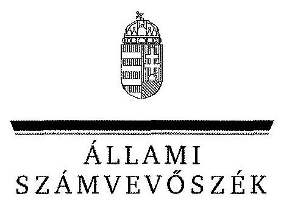
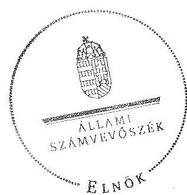
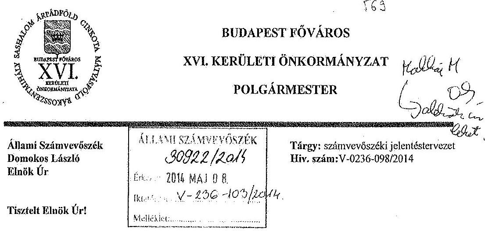
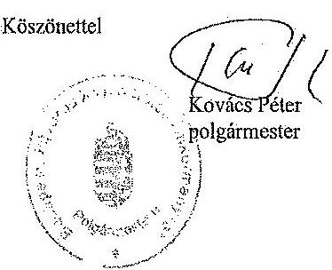

ÁLLAMI
SZÁMVEVÔSZÉK

# JELENTÉS 

az önkormányzatok vagyongazdálkodása szabályszerűségének ellenőrzéséről
Budapest Főváros XVI. kerület

---

# Állami Számvevőszék 

Iktatószám: V-0236-102/2014.
Témaszám: 1270
Vizsgálat-azonosító szám: V065108

## Az ellenőrzést felügyelte:

## Makkai Mária

felügyeleti vezető
Az ellenőrzést vezette és az ellenőrzés végrehajtásáért felelős:
Páncsics Judit
ellenőrzésvezető
A jelentéstervezet összeállításában közremúködtek:
Moder Beatrix
számvevő főtanácsos
Dr. Vass Gábor
számvevő tanácsos
Az ellenőrzést végezték:

| Dr. Vass Gábor | Vida Cecília | Göller Géza |
| :-- | :-- | :-- |
| számvevő tanácsos | számvevő | számvevő tanácsos |

---

# TARTALOMJEGYZÉK 

BEVEZETÉS ..... 3
I. ÖSSZEGZŐ MEGÁLLAPÍTÁSOK, KÖVETKEZTETÉSEK, JAVASLATOK ..... 6
II. RÉSZLETES MEGÁLLAPÍTÁSOK ..... 12

1. A vagyongazdálkodási tevékenység szabályozása ..... 12
1.1. A vagyongazdálkodási tevékenység szabályozásának megfelelősége ..... 12
1.2. A vagyon használatba és üzemeltetésbe adásának szabályszerűsége ..... 14
1.3. A vagyon üzemeltetésére és használatára kötött szerződések felülvizsgálata ..... 15
2. A vagyongazdálkodási tevékenység szabályszerűsége ..... 16
2.1. A vagyon nyilvántartása, a vagyon összetételének változása, a döntések és a gazdasági események szabályszerűsége ..... 16
2.1.1. A vagyon nyilvántartásának megfelelősége ..... 16
2.1.2. A vagyon értékének és összetételének változása ..... 18
2.1.3. A vagyon változását eredményező döntések és gazdasági események szabályszerűsége ..... 19
2.2. A térítés nélküli vagyon átadás és átvétel szabályszerűsége ..... 20
2.3. A beruházási és felújítási döntések és végrehajtásuk szabályszerűsége ..... 21
2.4. A tartós részesedésekkel történő gazdálkodás ..... 23
2.5. A vagyon értékesítésének, hasznosításának, a követelés elengedésének szabályszerűsége ..... 25
2.6. Az önkormányzati gazdasági társaságok tulajdonosi felügyelete ..... 27
3. Az integritás érvényesülése a vagyongazdálkodásban ..... 28
4. A belső és a külső ellenőrzések hasznosulása ..... 29
4.1. A belső ellenőrzés javaslatainak hasznosulása ..... 29
4.2. A külső ellenőrzések javaslatainak hasznosulása ..... 30

---

# MELLÉKLETEK 

1. számú Budapest Főváros XVI. kerületi Önkormányzat vagyonának főbb adatai 2009. január 1-je és 2012. december 31-e között
2. számú Budapest Főváros XVI. kerületi Önkormányzat felújítási és beruházási kiadásai, valamint az elszámolt értékcsökkenés bemutatása 2009-2012 között
3. számú Budapest Főváros XVI. kerületi Önkormányzat polgármesterének észrevétele

## FÜGGELÉKEK

1. számú Rövidítések jegyzéke
2. számú Értelmező szótár

---

# JELENTÉS 

## az önkormányzatok vagyongazdálkodása szabályszerűségének ellenőrzéséről Budapest Főváros XVI. kerület

## BEVEZETÉS

Az ÁSZ kiemelten fontosnak tartja az ÁSZ tv. 5. § (4) és (5) bekezdése alapján az önkormányzati vagyon kezelésének, a vagyonnal való gazdálkodási szabályok betartásának az ellenőrzését. Az ellenőrzés feladata a vagyongazdálkodással kapcsolatban a közpénzek átláthatósága, nyilvánossága érdekében a jogszabályokban, belső szabályzatokban megfogalmazott előírások érvényesülésének áttekintése. Az ÁSZ nem csak az ellenőrzött szervezet vagyongazdálkodásának a hibáira mutat rá, számon kérve azok kijavítását, hanem megállapításaival, javaslataival segíti a közpénzzel, a közvagyonnal való felelős gazdálkodást.

Az önkormányzati vagyon alapvető funkciója, hogy a közérdeket és egyúttal az önkormányzati célok megvalósítását szolgálja. A feladatellátás terén elsősorban a kötelezően ellátandó feladatok végrehajtását hivatott szolgálni, amely mellett az önként vállalt feladatok ellátása is megvalósulhat.

Az ÁSZ stratégiájában hangsúlyos szerepet szán annak, hogy szilárd szakmai alapon álló, értékteremtő ellenőrzéseivel előmozdítsa a közpénzügyek átláthatóságát, rendezettségét. Az ÁSZ a vagyongazdálkodás ellenőrzésén keresztül közremúködik az integritás alapú közigazgatási kultúra kialakításában.

Az ellenőrzés célja annak megállapítása volt, hogy az önkormányzat vagyongazdálkodási tevékenységének szabályozottsága és tevékenysége a jogszabályi előírásokkal összhangban volt-e, átlátható, a jogszabályi előírásoknak megfelelő volt-e a vagyon nyilvántartása, a külső és belső ellenőrzések megállapításai hozzájárultak-e az önkormányzati vagyongazdálkodási tevékenység szabályszerűségéhez.

Ennek keretében értékeltük, hogy az Önkormányzat:

- szabályszerűen alakította-e ki a vagyongazdálkodási tevékenységének kereteit;
- biztosította-e a vagyongazdálkodás szabályszerűségét, megalapozottan hoz-ta-e, és jogszerűen, szabályszerűen hajtotta-e végre a vagyonváltozást eredményező meghatározó jelentőségű döntéseket, valamint gondoskodott-e az általa alapított vagy tulajdonosi részvételével működő gazdasági társaságokkal kapcsolatos tulajdonosi joggyakorlásról;

---

- gondoskodott-e vagyongazdálkodási tevékenysége során az integritás (feddhetetlenség) szempontjainak érvényesüléséről;
- belső ellenőrzése elősegítette-e a vagyongazdálkodás szabályszerű működését, valamint hasznosította-e a külső és belső ellenőrzések megállapításait, javaslatait.

Az ellenőrzés típusa szabályszerűségi ellenőrzés.
Az ellenőrzött időszak: Az ellenőrzés a 2009. január 1. és 2012. december 31. közötti időszakra terjedt ki, kitekintéssel a helyszíni ellenőrzés befejezéséig (2013. december 9-éig) tartó időszak releváns vagyongazdálkodási folyamataira. Az egyes közbeszerzési eljárások lefolytatásának ellenőrzése 2012. január 1jétől a helyszíni ellenőrzés kezdetét megelőző negyedév utolsó napjáig (2013. szeptember 30-ig), az Nvtv. egyes rendelkezései végrehajtásának ellenőrzése 2012-től a helyszíni ellenőrzés befejezéséig tartott.

Ellenőrzött szervezet: Budapest Főváros XVI. kerületi Önkormányzat
Az ellenőrzés végrehajtásának jogszabályi alapját az ÁSZ tv. 5. § (4) bekezdésének a) pontja és (5) bekezdése, valamint az Áht. ${ }_{2}$ 61. § (2) bekezdésében foglaltak képezik.

Az ellenőrzés szakmai módszertana az ÁSZ hivatalos honlapján közzétett szakmai szabályokon alapult, amely a Legfőbb Ellenőrző Intézmények Nemzetközi Szervezete (INTOSAI) által kiadott nemzetközi standardok (ISSAI) figyelembevételével készült.

Az ellenőrzést az ÁSZ hatályos szervezeti szabályai és az ellenőrzési programban foglalt értékelési szempontok szerint folytattuk le. Megállapításainkat a helyszíni ellenőrzés tapasztalataira, az ellenőrzött szervezettől bekért dokumentumokra, a kitöltött tanúsítványok elemzésére, az adott időszakban hatályos jogszabályok és belső szabályzatok előírásaira alapoztuk. A részesedések értékelését tételesen ellenőriztük, míg irányított mintavétellel választottuk ki a legnagyobb értékű térítésmentes átadás-átvételeket, a beruházásokat, felújításokat, a közbeszerzési eljárásokat, a vagyon értékesítését, hasznosítását és a követelés elengedést. Ezen túl a belső kontrollok megfelelő működését a 2009-2012. évi vagyonváltozásokkal kapcsolatos gazdasági események közül a Polgármesteri hivatal számviteli nyilvántartásaiból választott véletlen minta alapján, megállásos (többlépcsős) megfelelőségi teszttel ellenőriztük.

Budapest Főváros XVI. kerület lakosainak száma 2012. január 1-jén 71963 fő volt. A 2010. évi önkormányzati választásokig a 27 tagú Képviselő-testület munkáját 10 állandó bizottság segítette. Az önkormányzati választások után a Képviselő-testület létszáma 17 főre csökkent és nyolc állandó bizottság múködött. A polgármester a 2006. évi önkormányzati választás óta tölti be tisztségét, a jegyző 2007 márciusától látja el feladatait. A Polgármesteri hivatal nyolc szervezeti egységre tagolódott, elkülönített gazdasági szervezettel nem rendelkezett. A vagyongazdálkodással kapcsolatos feladatokat a Gazdálkodási Ügyosztály és a Műszaki Ügyosztály szervezetébe tartozó irodák látták el. A foglalkoztatott köztisztviselők száma 2012. december 31-én 196 fő volt.

---

Az Önkormányzat a 2012. évben az önállóan működő és gazdálkodó Polgármesteri hivatalon felül kettő önállóan működő és gazdálkodó, valamint 27 önállóan működő költségvetési szervvel látta el a feladatát. Az Önkormányzatnak 2012-ben négy kizárólagos tulajdonában lévő gazdasági társasága volt. A megváltozott munkaképességűek foglalkoztatásáról a REHAB-XVI. Kft.-vel, az uszodák és a sportpályák üzemeltetéséről a Kertvárosi Kft.-vel, a piac üzemeltetéséről a Sashalmi Piac Kft.-vel, a városfejlesztési és projekt menedzseri feladatokról a Városfejlesztő Kft. útján gondoskodott.

Az Önkormányzatnál az ellenőrzött időszakban vállalkozási tevékenységet nem folytattak, PPP konstrukcióban beruházást nem valósítottak meg, vagyonkezelői, haszonélvezeti és koncessziós jogot alapító szerződést nem kötöttek. Az ÁSZ az Önkormányzatnál az ellenőrzött időszakban számvevőszéki jelentéssel lezárt ellenőrzést nem végzett.

Az Önkormányzat könyvviteli mérleg szerinti vagyona 2012. december 31-én 39594,9 millió Ft volt, 6358,6 millió Ft-tal, 19,1\%-kal emelkedett az ellenőrzött időszakban. Az Önkormányzat összes rövid és hosszú lejáratú kötelezettsége 2012. december 31-én 6725,5 millió Ft volt. Ebből a pénzintézetekkel szemben fennálló adósságállomány összege 6556,3 millió Ft volt, amelyet a 2013. évben megvalósult adósság átvállalás 2612,7 millió Ft-tal csökkentett. Az Önkormányzat a 2012. évi költségvetési beszámolója szerint 11562,4 millió Ft költségvetési bevételt ért el és 10838,1 millió Ft költségvetési kiadást teljesített. A felhalmozási célú kiadások összege 2012-ben 1242,4 millió Ft volt, melyből felújításokra és beruházásokra 1214,9 millió Ft-ot fordítottak.

Az Önkormányzat vagyonának főbb adatait, a felújítási és beruházási kiadásokat, valamint az elszámolt értékcsökkenést az 1-2. számú mellékletek mutatják be. A jelentéstervezetben alkalmazott rövidítéseket és az egyes fogalmak magyarázatát az 1-2. számú függelékek tartalmazzák.

Az ÁSZ a 2011. évi LXVI. törvény 29. §-a szerint a jelentéstervezetet megküldte Budapest Főváros XVI. kerületi Önkormányzat polgármesterének egyeztetésre. A polgármester nemleges észrevételét a 3. számú melléklet tartalmazza.

---

# I. ÖSSZEGZŐ MEGÁLLAPÍTÁSOK, KÖVETKEZTETÉSEK, JAVASLATOK 

Az Önkormányzatnál a 2009-2012. években a vagyongazdálkodási fel-adat- és hatásköröket önkormányzati rendeletekben és belső szabályzatokban, utasításokban szabályozták. A Képviselő-testület a 2009-2012. években vagyongazdálkodási rendelet ${ }_{1,2}$-ben meghatározta az önkormányzati feladatellátást biztosító törzsvagyont, valamint a forgalomképes (üzleti) vagyon körébe tartozó vagyonelemeket. A Képviselő-testület az Nvtv. előírásainak megfelelően aktualizált vagyongazdálkodási rendelet ${ }_{2}$-t - az Nvtv.-ben előírt több határidőt is elmulasztva - csak 2013 januárjában fogadta el. Rendelkezett a forgalomképesség szerinti besorolás megváltoztatásának módjáról és hatásköréről, a vagyonhasznosítási rendeletben előírta, hogy nyilvános pályázaton kell értékesíteni minden önkormányzati ingatlant és 2,0 millió Ft értéket meghaladó ingó vagyontárgyat. Meghatározta az értékesítés és a hasznosítás során alkalmazandó pályáztatási, árverési, valamint az összeférhetetlenséget és az elfogultságot kizáró szabályokat. Megalkotta a vagyon ingyenes átadására és átvételére, a vagyonkezelői jog alapítására, gyakorlására és ellenőrzésére vonatkozó részletes szabályokat. Az ellenőrzött időszakban vagyonkezelési szerződést nem kötöttek. A Képviselő-testület az Ötv.-ben, illetve a Mötv.-ben foglaltak alapján vagyongazdálkodási hatásköröket ruházott át - értékhatárhoz kötötten - a polgármesterre és egyes bizottságokra. Az átruházott hatáskörök gyakorlói rendszeresen beszámoltak a döntéseikről.

A Polgármesteri hivatal az ellenőrzött időszakban rendelkezett a helyi sajátosságoknak és az Áhsz. ${ }_{1}$ előírásainak megfelelő számviteli politika ${ }_{1,2,3}$-mal, és ennek keretében kialakított számlarenddel, pénzkezelési, leltározási, selejtezési és értékelési szabályzatokkal. Az Önkormányzatnál a számviteli rend összehangolt szabályozásával biztosították az egységes számviteli elveken alapuló önkormányzati beszámoló elkészítését.

Az Önkormányzatnál a vagyon nyilvántartása során a számlarendben a főkönyvi számlák alábontásával, a számlákhoz kapcsolódó analitikus nyilvántartások vezetésével biztosították a törzsvagyon, ezen belül a forgalomképtelen és korlátozottan forgalomképes, illetve a forgalomképes (üzleti) vagyon elkülönített nyilvántartását. A polgármester a vagyonkimutatást minden évben a zárszámadási rendelettervezet előterjesztésekor a Képviselő-testület részére tájékoztatásul bemutatta. A vagyonkimutatás tartalma, szerkezete nem felelt meg az Áhsz. ${ }_{1}$-ben, valamint a vagyongazdálkodási rendelet ${ }_{2}$-ben meghatározott előírásoknak, mivel a befektetett pénzügyi eszközöket nem a könyvviteli mérleg arab számmal jelzett tagolásához igazodóan mutatták be, továbbá egyes vagyonelemeket (erdőket, lezárt temetőt) nem a vagyongazdálkodási rendelet ${ }_{2}$-vel összhangban sorolták be a vagyonkimutatásokba.

Az Önkormányzat tulajdonában lévő ingatlanvagyonról az ingatlanvagyonkataszteri nyilvántartást folyamatosan vezették. Az ingatlanvagyonkataszter megfelelő adatait a 147/1992. (XI. 6) Korm. rendeletben előírt egyezőség megteremtése érdekében a közhiteles nyilvántartást vezető illetékes föld-

---

hivatal adataival a 2009. évben egyeztették, ezt követően a változásokat a nyilvántartásban a földhivatali határozatok alapján átvezették. Az ingatlanok főkönyvi és analitikus nyilvántartásában lévő bruttó érték adatoknak, valamint az ingatlanvagyon-kataszter bruttó érték adatainak egyezőségét a jegyző az ingatlanvagyon-kataszter vezetés rendjét szabályozó utasítás alapján minden évben biztosította.

Az Önkormányzat 2009-2012. évi könyvviteli mérlegében kimutatott eszközöket és forrásokat az Áhsz. ${ }_{1}$ előírásainak megfelelően leltárakkal alátámasztották. Az ingatlanok mennyiségi felvétellel történő leltározását az Áhsz. ${ }_{1}$-ben előírtak ellenére 2009-ben és 2011-ben nem végezték el, a leltározásnak csak a nyilvántartások egyeztetésével tettek eleget. A 2012. évi számviteli nyilvántartásokban a Sashalmi Piac Kft. által üzemeltetett ingatlanokon végzett beruházások aktivált értékét az Áhsz. ${ }_{1}$ előírása ellenére nem az üzemeltetésre átadott eszközök, hanem az ingatlanok között mutatták ki.

Az Önkormányzat könyvviteli mérleg szerinti vagyona a 2009. évi 33236,3 millió Ft nyitó értékről 2012. december 31-re 19,1\%-kal, 39594,9 millió Ft-ra nőtt az ingatlanok és a beruházások állományának növekedése, illetve a pénzeszközök csökkenése következtében. A 2009-2012. években a fejlesztésekre fordított 12949,3 millió Ft kiadás 6,1-szerese volt az elszámolt értékcsökkenés (2122,6 millió Ft-os) összegének, az Önkormányzat hozzájárult az elhasználódott eszközei pótlásához. A fejlesztések pénzügyi fedezetét hazai és uniós támogatásokból, kötvény kibocsátásból, valamint saját forrásokból biztosították.

A vagyonváltozásokat eredményező beruházási, felújítási, ingatlanértékesítési és bérbeadási, valamint a követelések elengedésére vonatkozó döntéseket - a vagyongazdálkodási rendelet ${ }_{1,2}$-ben, a lakásgazdálkodási rendelet ${ }_{1,2}$-ben és az önkormányzati SZMSZ ${ }_{1,2}$-ben szabályozott hatásköröknek megfelelően - a polgármester és az érintett állandó bizottságok, illetve a Képviselő-testület a tárgykörhöz készített előterjesztések alapján szabályosan hozták meg. A vagyongazdálkodással összefüggő döntések előkészítése, meghozatala és végrehajtása során - a szabályzatokban előírt módon - érvényesültek $a$ „négy szem elvén" alapuló kontrollok. Az Önkormányzat tulajdonosi jogainak, érdekeinek védelmét szolgáló garanciális elemeket a beruházások és felújítások kivitelezőivel kötött, valamint a vagyonhasznosítási és vagyonértékesítési szerződésekbe beépítették.

A gazdálkodási jogkörök szabályzata ${ }_{1-8}$-ban - az Ámr. ${ }_{1,2}$, illetve az Ávr. előírásainak megfelelően - meghatározták az operatív gazdálkodással összefüggő jogköröket és az összeférhetetlenségi követelményeket. A 2009-2012. években az ellenőrzött tételek esetében a gazdálkodási jogkörök gyakorlása a vagyongazdálkodással kapcsolatos kiadások teljesítése során a jogszabályi előírásoknak és a belső szabályozásnak megfelelt. A vagyonhasznosításból származó bevételek esetében nem tettek eleget 2009-ben az Ámr.,, illetve 2010-től 2012. április 26-ig a gazdálkodási jogkörök szabályzata ${ }_{3-6}$ előírásainak, mivel a bevételek teljesítésigazolása és érvényesítése elmaradt.

A 2012. évben és a 2013. év I-III. negyedévében az Önkormányzat 27 közbeszerzési eljárást folytatott le, összesen 2454,2 millió Ft beszerzési értékre. Az ellenőrzött közbeszerzési eljárásokat a Kbt. előírásai és a közbeszerzési szabály-

---

zat $_{3}$ szerint bonyolította le az Önkormányzat. A közbeszerzési eljárások eredményéről szóló tájékoztatót egy esetben késedelmesen - nem a szerződéskötést követő tíz munkanapon belül - küldték meg a Közbeszerzési Hatóságnak.

Az Eisztv., illetve az Info tv. előírásai alapján közérdekűnek minősülő adatok nyilvánosságra hozatalának módját, felelőseit a Képviselő-testület rendeletben, az eljárásrendet a jegyző a közérdekű adataiok szabályzata ${ }_{1,2}$-ben határozta meg. A jegyző a közpénzek felhasználásának átláthatósága érdekében a 20092012. években eleget tett a vagyongazdálkodással összefüggő közérdekű adatok közzétételi kötelezettségének.

A 2009-2012. években az Önkormányzatnak négy kizárólagos tulajdonú gazdasági társasága volt. A gazdasági társaságok a rendelkezésükre bocsátott önkormányzati vagyont közszolgáltatási, illetve üzemeltetési szerződések alapján müködtették. A Képviselő-testület a tulajdonosi jogait a társaságok alapító okirataiban határozta meg. A Képviselő-testület döntött a vezető tisztségviselők, a felügyelő bizottsági tagok és a könyvvizsgáló személyéről, valamint megtárgyalta és jóváhagyta az előterjesztett üzleti terveket és az éves beszámolókat. A közfeladat ellátásához önkormányzati támogatást igénylő Kertvárosi Kft. és REHAB-XVI. Kft. esetében - a tulajdonosi jogok általános érvényesítése mellett a gazdálkodás kontrollját folyamatosan gyakorolta. Az ellenőrzött időszakban az Önkormányzatnak tőkepótlási kötelezettsége nem keletkezett, a társaságok kötelezettségeivel kapcsolatosan garanciát, kezességet nem vállalt.

Az Önkormányzat és a társadalmi szervezetek között 2007-ben létrejött együttmúködési megállapodások 2009 januárjában lejártak. A Képviselőtestület 2012 májusában a szervezetek számára jóváhagyta - közvetett támogatásnak minősítve - az ingatlanok két évre szóló ingyenes használatát. A döntést követően a szervezetek a szerződéseket az Önkormányzattal nem kötötték meg. Az Önkormányzatnál a kedvezményesen vagy térítésmentesen bérbe adott ingatlanok miatti közvetett támogatások összegét a 2009-2012. években az Áht. ${ }_{1}$ és a vagyongazdálkodási rendelet ${ }_{2}$ előírása ellenére - csak a 2011. évi zárszámadási rendeletben, egy kedvezményezettet érintően mutatták be.

A Polgármesteri hivatalban a vagyongazdálkodási tevékenység szabályozásával, valamint azok gyakorlatban való alkalmazásával és ellenőrzésével biztosították a feddhetetlenség, az átláthatóság és elszámoltathatóság követelményének érvényesülését. A vagyont érintő döntések előkészítése, meghozatala és végrehajtása során az átláthatóságot, illetve a korrupció megelőzését alapvetően a Kttv. vonatkozó rendelkezéseinek alkalmazásával biztosították. A vagyongazdálkodási tevékenység integritása - a szabályozottság ellenére - nem teljes körűen biztosított, mivel az Önkormányzat nem rendelkezett integritáspolitikával, nem végeztek korrupciós kockázatelemzést, és a Kttv. előírása ellenére a köztisztviselökre vonatkozó etikai alapelvek részletes tartalmát nem határozták meg.

Az Önkormányzat rendelkezett a 2011-2014. évekre jóváhagyott stratégiai ellenőrzési tervvel és a Képviselő-testület által jóváhagyott éves belső ellenőrzési tervekkel, de a Ber. előírásai ellenére a stratégiai terv nem tartalmazta a kockázati tényezőket és értékelésüket, az éves tervek nem kockázatelemzés alapján felállított prioritásokon alapultak. Az Önkormányzatnál az ellenőrzött idő-

---

szakban lezárt 64 belső ellenőrzésből összesen 29 érintette a vagyongazdálkodást, melyből 27 intézkedést igénylő megállapításokkal zárult. Az ellenőrzési jelentésekben javaslatokat fogalmaztak meg a leltározással, a gazdálkodási jogkörök szabályozásával, egyes vagyonváltozások dokumentálásával kapcsolatban. A belső ellenőrzés a megállapításaival és javaslataival elősegítette a vagyongazdálkodás szabályozási és működési hiányosságainak megszüntetését. A belső ellenőrzés javaslatainak megvalósítására az ellenőrzött szervezetek öt esetben nem készítettek intézkedési tervet, illetve az intézkedési tervekben foglaltakat hat esetben csak részben hajtották végre. A belső ellenőrzésekről vezetett nyilvántartás 2012-ben nem biztosította a belső ellenőrzési jelentésekben tett megállapítások, javaslatok és a vonatkozó intézkedési tervek végrehajtásának nyomon követését, mert a nyilvántartás a Bkr.-ben előírtak ellenére nem tartalmazta az ellenőrzési jelentések javaslatait, az elfogadott intézkedési terveket, az intézkedési tervek alapján végrehajtott intézkedések leírását, illetve az intézkedések elmulasztásának okait.

A könyvvizsgáló az Önkormányzat 2009-2012. évi beszámolóit megbízhatónak és hitelesnek minősítette, jelentéseiben a vagyongazdálkodással kapcsolatos hiányosságot nem állapított meg.

A jegyző 2009-2012-ben a Ber., illetve Bkr. rendelkezései ellenére a külső ellenőrzésekről nem vezetett nyilvántartást.

A vagyongazdálkodást érintően a Kormányhivatal egy esetben tett törvényességi felhívást, amely alapján az Önkormányzat 2012-ben módosította az érintett rendeletét. A közreműködő szervezetek az uniós és hazai támogatásokkal megvalósuló beruházásokat 2009-2012 között 19 alkalommal ellenőrizték. Az uniós forrással megvalósult fejlesztések közül az NFÜ egy esetben folytatott le szabálytalansági eljárást, ami alapján az Önkormányzat 489,6 ezer Ft támogatást kamattal növelt összegben fizetett vissza.

Az Állami Számvevőszékről szóló 2011. évi LXVI. törvény 33. § (1) bekezdésében foglaltak értelmében a jelentésben foglalt megállapításokhoz kapcsolódó intézkedési tervet köteles az ellenőrzött szervezet vezetője összeállítani, és azt a jelentés kézhezvételétől számított 30 napon belül az ÁSZ részére megküldeni. Amennyiben az intézkedési tervet határidőben nem küldi meg a szervezet, vagy az nem elfogadható, az ÁSZ elnöke a hivatkozott törvény 33. § (3) bekezdés a)-b) pontjaiban foglaltakat érvényesítheti.

Az ellenőrzés intézkedést igénylő megállapításai és javaslatai:

# a jegyzönek 

1. A vagyonkimutatás tartalma, szerkezete nem felelt meg az Áhsz.: 44/A. § (2) bekezdéseiben, valamint a vagyongazdálkodási rendelet,-ben meghatározott előírásoknak, mivel a vagyonkimutatásokban a befektetett pénzügyi eszközöket nem a könyvviteli mérleg arab számmal jelzett tagolásához igazodóan mutatták be, valamint egyes vagyonelemeket (erdőket, lezárt temetőt) nem a vagyongazdálkodási rendelet,-vel összhangban szerepeltették.

---

Javaslat:
Intézkedjen, hogy a vagyonkimutatás elkészítése során:
a) érvényesüljenek az Áhsz. 2 30. § (2) bekezdéseiben előírtak;
b) biztosítsák az összhangot a vagyongazdálkodási rendelet ${ }_{2}$-ben foglaltakkal.
2. Az Önkormányzatnál 2009-2012. években az ingatlanok mennyiségi felvétellel történő leltározását az Áhsz. 1 37. § (3) bekezdése, a vagyongazdálkodási rendelet ${ }_{2}$ és a leltározási szabályzat előírásai ellenére kétévente nem végezték el.

Javaslat:
Intézkedjen annak érdekében, hogy az ingatlanok leltározása az Áhsz. 2 22. § (1) bekezdésében, a vagyongazdálkodási rendelet ${ }_{2}$-ben és a leltározási szabályzatban foglalt előírásoknak megfelelő gyakorisággal történjen meg.
3. A 2012. évben - a Bkr. 6. § (1) bekezdés c) pontjának előírása ellenére - a jegyző nem határozta meg az etikai elvárásokat, a Kttv. 231. § (1) bekezdése ellenére a Képviselő-testület nem állapította meg a Kttv. 83. §-ában előírt, a köztisztviselökre vonatkozó hivatásetikai alapelvek részletes tartalmát, valamint az etikai eljárás szabályait.

Javaslat:
Készítse elő a Bkr. 6. § (1) bekezdés c) pont előírásának megfelelő etikai szabályokat, a Kttv. 83. §-a szerinti hivatásetikai alapelveket, az etikai eljárás szabályait és terjessze a Képviselő-testület elé jóváhagyásra.
4. Az Önkormányzat rendelkezett a 2011-2014. évekre a jegyző által jóváhagyott stratégiai ellenőrzési tervvel és a Képviselő-testület által jóváhagyott éves belső ellenőrzési tervekkel, azonban a Ber. 19. § c) pontjában előírtak ellenére a stratégiai terv nem tartalmazta a kockázati tényezőket és értékelésüket, illetve az éves tervek a Ber. 21. § (2) bekezdés előírásai ellenére nem kockázatelemzés alapján felállított prioritásokon alapultak.

Javaslat:
Intézkedjen arról, hogy Bkr. 30. § (1) bekezdés c) pontjában előírtaknak megfelelően a stratégiai terv tartalmazza a kockázati tényezőket és értékelésüket, illetve az éves ellenőrzési terv a Bkr. 31. § (2) bekezdés előírásainak megfelelően a stratégiai ellenőrzési tervben és a kockázatelemzés alapján felállított prioritásokon alapuljon.
5. Az elvégzett belső ellenőrzésekről vezetett nyilvántartás 2012-től nem biztosította a Bkr. 47. § (1) bekezdésének megfelelő, a belső ellenőrzési jelentésekben tett megállapítások, javaslatok és a vonatkozó intézkedési tervek végrehajtásának nyomon követését. A nyilvántartásban nem szerepeltek a Bkr. 47. § (2) bekezdésében meghatározott tartalmi követelmények.

---

Javaslat:
Intézkedjen, hogy a Bkr. 47. § (1) bekezdése szerint a belső ellenőrzési jelentésekben tett megállapításokról, javaslatokról és a vonatkozó intézkedési tervekről vezetett nyilvántartás a Bkr. 47. § (2) bekezdésének megfelelően tartalmazza az ellenőrzési jelentésben szereplő javaslatot, az elfogadott intézkedési tervet, az intézkedési terv alapján végrehajtott intézkedések rövid leírását, és a végre nem hajtott intézkedések okát.
6. Az Önkormányzatnál a külső ellenőrzésekről a 2009-2011. években a Ber. 29/A. § (1), illetve 2012-ben a Bkr. 14. § (1) bekezdése ellenére nyilvántartást nem vezettek.

Javaslat:
Intézkedjen a Bkr. 14. § (1) bekezdésében foglaltak szerint a külső ellenőrzések nyilvántartásának vezetéséről.

---

# II. RÉSZLETES MEGÁLLAPÍTÁSOK 

## 1. A VAGYONGAZDÁLKODÁSI TEVÉKENYSÉG SZABÁLYOZÁSA

### 1.1. A vagyongazdálkodási tevékenység szabályozásának megfelelősége

A Képviselő-testület - a Htv. 138. § (1) bekezdés j) pontjának megfelelően - a vagyongazdálkodási feladat- és hatásköröket a teljes vagyoni körre vonatkozóan önkormányzati rendeletekben ${ }^{1}$ szabályozta. A vagyongazdálkodási rendelet ${ }_{1,2}$-ben az Ötv. 79. § (1) bekezdésének megfelelően meghatározták az önkormányzati feladatellátást biztosító törzsvagyont, ezen belül a forgalomképtelen és a korlátozottan forgalomképes vagyonelemek körét, valamint a forgalomképes (üzleti) vagyonelemeket. Rendelkeztek a vagyontárgyak forgalomképességének megváltoztatási módjáról, melyhez a Képviselő-testület minősített többséggel hozott döntését írták elő.

A Képviselő-testület az Nvtv. 18. § (1) bekezdésében előírt 2012. március 1-jei határidőre a forgalomképtelen törzsvagyonát nem vizsgálta felül és nem határozta meg, hogy azok közül minősít-e vagyonelemeket nemzetgazdasági szempontból kiemelt jelentőségű nemzeti vagyonná. Az Nvtv. 18. § (12) bekezdésében előírtak ellenére 2012. október 31-ig a korlátozottan forgalomképes törzsvagyonát nem vizsgálta felül az Nvtv. 5. § (5)-(7) bekezdésében előírtak érvényesülése érdekében. A Képviselő-testület 2013 januárjában fogadta el a vagyongazdálkodási rendelet ${ }_{3}$ - Nvtv. előírásainak megfelelő - módosítását.

Az Önkormányzatnál az Nvtv. 9. § (1) bekezdésében előírt közép- és hosszú távú vagyongazdálkodási tervet a helyszíni ellenőrzés befejezéséig még nem készítették el.

A Képviselő-testület az Ötv. 9. § (3), illetve a Mötv. 41. § (4) bekezdésében biztosított jog alapján az önkormányzati $\mathrm{SZMSZ}_{1,2}$-ben, a vagyongazdálkodási rendelet ${ }_{1,2}$-ben és a lakásgazdálkodási rendelet ${ }_{1,2}$-ben vagyongazdálkodási hatásköröket ruházott át - értékhatárhoz kötötten - a polgármesterre és egyes bizottságokra ${ }^{2}$. Az útruházott hatáskörök gyakorlásáról éves beszámolási kötelezettséget írtak elő a vagyongazdálkodási rendelet ${ }_{2}$-ben. A polgármester és a bizottságok elnökei az önkormányzati $\mathrm{SZMSZ}_{1,2}$-ben rögzített módon a képviselőtestületi üléseken beszámoltak a testületi ülések közötti időszakban hozott döntéseikről.

[^0]
[^0]:    ${ }^{1}$ a vagyongazdálkodási rendelet ${ }_{1,2}$, a vagyonhasznosítási rendelet és a lakásgazdálkodási rendelet ${ }_{1,2}$
    ${ }^{2}$ a Pénzügyi bizottságra, a Szociális bizottságra, valamint az Úgyrendi bizottságra

---

A Képviselő-testület a vagyongazdálkodási rendelet ${ }_{2}$-ben meghatározta a vagyon ingyenes vagy kedvezményes átadásának és átvételének, valamint a követelés mérséklésének és elengedésének eseteit és módját.

A Képviselő-testület a vagyonhasznosítási rendeletben - az Áht., 108. § (1) bekezdésében ${ }^{3}$ foglaltakra tekintettel - előírta, hogy nyilvános pályázaton kell értékesíteni minden önkormányzati ingatlant és 2,0 millió Ft értéket meghaladó ingó vagyontárgyat, meghatározta az értékesítés és a hasznosítás során alkalmazandó pályáztatási, árverési, valamint az összeférhetetlenséget és az elfogultságot kizáró szabályokat. A hasznosítandó vagyontárgyak piaci értékének meghatározását (értékbecslés készítését) a vagyongazdálkodási rendelet ${ }_{2}$-ben szabályozták.

A vagyonkezelői jog létrehozásának feltételeit, a vagyonmegóvásra, az éves adatszolgáltatásra és a tulajdonosi ellenőrzésre vonatkozó kötelmeket a vagyongazdálkodási rendelet ${ }_{2}$-ben szabályozták. Vagyonkezelési szerződést az ellenőrzött időszakban nem kötöttek.

Az Önkormányzatnál a Lakás tv. felhatalmazása alapján a lakásgazdálkodási rendelet ${ }_{1,2}$-ben határozták meg a lakások és a nem lakás céljára szolgáló helyiségek bérletére, valamint az önkormányzati tulajdonú lakások lakbérének megállapítására vonatkozó helyi szabályokat. A volt állami tulajdonú lakások elidegenítéséből származó bevételek felhasználásáról ${ }^{4}$ rendelkeztek.

A Polgármesteri hivatal az ellenőrzött időszakban rendelkezett a helyi sajátosságoknak és az Áhsz. ${ }_{1}$ előírásainak megfelelő számviteli politika ${ }_{1,2,3}$-mal, és ennek keretében kialakított számlarenddel, pénzkezelési, leltározási, selejtezési és értékelési szabályzatokkal, melyek hatályát a jegyző kiterjesztette a hivatalhoz rendelt önállóan múködő intézményekre. A GAMESZ kialakította - a Polgármesteri hivatal szabályzataival összhangban - a saját és a hozzárendelt önállóan múködő önkormányzati intézményekre vonatkozó számviteli rendet. Az összehangolt szabályozással megfelelő keretet biztosítottak az egységes számviteli elveken alapuló önkormányzati beszámoló elkészítéséhez.

A számlarendben a főkönyvi számlák alábontásával, a számlákhoz kapcsolódó analitikus nyilvántartások vezetésével biztosították a törzsvagyon, ezen belül a forgalomképtelen és korlátozottan forgalomképes, illetve az üzleti (forgalomképes) vagyon elkülönített nyilvántartását. A költségvetési beszámolási utasítás ${ }_{1,2,3}$-ban részletezték az intézmények közötti számviteli egyeztetés, ellenőrzés folyamatát, felelőseit. Az értékelési szabályzat tartalmazta a tárgyi eszközök üzembe helyezésének dokumentálási szabályait, és meghatározták a bekerülé-si-, a forgalmi-, a piaci érték meghatározásának elveit, elszámolásának rendjét. A jegyző utasításban szabályozta az ingatlanvagyon-kataszter vezetés rendjét.

[^0]
[^0]:    ${ }^{3}$ 2012. január 1-jétől az Nvtv. 13. § (1) bekezdése írja elő
    ${ }^{4}$ Budapest Főváros XVI. Kerületi Önkormányzat Képviselő-testületének 51/2004. (XII. 29.) számú rendelete az önkormányzati lakások elidegenítéséből származó bevételek felhasználásának részletes szabályairól

---

A Képviselő-testület a vagyongazdálkodási rendelet ${ }_{2}$-ben az Áhsz., 37. § (7) bekezdésében ${ }^{5}$ foglaltak alapján - tekintettel a vagyon megfelelő védelmére és a folyamatosan vezetett nyilvántartásokra - lehetőséget biztosított az eszközök két évenkénti mennyiségi felvétellel történő leltározására.

A gazdálkodási jogkörök szabályzata ${ }_{1-4}$-ban, - az Ámr. ${ }_{1,2}$-ben és az Ávr.-ben előírtaknak megfelelően - meghatározták az operatív gazdálkodással összefüggő jogköröket és az összeférhetetlenségi követelményeket.

A Képviselő-testület az önkormányzati $\mathrm{SZMSZ}_{1,2}$-ben, a vagyongazdálkodási rendelet ${ }_{2}$-ben, a jegyző a közérdekú adatok szabályzata ${ }_{1,2}$-ben meghatározta az Eisztv., illetve az Info tv. előírásai alapján - a közérdekű adatok nyilvánosságra hozatalának módját, felelőseit.

Az Önkormányzat kötelező és önként vállalt feladatainak körét, azok ellátásának mértékét és módját - az Ötv., illetve az Mötv. előírásainak ${ }^{6}$ megfelelően az önkormányzati $\mathrm{SZMSZ}_{1,2}$-ben, a költségvetési rendeletekben, valamint a gazdasági program ${ }_{1-2}$-ben is rögzítették. Az Önkormányzat a közfeladatokat a Polgármesteri Hivatal szervezeti egységeivel, saját intézményhálózatával és négy gazdasági társaságával, valamint vállalkozási szerződésekkel látta el.

Az Önkormányzati intézmények száma az ellenőrzött időszakban 34-ről 30-ra csökkent, mivel három óvoda beolvadással, a Sashalmi Piacfelügyelet pedig jogutód nélkül megszűnt. Az önkormányzati tulajdonú gazdasági társaságok száma kettőről négyre növekedett. A szervezeti változások az óvodák tekintetében nem jártak vagyonváltozással, míg a piac ingatlanjait a 2009. évben a tárgyi eszközök közül az üzemeltetésre átadott eszközök közé vezették át.

# 1.2. A vagyon használatba és üzemeltetésbe adásának szabályszerűsége 

Az Önkormányzatnál a vagyon használati jogát a közszolgáltatást végző önkormányzati intézmények esetében a vagyongazdálkodási rendelet ${ }_{2}$-ben szabályozták, az üzemeltetésre átadott eszközök esetében az Önkormányzat kizárólagos tulajdonában lévő gazdasági társaságokkal, illetve a jogszerű használókkal kötött szerződésekben határozták meg.

Az ellenőrzött üzemeltetési szerződésekben ${ }^{7}$ meghatározták a vagyonüzemeltető által kötelezően ellátandó önkormányzati közfeladatokat és a vagyonnal való vállalkozás lehetőségeit, a vagyon használatára és hasznosítására vonatkozó rendelkezéseket és előírták a vagyon állagának, értékének megőrzését és vé-

[^0]
[^0]:    ${ }^{5}$ 2014. január 1-jétől a Számv. tv. 69. § (3) és (4) bekezdése szabályozza
    ${ }^{6}$ A kötelező feladatok esetében az Ötv. 8. § (1) és az Mötv. 13. § (1) bekezdése, az önként vállalt feladatok esetében az Ötv. 1. § (4) és az Mötv. 10. § (2) bekezdése az irányadó.
    ${ }^{7}$ a Kertvárosi Kft.-vel a sportlétesítmények és az uszodák üzemeltetésére, a REHAB-XVI. Kft.-vel a szociális foglalkoztatást biztosító üzem müködtetésére, a Sashalmi Piac Kft.vel a piaci létesítmények üzemeltetésére, valamint a BRFK-val a térfigyelő kamerarendszer müködtetésére kötött szerződések

---

delmét. A szerződésekben rögzítették az adatszolgáltatási és beszámolási kötelezettségeket, valamint az azonnali felmondás lehetőségét.

Az Önkormányzat a Kertvárosi Kft.-vel kötött szerződésben előírta felelősségbiztosítás megkötésének kötelezettségét az üzemeltetés során esetlegesen előforduló balesetek miatt felmerülő kártérítési igények fedezetére. A BRFK-val a térfigyelő rendszer üzemeltetésére kötött szerződésben rögzítették az üzemeltetési költségek megosztását.

A Sashalmi Piac Kft.-vel 2009 júliusában kötött hároméves üzemeltetési szerződés 2012 júliusában lejárt. A társaság a szerződésben rögzített feladatait a szerződés lejártát követően folyamatosan, változatlan feltételekkel ellátta. A Képvi-selő-testület a Sashalmi Piac Kft. 2012. évi üzleti tervét és az éves beszámolóját elfogadta. Az Önkormányzatnál a helyszíni ellenőrzés ideje alatt 2013 decemberében, utólag intézkedtek a szerződés két évvel, 2014 júliusáig történő meghosszabbításáról.

Az Önkormányzat a vagyongazdálkodási feladatai keretében - a teherbíró képességéhez igazodóan - az üzemeltetésre átadott vagyon tekintetében is teljesítette - az Nvtv. 7. § (2) bekezdésében előírt - az érték megőrzésére, az állag védelmére és az értéknövelő használatra irányuló kötelezettséget. A 2009-2012. évben az üzemeltetésre átadott eszközök körében végzett értéknövelő beruházások és felújítások együttes értéke 1019,8 millió Ft volt, ami háromszorosa az időszak alatt elszámolt 335,5 millió Ft értékcsökkenési leírás összegének.

# 1.3. A vagyon üzemeltetésére és használatára kötött szerződések felülvizsgálata 

Az Önkormányzat közfeladatainak ellátásában 2009. év elején a kizárólagos önkormányzati tulajdonban lévő Kertvárosi Kft. és a REHAB-XVI. Kft. vett részt. A Képviselő-testület 2009-ben további két kizárólagos tulajdonú gazdasági társaság - a Városfejlesztő Kft. és a Sashalmi Piac Kft. - alapításáról döntött a kötelező és az önként vállalt feladatok ellátása és a közcélok minél hatékonyabb megvalósítása érdekében.

Az Önkormányzat 2012. december 31-én csak olyan gazdálkodó szervezetekben rendelkezett társasági részesedéssel, amelyek az Nvtv. 3. § (1) bekezdés 1. a) pontja alapján átlátható szervezetnek minősülnek.

Az Önkormányzat az Nvtv. 2012. évi hatályba lépését követően a vagyonhasznosítási szerződések megkötését megelőzően vizsgálta, hogy a szerződő partner megfelel-e az Nvtv. 3. § (1) bekezdés 1. pontja szerinti „átlátható szervezet" követelményének.

---

# 2. A VAGYONGAZDÁlKODÁSI TEVÉKENYSÉG SZABÁLYSZERÜSÉGE 

### 2.1. A vagyon nyilvántartása, a vagyon összetételének változása, a döntések és a gazdasági események szabályszerűsége

### 2.1.1. A vagyon nyilvántartásának megfelelősége

A jegyző a 2009-2012 években elkészítette az Ötv. 78. § (2) bekezdésében ${ }^{8}$ meghatározott vagyonkimutatást, amelyet a polgármester az Áht. ${ }_{1}$ 118. § (2) bekezdése 2. c) pontjának ${ }^{9}$ előírása szerint a zárszámadási rendelettervezettel egyidejűleg terjesztett a Képviselő-testület elé.

A vagyonkimutatás tartalma, szerkezete az ellenőrzött időszakban nem felelt meg az Áhsz. ${ }_{1}$ 44/A § (2)-(3) bekezdéseiben ${ }^{10}$, valamint a vagyongazdálkodási rendelet ${ }_{2}$-ben meghatározott előírásoknak, mivel:

- a vagyonkimutatásban a 2009-2012. években az Önkormányzat vagyonát képező erdők, valamint a lezárt köztemetők - a vagyongazdálkodási rende-let ${ }_{2}$-ben előírtakkal ellentétben - nem szerepeltek önálló tételként. A lezárt köztemetőket a vagyonkimutatásban forgalomképes vagyonként vették számításba, holott e vagyonelemet a vagyongazdálkodási rendelet ${ }_{2}$ a korlátozottan forgalomképes törzsvagyonba sorolta;
- a 2009-2012. évi vagyonkimutatások a befektetett pénzügyi eszközöket az Áhsz. ${ }_{1}$ 44/A. § (2) bekezdésétől eltérően nem a könyvviteli mérleg arab számmal jelzett tételei szerinti tagolásban, hanem összevontan tartalmazták;
- a „O"-ra leírt, de használatban lévő, illetve használaton kívüli eszközök Áhsz. ${ }_{1}$ 44/A. § (3) bekezdésében meghatározott állományát az ellenőrzött időszak vagyonkimutatásai - a 2012. évi kivételével - nem tartalmazták.

Az Önkormányzat tulajdonában lévő ingatlanvagyonról a 147/1992. (XI. 6.) Korm. rendelet 1. § (1) bekezdésében meghatározott ingatlanvagyon-katasztert folyamatosan vezették. A számviteli nyilvántartás szerinti ingatlanvagyon bruttó érték adatát az ingatlanvagyon-kataszter adataival minden évben dokumentáltan egyeztették. A jegyző a nyilvántartások egyezőségét a 147/1992. (XI. 6.) Korm. rendelet 1. § (3) bekezdésében és 2. számú mellékletében foglalt előírásnak megfelelően biztosította.

Az ingatlanvagyon-kataszter megfelelő adatait a 147/1992. (XI. 6.) Korm. rendelet 1. § (2) bekezdésében előírt egyezőség megteremtése érdekében a közhiteles nyilvántartást vezető illetékes földhivatal azonos tartalmú adataival a

[^0]
[^0]:    ${ }^{8}$ 2012. január 1-jétől az Mötv. 110. § (2) bekezdése írja elő
    ${ }^{9}$ 2012. január 1-jétől az Áht. ${ }_{2}$ 91. § (2) bekezdés c) pontja írja elő
    ${ }^{10}$ 2014. január 1-jétől az Áhsz. ${ }_{2}$ 30. § (2)-(3) bekezdései szabályozzák

---

2009. évben átfogóan egyeztették, ezt követően a változásokat a nyilvántartásban a földhivatali határozatok alapján átvezették.

Az Áhsz. ${ }_{1}$ 46. § (2) és 46/B. § (2) bekezdés ${ }^{11}$ előírásának megfelelően az Önkormányzatnál a 2009-2012. években a könyvvizsgálat részét képezte az egyszerűsített éves költségvetési beszámoló mérlegében kimutatott eszközök értékadatainak a vagyonkataszteri nyilvántartásban, valamint a zárszámadáshoz készített vagyonkimutatásban szereplő értékadatokkal való egyezőségének vizsgálata. A könyvvizsgálói jelentések egyezőséget állapítottak meg.

A 2009-2011. évi zárszámadási rendelettervezethez csatolt vagyonkimutatás és a költségvetési beszámoló mérlegének megfelelő sorai közötti egyezőség - az ingatlanok kivételével - fennállt.

Az ingatlanok vagyonkimutatás szerinti nettó értéke a vonatkozó évek sorrendjében rendre $0,5,115,6,219,3$ millió Ft-tal magasabb állományt mutatott a tárgyévi költségvetési beszámolóhoz képest. Az eltérés abból adódott, hogy a 20092011. évi vagyonkimutatásokban a beruházások értéke összességében kisebb volt, mint a mérlegben kimutatott ingatlan beruházások befejezetlen állományának összege. Az egyezőség hiánya a számszaki összefüggésekre irányuló vezetői kontroll részleges elmulasztásából adódott.

A 2012. évben a vagyonkimutatás eszközcsoportok szerint részletezett adatai a költségvetési beszámoló mérlegével és a 38 -as űrlapjával ${ }^{12}$ egyezőséget mutattak.

Az egyezőségek ellenőrzése egyúttal rámutatott arra, hogy Polgármesteri hivatal által alkalmazott tárgyi eszköz analitikus nyilvántartási rendszer - a zárási időpontokat rögzítő archiváló modul hiánya miatt - nem biztosította a papír alapon dokumentált egyezőségek visszamenőleges rendszerbeli kontrollját.

Az Önkormányzat a 2009-2012. évi könyvviteli mérlegeiben kimutatott eszközöket és forrásokat az Áhsz. ${ }_{1} 37 . \S$ (1) bekezdésében ${ }^{13}$ előírtaknak megfelelően leltárral alátámasztotta. A mennyiségben és értékben nyilvántartott eszközök közül az ingatlanok mennyiségi felvétellel történő leltározását - az Áhsz. ${ }_{1}$ 37. § (3) bekezdés, ${ }^{14}$ valamint a vagyongazdálkodási rendelet ${ }_{2}$ és az ezzel összhangban lévő leltározási szabályzat előírásai ellenére - kétévente nem végezték el. Az ingatlanok mérleg szerinti értékét a tárgyi eszközök analitikus nyilvántartásán, valamint az ingatlan kataszteren alapuló egyeztetésekkel támasztották alá.

Az ingó vagyontárgyak - gépek, berendezések, felszerelések és járművek mennyiségi felvétele 2009-ben és 2011-ben megtörtént, de a leltározási sza-

[^0]
[^0]:    ${ }^{11}$ a hivatkozások 2013. március 12-től hatálytalanok
    ${ }^{12}$ A 38-as űrlap az immateriális javak, tárgyi eszközök és üzemeltetésre, kezelésre átadott, koncesszióba adott, vagyonkezelésbe vett eszközök állományának alakulását mutatja be.
    ${ }^{13}$ 2014. január 1-jétől az Áhsz. ${ }_{2}$ 22. § (1) bekezdés szabályozza
    ${ }^{14}$ 2014. január 1-jétől az Áhsz. ${ }_{2}$ 22. § (2) bekezdése alapján a Számv. tv. 69. § (3) bekezdése rendelkezik a leltározás végrehajtásáról.

---

bályzatban előírtak ellenére egyes esetekben - így a Budapest XVI. kerületi Rendőrkapitányság részére üzemeltetésre átadott tárgyi eszközök vonatkozásában - a 2011. évi leltár nem volt hiteles, mivel a leltározásban résztvevők aláírása a leltárfelvételi ívról hiányzott.

Az üzemeltetésre átadott eszközök leltározását 2011-ben - az Áhsz. ${ }_{1}$ 37. § (4) bekezdésének ${ }^{15}$ előírásával szemben - nem az üzemeltetést végző szervek végezték el.

Az üzemeltetésre átadott eszközök és az ingatlanok számviteli nyilvántartás szerinti értéke 2012-ben nem a valós képet tükrözte. A 2010-ben lebontott Sashalmi piac helyén a Városközpont rehabilitációs projekt keretében 2011-2012. években felépített új funkciókkal bővült - a Sashalmi Piac Kft. által üzemeltetési szerződés alapján múködtetett - piac építményeinek aktivált értékét az Áhsz. ${ }_{1}$ 20. § (1) bekezdését ${ }^{16}$ figyelmen kívül hagyva, nem üzemeltetésre átadott eszközként, hanem az ingatlanok között mutatták ki.

A mennyiségben és értékben nyilvántartott 100 ezer Ft érték feletti tárgyi eszközök selejtezésének dokumentálása a selejtezési szabályzatban foglaltaknak megfelelt.

A 2009. és a 2011. évi leltározások során - a Polgármesteri hivatal előadó termében és üdülőjében - a kis értékű tárgyi eszközök körében állapítottak meg mennyiségi hiányt. A hiányok okait kivizsgálták, felelősség megállapíthatóságának hiányában kártérítési vagy fegyelmi eljárást nem kezdeményeztek. A hiányt a jegyző a leltározási jegyzőkönyv aláírásával elfogadta. A kis értékű tárgyi eszközök 2011. évi leltár jegyzőkönyvéhez csatolt dokumentum szerint selejtezési eljárás nélküli eszköz megsemmisítés történt az Önkormányzat balatonszárszói üdülőjében.

# 2.1.2. A vagyon értékének és összetételének változása 

Az Önkormányzat 2009. évi nyitó mérleg szerinti 33 236,3 millió Ft nettó értékű vagyona a 2012. év végére 39594,9 millió Ft-ra, 19,1\%-kal növekedett. A vagyonnövekedés elsősorban a tárgyi eszközökön belül az ingatlanok, és a befejezetlen beruházások állományának növekedése miatt következett be, miközben a forgóeszközök közül a pénzeszközök értéke jelentősen csökkent.

Az ingatlanok könyvviteli mérlegben kimutatott állományi értéke a 2009. évi 20491,6 millió Ft nyitó értékről 9304,4 millió Ft-tal, $45,4 \%$-kal, a beruházások 2203,1 millió Ft-os nyitó állománya 1679,7 millió Ft-tal, 76,2\%-kal emelkedett. A növekedés az intenzív beruházási tevékenységből adódott, illetve az ingatlan állomány 2012. évi 5596,6 millió Ft értékű bővüléséhez 35,3\%-ban a Fővárosi Önkormányzattól átvett - a Centenáriumi lakótelepen elhelyezkedő - közterület is hozzájárult.

[^0]
[^0]:    ${ }^{15}$ 2014. január 1-jétől az Áhsz. ${ }_{2}$ 22. § (2) bekezdés a) pontja kizárólag a koncesszióba, vagyonkezelésbe adott eszközökre írja elő a vagyonkezelő által történő leltározást.
    ${ }^{16}$ Hatálytalan 2014. január 1-jétől.

---

Az üzemeltetésre átadott eszközök nettó értéke a 2009. évi 2692,6 millió Ft-ról a 2012. évre 1,8\%-kal, 2644,0 millió Ft-ra csökkent, miközben az Önkormányzat gazdasági társaságai által üzemeltetett önkormányzati ingatlanoknál jelentős értékű ingatlan beruházások és ezzel összefüggésben ingatlan cserék és bontások is történtek.

A forgóeszközök állománya az ellenőrzött időszakban 4634,6 millió Ft-tal, 67,5\%-kal csökkent, mivel a 2007-2008. évi kötvénykibocsátásból származó pénzeszközöket 2011. év végére teljes összegében a gazdasági program ${ }_{1,2}$-ben megfogalmazott beruházási célokra felhasználták.

A vagyon növekedésének pénzügyi fedezetét az Önkormányzat adatszolgáltatása szerint - a gazdasági program ${ }_{1,2}$ célkitűzéseinek megfelelően 839,2 millió Ft hazai és 2044,8 millió Ft uniós támogatásból, valamint a 2007. és 2008. években kibocsátott 5000,0 millió Ft névértékű kötvényből, továbbá a helyi adó bevételekből biztosították. Az Önkormányzatnál a 2009-2012. években aktivált beruházások és felújítások kiadásainak 32,7\%-át a hazai- és uniós támogatások fedezték.

A hosszú lejáratú kötelezettségek a 2009. évi 5541,6 millió Ft-ról 2012-re 6095,2 millió Ft-ra, 10,0\%-kal nőttek, melynek oka alapvetően az összesen 5000,0 millió Ft névértékben kibocsátott, svájci frank alapú kötvény árfolyamváltozásának a hatása volt.

Az Önkormányzat saját tőkéje - összhangban a megvalósult fejlesztésekkel 2009. és 2012. között 20936,7 millió Ft-ról 31276,4 millió Ft-ra, 49,4\%-kal növekedett. A tartalékok 79,1\%-kal, 4686,0 millió Ft-tal csökkentek, míg a kötelezettségek 6374,6 millió Ft-ról 7079,5 millió Ft-ra - 11,1\%-kal - növekedtek 2009-2012 között.

A 2009-2012. években a fejlesztésekre fordított 12949,3 millió Ft kiadás 6,1szerese volt az elszámolt értékcsökkenés (2122,6 millió Ft-os) összegének, az Önkormányzat hozzájárult az elhasználódott eszközei pótlásához.

# 2.1.3. A vagyon változását eredményező döntések és gazdasági események szabályszerűsége 

A Polgármesteri hivatalban a 2009-2012. években a gazdálkodási jogkörök gyakorlása a vagyongazdálkodással kapcsolatos kiadások esetében a jogszabályi előírásoknak megfelelt. A vagyonhasznosításból származó bevételek vonatkozásában azonban egyes gazdálkodási jogkörök gyakorlása nem a jogszabályi előírások, illetve a belső szabályzatokban foglaltak szerint történt. A bevételek szakmai teljesítés igazolása és érvényesítése a 2009. évben az Ámr. ${ }_{1}$ 135. § (1), illetve (3) bekezdésében előírtak ellenére, 2010-től 2012. április 26-ig annak ellenére nem történt meg, hogy azt a gazdálkodási jogkörök szabályzata ${ }_{4,5,6}$ - az Ámr. ${ }_{2} 76 . \S$ (2) és az Ávr. 57. § (2) bekezdésében biztosított lehetőség alapján - előírta.

A Polgármesteri hivatalban a bevételek 2012. április 26 -át követő elszámolásai során az egyes gazdálkodási jogkörökkel felruházott dolgozók a jogszabályokban és a belső szabályzatban előírt feladataikat szabályszerűen látták el.

---

Az ingatlanértékesítések az önkormányzati SZMSZ $_{1,2}$-ben és a vagyongazdálkodási rendelet ${ }_{1,2}$-ben felhatalmazottak döntései alapján, a vagyonhasznosítási rendelet előírásai szerint megalapozottan történtek.

A jegyző az Önkormányzat honlapján a közérdekű gazdálkodási adatok nyilvánosságának biztosítása érdekében közzétette a 2009-2012. évi költségvetési és zárszámadási rendeleteket, valamint az Önkormányzat elemi költségvetéseit és beszámolóit. A jegyző a közpénzek vagyongazdálkodással összefüggő felhasználásának átláthatóság érdekében a 2009-2012 években eleget tett ${ }^{17}$ az Áht. ${ }_{1}$ 15/A. § (1), és a 15/B. § (1) bekezdéseiben, valamint az Eisztv. 6. § (1) bekezdésében és kapcsolódó mellékletében ${ }^{18}$ előírt közzétételi kötelezettségeinek.

# 2.2. A térítés nélküli vagyon átadás és átvétel szabályszerűsége 

Az Önkormányzatnál az ellenőrzött időszakban térítésmentes vagyonátadásra az államháztartáson kívülre négy esetben, összesen 1,8 millió Ft bruttó értékben, az államháztartáson belülre ${ }^{19}$ három alkalommal, összesen 1967,0 millió Ft bruttó értékben került sor, melyből 1966,7 millió Ft a Fővárosi Önkormányzatnak átadott szennyvízcsatorna hálózat volt.

Térítésmentes vagyonátvétel az államháztartáson belülről az ellenőrzött időszakban két alkalommal, 2859,0 millió Ft értékben történt. Legnagyobb értékű tétel a Fővárosi Önkormányzattól telekrészek, földterületek átvétele, összesen 2858,0 millió Ft bruttó értékben.

Az Önkormányzat az egyik óvodájának bővítéséhez kapcsolódóan telekcsere ügyletet bonyolított le 3 millió Ft értékben. Az egyházi szervezettel létrejött telekalakítással vegyes csereszerződés tartalmát tekintve visszterhes jogügylet volt. Az Önkormányzat a cserét tévesen térítésmentes átadásként és átvételként rögzítette a könyveiben, figyelmen kívül hagyva a Számv. tv. 15. § (9) bekezdésében előírt bruttó elszámolás elvét, valamint a 16. § (3) bekezdésében előírt, a tartalom elsődlegessége a formával szemben elvet. A téves elszámolás az Önkormányzat vagyonának értékét és összetételét nem befolyásolta.

Az Önkormányzatnál az ellenőrzött időszakban lebonyolított térítésmentes vagyon átadások és átvételek közül a legmagasabb bruttó értékkel rendelkező kétkét vagyonelemet ellenőriztük. A vagyontárgyak térítés nélküli átadása és átvétele a közfeladatok ellátásának változásával összhangban történtek. A Képvise-lő-testület a vagyontárgyak térítés nélküli átadás-átvételével kapcsolatos döntéseit - a Fővárosi Vízmúvek Zrt. részére történt két - 0,2 millió Ft értékű - tűzcsap térítésmentes átadása kivételével - a jogszabályokban és a vagyongazdál-

[^0]
[^0]:    ${ }^{17}$ Az Önkormányzat a honlapján (www.budapest16.hu) hozta nyilvánosságra az „Üvegzseb" menüpont alatt a megkötött támogatási és a nettó ötmillió Ft-ot meghaladó vagyonértékesítési és hasznosítási, valamint árubeszerzésre, szolgáltatás megrendelésre, építési beruházásra vonatkozó szerződések fő adatait.
    ${ }^{18}$ 2012. január 1-jétől az Info tv. 1. számú melléklete írja elő
    ${ }^{19}$ Az államháztartáson belüli vagyon átadás-átvétel adatai nem tartalmazzák az önkormányzati költségvetési szervek közötti térítésmentes átadás-átvételek adatait.

---

kodási rendelet ${ }_{1,2}$-ben foglaltak betartásával, az önkormányzati SZMSZ ${ }_{1,2}$-ben szabályozott döntési hatásköröknek megfelelően, a Pénzügyi bizottság előterjesztései alapján hozta meg.

A Képviselő-testület a 2012. február 7 -én kötött megállapodás alapján - a Sashalmi Piac rekonstrukciója keretében 2010 decemberében üzembe helyezett - két tüzcsapot térítésmentesen adott a Fővárosi Vízmúvek Zrt. tulajdonába. A megállapodás ellentétes a vízgazdálkodásról szóló 1995. évi LVII. törvény 10. § (1) bekezdésében előírtakkal, mivel az önkormányzati törzsvagyonba tartozó közcélú vízi közmúvagyont nem használatba, hanem tulajdonba adták át a vízi létesítmények múködtetését végző gazdálkodó szervezetnek.

Az eszközök átadás-átvételének bizonylatolása az Önkormányzat vonatkozó szabályzataiban és rendeleteiben előírtaknak megfelelően megtörtént, amelyek alapján e gazdasági eseményeket az Áhsz. 1 51. § (1) bekezdés ${ }^{20}$ b) pontjában foglaltak szerint a tárgynegyedévet követő hónap 15. napjáig a számviteli nyilvántartásokban rögzítettek.

# 2.3. A beruházási és felújítási döntések és végrehajtásuk szabályszerűsége 

Az Önkormányzat középtávú fejlesztési céljait a gazdasági program ${ }_{1,2}$ tartalmazta. Az egyes években megvalósítandó fejlesztéseket az adott évi költségvetési koncepcióban a Képviselő-testület határozta meg. A 2009-2012 között megvalósult beruházások és felújítások a gazdasági programban ${ }_{1,2}$-ben foglaltakkal összhangban voltak. A megvalósult Sashalmi és Cinkotai Városközpont Rehabilitáció Projektek, az út-, a járda-, a szennyvízcsatorna- és bölcsődeépítések, az óvoda és iskolaépültek felújítása, a vízellátás és a csapadékvíz elvezetés, valamint az akadálymentesítések hozzájárultak az Önkormányzat közfeladatainak színvonalas ellátásához.

Az Önkormányzatnál a beruházási és felújítási tevékenység ellenőrzése a három legmagasabb bekerülési értékủ beruházáson és felújításon keresztül történt.

A 2010. évben kezdődött és 2012-ben fejeződött be - a KMOP-5.2.2/B-2f-20090003 projekt keretében - a Sashalom Városközpont Komplex Város Rehabilitációja, amelynek bekerülési értéke 1685,4 millió Ft volt. A „Belterületi utak fejlesztése" KMOP-2009-2.1.1/B projekt 2008-2011 között valósult meg összesen 496,2 millió Ft összegben. Az Erzsébet-ligeti strand 2011-2012. években épült meg 192,0 millió Ft-ból. A Centenáriumi lakótelep zöldfelületét - I. és II. ütemben 2009-2011 között - 412,2 millió Ft-ból újították fel. A XVI. kerületi Kossuth Lajos utca 2008-2009. évi útfelújítása 110,7 millió Ft-ba került.

A fejlesztésekhez felhasznált 2896,5 millió Ft fedezetét 903,6 millió Ft összegben uniós forrás, 1016,0 millió Ft értékben kötvény kibocsátás, 20,0 millió Ft öszszegben központi támogatás, valamint 956,9 millió Ft összegben saját bevételek képezték. Az ellenőrzött beruházások és felújítások minden esetben a Képvi-selő-testület jóváhagyásával, közbeszerzési eljárás alapján kötött szerződések

[^0]
[^0]:    ${ }^{20}$ 2014. január 1-jétől az Áhsz. ${ }_{2}$ 53. § (2) bekezdés szabályozza

---

keretében valósultak meg. A beruházási szerződésekben az Önkormányzat részletesen meghatározta a vállalkozói kötelezettségeket, valamint a megvalósulást és a jó teljesítést elősegítő pénzügyi és garanciális biztosítékokat.

Az elkészült beruházások műszaki átvétele és a teljesítés igazolása jegyzőkönyvek alapján történt. A több szakmát is érintő beruházások esetében az Önkormányzat szakértőt bízott meg a tervezés, a művezetés és a műszaki átvétel feladataival.

A beruházásokkal kapcsolatos kötelezettségvállalási, ellenjegyzési, teljesítésigazolási, érvényesítési és utalványozási jogköröket az arra felhatalmazott személyek szabályosan gyakorolták. A pénzügyi elszámolások szabályosan megtörténtek és az aktivált beruházások bruttó nyilvántartási értékét átvezették a kataszteri nyilvántartásban is.

Egyes beruházások (Centenáriumi lakótelep II. ütem, István király úti útépítés, Károly utcai út- és csapadékvíz csatornaépítés, László utcai csapadék vízelvezetés kiépítése) műszaki átadása és tényleges használatba vétele 2010 decemberében megtörtént, azonban az üzembe helyezési okmányok kiállításának hiányában a számviteli aktiválás csak 2012-ben, illetve 2013-ban történt meg. A Polgármesteri hivatalban az üzembe helyezés dokumentálását nem a számviteli politika ${ }_{1,2,3}$-ban és az Áhsz. ${ }_{1} 30 . \S$ (1) bekezdésében ${ }^{21}$ előírtaknak megfelelően végezték el, mivel az üzembe helyezési okmányt a vagyongazdák nem a műszaki átadás-átvétel, illetve a rendeltetésszerú használatba vétel időpontjának megfelelően állították ki, emiatt a terv szerinti értékcsökkenés elszámolását sem a tényleges használatba vétel időpontjától kezdték meg.

Közcélú ingatlan - épület és út - beruházás, illetve felújítás esetén a vonatkozó jogszabálynak ${ }^{22}$ megfelelően az akadálymentesítést tervezték és megvalósították. Az Önkormányzat 59 közintézménye közül 49-ben az akadálymenetesítés kialakításra került. Az Önkormányzat a közintézmények akadálymentesítésére a 2009-2012. években 63,3 millió Ft-ot fordított.

Az Önkormányzat a 2012. évben és a 2013. év I-III. negyedévében összesen 27 darab jogorvoslat nélküli, eredményes közbeszerzési eljárást indított, melyek együttes beszerzési értéke 2454,2 millió Ft volt. A közbeszerzési eljárások közül a három legnagyobb értékű közbeszerzést tételesen ellenőriztük.

Az ellenőrzött közbeszerzési eljárások szerződött értéke a Batthyány Ilona Általános Iskola I. ütemben megvalósuló felújítására és emeletráépítéssel történő bővítésére 173,9 millió Ft, a Batthyány utca és Rákosi út csapadékcsatorna építésére és útburkolatának felújítására 345,5 millió Ft, az Újszász utcában és a Somkút utcában az útburkolaton kívüli közterület kiépítés kivitelezésére 102,9 millió Ft volt.

Az ellenőrzött közbeszerzési eljárások lebonyolítását a Kbt. előírásai és a közbeszerzési szabályzat ${ }_{3}$ szerint végezték el. Az Önkormányzat eleget tett az egybeszámítási kötelezettségnek és a becsült beszerzési érték alapján megalapozottan

[^0]
[^0]:    ${ }^{21}$ 2014. január 1-jétől a Számv. tv. 52. § (2) bekezdése szabályozza
    ${ }^{22}$ az épített környezet alakításáról és védelméről szóló 1997. évi LXXVIII. törvény

---

választotta ki a megfelelő közbeszerzési eljárást. A tervezett közbeszerzés becsült értékeként a beruházás műszaki tervezője által készített költségvetésben meghatározott összeget vették figyelembe.

Közbeszerzési tanácsadót általános szerződés keretében alkalmazott az Önkormányzat. A közbeszerzési eljárásokban a Kbt. előírásainak megfelelően felkért három, esetenként négytagú szakmai bíráló bizottság javaslata alapján az Önkormányzat öt tagból álló Közbeszerzési Bizottsága hozta meg a döntéseket.

A számvevőszéki ellenőrzés az Újszász utcai közterület kiépítéshez kapcsolódó közbeszerzési eljárásnál állapította meg, hogy a közbeszerzési eljárás eredményéről szóló tájékoztatót nem a Kbt. 30. § (2) bekezdésében előírt, a szerződéskötést követő tíz munkanapon belül küldték meg a Közbeszerzési Hatóságnak, mivel a szerződéskötés 2012. szeptember 7-én volt, az eljárás eredményéről szóló tájékoztatót pedig csak 2012. október 9-én küldték meg.

Az Önkormányzat a 2013. évi közbeszerzési tervét, valamint a 2012. évi statisztikai összegzést a Kbt. 31. § (1) és (3) bekezdésének megfelelően közzétette a honlapján és a Közbeszerzési Hatóság által működtetett Közbeszerzési Adatbázisban.

# 2.4. A tartós részesedésekkel történő gazdálkodás 

Az Önkormányzat a 2009. év elején két gazdasági társaságban - a csökkent munkaképességű és fogyatékos munkavállalók foglalkoztatását biztosító REHAB-XVI. Kft.-ben és az Önkormányzat sportlétesítményeit üzemeltető Kertvárosi Kft.-ben - volt kizárólagos tulajdonos.

Az Önkormányzat az önként vállalt feladatainak ellátása és a közcélok hatékonyabb megvalósítása érdekében további két gazdasági társaságot alapított a 2009. évben.

- a Sashalmi Piac Kft.-t 10 millió Ft jegyzett tőkével alapította a beruházás tervezési és a piacüzemeltetési feladatok ellátására;
- a Városfejlesztő Kft.-t 3 millió Ft jegyzett tőkével alapította a „Sashalom Városközpont Komplex Város Rehabilitációja" projekt, valamint az Akcióterületi Terv végrehajtása céljából. A beruházások megvalósulását követően a Kft. önfenntartási képessége hiányában a Képviselő-testület - a Pénzügyi bizottság javaslatára - a társaságot a Sashalmi Piac Kft.-be történő beolvadással a 2013. évben megszűntette.

Az Önkormányzat tulajdonában lévő tartós részesedések könyv szerinti értéke a 2009. év eleji 190,9 millió Ft-ról a 2012. év végére 169,8 millió Ft-ra csökkent. A változásban együtt jelentkezik a 2009-ben alapított két gazdasági társaságba fektetett 13 millió Ft részesedés növekedés, valamint a REHAB-XVI. Kft. tartós veszteségei alapján 2009-2012. időszakban a jogszabályoknak megfelelően elszámolt és felhalmozódott 34,1 millió Ft értékvesztés.

---

Az Önkormányzat az Áhsz.; 31. § (1) bekezdése ${ }^{23}$, illetve a Számv. tv. 54. § (1) bekezdése alapján minden évben vizsgálta a tulajdonosi részesedést jelentő befektetések utáni értékvesztés elszámolásának és visszaírásának szükségességét. Az Önkormányzat gazdasági társaságai tekintetében - a REHAB-XVI. Kft. kivételével - az értékvesztés elszámolására alapot adó változások nem merültek fel.

Az Önkormányzat a tartós részesedések értékelését a könyvvizsgáló által hitelesített éves költségvetési beszámoló mérlegét alátámasztó leltár részeként dokumentálta. Az elszámolt értékvesztésekből visszaírásra a 2009-2012. években nem került sor. Az Önkormányzat az ellenőrzött időszakban - tartós részesedései vonatkozásában - nem élt a piaci értékelés lehetőségével, ezért az Áhsz.; 32/A. § (5) bekezdése ${ }^{24}$ szerinti értékhelyesbítést nem számolt el.

Az ellenőrzött időszak alatt az Önkormányzat gazdasági társaságai pénzintézeti hitelt nem vettek fel, a gazdálkodásuk során vállalt egyéb kötelezettségeikhez garanciát, vagy kezességet nem vállalt az Önkormányzat. Két gazdasági társasága részére az Önkormányzat a 2009-2012. évek között összesen 60,5 millió Ft kölcsönt folyósított.

- A Sashalmi Piac Kft. a 2009. évi alapításának első gazdasági évét a jegyzett tőke $50 \%$-át megközelítő veszteséggel zárta. Ezért a Képviselő-testület a társaság 2010. évi üzleti tervében prognosztizált további veszteségét figyelembe véve 5 millió Ft - az elkövetkező évek nyereségéből - visszafizetendő pótbefizetésről döntött ${ }^{25}$.
- Az Önkormányzat a 2009-2012. években a REHAB-XVI. Kft. likviditási problémáinak áthidalására évente december 31-i visszafizetési kötelezettséggel 12 millió Ft kölcsönt biztosított. Ebből a társaság 2009-ben 5 millió Ft-ot vett igénybe és fizetett vissza, míg a következő években a teljes összeget felhasználta. 2010-ben és 2012-ben további 8,0 , illetve 6,5 millió Ft kölcsön igénybevételére is sor került, mely összegek visszafizetése az adott év végéig megtörtént. A Képviselő-testület ${ }^{26}$ a REHAB-XVI. Kft. 2010. évben vissza nem fizetett kölcsönét, likviditási problémák miatt 2013. december 31-ig visszafizetendő „tartásan adott kölcsön"-né alakította át, amelynek visszafizetését - a 2011. évi és a 2012. évi kölcsönökre hozott korábbi döntéseihez hasonlóan - 2013 decemberében elengedte. Így az Önkormányzat a négy év alatt nyújtott összesen 55,5 millió Ft kölcsönből 36,0 millió Ft visszafizetésétől tekintett el.

Az Önkormányzat a REHAB-XVI. Kft. részére a 2009-2010. években összesen 23,9 millió Ft vissza nem térítendő támogatást is nyújtott. A 2011. évtől a Kép-viselő-testület ${ }^{27}$ a társaság múködéséhez szükséges forrásokat - a pénzügyi támogatások kiváltásaként - a Kft. alapításakor biztosított ingatlan visszavásárlásával és a vételár átutalásának három évre történő ütemezésével biztosította. Az ingatlan további használatára üzemeltetési szerződést kötöttek.

[^0]
[^0]:    ${ }^{23}$ 2014. január 1-jétől az Áhsz. ${ }_{2}$ 18. § (1) bekezdés szabályozza
    ${ }^{24}$ 2014. január 1-jétől az Áhsz. ${ }_{2}$ 19. § (2) bekezdése szabályozza
    ${ }^{25}$ a Képviselő-testület 337/2010. (VI. 30.) számú határozata
    ${ }^{26}$ a Képviselő-testület 44/2011. (II. 9), a 65/2012. (II. 15.) és a 81/2013. (II. 6.) számú határozatai
    ${ }^{27}$ a Képviselő-testület 181/2011. (IV. 13) számú határozata

---

Az ingatlan könyv szerinti értéken megállapított 58,1 millió Ft vételárát évenként 24,4 millió Ft, 20,0 millió Ft és 13,7 millió Ft összegben utalták át a REHAB-XVI. Kft. részére.

# 2.5. A vagyon értékesítésének, hasznosításának, a követelés elengedésének szabályszerűsége 

Az Önkormányzat az ellenőrzött időszakban a tárgyi eszközei közül bérlakásokat és kivett beépítetlen területeket értékesített. Az ellenőrzött két telekértékesítés közül a 2010. évi 10 millió Ft érték feletti értékesítés esetében az előterjesztés és döntéshozatal során nem az előírásoknak megfelelően jártak el, mert a Kép-viselő-testület az önkormányzati $\mathrm{SZMSZ}_{1}$ 8. § (3) bekezdését ${ }^{28}$ figyelmen kívül hagyva - a Pénzügyi bizottság véleménye nélkül - döntött az értékesítésről.

Az értékesített ingatlanok ármegállapítása ingatlanforgalmi szakvélemény alapján történt. Az értékesítéseket az Önkormányzat a versenyeztetési eljárás szabályai szerint nyilvános pályáztatással, illetve liciteljárással bonyolította le. A létrejött adásvételi szerződésekben az Önkormányzat érdekeit védő jogi biztosítékot - az ellenérték kifizetéséig a tulajdonjog fenntartást - alkalmazták. Az értékesített ingatlanokat szabályszerűen kivezették a számviteli nyilvántartásokból és az ingatlanvagyon-kataszterből.

A tárgyi eszközök hasznosítására kötött szerződések közül az Önkormányzat kizárólagos tulajdonában lévő két gazdasági társaságával, a Sashalmi Piac Kft.-vel kötött üzemeltetési, és a Kertvárosi Kft.-vel kötött közszolgáltatói szerződést ellenőriztük. A Képviselő-testületi döntéshozatalt részletes előterjesztések támogatták, a közszolgáltatói szerződés tervezetét a TVI-vel is véleményeztették. A szerződéseket a Képviselő-testület által elfogadott tartalommal, három év időtartamra kötötték.

A közszolgáltatások ellátása érdekében a tulajdonos Önkormányzat a közszolgáltatási szerződésben meghatározott számítási elvek szerint a ráfordítások és a bevételek különbségének megfelelő összeggel, negyedéves elszámolási gyakorisággal, pénzügyi kompenzációval támogatta a veszteséges közszolgáltatási tevékenységet. Az üzemeltetési szerződésben rendelkezésre bocsátott vagyont a társaság önálló gazdálkodás keretében az alapító okiratban meghatározott tevékenység ellátása céljából üzemelteti, illetve szerződések alapján hasznosítja.

A szerződésekbe az Önkormányzat érdekeit védő garanciális elemeket beépítették.

- Az üzemeltetési szerződésben meghatározott feltételeknek megfelelően a társaság köteles a hasznosítási (bérleti) szerződéseket tájékoztatásul benyújtani az Önkormányzat részére, valamint nem terhelheti meg az üzemeltetésre kapott ingatlanokat.
- A közszolgáltatási szerződésben előírt feltételek szerint a kompenzáció alapját képező üzleti terv csak közös megegyezéssel módosítható, a társaság az üzleti tervben új kiadási sort nem létesíthet, valamint a rendelkezésre bocsátott ön-

[^0]
[^0]:    ${ }^{28}$ Az előírás szerint: „A Képviselő-testület elé határozathozatalra csak az illetékes bizottság(ok) által tárgyalt és véleményezett ügyek kerülhetnek."

---

kormányzati vagyont érintő beruházást, felújítást csak a polgármester előzetes írásbeli hozzájárulásával végezhet.

Az ellenőrzött időszakban 12 szervezet használt kedvezményesen, illetve térítésmentesen önkormányzati tulajdonú ingatlanokat. Ebből hat társadalmi szervezet térítésmentes ingatlan használatának jogi keretei rendezetlenek voltak. Az Önkormányzat és a társadalmi szervezetek között 2007-ben létrejött együttműködési megállapodások 2009 januárjában lejártak. A Képviselőtestület 2012 májusában jóváhagyta a szervezetek számára az ingatlanok kétévi, térítésmentes használatát, és ezzel egyidejűleg a helyiségek piaci alapú bérleti dijának megfelelő összeget a szervezetek részére nyújtott közvetett támogatásnak minősítette. A döntést követően a szervezetek a szerződéseket az Önkormányzattal nem kötötték meg.

Az Önkormányzatnál a piaci alapú bérleti díjnál alacsonyabb összegben megállapított bérleti díjak miatti közvetett támogatások összegét a 2009-2012. években a 12 szervezet közül hétnek - egy sport szervezetnek a hatályos szerződésében és a hat társadalmi szervezetnek a 2012. évi képviselő-testületi határozatokban - állapították meg. A közvetett támogatások összegét - az Áht. ${ }_{1} 118$. § (2) bekezdés e) pontja, illetve az Áht. ${ }_{2} 91 . \S$ (2) bekezdés a) pontja és a vagyongazdálkodási rendelet ${ }_{2}$ előírása ellenére - csak a 2011. évi zárszámadási rendeletben, egy kedvezményezettet érintően mutatták be.

Az Önkormányzat az ellenőrzött időszakban a használaton kívüli ingatlanjai közül a lakásokat bérbeadással és értékesítéssel, az üzlethelyiségeket bérbeadással hasznosította. A hasznosítás lehetőségét a rossz műszaki állapot, műemléki védettség, kedvezőtlen elhelyezkedés, folyamatban lévő per, korábbi környezeti károsodás hátráltatja. A 2009-2012. években a használaton kívüli ingatlanok fenntartására, állagmegóvására 2,8 millió Ft-ot költött az Önkormányzat.

Az Önkormányzatnál a lakások elidegenítéséből származó bevételeket elkülönített pénzintézeti számlán kezelték, a Lakás tv. 63/A. § (1) bekezdése szerinti igazolást az Önkormányzat a MÁK részére 2013-ban határidőre benyújtotta, amelyet az határozattal elfogadott.

Az Önkormányzatnál a 2009-2012. években 16,4 millió Ft követelés elengedés, valamint összesen 2,9 millió Ft behajthatatlan követelés leírás történt.

A REHAB-XVI. Kft. 12 millió Ft-os kölcsönének, illetve egy alapítvány 2,3 millió Ft-os bérleti díj tartozásának elengedésére, illetve egy 1,0 millió Ft-os lakbér- és szolgáltatási díjtartozás behajthatatlanság miatti törlésére vonatkozó döntéseket az arra hatáskörrel rendelkezők, a vagyongazdálkodási rendelet ${ }_{2}$ ben előírt eljárásrendnek megfelelően hozták meg. A gazdasági események számviteli elszámolása könyvelési utasítás nélkül, csak a döntést tartalmazó határozatok alapján történt.

---

# 2.6. Az önkormányzati gazdasági társaságok tulajdonosi felügyelete 

Az önkormányzati feladatokat ellátó költségvetési szervek beszámolási kötelezettségét a hatályos jogszabályokon túl a költségvetési beszámolási utasításban szabályozták, melynek a költségvetési szervek eleget tettek.

A Képviselő-testület a gazdasági társaságai feletti tulajdonosi jogokat, és a tulajdonosi képviseletet ellátó személyek beszámolási kötelezettségét az önkormányzati $\mathrm{SZMSZ}_{1,2}$-ben és a vagyongazdálkodási rendelet ${ }_{1,2}$-ben meghatározta.

A Képviselő-testület az alapító okiratokban rögzített tulajdonosi jogai alapján a társaságokkal kötött szerződésekben gondoskodott a feladat meghatározásáról, valamint döntött a társaságok vezető tisztségviselőinek és felügyelő bizottsági tagjainak megválasztásáról, továbbá a könyvvizsgálók megbízásáról.

A Képviselő-testület a gazdasági társaságok által előterjesztett üzleti terveket, az éves beszámolókat valamennyi ellenőrzött évben megtárgyalta és jóváhagyta. Az előterjesztett anyagok mellékletét képezték a társaságok felügyelő bizottságainak kapcsolódó határozatai. A társaságok feletti közvetett ellenőrzést és a tulajdonosi érdekek gyakorlását biztosította, hogy a három tagból álló felügyelő bizottságok elnöke és egy tagja egyben a Képviselő-testület tagjai is voltak. Ugyanakkor a felügyelő bizottsági tagok, a vagyongazdálkodási rendelet ${ }_{2}$ szerinti - évi egyszeri - beszámolási kötelezettségüknek a 2009-2012. években nem tettek eleget.

A könyvvizsgálói vélemények szerint a társaságok 2009-2012. évi beszámolói a vagyoni, a pénzügyi és jövedelmi helyzetről megbízható és valós képet adtak.

A Sashalmi Piac Kft. a 2009-2010. években veszteségesen gazdálkodott, ennek következtében a mérleg szerinti saját tőke a jegyzet tőke $50 \%$-a alá csökkent. Ezért a társaság 2010. évi beszámolójára a könyvvizsgáló figyelemfelhívó véleményt adott. A Képviselő-testület - a Gt. 143. § (2) bekezdés a) pontjára tekintettel - tulajdonosi jogkörében értékelte a társaság helyzetét és a 2011. évi üzleti tervben prognosztizált nyereség alapján nem látta indokoltnak a tőkepótlást, amit a 2011. évi gazdálkodás igazolt.

Az Önkormányzat a költségvetési támogatást igénylő társaságai esetében a gazdálkodás kontrollját folyamatosan gyakorolta. A Kertvárosi Kft. gazdálkodását - a szerződés alapján - negyedévente, a REHAB-XVI. Kft. gazdálkodását az évközben jelentkező finanszírozási és likviditási problémái miatt az éves beszámolóján túl - a társaság által kezdeményezett előterjesztések alapján - is áttekintette.

- Az Önkormányzat az uszodák és sportpálya üzemeltetését ellátó Kertvárosi Kft. müködésére 2009-2012. években az árbevétellel nem fedezett kiadásokra összesen 314 millió Ft támogatást fordított, ami éves átlagban 78,5 millió Ft-ot jelentett. A negyedéves pénzügyi kompenzációhoz szükséges adatszolgáltatást, a beszámoló készítést és elszámolást, a határidőket szerződésben rögzítették.

---

- A REHAB-XVI. Kft. önkormányzati támogatására azért volt szükség, mert a csökkent munkaképességű dolgozók foglalkoztatása után igénybe vehető állami támogatások ${ }^{29}$ nem biztosították a múködéshez szükséges fedezetet.

# 3. AZ INTEGRITÁS ÉRVÉNYESÜLÉSE A VAGYONGAZDÁLKODÁSBAN 

Az önkormányzati SZMSZ ${ }_{1,2}$-ben meghatározták az Önkormányzat szervezeti egységeinek működési rendjét és feladatait, jog- és hatásköreit, valamint a képviselők és hozzátartozóik vagyonnyilatkozat tételére vonatkozó eljárás és ellenőrzés rendjét. A Polgármesteri hivatal működésének részletes rendjét a hivatali SZMSZ ${ }_{1,2}$-ben rögzítették. Az összeférhetetlenséget a gazdálkodási jogkörök szabályzat ${ }_{1,8}$-ban, az elfogultságot a vagyonhasznosítási rendeletben szabályozták. A közbeszerzésekre vonatkozó szabályok meghatározásával biztosították a beszerzések átlátható, egységes lebonyolításának kereteit.

A jegyző kialakította az Önkormányzat és intézményei egységes számviteli rendjét, elkészítette a jogszabályokban előírt gazdálkodási szabályzatokat, az egyes eszközök használatának rendjét, valamint kijelölte a gazdálkodási jogkörök gyakorlóit és kialakította a folyamatba épített vezetői ellenőrzés rendjét. A gazdálkodási feladatokat ellátó szervezeti egységek dolgozói rendelkeztek aktualizált munkaköri leírásokkal, a kijelölt munkatársak 2013-ban vizsgát tettek a „Korrupciós kockázatok kezelése integritásmenedzsment eszközökkel" témakörből.

Az önkormányzati vagyont érintő döntések előkészítése, meghozatala és végrehajtása során az átláthatóságot, illetve a korrupció megelőzését alapvetően a Kttv. vonatkozó rendelkezéseinek ${ }^{30}$ alkalmazásával biztosították. Érvényesítették a Kttv. együttalkalmazási tilalomról és összeférhetetlenségről szóló rendelkezéseit ${ }^{31}$. A munkatársak a Kttv.-nek megfelelően nyilatkoztak a gazdasági érdekeltségről és a feladatellátásuk szempontjából releváns összeférhetetlenségről.

A vagyongazdálkodási tevékenység integritása - a szabályozottsága ellenére nem volt teljes körűen biztosított, mivel az Önkormányzat nem rendelkezett integritáspolitikával, nem végeztek korrupciós kockázatelemzést, továbbá a 2012. évben a kontrollkörnyezet kialakítása során - a Bkr. 6. § (1) bekezdés c) pontjának előírása ellenére - a jegyző nem határozta meg az etikai elvárásokat, a Képviselő-testület a Kttv. 231. § (1) bekezdése ellenére a köztisztviselőkre vonatkozó hivatásetikai alapelvek részletes tartalmát és az etikai eljárás szabályait nem állapította meg.

A jegyző a belső kontroll rendszer részeként elkészítette a szabálytalanságok kezelésének eljárásrendjét, valamint a kockázatelemzés és a kockázatkezelés szabályait. A 2008 májusában hatályba léptetett FEUVE szabályzat aktualizálása azonban a helyszíni ellenőrzés befejezéséig nem történt meg. Az Ámr. ${ }_{2}$ 156. § (2) bekezdése, a Ber. 17. § (2) bekezdése és a Bkr. 6. § (3) bekezdésének

[^0]
[^0]:    ${ }^{29}$ A fogyatékos személyek foglalkoztatása esetén 2009-ig a bérköltség 100\%-a volt a támogatás, 2010-től 75\%-ra csökkent.
    ${ }^{30}$ a Kttv. 39. §, 64. §, 66. §, 83. § és 88. § rendelkezései
    ${ }^{31}$ a Kttv. 84. §, 85. §, 86. § és 87. § rendelkezései

---

előírása ellenére a jegyző nem aktualizálta rendszeresen a Polgármesteri hivatal szervezeti egységeinek ellenőrzési nyomvonalát.

Az Önkormányzatnál a vagyongazdálkodással összefüggő döntések előkészítése, meghozatala és végrehajtása során - a szabályzatokban előírt módon - érvényesültek $a$ „négy szem elvén"32 alapuló kontrollok.

Az Integritás Projekt keretében az Önkormányzat a 2013. évben kérdőív kitöltésével kapcsolódott az Állami Számvevőszék korrupciós kockázati térképének elkészítéséhez.

# 4. A BELSŐ És a KÜLSŐ ELLENŐRZÉSEK HASZNOSULÁSA 

### 4.1. A belső ellenőrzés javaslatainak hasznosulása

A hivatali SZMSZ $_{1,2}$ alapján a belső ellenőrzési feladatokat a jegyző közvetlen irányítása alatt a Belső Ellenőri Iroda látta el. A polgármester és a jegyző együttes utasításban kiadott belső ellenőrzési szabályzat ${ }_{1,2,3}$-ban biztosította a belső ellenőrzés szervezeti és funkcionális függetlenségét, valamint meghatározta az ellenőrzés hatáskörét, területeit és feladatait. A belső ellenőrzési vezető beszámolási kötelezettséggel tartozott a jegyzőnek.

Az Önkormányzat rendelkezett a jegyző által jóváhagyott stratégiai ellenőrzési tervvel a 2011-2014. évekre vonatkozóan, valamint a Képviselő-testület által az Ötv. 92. § (6) bekezdésében ${ }^{33}$ előírt határidőre - jóváhagyott éves belső ellenőrzési tervekkel, azonban a Ber. 19. § c) pontjában ${ }^{34}$ előírtak ellenére a stratégiai terv nem tartalmazta a kockázati tényezőket és értékelésüket, illetve az éves tervek a Ber. 21. § (2) bekezdés ${ }^{35}$ előírásai ellenére nem kockázatelemzés alapján felállított prioritásokon alapultak.

A Polgármesteri Hivatalban az ellenőrzött időszakban elvégzett 64 ellenőrzésből összesen 29 érintette a vagyongazdálkodást, amelyből egy ellenőrzést az Önkormányzat egyik gazdasági társaságánál folytattak le. Az ellenőrzések a belső szabályzatok megfelelőségére, a leltározás és a selejtezés, a gazdálkodás, a gazdálkodási jogkörök, valamint a feladatellátás szabályszerűségére irányultak, amelyek során szabályozási és múködési hiányosságokat is feltártak. A közbeszerzési eljárások szabályozottságát és lebonyolításuk szabályszerűségét a 2009-2012. évek időszakában évente ellenőrizték. Hiányosságot nem tártak fel, de a közbeszerzési értékhatár alatti beszerzésekkel kapcsolatos javaslatot tettek. A belső ellenőrzés a megállapításaival és javaslataival elősegítette a vagyongazdálkodás szabályozási és múködési hiányosságainak megszüntetését.

[^0]
[^0]:    ${ }^{32}$ a vagyonhasznosítási rendelet 17. §-a a pályázatok bizottsági bontásáról, a pénzkezelési szabályzat házipénztári rovancs előirása, az utalásnál kettős aláírás az Elektra terminálban, a Kbt. 62. §-a a hivatali közbeszerzési szabályzat, illetve a közbeszerzési szabályzat ${ }_{1,2,3}$ előirása a bizottsági bírálatra, bontásra.
    ${ }^{33}$ 2013. január 1-jétől az Mötv. 119. § (5) bekezdése írja elő
    ${ }^{34}$ 2012. január 1-től Bkr. 30. § (1) bekezdés c) pontja írja elő
    ${ }^{35}$ 2012. január 1-től a Bkr. 31. § (2) bekezdése szabályozza

---

A vagyongazdálkodást érintő ellenőrzések két esetben nem tártak fel intézkedést igénylő hiányosságot. A további ellenőrzések javaslatai alapján 22 intézkedési tervet fogadtak el, amelyből 17 darab a Ber. 29. § (1) bekezdés ${ }^{36}$ előírásainak megfelelő határidőben, míg öt intézkedési terv azt meghaladóan készült el. A Polgármesteri hivatal szervezeti egységeit érintő öt ellenőrzés megállapításaira és javaslataira nem készültek intézkedési tervek és azokat a belső ellenőrzés nem kérte számon, így a megtett intézkedések és a javaslatok hasznosulásának - a Ber. 8. § f) pontja és a 29/A. § (1) bekezdése szerinti - nyomon követése nem valósult meg.

Az intézkedési tervekben foglalt feladatok végrehajtása alapján 15 esetben teljes körűen, míg hat esetben csak részben hasznosultak az ellenőrzési megállapítások. Egy esetben a realizálás visszaigazolása nem történt meg a helyszíni ellenőrzés lezárásáig.

A belső ellenőrzési vezető az elvégzett ellenőrzésekről a Ber. 32. §, illetve a Bkr. 50. § előírásainak megfelelő nyilvántartást vezetett. A nyilvántartás azonban 2012-ben nem biztosította a Bkr. 47. § (1) bekezdésének megfelelően a belső ellenőrzési jelentésekben tett megállapítások, javaslatok és a vonatkozó intézkedési tervek végrehajtásának nyomon követését, mert a Bkr. 47. § (2) bekezdésében előírtak ellenére nem tartalmazta az ellenőrzési jelentések javaslatait, az elfogadott intézkedési terveket, az intézkedési tervek alapján végrehajtott intézkedések leírását, illetve az elmulasztásuk okát.

# 4.2. A külső ellenőrzések javaslatainak hasznosulása 

Az Önkormányzat a 2009-2012. években az Ötv. 92/A. § (1) bekezdése ${ }^{37}$ alapján könyvvizsgálatra kötelezett volt.
2013. január 1-jétől - a jogszabályi kötelezettség megszűnése ellenére - a Képvi-selő-testület továbbra is fenntartotta a könyvvizsgáló megbízatását, a jövőben az eddigi feladatok mellett újabb, tanácsadási és oktatási feladatokkal való kiegészítését tervezi.

Az Önkormányzat 2009-2012. években készült zárszámadási rendelettervezeteit a könyvvizsgáló a jogszabályi előírásoknak megfelelőnek és rendeletalkotásra alkalmasnak minősítette és a kapcsolódó egyszerűsített összevont éves költségvetési beszámolókra elfogadó véleményt adott, a jelentésekben megfogalmazott - vagyoni helyzetet és a vagyongazdálkodást érintő - megállapítások és javaslatok megtételével.

Az Önkormányzat intézkedett a könyvvizsgálói javaslatok hasznosítására:

- A könyvvizsgáló 2010. évről szóló jelentésében, a vagyonkataszter minden elemére kiterjedő mennyiségi felvétellel, számlálással megvalósuló leltározásra irányuló javaslatára az Önkormányzat leltározási ütemtervet készített 2012. október 31-i zárónappal. A leltározás a 2012. években csak részlegesen valósult meg, a befejezése a 2013. évre áthúzódott.

[^0]
[^0]:    ${ }^{36}$ 2012. január 1-től a Bkr. 45. § (3) bekezdése szabályozza
    ${ }^{37}$ 2013. január 1-jétől hatályon kívül helyezte az Mötv. 156. § (2) bekezdése

---

- Az Önkormányzat a könyvvizsgáló javaslatai alapján intézkedett az elhasználódott gépjármúpark megújítására, valamint a „Beruházásra adott elölegeket" (1,6 millió Ft) felülvizsgálta és a számviteli nyilvántartásból kivezette.

A jegyző 2009-2011-ben a Ber. 29/A. §, illetve 2012-ben a Bkr. 14. § (1) bekezdése, valamint a 22. § (2) bekezdés b) pontjának rendelkezései ellenére a külső ellenőrzések nyilvántartásáról nem gondoskodott.

A Kormányhivatal törvényességi felügyeleti ellenőrzése keretében 2012-ben a zöldterületek és zöldfelületek megóvásáról és fenntartásáról szóló 12/2010. (IV. 19.) önkormányzati rendeletre tett törvényességi felhívást. Az Önkormányzat módosította a kifogásolt rendeletét, amelyről tájékoztatta Kormányhivatalt.

A hazai és uniós támogatásokkal megvalósuló beruházásokat az EUTAF, a MÁK, az NFÜ, a MAG Zrt., a Pro Regio Kft. és VÁTI Kft. 19 esetben ellenőrizte. A fejlesztések ellenőrzése egy esetben zárult megállapítással.

Az NFÜ ellenőrzése egy projekt múszaki tartalmában eltérést állapított meg. A szabálytalansággal érintett 489594 Ft támogatási összeget az NFÜ Jogi Főosztálya által lefolytatott szabálytalansági eljárás alapján az Ámr. ${ }_{2}$ 127. § (2) és (3) bekezdései alapján az Önkormányzat kamattal növelt összegben visszautalta a MÁK-nál vezetett KMOP lebonyolítási számlára.
Budapest, 2014. 06. hó 2. nap

Domokos László
elnök

Melléklet: $\quad 3 \mathrm{db}$
Függelék: $\quad 2 \mathrm{db}$

---

.

---

# Budapest Főváros XVI. kerületi Önkormányzat vagyonának főbb adatai 2009. január 1-je és 2012. december 31-e között

|  ㅇ
ㅇ
ㅇ | Mérlegsor megnevezése | 2009. január 1. (millió Ft) | 2009. december 31. (millió Ft) | 2010. december 31. (millió Ft) | 2011. december 31. (millió Ft) | 2012. december 31. (millió Ft) | Változás %-a 2012. december 31. / 2009. január 1. (Előző időszak=100%)  |
| --- | --- | --- | --- | --- | --- | --- | --- |
|  1. | 2. | 3. | 4. | 5. | 6. | 7. | 12.  |
|  1. | Immateriális javak | 107,5 | 141,3 | 112,1 | 93,1 | 75,2 | 70,0%  |
|  2. | Tárgyi eszközök | 23 140,5 | 25 470,6 | 28 548,8 | 31 013,8 | 34 118,8 | 147,4%  |
|  3. | ebből: ingatlanok | 20 491,6 | 19 876,8 | 21 597,3 | 24 199,4 | 29 796,0 | 145,4%  |
|  4. | beruházások, felújítások | 2 203,1 | 5 150,2 | 6 526,1 | 6 389,7 | 3 882,8 | 176,2%  |
|  5. | Befektetett pénzügyi eszközök | 427,4 | 412,6 | 447,5 | 432,9 | 523,2 | 122,4%  |
|  6. | Üzemeltetésre átadott eszközök | 2 692,6 | 2 722,1 | 2 667,5 | 2 620,5 | 2 644,0 | 98,2%  |
|  7. | Befektetett eszközök összesen | 26 368,0 | 28 746,6 | 31 775,9 | 34 160,3 | 37 361,2 | 141,7%  |
|  8. | Forgóeszközök összesen | 6 868,3 | 5 032,1 | 3 379,6 | 1 889,5 | 2 233,7 | 32,5%  |
|  9. | ebből: követelések | 461,9 | 466,2 | 477,5 | 485,6 | 615,9 | 133,3%  |
|  10. | pénzeszközök | 5 899,8 | 4 131,5 | 2 371,8 | 891,3 | 1 374,4 | 23,3%  |
|  11. | Eszközök összesen | 33 236,3 | 33 778,7 | 35 155,5 | 36 049,8 | 39 594,9 | 119,1%  |
|  12. | Saját tőke összesen | 20 936,7 | 23 167,1 | 25 016,7 | 26 968,4 | 31 276,4 | 149,4%  |
|  13. | Tartalék összesen | 5 925,0 | 3 900,3 | 2 388,2 | 979,7 | 1 239,0 | 20,9%  |
|  14. | Kötelezettségek összesen | 6 374,6 | 6 711,3 | 7 750,6 | 8 101,7 | 7 079,5 | 111,1%  |
|  15. | ebből: hosszú lejáratú kötelezettségek | 5 541,6 | 5 642,2 | 6 487,0 | 6 958,2 | 6 095,2 | 110,0%  |
|  16. | ebből: kötvény | 5 417,8 | 5 556,8 | 6 427,9 | 6 925,4 | 6 088,6 | 112,4%  |
|  17. | hitel | 123,8 | 85,4 | 59,1 | 32,8 | 6,6 | 5,3%  |
|  18. | rövid lejáratú kötelezettségek | 370,2 | 423,2 | 773,4 | 748,2 | 630,3 | 170,3%  |
|  19. | ebből: kötvény | 0,0 | 0,0 | 358,3 | 461,7 | 434,8 | --  |
|  20. | hitel | 54,4 | 26,3 | 26,3 | 26,3 | 26,3 | 48,3%  |
|  21. | Források összesen: | 33 236,3 | 33 778,7 | 35 155,5 | 36 049,8 | 39 594,9 | 119,1%  |

Forrás: Magyar Államkincstár éves költségvetési beszámoló "01" számú űrlap adatai.

---

# 2. SZÁMÚ MELLÉKLET

A V-0236-102/2014. SZÁMÚ JELENTÉSHEZ

## Budapest Főváros XVI. kerületi Önkormányzat

### felújítási és beruházási kiadásai, valamint az elszámolt értékcsökkenés

#### bemutatása 2009-2012 között

|  Fejlesztés | 2009. év | 2010. év | 2011. év | 2012. év  |
| --- | --- | --- | --- | --- |
|  Felújítási kiadások | 169,9 | 205,4 | 184,7 | 139,2  |
|  Beruházási kiadások | 4 545,0 | 3 758,1 | 2 871,3 | 1 075,7  |
|  Elszámolt értékcsökkenés | 270,8 | 615,2 | 588,1 | 648,5  |

---

Köszönettel megkaptuk „Az önkormányzatok vagyongazdálkodása szabályszerűségének ellenőrzéséről Budapest Főváros XVI. kerület" címmel készített számvevőszaki jelentéstervezetet.

Tájékoztatjuk, hogy a jelentéstervezetre észrevételt nem kívánunk tenni.
Budapest Főváros XVI. kerület Önkormányzatának Képviselő-testülete a 2014. június 18-i testületi ülésen tervezi tárgyalni a jelentés alapján készülő intézkedési tervet, amelyhez az előzetes egyeztetések végett minél előbb szükségünk lenne a végleges jelentésre, ezért kérjük azt mihamarabb megküldeni szíveskedjen.

Budapest, 2014. május 5.

---

.

---

# RÖVIDÍTÉSEK JEGYZÉKE 

| Törvények |  |
| :--: | :--: |
| Áht. 1 | az államháztartásról szóló 1992. évi XXXVIII. törvény (hatálytalan 2012. január 1-jétől) |
| Áht. 2 | az államháztartásról szóló 2011. évi CXCV. törvény (hatályos 2012. január 1-jétől) |
| ÁSZ tv. | 2011. évi LXVI. törvény az Állami Számvevőszékről |
| Eisztv. | az elektronikus információszabadságról szóló 2005. évi XC. törvény (hatálytalan 2012. január 1-jétől) |
| Htv. | a helyi önkormányzatok és szerveik, a köztársasági megbízottak, valamint egyes centrális alárendeltségű szervek feladat- és hatásköreiről szóló 1991. évi XX. törvény |
| Info tv. | az információs önrendelkezési jogról és az információszabadságról szóló 2011. év CXII. törvény (hatályos 2012. január 1-jétől) |
| Kbt. | a közbeszerzésekről szóló 2011. évi CVIII. törvény (hatályos 2011. augusztus 21-től, kivéve a 180. § (2) bekezdésében meghatározott paragrafusok egyes bekezdéseit és a mellékleteket, amelyek 2012. január 1-jétől léptek hatályba) |
| Kttv. | A közszolgálati tisztviselőkről szóló 2011. évi CXCIX. törvény |
| Lakás tv. | a lakások és helyiségek bérletére, valamint az elidegesítésükre vonatkozó egyes szabályokról szóló 1993. évi LXXVIII. törvény |
| Mötv. | Magyarország helyi önkormányzatairól szóló 2011. évi CLXXXIX. törvény (hatályos 2012. január 1-jétől, kivéve a 144. § (2)-(5) bekezdéseiben meghatározott paragrafusok egyes bekezdéseit, pontjait, amelyek 2013. január 1-jén, illetve a 2014. évi általános önkormányzati választások napján lépnek majd hatályba) |
| Nvtv. | A nemzeti vagyonról szóló 2011. évi CXCVI. törvény (hatályos 2011. december 31-től, kivéve a 20. § (2)-(3) bekezdéseiben meghatározott paragrafusokat) |
| Ötv. | a helyi önkormányzatokról szóló 1990. évi LXV. törvény |
| Számv. tv. | a számvitelről szóló 2000. évi C. törvény |
| Rendeletek |  |
| Åhsz. 1 | az államháztartás szervezetei beszámolási és könyvvezetési kötelezettségének sajátosságairól szóló 249/2000. (XII. 24.) Korm. rendelet (hatálytalan 2014. január 1-jétől) |
| Åhsz. 2 | az államháztartás számviteléről szóló 4/2013. (I. 11.) Korm. rendelet (hatályos 2014. január 1-jétől) |
| Ámr. 1 | az államháztartás múködési rendjéről szóló 217/1998. (XII. 30.) Korm. rendelet (hatálytalan 2010. január 1-jétől) |
| Ámr. 2 | az államháztartás múködési rendjéről szóló 292/2009. (XII. 19.) Korm. rendelet (hatálytalan 2012. január 1-jétől) |
| Ávr. | az államháztartásról szóló törvény végrehajtásáról szóló 368/2011. (XII. 31.) Korm. rendelet (hatályos 2012. január 1jétől) |

---

Ber.
Bkr.

147/1992.
(XI. 6.) Korm. rendelet
lakásgazdálkodási rendelet ${ }_{1}$
lakásgazdálkodási rendelet ${ }_{2}$
önkormányzati SZMSZ $_{1}$
önkormányzati SZMSZ $_{2}$
vagyongazdálkodási rendelet ${ }_{1}$
vagyongazdálkodási rendelet ${ }_{2}$
vagyonhasznosítási rendelet
2009. évi költségvetési rendelet
2009. évi zárszámadási rendelet
2010. évi költségvetési rendelet
a költségvetési szervek belső ellenőrzéséről szóló 193/2003. (XI. 26.) Korm. rendelet (hatálytalan 2012. január 1-jétől)
a költségvetési szervek belső kontrollrendszeréről és belső ellenőrzéséről szóló 370/2011. (XII. 31.) Korm. rendelet (hatályos 2012. január 1-jétől, kivéve a 15. § (5) bekezdése, mely 2012. július 1-jétől hatályos)
az önkormányzatok tulajdonában lévő ingatlanvagyon nyilvántartási és adatszolgáltatási rendjéről szóló 147/1992. (XI. 6.) Korm. rendelet
Budapest Főváros XVI. kerületi Önkormányzat Képviselőtestületének 42/2004. (XI. 18.) számú rendelete az önkormányzat tulajdonában lévő lakások és nem lakás célú helyiségek bérbeadásáról (hatálytalan 2013. január 1-jétől)
Budapest Főváros XVI. kerületi Önkormányzat Képviselőtestületének 32/2012. (XI. 26.) számú rendelete az önkormányzat tulajdonában lévő lakások és nem lakás célú helyiségek bérbeadásáról (hatályos 2013. január 1-jétől)
Budapest Főváros XVI. kerületi Önkormányzat Képviselőtestületének 16/2007. (V. 29.) számú rendelete az Önkormányzat Szervezeti és Müködési Szabályzatáról (hatálytalan 2011. május 2-tól)
Budapest Főváros XVI. kerületi Önkormányzat Képviselőtestületének 10/2011. (IV. 20.) számú rendelete az Önkormányzat Szervezeti és Müködési Szabályzatáról (hatályos 2011. május 2tól)
Budapest Főváros XVI. kerületi Önkormányzat Képviselőtestületének 33/2004. (IX. 28.) számú rendelete az Önkormányzat vagyonáról és a vagyontárgyak feletti tulajdonosi jogok gyakorlásáról (hatálytalan 2009. július 1-jétől)
Budapest Főváros XVI. kerületi Önkormányzat Képviselőtestületének 24/2009. (VI. 25.) számú rendelete az Önkormányzat vagyonáról és a vagyontárgyak feletti tulajdonosi jogok gyakorlásáról (hatályos 2009. július 1-jétől)
Budapest Főváros XVI. kerületi Önkormányzat Képviselőtestületének 35/2004. (IX. 30.) számú rendelete az Önkormányzat vagyonának értékesítése, hasznosítása során alkalmazandó versenyeztetési szabályokról (hatályos 2004. október 1-jétől)
Budapest Főváros XVI. Kerületi Önkormányzat Képviselőtestületének a 2009. évi költségvetésről szóló 8/2009. (II. 27.) számú rendelete
Budapest Főváros XVI. Kerületi Önkormányzat Képviselőtestületének 13/2010. (IV. 29.) számú rendelete az Önkormányzat 2009. évi zárszámadásáról

Budapest Főváros XVI. kerületi Önkormányzat Képviselőtestületének a 2010. évi költségvetésről szóló 7/2010. (III. 10.) számú rendelete

---

2010. évi zárszámadási rendelet
2011. évi költségvetési rendelet
2011. évi zárszámadási rendelet
2012. évi költségvetési rendelet
2012. évi zárszámadási rendelet
2012. évi zárszámadási rendelet

## Rövidítések

ÁSZ
Belső Ellenőri Iroda
belső ellenőrzési szabályzat ${ }_{1}$
belső ellenőrzési szabályzat ${ }_{2}$
belső ellenőrzési szabályzat ${ }_{3}$
értékelési szabályzat
EUTAF
FEUVE szabályzat
GAMESZ
gazdálkodási jogkörök szabályzata ${ }_{1}$
gazdálkodási jogkörök szabályzata ${ }_{2}$
Budapest Főváros XVI. kerületi Önkormányzat Képviselőtestületének 11/2011. (IV. 18.) számú rendelete az Önkormányzat 2010. évi zárszámadásáról

Budapest Főváros XVI. kerületi Önkormányzat Képviselőtestületének a 2011. évi költségvetésről szóló 6/2011. (III. 8.) számú rendelete
Budapest Főváros XVI. kerületi Önkormányzat Képviselőtestületének 17/2012. (IV. 20.) számú rendelete az Önkormányzat 2011. évi zárszámadásáról
Budapest Főváros XVI. kerületi Önkormányzat Képviselőtestületének a 2012. évi költségvetésről szóló 10/2012. (III. 9.) számú rendelete
Budapest Főváros XVI. kerületi Önkormányzat Képviselőtestületének 23/2013. (IV. 22.) számú rendelete az Önkormányzat 2012. évi zárszámadásáról

Állami Számvevőszék
Budapest Főváros XVI. kerületi Önkormányzat Polgármesteri Hivatal Belső Ellenőri Iroda
A Polgármesteri Hivatal belső ellenőrzési szabályzatáról szóló 8/2005. számú polgármesteri - jegyzői együttes utasítás (hatálytalan 2009. április 1-jétől)
A Polgármesteri Hivatal belső ellenőrzési szabályzatáról szóló 4/2009. számú polgármesteri - jegyzői együttes utasítás (hatálytalan 2011. május 2-től)
A Polgármesteri Hivatal belső ellenőrzési szabályzatáról szóló 4/2011. számú polgármesteri - jegyzői együttes utasítás (hatályos 2011. május 2-től)

A Polgármesteri Hivatal eszközök és források értékelési szabályzata, a számviteli politika ${ }_{1,2,3}$ melléklete
Európai Támogatásokat Auditáló Főigazgatóság
A Polgármesteri Hivatal FEUVE-ről szóló 3/2008. számú jegyzői utasítás (hatályos 2008. május 13-tól)
Gazdasági, Múködtető-Ellátó Szolgáltató Szervezet
A kötelezettségvállalási, utalványozási, valamint ellenjegyzési jogkörök szabályozásáról szóló 5/2008. (IV. 30.) számú polgármesteri - jegyzői együttes utasítás (hatálytalan 2009. január 14től)
A kötelezettségvállalási, utalványozási, valamint ellenjegyzési jogkörök szabályozásáról szóló 2/2009. (I. 14.) számú polgármesteri - jegyzői együttes utasítás (hatálytalan 2009. november 9-től) A kötelezettségvállalási, utalványozási, valamint ellenjegyzési jogkörök szabályozásáról szóló 8/2009. (XI. 5.) számú polgármesteri - jegyzői együttes utasítás (hatálytalan 2010. március 8-tól)

---

gazdálkodási jogkörök szabályzata ${ }_{4}$ gazdálkodási jogkörök szabályzata ${ }_{5}$ gazdálkodási jogkörök szabályzata $_{6}$
gazdálkodási jogkörök szabályzata ${ }_{7}$
gazdálkodási jogkörök szabályzata ${ }_{8}$

Gazdálkodási Ügyosztály
gazdasági progra $\mathrm{m}_{1}$ gazdasági progra $\mathrm{m}_{2}$
hivatali SZMSZ ${ }_{1}$
hivatali SZMSZ ${ }_{2}$
jegyzö
Képviselötestület
Kertvárosi Kft. KMOP
Kormányhivatal
költségvetési
beszámolási utasítás

A kötelezettségvállalási, utalványozási, valamint ellenjegyzési jogkörök szabályozásáról szóló 2/2010. (III. 8.) számú polgármesteri - jegyzői együttes utasítás (hatálytalan 2010. október 1-jétől)
A kötelezettségvállalási, utalványozási, valamint ellenjegyzési jogkörök szabályozásáról szóló 5/2010. (X. 1.) számú polgármesteri - jegyzői együttes utasítás (hatálytalan 2011. március 21-től)
A kötelezettségvállalási, utalványozási, valamint ellenjegyzési jogkörök szabályozásáról szóló 1/2011. (III. 21.) számú polgármesteri - jegyzői együttes utasítás (hatálytalan 2012. április 27töl)
A kötelezettségvállalási, utalványozási, valamint ellenjegyzési jogkörök szabályozásáról szóló 3/2012. (IV. 23.) számú polgármesteri - jegyzői együttes utasítás (hatálytalan 2012. augusztus 13 -tól)
A kötelezettségvállalási, utalványozási, valamint ellenjegyzési jogkörök szabályozásáról szóló 14/2012. (VII. 30.) számú polgármesteri - jegyzői együttes utasítás (hatályos 2012. augusztus 13tól)
Költségvetési Iroda, Pénzügyi Iroda, Vagyonhasznosítási Iroda és az Adóügyi Iroda (2011. május 1-jéig), Költségvetési Iroda, Pénzügyi Iroda, Vagyonhasznosítási Iroda (2013. március 11-ig) Költségvetési és Pénzügyi Iroda, Vagyonhasznosítási Iroda és a Beszerzési Iroda (2013. március 11-től)
Budapest Főváros XVI. kerületi Önkormányzat Gazdasági Programja Fejlődő Kertváros I., 2007-2010 évekre
Budapest Főváros XVI. kerületi Önkormányzat Gazdasági Programja Fejlődő Kertváros II., 2011-2014 évekre
Budapest Főváros XVI. kerületi Önkormányzat Polgármesteri Hivatalának Szervezeti és Múködési szabályzata, melyet a Képvise-lö-testület a 692/2007. (XI. 28.) számú határozatával fogadott el (hatálytalan 2011. május 2-től)
Budapest Főváros XVI. kerületi Önkormányzat Polgármesteri Hivatalának Szervezeti és Múködési szabályzata, melyet a Képvise-lö-testület a 178/2011. (IV. 13.) számú határozatával fogadott el (hatálytalan 2013. március 11-től)
Budapest Főváros XVI. kerületi Önkormányzat jegyzője
Budapest Főváros XVI. kerületi Önkormányzat Képviselő-testülete
Kertvárosi Sportlétesítményeket Üzemeltető Kft.
Közép-Magyarországi Operatív Program
Budapest Főváros Kormányhivatala
1/2009. számú polgármesteri - jegyzői együttes utasítás a költségvetés tervezés, a költségvetési beszámolás és pénzmaradványelszámolás és felülvizsgálat rendjéről (hatálytalan 2010. december 6-tól); 9/2010. számú polgármesteri - jegyzői együttes utasítás a költségvetés tervezés, a költségvetési beszámolás, a pénzmarad-vány-elszámolás és felülvizsgálat rendjéről (hatálytalan 2012. április 27-től); 4/2012. számú polgármesteri - jegyzői együttes

---

|  | utasítás a költségvetés tervezés, a költségvetési beszámolás, a pénzmaradvány-elszámolás és felülvizsgálat rendjéről (hatályos 2012. április 27-től) |
| :--: | :--: |
| közbeszerzési   szabályzat $_{1}$ | Budapest Főváros XVI. kerületi Önkormányzat 270/2004. (IV. 20.) számú határozatával elfogadott Közbeszerzési Szabályzat és a végrehajtására kiadott 1/2004. számú polgármesteri utasítás (hatálytalan 2009. november 22 -től) |
| közbeszerzési   szabályzat $_{2}$ | Budapest Főváros XVI. kerületi Önkormányzat 141/2009. (III. 25.) számú határozatával elfogadott Közbeszerzési Szabályzat és a végrehajtási rendjéről szóló 9/2009. számú polgármesteri - jegyzői együttes utasítás (hatálytalan 2012. május 10-től) |
| közbeszerzési   szabályzat $_{3}$ | Budapest Főváros XVI. kerületi Önkormányzat 20/2012. (I. 25) számú határozatával elfogadott Közbeszerzési Szabályzat és a végrehajtási rendjéről szóló 6/2012. számú polgármesteri - jegyzői együttes utasítás (hatályos 2012. május 10-től) |
| közérdekú adatok szabályzata ${ }_{5}$ | 3/2009. számú jegyzői utasítás Budapest Főváros XVI. kerületi Önkormányzat Polgármesteri Hivatalának adatvédelmi és adatbiztonsági, valamint a közérdekú adatok megismerésére irányuló igények teljesítéséről szóló szabályzat (hatálytalan 2012. március 26 -tól) |
| közérdekú adatok szabályzata ${ }_{6}$ | 1/2012. számú jegyzői utasítás Budapest Főváros XVI. kerületi Önkormányzat Polgármesteri Hivatalának adatvédelmi és adatbiztonsági, valamint a közérdekú adatok megismerésére irányuló igények teljesítéséről szóló szabályzat (hatályos 2012. március 26tól) |
| leltározási szabályzat   MAG Zrt. | A Polgármesteri Hivatal leltározási és leltárkészítési szabályzata, a számviteli politika, 1,2,3 melléklete   MAG - Magyar Gazdaságfejlesztési Központ Zártkörú részvénytársaság |
| MÁK | Magyar Államkincstár |
| Múszaki Ügyosztály | Kerületfejlesztési Iroda és a Városüzemeltetési Iroda (2009. december 6-ig); Kerületfejlesztési Iroda, a Városüzemeltetési Iroda, a Környezetvédelmi Iroda és az Építésügyi Iroda (2011. április 30ig); Kerületfejlesztési és Üzemeltetési Iroda, valamint a Környezetvédelmi Iroda (2011. május 1-jétől) |
| NFÜ | Nemzeti Fejlesztési Ügynökség |
| Önkormányzat pénzkezelési szabályzat | Budapest Főváros XVI. kerületi Önkormányzat   A Polgármesteri hivatal pénz- és értékkezelési szabályzata, a számviteli politika, ${ }_{1,2,3}$ melléklete |
| Pénzügyi bizottság | Budapest Főváros XVI. kerületi Önkormányzat Pénzügyi Bizottsága (2010. október 25-ig), Budapest Főváros XVI. kerületi Önkormányzat Gazdasági és Pénzügyi Bizottsága (2010. október 25-től) |
| polgármester | Budapest Főváros XVI. kerületi Önkormányzat polgármestere |

---

| Polgármesteri   hivatal | Budapest Főváros XVI. kerületi Önkormányzat Polgármesteri Hi-   vatala |
| :--: | :--: |
| Pro Regio Kft. | Pro Regio Közép-Magyarországi Regionális Fejlesztési és Szolgáltató Nonprofit Közhasznú Kft. |
| REHAB-XVI. Kft. | REHAB-XVI. Foglalkoztató és Szolgáltató Kft. |
| Sashalmi Piac Kft. | Sashalmi Piac Ingatlanfejlesztő, Beruházó, és Üzemeltető Kft. |
| selejtezési szabályzat | A Polgármesteri Hivatal selejtezési szabályzata, a számviteli politika $_{1,2,3}$ melléklete |
| számlarend | A Polgármesteri Hivatal számlarendje, a számviteli politika $_{1,2,3}$ melléklete |
| számviteli politika $_{1}$ | A Polgármesteri Hivatal számviteli politikája, 1/2008. (VIII. 8.) számú polgármesteri-jegyzői együttes utasítás (hatálytalan 2011. április 1-jétől) |
| számviteli politika $_{2}$ | A Polgármesteri Hivatal számviteli politikája, 3/2011. (IV. 1.) számú polgármesteri-jegyzői együttes utasítás (hatálytalan 2012. december 7 -től) |
| számviteli politika $_{3}$ | Az Önkormányzat és a Polgármesteri Hivatal számviteli politikája, 16/2012. (IV. 1.) számú polgármesteri - jegyzői együttes utasítás (hatályos 2012. december 7 -től) |
| Szociális bizottság | Budapest Főváros XVI. Kerületi Önkormányzat Egészségügyi és Szociális Bizottsága |
| TVI | Pénzügyminisztérium Támogatásokat Vizsgáló Iroda, majd Nemzeti Fejlesztési Minisztérium Támogatásokat Vizsgáló Iroda |
| Ügyrendi bizottság | Budapest Főváros XVI. kerületi Önkormányzat Ügyrendi és Jogi Bizottsága |
| Városfejlesztő Kft. | XVI. kerületi Városfejlesztő Kft. |
| VÁTI Kft. | VÁTI Magyar Regionális Fejlesztési és Urbanisztikai Nonprofit Kft. |

---

# ÉRTELMEZŐ SZÓTÁR 

átlátható szervezet
befektetett eszközök
beruházás
fejlesztés
felújítás
forgalomképtelen vagyon

Államigazgatási, egyházi, köztestületi, önkormányzati, nemzetközi szervezet vagy gazdálkodó szervezet, amely a törvényben meghatározott feltételek szerinti tulajdonosi szerkezettel rendelkezik, illetve azon civil szervezet vagy vízi társulat, amelynek a törvényben meghatározott feltételek szerint vezető tisztségviselői megismerhetők. (Forrás: Nvtv. 3. § (1) bekezdés 1. pontja)
Befektetett eszközként csak olyan eszközt szabad kimutatni, amelynek az a rendeltetése, hogy az államháztartás szervezetének tevékenységét tartósan, legalább egy éven túl szolgálja. A befektetett eszközök közé az immateriális javakat, a tárgyi eszközöket, a befektetett pénzügyi eszközöket és az üzemeltetésre, kezelésre átadott, koncesszióba, vagyonkezelésbe adott, illetve vagyonkezelésbe vett eszközöket kell besorolni. (Forrás: Áhsz., 16. § (1)-(2) bekezdései)
A tárgyi eszköz beszerzése, létesítése, saját vállalkozásban történő előállítása, a beszerzett tárgyi eszköz üzembe helyezése. A beruházás a meglévő tárgyi eszköz bővítését, rendeltetésének megváltoztatását, átalakítását, élettartamának, teljesítőképességének közvetlen növelését eredményező tevékenység. (Forrás: Számv. tv. 3. § (4) bekezdés 7. pont)
Alapvetően felhalmozási kiadásokban megtestesülő tevékenység, amely új, vagy a korábbinál műszaki, technikai szempontból korszerűbb tárgyi eszköz létrehozására irányul, illetve meglévő tárgyi eszköz műszaki, technikai paramétereinek korszerűsítését valósítja meg. (Forrás: Ávr. 1. § b) pont)
Az elhasználódott tárgyi eszköz eredeti állaga (kapacitása, pontossága) helyreállítását szolgáló időszakonként visszatérő olyan tevékenység, melynek során az eszköz élettartama megnövekszik, minősége, használata jelentősen javul, így a pótlólagos ráfordításból a jövőben gazdasági előnyök származnak. (Forrás: Számv. tv. 3. § (4) bekezdés 8. pont)
Forgalomképtelenek a helyi közutak és műtárgyaik, a terek, a parkok, továbbá a helyi önkormányzat kizárólagos tulajdonában álló, az Ötv. 9. § (5) bekezdése szerinti gazdasági társaságban fennálló részesedés - a 68/D. §-ban foglalt kivétellel - és minden más ingatlan és ingó dolog, amelyet törvény vagy a helyi önkormányzat forgalomképtelennek nyilvánít. (Forrás: Ötv. 79. § (2) bekezdés a) pontja, hatálytalan 2012. január 1-jétől)

Az a nemzeti vagyon, amely az Nvtv.-ben meghatározott kivétellel nem idegeníthető el, vagyonkezelői jog, jogszabályon alapuló, továbbá az ingatlanra közérdekből külön jogszabályban feljogosított szervek javára alapított használati jog, vezetékjog vagy ugyanezen okokból alapított szolgalom, továbbá a helyi önkormányzat javára alapított vezetékjog

---

garanciavállalás
hasznosítás
ingatlanvagyon-
kataszter
integritás
kezességvállalás
kivételével nem terhelhető meg, biztosítékul nem adható, azon osztott tulajdon nem létesíthető. (Forrás: Nvtv. 3. § (1) bekezdés 3. pontja, hatályos 2012. január 1-jétől)
A garanciavállalás valamilyen esemény jövőbeni bekövetkezéséhez kapcsolódó kötelezettségvállalás. Az önkormányzat kötelezettségvállalása arra vonatkozóan, hogy a szerződésben meghatározott feltételek beálltakor a garancia kedvezményezettje számára, meghatározott összegig, határozott időpontig, felszólításra azonnal fizet. Ez a kötelezettség az önkormányzat számára azzal a bizonytalansággal jár, hogy nem tudja, hogy ezt a kötelezettségvállalását igénybe veszike vagy nem, és ha igen, mikor, milyen összeg erejéig.
A tulajdonosi joggyakorló vagy a nemzeti vagyon használója által a nemzeti vagyon birtoklásának, használatának, hasznok szedése jogának bármely - a tulajdonjog átruházását nem eredményező - jogcímen történő átengedése, ide nem értve a vagyonkezelésbe adást, valamint a haszonélvezeti jog alapítását. (Forrás: Nvtv. 3. § (1) bekezdés 4. pontja)
Az ingatlanvagyon-kataszter elkülönítetten tartalmazza törzsvagyon és egyéb vagyon szerinti bontásban - az ingatlanra vonatkozó főbb adatokat, továbbá, ha rendelkezésre áll, az ingatlan számviteli nyilvántartás szerinti bruttó értékét, értékbecslés esetén a becsült értékét. (Forrás: 147/1992. (XI. 6.) Korm. rendelet 1. § (3) bekezdése)

Az államigazgatási szerv múködésének a rá vonatkozó szabályoknak, valamint a hivatali szervezet vezetője és az irányító szerv által meghatározott célkitűzéseknek, értékeknek és elveknek megfelelő múködése. (Forrás: 50/2013. (II. 25.) Korm. rendelet 2. § a) pontja)
A kezesség járulékos kötelezettségvállalás, amely lehet egyszerủ vagy készfizető, és mindig feltételezi a főkötelezettet. Az egyszerú kezességvállalás esetén a kezes mindaddig megtagadhatja a teljesítést, míg az mindazoktól behajtható, akik őt megelőzően vállaltak kötelezettséget. A készfizető kezest nem illeti meg a sortartás kifogása. A fentiek következtében a kezességvállalás esetében az önkormányzatnak a futamidő teljes időtartama alatt azzal kell számolnia, hogy ha a főkötelezett elmulasztja teljesíteni a fizetést, a vállalt kötelezettséget vele szemben érvényesítik az adott időpontban fennálló összeg erejéig. (Forrás: Ptk. 272-276. §-ai)
korlátozottan forgalomképes vagyon

Korlátozottan forgalomképesek a közművek, az intézmények és középületek, továbbá a helyi önkormányzat által meghatározott ingatlanok és ingó vagyontárgyak. (Forrás: Ötv. 79. § (2) bekezdés b) pontja, hatálytalan 2012. január 1-jétől)
A helyi önkormányzat kizárólagos tulajdonába, valamint a nemzetgazdasági szempontból kiemelt jelentőségű nemzeti vagyonba nem tartozó azon nemzeti vagyon, amelyről törvényben, illetve - a helyi önkormányzat tulajdonában álló vagyon esetében - törvényben vagy a helyi önkormányzat

---

# 2. SZÁMÚ FÜGGELÉK 

A V-0236-102/2014. SZÁMÚ JELENTÉSHEZ
rendeletében meghatározott feltételek szerint lehet rendelkezni. (Forrás: Nvtv. 3. § (1) bekezdés 6. pontja, hatályos 2012. január 1-jétől)
közfeladat
nemzeti vagyon
használója
PPP(Public
Partnership)
törzsvagyon
tulajdonosi joggyakorló
jogszabályban meghatározott állami vagy önkormányzati feladat, amit az arra kötelezett közérdekből, jogszabályban meghatározott követelményeknek és feltételeknek megfelelve végez, ideértve a lakosság közszolgáltatásokkal való ellátását, továbbá az állam nemzetközi szerződésekben vállalt kötelezettségeiből adódó közérdekű feladatokat, valamint e feladatok ellátásához szükséges infrastruktúra biztosítását is. (Forrás: Nvtv. 3. § (1) bekezdés 7. pont)
Az a természetes személy, jogi személy vagy jogi személyiséggel nem rendelkező szervezet, aki, vagy amely állami vagyont törvény vagy szerződés alapján, a helyi önkormányzat vagyonát törvény, a helyi önkormányzat rendelete vagy szerződés alapján bármely jogcímen birtokol, használ, szedi annak hasznait. Nem tartozik e körbe a tulajdonosi joggyakorló. (Forrás: Nvtv. 3. § (1) bekezdés 11. pont)
Az állami és a magánszféra együttmúködésének egyik formája, amelynek keretében a közcél a magánszféra jelentős mértékủ közreműködésével valósul meg. Az állam (önkormányzat) a közszolgáltatások létrehozását a tradicionálisnál komplexebb módon bízza a magánszférára. Az együttmúködés hosszú távra szól. A magán partner felelőssége az infrastruktúra tervezésére, megépítésére, múködtetésére és legalább részben a projekt finanszírozására terjed ki. Az állam (önkormányzat) és/vagy a szolgáltatások igénybe vevője szolgáltatási díjat fizet.
A törzsvagyon körébe tartozó tulajdon vagy forgalomképtelen, vagy korlátozottan forgalomképes. (Forrás: Ötv. 78. § és 79. §, hatálytalan 2012. január 1-jétől)

A helyi önkormányzat tulajdonában lévő azon vagyon, amely közvetlenül a kötelező önkormányzati feladatkör ellátását vagy hatáskör gyakorlását szolgálja, és amelyet
a) az Nvtv. kizárólagos önkormányzati tulajdonban álló vagyonnak minősít;
b) törvény vagy a helyi önkormányzat rendelete nemzetgazdasági szempontból kiemelt jelentőségű nemzeti vagyonnak minősít;
c) törvény vagy a helyi önkormányzat rendelete korlátozottan forgalomképes vagyonelemként állapít meg. (Forrás: Nvtv. 5. § (2) bekezdése, hatályos 2012. január 1-jétől)
Aki a nemzeti vagyon felett az államot vagy a helyi önkormányzatot megillető tulajdonosi jogok és kötelezettségek összességének gyakorlására jogosult. (Forrás: Nvtv. 3. § (1) bekezdés 17. pont)

---

| üzleti vagyon | A nemzeti vagyon azon része, amely nem tartozik az önkormányzati vagyon esetén a törzsvagyonba. (Forrás: Nvtv. 3. § (1) bekezdés 18. pont) |
| :--: | :--: |
| vagyongazdálkodás | A vagyonnal felelős módon, rendeltetésszerủen kell gazdálkodni. (Forrás: Áht.; 104. § (3) bekezdése, hatálytalan 2012. január 1-jétől)   A nemzeti vagyongazdálkodás feladata a nemzeti vagyon rendeltetésének megfelelő, az állam, az önkormányzat mindenkori teherbíró képességéhez igazodó, elsődlegesen a közfeladatok ellátásához és a mindenkori társadalmi szükségletek kielégítéséhez szükséges, egységes elveken alapuló, átlátható, hatékony és költségtakarékos múködtetése, értékének megőrzése, állagának védelme, értéknövelő használata, hasznosítása, gyarapítása, továbbá az állam vagy a helyi önkormányzat feladatának ellátása szempontjából feleslegessé váló vagyontárgyak elidegenítése. (Forrás: Nvtv. 7. § (2) bekezdése, hatályos 2012. január 1-jétől) |
| vagyonkezelő | A helyi önkormányzat tulajdonában álló nemzeti vagyon tekintetében az önkormányzati társulás, a költségvetési szerv vagy önkormányzati intézmény, a köztestület, az állam, a helyi önkormányzat, annak szervei és intézményei 100\%-os tulajdonában álló gazdálkodó szervezet, illetve annak 100\%os tulajdonában álló gazdálkodó szervezet. (Forrás: Nvtv. 3. § (1) bekezdés 19. pont) |
| vagyonkimutatás | A helyi önkormányzat képviselő-testülete részére a zárszámadáshoz csatolt vagyonkimutatás az önkormányzat és intézményei saját vagyonának adatait (eszközeit és kötelezettségeit) mutatja be. (Forrás: Áhsz.; 44/A. § (1) bekezdés) |