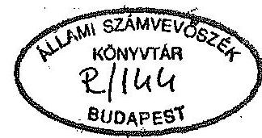
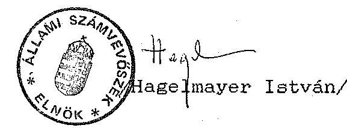

# JELENTÉS 

az AMALIPE Cigány Kultúra- és Hagyományőrző Egyesületnek 1991. évben juttatott állami költségvetési támogatás
felhasználásának ellenőrzéséről

---

Az ellenőrzést vezette:

$$
\begin{array}{ll}
\text { Dr. Elek János } & \text { osztályvezető főtanácsos }
\end{array}
$$

Az ellenőrzést végezték:

Dr. Szávai Tamás
Sörös István
Dr. Ocsovai Sándor
Dr. Velényi János
tanácsos
szakértő
szakértő
szakértő

---

Állami Számvevőszék
V-1029-13/92.
Tsz: 118 .

Jelentés
az AMALIPE Cigány Kultúra- és Hagyományőrző Egyesületnek 1991. évben juttatott állami költségvetési támogatás felhasználásának ellenőrzéséről

# I. 

A vizsgálat körülményei, célja, módszere

Az Állami Számvevőszékről szóló törvény értelmében az Állami Számvevőszék (ÁSZ) ellenőrzi az állami költségvetésből juttatott támogatás felhasználását a társadalmi szervezeteknél. Az Országgyűlés 6/1991.(II.11.) sz. határozatában döntött a nemzetiségi és etnikai kisebbségi szervezetek 1991. évi állami költségvetési támogatásáról, amelyben külön is hangsúlyozta az ÁSZ ellenőrzési jogosultságát.

Az országban lévő cigányszervezetek részére - szervezeti, valamint működési költségeik finanszírozására - az Országgyűlés 1991. február hó 11-én 81 millió Ft támogatást hagyott jóvá. A jóváhagyott összeg felosztásáról az Országgyűlés emberi jogi, kisebbségi és vallásügyi bizottsága részéről kezdeményezett megbeszélés alapján - az érintett cigányszervezetek megállapodása értelmében - az Amalipe Cigány Kultúra- és Hagyományőrző Egyesület és tagszervezetei 4,1 millió Ft-ot kitevő állami költségvetési támogatásban részesültek 1991. évben.

Az ellenőrzés célja annak értékelése volt, hogy az Amalipe Cigány Kultúra- és Hagyományőrző Egyesület (továbbiakban: Egyesület) az állami költségvetési támogatás felhasználásánál miként érvényesítette a törvényességi, a célszerűségi és az eredményességi szempontokat.

---

Az ellenőrzés folyamán figyelembe kellett venni azt a körülményt is, hogy a különböző nemzetiségi és etnikai szervezetek, illetve egyesületek alapvetően nonprofit érdekeltségű szervezetek. Ennek megfelelően a különböző csoportokat tömörítő, érdekérvényesítő alaptevékenység következtében a pénzügyi vonatkozású intézkedések tervezésénél, illetve ezek végrehajtásánál nem kizárólag a gazdaságossági szempontok érvényesülnek.

A lefolytatott vizsgálat a lezárt 1991. gazdálkodási évre terjedt ki. A helyszíni ellenőrzés 1992. november 3-tól december 31-ig tartott. Az ellenőrzés az Egyesület gazdálkodási tevékenységét, pénzfelhasználását az Egyesület budapesti hivatali helyiségében (Budapest XIX., Hunyadi J. u. 28/a), valamint a szúrópróbaszerűen kiválasztott tagszervezetektől bekért bizonylatok alapján vizsgálta.

# II. 

Az Egyesület pénzügyi gazdálkodásának rendszere

Az Egyesület szervezeti felépítését és tagszervezeteiről szóló információkat az 1. sz. melléklet tartalmazza.

Az Egyesület 1991. évi pénzügyi gazdálkodása nem mindenben felelt meg az erre vonatkozó jogszabályoknak. Az Egyesület pénzügyi gazdálkodására vonatkozó szabályozást nem készítették el. Nem határozták meg egyértelműen a szervezet és a tagszervezetei gazdálkodásának rendjét, kapcsolatát, valamint nem gondoskodtak az egységes végrehajtásról. A gazdálkodási feladatokat ellátó személyek munkaköri leírással nem rendelkeztek. Nem készítették el az utalványozás, a pénzkezelés szabályozását sem.

Az Egyesület elnökének aláírásával ellátott, a tagszervezetek részére megküldött "Elfogadó nyilatkozat" szerint "a .... székhelyű, .... nevű együttes az Amalipe Cigány Kultúra- és Hagyományőrző Egyesület helyi szervezete. A

---

helyi Egyesület származtatott jogi személy. A helyi Egyesület önállóan gazdálkodik, tevékenységéért felelőséget visel."

A magyar jogalkotás "származtatott jogi személy" fogalmat nem ismer. A megfogalmazás azt sejteti, hogy az "Elfogadó nyilatkozattal" befogadott valamennyi helyi Egyesület az egyesülési jogról szóló 1989. évi XXXIII. tv. által módosított 1989. évi II. tv. 2. §(4) bekezdésében foglalt feltételek teljesülése esetén - az Egyesület alapszabályában foglaltaknak megfelelően - jogi személy.

Az elfogadó nyilatkozat nem vette figyelembe a helyi szervezetek igényét és tényleges lehetőségeit, amikor minden csatlakozó egyesületet egységesen alapszabály szerinti jogi személlyé nyilvánított. Az Egyesület alapszabálya szerint ugyanis "a helyi szervezet igényei, kívánsága és a törvényi feltételek alapján önálló jogi személyként, vagy csoportként jön létre", tehát meg volt a lehetőség arra, hogy a helyi szervezet ne váljon jogi személlyé.

A három szúrópróbaszerűen kiválasztott helyi Egyesület közül kettő (BANGE CSANGA és TEENIPE) nem teljesítette a jogi személyiségből fakadó önálló könyvvezetési kötelezettségét; naplófőkönyvet, sőt pénztárkönyvet sem vezettek. Ezért e helyi szervezeteknek a gazdálkodásuk valamennyi bizonylatát az anyaegyesületnek voltak kötelesek megküldeni, ahol egységes könyvvezetést kellett volna végezni.

Az "Elfogadó nyilatkozat" azt sem vette figyelembe, hogy az Egyesületnek volt néhány a bíróságon önállóan bejegyzett tagja is, mint pl. a Csobánkai Phralassam Cigány Folklór Együttes, mely csak a kapott támogatás felhasználásával volt köteles évente elszámolni.

---

# III. 

## Az Egyesület 1991. évi költségvetésének tervezése és végrehajtása

Az Egyesület az 1991. februárjában ismertté vált állami költségvetési támogatás felhasználására nem készítette el éves költségvetését. Ennek következtében az Egyesület pénzfelhasználásáról, a feladatok finanszírozásáról testületi üléseken esetenként döntöttek. Így a pénzfelhasználás ellenőrzésére az évközben elfogadott célok és feladatok jegyzőkönyvekben foglalt részelemeinek ismeretében volt mód.

Az Egyesület az 1992. évi költségvetési támogatás igénylésekor az Országgyűlés Emberi jogi, kisebbségi és vallásügyi bizottságához az 1991. évi pénzfelhasználásról tételes-idősoros számítógépes listát nyújtott be. Ez a lista azonban nem biztosította az évközben elfogadott pénzügyi vonzattal járó döntések összevetését a tényleges teljesítéssel.

## IV.   Az állami költségvetési támogatás felhasználásának ellenőrzése

Az Egyesület 1991. évben 4,1 millió Ft állami támogatásban részesült. A támogatás két részletben került átutalásra: III. 21-én 1.025.000 Ft-ot, és IV. 24-én 3.075.000 Ft-ot írtak jóvá az Egyesület bankszámláján. A támogatás jogcímenkénti felhasználásáról nem készült beszámoló. Erre a számviteli nyilvántartás nem volt alkalmas, mert sem a bevételeket, sem a kiadásokat nem könyvelték jogcímenként, hanem csak egy összegben "vállalkozáson kívüli bevételként", illetve "egyéb költségek" címen.

---

Szúrópróbaszerű bizonylati mélységű ellenőrzéssel megállapította a vizsgálat, hogy a kapott támogatást rendeltetésszerűen, az egyesületi központ működési kiadásainak fedezésére, valamint a cigány kulturális és művészeti szervezetek, együttesek esetenkénti támogatására használták fel. A vizsgálatnak nem volt módja meggyőződni arról, hogy érvényesült-e a gazdaságos és hatékony felhasználás elve. Ezt a számviteli nyilvántartás nem tette lehetővé.

A felmerült költségeket ugyanis nemcsak jogcímenként nem mutatta ki a könyvelés, de ezen túlmenően a könyvelés a gazdasági eseményt követően sokszor több hónapos késéssel, és nem is mindig idősorrendben történt.

Az Egyesület a kapott költségvetési támogatásából az egyes cigány szervezeteknek és együtteseknek elszámolási kötelezettséggel adott támogatást.

A támogatottak nagy száma és a beküldött elszámolások ellenőrzésére kijelölt személy hiánya miatt azonban az elszámolási kötelezettség előírása csak formális volt és a felmerült költségek indokoltságát, hatékony felhasználását egy esetben sem ellenőrizték.

A szervezeteknek adott közvetlen támogatások évi összege 1-2 kivételtől eltekintve, nem volt több 50 E Ft-nál.

Az Egyesület központjának 1991. évi munkáját elsősorban a kapott állami támogatás szervezetek közötti elosztása és néhány központi rendezvény megszervezése, lebonyolítása tette ki.

# A tagszervezetek pénzügyi gazdálkodása 

Az Egyesület elnöke által aláírt, a tagszervezetek részére megküldött "Elfogadó nyilatkozat" szerint:"... A helyi Egyesület önállóan gazdálkodik, tevékenységéért felelősséget vállal". Tehát évközben egyáltalán nem fordítottak

---

figyelmet a tagszervezetek gazdálkodására, és az önálló gazdálkodás feltételéül szolgáló pénzügyi- számviteli rend kialakításához nem adtak megfelelő segítséget.

A támogatások éves felhasználásának elszámolását kérő 1991. december 3-ai körlevélben az Egyesület a jogi személy helyi szervezeteknek 1-1 pénztár bevételi és kiadási bizonylat tömböt küldött, ezek vezetésének előírása mellett. Ugyanakkor nem hívta fel a figyelmet arra, hogy a jogi személyiséggel rendelkező helyi Egyesületeknek naplófőkönyvet kell vezetniük.

Az Egyesület központja a helyi szervezeteknek adott támogatások figyelemmel kísérése érdekében elszámolási kötelezettséget írt elő tagegyesületeinek. Az ezt előíró
körlevélben azonban nem adott egyértelmű tájékoztatást az elszámolás módjáról.

A kapott támogatások felhasználásáról két szervezet kivételével, bár késve, a megadott határidőt túllépve a tagszervezetek írásban tájékoztatást adtak.

A tagszervezetek beszámolóinak némelyikéből kitűnik, hogy az anyaszervezettől kapott támogatáson felül egyéb forrásból is voltak bevételeik 1991. évben.

Az Amalipe Egyesület és a jogi személyiség feltételeit nem vállaló helyi csoportok összes bevételei és összes kiadásai, 1991. évben a szervezet naplófőkönyvéből és hiányos analitikus nyilvántartásából nem állapíthatók meg.

Az Egyesület 1991. évben 25 tagszervezet részére adott egyenként 50 E Ft, összesen 1.250 E Ft alaptámogatást, azzal a céllal, hogy a tagszervezetek működésének alapfeltételeit megteremtsék.

A kapott alaptámogatást a tagszervezetek a szervezet alapszabályában meghatározott cél megvalósítására, adottságaiknak és szükségleteiknek megfelelően használták fel.

---

A felhasználás főbb területei:

- a cigány hagyományoknak megfelelő ruházat, illetve az ahhoz szükséges anyag vásárlása;
- zeneszerszámok (gitár, mandolin, stb.) és azok alkatrészei (húr, pengető, stb.) vásárlása;
- az együttesek utazási költségeinek fedezése (rendezvényeken, fesztiválokon történő fellépések, stb. esetén);
- hangosító berendezések (mikrofon, hangfal, erősítő) vásárlása;
- dalszövegek gyűjtéséért díj fizetése;
- általános működési költségek (posta, bérleti díj, élelmezés, stb.) fizetése.

# V. 

A gazdálkodás törvényességének ellenőrzése

## 1. Az 1991. évi gazdálkodásról készített beszámoló

A mérleg- és a vagyonkimutatás készítése tárgyában kiadott 62/1988.(XII.24.)PM rendelet 1. § /b/ bekezdésében előírt kötelezettség alapján a társadalmi szervezetek a naptári év utolsó napjával eszközeiről és azok forrásairól mérleget, illetve vagyonkimutatást kötelesek készíteni, amit a hivatkozott PM rendelet 11. § /5/ bekezdésében előírtak értelmében az illetékes adóhatósághoz tartoznak benyújtani.

Az ellenőrzés megállapította, hogy az Egyesület 1991. évi gazdálkodásáról elmulasztotta elkészíteni és az elsőfokú adóhatóságnak megküldeni a hivatkozott rendeletben meghatározott mérleg- és vagyonkimutatást. Mulasztását az Egyesület a helyszíni ellenőrzés befejezéséig nem pótolta.

Az előbbieken túlmenően az Egyesület nem tudta hitelt érdemlően igazolni, hogy az 1991. évi adóbevallást az APEH-nek az előírt időben benyújtotta.

---

# 2. A könyvvezetési kötelezettség teljesítésének ellenőrzése 

Az Egyesület gazdasági eseményeit az év első kilenc hónapjában kézi bejegyzéssel vezetett naplófőkönyvben könyvelték. Majd ugyanezt az anyagot ismét lekönyvelték gépi adatfeldolgozással, továbbra is naplófőkönyv formájában és ugyanúgy könyvelték a IV. negyedév anyagát is.

A könyvelést havonta zárták, de ezzel csak formailag tettek eleget a negyedéves zárási kötelezettségnek, mivel nemcsak az első kilenc hónapot, de a IV. negyedévet is csak jóval a gazdasági események utáni időpontban, 1992-ben könyvelték. Ez a gyakorlat annál is inkább gondot okozott, mivel pénztárkönyvet nem vezettek és a pénztári forgalom csak a naplófőkönyvben került rögzítésre. A több hónapos könyvelési késés tehát azt jelentette, hogy pénztárzárást és pénzkészlet ellenőrzést semmiképpen sem lehetett volna végezni és nem is végeztek.

## 3. Az analitikus nyilvántartások vezetésének ellenőrzése

Az Egyesület a vonatkozó jogszabályokban előírt, a naplófőkönyvhöz szorosan kapcsolódó, azt kiegészítő analitikus nyilvántartások egy részét egyáltalán nem, másokat hiányosan vezetett.

Az Egyesület sem 1990. december 31-én, sem 1991. december 31-én nem készített leltárt. A leltár hiánya miatt nem állapítható meg az Egyesület eszközeinek mennyisége és értéke.

A nyilvántartások nem teljeskörűek, esetenként hiányosak. Az Egyesület tulajdonában több festmény van. Megfelelő nyilvántartás hiányában a képek egy része azonosítható csak. Nagy példányszámban Bari Károly Az erdő anyja c. könyvével is rendelkeznek, melyről szintén nem készült nyilvántartás.

---

Szigorú számadású nyomtatványok nyilvántartása nem megfelelő és a nyilvántartások részletezettsége nem kielégítő. Ezek a nyilvántartások nem tartalmazzák az összes szigorú számadásra kötelezett, az Egyesületnél előforduló nyomtatványt.

Nincs analitikus nyilvántartás továbbá

- a fogyóeszköznek minősülő berendezési és felszerelési tárgyakról;
- a gépi adathordozón digitálisan rögzített programpéldányról és a gépi adatfeldolgozási dokumentációról;
- a pénztárban lévő külföldi fizetési eszközökről, valutákról;
- az elszámolásra kiadott összegekről;
- a levont szja előlegekről;
- a belföldi kiküldetési utasításokról.

A naplófőkönyv "Munkabér" és "Munkabérek közterhei" rovatában adatbejegyzés nem szerepel. A rendelkezésre bocsátott iratok
 alapján ugyanakkor megállapítható, hogy 1991. évben eseti munkaszerződések alapján mintegy 600 E Ft-ot fizettek ki. A pontos összeg a nem megfelelő analitikus nyilvántartás hiányában nem volt megállapítható.

A különböző nyilvántartások összhangjának hiányára jellemző példa a "Kimutatás az Amalipe Egyesület 1991. évi szja levonásairól és befizetéséről" c. iratban, hogy

- nem szerepelnek a szerződésnyilvántartás 13/91, 14/91. és 15/91. sorszám alatt szereplő személyek, pedig
$=$ a szerződésnyilvántartás szerint szerződést kötöttek, = a költségnyilvántartás szerint a szerződésben szereplő összegeket kifizették:
$=$ az egyéni kartonok szerint a kifizetett összegekből az szja-t levonták.

---

- a 91. IX. hónapnál 3.000 Ft-os bruttó bérkifizetéssel feltüntetett személy a
$=$ szerződésnyilvántartásban nem szerepel;
$=$ egyéni kartonja nincs.
Szja előleget csak mintegy 357.000 Ft után vontak le. A levont szja előleg általában a kifizetett összeg 35 %-ának a 20 %-a volt. Az Adó- és Pénzügyi Ellenőrzési Hivatal részére a levont szja előlegekről a kötelezően előírt adatszolgáltatást nem küldték meg.

A kifizetett összegek egy részéből, mintegy 243 E Ft-ból szja előleget nem vontak le. Ezeket a kifizetéseket úgy kezelték, mintha alapítvány terhére történtek volna.

Ezen szerződések megkötésekor és a kifizetés alkalmával tévesen jártak el, nem vették figyelembe az alapítványokból és közérdekű kötelezettség-vállalásokból adómentesen kifizethető összegekről szóló 1/1989.(I.1.)MT rendelet előírásait, mert a kifizetőhely az Egyesület volt és ezért e kifizetések is szja kötelezettség alá estek.

# 4. A számvitel bizonylati rendjének betartása 

A számvitel bizonylati rendjének tárgyában kiadott és a vállalkozási nyereségadó hatálya alá nem tartozó egyéb jogi személyekre is vonatkozó 53/1988.(XII.24.)PM rendelet előírásai alkalmazandók az Egyesület adminisztrációjával összefüggésben. A helyszíni ellenőrzés a hivatkozott PM rendeletben megfogalmazott előírások megtartását, illetve azok gyakorlati érvényesülését vizsgálta.

Nincs szabályozva, hogy ki rendelkezik utalványozási joggal, ki kezeli a pénztárt és viseli az ezzel járó felelősséget. Az Egyesület gazdálkodásának folyamatos irá-

---

nyítását, és jelentős részben a pénztári pénzkezelést is, a vizsgált időszakban - a rendelkezésre álló bizonylatokból kitűnően - az egyik elnök végezte, a többi elnök és az elnökhelyettesek e munkában nem vettek részt.

Az igen nagy késedelemmel, utólag vezetett naplófőkönyv esetében, külön vezetett pénztárnapló hiányában egyáltalán nem volt mód az aktuális készpénzállomány helyességéről meggyőződni, illetve annak rendszeres ellenőrzéséről gondoskodni.

A kiállított pénztárbizonylatok egy része - alakilag és tartalmilag - a vonatkozó 53/1988.(XII.24.)PM rendelet 4. β (1) bekezdése c/ pontjában előírt feltételeknek nem felel meg. Így több esetben hiányzik a befizető, vagy a pénzösszeg átvevőjének az aláírása.

Az ellenőrzés helytelen gyakorlatnak minősítette az elszámolásnak azt a módját, amikor vendéglátóipari egység által kiállított számlán a megvendégeltek létszámát nem tüntették fel.

Ugyancsak helytelen gyakorlatot folytatott az Egyesület egyrészt a pénztárból történő kifizetések, másrészt az OTP-nél vezetett csekkszámláról eszközölt átutalások alkalmával, amikor számos esetben a vonatkozó számlákat nem csatolták a pénztári kiadási bizonylatokhoz, illetve az OTP csekkszámla kivonatokhoz. Az érdemi számlák hiányában a teljesített kifizetések reális vizsgálata meghiúsult.

Az Egyesület a vizsgált időszakban a VOLAN által rendelkezésre bocsátott autóbuszok igénybevétele esetén azt a helytelen gyakorlatot folytatta, hogy a megrendelő fél részéről a tényleges km teljesítmények igazolásait elmulasztották elvégezni. Ennek ellenére a benyújtott számlákat a teljesítmények elismerése nélkül kiegyenlítették.

Az Egyesület a vizsgált időszakban több esetben eszközölt a házi pénztárból olyan kifizetéseket, amelyek még a korábbi 1990. évben merültek fel.

---

Több esetben bizonylat nélkül könyveltek.

Azonos költségfajtát (gépkocsi használatot) nemcsak a jogszabályban előírttól eltérő módon, de nem is minden esetben azonos elvek szerint számolták el.

A külföldi utazásokról nem állítottak ki kiküldetési rendelvényt, és a kiküldöttek a felmerült költségről nem készítettek elszámolást. Egy elszámolást bemutattak ugyan az ellenőrzésnek, de az elszámolás mellékletét képező alapbizonylatok nélkül. Ezek hiányában az elszámolás nem fogadható el.

A devizabetétszámlára történt befizetések és az arról felvett összegek könyvelése nem történt meg a pénzmozgás időpontjában, hanem csak XII. 31-én. Ekkor mind a devizaszámláról felvett és a pénztárba bevételezett, mind pedig a pénztárból kiadásba helyezett valuta Ft értékének könyvelése pénztári bevételi, illetve kiadási bizonylat kiállítása nélkül történt. Egy esetben ugyanazon devizaösszeg a pénztárban nem azonos Ft összegben van bevételezve, mint amilyen összegben kiadásba van helyezve. A devizaszámláról felvett 555,9 USD (helyesen 3000 FRF-ra átváltott 527,55 USD) Ft ellenértékeként 42.300 Ft pénztári bevétel van könyvelve, a kiadáskor pedig 45.000 Ft kiadás. A különbözet 2.700 Ft, mely összeg szabályosan vezetett és előírásszerűen ellenőrzött pénztár esetében pénztári többletként jelentkezett volna.

Az Országos Közművelődési Központ 1991. XI. 18-án kelt 618/91. sz. számláján 1991. IX. 6-án történt igénybevétel címén 1991. IX. 30-i határidővel 5.750 Ft terembérleti díj átutalását kérte az MNB-nél vezetett számlájára. Az összeget 1991. XII. 10-én a pénztárból helyezték kiadásba. A pénztári kiadási bizonylaton nem szerepel az összeg átvevőjének az aláírása. Az összeg postai feladásának sincs nyoma.

Egy fő részére az Egyesület, közgyűlésének előkészítő munkálatainak végzéséért 5.000 Ft elnöki jutalmat állapí-

---

tott meg. Az összeget VII. 29-én kiadásba is helyezték a pénztárból "jutalom, Soros Alapítvány" címen. Az összeg átvételét azonban a kiadási bizonylaton aláírással nem igazolták és az összegből szja-előleget nem vontak le, noha az elvégzett munka nem szja-mentes.

Az egyik elnök részére VII. 3-án 15 E Ft-ot fizettek ki "szellemi alkotási munka" címén. A kiadási bizonylaton utalványozói aláírás nincs. A kifizetés alapjául szolgáló szerződést csak a megbízott írta alá, megbízói aláírás a szerződésen nem szerepel.

A pénztár 1991. dec. 31-i záróegyenlege a könyvelés szerint 106.592 Ft, ennek ellenére 1992. január 1-én már csak 56.592 Ft pénzkészlettel nyitottak.

Az eltérés oka az, hogy 1991. VI. 22-i vezetőségi ülésen a Fardi Együttesnek 50 E Ft kölcsönt engedélyeztek, mely összeget az Együttes át is vett, de azt a pénztárból nem helyezték kiadásba. A kölcsönt az együttes 1991. X. 15-én vissza is fizette. A pénztárból felvett, de kiadásba nem helyezett 50 E Ft miatt szükségessé vált korrekció a XII. 31.-i záróegyenleg csökkenésének az oka.

Egy személy 1991. XII. 6-án a nagyecsedi rendezvény költségeinek fedezésére elszámolásra felvett 135 E Ft-ot. Az összeget a pénztárból kiadásba helyezték, de nem elszámolásra felvett előlegként, hanem költségként számolták el.

A felvett összeggel 1991. XII. hóban elszámoltak. A felmerült költségeket a pénztárból kiadásba helyezték és a könyvelésben elszámolták. Az elszámolásra felvett összegről kiállították a pénztári bevételi bizonylatot, a naplófőkönyvben azonban a pénzvisszavételezést nem könyvelték le.

Az Amalipe Alapítvány bevételeit és kiadásait az Egyesület könyvvitelében egyesületi pénzforgalomként könyvel-

---

ték. Az Alapítvány két bankszámlájának 76.000 Ft és 36.894 Ft összegű, záróegyenlegei is az Egyesület bankköveteléseként van a könyvelésben kimutatva.

A számítógépes könyvelési program tartalmát és működését leíró dokumentációt az ellenőrzés időpontjában nem tudták a vizsgálat céljára bemutatni.

A vizsgált időszakban a belső ellenőrzés egyáltalán nem működött. A vezetői és a folyamatba épített ellenőrzésnek nem volt nyoma. Belső ellenőrzés működését meghatározó szabályokat nem készítettek.

# VI.   Következtetések, javaslatok 

Összességében megállapítható, hogy az Egyesület az 1991. évben kapott állami költségvetési támogatást az alapszabályban megfogalmazott célok érdekében használta fel.

Az Egyesület működése, gazdálkodása több területen nem szabályozott és nem tervszerű. Szervezeti és működési, valamint gazdálkodási szabályzatot nem készítettek, a pénzkezelés, utalványozás, a tagszervezetek pénzkezelésének nyilvántartási és elszámolási rendje nem szabályozott.

Az 1991. évre a rendelkezésre bocsátott költségvetési támogatás ismeretében költségvetést nem készítettek. Tagdíj és egyéb bevételeket nem terveztek.

Az Egyesület a lezárt 1991. éves gazdálkodási adatairól nem készítette el a kötelezően előírt beszámolóját és adóbevallását, azokat nem küldte meg a felhasználóknak. A gazdálkodásra vonatkozó jogszabályokat az Egyesület számos esetben figyelmen kívül hagyta.

---

A jelentésben felsorolt megállapítások következtében a továbblépés érdekében az ellenőrzés által javasolt tennivalók a következők:

1. A gazdálkodás megszervezéséért, szabályszerű működéséért és ellenőrzéséért felelős személyt ki kell jelölni.
2. A számvitelről szóló 1991. évi XVIII. tv. előírásainak megfelelően ki kell alakítani az Egyesület számviteli, elszámolási, nyilvántartási, pénzkezelési, utalványozási és beszámolási rendjét. Érvényt kell szerezni a gazdálkodásra vonatkozó egyéb jogszabályok előírásainak.
3. Meg kell alkotni a Szervezeti és Működési Szabályzatot.
4. Tisztázni szükséges az egyes tagszervezetek kapcsolódási módját az Egyesülethez. Meg kell határozni, hogy melyek azok a tagszervezetek, amelyek önálló bírósági bejegyzéssel rendelkeznek. Az önálló bírósági bejegyzéssel nem rendelkező tagszervezetek közül - az egyesülési törvényben előírt feltételek teljesülése esetén - meg kell határozni azokat, melyeket az Egyesület az alapszabálya értelmében jogi személlyé nyilvánít.
5. Az önálló jogi személyiséggel rendelkező Amalipe Alapítvány gazdálkodását, pénzforgalmát és nyilvántartását el kell különíteni az Egyesületétől.
6. Az Egyesület függetlensége és hosszútávú működése céljából - az egyoldalú kizárólagos állami költségvetési támogatásra utaltság helyett - növelni célszerű az egyéb saját bevételek arányát, mint pl. tagdíj, adomány, rendezvény, kiadvány, felajánlott művészi alkotások értékesítése stb.
7. A gazdálkodás megalapozottságának biztosítása érde-

---

kében évente költségvetést kell készíteni, melynek végrehajtását folyamatosan figyelemmel kell kísérni. A lezárt év gazdálkodási eredményeiről a beszámolási, bevallási kötelezettségnek eleget kell tenni.
8. Biztosítani kell, hogy minden kifizetést megfelelő, teljes értékű számviteli bizonylattal támasztsanak alá.
9. Meg kell szervezni, szabályozni és működési feltételeit biztosítani a belső ellenőrzésnek.
10. A pénzkezelésben és a számviteli rendben tapasztalt hiányosságok megszüntetése, illetve a felelősség megállapítása érdekében szükséges intézkedéseket tegyék meg.

Budapest, 1993. március 29.

Melléklet: 1 db

---

# Az Amalipe Újhagyomány Kultúra- és Hagyományőrző Egyesület szervezeti felépítése és pénzügyi gazdálkodásának rendszere 

## 1. Az Egyesület felépítése

Az Egyesület állampolgári kezdeményezésre alakult Budapesten. Alakuló közgyűlését 1989. június 17-én tartotta Budapesten, amelyen elfogadták az Egyesület alapszabályát. Az Egyesületet a Fővárosi Bíróság 6 Pk.25.840/1989./ 1. sz. 1989. augusztus 18-án kelt végzésével, 284. sorszám alatt jegyezte be a társadalmi szervezetek nyilvántartásába, önálló jogi személyként. Az alakuló közgyűlésen elfogadott alapszabályt az 1991. július 20.-i közgyűlés módosította. Az Egyesület célkitűzéseit alapító, valamint programnyilatkozata tartalmazza, míg szervezeti felépítését alapszabálya az alábbiak szerint állapította meg:

- az Egyesület legfőbb döntéshozó szerve a Közgyűlés. Kizárólagos hatáskörébe tartozik az alapszabály megállapítása és módosítása, az Egyesületnek más szervezettel való egyesülése, felosztásának kimondása, döntés az elé utalt fegyelmi ügyekben, az Egyesület Ellenőrző Bizottságának, valamint 3 elnökének, 3 alelnökének megválasztása, azok ciklusonkénti beszámoltatása, végül döntési jogosultság mindazon ügyekben, amelyeket jogszabály vagy az Egyesület más testületei döntéshozatal végett a közgyűlés elé terjesztenek. A közgyűlés legalább két évenként ülésezik. Összehívásáról az elnök, vagy szükség esetén az Ellenőrző Bizottság jogosult gondoskodni.
- Két közgyűlés közötti időszakban az Egyesület ügyeinek vitele, döntés minden olyan kérdésben, amely nem tartozik a közgyűlés hatáskörébe, az Egyesület Tanácsa, a KRISZ feladatkörébe tartozik. A KRISZ szervező és irányító munkát lát el az Egyesület akcióinak, rendezvényeinek tervezésében, valamint megvalósításában, ezen feladatok ellátására felelőseket jelöl ki, akiket segít

---

és beszámoltat. Dönt más szervezetekkel való kapcsolat létesítése, tartalma és formája kérdésében. Megállapítja az Egyesület munkatervét és költségvetését, valamint dönt a végrehajtásukról szóló beszámoló elfogadása kérdésében. Figyelemmel
 kíséri az Egyesület adminisztratív munkájának végzését, eljár az Egyesület fegyelmi ügyeiben. Dönt a csatlakozó csoportok, tagok felvételéről. Megalkotja az Egyesület szervezeti és működési szabályzatát, segíti az Egyesület és területi szervezeteinek létrejöttét és munkáját. Szükség esetén gondoskodik a közgyűlés összehívásáról. Az Egyesület Tanácsa a KRISZ, általában szükség szerint, de legalább évente háromszor ülésezik.

- Az Egyesület elnökei - illetve akadályoztatásuk esetén az elnökhelyettesek - irányítják az egyesület adminisztratív és gazdasági tevékenységét. Képviselik az Egyesületet más szervezetekkel szemben. Gondoskodnak a testületi határozatok végrehajtásáról. Javaslatokat dolgoznak ki az Egyesület munkatervére és költségvetésére, továbbá beszámolnak azok végrehajtásáról. Informálják az Egyesület szervezeteit és testületeit, gondoskodnak az utóbbiak részére készítendő jelentések és tájékoztatók kellő időben történő elkészítéséről.
- Az Ellenőrző Bizottság tagjait a közgyűlés jogosult megválasztani, munkájáról ciklusonként tartozik beszámolni.
- A helyi együttesek, illetve egyesületek közös feladataik ellátására, területi érdekeik képviseletére, területi (megyei) bizottságokat alakíthatnak. Ezek a bizottságok jogi személyként is működhetnek. A területi bizottságok tevékenysége nem lehet ellentétben az Egyesület célkitűzéseivel. Egyes szakterületek (pl. festő, illetve képzőművészek) a területi szervekhez hasonlóan alakíthatnak szakmai bizottságokat. Jogállásuk a területi bizottságukéval azonos. A területi és szakmai bizottságok tevékenységét az Egyesület Tanácsa - a KRISZ - segíti és koordinálja.
- Az Egyesület működésének alapvető, egyben meghatározó formája a helyi csoport, vagy egyesület (klub, együtt-

---

tes, kar stb.), amelyek a törvényi feltételek megléte esetén önálló jogi személyként, vagy csoportonként fejtik ki tevékenységüket. Választott képviselőik útján képviseltetik magukat az Egyesület ügyeinek intézésében. A helyi szervezet tevékenysége nem állhat ellentétben az Egyesület célkitűzéseivel. A helyi csoportok legkevesebb 5 fő részvételével alakulhatnak. Megalakulásukról az Egyesület elnökeit tájékoztatni kell, akik az Egyesület Tanácsa a KRISZ felé intézkednek a helyi szervezet képviseletének ellátásáról.

- Az Egyesület tagsága rendes, pártoló és tiszteletbeli tagokból tevődik össze. Az alapszabály szerint az Egyesület rendes tagja az a 14. életévét betöltött személy lehet, aki egyetért az Egyesület célkitűzéseivel, részt vállal feladataik megvalósításában, valamint teljesíti az alapszabályban meghatározott "adott esetben a helyi szervezet által mérsékelt" tagdíjfizetési kötelezettségét. Az Egyesület pártoló tagja az a természetes, vagy jogi személy lehet (szerv, egyesület stb.) aki, illetve amely tevékenységével, erkölcsi, vagy anyagi támogatója akar lenni az Egyesületnek, továbbá egyetért annak célkitűzéseivel. Bejegyzéséről, illetőleg a támogatás elfogadásáról az Egyesület vezetősége dönt. Tiszteletbeli tagja az Egyesületnek viszont az a hazai, vagy külföldi természetes, vagy jogi személy lehet, akit, illetve amelyet a cigányság érdekében végzett kiemelkedő tevékenységért az Egyesület tanácsa, illetve a KRISZ kétharmados szótöbbséggel erre a címre megválaszt.

# 2. Az egyesület tagszervezetei 

Az Egyesület tagszervezeteinek száma 1991. év folyamán folyamatosan változott, összességében nőtt.

Az Egyesület vezetősége úgy döntött, hogy az Amalipéhez csatlakozni kívánó cigányszervezetek "Csatlakozási szándéknyilatkozat"-ot kötelesek kiállítani. Ehhez mellékelniük kell a szándéknyilatkozatban szereplő tagok számával egyező, kitöltött "Belépési nyilatkozat"-ot, csak ezek birtokában adta ki a Szervezet az "Elfogadási nyilatkozat"-ot.

---

Az Egyesület a csatlakozott tagszervezetekről egy-egy irattartót nyitott. A megnyitott irattartókról, a tagszervezetek számáról összefoglaló nyilvántartás nem készült. Az ellenőrzés időpontjában nem tudták megadni az 1991. január 1-i, illetve az 1991. december 31-i tagszervezeti és taglétszámot.
