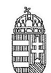
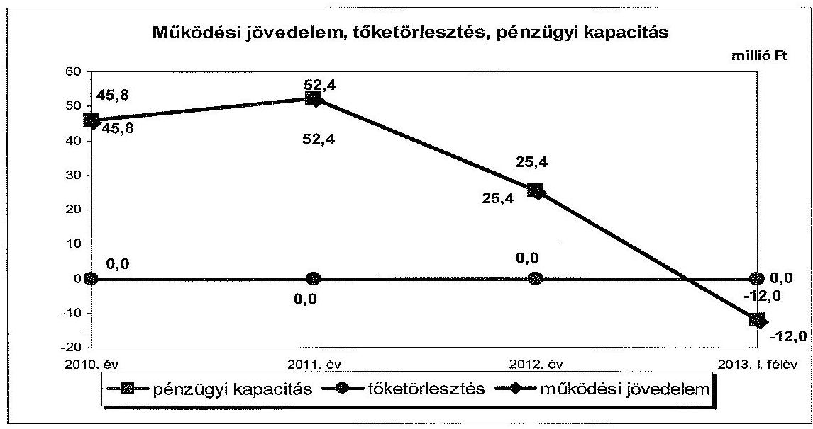
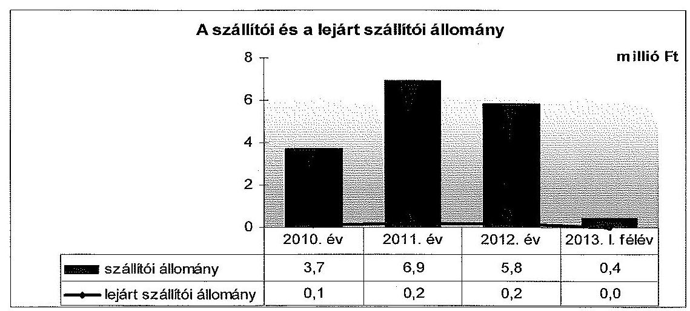
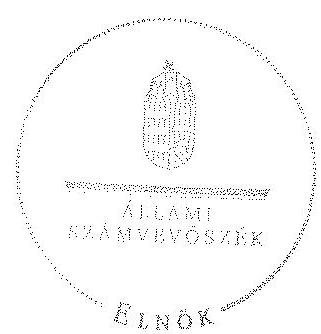

ÁLLAMI
SZÁMVEVŐSZÉK

# JELENTÉS 

az önkormányzatok pénzügyi gazdálkodási
helyzete értékelésének, és gazdálkodása
szabályosságának ellenőrzéséről
Jászjákóhalma
14100
2014. június

---

# Állami Számvevőszék 

Iktatószám: V-0356-053/2014.
Témaszám: 1349
Vizsgálat-azonosító szám: V065010

## Az ellenőrzést felügyelte:

## Renkó Zsuzsanna

felügyeleti vezető
Az ellenőrzést vezette és az ellenőrzés végrehajtásáért felelős:
Mohl Anna
ellenőrzésvezető
A számvevőszéki jelentés összeállításában közremüködött:
Baksa Anikó
számvevő tanácsos
Az ellenőrzést végezték:
Baki István
Számvevő tanácsos

Dr. Dorogi Zsolt Pál
számvevő

---

# TARTALOMJEGYZÉK 

BEVEZETÉS ..... 3
I. ÖSSZEGZŐ MEGÁLLAPÍTÁSOK, KÖVETKEZTETÉSEK, JAVASLATOK ..... 6
II. RÉSZLETES MEGÁLLAPÍTÁSOK ..... 12

1. Az Önkormányzat kötelező és önként vállalt feladatai, a feladatellátás szervezeti kereteinek változása ..... 12
2. A pénzügyi egyensúly fenntartását veszélyeztető pénzügyi kockázatok, ezek csökkentése érdekében tett intézkedések ..... 16
3. Az Önkormányzat kötelezettségeinek állománya, azok összetételének változása, az adósságkonszolidáció hatása ..... 22
4. Az Önkormányzat pénzügyi gazdálkodása során érvényesített integritási szempontok ..... 24

---

# MELLÉKLETEK 

1. számú

Az Önkormányzat bevételei és kiadásai, valamint adósságszolgálata a 2010-2013. év I. félév közötti időszakban (a CLF módszer szerint)
2. számú

Az Önkormányzat által a 2010. és a 2013. év I. félév között megvalósított fejlesztési feladatok érdekében teljesített felhalmozási kiadások és az ezekhez vállalt kötelezettségek összegzése
Az Önkormányzat kötelezettségeinek és egyes kötelezettségvállalásainak 2010. december 31-ei és 2013. június 30 -ai állománya, valamint a 2013. év II. félévben és az azt követő években várható kötelezettségek, kötelezettségvállalások miatti kiadások

## FÜGGELÉKEK

1. számú Rövidítések jegyzéke
2. számú Fogalomtár

---

# JELENTÉS 

## az önkormányzatok pénzügyi gazdálkodási helyzete értékelésének, és gazdálkodása szabályosságának ellenőrzéséről Jászjákóhalma

## BEVEZETÉS

Az ÁSZ a stratégiájában célul tűzte ki, hogy az önkormányzatok ellenőrzése során azok pénzügyi-gazdasági helyzetét értékeli, kockázatait feltárja, valamint az ellenőrzések helyszíneit objektív mutatószámrendszer alapján választja ki.

Az államháztartás önkormányzati alrendszerében az utóbbi években megjelenő gazdálkodási nehézségek, a pénzforgalmi hiány növekedése, az eladósodás az ÁSZ figyelmét az önkormányzatok pénzügyi helyzetére irányította. Az elkövetkezendő évek költségvetési hiánycéljainak tarthatósága érdekében indokolt, hogy az önkormányzatok pénzügyi helyzetelemzése és az egyensúlyi helyzetet befolyásoló kockázatok feltárása továbbra is kiemelt hangsúlyt kapjon az ÁSZ tevékenységében.

A közigazgatás átalakításának keretében - a helyi igazgatás és önkormányzás hatékonyabbá tétele érdekében - az önkormányzatokra vonatkozóan 2012-ben újraszabályozták mind a sarkalatos, mind az önkormányzatok mindennapi múködését rendező törvényeket és a feladatok végrehajtását biztosító előírásokat. Az önkormányzati feladatellátást érintő átalakítások jelentős része 2013ban következett be azzal, hogy az igazgatási, az oktatási és a szociális ellátásban a feladatok jelentős hányadát átvette az állam. Ahhoz, hogy az önkormányzatok meg tudjanak felelni a számukra meghatározott - szigorúbb - gazdálkodási szabályoknak, és az új feltételek mellett is biztosítható legyen a közszolgáltatások megfelelő színvonalú ellátása, szükséges volt a pénzügyigazdasági rendszerük alapjainak megszilárdítása. Ezt a célt szolgálja az adósságkonszolidáció, amely az önkormányzatok múködését és fejlesztését segítő, de korábban az állam által nem fedezett kiadásokkal kapcsolatos kötelezettségvállalások differenciált mértékű átvállalását jelenti.

Az ÁSZ a 2013. év II. félévi ellenőrzési tervében a 23. számú, az önkormányzatok pénzügyi gazdálkodási helyzete értékelésének, és gazdálkodása szabályosságának - 2013. évben induló - ellenőrzésével az önkormányzatok 2011. évben megkezdett helyzetelemzését folytatja. Az adósságkonszolidáció az önkormányzatok pénzügyi egyensúlyi helyzetére egyértelműen kedvező hatást gyakorolt. Az önkormányzati alrendszerben a 2013-tól bevezetett új feladatfinanszírozási rendszer keretein belül az adott települési önkormányzat feladata a pénzügyi egyensúly megteremtése, hosszú távú fenntartása. Az adósságkonszolidáció, a feladat-ellátási és finanszírozási rendszer változásának 2013. év I.

---

félévet követő hatása az ellenőrzött időszak alapján - az intézkedések bevezetése óta eltelt idő rövidségére tekintettel - még nem állapítható meg. A pénzügyiegyensúlyi helyzet jövőbeni alakulása - figyelemmel az adósságkonszolidáció folytatására - a törvényi rendelkezések intézkedések hosszabb távú érvényesülése után elemezhető, értékelhető. Erre tekintettel kiemelt fontosságú az önkormányzatok pénzügyi egyensúlyi helyzetére ható kockázatok feltárása, az ezzel kapcsolatos folyamatok, trendek bemutatása. Az ÁSZ ennek megfelelően a jövőben is tovább folytatja az önkormányzatok pénzügyi gazdálkodási helyzetét értékelő témacsoportos ellenőrzéseit.

Az ellenőrzések kockázatalapú megközelítése keretében megtörténik az önkormányzatok adósságkezelési és likviditási helyzetének értékelése, a pénzügyi egyensúly minősítése, továbbá az alrendszerben 2013-ban bekövetkezett változások hatásának értékelése.

Az ellenőrzés - eredményének várható hatásaként - megállapításaival segítséget nyújthat a pénzügyi helyzet értékeléséhez, a pénzügyi egyensúly helyreállítása érdekében szükségessé váló önkormányzati intézkedések megtételéhez. Az ellenőrzés során továbbra is célunk az államháztartás önkormányzati alrendszerére jellemző információk összegzésével támogatni az Országgyúlés munkáját a törvényalkotásban, a források elosztásában.

Az ellenőrzés célja: az Önkormányzat pénzügyi helyzetének, szabályosságának értékelése, a pénzügyi egyensúly alakulására hatással lévő folyamatoknak és a pénzügyi egyensúly alakulására ható kockázatoknak a feltárása.

# Ennek keretében értékeltük, hogy: 

- a kötelező és önként vállalt feladatok ellátása, ezen belül az ellátott feladatok körének, az ellátást biztosító szervezeti formáknak a változása milyen hatást gyakorolt a pénzügyi egyensúlyi helyzetre;
- az Önkormányzat pénzügyi - múködési és felhalmozási - egyensúlya milyen irányban változott, a változást milyen okok idézték elő, továbbá milyen intézkedéseket tettek az egyensúly biztosítása, illetve javítása érdekében, az intézkedések hatására javult-e az Önkormányzat pénzügyi helyzete;
- a költségvetési kiadások finanszírozása érdekében vállalt, pénzintézetekkel szembeni kötelezettségek, a szállítói és egyéb kötelezettségek hogyan alakultak, az adósságkonszolidáció után fennmaradt kötelezettségek teljesítésének kockázatai miként befolyásolják a jövőbeli pénzügyi egyensúlyi helyzetet.

Az önkormányzatok korrupcióval szembeni veszélyeztetettségének csökkentése érdekében új feladatként felmértük az integritási szemlélet érvényesülését a pénzügyi gazdálkodási folyamatokban.

Utóellenőrzésre nem került sor, mivel az ÁSZ az ellenőrzött időszakban az Önkormányzatnál számvevőszéki jelentéssel lezárt ellenőrzést nem végzett.

Az ellenőrzési célokban megfogalmazott kérdések értékelési kritériumai a gazdálkodásra vonatkozó jogszabályok és a pénzügyi egyensúly biztosításának, valamint a pénzügyi helyzettel és gazdálkodással kapcsolatos kockázatok keze-

---

lésének követelménye. Az ellenőrzés az ellenőrzési célok eléréséhez elemző, értékelő, a pénzügyi helyzet kockázatát is minősítő eljárásokat alkalmazott.

Az ellenőrzés típusa: szabályszerűségi ellenőrzés

# Ellenőrzött szervezet: Jászjákóhalma Községi Önkormányzat 

Az ellenőrzött időszak: a 2010. január 1-jétől 2013. június 30-ig terjedő időszak, figyelemmel az ellenőrzés célja vonatkozásában megfogalmazottakra. A pénzintézetekkel szembeni kötelezettségek állományának vizsgálatakor az ellenőrzött időszakban fennálló kötelezettségeket vette figyelembe az ellenőrzés.

Az ellenőrzés szakmai módszertana az ÁSZ hivatalos honlapján (www.asz.hu) közzétett szakmai szabályokon alapult, amely a Legfőbb Ellenőrző Intézmények Nemzetközi Szervezete (INTOSAI) által kiadott nemzetközi standardok (ISSAI) figyelembevételével készült.

Az ellenőrzés jogszabályi alapját az ÁSZ tv. 1. § (3) bekezdésének, 5. § (2)-(6) bekezdéseinek, valamint az Áht. 61 . § (2) bekezdésének előírásai képezik.

Az ellenőrzés során használt rövidítéseket az 1. számú, az egyes fogalmak magyarázatát a 2. számú függelék tartalmazza.

Jászjákóhalma község állandó lakosainak száma 2012. január 1-jén 3049 fő volt. Az Önkormányzat a 2012. évben 308,1 millió Ft költségvetési bevételt ért el, és 312,1 millió Ft költségvetési kiadást teljesített. Az Önkormányzatnak pénzintézetekkel szembeni adóssága nem volt, ezért a 2012. évi konszolidálásban nem volt érintett. A 2012. december 31-i könyvviteli mérleg szerint 298,3 millió Ft értékű vagyonnal rendelkezett, a rövid lejáratú kötelezettségállomány 5,6 millió Ft, a hosszú lejáratú kötelezettség 5,0 millió Ft volt. Az Önkormányzatnak gazdasági társaságokban tulajdoni részesedése 2013. június 30 -án nem volt. A jegyző 2002. január 1-jétől látta el feladatait. A foglalkoztatott köztisztviselők száma 2013. január 1-jén 9 fő volt.

Az ÁSZ tv. 29. § (1) bekezdése szerint a jelentéstervezetet megküldtük a polgármester részére, aki az ÁSZ tv. 29. § (2) bekezdésében foglalt észrevételezési jogával nem élt, a jelentéstervezetre észrevételt nem tett.

---

# I. ÖSSZEGZŐ MEGÁLLAPÍTÁSOK, KÖVETKEZTETÉSEK, JAVASLATOK 

Az Önkormányzat pénzügyi egyensúlyának helyreállítása az ellenőrzött időszakra vonatkozóan feltárt kockázatok alapján azonnali intézkedést igényel, mivel a 2013. év I. félévében kialakult múködési forráshiány a biztonságos múködést rövid távon korlátozza. Az ellenőrzött időszakban az Önkormányzat múködési jövedelemtermelő képessége a 2011. évtől csökkenő tendenciát mutatott, és 2013. év I. félévében a múködési jövedelemtermelő képesség miatti kockázat fennállt, továbbá a 2012. évtől megkezdődött a korábban képzett tartalékok felélése.

Az Önkormányzat költségvetésének elemzését a CLF módszerrel számított mutatók alapján végeztük. A pénzügyi kapacitás 2010-2013. év I. félév közötti változását a következő ábra mutatja be:

Az ellenőrzött időszakban tőketörlesztési kötelezettsége az Önkormányzatnak nem volt, mert pénzintézeti kötelezettséggel nem rendelkezett.

Az Önkormányzat az ellenőrzött időszakban összesen 1024,5 millió Ft költségvetési bevételt ért el és 966,3 millió Ft költségvetési kiadást teljesített, összességében 58,2 millió Ft költségvetési többlet keletkezett.

Az Önkormányzat folyó költségvetésének egyenlege (müködési jövedelme) a 2011. évtől folyamatosan és erőteljesen csökkent. A 2010-2012. években 123,6 millió Ft többlet keletkezett, míg a 2013. év I. félévében a múködési jövedelem negatívvá ( $-12,0$ millió Ft) vált. Az Önkormányzat 2010. és 2013. év I. félév között ÖNHIKI támogatást nem igényelt. Müködési jövedelemtermelő képesség miatti kockázatot jelez, hogy az Önkormányzat által az ellenőrzött időszakban saját hatáskörben tett bevételnövelő és kiadáscsökkentő intéz-

---

kedések hatása nem bizonyult elegendőnek a folyó költségvetés egyensúlyának fenntartásához.

Az Önkormányzatnak pénzintézetekkel szemben fennálló kötelezettsége az ellenőrzött időszakban nem volt, ezért a nettó múködési jövedelem (pénzügyi kapacitás) a múködési jövedelemmel megegyezett. Az Önkormányzatot az adósságkonszolidáció nem érintette.

A felhalmozási költségvetés egyenlege az ellenőrzött időszakban összevontan negatív ( $-53,4$ millió Ft) volt. Felhalmozási többlet ( 9,2 millió Ft összegben) csak 2011-ben jelentkezett. A felhalmozási forráshiány felhalmozási kiadásokhoz viszonyított aránya növekvő tendenciát mutatott, 2010-ben 49,7\%, 2012-ben 79,5\% és 2013. év I. félévben 99,0\% volt. A felhalmozási költségvetés negatív egyenlegére 2010-ben a nettó múködési jövedelem, 2012-ben a nettó múködési jövedelem mellett az előző évi pénzmaradvány, a 2013. év I. félévében a korábbi években keletkezett tartalékok biztosítottak forrást.

A befejezett beruházások és felújítások 34,4 millió Ft-os bekerülési költségének forrását 26,4 millió Ft ( $76,7 \%$ ) EU-s támogatás, valamint 8,0 millió Ft ( $23,3 \%$ ) önkormányzati saját bevétel képezte. A pénzügyileg befejezett egyéb fejlesztésekre 69,2 millió Ft-ot fordítottak saját forrásból, amelyből a csatorna beruházáshoz az Önkormányzat társult településként 32,5 millió Ft pénzeszközátadást teljesített. Felhalmozási célú jövőbeni kötelezettségként a csatornaépítés megvalósítására létrehozott Szennyvízközmú Társulásba fizetendő önrész jelentkezik, amelynek összege 86,5 millió Ft. A kötelezettség teljesítésére fedezetként a víziközmú társadalban résztvevő magánszemély tagok lakástakarékpénztári számláin megtakarításként 85,5 millió Ft áll rendelkezésre, valamint szabad tartalék is biztosított. Az Önkormányzatnál a jövőbeni kötelezettségek kifizethetősége - az ellenőrzött időszak végén ismert kötelezettségállomány alapján - a múködési egyensúly 2010-2012. évi átlagos szintjének megfelelő helyreállítása esetén nem jelent kockázatot.

Az Önkormányzat teljes finanszírozási igénye a CLF módszer szerint 2012-ben 4,0 millió Ft, 2013. év I. félévben 21,8 millió Ft volt, amit az Önkormányzat korábban képzett tartalékaiból fedezett. A 2010. évben 22,4 millió Ft, 2011-ben 61,6 millió Ft finanszírozási többlet keletkezett.

Az ellenőrzött időszakban az Önkormányzat múködési kiadásain belül az önként vállalt feladatok kiadásainak részaránya a 2010. évi 5,1\%-ról ( 12,2 millió Ft-ról) a 2013. év I. félév végére 5,4\%-ra ( 6,2 millió Ft-ra) növekedett. A múködési célú kiadások önként vállalt feladatokra felhasznált összege miatt - figyelembe véve az Önkormányzat múködési jövedelemtermelő képességének folyamatos csökkenését, a 2013. évi negatív értékét - a múködési kockázat a 2013. évben már fennállt.

A 2010-2013. év I. félév között a kötelező és az önként vállalt feladatok körében és szervezeti kereteiben változás történt. 2013. január 1-jével az általános iskola a korábbi társulás általi múködtetésből állami fenntartásba került, továbbá az Önkormányzat egyes államigazgatási feladatait a járási kormányhivatal látja el. A 2013. január 1-jétől megvalósult állami feladatátvételek - az Önkormányzat adatszolgáltatása alapján - összességében 2,0 millió Ft megtakarítást eredményeztek. A 2012. évtől kezdődően saját ha-

---

táskörben végrehajtott - a helyi adókat és eszközhasznosítási bevételeket érintő - bevételnövelő intézkedések hatása az ellenőrzött időszakban 13,0 millió Ft volt, továbbá a víziközmú átadása következtében 0,8 millió Ft megtakarítás jelentkezett. A szervezeti változásokhoz kapcsolódó intézkedések együttes, 15,8 millió Ft-os múködési jövedelemnövelő hatása nem volt elegendő a folyó költségvetési egyenleg 2012. évi csökkenésének megakadályozásra, továbbá a 2013-tól jelentkező működési forráshiány elkerülésére.

Az éves beszámolók mérlegeiben szállítói kötelezettség nem szerepelt, mivel az Önkormányzat által elismert, a mérlegkészítés időpontjáig beérkezett szállítói számlák szerinti kötelezettség összegét (2010-ben 3,7 millió Ft-ot, 2011-ben 6,9 millió Ft-ot, 2012-ben 5,8 millió Ft-ot) a mérlegkészítés során szállítói kötelezettségként nem vették figyelembe. A szállítói kötelezettségek állománya a 2010. évről a 2011. évre $86,5 \%$-kal, 3,7 millió Ft-ról 6,9 millió Ft-ra nőtt, ezt követően az ellenőrzött időszak végére 0,4 millió Ft-ra csökkent. A 2010-2012. évek végén fennálló 0,1-0,2 millió Ft összegű lejárt szállítói kötelezettségek 30 napon belüli tartozások voltak. A 2013. év I. félév végén lejárt szállítói tartozás nem volt. Az Önkormányzat számára a lejárt szállítói kötelezettségek pénzügyi kockázatot nem jelentettek.

Az Önkormányzat 2010-ben 4 éves futamidőre kamatmentes fejlesztési célú kölcsönt vett igénybe 10,0 millió Ft összegben Jászberény Város Önkormányzatától. A kölcsönt az Önkormányzatnak 2014. december 20-ig kell viszszafizetnie, amelyből 2013. év I. félév végén 5,0 millió Ft tartozása állt fenn.

Az Önkormányzatnak a pénzügyi gazdálkodás során figyelmet kell fordítania az integritási szemlélet teljes körű érvényesítésére.

Az ellenőrzés során a gazdálkodási feladatok ellátásával kapcsolatban az alábbi szabályszerűségi hibákat tártuk fel:

- az Önkormányzat a 2013. évi költségvetési rendeletében a Mötv. szerinti müködési költségvetési egyensúly megteremtése érdekében 24,3 millió Ft működőképesség megőrzését szolgáló, kiegészítő támogatást is figyelembe vett, ezáltal a bevételi előirányzatok tervezése az Áht. ${ }_{2}$-ben előírtak ellenére közgazdaságilag nem volt megalapozott;
- az Önkormányzat a 2010-2012. évi könyvviteli mérlegeiben a szállítókkal szemben fennálló tartozását nem szerepeltette. A mérlegek készítése során -az Áhsz. ${ }_{1}$-ben (a 2014 évtől Áhsz. ${ }_{2}$-ben) foglalt előírással ellentétben - a mérleg fordulónapját megelőzően már teljesített, az Önkormányzat által elismert, a mérlegkészítés időpontjáig beérkezett szállítói számlák szerinti kötelezettség összegét a mérlegben nem mutatták ki. A szállítók kimutatásának hiánya a mérlegvalódiságot nem érintette, mivel nem minősült jelentős öszszegű hibának. Az Önkormányzatnál a szállítói számlákkal kapcsolatos évközi analitikus nyilvántartás vezetése nem felelt meg az Áhsz. ${ }_{1}$-ben foglalt előírásoknak.

Az ÁSZ tv. 33. § (1) bekezdésében foglaltak értelmében az ellenőrzött szervezet vezetője köteles a jelentésben foglalt megállapításokhoz kapcsolódó intézkedési tervet összeállítani, és azt a jelentés kézhezvételétől számított harminc napon belül az ÁSZ részére megküldeni. Amennyiben az intézkedési tervet határidőn

---

belül nem küldi meg a szervezet vezetője, vagy az továbbra sem elfogadható, az ÁSZ elnöke a hivatkozott törvény 33. § (3) bekezdés a-b) pontjaiban foglaltakat érvényesítheti.

# Az ellenőrzés intézkedést igénylő megállapításai és javaslatai: 

## a polgármesternek

1. Az Önkormányzat pénzügyi egyensúlyának helyreállítása az ellenőrzött időszak vonatkozásában feltárt kockázatok alapján rövid távon ható intézkedéseket igényel. Az ellenőrzött időszakban összességében 111,6 millió Ft működési többlet képződött, azonban a folyó költségvetés egyenlege a 2011. évtől kezdődően folyamatosan és jelentős mértékben csökkent, a 2013. év I. félévben már 12,0 millió Ft hiányt mutatott. Az Önkormányzat az ellenőrzött időszakban ÖNHIKI támogatásban nem részesült. A saját hatáskörben tett bevételnövelő és kiadáscsökkentő intézkedések nem biztosítottak fedezetet a működési jövedelem kedvezőtlen tendenciájának megállításához. A 2012-től jelentkező finanszírozási igény következtében megkezdődött a korábbi években képződött pénzmaradvány felhasználása. Az ellenőrzött időszakban az Önkormányzatnak pénzintézettel szembeni tartozása, ebből adódóan tőketörlesztési kötelezettsége nem volt. A szállítói tartozások miatti kockázat nem jelentkezett. Lejárt szállítói tartozás a 2010-2012. években állt fenn, amely teljes egészében 30 napon belüli volt és a nagyságrendje 0,1-0,2 millió Ft között változott. A működési és felhalmozási egyensúly hosszú távú fenntartásához szükséges elkülönített tartalék képzésére vonatkozó szabályozás kidolgozása indokolt.

Javaslat:
A működési jövedelemtermelő képesség és a feladatellátás összhangjának, valamint a pénzügyi egyensúly helyreállítása, hosszú távú fenntarthatósága érdekében felelősök és határidők megjelölésével kezdeményezzen intézkedéseket, melyek keretében:
a) a költségvetési rendelettervezet, valamint annak évközi módosítása előterjesztését megelőzően mérjék fel a bevételszerző, kiadáscsökkentő lehetőségeket, és terjessze a Képviselő-testület elé a bevételek növelését, a kiadások csökkentését célzó intézkedések bevezetéséhez szükséges - a Htv. 140. § (1) bekezdés a) pontja alapján a jegyző által elkészített - döntési javaslatát;
b) terjesszen a Képviselő-testület elé jóváhagyásra - a Htv. 140. § (1) bekezdés a) pontja alapján a jegyző által elkészített - az Önkormányzat gazdasági helyzetének elemzésén alapuló, a pénzügyi egyensúlyi helyzet gyors helyreállítását, hoszszú távú fenntartását, valamint az adósságállomány keletkezésének elkerülését biztosító intézkedéseket tartalmazó reorganizációs programot;
c) terjesszen a Képviselő-testület elé - a Htv. 140. § (1) bekezdés a) pontja alapján a jegyző által elkészített - döntési javaslatot, amelyben a gazdálkodás biztonsága, a fizetőképesség megőrzése érdekében meghatározzák a működési és felhalmozási egyensúly hosszú távú fenntartásához szükséges elkülönített tartalék nagyságát, képzésének, felhasználásának szabályait.

---

# a jegyzőnek 

1. Az Önkormányzat a 2013. évi jóváhagyott költségvetési rendeletében a müködési költségvetés Mötv. 111. § (4) bekezdésében előírt egyensúlyát oly módon biztosította, hogy a költségvetési támogatásból származó bevételek eredeti előirányzatai között 24,3 millió Ft müködőképesség megőrzését szolgáló, kiegészítő támogatásból származó bevételt is figyelembe vett, ezáltal a bevételi előirányzatok tervezése az Áht. 2 12. § (1) bekezdésében előírtak ellenére közgazdaságilag nem megalapozott módon történt.

Javaslat:
Intézkedjen, hogy a költségvetési rendelettervezetben a müködési költségvetés Mötv. 111. § (4) bekezdésében előírt egyensúlyának biztosításakor a bevételeket az Áht. 2 12. § (1) bekezdésének megfelelően, közgazdaságilag megalapozottan határozzák meg.
2. Az Önkormányzat a 2010-2012. évi könyvviteli mérlegeiben a szállítókkal szemben fennálló tartozását nem szerepeltette. A mérlegek készítése során - az Áhsz. 26. § (1) bekezdésében foglalt előírással ${ }^{1}$ ellentétben - a mérleg fordulónapját megelőzően már teljesített, az Önkormányzat által elismert, a mérlegkészítés időpontjáig beérkezett szállítói számlák szerinti kötelezettség összegét nem vették figyelembe, ezáltal a mérlegben 2010-ben 3,7 millió Ft, 2011-ben 6,9 millió Ft, 2012-ben 5,8 millió Ft szállítókkal szembeni kötelezettséget nem mutattak ki. Az Önkormányzatnál a szállítói számlákkal kapcsolatos évközi analitikus nyilvántartás vezetése nem felelt meg az Áhsz. 1 9. számú melléklet 4. pont db) alpontjában foglalt előírásoknak².

Javaslat:
A mérlegben kimutatott szállítói kötelezettségek összegének jogszabályi előírásoknak megfelelő szerepeltetése érdekében:
a) intézkedjen, hogy az Áhsz. 14. § (8) bekezdésében foglalt előírásnak megfelelően a mérlegben a kötelezettségek között az egységes rovatrend szerinti rovatokhoz kapcsolódóan vezetett nyilvántartási számlákon nyilvántartott végleges kötelezettségvállalásokat, más fizetési kötelezettségeket mutassák ki mindaddig, amíg azokat pénzügyileg ki nem egyenlítették, el nem engedték vagy egyéb módon nem rendezték;
b) biztosítsa, hogy az Áhsz. 1. § (1) bekezdés 9. pontjában előírtak szerint végleges kötelezettségvállalásként, más fizetési kötelezettségként a pénzértékben kifejezett, jogszabályból, jogerős bírói ítéletből vagy hatósági határozatból, szerződésből - ideértve az átvállalt kötelezettségeket is - jogszerűen eredő elismert tartozást mutassák ki, amely kifizetésének feltételeit a másik fél már teljesítette. Ilyennek minősül többek között - a jogszabályban felsorolt jogcímek közül - a teljesí-

[^0]
[^0]:    ${ }^{1}$ Hatálytalan 2014. január 1-jétől. A 2014. január 1-jétől hatályos előírás: Áhsz. 14. § (8) bekezdése és az 1. § (1) bekezdés 9. pontja
    ${ }^{2}$ Hatálytalan 2014. január 1-jétől. A 2014. január 1-jétől hatályos előírás: Áhsz. 2 14. számú melléklet II. pontja

---

tésigazolással ellátott számlázott termékértékesítésért vagy szolgáltatásnyújtásért fizetendő ellenérték;
c) intézkedjen a kötelezettségvállalások, más fizetési kötelezettségek (ideértve a szállítókkal szembeni tartozások) jogszabályi előírásoknak megfelelő számviteli nyilvántartása érdekében az Áhsz. 14. számú melléklete II. pontjában előírt tartalmi követelményeknek megfelelő részletező nyilvántartás vezetéséről.

---

# II. RÉSZLETES MEGÁLLAPÍTÁSOK 

## 1. Az ÖNKORMÁNYZAT KÖTELEZŐ ÉS ÖNKÉNT VÁLlALT FELADATAI, A FELADATELLÁTÁS SZERVEZETI KERETEINEK VÁLIOZÁSA

Az Önkormányzat a kötelező és az önként vállalt feladatok körét 2010. január 1. és 2013. június 30. közötti időszakban az SZMSZ-ében és egyéb belső szabályozásában nem határozta meg ${ }^{3}$. A hatályos SZMSZ 2. § (3) bekezdése rögzítette, hogy az önként vállalt feladatok körét az Önkormányzat rendeletben határozza meg. A helyszíni ellenőrzés befejezéséig az Önkormányzat az 1995. január 1-jétől hatályos saját rendeletében előírt szabályozási kötelezettségét nem teljesítette ${ }^{4}$.

Az Áht. 2 23. § (2) bekezdés a-b) pontjában foglalt előírásoknak megfelelően az Önkormányzat a kötelező és önként vállalt feladatokra tervezett bevételeket és kiadásokat a 2013. évi költségvetési rendeletében meghatározta és elkülönítetten szerepeltette.

Az Önkormányzat 2010-2012. években a kötelező feladatok körében óvodai ellátást, általános iskolai oktatást, szociális étkeztetést, idő́korúak nappali ellátását, házi segítségnyújtást, családsegítést, gyermekjóléti szolgálat múködtetését, méltányossági közgyógyellátást - ápolási díjellátást -, egészségügyi szolgáltatásra való jogosultság megállapítást, idő́korúak járadék folyósítását, háziorvosi ellátást, védőnői szolgálat működtetést, fogorvosi ellátást, orvosi ügyeleti ellátást, ivóvíz-szolgáltatást, szilárd hulladék szállítást és kezelést, folyékony hulladék szállítást és kezelést, közvilágítást, park- és közterület fenntartást, gyermekélelmezési feladatokat látott el, továbbá közmúvelődési és könyvtári feladatellátást biztosított, valamint támogatta a közösségi sportot.

A 2013. évi költségvetési rendeletben önként vállalt feladatnak tekintették a dolgozóknak fizetett cafetéria juttatásokat, az önkormányzati képviselők és bizottsági tagok tiszteletdíját és járulékait, a háziorvosi asszisztens bérét, járulékait és cafetéria juttatását, a civil szervezetek támogatását, a lapkiadást, a reprezentációs kiadásokat, valamint a falunap és a majális szervezésével kapcsolatos kiadásokat.

A Képviselő-testület a 2013. évre szóló költségvetési koncepciójában ${ }^{5}$ követelményként fogalmazta meg, hogy a közfeladat ellátásból eredő kiadásokat az elvárható legnagyobb takarékossággal kell tervezni és a tárgyévi feladat

[^0]
[^0]:    ${ }^{3}$ A 2012. év december 31-éig jogszabály nem kötelezte az Önkormányzatot arra, hogy szabályzatban határozza meg az ellátott feladatok kötelező és az önként vállalt feladatok szerinti elkülönítését.
    ${ }^{4}$ Az Önkormányzat a kötelező és az önként vállalt feladatai körét 2010. január 1-je és 2012. december 31-e között a hatályos jogszabályok alapján tekintette meghatározottnak, és feladatköreit az alapító okirata többszöri módosításaiban rögzítette.
    ${ }^{5}$ 67/2012. (XI. 27.) számú képviselő-testületi határozat.

---

ellátási célt kizárólag a szinten tartásban határozta meg. A koncepció a várható hiányt azonban nem a kötelező és önként vállalt feladatokra fordított kiadások csökkentésével, hanem a bevételek növelésével, illetve ingatlan értékesítéssel tervezte fedezni. Az Önkormányzat kötelező és önként vállalt feladatai ellátására a Polgármesteri Hivatalon kívül más költségvetési szervet nem tartott fenn. A kötelező feladatok ellátását társulási keretek között társult településként biztosította.

Az Önkormányzat a 2010. évben 239,4 millió Ft múködési kiadást teljesített, amelyből az önként vállalt feladatokra 12,2 millió Ft (5,1\%) került felhasználásra. Önként vállalt feladatokra 2011-ben a múködési kiadások 5,9\%-át, 2012-ben 5,4\%-át használták fel. A 2013. évre jóváhagyott 199,1 millió Ft müködési célú kiadási előirányzat 8,3\%-a ( 16,6 millió Ft) kapcsolódott az önként vállalt feladathoz, ezzel szemben a 2013. év I. félévben teljesített 114,1 millió Ft múködési kiadásból önként vállalt feladatokra 6,2 millió Ft-ot ( $5,4 \%$-ot) fordítottak.

A múködési kiadások időarányos teljesítéshez képest jelentős csökkenését 2013. január 1-jétől a közoktatási és egyes államigazgatási feladatok állam részére, valamint a víziközmű szolgáltatás TRV Zrt.-nek történő átadása okozta. Az önként vállalt feladatok köre, illetve az önként vállalt feladatokra fordított kiadások összege az ellenőrzött időszakban jelentős mértékben nem változott, azonban 2013. év I. félévében már múködési kockázatot jelentett, mivel az Önkormányzat múködési jövedelme negatívvá vált. Az ellenőrzött időszakban önként vállalt feladathoz kapcsolódóan fejlesztési kiadást nem teljesítettek.

Az Önkormányzat a kötelező közoktatási közfeladat-ellátását 2012. december 31-ig az Általános Művelődési Központ Közoktatási Intézményfenntartó Társulás keretében társult településként biztosította. A feladatellátás érdekében a társulás rendelkezésére bocsátotta a tulajdonában lévő általános iskolai és óvodai ingó és ingatlan vagyont és hozzájárult a múködési kiadásokhoz is.

A közoktatási feladatok ellátására fordított kiadások részaránya a 2010. évben 18,5\% (44,4 millió Ft), 2011-ben 19,1\% (44,9 millió Ft), 2012-ben 18,9\% ( 51,9 millió Ft), a 2013. év I. félév végén $21,1 \%$ ( 24,1 millió Ft-ra) volt. Az aránynövekedés mellett a 2012. évi teljesítéshez képest nominális csökkenés következett be. Az Önkormányzat 2013. január 1-jétől a korábban intézményi társulás által működtetett, az általános iskolai oktatást biztosító épületét állami működtetésbe adta, lemondott a feladat ellátását szolgáló vagyon működtetéséről.

Az Önkormányzat adatszolgáltatása szerint a 2013. év I. félévében az általános iskola állami múködtetésbe vétele következtében a dologi kiadások 3,5 millió Ft-tal csökkentek a 2012. év I. félévi adatokhoz viszonyítva. A vagyon működtetéséhez teljesített hozzájárulás azonban a korábbi társulásnak fizetett hozzájáruláshoz képest féléves szinten 1,5 millió Ft-tal nőtt. Így az Önkormányzatnak az általános iskola állami müködtetésbe adása féléves szinten 2,0 millió Ft kiadáscsökkenést eredményezett.

A szociális és gyermekjóléti feladatokra fordított kiadások részaránya a 2010. évi $17,2 \%$-ról ( 41,2 millió Ft-ról) a 2013. év I. félév végére $17,3 \%$-ra

---

(19,7 millió Ft-ra) nőtt, ezzel szemben - az időarányosságot figyelembe véve nominálisan a kiadások csökkenése várható. A 2013. évre tervezett előirányzat 40,3 millió Ft volt.

Az Önkormányzat a szociális és gyermekvédelmi alapszolgáltatásokat egyrészt a Polgármesteri Hivatal útján ${ }^{6}$, másrészt többcélú kistérségi társuláshoz csatlakozva ${ }^{7}$ biztosította. A szociális és gyermekjóléti feladatok ellátásában szervezeti változás az ellenőrzött időszakban nem volt. A kötelező feladatok működési kiadásai 2010-ről 2012-re 40,3 millió Ft-ról 46,5 millió Ft-ra nőttek, a 15,4\%-os növekedésből 4,5 millió Ft-ot a kifizetett segélyek összegének emelkedése okozott. Az ellenőrzött időszakban a szociális feladatokra fordított múködési kiadásokon (41,3 millió Ft) belül 2010-ben 2,2\%-ot ( 0,9 millió Ft-ot), a 2013. év I. félévében $2,5 \%$-ot ( 0,5 millió Ft-ot) tett ki az önként vállalt feladatra fordított kiadások aránya. Az aránynövekedés azonban a kiadások szinten tartásával együtt jelentkezett, amelynek oka a kötelező feladatokra fordított kiadások csökkenése volt.

A közmúvelődési és sport feladatokra fordított kiadások részaránya az összes kiadáson belül a 2010. évben és a 2013. év I. félévében is $2,7 \%$ volt, miközben az éves kiadási előirányzat alapján a 2013. év végére 1,0 millió Ft nominális csökkenés várható. 2010-ben a teljesített kiadások 6,4 millió Ft-ot tettek ki, a 2013. év I. félévi teljesítés 3,1 millió Ft volt. A feladatellátásban az ellenőrzött időszakban szervezeti változás nem történt. A közművelődési feladatokból a kötelező feladatokra fordított múködési kiadás a 2010-2011. években egyaránt 4,9 millió Ft volt, ami 2012-ben 6,9 millió Ft-ra nőtt. Az egyszeri 2,0 millió Ft-os növekedésből 1,9 millió Ft nyugdíjazáshoz kapcsolódó személyi juttatás és járulék kiadás volt. A közművelődési feladatokra fordított múködési kiadásokon ( 5,2 millió Ft) belül a 2010. évi 5,8\%-ról ( 0,3 millió Ft-ról) a 2013. év I. félévében $4,0 \%$-ra ( 0,1 millió Ft-ra) csökkent az önként vállalt feladatra fordított kiadások aránya. Az Önkormányzat sporttal kapcsolatos múködési kiadásai 2010. és 2013. év I. félév között nem változtak, minden évben 1,2 millió Ft kiadást teljesítettek, illetve terveztek a sportegyesület támogatására.

Az egészségügyi feladatokra fordított múködési kiadások részaránya a 2010. évi $5,9 \%$-ról ( 14,1 millió Ft-ról) a 2013. év I. félévben $4,7 \%$-ra ( 5,4 millió Ft-ra) csökkent, amelyet a központi támogatás csökkenése eredményezett. Az egészségügyi feladatokra fordított múködési kiadásokon belül az önként vállalt feladatra fordított kiadások aránya a 2010. évi $0,7 \%$-ról ( 0,1 millió Ft-ról), a 2013. év I. félévében $11,1 \%$-ra, már féléves szinten is 0,6 millió Ft-ra nőtt.

Az igazgatási és egyéb feladatokra fordított kiadások részaránya a 2010. évi $55,7 \%$-ról ( 133,3 millió Ft-ról) a 2013. év I. félév végére $54,2 \%$-ra

[^0]
[^0]:    ${ }^{6}$ Családsegítés, szociális étkeztetés, házi segítségnyújtás, időskorúak nappali ellátása.
    ${ }^{7}$ A további szociális, valamint a gyermekvédelmi alapszolgáltatásokat 2008. január 1jétől kezdődően 2013. június 30-ig a Jászsági Családsegitő és Gyermekjóléti Szolgálat (Jászsági Többcélú Társulás) tagjaként egy telephelyen végezte, majd a jogszabályváltozást követően 2013. július 1-jétől önkormányzati társulás formájában a Jászsági Szociális Szolgáltató Társulásban annak tagjaként látta el.

---

(61,8 millió Ft-ra) csökkent, amelyben szerepet játszott - saját hatáskörben meghozott intézkedésként - a víziközmű működtetésének átadása. Az igazgatási és egyéb feladatokon belül 2010-ben és a 2013. év I. félévében is $8,1 \%$ volt az önként vállalt feladatokra teljesített kiadások aránya, ami nominálisan kiadáscsökkenést jelentett. A 2010. évben 10,8 millió Ft-ot, 2013. év I. félévében 5,0 millió Ft-ot fizettek ki az igazgatási és egyéb kiadások körébe sorolt önként vállalt feladatokra.

Az igazgatási feladatok ellátásában szervezeti változás az ellenőrzött időszakban 2013. január 1-jétől történt, mivel a feladatellátásból 1 fő státusz és az általa végzett feladatkör átadásra került a járási hivatalnak. Ez az Önkormányzat adatszolgáltatása szerint 2013. év I. félévben 1,6 millió Ft kiadási és bevételi csökkenést eredményezett (a pénzügyi helyzetet nem befolyásolta).

Az Önkormányzat az ellenőrzött időszakban egyéb feladatai körében ivóvízellátást, építmény és község üzemeltetést, közvilágítást, park és közterület fenntartást, szilárd és folyékony hulladékszállítást biztosított, továbbá támogatta az önkéntes tűzoltó és a községi polgárőrség egyesületet, biztosította a nemzetiségi önkormányzat múködéséhez szükséges tárgyi és személyi feltételeket. Az Önkormányzat a szilárd hulladékszállítást és kezelést 2010. szeptember 15-ig gazdasági társasággal kötött ellátási szerződés alapján, majd 2010. szeptember 15-étől önkormányzati társulás keretében biztosította. Az Önkormányzat egyéb feladatai körében a kötelező feladatok múködési kiadása a 2010. évi 72,1 millió Ft-ról 2012-re 92,4 millió Ft-ra nőtt, amit meghatározóan a közmunka programban foglalkoztatottak számának a növekedése okozott.

A települési víziközmúvet a 2013. évig az Önkormányzat működtette, majd 2013. január 1-jével az üzemeltetést átadta a TRV Zrt.-nek. A víziközmú működtetésének átadása az Önkormányzatnak 2013. év I. félévben 0,8 millió Ft összegű megtakarítást eredményezett.

A hivatali feladatok ellátására ténylegesen alkalmazott létszám több volt, mint a Polgármesteri Hivatal múködésének támogatására - a Kvtv. 2. számú melléklet I. 1. a pont alapján - megállapított alaplétszám. A 2013. évi költségvetési rendeletben meghatározott és a Polgármesteri Hivatalban 2013. január 1-jén ténylegesen foglalkoztatott közszolgálati tisztviselők létszáma 9 fő, a Kvtv. alapján elismert létszám 8,05 fő volt.

Az ellenőrzött időszakban megvalósult állami feladatátvételek - az Önkormányzat adatszolgáltatása alapján - összességében 2,0 millió Ft megtakarítást eredményeztek.

A kötelező és az önként vállalt feladatokra fordított kiadások arányának, mértékének és azok változásának a pénzügyi egyensúlyi helyzetre gyakorolt hatását az Önkormányzat a 2010-2012. években és 2013. év I. félévben nem értékelte.

---

# 2. A PÉNZÜGYI EGYENSÚLY FENNTARTÁSÁT VESZÉLYEZTETŐ PÉNZÜGYI KOCKÁZATOK, EZEK CSÖKKENTÉSE ÉRDEKÉBEN TETT INTÉZKEDÉSEK 

Az Önkormányzat pénzügyi egyensúlyának helyreállítása az ellenőrzött időszakra vonatkozóan feltárt kockázatok alapján azonnali intézkedést igényel, mivel a 2013. év I. félévében kialakult múködési forráshiány a biztonságos múködést rövid távon korlátozza.

Az Önkormányzat 2010-2013. I. félév közötti beszámolóit a CLF módszer alapján elemeztük és értékeltük. A beszámolók CLF módszer szerinti részletes adatait az 1. számú melléklet, a főbb önkormányzati adatokat a következő táblázat mutatja be:

|  |  |  |  | millió Ft |
| :--: | :--: | :--: | :--: | :--: |
| Megnevezés | 2010. év | 2011. év | 2012. év | 2013. I.   félév |
| Folyó bevételek | 285,2 | 287,3 | 300,5 | 102,1 |
| Folyó kiadások | 239,4 | 234,9 | 275,1 | 114,1 |
| Múködési jövedelem | 45,8 | 52,4 | 25,4 | $-12,0$ |
| Felhalmozási bevételek | 23,7 | 18,0 | 7,6 | 0,1 |
| Felhalmozási kiadások | 47,1 | 8,8 | 37,0 | 9,9 |
| Felhalmozási költségvetés egyenlege | $-23,4$ | 9,2 | $-29,4$ | $-9,8$ |
| Folyó és felhalmozási bevételek összesen | 308,9 | 305,3 | 308,1 | 102,2 |
| Folyó és felhalmozási kiadások összesen | 286,5 | 243,7 | 312,1 | 124,0 |
| Finanszírozási múveletek nélküli pozíció | 22,4 | 61,6 | $-4,0$ | $-21,8$ |
| Finanszírozási műveletek egyenlege | $-8,7$ | $-9,9$ | 2,3 | $-2,7$ |
| Tárgyévi pénzügyi pozíció | 13,7 | 51,7 | $-1,7$ | $-24,5$ |
| Hiteltörlesztés, értékpapír beváltás | 0,0 | 0,0 | 0,0 | 0,0 |
| Nettó müködési jövedelem | 45,8 | 52,4 | 25,4 | $-12,0$ |

A CLF tábla elkészítése során a költségvetési beszámolók pénzforgalmi adatait, illetve a költségvetési jelentésekben, valamint a mérlegekben szereplő adatokat a helytelen számviteli elszámolások miatt korrigálni kellett:

- EU-s támogatásként mutattuk ki a 2010. évi beszámolóban államháztartáson belülről kapott támogatásként szerepeltetett 10,3 millió Ft-ot, valamint a költségvetési támogatásként elszámolt 6,8 millió Ft-ot, továbbá a 2011. évben az államháztartáson belülről kapott támogatásként feltüntetett 7,3 millió Ft-ot;
- az államháztartáson kívülre átadott pénzeszközként elszámolt szolgáltatási szerződések alapján kifizetett összegeket a dologi kiadások között tüntettük fel 2010. évben 7,8 millió Ft, a 2012. évben 2,2 millió Ft, a 2013. év I. félévében 1,0 millió Ft összegben;
- a kötelezettségek összegét növeltük a fejlesztési kölcsön 2010. évi mérlegben ki nem mutatott 10,0 millió Ft összegével, továbbá a mérlegekben nem szereplő szállítói állomány évenkénti adatával.

Az Önkormányzat az ellenőrzött időszakban összesen 1024,5 millió Ft költségvetési bevételt ért el és 966,3 millió Ft költségvetési kiadást teljesített.

---

Az Önkormányzat az ellenőrzött időszak során likviditását külső forrás bevonása nélkül, a képződött bevételeiből és a pénzmaradványából biztosította. A 2012. évtől jelentkező finanszírozási igény miatt azonban megkezdődött az előző években képződött tartalékok felélése, amely kedvezőtlen irányú változást jelez.

A folyó költségvetésben 2010-2012. között 123,6 millió Ft múködési többlet keletkezett. A múködési jövedelem az ellenőrzött időszakban - a 2011. évi növekedés kivételével - csökkenő tendenciájú volt, a 2013. év I. félévben már múködési hiány jelentkezett (-12,0 millió Ft), ami a múködési jövedelem-termelő-képesség miatti kockázat fennállását jelzi.

A múködési jövedelem a 2010. évről a 2011. évre 14,4\%-kal (6,6 millió Fttal) nőtt, amit a folyó bevételek 2,1 millió Ft-os növekedése és a folyó kiadások 4,5 millió Ft-os csökkenése eredményezett. A 2011. évhez képest 2012-ben a múködési jövedelem 51,5\%-kal ( 27,0 millió Ft-tal) csökkent, mivel a folyó kiadások $17,1 \%$-os ( 40,2 millió Ft ) növekedésétől elmaradt a folyó bevételek $4,6 \%$-os ( 13,2 millió Ft) emelkedése. A 2013. év I. félévi időarányos múködési hiány kialakulását döntően befolyásolta, hogy a 2013. évre a költségvetési támogatások és az átengedett bevételek szerkezete jelentősen átalakult. Míg a 2010. évben az átengedett SZJA-ból és a gépjárműadóból származó bevételek a folyó bevételnek a $34,4 \%$-át tették ki, addig 2013-ban időarányosan a gépjárműadóból származó bevétel a folyó bevételnek már csak a 3,4\%-át jelentette.

Az Önkormányzat 2010. és 2013. év I. félév között ÖNHIKI és vis maior támogatást nem igényelt.

Az Önkormányzat a 2013. évi költségvetési rendeletében a múködési egyensúlyt csak ÖNHIKI támogatás tervezésével tudta biztosítani. A 2013. évi költségvetési rendeletben az Mötv. 111. § (4) bekezdésében előírt feltétel megteremtése érdekében ${ }^{8} 24,3$ millió Ft múködőképesség megőrzését szolgáló, kiegészítő támogatást is figyelembe vett ${ }^{9}$. A bevételi előirányzatok tervezése ezáltal az Áht. ${ }_{2} 12 . \S$ (1) bekezdésében előírtak ellenére közgazdaságilag nem volt megalapozott.

Az Önkormányzat pénzügyi kapacitása (nettó múködési jövedelme) a múködési jövedelmével megegyezően alakult, mivel az Önkormányzatnak hitel miatti tőketörlesztési kötelezettsége az ellenőrzött időszakban nem volt.

A felhalmozási költségvetés egyenlege az ellenőrzött időszakban összevontan negatív ( $-53,4$ millió Ft) volt. Felhalmozási többlet ( 9,2 millió Ft összegben) csak 2011-ben jelentkezett. A felhalmozási forráshiány felhalmozási kiadásokhoz viszonyított aránya növekvő tendenciát mutatott, 2010-ben 49,7\%, 2012-ben 79,5\% és 2013. év I. félévben 99,0\% volt. A felhalmozási költségvetés

[^0]
[^0]:    ${ }^{8}{ }_{n} A$ költségvetési rendeletben müködési hiány nem tervezhető."
    ${ }^{9}$ Az Önkormányzat a 2013. év második félévében 3,6 millió Ft ÖNHIKI támogatásban részesült, valamint a központi költségvetésből a szerkezetátalakítási tartalék terhére további 10,4 millió Ft támogatást kapott.

---

negatív egyenlegére 2010-ben a nettó működési jövedelem, 2012-ben a nettó múködési jövedelem mellett az előző évi pénzmaradvány, a 2013. év I. félévében a korábbi években keletkezett tartalékok biztosítottak forrást.

Az Önkormányzat teljes finanszírozási igénye ${ }^{10}$ a CLF módszer szerint 2012-ben 4,0 millió Ft, 2013. év I. félévben 21,8 millió Ft volt, amit a korábbi években képződött tartalékaiból finanszírozott. A 2010. évben 22,4 millió Ft, 2011-ben 61,6 millió Ft finanszírozási többlet keletkezett.

A folyó bevétel 2010-2012 között folyamatosan nött, amely annak volt köszönhető, hogy az SZJA bevétel 2010. és 2012. év közötti 79,6 millió Ft összegű csökkenését az egyéb átengedett bevételek 58,5 millió Ft-os, a helyi adók 7,5 millió Ft-os és az egyéb saját bevételek 28,1 millió Ft-os növekedése ellensúlyozta.

A 2010. évről a 2011. évre a folyó bevétel növekedése 2,1 millió Ft ( $0,7 \%$ ), a 2011-ről 2012-re az emelkedés 13,2 millió Ft $(4,6 \%)$ volt.

A 2011. növekedést az iparűzési adó, a vízdíj beszedés hatékonyságának javulása, a kamatbevétel, az előző évi társulási pénzmaradvány átvétele és a vállalkozástól átvett pénzeszközök együttesen 16,4 millió Ft-os növekedése, illetve a költségvetési támogatás, az SZJA és az államháztartáson belülről kapott támogatás 14,3 millió Ft-os csökkenése okozta. A 2012. évi 13,2 millió Ft-os növekedés az iparűzési adómérték ( $1,8 \%$-ról $2,0 \%$-ra történő) emelésével, a normatív hozzájárulás, az egyéb központi támogatás, a közmunka programban foglalkoztatottak létszámának (6-ról 19 fôre) növekedése utáni támogatással, a kamatbevétellel, valamint a vízdíj, a bérleti díj és a lakbéremeléssel, valamint az átengedett SZJA csökkenésével járt együtt.

A folyó bevételeken belül a helyi adóbevételek összege és aránya 2010. és 2012. között folyamatosan nött. A folyó bevételnek 2010-ben 17,7\%-át, 2012-ben 19,3\%-át, 2013. év I. félévben $21,8 \%$-át a helyi adók tették ki. A növekedés meghatározóan az iparűzési adóbevétel emelkedésével volt összefüggésben.

Az Önkormányzat az ellenőrzött időszakban a helyi adókról szóló 1990. évi C. törvény alapján az összes kiróható adónem közül a magánszemélyek és a vállalkozók kommunális adóját ${ }^{11}$ és az iparüzési adót alkalmazta. Az adók mértéke a jogszabályi maximumot (törvényi előírás alapján) csak az iparüzési adónemnél érte el 2012-től, amikor az adó mértékét 1,8\%-ról $2,0 \%$-ra emelték.

A magánszemélyek kommunális adójának a mértéke 5,0 ezer Ft/ingatlan/év volt, a törvényi maximum 17,0 ezer Ft/ingatlan/év helyett. A 2012. évig a vállalkozók kommunális adójának a mértéke a jogszabályi maximális mérték helyett annak 50,0\%-ában 1,0 ezer Ft/alkalmazott/év összegben került meghatározásra.

[^0]
[^0]:    ${ }^{10}$ A nettó múködési jövedelem és a felhalmozási költségvetés együttes negatív egyenlege.
    ${ }^{11}$ A 2012. évtől jogszabályi változás következtében a vállalkozók kommunális adója megszűnt.

---

Az Önkormányzat pénzügyi helyzetének stabilitását a helyi adóbevétel miatti kitettség nem érintette, mivel a három legnagyobb összegű iparűzési adófizető együttes teljesítései egyik évben sem érték el az éves iparűzési adóbevétel $75,0 \%$-át ${ }^{12}$.

A felhalmozási bevételek az ellenőrzött időszakban folyamatosan csökkentek, a 2012. évi felhalmozási bevétel 16,1 millió Ft-tal ( $67,9 \%$-kal) volt kevesebb a 2010. évben realizált bevételnél.

Az Önkormányzatnak 2010-2011. években ingatlan értékesítésből 6,0 millió Ft, földhaszonbérletből 1,2 millió Ft, EU-s támogatásból 24,4 millió Ft, a Jászberényi Önkormányzattól kapott kölcsönből 10,0 millió Ft felhalmozási bevétele keletkezett. Ebből 17,1 millió Ft-ot a Szt. Erzsébet-sétány, 6,8 millió Ft-ot a IV. Béla Általános Iskola tornaterme felújítására fordítottak, a kapott kölcsönt a szennyvízberuházással kapcsolatos kiadásokra használták fel. A 2012. évi felhalmozási bevételből 4,8 millió Ft ingatlanértékesítésből, 0,9 millió Ft földhaszonbérletből, 1,8 millió Ft EU-s támogatásból származott, amelyből a sportpálya öltözőjének felújítását valósították meg.

Az Önkormányzat 2010. április 26-án egy települési székhelyű gazdasági társaságnak értékesített az 1457/72. helyrajzi számú ingatlanából 1,0 hektár földterületet 6,0 millió Ft + áfa vételárért ${ }^{13}$. Ugyanebből a helyrajzi számú ingatlanból ugyanannak a vevőnek 2012. május 7 -én ismételten értékesítettek 0,8 hektárt 4,8 millió Ft + áfa összegért ${ }^{14}$. Az ingatlanok eladása előtt az Önkormányzat forgalmi értékbecslést ${ }^{15}$ annak ellenére nem végeztetett, hogy az ingatlanok eladásakor hatályos vagyonrendelet, 7. § (2) bekezdése rögzítette, hogy vagyont elidegeníteni, vagy a hasznosítás jogát átengedni csak forgalmi értékbecslés alapján lehet.

A 2010. évben az Önkormányzat 10,0 millió Ft, négyéves futamidejü, kamatmentes fejlesztési kölcsönt kapott Jászberény Város Önkormányzatától a közös csatorna beruházás miatt jelentkező fejlesztési kiadások finanszírozására. A kölcsönt az Önkormányzat az Áhsz.1. 26. § (2) bekezdését, a 44. § (2) és (4) bekezdéseit, valamint a 9. számú melléklet, „A számlaosztályok tartalmára vonatkozó elöírások" 4. számlaosztályra vonatkozó 4. pont c) és h) alpontjait megsértve 2010-ben átfutó kiadásként rögzítette. A könyvelést a 2011. évben helyesbítette, a kölcsönt végleges költségvetési bevételként elszámolta ${ }^{16}$.

Az Önkormányzatot és Jászberény Város Önkormányzatát a Nemzeti Települési Szennyvíz-elvezetési és -tisztítási Megvalósítási Programról szóló 25/2002. (II. 27.) Korm. rendelet 2. számú melléklete kötelezi csatornahálózat kiépítésére és a meg-

[^0]
[^0]:    ${ }^{12}$ A legnagyobb adófizetők a 2010. évben a 47,7 millió Ft iparűzési adóbevétel $32,0 \%$-át, míg a 2012 . évi 52,5 millió Ft iparűzési adóbevétel $46,0 \%$-át fizették be.
    ${ }^{13}$ A Képviselő-testület 26/2010. (IV. 20.) számú határozata alapján.
    ${ }^{14}$ A Képviselő-testület 65/2011. (VI. 14.) számú határozata alapján.
    ${ }^{15}$ A 2013. március 12-től hatályos vagyonrendelet ${ }_{2}$ nem tartalmaz előírást értékbecslési kötelezettségre vonatkozóan.
    ${ }^{16}$ A kölcsön felvétel téves könyvelésének 2011. évi rendezése miatt jelenik meg az 1. számú mellékletben a 2011. évi felhalmozási bevételek között 10,0 millió Ft.

---

levő tisztító kapacitás hatékonyságának a növelésére. Ennek kivitelezésére a két önkormányzat 2010-ben megalapította a Szennyvízközmű Társulást. A beruházás tervezett összege 1817,7 millió Ft, aminek $85,0 \%$-a EU-s pályázati forrásból már biztosított. A Szennyvízközmú Társulás az önerő biztosításához is pályázatokat nyújtott be. A pályázatokon elnyert forrásokon felül az Önkormányzatra, mint a társulás tagjára eső önerő az ellenőrzött időszak végén 86,5 millió Ft volt, aminek a biztosítását az Önkormányzat a 17/2012. (IV. 24.) számú határozatában vállalta. A Jászjákóhalmi Csatorna Vízmú-társulat magánszemély tagjai la-kás-takarékpénztári befizetéseiből a 2007. évtől 2013. év I. félévig összesen 85,5 millió Ft halmozódott fel, ami - a megállapodások alapján - az Önkormányzat önerejeként felhasználható.

A folyó kiadások az ellenőrzött időszakban - a 2012. év kivételével - csökkenő tendenciát mutattak. A folyó kiadások 2011. évi csökkenésében meghatározó volt, hogy a háziorvosi ellátás átszervezése következtében a múködési célú pénzeszköz átadások 7,8 millió Ft-tal mérséklődtek. A háziorvosi ellátás finanszírozásának változásával együtt csökkent a folyó bevétel is, emiatt a kiadás csökkenése érdemben nem hatott a múködési jövedelem alakulására. 2012-ben a folyó kiadások növekedését jelentősen befolyásolta a közfoglalkoztatotti létszám emelkedése miatt a személyi juttatások és a dologi kiadások együttes 35,5 millió Ft-os, valamint a segélyek kifizetésének 4,2 millió Ft-os növekedése.

Az ellenőrzött időszakban az Önkormányzat felhalmozási kiadásokra 102,8 millió Ft-ot fordított. A 2010. évhez képest a 2011. évi felhalmozási kiadás csökkent, a felhalmozási kiadások aránya a költségvetési kiadásokon belül 16,4\%-ról 3,6\%-ra esett vissza. A csökkenés azzal volt összefüggésben, hogy a támogatással megvalósított nagyobb volumenú fejlesztések - az iskolai tornaterem felújítás és a Szt. Erzsébet-sétány - kiadásai nagyrészt 2010-ben teljesültek. A 2011. évhez képest a 2012. évben a felhalmozási kiadások aránya a kiadásokon belül nőtt, $12,0 \%$ volt. A növekedést az okozta, hogy az Önkormányzat a Szennyvízközmű Társulásnak támogatásértékű felhalmozási kiadás jogcímen 32,5 millió Ft-ot adott át.

A befejezett beruházások, felújítások 34,4 millió Ft-os bekerülési költségének ${ }^{17}$ forrását 26,4 millió Ft ( $76,7 \%$ ) EU-s támogatás, valamint 8,0 millió Ft ( $23,3 \%$ ) önkormányzati saját bevétel képezte. A pénzügyileg befejezett egyéb fejlesztésekre 69,2 millió Ft-ot fordítottak saját forrásból, amelyből a csatorna beruházáshoz az Önkormányzat társult településként 32,5 millió Ft pénzeszközátadást teljesített. A beruházás tervezett befejezése 2015. augusztus, mely időpont kérelemre meghosszabbítható. Felhalmozási célú jövőbeni kötelezettségként a csatornaépítés megvalósítására létrehozott Szennyvízközmű Társulásba fizetendő önrész jelentkezik, amelynek összege 86,5 millió Ft. A kötelezettség teljesítésére fedezetként a víziközmú társulatban résztvevő magánszemély tagok lakás-takarékpénztári számláin megtakarításként 85,5 millió Ft áll rendelkezésre, valamint szabad tartalék is biztosított. A 2010-2013. év I. félév között megvalósított fejlesztési feladatok érdekében teljesített felhalmozási kiadásokat és az ezekhez vállalt kötelezettségeket a 2. számú melléklet mutatja be.

[^0]
[^0]:    ${ }^{17}$ Az ellenőrzött időszakot megelőző kifizetésekkel együtt.

---

Az EU-s forrásból 17,6 millió Ft-ot a Szt. Erzsébet-sétány beruházására, 6,8 millió Ft-ot a IV. Béla Általános Iskola tornatermének, 1,8 millió Ft-ot a sportpálya öltözőjének felújítására fordítottak. A 77,4 millió Ft összegű saját forrásból a Szt. Erzsébet-sétány beruházására 6,9 millió Ft, a IV. Béla Általános Iskola tornatermének a felújítására 1,9 millió Ft, a települési sportpálya öltözőjének a felújítására 1,1 millió Ft lett felhasználva. A további saját forrásból 7,9 millió Ft a csatornázási projekt kiviteli tervére, 5,0 millió Ft kölcsöntörlesztésre, 32,5 millió Ft a Szennyvízközmű Társulásnak felhalmozási célú pénzeszközátadásra, 3,4 millió Ft közmunka programhoz szükséges gépek vásárlására, míg 16,2 millió Ft földterületek vételére és kisebb ingatlan fejlesztésekre, valamint orvosi berendezésekre és ügyviteli-, informatikai eszközök beszerzésére került kifizetésre. Az ellenőrzött időszakban megvalósított fejlesztések jövőbeni üzemeltetése nem jelentett kockázatot, mivel a Szt. Erzsébet-sétány üzemeltetése nem okozott többletkiadást, továbbá az iskolai tornaterem és a sportpálya üzemeltetésének forrása a felújítás előtt is biztosított volt.

A 2010. és a 2011. évi költségvetési rendeletek az Áht.; 68/A. §-ában és a 69. § (1) bekezdés a) pontjában foglalt előírást megsértve a múködési és felhalmozási bevételek és kiadások elkülönítését nem tartalmazták ${ }^{18}$.

Az Önkormányzat adatszolgáltatása szerint a 2012. évtől kezdődően saját hatáskörben végrehajtott - a helyi adókat és eszközhasznosítási bevételeket érintő - bevételnövelő intézkedések hatása az ellenőrzött időszakban 13,0 millió Ft volt, továbbá a víziközmú átadása következtében 0,8 millió Ft megtakarítás jelentkezett. A saját hatáskörben tett bevételnövelő és kiadáscsökkentő intézkedések 13,8 millió Ft-os múködési jövedelemnövelő hatása nem volt elegendő a folyó költségvetési többlet 2012. évi csökkenésének megakadályozására, továbbá 2013-tól a jelentkező működési forráshiány elkerülésére.

Az Önkormányzatnál nem végeztek felmérést az eszközök múszaki állapotára vonatkozóan, és az elhasználódott eszközök felújításához, pótlásához szükséges forrásigény számbavétele nem történt meg. Az ellenőrzött időszakban nem mérték fel az eszközök használhatósági fokának alakulását. Az elszámolt értékcsökkenési leírás összegéből nem különítettek el eszközök pótlására, felújítására szolgáló pénzeszközöket ${ }^{19}$.

Az eszközök használhatósági foka a vizsgált időszakban folyamatosan csökkent. A 2010. évi 76,3\%-hoz képest a 2011. évben 2,0 százalékponttal, a 2012. évben további 3,1 százalékponttal, $71,2 \%$-ra esett vissza. Az elszámolt értékcsökkenés a 2010-2012. években 34,7 millió Ft volt, az eszközök pótlására az önkormányzat adatszolgáltatása alapján ezzel szemben mindössze 7,9 millió Ft-ot fordítottak.

[^0]
[^0]:    ${ }^{18}$ A 2012. évtől a költségvetési rendeletek a felhalmozási bevételek és kiadások mérlegét már külön tartalmazták.
    ${ }^{19}$ A hatályos jogszabályok az eszközpótlásra szolgáló alap képzésére nem írtak elő kötelezettséget.

---

# 3. Az ÖNKORMÁNYZAT KÖTELEZETTSÉGEINEK ÁllomÁnVA, AZOK ÖSSZETÉTELÉNEK VÁLTOZÁSA, AZ ADÓSSÁGKONSZOLIDÁCIÓ HATÁSA 

Az Önkormányzat az ellenőrzött időszakban pénzintézeti kötelezettséggel nem rendelkezett, költségvetési kiadásait saját forrásaiból teljesítette. Pénzintézeti kötelezettség hiányában az adósságkonszolidáció az Önkormányzatot nem érintette.

A kötelezettségek 2010. december 31-én fennálló állománya 14,6 millió Ft volt, amelyből 10,0 millió Ft-ot a Jászberény Város Önkormányzatától 2010-ben fejlesztési célra igénybe vett kölcsön, továbbá a fennálló szállítói állomány jelentette. A 2013. év I. félévében fennálló 5,4 millió Ft kötelezettségből 5,0 millió Ft volt a kölcsöntartozás, a további 0,4 millió Ft a szállítók felé fennálló kötelezettségből származott.

Az Önkormányzatnál 2013. június 30. és 2015. december 31. között a 2013. év I. félév végén fennálló kötelezettségállományon (5,4 millió Ft) felül 86,5 millió Ft kötelezettségvállalásként jelentkezik. A szennyvízberuházás megvalósítása érdekében az Önkormányzat által biztosítandó önrész, amelyhez a meglévő lakás-takarékpénztári befizetésekből az Önkormányzat adatszolgáltatása alapján a fedezet biztosított.

Az Önkormányzat 2010-2013. I. félév közötti szállítói és lejárt szállítói állományát a következő ábra mutatja be:

* A szállítói kötelezettségek összegét korrigáltuk a helyszíni ellenőrzés során megállapított, a mérlegekben nem szerepeltetett szállítói állománnyal.

Az Önkormányzat szállítói kötelezettségének állománya 2010. évről 2011. évre 86,5\%-kal, 3,2 millió Ft-tal nőtt. A 2010-2012. évek végén fennálló lejárt szállítói kötelezettségek 30 napon belüli tartozások voltak. A 2013. év I. félév végére a 2012. évi állomány $93,1 \%$-kal, 5,4 millió Ft-tal csökkent és lejárt szállítói tartozás nem volt.

Az Önkormányzat számára a lejárt szállítói kötelezettségek pénzügyi kockázatot nem jelentettek.

---

Az Önkormányzat a 2010-2012. évi könyvviteli mérlegeiben a szállítókkal szemben fennálló tartozását nem szerepeltette. A mérleg készítése során - az Áhsz. 1 26. § (1) bekezdésében foglalt előírással ${ }^{20}$ ellentétben - a mérleg fordulónapját megelőzően már teljesített, az Önkormányzat által elismert, a mérlegkészítés időpontjáig beérkezett szállítói számlák szerinti kötelezettség összegét nem vették figyelembe, ezáltal a mérlegben 2010-ben 3,7 millió Ft, 2011-ben 6,9 millió Ft, 2012-ben 5,8 millió Ft szállítókkal szembeni kötelezettséget nem mutattak ki. Az Önkormányzatnál a szállítói számlákkal kapcsolatos évközi analitikus nyilvántartás vezetése nem felelt meg az Áhsz. 1 9. számú melléklet 4. pont db) alpontjában foglalt előírásoknak ${ }^{21}$.

Az Önkormányzat a helyszíni ellenőrzés során meghatározta a mérlegeiben nem szerepeltetett szállítói állományt, amelynek eredményeként megállapításra került a korrigált, mérlegben kimutatandó szállítói kötelezettségek állománya. A mérlegben a szállítói kötelezettség feltüntetésének hiányosságával az Önkormányzat megsértette az Számv. tv. 15. § (2) és (7) bekezdéseiben rögzített teljesség és összemérés számviteli alapelveket. A szállítók kimutatásának hiánya a mérlegvalódiságot nem érintette, mivel nem minősült jelentős összegű hibának ${ }^{22}$.

Az Önkormányzat az ellenőrzött időszakban kötvényt nem bocsátott ki, lízingszerződést nem kötött, intézményektől, gazdasági társaságoktól kölcsönt nem vett fel, továbbá kölcsönt nem nyújtott. Garancia- és kezességvállalása, PPP konstrukcióban megkötött szerződése nem volt, ezért ezekből származóan mérlegen kívüli tételek miatti kockázat nem állt fenn.

Az Önkormányzat 2010-ben 4 éves futamidőre kamatmentes fejlesztési célú kölcsönt vett igénybe 10,0 millió Ft összegben Jászberény Város Önkormányzatától. A kölcsönt az Önkormányzatnak 2014. december 20-ig kell visszafizetnie, amelyből 2013. év I. félév végén 5,0 millió Ft tartozása állt fenn. Az Önkormányzatnál a jövőbeni kötelezettségek kifizethetősége - az ellenőrzött időszak végén ismert kötelezettségállomány alapján - a működési egyensúly 2010-2012. évi átlagos szintjének megfelelő helyreállítása esetén nem jelent kockázatot. Az Önkormányzat kötelezettségeit, az egyes kötelezettségvállalásainak állományát, és a várható kiadásokat a 3. számú melléklet mutatja be.

Az Önkormányzatnak 2013. június 30 -án jelzáloggal, elidegenítési és terhelési tilalommal megterhelt ingatlana nem volt. Az ellenőrzött időszakban kötelezettséget keletkeztető peres eljárása nem volt folyamatban.

[^0]
[^0]:    ${ }^{20}$ Hatálytalan 2014. január 1-jétől. A 2014. január 1-jétől hatályos előírás: Áhsz. 14. § (8) bekezdése és az 1. § (1) bekezdés 9. pontja.
    ${ }^{21}$ Hatálytalan 2014. január 1-jétől. A 2014. január 1-jétől hatályos előírás: Áhsz. ${ }_{2}$ 14. számú melléklet II. pontja.
    ${ }^{22}$ Az Önkormányzat a számviteli politikájában az Áhsz. ${ }_{1}$-ben előírtakon túl nem határozta meg, hogy a szállítói kötelezettségek tekintetében mi minősül jelentős összegű hibának.

---

Az ellenőrzött időszakban követelés elengedésére, illetve behajthatatlanság címén való törlésre nem került sor. Az Önkormányzat 2013. március 12-ig rendeletben nem szabályozta ${ }^{23}$ a követelés elengedés módját és ezzel nem tett eleget 2010-2011-ben az Áht. 108. § (2) bekezdésében, 2012-2013-ban az Áht. ${ }_{2}$ 97. § (2) bekezdésében foglaltaknak. A 2010. és a 2012. évben az Önkormányzat helyi adóhatósági jogkörében eljárva a jegyző 99 esetben az adószámlák saját hatáskörű felülvizsgálata során az Art. 164. § (6) bekezdése szerinti elévülésre való hivatkozással adótartozásokat és a hozzá kapcsolódó pótlékokat összesen 0,8 millió forint összegben törölte és a főkönyvi nyilvántartásokból kivezettette.

Az Önkormányzatnak az ellenőrzött időszakban nem volt olyan gazdasági társasága, amelyben minősített többségi befolyással rendelkezett. Ebből adódóan mérlegen kívüli tételek miatti kockázat, a gazdasági társasága gazdálkodása miatt nem állt fenn.

# 4. AZ ÖNKORMÁNYZAT PÉNZÜGYI GAZDÁLKODÁSA SORÁN ÉRVÉNYESÍTETT INTEGRITÁSI SZEMPONTOK 

A pénzügyi gazdálkodás során - az Önkormányzat tulajdonát képező telefonok és gépjárművek használata, a közérdekű bejelentések kezelése és a „négy szem elve" alkalmazása tekintetében - érvényesült az integritási szemlélet. Az összeférhetetlenség, az etikai elvárások, valamint a gazdálkodási jogkörök, illetve a pénzügyi helyzetet, az adósságterheket befolyásoló döntések előtti kockázatok szabályozásának hiánya azonban arra utal, hogy az Önkormányzatnak figyelmet kell fordítania az integritási szemlélet teljes körü érvényesítésére. A Polgármesteri Hivatal 2011-2013-ig minden évben kapott felkérést az Integritás Kérdőív kitöltésére, amelyre válaszolt.

Az Önkormányzat a tulajdonában lévő gépjárművek üzemeltetési, használati, igénybevételi rendjét és annak dokumentáltságát, a vezetékes és a rádiótelefonok használatának, valamint a közérdekű adatok megismerésére irányuló igények teljesítésének és a „négy szem elvének" alkalmazási rendjét (2013. június 24 -ei hatálybaléptetéssel) szabályozta.

A Polgármesteri Hivatal etikai szabályzattal, informatikai biztonsági szabályzattal, továbbá a gazdálkodási jogkörök Ávr. 13. § (2) bekezdése szerinti érvényes szabályozással nem rendelkezett, továbbá nem szabályozták a kockázatértékelés rendjét és alkalmazását.

A Polgármesteri Hivatalban az összeférhetetlenség esetére a Kttv.-ben általánosan előírt szabályokat alkalmazták, azonban a szabályozásban nem rögzítették az összeférhetetlenség fennállása esetén lefolytatandó eljárásrendet és nem szabályozták a dolgozók egyéb irányú munkavégzésére irányuló jogviszony létesítése esetére a tájékoztatási kötelezettség rendjét.

A munkaköri leírások közül mindössze egy személy esetében került rögzítésre a köztisztviselő ellenőrzési, FEUVE alkalmazási kötelezettsége.

[^0]
[^0]:    ${ }^{23}$ A vagyonrendelet 24 . §-ában szabályozta a követelés elengedés módját.

---

Az Önkormányzat pénzügyi helyzetét, adósságterheit befolyásoló döntéseket megalapozó kockázatelemzési kötelezettség külön szabályzatban, belső utasításban nem került meghatározásra.

Budapest, 2014. 06. hónap 13. nap

Domokos László
elnök 4 .

Melléklet: $\quad 3 \mathrm{db}$
Függelék: $\quad 2 \mathrm{db}$

---

.

---

### Az Önkormányzat bevételei és kiadásai, valamint adósságszolgálata a 2010-2013. év I. félév közötti időszakban (a CLF módszer szerint)

|  1. FOLYÓ KÖLTSÉGVETÉS* | 2010. év | 2011. év | 2012. év | 2013. I. félév  |
| --- | --- | --- | --- | --- |
|  1.1.1. Saját működési bevételek | 85,1 | 93,7 | 100,1 | 31,3  |
|  1.1.2. Költségvetési támogatások ÖNKKI támogatások nélkül** | 57,4 | 60,5 | 58,1 | 49,9  |
|  1.1.3. Alompodott bevételek | 112,6 | 106,9 | 92,8 | 2,7  |
|  1.1.4. Államháztartáson belülről kapott támogatások | 27,6 | 24,7 | 40,4 | 15,9  |
|  1.1.5. Előről és külföldről kapott bevételek | 0,0 | 0,0 | 0,0 | 0,0  |
|  1.1.6. Államháztartáson kívülről kapott bevételek | 0,0 | 0,0 | 0,0 | 0,0  |
|  1.1.7. Hozani- és kamatbevételek | 1,2 | 2,0 | 5,6 | 1,7  |
|  1.1.8. Külcsönök visszatérődése, igénybevétele | 0,0 | 0,0 | 0,0 | 0,0  |
|  1.1.9. Előző évi pénzmaradvány átvétel | 0,0 | 0,0 | 4,3 | 0,0  |
|  1.1.10. A működőképetség megőrzését szolgáló képgészítő támogatások | 0,0 | 0,0 | 0,0 | 0,0  |
|  1.1. Folyó bevételek =1.1.1.+1.1.2.+1.1.3.+1.1.4.+1.1.5.+1.1.6.+1.1.7.+1.1.8.+1.1.9.+1.1.10. | 295,2 | 297,3 | 300,5 | 102,1  |
|  1.2.1. Működési kiadások kamatkiadások nélkül | 175,6 | 173,0 | 210,8 | 87,1  |
|  1.2.2. Államháztartáson belülre átadott pénzeszközök | 52,2 | 30,4 | 30,4 | 13,5  |
|  1.2.3. V. vállalkozásoknak | 0,0 | 0,1 | 0,0 | 0,0  |
|  1.2.3.2. Elővrak, illetve külföldre | 0,0 | 0,0 | 0,0 | 0,0  |
|  1.2.3.3. magáncsomályoknak | 25,2 | 25,7 | 30,1 | 11,3  |
|  1.2.3.4. nonprofit szervezeteknek | 8,7 | 6,1 | 5,8 | 2,2  |
|  1.2.4. Tansziférkiadások (=1.2.3.1.+1.2.3.2.+1.2.3.3.+1.2.3.4.) | 31,4 | 20,9 | 33,9 | 13,5  |
|  1.2.5. Kamatkiadások | 0,0 | 0,0 | 0,0 | 0,0  |
|  1.2.6. Külcsönök nyújtása, tőrlesztése | 0,0 | 0,0 | 0,0 | 0,0  |
|  1.2.7. Előző évi pénzmaradvány átadás | 0,0 | 0,0 | 0,0 | 0,0  |
|  1.2.8. Folyó kiadások = 1.2.1.+1.2.2.+1.2.3.+1.2.4.+1.2.5.+1.2.6. | 238,4 | 234,9 | 275,1 | 114,1  |
|  1.3. Folyó költségvetés egyenlege, működési jövedelem (1.1. - 1.2.) | 45,8 | 52,4 | 28,4 | -12,0  |
|  2. FELHALMOZÁSI KÖLTSÉGVETÉS*** |  |  |  |   |
|  2.1.1. Saját tökebevételek | 8,5 | 6,7 | 5,7 | 0,1  |
|  2.1.2. Költségvetési támogatások | 0,0 | 0,0 | 0,0 | 0,0  |
|  2.1.3. Államháztartáson belülről kapott támogatások | 0,0 | 0,0 | 0,0 | 0,0  |
|  2.1.4. Előről és külföldről kapott támogatások | 17,1 | 7,3 | 1,8 | 0,0  |
|  2.1.5. Államháztartáson kívülről kapott bevételek | 0,0 | 0,0 | 0,0 | 0,0  |
|  2.1.6. Hozani- és kamatbevételek | 0,0 | 0,0 | 0,0 | 0,0  |
|  2.1.7. Külcsönök visszatérődése, igénybevétele | 0,1 | 10,0 | 0,1 | 0,0  |
|  2.1.8. Előző évi pénzmaradvány átvétel | 0,0 | 0,0 | 0,0 | 0,0  |
|  2.1. Felhalmozási bevételek =2.1.1.+2.1.2.+2.1.3.+2.1.4.+2.1.5.+2.1.6.+2.1.7.+2.1.8. | 23,7 | 18,0 | 7,6 | 0,1  |
|  2.2.1. Saját beruházási kiadás átával | 36,3 | 3,3 | 4,5 | 4,9  |
|  2.2.2. Saját felújítási kiadás átával | 8,8 | 3,0 | 0,0 | 0,0  |
|  2.2.3. Államháztartáson belülre átadott pénzeszközök | 0,0 | 0,0 | 32,5 | 0,0  |
|  2.2.4. Elővrak és külföldnek adott pénzeszközök | 0,0 | 0,0 | 0,0 | 0,0  |
|  2.2.5. Államháztartáson kívülre adott pénzeszközök | 0,0 | 0,0 | 0,0 | 0,0  |
|  2.2.6. Befektetési célú részesedések vásárlása | 0,0 | 0,0 | 0,0 | 0,0  |
|  2.2.7. Kamatkiadások | 0,0 | 0,0 | 0,0 | 0,0  |
|  2.2.8. Külcsönök nyújtása, tőrlesztése | 0,0 | 2,0 | 0,0 | 0,0  |
|  2.2.9. Előző évi pénzmaradvány átadás | 0,0 | 0,0 | 0,0 | 0,0  |
|  2.2.10. AFA befizetések | 0,0 | 0,0 | 0,0 | 0,0  |
|  2.2. Felhalmozási kiadások = 2.2.1.+2.2.2.+2.2.3.+2.2.4.+2.2.5.+2.2.6.+2.2.7.+2.2.8.+2.2.9.+2.2.10. | 47,1 | 8,8 | 37,0 | 0,0  |
|  2.3. Felhalmozási költségvetés egyenlege (2.1. - 2.2.) | -23,4 | 9,2 | -29,4 | -9,8  |
|  3. FINANSZÍROZÁSI MŰVELETEK NÉLKÜL (GFS) POZÍCIO (1.3.+2.3.) | 22,4 | 61,6 | -4,0 | -21,5  |
|  4. FINANSZÍROZÁSI MŰVELETEK |  |  |  |   |
|  4.1. Hitelfelvétel | 0,0 | 0,0 | 0,0 | 0,0  |
|  4.2. Hitelförlesztés | 0,0 | 0,0 | 0,0 | 0,0  |
|  4.3. Forgatási és befektetési célú értékpapírok kibocsátása | 0,0 | 0,0 | 0,0 | 0,0  |
|  4.4. Forgatási és befektetési célú értékpapírok beváltása | 0,0 | 0,0 | 0,0 | 0,0  |
|  4.5. Forgatási és befektetési célú értékpapírok értékesítése | 0,0 | 0,0 | 0,0 | 0,0  |
|  4.6. Forgatási és befektetési célú értékpapírok vásárlása | 0,0 | 0,0 | 0,0 | 0,0  |
|  4.7. Egyéb finanszírozási bevételek (függő, átfutó, kiegyenülő) | -8,6 | 10,0 | 0,0 | 0,0  |
|  4.8. Egyéb finanszírozási kiadások (függő, átfutó, kiegyenülő) | 0,1 | -0,1 | -2,3 | 2,7  |
|  4.9. Finanszírozási műveletek egyenlege (4.1.-4.2.+4.3.-4.4.+4.5.-4.6.+4.7.-4.8.) | -5,7 | -9,9 | 2,3 | -2,7  |
|  5. TÁRGYÉVI PÉNZÜGYI POZÍCIO (1.3.+ 2.3.+4.9.) | 10,7 | 51,7 | -1,7 | -24,9  |
|  6. NETTO MŰKÖDÉSI JÖVÉDELEM = működési jövedelem (1.3.) - töketörlesztés (4.2.+4.4.) | 45,8 | 52,4 | 28,4 | -12,0  |
|  TÁJÉKOZTATÓ ADATOK |  |  |  |   |
|  Összes költségvetésű*** | 14,6 | 15,7 | 16,4 | 5,4  |
|  abból rövid igárató*** | 7,1 | 10,7 | 11,4 | 2,8  |
|  Összes szállító kötelezettség *** | 0,1 | 6,9 | 5,8 | 0,4  |
|  abból lejárt (tanúsítványló) | 0,1 | 0,2 | 0,2 | 0,0  |
|  Pénz- és tökeplezi kötelezettség (adósság) | 0,0 | 0,0 | 0,0 | 0,0  |
|  abból rövid igárató | 0,0 | 0,0 | 0,0 | 0,0  |
|  abból hosszú igárató kötelezettségek következő évet terhelő törlesztő részletől (anglitbűből) | 0,0 | 0,0 | 0,0 | 0,0  |
|  PPP szerződéses állomány jelenértékes (tanúsítványló) | 0,0 | 0,0 | 0,0 | 0,0  |
|  abból lejárt szolgáltatási díj miatti kötelezettség | 0,0 | 0,0 | 0,0 | 0,0  |
|  Folyószámás, jövid- és munkabér hitel napi átlagos állománya (tanúsítványló) | 0,0 | 0,0 | 0,0 | 0,0  |
|  Kevesség és garanciavállalások (tanúsítványló) | 0,0 | 0,0 | 0,0 | 0,0  |
|  Jogprók bíróségi léletekből adódó kötelezettségek (tanúsítványló) | 0,0 | 0,0 | 0,0 | 0,0  |
|  Finanszírozásba bevonható eszközök | 70,8 | 122,6 | 120,8 | 96,4  |
|  Tartós hitelviszonyt megtestesítő értékpapírok | 0,0 | 0,0 | 0,0 | 0,0  |
|  Hosszú igárató bankbetétek | 0,0 | 0,0 | 0,0 | 0,0  |
|  Értékpapírok | 0,0 | 0,0 | 0,0 | 0,0  |
|  Pénzeszközök (idegen nélkül) | 70,8 | 122,6 | 120,8 | 96,4  |

- A költségvetési szervekből a számviteli szabályoknak megfelelően a bevételekben nem térül, a kiadásokban nem jelenik meg az amortizáció, a vagyoni helyzetet az egyenleg befolyásolja.

* A költségvetési támogatásból a felhalmozási célú részt az Önkormányzat adatszolgáltatása szerinti mértékben vettük figyelembe a 2.1.2., a 2.1.6., illetve a 2.2.7. sorokon.

*** Bevételekben vagyonmegőrzésre és -bővítésre fordítható források.

**** Az fellűsleteit adatok nem a mérlegben szerepeltehet, hanem az ellenőrzés során megállapított helyes, korigált kötelezettségek összegét mutatják.

---

Az Önkormányzat által a 2010. és a 2013. év I. félév között megvalósított fejlesztési feladatok érdekében teljesített felhalmozási kiadások és az ezekhez vállalt kötelezettségek összegzése

|  É |  |  |  |  |  |  |  |  |  |  |  |  |  |  |  |  |  |  |  |  |  |  |   |
| --- | --- | --- | --- | --- | --- | --- | --- | --- | --- | --- | --- | --- | --- | --- | --- | --- | --- | --- | --- | --- | --- | --- | --- |
|  2010. |  |  |  |  |  |  |  |  |  |  |  |  |  |  |  |  |  |  |  |  |  |  |   |
|  2011. |  |  |  |  |  |  |  |  |  |  |  |  |  |  |  |  |  |  |  |  |  |  |   |
|  2012. |  |  |  |  |  |  |  |  |  |  |  |  |  |  |  |  |  |  |  |  |  |  |   |
|  2013. |  |  |  |  |  |  |  |  |  |  |  |  |  |  |  |  |  |  |  |  |  |  |   |
|  2014. |  |  |  |  |  |  |  |  |  |  |  |  |  |  |  |  |  |  |  |  |  |  |   |
|  2015. |  |  |  |  |  |  |  |  |  |  |  |  |  |  |  |  |  |  |  |  |  |  |   |
|  2016. |  |  |  |  |  |  |  |  |  |  |  |  |  |  |  |  |  |  |  |  |  |  |   |
|  2017. |  |  |  |  |  |  |  |  |  |  |  |  |  |  |  |  |  |  |  |  |  |  |   |
|  2018. |  |  |  |  |  |  |  |  |  |  |  |  |  |  |  |  |  |  |  |  |  |  |   |
|  2019. |  |  |  |  |  |  |  |  |  |  |  |  |  |  |  |  |  |  |  |  |  |  |   |
|  2020. |  |  |  |  |  |  |  |  |  |  |  |  |  |  |  |  |  |  |  |  |  |  |   |
|  2021. |  |  |  |  |  |  |  |  |  |  |  |  |  |  |  |  |  |  |  |  |  |  |   |
|  2022. |  |  |  |  |  |  |  |  |  |  |  |  |  |  |  |  |  |  |  |  |  |  |   |
|  2023. |  |  |  |  |  |  |  |  |  |  |  |  |  |  |  |  |  |  |  |  |  |  |   |
|  2024. |  |  |  |  |  |  |  |  |  |  |  |  |  |  |  |  |  |  |  |  |  |  |   |
|  2025. |  |  |  |  |  |  |  |  |  |  |  |  |  |  |  |  |  |  |  |  |  |  |   |
|  2026. |  |  |  |  |  |  |  |  |  |  |  |  |  |  |  |  |  |  |  |  |  |  |   |
|  2027. |  |  |  |  |  |  |  |  |  |  |  |  |  |  |  |  |  |  |  |  |  |  |   |
|  2028. |  |  |  |  |  |  |  |  |  |  |  |  |  |  |  |  |  |  |  |  |  |  |   |
|  2029. |  |  |  |  |  |  |  |  |  |  |  |  |  |  |  |  |  |  |  |  |  |  |   |
|  2030. |  |  |  |  |  |  |  |  |  |  |  |  |  |  |  |  |  |  |  |  |  |  |   |
|  2031. |  |  |  |  |  |  |  |  |  |  |  |  |  |  |  |  |  |  |  |  |  |  |   |
|  2032. |  |  |  |  |  |  |  |  |  |  |  |  |  |  |  |  |  |  |  |  |  |  |   |
|  2033. |  |  |  |  |  |  |  |  |  |  |  |  |  |  |  |  |  |  |  |  |  |  |   |
|  2034. |  |  |  |  |  |  |  |  |  |  |  |  |  |  |  |  |  |  |  |  |  |  |   |
|  2035. |  |  |  |  |  |  |  |  |  |  |  |  |  |  |  |  |  |  |  |  |  |  |   |
|  2036. |  |  |  |  |  |  |  |  |  |  |  |  |  |  |  |  |  |  |  |  |  |  |   |
|  2037. |  |  |  |  |  |  |  |  |  |  |  |  |  |  |  |  |  |  |  |  |  |  |   |
|  2038. |  |  |  |  |  |  |  |  |  |  |  |  |  |  |  |  |  |  |  |  |  |  |   |
|  2039. |  |  |  |  |  |  |  |  |  |  |  |  |  |  |  |  |  |  |  |  |  |  |   |
|  2040. |  |  |  |  |  |  |  |  |  |  |  |  |  |  |  |  |  |  |  |  |  |  |   |
|  2041. |  |  |  |  |  |  |  |  |  |  |  |  |  |  |  |  |  |  |  |  |  |  |   |
|  2042. |  |  |  |  |  |  |  |  |  |  |  |  |  |  |  |  |  |  |  |  |  |  |   |
|  2043. |  |  |  |  |  |  |  |  |  |  |  |  |  |  |  |  |  |  |  |  |  |  |   |
|  2044. |  |  |  |  |  |  |  |  |  |  |  |  |  |  |  |  |  |  |  |  |  |  |   |
|  2045. |  |  |  |  |  |  |  |  |  |  |  |  |  |  |  |  |  |  |  |  |  |  |   |
|  2046. |  |  |  |  |  |  |  |  |  |  |  |  |  |  |  |  |  |  |  |  |  |  |   |
|  2047. |  |  |  |  |  |  |  |  |  |  |  |  |  |  |  |  |  |  |  |  |  |  |   |
|  2048. |  |  |  |  |  |  |  |  |  |  |  |  |  |  |  |  |  |  |  |  |  |  |   |
|  2049. |  |  |  |  |  |  |  |  |  |  |  |  |  |  |  |  |  |  |  |  |  |  |   |
|  2050. |  |  |  |  |  |  |  |  |  |  |  |  |  |  |  |  |  |  |  |  |  |  |   |
|  2051. |  |  |  |  |  |  |  |  |  |  |  |  |  |  |  |  |  |  |  |  |  |  |   |
|  2052. |  |  |  |  |  |  |  |  |  |  |  |  |  |  |  |  |  |  |  |  |  |  |   |
|  2053. |  |  |  |  |  |  |  |  |  |  |  |  |  |  |  |  |  |  |  |  |  |  |   |
|  2054. |  |  |  |  |  |  |  |  |  |  |  |  |  |  |  |  |  |  |  |  |  |  |   |
|  2055. |  |  |  |  |  |  |  |  |  |  |  |  |  |  |  |  |  |  |  |  |  |  |   |
|  2056. |  |  |  |  |  |  |  |  |  |  |  |  |  |  |  |  |  |  |  |  |  |  |   |
|  2057. |  |  |  |  |  |  |  |  |  |  |  |  |  |  |  |  |  |  |  |  |  |  |   |
|  2058. |  |  |  |  |  |  |  |  |  |  |  |  |  |  |  |  |  |  |  |  |  |  |   |
|  2059. |  |  |  |  |  |  |  |  |  |  |  |  |  |  |  |  |  |  |  |  |  |  |   |
|  2060. |  |  |  |  |  |  |  |  |  |  |  |  |  |  |  |  |  |  |  |  |  |  |   |
|  2061. |  |  |  |  |  |  |  |  |  |  |  |  |  |  |  |  |  |  |  |  |  |  |   |
|  2062. |  |  |  |  |  |  |  |  |  |  |  |  |  |  |  |  |  |  |  |  |  |  |   |
|  2063. |  |  |  |  |  |  |  |  |  |  |  |  |  |  |  |  |  |  |  |  |  |  |   |
|  2064. |  |  |  |  |  |  |  |  |  |  |  |  |  |  |  |  |  |  |  |  |  |  |   |
|  2065. |  |  |  |  |  |  |  |  |  |  |  |  |  |  |  |  |  |  |  |  |  |  |   |
|  2066. |  |  |  |  |  |  |  |  |  |  |  |  |  |  |  |  |  |  |  |  |  |  |   |
|  2067. |  |  |  |  |  |  |  |  |  |  |  |  |  |  |  |  |  |  |  |  |  |  |   |
|  2068. |  |  |  |  |  |  |  |  |  |  |  |  |  |  |  |  |  |  |  |  |  |  |   |
|  2069. |  |  |  |  |  |  |  |  |  |  |  |  |  |  |  |  |  |  |  |  |  |  |   |
|  2070. |  |  |  |  |  |  |  |  |  |  |  |  |  |  |  |  |  |  |  |  |  |  |   |
|  2071. |  |  |  |  |  |  |  |  |  |  |  |  |  |  |  |  |  |  |  |  |  |  |   |
|  2072. |  |  |  |  |  |  |  |  |  |  |  |  |  |  |  |  |  |  |  |  |  |  |   |
|  2073. |  |  |  |  |  |  |  |  |  |  |  |  |  |  |  |  |  |  |  |  |  |  |   |
|  2074. |  |  |  |  |  |  |  |  |  |  |  |  |  |  |  |  |  |  |  |  |  |  |   |
|  2075. |  |  |  |  |  |  |  |  |  |  |  |  |  |  |  |  |  |  |  |  |  |  |   |
|  2076. |  |  |  |  |  |  |  |  |  |  |  |  |  |  |  |  |  |  |  |  |  |  |   |
|  2077. |  |  |  |  |  |  |  |  |  |  |  |  |  |  |  |  |  |  |  |  |  |  |   |
|  2078. |  |  |  |  |  |  |  |  |  |  |  |  |  |  |  |  |  |  |  |  |  |  |   |
|  2079. |  |  |  |  |  |  |  |  |  |  |  |  |  |  |  |  |  |  |  |  |  |  |   |
|  2080. |  |  |  |  |  |  |  |  |  |  |  |  |  |  |  |  |  |  |  |  |  |  |   |
|  2081. |  |  |  |  |  |  |  |  |  |  |  |  |  |  |  |  |  |  |  |  |  |  |   |
|  2082. |  |  |  |  |  |  |  |  |  |  |  |  |  |  |  |  |  |  |  |  |  |  |   |
|  2083. |  |  |  |  |  |  |  |  |  |  |  |  |  |  |  |  |  |  |  |  |  |  |   |
|  2084. |  |  |  |  |  |  |  |  |  |  |  |  |  |  |  |  |  |  |  |  |  |  |   |
|  2085. |  |  |  |  |  |  |  |  |  |  |  |  |  |  |  |  |  |  |  |  |  |  |   |
|  2086. |  |  |  |  |  |  |  |  |  |  |  |  |  |  |  |  |  |  |  |  |  |  |   |
|  2087. |  |  |  |  |  |  |  |  |  |  |  |  |  |  |  |  |  |  |  |  |  |  |   |
|  2088. |  |  |  |  |  |  |  |  |  |  |  |  |  |  |  |  |  |  |  |  |  |  |   |
|  2089. |  |  |  |  |  |  |  |  |  |  |  |  |  |  |  |  |  |  |  |  |  |  |   |
|  2090. |  |  |  |  |  |  |  |  |  |  |  |  |  |  |  |  |  |  |  |  |  |  |   |
|  2091. |  |  |  |  |  |  |  |  |  |  |  |  |  |  |  |  |  |  |  |  |  |  |   |
|  2092. |  |  |  |  |  |  |  |  |  |  |  |  |  |  |  |  |  |  |  |  |  |  |   |
|  2093. |  |  |  |  |  |  |  |  |  |  |  |  |  |  |  |  |  |  |  |  |  |  |   |
|  2094. |  |  |  |  |  |  |  |  |  |  |  |  |  |  |  |  |  |  |  |  |  |  |   |
|  2095. |  |  |  |  |  |  |  |  |  |  |  |  |  |  |  |  |  |  |  |  |  |  |   |
|  2096. |  |  |  |  |  |  |  |  |  |  |  |  |  |  |  |  |  |  |  |  |  |  |   |
|  2097. |  |  |  |  |  |  |  |  |  |  |  |  |  |  |  |  |  |  |  |  |  |  |   |
|  2098. |  |  |  |  |  |  |  |  |  |  |  |  |  |  |  |  |  |  |  |  |  |  |   |
|  2099. |  |  |  |  |  |  |  |  |  |  |  |  |  |  |  |  |  |  |  |  |  |  |   |
|  2100. |  |  |  |  |  |  |  |  |  |  |  |  |  |  |  |  |  |  |  |  |  |  |   |
|  2101. |  |  |  |  |  |  |  |  |  |  |  |  |  |  |  |  |  |  |  |  |  |  |   |
|  2102. |  |  |  |  |  |  |  |  |  |  |  |  |  |  |  |  |  |  |  |  |  |  |   |
|  2103. |  |  |  |  |  |  |  |  |  |  |  |  |  |  |  |  |  |  |  |  |  |  |   |
|  2104. |  |  |  |  |  |  |  |  |  |  |  |  |  |  |  |  |  |  |  |  |  |  |   |
|  2105. |  |  |  |  |  |  |  |  |  |  |  |  |  |  |  |  |  |  |  |  |  |  |   |
|  2106. |  |  |  |  |  |  |  |  |  |  |  |  |  |  |  |  |  |  |  |  |  |  |   |
|  2107. |  |  |  |  |  |  |  |  |  |  |  |  |  |  |  |  |  |  |  |  |  |  |   |
|  2108. |  |  |  |  |  |  |  |  |  |  |  |  |  |  |  |  |  |  |  |  |  |  |   |
|  2109. |  |  |  |  |  |  |  |  |  |  |  |  |  |  |  |  |  |  |  |  |  |  |   |
|  2110. |  |  |  |  |  |  |  |  |  |  |  |  |  |  |  |  |  |  |  |  |  |  |   |
|  2111. |  |  |  |  |  |  |  |  |  |  |  |  |  |  |  |  |  |  |  |  |  |  |   |
|  2112. |  |  |  |  |  |  |  |  |  |  |  |  |  |  |  |  |  |  |  |  |  |  |   |
|  2113. |  |  |  |  |  |  |  |  |  |  |  |  |  |  |  |  |  |  |  |  |  |  |   |
|  2114. |  |  |  |  |  |  |  |  |  |  |  |  |  |  |  |  |  |  |  |  |  |  |   |
|  2115. |  |  |  |  |  |  |  |  |  |  |  |  |  |  |  |  |  |  |  |  |  |  |   |
|  2116. |  |  |  |  |  |  |  |  |  |  |  |  |  |  |  |  |  |  |  |  |  |  |   |
|  2117. |  |  |  |  |  |  |  |  |  |  |  |  |  |  |  |  |  |  |  |  |  |  |   |
|  2118. |  |  |  |  |  |  |  |  |  |  |  |  |  |  |  |  |  |  |  |  |  |  |   |
|  2119. |  |  |  |  |  |  |  |  |  |  |  |  |  |  |  |  |  |  |  |  |  |  |   |
|  2120. |  |  |  |  |  |  |  |  |  |  |  |  |  |  |  |  |  |  |  |  |  |  |   |
|  2121. |  |  |  |  |  |  |  |  |  |  |  |  |  |  |  |  |  |  |  |  |  |  |   |
|  2122. |  |  |  |  |  |  |  |  |  |  |  |  |  |  |  |  |  |  |  |  |  |  |   |
|  2123. |  |  |  |  |  |  |  |  |  |  |  |  |  |  |  |  |  |  |  |  |  |  |   |
|  2124. |  |  |  |  |  |  |  |  |  |  |  |  |  |  |  |  |  |  |  |  |  |  |   |
|  2125. |  |  |  |  |  |  |  |  |  |  |  |  |  |  |  |  |  |  |  |  |  |  |   |
|  2126. |  |  |  |  |  |  |  |  |  |  |  |  |  |  |  |  |  |  |  |  |  |  |   |
|  2127. |  |  |  |  |  |  |  |  |  |  |  |  |  |  |  |  |  |  |  |  |  |  |   |
|  2128. |  |  |  |  |  |  |  |  |  |  |  |  |  |  |  |  |  |  |  |  |  |  |   |
|  2129. |  |  |  |  |  |  |  |  |  |  |  |  |  |  |  |  |  |  |  |  |  |  |   |
|  2130. |  |  |  |  |  |  |  |  |  |  |  |  |  |  |  |  |  |  |  |  |  |  |  |   |
|  2131. |  |  |  |  |  |  |  |  |  |  |  |  |  |  |  |  |  |  |  |  |  |  |  |   |
|  2132. |  |  |  |  |  |  |  |  |  |  |  |  |  |  |  |  |  |  |  |  |  |  |  |   |
|  2133. |  |  |  |  |  |  |  |  |  |  |  |  |  |  |  |  |  |  |  |  |  |  |  |  |   |
|  2134. |  |  |  |  |  |  |  |  |  |  |  |  |  |  |  |  |  |  |  |  |  |  |  |  |   |
|  2135. |  |  |  |  |  |  |  |  |  |  |  |  |  |  |  |  |  |  |  |  |  |  |  |  |   |
|  2136. |  |  |  |  |  |  |  |  |  |  |  |  |  |  |  |  |  |  |  |  |  |  |  |  |   |
|  2137. |  |  |  |  |  |  |  |  |  |  |  |  |  |  |  |  |  |  |  |  |  |  |  |  |   |
|  2138. |  |  |  |  |  |  |  |  |  |  |  |  |  |  |  |  |  |  |  |  |  |  |  |  |  |   |
|  2139. |  |  |  |  |  |  |  |  |  |  |  |  |  |  |  |  |  |  |  |  |  |  |  |  |  |   |
|  2140. |  |  |  |  |  |  |  |  |  |  |  |  |  |  |  |  |  |  |  |  |  |  |  |  |  |   |
|  2141. |  |  |  |  |  |  |  |  |  |  |  |  |  |  |  |  |  |  |  |  |  |  |  |  |  |   |
|  2142. |  |  |  |  |  |  |  |  |  |  |  |  |  |  |  |  |  |  |  |  |  |  |  |  |  |   |
|  2143. |  |  |  |  |  |  |  |  |  |  |  |  |  |  |  |  |  |  |  |  |  |  |  |  |  |  |   |
|  2144. |  |  |  |  |  |  |  |  |  |  |  |  |  |  |  |  |  |  |  |  |  |  |  |  |  |  |  |   |
|  2145. |  |  |  |  |  |  |  |  |  |  |  |  |  |  |  |  |  |  |  |  |  |  |  |  |  |  |  |   |
|  2146. |  |  |  |  |  |  |  |  |  |  |  |  |  |  |  |  |  |  |  |  |  |  |  |  |  |  |  |  |   |
|  2147. |  |  |  |  |  |  |  |  |  |  |  |  |  |  |  |  |  |  |  |  |  |  |  |  |  |  |  |  |   |
|  2148. |  |  |  |  |  |  |  |  |  |  |  |  |  |  |  |  |  |  |  |  |  |  |  |  |  |  |  |  |   |
|  2149. |  |  |  |  |  |  |  |  |  |  |  |  |  |  |  |  |  |  |  |  |  |  |  |  |  |  |  |  |  |   |
|  2150. |  |  |  |  |  |  |  |  |  |  |  |  |  |  |  |  |  |  |  |  |  |  |  |  |  |  |  |  |  |  |   |
|  2151. |  |  |  |  |  |  |  |  |  |  |  |  |  |  |  |  |  |  |  |  |  |  |  |  |  |  |  |  |  |  |   |
|  2152. |  |  |  |  |  |  |  |  |  |  |  |  |  |  |  |  |  |  |  |  |  |  |  |  |  |  |  |  |  |  |   |
|  2153. |  |  |  |  |  |  |  |  |  |  |  |  |  |  |  |  |  |  |  |  |  |  |  |  |  |  |  |  |  |  |   |
|  2154. |  |  |  |  |  |  |  |  |  |  |  |  |  |  |  |  |  |  |  |  |  |  |  |  |  |  |  |  |  |  |   |
|  2155. |  |  |  |  |  |  |  |  |  |  |  |  |  |  |  |  |  |  |  |  |  |  |  |  |  |  |  |  |  |  |  |   |
|  2156. |  |  |  |  |  |  |  |  |  |  |  |  |  |  |  |  |  |  |  |  |  |  |  |  |  |  |  |  |  |  |  |   |
|  2157. |  |  |  |  |  |  |  |  |  |  |  |  |  |  |  |  |  |  |  |  |  |  |  |  |  |  |  |  |  |  |  |  |   |
|  2158. |  |  |  |  |  |  |  |  |  |  |  |  |  |  |  |  |  |  |  |  |  |  |  |  |  |  |  |  |  |  |  |  |   |
|  2159. |  |  |  |  |  |  |  |  |  |  |  |  |  |  |  |  |  |  |  |  |  |  |  |  |  |  |  |  |  |  |  |  |  |  |   |
|  2160. |  |  |  |  |  |  |  |  |  |  |  |  |  |  |  |  |  |  |  |  |  |  |  |  |  |  |  |  |  |  |  |  |  |  |  |  |  |   |
|  2161. |  |  |  |  |  |  |  |  |  |  |  |  |  |  |  |  |  |  |  |  |  |  |  |  |  |  |  |  |  |  |  |  |  |  |  |  |  |   |
|  2162. |  |  |  |  |  |  |  |  |  |  |  |  |  |  |  |  |  |  |  |  |  |  |  |  |  |  |  |  |  |  |  |  |  |  |  |  |  |   |
|  2163. |  |  |  |  |  |  |  |  |  |  |  |  |  |  |  |  |  |  |  |  |  |  |  |  |  |  |  |  |  |  |  |  |  |  |  |  |  |   |
|  2164. |  |  |  |  |  |  |  |  |  |  |  |  |  |  |  |  |  |  |  |  |  |  |  |  |  |  |  |  |  |  |  |  |  |  |  |  |  |   |
|  2165. |  |  |  |  |  |  |  |  |  |  |  |  |  |  |  |  |  |  |  |  |  |  |  |  |  |  |  |  |  |  |  |  |  |  |  |  |  |  |  |  |   |
|  2166. |  |  |  |  |  |  |  |  |  |  |  |  |  |  |  |  |  |  |  |  |  |  |  |  |  |  |  |  |  |  |  |  |  |  |  |  |  |  |  |  |  |   |
|  2167. |  |  |  |  |  |  |  |  |  |  |  |  |  |  |  |  |  |  |  |  |  |  |  |  |  |  |  |  |  |  |  |  |  |  |  |  |  |  |  |  |  |  |  |   |
|  2168. |  |  |  |  |  |  |  |  |  |  |  |  |  |  |  |  |  |  |  |  |  |  |  |  |  |  |  |  |  |  |  |  |  |  |  |  |  |  |  |  |  |  |  |   |
|  2169. |  |  |  |  |  |  |  |  |  |  |  |  |  |  |  |  |  |  |  |  |  |  |  |  |  |  |  |  |  |  |  |  |  |  |  |  |  |  |  |  |  |  |  |  |  |  |   |
|  2170. |  |  |  |  |  |  |  |  |  |  |  |  |  |  |  |  |  |  |  |  |  |  |  |  |  |  |  |  |  |  |  |  |  |  |  |  |  |  |  |  |  |  |   |
|  2171. |  |  |  |  |  |  |  |  |  |  |  |  |  |  |  |  |  |  |  |  |  |  |  |  |  |  |  |  |  |  |  |  |  |  |  |  |  |  |  |  |  |  |  |  |  |   |
|  2172. |  |  |  |  |  |  |  |  |  |  |  |  |  |  |  |  |  |  |  |  |  |  |  |  |  |  |  |  |  |  |  |  |  |  |  |  |  |  |  |  |   |
|  2173. |  |  |  |  |  |  |  |  |  |  |  |  |  |  |  |  |  |  |  |  |  |  |  |  |  |  |  |  |  |  |  |  |  |  |  |  |  |  |  |  |  |   |
|  2174. |  |  |  |  |  |  |  |  |  |  |  |  |  |  |  |  |  |  |  |  |  |  |  |  |  |  |  |  |  |  |  |  |  |  |   |
|  2175. |  |  |  |  |  |  |  |  |  |  |  |  |  |  |  |  |  |  |  |  |  |  |  |  |  |  |  |  |  |  |  |  |  |  |  |  |   |
|  2176. |  |  |  |  |  |  |  |  |  |  |  |  |  |  |  |  |  |  |  |  |  |  |  |  |  |  |  |  |  |  |  |  |  |  |   |
|  2177. |  |  |  |  |  |  |  |  |  |  |  |  |  |  |  |  |  |  |  |  |  |  |  |  |  |  |  |  |  |  |  |  |  |  |  |  |  |   |
|  2178. |  |  |  |  |  |  |  |  |  |  |  |  |  |  |  |  |  |  |  |  |  |  |  |  |  |  |  |  |  |  |  |  |  |  |  |  |   |
|  2179. |  |  |  |  |  |  |  |  |  |  |  |  |  |  |  |  |  |  |  |  |  |  |  |  |  |  |  |  |  |  |  |  |  |  |  |  |  |   |
|  2180. |  |  |  |  |  |  |  |  |  |  |  |  |  |  |  |  |  |  |  |  |  |  |  |  |  |  |  |  |  |  |  |  |  |  |  |  |  |   |
|  2181. |  |  |  |  |  |  |  |  |  |  |  |  |  |  |  |  |  |  |  |  |  |  |  |  |  |  |  |  |  |  |  |  |  |  |   |
|  2182. |  |  |  |  |  |  |  |  |  |  |  |  |  |  |  |  |  |  |  |  |  |  |  |  |  |  |  |  |  |  |  |  |   |
|  2182. |  |  |  |  |  |  |  |  |  |  |  |  |  |  |  |  |  |  |  |  |  |  |  |  |  |  |  |  |  |  |  |  |  |  |  |  |  |   |
|  2183. |  |  |  |  |  |  |  |  |  |  |  |  |  |  |  |  |  |  |  |  |  |  |  |  |  |  |  |  |  |  |  |  |  |  |   |
|  2184. |  |  |  |  |  |  |  |  |  |  |  |  |  |  |  |  |  |  |  |  |  |  |  |  |  |  |  |  |  |  |  |  |  |  |  |  |  |  |  |   |
|  2185. |  |  |  |  |  |  |  |  |  |  |  |  |  |  |  |  |  |  |  |  |  |  |  |  |  |  |  |  |  |  |  |  |  |  |  |  |  |  |  |  |  |  |  |  |  |  |  |  |  |  |  |  |  |  |  |  |  |  |  |  |  |  |  |  |  |  |  |  |  |  |  |  |  |  |  |  |  |  |  |  |  |  |  |  |  |  |  |  |  |  |  |  |  |  |  |  |  |  |  |  |  |

---

Az Önkormányzat kötelezettségeinek és egyes kötelezettségvállalásainak 2010. december 31-ei és 2013. június 30-ai állománya, valamint a 2013. év II. félévben és az azt követő években várható kötelezettségek, kötelezettségvállalások miatti kiadások

|  Megnevezés | Állomány 2010. december 31-én | Állomány 2013. június 30-án | A 2013. év I. félév végén fennálló kötelezettségek, kötelezettségvállalások alapján várható kiadások |   |
| --- | --- | --- | --- | --- |
|   |  |  | a 2013. július 1. és 2015. december 31. közötti dőszakban | a 2016. évtől  |
|  A csatornázási projekt kivitelezéséhez vállalt önerő: | 0,0 | 0,0 | 86,5 | 0,0  |
|  Pénzintézeti kötelezettségek összesen: | 0,0 | 0,0 | 0,0 | 0,0  |
|  Szállítók: | 3,7 | 0,4 | 0,4 | 0,0  |
|  Jászberény Város Önkormányzattól felvett kölcsön: | 10,0 | 5,0 | 5,0 | 0,0  |
|  Helyi adó túlfizetés: | 0,9 | 0,0 | 0,0 | 0,0  |
|  Kötelezettségek összesen: | 14,6 | 5,4 | 91,9 | 0,0  |

---

.

---

# RÖVIDÍTÉSEK JEGYZÉKE 

| Törvények |  |
| :--: | :--: |
| Áht. 1 | az államháztartásról szóló 1992. évi XXXVIII. törvény |
| Áht. 2 | az államháztartásról szóló 2011. évi CXCV. törvény |
| Art. | az adózás rendjéről szóló 2003. évi XCII. törvény |
| ÁSZ tv. | az Állami Számvevőszékről szóló 2011. évi LXVI. törvény |
| Htv. | a helyi önkormányzatok és szerveik, a köztársasági megbízottak, valamint egyes centrális alárendeltségủ szervek feladat- és hatásköreiről szóló 1991. évi XX. törvény |
| Kttv. | 2011. évi CXCIX. törvény a közszolgálati tisztviselők ről |
| Kvtv. | Magyarország 2013. évi központi költségvetéséről szóló 2012. évi CCIV. törvény |
| Mötv. | Magyarország helyi önkormányzatairól szóló 2011. évi CLXXXIX. törvény |
| Számv. tv. | a számvitelről szóló 2000 . évi C. törvény |
| Rendeletek |  |
| Áhsz. 1 | az államháztartás szervezetei beszámolási és könyvvezetési kötelezettségének sajátosságairól szóló 249/2000. (XII. 24.) Korm. rendelet |
| Áhsz. 2 | az államháztartás számviteléról szóló 4/2013. (I. 11.) Korm. rendelet (hatályos 2014. január 1-jétől) |
| Ávr. | az államháztartásról szóló törvény végrehajtásáról szóló 368/2011. (XII. 31.) Korm. rendelet |
| SZMSZ | Jászjákóhalma Önkormányzat Képviselőtestületének 1995. évi I. sz. rendelete Jászjákóhalma Községi Önkormányzatának és Polgármesteri Hivatalának Szervezeti és Múködési Szabályzatáról |
| vagyonrendelet ${ }_{1}$. | Az Önkormányzat vagyonáról és a vagyongazdálkodás szabályairól szóló 6/2004. (IV. 20.) számú rendelet |
| vagyonrendelet ${ }_{2}$. | Jászjákóhalma község vagyonáról és a vagyongazdálkodás szabályairól szóló 3/2013. (III. 12.) rendelet |
| 2010. évi költségvetési rendelet | Jászjákóhalma Község Önkormányzatának 2/2010. (II. 9.) rendelete a 2010. évi költségvetés meghatározására |
| 2011. évi költségvetési rendelet | Jászjákóhalma Község Önkormányzata Képviselőtestületének 4/2011. (II. 15.) önkormányzati rendelete az a 2011. évi költségvetés meghatározására |
| 2012. évi költségvetési rendelet | Jászjákóhalma Község Önkormányzatának 3/2012. (II. 14.) számú rendelete az önkormányzat 2012. évi költségvetéséről |
| 2013. évi költségvetési rendelet | Jászjákóhalma Község Önkormányzata Képviselőtestületének 2/2013. (III. 12.) rendelete az önkormányzat 2013. évi költségvetéséről |

---

## Szórövidítések

áfa
ÁSZ
EU
jegyzó
Képviselő-testület
ÖNHIKI
Önkormányzat
polgármester
Polgármesteri Hivatal
PPP konstrukció
Szennyvízközmú Társulás
SZJA
TRV Zrt.
általános forgalmi adó
Állami Számvevőszék
Európai Unió
Jászjákóhalma Község Önkormányzatának jegyzője
Jászjákóhalma Község Önkormányzatának Képviselőtestülete
az önhibájukon kívül hátrányos helyzetbe kerülő önkormányzatok kiegészítő költségvetési támogatása
Jászjákóhalma Község Önkormányzata
Jászjákóhalma Község Önkormányzatának polgármestere
Jászjákóhalma Község Önkormányzatának Polgármesteri Hivatala
Public Private Partnership (Partnerségi együttmúködés közfeladatok ellátására a magánszektor bevonásával
Jászberény-Jászjákóhalma Szennyvízközmú Önkormányzati Társulás
személyi jövedelemadó
Tiszamenti Regionális Vízmú Zártkörűen múködő részvénytársaság

---

# FOGALOMTÁR 

bevételi kitettség

CLF módszer
felhalmozási kockázat
használhatósági fok
integritás
kezességvállalás
kötvény

Olyan függőségi viszony, ahol egy szervezet pénzügyi helyzetét meghatározó bevételek nagysága külső körülmények hatására azonnal és kedvezőtlen irányba változhat.
Az önkormányzatok költségvetése elemzésének módszere, amely a pénzügyi kapacitás (más néven a nettó múködési jövedelem) fogalmát helyezi a középpontba. A módszer következetesen elkülöníti a folyó és a felhalmozási költségvetés bevételeit és kiadásait, azok költségvetési egyenlegeit. Bizonyos mértékig a vállalati gazdálkodás logikai elemeit érvényesíti az önkormányzatok pénzügyi, jövedelmi helyzetének vizsgálata során.
Annak kockázata, hogy a folyamatban lévő felhalmozási feladatok finanszírozásához szükséges pénzügyi forrás nem fog rendelkezésre állni.
A tárgyi eszközállomány állagának elemzéséhez használt mutató, amely megmutatja, hogy a le nem írt (nettó) érték milyen hányadát képezi az aktiválási (bekerülési) értéknek. Számításakor a tárgyi eszköz könyv szerinti nettó értékét viszonyítják a tárgyi eszköz bruttó (beszerzési/létesítési) értékéhez.
Az „integritás" - egyik gyakran használt jelentése szerint - az elvek, értékek, cselekvések, módszerek, intézkedések konzisztenciáját jelenti, vagyis olyan magatartásmódot, amely meghatározott értékeknek megfelel. Integritásirányitási rendszer bevezetése a szervezetben a szervezethez rendelt közfeladatok integritás szempontú ellátását, az érték alapú múködéssel (integritással) összefüggő szervezeti követelmények következetes érvényesítését jelenti. (Forrás: „Magyarországi államháztartási belső kontroll standardok Útmutató", kiadta az NGM 2012. decemberében)
Szerződésben vállalt olyan kötelezettség, amelyben a kezes arra vállal kötelezettséget, hogy ha a szerződés kötelezettje nem teljesít a kezes maga fog helyette teljesíteni a jogosultnak. (Forrás: Ptk. 272. §).
Hosszabb lejáratra szóló, hitelviszonyt megtestesítő kamatozó értékpapír. A kötvényben a kibocsátó arra kötelezi magát, hogy a kötvény-

---

# közfeladat 

nettó múködési jövedelem

ÖNHIKI támogatás
önkormányzat felhalmozási bevétele
önkormányzat felhalmozási kiadásai
önkormányzat folyó bevétele
önkormányzat folyó kiadása
önkormányzat folyó költségvetés egyenlege
pénzügyi kapacitás
ben megjelölt pénzösszegnek az elốre meghatározott kamatát vagy egyéb jutalékait, továbbá az adott pénzösszeget a kötvény mindenkori tulajdonosának, illetve jogosultjának a megjelölt időben és módon megfizeti.
Jogszabályban meghatározott állami vagy önkormányzati feladat, amit az arra kötelezett közérdekből, a jogszabályban meghatározott követelményeknek és feltételeknek megfelelve végez, ideértve a lakossági közszolgáltatásokkal való ellátását, továbbá az állam nemzetközi szerződésekben vállalt kötelezettségeiből adódó közérdekủ feladatokkal, valamint e feladatok ellátásakor szükséges infrastruktúra biztosítását is. (Forrás: 2011. évi CXCVI. törvény 3. § 7. pontja)
A nettó múködési jövedelem a jövedelemtermelő képességet méri. Megmutatja a múködési bevételekből a múködési kiadások és a hitelek tőketörlesztésének kifizetése után fennmaradó jövedelmet.
Az önkormányzatok múködőképességét szolgáló, önhibájukon kívül hátrányos helyzetben levő települési önkormányzatok támogatása.
Az önkormányzatok tárgyévi felhalmozási célú költségvetési bevételei.
Az önkormányzatok tárgyévi felhalmozási célú költségvetési kiadásai.
Az önkormányzatok tárgyévi múködési célú költségvetési bevételei.
Az önkormányzatok tárgyévi múködési célú költségvetési kiadásai.
A folyó költségvetés egyenlege, azaz a múködési jövedelem megmutatja, hogy az Önkormányzat éves folyó bevétele fedezetet biztosít-e a kötelező és önként vállalt feladatellátáshoz kapcsolódó éves folyó kiadására. A múködési jövedelem negatív értéke pénzügyileg fenntarthatatlan helyzetet jelez. A mutató pozitív értéke megtakarítást mutat, amely forrásul szolgálhat az Önkormányzat fennálló kötelezettségei megfizetéséhez, valamint fejlesztéseihez.
A pénzügyi kapacitás az adósok hitelfelvételi képességének azon mértéke, ahol még növelni tudják az adósságot anélkül, hogy a fizetőképtelenség elkerülése érdekében csökkenteniük kellene akár az aktuális, akár a jövőben esedékes kiadásaikat.

---

pénzügyi kockázat

A pénzügyi kockázat magában foglalja mindazon kockázatokat, amelyek a szervezet pénzügyi helyzetére hatással vannak. Pl.: az adósságszolgálat miatti kockázatot, árfolyamkockázatot, felhalmozási kockázatot, fizetőképességi kockázatot, jövőbeni kötelezettségek kifizethetőségének kockázatát, kamatkockázatot, kezességvállalás kockázatát, likviditási kockázat, mérlegen kívüli tételek kockázata, nemfizetési kockázat stb.