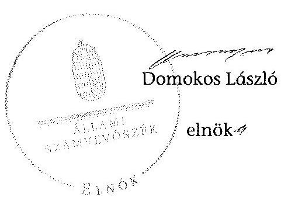

# ÁLLAMI   SZÁMVEVŐSZÉK 

## JELENTÉS

a helyi nemzetiségi önkormányzatok gazdálkodásának ellenőrzéséről
Terézvárosi Lengyel Nemzetiségi Önkormányzat

---

# Állami Számvevőszék 

Iktatószám: V-0242-016/2014.
Témaszám: 1276
Vizsgálat-azonosító szám: V065260

## Az ellenőrzést felügyelte:

Horváth Balázs
felügyeleti vezető
Az ellenőrzést vezette és az ellenőrzés végrehajtásáért felelős:
Korsósné Vigh Andrea
ellenőrzésvezető
A számvevőszéki jelentést készítették és a jelentés összeállításában
közremüködtek:
Győriné Franyó Éva
számvevő
Kerekes Gábor
számvevő
Molnár Istvánné
számvevő tanácsos
Az ellenőrzést végezte:
Kerekes Gábor
számvevő

---

# TARTALOMJEGYZÉK 

BEVEZETÉS ..... 3
I. ÖSSZEGZŐ MEGÁLLAPÍTÁSOK, KÖVETKEZTETÉSEK, JAVASLATOK ..... 6
II. RÉSZLETES MEGÁLLAPÍTÁSOK ..... 14

1. A Nemzetiségi Önkormányzat és a Települési Önkormányzat együttműködésének szabályozása, a múködési feltételek biztosítása ..... 14
2. A gazdálkodási feladatok ellátásának szabályszerűsége ..... 15
2.1. A költségvetésre és a zárszámadásra, valamint a kincstári adatszolgáltatás rendjére vonatkozó jogszabályi előírások betartása ..... 15
2.2. A Nemzetiségi Önkormányzat gazdálkodásának szabályozottsága ..... 17
2.3. Az operatív gazdálkodási jogkörök kialakítása, gyakorlása ..... 18
3. A Nemzetiségi Önkormányzattal összefüggő gazdálkodási feladatok belső ellenőrzése ..... 20
4. A feladatalapú támogatás felhasználásának, elszámolásának szabályszerűsége, a Nemzetiségi Önkormányzat feladatellátása ..... 20

## MELLÉKLETEK

1. számú A Nemzetiségi Önkormányzat 2012. évi gazdálkodásának főbb adatai, mutatói
2. számú Tájékoztatás a polgármesternek küldött el nem fogadott észrevételekről

## FÜGGELÉKEK

1. számú Rövidítések jegyzéke
2. számú Értelmező szótár
3. számú A gazdálkodás értékelésének módszere

---

.

---

# JELENTÉS   a helyi nemzetiségi önkormányzatok gazdálkodásának ellenőrzéséről Terézvárosi Lengyel Nemzetiségi Önkormányzat 

## BEVEZETÉS

A Nemzetiségi Önkormányzat 2006. évben alakult, elnöke a 2010. évi helyhatósági választások óta látta el feladatát. Az elnök 2012-ben bekövetkezett halála miatt a Képviselő-testület új elnököt választott, aki 2012. november 12. óta látja el feladatát. A Nemzetiségi Önkormányzat intézményt, gazdasági társaságot és más szervezetet nem alapított, illetve ezek társulásában nem vesz részt. A 2012. november 11-ig négytagú, 2012. november 12-től háromtagú Képviselő-testület munkája segitésére bizottságot nem hozott létre. A Nemzetiségi Önkormányzatnak a költségvetési beszámolója szerint a 2012. évben a módosított költségvetési bevételi és kiadási előirányzata 1165 ezer Ft, a teljesitett költségvetési bevétel 1174 ezer Ft, a teljesitett költségvetési kiadás 1054 ezer Ft volt. A 2012. évi gazdálkodási adatokat részletesen az 1. számú mellékletben mutatjuk be.

Az Alaptörvény XXIX. cikk (1) bekezdése szerint a Magyarországon élő nemzetiségek államalkotó tényezők. Minden, valamely nemzetiséghez tartozó magyar állampolgárnak joga van önazonossága szabad vállalásához és megőrzéséhez. A hazánkban élő́ nemzetiségek helyi (települési és területi), valamint országos önkormányzatokat hozhatnak létre. A helyi nemzetiségi önkormányzatok gazdálkodási feladatait jogszabályi előírás alapján a székhely szerinti helyi önkormányzat polgármesteri hivatala látja el.

A nemzetiségek helyzete, támogatása mind hazai, mind EU-s szinten kiemelt figyelmet kap napjainkban. A helyi nemzetiségi önkormányzatok gazdálkodására és támogatási rendszerére vonatkozó jogszabályok a 2010-2012. években jelentős változásokon mentek át. A települési és területi nemzetiségi önkormányzatok gazdálkodásának, a részükre juttatott költségvetési támogatások felhasználásának ellenőrzését az ÁSZ a 2012. évben sorozatjellegú ellenőrzés keretében indította el. A 2013. évi ellenőrzések e témacsoportos ellenőrzések folytatását jelentik, amelyet az ÁSZ 2014. első félévi ellenőrzési terve 12. témasorszámon tartalmaz.

Az ellenőrzés célja annak értékelése volt, hogy a Nemzetiségi Önkormányzat gazdálkodási kereteinek kialakítása, gazdálkodása és feladatellátása megfelelt-e a jogszabályoknak.

---

Ennek keretében értékeltük, hogy:

- a Nemzetiségi Önkormányzat és a Települési Önkormányzat együttműködésének szabályozása, a múködési feltételek biztosítása megfelelte a jogszabályi előírásoknak;
- a felek együttmúködése megfelelte a közöttük létrejött együttmúködési megállapodásnak a gazdálkodási feladatok szabályszerú ellátása során, ennek keretében betartották-e a Nemzetiségi Önkormányzat gazdálkodásához kapcsolódóan a költségvetésre és zárszámadásra, a gazdálkodás szabályozására, az operatív gazdálkodási jogkörök gyakorlására vonatkozó jogszabályi előírásokat;
- a jegyző biztosította-e a Nemzetiségi Önkormányzat gazdálkodásának belső ellenőrzését;
- a Nemzetiségi Önkormányzat feladatalapú támogatásának felhasználása, a folyósított feladatalapú támogatással történő elszámolás az előírásoknak megfelelő volt-e;
- a Nemzetiségi Önkormányzat feladatellátása összhangban volt-e a vonatkozó jogszabályi előírásokkal.

Az ellenőrzés várható hasznosulását négy szinten tervezzük. A törvényalkotás számára összegzett tapasztalatok állnak rendelkezésre a nemzetiségi önkormányzatok testületi döntéseinek, gazdálkodásának és a feladatalapú támogatás felhasználásának szabályszerűségéről, amelynek alapján következtetést lehet levonni arra, hogy indokolt-e jogszabályi módosítás kezdeményezése. Az ellenőrzés az ellenőrzött számára visszajelzést ad a múködésében fellépő hiányosságokról, javaslataival hozzájárul azok kiküszöböléséhez, amely csökkentheti a későbbi ellenőrzések gyakoriságát. Az ellenőrzés megállapításai és javaslatai tanulságul szolgálhatnak más nemzetiségi önkormányzatok, szervezetek számára a rendezett gazdálkodási keretek kialakításához. A társadalom számára jelzi, hogy közpénz nem maradhat ellenőrizetlenül, az ÁSZ értékteremtő rend kialakításához és megőrzéséhez hozzájáruló tevékenysége pozitív hatással lesz a szervezetről kialakított összkép formálásában. Az ÁSZ szervezetén belül lehetőség nyílik arra, hogy a megállapítások szintetizálásával az intézmény a hozzáadott értéket teremtő elemző tevékenységét és tanácsadó szerepét erősítse.

A Nemzetiségi Önkormányzat gazdálkodásának ellenőrzéséről szóló jelentés I. fejezetének összegző része az ellenőrzés céljára adott rövid, szintetizáló összefoglalót és következtetéseket tartalmazza a II. fejezet részletes megállapításain alapulóan. A jelentés intézkedést igénylő megállapításait és javaslatait - az összegzőben foglaltak mellett - az ellenőrzés során feltárt, a jelentés II. fejezetében rögzített részletes megállapítások alapozzák meg, illetve támasztják alá.

Az ellenőrzés típusa: szabályszerűségi ellenőrzés
Az ellenőrzött időszak: 2012. január 1. - 2012. december 31. közötti időszak. Az ellenőrzés kiterjedt a helyi nemzetiségi önkormányzatnak juttatott 2012. évi feladatalapú támogatás 2013. évben való elszámolására is.

---

Ellenőrzött szervezet: Terézvárosi Lengyel Nemzetiségi Önkormányzat és a gazdálkodási feladatait ellátó Budapest Főváros VI. Kerület Terézváros Önkormányzata.

Az ellenőrzés végrehajtásának jogszabályi alapját az ÁSZ tv. 5. § (2)-(3) és (6) bekezdéseiben foglaltak képezik.

Az ellenőrzés szakmai módszertana az ÁSZ hivatalos honlapján (www.asz.hu) közzétett szakmai szabályokon alapult, amely a Legfőbb Ellenőrző Intézmények Nemzetközi Szervezete (INTOSAI) által kiadott nemzetközi standardok (ISSAI) figyelembevételével készült.

A helyi nemzetiségi önkormányzatok gazdálkodásának ellenőrzése során értékeltük a Települési Önkormányzat és a Nemzetiségi Önkormányzat együttmúködésének, a gazdálkodás szabályozottságának és a pénzügyi folyamatokban kulcsszerepet betöltő belső kontrollok (teljesítésigazolás és érvényesítés) múködésének megfelelőségét. A kulcskontrollokat a működési és felhalmozási célú támogatásértékű kiadásoknál, az államháztartáson kívülre teljesített múködési és felhalmozási célú pénzeszköz átadásoknál, a dologi kiadásokkal kapcsolatos kifizetéseknél - véletlen mintavételi eljárást alkalmazva - ellenőriztük. Ellenőriztük, hogy a jegyző biztosította-e a Nemzetiségi Önkormányzat gazdálkodásának belső ellenőrzését. Értékeltük a feladatalapú támogatások felhasználásának, elszámolásának szabályszerűségét, a Nemzetiségi Önkormányzat feladatellátása és a jogszabályi előírások összhangját. A minősítési szempontokat a 3. számú függelék tartalmazza.

Az ellenőrzés lefolytatásához a Nemzetiségi Önkormányzat és a gazdálkodási feladatait ellátó Települési Önkormányzat tanúsítványok és a kapcsolódó, dokumentumjegyzékben megjelölt dokumentumok elektronikus úton történő megküldésével, rendelkezésre bocsátásával szolgáltatott adatokat. Az adatszolgáltatás kontrollálása és szükség szerinti javítása a helyszíni ellenőrzés keretében történt.

Az ÁSZ tv. 29. § (1) bekezdése szerint a jelentéstervezetet megküldtük egyeztetésre a polgármesternek és a Nemzetiségi Önkormányzat elnökének. A Nemzetiségi Önkormányzat elnöke az ÁSZ tv. 29. § (2) bekezdésében foglalt észrevételezési jogával nem élt, a jelentéstervezetre észrevételt nem tett. A polgármester határidőben megküldött észrevétele és tájékoztatása alapján a jelentést módosítottuk, az el nem fogadott észrevételek indokolását a jelentés 2. számú melléklete tartalmazza

---

# I. ÖSSZEGZŐ MEGÁLLAPÍTÁSOK, KÖVETKEZTETÉSEK, JAVASLATOK 

A Nemzetiségi Önkormányzat és a Települési Önkormányzat együttmüködésének szabályozása részben felelt meg a jogszabályi előírásoknak. A Nemzetiségi Önkormányzat rendelkezett a 2012. év folyamán hatályban lévő, a Települési Önkormányzattal megkötött együttműködési megállapodással. A felek a 2011. évben megkötött együttmúködési megállapodásnak a Nek. 2 tv.-ben január 31-i határidővel előírt felülvizsgálatát nem végezték el, a 2012. június 1jei határidőre előírt módosítási kötelezettségüknek eleget tettek. A 2012. december 31 -én hatályos együttmúködési megállapodásban a Nemzetiségi Önkormányzat múködési feltételeit az előírásoknak megfelelően szabályozták, azonban ezt - a Nek. ${ }_{2}$ tv.-ben előírtak ellenére - az együttmúködési megállapodás megkötését követő harminc napon belül a Nemzetiségi Önkormányzat SZMSZ-ében nem rögzítették. A Nemzetiségi Önkormányzat SZMSZ-ét az ellenőrzött időszakban kiegészítették a Települési Önkormányzat által biztosított múködési feltételekkel. Az együttműködési megállapodásban a Nemzetiségi Önkormányzat gazdálkodási feladatai ellátásának szabályozása, a jogszabályokban előírt tartalmi elemek tekintetében hiányos volt. Nem rögzítették benne az Áht. ${ }_{2}$-ben előírtak ellenére a Nemzetiségi Önkormányzat bevételeivel és kiadásaival kapcsolatban a tervezési és adatszolgáltatási feladatok ellátásának részletes szabályait. Nem határozták meg a Nek. 2 tv. előírása ellenére a költségvetés előkészítésével és megalkotásával, valamint a költségvetéssel összefüggő adatszolgáltatási kötelezettségek teljesítésével kapcsolatos, továbbá a Nemzetiségi Önkormányzat részére az önálló fizetési számla nyitásával, törzskönyvi nyilvántartásba vételével és az adószám igénylésével kapcsolatos feladatokat, együttműködési kötelezettséget, és nem jelölték ki ezek felelőseit. Nem tartalmazta a Nemzetiségi Önkormányzat kötelezettségvállalásaival kapcsolatosan a Települési Önkormányzatot terhelő ellenjegyzési, érvényesítési feladatokat ellátók konkrét kijelölését, valamint a Nemzetiségi Önkormányzat kötelezettségvállalásához kapcsolódó nyilvántartási kötelezettségeket. Nem határozták meg a Nemzetiségi Önkormányzat múködési feltételeinek és gazdálkodásának eljárási és dokumentációs részletszabályaival kapcsolatos előírásokat, feltételeket, valamint az ezeket végző személyek kijelölésének rendjét. A Települési Önkormányzat biztosította a Nemzetiségi Önkormányzat múködéséhez szükséges személyi és tárgyi feltételeket.

A Nemzetiségi Önkormányzat 2012. évi költségvetésének és zárszámadásának tartalma, jóváhagyása, valamint a kapcsolódó adatszolgáltatás részben felelt meg a jogszabályi előírásoknak. A jegyző az Áht. ${ }_{2}$ előírása ellenére a költségvetési és zárszámadási határozattervezeteket nem készítette el a Nemzetiségi Önkormányzat részére, azonban a határozatok mellékletét képező táblázatokat, kimutatásokat a Nemzetiségi Önkormányzat elnökének rendelkezésére bocsátotta. A Nemzetiségi Önkormányzat elnöke a 2012. évi költségvetés tervezetét határidőben benyújtotta a Képviselő-testületnek. A jóváhagyott költségvetési határozat megfelelt a jogszabályokban előírt tartalmi követelményeknek. A költségvetés előterjesztésekor a Képviselő-testület részére tájékoztatásul nem mutatták be az Áht. ${ }_{2}$-ben előírt előirányzat felhasználási tervet és a költségve-

---

tési mérleg szöveges indoklását. A Nek. ${ }_{2}$ tv.-ben előírtak ellenére a 2012. évi költségvetés elfogadásához kapcsolódó jegyzőkönyvek nem tartalmazták az előterjesztéseket. A 2012. költségvetési évre vonatkozó kincstári adatszolgáltatási kötelezettségeket a jegyző határidőben teljesítette. A 2012. évi zárszámadást a Képviselő-testület határidőben jóváhagyta, a határozat tartalma, részletezettsége megfelelt a jogszabályi előírásoknak, azonban a költségvetéssel való összehasonlíthatóság - az Áht. ${ }_{2}$ előírása ellenére - az eredeti előirányzati adatokban mutatkozó számszaki eltérés miatt részben volt biztosított. A zárszámadás előterjesztésekor a Képviselő-testület részére tájékoztatásul nem mutatták be az Áht. ${ }_{2}$ előírása ellenére a pénzeszközök változását és a vagyonkimutatást.

A gazdálkodás szabályozottsága nem volt megfelelő. A Nemzetiségi Önkormányzat az ellenőrzött időszak egészében nem rendelkezett a Bkr.-ben előírt ellenőrzési nyomvonallal, a szabálytalanságok kezelésének eljárásrendjével, valamint a folyamatba épített, előzetes, utólagos és vezetői ellenőrzés szabályozással. A Nemzetiségi Önkormányzat 2012. június 1-jétől nem rendelkezett a Számv. tv-ben előírt eszközök és források értékelési szabályzatával, számviteli politikával és számlarenddel. A Nemzetiségi Önkormányzat 2012. május 31-ig rendelkezett a gazdálkodására vonatkozó, a Számv. tv-ben előírt szabályzatokkal, mert a hatályban lévő együttműködési megállapodásban előírták a Nemzetiségi Önkormányzat gazdálkodási feladatai ellátásához a Polgármesteri Hivatal belső szabályzatainak használatát. A 2012. június 1-jétől hatályban lévő együttműködési megállapodás a vagyonnyilvántartás vonatkozásában rögzítette a Polgármesteri Hivatal belső szabályzatainak alkalmazását. Ettől az időponttól a Nemzetiségi Önkormányzat leltározási és leltárkészítési szabályzattal, valamint pénzkezelési szabályzattal rendelkezett. A Polgármesteri Hivatal SZMSZ-e az Ávr. előírásai ellenére nem tartalmazta az SZMSZ-ben nevesített munkakörökhöz tartozó - a Nemzetiségi Önkormányzat gazdálkodásával öszszefüggő - feladat- és hatásköröket, a hatáskörök gyakorlásának módját, a helyettesítés rendjét, valamint az ezekhez kapcsolódó felelősségi szabályokat. A jegyző a szabályozás során a gazdálkodási jogkörök szabályzata és a 2012. évben hatályos együttműködési megállapodás közötti összhangot - a százezer forintot el nem érő fizetési kötelezettségek esetében - nem biztosította. Az előzetes írásbeli kötelezettségvállalást nem igénylő kifizetések rendjét - az Ávr. előírásait figyelmen kívül hagyva - belső szabályzatban nem rögzítették.

A Nemzetiségi Önkormányzat gazdálkodása tekintetében az operatív gazdálkodási jogkörök kialakítása megfelelt a jogszabályi előírásoknak. A Települési Önkormányzat a 2012. évben rendelkezett gazdasági szervezettel, elkészítette ügyrendjét és a gazdasági szervezet vezetői feladatok ellátásával a polgármester írásban megbízta a Költségvetési és Intézménygazdálkodási Főosztály vezetőjét. A Települési Önkormányzat az Ávr.-ben foglaltak ellenére a Polgármesteri Hivatal SZMSZ-ében a gazdasági szervezetet nem nevesítette. Az ellenőrzött időszakot követően e hiányosságot megszüntették. A gazdasági szervezet vezetője rendelkezett az előírt szakképesítéssel, az általa írásban történt - a pénzügyi ellenjegyzőre és érvényesítőre vonatkozó - kijelölések jogszerúek voltak. A Nemzetiségi Önkormányzat elnöke kijelölte a teljesítésigazolásra jogosultakat. A Nemzetiségi Önkormányzatnál a 2012. évben a dologi kiadások teljesítése során a bizonylatok tesztelése alapján a teljesítésigazolás és az érvényesítés kulcskontrollok müködésének megfelelősége gyenge volt.

---

A hibák száma a lényegességi szintet, a kritikus hibahatárt elérte. A teljesítésigazoló - előzetes írásbeli kötelezettségvállalási dokumentum hiányában - nem szabályszerűen látta el az Ávr.-ben előírt feladatát, a kiadás jogossága, összegszerűsége és az ellenszolgáltatás teljesítésének ellenőrzését, igazolását. Az érvényesítő nem az Ávr.-ben előírtak szerint végezte el ellenőrzési feladatát, a megelőző ügymenetben a gazdálkodási szabályok betartásának ellenőrzését. Az érvényesítést előzetes írásbeli kötelezettségvállalási dokumentum hiányában nem szabályszerűen végrehajtott teljesítésigazolás alapján végezte, nem észrevételezte a vezetett kötelezettségvállalási nyilvántartás tartalmi hiányosságait, továbbá az érvényesítés az Ávr.-ben előírtak ellenére nem tartalmazta az érvényesítésre történő utalást.

A Nemzetiségi Önkormányzatnál a 2012. évi három legnagyobb összegű dologi kiadás teljesítésének egyedi értékelése alapján a teljesítésigazolás és érvényesítés kulcskontrollok nem működtek megfelelően. A hiányosságok a dologi kiadásoknál tett megállapításokkal megegyezőek voltak. Az államháztartáson kívülre teljesített kettő működési célú pénzeszközátadás teljesítése során a teljesítésigazolás és az érvényesítés kulcskontrollok nem múködtek megfelelően. Az Ávr.-ben előírtak ellenére a kifizetéseket teljesítésigazolás nélkül hajtották végre. Az érvényesítő nem az Ávr.-ben foglalt előírások szerint látta el feladatát, mert nem ellenőrizte a megelőző ügymenet tekintetében az Ávr. előírásai és az egyéb jogszabályok betartását, a jogszabálytól eltérést - a teljesítésigazolás hiányát, a kötelezettségvállalási nyilvántartás tartalmi hiányosságait - nem jelezte az utalványozónak, továbbá nem az Ávr.-ben meghatározott módon végezte el az érvényesítést. A Nemzetiségi Önkormányzatnál a kulcskontrollok 2012. évi múködésében feltárt hiányosságokkal összefüggésben az ellenőrzés a rendelkezésre bocsátott dokumentumok alapján - jogosulatlan kifizetést nem állapított meg, azonban a kulcskontrollok múködésében feltárt hiányosságok miatt nem biztosított a hibák megelőzése, feltárása és kijavítása.

A jegyző az ellenőrzött időszakban biztosította a Nemzetiségi Önkormányzat gazdálkodásával összefüggő végrehajtási feladatok belső ellenőrzését, mert a Polgármesteri Hivatal 2012. évi ellenőrzési tervét meglapozó kockázatelemzés kiterjedt a Nemzetiségi Önkormányzat gazdálkodásával összefüggő végrehajtási feladatok ellátására. Ennek kockázata a lefolytatott kockázatelemzés alapján alacsony volt, ezért erre vonatkozóan az ellenőrzött időszakban belső ellenőrzési feladatokat nem terveztek és nem végeztek.

A 2011. évben a Nemzetiségi Önkormányzat 512 ezer Ft feladatalapú támogatásban részesült, amelyet a kötelezettségvállalásra rendelkezésre álló időpontig a támogatási célnak megfelelően felhasznált. A Nemzetiségi Önkormányzat a 2012. évben feladatalapú támogatásban nem részesült. A 2011. évi feladatalapú támogatás elszámolása a támogatási kormányrendelet; előírása alapján az Áht., rendelkezése ellenére nem történt meg. A támogatás felhasználását, elszámolását az ellenőrzésre jogosult szervek nem ellenőrizték. A Nemzetiségi Önkormányzat feladatellátásának tárgya - mind a kötelező, mind az önként vállalt feladatok tekintetében - összhangban volt a Nek. ${ }_{2}$ tv. előírásaival. Kötelező közfeladatot látott el a képviselt közösség kulturális autonómiájának megerősítése érdekében a közösség önszerveződésének szervezési és múködtetési feladatok ellátásának segítésével . Önként vállalt közfeladatot a hagyományápolás és a közművelődés területén végeztek.

---

Az ÁSZ tv. 33. § (1) bekezdésében foglaltak értelmében az ellenőrzött szervezet vezetője köteles a jelentésben foglalt megállapításokhoz kapcsolódó intézkedési tervet összeállítani, és azt a jelentés kézhezvételétől számított 30 napon belül az ÁSZ részére megküldeni. Amennyiben az intézkedési tervet határidőre nem küldi meg a szervezet, vagy az nem elfogadható, az ÁSZ elnöke az ÁSZ tv. 33. § (3) bekezdés a)-b) pontjaiban foglaltakat érvényesítheti.

A helyszíni ellenőrzés megállapításainak hasznosítása mellett javasoljuk:

# a jegyzőnek 

1. az együttműködés szabályozásával kapcsolatban

A Nemzetiségi Önkormányzat és a Települési Önkormányzat együttműködését meghatározó - 2012. december 31-én hatályos - együttműködési megállapodás tartalmilag nem felelt meg az Áht. 2 27. § (2) bekezdésében, valamint a Nek. 2 tv. 80. § (3) bekezdésében foglalt előírásoknak. A 2012. január 1-jén hatályos, 2011. évben megkötött együttműködési megállapodásnak a Nek. 2 tv. 80. § (2) bekezdésben 2012. január 31-i határidőig előírt felülvizsgálatát nem végezték el.

Javaslat
Az együttműködés szabályszerűsége érdekében:
a) készítse elő az együttműködési megállapodás módosítását, hogy az tartalmilag feleljen meg az Áht. 2 27. § (2) bekezdésében, valamint a Nek. 2 tv. 80. § (3) bekezdésében foglalt előírásoknak;
b) biztosítsa a jövőben az együttműködési megállapodás évenkénti felülvizsgálata során a Nek. 2 tv. 80. § (2) bekezdésében előírt határidő betartását.
2. a költségvetés és a zárszámadás, valamint a kapcsolódó kincstári adatszolgáltatás szabályszerűségével kapcsolatban

Az Áht. 2 24. § (2) bekezdésében előírtak ellenére a költségvetési határozattervezetet a jegyző nem készítette el. A 2012. évi költségvetés előterjesztésekor a Képviselőtestület részére az Áht. 2 24. § (4) bekezdés a) pontjában előírtak ellenére - a jegyző mulasztása miatt - tájékoztatásul nem mutatták be a Nemzetiségi Önkormányzat előirányzat felhasználási tervét, továbbá a költségvetési mérleg szöveges indoklását. A jegyző az Áht. 2 91. § (1) bekezdés előírása ellenére a zárszámadási határozattervezetet nem készítette el. A Képviselő-testület részére tájékoztatásul - a jegyző általi elkészítés hiányában - nem mutatták be az Áht. 2 91. § (2) bekezdés a) és c) pontjában előírtak ellenére a pénzeszközök változását, valamint a vagyonkimutatást. A zárszámadás összehasonlíthatósága az Áht. 2 89. § (1) bekezdésében előírtak ellenére részben volt biztosított az elfogadott költségvetéssel. A Nek. 2 tv. 95. § (2) bekezdés f) pontjában előírtak ellenére a 2012. évi költségvetéshez kapcsolódó jegyzőkönyvek nem tartalmazták az előterjesztéseket.

---

Javaslat
Gondoskodjon a jövőben:
a) az Áht. 2 24. § (2) bekezdésének megfelelően a Nemzetiségi Önkormányzat költségvetési határozat tervezetének előkészítéséről, valamint arról, hogy az Áht. 2 24. § (4) bekezdés a) pontjában foglalt előírásnak megfelelően a költségvetés előterjesztésekor a Képviselő-testület részére bemutatásra kerüljön - szöveges indoklással - a Nemzetiségi Önkormányzat költségvetési mérlege közgazdasági tagolásban, valamint az előirányzat felhasználási terve;
b) az Áht. 2 91. § (1) bekezdésének megfelelően a Nemzetiségi Önkormányzat zárszámadási határozat tervezetének elkészítéséről, továbbá arról, hogy a zárszámadás előterjesztésekor a Képviselő-testület részére tájékoztatásul bemutatásra kerüljön az Áht. 2 91. § (2) bekezdés a) és c) pontjában előírtak szerint a pénzeszközök változása és a vagyonkimutatás;
c) a költségvetés és a zárszámadás Áht. 2 89. § (1) bekezdése szerinti összehasonlíthatóságának megteremtéséről;
d) a Nek. 2 tv. 95. § (2) bekezdés f) pontjában előírtak szerint a Képviselő-testületi döntések előterjesztéseinek jegyzőkönyvben történő szerepeltetéséről.
3. a gazdálkodási feladatok szabályozottságával kapcsolatban

A Nemzetiségi Önkormányzat az ellenőrzött időszak egészében nem rendelkezett a Bkr. 6. § (3)-(4) bekezdéseiben előírt ellenőrzési nyomvonallal és szabálytalanságok kezelésének eljárásrendjével, valamint a Bkr. 8. § (2) bekezdés szerinti folyamatba épített, előzetes, utólagos és vezetői ellenőrzés szabályozással. A Nemzetiségi Önkormányzat 2012. június 1-jétől nem rendelkezett a Számv. tv. 14. § (5) bekezdés b) pontjában előírt eszközök és források értékelési szabályzatával, a Számv. tv. 14. § (3)-(4) bekezdéseiben bekezdésében előírt számviteli politikával, a Számv. tv. 161. § (1) bekezdésében előírt számlarenddel.

A jegyző a szabályozás során a gazdálkodási jogkörök szabályzata és a 2012. évben hatályos együttmúködési megállapodás közötti összhangot - a százezer forintot el nem érő fizetési kötelezettségek esetében - nem biztosította. A gazdálkodási jogkörök szabályzatában az Ávr. 53. § (1) bekezdés a) pontjában foglaltak alapján lehetővé tették az előzetes írásbeli kötelezettségvállalás mellőzését, míg az együttmúködési megállapodás az írásban történt kötelezettségvállalást tartalmazta összeghatártól függetlenül. Az előzetes írásbeli kötelezettségvállalást nem igénylő kifizetések rendjét - az Ávr. 53. § (2) bekezdésének előírásait figyelmen kívül hagyva - belső szabályzatban nem rögzítették.

A Polgármesteri Hivatal SZMSZ-e az Ávr. 13. § (1) bekezdés g) pontjában foglaltak ellenére nem tartalmazta az SZMSZ-ben nevesített munkakörökhöz tartozó - a Nemzetiségi Önkormányzat gazdálkodásával kapcsolatos - feladat- és hatásköröket, a hatáskörök gyakorlásának módját, a helyettesítés rendjét, az ezekhez kapcsolódó felelősségi szabályokat.

---

# Javaslat 

A gazdálkodás szabályszerűsége érdekében:
a) gondoskodjon a Számv. tv. 14. § (3)-(4) bekezdéseiben és az (5) bekezdés b) pontjában előírt számviteli politika, az eszközök és források értékelési szabályzata, a Számv. tv. 161. § (1) bekezdésében előírt számlarend, illetve a Bkr. 6. § (3)-(4) és 8. § (2) bekezdéseiben előírtak szerinti ellenőrzési nyomvonal, szabálytalanságok kezelésének eljárásrendje, valamint a folyamatba épített, előzetes, utólagos és vezetői ellenőrzés szabályozás elkészítéséről;
b) biztosítsa a gazdálkodási jogkörök szabályzata és az együttműködési megállapodás közötti összhangot a százezer forintot el nem érő fizetési kötelezettségek vonatkozásában, továbbá az Ávr. 53. § (1) bekezdésében foglalt lehetőség alkalmazása esetén, az Ávr. 53. § (2) bekezdésében előírtak alapján belső szabályzatban rögzítse az előzetes írásbeli kötelezettségvállalást nem igénylő kifizetések rendjét;
c) készítse elő a Polgármesteri Hivatal SZMSZ-e módosítását, hogy az feleljen meg az Ávr. 13. § (1) bekezdése g) pontjában foglalt előírásnak.
4. a kulcskontrollok múködésével kapcsolatban

A teljesítésigazoló nem, vagy az előzetes írásbeli kötelezettségvállalási dokumentum hiányában nem szabályszerűen látta el az Ávr. 57. § (1) és (3) bekezdéseiben foglalt feladatát, mivel nem ellenőrizte a kiadások teljesítésének jogosságát, összegszerűségét, valamint nem ellenőrizte az ellenszolgáltatások teljesítését, igazolását. Az érvényesítő nem az Ávr. 58. § (1)-(2) bekezdéseiben előírtak szerint végezte el ellenőrzési feladatát, előzetes írásbeli kötelezettségvállalási dokumentum hiányában az összegszerűség, a fedezet megléte, továbbá a megelőző ügymenetben a gazdálkodási szabályok - ennek keretében az Ávr. előírásai - betartásának ellenőrzését, továbbá nem jelezte az utalványozónak, hogy a teljesítésigazolás nem, vagy nem szabályszerűen történt meg. Az érvényesítés nem az Ávr. 58. § (3) bekezdésében előírtak szerint történt.

Javaslat
Az operatív gazdálkodás működési hibáinak megelőzése, feltárása és kijavítása érdekében gondoskodjon arról, hogy:
a) a teljesítési igazolása minden esetben az Ávr. 57. § (1) és (3) bekezdéseiben előírtaknak megfelelően történjen;
b) az érvényesítő tegyen eleget az Ávr. 58. § (1)-(3) bekezdéseiben előírt ellenőrzési feladatának és jelzési kötelezettségének.
5. a feladatalapú támogatás elszámolásával kapcsolatban

A 2011. évi feladatalapú támogatás elszámolása a támogatási kormányrendelet ${ }_{1}$ 7. § (2) bekezdésében hivatkozott „a helyi önkormányzatok elszámolási és ellenőrzési rendjére vonatkozó" jogszabályok rendelkezései alkalmazása előírása alapján az Áht. ${ }_{1}$ 64. § (7) bekezdése ellenére nem történt meg.

---

Javaslat
Gondoskodjon az Áht. 2 27. § (2) bekezdésben meghatározott feladatkörében a Nemzetiségi Önkormányzat által igénybe vett feladatalapú támogatás rendeltetésszerű felhasználásáról szóló elszámolásának elkészítéséről az Áht. 2 53. § (1) bekezdése szerinti beszámolási kötelezettség teljesítéséhez.

# a polgármesternek 

A Nemzetiségi Önkormányzat és a Települési Önkormányzat együttműködését meghatározó - 2012. december 31-én hatályos - együttműködési megállapodás tartalmilag nem felelt meg az Áht. 2 27. § (2) bekezdésében, valamint a Nek. 2 tv. 80. § (3) bekezdésében foglalt előírásoknak.

A Polgármesteri Hivatal SZMSZ-e az Ávr. 13. § (1) bekezdés g) pontjában foglaltak ellenére nem tartalmazta az SZMSZ-ben nevesített munkakörökhöz tartozó - a Nemzetiségi Önkormányzat gazdálkodásával kapcsolatos - feladat- és hatásköröket, a hatáskörök gyakorlásának módját, a helyettesítés rendjét, az ezekhez kapcsolódó felelősségi szabályokat.

Javaslat
Terjessze a Települési Önkormányzat Képviselő-testülete elé jóváhagyásra:
a) az Áht. 2 27. § (2) bekezdésében, valamint a Nek. 2 tv. 80. § (3) bekezdésében foglaltaknak megfelelő előírások betartásával a jegyző által előkészített együttműködési megállapodás módosítás tervezetét;
b) az Ávr. 13. § (1) bekezdés g) pontjában foglalt szabályozásra figyelemmel a Polgármesteri Hivatal SZMSZ-ének jegyző által előkészített módosítását.

## a Nemzetiségi Önkormányzat elnökének

1. A Nemzetiségi Önkormányzat és a Települési Önkormányzat együttműködését meghatározó - 2012. december 31-én hatályos - együttműködési megállapodás tartalmilag nem felelt meg az Áht. 2 27. § (2) bekezdésében, valamint a Nek. 2 tv. 80. § (3) bekezdésében foglalt előírásoknak.

Javaslat
Terjessze a Képviselő-testület elé jóváhagyásra az Áht. 2 27. § (2) bekezdésében, valamint a Nek. 2 tv. 80. § (3) bekezdés előírásának betartásával a jegyző által előkészített együttműködési megállapodás módosítás tervezetét.
2. A Képviselő-testület részére tájékoztatásul szöveges indokolással együtt - a jegyző mulasztása miatt - nem mutatták be az Áht. 2 24. § (4) bekezdés a) pontjában előírtak ellenére a Nemzetiségi Önkormányzat előirányzat felhasználási tervét, továbbá a költségvetési mérleg szöveges indoklását. A Nemzetiségi Önkormányzat elnöke a zárszámadási határozat-tervezet előterjesztésekor az Áht. 2 91. § (2) bekezdés a) és c) pontjaiban előírtak ellenére - a jegyző általi elkészítés hiányában - a Képviselő-

---

testület tájékoztatására nem mutatta be a pénzeszközök változását, valamint a vagyonkimutatást.

Javaslat
Terjessze a Képviselő-testület elé tájékoztatásra a jegyző által előkészített az Áht. 2 24. § (4) bekezdés a) pontjában, valamint az Áht. 2 91. § (2) bekezdés a) és c) pontjaiban előírt mérlegeket, kimutatásokat.
3. A 2011. évi feladatalapú támogatás elszámolása a támogatási kormányrendelet ${ }_{1}$ 7. § (2) bekezdésében hivatkozott „a helyi önkormányzatok elszámolási és ellenőrzési rendjére vonatkozó" jogszabályok rendelkezései alkalmazása előirása alapján az Áht. 1 64. § (7) bekezdése ellenére nem történt meg.

Javaslat
Terjessze a Képviselő-testület elé jóváhagyásra az Áht. 2 53. § (1) bekezdése szerinti beszámolási kötelezettség teljesítéséhez a Nemzetiségi Önkormányzat által igénybe vett 2011. évi feladatalapú támogatás rendeltetésszerű felhasználásáról szóló elszámolást.

---

# II. RÉSZLETES MEGÁLLAPÍTÁSOK 

## 1. A Nemzetiségi ÖNKORMÁNYZAT És a Települési ÖNKORMÁNYZAT EGYÜTTMÜKÖDÉSÉNEK SZABÁLYOZÁSA, A MÜKÖDÉSI FELTÉTELEK BIZTOSÍTÁSA

A Nemzetiségi Önkormányzat és a Települési Önkormányzat együttmüködésének szabályozása részben felelt meg a jogszabályi előírásoknak.

A Nemzetiségi Önkormányzat a 2012. év folyamán rendelkezett hatályban lévő, a Települési Önkormányzattal megkötött együttmüködési megállapodással ${ }^{1}$.

A 2012. január 1-jén hatályos, 2011. évben megkötött együttműködési megállapodásnak a Nek. 2 tv. 80. § (2) bekezdésében 2012. január 31-i határidőig előírt felülvizsgálatát nem végezték el. A Nek. ${ }_{2}$ tv. 159. § (3) bekezdésben előírt módosítást határidőn belül jóváhagyták.

A 2012. december 31-én hatályos együttmúködési megállapodásban a Nek. 2 tv. előírásainak megfelelően szabályozták a Nemzetiségi Önkormányzat múködésének feltételeit, melyeket azonban a Nek. 2 tv. 80. § (2) bekezdésében előírtak ellenére nem rögzítettek a Nemzetiségi Önkormányzat SZMSZ-ében az együttműködési megállapodás megkötését követő harminc napon belül. Az ellenőrzött időszakban a Nemzetiségi Önkormányzat SZMSZ-ét kiegészítették a Települési Önkormányzat által biztosított működési feltételekkel².

A 2012. december 31-én hatályos együttműködési megállapodásban a Nemzetiségi Önkormányzat gazdálkodásával kapcsolatos feladatokat, felelősöket és határidőket hiányosan szabályozták. Az együttműködési megállapodás nem tartalmazta az Áht. 2 27. § (2) bekezdés előirása ellenére a Nemzetiségi Önkormányzat bevételeivel és kiadásaival kapcsolatban a tervezési és adatszolgáltatási feladatok ellátásának részletes szabályait. Nem rögzítették továbbá a Nek. 2 tv. 80. § (3) bekezdés a)-d) pontjaiban foglalt előírások ellenére:

[^0]
[^0]:    ${ }^{1}$ A 2012. június 1-jéig hatályos együttműködési megállapodást a Települési Önkormányzat Képviselő-testülete a 447/2010. (XII. 16.) számú, a Képviselő-testület a 14/2011. (III. 21.) számú határozatával hagyta jóvá.
    A 2012. június 1-jétől hatályos együttműködési megállapodást a Települési Önkormányzat Képviselő-testülete a 112/2012. (V. 31.) számú, a Képviselő-testület a 18/2012. (V. 30.) számú határozatával fogadta el.
    ${ }^{2}$ A Képviselő-testület az SZMSZ módosítását a 32/2012. (XI. 12.) számú határozatával elfogadta, a III. fejezet 2. pont a)-e) bekezdései tartalmazzák a múködési feltételeket.

---

- a költségvetés előkészítésével és megalkotásával, valamint a költségvetéssel összefüggő adatszolgáltatási kötelezettségek teljesítésével, továbbá az önálló fizetési számla nyitásával, törzskönyvi nyilvántartásba vételével és adószám igénylésével kapcsolatos határidőket, együttmúködési kötelezettséget és ezek felelőseinek konkrét kijelölését;
- a Nemzetiségi Önkormányzat kötelezettségvállalásaival kapcsolatosan a Települési Önkormányzatot terhelő ellenjegyzési, érvényesítési feladatokat ellátók konkrét kijelölését;
- a Nemzetiségi Önkormányzat kötelezettségvállalásához kapcsolódó nyilvántartási kötelezettségeket;
- a Nemzetiségi Önkormányzat múködési feltételeinek és gazdálkodásának eljárási és dokumentációs részletszabályaival kapcsolatos előírásokat, feltételeket, valamint az ezeket végző személyek kijelölését.

A Települési Önkormányzat a Polgármesteri Hivatal útján biztosította a Nemzetiségi Önkormányzat 2012. évi múködésének a - Nek. ${ }_{2}$ tv. 159. § (3) bekezdésében foglalt átmeneti rendelkezés alapján a Nek. ${ }_{1}$ tv. 27. § (2)-(3) bekezdéseiben előírt - személyi és tárgyi feltételeit.

# 2. A GAZDÁLKODÁSI FELADATOK ELLÁTÁSÁNAK SZABÁLYSZERŰSÉGE 

### 2.1. A költségvetésre és a zárszámadásra, valamint a kincstári adatszolgáltatás rendjére vonatkozó jogszabályi előírások betartása

A Nemzetiségi Önkormányzat 2012. évi költségvetésének, zárszámadásának tartalma, jóváhagyása, valamint a kapcsolódó adatszolgáltatás részben felelt meg a jogszabályi előírásoknak.

A jegyző az Áht. ${ }_{2}$ 24. § (2) bekezdésében előírtak ellenére a költségvetési határozattervezetet nem készítette el. A Nemzetiségi Önkormányzat elnöke a 2012. évi költségvetés tervezetét határidőben ${ }^{3}$ benyújtotta a Képvise-lö-testületnek, a jóváhagyott költségvetés ${ }^{4}$ tartalmazta az Áht. ${ }_{2}$-ben és az Ávr.-ben előírt tartalmi elemeket.

A 2012. évi költségvetés előterjesztésekor a Képviselő-testület részére az Áht. 24. § (4) bekezdés a) pontjában előírtak ellenére - a jegyző mulasztása miatt - tájékoztatásul nem mutatták be a Nemzetiségi Önkormányzat előirányzat felhasználási tervét és a költségvetési mérleg szöveges indoklását.

[^0]
[^0]:    ${ }^{3}$ Az Áht. 2 24. § (2) bekezdés előirrása szerint a központi költségvetésről szóló törvény kihirdetését követő 45 napon belül (2012. február 11-ig), a 2012. évi költségvetést a Kép-viselő-testület a 2012. január 25-i ülésén tárgyalta.
    ${ }^{4}$ A 2012. évi költségvetést a Képviselő-testület a 3/2012. (I. 25.) számú határozatával hagyta jóvá 210 ezer Ft bevételi és kiadási főösszeggel.

---

A jegyző a Polgármesteri Hivatal által előkészített 2012. évi költségvetés tervezet öt mellékletből álló számszerű kimunkálását a Nemzetiségi Önkormányzat 2012. évi költségvetési határozatának jóváhagyását követően, 2012. február 4-én küldte meg a Nemzetiségi Önkormányzat elnökének. A tervezetben a bevételi és kiadási főösszeg az általános működési támogatás 2012. évi 214 ezer Ft összegével egyező volt. A Képviselő-testület a kiküldött összegre módosította ${ }^{5}$ a 2012. évi költségvetését.

A Polgármesteri Hivatal a Nemzetiségi Önkormányzat 2012. évi elemi költségvetését nem a Képviselő-testület költségvetési határozatának megfelelően, hanem az általa összeállított, 2012. február 4-én közölt költségvetési tervezet adataival készítette el, amely négyezer forinttal több volt a Képviselő-testület által jóváhagyott 2012. évi költségvetés bevételi és kiadási főösszegénél.

A Nek. 2 tv. 95. § (2) bekezdés f) pontjában előírtak ellenére a költségvetéshez kapcsolódó 2012. január 25-i és a 2012. március 1-jei jegyzőkönyvek nem tartalmazták az előterjesztéseket.

A jegyző a 2012. évi költségvetéshez kapcsolódó, a Nemzetiségi Önkormányzatra vonatkozó kincstári adatszolgáltatási kötelezettségének az előírásoknak megfelelően eleget tett

A jegyző az Áht. 2 91. § (1) bekezdés előirrása ellenére a zárszámadási határozattervezetet nem készítette el, azonban annak megalapozását, majd mellékletét képező számszaki kimutatást a zárszámadás beterjesztéséhez a Nemzetiségi Önkormányzat elnökének rendelkezésére bocsátotta. A Nemzetiségi Önkormányzat elnöke az előírt határidőre benyújtotta a Nemzetiségi Önkormányzat 2012. évi zárszámadás tervezetét a Képviselő-testületnek, amely azt határozatban ${ }^{6}$ jóváhagyta. A Képviselő-testület részére - a jegyző általi elkészítés hiányában - tájékoztatásul nem mutatták be az Áht. 2 91. § (2) bekezdés a) és c) pontjaiban előírtak ellenére a pénzeszközök változását és a vagyonkimutatást.

A 2012. évi zárszámadásról hozott határozat tartalma megfelelt az Áht. 2 89. §-ában foglalt előírásoknak, a zárszámadásban a Nemzetiségi Önkormányzat valamennyi bevételéről és kiadásáról elszámoltak. A zárszámadás összehasonlíthatósága az Áht. 2 89. § (1) bekezdésében előírtak ellenére részben volt biztosított az elfogadott költségvetéssel, mert a Nemzetiségi Önkormányzat jóváhagyott költségvetése és az elfogadott zárszámadási határozat számszaki adatait tartalmazó melléklet ${ }^{7}$ eredeti előirányzatának kiadási és bevételi adatai négyezer forinttal eltértek egymástól.

[^0]
[^0]:    ${ }^{5}$ A Képviselő-testület a 2012. évi költségvetését a 7/2012. (III. 1.) számú határozatával módosította az általános múködési támogatás összegének változása miatt.
    ${ }^{6}$ A 2012. évi zárszámadást a Képviselő-testület a 14/2013. (III. 14.) számú határozattal fogadta el.
    ${ }^{7}$ „Terézvárosi Lengyel Nemzetiségi Önkormányzat beszámolója 2012. évi" címú táblázat

---

# 2.2. A Nemzetiségi Önkormányzat gazdálkodásának szabályozottsága 

## A Nemzetiségi Önkormányzat gazdálkodásának szabályozottsága az ellenőrzött időszakban nem volt megfelelő.

A Nemzetiségi Önkormányzat az ellenőrzött időszak egészében nem rendelkezett a Bkr. 6. § (3) és (4) bekezdésben előírt ellenőrzési nyomvonallal, szabálytalanságok kezelésének eljárásrendjével, valamint a Bkr. 8. § (2) bekezdés szerinti folyamatba épített, előzetes, utólagos és vezetői ellenőrzés szabályozással.

A Nemzetiségi Önkormányzat 2012. június 1-jétől nem rendelkezett:

- a Számv. tv. 14. § (5) bekezdés b) pontjában előírt eszközök és források értékelési szabályzatával;
- a Számv. tv. 14. § (3) és (4) bekezdésében előírt számviteli politikával;
- a Számv. tv. 161. § (1) bekezdésében előírt számlarenddel.

A jegyző fenti szabályzatokat nem készítette el önálló szabályzat keretében, illetve nem terjesztette ki a Polgármesteri Hivatal szabályzatainak ${ }^{8}$ hatályát a Nemzetiségi Önkormányzat gazdálkodására.

A Nemzetiségi Önkormányzat 2012. május 31-ig rendelkezett a gazdálkodására vonatkozó, a Számv. tv. 14. §-ában előírt szabályzatokkal ${ }^{9}$, mert a 2011. május 31-ig hatályban lévő együttműködési megállapodásban előírták, hogy a Nemzetiségi Önkormányzat gazdálkodási feladatait a Polgármesteri Hivatal belső szabályzatai szerint látja el a gazdasági szervezet. A 2012. június 1-jétől hatályban lévő együttműködési megállapodás azonban csak a vagyonnyilvántartás vonatkozásában rögzítette a Polgármesteri Hivatal belső szabályzatainak alkalmazását. Így ettől az időponttól a gazdálkodási szabályzatok közül a Nemzetiségi Önkormányzat csak leltározási és leltárkészítési szabályzattal, valamint a számviteli politika keretében elkészített - a Nemzetiségi Önkormányzat pénzkezelését is szabályozó - pénzkezelési szabályzattal rendelkezett.

A Polgármesteri Hivatal SZMSZ-e nem tartalmazta az Ávr. 13. § (1) bekezdés g) pontjában foglaltak szerinti, az SZMSZ-ben nevesített munkakörökhöz tartozó Nemzetiségi Önkormányzat gazdálkodásával kapcsolatos - feladat- és hatáskörökre, a hatáskörök gyakorlásának módjára, a helyettesítés rendjére, az ezekhez kapcsolódó felelősségi szabályokra vonatkozó előírásokat. Az ellátandó feladatokat és a helyettesítés rendjét az ügyrend, valamint a feladatokat ellátó köztisztviselők munkaköri leírásai tartalmazták.

[^0]
[^0]:    ${ }^{8}$ A 2012. március 1-jétől hatályba helyezett számviteli politika, valamint annak keretében elkészített értékelési szabályzat és számlarend.
    ${ }^{9}$ Leltározási és leltárkészítési szabályzattal, eszközök és források értékelési szabályzatával, pénzkezelési szabályzattal, számviteli politikával és számlarenddel.

---

A jegyző a szabályozás során a gazdálkodási jogkörök szabályzata és a 2012. évben hatályos együttmúködési megállapodások közötti összhangot - a százezer forintot el nem érő fizetési kötelezettségek esetében - nem biztosította. Az együttmúködési megállapodás az írásban történt kötelezettségvállalást tartalmazta összeghatártól függetlenül. A gazdálkodási jogkörök szabályzatában az Ávr. 53. § (1) bekezdésében foglalt lehetőség alapján előírták az előzetes írásbeli kötelezettségvállalás mellőzését. Az előzetes írásbeli kötelezettségvállalást nem igénylő kifizetések rendjét - az Ávr. 53. § (2) bekezdésének előírásait figyelmen kívül hagyva - belső szabályzatban nem rögzítették.

# 2.3. Az operatív gazdálkodási jogkörök kialakítása, gyakorlása 

A Nemzetiségi Önkormányzat gazdálkodása tekintetében az operatív gazdálkodási jogkörök kialakítása megfelelt a jogszabályi előírásoknak.

A Települési Önkormányzat a 2012. évben rendelkezett gazdasági szervezettel, mivel elkészítette ennek az Ávr. 13. § (5) bekezdésben előírtak szerinti ügyrendjét, a gazdasági szervezet (Költségvetési és Intézménygazdálkodási Főosztály) maradéktalanul ellátta az Ávr. 9. § (1) bekezdésében a gazdasági szervezet számára előírt feladatokat. A polgármester a gazdasági szervezet vezetőjének teendőivel írásban megbízta a Költségvetési és Intézménygazdálkodási Főosztály vezetőjét. A Települési Önkormányzat azonban az Ávr. 13. § (1) bekezdés e) pontjában foglaltak ellenére a Polgármesteri Hivatal SZMSZ-ében a gazdasági szervezet ügyrendjének hatályba léptetésével egyidejűleg nem nevezte meg egyértelműen a Költségvetési és Intézménygazdálkodási Főosztályt, mint a Települési Önkormányzat gazdasági szervezetét. A gazdasági vezető rendelkezett az előírt szakképesítéssel, az általa történt személyre szóló kijelölések a pénzügyi ellenjegyző és az érvényesítő vonatkozásában jogszerúek voltak.

Az ellenőrzött időszakot követőn módosították a Polgármesteri Hivatal SZMSZét ${ }^{10}$, kiegészítették a gazdasági szervezet meghatározásával, a gazdasági vezető megnevezésével.

A Nemzetiségi Önkormányzat elnöke az Ávr. 57. § (4) bekezdés előírásának megfelelően írásban kijelölte a teljesítésigazolásra jogosult személyt. A kötelezettségvállalás és utalványozás gyakorlására más képviselő részére írásbeli felhatalmazást nem adott.

[^0]
[^0]:    ${ }^{10}$ A Települési Önkormányzat Képviselő-testülete a 203/2013. (X. 24.) számú határozatával módosította a Polgármesteri Hivatal SZMSZ-ét.

---

A Nemzetiségi Önkormányzatnál a 2012. évben a dologi kiadások teljesítése során - a bizonylatok tesztelése alapján - a teljesítésigazolás és az érvényesítés kulcskontrollok múködésének megfelelősége gyenge volt. A hibák száma a lényegességi szintet, a kritikus hibahatárt elérte:

- a teljesítésigazoló előzetes írásbeli kötelezettségvállalási dokumentum hiányában nem szabályszerűen látta el az Ávr. 57. § (1) és (3) bekezdéseiben foglalt feladatát, a kiadások teljesítésének jogossága, összegszerűsége, valamint az ellenszolgáltatás teljesítése ellenőrzését, igazolását;
- az érvényesítő nem az Ávr. 58. § (1)-(2) bekezdésében előírtak szerint végezte el ellenőrzési feladatát, előzetes írásbeli kötelezettségvállalási dokumentum hiányában az összegszerűség, a fedezet megléte, továbbá a megelőző ügymenetben a gazdálkodási szabályok - ennek keretében az Ávr. előírásai betartásának ellenőrzését. Nem kifogásolta az összegszerűség ellenőrzéséhez szükséges - az együttműködési megállapodásban előírt - előzetes írásbeli kötelezettségvállalási dokumentum hiányát. Nem jelezte az utalványozónak, hogy a Nemzetiségi Önkormányzat kötelezettségvállalási nyilvántartása tartalmilag nem felel meg az Ávr. 56. § (1) bekezdésben előírt követelményeknek: nem tartalmazta a kötelezettségvállalás nyilvántartási számát, a kötelezettségvállalást tanúsító dokumentum megnevezését, iktatószámát, keltét, a kötelezettségvállaló nevét, a jogosult azonosító adatait, a kifizetési határidőket. Az érvényesítés -az érvényesítésre utaló megjelölés hiányában - nem az Ávr. 58. § (3) bekezdésében előírt módon történt.

A Nemzetiségi Önkormányzatnál a 2012. évi három legnagyobb összegú dologi kiadás teljesítése egyedi értékelése alapján a teljesítésigazolás és érvényesítés kulcskontrollok nem megfelelően múködtek. A feltárt hiányosságok a dologi kiadásoknál tett észrevételekkel megegyezőek voltak.

A Nemzetiségi Önkormányzatnál a 2012. évben az államháztartáson kívülre teljesített kettő múködési célú pénzeszközátadás teljesítése során a teljesítés igazolása és érvényesítés kulcskontrollok nem múködtek megfelelően. A kiadások teljesítésére mindkét ellenőrzött tétel vonatkozásában az Ávr. 57. § (1) és (3) bekezdéseiben előírtak ellenére teljesítésigazolás nélkül került sor. Az érvényesítő nem az Ávr. 58. § (1)-(2) bekezdésében foglalt előírások szerint látta el feladatát, mert nem ellenőrizte a megelőző ügymenet tekintetében az Ávr. és az egyéb jogszabályok előírásainak betartását. A jogszabálytól való eltérést - a teljesítésigazolás hiányát - nem jelezte az utalványozónak. A feltárt további hiányosságok a dologi kiadások tesztelésénél feltártakkal megegyezőek voltak.

Államháztartáson kívülre teljesített felhalmozási célú pénzeszközátadás, valamint múködési és felhalmozási célú támogatásértékű kiadás nem volt.

A Nemzetiségi Önkormányzatnál a kulcskontrollok 2012. évi múködésében feltárt hiányosságokkal összefüggésben az ellenőrzés - a rendelkezésre bocsátott dokumentumok alapján - jogosulatlan kifizetést nem állapított meg, a kulcskontrollok múködésében feltárt hiányosságok azonban nem biztosítják a hibák megelőzését, feltárását és kijavítását.

---

# 3. A Nemzetiségi ÖnkormÁnyZattal ÖSSZefüGGŐ GAZDÁlKODÁSI FELADATOK BELSŐ ELLENŐRZÉSE 

A jegyző az ellenőrzött időszakban biztosította a Nemzetiségi Önkormányzat gazdálkodásával összefüggő végrehajtási feladatok belsö ellenőrzését, mert a Polgármesteri Hivatal 2012. évi ellenőrzési tervét megalapozó kockázatelemzés kiterjedt a Nemzetiségi Önkormányzat gazdálkodásával összefüggő végrehajtási feladatok ellátására. Ennek kockázata a lefolytatott kockázatelemzés alapján alacsony volt, ezért erre vonatkozóan az ellenőrzött időszakban belső ellenőrzési feladatokat nem terveztek és nem végeztek.

A 2012. évben hatályos együttmúködési megállapodások tartalmazták a belső ellenőrzés rendjét az alábbiak szerint: „A kisebbségi/nemzetiségi önkormányzat gazdálkodásának belső ellenőrzését a Polgármesteri Hivatal Belső Ellenőrzési Osztálya végzi a Belső Ellenőrzési Szabályzat értelemszerü alkalmazása mellett. A tervszerü ellenőrzés alkalmaiban a kisebbségi/nemzetiségi önkormányzat elnöke a jegyzővel egyeztet. A rendkivüli ellenőrzést a kisebbségi önkormányzat elnöke a jegyzőn keresztül kezdeményezi". A 2012. június 1-jétől hatályos együttmúködési megállapodás még kiegészült az alábbi bevezetővel: „A belső kontrollrendszer kialakításánál figyelembe kell venni a költségvetési szervek belső kontrollrendszeréről és belső ellenőrzéséről szóló 370/2011. (XII. 31.) Korm. rendelet előirásait".

Az ellenőrzéshez szolgáltatott adatok alapján a 2012. évben a Kormányhivatal a Nemzetiségi Önkormányzatot illetően nem élt törvényességi felügyeleti eszközökkel.

## 4. A feladatalapú támogatás felhasználásának, elszámolásának szabályszerüsége, a Nemzetiségi Önkormányzat FELADATELLÁTÁSA

A 2011. évben a Nemzetiségi Önkormányzat 512 ezer Ft feladatalapá támogatásban részesült, amelyet ( 61 ezer Ft-ot a folyósítás évében, 451 ezer Ft-ot a felhasználásra, kötelezettségvállalásra rendelkezésre álló időpontig, 2012. június 30 -áig) a támogatási célnak megfelelően felhasznált. A 2012. évben a Nemzetiségi Önkormányzat feladatalapú támogatásban nem részesült.

A 2011. évi feladatalapá támogatás elszámolása a támogatási kormányrendelet; 7. § (2) bekezdésében hivatkozott „a helyi önkormányzatok elszámolási és ellenőrzési rendjére vonatkozó" jogszabályok rendelkezései alkalmazása előirása alapján az Áht. ${ }_{1} 64 . \S$ (7) bekezdése ellenére nem történt meg. A feladatalapú támogatás felhasználását, elszámolását az ellenőrzésre jogosult szervek nem ellenőrizték.

A Nemzetiségi Önkormányzat feladatellátásának tárgya a 2012. évben összhangban volt a Nek. ${ }_{2}$ tv. előírásaival. A Nek. ${ }_{2}$ tv. 115. § f) pontja szerinti kötelező közfeladatot látott el a képviselt közösség kulturális autonómiájának megerősítése érdekében a közösség önszerveződésének szervezési és múködtetési feladatok ellátásának segítésével. A Nemzetiségi Önkormányzat a

---

Nek. 2 tv. 116. § (2) bekezdés előírásaival összhangban végzett önként vállalt közfeladatot a hagyományápolás és a közmưvelődés területén.
Budapest, 2014. 06. hó 05. nap

Melléklet: $\quad 2 \mathrm{db}$
Függelék: $\quad 3 \mathrm{db}$

---

.

---

# A Nemzetiségi Önkormányzat 2012. évi gazdálkodásának föbb adatai, mutatói

A) Bevételek

|  Megnevezés | Eredeti elöirányzat | Módosított | Teljesítés  |
| --- | --- | --- | --- |
|   | ezer Ft |  | megoszlás  |
|  Intézményi múködési bevételek | 0 | 0 | 9  |
|  Általános múködési támogatás | 214 | 214 | 214  |
|  Települési Önkormányzat által nyújtott támogatás | 0 | 951 | 951  |
|  Múködési költségvetés bevételei | 214 | 1165 | 1174  |
|  Költségvetési bevételek összesen | 214 | 1165 | 1174  |
|  Bevételek mindösszesen | 214 | 1165 | 1174  |

B) Kiadások

|  Megnevezés | Eredeti elöirányzat | Módosított | Teljesítés  |
| --- | --- | --- | --- |
|   | ezer Ft |  | megoszlás  |
|  Személyi juttatások | 0 | 323 | 323  |
|  Munkaadókat terhelő járulékok és szociális hozzájárulási adó | 0 | 52 | 50  |
|  Dologi kiadások | 214 | 610 | 501  |
|  Múködési célú pénzeszközátadások államháztartáson kivülre | 0 | 180 | 180  |
|  Múködési kiadások összesen | 214 | 1165 | 1054  |
|  Költségvetési kiadások összesen | 214 | 1165 | 1054  |
|  Kiadások mindösszesen | 214 | 1165 | 1054  |

---

.

---

# TÁJÉKOZTATÁS   A POLGÁRMESTERNEK KÜLDÖTT EL NEM FOGADOTT ÉSZREVÉTELEKRŐL 

| Együttmúködési megállapodás kiegészítése, felülvizsgálata |  |
| :--: | :--: |
| Észrevétel | 1.Budapest VI. Kerület Terézváros Önkormányzata és a Terézvárosi Lengyel Nemzetiségi Önkormányzat között 2014.01.30-án új Együttmúködési megállapodás került megkötésre, amely tartalmilag már megfelel az Áht. 27. § (2) bekezdésben rögzített előirásoknak, valamint a Nek törvény 80. § (3) bekezdésében foglaltaknak 1.b.) pont:   Az Együttmúködési megállapodások jogszabályban előírt évenkénti felülvizsgálata biztosítva lesz, ahogy az legutóbb 2014.január 30-án is megtörtént.   1.c.) pont:   A Nemzetiségi Önkormányzat SZMSZ-ének kiegészítése folyamatban van, melynek alapját az új 2014.01.30-án elfogadott Együttmúködési megállapodás képezi. |
| Polgármesteri Hivatal SZMSZ-ének hiányossága, szabályzatok hiánya |  |
| Észrevétel | 3. a - b.) A szabályzatok elkészítése és a dokumentumok összhangjának megteremtése folyamatban van.   A belső kontrollrendszer szabályzatainak felülvizsgálatára, aktualizálására a szükséges intézkedéseket megtettük: a FEUVE-szabályozás kiegészítésre került, a nemzetiségi önkormányzatokra vonatkozó ellenőrzési nyomvonalak kidolgozása folyamatban van. A szabálytalanságok kezelésének eljárásrendjével rendelkezünk.   3.c.) A Polgármesteri Hivatal SZMSZ-ének módosítása előkészítés alatt, melynek elfogadásával az Ávr. 13. § (1) bekezdés g.) pontjában előírtakat is tartalmazni fogja. (Várható elfogadása 2014. május).   A Jelentés tervezet 12. oldalán a polgármesternek megfogalmazott a.) és b.) javaslatokkal kapcsolatban az alábbiakban tájékoztatom.   a.) pont:   2014.január 30-án a két érintett fél között új megállapodás került elfogadásra, amely már tartalmazza az Áht. 27. § e) bekezdésében és a Nek. törvény 80. § (3) bekezdésében foglalt előírásokat.   b.)pont:   A Polgármesteri Hivatal SZMSZ-ének módosítása - mely tartalmazza az Ávr. 13. § (1) bekezdés g.) pont szerinti tartalmat - előkészítés alatt, melyet várhatóan a 2014. májusi képviselő testületi ülésen kerül a terézvárosi önkormányzat képviselő-testülete elé. |

---

| Összevont   válasz | Tájékoztatását arról, hogy 2014. január 30-án az Áht. 27. § (2) be-   kezdésében és a Nek. törvény 80. § (3) bekezdésében rögzített előírá-   soknak megfelelő új Együttmúködési megállapodás került megkötés-   re, valamint a Nemzetiségi önkormányzat SZMSZ-ének kiegészítése, a   szabályzatok elkészítése és a dokumentumok összhangjának megte-   remtése, továbbá a Polgármesteri Hivatal SZMSZ-ének módosítása   folyamatban van, a feladatalapú támogatások rendeltetésszerú fel-   használásának ellenőrzésére és annak dokumentálására a jövőben   nagyobb gondot fordítanak, tudomásul veszem, de a jelentéstervezet   megállapításait erre vonatkozóan nem módosítjuk. Az erre vonatko-   zó javaslatot továbbra is fenntartjuk, mert a hiányosságok megszün-   tetésére a 2014. évben tett intézkedések nem vehetők figyelembe az   ellenőrzött időszakra vonatkozó megállapításainknál. |
| :--: | :--: |

---

# RÖVIDÍTÉSEK JEGYZÉKE 

## Törvények

Alaptörvény
Áht. 1
Áht. 2
ÁSZ tv.
Nek. 1 tv.
Nek. 2 tv.
Számv. tv.
Rendeletek
Ávr.

Bkr.
támogatási kormányrendelet ${ }_{1}$
támogatási kormányrendelet ${ }_{2}$

## Határozatok

Nemzetiségi Önkormányzat SZMSZ-e

Polgármesteri Hivatal SZMSZ-e

## Szórövidítések

ÁSZ
EU
gazdasági szervezet

Magyarország Alaptörvénye
1992. évi XXXVIII. törvény az államháztartásról (hatályos 2011. december 31-ig)
2011. évi CXCV. törvény az államháztartásról (hatályos 2011. december 31-től)

Az Állami Számvevőszékről szóló 2011. évi LXVI. törvény (hatályos 2011. július 1-jétől)
1993. évi LXXVII. törvény a nemzeti és etnikai kisebbségek jogairól (hatályos 2011. december 31-ig)
2011. évi CLXXIX. törvény a nemzetiségek jogairól (hatályos 2011. december 20-tól)
2000. évi C. törvény a számvitelről

368/2011. (XII. 31.) Korm. rendelet az államháztartásról szóló törvény végrehajtásáról (hatályos 2012. január 1jétől)
370/2011. (XII. 31.) Korm. rendelet a költségvetési szervek belső kontrollrendszeréről és belső ellenőrzéséről (hatályos 2012. január 1-jétől)
342/2010. (XII. 28.) Korm. rendelet a kisebbségi önkormányzatoknak a központi költségvetésből, valamint fejezeti kezelésű előirányzatból nyújtott támogatások feltételrendszeréről és elszámolásának rendjéről (hatályos 2012. március 6 -ig)
28/2012. (III. 6.) Korm. rendelet a nemzetiségi célú előirányzatokból nyújtott támogatások feltételrendszeréről és elszámolásának rendjéről (hatályos 2012. március 7től)

A többször módosított 37/2011. (X. 21.) számú határozattal elfogadott Terézvárosi Lengyel Nemzetiségi Önkormányzat Szervezeti és Múködési Szabályzata
A többször módosított 335/2005. (X. 20.) számú határozattal elfogadott Budapest Főváros VI. Kerület Terézváros Önkormányzat Polgármesteri Hivatalának Szervezeti és Múködési Szabályzata

Állami Számvevőszék
Európai Unió
Budapest Főváros VI. Kerület Terézváros Önkormányzatának Polgármesteri Hivatala Költségvetési és Intézménygazdálkodási Főosztálya

---

gazdálkodási jogkörök szabályzata
jegyzó
Képviselő-testület

Kincstár
Kormányhivatal
Nemzetiségi Önkormányzat
Nemzetiségi Önkormányzat elnöke
polgármester
Polgármesteri Hivatal
SZMSZ
Települési Önkormányzat
Települési Önkormányzat Képviselö-testülete
ügyrend
$1 / 2012$. (I. 1.) számú polgármesteri-jegyzői közös utasítás a kötelezettségvállalási, pénzügyi ellenjegyzési, teljesítésigazolási, érvényesítési és utalványozási jogkör gyakorlásáról
Budapest Főváros VI. Kerület Terézváros Önkormányzatának jegyzője
Terézvárosi Lengyel Nemzetiségi Önkormányzat Képvise-lö-testülete
Magyar Államkincstár
Budapest Főváros Kormányhivatala
Terézvárosi Lengyel Nemzetiségi Önkormányzat
Terézvárosi Lengyel Nemzetiségi Önkormányzat elnöke
Budapest Főváros VI. Kerület Terézváros Önkormányzatának polgármestere
Budapest Főváros VI. Kerület Terézváros Önkormányzatának Polgármesteri Hivatala
Szervezeti és Múködési Szabályzat
Budapest Főváros VI. Kerület Terézváros Önkormányzata
Budapest Főváros VI. Kerület Terézváros Önkormányzatának Képviselő-testülete
Budapest Főváros VI. Kerület Terézváros Önkormányzatának Polgármesteri Hivatala gazdasági szervezetének 2012. január 15 -től hatályos ügyrendje

---

# ÉRTELMEZŐ SZÓTÁR 

együttmúködési megállapodás
feladatalapú támogatás
kulcskontrollok
nemzetiség
nemzetiség közügy

A nemzetiségi önkormányzatnak a múködési feltételei biztosítására, továbbá a bevételeivel és a kiadásaival kapcsolatban a tervezési, gazdálkodási, ellenőrzési, finanszírozási, adatszolgáltatási és beszámolási feladatai végrehajtására a székhelye szerinti települési önkormányzattal megkötött megállapodás. (Az Áht. ${ }_{1} 66 . \S$, a Nek. ${ }_{2}$ tv. 80. § (2) bekezdés, valamint az Áht. ${ }_{2} 27 . \S$ (2) bekezdés alapján levezetett fogalom.)
A támogatási évben általános múködési támogatásban részesült, és a Támogatónak a Kincstárhoz intézett, a feladatalapú támogatás utalására vonatkozó rendelkező levele keltének időpontjában múködő nemzetiségi önkormányzatoknak kormányrendeletben rögzített feltételrendszer alapján nyújtható támogatás. A feladatalapú támogatás a nemzetiségi közügyeknek a nemzetiségi önkormányzatok által történő ellátását szolgálja. (A támogatási kormányrendelet ${ }_{1} 2 . \S$ (2) bekezdés c) pont, és a támogatási kormányrendelet ${ }_{2} 4 . \S$ (1) bekezdése alapján.) Teljesítés igazolása és az érvényesítés.
Minden olyan Magyarország területén legalább egy évszázada honos népcsoport, amely az állam lakossága körében számszerú kisebbségben van, a lakosság többi részétől saját nyelve, kultúrája és hagyományai különböztetik meg, egyben olyan összetartozás-tudatról tesz bizonyságot, amely mindezek megőrzésére, történelmileg kialakult közösségeik érdekeinek kifejezésére és védelmére irányul. (A Nek. ${ }_{2}$ tv. 1. § (1) bekezdése alapján levezetett fogalom.)
Az egyéni és közösségi jogok érvényesülése, a nemzetiséghez tartozók érdekeinek kifejezésre juttatása - különösen az anyanyelv ápolása, őrzése és gyarapítása, továbbá a nemzetiségek kulturális autonómiájának a nemzetiségi önkormányzatok által történő megvalósítása és megőrzése - érdekében a nemzetiséghez tartozók meghatározott közszolgáltatásokkal való ellátásával, ezen ügyek önálló vitelével és az ehhez szükséges szervezeti, személyi és anyagi feltételek megteremtésével összefüggő ügy. A közhatalmat gyakorló állami és helyi önkormányzati szervekben, továbbá a nemzetiségi önkormányzati szervekben való nemzetiségi képviselethez és mindezek szervezeti, személyi és anyagi feltételeinek biztosításához kapcsolódó ügy. (Nek. ${ }_{2}$ tv. 2. § 1. pontjából levezetett fogalom.)

---

nemzetiségi önkormányzat

Törvényben meghatározott nemzetiségi közszolgáltatási feladatokat ellátó, testületi formában múködő, jogi személyiséggel rendelkező, demokratikus választások útján, törvény alapján létrehozott szervezet, amely a nemzetiségi közösséget megillető jogosultságok érvényesítésére, a nemzetiségek érdekeinek védelmére és képviseletére, a feladat- és hatáskörébe tartozó nemzetiségi közügyek települési, területi vagy országos szinten történő önálló intézésére jön létre. (A Nek. ${ }_{3}$ tv. 2. § 2. pontjából levezetett fogalom.)

---

# A GAZDÁLKODÁS ÉRTÉKELÉSÉNEK MÓDSZERE 

A helyi nemzetiségi önkormányzatok gazdálkodásának ellenőrzése keretében az önkormányzat gazdálkodása kereteinek kialakítása, gazdálkodása megfelelőségének minősítéséhez az alábbi területeket értékeltük:

- a helyi nemzetiségi önkormányzat és a helyi önkormányzat együttmúködése szabályozását, az együttmúködési megállapodásban előírt múködési feltételek biztosítását;
- a helyi nemzetiségi önkormányzat jóváhagyott költségvetésére, zárszámadására, továbbá a kincstári adatszolgáltatás rendjére vonatkozó jogszabályi előírások betartását;
- a helyi nemzetiségi önkormányzatra vonatkozó gazdálkodási szabályzatok jogszabályi előírások szerinti rendelkezésre állását;
- a helyi nemzetiségi önkormányzat gazdálkodása tekintetében az operatív gazdálkodási jogkörök kialakítása jogszabályi előírásoknak történő megfelelését;
- a helyi nemzetiségi önkormányzattal összefüggő feladatalapú támogatás felhasználása és elszámolása jogszabályi előírásoknak való megfelelééét;
- a helyi nemzetiségi önkormányzattal összefüggő gazdálkodási feladatok tekintetében a jogszabályokban előírt belső ellenőrzés biztosítását.

A helyi nemzetiségi önkormányzat gazdálkodását az ellenőrzési program munkalapjain a hat területhez kapcsolódóan feltett kérdésekre adott válaszok alapján értékeltük. A kérdésekhez rendelt súlyozott pontszámok alapján elért összérték a megszerezhető maximális pontszám százalékában került kimutatásra. Ennek figyelembevételével kialakított minősítések a következőek voltak:

| Nem megfelelő: | $0-60 \%$ |
| :-- | :-- |
| Részben megfelelő: | $61-80 \%$ |
| Megfelelő: | $81 \%$-tól |

A pénzügyi folyamatok belső kontrolljának ellenőrzése keretében a pénzügyi folyamatokban kulcsszerepet betöltő belsö kontrollok - a teljesítésigazolás és az érvényesítés - múködésének megfelelőségét értékeltük. A kulcskontrollok működésének értékeléséhez a kritériumokat jogszabályok határozták meg. A kulcskontrollok múködése megfelelőségének értékelése tekintetében lényeges minden olyan hiba, amely gátolja, hogy a kontrolltevékenység eredményesen működjön.

A két kulcskontroll múködése megfelelőségének ellenőrzéséhez a dologi és egyéb folyó kiadások könyvviteli tételeiből szekvenciális (megállásos) mintavé-

---

teli eljárással választottuk ki az ellenőrizendő tételeket. A kulcskontrollok megfelelőségének vizsgálata keretében a számvevő bizonyosságot szerez arról, hogy a rendelkezésre álló szabályozás és dokumentumok alapján a teljesítésigazoláshoz és az érvényesítéshez szükséges ellenőrzési lépéseket végrehajtották-e.

A kulcskontrollok múködése „kiváló", „jó" vagy „gyenge" minősítést kaphatott. A munkalapon feltett kérdésekhez rendelt súlyozott pontszámok alapján elért összérték a megszerezhető maximális pontszám százalékában került kimutatásra, mely alapján kialakított minősítések a következőek voltak:

| gyenge: | $0-70 \%$ |
| :-- | :-- |
| jó: | $71-90 \%$ |
| kiváló: | $91 \%$-tól |

A kulcskontrollok múködését:

- kiválónak értékeltük abban az esetben, ha azok múködése megfelel a hibák megelőzésére és kijavítására meghatározott szabályozásnak, valamint a legmagasabb szintű elvárásoknak;
- jónak minősítettük, ha a megállapított kisebb, tolerálható mértékű hiányosságok nem veszélyeztetik az ellenőrzött területek hibáinak megelőzését és kijavítását;
- gyengének értékeltük, amennyiben a kontrollok múködésében túl sok hiányosság fordul elő ahhoz, hogy a kontrollok biztosítsák a hibák megelőzését, feltárását, kijavítását.