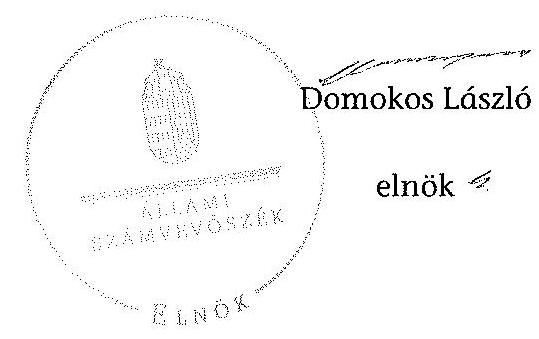

# ÁLLAMI   SZÁMVEVŐSZÉK 

## JELENTÉS

a helyi nemzetiségi önkormányzatok gazdálkodásának ellenőrzéséről
Terézvárosi Örmény Nemzetiségi Önkormányzat

---

# Állami Számvevőszék 

Iktatószám: V-0243-017/2014.
Témaszám: 1277
Vizsgálat-azonosító szám: V065261

## Az ellenőrzést felügyelte:

Horváth Balázs
felügyeleti vezető
Az ellenőrzést vezette és az ellenőrzés végrehajtásáért felelős:
Korsósné Vigh Andrea
ellenőrzésvezető
A számvevőszéki jelentést készítették és a jelentés összeállításában közreműködtek:

Győriné Franyó Éva
számvevő
Molnár Istvánné
számvevő tanácsos
Villányi Antal
számvevő tanácsos
Az ellenőrzést végezte:
Villányi Antal
számvevő tanácsos

A témához kapcsolódó eddig készített számvevőszéki jelentés:
címe
sorszáma
Jelentés a Budapest Főváros VI. kerület Terézváros Önkormányzata 0507
gazdálkodásának átfogó ellenőrzéséről

---

# TARTALOMJEGYZÉK 

BEVEZETÉS ..... 3
I. ÖSSZEGZŐ MEGÁLLAPÍTÁSOK, KÖVETKEZTETÉSEK, JAVASLATOK ..... 6
II. RÉSZLETES MEGÁLLAPÍTÁSOK ..... 14

1. A Nemzetiségi Önkormányzat és a Települési Önkormányzat együttműködésének szabályozása, a működési feltételek biztosítása ..... 14
2. A gazdálkodási feladatok ellátásának szabályszerűsége ..... 15
2.1. A költségvetésre és a zárszámadásra, valamint a kincstári adatszolgáltatás rendjére vonatkozó jogszabályi előírások betartása ..... 15
2.2. A Nemzetiségi Önkormányzat gazdálkodásának szabályozottsága ..... 17
2.3. Az operatív gazdálkodási jogkörök kialakítása, gyakorlása ..... 18
3. A Nemzetiségi Önkormányzattal összefüggő gazdálkodási feladatok belső ellenőrzése ..... 20
4. A feladatalapú támogatás felhasználásának, elszámolásának szabályszerűsége, a Nemzetiségi Önkormányzat feladatellátása ..... 20

## MELLÉKLETEK

1. számú A Nemzetiségi Önkormányzat 2012. évi gazdálkodásának főbb adatai, mutatói
2. számú Tájékoztatás a polgármesternek küldött el nem fogadott észrevételekről

## FÜGGELÉKEK

1. számú Rövidítések jegyzéke
2. számú Értelmező szótár
3. számú A gazdálkodás értékelésének módszere

---

.

---

# JELENTÉSTERVEZET   a helyi nemzetiségi önkormányzatok gazdálkodásának ellenőrzéséről Terézvárosi Örmény Nemzetiségi Önkormányzat 

## BEVEZETÉS

A Nemzetiségi Önkormányzat 1995. évben alakult, elnöke a 2000. évi helyhatósági választások óta látja el feladatát. A Nemzetiségi Önkormányzat intézményt, gazdasági társaságot és más szervezetet nem alapított, illetve ezek társulásában nem vesz részt. A Képviselő-testület munkája segítésére bizottságot nem hozott létre. A Nemzetiségi Önkormányzatnak a költségvetési beszámolója szerint a 2012. évben a módosított költségvetési bevételi és kiadási előirányzata 1071 ezer Ft, a teljesített költségvetési bevétel 1077 ezer Ft, a teljesített költségvetési kiadás 929 ezer Ft volt. A 2012. évi gazdálkodási adatokat részletesen az 1. számú mellékletben mutatjuk be.

Az Alaptörvény XXIX. cikk (1) bekezdése szerint a Magyarországon élő nemzetiségek államalkotó tényezők. Minden, valamely nemzetiséghez tartozó magyar állampolgárnak joga van önazonossága szabad vállalásához és megőrzéséhez. A hazánkban élő nemzetiségek helyi (települési és területi), valamint országos önkormányzatokat hozhatnak létre. A helyi nemzetiségi önkormányzatok gazdálkodási feladatait jogszabályi előírás alapján a székhely szerinti helyi önkormányzat polgármesteri hivatala látja el.

A nemzetiségek helyzete, támogatása mind hazai, mind EU-s szinten kiemelt figyelmet kap napjainkban. A helyi nemzetiségi önkormányzatok gazdálkodására és támogatási rendszerére vonatkozó jogszabályok a 2010-2012. években jelentős változásokon mentek át. A települési és területi nemzetiségi önkormányzatok gazdálkodásának, a részükre juttatott költségvetési támogatások felhasználásának ellenőrzését az ÁSZ a 2012. évben sorozatjellegű ellenőrzés keretében indította el. A 2013. évi ellenőrzések e témacsoportos ellenőrzések folytatását jelentik, amelyet az ÁSZ 2014. első félévi ellenőrzési terve 12. témasorszámon tartalmaz.

Az ellenőrzés célja annak értékelése volt, hogy a Nemzetiségi Önkormányzat gazdálkodási kereteinek kialakítása, gazdálkodása és feladatellátása megfelelt-e a jogszabályoknak.

Ennek keretében értékeltük, hogy:

- a Nemzetiségi Önkormányzat és a Települési Önkormányzat együttműködésének szabályozása, a működési feltételek biztosítása megfelelt-e a jogszabályi előírásoknak;

---

- a felek együttműködése megfelelt-e a közöttük létrejött együttműködési megállapodásnak a gazdálkodási feladatok szabályszerű ellátása során, ennek keretében betartották-e a helyi Nemzetiségi Önkormányzat gazdálkodásához kapcsolódóan a költségvetésre és zárszámadásra, a gazdálkodás szabályozására, az operatív gazdálkodási jogkörök gyakorlására vonatkozó jogszabályi előírásokat;
- a jegyző biztosította-e a Nemzetiségi Önkormányzat gazdálkodásának belső ellenőrzését;
- a Nemzetiségi Önkormányzat feladatalapú támogatásának felhasználása, a folyósított feladatalapú támogatással történő elszámolás az előírásoknak megfelelő volt-e;
- a Nemzetiségi Önkormányzat feladatellátása összhangban volt-e a vonatkozó jogszabályi előírásokkal.

Az ellenőrzés várható hasznosulását négy szinten tervezzük. A törvényalkotás számára összegzett tapasztalatok állnak rendelkezésre a nemzetiségi önkormányzatok testületi döntéseinek, gazdálkodásának és a feladatalapú támogatás felhasználásának szabályszerűségéről, amelynek alapján következtetést lehet levonni arra, hogy indokolt-e jogszabályi módosítás kezdeményezése. Az ellenőrzés az ellenőrzött számára visszajelzést ad a működésében fellépő hiányosságokról, javaslataival hozzájárul azok kiküszöböléséhez, amely csökkentheti a későbbi ellenőrzések gyakoriságát. Az ellenőrzés megállapításai és javaslatai tanulságul szolgálhatnak más nemzetiségi önkormányzatok, szervezetek számára a rendezett gazdálkodási keretek kialakításához. A társadalom számára jelzi, hogy közpénz nem maradhat ellenőrizetlenül, az ÁSZ értékteremtő rend kialakításához és megőrzéséhez hozzájáruló tevékenysége pozitív hatással lesz a szervezetről kialakított összkép formálásában. Az ÁSZ szervezetén belül lehetőség nyílik arra, hogy a megállapítások szintetizálásával az intézmény a hozzáadott értéket teremtő elemző tevékenységét és tanácsadó szerepét erősítse.

A helyi nemzetiségi önkormányzatok gazdálkodásának ellenőrzéséről szóló jelentés I. fejezetének összegző része az ellenőrzés céljára adott rövid, szintetizáló összefoglalót és következtetéseket tartalmazza a II. fejezet részletes megállapításain alapulóan. A jelentés intézkedést igénylő megállapításait és javaslatait az összegzőben foglaltak mellett - az ellenőrzés során feltárt, a jelentés II. fejezetében rögzített részletes megállapítások alapozzák meg, illetve támasztják alá.

Az ellenőrzés típusa: szabályszerűségi ellenőrzés
Az ellenőrzött időszak: 2012. január 1. - 2012. december 31. közötti időszak. Az ellenőrzés kiterjedt a Nemzetiségi Önkormányzatnak juttatott 2012. évi feladatalapú támogatás 2013. évben való elszámolására is.

Ellenőrzött szervezet: Terézvárosi Örmény Nemzetiségi Önkormányzat és a gazdálkodási feladatait ellátó Budapest Főváros VI. Kerület Terézváros Önkormányzata.

---

Az ellenőrzés végrehajtásának jogszabályi alapját az ÁSZ tv. 5. § (2)-(3) és (6) bekezdéseiben foglaltak képezik.

Az ellenőrzés szakmai módszertana az ÁSZ hivatalos honlapján (www.asz.hu) közzétett szakmai szabályokon alapult, amely a Legfőbb Ellenőrző Intézmények Nemzetközi Szervezete (INTOSAI) által kiadott nemzetközi standardok (ISSAI) figyelembevételével készült.

A helyi nemzetiségi önkormányzatok gazdálkodásának ellenőrzése során értékeltük a Települési Önkormányzat és a Nemzetiségi Önkormányzat együttműködésének, a gazdálkodás szabályozottságának és a pénzügyi folyamatokban kulcsszerepet betöltő belső kontrollok (teljesítésigazolás és érvényesítés) működésének megfelelőségét. A kulcskontrollokat a működési és felhalmozási célú támogatásértékű kiadásoknál, az államháztartáson kívülre teljesített működési és felhalmozási célú pénzeszköz átadásoknál, a dologi kiadásokkal kapcsolatos kifizetéseknél - véletlen mintavételi eljárást alkalmazva - ellenőriztük. Ellenőriztük, hogy a jegyző biztosította-e a Nemzetiségi Önkormányzat gazdálkodásának belső ellenőrzését. Értékeltük a feladatalapú támogatások felhasználásának, elszámolásának szabályszerűségét, a Nemzetiségi Önkormányzat feladatellátása és a jogszabályi előírások összhangját. A minősítési szempontokat a 3. számú függelék tartalmazza.

Az ellenőrzés lefolytatásához a Nemzetiségi Önkormányzat és a gazdálkodási feladatait ellátó Települési Önkormányzat tanúsítványok és a kapcsolódó, dokumentumjegyzékben megjelölt dokumentumok elektronikus úton történő megküldésével, rendelkezésre bocsátásával szolgáltatott adatokat. Az adatszolgáltatás kontrollálása és szükség szerinti javítása a helyszíni ellenőrzés keretében történt.

Az ÁSZ tv. 29. § (1) bekezdése szerint a jelentéstervezetet megküldtük egyeztetésre a polgármesternek és a Nemzetiségi Önkormányzat elnökének. A Nemzetiségi Önkormányzat elnöke az ÁSZ tv. 29. § (2) bekezdésében foglalt észrevételezési jogával nem élt, a jelentéstervezetre észrevételt nem tett. A polgármester határidőben megküldött észrevétele és tájékoztatása alapján a jelentést módosítottuk, az el nem fogadott észrevételek indokolását a jelentés 2. számú melléklete tartalmazza.

---

# I. ÖSSZEGZŐ MEGÁLLAPÍTÁSOK, KÖVETKEZTETÉSEK, JAVASLATOK 

A Nemzetiségi Önkormányzat és a Települési Önkormányzat együttműködésének szabályozása részben felelt meg a jogszabályi előírásoknak. A Nemzetiségi Önkormányzat rendelkezett a 2012. év folyamán hatályban lévő, a Települési Önkormányzattal megkötött együttműködési megállapodással. A felek a 2011. évben megkötött együttműködési megállapodásnak a Nek. ${ }_{2}$ tv.-ben január 31-i határidővel előírt felülvizsgálatát nem végezték el, a 2012. június 1-jei határidőre előírt módosítási kötelezettségüknek eleget tettek. A 2012. december 31-én hatályos együttműködési megállapodásban a Nemzetiségi Önkormányzat működési feltételeit az előírásoknak megfelelően szabályozták, azonban ezt - a Nek. ${ }_{2}$ tv.-ben előírtak ellenére - a Nemzetiségi Önkormányzat SZMSZ-ében nem rögzítették. A 2012. december 31-én hatályos együttműködési megállapodásban a Nemzetiségi Önkormányzat gazdálkodási feladatai ellátásának szabályozása, a jogszabályokban előírt tartalmi elemek tekintetében hiányos volt. Az együttműködési megállapodásban nem rögzítették az Áht. ${ }_{2}$-ben előírtak ellenére a Nemzetiségi Önkormányzat bevételeivel és kiadásaival kapcsolatban a tervezési és adatszolgáltatási feladatok ellátásának részletes szabályait. Nem határozták meg a Nek. ${ }_{2}$ tv. előírása ellenére a költségvetés előkészítésével és megalkotásával, valamint a költségvetéssel összefüggő adatszolgáltatási kötelezettségek teljesítésével kapcsolatos, továbbá a Nemzetiségi Önkormányzat részére az önálló fizetési számla nyitásával, törzskönyvi nyilvántartásba vételével és az adószám igénylésével kapcsolatos feladatokat, együttműködési kötelezettséget, és nem jelölték ki ezek felelőseit. Nem tartalmazta a Nemzetiségi Önkormányzat kötelezettségvállalásaival kapcsolatosan a Települési Önkormányzatot terhelő ellenjegyzési, érvényesítési feladatokat ellátók konkrét kijelölését, a Nemzetiségi Önkormányzat kötelezettségvállalásához kapcsolódó nyilvántartási kötelezettségeket, továbbá nem határozták meg a Nemzetiségi Önkormányzat működési feltételeinek és gazdálkodásának eljárási és dokumentációs részletszabályaival kapcsolatos előírásokat, feltételeket, valamint az ezeket végző személyek kijelölését. A Települési Önkormányzat biztosította a Nemzetiségi Önkormányzat működéséhez szükséges személyi és tárgyi feltételeket.

A Nemzetiségi Önkormányzat 2012. évi költségvetésének és zárszámadásának tartalma, jóváhagyása, valamint a kapcsolódó adatszolgáltatás részben felelt meg a jogszabályi előírásoknak. A jegyző az Áht. ${ }_{2}$ előírása ellenére nem készítette el a Nemzetiségi Önkormányzat költségvetési határozat tervezetét. A Nemzetiségi Önkormányzat elnöke a 2012. évi költségvetés tervezetét az előírt határidőben benyújtotta a Képviselő-testületnek. A költségvetés előterjesztésekor a Képviselő-testület tájékoztatására nem mutatták be az Áht. ${ }_{2}$-ben előírt előirányzat felhasználási tervet és a költségvetési mérleg szöveges indoklását. A Nek. ${ }_{2}$ tv.-ben előírtak ellenére a 2012. évi költségvetés és zárszámadás elfogadásához kapcsolódó jegyzőkönyvek nem tartalmazták az előterjesztéseket. A 2012. költségvetési évre vonatkozó kincstári adatszolgáltatási kötelezettségeket a jegyző határidőben teljesítette. A jegyző az Áht. ${ }_{2}$-ben előírtak ellenére nem készítette el a Nemzetiségi Önkormányzat zárszámadási határozat terve-

---

zetét, azonban biztosította a 2012. évi zárszámadás tárgyalásához szükséges mellékleteket, táblázatokat. A Nemzetiségi Önkormányzat elnöke a 2012. évi zárszámadást az előírt határidőben benyújtotta, a határozat és mellékleteinek tartalma megfelelt a jogszabályi előírásoknak, azonban a költségvetéssel való összehasonlíthatóság - az Áht. ${ }_{2}$ előírása ellenére - az eredeti előirányzati adatokban mutatkozó számszaki eltérés miatt részben volt biztosított. A zárszámadás tervezetének előterjesztésekor a Képviselő-testület tájékoztatására az Áht. ${ }_{2}$ ben előírtak ellenére nem mutatták be a pénzeszközök változását és a vagyonkimutatást.

A gazdálkodás szabályozottsága nem volt megfelelő. A Nemzetiségi Önkormányzat az ellenőrzött időszak egészében nem rendelkezett a Bkr. által előírt ellenőrzési nyomvonallal, szabálytalanságok kezelésének eljárásrendjével, valamint a folyamatba épített, előzetes, utólagos és vezetői ellenőrzés szabályozással. A Nemzetiségi Önkormányzat 2012. június 1-jétől nem rendelkezett a Számv. tv.-ben előírt eszközök és források értékelési szabályzatával, számviteli politikával és számlarenddel. A Nemzetiségi Önkormányzat 2012. május 31-ig rendelkezett a gazdálkodására vonatkozó, a Számv. tv.-ben előírt szabályzatokkal, mert a hatályban lévő együttműködési megállapodásban előírták a Nemzetiségi Önkormányzat gazdálkodási feladatai ellátásához a Polgármesteri Hivatal belső szabályzatainak használatát. A 2012. június 1-jétől hatályban lévő együttműködési megállapodás a vagyonnyilvántartás vonatkozásában rögzítette a Polgármesteri Hivatal belső szabályzatainak alkalmazását, ettől az időponttól a Nemzetiségi Önkormányzat leltározási és leltárkészítési szabályzattal, valamint pénzkezelési szabályzattal rendelkezett. A Polgármesteri Hivatal SZMSZ-e az Ávr. előírásai ellenére nem tartalmazta az SZMSZ-ben nevesített munkakörökhöz tartozó - a Nemzetiségi Önkormányzat gazdálkodásával összefüggő -
 feladat- és hatásköröket, a hatáskörök gyakorlásának módját, a helyettesítés rendjét, valamint az ezekhez kapcsolódó felelősségi szabályokat. A jegyző a szabályozás során a gazdálkodási jogkörök szabályzata és a 2012. évben hatályos együttműködési megállapodás közötti összhangot - a százezer forintot el nem érő fizetési kötelezettségek esetében - nem biztosította. Az előzetes írásbeli kötelezettségvállalást nem igénylő kifizetések rendjét - az Ávr. előírásait figyelmen kívül hagyva - belső szabályzatban nem rögzítették.

A Nemzetiségi Önkormányzat gazdálkodása tekintetében az operatív gazdálkodási jogkörök kialakítása megfelelt a jogszabályi előírásoknak. A Települési Önkormányzat 2012. évben rendelkezett gazdasági szervezettel, elkészítette ügyrendjét és a gazdasági szervezet vezetői feladatok ellátásával a polgármester írásban megbízta a Költségvetési és Intézménygazdálkodási Főosztály vezetőjét. A Települési Önkormányzat az Ávr.-ben foglaltak ellenére a Polgármesteri Hivatal SZMSZ-ében a gazdasági szervezetet nem nevesítette. Az ellenőrzött időszakot követően e hiányosságot megszüntették. A gazdasági szervezet vezetője rendelkezett az előírt szakképesítéssel, az általa írásban történt - a pénzügyi ellenjegyzőre és érvényesítőre vonatkozó - kijelölések jogszerűek voltak. A Nemzetiségi Önkormányzat elnöke kijelölte a teljesítésigazolásra jogosult személyt. A dologi kiadások bizonylatainak tesztelése alapján a teljesítésigazolás és az érvényesítés kulcskontrollok működésének megfelelősége gyenge volt, a hibák száma a lényegességi szintet, a kritikus hibahatárt elérte. A teljesítésigazoló egy kifizetést megelőzően nem, három kifizetés vonatkozásában nem szabályszerűen végezte el az Ávr.-ben előírt feladatát, a kiadás jogosságát, összegszerűségét és az ellenszolgáltatás teljesítésének igazolását. Az érvényesítő nem az Ávr.-ben előírtak szerint végezte el ellenőrzési feladatát, a megelőző ügymenetben a gazdálkodási szabályok betartásának ellenőrzését. Az utalványozó felé nem jelezte, hogy a teljesítésigazolás nem, vagy nem szabályszerűen történt meg, nem kifogásolta az együttműködési megállapodásban előírt előzetes írásbeli kötelezettségvállalási dokumentum hiányát, továbbá azt, hogy a Nemzetiségi Önkormányzat kötelezettségvállalási nyilvántartása tartalmilag nem felelt meg az Ávr.-ben előírt követelményeknek. Nem észrevételezte az Ávr.-ben előírt, az operatív gazdálkodási jogkörök gyakorlására jogosult személyekről és aláírás-mintájukról vezetendő naprakész nyilvántartás hiányát. Az érvényesítés - az utalványon az érvényesítésre utaló megjelölés hiányában - nem az Ávr.-ben előírtak szerint történt.

A Nemzetiségi Önkormányzatnál a 2012. évi három legnagyobb összegű dologi kiadás teljesítésének egyedi értékelése alapján a teljesítésigazolás és az érvényesítés kulcskontrollok nem működtek megfelelően. A teljesítésigazoló az Ávr.-ben előírt ellenőrzési és igazolási feladatát egy esetben nem látta el, két kifizetés vonatkozásában - előzetes írásbeli kötelezettségvállalási dokumentum hiányában - nem szabályszerűen végezte el. Az érvényesítő az Ávr.-ben foglalt feladatát nem az előírások szerint látta el, mert nem ellenőrizte a megelőző ügymenet tekintetében az Ávr. és az egyéb jogszabályok előírásainak betartását. Az érvényesítéssel kapcsolatos további hiányosságok megegyeztek a dologi kiadások tesztelésénél tett megállapításokkal. A Nemzetiségi Önkormányzatnál a kulcskontrollok 2012. évi működésében feltárt hiányosságokkal összefüggésben az ellenőrzés - a rendelkezésre bocsátott dokumentumok alapján - jogosulatlan kifizetést nem állapított meg, azonban a kulcskontrollok működésében bemutatott hiányosságok miatt nem biztosított a hibák megelőzése, feltárása és kijavítása.

A jegyző biztosította a Nemzetiségi Önkormányzat gazdálkodásával összefüggő végrehajtási feladatok belső ellenőrzését, mert a Polgármesteri Hivatal 2012. évi ellenőrzési tervét megalapozó kockázatelemzés kiterjedt a Nemzetiségi Önkormányzat gazdálkodásával összefüggő végrehajtási feladatok ellátására. Ennek kockázata a lefolytatott kockázatelemzés alapján alacsony volt, ezért erre vonatkozóan az ellenőrzött időszakban belső ellenőrzési feladatokat nem terveztek és nem végeztek.

A 2011. évben a Nemzetiségi Önkormányzat 342 ezer Ft feladatalapú támogatást kapott. A feladatalapú támogatás 2011. évi maradványát, 156 ezer Ft-ot az előírt határidőben, a támogatási célokkal összhangban felhasználták. A Nemzetiségi Önkormányzat a 2012. évben feladatalapú támogatásban nem részesült. A 2011. évi feladatalapú támogatás elszámolása a támogatási kormányrendelet előírása alapján az Áht. rendelkezése ellenére nem történt meg. A feladatalapú támogatás felhasználását, elszámolását az ellenőrzésre jogosult szervek nem ellenőrizték. A Nemzetiségi Önkormányzat feladatellátásának tárgya a kötelező közfeladatok tekintetében nem volt összhangban a Nek. ${ }_{2}$ tv.-ben foglaltakkal. A Nemzetiségi Önkormányzat a 2012. évben a Képviselőtestület működésén kívül - a tanúsítványon közölt adatok és az ellenőrzés részére átadott dokumentumok alapján - kötelező közfeladatot nem látott el. A Nemzetiségi Önkormányzat a 2012. évben önként vállalt közfeladatot a nemzetiségi kulturális önigazgatással összefüggő ügyekben, a hagyományápolás és közművelődés területén végzett.

Az ÁSZ tv. 33. § (1) bekezdésében foglaltak értelmében az ellenőrzött szervezet vezetője köteles a jelentésben foglalt megállapításokhoz kapcsolódó intézkedési tervet összeállítani, és azt a jelentés kézhezvételétől számított 30 napon belül az ÁSZ részére megküldeni. Amennyiben az intézkedési tervet határidőre nem küldi meg a szervezet, vagy az nem elfogadható, az ÁSZ elnöke az ÁSZ tv. 33. § (3) bekezdés a)-b) pontjaiban foglaltakat érvényesítheti.

A helyszíni ellenőrzés megállapításainak hasznosítása mellett javasoljuk:

# a jegyzőnek

1. az együttműködés szabályozásával kapcsolatban

A Nemzetiségi Önkormányzat és a Települési Önkormányzat együttműködését meghatározó - 2012. december 31-én hatályos - együttműködési megállapodás tartalmilag nem felelt meg az Áht. 2 27. § (2) bekezdésében, valamint a Nek. 2 tv. 80. § (3) bekezdésében foglalt előírásoknak. A 2012. január 1-jén hatályos, 2011. évben megkötött együttműködési megállapodásnak a Nek. 2 tv. 80. § (2) bekezdésében 2012. január 31-i határidőig előírt felülvizsgálatát nem végezték el.

A 2012. december 31-én hatályos együttműködési megállapodás szerinti működési feltételeket a Nek. 2 tv. 80. § (2) bekezdésében előírtak ellenére a Nemzetiségi Önkormányzat SZMSZ-ében nem rögzítették.

Javaslat
Az együttműködés szabályszerűsége érdekében:
a) készítse elő az együttműködési megállapodás módosítását, hogy az tartalmilag feleljen meg az Áht. 2 27. § (2) bekezdésében, valamint a Nek. 2 tv. 80. § (3) bekezdésében foglalt előírásoknak;
b) biztosítsa a jövőben az együttműködési megállapodás évenkénti felülvizsgálata során a Nek. 2 tv. 80. § (2) bekezdésében előírt határidő betartását;
c) készítse elő a Nemzetiségi Önkormányzat SZMSZ-ének kiegészítését a Nek. 2 tv. 80. § (2) bekezdésében foglalt előírás alapján.
2. a költségvetés és a zárszámadás, valamint a kapcsolódó kincstári adatszolgáltatás szabályszerűségével kapcsolatban

Az Áht. 2 24. § (2) bekezdés előírása ellenére a jegyző nem készítette el a Nemzetiségi Önkormányzat költségvetési határozat tervezetét. A 2012. évi költségvetés előterjesztésekor a Képviselő-testület részére az Áht. 2 24. § (4) bekezdés a) pontjában előírtak ellenére - a jegyző mulasztása miatt - tájékoztatásul nem mutatták be a Nemzetiségi Önkormányzat előirányzat felhasználási tervét, továbbá a költségvetési mérleg szöveges indoklását. A jegyző az Áht. 2 91. § (1) bekezdés előírása ellenére a zárszámadási határozattervezetet nem készítette el. A Képviselő-testület részére tájékoztatásul nem mutatták be az Áht. 91. § (2) bekezdés a) és c) pontjában előírtak ellenére - a jegyző általi elkészítés hiányában - a költségvetési mérleget, a pénzeszközök változását, valamint a vagyonkimutatást. Az Áht. 2 89. § (1) bekezdésében előírtak ellenére a költségvetés és a zárszámadás összehasonlíthatósága részben volt biztosított. A Nemzetiségi Önkormányzat elnöke a Nek. 2 tv. 95. § (2) bekezdés f) pontjában előírtak ellenére a költségvetéshez és a zárszámadáshoz kapcsolódó jegyzőkönyvekhez nem csatolta be az előterjesztéseket.

Javaslat
Gondoskodjon a jövőben:
a) az Áht. 2 24. § (2) bekezdésében előírtaknak megfelelően a Nemzetiségi Önkormányzat költségvetési határozat tervezetének elkészítéséről, továbbá arról, hogy az Áht. 2 24. § (4) bekezdés a) pontjában foglalt előírásnak megfelelően a költségvetés előterjesztésekor a Képviselő-testület részére bemutatásra kerüljön szöveges indoklással - a Nemzetiségi Önkormányzat költségvetési mérlege közgazdasági tagolásban, valamint az előirányzat felhasználási terve;
b) az Áht. 2 91. § (1) bekezdésének megfelelően a Nemzetiségi Önkormányzat zárszámadási határozat tervezetének elkészítéséről, továbbá arról, hogy a zárszámadás előterjesztésekor a Képviselő-testület részére tájékoztatásul bemutatásra kerüljön az Áht. 2 91. § (2) bekezdés a) és c) pontjában előírtak szerint a költségvetési mérleg, a pénzeszközök változása és a vagyonkimutatás;
c) a költségvetés és a zárszámadás Áht. 2 89. § (1) bekezdése szerinti összehasonlíthatóságának megteremtéséről;
d) a Nek. 2 tv. 95. § (2) bekezdés f) pontjában előírtak szerint a Képviselő-testületi döntések előterjesztéseinek jegyzőkönyvben történő szerepeltetéséről.
3. a gazdálkodási feladatok szabályozottságával kapcsolatban

A Nemzetiségi Önkormányzat az ellenőrzött időszak egészében nem rendelkezett a Bkr. 6. § (3)-(4) bekezdéseiben előírt ellenőrzési nyomvonallal és szabálytalanságok kezelésének eljárásrendjével, valamint a Bkr. 8. § (2) bekezdése szerinti folyamatba épített, előzetes, utólagos és vezetői ellenőrzés szabályozással. A Nemzetiségi Önkormányzat 2012. június 1-jétől nem rendelkezett a Számv. tv. 14. § (5) bekezdés b) pontjában előírt eszközök és források értékelési szabályzatával, a Számv. tv. 14. § (3)-(4) bekezdéseiben előírt számviteli politikával, a Számv. tv. 161. § (1) bekezdésében előírt számlarenddel.

A jegyző a szabályozás során a gazdálkodási jogkörök szabályzata és a 2012. évben hatályos együttműködési megállapodás közötti összhangot - a százezer forintot el nem érő fizetési kötelezettségek esetében - nem biztosította. A gazdálkodási jogkörök szabályzatában az Ávr. 53. § (1) bekezdés a) pontjában foglaltak alapján lehetővé tették az előzetes írásbeli kötelezettségvállalás mellőzését, míg az együttműködési megállapodás az írásban történt kötelezettségvállalást tartalmazta összeghatártól függetlenül. Az előzetes írásbeli kötelezettségvállalást nem igénylő kifizetések rendjét - az Ávr. 53. § (2) bekezdésének előírásait figyelmen kívül hagyva - belső szabályzatban nem rögzítették.

A Polgármesteri Hivatal SZMSZ-e az Ávr. 13. § (1) bekezdés g) pontjában foglaltak ellenére nem tartalmazta az SZMSZ-ben nevesített munkakörökhöz tartozó - a Nemzetiségi Önkormányzat gazdálkodásával kapcsolatos - feladat- és hatásköröket, a hatáskörök gyakorlásának módját, a helyettesítés rendjét, az ezekhez kapcsolódó felelősségi szabályokat.

Javaslat
A gazdálkodás szabályszerűsége érdekében:
a) gondoskodjon a Számv. tv. 14. § (3)-(4) bekezdéseiben és az (5) bekezdés b) pontjában előírt számviteli politika, az eszközök és források értékelési szabályzata, a Számv. tv. 161. § (1) bekezdésében előírt számlarend, illetve a Bkr. 6. § (3)-(4) és 8. § (2) bekezdésében előírtak szerinti ellenőrzési nyomvonal, szabálytalanságok kezelésének eljárásrendje, valamint folyamatba épített, előzetes, utólagos és vezetői ellenőrzés szabályozás elkészítéséről;
b) biztosítsa a gazdálkodási jogkörök szabályzata és az együttműködési megállapodás közötti összhangot a százezer forintot el nem érő fizetési kötelezettségek vonatkozásában, továbbá az Ávr. 53. § (1) bekezdés a) pontjában foglalt lehetőség alkalmazása esetén az Ávr. 53. § (2) bekezdésében előírtak alapján belső szabályzatban rögzítse az előzetes írásbeli kötelezettségvállalást nem igénylő kifizetések rendjét;
c) készítse elő a Polgármesteri Hivatal SZMSZ-ének módosítását, hogy az megfeleljen az Ávr. 13. § (1) bekezdése g) pontjában foglalt előírásnak.
4. a kulcskontrollok működésével kapcsolatban

A teljesítésigazoló nem, vagy az előzetes írásbeli kötelezettségvállalási dokumentum hiányában nem szabályszerűen látta el az Ávr. 57. § (1) és (3) bekezdéseiben foglalt feladatát, mivel nem ellenőrizte a kiadás teljesítésének jogosságát, összegszerűségét, valamint nem ellenőrizte az ellenszolgáltatások teljesítését, igazolását. Az érvényesítő nem az Ávr. 58. § (1) és (2) bekezdéseiben előírtak szerint végezte el ellenőrzési feladatát, az összegszerűség, a fedezet megléte, továbbá a megelőző ügymenetben a gazdálkodási szabályok betartásának ellenőrzését. Nem kifogásolta és az utalványozó felé nem jelezte, hogy a teljesítésigazolás nem, vagy
 nem szabályszerűen történt meg, nem kifogásolta az együttműködési megállapodásban előírt előzetes írásbeli kötelezettségvállalási dokumentum hiányát. Az érvényesítés nem az Ávr. 58. § (3) bekezdésében előírtak szerint történt.

Javaslat
Az operatív gazdálkodás működési hibáinak megelőzése, feltárása és kijavítása érdekében gondoskodjon arról, hogy:
a) a teljesítés igazolása minden esetben az Ávr. 57. § (1) és (3) bekezdéseiben előírtaknak megfelelően történjen;
b) az érvényesítő tegyen eleget az Ávr. 58. § (1)-(3) bekezdéseiben előírt ellenőrzési feladatának és jelzési kötelezettségének.

---

5. a feladatalapú támogatás elszámolásával kapcsolatban

A 2011. évi feladatalapú támogatás elszámolása a támogatási kormányrendelet ¹7. § (2) bekezdésében hivatkozott „a helyi önkormányzatok elszámolási és ellenőrzési rendjére vonatkozó" jogszabályok rendelkezései alkalmazása előírása alapján az Áht. 64. § (7) bekezdése ellenére nem történt meg.

Javaslat
Gondoskodjon az Áht. ²27. § (2) bekezdésben meghatározott feladatkörében a Nemzetiségi Önkormányzat által igénybe vett feladatalapú támogatás rendeltetésszerű felhasználásáról szóló elszámolásának elkészítéséről az Áht. ²53. § (1) bekezdése szerinti beszámolási kötelezettség teljesítéséhez.

# a polgármesternek 

A Nemzetiségi Önkormányzat és a Települési Önkormányzat együttműködését meghatározó - 2012. december 31-én hatályos - együttműködési megállapodás tartalmilag nem felelt meg az Áht. ²27. § (2) bekezdésében, valamint a Nek. ² tv. 80. § (3) bekezdésében foglalt előírásoknak.

A Polgármesteri Hivatal SZMSZ-e az Ávr. 13. § (1) bekezdés g) pontjában foglaltak ellenére nem tartalmazta az SZMSZ-ben nevesített munkakörökhöz tartozó - a Nemzetiségi Önkormányzat gazdálkodásával kapcsolatos - feladat- és hatásköröket, a hatáskörök gyakorlásának módját, a helyettesítés rendjét, az ezekhez kapcsolódó felelősségi szabályokat.

Javaslat
Terjessze a Települési Önkormányzat Képviselő-testülete elé jóváhagyásra:
a) az Áht. ²27. § (2) bekezdésében, valamint a Nek. ² tv. 80. § (3) bekezdésében foglalt előírásoknak megfelelő, a jegyző által előkészített együttműködési megállapodás módosítás tervezetét;
b) az Ávr. 13. § (1) bekezdés g) pontjában foglalt szabályozásra figyelemmel a Polgármesteri Hivatal SZMSZ-ének jegyző által előkészített módosítását.

## a Nemzetiségi Önkormányzat elnökének

1. A Nemzetiségi Önkormányzat és a Települési Önkormányzat együttműködését meghatározó - 2012. december 31-én hatályos - együttműködési megállapodás tartalmilag nem felelt meg az Áht. ²27. § (2) bekezdésében, valamint a Nek. ² tv. 80. § (3) bekezdésében foglalt előírásoknak.

A Nemzetiségi Önkormányzat a 2012. december 31-én hatályos együttműködési megállapodás szerinti működési feltételeket a Nek. ² tv. 80. § (2) bekezdésében előírtak ellenére a Nemzetiségi Önkormányzat SZMSZ-ében nem rögzítette.

---

Javaslat
Terjessze a Képviselő-testület elé jóváhagyásra:
a) az Áht. ²27. § (2) bekezdésében, valamint a Nek. ² tv. 80. § (3) bekezdésében foglalt előírásoknak megfelelő, a jegyző által előkészített együttműködési megállapodás módosítás tervezetét;
b) a Nemzetiségi Önkormányzat SZMSZ-ének a Nek. ² tv. 80. § (2) bekezdésében foglaltaknak megfelelő jegyző által előkészített módosítását.
2. A Képviselő-testület részére tájékoztatásul - a jegyző mulasztása miatt - nem mutatták be az Áht. ²24. § (4) bekezdés a) pontjában előírtak ellenére a Nemzetiségi Önkormányzat előirányzat felhasználási tervét és a költségvetési mérleg szöveges indoklását, valamint az Áht. ²91. § (2) bekezdés a) és c) pontjaiban előírtak ellenére a költségvetési mérleget, a pénzeszközök változását, valamint a vagyonkimutatást.

Javaslat
Terjessze a Képviselő-testület elé tájékoztatásra a jegyző által előkészített Áht. ²24. § (4) bekezdés a) pontjában, valamint az Áht. ²91. § (2) bekezdés a) és c) pontjaiban előírt mérlegeket, kimutatásokat.
3. A 2011. évi feladatalapú támogatás elszámolása a támogatási kormányrendelet ¹7. § (2) bekezdésében hivatkozott „a helyi önkormányzatok elszámolási és ellenőrzési rendjére vonatkozó" jogszabályok rendelkezései alkalmazása előírása alapján az Áht. ¹64. § (7) bekezdése ellenére nem történt meg.

Javaslat
Terjessze a Képviselő-testület elé jóváhagyásra az Áht. ²53. § (1) bekezdése szerinti beszámolási kötelezettség teljesítéséhez a Nemzetiségi Önkormányzat által igénybe vett 2011. évi feladatalapú támogatás rendeltetésszerű felhasználásáról szóló elszámolást.

---

# II. RÉSZLETES MEGÁLLAPÍTÁSOK 

## 1. A Nemzetiségi Önkormányzat És a Települési Önkormányzat Együttműködésének Szabályozása, a Működési Feltételek Biztosítása

A Nemzetiségi Önkormányzat és a Települési Önkormányzat együttműködésének szabályozása részben felelt meg a jogszabályi előírásoknak.

A Nemzetiségi Önkormányzat rendelkezett a 2012. év folyamán hatályban lévő, a Települési Önkormányzattal megkötött együttműködési megállapodással. ¹ A 2012. január 1-jén hatályos, 2011. évben megkötött együttműködési megállapodást a felek a Nek. ² tv. 80. § (2) bekezdésében előírtak ellenére 2012. január 31-éig nem vizsgálták felül. A Nek. ² tv. 159. § (3) bekezdésben előírt módosítást határidőn belül jóváhagyták.

A 2012. december 31-én hatályos együttműködési megállapodásban a Nemzetiségi Önkormányzat működési feltételeit az előírásoknak megfelelően szabályozták, azonban a Nemzetiségi Önkormányzat a Nek. ² tv. 80. § (2) bekezdésében előírtak ellenére az együttműködési megállapodás szerinti működési feltételeket az együttműködési megállapodás megkötését követő harminc napon belül, illetve azt követően az ellenőrzött időszakban a Nemzetiségi Önkormányzat SZMSZ-ében nem rögzítette.

A 2012. december 31-én hatályos együttműködési megállapodásban a Nemzetiségi Önkormányzat gazdálkodásával kapcsolatos feladatokat, felelőseket és határidőket hiányosan szabályozták. Az együttműködési megállapodás nem tartalmazta az Áht. ² 27. § (2) bekezdés előírása ellenére a Nemzetiségi Önkormányzat bevételeivel és kiadásaival kapcsolatban a tervezési és adatszolgáltatási feladatok ellátásának részletes szabályait. Nem rögzítették továbbá a Nek. ² tv. 80. § (3) bekezdés a)-d) pontjaiban foglalt előírások ellenére:

- a költségvetés előkészítésével és megalkotásával, valamint a költségvetéssel összefüggő adatszolgáltatási kötelezettségek teljesítésével, továbbá az önálló fizetési számla nyitásával, törzskönyvi nyilvántartásba vételével és adószám igénylésével kapcsolatos határidőket, együttműködési kötelezettségeket és ezek felelőseinek konkrét kijelölését;

[^0]
[^0]:    ¹ A 2012. június 1-jéig hatályos együttműködési megállapodást a Települési Önkormányzat Képviselő-testülete a 447/2010. (XII. 16.) számú, a Képviselő-testület a 4/2011. (I. 09.) számú határozatával hagyta jóvá.

    A 2012. június 1-jétől hatályos együttműködési megállapodást a Települési Önkormányzat Képviselő-testülete a 112/2012. (V. 31.) számú, a Képviselő-testület a 26/2012. (V. 24.) számú határozatával fogadta el.

---

- a Nemzetiségi Önkormányzat kötelezettségvállalásaival kapcsolatosan a Települési Önkormányzatot terhelő ellenjegyzési és érvényesítési feladatokat ellátók konkrét kijelölését;
- a Nemzetiségi Önkormányzat kötelezettségvállalásához kapcsolódó nyilvántartási kötelezettségeket;
- a Nemzetiségi Önkormányzat működési feltételeinek és gazdálkodásának eljárási és dokumentációs részletszabályaival kapcsolatos előírásokat, feltételeket, valamint az ezeket végző személyek kijelölését.

A 2012. június 1-jétől hatályos együttműködési megállapodás a jogszabályi előírásnak megfelelően tartalmazta, hogy a jegyző, vagy annak - a jegyzővel azonos képesítési előírásoknak megfelelő - megbízottja a Települési Önkormányzat megbízásából és képviseletében részt vesz a Képviselő-testület ülésein és jelzi, amennyiben törvénysértést észlel. A Nemzetiségi Önkormányzat 2012. évi költségvetését és zárszámadását tárgyaló Képviselő-testületi ülésein a jegyző, vagy az általa megbízott azonos képesítési előírásoknak megfelelő megbízottja - a Nek. ² tv. 80. § (4) bekezdésben előírt kötelezettségét elmulasztva - nem vett részt.

A Települési Önkormányzat a Polgármesteri Hivatal útján biztosította a Nemzetiségi Önkormányzat 2012. évi működésének a - Nek. ² tv. 159. § (3) bekezdésében foglalt átmeneti rendelkezés alapján a Nek. ¹ tv. 27. § (2)-(3) bekezdéseiben előírt - személyi és tárgyi feltételeit.

# 2. A Gazdálkodási Feladatok Ellátásának Szabályszerűsége 

### 2.1. A költségvetésre és a zárszámadásra, valamint a kincstári adatszolgáltatás rendjére vonatkozó jogszabályi előírások betartása

A Nemzetiségi Önkormányzat 2012. évi költségvetésének, zárszámadásának tartalma, jóváhagyása, valamint a kapcsolódó adatszolgáltatás részben felelt meg a jogszabályi előírásoknak.

A jegyző az Áht. ² 24. § (2) bekezdés előírása ellenére nem készítette el a Nemzetiségi Önkormányzat 2012. évi költségvetési határozat tervezetét.

A jegyző a 2012. június 1-jéig hatályban lévő együttműködési megállapodásban - a költségvetési határozat elfogadására - előírt határidőt² követően nyújtott tá-

[^0]
[^0]:    ² A 2012. június 1-jéig hatályos megállapodás 3.1.2. pontja előírta, hogy „a kisebbségi önkormányzat képviselő-testülete január 25-ig önállóan határozatban állapítja meg a költségvetését".

---

jékoztatást ³ a Nemzetiségi Önkormányzat elnökének a 2012. évi költségvetési tervezet megvitatásához és jóváhagyásához szükséges adatokról.

A Nemzetiségi Önkormányzat elnöke a 2012. évi költségvetés tervezetét az Áht. ²-ben előírt határidőben ⁴ benyújtotta a Képviselő-testületnek, a jóváhagyott költségvetési határozat ⁵ tartalmazta az Áht. ²-ben és az Ávr.-ben előírt tartalmi elemeket.

A Képviselő-testület a 2012. március 4-i ülésén - a jegyző 2012. február 4-i tájékoztatása alapján - az éves bevételi és kiadási főösszegeket 215 ezer Ft-ra módosította ⁶.

A Nemzetiségi Önkormányzat 2012. évi elemi költségvetését a Polgármesteri Hivatal nem a Képviselő-testület költségvetési határozata, hanem az általa összeállított, 2012. február 4-én közölt költségvetési tervezet adataival készítette el, amely ötezer forinttal több volt a Képviselő-testület költségvetési határozatában szereplő bevételi és kiadási főösszegeknél.

A Nemzetiségi Önkormányzat elnöke az Áht. ² 24. § (4) bekezdés a) pontjában előírtak ellenére - a jegyző mulasztása miatt - a 2012. évi költségvetés tárgyalásakor a Képviselő-testület tájékoztatására nem mutatta be az előirányzat felhasználási tervet és a költségvetési mérleg szöveges indokolását.

A Nemzetiségi Önkormányzat elnöke a Nek. ² tv. 95. § (2) bekezdés f) pontjában előírtak ellenére a 2012. január 24-ei, a 2012. március 4-ei és a 2013. március 17-ei jegyzőkönyvekhez nem csatolta be a költségvetéshez, valamint a zárszámadáshoz kapcsolódó előterjesztéseket.

A jegyző a 2012. évi költségvetéshez kapcsolódó, a Nemzetiségi Önkormányzatra vonatkozó kincstári adatszolgáltatási kötelezettségének az előírásoknak megfelelően eleget tett.

A jegyző az Áht. ² 91. § (1) bekezdésében előírtak ellenére nem készítette el a Nemzetiségi Önkormányzat zárszámadási határozat tervezetét, azonban a Polgármesteri Hivatal összeállította a 2012. évi bevételi és kiadási eredeti és módosított előirányzatokat és azok teljesítését részletező kimutatásokat. A Nemzetiségi Önkormányzat elnöke a 2012. évi zárszámadás terveze-

[^0]
[^0]:    ³ A jegyző a 2012. február 4-ei levelében és a csatolt öt mellékletben (1. számú melléklet: a bevételekről; 2. számú melléklet: a kiadásokról; 3. számú melléklet: a 2012. évi tervezett kiadások és bevételek mérlegszerű bemutatása; 4. számú melléklet: a 2012. évi előirányzat felhasználási ütemterv; 5. számú melléklet: Kiegészítő információk) nyújtott tájékoztatást.
    ⁴ A központi költségvetésről szóló törvény kihirdetését követő 45. napon belül.
    ⁵ A 2012. évi költségvetést a Képviselő-testület a 3/2012. (I. 24.) számú határozatával hagyta jóvá 210 ezer Ft bevételi és kiadási főösszeggel.
    ⁶ A 2012. évi költségvetés módosításáról szóló 7/2012. (III. 04.) számú határozat.

---

tét az Áht. ²-ben előírt határidőben benyújtotta a Képviselő-testületnek, melyet határozattal ⁷ elfogadtak.

A Nemzetiségi Önkormányzat elnöke a zárszámadás tervezetének előterjesztésekor az Áht. ² 91. § (2) bekezdés a) és c) pontjaiban előírtak ellenére a Képviselő-testület tájékoztatására - a jegyző általi elkészítés hiányában - nem mutatta be a pénzeszközök változását és a vagyonkimutatást.

A 2012. évi zárszámadásban a Nemzetiségi Önkormányzat valamennyi bevételéről és kiadásáról elszámoltak, azonban az Áht. ² 89. § (1) bekezdésben előírtak ellenére az elfogadott költségvetéssel

 való összehasonlíthatóságot részben biztosították, mert a Nemzetiségi Önkormányzat jóváhagyott költségvetése és az elfogadott zárszámadási határozat számszaki adatait tartalmazó melléklet ${ }^{8}$ eredeti előirányzatának kiadási és bevételi adatai ötezer forinttal eltértek egymástól.

# 2.2. A Nemzetiségi Önkormányzat gazdálkodásának szabályozottsága 

A Nemzetiségi Önkormányzat gazdálkodásának szabályozottsága nem volt megfelelő.

A Nemzetiségi Önkormányzat az ellenőrzött időszak egészében nem rendelkezett a Bkr. 6. § (3)-(4) bekezdéseiben előírt ellenőrzési nyomvonallal és szabálytalanságok kezelésének eljárásrendjével, valamint a Bkr. 8. § (2) bekezdése szerinti folyamatba épített, előzetes, utólagos és vezetői ellenőrzés szabályozással.

A Nemzetiségi Önkormányzat a gazdálkodási feladatok szabályszerű ellátásához 2012. június 1-jétől nem rendelkezett a következőkben felsorolt szabályzatokkal:

- a Számv. tv. 14. § (5) bekezdés b) pontjában előírt eszközök és források értékelési szabályzata;
- a Számv. tv. 14. § (3)-(4) bekezdéseiben előírt számviteli politika;
- a Számv. tv. 161. § (1) bekezdésében előírt számlarend.

A Nemzetiségi Önkormányzat gazdálkodási feladatai végrehajtását ellátó Polgármesteri Hivatal szabályzatainak alkalmazását a 2012. június 1-jéig hatályos együttműködési megállapodás kiterjesztette a Nemzetiségi Önkormányzatra. A 2012. június 1-jétől hatályos együttműködési megállapodás - a leltározási és leltárkészítési, valamint a pénzkezelési szabályzat kivételével - nem írta elő a Polgármesteri Hivatal szabályzatainak alkalmazását.

[^0]
[^0]:    ${ }^{7}$ A 2012. évi zárszámadást a Képviselő-testület a 22/2013. (III. 17.) számú határozattal fogadta el.
    ${ }^{8}$ „Terézvárosi Örmény Nemzetiségi Önkormányzat beszámolója 2012. évi" címú táblázat.

---

A Polgármesteri Hivatal SZMSZ-e az Ávr. 13. § (1) bekezdés g) pontjában előírtak ellenére nem tartalmazta az SZMSZ-ben nevesített munkakörökhöz tartozó - a Nemzetiségi Önkormányzat gazdálkodásával kapcsolatos - feladat- és hatásköröket, a hatáskörök gyakorlásának módját, a helyettesítés rendjét, az ezekhez kapcsolódó felelősségi szabályokat.

A jegyző a szabályozás során a gazdálkodási jogkörök szabályzata és a 2012. évben hatályos együttműködési megállapodások közötti összhangot - a százezer forintot el nem érő fizetési kötelezettségek esetében - nem biztosította. Az együttműködési megállapodás az írásban történt kötelezettségvállalást tartalmazta összeghatártól függetlenül. A gazdálkodási jogkörök szabályzatában az Ávr. 53. § (1) bekezdésében foglalt lehetőség alapján előírták az előzetes írásbeli kötelezettségvállalás mellőzését. Az előzetes írásbeli kötelezettségvállalást nem igénylő kifizetések rendjét - az Ávr. 53. § (2) bekezdésének előírásait figyelmen kívül hagyva - belső szabályzatban nem rögzítették.

# 2.3. Az operatív gazdálkodási jogkörök kialakítása, gyakorlása 

A Nemzetiségi Önkormányzat gazdálkodása tekintetében az operatív gazdálkodási jogkörök kialakítása megfelelt a jogszabályi előírásoknak.

A Települési Önkormányzat a 2012. évben rendelkezett gazdasági szervezettel, mivel az Ávr. előírásai szerint elkészítette az ügyrendjét és a gazdasági szervezet vezetőjének teendőivel a polgármester írásban megbízta a Költségvetési és Intézménygazdálkodási Főosztály vezetőjét. A Települési Önkormányzat az Ávr. 13. § (1) bekezdés e) pontjában foglaltak ellenére a Polgármesteri Hivatal SZMSZ-ében a gazdasági szervezet ügyrendjének hatályba léptetésével egyidejűleg nem nevezte meg egyértelműen a Főosztályt, mint a Települési Önkormányzat gazdasági szervezetét. A gazdasági vezető rendelkezett az előírt szakképesítéssel, az általa történt személyre szóló megbízások (kijelölések) a pénzügyi ellenjegyző és az érvényesítő vonatkozásában jogszerűek voltak.

Az ellenőrzött időszakot követően módosították a Polgármesteri Hivatal SZMSZ-ét${ }^{9}$, kiegészítették a gazdasági szervezet meghatározásával, a gazdasági vezető megnevezésével.

A Nemzetiségi Önkormányzat elnöke - mint kötelezettségvállaló - a jogszabályi előírásokkal összhangban gondoskodott a teljesítésigazoló személy kijelöléséről. A kötelezettségvállalási és utalványozási jogkör gyakorlására nem hatalmazott fel írásban más képviselőt.

A Nemzetiségi Önkormányzatnál a 2012. évben a dologi kiadások teljesítése során - a bizonylatok tesztelése alapján - a teljesítésigazolás és az érvényesítés kulcskontrollok működésének megfelelősége gyenge volt.

[^0]
[^0]:    ${ }^{9}$ A Települési Önkormányzat Képviselő-testülete a 203/2013. (X. 24.) számú határozatával módosította a Polgármesteri Hivatal SZMSZ-ét.

---

A hibák száma a lényegességi szintet, a kritikus hibahatárt elérte:

- a teljesítésigazoló egy kifizetésnél nem, három kifizetésnél - az előzetes írásbeli kötelezettségvállalási dokumentum hiányában - nem szabályszerűen végezte el az Ávr. 57. § (1) és (3) bekezdésében előírt feladatát, így nem történt meg a kifizetés jogossága, összegszerűsége és az ellenszolgáltatás teljesítésének az ellenőrzése és igazolása;
- az érvényesítő nem az Ávr. 58. § (1) és (2) bekezdésében előírtak szerint végezte el ellenőrzési feladatát, az összegszerűség, a fedezet megléte, továbbá a megelőző ügymenetben a gazdálkodási szabályok - ennek keretében az Ávr. előírásai - betartásának ellenőrzését. Nem kifogásolta és az utalványozó felé nem jelezte a teljesítésigazolás, továbbá az összegszerűség ellenőrzéséhez szükséges - az együttműködési megállapodásban előírt - előzetes írásbeli kötelezettségvállalási dokumentum hiányát, továbbá, hogy a kifizetés utalványrendeletén feltüntetett kötelezettségvállalás nyilvántartási számot
a kötelezettségvállalás nyilvántartás nem tartalmazta. Nem észrevételezte az Ávr. 60. § (3) bekezdésében előírt, az operatív gazdálkodási jogkörök gyakorlására jogosult személyekről és aláírás-mintájukról vezetendő naprakész nyilvántartás hiányát. Nem jelezte továbbá, hogy a Nemzetiségi Önkormányzat kötelezettségvállalási nyilvántartása tartalmilag nem felelt meg az Ávr. 56. § (1) bekezdésében előírt követelményeknek, mert nem tartalmazta a kötelezettségvállalást tanúsító dokumentum megnevezését, iktatószámát, keltét, a kötelezettségvállaló nevét, a jogosult azonosító adatait, a kifizetési határidőket. Az érvényesítés - az érvényesítésre utaló megjelölés hiányában - nem az Ávr. 58. § (3) bekezdésében előírt módon történt.

A Nemzetiségi Önkormányzatnál a 2012. évi dologi kiadások között a három legnagyobb összegű kiadás teljesítésének (amelyek valójában 10 kisösszegű tétel pénztári kifizetéséből tevődött össze) egyedi értékelése alapján a teljesítésigazolás és az érvényesítés kulcskontrollok nem működtek megfelelően. A teljesítésigazoló az Ávr. 57. § (1) és (3) bekezdésében foglalt ellenőrzési és igazolási feladatát nem látta el megfelelően, mert a teljesítésigazolás egy kifizetésnél nem, két kifizetés esetében - előzetes írásbeli kötelezettségvállalási dokumentum hiányában - nem szabályszerűen történt meg. Az érvényesítő az Ávr. 58. § (1)-(2) bekezdésében foglalt feladatát nem az előírások szerint látta el, mert nem ellenőrizte a megelőző ügymenet tekintetében az Ávr. és az egyéb jogszabályok előírásainak betartását. Az érvényesítéssel kapcsolatos hiányosságok megegyeztek a dologi kiadások tesztelésénél tett megállapításokkal.

A Nemzetiségi Önkormányzatnak a 2012. évben az államháztartáson kívülre teljesített működési/felhalmozási célú pénzeszközátadása, támogatásértékű kiadása nem volt.

A Nemzetiségi Önkormányzatnál a kulcskontrollok 2012. évi működésében feltárt hiányosságokkal összefüggésben az ellenőrzés - a rendelkezésre bocsátott dokumentumok alapján - jogosulatlan kifizetést nem állapított meg, azonban a kulcskontrollok működésében feltárt hiányosságok miatt nem biztosított a hibák megelőzése, feltárása és kijavítása.

---

# 3. A Nemzetiségi ÖNKORMÁNYZATtal ÖSSZEFÜGGŐ GAZDÁLKODÁSI FELADATOK BELSŐ ELLENŐRZÉSE 

A jegyző az ellenőrzött időszakban biztosította a Nemzetiségi Önkormányzat gazdálkodásával összefüggő végrehajtási feladatok belső ellenőrzését, mert a Polgármesteri Hivatal 2012. évi ellenőrzési tervét megalapozó kockázatelemzés kiterjedt a Nemzetiségi Önkormányzat gazdálkodásával összefüggő végrehajtási feladatok ellátására. Ennek kockázata a lefolytatott kockázatelemzés alapján alacsony volt, ezért erre vonatkozóan az ellenőrzött időszakban belső ellenőrzési feladatokat nem terveztek és nem végeztek.

A 2012. évben hatályos együttműködési megállapodás tartalmazta a belső ellenőrzés rendjét az alábbiak szerint: „A kisebbségi/nemzetiségi önkormányzat gazdálkodásának belső ellenőrzését a Polgármesteri Hivatal Belső Ellenőrzési Osztálya végzi a Belső Ellenőrzési Szabályzat értelemszerű alkalmazása mellett. A tervszerű ellenőrzés alkalmaiban a kisebbségi/nemzetiségi önkormányzat elnöke a jegyzővel egyeztet. A rendkívüli ellenőrzést a kisebbségi önkormányzat elnöke a jegyzőn keresztül kezdeményezi." A 2012. június 1-jétől hatályos együttműködési megállapodás még kiegészült az alábbi bevezetővel: „A belső kontrollrendszer kialakításánál figyelembe kell venni a költségvetési szervek belső kontrollrendszeréről és belső ellenőrzéséről szóló 370/2011. (XII. 31.) Korm. rendelet előírásait".

Az ellenőrzéshez szolgáltatott adatok alapján a 2012. évben a Kormányhivatal a Nemzetiségi Önkormányzatot illetően nem élt törvényességi felügyeleti eszközökkel.

## 4. A feladatalapú támogatás felhasználásának, elszámolásának szabályszerűsége, a Nemzetiségi Önkormányzat feladatellátása

A 2011. évben a Nemzetiségi Önkormányzat 342 ezer Ft feladatalapú támogatásban részesült, amelyből 2011. december 31-én a kötelezettségvállalással terhelt maradvány összege 156 ezer Ft-volt. A feladatalapú támogatás maradványát 2012. június 30-ig felhasználták a támogatási célnak megfelelően. A 2012. évben a Nemzetiségi Önkormányzat feladatalapú támogatást nem kapott.

A 2011. évi feladatalapú támogatás elszámolása a támogatási kormányrendelet ${ }_{1} 7 . \S$ (2) bekezdésében hivatkozott „a helyi önkormányzatok elszámolási és ellenőrzési rendjére vonatkozó" jogszabályok rendelkezései alkalmazása előírása alapján az Áht. ${ }_{1} 64 . \S$ (7) bekezdése ellenére nem történt meg. A feladatalapú támogatás felhasználását, elszámolását az ellenőrzésre jogosult szervek nem ellenőrizték.

---

A Nemzetiségi Önkormányzat feladatellátásának tárgya a kötelező közfeladatok tekintetében nem volt összhangban a Nek. 2 tv. 115. §-ában foglaltakkal. A Nemzetiségi Önkormányzat a 2012. évben a Képviselő-testület működésén kívül - a tanúsítványon közölt adatok és az ellenőrzés részére átadott dokumentumok alapján - kötelező közfeladatot nem látott el. A Nemzetiségi Önkormányzat a 2012. évben a Nek. 2 tv. 116. § (2) bekezdés előírásaival összhangban végzett önként vállalt közfeladatot a nemzetiségi kulturális önigazgatással összefüggő ügyekben, a hagyományápolás és közművelődés területén.

Budapest, 2014. 06 hónap 03 nap

Melléklet: $\quad 2 \mathrm{db}$
Függelék: $\quad 3 \mathrm{db}$

---

.

---

# A Nemzetiségi Önkormányzat 2012. évi gazdálkodásának főbb adatai, mutatói

A) Bevételek

|  Megnevezés | Eredeti előirányzat | Módosított | Teljesítés  |
| --- | --- | --- | --- |
|   | ezer Ft |  | megoszlás  |
|  Intézményi működési bevételek | 0 | 0 | 6  |
|  Általános működési támogatás | 215 | 215 | 215  |
|  Települési Önkormányzat által nyújtott támogatás | 0 | 856 | 856  |
|  Működési költségvetés bevételei | 215 | 1 071 | 1 077  |
|  Költségvetési bevételek összesen | 215 | 1 071 | 1 077  |
|  Bevételek mindösszesen | 215 | 1 071 | 1 077  |

B) Kiadások

|  Megnevezés | Eredeti előirányzat | Módosított | Teljesítés  |
| --- | --- | --- | --- |
|   | ezer Ft |  | megoszlás  |
|  Dologi kiadások | 215 | 1 071 | 929  |
|  Működési kiadások összesen | 215 | 1 071 | 929  |
|  Költségvetési kiadások összesen | 215 | 1 071 | 929  |
|  Kiadások mindösszesen | 215 | 1 071 | 929  |

---

.

---

# TÁJÉKOZTATÁS   A POLGÁRMESTERNEK KÜLDÖTT   EL NEM FOGADOTT ÉSZREVÉTELEKRŐL 

| Együttműködési megállapodás kiegészítése, felülvizsgálata |  |
| :--: | :--: |
| Észrevétel | 1.Budapest VI. Kerület Terézváros Önkormányzata és a Terézvárosi Örmény Nemzetiségi Önkormányzat között 2014.01.30-án új Együttműködési megállapodás került megkötésre, amely tartalmilag már megfelel az Áht. 27. § (2) bekezdésben rögzített előírásoknak, valamint a Nek törvény 80. § (3) bekezdésében foglaltaknak 1.b.) pont:   Az Együttműködési megállapodások jogszabályban előírt évenkénti felülvizsgálata biztosítva lesz, ahogy az legutóbb 2014.január 30-án is megtörtént.   1.c.) pont:   A Nemzetiségi Önkormányzat SZMSZ-ének kiegészítése folyamatban van, melynek alapját az új 2014.01.30-án elfogadott Együttműködési megállapodás képezi. |
| Polgármesteri Hivatal

 SZMSZ-ének hiányossága, szabályzatok hiánya |  |
| Észrevétel | 3. a - b.) A szabályzatok elkészítése és a dokumentumok összhangjának megteremtése folyamatban van.   A belső kontrollrendszer szabályzatainak felülvizsgálatára, aktualizálására a szükséges intézkedéseket megtettük: a FEUVE-szabályozás kiegészítésre került, a nemzetiségi önkormányzatokra vonatkozó ellenőrzési nyomvonalak kidolgozása folyamatban van. A szabálytalanságok kezelésének eljárásrendjével rendelkezünk.   3.c.) A Polgármesteri Hivatal SZMSZ-ének módosítása előkészítés alatt, melynek elfogadásával az Ávr. 13. § (1) bekezdés g.) pontjában előírtakat is tartalmazni fogja. (Várható elfogadása 2014. május).   A Jelentés tervezet 12. oldalán a polgármesternek megfogalmazott a.) és b.) javaslatokkal kapcsolatban az alábbiakban tájékoztatom.   a.) pont:   2014. január 30-án a két érintett fél között új megállapodás került elfogadásra, amely már tartalmazza az Áht. 27. § e) bekezdésében és a Nek. törvény 80. § (3) bekezdésében foglalt előírásokat.   b.)pont:   A Polgármesteri Hivatal SZMSZ-ének módosítása - mely tartalmazza az Ávr. 13. § (1) bekezdés g.) pont szerinti tartalmat - előkészítés alatt, melyet várhatóan a 2014. májusi képviselő-testületi ülésen kerül a terézvárosi önkormányzat képviselő-testülete elé. |

---

| Összevont   válasz | Tájékoztatását arról, hogy 2014. január 30-án az Áht. 27. § (2) be-   kezdésében és a Nek. törvény 80. § (3) bekezdésében rögzített előírá-   soknak megfelelő új Együttműködési megállapodás került megkötés-   re, valamint a Nemzetiségi önkormányzat SZMSZ-ének kiegészítése, a   szabályzatok elkészítése és a dokumentumok összhangjának megte-   remtése, továbbá a Polgármesteri Hivatal SZMSZ-ének módosítása   folyamatban van, a feladatalapú támogatások rendeltetésszerű fel-  használásának ellenőrzésére és annak dokumentálására a jövőben   nagyobb gondot fordítanak, tudomásul veszem, de a jelentéstervezet   megállapításait erre vonatkozóan nem módosítjuk. Az erre vonatko-   zó javaslatot továbbra is fenntartjuk, mert a hiányosságok megszün-   tetésére a 2014. évben tett intézkedések nem vehetők figyelembe az   ellenőrzött időszakra vonatkozó megállapításainknál. |
| :--: | :--: |

---

# RÖVIDÍTÉSEK JEGYZÉKE 

## Törvények

Alaptörvény
Áht. 1
Áht. 2
ÁSZ tv.
Nek. 1 tv.
Nek. 2 tv.
Számv. tv.

## Rendeletek

Ávr.

Bkr.
támogatási kormányrendelet ${ }_{1}$
támogatási kormányrendelet ${ }_{2}$

## Határozatok

Nemzetiségi Önkormányzat SZMSZ-e

Polgármesteri Hivatal SZMSZ-e

## Szórövidítések

ÁSZ
EU
gazdasági szervezet

Magyarország Alaptörvénye
1992. évi XXXVIII. törvény az államháztartásról (hatályos 2011. december 31-ig)
2011. évi CXCV. törvény az államháztartásról (hatályos 2011. december 31-től)

Az Állami Számvevőszékről szóló 2011. évi LXVI. törvény (hatályos 2011. július 1-jétől)
1993. évi LXXVII. törvény a nemzeti és etnikai kisebbségek jogairól (hatályos 2011. december 31-ig)
2011. évi CLXXIX. törvény a nemzetiségek jogairól (hatályos 2011. december 20-tól)
2000. évi C. törvény a számvitelről

368/2011. (XII. 31.) Korm. rendelet az államháztartásról szóló törvény végrehajtásáról (hatályos 2012. január 1-jétől)
370/2011. (XII. 31.) Korm. rendelet a költségvetési szervek belső kontrollrendszeréről és belső ellenőrzéséről (hatályos 2012. január 1-jétől)
342/2010. (XII. 28.) Korm. rendelet a kisebbségi önkormányzatoknak a központi költségvetésből, valamint fejezeti kezelésű előirányzatból nyújtott támogatások feltételrendszeréről és elszámolásának rendjéről (hatályos 2012. március 6-ig)
28/2012. (III. 6.) Korm. rendelet a nemzetiségi célú előirányzatokból nyújtott támogatások feltételrendszeréről és elszámolásának rendjéről (hatályos 2012. március 7-től)

A 4/2012. (I. 24.) számú határozattal elfogadott Terézvárosi Örmény Nemzetiségi Önkormányzat Szervezeti és Működési Szabályzata
A többször módosított 335/2005. (X. 20.) számú határozattal elfogadott Budapest Főváros VI. Kerület Terézváros Önkormányzat Polgármesteri Hivatalának Szervezeti és Működési Szabályzata

Állami Számvevőszék
Európai Unió
Budapest Főváros VI. Kerület Terézváros Önkormányzatának Polgármesteri Hivatala Költségvetési és Intézménygazdálkodási Főosztálya

---

gazdálkodási jogkörök szabályzata
jegyző
Képviselő-testület

Kincstár
Kormányhivatal
Nemzetiségi Önkormányzat
Nemzetiségi Önkormányzat elnöke
polgármester
Polgármesteri Hivatal
SZMSZ
Települési Önkormányzat
Települési Önkormányzat Képviselő-testülete
ügyrend
$1 / 2012$. (I. 1.) számú polgármesteri-jegyzői közös utasítás a kötelezettségvállalási, pénzügyi ellenjegyzési, teljesítésigazolási, érvényesítési és utalványozási jogkör gyakorlásáról
Budapest Főváros VI. Kerület Terézváros Önkormányzat Polgármesteri Hivatalának jegyzője
Terézvárosi Örmény Nemzetiségi Önkormányzat Képviselő-testülete
Magyar Államkincstár
Budapest Főváros Kormányhivatala
Terézvárosi Örmény Nemzetiségi Önkormányzat
Terézvárosi Örmény Nemzetiségi Önkormányzat elnöke
Budapest Főváros VI. Kerület Terézváros Önkormányzatának polgármestere
Budapest Főváros VI. Kerület Terézváros Önkormányzatának Polgármesteri Hivatala
Szervezeti és Működési Szabályzat
Budapest Főváros VI. Kerület Terézváros Önkormányzata
Budapest Főváros VI. Kerület Terézváros Önkormányzat Képviselő-testülete
Budapest Főváros VI. Kerület Terézváros Önkormányzatának Polgármesteri Hivatala gazdasági szervezetének 2012. január 15-től hatályos ügyrendje

---

# ÉRTELMEZŐ SZÓTÁR 

együttműködési megállapodás
feladatalapú támogatás
kulcskontrollok
nemzetiség
nemzetiségi közügy

A nemzetiségi önkormányzatnak a működési feltételei biztosítására, továbbá a bevételeivel és a kiadásaival kapcsolatban a tervezési, gazdálkodási, ellenőrzési, finanszírozási, adatszolgáltatási és beszámolási feladatai végrehajtására a székhelye szerinti települési önkormányzattal megkötött megállapodás. (Az Áht. ${ }_{1} 66 . \S$, a Nek. ${ }_{2}$ tv. 80. § (2) bekezdés, valamint az Áht. ${ }_{2} 27 . \S$ (2) bekezdés alapján levezetett fogalom.)
A támogatási évben általános működési támogatásban részesült, és a Támogatónak a Kincstárhoz intézett, a feladatalapú támogatás utalására vonatkozó rendelkező levele keltének időpontjában működő nemzetiségi önkormányzatoknak kormányrendeletben rögzített feltételrendszer alapján nyújtható támogatás. A feladatalapú támogatás a nemzetiségi közügyeknek a nemzetiségi önkormányzatok által történő ellátását szolgálja. (A támogatási kormányrendelet ${ }_{1} 2 . \S$ (2) bekezdés c) pont, és a támogatási kormányrendelet ${ }_{2} 4 . \S$ (1) bekezdése alapján.) Teljesítés igazolása és az érvényesítés.
Minden olyan Magyarország területén legalább egy évszázada honos népcsoport, amely az állam lakossága körében számszerű kisebbségben van, a lakosság többi részétől saját nyelve, kultúrája és hagyományai különböztetik meg, egyben olyan összetartozás-tudatról tesz bizonyságot, amely mindezek megőrzésére, történelmileg kialakult közösségeik érdekeinek kifejezésére és védelmére irányul. (A Nek. ${ }_{2}$ tv. 1. § (1) bekezdése alapján levezetett fogalom.)
Az egyéni és közösségi jogok érvényesülése, a nemzetiséghez tartozók érdekeinek kifejezésre juttatása - különösen az anyanyelv ápolása, őrzése és gyarapítása, továbbá a nemzetiségek kulturális autonómiájának a nemzetiségi önkormányzatok által történő megvalósítása és megőrzése - érdekében a nemzetiséghez tartozók meghatározott közszolgáltatásokkal való ellátásával, ezen ügyek önálló vitelével és az ehhez szükséges szervezeti, személyi és anyagi feltételek megteremtésével összefüggő ügy. A közhatalmat gyakorló állami és helyi önkormányzati szervekben, továbbá a nemzetiségi önkormányzati szervekben való nemzetiségi képviselethez és mindezek szervezeti, személyi és anyagi feltételeinek biztosításához kapcsolódó ügy. (Nek. ${ }_{2}$ tv. 2. § 1. pontjából levezetett fogalom.)

---

nemzetiségi önkormányzat

Törvényben meghatározott nemzetiségi közszolgáltatási feladatokat ellátó, testületi formában működő, jogi személyiséggel rendelkező, demokratikus választások útján, törvény alapján létrehozott szervezet, amely a nemzetiségi közösséget megillető jogosultságok érvényesítésére, a nemzetiségek érdekeinek védelmére és képviseletére, a feladat- és hatáskörébe tartozó nemzetiségi közügyek települési, területi vagy országos szinten történő önálló intézésére jön létre. (A Nek. 2 tv. 2. § 2. pontjából levezetett fogalom.)

---

# A GAZDÁLKODÁS ÉRTÉKELÉSÉNEK MÓDSZERE 

A helyi nemzetiségi önkormányzatok gazdálkodásának ellenőrzése keretében az önkormányzat gazdálkodása kereteinek kialakítása, gazdálkodása megfelelőségének minősítéséhez az alábbi területeket értékeltük:

- a helyi nemzetiségi önkormányzat és a helyi önkormányzat együttműködése szabályozását, az együttműködési megállapodásban előírt működési feltételek biztosítását;
- a helyi nemzetiségi önkormányzat jóváhagyott költségvetésére, zárszámadására, továbbá a kincstári adatszolgáltatás rendjére vonatkozó jogszabályi előírások betartását;
- a helyi nemzetiségi önkormányzatra vonatkozó gazdálkodási szabályzatok jogszabályi előírások szerinti rendelkezésre állását;
- a helyi nemzetiségi önkormányzat gazdálkodása tekintetében az operatív gazdálkodási jogkörök kialakítása jogszabályi előírásoknak történő megfelelését;
- a helyi nemzetiségi önkormányzattal összefüggő feladatalapú támogatás felhasználása és elszámolása jogszabályi előírásoknak való megfelelését;
- a helyi nemzetiségi önkormányzattal összefüggő gazdálkodási feladatok tekintetében a jogszabályokban előírt belső ellenőrzés biztosítását.

A helyi nemzetiségi önkormányzat gazdálkodását az ellenőrzési program munkalapjain a hat területhez kapcsolódóan feltett kérdésekre adott válaszok alapján értékeltük. A kérdésekhez rendelt súlyozott pontszámok alapján elért összérték a megszerezhető maximális pontszám százalékában került kimutatásra. Ennek figyelembevételével kialakított minősítések a következőek voltak:

| Nem megfelelő: | $0-60 \%$ |
| :-- | :-- |
| Részben megfelelő: | $61-80 \%$ |
| Megfelelő: | $81 \%$-tól |

A pénzügyi folyamatok belső kontrolljának ellenőrzése keretében a pénzügyi folyamatokban kulcsszerepet betöltő belső kontrollok - a teljesítésigazolás és az érvényesítés - működésének megfelelőségét értékeltük. A kulcskontrollok működésének értékeléséhez a kritériumokat jogszabályok határozták meg. A kulcskontrollok működése megfelelőségének értékelése tekintetében lényeges minden olyan hiba, amely gátolja, hogy a kontrolltevékenység eredményesen működjön.

A két kulcskontroll működése megfelelőségének ellenőrzéséhez a dologi és egyéb folyó kiadások könyvviteli tételeiből szekvenciális (megállásos) mintavé-

---

teli eljárással választottuk ki az ellenőrizendő tételeket. A kulcskontrollok megfelelőségének vizsgálata keretében a számvevő bizonyosságot szerez arról, hogy a rendelkezésre álló szabályozás és dokumentumok alapján a teljesítésigazoláshoz és az érvényesítéshez szükséges ellenőrzési lépéseket végrehajtották-e.

A kulcskontrollok működése „kiváló", „jó" vagy „gyenge" minősítést kaphatott. A munkalapon feltett kérdésekhez rendelt súlyozott pontszámok alapján elért összérték a megszerezhető maximális pontszám százalékában került kimutatásra, mely alapján kialakított minősítések a következőek voltak:

| gyenge: | $0-70 \%$ |
| :-- | :-- |
| jó: | $71-90 \%$ |
| kiváló: | $91 \%$-tól |

A kulcskontrollok működését:

- kiválónak értékeltük abban az esetben, ha azok működése megfelel a hibák megelőzésére és kijavítására meghatározott szabályozásnak, valamint a legmagasabb szintű elvárásoknak;
- jónak minősítettük, ha a megállapított kisebb, tolerálható mértékű hiányosságok nem veszélyeztetik az ellenőrzött területek hibáinak megelőzését és kijavítását;
- gyengének értékeltük, amennyiben a kontrollok működésében túl sok hiányosság fordul elő ahhoz, hogy a kontrollok biztosítsák a hibák megelőzését, feltárását, kijavítását.
