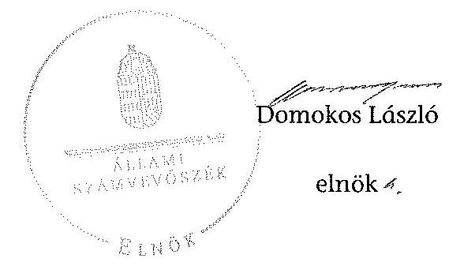

# ÁLLAMI   SZÁMVEVŐSZÉK 

## JELENTÉS

a helyi nemzetiségi önkormányzatok gazdálkodásának ellenőrzéséről
Budapest Főváros XV. Kerületi Horvát Önkormányzat

---

# Állami Számvevőszék 

Iktatószám: V-0259-021/2014.
Témaszám: 1293
Vizsgálat-azonosító szám: V065277

## Az ellenőrzést felügyelte:

Horváth Balázs
felügyeleti vezető
Az ellenőrzést vezette és az ellenőrzés végrehajtásáért felelős:
Korsósné Vigh Andrea
ellenőrzésvezető
A számvevőszéki jelentést készítették és a jelentés összeállításában közremüködtek:

Buús Zoltánné Hütter Erzsébet
számvevő tanácsos
Batkiné Vas Anna
számvevő tanácsos
Az ellenőrzést végezte:
Szabó Erzsébet
számvevő tanácsos

A témához kapcsolódó eddig készített számvevőszéki jelentés:
címe
sorszáma
Jelentés a Budapest Főváros XV. kerület Rákospalota, Pestújhely, 0571
Úlpalota Önkormányzata gazdálkodási rendszerének átfogó ellen-
őrzéséről

---

# TARTALOMJEGYZÉK 

BEVEZETÉS ..... 3
I. ÖSSZEGZŐ MEGÁLLAPÍTÁSOK, KÖVETKEZTETÉSEK, JAVASLATOK ..... 6
II. RÉSZLETES MEGÁLLAPÍTÁSOK ..... 14

1. A Nemzetiségi Önkormányzat és a Települési Önkormányzat együttműködésének szabályozása, a múködési feltételek biztosítása ..... 14
2. A gazdálkodási feladatok ellátásának szabályszerűsége ..... 15
2.1. A költségvetésre és a zárszámadásra, valamint a kincstári adatszolgáltatás rendjére vonatkozó jogszabályi előírások betartása ..... 15
2.2. A Nemzetiségi Önkormányzat gazdálkodásának szabályozottsága ..... 16
2.3. Az operatív gazdálkodási jogkörök kialakítása, gyakorlása ..... 16
3. A Nemzetiségi Önkormányzattal összefüggő gazdálkodási feladatok belső ellenőrzése ..... 18
4. A feladatalapú támogatás felhasználásának, elszámolásának szabályszerűsége, a Nemzetiségi Önkormányzat feladatellátása ..... 19

## MELLÉKLETEK

1. számú A Nemzetiségi Önkormányzat 2012. évi gazdálkodásának főbb adatai, mutatói
2/A. szá- Tájékoztatás a polgármesternek küldött el nem fogadott észrevételekről mú
2/B. szá- Tájékoztatás az elnöknek küldött el nem fogadott észrevételekről mú mú

## FÜGGELÉKEK

1. számú Rövidítések jegyzéke
2. számú Értelmező szótár
3. számú A gazdálkodás értékelésének módszere

---

.

---

# JELENTÉS   a helyi nemzetiségi önkormányzatok gazdálkodásának ellenőrzéséről Budapest Főváros XV. Kerületi Horvát Önkormányzat 

## BEVEZETÉS

A Nemzetiségi Önkormányzat 1994. évben alakult, elnöke az 1994. évi helyhatósági választások óta látja el feladatát. A Nemzetiségi Önkormányzat intézményt, gazdasági társaságot és más szervezetet nem alapított, illetve ezek társulásában nem vesz részt. A négytagú Képviselő-testület munkája segitésére bizottságot nem hozott létre. A Nemzetiségi Önkormányzatnak a költségvetési beszámolója szerint a 2012. évben a módosított költségvetési bevételi és kiadási előirányzata 1903 ezer Ft, a teljesített költségvetési bevétel 2014 ezer Ft, a teljesített költségvetési kiadás 1838 ezer Ft volt. A 2012. évi gazdálkodási adatokat részletesen az 1. számú mellékletben mutatjuk be.

Az Alaptörvény XXIX. cikk (1) bekezdése szerint a Magyarországon élő nemzetiségek államalkotó tényezők. Minden, valamely nemzetiséghez tartozó magyar állampolgárnak joga van önazonossága szabad vállalásához és megőrzéséhez. A hazánkban élő nemzetiségek helyi (települési és területi), valamint országos önkormányzatokat hozhatnak létre. A helyi nemzetiségi önkormányzatok gazdálkodási feladatait jogszabályi előírás alapján a székhely szerinti helyi önkormányzat polgármesteri hivatala látja el.

A nemzetiségek helyzete, támogatása mind hazai, mind EU-s szinten kiemelt figyelmet kap napjainkban. A helyi nemzetiségi önkormányzatok gazdálkodására és támogatási rendszerére vonatkozó jogszabályok a 2010-2012. években jelentős változásokon mentek át. A települési és területi nemzetiségi önkormányzatok gazdálkodásának, a részükre juttatott költségvetési támogatások felhasználásának ellenőrzését az ÁSZ a 2012. évben sorozatjellegú ellenőrzés keretében indította el. A 2013. évi ellenőrzések e témacsoportos ellenőrzések folytatását jelentik, amelyet az ÁSZ 2014. első félévi ellenőrzési terve 12. témasorszámon tartalmaz.

Az ellenőrzés célja annak értékelése volt, hogy a Nemzetiségi Önkormányzat gazdálkodási kereteinek kialakítása, gazdálkodása és feladatellátása megfelelt-e a jogszabályoknak.

Ennek keretében értékeltük, hogy:

- a Nemzetiségi Önkormányzat és a Települési Önkormányzat együttmúködésének szabályozása, a múködési feltételek biztosítása megfelelt-e a jogszabályi előírásoknak;

---

- a felek együttműködése megfelelt-e a közöttük létrejött együttműködési megállapodásnak a gazdálkodási feladatok szabályszerű ellátása során, ennek keretében betartották-e a helyi Nemzetiségi Önkormányzat gazdálkodásához kapcsolódóan a költségvetésre és zárszámadásra, a gazdálkodás szabályozására, az operatív gazdálkodási jogkörök gyakorlására vonatkozó jogszabályi előírásokat;
- a jegyző biztosította-e a Nemzetiségi Önkormányzat gazdálkodásának belső ellenőrzését;
- a Nemzetiségi Önkormányzat feladatalapú támogatásának felhasználása, a folyósított feladatalapú támogatással történő elszámolás az előírásoknak megfelelő volt-e;
- a Nemzetiségi Önkormányzat feladatellátása összhangban volt-e a vonatkozó jogszabályi előírásokkal.

Az ellenőrzés várható hasznosulását négy szinten tervezzük. A törvényalkotás számára összegzett tapasztalatok állnak rendelkezésre a nemzetiségi önkormányzatok testületi döntéseinek, gazdálkodásának és a feladatalapú támogatás felhasználásának szabályszerűségéről, amelynek alapján következtetést lehet levonni arra, hogy indokolt-e jogszabályi módosítás kezdeményezése. Az ellenőrzés az ellenőrzött számára visszajelzést ad a működésében fellépő hiányosságokról, javaslataival hozzájárul azok kiküszöböléséhez, amely csökkentheti a későbbi ellenőrzések gyakoriságát. Az ellenőrzés megállapításai és javaslatai tanulságul szolgálhatnak más nemzetiségi önkormányzatok, szervezetek számára a rendezett gazdálkodási keretek kialakításához. A társadalom számára jelzi, hogy közpénz nem maradhat ellenőrizetlenül, az ÁSZ értékteremtő rend kialakításához és megőrzéséhez hozzájáruló tevékenysége pozitív hatással lesz a szervezetről kialakított összkép formálásában. Az ÁSZ szervezetén belül lehetőség nyílik arra, hogy a megállapítások szintetizálásával az intézmény a hozzáadott értéket teremtő, elemző tevékenységét és tanácsadó szerepét erősítse.

A helyi nemzetiségi önkormányzatok gazdálkodásának ellenőrzéséről szóló jelentés I. fejezetének összegző része az ellenőrzés céljára adott rövid, szintetizáló összefoglalót és következtetéseket tartalmazza a II. fejezet részletes megállapításain alapulóan. A jelentés intézkedést igénylő megállapításait és javaslatait az összegzőben foglaltak mellett - az ellenőrzés során feltárt, a jelentés II. fejezetében rögzített részletes megállapítások alapozzák meg, illetve támasztják alá.

# Az ellenőrzés típusa: szabályszerűségi ellenőrzés 

Az ellenőrzött időszak: 2012. január 1. - 2012. december 31. közötti időszak. Az ellenőrzés kiterjedt a helyi nemzetiségi önkormányzatnak juttatott, 2012. évi feladatalapú támogatás 2013. évben való elszámolására is.

Ellenőrzött szervezet: Budapest Főváros XV. Kerületi Horvát Önkormányzat és a gazdálkodási feladatait ellátó Budapest Főváros XV. Kerület Rákospalota, Pestújhely, Újpalota Önkormányzata.

---

Az ellenőrzés végrehajtásának jogszabályi alapját az ÁSZ tv. 5. § (2)(3) és (6) bekezdéseiben foglaltak képezik.

Az ellenőrzés szakmai módszertana az ÁSZ hivatalos honlapján (www.asz.hu) közzétett szakmai szabályokon alapult, amely a Legfőbb Ellenőrző Intézmények Nemzetközi Szervezete (INTOSAI) által kiadott nemzetközi standardok (ISSAI) figyelembevételével készült.

A helyi nemzetiségi önkormányzatok gazdálkodásának ellenőrzése során értékeltük a Települési Önkormányzat és a Nemzetiségi Önkormányzat együttmúködésének, a gazdálkodás szabályozottságának és a pénzügyi folyamatokban kulcsszerepet betöltő belső kontrollok (teljesítésigazolás és érvényesítés) müködésének megfelelőségét. A kulcskontrollokat a müködési és felhalmozási célú támogatásértékű kiadásoknál, az államháztartáson kívülre teljesített múködési és felhalmozási célú pénzeszköz átadásoknál, a dologi kiadásokkal kapcsolatos kifizetéseknél - véletlen mintavételi eljárást alkalmazva - ellenőriztük. Ellenőriztük, hogy a jegyző biztositotta-e a Nemzetiségi Önkormányzat gazdálkodásának belső ellenőrzését. Értékeltük a feladatalapú támogatások felhasználásának, elszámolásának szabályszerűségét, a Nemzetiségi Önkormányzat feladatellátása és a jogszabályi előírások összhangját. A minősítési szempontokat a 3. számú függelék tartalmazza.

Az ellenőrzés lefolytatásához a Nemzetiségi Önkormányzat és a gazdálkodási feladatait ellátó Települési Önkormányzat tanúsítványok és a kapcsolódó, dokumentumjegyzékben megjelölt dokumentumok elektronikus úton történő megküldésével, rendelkezésre bocsátásával szolgáltatott adatokat. Az adatszolgáltatás kontrollálása és szükség szerinti javítása a helyszíni ellenőrzés keretében történt.

Az ÁSZ tv. 29. § (1) bekezdése szerint a jelentéstervezetet megküldtük egyeztetésre a polgármesternek és a Nemzetiségi Önkormányzat elnökének. A polgármester, valamint a Nemzetiségi Önkormányzat elnöke határidőben megküldött észrevételei, tájékoztatásai alapján a jelentést módosítottuk, az el nem fogadott észrevételek indokolását a jelentés $2 / \mathrm{A}$. és $2 / \mathrm{B}$. számú melléklete tartalmazza.

---

# I. ÖSSZEGZŐ MEGÁLLAPÍTÁSOK, KÖVETKEZTETÉSEK, JAVASLATOK 

A Nemzetiségi Önkormányzat és a Települési Önkormányzat együttmúködésének szabályozása - kisebb tartalmi hiányosságok kivételével - megfelelt a jogszabályi előírásoknak. A Nemzetiségi Önkormányzat az ellenőrzött időszakban rendelkezett a Települési Önkormányzattal kötött együttmúködési megállapodással. Annak felülvizsgálatát a Nek. 2 tv.-ben meghatározott határidőn túl, 2012 februárjában hajtották végre, melynek során a Nek. ${ }_{2}$ tv. alapján a múködési feltételek szabályozására vonatkozó módosításokat is elvégezték. A 2012. december 31 -én hatályos együttmúködési megállapodásban azonban nem rögzítették a testületi döntések és a tisztségviselők döntései előkészítésének, a testületi és tisztségviselői döntéshozatalhoz kapcsolódó nyilvántartási feladatok ellátásának kötelezettségét. E hiányosságokat a 2013. évben megszüntették. A 2012. december 31-én hatályos együttmúködési megállapodásban a Nek. ${ }_{2}$ tv. előírása ellenére nem határozták meg a Nemzetiségi Önkormányzat önálló fizetési számla nyitásával, törzskönyvi nyilvántartásba vételével és adószám igénylésével kapcsolatos határidőket és együttmúködési kötelezettségeket. A Nek. ${ }_{2}$ tv.-ben foglaltak ellenére a Nemzetiségi Önkormányzat SZMSZ-e nem tartalmazta az együttmúködési megállapodás szerinti múködési feltételeket. A Települési Önkormányzat a 2012. évben biztosította a Nemzetiségi Önkormányzat múködésének személyi és tárgyi feltételeit.

A Nemzetiségi Önkormányzat 2012. évi költségvetésére és zárszámadására, valamint az adatszolgáltatásra vonatkozó jogszabályi előírások nem érvényesültek. A Nemzetiségi Önkormányzat elnöke a 2012. évi költségvetés tervezetét az előírt határidőig benyújtotta a Képviselő-testületnek. A 2012. évi költségvetés előterjesztésekor - a jegyző mulasztása miatt - az Áht. ${ }_{2}$ szerinti előírás ellenére nem mutatták be szöveges indokolással együtt a Képviselő-testület részére tájékoztatásul a Nemzetiségi Önkormányzat költségvetési mérlegét közgazdasági tagolásban és előirányzat felhasználási tervét. A jegyző a 2012. évi költségvetéshez kapcsolódó, a Nemzetiségi Önkormányzatra vonatkozó, kincstári adatszolgáltatási kötelezettségének öt esetben az előírt határidőn túl tett eleget. A jegyző az Áht. ${ }_{2}$-ben előírtak ellenére nem készítette el a Nemzetiségi Önkormányzat 2012. évi gazdálkodásáról a zárszámadási határozat tervezetét, a bevételeket és kiadásokat tartalmazó zárszámadást, továbbá a Képviselőtestület tájékoztatására a költségvetési mérleget közgazdasági tagolásban, a pénzeszközök változását, valamint a vagyonkimutatást. A zárszámadási határozattervezet és a tájékoztató kimutatások elkészítésének és beterjesztésének hiányában a Képviselő-testület a 2012. évi zárszámadásról az Áht. ${ }_{2}$-ben előírt tartalomnak megfelelő határozatot nem alkotott.

A Nemzetiségi Önkormányzat gazdálkodásának szabályozottsága részben volt megfelelő az ellenőrzött időszakban. A Nemzetiségi Önkormányzat a 2012. évben a Számv. tv.-ben előírt szabályzatokkal - a leltárkészítésre és leltározásra, az eszközök és források értékelésére, a pénz- és értékkezelésre vonatkozó szabályozásokkal, valamint számviteli politikával és számlarenddel -, továbbá az Áht. ${ }_{2}$-ben foglaltak szerinti, a tervezéssel, gazdálkodással kapcsolatos

---

szabályozással 2012. március 1-jétől, a Bkr.-ben előírt, a folyamatba épített előzetes, utólagos és vezetői ellenőrzési szabályozással a 2012. év egészében, a Polgármesteri Hivatal szabályzatai hatályának kiterjesztése útján rendelkezett. A Nemzetiségi Önkormányzat nem rendelkezett a Bkr.-ben előírt ellenőrzési nyomvonallal, szabálytalanságok kezelésének eljárásrendjével. A Polgármesteri Hivatal SZMSZ-e az Ávr. előírásának megfelelően tartalmazta az SZMSZ-ben nevesített munkakörökhöz tartozó - a Nemzetiségi Önkormányzat gazdálkodásával kapcsolatos - feladat- és hatásköröket, a hatáskörök gyakorlásának módját, a helyettesítés rendjét, az ezekhez kapcsolódó felelősségi szabályokat.

A Nemzetiségi Önkormányzat gazdálkodása tekintetében az operatív gazdálkodási jogkörök kialakítása megfelelt a jogszabályi előírásoknak. A Nemzetiségi Önkormányzat elnöke az elnökhelyettesnek az utalványozás gyakorlására adott felhatalmazással biztosította e jogkör tekintetében az összeférhetetlenségi követelmények érvényesülésének feltételeit, továbbá az előírásoknak megfelelően kijelölte a teljesítésigazoló személyeket. A gazdasági szervezet feladatait a Polgármesteri Hivatal gazdasági szervezet nélkül látta el, az Ávr.-ben foglaltak szerinti, a Polgármesteri Hivatal állományába tartozó, megfelelő végzettségű személlyel. A jegyző - az Ávr.-ben biztosított jogkörében eljárva - írásban kijelölte a Polgármesteri Hivatal állományába tartozó, előírt végzettséggel rendelkező köztisztviselőket a pénzügyi ellenjegyzési, valamint az érvényesítési feladatok ellátására.

A dologi kiadások bizonylatainak tesztelése során a teljesítésigazolás és az érvényesítés kulcskontrollok működésének megfelelőségét az ellenőrzés összességében gyengének értékelte, annak ellenére, hogy a teljesítésigazolás kontroll - egy eseti hiányosság mellett - megfelelően működött. A teljesítésigazoló az Ávr. előírása ellenére - egy esetben - nem végezte el a kiadás teljesítésének jogossága, összegszerűsége, valamint az ellenszolgáltatás teljesítése ellenőrzését, igazolását. A hibák száma a lényegességi szintet, a kritikus hibahatárt elérte, mert az érvényesítő nem az Ávr.-ben foglaltaknak megfelelően végezte a fedezet meglétének és a megelőző ügymenetben az Ávr.-ben foglaltak betartásának ellenőrzését, továbbá teljesítésigazolás hiányában érvényesített. Az utalványozónak nem jelezte az Ávr. megsértését. Nem észrevételezte a százezer forintot el nem érő kifizetések kötelezettségvállalás-nyilvántartásba vételének hiányát, valamint, hogy az Ávr. előírásai ellenére az utalványrendeleten nem tüntették fel a kötelezettségvállalás nyilvántartási számát.

A Nemzetiségi Önkormányzat 2012. évi, három, legnagyobb összegű dologi kiadás teljesítése bizonylatainak egyedi értékelése alapján a teljesítésigazolás kulcskontroll megfelelően működött, az érvényesítés kulcskontroll nem működött megfelelően. Az érvényesítő nem az Ávr.-ben előírtak szerint látta el a fedezet megléte és a megelőző ügymenetben az Ávr.-ben foglaltak betartása tekintetében ellenőrzési, valamint az utalványozónak történő jelzési feladatát. Nem észrevételezte a százezer forintot el nem érő kifizetés esetében a kötelezettségvállalás-nyilvántartás Ávr.-ben előírt vezetésének hiányát. Nem kifogásolta, hogy az utalványrendelet az Ávr.-ben foglaltak ellenére nem tartalmazta a kötelezettségvállalás nyilvántartási számát.

Az államháztartáson kívülre teljesített, három, múködési célú pénzeszközátadás során a teljesítés igazolása és az érvényesítés kulcskontrollok nem működ-

---

tek megfelelően. A teljesítésigazoló, a kiadás teljesítése alapjául szolgáló kötelezettségvállalási dokumentum hiányában, nem végezte el a teljesítés igazolását. Az érvényesítő nem szabályszerűen látta el feladatát, mert az Ávr. előírása ellenére teljesítésigazolás hiányában érvényesített, nem ellenőrizte az Ávr. előírásainak a megelőző ügymenetben történt betartását, továbbá az utalványozónak nem jelezte ezen jogszabály megsértését. Nem észrevételezte a kötelezettségvállalási dokumentumnak (tanulmányi szerződésnek), valamint az Ávr. szerinti kötelezettségvállalás-nyilvántartási szám utalványrendeleten való feltüntetésének, továbbá a kötelezettségvállalás-nyilvántartás Ávr.-ben előírt vezetésének a hiányát. A Nemzetiségi Önkormányzatnál a kulcskontrollok 2012. évi múködésében feltárt hiányosságokkal összefüggésben az ellenőrzés - a rendelkezésre bocsátott dokumentumok alapján - jogosulatlan kifizetést nem állapított meg, azonban a kulcskontrollok múködésében feltárt hiányosságok miatt nem biztosított a hibák megelőzése, feltárása és kijavítása.

A jegyző az ellenőrzött időszakban nem biztosította a Nemzetiségi Önkormányzat gazdálkodásával összefüggő végrehajtási feladatok belső ellenőrzését. A Polgármesteri Hivatal 2012. évre vonatkozó éves ellenőrzési tervét megalapozó, a Ber.-ben előírt kockázatelemzés nem terjedt ki a Nemzetiségi Önkormányzat gazdálkodásával összefüggő végrehajtási feladatok ellátására. E feladatokra irányuló belső ellenőrzést a 2012. évben nem terveztek és nem végeztek.

A Nemzetiségi Önkormányzat a 2011. évben 1410 ezer Ft feladatalapú támogatásban részesült, amelyből a folyósítás évében 808 ezer Ft-ot, 2012. június 30 -áig további 418 ezer Ft-ot a támogatási célnak megfelelően felhasznált. 2012. június 30 -áig kötelezettségvállalással nem terhelt 184 ezer Ft maradvány keletkezett, melyről azonban a Nemzetiségi Önkormányzat az Áht. ${ }_{2}$-ben előírtak ellenére haladéktalanul nem mondott le, és nem fizette vissza azt a központi költségvetés javára. A 2011. évi feladatalapú támogatás elszámolása a támogatási kormányrendelet, előírása alapján az Áht. ${ }_{1}$ rendelkezése ellenére nem történt meg. A feladatalapú támogatás felhasználását, elszámolását az ellenőrzésre jogosult szervek nem ellenőrizték. A Nemzetiségi Önkormányzat a 2012. évben feladatalapú támogatásban nem részesült. A Nemzetiségi Önkormányzat feladatellátásának tárgya - mind a kötelező, mind az önként vállalt feladatok tekintetében - összhangban volt a Nek. ${ }_{2}$ tv. előírásaival. A kötelező közfeladatok keretében szervezési feladatok ellátásával a közösség önszerveződésének támogatását, a helyi nemzetiségi civil szervezetekkel való kapcsolattartást, valamint a nemzetiségi nyelven folyó nevelésre, oktatásra irányuló igények felmérését valósították meg. Önként vállalt feladatként kulturális és hagyományápolási feladatokat végeztek. A Nemzetiségi Önkormányzat a 2012. évben - szabálytalanul - tanulmányi ösztöndíjat, illetve támogatást fizetett ki annak ellenére, hogy a Nek. ${ }_{1}$ tv. és a Nek. ${ }_{2}$ tv. szerinti ösztöndíjat nem alapított, pályázatot nem írt ki.

Az ÁSZ tv. 33. § (1) bekezdésében foglaltak értelmében az ellenőrzött szervezet vezetője köteles a jelentésben foglalt megállapításokhoz kapcsolódó intézkedési tervet összeállítani, és azt a jelentés kézhezvételétől számított 30 napon belül az ÁSZ részére megküldeni. Amennyiben az intézkedési tervet határidőre nem küldi meg a szervezet, vagy az nem elfogadható, az ÁSZ elnöke az ÁSZ tv. 33. § (3) bekezdés a)-b) pontjaiban foglaltakat érvényesítheti.

---

A helyszíni ellenőrzés megállapításainak hasznosítása mellett javasoljuk:

# a jegyzönek 

1. az együttmúködés szabályozásával kapcsolatban

A Nemzetiségi Önkormányzat és a Települési Önkormányzat együttműködését meghatározó - 2012. december 31-én hatályos - együttműködési megállapodásban a Nek. 2 tv. 80. § (3) bekezdés a) pontjában előírtak ellenére nem határozták meg az önálló fizetési számla nyitásával, törzskönyvi nyilvántartásba vételével és adószám igénylésével kapcsolatos határidőket és együttműködési kötelezettségeket. A 2012. január 1-jén hatályos együttműködési megállapodásnak a Nek. 2 tv. 80. § (2) bekezdésében - 2012. január 31-ig - előírt felülvizsgálatát határidőn túl végezték el. A Nemzetiségi Önkormányzat SZMSZ-ében a Nek. 2 tv. 80. § (2) bekezdésében foglaltak ellenére nem rögzítették az együttműködési megállapodás szerinti müködési feltételeket.

Javaslat
Az együttműködés szabályszerűsége érdekében:
a) készítse elő az együttműködési megállapodás módosítását, hogy az tartalmilag feleljen meg a Nek. 2 tv. 80. § (3) bekezdés a) pontjában foglalt előírásoknak;
b) biztosítsa a jövőben az együttműködési megállapodás Nek. 2 tv. 80. § (2) bekezdésében előírt határidő szerinti, évenkénti felülvizsgálatát;
c) készítse elő a Nemzetiségi Önkormányzat SZMSZ-ének a Nek. 2 tv. 80. § (2) bekezdésében foglalt előírás alapján történő kiegészítését.
2. a költségvetés és a zárszámadás, valamint a kapcsolódó kincstári adatszolgáltatás szabályszerűségével kapcsolatban

A 2012. évi költségvetés előterjesztésekor az Áht. 2 24. § (4) bekezdés a) pontja szerinti előírás ellenére nem mutatták be szöveges indokolással együtt a Képviselőtestület részére tájékoztatásul a Nemzetiségi Önkormányzat költségvetési mérlegét közgazdasági tagolásban és az előirányzat felhasználási tervét.

A jegyző nem készítette el az Áht. 2 91. § (1) bekezdésében előírtak ellenére a Nemzetiségi Önkormányzat 2012. évi gazdálkodásáról a zárszámadási határozat tervezetét, valamint az Áht. 2 89. § (1)-(2) bekezdéseiben előírtak ellenére a költségvetés végrehajtásáról a zárszámadást, továbbá a Képviselő-testület tájékoztatására az Áht. 2 91. § (2) bekezdés a) és c) pontjaiban előírtak ellenére a költségvetési mérleget közgazdasági tagolásban, a pénzeszközök változását és a vagyonkimutatást.

A jegyző a 2012. évi költségvetéshez kapcsolódó, a Nemzetiségi Önkormányzatra vonatkozó, kincstári adatszolgáltatási kötelezettségének több esetben - az Ávr. 33. §-ában, 169. § (2), 170. § (5) bekezdéseiben előírt - határidőn túl tett eleget.

Javaslat

---

Gondoskodjon a jövőben:
a) az Áht., 24. § (4) bekezdés a) pontjában foglalt előírásnak megfelelően, hogy a Nemzetiségi Önkormányzat költségvetése előterjesztésekor a Képviselő-testület részére bemutatásra kerüljön szöveges indokolással együtt a Nemzetiségi Önkormányzat költségvetési mérlege közgazdasági tagolásban, valamint az előirányzat felhasználási terve;
b) az Áht., 89. § (1)-(2) bekezdéseiben előírtaknak megfelelő zárszámadási határozattervezet elkészítéséről, hogy azt a Nemzetiségi Önkormányzat elnöke az Áht., 91. § (1) és (3) bekezdéseiben előírtak szerint előterjeszthesse a Képviselőtestületnek, bemutatva az Áht., 91. § (2) bekezdés a) és c) pontjaiban foglalt mérlegeket és kimutatásokat is;
c) a Nemzetiségi Önkormányzatra vonatkozó kincstári adatszolgáltatási kötelezettségek Ávr. 33. §-ában, 169. § (2) és 170. § (5) bekezdéseiben előírt határidőben történő teljesítéséről.
3. a gazdálkodási feladatok szabályozottságával kapcsolatban

A Nemzetiségi Önkormányzat nem rendelkezett a Bkr. 6. § (3)-(4) bekezdéseiben előírt ellenőrzési nyomvonallal és a szabálytalanságok kezelésének eljárásrendjével.

Javaslat
A gazdálkodás szabályszerűsége érdekében gondoskodjon a Bkr. 6. § (3)-(4) bekezdéseiben előírt ellenőrzési nyomvonal és a szabálytalanságok kezelése eljárásrendjének elkészítéséről.
4. a kulcskontrollok múködésével kapcsolatban

A teljesítésigazoló nem látta el az Ávr. 57. § (1) és (3) bekezdéseiben előírt feladatát, mert nem ellenőrizte és nem igazolta a kiadás teljesítésének jogosságát, összegszerűségét, az ellenszolgáltatások teljesítését. Az érvényesítő nem az Ávr. 58. § (1) bekezdésében előírtak szerint végezte feladatát, mivel teljesítésigazolás hiányában érvényesített, valamint nem ellenőrizte a fedezet meglétét, továbbá a megelőző ügymenetben az Ávr.-ben foglaltak betartását. Az érvényesítő az Ávr. 58. § (2) bekezdésében foglaltakat figyelmen kívül hagyva nem jelezte az utalványozónak az Ávr. megsértését.

Javaslat
Az operatív gazdálkodás működési hibáinak megelőzése, feltárása és kijavítása érdekében gondoskodjon arról, hogy
a) a teljesítés igazolása minden esetben az Ávr. 57. § (1) és (3) bekezdéseiben előírtaknak megfelelően megtörténjen;
b) az érvényesítő tegyen eleget az Ávr. 58. § (1)-(2) bekezdéseiben meghatározott ellenőrzési és jelzési kötelezettségének.

---

5. a feladatalapú támogatás elszámolásával kapcsolatban

A 2011. évi feladatalapú támogatás elszámolása a támogatási kormányrendelet, 7. § (2) bekezdésében hivatkozott „a helyi önkormányzatok elszámolási és ellenőrzési rendjére vonatkozó" jogszabályok rendelkezései alkalmazásának előírása alapján az Áht. ${ }_{1}$ 64 § (7) bekezdése ellenére nem történt meg.

Javaslat
Intézkedjen az Áht. ${ }_{2}$ 27. § (2) bekezdésében meghatározott feladatkörében a Nemzetiségi Önkormányzat által igénybe vett feladatalapú támogatás rendeltetésszerú felhasználásáról szóló elszámolás elkészítéséről, az Áht. ${ }_{2}$ 53. § (1) bekezdése szerinti beszámolási kötelezettség teljesítéséhez.

# a polgármesternek 

A Nemzetiségi Önkormányzat és a Települési Önkormányzat együttműködését meghatározó - 2012. december 31-én hatályos - együttmüködési megállapodásban a Nek. ${ }_{2}$ tv. 80. § (3) bekezdés a) pontjában előírtak ellenére nem határozták meg az önálló fizetési számla nyitásával, törzskönyvi nyilvántartásba vételével és adószám igénylésével kapcsolatos határidőket és együttmüködési kötelezettségeket.

Javaslat
Terjessze a Települési Önkormányzat Képviselő-testülete elé jóváhagyásra a jegyző által a Nek. ${ }_{2}$ tv. 80. § (3) bekezdés a) pontjában foglalt előírások betartásával előkészített együttműködési megállapodás-módosítás tervezetét.

## a Nemzetiségi Önkormányzat elnökének

1. A Nemzetiségi Önkormányzat és a Települési Önkormányzat együttmüködését meghatározó - 2012. december 31-én hatályos - együttmüködési megállapodásban a Nek. ${ }_{2}$ tv. 80. § (3) bekezdés a) pontjában előírtak ellenére nem határozták meg az önálló fizetési számla nyitásával, törzskönyvi nyilvántartásba vételével és adószám igénylésével kapcsolatos határidőket és együttműködési kötelezettségeket.

A Nemzetiségi Önkormányzat SZMSZ-ében a Nek. ${ }_{2}$ tv. 80. § (2) bekezdésében foglaltak ellenére nem rögzítették az együttműködési megállapodás szerinti müködési feltételeket.

Javaslat
Terjessze a Képviselő-testület elé jóváhagyásra:
a) a jegyző által a Nek. ${ }_{2}$ tv. 80. § (3) bekezdés a) pontjában foglalt előírások betartásával előkészített együttműködési megállapodás módosítás tervezetét;
b) a Nemzetiségi Önkormányzat SZMSZ-ének a Nek. ${ }_{2}$ tv. 80. § (2) bekezdésében foglalt előírás betartása érdekében történő, jegyző által előkészített módosítását.

---

2. A 2012. évi költségvetés előterjesztésekor - a jegyző mulasztása miatt - az Áht. 2 24. § (4) bekezdés a) pontja szerinti előírás ellenére nem mutatták be szöveges indokolással együtt a Képviselő-testület részére tájékoztatásul a Nemzetiségi Önkormányzat költségvetési mérlegét közgazdasági tagolásban és az előirányzat felhasználási tervét.

A Képviselő-testület a 2012. évi zárszámadásról az Áht. 2 91. § (1) bekezdésében foglaltak ellenére az Áht. 2 89. § (1)-(2) bekezdéseiben előírt tartalomnak megfelelő határozatot - a jegyző mulasztása miatt - nem alkotott. A Nemzetiségi Önkormányzat elnöke a Képviselő-testület tájékoztatására - a jegyző általi elkészítés hiányában nem mutatta be, az Áht. 2 91. § (2) bekezdés a) és c) pontjaiban előírtak ellenére a költségvetési mérleget közgazdasági tagolásban, a pénzeszközök változását és a vagyonkimutatást.

Javaslat
A jövőben
a) gondoskodjon az Áht. 2 24. § (4) bekezdés a) pontjában foglalt előírásnak megfelelően, hogy a Nemzetiségi Önkormányzat költségvetése előterjesztésekor a Képviselő-testület részére bemutatásra kerüljön szöveges indokolással együtt a Nemzetiségi Önkormányzat költségvetési mérlege közgazdasági tagolásban, valamint az előirányzat-felhasználási terve;
b) terjessze a Képviselő-testület elé jóváhagyásra a jegyző által előkészített, Áht. 2 91. § (2) bekezdésben előírt zárszámadási határozattervezetet, továbbá tájékoztatásra az Áht. 2 91. § (2) bekezdés a) és c) pontjaiban előírt mérlegeket, kimutatásokat.
3. A 2011. évi feladatalapú támogatás elszámolása a támogatási kormányrendelet, 7. § (2) bekezdésében hivatkozott „a helyi önkormányzatok elszámolási és ellenőrzési rendjére vonatkozó" jogszabályok rendelkezései alkalmazásának előírása alapján az Áht. 1 64 § (7) bekezdése ellenére nem történt meg.

Javaslat
Terjessze a Képviselő-testület elé jóváhagyásra az Áht. 2 53. § (1) bekezdése szerinti beszámolási kötelezettség teljesítéséhez összeállított, a Nemzetiségi Önkormányzat által igénybevett feladatalapú támogatás rendeltetésszerű felhasználásáról szóló elszámolást.
4. A Nemzetiségi Önkormányzat nem tett eleget az Áht. 2 57. § (2) bekezdésében előírtaknak, mert a meghatározott célra fel nem használt, 2012. június 30 -áig kötelezettségvállalással nem terhelt feladatalapú támogatás 184 ezer Ft összegű maradványáról nem mondott le és nem fizette vissza azt a központi költségvetés javára.

Javaslat
Terjessze a Képviselő-testület elé jóváhagyásra az Áht. 2 57/A. § (1) bekezdés előírásának megfelelően a 2011. évi feladatalapú támogatás kötelezettségvállalással nem terhelt maradványáról történő lemondást, és intézkedjen a maradvány összegének visszafizetéséről a központi költségvetés javára.

---

5. A Nemzetiségi Önkormányzat a 2012. évben - szabálytalanul - tanulmányi ösztöndijat, illetve támogatást fizetett ki annak ellenére, hogy a Nek. 2 tv. 116. § (1) bekezdés c) pontja szerinti ösztöndijat nem alapított, pályázatot nem írt ki, nem határozta meg a pályázati feltételeket, azokat nyilvánosságra nem hozta.

Javaslat
Gondoskodjon a jövőben a Nek. 2 tv. 116. § (1) bekezdés c) pontja alapján a tanulmányi ösztöndíj, illetve támogatás odaítélését/kifizetését megelőzően a pályázati feltételek meghatározásáról és azok nyilvánosságra hozataláról.

---

# II. RÉSZLETES MEGÁLLAPÍTÁSOK 

## 1. A Nemzetiségi Önkormányzat És a Telepúlési Önkormányzat együttmúködésének szabályozása, a múködési feltételek biztositása

A Nemzetiségi Önkormányzat és a Települési Önkormányzat együttmúködésének szabályozása - kisebb tartalmi hiányosságok kivételével megfelelt a jogszabályi előirásoknak.

A Nemzetiségi Önkormányzat az ellenőrzött időszakban rendelkezett a Települési Önkormányzattal kötött együttműködési megállapodással¹. A 2012. január 1-jén hatályos együttmúködési megállapodásnak a Nek. 2 tv. 80. § (2) bekezdésében - 2012. január 31-ig - előírt felülvizsgálatát határidőn túl, 2012 februárjában végezték el. Ezzel egyidejűleg végrehajtották a múködési feltételek szabályozásának a Nek. 2 tv. 159. § (3) bekezdésében a 2012. június 1-jei határidőre előírt módosítását.

A Nemzetiségi Önkormányzat múködési feltételeit a 2012. december 31-én hatályos együttműködési megállapodás a Nek. 2 tv. 80. § (1) bekezdés d) pontja tekintetében hiányosan szabályozta. Nem rögzítették a testületi döntések és a tisztségviselők döntései előkészítésének, a testületi és tisztségviselői döntéshozatalhoz kapcsolódó nyilvántartási feladatok ellátásának kötelezettségét. E hiányosságokat az együttmúködési megállapodás 2013. évi felülvizsgálata során megszüntették.

A Nek. 2 tv. 80. § (2) bekezdésében foglaltak ellenére a Nemzetiségi Önkormányzat SZMSZ-e ${ }^{2}$ nem tartalmazta az együttműködési megállapodás szerinti müködési feltételeket.

A 2012. december 31-én hatályos együttműködési megállapodásban a Nek. 2 tv. 80. § (3) bekezdés a) pontjában előírtak ellenére nem határozták meg a Nemzetiségi Önkormányzat önálló fizetési számla nyitásával, törzskönyvi nyilvántartásba vételével és adószám igénylésével kapcsolatos határidőket és együttmúködési kötelezettségeket.

[^0]
[^0]:    ${ }^{1}$ A 2012. február végéig hatályos együttműködési megállapodást a Képviselő-testület a 13/2011. (II. 07.) számú, a Települési Önkormányzat Képviselő-testülete a 126/2011. (II. 16.) számú határozattal fogadta el. A 2012. március 1-jétől hatályos, a Nek. 2 tv. 159. § (3) bekezdésében előírtak alapján megkötött együttmüködési megállapodást a Képviselő-testület a 8/2012. (II. 18.) számú, a Települési Önkormányzat Képvi-selő-testülete a 119/2012. (II. 22.) számú határozattal hagyta jóvá.
    ${ }^{2}$ A Képviselő-testület a Nemzetiségi Önkormányzat SZMSZ-ét a 27/2011. (IV. 16.) számú határozatával fogadta el.

---

A Települési Önkormányzat a Nemzetiségi Önkormányzat 2012. évi müködésének - a Nek. 2 tv. 159. § (3) bekezdésében foglalt átmeneti rendelkezés alapján a Nek. 1 tv. 27. § (2)-(3) bekezdéseiben előírt - személyi és tárgyi feltételeit a Polgármesteri Hivatal útján biztosította.

# 2. A GAZDÁLKODÁSI FELADATOK ELLÁTÁSÁNAK SZABÁLYSZERÜSÉGE 

### 2.1. A költségvetésre és a zárszámadásra, valamint a kincstári adatszolgáltatás rendjére vonatkozó jogszabályi előírások betartása

A Nemzetiségi Önkormányzat 2012. évi költségvetésének és zárszámadásának tartalma, jóváhagyása, valamint a kapcsolódó adatszolgáltatás nem felelt meg a jogszabályi előírásoknak.

A Nemzetiségi Önkormányzat elnöke a jegyző által elkészített 2012. évi költségvetés határozattervezetét az előírt határidőig benyújtotta ${ }^{3}$ a Képviselőtestületnek. A 2012. évi költségvetés előterjesztésekor - a jegyző mulasztása miatt - az Áht. 2 24. § (4) bekezdés a) pontja szerinti előírás ellenére nem mutatták be szöveges indokolással együtt a Képviselő-testület részére tájékoztatásul a Nemzetiségi Önkormányzat költségvetési mérlegét közgazdasági tagolásban és az előirányzat felhasználási tervét.

A jegyző a 2012. évi költségvetéshez kapcsolódó, a Nemzetiségi Önkormányzatra vonatkozó, kincstári adatszolgáltatási kötelezettségének öt esetben az Ávr. 33. §-ában, a 169. § (2) és a 170. § (5) bekezdéseiben előírt - határidőn túl tett eleget.

A Nemzetiségi Önkormányzat 2012. évi zárszámadási határozatának elkészítése, elfogadása, tartalma tekintetében a jogszabályi előírások nem érvényesültek:

- a jegyző̉ nem tett eleget az Áht. 2 91. § (1) bekezdésében előírtaknak, mert a Nemzetiségi Önkormányzat 2012. évi gazdálkodásáról a zárszámadási határozat tervezetét nem készítette el. Az Áht. 2 89. § (1)-(2) bekezdéseiben előírtak ellenére a 2012. évi költségvetési beszámoló alapján a költségvetés végrehajtásáról nem készítette el a Nemzetiségi Önkormányzat valamennyi bevételét és kiadását tartalmazó zárszámadást, továbbá a Képviselőtestület tájékoztatására az Áht. 2 91. § (2) bekezdés a) és c) pontjaiban előírtak ellenére a költségvetési mérleget közgazdasági tagolásban, a pénzeszközök változását, valamint a vagyonkimutatást;
- a zárszámadási határozattervezet és a tájékoztató kimutatások elkészítésének és beterjesztésének hiányában a Képviselö-testület a 2012. évi zárszámadásról az Áht. 2 91. § (1) bekezdésében foglaltak ellenére, az Áht. ${ }_{2}$

[^0]
[^0]:    ${ }^{3}$ A Képviselő-testület a 2/2012. (II. 7.) számú határozatával döntött a Nemzetiségi Önkormányzat 2012. évi költségvetéséről.

---

89. § (1)-(2) bekezdéseiben előírt tartalomnak megfelelő határozatot nem alkotott.

A 2013. április 11-i képviselő-testületi ülésen a 26/2013. (IV. 11.) határozatszámmal rögzítették a Nemzetiségi Önkormányzat 2012. évi zárszámadási beszámolójának megtárgyalását és elfogadását, azonban az számadatokat, a bevételekre és kiadásokra vonatkozó információkat nem tartalmazott.

# 2.2. A Nemzetiségi Önkormányzat gazdálkodásának szabályozottsága 

A Nemzetiségi Önkormányzat gazdálkodásának szabályozottsága részben volt a jogszabályi előírásoknak megfelelő az ellenőrzött időszakban.

A Nemzetiségi Önkormányzat a 2012. évben a Számv. tv.-ben előírt szabályzatokkal - a leltárkészítésre és leltározásra, az eszközök és források értékelésére, a pénz- és értékkezelésre vonatkozó szabályozásokkal, valamint számviteli politikával és számlarenddel -, továbbá az Áht. ${ }_{2}$-ben foglaltak szerinti, a tervezéssel, gazdálkodással ${ }^{4}$ kapcsolatos szabályozással 2012. március 1-jétől, a Bkr.-ben előírt, a folyamatba épített előzetes, utólagos és vezetői ellenőrzési szabályozással a 2012. év egészében, a Polgármesteri Hivatal szabályzatai hatályának kiterjesztése útján ${ }^{5}$ rendelkezett.

A jegyző a Nemzetiségi Önkormányzat gazdálkodási feladataira nem terjesztette ki a Bkr. 6. § (3)-(4) bekezdéseiben előírt ellenőrzési nyomvonal és a szabálytalanságok kezelése eljárásrendjének hatályát. Ezekkel a szabályzatokkal a Nemzetiségi Önkormányzat önállóan sem rendelkezett.

A Polgármesteri Hivatal SZMSZ-e az Ávr. előírásának megfelelően tartalmazta az SZMSZ-ben nevesített munkakörökhöz tartozó - a Nemzetiségi Önkormányzat gazdálkodásával kapcsolatos - feladat- és hatásköröket, a hatáskörök gyakorlásának módját, a helyettesítés rendjét, az ezekhez kapcsolódó felelősségi szabályokat. Azokat a munkaköri leírásokban is rögzítették.

### 2.3. Az operatív gazdálkodási jogkörök kialakítása, gyakorlása

A Nemzetiségi Önkormányzat gazdálkodása tekintetében az operatív gazdálkodási jogkörök kialakítása megfelelt a jogszabályi előírásoknak.

A Nemzetiségi Önkormányzat elnöke az elnökhelyettesnek utalványozás gyakorlására ${ }^{6}$ adott felhatalmazással biztosította e jogkör tekintetében az összefér-

[^0]
[^0]:    ${ }^{4}$ kötelezettségvállalással, pénzügyi ellenjegyzéssel, teljesítésigazolással, érvényesítéssel
    5 A 2012. március 1-jétől hatályos együttmúködési megállapodás I. fejezet 10. pontjában rögzítették a szabályzatok hatályának Nemzetiségi Önkormányzatra történő kiterjesztését.
    ${ }^{6} 44 / 2010$. (X. 29.) számú határozat

---

hetetlenségi követelmények érvényesülésének feltételeit, továbbá - mint kötelezettségvállaló - az előírásoknak megfelelően kijelölte a teljesítésigazoló ${ }^{7}$ személyeket.

Az operatív gazdálkodási feladatokat - kötelezettségvállalást, utalványozást, ellenjegyzést, érvényesítést és teljesítésigazolást - az ellenőrzött időszakban az együttmüködési megállapodásban, valamint a kötelezettségvállalás, utalványozás, ellenjegyzés és érvényesítés rendjének szabályozásáról szóló, a polgármester és a jegyző által kiadott együttes utasításokban ${ }^{8}$ rögzítették. A pénzügyi ellenjegyzést és az érvényesítést a Polgármesteri Hivatal - feladatellátáshoz szükséges végzettséggel és képzettséggel rendelkező - köztisztviselőinek feladataként határozták meg.

A gazdasági szervezet - Ávr.-ben meghatározott - feladatait a Polgármesteri Hivatal gazdasági szervezet nélkül ${ }^{9}$ látta el, az Ávr. 9. § (9) bekezdésében foglaltak szerinti, a Polgármesteri Hivatal állományába tartozó, megfelelő végzettségű személlyel.

A jegyző - 2012. március 30-ig az Ávr. 10. § (7) bekezdése és 11. § (3)-(4) bekezdései szerinti, 2012. március 31-től az Ávr. 55. § (2) bekezdés g) pontja szerinti jogkörében eljárva - írásban kijelölte a Polgármesteri Hivatal állományába tartozó, előírt végzettséggel rendelkező köztisztviselőket a pénzügyi ellenjegyzési, valamint az érvényesítési feladatok ellátására.

A Nemzetiségi Önkormányzat dologi kiadásainak teljesítése során - a bizonylatok tesztelése alapján - a teljesítésigazolás és az érvényesítés kulcskontrollok múködésének megfelelősége összességében gyenge volt, annak ellenére, hogy a teljesítésigazolás kontroll - egy eseti hiányosság mellett - megfelelően múködött. A teljesítésigazoló az Ávr. 57. § (1) és (3) bekezdéseinek előírása ellenére - egy esetben - nem végezte el a kiadás teljesítésének jogossága, összegszerűsége, valamint az ellenszolgáltatás teljesítése ellenőrzését, igazolását. A hibák száma a lényegességi szintet, a kritikus hibahatárt elérte, mert az érvényesítő nem az Ávr. 58. § (1) bekezdésében előírtak szerint látta el ellenőrzési feladatát a fedezet megléte, továbbá a megelőző ügymenetben az Ávr.-ben foglaltak betartása tekintetében, valamint - egy esetben - teljesítésigazolás hiányában érvényesített. Az Ávr. 58. § (2) bekezdésében foglaltakat figyelmen kívül hagyva, nem jelezte az utalványozónak az Ávr. megsértését. Nem észrevételezte, hogy a százezer forintot el nem érő kifizetések kötelezettségvállalás-nyilvántartásba vétele - az Ávr. 56. § (1) bekezdésének előírása ellenére - nem történt meg. Nem kifogásolta, hogy az utalványrendelet az Ávr. 59. § (3) bekezdés f) pontjában foglaltak ellenére nem tartalmazta a kötelezettségvállalás nyilvántartási számát.

[^0]
[^0]:    ${ }^{7}$ 43/2010. (X. 29), 44/2010. (X. 29.) és 45/2010. (X. 29.) számú határozatok
    ${ }^{8}$ a polgármester és jegyző 2/2011. (III. 1.), 3/2012. (II. 7.), 10/2012. (VII. 12.) és 14/2012. (XII. 7.) számú együttes utasításai
    ${ }^{9}$ A polgármester és a jegyző - az 1/87961-11/2013. iktatószámú, 2013. október 17-ei keltủ - együttes nyilatkozatban nyilvánította ki, hogy a Polgármesteri Hivatalban nem alakítottak ki gazdasági szervezetet, a gazdasági szervezet számára meghatározott feladatokat két, elkülönült szervezeti egység látja el. Az érintett szervezeti egységek vezetőit gazdasági vezető, vagy kijelölt személy nem irányította.

---

A Nemzetiségi Önkormányzat 2012. évi, három, legnagyobb összegű dologi kiadás teljesítése bizonylatainak egyedi értékelése alapján a teljesítésigazolás kulcskontroll megfelelően múködött, az érvényesítés kulcskontroll nem megfelelően múködött. Az érvényesítő nem az Ávr. 58. § (1)-(2) bekezdéseiben előírtak szerint látta el a fedezet megléte és a megelőző ügymenetben az Ávr.-ben foglaltak betartása tekintetében ellenőrzési és utalványozónak történő jelzési feladatát, mert nem észrevételezte a százezer forintot el nem érő kifizetés esetében a kötelezettségvállalás-nyilvántartás Ávr. 56. § (1) bekezdésében előírt vezetésének hiányát. Nem kifogásolta, hogy az utalványrendelet - az Ávr. 59. § (3) bekezdés f) pontjában foglaltak ellenére - nem tartalmazta a kötelezettségvállalás nyilvántartási számát.

Múködési és felhalmozási célú támogatásértékű kiadást a 2012. évben nem teljesítettek. Az államháztartáson kívülre teljesített, három, müködési célú pénzeszközátadás ${ }^{10}$ során a kulcskontrollok nem müködtek megfelelően:

- a teljesítésigazoló - a kiadás teljesítése alapjául szolgáló kötelezettségvállalási dokumentum hiányában - az Ávr. 57. § (1) és (3) bekezdéseinek előírásai ellenére nem látta el feladatát, a kiadás teljesítésének jogossága, összegszerűsége ellenőrzését, igazolását, a teljesítésigazolás nem történt meg;
- az érvényesítő az Ávr. 58. § (1) bekezdésében előírtak ellenére teljesítésigazolás hiányában érvényesített, továbbá nem ellenőrizte, hogy a megelőző ügymenetben az Ávr. előírásait betartották-e. Az Ávr. 58. § (2) bekezdésében foglaltakat figyelmen kívül hagyva, az utalványozónak nem jelezte az Ávr. megsértését. Nem észrevételezte a kötelezettségvállalási dokumentumnak (tanulmányi szerződésnek), valamint az Ávr. 59. § (3) bekezdés f) pontja szerinti kötelezettségvállalás-nyilvántartási szám utalványrendeleten való feltüntetésének, továbbá a kötelezettségvállalás-nyilvántartás Ávr. 56. § (1) bekezdésében előírt vezetésének a hiányát.

A Nemzetiségi Önkormányzatnál a kulcskontrollok 2012. évi múködésében feltárt hiányosságokkal összefüggésben az ellenőrzés - a rendelkezésre bocsátott dokumentumok alapján - jogosulatlan kifizetést nem állapított meg, azonban a kulcskontrollok múködésében feltárt hiányosságok miatt nem biztosított a hibák megelőzése, feltárása és kijavítása.

# 3. A Nemzetiségi Önkormányzattal öSSZefüGGŐ GAZDÁlKODÁSI FELADATOK BELSŐ ELLENŐRZÉSE 

A jegyzö az ellenőrzött időszakban nem biztosította a Polgármesteri Hivatalnál a Nemzetiségi Önkormányzat gazdálkodásával összefüggő végrehajtási feladatok belsö ellenörzését.

A Polgármesteri Hivatal 2012. évre vonatkozó éves ellenőrzési tervét megalapozó, a Ber. 21. § (2) bekezdésében előírt kockázatelemzés nem terjedt ki a Nemze-

[^0]
[^0]:    ${ }^{10}$ A Nemzetiségi Önkormányzat - 2011. évi határozatok alapján - a 2012. évben tanulmányi támogatás/ösztöndíj címén összesen 30 ezer Ft-ot fizetett ki.

---

tiségi Önkormányzat gazdálkodásával összefüggő végrehajtási feladatokra, és azok tekintetében belső ellenőrzést a 2012. évben nem terveztek és nem végeztek.

A 2012. március 1-jétől hatályos együttműködési megállapodás (VII. fejezet 3. pont) szerint: „A Nemzetiségi Önkormányzat belső ellenőrzését a Hivatal Belső Ellenőrzési Osztálya végzi".

Az ellenőrzéshez szolgáltatott adatok alapján, a Kormányhivatal a Nemzetiségi Önkormányzatnál a 2012. évben törvényességi ellenőrzést nem végzett, egyéb, törvényességi felügyeleti intézkedést nem tett.

# 4. A feladatalapú támogatás felhasználásának, elszámolásának szabályszerüsége, a Nemzetiségi Önkormányzat feladATELLÁTÁSA 

A Nemzetiségi Önkormányzat a 2011. évben 1410 ezer Ft feladatalapú támogatásban részesült, amelyből a folyósítás évében 808 ezer Ft-ot, 2012. június 30 -áig további 418 ezer Ft-ot a támogatási célnak megfelelően felhasznált. A 2011. évi támogatás maradványából 2012. június 30 -áig fel nem használt, kötelezettségvállalással nem terhelt összeg 184 ezer Ft volt, mely a támogatási kormányrendelet ${ }_{1} 7 . \S$ (4) bekezdés előirása alapján, határidőn túl jogszerűen nem használható fel.

A támogatási kormányrendelet ${ }_{1} 7 . \S$ (4) bekezdésének előirása szerint a „feladatarányos támogatás tárgyévben fel nem használt (kötelezettségvállalással nem terhelt) maradványa a következö év június 30 -áig kötelezettségvállalással terhelhető".

A Nemzetiségi Önkormányzat nem tett eleget az Áht. ${ }_{2}$ 57. § (2) bekezdésében előírtaknak azáltal, hogy a meghatározott célra fel nem használt támogatás 184 ezer Ft összegű maradványáról haladéktalanul nem mondott le, és nem fizette vissza a központi költségvetés javára.

A 2011. évi feladatalapú támogatás elszámolása a támogatási kormányrendelet ${ }_{1} 7 . \S$ (2) bekezdésében hivatkozott „a helyi önkormányzatok elszámolási és ellenőrzési rendjére vonatkozó" jogszabályok rendelkezései alkalmazásának előirása alapján az Áht. ${ }_{1} 64 . \S$ (7) bekezdése ellenére nem történt meg. A feladatalapú támogatás felhasználását, elszámolását az ellenőrzésre jogosult szervek nem ellenőrizték. A Nemzetiségi Önkormányzat a 2012. évben feladatalapú támogatásban nem részesült.

A Nemzetiségi Önkormányzat feladatellátásának tárgya összhangban volt a Nek. ${ }_{2}$ tv. előírásaival. A Nek. ${ }_{2}$ tv. 115. § f) és i) pontjaiban foglaltak szerinti kötelező közfeladatok keretében szervezési feladatok ellátásával a közösség önszerveződésének támogatását, a helyi nemzetiségi civil szervezetekkel való kapcsolattartást, valamint a nemzetiségi nyelven folyó nevelésre, oktatásra irányuló igények felmérését valósította meg. A Nek. ${ }_{2}$ tv. 116. § (2) bekezdésével összhangban, önként vállalt feladatként kulturális és hagyományápolási feladatokat végzett.

---

A Nemzetiségi Önkormányzat a 2012. évben - szabálytalanul - tanulmányi ösztöndijat, illetve támogatást fizetett ki ${ }^{11}$ annak ellenére, hogy a Nek. ${ }_{1}$ tv. 25. § h), i) pontjai és a Nek. ${ }_{2}$ tv. 116. § (1) bekezdés c) pontja szerinti ösztöndijat nem alapított, pályázatot nem írt ki, nem határozta meg a pályázati feltételeket, azokat nyilvánosságra nem hozta.

Budapest, 2014. OG. hónap OG. nap

[^0]
[^0]:    ${ }^{11}$ A Képviselő-testület az 55/2011. (XI. 08.) számú határozatában a 2012/2013. tanévre összesen 20 ezer Ft tanulmányi támogatást, a 63/2011. (XII. 05.) számú határozatában a 2012. I. és II. félévre együttesen 20 ezer Ft tanulmányi ösztöndijat állapított meg két, konkrét tanuló részére. A 2012. évben összesen 30 ezer Ft-ot fizettek ki ezen jogcímeken.

---

# A Nemzetiségi Önkormányzat 2012. évi gazdálkodásának főbb adatai, mutatói

A) Bevételek

|  Megnevezés | Eredeti előirányzat | Módosított | Teljesítés  |
| --- | --- | --- | --- |
|   | ezer Ft |  | megoszlás  |
|  Általános múködési támogatás | 214 | 214 | 214  |
|  Települési Önkormányzat által nyújtott támogatás | 0 | 494 | 604  |
|  Előző évi múködési célú pénzmaradvány-átvétel, pénzeszközátvétel, egyéb múködési bevétel | 916 | 1107 | 1108  |
|  Múködési költségvetés bevételei | 1130 | 1815 | 1926  |
|  Előző évi felhalmozási célú pénzmaradvány-átvétel | 88 | 88 | 88  |
|  Felhalmozási költségvetés bevétele | 88 | 88 | 88  |
|  Költségvetési bevételek összesen | 1218 | 1903 | 2014  |
|  Bevételek mindösszesen | 1218 | 1903 | 2014  |

B) Kiadások

|  Megnevezés | Eredeti előirányzat | Módosított | Teljesítés  |
| --- | --- | --- | --- |
|   | ezer Ft |  | megoszlás  |
|  Munkaadókat terhelő járulékok és szociális hozzájárulási adó összesen | 0 | 69 | 69  |
|  Dologi kiadások | 1100 | 1749 | 1500  |
|  Múködési célú pénzeszközátadások államháztartáson kívülre | 30 | 30 | 30  |
|  Múködési kiadások összesen | 1130 | 1848 | 1599  |
|  Felhalmozási kiadások összesen | 88 | 55 | 55  |
|  Költségvetési kiadások összesen | 1218 | 1903 | 1654  |
|  Finanszírozás kiadásai, aktív pénzügyi műveletek kiadásai | 0 | 0 | 184  |
|  Kiadások mindösszesen | 1218 | 1903 | 1838  |

---

.

---

# TÁJÉKOZTATÁS   A POLGÁRMESTERNEK KÜLDÖTT   EL NEM FOGADOTT ÉSZREVÉTELEKRŐL 

| Szabályzat hiánya |  |
| :-- | :-- |
| Észrevétel | Tájékoztatom a Tisztelt Számvevőszéket, hogy a jegyző kiadta a sza-   bálytalanságok kezelésének eljárásrendjéről szóló új, 5/2014. (III.12.)   számú Jegyzői Utasítást, amely 2014. március 13-án lépett hatályba, és   már kiterjed a nemzetiségi önkormányzatokra is. |
| Válasz | Tájékoztatását arról, hogy a jegyző 2014. március 13-án kiadta a sza-   bálytalanságok kezelésének eljárásrendjéről szóló Jegyzői Utasítást tu-   domásul veszem, de a jelentéstervezetek megállapításait erre vonatko-   zóan nem módosítjuk, a javaslatot továbbra is fenntartjuk, mert az   ellenőrzött időszakban a Nemzetiségi Önkormányzatok nem rendelkezt   tek a fenti szabályzattal. A hiányosság megszüntetésére a 2014. évben   tett intézkedés nem vehető figyelembe az ellenőrzött időszakra vonat-   kozó megállapításunk során. |

---

.

---

# TÁJÉKOZTATÁS   AZ ELNÖKNEK KÜLDÖTT   EL NEM FOGADOTT ÉSZREVÉTELEKRŐL 

| Feladatalapú támogatás felhasználásának és elszámolásának, illetve a feladatellátás szabályszerűsége a |  |
| :--: | :--: |
| Észrevétel | A XV. kerületi Horvát Önkormányzat képviselő-testülete 2011. december 19-i ülés 70/2011. (XII. 19.) HÖ határozatban arról határozott, hogy a 2011. évi 1.003.577.- Ft pénzmaradványt 2012-ben, a pályázaton elnyert célokra az anyaországgal és a testvértelepülésekkel való kapcsolattartáshoz szükséges utazási és telekommunikációs költségek kiegyenlítésére és a vállalt feladatok megvalósítására használja fel. A XV. kerületi Horvát Önkormányzat a 70/2011. (XII. 19.) HÖ határozattal kötelezettséget vállalt a 2011. évi pénzmaradvány 2012. évi felhasználásáról. Mellékelem a 2011. december 19-i ülésről készült jegyzőkönyvet és kivonatot. |
| Válasz | A 2011. évi feladatalapú támogatás maradványának felhasználásával kapcsolatban tett észrevételét nem fogadom el, a jelentéstervezetben szereplő megállapításunkat nem módosítjuk, az erre vonatkozó javaslatot továbbra is fenntartjuk. A 342/2010. (XII.28) Kormányrendelet 7. § (4) bekezdésének előírása szerint a feladatalapú támogatás tárgyévben fel nem használt maradványa a következő év június 30 -áig kötelezettségvállalással terhelhető, e határidőn túl jogszerűen nem használható fel. Az észrevétele mellékletében szereplő a 2011. évi pénzmaradvány felhasználására vonatkozó Képviselő-testületi határozat nem azonos az államháztartásról szóló 2011. évi CXCV. törvény 2. § (1) bekezdés o) pontjában foglalt jognyilatkozattal, hanem az a kötelezettségvállalásra jogosult jognyilatkozatának megtételéhez szükséges normatív döntés, ezért az államháztartásról szóló törvény szabályai szerint a felhasználásra rendelkezésre álló határidő leteltéig jogszerúen fel nem használt állami támogatást a központi költségvetés részére vissza kell fizetni. A 2011. évi feladatalapú támogatás 184 ezer Ft öszszegű maradványának visszafizetésétől eltekinteni nem tudunk. |
| Észrevétel | A támogató a 2011. évi feladatalapú támogatás elszámolás módjáról külön nem rendelkezett, a megítélt összeg folyósítása előtt (2011. évben), nem kötött támogatási szerződést a támogatottal. A XV. kerületi Horvát Önkormányzat a helyi önkormányzat pénzügyi osztályán (Gazdasági Főosztályán) a 2011. és 2012. évben felhasznált összeggel, számlákkal határidőre elszámolt, észrevételt, felszólítást hiánypótlásra a Horvát Önkormányzat nem kapott. Önkormányzatunknak nincs ráhatása arra, hogy a leadott számláinkat a helyi önkormányzat számviteli ügyintézője hova könyveli le. |

---

| Válasz | A 2011. évi feladatalapú támogatás felhasználásáról szóló elszámolás elkészitésével kapcsolatban tett észrevételét nem fogadom el, mert a költségvetési támogatások rendeltetésszerü felhasználásáról történő elszámolást a jelentéstervezet erre vonatkozó megállapításainál szereplő jogszabályi hivatkozások szerint, az államháztartásról szóló 2011. évi CXCV. törvény elöírásai alapján teljesíteni kellett volna a Nemzetiségi Önkormányzatnak. |
| :--: | :--: |
| Észrevétel | Hivatkozok a NJT 10. § (3) bekezdésére: A nemzetiségi önkormányzatok törvényben meghatározott jogaikat jóhiszemúen, a kölcsönös együttmúködés elve alapján, rendeltetésüknek megfelelően gyakorolják. Ezek alapján a XV. kerületi Horvát Önkormányzat jóhiszemúen járt el akkor, amikor eleget tett az Országos Horvát Önkormányzat Ösztöndíj Szabályzatának V. fejezet (2) bek. Mellékelem az Országos Horvát Önkormányzat Ösztöndíj Szabályzatát. |
| Válasz | A Nemzetiségi Önkormányzat szabálytalan tanulmányi ösztöndíj és támogatás kifizetésére vonatkozó megállapításunkra vonatkozó észrevételét nem fogadom el, a jelentéstervezet megállapítását nem módosítjuk, az ehhez kapcsolódó javaslatot továbbra is fenntartjuk. Arra vonatkozó tájékoztatását, hogy a Nemzetiségi Önkormányzat a támogatások odaítélése során jóhiszemúen, az Országos Horvát Önkormányzat Ösztöndíj Szabályzata alapján járt el tudomásul veszem, de ez nem módosítja a jelentéstervezet arra vonatkozó megállapítását, hogy a Nemzetiségi Önkormányzat szabálytalanul járt el a 2012. évi tanulmányi ösztöndíj, illetve támogatás kifizetése során. |

---

# RÖVIDÍTÉSEK JEGYZÉKE 

## Törvények

Alaptörvény
Áht. 1
Áht. 2
ÁSZ tv.
Nek. ${ }_{1}$ tv.
Nek. ${ }_{2}$ tv.
Számv. tv.
Rendeletek
Ávr.

Ber.
Bkr.
támogatási kormányrendelet ${ }_{1}$
támogatási kormányrendelet ${ }_{2}$

## Szórövidítések

ÁSZ
EU
jegyzó
Képviselő-testület
Kormányhivatal
Nemzetiségi Önkormányzat
Nemzetiségi Önkormányzat elnöke

Magyarország Alaptörvénye
1992. évi XXXVIII. törvény az államháztartásról (hatályos 2011. december 31-ig)
2011. évi CXCV. törvény az államháztartásról (hatályos 2011. december 31-től)

Az Állami Számvevőszékről szóló 2011. évi LXVI. törvény (hatályos 2011. július 1-jétől)
1993. évi LXXVII. törvény a nemzeti és etnikai kisebbségek jogairól (hatályos 2011. december 31-ig)
2011. évi CLXXIX. törvény a nemzetiségek jogairól (hatályos 2011. december 20-tól)
2000. évi C. törvény a számvitelről

368/2011. (XII. 31.) Korm. rendelet az államháztartásról szóló törvény végrehajtásáról (hatályos 2012. január 1jétől)
193/2003. (XI. 26.) Korm. rendelet a költségvetési szervek belső ellenőrzéséről (hatályos 2011. december 31-ig)
370/2011. (XII. 31.) Korm. rendelet a költségvetési szervek belső kontrollrendszeréről és belső ellenőrzéséről (hatályos 2012. január 1-jétől)
342/2010. (XII. 28.) Korm. rendelet a kisebbségi önkormányzatoknak a központi költségvetésből, valamint fejezeti kezelésű előirányzatból nyújtott támogatások feltételrendszeréről és elszámolásának rendjéről (hatályos 2012. március 6 -ig)

28/2012. (III. 6.) Korm. rendelet a nemzetiségi célú előirányzatokból nyújtott támogatások feltételrendszeréről és elszámolásának rendjéről (hatályos 2012. március 7től 2012. december 31-ig)

Állami Számvevőszék
Európai Unió
Budapest Főváros XV. Kerület Rákospalota, Pestújhely, Újpalota Önkormányzatának jegyzője
Budapest Főváros XV. Kerületi Horvát Önkormányzat Képviselő-testülete
Budapest Főváros Kormányhivatala
Budapest Főváros XV. Kerületi Horvát Önkormányzat
Budapest Főváros XV. Kerületi Horvát Önkormányzat elnöke

---

polgármester
Polgármesteri Hivatal
SZMSZ
Települési Önkormányzat
Települési Önkormányzat Képviselö-testülete

Budapest Főváros XV. Kerület Rákospalota, Pestújhely, Újpalota Önkormányzatának polgármestere
Budapest Főváros XV. Kerület Rákospalota, Pestújhely, Újpalota Önkormányzatának Polgármesteri Hivatala Szervezeti és Müködési Szabályzat
Budapest Főváros XV. Kerület Rákospalota, Pestújhely, Újpalota Önkormányzata
Budapest Főváros XV. Kerület Rákospalota, Pestújhely, Újpalota Önkormányzatának Képviselö-testülete

---

# ÉRTELMEZŐ SZÓTÁR 

együttmúködési megállapodás
feladatalapú támogatás
kulcskontrollok
nemzetiség
nemzetiségi közügy

A nemzetiségi önkormányzatnak a múködési feltételei biztosítására, továbbá a bevételeivel és a kiadásaival kapcsolatban a tervezési, gazdálkodási, ellenőrzési, finanszírozási, adatszolgáltatási és beszámolási feladatai végrehajtására a székhelye szerinti települési önkormányzattal megkötött megállapodás. (Az Áht., 66. §-a, a Nek. ${ }_{2}$ tv. 80. § (2) bekezdése, valamint az Áht. ${ }_{2} 27 . \S$ (2) bekezdése alapján levezetett fogalom.)

A támogatási évben általános múködési támogatásban részesült, és a Támogatónak a Kincstárhoz intézett, a feladatalapú támogatás utalására vonatkozó rendelkező levele keltének időpontjában múködő nemzetiségi önkormányzatoknak kormányrendeletben rögzített feltételrendszer alapján nyújtható támogatás. A feladatalapú támogatás a nemzetiségi közügyeknek a nemzetiségi önkormányzatok által történő ellátását szolgálja. (A támogatási kormányrendelet ${ }_{1}$ 2. § (2) bekezdés c) pontja és a támogatási kormányrendelet ${ }_{2} 4 . \S$ (1) bekezdése alapján.) Teljesítés igazolása és az érvényesítés.
Minden olyan, Magyarország területén legalább egy évszázada honos népcsoport, amely az állam lakossága körében számszerú kisebbségben van, a lakosság többi részétől saját nyelve, kultúrája és hagyományai különböztetik meg, egyben olyan összetartozás-tudatról tesz bizonyságot, amely mindezek megőrzésére, történelmileg kialakult közösségeik érdekeinek kifejezésére és védelmére irányul. (A Nek. ${ }_{2}$ tv. 1. § (1) bekezdése alapján levezetett fogalom.)
Az egyéni és közösségi jogok érvényesülése, a nemzetiséghez tartozók érdekeinek kifejezésre juttatása - különösen az anyanyelv ápolása, őrzése és gyarapítása, továbbá a nemzetiségek kulturális autonómiájának a nemzetiségi önkormányzatok által történő megvalósítása és megőrzése - érdekében a nemzetiséghez tartozók meghatározott közszolgáltatásokkal való ellátásával, ezen ügyek önálló vitelével és az ehhez szükséges szervezeti, személyi és anyagi feltételek megteremtésével összefüggő ügy. A közhatalmat gyakorló állami és helyi önkormányzati szervekben, továbbá a nemzetiségi önkormányzati szervekben való nemzetiségi képviselethez és mindezek szervezeti, személyi és anyagi feltételeinek biztosításához kapcsolódó ügy. (Nek. ${ }_{2}$ tv. 2. § 1. pontjából levezetett fogalom.)

---

nemzetiségi önkormányzat

Törvényben meghatározott nemzetiségi közszolgáltatási feladatokat ellátó, testületi formában müködő, jogi személyiséggel rendelkező, demokratikus választások útján, törvény alapján létrehozott szervezet, amely a nemzetiségi közösséget megillető jogosultságok érvényesítésére, a nemzetiségek érdekeinek védelmére és képviseletére, a feladat- és hatáskörébe tartozó nemzetiségi közügyek települési, területi vagy országos szinten történő önálló intézésére jön létre. (A Nek. 2 tv. 2. § 2. pontjából levezetett fogalom.)

---

# A GAZDÁLKODÁS ÉRTÉKELÉSÉNEK MÓDSZERE 

A helyi nemzetiségi önkormányzatok gazdálkodásának ellenőrzése keretében az önkormányzat gazdálkodása kereteinek kialakítása, gazdálkodása megfelelőségének minösítéséhez az alábbi területeket értékeltük:

- a helyi nemzetiségi önkormányzat és a helyi önkormányzat együttmúködése szabályozását, az együttmúködési megállapodásban előírt múködési feltételek biztosítását;
- a helyi nemzetiségi önkormányzat jóváhagyott költségvetésére, zárszámadására, továbbá a kincstári adatszolgáltatás rendjére vonatkozó jogszabályi előírások betartását;
- a helyi nemzetiségi önkormányzatra vonatkozó gazdálkodási szabályzatok jogszabályi előírások szerinti rendelkezésre állását;
- a helyi nemzetiségi önkormányzat gazdálkodása tekintetében az operatív gazdálkodási jogkörök kialakítása jogszabályi előírásoknak történő megfelelését;
- a helyi nemzetiségi önkormányzattal összefüggő feladatalapú támogatás felhasználása és elszámolása jogszabályi előírásoknak való megfelelééét;
- a helyi nemzetiségi önkormányzattal összefüggő gazdálkodási feladatok tekintetében a jogszabályokban előírt belső ellenőrzés biztosítását.

A helyi nemzetiségi önkormányzat gazdálkodását az ellenőrzési program munkalapjain a hat területhez kapcsolódóan feltett kérdésekre adott válaszok alapján értékeltük. A kérdésekhez rendelt súlyozott pontszámok alapján elért összérték a megszerezhető maximális pontszám százalékában került kimutatásra. Ennek figyelembevételével kialakított minősítések a következőek voltak:

| Nem megfelelő: | $0-60 \%$ |
| :-- | :-- |
| Részben megfelelő: | $61-80 \%$ |
| Megfelelő: | $81 \%$-tól |

A pénzügyi folyamatok belső kontrolljának ellenőrzése keretében a pénzügyi folyamatokban kulcsszerepet betöltő belső kontrollok - a teljesítésigazolás és az érvényesítés - múködésének megfelelőségét értékeltük. A kulcskontrollok működésének értékeléséhez a kritériumokat jogszabályok határozták meg. A kulcskontrollok múködése megfelelőségének értékelése tekintetében lényeges minden olyan hiba, amely gátolja, hogy a kontrolltevékenység eredményesen működjön.

A két kulcskontroll múködése megfelelőségének ellenőrzéséhez a dologi és egyéb folyó kiadások könyvviteli tételeiből szekvenciális (megállásos) mintavé-

---

teli eljárással választottuk ki az ellenőrizendő tételeket. A kulcskontrollok megfelelőségének vizsgálata keretében a számvevő bizonyosságot szerez arról, hogy a rendelkezésre álló szabályozás és dokumentumok alapján a teljesítésigazoláshoz és az érvényesítéshez szükséges ellenőrzési lépéseket végrehajtották-e.

A kulcskontrollok múködése „kiváló", „jó" vagy „gyenge" minősítést kaphatott. A munkalapon feltett kérdésekhez rendelt súlyozott pontszámok alapján elért összérték a megszerezhető maximális pontszám százalékában került kimutatásra, mely alapján kialakított minősítések a következőek voltak:

| gyenge: | $0-70 \%$ |
| :-- | --: |
| jó: | $71-90 \%$ |
| kiváló: | $91 \%$-tól |

A kulcskontrollok múködését:

- kiválónak értékeltük abban az esetben, ha azok múködése megfelel a hibák megelőzésére és kijavítására meghatározott szabályozásnak, valamint a legmagasabb szintű elvárásoknak;
- jónak minősítettük, ha a megállapított kisebb, tolerálható mértékű hiányosságok nem veszélyeztetik az ellenőrzött területek hibáinak megelőzését és kijavítását;
- gyengének értékeltük, amennyiben a kontrollok múködésében túl sok hiányosság fordul elő ahhoz, hogy a kontrollok biztosítsák a hibák megelőzését, feltárását, kijavítását.