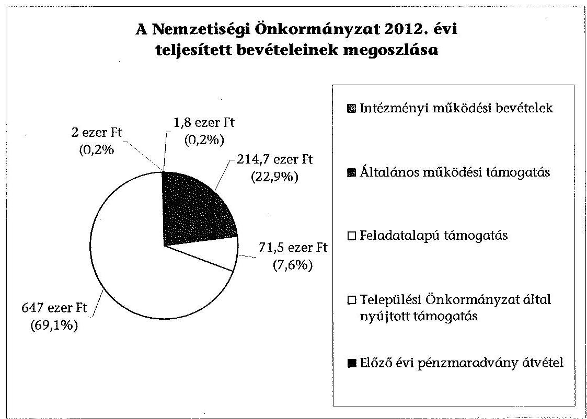
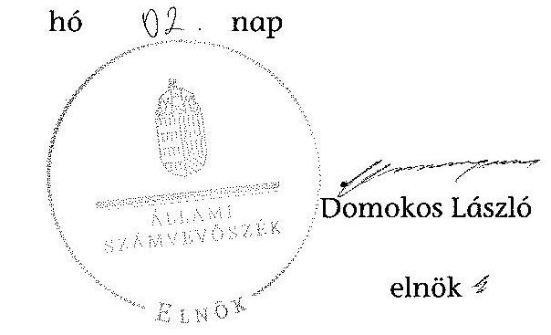

# ÁLLAMI   SZÁMVEVÔSZÉK 

## JELENTÉS

a helyi nemzetiségi önkormányzatok gazdálkodásának ellenőrzéséről
Gyöngyösi Ruszin Nemzetiségi Önkormányzat

---

# Állami Számvevőszék 

Iktatószám: V-0222-051/2014.
Témaszám: 1257
Vizsgálat-azonosító szám: V065220

## Az ellenőrzést felügyelte:

Horváth Balázs
felügyeleti vezető
Az ellenőrzést vezette és az ellenőrzés végrehajtásáért felelős:
Pats Regina
ellenőrzésvezető
A számvevőszéki jelentést készítették és a jelentés összeállításában
közremüködtek:
dr. Győri Gabriella
számvevő tanácsos
Csényi István
számvevő tanácsos
Az ellenőrzést végezték:
Kersmájer Ágota
Mészáros Ildikó Éva
számvevő főtanácsos
számvevő

---

# TARTALOMJEGYZÉK 

BEVEZETÉS ..... 3
I. ÖSSZEGZŐ MEGÁLLAPÍTÁSOK, KÖVETKEZTETÉSEK, JAVASLATOK ..... 6
II. RÉSZLETES MEGÁLLAPÍTÁSOK ..... 13

1. A Nemzetiségi Önkormányzat és a Települési Önkormányzat együttműködésének szabályozása, a működési feltételek biztosítása ..... 13
2. A gazdálkodási feladatok ellátásának szabályszerűsége ..... 14
2.1. A költségvetésre és zárszámadásra, valamint a kincstári adatszolgáltatás rendjére vonatkozó jogszabályi előírások betartása ..... 14
2.2. A Nemzetiségi Önkormányzat gazdálkodásának szabályozottsága ..... 15
2.3. Az operatív gazdálkodási jogkörök kialakítása, gyakorlása ..... 16
3. A Nemzetiségi Önkormányzattal kapcsolatos gazdálkodási feladatok belső ellenőrzése ..... 18
4. A feladatalapú támogatás felhasználásának, elszámolásának szabályszerűsége, a Nemzetiségi Önkormányzat feladatellátása ..... 18

## MELLÉKLET

1. számú A Nemzetiségi Önkormányzat 2012. évi gazdálkodásának főbb adatai, mutatói

## FÜGGELÉKEK

1. számú Rövidítések jegyzéke
2. számú Értelmező szótár
3. számú A gazdálkodás értékelésének módszere

---

.

---

# JELENTÉS   a helyi nemzetiségi önkormányzatok gazdálkodásának ellenőrzéséről Gyöngyösi Ruszin Nemzetiségi Önkormányzat 

## BEVEZETÉS

A Nemzetiségi Önkormányzat a 2006. évben alakult, elnöke a 2010. évi helyhatósági választások óta látja el feladatát. A Nemzetiségi Önkormányzat intézményt, gazdasági társaságot és más szervezetet nem alapított, illetve társulásban nem vett részt. A négytagú Képviselő-testület a munkája segítésére egy állandó bizottságot (Kulturális Bizottság) hozott létre. A Nemzetiségi Önkormányzat költségvetési beszámolója szerint a 2012. évben a módosított költségvetési bevételi és kiadási előirányzat 874 ezer Ft, a teljesített költségvetési bevétel 937 ezer Ft, a teljesített költségvetési kiadás 836 ezer Ft volt. A 2012. évi gazdálkodási adatokat részletesen az 1. számú mellékletben mutatjuk be.

Az Alaptörvény XXIX. cikk (1) bekezdése szerint a Magyarországon élő nemzetiségek államalkotó tényezők. Minden, valamely nemzetiséghez tartozó magyar állampolgárnak joga van önazonossága szabad vállalásához és megőrzéséhez. A hazánkban élő́ nemzetiségek helyi (települési és területi) valamint országos önkormányzatokat hozhatnak létre ${ }^{1}$. A helyi nemzetiségi önkormányzatok gazdálkodási feladatait jogszabályi előirás alapján a székhely szerinti helyi önkormányzat polgármesteri hivatala látja el.

A nemzetiségek helyzete, támogatása mind hazai, mind EU-s szinten kiemelt figyelmet kap napjainkban. A helyi nemzetiségi önkormányzatok gazdálkodására és támogatási rendszerére vonatkozó jogszabályok a 2010-2012. években jelentős változásokon mentek át. A települési és területi nemzetiségi önkormányzatok gazdálkodásának, a részükre juttatott költségvetési támogatások felhasználásának ellenőrzését az ÁSZ 2012-ben sorozatjellegű ellenőrzés keretében indította el. A 2013. évi ellenőrzések e témacsoportos ellenőrzések folytatását jelentik, amelyet az ÁSZ 2014. első félévi ellenőrzési terve 12. témasorszámon tartalmaz.

Az ellenőrzés célja annak értékelése volt, hogy a nemzetiségi önkormányzat gazdálkodási kereteinek kialakítása, gazdálkodása és feladatellátása megfelelt-e a jogszabályoknak.

[^0]
[^0]:    ${ }^{1}$ A 2010. évben megtartott nemzetiségi önkormányzati választásokat követően 2304 települési, 58 területi és 13 országos nemzetiségi önkormányzat alakult meg.

---

Ennek keretében értékeltük, hogy:

- a nemzetiségi önkormányzat és a települési önkormányzat együttműködésének szabályozása, a működési feltételek biztosítása megfelelt-e a jogszabályi előírásoknak;
- a felek együttműködése megfelelt-e a közöttük létrejött megállapodásnak a gazdálkodási feladatok szabályszerű ellátása során, ennek keretében betar-tották-e a helyi nemzetiségi önkormányzat gazdálkodásához kapcsolódóan a költségvetésre és zárszámadásra, a gazdálkodás szabályozására, az operatív gazdálkodási jogkörök gyakorlására vonatkozó jogszabályi előírásokat;
- a jegyző biztosította-e a nemzetiségi önkormányzat gazdálkodásának belső ellenőrzését;
- a nemzetiségi önkormányzat feladatalapú támogatásának felhasználása, a folyósított feladatalapú támogatással történő elszámolás az előírásoknak megfelelő volt-e;
- a nemzetiségi önkormányzat feladatellátása összhangban volt-e a vonatkozó jogszabályi előírásokkal.

Az ellenőrzés várható hasznosulását négy szinten tervezzük. A törvényalkotás számára összegzett tapasztalatok állnak rendelkezésre a nemzetiségi önkormányzatok testületi döntéseinek, gazdálkodásának és a feladatalapú támogatás felhasználásának szabályszerűségéről, amelynek alapján következtetést lehet levonni arra, hogy indokolt-e esetleges jogszabályi módosítás kezdeményezése. Az ellenőrzés az ellenőrzött számára visszajelzést ad a működésében fellépő hiányosságokról, javaslataival hozzájárul azok kiküszöböléséhez, amely csökkentheti a későbbi ellenőrzések gyakoriságát. Az ellenőrzés megállapításai és javaslatai tanulságul szolgálhatnak más nemzetiségi önkormányzatok, szervezetek számára a rendezett gazdálkodási keretek kialakításához. A társadalom számára jelzi, hogy közpénz nem maradhat ellenőrizetlenül, az ÁSZ értékteremtő rend kialakításához és megőrzéséhez hozzájáruló tevékenysége pozitív hatással lesz a szervezetről kialakított összkép formálásában. Az ÁSZ szervezetén belül lehetőség nyílik arra, hogy a megállapítások szintetizálásával az intézmény a hozzáadott értéket teremtő elemző tevékenységét és tanácsadó szerepét erősítse.

A helyi nemzetiségi önkormányzatok gazdálkodásának ellenőrzéséről szóló jelentés I. fejezetének összegző része az ellenőrzés céljára adott rövid, szintetizáló összefoglalót és következtetéseket tartalmazza a II. fejezet részletes megállapításain alapulóan. A jelentés intézkedést igénylő megállapításait és javaslatait az összegzőben foglaltak mellett - az ellenőrzés során feltárt, a jelentés II. fejezetében rögzített részletes megállapítások alapozzák meg, illetve támasztják alá.

Az ellenőrzés típusa: szabályszerűségi ellenőrzés.
Az ellenőrzött időszak: a 2012. január 1. - 2012. december 31. közötti időszak. Az ellenőrzés kiterjedt a helyi nemzetiségi önkormányzatoknak juttatott 2012. évi feladatalapú támogatás 2013. évben való elszámolására is.

---

Ellenőrzött szervezet: a Gyöngyösi Ruszin Nemzetiségi Önkormányzat és a gazdálkodási feladatait ellátó Gyöngyös Város Önkormányzata.

Az ellenőrzés végrehajtásának jogszabályi alapját az ÁSZ tv. 5. § (2)-(3) és (6) bekezdéseiben foglaltak képezik.

Az ellenőrzés szakmai módszertana az ÁSZ hivatalos honlapján (www.asz.hu) közzétett szakmai szabályokon alapult, amely a Legfőbb Ellenőrző Intézmények Nemzetközi Szervezete (INTOSAI) által kiadott nemzetközi standardok (ISSAI) figyelembevételével készült.

A helyi nemzetiségi önkormányzatok gazdálkodásának ellenőrzése során értékeltük a települési önkormányzat és a nemzetiségi önkormányzat együttmúködésének, a gazdálkodás szabályozottságának és a pénzügyi folyamatokban kulcsszerepet betöltő belső kontrollok (teljesítésigazolás és érvényesítés) múködésének megfelelőségét. A kulcskontrollokat a dologi kiadásokkal kapcsolatos kifizetéseknél véletlen mintavételi eljárást alkalmazva ellenőriztük. Ellenőriztük, hogy a jegyző biztosította-e a nemzetiségi önkormányzat gazdálkodásának belső ellenőrzését. Értékeltük a feladatalapú támogatások felhasználásának, elszámolásának szabályszerűségét, a nemzetiségi önkormányzat feladatellátása és a jogszabályi előírások összhangját.

Az ellenőrzés lefolytatásához a Nemzetiségi Önkormányzat és a gazdálkodási feladatait ellátó Települési Önkormányzat tanúsítványok és a kapcsolódó, dokumentumjegyzékben megjelölt dokumentumok elektronikus úton történő megküldésével, rendelkezésre bocsátásával szolgáltatott adatokat. Az adatszolgáltatás kontrollálása és szükség szerinti javítása a helyszíni ellenőrzés keretében történt. A gazdálkodás értékelésének módszerét a 3. számú függelék tartalmazza.

Az ÁSZ tv. 29. § (1) bekezdése szerint a jelentéstervezetet megküldtük a polgármester és a Nemzetiségi Önkormányzat elnöke részére, akik az ÁSZ tv. 29. § (2) bekezdésében foglalt észrevételezési jogukkal nem éltek, a jelentéstervezetre észrevételt nem tettek.

---

# 1. ÖSSZEGZŐ MEGÁLLAPÍTÁSOK, KÖVETKEZTETÉSEK, JAVASLATOK 

A Nemzetiségi Önkormányzat és a Települési Önkormányzat együttmüködésének szabályozása nem felelt meg a jogszabályi előírásoknak. A 2012. évben hatályban lévő együttmúködési megállapodás ${ }_{1,2}$ a Nek. ${ }_{2}$ tv.-ben és az Áht. ${ }_{2}$-ben meghatározott tartalmi elemek tekintetében hiányos volt. Nem szabályozták a testületi múködéssel összefüggő adminisztratív feladatok teljesítésének rendjét, a gazdálkodással kapcsolatos nyilvántartási, ellenőrzési, adatszolgáltatási és beszámolási feladatok ellátását. Az együttműködési megállapodás ${ }_{2}$ nem tartalmazta az önálló fizetési számla nyitásával, a törzskönyvi nyilvántartásba vétellel, az adószám igénylésével kapcsolatos határidőket és ezek felelőseinek konkrét kijelölését. Nem rögzítették a Nemzetiségi Önkormányzat kötelezettségvállalásaival kapcsolatosan a Települési Önkormányzatot terhelő érvényesítési feladatokat ellátó felelősök konkrét kijelölését, valamint a Nemzetiségi Önkormányzat SZMSZ-ében nem rögzítették az együttmúködési megállapodás szerinti múködési feltételeket. Az együttműködési megállapodás ${ }_{2}$ szabályozta a feladatellátáshoz szükséges helyiség használatát, a költségvetési tervezést, valamint arra vonatkozó rendelkezést, hogy a jegyző vagy megbízottja részt vesz a Nemzetiségi Önkormányzat képviselő-testületi ülésein és jelzi, amennyiben törvénysértést észlel. A Települési Önkormányzat a 2012. évben a szabályozási hiányosságok ellenére biztosította a Nemzetiségi Önkormányzat múködéséhez szükséges személyi és tárgyi feltételeket.

A Nemzetiségi Önkormányzat 2012. évi költségvetésének és zárszámadásának tartalma, jóváhagyása, valamint a kapcsolódó adatszolgáltatás szabályszerüsége részben felelt meg a jogszabályi előírásoknak. A Nemzetiségi Önkormányzat elnöke a 2012. évi költségvetési határozat tervezetet az Áht. ${ }_{2}$-ben előírt határidőre nem nyújtotta be a Képviselő-testületnek, mert a jegyző az előterjesztést a Képviselő-testületnek történő benyújtási határidőn túl készítette el, ezért a Nemzetiségi Önkormányzat a költségvetéséről a jogszabályban rögzített határidőt követően döntött. A költségvetési határozat tartalma megfelelt a jogszabályi előírásoknak. A jegyző az Áht. ${ }_{2}$-ben előírt zárszámadási határozat-tervezetet nem készítette el, a Képviselő-testület a 2012. évi zárszámadásról határozatot nem hozott. A jegyző a 2012. évben a Nemzetiségi Önkormányzat részére előírt kincstári adatszolgáltatási kötelezettségeket határidőre teljesítette.

A Nemzetiségi Önkormányzat gazdálkodásának szabályozottsága az ellenőrzött időszakban nem volt megfelelő. A Polgármesteri Hivatal a Számv. tv. alapján elkészített eszközök és források értékelési szabályzat és a számviteli politika hatályát nem terjesztette ki a Nemzetiségi Önkormányzat gazdálkodási feladataira. A jegyző a Nemzetiségi Önkormányzat gazdálkodási feladataira nem terjesztette ki a Bkr.-ben előírt ellenőrzési nyomvonal, a szabálytalanságok kezelésének eljárásrendje, valamint a folyamatba épített előzetes, utólagos és vezetői ellenőrzés szabályozás hatályát. A felsorolt szabályzatokkal a Nemzetiségi Önkormányzat önállóan sem rendelkezett. Az Ávr.-ben foglaltak szerinti, a munkakörökhöz tartozó - a Nemzetiségi Önkormányzat gazdálkodási

---

feladataival kapcsolatos - feladat- és hatáskörökre, a hatáskörök gyakorlásának módjára, a helyettesítés rendjére, az ezekhez kapcsolódó felelősségi szabályokra vonatkozó előírásokat a Polgármesteri Hivatal SZMSZ-e nem tartalmazta. A Nemzetiségi Önkormányzat gazdálkodásának szabályozottsága annak ellenére nem volt megfelelő, hogy a Polgármesteri Hivatal pénzkezelési szabályzatának, leltározási és leltárkészítési szabályzatának és számlarendjének a hatályát a Nemzetiségi Önkormányzat gazdálkodási feladataira kiterjesztették.

A Nemzetiségi Önkormányzat gazdálkodása tekintetében az operatív gazdálkodási jogkörök kialakítása megfeleltt a jogszabályi előírásoknak. Az összeférhetetlenségi követelmények érvényesülésének feltételei biztosítottak voltak, mivel a Nemzetiségi Önkormányzat elnöke a kötelezettségvállalás, a teljesítésigazolás és az utalványozás gyakorlására felhatalmazott más képviselőt. A pénzügyi ellenjegyző és az érvényesítő személyét a 2012. március 31 -ét követő időszakot érintően - a jogszabályi előírásoknak megfelelően - a gazdasági vezető jelölte ki. A Nemzetiségi Önkormányzatnál a 2012. évben a dologi kiadások teljesítése során a teljesítésigazolás és az érvényesítés kulcsszerepet betöltő kontrollok múködésének megfelelősége gyenge volt, a hibák száma a lényegességi szintet, a kritikus hibahatárt elérte. Az érvényesítő az Ávr.-ben foglalt feladatainak részben tett eleget, mert nem ellenőrizte, hogy a megelőző ügymenetben jogszabályok és a belső szabályzatok előírásait betartották-e és nem kifogásolta az operatív gazdálkodási jogkörök gyakorlására jogosult személyekről és aláírás-mintájukról vezetendő nyilvántartás hiányosságait. A kulcskontrollok működéséhez kapcsolódó hiányosságok miatt nem biztosították a hibák megelőzését, feltárását és kijavítását. A számvevőszéki ellenőrzés a kifizetések bizonylatainak ellenőrzése során - a rendelkezésre bocsátott dokumentumok alapján - összeférhetetlenséget, illetve jogosulatlan kifizetést nem tárt fel.

A jegyző nem biztosította a Nemzetiségi Önkormányzat gazdálkodásával összefüggő végrehajtási feladatok belső ellenőrzését. A Polgármesteri Hivatal 2012. évre vonatkozó éves belső ellenőrzési tervét megalapozó kockázatelemzés - a Ber.-ben foglaltak ellenére - nem terjedt ki a Nemzetiségi Önkormányzat gazdálkodásával összefüggő végrehajtási feladatokra, így azon alapulóan belső ellenőrzési feladatot a 2012. évben nem terveztek és nem végeztek.

A Nemzetiségi Önkormányzat a 2012. évben a bevételei 7,6\%-át kitevő, 71,5 ezer Ft összegű feladatalapú támogatásban részesült, amelyet a tárgyévben a jogszabályi előírásoknak megfelelő módon használt fel. A támogatási kormányrendelet ${ }_{1,2}$-ben előírt elszámolás nem történt meg. A támogatás felhasználását, elszámolását az arra jogosult külső szervek nem ellenőrizték. A Nemzetiségi Önkormányzat kötelező és önként vállalt feladatellátásának tárgya összhangban volt a Nek. ${ }_{2}$ tv.-ben foglalt előírásokkal.

Az ÁSZ tv. 33. § (1) bekezdésében foglaltak értelmében az ellenőrzött szervezet vezetője köteles a jelentésben foglalt megállapításokhoz kapcsolódó intézkedési tervet összeállítani, és azt a jelentés kézhezvételétől számított 30 napon belül az ÁSZ részére megküldeni. Amennyiben az intézkedési tervet határidőre nem küldi meg a szervezet, vagy az nem elfogadható, az ÁSZ elnöke az ÁSZ tv. 33. § (3) bekezdés a)-b) pontjaiban foglaltakat érvényesítheti.

---

A helyszíni ellenőrzés megállapításainak hasznosítása mellett javasoljuk:

# a jegyzönek 

1. az együttműködés szabályozásával kapcsolatban

A 2012. december 31-én hatályos együttműködési megállapodás ${ }_{2}$ nem tartalmazta az Áht. 2 27. § (2) bekezdésében foglaltak ellenére a Nemzetiségi Önkormányzat bevételeivel és kiadásaival kapcsolatban az ellenőrzési, az adatszolgáltatási és a beszámolási feladatok ellátásának részletes szabályait, továbbá nem felelt meg a Nek. 2 tv. 80. § (1) bekezdés a)-e) és g) pontjai, valamint a Nek. 2 tv. 80. § (3) bekezdés előírásainak.

A Nek. 2 tv. 80. § (2) bekezdésében foglaltakat figyelmen kívül hagyva, a megállapodás szerinti müködési feltételeket nem rögzítették a Nemzetiségi Önkormányzat SZMSZ-ében.

Javaslat
Az együttműködés szabályszerűsége érdekében készítse elő:
a) az együttműködési megállapodás ${ }_{2}$ módosítását, hogy az tartalmilag feleljen meg az Áht. 2 27. § (2) bekezdésében, a Nek. 2 tv. 80. § (1) bekezdésének a)-e) és g) pontjaiban, valamint a Nek. 2 tv. 80. § (3) bekezdésében foglalt előírásoknak;
b) a Nemzetiségi Önkormányzat SZMSZ-ének módosítását, hogy megfeleljen a Nek. 2 tv. 80. § (2) bekezdésében foglalt előírásoknak.
2. a költségvetés és a zárszámadás szabályszerűségével kapcsolatban

A Nemzetiségi Önkormányzat elnöke a 2012. évi költségvetési határozat tervezetet az Áht. 2 24. § (2) bekezdésében előírt határidőre nem nyújtotta be - a jegyző mulasztásából eredően - a Képviselő-testületnek, így a Nemzetiségi Önkormányzat költségvetéséről a jogszabályban rögzített határidőt követően döntöttek. A jegyző az Áht. 2 91. § (1) és (3) bekezdésében előírt zárszámadási határozat-tervezetet nem készítette el. A Képviselő-testület a 2012. évi zárszámadásról határozatot nem hozott.

A jegyző az Áht. 2 91. § (1) és (3) bekezdésében előírt zárszámadási határozattervezetet nem készítette el. A Képviselő-testület a 2012. évi zárszámadásról határozatot nem hozott.

Javaslat
Gondoskodjon a jövőben a költségvetési és zárszámadási határozatok szabályszerűsége érdekében:
a) a költségvetési határozat-tervezet Áht. 2 24. § (3) bekezdésében előírt határidőre történő előkészítéséről, hogy arról a Képviselő-testület határidőben döntést hozhasson;

---

b) az Áht., 91. § (1) és (3) bekezdésében foglaltaknak megfelelően a zárszámadási határozat-tervezet elkészítéséről.
3. a gazdálkodási feladatok szabályozottságával összefüggésben

A Polgármesteri Hivatal a Számv. tv. 14. § (5) bekezdés b) pontjában előírtak alapján elkészített eszközök és források értékelési szabályzatát, valamint a Számv. tv. 14. § (3)-(4) bekezdésében előírtak alapján elkészített számviteli politikát nem terjesztette ki a Nemzetiségi Önkormányzat gazdálkodási feladataira. A jegyző a Nemzetiségi Önkormányzat gazdálkodási feladataira nem terjesztette ki a Bkr. 6. § (3)(4) bekezdéseiben előírt ellenőrzési nyomvonalat, a szabálytalanságok kezelésének eljárásrendjét, valamint a Bkr. 8. § (2) bekezdése szerinti folyamatba épített előzetes, utólagos és vezetői ellenőrzés szabályozását. Ezekkel a szabályzatokkal a Nemzetiségi Önkormányzat önállóan sem rendelkezett.

A Polgármesteri Hivatal SZMSZ-e az Ávr. 13. § (1) bekezdés g) pontjában foglaltak ellenére nem tartalmazta az SZMSZ-ben nevesített munkakörökhöz tartozó - a Nemzetiségi Önkormányzat gazdálkodásával kapcsolatos - feladat- és hatáskörökre, a hatáskörök gyakorlásának módjára, a helyettesítés rendjére, az ezekhez kapcsolódó felelősségi szabályokra vonatkozó előírásokat.

Javaslat
A gazdálkodás szabályszerűsége érdekében:
a) gondoskodjon - az Ávr. 13. § (3a) bekezdésének felhatalmazása alapján - arról, hogy a Számv. tv. 14. § (3)-(4) bekezdéseiben, valamint az (5) bekezdésének b) pontjában foglalt, továbbá a Bkr. 6. § (3)-(4) bekezdéseiben és a Bkr. 8. § (2) bekezdésében foglalt szabályzatok hatálya a Nemzetiségi Önkormányzat gazdálkodási feladataira is kiterjedjen;
b) készítse elő a Polgármesteri Hivatal SZMSZ-ének módosítását, hogy az Ávr. 13. § (1) bekezdés g) pontjában foglalt előírás szerint szabályozza a Nemzetiségi Önkormányzat gazdálkodásával kapcsolatos feladatokat.
4. a pénzügyi kontrollok múködésével kapcsolatban

A kötelezettségvállalásra, pénzügyi ellenjegyzésre, teljesítés igazolására, érvényesítésre és utalványozásra jogosultakról vezetett nyilvántartás nem tartalmazta az Ávr. 60. § (3) bekezdésében előírtak ellenére az operatív gazdálkodási jogkörök gyakorlására jogosultak aláírás-mintáját. A Nemzetiségi Önkormányzatnál éltek az Ávr. 53. § (1) bekezdés a) pontjában foglalt lehetőséggel, mely szerint nem szükséges előzetes írásbeli kötelezettségvállalás a gazdasági eseményenként 100 ezer Ft-ot el nem érő kifizetések esetében, azonban e kifizetések rendjét az Ávr. 53. § (2) bekezdés előírása ellenére nem szabályozták. Az érvényesítő nem az Ávr. 58. § (1)-(2) bekezdéseiben előírtak szerint látta el ellenőrzési feladatát, mert nem ellenőrizte, hogy a megelőző ügymenetben a gazdálkodásra vonatkozó jogszabályok és a belső szabályzatok előírásait betartották-e. Nem jelezte, hogy a kifizetéseket alátámasztó dokumentumok az Ávr. 59. § (3) bekezdés f) pontjában és a (4) bekezdésében előírtak ellenére nem tartalmazták a kötelezettségvállalás nyilvántartási számát.

---

Javaslat
Az operatív gazdálkodás működési hibáinak megelőzése, feltárása és kijavítása érdekében gondoskodjon arról, hogy:
a) az operatív gazdálkodási jogkörök gyakorlására jogosult személyekről és aláírás mintájukról az Ávr. 60. § (3) bekezdésében foglaltak alapján naprakész nyilvántartást vezessenek;
b) az Ávr. 53. § (1) bekezdés a) pontjában foglaltaknak megfelelő kifizetések rendjét az Ávr. 53. § (2) bekezdésének előírásai szerint szabályozzák;
c) az érvényesítést végző személy az Ávr. 58. § (1)-(2) bekezdéseiben előírt feladatait maradéktalanul lássa el;
d) a kifizetéseket alátámasztó dokumentumok az Ávr. 59. § (3) bekezdés f) pontjában és a (4) bekezdésében előírtak szerint tartalmazzák a kötelezettségvállalás nyilvántartási számát.
5. a feladatalapú támogatás elszámolásával kapcsolatban

A 2012. évi feladatalapú támogatás elszámolása a támogatási kormányrendelet ${ }_{2}$ 8. § (5) bekezdésében hivatkozott „a helyi önkormányzatok elszámolási és ellenőrzési rendjére vonatkozó jogszabályok rendelkezései alkalmazandóak" előírása alapján az az Áht. ${ }_{2}$ 57. § (3) bekezdése ellenére nem történt meg.

Javaslat
Intézkedjen az Áht. ${ }_{2}$ 27. § (2) bekezdésben meghatározott feladatkörében a Nemzetiségi Önkormányzat által igénybe vett 2012. évi feladatalapú támogatás rendeltetésszerű felhasználásáról szóló elszámolás elkészítéséről az Áht. ${ }_{2}$ 53. § (1) bekezdése szerinti beszámolási kötelezettség teljesítéséhez.

# a polgármesternek 

A 2012. december 31-én hatályos együttműködési megállapodás ${ }_{2}$ nem tartalmazta az Áht. ${ }_{2}$ 27. § (2) bekezdésében foglaltak ellenére a Nemzetiségi Önkormányzat bevételeivel és kiadásaival kapcsolatban az ellenőrzési, az adatszolgáltatási és a beszámolási feladatok ellátásának részletes szabályait, továbbá nem felelt meg a Nek. ${ }_{2}$ tv. 80. § (1) bekezdés a)-e) és g) pontjai, valamint a Nek. ${ }_{2}$ tv. 80. § (3) bekezdés előírásainak.

A Polgármesteri Hivatal SZMSZ-e az Ávr. 13. § (1) bekezdés g) pontjában foglaltak ellenére nem tartalmazta az SZMSZ-ben nevesített munkakörökhöz tartozó - a Nemzetiségi Önkormányzat gazdálkodásával kapcsolatos - feladat- és hatáskörökre, a hatáskörök gyakorlásának módjára, a helyettesítés rendjére, az ezekhez kapcsolódó felelősségi szabályokra vonatkozó előírásokat.

---

Javaslat
Terjessze a Települési Önkormányzat Képviselő-testülete elé jóváhagyásra:
a) az Áht. 2 27. § (2) bekezdésében, a Nek. 2 tv. 80. § (1) bekezdésének a)-e) és g) pontjaiban, valamint a Nek. 2 tv. 80. § (3) bekezdésében foglalt előírások betartásával a jegyző által előkészített együttműködési megállapodás módosítását;
b) a Polgármesteri Hivatal SZMSZ-ének a jegyző által előkészített, az Ávr. 13. § (1) bekezdés g) pontjában foglalt előírásoknak megfelelő módosítását.

# a Nemzetiségi Önkormányzat elnökének 

1. A 2012. december 31-én hatályos együttműködési megállapodás ${ }_{2}$ nem tartalmazta az Áht. 2 27. § (2) bekezdésében foglaltak ellenére a Nemzetiségi Önkormányzat bevételeivel és kiadásaival kapcsolatban az ellenőrzési, az adatszolgáltatási és a beszámolási feladatok ellátásának részletes szabályait. továbbá nem felelt meg a Nek. 2 tv. 80. § (1) bekezdés a)-e) és g) pontjai, valamint a Nek. 2 tv. 80. § (3) bekezdés előírásainak.

A Nek. 2 tv. 80. § (2) bekezdésében foglaltakat figyelmen kívül hagyva, a megállapodás szerinti müködési feltételeket nem rögzítették a Nemzetiségi Önkormányzat SZMSZ-ében.

Javaslat
Terjessze a Képviselő-testület elé jóváhagyásra:
a) az Áht. 2 27. § (2) bekezdésében, a Nek. 2 tv. 80. § (1) bekezdésének a)-e) és g) pontjaiban, valamint a Nek. 2 tv. 80. § (3) bekezdésében foglalt előírások betartásával a jegyző által előkészített együttműködési megállapodás ${ }_{2}$ módosítását;
b) a Nemzetiségi Önkormányzat SZMSZ-ének a jegyző által előkészített módosítását, hogy az megfeleljen a Nek. 2 tv. 80. § (2) bekezdésében foglalt előírásoknak.
2. A Nemzetiségi Önkormányzat elnöke a 2012. évi költségvetési határozat-tervezetet, - a jegyző mulasztása miatt - az Áht. 2 24. § (2) bekezdésében előírt határidőre nem nyújtotta be a Képviselő-testületnek, így a Nemzetiségi Önkormányzat költségvetéséről a jogszabályban rögzített határidőt követően döntöttek. A jegyző az Áht. 2 91. § (1) és (3) bekezdésében előírt zárszámadási határozat-tervezetet nem készítette el. A Képviselő-testület a 2012. évi zárszámadásról határozatot nem hozott.

Javaslat
A jövőben a jegyző által előkészített költségvetési határozat-tervezetet az Áht. 2 24. § (3) bekezdésében, a zárszámadási határozat-tervezetet az Áht. 2 91. § (1) és (3) bekezdésében foglalt határidő betartásával nyújtsa be a Képviselő-testületnek.
3. A 2012. évi feladatalapú támogatás elszámolása a támogatási kormányrendelet ${ }_{2}$ 8. § (5) bekezdésében hivatkozott „a helyi önkormányzatok elszámolási és ellenőrzési

---

rendjére vonatkozó jogszabályok rendelkezései alkalmazandóak" előírása alapján az az Áht. 2 57. § (3) bekezdése ellenére nem történt meg.

Javaslat
Terjessze a Képviselő-testület elé jóváhagyásra az Áht. 2 53. § (1) bekezdés szerinti beszámolási kötelezettség teljesítéséhez összeállított, a Nemzetiségi Önkormányzat által igénybe vett 2012. évi feladatalapú támogatás rendeltetésszerú felhasználásáról szóló elszámolást.

---

# II. RÉSZLETES MEGÁLLAPÍTÁSOK 

## 1. A Nemzetiségi Önkormányzat És a Telepúlési ÖnkormányZAT EGYÜTTMŰKÖDÉSÉNEK SZABÁLYOZÁSA, A MÜKÖDÉSI FELTÉTELEK BIZTOSÍTÁSA

A Nemzetiségi Önkormányzat és a Települési Önkormányzat együttmúködésének szabályozása nem felelt meg a jogszabályi előirásoknak.

A Nemzetiségi Önkormányzat rendelkezett a Települési Önkormányzattal kötött, 2012. évben hatályban lévő együttmúködési megállapodással. Az együttműködési megállapodás ${ }_{1,2}$-t a Nemzetiségi Önkormányzat és a Települési Önkormányzat Képviselő-testülete határozattal ${ }^{2}$ jóváhagyta és az arra jogosult személyek aláírták.

Az együttmúködés szabályozása - a 2012. december 31-én hatályos együttműködési megállapodás ${ }_{2}$ alapján - hiányos volt. Az együttműködési megállapodás ${ }_{2}$ nem tartalmazta:

- az Áht. 2 27. § (2) bekezdésében előírtak ellenére a tervezési, gazdálkodási és finanszírozási feladatok kivételével, a Nemzetiségi Önkormányzat bevételeivel és kiadásaival kapcsolatban az ellenőrzési, az adatszolgáltatási és a beszámolási feladatok ellátásának részletes szabályait;
- a Nek. ${ }_{2}$ tv. 80. § (1) bekezdés a) pontjában foglaltak szerint a helyiség infrastruktúrájához kapcsolódó rezsiköltségek és fenntartási költségek viselését;
- a Nek. ${ }_{2}$ tv. 80. § (1) bekezdés b) pontjában foglaltak alapján a feladatellátás személyi feltételei keretében nevesítve a felelősöket;
- a Nek. ${ }_{2}$ tv. 80. § (1) bekezdés c) pontjában foglaltak szerint a testületi ülések előkészítésével kapcsolatos feladatok ellátását (meghívók, előterjesztések, hivatalos levelezés előkészítése, a testületi ülések jegyzőkönyveinek elkészítése);
- a Nek. ${ }_{2}$ tv. 80. § (1) bekezdés d) pontjában foglaltak alapján a testületi ülések és a tisztségviselők döntéseinek előkészítését, a testületi és a tisztségviselői döntéshozatalhoz kapcsolódó nyilvántartási feladatok ellátását;
- a Nek. tv. 80. § (1) bekezdés e) pontjában foglaltak szerint a Nemzetiségi Önkormányzat múködésével, gazdálkodásával kapcsolatos nyilvántartási, iratkezelési feladatok ellátását;

[^0]
[^0]:    ${ }^{2}$ Az 1/2011. (I. 12.) RUKÖ, és a 20/2011. (I. 27.) KT. számú képviselő-testületi határozattal jóváhagyott, 2011. január 30-án aláirt együttmúködési megállapodás volt hatályban 2012. január 30-áig. A felülvizsgált megállapodást a 2/2012. (I. 24.) RUNÖK, és a 12/2012. (I. 26.) KT. számú képviselő-testületi határozatok alapján 2012. január 30-án a polgármester és a Nemzetiségi Önkormányzat elnöke írták alá, a megállapodás az aláírása napjától hatályos.

---

- a Nek. ${ }_{2}$ tv. 80. § (1) bekezdés g) pontjában foglaltak alapján a feladatok ellátásához kapcsolódó költségek viselése keretében nem rögzítették a testületi tagok és tisztségviselők telefonhasználata költségeinek kizárását;
- Nek. ${ }_{2}$ tv. 80. § (3) bekezdés a) pontjában foglaltak szerint a Nemzetiségi Önkormányzat költségvetésének előkészítésével és megalkotásával kapcsolatos feladatok kivételével, a költségvetéssel összefüggő adatszolgáltatási kötelezettségek teljesítésével, továbbá az önálló fizetési számla nyitásával, törzskönyvi nyilvántartásba vételével és adószám igénylésével kapcsolatos határidőket, együttmúködési kötelezettségeket és ezek felelőseinek konkrét kijelölését;
- a Nek. ${ }_{2}$ tv. 80. § (3) bekezdés b) pontjában foglaltak alapján a Nemzetiségi Önkormányzat kötelezettségvállalásaival kapcsolatosan a Települési Önkormányzatot terhelő érvényesítési feladatokat ellátó felelősök konkrét kijelölését;
- a Nek. ${ }_{2}$ tv. 80. § (3) bekezdés c) pontjában foglaltak szerint a Nemzetiségi Önkormányzat kötelezettségvállalásának az SZMSZ-ében meghatározott szabályait, különösen az összeférhetetlenségi, nyilvántartási kötelezettségeket;
- Nek. ${ }_{2}$ tv. 80. § (3) bekezdés d) pontjában foglaltak alapján a Nemzetiségi Önkormányzat müködési feltételeinek és gazdálkodásának eljárási és dokumentációs részletszabályait, az ezeket végző személyek kijelölésének rendjét és az adatszolgáltatási feladatok teljesítésével kapcsolatos előírásokat, feltételeket.

A Nemzetiségi Önkormányzat SZMSZ-ében nem rögzítették a Nek. ${ }_{2}$ tv. 80. § (2) bekezdésben foglaltak alapján az együttmüködési megállapodás szerinti müködési feltételeket.

Az együttmúködési megállapodás ${ }_{2}$ szabályozta a feladatellátáshoz szükséges helyiség használatát, a testületi müködéshez kapcsolódó postai, kézbesítési feladatokat és azok költségeinek viselését, valamint arra vonatkozó rendelkezést, hogy a jegyző vagy megbízottja részt vesz a Nemzetiségi Önkormányzat képvi-selő-testületi ülésein és jelzi amennyiben törvénysértést észlel.

A Települési Önkormányzat a 2012. évben a szabályozási hiányosságok ellenére biztosította a Nemzetiségi Önkormányzat müködéséhez szükséges személyi és tárgyi feltételeket.

# 2. A GAZDÁLKODÁSI FELADATOK ELLÁTÁSÁNAK SZABÁLYSZERŰSÉGE 

### 2.1. A költségvetésre és zárszámadásra, valamint a kincstári adatszolgáltatás rendjére vonatkozó jogszabályi előirások betartása

A Nemzetiségi Önkormányzat 2012. évi költségvetésének és zárszámadásának tartalma, jóváhagyása, valamint a kapcsolódó adatszolgáltatás szabályszerűsége részben felelt meg a jogszabályi előírásoknak.

---

A Nemzetiségi Önkormányzat elnöke a 2012. évi költségvetési határozat tervezetet az Áht. 2 24. § (2) bekezdésében előírt határidőre ${ }^{3}$ nem nyújtotta be a Képviselő-testületnek, mert a jegyző az előterjesztést a Képviselőtestületnek történő benyújtási határidőn túl készítette el, ezért a Nemzetiségi Önkormányzat a költségvetéséről a jogszabályban rögzített határidőt követően döntött.

A 2012. március 1-jén kelt előterjesztést a 2012. március 7-ei képviselő-testületi ülésen tárgyalták, amelyen a Képviselő-testület határozattal ${ }^{4}$ elfogadta a jogszabályi előírásoknak megfelelő tartalmú 2012. évi költségvetését. A jóváhagyott költségvetés tartalmazta a Nemzetiségi Önkormányzat költségvetési bevételeit és kiadásait előirányzat-csoportok, kiemelt előirányzatok szerinti bontásban, valamint tájékoztatás céljából, szöveges indoklással együtt bemutatták az előírt mérlegeket és kimutatásokat.

A jegyző az Áht. 2 91. § (1) és (3) bekezdésében előírt zárszámadási határo-zat-tervezetet nem készítette el. A Képviselő-testület a 2012. évi zárszámadásról határozatot nem hozott. Ezzel az Áht. 2 89. § (1) bekezdésében előírtakkal ellentétben a költségvetés végrehajtásáról az éves költségvetési beszámolók alapján az elfogadott költségvetéssel összehasonlítható módon, az év utolsó napján érvényes szervezeti, besorolási rendnek megfelelően a 2012. évi zárszámadást nem készítette el.

A jegyző a 2012. évben a Nemzetiségi Önkormányzat részére előírt kincstári adatszolgáltatásokat az előírt módon, határidőre teljesítette.

# 2.2. A Nemzetiségi Önkormányzat gazdálkodásának szabályozottsága 

A Nemzetiségi Önkormányzat gazdálkodásának szabályozottsága az ellenőrzött időszakban nem volt megfelelő.

A Polgármesteri Hivatal a Számv. tv. 14. § (5) bekezdés b) pontjában előírtak alapján elkészített eszközök és források értékelési szabályzat, valamint a Számv. tv. 14. § (3)-(4) bekezdésében előírtak alapján elkészített számviteli politika hatályát nem terjesztette ki a Nemzetiségi Önkormányzat gazdálkodási feladataira. A jegyző a Nemzetiségi Önkormányzat gazdálkodási feladataira nem terjesztette ki a Bkr. 6. § (3)-(4) bekezdéseiben előírt ellenőrzési nyomvonal, a szabálytalanságok kezelésének eljárásrendje, valamint a Bkr. 8. § (2) bekezdése szerinti folyamatba épített előzetes, utólagos és vezetői ellenőrzés szabályozás hatályát. A felsorolt szabályzatokkal a Nemzetiségi Önkormányzat önállóan sem rendelkezett.

A Polgármesteri Hivatal SZMSZ-e az Ávr. 13. § (1) bekezdés g) pontjában foglaltak ellenére nem tartalmazta az SZMSZ-ben nevesített munkakörökhöz tartozó - a Nemzetiségi Önkormányzat gazdálkodásával kapcsolatos - feladat- és ha-

[^0]
[^0]:    ${ }^{3}$ A központi költségvetésről szóló törvény kihirdetését követő 45. napig.
    ${ }^{4}$ 7/2012. (III. 07.) RUNÖK határozat.

---

táskörökre, a hatáskörök gyakorlásának módjára, a helyettesítés rendjére, az ezekhez kapcsolódó felelősségi szabályokra vonatkozó előírásokat.

A Nemzetiségi Önkormányzat gazdálkodásának szabályozottsága annak ellenére nem volt megfelelő, hogy a gazdálkodás egyes területei szabályozottak voltak:

- a Polgármesteri Hivatal a 2012. évben hatályos pénzkezelési szabályzatának, leltározási és leltárkészítési szabályzatának és számlarendjének hatályát kiterjesztette a Nemzetiségi Önkormányzat gazdálkodási feladataira;
- a tervezéssel, gazdálkodással, így különösen a kötelezettségvállalással, pénzügyi ellenjegyzéssel és teljesítésigazolással, az érvényesítés, utalványozás gyakorlásának módjával, eljárási és dokumentálási részletszabályaival, valamint az ezeket végző személyek kijelölésének rendjével, az ellenőrzési és adatszolgáltatási feladatok teljesítésével kapcsolatos belső előírásokat, feltételeket tartalmazó belső szabályzat rendelkezésre állt. A Nemzetiségi Önkormányzat 2012. év áprilisától önálló szabályzattal rendelkezett, ezt megelőzően a Nemzetiségi Önkormányzat gazdálkodási feladataira kiterjesztett, a Polgármesteri Hivatal „Pénzgazdálkodás rendje, gazdálkodási jogkörök" szabályzata biztosította a jogszabályi előírások betartását;
- a munkakörökhöz tartozó - a Nemzetiségi Önkormányzat gazdálkodásával kapcsolatos - feladat- és hatáskörökre, a hatáskörök gyakorlásának módjára, a helyettesítés rendjére, az ezekhez kapcsolódó felelősségi szabályokra vonatkozó előírásokat az e feladatokat ellátó közszolgálati tisztviselők munkaköri leírásai tartalmazták.

# 2.3. Az operatív gazdálkodási jogkörök kialakítása, gyakorlása 

A Nemzetiségi Önkormányzat gazdálkodása tekintetében az operatív gazdálkodási jogkörök kialakítása megfelelt a jogszabályi előírásoknak.

A Nemzetiségi Önkormányzat elnöke a jogszabályi rendelkezések alapján felhatalmazott más képviselőt (az elnökhelyettest) a kötelezettségvállalás, a teljesítésigazolás és az utalványozás gyakorlására. A gazdálkodási jogkörök szabályzata szerint a teljesítést igazoló a Nemzetiségi Önkormányzat elnöke, vagy az általa kijelölt képviselő volt. A gazdálkodási jogkörök kialakítása során az összeférhetetlenségi követelmények érvényesülésének feltételei biztosítottak voltak.

A 2012. év március 31-ét követő időszakot érintően a pénzügyi ellenjegyzőt és az érvényesítőket - a jogszabályi előírásoknak megfelelően - a gazdasági vezető jelölte ki. A gazdasági vezető, valamint a pénzügyi ellenjegyzésre és érvényesítésre kijelölt közszolgálati tisztviselők rendelkeztek az előírt szakképesítéssel.

A kötelezettségvállalásra, pénzügyi ellenjegyzésre, teljesítés igazolására, érvényesítésre és utalványozásra jogosultakról vezetett nyilvántartás és a gaz-

---

dálkodási jogkörök szabályzata összhangját nem teremtették meg, mert a nyilvántartás a Nemzetiségi Önkormányzat elnökét nem, csak az általa felhatalmazott elnökhelyettest tartalmazta kötelezettségvállalásra, teljesítés igazolására és utalványozásra jogosultként. A nyilvántartás nem tartalmazta továbbá az Ávr. 60. § (3) bekezdésében előírtak ellenére az operatív gazdálkodási jogkörök gyakorlására jogosultak aláírás-mintáját.

A Nemzetiségi Önkormányzat kötelezettségvállalási nyilvántartása nem felelt meg az Ávr. 56. § (1) bekezdésében előírtaknak, mert nem tartalmazta a kötelezettségvállalások elöirányzatok szerinti megoszlását.

A Nemzetiségi Önkormányzatnál a 2012. évben a dologi kiadások teljesítése során - a bizonylatok tesztelése alapján - a teljesítésigazolás és az érvényesítés kulcskontrollok múködésének megfelelősége gyenge volt. A hibák száma a lényegességi szintet, a kritikus hibahatárt elérte, mert:

- a teljesítést igazoló (elnök) személyét és aláírás-mintáját az operatív gazdálkodási jogkörök gyakorlására jogosultakról vezetett nyilvántartás az Ávr. 60. § (3) bekezdése ellenére nem tartalmazta;
- a 2012. évben annak ellenére éltek az Ávr. 53. § (1) bekezdés a) pontjában foglalt lehetőséggel, mely szerint nem szükséges előzetes írásbeli kötelezettségvállalás a gazdasági eseményenként 100 ezer Ft-ot el nem érő kifizetések esetében, hogy e kifizetések rendjét az Ávr. 53. § (2) bekezdés előírása ellenére nem szabályozták;
- az érvényesítő az Ávr. 58. § (1)-(2) bekezdéseiben előírtak szerinti, az érvényesítéshez kapcsolódó feladatokat részben látta el, mert nem ellenőrizte, hogy a megelőző ügymenetben a gazdálkodásra vonatkozó jogszabályok és a belső szabályzatok előírásait betartották-e. Nem jelezte, hogy a kifizetéseket alátámasztó dokumentumok az Ávr. 59. § (3) bekezdés f) pontjában és a (4) bekezdésében előírtak ellenére nem tartalmazták a kötelezettségvállalás nyilvántartási számát. Nem kifogásolta továbbá, hogy a 100 ezer Ft-ot el nem érő kifizetések rendjét az Ávr. 53. § (2) bekezdés előírása ellenére nem szabályozták, és az Ávr. 60. § (3) bekezdésében előírt, az operatív gazdálkodási jogkörök gyakorlására jogosult személyekről és aláírás-mintájukról vezetendő nyilvántartás hiányosságait sem.

A kulcskontrollok múködéséhez kapcsolódó hiányosságok miatt nem biztosították a hibák megelőzését, feltárását és kijavítását. A számvevőszéki ellenőrzés a kifizetések bizonylatainak ellenőrzése során - a rendelkezésre bocsátott dokumentumok alapján - összeférhetetlenséget, illetve jogosulatlan kifizetést nem tárt fel.

A Nemzetiségi Önkormányzat a 2012. évben támogatásértékű működési és felhalmozási célú kiadást, illetve múködési és felhalmozási célú pénzeszközátadást nem teljesített.

---

# 3. A Nemzetiségi Önkormányzattal kapcsolatos gazdálkoDÁSI FELADATOK BELSŐ ELLENŐRZÉSE 

A jegyző nem biztosította a Nemzetiségi Önkormányzat gazdálkodásával összefüggő végrehajtási feladatok belső ellenőrzését. A Polgármesteri Hivatal 2012. évre vonatkozó éves belső ellenőrzési tervét megalapozó kockázatelemzés - a Ber. 21. § (2) bekezdésében foglaltak ellenére - nem terjedt ki a Nemzetiségi Önkormányzat gazdálkodásával összefüggő végrehajtási feladatokra, így azon alapulóan belső ellenőrzési feladatot a 2012. évben nem terveztek és nem végeztek. A 2012. évre vonatkozó belső ellenőrzési terv elkészítésnek idején hatályos együttmúködési megállapodás; a Nemzetiségi Önkormányzat belső ellenőrzésére vonatkozóan nem tartalmazott előírásokat.

Az ellenőrzéshez szolgáltatott adatok alapján a 2012. évben a Kormányhivatal a Nemzetiségi Önkormányzatot illetően nem élt törvényességi felügyeleti eszközökkel.

A jegyző nyilatkozata szerint a Nemzetiségi Önkormányzat vonatkozásában külső ellenőrzésre a 2012. évben nem került sor.

## 4. A feladatalapú támogatás felhasználásának, elsZámolásáNAK szabálySzerüsége, a Nemzetiségi Önkormányzat FELADATELLÁTÁSA

A Nemzetiségi Önkormányzat a 2012. évben 71,5 ezer Ft összegű feladatalapú támogatásban részesült, amelynek az összes bevételből való részesedését a következő diagram szemlélteti:

---

A Nemzetiségi Önkormányzat a 2011. évben 256,3 ezer Ft összegü feladatalapú támogatásban részesült, a 2011. évben a teljes összeget felhasználta.

A 2012. évben folyósított feladatalapú támogatás tervezett felhasználási céljairól a támogatás kiutalását megelőzően a Képviselő-testület nem hozott határozatot. A Nemzetiségi Önkormányzat a folyósított feladatalapú támogatás kapcsán a 2012. évi költségvetési határozatát - megjelölve az érintett bevételi és kiadási kiemelt előirányzatokat - a 16/2012. (XI. 8.) RUNÖK számú határozatával módosította, azonban a felhasználás konkrét céljairól nem döntött.

A 2012. évben folyósított feladatalapú támogatást a folyósítás évében felhasználták. A támogatást a Ruszin Kulturális Napokkal kapcsolatos kiadások finanszírozására fordították. A támogatás felhasználása a Nek. 2 tv. 116. §-a szerinti nemzetiségi közfeladatok érdekében történt, a Nemzetiségi Önkormányzat által ellátott önként vállalt feladatokhoz (nemzetiségi kultúra és hagyományápolás) kapcsolódott.

A 2011. évi feladatalapú támogatás elszámolása a támogatási kormányrendelet ${ }_{1}$ 7. § (2) bekezdésében hivatkozott, valamint a 2012. évi feladatalapú támogatás elszámolása a támogatási kormányrendelet ${ }_{2}$ 8. § (5) bekezdésében hivatkozott „a helyi önkormányzatok elszámolási és ellenőrzési rendjére vonatkozó jogszabályok rendelkezései alkalmazandóak" előirása ellenére nem történt meg.

A 2012. évi támogatás felhasználásáról a Nemzetiségi Önkormányzat szakmai és pénzügyi beszámolót készített a Polgármesteri Hivatal részére a települési önkormányzati támogatással való elszámolás keretében.

A feladatalapú támogatások felhasználását, elszámolását az ellenőrzésre jogosult külső szervek nem ellenőrizték.

A Nemzetiségi Önkormányzat kötelező és önként vállalt feladatellátásának tárgya összhangban volt a Nek. ${ }_{2}$ tv. 115. §-ában és 116. §-ában foglalt előírásokkal. A 2012. évben a Nemzetiségi Önkormányzat a Nek. ${ }_{2}$ tv. 116. § (2) bekezdése alapján a hagyományápolási feladatok körében látott el önként vállalt feladatot.

Budapest, 2014.

Melléklet: $\quad 1 \mathrm{db}$
Függelék: $\quad 3 \mathrm{db}$

---

.

---

# A Nemzetiségi Önkormányzat 2012. évi gazdálkodásának föbb adatai, mutatói 

A) Bevételek

| Megnevezés | Eredeti elöirányzat |  | Módosított |  |
| :--: | :--: | :--: | :--: | :--: |
|  |  |  |  | Teljesités |
|  | ezer Ft |  |  | $\begin{gathered} \text { megoszlás } \\ (\%) \end{gathered}$ |
| Intézményi múködési bevételek | 0,0 | 0,0 | 2,0 | 0,2 |
| Általános múködési támogatás | 215,0 | 215,0 | 214,7 | 22,9 |
| Feladatalapú támogatás | 0,0 | 72,0 | 71,5 | 7,6 |
| Települési Önkormányzat által nyújtott támogatás | 560,0 | 587,0 | 647,0 | 69,1 |
| Előző évi pénzmaradvány átvétel | 0,0 | 0,0 | 1,8 | 0,2 |
| Költségvetési bevételek | 775,0 | 874,0 | 937,0 | 100,0 |
| Tárgyévi bevételek | 775,0 | 874,0 | 937,0 | 100,0 |

B) Kiadások

| Megnevezés | Eredeti elöirányzat | Módosított | Teljesités |
| :--: | :--: | :--: | :--: |
|  |  |  |  |
|  |  |  | megoszlás   (\%) |
| Dologi kiadások | 713,0 | 874,0 | 836,0 | 89,2 |
| Tervezett maradvány és tartalék elöirányzata | 62,0 | 0,0 | 0,0 | 0,0 |
| Müködési kiadások összesen | 775,0 | 874,0 | 836,0 | 89,2 |
| Költségvetési kiadások | 775,0 | 874,0 | 836,0 | 89,2 |
| Függő,átfutó, klegyenlítő kiadások | 0,0 | 0,0 | 101,0 | 10,8 |
| Tárgyévi kiadások | 775,0 | 874,0 | 937,0 | 100,0 |

---

.

---

# RÖVIDÍTÉSEK JEGYZÉKE 

## Törvények

Alaptörvény
Áht. 2
ÁSZ tv.
Nek. ${ }_{1}$ tv.
Nek. ${ }_{2}$ tv.
Számv. tv.

## Rendeletek

Ávr.

Ber.

Bkr.
támogatási kormányrendelet ${ }_{1}$
támogatási kormányrendelet ${ }_{2}$

## Határozatok

Nemzetiségi Önkormányzat SZMSZ-e

## Szórövidítések

ÁSZ
együttmúködési megállapodás ${ }_{1}$
együttmúködési megállapodás ${ }_{2}$

Magyarország Alaptörvénye
Az államháztartásról szóló 2011. évi CXCV. törvény (hatályos 2011. december 31-étől)
Az Állami Számvevőszékről szóló 2011. évi LXVI. törvény (hatályos 2011. július 1-jétől)
A nemzeti és etnikai kisebbségek jogairól szóló 1993. évi LXXVII. törvény (hatályos 2011. december 31-éig)
A nemzetiségek jogairól szóló 2011. évi CLXXIX. törvény (hatályos 2011. december 20-ától)
A számvitelről szóló 2000 . évi C. törvény
Az államháztartásról szóló törvény végrehajtásáról szóló 368/2011. (XII. 31.) Korm. rendelet (hatályos 2012. január 1-jétől)
A költségvetési szervek belső ellenőrzéséről szóló 193/2003. (XI. 26.) Korm. rendelet (hatálytalan 2012. január 1-jétől)
A költségvetési szervek belső kontrollrendszeréről és belső ellenőrzéséről szóló 370/2011. (XII. 31.) Korm. rendelet (hatályos 2012. január 1-jétől)
A kisebbségi önkormányzatoknak a központi költségvetésből, valamint fejezeti kezelésű előirányzatból nyújtott támogatások feltételrendszeréről és elszámolásának rendjéről szóló 342/2010. (XII. 28.) Korm. rendelet (hatályos 2012. március 6 -áig)
A nemzetiségi célú előirányzatokból nyújtott támogatások feltételrendszeréről és elszámolásának rendjéről szóló 28/2012. (III. 6.) Korm. rendelet (hatályos 2012. december 31-éig)

Gyöngyösi Ruszin Nemzetiségi Önkormányzat Képviselőtestületének 20/2010. (XI. 10.) RUKÖ számú, 1/2012. (I. 24.) RUNÖ számú, 12/2012. (IV. 19.) RUNÖ számú határozata, 20/2012. (XI. 8.) RUNÖ számú határozata a Szervezeti és Múködési Szabályzatáról

Állami Számvevőszék
Gyöngyös Város Önkormányzata és a Gyöngyösi Ruszin Kisebbségi Önkormányzat között 2011. január 30-án létrejött együttmúködési megállapodás
Gyöngyös Város Önkormányzata és a Gyöngyösi Ruszin Nemzetiségi Önkormányzat között 2012. január 30-án létrejött együttmúködési megállapodás

---

| EU | Európai Unió |
| :--: | :--: |
| jegyző | Gyöngyös Város Önkormányzatának jegyzője |
| Képviselő-testület | Gyöngyösi Ruszin Nemzetiségi Önkormányzat Képviselötestülete |
| Kincstár | Magyar Államkincstár |
| Kormányhivatal | Heves Megyei Kormányhivatal |
| Nemzetiségi Önkormányzat | Gyöngyösi Ruszin Nemzetiségi Önkormányzat |
| Nemzetiségi Önkormányzat elnöke polgármester | Gyöngyösi Ruszin Nemzetiségi Önkormányzat elnöke |
| Polgármesteri Hivatal | Gyöngyös Város polgármestere |
| Polgármesteri Hivatali SZMSZ | Gyöngyös Város Önkormányzatának Polgármesteri Hivatala |
| Települési Önkormányzat | Gyöngyös Város Önkormányzatának Képviselő-testülete |

---

# ÉRTELMEZŐ SZÓTÁR 

együttmúködési megállapodás
feladatalapú támogatás
kulcskontrollok
nemzetiségi közügy

A nemzetiségi önkormányzatnak a múködési feltételei biztosítására, továbbá a bevételeivel és a kiadásaival kapcsolatban a tervezési, gazdálkodási, ellenőrzési, finanszírozási, adatszolgáltatási és beszámolási feladatai végrehajtására a székhelye szerinti települési önkormányzattal megkötött megállapodás. (Forrás: Nek. ${ }_{2}$ tv. 80 § (2) bekezdés, Áht. 2 27. § (2) bekezdés.)
A költségvetési évben általános múködési támogatásban részesült, és a Támogatónak a Kincstárhoz intézett, a feladatalapú támogatás utalására vonatkozó rendelkező levele keltének időpontjában múködő települési és területi kisebbségi önkormányzatoknak a támogatási kor-mányrendelet ${ }_{1}$-ben, illetve a támogatási kormányrende-let ${ }_{2}$-ben rögzített feltételrendszer alapján nyújtható támogatás. A támogatási kormányrendelet ${ }_{1}$ elöirása szerint a feladatalapú támogatás a kisebbségi közügyeknek a települési és a területi kisebbségi önkormányzatok által történő ellátását szolgálja. A támogatási kormányrendelet ${ }_{2}$ rendelkezése szerint a feladatalapú támogatás a nemzetiségi önkormányzat által a Nek. ${ }_{2}$ tv szerinti nemzetiségi közfeladatok ellátásához közvetlenül kötődő támogatás. (Forrás: támogatási kormányrendelet ${ }_{1}$ 2. § (2) bekezdés c), d) pont és 4. § (1) bekezdés, valamint a támogatási kormányrendelet ${ }_{2} 2 . \S$ (2) bekezdés b), c) pont.)
Teljesítés igazolása és az érvényesítés.
Az egyéni és közösségi jogok érvényesülése, a nemzetiséghez tartozók érdekeinek kifejezésre juttatása - különösen az anyanyelv ápolása, őrzése és gyarapítása, továbbá a nemzetiségek kulturális autonómiájának a nemzetiségi önkormányzatok által történő megvalósítása és megőrzése - érdekében a nemzetiséghez tartozók meghatározott közszolgáltatásokkal való ellátásával, ezen ügyek önálló vitelével és az ehhez szükséges szervezeti, személyi és anyagi feltételek megteremtésével összefüggő ügy. A közhatalmat gyakorló állami és helyi önkormányzati szervekben, továbbá a nemzetiségi önkormányzati szervekben való nemzetiségi képviselethez és mindezek szervezeti, személyi és anyagi feltételeinek biztosításához kapcsolódó ügy. (Forrás: Nek. ${ }_{2}$ tv. 2. § 1. pont.)

---

nemzetiség
nemzetiségi önkormányzat

Minden olyan Magyarország területén legalább egy évszázada honos népcsoport, amely az állam lakossága körében számszerú kisebbségben van és a lakosság többi részétől saját nyelve és kultúrája, hagyományai különböztetik meg, egyben olyan összetartozás-tudatról tesz bizonyságot, amely mindezek megőrzésére, történelmileg kialakult közösségeik érdekeinek kifejezésére és védelmére irányul. (Forrás: Nek. 2 tv. 1. § (1) bekezdés.)
Törvényben meghatározott nemzetiségi közszolgáltatási feladatokat ellátó, testületi formában múködő, jogi személyiséggel rendelkező, demokratikus választások útján törvény alapján létrehozott szervezet, amely a nemzetiségi közösséget megillető jogosultságok érvényesítésére, a nemzetiségek érdekeinek védelmére és képviseletére, a feladat- és hatáskörébe tartozó nemzetiségi közügyek települési, területi vagy országos szinten történő önálló intézésére jön létre. (Forrás: Nek. ${ }_{2}$ tv. 2. § 2. pont.) A jelentésben e fogalmat a települési nemzetiségi önkormányzatokra leszűkítve alkalmazzuk.

---

# A GAZDÁLKODÁS ÉRTÉKELÉSÉNEK MÓDSZERE 

A helyi nemzetiségi önkormányzatok gazdálkodásának ellenőrzése keretében a nemzetiségi önkormányzat gazdálkodása kereteinek kialakítása, gazdálkodása megfelelőségének minősítéséhez az alábbi területeket értékeltük:

- a helyi nemzetiségi önkormányzat és a helyi önkormányzat együttmúködése szabályozását, a megállapodásban előírt működési feltételek biztosítását;
- a helyi nemzetiségi önkormányzat jóváhagyott költségvetésére, zárszámadására, továbbá a kincstári adatszolgáltatás rendjére vonatkozó jogszabályi előírások betartását;
- a helyi nemzetiségi önkormányzat gazdálkodási feladataira vonatkozó szabályzatok jogszabályi előírások szerinti rendelkezésre állását;
- a helyi nemzetiségi önkormányzat gazdálkodása tekintetében az operatív gazdálkodási jogkörök kialakítása jogszabályi előírásoknak történő megfelelését;
- a helyi nemzetiségi önkormányzat részére folyósított feladatalapú támogatás felhasználása és elszámolása jogszabályi előírásoknak való megfelelését;
- a helyi nemzetiségi önkormányzattal összefüggő gazdálkodási feladatok tekintetében a jogszabályokban előírt belső ellenőrzés biztosítását.

A helyi nemzetiségi önkormányzat gazdálkodását az ellenőrzési program szerint a hat területhez kapcsolódóan feltett kérdésekre adott válaszok alapján értékeltük. A kérdésekhez rendelt súlyozott pontszámok alapján az elért összérték a megszerezhető maximális pontszám százalékában került kimutatásra. Ennek figyelembevételével a kialakított minősítések az alábbiak:

Megfelelő: $\quad 81 \%$-tól
Részben megfelelő: $61 \%-80 \%$
Nem megfelelő: $\quad 0 \%-60 \%$
A pénzügyi folyamatok belső kontrolljának ellenőrzése keretében a pénzügyi folyamatokban kulcsszerepet betöltő belső kontrollok - a teljesítésigazolás és az érvényesítés - múködésének megfelelőségét értékeltük. A kulcskontrollok múködésének értékeléséhez a kritériumokat jogszabályok határozzák meg. A kulcskontrollok múködése megfelelőségének értékelése tekintetében lényeges minden olyan hiba, amely gátolja, hogy a kontrolltevékenység eredményesen múködjön.

A két kulcskontroll múködése megfelelőségének ellenőrzéséhez a dologi kiadások könyvviteli tételeiből szekvenciális (megállásos) mintavételi eljárással vá-

---

lasztottuk ki az ellenőrizendő tételeket. A kulcskontrollok megfelelőségének vizsgálata keretében a számvevő bizonyosságot szerez arról, hogy a rendelkezésre álló szabályozás és dokumentumok alapján a teljesítésigazoláshoz és az érvényesítéshez szükséges ellenőrzési lépéseket végrehajtották-e.

A kulcskontrollok múködése „kiváló", „jó" vagy „gyenge" minősítést kaphatott. Az ellenőrzési program szerint feltett kérdésekhez rendelt súlyozott pontszámok alapján elért összérték a megszerezhető maximális pontszám százalékában került kimutatásra, mely alapján kialakított minősítések a következők:

| Kiváló: | $91 \%$-tól |
| :-- | :-- |
| Jó: | $71 \%-90 \%$ |
| Gyenge: | $0 \%-70 \%$ |

A kulcskontrollok múködését:

- kiválónak értékeltük abban az esetben, ha azok múködése megfelelt a hibák megelőzésére és kijavítására meghatározott szabályozásnak, valamint a legmagasabb szintű elvárásoknak;
- jónak minősítettük, ha a megállapított kisebb, tolerálható mértékű hiányosságok nem veszélyeztették az ellenőrzött területek hibáinak megelőzését és kijavítását;
- gyengének értékeltük, amennyiben a kontrollok múködésében túl sok hiányosság fordult elő ahhoz, hogy a kontrollok biztosítsák a hibák megelőzését, feltárását, kijavítását.