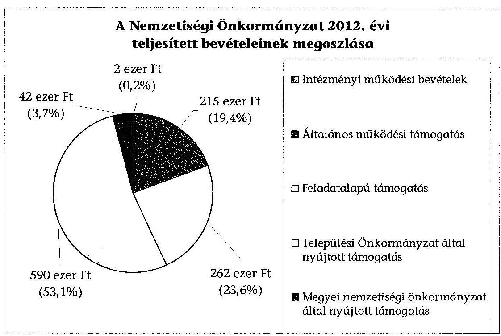
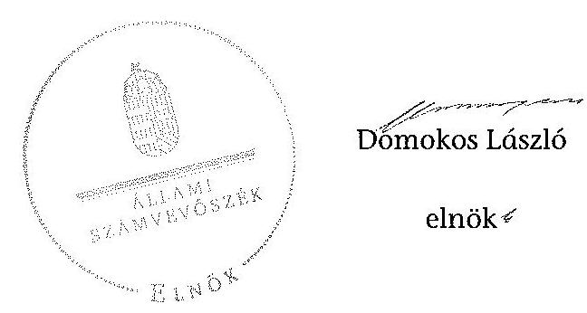

# ÁLLAMI   SZÁMVEVŐSZÉK 

## JELENTÉS

a helyi nemzetiségi önkormányzatok gazdálkodásának ellenőrzéséről
Létavértesi Román Nemzetiségi Önkormányzat

---

# Állami Számvevőszék 

Iktatószám: V-0224-056/2014.
Témaszám: 1259
Vizsgálat-azonosító szám: V065217

## Az ellenőrzést felügyelte:

Horváth Balázs
felügyeleti vezető
Az ellenőrzést vezette és az ellenőrzés végrehajtásáért felelős:
Pats Regina
ellenőrzésvezető
A számvevőszéki jelentést készítették és a jelentés összeállításában
közremüködtek:
Csényi István
számvevő tanácsos
Dr. Fátrainé Zsebedics Katalin
számvevő tanácsos
Az ellenőrzést végezték:
Gölöncsér Péter Szalontai Miklós
számvevő
számvevő tanácsos

---

# TARTALOMJEGYZÉK 

BEVEZETÉS ..... 3
I. ÖSSZEGZŐ MEGÁLLAPÍTÁSOK, KÖVETKEZTETÉSEK, JAVASLATOK ..... 6
II. RÉSZLETES MEGÁLLAPÍTÁSOK ..... 13

1. A Nemzetiségi Önkormányzat és a Települési Önkormányzat együttműködésének szabályozása, a működési feltételek biztosítása ..... 13
2. A gazdálkodási feladatok ellátásának szabályszerűsége ..... 13
2.1. A költségvetésre és zárszámadásra, valamint a kincstári adatszolgáltatás rendjére vonatkozó jogszabályi előírások betartása ..... 13
2.2. A Nemzetiségi Önkormányzat gazdálkodásának szabályozottsága ..... 14
2.3. Az operatív gazdálkodási jogkörök kialakítása, gyakorlása ..... 15
3. A Nemzetiségi Önkormányzattal kapcsolatos gazdálkodási feladatok belső ellenőrzése ..... 17
4. A feladatalapú támogatás felhasználásának, elszámolásának szabályszerűsége, a Nemzetiségi Önkormányzat feladatellátása ..... 18
MELLÉKLETEK
5. számú A Nemzetiségi Önkormányzat 2012. évi gazdálkodásának főbb adatai, mutatói
FÜGGELÉKEK
6. számú Rövidítések jegyzéke
7. számú Értelmező szótár
8. számú A gazdálkodás értékelésének módszere

---

.

---

# JELENTÉS   a helyi nemzetiségi önkormányzatok gazdálkodásának ellenőrzéséről Létavértesi Román Nemzetiségi Önkormányzat 

## BEVEZETÉS

A Nemzetiségi Önkormányzat 2010. évben alakult, elnöke a 2010. évi helyhatósági választások óta látja el feladatát. A Nemzetiségi Önkormányzat intézményt, gazdasági társaságot és más szervezetet nem alapított, illetve társulásban nem vett részt. A négytagú Képviselő-testület a munkája segítésére bizottságot nem hozott létre. A Nemzetiségi Önkormányzat költségvetési beszámolója szerint a 2012. évben a módosított költségvetési bevételi és kiadási előirányzat 1325 ezer Ft, a teljesített költségvetési bevétel 1111 ezer Ft, a teljesített költségvetési kiadás 905 ezer Ft volt. A 2012. évi gazdálkodási adatokat részletesen az 1. számú mellékletben mutatjuk be.

Az Alaptörvény XXIX. cikk (1) bekezdése szerint a Magyarországon élő nemzetiségek államalkotó tényezők. Minden, valamely nemzetiséghez tartozó magyar állampolgárnak joga van önazonossága szabad vállalásához és megőrzéséhez. A hazánkban élő nemzetiségek helyi (települési és területi) valamint országos önkormányzatokat hozhatnak létre ${ }^{1}$. A helyi nemzetiségi önkormányzatok gazdálkodási feladatait jogszabályi előírás alapján a székhely szerinti helyi önkormányzat polgármesteri hivatala látja el.

A nemzetiségek helyzete, támogatása mind hazai, mind EU-s szinten kiemelt figyelmet kap napjainkban. A helyi nemzetiségi önkormányzatok gazdálkodására és támogatási rendszerére vonatkozó jogszabályok a 2010-2012. években jelentős változásokon mentek át. A települési és területi nemzetiségi önkormányzatok gazdálkodásának, a részükre juttatott költségvetési támogatások felhasználásának ellenőrzését az ÁSZ 2012-ben sorozatjellegű ellenőrzés keretében indította el. A 2013. évi ellenőrzések e témacsoportos ellenőrzések folytatását jelentik, amelyet az ÁSZ 2014. első félévi ellenőrzési terve 12. témasorszámon tartalmaz.

Az ellenőrzés célja annak értékelése volt, hogy a nemzetiségi önkormányzat gazdálkodási kereteinek kialakítása, gazdálkodása és feladatellátása megfelelt-e a jogszabályoknak.

[^0]
[^0]:    ${ }^{1}$ A 2010. évben megtartott nemzetiségi önkormányzati választásokat követően 2304 települési, 58 területi és 13 országos nemzetiségi önkormányzat alakult meg.

---

Ennek keretében értékeltük, hogy:

- a nemzetiségi önkormányzat és a települési önkormányzat együttműködésének szabályozása, a működési feltételek biztosítása megfelelt-e a jogszabályi előírásoknak;
- a felek együttműködése megfelelt-e a közöttük létrejött megállapodásnak a gazdálkodási feladatok szabályszerű ellátása során, ennek keretében betar-tották-e a helyi nemzetiségi önkormányzat gazdálkodásához kapcsolódóan a költségvetésre és zárszámadásra, a gazdálkodás szabályozására, az operatív gazdálkodási jogkörök gyakorlására vonatkozó jogszabályi előírásokat;
- a jegyző biztosította-e a nemzetiségi önkormányzat gazdálkodásának belső ellenőrzését;
- a nemzetiségi önkormányzat feladatalapú támogatásának felhasználása, a folyósított feladatalapú támogatással történő elszámolás az előírásoknak megfelelő volt-e;
- a nemzetiségi önkormányzat feladatellátása összhangban volt-e a vonatkozó jogszabályi előírásokkal.

Az ellenőrzés várható hasznosulását négy szinten tervezzük. A törvényalkotás számára összegzett tapasztalatok állnak rendelkezésre a nemzetiségi önkormányzatok testületi döntéseinek, gazdálkodásának és a feladatalapú támogatás felhasználásának szabályszerűségéről, amelynek alapján következtetést lehet levonni arra, hogy indokolt-e esetleges jogszabályi módosítás kezdeményezése. Az ellenőrzés az ellenőrzött számára visszajelzést ad a működésében fellépő hiányosságokról, javaslataival hozzájárul azok kiküszöböléséhez, amely csökkentheti a későbbi ellenőrzések gyakoriságát. Az ellenőrzés megállapításai és javaslatai tanulságul szolgálhatnak más nemzetiségi önkormányzatok, szervezetek számára a rendezett gazdálkodási keretek kialakításához. A társadalom számára jelzi, hogy közpénz nem maradhat ellenőrizetlenül, az ÁSZ értékteremtő rend kialakításához és megőrzéséhez hozzájáruló tevékenysége pozitív hatással lesz a szervezetről kialakított összkép formálásában. Az ÁSZ szervezetén belül lehetőség nyílik arra, hogy a megállapítások szintetizálásával az intézmény a hozzáadott értéket teremtő elemző tevékenységét és tanácsadó szerepét erősítse.

A helyi nemzetiségi önkormányzatok gazdálkodásának ellenőrzéséről szóló jelentés I. fejezetének összegző része az ellenőrzés céljára adott rövid, szintetizáló összefoglalót és következtetéseket tartalmazza a II. fejezet részletes megállapításain alapulóan. A jelentés intézkedést igénylő megállapításait és javaslatait az összegzőben foglaltak mellett - az ellenőrzés során feltárt, a jelentés II. fejezetében rögzített részletes megállapítások alapozzák meg, illetve támasztják alá.

Az ellenőrzés típusa: szabályszerűségi ellenőrzés.
Az ellenőrzött időszak: 2012. január 1. - 2012. december 31. közötti időszak. Az ellenőrzés kiterjedt a helyi nemzetiségi önkormányzatoknak juttatott 2012. évi feladatalapú támogatás 2013. évben való elszámolására is.

---

Ellenőrzött szervezet: Létavértesi Román Nemzetiségi Önkormányzat és a gazdálkodási feladatait ellátó Létavértes Város Önkormányzata.

Az ellenőrzés végrehajtásának jogszabályi alapját az ÁSZ tv. 5. § (2)-(3) és (6) bekezdéseiben foglaltak képezik.

Az ellenőrzés szakmai módszertana az ÁSZ hivatalos honlapján (www.asz.hu) közzétett szakmai szabályokon alapult, amely a Legfőbb Ellenőrző Intézmények Nemzetközi Szervezete (INTOSAI) által kiadott nemzetközi standardok (ISSAI) figyelembevételével készült.

A helyi nemzetiségi önkormányzatok gazdálkodásának ellenőrzése során értékeltük a települési önkormányzat és a nemzetiségi önkormányzat együttműködésének, a gazdálkodás szabályozottságának és a pénzügyi folyamatokban kulcsszerepet betöltő belső kontrollok (teljesítésigazolás és érvényesítés) múködésének megfelelőségét. A kulcskontrollokat a dologi kiadásokkal kapcsolatos kifizetéseknél véletlen mintavételi eljárást alkalmazva ellenőriztük. Ellenőriztük, hogy a jegyző biztositotta-e a nemzetiségi önkormányzat gazdálkodásának belső ellenőrzését. Értékeltük a feladatalapú támogatások felhasználásának, elszámolásának szabályszerűségét, a nemzetiségi önkormányzat feladatellátása és a jogszabályi előírások összhangját.

Az ellenőrzés lefolytatásához a Nemzetiségi Önkormányzat és a gazdálkodási feladatait ellátó Települési Önkormányzat tanúsítványok és a kapcsolódó, dokumentumjegyzékben megjelölt dokumentumok elektronikus úton történő megküldésével, rendelkezésre bocsátásával szolgáltatott adatokat. Az adatszolgáltatás kontrollálása és szükség szerinti javítása a helyszíni ellenőrzés keretében történt. A gazdálkodás értékelésének módszerét a 3. számú függelék tartalmazza.

Az ÁSZ tv. 29. § (1) bekezdése szerint a jelentéstervezetet megküldtük a polgármester és a Nemzetiségi Önkormányzat elnöke részére, akik az ÁSZ tv. 29. § (2) bekezdésében foglalt észrevételezési jogukkal nem éltek, a jelentéstervezetre észrevételt nem tettek.

---

# 1. ÖSSZEGZŐ MEGÁLLAPÍTÁSOK, KÖVETKEZTETÉSEK, JAVASLATOK 

A Nemzetiségi Önkormányzat és a Települési Önkormányzat együttmüködésének szabályozása megfelelt a jogszabályi előírásoknak. Az együttmúködés az előírt határidő betartásával jóváhagyott együttműködési megállapodásokon alapult. A 2012. december 31 -én hatályos együttmúködési megállapodás ${ }_{2}$ a jogszabályban foglaltaknak megfelelően tartalmazta a Nemzetiségi Önkormányzat múködési feltételeit, valamint a tervezési, gazdálkodási, ellenőrzési, finanszírozási, adatszolgáltatási és beszámolási feladatok ellátásának részletes szabályait. A jogszabályi előírások azonban nem érvényesültek maradéktalanul. A Nek. ${ }_{2}$ tv.-ben foglaltakat figyelmen kívül hagyva az együttmúködési megállapodás szerinti múködési feltételeket nem rögzítették a Nemzetiségi Önkormányzat SZMSZ-ében az együttmúködési megállapodás megkötését követő harminc napon belül és erre a későbbiekben sem került sor. Az együttmúködés szabályozása a Nek. ${ }_{2}$ tv.-ben meghatározott tartalmi elemek tekintetében hiányos volt, mert az együttmúködési megállapodás ${ }_{2}$ nem tartalmazta a Nemzetiségi Önkormányzat törzskönyvi nyilvántartásba vételével, valamint az adószám igénylésével kapcsolatos határidőket, együttmúködési kötelezettségeket és ezek felelőseinek konkrét kijelölését. A Települési Önkormányzat a szabályozási hiányosságok ellenére biztosította a Nemzetiségi Önkormányzat müködéséhez szükséges személyi és tárgyi feltételeket.

A Nemzetiségi Önkormányzat 2012. évi költségvetésének és zárszámadásának tartalma, jóváhagyása megfelelt a jogszabályi előírásoknak. A jegyző az előírt határidőre elkészítette, a Nemzetiségi Önkormányzat elnöke határidőn belül a Képviselő-testület elé terjesztette a 2012. évi költségvetési és a zárszámadási határozat tervezetét. A költségvetés és a zárszámadás összeállítása során a határozat elkészítésére, tartalmi előírásaira, elfogadására és továbbítására vonatkozó előírások érvényesültek. A költségvetési és zárszámadási határozatok egymással összehasonlítható szerkezetben készültek. A zárszámadási határozatban a Nemzetiségi Önkormányzat valamennyi bevételéről és kiadásáról elszámoltak. A jegyző a Települési Önkormányzat 2012. évi költségvetéshez kapcsolódó, a Nemzetiségi Önkormányzatra vonatkozó kincstári adatszolgáltatási kötelezettségeinek csak részben tett eleget, mert a negyedéves időközi költségvetési jelentéseket és mérlegjelentéseket az Ávr. előírásai szerinti határidőket, az éves elemi költségvetési beszámolót az Áhsz. ${ }_{1}$-ben előírt határidőt követően küldte meg a Kincstárnak.

A gazdálkodás szabályozottsága nem volt megfelelő. A Polgármesteri Hivatal leltározási és leltárkészítési, eszközök és források értékelési szabályzatának, valamint számlarendjének hatálya 2012. június 1-jéig nem terjedt ki a Nemzetiségi Önkormányzat gazdálkodási feladataira és a Nemzetiségi Önkormányzat önálló szabályzatokkal sem rendelkezett. A 2012. június 1-jétől hatályos együttműködési megállapodás ${ }_{2} 2$. pontjában rendelkeztek ezen szabályzatok hatályának a Nemzetiségi Önkormányzat gazdálkodási feladataira történő kiterjesztéséről. Az Ávr.-ben foglaltak szerinti, az SZMSZ-ben nevesített munkakörökhöz tartozó - a Nemzetiségi Önkormányzat gazdálkodási feladataival

---

kapcsolatos - feladat- és hatáskörökre, a hatáskörök gyakorlásának módjára, a helyettesítés rendjére, az ezekhez kapcsolódó felelősségi szabályokra vonatkozó előírásokat a Polgármesteri Hivatal SZMSZ-e nem tartalmazta. Az Ávr. előírását figyelmen kívül hagyva, az ellenőrzési feladatokra vonatkozó szabályokat csak a 2012. június 1-jétől hatályos együttműködési megállapodás ${ }_{2}$-ben határozták meg. A jegyző a Nemzetiségi Önkormányzat gazdálkodási feladataira nem terjesztette ki a Bkr.-ben előírt ellenőrzési nyomvonalat és szabálytalanságok kezelésének eljárásrendjét, valamint a folyamatba épített előzetes, utólagos és vezetői ellenőrzés szabályozást és ezekkel a szabályzatokkal a Nemzetiségi Önkormányzat önállóan sem rendelkezett. A tervezéssel, gazdálkodással és az adatszolgáltatási feladatok teljesítésével kapcsolatos belső előírásokat, feltételeket a gazdálkodási jogkörök szabályzata, illetve a 2012-ben hatályos együttmúködési megállapodás ${ }_{1,2}$ tartalmazta.

A Nemzetiségi Önkormányzat gazdálkodása tekintetében az operatív gazdálkodási jogkörök kialakítása részben felelt meg a jogszabályi előírásoknak. A gazdasági szervezettel nem rendelkező Polgármesteri Hivatalban a jegyző a jogkörében eljárva írásban kijelölt a Polgármesteri Hivatal állományába tartozó, előírt végzettséggel rendelkező köztisztviselőket a pénzügyi ellenjegyzés gyakorlására és az érvényesítési feladatok ellátására. A Nemzetiségi Önkormányzat elnöke kötelezettségvállalás gyakorlására felhatalmazást nem adott és teljesítést igazoló személyt írásban nem jelölt ki, így az Ávr.-ben előírt összeférhetetlenségi követelmények érvényesülésének feltételeit nem biztosította. A Nemzetiségi Önkormányzatnál a 2012. évben a dologi kiadások teljesítése során a teljesítésigazolás és az érvényesítés kulcsszerepet betöltő kontrollok múködésének megfelelősége gyenge volt, a hibák száma a lényegességi szintet, a kritikus hibahatárt elérte. A teljesítésigazoló és az érvényesítő az Ávr.ben foglalt feladatainak részben tett eleget. Egyes kifizetéseknél a teljesítésigazoló a teljesítésigazolás időpontját a bizonylatokon nem tüntette fel és az érvényesítő ezt nem jelezte. Az érvényesítő nem jelezte azt sem, hogy a kötelezettségvállalás nyilvántartása nem felel meg az Ávr. szerinti tartalmi követelményeknek. A kulcskontrollok múködéséhez kapcsolódó hiányosságok miatt nem biztosították a hibák megelőzését, feltárását és kijavítását. A számvevőszéki ellenőrzés a kifizetések bizonylatainak ellenőrzése során - a rendelkezésre bocsátott dokumentumok alapján - összeférhetetlenséget, illetve jogosulatlan kifizetést nem tárt fel.

A 2012. évre vonatkozó belső ellenőrzési terv összeállítása során a jegyző figyelemmel volt a Nemzetiségi Önkormányzat gazdálkodásával összefüggő végrehajtási feladatok belső ellenőrzésére. A 2012. évi belső ellenőrzési tervben szerepel a „Kisebbségi Önkormányzatok müködésének ellenörzése", azonban - a Ber.-ben foglaltak ellenére - a belső ellenőrzési tervet megalapozó kockázatelemzés nem terjedt ki a Nemzetiségi Önkormányzat gazdálkodásával összefüggő végrehajtási feladatokra. A belső ellenőrzési tervben szereplő ellenőrzést lefolytatták, az ellenőrzés hiányosságokat nem tárt fel. A belső ellenőrzés során készített és lezárt ellenőrzési jelentést, vagy annak kivonatát a jegyző a Bkr. előírása ellenére nem küldte meg a Nemzetiségi Önkormányzat elnökének.

A Nemzetiségi Önkormányzat a 2012. évben a bevételei 23,6\%-át kitevő, 262 ezer Ft összegű feladatalapú támogatásban részesült, amelyet a tárgyévben a jogszabályi előírásoknak megfelelő módon használt fel. A támogatási

---

kormányrendelet ${ }_{1,2}$ alapján előírt elszámolás az Áht ${ }_{1,2}$ rendelkezése ellenére nem történt meg. A támogatás felhasználását, elszámolását az arra jogosult külső szervek nem ellenőrizték. A Nemzetiségi Önkormányzat kötelező és önként vállalt feladatellátásának tárgya összhangban volt a Nek. 2 tv.-ben foglalt előírásokkal.

Az ÁSZ tv. 33. § (1) bekezdésében foglaltak értelmében az ellenőrzött szervezet vezetője köteles a jelentésben foglalt megállapításokhoz kapcsolódó intézkedési tervet összeállítani, és azt a jelentés kézhezvételétől számított 30 napon belül az ÁSZ részére megküldeni. Amennyiben az intézkedési tervet határidőre nem küldi meg a szervezet, vagy az nem elfogadható, az ÁSZ elnöke az ÁSZ tv. 33. § (3) bekezdés a)-b) pontjaiban foglaltakat érvényesítheti.

A helyszíni ellenőrzés megállapításainak hasznosítása mellett javasoljuk:

# a jegyzőnek 

1. az együttműködés szabályozásával kapcsolatosan

Az együttműködés szabályozása - a 2012. december 31-én hatályos együttműködési megállapodás ${ }_{2}$ alapján - a Nek. ${ }_{2}$ tv. 80. § (3) bekezdés a) pontjában meghatározott tartalmi elemek tekintetében hiányos volt, mert az együttműködési megállapodás ${ }_{2}$ nem tartalmazta a Nemzetiségi Önkormányzat törzskönyvi nyilvántartásba vételével, valamint adószám igénylésével kapcsolatos határidőket, együttműködési kötelezettségeket és ezek felelőseinek konkrét kijelölését. A Nek. ${ }_{2}$ tv. 80. § (2) bekezdésében foglaltakat figyelmen kívül hagyva, a megállapodás szerinti múködési feltételeket nem rögzítették a Nemzetiségi Önkormányzat SZMSZében.

Javaslat
Az együttműködés szabályszerűsége érdekében készítse elő:
a) az együttműködési megállapodás ${ }_{2}$ módosítását, hogy az tartalmilag feleljen meg a Nek. 2 tv. 80. § (3) bekezdés a) pontjában foglalt előírásoknak;
b) a Nemzetiségi Önkormányzat SZMSZ-ének módosítását, hogy megfeleljen a Nek. ${ }_{2}$ tv. 80. § (2) bekezdésében foglalt előírásnak.
2. a kincstári adatszolgáltatási kötelezettség teljesítésével kapcsolatban

A jegyző a Települési Önkormányzat 2012. évi költségvetéshez kapcsolódó, a Nemzetiségi Önkormányzatra vonatkozó kincstári adatszolgáltatási kötelezettségének csak részben tett eleget, mert a negyedéves időközi költségvetési jelentéseket Ávr. 169. § (2) bekezdése szerinti határidőket követően, az időközi mérlegjelentéseket az Ávr. 170. § (5) bekezdése szerinti határidőt követően, az éves elemi költségvetési beszámolót az Áhsz. ${ }_{1} 10 . \S$ (5a) bekezdésében előírt határidőt követően küldte meg a Kincstárnak.

---

# Javaslat 

A jövőben a kincstári adatszolgáltatási kötelezettségeinek az Ávr. 169. § (2) bekezdésében és a 170. § (5) bekezdésében, továbbá az Áhsz. 2 32. § (4) bekezdésében előírt határidő betartásával tegyen eleget.
3. a gazdálkodási feladatok szabályozottságával összefüggésben

Az Ávr. 13. § (1) bekezdés g) pontjában foglaltak szerinti, az SZMSZ-ben nevesített munkakörökhöz tartozó - a Nemzetiségi Önkormányzat gazdálkodási feladataival kapcsolatos - feladat- és hatáskörökre, a hatáskörök gyakorlásának módjára, a helyettesítés rendjére, az ezekhez kapcsolódó felelősségi szabályokra vonatkozó előírásokat a Polgármesteri Hivatal SZMSZ-e nem tartalmazta.

A jegyző a Nemzetiségi Önkormányzat gazdálkodási feladataira nem terjesztette ki a Bkr. 6. § (3)-(4) bekezdéseiben előírt ellenőrzési nyomvonalat és a szabálytalanságok kezelésének eljárásrendjét, valamint a Bkr. 8. § (2) bekezdése szerinti folyamatba épített előzetes, utólagos és vezetői ellenőrzés szabályozását és ezekkel a szabályzatokkal a Nemzetiségi Önkormányzat önállóan sem rendelkezett.

Javaslat
A szabályszerű gazdálkodás biztosítása érdekében:
a) készítse elő a Polgármesteri Hivatal SZMSZ-ének módosítását, hogy az Ávr. 13. § (1) bekezdés g) pontjában foglalt előírás szerinti szabályozza a Nemzetiségi Önkormányzat gazdálkodásával kapcsolatos feladatokat;
b) gondoskodjon - az Ávr. 13. § (3a) bekezdésének felhatalmazása alapján - arról, hogy a Bkr. 6. § (3)-(4) és a 8. § (2) bekezdésében foglalt szabályzatok hatálya a Nemzetiségi Önkormányzat gazdálkodási feladataira is kiterjedjen.
4. a pénzügyi kontrollok múködésével kapcsolatban

A teljesítés igazolására jogosult személy az Ávr. 57. § (1) bekezdésében foglaltak ellenére a kiadás teljesítése jogosságának, összegszerűségének, az ellenszolgáltatás teljesítésének ellenőrzését nem, vagy nem szabályszerűen - az Ávr. 57. § (3) bekezdésében és a gazdálkodási szabályzatban rögzített módon - végezte el. Az érvényesítő az Ávr. 58. § (1)-(2) bekezdésében foglalt feladatát nem megfelelően végezte, mert nem ellenőrizte és nem jelezte, hogy a teljesítésigazolás nem szabályszerűen történt meg.

Javaslat
Az operatív gazdálkodás múködési hibáinak megelőzése, feltárása és kijavítása érdekében gondoskodjon arról, hogy:
a) a teljesítés igazolása során a teljesítésigazoló az Ávr. 57. § (1) és (3) bekezdéseiben előírt kötelezettségének minden esetben, maradéktalanul tegyen eleget;
b) az érvényesítést végző személy az Ávr. 58. § (1)-(2) bekezdéseiben előírt feladatait maradéktalanul lássa el.

---

5. a belső ellenőrzéssel összefüggésben

A Nemzetiségi Önkormányzat gazdálkodásának belső ellenőrzése során készített és lezárt ellenőrzési jelentést, vagy annak kivonatát - figyelemmel a Bkr. 2. § nd) pontjában foglaltakra - a jegyző a Bkr. 44. § (1) bekezdés c) pontjának előírása ellenére nem küldte meg a Nemzetiségi Önkormányzat elnökének.

Javaslat
A Nemzetiségi Önkormányzat gazdálkodásának belső ellenőrzése során készített és lezárt ellenőrzési jelentést, vagy annak kivonatát - figyelemmel a Bkr. 2. § nd) pontjában foglaltakra - a Bkr. 44. § (1) bekezdés c) pontja előírásának megfelelően küldje meg a Nemzetiségi Önkormányzat elnökének.
6. a feladatalapú támogatás elszámolásával kapcsolatban

A 2011. évi feladatalapú támogatás elszámolása a támogatási kormányrendelet; 7. § (2) bekezdésében hivatkozott, valamint a 2012. évi feladatalapú támogatás elszámolása a támogatási kormányrendelet; 8. § (5) bekezdésében hivatkozott „a helyi önkormányzatok elszámolási és ellenőrzési rendjére vonatkozó jogszabályok rendelkezései alkalmazandóak" előírása alapján az Áht., 64. § (7) bekezdése és az Áht., 57. § (3) bekezdése ellenére nem történt meg.

Javaslat
Intézkedjen az Áht., 27. § (2) bekezdésben meghatározott feladatkörében a Nemzetiségi Önkormányzat által igénybe vett 2011. évi és 2012. évi feladatalapú támogatás rendeltetésszerű felhasználásáról szóló elszámolás elkészítéséről, az Áht., 53. § (1) bekezdése szerinti beszámolási kötelezettség teljesítéséhez.

# a polgármesternek 

Az együttműködés szabályozása - a 2012. december 31-én hatályos együttműködési megállapodás ${ }_{2}$ alapján - a Nek. 2 tv. 80. § (3) bekezdés a) pontjában meghatározott tartalmi elemek tekintetében hiányos volt, mert az együttműködési megállapodás nem tartalmazta a Nemzetiségi Önkormányzat törzskönyvi nyilvántartásba vételével, valamint adószám igénylésével kapcsolatos határidőket, együttműködési kötelezettségeket és ezek felelőseinek konkrét kijelölését.

Az Ávr. 13. § (1) bekezdés g) pontjában foglaltak szerinti, az SZMSZ-ben nevesített munkakörökhöz tartozó - a Nemzetiségi Önkormányzat gazdálkodási feladataival kapcsolatos - feladat- és hatáskörökre, a hatáskörök gyakorlásának módjára, a helyettesítés rendjére, az ezekhez kapcsolódó felelősségi szabályokra vonatkozó előírásokat a Polgármesteri Hivatal SZMSZ-e nem tartalmazta.

Javaslat
Terjessze a Települési Önkormányzat Képviselő-testülete elé jóváhagyásra:
a) a Nek. ${ }_{2}$ tv. 80. § (3) bekezdésének a) pontjában foglalt előírások betartásával a jegyző által előkészített együttműködési megállapodás ${ }_{2}$ módosítást;

---

b) a Polgármesteri Hivatal SZMSZ-ének a jegyző által előkészített, az Ávr. 13. § (1) bekezdés g) pontjában foglalt előírásoknak megfelelő módosítását.

# a Nemzetiségi Önkormányzat elnökének 

1. Az együttműködés szabályozása - a 2012. december 31-én hatályos együttműködési megállapodás2 alapján - a Nek. 2 tv. 80. § (3) bekezdés a) pontjában meghatározott tartalmi elemek tekintetében hiányos volt, mert az együttműködési megállapodás nem tartalmazta a Nemzetiségi Önkormányzat törzskönyvi nyilvántartásba vételével, valamint adószám igénylésével kapcsolatos határidőket, együttműködési kötelezettségeket és ezek felelőseinek konkrét kijelölését. A Nek. 2 tv. 80. § (2) bekezdésében foglaltakat figyelmen kívül hagyva, a megállapodás szerinti müködési feltételeket nem rögzítették a Nemzetiségi Önkormányzat SZMSZ-ében.

Javaslat
Terjessze a Képviselő-testület elé jóváhagyásra:
a) a Nek. 2 tv. 80. § (3) bekezdésének a) pontjában foglalt előírások betartásával a jegyző által előkészített együttműködési megállapodás ${ }_{2}$ módosítást;
b) a Nemzetiségi Önkormányzat SZMSZ-ének a jegyző által előkészített módosítását, hogy az megfeleljen a Nek. 2 tv. 80. § (2) bekezdésében foglalt előírásnak.
2. A Nemzetiségi Önkormányzat elnöke kötelezettségvállalás gyakorlására - az Ávr. 52. § (7) bekezdése szerinti - felhatalmazást nem adott, ennek következtében az Ávr. 60. § (2) bekezdésében előírt összeférhetetlenségi követelmények érvényesülésének feltételeit nem biztosította. A Nemzetiségi Önkormányzat elnöke - mint kötelezettségvállaló - az Ávr. 57. § (4) bekezdése szerinti teljesítést igazoló személyt írásban nem jelölt ki.

Javaslat
Jelölje ki írásban az Ávr. 57. § (4) bekezdéseiben meghatározottak szerint a teljesítés igazolására jogosult személyeket, valamint - az Ávr. 60. § (2) bekezdésében foglalt összeférhetetlenség fennállása esetén - további kötelezettségvállalásra jogosult személyt az Ávr. 52. § (7) bekezdés előírása alapján.
3. A 2011. évi feladatalapú támogatás elszámolása a támogatási kormányrendelet ${ }_{1}$ 7. § (2) bekezdésében hivatkozott, valamint a 2012. évi feladatalapú támogatás elszámolása a támogatási kormányrendelet ${ }_{2}$ 8. § (5) bekezdésében hivatkozott „a helyi önkormányzatok elszámolási és ellenőrzési rendjére vonatkozó jogszabályok rendelkezései alkalmazandóak" előírása alapján az Áht. ${ }_{1}$ 64. § (7) bekezdése és az Áht. ${ }_{2}$ 57. § (3) bekezdése ellenére nem történt meg.

---

Javaslat
Terjessze a Képviselő-testület elé jóváhagyásra az Áht. 53. § (1) bekezdés szerinti beszámolási kötelezettség teljesítéséhez összeállított, a Nemzetiségi Önkormányzat által igénybe vett 2011. és 2012. évi feladatalapú támogatás rendeltetésszerű felhasználásáról szóló elszámolást.

---

# II. RÉSZLETES MEGÁLLAPÍTÁSOK 

## 1. A Nemzetiségi Önkormányzat És a Telepúlési ÖnkormányZAT EGYÜTTMŰKÖDÉSÉNEK SZABÁLYOZÁSA, A MÜKÖDÉSI FELTÉTELEK BIZTOSÍTÁSA

A Nemzetiségi Önkormányzat és a Települési Önkormányzat együttmüködésének szabályozása, a múködési feltételek biztosítása megfelelt a jogszabályi előírásoknak.

Az együttműködés az előírt határidő betartásával jóváhagyott együttmüködési megállapodásokon (együttműködési megállapodás ${ }_{1,2}$ ) alapult. Az együttműködési megállapodásokat a Nemzetiségi Önkormányzat és a Települési Önkormányzat Képviselő-testülete határozattal jóváhagyta és az arra jogosult személyek aláírták.

A 2012. december 31-én hatályos együttműködési megállapodás ${ }_{2}$ a jogszabályi előírásoknak megfelelően tartalmazta a Nemzetiségi Önkormányzat múködési feltételeit, valamint a tervezési, gazdálkodási, ellenőrzési, finanszírozási, adatszolgáltatási és beszámolási feladatok ellátásának részletes szabályait. A Nek. ${ }_{2}$ tv. 80. § (2) bekezdésében foglaltakat figyelmen kívül hagyva az együttműködési megállapodás szerinti működési feltételeket nem rögzítették a Nemzetiségi Önkormányzat SZMSZ-ében az együttműködési megállapodás megkötését követő harminc napon belül és erre a későbbiekben sem került sor.

Az együttműködés szabályozása során a jogszabályi előírásokat nem érvényesítették maradéktalanul, mert - a 2012. december 31-én hatályos együttműködési megállapodás ${ }_{2}$ alapján - a Nek. ${ }_{2}$ tv. 80. § (3) bekezdés a) pontjában meghatározott tartalmi elemek közül az együttműködési megállapodás nem tartalmazta a Nemzetiségi Önkormányzat törzskönyvi nyilvántartásba vételével, valamint adószám igénylésével kapcsolatos határidőket, együttműködési kötelezettségeket és ezek felelőseinek konkrét kijelölését.

A Települési Önkormányzat a szabályozási hiányosságok ellenére biztosította a Nemzetiségi Önkormányzat müködéséhez szükséges személyi és tárgyi feltételeket.

## 2. A GAZDÁLKODÁSI FELADATOK ELLÁTÁSÁNAK SZABÁLYSZERŰSÉGE

### 2.1. A költségvetésre és zárszámadásra, valamint a kincstári adatszolgáltatás rendjére vonatkozó jogszabályi előírások betartása

A Nemzetiségi Önkormányzat 2012. évi költségvetésének és zárszámadásának tartalma, jóváhagyása megfelelt a jogszabályi előírásoknak.

---

A Nemzetiségi Önkormányzat elnöke a 2012. évi költségvetés tervezetét határidőben benyújtotta a Képviselő-testületnek. A jóváhagyott költségvetés ${ }^{2}$ tartalmazta a jogszabályi előírások szerinti tartalmi elemeket. A 2012. évi költségvetés előterjesztésekor a Képviselő-testület részére bemutatták az előírt mérlegeket és kimutatásokat.

A jegyző az előírt határidőre elkészítette, a Nemzetiségi Önkormányzat elnöke határidőn belül a Képviselő-testület elé terjesztette a 2012. évi zárszámadási határozat tervezetét. A zárszámadás összeállítása során a határozat elkészítésére, tartalmi előírásaira, elfogadására és továbbítására vonatkozó előírásokat a Nemzetiségi Önkormányzat betartotta. A zárszámadási határozat-tervezet előterjesztésekor a Képviselő-testülete részére tájékoztatásul bemutatták a jogszabályban előírt mérlegeket és kimutatásokat. A költségvetési és zárszámadási határozatok egymással összehasonlítható szerkezetben készültek. A zárszámadási határozatban ${ }^{3}$ a Nemzetiségi Önkormányzat valamennyi bevételéről és kiadásáról elszámoltak.

A jegyző a Települési Önkormányzat 2012. évi költségvetéshez kapcsolódó, a Nemzetiségi Önkormányzatra vonatkozó kincstári adatszolgáltatási kötelezettségeinek csak részben tett eleget, mert a negyedéves időközi költségvetési jelentéseket Ávr. 169. § (2) bekezdése szerinti határidőket követően, az időközi mérlegjelentéseket az Ávr. 170. § (5) bekezdése szerinti határidőt követően, az éves elemi költségvetési beszámolót az Áhsz. ${ }^{4} 10 . \S$ (5a) bekezdésében előírt határidőt követően küldte meg a Kincstárnak.

# 2.2. A Nemzetiségi Önkormányzat gazdálkodásának szabályozottsága 

A Nemzetiségi Önkormányzat gazdálkodásának szabályozottsága az ellenőrzött időszakban nem felelt meg a jogszabályi előírásoknak, mert:

- a Polgármesteri Hivatal leltározási és leltárkészítési, eszközök és források értékelési szabályzatának, valamint számlarendjének hatálya 2012. június 1jéig nem terjedt ki a Nemzetiségi Önkormányzat gazdálkodási feladataira, és a Nemzetiségi Önkormányzat önálló szabályzatokkal sem rendelkezett. A 2012. június 1-jétől hatályos együttmúködési megállapodás, 2. pontjában rendelkeztek fenti szabályzatok hatályának a Nemzetiségi Önkormányzat gazdálkodási feladataira történő kiterjesztéséről;
- az Ávr. 13. § (1) bekezdés g) pontjában foglaltak szerinti, az SZMSZ-ben nevesített munkakörökhöz tartozó - a Nemzetiségi Önkormányzat gazdálkodási feladataival kapcsolatos - feladat- és hatáskörökre, a hatáskörök gyakorlásának módjára, a helyettesítés rendjére, az ezekhez kapcsolódó felelősségi szabályokra vonatkozó előírásokat a Polgármesteri Hivatal SZMSZ-e nem tartalmazta;

[^0]
[^0]:    ${ }^{2}$ 2/2012. (II. 09.) LRNÖ számú határozat.
    ${ }^{3} 3 / 2013$. (IV. 05.) LRNÖ számú határozat.
    ${ }^{4}$ 2014. január 1-jétől hatályát vesztette.

---

A 2012-évben a Polgármesteri Hivatal önálló SZMSZ-szel nem rendelkezett, a Polgármesteri Hivatalnál elvégzendő feladatokat a Települési Önkormányzat SZMSZ-e 5. számú függelékét képező „Polgármesteri Hivatal ügyrendje" tartalmazta, azonban ezek a szabályzatok sem tartalmaztak a Nemzetiségi Önkormányzat gazdálkodási feladataival kapcsolatos előírásokat.

- az Ávr. 13. § (2) bekezdés a) pontjában foglaltakat figyelmen kívül hagyva, az ellenőrzési feladatokra vonatkozó szabályokat csak 2012. június 1-jétől határozták meg, az együttmúködési megállapodás ${ }_{2} 9$. pontjában;
- a jegyző a Nemzetiségi Önkormányzat gazdálkodási feladataira nem terjesztette ki a Bkr. 6. § (3)-(4) bekezdéseiben előírt ellenőrzési nyomvonal és a szabálytalanságok kezelésének eljárásrendje, valamint a Bkr. 8. § (2) bekezdése szerinti folyamatba épített előzetes, utólagos és vezetői ellenőrzés szabályozás hatályát és ezekkel a szabályzatokkal a Nemzetiségi Önkormányzat önállóan sem rendelkezett.

A Nemzetiségi Önkormányzat gazdálkodásának szabályozottsága annak ellenére nem volt megfelelő, hogy a gazdálkodás egyes területei szabályozottak voltak:

- a Polgármesteri Hivatal számviteli politikájának és pénzkezelési szabályzatának hatálya kiterjedt a Nemzetiségi Önkormányzat gazdálkodási feladataira;
- a Polgármesteri Hivatalnál a Nemzetiségi Önkormányzat gazdálkodásával kapcsolatos feladatokat ellátó köztisztviselők munkaköri leírásai rendelkezésre álltak. A munkaköri leírások tartalmazták a feladat- és hatásköröket, az ezekhez kapcsolódó felelősségi szabályokat, a hatáskörök gyakorlásának módját és a helyettesítés rendjét;
- a tervezéssel, gazdálkodással, így különösen a kötelezettségvállalás, ellenjegyzés, a szakmai teljesítésigazolás, az érvényesítés, utalványozás gyakorlásának módját, eljárási és dokumentációs részletszabályait, valamint az ezeket végző személyek kijelölésének rendjét, illetve az adatszolgáltatási feladatok teljesítésével kapcsolatos belső előírásokat, feltételeket a gazdálkodási jogkörök szabályzata, illetve a 2012. évben hatályos együttműködési megállapodás ${ }_{1,2}$ tartalmazta.

# 2.3. Az operatív gazdálkodási jogkörök kialakítása, gyakorlása 

A Nemzetiségi Önkormányzat gazdálkodása tekintetében az operatív gazdálkodási jogkörök kialakítása részben felelt meg a jogszabályi előírásoknak.

A jegyző a jogkörében eljárva írásban kijelölt a Polgármesteri Hivatal állományába tartozó, előírt végzettséggel rendelkező köztisztviselőket a pénzügyi ellenjegyzés gyakorlására és az érvényesítési feladatok ellátására.

A Nemzetiségi Önkormányzat elnöke a jogszabályi rendelkezések alapján felhatalmazott más képviselőt az utalványozás gyakorlására. Kötelezettségválla-

---

lás gyakorlására - az Ávr. 52. § (7) bekezdése szerinti - felhatalmazást ugyanakkor nem adott, ennek következtében az Ávr. 60. § (2) bekezdésében előírt öszszeférhetetlenségi követelmények érvényesülésének feltételeit nem biztosította.

A Nemzetiségi Önkormányzat elnöke - mint kötelezettségvállaló - az Ávr. 57. § (4) bekezdése szerinti teljesítést igazoló személyt írásban nem jelölt ki, emiatt az Ávr. 60. § (2) bekezdésében előírt összeférhetetlenségi követelmények érvényesülésének feltételeit a teljesítésigazolást érintően sem biztosította. A Nemzetiségi Önkormányzat gazdálkodási feladataira kiterjesztett, a 2012. év egészében hatályban lévő Gazdálkodási Jogkörök Szabályzatában ${ }^{5}$ rögzítettek szerint a teljesítésigazolás jogosultja a Nemzetiségi Önkormányzat elnöke volt.

A Nemzetiségi Önkormányzatnál a 2012. évben a dologi kiadások teljesítése során a teljesítésigazolás és az érvényesítés kulcskontrollok múködésének megfelelősége gyenge volt. A hibák száma a lényegességi szintet, a kritikus hibahatárt elérte, mert:

- a teljesítés igazolására jogosult személy az Ávr. 57. § (1) bekezdésében foglaltak ellenére a kiadás teljesítése jogosságának, összegszerűségének, az ellenszolgáltatás teljesítésének ellenőrzését - egy kifizetés esetében - nem végezte el, mert a teljesítésigazolás szabályszerű rájegyzés hiányában nem történt meg az Ávr. 57. § (3) bekezdésében és a gazdálkodási szabályzatban rögzített módon;
- a teljesítésigazoló az Ávr. 57. § (3) bekezdésében foglaltak ellenére - két kifizetés esetében - a teljesítésigazolás időpontját nem tüntette fel, ezért nem állapítható meg, hogy a kiadások jogosságának, összegszerűségének és az ellenszolgáltatás teljesítésének ellenőrzése a kifizetést megelőzően történt-e meg;
- az érvényesítő az Ávr. 58. § (1)-(2) bekezdésében foglalt feladatát - három kifizetés esetében - nem a jogszabályi előírásoknak megfelelően végezte, mert nem kifogásolta és nem jelezte, hogy a teljesítésigazolás nem az Ávr. 57. § (3) bekezdésében és a gazdálkodási szabályzatban rögzített módon történt meg;
- az érvényesítő nem jelezte továbbá, hogy a kötelezettségvállalás nyilvántartását nem az Ávr. 56. § (1) bekezdésében előírt tartalommal vezették, mivel az nem tartalmazta a kötelezettségvállalást tanúsító dokumentum megnevezését, iktatószámát, a kötelezettségvállaló nevét, a jogosult azonosító adatait, a kötelezettségvállalás évek és előirányzatok szerinti megoszlását, továbbá a teljesítési adatokat.

A kulcskontrollok működéséhez kapcsolódó hiányosságok miatt nem biztosították a hibák megelőzését, feltárását és kijavítását. A számvevőszéki ellenőrzés a kifizetések bizonylatainak ellenőrzése során - a rendelkezésre bocsátott dokumentumok alapján - összeférhetetlenséget, illetve jogosulatlan kifizetést nem tárt fel.

[^0]
[^0]:    ${ }^{5}$ Létavértes Városi Önkormányzat Polgármesteri Hivatal Gazdálkodási Jogkörök Szabályzata (hatályos 2012. január 1-jétől).

---

A Nemzetiségi Önkormányzatnál működési és felhalmozási célú támogatásértékű kiadások, illetve államháztartáson kívülre teljesített múködési és felhalmozási célú pénzeszköz átadások a 2012. évben nem voltak.

# 3. A Nemzetiségi Önkormányzattal kapcsolatos gazdálkoDÁSI FELADATOK BELSŐ ELLENŐRZÉSE 

A 2012. évre vonatkozó belső ellenőrzési terv összeállítása során a jegyző figyelemmel volt a Nemzetiségi Önkormányzat gazdálkodásával összefüggő végrehajtási feladatok belső ellenőrzésére. A 2012. évi belső ellenőrzési tervet elfogadó 153/2011. (X.25.) Öh. számú határozatban 3. pontként szerepel a „Kisebbségi Önkormányzatok müködésének ellenörzése", azonban - a Ber. 21. § (2) bekezdésében foglaltak ellenére - a belső ellenőrzési tervet megalapozó kockázatelemzés nem terjedt ki a Nemzetiségi Önkormányzat gazdálkodásával összefüggő végrehajtási feladatokra.

A 2012. évi belső ellenőrzési tervben szereplő ellenőrzést lefolytatták, a 2012. március 29 -én kelt, 5288/2012. iktatószámú ellenőrzési jelentés szerint hiányosságokat nem tártak fel.

A Nemzetiségi Önkormányzat gazdálkodásának belső ellenőrzése során készített és lezárt ellenőrzési jelentést, vagy annak kivonatát - figyelemmel a Bkr. 2. § nd) pontjában foglaltakra - a jegyző a Bkr. 44. § (1) bekezdés c) pontjának előírása ellenére nem küldte meg a Nemzetiségi Önkormányzat elnökének.

A 2012. évre vonatkozó belső ellenőrzési terv elkészítésének idején hatályos együttműködési megállapodás ${ }_{1}$ a Nemzetiségi Önkormányzat belső ellenőrzésére vonatkozóan nem tartalmazott előírásokat. A 2012. június 1-jétől hatályos együttműködési megállapodás ${ }_{2} 9$. pontjában rendelkeztek a belső ellenőrzés múködtetéséről.

Az együttműködési megállapodás ${ }_{2}$-ben rögzítették, hogy: „A helyi nemzetiségi önkormányzat belső ellenőrzését az önkormányzati társulás keretében megbízott belső ellenőr végzi. Belső ellenőrzésre a kockázatelemzéssel alátámasztott éves belső ellenőrzési tervben meghatározottak szerint kerül sor. A helyi nemzetiségi önkormányzat részt vesz a belső ellenőrzés értékeléséről készülő éves beszámoló - rá vonatkozó részének - elkészítésében, amit az önkormányzati hivatal készít el."

Az ellenőrzéshez szolgáltatott adatok alapján a 2012. évben a Kormányhivatal a Nemzetiségi Önkormányzatot illetően nem élt törvényességi felügyeleti eszközökkel.

---

# 4. A feladatalapú támogatás felhasználásáNAK, elszámolásának szabálySzerüsége, a Nemzetiségi Önkormányzat FELADATELLÁTÁSA 

A Nemzetiségi Önkormányzat a 2012. évben 262 ezer Ft összegü feladatalapú támogatásban részesült, amelynek az összes bevételből való részesedését a következő diagram szemlélteti:

A 2011. évi 811,6 ezer Ft feladatalapú támogatás teljes összegét a tárgyévben felhasználták. A Képviselő-testület a 2012. évi feladatalapú támogatás tervezett felhasználási céljairól a támogatás kiutalását megelőzően határozattal nem döntött. A támogatás folyósítását követően a Képviselő-testület a 2012. évi költségvetési határozatát módosította ${ }^{6}$, a költségvetési bevételek és kiadások előirányzatait megnövelte a feladatalapú támogatás ( 262 ezer Ft) összegével.

A 2012. évi feladatalapú támogatás felhasználása - az ellenőrzés számára rendelkezésre bocsátott dokumentumok alapján - a vonatkozó jogszabályi előírásoknak megfelelt. A támogatás teljes összegét felhasználták a 2012. évben, melyből - a jogszabályi előírásoknak megfelelően - nemzetiségi közfeladatokat finanszíroztak.

A 2011. évi feladatalapú támogatás elszámolása a támogatási kormányrendelet ${ }_{1} 7 . \S$ (2) bekezdésében hivatkozott, valamint a 2012. évi feladatalapú támogatás elszámolása a támogatási kormányrendelet ${ }_{2} 8 . \S$ (5) bekezdésében hivatkozott „a helyi önkormányzatok elszámolási és ellenőrzési rendjére vonatkozó

[^0]
[^0]:    ${ }^{6}$ A Képviselő-testület a 2/2012. (II. 09.) LRNÖ számú határozatát a 14/2012. (VIII. 23.) LRNÖ számú határozattal módosította.

---

jogszabályok rendelkezései alkalmazandóak" előírása alapján az Áht. ${ }_{1}$ 64. § (7) bekezdése és az Áht. ${ }_{2}$ 57. § (3) bekezdése ellenére nem történt meg.

A feladatalapú támogatások felhasználását, elszámolását az ellenőrzésre jogosult külső szervek nem ellenőrizték.

A Nemzetiségi Önkormányzat kötelező és önként vállalt feladatellátásának tárgya összhangban volt a Nek. ${ }_{2}$ törvény 115. §-ában és 116. §-ában foglalt előírásokkal.

A Nek. ${ }_{2}$ tv.116. § (2) bekezdésében foglalt önként vállalt feladatok közül a Nemzetiségi Önkormányzat kulturális hagyományőrzési, hagyományápolási feladatokat látott el (anyaországba szervezett tapasztalatcsere út, „Irinyi-Vulcannapi" megemlékezés, baráti találkozók román vendégekkel).

Budapest, 2014. 06. hó 02. nap

Melléklet: $\quad 1 \mathrm{db}$
Függelék: $\quad 3 \mathrm{db}$

---

.

---

# A Nemzetiségi Önkormányzat 2012. évi gazdálkodásának föbb adatai, mutatói

A) Bevételek

|  Megnevezés | Eredeti elöirányzat | Módosított
ezzer Ft | Teljesítés |   |
| --- | --- | --- | --- | --- |
|   |  |  |  | megoszlás
$(\%)$  |
|  Intézményi múködési bevételek | 0,0 | 0,0 | 2,0 | 0,2  |
|  Általános múködési támogatás | 0,0 | 215,0 | 215,0 | 19,4  |
|  Feladatalapú támogatás | 0,0 | 262,0 | 262,0 | 23,6  |
|  Települési Önkormányzat által nyújtott támogatás | 806,0 | 806,0 | 590,0 | 53,1  |
|  Megyei nemzetiségi önkormányzat által nyújtott
támogatás | 0,0 | 42,0 | 42,0 | 3,7  |
|  Költségvetési bevételek | 806,0 | 1325,0 | 1111,0 | 100,0  |
|  Tárgyévi bevételek | 806,0 | 1325,0 | 1111,0 | 100,0  |

B) Kiadások

|  Megnevezés | Eredeti elöirányzat | Módosított
ezzer Ft | Teljesítés |   |
| --- | --- | --- | --- | --- |
|   |  |  |  | megoszlás
$(\%)$  |
|  Személyi juttatások | 0,0 | 210,0 | 210,0 | 22,6  |
|  Munkaadókat terhelő járulékok és szocális hozzájárulási adó összesen | 0,0 | 57,0 | 51,0 | 5,5  |
|  Dologi kiadások | 806,0 | 1058,0 | 644,0 | 69,2  |
|  Müködési kiadások összesen | 806,0 | 1325,0 | 905,0 | 97,3  |
|  Költségvetési kiadások | 806,0 | 1325,0 | 905,0 | 97,3  |
|  Függő, átfutó, kiegyenlítő kiadások | 0,0 | 0,0 | 25,0 | 2,7  |
|  Tárgyévi kiadások | 806,0 | 1325,0 | 930,0 | 100,0  |

---

.

---

# RÖVIDÍTÉSEK JEGYZÉKE 

## Törvények

Alaptörvény
Áht. 1
Áht. 2
ÁSZ tv.
Nek. 1 tv.
Nek. 2 tv.
Számv. tv.

## Rendeletek

Áhsz. 1

Áhsz. 2
Ávr.

Ber.

Bkr.
támogatási kormányrendelet ${ }_{1}$
támogatási kormányrendelet ${ }_{2}$

Települési Önkormányzat SZMSZ-e

Magyarország Alaptörvénye
Az államháztartásról szóló 1992. évi XXXVIII. törvény (hatályos 2011. december 31-éig)
Az államháztartásról szóló 2011. évi CXCV. törvény (hatályos 2011. december 31-étől)
Az Állami Számvevőszékről szóló 2011. évi LXVI. törvény (hatályos 2011. július 1-jétől)
A nemzeti és etnikai kisebbségek jogairól szóló 1993. évi LXXVII. törvény (hatályos 2011. december 31-éig)
A nemzetiségek jogairól szóló 2011. évi CLXXIX. törvény (hatályos 2011. december 20-ától)
A számvitelről szóló 2000 . évi C. törvény
Az államháztartás szervezetei beszámolási és könyvvezetési kötelezettségének sajátosságairól szóló 249/2000. (XII. 24.) Korm. rendelet (hatályos 2013. december 31éig)
Az államháztartás számviteléről szóló 4/2013. (I. 11.) Korm. rendelet (hatályos 2014. január 1-jétől)
Az államháztartásról szóló törvény végrehajtásáról szóló 368/2011. (XII. 31.) Korm. rendelet (hatályos 2012. január 1-jétől)
A költségvetési szervek belső ellenőrzéséről szóló 193/2003. (XI. 26.) Korm. rendelet (hatálytalan 2012. január 1-jétől)
A költségvetési szervek belső kontrollrendszeréről és belső ellenőrzéséről szóló 370/2011. (XII. 31.) Korm. rendelet (hatályos 2012. január 1-jétől)
A kisebbségi önkormányzatoknak a központi költségvetésből, valamint fejezeti kezelésű előirányzatból nyújtott támogatások feltételrendszeréről és elszámolásának rendjéről szóló 342/2010. (XII. 28.) Korm. rendelet (hatályos 2012. március 6 -áig)
A nemzetiségi célú előirányzatokból nyújtott támogatások feltételrendszeréről és elszámolásának rendjéről szóló 28/2012. (III. 6.) Korm. rendelet (hatályos 2012. december 31-éig)

Létavértes Város Önkormányzata Képviselő-testületének 7/2011. (IV.19.) számú rendelete Létavértes Város Önkormányzata Képviselő-testülete Szervezeti és Múködési Szabályzatáról (hatályos 2011. április 20-ától)

---

## Határozatok

Nemzetiségi Önkormányzat SZMSZ-e

## Szórövidítések

ÁSZ
együttmúködési megállapodás ${ }_{1}$
együttmúködési megállapodás $_{2}$

EU
gazdálkodási jogkörök szabályzata
jegyzö
Képviselő-testület
Kincstár
Kormányhivatal
Nemzetiségi Önkormányzat
Nemzetiségi Önkormányzat elnöke
polgármester
Polgármesteri Hivatal
SZMSZ
Települési Önkormányzat
Települési Önkormányzat Képviselő-testülete

Létavértesi Román Nemzetiségi Önkormányzat Képvise-lö-testületének 1/2011. (I.14.) RKÖ számú, 1/2012. (I.26.) RKÖH számú, valamint 12/2012. (VI.28.) LRNÖ számú határozata a Szervezeti és Müködési Szabályzatáról

Állami Számvevőszék
Létavértes Város Önkormányzata által a 169/2010. (XI. 30.) számú, illetve a Létavértesi Román Kisebbségi Önkormányzat által a 23/2010. (XI. 29.) számú határozattal elfogadott együttmúködési megállapodás; hatályos 2012. május 30 -ig
Létavértes Város Önkormányzata által a 68/2012. (V. 29.) számú, illetve a Létavértesi Román Nemzetiségi Önkormányzat által a 10/2012. (V. 30.) számú határozattal elfogadott együttmúködési megállapodás; hatályos 2012. június 1-tól
Európai Unió
A Polgármesteri Hivatalnál 2012. január 1-jétől hatályba lépetetett gazdálkodási jogkörök szabályzata
Létavértes Város Önkormányzatának jegyzője
Létavértesi Román Nemzetiségi Önkormányzat Képvise-lö-testülete
Magyar Államkincstár
Hajdú-Bihar Megyei Kormányhivatal
Létavértesi Román Nemzetiségi Önkormányzat
Létavértesi Román Nemzetiségi Önkormányzat elnöke
Létavértes Város polgármestere
Létavértes Város Önkormányzatának Polgármesteri Hivatala
Szervezeti és Müködési Szabályzat
Létavértes Város Önkormányzata
Létavértes Város Önkormányzatának Képviselő-testülete

---

# ÉRTELMEZŐ SZÓTÁR 

együttmúködési megállapodás
feladatalapú támogatás
kulcskontrollok
nemzetiségi közügy

A nemzetiségi önkormányzatnak a múködési feltételei biztosítására, továbbá a bevételeivel és a kiadásaival kapcsolatban a tervezési, gazdálkodási, ellenőrzési, finanszírozási, adatszolgáltatási és beszámolási feladatai végrehajtására a székhelye szerinti települési önkormányzattal megkötött megállapodás. (Forrás: Nek. ${ }_{2}$ tv. 80 § (2) bekezdés, Áht. ${ }_{2}$ 27. § (2) bekezdés.)
A költségvetési évben általános múködési támogatásban részesült, és a Támogatónak a Kincstárhoz intézett, a feladatalapú támogatás utalására vonatkozó rendelkező levele keltének időpontjában múködő települési és területi kisebbségi önkormányzatoknak a támogatási kor-mányrendelet ${ }_{1}$-ben, illetve a támogatási kormányrende-let ${ }_{2}$-ben rögzített feltételrendszer alapján nyújtható támogatás. A támogatási kormányrendelet ${ }_{1}$ elöírása szerint a feladatalapú támogatás a kisebbségi közügyeknek a települési és a területi kisebbségi önkormányzatok által történő ellátását szolgálja. A támogatási kormányrendelet ${ }_{2}$ rendelkezése szerint a feladatalapú támogatás a nemzetiségi önkormányzat által a Nek. ${ }_{2}$ tv szerinti nemzetiségi közfeladatok ellátásához közvetlenül kötődő támogatás. (Forrás: támogatási kormányrendelet ${ }_{1}$ 2. § (2) bekezdés c), d) pont és 4. § (1) bekezdés, valamint a támogatási kormányrendelet ${ }_{2} 2 . \S$ (2) bekezdés b), c) pont.)
Teljesítés igazolása és az érvényesítés.
Az egyéni és közösségi jogok érvényesülése, a nemzetiséghez tartozók érdekeinek kifejezésre juttatása - különösen az anyanyelv ápolása, őrzése és gyarapítása, továbbá a nemzetiségek kulturális autonómiájának a nemzetiségi önkormányzatok által történő megvalósítása és megőrzése - érdekében a nemzetiséghez tartozók meghatározott közszolgáltatásokkal való ellátásával, ezen ügyek önálló vitelével és az ehhez szükséges szervezeti, személyi és anyagi feltételek megteremtésével összefüggő ügy. A közhatalmat gyakorló állami és helyi önkormányzati szervekben, továbbá a nemzetiségi önkormányzati szervekben való nemzetiségi képviselethez és mindezek szervezeti, személyi és anyagi feltételeinek biztosításához kapcsolódó ügy. (Forrás: Nek. ${ }_{2}$ tv. 2. § 1. pont.)

---

nemzetiség
nemzetiségi önkormányzat

Minden olyan Magyarország területén legalább egy évszázada honos népcsoport, amely az állam lakossága körében számszerú kisebbségben van és a lakosság többi részétől saját nyelve és kultúrája, hagyományai különböztetik meg, egyben olyan összetartozás-tudatról tesz bizonyságot, amely mindezek megőrzésére, történelmileg kialakult közösségeik érdekeinek kifejezésére és védelmére irányul. (Forrás: Nek. ${ }_{2}$ tv. 1. § (1) bekezdés.)
Törvényben meghatározott nemzetiségi közszolgáltatási feladatokat ellátó, testületi formában múködő, jogi személyiséggel rendelkező, demokratikus választások útján törvény alapján létrehozott szervezet, amely a nemzetiségi közösséget megillető jogosultságok érvényesítésére, a nemzetiségek érdekeinek védelmére és képviseletére, a feladat- és hatáskörébe tartozó nemzetiségi közügyek települési, területi vagy országos szinten történő önálló intézésére jön létre. (Forrás: Nek. ${ }_{2}$ tv. 2. § 2. pont.) A jelentésben e fogalmat a települési nemzetiségi önkormányzatokra leszűkítve alkalmazzuk.

---

# A GAZDÁLKODÁS ÉRTÉKELÉSÉNEK MÓDSZERE 

A helyi nemzetiségi önkormányzatok gazdálkodásának ellenőrzése keretében a nemzetiségi önkormányzat gazdálkodása kereteinek kialakítása, gazdálkodása megfelelőségének minősítéséhez az alábbi területeket értékeltük:

- a helyi nemzetiségi önkormányzat és a helyi önkormányzat együttmúködése szabályozását, a megállapodásban előírt működési feltételek biztosítását;
- a helyi nemzetiségi önkormányzat jóváhagyott költségvetésére, zárszámadására, továbbá a kincstári adatszolgáltatás rendjére vonatkozó jogszabályi előírások betartását;
- a helyi nemzetiségi önkormányzat gazdálkodási feladataira vonatkozó szabályzatok jogszabályi előírások szerinti rendelkezésre állását;
- a helyi nemzetiségi önkormányzat gazdálkodása tekintetében az operatív gazdálkodási jogkörök kialakítása jogszabályi előírásoknak történő megfelelését;
- a helyi nemzetiségi önkormányzat részére folyósított feladatalapú támogatás felhasználása és elszámolása jogszabályi előírásoknak való megfelelését;
- a helyi nemzetiségi önkormányzattal összefüggő gazdálkodási feladatok tekintetében a jogszabályokban előírt belső ellenőrzés biztosítását.

A helyi nemzetiségi önkormányzat gazdálkodását az ellenőrzési program szerint a hat területhez kapcsolódóan feltett kérdésekre adott válaszok alapján értékeltük. A kérdésekhez rendelt súlyozott pontszámok alapján az elért összérték a megszerezhető maximális pontszám százalékában került kimutatásra. Ennek figyelembevételével a kialakított minősítések az alábbiak:

Megfelelő: $\quad 81 \%$-tól
Részben megfelelő: $61 \%-80 \%$
Nem megfelelő: $\quad 0 \%-60 \%$
A pénzügyi folyamatok belső kontrolljának ellenőrzése keretében a pénzügyi folyamatokban kulcsszerepet betöltő belső kontrollok - a teljesítésigazolás és az érvényesítés - múködésének megfelelőségét értékeltük. A kulcskontrollok múködésének értékeléséhez a kritériumokat jogszabályok határozzák meg. A kulcskontrollok múködése megfelelőségének értékelése tekintetében lényeges minden olyan hiba, amely gátolja, hogy a kontrolltevékenység eredményesen múködjön.

A két kulcskontroll múködése megfelelőségének ellenőrzéséhez a dologi kiadások könyvviteli tételeiből szekvenciális (megállásos) mintavételi eljárással vá-

---

lasztottuk ki az ellenőrizendő tételeket. A kulcskontrollok megfelelőségének vizsgálata keretében a számvevő bizonyosságot szerez arról, hogy a rendelkezésre álló szabályozás és dokumentumok alapján a teljesítésigazoláshoz és az érvényesítéshez szükséges ellenőrzési lépéseket végrehajtották-e.

A kulcskontrollok működése „kiváló", „jó" vagy „gyenge" minősítést kaphatott. Az ellenőrzési program szerint feltett kérdésekhez rendelt súlyozott pontszámok alapján elért összérték a megszerezhető maximális pontszám százalékában került kimutatásra, mely alapján kialakított minősítések a következők:

| Kiváló: | $91 \%$-tól |
| :-- | :-- |
| Jó: | $71 \%-90 \%$ |
| Gyenge: | $0 \%-70 \%$ |

A kulcskontrollok múködését:

- kiválónak értékeltük abban az esetben, ha azok múködése megfelelt a hibák megelőzésére és kijavítására meghatározott szabályozásnak, valamint a legmagasabb szintű elvárásoknak;
- jónak minősítettük, ha a megállapított kisebb, tolerálható mértékű hiányosságok nem veszélyeztették az ellenőrzött területek hibáinak megelőzését és kijavítását;
- gyengének értékeltük, amennyiben a kontrollok múködésében túl sok hiányosság fordult elő ahhoz, hogy a kontrollok biztosítsák a hibák megelőzését, feltárását, kijavítását.