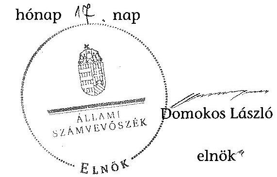

# ÁLLAMI   SZÁMVEVŐSZÉK 

## JELENTÉS

az önkormányzatok belső kontrollrendszere kialakításának, egyes
kontrolltevékenységek és a belső ellenőrzés
múködésének ellenőrzéséről
Csapi
14117
2014. június

---

# Állami Számvevőszék 

Iktatószám: V-0390-039/2014
Témaszám: 1162
Vizsgálat-azonosító szám: V064964

## Az ellenőrzést felügyelte:

Dr. Benedek Mária
felügyeleti vezető
Az ellenőrzést vezette és az ellenőrzés végrehajtásáért felelős:
Bíró Zsolt
ellenőrzésvezető
A számvevőszéki jelentés összeállításában közremüködött:
Reichert Margit
számvevő
Az ellenőrzést végezték:
Reichert Margit
Várkonyi Zsolt Kristóf
számvevő
számvevő tanácsos

---

# TARTALOMJEGYZÉK 

BEVEZETÉS ..... 5
I. ÖSSZEGZŐ MEGÁLLAPÍTÁSOK, KÖVETKEZTETÉSEK, JAVASLATOK ..... 9
II. RÉSZLETES MEGÁLLAPÍTÁSOK ..... 14

1. Az önkormányzat belső kontrollrendszerének kialakítása ..... 14
1.1. A kontrollkörnyezet ..... 14
1.2. A kockázatkezelési rendszer ..... 15
1.3. A kontrolltevékenységek ..... 15
1.4. Az információs és kommunikációs rendszer ..... 16
1.5. A monitoring rendszer ..... 16
2. A pénzügyi folyamatokban kulcsszerepet betöltő teljesítésigazolás és érvényesítés belső kontrollok múködése ..... 17
3. A belső ellenőrzés múködése ..... 19

## FÜGGELÉKEK

1. számú Értelmező szótár
2. számú Az értékelés módja és szempontjai

---

.

---

# RÖVIDÍTÉSEK JEGYZÉKE 

## Törvények

Áht.
ÁSZ tv.
Info tv.

Kttv.

Mötv.
Ötv.
Számv. tv.

## Rendeletek

Áhsz. 1

Áhsz. 2
Ávr.

Bkr.

Ikr.
képviselő-testületi
SZMSZ
vagyongazdálkodási rendelet

## Szórövidítések

ÁSZ
alapító okirat
belső ellenőrzési kézikönyv
bizonylati rend
2011. évi CXCV. törvény az államháztartásról (hatályos 2012. január 1-jétől)
2011. évi LXVI. törvény az Állami Számvevőszékről
2011. évi CXII. törvény az információs önrendelkezési jogról és az információszabadságról (hatályos 2012. január 1-jétől)
2011. évi CXCIX. törvény a közszolgálati tisztviselők ről (hatályos 2012. március 1-jétől)
2011. évi CLXXXIX. törvény Magyarország helyi önkormányzatairól
1990. évi LXV. törvény a helyi önkormányzatokról
2000. évi C. törvény a számvitelről

249/2000. (XII. 24.) Korm. rendelet az államháztartás szervezetei beszámolási és könyvvezetési kötelezettségének sajátosságairól (hatálytalan 2014. január 1-jétől)
4/2013. (I. 11.) Korm. rendelet az államháztartás számviteléről (hatályos 2014. január 1-jétől)
368/2011. (XII. 31.) Korm. rendelet az államháztartásról szóló törvény végrehajtásáról (hatályos 2012. január 1jétől)
370/2011. (XII. 31.) Korm. rendelet a költségvetési szervek belső kontrollrendszeréről és belső ellenőrzéséről (hatályos 2012. január 1-jétől)
335/2005. (XII. 29.) Korm. rendelet a közfeladatot ellátó szervek iratkezelésének általános követelményeiről
Csapi Községi Önkormányzat Képviselő-testületének 4/2011. (IV. 13.) számú rendelete a Képviselő-testület Szervezeti és Müködési Szabályzatáról (hatályos 2011. április 14-étől)
Csapi Község Önkormányzata Képviselő-testületének 11/2012. (VII. 03.) önkormányzati rendelete az Önkormányzat vagyonáról, a vagyonhasznosítás rendjéről és a vagyontárgyak feletti tulajdonosi jogok gyakorlásának szabályairól (hatályos 2012. július 3-ától)

Állami Számvevőszék
Nagyrécse-Csapi-Nagybakónak-Zalaújlak Községek Körjegyzősége alapító okirata (hatályos 2012. január 1-jétől)
Nagykanizsai Kistérség Többcélú Társulásának Belső ellenőrzési kézikönyve (hatályos 2010. március 29-étől)
Nagyrécse-Csapi-Nagybakónak-Zalaújlak Községek Körjegyzősége Bizonylati rendje (hatályos 2012. február 1jétől)

---

értékelési szabályzat
gazdasági szervezet ügyrendje
gazdálkodási szabály$\mathrm{zat}_{1}$
gazdálkodási szabály$\mathrm{zat}_{2}$
INTOSAI
iratkezelési szabályzat

## ISSAI

Képviselő-testület
Kormányhivatal
körjegyző

Körjegyzőség
körjegyzőségi SZMSZ
közös önkormányzati hivatal
leltározási szabályzat

NGM
Önkormányzat
pénzkezelési szabályzat
polgármester
számlarend
számviteli politika
Társulás
tüzvédelmi szabályzat

Eszközök és források értékelési szabályzata (hatályos 2012. március 1-jétől)
Nagyrécse-Csapi-Nagybakónak-Zalaújlak Községek Körjegyzősége gazdasági szervezet ügyrendje (hatályos 2012. január 1-jétől)
Csapi község polgármesterének 1. számú intézkedése a község önkormányzatának pénzgazdálkodásával kapcsolatos kötelezettségvállalás, utalványozás, érvényesítés és ellenjegyzés hatásköri rendjéről (hatályos 2006. január 1jétől)
Csapi Községi Önkormányzat gazdálkodási szabályzata (hatályos 2012. március 1-jétől)
International Organization of Supreme Audit Institutions (Legfőbb Ellenőrző Intézmények Nemzetközi Szervezete)
Nagyrécse-Csapi-Nagybakónak-Zalaújlak Községek Körjegyzőségének Iratkezelési szabályzata (hatályos 2012. január 1-jétől)
International Standards of Supreme Audit Institutions (Legfőbb Ellenőrző Intézmények Nemzetközi Standardjai)
Csapi Község Önkormányzatának Képviselő-testülete
Zala Megyei Kormányhivatal
Nagyrécse-Csapi-Nagybakónak-Zalaújlak Községek körjegyzöje
Nagyrécse-Csapi-Nagybakónak-Zalaújlak Községek Körjegyzősége
Nagyrécse-Csapi-Nagybakónak-Zalaújlak Községek Körjegyzőségének Szervezeti és Müködési Szabályzata (hatályos 2012. január 1-jétől)
Nagyrécsei Közös Önkormányzati Hivatal
Csapi Község Önkormányzata Leltárkészítési és leltározási szabályzata (hatályos 2012. február 1-jétől)
Nemzetgazdasági Minisztérium
Csapi Község Önkormányzata
Csapi Község Önkormányzata Pénzkezelési szabályzata (hatályos 2012. április 1-jétől)
Csapi Község Önkormányzatának polgármestere
Csapi Községi Önkormányzat számlarendje (hatályos 2012. március 1 -jétől)
Nagyrécse-Csapi-Nagybakónak-Zalaújlak Községek Számviteli Politikája (hatályos 2012. március 1-jétől)
Nagykanizsai Kistérség Többcélú Társulása
Csapi Község Önkormányzata Tüzvédelmi szabályzata (hatályos 2010. június 1-jétől)

---

# JELENTÉS 

## az önkormányzatok belsó kontrollrendszere kialakításának, egyes kontrolltevékenységek és a belső ellenőrzés múködésének ellenőrzéséről   Csapi

## BEVEZETÉS

Csapi község állandó lakosainak száma 2012. január 1-jén 172 fő volt. Az Önkormányzat öttagú Képviselő-testületének munkáját egy állandó bizottság segítette. Az Önkormányzat az önállóan működő és gazdálkodó Körjegyzőségen kívül egy önállóan működő intézményt - Körzeti Általános Iskola, Szakiskola és Kollégium - múködtetett, többségi tulajdoni hányadú gazdasági társasággal nem rendelkezett. A polgármester az 1990. évi önkormányzati választások óta tölti be tisztségét. A körjegyzö 2011. augusztus 1-jétől látja el körjegyzői feladatait. A Körjegyzőség szervezeti egységekre nem tagolódott, elkülönített gazdasági szervezettel nem rendelkezett, a foglalkoztatott köztisztviselők száma 2012. január 1-jén 11 fő volt. Nagyrécse, Csapi, Nagybakónak, Zalaújlak és Miháld községek önkormányzatainak képviselő-testületei 2013. január 1-jétől Nagyrécse székhellyel - közös önkormányzati hivatalt hoztak létre. Az Önkormányzat a 2012. évi költségvetési beszámolója szerint 572761 ezer Ft tárgyévi bevételt ért el, valamint 524050 ezer Ft tárgyévi kiadást teljesített. A 2012. december 31-ei könyvviteli mérleg szerint 944037 ezer Ft értékű eszközvagyonnal rendelkezett, a rövid lejáratú kötelezettségállománya 6010 ezer Ft, hosszú lejáratú kötelezettség állománya 5303 ezer Ft volt.

A demokratikus társadalmakban alapvető igény, hogy a közpénzeket, a közvagyont használók tevékenységükről elszámoljanak, ahhoz egyértelmű és érvényesíthető felelősségi szabályok társuljanak. Ennek a jogos igénynek az érvényesítéséhez meg kell teremteni azokat a folyamatokat, rendszereket, amelyek nélkülözhetetlenek az elszámoltatáshoz. Az elszámoltatás eredményes múködtetéséhez szükség van a megfelelő információs, kontroll, értékelési és beszámolási rendszerek kialakítására.

Magyarországon az uniós csatlakozási tárgyalások idejére nyúlnak vissza a belső kontrollrendszer szabályozásának gyökerei. Az uniós elvárásoknak megfelelő új terminológia szerinti államháztartási belső pénzügyi ellenőrzési (ÁBPE) rendszer területén a jogharmonizáció 2003-ban teljes körűen megvalósult, míg az önkormányzati alrendszerre vonatkozó, Ötv.-ben megjelenített speciális szabályozás 2005-ben lépett hatályba. Az államháztartási belső kontrollrendszer koncepciója 2009-ben továbbfejlődött. A változások irányát mutatja, hogy a költségvetési szervek belső kontrollrendszere már magában foglalja a korszerű, felelős szervezetirányítás elemeit (kontrollkörnyezet, kockázatkeze-

---

lés, kontrolltevékenység, információ és kommunikáció, monitoring) is. E kontrollrendszer szabályozása háromszintű, a törvényi előírásokat az Áht. és a Mötv., a rendeleti szintű szabályozást az Ávr. és a Bkr. tartalmazza, amelyeket útmutatói szinten az NGM által kiadott standardok és kézikönyvek támogatnak.

A belső kontrollrendszer azt a célt szolgálja, hogy a költségvetési szervek múködésük és gazdálkodásuk során a tevékenységeket szabályszerűen, gazdaságosan, hatékonyan és eredményesen hajtsák végre, teljesítsék elszámolási kötelezettségeiket és megvédjék az erőforrásokat a veszteségektől, a károktól és a nem rendeltetésszerű használattól. A belső kontrollrendszer magában foglalja mindazon szabályokat, eljárásokat, gyakorlati módszereket és szervezeti struktúrákat, kockázatkezelési technikákat, kontrolltevékenységeket, amelyek segítséget nyújtanak a szervezetnek céljai eléréséhez.

Az ÁSZ középtávú stratégiájában hangsúlyos szerepet szánt annak, hogy szilárd szakmai alapon álló, értékteremtő ellenőrzéseivel előmozdítsa a közpénzügyek átláthatóságát, rendezettségét. A számvevőszéki ellenőrzés nemzetközi alapelvei is rögzítik, hogy a megfelelő belső kontrollrendszer minimálisra csökkenti a hibák és szabálytalanságok kockázatát.

Az ellenőrzés célja annak megállapítása volt, hogy a belső kontrollrendszer elemeinek kialakítása, a pénzügyi folyamatokban kulcsszerepet betöltő teljesítésigazolás és érvényesítés, és a belső ellenőrzés szabályos működése biztosítot-ta-e az Önkormányzatnál a közpénzfelhasználás szabályosságát, hozzájárult-e az értéket teremtő rend követelményének érvényesüléséhez.

Ennek keretében értékeltük, hogy:

- a jogszabályi előírásoknak megfelelően alakították-e ki a belső kontrollrendszer elemeit;
- a gazdálkodás folyamatában kulcsszerepet betöltő teljesítésigazolás és érvényesítés kontrolltevékenységeit megfelelően működtették-e;
- biztosították-e a belső ellenőrzés szabályos működését;
- amennyiben az ÁSZ tett javaslatot a 2008-2011. évek közötti ellenőrzése kapcsán az Önkormányzatnak, intézkedtek-e azok végrehajtására.

Az ellenőrzés várható hasznosulását négy szinten tervezzük. A törvényalkotás számára összegzett tapasztalatok állnak rendelkezésre a belső kontrollrendszer önkormányzati területen való kialakításáról, müködéséről és hatásairól, a belső ellenőrzés működéséről. Ennek alapján következtetést lehet levonni arról, hogy a belső kontrollrendszer kialakítására és működtetésére vonatkozó jelenlegi, differenciálás nélküli - jogszabályi előírások reális követelményeket támasztanak-e az eltérő adottságú települési önkormányzatok esetében, illetve indokolt-e esetleges jogszabályi módosítás kezdeményezése. Az ellenőrzés az ellenőrzött számára visszajelzést ad a belső kontrollrendszer kialakításában és működésében fellépő hiányosságokról, javaslataival hozzájárul azok kiküszöböléséhez, amely csökkentheti a későbbi ellenőrzések gyakoriságát. Az ellenőrzés megállapításait és javaslatait más szervezetek is hasznosíthatják a

---

rendezett gazdálkodási keretek kialakításához. A társadalom számára jelzi, hogy közpénz nem maradhat ellenőrizetlenül, az ÁSZ értékteremtő rend kialakításához és megőrzéséhez hozzájáruló tevékenysége pozitív hatással lesz a szervezetről kialakított összkép formálásában. A szervezeten belül lehetőség nyílik arra, hogy a megállapítások szintetizálásával az ÁSZ a hozzáadott értéket teremtő elemző tevékenységét és tanácsadó szerepét is erősítse.

Az önkormányzatok belső kontrollrendszere kialakításának, egyes kontrolltevékenységek és a belső ellenőrzés működésének ellenőrzéséről szóló jelentés I. fejezetének összegző része az ellenőrzés céljára ad rövid, szintetizáló összefoglalót, és tartalmazza a következtetéseket a II. fejezet részletes megállapításain alapulóan. A jelentés intézkedést igénylő megállapításait és javaslatait az ellenőrzés során feltárt, a jelentés II. fejezetében rögzített részletes megállapítások alapozzák meg. A helyszíni ellenőrzés lezárásáig a helyi szabályozás változásait nyomon követtük.

Az ellenőrzés típusa: szabályszerűségi ellenőrzés.
Az ellenőrzött időszak: a belső kontrollrendszer kialakításának megfelelősége esetében a 2012. évre, a pénzügyi folyamatokban kulcsszerepet betöltő teljesítésigazolás és érvényesítés belső kontrollok múködésének megfelelőségét és a belső ellenőrzés szabályszerű működését a 2012. január 1. és december 31-e közötti időszak eseményeit figyelembe véve értékeltük, míg az ÁSZ javaslatainak utóellenőrzése a 2008-2011. években végzett ellenőrzések nyilvánosságra hozott jelentéseiben tett javaslatok áttekintésére terjedt ki.

# Az ellenőrzött szervezet: az Önkormányzat. 

Az ellenőrzés jogszabályi alapját az ÁSZ tv. 1. § (3) bekezdése, az 5. § (2) és (6) bekezdése, valamint az Áht. 61. § (2) bekezdésének előírásai képezik.

Az ellenőrzés szakmai módszertana az ÁSZ hivatalos honlapján (www.asz.hu) közzétett szakmai szabályokon alapult, amely az INTOSAI által kiadott ISSAI figyelembevételével készült.

Az ellenőrzés lefolytatásához az Önkormányzat a kimutatások és a tanúsítvány elektronikus kitöltésével, valamint az ÁSZ által kért dokumentumok elektronikus megküldésével szolgáltatott adatokat. Az így rendelkezésre bocsátott adatok, információk kontrollja és a munkalapok kitöltése a helyszíni ellenőrzés keretében történt. A jelentésben használt fogalmak magyarázatát az 1. számú függelék, az ellenőrzés egyes területeinek értékelésénél alkalmazott egységes minősítési szempontokat a 2. számú függelék tartalmazza.

A belső kontrollrendszer kialakításának ellenőrzése során értékeltük a kontrollkörnyezet, a kockázatkezelési rendszer, a kontrolltevékenységek, az információs és kommunikációs rendszer, valamint a monitoring rendszer szabályozottságának megfelelőségét. A pénzügyi folyamatokban kulcsszerepet betöltő teljesítésigazolás és érvényesítés kontrollok múködése megfelelőségének minősítéséhez az állományba nem tartozók megbízási díjai, a külső szolgáltatók által végzett karbantartási, kisjavítási munkák, az egyéb üzemeltetési és fenntartási szolgáltatások, a rendszeres szociális segélyek, valamint az államháztartáson kívülre teljesített múködési és felhalmozási célú pénzeszközátadások közül koc-

---

kázatelemzéssel választottuk ki az ellenőrzött kiadási jogcímeket. Az egyszerủ véletlen mintavétellel kiválasztott tételek ellenőrzését többlépcsős megfelelőségi tesztek útján addig végeztük, amíg elegendő és megfelelő bizonyítékot szereztünk a vizsgált folyamatok kulcskontrolljai müködésének megfelelő vagy nem megfelelő voltáról. Értékeltük az Önkormányzatnál a belső ellenőrzés müködésének szabályosságát. Utóellenőrzésre nem került sor, mivel az ÁSZ az Önkormányzatnál a 2008-2011. évek között nem végzett ellenőrzést.

Az ÁSZ tv. 29. § (1) bekezdése szerint a jelentéstervezetet megküldtük a polgármester részére, aki az ÁSZ tv. 29. § (2) bekezdésében foglalt észrevételezési jogával nem élt, a jelentéstervezetre észrevételt nem tett.

---

# I. ÖSSZEGZŐ MEGÁLLAPÍTÁSOK, KÖVETKEZTETÉSEK, JAVASLATOK 

A belső kontrollrendszeren belül 2012-ben a kontrollkörnyezet, a kockázatkezelési rendszer, a kontrolltevékenységek, az információs és kommunikációs rendszer, valamint a monitoring rendszer kialakítását külön-külön és együttesen is értékeltük. A belső kontrollrendszer kialakítása az összesített értékelés alapján nem felelt meg a jogszabályi előírásoknak.

A belső kontrollrendszer egyes területei kialakításának minősítése a következő:

| Kontrollteruilet | Minősités |  |
| :-- | :-- | :-- |
| Kontrollkörnyezet | megfelelö |  |
| Kockázatkezelési rendszer |  | nem   megfelelö |
| Kontrolltevékenységek | megfelelö |  |
| Információs és kommunikációs   rendszer |  | nem   megfelelö |
| Monitoring rendszer |  | nem   megfelelö |

Megfelelőnek értékeltük a kontrollkörnyezet és a kontrolltevékenységek kialakítását, mivel a jogszabályi előírásokban foglaltakat figyelembe véve kisebb hiányosságok mellett is megteremtette e kontrollterületeken a szabályszerű múködés lehetőségét.

Nem megfelelőnek értékeltük a kockázatkezelési rendszer, az információs és kommunikációs rendszer, valamint a monitoring rendszer kialakítását, mivel az ellenőrzésünk során megállapított szabályozásbeli hiányosságok magukban hordozzák a szabálytalan múködés, valamint a korrupció kockázatát.

A 2012. évben az állományba nem tartozók megbízási díjaival, valamint a külső szolgáltatók által végzett karbantartási, kisjavítási munkákkal kapcsolatos kifizetések során a pénzügyi folyamatokban kulcsszerepet betöltő teljesítésigazolás és érvényesítés belső kontrollok múködése gyenge volt. Gyengének értékeltük a két kulcskontroll együttes múködését, mivel azok nem biztosították a hibák megelőzését, feltárását.

A számvevőszéki ellenőrzés az ellenőrzött kifizetésekkel összefüggésben a rendelkezésre bocsátott dokumentumok alapján kár bekövetkeztére utaló adatot, tényt nem állapított meg, azonban a gazdálkodásban kulcsszerepet betöltő kontrollok múködésében feltárt hiányosságok miatt fennáll a hibák bekövetkezésének kockázata. A nem megfelelően múködtetett belső kontrollok korrupciós kockázatot hordoznak.

---

Az Önkormányzat a belső ellenőrzési feladatokat a Társulás útján látta el. A 2012. évben a belső ellenőrzés múködése a jogszabályi előírásoknak megfelelt, azonban a belső ellenőrzés nem tárta fel a belső kontrollrendszer kialakításának, valamint a pénzügyi folyamatokban kulcsszerepet betöltő teljesítésigazolás és érvényesítés belső kontrollok múködésének hiányosságait.

Az ÁSZ tv. 33. § (1) bekezdésében foglaltak értelmében az ellenőrzött szervezet vezetője köteles a jelentésben foglalt megállapításokhoz kapcsolódó intézkedési tervet összeállítani, és azt a jelentés kézhezvételétől számított 30 napon belül az ÁSZ részére megküldeni. Amennyiben az intézkedési tervet határidőre nem küldi meg a szervezet, vagy az ÁSZ tv. 33. § (2) bekezdésében foglalt póthatáridő elteltével megküldött intézkedési terv továbbra sem elfogadható, az ÁSZ elnöke a hivatkozott törvény 33. § (3) bekezdés a)-b) pontjaiban foglaltakat érvényesítheti.

Az ellenőrzés intézkedést igénylő megállapításai és javaslatai:

# a polgármesternek 

1. A polgármester, mint kötelezettségvállaló - az Ávr. 57. § (4) bekezdésében foglaltak ellenére - nem jelölte ki 2012. március 30 -át követően írásban az Önkormányzat kiadási előirányzatai vonatkozásában a teljesítés igazolására jogosult személyeket.

Javaslat:
Jelölje ki írásban az Önkormányzat kiadási előirányzatai vonatkozásában az Ávr. 57. § (4) bekezdésében foglaltaknak megfelelően a teljesítés igazolására jogosult személyeket.
2. Az Önkormányzat nevében történő kötelezettségvállalás - az Áht. 37. § (1) bekezdése és az Ávr. 55. § (1) bekezdésében előírtak ellenére - pénzügyi ellenjegyzés hiányában történt.

Javaslat:
Intézkedjen, hogy az Önkormányzat nevében történő kötelezettségvállalásra az Áht. 37. § (1) bekezdésében és az Ávr. 55. § (1) bekezdésében foglaltaknak megfelelően - az Ávr. 53. §-ában meghatározott kivételekkel - kizárólag a pénzügyi ellenjegyzés után, a pénzügyi teljesítés esedékességét megelőzően, írásban kerüljön sor.
3. A számvevőszéki ellenőrzés megállapításai alapján az Önkormányzatnál a belső kontrollrendszer kialakítása összefoglalóan értékelve nem felelt meg a jogszabályi előírásoknak. A kulcskontrollok működése gyenge volt, a belső ellenőrzés működése ugyan megfelelt a jogszabályi előírásoknak, azonban nem tárta fel, ezáltal nem is javíttatta ki a hiányosságokat. A megállapított szabályozásbeli és működésbeli hiányosságok magukban hordozzák a szabálytalan működés kockázatát.

Javaslat:
Kísérje figyelemmel a Mötv. 115. § (1) bekezdésében foglaltak alapján az Önkormányzat gazdálkodásának szabályszerűségét. A Mötv. 67. § f) pontja alapján gon-

---

doskodjon a belső kontrollrendszer müködésére vonatkozó jogszabályi rendelkezések be nem tartása, valamint a teljesítésigazolás, illetve az érvényesítés kontrollokkal öszszefüggésben feltárt hiányosságok, szabálytalanságok tekintetében az esetleges munkajogi felelősséggel kapcsolatos körülmények kivizsgálásáról, majd a vizsgálat eredményének függvényében tegye meg a szükséges intézkedéseket.

# a jegyzőnek (Csapi Község vonatkozásában) 

1. a kontrollkörnyezettel kapcsolatban:

A körjegyző a Kttv-ben foglaltak ellenére a Körjegyzőségen dolgozó valamennyi köztisztviselők munkateljesítményét írásban nem értékelte, továbbá a körjegyzö az Ötv.ben foglalt kötelezettsége ellenére nem készítette elő a Kttv.-ben foglaltak szerinti, a köztisztviselőkkel szembeni hivatásetikai alapelvek részletes tartalmának, valamint az etikai eljárás szabályainak dokumentumát [II. Részletes megállapítások, 1.1. A kontrollkörnyezet, 46. és 47. sorszámú megállapítás].

Javaslat:
Intézkedjen az Áht. 69. § (2) bekezdése, a Bkr. 3. § a) pontja és 6. §-a, alapján a jelentés II. Részletes megállapítások, 1.1. A kontrollkörnyezet, 46. és 47. sorszámú megállapításaiban foglalt hibák, hiányosságok kijavításáról, megszüntetéséről az ott megjelölt jogszabályi rendelkezéseknek megfelelően.
2. a kockázatkezelési rendszerrel kapcsolatban:

A körjegyző a Bkr.-ben foglaltak ellenére nem határozta meg az egyes kockázatokkal kapcsolatban szükséges intézkedéseket, valamint azok teljesítésének folyamatos nyomon követésének módját [II. Részletes megállapítások, 1.2. A kockázatkezelési rendszer, 8., 10. sorszámú megállapítás].

Javaslat:
Intézkedjen az Áht. 69. § (2) bekezdése, a Bkr. 3. § b) pontja és 7. §-ában foglaltak alapján a jelentés II. Részletes megállapítások, 1.2. A kockázatkezelési rendszer, 8. és 10. sorszámú megállapításaiban foglalt hibák, hiányosságok kijavításáról, megszüntetéséről az ott megjelölt jogszabályi rendelkezéseknek megfelelően.
3. a kontrolltevékenységekkel kapcsolatban:

A körjegyző az Ávr.-ben foglaltakat figyelmen kívül hagyva nem jelölt ki pénzügyi ellenjegyzési és érvényesítési feladatra a körjegyzőség állományába tartozó köztisztviselőt [II. Részletes megállapítások, 1.3. A kontrolltevékenységek, 27. sorszámú megállapítás]

Javaslat:
Intézkedjen az Áht. 69. § (2) bekezdése, a Bkr. 3. § c) pontja és 8. §-a alapján a jelentés II. Részletes megállapítások, 1.3. A kontrolltevékenységek 27. sorszámú megállapításaiban foglalt hibák, hiányosságok kijavításáról, megszüntetéséről az ott megjelölt jogszabályi rendelkezéseknek megfelelően.

---

4. Az információs és kommunikációs rendszerrel kapcsolatban:

Az Önkormányzat - az Info tv.-ben előírtak ellenére -az elektronikus közzétételi kötelezettségének a 2012. évben nem tett eleget [II. Részletes megállapítások, 1.4. Az információs és kommunikációs rendszer, 7. sorszámú megállapítás].

Javaslat:
Intézkedjen az Áht. 69. § (2) bekezdése, a Bkr. 3. § d) pontja és 9. §-a alapján a jelentés II. Részletes megállapítások, 1.4. Az információs és kommunikációs rendszer 7. sorszámú megállapításában foglalt hiányosságok megszüntetéséről az ott megjelölt jogszabályi rendelkezéseknek megfelelően.
5. a monitoring rendszerrel kapcsolatban:

A körjegyző a Bkr.-ben foglaltak ellenére nem alakította ki a Körjegyzőség tevékenységének, a célok megvalósításának nyomon követését biztosító rendszert, az intézkedési tervben meghatározott egyes feladatok végrehajtásáról szóló beszámolót elmulasztotta elkészíteni és tájékoztatásul megküldeni a belső ellenőrzési vezető részére [II. Részletes megállapítások, 1.5. A monitoring rendszer, 1. és 18. sorszámú megállapítás].

Javaslat:
Intézkedjen az Áht. 69. § (2) bekezdése, a Bkr. 3. § e) pontja és 10. §-a alapján a jelentés II. Részletes megállapítások, 1.5. A monitoring rendszer 1. és 18. sorszámú megállapításában foglalt hibák, hiányosságok kijavításáról, megszüntetéséről az ott megjelölt jogszabályi rendelkezéseknek megfelelően.
6. a pénzügyi folyamatokban kulcsszerepet betöltő kontrollokkal kapcsolatban:

A teljesítésigazolás és az érvényesítés, valamint az utalvány tartalma nem felelt meg az Áht.-ban és az Ávr.-ben foglaltaknak [II. Részletes megállapítások, 2. A pénzügyi folyamatokban kulcsszerepet betöltő teljesítésigazolás és érvényesítés belső kontrollok múködése 1-3. pontban foglalt megállapítás].

Javaslat:
Intézkedjen az Áht. 37-38. §-ában és az Ávr. 55-59. §-ában és az Áhsz., 39. § (1) bekezdésében és a 14. számú melléklet II. pontjában foglaltak alapján arról, hogy a teljesítésigazolás és az érvényesítés vonatkozásában, valamint azok ellenőrzése során a kötelezettségvállalással, a pénzügyi ellenjegyzéssel, a kötelezettségvállalások nyilvántartásba vételével, valamint az utalvány tartalmával kapcsolatban feltárt, a jelentés II. Részletes megállapítások, 2. A pénzügyi folyamatokban kulcsszerepet betöltő teljesítésigazolás és érvényesítés belső kontrollok múködése 1-3. pontjában szereplő megállapításokban foglalt hibák, hiányosságok kijavítása, megszüntetése az ott megjelölt jogszabályi rendelkezéseknek megfelelően történjen meg.
7. a belső ellenőrzés működésével kapcsolatban:

A belső ellenőrzés múködése az értékelési szempontjait figyelembe véve megfelelt a jogszabályi előírásoknak, azonban a számvevőszéki ellenőrzés kisebb súlyú hiányos-

---

ságokat tárt fel, amelyek nem feleltek meg a Bkr.-ben előírt rendelkezéseknek [II. Részletes megállapítások, 3. A belső ellenőrzés müködése, 3. a)., 7. c)., f)., 8. a), 18., 20. e)., 23., 24., 26., és 27. sorszámú megállapítása].

Javaslat:
Intézkedjen az Áht. 69. § (2) bekezdése, a Bkr. 3. § e) pontja és a 10. §-a alapján a jelentés II. Részletes megállapítások, a belső ellenőrzés működése 3. a)., 7. c)., f)., 8. a), 18., 20. e)., 23., 24., 26., és 27. sorszámú megállapításaiban foglalt hibák, hiányosságok kijavításáról, megszüntetéséről az ott megjelölt jogszabályi rendelkezéseknek megfelelően.

---

# II. RÉSZLETES MEGÁLLAPÍTÁSOK 

## 1. Az ÖNKORMÁNYZAT BELSŐ KONTROLLRENDSZERÉNEK KIALAKÍTÁSA

A belső kontrollrendszeren belül 2012-ben a kontrollkörnyezet, a kockázatkezelési rendszer, a kontrolltevékenységek, az információs és kommunikációs rendszer, valamint a monitoring rendszer kialakítását külön-külön és együttesen is értékeltük. A belső kontrollrendszer kialakítása az összesített értékelés alapján nem felelt meg a jogszabályi előírásoknak.

### 1.1. A kontrollkörnyezet

A kontrollkörnyezet kialakítása - a 2. számú függelékben részletezett kritériumrendszer alapján végzett értékelés szerint - megfelel t a jogszabályi előírásoknak. A Körjegyzőség rendelkezett a Képviselő-testület által elfogadott alapító okirattal és körjegyzőségi SZMSZ-szel. Az alapító okirat a jogszabályi előírásoknak megfelelően tartalmazta az alaptevékenységek felsorolását. Az Önkormányzat rendelkezett gazdasági programmal és képviselő-testületi SZMSZ-szel. A Képviselő-testület a vagyongazdálkodás szabályait a vagyongazdálkodási rendeletében határozta meg.

A szervezet megfelelő működése érdekében a körjegyző a jogszabályi előírásoknak megfelelően kialakította a számviteli politikát, elkészítette a pénzkezelési szabályzatot, a leltározási szabályzatot, az értékelési szabályzatot, a számlarendet, valamint a bizonylati rendet. A Körjegyzőségen meghatározták az egészséget nem veszélyeztető és biztonságos munkavégzés követelményei megvalósításának módját, rendelkeztek tűzvédelmi szabályzattal. A körjegyző elkészítette a Körjegyzőségen dolgozó köztisztviselők munkaköri leírását.

A kontrollkörnyezet kialakítása az értékelés szempontjából az alábbi kisebb súlyú hiányosságok mellett megfelel a jogszabályi előírásoknak:

| Sorszám ${ }^{1}$ | Megállapítás | Megjegyzés |
| :--: | :--: | :--: |
| 46. | A körjegyzö - a Kttv. 130. § (1) bekezdésben foglalt előírások ellenére - a Körjegyzőségen dolgozó két fő köztisztviselő munkateljesítményét írásban nem értékelte. | A Körjegyzőségen a foglalkoztatott köztisztviselők száma 2012. január 1-jén 11 fő volt. |
| 47. | A Képviselő-testület - a Kttv. 231. § (1) bekezdése ellenére - nem állapította meg a Kttv. 83. §-ában előírt, a köztisztviselőkkel szembeni hivatásetikai alapelvek részletes | Az Önkormányzat müködésével kapcsolatos feladatok ellátásáról való gondoskodást 2013. január 1-jétől a |

[^0]
[^0]:    ${ }^{1}$ A megállapítás számozása az Önkormányzat által az adatszolgáltatás során kitöltött kimutatások kérdéseinek sorszámával azonos.

---

tartalmát, valamint az etikai eljárás szabályait, mivel a körjegyzö - az Ötv. 36. § (2) bekezdés a) pontjában előírt feladata ellenére - nem készítette elő ennek dokumentumát.

Mötv. 81. § (3) bekezdés c) pontja írja elő.

# 1.2. A kockázatkezelési rendszer 

A kockázatkezelési rendszer kialakítása - a 2. számú függelékben részletezett kritériumrendszer alapján végzett értékelés szerint - nem felelt meg a jogszabályi előírásoknak, mert:

| Sorszám | Megállapítás |
| :--: | :--: |
| 8., 10. | A körjegyzö - a Bkr. 7. § (2) bekezdésében foglaltak ellenére - nem határozia meg az egyes kockázatokkal kapcsolatban a szükséges intézkedéseket, valamint azok teljesítésének folyamatos nyomon követésének módját. |

### 1.3. A kontrolltevékenységek

A kontrolltevékenységek kialakítása - a 2. számú függelékben részletezett kritériumrendszer alapján végzett értékelés szerint - megfelelt a jogszabályi előírásoknak.

A körjegyzö a kontrolltevékenység részeként előírta a folyamatba épített, előzetes, utólagos és vezetői ellenőrzést a költségvetés tervezése, a beszerzések lebonyolítása, a vagyonhasznosítási tevékenység és a támogatások elszámolása vonatkozásában. A körjegyzö az iratkezelési szabályzatban előírta az iratok és az adatok védelmét, szabályozta az üzemeltetés és az adatbiztonság feladatait, meghatározta az ehhez kapcsolódó hatásköröket.

A körjegyzö a gazdálkodási szabályzat ${ }_{2}$-ben meghatározta az időközi és az éves beszámolók elkészítésének feladatait, a beszámolási eljárásokhoz kapcsolódó felelősségi köröket. A költségvetési beszámoló elkészítésével megbízott személy rendelkezett az előírt szakképesítéssel és a tevékenység ellátására jogosító engedéllyel.

A körjegyzö a gazdálkodási szabályzat ${ }_{2}$-ben meghatározta és előírta a kötelezettségvállalás pénzügyi ellenjegyzésének, valamint a kiadások teljesítésigazolásának módját, az érvényesítés és az utalványozás rendjét. Szabályozta az előzetes írásbeli kötelezettségvállalást nem igénylő kifizetések rendjét. A körjegyzö a Körjegyzőség állományába tartozó köztisztviselőt jelölt ki érvényesítési feladatra.

---

A kontrolltevékenységek kialakítása az értékelés szempontjából az alábbi kisebb súlyú hiányosságok mellett megfelelt a jogszabályi előírásoknak:

| Sorszám | Megállapítás | Megjegyzés |
| :--: | :--: | :--: |
| 10. | A polgármester mint kötelezettségvállaló az Ávr. 57. § (4) bekezdésében foglaltak ellenére - nem jelölte ki 2012. március 30 -át követően írásban az Önkormányzat kiadási előirányzatai vonatkozásában a teljesítés igazolására jogosult személyeket. |  |
| 27. | A körjegyzö - az Ávr. 55. § (2) bekezdésében foglaltakat figyelmen kívül hagyva - nem jelölt ki pénzügyi ellenjegyzési feladatra a Körjegyzőség állományába tartozó köztisztviselőt. |  |
| 29. | A körjegyzö - az Ávr. 58. § (4) bekezdése előírása ellenére - 2012. január 1-jétől 2012. március 1-jéig nem jelölt ki érvényesítési feladatra a Körjegyzőség állományába tartozó köztisztviselőt. | A körjegyzö 2012. március 1-jétől kijelölt az érvényesítési feladatra a Körjegyzőség állományába tartozó köztisztviselőt. |

# 1.4. Az információs és kommunikációs rendszer 

Az információs és kommunikációs rendszer kialakítása - a 2. számú függelékben részletezett kritériumrendszer alapján végzett értékelés szerint nem felelt meg a jogszabályi előírásoknak, mert:

| Sorszám | Megállapítás |
| :--: | :--: |
| 7. | Az Önkormányzat - az Info tv. 33. § (1) és (3) bekezdésében előírások ellenére - az elektronikus közzétételi kötelezettségének a 2012. évben nem tett eleget. |

### 1.5. A monitoring rendszer

A monitoring rendszer kialakítása - a 2. számú függelékben részletezett kritériumrendszer alapján végzett értékelés szerint - nem felelt meg a jogszabályi előírásoknak, mert:

| Sorszám | Megállapítás |
| :--: | :--: |
| 1. | A körjegyzö - a Bkr. 3. § e) pontjában és a 10. §-ában foglaltak ellenére nem alakította ki a Körjegyzőség tevékenységének, a célok megvalósításának nyomon követését biztosító rendszert. |
| 18. | A körjegyzö - a Bkr. 46. § (1) bekezdésében foglalt előírás ellenére - az intézkedési tervben meghatározott egyes feladatok végrehajtásáról szóló beszámolót elmulasztotta elkészíteni és tájékoztatásul megküldeni a belső ellenőrzési vezető részére. |

---

Az Önkormányzatnál a Kormányhivatal a 2012. évben egy alkalommal élt törvényességi felhívással. A Képviselő-testület a felhívásban foglaltakat elfogadta és hasznosította.

A Kormányhivatal a szociális ellátásokról szóló 10/2008. (IV. 29) számú önkormányzati rendelet és a vonatkozó központi jogszabályok összhangjának megteremtése érdekében élt törvényességi felhívással, mely a köztemetésre, bérpótló juttatásra, időskorúak járadékára, az aktív korúak ellátására vonatkozó rendelkezéseket érintette. A Képviselő-testület rendelete és a vonatkozó jogszabályok között az összhangot - a fent említett önkormányzati rendelet hatályon kívül helyezésével - megteremtették.

# 2. A PÉNZÜGYI FOLYAMATOKBAN KULCSSZEREPET BETÖLTŐ TELJESÍTÉSIGAZOLÁS ÉS ÉRVÉNYESÍTÉS BELSŐ KONTROLLOK MÜKÖDÉSE 

A 2012. évben az állományba nem tartozók megbízási díjaival, valamint a külső szolgáltatók által végzett karbantartással, kisjavítással kapcsolatos kifizetések során - összefoglalóan értékelve - a pénzügyi folyamatokban kulcsszerepet betöltő teljesítésigazolás és érvényesítés belső kontrollok müködésének megfelelősége gyenge volt, mert:

| Kontrollok   sorszáma | Megállapítás | Megjegyzés |
| :-- | :-- | :-- |

## Teljesítésigazolás

A kifizetéseket megelőzően a teljesítésigazo-
1.
lást - az Áht. 38. § (1) bekezdésében és az Ávr. 57. § (1) és (3) bekezdésében foglaltak ellenére - nem, vagy nem szabályszerűen végezték el.

## Érvényesítés

Az érvényesítést a kifizetéseket megelőzően az Ávr. 58. § (1) és (4) bekezdésében előírtak ellenére - nem szabályszerűen végezték el.

Az érvényesítő - az Ávr. 58. § (1) bekezdésében foglaltak ellenére - a kifizetéseket megelőzően nem tudta ellenőrizni a fedezet meglétét, mert a kötelezettségvállalást - az Ávr. 56. § (1) bekezdése előírása ellenére - 2012. évben nem vették nyilvántartásba.

Az érvényesítő - az Ávr. 58. § (1) és (2) bekezdésben rögzitettek ellenére - nem jelezte az utalványozónak, hogy a megelőző ügymenetben a teljesítésigazolás nem, vagy nem szabályszerűen történt, kötelezettségvállalásra az Önkormányzat kiadási előirányzatánál - az Áht. 37. § (1) bekezdésben és az Ávr. 55. § (1) bekezdésében foglaltak ellenére pénzügyi ellenjegyzés nélkül került sor.

Az Ávr. 56. § (1) bekezdés 2014. január 1-jétől módosult, a kötelezettségvállalások nyilvántartását az Áhsz. 3 39. § (1) bekezdés és a 14. számú melléklet II. pontja tartalmazza.

---

# A kulcskontrollok ellenőrzése során feltárt egyéb hiányosság 

A kiadási pénztárbizonylaton és az utalványon nem tüntették fel - az Ávr. 59. § (3) bekezdés f) pontjában és a (4) bekezdésében előírtakat figyelmen kívül hagyva - a kötelezettségvállalás nyilvántartási számát.

A 2012. évben az állományba nem tartozók megbízási díjaival kapcsolatos kifizetések során a teljesítésigazolás és az érvényesítés kulcskontrollok müködésének megfelelősége gyenge volt, mert:

- a teljesítésigazolást a kisegítő munkával és a könyvtárrendezéssel kapcsolatos megbízási díjak kifizetését megelőzően az Áht. 38.§ (1) bekezdésében és az Ávr. 57. § (1) bekezdésében foglaltak ellenére nem végezték el;
- az érvényesítést a kisegítő munkával és a könyvtárrendezéssel kapcsolatos megbízási díjak kifizetése esetében -az Ávr. 58. § (4) bekezdésében előírtak ellenére - kijelölés hiányában jogosulatlanul végezték;
- az érvényesítő - az Ávr. 58. § (1) bekezdésében foglaltak ellenére - a kisegítő munkával és a könyvtárrendezéssel összefüggő megbízási díjak kifizetése során a fedezet meglétét nem ellenőrizte, mert a megbízási díjak kötelezettségvállalásait - az Ávr. 56. § (1) bekezdésében előírtakat figyelmen kívül hagyva - a 2012. évben nem vették nyilvántartásba;
- az érvényesítő az Ávr. 58. § (2) bekezdés előírása ellenére nem jelezte az utalványozónak, hogy a megelőző ügymenetben a teljesítésigazolást nem, vagy nem szabályszerűen végezték el, az Önkormányzat kiadási előirányzatára kötött - a kisegítő munkával és a könyvtárrendezéssel kapcsolatos kötelezettségvállalásra az Áht. 37. § (1) bekezdésben és az Ávr. 55. § (1) bekezdésében foglaltak ellenére - pénzügyi ellenjegyzés nélkül került sor.

A kiadási pénztárbizonylaton és az utalványon nem tüntették fel - az Ávr. 59. (3) bekezdés f) pontjában előírtak ellenére - a kötelezettségvállalás nyilvántartási számot.

A 2012. évben a külső szolgáltatók által végzett karbantartási és kisjavítási munkák kifizetése során a teljesítésigazolás és az érvényesítés kulcskontrollok müködésének megfelelősége gyenge volt, mert:

- a teljesítésigazolás az informatikai rendszer karbantartásával kapcsolatos kifizetéseket megelőzően - az Ávr. 57. § (3) bekezdésében foglalt előírás ellenére - nem szabályszerűen történt, mert a bizonylaton a teljesítésigazolás dátumát nem tüntették fel;
- a teljesítésigazolást a konvektor beüzemeléssel összefüggő kifizetést megelőzően - az Áht. 38. § (1) bekezdésében és az Ávr. 57. § (1) bekezdésében foglaltak ellenére - nem végezték el;

---

- az érvényesítést az emlékmú világításjavítással, informatikai rendszerkarbantartással és konvektor beüzemeléssel összefüggő kifizetéseket megelőzően -az Ávr. 58. § (4) bekezdésében előírtak ellenére - kijelölés hiányában jogosulatlanul végezték;
- az érvényesítő - az Ávr. 58. § (1) bekezdésében foglaltak ellenére - az emlékmú világításjavítással, informatikai rendszerkarbantartással és konvektor beüzemeléssel összefüggő kifizetéseket megelőzően a fedezet meglétét nem ellenőrizte, mert a kötelezettségvállalásokat - az Ávr. 56. § (1) bekezdésében előírtakat figyelmen kívül hagyva - a 2012. évben nem vették nyilvántartásba;
- az érvényesítő - az Ávr. 58. § (2) bekezdésében foglaltak előírása ellenére nem jelezte az utalványozónak, hogy a teljesítésigazolást nem, vagy nem szabályszerűen végezték el.

Az utalványon nem tüntették fel - az Ávr. 59. (3) bekezdés f) pontjában előírtak ellenére - a kötelezettségvállalás nyilvántartási számot.

A számvevőszéki ellenőrzés az ellenőrzött kifizetésekkel összefüggésben a rendelkezésre bocsátott dokumentumok alapján kár bekövetkeztére utaló adatot, tényt nem állapított meg, azonban a gazdálkodásban kulcsszerepet betöltő kontrollok múködésében feltárt hiányosságok miatt fennáll a hibák bekövetkezésének kockázata. A nem megfelelően múködtetett belső kontrollok korrupciós kockázatot hordoznak.

# 3. A BELSŐ ELLENŐRZÉS MŰKÖDÉSE 

Az Önkormányzatnál a belső ellenőrzés múködése - a 2. számú függelékben részletezett kritériumrendszer alapján végzett értékelés szerint - megfelelt a jogszabályi előírásoknak, azonban a belső ellenőrzés nem tárta fel a belső kontrollrendszer kialakításának, valamint a pénzügyi folyamatokban kulcsszerepet betöltő teljesítésigazolás és érvényesítés belső kontrollok müködésének hiányosságait.

Az Önkormányzat a belső ellenőrzési feladatokat a Társulás útján látta el. A Társulás rendelkezett a munkaszervezet vezetője által aláírt belső ellenőrzési kézikönyvvel. A belső ellenőrzést végzők a jogszabályban előírt szakirányú szakképzettséggel és szakmai gyakorlattal rendelkeztek.

Az Önkormányzat rendelkezett stratégiai ellenőrzési tervvel, a belső ellenőrzési vezető elkészítette, a Képviselő-testület elfogadta az Önkormányzat 2013. évre vonatkozó ellenőrzési tervét. A belső ellenőrzés a 2012. évi ellenőrzési tervben foglalt ellenőrzést végrehajtotta és elkészítette az ellenőrzési jelentést. A belső ellenőrzés a 2012. évi ellenőrzés során büntető-, szabálysértési-, kártérítési-, vagy fegyelmi eljárás megindítására okot adó cselekményt nem tárt fel.

---

A belső ellenőrzés működése az értékelés szempontjából az alábbi kisebb súlyú hiányosságok mellett megfelelt a jogszabályi előírásoknak:

| Sor-   szám | Megállapítás |
| :--: | :--: |
| 3. a) | A belső ellenőrzési kézikönyv - a Bkr. 17. § (2) bekezdés a) pontjában foglaltak ellenére - nem tartalmazta a tanácsadó tevékenységre vonatkozó eljárási szabályokat. |
| $\begin{aligned} & \text { 7. c), } \\ & \text { f) } \end{aligned}$ | A stratégiai ellenőrzési terv - a Bkr. 30. § (1) bekezdés c) és f) pontjában foglalt előírás ellenére - nem tartalmazta a kockázati tényezőket és értékelésüket, valamint az ellenőrzési gyakoriságot. |
| 8. a) | A 2013. évi ellenőrzési terv - a Bkr. 31. § (4) bekezdés a) pontjában foglaltak ellenére - nem tartalmazta az ellenőrzési tervet megalapozó elemzések és a kockázatelemzés eredményének összefoglaló bemutatását. |
| 18. | A végrehajtott ellenőrzéshez készített ellenőrzési program - a Bkr. 33. § (2) bekezdés h) pontjában foglalt előírás ellenére - nem tartalmazta az alkalmazott módszereket. |
| 20. e) | Az elvégzett ellenőrzésről készített jelentés - a Bkr. 39. § (3) bekezdés i) pontjában foglaltak ellenére - nem tartalmazta az alkalmazott ellenőrzési módszereket és eljárásokat. |
| 23. | A belső ellenőrzés javaslatainak végrehajtása érdekében, a Bkr. 45. § (1)(3) bekezdéseiben foglaltak ellenére intézkedési tervet nem készítettek. |
| $\begin{aligned} & 24 . \\ & 26 . \end{aligned}$ | A belső ellenőrzési vezető a Bkr. 47. § (1) bekezdés d) pontjában foglalt előírások ellenére a belső ellenőrzési jelentésben tett javaslatokat, a vonatkozó intézkedési tervet és azok végrehajtását nyomon követő nyilvántartást nem vezetett. |
| 27. | A Társulás munkaszervezetének vezetője a 2011. évre vonatkozó éves ellenőrzési jelentést a Bkr. 56. § (8) bekezdésében előírt határidőre a körjegyző részére nem küldte meg. |

Az Önkormányzat az ÁSZ-tól a 2012. és a 2013. években integritás kérdőív kitöltésére kapott felkérést, amely lehetőséggel nem élt. A köztisztviselökkel szembeni hivatásetikai alapelvek és eljárási szabályok meghatározásának elmulasztása, valamint a 2013. évi ellenőrzési tervet megalapozó elemzések és a kockázatelemzés eredményének összefoglaló bemutatásának hiánya arra utalnak, hogy az Önkormányzatnak még fejlődést kell elérnie az integritási szemlélet érvényesítésében.

Budapest, 2014.

Függelék: 2 db

---

# ÉRTELMEZŐ SZÓTÁR 

belső ellenőrzés
belső kontrollrendszer
belső kontrollrendszer területei
egyszerű véletlen mintavétel
integritás
kockázat
kockázatkezelési rendszer

Független, tárgyilagos bizonyosságot adó és tanácsadó tevékenység, amelynek célja, hogy az ellenőrzött szervezet múködését fejlessze és eredményességét növelje, az ellenőrzött szervezet céljai elérése érdekében rendszerszemléletű megközelítéssel és módszeresen értékeli, illetve fejleszti az ellenőrzött szervezet irányítási és belső kontrollrendszerének hatékonyságát. (Forrás: Bkr. 2. § b) pontja)
A belső kontrollrendszer a kockázatok kezelése és tárgyilagos bizonyosság megszerzése érdekében kialakított folyamatrendszer, amely azt a célt szolgálja, hogy a múködés és gazdálkodás során a tevékenységeket szabályszerűen, gazdaságosan, hatékonyan, eredményesen hajtsák végre, az elszámolási kötelezettségeket teljesítsék, megvédjék az erőforrásokat a veszteségektől, károktól és nem rendeltetésszerű használattól. (Forrás: Áht. 69. § (1) bekezdése)
A kontrollkörnyezet, a kockázatkezelési rendszer, a kontrolltevékenységek, az információs és kommunikációs rendszer, valamint a nyomon követési (monitoring) rendszer. (Forrás: Bkr. 3. §-a)

Az alapsokaságból egyszerú véletlen kiválasztással képzett részsokaság. (Forrás: Az ÁSZ ellenőrzési mintavételezés támogatásához készült segédletének 4.1.1. pontja)
Az integritás elvek, értékek, cselekvések, módszerek, intézkedések konzisztenciáját jelenti: olyan magatartásmódot, amely meghatározott értékeknek felel meg. Az integritás a közszféra esetében a társadalom által elvárt nyilvánossági, átláthatósági, illetve jogi/etikai normáknak történő megfelelést jelenti. (Forrás: a http://integritas.asz.hu honlapon közzétett „A 2012. évi integritás felmérés eredményeinek összefoglalója" címú dokumentum 3. oldal 1. bekezdése)
A kockázat annak a valószínűségét jelenti, hogy egy vagy több esemény vagy intézkedés nem kívánt módon befolyásolja a rendszer múködését, céljainak megvalósulását. (Forrás: Javaslatok a korrupciós kockázatok kezelésére - Kockázatkezelési és ellenőrzési módszertan 35. oldal, ÁSZ)
Olyan irányítási eszközök és módszerek összessége, melynek elemei a szervezeti célok elérését veszélyeztető tényezők (kockázatok) azonosítása, elemzése, csoportosítása, nyomon követése, valamint szükség esetén a kockázati kitettség mérséklése. (Forrás: Bkr. 2. § m) pontja)

---

kontrollkörnyezet
kontrolltevékenységek
kommunikáció
korrupció
kulcskontrollok
lényegesség
megfelelőségi teszt

A kontrollkörnyezet alakítja ki a szervezet belső kontrollrendszerhez való viszonyát, hozzáállását, befolyásolja az alkalmazottak belső kontrollal kapcsolatos tudatosságát, magatartását. Elemei a személyes és szakmai elkötelezettség és a vezetés, valamint az alkalmazottak által vallott erkölcsi értékek; a szakmai hozzáértés iránti elkötelezettség; a felső vezetés hozzáállása - a vezetés filozófiája és tevékenységének stílusa; a szervezeti struktúra; a humánerőforrás-politika és gazdálkodási gyakorlat.
A kontrolltevékenységek azok a politikák és eljárások, amelyeket a kockázatok megoldására hoznak létre a szervezet céljainak teljesítése érdekében.
Az a tevékenység, melynek során információ továbbítása valósul meg. A kommunikációs folyamat résztvevői között tájékoztatás történik, mely során tényeket, ezek magyarázatát közlik. „A szervezetben eredményes kommunikációnak kell áramlania lefelé, horizontálisan és felfelé, a szervezet egészében és annak valamennyi elemében."
Azok a cselekmények, amelyek során a köz érdekében való eljárással megbízott és döntéshozatali felelősséggel felruházott személy a köz érdeke helyett önös vagy részérdekeket követve, mástól jogtalan vagy etikátlan előnyt elfogadva és őt jogtalan vagy etikátlan előnyhöz juttatva jár el, illetve amikor valaki a köz érdekében való eljárással megbízott és döntéshozatali felelősséggel felruházott személynek jogtalan vagy etikátlan előnyt nyújtva vagy felajánlva jogtalan vagy etikátlan előnyt kér. (Forrás: A Kormány korrupció megelőzési programja 2012-2014.)
Az azonosított kockázatok mérséklése érdekében kialakított kontrollok közül azok, amelyek elégtelen múködése esetén a szervezetet jelentős veszteség érheti, vagy a múködésükben bekövetkező hiba/hiányosság más kontrollok eredményességét csökkenti. Ezek ellenőrzése, értékelése elegendő bizonyítékot szolgáltat adott területen a kontrollrendszer értékeléséhez. Az önkormányzatok kontrollrendszere kialakításának ellenőrzése során a pénzügyi folyamatokban kulcsszerepet betöltő belső kontrollok a teljesítésigazolás és az érvényesítés.
Egy információ akkor lényeges, ha hiánya vagy téves állítása befolyásolhatja ezen információkat felhasználók döntéseit, véleményét. Az ellenőrzés során a lényegesség három szempontból értelmezhető: érték, jelleg és összefüggés szerint.
Az ellenőrzés során alkalmazott módszer - szekvenciális (megállásos) megfelelőségi teszt - lényege, hogy a kiválasztott minta ellenőrzését csak addig végezzük, amíg elegendő és megfelelő bizonyítékot nem szerzünk az ellenőrzött kulcskontroll (teljesítésigazolás, érvényesítés) múködésének megfelelő vagy nem megfelelő voltáról.

---

monitoring (nyomon követési rendszer)
utóellenőrzés

A monitoring a különböző szintű szervezeti célok megvalósításának folyamatát kíséri figyelemmel, melynek során a releváns eseményekről és tevékenységekről (együtt: folyamatokról) rendszeres jelleggel, strukturált, döntéstámogató információkhoz jutnak a szervezet vezetői.
Az intézkedések nyomon követése érdekében elrendelt ellenőrzés, amelynek célja, hogy a belső ellenőrzés bizonyosságot szerezzen az elfogadott intézkedések végrehajtásáról vagy arról a tényről, hogy ha az ellenőrzött szerv, illetve az ellenőrzött szervezeti egység vezetője nem, vagy nem az elfogadott intézkedésnek megfelelően hajtja végre az intézkedéseket, továbbá meggyőződni arról, hogy a végrehajtott intézkedésekkel a megállapított kockázat ténylegesen megszűnt, vagy a kockázati tűréshatár alá csökkent. (Forrás: Bkr. 2. § s) pontja)

---

.

---

# Az értékelés módja és szempontjai 

## A belső kontrollrendszer kialakítása megfelelőségének értékelése az öt területre vonatkoztatva

Megfelelő a belső kontrollrendszer kialakítása, amennyiben az öt területen (kontrollkörnyezet, kockázatkezelési rendszer, kontrolltevékenységek, információs és kommunikációs rendszer, monitoring rendszer kialakítása) összesen elért és elérhető pontok százalékban kifejezett hányadosa eléri a $81 \%$-ot, és egyik terület sem kapott nem megfelelő értékelést.

Részben megfelelő a kontrollrendszer kialakítása, ha az önkormányzat teljesíti a meghatározott valamennyi főbb kritériumot (amelyeket - 10 kritérium - a program 5. számú melléklete tartalmazza), és az öt munkalapon összesen elért és elérhető pontok százalékban kifejezett hányadosa a $61 \%$-ot meghaladja, és legfeljebb egy terület értékelése nem megfelelő volt.

Nem megfelelő a belső kontrollrendszer kialakítása, amennyiben az önkormányzat nem teljesíti a meghatározott bármelyik főbb kritériumot, vagy az öt munkalapon összesen elért és elérhető pontok százalékban kifejezett hányadosa $0-60 \%$ közötti, vagy egynél több terület értékelése nem megfelelő volt.

A megfelelőség minősítése a következők szerint történik:
A minősítés - részben automatizált - a belső kontrollrendszer kialakítására vonatkozó kérdéseket tartalmazó munkalapokon, az elérhető és az elért pontszámok alapján az alábbi képlettel, számítógépes program segítségével történt, melynek összefüggése:

$$
\frac{\text { Elért pont }}{\text { Elérhető pont }} \times 100=\ldots \ldots . \%
$$

A belső kontrollrendszer egyes területei kialakítása megfelelőségénél alkalmazandó minősítés:

- nem megfelelő
$0-60 \%$-ig
- részben megfelelő
$61-80 \%$-ig
- megfelelő
$81 \%$ fölött.

---

# Az ellenőrzött önkormányzat belső kontrollrendszere kialakítása megfelelőségének főbb kritériumai 

| Sorszám | Kérdés: | Szempont: |
| :--: | :--: | :--: |
|  | A kontrollkörnyezet kialakítása (2. számú munkalap, kimutatás) |  |
| 1. | A polgármesteri hiva-   tal ${ }^{1}$ rendelkezik-e alapító okirattal? | A polgármesteri hivatal alapító okirata az Áht. 8. § (4) bekezdésében előírtaknak megfelelően elkészült, tartalmazza az Ávr. 5. § (1) bekezdésében előírtakat, kiemelten a c) pont szerinti alaptevékenységeit. |
| 2. | A polgármesteri hivatal rendelkezik-e szervezeti és múködési szabályzattal? | A polgármesteri hivatal rendelkezik az Áht. 10. § (5) bekezdésben elöírt - 2010. január 1-jét követően jóváhagyott vagy módosított - SZMSZ-szel. A költségvetési szerv feladatai ellátásának részletes belső rendjét és módját - törvényben vagy kormányrendeletben meghatározott módon és tartalommal szervezeti és múködési szabályzata állapítja meg. |
| 3. | Meghatározták-e a vagyongazdálkodás szabályait önkormányzati rendeletben? | Az önkormányzat a vagyongazdálkodás szabályait önkormányzati rendeletben meghatározta, és az összhangban van az Mötv. 109. § (4) bekezdése, a Nemzeti vagyonról szóló 2011. évi CXCVI. tv. 18. § (1) bekezdése tartalmával, és a 18. § (12) bekezdésében meghatározottak szerint az 5. § (5)-(7) bekezdésében foglaltaknak megfelelően 2012. október 31-ig azt módosították. |
| 4. | A polgármesteri hiva-   tal rendelkezik-e számviteli politikával? | A polgármesteri hivatal rendelkezik az Áhsz. 8. § (3) bekezdésben elöírt - 2010. január 1-jét követően hatályba helyezett vagy aktualizált - számviteli politikával. A jogszabályhely rögzíti, hogy a Számv. tv. és az e rendeletben foglaltak szerint az államháztartás szervezetének szakmai feladatai és sajátosságai figyelembevételével ki kell alakítania és írásban szabályoznia számviteli politikáját. |
| 5. | A polgármesteri hiva-   tal rendelkezik-e pénz-   kezelési szabályzattal? | A polgármesteri hivatal rendelkezik az Áhsz. 8. § (4) bekezdés d) pontjában elöírt - 2010. január 1-jét követően hatályba helyezett vagy aktualizált - pénzkezelési szabályzattal. A jogszabályhely előírja, hogy a számviteli politika keretében el kell készíteni a pénzkezelési szabályzatot. |
| 6. | A polgármesteri hiva-   tal rendelkezik-e leltá-   rozási és leltárkészítési   szabályzattal? | A polgármesteri hivatal rendelkezik az Áhsz. 8. § (4) bekezdés a) pontjában elöírt - 2008. január 1-jét követően hatályba helyezett vagy aktualizált - eszközök és források leltározási és leltárkészítési szabályzatával. |

[^0]
[^0]:    ${ }^{1}$ Polgármesteri hivatal alatt a polgármesteri hivatalt, a főpolgármesteri hivatalt, a megyei önkormányzati hivatalt és a körjegyzőséget is érteni kell.

---

| Sor-   szám | Kérdés: | Szempont: |
| :--: | :--: | :--: |
| 7. | A polgármesteri hiva-   tal gazdasági szervezetének van-e ügyrendje? | A polgármesteri hivatal rendelkezik a gazdasági szervezet   ügyrendjével vagy az azzal egyenértékủ szabályozással (Ávr.   9. § (5) bekezdés), vagy az Ávr. 13. § (5) bekezdésében foglal-   takat az SZMSZ-ben vagy más belső szabályzatban szabályoz-   ta (Áht. 10. § (5) bekezdés), és a szabályozást 2010. január 1-   jét követően felülvizsgálták, aktualizálták. Elfogadható az is,   ha a gazdasági feladatokat a polgármesteri hivatalon belül   több szervezeti egység látja el, és azoknak önálló ügyrendjük   van, illetve ha a polgármesteri hivatal nem tagolódik szerve-   zeti egységekre, és ezért önálló gazdasági szervezettel nem   rendelkezik, azonban az SZMSZ-ben vagy más belső szabályozásban rögzítik az ügyrend kötelező elemeit. |
| 8. | A polgármesteri hiva-   tal rendelkezik-e ellen-   őrzési nyomvonallal? | Az ellenőrzési nyomvonal, folyamatleírás a polgármesteri   hivatal tevékenységeire vonatkozóan elkészült, és azt 2010.   január 1-jét követően felülvizsgálták, aktualizálták. A sza-   bályzat minta megtalálható a Pénzügyminisztérium belső   kontroll kézikönyv, 2010. 18. és a 19. számú mellékletében. A   Bkr. 6. § (3) bekezdésében előírtak szerint a költségvetési szerv   vezetője köteles elkészíteni és rendszeresen aktualizálni a   költségvetési szerv ellenőrzési nyomvonalát, amely a költség-   vetési szerv múködési folyamatainak szöveges vagy táblázat-   ba foglalt vagy folyamatúbrákkal szemléltetett leírása, amely   tartalmazza különösen a felelősségi és információs szinteket   és kapcsolatokat, irányítási és ellenőrzési folyamatokat, lehe-   tővé téve azok nyomon követését és utólagos ellenőrzését. |
|  | Az információ és kommunikáció szabályozása és kialakítása (5. számú munkalap, kimutatás) |  |
| 9. | Az önkormányzat eleget tett-e az elektronikus   közzétételi kötelezettsé-   gének? | Az Önkormányzat az Info tv. 33. § (1) és (3) bekezdésében   foglaltaknak megfelelően, saját vagy közösen müködtetett   honlapon elektronikus formában bárki számára hozzáfér-   hetően közzé tette az Info tv. 1. számú mellékletében felsor-   roltak közül legalább az éves költségvetését, a költségvetési   beszámolóját, a Képviselő-testület rendeleteit. |
| 10. | A polgármesteri hivatal rendelkezik-e iratkezelési   szabályzattal? | A polgármesteri hivatal rendelkezik az Ltv. 10. § (1) bek. c)   pontjában előírt iratkezelési szabályzattal. |

# A két kulcskontroll minősítése 

A kulcskontrollok - teljesítésigazolás, érvényesítés - müködésének értékelése megfelelőségi tesztek segítségével történt. A kontrollok müködésének megfelelőségére vonatkozó következtetést az értékelő táblázatban elért súlyozott pontszám, továbbá az eredendő kockázat minősítésétől függően két vagy három kiadási jogcím alapján fogalmaztuk meg. Az értékeléshez alkalmazandó arányszámok kialakítását számítógépes program segítségével központilag az ellenőrzésben közreműködő informatikai támogató végezte az önkormányzatok által elektronikus úton megadott adatokból.

A minősítés automatizált, a megfelelőségi tesztek kitöltésével számítógépes program segítségével történik, melynek összefüggése:

---

| Elérhető pontszám: | Elért súlyozott pontszám értékelése: |
| :--: | :--: |
| $0-70$ | „gyenge" |
| $71-90$ | „jó" |
| $91-100$ | „kiváló" |

- „kiváló"a kontrollok múködése, ha megfelel a szabályozásoknak és a legmagasabb szintű elvárásoknak a müködésbeli hibák megelőzése, feltárása és kijavítása tekintetében; amennyiben a kontrollok müködésének megfelelőségét a helyszíni ellenőrzési munkalap értékelése alapján kiválónak minősítettük, azonban esetleges kisebb - az egységesen meghatározott követelményrendszerben foglalt $10 \%$-ot el nem érő mértékű - hiányosságokat tártunk fel, az összességében kiváló minősítést alátámasztó pozitív megállapításon túl ezeket a hiányosságokat a jelentésben ismertetjük a javaslataink megalapozása érdekében;
- „jó" a kontrollok müködésének megfelelősége, ha azok a megállapított kisebb (tolerálható mértékű) hiányosságok mellett kielégítik az elvárásokat a müködésbeli hibák megelőzése, feltárása, és kijavítása tekintetében, a megállapított hiányosságok nem veszélyeztették a hibák megelőzését, feltárását és kijavítását, továbbá ismertetjük azokat a területeket is, ahol az előírt ellenőrzési, egyeztetési feladatokat nem végezték el;
- „gyenge" a kontrollok múködése, ha a kontrollok müködésében túl sok hiányosság fordul elő ahhoz, hogy megbízhatónak lehessen azokat minősíteni. Ismertetjük a jelentésben azokat a területeket, ahol az előírt ellenőrzési, egyeztetési feladatokat nem végezték el, amely hiányosságok a belső kontrollok megfelelőségének „gyenge" minősítését okozták.

# A belső ellenőrzés szabályszerű múködésének értékelése 

A belső ellenőrzés múködését a 2012. évben történt ellenőrzés tervezési és végrehajtási tevékenységének tapasztalatai alapján értékeljük a munkalapok (kimutatások) kérdéseire adott válaszok alapján, melynek megállapítása az elérhető és az elért pontokból az alábbi képlettel, számítógépes program segítségével történt:

$$
\frac{\text { Elért pont }}{\text { Elérhető pont }} \times 100=\ldots \ldots . \%
$$

A belső ellenőrzés múködésének megfelelőségénél alkalmazandó minősítés:

- nem felelt meg
$0-60 \%$-ig;
- megfelel
$61-80 \%$-ig;
- jól megfelel
$81 \%$ fölött.