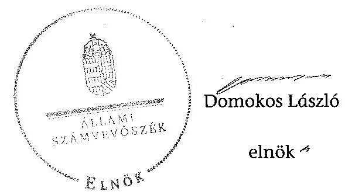

# ÁLLAMI   SZÁMVEVŐSZÉK 

## JELENTÉS

az önkormányzatok belső kontrollrendszere kialakításának, egyes
kontrolltevékenységek és a belső ellenőrzés
múködésének ellenőrzéséről
Gelse
14119
2014. július

---

# Állami Számvevőszék 

Iktatószám: V-0391-032/2014
Témaszám: 1162
Vizsgálat-azonosító szám: V064965

## Az ellenőrzést felügyelte:

Dr. Benedek Mária
felügyeleti vezető
Az ellenőrzést vezette és az ellenőrzés végrehajtásáért felelős:
Bíró Zsolt
ellenőrzésvezető
A számvevőszéki jelentés összeállításában közremüködött:
Szabó Leonóra Ildikó
számvevő tanácsos
Az ellenőrzést végezték:
Szabó Leonóra Ildikó
Számax Szilárd
számvevő tanácsos
számvevő tanácsos

---

# TARTALOMJEGYZÉK 

BEVEZETÉS ..... 5
I. ÖSSZEGZŐ MEGÁLLAPÍTÁSOK, KÖVETKEZTETÉSEK, JAVASLATOK ..... 9
II. RÉSZLETES MEGÁLLAPÍTÁSOK ..... 14

1. Az önkormányzat belső kontrollrendszerének kialakítása ..... 14
1.1. A kontrollkörnyezet ..... 14
1.2. A kockázatkezelési rendszer ..... 15
1.3. A kontrolltevékenységek ..... 15
1.4. Az információs és kommunikációs rendszer ..... 16
1.5. A monitoring rendszer ..... 17
2. A pénzügyi folyamatokban kulcsszerepet betöltő teljesítésigazolás és érvényesítés belső kontrollok múködése ..... 17
3. A belső ellenőrzés működése ..... 20

## FÜGGELÉKEK

1. számú Értelmező szótár
2. számú Az értékelés módja és szempontjai

---

.

---

# RÖVIDÍTÉSEK JEGYZÉKE 

| Törvények |  |
| :--: | :--: |
| Áht. | 2011. évi CXCV. törvény az államháztartásról (hatályos 2012. január 1-jétől) |
| ÁSZ tv. | 2011. évi LXVI. törvény az Állami Számvevőszékről |
| Info tv. | 2011. évi CXII. törvény az információs önrendelkezési jogról és az információszabadságról (hatályos 2012. január 1-jétől) |
| Kttv. | 2011. évi CXCIX. törvény a közszolgálati tisztviselők ről (hatályos 2012. március 1-jétől) |
| Mötv. | 2011. évi CLXXXIX. törvény Magyarország helyi önkormányzatairól (hatályos 2012. január 1-jétől) |
| Mvtv. | 1993. évi XCIII. törvény a munkavédelemről |
| Ötv. | 1990. évi LXV. törvény a helyi önkormányzatokról |
| Rendeletek |  |
| Áhsz. 1 | 249/2000. (XII. 24.) Korm. rendelet az államháztartás szervezetei beszámolási és könyvvezetési kötelezettségének sajátosságairól (hatálytalan 2014. január 1-jétől) |
| Áhsz. ${ }_{2}$ | 4/2013. (I. 11.) Korm. rendelet az államháztartás számviteléről (hatályos 2014. január 1-jétől) |
| Ávr. | 368/2011. (XII. 31.) Korm. rendelet az államháztartásról szóló törvény végrehajtásáról (hatályos 2012. január 1jétől) |
| Bkr. | 370/2011. (XII. 31.) Korm. rendelet a költségvetési szervek belső kontrollrendszeréről és belső ellenőrzéséről (hatályos 2012. január 1-jétől) |
| lkr. | 335/2005. (XII. 29.) Korm. rendelet a közfeladatot ellátó szervek iratkezelésének általános követelményeiről |
| Szórövidítések |  |
| ÁSZ | Állami Számvevőszék |
| belső ellenőrzési kézikönyv | Zalakaros Kistérség Többcélú Társaság Belső Ellenőrzési Kézikönyve (hatályos 2009. december 30-tól) |
| értékelési szabályzat | Gelse, Gelsesziget és Kilimán Községek Körjegyzőségének Eszközök és források értékelési szabályzata (hatályos 2006. január 1-jétől) |
| gazdálkodási jogkörök szabályzata | Gelse, Gelsesziget és Kilimán Községek Körjegyzőségének Kötelezettségvállalás, utalványozás, ellenjegyzés, érvényesítés rendjének szabályzata (hatályos: 2006. január 1jétől. a 7. számú módosítása 2011. szeptember 1-jétől, a 8. számú módosítása 2012. január 1-jétől hatályos) |
| INTOSAI | International Organization of Supreme Audit Institutions (Legfőbb Ellenőrző Intézmények Nemzetközi Szervezete) |
| iratkezelési szabályzat | Egyedi Iratkezelési Szabályzat (hatályos 2012. február 1jétől) |

---

| ISSAI | International Standards of Supreme Audit Institutions (Legfőbb Ellenőrző Intézmények Nemzetközi Standardjai) |
| :--: | :--: |
| jegyző | Gelse Közös Önkormányzati Hivatal jegyzője |
| Képviselő-testület | Gelse Község Önkormányzatának Képviselö-testülete |
| körjegyző | Gelse, Gelsesziget és Kilimán Községek Körjegyzőségének   körjegyzöje |
| Körjegyzőség | Gelse, Gelsesziget, Kilimán Községek Körjegyzősége |
| körjegyzőségi SZMSZ | Gelse, Gelsesziget és Kilimán Községek Körjegyzőségének Szervezeti és Müködési Szabályzata (hatályos: 2011. szeptember 1-jétől) |
| közös önkormányzati hivatal | Gelsei Közös Önkormányzati Hivatal |
| leltározási szabályzat | Gelse, Gelsesziget és Kilimán Községek Körjegyzőségének Eszközök és források leltározási és leltárkészítési szabály. zata (hatályos 2006. január 1-jétől) |
| NGM | Nemzetgazdasági Minisztérium |
| Önkormányzat polgármester számviteli politika | Gelse Község Önkormányzatáa Gelse Község Önkormányzatának polgármestere Gelse, Gelsesziget és Kilimán Községek Körjegyzőségének Számviteli politikája (hatályos 2006. január 1-jétől) |
| Társulás | Zalakaros Kistérség Többcélú Társulása |

---

# JELENTÉS 

## az önkormányzatok belsó kontrollrendszere kialakításának, egyes kontrolltevékenységek és a belső ellenőrzés múködésének ellenőrzéséről   Gelse

## BEVEZETÉS

Gelse község állandó lakosainak száma 2012. január 1-jén 1127 fő volt. Az Önkormányzat hét tagú Képviselő-testületének munkáját egy állandó bizottság segítette. Az Önkormányzat az önállóan múködő és gazdálkodó Körjegyzőségen kívül egy önállóan működő intézményt működtetett, többségi tulajdoni hányadú gazdasági társasággal nem rendelkezett. A polgármester a 2010. évi önkormányzati választások óta tölti be tisztségét. A körjegyzó 2011. június 6 -tól látta el feladatait. A Körjegyzőség szervezeti egységekre nem tagolódott, elkülönített gazdasági szervezettel nem rendelkezett, a foglalkoztatott köztisztviselők száma 2012. január 1-jén hét fő volt. A Körjegyzőség 2013. január 31-i hatállyal megszűnt. Garabonc, Gelse, Gelsesziget, Kilimán és Nagyrada községi önkormányzatok képviselő-testületei 2013. február 1-jétől Gelse székhellyel - közös önkormányzati hivatalt alapított. Az Önkormányzat a 2012. évi költségvetési beszámolója szerint 238659 ezer Ft tárgyévi bevételt ért el, valamint 224615 ezer Ft tárgyévi kiadást teljesített. A 2012. december 31-i könyvviteli mérleg szerint 2932161 ezer Ft értékű eszközvagyonnal rendelkezett, a rövid lejáratú kötelezettségállománya 1325533 ezer Ft, hosszú lejáratú kötelezettsége nem volt.

A demokratikus társadalmakban alapvető igény, hogy a közpénzeket, a közvagyont használók tevékenységükről elszámoljanak, ahhoz egyértelmú és érvényesíthető felelősségi szabályok társuljanak. Ennek a jogos igénynek az érvényesítéséhez meg kell teremteni azokat a folyamatokat, rendszereket, amelyek nélkülözhetetlenek az elszámoltatáshoz. Az elszámoltatás eredményes múködtetéséhez szükség van a megfelelő információs, kontroll, értékelési és beszámolási rendszerek kialakítására.

Magyarországon az uniós csatlakozási tárgyalások idejére nyúlnak vissza a belső kontrollrendszer szabályozásának gyökerei. Az uniós elvárásoknak megfelelő új terminológia szerinti államháztartási belső pénzügyi ellenőrzési (ÁBPE) rendszer területén a jogharmonizáció 2003-ban teljes körűen megvalósult, míg az önkormányzati alrendszerre vonatkozó, Ötv.-ben megjelenített speciális szabályozás 2005-ben lépett hatályba. Az államháztartási belső kontrollrendszer koncepciója 2009-ben továbbfejlődött. A változások irányát mutatja, hogy a költségvetési szervek belső kontrollrendszere már magában foglalja

---

a korszerű, felelős szervezetirányítás elemeit (kontrollkörnyezet, kockázatkezelés, kontrolltevékenység, információ és kommunikáció, monitoring) is. E kontrollrendszer szabályozása háromszintű, a törvényi előírásokat az Áht. és a Mötv., a rendeleti szintű szabályozást az Ávr. és a Bkr. tartalmazza, amelyeket útmutatói szinten az NGM által kiadott standardok és kézikönyvek támogatnak.

A belső kontrollrendszer azt a célt szolgálja, hogy a költségvetési szervek múködésük és gazdálkodásuk során a tevékenységeket szabályszerűen, gazdaságosan, hatékonyan és eredményesen hajtsák végre, teljesítsék elszámolási kötelezettségeiket és megvédjék az erőforrásokat a veszteségektől, a károktól és a nem rendeltetésszerű használattól. A belső kontrollrendszer magában foglalja mindazon szabályokat, eljárásokat, gyakorlati módszereket és szervezeti struktúrákat, kockázatkezelési technikákat, kontrolltevékenységeket, amelyek segítséget nyújtanak a szervezetnek céljai eléréséhez.

Az ÁSZ középtávú stratégiájában hangsúlyos szerepet szánt annak, hogy szilárd szakmai alapon álló, értékteremtő ellenőrzéseivel előmozdítsa a közpénzügyek átláthatóságát, rendezettségét. A számvevőszéki ellenőrzés nemzetközi alapelvei is rögzítik, hogy a megfelelő belső kontrollrendszer minimálisra csökkenti a hibák és szabálytalanságok kockázatát.

Az ellenőrzés célja annak megállapítása volt, hogy a belső kontrollrendszer elemeinek kialakítása, a pénzügyi folyamatokban kulcsszerepet betöltő teljesítésigazolás és érvényesítés, és a belső ellenőrzés szabályos működése biztosítot-ta-e az Önkormányzatnál a közpénzfelhasználás szabályosságát, hozzájárult-e az értéket teremtő rend követelményének érvényesüléséhez.

Ennek keretében értékeltük, hogy:

- a jogszabályi előírásoknak megfelelően alakították-e ki a belső kontrollrendszer elemeit;
- a gazdálkodás folyamatában kulcsszerepet betöltő teljesítésigazolás és érvényesítés kontrolltevékenységeit megfelelően működtették-e;
- biztosították-e a belső ellenőrzés szabályos működését;
- amennyiben az ÁSZ tett javaslatot a 2008-2011. évek közötti ellenőrzése kapcsán az Önkormányzatnak, intézkedtek-e azok végrehajtására.

Az ellenőrzés várható hasznosulását négy szinten tervezzük. A törvényalkotás számára összegzett tapasztalatok állnak rendelkezésre a belső kontrollrendszer önkormányzati területen való kialakításáról, működéséről és hatásairól, a belső ellenőrzés működéséről. Ennek alapján következtetést lehet levonni arról, hogy a belső kontrollrendszer kialakítására és működtetésére vonatkozó jelenlegi, differenciálás nélküli - jogszabályi előírások reális követelményeket támasztanak-e az eltérő adottságú települési önkormányzatok esetében, illetve indokolt-e esetleges jogszabályi módosítás kezdeményezése. Az ellenőrzés az ellenőrzött számára visszajelzést ad a belső kontrollrendszer kialakításában és működésében fellépő hiányosságokról, javaslataival hozzájárul azok kiküszöböléséhez, amely csökkentheti a későbbi ellenőrzések gyakoriságát. Az el-

---

lenőrzés megállapításait és javaslatait más szervezetek is hasznosíthatják a rendezett gazdálkodási keretek kialakításához. A társadalom számára jelzi, hogy közpénz nem maradhat ellenőrizetlenül, az ÁSZ értékteremtő rend kialakításához és megőrzéséhez hozzájáruló tevékenysége pozitív hatással lesz a szervezetről kialakított összkép formálásában. A szervezeten belül lehetőség nyílik arra, hogy a megállapítások szintetizálásával az ÁSZ a hozzáadott értéket teremtő elemző tevékenységét és tanácsadó szerepét is erősítse.

Az önkormányzatok belső kontrollrendszere kialakításának, egyes kontrolltevékenységek és a belső ellenőrzés működésének ellenőrzéséről szóló jelentés I. fejezetének összegző része az ellenőrzés céljára ad rövid, szintetizáló összefoglalót, és tartalmazza a következtetéseket a II. fejezet részletes megállapításain alapulóan. A jelentés intézkedést igénylő megállapításait és javaslatait az ellenőrzés során feltárt, a jelentés II. fejezetében rögzített részletes megállapítások alapozzák meg. A helyszíni ellenőrzés lezárásáig a helyi szabályozás változásait nyomon követtük.

Az ellenőrzés típusa: szabályszerűségi ellenőrzés.
Az ellenőrzött időszak: a belső kontrollrendszer kialakításának megfelelősége esetében a 2012. évre, a pénzügyi folyamatokban kulcsszerepet betöltő teljesítésigazolás és érvényesítés belső kontrollok múködésének megfelelőségét és a belső ellenőrzés szabályszerű működését a 2012. január 1. és december 31-e közötti időszak eseményeit figyelembe véve értékeltük, míg az ÁSZ javaslatainak utóellenőrzése a 2008-2011. években végzett ellenőrzések nyilvánosságra hozott jelentéseiben tett javaslatok áttekintésére terjedt ki.

# Az ellenőrzött szervezet: az Önkormányzat. 

Az ellenőrzés jogszabályi alapját az ÁSZ tv. 1. § (3) bekezdése, az 5. § (2) és (6) bekezdése, valamint az Áht. 61. § (2) bekezdésének előírásai képezik.

Az ellenőrzés szakmai módszertana az ÁSZ hivatalos honlapján (www.asz.hu) közzétett szakmai szabályokon alapult, amely az INTOSAI által kiadott ISSAI figyelembevételével készült.

Az ellenőrzés lefolytatásához az Önkormányzat a kimutatások és a tanúsítvány elektronikus kitöltésével, valamint az ÁSZ által kért dokumentumok elektronikus megküldésével szolgáltatott adatokat. Az így rendelkezésre bocsátott adatok, információk kontrollja és a munkalapok kitöltése a helyszíni ellenőrzés keretében történt. A jelentésben használt fogalmak magyarázatát az 1. számú függelék, az ellenőrzés egyes területeinek értékelésénél alkalmazott egységes minősítési szempontokat a 2. számú függelék tartalmazza.

A belső kontrollrendszer kialakításának ellenőrzése során értékeltük a kontrollkörnyezet, a kockázatkezelési rendszer, a kontrolltevékenységek, az információs és kommunikációs rendszer, valamint a monitoring rendszer szabályozottságának megfelelőségét. A pénzügyi folyamatokban kulcsszerepet betöltő teljesítésigazolás és érvényesítés kontrollok múködése megfelelőségének minősítéséhez az állományba nem tartozók megbízási díjai, a külső szolgáltatók által végzett karbantartási, kisjavítási munkák, az egyéb üzemeltetési és fenntartási

---

szolgáltatások, a rendszeres szociális segélyek, valamint az államháztartáson kívülre teljesített múködési és felhalmozási célú pénzeszközátadások közül kockázatelemzéssel választottuk ki az ellenőrzött kiadási jogcímeket. Az egyszerủ véletlen mintavétellel kiválasztott tételek ellenőrzését többlépcsős megfelelőségi tesztek útján addig végeztük, amíg elegendő és megfelelő bizonyítékot szereztünk a vizsgált folyamatok kulcskontrolljai múködésének megfelelő vagy nem megfelelő voltáról. Értékeltük az Önkormányzatnál a belső ellenőrzés múködésének szabályosságát. Az ÁSZ az 1019 számon közzétett - a helyi önkormányzatok gazdálkodási rendszerének 2009. évi ellenőrzéséről készült - számvevőszéki jelentésben az Önkormányzat számára konkrét feladatot nem határozott meg, javaslatot nem tett, így utóellenőrzésre nem került sor.

Az ÁSZ tv. 29. § (1) bekezdése szerint a jelentéstervezetet megküldtük a polgármester részére, aki az ÁSZ tv. 29. § (2) bekezdésében foglalt észrevételezési jogával nem élt, a jelentéstervezetre észrevételt nem tett.

---

# I. ÖSSZEGZŐ MEGÁLLAPÍTÁSOK, KÖVETKEZTETÉSEK, JAVASLATOK 

A belső kontrollrendszeren belül 2012-ben a kontrollkörnyezet, a kockázatkezelési rendszer, a kontrolltevékenységek, az információs és kommunikációs rendszer, valamint a monitoring rendszer kialakítását külön-külön és együttesen is értékeltük. A belső kontrollrendszer kialakítása az összesített értékelés alapján nem felelt meg a jogszabályi előírásoknak.

A belső kontrollrendszer egyes területei kialakításának minősítése a következő:

| Kontrollterïlet | Minősítés |
| :-- | :--: |
| Kontrollkörnyezet | nem |
|  | megfelelö |
| Kockázatkezelési rendszer | nem |
|  | megfelelö |
| Kontrolltevékenységek | részben |
|  | megfelelö |
| Információs és kommuni- | nem |
| kációs rendszer | megfelelö |
| Monitoring rendszer | nem |

Részben megfelelőnek értékeltük a kontrolltevékenységek kialakítását, mivel a megállapított szabályozásbeli hiányosságok nem veszélyeztették e kontrollterületen a szabályszerű működést.

Nem megfelelőnek értékeltük a kontrollkörnyezet, a kockázatkezelési rendszer, az információs és kommunikációs rendszer, valamint a monitoring rendszer kialakítását, mivel az ellenőrzésünk során megállapított szabályozásbeli hiányosságok magukban hordozzák a szabálytalan múködés, valamint a korrupció kockázatát.

A 2012. évben a külső szolgáltatók által végzett karbantartási, kisjavítási munkákkal és a rendszeres szociális segélyekkel kapcsolatos kifizetések, valamint az államháztartáson kívülre teljesített múködési és felhalmozási célú pénzeszközátadások során a pénzügyi folyamatokban kulcsszerepet betöltő teljesítésigazolás és érvényesítés belső kontrollok müködése gyenge volt. Gyengének értékeltük a két kulcskontroll együttes múködését, mivel azok nem biztosították a hibák megelőzését, feltárását.

A számvevőszéki ellenőrzés az ellenőrzött kifizetésekkel összefüggésben a rendelkezésre bocsátott dokumentumok alapján kár bekövetkezésére utaló adatot, tényt nem állapított meg, azonban a gazdálkodásban kulcsszerepet betöltő kontrollok múködésében feltárt hiányosságok miatt fennáll a hibák bekövetke-

---

zésének kockázata. A nem megfelelően működtetett belső kontrollok korrupciós kockázatot hordoznak.

Az Önkormányzat a belső ellenőrzési feladatokat Társulás útján látta el. A 2012. évben a belső ellenőrzés múködése a jogszabályi előírásoknak megfelelt, azonban a belső ellenőrzés nem tárta fel a belső kontrollrendszer kialakításának, valamint a pénzügyi folyamatokban kulcsszerepet betöltő teljesítésigazolás és érvényesítés belső kontrollok múködésének hiányosságait.

Az ÁSZ tv. 33. § (1) bekezdésében foglaltak értelmében az ellenőrzött szervezet vezetője köteles a jelentésben foglalt megállapításokhoz kapcsolódó intézkedési tervet összeállítani, és azt a jelentés kézhezvételétől számított 30 napon belül az ÁSZ részére megküldeni. Amennyiben az intézkedési tervet határidőre nem küldi meg a szervezet, vagy az ÁSZ tv. 33. § (2) bekezdésében foglalt póthatáridő elteltével megküldött intézkedési terv továbbra sem elfogadható, az ÁSZ elnöke a hivatkozott törvény 33. § (3) bekezdés a)-b) pontjaiban foglaltakat érvényesítheti.

Az ellenőrzés intézkedést igénylő megállapításai és javaslatai:

# a polgármesternek 

1. Az Önkormányzat nevében történő kötelezettségvállalás - az Áht. 37. § (1) bekezdése és az Ávr. 55. § (1) bekezdésében előírtak ellenére - pénzügyi ellenjegyzés hiányában történt.

Javaslat:
Intézkedjen, hogy az Önkormányzat nevében történő kötelezettségvállalásra az Áht. 37. § (1) bekezdésében és az Ávr. 55. § (1) bekezdésében foglaltaknak megfelelően - az Ávr. 53. §-ában meghatározott kivételekkel - kizárólag a pénzügyi ellenjegyzés után, a pénzügyi teljesítés esedékességét megelőzően, írásban kerüljön sor.
2. A számvevőszéki ellenőrzés megállapításai alapján az Önkormányzatnál a belső kontrollrendszer kialakítása összefoglalóan értékelve nem felelt meg a jogszabályi előírásoknak. A kulcskontrollok működése gyenge volt, a belső ellenőrzés működése ugyan megfelelt a jogszabályi előírásoknak, azonban nem tárta fel, ezáltal nem is javíttatta ki a hiányosságokat. A megállapított szabályozásbeli és működésbeli hiányosságok magukban hordozzák a szabálytalan működés kockázatát.

Javaslat:
Kísérje figyelemmel a Mötv. 115. § (1) bekezdésében foglaltak alapján az Önkormányzat gazdálkodásának szabályszerűségét. A Mötv. 67. § f) pontja alapján gondoskodjon a belső kontrollrendszer müködésére vonatkozó jogszabályi rendelkezések be nem tar-tása, valamint a teljesítésigazolás, illetve az érvényesítés kontrollokkal összefüggésben feltárt hiányosságok, szabálytalanságok tekintetében az esetleges munkajogi felelősséggel kapcsolatos körülmények kivizsgálásáról, majd a vizsgálat eredményének függvényében tegye meg a szükséges intézkedéseket.

---

# a jegyzőnek (Gelse Község Önkormányzata vonatkozásában) 

1. a kontrollkörnyezettel kapcsolatban:

A körjegyző az Ávr.-ben foglaltak ellenére a Körjegyzőség SZMSZ-ében nem rögzítette az ellátandó és a szakfeladatrend szerint szakfeladat számmal és megnevezéssel besorolt alaptevékenységek és az alaptevékenységeket szabályozó jogszabályok megjelölését és a költségvetési szervhez rendelt más költségvetési szervek felsorolását. A Számv. tv.-ben foglaltak ellenére a számviteli politikát, a leltározási szabályzatot, valamint az értékelési szabályzatot nem aktualizálta. Az Mvtv.-ben foglaltak ellenére nem határozta meg a Körjegyzőségen az egészséget nem veszélyeztető és biztonságos munkavégzés követelményei megvalósításának módját. A Bkr.-ben foglaltak ellenére nem készítette el a szabálytalanságok kezelésének eljárásrendjét és az ellenőrzési nyomvonalat. A körjegyző a Kttv.-ben előírtak ellenére a Körjegyzőségen dolgozó köztisztviselők munkateljesítményét írásban nem értékelte. Az Ötv.-ben előírt kötelezettsége ellenére nem készítette elő a Kttv.-ben foglaltak szerint a köztisztviselőkkel szembeni hivatásetikai alapelvek részletes tartalmának, valamint az etikai eljárás szabályainak dokumentumát [II. Részletes megállapítások, 1.1. A kontrollkörnyezet 7., 12., 17., 24.-29., 32., 34., 41. és 46-47. sorszámú megállapítás]

Javaslat:
Intézkedjen az Áht. 69. § (2) bekezdése, a Bkr. 3. § a) pontja és 6. §-a, alapján a jelentés II. Részletes megállapítások, 1.1. A kontrollkörnyezet, 7., 12., 17., 24.-29., 32., 34., 41. és 46-47. sorszámú megállapításaiban foglalt hibák, hiányosságok kijavításáról, megszüntetéséről az ott megjelölt jogszabályi rendelkezéseknek megfelelően.
2. a kockázatkezelési rendszerrel kapcsolatban:

A körjegyző a Bkr.-ben foglaltak ellenére a Körjegyzőség kockázatkezelési rendszerét nem alakította ki, nem mérte fel és nem állapította meg a Körjegyzőség tevékenységében, gazdálkodásában rejlő kockázatokat, nem határozta meg egyes kockázatokkal kapcsolatban a szükséges intézkedéseket, valamint azok teljesítésének folyamatos nyomon követési módját. [II. Részletes megállapítások, 1.2. A kockázatkezelési rendszer 1., 2., 8. és 10. sorszámú megállapítás].

Javaslat:
Intézkedjen az Áht. 69. § (2) bekezdése, a Bkr. 3. § b) pontja és 7. §-ában foglaltak alapján a jelentés II. Részletes megállapítások, 1.2. A kockázatkezelési rendszer 1., 2., 8. és 10. sorszámú megállapításaiban foglalt hibák, hiányosságok kijavításáról, megszüntetéséről az ott megjelölt jogszabályi rendelkezéseknek megfelelően.
3. a kontrolltevékenységekkel kapcsolatban:

A körjegyző a Bkr.-ben foglaltak ellenére nem biztosította minden tevékenységre vonatkozóan a folyamatba épített, előzetes, utólagos és vezetői ellenőrzést, valamint nem határozta meg a dokumentumokhoz és információkhoz való hozzáféréshez, beszámolási eljáráshoz kapcsolódó felelősségi köröket. Az Ávr-ben foglaltakat figyelmen kívül hagyva nem határozta meg az előzetes írásbeli kötelezettségvállalást nem igénylő kifizetések rendjét, valamint a beszámolási feladatok teljesítésével kapcsolatos belső előírásokat, feltételeket. Az lkr.-ben foglaltak ellenére nem határozta meg

---

az üzemeltetés és adatbiztonság feladatait, az azokhoz kapcsolódó hatásköröket. Az Info tv. előírásait figyelmen kívül hagyva nem alakította ki azokat az eljárási szabályokat, amelyek biztosítják az adatok biztonságát és védelmét [II. Részletes megállapítások, 1.3. A kontrolltevékenységek 2-5., 8., 14-17. és 19. sorszámú megállapítás]

Javaslat:
Intézkedjen az Áht. 69. § (2) bekezdése, a Bkr. 3. § c) pontja és 8. §-a alapján a jelentés II. Részletes megállapítások, 1.3. A kontrolltevékenységek 2-5., 8., 14-17. és 19. sorszámú megállapításaiban foglalt hibák, hiányosságok kijavításáról, megszüntetéséről az ott megjelölt jogszabályi rendelkezéseknek megfelelően.
4. Az információs és kommunikációs rendszerrel kapcsolatban:

A körjegyző a Bkr.-ben foglaltak ellenére nem alakított ki olyan rendszert, amely biztosítja, hogy a megfelelő információk a megfelelő időben eljutnak az illetékes szervezethez, személyhez. A körjegyző az Info tv.-ben és az Ávr.-ben foglaltak ellenére nem készítette el a Körjegyzőség adatvédelmi és adatbiztonsági szabályzatát, nem alakította ki a kötelezően közzéteendő adatok nyilvánosságra hozatalának, valamint a közérdekű adatok megismerésére irányuló igények teljesítésének rendjét. Az Önkormányzat az Info tv.-ben előírt elektronikus közzétételi kötelezettségének a 2012. évben nem tett eleget. [II. Részletes megállapítások, 1.4. Az információs és kommunikációs rendszer 1., 2. és 5-8. sorszámú megállapítás].

Javaslat:
Intézkedjen az Áht. 69. § (2) bekezdése, a Bkr. 3. § d) pontja és 9. §-a alapján a jelentés II. Részletes megállapítások, 1.4. Az információs és kommunikációs rendszer 1., 2. és 5-8. sorszámú megállapításaiban foglalt hiányosságok megszüntetéséről az ott megjelölt jogszabályi rendelkezéseknek megfelelően.
5. a monitoring rendszerrel kapcsolatban:

A körjegyző a Bkr.-ben foglaltak ellenére nem alakította ki a Körjegyzőség tevékenységének, a célok megvalósításának nyomon követését biztosító rendszert [II. Részletes megállapítások, 1.5. A monitoring rendszer 1. sorszámú megállapítás].

Javaslat:
Intézkedjen az Áht. 69. § (2) bekezdése, a Bkr. 3. § e) pontja és 10. §-a alapján a jelentés II. Részletes megállapítások, 1.5. A monitoring rendszer 1. sorszámú megállapításában foglalt hibák, hiányosságok kijavításáról, megszüntetéséről az ott megjelölt jogszabályi rendelkezéseknek megfelelően.
6. a pénzügyi folyamatokban kulcsszerepet betöltő kontrollokkal kapcsolatban:

A teljesítésigazolás és az érvényesítés, valamint az utalvány tartalma nem felelt meg az Áht.-ban és az Ávr.-ben foglaltaknak [II. Részletes megállapítások, 2. A pénzügyi folyamatokban kulcsszerepet betöltő teljesítésigazolás és érvényesítés belső kontrollok müködése 1-2. pontban foglalt megállapítás].

---

Javaslat:
Intézkedjen az Áht. 37-38. §-ában és az Ávr. 55-59. §-ában és az Áhsz. 3 39. § (1) bekezdésében és a 14. számú melléklet II. pontjában foglaltak alapján arról, hogy a teljesítésigazolás és az érvényesítés vonatkozásában, valamint azok ellenőrzése során a kötelezettségvállalással, a pénzügyi ellenjegyzéssel, a kötelezettségvállalások nyilvántartásba vételével, valamint az utalvány tartalmával kapcsolatban feltárt, a jelentés II. Részletes megállapítások, 2. A pénzügyi folyamatokban kulcsszerepet betöltő teljesítésigazolás és érvényesítés belső kontrollok múködése 1-2. pontjában szereplő megállapításokban foglalt hibák, hiányosságok kijavítása, megszüntetése az ott megjelölt jogszabályi rendelkezéseknek megfelelően történjen meg.
7. a belső ellenőrzés működésével kapcsolatban:

A belső ellenőrzés működése az értékelési szempontjait figyelembe véve megfelelt a jogszabályi előírásoknak, azonban a számvevőszéki ellenőrzés kisebb súlyú hiányosságokat tárt fel, amelyek nem feleltek meg a Bkr.-ben előírt rendelkezéseknek [II. Részletes megállapítások, 3. A belső ellenőrzés müködése, 3. a)-b)., 7., 8. a), h), 10-12., 20. a), 25. és 27. b) sorszámú megállapítása].

Javaslat:
Intézkedjen az Áht. 69. § (2) bekezdése, a Bkr. 3. § e) pontja és a 10. §-a alapján a jelentés II. Részletes megállapítások, a belső ellenőrzés müködése , 3. a)-b)., 7., 8. a), h), 10-12., 20. a), 25. és 27. b) sorszámú megállapításaiban foglalt hibák, hiányosságok kijavításáról, megszüntetéséről az ott megjelölt jogszabályi rendelkezéseknek megfelelően.

---

# II. RÉSZLETES MEGÁLLAPÍTÁSOK 

## 1. Az ÖNKORMÁNYZAT BELSŐ KONTROLLRENDSZERÉNEK KIALAKÍTÁSA

A belső kontrollrendszeren belül 2012-ben a kontrollkörnyezet, a kockázatkezelési rendszer, a kontrolltevékenységek, az információs és kommunikációs rendszer, valamint a monitoring rendszer kialakítását külön-külön és együttesen is értékeltük. A belső kontrollrendszer kialakítása az összesített értékelés alapján nem felelt meg a jogszabályi előírásoknak.

### 1.1. A kontrollkörnyezet

A kontrollkörnyezet kialakítása - a 2. számú függelékben részletezett kritériumrendszer alapján végzett értékelés szerint - nem felelt meg a jogszabályi követelményeknek, mert:

| Sor-   szám $^{1}$ | Megállapítás | Megjegyzés |
| :--: | :--: | :--: |
| 7.   12. | A körjegyzö a körjegyzőségi SZMSZ-ben nem rögzítette - az Ávr. 13. § (1) bekezdés c), i) pontjában foglaltak ellenére - az ellátandó és a szakfeladatrend szerint szakfeladat számmal és megnevezéssel besorolt alaptevékenységek és az alaptevékenységeket szabályozó jogszabályok megjelölését, valamint az irányító szerv által az Ávr. 10. § (1)-(3) bekezdése szerint a költségvetési szervhez rendelt más költségvetési szerv felsorolását. | 2014. január 1-jétől az Ávr. 13. § (1) bekezdés c) pontjának módosított szövege: „az ellátandó, és a kormányzati funkció szerint besorolt alaptevékenységek, rendszeresen ellátott vállalkozási tevékenységek, valamint az alaptevékenységet szabályozó jogszabályok megjelölését". |
| $\begin{aligned} & 17 . \\ & 24 . \\ & 29 . \end{aligned}$ | A körjegyzö - a Számv. tv. 14. § (11) bekezdésében foglaltak ellenére a törvényi változás hatályba lépését követő 90 napon belül - a számviteli politikát, a leltározási szabályzatot, valamint az értékelési szabályzatot nem aktualizálta. |  |
| 32. | A körjegyzö - az Mvtv. 2. § (3) bekezdésében foglaltak ellenére - nem határozta meg a Körjegyzőségen az egészséget nem veszélyeztető és biztonságos munkavégzés követelményei megvalósításának módját. |  |

[^0]
[^0]:    ${ }^{1}$ A megállapítás számozása az Önkormányzat által kitöltött kimutatások - adatszolgáltatások - kérdéseinek sorszámával azonos.

---

| 34., | A körjegyzö - a Bkr. 6. § (3) és (4) bekezdésében foglaltak ellenére - nem készítette el a szabálytalanságok kezelésének eljárásrendjét és az ellenőrzési nyomvonalat. |
| :--: | :--: |
| 46. | A körjegyzö - a Kttv. 130. § (1) bekezdésében elöírtak ellenére - a Körjegyzöségen dolgozó köztisztviselők munkateljesítményét írásban nem értékelte. |
| 47. | A Képviselő-testület - a Kttv. 231. § (1) bekezdésben foglaltak ellenére - nem állapította meg a Kttv. 83. §-ában előírt, a köztisztviselökkel szembeni hivatásetikai alapelvek részletes tartalmát, valamint az etikai eljárás szabályait, mivel a körjegyzö - az Ötv. 36. § (2) bekezdés a) pontjában előírt feladata ellenére - nem készítette elő ennek dokumentumát. |

Az önkormányzat müködésével kapcsolatos feladatok ellátásáról való gondoskodást 2013. január 1jétől a jegyző részére a Mötv. 81. § (3) bekezdés c) pontja írja elő.

# 1.2. A kockázatkezelési rendszer 

A kockázatkezelési rendszer kialakítása - a 2. számú függelékben részletezett kritériumrendszer alapján végzett értékelés szerint - nem felelt meg a jogszabályi előírásoknak, mert:

| Sorszám | Megállapítás |
| :--: | :--: |
| 1., 2., 8. és 10. | A körjegyzö - a Bkr. 3. § b) pontjában foglaltak ellenére - a Körjegyzőség kockázatkezelési rendszerét nem alakította ki, melynek keretében - a Bkr. 7. § (2) bekezdésében foglalt előírás ellenére - nem mérte fel és nem állapította meg a Körjegyzőség tevékenységében, gazdálkodásában rejlő kockázatokat, nem határozta meg az egyes kockázatokkal kapcsolatban a szükséges intézkedéseket, valamint azok teljesítésének folyamatos nyomon követési módját. |

### 1.3. A kontrolltevékenységek

A kontrolltevékenységek kialakítása - a 2. számú függelékben részletezett kritériumrendszer alapján végzett értékelés szerint - részben felelt meg a jogszabályi előírásoknak.

A körjegyző a kontrolltevékenységek részeként előírta a kötelezettségvállalás pénzügyi ellenjegyzésének és a teljesítés igazolásának a módját, az érvényesítés és az utalványozás rendjét.

A polgármester adott felhatalmazást kötelezettségvállalásra és utalványozásra. Kijelöltek pénzügyi ellenjegyzési és érvényesítési feladatokra a Körjegyzőség állományába tartozó köztisztviselőket, akik rendelkeztek a jogszabályban előírt szakképzettséggel. A körjegyzőségi SZMSZ-ben és a munkaköri leírásokban meghatározták a gazdálkodási feladatokat ellátó személyek helyettesítési rendjét. A körjegyzőségi SZMSZ-ben szabályozták a jogviszony megszủnése esetére a munkavállaló folyamatban lévő feladatai átadásának rendjét. Az iratkezelési szabályzatban előírták az iratok és az adatok védelmét.

---

A polgármester tájékoztatta a Képviselő-testületet az Önkormányzat gazdálkodásának első félévi, valamint első háromnegyed éves helyzetéről.

A kontrolltevékenységek kialakítása az értékelés szempontjából az alábbi kisebb súlyú hiányosságok miatt részben felelt meg a jogszabályi előírásoknak:

| Sorszám | Megállapítás |
| :--: | :--: |
| $2-5$. | A körjegyzö - a Bkr. 8. § (2) bekezdésében foglaltak ellenére - nem biztosította a beszerzési folyamat és a vagyonhasznosítási tevékenység, valamint a pénzügyi döntések - köztük a költségvetés tervezése és a támogatásokkal való elszámolás - dokumentumainak elkészitésével kapcsolatban a folyamatba épített, előzetes, utólagos és vezetői ellenőrzést. |
| 8. | A körjegyzö - az Ávr. 53. § (2) bekezdésében foglaltakat figyelmen kívül hagyva - annak ellenére nem határozta meg az előzetes írásbeli kötelezettségvállalást nem igénylő kifizetések rendjét, hogy belső szabályozásban lehetővé tette az 50 ezer Ft alatti kifizetések előzetes írásbeli kötelezettségvállalás nélküli teljesítését. |
| 14.,   15. | A körjegyzö az iratkezelési rendszer kialakítása során - az lkr. 8. § (2) bekezdésében foglaltak ellenére - nem határozta meg az üzemeltetés és az adatbiztonság feladatait, továbbá az azokhoz kapcsolódó hatásköröket. |
| 16. | A körjegyzö - az Info tv. 7. § (2)-(3) bekezdéseiben foglalt előírásokat figyelmen kívül hagyva - az informatikai rendszer szabályozása során nem tette meg azokat a technikai és szervezési intézkedéseket és nem alakította ki azokat az eljárási szabályokat, amelyek biztosítják az adatok biztonságát és védelmét. |
| 17. | A körjegyzö - a Bkr. 8. § (4) bekezdés b) és c) pontjában foglaltak ellenére - belső szabályzatban nem határozta meg a dokumentumokhoz és információkhoz való hozzáféréshez, valamint a beszámolási eljárásokhoz kapcsolódó felelősségi köröket. |
| 19. | A körjegyzö - az Ávr. 13. § (2) bekezdés a) pontjában foglaltak ellenére belső szabályzatban nem határozta meg a beszámolási feladatok teljesítésével kapcsolatos belső előírásokat, feltételeket. |

# 1.4. Az információs és kommunikációs rendszer 

Az információs és kommunikációs rendszer kialakítása - a 2. számú függelékben részletezett kritériumrendszer alapján végzett értékelés szerint nem felelt meg a jogszabályi előírásoknak, mert:

| Sorszám | Megállapítás | Megjegyzés |
| :--: | :--: | :--: |
| $1 ., 2$. | A körjegyzö - a Bkr. 3. § d) pontjában és 9. § (1) bekezdésében foglaltak ellenére nem alakított ki olyan rendszert, amely biztosítja, hogy a megfelelő információk a megfelelő időben eljutnak az illetékes szervezethez, személyhez. |  |

---

| 5. | A körjegyzö - az Info tv. 24. § (3) bekezdésében foglaltak ellenére - nem készítette el a Körjegyzőség adatvédelmi és adatbiztonsági szabályzatát. |  |
| :--: | :--: | :--: |
| 6., 8. | A körjegyzö - az Info tv. 35. § (3) és a 30. § (6) bekezdésében, valamint az Ávr. 13. § (2) bekezdés h) pontjában foglaltak ellenére a kötelezően közzéteendő adatok nyilvánosságra hozatalának rendjét nem alakította ki, a közérdekú adatok megismerésére irányuló igények teljesítésének rendjét nem szabályozta. |  |
| 7. | Az Önkormányzat - az Info tv. 33. § (1) és (3) bekezdésében foglaltak ellenére - elektronikus közzétételi kötelezettségének a 2012. évben nem tett eleget. | Az Önkormányzat a 2012. évi elemi költségvetését, költségvetési beszámolóját és mellékleteit nem tette közzé. |

# 1.5. A monitoring rendszer 

A monitoring rendszer kialakítása - a 2. számú függelékben részletezett kritériumrendszer alapján végzett értékelés szerint - nem felelt meg a jogszabályi előírásoknak, mert:

| Sor-   szám | Megállapítás |
| :-- | :-- |
| 1. | A körjegyzö - a Bkr. 3. § e) pontjában és a 10. §-ában foglaltak ellenére -   nem alakította ki a Körjegyzőség tevékenységének, a célok megvalósításának nyomon követését biztosító rendszert. |

Az Önkormányzatnál a Kormányhivatal a főbb kontrollokra vonatkozóan törvényességi felhívással, vagy más törvényességi felügyeleti eszközzel 2012-ben nem élt.

## 2. A PÉNZÜGYI FOLYAMATOKBAN KULCSSZEREPET BETÖLTŐ TELJESÍTÉSIGAZOLÁS ÉS ÉRVÉNYESÍTÉS BELSŐ KONTROLLOK MŰKÖDÉSE

A 2012. évben a külső szolgáltatók által végzett karbantartással, kisjavítással, a rendszeres szociális segélyekkel, valamint az államháztartáson kívülre teljesített múködési és felhalmozási célú pénzeszközátadásokkal kapcsolatos kifizetések során - összefoglalóan értékelve - a pénzügyi folyamatokban kulcsszerepet betöltő teljesítésigazolás és érvényesítés belső kontrollok müködésének megfelelősége gyenge volt, mert:

| Kontrollok   sorszáma | Megállapítás | Megjegyzés |
| :-- | :-- | :-- |

## Teljesítésigazolás

1. A teljesítésigazolás - az Ávr. 57. § (1) bekezdésében foglalt előírások ellenére - nem volt szabályszerü.

---

# Érvényesítés 

Az érvényesítő a Körjegyzőség kiadási előirányzata terhére teljesített kifizetéseket megelőzően - az Ávr. 58. § (1) bekezdése előírása ellenére - nem ellenőrizte az összegszerűséget.

Az érvényesítő az Önkormányzat és a Körjegyzőség kiadási előirányzata terhére teljesített kifizetéseket megelőzően - az Ávr. 58. § (1) bekezdésében foglaltak ellenére - a fedezet meglétét nem tudta ellenőrizni, mert a kötelezettségvállalásokat - az Ávr. 56. § (1) bekezdésében foglaltak ellenére - 2012-ben nem vették nyilvántartásba.

Az érvényesítő - az Ávr. 58. § (2) bekezdésének előírása ellenére - nem jelezte az utalványozónak, hogy a megelőző ügymenetben a teljesítésigazolás nem volt szabályszerű, továbbá nem tartották be az Áht. 37. § (1), valamint az Ávr. 55. § (1) bekezdéseiben foglaltakat, mivel az Önkormányzat és a Körjegyzőség kiadási előirányzata terhére kötött kötelezettségvállalásra pénzügyi ellenjegyzés nélkül került sor.

## A kulcskontrollok ellenőrzése során feltárt egyéb hiányosság

3. Az utalványon - az Ávr. 59. § (3) bekezdés f) pontjában foglaltak ellenére - nem tüntették fel a kötelezettségvállalás nyilvántartási számát.

Az Ávr. 56. § (1) bekezdése 2014. január 1-jétől módosult, a kötelezettségvállalások nyilvántartását az Áhsz. 39. § (1) bekezdés és a 14. számú melléklet II. pontja tartalmazza.

A 2012. évben a külső szolgáltatók által végzett karbantartási és kisjavítási munkák kifizetése során a teljesítésigazolás és az érvényesítés kulcskontrollok múködésének megfelelősége gyenge volt, mert:

- a teljesítésigazoló az 50 ezer Ft alatti karbantartási anyagvásárlással és a számítógép javítással kapcsolatos kifizetéseket megelőzően - az Ávr. 57. § (1) bekezdésében előírtak ellenére - szerződés, megállapodás hiányában nem ellenőrizte a kifizetések teljesítésének jogosságát, összegszerűségét és az ellenszolgáltatás teljesítését;
- a teljesítésigazoló a fénymásoló karbantartással, nyomtató telepítéssel összefüggő kifizetéseket megelőzően - az Ávr. 57. § (1) bekezdése előírása ellenére - nem ellenőrizte az összegszerűséget, mert a fénymásoló karbantartására kötött szolgáltatási megállapodás nem tartalmazta a kiszállási díjat és a nyomtató telepítés összegét;
- az érvényesítő a fénymásoló karbantartással, nyomtató telepítéssel összefüggő kifizetéseket megelőzően - az Ávr. 58. § (1) bekezdése előírása ellenére - nem ellenőrizte az összegszerűséget;

---

- az érvényesítő az Önkormányzat kiadási előirányzata terhére teljesített karbantartási anyagvásárlással, a Körjegyzőség kiadási előirányzata terhére teljesített számítógép javítással, fénymásoló karbantartással, nyomtató telepítéssel kapcsolatos kifizetéseket megelőzően - az Ávr. 58. § (1) bekezdésében foglaltak ellenére - a fedezetet nem tudta ellenőrizni, mert a kötelezettségvállalásokat - az Ávr. 56. § (1) bekezdésében foglaltak ellenére - 2012-ben nem vették nyilvántartásba, nyilvántartást nem vezettek;
- az érvényesítő - az Ávr. 58. § (2) bekezdésében előírtak ellenére - nem jelezte az utalványozónak, hogy a megelőző ügymenetben a teljesítésigazolás nem szabályszerűen történt, továbbá, hogy az Áht. 37. § (1) bekezdése és az Ávr. 55. § (1) bekezdésében foglaltakat nem tartották be, mert a fénymásoló karbantartására kötött szolgáltatási megállapodás megkötésekor a kötelezettségvállalásra pénzügyi ellenjegyzés nélkül került sor.

Az utalványon - az Ávr. 59. § (3) bekezdés f) pontjában foglaltak ellenére nem tüntették fel a kötelezettségvállalás nyilvántartási számát.

A 2012. évben a rendszeres szociális segélyek kifizetése során a teljesítésigazolás és az érvényesítés kulcskontrollok múködésének megfelelősége gyenge volt, mert:

- az érvényesítő az Önkormányzat kiadási előirányzatára teljesített szociális segélyek kifizetését megelőzően - Ávr. 58. § (1) bekezdésében foglalt előírások ellenére - nem tudta ellenőrizni a fedezet meglétét, mert a kötelezettségvállalásokról - az Ávr. 56. § (1) bekezdésében foglaltak ellenére - 2012-ben nem vezettek nyilvántartást;
- az érvényesítő - az Ávr. 58. § (2) bekezdésében előírtak ellenére - nem jelezte az utalványozónak, hogy a megelőző ügymenetben az Áht. 37. § (1) bekezdése és az Ávr. 55. § (1) bekezdésében foglaltakat nem tartották be, mert a rendszeres szociális segélyekkel kapcsolatos kötelezettségvállalásokra pénzügyi ellenjegyzés nélkül került sor.

Az utalványon - az Ávr. 59. § (3) bekezdés f) pontjában foglaltak ellenére nem tüntették fel a kötelezettségvállalás nyilvántartási számát.

A 2012. évben az államháztartáson kívülre teljesített múködési és felhalmozási célú pénzeszközátadások során a teljesítésigazolás és az érvényesítés kulcskontrollok müködésének megfelelősége gyenge volt, mert:

- az érvényesítő az Önkormányzat kiadási előirányzata terhére elszámolt, az egyesületek támogatásával kapcsolatos pénzeszközátadásokat megelőzően az Ávr. 58. § (1) bekezdésében foglalt előírások ellenére - nem tudta ellenőrizni a fedezet meglétét, mert a kötelezettségvállalásokat - az Ávr. 56. § (1) bekezdésében foglaltak ellenére - 2012-ben nem vették nyilvántartásba.

Az utalványon - az Ávr. 59. § (3) bekezdés f) pontjában foglaltak ellenére nem tüntették fel a kötelezettségvállalás nyilvántartási számát.

---

A számvevőszéki ellenőrzés az ellenőrzött kifizetésekkel összefüggésben a rendelkezésre bocsátott dokumentumok alapján kár bekövetkezésére utaló adatot, tényt nem állapított meg, azonban a gazdálkodásban kulcsszerepet betöltő kontrollok múködésében feltárt hiányosságok miatt fennáll a hibák bekövetkezésének kockázata. A nem megfelelően múködtetett belső kontrollok korrupciós kockázatot hordoznak.

# 3. A BELSŐ ELLENŐRZÉS MÜKÖDÉSE 

Az Önkormányzatnál a belső ellenőrzés múködése - a 2. számú függelékben részletezett kritériumrendszer alapján végzett értékelés szerint - megfelelte a jogszabályi előírásoknak, azonban a belső ellenőrzés nem tárta fel a belső kontrollrendszer kialakításának, valamint a pénzügyi folyamatokban kulcsszerepet betöltő teljesítésigazolás és érvényesítés belső kontrollok múködésének hiányosságait.

Az Önkormányzat a belső ellenőrzési feladatokat - képviselő-testületi döntés alapján ${ }^{2}$ - a Társulás útján látta el. A Társulás rendelkezett a munkaszervezet vezetője által jóváhagyott belső ellenőrzési kézikönyvvel. A belső ellenőrzési vezető személyét a társulási megállapodásban meghatározták.

A belső ellenőrzési vezető elkészítette a stratégiai ellenőrzési tervet, valamint a 2013. évi ellenőrzési tervet. A belső ellenőrzés végrehajtotta a 2012. évi ellenőrzési tervben foglalt ellenőrzést, elkészítette az ellenőrzési programot és az ellenőrzési jelentést. Az ellenőrzött szervezet intézkedési tervet készített, az ellenőrzési jelentésben tett javaslatok alapján megtett intézkedések végrehajtásáról a Körjegyzőségen nyilvántartást vezettek. A belső ellenőrzési vezető elkészítette az éves összefoglaló jelentést.

A belső ellenőrzés múködése az értékelés szempontjából az alábbi kisebb súlyú hiányosságok mellett megfelelt a jogszabályi előírásoknak:

| Sorszám | Megállapítás |
| :--: | :--: |
| 3. a), b) | A belső ellenőrzési kézikönyv - a Bkr 17. § (2) bekezdés a) pontjában foglaltak ellenére - nem tartalmazta a bizonyosságot adó és a tanácsadó tevékenységre vonatkozó eljárási szabályokat. |
| 7. | A Bkr. 56. § (3) bekezdés a) pontjában foglaltak ellenére stratégiai ellenőrzési tervvel az Önkormányzat nem rendelkezett. |
| 8. a), h) | A 2013. évi ellenőrzési terv - a Bkr. 31. § (4) bekezdés a) és h) pontjaiban foglaltak ellenére - nem tartalmazta az ellenőrzési tervet megalapozó elemzések és a kockázatelemzés eredményének összefoglaló bemutatását, valamint az ellenőrizendő szerv megnevezését. |
| 10. | A 2013. évi ellenőrzési terv összeállítása - a Bkr. 56. § (2) bekezdésében foglalt előírás ellenére - nem a körjegyzó írásos véleményének figyelembe vételével történt, mivel a körjegyzó véleményt, javaslatot nem fogalmazott meg. |

[^0]
[^0]:    ${ }^{2}$ Az Önkormányzat a 37/2010. (VII. 15.) számú képviselő-testületi határozat alapján csatlakozott a Társuláshoz, mely ellátja a belső ellenőrzési feladatokat is.

---

| 11. | A belső ellenőrzés a 2013. évi ellenőrzési terv összeállítását megelőzően   - a Bkr. 31. § (2) bekezdésében foglaltak ellenére - kockázatelemzést   nem készített. |
| :--: | :--: |
| 12. | A 2013. évi ellenőrzési terv - a Bkr. 31. § (2) bekezdésének előirása elle-   nére - nem alapult a stratégiai tervben és a kockázatelemzés alapján   felállított prioritásokon. |
| 20. a) | Az elvégzett ellenőrzésről készített jelentés - a Bkr. 39. § (3) bekezdés d)   pontjában foglaltak ellenére - nem tartalmazta az ellenőrzés típusát. |
| 25. | A belső ellenőrzési vezető - a Bkr. 22. § (2) bekezdés e) pontjában és az   50. §-ban foglalt előirást figyelmen kívül hagyva - az elvégzett belső   ellenőrzésekről nyilvántartást nem vezetett. |
| 27.b) | A 2011. évre vonatkozó éves (összefoglaló) ellenőrzési jelentés - a Bkr.   48. § b) pont bb) alpontjában foglaltak ellenére - nem tartalmazta a   belső kontrollrendszer öt elemének értékelését. |

Az Önkormányzat, az ÁSZ-tól a 2012. és 2013. években, a Körjegyzőség a 2011. és 2012. években integritás kérdőív kitöltésére kapott felkérést, amely lehetőséggel nem éltek. Az információs és kommunikációs rendszer kialakításának hiányosságai, a köztisztviselőkkel szembeni hivatásetikai alapelvek meghatározásának, az etikai eljárás szabályaínak és az adatvédelmi szabályzatnak a hiánya, valamint a 2013. évi belső ellenőrzési terv megalapozását szolgáló kockázatelemzés elmaradása arra utalnak, hogy az Önkormányzatnak még fejlődést kell elérnie az integritási szemlélet érvényesítésében.

Budapest, 2014. CG . hónap 30 . nap

Függelék: $\quad 2 \mathrm{db}$

---

# **Chemistry**

## **Chemical Reactions**

### **Balancing Chemical Equations**

1. **Write the unbalanced equation:**
   - Example: $$C_3H_8 + O_2 \rightarrow CO_2 + H_2O$$

2. **Balance the equation:**
   - Example: $$2C_3H_8 + 7O_2 \rightarrow 6CO_2 + 8H_2O$$

3. **Balance the equation:**
   - Example: $$2C_3H_8 + 7O_2 \rightarrow 6CO_2 + 8H_2O$$

4. **Balance the equation:**
   - Example: $$2C_3H_8 + 7O_2 \rightarrow 6CO_2 + 8H_2O$$

### **Types of Reactions**

1. **Combination Reaction:**
   - Example: $$2H_2 + O_2 \rightarrow 2H_2O$$

2. **Decomposition Reaction:**
   - Example: $$2H_2O_2 \rightarrow 2H_2O + O_2$$

3. **Single Displacement Reaction:**
   - Example: $$Zn + 2HCl \rightarrow ZnCl_2 + H_2$$

4. **Double Displacement Reaction:**
   - Example: $$AgNO_3 + NaCl \rightarrow AgCl + NaNO_3$$

5. **Combustion Reaction:**
   - Example: $$CH_4 + 2O_2 \rightarrow CO_2 + 2H_2O$$

## **Stoichiometry**

### **Mole Concept**

- **Mole (mol):** The amount of substance containing as many particles (atoms, molecules, ions) as there are atoms in exactly 12 grams of carbon-12.
- **Avogadro's Number:** $$6.022 \times 10^{23}$$ particles per mole.

### **Molar Mass**

- **Molar Mass:** The mass of one mole of a substance.
- Example: The molar mass of water ($$H_2O$$) is 18.015 g/mol.

### **Calculations**

1. **Moles to Mass:**
   - Formula: $$n = \frac{m}{M}$$
   - Example: Calculate the number of moles of $$H_2O$$ in 18 grams of water.
     - $$n = \frac{18.015 \, \text{g}}{18.015 \, \text{g/mol}} = 18.015 \, \text{g/mol}$$

2. **Moles to Mass:**
   - Formula: $$m = n \times M$$
   - Example: Calculate the mass of 18.015 g of water.
     - $$m = 18.015 \, \text{g/mol} = 18.015 \, \text{g/mol}$$

## **Gas Laws**

### **Ideal Gas Law**

- **Equation:** $$PV = nRT$$
- **Variables:**
  - $$P$$: Pressure (atm)
  - $$V$$: Volume (L)
  - $$n$$: Number of moles (mol)
  - $$R$$: Ideal gas constant (0.0821 L·atm/mol·K)
  - $$T$$: Temperature (K)

### **Boyle's Law**

- **Equation:** $$P_1V_1 = P_2V_2$$
- **Variables:**
  - P₁: Pressure (atm)
  - P₂: Volume (L)
  - P₃: Temperature (K)
  - P₁: Pressure (atm)
  - P₂: Volume (L)
  - P₃: Temperature (K)
  - P₁: Pressure (atm)

### **Boyle's Law**

- **Equation:** $$\frac{P_1V_1}{P_2V_2} = \frac{P_2V_2}{T_1} = \frac{P_1}{T_2}$$

## **Thermochemistry**

### **Enthalpy (H)**

- **Definition:** The heat content of a system at constant pressure.
- **Equation:** $$\Delta H = q_p$$
- **Variables:**
  - $$q_p$$: Heat transferred at constant pressure.
  - $$q_p^0$$: Change in heat capacity at constant pressure.

### **Hess's Law**

- **Statement:** The enthalpy change for a reaction is the same whether it occurs in one step or multiple steps.
- **Equation:** $$\Delta H = q_p + \Delta H_0$$
- **Variables:**
  - $$q_p$$: Heat transferred at constant pressure.
  - $$q_p^0$$: Change in enthalpy change for a reaction is the same whether it occurs in one step or multiple steps.
  - $$q_p^1$$: Change in enthalpy change for a reaction is the same whether it occurs in multiple steps.

### **Hess's Law 2.0**

- **Statement:** The enthalpy change for a reaction is the same whether it occurs in one step or multiple steps.
- **Equation:** $$\Delta H = q_p + \Delta H_0$$
- **Variables:**
  - $$q_p$$: Heat transferred at constant pressure.
  - $$q_p^0$$: Change in enthalpy change for a reaction is the same whether it occurs in one step or multiple steps.
  - $$q_p^1$$: Change in enthalpy change for a reaction is the same whether it occurs in multiple steps.

## **Electrochemistry**

### **Oxidation and Reduction**

- **Oxidation:** Loss of electrons.
- **Reduction:** Gain of electrons.

### **Galvanic Cells**

- **Definition:** A cell that converts chemical energy into electrical energy.
- **Components:**
  - Anode: Oxidation occurs.
  - Cathode: Reduction occurs.
  - Salt Bridge: Connects the two half-cells.

### **Nernst Equation**

- **Equation:** $$E = E^\circ - \frac{RT}{nF} \ln Q$$
- **Variables:**
  - $$E$$: Energy (K)
  - $$E^\circ$$: Standard deviation (m)
  - $$R$$: Ideal gas constant (0.0821 L·atm/mol·K)
  - $$T$$: Temperature (K)
  - $$n$$: Number of moles (mol)
  - $$F$$: Faraday constant (96,485 C/mol)
  - $$Q$$: Reaction quotient

---

# ÉRTELMEZŐ SZÓTÁR 

belső ellenőrzés
belső kontrollrendszer
belső kontrollrendszer területei
egyszerű véletlen mintavétel
integritás
kockázat
kockázatkezelési rendszer

Független, tárgyilagos bizonyosságot adó és tanácsadó tevékenység, amelynek célja, hogy az ellenőrzött szervezet múködését fejlessze és eredményességét növelje, az ellenőrzött szervezet céljai elérése érdekében rendszerszemléletű megközelítéssel és módszeresen értékeli, illetve fejleszti az ellenőrzött szervezet irányítási és belső kontrollrendszerének hatékonyságát. (Forrás: Bkr. 2. § b) pontja)
A belső kontrollrendszer a kockázatok kezelése és tárgyilagos bizonyosság megszerzése érdekében kialakított folyamatrendszer, amely azt a célt szolgálja, hogy a múködés és gazdálkodás során a tevékenységeket szabályszerűen, gazdaságosan, hatékonyan, eredményesen hajtsák végre, az elszámolási kötelezettségeket teljesítsék, megvédjék az erőforrásokat a veszteségektől, károktól és nem rendeltetésszerű használattól. (Forrás: Áht. 69. § (1) bekezdése)
A kontrollkörnyezet, a kockázatkezelési rendszer, a kontrolltevékenységek, az információs és kommunikációs rendszer, valamint a nyomon követési (monitoring) rendszer. (Forrás: Bkr. 3. §-a)

Az alapsokaságból egyszerủ véletlen kiválasztással képzett részsokaság. (Forrás: Az ÁSZ ellenőrzési mintavételezés támogatásához készült segédletének 4.1.1. pontja)
Az integritás elvek, értékek, cselekvések, módszerek, intézkedések konzisztenciáját jelenti: olyan magatartásmódot, amely meghatározott értékeknek felel meg. Az integritás a közszféra esetében a társadalom által elvárt nyilvánossági, átláthatósági, illetve jogi/etikai normáknak történő megfelelést jelenti.
(Forrás: a http://integritas.asz.hu honlapon közzétett „A 2012. évi integritás felmérés eredményeinek összefoglalója" címú dokumentum 3. oldal 1. bekezdése)
A kockázat annak a valószínűségét jelenti, hogy egy vagy több esemény vagy intézkedés nem kívánt módon befolyásolja a rendszer múködését, céljainak megvalósulását. (Forrás: Javaslatok a korrupciós kockázatok kezelésére - Kockázatkezelési és ellenőrzési módszertan 35. oldal, ÁSZ)
Olyan irányítási eszközök és módszerek összessége, melynek elemei a szervezeti célok elérését veszélyeztető tényezők (kockázatok) azonosítása, elemzése, csoportosítása, nyomon követése, valamint szükség esetén a kockázati kitettség mérséklése. (Forrás: Bkr. 2. § m) pontja)

---

kontrollkörnyezet
kontrolltevékenységek
kommunikáció
korrupció
kulcskontrollok
lényegesség
megfelelőségi teszt

A kontrollkörnyezet alakítja ki a szervezet belső kontrollrendszerhez való viszonyát, hozzáállását, befolyásolja az alkalmazottak belső kontrollal kapcsolatos tudatosságát, magatartását. Elemei a személyes és szakmai elkötelezettség és a vezetés, valamint az alkalmazottak által vallott erkölcsi értékek; a szakmai hozzáértés iránti elkötelezettség; a felső vezetés hozzáállása - a vezetés filozófiája és tevékenységének stílusa; a szervezeti struktúra; a humánerőforrás-politika és gazdálkodási gyakorlat.
A kontrolltevékenységek azok a politikák és eljárások, amelyeket a kockázatok megoldására hoznak létre a szervezet céljainak teljesítése érdekében.
Az a tevékenység, melynek során információ továbbítása valósul meg. A kommunikációs folyamat résztvevői között tájékoztatás történik, mely során tényeket, ezek magyarázatát közlik. „A szervezetben eredményes kommunikációnak kell áramlania lefelé, horizontálisan és felfelé, a szervezet egészében és annak valamennyi elemében."
Azok a cselekmények, amelyek során a köz érdekében való eljárással megbízott és döntéshozatali felelősséggel felruházott személy a köz érdeke helyett önös vagy részérdekeket követve, mástól jogtalan vagy etikátlan előnyt elfogadva és őt jogtalan vagy etikátlan előnyhöz juttatva jár el, illetve amikor valaki a köz érdekében való eljárással megbízott és döntéshozatali felelősséggel felruházott személynek jogtalan vagy etikátlan előnyt nyújtva vagy felajánlva jogtalan vagy etikátlan előnyt kér. (Forrás: A Kormány korrupció megelőzési programja 2012-2014.)
Az azonosított kockázatok mérséklése érdekében kialakított kontrollok közül azok, amelyek elégtelen működése esetén a szervezetet jelentős veszteség érheti, vagy a működéstükben bekövetkező hiba/hiányosság más kontrollok eredményességét csökkenti. Ezek ellenőrzése, értékelése elegendő bizonyítékot szolgáltat adott területen a kontrollrendszer értékeléséhez. Az önkormányzatok kontrollrendszere kialakításának ellenőrzése során a pénzügyi folyamatokban kulcsszerepet betöltő belső kontrollok a teljesítésigazolás és az érvényesítés.
Egy információ akkor lényeges, ha hiánya vagy téves állítása befolyásolhatja ezen információkat felhasználók döntéseit, véleményét. Az ellenőrzés során a lényegesség három szempontból értelmezhető: érték, jelleg és összefüggés szerint.
Az ellenőrzés során alkalmazott módszer - szekvenciális (megállásos) megfelelőségi teszt - lényege, hogy a kiválasztott minta ellenőrzését csak addig végezzük, amíg elegendő és megfelelő bizonyítékot nem szerzünk az ellenőrzött kulcskontroll (teljesítésigazolás, érvényesítés) múködésének megfelelő vagy nem megfelelő voltáról.

---

monitoring (nyomon követési rendszer)
utóellenőrzés

A monitoring a különböző szintű szervezeti célok megvalósításának folyamatát kíséri figyelemmel, melynek során a releváns eseményekről és tevékenységekről (együtt: folyamatokról) rendszeres jelleggel, strukturált, döntéstámogató információkhoz jutnak a szervezet vezetői.
Az intézkedések nyomon követése érdekében elrendelt ellenőrzés, amelynek célja, hogy a belső ellenőrzés bizonyosságot szerezzen az elfogadott intézkedések végrehajtásáról vagy arról a tényről, hogy ha az ellenőrzött szerv, illetve az ellenőrzött szervezeti egység vezetője nem, vagy nem az elfogadott intézkedésnek megfelelően hajtja végre az intézkedéseket, továbbá meggyőződni arról, hogy a végrehajtott intézkedésekkel a megállapított kockázat ténylegesen megszűnt, vagy a kockázati tűréshatár alá csökkent. (Forrás: Bkr. 2. § s) pontja)

---

.

---

# Az értékelés módja és szempontjai 

## A belső kontrollrendszer kialakítása megfelelő́ségének értékelése az öt területre vonatkoztatva

Megfelelő a belső kontrollrendszer kialakítása, amennyiben az öt területen (kontrollkörnyezet, kockázatkezelési rendszer, kontrolltevékenységek, információs és kommunikációs rendszer, monitoring rendszer kialakítása) összesen elért és elérhető pontok százalékban kifejezett hányadosa eléri a $81 \%$-ot, és egyik terület sem kapott nem megfelelő értékelést.

Részben megfelelő a kontrollrendszer kialakítása, ha az önkormányzat teljesíti a meghatározott valamennyi főbb kritériumot (amelyeket - 10 kritérium - a program 5. számú melléklete tartalmazza), és az öt munkalapon összesen elért és elérhető pontok százalékban kifejezett hányadosa a $61 \%$-ot meghaladja, és legfeljebb egy terület értékelése nem megfelelő volt.

Nem megfelelő a belső kontrollrendszer kialakítása, amennyiben az önkormányzat nem teljesíti a meghatározott bármelyik főbb kritériumot, vagy az öt munkalapon összesen elért és elérhető pontok százalékban kifejezett hányadosa $0-60 \%$ közötti, vagy egynél több terület értékelése nem megfelelő volt.

A megfelelőség minősítése a következők szerint történik:
A minősítés - részben automatizált - a belső kontrollrendszer kialakítására vonatkozó kérdéseket tartalmazó munkalapokon, az elérhető és az elért pontszámok alapján az alábbi képlettel, számítógépes program segítségével történt, melynek összefüggése:

$$
\frac{\text { Elért pont }}{\text { Elérhető pont }} \times 100=\ldots \ldots . \%
$$

A belső kontrollrendszer egyes területei kialakítása megfelelőségénél alkalmazandó minősítés:

- nem megfelelő
$0-60 \%$-ig
- részben megfelelő
$61-80 \%$-ig
- megfelelő
$81 \%$ fölött.

---

# Az ellenőrzött önkormányzat belső kontrollrendszere kialakítása megfelelőségének főbb kritériumai 

| $\begin{aligned} & \text { Sor- } \\ & \text { szám } \end{aligned}$ | Kérdés: | Szempont: |
| :--: | :--: | :--: |
|  | A kontrollkörnyezet kialakítása (2. számú munkalap, kimutatás) |  |
| 1. | A polgármesteri hiva-   tal ${ }^{1}$ rendelkezik-e ala-   pító okirattal? | A polgármesteri hivatal alapító okirata az Äht. 8. § (4) bekez-   désében előírtaknak megfelelően elkészült, tartalmazza az   Ävr. 5. § (1) bekezdésében elöírtakat, kiemelten a c) pont   szerinti alaptevékenységeit. |
| 2. | A polgármesteri hiva-   tal rendelkezik-e szer-   vezeti és müködési   szabályzattal? | A polgármesteri hivatal rendelkezik az Äht. 10. § (5) bekez-   désben elöírt - 2010. január 1-jét követően jóváhagyott vagy   módosított - SZMSZ-szel. A költségvetési szerv feladatai ellátá-   sának részletes belső rendjét és módját - törvényben vagy   kormányrendeletben meghatározott módon és tartalommal -   szervezeti és müködési szabályzata állapítja meg. |
| 3. | Meghatározták-e a   vagyongazdálkodás   szabályait önkor-   mányzati rendeletben? | Az önkormányzat a vagyongazdálkodás szabályait önkor-   mányzati rendeletben meghatározta, és az összhangban van   az Mötv. 109. § (4) bekezdése, a Nemzeti vagyonról szóló   2011. évi CXCVI. tv. 18. § (1) bekezdése tartalmával, és a 18.   § (12) bekezdésében meghatározottak szerint az 5. § (5)-(7)   bekezdésében foglaltaknak megfelelően 2012. október 31-ig   azt módosították. |
| 4. | A polgármesteri hiva-   tal rendelkezik-e szám-   viteli politikával? | A polgármesteri hivatal rendelkezik az Ähsz. 8. § (3) bekez-   désben elöírt - 2010. január 1-jét követően hatályba helyezett   vagy aktualizált - számviteli politikával. A jogszabályhely   rögzíti, hogy a Számv. tv. és az e rendeletben foglaltak szerint   az államháztartás szervezetének szakmai feladatai és sajátos-   ságai figyelembevételével ki kell alakítania és írásban szabályoztia számviteli politikáját. |
| 5. | A polgármesteri hiva-   tal rendelkezik-e pénz-   kezelési szabályzattal? | A polgármesteri hivatal rendelkezik az Ähsz. 8. § (4) bekezdés   d) pontjában elöírt - 2010. január 1-jét követően hatályba   helyezett vagy aktualizált - pénzkezelési szabályzattal. A   jogszabályhely előírja, hogy a számviteli politika keretében el   kell készíteni a pénzkezelési szabályzatot. |
| 6. | A polgármesteri hiva-   tal rendelkezik-e leltá-   rozási és leltárkészítési   szabályzattal? | A polgármesteri hivatal rendelkezik az Ähsz. 8. § (4) bekezdés   a) pontjában elöírt - 2008. január 1-jét követően hatályba   helyezett vagy aktualizált - eszközök és források leltározási és   leltárkészítési szabályzatával. |

[^0]
[^0]:    ${ }^{1}$ Polgármesteri hivatal alatt a polgármesteri hivatalt, a főpolgármesteri hivatalt, a megyei önkormányzati hivatalt és a körjegyzöséget is érteni kell.

---

| Sorszám | Kérdés: | Szempont: |
| :--: | :--: | :--: |
| 7. | A polgármesteri hivatal gazdasági szervezetének van-e ügyrendje? | A polgármesteri hivatal rendelkezik a gazdasági szervezet ügyrendjével vagy az azzal egyenértékű szabályozással (Ávr. 9. § (5) bekezdés), vagy az Ávr. 13. § (5) bekezdésében foglaltakat az SZMSZ-ben vagy más belső szabályzatban szabályozta (Áht. 10. § (5) bekezdés), és a szabályozást 2010. január 1jét követően felülvizsgálták, aktualizálták. Elfogadható az is, ha a gazdasági feladatokat a polgármesteri hivatalon belül több szervezeti egység látja el, és azoknak önálló ügyrendjük van, illetve ha a polgármesteri hivatal nem tagolódik szervezeti egységekre, és ezért önálló gazdasági szervezettel nem rendelkezik, azonban az SZMSZ-ben vagy más belső szabályozásban rögzítik az ügyrend kötelező elemeit. |
| 8. | A polgármesteri hiva-   tal rendelkezik-e ellen-   őrzési nyomvonallal? | Az ellenőrzési nyomvonal, folyamatleírás a polgármesteri hivatal tevékenységeire vonatkozóan elkészült, és azt 2010. január 1-jét követően felülvizsgálták, aktualizálták. A szabályzat minta megtalálható a Pénzügyminisztérium Belső kontroll kézikönyv, 2010. 18. és a 19. számú mellékletében. A Bkr. 6. § (3) bekezdésében előírtak szerint a költségvetési szerv vezetője köteles elkészíteni és rendszeresen aktualizálni a költségvetési szerv ellenőrzési nyomvonalát, amely a költségvetési szerv múködési folyamatainak szöveges vagy táblázatba foglalt vagy folyamatábrákkal szemléltetett leírása, amely tartalmazza különösen a felelősségi és információs szinteket és kapcsolatokat, irányítási és ellenőrzési folyamatokat, lehetővé téve azok nyomon követését és utólagos ellenőrzését. |
|  | Az információ és kommunikáció szabályozása és kialakítása (5. számú munkalap, kimutatás) |  |
| 9. | Az önkormányzat eleget tett-e az elektronikus közzétételi kötelezettségének? | Az Önkormányzat az Info tv. 33. § (1) és (3) bekezdésében foglaltaknak megfelelően, saját vagy közösen müködtetett honlapon elektronikus formában bárki számára hozzáférhetően közzé tette az Info tv. 1. számú mellékletében felsoroltak közül legalább az éves költségvetését, a költségvetési beszámolóját, a Képviselő-testület rendeletelt. |
| 10. | A polgármesteri hivatal rendelkezik-e iratkezelési szabályzattal? | A polgármesteri hivatal rendelkezik az Ltv. 10. § (1) bek. c) pontjában előírt iratkezelési szabályzattal. |

# A két kulcskontroll minősítése 

A kulcskontrollok - teljesítésigazolás, érvényesítés - múködésének értékelése megfelelőségi tesztek segítségével történt. A kontrollok múködésének megfelelőségére vonatkozó következtetést az értékelő táblázatban elért súlyozott pontszám, továbbá az eredendő kockázat minősítésétől függően két vagy három kiadási jogcím alapján fogalmaztuk meg. Az értékeléshez alkalmazandó arányszámok kialakítását számítógépes program segítségével központilag az ellenőrzésben közreműködő informatikai támogató végezte az önkormányzatok által elektronikus úton megadott adatokból.

A minősítés automatizált, a megfelelőségi tesztek kitöltésével számítógépes program segítségével történik, melynek összefüggése:

---

| Elérhető pontszám: | Elért súlyozott pontszám értékelése: |
| :--: | :--: |
| $0-70$ | „gyenge" |
| $71-90$ | „jó" |
| $91-100$ | "kiváló" |

- „kiváló"a kontrollok múködése, ha megfelel a szabályozásoknak és a legmagasabb szintű elvárásoknak a müködésbeli hibák megelőzése, feltárása és kijavítása tekintetében; amennyiben a kontrollok müködésének megfelelőségét a helyszíni ellenőrzési munkalap értékelése alapján kiválónak minősítettük, azonban esetleges kisebb - az egységesen meghatározott követelményrendszerben foglalt $10 \%$-ot el nem érő mértékű - hiányosságokat tártunk fel, az összességében kiváló minősítést alátámasztó pozitív megállapításon túl ezeket a hiányosságokat a jelentésben ismertetjük a javaslataink megalapozása érdekében;
- „jó" a kontrollok müködésének megfelelősége, ha azok a megállapított kisebb (tolerálható mértékű) hiányosságok mellett kielégítik az elvárásokat a müködésbeli hibák megelőzése, feltárása, és kijavítása tekintetében, a megállapított hiányosságok nem veszélyeztették a hibák megelőzését, feltárását és kijavítását, továbbá ismertetjük azokat a területeket is, ahol az előírt ellenőrzési, egyeztetési feladatokat nem végezték el;
- "gyenge" a kontrollok múködése, ha a kontrollok müködésében túl sok hiányosság fordul elő ahhoz, hogy megbízhatónak lehessen azokat minősíteni. Ismertetjük a jelentésben azokat a területeket, ahol az előírt ellenőrzési, egyeztetési feladatokat nem végezték el, amely hiányosságok a belső kontrollok megfelelőségének „gyenge" minősítését okozták.

# A belső ellenőrzés szabályszerú múködésének értékelése 

A belső ellenőrzés múködését a 2012. évben történt ellenőrzés tervezési és végrehajtási tevékenységének tapasztalatai alapján értékeljük a munkalapok (kimutatások) kérdéseire adott válaszok alapján, melynek megállapítása az elérhető és az elért pontokból az alábbi képlettel, számítógépes program segítségével történt:

$$
\frac{\text { Elért pont }}{\text { Elérhető pont }} \quad \times 100=\ldots \ldots . . \%
$$

A belső ellenőrzés müködésének megfelelőségénél alkalmazandó minősítés:

- nem felelt meg
$0-60 \%$-ig;
- megfelel
$61-80 \%$-ig;
- jól megfelel
$81 \%$ fölött.