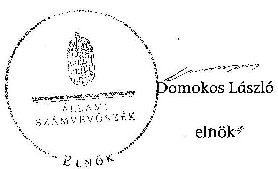

# ÁLLAMI   SZÁMVEVŐSZÉK 

## JELENTÉS

az önkormányzatok belső kontrollrendszere kialakításának, egyes
kontrolltevékenységek és a belső ellenőrzés
működésének ellenőrzéséről
Kunszentmárton

---

# Állami Számvevőszék 

Iktatószám: V-0400-038/2014
Témaszám: 1372
Vizsgálat-azonosító szám: V064946

## Az ellenőrzést felügyelte:

Dr. Benedek Mária
felügyeleti vezető
Az ellenőrzést vezette és az ellenőrzés végrehajtásáért felelős:
Bíró Zsolt
ellenőrzésvezető
A számvevőszéki jelentés összeállításában közreműködött:
Dr. Szöllősi Zsolt
számvevő
Az ellenőrzést végezték:
Csordás Péterné
Számvevő

Dr. Szöllősi Zsolt
számvevő

---

# TARTALOMJEGYZÉK 

BEVEZETÉS ..... 5
I. ÖSSZEGZŐ MEGÁLLAPÍTÁSOK, KÖVETKEZTETÉSEK, JAVASLATOK ..... 9
II. RÉSZLETES MEGÁLLAPÍTÁSOK ..... 14

1. Az önkormányzat belső kontrollrendszerének kialakítása ..... 14
1.1. A kontrollkörnyezet ..... 14
1.2. A kockázatkezelési rendszer ..... 15
1.3. A kontrolltevékenységek ..... 16
1.4. Az információs és kommunikációs rendszer ..... 17
1.5. A monitoring rendszer ..... 17
2. A pénzügyi folyamatokban kulcsszerepet betöltő teljesítésigazolás és érvényesítés belső kontrollok működése ..... 18
3. A belső ellenőrzés működése ..... 20

## FÜGGELÉKEK

1. számú Értelmező szótár
2. számú Az értékelés módja és szempontjai

---

.

---

# RÖVIDÍTÉSEK JEGYZÉKE 

## Törvények

Áht.
ÁSZ tv.
Info tv.

Kttv.

Mötv.

Ötv.
Vagyonnyilatkozattételről szóló tv.

## Rendeletek

Ávr.

Bkr.
képviselő-testületi SZMSZ
vagyongazdálkodási rendelet

## Szórövidítések

adatvédelmi és adatbiztonsági szabályzat

ÁBPE
ÁSZ
belső ellenőrzési kézikönyv
bizonylati rend
etikai kódex
értékelési szabályzat
2011. évi CXCV. törvény az államháztartásról (hatályos 2012. január 1-jétől)
2011. évi LXVI. törvény az Állami Számvevőszékről
2011. évi CXII. törvény az információs önrendelkezési jogról és az információszabadságról (hatályos 2012. január 1-jétől)
2011. évi CXCIX. törvény a közszolgálati tisztviselőkről (hatályos 2012. március 1-jétől)
2011. évi CLXXXIX. törvény Magyarország helyi önkormányzatairól (hatályos 2012. január 1-jétől)
1990. évi LXV. törvény a helyi önkormányzatokról
2007. évi CLII. törvény az egyes vagyonnyilatkozat-tételi kötelezettségekről

368/2011. (XII. 31.) Korm. rendelet az államháztartásról szóló törvény végrehajtásáról (hatályos 2012. január 1-jétől)
370/2011. (XII. 31.) Korm. rendelet a költségvetési szervek belső kontrollrendszeréről és belső ellenőrzéséről (hatályos 2012. január 1-jétől)
Kunszentmárton Város Önkormányzatának 20/2012. (VI. 1.) önkormányzati rendeletével módosított 19/2011 (III. 25.) önkormányzati rendelete az Önkormányzat Szervezeti és Működési Szabályzatáról (hatályos 2011. április 1-jétől)
Kunszentmárton Város Önkormányzata Képviselőtestületének többször módosított 8/2012. (II. 29.) önkormányzati rendelete az önkormányzat vagyonáról és vagyongazdálkodásáról

Kunszentmárton Város Polgármesteri Hivatala Közszolgálati Adatvédelmi Szabályzata (hatályos 2006. január 1-jétől)
államháztartási belső pénzügyi ellenőrzés
Állami Számvevőszék
Kunszentmárton Város Polgármesteri Hivatala Belső Ellenőrzési Kézikönyve (hatályos 2012. április 30-ától)
Kunszentmárton Város Polgármesteri Hivatala Bizonylati rendje (hatályos 2012. április 1-jével)
Kunszentmárton Város Polgármesteri Hivatala Etikai Kódexe (hatályos 2012. július 1-jétől)
Kunszentmárton Város Polgármesteri Hivatala Eszközök és források értékelési szabályzata (hatályos 2012. július 1-jétől)

---

gazdasági program
gazdálkodási szabályzat
hivatali SZMSZ

INTOSAI
iratkezelési szabályzat
ISSAI
jegyző
Képviselő-testület
Kormányhivatal
közös önkormányzati hivatal
leltározási és leltárkészítési szabályzat

NGM
Önkormányzat
pénzkezelési szabályzat
polgármester
Polgármesteri Hivatal
szabálytalanságkezelés
eljárásrendje
számlarend
számviteli politika
tűzvédelmi szabályzat
Ügyrendi Bizottság

Kunszentmárton Város Gazdasági Programja 2011-2014. évre (hatályos 2011. április 14-étől)
Kunszentmárton Város Polgármesteri Hivatalának Gazdálkodási Szabályzata (hatályos 2012. január 1-jétől)
Kunszentmárton Város Polgármesteri Hivatalának Szervezeti és Működési Szabályzata (hatályos 2010. december 16-ától)
International Organization of Supreme Audit Institutions (Legfőbb Ellenőrző Intézmények Nemzetközi Szervezete)
Kunszentmárton Város Polgármesteri Hivatala Iratkezelési Szabályzata (hatályos 2007. január 1-jétől)
International Standards of Supreme Audit Institutions (Legfőbb Ellenőrző Intézmények Nemzetközi Standardjai)
Kunszentmárton Város Önkormányzatának jegyzője
Kunszentmárton Város Önkormányzatának Képviselőtestülete
Jász-Nagykun-Szolnok Megyei Kormányhivatal
Kunszentmártoni Közös Önkormányzati Hivatal
Kunszentmárton Város Polgármesteri Hivatala Eszközök és források leltározási és leltárkészítési szabályzata (hatályos 2012. április 1-jétől)
Nemzetgazdasági Minisztérium
Kunszentmárton Város Önkormányzata
Kunszentmárton Város Polgármesteri Hivatala Pénzkezelési szabályzata (hatályos 2012. április 1-jétől)
Kunszentmárton Város polgármestere
Kunszentmárton Város Polgármesteri Hivatala
Kunszentmárton Város Polgármesteri Hivatala Szabálytalanságok kezelésének eljárásrendje (hatályos 2012. november 1-jétől)
Kunszentmárton Város Polgármesteri Hivatala Számlarendje (hatályos 2012. április 1-jétől)
Kunszentmárton Város Polgármesteri Hivatala Számviteli politikája (hatályos 2012. január 1-jétől)
Kunszentmárton Város Polgármesteri Hivatala Tűzvédelmi szabályzata (hatályos 2012. május 23-ától)
Kunszentmárton Város Önkormányzat Képviselőtestületének Ügyrendi Bizottsága

---

# JELENTÉS 

## az önkormányzatok belső kontrollrendszere kialakításának, egyes kontrolltevékenységek és a belső ellenőrzés működésének ellenőrzéséről Kunszentmárton

## BEVEZETÉS

Kunszentmárton város állandó lakosainak száma 2012. január 1-jén 8755 fő volt. Az Önkormányzat kilenctagú Képviselő-testületének munkáját öt állandó bizottság segítette. Az Önkormányzat az önállóan működő és gazdálkodó Polgármesteri Hivatalon kívül öt önállóan működő intézményt ${ }^{1}$ működtetett, kettő többségi tulajdoni hányadú gazdasági társasággal rendelkezett. A polgármester az 1998. évi önkormányzati választások óta tölti be tisztségét, a jegyző 2000. szeptember 18-ától látja el feladatait. A Polgármesteri Hivatal öt szervezeti egységre tagolódott, elkülönített gazdasági szervezettel nem rendelkezett, a foglalkoztatott köztisztviselők száma 2012. január 1-jén 57 fő volt. Kunszentmárton Város Önkormányzat Képviselő-testülete, Csépa Község Önkormányzatának Képviselő-testületével 2013. március 1-jétől Kunszentmárton székhellyel - közös önkormányzati hivatalt hozott létre. Az Önkormányzat a 2012. évi költségvetési beszámolója szerint 2511184 ezer Ft tárgyévi bevételt ért el, valamint 2409642 ezer Ft tárgyévi kiadást teljesített. A 2012. december 31-i könyvviteli mérleg szerint 6746057 ezer Ft értékű eszközvagyonnal rendelkezett, a rövid lejáratú kötelezettségállománya 552435 ezer Ft, hosszú lejáratú kötelezettség állománya 1185004 ezer Ft volt.

A demokratikus társadalmakban alapvető igény, hogy a közpénzeket, a közvagyont használók tevékenységükről elszámoljanak, ahhoz egyértelmű és érvényesíthető felelősségi szabályok társuljanak. Ennek a jogos igénynek az érvényesítéséhez meg kell teremteni azokat a folyamatokat, rendszereket, amelyek nélkülözhetetlenek az elszámoltatáshoz. Az elszámoltatás eredményes működtetéséhez szükség van a megfelelő információs, kontroll, értékelési és beszámolási rendszerek kialakítására.

Magyarországon az uniós csatlakozási tárgyalások idejére nyúlnak vissza a belső kontrollrendszer szabályozásának gyökerei. Az uniós elvárásoknak meg-

[^0]
[^0]:    ${ }^{1}$ Városi Egészségügyi Központ Kunszentmárton, Szociális Alapellátási Központ és Bölcsőde, Kunszentmártoni Általános Művelődési Központ, Kunszentmártoni Gimnázium és Szakképző Iskola, Kunszentmártoni Önkormányzat Városgondnoksága.

---

felelő új terminológia szerinti államháztartási belső pénzügyi ellenőrzési (ÁBPE) rendszer területén a jogharmonizáció 2003-ban teljes körűen megvalósult, míg az önkormányzati alrendszerre vonatkozó, Ötv.-ben megjelenített speciális szabályozás 2005-ben lépett hatályba. Az államháztartási belső kontrollrendszer koncepciója 2009-ben továbbfejlődött. A változások irányát mutatja, hogy a költségvetési szervek belső kontrollrendszere már magában foglalja a korszerű, felelős szervezetirányítás elemeit (kontrollkörnyezet, kockázatkezelés, kontrolltevékenység, információ és kommunikáció, monitoring) is. E kontrollrendszer szabályozása háromszintű, a törvényi előírásokat az Áht. és a Mötv., a rendeleti szintű szabályozást az Ávr. és a Bkr. tartalmazza, amelyeket útmutatói szinten az NGM által kiadott standardok és kézikönyvek támogatnak.

A belső kontrollrendszer azt a célt szolgálja, hogy a költségvetési szervek működésük és gazdálkodásuk során a tevékenységeket szabályszerűen, gazdaságosan, hatékonyan és eredményesen hajtsák végre, teljesítsék elszámolási kötelezettségeiket és megvédjék az erőforrásokat a veszteségektől, a károktól és a nem rendeltetésszerű használattól. A belső kontrollrendszer magában foglalja mindazon szabályokat, eljárásokat, gyakorlati módszereket és szervezeti struktúrákat, kockázatkezelési technikákat, kontrolltevékenységeket, amelyek segítséget nyújtanak a szervezetnek céljai eléréséhez.

Az ÁSZ középtávú stratégiájában hangsúlyos szerepet szánt annak, hogy szilárd szakmai alapon álló, értékteremtő ellenőrzéseivel előmozdítsa a közpénzügyek átláthatóságát, rendezettségét. A számvevőszéki ellenőrzés nemzetközi alapelvei is rögzítik, hogy a megfelelő belső kontrollrendszer minimálisra csökkenti a hibák és szabálytalanságok kockázatát.

Az ellenőrzés célja annak megállapítása volt, hogy a belső kontrollrendszer elemeinek kialakítása, a pénzügyi folyamatokban kulcsszerepet betöltő teljesítésigazolás és érvényesítés, és a belső ellenőrzés szabályos működése biztosította-e az Önkormányzatnál a közpénzfelhasználás szabályosságát, hozzájárult-e az értéket teremtő rend követelményének érvényesüléséhez.

Ennek keretében értékeltük, hogy:

- a jogszabályi előírásoknak megfelelően alakították-e ki a belső kontrollrendszer elemeit;
- a gazdálkodás folyamatában kulcsszerepet betöltő teljesítésigazolás és érvényesítés kontrolltevékenységeit megfelelően működtették-e;
- biztosították-e a belső ellenőrzés szabályos működését;
- amennyiben az ÁSZ tett javaslatot a 2008-2011. évek közötti ellenőrzése kapcsán az Önkormányzatnak, intézkedtek-e azok végrehajtására.

Az ellenőrzés várható hasznosulását négy szinten tervezzük. A törvényalkotás számára összegzett tapasztalatok állnak rendelkezésre a belső kontrollrendszer önkormányzati területen való kialakításáról, működéséről és hatásairól, a belső ellenőrzés működéséről. Ennek alapján következtetést lehet levonni arról, hogy a belső kontrollrendszer kialakítására és működtetésére vonatkozó -

---

jelenlegi, differenciálás nélküli - jogszabályi előírások reális követelményeket támasztanak-e az eltérő adottságú települési önkormányzatok esetében, illetve indokolt-e esetleges jogszabályi módosítás kezdeményezése. Az ellenőrzés az ellenőrzött számára visszajelzést ad a belső kontrollrendszer kialakításában és működésében fellépő hiányosságokról, javaslataival hozzájárul azok kiküszöböléséhez, amely csökkentheti a későbbi ellenőrzések gyakoriságát. Az ellenőrzés megállapításait és javaslatait más szervezetek is hasznosíthatják a rendezett gazdálkodási keretek kialakításához. A társadalom számára jelzi, hogy közpénz nem maradhat ellenőrizetlenül, az ÁSZ értékteremtő rend kialakításához és megőrzéséhez hozzájáruló tevékenysége pozitív hatással lesz a szervezetről kialakított összkép formálásában. A szervezeten belül lehetőség nyílik arra, hogy a megállapítások szintetizálásával az ÁSZ a hozzáadott értéket teremtő elemző tevékenységét és tanácsadó szerepét is erősítse.

Az önkormányzatok belső kontrollrendszere kialakításának, egyes kontrolltevékenységek és a belső ellenőrzés működésének ellenőrzéséről szóló jelentés I. fejezetének összegző része az ellenőrzés céljára ad rövid, szintetizáló összefoglalót, és tartalmazza a következtetéseket a II. fejezet részletes megállapításain alapulóan. A jelentés intézkedést igénylő megállapításait és javaslatait az ellenőrzés során feltárt, a jelentés II. fejezetében rögzített részletes megállapítások alapozzák meg. A helyszíni ellenőrzés lezárásáig a helyi szabályozás változásait nyomon követtük.

Az ellenőrzés típusa: szabályszerűségi ellenőrzés.
Az ellenőrzött időszak: a belső kontrollrendszer kialakításának megfelelősége esetében a 2012. évre, a pénzügyi folyamatokban kulcsszerepet betöltő teljesítésigazolás és érvényesítés belső kontrollok működésének megfelelőségét és a belső ellenőrzés szabályszerű működését a 2012. január 1. és december 31-e közötti időszak eseményeit figyelembe véve értékeltük, míg az ÁSZ javaslatainak utóellenőrzése a 2008-2011. években végzett ellenőrzések nyilvánosságra hozott jelentéseiben tett javaslatok áttekintésére terjedt ki.

# Az ellenőrzött szervezet: az Önkormányzat. 

Az ellenőrzés jogszabályi alapját az ÁSZ tv. 1. § (3) bekezdése, az 5. § (2) és (6) bekezdése, valamint az Áht. 61. § (2) bekezdésének előírásai képezik.

Az ellenőrzés szakmai módszertana az ÁSZ hivatalos honlapján (www.asz.hu) közzétett szakmai szabályokon alapult, amely az INTOSAI által kiadott ISSAI figyelembevételével készült.

Az ellenőrzés lefolytatásához az Önkormányzat a kimutatások és a tanúsítvány elektronikus kitöltésével, valamint az ÁSZ által kért dokumentumok elektronikus megküldésével szolgáltatott adatokat. Az így rendelkezésre bocsátott adatok, információk kontrollja és a munkalapok kitöltése a helyszíni ellenőrzés keretében történt. A jelentésben használt fogalmak magyarázatát az 1. számú függelék, az ellenőrzés egyes területeinek értékelésénél alkalmazott egységes minősítési szempontokat a 2. számú függelék tartalmazza.

---

A belső kontrollrendszer kialakításának ellenőrzése során értékeltük a kontrollkörnyezet, a kockázatkezelési rendszer, a kontrolltevékenységek, az információs és kommunikációs rendszer, valamint a monitoring rendszer szabályozottságának megfelelőségét. A pénzügyi folyamatokban kulcsszerepet betöltő teljesítésigazolás és érvényesítés kontrollok működése megfelelőségének minősítéséhez az állományba nem tartozók megbízási díjai, a külső szolgáltatók által végzett karbantartási, kisjavítási munkák, az egyéb üzemeltetési és fenntartási szolgáltatások, a rendszeres szociális segélyek, valamint az államháztartáson kívülre teljesített működési és felhalmozási célú pénzeszközátadások közül kockázatelemzéssel választottuk ki az ellenőrzött kiadási jogcímeket. Az egyszerű véletlen mintavétellel kiválasztott tételek ellenőrzését többlépcsős megfelelőségi tesztek útján addig végeztük, amíg elegendő és megfelelő bizonyítékot szereztünk a vizsgált folyamatok kulcskontrolljai működésének megfelelő vagy nem megfelelő voltáról. Értékeltük az Önkormányzatnál a belső ellenőrzés működésének szabályosságát. Az ÁSZ az Önkormányzatnál a 2009. évben a helyi önkormányzatok gazdálkodási rendszerének ellenőrzését végezte, a nyilvánosságra hozott, 1019 számon közzétett számvevőszéki jelentésben azonban az Önkormányzat számára konkrét feladatot nem határozott meg, javaslatot nem tett, ezért a jelen ellenőrzés keretében utóellenőrzésre nem került sor.

Az ÁSZ tv. 29. § (1) bekezdése szerint a jelentéstervezetet megküldtük a polgármester részére, aki az ÁSZ tv. 29. § (2) bekezdésében foglalt észrevételezési jogával nem élt, a jelentéstervezetre
 észrevételt nem tett.

---

# I. ÖSSZEGZŐ MEGÁLLAPÍTÁSOK, KÖVETKEZTETÉSEK, JAVASLATOK 

A belső kontrollrendszeren belül 2012-ben a kontrollkörnyezet, a kockázatkezelési rendszer, a kontrolltevékenységek, az információs és kommunikációs rendszer, valamint a monitoring rendszer kialakítását külön-külön és együttesen is értékeltük. A belső kontrollrendszer kialakítása az összesített értékelés alapján megfelelt a jogszabályi előírásoknak.

A belső kontrollrendszer egyes területei kialakításának minősítése a következő:

| Kontrollterület | Minősítés |
| :-- | :-- |
| Kontrollkörnyezet | megfelelő |
| Kockázatkezelési rendszer | megfelelő |
| Kontrolltevékenységek | megfelelő |
| Információs és kommunikációs rendszer | megfelelő |
| Monitoring rendszer |  |

Megfelelőnek értékeltük a kontrollkörnyezet, a kockázatkezelési rendszer, a kontrolltevékenységek, valamint az információs és kommunikációs rendszer kialakítását, mivel az a jogszabályi előírásokban foglaltakat figyelembe véve kisebb hiányosságok mellett is megteremtette e kontrollterületeken a szabályszerű működés lehetőségét.

Részben megfelelőnek értékeltük a monitoring rendszer kialakítását, mivel a megállapított szabályozásbeli hiányosságok nem veszélyeztették e kontrollterületen a szabályszerű működését.

A 2012. évben az állományba nem tartozók megbízási díjaival, valamint a külső szolgáltatók által végzett karbantartási, kisjavítási munkákkal kapcsolatos kifizetések során a pénzügyi folyamatokban kulcsszerepet betöltő teljesítésigazolás és érvényesítés belső kontrollok működése gyenge volt. Gyengének értékeltük a két kulcskontroll együttes működését, mivel azok nem biztosították a hibák megelőzését, feltárását.

A számvevőszéki ellenőrzés az ellenőrzött kifizetésekkel összefüggésben a rendelkezésre bocsátott dokumentumok alapján kár bekövetkezésére utaló adatot, tényt nem állapított meg, azonban a gazdálkodásban kulcsszerepet betöltő kontrollok működésében feltárt hiányosságok miatt fennáll a hibák bekövetkezésének kockázata. A nem megfelelően működtetett belső kontrollok korrupciós kockázatot hordoznak.

Az Önkormányzat a belső ellenőrzési feladatokat főállású belső ellenőr tevékenysége által látta el. A 2012. évben a belső ellenőrzés működése a jog-

---

szabályi előírásoknak jól megfelelt, azonban a belső ellenőrzés nem tárta fel a pénzügyi folyamatokban kulcsszerepet betöltő teljesítésigazolás és érvényesítés belső kontrollok működésének hiányosságait.

Az ÁSZ tv. 33. § (1) bekezdésében foglaltak értelmében az ellenőrzött szervezet vezetője köteles a jelentésben foglalt megállapításokhoz kapcsolódó intézkedési tervet összeállítani, és azt a jelentés kézhezvételétől számított 30 napon belül az ÁSZ részére megküldeni. Amennyiben az intézkedési tervet határidőre nem küldi meg a szervezet, vagy az ÁSZ tv. 33. § (2) bekezdésében foglalt póthatáridő elteltével megküldött intézkedési terv továbbra sem elfogadható, az ÁSZ elnöke a hivatkozott törvény 33. § (3) bekezdés a)-b) pontjaiban foglaltakat érvényesítheti.

Az ellenőrzés intézkedést igénylő megállapításai és javaslatai:

# a polgármesternek 

1. A polgármester mint kötelezettségvállaló - az Ávr. 57. § (4) bekezdésében foglaltak ellenére - nem jelölte ki 2012. március 30-át követően írásban az Önkormányzat kiadási előirányzatai vonatkozásában a teljesítésigazolásra jogosult személyeket.

Javaslat:
Jelöljön ki írásban az Önkormányzat kiadási előirányzatai vonatkozásában teljesítésigazolásra jogosult személyeket az Ávr. 57. § (4) bekezdésében foglaltaknak megfelelően.
2. A számvevőszéki ellenőrzés megállapításai alapján az Önkormányzatnál a kulcskontrollok működése gyenge volt, a belső ellenőrzés működése ugyan jól megfelelt a jogszabályi előírásoknak, azonban nem tárta fel, ezáltal nem is javíttatta ki a számvevőszéki ellenőrzés során feltárt hiányosságokat. A megállapított szabályozásbeli és működésbeli hiányosságok magukban hordozzák a szabálytalan működés kockázatát.

Javaslat:
A Mötv. 115. § (1) bekezdésében foglaltak alapján kísérje figyelemmel az Önkormányzat gazdálkodásának szabályszerűségét. A Mötv. 67. § f) pontja alapján gondoskodjon a teljesítésigazolás, illetve az érvényesítés kontrollokkal összefüggésben feltárt hiányosságok, szabálytalanságok tekintetében az esetleges munkajogi felelősséggel kapcsolatos körülmények kivizsgálásáról, majd a vizsgálat eredményének függvényében tegye meg a szükséges intézkedéseket.
3. A vagyonnyilatkozat-tételi kötelezettség teljesítésének ellenőrzése során megállapítást nyert, hogy a Vagyonnyilatkozat-tételről szóló tv. 3. § (3) e) pontjában foglaltak ellenére a Képviselő-testület bizottságának nem helyi önkormányzati képviselő tagjai a vagyonnyilatkozat tételi kötelezettségüknek a 2012. évben nem tettek eleget. Az őrzésért felelős Ügyrendi Bizottság a Vagyonnyilatkozat-tételről szóló tv. 8. § (4) bekezdésében foglaltak ellenére nem tájékoztatta a bizottság nem helyi önkormányzati képviselő tagjait a vagyonnyilatkozat-tételi kötelezettség fennállásáról és esedékesség-

---

ének időpontjáról, továbbá a 10. § (1) bekezdésében foglaltak ellenére - írásban nem szólította fel arra, hogy vagyonnyilatkozat-tételi kötelezettségüket teljesítsék.

Javaslat:
A Mötv. 65. §-ában foglaltak alapján kezdeményezze a Képviselő-testületnél a Mötv. 57. § (2) bekezdésének, valamint a helyi önkormányzati képviselők jogállásának egyes kérdéseiről szóló 2000. évi XCVI. törvény 10/A. § (3) bekezdésének megfelelően a vagyonnyilatkozatok vizsgálatáért felelősként kijelölt Ügyrendi Bizottságnak a vagyonnyilatkozat-tételi kötelezettség teljesítésére vonatkozó eljárásának szabályszerűségével kapcsolatos körülményei kivizsgálását, majd a vizsgálat eredményének függvényében kezdeményezze a Képviselő-testületnél a szükséges intézkedések megtételét.

# a jegyzőnek (Kunszentmárton Város vonatkozásában) 

1. a kontrollkörnyezettel kapcsolatban:

A jegyző az Ávr.-ben foglaltak ellenére a hivatali SZMSZ-ben nem rögzítette az alaptevékenységet szabályozó jogszabályok megjelölését, valamint az irányító szerv által a költségvetési szervhez rendelt más költségvetési szervek felsorolását, valamint a Kttv.-ben foglaltak ellenére nem készítette el a Polgármesteri Hivatalban dolgozó köztisztviselők teljesítményértékelését [II. Részletes megállapítások, 1.1. A kontrollkörnyezet, 7., 12. és 46. sorszámú megállapítás].

Javaslat:
Intézkedjen az Áht. 69. § (2) bekezdése, a Bkr. 3. § a) pontja és 6. §-a, valamint a Kttv. 130. § (1) bekezdése alapján a jelentés II. Részletes megállapítások, 1.1. A kontrollkörnyezet 7., 12. és 46. sorszámú megállapításaiban foglalt hibák, hiányosságok kijavításáról, megszüntetéséről az ott megjelölt jogszabályi rendelkezéseknek megfelelően.
2. a kockázatkezelési rendszerrel kapcsolatban:

A Vagyonnyilatkozat-tételről szóló tv.-ben foglaltak ellenére a vagyonnyilatkozattételre kötelezettek vagyonnyilatkozat-tételi kötelezettségét a képviselő-testületi SZMSZ-ben nem tüntették fel [II. Részletes megállapítások, 1.2. A kockázatkezelési rendszer, 13. sorszámú megállapítás].

Javaslat:
Intézkedjen az Áht. 69. § (2) bekezdése, a Bkr. 3. § b) pontja és 7. §-a és a Vagyonnyilatkozat-tételről szóló tv. alapján a jelentés II. Részletes megállapítások, 1.2. A kockázatkezelési rendszer 13. sorszámú megállapításaiban foglalt hibák, hiányosságok kijavításáról, megszüntetéséről az ott megjelölt jogszabályi rendelkezéseknek megfelelően.

---

3. a kontrolltevékenységekkel kapcsolatban:

A jegyző - az Ávr.-ben foglaltakat figyelmen kívül hagyva - nem határozta meg az előzetes írásbeli kötelezettségvállalást nem igénylő kifizetések rendjét, az érvényesítési feladatra nem jelölt ki a Polgármesteri Hivatal állományában dolgozó köztisztviselőt. [II. Részletes megállapítások, 1.3. A kontrolltevékenységek, 8., 10. és 29. sorszámú megállapítás]

Javaslat:
Intézkedjen az Áht. 69. § (2) bekezdése, a Bkr. 3. § c) pontja és 8. §-a alapján a jelentés II. Részletes megállapítások, 1.3. A kontrolltevékenységek 8., 10. és 29. sorszámú megállapításaiban foglalt hibák, hiányosságok kijavításáról, megszüntetéséről az ott megjelölt jogszabályi rendelkezéseknek megfelelően.
4. az információs és kommunikációs rendszerrel kapcsolatban:

A jegyző - a Bkr.-ben foglaltak ellenére - nem alakított ki olyan rendszert, amely biztosítja, hogy a megfelelő információk a megfelelő időben eljutnak az illetékes szervezeti egységhez, személyhez [II. Részletes megállapítások, 1.4. Az információs és kommunikációs rendszer 1. sorszámú megállapítás].

Javaslat:
Intézkedjen az Áht. 69. § (2) bekezdése, a Bkr. 3. § d) pontja és 9. §-a alapján a jelentés II. Részletes megállapítások, 1.4. Az információs és kommunikációs rendszer 1. sorszámú megállapításában foglalt hibák, hiányosságok kijavításáról, megszüntetéséről az ott megjelölt jogszabályi rendelkezéseknek megfelelően.
5. a monitoring rendszerrel kapcsolatban:

A jegyző - a Bkr. előírása ellenére - nem alakította ki a Polgármesteri Hivatal tevékenységének, a célok megvalósításának nyomon követését biztosító rendszerét, továbbá nem készített külső ellenőrzések megállapításainak hasznosítására intézkedési tervet [II. Részletes megállapítások, 1.5. A monitoring rendszer 1. és 12. sorszámú megállapítás].

Javaslat:
Intézkedjen az Áht. 69. § (2) bekezdése, a Bkr. 3. § e) pontja és 10. §-a alapján a jelentés II. Részletes megállapítások, 1.5. A monitoring rendszer 1. és 12. sorszámú megállapításában foglalt hibák, hiányosságok kijavításáról, megszüntetéséről az ott megjelölt jogszabályi rendelkezéseknek megfelelően.
6. a pénzügyi folyamatokban kulcsszerepet betöltő kontrollokkal kapcsolatban:

A teljesítésigazolás és az érvényesítés, valamint az utalvány tartalma nem felelt meg az Áht.-ban és az Ávr.-ben foglaltaknak [II. Részletes megállapítások, 2. A pénzügyi folyamatokban kulcsszerepet betöltő teljesítésigazolás és érvényesítés belső kontrollok működése, 1-3. pontban foglalt megállapítás].

---

Javaslat:
Intézkedjen az Áht. 37-38. §-ában és az Ávr. 55-59. §-ában foglaltak alapján arról, hogy a teljesítésigazolás és az érvényesítés vonatkozásában, valamint azok ellenőrzése során a kötelezettségvállalások nyilvántartásba vételével és az utalvány tartalmával kapcsolatban feltárt, a jelentés II. Részletes megállapítások, 2. A pénzügyi folyamatokban kulcsszerepet betöltő teljesítésigazolás és érvényesítés belső kontrollok működése 1-3. pontjában szereplő megállapításokban foglalt hibák, hiányosságok kijavítása, megszüntetése az ott megjelölt jogszabályi rendelkezéseknek megfelelően történjen meg.
7. a belső ellenőrzés működésével kapcsolatban:

A belső ellenőrzés működése az értékelési szempontjait figyelembe véve jól megfelelt a jogszabályi előírásoknak, azonban a számvevőszéki ellenőrzés kisebb súlyú hiányosságokat tárt fel, amelyek nem feleltek meg a Bkr.-ben előírt rendelkezéseknek [II. Részletes megállapítások, 3. A belső ellenőrzés működése, 7 b). és 13. sorszámú megállapítása].

Javaslat:
Intézkedjen az Áht. 69. § (2) bekezdése, a Bkr. 3. § e) pontja és a 10. §-a alapján a jelentés II. Részletes megállapítások, 3. A belső ellenőrzés működése 7. b) és 13. sorszámú megállapításában foglalt hibák, hiányosságok kijavításáról, megszüntetéséről az ott megjelölt jogszabályi rendelkezéseknek megfelelően.

---

# II. RÉSZLETES MEGÁLLAPÍTÁSOK 

## 1. AZ ÖNKORMÁNYZAT BELSŐ KONTROLLRENDSZERÉNEK KIALAKÍTÁSA

A belső kontrollrendszeren belül 2012-ben a kontrollkörnyezet, a kockázatkezelési rendszer, a kontrolltevékenységek, az információs és kommunikációs rendszer, valamint a monitoring rendszer kialakítását külön-külön és együttesen is értékeltük. A belső kontrollrendszer kialakítása az összesített értékelés alapján megfelelt a jogszabályi előírásoknak.

### 1.1. A kontrollkörnyezet

A kontrollkörnyezet kialakítása - a 2. számú függelékben részletezett kritériumrendszer alapján végzett értékelés szerint - a jogszabályi előírásoknak megfelelt.

A Polgármesteri Hivatal rendelkezett a Képviselő-testület által elfogadott alapító okirattal. Az Önkormányzat rendelkezett a Képviselő-testület által elfogadott - 2011-2014. évekre vonatkozó - gazdasági programmal, valamint képviselőtestületi SZMSZ-szel, amely tartalmazta a Képviselő-testület működésének szabályait. A Képviselő-testület meghatározta a teljesítményértékelés alapját képező célokat és a jogszabályi előírásoknak megfelelően önkormányzati rendeletben előírta a vagyongazdálkodás szabályait.

A Polgármesteri Hivatal rendelkezett hivatali SZMSZ-szel, a jogszabályi előírásoknak megfelelő számviteli politikával, számlarenddel, bizonylati renddel, a szabálytalanságkezelés eljárásrendjével, etikai kódexszel, pénzkezelési-, leltározási és leltárkészítési-, értékelési-, valamint tűzvédelmi szabályzattal. A jegyző a jogszabályi előírásoknak megfelelően kialakította az intézmények számviteli rendjét, meghatározta az egészséget nem veszélyeztető és biztonságos munkavégzés követelményei megvalósításának módját.

A Polgármesteri Hivatalban dolgozó munkatársak rendelkeztek munkaköri leírással. Írásos formában rögzítették az ellenőrzési nyomvonalat és gondoskodtak naprakészen tartásáról.

A kontrollkörnyezet kialakítása az értékelés szempontjából az alábbi kisebb súlyú hiányosságok mellett megfelelt a jogszabályi előírásoknak:

| Sorszám $^{2}$ | Megállapítás | Megjegyzés |
| :--: | :--: | :--: |
| 7.,   12. | A jegyző a hivatali SZMSZ-ben - az Ávr. 13.   § (1) bekezdés c) és i) pontjában foglaltak | 2014. január 1-jétől az Ávr. 13. § (1) bekezdés c) |

[^0]
[^0]:    ${ }^{2}$ A megállapítás számozása az Önkormányzat által kitöltött kimutatások - adatszolgáltatások - kérdéseinek sorszámával azonos.

---

|  | ellenére - nem rögzítette az alaptevékenységet szabályozó jogszabályok megjelölését, valamint az irányító szerv által az Ávr. 10. § (1)-(3) bekezdése szerint a költségvetési szervhez

 rendelt más költségvetési szervek felsorolását. | pontjának módosított szövege: „az ellátandó, és a kormányzati funkció szerint besorolt alaptevékenységek, rendszeresen ellátott vállalkozási tevékenységek, valamint az alaptevékenységet szabályozó jogszabályok megjelölését". |
| :--: | :--: | :--: |
| 46. | A jegyző - a Kttv. 130. § (1) bekezdésében foglaltak ellenére - a Polgármesteri Hivatalban dolgozó 39 fő köztisztviselő munkateljesítményét írásban nem értékelte. | 57 főből 18 köztisztviselő részére készült teljesítményértékelés. |

# 1.2. A kockázatkezelési rendszer 

A kockázatkezelési rendszer kialakítása - a 2. számú függelékben részletezett kritériumrendszer alapján végzett értékelés szerint - megfelelt a jogszabályi előírásoknak.

A Polgármesteri Hivatal tevékenységeiben rejlő kockázatokat felmérték és beazonosították. Meghatározták az azonosított kockázatok bekövetkezési valószínűségét és hatását, valamint a kockázati tűréshatárokat. A tevékenységeket kockázati érték alapján rangsorolták, és meghatározták az egyes kockázatokkal kapcsolatban szükséges intézkedéseket, valamint azok teljesítése nyomon követésének módját. A kockázatkezelés során a csalás és korrupció kockázatát is értékelték. A szabálytalanságkezelési eljárásrendben rögzítették a súlyosabb szabálytalanságok kezelésének módját.

A kockázatkezelési rendszer az értékelés szempontjából az alábbi kisebb súlyú hiányosságok mellett megfelelt a jogszabályi előírásoknak:

| Sor-   szám | Megállapítás |
| :-- | :-- |
| 13. | A Vagyonnyilatkozat-tételről szóló tv. 4. § d) pontjaiban foglalt előírások   ellenére a képviselő-testületi SZMSZ-ben a Képviselő-testület bizottságai   nem helyi önkormányzati képviselő tagjainak vagyonnyilatkozat-tételi   kötelezettségét nem tüntették fel. |
| 14. | A Vagyonnyilatkozat-tételről szóló tv. 3. § (3) e) pontjában foglaltak ellenére a Képviselő-testület bizottságainak nem képviselő tagjai - összesen hat fő - vagyonnyilatkozat-tételi kötelezettségüknek a 2012. évben nem tettek eleget. Az őrzésért felelős Ügyrendi Bizottság - a Vagyonnyilatkozat-tételről szóló tv. 8. § (4) bekezdésében foglaltak ellenére nem tájékoztatta a bizottságok nem helyi önkormányzati képviselő tagjait a vagyonnyilatkozat-tételi kötelezettség fennállásáról és esedékességének időpontjáról, továbbá a 10. § (1) bekezdésében foglaltak ellenére - írásban nem szólította fel a vagyonnyilatkozat-tételre kötelezetteket, hogy kötelezettségüket a felszólítás kézhezvételétől számított nyolc napon belül teljesítsék. |

---

# 1.3. A kontrolltevékenységek 

A kontrolltevékenységek kialakítása - a 2. számú függelékben részletezett kritériumrendszer alapján végzett értékelés szerint - a jogszabályi előírásoknak megfelelt.

A kontrolltevékenységek részeként előírták a folyamatba épített, előzetes, utólagos és vezetői ellenőrzést. A jegyző a gazdálkodási szabályzatban meghatározta a kötelezettségvállalás pénzügyi ellenjegyzése és a teljesítésigazolás módját, az érvényesítés, valamint az utalványozás rendjét. A pénzügyi ellenjegyzési feladatra a jogszabályi előírásoknak megfelelően kijelölt Polgármesteri Hivatal állományába tartozó köztisztviselők rendelkeztek az előírt szakképzettséggel. A jegyző kijelölte a Polgármesteri Hivatal nevében történt kötelezettségvállalásokhoz kapcsolódóan a teljesítésigazolásra jogosult személyeket.

A jegyző a jogszabályi előírásoknak megfelelően gondoskodott az iratkezelési szoftver által kezelt adatok biztonságáról, kialakította az üzembiztonsági, adatvédelmi szabályok érvényre juttatásához szükséges eljárási szabályokat. A jogszabályi előírásoknak megfelelően szabályozták az üzemeltetés és adatbiztonság feladatait és meghatározták az ehhez kapcsolódó hatásköröket. A jegyző az informatikai rendszer szabályozása során a jogszabályi előírásoknak megfelelően megtette azokat a technikai és szervezési intézkedéseket és kialakította azokat az eljárási szabályokat, amelyek biztosítják az adatok biztonságát és védelmét, valamint meghatározták a hozzáférési jogosultságokhoz a kapcsolódó felelősségi köröket.

A jegyző meghatározta a beszámolók elkészítésének feladatait, a kapcsolódó felelősségi köröket, továbbá a gazdasági feladatot ellátó vezetők és alkalmazottak helyettesítésének rendjét.

Szabályozták munkaviszony megszűnése (megszüntetése) esetére a munkavállaló folyamatban lévő feladatai ellátásának rendjét.

A kontrolltevékenységek kialakítása az értékelés szempontjából az alábbi kisebb súlyú hiányosságok mellett megfelelt a jogszabályi előírásoknak:

| Sorszám | Megállapítás |
| :--: | :--: |
| 8. | A jegyző - az Ávr. 53. § (2) bekezdésében foglaltakat figyelmen kívül hagyva - annak ellenére nem határozta meg az előzetes írásbeli kötelezettségvállalást nem igénylő kifizetések rendjét, hogy a belső szabályozásban lehetővé tette a 100 ezer Ft-ot el nem érő kifizetések előzetes írásbeli kötelezettségvállalás nélküli teljesítését. |
| 10. | A polgármester mint kötelezettségvállaló - az Ávr. 57. § (4) bekezdésében foglaltak ellenére - nem jelölte ki 2012. március 30-át követően írásban az Önkormányzat kiadási előirányzatai vonatkozásában a teljesítésigazolásra jogosult személyeket. |
| 29. | A jegyző - az Ávr. 58. § (4) bekezdésének előírását figyelmen kívül hagyva az érvényesítési feladatra nem jelölt ki a Polgármesteri Hivatal állományában dolgozó köztisztviselőt. |

---

# 1.4. Az információs és kommunikációs rendszer 

Az információs és kommunikációs rendszer kialakítása - a 2. számú függelékben részletezett kritériumrendszer alapján végzett értékelés szerint megfelelt a jogszabályi előírásoknak.

A Polgármesteri Hivatal rendelkezett az Info tv. előírásainak megfelelő adatvédelmi és adatbiztonsági szabályzattal. A jegyző kialakította a kötelezően közzéteendő közérdekű adatok nyilvánosságra hozatalának-, és a közérdekű adatok megismerésére irányuló igények teljesítésének rendjét, továbbá szabályozta a szervezeten kívülről érkező információk kezelésének rendjét. Az Önkormányzat közzétételi kötelezettségének eleget tett.

A Polgármesteri Hivatal rendelkezett megfelelő tartalommal elkészített iratkezelési szabályzattal, szabályozott volt az ügyintézés folyamata, a határidők rögzítése. A szabálytalanság kezelési eljárásrend tartalmazta a szabálytalansági gyanú észlelésével, jelentésével kapcsolatos eljárásrendet.

Az információs és kommunikációs rendszer kialakítása az értékelés szempontjából az alábbi kisebb súlyú hiányosság mellett megfelelt a jogszabályi előírásoknak:

| Sor-   szám | Megállapítás |
| :-- | :-- |
| 1. | A jegyző - Bkr. 9. § (1) bekezdésében foglaltak ellenére - nem alakított ki   olyan rendszert, amely biztosítja, hogy a megfelelő információk a megfelelő   időben eljutnak az illetékes szervezeti egységhez, személyhez. |

### 1.5. A monitoring rendszer

A monitoring rendszer kialakítása - a 2. számú függelékben részletezett kritériumrendszer alapján végzett értékelés szerint - részben felelt meg a jogszabályi előírásoknak.

A jegyző nyilatkozatban értékelte a belső kontrollok működését a 2011. évre vonatkozóan és az értékelés alapján intézkedett a belső kontrollrendszer továbbfejlesztése érdekében. Az Önkormányzatnál végzett belső ellenőrzések javaslatai végrehajtására intézkedési terveket készítettek, és a belső ellenőr a belső ellenőrzési jelentésekben tett megállapítások, javaslatok, az intézkedési tervek és azok végrehajtásának nyomon követése érdekében nyilvántartást vezetett.

A monitoring rendszer kialakítása az értékelés szempontjából az alábbi kisebb súlyú hiányosság miatt részben felelt meg a jogszabályi előírásoknak:

| Sor-   szám | Megállapítás | Megjegyzés |
| :-- | :-- | :-- |
| 1. | A jegyző - a Bkr. 3. § e) pontjában és a   10. §-ában foglaltak ellenére - nem alakította ki és nem működtette a Polgár-   mesteri Hivatal tevékenységének, a célok |  |

---

|  | megvalósításának nyomon követését biztosító rendszerét. |  |
| :--: | :--: | :--: |
| 12. | A jegyző - a Bkr. 13. §. (2) bekezdésében foglalt előírás ellenére - a külső ellenőrzések megállapításainak hasznosítására intézkedési tervet nem készített. | A Magyar Államkincstár ellenőrizte a 2010. évi központi költségvetési támogatások év végi elszámolásának szabályszerűségét. |

Az Önkormányzat törvényességi felügyeletét ellátó Kormányhivatal egy törvényességi felhívással élt a 2012. évben. A képviselő-testület a törvényességi felhívást elfogadta és hasznosította.

A Kormányhivatal a törvényességi felügyelet körében a helyi iparűzési adóról szóló 40/2009. (XII. 18.) önkormányzati rendelet 2. § (2) bekezdése módosítására hívta fel a Képviselő-testületet, mert az ellentétes volt a helyi adókról szóló 1990. évi C. törvény 7. § e) pont előírásaival. A Képviselő-testület a helyi iparűzési adóról szóló rendeletét a 26/2012. (VI. 29.) önkormányzati rendeletével, az előírt határidőben módosította, a Kormányhivatal a törvényességi felügyeleti eljárást megszüntette.

# 2. A PÉNZÜGYI FOLYAMATOKBAN KULCSSZEREPET BETÖLTŐ TELJESÍTÉSIGAZOLÁS ÉS ÉRVÉNYESÍTÉS BELSŐ KONTROLLOK MŰKÖDÉSE 

A 2012. évben az állományba nem tartozók megbízási díjaival, valamint a külső szolgáltatók által végzett karbantartással, kisjavítással kapcsolatos kifizetések során - összefoglalóan értékelve - a pénzügyi folyamatokban kulcsszerepet betöltő teljesítésigazolás és érvényesítés belső kontrollok működésének megfelelősége gyenge volt, mert:

| Kontrollok   sorszáma | Megállapítás | Megjegyzés |
| :-- | :-- | :-- |

## Teljesítésigazolás

A kifizetéseket megelőzően a teljesítésigazolást - az Áht. 38. § (1) bekezdésben és az Ávr. 57. § (1) és (3) bekezdésében foglaltak ellenére - nem, vagy nem szabályszerűen végezték el.

## Érvényesítés

Az érvényesítés - az Ávr. 58. § (1) és (4) bekezdésében foglaltak ellenére - nem volt szabályszerű.
2. Az érvényesítő megbízási díjak kifizetése esetében - az Ávr. 58. § (1) bekezdésében foglalt előírás ellenére - nem tudta ellenőrizni a fedezet meglétét, mert a kötelezettségvállalásokat a 2012. évben az Ávr. 56. § (1) bekezdésében előírtak ellenére nem vették nyilvántartásba.

Az Ávr. 56. § (1) bekezdés 2014. I. 1-jétől módosult, a kötelezettségvállalások nyilvántartását az Áhsz. 39. § (1) bekezdés és a 14. számú melléklet II. pontja tartalmazza.

---

Az érvényesítő - az Ávr. 58. § (2) bekezdésében foglalt előírás ellenére - nem jelezte az utalványozónak, hogy a megelőző ügymenetben a teljesítésigazolást nem, vagy nem szabályszerűen végezték el, továbbá a Polgármesteri Hivatal nevében történt kötelezettségvállalásra - az Áht. 37. § (1) bekezdésében és az Ávr. 55. § (1) bekezdésében előírtak ellenére - pénzügyi ellenjegyzés nélkül került sor.

# A kulcskontrollok ellenőrzésével kapcsolatban feltárt egyéb hiányosság 

A megbízási díjak kifizetéséhez kapcsolódó utalványon nem tüntették fel - az Ávr. 59. § (3) bekezdés f) pontjában előírtakat figyelmen kívül hagyva - a kötelezettségvállalás nyilvántartási számát.

A 2012. évben az állományba nem tartozók megbízási díjainak kifizetése során a teljesítésigazolás és az érvényesítés kulcskontrollok működésének megfelelősége gyenge volt, mert:

- a teljesítésigazoló az udvar-karbantartással kapcsolatos két megbízási díj kifizetést[^0] megelőzően - az Ávr. 57. § (1) bekezdésében előírtak ellenére - ellenőrizhető okmány (a feladat elvégzését igazoló dokumentum) hiányában nem ellenőrizte a megbízási szerződésben foglaltak teljesítését;
- a teljesítésigazoló az adóívek kézbesítésével összefüggő megbízási díj kifizetése esetében a kiadások teljesítése jogosságának, összegszerűségének, az ellenszolgáltatás teljesítésének ellenőrzését nem az Ávr. 57. (3) bekezdésében foglalt előírásnak megfelelően igazolta, mert a bizonylaton az igazolás dátumát nem tüntette fel;
- a teljesítésigazolást az irattárazási feladattal kapcsolatos megbízási díj kifizetését megelőzően - az Áht. 38. § (1) bekezdésben és az Ávr. 57. § (1) bekezdésében foglaltak ellenére - nem végezték el;
- az érvényesítést a Polgármesteri Hivatal előirányzata terhére teljesített, az udvar-karbantartással kapcsolatos megbízási díjak kifizetését megelőzően az Ávr. 58. § (4) bekezdésében foglalt előírás ellenére - kijelölés hiányában jogosulatlanul végezték;
- az érvényesítő az udvar-karbantartással kapcsolatos megbízási díjak kifizetése esetében - az Ávr. 58. § (1) bekezdésében foglalt előírás ellenére - nem tudta ellenőrizni a fedezet meglétét, mert a megbízási díjak fizetésére vonatkozó kötelezettségvállalásokat a 2012. évben az Ávr. 56. § (1) bekezdésében előírtak ellenére nem vették nyilvántartásba;
- az érvényesítő - az Ávr. 58. § (2) bekezdésében foglalt előírás ellenére - nem jelezte az utalványozónak, hogy a megelőző ügymenetben a teljesítésigazo-

[^0]:
[^0]:    ${ }^{3}$február 4-ei és május 7-ei kifizetések

---

lást nem, vagy nem szabályszerűen végezték el, a 2012. évben a

 megbízási díjak fizetésére vonatkozó kötelezettségvállalásokat az Ávr. 56. § (1) bekezdésében előírtak ellenére nem vették nyilvántartásba, továbbá a Polgármesteri Hivatal nevében történt – az udvar-karbantartással összefüggő – kötelezettségvállalásra – az Áht. 37. § (1) bekezdésében és az Ávr. 55. § (1) bekezdésében előírtak ellenére – pénzügyi ellenjegyzés nélkül került sor.

Az utalványon nem tüntették fel – az Ávr. 59. § (3) bekezdés f) pontjában előírtakat figyelmen kívül hagyva – a kötelezettségvállalás nyilvántartási számát.

A 2012. évben a külső szolgáltatók által végzett karbantartási és kisjavítási munkák kifizetése során a teljesítésigazolás és az érvényesítés kulcskontrollok működésének megfelelősége gyenge volt, mert:

- az Önkormányzat kiadási előirányzata terhére elszámolt kiadásoknál a teljesítésigazolást a közvilágítási elemek díjával, a kazán-tisztítással, valamint a szélvédő javítással kapcsolatos kifizetéseket megelőzően – az Ávr. 57. § (3) bekezdésében foglaltak ellenére – kijelölés hiányában nem az arra jogosult személy végezte;
- az érvényesítést a közvilágítási elemek díjával, a kazán-tisztítással, valamint a szélvédő javítással kapcsolatos kifizetések esetében – az Ávr. 58. § (4) bekezdésében foglaltak ellenére – kijelölés hiányában jogosulatlanul végezték, továbbá – az Ávr. 58. § (2) bekezdésben előírtak ellenére – nem jelezték az utalványozónak, hogy a megelőző ügymenetben a teljesítésigazolás nem volt szabályszerű.

A számvevőszéki ellenőrzés az ellenőrzött kifizetésekkel összefüggésben a rendelkezésre bocsátott dokumentumok alapján kár bekövetkezésére utaló adatot, tényt nem állapított meg, azonban a gazdálkodásban kulcsszerepet betöltő kontrollok működésében feltárt hiányosságok miatt fennáll a hibák bekövetkezésének kockázata.

# 3. A BELSŐ ELLENŐRZÉS MŰKÖDÉSE 

Az Önkormányzatnál a belső ellenőrzés működése – a 2. számú függelékben részletezett kritériumrendszer alapján végzett értékelés szerint – jól megfelel a jogszabályi előírásoknak, azonban a belső ellenőrzés nem tárta fel a pénzügyi folyamatokban kulcsszerepet betöltő teljesítésigazolás és érvényesítés belső kontrollok működésének hiányosságait.

Az Önkormányzat a belső ellenőrzési feladatok ellátását – képviselő-testületi döntés alapján ${ }^{4}$ – a Polgármesteri Hivatalban foglalkoztatott köztisztviselővel biztosította. A belső ellenőrzést végző személy megfelelő iskolai végzettséggel és szakképzettséggel rendelkezett. A belső ellenőrzés ellátásának módja megfelelt a Képviselő-testület döntésének, biztosított volt a belső ellenőrzés funkcionális függetlensége, az önkormányzat rendelkezett a jogszabályi előírásoknak meg-

[^0]
[^0]:    ${ }^{4}$ 362/2007. (X. 25.) határozat az önkormányzati belső ellenőrzési feladat ellátásának módjáról.

---

felelő belső ellenőrzési kézikönyvvel. Elkészítették a stratégiai ellenőrzési tervet és a 2013. évre vonatkozó éves ellenőrzési tervet, valamint az ellenőrzési programokat és az ellenőrzési jelentéseket. Az ellenőrzéseket követően a belső ellenőrzés javaslatainak végrehajtása érdekében intézkedési terveket készítettek. A belső ellenőrzési vezető nyilvántartást vezetett a belső ellenőrzésekről és az ellenőrzési jelentésben szereplő javaslatokról, az elfogadott intézkedési tervekről, valamint az intézkedési terv alapján végrehajtott intézkedésekről, továbbá elkészítette az éves összefoglaló jelentést és azt megküldte a jegyzőnek.

A belső ellenőrzés működése az értékelés szempontjából az alábbi kisebb súlyú hiányosság mellett jól megfelelt a jogszabályi előírásoknak:

| Sorszám | Megállapítás | Megjegyzés |
| :--: | :--: | :--: |
| 7.b) | A stratégiai ellenőrzési terv – a Bkr. 30. § (1) bekezdés b) pontjában foglalt előírás ellenére – nem tartalmazta a belső kontrollrendszer általános értékelését. |  |
| 13. | A 2012. éves ellenőrzési tervben jóváhagyott ellenőrzésekből kettőt nem hajtottak végre, azonban – a Bkr. 31. § (5) és 32. § (4) bekezdésében foglaltak ellenére – az éves ellenőrzési tervet nem módosították. | A 2012. évi belső ellenőrzési tervben foglalt ellenőrzések közül nem hajtották végre a közbeszerzési tevékenység-, valamint a pályázatokkal kapcsolatos tevékenység ellenőrzését. |

Az Önkormányzat az ÁSZ-tól a 2011., 2012. és 2013. években integritás kérdőív kitöltésre nem kapott felkérést. A Polgármesteri Hivatal az ÁSZ-tól 2011., 2012. és 2013. években integritás kérdőív kitöltésére kapott felkérést, mely lehetőséggel nem élt. A Képviselő-testület bizottságainak nem helyi önkormányzati képviselő tagjai vagyonnyilatkozat-tételi kötelezettségének elmulasztása, illetve az Önkormányzattal kapcsolatos információk esetében a szervezeten belüli információátadás rendje és formái szabályozásának elmaradása arra utalnak, hogy az Önkormányzatnak még fejlődést kell elérnie az integritási szemlélet érvényesítésében.

Budapest, 2014. OG $\cdot$ hó $\mathrm{H}_{\mathrm{H}}^{\mathrm{H}}$ nap

Függelék: $\quad 2 \mathrm{db}$

---

.

---

# ÉRTELMEZŐ SZÓTÁR 

belső ellenőrzés
belső kontrollrendszer
belső kontrollrendszer területei
egyszerű véletlen mintavétel
integritás
kockázat
kockázatkezelési rendszer

Független, tárgyilagos bizonyosságot adó és tanácsadó tevékenység, amelynek célja, hogy az ellenőrzött szervezet működését fejlessze és eredményességét növelje, az ellenőrzött szervezet céljai elérése érdekében rendszerszemléletű megközelítéssel és módszeresen értékeli, illetve fejleszti az ellenőrzött szervezet irányítási és belső kontrollrendszerének hatékonyságát. (Forrás: Bkr. 2. § b) pontja)
A belső kontrollrendszer a kockázatok kezelése és tárgyilagos bizonyosság megszerzése érdekében kialakított folyamatrendszer, amely azt a célt szolgálja, hogy a működés és gazdálkodás során a tevékenységeket szabályszerűen, gazdaságosan, hatékonyan, eredményesen hajtsák végre, az elszámolási kötelezettségeket teljesítsék, megvédjék az erőforrásokat a veszteségektől, károktól és nem rendeltetésszerű használattól. (Forrás: Áht. 69. § (1) bekezdése)
A kontrollkörnyezet, a kockázatkezelési rendszer, a kontrolltevékenységek, az információs és kommunikációs rendszer, valamint a nyomon követési (monitoring) rendszer. (Forrás: Bkr. 3. §-a)

Az alapsokaságból egyszerű véletlen kiválasztással képzett részsokaság. (Forrás: Az ÁSZ ellenőrzési mintavételezés támogatásához készült segédletének 4.1.1. pontja)
Az integritás elvek, értékek, cselekvések, módszerek, intézkedések konzisztenciáját jelenti: olyan magatartásmódot, amely meghatározott értékeknek felel meg. Az integritás a közszféra esetében a társadalom által elvárt nyilvánossági, átláthatósági, illetve jogi/etikai normáknak történő megfelelést jelenti. (Forrás: a http://integritas.asz.hu honlapon közzétett „A 2012. évi integritás felmérés eredményeinek összefoglalója" címú dokumentum 3. oldal 1. bekezdése)
A kockázat annak a valószínűségét jelenti, hogy egy vagy több esemény vagy intézkedés nem kívánt módon befolyásolja a rendszer működését, céljainak megvalósulását. (Forrás: Javaslatok a korrupciós kockázatok kezelésére - Kockázatkezelési és ellenőrzési módszertan 35. oldal, ÁSZ)
Olyan irányítási eszközök és módszerek összessége, melynek elemei a szervezeti célok elérését veszélyeztető tényezők (kockázatok) azonosítása, elemzése, csoportosítása, nyomon követése, valamint szükség esetén a kockázati kitettség mérséklése. (Forrás: Bkr. 2. § m) pontja)

---

kontrollkörnyezet
kontrolltevékenységek
kommunikáció
korrupció
kulcskontrollok
lényegesség
megfelelőségi teszt

A kontrollkörnyezet alakítja ki a szervezet belső kontrollrendszerhez való viszonyát, hozzáállását, befolyásolja az alkalmazottak belső kontrollal kapcsolatos tudatosságát, magatartását. Elemei a személyes és szakmai elkötelezettség és a vezetés, valamint az alkalmazottak által vallott erkölcsi értékek; a szakmai hozzáértés iránti elkötelezettség; a felső vezetés hozzáállása – a vezetés filozófiája és tevékenységének stílusa; a szervezeti struktúra; a humánerőforrás-politika és gazdálkodási gyakorlat.
A kontrolltevékenységek azok a politikák és eljárások, amelyeket a kockázatok megoldására hoznak létre a szervezet céljainak teljesítése érdekében.
Az a tevékenység, melynek során információ továbbítása valósul meg. A kommunikációs folyamat résztvevői között tájékoztatás történik, mely során tényeket, ezek magyarázatát közlik. „A szervezetben eredményes kommunikációnak kell áramlania lefelé, horizontálisan és felfelé, a szervezet egészében és annak valamennyi elemében.”
Azok a cselekmények, amelyek során a köz érdekében való eljárással megbízott és döntéshozatali felelősséggel felruházott személy a köz érdeke helyett önös vagy részérdekeket követve, mástól jogtalan vagy etikátlan előnyt elfogadva és őt jogtalan vagy etikátlan előnyhöz juttatva jár el, illetve amikor valaki a köz érdekében való eljárással megbízott és döntéshozatali felelősséggel felruházott személynek jogtalan vagy etikátlan előnyt nyújtva vagy felajánlva jogtalan vagy etikátlan előnyt kér. (Forrás: A Kormány korrupció megelőzési programja 2012-2014.)
Az azonosított kockázatok mérséklése érdekében kialakított kontrollok közül azok, amelyek elégtelen működése esetén a szervezetet jelentős veszteség érheti, vagy a működésükben bekövetkező hiba/hiányosság más kontrollok eredményességét csökkenti. Ezek ellenőrzése, értékelése elegendő bizonyítékot szolgáltat adott területen a kontrollrendszer értékeléséhez. Az önkormányzatok kontrollrendszere kialakításának ellenőrzése során a pénzügyi folyamatokban kulcsszerepet betöltő belső kontrollok a teljesítésigazolás és az érvényesítés.
Egy információ akkor lényeges, ha hiánya vagy téves állítása befolyásolhatja ezen információkat felhasználók döntéseit, véleményét. Az ellenőrzés során a lényegesség három szempontból értelmezhető: érték, jelleg és összefüggés szerint.
Az ellenőrzés során alkalmazott módszer – szekvenciális (megállásos) megfelelőségi teszt – lényege, hogy a kiválasztott minta ellenőrzését csak addig végezzük, amíg elegendő és megfelelő bizonyítékot nem szerzünk az ellenőrzött kulcskontroll (teljesítésigazolás, érvényesítés) működésének megfelelő vagy nem megfelelő voltáról.

---

monitoring (nyomon követési rendszer)
utóellenőrzés

A monitoring a különböző szintű szervezeti célok megvalósításának folyamatát kíséri figyelemmel, melynek során a releváns eseményekről és tevékenységekről (együtt: folyamatokról) rendszeres jelleggel, strukturált, döntéstámogató információkhoz jutnak a szervezet vezetői.
Az intézkedések nyomon követése érdekében elrendelt ellenőrzés, amelynek célja, hogy a belső ellenőrzés bizonyosságot szerezzen az elfogadott intézkedések végrehajtásáról vagy arról a tényről, hogy ha az ellenőrzött szerv, illetve az ellenőrzött szervezeti egység vezetője nem, vagy nem az elfogadott intézkedésnek megfelelően hajtja végre az intézkedéseket, továbbá meggyőződni arról, hogy a végrehajtott intézkedésekkel a megállapított kockázat ténylegesen megszűnt, vagy a kockázati tűréshatár alá csökkent. (Forrás: Bkr. 2. § s) pontja)

---

.

---

# Az értékelés módja és szempontjai 

## A belső kontrollrendszer kialakítása megfelelőségének értékelése az öt területre vonatkoztatva

Megfelelő a belső kontrollrendszer kialakítása, amennyiben az öt területen (kontrollkörnyezet, kockázatkezelési rendszer, kontrolltevékenységek, információs és kommunikációs rendszer, monitoring rendszer kialakítása) összesen elért és elérhető pontok százalékban kifejezett hányadosa eléri a 81%-ot, és egyik terület sem kapott nem megfelelő értékelést.

Részben megfelelő a kontrollrendszer kialakítása, ha az önkormányzat teljesíti a meghatározott valamennyi főbb kritériumot (amelyeket – 10 kritérium – a program 5. számú melléklete tartalmazza), és az öt munkalapon összesen elért és elérhető pontok százalékban kifejezett hányadosa a 61%-ot meghaladja, és legfeljebb egy terület értékelése nem megfelelő volt.

Nem megfelelő a belső kontrollrendszer kialakítása, amennyiben az önkormányzat nem teljesíti a meghatározott bármelyik főbb kritériumot, vagy az öt munkalapon összesen elért és elérhető pontok százalékban kifejezett hányadosa 0-60% közötti, vagy egynél több terület értékelése nem megfelelő volt.

A megfelelőség minősítése a következők szerint történik:
A minősítés – részben automatizált – a belső kontrollrendszer kialakítására vonatkozó kérdéseket tartalmazó munkalapokon, az elérhető és az elért pontszámok alapján az alábbi képlettel, számítógépes program segítségével történt, melynek összefüggése:

$$
\frac{\text { Elért pont }}{\text { Elérhető pont }} \times 100=\ldots \ldots . . \%
$$

A belső kontrollrendszer egyes területei kialakítása megfelelőségénél alkalmazandó minősítés:

- nem megfelelő
0-60%-ig
- részben megfelelő
61-80%-ig
- megfelelő
81% fölött.

---

# Az ellenőrzött önkormányzat belső kontrollrendszere kialakítása megfelelőségének főbb kritériumai 

| Sorszám | Kérdés: | Szempont: |
| :--: | :--: | :--: |
|  | A kontrollkörnyezet kialakítása (2. számú munkalap, kimutatás) |  |
| 1. | A polgármesteri hiva-   tal ${ }^{1}$ rendelkezik-e alapító okirattal? | A polgármesteri hivatal alapító okirata az Áht. 8. § (4) bekezdésében előírtaknak megfelelően elkészült, tartalmazza az Ávr. 5. § (1) bekezdésében előírtakat, kiemelten a c) pont szerinti alaptevékenységeit. |
| 2. | A polgármesteri hiva-   tal rendelkezik-e szer-   vezeti és működési   szabályzattal? | A polgármesteri hivatal rendelkezik az Áht. 10. § (5) bekezdésben előírt – 2010. január 1-jét követően jóváhagyott vagy módosított – SZMSZ-szel. A költségvetési szerv feladatai ellátásának részletes belső rendjét

 és módját - törvényben vagy kormányrendeletben meghatározott módon és tartalommal szervezeti és működési szabályzata állapítja meg. |
| 3. | Meghatározták-e a vagyongazdálkodás szabályait önkormányzati rendeletben? | Az önkormányzat a vagyongazdálkodás szabályait önkormányzati rendeletben meghatározta, és az összhangban van az Mőtv. 109. § (4) bekezdése, a Nemzeti vagyonról szóló 2011. évi CXCVI. tv. 18. § (1) bekezdése tartalmával, és a 18. § (12) bekezdésében meghatározottak szerint az 5. § (5)-(7) bekezdéseiben foglaltaknak megfelelően 2012. október 31-ig azt módosították. |
| 4. | A polgármesteri hiva-   tal rendelkezik-e szám-   viteli politikával? | A polgármesteri hivatal rendelkezik az Áhsz. 8. § (3) bekezdésben előírt - 2010. január 1-jét követően hatályba helyezett vagy aktualizált - számviteli politikával. A jogszabályhely rögzíti, hogy a Számv. tv. és az e rendeletben foglaltak szerint az államháztartás szervezetének szakmai feladatai és sajátosságai figyelembevételével ki kell alakítania és írásban szabályoznia számviteli politikáját. |
| 5. | A polgármesteri hiva-   tal rendelkezik-e pénz-   kezelési szabályzattal? | A polgármesteri hivatal rendelkezik az Áhsz. 8. § (4) bekezdés d) pontjában előírt - 2010. január 1-jét követően hatályba helyezett vagy aktualizált - pénzkezelési szabályzattal. A jogszabályhely előírja, hogy a számviteli politika keretében el kell készíteni a pénzkezelési szabályzatot. |
| 6. | A polgármesteri hiva-   tal rendelkezik-e leltá-   rozási és leltárkészítési   szabályzattal? | A polgármesteri hivatal rendelkezik az Áhsz. 8. § (4) bekezdés a) pontjában előírt - 2008. január 1-jét követően hatályba helyezett vagy aktualizált - eszközök és források leltározási és leltárkészítési szabályzatával. |

[^0]
[^0]:    ${ }^{1}$ Polgármesteri hivatal alatt a polgármesteri hivatalt, a főpolgármesteri hivatalt, a megyei önkormányzati hivatalt és a körjegyzőséget is érteni kell.

---

| Sor-   szám | Kérdés: | Szempont: |
| :--: | :--: | :--: |
| 7. | A polgármesteri hiva-   tal gazdasági szervezetének van-e ügyrendje? | A polgármesteri hivatal rendelkezik a gazdasági szervezet ügyrendjével vagy az azzal egyenértékű szabályozással (Ávr. 9. § (5) bekezdés), vagy az Ávr. 13. § (5) bekezdésében foglaltakat az SZMSZ-ben vagy más belső szabályzatban szabályozta (Áht. 10. § (5) bekezdés), és a szabályozást 2010. január 1-jét követően felülvizsgálták, aktualizálták. Elfogadható az is, ha a gazdasági feladatokat a polgármesteri hivatalon belül több szervezeti egység látja el, és azoknak önálló ügyrendjük van, illetve ha a polgármesteri hivatal nem tagolódik szervezeti egységekre, és ezért önálló gazdasági szervezettel nem rendelkezik, azonban az SZMSZ-ben vagy más belső szabályozásban rögzítik az ügyrend kötelező elemeit. |
| 8. | A polgármesteri hiva-   tal rendelkezik-e ellen-   őrzési nyomvonallal? | Az ellenőrzési nyomvonal, folyamatleírás a polgármesteri hivatal tevékenységeire vonatkozóan elkészült, és azt 2010. január 1-jét követően felülvizsgálták, aktualizálták. A szabályzat minta megtalálható a Pénzügyminisztérium Belső kontroll kézikönyv, 2010. 18. és a 19. számú mellékletében. A Bkr. 6. § (3) bekezdésében előírtak szerint a költségvetési szerv vezetője köteles elkészíteni és rendszeresen aktualizálni a költségvetési szerv ellenőrzési nyomvonalát, amely a költségvetési szerv működési folyamatainak szöveges vagy táblázatba foglalt vagy folyamatábrákkal szemléltetett leírása, amely tartalmazza különösen a felelősségi és információs szinteket és kapcsolatokat, irányítási és ellenőrzési folyamatokat, lehetővé téve azok nyomon követését és utólagos ellenőrzését. |
|  | Az információ és kommunikáció szabályozása és kialakítása (5. számú munkalap, kimutatás) |  |
| 9. | Az önkormányzat eleget tett-e az elektronikus közzétételi kötelezettségének? | Az Önkormányzat az Info tv. 33. § (1) és (3) bekezdésében foglaltaknak megfelelően, saját vagy közösen működtetett honlapon elektronikus formában bárki számára hozzáférhetően közzétette az Info tv. 1. számú mellékletében felsoroltak közül legalább az éves költségvetését, a költségvetési beszámolóját, a Képviselő-testület rendeleteit. |
| 10. | A polgármesteri hivatal rendelkezik-e iratkezelési szabályzattal? | A polgármesteri hivatal rendelkezik az Ltv. 10. § (1) bek. c) pontjában előírt iratkezelési szabályzattal. |

# A két kulcskontroll minősítése 

A kulcskontrollok - teljesítésigazolás, érvényesítés - működésének értékelése megfelelőségi tesztek segítségével történt. A kontrollok működésének megfelelőségére vonatkozó következtetést az értékelő táblázatban elért súlyozott pontszám, továbbá az eredendő kockázat minősítésétől függően két vagy három kiadási jogcím alapján fogalmaztuk meg. Az értékeléshez alkalmazandó arányszámok kialakítását számítógépes program segítségével központilag az ellenőrzésben közreműködő informatikai támogató végezte az önkormányzatok által elektronikus úton megadott adatokból.

A minősítés automatizált, a megfelelőségi tesztek kitöltésével számítógépes program segítségével történik, melynek összefüggése:

---

| Elérhető pontszám: | Elért súlyozott pontszám értékelése: |
| :--: | :--: |
| $0-70$ | „gyenge" |
| $71-90$ | „jó" |
| $91-100$ | „kiváló" |

- „kiváló" a kontrollok működése, ha megfelel a szabályozásoknak és a legmagasabb szintű elvárásoknak a működésbeli hibák megelőzése, feltárása és kijavítása tekintetében; amennyiben a kontrollok működésének megfelelőségét a helyszíni ellenőrzési munkalap értékelése alapján kiválónak minősítettük, azonban esetleges kisebb - az egységesen meghatározott követelményrendszerben foglalt 10%-ot el nem érő mértékű - hiányosságokat tártunk fel, az összességében kiváló minősítést alátámasztó pozitív megállapításon túl ezeket a hiányosságokat a jelentésben ismertetjük a javaslataink megalapozása érdekében;
- „jó" a kontrollok működésének megfelelősége, ha azok a megállapított kisebb (tolerálható mértékű) hiányosságok mellett kielégítik az elvárásokat a működésbeli hibák megelőzése, feltárása, és kijavítása tekintetében, a megállapított hiányosságok nem veszélyeztették a hibák megelőzését, feltárását és kijavítását, továbbá ismertetjük azokat a területeket is, ahol az előírt ellenőrzési, egyeztetési feladatokat nem végezték el;
- „gyenge" a kontrollok működése, ha a kontrollok működésében túl sok hiányosság fordul elő ahhoz, hogy megbízhatónak lehessen azokat minősíteni. Ismertetjük a jelentésben azokat a területeket, ahol az előírt ellenőrzési, egyeztetési feladatokat nem végezték el, amely hiányosságok a belső kontrollok megfelelőségének „gyenge" minősítését okozták.

# A belső ellenőrzés szabályszerű működésének értékelése 

A belső ellenőrzés működését a 2012. évben történt ellenőrzés tervezési és végrehajtási tevékenységének tapasztalatai alapján értékeljük a munkalapok (kimutatások) kérdéseire adott válaszok alapján, melynek megállapítása az elérhető és az elért pontokból az alábbi képlettel, számítógépes program segítségével történt:

$$
\frac{\text { Elért pont }}{\text { Elérhető pont }} \times 100=\ldots \ldots . \%
$$

A belső ellenőrzés működésének megfelelőségénél alkalmazandó minősítés:

- nem felelt meg
0-60%-ig;
- megfelel
61-80%-ig;
- jól megfelel
81% fölött.
