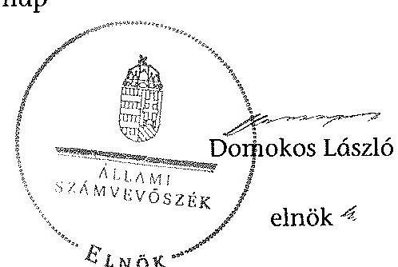

# ÁLLAMI   SZÁMVEVŐSZÉK 

## JELENTÉS

az önkormányzatok belső kontrollrendszerének kialakításának, egyes
kontrolltevékenységek és a belső ellenőrzés
működésének ellenőrzéséről
Tolnanémedi
14122
2014. június

---

# Állami Számvevőszék 

Iktatószám: V-0385-036/2014
Témaszám: 1162
Vizsgálat-azonosító szám: V064959

## Az ellenőrzést felügyelte:

Dr. Benedek Mária
felügyeleti vezető
Az ellenőrzést vezette és az ellenőrzés végrehajtásáért felelős:
Bíró Zsolt
ellenőrzésvezető
A számvevőszéki jelentés összeállításában közreműködött:
Kántor Ilona
számvevő tanácsos
Az ellenőrzést végezték:
Dombóvári Nóra
Vörös Katalin
számvevő tanácsos
számvevő tanácsos

---

# TARTALOMJEGYZÉK 

BEVEZETÉS ..... 5
I. ÖSSZEGZŐ MEGÁLLAPÍTÁSOK, KÖVETKEZTETÉSEK, JAVASLATOK ..... 9
II. RÉSZLETES MEGÁLLAPÍTÁSOK ..... 14

1. Az önkormányzat belső kontrollrendszerének kialakítása ..... 14
1.1. A kontrollkörnyezet ..... 14
1.2. A kockázatkezelési rendszer ..... 15
1.3. A kontrolltevékenységek ..... 16
1.4. Az információs és kommunikációs rendszer ..... 17
1.5. A monitoring rendszer ..... 17
2. A pénzügyi folyamatokban kulcsszerepet betöltő teljesítésigazolás és érvényesítés belső kontrollok működése ..... 18
3. A belső ellenőrzés működése ..... 21

## FÜGGELÉKEK

1. számú Értelmező szótár
2. számú Az értékelés módja és szempontjai

---

.

---

# RÖVIDÍTÉSEK JEGYZÉKE 

## Törvények

Áht.
ÁSZ tv.
Htv.

Info tv.

Kttv.

Ktv.

Ltv.
Mötv.

Mvtv.
Ötv.
Számv. tv.
Vagyonnyilatkozattételről szóló tv.

## Rendeletek

Áhsz. 1

Áhsz. 2
Ávr.

Bkr.

## Szórövidítések

ÁSZ
INTOSAI
iratkezelési szabályzat
ISSAI
2011. évi CXCV. törvény az államháztartásról (hatályos 2012. január 1-jétől)
2011. évi LXVI. törvény az Állami Számvevőszékről
1991. évi XX. törvény a helyi önkormányzatok és szerveik, a köztársasági megbízottak, valamint egyes centrális alárendeltségű szervek feladat- és hatásköreiről
2011. évi CXII. törvény az információs önrendelkezési jogról és az információszabadságról (hatályos 2012. január 1-jétől)
2011. évi CXCIX. törvény a közszolgálati tisztviselők ről (hatályos 2012. március 1-jétől)
1992. évi XXIII. törvény a köztisztviselők jogállásáról (hatálytalan 2012. március 1-jétől)
1995. évi LXVI. törvény a köziratokról, a közlevéltárakról és a magánlevéltári anyag védelméről
2011. évi CLXXXIX. törvény Magyarország helyi önkormányzatairól
1993. évi XCIII. törvény a munkavédelemről
1990. évi LXV. törvény a helyi önkormányzatokról
2000. évi C. törvény a számvitelről
2007. évi CLII. törvény az egyes vagyonnyilatkozat-tételi kötelezettségekről

249/2000. (XII. 24.) Korm. rendelet az államháztartás szervezetei beszámolási és könyvvezetési kötelezettségének sajátosságairól (hatálytalan 2014. január 1-jétől)
4/2013. (I. 11.) Korm. rendelet az államháztartás számviteléről (hatályos 2014. január 1-jétől)
368/2011. (XII. 31.) Korm. rendelet az államháztartásról szóló törvény végrehajtásáról (hatályos 2012. január 1-jétől)
370/2011. (XII. 31.) Korm. rendelet a költségvetési szervek belső kontrollrendszeréről és belső ellenőrzéséről (hatályos 2012. január 1-jétől)

Állami Számvevőszék
International Organization of Supreme Audit Institutions (Legfőbb Ellenőrző Intézmények Nemzetközi Szervezete)
Kisszékely - Nagyszékely - Tolnanémedi Községek Körjegyzőségének Iratkezelési szabályzata
International Standards of Supreme Audit Institutions (Legfőbb Ellenőrző Intézmények Nemzetközi Standardjai)

---

| Képviselő-testület | Tolnanémedi Község Önkormányzatának képviselőtestülete |
| :--: | :--: |
| Kormányhivatal | Tolna Megyei Kormányhivatal |
| körjegyző | Kisszékely - Nagyszékely - Tolnanémedi Községek Körjegyzőségének körjegyzője, 2013. január 1-jétől Tolnanémedi Közös Önkormányzati Hivatal jegyzője |
| Körjegyzőség | Kisszékely - Nagyszékely - Tolnanémedi Községek Körjegyzősége 2007. január 1 - 2012. december 31-e között, 2013. január 1-jétől Tolnanémedi Közös Önkormányzati Hivatal |
| közös önkormányzati hivatal | Tolnanémedi Közös Önkormányzati Hivatal |
| NGM | Nemzetgazdasági Minisztérium |
| Önkormányzat polgármester | Tolnanémedi Község Önkormányzata   Tolnanémedi Község Önkormányzatának polgármestere |
| Társulás | Tamási - Simontornya Többcélú Kistérségi Társulás |

---

# JELENTÉS 

## az önkormányzatok belső kontrollrendszere kialakításának, egyes kontrolltevékenységek és a belső ellenőrzés működésének ellenőrzéséről Tolnanémedi

## BEVEZETÉS

Tolnanémedi község állandó lakosainak száma 2012. január 1-jén 1092 fő volt. Az Önkormányzat héttagú Képviselő-testületének munkáját két állandó bizottság segítette. Az Önkormányzat az önállóan működő és gazdálkodó Körjegyzőségen kívül további intézményt nem működtetett, többségi tulajdoni hányadú gazdasági társasággal nem rendelkezett. A polgármester 2010. évi önkormányzati választások óta tölti be tisztségét. A körjegyző 2007. február 1-jétől látja el feladatait. A Körjegyzőség szervezeti egységekre nem tagolódott, elkülönített gazdasági szervezettel nem rendelkezett, a foglalkoztatott köztisztviselők száma 2012. január 1-jén nyolc fő volt. Kisszékely, Nagyszékely, Belecska és Tolnanémedi községek önkormányzatainak képviselő-testületei 2013. január 1-jétől közös önkormányzati hivatalt hoztak létre Tolnanémedi székhellyel ${ }^{1}$. Az Önkormányzat a 2012. évi költségvetési beszámolója szerint 181963 ezer Ft tárgyévi bevételt ért el, valamint 169533 ezer Ft tárgyévi kiadást teljesített. A 2012. december 31-ei könyvviteli mérleg szerint 373163 ezer Ft értékű eszközvagyonnal rendelkezett, a rövid lejáratú kötelezettségállománya 924 ezer Ft volt, hosszú lejáratú kötelezettségállománnyal nem rendelkezett.

A demokratikus társadalmakban alapvető igény, hogy a közpénzeket, a közvagyont használók tevékenységükről elszámoljanak, ahhoz egyértelmű és érvényesíthető felelősségi szabályok társuljanak. Ennek a jogos igénynek az érvényesítéséhez meg kell teremteni azokat a folyamatokat, rendszereket, amelyek nélkülözhetetlenek az elszámoltatáshoz. Az elszámoltatás eredményes működtetéséhez szükség van a megfelelő információs, kontroll, értékelési és beszámolási rendszerek kialakítására.

Magyarországon az uniós csatlakozási tárgyalások idejére nyúlnak vissza a belső kontrollrendszer szabályozásának gyökerei. Az uniós elvárásoknak megfelelő új terminológia szerinti államháztartási belső pénzügyi ellenőrzési

[^0]
[^0]:    ${ }^{1}$ 2007. január 1. és 2012. december 31. között Kisszékely, Nagyszékely és Tolnanémedi községek önkormányzatainak működésével kapcsolatos és az igazgatási feladatokat a Tolnanémedi székhelyű körjegyzőség látta el.

---

(ÁBPE) rendszer területén a jogharmonizáció 2003-ban teljes körűen megvalósult, míg az önkormányzati alrendszerre vonatkozó, Ötv.-ben megjelenített speciális szabályozás 2005-ben lépett hatályba. Az államháztartási belső kontrollrendszer koncepciója 2009-ben továbbfejlődött. A változások irányát mutatja, hogy a költségvetési szervek belső kontrollrendszere már magában foglalja a korszerű, felelős szervezetirányítás elemeit (kontrollkörnyezet, kockázatkezelés, kontrolltevékenység, információ és kommunikáció, monitoring) is. E kontrollrendszer szabályozása háromszintű, a törvényi előírásokat az Áht. és a Mötv., a rendeleti szintű szabályozást az Ávr. és a Bkr. tartalmazza, amelyeket útmutatói szinten az NGM által kiadott standardok és kézikönyvek támogatnak.

A belső kontrollrendszer azt a célt szolgálja, hogy a költségvetési szervek működésük és gazdálkodásuk során a tevékenységeket szabályszerűen, gazdaságosan, hatékonyan és eredményesen hajtsák végre, teljesítsék elszámolási kötelezettségeiket és megvédjék az erőforrásokat a veszteségektől, a károktól és a nem rendeltetésszerű használattól. A belső kontrollrendszer magában foglalja mindazon szabályokat, eljárásokat, gyakorlati módszereket és szervezeti struktúrákat, kockázatkezelési technikákat, kontrolltevékenységeket, amelyek segítséget nyújtanak a szervezetnek céljai eléréséhez.

Az ÁSZ középtávú stratégiájában hangsúlyos szerepet szánt annak, hogy szilárd szakmai alapon álló, értékteremtő ellenőrzéseivel előmozdítsa a közpénzügyek átláthatóságát, rendezettségét. A számvevőszéki ellenőrzés nemzetközi alapelvei is rögzítik, hogy a megfelelő belső kontrollrendszer minimálisra csökkenti a hibák és szabálytalanságok kockázatát.

Az ellenőrzés célja annak megállapítása volt, hogy a belső kontrollrendszer elemeinek kialakítása, a pénzügyi folyamatokban kulcsszerepet betöltő teljesítésigazolás és érvényesítés, és a belső ellenőrzés szabályos működése biztosította-e az Önkormányzatnál a közpénzfelhasználás szabályosságát, hozzájárult-e az értéket teremtő rend követelményének érvényesüléséhez.

Ennek keretében értékeltük, hogy:

- a jogszabályi előírásoknak megfelelően alakították-e ki a belső kontrollrendszer elemeit;
- a gazdálkodás folyamatában kulcsszerepet betöltő teljesítésigazolás és érvényesítés kontrolltevékenységeit megfelelően működtették-e;
- biztosították-e a belső ellenőrzés szabályos működését;
- amennyiben az ÁSZ tett javaslatot a 2008-2011. évek közötti ellenőrzése kapcsán az Önkormányzatnak, intézkedtek-e azok végrehajtására.

Az ellenőrzés várható hasznosulását négy szinten tervezzük. A törvényalkotás számára összegzett tapasztalatok állnak rendelkezésre a belső kontrollrendszer önkormányzati területen való kialakításáról, működéséről és hatásairól, a belső ellenőrzés működéséről. Ennek alapján következtetést lehet levonni arról, hogy a belső kontrollrendszer kialakítására és működtetésére vonatkozó jelenlegi, differenciálás nélküli jogszabályi előírások reális követelményeket

---

támasztanak-e az eltérő adottságú települési önkormányzatok esetében, illetve indokolt-e esetleges jogszabályi módosítás kezdeményezése. Az ellenőrzés az ellenőrzött számára visszajelzést ad a belső kontrollrendszer kialakításában és működésében fellépő hiányosságokról, javaslataival hozzájárul azok kiküszöböléséhez, amely csökkentheti a későbbi ellenőrzések gyakoriságát. Az ellenőrzés megállapításait és javaslatait más szervezetek is hasznosíthatják a rendezett gazdálkodási keretek kialakításához. A társadalom számára jelzi, hogy közpénz nem maradhat ellenőrizetlenül, az ÁSZ értékteremtő rend kialakításához és megőrzéséhez hozzájáruló tevékenysége pozitív hatással lesz a szervezetről kialakított összkép formálásában. A szervezeten belül lehetőség nyílik arra, hogy a megállapítások szintetizálásával az ÁSZ a hozzáadott értéket teremtő elemző tevékenységét és tanácsadó szerepét is erősítse.

Az önkormányzatok belső kontrollrendszere kialakításának, egyes kontrolltevékenységek és a belső ellenőrzés működésének ellenőrzéséről szóló jelentés I. fejezetének összegző része az ellenőrzés céljára ad rövid, szintetizáló összefoglalót, és tartalmazza a következtetéseket a II. fejezet részletes megállapításain alapulóan. A jelentés intézkedést igénylő megállapításait és javaslatait az ellenőrzés során feltárt, a jelentés II. fejezetében rögzített részletes megállapítások alapozzák meg. A helyszíni ellenőrzés lezárásáig a helyi szabályozás változásait nyomon követtük.

Az ellenőrzés típusa: szabályszerűségi ellenőrzés.
Az ellenőrzött időszak: a belső kontrollrendszer kialakításának megfelelősége esetében a 2012. évre, a pénzügyi folyamatokban kulcsszerepet betöltő teljesítésigazolás és érvényesítés belső kontrollok működésének megfelelőségét és a belső ellenőrzés szabályszerű működését a 2012. január 1. és december 31-e közötti időszak eseményeit figyelembe véve értékeltük, míg az ÁSZ javaslatainak utóellenőrzése a 2008-2011. években végzett ellenőrzések nyilvánosságra hozott jelentéseiben tett javaslatok áttekintésére terjedt ki.

# Az ellenőrzött szervezet: az Önkormányzat. 

Az ellenőrzés jogszabályi alapját az ÁSZ tv. 1. § (3) bekezdése, az 5. § (2) és (6) bekezdése, valamint az Áht. 61. § (2) bekezdésének előírásai képezik.

Az ellenőrzés szakmai módszertana az ÁSZ hivatalos honlapján (www.asz.hu) közzétett szakmai szabályokon alapult, amely az INTOSAI által kiadott ISSAI figyelembevételével készült.

Az ellenőrzés lefolytatásához az Önkormányzat a kimutatások és a tanúsítvány elektronikus kitöltésével, valamint az ÁSZ által kért dokumentumok elektronikus megküldésével szolgáltatott adatokat. Az így rendelkezésre bocsátott adatok, információk kontrollja és a munkalapok kitöltése a helyszíni ellenőrzés keretében történt. A jelentésben használt fogalmak magyarázatát az 1. számú függelék, az ellenőrzés egyes területeinek értékelésénél alkalmazott egységes minősítési szempontokat a 2. számú függelék tartalmazza.

A belső kontrollrendszer kialakításának ellenőrzése során értékeltük a kontrollkörnyezet, a kockázatkezelési rendszer, a kontrolltevékenységek, az információs

---

és kommunikációs rendszer, valamint a monitoring rendszer szabályozottságának megfelelőségét. A pénzügyi folyamatokban kulcsszerepet betöltő teljesítésigazolás és érvényesítés kontrollok működése megfelelőségének minősítéséhez az állományba nem tartozók megbízási díjai, a külső szolgáltatók által végzett karbantartási, kisjavítási munkák, az egyéb üzemeltetési és fenntartási szolgáltatások, a rendszeres szociális segélyek, valamint az államháztartáson kívülre teljesített működési és felhalmozási célú pénzeszközátadások közül kockázatelemzéssel választottuk ki az ellenőrzött kiadási jogcímeket. Az egyszerű véletlen mintavétellel kiválasztott tételek ellenőrzését többlépcsős megfelelőségi tesztek útján addig végeztük, amíg elegendő és megfelelő bizonyítékot szereztünk a vizsgált folyamatok kulcskontrolljai működésének megfelelő vagy nem megfelelő voltáról. Értékeltük az Önkormányzatnál a belső ellenőrzés működésének szabályosságát. Az ÁSZ az Önkormányzatnál a 2010. évben az állami feladat (közfeladat) ellátás szervezeti és humánerőforrás rendszerének ellenőrzését végezte. A nyilvánosságra hozott, 1022 számon közzétett számvevőszéki jelentésben azonban kifejezetten az Önkormányzat számára konkrét feladatot nem határozott meg, javaslatot nem tett, ezért a jelen ellenőrzés keretében utóellenőrzésre nem került sor.

Az ÁSZ tv. 29. § (1) bekezdése szerint a jelentéstervezetet megküldtük a polgármester részére, aki az ÁSZ tv. 29. § (2) bekezdésében foglalt észrevételezési jogával nem élt, a jelentéstervezetre észrevételt nem tett.

---

# I. ÖSSZEGZŐ MEGÁLLAPÍTÁSOK, KÖVETKEZTETÉSEK, JAVASLATOK 

A belső kontrollrendszeren belül 2012-ben a kontrollkörnyezet, a kockázatkezelési rendszer, a kontrolltevékenységek, az információs és kommunikációs rendszer, valamint a monitoring rendszer kialakítását külön-külön és együttesen is értékeltük. A belső kontrollrendszer kialakítása az összesített értékelés alapján nem felelt meg a jogszabályi előírásoknak.

A belső kontrollrendszer egyes
 területei kialakításának minősítése a következő:

| Kontrollterület | Minősítés |
| :-- | :--: |
| Kontrollkörnyezet | nem   megfelelő |
| Kockázatkezelési rendszer | nem   megfelelő |
| Kontrolltevékenységek | nem   megfelelő |
| Információs és kommunikációs   rendszer | nem   megfelelő |
| Monitoring rendszer | nem   megfelelő |

Nem megfelelőnek értékeltük a kontrollkörnyezet, a kockázatkezelési rendszer, a kontrolltevékenységek, az információs és kommunikációs rendszer, valamint a monitoring rendszer kialakítását, mivel az ellenőrzésünk során megállapított szabályozásbeli hiányosságok magukban hordozzák a szabálytalan működés, valamint a korrupció kockázatát.

A 2012. évben az állományba nem tartozók megbízási díjaival, valamint a külső szolgáltatók által végzett karbantartási, kisjavítási munkákkal kapcsolatos kifizetések során a pénzügyi folyamatokban kulcsszerepet betöltő teljesítésigazolás és érvényesítés belső kontrollok működése gyenge volt. Gyengének értékeltük a két kulcskontroll együttes működését, mivel azok nem biztosították a hibák megelőzését, feltárását.

A számvevőszéki ellenőrzés az ellenőrzött kifizetésekkel összefüggésben a rendelkezésre bocsátott dokumentumok alapján kár bekövetkeztére utaló adatot, tényt nem állapított meg, azonban a gazdálkodásban kulcsszerepet betöltő kontrollok működésében feltárt hiányosságok miatt fennáll a hibák bekövetkezésének kockázata. A nem megfelelően működtetett belső kontrollok korrupciós kockázatot hordoznak.

Az Önkormányzat a belső ellenőrzési feladatokat a Társulás útján látta el. A 2012. évben a belső ellenőrzés működése a jogszabályi előírásoknak nem felelt meg, mivel a számvevőszéki ellenőrzés által megállapított szabályozási

---

és működési hiányosságok számossága magában hordozza a szabálytalan önkormányzati gazdálkodás és feladatellátás kockázatát.

Az ÁSZ tv. 33. § (1) bekezdésében foglaltak értelmében az ellenőrzött szervezet vezetője köteles a jelentésben foglalt megállapításokhoz kapcsolódó intézkedési tervet összeállítani, és azt a jelentés kézhezvételétől számított 30 napon belül az ÁSZ részére megküldeni. Amennyiben az intézkedési tervet határidőre nem küldi meg a szervezet, vagy az ÁSZ tv. 33. § (2) bekezdésében foglalt póthatáridő elteltével megküldött intézkedési terv továbbra sem elfogadható, az ÁSZ elnöke a hivatkozott törvény 33. § (3) bekezdés a)-b) pontjaiban foglaltakat érvényesítheti.

Az ellenőrzés intézkedést igénylő megállapításai és javaslatai:

# a polgármesternek 

1. A polgármester, mint kötelezettségvállaló - az Ávr. 57. § (4) bekezdésében foglaltak ellenére - nem jelölte ki 2012. március 30-át követően írásban az Önkormányzat kiadási előirányzatai vonatkozásában a teljesítésigazolására jogosult személyeket.

Javaslat:
jelölje ki az Ávr. 57. § (4) bekezdésében foglaltak szerint a teljesítésigazolására jogosult személyeket.
2. Az Önkormányzat kiadási előirányzata terhére elszámolt kötelezettségvállalást - az Áht. 36. § (1) bekezdés és az Ávr. 52. § (6) bekezdés előírása ellenére - nem foglalták írásba, valamint az Önkormányzat nevében kötött kötelezettségvállalásra - az Áht. 37. § (1) bekezdésében és az Ávr. 55. § (1) bekezdésében foglaltak ellenére - pénzügyi ellenjegyzés nélkül került sor.

Javaslat:
Intézkedjen arról, hogy az Önkormányzat nevében történő kötelezettségvállalásra az Áht. 37. § (1) bekezdésében és az Ávr. 55. § (1) bekezdésében foglaltaknak megfelelően - az Ávr. 53. §-ában meghatározott kivételekkel - kizárólag a pénzügyi ellenjegyzés után, a pénzügyi teljesítés esedékességét megelőzően, írásban kerüljön sor.
3. A számvevőszéki ellenőrzés megállapításai alapján az Önkormányzatnál a belső kontrollrendszer kialakítása összefoglalóan értékelve nem felelt meg a jogszabályi előírásoknak. A kulcskontrollok működése gyenge volt, a belső ellenőrzés működése nem felelt meg a jogszabályi előírásoknak. A megállapított szabályozásbeli és működésbeli hiányosságok magukban hordozzák a szabálytalan működés kockázatát.

Javaslat:
Kísérje figyelemmel a Mötv. 115. § (1) bekezdésében foglaltak alapján az Önkormányzat gazdálkodásának szabályszerűségét. A Mötv. 67. § f) pontja alapján gondoskodjon a belső kontrollrendszer működésére vonatkozó jogszabályi rendelkezések be nem tartása, valamint a teljesítésigazolás, illetve az érvényesítés kontrollokkal összefüggésben feltárt hiányosságok, szabálytalanságok tekintetében az esetleges

---

munkajogi felelősséggel kapcsolatos körülmények kivizsgálásáról, majd a vizsgálat eredményének függvényében tegye meg a szükséges intézkedéseket.

# a jegyzőnek (Tolnanémedi Község Önkormányzata vonatkozásában) 

1. a kontrollkörnyezettel kapcsolatban:

A körjegyző az Áht.-ban foglaltak ellenére nem készítette el a Körjegyzőség szervezeti és működési szabályzatát. A Számv. tv-ben és az Áhsz.-ben foglaltak ellenére nem készítette el a Körjegyzőség számlarendjét, az Mvtv.-ben foglaltak ellenére nem határozta meg a Körjegyzőségen az egészséget nem veszélyeztető és biztonságos munkavégzés követelményei megvalósításának módját. A körjegyző a Bkr.-ben foglaltak ellenére nem készítette el a szabálytalanságok kezelésének eljárásrendjét és az ellenőrzési nyomvonalat, valamint az Ávr.-ben foglaltak ellenére belső szabályzatokban nem rendelkezett a Körjegyzőségen dolgozók helyettesítése rendjéről, a belső és külső kapcsolattartás módjáról, szabályairól. A Kttv.-ben foglalt előírások ellenére a köztisztviselők munkateljesítményét írásban nem értékelte, valamint az Ötv-ben előírt kötelezettsége ellenére nem készítette elő a Kttv.-ben foglaltak szerinti, a köztisztviselőkkel szembeni hivatásetikai alapelvek részletes tartalmának, valamint az etikai eljárás szabályainak dokumentumát [II. Részletes megállapítások, 1.1. A kontrollkörnyezet, 5., 30., 32., 34., 35., 41., 46. és 47. sorszámú megállapítás].

Javaslat:
Intézkedjen az Áht. 69. § (2) bekezdése, a Bkr. 3. § a) pontja és 6. §-a alapján a jelentés II. Részletes megállapítások, 1.1. A kontrollkörnyezet 5., 30., 32., 34., 35., 41., 46. és 47. sorszámú megállapításaiban foglalt hibák, hiányosságok kijavításáról, megszüntetéséről az ott megjelölt jogszabályi rendelkezéseknek megfelelően.
2. a kockázatkezelési rendszerrel kapcsolatban:

A körjegyző a Bkr.-ben foglaltak ellenére nem gondoskodott a kockázatok felméréséről, azokkal kapcsolatban szükséges intézkedések meghatározásáról, az intézkedések teljesítése nyomon követéséről. A körjegyző a Vagyonnyilatkozat-tételről szóló tv-ben foglaltak ellenére a köztisztviselők vagyonnyilatkozat-tételi kötelezettségét a szervezeti és működési szabályzatban nem tüntette fel. A Vagyonnyilatkozat-tételről szóló tv.-ben foglaltak ellenére 1 fő köztisztviselő a vagyonnyilatkozat-tételi kötelezettségének nem tett eleget, az őrzésért felelős a tájékoztatási és felszólítási kötelezettségét nem teljesítette [II. Részletes megállapítások, 1.2. A kockázatkezelési rendszer, 2., 8., 10., 13. és 14. sorszámú megállapítás].

Javaslat:
Intézkedjen az Áht. 69. § (2) bekezdése, a Bkr. 3. § b) pontja és 7. §-a, valamint a Vagyonnyilatkozat-tételről szóló tv. alapján a jelentés II. Részletes megállapítások, 1.2. A kockázatkezelési rendszer 2., 8., 10., 13., és 14. sorszámú megállapításaiban foglalt hibák, hiányosságok kijavításáról, megszüntetéséről az ott megjelölt jogszabályi rendelkezéseknek megfelelően.

---

3. a kontrolltevékenységekkel kapcsolatban:

A körjegyző a Bkr.-ben foglaltak ellenére nem biztosította minden tevékenységre vonatkozóan a folyamatba épített, előzetes, utólagos és vezetői ellenőrzést. Az Info tv.-ben foglalt előírásokat figyelmen kívül hagyva nem tette meg azokat a technikai és szervezési intézkedéseket és nem alakította ki azokat az eljárási szabályokat, amelyek biztosítják az adatok biztonságát és védelmét, a Bkr.-ben foglaltak ellenére belső szabályzatban nem határozta meg a dokumentumokhoz és információkhoz való hozzáférésre vonatkozóan a felelősségi köröket. A körjegyző az Ávr.-ben foglaltak ellenére nem határozta meg a gazdasági feladatot ellátó alkalmazottak helyettesítésének rendjét, nem jelölt ki a Körjegyzőség állományába tartozó köztisztviselőt pénzügyi ellenjegyzési feladatok ellátására. A Kttv.-ben foglaltak ellenére nem szabályozta a Körjegyzőségen a köztisztviselő jogviszonya megszűntetése esetére a munkakör átadása és a munkáltatóval való elszámolás rendjét. [II. Részletes megállapítások, 1.3. A kontrolltevékenységek, 2-5., 16., 17., 21., 27. és 32. sorszámú megállapítás].

Javaslat:
Intézkedjen az Áht. 69. § (2) bekezdése, a Bkr. 3. § c) pontja és 8. §-a alapján a jelentés II. Részletes megállapítások, 1.3. A kontrolltevékenységek 2-5., 16., 17., 21., 27. és 32. sorszámú megállapításaiban foglalt hibák, hiányosságok kijavításáról, megszüntetéséről az ott megjelölt jogszabályi rendelkezéseknek megfelelően.
4. az információs és kommunikációs rendszerrel kapcsolatban:

A körjegyző a Bkr.-ben foglaltak ellenére nem alakított ki olyan rendszert, amely biztosítja a megfelelő információk megfelelő időben történő eljutását az illetékes szervezethez, személyhez. Az Info tv.-ben és az Ávr.-ben foglaltak ellenére nem készítette el a Körjegyzőség adatvédelmi és adatbiztonsági szabályzatát, nem alakította ki a kötelezően közzéteendő adatok nyilvánosságra hozatalának rendjét, és nem szabályozta a közérdekű adatok megismerésére irányuló igények teljesítésének rendjét. Az Önkormányzat az Info tv.-ben előírt elektronikus közzétételi kötelezettségének a 2012. évben teljes körűen nem tett eleget. A körjegyző az iratkezelési szabályzatot nem az Ltv.-ben foglalt előírásoknak megfelelően adta ki [II. Részletes megállapítások, 1.4. Az információs és kommunikációs rendszer, 1., 2., 5-9. sorszámú megállapítás].

Javaslat:
Intézkedjen az Áht. 69. § (2) bekezdése, a Bkr. 3. § d) pontja és 9. §-a alapján a jelentés II. Részletes megállapítások, 1.4. Az információs és kommunikációs rendszer 1., 2., 5-9. sorszámú megállapításaiban foglalt hibák, hiányosságok kijavításáról, megszüntetéséről az ott megjelölt jogszabályi rendelkezéseknek megfelelően.
5. a monitoring rendszerrel kapcsolatban:

A körjegyző a Bkr.-ben foglaltak ellenére nem alakította ki a Körjegyzőség tevékenységének, a célok megvalósításának nyomon követését biztosító rendszert. A körjegyző - az Áht.-ban és a Bkr.-ben foglaltak ellenére - a belső kontrollrendszeren belül az információs és kommunikációs rendszer fejlesztésére intézkedéseket nem tett. A körjegyző a Bkr.-ben foglaltak ellenére az intézkedési tervben meghatározott egyes feladatok végrehajtásáról szóló beszámolót nem készítette el. [II. Részletes megállapítások, 1.5. A monitoring rendszer, 1., 10. és 18. sorszámú megállapítás].

---

Javaslat:
Intézkedjen az Áht. 69. § (2) bekezdése, a Bkr. 3. § e) pontja és 10. §-a alapján a jelentés II. Részletes megállapítások, 1.5. A monitoring rendszer 1., 10. és 18. sorszámú megállapításaiban foglalt hibák, hiányosságok kijavításáról, megszüntetéséről az ott megjelölt jogszabályi rendelkezéseknek megfelelően.
6. a pénzügyi folyamatokban kulcsszerepet betöltő kontrollokkal kapcsolatban:

A teljesítésigazolás és érvényesítés, valamint az utalvány tartalma nem felelt meg az Áht.-ban és az Ávr.-ben foglaltaknak, továbbá fejlesztési kiadást a Számv. tv.-ben foglaltak ellenére nem az Áhsz. ${ }_{1}$-ben előírt főkönyvi számlán számoltak el.[II. Részletes megállapítások, 2. A pénzügyi folyamatokban kulcsszerepet betöltő teljesítésigazolás és érvényesítés belső kontrollok működése, 1-3. sorszámú megállapítás].

Javaslat:
Intézkedjen az Áht. 37-38. §-ában, az Ávr. 55-59. §-ában, az Áhsz.2-ben és a Számv. tv.-ben foglaltak alapján arról, hogy a teljesítésigazolás és az érvényesítés vonatkozásában, valamint azok ellenőrzése során a kötelezettségvállalással, a pénzügyi ellenjegyzéssel, az utalványozással, a kötelezettségvállalások nyilvántartásba vételével, az utalvány tartalmával valamint a gazdasági események könyvviteli elszámolásával kapcsolatban feltárt, a jelentés II. Részletes megállapítások, 2. A pénzügyi folyamatokban kulcsszerepet betöltő teljesítésigazolás és érvényesítés belső kontrollok működése 1-3. sorszám alatti megállapításokban foglalt hibák, hiányosságok kijavítása, megszüntetése az ott megjelölt jogszabályi rendelkezéseknek megfelelően történjen meg.
7. a belső ellenőrzés működésével kapcsolatban:

A belső ellenőrzés működése a számvevőszéki ellenőrzés értékelési szempontjait figyelembe véve nem felelt meg a Bkr.-ben foglalt előírásoknak [II. Részletes megállapítások, 3. A belső ellenőrzés működése 7., 8., 24-27. sorszámú megállapítás].

Javaslat:
Intézkedjen az Áht. 69. § (2) bekezdése, a Bkr. 3. § e) pontja és 10. §-a alapján a jelentés II. Részletes megállapítások, 3. A belső ellenőrzés működése 7., 8., 24-27. sorszámú megállapításaiban foglalt hibák, hiányosságok kijavításáról, megszüntetéséről az ott megjelölt jogszabályi rendelkezéseknek megfelelően.

---

# II. RÉSZLETES MEGÁLLAPÍTÁSOK 

## 1. AZ ÖNKORMÁNYZAT BELSŐ KONTROLLRENDSZERÉNEK KIALAKÍTÁSA

A belső kontrollrendszeren belül 2012-ben a kontrollkörnyezet, a kockázatkezelési rendszer, a kontrolltevékenységek, az információs és kommunikációs rendszer, valamint a monitoring rendszer kialakítását külön-külön és együttesen is értékeltük. A belső kontrollrendszer kialakítása az összesített értékelés alapján nem felelt meg a jogszabályi

 előírásoknak.

### 1.1. A kontrollkörnyezet

A kontrollkörnyezet kialakítása - a 2. számú függelékben részletezett kritériumrendszer alapján végzett értékelés szerint - nem felelt meg a jogszabályi előírásoknak, mert:

| Sorszám $^{2}$ | Megállapítás | Megjegyzés |
| :--: | :--: | :--: |
| 5. | A körjegyző - az Áht. 10. § (5) bekezdésében foglaltak ellenére - a Körjegyzőség feladatai ellátásának részletes belső rendjét és módját szervezeti és működési szabályzatban nem állapította meg. |  |
| 30. | A körjegyző - a Számv. tv. 161. § (1) bekezdésében és az Áhsz. 49. § (1) bekezdésében foglalt előírások ellenére - nem készítette el a Körjegyzőség számlarendjét. | 2014. január 1-jétől a Számv. tv. 161. § (1) bekezdése és az Áhsz. 51. § (2) bekezdése írja elő a számlarend készítésének kötelezettségét. |
| 32. | A körjegyző - az Mvtv. 2 § (3) bekezdésében foglaltak ellenére - nem határozta meg a Körjegyzőségén az egészséget nem veszélyeztető és biztonságos munkavégzés követelményei megvalósításának módját. |  |
| 34.   és   41. | A körjegyző - a Bkr. 6. § (3) és (4) bekezdéseiben foglaltak ellenére - nem készítette el a szabálytalanságok kezelésének eljárásrendjét és az ellenőrzési nyomvonalat. |  |

[^0]
[^0]:    ${ }^{2}$ A megállapítás számozása az Önkormányzat által kitöltött kimutatások - adatszolgáltatások - kérdéseinek sorszámával azonos.

---

| 35. | A körjegyző - az Ávr. 13. § (5) bekezdésében foglaltak ellenére - belső szabályzatokban nem rendelkezett a Körjegyzőségen dolgozók helyettesítésének rendjéről, továbbá a belső és külső kapcsolattartás módjáról, szabályairól. |  |
| :--: | :--: | :--: |
| 46. | A körjegyző - a Kttv. 130. § (1) bekezdésében előírtak ellenére - a Körjegyzőségen dolgozó köztisztviselők munkateljesítményét írásban nem értékelte. |  |
| 47. | A Képviselő-testület - a Kttv. 231. § (1) bekezdésében foglalt előírás ellenére - nem állapította meg a köztisztviselőkkel szembeni, a Kttv. 83. §-ában előírt hivatásetikai alapelvek részletes tartalmát, valamint az etikai eljárás szabályait, mivel a körjegyző - az Ötv. 36. § (2) bekezdés a) pontjában előírt feladata ellenére - nem készítette elő ennek dokumentumát. | A jegyző részére az önkormányzat működésével kapcsolatos feladatok ellátásáról való gondoskodást 2013. január 1-jétől a Mötv. 81. § (3) bekezdés c) pontja írja elő. |

# 1.2. A kockázatkezelési rendszer 

A kockázatkezelési rendszer - a 2. számú függelékben részletezett kritériumrendszer alapján végzett értékelés szerint - nem felelt meg a jogszabályi előírásoknak, mert:

| Sorszám | Megállapítás | Megjegyzés |
| :--: | :--: | :--: |
| 2., 8.,   10. | A körjegyző - a Bkr. 7. § (2) bekezdésében foglalt előírás ellenére - nem mérte fel és nem állapította meg a Körjegyzőség tevékenységében, gazdálkodásában rejlő kockázatokat, nem határozta meg az egyes kockázatokkal kapcsolatban a szükséges intézkedéseket, nem határozta meg a kockázatok kezelése érdekében szükséges intézkedések teljesítése folyamatos nyomon követési módját. |  |
| 13. | A Vagyonnyilatkozat-tételről szóló tv. 4. § a) pontjában foglaltak ellenére a vagyonnyilatkozat-tételre kötelezett köztisztviselők vagyonnyilatkozat-tételi kötelezettségét szervezeti és működési szabályzatban nem tüntették fel. |  |
| 14. | A Vagyonnyilatkozat-tételről szóló tv. 5. §-ában foglaltak ellenére 1 fő köztisztviselő a vagyonnyilatkozat-tételi kötelezettségének nem tett eleget. Az őrzésért felelős - a Vagyonnyilatkozat-tételről szóló tv. 8. § (4) bekezdésében foglaltak ellenére - nem tájékoztatta a köztisztviselőt a vagyonnyilatko- |  |

---

zat-tételi kötelezettség fennállásáról és esedékességének időpontjáról az esedékességet legalább 30 nappal megelőzően, továbbá a 10. § (1) bekezdésében foglaltak ellenére írásban nem szólította fel arra, hogy kötelezettségét a felszólítás kézhezvételétől számított nyolc napon belül teljesítse.

# 1.3. A kontrolltevékenységek 

A kontrolltevékenységek kialakítása - a 2. számú függelékben részletezett kritériumrendszer alapján végzett értékelés szerint - nem felelt meg a jogszabályi előírásoknak, mert:

| Sorszám | Megállapítás |
| :--: | :--: |
| 2.-5. | A körjegyző - a Bkr. 8. § (2) bekezdésében foglaltak ellenére - nem biztosította a beszerzési folyamat és a vagyonhasznosítási tevékenység, valamint a pénzügyi döntések - köztük a költségvetés tervezése és a támogatásokkal való elszámolás - dokumentumainak elkészítésével kapcsolatban a folyamatba épített, előzetes, utólagos és vezetői ellenőrzést. |
| 10. | A polgármester, mint kötelezettségvállaló - az Ávr. 57. § (4) bekezdésében foglaltak ellenére - nem jelölte ki 2012. március 30-át követően írásban az Önkormányzat kiadási előirányzatai vonatkozásában a teljesítés igazolására jogosult személyeket. |
| 16. | A körjegyző - az Info tv. 7. § (2)-(3) bekezdéseiben foglalt előírásokat figyelmen kívül hagyva - az informatikai rendszer szabályozása során nem tette meg azokat a technikai és szervezési intézkedéseket és nem alakította ki azokat az eljárási szabályokat, amelyek biztosítják az adatok biztonságát és védelmét. |
| 17. | A körjegyző a Bkr. 8. § (4) bekezdés b) pontjában foglaltak ellenére belső szabályzatban nem határozta meg a dokumentumokhoz és információkhoz való hozzáférésre vonatkozóan a felelősségi köröket. |
| 21. | A körjegyző - az Ávr. 13. § (5) bekezdésében foglaltak ellenére - nem határozta meg a gazdasági feladatot ellátó alkalmazottak helyettesítésének rendjét. |
| 27. | A körjegyző - az Ávr. 55. § (2) bekezdésében előírtak ellenére - nem jelölt ki a Körjegyzőség állományába tartozó köztisztviselőt pénzügyi ellenjegyzési feladatok ellátására. |
| 32. | A körjegyző - a Kttv. 74. § (1) bekezdésében foglaltak ellenére - nem szabályozta a Körjegyzőségen a köztisztviselő jogviszonya megszüntetése (megszünése) esetére a munkakör átadása és a munkáltatóval való elszámolás rendjét. |

---

# 1.4. Az információs és kommunikációs rendszer 

Az információs és kommunikációs rendszer kialakítása - a 2. számú függelékben részletezett kritériumrendszer alapján végzett értékelés szerint nem felelt meg a jogszabályi előírásoknak, mert:

| Sorszám | Megállapítás |
| :--: | :--: |
| 1. és   2. | A körjegyző - a Bkr. 3. § d) pontjában és a 9. § (1) bekezdésében foglaltak ellenére - nem alakított ki olyan rendszert, amely biztosítja, hogy a megfelelő információk a megfelelő időben eljutnak az illetékes szervezethez, személyhez. |
| 5. | A körjegyző - az Info tv. 24. § (3) bekezdésében foglaltak ellenére - nem készítette el a Körjegyzőség adatvédelmi és adatbiztonsági szabályzatát. |
| 6. és   8. | A körjegyző - az Info tv. 35. § (3) bekezdésében és a 30. § (6) bekezdésében, valamint az Ávr. 13. § (2) bekezdés h) pontjában foglalt előírás ellenére - a kötelezően közzéteendő adatok nyilvánosságra hozatalának és elektronikus közzétételének rendjét nem alakította ki, a közérdekű adatok megismerésére irányuló igények teljesítésének rendjét nem szabályozta. |
| 7. | Az Önkormányzat - az Info tv. 33. § (1) és (3) bekezdésében, a 37. § (1) bekezdésében és az 1. mellékletében foglaltak ellenére - elektronikus közzétételi kötelezettségének a 2012. évben nem tett eleget, mert nem tették közzé a 2011. évi költségvetés végrehajtásáról szóló beszámolót, valamint a hatályos önkormányzati rendeleteket. |
| 9. | A körjegyző - az Ltv. 10. § (1) bekezdés c) pontjának előírását figyelmen kívül hagyva - a Körjegyzőség iratkezelési szabályzatát nem a Magyar Nemzeti Levéltár és a Kormányhivatal egyetértésével adta ki. |

### 1.5. A monitoring rendszer

A monitoring rendszer kialakítása - a 2. számú függelékben részletezett kritériumrendszer alapján végzett értékelés szerint - nem felelt meg a jogszabályi előírásoknak, mert:

| Sorszám | Megállapítás |
| :--: | :--: |
| 1. | A körjegyző - a Bkr. 3. § e) pontjában és a 10. §-ában foglaltak ellenére nem alakította ki a Körjegyzőség tevékenységének, a célok megvalósításának nyomon követését biztosító rendszert. |
| 10. | A körjegyző - az Áht. 69. § (2) bekezdésében és a Bkr. 3. §-ában foglaltakat figyelmen kívül hagyva, valamint nyilatkozata ellenére - az információs és kommunikációs rendszer fejlesztése érdekében intézkedéseket nem tett. |
| 18. | A körjegyző - a Bkr. 46. § (1) bekezdésében foglaltak ellenére - a belső ellenőrzési jelentésekben tett javaslatokhoz kapcsolódó intézkedési tervben meghatározott egyes feladatok végrehajtásáról szóló beszámolót nem készítette el. |

---

A Kormányhivatal a 2012. évben a törvényességi felügyelet körében kettő alkalommal élt törvényességi felhívással, mulasztásban megnyilvánuló törvénysértés miatt. A Képviselő-testület a törvényességi felhívásokban foglaltakat elfogadta, a törvénysértés megszüntetése érdekében szükséges intézkedéseket megtette.

A Kormányhivatal a 2012. június 12-én kelt felhívásában megállapította, hogy a 2012. évi költségvetést, illetve a 2011. évi zárszámadást tárgyaló képviselőtestületi ülésekről készült jegyzőkönyvek, illetve a költségvetési és a zárszámadási rendeletek a 23/2012. (IV. 25.) KIM rendelet 1. és 2. §-ában foglaltak ellenére nem érkeztek be a Kormányhivatalhoz, ezért a szükséges intézkedések megtételére hívta fel a Képviselő-testületet. A Kormányhivatal a 2012. július 26-án kelt felhívásában mulasztásban megnyilvánuló törvénysértés megszüntetésére hívta fel a Képviselő-testületet, a szabálysértési tényállások hatályon kívül helyezésével és az erről szóló önkormányzati rendeletnek a Kormányhivatal részére történő megküldésével.

# 2. A PÉNZÜGYI FOLYAMATOKBAN KULCSSZEREPET BETÖLTŐ TELJESÍTÉSIGAZOLÁS ÉS ÉRVÉNYESÍTÉS BELSŐ KONTROLLOK MŰKÖDÉSE 

A 2012. évben az állományba nem tartozók megbízási díjaival, valamint a külső szolgáltatók által végzett karbantartással, kisjavítással kapcsolatos kifizetések során - összefoglalóan értékelve - a pénzügyi folyamatokban kulcsszerepet betöltő teljesítésigazolás és érvényesítés belső kontrollok működésének megfelelősége gyenge volt, mert:

| Kontrol-   lok sor-   száma | Megállapítás | Megjegyzés |
| :-- | :-- | :-- |

## Teljesítésigazolás

A teljesítésigazolást a kifizetéseket megelőzően - az Áht. 38. § (1) bekezdésében és az Ávr. 57. § (1) és (3) bekezdésében előírtak ellenére - nem végezték el, vagy kijelölés hiányában nem az arra jogosult végezte.

## Érvényesítés

Az érvényesítést - az Ávr. 58. § (4) bekezdésében előírtak ellenére - kijelölés hiányában, jogosulatlanul végezték.

Az érvényesítő a kifizetéseket megelőzően - az Ávr. 58. § (1) bekezdésében foglalt előírás ellenére - nem tudta ellenőrizni a fedezet meglétét, mert a kötelezettségvállalásokat a 2012. évben az Ávr. 56. § (1) bekezdésében előírtak ellenére nem vették nyilvántartásba.

A kifizetéseket megelőzően nem tartották be az Ávr. 60. § (1) bekezdésében foglaltakat, mert az érvényesítő személye azonos volt a teljesítésigazolást végző személlyel.

Az Ávr. 56. § (1) bekezdés 2014. január 1-jétől módosult, a kötelezettségvállalások nyilvántartását az Ahsz-2 39. § (1) bekezdés és a 14. számú melléklet II. pontja tartalmazza.

---

Az érvényesítő - az Ávr. 58. § (2) bekezdésében előírtak ellenére - nem jelezte az utalványozónak, hogy a megelőző ügymenetben a teljesítésigazolást nem, vagy nem szabályszerűen végezték el, az Önkormányzat kiadási előirányzata terhére történő kötelezettségvállalást - az Áht. 36. (1) bekezdés és az Ávr. 52. § (6) bekezdés előírása ellenére -
 nem foglalták írásba, az Önkormányzat kiadási előirányzata terhére történő kötelezettségvállalásokra az Áht. 37. § (1) bekezdésében és az Ávr. 55. § (1) bekezdésében előírtak ellenére - pénzügyi ellenjegyzés nélkül került sor.

# A kulcskontrollok ellenőrzésével kapcsolatban feltárt egyéb hiányosságok 

Az utalványon kötelezettségvállalás nyilvántartásba vételének hiányában nem tüntették fel - az Ávr. 59. § (3) bekezdés f) pontjában előírtakat figyelmen kívül hagyva - a kötelezettségvállalás nyilvántartási számát.

A fejlesztési kiadást a Számv. tv. 16. § (3) bekezdésében foglaltak ellenére, nem az Áhsz. 148. § (2) bekezdésében hivatkozott 9. számú melléklet 1. g) pontjában foglaltak szerinti főkönyvi számlán számolták el.
2014. január 1-jétől az Áhsz. 240. §-a, illetve a 15. számú melléklet előírása tartalmazza az egységes rovatrend alkalmazását.

A 2012. évben az állományba nem tartozók megbízási díjainak kifizetése során a teljesítésigazolás és az érvényesítés kulcskontrollok működésének megfelelősége gyenge volt, mert:

- a teljesítésigazolást a 2012. április 1-jén teljesített köztemető fenntartással, valamint a könyvtárosi tevékenység és internetkezeléssel összefüggő megbízási díjak kifizetéseit megelőzően - az Áht. 38. § (1) bekezdésében és az Ávr. 57. § (1) bekezdésében foglaltak ellenére - nem végezték el;
- a teljesítésigazolást a 2012. október 1-jén teljesített köztemető fenntartással kapcsolatos kifizetést megelőzően - az Ávr. 57. § (3) bekezdésében előírtak ellenére - kijelölés hiányában nem az arra jogosult végezte;
- az érvényesítést a 2012. április 1-jén teljesített köztemető fenntartás, valamint a könyvtárosi tevékenység és internetkezelés megbízási díjainak pénztárból történő kifizetését megelőzően - az Ávr. 58. § (4) bekezdésének előírása ellenére - kijelölés hiányában nem az arra jogosult végezte;
- az érvényesítő a köztemető fenntartással, valamint a könyvtárosi tevékenység és internetkezeléssel összefüggő megbízási díjak kifizetéseit megelőzően az Ávr. 58. § (1) bekezdésében foglalt előírás ellenére - nem tudta ellenőrizni a fedezet meglétét, mert a megbízási díjak kötelezettségvállalásait a 2012. évben az Ávr. 56. § (1) bekezdésében előírtak ellenére nem vették nyilvántartásba;
- az érvényesítő - az Ávr. 58. § (2) bekezdésében előírtak ellenére - nem jelezte az utalványozónak, hogy a megelőző ügymenetben a teljesítésigazolást

---

nem, vagy nem szabályszerűen végezték el, az Önkormányzat kiadási előirányzatára terhére történő kötelezettségvállalásokra - az Áht. 37. § (1) bekezdésében és az Ávr. 55. § (1) bekezdésében előírtak ellenére - pénzügyi ellenjegyzés nélkül került sor.

Az utalványon nem tüntették fel - az Ávr. 59. § (3) bekezdés f) pontjában előírtakat figyelmen kívül hagyva - a kötelezettségvállalás nyilvántartási számát.

A 2012. évben a külső szolgáltatók által végzett karbantartási és kisjavítási munkák kifizetése során a teljesítésigazolás és az érvényesítés kulcskontrollok működésének megfelelősége gyenge volt, mert:

- a teljesítésigazolást a késélezéssel, gázszabályzó javítással és a gázmérő óra szétválasztással kapcsolatos kifizetéseket megelőzően - az Ávr. 57. § (3) bekezdésében foglaltak ellenére - kijelölés hiányában nem az arra jogosult végezte;
- az érvényesítést a késélezéssel és a tűzoltó készülék karbantartással összefüggő kifizetéseket megelőzően - az Ávr. 58. § (4) bekezdés előírása ellenére - kijelölés hiányában nem az arra jogosult végezte;
- a késélezéssel és a tűzoltó készülék karbantartással összefüggő kifizetéseket megelőzően nem tartották be az Ávr. 60. § (1) bekezdésében foglaltakat, mert az érvényesítő személye azonos volt a teljesítésigazolást végző személylyel;
- az érvényesítő az Önkormányzat kiadási előirányzata terhére teljesített, a karbantartással kapcsolatos kifizetések előtt - az Ávr. 58. § (1) bekezdésében foglalt előírás ellenére - nem tudta ellenőrizni a fedezet meglétét, mert a karbantartás kötelezettségvállalásait a 2012. évben az Ávr. 56. § (1) bekezdésében előírtak ellenére nem vették nyilvántartásba;
- az érvényesítő - az Ávr. 58. § (2) bekezdésében előírtak ellenére - nem jelezte az utalványozónak, hogy a megelőző ügymenetben a teljesítésigazolás nem volt szabályszerű, az Önkormányzat kiadási előirányzata terhére történő, a gázmérő óra szétválasztással kapcsolatos kötelezettségvállalást - az Áht. 36. (1) bekezdése és az Ávr. 52. § (6) bekezdés előírása ellenére - nem foglalták írásba, továbbá a gázmérő óra szétválasztással összefüggő gazdasági eseményt a Számv. tv. 16. § (3) bekezdésében foglaltak ellenére nem az Áhsz. 48. § (2) bekezdésében hivatkozott 9. számú melléklet 1. g) pontjában foglaltak szerinti főkönyvi számlán számolták el.

Az utalványon nem tüntették fel - az Ávr. 59. § (3) bekezdés f) pontjában előírtakat figyelmen kívül hagyva - a kötelezettségvállalás nyilvántartási számát.

A számvevőszéki ellenőrzés az ellenőrzött kifizetések között a rendelkezésre bocsátott dokumentumok alapján kár bekövetkeztére utaló adatot, tényt nem állapított meg, azonban a gazdálkodásban kulcsszerepet betöltő kontrollok (teljesítésigazolás, érvényesítés) működésében feltárt hiányosságok miatt fennáll a további hibák bekövetkezésének kockázata. A nem megfelelően működtetett kontrollok korrupciós kockázatot hordoznak.

---

# 3. A BELSŐ ELLENŐRZÉS MŰKÖDÉSE 

Az Önkormányzat a belső ellenőrzési feladatokat a Társulás útján látta el. A belső ellenőrzés működése - a 2. számú függelékben részletezett kritériumrendszer alapján végzett értékelés szerint - nem felelt meg a jogszabályi előírásoknak, mert:

| Sor-   szám | Megállapítás | Megjegyzés |
| :--: | :--: | :--: |
| 7. | A Bkr. 56. § (3) bekezdés a) pontjában foglaltak ellenére stratégiai ellenőrzési tervvel az Önkormányzat nem rendelkezett. |  |
| 8. | A belső ellenőrzési vezető - a Bkr. 22. § (1) bekezdés b) pontjában, a 29. § (1) bekezdésében és a 31. § (1) bekezdésében foglaltak ellenére - a 2013. évre vonatkozóan éves ellenőrzési tervet nem készített. |  |
| 24.-26. | A Bkr. 22. § (2) bekezdés b) és e) pontjában, valamint az 50. §-ban foglalt előírások ellenére, a belső ellenőrzési vezető az elvégzett belső ellenőrzésekről nyilvántartást nem vezetett, továbbá a Bkr. 21. § (2) bekezdés d) pontjában és a 47. § (1) bekezdésben foglaltak ellenére a 2012. évben nem vezetett olyan nyilvántartást, amellyel az ellenőrzési jelentésekben szereplő javaslatokat, valamint az intézkedési terveket és azok végrehajtását nyomon követi. |  |
| 27. | A Társulás munkaszervezetének vezetője a 2011. évre vonatkozó éves ellenőrzési jelentést a Bkr. 56. § (8) bekezdésében előírt határidőre a körjegyzék részére nem küldte meg. |  |

Az Önkormányzat az ÁSZ-tól a 2012. és 2013. években integritás kérdőív kitöltésére kapott felkérést, amely lehetőséggel nem élt. A köztisztviselőkkel szembeni hivatásetikai alapelveket, valamint az etikai eljárás szabályait tartalmazó dokumentum hiánya, a szervezeten belüli és a külső feleknek történő információátadás rendje kialakításának elmaradása, a 2013. évi ellenőrzési terv készítésének elmulasztása arra utalnak, hogy az Önkormányzatnak még fejlődést kell elérnie az integritási szemlélet érvényesítésében.
Budapest, 2014. OG hónap 4. nap

Függelék: $\quad 2 \mathrm{db}$

---

.

---

# ÉRTELMEZŐ SZÓTÁR 

belső ellenőrzés
belső kontrollrendszer
belső kontrollrendszer területei
egyszerű véletlen mintavétel
integritás
kockázat
kockázatkezelési rendszer

Független, tárgyilagos bizonyosságot adó és tanácsadó tevékenység, amelynek célja, hogy az ellenőrzött szervezet működését fejlessze és eredményességét növelje, az ellenőrzött szervezet céljai elérése érdekében rendszerszemléletű megközelítéssel és módszeresen értékeli, illetve fejleszti az ellenőrzött szervezet irányítási és belső kontrollrendszerének hatékonyságát. (Forrás: Bkr. 2. § b) pontja)
A belső kontrollrendszer a kockázatok kezelése és tárgyilagos bizonyosság megszerzése érdekében kialakított folyamatrendszer, amely azt a célt szolgálja, hogy a működés és gazdálkodás során a tevékenységeket szabályszerűen, gazdaságosan, hatékonyan, eredményesen hajtsák végre, az elszámolási kötelezettségeket teljesítsék, megvédjék az erőforrásokat a veszteségektől, károktól és nem rendeltetésszerű használattól. (Forrás: Áht. 69. § (1) bekezdése)
A kontrollkörnyezet, a kockázatkezelési rendszer, a kontrolltevékenységek, az információs és kommunikációs rendszer, valamint a nyomon követési (monitoring) rendszer. (Forrás: Bkr. 3. §-a)

Az alapsokaságból egyszerű véletlen kiválasztással képzett részsokaság. (Forrás: Az ÁSZ ellenőrzési mintavételezés támogatásához készült segédletének 4.1.1. pontja)
Az integritás elvek, értékek, cselekvések, módszerek, intézkedések konzisztenciáját jelenti: olyan magatartásmódot, amely meghatározott értékeknek felel meg. Az integritás a közszféra esetében a társadalom által elvárt nyilvánossági, átláthatósági, illetve jogi/etikai normáknak történő megfelelést jelenti. (Forrás: a http://integritas.asz.hu honlapon közzétett „A 2012. évi integritás felmérés eredményeinek összefoglalója" címú dokumentum 3. oldal 1. bekezdése)
A kockázat annak a valószínűségét jelenti, hogy egy vagy több esemény vagy intézkedés nem kívánt módon befolyásolja a rendszer működését, céljainak megvalósulását. (Forrás: Javaslatok a korrupciós kockázatok kezelésére - Kockázatkezelési és ellenőrzési módszertan 35. oldal, ÁSZ)
Olyan irányítási eszközök és módszerek összessége, melynek elemei a szervezeti célok elérését veszélyeztető tényezők (kockázatok) azonosítása, elemzése, csoportosítása, nyomon követése, valamint szükség esetén a kockázati kitettség mérséklése. (Forrás: Bkr. 2. § m) pontja)

---

kontrollkörnyezet
kontrolltevékenységek
kommunikáció
korrupció
kulcskontrollok
lényegesség
megfelelőségi teszt

A kontrollkörnyezet alakítja ki a szervezet belső kontrollrendszerhez való viszonyát, hozzáállását, befolyásolja az alkalmazottak belső kontrollal kapcsolatos tudatosságát, magatartását. Elemei a személyes és szakmai elkötelezettség és a vezetés, valamint az alkalmazottak által vallott erkölcsi értékek; a szakmai hozzáértés iránti elkötelezettség; a felső vezetés hozzáállása - a vezetés filozófiája és tevékenységének stílusa; a szervezeti struktúra; a humánerőforrás-politika és gazdálkodási gyakorlat.
A kontrolltevékenységek azok a politikák és eljárások, amelyeket a kockázatok megoldására hoznak létre a szervezet céljainak teljesítése érdekében.
Az a tevékenység, melynek során információ továbbítása valósul meg. A kommunikációs folyamat résztvevői között tájékoztatás történik, mely során tényeket, ezek magyarázatát közlik. „A szervezetben eredményes kommunikációnak kell áramlania lefelé, horizontálisan és felfelé, a szervezet egészében és annak valamennyi elemében."
Azok a cselekmények, amelyek során a köz érdekében való eljárással megbízott és döntéshozatali felelősséggel felruházott személy a köz érdeke helyett önös vagy részérdekeket követve, mástól jogtalan vagy etikátlan előnyt elfogadva és őt jogtalan vagy etikátlan előnyhöz juttatva jár el, illetve amikor valaki a köz érdekében való eljárással megbízott és döntéshozatali felelősséggel felruházott személynek jogtalan vagy etikátlan előnyt nyújtva vagy felajánlva jogtalan vagy etikátlan előnyt kér. (Forrás: A Kormány korrupció megelőzési programja 2012-2014.)
Az azonosított kockázatok mérséklése érdekében kialakított kontrollok közül azok, amelyek elégtelen működése esetén a szervezetet jelentős veszteség érheti, vagy a működésükben bekövetkező hiba/hiányosság más kontrollok eredményességét csökkenti. Ezek ellenőrzése, értékelése elegendő bizonyítékot szolgáltat adott területen a kontrollrendszer értékeléséhez. Az önkormányzatok kontrollrendszere kialakításának ellenőrzése során a pénzügyi folyamatokban kulcsszerepet betöltő belső kontrollok a teljesítésigazolás és az érvényesítés.
Egy információ akkor lényeges, ha hiánya vagy téves állítása befolyásolhatja ezen információkat felhasználók döntéseit, véleményét. Az ellenőrzés során a lényegesség három szempontból értelmezhető: érték, jelleg és összefüggés szerint.
Az ellenőrzés során alkalmazott módszer - szekvenciális (megállásos) megfelelőségi teszt - lényege, hogy a kiválasztott minta ellenőrzését csak addig végezzük, amíg elegendő és megfelelő bizonyítékot nem szerzünk az ellenőrzött kulcskontroll (teljesítésigazolás, érvényesítés) működésének megfelelő vagy nem megfelelő voltáról.

---

monitoring (nyomon követési rendszer)
utóellenőrzés

A monitoring a különböző szintű szervezeti célok megvalósításának folyamatát kíséri figyelemmel, melynek során a releváns eseményekről és tevékenységekről (együtt: folyamatokról) rendszeres jelleggel, strukturált, döntéstámogató információkhoz jutnak a szervezet vezetői.
Az intézkedések nyomon követése érdekében elrendelt ellenőrzés, amelynek célja, hogy a belső ellenőrzés bizonyosságot szerezzen az elfogadott intézkedések végrehajtásáról vagy arról a tényről, hogy
 ha az ellenőrzött szerv, illetve az ellenőrzött szervezeti egység vezetője nem, vagy nem az elfogadott intézkedésnek megfelelően hajtja végre az intézkedéseket, továbbá meggyőződni arról, hogy a végrehajtott intézkedésekkel a megállapított kockázat ténylegesen megszűnt, vagy a kockázati tűréshatár alá csökkent. (Forrás: Bkr. 2. § s) pontja)

---

.

---

# Az értékelés módja és szempontjai 

## A belső kontrollrendszer kialakítása megfelelőségének értékelése az öt területre vonatkoztatva

Megfelelő a belső kontrollrendszer kialakítása, amennyiben az öt területen (kontrollkörnyezet, kockázatkezelési rendszer, kontrolltevékenységek, információs és kommunikációs rendszer, monitoring rendszer kialakítása) összesen elért és elérhető pontok százalékban kifejezett hányadosa eléri a 81%-ot, és egyik terület sem kapott nem megfelelő értékelést.

Részben megfelelő a kontrollrendszer kialakítása, ha az önkormányzat teljesíti a meghatározott valamennyi főbb kritériumot (amelyeket - 10 kritérium - a program 5. számú melléklete tartalmazza), és az öt munkalapon összesen elért és elérhető pontok százalékban kifejezett hányadosa a 61%-ot meghaladja, és legfeljebb egy terület értékelése nem megfelelő volt.

Nem megfelelő a belső kontrollrendszer kialakítása, amennyiben az önkormányzat nem teljesíti a meghatározott bármelyik főbb kritériumot, vagy az öt munkalapon összesen elért és elérhető pontok százalékban kifejezett hányadosa 0-60% közötti, vagy egynél több terület értékelése nem megfelelő volt.

A megfelelőség minősítése a következők szerint történik:
A minősítés - részben automatizált - a belső kontrollrendszer kialakítására vonatkozó kérdéseket tartalmazó munkalapokon, az elérhető és az elért pontszámok alapján az alábbi képlettel, számítógépes program segítségével történt, melynek összefüggése:

$$
\frac{\text { Elért pont }}{\text { Elérhető pont }} \quad \times 100=\ldots \ldots . . \%
$$

A belső kontrollrendszer egyes területei kialakítása megfelelőségénél alkalmazandó minősítés:

- nem megfelelő
0-60%-ig
- részben megfelelő
61-80%-ig
- megfelelő
81% fölött.

---

# Az ellenőrzött önkormányzat belső kontrollrendszere kialakítása megfelelőségének főbb kritériumai 

| Sorszám | Kérdés: | Szempont: |
| :--: | :--: | :--: |
|  | A kontrollkörnyezet kialakítása (2. számú munkalap, kimutatás) |  |
| 1. | A polgármesteri hiva-   tal${ }^{1}$ rendelkezik-e alapító okirattal? | A polgármesteri hivatal alapító okirata az Áht. 8. § (4) bekezdésében előírtaknak megfelelően elkészült, tartalmazza az Ávr. 5. § (1) bekezdésében előírtakat, kiemelten a c) pont szerinti alaptevékenységeit. |
| 2. | A polgármesteri hiva-   tal rendelkezik-e szervezeti és működési szabályzattal? | A polgármesteri hivatal rendelkezik az Áht. 10. § (5) bekezdésben előírt - 2010. január 1-jét követően jóváhagyott vagy módosított - SZMSZ-szel. A költségvetési szerv feladatai ellátásának részletes belső rendjét és módját - törvényben vagy kormányrendeletben meghatározott módon és tartalommal szervezeti és működési szabályzata állapítja meg. |
| 3. | Meghatározták-e a vagyongazdálkodás szabályait önkormányzati rendeletben? | Az önkormányzat a vagyongazdálkodás szabályait önkormányzati rendeletben meghatározta, és az összhangban van az Mótv. 109. § (4) bekezdése, a Nemzeti vagyonról szóló 2011. évi CXCVI. tv. 18. § (1) bekezdése tartalmával, és a 18. § (12) bekezdésében meghatározottak szerint az 5. § (5)-(7) bekezdésében foglaltaknak megfelelően 2012. október 31-ig azt módosították. |
| 4. | A polgármesteri hiva-   tal rendelkezik-e számviteli politikával? | A polgármesteri hivatal rendelkezik az Áhsz. 8. § (3) bekezdésben előírt - 2010. január 1-jét követően hatályba helyezett vagy aktualizált - számviteli politikával. A jogszabályhely rögzíti, hogy a Számv. tv. és az e rendeletben foglaltak szerint az államháztartás szervezetének szakmai feladatai és sajátosságai figyelembevételével ki kell alakítania és írásban szabályoznia számviteli politikáját. |
| 5. | A polgármesteri hiva-   tal rendelkezik-e pénz-   kezelési szabályzattal? | A polgármesteri hivatal rendelkezik az Áhsz. 8. § (4) bekezdés d) pontjában előírt - 2010. január 1-jét követően hatályba helyezett vagy aktualizált - pénzkezelési szabályzattal. A jogszabályhely előírja, hogy a számviteli politika keretében el kell készíteni a pénzkezelési szabályzatot. |
| 6. | A polgármesteri hiva-   tal rendelkezik-e leltá-   rozási és leltárkészítési   szabályzattal? | A polgármesteri hivatal rendelkezik az Áhsz. 8. § (4) bekezdés a) pontjában előírt - 2008. január 1-jét követően hatályba helyezett vagy aktualizált - eszközök és források leltározási és leltárkészítési szabályzatával. |

[^0]
[^0]:    ${ }^{1}$ Polgármesteri hivatal alatt a polgármesteri hivatalt, a főpolgármesteri hivatalt, a megyei önkormányzati hivatalt és a körjegyzőséget is érteni kell.

---

| Sorszám | Kérdés: | Szempont: |
| :--: | :--: | :--: |
| 7. | A polgármesteri hiva-   tal gazdasági szervezetének van-e ügyrendje? | A polgármesteri hivatal rendelkezik a gazdasági szervezet ügyrendjével vagy az azzal egyenértékű szabályozással (Ávr. 9. § (5) bekezdés), vagy az Avr. 13. § (5) bekezdésében foglaltakat az SZMSZ-ben vagy más belső szabályzatban szabályozta (Áht. 10. § (5) bekezdés), és a szabályozást 2010. január 1-jét követően felülvizsgálták, aktualizálták. Elfogadható az is, ha a gazdasági feladatokat a polgármesteri hivatalon belül több szervezeti egység látja el, és azoknak önálló ügyrendjük van, illetve ha a polgármesteri hivatal nem tagolódik szervezeti egységekre, és ezért önálló gazdasági szervezettel nem rendelkezik, azonban az SZMSZ-ben vagy más belső szabályozásban rögzítik az ügyrend kötelező elemeit. |
| 8. | A polgármesteri hiva-   tal rendelkezik-e ellen-   őrzési nyomvonallal? | Az ellenőrzési nyomvonal, folyamatleírás a polgármesteri hivatal tevékenységeire vonatkozóan elkészült, és azt 2010. január 1-jét követően felülvizsgálták, aktualizálták. A szabályzat minta megtalálható a Pénzügyminisztérium Belső kontroll kézikönyv, 2010. 18. és a 19. számú mellékletében. A Bkr. 6. § (3) bekezdésében előírtak szerint a költségvetési szerv vezetője köteles elkészíteni és rendszeresen aktualizálni a költségvetési szerv ellenőrzési nyomvonalát, amely a költségvetési szerv működési folyamatainak szöveges vagy táblázatba foglalt vagy folyamatábrákkal szemléltetett leírása, amely tartalmazza különösen a felelősségi és információs szinteket és kapcsolatokat, irányítási és ellenőrzési folyamatokat, lehetővé téve azok nyomon követését és utólagos ellenőrzését. |
|  | Az információ és kommunikáció szabályozása és kialakítása (5. számú munkalap, kimutatás) |  |
| 9. | Az önkormányzat eleget tett-e az elektronikus közzétételi kötelezettségeinek? | Az Önkormányzat az Info tv. 33. § (1) és (3) bekezdésében foglaltaknak megfelelően, saját vagy közösen működtetett honlapon elektronikus formában bárki számára hozzáférhetően közzé tette az Info tv. 1. számú mellékletében felsoroltak közül legalább az éves költségvetését, a költségvetési beszámolóját, a Képviselő-testület rendeleteit. |
| 10. | A polgármesteri hivatal rendelkezik-e iratkezelési szabályzattal? | A polgármesteri hivatal rendelkezik az Ltv. 10. § (1) bek. c) pontjában előírt iratkezelési szabályzattal. |

# A két kulcskontroll minősítése 

A kulcskontrollok - teljesítésigazolás, érvényesítés - működésének értékelése megfelelőségi tesztek segítségével történt. A kontrollok működésének megfelelőségére vonatkozó következtetést az értékelő táblázatban elért súlyozott pontszám, továbbá az eredendő kockázat minősítésétől függően két vagy három kiadási jogcím alapján fogalmaztuk meg. Az értékeléshez alkalmazandó arányszámok kialakítását számítógépes program segítségével központilag az ellenőrzésben közreműködő informatikai támogató végezte az önkormányzatok által elektronikus úton megadott adatokból.

A minősítés automatizált, a megfelelőségi tesztek kitöltésével számítógépes program segítségével történik, melynek összefüggése:

---

| Elérhető pontszám: | Elért súlyozott pontszám értékelése: |
| :--: | :--: |
| $0-70$ | "gyenge" |
| $71-90$ | "jó" |
| $91-100$ | "kiváló" |

- „kiváló" a kontrollok működése, ha megfelel a szabályozásoknak és a legmagasabb szintű elvárásoknak a működésbeli hibák megelőzése, feltárása és kijavítása tekintetében; amennyiben a kontrollok működésének megfelelőségét a helyszíni ellenőrzési munkalap értékelése alapján kiválónak minősítettük, azonban esetleges kisebb - az egységesen meghatározott követelményrendszerben foglalt 10%-ot el nem érő mértékű - hiányosságokat tártunk fel, az összességében kiváló minősítést alátámasztó pozitív megállapításon túl ezeket a hiányosságokat a jelentésben ismertetjük a javaslataink megalapozása érdekében;
- "jó" a kontrollok működésének megfelelősége, ha azok a megállapított kisebb (tolerálható mértékű) hiányosságok mellett kielégítik az elvárásokat a működésbeli hibák megelőzése, feltárása, és kijavítása tekintetében, a megállapított hiányosságok nem veszélyeztették a hibák megelőzését, feltárását és kijavítását, továbbá ismertetjük azokat a területeket is, ahol az előírt ellenőrzési, egyeztetési feladatokat nem végezték el;
- "gyenge" a kontrollok működése, ha a kontrollok működésében túl sok hiányosság fordul elő ahhoz, hogy megbízhatónak lehessen azokat minősíteni. Ismertetjük a jelentésben azokat a területeket, ahol az előírt ellenőrzési, egyeztetési feladatokat nem végezték el, amely hiányosságok a belső kontrollok megfelelőségének „gyenge" minősítését okozták.

# A belső ellenőrzés szabályszerű működésének értékelése 

A belső ellenőrzés működését a 2012. évben történt ellenőrzés tervezési és végrehajtási tevékenységének tapasztalatai alapján értékeljük a munkalapok (kimutatások) kérdéseire adott válaszok alapján, melynek megállapítása az elérhető és az elért pontokból az alábbi képlettel, számítógépes program segítségével történt:

$$
\frac{\text { Elért pont }}{\text { Elérhető pont }} \times 100=\ldots \ldots . . \%
$$

A belső ellenőrzés működésének megfelelőségénél alkalmazandó minősítés:

- nem felelt meg
0-60%-ig;
- megfelel
61-80%-ig;
- jól megfelel
81% fölött.
