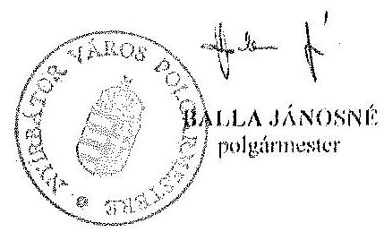
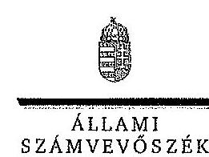
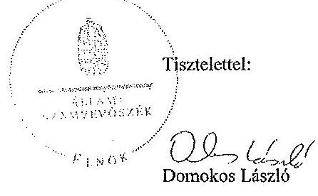
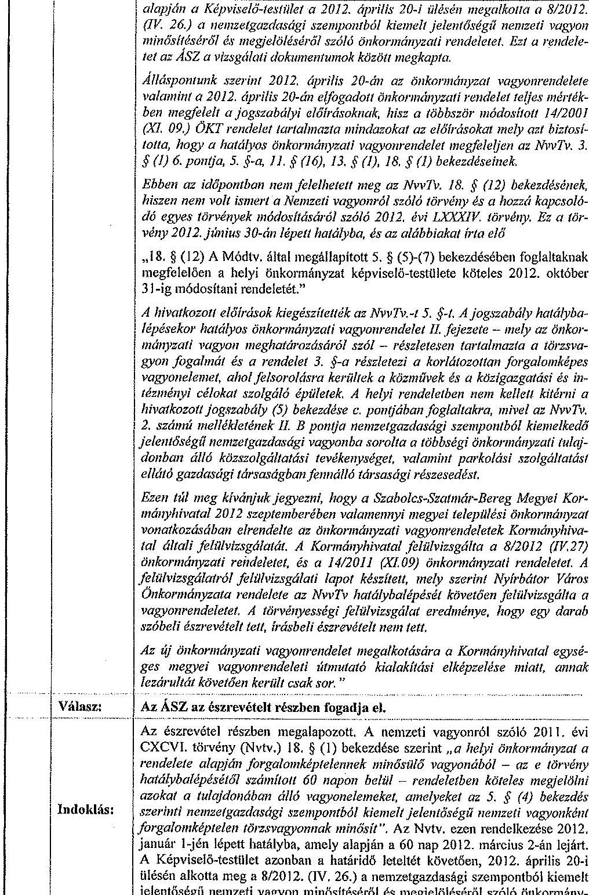
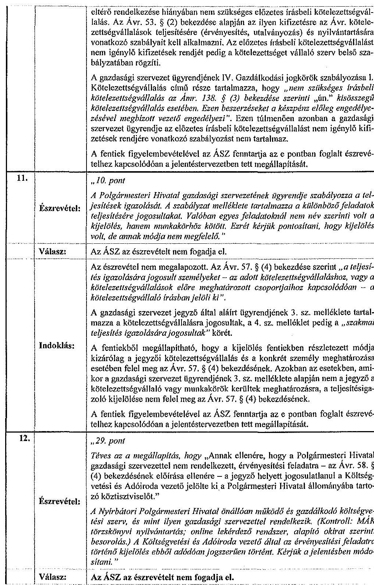
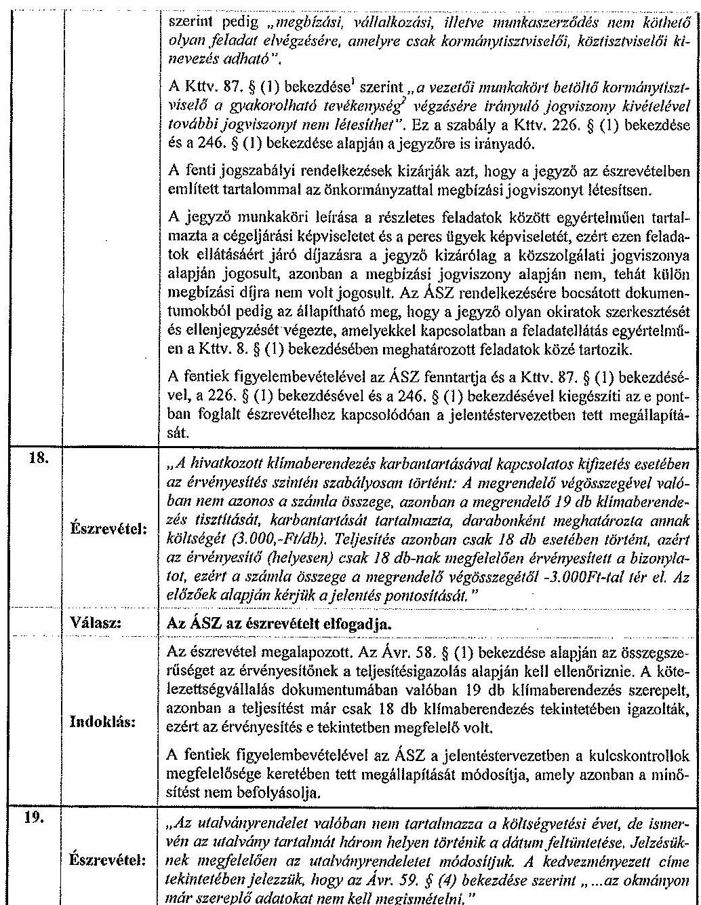
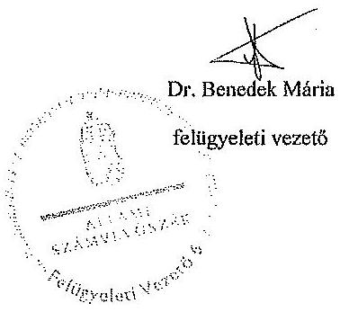

# ÁLLAMI   SZÁMVEVŐSZÉK 

## JELENTÉS

az önkormányzatok belső kontrollrendszerének kialakításának, egyes kontrolltevékenységek és a belső ellenőrzés
működésének ellenőrzéséről
Nyírbátor

---

# Állami Számvevőszék 

Iktatószám: V-0405-060/2014
Témaszám: 1372
Vizsgálat-azonosító szám: V064951

## Az ellenőrzést felügyelte:

dr. Benedek Mária
felügyeleti vezető
Az ellenőrzést vezette és az ellenőrzés végrehajtásáért felelős:
dr. Veress Tiborné
ellenőrzésvezető
A számvevőszéki jelentés összeállításában közreműködtek:
Komonszky Krisztina Pető Krisztina
számvevő
számvevő tanácsos
Az ellenőrzést végezték:
Jakab Laura
Komonszky Krisztina
számvevő
számvevő

---

# TARTALOMJEGYZÉK 

BEVEZETÉS ..... 5
I. ÖSSZEGZŐ MEGÁLLAPÍTÁSOK, KÖVETKEZTETÉSEK, JAVASLATOK ..... 9
II. RÉSZLETES MEGÁLLAPÍTÁSOK ..... 14

1. Az Önkormányzat belső kontrollrendszerének kialakítása ..... 14
1.1. A kontrollkörnyezet ..... 14
1.2. A kockázatkezelési rendszer ..... 16
1.3. A kontrolltevékenységek ..... 16
1.4. Az információs és kommunikációs rendszer ..... 17
1.5. A monitoring rendszer ..... 17
2. A pénzügyi folyamatokban kulcsszerepet betöltő teljesítésigazolás és érvényesítés belső kontrollok működése ..... 18
3. A belső ellenőrzés működése ..... 20

## MELLÉKLETEK

1. számú Észrevételt tartalmazó polgármesteri levél
2. számú Észrevételre vonatkozó elnöki válaszlevél

## FÜGGELÉKEK

1. számú Értelmező szótár
2. számú Az értékelés módja és szempontjai

---

.

---

# RÖVIDÍTÉSEK JEGYZÉKE 

## Törvények

Áht.
ÁSZ tv.
Info tv.

Kttv.

Mötv.

Nvtv.
Ötv.
vagyonnyilatkozattételről szóló tv.

## Rendeletek

Ávr.
Bkr.
hivatali SZMSZ
hivatali ügyrend

IRM rendelet
képviselő-testületi SZMSZ
vagyongazdálkodási rendelet ${ }_{1}$
vagyongazdálkodási rendelet ${ }_{2}$

2011. évi CXCV. törvény az államháztartásról
2011. évi LXVI. törvény az Állami Számvevőszékről
2011. évi CXII. törvény az információs önrendelkezési jogról és az információszabadságról (hatályos 2012. január 1-jétől)
2011. évi CXCIX. törvény a közszolgálati tisztviselőkről (hatályos 2012. március 1-jétől)
2011. évi CLXXXIX. törvény Magyarország helyi önkormányzatairól
2011. évi CXCVI. törvény a nemzeti vagyonról
1990. évi LXV. törvény a helyi önkormányzatokról
2007. évi CLII. törvény egyes vagyonnyilatkozat-tételi kötelezettségekről

368/2011. (XII. 31.) Korm. rendelet az államháztartásról szóló törvény végrehajtásáról
370/2011. (XII. 31.) Korm. rendelet a költségvetési szervek belső kontrollrendszeréről és belső ellenőrzéséről
Nyírbátor Város Önkormányzat Képviselő-testületének Szervezeti és Működési Szabályzatáról szóló 5/2011. (II. 24.) sz. rendelet függeléke Nyírbátori Polgármesteri Hivatala Szervezeti és Működési Szabályzata (hatályos 2013. április 1-jétől)
Nyírbátor Város Önkormányzat Képviselő-testületének Szervezeti és Működési Szabályzatáról szóló 12/2003. (III. 31.) ÖKT sz. rendelet 4. számú függeléke Nyírbátori Polgármesteri Hivatala Ügyrendje (hatályos 2013. március 31-ig)

61/2009. (XII. 14.) IRM rendelet a jogszabályszerkesztésről szóló
Nyírbátor Város Önkormányzata Képviselő-testületének 5/2011. (II. 24.) önkormányzati rendelete (hatályos 2013. március 31-ig)
Nyírbátor Városi Önkormányzat Képviselőtestületének 14/2001. (XI. 09.) ÖKT számú rendelete Nyírbátor Város Önkormányzata vagyonának meghatározásáról a vagyon feletti tulajdonjog gyakorlásának és a vagyon kezelésének szabályozásáról (hatályos 2013. március 10-ig)
Nyírbátor Város Önkormányzata Képviselő-testületének 4/2013. (III. 07.) önkormányzati rendelete az önkormányzat vagyonáról (hatályos 2013. március 11-től)

---

vagyonrendelet

## Szórövidítések

2013. évi ellenőrzési terv
ÁSZ
belső ellenőrzési kézikönyv $_{1}$
belső ellenőrzési kézikönyv ${ }_{2}$
Bizottság
ellenőrzési nyomvonal
éves (összefoglaló) ellenőrzési jelentés
gazdasági szervezet ügyrendje

INTOSAI
iratkezelési szabályzat

ISSAI
jegyző
Képviselő-testület
Kormányhivatal
Levéltár
NGM
Önkormányzat
polgármester
Polgármesteri Hivatal stratégiai ellenőrzési terv
Társulás

Nyírbátor Város Önkormányzata Képviselő-testületének 8/2012. (IV. 26.) önkormányzati rendelete a nemzetgazdasági szempontból kiemelt jelentőségű nemzeti vagyon minősítéséről és megjelöléséről

Nyírbátor Város Önkormányzata, Polgármesteri Hivatala és Intézményei Éves belső ellenőrzési terv 2013. év
Állami Számvevőszék
Nyírbátor és Vonzáskörzete Többcélú Kistérségi Társulás Belső ellenőrzési kézikönyv (hatályos 2010. január 1-jétől)
Nyírbátor Város Önkormányzat Belső ellenőrzési kézikönyv (hatályos 2013. április 1-jétől)
Nyírbátor Város Önkormányzata Képviselő-testületének Ügyrendi és Jogi Bizottsága
Polgármesteri Hivatal Nyírbátor Ellenőrzési nyomvonal (hatályos 2012. február 1-jétől)
Éves ellenőrzési és összefoglaló jelentés 2011. Nyírbátor Város Önkormányzata és a felügyelete alá tartozó költségvetési szervek 2011. évi belső ellenőrzési kötelezettségének teljesítéséről
Polgármesteri Hivatal Nyírbátor Gazdasági Szervezet Ügyrendje - a módosításokkal egységes szerkezetben Hatályos: 2009. január 1-jétől
International Organization of Supreme Audit Institutions (Legfőbb Ellenőrző Intézmények Nemzetközi Szervezete)
Nyírbátor Város Polgármesteri Hivatala 15.600/2011. szabályzata az Ügyiratkezelésről (hatályos 2012. január 1-jétől)
International Standards of Supreme Audit Institutions (Legfőbb Ellenőrző Intézmények Nemzetközi Standardjai)
Nyírbátor Város jegyzője
Nyírbátor Város Önkormányzata Képviselő-testülete
Szabolcs-Szatmár-Bereg Megyei Kormányhivatal
Szabolcs-Szatmár-Bereg Megyei Levéltár
Nemzetgazdasági Minisztérium
Nyírbátor Város Önkormányzata
Nyírbátor Város polgármestere
Nyírbátor Város Polgármesteri Hivatala
Nyírbátor Város Önkormányzata Stratégiai ellenőrzési terve
Nyírbátor és Vonzáskörzete Többcélú Kistérségi Társulás

---

# JELENTÉS 

## az önkormányzatok belső kontrollrendszerének kialakításának, egyes kontrolltevékenységek és a belső ellenőrzés működésének ellenőrzéséről Nyírbátor

## BEVEZETÉS

Nyírbátor város állandó lakosainak száma 2012. január 1-jén 12699 fő volt. Az Önkormányzat 12 tagú Képviselő-testületének munkáját öt állandó bizottság segítette. Az Önkormányzat az önállóan működő és gazdálkodó Polgármesteri Hivatalon kívül egy önállóan működő és gazdálkodó, illetve egy önállóan működő intézményt működtetett, valamint három többségi tulajdoni hányadú gazdasági társasággal rendelkezett. A polgármester 2003. óta tölti be a tisztségét. A jegyző 2003. július 3-tól látja el feladatait. A Polgármesteri Hivatal elkülönített gazdasági szervezettel nem rendelkezett, a foglalkoztatott köztisztviselők száma 2012. január 1-jén 55 fő volt. A Polgármesteri Hivatalnál 2013. január 1-jétől szervezeti változás nem volt. Az Önkormányzat a 2012. évi költségvetési beszámolója szerint 3633272 ezer Ft költségvetési bevételt ért el, valamint 3436573 ezer Ft költségvetési kiadást teljesített. A 2012. december 31-i könyvviteli mérleg szerint 15226454 ezer Ft értékű eszközvagyonnal rendelkezett, a rövid lejáratú kötelezettségállománya 505239 ezer Ft, a hosszú lejáratú kötelezettségállománya 3885165 ezer Ft volt. A 2013. évben az Önkormányzat 1813433 ezer Ft összegű adósságkonszolidációban részesült, amelyet a 2012. december 31-én fennálló 139363 ezer Ft folyószámlahitel teljes összegének, illetve a 3180211 ezer Ft kötvénytartozásból 1674070 ezer Ft tartozás visszafizetésére használt fel.

A demokratikus társadalmakban alapvető igény, hogy a közpénzeket, a közvagyont használók tevékenységükről elszámoljanak, ahhoz egyértelmű és érvényesíthető felelősségi szabályok társuljanak. Ennek a jogos igénynek az érvényesítéséhez meg kell teremteni azokat a folyamatokat, rendszereket, amelyek nélkülözhetetlenek az elszámoltatáshoz. Az elszámoltatás eredményes működtetéséhez szükség van a megfelelő információs, kontroll, értékelési és beszámolási rendszerek kialakítására.

Magyarországon az uniós csatlakozási tárgyalások idejére nyúlnak vissza a belső kontrollrendszer szabályozásának gyökerei. Az uniós elvárásoknak megfelelő új terminológia szerinti államháztartási belső pénzügyi ellenőrzési rendszer területén a jogharmonizáció 2003-ban teljes körűen megvalósult, míg az önkormányzati alrendszerre vonatkozó, az Ötv.-ben megjelenített speciális szabályozás 2005-ben lépett hatályba. Az államháztartási belső kontrollrendszer

---

koncepciója 2009-ben továbbfejlődött. A változások irányát mutatja, hogy a költségvetési szervek belső kontrollrendszere már magában foglalja a korszerű, felelős szervezetirányítás elemeit (kontrollkörnyezet, kockázatkezelés, kontrolltevékenység, információ és kommunikáció, monitoring) is. E kontrollrendszer szabályozása háromszintű, a törvényi előírásokat az Áht. és a Mötv., a rendeleti szintű szabályozást az Ávr. és a Bkr. tartalmazza, amelyeket útmutatói szinten az NGM által kiadott standardok és kézikönyvek támogatnak.

A belső kontrollrendszer azt a célt szolgálja, hogy a költségvetési szervek működésük és gazdálkodásuk során a tevékenységeket szabályszerűen, gazdaságosan, hatékonyan és eredményesen hajtsák végre, teljesítsék elszámolási kötelezettségeiket és megvédjék az erőforrásokat a veszteségektől, a károktól és a nem rendeltetésszerű használattól. A belső kontrollrendszer magában foglalja mindazon szabályokat, eljárásokat, gyakorlati módszereket és szervezeti struktúrákat, kockázatkezelési technikákat, kontrolltevékenységeket, amelyek segítséget nyújtanak a szervezetnek céljai eléréséhez.

Az ÁSZ középtávú stratégiájában hangsúlyos szerepet szánt annak, hogy szilárd szakmai alapon álló, értékteremtő ellenőrzéseivel előmozdítsa a közpénzügyek átláthatóságát, rendezettségét. A számvevőszéki ellenőrzés nemzetközi alapelvei is rögzítik, hogy a megfelelő belső kontrollrendszer minimálisra csökkenti a hibák és szabálytalanságok kockázatát.

Az ellenőrzés célja annak megállapítása volt, hogy a belső kontrollrendszer elemeinek kialakítása, a pénzügyi folyamatokban kulcsszerepet betöltő teljesítésigazolás és érvényesítés, és a belső ellenőrzés szabályos működése biztosította-e az Önkormányzatnál a közpénzfelhasználás szabályosságát, hozzájárult-e az értéket teremtő rend követelményének érvényesüléséhez.

Ennek keretében értékeltük, hogy:

- a jogszabályi előírásoknak megfelelően alakították-e ki a belső kontrollrendszer elemeit;
- a gazdálkodás folyamatában kulcsszerepet betöltő teljesítésigazolás és érvényesítés kontrolltevékenységeit megfelelően működtették-e;
- biztosították-e a belső ellenőrzés szabályos működését;
- amennyiben az ÁSZ tett javaslatot a 2008-2011. évek közötti ellenőrzése kapcsán az Önkormányzatnak, intézkedtek-e azok végrehajtására.

Az ellenőrzés várható hasznosulását négy szinten tervezzük. A törvényalkotás számára összegzett tapasztalatok állnak rendelkezésre a belső kontrollrendszer önkormányzati területen való kialakításáról, működéséről és hatásairól, a belső ellenőrzés működéséről. Ennek alapján következtetést lehet levonni arról, hogy a belső kontrollrendszer kialakítására és működtetésére vonatkozó jelenlegi, differenciálás nélküli jogszabályi előírások reális követelményeket támasztanak-e az eltérő adottságú települési önkormányzatok esetében, illetve indokolt-e esetleges jogszabályi módosítás kezdeményezése. Az ellenőrzés az ellenőrzött számára visszajelzést ad a belső kontrollrendszer kialakításában és működésében fellépő hiányosságokról, javaslataival hozzájárul azok kikü-

---

szöböléséhez, amely csökkentheti a későbbi ellenőrzések gyakoriságát. Az ellenőrzés megállapításait és javaslatait más szervezetek is hasznosíthatják a rendezett gazdálkodási keretek kialakításához. A társadalom számára jelzi, hogy közpénz nem maradhat ellenőrizetlenül, az ÁSZ értékteremtő rend kialakításához és megőrzéséhez hozzájáruló tevékenysége pozitív hatással lesz a szervezetről kialakított összkép formálásában. A szervezeten belül lehetőség nyílik arra, hogy a megállapítások szintetizálásával az ÁSZ a hozzáadott értéket teremtő elemző tevékenységét és tanácsadó szerepét is erősítse.

Az önkormányzatok belső kontrollrendszerének kialakításának, egyes kontrolltevékenységek és a belső ellenőrzés működésének ellenőrzéséről szóló jelentés I. fejezetének összegző része az ellenőrzés céljára ad rövid, szintetizáló összefoglalót, és tartalmazza a következtetéseket a II. fejezet részletes megállapításain alapulóan. A jelentés intézkedést igénylő megállapításait és javaslatait az ellenőrzés során feltárt, a jelentés II. fejezetében rögzített részletes megállapítások alapozzák meg. A helyszíni ellenőrzés lezárásáig a helyi szabályozás változásait nyomon követtük. Az ÁSZ az ellenőrzés megállapításait az ellenőrzött időszakban hatályos, az intézkedést igénylő megállapításokra tett javaslatokat a jelenleg hatályos jogszabályok alapján fogalmazta meg.

Az ellenőrzés típusa: szabályszerűségi ellenőrzés.
Az ellenőrzött időszak: a belső kontrollrendszer kialakításának megfelelősége esetében a 2012. évre, a pénzügyi folyamatokban kulcsszerepet betöltő teljesítésigazolás és érvényesítés belső kontrollok működésének megfelelőségét és a belső ellenőrzés szabályszerű működését a 2012. január 1. és december 31-e közötti időszak eseményeit figyelembe véve értékeltük, míg az ÁSZ javaslatainak utóellenőrzése a 2008-2011. években végzett ellenőrzések nyilvánosságra hozott jelentéseiben tett javaslatok áttekintésére terjedt ki.

# Az ellenőrzött szervezet: az Önkormányzat. 

Az ellenőrzés jogszabályi alapját az ÁSZ tv. 1. § (3) bekezdése, az 5. § (2) és (6) bekezdése, valamint az Áht. 61. § (2) bekezdésének előírásai képezik.

Az ellenőrzés szakmai módszertana az ÁSZ hivatalos honlapján (www.asz.hu) közzétett szakmai szabályokon alapult, amely az INTOSAI által kiadott ISSAI figyelembevételével készült.

Az ellenőrzés lefolytatásához az Önkormányzat a kimutatások és a tanúsítvány elektronikus kitöltésével, valamint az ÁSZ által kért dokumentumok elektronikus megküldésével szolgáltatott adatokat. Az így rendelkezésre bocsátott adatok, információk kontrollja és a munkalapok kitöltése a helyszíni ellenőrzés keretében történt. A jelentésben használt fogalmak magyarázatát az 1. számú függelék, az ellenőrzés egyes területeinek értékelésénél alkalmazott egységes minősítési szempontokat a 2. számú függelék tartalmazza.

A belső kontrollrendszer kialakításának ellenőrzése során értékeltük a kontrollkörnyezet, a kockázatkezelési rendszer, a kontrolltevékenységek, az információs és kommunikációs rendszer, valamint a monitoring rendszer szabályozottságának megfelelőségét. A pénzügyi folyamatokban kulcsszerepet betöltő teljesítésigazolás és érvényesítés kontrollok működése megfelelőségének minősíté-

---

hez az állományba nem tartozók megbízási díjai, a külső szolgáltatók által végzett karbantartási, kisjavítási munkák, az egyéb üzemeltetési és fenntartási szolgáltatások, a rendszeres szociális segélyek, valamint az államháztartáson kívülre teljesített működési és felhalmozási célú pénzeszközátadások közül kockázatelemzéssel választottuk ki az ellenőrzött kiadási jogcímeket. Az egyszerű véletlen mintavétellel kiválasztott tételek ellenőrzését többlépcsős megfelelőségi tesztek útján addig végeztük, amíg elegendő és megfelelő bizonyítékot szereztünk a vizsgált folyamatok kulcskontrolljai működésének megfelelő vagy nem megfelelő voltáról. Értékeltük az Önkormányzatnál a belső ellenőrzés működésének
 szabályosságát.

Az ÁSZ az Önkormányzatnál 2008. évben a Magyar Köztársaság 2007. évi költségvetése végrehajtását és a közbeszerzési rendszer működését, a 2009. évben a Sport XXI. Létesítményfejlesztési Program keretében támogatott önkormányzati PPP beruházások megvalósításának és önkormányzati feladatok ellátására gyakorolt hatását, illetve a helyi önkormányzatok gazdálkodási rendszerét ellenőrizte. A 0824, 0831, 0919 és 1019 számon közzétett számvevőszéki jelentésekben az ÁSZ az Önkormányzatnak javaslatot nem tett, ezért jelen ellenőrzés keretében utóellenőrzésre nem került sor.

Az Ász tv. 29. § (1) bekezdése szerint a jelentéstervezetet megküldtük a polgármester részére, aki az ÁSZ tv. 29. § (2) bekezdésében foglalt észrevételezési jogával élt, a jelentéstervezetre észrevételt tett (1. számú melléklet). Az ÁSZ tv. 29. § (3) bekezdésében előírtaknak megfelelően a figyelembe nem vett észrevételeket és annak indokairól szóló tájékoztatást a jelentés tartalmazza (2. számú melléklet).

---

# I. ÖSSZEGZŐ MEGÁLLAPÍTÁSOK, KÖVETKEZTETÉSEK, JAVASLATOK 

A belső kontrollrendszeren belül 2012-ben a kontrollkörnyezet, a kockázatkezelési rendszer, a kontrolltevékenységek, az információs és kommunikációs rendszer, valamint a monitoring rendszer kialakítását külön-külön és együttesen is értékeltük. A belső kontrollrendszer kialakítása az összesített értékelés alapján nem felelt meg a jogszabályi előírásoknak.

A belső kontrollrendszer egyes területei kialakításának minősítése a következő:

| Kontrollterület | Minősítés |
| :-- | :--: |
| Kontrollkörnyezet | nem   megfelelő   nem   megfelelő   nem   megfelelő   nem   megfelelő |
| Kockázatkezelési rendszer |  |
| Kontrolltevékenységek |  |
| Információs és kommunikáci-   ós rendszer |  |
| Monitoring rendszer |  |

Megfelelőnek értékeltük az információs és kommunikációs rendszer kialakítását, mivel a jegyző a jogszabályi előírásokban foglaltakat figyelembe véve a kisebb hiányosságok mellett is megteremtette e kontrollterületen a szabályszerű működés lehetőségét.

Nem megfelelőnek értékeltük a kontrollkörnyezet, a kockázatkezelési rendszer, a kontrolltevékenységek és a monitoring rendszer kialakítását, mivel az ellenőrzésünk során megállapított szabályozásbeli hiányosságok magukban hordozzák a szabálytalan működés, valamint a korrupció kockázatát.

Az állományba nem tartozók megbízási díjaival, valamint a külső szolgáltatók által végzett karbantartási, kisjavítási munkákkal kapcsolatos kifizetések során a pénzügyi folyamatokban kulcsszerepet betöltő teljesítésigazolás és érvényesítés belső kontrollok működése gyenge volt. Gyengének értékeltük a két kulcskontroll együttes működését, mert azok nem biztosították az ellenőrzésünk által feltárt hiányosságok bekövetkezésének megelőzését.

Az Önkormányzat a belső ellenőrzési feladatokat a Társulás útján látta el. A belső ellenőrzés működése a jogszabályi előírásoknak nem felelt meg. A belső ellenőrzés nem tárta fel a számvevőszéki ellenőrzés által megállapított hiányosságokat a kontrollkörnyezet, a kockázatkezelési rendszer, a kontrolltevékenységek és a monitoring rendszer kialakításánál, továbbá a pénzügyi folyamatokban kulcsszerepet betöltő teljesítésigazolás és érvényesítés belső kontrollok működésénél.

Az ÁSZ tv. 33. § (1) bekezdésében foglaltak értelmében az ellenőrzött szervezet vezetője köteles a jelentésben foglalt megállapításokhoz kapcsolódó intézkedési tervet összeállítani, és azt a jelentés kézhezvételétől számított 30 napon belül az ÁSZ részére megküldeni. Amennyiben az intézkedési tervet határidőre nem küldi meg a szervezet, vagy az ÁSZ tv. 33. § (2) bekezdésében foglalt póthatáridő elteltével megküldött intézkedési terv továbbra sem elfogadható, az ÁSZ elnöke a hivatkozott törvény 33. § (3) bekezdés a)-b) pontjaiban foglaltakat érvényesítheti.

Az ellenőrzés intézkedést igénylő megállapításai és javaslatai:

# a polgármesternek 

1. A polgármester mint kötelezettségvállaló - az Ávr. 57. § (4) bekezdésében foglaltak ellenére - nem jelölte ki 2012. március 30-át követően írásban az Önkormányzat kiadási előirányzatai vonatkozásában a teljesítésigazolására jogosult személyeket.

Javaslat:
Gondoskodjon az Ávr. 57. § (4) bekezdésében foglaltak szerint az Önkormányzat kiadási előirányzatai vonatkozásában a teljesítésigazolására jogosult személyek írásban történő kijelöléséről.
2. A számvevőszéki ellenőrzés megállapításai alapján az Önkormányzatnál a belső kontrollrendszer kialakítása összefoglalóan értékelve és a belső ellenőrzés működése nem felelt meg a jogszabályi előírásoknak, a kulcskontrollok működése gyenge volt. A megállapított szabályozásbeli hiányosságok magukban hordozzák a szabálytalan működés kockázatát.

Javaslat:
Az Mötv. 115. § (1) bekezdésében foglaltak alapján kísérje figyelemmel az Önkormányzat gazdálkodásának szabályszerűségét. Az Mötv. 67. § f) pontja alapján gondoskodjon a belső kontrollrendszer és a belső ellenőrzés működésére vonatkozó jogszabályi rendelkezések be nem tartása, valamint a teljesítésigazolás, illetve az érvényesítés kontrollokkal összefüggésben feltárt hiányosságok, szabálytalanságok tekintetében az esetleges munkajogi felelősséggel kapcsolatos körülmények kivizsgálásáról, majd a vizsgálat eredményének függvényében tegye meg a szükséges intézkedéseket.

## a jegyzőnek

1. a kontrollkörnyezettel kapcsolatban:

A Polgármesteri Hivatal szervezeti és működési szabályzatának megalkotása nem felelt meg az Áht. előírásának. A jegyző az Nvtv. előírásai ellenére nem készítette elő a vagyonrendelet vagy a vagyongazdálkodási rendelet módosítását. A jegyző által elkészített ellenőrzési nyomvonal nem felelt meg a Bkr. előírásainak. A jegyző az Ötv.ben foglalt kötelezettsége ellenére nem készítette elő a Kttv.-ben foglaltak szerinti, a köztisztviselőkkel szembeni hivatásetikai alapelvek részletes tartalmának, valamint az etikai eljárás szabályainak dokumentumát. [II. Részletes megállapítások, 1.1. A kontrollkörnyezet 5., 16., 41. és 47. sorszámú megállapítás].

Javaslat:
Intézkedjen az Áht. 69. § (2) bekezdése, a Bkr. 3. § a) pontja és 6. §-a alapján a jelentés II. Részletes megállapítások, 1.1. A kontrollkörnyezet 5., 16., 41. és 47. sorszámú megállapításaiban foglalt hibák, hiányosságok kijavításáról, megszüntetéséről az ott megjelölt jogszabályi rendelkezéseknek megfelelően.
2. a kockázatkezelési rendszerrel kapcsolatban:

A jegyző - a Bkr.-ben foglaltak ellenére - nem mérte fel és nem állapította meg a Polgármesteri Hivatal tevékenységében rejlő kockázatokat, nem határozta meg az egyes kockázatok kezeléséhez szükséges intézkedéseket, valamint a kockázatok kezelése érdekében előírt intézkedések teljesítésének nyomon követési módját. A vagyonnyilatkozat-tételi kötelezettséget a képviselő-testületi SZMSZ helyett a Bizottság által kiadott Vagyonnyilatkozat-tételi Szabályzat tartalmazta. [II. Részletes megállapítások, 1.2. A kockázatkezelési rendszer, 1., 4., 5., 8., 10. és 13. sorszámú megállapítás]

Javaslat:
Intézkedjen az Áht. 69. § (2) bekezdése, a Bkr. 3. § b) pontja és 7. §-a, valamint a vagyonnyilatkozat-tételről szóló tv. alapján a jelentés II. Részletes megállapítások, 1.2. A kockázatkezelési rendszer 1., 4., 5., 8., 10. és 13. sorszámú megállapításaiban foglalt hibák, hiányosságok kijavításáról, megszüntetéséről az ott megjelölt jogszabályi rendelkezéseknek megfelelően.
3. a kontrolltevékenységekkel kapcsolatban:

A jegyző a Bkr.-ben foglaltak ellenére nem biztosította minden tevékenységre vonatkozóan a folyamatba épített, előzetes, utólagos és vezetői ellenőrzést. A jegyző az Ávr.-ben foglaltak ellenére nem rendezte teljes körűen a kötelezettségvállalás pénzügyi ellenjegyzése és az érvényesítés gyakorlásának módjával, eljárási és dokumentációs részletszabályaival, valamint az ezeket végző személyek kijelölésének rendjével kapcsolatos belső előírásokat, feltételeket. A jegyző az Ávr.-ben foglaltakat figyelmen kívül hagyva annak ellenére nem határozta meg az előzetes írásbeli kötelezettségvállalást nem igénylő kifizetések rendjét, hogy lehetővé tette az 50 ezer Ft alatti kifizetések előzetes írásbeli kötelezettségvállalás nélküli teljesítését. A jegyző az Ávr. előírása ellenére nem jelölte ki írásban a teljesítésigazolásra jogosult személyeket. Az érvényesítési feladatra az Ávr. előírása ellenére a jegyző helyett jogosulatlanul a Költségvetési és Adóiroda vezetője jelölte ki a Polgármesteri Hivatal állományába tartozó köztisztviselőt [II. Részletes megállapítások, 1.3. A kontrolltevékenységek 4-6., 8-11. és 29. sorszámú megállapítás].

Javaslat:
Intézkedjen az Áht. 69. § (2) bekezdése, a Bkr. 3. § c) pontja és 8. §-a alapján a jelentés II. Részletes megállapítások, 1.3. A kontrolltevékenységek 4-6., 8-11. és 29. sorszámú megállapításaiban foglalt hibák, hiányosságok kijavításáról, megszüntetéséről az ott megjelölt jogszabályi rendelkezéseknek megfelelően.
4. az információs és kommunikációs rendszerrel kapcsolatban:

A jegyző az Info. tv. rendelkezései ellenére nem készített adatvédelmi és adatbiztonsági szabályzatot [II. Részletes megállapítások, 1.4. Az információs és kommunikációs rendszer 5. sorszámú megállapítás].

Javaslat:
Intézkedjen az Áht. 69. § (2), a Bkr. 3. § d) pontjában és a 9. §-a alapján a jelentés II. Részletes megállapítások, 1.4. Az információs és kommunikációs rendszer 5. sorszámú megállapításában foglalt hiba, hiányosság kijavításáról, megszüntetéséről az ott megjelölt jogszabályi rendelkezéseknek megfelelően.
5. a monitoring rendszerrel kapcsolatban:

A jegyző a Bkr.-ben foglaltak ellenére nem alakította ki a Polgármesteri Hivatal tevékenységének, a célok megvalósításának nyomon követését biztosító rendszerét. [II. Részletes megállapítások, 1.5. A monitoring rendszer 1. sorszámú megállapítás]

Javaslat:
Intézkedjen az Áht. 69. § (2) bekezdése, a Bkr. 3. § e) pontja és 10. §-a alapján a jelentés II. Részletes megállapítások, 1.5. A monitoring rendszer 1. sorszámú megállapításában foglalt hibák, hiányosságok kijavításáról, megszüntetéséről az ott megjelölt jogszabályi rendelkezéseknek megfelelően.
6. a pénzügyi folyamatokban kulcsszerepet betöltő kontrollokkal kapcsolatban:

A teljesítésigazolás és az érvényesítés az Áht.-ban és az Ávr.-ben foglaltaknak, az utalványrendelet tartalma az Ávr.-ben, a megbízási szerződés megkötése a Kttv.-ben foglaltaknak nem felelt meg [II. Részletes megállapítások, 2. A pénzügyi folyamatokban kulcsszerepet betöltő teljesítésigazolás és érvényesítés belső kontrollok működése 1-3. pontban foglalt megállapítás].

Javaslat:
Intézkedjen az Áht. 37. §-ában, az Ávr. 55. §-ában és 57-59. §-aiban és a Kttv. 8. § (1) bekezdésében foglaltak alapján arról, hogy a teljesítésigazolás és az érvényesítés vonatkozásában, illetve az azok ellenőrzése során a kötelezettségvállalás pénzügyi ellenjegyzésével, az utalványozással, valamint a megbízási szerződés megkötésével kapcsolatban feltárt, a jelentés II. Részletes megállapítások, 2. A pénzügyi folyamatokban kulcsszerepet betöltő teljesítésigazolás és érvényesítés belső kontrollok működése 1-3. pontjában szereplő megállapításában foglalt hibák, hiányosságok kijavítása, megszüntetése az ott megjelölt jogszabályi rendelkezéseknek megfelelően történjen meg.

7. a belső ellenőrzés működésével kapcsolatban:

A belső ellenőrzés működése a számvevőszéki ellenőrzés értékelési szempontjait figyelembe véve nem felelt meg a Bkr.-ben foglalt rendelkezéseknek. [II. Részletes megállapítások, 3. A belső ellenőrzés működése 3-5., 7., 8. a), h), 11., 18., 23., 26. és 27. b) sorszámú megállapítás]

Javaslat:
Intézkedjen az Áht. 69. § (2), a 70. § (1) bekezdése, a Bkr. 3. § e) pontja és a 10. §-a alapján a jelentés II. Részletes megállapítások, 3. A belső ellenőrzés működése 3-5., 7., 8. a), h), 11., 18., 23., 26. és 27. b) sorszámú megállapításaiban foglalt hibák, hiányosságok kijavításáról, megszüntetéséről az ott megjelölt jogszabályi rendelkezéseknek megfelelően.

---

# II. RÉSZLETES MEGÁLLAPÍTÁSOK 

## 1. Az ÖNKORMÁNYZAT BELSŐ KONTROLLRENDSZERÉNEK KIALAKÍTÁSA

A belső kontrollrendszeren belül 2012-ben a kontrollkörnyezet, a kockázatkezelési rendszer, a kontrolltevékenységek, az információs és kommunikációs rendszer, valamint a monitoring rendszer kialakítását külön-külön és együttesen is értékeltük. A belső kontrollrendszer kialakítása az összesített értékelés alapján nem felelt meg a jogszabályi előírásoknak.

### 1.1. A kontrollkörnyezet

A kontrollkörnyezet kialakítása - a 2. számú függelékben részletezett kritériumrendszer alapján végzett értékelés szerint - a jogszabályi előírásoknak nem felelt meg, mert:

| Sor-   szám $^{1}$ | Megállapítás | Megjegyzés |
| :--: | :--: | :--: |
| 5. | A Polgármesteri Hivatal feladatai ellátásának részletes belső rendjét és módját - az Áht. 9. § (1) bekezdés e) pontjában és a 10. § (5) bekezdésében foglaltak ellenére szervezeti és működési szabályzat helyett a képviselő-testületi SZMSZ függelékét képező - a szervezeti és működési szabályzat tartalmára vonatkozó jogszabályi előírásoknak megfelelő - hivatali ügyrendben a Képviselő-testület helyett a jegyző hagyta jóvá. | A költségvetési szerv szervezeti és működési szabályzatának jóváhagyása az Áht. 9. §
 (1) bekezdés e) pontja alapján az irányító szerv hatásköre, így arra nem a jegyző, hanem a Képviselő-testület jogosult.   Tekintettel arra, hogy a függelék az IRM rendelet alapján nem része a képviselő-testületi SZMSZ-nek, mint jogszabálynak, a hivatali ügyrend függelékben történő szerepeltetése nem pótolja az Áht. 9. § (1) bekezdésében előírt jóváhagyást.   A Polgármesteri Hivatal feladatai ellátásának részletes belső rendjét és módját a hivatali ügyrendben szabályozták.   A Polgármesteri Hivatal 2013. április 1-jétől Képviselő-testület által jóváhagyott hivatali SZMSZ-szel rendelkezik. |

[^0]
[^0]:    ${ }^{1}$ A megállapítás számozása az Önkormányzat által az adatszolgáltatás során kitöltött kimutatások kérdéseinek sorszámával azonos.

---

A jegyző - az Ötv. 36. § (2) bekezdés a) pontjában foglaltak ellenére - az ellenőrzött időszakban nem készítette elő olyan időben a vagyonrendelet vagy a vagyongazdálkodási rendelet ${ }_{1}$ módosítását, hogy a Képviselő-testület az Nvtv. 18. § (1) bekezdésében meghatározott határidőben elfogadhassa.

A jegyző - az Ötv. 36. § (2) bekezdés a) pontjában foglaltak ellenére - az ellenőrzött időszakban nem készítette elő a vagyonrendelet vagy a vagyongazdálkodási rendelet ${ }_{1}$ módosítását annak érdekében, hogy az megfeleljen az Nvtv. 3. § (1) bekezdés 6. pontja, 5. §-a, 11. § (1) bekezdése, 13. § (1) bekezdése, 18. § (1) bekezdése előírásainak, és tartalmazza a Mötv. 109. § (4) bekezdésének megfelelően a vagyonkezelés ellenőrzésének részletes szabályait.

A jegyző által elkészített ellenőrzési nyomvonal nem felelt meg a Bkr. 6. § (3) bekezdésében foglaltaknak, mivel nem a Polgármesteri Hivatal egészére vonatkozóan határozta meg a működési folyamatok leírását, hanem kizárólag a Költségvetési és Adóiroda folyamataira.

A Képviselő-testület - a Kttv. 231. § (1) bekezdése ellenére - nem állapította meg a Kttv. 83. §-ában előírt, a köztisztviselőkkel szembeni hivatásetikai alapelvek részletes tartalmát, valamint az etikai eljárás szabályait, mivel a jegyző - az Ötv. 36. § (2) bekezdés a) pontjában előírt feladata ellenére - nem készítette elő ennek dokumentumát.

Az Önkormányzat az Nvtv. 18. § (1) bekezdésének nem rendeletmódosítással, hanem önálló, a nemzetgazdasági szempontból kiemelt jelentőségű nemzeti vagyon minősítéséről és megjelöléséről szóló 8/2012. (IV. 26.) önk. rendelet megalkotásával tett eleget.

A vagyongazdálkodási rendelet ${ }_{2}$ 2013. március 11-től hatályos.

Az ellenőrzési nyomvonal a Költségvetési és Adóiroda folyamataira sem tartalmazta az információs szinteket és kapcsolatokat, illetve irányítási folyamatokat.

A Nyírbátori Polgármesteri Hivatal 2013. szeptember 1-jétől hatályos Köztisztviselői Etikai Kódexét a Képviselő-testület 75/2013. (VIII. 29.) önkormányzati határozatával fogadta el.

---

# 1.2. A kockázatkezelési rendszer 

A kockázatkezelési rendszer kialakítása - a 2. számú függelékben részletezett kritériumrendszer alapján végzett értékelés szerint - a jogszabályi előírásoknak nem felelt meg, mert:

| Sor-   szám | Megállapítás |
| :--: | :--: |
| 1., 4.,   5., 8.,   10. | A jegyző - a Bkr. 7. § (2) bekezdésében foglaltak ellenére - nem mérte fel és nem állapította meg a Polgármesteri Hivatal tevékenységében rejlő kockázatokat, nem határozta meg az egyes kockázatok kezeléséhez szükséges intézkedéseket, valamint a kockázatok kezelése érdekében előírt intézkedések teljesítésének nyomon követési módját. |
| 13. | A vagyonnyilatkozat-tételre kötelezettek vagyonnyilatkozat-tételi kötelezettségét - a vagyonnyilatkozat-tételről szóló tv. 4. § d) pontjában foglaltak ellenére - a képviselő-testületi SZMSZ helyett a Bizottság által kiadott Vagyonnyilatkozat-tételi Szabályzatban tüntették fel. |

### 1.3. A kontrolltevékenységek

A kontrolltevékenységek kialakítása - a 2. számú függelékben részletezett kritériumrendszer alapján végzett értékelés szerint - nem felelt meg a jogszabályi előírásoknak:

| Sor-   szám | Megállapítás |
| :--: | :--: |
| $4-5$. | A jegyző - a Bkr. 8. § (2) bekezdés a) pontjában foglaltak ellenére - nem biztosította a pénzügyi döntések közül a vagyonhasznosítási tevékenység és a támogatásokkal való elszámolás dokumentumainak elkészítésével kapcsolatban a folyamatba épített, előzetes, utólagos és vezetői ellenőrzést. |
| $\begin{aligned} & 6 ., 9 . , \\ & 11 . \end{aligned}$ | A jegyző - az Ávr. 13. § (2) bekezdés a) pontjában foglaltak ellenére - belső szabályzatban nem rendezte teljes körűen a kötelezettségvállalás pénzügyi ellenjegyzése és az érvényesítés gyakorlásának módjával, eljárási és dokumentációs részletszabályaival, valamint az ezeket végző személyek kijelölésének rendjével kapcsolatos belső előírásokat, feltételeket. |
| 8. | A jegyző - az Ávr. 53. § (2) bekezdésében foglaltakat figyelmen kívül hagyva - annak ellenére nem határozta meg az előzetes írásbeli kötelezettségvállalást nem igénylő kifizetések rendjét, hogy a gazdasági szervezet ügyrendjében lehetővé tette az 50 ezer Ft alatti kifizetések előzetes írásbeli kötelezettségvállalás nélküli teljesítését. |
| 10. | Az Ávr. 57. § (4) bekezdésében foglaltak ellenére 2012. március 30-ig a jegyző, ezt követően a kötelezettségvállaló nem jelölte ki a teljesítésigazolásra jogosult személyeket. |
| 29. | Annak ellenére, hogy a Polgármesteri Hivatal gazdasági szervezettel nem rendelkezett, érvényesítési feladatra - az Ávr. 58. § (4) bekezdésének előírása ellenére - a jegyző helyett jogosulatlanul a Költségvetési és Adóiroda vezető jelölte ki a Polgármesteri Hivatal állományába tartozó köztisztviselőt. |

---

# 1.4. Az információs és kommunikációs rendszer 

Az információs és kommunikációs rendszer kialakítása - a 2. számú függelékben részletezett kritériumrendszer alapján végzett értékelés szerint megfelelt a jogszabályi előírásoknak.

Szabályozták a szervezeten belüli és a külső feleknek történő információ átadásának, a szervezeten kívülről érkező információk kezelésének, valamint a kötelezően közzéteendő közérdekű adatok nyilvánosságra hozatalának és a közérdekű adatok megismerésére irányuló igények teljesítésének rendjét. A közzétételi kötelezettségének az Önkormányzat eleget tett. Megfelelő tartalommal elkészítették az iratkezelési szabályzatot, amely tartalmazta a Levéltár és a Kormányhivatal egyetértését. A Polgármesteri Hivatalban szabályozott az ügyintézés folyamata, a határidők rögzítése.

Az információs és kommunikációs rendszer kialakítása az értékelés szempontjából az alábbi kisebb súlyú hiányosság mellett megfelelt a jogszabályi előírásoknak:

| Sorszám | Megállapítás |
| :--: | :--: |
| 5. | A jegyző - az Info tv. 24. § (3) bekezdésében foglaltak ellenére - nem készítette el a Polgármesteri Hivatal adatvédelmi és adatbiztonsági szabályzatát. |

### 1.5. A monitoring rendszer

A monitoring rendszer kialakítása - a 2. számú függelékben részletezett kritériumrendszer alapján végzett értékelés szerint - nem felelt meg a jogszabályi előírásoknak, mert:

| Sorszám | Megállapítás |
| :--: | :--: |
| 1. | A jegyző - a Bkr. 3. § e) pontjában és a 10. §-ában foglaltak ellenére - nem alakította ki a Polgármesteri Hivatal tevékenységének, a célok megvalósításának nyomon követését biztosító rendszerét. |

Az Önkormányzat törvényességi felügyeletét ellátó Kormányhivatal a 2012. évben egy alkalommal élt törvényességi felhívással. A törvényességi felhívásában megállapította, hogy a Képviselő-testület egy határozata törvénysértő volt, amelyet a Képviselő-testület önkormányzati határozattal hatályon kívül helyezett.

---

# 2. A PÉNZÜGYI FOLYAMATOKBAN KULCSSZEREPET BETÖLTŐ TELJESÍTÉSIGAZOLÁS ÉS ÉRVÉNYESÍTÉS BELSŐ KONTROLLOK MŰKÖDÉSE 

A kulcsszerepet betöltő teljesítésigazolás és érvényesítés belső kontrollok működésének megfelelősége gyenge volt, mert:

| Kontrollok   sorszáma | Megállapítás |
| :-- | :-- |

## Teljesítésigazolás

1. A teljesítésigazolást - az Ávr. 57. § (3) bekezdésében foglaltak ellenére - kijelölés hiányában jogosulatlan személy végezte.

## Érvényesítés

Az érvényesítést - az Ávr. 58. § (4) bekezdésben foglaltak ellenére jegyzői kijelölés hiányában jogosulatlan személy végezte. Az érvényesítő - az Ávr. 58. § (2) bekezdés előírása ellenére - nem jelezte az utalványozónak, hogy a teljesítésigazolás nem volt szabályszerű, és a kötelezettségvállalásra pénzügyi ellenjegyzés nélkül került sor.

## A kulcskontrollok ellenőrzése során feltárt egyéb hiányosságok

A polgármester a jegyzővel megbízási szerződést kötött jogtanácsosi tevékenység ellátására (okiratok szerkesztésére és ellenjegyzésére, cégeljárási és peres ügyek képviseletére) annak ellenére, hogy a cégeljárási képviseletet, valamint a peres ügyek képviseletét a jegyző munkaköri leírása tartalmazta. A megbízási szerződésben rögzített feladatokat a Kttv. 8. § (1) bekezdése alapján kizárólag közszolgálati jogviszonyban lehet elvégezni, megbízási szerződés alapján nem. Továbbá a jegyző a vezetői megbízatására tekintettel a Kttv. 87. § (1) bekezdése, a 226. § (1) bekezdése és a 246. § (1) bekezdése alapján a gyakorolható tevékenység végzésére irányuló jogviszony kivételével további jogviszonyt nem létesíthet. Az utalványrendelet - az Ávr. 59. § (3) bekezdés b) és c) pontjában foglaltak ellenére - nem tartalmazta a költségvetési évet, valamint a kedvezményezett címét.

Az állományba nem tartozók megbízási díjaival kapcsolatos - az Önkormányzatra és a Polgármesteri Hivatalra vonatkozó - kifizetések során a teljesítésigazolás és az érvényesítés kulcskontrollok működésének megfelelősége gyenge volt, mert:

- a versenybírói, a házmesteri feladatok ellátásához, a központi kazán üzemeltetéséhez és a Polgármesteri Hivatal fűtéséhez, valamint a jogtanácsosi tevékenység ellátásához kapcsolódó megbízási díjak kifizetését megelőzően az Ávr. 57. § (3) bekezdésében foglaltak ellenére - kijelölés hiányában a teljesítésigazolást jogosulatlan személy végezte;
- az érvényesítő - az Ávr. 58. § (2) bekezdésében rögzített kötelezettsége ellenére - nem ellenőrizte és nem jelezte az utalványozónak, hogy a megelőző ügymenetben a teljesítésigazolást a megbízási szerződésekkel kapcsolatos kifizetések esetén kijelölés hiányában jogosulatlan személy végezte, továbbá, hogy a házmesteri feladatok ellátására, a központi kazán üzemeltetésére és

---

a Polgármesteri Hivatal fűtésére vonatkozó feladatokkal kapcsolatos megbízási díjak vonatkozásában - az Áht. 37. § (1) és az Ávr. 55. § (1) bekezdésében előírtak ellenére - a kötelezettségvállalásra pénzügyi ellenjegyzés nélkül került sor;

- az utalványrendelet nem tartalmazta - az Ávr. 59. § (3) bekezdés b) és c) pontjában foglaltak ellenére - a költségvetési évet, valamint a kedvezményezett címét.

A polgármester a jegyzővel megbízási szerződést kötött jogtanácsosi tevékenység ellátására (okiratok szerkesztésére és ellenjegyzésére, cégeljárási és peres ügyek képviseletére). A cégeljárási képviseletet, valamint a peres ügyek képviseletét a jegyző munkaköri leírása tartalmazta, ezért ezeket a jegyzőnek munkaköre keretén belül kellett volna ellátnia. A megbízási szerződésben rögzített feladatokat a Kttv. 8. § (1) bekezdése alapján kizárólag közszolgálati jogviszonyban lehet elvégezni, megbízási szerződés alapján nem. Továbbá a jegyző a vezetői megbízatására tekintettel a Kttv. 87. § (1) bekezdése, a 226. § (1) bekezdése és a 246. § (1) bekezdése alapján a gyakorolható tevékenység végzésére irányuló jogviszony kivételével további jogviszonyt nem létesíthet.

# A külső szolgáltatók által végzett karbantartási, kisjavítási munkákkal kapcsolatos - a Polgármesteri Hivatalra vonatkozó - kifizetések során a teljesítésigazolás és az érvényesítés kulcskontrollok működésének megfelelősége gyenge volt, mert:

- a teljesítés igazolását - az Ávr. 57. § (3) bekezdésében foglaltak ellenére - kijelölés hiányában jogosulatlan személy végezte;
- az érvényesítő - az Ávr. 58. § (1)-(2) bekezdéseiben rögzített kötelezettsége ellenére - nem ellenőrizte és nem jelezte az utalványozónak, hogy a megelőző ügymenetben a teljesítésigazolást a külső szolgáltatók által végzett karbantartási, kisjavítási munkákkal kapcsolatos kifizetések esetén jogosulatlan személy végezte, továbbá, hogy a klímaberendezés karbantartása esetében az Áht. 37. § (1) bekezdésében előírtak ellenére - a megrendelés pénzügyi ellenjegyzésére a kötelezettségvállalást követően került sor;
- az utalványrendelet nem tartalmazta - az
 Ávr. 59. § (3) bekezdés b) és c) pontjában foglaltak ellenére – a költségvetési évet, valamint a kedvezményezett címét.

A gazdálkodásban kulcsszerepet betöltő kontrollok gyenge működése miatt fennáll a hibák bekövetkezésének kockázata. A nem megfelelően működtetett belső kontrollok korrupciós kockázatot hordoznak.

A számvevőszéki ellenőrzés az ellenőrzött kifizetésekkel összefüggésben, a rendelkezésre bocsátott dokumentumok alapján kár bekövetkeztére utaló adatot, tényt nem állapított meg, azonban a gazdálkodásban kulcsszerepet betöltő kontrollok gyenge működése miatt fennáll a hibák bekövetkezésének kockázata. A nem megfelelően működtetett belső kontrollok korrupciós kockázatot hordoznak.

---

# 3. A Belső Ellenőrzés működése 

Az Önkormányzat a belső ellenőrzési feladatokat – képviselő-testületi döntés alapján – a Társulás útján látta el.

A belső ellenőrzés működése – a 2. számú függelékben részletezett kritériumrendszer alapján végzett értékelés szerint – a jogszabályi előírásoknak nem felelt meg, mivel:

| Sorszám | Megállapítás | Megjegyzés |
| :--: | :--: | :--: |
| 3. és   4. | A belső ellenőrzési vezető – a Bkr. 17. § (4) bekezdése ellenére – a belső ellenőrzési kézikönyvet nem vizsgálta felül. | 2013. május 1-jétől hatályos a belső ellenőrzési kézikönyv. |
| 5. | A belső ellenőrzési tevékenység megszervezésére vonatkozó megállapodásban – a Bkr. 16. § (4) bekezdésében foglaltak ellenére – nem rendelkeztek a belső ellenőrzési vezető 22. § (1) és (2) bekezdésében foglalt tevékenységei és kötelességei ellátásának módjáról. | A belső ellenőrzési feladatokat 2013. április 1-jétől a Társulás helyett a Polgármesteri Hivatal belső ellenőre látja el. |
| 7. | Az Önkormányzat – a Bkr. 56. § (3) bekezdés a) pontjában foglaltak ellenére – a Képviselő-testület által jóváhagyott stratégiai ellenőrzési tervvel nem rendelkezett. |  |
| 8. a) és h) | A 2013. évi ellenőrzési terv – a Bkr. 31. § (4) bekezdés a) és h) pontjaiban foglaltak ellenére – nem tartalmazta az ellenőrzési tervet megalapozó elemzések és a kockázatelemzés eredményének összefoglaló bemutatását, valamint az ellenőrizendő szerv, illetve szervezeti egységek megnevezését. |  |
| 11. | A 2013. évi ellenőrzési terv összeállítását megelőzően – a Bkr. 19. § (4) bekezdésében, a 22. § (1) bekezdés b) pontjában és a 29. § (1) bekezdésében foglaltak ellenére – kockázatelemzés nem készült. | A kockázatelemzés kizárólag a 2013. évi ellenőrzési tervben ellenőrzésre kijelölt területekre vonatkozóan készültek el. |
| 18. | Az ellenőrzések lefolytatásához készített ellenőrzési programok nem tartalmazták – a Bkr. 33. § (2) bekezdés g) és h) pontjában foglaltak ellenére – az ellenőrök feladatmegosztását és az alkalmazott módszereket. |  |

---

| 23. | A jegyző a belső ellenőrzés javaslatai alapján – a Bkr. 28. § c) pontjában és 45. § (1)-(3) bekezdéseiben foglaltak ellenére – nem készített intézkedési tervet. |
| :--: | :--: |
| 26. | A belső ellenőrzési vezető – a Bkr. 21. § (2) bekezdés d) pontjában és a 47. § (1) bekezdésében foglaltak ellenére – a belső ellenőrzési jelentésekben tett javaslatokat, a vonatkozó intézkedési terveket és azok végrehajtását nyomon követő nyilvántartást nem vezetett. |
| 27.   b) | A 2011. évre vonatkozó éves (összefoglaló) ellenőrzési jelentés – a Bkr. 48. § b) pont bb) alpontjában foglaltak ellenére – nem tartalmazta a belső kontrollrendszer öt elemének értékelését. |

A Polgármesteri Hivatal az ÁSZ-tól a 2011., a 2012. és a 2013. években integritás kérdőív kitöltésére kapott felkérést, amelynek azonban nem tett eleget. A belső kontrollrendszer kialakítása és a belső ellenőrzés működésének értékelése során feltárt, ezen belül a köztisztviselőkkel szembeni hivatásetikai alapelvek részletes tartalmának és az etikai eljárás szabályainak meghatározásával, a pénzgazdálkodással kapcsolatos jogkörök gyakorlásának módjával kapcsolatos hiányosságok arra utalnak, hogy az Önkormányzatnak az integritási szemlélet érvényesítésében még fejlődést kell elérnie.

Budapest, 2014. OG hónap 25. nap

Melléklet: $\quad 2 \mathrm{db}$
Függelék: $\quad 2 \mathrm{db}$

---

.

---

# NYÍRBÁTOR VÁROS POLGÁRMESTERÉTŐL ISO 9001 

4300, Nyírbátor, Szabadság tér 7. sz.
Távbeszélő száma: 42/281-095, Telefax száma: 42/281-311, E-mail cím: polgarmester@nyirbator.hu

Ügyiratszám:577-4/2014.

Domokos László elnök
Állami Számvevőszék

## BUDAPEST

Apáczai Csere János utca 10.
1052

## Tisztelt Elnök Úr!

Hivatkozva a V-0405-056/2014 számon megküldött levelére az alábbiakban megküldöm Nyírbátor Város Önkormányzata belső kontrollrendszere kialakításának egyes kontrolltevékenységek és a belső ellenőrzés működésének ellenőrzéséről készült jelentés-tervezethez észrevételeinket.

Mindenekelőtt megköszönöm munkatársainak az ellenőrzés során tanúsított segítő és jóindulatú magatartását.

Az ellenőrzéssel kapcsolatosan általánosan megegyezzük, hogy az ellenőrzött szerv a vizsgálati program szerint Nyírbátor Város Önkormányzata, amely nem önállóan gazdálkodó költségvetési szerv, így nem rendelkezik az önálló költségvetési szervek feltételeivel. A vizsgálat a Nyírbátori Polgármesteri Hivatalban, – amely önállóan működő és gazdálkodó költségvetési szerv – kialakított folyamatokat vizsgálja, a hivatalt vezető jegyző feladatait kéri számon.
Nem sikerült tisztázni, hogy a vizsgálati szempontok és kérdések közül melyek a kritikus szempontok, a pontozásra vonatkozó táblázatot nem kaptuk meg, így nem tudtuk megállapítani, hogy pontosan milyen feltételek nem teljesülése miatt lett a minősítésünk – a programpontok többségében – nem megfelelő. Pl. a vizsgált Nyírbátor Város Önkormányzata Képviselő-testülete rendelkezett hatályos SZMSZ-el, a Nyírbátori Polgármesteri Hivatalnak viszont ügyrendje volt a vizsgált időszakban. A kritikusnak minősített hibák, hiányosságok nevesített felsorolása sem a jelentésben, sem az értékelő táblázatban nem történt meg.

---

Az ellenőrzési jelentés-tervezettel kapcsolatosan az alábbi észrevételt tesszük:

Az ellenőrzés összesítő megállapításai alapján önkormányzatunkról rendkívül negatív kép jelenik meg, melyet nem támaszt alá a gazdálkodási gyakorlat és annak eredményessége. A településünkön a közpénzek felhasználása, a közvagyont használók tevékenysége törvényes, hatékony, gazdaságos és eredményes. Az beszámoltatás folyamatosan megtörténik, a települést irányító Képviselő-testület rendszeres tájékoztatást kap a költségvetési gazdálkodásról, a szükséges döntéseket megalapozó információk a napirendek előterjesztései során rendelkezésre állnak.

Feltétlenül szükségesnek ítéljük árnyaltabb kép kialakítását Nyírbátor Város Önkormányzata és a Nyírbátori Polgármesteri Hivatal működéséről.

Az ellenőrzés összesítő megállapításai között szereplő kulcsszerepet betöltő teljesítésigazolás és „érvényesítés” belső kontrollok gyenge minősítését túlzónak ítéljük.

Az összesítő megállapítások végén a polgármesternek és a jegyzőnek olyan javaslatok kerülnek megfogalmazásra, amely területekről már a részletes táblázatban is megállapították, hogy elvégzésre kerültek. Pl. SZMSZ elfogadás, Etikai Kód elfogadás, vagyonrendelet elfogadása.

Kérjük, hogy ezen – a későbbiekben intézkedést már nem igénylő – feladatok elvégzését ne javasolják az intézkedési tervben, hiszen már elvégzésre kerültek (jegyzőnek javasoltak 1. pontjában a kontrollkörnyezettel kapcsolatosan az 5, 16, 47 táblázati pontokra való hivatkozások).

A polgármesternek javasolják, hogy „kísérje figyelemmel az önkormányzat gazdálkodásának szabályszerűségét”. A jegyző javaslata alapján a polgármester gondoskodik róla, hogy a gazdálkodásról rendszeresen a Képviselő-testület tájékoztatást kapjon, a szükséges költségvetési rendelet-tervezeteket és módosításokat napirendre tűzi, így rendszeresen figyelemmel kíséri a költségvetési gazdálkodást. Annak ellenére, hogy nem kötelező Önkormányzatunk számára, továbbra is fenntartja a könyvvizsgáló intézményét, mely rendszeresen figyelemmel kíséri és véleményezi a költségvetési előterjesztéseket.

Tisztelettel kérjük, hogy az alábbi, a részletes megállapításokhoz fűzött észrevételeink alapján az összesítő megállapítások megfogalmazásait szíveskedjenek átgondolni és árnyaltabbá tenni.

---

A részletes megállapításokat tekintve az alábbi észrevételt tesszük:

# I. AZ ÖNKORMÁNYZAT BELSŐ KONTROLL RENDSZERÉNEK KIALAKÍTÁSA 

## 1. kontrollkörnyezet

5. pont

Az SZMSZ kérdésében már felvetetük, hogy a vizsgált szerv Nyírbátor Város Önkormányzata, amelynek hatályos, testület által jóváhagyott SZMSZ-e volt a vizsgált időszakban. A Nyírbátori Polgármesteri Hivatal ügyrendjét a jegyző és a polgármester együttesen hagyták jóvá, mely vitathatatlanul nem Képviselő-testületi jóváhagyás, de a polgármester a Mötv 67. a.) pontja alapján „A polgármester a képviselő-testület döntései szerint és saját hatáskörében irányítja a polgármesteri hivatalt, a közös önkormányzati hivatalt”.
16.pont
A megállapítás azt tartalmazza, hogy a jegyző az – Ötv. 36 § (2) a pontjában foglaltak ellenére – az ellenőrzött időszakban nem készítette elő a vagyonrendeletet vagy a vagyongazdálkodási rendelet módosítását, annak érdekében, hogy az megfeleljen a 16. pontban megjelölt jogszabályi helyek előírásainak.

A jegyző a Nemzeti vagyonról szóló 2011. évi CXCVI. törvény, valamint a Magyarország helyi önkormányzatairól szóló 2011. évi CLXXXIX. törvény 2011. 12. 31. napjával történő hatálybalépésekor haladéktalanul megkezdte a hatályos 14/2001 (XI.09) ÖKT számú rendelet felülvizsgálatát. (Mindkét törvény alkalmazását nehézkessé tette, hogy annak előírásai számos ponton más-más időpontokban léptek hatályba.) A hatályos önkormányzati vagyonrendelet felülvizsgálata során megállapítást nyert, hogy annak szabályozottsága többségében megfelel a Nemzeti vagyonról szóló törvény előírásainak. A felülvizsgálattal kapcsolatos előkészítő anyagot a jegyző a Képviselő-testület Pénzügyi Ellenőrző és Gazdasági Bizottság 2012. március 20-i ülésére előterjesztette. Az írásos előterjesztés alapján a Bizottság a 30/2012 (III.20.) számú határozatával javasolta a Képviselő-testületnek, hogy a Nemzeti Vagyonról szóló törvény 18 § (1) bekezdésében foglalt kötelezettségének önálló rendelet alkotásával tegyen eleget, melynek tárgya: A nemzetgazdasági szempontból kiemelt jelentőségű nemzeti vagyon minősítése és megjelölése. A Pénzügyi Ellenőrző és Gazdasági Bizottság döntéseinek megfelelően a jegyző elkészítette az előterjesztést, melynek alapján a Képviselő-testület a 2012. április 20-i ülésén megalkotta a 8/2012. (IV.26.) a nemzetgazdasági szempontból kiemelt jelentőségű nemzeti vagyon minősítéséről és megjelöléséről szóló önkormányzati rendeletet. Ezt a rendeletet az ÁSZ a vizsgálati dokumentumok között megkapta.
Álláspontunk szerint 2012. április 20-án az önkormányzat vagyonrendelete valamint a 2012. április 20-án elfogadott önkormányzati rendelet teljes mértékben megfelel a jogszabályi előírásoknak, hisz a többször módosított 14/2001 (XI.09) ÖKT rendelet tartalmazta mindazokat az előírásokat mely azt biztosította, hogy a hatályos önkormányzati vagyonrendelet megfeleljen a NvvTv. 3 § (1) 6. pontja, 5 §-a 11 § (16), 13 § (1), 18 § (1) bekezdéseinek.

---

Ebben az időpontban nem felelhetett meg az NvvTv. 18 § (12) bekezdésének, hiszen nem volt ismert a Nemzeti vagyonról szóló törvény és a hozzá kapcsolódó egyes törvények módosításáról szóló 2012. évi LXXXIV. törvény. Ez a törvény 2012. június 30-án lépett hatályba, és az alábbiakat írta elő:
„18 § (12) A Módtv. által megállapított 5. § (5)-(7) bekezdésében foglaltaknak megfelelően a helyi önkormányzat képviselő-testülete köteles 2012. október 31-ig módosítani rendeletét.”

A hivatkozott előírások kiegészítették az NvvTv. 5 §-át. A jogszabály hatálybalépésekor hatályos önkormányzati vagyonrendelet II. fejezete – mely az önkormányzati vagyon meghatározásáról szól – részletesen tartalmazta a törzsvagyon fogalmat és a rendelet 3. §-a részletezi a korlátozottan forgalomképes vagyonelemet, ahol felsorolásra kerültek a közművek és a közigazgatási és intézményi célokat szolgáló épületek. A helyi rendeletben nem kellett kitérni a hivatkozott jogszabály (5) bekezdés c) pontjában foglaltakra, mivel az NvvTv. 2. számú mellékletének II. B pontja nemzetgazdasági szempontból kiemelkedő jelentőségű nemzetgazdasági vagyonba sorolta a többségi önkormányzati tulajdonban álló község szolgáltatási tevékenységet valamint parkolási szolgáltatást ellátó gazdasági társaságon fennálló társasági részesedést.

Ezen túl meg kívánjuk jegyezni, hogy a Szabolcs-Szatmár-Bereg Megyei Kormányhivatal 2012. szeptemberében valamennyi megyei települési önkormányzat vonatkozásában elrendelte az önkormányzati vagyonrendeletek Kormányhivatal általi felülvizsgálatát. A Kormányhivatal felülvizsgálta a 8/2012 (IV.27) önkormányzati rendeletet, és a 14/2011 (XI.09) önkormányzati rendeletet. A felülvizsgálatról felülvizsgálati lapot készített, mely szerint
 Nyírbátor Város Önkormányzata rendelete az NvTv hatálybalépését követően felülvizsgálta a vagyonrendeletet. A törvényességi felülvizsgálat eredménye, hogy egy darab szóbeli észrevételt tett, írásbeli észrevételt nem tett.
Az új önkormányzati vagyonrendelet megalkotására a Kormányhivatal egységes megyei vagyonrendeleti útmutató kialakítási elképzelése miatt, annak lezárultát követően került csak sor.

# 3. A kontrolltevékenységek 

4-5. pont
Az önkormányzat vonatkozásában értelmezve a megállapításokat a jelentés-tervezet megállapítása „A jegyző nem biztosította ...... a támogatásokkal való elszámolás dokumentumainak elkészítésével kapcsolatban a folyamatba épített, előzetes, utólagos és vezetői ellenőrzést."

Az önkormányzat által nyújtott támogatások előkészítése kérdésében a Képviselőtestület mellett hatáskörrel rendelkezik az Oktatási, Sport és Ifjúsági Bizottság, a Pénzügyi Ellenőrzési és Gazdasági Bizottság, valamint a Polgármester. A feladat és hatásköröket önkormányzati rendeletek szabályozzák. A felhatalmazással juttatott támogatásokról a döntés határozattal történik, melynek egy példánya a jegyzőkönyvekben megküldésre kerül a Kormányhivatalnak. A társadalmi szervezetek részére nyújtott támogatások tekintetében a szerződésmintát, valamint a pénzügyi elszámolás összesítőt az önkormányzati rendelet melléklete tartalmazza. Az elszámolások ellenőrzése bizottsági hatáskörben történik, melyet a bizottságok határozattal hagynak jóvá.

---

Az átruházott döntésekről a Képviselőtestület részére folyamatos a beszámolás. Ide vonatkozó önkormányzati rendeletek:

- 6/2011.(II. 24.) rendelet a Képviselő-testület egyes hatásköreinek átruházásáról
- 14/2011.(III.31) önkormányzati rendelet a helyi társadalmi szervezetek pénzügyi támogatásának rendjéről
- Éves költségvetési rendeletek

A vagyonhasznosítási tevékenység ellenőrzésének rendszerét a vagyongazdálkodási rendeletünk tartalmazza.
6., 9., 11. pont
Nem értünk egyet azzal, hogy nem rendezte a jegyző a kötelezettségvállalás pénzügyi ellenjegyzése és az érvényesítés gyakorlásának módját, eljárási és dokumentációs részletszabályait, ezeket végző személyek kijelölésének rendjét. A gazdasági szervezet ügyrendje tartalmazza az ide vonatkozó szabályokat. Tudomásul vesszük, hogy ez nem teljes körűen történt meg, de nem tartjuk elfogadhatónak azt, hogy ,,belső szabályzat nem rendezte". Kérésünk, hogy ennek megfelelően kerüljön pontosításra a jelentésben a megállapítás.
8. pont

A kis értékű kötelezettségvállalás tekintetében szintén azt tartanánk megfelelő megállapításnak, hogy a jegyző a gazdasági szervezet ügyrendjében nem teljes körűen szabályozta az 50 ezer Ft alatti kifizetések előzetes írásbeli kötelezettségvállalás nélküli teljesítését.
10. pont

A Polgármesteri Hivatal gazdasági szervezetének ügyrendje szabályozza a teljesítések igazolását. A szabályzat melléklete tartalmazza a különböző feladatok teljesítésére jogosultakat. Valóban egyes feladatoknál nem név szerinti volt a kijelölés, hanem munkakörhöz kötött. Ezért kérjük pontosítani, hogy kijelölés volt, de annak módja nem megfelelő.
29. pont

Téves az a megállapítás, hogy „Annak ellenére, hogy a Polgármesteri Hivatal gazdasági szervezettel nem rendelkezett, érvényesítési feladatra - az Ávr. 58. § (4) bekezdésének előírása ellenére - a jegyző helyett jogosulatlanul a Költségvetési és Adóiroda vezető jelölte ki a Polgármesteri Hivatal állományába tartozó köztisztviselőt."
A Nyírbátori Polgármesteri Hivatal önállóan működő és gazdálkodó költségvetési szerv, és mint ilyen gazdasági szervezettel rendelkezik. (Kontroll: MÁK törzskönyvi nyilvántartás: online lekérdező rendszer, alapító okirat szerinti besorolás.) A Költségvetési és Adóiroda vezető által az érvényesítési feladatra történő kijelölés ebből adódóan jogszerűen történt. Kérjük a jelentésben módosítani.

---

# 5 Monitoring rendszer 

A célok megvalósításának nyomon követését biztosító rendszer az ISO rendszerünk, mely lehet, hogy nem mindenben felel meg a jogszabály előírásainak és lehet, hogy nem is szokásos az önkormányzatoknál, de kérjük a megfogalmazás átgondolását és lehetőség szerint úgy történő megfogalmazást, hogy a kialakított rendszer nem mindenben felel meg a jogszabályi előírásoknak.

A monitoring rendszer kialakítása keretében részletezik, hogy a törvényességi felügyeletet ellátó Kormányhivatal törvényességi felhívással élt az önkormányzat felé. A megállapítás minősítést ugyan nem tartalmaz, de a jelentést olvasó azt a téves következtetést vonhatja le, mintha a kontrollrendszer működésének hibája lenne a törvényességi észrevétel. A törvényességi észrevétellel kapcsolatosan az alábbi tájékoztatást adjuk:
A Képviselő-testület 2012. június 28-án 7. napirendi pontként tárgyalta a Nyírbátori Bölcsőde, Óvoda, Általános-, és Alapfokú Művészeti Iskola magasabb vezetője megbízásáról szóló előterjesztést. A képviselők számára előzetesen írásban megküldött határozat-tervezetet a Polgármesteri Hivatal a vonatkozó jogszabályi előírásoknak megfelelően készítette elő. Az ülésről készült jegyzőkönyvben is dokumentálásra került, hogy az ülésen a jogszabályi feltételeknek megfelelő határozat-tervezet nem kapta meg a szükséges támogatást a képviselőktől. Ezt követően képviselői javaslatként hangzott el a vonatkozó hatályos jogszabályoknak nem megfelelő döntés-tervezet. A javaslatra az ülésen a Magyarország helyi önkormányzatairól szóló 2011. évi CLXXIX. törvény (továbbiakban: Mötv.) 81. § (2) bekezdése alapján a jegyzőt helyettesítő aljegyző jelezte a Képviselő-testületnek az Mötv. 81. § (3) bekezdésének e) pontja alapján, hogy a javaslat jogszabálysértő. A Képviselő-testület e jelzés ellenére következő ülésén jogszabálysértő módon egy évre nevezte ki az intézmény igazgatóját, mely döntés miatt az Önkormányzat törvényességi felügyeletét ellátó Kormányhivatal törvényességi felhívással élt. Véleményünk szerint a döntés meghozatalakor a jegyző, illetve a helyettesítő aljegyző a jogszabályi kötelezettségének eleget téve, a rendelkezésére álló eszközöket felhasználva felhívta a képviselők figyelmét a döntés jogszabálysértő voltára, és a képviselők ennek tudatában hozták meg döntésüket.
Kérjük a jelentés-tervezetben jelzett tényt szíveskedjenek egy minősítő mondattal kiegészíteni annak érdekében, hogy a kívülálló is helyén tudja kezelni a megállapítást.

## 11. A PÉNZÜGYI FOLYAMATOKBAN KULCSSZEREPET BETÖLTŐ TELJESÍTÉSIGAZOLÁS ÉS ÉRVÉNYESÍTÉS BELSŐ KONTROLLOK MŰKÖDÉSE

Az Önök által ellenőrzött bizonylatok közül a megbízási díjak teljesítésének igazolására a Gazdasági szervezet ügyrendjének 4. melléklete szerint a jegyző jogosult. A jegyző megbízása esetében a teljesítés igazolására a polgármester jogosult. A szabályzat 2. melléklete tartalmazza a szabályzatban érintett vezetők nevét, miszerint a polgármester Balla Jánosné, a jegyző: dr. Tóth Árpád.
A karbantartási feladatokra vonatkozó bizonylatok tekintetében a teljesítés igazolására jogosult személyt név szerint tartalmazza a gazdasági szervezet ügyrendjének melléklete.

---

Fontosnak tartjuk kiemelni, hogy minden bizonylatra rávezetésre került és kerül a teljesítés igazolása. A kijelölés tekintetében észrevételünket kontrolltevékenységek címszó alatt jeleztük. Az érvényesítésre kijelölt köztisztviselő megfelelő szakmai ügyességgel látja el feladatát.

Ellentmondást érzünk az érvényesítési feladatok tekintetében, mivel a jelentés tervezet 1.3. pont keretében (29) még azt jelezték, hogy jogosulatlanul a Költségvetési és Adóiroda vezető jelölte ki az érvényesítő személyét, addig e pont keretében már azt jelzik, hogy nem történt kijelölés. Ismételten jelezzük, hogy a jogszabályi előírásoknak megfelelően került sor a kijelölésre.
A pénzügyi ellenjegyzés tekintetében a vizsgált bizonylatok közül a kazán üzemeltetésére, hivatal fűtésére vonatkozó megbízási szerződésen nem szerepelt pénzügyi ellenjegyzés, a többi dokumentumon igen, melynek alapján túlzónak ítéljük a gyenge minősítést, mely arra utal, hogy általában nincsenek ellenjegyezve a szerződések.

A polgármester és a jegyző között létrejött megbízási szerződéssel kapcsolatosan észrevételezzük, hogy téves az a megállapítás, mely szerint a Kktv. 8 § (1) bekezdése alapján a megbízási szerződésbe foglalt feladatokat kizárólag közszolgálati jogviszonyban lehet elvégezni, megbízási szerződés alapján nem. A jegyzőnek nem feladata a megbízási szerződésben meghatározott jogtanácsosi tevékenység ellátása, (okiratok szerkesztése, ellenjegyzése, cégeljárás, peres ügyek, szerződések ellenjegyzése) hiszen ehhez jogi szakvizsga és jogtanácsosként a megyebíróságon történő nyilvántartásba vétel szükséges, amellyel jegyző úr rendelkezik. A jegyző jogi ügyek képviseletére egyedileg kapott megbízást figyelembe véve a célszerűséget, a gyorsaságot és a hatékonyságot.

A hivatkozott klímaberendezés karbantartásával kapcsolatos kifizetés esetében az érvényesítés szintén szabályosan történt: A megrendelő végösszegével valóban nem azonos a számla összege, azonban a megrendelő 19 db klímaberendezés tisztítását, karbantartását tartalmazza, darabonként meghatározta annak költségét (3.000,-Ft/db). Teljesítés azonban csak 18 db esetében történt, azért az érvényesítő (helyesen) csak 18 db-nak megfelelően érvényesített a bizonylatot, ezért a számla összege a megrendelő végösszegéről -3.000Ft-tal tér el. Az előzőek alapján kérjük a jelentés pontosítását.
Az utalványrendelet valóban nem tartalmazza a költségvetési évet, de ismervén az utalvány tartalmát három helyen történik a dátum feltüntetése. Jelzésüknek megfelelően az utalványrendeletet módosítjuk. A kedvezményezett címe tekintetében jelezzük, hogy az Ávr. 59.§ (4) bekezdése szerint „...... az okmányon már szereplő adatokat nem kell megismételni."

A fentiek figyelembe vételével nem értünk egyet azzal, hogy a gazdálkodásban kulcsszerepet betöltő kontrollok működését gyengének értékelik.

Kezdeményezzük, hogy jogszabály módosítással a költségvetési szervek gazdálkodásában, a gazdálkodás szabályozásában alkalmazott bizonylatokat a gazdálkodásra vonatkozó jogszabályok mellékletei tartalmazzák. (Pl. hasonlóan, mint a szociális segélyezés esetében).

---

# III. A BELSŐ ELLENŐRZÉS MŰKÖDÉSE 

Mint ahogy azt megállapítják a belső ellenőrzési feladatokat önkormányzatunk a Többcélú Kistérségi Társulás útján látta el 2012 évben, mely szerződés megkötésére a Társulási Tanács döntése alapján került sor. Az ellenőrzés lefolytatására a belső ellenőrzési vezetőt a Többcélú Kistérségi Társulás alkalmazta, és a társulás írta alá azt a megállapodást, amelyben nem rendelkeztek a tevékenységek és kötelezettségek ellátásának módjáról. A társulás által megkötött szerződésben nem rögzítették, hogy mi a belső ellenőrzési vezető feladata, így nem is kérték számon tőle az ellenőrzési kézikönyv meglétét és aktualizálását, a stratégiai ellenőrzési terv elkészítését, az ellenőrzési terv jogszabályoknak való megfelelését, a programok, nyilvántartások és a beszámoló szabályoknak megfelelő tartalmi elemeit.

Megítélésünk szerint a jegyző mint a szervezet vezetője azért felelős, hogy működtesse a belső ellenőrzési rendszert. A belső ellenőrzési feladatok ellátásával kapcsolatosan - az ösztönző társulási normatíva hatására is - a Képviselő-testület döntött úgy, hogy a feladatellátást a Többcélú Kistérségi Társulás útján kell ellátni.
Álláspontunk szerint a társulás megállapodásának hiányosságait nem a jegyző feladatkörében elkövetett szabálytalanságként kellene értelmezni. Kérjük, hogy szíveskedjenek legalább megjegyzésként feltüntetni, hogy az önkormányzatunk érzékelve a társulás által ellátott belső ellenőrzés hiányosságait változtatott a feladatmegoldás módján.

A jelentéstervezetben megfogalmazott egyéb megállapításokat tisztelettel elfogadjuk és a végleges jelentés kézhezvétele után az intézkedési tervben gondoskodunk a hibák kijavításáról és a jogszabályoknak megfelelő belső kontrollrendszer működtetéséről.

Kérjük, hogy az észrevételek alapján a jelentésben megfogalmazott megállapításokat és javaslatokat szíveskedjenek felülvizsgálni és korrigálni, ha mód van rá a minősítést megváltoztatni.

Nyírbátor, 2014. április 30.

Tisztelettel:

---

ELNÖK

Ikt. szám: V-0405-059/2014.

# Balla Jánosné asszony   polgármester   Nyírbátor Város Önkormányzata 

## Nyírbátor

## Tisztelt Polgármester Asszony!

Köszönettel megkaptam a 2014. május 6. napján az Állami Számvevőszékhez érkezett, a Nyírbátor Város Önkormányzata belső kontrollrendszere kialakításának, egyes kontrolltevékenységek és a belső ellenőrzés működésének ellenőrzéséről készült jelentéstervezetben foglalt megállapításokra tett észrevételeit.

Tájékoztatom Polgármester asszonyt, hogy a jelentésben - az Állami Számvevőszékről szóló 2011. évi LXVI. törvény 29. § (3) bekezdése alapján - az elfogadott, a részben elfogadott és az el nem fogadott észrevételeket szerepeltetjük az elfogadás, elutasítás indokának feltüntetésével együtt.

Az Állami Számvevőszék észrevételekre vonatkozó álláspontjáról a felügyeleti vezető által készített részletes tájékoztatást csatoltan megküldöm.

Budapest, 2014. június hó 4. nap

Melléklet: Tájékoztatás az elfogadott, a részben elfogadott és az el nem fogadott észrevételekről, azok indokairól

---

# Tájékoztatás 

az elfogadott, a részben elfogadott és az el nem fogadott észrevételekről, azok indokairól

| 1. | Észrevétel: | „Az ellenőrzéssel kapcsolatosan általánosan megjegyezzük, hogy az ellenőrzött szerv a vizsgálati program szerint Nyírbátor Város Önkormányzata, amely nem önállóan gazdálkodó költségvetési szerv, így nem rendelkezik az önálló költségvetési szervek feltételeivel. A vizsgálat a Nyírbátori Polgármesteri Hivatalban, - amely önállóan működő és gazdálkodó költségvetési szerv - kialakított folyamatokat vizsgálja, a hivatali vezető jegyző feladatait kéri számon." |
|

 :--: | :--: | :--: |
|  | Válasz: | Az Állami Számvevőszék (a továbbiakban: ÁSZ) az észrevételt nem fogadja el. |
|  | Indoklás: | Az észrevétel nem megalapozott. A V-0405-055/2014. számú jelentéstervezet nem tartalmaz arra vonatkozó megállapítást, utalást, hogy Nyírbátor Város Önkormányzata önállóan gazdálkodó költségvetési szerv lenne, arra tekintettel, hogy az államháztartásról szóló 2011. évi CXCV. törvény (Aht.) 2. § (1) bekezdés i) pontja alapján a helyi önkormányzat képviselő-testülete a helyi önkormányzati költségvetési szerv irányító szerve, nem pedig költségvetési szerv. A V-0127-002/2013. ikt. számú ellenőrzési program (a továbbiakban: ellenőrzési program) szerint az ellenőrzött szervezet az önkormányzat. A helyi önkormányzatokról szóló 1990. évi LXV. törvénynek (Ötv.) az ellenőrzött időszakban (a 2012. év) hatályos 92. §-a szerint a helyi önkormányzat belső pénzügyi ellenőrzését a külön jogszabályok szerinti folyamatba épített, előzetes és utólagos vezetői ellenőrzés (pénzügyi irányítás és ellenőrzés) és belső ellenőrzés útján biztosítja. Az Ötv. 92. §-a a jegyző kötelességévé teszi olyan pénzügyi irányítási és ellenőrzési rendszer működtetését, amely biztosítja a helyi önkormányzat rendelkezésére álló források szabályszerű, szabályozott, gazdaságos, hatékony és eredményes felhasználását. A jegyző köteles gondoskodni továbbá a belső ellenőrzés működtetéséről. A helyi önkormányzat belső ellenőrzése keretében gondoskodni kell a felügyelt költségvetési szervek ellenőrzéséről is.   A belső ellenőrzést végző személy vagy szervezet a jogszabályoknak és belső szabályzatoknak való megfelelést, valamint gazdaságosságot, hatékonyságot és eredményességet vizsgálva a jegyző és a polgármester részére fogalmaz meg megállapításokat és ajánlásokat, amelyeket a polgármester indokolt esetben a képviselő-testület soron következő ülésére terjeszt elő.   A helyi önkormányzat belső ellenőrzését ellátó személy vagy szervezet a képviselő-testület hivatalánál és az önkormányzat működésével kapcsolatos feladatokra vonatkozóan ellenőrzést végez, a helyi önkormányzat felügyelete alá tartozó költségvetési szerveknél, a helyi önkormányzat többségi irányítást biztosító befolyása alatt működő gazdasági társaságoknál, közhasznú társaságoknál, a vagyonkezelőknél, valamint a helyi önkormányzat költségvetéséből céljelleggel juttatott támogatások felhasználásával kapcsolatosan a kedvezményezett szervezeteknél pedig ellenőrzést végezhet.   Az Állami Számvevőszékről szóló 2011. évi LXVI. törvény (ÁSZ tv.) 5. § (2) és (6) bekezdése alapján az ÁSZ ellenőrzi a helyi önkormányzatok gazdálkodását, és az ellenőrzése során értékeli az államháztartás számviteli rendjének betartását, az államháztartás belső kontrollrendszerének működését.   Az önkormányzat mint ellenőrzött szervezet a jelen pontban ismertetett szabá- |

---

|  |  | lyozás alapján, azzal összhangban került meghatározásra az ellenőrzési programban.   A fentiek figyelembevételével az Állami Számvevőszék fenntartja a jelentéstervezetben tett megállapításait. |
| :--: | :--: | :--: |
| 2. | Észrevétel: | „Nem sikerült tisztázni, hogy a vizsgálati szempontok és kérdések közül melyek a kritikus szempontok, a pontozásra vonatkozó táblázatot nem kaptuk meg, így nem tudtuk megállapítani, hogy pontosan milyen feltételek nem teljesülése miatt lett a minősítésünk - a programpontok többségében - nem megfelelt. Pl. a vizsgált Nyírbátor Város Önkormányzata Képviselő-testülete rendelkezett hatályos SZMSZ-el, a Nyírbátori Polgármesteri Hivatalnak viszont ügyrendje volt a vizsgált időszakban.   A kritikusnak minősített hibák, hiányosságok nevesített felsorolása sem a jelentésben, sem az egyeztető táblázatban nem történt meg." |
|  | Válasz: | Az ÁSZ az észrevételt nem fogadja el. |
|  | Indoklás: | Az észrevétel nem megalapozott. Az ellenőrzési program 5. számú melléklete tartalmazza az értékelés módjának, szempontjainak ismertetését. Az ellenőrzött önkormányzat belső kontrollrendszere kialakítása megfelelősségének főbb kritériumai című táblázat 10 pontban összefoglalva tartalmazza az észrevételben hiányosságként megjelölt „kritikus szempontok" megjelölését.   Továbbá a polgármesternek az ÁSZ tv. 29. § (1) bekezdése alapján megküldött V-0405-055/2014. számú jelentéstervezet 2. számú függeléke is tartalmazza az ellenőrzés egyes területeinek értékelésénél alkalmazott egységes minősítési szempontokat.   Azt pedig, hogy milyen feltételek nem teljesülése miatt lett a minősítés nem megfelelt, a jelentéstervezet II. Részletes megállapítások című részében foglalt táblázatokban feltüntetett hibák, hiányosságok, szabálytalanságok eredményezik.   A fentiek figyelembevételével az Állami Számvevőszék fenntartja a jelentéstervezetben tett megállapításait. |
| 3. | Észrevétel: | „Az ellenőrzés összes megállapításai alapján önkormányzatunkról rendkívül negatív kép jelenik meg, melyet nem támaszt alá a gazdálkodási gyakorlat és annak eredményessége. A településünkön a közpénzek felhasználása, a közvagyont használók tevékenysége törvényes, hatékony, gazdaságos és eredményes. Az elszámoltatás folyamatosan megtörténik, a települést irányító Képviselőtestület rendszeres tájékoztatást kap a költségvetési gazdálkodásról, a szükséges döntéseket megalapozó információk a napirendek előterjesztései során rendelkezésre állnak.   Feltétlenül szükségesnek ítéljük árnyaltabb kép kialakítását Nyírbátor Város Önkormányzata és a Nyírbátori Polgármesteri Hivatal működéséről.   Az ellenőrzés összes megállapításai között szereplő kulcsszerepet betöltő teljesítésigazolás és érvényesítés belső kontrollok gyenge minősítését túlzónak ítéljük." |
|  | Válasz: | Az ÁSZ az észrevételt nem fogadja el. |
|  | Indoklás: | Az észrevétel nem megalapozott. Az ÁSZ a 2013-ban indított, az önkormányzatok belső kontrollrendszerére vonatkozó ellenőrzéseket valamennyi önkormányzat vonatkozásában a hatályos jogszabályok és ugyanazon ellenőrzési program alapján, a szakmai módszertani szabályokkal összhangban végezte. Az észrevételben kifogásolt „negatív képet", illetve a túlzónak ítélt gyenge minősítést a feltárt hibáknak, hiányosságoknak és szabálytalanságoknak az ellenőrzési program 5. számú mellékletében és a jelentéstervezet 2. számú függelékében részletezett módszer alapján elvégzett értékelése eredményezte. |

---

|  |  | A fentiek figyelembevételével az Állami Számvevőszék fenntartja a jelentés.tervezetben tett megállapításait. |
| :--: | :--: | :--: |
| 4. | Észrevétel: | „Az összes megállapítások végén a polgármesternek és a jegyzőnek olyan javaslatok kerülnek megfogalmazásra, amelyek területekről már a részletező táblázatban is megállapították, hogy elvégzésre kerültek. Pl. SZMSZ elfogadás, Etikai Kódex elfogadás, vagyonrendelet elfogadása.   Kérjük, hogy ezen - a későbbiekben intézkedést már nem igénylő - feladatok elvégzését ne javasolják az intézkedési tervben, hiszen már elvégzésre kerültek (jegyzőnek javasoltak 1. pontjában a kontrollkörnyezettel kapcsolatosan az 5, 16, 47 táblázati pontokra való hivatkozások)." |
|  | Válasz: | Az ÁSZ az észrevételt nem fogadja el.   Az észrevétel nem megalapozott. A V-0405-055/2014, iktatószámú jelentéstervezet bevezetése rögzíti az ellenőrzött időszakot (7. old.), amely szerint az ÁSZ a belső kontrollrendszer kialakításának megfelelőségét esetében a 2012. évre, a pénzügyi folyamatokban kulcsszerepet betöltő teljesítésigazolás és érvényesítés belső kontrollok működésének megfelelőségét és a belső ellenőrzés szabályszerű működését a 2012. január 1. és december 31-e közötti időszak eseményeit figyelembe véve értékelte.   Az ÁSZ az ellenőrzése során kizárólag az ellenőrzött időszakra vonatkozó dokumentumokat értékeli. Az ellenőrzött időszakot követő változásokat a jelentéstervezetben tényként rögzíti, azok jogszabályoknak való megfelelőségét azonban nem minősíti.   A javaslatok továbbá a jelentésben kerülnek megfogalmazásra, nem pedig az intézkedési tervben. Az ÁSZ tv. 33. § (1) bekezdése alapján az ellenőrzött szervezet vezetője köteles a kiadmányozott számvevőszéki jelentés kézhezvételétől számított 30 napon belül intézkedési tervet összeállítani és azt az ÁSZ részére megküldeni. A számvevőszéki jelentésben az intézkedést igénylő megállapítások alapján tett javaslatok hasznosulására vonatkozó tervezett, vagy már végrehajtott intézkedéseket (az észrevételben szereplő intézkedést is) ezen intézkedési tervben indokolt szerepeltetni, amelynek végrehajtását az ÁSZ tv. 33. § (7) bekezdésében foglaltak alapján az ÁSZ utóellenőrzés keretében ellenőrizheti.   A fentiek figyelembevételével az Állami Számvevőszék fenntartja a jelentéstervezetben tett megállapításait. |
| 5. | Észrevétel: | „A polgármesternek javasolják, hogy „kísérje figyelemmel az önkormányzat gazdálkodásának szabályszerűségét": A jegyző javaslata alapján a polgármester gondoskodik róla, hogy a gazdálkodásról rendszeresen a Képviselő-testület tájékoztatást kapjon, a szükséges költségvetési rendelet-tervezeteket és módosításokat napirendre tűzi, így rendszeresen figyelemmel kíséri a költségvetési gazdálkodást. Annak ellenére, hogy nem kötelező Önkormányzatunk számára, továbbra is fenntartja a könyvvizsgáló intézményét, mely rendszeresen figyelemmel kíséri és véleményezi a költségvetési előterjesztéseket." |
|  | Válasz: | Az ÁSZ az észrevételt nem fogadja el.   Az észrevétel nem megalapozott. A Magyarország helyi önkormányzatairól szóló 2011. évi CLXXXIX. törvény (Mötv.) 115. § (1) bekezdése szerint a gazdálkodás szabályszerűségéért a polgármester felelős. Tekintettel arra, hogy a számvevőszéki ellenőrzés a jelentéstervezetben foglalt hibákat, hiányosságokat, szabálytalanságokat feltárta, a hatályos szabályozással összhangban indokolt felhívni a polgármester figyelmét arra, hogy ő felel a gazdálkodás szabályszerűségéért.   A fentiek figyelembevételével az Állami Számvevőszék fenntartja a jelentéstervezetben tett megállapításait. |

---

| 6. |  | „I. Az önkormányzat belső kontrollrendszerének kialakítása   1. kontrollkörnyezet   5. pont   Az SZMSZ kérdésében már felvetettük, hogy a vizsgált szerv Nyírbátor Város Önkormányzata, amelynek hatályos, testület által jóváhagyott SZMSZ-e volt a vizsgált időszakban. A Nyírbátori Polgármesteri Hivatal ügyrendjét a jegyző és a polgármester együttesen hagyták jóvá, mely vitathatatlanul nem Képviselőtestületi jóváhagyás, de a polgármester a Mötv. 67. a.) pontja alapján „A polgármester a képviselő-testület döntései szerint és saját hatáskörében irányítja a polgármesteri hivatalt, a közös önkormányzati hivatalt." |
| :--: | :--: | :--: |
|  | Válasz: | Az ÁSZ az észrevételt nem fogadja el. |
|  | Indoklás: | Az észrevétel nem megalapozott. A Mötv. 43. § (3) bekezdése szerint a képviselő-testület az alakuló vagy az azt követő ülésen e törvény szabályai szerint megalkotja vagy felülvizsgálja - és nem jóváhagyja - szervezeti és működési szabályzatáról szóló rendeletét, amely a képviselő-testület hatásköréből a Mötv. 42. § 2. pontja alapján nem ruházható át.   Az Áht. 9. § (1) bekezdés a) pontja (az ellenőrzött időszakban az Áht. 9. § (1) bekezdés e) pontja) szerint a költségvetési szerv szervezeti és működési szabályzatának jóváhagyása a költségvetési szerv irányítását jelentő hatáskörök egyike, amelyet a 9. § (6) bekezdése alapján az irányító szerv (az Áht. 2. § (1) bekezdés i) pontjának megfelelően a képviselő-testület) gyakorol.   Az észrevétel helyesen tartalmazza, hogy a polgármester a Mötv. 67. § a) pontja alapján ,, a képviselő-testület döntései szerint és saját hatáskörében irányítja a polgármesteri hivatalt...", azonban a helyi önkormányzati költségvetési szerv szervezeti és működési szabályzatának jóváhagyása nem a polgármester saját, hanem az Áht. 9. § (1) bekezdés a) pontja alapján a képviselő-testület hatáskörébe tartozik. (A Mötv. hivatkozott 67. § a) bekezdése az ellenőrzött időszakot követően 2013. január 1-jétől lépett hatályba.)   A fentiek figyelembevételével az ÁSZ fenntartja az e pontban foglalt észrevételhez kapcsolódóan a jelentéstervezetben tett megállapítását. |
| 7. |  | ,,16. pont   A megállapítás azt tartalmazza, hogy a jegyző az - Ötv. 36. § (2) a pontjában foglaltak ellenére - az ellenőrzött időszakban nem készítette elő a vagyonrendeletet vagy a vagyongazdálkodási rendelet módosítását, annak érdekében, hogy az megfeleljen a 16. pontban megjelölt jogszabályi helyek előírásainak.   A jegyző a Nemzeti vagyonról szóló 2011. évi CXCVI. törvény, valamint Magyarország helyi önkormányzatairól szóló 2011. évi CLXXXIX. törvény

 2011. 12. 31. napjával történő hatálybalépésekor haladéktalanul megkezdte a hatályos 14/2001. (XI. 09.) ÖKT számú rendelet felülvizsgálatát. (Mindkét törvény alkalmazását nehézkessé tette, hogy annak előírásai számos ponton más-más időpontokban léptek hatályba.) A hatályos önkormányzati vagyonrendelet felülvizsgálata során megállapítási nyert, hogy annak szabályozottsága többségében megfelel a Nemzeti vagyonról szóló törvény előírásainak. A felülvizsgálattal kapcsolatos előkészítő anyagot a jegyző a Képviselő-testület Pénzügyi Ellenőrző és Gazdasági Bizottság 2012. március 20-i ülésére előterjesztette. Az írásos előterjesztés alapján a Bizottság a 30/2012 (III. 20.) számú határozatával javasolta a Képviselő-testületnek, hogy a Nemzeti Vagyonról szóló törvény 18. § (1) bekezdésében foglalt kötelezettségének önálló rendelet alkotásával tegyen eleget, melynek tárgya: A nemzetgazdasági szempontból kiemelt jelentőségű nemzeti vagyon minősítése és megjelölése. A Pénzügyi Ellenőrző és Gazdasági Bizottság döntésének megfelelően a jegyző elkészítette az előterjesztést, melynek |

---

|  | alapjón a Képviselő-testület a 2012. április 20-i ülésén megalkotta a 8/2012. (IV. 26.) a nemzetgazdasági szempontból kiemelt jelentőségű nemzeti vagyon minősítéséről és megjelöléséről szóló önkormányzati rendeletet. Est a rendeletet az ÁSZ a vizsgálati dokumentumok között megkapta.   Álláspontunk szerint 2012. április 20-án az önkormányzat vagyonrendelete valamint a 2012. április 20-án elfogadott önkormányzati rendelet teljes mértékben megfelel a jogszabályi előírásoknak, hisz a többször módosított 14/2001 (XI. 09.) OKT rendelet tartalmazta mindazokat az előírásokat mely azt biztosította, hogy a hatályos önkormányzati vagyonrendelet megfeleljen az NvvTv. 3. § (1) 6. pontja, 5. §-a, 11. § (16), 13. § (1), 18. § (1) bekezdéseinek.   Ebben az időpontban nem felelhetett meg az NvvTv. 18. § (12) bekezdésének, hiszen nem volt ismert a Nemzeti vagyonról szóló törvény és a hozzá kapcsolódó egyes törvények módosításáról szóló 2012. évi LXXXIV. törvény. Ez a törvény 2012. június 30-án lépett hatályba, és az alábbiakat írta elő   „18. § (12) A Módtv. által megállapított 5. § (5)-(7) bekezdésében foglaltaknak megfelelően a helyi önkormányzat képviselő-testülete köteles 2012. október 31-ig módosítani rendeletét."   A hivatkozott előírások kiegészítették az NvvTv. 5. §-t. A jogszabály hatálybalépésekor hatályos önkormányzati vagyonrendelet II. fejezete - mely az önkormányzati vagyon meghatározásáról szól - részletesen tartalmazta a törzsvagyon fogalmát és a rendelet 5. §-a részletezi a korlátozottan forgalomképes vagyonelemet, ahol felsorolásra kerültek a közművek és a közigazgatási és intézményi célokat szolgáló épületek. A helyi rendeletben nem kellett kitérni a hivatkozott jogszabály (5) bekezdés c. pontjában foglaltakra, mivel az NvvTv. 2. számú mellékletének II. B pontja nemzetgazdasági szempontból kiemelkedő jelentőségű nemzetgazdasági vagyonba sorolta a többségi önkormányzati tulajdonban álló közszolgáltatási tevékenységet, valamint parkolási szolgáltatást ellátó gazdasági társaságban fennálló társasági részesedést.   Ezen túl meg kívánjuk jegyezni, hogy a Szabolcs-Szatmár-Bereg Megyei Kormányhivatal 2012 szeptemberében valamennyi megyei települési önkormányzat vonatkozásában elrendelte az önkormányzati vagyonrendeletek Kormányhivatal általi felülvizsgálatát. A Kormányhivatal felülvizsgálta a 8/2012 (IV.27) önkormányzati rendeletet, és a 14/2011 (XI.09) önkormányzati rendeletet. A felülvizsgálatról felülvizsgálati lapot készített, mely szerint Nyírbátor Város Önkormányzata rendelete az NvvTv hatálybalépését követően felülvizsgálta a vagyonrendeletet. A törvényességi felülvizsgálat eredménye, hogy egy darab szóbeli észrevételt tett, írásbeli észrevételt nem tett.   Az új önkormányzati vagyonrendelet megalkotására a Kormányhivatal egységes megyei vagyonrendeleti útmutató kialakítási elképzelése miatt, annak lezárultát követően került csak sor." |
| :--: | :--: |
| Válasz: | Az ÁSZ az észrevételt részben fogadja el. |
| Indoklás: | Az észrevétel részben megalapozott. A nemzeti vagyonról szóló 2011. évi CXCVI. törvény (Nvtv.) 18. § (1) bekezdése szerint „a helyi önkormányzat a rendelete alapján forgalomképtelennek minősülő vagyonából - az e törvény hatálybalépésétől számított 60 napon belül - rendeletben köteles megjelölni azokat a tulajdonában álló vagyonelemeket, amelyeket az 5. § (4) bekezdés szerinti nemzetgazdasági szempontból kiemelt jelentőségű nemzeti vagyonként forgalomképtelen törzsvagyonnak minősít". Az Nvtv. ezen rendelkezése 2012. január 1-jén lépett hatályba, amely alapján a 60 nap 2012. március 2-án lejárt. A Képviselő-testület azonban a határidő leteltét követően, 2012. április 20-i ülésén alkotta meg a 8/2012. (IV. 26.) a nemzetgazdasági szempontból kiemelt jelentőségű nemzeti vagyon minősítéséről és megjelöléséről szóló önkormány- |

---

|  |  | zati rendeletet.   Az ÁSZ a számvevőszéki jelentéstervezetben nem fogalmazott meg megállapítást arra vonatkozóan, hogy az önkormányzati rendeletnek ugyanezen időpontban kellett volna megfelelnie az Nvtv. 18. § (12) bekezdésének is. Az önkormányzatnak megküldött ellenőrzési program 6. számú mellékletét képező, 2. számú kimutatás (az 1.1. számú programponthoz) kitöltési útmutatója 9. oldalán szerepel, hogy ,,a válaszokat alapesetben a 2012. december 31-én fennálló állapot szerint, ettől eltérően a kimutatás adott kérdésénél megjelölt időszak alapján kérjük megadni!". Tehát az ellenőrzési program kontrollkörnyezettel kapcsolatos 16. sorszámú kérdése a 2012. december 31-én hatályos állapotra irányult, amelyhez a kitöltési útmutató az ellenőrzött szervezet számára egyértelmű iránymutatást adott.   Az Nvtv. 18. § (12) bekezdése szerint ,,a Módtv. által megállapított 5. § (5)-(7) bekezdésében foglaltaknak megfelelően a helyi önkormányzat képviselőtestülete köteles 2012. október 31-ig módosítani rendeletét". Ezen módosítás az ellenőrzött időszakban (2012. év) nem történt meg (csak 2013 márciusában), ezért a számvevőszéki jelentéstervezet megállapítása e tekintetben helytálló, és a megjegyzésben továbbra is szerepel, hogy a vagyongazdálkodási rendelet 2013. március 11-tól hatályos.   A fentiek figyelembevételével az ÁSZ a jelentéstervezetben a kontrollkörnyezet keretében tett megállapítását módosítja, amely azonban a minősítést nem befolyásolja. |
| :--: | :--: | :--: |
| 8. | Észrevétel | ,3. A kontrolltevékenységek   4-5. pont   Az önkormányzat vonatkozásában értelmezve a megállapításokat a jelentéstervezet megállapítása „A jegyző nem biztosította ... ...a támogatásokkal való elszámolás dokumentumainak elkészítésével kapcsolatban a folyamatba épített, előzetes, utólagos és vezetői ellenőrzést."   Az önkormányzat által nyújtott támogatások előkészítése kérdésében a Képviselőtestület mellett hatáskörrel rendelkezik az Oktatási, Sport és Ifjúsági Bizottság, a Pénzügyi Ellenőrzési és Gazdasági Bizottság, valamint a Polgármester. A feladat és hatásköröket Önkormányzati rendeletek szabályozzák. A felhatalmazással juttatott támogatásokról a döntés határozattal történik, melynek egy példánya a jegyzőkönyvekben megküldésre kerül a Kormányhivatalnak. A társadalmi szervezetek részére nyújtott támogatások tekintetében a szerződésminitát, valamint a pénzügyi elszámolás összegét az önkormányzati rendelet melléklete tartalmazza. Az elszámolások ellenőrzése bizottsági hatáskörben történik, melyet a bizottságok határozattal hagynak jóvá.   Az átruházott döntésekről a Képviselőtestület részére folyamatos a beszámolás. Ide vonatkozó önkormányzati rendeletek:   - 6/2011. (II. 24.) rendelet a Képviselő-testület egyes hatásköreinek átruházásáról   - 14/2011.(III.31.) önkormányzati rendelet a helyi társadalmi szervezetek pénzügyi támogatásának rendjéről   - Éves költségvetési rendeletek   A vagyonhasznosítási tevékenység ellenőrzésének rendszerét a vagyongazdálkodási rendeletünk tartalmazza." |
|  | Válasz: | Az ÁSZ az észrevételt nem fogadja el. |
|  | Indoklás: | Az észrevétel nem megalapozott. Az Ötv. ellenőrzött időszakban hatályos 38. § (1) bekezdése szerint ,, a képviselő-testület egységes hivatalt hoz létre - polgármesteri hivatal elnevezéssel - az önkormányzat működésével, valamint az államigazgatási ügyek döntésre való előkészítésével és végrehajtásával kapcsolatos feladatok ellátására".   A Bkr. 8. § (2) bekezdése pedig kimondja, hogy ,, a kontrolltevékenység részeként minden tevékenységre vonatkozóan biztosítani kell a folyamatba épített, előzetes, utólagos és vezetői ellenőrzést (FEUYE), különösen az alábbiak vonatkozásában:   a) a pénzügyi döntések dokumentumainak elkészítése (ideértve a költségvetési tervezés, a kötelezettségvállalások, a szerződések, a kifizetések, a támogatásokkal való elszámolás, a szabálytalanság miatti visszafizettetések dokumentumait is)".   A kontrolltevékenység a belső kontrollrendszer Bkr. 3. § c) pontja szerinti területe, és ezáltal az Áht. 69. § (2) bekezdése, valamint a Bkr. 3. § c) pontja alapján a létrehozásáért, működtetéséért és fejlesztéséért a költségvetési szerv vezetője a felelős.   Az észrevételben kifogásolt megállapítást jogszabályi szinten az Ötv. 38. § (1) bekezdésében foglaltakkal összhangban a Bkr. 8. § (2) bekezdés a) pontja megfelelően megalapozza, arra tekintettel, hogy az önkormányzat működésével kapcsolatos feladatokat ellátó Polgármesteri Hivatalt a jegyző vezeti, akinek a Bkr. 8. § (2) bekezdés a) pontja kötelezővé teszi, hogy a támogatásokkal való elszámolásra vonatkozóan biztosítani kell a folyamatba épített, előzetes, utólagos és vezetői ellenőrzést. A Bkr. rendelkezéseivel az Alaptörvény 32. cikk (3) bekezdése alapján az Önkormányzat által alkotott és az észrevételben nevesített rendelet nem lehet ellentétes, azonban az elszámolás ellenőrzésével kapcsolatos bizottsági hatáskört a jegyző folyamatba épített, előzetes, utólagos és vezetői ellenőrzés biztosítására vonatkozó kötelezettsége nem érinti.   A fentiek figyelembevételével az ÁSZ fenntartja az e pontban foglalt észrevételhez kapcsolódóan a jelentéstervezetben tett megállapítását. |
| :--: | :--: | :--: |
| 9. | Észrevétel: | ,6., 9, 11 pont   Nem értünk egyet azzal, hogy nem rendezte a jegyző a kötelezettségvállalás pénzügyi ellenjegyzése és az érvényesítés gyakorlásának módját, eljárási és dokumentációs részletszabályait, ezeket végző személyek kijelölésének rendjét. A gazdasági szervezet ügyrendje tartalmazza az idevonatkozó szabályokat. Tudomásul vesszük, hogy ez nem teljes körűen történt meg, de nem tartjuk elfogadhatónak azt, hogy „belső szabályzat nem rendezte". Kérésünk, hogy ennek megfelelően kerüljön pontosításra a jelentésben a megállapítás." |
|  | Válasz: | Az ÁSZ az észrevételt elfogadja. |
|  | Indoklás: | Az észrevétel megalapozott. Az észrevételben hivatkozott, a Gazdasági szervezet ügyrendje című dokumentumot az ÁSZ áttekintette, és megállapította, hogy mind a pénzügyi ellenjegyzés, mind az érvényesítés gyakorlásának módja, illetve eljárási és dokumentációs részletszabályainak egy része meghatározásra került.   A fentiek figyelembevételével az ÁSZ a jelentéstervezetben a kontrolltevékenységek keretében tett megállapítását módosítja, amely azonban a minősítést nem befolyásolja. |
| 10. | Észrevétel: | ,8. pont   A kis értékű kötelezettségvállalás tekintetében szintén azt tartjuk megfelelő megállapításnak, hogy a jegyző a gazdasági szervezet ügyrendjében nem teljes körűen szabályozta az 50 ezer Ft alatti kifizetések előzetes írásbeli kötelezettségvállalás nélküli teljesítését." |
|  | Válasz: | Az ÁSZ az észrevételt nem fogadja el. |
|  | Indoklás: | Az észrevétel nem megalapozott. Az Ávr. 53. § (1) bekezdés a-c) pontja meghatározza azon kifizetések körét, amelyek teljesítéséhez törvény vagy az Ávr- |

---

„29. pont
Téves az a megállapítás, hogy „Annak ellenére, hogy a Polgármesteri Hivatal gazdasági szervezettel nem rendelkezett, érvényesítési feladatra - az Ávr. 58. § (4) bekezdésének előírása ellenére - a jegyző helyett jogosulatlanul a Költségvetési és Adóiroda vezető jelölte ki a Polgármesteri Hivatal állományába tartozó köztisztviselőt."
A Nyírbátori Polgármesteri Hivatal önállóan működő és gazdálkodó költségvetési szerv, és mint ilyen gazdasági szervezettel rendelkezik. (Kontroll: MAK törzskönyvi nyilvántartás; online lekérdező rendszer, alapító okirat szerinti besorolás.) A Költségvetési és Adóiroda vezető által az érvényesítési feladatra történő kijelölés ebből adódóan jogszerűen történt. Kérjük a jelentésben módosítani."
Válasz: Az ÁSZ az észrevételt nem

 fogadja el.

---

|  | Az észrevétel nem megalapozott. Az Ávr. ellenőrzött időszakban hatályos 9. § (4) bekezdés b) pontja szerint „gazdasági szervezettel az önállóan működő és gazdálkodó költségvetési szerv jogszabály vagy az irányító szerv döntése alapján rendelkezhet". Az Ávr. 10. § (3a) bekezdése szerint pedig „a gazdasági szervezettel nem rendelkező önkormányzati hivatal gazdasági szervezet hiányában is ellátja az Ált. 27. § (1) és (2) bekezdése szerinti, továbbá - munkaszervezet vagy más kijelölt költségvetési szerv hiányában - az Ált. 27. § (4) és (5) bekezdése szerinti feladatokat", és az Ávr. 11. § (4) bekezdése szerint „a gazdasági szervezettel nem rendelkező helyi önkormányzati önállóan működő és gazdálkodó költségvetési szerv esetén, ha számára az irányító szerv nem jelöl ki más költségvetési szervet, a 9. § (2) bekezdés a) és b) pontjában meghatározott feladatok ellátásáért a költségvetési szerv vezetője felel".   Az Ávr. 13. § (1) bekezdés e) pontja szerint pedig „a költségvetési szerv szervezeti és működési szabályzata - többek között - tartalmazza a szervezeti felépítést és a működés rendjét, a szervezeti egységek - ezen belül a gazdasági szervezet - megnevezését".   A Polgármesteri Hivatal feladatai ellátásának részletes belső rendjét és módját az Áht. 9. § (1) bekezdés e) pontjában és a 10. § (5) bekezdésében foglaltak ellenére - szervezeti és működési szabályzat helyett a képviselő-testületi SZMSZ függelékét képező - a szervezeti és működési szabályzat tartalmazza vonatkozó jogszabályi előírásoknak megfelelő - a Képviselő-testület helyett a jegyző által jóváhagyott hivatali ügyrend szabályozta.   A fenti rendelkezések alapján a polgármesteri hivatal az Ávr. 9. § (4) bekezdés b) pontja szerint az ellenőrzött időszakban kizárólag az irányító szerv döntése alapján rendelkezhetett gazdasági szervezettel, azonban az irányító szerv ilyen irányú döntéséről szóló dokumentumot nem bocsátottak az ÁSZ rendelkezésére az ellenőrzés során, és annak megnevezését az előző bekezdésben nevezett hivatali ügyrend sem tartalmazza. A hivatali ügyrend IV. fejezete tartalmazza a hivatal szervezeti egységeinek feladatait, amelyből megállapítható, hogy a Költségvetési és Adóirodán kívül más szervezeti egység is ellát az Ávr. 9. § (1) bekezdésében meghatározott feladatokat (a Polgármesteri Kabinet az intézményekkel összefüggésben), márpedig az Ávr. 9. § (1) bekezdése alapján „a gazdasági szervezet feladatait indokolt esetben több szervezeti egység is elláthatja", amely esetben a szervezeti egységek összességét kell gazdasági szervezetnek tekinteni".   A gazdasági vezetőt továbbá az Áht. 9. § (1) bekezdés c) pontja és a (6) bekezdése alapján az irányító szerv vezetője nevezi ki (az ellenőrzött időszakban: bízta meg), aki a Polgármesteri Hivatal esetében az Áht. 2. § (1) bekezdés t) pontja alapján a polgármester. A Költségvetési és Adóiroda vezetőjét azonban nem a polgármester bízta meg, hanem a jegyző nevezte ki 2004. február 1-jével hatállyal határozatlan időre, és amely kinevezésben azóta módosítás nem történt.   A fentiek alapján a Polgármesteri Hivatal vonatkozásában gazdasági szervezet nem került létrehozásra, amely esetben az érvényesítőt az Ávr. 55. § (2) bekezdés f) pontja és az 58. § (4) bekezdése alapján a jegyző jelöli ki írásban az önkormányzati hivatal állományába tartozó köztisztviselők közül.   Az észrevételben kontrollként jelzett helyen szereplő dokumentumok hatályosulási dátuma 2013. május 15. és 2014. január 1., azonban az ellenőrzött időszak a 2012. év volt, és az ÁSZ az ellenőrzése során kizárólag az ellenőrzött időszakra vonatkozó dokumentumokat értékelte.   A fentiek figyelembevételével az ÁSZ fenntartja az e pontban foglalt észrevételhez kapcsolódóan a jelentéstervezetben tett megállapítását. |
| :--: | :--: |

---

| 13. |  | ,, 5 Monitoring rendszer   A célok megvalósításának nyomon követését biztosító az ISO rendszerünk, mely lehet, hogy nem mindenben felel meg a Bkr. előírásainak és lehet, hogy nem is szokásos az önkormányzatoknál, de kérjük a megfogalmazás átgondolását és lehetőség szerint akképpen történő megfogalmazást, hogy a kialakított rendszer nem mindenben felel meg a jogszabályi előírásoknak.   A monitoring rendszer kialakítása keretében részletezik, hogy a törvényességi felügyeletet ellátó Kormányhivatal törvényességi felhívással él az önkormányzat felé. A megállapítás minősítést ugyan nem tartalmaz, de a jelentést olvasva azt a téves következtetést vonhatja le, mintha a kontrollrendszer működésének hibája lenne a törvényességi észrevétel. A törvényességi észrevétellel kapcsolatosan az alábbi tájékoztatást adjuk:   A Képviselő-testület 2012. június 28-án 7. napirendi pontként tárgyalta a Nyirbátori Bölcsőde, Óvoda, Általános-, és Alapfokú Művészeti Iskola magasabb vezetője megbízásáról szóló előterjesztést. A képviselők számára előzetesen írásban megküldött határozat-tervezetet a Polgármesteri Hivatal a vonatkozó jogszabályi előírásoknak megfelelően készítette elő. Az ülésről készült jegyzőkönyvben is dokumentálásra került, hogy az ülésen a jogszabályi feltételeknek megfelelő határozat-tervezet nem kapta meg a szükséges támogatást a képviselőktől. Ezt követően képviselői javaslatként hangzott el a vonatkozó hatályos jogszabályoknak nem megfelelő döntés-tervezet. A javaslatra az ülésen a Magyarország helyi önkormányzatairól szóló 2011. évi CLXXXIX. törvény (továbbiakban: Mötv.) 81. § (2) bekezdése alapján a jegyzőt helyettesítő aljegyző jelezte a Képviselő-testületnek az Mötv. 81. § (3) bekezdésének e) pontja alapján, hogy a javaslat jogszabálysértő. A Képviselő-testület e jelezés ellenére következő ülésén jogszabálysértő módon egy évre nevezte ki az intézmény igazgatóját, mely döntés miatt az Önkormányzat törvényességi felügyeletét ellátó Kormányhivatal törvényességi felhívással élt. Véleményünk szerint a döntés meghozatalakor a jegyző, illetve a helyettesítő aljegyző a jogszabályi kötelezettségének eleget téve, a rendelkezésre álló eszközöket felhasználva felhívta a képviselők figyelmét a döntés jogszabálysértő voltára, és a képviselők ennek tudatában hozták meg döntésüket.   Kérjük a jelentés-tervezetben jelzett tényt szíveskedjenek egy minősítő mondattal kiegészíteni annak érdekében, hogy a kívülálló is helyén tudja kezelni a megállapítást." |
| :--: | :--: | :--: |
|  | Válasz: | Az ÁSZ az észrevételt nem fogadja el.   Az észrevétel nem megalapozott. Az észrevételben hivatkozott ISO rendszer minőségirányítási rendszer, amelynek kötelező alkalmazását jogszabály nem írja elő. A monitoring rendszer kialakítása viszont a belső kontrollrendszer részeként az Ábt. 69. § (2) bekezdése, 70. § (1) bekezdése, a Bkr. 3. § e) pontja és 10. §-a alapján kötelező. Az ISO minőségirányítási rendszer működtetése nem feleltethető meg minden elemében a belső kontrollrendszer részét képező nyomon követési rendszernek, így nem is helyettesítheti azt. |
|  | Indoklás: | Az ellenőrzés során az ÁSZ rendelkezésére bocsátott Szervezetfejlesztési kézikönyv ugyan tartalmaz utalást arra, hogy ,,a Polgármesteri Hivatal az Iratkezelési Szabályzatában előírtak alapján olyan azonosítási, nyilvántartási és tárolási rendszert működtet, amely tevékenységének minden fázisában biztosítja a folyamatok és azok iratainak nyomon követhetőségét, visszakereshetőségét" (Szervezetfejlesztési kézikönyv: 4.5.2 Azonosítás, nyomon-követhetőség, átlagmegőrzés, 28. o.), azonban a Polgármesteri Hivatal valamennyi tevékenységének, céljának megvalósítását nyomon követő rendszer gyakorlatban történő kialakítására vonatkozó szabályozást nem tartalmaz, amely alapján a hatályos jogszabályokkal, az ellenőrzési programban foglaltakkal és a szakmai módszertani szabályokkal összhangban a feltett kérdésre csak „nem" válasz adható. |

---

|  | A jelentéstervezet bevezetése a 7. oldalon tartalmazza, hogy ,, a jelentés intézkedést igénylő megállapításait és javaslatait az ellenőrzés során feltárt, a jelentés II. fejezetében rögzített részletes megállapítások alapozzák meg". A minősítésben szerepet játszó hibákat, hiányosságokat, szabálytalanságokat kizárólag a II. fejezet egyes pontjaiban szereplő táblázatok „Megállapítás" oszlopai tartalmazzák.   A kockázatbecsléshez készült, az eredendő kockázatok minősítésére szolgáló munkalap kérdései között szerepelt, hogy ,, a helyi önkormányzatok törvényességi ellenőrzéséért felelős szerv a képviselő-testület által alkotott rendeletekre, határozatokra vonatkozóan tett-e észrevételt 2012-ben". A kockázatbecslés a kellő bizonyosságot nyújtó ellenőrzés lényeges része. A feltárási kockázat nagyságától függ, hogy a megfelelőségi ellenőrzés mekkora bizonyossággal deríti fel valamennyi meg nem felelést. A hivatkozott megállapítás kizárólag az eredendő kockázat minősítése során került értékelésre, és az sem a monitoring rendszer, sem a belső kontrollrendszer összesített minősítését nem befolyásolta.   A fentiekre tekintettel a törvényességi észrevétel nem „a kontrollrendszer működésének hibája".   A fentiek figyelembevételével az ÁSZ fenntartja az e pontban foglalt észrevételhez kapcsolódóan a jelentéstervezetben tett megállapítását. |
| :--: | :--: | :--: |
| 14. | Észrevétel: | „II. A PÉNZÜGYI FOLYAMATOKBAN KULCSSZEREPET BETÖLTŐ TELJESÍTÉSIGAZOLÁS ÉS ÉRVÉNYESÍTÉS BELSŐ KONTROLLOK MŰKÖDÉSE   Az Önök által ellenőrzött bizonylatok közül a megbízási díjak teljesítésének igazolására a Gazdasági szervezet ügyrendjének 4. melléklete szerint a jegyző jogosult. A szabályzat 2. melléklete tartalmazza a szabályzatban érintett vezetők nevét, miszerint a polgármester Balla Jánosné, a jegyző dr. Tóth Árpád.   A karbantartási feladatokra vonatkozó bizonylatok tekintetében a teljesítés igazolására jogosult személyt név szerint tartalmazza a gazdasági szervezet ügyrendjének melléklete.   Fontosnak tartjuk kiemelni, hogy minden bizonylatra rávezetésre került és kerül a teljesítés igazolása. A kijelölés tekintetében észrevételünket kontrolltevékenységek címszó alatt jelzik. Az érvényesítésre kijelölt köztisztviselő megfelelő szakmaisággal látja el feladatát." |
|  | Válasz: | Az ÁSZ az észrevételt nem fogadja el.   Az észrevétel nem megalapozott. Az Ávr. 57. § (4) bekezdése szerint a kötelezettségvállaló köteles írásban kijelölni a teljesítés igazolására jogosult személyeket az adott kötelezettségvállaláshoz, vagy a kötelezettségvállalások előre meghatározott csoportjaihoz kapcsolódóan. A jogszabályi megfogalmazás egyértelmű a tekintetben, hogy nem elegendő a teljesítésigazolásra jogosító munkakörök meghatározása, hanem személyes írásbeli kijelölés szükséges.   A jegyző által szabályzatban történt kijelölés a jegyzői kötelezettségvállalás esetén és a konkrét személy meghatározása esetében felel meg az Ávr. 57. § (4) bekezdésének. Azokban az esetekben, amikor a gazdasági szervezet ügyrendjének 3. sz. melléklete alapján nem a jegyző a kötelezettségvállaló, valamint ha kizárólag munkakörök kerültek meghatározásra, a teljesítésigazoló kijelölése nem felel meg az Ávr. 57. § (4) bekezdésének.   A pénzügyi folyamatokban kulcsszerepet betöltő teljesítésigazolás és érvényesítés kontrollok működésének ellenőrzése az ellenőrzési programban előre rögzített módszer szerint történt. Az egyszerű véletlen mintavétellel kiválasztott tételek ellenőrzését többlépcsős megfelelőségi tesztek útján addig végezte az ÁSZ, amíg elegendő és megfelelő bizonyítékot szerzett a vizsgált folyamatok kulcskontrolljai működésének megfelelő vagy nem megfelelő voltáról. E módszer során a statisztikai mintavétel segítségével a minta alapján a teljes sokaságra tesz az ÁSZ megállapítást.   A jelen pontban idézett észrevétel utolsó bekezdésére vonatkozóan a jelentéstervezet megállapítást nem tartalmaz.   A fentiek figyelembevételével az ÁSZ fenntartja az e pontban foglalt észrevételhez kapcsolódóan a jelentéstervezetben tett megállapítását. |
| :--: | :--: | :--: |
| 15. | Észrevétel: | „Ellentmondást érzünk az érvényesítési feladatok tekintetében, mivel a jelentés tervezet 1.3. pont keretében (29) még azt jelezték, hogy jogosulatlanul a Költségvetési és Adóiroda vezetője jelölte ki az érvényesítő személyét, addig e pont keretében már azt jelzik, hogy nem történt kijelölés. Ismételten

 jelezzük, hogy a jogszabályi előírásoknak megfelelően került sor a kijelölésre." |
|  | Válasz: | Az ÁSZ az észrevételt nem fogadja el.   Az észrevétel nem megalapozott. Tekintettel arra, hogy a Képviselő-testület mint irányító szerv nem hozott létre gazdasági szervezetet, ebben az esetben az érvényesítő személyének a kijelölésére a jegyző jogosult. Az érvényesítőt azonban nem a jegyző, hanem jogosulatlanul a Költségvetési és Adóiroda vezetője jelölte ki. A jelentéstervezet II. fejezetének 2. pontjában szereplő táblázat 2. sora pedig egyértelműen rögzíti, hogy nem a kijelölés nem történt meg, hanem „jegyzői kijelölés hiányában" volt jogosulatlan az érvényesítés elvégzése.   A fentiek figyelembevételével az ÁSZ fenntartja az e pontban foglalt észrevételhez kapcsolódóan a jelentéstervezetben tett megállapítását. |
| 16. | Észrevétel: | „A pénzügyi ellenjegyzés tekintetében a vizsgált bizonylatok közül a kazán üzemeltetésére, Hivatal fűtésére vonatkozó megbízási szerződésen nem szerepelt pénzügyi ellenjegyzés, a többi dokumentumon igen, melynek alapján túlzónak ítéljük a gyenge minősítést, mely arra utal, hogy általában nincsenek ellenjegyezve a szerződések." |
|  | Válasz: | Az ÁSZ az észrevételt nem fogadja el.   Az észrevétel nem megalapozott. Az ÁSZ a kulcskontrollokat (teljesítésigazolás, érvényesítés) ellenőrzött területenként külön-külön, majd összességében értékelte. A gyenge minősítést nem az egyetlen tétel esetében hiányzó pénzügyi ellenjegyzés eredményezte, hanem a jelentéstervezet II. fejezetének 2. pontjában szereplő táblázatban foglalt megállapítások, illetve a táblázat alatt kitételezett hibák, hiányosságok, szabálytalanságok együttesen eredményezték.   A fentiek figyelembevételével az ÁSZ fenntartja az e pontban foglalt észrevételhez kapcsolódóan a jelentéstervezetben tett megállapítását. |
| 17. | Észrevétel: | „A polgármester és a jegyző között létrejött megbízási szerződéssel kapcsolatosan észrevételezzük, hogy téves az a megállapítás, mely szerint a Kktv. 8 § (1) bekezdése alapján a megbízási szerződésbe foglalt feladatokat kizárólag közszolgálati jogviszonyban lehet elvégezni, megbízási szerződés alapján nem. A jegyzőnek nem feladata a megbízási szerződésben meghatározott jogtanácsosi tevékenység ellátása, (okiratok szerkesztése, ellenjegyzése, cégeltárás, peres ügyek, szerződések ellenjegyzése) hiszen ehhez jogi szakvizsga és jogtanácsosként a megyebiróságon történő nyilvántartásba vétel szükséges, amellyel jegyző úr rendelkezik. A jegyző jogi ügyek képviselésére egyedileg kapott megbízási figyelembe véve a célszerűséget, a gyorsaságot és a hatékonyságot." |
|  | Válasz: | Az ÁSZ az észrevételt nem fogadja el.   Az észrevétel nem megalapozott. A közszolgálati tisztviselőkről szóló 2011. évi törvény (Kttv.) 8. § (1) bekezdése szerint „a közigazgatási szerv közhatalmi, irányítási, ellenőrzési és felügyeleti hatáskörének gyakorlásával közvetlenül összefüggő, valamint ügyviteli feladat ellátására kizárólag kormányzati szolgálati, illetve közszolgálati jogviszony létesíthető". A Kttv. 8. § (2) bekezdése |

---

${ }^{1}$ 2012. február 29-éig a köztisztviselők jogállásáról szóló 1992. évi XXIII. törvény (Ktv.) 21. § (3) bekezdése szabályozta, hogy „vezető megbízású köztisztviselő - tudományos, oktatói, művészeti, lektori, szerkesztői, valamint jogi oltalom alá eső szellemi tevékenység kivételével - munkavégzésre irányuló egyéb és további jogviszonyt nem létesíthet".
${ }^{2}$ A Kttv. 85. § (2) bekezdése szerint gyakorolható tevékenység a tudományos, oktatói, művészeti, lektori, szerkesztői, valamint a jogi oltalom alá eső szellemi tevékenység.

---

|  | Válasz: | Az ÁSZ az észrevételt nem fogadja el.   Az észrevétel nem megalapozott. Az Ávr. észrevételben hivatkozott 59. § (4) bekezdése azt az esetet szabályozza, amikor az utalványozás a pénztárbizonylatra vezetett rendelkezésen történik, és ilyenkor valóban nem kell megismételni az okmányon már szereplő adatokat. Amennyiben azonban az utalványozás az Ávr. 59. § (3) bekezdése alapján külön írásbeli rendelkezéssel történik, azon fel kell tüntetni az 59. § (3) bekezdés a-h) pontjaiban foglaltakat, köztük a kedvezményezett címét.   A fentiek figyelembevételével az ÁSZ fenntartja az e pontban foglalt észrevételhez kapcsolódóan a jelentéstervezetben tett megállapítását. |
| :--: | :--: | :--: |
| 20. | Észrevétel: | „A fentiek figyelembe vételével nem értünk egyet azzal, hogy a gazdálkodásban kulcsszerepet betöltő kontrollok működését gyengének értékelik." |
|  | Válasz: | Az ÁSZ az észrevételt nem fogadja el.   Az észrevétel nem megalapozott. Tekintettel arra, hogy a gazdálkodásban kulcsszerepet betöltő kontrollokkal kapcsolatos észrevételeket az ÁSZ - egy, a minősítést nem befolyásoló eset kivételével (ld. 18. észrevétel) - nem fogadja el, a jelentéstervezetben foglalt megállapítások megalapozottak, és gyenge minősítést eredményeznek.   A fentiek figyelembevételével az ÁSZ fenntartja az e pontban foglalt észrevételhez kapcsolódóan a jelentéstervezetben tett megállapításait. |
| 21. | Észrevétel: | „Kezdeményezzük, hogy jogszabály-módosítással a költségvetési szervek gazdálkodásában, a gazdálkodás szabályozásában alkalmazott bizonylatokat a gazdálkodásra vonatkozó jogszabályok mellékletei tartalmazzák. (Pl. hasonlóan, mint a szociális segélyezés esetében)." |
|  | Válasz: | Az ÁSZ az észrevételt nem fogadja el. |
|  | Indoklás: | Az észrevétel nem megalapozott. A polgármester 577-4/2014. ikt. számú levelének a jelen pontban idézett bekezdése ellenőrzésszakmai szempontból nem tekinthető észrevételnek, és a jelentéstervezet megállapításaihoz nem kapcsolódik, és a minősítést befolyásoló tényt, adatot, információt nem tartalmaz.   A fentiek figyelembevételével az Állami Számvevőszék fenntartja a jelentéstervezetben tett megállapításait. |
| 22. | Észrevétel: | „III. A belső ellenőrzés működése   Mint ahogy azt megállapítják a belső ellenőrzési feladatokat önkormányzatunk a Többcélú Kistérségi Társulás útján látta el 2012 évben, mely szerződés megkötésére a Társulási Tanács döntése alapján került sor. Az ellenőrzés lefolyásására a belső ellenőrzési vezetőt a Többcélú Kistérségi Társulás alkalmazta, és a társulás írta alá azt a megállapodást, amelyben nem rendelkeztek a tevékenységek és kötelezettségek ellátásának módjáról. A társulás által megkötött szerződésben nem rögzítették, hogy mi a belső ellenőrzési vezető feladata, így nem is kérték számon tőle az ellenőrzési kézikönyv meglétét és aktualizálását, a stratégiai ellenőrzési terv elkészítését, az ellenőrzési terv elkészítését, az ellenőrzési terv jogszabályoknak való megfelelését, a programok, nyilvántartások és a beszámoló szabályoknak megfelelő tartalmi elemeket.   Megítélésünk szerint a jegyző mint a szervezet vezetője azért felelős, hogy működtesse a belső ellenőrzési rendszert. A belső ellenőrzési feladatok ellátásával kapcsolatosan - az ösztönző társulási normatíva hatására is - a Képviselőtestület döntött úgy, hogy a feladatellátást a Többcélú Kistérségi Társulás útján kell ellátni.   Álláspontunk szerint a társulás megállapodásának hiányosságait nem a jegyző feladatkörében elkövetett szabálytalanságként kellene értelmezni. Kérjük, hogy |

---

|  | szíveskedjenek legalább megjegyzésként feltüntetni, hogy az önkormányzatunk érzékelve a társulás által ellátott belső ellenőrzés hiányosságait változtatott a feladatmegoldás módján. " |
| :--: | :--: |
| Válasz: | Az ÁSZ az észrevételt nem fogadja el.   Az észrevétel nem megalapozott. A belső ellenőrzési vezető feladatait nem szükséges rögzíteni a társulási megállapodásban, ugyanis azt a Bkr. 22. §-a tartalmazza. A megállapodásban a Bkr. 16. § (4) bekezdése alapján kizárólag a belső ellenőrzési vezető 22. § (1) és (2) bekezdésében foglalt tevékenységei és kötelességei ellátásának módjáról szükséges rendelkezni.   A jegyző mint a költségvetési szerv vezetője nemcsak azért felelős, hogy működtesse a belső ellenőrzési rendszert, hanem az Ábt. 69. § (2) bekezdése, 70. § (1) bekezdése, a Bkr. 3. § a-e) pontjai alapján annak kialakításáért és fejlesztéséért is. A hatályos jogszabályok alapján a jegyző felelőssége nem szűnik meg akkor sem, ha a belső ellenőrzés ellátása társulás vagy külső szolgáltató útján történik, és nem megfelelő ellátása esetén jogosult és köteles kezdeményezni a jogszabályoknak megfelelő feladatellátást.   A V-0405-055/2014. számú jelentéstervezet II. fejezet 3. pontjában szereplő táblázat 5. sorában foglalt megállapításhoz fűzött megjegyzés pedig jelenleg is tartalmazza, hogy a belső ellenőrzést 2013. április 1-jétől nem társulási formában, hanem a Polgármesteri Hivatalban foglalkoztatott belső ellenőr útján látják el.   A fentiek figyelembevételével az ÁSZ fenntartja az e pontban foglalt észrevételhez kapcsolódóan a jelentéstervezetben tett megállapítását. |

Budapest, 2014. június hó a nap

---

# ÉRTELMEZŐ SZÓTÁR 

belső ellenőrzés
belső kontrollrendszer
belső kontrollrendszer területei
egyszerű véletlen mintavétel
integritás
kockázat
kockázatkezelési rendszer

Független, tárgyilagos bizonyosságot adó és tanácsadó tevékenység, amelynek célja, hogy az ellenőrzött szervezet működését fejlessze és eredményességét növelje, az ellenőrzött szervezet céljai elérése érdekében rendszerszemléletű megközelítéssel és módszeresen értékeli, illetve fejleszti az ellenőrzött szervezet irányítási és belső kontrollrendszerének hatékonyságát. (Forrás: Bkr. 2. § b) pontja)
A belső kontrollrendszer a kockázatok kezelése és tárgyilagos bizonyosság megszerzése érdekében kialakított folyamatrendszer, amely azt a célt szolgálja, hogy a működés és gazdálkodás során a tevékenységeket szabályszerűen, gazdaságosan, hatékonyan, eredményesen hajtsák végre, az elszámolási kötelezettségeket teljesítsék, megvédjék az erőforrásokat a veszteségektől, károktól és nem rendeltetésszerű használattól. (Forrás: Áht. 69. § (1) bekezdése)
A kontrollkörnyezet, a kockázatkezelési rendszer, a kontrolltevékenységek, az információs és kommunikációs rendszer, valamint a nyomon követési (monitoring) rendszer. (Forrás: Bkr. 3. §-a)

Az alapsokaságból egyszerű véletlen kiválasztással képzett részsokaság. (Forrás: Az ÁSZ ellenőrzési mintavételezés támogatásához készült segédletének 4.1.1. pontja)
Az integritás elvek, értékek, cselekvések, módszerek, intézkedések konzisztenciáját jelenti: olyan magatartásmódot, amely meghatározott értékeknek felel meg. Az integritás a közszféra esetében a társadalom által elvárt nyilvánossági, átláthatósági, illetve jogi/etikai normáknak történő megfelelést jelenti.
(Forrás: a http://integritas.asz.hu honlapon közzétett „A 2012. évi integritás felmérés eredményeinek összefoglalója dokumentum 3. oldal 1. bekezdése)
A kockázat annak a valószínűségét jelenti, hogy egy vagy több esemény vagy intézkedés nem kívánt módon befolyásolja a rendszer működését, céljainak megvalósulását. (Forrás: Javaslatok a korrupciós kockázatok kezelésére - Kockázatkezelési és ellenőrzési módszertan 35. oldal, ÁSZ)
Olyan irányítási eszközök és módszerek összessége, melynek elemei a szervezeti célok elérését veszélyeztető tényezők (kockázatok) azonosítása, elemzése, csoportosítása, nyomon követése, valamint szükség esetén a kockázati kitettség mérséklése. (Forrás: Bkr. 2. § m) pontja)

---

kontrollkörnyezet
kontrolltevékenységek
kommunikáció
korrupció
kulcskontrollok
lényegesség
megfelelőségi teszt

A kontrollkörnyezet alakítja ki a szervezet belső kontrollrendszerhez való viszonyát, hozzáállását, befolyásolja az alkalmazottak belső kontrollal kapcsolatos tudatosságát, magatartását. Elemei a személyes és szakmai elkötelezettség és a vezetés, valamint az alkalmazottak által vallott erkölcsi értékek; a szakmai hozzáértés iránti elkötelezettség; a felső vezetés hozzáállása - a vezetés filozófiája és tevékenységének stílusa; a szervezeti struktúra; a humánerőforrás-politika és gazdálkodási gyakorlat.
A kontrolltevékenységek azok a politikák és eljárások, amelyeket a kockázatok megoldására hoznak létre a szervezet céljainak teljesítése érdekében.
Az a tevékenység, melynek során információ továbbítása valósul meg. A kommunikációs folyamat résztvevői között tájékoztatás történik, mely során tényeket, ezek magyarázatát közlik. „A szervezetben eredményes kommunikációnak kell áramlania lefelé, horizontálisan és felfelé, a szervezet egészében és annak valamennyi elemében."
Azok a cselekmények, amelyek során a köz érdekében való eljárással megbízott és döntéshozatali felelősséggel felruházott személy a köz érdeke helyett önös vagy részérdekeket követve, mástól jogtalan vagy etikátlan előnyt elfogadva és őt jogtalan vagy etikátlan előnyhöz juttatva jár el, illetve amikor valaki a köz érdekében való eljárással megbízott és döntéshozatali felelősséggel felruházott személynek jogtalan vagy etikátlan előnyt nyújtva vagy felajánlva jogtalan vagy etikátlan előnyt kér. (Forrás: A Kormány korrupció megelőzési programja
 2012-2014.)
Az azonosított kockázatok mérséklése érdekében kialakított kontrollok közül azok, amelyek elégtelen működése esetén a szervezetet jelentős veszteség érheti, vagy a működésükben bekövetkező hiba/hiányosság más kontrollok eredményességét csökkenti. Ezek ellenőrzése, értékelése elegendő bizonyítékot szolgáltat adott területen a kontrollrendszer értékeléséhez. Az önkormányzatok kontrollrendszere kialakításának ellenőrzése során a pénzügyi folyamatokban kulcsszerepet betöltő belső kontrollok a teljesítésigazolás és az érvényesítés.
Egy információ akkor lényeges, ha hiánya vagy téves állítása befolyásolhatja ezen információkat felhasználók döntéseit, véleményét. Az ellenőrzés során a lényegesség három szempontból értelmezhető: érték, jelleg és összefüggés szerint.
Az ellenőrzés során alkalmazott módszer - szekvenciális (megállásos) megfelelőségi teszt - lényege, hogy a kiválasztott minta ellenőrzését csak addig végezzük, amíg elegendő és megfelelő bizonyítékot nem szerzünk az ellenőrzött kulcskontroll (teljesítésigazolás, érvényesítés) működésének megfelelő, vagy nem megfelelő voltáról.

---

monitoring (nyomon követési rendszer)
utóellenőrzés

A monitoring a különböző szintű szervezeti célok megvalósításának folyamatát kíséri figyelemmel, melynek során a releváns eseményekről és tevékenységekről (együtt: folyamatokról) rendszeres jelleggel, strukturált, döntéstámogató információkhoz jutnak a szervezet vezetői.
Az intézkedések nyomon követése érdekében elrendelt ellenőrzés, amelynek célja, hogy a belső ellenőrzés bizonyosságot szerezzen az elfogadott intézkedések végrehajtásáról, vagy arról a tényről, hogy ha az ellenőrzött szerv, illetve az ellenőrzött szervezeti egység vezetője nem, vagy nem az elfogadott intézkedésnek megfelelően hajtja végre az intézkedéseket, továbbá meggyőződni arról, hogy a végrehajtott intézkedésekkel a megállapított kockázat ténylegesen megszűnt, vagy a kockázati tűréshatár alá csökkent. (Forrás: Bkr. 2. § s) pontja)

---

.

---

# Az értékelés módja és szempontjai 

## A belső kontrollrendszer kialakítása megfelelőségének értékelése az öt területre vonatkoztatva

Megfelelő a belső kontrollrendszer kialakítása, amennyiben az öt területen (kontrollkörnyezet, kockázatkezelési rendszer, kontrolltevékenységek, információs és kommunikációs rendszer, monitoring rendszer kialakítása) összesen elért és elérhető pontok százalékban kifejezett hányadosa eléri a 81%-ot, és egyik terület sem kapott nem megfelelő értékelést.

Részben megfelelő a kontrollrendszer kialakítása, ha az önkormányzat teljesíti a meghatározott valamennyi főbb kritériumot (amelyeket - 10 kritérium - a program 5. számú melléklete tartalmazza), és az öt munkalapon összesen elért és elérhető pontok százalékban kifejezett hányadosa a 61%-ot meghaladja, és legfeljebb egy terület értékelése nem megfelelő volt.

Nem megfelelő a belső kontrollrendszer kialakítása, amennyiben az önkormányzat nem teljesíti a meghatározott bármelyik főbb kritériumot, vagy az öt munkalapon összesen elért és elérhető pontok százalékban kifejezett hányadosa 0-60% közötti, vagy egynél több terület értékelése nem megfelelő volt.

A megfelelőség minősítése a következők szerint történik:
A minősítés - részben automatizált - a belső kontrollrendszer kialakítására vonatkozó kérdéseket tartalmazó munkalapokon, az elérhető és az elért pontszámok alapján az alábbi képlettel, számítógépes program segítségével történt, melynek összefüggése:

| Elért pont |
| :--: |
| Elérhető pont |

A belső kontrollrendszer egyes területei kialakítása megfelelőségénél alkalmazandó minősítés:

- nem megfelelő 0-60%-ig;
- részben megfelelő 61-80%-ig;
- megfelelő 81% fölött.

---

# Az ellenőrzött önkormányzat belső kontrollrendszere kialakítása megfelelőségének főbb kritériumai 

| Sorszám | Kérdés: | Szempont: |
| :--: | :--: | :--: |
|  | A kontrollkörnyezet kialakítása (2. számú munkalap, kimutatás) |  |
| 1. | A polgármesteri hivatal rendelkezik-e alapító okirattal? | A polgármesteri hivatal alapító okirata az Áht. 8. § (4) bekezdésében előírtaknak megfelelően elkészült, tartalmazza az Ávr. 5. § (1) bekezdésében előírtakat, kiemelten a c) pont szerinti alaptevékenységeit. |
| 2. | A polgármesteri hivatal rendelkezik-e szervezeti és működési szabályzattal? | A polgármesteri hivatal rendelkezik az Áht. 10. § (5) bekezdésben előírt - 2010. január 1-jét követően jóváhagyott vagy módosított - SZMSZ-szel. A költségvetési szerv feladatai ellátásának részletes belső rendjét és módját - törvényben vagy kormányrendeletben meghatározott módon és tartalommal - szervezeti és működési szabályzata állapítja meg. |
| 3. | Meghatározták-e a vagyongazdálkodás szabályait önkormányzati rendeletben? | Az önkormányzat a vagyongazdálkodás szabályait önkormányzati rendeletben meghatározta, és az összhangban van az Mötv. 109. § (4) bekezdése, a Nemzeti vagyonról szóló 2011. évi CXCVI. tv. 18. § (1) bekezdése tartalmával, és a 18. § (12) bekezdésében meghatározottak szerint az 5. § (5)-(7) bekezdéselben foglaltaknak megfelelően 2012. október 31-ig azt módosították. |
| 4. | A polgármesteri hivatal rendelkezik-e számviteli politikával? | A polgármesteri hivatal rendelkezik az Áhsz. 8. § (3) bekezdésben előírt - 2010. január 1-jét követően hatályba helyezett vagy aktualizált - számviteli politikával. A jogszabályhely rögzíti, hogy a Számv. tv. és az e rendeletben foglaltak szerint az államháztartás szervezetének szakmai feladatai és sajátosságai figyelembevételével ki kell alakítania és írásban szabályoznia számviteli politikáját. |
| 5. | A polgármesteri hivatal rendelkezik-e pénzkezelési szabályzattal? | A polgármesteri hivatal rendelkezik az Áhsz. 8. § (4) bekezdés d) pontjában előírt - 2010. január 1-jét követően hatályba helyezett vagy aktualizált - pénzkezelési szabályzattal. A jogszabályhely előírja, hogy a számviteli politika keretében el kell készíteni a pénzkezelési szabályzatot. |
| 6. | A polgármesteri hivatal rendelkezik-e leltározási és leltárkészítési szabályzattal? | A polgármesteri hivatal rendelkezik az Áhsz. 8. § (4) bekezdés a) pontjában előírt - 2008. január 1-jét követően hatályba helyezett vagy aktualizált - eszközök és források leltározási és leltárkészítési szabályzatával. |

[^0]
[^0]:    ${ }^{1}$ Polgármesteri hivatal alatt a polgármesteri hivatalt, a főpolgármesteri hivatalt, a megyei önkormányzati hivatalt és a körjegyzőséget is érteni kell.

---

| Sor-   szám | Kérdés: | Szempont: |
| :--: | :--: | :--: |
| 7. | A polgármesteri hivatal gazdasági szervezetének van-e ügyrendje? | A polgármesteri hivatal rendelkezik a gazdasági szervezet ügyrendjével vagy az azzal egyenértékű szabályozással (Ávr. 9. § (5) bekezdés), vagy az Ávr. 13. § (5) bekezdésében foglaltakat az SZMSZ-ben vagy más belső szabályzatban szabályozta (Áht. 10. § (5) bekezdés), és a szabályozást 2010. január 1-jét követően felülvizsgálták, aktualizálták. Elfogadható az is, ha a gazdasági feladatokat a polgármesteri hivatalon belül több szervezeti egység látja el, és azoknak önálló ügyrendjük van, illetve ha a polgármesteri hivatal nem tagolódik szervezeti egységekre, és ezért önálló gazdasági szervezettel nem rendelkezik, azonban az SZMSZ-ben vagy más belső szabályozásban rögzítik az ügyrend kötelező elemeit. |
| 8. | A polgármesteri hivatal rendelkezik-e ellenőrzési nyomvonallal? | Az ellenőrzési nyomvonal, folyamatleírás a polgármesteri hivatal tevékenységeire vonatkozóan elkészült, és azt 2010. január 1-jét követően felülvizsgálták, aktualizálták. A szabályzat minta megtalálható a Pénzügyminisztérium Belső kontroll kézikönyv, 2010. 18. és a 19. számú mellékletében. A Bkr. 6. § (3) bekezdésében előírtak szerint a költségvetési szerv vezetője köteles elkészíteni és rendszeresen aktualizálni a költségvetési szerv ellenőrzési nyomvonalát, amely a költségvetési szerv működési folyamatainak szöveges vagy táblázatba foglalt vagy folyamatábrákkal szemléltetett leírása, amely tartalmazza különösen a felelősségi és információs szinteket és kapcsolatokat, irányítási és ellenőrzési folyamatokat, lehetővé téve azok nyomon követését és utólagos ellenőrzését. |
|  | Az információ és kommunikáció szabályozása és kialakítása (5. számú munkalap, kimutatás) |  |
| 9. | Az önkormányzat eleget tett-e az elektronikus   kötelezettségének? | Az Önkormányzat az Info tv. 33. § (1) és (3) bekezdésében foglaltaknak megfelelően, saját vagy közösen működtetett honlapon elektronikus formában bárki számára hozzáférhetően közzé tette az Info tv. 1. számú mellékletében felsoroltak közül legalább az éves költségvetését, a költségvetési beszámolóját és a Képviselő-testület rendeleteit. |
| 10. | A polgármesteri hiva-   tal rendelkezik-e irat-   kezelési szabályzattal? | A polgármesteri hivatal rendelkezik az Ltv. 10. § (1) bek. c) pontjában előírt iratkezelési szabályzattal. |

# A két kulcskontroll minősítése 

A kulcskontrollok - teljesítésigazolás, érvényesítés - működésének értékelése megfelelőségi tesztek segítségével történt. A kontrollok működésének megfelelőségére vonatkozó következtetést az értékelő táblázatban elért súlyozott pontszám, továbbá az eredendő kockázat minősítésétől függően két vagy három kiadási jogcím alapján fogalmaztuk meg. Az értékeléshez alkalmazandó arányszámok kialakítását számítógépes program segítségével köz-

---

pontilag az ellenőrzésben közreműködő informatikai támogató végezte az önkormányzatok által elektronikus úton megadott adatokból.

A minősítés automatizált, a megfelelőségi tesztek kitöltésével számítógépes program segítségével történik, melynek összefüggése:

| Elérhető pontszám: | Elért súlyozott pontszám értékelése: |
| :--: | :--: |
| $0-70$ | "gyenge" |
| $71-90$ | "jó" |
| $91-100$ | "kiváló" |

- „kiváló" a kontrollok működése, ha megfelel a szabályozásoknak és a legmagasabb szintű elvárásoknak a működésbeli hibák megelőzése, feltárása és kijavítása tekintetében; amennyiben a kontrollok működésének megfelelőségét a helyszíni ellenőrzési munkalap értékelése alapján kiválónak minősítettük, azonban esetleges kisebb - az egységesen meghatározott követelményrendszerben foglalt 10%-ot el nem érő mértékű - hiányosságokat tártunk fel, az összességében kiváló minősítést alátámasztó pozitív megállapításon túl ezeket a hiányosságokat a jelentésben ismertetjük a javaslataink megalapozása érdekében;
- „jó" a kontrollok működésének megfelelősége, ha azok a megállapított kisebb (tolerálható mértékű) hiányosságok mellett kielégítik az elvárásokat a működésbeli hibák megelőzése, feltárása, és kijavítása tekintetében, a megállapított hiányosságok nem veszélyeztették a hibák megelőzését, feltárását és kijavítását, továbbá ismertetjük azokat a területeket is, ahol az előírt ellenőrzési, egyeztetési feladatokat nem végezték el;
- "gyenge" a kontrollok működése, ha a kontrollok működésében túl sok hiányosság fordul elő ahhoz, hogy megbízhatónak lehessen azokat minősíteni. Ismertetjük a jelentésben azokat a területeket, ahol az előírt ellenőrzési, egyeztetési feladatokat nem végezték el, amely hiányosságok a belső kontrollok megfelelőségének „gyenge" minősítését okozták.

# A belső ellenőrzés szabályszerű működésének értékelése 

A belső ellenőrzés működését a 2012. évben történt ellenőrzés tervezési és végrehajtási tevékenységének tapasztalatai alapján értékeljük a munkalapok (kimutatások) kérdéseire adott válaszok alapján, melynek megállapítása az elérhető és az elért pontokból az alábbi képlettel, számítógépes program segítségével történt:

$$
\frac{\text { Elért pont }}{\text { Elérhető pont }} \times 100=\ldots \ldots . \%
$$

A belső ellenőrzés működésének megfelelőségénél alkalmazandó minősítés:

- nem felelt meg 0-60%-ig;
- megfelel
61-80%-ig;
- jól megfelel
81% fölött

---

.
