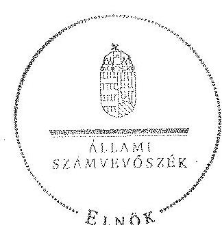

# ÁLLAMI   SZÁMVEVŐSZÉK 

## JELENTÉS

az önkormányzatok belső kontrollrendszere kialakításának, egyes kontrolltevékenységek és a belső ellenőrzés
müködésének ellenőrzéséről
Nyírmeggyes

---

# Állami Számvevőszék 

Iktatószám: V-0406-044/2014
Témaszám: 1372
Vizsgálat-azonosító szám: V064952

## Az ellenőrzést felügyelte:

dr. Benedek Mária
felügyeleti vezető
Az ellenőrzést vezette és az ellenőrzés végrehajtásáért felelős:
dr. Veress Tiborné
ellenőrzésvezető
A számvevőszéki jelentés összeállításában közreműködtek:
Pető Krisztina
Számvevő tanácsos
Az ellenőrzést végezték:
Bozsik Tamás
számvevő

## Szabó Tamás

számvevő tanácsos

---

# TARTALOMJEGYZÉK 

BEVEZETÉS ..... 5
I. ÖSSZEGZŐ MEGÁLLAPÍTÁSOK, KÖVETKEZTETÉSEK, JAVASLATOK ..... 9
II. RÉSZLETES MEGÁLLAPÍTÁSOK ..... 14

1. Az önkormányzat belső kontrollrendszerének kialakítása ..... 14
1.1. A kontrollkörnyezet ..... 14
1.2. A kockázatkezelési rendszer ..... 15
1.3. A kontrolltevékenységek ..... 15
1.4. Az információs és kommunikációs rendszer ..... 16
1.5. A monitoring rendszer ..... 17
2. A pénzügyi folyamatokban kulcsszerepet betöltő teljesítésigazolás és érvényesítés belső kontrollok múködése ..... 17
3. A belső ellenőrzés múködése ..... 20

## FÜGGELÉKEK

1. számú Értelmező szótár
2. számú Az értékelés módja és szempontjai

---

.

---

# RÖVIDÍTÉSEK JEGYZÉKE 

## Törvények

Áfa tv.
Áht.
ÁSZ tv.
Info tv.
Kttv.

Ktv.

Mötv.

Mvtv.
Nvtv.
Ötv.
Számv. tv.
Vagyonnyilatkozattételről szóló tv.

## Rendeletek

Áhsz. 1

Áhsz. 2
Ávr.
Bkr.
Ikr.
önkormányzati SZMSZ
vagyongazdálkodási rendelet

## Szórövidítések

2013. ellenőrzési terv
adatvédelmi és számítástechnikai védelmi szabályzat
2007. évi CXXVII. törvény az általános forgalmi adóról
2011. évi CXCV. törvény az államháztartásról
2011. évi LXVI. törvény az Állami Számvevőszékről
2011. évi CXII. törvény az információs önrendelkezési jogról és az információszabadságról
2011. évi CXCIX. törvény a közszolgálati tisztviselők ről (hatályos 2012. március 1-jétől)
1992. évi XXIII. törvény a köztisztviselők jogállásáról (hatálytalan 2012. március 1-jétől)
2011. évi CLXXXIX. törvény Magyarország helyi önkormányzatairól
1993. évi XCIII. törvény a munkavédelemről
2011. évi CXCVI. törvény a nemzeti vagyonról
1990. évi LXV. törvény a helyi önkormányzatokról
2000. évi C. törvény a számvitelről
2007. évi CLII. törvény egyes vagyonnyilatkozat-tételi kötelezettségekről

249/2000. (XII. 24.) Korm. rendelet az államháztartás szervezetei beszámolási és könyvvezetési kötelezettségének sajátosságairól
4/2013. (I. 11.) Korm. rendelet az államháztartás számviteléről (hatályos 2014. január 1-jétől)
368/2011. (XII. 31.) Korm. rendelet az államháztartásról szóló törvény végrehajtásáról
370/2011. (XII. 31.) Korm. rendelet a költségvetési szervek belső kontrollrendszeréről és belső ellenőrzéséről
335/2005. (XII. 29.) Korm. rendelet a közfeladatot ellátó szervek iratkezelésének általános követelményeiről
Nyírmeggyes Község Önkormányzat Képviselőtestületének 12/2012. (XI. 29) rendelete a Képviselőtestület és szervei Szervezeti és Müködési Szabályzatáról Nyírmeggyes Község Önkormányzata Képviselőtestületének 9/2012. (VII. 17.) önkormányzati rendelete az önkormányzat vagyonáról a vagyonhasznosítás rendjéről és a vagyontárgyak feletti tulajdonosi joggyakorlás szabályairól (hatályos 2012. július 17-től)

Szatmári Többcélú Kistérségi Társulás éves ellenőrzési terv 2013. év
Adatvédelmi és számítástechnikai védelmi szabályzat (hatályos 2011. január 1-jétől)

---

| alapító okirat | Nyírmeggyes Község Polgármesteri Hivatal 2/2010. (I. 29.) KT határozattal jóváhagyott alapító okirata (hatályos 2010. január 29-től) |
| :--: | :--: |
| ÁSZ | Állami Számvevőszék |
| belső ellenőrzési kézikönyv | Szatmári Többcélú Kistérségi Társulás Belső Ellenőrzési |
| ellenőrzési nyomvonal | Kézikönyv |
|  | Polgármesteri Hivatal Nyírmeggyes Ellenőrzési nyomvo- |
| gazdálkodási szabályzat | Nal (hatályos 2011. január 1-jétől) |
|  | Nyírmeggyes Község Önkormányzatának Polgármesteri Hivatala Gazdálkodási szabályzata (hatályos 2012. január 1-jétől) |
| hivatali SZMSZ | Nyírmeggyes Község Önkormányzata Polgármesteri hiva-   tala Szervezeti és Müködési Szabályzata (hatályos 2012.   január 1-jétől) |
| INTOSAI | International Organization of Supreme Audit Institutions (Legfőbb Ellenőrző Intézmények Nemzetközi Szervezete) |
| iratkezelési szabályzat | Nyírmeggyes Község Önkormányzata Egyedi Iratkezelési Szabályzata (hatályos 2007. január 1-jétől) |
| ISSAI | International Standards of Supreme Audit Institutions (Legfőbb Ellenőrző Intézmények Nemzetközi Standardjai) |
| jegyző | Nyírmeggyes Község Önkormányzata jegyzője |
| Képviselő-testület | Nyírmeggyes Község Önkormányzata Képviselő-testülete |
| NGM | Nemzetgazdasági Minisztérium |
| Önkormányzat | Nyírmeggyes Község Önkormányzata |
| polgármester | Nyírmeggyes Község Önkormányzata polgármestere |
| Polgármesteri Hivatal | Nyírmeggyes Község Polgármesteri Hivatala |
| Társulás | Szatmári Többcélú Kistérségi Társulás |

---

# JELENTÉS 

## az önkormányzatok belső kontrollrendszere kialakításának, egyes kontrolltevékenységek és a belső ellenőrzés múködésének ellenőrzéséről Nyírmeggyes

## BEVEZETÉS

Nyírmeggyes község állandó lakosainak száma 2012. január 1-jén 2692 fő volt. Az Önkormányzat hattagú Képviselő-testületének munkáját három állandó bizottság segítette. Az Önkormányzat az önállóan működő és gazdálkodó Polgármesteri Hivatalon kívül egy önállóan működő intézményt múködtetett, valamint egy 100\%-os önkormányzati tulajdoni hányadú gazdasági társasággal rendelkezett. A polgármester a 2006. évi önkormányzati választások óta tölti be tisztségét. A jegyző 2008. január 16-tól látja el feladatait. A Polgármesteri Hivatal szervezeti egységekre nem tagolódott, elkülönített gazdasági szervezettel nem rendelkezett, a foglalkoztatott köztisztviselők száma 2012. január 1-jén nyolc fő volt. A Polgármesteri Hivatalnál 2013. január 1-jétől szervezeti változás nem volt. Az Önkormányzat a 2012. évi költségvetési beszámolója szerint 749735 ezer Ft költségvetési bevételt ért el, valamint 684647 ezer Ft költségvetési kiadást teljesített. A 2012. december 31-i könyvviteli mérleg szerint 745965 ezer Ft értékű eszközvagyonnal rendelkezett, a rövid lejáratú kötelezettségállománya 31011 ezer Ft volt. Az adósságkonszolidáció során kapott állami támogatást 2012 decemberében a 29646 ezer Ft hosszú lejáratú hitel viszszafizetésére fordították.

A demokratikus társadalmakban alapvető igény, hogy a közpénzeket, a közvagyont használók tevékenységükről elszámoljanak, ahhoz egyértelmű és érvényesíthető felelősségi szabályok társuljanak. Ennek a jogos igénynek az érvényesítéséhez meg kell teremteni azokat a folyamatokat, rendszereket, amelyek nélkülözhetetlenek az elszámoltatáshoz. Az elszámoltatás eredményes múködtetéséhez szükség van a megfelelő információs, kontroll, értékelési és beszámolási rendszerek kialakítására.

Magyarországon az uniós csatlakozási tárgyalások idejére nyúlnak vissza a belső kontrollrendszer szabályozásának gyökerei. Az uniós elvárásoknak megfelelő új terminológia szerinti államháztartási belső pénzügyi ellenőrzési (ÁBPE) rendszer területén a jogharmonizáció 2003-ban teljes körűen megvalósult, míg az önkormányzati alrendszerre vonatkozó, az Ötv.-ben megjelenített speciális szabályozás 2005-ben lépett hatályba. Az államháztartási belső kontrollrendszer koncepciója 2009-ben továbbfejlődött. A változások irányát mutatja, hogy a költségvetési szervek belső kontrollrendszere már magában foglalja

---

a korszerű, felelős szervezetirányítás elemeit (kontrollkörnyezet, kockázatkezelés, kontrolltevékenység, információ és kommunikáció, monitoring) is. E kontrollrendszer szabályozása háromszintű, a törvényi előírásokat az Áht. és a Mötv., a rendeleti szintű szabályozást az Ávr. és a Bkr. tartalmazza, amelyeket útmutatói szinten az NGM által kiadott standardok és kézikönyvek támogatnak.

A belső kontrollrendszer azt a célt szolgálja, hogy a költségvetési szervek múködésük és gazdálkodásuk során a tevékenységeket szabályszerűen, gazdaságosan, hatékonyan és eredményesen hajtsák végre, teljesítsék elszámolási kötelezettségeiket és megvédjék az erőforrásokat a veszteségektől, a károktól és a nem rendeltetésszerű használattól. A belső kontrollrendszer magában foglalja mindazon szabályokat, eljárásokat, gyakorlati módszereket és szervezeti struktúrákat, kockázatkezelési technikákat, kontrolltevékenységeket, amelyek segítséget nyújtanak a szervezetnek céljai eléréséhez.

Az ÁSZ középtávú stratégiájában hangsúlyos szerepet szánt annak, hogy szilárd szakmai alapon álló, értékteremtő ellenőrzéseivel előmozdítsa a közpénzügyek átláthatóságát, rendezettségét. A számvevőszéki ellenőrzés nemzetközi alapelvei is rögzítik, hogy a megfelelő belső kontrollrendszer minimálisra csökkenti a hibák és szabálytalanságok kockázatát.

Az ellenőrzés célja annak megállapítása volt, hogy a belső kontrollrendszer elemeinek kialakítása, a pénzügyi folyamatokban kulcsszerepet betöltő teljesítésigazolás és érvényesítés, és a belső ellenőrzés szabályos működése biztosítot-ta-e az Önkormányzatnál a közpénzfelhasználás szabályosságát, hozzájárult-e az értéket teremtő rend követelményének érvényesüléséhez.

Ennek keretében értékeltük, hogy:

- a jogszabályi előírásoknak megfelelően alakították-e ki a belső kontrollrendszer elemeit;
- a gazdálkodás folyamatában kulcsszerepet betöltő teljesítésigazolás és érvényesítés kontrolltevékenységeit megfelelően működtették-e;
- biztosították-e a belső ellenőrzés szabályos működését;
- amennyiben az ÁSZ tett javaslatot a 2008-2011. évek közötti ellenőrzése kapcsán az Önkormányzatnak, intézkedtek-e azok végrehajtására.

Az ellenőrzés várható hasznosulását négy szinten tervezzük. A törvényalkotás számára összegzett tapasztalatok állnak rendelkezésre a belső kontrollrendszer önkormányzati területen való kialakításáról, múködéséről és hatásairól, a belső ellenőrzés működéséről. Ennek alapján következtetést lehet levonni arról, hogy a belső kontrollrendszer kialakítására és múködtetésére vonatkozó jelenlegi, differenciálás nélküli - jogszabályi előírások reális követelményeket támasztanak-e az eltérő adottságú települési önkormányzatok esetében, illetve indokolt-e esetleges jogszabályi módosítás kezdeményezése. Az ellenőrzés az ellenőrzött számára visszajelzést ad a belső kontrollrendszer kialakításában és működésében fellépő hiányosságokról, javaslataival hozzájárul azok kiküszöböléséhez, amely csökkentheti a későbbi ellenőrzések gyakoriságát. Az el-

---

lenőrzés megállapításait és javaslatait más szervezetek is hasznosíthatják a rendezett gazdálkodási keretek kialakításához. A társadalom számára jelzi, hogy közpénz nem maradhat ellenőrizetlenül, az ÁSZ értékteremtő rend kialakításához és megőrzéséhez hozzájáruló tevékenysége pozitív hatással lesz a szervezetről kialakított összkép formálásában. A szervezeten belül lehetőség nyílik arra, hogy a megállapítások szintetizálásával az ÁSZ a hozzáadott értéket teremtő elemző tevékenységét és tanácsadó szerepét is erősítse.

Az önkormányzatok belső kontrollrendszere kialakításának, egyes kontrolltevékenységek és a belső ellenőrzés működésének ellenőrzéséről szóló jelentés I. fejezetének összegző része az ellenőrzés céljára ad rövid, szintetizáló összefoglalót, és tartalmazza a következtetéseket a II. fejezet részletes megállapításain alapulóan. A jelentés intézkedést igénylő megállapításait és javaslatait az ellenőrzés során feltárt, a jelentés II. fejezetében rögzített részletes megállapítások alapozzák meg. A helyszíni ellenőrzés lezárásáig a helyi szabályozás változásait nyomon követtük. Az ÁSZ az ellenőrzés megállapításait az ellenőrzött időszakban hatályos, az intézkedést igénylő megállapításokra tett javaslatokat a jelenleg hatályos jogszabályok alapján fogalmazta meg.

Az ellenőrzés típusa: szabályszerűségi ellenőrzés.
Az ellenőrzött időszak: a belső kontrollrendszer kialakításának megfelelősége esetében a 2012. évre, a pénzügyi folyamatokban kulcsszerepet betöltő teljesítésigazolás és érvényesítés belső kontrollok múködésének megfelelőségét és a belső ellenőrzés szabályszerű működését a 2012. január 1. és december 31-e közötti időszak eseményeit figyelembe véve értékeltük, míg az ÁSZ javaslatainak utóellenőrzése a 2008-2011. években végzett ellenőrzések nyilvánosságra hozott jelentéseiben tett javaslatok áttekintésére terjedt ki.

# Az ellenőrzött szervezet: az Önkormányzat. 

Az ellenőrzés jogszabályi alapját az ÁSZ tv. 1. § (3) bekezdése, az 5. § (2) és (6) bekezdése, valamint az Áht. 61. § (2) bekezdésének előírásai képezik.

Az ellenőrzés szakmai módszertana az ÁSZ hivatalos honlapján (www.asz.hu) közzétett szakmai szabályokon alapult, amely az INTOSAI által kiadott ISSAI figyelembevételével készült.

Az ellenőrzés lefolytatásához az Önkormányzat a kimutatások és a tanúsítvány elektronikus kitöltésével, valamint az ÁSZ által kért dokumentumok elektronikus megküldésével szolgáltatott adatokat. Az így rendelkezésre bocsátott adatok, információk kontrollja és a munkalapok kitöltése a helyszíni ellenőrzés keretében történt. A jelentésben használt fogalmak magyarázatát az 1. számú függelék, az ellenőrzés egyes területeinek értékelésénél alkalmazott egységes minősítési szempontokat a 2. számú függelék tartalmazza.

A belső kontrollrendszer kialakításának ellenőrzése során értékeltük a kontrollkörnyezet, a kockázatkezelési rendszer, a kontrolltevékenységek, az információs és kommunikációs rendszer, valamint a monitoring rendszer szabályozottságának megfelelőségét. A pénzügyi folyamatokban kulcsszerepet betöltő teljesítésigazolás és érvényesítés kontrollok müködése megfelelőségének minősítésé-

---

hez az állományba nem tartozók megbízási díjai, a külső szolgáltatók által végzett karbantartási, kisjavitási munkák, az egyéb üzemeltetési és fenntartási szolgáltatások, a rendszeres szociális segélyek, valamint az államháztartáson kívülre teljesített múködési és felhalmozási célú pénzeszközátadások közül kockázatelemzéssel választottuk ki az ellenőrzött kiadási jogcímeket. Az egyszerú véletlen mintavétellel kiválasztott tételek ellenőrzését többlépcsős megfelelőségi tesztek útján addig végeztük, amíg elegendő és megfelelő bizonyítékot szereztünk a vizsgált folyamatok kulcskontrolljai múködésének megfelelő vagy nem megfelelő voltáról. Értékeltük az Önkormányzatnál a belső ellenőrzés múködésének szabályosságát. Az Önkormányzatnál az állami feladat (közfeladat) ellátás szervezeti és humánerőforrás rendszerét az ÁSZ 2010-ban ellenőrizte. A 1022 számon közzétett számvevőszéki jelentésben az Önkormányzat részére az ÁSZ javaslatot nem tett, ezért a jelen ellenőrzés keretében utóellenőrzésre nem került sor.

Az ÁSZ tv. 29. § (1) bekezdése szerint a jelentéstervezetet megküldtük a polgármester részére, aki az ÁSZ tv. 29. § (2) bekezdésében foglalt észrevételezési jogával nem élt, a jelentéstervezetre észrevételt nem tett.

---

# I. ÖSSZEGZŐ MEGÁLLAPÍTÁSOK, KÖVETKEZTETÉSEK, JAVASLATOK 

A belső kontrollrendszeren belül 2012-ben a kontrollkörnyezet, a kockázatkezelési rendszer, a kontrolltevékenységek, az információs és kommunikációs rendszer, valamint a monitoring rendszer kialakítását külön-külön és együttesen is értékeltük. A belső kontrollrendszer kialakítása az összesített értékelés alapján nem felelt meg a jogszabályi előírásoknak.

A belső kontrollrendszer egyes területei kialakításának minősítése a következő:

| Kontrollterület | Minősítés |  |
| :-- | :-- | :-- |
| Kontrollkörnyezet |  | nem |
|  |  | megfelelő |
| Kockázatkezelési rend- |  | nem |
| szer |  | megfelelő |
| Kontrolltevékenységek |  |  |
| Információs és kom- |  | nem |
| munikációs rendszer |  | megfelelő |
| Monitoring rendszer |  |  |

Részben megfelelőnek értékeltük a kontrolltevékenységek kialakítását, mivel az ellenőrzésünk által megállapított szabályozásbeli hiányosságok nem veszélyeztették e kontrollterületen a szabályszerű működést.

Nem megfelelőnek értékeltük a kontrollkörnyezet, a kockázatkezelési rendszer, az információs és kommunikációs rendszer, valamint a monitoring rendszer kialakítását, mivel az ellenőrzésünk során megállapított szabályozásbeli hiányosságok magukban hordozzák a szabálytalan működés, valamint a korrupció kockázatát.

A külső szolgáltatók által végzett karbantartási, kisjavítási munkákkal kapcsolatos kifizetések, valamint az államháztartáson kívülre teljesített múködési és a felhalmozási célú pénzeszközátadások során a pénzügyi folyamatokban kulcsszerepet betöltő teljesítésigazolás és érvényesítés belső kontrollok müködése gyenge volt. Gyengének értékeltük a két kulcskontroll együttes múködését, mert azok nem biztosították az ellenőrzésünk által feltárt hiányosságok bekövetkezésének megelőzését.

A számvevőszéki ellenőrzés az ellenőrzött kifizetésekkel összefüggésben a rendelkezésre bocsátott dokumentumok alapján kár bekövetkeztére utaló adatot, tényt nem állapított meg, azonban a gazdálkodásban kulcsszerepet betöltő kontrollok gyenge múködése miatt fennáll a hibák bekövetkezésének lehetősé-

---

ge. A nem megfelelően szabályozott és múködtetett belső kontrollok korrupciós kockázatot hordoznak.

Az Önkormányzat a belső ellenőrzési feladatokat a Társulás útján látta el. A belső ellenőrzés múködése a jogszabályi előírásoknak nem felelt meg, mivel a számvevőszéki ellenőrzés által megállapított szabályozási és működési hiányosságok számossága magában hordozza a szabálytalan önkormányzati gazdálkodás és feladatellátás kockázatát.

Az ÁSZ tv. 33. § (1) bekezdésében foglaltak értelmében az ellenőrzött szervezet vezetője köteles a jelentésben foglalt megállapításokhoz kapcsolódó intézkedési tervet összeállítani, és azt a jelentés kézhezvételétől számított 30 napon belül az ÁSZ részére megküldeni. Amennyiben az intézkedési tervet határidőre nem küldi meg a szervezet, vagy az ÁSZ tv. 33. § (2) bekezdésében foglalt póthatáridő elteltével megküldött intézkedési terv továbbra sem elfogadható, az ÁSZ elnöke a hivatkozott törvény 33. § (3) bekezdés a)-b) pontjaiban foglaltakat érvényesítheti.

Az ellenőrzés intézkedést igénylő megállapításai és javaslatai:

# a polgármesternek 

1. A polgármester, mint kötelezettségvállaló - az Ávr. 57. § (4) bekezdésében foglaltak ellenére - nem jelölte ki 2012. március 30 -át követően írásban az Önkormányzat kiadási előirányzatai vonatkozásában a teljesítés igazolására jogosult személyeket.

Javaslat:
Gondoskodjon az Ávr. 57. § (4) bekezdésében foglaltak szerint az Önkormányzat kiadási előirányzatai vonatkozásában a teljesítés igazolására jogosult személyek írásban történő kijelöléséről.
2. A számvevőszéki ellenőrzés megállapításai alapján az Önkormányzatnál a belső kontrollrendszer kialakítása összefoglalóan értékelve nem felelt meg a jogszabályi előírásoknak, a kulcskontrollok működése gyenge volt és a belső ellenőrzés müködése a jogszabályi előírásoknak nem felelt meg. A szabályozásbeli hiányosságok magukban hordozzák a szabálytalan müködés kockázatát.

Javaslat:
Az Mötv. 115. § (1) bekezdésében foglaltak alapján kísérje figyelemmel az Önkormányzat gazdálkodásának szabályszerűségét. Az Mötv. 67. § f) pontja alapján gondoskodjon a belső kontrollrendszer müködésére vonatkozó jogszabályi rendelkezések be nem tartása, valamint a teljesítésigazolás, illetve az érvényesítés kontrollokkal öszszefüggésben feltárt hiányosságok, szabálytalanságok tekintetében az esetleges munkajogi felelősséggel kapcsolatos körülmények kivizsgálásáról, majd a vizsgálat eredményének függvényében tegye meg a szükséges intézkedéseket.

---

# a jegyzönek 

1. a kontrollkörnyezettel kapcsolatban:

A Polgármesteri Hivatal alapító okirata - az Ávr.-ben foglaltak ellenére - nem a megfelelő elnevezéssel tartalmazta az alaptevékenységek felsorolását. A jegyző - az Mvtv.-ben foglaltak ellenére - nem határozta meg a Polgármesteri Hivatalban az egészséget nem veszélyeztető és biztonságos munkavégzés követelményei megvalósításának módját, valamint nem készítette el a Kttv.-ben foglaltak ellenére - a Polgármesteri Hivatalban dolgozó köztisztviselők teljesítményértékelését. A jegyző az Ötv-ben foglalt kötelezettsége ellenére nem készítette elő a Kttv.-ben foglaltak szerinti, a köztisztviselőkkel szembeni hivatásetikai alapelvek részletes tartalmának, valamint az etikai eljárás szabályainak dokumentumát [II. Részletes megállapítások, 1.1. A kontrollkörnyezet, 1., 32., 46. és 47. sorszámú megállapítás].

Javaslat:
Intézkedjen az Áht. 69. § (2) bekezdése, a Bkr. 3. § a) pontja és 6. §-a alapján a jelentés II. Részletes megállapítások, 1.1. A kontrollkörnyezet 1., 32., 46., és 47. sorszámú megállapításaiban foglalt hibák, hiányosságok kijavításáról, megszüntetéséről az abban foglalt jogszabályi előírásoknak megfelelően.
2. a kockázatkezelési rendszerrel kapcsolatban:

A jegyző - a Bkr.-ben foglaltak ellenére - nem határozta meg a Polgármesteri Hivatal tevékenységében, gazdálkodásában rejlő egyes kockázatokkal kapcsolatban szükséges intézkedéseket, valamint azok teljesítése nyomon követésének módját. A hivatali SZMSZ-ben és az önkormányzati SZMSZ-ben a vagyonnyilatkozat-tételre kötelezettek teljes körét - a Vagyonnyilatkozat-tételről szóló tv.-ben előírtak ellenére - nem tüntették fel [II. Részletes megállapítások, 1.2. A kockázatkezelési rendszer, 4., 5., 8., 10. és 13. sorszámú megállapítás].

Javaslat:
Intézkedjen az Áht. 69. § (2) bekezdése, a Bkr. 3. § b) pontja, 7. §-a, valamint a Va-gyonnyilatkozat-tételről szóló tv. alapján a jelentés II. Részletes megállapítások, 1.2. A kockázatkezelési rendszer 4., 5., 8., 10. és 13. sorszámú megállapításaiban foglalt hibák, hiányosságok kijavításáról, megszüntetéséről az abban foglalt jogszabályi előírásoknak megfelelően.
3. a kontrolltevékenységekkel kapcsolatban:

A jegyző - a Bkr.-ben foglaltak ellenére - nem biztosította a támogatásokkal való elszámolás dokumentumainak elkészítésével kapcsolatban a folyamatba épített, előzetes, utólagos és vezetői ellenőrzést. Nem határozta meg az Ávr.-ben foglaltak ellenére belső szabályzatban a kötelezettségvállalás, a teljesítésigazolás és az érvényesítés gyakorlásának módjával, eljárási és dokumentációs részletszabályaival, valamint az ezeket végző személyek kijelölésének rendjével kapcsolatos belső előírásokat, feltételeket. A jegyző nem jelölt ki teljesítésigazolásra és érvényesítési feladatra a Polgármesteri Hivatal állományában dolgozó köztisztviselőt. A jegyző az iratkezelési rend-

---

szer kialakítása során - az lkr.-ben foglaltak ellenére - nem határozta meg az üzemeltetés és adatbiztonság védelmének feladatai esetében a hatásköröket. A jegyző - a Kttv.-ben foglaltak ellenére - nem szabályozta a Polgármesteri Hivatalban a köztisztviselő jogviszonya megszűntetése (megszűnés) esetére a munkakör átadása és a munkáltatóval való elszámolás rendjét [II. Részletes megállapítások, 1.3. A kontrolltevékenységek 5., 6., 8., 10., 15., 29. és 32. sorszámú megállapítás].

Javaslat:
Intézkedjen az Áht. 69. § (2) bekezdése, a Bkr. 3. § c) pontja és 8. §-a alapján a jelentés II. Részletes megállapítások, 1.3. A kontrolltevékenységek 5., 6., 8., 10., 15., 29. és 32. sorszámú megállapításaiban foglalt hibák, hiányosságok kijavításáról, megszüntetéséről az abban foglalt jogszabályi előírásoknak megfelelően.
4. az információs és kommunikációs rendszerrel kapcsolatban:

A jegyző - a Bkr.-ben foglaltak ellenére - nem alakított ki olyan rendszert, amely biztosítja, hogy a megfelelő információk a megfelelő időben eljutnak az illetékes szervezethez, személyhez. Az Info tv.-ben, valamint az Ávr.-ben előírtak ellenére a kötelezően közzéteendő adatok nyilvánosságra hozatalának és elektronikus közzétételének a közérdekű adatok megismerésére irányuló igények teljesítésének rendjét nem szabályozta és nem gondoskodott az Önkormányzat elektronikus közzétételi kötelezettségének teljesítéséről a 2012. évben. Az lkr.-ben foglaltak ellenére az iratforgalom dokumentálásával nem biztosította, hogy az iratok szervezeten belüli útja pontosan követhető és ellenőrizhető legyen [II. Részletes megállapítások, 1.4. Az információs és kommunikációs rendszer 1., 2., 6-8. és 16. sorszámú megállapítás].

Javaslat:
Intézkedjen az Áht. 69. § (2) bekezdése, a Bkr. 3. § d) pontja és 9. §-a alapján a jelentés II. Részletes megállapítások, 1.4. Az információs és kommunikációs rendszer 1., 2., 6-8. és 16. sorszámú megállapításaiban foglalt hibák, hiányosságok kijavításáról, megszüntetéséről az abban foglalt jogszabályi előírásoknak megfelelően.
5. a monitoring rendszerrel kapcsolatban:

A jegyző a Bkr.-ben foglaltak ellenére nem alakította ki a célok megvalósításának nyomon követését biztosító rendszerét, és nem gondoskodott az intézkedési tervben meghatározott egyes feladatok végrehajtásáról szóló beszámoló elkészítéséről és megküldéséről a belső ellenőrzés részére [II. Részletes megállapítások, 1.5. A monitoring rendszer 1. és 18. sorszámú megállapítás].

Javaslat:
Intézkedjen az Áht. 69. § (2) bekezdése, a Bkr. 3. § e) pontja és 10. § alapján a jelentés II. Részletes megállapítások, 1.5. A monitoring rendszer 1. és 18. sorszámú megállapításában foglalt hibák, hiányosságok kijavításáról, megszüntetéséről az abban foglalt jogszabályi előírásoknak megfelelően.

---

6. a pénzügyi folyamatokban kulcsszerepet betöltő kontrollokkal kapcsolatban:

A teljesítésigazolás és az érvényesítés, valamint az utalványrendelet tartalma az Áht.ban és az Ávr.-ben foglaltaknak nem felelt meg, továbbá az Áfa. tv. előírása ellenére a számla hibásan tartalmazta a szolgáltatás vásárlójának nevét és címét [II. Részletes megállapítások, 2. A pénzügyi folyamatokban kulcsszerepet betöltő teljesítésigazolás és érvényesítés belső kontrollok müködése 1-3. pontban foglalt megállapítás].

Javaslat:
Intézkedjen az Áht. 37-38. §-ában, az Ávr. 56-59. §-ában és az Áfa. tv.-ben foglaltak alapján arról, hogy a teljesítésigazolás és az érvényesítés vonatkozásában, azok ellenőrzése során a teljesítésigazoló kijelölésével, a kötelezettségvállalások nyilvántartásba vételével, az utalvány tartalmával valamint a gazdasági események során kiállított számlákkal kapcsolatban feltárt, a jelentés II. Részletes megállapítások, 2. A pénzügyi folyamatokban kulcsszerepet betöltő teljesítésigazolás és érvényesítés belső kontrollok működése 1-3. pontjában szereplő megállapításokban foglalt hibák, hiányosságok kijavítása, megszüntetése az ott megjelölt jogszabályi rendelkezéseknek megfelelően történjen meg.
7. a belső ellenőrzés működésével kapcsolatban:

A belső ellenőrzés működése a számvevőszéki ellenőrzés értékelési szempontjait figyelembe véve nem felelt meg a Bkr.-ben foglalt előírásoknak [II. Részletes megállapítások, 3. A belső ellenőrzés müködése 3. a), 5., 7., 8. a), 9., 11., 20. a) és 24-27. sorszámú megállapítás].

Javaslat:
Intézkedjen az Áht. 69.§ (2), a 70. § (1) bekezdése, a Bkr. 3. § e) pontja és 10. §-a alapján a jelentés II. Részletes megállapítások, 3. Az belső ellenőrzés müködése 3. a), 5., 7., 8. a), 9., 11., 20. a) és 24-27. sorszámú megállapításaiban foglalt hibák, hiányosságok kijavításáról, megszüntetéséről az ott megjelölt jogszabályi rendelkezéseknek megfelelően.

---

# II. RÉSZLETES MEGÁLLAPÍTÁSOK 

## 1. Az ÖNKORMÁNYZAT BELSŐ KONTROLLRENDSZERÉNEK KIALAKÍTÁSA

A belső kontrollrendszeren belül 2012-ben a kontrollkörnyezet, a kockázatkezelési rendszer, a kontrolltevékenységek, az információs és kommunikációs rendszer, valamint a monitoring rendszer kialakítását külön-külön és együttesen is értékeltük. A belső kontrollrendszer kialakítása az összesített értékelés alapján nem felelt meg a jogszabályi előírásoknak.

### 1.1. A kontrollkörnyezet

A kontrollkörnyezet kialakítása - a 2. számú függelékben részletezett kritériumrendszer alapján végzett értékelés szerint - a jogszabályi előírásoknak nem felelt meg, mert:

| Sorszám ${ }^{1}$ | Megállapítás | Megjegyzés |
| :--: | :--: | :--: |
| 1. | A Polgármesteri Hivatal alapító okirata - az Ávr. 5. § (1) bekezdésének c) pontjában foglaltak ellenére - nem a megfelelő elnevezéssel tartalmazta az alaptevékenységek felsorolását. |  |
| 4. | A Képviselő-testület - a Ktv. 34. § (3) bekezdésében foglaltak ellenére - nem döntött a teljesítményértékelés alapját képező célokról. | A Ktv.-t hatályon kívül helyezte a 2012. évi V. törvény 59. § (1) bekezdés a) pontja, hatálytalan 2012. március 1-jétől. |
| 32. | A jegyző - az Mvtv. 2. § (3) bekezdésében foglaltak ellenére - nem határozta meg a Polgármesteri Hivatalban az egészséget nem veszélyeztető és biztonságos munkavégzés követelményei megvalósításának módját. |  |
| 46. | A jegyző - a Kttv. 130. § (1) bekezdésében foglaltak ellenére - a Polgármesteri Hivatalban dolgozó köztisztviselők teljesítményértékelését a 2012. évben nem készítette el. |  |

[^0]
[^0]:    ${ }^{1}$ A megállapítás számozása az Önkormányzat által az adatszolgáltatás során kitöltött kimutatások kérdéseinek sorszámával azonos.

---

A Képviselő-testület - a Kttv. 231. § (1) bekezdése ellenére - nem állapította meg a Kttv. 83. §-ában előírt, a köztisztviselőkkel szembeni hivatásetikai alapelvek részletes tartalmát, valamint az etikai eljárás szabályait, mivel a jegyző - az Ötv. 36. § (2) bekezdés a) pontjában előírt feladata ellenére - nem készítette elő ennek dokumentumát.

# 1.2. A kockázatkezelési rendszer 

A kockázatkezelési rendszer kialakítása - a 2. számú függelékben részletezett kritériumrendszer alapján végzett értékelés szerint - a jogszabályi előírásoknak nem felelt meg, mert:

| Sorszám | Megállapítás | Megjegyzés |
| :--: | :--: | :--: |
| 4., 5.,   8.,   10. | A jegyző - a Bkr. 7. § (2) bekezdésében foglaltak ellenére - nem mérte fel és nem határozta meg a Polgármesteri Hivatal tevékenységében, gazdálkodásban rejlő egyes kockázatokkal kapcsolatban szükséges intézkedéseket, valamint azok teljesítése nyomon követésének módját. |  |
| 13. | A jegyző - a Vagyonnyilatkozat-tételről szóló törvény 4. § a) pontjában foglaltak ellenére a vagyonnyilatkozat-tételi kötelezettséget a hivatali SZMSZ-ben a pénzügyi előadó munkakört betöltő egy köztisztviselő tekintetében nem tüntették fel, továbbá - a Vagyonnyilatkozat-tételről szóló törvény 4. § d) pontjában foglaltak ellenére - az önkormányzati SZMSZben nem tüntették fel a képviselők vagyonnyilatkozat-tételi kötelezettségét. | A vagyonnyilatkozat-tételre kötelezettek nyilatkozattételi kötelezettségüknek 2012. évben teljes körűen eleget tettek. |

### 1.3. A kontrolltevékenységek

A kontrolltevékenységek kialakítása - a 2. számú függelékben részletezett kritériumrendszer alapján végzett értékelés szerint - a jogszabályi előírásoknak részben felelt meg.

A jegyző a kontrolltevékenység részeként előírta a folyamatba épített, előzetes, utólagos és vezetői ellenőrzést a költségvetés tervezése, a beszerzési folyamatok és a vagyonhasznosítási tevékenység vonatkozásában. A jegyző szabályozta az előzetes írásbeli kötelezettségvállalást igénylő kifizetések esetében a teljesítésigazolás módját, az érvényesítés és utalványozás rendjét. Az iratkezelési szabályzatban előírták az iratok és adatok védelmét. Szabályozták az üzemeltetés és adatbiztonság feladatait, és biztosították az adatbiztonság érvényesülését. A Polgármesteri Hivatalban a hozzáférési jogosultságokra és a felelősségi körökre vonatkozó szabályokat az adatvédelmi és számítástechnikai védelmi szabályzatban meghatározták. A jegyző meghatározta az ügyrendben az időközi és

---

éves beszámolók elkészítésének feladatait, annak felelőseit és a helyettesítés rendjét.

A kontrolltevékenységek kialakítása az értékelés szempontjából az alábbi kisebb súlyú hiányosságok mellett részben felelt meg a jogszabályi előírásoknak:

| Sorszám | Megállapítás |
| :--: | :--: |
| 5. | A jegyző - a Bkr. 8. § (2) bekezdése a) pontjában foglaltak ellenére - nem biztosította a pénzügyi döntések közül a támogatásokkal való elszámolás dokumentumainak elkészítésével kapcsolatban a folyamatba épített, előzetes, utólagos és vezetői ellenőrzést. |
| 6.,   8., | A jegyző - az Ávr. 13. § (2) bekezdés a) pontjában foglaltak ellenére - belső szabályzatban nem határozta meg a kötelezettségvállalás pénzügyi ellenjegyzése, az előzetes írásbeli kötelezettségvállalást nem igénylő kifizetések esetében a teljesítésigazolás gyakorlásának és az érvényesítés gyakorlásának módjával, eljárási és dokumentációs részletszabályaival, valamint az ezeket végző személyek kijelölésének rendjével kapcsolatos belső előírásokat, feltételeket. |
| 10. | 2012. március 30-ig a jegyző, ezt követően a kötelezettségvállaló - az Ávr. 57. § (4) bekezdésében foglaltak ellenére - nem jelölte ki a teljesítésigazolásra jogosult személyeket. |
| 15. | A jegyző az iratkezelési rendszer kialakítása során - az lkr. 8. § (2) bekezdésében foglaltak ellenére - nem határozta meg az üzemeltetés és adatbiztonság védelmének feladatai esetében a hatásköröket. |
| 29. | A jegyző - az Ávr. 58. § (4) bekezdésének előírását figyelmen kívül hagyva az érvényesítési feladatra nem jelölt ki a Polgármesteri Hivatal állományában dolgozó köztisztviselőt. |
| 32. | A jegyző - a Kttv. 74. § (1) bekezdésében foglaltak ellenére - nem szabályozta a Polgármesteri Hivatalban a köztisztviselő jogviszonya megszüntetése (megszünés) esetére a munkakör átadása és a munkáltatóval való elszámolás rendjét. |

# 1.4. Az információs és kommunikációs rendszer 

Az információs és kommunikációs rendszer kialakítása - a 2. számú függelékben részletezett kritériumrendszer alapján végzett értékelés szerint - a jogszabályi előírásoknak nem felelt meg, mert:

| Sorszám | Megállapítás |
| :--: | :--: |
| 1., 2. | A jegyző - a Bkr. 3. § d) pontjában és a 9. § (1) bekezdésében foglaltak ellenére - nem alakított ki olyan rendszert, amely biztosítja, hogy a megfelelő információk a megfelelő időben eljutnak az illetékes szervezethez, személyhez. |
| 6. és   8. | A jegyző - az Info tv. 30. § (6) bekezdésében és a 35. § (3) bekezdésében, valamint az Ávr. 13. § (2) bekezdés h) pontjában foglalt előírások ellenére - a kötelezően közzéteendő adatok nyilvánosságra hozatalának és elektronikus közzétételének szabályai rendjét nem alakította ki, a közérdekú ada- |

---

|  | tok megismerésére irányuló igények teljesítésének rendjét nem szabályoz-   ta. |
| :--: | :--: |
| 7. | A jegyző - az Info tv. 33. § (1) és (3) bekezdésében, a 37. § (1) bekezdésében és az 1. mellékletében foglaltak ellenére - a 2012. évre vonatkozó éves költségvetés, a 2011. évre vonatkozó költségvetési beszámoló és a Képvise-lö-testület hatályban lévő rendeletei tekintetében nem gondoskodott az Önkormányzat elektronikus közzétételi kötelezettségének teljesítéséről a 2012. évben. |
| 16. | A jegyző - az lkr. 14. § (4) bekezdése ellenére - az iratforgalom dokumentálásával nem biztosította, hogy az iratok szervezeten belüli útja pontosan követhető és ellenőrizhető legyen. |

# 1.5. A monitoring rendszer 

A monitoring rendszer kialakítása - a 2. számú függelékben részletezett kritériumrendszer alapján végzett értékelés szerint - a jogszabályi előírásoknak nem felelt meg, mert:

| Sor-   szám | Megállapítás |
| :-- | :-- |
| 1. | A jegyző - a Bkr. 3. § e) pontjában és a 10. §-ában foglaltak ellenére - nem   alakította ki a Polgármesteri Hivatal tevékenységének, a célok megvalósí-   tásának nyomon követését biztosító rendszerét. |
| 18. | A jegyző - a Bkr. 46. § (1) bekezdésében foglalt előírás ellenére - a belső   ellenőrzési jelentésekben tett javaslatokhoz kapcsolódó intézkedési tervben   meghatározott egyes feladatok végrehajtásáról szóló beszámolót elmulasztotta elkészíteni és tájékoztatásul megküldeni a belső ellenőrzés részére. |

Az Önkormányzat törvényességi felügyeletét ellátó Kormányhivatal a 2012. évben nem élt törvényességi felhívással vagy más törvényességi felügyeleti eszközzel a Képviselő-testület által alkotott rendeletekre, határozatokra vonatkozóan.

## 2. A PÉNZÜGYI FOLYAMATOKBAN KULCSSZEREPET BETÖLTŐ TELJESÍTÉSIGAZOLÁS ÉS ÉRVÉNYESÍTÉS BELSŐ KONTROLLOK MÜKÖDÉSE

A külső szolgáltatók által végzett karbantartási, kisjavítási munkákkal kapcsolatos kifizetések, valamint az államháztartáson kívülre teljesített múködési és a felhalmozási célú pénzeszközátadások során - összefoglalóan értékelve - a pénzügyi folyamatokban kulcsszerepet betöltő teljesítésigazolás és érvényesítés belső kontrollok müködésének megfelelősége gyenge volt, mert:

| Kontrollok   sorszáma | Megállapítás | Megjegyzés |
| :-- | :-- | :-- |

## Teljesítésigazolás

A teljesítés igazolását - az Ávr. 57. § (1) és (3) bekezdésében foglaltak ellenére - nem szabályszerűen, kijelöléssel nem rendelkező személy végezte.

---

# Érvényesítés 

Az érvényesítést az Ávr. 58. § (4) bekezdésében foglaltak ellenére jegyzői kijelölés hiányában jogosulatlan személy végezte el. Az érvényesítő a kiadások összegszerűségét - az Ávr. 58. § (1) bekezdés előirása ellenére - nem ellenőrizte. Nem tudta ellenőrizni továbbá a fedezet meglétét, mert az Ávr. 56. § (1) bekezdés előirása
2. 

ellenére - a kötelezettségvállalást követően nem gondoskodtak annak nyilvántartásba vételéről, ugyanis a kötelezettségvállalásokról teljes körű nyilvántartást nem vezettek. Az érvényesítő - az Ávr. 58. § (2) bekezdésében foglaltak ellenére - nem jelezte az utalványozónak, hogy a megelőző ügymenetben a teljesítésigazolást kijelöléssel nem rendelkező személy végezte és azt, hogy a kötelezettségvállalásról a nyilvántartást nem teljekörűen vezetik.

Az Ávr. 56. § (1) bekezdés 2014. január 1-jétől módosult, a kötelezettségvállalások nyilvántartását az Ahsz-2 39. § (1) bekezdés és a 14. számú melléklet II. pontja szabályozza.

## A kulcskontrollok ellenőrzése során feltárt egyéb hiányosságok

Az utalványokon nem tüntették fel - az Ávr. 59. § (3) bekezdés b), c), d) és f) pontban foglaltak ellenére - a költségvetési évet, a kedvezményezett címét, a kötelezettségvállalás nyilvántartási számát, a fizetés módját és összegét.

A számla az Áfa tv. 169. § e) pont előirása ellenére hibásan tartalmazta a szolgáltatás vásárlójának nevét és címét, mivel azt a kötelezettséget vállaló Önkormányzat helyett a Polgármesteri Hivatal nevére állították ki és vették könyvviteli nyilvántartásba.

A külső szolgáltatók által végzett karbantartási, kisjavítási munkákkal kapcsolatos - az Önkormányzatra vonatkozó - kifizetések során a teljesítésigazolás és az érvényesítés kulcskontrollok múködésének megfelelősége gyenge volt, mert:

- a teljesítésigazolást - az Ávr. 57. § (3) bekezdésében foglaltak ellenére - az Önkormányzat kiadási előirányzata terhére szivattyú javítására történt kifizetést megelőzően jegyzői kijelöléssel, a poroltók ellenőrzésére az Önkormányzat kiadási előirányzata terhére történt kifizetést megelőzően polgármesteri kijelöléssel nem rendelkező személy végezte;
- az érvényesítést a külső szolgáltatók által végzett karbantartási, kisjavítási munkákra történő kifizetések esetében - az Ávr. 58. § (4) bekezdésében foglaltak ellenére - jegyzői kijelölés hiányában jogosulatlan személy végezte;
- az érvényesítő a külső szolgáltatók által végzett karbantartási, kisjavítási munkákra történő kifizetések esetében - az Ávr. 58. § (2) bekezdésében foglaltak ellenére - nem jelezte az utalványozónak, hogy a megelőző ügymenetben a teljesítésigazolást jogosulatlan személy végezte;

---

- az utalványon - a poroltó ellenőrzés esetében - a Számv. tv. 167. § (1) bekezdés h) pontjában előírtak ellenére nem tüntették fel a könyvelés módjára és az érintett könyvviteli számlákra történő hivatkozást.

A tűzoltó készülék ellenőrzéséről kiállított számla az Áfa tv. 169. § e) pont előírása ellenére hibásan tartalmazta a szolgáltatás vásárlójának nevét és címét, mivel azt a kötelezettséget vállaló Önkormányzat helyett a Polgármesteri Hivatal nevére állították ki és vették könyvviteli nyilvántartásba.

Az utalványokon nem tüntették fel - az Ávr. 59. § (3) bekezdés b), c), d) és f) pontban foglaltak ellenére - a költségvetési évet, a kedvezményezett címét, továbbá a poroltó ellenőrzés esetében a kötelezettségvállalás nyilvántartási számát, a fizetés módját és összegét.

Az államháztartáson kívülre teljesített múködési és a felhalmozási célú pénzeszközátadások során a teljesítésigazolás és az érvényesítés kulcskontrollok működésének megfelelősége gyenge volt, mert:

- a teljesítés igazolását az Önkormányzat kiadási előirányzatai terhére vállalt támogatás esetében - az Ávr. 57. § (3) bekezdésében foglaltak ellenére 2012. március 30 -ig a jegyző, 2012. március 30 -t követően a polgármester írásbeli kijelölésével nem rendelkező személy végezte;
- a teljesítésigazoló a támogatás kifizetését megelőzően a kiadások összegszerűségét - az Ávr. 57. § (1) bekezdése előírása ellenére - nem tudta ellenőrizni, mert a támogatási szerződés nem tartalmazta a támogatás részletekben történő kifizetés összegszerűségének ellenőrzéséhez szükséges adatokat;
- az érvényesítést a támogatásokkal kapcsolatos kifizetéseket megelőzően - az Ávr. 58. § (4) bekezdésében foglaltak ellenére - jegyzői kijelölés hiányában jogosulatlan személy végezte;
- az érvényesítő - az Ávr. 58. § (1) bekezdés előírása ellenére - a Nonprofit Kft. támogatása kifizetését megelőzően szabályszerű teljesítésigazolás hiányában nem ellenőrizte a kiadások összegszerűségét, mert a támogatási szerződés nem tartalmazta a kifizetés érvényesítéséhez szükséges részösszegeket, továbbá a fedezet meglétét, mivel a támogatási előirányzat nem állt rendelkezésre, mert azt utólag biztosította a Képviselő-testület. Az Ávr. 56. § (1) bekezdés előírása ellenére a kötelezettségvállalást követően nem gondoskodtak annak nyilvántartásba vételéről, ugyanis az államháztartáson kívülre teljesített múködési és a felhalmozási célú pénzeszközátadásokkal összefüggő kötelezettségvállalásokról nyilvántartást nem vezettek;
- az érvényesítő - az Ávr. 58. § (2) bekezdésében foglaltak ellenére - nem jelezte az utalványozónak, hogy a megelőző ügymenetben a teljesítésigazolást jogosulatlanul végezték, továbbá hogy a teljesítésigazolás nem szabályszerűen történt és azt, hogy a kötelezettségvállalásról a nyilvántartást nem teljekörűen vezetik.

A számvevőszéki ellenőrzés az ellenőrzött kifizetésekkel összefüggésben a rendelkezésre bocsátott dokumentumok alapján kár bekövetkeztére utaló adatot, tényt nem állapított meg, azonban a gazdálkodásban kulcsszerepet betöltő kontrollok gyenge múködése miatt fennáll a hibák bekövetkezésének kockáza-

---

ta. A nem megfelelően múködtetett belső kontrollok korrupciós kockázatot hordoznak.

# 3. A BELSŐ ELLENŐRZÉS MÜKÖDÉSE 

Az Önkormányzat a belső ellenőrzési feladatokat - képviselő-testületi döntés alapján - a Társulás útján látta el.

A belső ellenőrzés múködése - a 2. számú függelékben részletezett kritériumrendszer alapján végzett értékelés szerint - az Önkormányzatnál a jogszabályi előírásoknak nem felelt meg, mert:

| Sorszám | Megállapítás | Megjegyzés |
| :--: | :--: | :--: |
| 3.   a) | A belső ellenőrzési kézikönyv - a Bkr 17. §   (2) bekezdés a) pontjában foglaltak ellenére   - nem tartalmazta a bizonyosságot adó eljárási szabályokat. |  |
| 5. | A belső ellenőrzési tevékenység megszervezésére vonatkozó megállapodásban - a Bkr. 16. § (4) bekezdésében foglaltak ellenére nem rendelkeztek a Bkr. 22.§ (1) és (2) bekezdésében foglalt tevékenységek és kötelezettségek ellátásának módjáról. |  |
| 7. | Az Önkormányzat - a Bkr. 56. § (3) bekezdés   a) pontjában foglaltak ellenére - Képviselőtestület által elfogadott stratégiai ellenőrzési tervvel nem rendelkezett. |  |
| $\begin{aligned} & 8 . \\ & \text { a) } \end{aligned}$ | A 2013. évi ellenőrzési terv - a Bkr. 31. § (4) bekezdés a) pontjában foglaltak ellenére nem tartalmazta az ellenőrzési tervet megalapozó elemzések és a kockázatelemzés eredményének összefoglaló bemutatását. |  |
| 9. | A Képviselő-testület a 2013. évi ellenőrzési tervet - az Ötv. 92. § (6) bekezdésében és a Bkr. 32. § (4) bekezdésében foglalt határidőn túl - 2013. november 20-án hagyta jóvá. | Az Ötv. 92. § (6) bekezdésében rögzített határidőt 2013. január 1-jétől a Mötv. 119. § (5) bekezdése szabályozza. |
| 11. | A belső ellenőrzési vezető által összeállított 2013. évi belső ellenőrzési terv - a Bkr. 31. § (2) bekezdésében foglaltak ellenére - nem alapult stratégiai ellenőrzési tervben és a kockázatelemzés alapján felállított prioritásokon. |  |
| $\begin{aligned} & 20 . \\ & \text { a) } \end{aligned}$ | Az elvégzett ellenőrzésről készített jelentés a Bkr. 39. § (3) bekezdés d) pontjában foglaltak ellenére - nem tartalmazta az ellenőrzés típusát. |  |

---

| 24. | A belső ellenőrzési vezető - a Bkr. 21. § (2) bekezdés d) pontjában és a 47. § (1) bekez- |
| :--: | :--: |
| 26. | désében foglaltakat figyelmen kívül hagyva - a belső ellenőrzési jelentésben tett javasla- |
|  | tokat, a vonatkozó intézkedési tervet és azok végrehajtását nyomon követő nyilvántartást nem vezetett. |
| 25. | A belső ellenőrzési vezető - a Bkr. 22. § (2) bekezdés e) pontjában és az 50. §-ban foglalt előírást figyelmen kívül hagyva - az elvégzett ellenőrzésekről nyilvántartást nem vezetett. |
| 27. | A Társulás munkaszervezetének vezetője a 2011. évre vonatkozó éves ellenőrzési jelentést a Bkr. 56. § (8) bekezdésében előírt határidőre a jegyző részére nem küldte meg. |

A Polgármesteri Hivatal az ÁSZ-tól a 2011., a 2012. és a 2013. években integritás kérdőív kitöltésére kapott felkérést, amelynek nem tett eleget. A belső kontrollrendszer kialakítása során feltárt hibák, ezen belül a köztisztviselőkkel szembeni hivatásetikai alapelvek meghatározásának és az etikai eljárás szabályainak, a szervezeten belüli és kívüli információátadás rendjének, illetve a gazdálkodással kapcsolatos jogkörök gyakorlására vonatkozó szabályozásának hiánya, valamint a 2013. évi ellenőrzési terv megalapozását biztosító kockázatelemzés elmaradása arra utalnak, hogy az Önkormányzatnak az integritási szemlélet érvényesítésében még fejlődést kell elérnie.

Budapest, 2014. Oc hónap 30. nap

Domokos László
elnök-4

Függelék: $\quad 2 \mathrm{db}$

---

.

---

# ÉRTELMEZŐ SZÓTÁR 

belső ellenőrzés
belső kontrollrendszer
belső kontrollrendszer területei
egyszerű véletlen mintavétel
integritás
kockázatkezelési rendszer

Független, tárgyilagos bizonyosságot adó és tanácsadó tevékenység, amelynek célja, hogy az ellenőrzött szervezet működését fejlessze és eredményességét növelje, az ellenőrzött szervezet céljai elérése érdekében rendszerszemléletű megközelítéssel és módszeresen értékeli, illetve fejleszti az ellenőrzött szervezet irányítási és belső kontrollrendszerének hatékonyságát. (Forrás: Bkr. 2. § b) pontja)
A belső kontrollrendszer a kockázatok kezelése és tárgyilagos bizonyosság megszerzése érdekében kialakított folyamatrendszer, amely azt a célt szolgálja, hogy a múködés és gazdálkodás során a tevékenységeket szabályszerűen, gazdaságosan, hatékonyan, eredményesen hajtsák végre, az elszámolási kötelezettségeket teljesítsék, megvédjék az erőforrásokat a veszteségektől, károktól és nem rendeltetésszerű használattól. (Forrás: Áht. 69. § (1) bekezdése)
A kontrollkörnyezet, a kockázatkezelési rendszer, a kontrolltevékenységek, az információs és kommunikációs rendszer, valamint a nyomon követési (monitoring) rendszer. (Forrás: Bkr. 3. §-a)

Az alapsokaságból egyszerű véletlen kiválasztással képzett részsokaság. (Forrás: Az ÁSZ ellenőrzési mintavételezés támogatásához készült segédletének 4.1.1. pontja)
Az integritás elvek, értékek, cselekvések, módszerek, intézkedések konzisztenciáját jelenti: olyan magatartásmódot, amely meghatározott értékeknek felel meg. Az integritás a közszféra esetében a társadalom által elvárt nyilvánossági, átláthatósági, illetve jogi/etikai normáknak történő megfelelést jelenti.
(Forrás: a http://integritas.asz.hu honlapon közzétett „A 2012. évi integritás felmérés eredményeinek összefoglalója dokumentum 3. oldal 1. bekezdése)
A kockázat annak a valószínűségét jelenti, hogy egy vagy több esemény vagy intézkedés nem kívánt módon befolyásolja a rendszer múködését, céljainak megvalósulását. (Forrás: Javaslatok a korrupciós kockázatok kezelésére - Kockázatkezelési és ellenőrzési módszertan 35. oldal, ÁSZ)
Olyan irányítási eszközök és módszerek összessége, melynek elemei a szervezeti célok elérését veszélyeztető tényezők (kockázatok) azonosítása, elemzése, csoportosítása, nyomon követése, valamint szükség esetén a kockázati kitettség mérséklése. (Forrás: Bkr. 2. § m) pontja)

---

kontrollkörnyezet
kontrolltevékenységek
kommunikáció
korrupció
kulcskontrollok
lényegesség
megfelelőségi teszt

A kontrollkörnyezet alakítja ki a szervezet belső kontrollrendszerhez való viszonyát, hozzáállását, befolyásolja az alkalmazottak belső kontrollal kapcsolatos tudatosságát, magatartását. Elemei a személyes és szakmai elkötelezettség és a vezetés, valamint az alkalmazottak által vallott erkölcsi értékek; a szakmai hozzáértés iránti elkötelezettség; a felső vezetés hozzáállása - a vezetés filozófiája és tevékenységének stílusa; a szervezeti struktúra; a humánerőforrás-politika és gazdálkodási gyakorlat.
A kontrolltevékenységek azok a politikák és eljárások, amelyeket a kockázatok megoldására hoznak létre a szervezet céljainak teljesítése érdekében.
Az a tevékenység, melynek során információ továbbítása valósul meg. A kommunikációs folyamat résztvevői között tájékoztatás történik, mely során tényeket, ezek magyarázatát közlik. „A szervezetben eredményes kommunikációnak kell áramlania lefelé, horizontálisan és felfelé, a szervezet egészében és annak valamennyi elemében."
Azok a cselekmények, amelyek során a köz érdekében való eljárással megbízott és döntéshozatali felelősséggel felruházott személy a köz érdeke helyett önös vagy részérdekeket követve, mástól jogtalan vagy etikátlan előnyt elfogadva és őt jogtalan vagy etikátlan előnyhöz juttatva jár el, illetve amikor valaki a köz érdekében való eljárással megbízott és döntéshozatali felelősséggel felruházott személynek jogtalan vagy etikátlan előnyt nyújtva vagy felajánlva jogtalan vagy etikátlan előnyt kér. (Forrás: A Kormány korrupció megelőzési programja 2012-2014.)
Az azonosított kockázatok mérséklése érdekében kialakított kontrollok közül azok, amelyek elégtelen múködése esetén a szervezetet jelentős veszteség érheti, vagy a múködésükben bekövetkező hiba/hiányosság más kontrollok eredményességét csökkenti. Ezek ellenőrzése, értékelése elegendő bizonyítékot szolgáltat adott területen a kontrollrendszer értékeléséhez. Az önkormányzatok kontrollrendszere kialakításának ellenőrzése során a pénzügyi folyamatokban kulcsszerepet betöltő belső kontrollok a teljesítésigazolás és az érvényesítés.
Egy információ akkor lényeges, ha hiánya vagy téves állítása befolyásolhatja ezen információkat felhasználók döntéseit, véleményét. Az ellenőrzés során a lényegesség három szempontból értelmezhető: érték, jelleg és összefüggés szerint.
Az ellenőrzés során alkalmazott módszer - szekvenciális (megállásos) megfelelőségi teszt - lényege, hogy a kiválasztott minta ellenőrzését csak addig végezzük, amíg elegendő és megfelelő bizonyítékot nem szerzünk az ellenőrzött kulcskontroll (teljesítésigazolás, érvényesítés) működésének megfelelő, vagy nem megfelelő voltáról.

---

monitoring (nyomon követési rendszer)
utóellenőrzés

A monitoring a különböző szintű szervezeti célok megvalósításának folyamatát kíséri figyelemmel, melynek során a releváns eseményekről és tevékenységekről (együtt: folyamatokról) rendszeres jelleggel, strukturált, döntéstámogató információkhoz jutnak a szervezet vezetői.
Az intézkedések nyomon követése érdekében elrendelt ellenőrzés, amelynek célja, hogy a belső ellenőrzés bizonyosságot szerezzen az elfogadott intézkedések végrehajtásáról, vagy arról a tényről, hogy ha az ellenőrzött szerv, illetve az ellenőrzött szervezeti egység vezetője nem, vagy nem az elfogadott intézkedésnek megfelelően hajtja végre az intézkedéseket, továbbá meggyőződni arról, hogy a végrehajtott intézkedésekkel a megállapított kockázat ténylegesen megszűnt, vagy a kockázati tűréshatár alá csökkent. (Forrás: Bkr. 2. § s) pontja)

---

.

---

# Az értékelés módja és szempontjai 

## A belső kontrollrendszer kialakítása megfelelő́ségének értékelése az öt területre vonatkoztatva

Megfelelő a belső kontrollrendszer kialakítása, amennyiben az öt területen (kontrollkörnyezet, kockázatkezelési rendszer, kontrolltevékenységek, információs és kommunikációs rendszer, monitoring rendszer kialakítása) összesen elért és elérhető pontok százalékban kifejezett hányadosa eléri a $81 \%$-ot, és egyik terület sem kapott nem megfelelő értékelést.

Részben megfelelő a kontrollrendszer kialakítása, ha az önkormányzat teljesíti a meghatározott valamennyi főbb kritériumot (amelyeket - 10 kritérium - a program 5. számú melléklete tartalmazza), és az öt munkalapon összesen elért és elérhető pontok százalékban kifejezett hányadosa a $61 \%$-ot meghaladja, és legfeljebb egy terület értékelése nem megfelelő volt.

Nem megfelelő a belső kontrollrendszer kialakítása, amennyiben az önkormányzat nem teljesíti a meghatározott bármelyik főbb kritériumot, vagy az öt munkalapon összesen elért és elérhető pontok százalékban kifejezett hányadosa $0-60 \%$ közötti, vagy egynél több terület értékelése nem megfelelő volt.

A megfelelőség minősítése a következők szerint történik:
A minősítés - részben automatizált - a belső kontrollrendszer kialakítására vonatkozó kérdéseket tartalmazó munkalapokon, az elérhető és az elért pontszámok alapján az alábbi képlettel, számítógépes program segítségével történt, melynek összefüggése:

| Elért pont |
| :--: |
| Elérhető pont |

A belső kontrollrendszer egyes területei kialakítása megfelelőségénél alkalmazandó minősítés:

- nem megfelelő 0-60\%-ig;
- részben megfelelő 61-80\%-ig;
- megfelelő 81\% fölött.

---

# Az ellenőrzött önkormányzat belső kontrollrendszere kialakítása megfelelőségének föbb kritériumai 

| $\begin{aligned} & \text { Sor- } \\ & \text { szám } \end{aligned}$ | Kérdés: | Szempont: |
| :--: | :--: | :--: |
|  | A kontrollkörnyezet kialakítása (2. számú munkalap, kimutatás) |  |
| 1. | A polgármesteri hivatall rendelkezike alapító okirattal? | A polgármesteri hivatal alapító okirata az Áht. 8. § (4) bekezdésében előírtaknak megfelelően elkészült, tartalmazza az Ávr. 5. § (1) bekezdésében előírtakat, kiemelten a c) pont szerinti alaptevékenységeit. |
| 2. | A polgármesteri hivatal rendelkezik-e szervezeti és múködési szabályzattal? | A polgármesteri hivatal rendelkezik az Áht. 10. § (5) bekezdésben előírt - 2010. január 1-jét követően jóváhagyott vagy módosított - SZMSZ-szel. A költségvetési szerv feladatai ellátásának részletes belső rendjét és módját - törvényben vagy kormányrendeletben meghatározott módon és tartalommal - szervezeti és múködési szabályzata állapítja meg. |
| 3. | Meghatározták-e a vagyongazdálkodás szabályait önkormányzati rendeletben? | Az önkormányzat a vagyongazdálkodás szabályait önkormányzati rendeletben meghatározta, és az összhangban van az Mötv. 109. § (4) bekezdése, a Nemzeti vagyonról szóló 2011. évi CXCVI. tv. 18. § (1) bekezdése tartalmával, és a 18. § (12) bekezdésében meghatározottak szerint az 5. § (5)-(7) bekezdésében foglaltaknak megfelelően 2012. október 31-ig azt módosították. |
| 4. | A polgármesteri hivatal rendelkezik-e számviteli politikával? | A polgármesteri hivatal rendelkezik az Áhsz. 8. § (3) bekezdésben előírt - 2010. január 1-jét követően hatályba helyezett vagy aktualizált - számviteli politikával. A jogszabályhely rögzíti, hogy a Számv. tv. és az e rendeletben foglaltak szerint az államháztartás szervezetének szakmai feladatai és sajátosságai figyelembevételével ki kell alakítania és írásban szabályoznia számviteli politikáját. |
| 5. | A polgármesteri hivatal rendelkezik-e pénzkezelési szabályzattal? | A polgármesteri hivatal rendelkezik az Áhsz. 8. § (4) bekezdés d) pontjában előírt - 2010. január 1-jét követően hatályba helyezett vagy aktualizált - pénzkezelési szabályzattal. A jogszabályhely előírja, hogy a számviteli politika keretében el kell készíteni a pénzkezelési szabályzatot. |
| 6. | A polgármesteri hivatal rendelkezik-e leltározási és leltárkészítési szabályzattal? | A polgármesteri hivatal rendelkezik az Áhsz. 8. § (4) bekezdés a) pontjában előírt - 2008. január 1-jét követően hatályba helyezett vagy aktualizált - eszközök és források leltározási és leltárkészítési szabályzatával. |

[^0]
[^0]:    ${ }^{1}$ Polgármesteri hivatal alatt a polgármesteri hivatalt, a főpolgármesteri hivatalt, a megyei önkormányzati hivatalt és a körjegyzőséget is érteni kell.

---

| Sor-   szám | Kérdés: | Szempont: |
| :--: | :--: | :--: |
| 7. | A polgármesteri hivatal gazdasági szervezetének van-e ügyrendje? | A polgármesteri hivatal rendelkezik a gazdasági szervezet ügyrendjével vagy az azzal egyenértékủ szabályozással (Ávr. 9. § (5) bekezdés), vagy az Ávr. 13. § (5) bekezdésében foglaltakat az SZMSZ-ben vagy más belső szabályzatban szabályozta (Áht. 10. § (5) bekezdés), és a szabályozást 2010. január 1-jét követően felülvizsgálták, aktualizálták. Elfogadható az is, ha a gazdasági feladatokat a polgármesteri hivatalon belül több szervezeti egység látja el, és azoknak önálló ügyrendjük van, illetve ha a polgármesteri hivatal nem tagolódik szervezeti egységekre, és ezért önálló gazdasági szervezettel nem rendelkezik, azonban az SZMSZ-ben vagy más belső szabályozásban rögzítik az ügyrend kötelező elemeit. |
| 8. | A polgármesteri hivatal rendelkezik-e ellenőrzési nyomvonallal? | Az ellenőrzési nyomvonal, folyamatleírás a polgármesteri hivatal tevékenységeire vonatkozóan elkészült, és azt 2010. január 1-jét követően felülvizsgálták, aktualizálták. A szabályzat minta megtalálható a Pénzügyminisztérium Belső kontroll kézikönyv, 2010. 18. és a 19. számú mellékletében. A Bkr. 6. § (3) bekezdésében előírtak szerint a költségvetési szerv vezetője köteles elkészíteni és rendszeresen aktualizálni a költségvetési szerv ellenőrzési nyomvonalát, amely a költségvetési szerv múködési folyamatainak szöveges vagy táblázatba foglalt vagy folyamatábrákkal szemléltetett leírása, amely tartalmazza különösen a felelősségi és információs színteket és kapcsolatokat, irányítási és ellenőrzési folyamatokat, lehetővé téve azok nyomon követését és utólagos ellenőrzését. |
|  | Az információ és kommunikáció szabályozása és kialakítása (5. számú munkalap, kimutatás) |  |
| 9. | Az önkormányzat eleget tett-e az elektronikus közzétételi kötelezettségének? | Az Önkormányzat az Info tv. 33. § (1) és (3) bekezdésében foglaltaknak megfelelően, saját vagy közösen múködtetett honlapon elektronikus formában bárki számára hozzáférhetően közzé tette az Info tv. 1. számú mellékletében felsoroltak közül legalább az éves költségvetését, a költségvetési beszámolóját és a Képviselő-testület rendeleteit. |
| 10. | A polgármesteri hiva-   tal rendelkezik-e irat-   kezelési szabályzattal? | A polgármesteri hivatal rendelkezik az Ltv. 10. § (1) bek. c) pontjában előírt iratkezelési szabályzattal. |

# A két kulcskontroll minősítése 

A kulcskontrollok - teljesítésigazolás, érvényesítés - múködésének értékelése megfelelőségi tesztek segítségével történt. A kontrollok múködésének megfelelőségére vonatkozó következtetést az értékelő táblázatban elért súlyozott pontszám, továbbá az eredendő kockázat minősítésétől függően két vagy három kiadási jogcím alapján fogalmaztuk meg. Az értékeléshez alkalmazandó arányszámok kialakítását számítógépes program segítségével köz-

---

pontilag az ellenőrzésben közreműködő informatikai támogató végezte az önkormányzatok által elektronikus úton megadott adatokból.

A minősítés automatizált, a megfelelőségi tesztek kitöltésével számítógépes program segítségével történik, melynek összefüggése:

| Elérhető pontszám: | Elért súlyozott pontszám értékelése: |
| :--: | :--: |
| $0-70$ | „gyenge" |
| $71-90$ | „jó" |
| $91-100$ | „kiváló" |

- „kiváló"a kontrollok múködése, ha megfelel a szabályozásoknak és a legmagasabb szintű elvárásoknak a működésbeli hibák megelőzése, feltárása és kijavítása tekintetében; amennyiben a kontrollok múködésének megfelelőségét a helyszíni ellenőrzési munkalap értékelése alapján kiválónak minősítettük, azonban esetleges kisebb - az egységesen meghatározott követelményrendszerben foglalt $10 \%$-ot el nem érő mértékű - hiányosságokat tártunk fel, az összességében kiváló minősítést alátámasztó pozitív megállapításon túl ezeket a hiányosságokat a jelentésben ismertetjük a javaslataink megalapozása érdekében;
- „jó" a kontrollok múködésének megfelelősége, ha azok a megállapított kisebb (tolerálható mértékű) hiányosságok mellett kielégítik az elvárásokat a működésbeli hibák megelőzése, feltárása, és kijavítása tekintetében, a megállapított hiányosságok nem veszélyeztették a hibák megelőzését, feltárását és kijavítását, továbbá ismertetjük azokat a területeket is, ahol az előírt ellenőrzési, egyeztetési feladatokat nem végezték el;
- „gyenge" a kontrollok múködése, ha a kontrollok múködésében túl sok hiányosság fordul elő ahhoz, hogy megbízhatónak lehessen azokat minősíteni. Ismertetjük a jelentésben azokat a területeket, ahol az előírt ellenőrzési, egyeztetési feladatokat nem végezték el, amely hiányosságok a belső kontrollok megfelelőségének „gyenge" minősítését okozták.

# A belső ellenőrzés szabályszerű múködésének értékelése 

A belső ellenőrzés múködését a 2012. évben történt ellenőrzés tervezési és végrehajtási tevékenységének tapasztalatai alapján értékeljük a munkalapok (kimutatások) kérdéseire adott válaszok alapján, melynek megállapítása az elérhető és az elért pontokból az alábbi képlettel, számítógépes program segítségével történt:

$$
\frac{\text { Elért pont }}{\text { Elérhető pont }} \times 100=\ldots \ldots . \%
$$

A belső ellenőrzés múködésének megfelelőségénél alkalmazandó minősítés:

- nem felelt meg $0-60 \%$-ig;
- megfelel
$61-80 \%$-ig;
- jól megfelel
$81 \%$ fölött