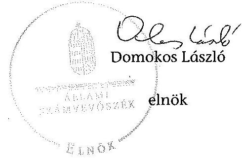
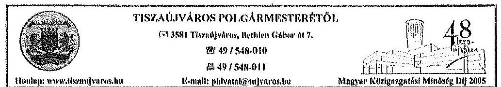
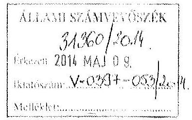
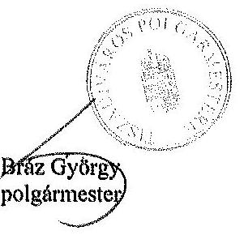
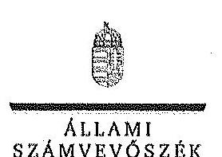
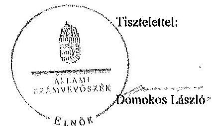
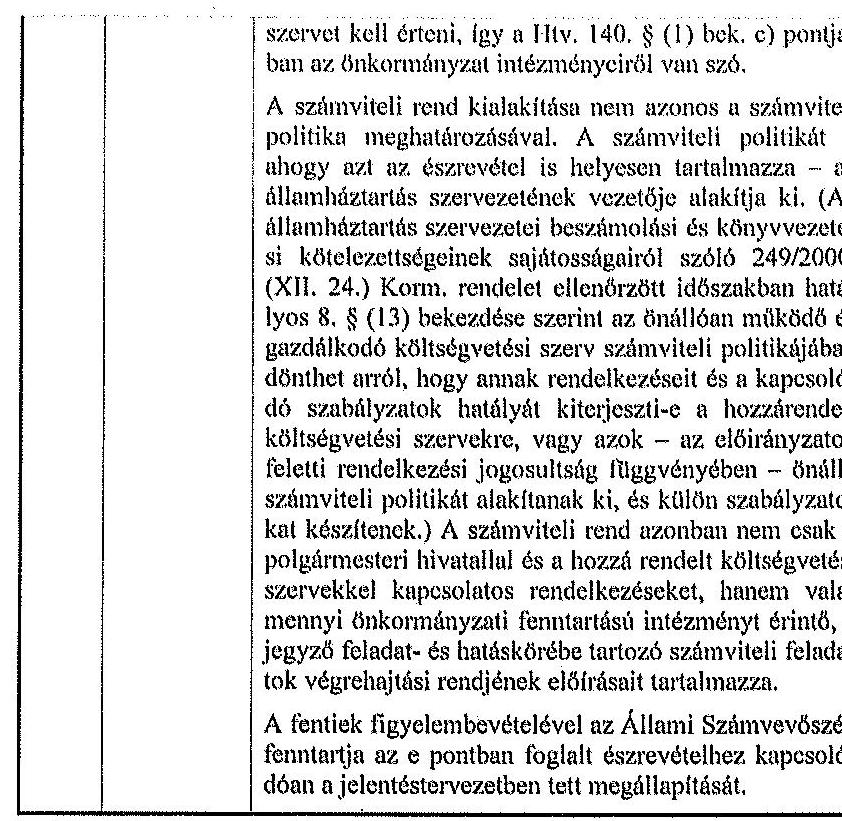
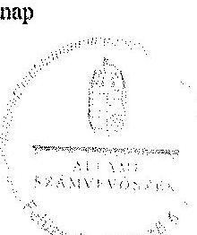

# ÁLLAMI   SZÁMVEVŐSZÉK 

## JELENTÉS

az önkormányzatok belső kontrollrendszere kialakításának, egyes kontrolltevékenységek és a belső ellenőrzés
működésének ellenőrzéséről
Tiszaújváros

---

# Állami Számvevőszék 

Iktatószám: V-0397-055/2014
Témaszám: 1372
Vizsgálat-azonosító szám: V064943

## Az ellenőrzést felügyelte:

## Dr. Benedek Mária

felügyeleti vezető
Az ellenőrzést vezette és az ellenőrzés végrehajtásáért felelős:
Dr. Veress Tiborné
ellenőrzésvezető
A számvevőszéki jelentés összeállításában közreműködtek:
Pető Krisztina
Dr. Zsolnay András
számvevő tanácsos
Az ellenőrzést végezték:
Bus András Péter számvevő
Számvevő

Dr. Zsolnay András számvevő

---

# TARTALOMJEGYZÉK 

BEVEZETÉS ..... 5
I. ÖSSZEGZŐ MEGÁLLAPÍTÁSOK, KÖVETKEZTETÉSEK, JAVASLATOK ..... 9
II. RÉSZLETES MEGÁLLAPÍTÁSOK ..... 14

1. Az önkormányzat belső kontrollrendszerének kialakítása ..... 14
1.1. A kontrollkörnyezet ..... 14
1.2. A kockázatkezelési rendszer ..... 15
1.3. A kontrolltevékenységek ..... 16
1.4. Az információs és kommunikációs rendszer ..... 17
1.5. A monitoring rendszer ..... 17
2. A pénzügyi folyamatokban kulcsszerepet betöltő teljesítésigazolás és érvényesítés belső kontrollok működése ..... 18
3. A belső ellenőrzés működése ..... 20

## MELLÉKLETEK

1. számú Észrevételt tartalmazó polgármesteri levél
2. számú Észrevételre vonatkozó elnöki válaszlevél

## FÜGGELÉKEK

1. számú Értelmező szótár
2. számú Az értékelés módja és szempontjai

---

.

---

# RÖVIDÍTÉSEK JEGYZÉKE 

## Törvények

Áfa tv.
Áht.
ÁSZ tv.
Info tv.
Htv.
Kttv.
Ltv.
Mötv.
Nvtv.
Ötv.
Számv. tv.
Vagyonnyilatkozat-
tételről szóló tv.

## Rendeletek

Ávr.
Bkr.
önkormányzati SZMSZ

## Szórövidítések

2012. évi ellenőrzési terv Tiszaújváros Város Önkormányzata 2012. évi belső ellenőrzési terve
2013. évi ellenőrzési terv Tiszaújváros Város Önkormányzata 2013. évi belső ellenőrzési terve
adatvédelmi és adatbiztonsági szabályzat

ÁSZ
belső ellenőrzési kézikönyv

Etikai Kódex
2007. évi CXXVII. törvény az általános forgalmi adóról
2011. évi CXCV. törvény az államháztartásról
2011. évi LXVI. törvény az Állami Számvevőszékről
2011. évi CXII. törvény az információs önrendelkezési jogról és az információszabadságról
1991. évi XX. törvény a helyi önkormányzatok és szerveik, a köztársasági megbízottak, valamint egyes centrális alárendeltségű szervek feladat- és hatásköreiről
2011. évi CXCIX. törvény a közszolgálati tisztviselőkről (hatályos 2012. március 1-jétől)
1995. évi LXVI. törvény a köziratokról, a közlevéltárakról és a magánlevéltári anyag védelméről
2011. évi CLXXXIX. törvény Magyarország helyi önkormányzatairól
2011. évi CXCVI. törvény a nemzeti vagyonról
1990. évi LXV. törvény a helyi önkormányzatokról
2000. évi C. törvény a számvitelről
2007. évi CLII. törvény az egyes vagyonnyilatkozat-tételi kötelezettségekről

368/2011. (XII. 31.) Korm. rendelet az államháztartásról szóló törvény végrehajtásáról
370/2011. (XII. 31.) Korm. rendelet a költségvetési szervek belső kontrollrendszeréről és belső ellenőrzéséről
Tiszaújváros Önkormányzata Képviselő testületének a 22/2012. (X. 26.) rendeletével módosított 22/2002. (XI. 04.) rendelete a Városi Önkormányzat Szervezeti és Működési Szabályzatáról

Tiszaújváros Város Önkormányzata 2012. évi belső ellenőrzési terve
Tiszaújváros Város Önkormányzata 2013. évi belső ellenőrzési terve
Tiszaújváros Város Önkormányzata Polgármesteri Hivatala ügyrendje 9. számú mellékleteként kiadott informatikai biztonságvédelmi szabályzat (hatályos 2011. augusztus 1-jétől)
Állami Számvevőszék
Tiszaújváros Város Önkormányzata Polgármesteri Hivatalának belső ellenőrzési kézikönyve (hatályos 2011. november 1-jétől)
Tiszaújváros Város Önkormányzata Polgármesteri Hivatalának etikai kódexe

---

éves összefoglaló jelentés
hivatali gazdálkodási jogkörök szabályzata
hivatali SZMSZ
hivatali ügyrend
INTOSAI
iratkezelési szabályzat
ISSAI
jegyző
Képviselő-testület
Kormányhivatal
közszolgálati szabályzat
közzétételi szabályzat

## Levéltár

NGM
Önkormányzat
önkormányzati gazdálkodási jogkörök szabályzata ${ }_{1}$
önkormányzati gazdálkodási jogkörök szabályzata ${ }_{2}$
polgármester
Polgármesteri Hivatal
stratégiai ellenőrzési terv

Éves ellenőrzési jelentés Tiszaújváros Város Önkormányzatánál 2011. évben lefolytatott belső ellenőrzésekről
Tiszaújváros Város Polgármesteri Hivatala Gazdálkodási Szabályzat a kötelezettségvállalás, ellenjegyzés, teljesítés igazolása, érvényesítés és az adatszolgáltatás rendjéről. (hatályos 2012. február 1-jétől)
Tiszaújvárosi Polgármesteri Hivatal Szervezeti és Működési Szabályzata (hatályos 2013. június 15-től)
Tiszaújváros Város Önkormányzata Polgármesteri Hivatalának ügyrendje (hatályos 2012. július 1-jétől)
International Organization of Supreme Audit Institutions (Legfőbb Ellenőrző Intézmények Nemzetközi Szervezete)
Tiszaújváros Polgármesteri Hivatalának Egyedi Iratkezelési Szabályzata (hatályos 2011. szeptember 1-jétől)
International Standards of Supreme Audit Institutions (Legfőbb Ellenőrző Intézmények Nemzetközi Standardjai)
Tiszaújváros Város Önkormányzatának jegyzője
Tiszaújváros Város Önkormányzatának Képviselőtestülete
Borsod-Abaúj-Zemplén Megyei Kormányhivatal
Tiszaújváros Város Polgármesteri Hivatalának egységes közszolgálati szabályzata (hatályos 2012. május 1-jétől)
Tiszaújváros Város Önkormányzata Polgármesteri Hivatala ügyrendje 12. számú mellékleteként kiadott közzétételi szabályzat (hatályos 2012. június 1-jétől)
Borsod-Abaúj-Zemplén Megyei Levéltár
Nemzetgazdasági Minisztérium
Tiszaújváros Város Önkormányzata
Tiszaújváros Város Önkormányzata Gazdálkodási Szabályzat a kötelezettségvállalás, ellenjegyzés, teljesítés igazolása, érvényesítés és az adatszolgáltatás rendjéről. (hatályos 2012. február 1-jétől)
Tiszaújváros Város Önkormányzata Gazdálkodási Szabályzat a kötelezettségvállalás, ellenjegyzés, teljesítés igazolása, érvényesítés és az adatszolgáltatás rendjéről. (hatályos 2013. július 1-jétől)
Tiszaújváros Város Önkormányzata polgármestere
Tiszaújváros Város Önkormányzata Polgármesteri Hivatala
Tiszaújváros Városi Önkormányzat Stratégiai Ellenőrzési Terve a 2011-2014. közötti időszakra

---

# JELENTÉS 

## az önkormányzatok belső kontrollrendszere kialakításának, egyes kontrolltevékenységek és a belső ellenőrzés működésének ellenőrzéséről Tiszaújváros

## BEVEZETÉS

Tiszaújváros állandó lakosainak száma 2012. január 1-jén 17919 fő volt. Az Önkormányzat 11 tagú Képviselő-testületének munkáját három állandó bizottság segítette. Az Önkormányzat az önállóan működő és gazdálkodó Polgármesteri Hivatalon kívül két önállóan működő intézményt működtetett, valamint három 100%-os és egy többségi tulajdoni hányadú gazdasági társasággal rendelkezett. A polgármester a 2010. évi önkormányzati választások óta tölti be tisztségét. A jegyző 2010. június 1-jétől látja el jegyzői feladatait. A Polgármesteri Hivatal szervezeti egységekre tagolódott, szervezeti és működési szabályzattal rendelkezett. A foglalkoztatott köztisztviselők száma 2012. január 1-jén 93 fő volt. A Polgármesteri Hivatal belső szervezeti tagozódását a 2013. június 15-től hatályba lépett hivatali SZMSZ-szel a 2012. évi állapothoz képest összevonásokkal racionalizálták. Az Önkormányzat a 2012. évi költségvetési beszámolója szerint 10220035 ezer Ft költségvetési bevételt ért el, valamint 10048521 ezer Ft költségvetési kiadást teljesített. A 2012. december 31-i könyvviteli mérleg szerint 19256847 ezer Ft értékű eszközvagyonnal rendelkezett, a rövid lejáratú kötelezettségállománya 208216 ezer Ft, a hosszú lejáratú kötelezettségállománya 918272 ezer Ft volt.

A demokratikus társadalmakban alapvető igény, hogy a közpénzeket, a közvagyont használók tevékenységükről elszámoljanak, ahhoz egyértelmű és érvényesíthető felelősségi szabályok társuljanak. Ennek a jogos igénynek az érvényesítéséhez meg kell teremteni azokat a folyamatokat, rendszereket, amelyek nélkülözhetetlenek az elszámoltatáshoz. Az elszámoltatás eredményes működtetéséhez szükség van a megfelelő információs, kontroll, értékelési és beszámolási rendszerek kialakítására.

Magyarországon az uniós csatlakozási tárgyalások idejére nyúlnak vissza a belső kontrollrendszer szabályozásának gyökerei. Az uniós elvárásoknak megfelelő új terminológia szerinti államháztartási belső pénzügyi ellenőrzési (ÁBPE) rendszer területén a jogharmonizáció 2003-ban teljes körűen megvalósult, míg az önkormányzati alrendszerre vonatkozó, az Ötv.-ben megjelenített speciális szabályozás 2005-ben lépett hatályba. Az államháztartási belső kontrollrendszer koncepciója 2009-ben továbbfejlődött. A változások irányát mutatja, hogy a költségvetési szervek belső kontrollrendszere már magában foglalja a korszerű, felelős szervezetirányítás elemeit (kontrollkörnyezet, kockázatkezelés, kontrolltevékenység, információ és kommunikáció, monitoring) is. E kontrollrendszer szabályozása háromszintű, a törvényi előírásokat az Áht. és a Mötv., a rendeleti szintű szabályozást az Ávr. és a Bkr. tartalmazza, amelyeket útmutatói szinten az NGM által kiadott standardok és kézikönyvek támogatnak.

A belső kontrollrendszer azt a célt szolgálja, hogy a költségvetési szervek működésük és gazdálkodásuk során a tevékenységeket szabályszerűen, gazdaságosan, hatékonyan és eredményesen hajtsák végre, teljesítsék elszámolási kötelezettségeiket és megvédjék az erőforrásokat a veszteségektől, a károktól és a nem rendeltetésszerű használattól. A belső kontrollrendszer magában foglalja mindazon szabályokat, eljárásokat, gyakorlati módszereket és szervezeti struktúrákat, kockázatkezelési technikákat, kontrolltevékenységeket, amelyek segítséget nyújtanak a szervezetnek céljai eléréséhez.

Az ÁSZ a középtávú stratégiájában hangsúlyos szerepet szánt annak, hogy szilárd szakmai alapon álló, értékteremtő ellenőrzéseivel előmozdítsa a közpénzügyek átláthatóságát, rendezettségét. A számvevőszéki ellenőrzés nemzetközi alapelvei is rögzítik, hogy a megfelelő belső kontrollrendszer minimálisra csökkenti a hibák és szabálytalanságok kockázatát.

Az ellenőrzés célja annak megállapítása volt, hogy a belső kontrollrendszer elemeinek kialakítása, a pénzügyi folyamatokban kulcsszerepet betöltő teljesítésigazolás és érvényesítés, és a belső ellenőrzés szabályos működése biztosította-e az önkormányzatnál a közpénzfelhasználás szabályosságát, hozzájárult-e az értéket teremtő rend követelményének érvényesüléséhez.

Ennek keretében értékeltük, hogy

- a jogszabályi előírásoknak megfelelően alakították-e ki a belső kontrollrendszer elemeit;
- a gazdálkodás folyamatában kulcsszerepet betöltő teljesítésigazolás és érvényesítés kontrolltevékenységeit megfelelően működtették-e;
- biztosították-e a belső ellenőrzés szabályos működését;
- amennyiben az ÁSZ tett javaslatot a 2008-2011. évek közötti ellenőrzések kapcsán, intézkedtek-e azok végrehajtására.

Az ellenőrzés várható hasznosulását négy szinten tervezzük. A törvényalkotás számára összegzett tapasztalatok állnak rendelkezésre a belső kontrollrendszer önkormányzati területen való kialakításáról, működéséről és hatásairól, a belső ellenőrzés működéséről. Ennek alapján következtetést lehet levonni arról, hogy a belső kontrollrendszer kialakítására és működtetésére vonatkozó jelenlegi, differenciálás nélküli jogszabályi előírások reális követelményeket támasztanak-e az eltérő adottságú települési önkormányzatok esetében, illetve indokolt-e esetleges jogszabályi módosítás kezdeményezése. Az ellenőrzés az ellenőrzött számára visszajelzést ad a belső kontrollrendszer kialakításában és működésében fellépő hiányosságokról, javaslataival hozzájárul azok kiküszöböléséhez, amely csökkentheti a későbbi ellenőrzések gyakoriságát. Az ellenőrzés megállapításait és javaslatait más szervezetek is hasznosíthatják a

---

rendezett gazdálkodási keretek kialakításához. A társadalom számára jelzi, hogy közpénz nem maradhat ellenőrizetlenül, az ÁSZ értékteremtő rend kialakításához és megőrzéséhez hozzájáruló tevékenysége pozitív hatással lesz a szervezetről kialakított összkép formálásában. A szervezeten belül lehetőség nyílik arra, hogy a megállapítások szintetizálásával az ÁSZ a hozzáadott értéket teremtő elemző tevékenységét és tanácsadó szerepét is erősítse.

Az önkormányzatok belső kontrollrendszere kialakításának, egyes kontrolltevékenységek és a belső ellenőrzés működésének ellenőrzéséről szóló jelentés I. fejezetének összegző része az ellenőrzés céljára ad rövid, szintetizáló összefoglalót, és tartalmazza a következtetéseket a II. fejezet részletes megállapításain alapulóan. A jelentés intézkedést igénylő megállapításait és javaslatait az ellenőrzés során feltárt, a jelentés II. fejezetében rögzített részletes megállapítások alapozzák meg. A helyszíni ellenőrzés lezárásáig a helyi szabályozás változásait nyomon követtük. Az ÁSZ az ellenőrzés megállapításait az ellenőrzött időszakban hatályos, az intézkedést igénylő megállapításokra tett javaslatokat a jelenleg hatályos jogszabályok alapján fogalmazta meg.

Az ellenőrzés típusa: szabályszerűségi ellenőrzés.
Az ellenőrzött időszak: a belső kontrollrendszer kialakításának megfelelősége esetében a 2012. évre, a pénzügyi folyamatokban kulcsszerepet betöltő teljesítésigazolás és érvényesítés belső kontrollok működésének megfelelőségét és a belső ellenőrzés szabályszerű működését a 2012. január 1. és december 31-e közötti időszak eseményeit figyelembe véve értékeltük, míg az ÁSZ javaslatainak utóellenőrzése a 2008-2011. években végzett ellenőrzések nyilvánosságra hozott jelentéseiben tett javaslatok áttekintésére terjedt ki.

# Az ellenőrzött szervezet: az Önkormányzat. 

Az ellenőrzés jogszabályi alapját az ÁSZ tv. 1. § (3) bekezdése, az 5. § (2) és (6) bekezdése, valamint az Áht. 61. § (2) bekezdésének előírásai képezik.

Az ellenőrzés szakmai módszertana az ÁSZ hivatalos honlapján (www.asz.hu) közzétett szakmai szabályokon alapult, amely az INTOSAI által kiadott ISSAI figyelembevételével készült.

Az ellenőrzés lefolytatásához az Önkormányzat a kimutatások és a tanúsítvány elektronikus kitöltésével, valamint az ÁSZ által kért dokumentumok elektronikus megküldésével szolgáltatott adatokat. Az így rendelkezésre bocsátott adatok, információk kontrollja és a munkalapok kitöltése a helyszíni ellenőrzés keretében történt. A jelentésben használt fogalmak magyarázatát az 1. számú függelék, az ellenőrzés egyes területeinek értékelésénél alkalmazott egységes minősítési szempontokat a 2. számú függelék tartalmazza.

A belső kontrollrendszer kialakításának ellenőrzése során értékeltük a kontrollkörnyezet, a kockázatkezelési rendszer, a kontrolltevékenységek, az információs és kommunikációs rendszer, valamint a monitoring rendszer szabályozottságának megfelelőségét. A pénzügyi folyamatokban kulcsszerepet betöltő teljesítésigazolás és érvényesítés kontrollok működése megfelelőségének minősítéséhez az állományba nem tartozók megbízási díjai, a külső szolgáltatók által

---

végzett karbantartási, kisjavítási munkák közül kockázatelemzéssel választottuk ki az ellenőrzött kiadási jogcímeket. Az egyszerû véletlen mintavétellel kiválasztott tételek ellenőrzését többlépcsős megfelelőségi tesztek útján addig végeztük, amíg elegendő és megfelelő bizonyítékot szereztünk a vizsgált folyamatok kulcskontrolljai működésének megfelelő vagy nem megfelelő voltáról. Értékeltük az Önkormányzatnál a belső ellenőrzés működésének szabályosságát. Az Önkormányzat gazdálkodási rendszerét az ÁSZ 2008-ban
 ellenőrizte. A 0927 számon közzétett számvevőszéki jelentésben az Önkormányzat részére az ÁSZ javaslatot nem tett, ezért a jelen ellenőrzés keretében utóellenőrzésre nem került sor.

Az Ász tv. 29. § (1) bekezdése szerint a jelentéstervezetet megküldtük a polgármester részére, aki az ÁSZ tv. 29. § (2) bekezdésében foglalt észrevételezési jogával élt, a jelentéstervezetre észrevételt tett (1. számú melléklet). Az ÁSZ tv. 29. § (3) bekezdésében előírtaknak megfelelően a figyelembe nem vett észrevételeket és annak indokairól szóló tájékoztatást a jelentés tartalmazza (2. számú melléklet).

---

# I. ÖSSZEGZŐ MEGÁLLAPÍTÁSOK, KÖVETKEZTETÉSEK, JAVASLATOK 

A belső kontrollrendszeren belül 2012-ben a kontrollkörnyezet, a kockázatkezelési rendszer, a kontrolltevékenységek, az információs és kommunikációs rendszer, valamint a monitoring rendszer kialakítását külön-külön és együttesen is értékeltük. A belső kontrollrendszer kialakítása az összesített értékelés alapján részben felelt meg a jogszabályi előírásoknak.

A belső kontrollrendszer egyes területei kialakításának minősítése a következő:

| Kontrollterület | Minősítés |
| :-- | :-- |
| Kontrollkörnyezet | nem megfelelő |
| Kockázatkezelési rendszer | megfelelő |
| Kontrolltevékenységek | megfelelő |
| Információs és kommunikációs rendszer | megfelelő |
| Monitoring rendszer | megfelelő |

Megfelelőnek értékeltük a kockázatkezelési rendszer, a kontrolltevékenységek, az információs és kommunikációs rendszer, valamint a monitoring rendszer kialakítását, mivel a jegyző a jogszabályi előírásokban foglaltakat figyelembe véve a kisebb hiányosságok mellett is megteremtette e kontrollterületeken a szabályszerű működés lehetőségét.

Nem megfelelőnek értékeltük a kontrollkörnyezet kialakítását, mivel az ellenőrzésünk során megállapított szabályozásbeli hiányosságok magukban hordozzák a szabálytalan működés és gazdálkodás, valamint a korrupció kockázatát.

Az állományba nem tartozók megbízási díjaival, valamint a külső szolgáltatók által végzett karbantartási, kisjavítási munkákkal kapcsolatos kifizetések során a pénzügyi folyamatokban kulcsszerepet betöltő teljesítésigazolás és érvényesítés belső kontrollok működése gyenge volt. Gyengének értékeltük a két kulcskontroll együttes működését, mivel azok nem biztosították a hibák megelőzését, feltárását.

A számvevőszéki ellenőrzés az ellenőrzött kifizetésekkel összefüggésben a rendelkezésre bocsátott dokumentumok alapján kár bekövetkeztére utaló adatot, tényt nem állapított meg, azonban a gazdálkodásban kulcsszerepet betöltő kontrollok gyenge működése miatt fennáll a hibák bekövetkezésének lehetősé-

---

ge. A nem megfelelően szabályozott és működtetett belső kontrollok korrupciós kockázatot hordoznak.

Az Önkormányzat a belső ellenőrzési feladatokat a Polgármesteri Hivatalban foglalkoztatott köztisztviselőkkel látta el. A belső ellenőrzés működése a jogszabályi előírásoknak ugyan jól megfelelt, azonban nem tárta fel a számvevőszéki ellenőrzés által megállapított hiányosságokat a kontrollkörnyezet kialakításánál, valamint a pénzügyi folyamatokban kulcsszerepet betöltő teljesítésigazolás és érvényesítés belső kontrollok működésénél.

Az ÁSZ tv. 33. § (1) bekezdésében foglaltak értelmében az ellenőrzött szervezet vezetője köteles a jelentésben foglalt megállapításokhoz kapcsolódó intézkedési tervet összeállítani, és azt a jelentés kézhezvételétől számított 30 napon belül az ÁSZ részére megküldeni. Amennyiben az intézkedési tervet határidőre nem küldi meg a szervezet, vagy az ÁSZ tv. 33. § (2) bekezdésében foglalt póthatáridő elteltével megküldött intézkedési terv továbbra sem elfogadható, az ÁSZ elnöke a hivatkozott törvény 33. § (3) bekezdés a)-b) pontjaiban foglaltakat érvényesítheti.

Az ellenőrzés intézkedést igénylő megállapításai és javaslatai:

# a polgármesternek 

1. A polgármester mint kötelezettségvállaló - az Ávr. 57. § (4) bekezdésében foglaltak ellenére - nem jelölte ki 2012. március 30-át követően írásban az Önkormányzat kiadási előirányzatai vonatkozásában a teljesítés igazolására jogosult személyeket.

Javaslat:
Gondoskodjon az Ávr. 57. § (4) bekezdésében foglaltak szerint az Önkormányzat kiadási előirányzatai vonatkozásában a teljesítés igazolására jogosult személyek írásban történő kijelöléséről.
2. A közszolgálatban nem álló személyek közül hat fő, a Képviselő-testület bizottságának nem helyi önkormányzati képviselő tagja - a Vagyonnyilatkozat-tételről szóló tv.-ben foglaltak ellenére - a vagyonnyilatkozat-tételi kötelezettségének nem tett eleget. A vagyonnyilatkozatok őrzéséért felelősként kijelölt Pénzügyi Ellenőrző, Gazdasági és Ügyrendi Bizottság a vagyonnyilatkozat-tételi kötelezettség fennállásáról és esedékességének időpontjáról az esedékességet legalább 30 nappal megelőzően nem tájékoztatta a kötelezetteket, továbbá a vagyonnyilatkozat-tételi kötelezettségüket nem teljesítőket írásban nem szólította fel arra, hogy vagyonnyilatkozat-tételi kötelezettségüket a felszólítás kézhezvételétől számított nyolc napon belül teljesítsék.

Javaslat:
Kezdeményezze a Mötv. a 65. §-a alapján a Képviselő-testületnél az Mötv. 57. § (2) bekezdésének, valamint a helyi önkormányzati képviselők jogállásának egyes kérdéseiről szóló 2000. évi XCVI. törvény 10/A. § (3) bekezdésének megfelelően a vagyonnyilatkozatok vizsgálatáért felelősként kijelölt Pénzügyi Ellenőrző, Gazdasági és Ügyrendi Bizottság vagyonnyilatkozat-tételi kötelezettség teljesítésére vonatkozó eljárásának szabályszerűségével kapcsolatos körülmények kivizsgálását, majd a vizsgá-

---

lat eredményének függvényében kezdeményezze a Képviselő-testületnél a szükséges intézkedések megtételét.
3. A számvevőszéki ellenőrzés megállapításai alapján az Önkormányzatnál a belső kontrollrendszer kialakítása összefoglalóan értékelve részben felelt meg a jogszabályi előírásoknak, a kulcskontrollok működése gyenge volt, a belső ellenőrzés működése ugyan jól megfelelt a jogszabályi előírásoknak, azonban nem tárta fel a számvevőszéki ellenőrzés által megállapított hiányosságokat. A szabályozásbeli hiányosságok magukban hordozzák a szabálytalan működés kockázatát.

Javaslat:
Az Mötv. 115. § (1) bekezdésében foglaltak alapján kísérje figyelemmel az Önkormányzat gazdálkodásának szabályszerűségét. Az Mötv. 67. § f) pontja alapján gondoskodjon a belső kontrollrendszer működésére vonatkozó jogszabályi rendelkezések be nem tartása, valamint a teljesítésigazolás, illetve az érvényesítés kontrollokkal összefüggésben feltárt hiányosságok, szabálytalanságok tekintetében az esetleges munkajogi felelősséggel kapcsolatos körülmények kivizsgálásáról, majd a vizsgálat eredményének függvényében tegye meg a szükséges intézkedéseket.

# a jegyzőnek 

1. a kontrollkörnyezettel kapcsolatban:

A jegyző az Áht.-ban foglaltak ellenére nem készítette el a Polgármesteri Hivatal szervezeti és működési szabályzatát. A Htv.-ben foglaltak ellenére az Önkormányzat intézményének számviteli rendjét nem alakította ki, és az Ötv.-ben foglalt kötelezettsége ellenére nem készítette elő a Kttv.-ben foglaltak szerinti, a köztisztviselőkkel szembeni hivatásetikai alapelvek részletes tartalmának, valamint az etikai eljárás szabályainak dokumentumát. [II. Részletes megállapítások, 1.1. A kontrollkörnyezet 5., 18. és 47. sorszámú megállapítás]

Javaslat:
Intézkedjen az Áht. 69. § (2) bekezdése, a Bkr. 3. § a) pontja és 6. §-a alapján a jelentés II. Részletes megállapítások, 1.1. A kontrollkörnyezet 5., 18. és 47. sorszámú megállapításaiban foglalt hibák, hiányosságok kijavításáról, megszüntetéséről az ott megjelölt jogszabályi rendelkezéseknek megfelelően.
2. a kockázatkezelési rendszerrel kapcsolatban:

A Vagyonnyilatkozat-tételről szóló tv. előírásai ellenére a Bizottság nem képviselő tagjai vagyonnyilatkozat-tételi kötelezettsége az önkormányzati SZMSZ-ben nem került feltüntetésre. A Bizottság nem képviselő tagjai vagyonnyilatkozat-tételi kötelezettségük teljesítésének fennállásáról és esedékességének időpontjáról tájékoztatást nem kaptak, valamint a kötelezettség teljesítésének elmulasztására vonatkozó felszólításuk nem történt meg. [II. Részletes megállapítások, 1.2. A kockázatkezelési rendszer 13. és 14. sorszámú megállapítás]

---

Javaslat:
Intézkedjen az Áht. 69. § (2) bekezdése, a Bkr. 3. § b) pontja, 7. §-a, valamint a Vagyonnyilatkozat-tételről szóló tv. alapján a jelentés II. Részletes megállapítások, 1.2. A kockázatkezelési rendszer 13. és 14. sorszámú megállapításában foglalt hibák, hiányosságok kijavításáról, megszüntetéséről az ott megjelölt jogszabályi rendelkezéseknek megfelelően.
3. a kontrolltevékenységekkel kapcsolatban:

Az Ávr.-ben foglaltak ellenére a pénzügyi ellenjegyzési és az érvényesítési feladatra a jegyző helyett jogosulatlanul a gazdasági feladatokat ellátó szervezeti egység vezetője jelölte ki a Polgármesteri Hivatal állományába tartozó köztisztviselőt. [II. Részletes megállapítások, 1.3. A kontrolltevékenységek 7., 8., 27. és 29. sorszámú megállapítás].

Javaslat:
Intézkedjen az Áht. 69. § (2) bekezdése, a Bkr. 3. § c) pontja és 8. §-a alapján a jelentés II. Részletes megállapítások, 1.3. A kontrolltevékenységek 7., 8., 27. és 29. sorszámú megállapításában foglalt hibák, hiányosságok kijavításáról, megszüntetéséről az ott megjelölt jogszabályi rendelkezéseknek megfelelően.
4. a pénzügyi folyamatokban kulcsszerepet betöltő kontrollokkal kapcsolatban:

A teljesítésigazolás és az érvényesítés az Áht.-ban és az Ávr.-ben foglaltaknak, a számla tartalma az Áfa. tv. előírásainak nem felelt meg. [II. Részletes megállapítások, 2. A pénzügyi folyamatokban kulcsszerepet betöltő teljesítésigazolás és érvényesítés belső kontrollok működése 1-3. pontban foglalt megállapítás]

Javaslat:
Intézkedjen az Áht. 38. §-ában, az Ávr. 55. §-ában, 57-58. §-aiban és a 60. §-ában, valamint az Áfa. tv.-ben foglaltak alapján arról, hogy a teljesítésigazolás és az érvényesítés vonatkozásában, illetve az azok ellenőrzése során a pénzügyi ellenjegyzéssel, a kötelezettségvállalások nyilvántartásba vételével, valamint a gazdasági események során kiállított számlákkal kapcsolatban feltárt, a jelentés II. Részletes megállapítások, 2. A pénzügyi folyamatokban kulcsszerepet betöltő teljesítésigazolás és érvényesítés belső kontrollok működése 1-3. pontjában szereplő megállapításokban foglalt hibák, hiányosságok kijavítása, megszüntetése az ott megjelölt jogszabályi rendelkezéseknek megfelelően történjen meg.
5. a belső ellenőrzés működésével kapcsolatban:

A belső ellenőrzés működése az értékelési szempontjait figyelembe véve jól megfelelt a jogszabályi előírásoknak, azonban a számvevőszéki ellenőrzés kisebb súlyú hiányosságokat tárt fel, amelyek nem feleltek meg a Bkr.-ben előírt rendelkezéseknek. [II. Részletes megállapítások, 3. A belső ellenőrzés működése 3. d) és 20. a) sorszámú megállapítás]

---

Javaslat:
Intézkedjen az Áht. 69.§ (2), a 70. § (1) bekezdése, a Bkr. 3. § e) pontja és 10. §-a alapján a jelentés II. Részletes megállapítások, 3. A belső ellenőrzés működése 3. d) és 20. a). sorszámú megállapításaiban foglalt hibák, hiányosságok kijavításáról, megszüntetéséről az ott megjelölt jogszabályi rendelkezéseknek megfelelően.

---

# II. RÉSZLETES MEGÁLLAPÍTÁSOK 

## 1. AZ ÖNKORMÁNYZAT BELSŐ KONTROLLRENDSZERÉNEK KIALAKÍTÁ-

SA

A belső kontrollrendszeren belül 2012-ben a kontrollkörnyezet, a kockázatkezelési rendszer, a kontrolltevékenységek, az információs és kommunikációs rendszer, valamint a monitoring rendszer kialakítását külön-külön és együttesen is értékeltük. A belső kontrollrendszer kialakítása az összesített értékelés alapján részben felelt meg a jogszabályi előírásoknak.

### 1.1. A kontrollkörnyezet

A kontrollkörnyezet kialakítása - a 2. számú függelékben részletezett kritériumrendszer alapján végzett értékelés szerint - a jogszabályi előírásoknak nem felelt meg, mert:

| Sor-   szám $^{1}$ | Megállapítás | Megjegyzés |
| :--: | :--: | :--: |
| 5., 6.,   9.,   11.,   12. | A Polgármesteri Hivatal - az Áht. 10. § (5) bekezdésében foglaltak ellenére - nem rendelkezett szervezeti és működési szabályzattal.   A Polgármesteri Hivatal 2012. július 1-jétől hatályos hivatali ügyrendjét a Képviselőtestület - az Áht. 9. § (1) bekezdés e) pontjában foglaltak ellenére - nem hagyta jóvá, mert a jegyző nem kezdeményezte annak Képviselő-testület elé terjesztését, továbbá az Ávr. 13. § (1) bekezdés b), e), f), h) és i) pontjában foglaltak ellenére - nem tartalmazta a költségvetési szerv alapító okiratának keltét, számát, a költségvetési szerv szervezeti ábráját, azon ügyköröket, amelyek során a szervezeti egységek vezetői a költségvetési szerv képviselőjeként járhatnak el, a munkáltatói jogok gyakorlásának rendjét, és a költségvetési szervhez rendelt más költségvetési szervek felsorolását. | A költségvetési szerv szervezeti és működési szabályzatának képviselőtestület általi jóváhagyását 2013. január 1-jétől az Áht. 9. § (1) bekezdés a) pontja írja elő.   A Polgármesteri Hivatal 2013. június 15-től Képviselő-testület által jóváhagyott hivatali SZMSZ-szel rendelkezik. |
| 18. | A jegyző - a Htv. 140. §. (1) bekezdés c) pontjában foglaltak ellenére - az Önkormányzat intézményeinek számviteli rendjét nem alakította ki. |  |

[^0]
[^0]:    ${ }^{1}$ A megállapítás számozása az Önkormányzat által az adatszolgáltatás során kitöltött kimutatások kérdéseinek sorszámával azonos.

---

A Képviselő-testület - a Kttv. 231. § (1) bekezdése ellenére - nem állapította meg a
 Kttv. 83. §-ában előírt, a köztisztviselőkkel szembeni hivatásetikai alapelvek részletes tartalmát, valamint az etikai eljárás szabályait, mivel a jegyző - az Ötv. 36. § (2) bekezdés a) pontjában előírt feladata ellenére - nem kezdeményezte a Képviselő-testület elé terjesztését.

A Polgármesteri Hivatal 2004. április 30-tól rendelkezik az Európai Unió Bizottsága által elfogadott Rec (2000) 10. számú Ajánlás alapján készült Etikai Kódexszel, de a Kttv. 231. § (1) bekezdésében foglaltak ellenére a jegyző nem kezdeményezte a Képviselőtestület elé terjesztését. A Polgármesteri Hivatal köztisztviselői a munkaköri leírásukban nyilatkoztak arról, hogy elfogadják az Etikai Kódex előírásait és magukra nézve kötelezőnek tartják.
2013. január 1-jétől a Mötv. 81. § (3) bekezdés c) pontja szabályozza, hogy a jegyző gondoskodik az önkormányzat működésével kapcsolatos feladatok ellátásáról.

# 1.2. A kockázatkezelési rendszer 

A kockázatkezelési rendszer kialakítása - a 2. számú függelékben részletezett kritériumrendszer alapján végzett értékelés szerint - megfelelt a jogszabályi előírásoknak.

A Polgármesteri Hivatal tevékenységeiben rejlő kockázatokat beazonosították, felmérték az azonosított kockázatok bekövetkezési valószínűségét és hatását, meghatározták a kockázati tűréshatárokat, illetve a tevékenységeket kockázati érték alapján rangsorolták, a kockázati tényezőkre meghatározták a szükséges intézkedéseket. Nyomon követték a kockázatkezelés során előírt intézkedések teljesítését, ennek érdekében meghatározták a nyomon követés módját. A Vagyonnyilatkozat-tételről szóló tv. szerinti kötelezettek - a képviselő-testületi bizottságok nem képviselő tagjai kivételével - teljesítették vagyonnyilatkozattételi kötelezettségüket.

A kockázatkezelési rendszer kialakítása az értékelés szempontjából az alábbi kisebb súlyú hiányosságok mellett megfelelt a jogszabályi előírásoknak:

| Sor-   szám | Megállapítás | Megjegyzés |
| :--: | :--: | :--: |
| 13. | A Vagyonnyilatkozat-tételről szóló tv. 4. § d) pontjában foglaltak ellenére a bizottság nem helyi önkormányzati képviselő tagjai vagyonnyilatkozat-tételi kötelezettségét az önkormányzati SZMSZ-ben nem tüntették fel. |  |

---

A bizottságok nem helyi önkormányzati képviselő tagjai - a Vagyonnyilatkozat-tételről szóló tv. 5. §-ában foglaltak ellenére - vagyonnyilatkozat-tételi kötelezettségüknek nem tettek eleget, amelynek fennállásáról és esedékességének időpontjáról a vagyonnyilatkozat őrzéséért felelős - a Pénzügyi Ellenőrző, Gazdasági és Ügyrendi Bizottság - a 8. § (4) bekezdésében foglaltak ellenére nem tájékoztatta, továbbá a 10. § (1) bekezdésében előírtak ellenére írásban nem szólította fel kötelezettségük teljesítésére.

Az Oktatási, Múvelődési, Szociális, Egészségügyi és Sport Bizottság, továbbá a Városüzemeltetési és Rendészeti Bizottság három-három nem képviselő tagja nem tett vagyonnyilatkozatot.

# 1.3. A kontrolltevékenységek 

A kontrolltevékenységek kialakítása - a 2. számú függelékben részletezett kritériumrendszer alapján végzett értékelés szerint - megfelelt a jogszabályi előírásoknak.

A jegyző a kontrolltevékenység részeként előírta a folyamatba épített, előzetes, utólagos és vezetői ellenőrzést.

A jegyző szabályozta a kötelezettségvállalás pénzügyi ellenjegyzésének módját, meghatározta az előzetes írásbeli kötelezettségvállalást nem igénylő kifizetések, az érvényesítés és az utalványozás rendjét. A jegyző 2012. március 30-át megelőzően az önkormányzati és a polgármesteri hivatali kiadási előirányzatokra írásban kijelölte a teljesítés igazolására jogosult személyeket. A jegyző az iratkezelési szabályzatban előírta az iratok és az adatok védelmét, szabályozta az üzemeltetés és adatbiztonság feladatait, meghatározta az ehhez kapcsolódó hatásköröket. A hivatali és az önkormányzati gazdálkodási jogkörök szabályzata ${ }_{1}$ tartalmazta az időközi és éves beszámolók elkészítésének feladatait, annak felelőseit.

A polgármester felhatalmazást adott a kötelezettségvállalásra és utalványozásra. A Polgármesteri Hivatal állományába tartozó, pénzügyi ellenjegyzésre és érvényesítésre felhatalmazott köztisztviselők rendelkeztek a jogszabályban előírt szakképzettséggel.

A jegyző a közszolgálati szabályzatban szabályozta a köztisztviselők jogviszony megszüntetése (megszünése) esetére a munkavállaló folyamatban lévő feladatai átadásának és a munkáltatóval való elszámolásának rendjét.

A kontrolltevékenységek kialakítása az értékelés szempontjából az alábbi kisebb súlyú hiányosságok mellett megfelelt a jogszabályi előírásoknak:

| Sorszám | Megállapítás | Megjegyzés |
| :--: | :--: | :--: |
| 7-8. | A jegyző - az Ávr. 53. § (2) bekezdésében foglaltakat figyelmen kívül hagyva - annak ellenére nem határozta meg az előzetes írásbeli kötelezettségvállalást nem igénylő kifizetések rendjét, hogy az önkormányzati gazdálkodási jogkörök szabály- |  |

---

|  | zata ${ }_{1}$-ben lehetővé tette az 50 ezer Ft alatti kifizetések előzetes írásbeli kötelezettségvállalás nélküli teljesítést. |  |
| :--: | :--: | :--: |
| 10. | A polgármester, mint kötelezettségvállaló az Ávr. 57. § (4) bekezdésében foglaltak ellenére - nem jelölte ki 2012. március 30-át követően írásban az Önkormányzat kiadási előirányzatai vonatkozásában a teljesítésigazolásra jogosult személyeket. | Az önkormányzati gazdálkodási jogkörök szabályzata ${ }_{2}$ 2013. július 1-jétől hatályos. |
| 27.   és   29. | Annak ellenére, hogy a Polgármesteri Hivatal gazdasági szervezettel nem rendelkezett, pénzügyi ellenjegyzési és érvényesítési feladatra - az Ávr. 55. § (2) bekezdés f) pontjának, valamint az Ávr. 58. § (4) bekezdésének előírása ellenére - a jegyző helyett jogosulatlanul a pénzügyi, fejlesztési és vagyonüzemeltetési irodavezető jelölte ki a Polgármesteri Hivatal állományába tartozó köztisztviselőt. |  |

# 1.4. Az információs és kommunikációs rendszer 

Az információs és kommunikációs rendszer kialakítása - a 2. számú függelékben részletezett kritériumrendszer alapján végzett értékelés szerint megfelelt a jogszabályi előírásoknak.

A jegyző meghatározta a szervezeten belüli és a külső feleknek történő információk átadásának, továbbá a szervezeten kívülről érkező információk kezelésének rendjét. A Polgármesteri Hivatal rendelkezett adatvédelmi és adatbiztonsági szabályzattal, szabályozták a kötelezően közzéteendő adatok nyilvánosságra hozatalának, valamint a közérdekű adatok megismerésére irányuló igények teljesítésének a rendjét. Közzétételi kötelezettségének az Önkormányzat eleget tett. Megfelelő tartalommal elkészítették az iratkezelési szabályzatot, amely tartalmazta a Levéltár és a Kormányhivatal egyetértését. A Polgármesteri Hivatalban szabályozott volt az ügyintézés folyamata, a határidők rögzítése, a szabálytalanságok kezelése.

### 1.5. A monitoring rendszer

A monitoring rendszer kialakítása - a 2. számú függelékben részletezett kritériumrendszer alapján végzett értékelés szerint - megfelelt a jogszabályi előírásoknak.

A jegyző kialakította a szervezeti célok megvalósításának nyomon követését biztosító rendszert és alkalmazásának rendjét, értékelését.

A jegyző nyilatkozatban értékelte a belső kontrollok működését a 2011. évre vonatkozóan, és az értékelés alapján intézkedett a belső kontrollrendszer továbbfejlesztéséről. Az Önkormányzatnál végzett külső és belső ellenőrzésekről készült jelentések javaslatai alapján intézkedtek, és nyomon követték a javaslatok hasznosítását.

---

A helyi önkormányzatok törvényességi felügyeletét ellátó Kormányhivatal a 2012. évben a Képviselő-testület által alkotott rendeletek, határozatok kapcsán nem élt törvényességi felhívással, vagy más törvényességi felügyeleti eszközzel.

# 2. A PÉNZÜGYI FOLYAMATOKBAN KULCSSZEREPET BETÖLTŐ TELJESÍTÉSIGAZOLÁS ÉS ÉRVÉNYESÍTÉS BELSŐ KONTROLLOK MŰKÖDÉSE 

Az állományba nem tartozók megbízási díjaival és a külső szolgáltatók által végzett karbantartással, kisjavítással kapcsolatos kifizetések során - összefoglalóan értékelve - a pénzügyi folyamatokban kulcsszerepet betöltő teljesítésigazolás és érvényesítés belső kontrollok működésének megfelelősége gyenge volt, mert:

| Kontrollok   sorszáma | Megállapítás |
| :-- | :-- |

## Teljesítésigazolás

A teljesítésigazolást - az Áht. 38. § (1) bekezdésében, az Ávr. 57. § (1) és (3) bekezdésében foglaltak ellenére - kijelölés hiányában jogosulatlan személy végezte, illetve nem végezték el, valamint a teljesítésigazoló a kifizetéseket megelőzően ellenőrizhető okmányok hiányában nem ellenőrizte a kiadások jogosságát, összegszerűségét és az ellenszolgáltatás teljesítését. Az Ávr. 60. § (3) bekezdése szerint vezetett nyilvántartás (aláírás-minta) alapján nem volt beazonosítható, hogy az igazolás dátumával ellátott aláírás a teljesítésigazolásra kijelölt személytől származott.

## Érvényesítés

Az érvényesítést - az Ávr. 58. § (4) bekezdésben foglaltak ellenére jegyzői kijelölés hiányában jogosulatlan személy végezte. Az érvényesítő az ellenőrzési feladatát nem szabályszerűen végezte, mert - az Áht. 38. § (1) bekezdésében és az Ávr. 58. § (1)-(2) bekezdésében foglaltak ellenére - a kiadások összegszerűségének, a fedezet meglétének ellenőrzése a teljesítésigazolást megelőzően történt, továbbá nem ellenőrizte és nem jelezte az utalványozónak, hogy a megelőző ügymenetben a teljesítésigazolást nem végezték el, vagy jogosulatlan személy végezte el, továbbá a pénzügyi ellenjegyzésre - az Ávr. 55. § (1) bekezdésében foglaltak ellenére - dátum feltüntetése nélkül került sor. Nem jelezte továbbá, hogy - az Ávr. 52. § (1) bekezdés a) pontjában foglaltak ellenére - a jegyző nem megfelelő formában vállalt a Polgármesteri Hivatal nevében kötelezettséget, mivel a Polgármesteri Hivatal képviseletében kötött megbízási szerződésben megbízóként a jegyzőt szerepeltették a Polgármesteri Hivatal helyett.

## A kulcskontrollok ellenőrzése során feltárt egyéb hiányosságok

3. Egy számla az Áfa tv. 169. § e) pont előírása ellenére hibásan tartalmazta a szolgáltatás igénybevevőjének nevét és címét, mivel azt az Önkormányzat helyett a Polgármesteri Hivatal nevére állították ki.

---

Az állományba nem tartozók megbízási díjaival kapcsolatos - a Polgármesteri Hivatalra és az Önkormányzatra vonatkozó - kifizetések során a teljesítésigazolás és az érvényesítés kulcskontrollok működésének megfelelősége gyenge volt, mert:

- a teljesítésigazolást a tanulmányterv és a pedagógiai szolgáltatás feladatokra kötött megbízási szerződésekkel kapcsolatos kifizetéseket megelőzően- az Ávr. 57. § (3) bekezdésben foglaltak ellenére - kijelölés hiányában jogosulatlan személy végezte, valamint a tolmácsolási feladatok ellátására kötött megbízási szerződéssel kapcsolatos kifizetést megelőzően - az Áht. 38. § (1) bekezdésében és az Ávr. 57. § (1) bekezdésében foglaltak ellenére - nem végezték el;
- a teljesítésigazoló a hivatásos gondnoki, műszaki ellenőri és tolmácsolási szolgáltatás feladatokra kötött megbízási szerződésekkel kapcsolatos kifizetéseket megelőzően - az Ávr. 57. § (1) bekezdésében foglaltak ellenére - ellenőrizhető okmányok hiányában nem ellenőrizte a kiadások jogosságát, összegszerűségét és az ellenszolgáltatás teljesítését;
- az érvényesítést a megbízási díjak kifizetése esetében - az Ávr. 58. § (4) bekezdésben foglaltak ellenére - kijelölés hiányában arra jogosulatlan személy végezte;
- az érvényesítő - a hivatásos gondnoki feladatok, a műszaki ellenőri, a tolmácsolási, valamint a lejárt határidejű okmányok és rendszámok rendszerezése feladatok ellátására kötött megbízási szerződések esetében - az ellenőrzési feladatát - az Áht. 38. § (1) bekezdésében és az Ávr. 58. § (1) bekezdésében foglaltak ellenére - nem szabályszerűen végezte, mert a kiadások összegszerűségének, a fedezet meglétének ellenőrzése a teljesítésigazolást megelőzően történt;
- az érvényesítő - az Ávr. 58. § (1)-(2) bekezdéseiben rögzített kötelezettsége ellenére - nem ellenőrizte és nem jelezte az utalványozónak, hogy a megelőző ügymenetben a teljesítésigazolást a tanulmányterv és a pedagógiai szolgáltatás feladatra kötött megbízási szerződésekkel kapcsolatos kifizetések esetén jogosulatlan személy végezte, valamint a tolmácsolási feladatok ellátása esetében nem végezte el azt, továbbá a pénzügyi ellenjegyzésre - az Ávr. 55. § (1) bekezdésében foglaltak ellenére - dátum feltüntetése nélkül került sor a műszaki ellenőri és a hivatásos gondnoki feladatok ellátására kötött megbízási szerződések megkötésekor. Nem jelezte továbbá az érvényesítő, hogy az adminisztrációs és a kézbesítési feladatok ellátására kötött megbízási szerződésben - az Ávr. 52. § (1) bekezdés c) pontjában foglaltak ellenére - a jegyző nem megfelelő formában vállalt a Polgármesteri Hivatal nevében kötelezettséget, mivel a Polgármesteri Hivatal képviseletében kötött megbízási szerződésben megbízóként a jegyzőt szerepeltették a Polgármesteri Hivatal helyett.

---

A külső szolgáltatók által végzett karbantartási, kisjavítási munkákkal kapcsolatos - a Polgármesteri Hivatalra és az Önkormányzatra vonatkozó - kifizetések során a teljesítésigazolás és
 az érvényesítés kulcskontrollok működésének megfelelősége gyenge volt, mert:

- a teljesítésigazolást a villanyszerelési, a közvilágítás aktív elem karbantartási és fűtésszerelési feladatokra történő kifizetéseket megelőzően - az Ávr. 57. § (3) bekezdésben foglaltak ellenére - kijelölés hiányában jogosulatlan személy végezte;
- a gépjármű karbantartás kifizetése esetében az Ávr. 60. § (3) bekezdése szerint vezetett nyilvántartás (aláírás-minta) alapján nem volt beazonosítható, hogy a keltezéssel ellátott aláírás a teljesítésigazolásra kijelölt személytől származott;
- az érvényesítést a külső szolgáltatók által végzett karbantartási, kisjavítási munkák esetében - az Ávr. 58. § (4) bekezdésben foglaltak ellenére - kijelölés hiányában jogosulatlan személy végezte;
- az érvényesítő - az Ávr. 58. § (1)-(2) bekezdéseiben rögzített kötelezettsége ellenére - nem ellenőrizte és nem jelezte az utalványozónak, hogy a megelőző ügymenetben a teljesítésigazolást jogosulatlan személy végezte el a villanyszerelési, a közvilágítás aktív elem karbantartási, a fűtés szerelési és a kipufogó hegesztési kiadások esetében.

A kipufogó hegesztés számla az Áfa tv. 169. § e) pont előírása ellenére hibásan tartalmazta a szolgáltatás igénybevevőjének nevét és címét, mivel azt az Önkormányzat helyett a Polgármesteri Hivatal nevére állították ki.

A számvevőszéki ellenőrzés az ellenőrzött kifizetésekkel összefüggésben, a rendelkezésre bocsátott dokumentumok alapján kár bekövetkeztére utaló adatot, tényt nem állapított meg, azonban a gazdálkodásban kulcsszerepet betöltő kontrollok gyenge működése miatt fennáll a hibák bekövetkezésének kockázata.

# 3. A BELSŐ ELLENŐRZÉS MŰKÖDÉSE 

Az Önkormányzat a belső ellenőrzési feladatokat - képviselő-testületi döntés alapján - a Polgármesteri Hivatalban foglalkoztatott köztisztviselőkkel látta el, a belső ellenőrzés funkcionális függetlensége biztosított volt.

A belső ellenőrzés működése - a 2. számú függelékben részletezett kritériumrendszer alapján végzett értékelés szerint - az Önkormányzatnál jól megfelelt a jogszabályi előírásoknak.

Az Önkormányzat rendelkezett belső ellenőrzési kézikönyvvel, amely az alkalmazott iratmintákat kivéve tartalmazta a jogszabály által előírt követelményeket. A belső ellenőrzést végzők rendelkeztek a belső ellenőrzési tevékenység végzéséhez szükséges engedéllyel.

---

Az Önkormányzatnál elkészítették a jogszabályi előírásoknak megfelelő tartalmú, kockázatelemzésen alapuló stratégiai ellenőrzési tervet, valamint a 2013. évi ellenőrzési tervet.

A 2012. évi ellenőrzési tervet a jogszabályi előírásoknak megfelelően módosították, a belső ellenőrzés a tervben foglalt ellenőrzéseket végrehajtotta, elkészítette az ellenőrzési programokat és az ellenőrzési jelentéseket.

Az ellenőrzött szervezetek intézkedési tervet készítettek, a belső ellenőrzés nyilvántartást vezetett a belső ellenőrzésekről és az intézkedések nyomon követéséről. Elkészítették az éves összefoglaló jelentést és azt megküldték a jegyzőnek.

A belső ellenőrzés működése az értékelés szempontjából az alábbi kisebb súlyú hiányosságok mellett jól megfelelt a jogszabályi előírásoknak:

| Sorszám | Megállapítás |
| :--: | :--: |
| 3. d) | A belső ellenőrzési kézikönyv - a Bkr 17. § (2) bekezdés d) pontjában foglaltak ellenére - nem tartalmazta az alkalmazott iratmintákat. |
| $\begin{aligned} & 20 . \\ & \text { a) } \end{aligned}$ | Az elvégzett ellenőrzésekről készített 11 jelentés - a Bkr. 39. § (3) bekezdés d) pontjában foglaltak ellenére - nyolc esetben nem tartalmazta az ellenőrzés típusát. |

Az Önkormányzat az ÁSZ-tól a 2011-2013. években integritás kérdőív kitöltésére kapott felkérést, amelyeknek a 2011. év kivételével eleget tett. A szabályzatok kialakításával és azok végrehajtásával - a vagyonnyilatkozat-tételre kötelezettek teljes körének önkormányzati SZMSZ-ben történő feltüntetésének és a vagyonnyilatkozat-tételi kötelezettség teljes körű teljesítésének kivételével - a jegyző az integritási szemlélet érvényesüléséről gondoskodott.

Budapest, 2014. 0. hónap 23. nap

| Melléklet: | 2 db |
| :-- | :-- |
| Függelék: | 2 db |

---

.

---

Szám: IX/42-10/2014.
Ügyintéző: Petrovicsné
E-mail: phivatal@tujvaros.hu

Állami Számvevőszék
Domokos László Elnök Úr

1052 Budapest
Apáczai Csere János utca 10.

Tárgy: számvevőszéki jelentés-
tervezet észrevételezése

Tisztelt Elnök Úr!
Az Állami Számvevőszék V-0397-051/2014. iktatószámú, „Jelentéstervezet az önkormányzatok belső kontrollrendszere kialakításának, egyes kontrolltevékenységek és a belső ellenőrzés működésének ellenőrzéséről - Tiszaújváros" című számvevőszéki jelentéstervezetre az alábbi észrevételt teszem.

Az ellenőrzés intézkedést igénylő megállapításai és javaslatai között a polgármesternek ajánlott 1. számú javaslat: „Gondoskodjon az Ávr. 57. § (4) bekezdésében foglaltak szerint az Önkormányzat kiadási előirányzatai vonatkozásában a teljesítés igazolására jogosult személyek írásban történő kijelöléséről" (jelentéstervezet 10. oldal).
A javasolt, polgármester által történő kijelölés már megtörtént. A IX/558/2013. iktatószámú, Tiszaújváros Város Önkormányzata Gazdálkodási Szabályzata a kötelezettségvállalás, ellenjegyzés, teljesítés igazolása, érvényesítés, utalványozás és az adatszolgáltatás rendjéről megnevezésű dokumentum 1. melléklete tartalmazza a polgármester által történő kijelöléseket, mely 2013. július 1-jétől hatályos. A fenti iktatószámú szabályzat a feltöltött dokumentumok között megtalálható, maga a jelentéstervezet is hivatkozik rá a 4. oldalon. Javaslom az 1. pont törlését.

A jegyzőnek a kontrollkörnyezettel kapcsolatban hiányosságként jelzi és az 1. szám alatt intézkedést javasol a jelentéstervezet, mivel „a Htv-ben foglaltak ellenére az önkormányzat intézményének számviteli rendjét nem alakította ki" - figyelemmel a Htv. 140. § (1) c) pontjára (jelentéstervezet 11. oldal).
Értelmezésünk szerint a c) pont „a saját valamint intézményei" megfogalmazása a gazdálkodás szempontjából a Polgármesteri Hivatalhoz rendelt intézmények számviteli rendjének kialakítására vonatkozna, de Tiszaújváros Város

---

Önkormányzatánál nincs a Polgármesteri Hivatalhoz rendelt más önkormányzati költségvetési szerv, melynek gazdálkodását a hivatalnak kellene végezni.
A számviteli rend kialakítása alatt a számviteli politika meghatározását értjük. A 249/2000.(XII.24.) Korm. rendelet az államháztartás szervezetei beszámolási és könyvvezetési kötelezettségének sajátosságairól 8. § (12) szerint a számviteli politika főbb irányainak meghatározásért, az elkészítésért és az elkészült számviteli politika jóváhagyásáért, annak végrehajtásáért az államháztartás szervezetének vezetője felelős. Tiszaújváros Önkormányzatának költségvetési intézményei a kormányrendelet alapján jártak el.
A Htv.140. § (1) bekezdésben több feladat egyértelműen csak önkormányzati szinten értelmezhető, így az a), b), d), h) pontok, melyek vagy a szövegezésből, vagy a feladat jellegéből következnek. Az e), g) pontokban költségvetési szerveket említ a jogszabály, vagyis kiterjeszti a pontokban megfogalmazott feladatokat valamennyi önkormányzati költségvetési szervre.

Kérem Elnök Urat, hogy a jelentés összeállításában vegye figyelembe észrevételeimet, egyúttal megköszönöm kollégáinak az ellenőrzés során végzett korrekt, segítőkész munkáját.
Levelemet egyidejűleg a belsokontroll14@asz.hu e-mail címre is továbbítom.

Tiszaújváros, 2014. április 28.

Tisztelettel:

---

ELKÖK

Ikt. szám: V-0397-054/2014.

# Bráz György úr 

polgármester
Tiszaújváros Város Önkormányzata

## Tiszaújváros

## Tisztelt Polgármester Úr!

Köszönettel megkaptam a 2014. május 9. napján az Állami Számvevőszékhez érkezett, a Tiszaújváros Város Önkormányzata belső kontrollrendszere kialakításának, egyes kontrolltevékenységek és a belső ellenőrzés működésének ellenőrzéséről készült jelentéstervezetben foglalt megállapításokra tett észrevételeit.

Tájékoztatom Polgármester urat, hogy a jelentésben - az Állami Számvevőszékről szóló 2011. évi LXVI. törvény 29. § (3) bekezdése alapján - az el nem fogadott észrevételeket szerepeltetjük az elutasítás indokának feltüntetésével együtt.

Az Állami Számvevőszék észrevételekre vonatkozó álláspontjáról a felügyeleti vezető által készített részletes tájékoztatást csatoltan megküldöm.

Budapest, 2014. 05 hó 26 nap

Melléklet: Tájékoztatás az el nem fogadott észrevételekről, azok indokairól

---

# Tájékoztatás 

az el nem fogadott észrevételekről, azok indokairól

| 1. | Észrevétel: | „Az ellenőrzés intézkedést igénylő megállapításai és javaslatai között a polgármesternek ajánlott 1. számú javaslat: „Gondoskodjon az Ávr. 57. § (4) bekezdésében foglaltak szerint az Önkormányzat kiadási előirányzatai vonatkozásában a teljesítés igazolására jogosult személyek írásban történő kijelöléséről" (jelentéstervezet 10. oldal). A javasolt, polgármester által történő kijelölés már megtörtént. A IX/558/2013. iktatószámú, Tiszaújváros Város Önkormányzata Gazdálkodási Szabályzata a kötelezettségvállalás, ellenjegyzés, teljesítés igazolása, érvényesítés, utalványozás és az adatszolgáltatás rendjéről megnevezésű dokumentum 1. melléklete tartalmazza a polgármester által történő kijelöléseket, mely 2013. július 1-jétől hatályos. A fenti iktatószámú szabályzat a feltöltött dokumentumok között megtalálható, maga a jelentéstervezet is hivatkozik rá a 4. oldalon. Javaslom az 1. pont törlését." |
| :--: | :--: | :--: |
|  | Válasz: | Az Állami Számvevőszék az észrevételt nem fogadja el. |
| 1. | Indoklás: | Az észrevétel nem megalapozott. A V-0397-050/2014. iktatószámú jelentéstervezet bevezetése rögzíti az ellenőrzött időszakot (7. old.), amely szerint az Állami Számvevőszék a belső kontrollrendszer kialakításának megfelelőségét esetében a 2012. évre, a pénzügyi folyamatokban kulcsszerepet betöltő teljesítésigazolás és érvényesítés belső kontrollok működésének megfelelőségét és a belső ellenőrzés szabályszerű működését a 2012. január 1. és december 31-e közötti időszak eseményeit figyelembe véve értékelte.   Az Állami Számvevőszék az ellenőrzése során kizárólag az ellenőrzött időszakra vonatkozó dokumentumokat értékeli. Az ellenőrzött időszakot követő változásokat a jelentéstervezetben tényként rögzíti, azok jogszabályoknak való megfelelőségét azonban nem minősíti.   A fentiek figyelembevételével az Állami Számvevőszék fenntartja az e pontban foglalt észrevételhez kapcsolódóan a jelentéstervezetben tett megállapítását. |

---

|  | Észrevétel: | „A jegyzőnek a kontrollkörnyezettel kapcsolatban hiányosságként jelzi és az 1. szám alatt intézkedést javasol a jelentéstervezet, mivel „a Htv-ben foglaltak ellenére az önkormányzat intézményének számviteli rendjét nem alakította ki" - figyelemmel a Htv. 140. § (1) c) pontjára (jelentéstervezet 11. oldal). Értelmezésünk szerint a c) pont „a saját valamint intézményei" megfogalmazása a gazdálkodás szempontjából a Polgármesteri Hivatalhoz rendelt intézmények számviteli rendjének kialakítására vonatkozna, de Tiszaújváros Város Önkormányzatánál nincs a Polgármesteri Hivatalhoz rendelt más önkormányzati költségvetési szerv, melynek gazdálkodását a hivatalnak kellene végezni.   A számviteli rend kialakítása alatt a számviteli politika meghatározását értjük. A 249/2000. (XII. 24.) Korm. rendelet az államháztartás szervezetei beszámolási és könyvvezetési kötelezettségének sajátosságairól 8. § (12) szerint a számviteli politika főbb irányainak meghatározásért, az elkészítésért és az elkészült számviteli politika jóváhagyásáért, annak végrehajtásáért az államháztartás szervezetének vezetője felelős. Tiszaújváros Önkormányzatának költségvetési intézményei a kormányrendelet alapján jártak el.   A Htv. 140. § (1) bekezdésben több feladat egyértelműen csak önkormányzati szinten értelmezhető, így az a), b), d), h) pontok, melyek vagy a szövegezésből, vagy a feladat jellegéből következnek. Az e), g) pontokban költségvetési szerveket említ a jogszabály, vagyis kiterjeszti a pontokban megfogalmazott feladatokat valamennyi önkormányzati költségvetési szervre." |
| :--: | :--: |
|  | Válasz: | Az Állami Számvevőszék az észrevételt nem fogadja el. |
|  | Indoklás: | Az észrevétel nem megalapozott. Az észrevételben a Htv. 140. § (1) bekezdés c) pontjával kapcsolatban, „a saját, valamint intézményei" kifejezésnek a jegyző vonatkozásában történő értelmezése, amely szerint az ,,intézmény" szó „a Polgármesteri Hivatalhoz rendelt intézmények számviteli rendjének kialakítására vonatkozna", nem helytálló. Az Ált. és a Mötv. alapján helyi önkormányzati költségvetési szervet - akár önállóan működő és gazdálkodó, akár önállóan működő - kizárólag a képviselő-testület alapíthat, amely hatásköre az Ötv. 10. § (1) bek. g) pontja (2013. január 1-jétől az Mötv. 42. § 7. pontja) szerint nem ruházható át. Vagyis amikor a Htv. intézményt említ, azon az önkormányzat intézményeit kell érteni, ugyanis a fentiekre tekintettel a polgármesteri hivatal nem rendelkezhet intézménnyel. A Htv. hivatkozott §-a továbbá nem tartalmaz olyan rendelkezést, amely következtében az ,,intézmény" szó alatt a polgármesteri hivatalhoz rendelt költségvetési |

---

számviteli rend kialakítása nem azonos a számviteli politika meghatározásával. A számviteli politikát - ahogy azt az észrevétel is helyesen tartalmazza - az államháztartás szervezetének vezetője alakítja ki. (Az államháztartás szervezetei beszámolási és könyvvezetési kötelezettségeinek sajátosságairól szóló 249/2000. (XII. 24.)
 Korm. rendelet ellenőrzött időszakban hatályos 8. § (13) bekezdése szerint az önállóan működő és gazdálkodó költségvetési szerv számviteli politikájában dönthet arról, hogy annak rendelkezéseit és a kapcsolódó szabályzatok hatályát kiterjeszti-e a hozzárendelt költségvetési szervekre, vagy azok - az előirányzatok feletti rendelkezési jogosultság függvényében - önálló számviteli politikát alakítanak ki, és külön szabályzatokat készítenek. A számviteli rend azonban nem csak a polgármesteri hivatallal és a hozzá rendelt költségvetési szervekkel kapcsolatos rendelkezéseket, hanem valamennyi önkormányzati fenntartású intézményt érintő, a jegyző feladat- és hatáskörébe tartozó számviteli feladatok végrehajtási rendjének előírásait tartalmazza.
A fentiek figyelembevételével az Állami Számvevőszék fenntartja az e pontban foglalt észrevételhez kapcsolódóan a jelentéstervezetben tett megállapítását.

Budapest, 2014. 56. hó 33. nap

Dr. Benedek Mária
felügyeleti vezető

---

# ÉRTELMEZŐ SZÓTÁR 

belső ellenőrzés
belső kontrollrendszer
belső kontrollrendszer területei
egyszerű véletlen mintavétel
integritás
kockázatkezelési rendszer

Független, tárgyilagos bizonyosságot adó és tanácsadó tevékenység, amelynek célja, hogy az ellenőrzött szervezet működését fejlessze és eredményességét növelje, az ellenőrzött szervezet céljai elérése érdekében rendszerszemléletű megközelítéssel és módszeresen értékeli, illetve fejleszti az ellenőrzött szervezet irányítási és belső kontrollrendszerének hatékonyságát. (Forrás: Bkr. 2. § b) pontja)
A belső kontrollrendszer a kockázatok kezelése és tárgyilagos bizonyosság megszerzése érdekében kialakított folyamatrendszer, amely azt a célt szolgálja, hogy a működés és gazdálkodás során a tevékenységeket szabályszerűen, gazdaságosan, hatékonyan, eredményesen hajtsák végre, az elszámolási kötelezettségeket teljesítsék, megvédjék az erőforrásokat a veszteségektől, károktól és nem rendeltetésszerű használattól. (Forrás: Áht. 69. § (1) bekezdése)
A kontrollkörnyezet, a kockázatkezelési rendszer, a kontrolltevékenységek, az információs és kommunikációs rendszer, valamint a nyomon követési (monitoring) rendszer. (Forrás: Bkr. 3. §-a)

Az alapsokaságból egyszerű véletlen kiválasztással képzett részsokaság. (Forrás: Az ÁSZ ellenőrzési mintavételezés támogatásához készült segédletének 4.1.1. pontja)
Az integritás elvek, értékek, cselekvések, módszerek, intézkedések konzisztenciáját jelenti: olyan magatartásmódot, amely meghatározott értékeknek felel meg. Az integritás a közszféra esetében a társadalom által elvárt nyilvánossági, átláthatósági, illetve jogi/etikai normáknak történő megfelelést jelenti.
(Forrás: a http://integritas.asz.hu honlapon közzétett „A 2012. évi integritás felmérés eredményeinek összefoglalója dokumentum 3. oldal 1. bekezdése)
A kockázat annak a valószínűségét jelenti, hogy egy vagy több esemény vagy intézkedés nem kívánt módon befolyásolja a rendszer működését, céljainak megvalósulását. (Forrás: Javaslatok a korrupciós kockázatok kezelésére - Kockázatkezelési és ellenőrzési módszertan 35. oldal, ÁSZ)
Olyan irányítási eszközök és módszerek összessége, melynek elemei a szervezeti célok elérését veszélyeztető tényezők (kockázatok) azonosítása, elemzése, csoportosítása, nyomon követése, valamint szükség esetén a kockázati kitettség mérséklése. (Forrás: Bkr. 2. § m) pontja)

---

kontrollkörnyezet
kontrolltevékenységek
kommunikáció
korrupció
kulcskontrollok
lényegesség
megfelelőségi teszt

A kontrollkörnyezet alakítja ki a szervezet belső kontrollrendszerhez való viszonyát, hozzáállását, befolyásolja az alkalmazottak belső kontrollal kapcsolatos tudatosságát, magatartását. Elemei a személyes és szakmai elkötelezettség és a vezetés, valamint az alkalmazottak által vallott erkölcsi értékek; a szakmai hozzáértés iránti elkötelezettség; a felső vezetés hozzáállása - a vezetés filozófiája és tevékenységének stílusa; a szervezeti struktúra; a humánerőforrás-politika és gazdálkodási gyakorlat.
A kontrolltevékenységek azok a politikák és eljárások, amelyeket a kockázatok megoldására hoznak létre a szervezet céljainak teljesítése érdekében.
Az a tevékenység, melynek során információ továbbítása valósul meg. A kommunikációs folyamat résztvevői között tájékoztatás történik, mely során tényeket, ezek magyarázatát közlik. „A szervezetben eredményes kommunikációnak kell áramlania lefelé, horizontálisan és felfelé, a szervezet egészében és annak valamennyi elemében."
Azok a cselekmények, amelyek során a köz érdekében való eljárással megbízott és döntéshozatali felelősséggel felruházott személy a köz érdeke helyett önös vagy részérdekeket követve, mástól jogtalan vagy etikátlan előnyt elfogadva és őt jogtalan vagy etikátlan előnyhöz juttatva jár el, illetve amikor valaki a köz érdekében való eljárással megbízott és döntéshozatali felelősséggel felruházott személynek jogtalan vagy etikátlan előnyt nyújtva vagy felajánlva jogtalan vagy etikátlan előnyt kér. (Forrás: A Kormány korrupció megelőzési programja 2012-2014.)
Az azonosított kockázatok mérséklése érdekében kialakított kontrollok közül azok, amelyek elégtelen működése esetén a szervezetet jelentős veszteség érheti, vagy a működésükben bekövetkező hiba/hiányosság más kontrollok eredményességét csökkenti. Ezek ellenőrzése, értékelése elegendő bizonyítékot szolgáltat adott területen a kontrollrendszer értékeléséhez. Az önkormányzatok kontrollrendszere kialakításának ellenőrzése során a pénzügyi folyamatokban kulcsszerepet betöltő belső kontrollok a teljesítésigazolás és az érvényesítés.
Egy információ akkor lényeges, ha hiánya vagy téves állítása befolyásolhatja ezen információkat felhasználók döntéseit, véleményét. Az ellenőrzés során a lényegesség három szempontból értelmezhető: érték, jelleg és összefüggés szerint.
Az ellenőrzés során alkalmazott módszer - szekvenciális (megállásos) megfelelőségi teszt - lényege, hogy a kiválasztott minta ellenőrzését csak addig végezzük, amíg elegendő és megfelelő bizonyítékot nem szerzünk az ellenőrzött kulcskontroll (teljesítésigazolás, érvényesítés) működésének megfelelő, vagy nem megfelelő voltáról.

---

monitoring (nyomon követési rendszer)
utóellenőrzés

A monitoring a különböző szintű szervezeti célok megvalósításának folyamatát kíséri figyelemmel, melynek során a releváns eseményekről és tevékenységekről (együtt: folyamatokról) rendszeres jelleggel, strukturált, döntéstámogató információkhoz jutnak a szervezet vezetői.
Az intézkedések nyomon követése érdekében elrendelt ellenőrzés, amelynek célja, hogy a belső ellenőrzés bizonyosságot szerezzen az elfogadott intézkedések végrehajtásáról, vagy arról a tényről, hogy ha az ellenőrzött szerv, illetve az ellenőrzött szervezeti egység vezetője nem, vagy nem az elfogadott intézkedésnek megfelelően hajtja végre az intézkedéseket, továbbá meggyőződni arról, hogy a végrehajtott intézkedésekkel a megállapított kockázat ténylegesen megszűnt, vagy a kockázati tűréshatár alá csökkent. (Forrás: Bkr. 2. § s) pontja)

---

.

---

# Az értékelés módja és szempontjai 

## A belső kontrollrendszer kialakítása megfelelőségének értékelése az öt területre vonatkoztatva

Megfelelő a belső kontrollrendszer kialakítása, amennyiben az öt területen (kontrollkörnyezet, kockázatkezelési rendszer, kontrolltevékenységek, információs és kommunikációs rendszer, monitoring rendszer kialakítása) összesen elért és elérhető pontok százalékban kifejezett hányadosa eléri a 81%-ot, és egyik terület sem kapott nem megfelelő értékelést.

Részben megfelelő a kontrollrendszer kialakítása, ha az önkormányzat teljesíti a meghatározott valamennyi főbb kritériumot (amelyeket - 10 kritérium - a program 5. számú melléklete tartalmazza), és az öt munkalapon összesen elért és elérhető pontok százalékban kifejezett hányadosa a 61%-ot meghaladja, és legfeljebb egy terület értékelése nem megfelelő volt.

Nem megfelelő a belső kontrollrendszer kialakítása, amennyiben az önkormányzat nem teljesíti a meghatározott bármelyik főbb kritériumot, vagy az öt munkalapon összesen elért és elérhető pontok százalékban kifejezett hányadosa 0-60% közötti, vagy egynél több terület értékelése nem megfelelő volt.

A megfelelőség minősítése a következők szerint történik:
A minősítés - részben automatizált - a belső kontrollrendszer kialakítására vonatkozó kérdéseket tartalmazó munkalapokon, az elérhető és az elért pontszámok alapján az alábbi képlettel, számítógépes program segítségével történt, melynek összefüggése:

$$
\frac{\text { Elért pont }}{\text { Elérhető pont }} \times 100=\ldots \ldots . \%
$$

A belső kontrollrendszer egyes területei kialakítása megfelelőségénél alkalmazandó minősítés:

- nem megfelelő 0-60%-ig;
- részben megfelelő 61-80%-ig;
- megfelelő 81% fölött.

---

# Az ellenőrzött önkormányzat belső kontrollrendszere kialakítása megfelelőségének főbb kritériumai 

| Sorszám | Kérdés: | Szempont: |
| :--: | :--: | :--: |
|  | A kontrollkörnyezet kialakítása (2. számú munkalap, kimutatás) |  |
| 1. | A polgármesteri hivatal rendelkezik-e alapító okirattal? | A polgármesteri hivatal alapító okirata az Áht. 8. § (4) bekezdésében előírtaknak megfelelően elkészült, tartalmazza az Ávr. 5. § (1) bekezdésében előírtakat, kiemelten a c) pont szerinti alaptevékenységeit. |
| 2. | A polgármesteri hivatal rendelkezik-e szervezeti és működési szabályzattal? | A polgármesteri hivatal rendelkezik az Áht. 10. § (5) bekezdésben előírt - 2010. január 1-jét követően jóváhagyott vagy módosított - SZMSZ-szel. A költségvetési szerv feladatai ellátásának részletes belső rendjét és módját - törvényben vagy kormányrendeletben meghatározott módon és tartalommal - szervezeti és működési szabályzata állapítja meg. |
| 3. | Meghatározták-e a vagyongazdálkodás szabályait önkormányzati rendeletben? | Az önkormányzat a vagyongazdálkodás szabályait önkormányzati rendeletben meghatározta, és az összhangban van az Mötv. 109. § (4) bekezdése, a Nemzeti vagyonról szóló 2011. évi CXCVI. tv. 18. § (1) bekezdése tartalmával, és a 18. § (12) bekezdésében meghatározottak szerint az 5. § (5)-(7) bekezdéseiben foglaltaknak megfelelően 2012. október 31-ig azt módosították. |
| 4. | A polgármesteri hivatal rendelkezik-e számviteli politikával? | A polgármesteri hivatal rendelkezik az Áhsz. 8. § (3) bekezdésben előírt - 2010. január 1-jét követően hatályba helyezett vagy aktualizált - számviteli politikával. A jogszabályhely rögzíti, hogy a Számv. tv. és az e rendeletben foglaltak szerint az államháztartás szervezetének szakmai feladatai és sajátosságai figyelembevételével ki kell alakítania és írásban szabályoznia számviteli politikáját. |
| 5. | A polgármesteri hivatal rendelkezik-e pénzkezelési szabályzattal? | A polgármesteri hivatal rendelkezik az Áhsz. 8. § (4) bekezdés d) pontjában előírt - 2010. január 1-jét követően hatályba helyezett vagy aktualizált - pénzkezelési szabályzattal. A jogszabályhely előírja, hogy a számviteli politika keretében el kell készíteni a pénzkezelési szabályzatot. |
| 6. | A polgármesteri hivatal rendelkezik-e leltározási és leltárkészítési szabályzattal? | A polgármesteri hivatal rendelkezik az Áhsz. 8. § (4) bekezdés a) pontjában előírt - 2008. január 1-jét követően hatályba helyezett vagy aktualizált - eszközök és források leltározási és leltárkészítési szabályzatával. |

[^0]
[^0]:    ${ }^{1}$ Polgármesteri hivatal alatt a polgármesteri hivatalt, a főpolgármesteri hivatalt, a megyei önkormányzati hivatalt és a körjegyzőséget is érteni kell.

---

| Sorszám | Kérdés: | Szempont: |
| :--: | :--: | :--: |
| 7. | A polgármesteri hivatal gazdasági szervezetének van-e ügyrendje? | A polgármesteri hivatal rendelkezik a gazdasági szervezet ügyrendjével vagy az azzal egyenértékű szabályozással (Ávr. 9. § (5) bekezdés), vagy az Ávr. 13. § (5) bekezdésében foglaltakat az SZMSZ-ben vagy más belső szabályzatban szabályozta (Áht. 10. § (5) bekezdés), és a szabályozást 2010. január 1-jét követően felülvizsgálták, aktualizálták. Elfogadható az is, ha a gazdasági feladatokat a polgármesteri hivatalon belül több szervezeti egység látja el, és azoknak önálló ügyrendjük van, illetve ha a polgármesteri hivatal nem tagolódik szervezeti egységekre, és ezért önálló gazdasági szervezettel nem rendelkezik, azonban az SZMSZ-ben vagy más belső szabályozásban rögzítik az ügyrend kötelező elemeit. |
| 8. | A polgármesteri hivatal rendelkezik-e ellenőrzési nyomvonallal? | Az ellenőrzési nyomvonal, folyamatleírás a polgármesteri hivatal tevékenységeire vonatkozóan elkészült, és azt 2010. január 1-jét követően felülvizsgálták, aktualizálták. A szabályzat minta megtalálható a Pénzügyminisztérium Belső kontroll kézikönyv, 2010. 18. és a 19. számú mellékletében. A Bkr. 6. § (3) bekezdésében előírtak szerint a költségvetési szerv vezetője köteles elkészíteni és rendszeresen aktualizálni a költségvetési szerv ellenőrzési nyomvonalát, amely a költségvetési szerv működési folyamatainak szöveges vagy táblázatba foglalt vagy folyamatábrákkal szemléltetett leírása, amely tartalmazza különösen a felelősségi és információs szinteket és kapcsolatokat, irányítási és ellenőrzési folyamatokat, lehetővé téve azok nyomon követését és utólagos ellenőrzését. |
|  | Az információ és kommunikáció szabályozása és kialakítása (5. számú munkalap, kimutatás) |  |
| 9. | Az önkormányzat eleget tett-e az elektronikus közzétételi kötelezettségének? | Az Önkormányzat az Info
 tv. 33. § (1) és (3) bekezdésében foglaltaknak megfelelően, saját vagy közösen működtetett honlapon elektronikus formában bárki számára hozzáférhetően közzétette az Info tv. 1. számú mellékletében felsoroltak közül legalább az éves költségvetését, a költségvetési beszámolóját és a Képviselő-testület rendeleteit. |
| 10. | A polgármesteri hiva-   tal rendelkezik-e irat-   kezelési szabályzattal? | A polgármesteri hivatal rendelkezik az Ltv. 10. § (1) bek. c) pontjában előírt iratkezelési szabályzattal. |

# A két kulcskontroll minősítése 

A kulcskontrollok - teljesítésigazolás, érvényesítés - működésének értékelése megfelelőségi tesztek segítségével történt. A kontrollok működésének megfelelőségére vonatkozó következtetést az értékelő táblázatban elért súlyozott pontszám, továbbá az eredendő kockázat minősítésétől függően két vagy három kiadási jogcím alapján fogalmaztuk meg. Az értékeléshez alkalmazandó arányszámok kialakítását számítógépes program segítségével köz-

---

pontilag az ellenőrzésben közreműködő informatikai támogató végezte az önkormányzatok által elektronikus úton megadott adatokból.

A minősítés automatizált, a megfelelőségi tesztek kitöltésével számítógépes program segítségével történik, melynek összefüggése:

| Elérhető pontszám: | Elért súlyozott pontszám értékelése: |
| :--: | :--: |
| $0-70$ | „gyenge" |
| $71-90$ | „jó" |
| $91-100$ | „kiváló" |

- „kiváló" a kontrollok működése, ha megfelel a szabályozásoknak és a legmagasabb szintű elvárásoknak a működésbeli hibák megelőzése, feltárása és kijavítása tekintetében; amennyiben a kontrollok működésének megfelelőségét a helyszíni ellenőrzési munkalap értékelése alapján kiválónak minősítettük, azonban esetleges kisebb - az egységesen meghatározott követelményrendszerben foglalt 10%-ot el nem érő mértékű - hiányosságokat tártunk fel, az összességében kiváló minősítést alátámasztó pozitív megállapításon túl ezeket a hiányosságokat a jelentésben ismertetjük a javaslataink megalapozása érdekében;
- „jó" a kontrollok működésének megfelelősége, ha azok a megállapított kisebb (tolerálható mértékű) hiányosságok mellett kielégítik az elvárásokat a működésbeli hibák megelőzése, feltárása, és kijavítása tekintetében, a megállapított hiányosságok nem veszélyeztették a hibák megelőzését, feltárását és kijavítását, továbbá ismertetjük azokat a területeket is, ahol az előírt ellenőrzési, egyeztetési feladatokat nem végezték el;
- „gyenge" a kontrollok működése, ha a kontrollok működésében túl sok hiányosság fordul elő ahhoz, hogy megbízhatónak lehessen azokat minősíteni. Ismertetjük a jelentésben azokat a területeket, ahol az előírt ellenőrzési, egyeztetési feladatokat nem végezték el, amely hiányosságok a belső kontrollok megfelelőségének „gyenge" minősítését okozták.

# A belső ellenőrzés szabályszerű működésének értékelése 

A belső ellenőrzés működését a 2012. évben történt ellenőrzés tervezési és végrehajtási tevékenységének tapasztalatai alapján értékeljük a munkalapok (kimutatások) kérdéseire adott válaszok alapján, melynek megállapítása az elérhető és az elért pontokból az alábbi képlettel, számítógépes program segítségével történt:

$$
\frac{\text { Elért pont }}{\text { Elérhető pont }} \times 100=\ldots \ldots . \%
$$

A belső ellenőrzés működésének megfelelőségénél alkalmazandó minősítés:

- nem felelt meg $0-60 \%$-ig;
- megfelel
$61-80 \%$-ig;
- jól megfelel
$81 \%$ fölött
